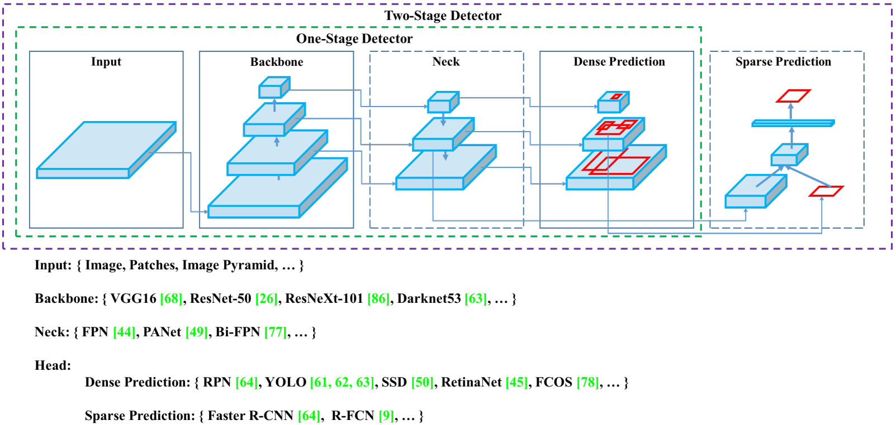

# 目标检测

## 一、整体架构
1. 主干
    * 卷积 CNN
    * 普通ViT plain ViT
    * 分级ViT hierarchical ViT
2. 颈部
    * 卷积的层次结构特点和检测目标大小区别，需要将早期的高分辨率特征和后期的更强特征相结合。
3. 头部
    * 单阶段检测 
    * 两阶段检测
    * 有/无锚框

## 二、颈部，感受野增强，多尺度特征集成
1. SPP 2014-6-18 [Spatial Pyramid Pooling in Deep Convolutional Networks for Visual Recognition](./sppnet.md) 空间金字塔池化，允许输入图像的大小不固定. 
2. 路径聚合块： 

* FPN 2016-12-9 [Feature Pyramid Networks for Object Detection](./fpn.md)  横向连接的自顶向下架构，用于构建所有尺度的高级语义特征图  全连接FPN？
    * NAS-FPN 2019.4.16 [NAS-FPN: Learning scalable feature pyramid architecture for object detection](https://arxiv.org/abs/1904.07392)
    * BiFPN 2019.11.20 [EfficientDet: Scalable and efficient object detection](https://arxiv.org/abs/1911.09070) 
* PAN, 2018.3.5 [Path aggregation network for instance segmentation](./panet.md) 路径聚合网络
* ASFF [Learning spatial fusion for single-shot object detection](https://arxiv.org/abs/1911.09516)
* SFAM [M2det: A single-shot object detector based on multi-level feature pyramid network](https://arxiv.org/abs/1811.04533)
* GFM Global Fusion Model 全局融合模型; EFM, Exact Fusion Model 精确融合模型

## 三、头部：边框回归和标签分配
* 耦合的头部：分类和边框参数在一起
* 解耦

## 四、边框回归 Bounding Box Regression
1. 使用均方误差(MSE)直接对BBox的中心点坐标和高宽进行回归 {xcenter, ycenter, w, h}，或者左上点和右下点点，即{xtop left, ytop left, xbottom right, ybottom right}
2. 估计和锚框对应的偏移量，例如{xcenter of f set , ycenter of f set , woffset, hoffset} and {xtop left offset, ytop left offset, xbottom right offset, ybottom right offset}
    没有考虑目标本身的完整性
3. IoU(Intersection over Union), 交并比，不会有大小框差异问题 [UnitBox: An Advanced Object Detection Network](https://arxiv.org/abs/1608.01471) 不相交的情况，如何相交的 0,1
4. GIoU [Generalized Intersection over Union: A Metric and A Loss for Bounding Box Regression](https://arxiv.org/abs/1902.09630) 最小外接矩形 -1,1, 计算成本，预测框在真实框内，退化为IoU
5. DIoU,CIoU Complete-IoU [Distance-IoU Loss: Faster and Better Learning for Bounding Box Regression](https://arxiv.org/abs/1911.08287) DIoU:直接回归两个框中心点的欧式距离, CIoU:加入长宽比的一致性
6. EIoU, [Focal and Efficient IOU Loss for Accurate Bounding Box Regression](https://arxiv.org/abs/2101.08158), 重叠区域、中心点和边长
7. α-IoU, [Alpha-IoU: A Family of Power Intersection over Union Losses for Bounding Box Regression](https://arxiv.org/abs/2110.13675)
8. SIoU, [SIoU Loss: More Powerful Learning for Bounding Box Regression](https://arxiv.org/abs/2205.12740) Angle,Distance,Shape,IoU cost, 期望回归之间的向量夹角
9. 总结 [IoU,GIoU,DIoU,CIoU,EIoU,α-IoU,SIoU](https://blog.csdn.net/weixin_43694096/article/details/126455488) 
* https://zhuanlan.zhihu.com/p/94799295 重叠面积,中心点距离,边长比

## 五、标签分配 Label Assignment, 
anchor是否包含目标 https://zhuanlan.zhihu.com/p/395386669
* 动态标签分配 [Dynamic R-CNN: Towards High Quality Object Detection via Dynamic Training](https://arxiv.org/abs/2004.06002) 在训练时动态改变标签分配阈值和SmoothL1损失超参 .
在传统的二阶段检测器训练过程中，用于分类任务标签分配的IoU阈值是固定的，设置较高的IoU阈值会提高正样本的质量，然而在训练的初始阶段，直接设置较高的IoU阈值会导致正样本数量稀少，不利于训练，因此可以在训练前期设置较低的IoU阈值，保证正样本数量; 在训练后期，随着proposal质量的提高，设置较高的IoU阈值，保证正样本质量。
类似地，在回归任务中，Bounding Box的回归目标分布也随着训练过程改变，使用超参确定的SmoothL1损失也不利于模型性能的进一步提高。
* ATSS(adaptive training sample selection): [Bridging the gap between anchor-based and anchor-free detection via adaptive training sample selection.](#) 2020. 2, 4, 9
* [OTA: Optimal transport assignment for object detection](#), 2021-2-5 最优传输理论中的标签分配  
* SimOTA: [Yolox: Exceeding yolo series in 2021.](#) 2021. 2
* TAL(Task Alignment Learning) 任务对齐学习 [TOOD: Task-aligned one-stage object detection.](#) 2021. 2, 5
为图像中的所有目标找到全局高置信度分配方式,求解最优传输方案,Sinkhorn-Knopp迭代快速高效地求解.
假定在一个区域内有m个供应商和n个需求方。第个供应商有个单元的货物，第个需求方需要单元的货物。从供应商到需求者的单位货物的运输成本为。最优传输问题的目标是找到一个最优传输方案使得供应商的所有货物可以以最低的运输成本运输给需求方
https://cloud.tencent.com/developer/article/1842194
* [A dual weighting label assignment scheme for object detection.](#) 2022. 2, 5 双加权?
https://blog.csdn.net/weixin_46142822/article/details/124074168
https://aijishu.com/a/1060000000344503
* [Objectbox: From centers to boxes for anchor-free object detection.](#) 2022. 2, 4, 9
[FCOS: Fully convolutional one-stage object detection.](#)  2019. 4, 5

## 六、后处理
NMS，非极大值抑制
Soft NMS, [Improving Object Detection With One Line of Code](https://arxiv.org/abs/1704.04503)
DIoU NMS, [Distance-IoU Loss: Faster and better learning for bounding box regression](https://arxiv.org/abs/1911.08287)

## 七、数据增广

## 八、其他
### YOLO 系列
* v1 2015.6.8, [You Only Look Once: Unified, Real-Time Object Detection](./yolo_v1.md)
* v2 2016.12.25, [YOLO9000: Better, Faster, Stronger](./yolo_v2.md)
* v3 2018.4.8, [An Incremental Improvement](./yolo_v3.md)
* v4 2020.4.23, [Optimal Speed and Accuracy of Object Detection]( ./yolo_v4.md) 对目标检测器做了系统的梳理总结
    * 2020.11.16 [Scaled-YOLOv4: Scaling cross stage partial network](https://arxiv.org/abs/2011.08036) 梯度路径分析方法 
* v5, https://github.com/ultralytics/yolov5  
* yolo_f 2021.3.17 [You only look one-level feature](https://arxiv.org/abs/2103.09460)
* yolo_r 2021.5.10, [You Only Learn One Representation: Unified Network for Multiple Tasks](./yolor.md) 一个主干+n个head，应对不同任务？ 隐知识？
* yolo_x 2021.7.18, [Exceeding YOLO Series in 2021](./yolox.md)
* PPYOLOE 2022.3.30 [Pp-yoloe: An evolved version of yolo](https://arxiv.org/abs/2203.16250)
* v6 2022.9.7, [A Single-Stage Object Detection Framework for Industrial Applications](./yolo_v6.md)
* v7 2022.7.6, [Trainable bag-of-freebies sets new state-of-the-art for real-time object detectors](./yolo_v7.md)
* v8 https://ultralytics.com/yolov8 https://juejin.cn/post/7187726947252699192

### A. 两阶段检测
* DPM
* 2013.11.11 [R-CNN](./R-CNN.md)
    * 2014.6.18 Fast R-CNN, SPP [Spatial Pyramid Pooling in Deep Convolutional Networks for Visual Recognition](./sppnet.md)
    * 2015.6 [Faster R-CNN, Region Proposal Network](./Faster_R-CNN.md)
    * Libra R-CNN 2019.4.4 [Libra R-CNN: Towards balanced learning for object detection](https://arxiv.org/abs/1904.02701)
    * ConvNeXt-XL 
    * Cascade R-CNN 2019.6.24 [Cascade R-CNN: High Quality Object Detection and Instance Segmentation](https://arxiv.org/abs/1906.09756)
* R-FCN [R-FCN: Object detection via region-based fully convolutional networks](#)
* EfficientDet 2019.11.20 [EfficientDet: Scalable and efficient object detection](https://arxiv.org/abs/1911.09070) 
* RepPoints 2019.4.25 [RepPoints: Point set representation for object detection.](https://arxiv.org/abs/1904.11490)  无锚框2步

### B. 单阶段检测
#### 其他
1. SSD 2015.12.8 [SSD: Single shot multibox detector](https://arxiv.org/abs/1512.02325), 从单个特征图构建多尺度特征图
2. RetinaNet 2017.8.7 [Focal Loss for Dense Object Detection](./Focal_Loss.md)  focal loss
3. PeleeNet 2018-4-18 [A Real-Time Object Detection System on Mobile Devices](https://arxiv.org/abs/1804.06882)
* RPN [Faster R-CNN: Towards real-time object detection with region proposal networks](./Faster_R-CNN.md)
* DETR, 
* Deformable DETR, 
* DINO-5scale-R50, 
3. [NanoDet](https://github.com/RangiLyu/nanodet)

### 单步无锚框检测
1. CornerNet 2018.8.3 [CornerNet: Detecting objects as paired keypoints](https://arxiv.org/abs/1808.01244) 
* CornerNet-Lite 2019.4.18 [CornerNet-Lite: Efficient keypoint based object detection](https://arxiv.org/abs/1904.08900)
2. FCOS 2019.4.2 [FCOS: Fully convolutional one-stage object detection](https://arxiv.org/abs/1904.01355)
3. CenterNet 2019.4.17 [CenterNet: Keypoint triplets for object detection](https://arxiv.org/abs/1904.08189)

from YOLOv4: DetNet [43]、DetNAS [7] 新的整体模型SpineNet [12]、HitDetector [20]

### 目标检测总结
#### 1. 感受野增强，多尺度特征集成
##### 附加块：
1. 
3. RFB 2017-11-21 [Receptive Field Block Net for Accurate and Fast Object Detection](./rfb.md)
4. SAM [CBAM: Convolutional block attention module](https://arxiv.org/abs/1807.06521)

* 两阶段与一阶段， 基于锚的与无锚的，基于区域的与基于查询的(DETR)

ASPP 2017-6-17 [Rethinking Atrous Convolution for Semantic Image Segmentation](./DeepLab_v3.md) 空洞卷积