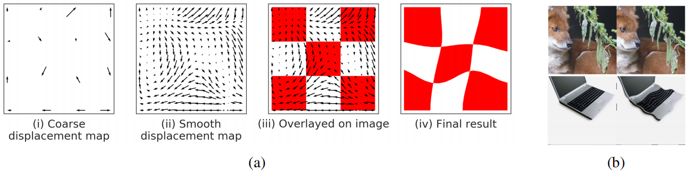
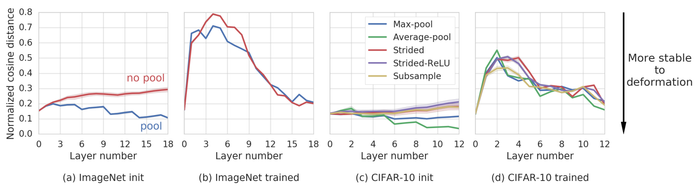
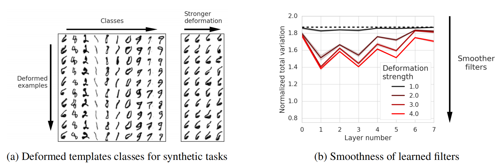
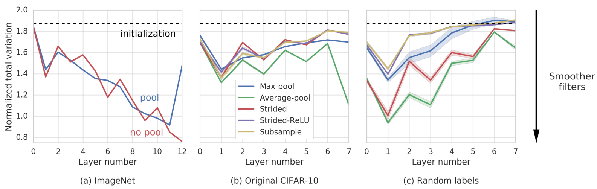
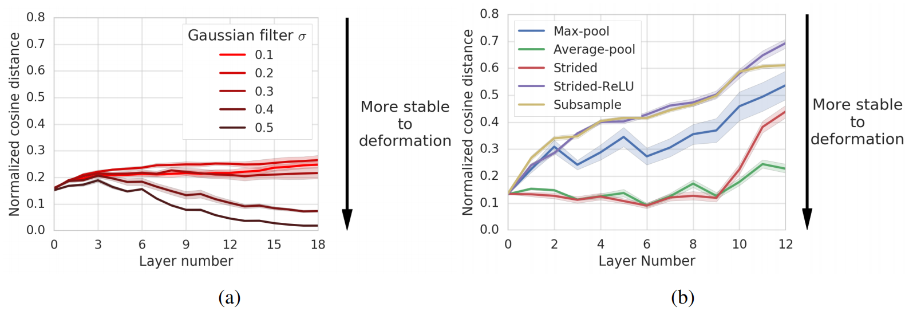

# Pooling is neither necessary nor sufficient for appropriate deformation stability in CNNs
对于CNN的适当变形稳定性而言，池化既不必要也非充分. 2018.04.12 https://arxiv.org/abs/1804.04438

## Abstract
Many of our core assumptions about how neural networks operate remain empirically untested. One common assumption is that convolutional neural networks need to be stable to small translations and deformations to solve image recognition tasks. For many years, this stability was baked into CNN architectures by incorporating interleaved pooling layers. Recently, however, interleaved pooling has largely been abandoned. This raises a number of questions: Are our intuitions about deformation stability right at all? Is it important? Is pooling necessary for deformation invariance? If not, how is deformation invariance achieved in its absence? In this work, we rigorously test these questions, and find that deformation stability in convolutional networks is more nuanced than it first appears: (1) Deformation invariance is not a binary property, but rather that different tasks require different degrees of deformation stability at different layers. (2) Deformation stability is not a fixed property of a network and is heavily adjusted over the course of training, largely through the smoothness of the convolutional filters. (3) Interleaved pooling layers are neither necessary nor sufficient for achieving the optimal form of deformation stability for natural image classification. (4) Pooling confers too much deformation stability for image classification at initialization, and during training, networks have to learn to counteract this inductive bias. Together, these findings provide new insights into the role of interleaved pooling and deformation invariance in CNNs, and demonstrate the importance of rigorous empirical testing of even our most basic assumptions about the working of neural networks. 

我们关于神经网络如何运作的许多核心假设仍然没有经过经验检验。一个常见的假设是，卷积神经网络需要对小的平移和变形保持稳定，以解决图像识别任务。多年来，这种稳定性通过合并交错池化层而被应用到CNN架构中。然而，最近，交错池化在很大程度上被放弃了。这引发了许多问题：我们对变形稳定性的直觉是否正确？这很重要吗？变形不变性需要池化吗？如果不是，在没有变形不变性的情况下如何实现变形不变性？在这项工作中，我们对这些问题进行了严格的测试，发现卷积网络中的变形稳定性比最初出现的更为微妙：
1. 变形不变性不是一种二元性质，而是不同的任务需要不同层的不同程度的变形稳定性。
2. 变形稳定性不是网络的固定属性，在训练过程中会进行大量调整，主要是通过卷积滤波器的平滑度。
3. 交错的池化层对于实现自然图像分类的变形稳定性的最佳形式既不必要也非充分。
4. 池化在初始化时为图像分类提供了太多的变形稳定性，并且在训练期间，网络必须学会抵消这种诱导偏差。
总之，这些发现为交错池化和变形不变性在CNN中的作用提供了新的见解，并证明了对我们关于神经网络工作的最基本假设进行严格的经验测试的重要性。

## 1 Introduction
Within deep learning, a variety of intuitions have been assumed to be common knowledge without empirical verification, leading to recent active debate [23, 14, 26, 27]. Nevertheless, many of these core ideas have informed the structure of broad classes of models, with little attempt to rigorously test these assumptions.

在深度学习中，各种直觉被认为是常识，而没有经过实际验证，这导致了最近的积极争论[23，14，26，27]。尽管如此，这些核心思想中的许多已经为广泛的模型类别的结构提供了信息，几乎没有尝试对这些假设进行严格的测试。

In this paper, we seek to address this issue by undertaking a careful, empirical study of one of the foundational intuitions informing convolutional neural networks (CNNs) for visual object recognition: the need to make these models stable to small translations and deformations in the input images. This intuition runs as follows: much of the variability in the visual domain comes from slight changes in view, object position, rotation, size, and non-rigid deformations of (e.g.) organic objects; representations which are invariant to such transformations would (presumably) lead to better performance.

在本文中，我们试图通过对用于视觉对象识别的卷积神经网络(CNN)的基本直觉之一进行仔细的实证研究来解决这个问题：需要使这些模型对输入图像中的小平移和变形保持稳定。这种直觉如下：视觉领域的许多变化来自于视角、物体位置、旋转、大小和(例如)有机物体的非刚性变形的微小变化; 对于这种变换不变的表示(可能)会导致更好的性能。

This idea is arguably one of the core principles initially responsible for the architectural choices of convolutional filters and interleaved pooling [16, 17], as well as the deployment of parametric data augmentation strategies during training [29]. Yet, despite the widespread impact of this idea, the relationship between visual object recognition and deformation stability has not been thoroughly tested, and we do not actually know how modern CNNs realize deformation stability, if they even do at all.

这个想法可以说是最初负责卷积滤波器和交错池化[16，17]的架构选择以及训练期间参数数据增广策略的部署的核心原则之一[29]。然而，尽管这一想法产生了广泛的影响，视觉对象识别和变形稳定性之间的关系还没有得到彻底的测试，我们实际上不知道现代CNN是如何实现变形稳定性的，即使它们真的做到了。

Moreover, for many years, the very success of CNNs on visual object recognition tasks was thought to depend on the interleaved pooling layers that purportedly rendered these models insensitive to small translations and deformations. However, despite this reasoning, recent models have largely abandoned interleaved pooling layers, achieving similar or greater success without them [31, 10].

此外，多年来，CNN在视觉对象识别任务上的成功被认为取决于交错池化层，据称这些层使这些模型对小的平移和变形不敏感。然而，尽管如此，最近的模型在很大程度上放弃了交错池化层，在没有交错池化层的情况下取得了类似或更大的成功[31，10]。

These observations raise several critical questions. Is deformation stability necessary for visual object recognition? If so, how is it achieved in the absence of pooling layers? What role does interleaved pooling play when it is present?

这些观察提出了几个关键问题。视觉对象识别需要变形稳定性吗？如果是，在没有池化层的情况下如何实现？交错池化在存在时起什么作用？

Here, we seek to answer these questions by building a broad class of image deformations, and comparing CNNs’ responses to original and deformed images. While this class of deformations is an artificial one, it is rich and parametrically controllable, includes many commonly used image transformations (including affine transforms: translations, shears, and rotations, and thin-plate spline transforms, among others) and it provides a useful model for probing how CNNs might respond to natural image deformations. We use these to study CNNs with and without pooling layers, and how their representations change with depth and over the course of training. Our contributions are as follows:
*  Networks without pooling are sensitive to deformation at initialization, but ultimately learn representations that are stable to deformation.
*  The inductive bias provided by pooling is too strong at initialization, and deformation stability in these networks decrease over the course of training.
*  The pattern of deformation stability across layers for trained networks with and without pooling converges to a similar structure.
*  Networks both with and without pooling implement and modulate deformation stability largely through the smoothness of learned filters.

在这里，我们试图通过构建一类广泛的图像变形，并比较CNN对原始图像和变形图像的响应来回答这些问题。虽然这类变形是一种人工变形，但它丰富且参数可控，包括许多常用的图像变换(包括仿射变换：平移、剪切和旋转，以及薄板样条变换等)，它为探索CNN如何响应自然图像变形提供了一个有用的模型。我们使用这些来研究具有和不具有池化层的CNN，以及它们的表示如何随着深度和训练过程而变化。我们的贡献如下：
* 没有池化的网络在初始化时对变形敏感，但最终学习对变形稳定的表示。
* 池化提供的归纳偏差在初始化时太强，这些网络的变形稳定性在训练过程中降低。
* 有池化和无池化的训练网络的跨层变形稳定性模式收敛于类似结构。
* 有池化和无池化的网络主要通过学习滤波器的平滑度实现和调节变形稳定性。

More broadly, this work demonstrates that our intuitions as to why neural networks work can often be inaccurate, no matter how reasonable they may seem, and require thorough empirical and theoretical validation.

更广泛地说，这项工作表明，无论神经网络看起来多么合理，我们对神经网络为什么工作的直觉往往是不准确的，需要彻底的经验和理论验证。

## 1.1 Prior work
Invariances in non-neural models. There is a long history of non-neural computer vision models architecting invariance to deformation. For example, SIFT features are local features descriptors constructed such that they are invariant to translation, scaling and rotation [19]. In addition, by using blurring, SIFT features become somewhat robust to deformations. Another example is the deformable parts models which contain a single stage spring-like model of connections between pairs of object parts giving robustness to translation at a particular scale [7].

非神经模型中的不变性。构造变形不变性的非神经计算机视觉模型有着悠久的历史。例如，SIFT特征是局部特征描述符，其被构造为对平移、缩放和旋转不变[19]。此外，通过使用模糊，SIFT特征对变形变得有些稳健。另一个例子是可变形部件模型，该模型包含一对对象部件之间的连接的单级弹簧状模型，从而在特定尺度下对平移提供稳健性[7]。

Deformation invariance and pooling. Important early work in neuroscience found that in the visual cortex of cats, there exist special complex-cells which are somewhat insensitive to the precise location of edges [11]. These findings inspired work on the neocognitron, which cascaded locally-deformationinvariant modules into a hierarchy [8]. This, in turn, inspired the use of pooling layers in CNNs [15]. Here, pooling was directly motivated as conferring invariance to translations and deformations. For example, LeCun et al. [15] expressed this as follows: Each feature extraction in our network is followed by an additional layer which performs a local averaging and a sub-sampling, reducing the resolution of the feature map. This layer introduces a certain level of invariance to distortions and translations. In fact, until recently, pooling was still seen as an essential ingredient in CNNs, allowing for invariance to small shifts and distortions [30, 10, 13, 30, 17, 9].

变形不变性和池化。神经科学早期的重要研究发现，在猫的视觉皮层中，存在着对边缘的精确位置有些不敏感的特殊复杂细胞[11]。这些发现启发了新认知子的研究，新认知子将局部变形变模级联到一个层次中[8]。这反过来激发了CNN中池化层的使用[15]。这里，池化的直接动机是赋予平移和变形不变性。例如，LeCunet al [15]表示如下：我们网络中的每个特征提取之后都有一个额外的层，该层执行局部平均和子采样，从而降低了特征图的分辨率。该层对失真和平移引入了一定程度的不变性。事实上，直到最近，池化仍然被视为CNN中的一个重要组成部分，允许对小的偏移和扭曲保持不变[30，10，13，30，17，9]。

Previous theoretical analyses of invariances in CNNs. A significant body of theoretical work shows formally that scattering networks, which share some architectural components with CNNs, are stable to deformations [20, 28, 3, 21]. However this work does not apply to widely used CNN architectures for two reasons. First, there are significant architectural differences, including in connectivity, pooling, and non-linearities. Second, and perhaps more importantly, this line of work assumes that the filters are fixed wavelets that do not change during training. 

先前对CNN不变性的理论分析。大量的理论工作正式表明，与CNN共享一些结构组件的散射网络对变形是稳定的[20，28，3，21]。然而，由于两个原因，这项工作不适用于广泛使用的CNN架构。首先，存在显著的架构差异，包括连通性、池化和非线性。其次，也许更重要的是，这一工作线假设滤波器是固定的小波，在训练期间不会改变。

 
Figure 1: (a) Generating deformed images: To randomly deform an image we: (i) Start with a fixed evenly spaced grid of control points (here 4x4 control points) and then choose a random source for each control point within a neighborhood of the point; (ii) we then smooth the resulting vector field using thin plate interpolation; (iii) vector field overlayed on original image: the value in the final result at the tip of an arrow is computed using bilinear interpolation of values in a neighbourhood around the tail of the arrow in the original image; (iv) the final result. (b) Examples of deformed ImageNet images. left: original images, right: deformed images. While the images have changed significantly, for example under the L2 metric, they would likely be given the same label by a human.

图1：(a)生成变形图像：要随机变形图像，我们：(i)从固定的均匀间隔的控制点网格(此处为4x4个控制点)开始，然后为该点附近的每个控制点选择一个随机源; (ii)然后我们使用薄板插值来平滑得到的矢量场; (iii)叠加在原始图像上的矢量场：使用原始图像中箭头尾部附近的值的双线性插值来计算箭头尖端处的最终结果中的值; (iv)最终结果。(b) 变形的ImageNet图像样本。左：原始图像，右：变形图像。虽然图像发生了显著变化，例如在L2度量下，但人类可能会给它们贴上相同的标签。

The more recent theoretical study of Bietti and Mairal [2] uses reproducing kernel Hilbert spaces to study the inductive biases (including deformation stability) of architectures more similar to the CNNs used in practice. However, this work assumes the use of interleaved pooling layers between the convolutional layers, and cannot explain the success of more recent architectures which lack them.

Bietti和Mairal[2]最近的理论研究使用再生核希尔伯特空间来研究与实际使用的CNN更相似的结构的诱导偏差(包括变形稳定性)。然而，这项工作假设在卷积层之间使用交织池化层，并且不能解释缺少这些层的最近架构的成功。

Empirical investigations. Previous empirical investigations of these phenomena in CNNs include the work of Lenc and Vedaldi [18], which focused on a more limited set of invariances such as global affine transformations. More recently, there has been interest in the robustness of networks to adversarial geometric transformations in the work of Fawzi and Frossard [6] and Kanbak et al. [12]. In particular, these studies looked at worst-case sensitivity of the output to such transformations, and found that CNNs can indeed be quite sensitive to particular geometric transformations (a phenomenon that can be mitigated by augmenting the training sets). However, this line of work does not address how deformation sensitivity is generally achieved in the first place, and how it changes over the course of training. In addition, these investigations have been restricted to a limited class of deformations, which we seek to remedy here. 

实证调查。先前对CNN中这些现象的经验研究包括Lenc和Vedaldi[18]的工作，他们关注于更有限的不变性集，如全局仿射变换。最近，在Fawzi和Frossard[6]以及Kanbaket al [12]的工作中，人们对网络对对抗性几何变换的稳健性感兴趣。特别是，这些研究考察了输出对这种变换的最坏情况敏感性，并发现CNN确实可以对特定的几何变换非常敏感(这种现象可以通过增加训练集来缓解)。然而，这条工作线并没有说明变形敏感性通常是如何首先实现的，以及在训练过程中如何变化。此外，这些研究仅限于一类有限的变形，我们在此寻求补救。

## 2 Methods
### 2.1 Deformation sensitivity 变形敏感性
In order to study how CNN representations are affected by image deformations we first need a controllable source of deformation. Here, we choose a flexible class of local deformations of image coordinates, i.e., maps $τ : R^2 → R^2$ such that $||∇τ||_∞ < C$ for some C, similar to Mallat [20]. We choose this class for several reasons. First, it subsumes or approximates many of the canonical forms of image deformation we would want to be robust to, including:
*  Pose: Small shifts in pose or location of subparts
*  Affine transformations: translation, scaling, rotation or shear
*  Thin-plate spline transforms
*  Optical flow: [25, 24]

为了研究CNN表示如何受到图像变形的影响，我们首先需要一个可控的变形源。这里，我们选择一类灵活的图像坐标局部变形，即映射$τ：R^2→ R^2$使得$||∇τ||_∞ < C$代表一些C，类似于Mallat[20]。我们选择这门课有几个原因。首先，它包含或近似了我们希望稳健的图像变形的许多典型形式，包括：
* 姿势：子部分姿势或位置的小变化
* 仿射变换：平移、缩放、旋转或剪切
* 薄板样条线变换
* 光流：[25，24]

We show examples of several of these in Section 2 of the supplementary material.

我们在补充材料的第2节中展示了其中几个例子。

This class also allows us to modulate the strength of image deformations, which we deploy to investigate how task demands are met by CNNs. Furthermore, this class of deformations approximates most of the commonly used methods of data augmentation for object recognition [29, 32, 4].

这个类还允许我们调整图像变形的强度，我们部署它来研究CNN如何满足任务需求。此外，这类变形近似于大多数常用的对象识别数据增广方法[29，32，4]。

While it is in principle possible to explore finer-grained distributions of deformation (e.g., choosing adversarial deformations to maximally shift the representation), we think our approach offers good coverage over the space, and a reasonable first order approximations to the class of natural deformations. We leave the study of richer transformations—such as those requiring a renderer to produce or those chosen adversarially [6, 12]—as future work.

虽然原则上可以探索更细粒度的变形分布(例如，选择对抗性变形以最大程度地改变表示)，但我们认为我们的方法在空间上提供了良好的覆盖，并对自然变形类提供了合理的一阶近似。我们将研究更丰富的变换，例如那些需要渲染器生成的变换或那些被对手选择的变换[6，12]，作为未来的工作。

Throughout this work we will measure the stability of CNNs to deformations by: i) sampling random deformations as described below; ii) applying these deformations to input images; iii) measuring the effect of this image deformation on the representations throughout the various layers of the CNN.

在这项工作中，我们将通过以下方式测量CNN对变形的稳定性：
1. 如下所述对随机变形进行采样; 
2. 将这些变形应用于输入图像; 
3. 测量该图像变形对整个CNN的各个层的表示的影响。

Generating deformed images. We use the following method to sample image deformations from this class. For ImageNet we use a grid of 5x5 evenly spaced control points on the image and then choose a destination for each control point uniformly at random with a maximum distance of C = 10 pixels in each direction. For CIFAR-10 images, we used 3x3 evenly spaced control points and a maximum distance of C = 2 pixels in each direction. The resulting deformation map was then smoothed using thin plate spline interpolation and finally the deformation was applied with bilinear interpolation [5]. The entire process for generating deformed images is illustrated in Figure 1a.

生成变形图像。我们使用以下方法对此类中的图像变形进行采样。对于ImageNet，我们在图像上使用5x5均匀间隔的控制点网格，然后随机均匀地为每个控制点选择一个目的地，每个方向的最大距离为C=10像素。对于CIFAR-10图像，我们使用了3x3个均匀间隔的控制点，每个方向的最大距离为C=2像素。然后使用薄板样条插值对生成的变形图进行平滑，最后使用双线性插值对变形进行应用[5]。生成变形图像的整个过程如图1a所示。

Measuring sensitivity to deformation. For a representation r mapping from an input image (e.g., 224x224x3) to some layer of a CNN (e.g., a tensor of size 7x7x512), we measure sensitivity of the representation r to a deformation τ using the Normalized Cosine Distance: 

测量变形敏感性。对于从输入图像(例如，224x224x3)映射到CNN的某一层(例如，大小为7x7x512的张量)的表示r，我们使用归一化余弦距离测量表示r对变形τ的敏感性：

$ \frac{d_{cos}(r(x), r(τ (x))) }{ median(d_cos(r(x), r(y))) }$

where $d_{cos}$ is the cosine distance. That is, we normalize distances by the median distance in representation space between randomly selected images from the original dataset. For our results, we average this quantity over 128 images and compute the median using all pairwise distances between the representations of the 128 images. We also found that using Euclidean distance instead of cosine distance yielded qualitatively similar results.

其中$d_{cos}$是余弦距离。即,我们通过原始数据集中随机选择的图像之间的表示空间中的中值距离来归一化距离。对于我们的结果，我们在128张图像上平均这个数量，并使用128张图像的表示之间的所有成对距离计算中值。我们还发现，使用欧几里得距离而不是余弦距离可以得到定性相似的结果。

### 2.2 Networks
All networks trained for our experiments are based on a modified version of the VGG network [30]. A detailed description of the networks can be found in Section 1 of the supplementary material.

为我们的实验训练的所有网络都基于VGG网络的修改版本[30]。有关网络的详细描述，请参见补充材料的第1节。

We compared networks with the following downsampling layers in our CIFAR-10 experiments:
* Subsample: Keep top left corner of each 2x2 block. Max-pool: Standard max-pooling layer.
* Average-pool: Standard average-pooling layer. 
* Strided:we replace the max pooling layer with a convolutional layer with kernels of size 2x2 and stride 2x2. 
* Strided-ReLU: we replace the max pooling layer with a convolutional layer with kernels of size 2x2 and stride 2x2. The convolutional layer is followed by batch-norm and ReLU nonlinearity. For our ImageNet experiments, we compared only Max-pool and Strided-ReLU due to computational considerations.

我们在CIFAR-10实验中将网络与以下下采样层进行了比较：
* 子采样：保留每个2x2块的左上角。最大池化：标准的最大池化层。
* 平均池：标准的平均池化层。
* Strided：我们将最大池层替换为具有大小2x2和步长2x2的核的卷积层。
* Strided-ReLU：我们将最大池化层替换成具有大小2x2和步幅2x2核的卷积层。卷积层之后是批归一化和ReLU非线性。对于我们的ImageNet实验，出于计算考虑，我们只比较了Max池化和Strided ReLU。

To rule out variability due to random factors in the experiment (random initialization and data order), we repeated all experiments with 5 different random seeds for each setting. The error bands in the plots correspond to 2 standard deviations estimated across these 5 experiments. 

为了排除由于实验中的随机因素(随机初始化和数据顺序)引起的变异，我们对每个设置重复了5个不同的随机种子的所有实验。图中的误差带对应于这5个实验中估计的2个标准偏差。

## 3 Learned deformation stability is similar with and without pooling
学习到的变形稳定性与有池和无池相似

It is a commonly held belief that pooling leads to invariance to small translations and deformations. In this section we investigate two questions: (1) Is pooling sufficient for achieving the correct amount of stability to deformation? (2) Is pooling necessary for achieving stability?

人们普遍认为，池化会导致小平移和变形的不变性。在本节中，我们研究了两个问题：(1)池化是否足以实现正确的变形稳定性？(2) 为了实现稳定，是否需要汇集能力？

Pooling influences deformation stability. To test whether pooling on its own is sufficient for achieving any significant change in deformation stability, we measured the sensitivity to deformation of networks with pooling at initialization. As can be seen in Figure 2a, we find that indeed pooling leads to representations that are more stable to deformation at initialization than representations in networks without pooling. This result also provides us with a basic sanity check that our experimental setup is reasonable.

池化影响变形稳定性。为了测试单独池化是否足以实现变形稳定性的任何显著变化，我们测量了初始化时池化网络对变形的敏感性。如图2a所示，我们发现实际上池化导致的表示在初始化时比没有池化的网络中的表示更稳定地变形。这个结果也为我们提供了一个基本的健全性检查，证明我们的实验设置是合理的。

Pooling does not determine the final pattern of stability across layers. To what extent does pooling determine the final pattern of deformation stability? Also, if pooling leads to a suboptimal pattern of deformation stability for the task, then to what extent can learning correct for this? To test this, we measured the pattern of sensitivity to deformation of networks before and after training. Surprisingly, we found that the sensitivity to deformation of networks with pooling actually increases significantly over the course of training (Figure 2b). This result suggests that the inductive bias for deformation stability conferred by pooling is actually too strong, and that while deformation stability might be helpful in some cases, it is not always helpful.

池化并不能确定各层稳定性的最终模式。池化在多大程度上决定了变形稳定性的最终模式？此外，如果池化导致任务变形稳定性的次优模式，那么学习可以在多大程度上纠正这种情况？为了测试这一点，我们测量了训练前后网络对变形的敏感性模式。令人惊讶的是，我们发现，在训练过程中，池化网络对变形的敏感性实际上显著增加(图2b)。这一结果表明，池化对变形稳定性的诱导偏差实际上太大，尽管变形稳定性在某些情况下可能有帮助，但并不总是有帮助的。

Figure 2: Pooling confers stability to deformation at initialization but the stability changes significantly over the course of training and converges to a similar stability regardless of whether pooling is used. (a) At initialization, networks with max-pooling are less sensitive to deformation. (b) After training, networks with and without max-pooling have very similar patterns of sensitivity to deformation throughout the layers. Similar patterns emerge for CIFAR-10: (c) At initialization, pooling has significant impact on sensitivity to deformation but (d) after training, the choice of downsampling layers has little effect on deformation stability throughout the layers. Layer number 0 corresponds to the input image; The layers include the downsampling layers; The final layer corresponds to the final downsampling layer. For CIFAR-10 we therefore have 1 input layer, 8 convolutional layers and 4 pooling layers for a total of 13 layers. 

图2：池化赋予了初始化时变形的稳定性，但稳定性在训练过程中发生了显著变化，无论是否使用池化，都会收敛到类似的稳定性。(a) 在初始化时，具有最大池的网络对变形不太敏感。(b) 训练后，具有和不具有最大池的网络对整个层的变形具有非常相似的敏感性模式。CIFAR-10出现了类似的模式：(c)在初始化时，池化对变形敏感性有显著影响，但(d)在训练后，下采样层的选择对整个层的变形稳定性几乎没有影响。层号0对应于输入图像; 这些层包括下采样层; 最终层对应于最终下采样层。因此，对于CIFAR-10，我们有1个输入层、8个卷积层和4个池化层，总共13个层。

Networks with and without pooling converge to similar patterns of deformation stability across layers If learning substantially changes the layerwise pattern of deformation stability in the presence of pooling, to what extent does pooling actually influence the final pattern of deformation stability? To test this, we measured the layerwise pattern of sensitivity to deformation for networks trained on ImageNet with and without interleaved pooling. Surprisingly, the layerwise pattern of sensitivity to deformation for networks with and without pooling was highly similar, suggesting that the presence of pooling has little influence on the learned pattern of deformation stability (Figure 2a-b).

具有和不具有池的网络收敛于跨层的变形稳定性的相似模式。如果学习在存在池的情况下显著改变了变形稳定性的分层模式，那么池实际上在多大程度上影响了最终的变形稳定性模式？为了测试这一点，我们测量了在ImageNet上训练的网络在有和没有交织池的情况下对变形的敏感性的分层模式。令人惊讶的是，具有和不具有池的网络的变形敏感性的分层模式高度相似，表明池的存在对变形稳定性的学习模式几乎没有影响(图2a-b)。

To rule out the dependence of this result on the particular dataset and the choice of downsampling layer, we repeated the experiments on CIFAR-10 and with a variety of different downsampling layers, finding qualitatively similar results (Figure 2c-d). While the downsampling layer exerted a significant effect on deformation sensitivity at initialization, these differences had largely vanished by the conclusion of training, and all networks converged to a similar pattern.

为了排除该结果对特定数据集和下采样层的选择的依赖性，我们在CIFAR-10和各种不同的下采样层上重复了实验，发现了定性相似的结果(图2c-d)。虽然下采样层在初始化时对变形敏感性产生了显著影响，但这些差异在训练结束后基本消失，所有网络都收敛到了相似的模式。

These results help to explain the recent observation that CNNs without pooling can achieve the same or higher accuracy than networks with pooling on image classification tasks [31]. While pooling does grant some deformation stability at initialization, this inductive bias is too strong and must be removed over training, and nearly identical patterns of deformation stability can be easily learned by networks without any pooling at all. 

这些结果有助于解释最近的观察，即在图像分类任务中，没有池化的CNN可以实现与具有池化的网络相同或更高的精度[31]。虽然池化确实在初始化时提供了一些变形稳定性，但这种诱导偏差太强，必须在训练中消除，并且几乎相同的变形稳定性模式可以很容易地被网络学习，而无需任何池化。

## 4 Filter smoothness contributes to deformation stability
If pooling is not the major determinant of deformation stability, then what is? One possibility is that filter smoothness might lead to deformation stability. Informally, a smooth filter can be decomposed into a coarser filter (of similar norm) followed by a smoothing operation similar to average pooling or smoothing with a Gaussian kernel [2]. A smooth filter might therefore function similarly to the combination of a pooling layer followed by a convolutional layer. If this is in fact the case, then CNNs with smooth filters may exhibit similar behavior to those with interleaved pooling [2]. 

如果池化不是变形稳定性的主要决定因素，那么什么是？一种可能性是过滤器平滑度可能导致变形稳定性。非正式地，可以将平滑滤波器分解为更粗糙的滤波器(具有相似的范数)，然后进行类似于平均池化或高斯核平滑的平滑操作[2]。因此，平滑滤波器的功能可能类似于池化层和卷积层的组合。如果事实上是这样，那么具有平滑滤波器的CNN可能表现出与具有交织池的CNN相似的行为[2]。

 
Figure 3: Tasks requiring more deformation invariance lead to smoother filters. (a) We generate synthetic tasks where each class is based on a single MNIST image and within each class examples are generated by applying a random deformation of strength C to this class image. The image on the left is generated using deformations of strength 3. The columns for the image on the right are generated using deformations of strengths 1, 2, 3, 4 respectively. (b) After training, filters from networks trained on tasks where stronger deformations are used are smoother. Dotted black line indicates average value at initialization.

图3：需要更多变形不变性的任务会导致更平滑的过滤器。(a) 我们生成合成任务，其中每个类基于单个MNIST图像，并且在每个类中，通过将强度C的随机变形应用于该类图像来生成样本。左侧的图像是使用强度为3的变形生成的。右侧图像的列分别使用强度为1、2、3、4的变形生成。(b) 训练后，在使用更强变形的任务上训练的网络中的过滤器更平滑。黑色虚线表示初始化时的平均值。

In this section, we demonstrate empirically that filter smoothness is critical for determining deformation stability. To do this, we first define a measure of filter smoothness. We then show that forcing filter smoothness at initialization leads to deformation stability. Next, we show that in a series of synthetic tasks requiring increasing stability to deformations, CNNs learn progressively smoother filters. Finally, we demonstrate on ImageNet and CIFAR-10 that filter smoothness increases as a result of training, even for networks with pooling.

在本节中，我们根据经验证明，滤波器平滑度对于确定变形稳定性至关重要。为此，我们首先定义过滤器平滑度的度量。然后我们表明，在初始化时强制过滤器平滑会导致变形稳定性。接下来，我们展示了在一系列需要增加变形稳定性的合成任务中，CNN学习逐渐平滑的滤波器。最后，我们在ImageNet和CIFAR-10上证明，即使对于具有池的网络，滤波器平滑度也会因训练而提高。

Measuring filter smoothness. For a 4D (height × width × input filters × output filters) tensor W representing convolutional weights we define the normalized total variation: $\frac{TV(W)}{ || W||}_1$ where $TV(W) =\sum_{i,j} || W_{i,j,·,·} − W_{i+1,j,·,·}||_1 + || W_{i,j,·,·} − W_{i,j+1,·,·}||_1 $ where i and j are the indices for the spatial dimensions of the filter. This provides a measure of filter smoothness.

测量过滤器平滑度。对于表示卷积权重的4D(高度×宽度×输入滤波器×输出滤波器)张量W，我们定义了归一化总变化：$\frac{TV(W)}{||W||}_1$，其中$TV(W)=\sum_{i，j}||W_{i、j、·、·}− W_{i+1，j，·，·}||_1+||W_{i，j，…，·}− W_{i，j+1，·，·}||_1$，其中i和j是滤波器的空间维度的索引。这提供了过滤器平滑度的度量。

For filters that are constant over the spatial dimension—by definition the smoothest possible filters— the normalized total variation would be zero. At initialization for a given layer, the expected smoothness is identical across network architectures(2We estimated this average smoothness empirically by resampling filters 10,000 times and found an average smoothness of approximately 1.87 (this differed between layers only in the fourth decimal place) with a standard deviation that depended on the size of the layer, ranging from 0.035 in the first layer to 0.012 for the larger layers. ) . Given that this value has an approximately fixed mean and small standard deviation across layers and architectures, we plot this as a single dotted black line in Figure 4 and Figure 3 for simplicity.

根据定义，对于在空间维度上恒定的滤波器，可能是最平滑的滤波器-归一化的总变化将为零。在对给定层进行初始化时，预期的平滑度在网络架构中是相同的(2我们通过对滤波器进行10000次重采样，根据经验估计了该平均平滑度，发现平均平滑度约为1.87(各层之间的差异仅在小数点后四位)，标准偏差取决于层的大小，从第一层的0.035到较大层的0.012。)。鉴于该值在层和架构中具有近似固定的平均值和较小的标准偏差，为了简化起见，我们在图4和图3中将其绘制为单点黑线。

Initialization with smooth filters leads to deformation stability. To test whether smooth filters lead to deformation stability, we initialized networks with different amounts of filter smoothness and asked whether this yielded greater deformation stability. To initialize filters with different amounts of smoothness, we used our usual random initialization(3 Truncated normal with standard deviation 1/√nin, where nin is the number of inputs. ) , but then convolved them with Gaussian filters of varying smoothness. Indeed we found that networks initialized with smoother random filters are more stable to deformation (Figure 5a), suggesting that filter smoothness is sufficient for deformation stability.

使用平滑过滤器进行初始化会导致变形稳定性。为了测试平滑滤波器是否导致变形稳定性，我们使用不同的滤波器平滑度初始化网络，并询问这是否产生更大的变形稳定性。为了初始化具有不同平滑度的滤波器，我们使用了通常的随机初始化3，但随后将它们与具有不同平滑的高斯滤波器进行卷积。事实上，我们发现用更平滑的随机滤波器初始化的网络对变形更稳定(图5a)，这表明滤波器平滑度足以保证变形稳定性。

Requiring increased stability to deformation in synthetic tasks leads to smoother filters. The above result demonstrates that randomly-initialized smooth filters lead to greater deformation stability. The distribution of learned filters may nevertheless differ significantly from that of random filters. We therefore asked whether smoother filters are actually learned in tasks requiring stability to stronger deformation. To test this, we constructed a set of synthetic classification tasks in which each class consists of deformed versions of a single image. Each task varied the strength of deformation, C, used to generate the examples within each class (Figure 3a). We then measured the effect of increasing the intra-class deformation (i.e., increasing C) on the smoothness of the filters learned in each task. Consistent with our previous result, we observed that stronger deformations led to smoother filters after training (Figure 3). This result demonstrates that in synthetic tasks requiring deformation stability, the amount of learned filter smoothness directly correlates with the amount of deformation.

在合成任务中需要增加变形的稳定性会导致更平滑的过滤器。上述结果表明，随机初始化的平滑滤波器导致更大的变形稳定性。然而，学习滤波器的分布可能与随机滤波器的分布显著不同。因此，我们询问，在需要稳定性以实现更强变形的任务中，是否真的学习了更平滑的过滤器。为了测试这一点，我们构建了一组合成分类任务，其中每个类由单个图像的变形版本组成。每个任务都会改变变形强度C，用于在每个类中生成样本(图3a)。然后，我们测量了增加类内变形(即增加C)对每个任务中学习的过滤器平滑度的影响。与我们之前的结果一致，我们观察到更强的变形导致训练后的过滤器更平滑(图3)。该结果表明，在需要变形稳定性的合成任务中，学习的滤波器平滑度与变形量直接相关。

 
Figure 4: Training leads to smoother filters. (a) and (b) After training, the filters are significantly smoother and different architectures converge to similar levels of filter smoothness. (c) When training on random labels the smoothness of filters depends largely on the chosen downsampling layer. Interestingly, the smoothness of filters when training on ImageNet (a) increases from layer to layer, whereas for CIFAR-10 (b) the smoothness decreases from layer to layer. Dotted black lines indicate average value at initialization. 

图4：训练可以使过滤器更平滑。(a) 和(b)在训练之后，滤波器明显更平滑，并且不同的架构收敛到相似的滤波器平滑度水平。(c) 当训练随机标签时，过滤器的平滑度在很大程度上取决于所选的下采样层。有趣的是，在ImageNet(a)上训练时，滤波器的平滑度随层而增加，而对于CIFAR-10(b)，平滑度则随层而降低。黑色虚线表示初始化时的平均值。

Filter smoothness increases as a result of training on real datasets. Finally, we asked whether filter smoothness increases over the course of training in more realistic datasets. To test this we examined the filter smoothness across layers for a variety of network architectures trained on both ImageNet (Figure 4a) and CIFAR-10 (Figure 4b). For both datasets and all architectures, filters become smoother over training.

通过对真实数据集的训练，滤波器平滑度提高。最后，我们询问了在更真实的数据集中，滤波器平滑度是否在训练过程中增加。为了测试这一点，我们检查了在ImageNet(图4a)和CIFAR-10(图4b)上训练的各种网络架构的跨层滤波器平滑度。对于数据集和所有架构，过滤器在训练过程中变得更加平滑。

Taken together, these results demonstrate that filter smoothness is sufficient to confer deformation stability, that the amount of filter smoothness tracks the amount of deformation stability required, and that on standard image classification tasks, filter smoothness is learned over the course of training. 

综上所述，这些结果证明了滤波器平滑度足以赋予变形稳定性，滤波器平滑度的量跟踪所需的变形稳定性的量，并且在标准图像分类任务中，在训练过程中学习滤波器平滑度。

## 5 Filter smoothness depends on the supervised task 过滤器平滑度取决于监督任务
In the previous section we demonstrated that smooth filters are sufficient to confer deformation stability of CNN representations, but it remains unclear which aspects of training encourage filter smoothness and deformation stability. One possibility is that smooth filters emerge as a consequence of the distribution P(X) of the input images X. Alternatively, the nature of the supervised task itself may be critical (i.e. the conditional distribution P(Y |X) of the labels Y given the inputs X).

在上一节中，我们证明了平滑滤波器足以赋予CNN表示的变形稳定性，但仍不清楚训练的哪些方面促进了滤波器的平滑性和变形稳定性。一种可能性是平滑滤波器作为输入图像X的分布P(X)的结果出现。或者，被监督任务本身的性质可能是关键的(即给定输入X的标签Y的条件分布P(Y|X))。

To test what role P(X) and P(Y |X) play in the smoothness of the learned filters, we followed the method of Zhang et al. [33], and trained networks on a modified versions of the CIFAR-10 dataset in which we replace the labels with uniform random labels (which are consistent over training epochs). The representations learned under such tasks have been studied before, but not in the context of deformation stability or filter smoothness [22, 1]. Therefore, we analyzed the patterns of deformation stability and filter smoothness of networks trained on random images (modifying P(X)) and random labels (modifying P(Y |X) but holding P(Y |X) fixed).

为了测试P(X)和P(Y|X)在学习滤波器的平滑度中起什么作用，我们遵循了Zhanget al 的方法。[33]，并在CIFAR-10数据集的修改版本上训练网络，其中我们用统一的随机标签(在训练时期内是一致的)替换标签。在这些任务下学习到的表示以前已经过研究，但没有在变形稳定性或滤波平滑度的背景下进行研究[22，1]。因此，我们分析了在随机图像(修改P(X))和随机标签(修改P(Y|X)但保持P(Y|X)固定)上训练的网络的变形稳定性和滤波平滑度的模式。

In contrast to networks trained on the original datasets, we found that networks with different architectures trained on random labels converged to highly different patterns of deformation stability across layers (Figure 5b). These patterns were nevertheless consistent across random seeds.

与在原始数据集上训练的网络相比，我们发现在随机标签上训练的具有不同结构的网络收敛到跨层的高度不同的变形稳定性模式(图5b)。然而，这些模式在随机种子中是一致的。

This result suggests that both the architecture and the task bias the learned pattern of deformation stability, but with different strengths. In the presence of a structured task (as in Section 3), the inductive bias of the architecture is overridden over the course of learning; all networks thus converge to similar layerwise patterns of deformation stability. However, in the absence of a structured task (as is the case in the random labels experiments), the inductive biases of the architecture strongly influences the final pattern of deformation stability. 

这一结果表明，结构和任务都偏向于变形稳定性的学习模式，但强度不同。在存在结构化任务的情况下(如第3节所述)，在学习过程中，架构的归纳偏差被忽略; 因此，所有网络都收敛于变形稳定性的相似分层模式。然而，在没有结构化任务的情况下(如随机标签实验中的情况)，结构的归纳偏差强烈影响变形稳定性的最终模式。

 
Figure 5: (a) Initialization with smoother random filters lead to deformation stability. We smooth filters by convolving with a Gaussian filter with standard-deviation σ and then measure the sensitivity to deformation. As we increase the smoothness of the filters by increasing σ, the representations became less sensitive to deformation. Darker lines are for smoother random filters. (b) Deformation stability is architecture dependent when training with random labels. 

图5：(a)使用更平滑的随机滤波器进行初始化会导致变形稳定性。我们通过与具有标准偏差σ的高斯滤波器卷积来平滑滤波器，然后测量对变形的灵敏度。当我们通过增加σ来增加滤波器的平滑度时，表示对变形变得不那么敏感。较暗的线表示更平滑的随机过滤器。(b) 使用随机标签进行训练时，变形稳定性取决于结构。

## 6 Discussion
In this work, we have rigorously tested a variety of properties associated with deformation stability. We demonstrated that while pooling confers deformation stability at initialization, it does not determine the pattern of deformation stability across layers. This final pattern is consistent across network architectures, both with and without pooling. Moreover, the inductive bias conferred by pooling is in fact too strong for ImageNet and CIFAR-10 classification; this therefore has to be counteracted during training. We also found that filter smoothness contributes significantly to achieving deformation stability in CNNs. Finally, these patterns remain a function of the task being learned: the joint distribution of inputs and outputs is important in determining the level of learned deformation stability.

在这项工作中，我们严格测试了与变形稳定性相关的各种特性。我们证明，虽然池化在初始化时赋予变形稳定性，但它不能确定跨层的变形稳定性模式。最后一种模式在网络架构中是一致的，无论有没有池。此外，对于ImageNet和CIFAR-10分类来说，池化所带来的归纳偏差实际上太大了; 因此，这必须在训练期间抵消。我们还发现，滤波器平滑度对实现CNN的变形稳定性有显著贡献。最后，这些模式仍然是正在学习的任务的函数：输入和输出的联合分布对于确定学习的变形稳定性水平很重要。

Together, these results provide new insights into the necessity and origins of deformation stability. They also provide an instructive example of how simple properties of learned weights can be investigated to shed light on the inner workings of deep neural networks.

总之，这些结果为变形稳定性的必要性和起源提供了新的见解。他们还提供了一个指导性的例子，说明如何研究学习权重的简单属性，以揭示深度神经网络的内部工作。

One limitation of this work is that we only focused on deformations sampled from a particular distribution. We also only measured average sensitivity over these deformations. In future work, it would be informative to explore similar questions but with the worst case deformations found via maximization of the deformation sensitivity [6, 12].

这项工作的一个限制是，我们只关注从特定分布采样的变形。我们还仅测量了这些变形的平均灵敏度。在未来的工作中，探索类似的问题将是有益的，但通过最大化变形敏感性发现最坏情况下的变形[6，12]。

Finally, our work compares only two points in time: the beginning and the end of training. There remain open questions about how these characteristics change over the course of training. For example, when do filters become smooth? Is this a statistical regularity that a network learns early in training, or does filter smoothness continue to change even as network performance begins to asymptote? Does this differ across layers and architectures? Is the trajectory toward smooth filters and deformation stability monotone, or are there periods of training where filters become smoother and then periods when the filter smoothness decreases? Future work will be required to answer all of these questions. 

最后，我们的工作只比较了两个时间点：培训的开始和结束。关于这些特征如何在培训过程中发生变化，仍存在一些悬而未决的问题。例如，过滤器何时变得平滑？这是网络在训练早期学习到的统计规律吗，还是即使网络性能开始逐渐下降，滤波器平滑度也会继续变化？这在不同的层和架构之间是否有所不同？朝向平滑过滤器和变形稳定性的轨迹是单调的，还是存在过滤器变得平滑的训练周期，然后过滤器平滑度降低的训练周期？未来的工作将需要回答所有这些问题。

## References
1. Alessandro Achille and Stefano Soatto. On the emergence of invariance and disentangling in deep representations. CoRR, abs/1706.01350, 2017. URL http://arxiv.org/abs/1706. 01350.
2. Alberto Bietti and Julien Mairal. Group invariance and stability to deformations of deep convolutional representations. arXiv preprint arXiv:1706.03078, 2017.
3. Joan Bruna and Stéphane Mallat. Invariant scattering convolution networks. IEEE transactions on pattern analysis and machine intelligence, 35(8):1872–1886, 2013.
4. Dan Claudiu Cire¸san, Ueli Meier, Luca Maria Gambardella, and Jürgen Schmidhuber. Deep, big, simple neural nets for handwritten digit recognition. Neural computation, 22(12):3207–3220, 2010.
5. Jean Duchon. Splines minimizing rotation-invariant semi-norms in sobolev spaces. In Constructive theory of functions of several variables, pages 85–100. Springer, 1977.
6. Alhussein Fawzi and Pascal Frossard. Manitest: Are classifiers really invariant? arXiv preprint arXiv:1507.06535, 2015.
7. Pedro Felzenszwalb, David McAllester, and Deva Ramanan. A discriminatively trained, multiscale, deformable part model. In Computer Vision and Pattern Recognition, 2008. CVPR 2008. IEEE Conference on, pages 1–8. IEEE, 2008.
8. Kunihiko Fukushima and Sei Miyake. Neocognitron: A self-organizing neural network model for a mechanism of visual pattern recognition. In Competition and cooperation in neural nets, pages 267–285. Springer, 1982.
9. Alessandro Giusti, Dan C Ciresan, Jonathan Masci, Luca M Gambardella, and Jurgen Schmidhuber. Fast image scanning with deep max-pooling convolutional neural networks. In Image Processing (ICIP), 2013 20th IEEE International Conference on, pages 4034–4038. IEEE, 2013.
10. Kaiming He, Xiangyu Zhang, Shaoqing Ren, and Jian Sun. Deep residual learning for image recognition. In Proceedings of the IEEE conference on computer vision and pattern recognition, pages 770–778, 2016.
11. David H Hubel and Torsten N Wiesel. Receptive fields and functional architecture of monkey striate cortex. The Journal of physiology, 195(1):215–243, 1968.
12. Can Kanbak, Seyed-Mohsen Moosavi-Dezfooli, and Pascal Frossard. Geometric robustness of deep networks: analysis and improvement. arXiv preprint arXiv:1711.09115, 2017.
13. Alex Krizhevsky, Ilya Sutskever, and Geoffrey E Hinton. Imagenet classification with deep convolutional neural networks. In Advances in neural information processing systems, pages 1097–1105, 2012.
14. Yann LeCun. My take on ali rahimi’s "test of time" award talk at nips, 2017. URL https: //www.facebook.com/yann.lecun/posts/10154938130592143.
15. Yann LeCun, Bernhard E Boser, John S Denker, Donnie Henderson, Richard E Howard, Wayne E Hubbard, and Lawrence D Jackel. Handwritten digit recognition with a backpropagation network. In Advances in neural information processing systems, pages 396–404, 1990.
16. Yann LeCun, Léon Bottou, Yoshua Bengio, and Patrick Haffner. Gradient-based learning applied to document recognition. Proceedings of the IEEE, 86(11):2278–2324, 1998.
17. Yann LeCun, Yoshua Bengio, and Geoffrey Hinton. Deep learning. Nature, 521(7553):436–444, 2015. 9
18. Karel Lenc and Andrea Vedaldi. Understanding image representations by measuring their equivariance and equivalence. In Proceedings of the IEEE conference on computer vision and pattern recognition, pages 991–999, 2015.
19. David G Lowe. Object recognition from local scale-invariant features. In Computer vision, 1999. The proceedings of the seventh IEEE international conference on, volume 2, pages 1150–1157. Ieee, 1999.
20. Stéphane Mallat. Group invariant scattering. Communications on Pure and Applied Mathematics, 65(10):1331–1398, 2012.
21. Stéphane Mallat. Understanding deep convolutional networks. Phil. Trans. R. Soc. A, 374 (2065):20150203, 2016.
22. Ari S. Morcos, David G.T. Barrett, Neil C. Rabinowitz, and Matthew Botvinick. On the importance of single directions for generalization. In International Conference on Learning Representations, 2018. URL https://openreview.net/forum?id=r1iuQjxCZ.
23. Ali Rahimi and Benjamin Recht. Nips test of time award presentation, 2017. URL https: //www.youtube.com/watch?v=Qi1Yry33TQE.
24. Dan Rosenbaum, Daniel Zoran, and Yair Weiss. Learning the local statistics of optical flow. In Advances in Neural Information Processing Systems, pages 2373–2381, 2013.
25. Stefan Roth and Michael J Black. On the spatial statistics of optical flow. International Journal of Computer Vision, 74(1):33–50, 2007.
26. D Sculley, Gary Holt, Daniel Golovin, Eugene Davydov, Todd Phillips, Dietmar Ebner, Vinay Chaudhary, Michael Young, Jean-Francois Crespo, and Dan Dennison. Hidden technical debt in machine learning systems. In Advances in Neural Information Processing Systems, pages 2503–2511, 2015.
27. D Sculley, Jasper Snoek, Alex Wiltschko, and Ali Rahimi. Winner’s curse? on pace, progress, and empirical rigor. February 2018. URL https://openreview.net/pdf?id=rJWF0Fywf.
28. Laurent Sifre and Stéphane Mallat. Rotation, scaling and deformation invariant scattering for texture discrimination. In Computer Vision and Pattern Recognition (CVPR), 2013 IEEE Conference on, pages 1233–1240. IEEE, 2013.
29. Patrice Y Simard, Dave Steinkraus, and John C Platt. Best practices for convolutional neural networks applied to visual document analysis. In Proceedings of the Seventh International Conference on Document Analysis and Recognition-Volume 2, page 958. IEEE Computer Society, 2003.
30. Karen Simonyan and Andrew Zisserman. Very deep convolutional networks for large-scale image recognition. arXiv preprint arXiv:1409.1556, 2014.
31. Jost Tobias Springenberg, Alexey Dosovitskiy, Thomas Brox, and Martin Riedmiller. Striving for simplicity: The all convolutional net. arXiv preprint arXiv:1412.6806, 2014.
32. Sebastien C Wong, Adam Gatt, Victor Stamatescu, and Mark D McDonnell. Understanding data augmentation for classification: when to warp? In Digital Image Computing: Techniques and Applications (DICTA), 2016 International Conference on, pages 1–6. IEEE, 2016.
33. Chiyuan Zhang, Samy Bengio, Moritz Hardt, Benjamin Recht, and Oriol Vinyals. Understanding deep learning requires rethinking generalization. CoRR, abs/1611.03530, 2016. URL http: //arxiv.org/abs/1611.03530.

## A Appendix

### A.1 Model architectures and training
All networks we trained for our experiments are based on a modified version of the VGG network [30]. The networks consist of multiple blocks as follows:
* Conv block: A block consists of multiple layers of convolutional filters followed by batchnorm and then a ReLU non-linearity, we will denote the structure of a block by the number of filters in each conv layer and the number of layers, for example, 2x64 will mean a block with 2 layers with 64 filters in the convolutional layers. All filters have a spatial dimension of 3x3.
* Downsampling: Each block is followed by a downsampling layer where the spatial resolution is decreased by a factor of 2 in both height and width dimensions.
* Global average pooling: we replace the fully connected layers of VGG with global average pooling and a single linear layer as is now commonly done (He et al. [10] following Springenberg et al. [31]).

我们为实验训练的所有网络都基于VGG网络的修改版本[30]。网络由以下多个块组成：
* Conv块：一个块由多层卷积滤波器组成，然后是批范数，然后是ReLU非线性，我们将通过每个Conv层中的滤波器数量和层数来表示块的结构，例如，2x64将表示一个块有2层，卷积层中有64个滤波器。所有过滤器的空间尺寸均为3x3。
* 下采样：每个块后面都是下采样层，其中空间分辨率在高度和宽度维度上都降低了2倍。
* 全局平均池：我们将VGG的完全连接层替换为全局平均池和单个线性层，这是现在常用的做法(Heet al [10]，Springenberget al [31])。

For the ImageNet experiments, we used networks with block structure 2x64, 2x128, 3x256, 3x512, 3x512. For the CIFAR10 experiments, we used networks with block structure 2x32, 2x64, 2x128, 2x256. We compared networks with the following downsampling layers in our CIFAR10 experiments: 
Subsample: Keep top left corner of each 2x2 block. 
Max-pool: Standard max-pooling layer. 
Average-pool: Standard average-pooling layer. 
Strided: we replace the max pooling layer with a convolutional layer with kernels of size 2x2 and stride 2x2. 
Strided-ReLU: we replace the max pooling layer with a convolutional layer with kernels of size 2x2 and stride 2x2. The convolutional layer is followed by batch-norm and ReLU nonlinearity. For our ImageNet experiments, we compared only Max-pool and Strided-ReLU due to computational considerations.

对于ImageNet实验，我们使用了块结构为2x64、2x128、3x256、3x512、3x256的网络。对于CIFAR10实验，我们采用了块结构2x32、2x64，2x128和2x256的网络
* 子采样：保留每个2x2块的左上角。
* 最大池：标准最大池层。
* 平均池：标准平均池层。
* 跨步：我们用卷积层替换最大池层，卷积层的内核大小为2x2，跨步为2x22。
* 跨步ReLU：我们用卷积层替换最大池层，卷积层的核大小为2x2，步长为2x22。卷积层后面是批范数和ReLU非线性。对于我们的ImageNet实验，出于计算考虑，我们只比较了Max池和Strided ReLU。

To rule out variability due to random factors in the experiment (initial random weights, order in which data is presented), we repeated all experiments 5 times for each setting. The error bands in the plots correspond to 2 standard deviations estimated across these 5 experiments.

为了排除实验中随机因素(初始随机权重，数据呈现的顺序)引起的变异性，我们对每个设置重复所有实验5次。图中的误差带对应于这5个实验中估计的2个标准偏差。

### A.2 Class of deformations
In this section we give a few example deformations that approximate other geometric transformations that are often of interest such as pose, translation and rotation. Examples of approximating pose, translation and rotation are visulaized in Figures A1, A2, and A3 respectively. Note that while translation and rotation are often studied as global image transformations, the class of deformations we use can approximate applying these transformations locally (e.g., the pose example shows a local translation that could not be captured by a global affine transform). 

在本节中，我们给出了几个变形样本，这些变形近似于通常感兴趣的其他几何变换，如姿势、平移和旋转。近似姿态、平移和旋转的样本分别如图A1、A2和A3所示。请注意，虽然平移和旋转通常作为全局图像变换进行研究，但我们使用的变形类可以近似地局部应用这些变换(例如，姿势样本显示了全局仿射变换无法捕获的局部平移)。

Figure A1: Changes in pose can be well approximated using the deformations we consider.
图A1：使用我们考虑的变形可以很好地近似姿势的变化。

Figure A2: Translation can be well approximated using the deformations we consider.
图A2：使用我们考虑的变形可以很好地近似平移。

Figure A3: Rotation can be well approximated using the deformations we consider. 
图A3：使用我们考虑的变形可以很好地近似旋转。