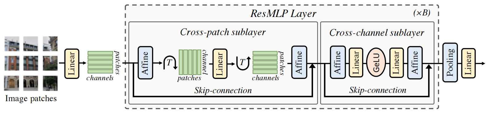

# ResMLP: Feedforward networks for image classification with data-efficient training
ResMLP：具有高效数据训练的图像分类前馈网络 2021-5-7 原文：https://arxiv.org/abs/2105.03404

## Abstract
We present ResMLP, an architecture built entirely upon multi-layer perceptrons for image classification. It is a simple residual network that alternates (i) a linear layer in which image patches interact, independently and identically across channels, and (ii) a two-layer feed-forward network in which channels interact independently per patch. When trained with a modern training strategy using heavy data-augmentation and optionally distillation, it attains surprisingly good accuracy/complexity trade-offs on ImageNet. We also train ResMLP models in a self-supervised setup, to further remove priors from employing a labelled dataset. Finally, by adapting our model to machine translation we achieve surprisingly good results. We share pre-trained models and our code based on the Timm library.

我们提出了ResMLP，一种完全基于多层感知器的图像分类架构。它是一个简单的残差网络，它交替(i)线性层，其中图像块在通道上独立且相同地相互作用，以及(ii)两层前馈网络，其中通道在每个块上独立地相互作用。当使用现代训练策略(使用大量数据增广和可选的蒸馏)进行训练时，它在ImageNet上获得了令人惊讶的良好准确性/复杂性权衡。我们也在自监督的设置中训练ResMLP模型，以进一步消除使用标注数据集的先验。最后，通过将我们的模型调整为机器翻译，我们获得了令人惊讶的好结果。我们共享预先训练的模型和基于Timm库的代码。

## 1 Introduction
Recently, the transformer architecture [60], adapted from its original use in natural language processing with only minor changes, has achieved performance competitive with the state of the art on ImageNet-1k [50] when pre-trained with a sufficiently large amount of data [16]. Retrospectively, this achievement is another step towards learning visual features with less priors: Convolutional Neural Networks (CNN) had replaced the hand-designed choices from hard-wired features with flexible and trainable architectures. Vision transformers further removes several hard decisions encoded in the convolutional architectures, namely the translation invariance and local connectivity.

最近，Transformer架构[60]从其在自然语言处理中的原始使用进行了调整，仅进行了微小的更改，当使用足够大量的数据进行预训练时，其性能与ImageNet-1k[50]上的现有技术相比具有竞争力[16]。回顾过去，这一成就是朝着以更少的先验学习视觉特征迈出的又一步：卷积神经网络(CNN)已经用灵活和可训练的架构取代了手工设计的硬连线特征选择。ViT进一步去除了卷积架构中编码的几个硬决策，即平移不变性和局部连通性。

This evolution toward less hard-coded prior in the architecture has been fueled by better training schemes [16, 56], and, in this paper, we push this trend further by showing that a purely multilayer perceptron (MLP) based architecture, called Residual Multi-Layer Perceptrons (ResMLP), is competitive on image classification. ResMLP is designed to be simple and encoding little prior about images: it takes image patches as input, projects them with a linear layer, and sequentially updates their representations with two residual operations: (i) a cross-patch linear layer applied to all channels independently; and (ii) an cross-channel single-layer MLP applied independently to all patches. At the end of the network, the patch representations are average pooled, and fed to a linear classifier. We outline ResMLP in Figure 1 and detail it further in Section 2.

更好的训练方案[16，56]推动了架构中向较少硬编码先验的发展，在本文中，我们进一步推动了这一趋势，证明了一种纯粹基于多层感知器(MLP)的架构，称为残差多层感知器(ResMLP)，在图像分类方面具有竞争力。ResMLP被设计为简单的，并且很少对图像进行编码：它将图像块作为输入，用线性层投影它们，并用两个残差操作顺序更新它们的表示：(i)独立应用于所有通道的交叉块线性层; 和(ii)独立地应用于所有分块的交叉沟道单层MLP。在网络的末端，分块表示被平均合并，并被馈送到线性分类器。我们在图1中概述了ResMLP，并在第2节中进一步详细介绍。

The ResMLP architecture is strongly inspired by the vision transformers (ViT) [16], yet it is much simpler in several ways: we replace the self-attention sublayer by a linear layer, resulting in an architecture with only linear layers and GELU non-linearity [25]. We observe that the training of ResMLP is more stable than ViTs when using the same training scheme as in DeiT [56] and CaiT [57], allowing to remove the need for batch-specific or cross-channel normalizations such as BatchNorm, GroupNorm or LayerNorm. We speculate that this stability comes from replacing self-attention with linear layers. Finally, another advantage of using a linear layer is that we can still visualize the interactions between patch embeddings, revealing filters that are similar to convolutions on the lower layers, and longer range in the last layers.

ResMLP架构受到视觉变换器(ViT)的强烈启发[16]，但它在几个方面要简单得多：我们用线性层代替了自注意力子层，从而形成了一个只有线性层和GELU非线性的架构[25]。我们观察到，当使用与DeiT[56]和CaiT[57]中相同的训练方案时，ResMLP的训练比ViT更稳定，从而消除了批次特定或跨信道归一化(如BatchNorm、GroupNorm或LayerNorm)的需要。我们推测这种稳定性来自于用线性层代替自注意力。最后，使用线性层的另一个优点是，我们仍然可以可视化分块嵌入之间的交互，揭示出与较低层上的卷积相似的滤波器，而在最后一层中的范围更长。

 
Figure 1: The ResMLP architecture. After linearly projecting the image patches into high dimensional embeddings, ResMLP sequentially processes them with (1) a cross-patch linear sublayer; (2) a cross-channel two-layer MLP. The MLP is the same as the FCN sublayer of a Transformer. Each sublayer has a residual connection and two Affine element-wise transformations. 
图1:ResMLP架构。在将图像块线性投影到高维嵌入中之后，ResMLP用(1)交叉块线性子层顺序地处理它们; (2)跨通道两层MLP。MLP与Transformer的FCN子层相同。每个子层都有一个残差连接和两个仿射元素变换。

We further investigate if our purely MLP based architecture could benefit to other domains beyond images, and particularly, with more complex output spaces. In particular, we adapt our MLP based architecture to take inputs with variable length, and show its potential on the problem of Machine Translation. To do so, we develop a sequence-to-sequence (seq2seq) version of ResMLP, where both encoder and decoders are based on ResMLP with across-attention between the encoder and decoder [2]. This model is similar to the original seq2seq Transformer with ResMLP layers instead of Transformer layers [60]. Despite not being originally designed for this task, we observe that ResMLP is competitive with Transformers on the challenging WMT benchmarks.

我们进一步研究了我们纯粹基于MLP的架构是否可以对图像之外的其他领域，特别是对更复杂的输出空间有益。特别是，我们调整了基于MLP的架构以接受可变长度的输入，并在机器翻译问题上显示了其潜力。为此，我们开发了ResMLP的序列到序列(seq2seq)版本，其中编码器和解码器都基于ResMLP，编码器和解码器之间存在交叉关注[2]。该模型与原始seq2seq Transformer相似，具有ResMLP层，而不是Transformer层[60]。尽管ResMLP最初不是为这项任务而设计的，但我们观察到，在具有挑战性的WMT基准测试上，ResMLP与变形金刚相比具有竞争力。

In summary, in this paper, we make the following observations:
* despite its simplicity, ResMLP reaches surprisingly good accuracy/complexity trade-offs with ImageNet-1k training only(1Concurrent work by Tolstikhin et al. [55] brings complementary insights to ours: they achieve interesting performance with larger MLP models pre-trained on the larger public ImageNet-22k and even more data with the proprietary JFT-300M. In contrast, we focus on faster models trained on ImageNet-1k. Other concurrent related work includes that of Melas-Kyriazi [39] and the RepMLP [15] and gMLP [38] models.) , without requiring normalization based on batch or channel statistics;
* these models benefit significantly from distillation methods [56]; they are also compatible with modern self-supervised learning methods based on data augmentation, such as DINO [7];
* A seq2seq ResMLP achieves competitive performances compared to a seq2seq Transformers on the WMT benchmark for Machine Translation. 

总之，在本文中，我们提出以下意见：
* 尽管其简单，仅使用ImageNet-1k训练，ResMLP达到了令人惊讶的高精度/复杂性权衡，而不需要基于批次或信道统计的标准化(1 Tolstikhinet al 的当前工作[55]为我们带来了互补的见解：他们通过在更大的公共ImageNet-22k上预训练的更大的MLP模型获得了有趣的性能，甚至通过专有的JFT-300M获得了更多的数据。相反，我们专注于在ImageNet-1k上训练的更快的模型。其他并行相关工作包括Melas Kyriazi[39]和RepMLP[15]和gMLP[38]模型); 
* 这些模型显著受益于蒸馏方法[56]; 它们还与基于数据增广的现代自监督学习方法兼容，如DINO[7]; 
* 与WMT机器翻译基准上的seq2seq Transformers相比，seq2seq ResMLP实现了具有竞争力的性能。

## 2 Method
In this section, we describe our architecture, ResMLP, as depicted in Figure 1. ResMLP is inspired by ViT and this section focuses on the changes made to ViT that lead to a purely MLP based model. We refer the reader to Dosovitskiy et al. [16] for more details about ViT.

在本节中，我们描述了我们的ResMLP架构，如图1所示。ResMLP受到ViT的启发，本节重点介绍了对ViT所做的更改，这些更改导致了基于纯MLP的模型。我们让读者参考Dosovitskiyet al [16]，了解有关ViT的更多信息。

### The overall ResMLP architecture. 
Our model, denoted by ResMLP, takes a grid of N ×N nonoverlapping patches as input, where the patch size is typically equal to 16×16. The patches are then independently passed through a linear layer to form a set of $N^2$ d-dimensional embeddings.

ResMLP整体架构。我们的模型(由ResMLP表示)采用N×N个不重叠的分块网格作为输入，其中分块大小通常等于16×16。然后，分块独立地通过线性层以形成一组$N^2$个d维嵌入。

The resulting set of $N^2$ embeddings are fed to a sequence of Residual Multi-Layer Perceptron layers to produce a set of $N^2$ d-dimensional output embeddings. These output embeddings are then averaged (“average-pooling”) as a d-dimension vector to represent the image, which is fed to a linear classifier to predict the label associated with the image. Training uses the cross-entropy loss.

所得的$N^2$个嵌入集合被馈送到残差多层感知器层序列，以产生$N^2$个d维输出嵌入集合。然后，这些输出嵌入被平均(“平均池化”)为d维向量以表示图像，该向量被馈送到线性分类器以预测与图像相关联的标签。训练使用交叉熵损失。

### The Residual Multi-Perceptron Layer. 
Our network is a sequence of layers that all have the same structure: a linear sublayer applied across patches followed by a feedforward sublayer applied across channels. Similar to the Transformer layer, each sublayer is paralleled with a skip-connection [23]. The absence of self-attention layers makes the training more stable, allowing us to replace the Layer Normalization [1] by a simpler Affine transformation:

残差多感知器层。我们的网络是一系列层，它们都具有相同的结构：一个跨分块应用的线性子层，然后是跨通道应用的前馈子层。与Transformer层类似，每个子层都与跳跃连并联[23]。自注意力层的缺失使训练更加稳定，允许我们用更简单的仿射变换代替层归一化[1]：

$Aff_{α,β}(x) = Diag(α)x + β$, (1) 

where α and β are learnable weight vectors. This operation only rescales and shifts the input element-wise. This operation has several advantages over other normalization operations: first, as opposed to Layer Normalization, it has no cost at inference time, since it can absorbed in the adjacent linear layer. Second, as opposed to BatchNorm [30] and Layer Normalization, the Aff operator does not depend on batch statistics. The closer operator to Aff is the LayerScale introduced by Touvron et al. [57], with an additional bias term. For convenience, we denote by Aff(X) the Affine operation applied independently to each column of the matrix X.

其中α和β是可学习的权重向量。此操作仅按比例缩放和移动输入元素。与其他归一化操作相比，该操作有几个优点：首先，与层归一化(LN)不同，它在推断时没有成本，因为它可以被相邻的线性层吸收。其次，与BatchNorm[30]和Layer Normalization不同，Aff运算符不依赖于批次统计信息。与Aff更接近的算子是Touvronet al 引入的LayerScale。[57]，带有附加的偏置项。为了方便起见，我们用Aff(X)表示独立应用于矩阵X的每一列的仿射运算。

We apply the Aff operator at the beginning (“pre-normalization”) and end (“post-normalization”) of each residual block. As a pre-normalization, Aff replaces LayerNorm without using channel-wise statistics. Here, we initialize α = 1, and β = 0. As a post-normalization, Aff is similar to LayerScale and we initialize α with the same small value as in [57].

我们在每个残差块的开始(“预归一化”)和结束(“后归一化”)应用Aff运算符。作为预归一化，Aff取代了LayerNorm，而不使用通道统计信息。这里，我们初始化α=1，β=0。作为后归一化，Aff类似于LayerScale，我们使用与[57]中相同的小值初始化α。

Overall, our Multi-layer perceptron takes a set of $N^2$ d-dimensional input features stacked in a d × $N^2$ matrix X, and outputs a set of $N^2$ d-dimension output features, stacked in a matrix Y with the following set of transformations:

总体而言，我们的多层感知器采用一组$N^2$个d维输入特征，以d×$N^2$矩阵X堆叠，并输出一组$N^2$ d维输出特征，以矩阵Y堆叠，具有以下一组变换：

$Z = X + Aff( (A * Aff(X)^T)^T  )$ , (2)

$Y = Z + Aff (C * GELU(B * Aff(Z)))$, (3) 

where A, B and C are the main learnable weight matrices of the layer. Note that Eq (3) is the same as the feedforward sublayer of a Transformer with the ReLU non-linearity replaced by a GELU function [25]. The dimensions of the parameter matrix A are $N^2×N^2$, i.e., this “cross-patch” sublayer exchanges information between patches, while the “cross-channel” feedforward sublayer works per location. Similar to a Transformer, the intermediate activation matrix Z has the same dimensions as the input and output matrices, X and Y. Finally, the weight matrices B and C have the same dimensions as in a Transformer layer, which are 4d×d and d×4d, respectively.

其中A、B和C是该层的主要可学习权重矩阵。注意，等式(3)与Transformer的前馈子层相同，ReLU非线性由GELU函数代替[25]。参数矩阵A的维数为$N^2×N^2$，即，该“交叉分块”子层在分块之间交换信息，而“交叉信道”前馈子层在每个位置工作。与Transformer类似，中间激活矩阵Z具有与输入和输出矩阵X和Y相同的维度。最后，权重矩阵B和C具有与Transformer层相同的维度，分别为4d×d和d×4d。

### Differences with the Vision Transformer architecture. 
Our architecture is closely related to the ViT model [16]. However, ResMLP departs from ViT with several simplifications:
* no self-attention blocks: it is replaced by a linear layer with no non-linearity,
* no positional embedding: the linear layer implicitly encodes information about patch positions,
* no extra “class” token: we simply use average pooling on the patch embeddings,
* no normalization based on batch statistics: we use a learnable affine operator.

与ViT架构的区别。我们的架构与ViT模型密切相关[16]。然而，ResMLP与ViT有几个简化：
* 无自注意力块：由无非线性的线性层代替，
* 无位置嵌入：线性层隐式编码关于分块位置的信息，
* 没有额外的“类”标记：我们只是在分块嵌入上使用平均池，
* 没有基于批统计的归一化：我们使用了一个可学习的仿射算子。

### Class-MLP as an alternative to average-pooling. 
We propose an adaptation of the class-attention token introduced in CaiT [57]. In CaiT, this consists of two layers that have the same structure as the transformer, but in which only the class token is updated based on the frozen patch embeddings. We translate this method to our architecture, except that, after aggregating the patches with a linear layer, we replace the attention-based interaction between the class and patch embeddings by simple linear layers, still keeping the patch embeddings frozen. This increases the performance, at the expense of adding some parameters and computational cost. We refer to this pooling variant as “class-MLP”, since the purpose of these few layers is to replace average pooling.

将MLP分类为平均池的替代方案。我们提出了对CaiT[57]中引入的类注意力标记的修改。在CaiT中，它由两个层组成，这两个层具有与transformer相同的结构，但其中仅基于冻结的分块嵌入更新类令牌。我们将此方法转换为我们的架构，除了在用线性层聚合分块之后，我们用简单的线性层替换类和分块嵌入之间基于注意力的交互，仍然保持分块嵌入的冻结。这以增加一些参数和计算成本为代价，提高了性能。我们将这个池变体称为“类MLP”，因为这几个层的目的是取代平均池。

### Sequence-to-sequence ResMLP. 
Similar to Transformer, the ResMLP architecture can be applied to sequence-to-sequence tasks. First, we follow the general encoder-decoder architecture from Vaswani et al. [60], where we replace the self-attention sublayers by the residual multi-perceptron layer. In the decoder, we keep the cross-attention sublayers, which attend to the output of the encoder. In the decoder, we adapt the linear sublayers to the task of language modeling by constraining the matrix A to be triangular, in order to prevent a given token representation to access tokens from the future. Finally, the main technical difficulty from using linear sublayers in a sequence-to-sequence model is to deal with variable sequence lengths. However, we observe that simply padding with zeros and extracting the submatrix A corresponding to the longest sequence in a batch, works well in practice. 

序列到序列ResMLP。 与Transformer类似，ResMLP架构可以应用于序列到序列的任务。首先，我们遵循Vaswaniet al 的通用编码器-解码器架构。[60]，其中我们用残差多感知器层替换自注意力子层。在解码器中，我们保留了交叉关注子层，这些子层负责编码器的输出。在解码器中，我们通过将矩阵A约束为三角形，使线性子层适应语言建模的任务，以防止给定的令牌表示将来访问令牌。最后，在序列到序列模型中使用线性子层的主要技术难点是处理可变序列长度。然而，我们观察到，简单地用零填充并提取对应于批处理中最长序列的子矩阵A在实践中效果良好。

## 3 Experiments
In this section, we present experimental results for the ResMLP architecture on image classification and machine translation. We also study the impact of the different components of ResMLP in ablation studies. We consider three training paradigms for images: 
* Supervised learning: We train ResMLP from labeled images with a softmax classifier and crossentropy loss. This paradigm is the main focus of our work.
* Self-supervised learning: We train the ResMLP with the DINO method of Caron et al. [7] that trains a network without labels by distilling knowledge from previous instances of the same network.
* Knowledge distillation: We employ the knowledge distillation procedure proposed by Touvron et al. [56] to guide the supervised training of ResMLP with a convnet.

在本节中，我们介绍了ResMLP架构在图像分类和机器翻译方面的实验结果。我们还研究了消融研究中ResMLP不同成分的影响。我们考虑图像的三种训练模式：
* 监督学习：我们使用softmax分类器和交叉熵损失从标记图像中训练ResMLP。这种范式是我们工作的主要重点。
* 自监督学习：我们使用Caronet al 的DINO方法训练ResMLP。[7]，该方法通过从同一网络的先前实例中提取知识来训练无标签的网络。
* 知识蒸馏：我们使用Touvronet al 提出的知识蒸馏程序[56]来指导ResMLP的监督训练。

 
Table 1: Comparison between architectures on ImageNet classification. We compare different architectures based on convolutional networks, Transformers and feedforward networks with comparable FLOPs and number of parameters. We report Top-1 accuracy on the validation set of ImageNet-1k with different measure of complexity: throughput, FLOPs, number of parameters and peak memory usage. All the models use 224×224 images as input. By default the Transformers and feedforward networks uses 14×14 patches of size 16×16, see Table 3 for the detailed specification of our main models. The throughput is measured on a single V100-32GB GPU with batch size fixed to 32. For reference, we include the state of the art with ImageNet training only.
表1:ImageNet分类架构之间的比较。我们比较了基于卷积网络、变压器和前馈网络的不同架构，其FLOP和参数数量相当。我们报告了ImageNet-1k验证集的Top-1准确度，具有不同的复杂性度量：吞吐量-throughput、FLOP、参数数量和峰值内存(Peak Mem)使用率。所有模型都使用224×224图像作为输入。默认情况下，变压器和前馈网络使用大小为16×16的14×14分块，主要模型的详细规格见表3。吞吐量是在单个V100-32GB GPU上测量的，批处理大小固定为32。作为参考，我们仅包含ImageNet训练的最新技术。

### 3.1 Experimental setting
Datasets. We train our models on the ImageNet-1k dataset [50], that contains 1.2M images evenly spread over 1,000 object categories. In the absence of an available test set for this benchmark, we follow the standard practice in the community by reporting performance on the validation set. This is not ideal since the validation set was originally designed to select hyper-parameters. Comparing methods on this set may not be conclusive enough because an improvement in performance may not be caused by better modeling, but by a better selection of hyper-parameters. To mitigate this risk, we report additional results in transfer learning and on two alternative versions of ImageNet that have been built to have distinct validation and test sets, namely the ImageNet-real [4] and ImageNet-v2 [49] datasets. We also report a few data-points when training on ImageNet-21k. Our hyper-parameters are mostly adopted from Touvron et al. [56, 57].

数据集。我们在ImageNet-1k数据集[50]上训练我们的模型，该数据集包含分布在1000个对象类别上的1.2M个图像。在该基准没有可用的测试集的情况下，我们遵循社区的标准做法，报告验证集的性能。这并不理想，因为验证集最初设计用于选择超参数。比较此集合上的方法可能不够确凿，因为性能的提高可能不是由更好的建模引起的，而是由更好的超参数选择引起的。为了减轻这一风险，我们报告了迁移学习和两个替代版本的ImageNet的额外结果，这两个版本已构建为具有不同的验证和测试集，即ImageNet real[4]和ImageNet-v2[49]数据集。我们还报告了在ImageNet-21k上训练时的一些数据点。我们的超参数主要来自Touvronet al [56，57]。

Hyper-parameter settings. In the case of supervised learning, we train our network with the Lamb optimizer [64] with a learning rate of 5 × 10−3 and weight decay 0.2. We initialize the LayerScale parameters as a function of the depth by following CaiT [57]. The rest of the hyper-parameters follow the default setting used in DeiT [56]. For the knowledge distillation paradigm, we use the same RegNety-16GF [48] as in DeiT with the same training schedule. The majority of our models take two days to train on eight V100-32GB GPUs.

超参数设置。在监督学习的情况下，我们使用Lamb优化器[64]训练网络，学习率为5×10−3和权重衰减0.2。我们通过遵循CaiT[57]将LayerScale参数初始化为深度的函数。其余的超参数遵循DeiT中使用的默认设置[56]。对于知识蒸馏范式，我们使用与DeiT中相同的RegNety-16GF[48]，具有相同的训练计划。我们的大多数模型需要两天时间才能在八个V100-32GB GPU上进行训练。

### 3.2 Main Results
In this section, we compare ResMLP with architectures based on convolutions or self-attentions with comparable size and throughput on ImageNet.

Supervised setting. In Table 1, we compare ResMLP with different convolutional and Transformer architectures. For completeness, we also report the best-published numbers obtained with a model trained on ImageNet alone. While the trade-off between accuracy, FLOPs, and throughput for ResMLP is not as good as convolutional networks or Transformers, their strong accuracy still suggests that the structural constraints imposed by the layer design do not have a drastic influence on performance, especially when training with enough data and recent training schemes.

Table 2: Self-supervised learning with DINO [7]. Classification accuracy on ImageNet-1k val. ResMLPs evaluated with linear and k-NN evaluation on ImageNet are comparable to convnets but inferior to ViT.

 
Figure 2: Visualisation of the linear layers in ResMLP-S24. For each layer we visualise the rows of the matrix A as a set of 14 × 14 pixel images, for sake of space we only show the rows corresponding to the 6×6 central patches. We observe patterns in the linear layers that share similarities with convolutions. In appendix B we provide comparable visualizations for all layers of a ResMLP-S12 model. 

Self-supervised setting. We pre-train ResMLP-S12 using the self-supervised method called DINO [7] during 300 epochs. We report our results in Table 2. The trend is similar to the supervised setting: the accuracy obtained with ResMLP is lower than ViT. Nevertheless, the performance is surprisingly high for a pure MLP architecture and competitive with Convnet in k-NN evaluation. Additionally, we also fine-tune network pre-trained with self-supervision on ImageNet using the ground-truth labels. Pre-training substantially improves performance compared to a ResMLP-S24 solely trained with labels, achieving 79.9% top-1 accuracy on ImageNet-val (+0.5%).

Knowledge distillation setting. We study our model when training with the knowledge distillation approach of Touvron et al. [56]. In their work, the authors show the impact of training a ViT model by distilling it from a RegNet. In this experiment, we explore if ResMLP also benefits from this procedure and summarize our results in Table 3 (Blocks “Baseline models” and “Training”). We observe that similar to DeiT models, ResMLP greatly benefits from distilling from a convnet. This result concurs with the observations made by d’Ascoli et al. [14], who used convnets to initialize feedforward networks. Even though our setting differs from theirs in scale, the problem of overfitting for feedforward networks is still present on ImageNet. The additional regularization obtained from the distillation is a possible explanation for this improvement.

### 3.3 Visualization & analysis of the linear interaction between patches
#### Visualisations of the cross-patch sublayers. 
In Figure 2, we show in the form of squared images, the rows of the weight matrix from cross-patch sublayers at different depths of a ResMLP-S24 model. The early layers show convolution-like patterns: the weights resemble shifted versions of each other and have local support. Interestingly, in many layers, the support also extends along both axes; see layer 7. The last 7 layers of the network are different: they consist of a spike for the patch itself and a diffuse response across other patches with different magnitude; see layer 20.

#### Measuring sparsity of the weights. 
The visualizations described above suggest that the linear communication layers are sparse. We analyze this quantitatively in more detail in Figure 3. We measure the sparsity of the matrix A, and compare it to the sparsity of B and C from the per-patch MLP. Since there are no exact zeros, we measure the rate of components whose absolute value is lower than 5% of the maximum value. Note, discarding the small values is analogous to the case where we normalize the matrix by its maximum and use a finite-precision representation of weights. For instance, with a 4-bits representation of weight, one would typically round to zero all weights whose absolute value is below 6.25% of the maximum value.

 
Figure 3: Sparsity of linear interaction layers. For each layer (linear and MLP), we show the rate of components whose absolute value is lower than 5% of the maximum. Linear interaction layers are sparser than the matrices involved in the per-patch MLP.

 
Figure 4: Top-1 accuracy on ImageNet-V2 vs. ImageNet-val. ResMLPs tend to overfit slightly more under identical training method. This is partially alleviated with by introducing more regularization (more data or distillation, see e.g., ResMLP-B24/8-distil).

The measurements in Figure 3 show that all three matrices are sparse, with the layers implementing the patch communication being significantly more so. This suggests that they may be compatible with parameter pruning, or better, with modern quantization techniques that induce sparsity at training time, such as Quant-Noise [20] and DiffQ [19]. The sparsity structure, in particular in earlier layers, see Figure. 2, hints that we could implement the patch interaction linear layer with a convolution. We provide some results for convolutional variants in our ablation study. Further research on network compression is beyond the scope of this paper, yet we believe it worth investigating in the future.

####  Communication across patches 
if we remove the linear interaction layer (linear → none), we obtain substantially lower accuracy (-20% top-1 acc.) for a “bag-of-patches” approach. We have tried several alternatives for the cross-patch sublayer, which are presented in Table 3 (block “patch communication”). Amongst them, using the same MLP structure as for patch processing (linear →

MLP), which we analyze in more details in the supplementary material. The simpler choice of a single linear square layer led to a better accuracy/performance trade-off – considering that the MLP variant requires compute halfway between ResMLP-S12 and ResMLP-S24 – and requires fewer parameters than a residual MLP block.

The visualization in Figure 2 indicates that many linear interaction layers look like convolutions. In our ablation, we replaced the linear layer with different types of 3×3 convolutions. The depth-wise convolution does not implement interaction across channels – as our linear patch communication layer – and yields similar performance at a comparable number of parameters and FLOPs. While full 3×3 convolutions yield best results, they come with roughly double the number of parameters and FLOPs. Interestingly, the depth-separable convolutions combine accuracy close to that of full 3×3 convolutions with a number of parameters and FLOPs comparable to our linear layer. This suggests that convolutions on low-resolution feature maps at all layers is an interesting alternative to the common pyramidal design of convnets, where early layers operate at higher resolution and smaller feature dimension. 

 
Table 3: Ablation. Our default configurations are presented in the three first rows. By default we train during 400 epochs. The “old-fashioned” is similar to what was employed for ResNet [23]: SGD, 90-epochs waterfall schedule, same augmentations up to variations due to library used.

### 3.4 Ablation studies
Table 3 reports the ablation study of our base network and a summary of our preliminary exploratory studies. We discuss the ablation below and give more detail about early experiments in Appendix A.

Control of overfitting. Since MLPs are subject to overfitting, we show in Fig. 4 a control experiment to probe for problems with generalization. We explicitly analyze the differential of performance between the ImageNet-val and the distinct ImageNet-V2 test set. The relative offsets between curves reflect to which extent models are overfitted to ImageNet-val w.r.t. hyper-parameter selection. The degree of overfitting of our MLP-based model is overall neutral or slightly higher to that of other transformer-based architectures or convnets with same training procedure.

Normalization & activation. Our network configuration does not contain any batch normalizations.Instead, we use the affine per-channel transform Aff. This is akin to Layer Normalization [1], typically used in transformers, except that we avoid to collect any sort of statistics, since we do no need it it for convergence. In preliminary experiments with pre-norm and post-norm [24], we observed that both choices converged. Pre-normalization in conjunction with Batch Normalization could provide an accuracy gain in some cases, see Appendix A.

We choose to use a GELU [25] function. In Appendix A we also analyze the activation function: ReLU [22] also gives a good performance, but it was a bit more unstable in some settings. We did not manage to get good results with SiLU [25] and HardSwish [28].

Pooling. Replacing average pooling with Class-MLP, see Section 2, brings a significant gain for a negligible computational cost. We do not include it by default to keep our models more simple.

Patch size. Smaller patches significantly increase the performance, but also increase the number of flops (see Block "Patch size" in Table 3). Smaller patches benefit more to larger models, but only with an improved optimization scheme involving more regularization (distillation) or more data.

Training. Consider the Block “Training’ in Table 3. ResMLP significantly benefits from modern training procedures such as those used in DeiT. For instance, the DeiT training procedure improves the performance of ResMLP-S12 by 7.4% compared to the training employed for ResNet [23]2.This is in line with recent work pointing out the importance of the training strategy over the model choice [3, 48]. Pre-training on more data and distillation also improve the performance of ResMLP, especially for the bigger models, e.g., distillation improves the accuracy of ResMLP-B24/8 by 2.6%. 

2Interestingly, if trained with this “old-fashion” setting, ResMLP-S12 outperforms AlexNet [35] by a margin. 

 
Table 4: Evaluation on transfer learning. Classification accuracy (top-1) of models trained on ImageNet-1k for transfer to datasets covering different domains. The ResMLP architecture takes 224×224 images during training and transfer, while ViTs and EfficientNet-B7 work with higher resolutions, see “Res.” column.

Other analysis. In our early exploration, we evaluated several alternative design choices. As in transformers, we could use positional embeddings mixed with the input patches. In our experiments we did not see any benefit from using these features, see Appendix A. This observation suggests that our cross-patch sublayer provides sufficient spatial communication, and referencing absolute positions obviates the need for any form of positional encoding.

### 3.5 Transfer learning
We evaluate the quality of features obtained from a ResMLP architecture when transferring them to other domains. The goal is to assess if the features generated from a feedforward network are more prone to overfitting on the training data distribution. We adopt the typical setting where we pre-train a model on ImageNet-1k and fine-tune it on the training set associated with a specific domain. We report the performance with different architectures on various image benchmarks in Table 4, namely CIFAR-10 and CIFAR-100 [34], Flowers-102 [42], Stanford Cars [33] and iNaturalist [27]. We refer the reader to the corresponding references for a more detailed description of the datasets.

We observe that the performance of our ResMLP is competitive with the existing architectures, showing that pretraining feedforward models with enough data and regularization via data augmentation greatly reduces their tendency to overfit on the original distribution. Interestingly, this regularization also prevents them from overfitting on the training set of smaller dataset during the fine-tuning stage.

### 3.6 Machine translation
We also evaluate the ResMLP transpose-mechanism to replace the self-attention in the encoder and decoder of a neural machine translation system. We train models on the WMT 2014 English-German and English-French tasks, following the setup from Ott et al. [45]. We consider models of dimension 512, with a hidden MLP size of 2,048, and with 6 or 12 layers. Note that the current state of the art employs much larger models: our 6-layer model is more comparable to the base transformer model from Vaswani et al. [60], which serves as a baseline, along with pre-transformer architectures such as recurrent and convolutional neural networks. We use Adagrad with learning rate 0.2, 32k steps of linear warmup, label smoothing 0.1, dropout rate 0.15 for En-De and 0.1 for En-Fr. We initialize the LayerScale parameter to 0.2. We generate translations with the beam search algorithm, with a beam of size 4. As shown in Table 5, the results are at least on par with the compared architectures.

Table 5: Machine translation on WMT 2014 translation tasks. We report tokenized BLEU on newstest2014.

## 4 Related work
We review the research on applying Fully Connected Network (FCN) for computer vision problems as well as other architectures that shares common modules with our model.

我们回顾了将全连接网络(FCN)应用于计算机视觉问题以及与我们的模型共享公共模块的其他架构的研究。

### Fully-connected network for images. 
Many studies have shown that FCNs are competitive with convnets for the tasks of digit recognition [12, 51], keyword spotting [8] and handwritting recognition [5]. Several works [37, 40, 59] have questioned if FCNs are also competitive on natural image datasets, such as CIFAR-10 [34]. More recently, d’Ascoli et al. [14] have shown that a FCN initialized with the weights of a pretrained convnet achieves performance that are superior than the original convnet. Neyshabur [41] further extend this line of work by achieving competitive performance by training an FCN from scratch but with a regularizer that constrains the models to be close to a convnet. These studies have been conducted on small scale datasets with the purpose of studying the impact of architectures on generalization in terms of sample complexity [18] and energy landscape [31]. In our work, we show that, in the larger scale setting of ImageNet, FCNs can attain surprising accuracy without any constraint or initialization inspired by convnets.

许多研究表明，FCN在数字识别[12，51]、关键词识别[8]和手写识别[5]的任务上与CONVNS竞争。一些研究[37，40，59]质疑FCN在自然图像数据集上是否也具有竞争力，如CIFAR-10[34]。最近，d’Ascoliet al [14]已经表明，使用预训练ConvNet的权重初始化的FCN实现了优于原始ConvNet的性能。Neyshabur[41]通过从头开始训练FCN，但使用正则化器限制模型接近ConvNet，从而实现竞争绩效，从而进一步扩展了这一工作范围。这些研究是在小规模数据集上进行的，目的是从样本复杂性[18]和能量景观[31]方面研究架构对泛化的影响。在我们的工作中，我们表明，在ImageNet的更大规模设置中，FCN可以获得令人惊讶的精度，而无需受到ConvNet的任何约束或初始化。

Finally, the application of FCN networks in computer vision have also emerged in the study of the properties of networks with infinite width [43], or for inverse scattering problems [32]. More interestingly, the Tensorizing Network [44] is an approximation of very large FCN that shares similarity with our model, in that they intend to remove prior by approximating even more general tensor operations, i.e., not arbitrarily marginalized along some pre-defined sharing dimensions. However, their method is designed to compress the MLP layers of a standard convnets.

最后，FCN网络在计算机视觉中的应用也出现在对无限宽网络性质的研究中[43]，或在逆散射问题中[32]。更有趣的是，Tensorizing网络[44]是与我们的模型相似的非常大的FCN的近似，因为它们打算通过近似更一般的张量运算来去除先验，即，沿着某些预定义的共享维度不被任意边缘化。然而，他们的方法被设计为压缩标准ConvNet的MLP层。

### Other architectures with similar components. 
Our FCN architecture shares several components with other architectures, such as convnets [35, 36] or transformers [60]. A fully connected layer is equivalent to a convolution layer with a 1 × 1 receptive field, and several work have explored convnet architectures with small receptive fields. For instance, the VGG model [52] uses 3×3 convolutions, and later, other architectures such as the ResNext [63] or the Xception [11] mix 1×1 and 3×3 convolutions. In contrast to convnets, in our model interaction between patches is obtained via a linear layer that is shared across channels, and that relies on absolute rather than relative positions.

我们的FCN架构与其他架构共享多个组件，如卷积网络[35，36]或Transformer[60]。一个全连接层相当于一个具有1×1感受野的卷积层，一些工作已经探索了具有小感受野的ConvNet网络结构。例如，VGG模型[52]使用3×3卷积，随后，ResNext[63]或Xception[11]等其他架构混合了1×1和3×3的卷积。与ConvNet相反，在我们的模型中，分块之间的交互是通过在通道之间共享的线性层获得的，并且依赖于绝对位置而不是相对位置。

More recently, transformers have emerged as a promising architecture for computer vision [10, 17, 46, 56, 67]. In particular, our architecture takes inspiration from the structure used in the Vision Transformer (ViT) [17], and as consequence, shares many components. Our model takes a set of non-overlapping patches as input and passes them through a series of MLP layers that share the same structure as ViT, replacing the self-attention layer with a linear patch interaction layer. Both layers have a global field-of-view, unlike convolutional layers. Whereas in self-attention the weights to aggregate information from other patches are data dependent through queries and keys, in ResMLP the weights are not data dependent and only based on absolute positions of patches. In our implementation we follow the improvements of DeiT [56] to train vision transformers, use the skip-connections from ResNets [23] with pre-normalization of the layers [9, 24].

最近，Transformer已成为计算机视觉的一种有前途的架构[10，17，46，56，67]。特别是，我们的架构从Vision Transformer(ViT)[17]中使用的结构中获得灵感，因此共享了许多组件。我们的模型将一组不重叠的分块作为输入，并将它们传递给一系列MLP层，这些层与ViT具有相同的结构，用线性分块交互层代替了自注意力层。与卷积层不同，这两个层都具有全局视野。而在自注意力中，通过查询和键来聚合来自其他分块的信息的权重依赖于数据，而在ResMLP中，权重不依赖于数据并且仅基于分块的绝对位置。在我们的实现中，我们遵循DeiT[56]的改进来训练视觉变换器，使用ResNets[23]的跳跃连接和层的预归一化[9，24]。

Finally, our work questions the importance of self-attention in existing architectures. Similar observations have been made in natural language processing. Notably, Synthesizer [54] shows that dot-product self-attention can be replaced by a feedforward network, with competitive performance on sentence representation benchmarks. As opposed to our work, Synthesizer does use data dependent weights, but in contrast to transformers the weights are determined from the queries only. 

最后，我们的工作对现有架构中自注意力的重要性提出了质疑。在自然语言处理中也有类似的观察。值得注意的是，Synthesizer[54]表明，点积自注意力可以被前馈网络取代，在句子表示基准上具有竞争性。与我们的工作相反，Synthesizer确实使用了数据相关的权重，但与Transformer不同的是，权重仅由查询确定。

## 5 Conclusion
In this paper we have shown that a simple residual architecture, whose residual blocks consist of a one-hidden layer feed-forward network and a linear patch interaction layer, achieves an unexpectedly high performance on ImageNet classification benchmarks, provided that we adopt a modern training strategy such as those recently introduced for transformer-based architectures. Thanks to their simple structure, with linear layers as the main mean of communication between patches, we can vizualize the filters learned by this simple MLP. While some of the layers are similar to convolutional filters, we also observe sparse long-range interactions as early as the second layer of the network. We hope that our model free of spatial priors will contribute to further understanding of what networks with less priors learn, and potentially guide the design choices of future networks without the pyramidal design prior adopted by most convolutional neural networks. 

在本文中，我们已经证明了一种简单的残差架构(其残差块由一个隐藏层前馈网络和一个线性分块交互层组成)在ImageNet分类基准上实现了出乎意料的高性能，前提是我们采用了一种现代训练策略，例如最近为基于transformer架构引入的那些策略。由于其简单的结构，以线性层作为分块之间通信的主要手段，我们可以将通过这个简单的MLP学习的滤波器生动化。虽然其中一些层类似于卷积滤波器，但我们也早在网络的第二层就观察到了稀疏的长距离交互。我们希望，我们的无空间先验的模型将有助于进一步了解具有较少先验的网络学习什么，并潜在地指导未来网络的设计选择，而无需大多数卷积神经网络采用的金字塔设计先验。

## 6 Acknowledgments
We would like to thank Mark Tygert for relevant references. This work builds upon the Timm library [61] by Ross Wightman.

## References
1. Jimmy Lei Ba, Jamie Ryan Kiros, and Geoffrey E Hinton. Layer normalization. arXiv preprint arXiv:1607.06450, 2016. 2, 7
2. Dzmitry Bahdanau, Kyunghyun Cho, and Yoshua Bengio. Neural machine translation by jointly learning to align and translate. arXiv preprint arXiv:1409.0473, 2014. 2
3. Irwan Bello, W. Fedus, Xianzhi Du, E. D. Cubuk, A. Srinivas, Tsung-Yi Lin, Jonathon Shlens, and Barret Zoph. Revisiting ResNets: Improved training and scaling strategies. arXiv preprint arXiv:2103.07579,2021. 7
4. Lucas Beyer, Olivier J. Hénaff, Alexander Kolesnikov, Xiaohua Zhai, and Aaron van den Oord. Are we done with ImageNet? arXiv preprint arXiv:2006.07159, 2020. 4, 7
5. Théodore Bluche. Deep neural networks for large vocabulary handwritten text recognition. PhD thesis, Université Paris-Sud, 2015. 9
6. A. Brock, Soham De, S. L. Smith, and K. Simonyan. High-performance large-scale image recognition without normalization. arXiv preprint arXiv:2102.06171, 2021. 4
7. Mathilde Caron, Hugo Touvron, Ishan Misra, Hervé Jégou, Julien Mairal, Piotr Bojanowski, and Armand Joulin. Emerging properties in self-supervised vision transformers. arXiv preprint arXiv:2104.14294,2021. 2, 4, 5
8. Clément Chatelain. Extraction de séquences numériques dans des documents manuscrits quelconques. PhD thesis, Université de Rouen, 2006. 9
9. Mia Xu Chen, Orhan Firat, Ankur Bapna, Melvin Johnson, Wolfgang Macherey, George Foster, Llion Jones, Niki Parmar, Mike Schuster, Zhifeng Chen, et al. The best of both worlds: Combining recent advances in neural machine translation. In Annual Meeting of the Association for Computational Linguistics, 2018. 9
10. Rewon Child, Scott Gray, Alec Radford, and Ilya Sutskever. Generating long sequences with sparse transformers. arXiv preprint arXiv:1904.10509, 2019. 9
11. François Chollet. Xception: Deep learning with depthwise separable convolutions. In Conference on Computer Vision and Pattern Recognition, 2017. 9
12. Dan Claudiu Cire¸san, Ueli Meier, Luca Maria Gambardella, and Jürgen Schmidhuber. Deep big multilayer perceptrons for digit recognition. In Neural networks: tricks of the trade, pages 581–598. Springer, 2012. 9
13. Ekin D. Cubuk, Barret Zoph, Jonathon Shlens, and Quoc V. Le. RandAugment: Practical automated data augmentation with a reduced search space. arXiv preprint arXiv:1909.13719, 2019. VI
14. Stéphane d’Ascoli, Levent Sagun, Joan Bruna, and Giulio Biroli. Finding the needle in the haystack with convolutions: on the benefits of architectural bias. In NeurIPS, 2019. 5, 9
15. Xiaohan Ding, Xiangyu Zhang, Jungong Han, and Guiguang Ding. RepMLP: Re-parameterizing convolutions into fully-connected layers for image recognition. arXiv preprint arXiv:2105.01883, 2021. 2
16. Alexey Dosovitskiy, Lucas Beyer, Alexander Kolesnikov, Dirk Weissenborn, Xiaohua Zhai, Thomas Unterthiner, Mostafa Dehghani, Matthias Minderer, Georg Heigold, Sylvain Gelly, et al. An image is worth 16x16 words: Transformers for image recognition at scale. In International Conference on Learning Representations, 2021. 1, 2, 3, 8
17. Alexey Dosovitskiy, Jost Tobias Springenberg, Martin A. Riedmiller, and Thomas Brox. Discriminative unsupervised feature learning with convolutional neural networks. In NeurIPS, 2014. 9
18. Simon S Du, Yining Wang, Xiyu Zhai, Sivaraman Balakrishnan, Ruslan Salakhutdinov, and Aarti Singh. How many samples are needed to estimate a convolutional neural network? In NeurIPS, 2018. 9
19. Alexandre Défossez, Yossi Adi, and Gabriel Synnaeve. Differentiable model compression via pseudo quantization noise. arXiv preprint arXiv:2104.09987, 2021. 6
20. Angela Fan, Pierre Stock, Benjamin Graham, Edouard Grave, Rémi Gribonval, Hervé Jégou, and Armand Joulin. Training with quantization noise for extreme model compression. In International Conference on Learning Representations, 2021. 6
21. Jonas Gehring, Michael Auli, David Grangier, Denis Yarats, and Yann N. Dauphin. Convolutional sequence to sequence learning. In Doina Precup and Yee Whye Teh, editors, Proceedings of the 34th International Conference on Machine Learning, volume 70 of Proceedings of Machine Learning Research, pages 1243–1252. PMLR, 06–11 Aug 2017. 8
22. Xavier Glorot, Antoine Bordes, and Yoshua Bengio. Deep sparse rectifier neural networks. In International Conference on Machine Learning, 2011. 7
23. Kaiming He, Xiangyu Zhang, Shaoqing Ren, and Jian Sun. Deep residual learning for image recognition. In Conference on Computer Vision and Pattern Recognition, 2016. 2, 7, 9, V 10
24. Kaiming He, Xiangyu Zhang, Shaoqing Ren, and Jian Sun. Identity mappings in deep residual networks. arXiv preprint arXiv:1603.05027, 2016. 7, 9
25. Dan Hendrycks and Kevin Gimpel. Gaussian error linear units (GELUs). arXiv preprint arXiv:1606.08415,2016. 1, 3, 7
26. Elad Hoffer, Tal Ben-Nun, Itay Hubara, Niv Giladi, Torsten Hoefler, and Daniel Soudry. Augment your batch: Improving generalization through instance repetition. In Conference on Computer Vision and Pattern Recognition, 2020. VI
27. Grant Van Horn, Oisin Mac Aodha, Yang Song, Alexander Shepard, Hartwig Adam, Pietro Perona, and Serge J. Belongie. The iNaturalist species classification and detection dataset. arXiv preprint arXiv:1707.06642, 2017. 8
28. A. Howard, Mark Sandler, G. Chu, Liang-Chieh Chen, B. Chen, M. Tan, W. Wang, Y. Zhu, R. Pang, V. Vasudevan, Quoc V. Le, and H. Adam. Searching for MobileNetV3. International Conference on Computer Vision, 2019. 7
29. Gao Huang, Yu Sun, Zhuang Liu, Daniel Sedra, and Kilian Q. Weinberger. Deep networks with stochastic depth. In European Conference on Computer Vision, 2016. VI
30. S. Ioffe and C. Szegedy. Batch normalization: Accelerating deep network training by reducing internal covariate shift. In International Conference on Machine Learning, 2015. 3
31. Nitish Shirish Keskar, Dheevatsa Mudigere, Jorge Nocedal, Mikhail Smelyanskiy, and Ping Tak Peter Tang. On large-batch training for deep learning: Generalization gap and sharp minima. In International Conference on Learning Representations, 2017. 9
32. Yuehaw Khoo and Lexing Ying. Switchnet: a neural network model for forward and inverse scattering problems. SIAM Journal on Scientific Computing, 41(5):A3182–A3201, 2019. 9
33. Jonathan Krause, Michael Stark, Jia Deng, and Li Fei-Fei. 3d object representations for fine-grained categorization. In 4th International IEEE Workshop on 3D Representation and Recognition (3dRR-13),2013. 8
34. A. Krizhevsky. Learning multiple layers of features from tiny images. Master’s thesis, University of Toronto, 2009. 8, 9
35. A. Krizhevsky, I. Sutskever, and G. Hinton. ImageNet classification with deep convolutional neural networks. In NeurIPS, 2012. 7, 9
36. Yann LeCun, Léon Bottou, Yoshua Bengio, and Patrick Haffner. Gradient-based learning applied to document recognition. Proceedings of the IEEE, 86(11):2278–2324, 1998. 9
37. Zhouhan Lin, Roland Memisevic, and Kishore Konda. How far can we go without convolution: Improving fully-connected networks. arXiv preprint arXiv:1511.02580, 2015. 9
38. Hanxiao Liu, Zihang Dai, David R. So, and Quoc V. Le. Pay attention to MLPs. arXiv preprint arXiv:2105.08050, 2021. 2
39. Luke Melas-Kyriazi. Do you even need attention? A stack of feed-forward layers does surprisingly well on ImageNet. arXiv preprint arXiv:2105.02723, 2021. 2
40. Decebal Constantin Mocanu, Elena Mocanu, Peter Stone, Phuong H Nguyen, Madeleine Gibescu, and Antonio Liotta. Scalable training of artificial neural networks with adaptive sparse connectivity inspired by network science. Nature communications, 9(1):1–12, 2018. 9
41. Behnam Neyshabur. Towards learning convolutions from scratch. In NeurIPS, 2020. 9
42. M-E. Nilsback and A. Zisserman. Automated flower classification over a large number of classes. In Proceedings of the Indian Conference on Computer Vision, Graphics and Image Processing, 2008. 8
43. Roman Novak, Lechao Xiao, Jaehoon Lee, Yasaman Bahri, Greg Yang, Jiri Hron, Daniel A Abolafia, Jeffrey Pennington, and Jascha Sohl-Dickstein. Bayesian deep convolutional networks with many channels are Gaussian processes. In International Conference on Learning Representations, 2019. 9
44. Alexander Novikov, Dmitrii Podoprikhin, Anton Osokin, and Dmitry P Vetrov. Tensorizing neural networks. In Neurips, 2015. 9
45. Myle Ott, Sergey Edunov, David Grangier, and Michael Auli. Scaling neural machine translation. In ACL, pages 1–9. Association for Computational Linguistics, 2018. 8
46. Niki Parmar, Ashish Vaswani, Jakob Uszkoreit, Lukasz Kaiser, Noam Shazeer, Alexander Ku, and Dustin Tran. Image transformer. In International Conference on Machine Learning, 2018. 9
47. Filip Radenovi´c, Giorgos Tolias, and Ondrej Chum. Fine-tuning CNN image retrieval with no human annotation. IEEE Transactions on Pattern Analysis and Machine Intelligence, 41(7):1655 – 1668, 2018. 4
48. Ilija Radosavovic, Raj Prateek Kosaraju, Ross B. Girshick, Kaiming He, and Piotr Dollár. Designing network design spaces. Conference on Computer Vision and Pattern Recognition, 2020. 4, 7
49. B. Recht, Rebecca Roelofs, L. Schmidt, and V. Shankar. Do ImageNet classifiers generalize to ImageNet? In International Conference on Machine Learning, 2019. 4, 7
50. Olga Russakovsky, Jia Deng, Hao Su, Jonathan Krause, Sanjeev Satheesh, Sean Ma, Zhiheng Huang, Andrej Karpathy, Aditya Khosla, Michael Bernstein, Alexander C. Berg, and Li Fei-Fei. ImageNet large scale visual recognition challenge. International Journal of Computer Vision, 115(3):211–252, 2015. 1, 4
51. Patrice Y Simard, David Steinkraus, John C Platt, et al. Best practices for convolutional neural networks applied to visual document analysis. In ICDAR, 2003. 9 11
52. K. Simonyan and A. Zisserman. Very deep convolutional networks for large-scale image recognition. In International Conference on Learning Representations, 2015. 9
53. Mingxing Tan and Quoc V. Le. EfficientNet: Rethinking model scaling for convolutional neural networks. arXiv preprint arXiv:1905.11946, 2019. 4, 8
54. Yi Tay, Dara Bahri, Donald Metzler, Da-Cheng Juan, Zhe Zhao, and Che Zheng. Synthesizer: Rethinking self-attention in transformer models. arXiv preprint arXiv:2005.00743, 2020. 9
55. Ilya Tolstikhin, Neil Houlsby, Alexander Kolesnikov, Lucas Beyer, Xiaohua Zhai, Thomas Unterthiner, Jessica Yung, Daniel Keysers, Jakob Uszkoreit, Mario Lucic, and Alexey Dosovitskiy. MLP-Mixer: An all-MLP architecture for vision. arXiv preprint arXiv:2105.01601, 2021. 2
56. Hugo Touvron, M. Cord, M. Douze, F. Massa, Alexandre Sablayrolles, and H. Jégou. Training data-efficient image transformers & distillation through attention. arXiv preprint arXiv:2012.12877, 2020. 1, 2, 4, 5, 8, 9, I, V
57. Hugo Touvron, Matthieu Cord, Alexandre Sablayrolles, Gabriel Synnaeve, and Hervé Jégou. Going deeper with image transformers. arXiv preprint arXiv:2103.17239, 2021. 1, 3, 4, I
58. Hugo Touvron, Alexandre Sablayrolles, M. Douze, M. Cord, and H. Jégou. Grafit: Learning fine-grained image representations with coarse labels. arXiv preprint arXiv:2011.12982, 2020. 8
59. Gregor Urban, Krzysztof J Geras, Samira Ebrahimi Kahou, Ozlem Aslan, Shengjie Wang, Rich Caruana, Abdelrahman Mohamed, Matthai Philipose, and Matt Richardson. Do deep convolutional nets really need to be deep and convolutional? In International Conference on Learning Representations, 2017. 9
60. Ashish Vaswani, Noam Shazeer, Niki Parmar, Jakob Uszkoreit, Llion Jones, Aidan N. Gomez, Lukasz Kaiser, and Illia Polosukhin. Attention is all you need. In NeurIPS, 2017. 1, 2, 3, 8, 9
61. Ross Wightman. Pytorch image models. https://github.com/rwightman/ pytorch-image-models, 2019. 10
62. Yonghui Wu, Mike Schuster, Zhifeng Chen, Quoc V Le, Mohammad Norouzi, Wolfgang Macherey, Maxim Krikun, Yuan Cao, Qin Gao, Klaus Macherey, et al. Google’s neural machine translation system: Bridging the gap between human and machine translation. arXiv preprint arXiv:1609.08144, 2016. 8
63. Saining Xie, Ross Girshick, Piotr Dollár, Zhuowen Tu, and Kaiming He. Aggregated residual transformations for deep neural networks. In Conference on Computer Vision and Pattern Recognition, 2017. 9
64. Yang You, Jing Li, Sashank Reddi, Jonathan Hseu, Sanjiv Kumar, Srinadh Bhojanapalli, Xiaodan Song, James Demmel, Kurt Keutzer, and Cho-Jui Hsieh. Large batch optimization for deep learning: Training BERT in 76 minutes. In International Conference on Learning Representations, 2020. 4
65. Sangdoo Yun, Dongyoon Han, Seong Joon Oh, Sanghyuk Chun, Junsuk Choe, and Youngjoon Yoo. CutMix: Regularization strategy to train strong classifiers with localizable features. arXiv preprint arXiv:1905.04899, 2019. VI
66. Hongyi Zhang, Moustapha Cissé, Yann N. Dauphin, and David Lopez-Paz. mixup: Beyond empirical risk minimization. arXiv preprint arXiv:1710.09412, 2017. VI
67. Hengshuang Zhao, Jiaya Jia, and Vladlen Koltun. Exploring self-attention for image recognition. In Conference on Computer Vision and Pattern Recognition, 2020. 9
68. Zhun Zhong, Liang Zheng, Guoliang Kang, Shaozi Li, and Yi Yang. Random erasing data augmentation. In AAAI, 2020. VI 12 

## Appendix
### A Report on our exploration phase
As discussed in the main paper, our work on designing a residual multi-layer perceptron was inspired by the Vision Transformer. For our exploration, we have adopted the recent CaiT variant [57] as a starting point. This transformer-based architecture achieves state-of performance with Imagenettraining only (achieving 86.5% top-1 accuracy on Imagenet-val for the best model). Most importantly, the training is relatively stable with increasing depth.

In our exploration phase, our objective was to radically simplify this model. For this purpose, we have considered the Cait-S24 model for faster iterations. This network consists of 24-layer with a working dimension of 384. All our experiments below were carried out with images in resolution 224×224 and N = 16 × 16 patches. Trained with regular supervision, Cait-S24 attains 82.7% top-1 acc. on Imagenet.

#### SA → MLP. 
The self-attention can be seen a weight generator for a linear transformation on the values. Therefore, our first design modification was to get rid of the self-attention by replacing it by a residual feed-forward network, which takes as input the transposed set of patches instead of the patches. In other terms, in this case we alternate residual blocks operating along the channel dimension with some operating along the patch dimension. In that case, the MLP replacing the self-attention consists of the sequence of operations 

(·)T — linear N × 4N — GELU — linear 4N × N — (·)T

Hence this network is symmetrical in N and d. By keeping the other elements identical to CaiT, the accuracy drops to 80.2% (-2.5%) when replacing self-attention layers.

#### Class-attention → class-MLP. 
If we further replace the class-attention layer of CaiT by a MLP as described in our paper, then we obtain an attention-free network whose top-1 accuracy on Imagenetval is 79.2%, which is comparable to a ResNet-50 trained with a modern training strategy. This network has served as our baseline for subsequent ablations. Note that, at this stage, we still include LayerScale, a class embedding (in the class-MLP stage) and positional encodings.

#### Distillation. 
The same model trained with distillation inspired by Touvron et al. [56] achieves 81.5%. The distillation variant we choose corresponds to the “hard-distillation”, whose main advantage is that it does not require any parameter-tuning compared to vanilla cross-entropy. Note that, in all our experiments, this distillation method seems to bring a gain that is complementary and seemingly almost orthogonal to other modifications.

#### Activation: LayerNorm → X. 
We have tried different activations on top of the aforementioned MLP-based baseline, and kept GeLU for its accuracy and to be consistent with the transformer choice.

#### Ablation on the size of the communication MLP. 
For the MLP that replaced the class-attention, we have explored different sizes of the latent layer, by adjusting the expansion factor e in the sequence: linear N × e × N — GELU — linear e × N × N. For this experiment we used average pooling to aggregating the patches before the classification layer. 

We observe that a large expansion factor is detrimental in the patch communication, possibly because we should not introduce too much capacity in this residual block. This has motivated the choice of adopting a simple linear layer of size N × N: This subsequently improved performance to 79.5% in a setting comparable to the table above. Additionally, as shown earlier this choice allows visualizations of the interaction between patches.

#### Normalization. 
On top of our MLP baseline, we have tested different variations for normalization layers. We report the variation in performance below.

For the sake of simplicity, we therefore adopted only the Aff transformation so as to not depend on any batch or channel statistics.

####  Position encoding. 
In our experiments, removing the position encoding does not change the results when using a MLP or a simple linear layer as a communication mean across patch embeddings. This is not surprising considering that the linear layer implicitly encodes each patch identity as one of the dimension, and that additionally the linear includes a bias that makes it possible to differentiate the patch positions before the shared linear layer.

### B Analysis of interaction layers in 12-layer networks
In this section we further analyze the linear interaction layers in 12-layer models.

In Figure B.1 we consider a ResMLP-S12 model trained on the ImageNet-1k dataset, as explained in Section 3.1, and show all the 12 linear patch interaction layers. The linear interaction layers in the supervised 12-layer model are similar to those observed in the 24-layer model in Figure 2.

We also provide the corresponding sparsity measurements for this model in Figure B.2, analogous to the measurements in Figure 3 for the supervised 24-layer model. The sparsity levels in the supervised 12-layer model (left panel) are similar to those observes in the supervised 24-layer model, cf. Figure 3. In the right panel of Figure B.2 we consider the sparsity levels of the Distilled 12-layer model, which are overall similar to those observed for supervised the 12-layer and 24-layer models.

Figure B.1: Visualisation of the linear interaction layers in the supervised ResMLP-S12 model. For each layer we visualise the rows of the matrix A as a set of 14 × 14 pixel images, for sake of space we only show the rows corresponding to the 6×6 central patches.

Figure B.2: Degree of sparsity (fraction of values small than 5% of the maximum) for Linear and MLP layers, for ResMLP-S12 networks. The network trained in supervised mode and the one learned with distillation overall have a comparable degree of sparsity. The self-supervised model, trained during 300 epochs vs. 400 for the other ones, is less sparse on the patch communication linear layer.

### C Model definition in Pytorch
In Algorithm 1 we provide the pseudo-pytorch-code associated with our model.

Algorithm 1 Pseudocode of ResMLP in PyTorch-like style

...

### D Additional Ablations
Training recipe. DeiT [56] proposes a training strategy which allows for data-efficient vision transformers on ImageNet only. In Table D.1 we ablate each component of the DeiT training to go back to the initial ResNet50 training. As to be expected, the training used in the ResNet-50 paper [23] degrades the performance.

Training schedule. Table D.2 compares the performance of ResMLP-S36 according to the number of training epochs. We observe a saturation of the performance after 800 epochs for ResMLP. This saturation is observed in DeiT from 400 epochs. So ResMLP needs more epochs to be optimal.

Table D.1: Ablations on the training strategy

Table D.2: We compare the performance of ResMLP-S36 according to the number of training epochs.

Pooling layers. Table D.3 compares the performance of two pooling layers: average-pooling and class-MLP, with different depth with and without distillation. We can see that class-MLP performs much better than average pooling by changing only a few FLOPs and number of parameters. Nevertheless, the gap seems to decrease between the two approaches with deeper models.
