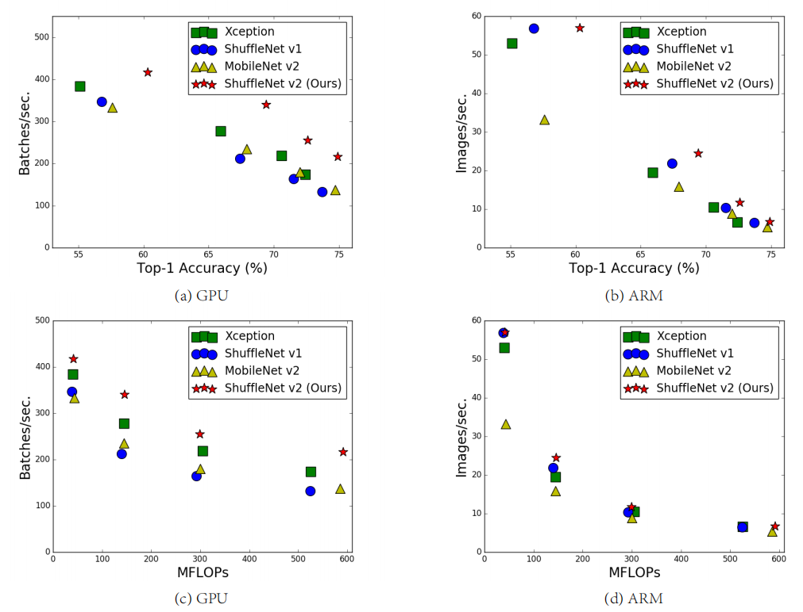
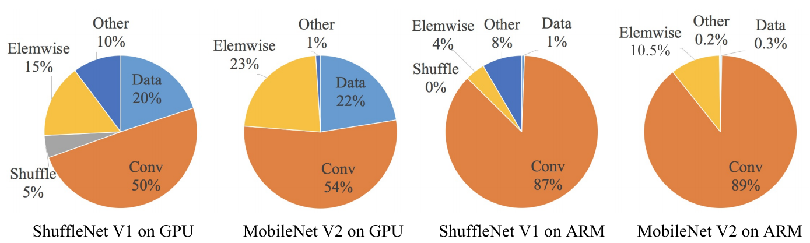

# ShuffleNet v2: Practical Guidelines for Efficient CNN Architecture Design
ShuffleNet v2：高效CNN架构设计实用指南 2018-7-30 https://arxiv.org/abs/1807.11164

## 阅读笔记
* https://github.com/pytorch/vision/blob/main/torchvision/models/shufflenetv2.py
1. FLOP不能准确衡量实际速度和延迟
2. MAC，内存访问对应能影响

## Abstract. 
Currently, the neural network architecture design is mostly guided by the indirect metric of computation complexity, i.e., FLOPs.However, the direct metric, e.g., speed, also depends on the other factors such as memory access cost and platform characterics. Thus, this work proposes to evaluate the direct metric on the target platform, beyond only considering FLOPs. Based on a series of controlled experiments, this work derives several practical guidelines for efficient network design. Accordingly, a new architecture is presented, called ShuffleNet V2. Comprehensive ablation experiments verify that our model is the stateof-the-art in terms of speed and accuracy tradeoff.

目前，神经网络架构设计主要由计算复杂性的间接度量(即FLOP)指导。然而，直接度量(如速度)也取决于其他因素，如内存访问成本和平台特性。因此，这项工作建议评估目标平台上的直接度量，而不仅仅考虑FLOP。基于一系列受控实验，这项工作得出了有效网络设计的几个实用指南。因此，提出了一种新的架构，称为ShuffleNet V2。综合消融实验验证了我们的模型在速度和精度方面是最先进的。

Keywords: CNN architecture design, efficiency, practical 

## 1 Introduction
The architecture of deep convolutional neutral networks (CNNs) has evolved for years, becoming more accurate and faster. Since the milestone work of AlexNet [1], the ImageNet classification accuracy has been significantly improved by novel structures, including VGG [2], GoogLeNet [3], ResNet [4,5], DenseNet [6], ResNeXt [7], SE-Net [8], and automatic neutral architecture search [9,10,11], to name a few.

深度卷积神经网络(CNN)的架构已经发展了多年，变得更加准确和快速。自AlexNet[1]的里程碑式工作以来，ImageNet分类精度已通过新颖的结构显著提高，包括VGG[2]、GoogLeNet[3]、ResNet[4,5]、DenseNet[6]、ResNeXt[7]、SE-Net[8]和自动神经架构搜索[9,10,11]等。

Besides accuracy, computation complexity is another important consideration. Real world tasks often aim at obtaining best accuracy under a limited computational budget, given by target platform (e.g., hardware) and application scenarios (e.g., auto driving requires low latency). This motivates a series of works towards light-weight architecture design and better speed-accuracy tradeoff, including Xception [12], MobileNet [13], MobileNet V2 [14], ShuffleNet [15], and CondenseNet [16], to name a few. Group convolution and depth-wise convolution are crucial in these works.

除了准确性，计算复杂性是另一个重要考虑因素。现实世界的任务通常旨在在目标平台(例如，硬件)和应用场景(例如，自动驾驶需要低延迟)给定的有限计算预算下获得最佳精度。这促使了一系列致力于轻量级架构设计和更好的速度精度权衡的工作，包括Xception[12]、MobileNet[13]、MobileNetwork V2[14]、ShuffleNet[15]和CondenseNet[16]等。组卷积和深度卷积在这些工作中至关重要。

To measure the computation complexity, a widely used metric is the number of float-point operations, or FLOPs(1 In this paper, the definition of FLOPs follows [15], i.e. the number of multiply-adds.) . However, FLOPs is an indirect metric. It is an approximation of, but usually not equivalent to the direct metric that we really care about, such as speed or latency. Such discrepancy has been noticed in previous works [17,18,14,19]. For example, MobileNet v2 [14] is much faster than NASNET-A [9] but they have comparable FLOPs. This phenomenon is further exmplified in Figure 1(c)(d), which show that networks with similar FLOPs have different speeds. Therefore, using FLOPs as the only metric for computation complexity is insufficient and could lead to sub-optimal design.

为了衡量计算复杂度，一个广泛使用的度量是浮点运算的数量，即FLOP(1在本文中，FLOP的定义遵循[15]，即乘法和加法的数量)。然而，FLOP是一个间接度量。它是一个近似值，但通常不等同于我们真正关心的直接指标，例如速度或延迟。在以往的工作中已经注意到这种差异[17,18,14,19]。例如，MobileNet v2[14]比NASNET-A[9]快得多，但它们的FLOP相当。这一现象在图1(c)(d)中得到了进一步的说明，图1显示具有相似FLOP的网络具有不同的速度。因此，使用FLOP作为计算复杂性的唯一度量是不够的，可能导致次优设计。

Fig. 1: Measurement of accuracy (ImageNet classification on validation set), speed and FLOPs of four network architectures on two hardware platforms with four different level of computation complexities (see text for details). (a, c) GPU results, batchsize = 8. (b, d) ARM results, batchsize = 1. The best performing algorithm, our proposed ShuffleNet v2, is on the top right region, under all cases. 
图1：具有四种不同计算复杂度级别的两个硬件平台上的四种网络架构的准确性(验证集上的ImageNet分类)、速度和FLOP的测量(详见正文)。(a，c)GPU结果，batchsize=8。(b，d)ARM结果，bachsize=1。在所有情况下，性能最好的算法，我们提出的ShuffleNet v2，都位于右上角区域。

The discrepancy between the indirect (FLOPs) and direct (speed) metrics can be attributed to two main reasons. First, several important factors that have considerable affection on speed are not taken into account by FLOPs. One such factor is memory access cost (MAC). Such cost constitutes a large portion of runtime in certain operations like group convolution. It could be bottleneck on devices with strong computing power, e.g., GPUs. This cost should not be simply ignored during network architecture design. Another one is degree of parallelism. A model with high degree of parallelism could be much faster than another one with low degree of parallelism, under the same FLOPs.

间接(FLOP)和直接(速度)度量之间的差异可归因于两个主要原因。首先，FLOP没有考虑对速度有相当大影响的几个重要因素。一个这样的因素是内存访问成本(MAC)。在某些操作(如组卷积)中，这种成本占运行时间的很大一部分。这可能是具有强大计算能力的设备(例如GPU)的瓶颈。在网络架构设计期间，不应简单地忽略此成本。另一个是并行度。在相同的FLOP下，具有高并行度的模型可能比具有低并行度的另一个模型快得多。

Second, operations with the same FLOPs could have different running time, depending on the platform. For example, tensor decomposition is widely used in early works [20,21,22] to accelerate the matrix multiplication. However, the recent work [19] finds that the decomposition in [22] is even slower on GPU although it reduces FLOPs by 75%. We investigated this issue and found that this is because the latest CUDNN [23] library is specially optimized for 3 × 3 conv. We cannot certainly think that 3 × 3 conv is 9 times slower than 1 × 1 conv. 

其次，具有相同FLOP的操作可能会有不同的运行时间，这取决于平台。例如，张量分解在早期工作[20，21，22]中被广泛用于加速矩阵乘法。然而，最近的工作[19]发现，[22]中的分解在GPU上甚至更慢，尽管它将FLOP减少了75%。我们调查了这个问题，发现这是因为最新的CUDNN[23]库专门针对3×3 conv进行了优化。我们不能肯定认为3×3 conv比1×1 conv慢9倍。

Fig. 2: Run time decomposition on two representative state-of-the-art network architectures, ShuffeNet v1 [15] (1×, g = 3) and MobileNet v2 [14] (1×).
图2：两种代表性的最先进网络架构的运行时分解，ShuffeNet v1[15](1×，g=3)和MobileNet v2[14](1×)。

With these observations, we propose that two principles should be considered for effective network architecture design. First, the direct metric (e.g., speed) should be used instead of the indirect ones (e.g., FLOPs). Second, such metric should be evaluated on the target platform.

根据这些观察，我们建议，有效的网络架构设计应考虑两个原则。首先，应该使用直接度量(例如速度)而不是间接度量(例如FLOP)。其次，应该在目标平台上评估这种度量。

In this work, we follow the two principles and propose a more effective network architecture. In Section 2, we firstly analyze the runtime performance of two representative state-of-the-art networks [15,14]. Then, we derive four guidelines for efficient network design, which are beyond only considering FLOPs. While these guidelines are platform independent, we perform a series of controlled experiments to validate them on two different platforms (GPU and ARM) with dedicated code optimization, ensuring that our conclusions are state-of-the-art.

在这项工作中，我们遵循这两个原则，并提出了更有效的网络架构。在第2节中，我们首先分析了两个具有代表性的最先进网络的运行时性能[15，14]。然后，我们得出了高效网络设计的四条准则，这些准则超出了仅考虑FLOP的范围。虽然这些指南是独立于平台的，但我们通过专用代码优化在两个不同的平台(GPU和ARM)上执行一系列受控实验来验证它们，确保我们的结论是最先进的。

In Section 3, according to the guidelines, we design a new network structure. As it is inspired by ShuffleNet [15], it is called ShuffleNet V2. It is demonstrated much faster and more accurate than the previous networks on both platforms, via comprehensive validation experiments in Section 4. Figure 1(a)(b) gives an overview of comparison. For example, given the computation complexity budget of 40M FLOPs, ShuffleNet v2 is 3.5% and 3.7% more accurate than ShuffleNet v1 and MobileNet v2, respectively. 

在第3节中，根据指南，我们设计了一个新的网络结构。由于它受到ShuffleNet[15]的启发，因此被称为ShuffleNet V2。通过第4节中的综合验证实验，它在两个平台上都比以前的网络更快、更准确。图1(a)(b)给出了比较概述。例如，考虑到4000万FLOP的计算复杂度预算，ShuffleNet v2的准确度分别比ShuffleNet v1和MobileNet v3高3.5%和3.7%。

## 2 Practical Guidelines for Efficient Network Design 高效网络设计实用指南
Our study is performed on two widely adopted hardwares with industry-level optimization of CNN library. We note that our CNN library is more efficient than most open source libraries. Thus, we ensure that our observations and conclusions are solid and of significance for practice in industry. 
* GPU. A single NVIDIA GeForce GTX 1080Ti is used. The convolution library is CUDNN 7.0 [23]. We also activate the benchmarking function of CUDNN to select the fastest algorithms for different convolutions respectively. 
* ARM. A Qualcomm Snapdragon 810. We use a highly-optimized Neon-based implementation. A single thread is used for evaluation. 

我们的研究是在两个广泛采用的硬件上进行的，并对CNN库进行了行业级优化。我们注意到，我们的CNN库比大多数开源库更高效。因此，我们确保我们的观察和结论是可靠的，并且对工业实践具有重要意义。
* GPU。使用单个NVIDIA GeForce GTX 1080Ti。卷积库为CUDNN 7.0[23]。我们还激活了CUDNN的基准测试功能，分别为不同的卷积选择最快的算法。
* ARM。高通骁龙810。我们使用高度优化的基于Neon的实现。单线程用于评估。

Other settings include: full optimization options (e.g. tensor fusion, which is used to reduce the overhead of small operations) are switched on. The input image size is 224 × 224. Each network is randomly initialized and evaluated for 100 times. The average runtime is used.

其他设置包括：打开完全优化选项(例如，张量融合，用于减少小操作的开销)。输入图像大小为224×224。每个网络被随机初始化并评估100次。使用平均运行时。

To initiate our study, we analyze the runtime performance of two stateof-the-art networks, ShuffleNet v1 [15] and MobileNet v2 [14]. They are both highly efficient and accurate on ImageNet classification task. They are both widely used on low end devices such as mobiles. Although we only analyze these two networks, we note that they are representative for the current trend. At their core are group convolution and depth-wise convolution, which are also crucial components for other state-of-the-art networks, such as ResNeXt [7],Xception [12], MobileNet [13], and CondenseNet [16].

为了启动我们的研究，我们分析了两种最先进网络的运行时性能，ShuffleNet v1[15]和MobileNet v2[14]。它们在ImageNet分类任务中既高效又准确。它们都广泛应用于手机等低端设备。尽管我们只分析了这两个网络，但我们注意到它们代表了当前的趋势。其核心是组卷积和深度卷积，这也是其他最先进网络的关键组件，如ResNeXt[7]、Xception[12]、MobileNet[13]和CondenseNet[16]。

The overall runtime is decomposed for different operations, as shown in Figure 2. We note that the FLOPs metric only account for the convolution part. Although this part consumes most time, the other operations including data I/O, data shuffle and element-wise operations (AddTensor, ReLU, etc) also occupy considerable amount of time. Therefore, FLOPs is not an accurate enough estimation of actual runtime.

如图2所示，针对不同的操作对整个运行时进行了分解。我们注意到，FLOP度量只考虑了卷积部分。尽管这部分消耗了大部分时间，但其他操作(包括数据I/O、数据混洗和元素操作(AddTensor、ReLU等)也占用了大量时间。因此，FLOP对实际运行时间的估计不够准确。

Based on this observation, we perform a detailed analysis of runtime (or speed) from several different aspects and derive several practical guidelines for efficient network architecture design.

基于这一观察，我们从几个不同的方面对运行时(或速度)进行了详细分析，并得出了高效网络架构设计的几个实用指南。

### G1. Equal channel width minimizes memory access cost (MAC). 
相等的信道宽度使内存访问成本(MAC)最小化

The modern networks usually adopt depthwise separable convolutions [12,13,15,14], where the pointwise convolution (i.e., 1 × 1 convolution) accounts for most of the complexity [15]. We study the kernel shape of the 1 × 1 convolution. The shape is specified by two parameters: the number of input channels $c_1$ and output channels $c_2$. Let h and w be the spatial size of the feature map, the FLOPs of the 1 × 1 convolution is $B = hwc_1c_2$.

现代网络通常采用深度可分离卷积[12，13，15，14]，其中点卷积(即1×1卷积)占据了大部分复杂度[15]。我们研究了1×1卷积的核形状。形状由两个参数指定：输入通道$c_1$和输出通道$c_2$的数量。设h和w为特征图的空间大小，1×1卷积的FLOP为$B=hwc_1c_2$。

For simplicity, we assume the cache in the computing device is large enough to store the entire feature maps and parameters. Thus, the memory access cost (MAC), or the number of memory access operations, is MAC = hw($c_1$+$c_2$)+$c_1$$c_2$. Note that the two terms correspond to the memory access for input/output feature maps and kernel weights, respectively. From mean value inequality, we have 

为了简单起见，我们假设计算设备中的缓存足够大，可以存储整个特征图和参数。因此，存储器访问成本(MAC)或存储器访问操作的数量是MAC＝hw($c_1$+$c_2$)+$c_1$$c_2$。请注意，这两个术语分别对应于输入/输出特征映射和内核权重的存储器访问。根据均值不等式，我们得到:

$MAC ≥ 2\sqrt{hwB} + \frac{B}{hw}$ . (1)

Therefore, MAC has a lower bound given by FLOPs. It reaches the lower bound when the numbers of input and output channels are equal.

因此，MAC具有FLOP给出的下限。当输入和输出通道的数量相等时，它达到下限。

The conclusion is theoretical. In practice, the cache on many devices is not large enough. Also, modern computation libraries usually adopt complex blocking strategies to make full use of the cache mechanism [24]. Therefore, the real MAC may deviate from the theoretical one. To validate the above conclusion, an experiment is performed as follows. A benchmark network is built by stacking 10 building blocks repeatedly. Each block contains two convolution layers. The first contains $c_1$ input channels and $c_2$ output channels, and the second otherwise.

结论是理论上的。实际上，许多设备上的缓存不够大。此外，现代计算库通常采用复杂的阻塞策略来充分利用缓存机制[24]。因此，实际MAC可能会偏离理论MAC。为了验证上述结论，如下进行实验。通过重复堆叠10个构建块来构建基准网络。每个块包含两个卷积层。第一个包含$c_1$个输入通道和$c_2$个输出通道，第二个则不然。

Table 1: Validation experiment for Guideline 1. Four different ratios of number of input/output channels ($c_1$ and $c_2$) are tested, while the total FLOPs under the four ratios is fixed by varying the number of channels. Input image size is 56 × 56.
表1：准则1的验证实验。测试了四种不同的输入/输出通道数比($c_1$和$c_2$)，而四种比率下的总FLOP通过改变通道数而固定。输入图像大小为56×56。

Table 1 reports the running speed by varying the ratio $c_1$ : $c_2$ while fixing the total FLOPs. It is clear that when $c_1$ : $c_2$ is approaching 1 : 1, the MAC becomes smaller and the network evaluation speed is faster.

表1通过在固定总FLOP的同时改变比率$c_1$:$c_2$来报告运行速度。很明显，当$c_1$:$c_2$接近1:1时，MAC变小，网络评估速度更快。

### G2. Excessive group convolution increases MAC. 
过多的组卷积会增加MAC。

Group convolution is at the core of modern network architectures [7,15,25,26,27,28]. It reduces the computational complexity (FLOPs) by changing the dense convolution between all channels to be sparse (only within groups of channels). On one hand, it allows usage of more channels given a fixed FLOPs and increases the network capacity (thus better accuracy). On the other hand, however, the increased number of channels results in more MAC.

组卷积是现代网络架构的核心[7，15，25，26，27，28]。它通过将所有信道之间的密集卷积更改为稀疏(仅在信道组内)来降低计算复杂度(FLOP)。一方面，它允许在给定固定FLOP的情况下使用更多的信道，并增加了网络容量(从而提高了准确性)。然而，另一方面，信道数量的增加导致更多MAC。

Formally, following the notations in G1 and Eq. 1, the relation between MAC and FLOPs for 1 × 1 group convolution is

形式上，遵循G1和等式1中的符号，1×1组卷积的MAC和FLOP之间的关系为

$MAC = hw($c_1$ + $c_2$) + $c_1$$c_2$ g = hw$c_1$ + Bg $c_1$ + B hw $, (2) 

where g is the number of groups and B = hw$c_1$$c_2$/g is the FLOPs. It is easy to see that, given the fixed input shape $c_1$ × h × w and the computational cost B, MAC increases with the growth of g.

其中g是组的数目，B＝hw$c_1$$c_2$/g是FLOP。很容易看出，给定固定的输入形状$c_1$×h×w和计算成本B，MAC随着g的增长而增加。

To study the affection in practice, a benchmark network is built by stacking 10 pointwise group convolution layers. Table 2 reports the running speed of using different group numbers while fixing the total FLOPs. It is clear that using a large group number decreases running speed significantly. For example, using 8 groups is more than two times slower than using 1 group (standard dense convolution) on GPU and up to 30% slower on ARM. This is mostly due to increased MAC. We note that our implementation has been specially optimized and is much faster than trivially computing convolutions group by group.

为了研究实际中的影响，通过堆叠10个逐点组卷积层来构建基准网络。表2报告了在固定总FLOP时使用不同组号的运行速度。很明显，使用大的组号会显著降低跑步速度。例如，在GPU上使用8组比使用1组(标准密集卷积)慢两倍多，在ARM上慢30%。这主要是由于MAC增加。我们注意到，我们的实现经过了特别优化，比一组一组地计算卷积要快得多。

Therefore, we suggest that the group number should be carefully chosen based on the target platform and task. It is unwise to use a large group number simply because this may enable using more channels, because the benefit of accuracy increase can easily be outweighed by the rapidly increasing computational cost.

因此，我们建议应根据目标平台和任务仔细选择组数。简单地使用多个组是不明智的，因为这可能会使用更多的信道，因为快速增加的计算成本很容易超过精度提高的好处。

Table 2: Validation experiment for Guideline 2. Four values of group number g are tested, while the total FLOPs under the four values is fixed by varying the total channel number c. Input image size is 56 × 56.
表2：准则2的验证实验。测试了组号g的四个值，而四个值下的总FLOP通过改变总通道数c来固定。输入图像大小为56×56。

### G3. Network fragmentation reduces degree of parallelism. 
网络碎片化降低了并行度。

Table 3: Validation experiment for Guideline 3. c denotes the number of channels for 1-fragment. The channel number in other fragmented structures is adjusted so that the FLOPs is the same as 1-fragment. Input image size is 56 × 56.
表3:指南3.c的验证实验表示1-片段的通道数。调整其他分段结构中的信道号，使得FLOP与1-分段相同。输入图像大小为56×56。

In the GoogLeNet series [29,30,3,31] and auto-generated architectures [9,11,10]), a “multipath” structure is widely adopted in each network block. A lot of small operators (called “fragmented operators” here) are used instead of a few large ones. For example, in NASNET-A [9] the number of fragmented operators (i.e. the number of individual convolution or pooling operations in one building block) is 13. In contrast, in regular structures like ResNet [4], this number is 2 or 3.

在GoogLeNet系列[29，30，3，31]和自动生成架构[9，11，10]中，“多路径”结构在每个网络块中被广泛采用。使用了许多小操作符(这里称为“碎片操作符”)，而不是一些大操作符。例如，在NASNET-A[9]中，分段运算符的数量(即一个构建块中单个卷积或池化操作的数量)为13。相比之下，在ResNet[4]等规则结构中，该数量为2或3。

Though such fragmented structure has been shown beneficial for accuracy, it could decrease efficiency because it is unfriendly for devices with strong parallel computing powers like GPU. It also introduces extra overheads such as kernel launching and synchronization.

尽管这种碎片化结构已被证明有利于准确性，但它可能会降低效率，因为它对GPU等具有强大并行计算能力的设备不友好。它还引入了额外的开销，如内核启动和同步。

To quantify how network fragmentation affects efficiency, we evaluate a series of network blocks with different degrees of fragmentation. Specifically, each building block consists of from 1 to 4 1 × 1 convolutions, which are arranged in sequence or in parallel. The block structures are illustrated in appendix. Each block is repeatedly stacked for 10 times. Results in Table 3 show that fragmentation reduces the speed significantly on GPU, e.g. 4-fragment structure is 3× slower than 1-fragment. On ARM, the speed reduction is relatively small.

为了量化网络碎片化如何影响效率，我们评估了一系列具有不同碎片化程度的网络块。具体而言，每个构建块由1到4个1×1卷积组成，这些卷积按顺序或平行排列。方框结构如附录所示。每个块重复堆叠10次。表3中的结果表明，碎片化显著降低了GPU上的速度，例如4碎片结构比1碎片慢3倍。在ARM上，速度降低相对较小。

### G4. Element-wise operations are non-negligible. 
元素操作是不可忽略的。

As shown in Figure 2, in light-weight models like [15,14], element-wise operations occupy considerable amount of time, especially on GPU. Here, the element-wise operators include ReLU, AddTensor, AddBias, etc. They have small FLOPs but relatively heavy MAC. Specially, we also consider depthwise convolution [12,13,14,15] as an element-wise operator as it also has a high MAC/FLOPs ratio. 

如图2所示，在像[15，14]这样的轻量级模型中，元素操作占用了大量时间，尤其是在GPU上。这里，元素运算符包括ReLU、AddTensor、AddBias等。它们具有较小的FLOP，但MAC相对较重。特别地，我们还将深度卷积[12，13，14，15]视为元素运算符，因为它也具有高MAC/FLOP比。

Table 4: Validation experiment for Guideline 4. The ReLU and shortcut operations are removed from the “bottleneck” unit [4], separately. c is the number of channels in unit. The unit is stacked repeatedly for 10 times to benchmark the speed. 
表4：准则4的验证实验。ReLU和快捷操作分别从“瓶颈”单元[4]中删除。c是单位信道数。该装置重复堆叠10次，以测试速度。

For validation, we experimented with the “bottleneck” unit (1 × 1 conv fol- ×3 conv followed by 1×1 conv, with ReLU and shortcut connection) in ResNet [4]. The ReLU and shortcut operations are removed, separately. Runtime of different variants is reported in Table 4. We observe around 20% speedup is obtained on both GPU and ARM, after ReLU and shortcut are removed.

为了验证，我们在ResNet中对“瓶颈”单元(1×1 conv fol-×3 conv，然后是1×1 conv，使用ReLU和快捷连接)进行了实验[4]。ReLU和快捷操作将分别删除。不同变型的运行时间如表4所示。我们观察到，在移除ReLU和快捷方式后，GPU和ARM都获得了大约20%的加速。

### Conclusion and Discussions. 
Based on the above guidelines and empirical studies, we conclude that an efficient network architecture should 1) use ”balanced“ convolutions (equal channel width); 2) be aware of the cost of using group convolution; 3) reduce the degree of fragmentation; and 4) reduce element-wise operations. These desirable properties depend on platform characterics (such as memory manipulation and code optimization) that are beyond theoretical FLOPs. They should be taken into accout for practical network design.

基于上述指南和实证研究，我们得出结论，一个高效的网络架构应该
1. 使用“平衡”卷积(相等的信道宽度); 
2. 意识到使用组卷积的成本; 
3. 减少碎片化程度; 
4. 减少元素操作。
这些理想的性能取决于平台特性(如内存操作和代码优化)这超出了理论FLOP。在实际的网络设计中应考虑这些因素。

Recent advances in light-weight neural network architectures [15,13,14,9,11,10,12] are mostly based on the metric of FLOPs and do not consider these properties above. For example, ShuffleNet v1 [15] heavily depends group convolutions (against G2) and bottleneck-like building blocks (against G1). MobileNet v2 [14] uses an inverted bottleneck structure that violates G1. It uses depthwise convolutions and ReLUs on “thick” feature maps. This violates G4. The auto-generated structures [9,11,10] are highly fragmented and violate G3. 

轻量神经网络架构的最新进展[15，13，14，9，11，10，12]主要基于FLOP的度量，没有考虑上述这些属性。例如，ShuffleNet v1[15]严重依赖于组卷积(针对G2)和类似瓶颈的构建块(针对G1)。MobileNet v2[14]使用了违反G1的反向瓶颈结构。它在“厚”特征图上使用深度卷积和ReLU。这违反了G4。自动生成的结构[9，11，10]高度碎片化，违反了G3。

## 3 ShuffleNet V2: an Efficient Architecture
ShuffleNet V2: 一种高效的架构

### Review of ShuffleNet v1 [15].  
ShuffleNet v1回顾[15]。

ShuffleNet is a state-of-the-art network architecture. It is widely adopted in low end devices such as mobiles. It inspires our work. Thus, it is reviewed and analyzed at first.

ShuffleNet是一种最先进的网络架构。它被广泛应用于低端设备，如手机。它激励着我们的工作。因此，首先对其进行了回顾和分析。

Fig. 3: Building blocks of ShuffleNet v1 [15] and this work. (a) the basic ShuffleNet unit; (b) the ShuffleNet unit for spatial down sampling (2×); (c) our basic unit; (d) our unit for spatial down sampling (2×). DWConv: depthwise convolution. GConv: group convolution. 
图3：ShuffleNet v1[15]的构建块及其工作。(a)基本ShuffleNet单元; (b)用于空间下采样的ShuffleNet单元(2×); (c)我们的基本单位; (d)我们的空间下采样单元(2×)。DWConv：深度卷积。GConv：组卷积。

According to [15], the main challenge for light-weight networks is that only a limited number of feature channels is affordable under a given computation budget (FLOPs). To increase the number of channels without significantly increasing FLOPs, two techniques are adopted in [15]: pointwise group convolutions and bottleneck-like structures. A “channel shuffle” operation is then introduced to enable information communication between different groups of channels and improve accuracy. The building blocks are illustrated in Figure 3(a)(b).

根据[15]，轻型网络的主要挑战是在给定的计算预算(FLOP)下，只有有限数量的特征信道是可负担的。为了在不显著增加FLOP的情况下增加信道数量，[15]中采用了两种技术：逐点组卷积和瓶颈状结构。然后引入“信道混洗”操作，以实现不同信道组之间的信息通信并提高准确性。构建块如图3(a)(b)所示。

As discussed in Section 2, both pointwise group convolutions and bottleneck structures increase MAC (G1 and G2). This cost is non-negligible, especially for light-weight models. Also, using too many groups violates G3. The element-wise “Add” operation in the shortcut connection is also undesirable (G4). Therefore, in order to achieve high model capacity and efficiency, the key issue is how to maintain a large number and equally wide channels with neither dense convolution nor too many groups.

如第2节所述，逐点组卷积和瓶颈结构都增加了MAC(G1和G2)。这一成本是不可忽略的，尤其是对于轻型模型。此外，使用过多的组违反了G3。快捷连接中的元素“添加”操作也是不可取的(G4)。因此，为了实现高模型容量和效率，关键问题是如何在既没有密集卷积也没有过多组的情况下保持大量和等宽的信道。

### Channel Split and ShuffleNet V2 
信道拆分和ShuffleNet V2

Towards above purpose, we introduce a simple operator called channel split. It is illustrated in Figure 3(c). At the 9 beginning of each unit, the input of c feature channels are split into two branches with c − c' and c' channels, respectively. Following G3, one branch remains as identity. The other branch consists of three convolutions with the same input and output channels to satisfy G1. The two 1 group-wise, unlike [15]. This is partially to follow × G2 1 convolutions are no longer , and partially because the split operation already produces two groups.

为了达到上述目的，我们引入了一个简单的运算符，称为信道分割。如图3(c)所示。在每个单元的9开头，c个特征通道的输入被分成两个分支 c − c'和c'通道。在G3之后，一个分支保留为标识。另一个分支由具有相同输入和输出通道的三个卷积组成，以满足G1。与[15]不同，这两个卷积是1组。这部分是为了跟随×G2 1卷积不再，部分是因为拆分操作已经产生了两个组。

After convolution, the two branches are concatenated. So, the number of channels keeps the same (G1). The same “channel shuffle” operation as in [15] is then used to enable information communication between the two branches. After the shuffling, the next unit begins. Note that the “Add” operation in ShuffleNet v1 [15] no longer exists. Element-wise operations like ReLU and depthwise convolutions exist only in one branch. Also, the three successive elementwise operations, “Concat”, “Channel Shuffle” and “Channel Split”, are merged into a single element-wise operation. These changes are beneficial according to G4.

卷积后，两个分支被连接起来。因此，通道数保持不变(G1)。然后，使用与[15]中相同的“信道混洗”操作来实现两个分支之间的信息通信。洗牌后，下一个单元开始。请注意，ShuffleNet v1[15]中的“添加”操作已不存在。像ReLU和深度卷积这样的元素操作只存在于一个分支中。此外，三个连续的元素操作“Concat”、“Channel Shuffle”和“Channel Split”被合并为单个元素操作。根据G4，这些变化是有益的。

For spatial down sampling, the unit is slightly modified and illustrated in Figure 3(d). The channel split operator is removed. Thus, the number of output channels is doubled.

对于空间下采样，该单元稍作修改，如图3(d)所示。通道拆分操作符被删除。因此，输出通道的数量加倍。

The proposed building blocks (c)(d), as well as the resulting networks, are called ShuffleNet V2. Based the above analysis, we conclude that this architecture design is highly efficient as it follows all the guidelines.

建议的构建块(c)(d)以及由此产生的网络称为ShuffleNet V2。基于以上分析，我们得出结论，该架构设计非常高效，因为它遵循了所有准则。

Table 5: Overall architecture of ShuffleNet v2, for four different levels of complexities. 
表5:ShuffleNet v2的总体架构，针对四个不同的复杂性级别。

The building blocks are repeatedly stacked to construct the whole network. For simplicity, we set c0 = c/2. The overall network structure is similar to Shuf- fleNet v1 [15] and summarized in Table 5. There is only one difference: an additional 1 × 1 convolution layer is added right before global averaged pooling to mix up features, which is absent in ShuffleNet v1. Similar to [15], the number of channels in each block is scaled to generate networks of different complexities, marked as 0.5×, 1×, etc.

构建块被反复堆叠以构建整个网络。为了简单起见，我们设置c0=c/2。整个网络结构类似于Shuf-fleNet v1[15]，并在表5中进行了总结。只有一个区别：在全局平均池之前添加了额外的1×1卷积层，以混合特征，这在ShuffleNet v1中是不存在的。与[15]类似，每个块中的信道数被缩放以生成不同复杂度的网络，标记为0.5×、1×等。

### Analysis of Network Accuracy  网络精度分析
ShuffleNet v2 is not only efficient, but also accurate. There are two main reasons. First, the high efficiency in each building block enables using more feature channels and larger network capacity.

ShuffleNet v2不仅高效，而且准确。主要有两个原因。首先，每个构建块的高效率使得能够使用更多的功能信道和更大的网络容量。

Second, in each block, half of feature channels (when c0 = c/2) directly go through the block and join the next block. This can be regarded as a kind of feature reuse, in a similar spirit as in DenseNet [6] and CondenseNet [16].

其次，在每个块中，一半的特征通道(当c0＝c/2时)直接穿过该块并连接下一个块。这可以被视为一种特征重用，其想法类似于DenseNet[6]和CondenseNet[16]。

In DenseNet[6], to analyze the feature reuse pattern, the l1-norm of the weights between layers are plotted, as in Figure 4(a). It is clear that the connections between the adjacent layers are stronger than the others. This implies that the dense connection between all layers could introduce redundancy. The recent CondenseNet [16] also supports the viewpoint.

在DenseNet[6]中，为了分析特征重用模式，绘制了层间权重的l1范数，如图4(a)所示。很明显，相邻层之间的连接比其他层更强。这意味着所有层之间的密集连接可能会引入冗余。最近的CondenseNet[16]也支持这一观点。

In ShuffleNet V2, it is easy to prove that the number of “directly-connected” channels between i-th and (i+j)-th building block is rj c, where r = (1−c' )/c. In other words, the amount of feature reuse decays exponentially with the distance between two blocks. Between distant blocks, the feature reuse becomes much weaker. Figure 4(b) plots the similar visualization as in (a), for r = 0.5. Note that the pattern in (b) is similar to (a). 

在ShuffleNet V2中，很容易证明第i个和第(i+j)个构建块之间的“直接连接”信道的数量是rjc，其中r=(1−c')/c。换句话说，特征重用量随着两个块之间的距离呈指数衰减。在距离较远的块之间，特征重用变得更弱。图4(b)绘制了与(a)相似的可视化图，r=0.5。请注意，(b)中的模式与(b)相似。

Fig. 4: Illustration of the patterns in feature reuse for DenseNet [6] and ShuffleNet V2. (a) (courtesy of [6]) the average absolute filter weight of convolutional layers in a model. The color of pixel (s, l) encodes the average l1-norm of weights connecting layer s to l. (b) The color of pixel (s, l) means the number of channels directly connecting block s to block l in ShuffleNet v2. All pixel values are normalized to [0, 1]. 
图4：DenseNet[6]和ShuffleNet V2的特征重用模式说明。(a)(由[6]提供)模型中卷积层的平均绝对滤波器权重。像素(s，l)的颜色对连接层s到l的权重的平均l1范数进行编码。(b)像素的颜色表示ShuffleNet v2中直接连接块s到块l的通道数。所有像素值均归一化为[0，1]。

Thus, the structure of ShuffleNet V2 realizes this type of feature re-use pattern by design. It shares the similar benefit of feature re-use for high accuracy as in DenseNet [6], but it is much more efficient as analyzed earlier. This is verified in experiments, Table 8. 

因此，ShuffleNet V2的结构通过设计实现了这种类型的特征重用模式。它与DenseNet[6]中的特征重复使用具有相似的高精度优势，但如前所述，它的效率要高得多。这在实验中得到了验证，表8。

## 4 Experiment
Our ablation experiments are performed on ImageNet 2012 classification dataset [32,33]. Following the common practice [15,13,14], all networks in comparison have four levels of computational complexity, i.e. about 40, 140, 300 and 500+ MFLOPs. Such complexity is typical for mobile scenarios. Other hyper-parameters and protocols are exactly the same as ShuffleNet v1 [15].

我们的消融实验是在ImageNet 2012分类数据集上进行的[32，33]。按照常见做法[15，13，14]，相比之下，所有网络都有四个计算复杂度级别，即大约40、140、300和500+MFLOP。这种复杂性对于移动场景来说是典型的。其他超级参数和协议与ShuffleNet v1[15]完全相同。

We compare with following network architectures [12,14,6,15]: 
* ShuffleNet v1 [15]. In [15], a series of group numbers g is compared. It is suggested that the g = 3 has better trade-off between accuracy and speed. This also agrees with our observation. In this work we mainly use g = 3. 
* MobileNet v2 [14]. It is better than MobileNet v1 [13]. For comprehensive comparison, we report accuracy in both original paper [14] and our reimplemention, as some results in [14] are not available. 
* Xception [12]. The original Xception model [12] is very large (FLOPs >2G), which is out of our range of comparison. The recent work [34] proposes a modified light weight Xception structure that shows better trade-offs between accuracy and efficiency. So, we compare with this variant. 
* DenseNet [6]. The original work [6] only reports results of large models (FLOPs >2G). For direct comparison, we reimplement it following the architecture settings in Table 5, where the building blocks in Stage 2-4 consist Source layer Source layer 11 of DenseNet blocks. We adjust the number of channels to meet different target complexities.

我们与以下网络架构进行了比较[12,14,6,15]：
* ShuffleNet v1[15]。在[15]中，比较了一系列组编号g。建议g=3在精度和速度之间有更好的权衡。这也符合我们的观察。在这项工作中，我们主要使用g=3。
* MobileNet v2[14]。它优于MobileNet v1[13]。为了进行全面比较，我们报告了原始论文[14]和我们的重新实施中的准确性，因为[14]中的一些结果不可用。
* Xception[12]。原始Xception模型[12]非常大(FLOP>2G)，这超出了我们的比较范围。最近的工作[34]提出了一种改进的轻量Xception结构，该结构在准确性和效率之间表现出更好的权衡。因此，我们将其与这个变体进行比较。
* DenseNet[6]。原始工作[6]仅报告大型模型(FLOP>2G)的结果。为了直接比较，我们按照表5中的架构设置重新实现它，其中阶段2-4中的构建块由DenseNet块的源层源层11组成。我们调整通道的数量以满足不同的目标复杂性。

### Accuracy vs. FLOPs. 
It is clear that the proposed ShuffleNet v2 models outperform all other networks by a large margin(2 As reported in [14], MobileNet v2 of 500+ MFLOPs has comparable accuracy with the counterpart ShuffleNet v2 (25.3% vs. 25.1% top-1 error); however, our reimplemented version is not as good (26.7% error, see Table 8). ), especially under smaller computational budgets. Also, we note that MobileNet v2 performs pooly at 40 MFLOPs level with 224 × 224 image size. This is probably caused by too few channels. In contrast, our model do not suffer from this drawback as our efficient design allows using more channels. Also, while both of our model and DenseNet [6] reuse features, our model is much more efficient, as discussed in Sec. 3.

很明显，所提出的ShuffleNet v2模型在很大程度上优于所有其他网络(2如[14]中所述，500多个MFLOP的MobileNet v1具有与ShuffleNet v3相当的准确性(25.3%对25.1%的top 1错误); 然而，我们重新实现的版本没有那么好(26.7%的错误，见表8)，尤其是在较小的计算预算下。此外，我们注意到MobileNet v2在40MFLOP级别执行池操作，图像大小为224×224。这可能是由于信道太少造成的。相比之下，我们的模型没有受到这个缺点的影响，因为我们的高效设计允许使用更多的信道。此外，尽管我们的模型和DenseNet[6]都重用了特性，但我们的模型效率更高，如第3节所述。

Table 8 summarizes all the results. We analyze these results from different aspects.
表8总结了所有结果。我们从不同方面分析这些结果。

Table 8 also compares our model with other state-of-the-art networks including CondenseNet [16], IGCV2 [27], and IGCV3 [28] where appropriate. Our model performs better consistently at various complexity levels.

表8还将我们的模型与其他最先进的网络进行了比较，包括CondenseNet[16]、IGCV2[27]和IGCV3[28](如适用)。我们的模型在各种复杂度级别上表现得更好。

### Inference Speed vs. FLOPs/Accuracy. 
For four architectures with good accuracy, ShuffleNet v2, MobileNet v2, ShuffleNet v1 and Xception, we compare their actual speed vs. FLOPs, as shown in Figure 1(c)(d). More results on different resolutions are provided in Appendix Table 1.

对于ShuffleNet v2、MobileNet v3、ShuffleNet v1和Xception这四种具有良好准确性的架构，我们将它们的实际速度与FLOP进行了比较，如图1(c)(d)所示。附录表1提供了不同分辨率的更多结果。

ShuffleNet v2 is clearly faster than the other three networks, especially on GPU. For example, at 500MFLOPs ShuffleNet v2 is 58% faster than MobileNet v2, 63% faster than ShuffleNet v1 and 25% faster than Xception. On ARM, the speeds of ShuffleNet v1, Xception and ShuffleNet v2 are comparable; however, MobileNet v2 is much slower, especially on smaller FLOPs. We believe this is because MobileNet v2 has higher MAC (see G1 and G4 in Sec. 2), which is significant on mobile devices.

ShuffleNet v2显然比其他三种网络更快，尤其是在GPU上。例如，在500MFLOP时，ShuffleNet v2比MobileNet v1快58%，比ShuffleNet v1快63%，比Xception快25%。在ARM上，ShuffleNet v1、Xception和ShuffleNet v2的速度相当; 然而，MobileNet v2要慢得多，尤其是在较小的FLOP上。我们认为这是因为MobileNet v2具有更高的MAC(参见第2节中的G1和G4)，这在移动设备上非常重要。

Compared with MobileNet v1 [13], IGCV2 [27], and IGCV3 [28], we have two observations. First, although the accuracy of MobileNet v1 is not as good, its speed on GPU is faster than all the counterparts, including ShuffleNet v2. We believe this is because its structure satisfies most of proposed guidelines (e.g. for G3, the fragments of MobileNet v1 are even fewer than ShuffleNet v2). Second, IGCV2 and IGCV3 are slow. This is due to usage of too many convolution groups (4 or 8 in [27,28]). Both observations are consistent with our proposed guidelines.

与MobileNet v1[13]、IGCV2[27]和IGCV3[28]相比，我们有两个观察结果。首先，尽管MobileNet v1的准确性不太好，但它在GPU上的速度比包括ShuffleNet v2在内的所有同类产品都快。我们认为这是因为它的结构满足了大多数建议的指导原则(例如，对于G3，MobileNetv1的碎片甚至比ShuffleNet v3更少)。其次，IGCV2和IGCV3速度较慢。这是由于使用了太多的卷积组([27，28]中的4或8)。这两项意见与我们建议的准则一致。

Recently, automatic model search [9,10,11,35,36,37] has become a promising trend for CNN architecture design. The bottom section in Table 8 evaluates some auto-generated models. We find that their speeds are relatively slow. We believe this is mainly due to the usage of too many fragments (see G3). Nevertheless, this research direction is still promising. Better models may be obtained, for example, if model search algorithms are combined with our proposed guidelines, and the direct metric (speed) is evaluated on the target platform. 

最近，自动模型搜索[9，10，11，35，36，37]已成为CNN架构设计的一个有前途的趋势。表8的底部部分评估了一些自动生成的模型。我们发现它们的速度相对较慢。我们认为这主要是由于使用了太多的碎片(见G3)。尽管如此，这一研究方向仍然充满希望。例如，如果模型搜索算法与我们提出的准则相结合，并且在目标平台上评估直接度量(速度)，则可以获得更好的模型。

Finally, Figure 1(a)(b) summarizes the results of accuracy vs. speed, the direct metric. We conclude that ShuffeNet v2 is best on both GPU and ARM.
最后，图1(a)(b)总结了精度与速度的结果，即直接度量。我们得出结论，ShuffeNet v2在GPU和ARM上都是最好的。

### Compatibility with other methods. 
与其他方法的兼容性。

ShuffeNet v2 can be combined with other techniques to further advance the performance. When equipped with Squeezeand-excitation (SE) module [8], the classification accuracy of ShuffleNet v2 is improved by 0.5% at the cost of certain loss in speed. The block structure is illustrated in Appendix Figure 2(b). Results are shown in Table 8 (bottom section).

ShuffeNet v2可以与其他技术结合以进一步提高性能。当配备了挤压和激励(SE)模块[8]时，ShuffleNet v2的分类精度提高了0.5%，但速度有所下降。方框结构如附录图2(b)所示。结果如表8(底部)所示。

### Generalization to Large Models. 
大型模型的推广

Although our main ablation is performed for light weight scenarios, ShuffleNet v2 can be used for large models (e.g, FLOPs ≥ 2G). Table 6 compares a 50-layer ShuffleNet v2 (details in Appendix) with the counterpart of ShuffleNet v1 [15] and ResNet-50 [4]. ShuffleNet v2 still outperforms ShuffleNet v1 at 2.3GFLOPs and surpasses ResNet-50 with 40% fewer FLOPs.

尽管我们的主要消融是在轻量情况下进行的，但ShuffleNet v2可用于大型模型(如FLOP)≥ 2G)。表6将50层ShuffleNet v2(详见附录)与ShuffleNet v1[15]和ResNet-50[4]的对应版本进行了比较。ShuffleNet v2仍以2.3GFLOP的速度优于ShuffleNet v1，并以更少40%的FLOP超过ResNet-50。

For very deep ShuffleNet v2 (e.g. over 100 layers), for the training to converge faster, we slightly modify the basic ShuffleNet v2 unit by adding a residual path (details in Appendix). Table 6 presents a ShuffleNet v2 model of 164 layers equipped with SE [8] components (details in Appendix). It obtains superior accuracy over the previous state-of-the-art models [8] with much fewer FLOPs.

对于非常深的ShuffleNet v2(例如超过100层)，为了更快地收敛训练，我们通过添加残差路径(详见附录)稍微修改了ShuffleNet v1的基本单元。表6展示了配备SE[8]组件的164层ShuffleNet v2模型(详见附录)。它以更少的FLOP获得了优于先前最先进模型[8]的精度。

### Object Detection 
To evaluate the generalization ability, we also tested COCO object detection [38] task. We use the state-of-the-art light-weight detector – Light-Head RCNN [34] – as our framework and follow the same training and test protocols. Only backbone networks are replaced with ours. Models are pretrained on ImageNet and then finetuned on detection task. For training we use train+val set in COCO except for 5000 images from minival set, and use the minival set to test. The accuracy metric is COCO standard mmAP, i.e. the averaged mAPs at the box IoU thresholds from 0.5 to 0.95.

为了评估泛化能力，我们还测试了COCO对象检测[38]任务。我们使用最先进的轻型探测器 —— Light-Head RCNN[34]作为我们的框架，并遵循相同的训练和测试协议。只有主干网络被我们的网络所取代。模型在ImageNet上进行预训练，然后在检测任务上进行微调。对于训练，我们在COCO中使用train+val集合，除了minival集合中的5000个图像，并使用minival集进行测试。精度度量是COCO标准的mAP，即箱IoU阈值从0.5到0.95的平均mAP。

ShuffleNet v2 is compared with other three light-weight models: Xception [12,34], ShuffleNet v1 [15] and MobileNet v2 [14] on four levels of complexities. Results in Table 7 show that ShuffleNet v2 performs the best.

ShuffleNet v2与其他三种轻量级模型(Xception[12，34]、ShuffleNet v1[15]和MobileNet v2[14])在四个复杂程度上进行了比较。表7中的结果表明ShuffleNet v2的性能最好。

Compared the detection result (Table 7) with classification result (Table 8), it is interesting that, on classification the accuracy rank is ShuffleNet v2 ≥ MobileNet v2 > ShuffeNet v1 > Xception, while on detection the rank becomes ShuffleNet v2 > Xception ≥ ShuffleNet v1 ≥ MobileNet v2. This reveals that Xception is good on detection task. This is probably due to the larger receptive field of Xception building blocks than the other counterparts (7 vs. 3). Inspired by this, we also enlarge the receptive field of ShuffleNet v2 by introducing an additional 3 × 3 depthwise convolution before the first pointwise convolution in each building block. This variant is denoted as ShuffleNet v2*. With only a few additional FLOPs, it further improves accuracy.

将检测结果(表7)与分类结果(表8)进行比较，有趣的是，在分类时，准确度等级为ShuffleNet v2 ≥ MobileNet v2 > ShuffeNet v1 > Xception，而在检测时，等级变为ShuffleNet v2 > Xception ≥ ShuffleNet v1 ≥ MobileNet v2。这表明Xception在检测任务上很好。这可能是由于Xception构建块的感受野比其他构建块大(7比3)。受此启发，我们还通过在每个构建块中的第一个逐点卷积之前引入额外的3×3深度卷积来扩大ShuffleNet v2的感受野。该变体表示为ShuffleNet v2*。仅需几个额外的FLOP，就可以进一步提高精度。

We also benchmark the runtime time on GPU. For fair comparison the batch size is set to 4 to ensure full GPU utilization. Due to the overheads of data copying (the resolution is as high as 800 × 1200) and other detection-specific 

我们还对GPU上的运行时间进行了基准测试。为了公平比较，批量大小设置为4，以确保GPU的充分利用。由于数据复制(分辨率高达800×1200)和其他特定检测的开销

Table 6: Results of large models. See text for details. operations (like PSRoI Pooling [34]), the speed gap between different models is smaller than that of classification. Still, ShuffleNet v2 outperforms others, e.g. around 40% faster than ShuffleNet v1 and 16% faster than MobileNet v2.

表6：大型模型的结果。详见正文。操作(如PSRoI池[34])，不同模型之间的速度差距小于分类的速度差距。尽管如此，ShuffleNet v2仍优于其他版本，例如比Shuffle Net v1快40%左右，比MobileNet v4快16%。

Furthermore, the variant ShuffleNet v2* has best accuracy and is still faster than other methods. This motivates a practical question: how to increase the size of receptive field? This is critical for object detection in high-resolution images [39]. We will study the topic in the future.

此外，变体ShuffleNet v2*具有最佳的准确性，并且仍然比其他方法更快。这引发了一个实际问题：如何增加感受野的大小？这对于高分辨率图像中的对象检测至关重要[39]。我们将在未来研究这个话题。

Table 7: Performance on COCO object detection. The input image size is 800 × 1200. FLOPs row lists the complexity levels at 224 × 224 input size. For GPU speed evaluation, the batch size is 4. We do not test ARM because the PSRoI Pooling operation needed in [34] is unavailable on ARM currently. 

表7:COCO对象检测性能。输入图像大小为800×1200。FLOP行列出了224×224输入大小的复杂度级别。对于GPU速度评估，批大小为4。我们不测试ARM，因为[34]中所需的PSRoI池操作目前在ARM上不可用。

## 5 Conclusion
We propose that network architecture design should consider the direct metric such as speed, instead of the indirect metric like FLOPs. We present practical guidelines and a novel architecture, ShuffleNet v2. Comprehensive experiments verify the effectiveness of our new model. We hope this work could inspire future work of network architecture design that is platform aware and more practical.

我们建议网络架构设计应考虑速度等直接指标，而不是FLOP等间接指标。我们提出了实用指南和一种新的架构ShuffleNet v2。综合实验验证了我们新模型的有效性。我们希望这项工作能够启发未来的网络架构设计工作，使其更具平台意识和实用性。

## Acknowledgements 
Thanks Yichen Wei for his help on paper writing. This research is partially supported by National Natural Science Foundation of China (Grant No. 61773229). 
感谢Yichen Wei在论文写作方面的帮助。本研究得到国家自然科学基金(批准号：61773229)的部分资助。

Table 8: Comparison of several network architectures over classification error (on validation set, single center crop) and speed, on two platforms and four levels of computation complexity. Results are grouped by complexity levels for better comparison. The batch size is 8 for GPU and 1 for ARM. The image size is 224 × 224 except: [*] 160 × 160 and [**] 192 × 192. We do not provide speed measurements for CondenseNets [16] due to lack of efficient implementation currently. 
表8：在两个平台和四个计算复杂度级别上，几种网络架构在分类错误(验证集、单中心裁剪)和速度方面的比较。结果按复杂程度分组，以便更好地进行比较。GPU的批大小为8，ARM为1。图像大小为224×224，除了：[*]160×160和[**]192×192。由于目前缺乏有效的实现，我们不提供CondenseNets[16]的速度测量。

## References
1. Krizhevsky, A., Sutskever, I., Hinton, G.E.: Imagenet classification with deep convolutional neural networks. In: Advances in neural information processing systems.
(2012) 1097–1105
2. Simonyan, K., Zisserman, A.: Very deep convolutional networks for large-scale
image recognition. arXiv preprint arXiv:1409.1556 (2014)
3. Szegedy, C., Liu, W., Jia, Y., Sermanet, P., Reed, S., Anguelov, D., Erhan, D.,
Vanhoucke, V., Rabinovich, A., et al.: Going deeper with convolutions, Cvpr (2015)
4. He, K., Zhang, X., Ren, S., Sun, J.: Deep residual learning for image recognition.
In: Proceedings of the IEEE conference on computer vision and pattern recognition.
(2016) 770–778
5. He, K., Zhang, X., Ren, S., Sun, J.: Identity mappings in deep residual networks.
In: European Conference on Computer Vision, Springer (2016) 630–645
6. Huang, G., Liu, Z., Weinberger, K.Q., van der Maaten, L.: Densely connected
convolutional networks. In: Proceedings of the IEEE conference on computer vision
and pattern recognition. Volume 1. (2017) 3
7. Xie, S., Girshick, R., Doll´ar, P., Tu, Z., He, K.: Aggregated residual transformations
for deep neural networks. In: Computer Vision and Pattern Recognition (CVPR),
2017 IEEE Conference on, IEEE (2017) 5987–5995
8. Hu, J., Shen, L., Sun, G.: Squeeze-and-excitation networks. arXiv preprint
arXiv:1709.01507 (2017)
9. Zoph, B., Vasudevan, V., Shlens, J., Le, Q.V.: Learning transferable architectures
for scalable image recognition. arXiv preprint arXiv:1707.07012 (2017)
10. Liu, C., Zoph, B., Shlens, J., Hua, W., Li, L.J., Fei-Fei, L., Yuille, A.,
Huang, J., Murphy, K.: Progressive neural architecture search. arXiv preprint
arXiv:1712.00559 (2017)
11. Real, E., Aggarwal, A., Huang, Y., Le, Q.V.: Regularized evolution for image
classifier architecture search. arXiv preprint arXiv:1802.01548 (2018)
12. Chollet, F.: Xception: Deep learning with depthwise separable convolutions. arXiv
preprint (2016)
13. Howard, A.G., Zhu, M., Chen, B., Kalenichenko, D., Wang, W., Weyand, T., Andreetto, M., Adam, H.: Mobilenets: Efficient convolutional neural networks for
mobile vision applications. arXiv preprint arXiv:1704.04861 (2017)
14. Sandler, M., Howard, A., Zhu, M., Zhmoginov, A., Chen, L.C.: Inverted residuals
and linear bottlenecks: Mobile networks for classification, detection and segmentation. arXiv preprint arXiv:1801.04381 (2018)
15. Zhang, X., Zhou, X., Lin, M., Sun, J.: Shufflenet: An extremely efficient convolutional neural network for mobile devices. arXiv preprint arXiv:1707.01083 (2017)
16. Huang, G., Liu, S., van der Maaten, L., Weinberger, K.Q.: Condensenet: An effi-
cient densenet using learned group convolutions. arXiv preprint arXiv:1711.09224
(2017)
17. Liu, Z., Li, J., Shen, Z., Huang, G., Yan, S., Zhang, C.: Learning efficient convolutional networks through network slimming. In: 2017 IEEE International Conference
on Computer Vision (ICCV), IEEE (2017) 2755–2763
18. Wen, W., Wu, C., Wang, Y., Chen, Y., Li, H.: Learning structured sparsity in deep
neural networks. In: Advances in Neural Information Processing Systems. (2016)
2074–2082
19. He, Y., Zhang, X., Sun, J.: Channel pruning for accelerating very deep neural
networks. In: International Conference on Computer Vision (ICCV). Volume 2.
(2017) 6
16
20. Jaderberg, M., Vedaldi, A., Zisserman, A.: Speeding up convolutional neural networks with low rank expansions. arXiv preprint arXiv:1405.3866 (2014)
21. Zhang, X., Zou, J., Ming, X., He, K., Sun, J.: Efficient and accurate approximations
of nonlinear convolutional networks. In: Proceedings of the IEEE Conference on
Computer Vision and Pattern Recognition. (2015) 1984–1992
22. Zhang, X., Zou, J., He, K., Sun, J.: Accelerating very deep convolutional networks
for classification and detection. IEEE transactions on pattern analysis and machine
intelligence 38(10) (2016) 1943–1955
23. Chetlur, S., Woolley, C., Vandermersch, P., Cohen, J., Tran, J., Catanzaro, B.,
Shelhamer, E.: cudnn: Efficient primitives for deep learning. arXiv preprint
arXiv:1410.0759 (2014)
24. Das, D., Avancha, S., Mudigere, D., Vaidynathan, K., Sridharan, S., Kalamkar,
D., Kaul, B., Dubey, P.: Distributed deep learning using synchronous stochastic
gradient descent. arXiv preprint arXiv:1602.06709 (2016)
25. Ioannou, Y., Robertson, D., Cipolla, R., Criminisi, A.: Deep roots: Improving cnn
efficiency with hierarchical filter groups. arXiv preprint arXiv:1605.06489 (2016)
26. Zhang, T., Qi, G.J., Xiao, B., Wang, J.: Interleaved group convolutions for deep
neural networks. In: International Conference on Computer Vision. (2017)
27. Xie, G., Wang, J., Zhang, T., Lai, J., Hong, R., Qi, G.J.: Igcv 2: Interleaved
structured sparse convolutional neural networks. arXiv preprint arXiv:1804.06202
(2018)
28. Sun, K., Li, M., Liu, D., Wang, J.: Igcv3: Interleaved low-rank group convolutions
for efficient deep neural networks. arXiv preprint arXiv:1806.00178 (2018)
29. Szegedy, C., Ioffe, S., Vanhoucke, V., Alemi, A.A.: Inception-v4, inception-resnet
and the impact of residual connections on learning. In: AAAI. Volume 4. (2017)
12
30. Szegedy, C., Vanhoucke, V., Ioffe, S., Shlens, J., Wojna, Z.: Rethinking the inception architecture for computer vision. In: Proceedings of the IEEE Conference on
Computer Vision and Pattern Recognition. (2016) 2818–2826
31. Ioffe, S., Szegedy, C.: Batch normalization: Accelerating deep network training by
reducing internal covariate shift. In: International conference on machine learning.
(2015) 448–456
32. Deng, J., Dong, W., Socher, R., Li, L.J., Li, K., Fei-Fei, L.: Imagenet: A large-scale
hierarchical image database. In: Computer Vision and Pattern Recognition, 2009.
CVPR 2009. IEEE Conference on, IEEE (2009) 248–255
33. Russakovsky, O., Deng, J., Su, H., Krause, J., Satheesh, S., Ma, S., Huang, Z.,
Karpathy, A., Khosla, A., Bernstein, M., et al.: Imagenet large scale visual recognition challenge. International Journal of Computer Vision 115(3) (2015) 211–252
34. Li, Z., Peng, C., Yu, G., Zhang, X., Deng, Y., Sun, J.: Light-head r-cnn: In defense
of two-stage object detector. arXiv preprint arXiv:1711.07264 (2017)
35. Xie, L., Yuille, A.: Genetic cnn. arXiv preprint arXiv:1703.01513 (2017)
36. Real, E., Moore, S., Selle, A., Saxena, S., Suematsu, Y.L., Le, Q., Kurakin, A.:
Large-scale evolution of image classifiers. arXiv preprint arXiv:1703.01041 (2017)
37. Zoph, B., Le, Q.V.: Neural architecture search with reinforcement learning. arXiv
preprint arXiv:1611.01578 (2016)
38. Lin, T.Y., Maire, M., Belongie, S., Hays, J., Perona, P., Ramanan, D., Doll´ar, P.,
Zitnick, C.L.: Microsoft coco: Common objects in context. In: European conference
on computer vision, Springer (2014) 740–755
39. Peng, C., Zhang, X., Yu, G., Luo, G., Sun, J.: Large kernel matters–improve semantic segmentation by global convolutional network. arXiv preprint arXiv:1703.02719
(2017)

## Appendix
Appendix Fig. 1: Building blocks used in experiments for guideline 3. (a) 1-fragment. (b) 2-fragment-series. (c) 4-fragment-series. (d) 2-fragment-parallel. (e) 4-fragment-parallel.

附录图1：指南3(a)1-片段实验中使用的构建块。(b) 2-片段序列。(c) 4个片段序列。(d) 2-片段平行。(e) 4-片段平行。

Appendix Fig. 2: Building blocks of ShuffleNet v2 with SE/residual. (a) ShuffleNet v2 with residual. (b) ShuffleNet v2 with SE. (c) ShuffleNet v2 with SE and residual.

附录图2：带有SE/残差的ShuffleNet v2构建块。(a) 带有残差的ShuffleNet v2。(b) 使用SE的ShuffleNet v2。(c) 带有SE和残差的ShuffleNet v2。

(a) Comparison of actual speeds (whole architecture).
(a) 实际速度比较(整个架构)。

(b) Comparison of actual speeds (units).
(b) 实际速度(单位)的比较。

Appendix Table 1: Table (a) compares the speed of each network (whole architecture). Table (b) compares the speed of each network’s unit, we stack 10 network units of each network; the value of c means the number of channels for ShuffleNet v2, we adjust the number of channels to keep the FLOPs unchanged for other network units. Please refer to Section 4 for details. [∗] For the models of 40M FLOPs with input size of 320 × 320, the batchsize is set to 8 to ensure the GPU utilization rate, and we set batchsize = 1 otherwise.

附录表1：表(a)比较了每个网络(整个架构)的速度。表(b)比较了每个网络单元的速度，我们堆叠了每个网络的10个网络单元; c的值表示ShuffleNet v2的信道数，我们调整信道数以保持其他网络单元的FLOP不变。详情请参见第4节。[∗] 对于输入大小为320×320的40M FLOP模型，将批大小设置为8以确保GPU利用率，否则我们将批大小设为1。