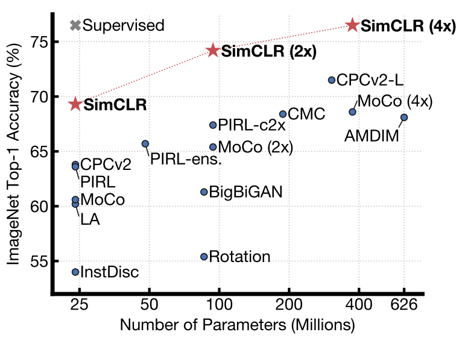
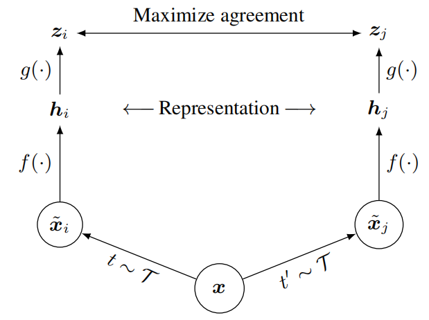

# A Simple Framework for Contrastive Learning of Visual Representations
SimCLR: 视觉表征对比学习的简单框架 2020.2.13 https://arxiv.org/abs/2002.05709

## Abstract
This paper presents SimCLR: a simple framework for contrastive learning of visual representations. We simplify recently proposed contrastive selfsupervised learning algorithms without requiring specialized architectures or a memory bank. In order to understand what enables the contrastive prediction tasks to learn useful representations, we systematically study the major components of our framework. We show that (1) composition of data augmentations plays a critical role in defining effective predictive tasks, (2) introducing a learnable nonlinear transformation between the representation and the contrastive loss substantially improves the quality of the learned representations, and (3) contrastive learning benefits from larger batch sizes and more training steps compared to supervised learning. By combining these findings, we are able to considerably outperform previous methods for self-supervised and semi-supervised learning on ImageNet. A linear classifier trained on self-supervised representations learned by SimCLR achieves 76.5% top-1 accuracy, which is a 7% relative improvement over previous state-ofthe-art, matching the performance of a supervised ResNet-50. When fine-tuned on only 1% of the labels, we achieve 85.8% top-5 accuracy, outperforming AlexNet with 100× fewer labels. (Code available at https://github.com/google-research/simclr)

本文介绍了 SimCLR：一种用于视觉表征对比学习的简单框架。 我们简化了最近提出的对比自监督学习算法，而不需要专门的架构或内存库。 为了了解是什么使对比预测任务能够学习有用的表示，我们系统地研究了我们框架的主要组成部分。 我们表明（1）数据增广的组合在定义有效的预测任务中起着关键作用，（2）在表示和对比损失之间引入可学习的非线性变换大大提高了学习表示的质量，以及（3）对比学习 与监督学习相比，受益于更大的批量和更多的训练步骤。 通过结合这些发现，我们能够大大优于以前在 ImageNet 上进行自监督和半监督学习的方法。 在 SimCLR 学习的自监督表征上训练的线性分类器达到了 76.5% 的 top-1 准确率，这比以前的最先进技术提高了 7%，与受监督的 ResNet-50 的性能相匹配。 当仅对 1% 的标签进行微调时，我们达到了 85.8% 的前 5 准确率，在标签减少 100 倍的情况下优于 AlexNet。 （代码可在 https://github.com/google-research/simclr 获得）

## 1. Introduction
Learning effective visual representations without human supervision is a long-standing problem. Most mainstream approaches fall into one of two classes: generative or discriminative. Generative approaches learn to generate or otherwise model pixels in the input space (Hinton et al., 2006; Kingma & Welling, 2013; Goodfellow et al., 2014). However, pixel-level generation is computationally expensive and may not be necessary for representation learning. Discriminative approaches learn representations using objective functions similar to those used for supervised learning, but train networks to perform pretext tasks where both the inputs and labels are derived from an unlabeled dataset. Many such approaches have relied on heuristics to design pretext tasks (Doersch et al., 2015; Zhang et al., 2016; Noroozi & Favaro, 2016; Gidaris et al., 2018), which could limit the generality of the learned representations. Discriminative approaches based on contrastive learning in the latent space have recently shown great promise, achieving state-of-theart results (Hadsell et al., 2006; Dosovitskiy et al., 2014; Oord et al., 2018; Bachman et al., 2019).

在没有人工监督的情况下学习有效的视觉表示是一个长期存在的问题。 大多数主流方法都属于两类之一：生成式或判别式。 生成方法学习在输入空间中生成或建模像素（Hinton et al., 2006; Kingma 和 Welling，2013; Goodfellow et al., 2014）。 然而，像素级生成在计算上是昂贵的并且可能不是表示学习所必需的。 判别方法使用类似于监督学习的目标函数来学习表示，但训练网络执行前置任务，其中输入和标签都来自未标注的数据集。 许多此类方法都依赖于启发式方法来设计前置任务（Doersch et al., 2015; Zhang et al., 2016; Noroozi 和 Favaro，2016; Gidaris et al., 2018），这可能会限制学习表征的普遍性。 基于潜在空间对比学习的判别方法最近显示出巨大的希望，取得了最先进的结果（Hadsell et al., 2006; Dosovitskiy et al., 2014; Oord et al., 2018; Bachman et al.,  2019）。
<!--启发式方法?-->


<br/>
Figure 1. ImageNet Top-1 accuracy of linear classifiers trained on representations learned with different self-supervised methods (pretrained on ImageNet). Gray cross indicates supervised ResNet-50. Our method, SimCLR, is shown in bold. 
图1. 线性分类器的 ImageNet Top-1 精度在使用不同自监督方法学习的表征上训练（在 ImageNet 上预训练）。 灰色十字表示受监督的 ResNet-50。 我们的方法 SimCLR 以粗体显示。

In this work, we introduce a simple framework for contrastive learning of visual representations, which we call SimCLR. Not only does SimCLR outperform previous work (Figure 1), but it is also simpler, requiring neither specialized architectures (Bachman et al., 2019; Hénaff et al., 2019) nor a memory bank (Wu et al., 2018; Tian et al., 2019; He et al., 2019; Misra & van der Maaten, 2019).

在这项工作中，我们引入了一个简单的视觉表示对比学习框架，我们称之为 SimCLR。 SimCLR 不仅优于以前的工作（图1），而且更简单，既不需要专门的架构（Bachman et al., 2019; Hénaff et al., 2019），也不需要内存库（Wu et al., 2018; Tian et al., 2019; 他et al., 2019; Misra & van der Maaten, 2019）。

In order to understand what enables good contrastive representation learning, we systematically study the major components of our framework and show that:
* Composition of multiple data augmentation operations is crucial in defining the contrastive prediction tasks that yield effective representations. In addition, unsupervised contrastive learning benefits from stronger data augmentation than supervised learning. 
* Introducing a learnable nonlinear transformation between the representation and the contrastive loss substantially improves the quality of the learned representations. 
* Representation learning with contrastive cross entropy loss benefits from normalized embeddings and an appropriately adjusted temperature parameter. 
* Contrastive learning benefits from larger batch sizes and longer training compared to its supervised counterpart. Like supervised learning, contrastive learning benefits from deeper and wider networks.

为了理解是什么促成了良好的对比表示学习，我们系统地研究了我们框架的主要组成部分，并表明：
* 多个数据增广操作的组合对于定义产生有效表示的对比预测任务至关重要。 此外，无监督对比学习受益于比监督学习更强的数据增广。
* 在表示和对比损失之间引入可学习的非线性变换，大大提高了学习表示的质量。
* 具有对比交叉熵损失的表示学习受益于归一化嵌入和适当调整的温度参数。
* 与监督学习相比，对比学习受益于更大的批量和更长的训练时间。 与监督学习一样，对比学习受益于更深更广的网络。

We combine these findings to achieve a new state-of-the-art in self-supervised and semi-supervised learning on ImageNet ILSVRC-2012 (Russakovsky et al., 2015). Under the linear evaluation protocol, SimCLR achieves 76.5% top-1 accuracy, which is a 7% relative improvement over previous state-of-the-art (Hénaff et al., 2019). When fine-tuned with only 1% of the ImageNet labels, SimCLR achieves 85.8% top-5 accuracy, a relative improvement of 10% (Hénaff et al., 2019). When fine-tuned on other natural image classification datasets, SimCLR performs on par with or better than a strong supervised baseline (Kornblith et al., 2019) on 10 out of 12 datasets.

我们结合这些发现，在 ImageNet ILSVRC-2012（Russakovsky et al., 2015）上实现了自监督和半监督学习的最新技术水平。 在线性评估协议下，SimCLR 达到了 76.5% 的 top-1 准确率，这比以前的最先进技术提高了 7%（Hénaff et al., 2019）。 当仅使用 1% 的 ImageNet 标签进行微调时，SimCLR 达到 85.8% 的前 5 准确率，相对提高 10%（Hénaff et al., 2019）。 当对其他自然图像分类数据集进行微调时，SimCLR 在 12 个数据集中的 10 个上的性能与强监督基线（Kornblith et al., 2019）相当或更好。

## 2. Method
### 2.1. The Contrastive Learning Framework
<br/>
Figure 2. A simple framework for contrastive learning of visual representations. Two separate data augmentation operators are sampled from the same family of augmentations (t ∼ T and t' ∼ T ) and applied to each data example to obtain two correlated views. A base encoder network f(·) and a projection head g(·) are trained to maximize agreement using a contrastive loss. After training is completed, we throw away the projection head g(·) and use encoder f(·) and representation h for downstream tasks. 
图2. 视觉表征对比学习的简单框架。 两个独立的数据增广运算符从同一系列扩充（t∼T 和 t'∼T）中采样，并应用于每个数据样本以获得两个相关视图。 基础编码器网络f(·) 和投影头g(·) 被训练以使用对比损失最大化协议。 训练完成后，我们扔掉投影头 g(·) 并使用编码器 f(·) 和表示 h 用于下游任务。

Inspired by recent contrastive learning algorithms (see Section 7 for an overview), SimCLR learns representations by maximizing agreement between differently augmented views of the same data example via a contrastive loss in the latent space. As illustrated in Figure 2, this framework comprises the following four major components. 
* A stochastic data augmentation module that transforms any given data example randomly resulting in two correlated views of the same example, denoted $\hat x_i$ and $\hat x_j$ , which we consider as a positive pair. In this work, we sequentially apply three simple augmentations: random cropping followed by resize back to the original size, random color distortions, and random Gaussian blur. As shown in Section 3, the combination of random crop and color distortion is crucial to achieve a good performance. 
* A neural network base encoder f(·) that extracts representation vectors from augmented data examples. Our framework allows various choices of the network architecture without any constraints. We opt for simplicity and adopt the commonly used ResNet (He et al., 2016) to obtain $h_i = f(\hat x_i) = ResNet(\hat x_i)$ where $h_i ∈ R^d$ is the output after the average pooling layer. 
* A small neural network projection head g(·) that maps representations to the space where contrastive loss is applied. We use a MLP with one hidden layer to obtain $z_i = g(h_i) = W^{(2)}σ(W^{(1)}h_i) $ where σ is a ReLU nonlinearity. As shown in section 4, we find it beneficial to define the contrastive loss on $z_i’s$ rather than $h_i’s$. 
* A contrastive loss function defined for a contrastive prediction task. Given a set {$\hat x_k$} including a positive pair of examples $\hat x_i$ and $\hat x_j$ , the contrastive prediction task aims to identify $\hat x_j$ in $\{\hat x_k\}_{k \neq i}$ for a given $\hat x_i$.

受近期对比学习算法的启发（参见第 7 节的概述），SimCLR 通过潜在空间中的对比损失最大化同一数据样本的不同增广视图之间的一致性来学习表示。 如图2 所示，该框架包含以下四个主要组件。
* 一个随机数据增强模块，它随机转换任何给定的数据样本，从而产生同一样本的两个相关视图，表示为 $\hat x_i$ 和 $\hat x_j$ ，我们将其视为正对。 在这项工作中，我们依次应用三个简单的增强：随机裁剪，然后调整回原始大小、随机颜色失真和随机高斯模糊。 如第 3 节所示，随机裁剪和颜色失真的组合对于获得良好性能至关重要。
* 一个神经网络基础编码器 f(·)，它从增强数据样本中提取表示向量。 我们的框架允许在没有任何限制的情况下选择各种网络架构。 我们选择简单并采用常用的 ResNet (He et al., 2016) 来获得 $h_i = f(\hat x_i) = ResNet(\hat x_i)$ 其中 $h_i ∈ R^d$ 是 平均池化层。
* 一个小型神经网络投影头 g(·)，将表示映射到应用对比损失的空间。 我们使用具有一个隐藏层的 MLP 来获得 $z_i = g(h_i) = W^{(2)}σ(W^{(1)}h_i) $ 其中 σ 是 ReLU 非线性。 如第 4 节所示，我们发现在 $z_i's$ 而不是 $h_i's$ 上定义对比损失是有益的。
* 为对比预测任务定义的对比损失函数。 给定一组 {$\hat x_k$} 包括一对正样本 $\hat x_i$ 和 $\hat x_j$ ，对比预测任务旨在识别 $\hat x_j$ in $\{\hat x_k\}_ {k \neq i}$ 对于给定的 $\hat x_i$。

We randomly sample a minibatch of N examples and define the contrastive prediction task on pairs of augmented examples derived from the minibatch, resulting in 2N data points. We do not sample negative examples explicitly. Instead, given a positive pair, similar to (Chen et al., 2017), we treat the other 2(N − 1) augmented examples within a minibatch as negative examples. Let sim(u, v) = $u^Tv/ || u || ||v|| $ denote the dot product between l2 normalized u and v (i.e. cosine similarity). Then the loss function for a positive pair of examples (i, j) is defined as 

我们随机抽取一个包含 N 个样本的小批量，并在从小批量派生的成对增广样本上定义对比预测任务，从而产生 2N 个数据点。 我们没有明确地对负样本进行采样。 相反，给定一个正对，类似于 (Chen et al., 2017)，我们将小批量中的其他 2(N − 1) 个增广样本视为负样本。 令 sim(u, v) = $u^Tv/ || u || ||v|| $ 表示 l2 归一化 u 和 v 之间的点积（即余弦相似度）。 然后一对正样本 (i, j) 的损失函数定义为

$l_{i,j} = − log \frac {exp(sim(z_i, z_j )/τ )}{ \sum^{2N}_{k=1} ✶_{[k \neq i]} exp(sim(z_i, z_k)/τ )}$ , (1) 

where $✶_{[k \neq i]}$ ∈ {0, 1} is an indicator function evaluating to 1 iff k 6 = i and τ denotes a temperature parameter. The final loss is computed across all positive pairs, both (i, j) and (j, i), in a mini-batch. This loss has been used in previous work (Sohn, 2016; Wu et al., 2018; Oord et al., 2018); for convenience, we term it NT-Xent (the normalized temperature-scaled cross entropy loss). 

其中 $✶_{[k\neq i]}$ ∈ {0, 1} 是一个指标函数，当且仅当 k \neq i 且 τ 表示温度参数时，其值为 1。 最终损失是在一个小批量中计算所有正对，包括 (i, j) 和 (j, i)。 这种损失已在以前的工作中使用（Sohn，2016; Wu et al., 2018; Oord et al., 2018）;  为方便起见，我们将其称为 NT-Xent（归一化温度标度交叉熵损失）。

Algorithm 1 SimCLR’s main learning algorithm. 
``` python
input: batch size N, constant τ , structure of f, g, T . 
for sampled minibatch {xk}Nk=1 do 
    for all k ∈ {1, . . . , N} do 
        draw two augmentation functions t∼ T , t' ∼ T 
        # the first augmentation
        ˜x2k−1 = t(xk) 
        h2k−1 = f(˜x2k−1) # representation 
        z2k−1 = g(h2k−1) # projection the second augmentation
        ˜x2k = t' (xk) h2k = f(˜x2k) # representation 
        z2k = g(h2k) # projection 
    end for 
    for all i ∈ {1, . . . , 2N} and j ∈ {1, . . . , 2N} do 
        si,j = zi> zj/(k zikk zjk ) # pairwise similarity 
    end for 
    define l(i, j) as l(i, j)=− log exp(si,j /τ) P 2kN =1 ✶[k6=i] exp(si,k/τ) 
    L = 21N P Nk=1 [l(2k−1, 2k) + l(2k, 2k−1)] 
    update networks f and g to minimize L 
    end for 
    return encoder network f(·), and throw away g(·)
 ``` 

Algorithm 1 summarizes the proposed method.

### 2.2. Training with Large Batch Size
To keep it simple, we do not train the model with a memory bank (Wu et al., 2018; He et al., 2019). Instead, we vary the training batch size N from 256 to 8192. A batch size of 8192 gives us 16382 negative examples per positive pair from both augmentation views. Training with large batch size may be unstable when using standard SGD/Momentum with linear learning rate scaling (Goyal et al., 2017). To stabilize the training, we use the LARS optimizer (You et al., 2017) for all batch sizes. We train our model with Cloud TPUs, using 32 to 128 cores depending on the batch size.(2With 128 TPU v3 cores, it takes ∼1.5 hours to train our ResNet-50 with a batch size of 4096 for 100 epochs.)

为简单起见，我们不使用记忆库训练模型（Wu et al., 2018; He et al., 2019）。 相反，我们将训练批大小 N 从 256 更改为 8192。8192 的批大小为我们提供了来自两个增广视图的每个正对 16382 个负样本。 当使用具有线性学习率缩放的标准 SGD/Momentum 时，大批量训练可能不稳定（Goyal et al., 2017）。 为了稳定训练，我们对所有批量大小使用 LARS 优化器（You et al., 2017）。 我们使用 Cloud TPU 训练我们的模型，根据批量大小使用 32 到 128 个核心。（2使用 128 个 TPU v3 核心，训练我们的 ResNet-50 需要大约 1.5 小时，批量大小为 4096 100 个时期。）

Global BN. Standard ResNets use batch normalization (Ioffe & Szegedy, 2015). In distributed training with data parallelism, the BN mean and variance are typically aggregated locally per device. In our contrastive learning, as positive pairs are computed in the same device, the model can exploit the local information leakage to improve prediction accuracy without improving representations. We address this issue by aggregating BN mean and variance over all devices during the training. Other approaches include shuffling data examples across devices (He et al., 2019), or replacing BN with layer norm (Hénaff et al., 2019). 

全局BN。 标准 ResNet 使用批量归一化 (Ioffe & Szegedy, 2015)。 在具有数据并行性的分布式训练中，BN 均值和方差通常在每个设备本地聚合。 在我们的对比学习中，由于正对是在同一设备中计算的，因此该模型可以利用局部信息泄漏来提高预测准确性，而无需改进表示。 我们通过在训练期间聚合所有设备的 BN 均值和方差来解决这个问题。 其他方法包括跨设备洗牌数据样本（He et al., 2019），或用LN 替换 BN（Hénaff et al., 2019）。

### 2.3. Evaluation Protocol
Here we lay out the protocol for our empirical studies, which aim to understand different design choices in our framework.

在这里，我们为我们的实证研究制定了协议，旨在了解我们框架中的不同设计选择。

Dataset and Metrics. Most of our study for unsupervised pretraining (learning encoder network f without labels) is done using the ImageNet ILSVRC-2012 dataset (Russakovsky et al., 2015). Some additional pretraining experiments on CIFAR-10 (Krizhevsky & Hinton, 2009) can be found in Appendix B.9. We also test the pretrained results on a wide range of datasets for transfer learning. To evaluate the learned representations, we follow the widely used linear evaluation protocol (Zhang et al., 2016; Oord et al., 2018; Bachman et al., 2019; Kolesnikov et al., 2019), where a linear classifier is trained on top of the frozen base network, and test accuracy is used as a proxy for representation quality. Beyond linear evaluation, we also compare against state-of-the-art on semi-supervised and transfer learning.

数据集和指标。 我们对无监督预训练（学习没有标签的编码器网络 f）的大部分研究都是使用 ImageNet ILSVRC-2012 数据集完成的（Russakovsky et al., 2015）。 CIFAR-10（Krizhevsky & Hinton，2009）的一些额外的预训练实验可以在附录 B.9 中找到。 我们还在广泛的数据集上测试预训练结果以进行迁移学习。 为了评估学习到的表示，我们遵循广泛使用的线性评估协议（Zhang et al., 2016; Oord et al., 2018; Bachman et al., 2019; Kolesnikov et al., 2019），其中训练了线性分类器 在冻结的基础网络之上，测试准确性用作表示质量的智能体。 除了线性评估之外，我们还在半监督和迁移学习方面与最先进的技术进行了比较。

Default setting. Unless otherwise specified, for data augmentation we use random crop and resize (with random flip), color distortions, and Gaussian blur (for details, see Appendix A). We use ResNet-50 as the base encoder network, and a 2-layer MLP projection head to project the representation to a 128-dimensional latent space. As the loss, we use NT-Xent, optimized using LARS with learning rate of 4.8 (= 0.3 × BatchSize/256) and weight decay of 10−6 . We train at batch size 4096 for 100 epochs.(3Although max performance is not reached in 100 epochs, reasonable results are achieved, allowing fair and efficient ablations.) Furthermore, we use linear warmup for the first 10 epochs, and decay the learning rate with the cosine decay schedule without restarts (Loshchilov & Hutter, 2016).

默认设置。 除非另有说明，否则对于数据增广，我们使用随机裁剪和调整大小（随机翻转）、颜色失真和高斯模糊（有关详情，请参见附录 A）。 我们使用 ResNet-50 作为基础编码器网络，并使用 2 层 MLP 投影头将表示投影到 128 维潜在空间。 作为损失，我们使用 NT-Xent，使用 LARS 进行优化，学习率为 4.8（= 0.3 × BatchSize/256），权重衰减为 10−6。 我们以 4096 的批量大小训练 100 个时期(3虽然在 100 个 epoch 中没有达到最大性能，但已经取得了合理的结果，允许公平有效的消融)。 此外，我们在前 10 个时期使用线性预热，并在不重新启动的情况下使用余弦衰减计划衰减学习率（Loshchilov & Hutter，2016）。

## 3. Data Augmentation for Contrastive Representation Learning
Data augmentation defines predictive tasks. While data augmentation has been widely used in both supervised and unsupervised representation learning (Krizhevsky et al., 2012; Hénaff et al., 2019; Bachman et al., 2019), it has not been considered as a systematic way to define the contrastive prediction task. Many existing approaches define contrastive prediction tasks by changing the architecture. For example, Hjelm et al. (2018); Bachman et al. (2019) achieve global-to-local view prediction via constraining the receptive field in the network architecture, whereas Oord et al. (2018); Hénaff et al. (2019) achieve neighboring view prediction via a fixed image splitting procedure and a context aggregation network. We show that this complexity can be avoided by performing simple random cropping (with resizing) of target images, which creates a family of predictive tasks subsuming the above mentioned two, as shown in Figure 3. This simple design choice conveniently decouples the predictive task from other components such as the neural network architecture. Broader contrastive prediction tasks can be defined by extending the family of augmentations and composing them stochastically.

数据增广定义预测任务。 虽然数据增广已广泛用于有监督和无监督的表示学习（Krizhevsky et al., 2012; Hénaff et al., 2019; Bachman et al., 2019），但它尚未被视为定义对比预测任务的系统方法。 许多现有方法通过更改架构来定义对比预测任务。 例如，Hjelm et al. (2018); Bachman et al. (2019) 通过限制网络架构中的感受野实现全局到局部的视图预测，而 Oord et al. (2018); Hénaff et al. (2019) 通过固定的图像分割过程和上下文聚合网络实现相邻视图预测。 我们表明，可以通过对目标图像执行简单的随机裁剪（调整大小）来避免这种复杂性，这会创建包含上述两个预测任务的系列，如图3 所示。这种简单的设计选择方便地将预测任务与预测任务分离 其他组件，例如神经网络架构。 可以通过扩展增广系列并随机组合它们来定义更广泛的对比预测任务。

<br/>
Figure 3. Solid rectangles are images, dashed rectangles are random crops. By randomly cropping images, we sample contrastive prediction tasks that include global to local view (B → A) or adjacent view (D → C) prediction.
图3. 实心矩形是图像，虚线矩形是随机裁剪。 通过随机裁剪图像，我们对包括全局到局部视图(B → A) 或相邻视图(D → C) 预测的对比预测任务进行采样。

### 3.1. Composition of data augmentation operations is crucial for learning good representations  数据增广操作的组合对于学习良好的表示至关重要
To systematically study the impact of data augmentation, we consider several common augmentations here. One type of augmentation involves spatial/geometric transformation of data, such as cropping and resizing (with horizontal flipping), rotation (Gidaris et al., 2018) and cutout (DeVries & Taylor, 2017). The other type of augmentation involves appearance transformation, such as color distortion (including color dropping, brightness, contrast, saturation, hue) (Howard, 2013; Szegedy et al., 2015), Gaussian blur, and Sobel filtering. Figure 4 visualizes the augmentations that we study in this work. 

为了系统地研究数据增广的影响，我们在这里考虑了几种常见的扩充。 一种类型的增广涉及数据的空间/几何变换，例如裁剪和调整大小（水平翻转）、旋转（Gidaris et al., 2018）和剪切（DeVries 和 Taylor，2017）。 另一类增广涉及外观变换，例如颜色失真（包括颜色下降、亮度、对比度、饱和度、色调）（Howard，2013; Szegedy 等，2015）、高斯模糊和 Sobel 滤波。 图4 可视化了我们在这项工作中研究的增广。

<br/>
Figure 4. Illustrations of the studied data augmentation operators. Each augmentation can transform data stochastically with some internal parameters (e.g. rotation degree, noise level). Note that we only test these operators in ablation, the augmentation policy used to train our models only includes random crop (with flip and resize), color distortion, and Gaussian blur. (Original image cc-by: Von.grzanka) 
图4. 所研究的数据增广运算符的插图。 每次增广都可以使用一些内部参数（例如旋转度、噪声水平）随机转换数据。 请注意，我们仅在消融中测试这些运算符，用于训练我们模型的增广策略仅包括随机裁剪（翻转和调整大小）、颜色失真和高斯模糊。 （原图抄送：Von.grzanka）

To understand the effects of individual data augmentations and the importance of augmentation composition, we investigate the performance of our framework when applying augmentations individually or in pairs. Since ImageNet images are of different sizes, we always apply crop and resize images (Krizhevsky et al., 2012; Szegedy et al., 2015), which makes it difficult to study other augmentations in the absence of cropping. To eliminate this confound, we consider an asymmetric data transformation setting for this ablation. Specifically, we always first randomly crop images and resize them to the same resolution, and we then apply the targeted transformation(s) only to one branch of the framework in Figure 2, while leaving the other branch as the identity (i.e. $t(x_i) = x_i)$. Note that this asymmetric data augmentation hurts the performance. Nonetheless, this setup should not substantively change the impact of individual data augmentations or their compositions.

为了了解单个数据增广的效果和扩充组合的重要性，我们研究了单独或成对应用扩充时框架的性能。 由于 ImageNet 图像大小不同，我们总是应用裁剪和调整图像大小（Krizhevsky et al., 2012; Szegedy et al., 2015），这使得在没有裁剪的情况下很难研究其他增广。 为了消除这种混淆，我们考虑了这种消融的非对称数据转换设置。 具体来说，我们总是首先随机裁剪图像并将它们调整为相同的分辨率，然后我们仅将目标转换应用于图2 中框架的一个分支，同时将另一个分支作为标识（即 $t(x_i) = x_i)$). 请注意，这种不对称数据增广会损害性能。 尽管如此，此设置不应实质性地改变单个数据增广或其组成的影响。

Figure 5 shows linear evaluation results under individual and composition of transformations. We observe that no single transformation suffices to learn good representations, even though the model can almost perfectly identify the positive pairs in the contrastive task. When composing augmentations, the contrastive prediction task becomes harder, but the quality of representation improves dramatically. Appendix B.2 provides a further study on composing broader set of augmentations.

图5 显示了单个和组合变换下的线性评估结果。 我们观察到没有单一的转换足以学习良好的表示，即使模型几乎可以完美地识别对比任务中的正对。 当组合增广时，对比预测任务变得更难，但表示质量显著提高。 附录 B.2 提供了关于组成更广泛的增广集的进一步研究。

<br/>
Figure 5. Linear evaluation (ImageNet top-1 accuracy) under individual or composition of data augmentations, applied only to one branch. For all columns but the last, diagonal entries correspond to single transformation, and off-diagonals correspond to composition of two transformations (applied sequentially). The last column reflects the average over the row.
图5. 单独或组合数据增广下的线性评估（ImageNet top-1 精度），仅应用于一个分支。 对于除最后一列以外的所有列，对角线条目对应于单个变换，非对角线对应于两个变换的组合（按顺序应用）。 最后一列反映了该行的平均值。

One composition of augmentations stands out: random cropping and random color distortion. We conjecture that one serious issue when using only random cropping as data augmentation is that most patches from an image share a similar color distribution. Figure 6 shows that color histograms alone suffice to distinguish images. Neural nets may exploit this shortcut to solve the predictive task. Therefore, it is critical to compose cropping with color distortion in order to learn generalizable features.

一种增强组合很突出：随机裁剪和随机颜色失真。 我们推测，当仅使用随机裁剪作为数据增强时，一个严重的问题是图像中的大多数分块共享相似的颜色分布。 图 6 显示仅颜色直方图就足以区分图像。 神经网络可以利用这个捷径来解决预测任务。 因此，为了学习可概括的特征，将裁剪与颜色失真结合起来是至关重要的。

<br/>
Figure 6. Histograms of pixel intensities (over all channels) for different crops of two different images (i.e. two rows). The image for the first row is from Figure 4. All axes have the same range.
图6. 两个不同图像（即两行）的不同剪裁的像素强度直方图（在所有通道上）。 第一行的图像来自图4。所有轴都具有相同的范围。


### 3.2. Contrastive learning needs stronger data augmentation than supervised learning 对比学习需要比监督学习更强的数据增广
To further demonstrate the importance of the color augmentation, we adjust the strength of color augmentation as shown in Table 1. Stronger color augmentation substantially improves the linear evaluation of the learned unsupervised models. In this context, AutoAugment (Cubuk et al., 2019), a sophisticated augmentation policy found using supervised learning, does not work better than simple cropping + (stronger) color distortion. When training supervised models with the same set of augmentations, we observe that stronger color augmentation does not improve or even hurts their performance. Thus, our experiments show that unsupervised contrastive learning benefits from stronger (color) data augmentation than supervised learning. Although previous work has reported that data augmentation is useful for self-supervised learning (Doersch et al., 2015; Bachman et al., 2019; Hénaff et al., 2019; Asano et al., 2019), we show that data augmentation that does not yield accuracy benefits for supervised learning can still help considerably with contrastive learning.

为了进一步证明颜色增广的重要性，我们调整了颜色增广的强度，如表1 所示。更强的颜色增广显著提高了学习的无监督模型的线性评估。 在这种情况下，AutoAugment（Cubuk et al., 2019）是一种使用监督学习发现的复杂增广策略，其效果并不比简单的裁剪 +（更强的）颜色失真更好。 当使用同一组增广训练监督模型时，我们观察到更强的颜色增广不会改善甚至损害它们的性能。 因此，我们的实验表明，与监督学习相比，无监督对比学习受益于更强的（颜色）数据增广。 尽管之前的工作报告说数据增广对自监督学习很有用（Doersch et al., 2015; Bachman et al., 2019; Hénaff et al., 2019; Asano et al., 2019），但我们证明了数据增广 这不会为监督学习带来准确性优势，但仍然可以极大地帮助对比学习。

<br/>
Table 1. Top-1 accuracy of unsupervised ResNet-50 using linear evaluation and supervised ResNet-50 (5 Supervised models are trained for 90 epochs; longer training improves performance of stronger augmentation by ∼ 0.5%. ) , under varied color distortion strength (see Appendix A) and other data transformations. Strength 1 (+Blur) is our default data augmentation policy. 
表1. 使用线性评估和监督 ResNet-50(5监督模型训练了 90 个 epoch;  更长的训练可以将更强增强的性能提高约 0.5%) 的无监督 ResNet-50 在不同颜色失真强度（参见附录 A）和其他数据转换下的 Top-1 准确性。 强度 1（+模糊）是我们默认的数据增广策略。

## 4. Architectures for Encoder and Head 编码器和头部的架构
### 4.1. Unsupervised contrastive learning benefits (more) from bigger models 无监督对比学习从更大的模型中获益（更多）
Figure 7 shows, perhaps unsurprisingly, that increasing depth and width both improve performance. While similar findings hold for supervised learning (He et al., 2016), we find the gap between supervised models and linear classifiers trained on unsupervised models shrinks as the model size increases, suggesting that unsupervised learning benefits more from bigger models than its supervised counterpart. 

图7 显示，增加深度和宽度都可以提高性能，这也许不足为奇。 虽然类似的发现适用于监督学习 (He et al., 2016)，但我们发现监督模型和在无监督模型上训练的线性分类器之间的差距随着模型大小的增加而缩小，这表明无监督学习比监督学习从更大的模型中受益更多 .

<br/>
Figure 7. Linear evaluation of models with varied depth and width. Models in blue dots are ours trained for 100 epochs, models in red stars are ours trained for 1000 epochs, and models in green crosses are supervised ResNets trained for 90 epochs (He et al., 2016) (7 Training longer does not improve supervised ResNets (see Appendix B.3)). 
图7. 具有不同深度和宽度的模型的线性评估。 蓝点中的模型是我们训练了 100 个时期的模型，红色星星中的模型是我们训练了 1000 个时期的模型，绿色十字中的模型是受监督的 ResNets 训练了 90 个时期（He et al., 2016）（7 更长时间的训练不会提高监督 ResNet（参见附录 B.3））。

### 4.2. A nonlinear projection head improves the representation quality of the layer before it 非线性投影头提高了它之前层的表示质量
We then study the importance of including a projection head, i.e. g(h). Figure 8 shows linear evaluation results using three different architecture for the head: (1) identity mapping; (2) linear projection, as used by several previous approaches (Wu et al., 2018); and (3) the default nonlinear projection with one additional hidden layer (and ReLU activation), similar to Bachman et al. (2019). We observe that a nonlinear projection is better than a linear projection (+3%), and much better than no projection (>10%). When a projection head is used, similar results are observed regardless of output dimension. Furthermore, even when nonlinear projection is used, the layer before the projection head, h, is still much better (>10%) than the layer after, z = g(h), which shows that the hidden layer before the projection head is a better representation than the layer after.

然后我们研究包括投影头的重要性，即 g(h)。 图8 显示了使用三种不同的头部架构的线性评估结果：（1）恒等映射;  (2) 线性投影，如之前几种方法所使用的那样（Wu et al., 2018）;  (3) 带有一个附加隐藏层（和 ReLU 激活）的默认非线性投影，类似于 Bachman et al. （2019）。 我们观察到非线性投影优于线性投影 (+3%)，并且比没有投影 (>10%) 好得多。 当使用投影头时，无论输出尺寸如何，都会观察到类似的结果。 此外，即使使用非线性投影，投影头之前的层 h 仍然比之后的层 z = g(h) 好得多 (>10%)，这表明投影头之前的隐藏层是 比之后的层更好的表示。

<br/>
Figure 8. Linear evaluation of representations with different projection heads g(·) and various dimensions of z = g(h). The representation h (before projection) is 2048-dimensional here.
图8. 具有不同投影头 g(·) 和 z = g(h) 的不同维度的表示的线性评估。 此处的表示 h（投影前）是 2048 维的。

We conjecture that the importance of using the representation before the nonlinear projection is due to loss of information induced by the contrastive loss. In particular, z = g(h) is trained to be invariant to data transformation. Thus, g can remove information that may be useful for the downstream task, such as the color or orientation of objects. By leveraging the nonlinear transformation g(·), more information can be formed and maintained in h. To verify this hypothesis, we conduct experiments that use either h or g(h) to learn to predict the transformation applied during the pretraining. Here we set $g(h) = W^{(2)}σ(W^{(1)}h)$, with the same input and output dimensionality (i.e. 2048). Table 3 shows h contains much more information about the transformation applied, while g(h) loses information. Further analysis can be found in Appendix B.4.

我们推测在非线性投影之前使用表示的重要性是由于对比损失引起的信息损失。 特别是，z = g(h) 被训练为对数据转换不变。 因此，g 可以删除可能对下游任务有用的信息，例如对象的颜色或方向。 通过利用非线性变换 g(·)，可以在 h 中形成和维护更多信息。 为了验证这个假设，我们进行了使用 h 或 g(h) 来学习预测预训练期间应用的转换的实验。 这里我们设置 $g(h) = W^{(2)}σ(W^{(1)}h)$，具有相同的输入和输出维度（即 2048）。 表3 显示 h 包含更多关于应用转换的信息，而 g(h) 丢失信息。 进一步的分析可以在附录 B.4 中找到。

<br/>
Table 3. Accuracy of training additional MLPs on different representations to predict the transformation applied. Other than crop and color augmentation, we additionally and independently add rotation (one of {0◦, 90◦, 180◦, 270◦}), Gaussian noise, and Sobel filtering transformation during the pretraining for the last three rows. Both h and g(h) are of the same dimensionality, i.e. 2048. 
表3. 在不同表示上训练额外的 MLP 以预测所应用的转换的准确性。 除了裁剪和颜色增广之外，我们在最后三行的预训练期间额外独立地添加了旋转（{0°、90°、180°、270°}之一）、高斯噪声和 Sobel 滤波变换。 h 和 g(h) 都具有相同的维度，即 2048。

## 5. Loss Functions and Batch Size 损失函数和批量大小
### 5.1. Normalized cross entropy loss with adjustable temperature works better than alternatives 具有可调温度的归一化交叉熵损失比替代方案效果更好
We compare the NT-Xent loss against other commonly used contrastive loss functions, such as logistic loss (Mikolov et al., 2013), and margin loss (Schroff et al., 2015). Table 2 shows the objective function as well as the gradient to the input of the loss function. Looking at the gradient, we observe 1) l2 normalization (i.e. cosine similarity) along with temperature effectively weights different examples, and an appropriate temperature can help the model learn from hard negatives; and 2) unlike cross-entropy, other objective functions do not weigh the negatives by their relative hardness. As a result, one must apply semi-hard negative mining (Schroff et al., 2015) for these loss functions: instead of computing the gradient over all loss terms, one can compute the gradient using semi-hard negative terms (i.e., those that are within the loss margin and closest in distance, but farther than positive examples).

我们将 NT-Xent 损失与其他常用的对比损失函数进行比较，例如logistic损失（Mikolov et al., 2013）和边缘损失（Schroff et al., 2015）。 表2 显示了目标函数以及损失函数输入的梯度。 观察梯度，我们观察到 1) l2 归一化（即余弦相似度）和温度有效地对不同的例子进行加权，适当的温度可以帮助模型从 困难负样本 中学习;  2）与交叉熵不同，其他目标函数不通过相对困难来衡量负数。 因此，必须对这些损失函数应用半困难负样本挖掘 (Schroff et al., 2015)：不是计算所有损失项的梯度，而是可以使用半困难负样本项（即那些 在损失范围内并且距离最近，但比正例更远）。

<br/>
Table 2. Negative loss functions and their gradients. All input vectors, i.e. u, v+, v−, are l2 normalized. NT-Xent is an abbreviation for “Normalized Temperature-scaled Cross Entropy”. Different loss functions impose different weightings of positive and negative examples.
表2. 负损失函数及其梯度。 所有输入向量，即 u、v+、v−，都经过 l2 归一化。 NT-Xent 是“Normalized Temperature-scaled Cross Entropy”的缩写。 不同的损失函数对正例和负例施加不同的权重。

To make the comparisons fair, we use the same l2 normalization for all loss functions, and we tune the hyperparameters, and report their best results.(8 Details can be found in Appendix B.10. For simplicity, we only consider the negatives from one augmentation view. ) Table 4 shows that, while (semi-hard) negative mining helps, the best result is still much worse than our default NT-Xent loss. 

为了使比较公平，我们对所有损失函数使用相同的 l2 归一化，我们调整超参数，并报告它们的最佳结果。（8 详情可以在附录 B.10 中找到。为简单起见，我们只考虑来自 一个增广视图。）表4 显示，虽然（半硬）负挖掘有帮助，但最好的结果仍然比我们默认的 NT-Xent 损失差得多。

<br/>
Table 4. Linear evaluation (top-1) for models trained with different loss functions. “sh” means using semi-hard negative mining.
表4. 使用不同损失函数训练的模型的线性评估 (top-1)。 “sh”表示使用semi-hard negative mining。

We next test the importance of the l2 normalization (i.e. cosine similarity vs dot product) and temperature τ in our default NT-Xent loss. Table 5 shows that without normalization and proper temperature scaling, performance is significantly worse. Without l2 normalization, the contrastive task accuracy is higher, but the resulting representation is worse under linear evaluation.

我们接下来测试 l2 归一化（即余弦相似度与点积）和温度 τ 在我们默认的 NT-Xent 损失中的重要性。 表5 显示，如果没有归一化和适当的温度缩放，性能会明显变差。 没有 l2 归一化，对比任务准确率更高，但在线性评估下得到的表示更差。

<br/>
Table 5. Linear evaluation for models trained with different choices of l2 norm and temperature τ for NT-Xent loss. The contrastive distribution is over 4096 examples.
表5. 使用不同的 l2 范数和 NT-Xent 损失温度 τ 选择训练模型的线性评估。 对比分布超过 4096 个样本。

### 5.2. Contrastive learning benefits (more) from larger batch sizes and longer training 更大的批量和更长时间的训练带来的对比学习好处（更多）
Figure 9 shows the impact of batch size when models are trained for different numbers of epochs. We find that, when the number of training epochs is small (e.g. 100 epochs), larger batch sizes have a significant advantage over the smaller ones. With more training steps/epochs, the gaps between different batch sizes decrease or disappear, provided the batches are randomly resampled. In contrast to supervised learning (Goyal et al., 2017), in contrastive learning, larger batch sizes provide more negative examples, facilitating convergence (i.e. taking fewer epochs and steps for a given accuracy). Training longer also provides more negative examples, improving the results. In Appendix B.1, results with even longer training steps are provided.

图9 显示了针对不同数量的 epoch 训练模型时批量大小的影响。 我们发现，当训练轮数较少时（例如 100 个轮数），较大的批量比较小的批量有显著优势。 随着更多的训练步骤/时期，不同批次大小之间的差距减少或消失，前提是批次是随机重新采样的。 与监督学习 (Goyal et al., 2017) 相比，在对比学习中，较大的批量会提供更多的反例，从而促进收敛（即，为给定的准确性采取更少的时期和步骤）。 更长时间的训练也提供了更多的负面例子，从而改善了结果。 在附录 B.1 中，提供了更长训练步骤的结果。

<br/>
Figure 9. Linear evaluation models (ResNet-50) trained with different batch size and epochs. Each bar is a single run from scratch.(10A linear learning rate scaling is used here. Figure B.1 shows using a square root learning rate scaling can improve performance of ones with small batch sizes.)
图9. 用不同批量大小和时期训练的线性评估模型 (ResNet-50)。 每个条都是从头开始运行的。(这里使用线性学习率缩放。 图B.1 显示使用平方根学习率缩放可以提高小批量的性能。)

## 6. Comparison with State-of-the-art
In this subsection, similar to Kolesnikov et al. (2019); He et al. (2019), we use ResNet-50 in 3 different hidden layer widths (width multipliers of 1×, 2×, and 4×). For better convergence, our models here are trained for 1000 epochs.

在本小节中，类似于 Kolesnikov et al. (2019); He et al. (2019)，我们在 3 种不同的隐藏层宽度（宽度乘数 1×、2× 和 4×）中使用 ResNet-50。 为了更好地收敛，我们这里的模型训练了 1000 个时期。

### Linear evaluation. 
Table 6 compares our results with previous approaches (Zhuang et al., 2019; He et al., 2019; Misra & van der Maaten, 2019; Hénaff et al., 2019; Kolesnikov et al., 2019; Donahue & Simonyan, 2019; Bachman et al.,2019; Tian et al., 2019) in the linear evaluation setting (see Appendix B.6). Table 1 shows more numerical comparisons among different methods. We are able to use standard networks to obtain substantially better results compared to previous methods that require specifically designed architectures. The best result obtained with our ResNet-50 (4×) can match the supervised pretrained ResNet-50.

线性评估。 表6 将我们的结果与以前的方法进行了比较（Zhuang et al., 2019; He et al., 2019; Misra 和 van der Maaten，2019; Hénaff et al., 2019; Kolesnikov et al., 2019; Donahue 和 Simonyan，2019; Bachman et al., 2019; Tian et al., 2019）在线性评估设置中（见附录 B.6）。 表1 显示了不同方法之间的更多数值比较。 与以前需要专门设计的架构的方法相比，我们能够使用标准网络获得更好的结果。 我们的 ResNet-50 (4×) 获得的最佳结果可以与受监督的预训练 ResNet-50 相媲美。

<br/>
Table 6. ImageNet accuracies of linear classifiers trained on representations learned with different self-supervised methods.
表6. 线性分类器的 ImageNet 准确度在使用不同自监督方法学习的表征上训练。

### Semi-supervised learning. 
We follow Zhai et al. (2019) and sample 1% or 10% of the labeled ILSVRC-12 training datasets in a class-balanced way (∼12.8 and ∼128 images per class respectively).(11The details of sampling and exact subsets can be found in https://www.tensorflow.org/datasets/catalog/imagenet2012_subset.)  We simply fine-tune the whole base network on the labeled data without regularization (see Appendix B.5). Table 7 shows the comparisons of our results against recent methods (Zhai et al., 2019; Xie et al., 2019; Sohn et al., 2020; Wu et al., 2018; Donahue & Simonyan, 2019; Misra & van der Maaten, 2019; Hénaff et al., 2019). The supervised baseline from (Zhai et al., 2019) is strong due to intensive search of hyper-parameters (including augmentation). Again, our approach significantly improves over state-of-the-art with both 1% and 10% of the labels. Interestingly, fine-tuning our pretrained ResNet-50 (2×, 4×) on full ImageNet are also significantly better then training from scratch (up to 2%, see Appendix B.2).

半监督学习。 我们跟随 Zhai et al. (2019) 并以类平衡的方式对标注的 ILSVRC-12 训练数据集进行 1% 或 10% 的采样（分别为每类 ∼12.8 和 ∼128 张图像）。（11采样和精确子集的详情可以在 https 中找到：https://www.tensorflow.org/datasets/catalog/imagenet2012_subset ）我们只是在没有正则化的情况下对标注数据的整个基础网络进行微调（参见附录 B.5）。 表7 显示了我们的结果与最近方法的比较（Zhai et al., 2019; Xie et al., 2019; Sohn et al., 2020; Wu et al., 2018; Donahue 和 Simonyan，2019; Misra 和 van der Maaten，2019; Hénaff et al., 2019）。 由于对超参数（包括增广）的密集搜索，来自 (Zhai et al., 2019) 的监督基线很强。 同样，我们的方法在 1% 和 10% 的标签上都比最先进的方法有显著改进。 有趣的是，在完整的 ImageNet 上微调我们预训练的 ResNet-50（2×，4×）也明显好于从头开始训练（高达 2%，见附录 B.2）。

<br/>
Table 7. ImageNet accuracy of models trained with few labels. 
表7. 使用少量标签训练的模型的 ImageNet 准确性。 

### Transfer learning. 
We evaluate transfer learning performance across 12 natural image datasets in both linear evaluation (fixed feature extractor) and fine-tuning settings. Following Kornblith et al. (2019), we perform hyperparameter tuning for each model-dataset combination and select the best hyperparameters on a validation set. Table 8 shows results with the ResNet-50 (4×) model. When fine-tuned, our self-supervised model significantly outperforms the supervised baseline on 5 datasets, whereas the supervised baseline is superior on only 2 (i.e. Pets and Flowers). On the remaining 5 datasets, the models are statistically tied.Full experimental details as well as results with the standard ResNet-50 architecture are provided in Appendix B.8. 

迁移学习。 我们在线性评估（固定特征提取器）和微调设置中评估 12 个自然图像数据集的迁移学习性能。 在 Kornblith et al. (2019)之后，我们对每个模型-数据集组合执行超参数调整，并在验证集上选择最佳超参数。 表8 显示了 ResNet-50 (4×) 模型的结果。 微调后，我们的自监督模型在 5 个数据集上明显优于监督基线，而监督基线仅在 2 个数据集（即宠物和鲜花）上优于监督基线。 在其余 5 个数据集上，模型在统计上是相关的。附录 B.8 中提供了完整的实验细节以及标准 ResNet-50 架构的结果。

<br/>
Table 8. Comparison of transfer learning performance of our self-supervised approach with supervised baselines across 12 natural image classification datasets, for ResNet-50 (4×) models pretrained on ImageNet. Results not significantly worse than the best (p > 0.05, permutation test) are shown in bold. See Appendix B.8 for experimental details and results with standard ResNet-50. 
表8. 对于在 ImageNet 上预训练的 ResNet-50 (4×) 模型，我们的自监督方法与监督基线在 12 个自然图像分类数据集上的迁移学习性能比较。 结果与最佳结果（p > 0.05，排列检验）相比并没有显著差，以粗体显示。 有关标准 ResNet-50 的实验细节和结果，请参阅附录 B.8。

## 7. Related Work
The idea of making representations of an image agree with each other under small transformations dates back to Becker & Hinton (1992). We extend it by leveraging recent advances in data augmentation, network architecture and contrastive loss. A similar consistency idea, but for class label prediction, has been explored in other contexts such as semisupervised learning (Xie et al., 2019; Berthelot et al., 2019).

在小变换下使图像表示彼此一致的想法可以追溯到 Becker & Hinton (1992)。 我们通过利用数据增广、网络架构和对比损失方面的最新进展来扩展它。 类似的一致性想法，但用于类标签预测，已经在半监督学习等其他情况下进行了探索（Xie et al., 2019; Berthelot et al., 2019）。

Handcrafted pretext tasks. The recent renaissance of selfsupervised learning began with artificially designed pretext tasks, such as relative patch prediction (Doersch et al., 2015), solving jigsaw puzzles (Noroozi & Favaro, 2016), colorization (Zhang et al., 2016) and rotation prediction (Gidaris et al., 2018; Chen et al., 2019). Although good results can be obtained with bigger networks and longer training (Kolesnikov et al., 2019), these pretext tasks rely on somewhat ad-hoc heuristics, which limits the generality of learned representations.

手工制作的前置任务。 自监督学习的最近复兴始于人工设计的前置任务，例如相对分块预测（Doersch et al., 2015）、解决拼图游戏（Noroozi 和 Favaro，2016）、着色（Zhang et al., 2016）和旋转预测 （Gidaris et al., 2018; Chen et al., 2019）。 尽管可以通过更大的网络和更长时间的训练获得良好的结果（Kolesnikov et al., 2019），但这些前置任务在某种程度上依赖于临时启发式方法，这限制了学习表征的普遍性。

Contrastive visual representation learning. Dating back to Hadsell et al. (2006), these approaches learn representations by contrasting positive pairs against negative pairs. Along these lines, Dosovitskiy et al. (2014) proposes to treat each instance as a class represented by a feature vector (in a parametric form). Wu et al. (2018) proposes to use a memory bank to store the instance class representation vector, an approach adopted and extended in several recent papers (Zhuang et al., 2019; Tian et al., 2019; He et al., 2019; Misra & van der Maaten, 2019). Other work explores the use of in-batch samples for negative sampling instead of a memory bank (Doersch & Zisserman, 2017; Ye et al., 2019; Ji et al., 2019).

对比视觉表征学习。 追溯到 Hadsell et al. (2006)，这些方法通过对比正对和负对来学习表征。 沿着这些思路，Dosovitskiy et al. (2014) 建议将每个实例视为由特征向量（以参数形式）表示的类。 Wu et al. (2018) 提出使用内存库来存储实例类表示向量，这种方法在最近的几篇论文中采用和扩展（Zhuang et al., 2019; Tian et al., 2019; He et al., 2019; Misra & van der Maaten, 2019）。 其他工作探索了使用批内样本代替记忆库进行负采样（Doersch & Zisserman，2017; Ye et al.，2019; Ji et al.，2019）。

Recent literature has attempted to relate the success of their methods to maximization of mutual information between latent representations (Oord et al., 2018; Hénaff et al., 2019; Hjelm et al., 2018; Bachman et al., 2019). However, it is not clear if the success of contrastive approaches is determined by the mutual information, or by the specific form of the contrastive loss (Tschannen et al., 2019).

最近的文献试图将他们的方法的成功与潜在表示之间的互信息最大化联系起来（Oord et al., 2018; Hénaff et al., 2019; Hjelm et al., 2018; Bachman et al., 2019）。 然而，目前尚不清楚对比方法的成功是由互信息决定的，还是由对比损失的具体形式决定的 (Tschannen et al., 2019)。

We note that almost all individual components of our framework have appeared in previous work, although the specific instantiations may be different. The superiority of our framework relative to previous work is not explained by any single design choice, but by their composition. We provide a comprehensive comparison of our design choices with those of previous work in Appendix C.

我们注意到，我们框架的几乎所有单独组件都出现在以前的工作中，尽管具体的实例化可能不同。 我们的框架相对于以前工作的优越性不是由任何单一的设计选择来解释的，而是由它们的组成来解释的。 我们在附录 C 中对我们的设计选择与之前的工作进行了全面比较。

## 8. Conclusion
In this work, we present a simple framework and its instantiation for contrastive visual representation learning. We carefully study its components, and show the effects of different design choices. By combining our findings, we improve considerably over previous methods for selfsupervised, semi-supervised, and transfer learning.

在这项工作中，我们提出了一个简单的框架及其用于对比视觉表示学习的实例。 我们仔细研究了它的组件，并展示了不同设计选择的效果。 通过结合我们的发现，我们大大改进了以前的自监督、半监督和迁移学习方法。

Our approach differs from standard supervised learning on ImageNet only in the choice of data augmentation, the use of a nonlinear head at the end of the network, and the loss function. The strength of this simple framework suggests that, despite a recent surge in interest, self-supervised learning remains undervalued.

我们的方法与 ImageNet 上的标准监督学习的不同之处仅在于数据增广的选择、网络末端非线性头的使用以及损失函数。 这个简单框架的优势表明，尽管最近兴趣激增，但自监督学习的价值仍然被低估。

## Acknowledgements
We would like to thank Xiaohua Zhai, Rafael Müller and Yani Ioannou for their feedback on the draft. We are also grateful for general support from Google Research teams in Toronto and elsewhere.

我们要感谢 Xiaohua Zhai、Rafael Müller 和 Yani Ioannou 对草案的反馈。 我们也感谢多伦多和其他地方的谷歌研究团队的普遍支持。

## References
* Asano, Y. M., Rupprecht, C., and Vedaldi, A. A critical analysisof self-supervision, or what we can learn from a single image.arXiv preprint arXiv:1904.13132, 2019.
* Bachman, P., Hjelm, R. D., and Buchwalter, W. Learning representations by maximizing mutual information across views.
* In Advances in Neural Information Processing Systems, pp.15509–15519, 2019.
* Becker, S. and Hinton, G. E. Self-organizing neural network thatdiscovers surfaces in random-dot stereograms. Nature, 355(6356):161–163, 1992.
* Berg, T., Liu, J., Lee, S. W., Alexander, M. L., Jacobs, D. W.,and Belhumeur, P. N. Birdsnap: Large-scale fine-grained visualcategorization of birds. In IEEE Conference on Computer Visionand Pattern Recognition (CVPR), pp. 2019–2026. IEEE, 2014.
* Berthelot, D., Carlini, N., Goodfellow, I., Papernot, N., Oliver,A., and Raffel, C. A. Mixmatch: A holistic approach to semisupervised learning. In Advances in Neural Information Processing Systems, pp. 5050–5060, 2019.
* Bossard, L., Guillaumin, M., and Van Gool, L. Food-101–miningdiscriminative components with random forests. In Europeanconference on computer vision, pp. 446–461. Springer, 2014.
* Chen, T., Sun, Y., Shi, Y., and Hong, L. On sampling strategiesfor neural network-based collaborative filtering. In Proceedings of the 23rd ACM SIGKDD International Conference onKnowledge Discovery and Data Mining, pp. 767–776, 2017.
* Chen, T., Zhai, X., Ritter, M., Lucic, M., and Houlsby, N. Selfsupervised gans via auxiliary rotation loss. In Proceedings of theIEEE Conference on Computer Vision and Pattern Recognition,pp. 12154–12163, 2019.
* Cimpoi, M., Maji, S., Kokkinos, I., Mohamed, S., and Vedaldi,A. Describing textures in the wild. In IEEE Conference onComputer Vision and Pattern Recognition (CVPR), pp. 3606–3613. IEEE, 2014.
* Cubuk, E. D., Zoph, B., Mane, D., Vasudevan, V., and Le, Q. V.
* Autoaugment: Learning augmentation strategies from data. InProceedings of the IEEE conference on computer vision andpattern recognition, pp. 113–123, 2019.
* DeVries, T. and Taylor, G. W. Improved regularization ofconvolutional neural networks with cutout. arXiv preprintarXiv:1708.04552, 2017.
* Doersch, C. and Zisserman, A. Multi-task self-supervised visuallearning. In Proceedings of the IEEE International Conferenceon Computer Vision, pp. 2051–2060, 2017.
* Doersch, C., Gupta, A., and Efros, A. A. Unsupervised visualrepresentation learning by context prediction. In Proceedingsof the IEEE International Conference on Computer Vision, pp.1422–1430, 2015.
* Donahue, J. and Simonyan, K. Large scale adversarial representation learning. In Advances in Neural Information ProcessingSystems, pp. 10541–10551, 2019.
* Donahue, J., Jia, Y., Vinyals, O., Hoffman, J., Zhang, N., Tzeng, E.,and Darrell, T. Decaf: A deep convolutional activation featurefor generic visual recognition. In International Conference onMachine Learning, pp. 647–655, 2014.
* Dosovitskiy, A., Springenberg, J. T., Riedmiller, M., and Brox, T.Discriminative unsupervised feature learning with convolutionalneural networks. In Advances in neural information processingsystems, pp. 766–774, 2014.
* Everingham, M., Van Gool, L., Williams, C. K., Winn, J., andZisserman, A. The pascal visual object classes (voc) challenge.International Journal of Computer Vision, 88(2):303–338, 2010.
* Fei-Fei, L., Fergus, R., and Perona, P. Learning generative visualmodels from few training examples: An incremental bayesianapproach tested on 101 object categories. In IEEE Conferenceon Computer Vision and Pattern Recognition (CVPR) Workshopon Generative-Model Based Vision, 2004.
* Gidaris, S., Singh, P., and Komodakis, N. Unsupervised representation learning by predicting image rotations. arXiv preprintarXiv:1803.07728, 2018.
* Goodfellow, I., Pouget-Abadie, J., Mirza, M., Xu, B., WardeFarley, D., Ozair, S., Courville, A., and Bengio, Y. Generativeadversarial nets. In Advances in neural information processingsystems, pp. 2672–2680, 2014.
* Goyal, P., Dollár, P., Girshick, R., Noordhuis, P., Wesolowski, L.,Kyrola, A., Tulloch, A., Jia, Y., and He, K. Accurate, largeminibatch sgd: Training imagenet in 1 hour. arXiv preprintarXiv:1706.02677, 2017.
* Hadsell, R., Chopra, S., and LeCun, Y. Dimensionality reductionby learning an invariant mapping. In 2006 IEEE Computer Society Conference on Computer Vision and Pattern Recognition(CVPR’06), volume 2, pp. 1735–1742. IEEE, 2006.
* He, K., Zhang, X., Ren, S., and Sun, J. Deep residual learning forimage recognition. In Proceedings of the IEEE conference oncomputer vision and pattern recognition, pp. 770–778, 2016.
* He, K., Fan, H., Wu, Y., Xie, S., and Girshick, R. Momentumcontrast for unsupervised visual representation learning. arXivpreprint arXiv:1911.05722, 2019.
* Hénaff, O. J., Razavi, A., Doersch, C., Eslami, S., and Oord, A.v. d. Data-efficient image recognition with contrastive predictivecoding. arXiv preprint arXiv:1905.09272, 2019.
* Hinton, G. E., Osindero, S., and Teh, Y.-W. A fast learning algorithm for deep belief nets. Neural computation, 18(7):1527–1554, 2006.
* Hjelm, R. D., Fedorov, A., Lavoie-Marchildon, S., Grewal, K.,Bachman, P., Trischler, A., and Bengio, Y. Learning deep representations by mutual information estimation and maximization.arXiv preprint arXiv:1808.06670, 2018.
* Howard, A. G. Some improvements on deep convolutionalneural network based image classification. arXiv preprintarXiv:1312.5402, 2013.
* Ioffe, S. and Szegedy, C. Batch normalization: Accelerating deepnetwork training by reducing internal covariate shift. arXivpreprint arXiv:1502.03167, 2015.
* Ji, X., Henriques, J. F., and Vedaldi, A. Invariant informationclustering for unsupervised image classification and segmentation. In Proceedings of the IEEE International Conference onComputer Vision, pp. 9865–9874, 2019.
* Kingma, D. P. and Welling, M. Auto-encoding variational bayes.arXiv preprint arXiv:1312.6114, 2013.
* Kolesnikov, A., Zhai, X., and Beyer, L. Revisiting self-supervisedvisual representation learning. In Proceedings of the IEEEconference on Computer Vision and Pattern Recognition, pp.1920–1929, 2019.
* Kornblith, S., Shlens, J., and Le, Q. V. Do better ImageNet modelstransfer better? In Proceedings of the IEEE conference oncomputer vision and pattern recognition, pp. 2661–2671, 2019.
* Krause, J., Deng, J., Stark, M., and Fei-Fei, L. Collecting alarge-scale dataset of fine-grained cars. In Second Workshop onFine-Grained Visual Categorization, 2013.
* Krizhevsky, A. and Hinton, G. Learning multiple layers of featuresfrom tiny images. Technical report, University of Toronto,2009. URL https://www.cs.toronto.edu/~kriz/learning-features-2009-TR.pdf.
* Krizhevsky, A., Sutskever, I., and Hinton, G. E. Imagenet classifi-cation with deep convolutional neural networks. In Advances inneural information processing systems, pp. 1097–1105, 2012.
* Loshchilov, I. and Hutter, F. Sgdr: Stochastic gradient descentwith warm restarts. arXiv preprint arXiv:1608.03983, 2016.
* Maaten, L. v. d. and Hinton, G. Visualizing data using t-sne. Journal of machine learning research, 9(Nov):2579–2605, 2008.Maji, S., Kannala, J., Rahtu, E., Blaschko, M., and Vedaldi, A.Fine-grained visual classification of aircraft. Technical report,2013.
* Mikolov, T., Chen, K., Corrado, G., and Dean, J. Efficient estimation of word representations in vector space. arXiv preprintarXiv:1301.3781, 2013.
* Misra, I. and van der Maaten, L. Self-supervised learning of pretext-invariant representations. arXiv preprintarXiv:1912.01991, 2019.
* Nilsback, M.-E. and Zisserman, A. Automated flower classificationover a large number of classes. In Computer Vision, Graphics &Image Processing, 2008. ICVGIP’08. Sixth Indian Conferenceon, pp. 722–729. IEEE, 2008.
* Noroozi, M. and Favaro, P. Unsupervised learning of visual representations by solving jigsaw puzzles. In European Conferenceon Computer Vision, pp. 69–84. Springer, 2016.
* Oord, A. v. d., Li, Y., and Vinyals, O. Representation learning withcontrastive predictive coding. arXiv preprint arXiv:1807.03748,2018.
* Parkhi, O. M., Vedaldi, A., Zisserman, A., and Jawahar, C. Catsand dogs. In IEEE Conference on Computer Vision and PatternRecognition (CVPR), pp. 3498–3505. IEEE, 2012.
* Russakovsky, O., Deng, J., Su, H., Krause, J., Satheesh, S., Ma,S., Huang, Z., Karpathy, A., Khosla, A., Bernstein, M., et al.
* Imagenet large scale visual recognition challenge. Internationaljournal of computer vision, 115(3):211–252, 2015.
* Schroff, F., Kalenichenko, D., and Philbin, J. Facenet: A unifiedembedding for face recognition and clustering. In Proceedings of the IEEE conference on computer vision and patternrecognition, pp. 815–823, 2015.
* Simonyan, K. and Zisserman, A. Very deep convolutionalnetworks for large-scale image recognition. arXiv preprintarXiv:1409.1556, 2014.
* Sohn, K. Improved deep metric learning with multi-class n-pairloss objective. In Advances in neural information processingsystems, pp. 1857–1865, 2016.
* Sohn, K., Berthelot, D., Li, C.-L., Zhang, Z., Carlini, N., Cubuk,E. D., Kurakin, A., Zhang, H., and Raffel, C. Fixmatch: Simplifying semi-supervised learning with consistency and confidence.arXiv preprint arXiv:2001.07685, 2020.
* Szegedy, C., Liu, W., Jia, Y., Sermanet, P., Reed, S., Anguelov, D.,Erhan, D., Vanhoucke, V., and Rabinovich, A. Going deeperwith convolutions. In Proceedings of the IEEE conference oncomputer vision and pattern recognition, pp. 1–9, 2015.
* Tian, Y., Krishnan, D., and Isola, P. Contrastive multiview coding.arXiv preprint arXiv:1906.05849, 2019.
* Tschannen, M., Djolonga, J., Rubenstein, P. K., Gelly, S., and Lucic, M. On mutual information maximization for representationlearning. arXiv preprint arXiv:1907.13625, 2019.
* Wu, Z., Xiong, Y., Yu, S. X., and Lin, D. Unsupervised featurelearning via non-parametric instance discrimination. In Proceedings of the IEEE Conference on Computer Vision and PatternRecognition, pp. 3733–3742, 2018.
* Xiao, J., Hays, J., Ehinger, K. A., Oliva, A., and Torralba, A. Sundatabase: Large-scale scene recognition from abbey to zoo. InIEEE Conference on Computer Vision and Pattern Recognition(CVPR), pp. 3485–3492. IEEE, 2010.
* Xie, Q., Dai, Z., Hovy, E., Luong, M.-T., and Le, Q. V. Unsupervised data augmentation. arXiv preprint arXiv:1904.12848,2019.
* Ye, M., Zhang, X., Yuen, P. C., and Chang, S.-F. Unsupervisedembedding learning via invariant and spreading instance feature.In Proceedings of the IEEE Conference on Computer Visionand Pattern Recognition, pp. 6210–6219, 2019.
* You, Y., Gitman, I., and Ginsburg, B. Large batch training of convolutional networks. arXiv preprint arXiv:1708.03888, 2017.
* Zhai, X., Oliver, A., Kolesnikov, A., and Beyer, L. S4l: Selfsupervised semi-supervised learning. In The IEEE InternationalConference on Computer Vision (ICCV), October 2019.
* Zhang, R., Isola, P., and Efros, A. A. Colorful image colorization. In European conference on computer vision, pp. 649–666.Springer, 2016.
* Zhuang, C., Zhai, A. L., and Yamins, D. Local aggregation forunsupervised learning of visual embeddings. In Proceedingsof the IEEE International Conference on Computer Vision, pp.6002–6012, 2019.

## Appendix
### A. Data Augmentation Details
In our default pretraining setting (which is used to train our best models), we utilize random crop (with resize and random flip), random color distortion, and random Gaussian blur as the data augmentations. The details of these three augmentations are provided below.

在我们默认的预训练设置（用于训练我们最好的模型）中，我们利用随机裁剪（调整大小和随机翻转）、随机颜色失真和随机高斯模糊作为数据增广。 下面提供了这三个增广的详情。

#### Random crop and resize to 224x224 
We use standard Inception-style random cropping (Szegedy et al., 2015). The crop of random size (uniform from 0.08 to 1.0 in area) of the original size and a random aspect ratio (default: of 3/4 to 4/3) of the original aspect ratio is made. This crop is finally resized to the original size. This has been implemented in Tensorflow as “slim.preprocessing.inception_preprocessing.distorted_bounding_box_crop”, or in Pytorch as “torchvision.transforms.RandomResizedCrop”. Additionally, the random crop (with resize) is always followed by a random horizontal/left-to-right flip with 50% probability. This is helpful but not essential. By removing this from our default augmentation policy, the top-1 linear evaluation drops from 64.5% to 63.4% for our ResNet-50 model trained in 100 epochs.

随机裁剪并调整为 224x224 我们使用标准的 Inception 风格随机裁剪（Szegedy et al., 2015）。 裁剪原始大小的随机大小（区域从 0.08 到 1.0 均匀）和原始纵横比的随机纵横比（默认值：3/4 到 4/3）。 该裁剪最终调整为原始大小。 这已在 Tensorflow 中实现为“slim.preprocessing.inception_preprocessing.distorted_bounding_box_crop”，或在 Pytorch 中实现为“torchvision.transforms.RandomResizedCrop”。 此外，随机裁剪（调整大小）之后总是以 50% 的概率进行随机水平/从左到右翻转。 这很有帮助但不是必需的。 通过将其从我们的默认增广策略中删除，我们在 100 个时期训练的 ResNet-50 模型的前 1 线性评估从 64.5% 下降到 63.4%。

#### Color distortion 
Color distortion is composed by color jittering and color dropping. We find stronger color jittering usually helps, so we set a strength parameter. A pseudo-code for color distortion using TensorFlow is as follows. 

颜色失真由颜色抖动和颜色下降组成。 我们发现更强的颜色抖动通常会有所帮助，因此我们设置了一个强度参数。 使用 TensorFlow 进行颜色失真的伪代码如下。


``` python 
import tensorflow as tf
def color_distortion(image, s=1.0):
    # image is a tensor with value range in [0, 1].
    # s is the strength of color distortion.
    def color_jitter(x):
        # one can also shuffle the order of following augmentations
        # each time they are applied.
        x = tf.image.random_brightness(x, max_delta=0.8*s)
        x = tf.image.random_contrast(x, lower=1-0.8*s, upper=1+0.8*s)
        x = tf.image.random_saturation(x, lower=1-0.8*s, upper=1+0.8*s)
        x = tf.image.random_hue(x, max_delta=0.2*s)
        x = tf.clip_by_value(x, 0, 1)
        return x

    def color_drop(x):
        image = tf.image.rgb_to_grayscale(image)
        image = tf.tile(image, [1, 1, 3])

    # randomly apply transformation with probability p.
    image = random_apply(color_jitter, image, p=0.8)
    image = random_apply(color_drop, image, p=0.2)
    return image

```

A pseudo-code for color distortion using Pytorch is as follows (12 Our code and results are based on Tensorflow, the Pytorch code here is a reference). 

使用Pytorch进行颜色失真的伪代码如下（12 我们的代码和结果是基于Tensorflow的，这里的Pytorch代码是参考）。

``` python
from torchvision import transforms
def get_color_distortion(s=1.0):
    # s is the strength of color distortion.
    color_jitter = transforms.ColorJitter(0.8*s, 0.8*s, 0.8*s, 0.2*s)
    rnd_color_jitter = transforms.RandomApply([color_jitter], p=0.8)
    rnd_gray = transforms.RandomGrayscale(p=0.2)
    color_distort = transforms.Compose([
        rnd_color_jitter,
        rnd_gray])
    return color_distort

```

#### Gaussian blur 
This augmentation is in our default policy. We find it helpful, as it improves our ResNet-50 trained for 100 epochs from 63.2% to 64.5%. We blur the image 50% of the time using a Gaussian kernel. We randomly sample σ ∈ [0.1, 2.0], and the kernel size is set to be 10% of the image height/width.

高斯模糊 这种增广是我们的默认策略。 我们发现它很有帮助，因为它将训练了 100 个时期的 ResNet-50 从 63.2% 提高到 64.5%。 我们使用高斯核对图像进行 50% 的模糊处理。 我们随机采样 σ ∈ [0.1, 2.0]，内核大小设置为图像高度/宽度的 10%。

### B. Additional Experimental Results
#### B.1. Batch Size and Training Steps
Figure B.1 shows the top-5 accuracy on linear evaluation when trained with different batch sizes and training epochs. The conclusion is very similar to top-1 accuracy shown before, except that the differences between different batch sizes and training steps seems slightly smaller here.

图B.1 显示了使用不同批量大小和训练时期进行训练时线性评估的前 5 准确度。 结论与之前显示的 top-1 精度非常相似，只是不同批大小和训练步骤之间的差异在这里似乎略小。

<br/>
Figure B.1. Linear evaluation (top-5) of ResNet-50 trained with different batch sizes and epochs. Each bar is a single run from scratch. See Figure 9 for top-1 accuracy. 
图B.1。 使用不同批量大小和时期训练的 ResNet-50 的线性评估（前 5 名）。 每个条都是从头开始运行的。 有关 top-1 精度，请参见图9。

In both Figure 9 and Figure B.1, we use a linear scaling of learning rate similar to (Goyal et al., 2017) when training with different batch sizes. Although linear learning rate scaling is popular with SGD/Momentum optimizer, we find a square root learning rate scaling is more desirable with LARS optimizer. With square root learning rate scaling, we have LearningRate = 0.075 × √ BatchSize, instead of LearningRate = 0.3 × BatchSize/256 in the linear scaling case, but the learning rate is the same under both scaling methods when batch size of 4096 (our default batch size). A comparison is presented in Table B.1, where we observe that square root learning rate scaling improves the performance for models trained with small batch sizes and in smaller number of epochs.

在图9 和图B.1 中，我们在使用不同的批量大小进行训练时使用类似于 (Goyal et al., 2017) 的学习率线性缩放。 尽管线性学习率缩放在 SGD/Momentum 优化器中很受欢迎，但我们发现平方根学习率缩放在 LARS 优化器中更受欢迎。 使用平方根学习率缩放，我们有 LearningRate = 0.075 × √ BatchSize，而不是线性缩放情况下的 LearningRate = 0.3 × BatchSize/256，但是当批量大小为 4096（我们的默认值）时，两种缩放方法的学习率相同 批量大小）。 表B.1 中给出了一个比较，我们观察到平方根学习率缩放提高了使用小批量和较少轮数训练的模型的性能。

<br/>
Table B.1. Linear evaluation (top-1) under different batch sizes and training epochs. On the left side of slash sign are models trained with linear LR scaling, and on the right are models trained with square root LR scaling. The result is bolded if it is more than 0.5% better. Square root LR scaling works better for smaller batch size trained in fewer epochs (with LARS optimizer).
表B.1。 不同批量大小和训练时期下的线性评估 (top-1)。 斜线左边是用线性 LR 缩放训练的模型，右边是用平方根 LR 缩放训练的模型。 如果好于 0.5% 以上，结果将以粗体显示。 平方根 LR 缩放对于在较少时期训练的较小批量大小（使用 LARS 优化器）效果更好。

We also train with larger batch size (up to 32K) and longer (up to 3200 epochs), with the square root learning rate scaling. A shown in Figure B.2, the performance seems to saturate with a batch size of 8192, while training longer can still significantly improve the performance. 

我们还使用更大的批量大小（最多 32K）和更长的时间（最多 3200 个时期）进行训练，并使用平方根学习率缩放。 如图B.2 所示，性能似乎在批处理大小为 8192 时饱和，而训练更长时间仍可以显著提高性能。

<br/>
Figure B.2. Linear evaluation (top-1) of ResNet-50 trained with different batch sizes and longer epochs. Here a square root learning rate, instead of a linear one, is utilized.
图B.2。 使用不同批量大小和更长周期训练的 ResNet-50 的线性评估（前 1）。 这里使用平方根学习率，而不是线性学习率。

#### B.2. Broader composition of data augmentations further improves performance 更广泛的数据增广组合进一步提高了性能
Our best results in the main text (Table 6 and 7) can be further improved when expanding the default augmentation policy to include the following: (1) Sobel filtering, (2) additional color distortion (equalize, solarize), and (3) motion blur. For linear evaluation protocol, the ResNet-50 models (1×, 2×, 4×) trained with broader data augmentations achieve 70.0 (+0.7), 74.4 (+0.2), 76.8 (+0.3), respectively.

当扩展默认增广策略以包括以下内容时，我们在正文（表6 和表7）中的最佳结果可以进一步改进：（1）Sobel 过滤，（2）额外的颜色失真（均衡，曝光），以及（3） 运动模糊。 对于线性评估协议，使用更广泛的数据增广训练的 ResNet-50 模型（1×、2×、4×）分别达到 70.0（+0.7）、74.4（+0.2）、76.8（+0.3）。

Table B.2 shows ImageNet accuracy obtained by fine-tuning the SimCLR model (see Appendix B.5 for the details of fine-tuning procedure). Interestingly, when fine-tuned on full (100%) ImageNet training set, our ResNet (4×) model achieves 80.4% top-1 / 95.4% top-5 (13It is 80.1% top-1 / 95.2% top-5 without broader augmentations for pretraining SimCLR.), which is significantly better than that (78.4% top-1 / 94.2% top-5) of training from scratch using the same set of augmentations (i.e. random crop and horizontal flip). For ResNet-50 (2×), fine-tuning our pre-trained ResNet-50 (2×) is also better than training from scratch (77.8% top-1 / 93.9% top-5). There is no improvement from fine-tuning for ResNet-50.

表B.2 显示了通过微调 SimCLR 模型获得的 ImageNet 精度（有关微调过程的详情，请参见附录 B.5）。 有趣的是，当在完整 (100%) ImageNet 训练集上进行微调时，我们的 ResNet (4×) 模型实现了 80.4% top-1 / 95.4% top-5 13，这明显优于（78.4% top-1 / 94.2% top-5）使用同一组增广（即随机裁剪和水平翻转）从头开始训练。 对于 ResNet-50 (2×)，微调我们预训练的 ResNet-50 (2×) 也优于从头开始训练（77.8% top-1 / 93.9% top-5）。 ResNet-50 的微调没有任何改进。

<br/>
Table B.2. Classification accuracy obtained by fine-tuning the SimCLR (which is pretrained with broader data augmentations) on 1%, 10% and full of ImageNet. As a reference, our ResNet-50 (4×) trained from scratch on 100% labels achieves 78.4% top-1 / 94.2% top-5.
表B.2。 通过在 1%、10% 和完整的 ImageNet 上微调 SimCLR（使用更广泛的数据增广进行预训练）获得的分类精度。 作为参考，我们的 ResNet-50 (4×) 在 100% 标签上从头开始训练，达到 78.4% top-1 / 94.2% top-5。

#### B.3. Effects of Longer Training for Supervised Models
Here we perform experiments to see how training steps and stronger data augmentation affect supervised training. We test ResNet-50 and ResNet-50 (4×) under the same set of data augmentations (random crops, color distortion, 50% Gaussian blur) as used in our unsupervised models. Figure B.3 shows the top-1 accuracy. We observe that there is no significant benefit from training supervised models longer on ImageNet. Stronger data augmentation slightly improves the accuracy of ResNet-50 (4×) but does not help on ResNet-50. When stronger data augmentation is applied, ResNet-50 generally requires longer training (e.g. 500 epochs)(14With AutoAugment (Cubuk et al., 2019), optimal test accuracy can be achieved between 900 and 500 epochs.) to obtain the optimal result, while ResNet-50 (4×) does not benefit from longer training.

在这里，我们进行实验以了解训练步骤和更强的数据增广如何影响监督训练。 我们在无监督模型中使用的同一组数据增广（随机裁剪、颜色失真、50% 高斯模糊）下测试 ResNet-50 和 ResNet-50 (4×)。 图B.3 显示了 top-1 精度。 我们观察到，在 ImageNet 上更长时间地训练监督模型并没有显著的好处。 更强的数据增广略微提高了 ResNet-50 (4×) 的准确性，但对 ResNet-50 没有帮助。 当应用更强的数据增广时，ResNet-50 通常需要更长时间的训练（例如 500 个 epochs 14）才能获得最佳结果，而 ResNet-50 (4×) 不会从更长的训练中获益。

<br/>
Table B.3. Top-1 accuracy of supervised models trained longer under various data augmentation procedures (from the same set of data augmentations for contrastive learning).
表B.3。 在各种数据增广程序（来自用于对比学习的同一组数据增广）下训练时间更长的监督模型的 Top-1 准确性。

#### B.4. Understanding The Non-Linear Projection Head 了解非线性投影头
Figure B.3 shows the eigenvalue distribution of linear projection matrix W ∈ R2048×2048 used to compute z = Wh. This matrix has relatively few large eigenvalues, indicating that it is approximately low-rank.

图B.3 显示了用于计算 z = Wh 的线性投影矩阵 W ∈ R2048×2048 的特征值分布。 该矩阵具有相对较少的大特征值，表明它近似低秩。

<br/>
Figure B.3. Squared real eigenvalue distribution of linear projection matrix W ∈ R 2048×2048 used to compute g(h) = Wh. 
图B.3。 用于计算 g(h) = Wh 的线性投影矩阵 W ∈ R 2048×2048 的平方实特征值分布。


Figure B.4 shows t-SNE (Maaten & Hinton, 2008) visualizations of h and z = g(h) for randomly selected 10 classes by our best ResNet-50 (top-1 linear evaluation 69.3%). Classes represented by h are better separated compared to z. 

图B.4 显示了我们最好的 ResNet-50（top-1 线性评估 69.3%）随机选择的 10 个类的 h 和 z = g(h) 的 t-SNE（Maaten & Hinton，2008）可视化。 与 z 相比，h 表示的类更好地分离。

<br/>
Figure B.4. t-SNE visualizations of hidden vectors of images from a randomly selected 10 classes in the validation set.
图B.4。 来自验证集中随机选择的 10 个类别的图像隐藏向量的 t-SNE 可视化。

#### B.5. Semi-supervised Learning via Fine-Tuning 通过微调进行半监督学习
Fine-tuning Procedure We fine-tune using the Nesterov momentum optimizer with a batch size of 4096, momentum of 0.9, and a learning rate of 0.8 (following LearningRate = 0.05×BatchSize/256) without warmup. Only random cropping (with random left-to-right flipping and resizing to 224x224) is used for preprocessing. We do not use any regularization (including weight decay). For 1% labeled data we fine-tune for 60 epochs, and for 10% labeled data we fine-tune for 30 epochs. For the inference, we resize the given image to 256x256, and take a single center crop of 224x224.

微调程序我们使用 Nesterov 动量优化器进行微调，批量大小为 4096，动量为 0.9，学习率为 0.8（遵循 LearningRate = 0.05×BatchSize/256），无需预热。 预处理仅使用随机裁剪（随机从左到右翻转并将大小调整为 224x224）。 我们不使用任何正则化（包括权重衰减）。 对于 1% 的标注数据，我们微调 60 个时期，对于 10% 的标注数据，我们微调 30 个时期。 为了进行推理，我们将给定图像的大小调整为 256x256，并采用 224x224 的单个中心裁剪。


Table B.4 shows the comparisons of top-1 accuracy for different methods for semi-supervised learning. Our models significantly improve state-of-the-art.

表B.4 显示了不同半监督学习方法的 top-1 准确率比较。 我们的模型显著改进了最先进的技术。

<br/>
Table B.4. ImageNet top-1 accuracy of models trained with few labels. See Table 7 for top-5 accuracy.
表B.4。 使用少量标签训练的模型的 ImageNet top-1 准确性。 请参阅表7 了解 top-5 准确度。

#### B.6. Linear Evaluation
For linear evaluation, we follow similar procedure as fine-tuning (described in Appendix B.5), except that a larger learning rate of 1.6 (following LearningRate = 0.1 × BatchSize/256) and longer training of 90 epochs. Alternatively, using LARS optimizer with the pretraining hyper-parameters also yield similar results. Furthermore, we find that attaching the linear classifier on top of the base encoder (with a stop_gradient on the input to linear classifier to prevent the label information from influencing the encoder) and train them simultaneously during the pretraining achieves similar performance.

对于线性评估，我们遵循与微调类似的程序（在附录 B.5 中描述），不同之处在于更大的学习率 1.6（在 LearningRate = 0.1 × BatchSize/256 之后）和更长的 90 个时期的训练。 或者，将 LARS 优化器与预训练超参数一起使用也会产生类似的结果。 此外，我们发现将线性分类器附加在基本编码器之上（在线性分类器的输入上使用 stop_gradient 以防止标签信息影响编码器）并在预训练期间同时训练它们可获得相似的性能。

#### B.7. Correlation Between Linear Evaluation and Fine-Tuning 线性评估与微调之间的相关性
Here we study the correlation between linear evaluation and fine-tuning under different settings of training step and network architecture.

在这里，我们研究了在不同的训练步骤和网络架构设置下线性评估和微调之间的相关性。

Figure B.5 shows linear evaluation versus fine-tuning when training epochs of a ResNet-50 (using batch size of 4096) are varied from 50 to 3200 as in Figure B.2. While they are almost linearly correlated, it seems fine-tuning on a small fraction of labels benefits more from training longer. 

图B.5 显示了当 ResNet-50（使用批量大小为 4096）的训练时期从 50 到 3200 变化时的线性评估与微调，如图B.2 所示。 虽然它们几乎是线性相关的，但似乎对一小部分标签进行微调会从更长时间的训练中获益更多。

<br/>
Figure B.5. Top-1 accuracy of models trained in different epochs (from Figure B.2), under linear evaluation and fine-tuning.
图B.5。 在线性评估和微调下，在不同时期（来自图B.2）训练的模型的 Top-1 准确性。

<br/>
Figure B.6. Top-1 accuracy of different architectures under linear evaluation and fine-tuning.
图B.6。 线性评估和微调下不同架构的 Top-1 精度。

#### B.8. Transfer Learning
We evaluated the performance of our self-supervised representation for transfer learning in two settings: linear evaluation, where a logistic regression classifier is trained to classify a new dataset based on the self-supervised representation learned on ImageNet, and fine-tuning, where we allow all weights to vary during training. In both cases, we follow the approach described by Kornblith et al. (2019), although our preprocessing differs slightly.

我们在两种设置中评估了我们的自监督表示在迁移学习中的性能：线性评估，其中训练逻辑回归分类器以根据在 ImageNet 上学习的自监督表示对新数据集进行分类，以及微调，我们在其中 允许所有重量在训练期间变化。 在这两种情况下，我们都遵循 Kornblith et al. 描述的方法。 (2019)，尽管我们的预处理略有不同。

##### B.8.1. METHODS
Datasets We investigated transfer learning performance on the Food-101 dataset (Bossard et al., 2014), CIFAR-10 and CIFAR-100 (Krizhevsky & Hinton, 2009), Birdsnap (Berg et al., 2014), the SUN397 scene dataset (Xiao et al., 2010), Stanford Cars (Krause et al., 2013), FGVC Aircraft (Maji et al., 2013), the PASCAL VOC 2007 classification task (Everingham et al., 2010), the Describable Textures Dataset (DTD) (Cimpoi et al., 2014), Oxford-IIIT Pets (Parkhi et al., 2012), Caltech-101 (Fei-Fei et al., 2004), and Oxford 102 Flowers (Nilsback & Zisserman, 2008). We follow the evaluation protocols in the papers introducing these datasets, i.e., we report top-1 accuracy for Food-101, CIFAR-10, CIFAR-100, Birdsnap, SUN397, Stanford Cars, and DTD; mean per-class accuracy for FGVC Aircraft, Oxford-IIIT Pets, Caltech-101, and Oxford 102 Flowers; and the 11-point mAP metric as defined in Everingham et al. (2010) for PASCAL VOC 2007. For DTD and SUN397, the dataset creators defined multiple train/test splits; we report results only for the first split. Caltech-101 defines no train/test split, so we randomly chose 30 images per class and test on the remainder, for fair comparison with previous work (Donahue et al., 2014; Simonyan & Zisserman, 2014).

数据集 我们研究了 Food-101 数据集（Bossard et al., 2014）、CIFAR-10 和 CIFAR-100（Krizhevsky 和 Hinton，2009）、Birdsnap（Berg et al., 2014）、SUN397 场景数据集的迁移学习性能 (Xiao et al., 2010)、Stanford Cars (Krause et al., 2013)、FGVC Aircraft (Maji et al., 2013)、PASCAL VOC 2007 分类任务 (Everingham et al., 2010)、可描述纹理数据集 (DTD)（Cimpoi et al., 2014）、Oxford-IIIT Pets（Parkhi et al., 2012）、Caltech-101（Fei-Fei et al., 2004）和 Oxford 102 Flowers（Nilsback & Zisserman，2008） . 我们遵循介绍这些数据集的论文中的评估协议，即我们报告了 Food-101、CIFAR-10、CIFAR-100、Birdsnap、SUN397、Stanford Cars 和 DTD 的前 1 准确率;  FGVC Aircraft、Oxford-IIIT Pets、Caltech-101 和 Oxford 102 Flowers 的平均每类精度;  以及 Everingham et al. 定义的 11 点 mAP 指标。 (2010) 用于 PASCAL VOC 2007。对于 DTD 和 SUN397，数据集创建者定义了多个训练/测试拆分;  我们只报告第一次拆分的结果。 Caltech-101 没有定义训练/测试拆分，因此我们随机选择每类 30 张图像并对其余图像进行测试，以便与之前的工作进行公平比较（Donahue et al., 2014; Simonyan 和 Zisserman，2014）。

We used the validation sets specified by the dataset creators to select hyperparameters for FGVC Aircraft, PASCAL VOC 2007, DTD, and Oxford 102 Flowers. For other datasets, we held out a subset of the training set for validation while performing hyperparameter tuning. After selecting the optimal hyperparameters on the validation set, we retrained the model using the selected parameters using all training and validation images. We report accuracy on the test set.

我们使用数据集创建者指定的验证集来为 FGVC Aircraft、PASCAL VOC 2007、DTD 和 Oxford 102 Flowers 选择超参数。 对于其他数据集，我们在执行超参数调整时保留了训练集的一个子集用于验证。 在验证集上选择最佳超参数后，我们使用所有训练和验证图像使用所选参数重新训练模型。 我们报告测试集的准确性。

Transfer Learning via a Linear Classifier We trained an l2-regularized multinomial logistic regression classifier on features extracted from the frozen pretrained network. We used L-BFGS to optimize the softmax cross-entropy objective and we did not apply data augmentation. As preprocessing, all images were resized to 224 pixels along the shorter side using bicubic resampling, after which we took a 224 × 224 center crop. We selected the l2 regularization parameter from a range of 45 logarithmically spaced values between 10−6 and 105.

通过线性分类器进行迁移学习 我们在从冻结的预训练网络中提取的特征上训练了一个 l2 正则化多项式逻辑回归分类器。 我们使用 L-BFGS 来优化 softmax 交叉熵目标，我们没有应用数据增广。 作为预处理，使用双三次重采样将所有图像沿短边调整为 224 像素，之后我们采用 224 × 224 中心裁剪。 我们从 10−6 到 105 之间的 45 个对数间隔值的范围内选择了 l2 正则化参数。

Transfer Learning via Fine-Tuning We fine-tuned the entire network using the weights of the pretrained network as initialization. We trained for 20,000 steps at a batch size of 256 using SGD with Nesterov momentum with a momentum parameter of 0.9. We set the momentum parameter for the batch normalization statistics to max(1 − 10/s, 0.9) where s is the number of steps per epoch. As data augmentation during fine-tuning, we performed only random crops with resize and flips; in contrast to pretraining, we did not perform color augmentation or blurring. At test time, we resized images to 256 pixels along the shorter side and took a 224 × 224 center crop. (Additional accuracy improvements may be possible with further optimization of data augmentation, particularly on the CIFAR-10 and CIFAR-100 datasets.) We selected the learning rate and weight decay, with a grid of 7 logarithmically spaced learning rates between 0.0001 and 0.1 and 7 logarithmically spaced values of weight decay between 10−6 and 10−3 , as well as no weight decay. We divide these values of weight decay by the learning rate.

通过微调进行迁移学习我们使用预训练网络的权重作为初始化来微调整个网络。 我们使用带有 0.9 动量参数的 Nesterov 动量的 SGD，以 256 的批量大小训练了 20,000 步。 我们将批量归一化统计的动量参数设置为 max(1 − 10/s, 0.9)，其中 s 是每个时期的步数。 作为微调期间的数据增广，我们仅执行具有调整大小和翻转的随机裁剪;  与预训练相比，我们没有进行颜色增广或模糊处理。 在测试时，我们将图像的较短边调整为 256 像素，并采用 224 × 224 的中心裁剪。 （通过进一步优化数据增广，特别是在 CIFAR-10 和 CIFAR-100 数据集上，可能会进一步提高准确性。）我们选择了学习率和权重衰减，网格为 0.0001 和 0.1 之间的 7 个对数间隔学习率和 权重衰减的 7 个对数间隔值在 10−6 和 10−3 之间，以及没有权重衰减。 我们将这些权重衰减值除以学习率。

Training from Random Initialization We trained the network from random initialization using the same procedure as for fine-tuning, but for longer, and with an altered hyperparameter grid. We chose hyperparameters from a grid of 7 logarithmically spaced learning rates between 0.001 and 1.0 and 8 logarithmically spaced values of weight decay between 10−5 and 10−1.5 . Importantly, our random initialization baselines are trained for 40,000 steps, which is sufficiently long to achieve near-maximal accuracy, as demonstrated in Figure 8 of Kornblith et al. (2019).

Training from Random Initialization 我们使用与微调相同的程序从随机初始化训练网络，但持续时间更长，并使用改变的超参数网格。 我们从 0.001 和 1.0 之间的 7 个对数间隔学习率和 10−5 和 10−1.5 之间的 8 个对数间隔的权重衰减值的网格中选择超参数。 重要的是，我们的随机初始化基线训练了 40,000 步，足够长以达到接近最大的精度，如 Kornblith et al. 的图8 所示。 （2019）。

On Birdsnap, there are no statistically significant differences among methods, and on Food-101, Stanford Cars, and FGVC Aircraft datasets, fine-tuning provides only a small advantage over training from random initialization. However, on the remaining 8 datasets, pretraining has clear advantages.

在 Birdsnap 上，方法之间在统计上没有显著差异，在 Food-101、Stanford Cars 和 FGVC Aircraft 数据集上，微调与随机初始化训练相比只提供了很小的优势。 然而，在其余 8 个数据集上，预训练具有明显的优势。

Supervised Baselines We compare against architecturally identical ResNet models trained on ImageNet with standard cross-entropy loss. These models are trained with the same data augmentation as our self-supervised models (crops, strong color augmentation, and blur) and are also trained for 1000 epochs. We found that, although stronger data augmentation and longer training time do not benefit accuracy on ImageNet, these models performed significantly better than a supervised baseline trained for 90 epochs and ordinary data augmentation for linear evaluation on a subset of transfer datasets. The supervised ResNet-50 baseline achieves 76.3% top-1 accuracy on ImageNet, vs. 69.3% for the self-supervised counterpart, while the ResNet-50 (4×) baseline achieves 78.3%, vs. 76.5% for the self-supervised model.

监督基线我们与在 ImageNet 上训练的具有标准交叉熵损失的架构相同的 ResNet 模型进行比较。 这些模型使用与我们的自监督模型（裁剪、强颜色增广和模糊）相同的数据增广进行训练，并且还训练了 1000 个时期。 我们发现，尽管更强的数据增广和更长的训练时间不会提高 ImageNet 的准确性，但这些模型的性能明显优于训练了 90 个时期的监督基线和对传输数据集的子集进行线性评估的普通数据增广。 受监督的 ResNet-50 基线在 ImageNet 上达到了 76.3% 的 top-1 准确率，而自监督对应的准确率为 69.3%，而 ResNet-50 (4×) 基线达到 78.3%，而自监督的准确率为 76.5% 模型。

Statistical Significance Testing We test for the significance of differences between model with a permutation test. Given predictions of two models, we generate 100,000 samples from the null distribution by randomly exchanging predictions for each example and computing the difference in accuracy after performing this randomization. We then compute the percentage of samples from the null distribution that are more extreme than the observed difference in predictions. For top-1 accuracy, this procedure yields the same result as the exact McNemar test. The assumption of exchangeability under the null hypothesis is also valid for mean per-class accuracy, but not when computing average precision curves. Thus, we perform significance testing for a difference in accuracy on VOC 2007 rather than a difference in mAP. A caveat of this procedure is that it does not consider run-to-run variability when training the models, only variability arising from using a finite sample of images for evaluation.

统计显著性测试我们使用排列测试来测试模型之间差异的显著性。 给定两个模型的预测，我们通过随机交换每个样本的预测并计算执行此随机化后的准确性差异，从零分布生成 100,000 个样本。 然后，我们计算空分布中比观察到的预测差异更极端的样本百分比。 对于 top-1 准确度，此过程产生与精确 McNemar 检验相同的结果。 零假设下的可交换性假设也适用于平均每类精度，但在计算平均精度曲线时则无效。 因此，我们对 VOC 2007 的精度差异而不是 mAP 的差异进行显著性检验。 这个过程的一个警告是它在训练模型时不考虑运行到运行的可变性，只考虑使用有限的图像样本进行评估所产生的可变性。

##### B.8.2. RESULTS WITH STANDARD RESNET
The ResNet-50 (4×) results shown in Table 8 of the text show no clear advantage to the supervised or self-supervised models. With the narrower ResNet-50 architecture, however, supervised learning maintains a clear advantage over self-supervised learning. The supervised ResNet-50 model outperforms the self-supervised model on all datasets with linear evaluation, and most (10 of 12) datasets with fine-tuning. The weaker performance of the ResNet model compared to the ResNet (4×) model may relate to the accuracy gap between the supervised and self-supervised models on ImageNet. The self-supervised ResNet gets 69.3% top-1 accuracy, 6.8% worse than the supervised model in absolute terms, whereas the self-supervised ResNet (4×) model gets 76.5%, which is only 1.8% worse than the supervised model.

正文表8 中显示的 ResNet-50 (4×) 结果显示，监督或自监督模型没有明显优势。 然而，使用更窄的 ResNet-50 架构，监督学习比自监督学习保持明显优势。 受监督的 ResNet-50 模型在所有具有线性评估的数据集和大多数（12 个中的 10 个）具有微调的数据集上优于自监督模型。 与 ResNet (4×) 模型相比，ResNet 模型的性能较弱可能与 ImageNet 上的监督模型和自监督模型之间的精度差距有关。 自监督 ResNet 获得 69.3% top-1 准确率，绝对值比监督模型差 6.8%，而自监督 ResNet (4×) 模型获得 76.5%，仅比监督模型差 1.8%。

<br/>
Table B.5. Comparison of transfer learning performance of our self-supervised approach with supervised baselines across 12 natural image datasets, using ImageNet-pretrained ResNet models. See also Figure 8 for results with the ResNet (4×) architecture. 
表B.5。 使用 ImageNet 预训练的 ResNet 模型比较我们的自监督方法与 12 个自然图像数据集的监督基线的迁移学习性能。 另请参见图8，了解 ResNet (4×) 架构的结果。

#### B.9. CIFAR-10
While we focus on using ImageNet as the main dataset for pretraining our unsupervised model, our method also works with other datasets. We demonstrate it by testing on CIFAR-10 as follows.

虽然我们专注于使用 ImageNet 作为预训练我们的无监督模型的主要数据集，但我们的方法也适用于其他数据集。 我们通过在 CIFAR-10 上进行测试来证明这一点，如下所示。

Setup As our goal is not to optimize CIFAR-10 performance, but rather to provide further confirmation of our observations on ImageNet, we use the same architecture (ResNet-50) for CIFAR-10 experiments. Because CIFAR-10 images are much smaller than ImageNet images, we replace the first 7x7 Conv of stride 2 with 3x3 Conv of stride 1, and also remove the first max pooling operation. For data augmentation, we use the same Inception crop (flip and resize to 32x32) as ImageNet(15 It is worth noting that, although CIFAR-10 images are much smaller than ImageNet images and image size does not differ among examples, cropping with resizing is still a very effective augmentation for contrastive learning), and color distortion (strength=0.5), leaving out Gaussian blur. We pretrain with learning rate in {0.5, 1.0, 1.5}, temperature in {0.1, 0.5, 1.0}, and batch size in {256, 512, 1024, 2048, 4096}. The rest of the settings (including optimizer, weight decay, etc.) are the same as our ImageNet training.

设置 由于我们的目标不是优化 CIFAR-10 性能，而是进一步确认我们在 ImageNet 上的观察结果，因此我们对 CIFAR-10 实验使用相同的架构 (ResNet-50)。 因为 CIFAR-10 图像比 ImageNet 图像小得多，所以我们用步幅 1 的 3x3 Conv 替换步幅 2 的第一个 7x7 Conv，并且还删除了第一个最大池化操作。 对于数据增广，我们使用与 ImageNet(15) 相同的 Inception 裁剪（翻转并调整大小为 32x32） 仍然是对比学习的非常有效的增广）和颜色失真（强度= 0.5），忽略了高斯模糊。 我们使用 {0.5、1.0、1.5} 中的学习率、{0.1、0.5、1.0} 中的温度和 {256、512、1024、2048、4096} 中的批量大小进行预训练。 其余设置（包括优化器、权重衰减等）与我们的 ImageNet 训练相同。

Our best model trained with batch size 1024 can achieve a linear evaluation accuracy of 94.0%, compared to 95.1% from the supervised baseline using the same architecture and batch size. The best self-supervised model that reports linear evaluation result on CIFAR-10 is AMDIM (Bachman et al., 2019), which achieves 91.2% with a model 25× larger than ours. We note that our model can be improved by incorporating extra data augmentations as well as using a more suitable base network.

我们使用批大小 1024 训练的最佳模型可以实现 94.0% 的线性评估准确度，而使用相同架构和批大小的监督基线的线性评估准确度为 95.1%。 在 CIFAR-10 上报告线性评估结果的最佳自监督模型是 AMDIM（Bachman et al., 2019），该模型比我们的模型大 25 倍，达到 91.2%。 我们注意到，我们的模型可以通过合并额外的数据增广以及使用更合适的基础网络来改进。

Performance under different batch sizes and training steps Figure B.7 shows the linear evaluation performance under different batch sizes and training steps. The results are consistent with our observations on ImageNet, although the largest batch size of 4096 seems to cause a small degradation in performance on CIFAR-10.  

不同批量大小和训练步骤下的性能图B.7 显示了不同批量大小和训练步骤下的线性评估性能。 结果与我们在 ImageNet 上的观察结果一致，尽管最大批量大小 4096 似乎会导致 CIFAR-10 上的性能略有下降。

<br/>
Figure B.7. Linear evaluation of ResNet-50 (with adjusted stem) trained with different batch size and epochs on CIFAR-10 dataset. Each bar is averaged over 3 runs with different learning rates (0.5, 1.0, 1.5) and temperature τ = 0.5. Error bar denotes standard deviation. 
图B.7。 在 CIFAR-10 数据集上使用不同批量大小和时期训练的 ResNet-50（具有调整后的茎）的线性评估。 每个条形图均以不同学习率（0.5、1.0、1.5）和温度 τ = 0.5 的 3 次运行取平均值。 误差条表示标准偏差。

Optimal temperature under different batch sizes Figure B.8 shows the linear evaluation of model trained with three different temperatures under various batch sizes. We find that when training to convergence (e.g. training epochs > 300), the optimal temperature in {0.1, 0.5, 1.0} is 0.5 and seems consistent regardless of the batch sizes. However, the performance with τ = 0.1 improves as batch size increases, which may suggest a small shift of optimal temperature towards 0.1. 

不同批次大小下的最佳温度图B.8 显示了在不同批次大小下使用三种不同温度训练的模型的线性评估。 我们发现，当训练收敛时（例如训练时期 > 300），{0.1, 0.5, 1.0} 中的最佳温度为 0.5，并且无论批次大小如何，它似乎都是一致的。 然而，随着批量大小的增加，τ = 0.1 的性能会提高，这可能表明最佳温度向 0.1 的小幅移动。

<br/>
Figure B.8. Linear evaluation of the model (ResNet-50) trained with three temperatures on different batch sizes on CIFAR-10. Each bar is averaged over multiple runs with different learning rates and total train epochs. Error bar denotes standard deviation.
图B.8。 模型 (ResNet-50) 的线性评估，该模型在 CIFAR-10 上以不同批量大小的三个温度进行训练。 每个条形图在具有不同学习率和总训练时期的多次运行中取平均值。 误差条表示标准偏差。

#### B.10. Tuning For Other Loss Functions
The learning rate that works best for NT-Xent loss may not be a good learning rate for other loss functions. To ensure a fair comparison, we also tune hyperparameters for both margin loss and logistic loss. Specifically, we tune learning rate in {0.01, 0.1, 0.3, 0.5, 1.0} for both loss functions. We further tune the margin in {0, 0.4, 0.8, 1.6} for margin loss, the temperature in {0.1, 0.2, 0.5, 1.0} for logistic loss. For simplicity, we only consider the negatives from one augmentation view (instead of both sides), which slightly impairs performance but ensures fair comparison.

对 NT-Xent 损失最有效的学习率可能不是其他损失函数的良好学习率。 为了确保公平比较，我们还调整了边距损失和逻辑损失的超参数。 具体来说，我们将两个损失函数的学习率调整为 {0.01, 0.1, 0.3, 0.5, 1.0}。 我们进一步调整 {0, 0.4, 0.8, 1.6} 中的利润率损失，{0.1, 0.2, 0.5, 1.0} 中的温度用于物流损失。 为简单起见，我们只考虑一个增广视图（而不是两侧）的负面影响，这会稍微影响性能但确保公平比较。

### C. Further Comparison to Related Methods 与相关方法的进一步比较
As we have noted in the main text, most individual components of SimCLR have appeared in previous work, and the improved performance is a result of a combination of these design choices. Table C.1 provides a high-level comparison of the design choices of our method with those of previous methods. Compared with previous work, our design choices are generally simpler.

正如我们在正文中所指出的，SimCLR 的大多数独立组件都出现在以前的工作中，性能的提高是这些设计选择组合的结果。 表C.1 对我们的方法的设计选择与以前的方法进行了高级比较。 与以前的工作相比，我们的设计选择通常更简单。

<br/>
Table C.1. A high-level comparison of design choices and training setup (for best result on ImageNet) for each method. Note that descriptions provided here are general; even when they match for two methods, formulations and implementations may differ (e.g. for color augmentation). Refer to the original papers for more details. #Examples are split into multiple patches, which enlarges the effective batch size. ∗A memory bank is employed.
表C.1。 每种方法的设计选择和训练设置（为了在 ImageNet 上获得最佳结果）的高级比较。 请注意，此处提供的描述是一般性的;  即使它们匹配两种方法，配方和实施也可能不同（例如颜色增广）。 有关更多详情，请参阅原始论文。 #Examples被分成多个分块，这扩大了有效的批量大小。 ＊采用记忆库。

In below, we provide an in-depth comparison of our method to the recently proposed contrastive representation learning methods: 
* DIM/AMDIM (Hjelm et al., 2018; Bachman et al., 2019) achieve global-to-local/local-to-neighbor prediction by predicting the middle layer of ConvNet. The ConvNet is a ResNet that has bewen modified to place significant constraints on the receptive fields of the network (e.g. replacing many 3x3 Convs with 1x1 Convs). In our framework, we decouple the prediction task and encoder architecture, by random cropping (with resizing) and using the final representations of two augmented views for prediction, so we can use standard and more powerful ResNets. Our NT-Xent loss function leverages normalization and temperature to restrict the range of similarity scores, whereas they use a tanh function with regularization. We use a simpler data augmentation policy, while they use FastAutoAugment for their best result. 
* CPC v1 and v2 (Oord et al., 2018; Hénaff et al., 2019) define the context prediction task using a deterministic strategy to split examples into patches, and a context aggregation network (a PixelCNN) to aggregate these patches. The base encoder network sees only patches, which are considerably smaller than the original image. We decouple the prediction task and the encoder architecture, so we do not require a context aggregation network, and our encoder can look at the images of wider spectrum of resolutions. In addition, we use the NT-Xent loss function, which leverages normalization and temperature, whereas they use an unnormalized cross-entropy-based objective. We use simpler data augmentation. 
* InstDisc, MoCo, PIRL (Wu et al., 2018; He et al., 2019; Misra & van der Maaten, 2019) generalize the Exemplar approach originally proposed by Dosovitskiy et al. (2014) and leverage an explicit memory bank. We do not use a memory bank; we find that, with a larger batch size, in-batch negative example sampling suffices. We also utilize a nonlinear projection head, and use the representation before the projection head. Although we use similar types of augmentations (e.g., random crop and color distortion), we expect specific parameters may be different. 
* CMC (Tian et al., 2019) uses a separated network for each view, while we simply use a single network shared for all randomly augmented views. The data augmentation, projection head and loss function are also different. We use larger batch size instead of a memory bank. 
* Whereas Ye et al. (2019) maximize similarity between augmented and unaugmented copies of the same image, we apply data augmentation symmetrically to both branches of our framework (Figure 2). We also apply a nonlinear projection on the output of base feature network, and use the representation before projection network, whereas Ye et al. (2019) use the linearly projected final hidden vector as the representation. When training with large batch sizes using multiple accelerators, we use global BN to avoid shortcuts that can greatly decrease representation quality.

在下面，我们对我们的方法与最近提出的对比表示学习方法进行了深入比较：
* DIM/AMDIM (Hjelm et al., 2018; Bachman et al., 2019) 通过预测ConvNet的中间层实现global-to-local/local-to-neighbor预测。 ConvNet 是一个经过修改以对网络的接受域施加重大限制的 ResNet（例如，用 1x1 Convs 替换许多 3x3 Convs）。 在我们的框架中，我们通过随机裁剪（调整大小）和使用两个增广视图的最终表示进行预测来解耦预测任务和编码器架构，因此我们可以使用标准且更强大的 ResNet。 我们的 NT-Xent 损失函数利用归一化和温度来限制相似性分数的范围，而他们使用带正则化的 tanh 函数。 我们使用更简单的数据增广策略，而他们使用 FastAutoAugment 以获得最佳结果。
* CPC v1 和 v2（Oord et al., 2018; Hénaff et al., 2019）定义上下文预测任务，使用确定性策略将样本拆分为分块，并使用上下文聚合网络（PixelCNN）聚合这些分块。 基础编码器网络只看到比原始图像小得多的分块。 我们解耦了预测任务和编码器架构，因此我们不需要上下文聚合网络，并且我们的编码器可以查看分辨率范围更广的图像。 此外，我们使用 NT-Xent 损失函数，它利用归一化和温度，而他们使用非归一化的基于交叉熵的目标。 我们使用更简单的数据增广。
* InstDisc、MoCo、PIRL（Wu et al., 2018; He et al., 2019; Misra 和 van der Maaten，2019）概括了最初由 Dosovitskiy et al. 提出的 Exemplar 方法。 (2014) 并利用显式记忆库。 我们不使用记忆库;  我们发现，对于较大的批次大小，批内负样本抽样就足够了。 我们还利用了一个非线性投影头，并使用投影头之前的表示。 尽管我们使用类似类型的增广（例如，随机裁剪和颜色失真），但我们预计特定参数可能会有所不同。
* CMC (Tian et al., 2019) 为每个视图使用一个单独的网络，而我们只是为所有随机增广的视图使用一个共享的网络。 数据增广、投影头和损失函数也不同。 我们使用更大的批量大小而不是内存库。
* 而 Ye et al. (2019) 最大化同一图像的增广副本和未增广副本之间的相似性，我们将数据增广对称地应用于我们框架的两个分支（图2）。 我们还在基础特征网络的输出上应用非线性投影，并使用投影网络之前的表示，而 Ye et al. (2019) 使用线性投影的最终隐藏向量作为表示。 当使用多个加速器进行大批量训练时，我们使用全局 BN 来避免会大大降低表示质量的捷径。
