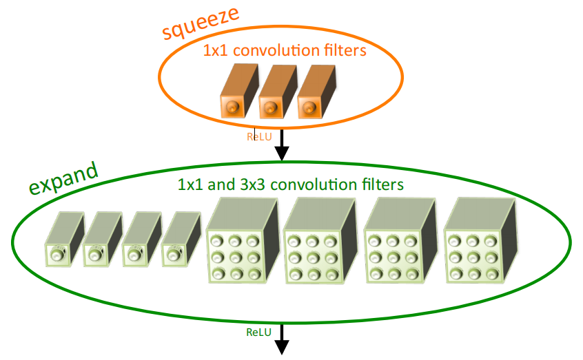
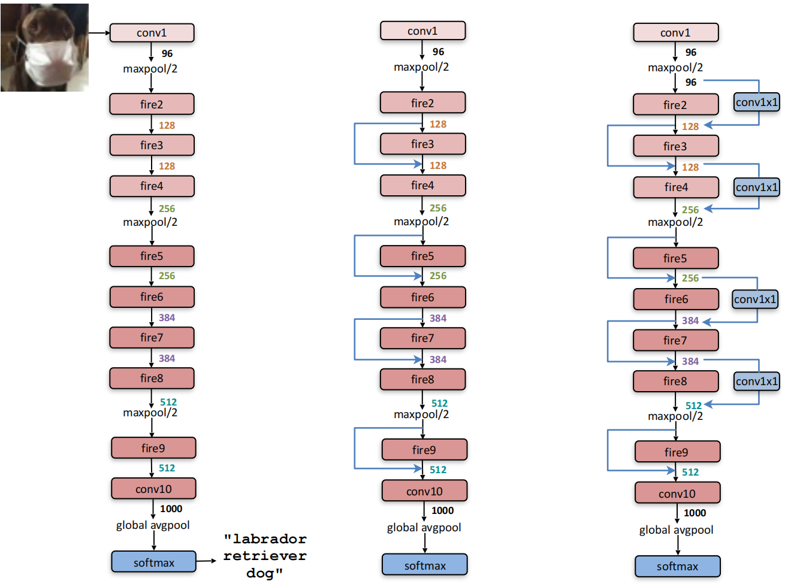

# SqueezeNet: AlexNet-level accuracy with 50x fewer parameters and <0.5MB model size
SqueezeNet：AlexNet级精度，参数减少50倍，模型大小小于0.5MB。  2016-2-24 原文：https://arxiv.org/abs/1602.07360

## 阅读笔记
* https://github.com/pytorch/vision/blob/main/torchvision/models/squeezenet.py
* Dentonet al 的一种相当直接的方法是将奇异值分解(SVD)应用于预训练的CNN模型(Denton et al.，2014)。Hanet al 开发了网络剪枝，它从预训练模型开始，然后用零替换低于某个阈值的参数以形成稀疏矩阵，最后在稀疏CNN上执行几次迭代训练(Hanet al., 2015b)。最近，Hanet al 扩展了他们的工作，将网络修剪与量化(至8位或更少)和霍夫曼编码相结合，创建了一种称为深度压缩的方法(Hanet al., 2015a)，并进一步设计了一种名为EIE的硬件加速器(Han et al.，2016a)，该加速器直接在压缩模型上运行

## Abstract
Recent research on deep convolutional neural networks (CNNs) has focused primarily on improving accuracy. For a given accuracy level, it is typically possible to identify multiple CNN architectures that achieve that accuracy level. With equivalent accuracy, smaller CNN architectures offer at least three advantages: 
(1) Smaller CNNs require less communication across servers during distributed training. 
(2) Smaller CNNs require less bandwidth to export a new model from the cloud to an autonomous car. 
(3) Smaller CNNs are more feasible to deploy on FPGAs and other hardware with limited memory. 
To provide all of these advantages, we propose a small CNN architecture called SqueezeNet. SqueezeNet achieves AlexNet-level accuracy on ImageNet with 50x fewer parameters. Additionally, with model compression techniques, we are able to compress SqueezeNet to less than 0.5MB (510× smaller than AlexNet).

最近对深度卷积神经网络(CNN)的研究主要集中在提高精度上。对于给定的精度水平，通常可以识别实现该精度水平的多个CNN架构。在同等精度下，较小的CNN架构至少具有三个优点：
1. 较小的CNN在分布式训练期间需要较少的服务器间通信。
2. 较小的CNN需要较少的带宽将新模型从云端导出到自动驾驶汽车。
3. 较小的CNN更适合部署在FPGA和其他内存有限的硬件上。

为了提供所有这些优势，我们提出了一个小型的CNN架构，称为SqueezeNet。SqueezeNet在ImageNet上实现了AlexNet级别的精度，参数减少了50倍。此外，通过模型压缩技术，我们能够将SqueezeNet压缩到小于0.5MB(比AlexNet小510倍)。

The SqueezeNet architecture is available for download here: https://github.com/DeepScale/SqueezeNet 

## 1 INTRODUCTION AND MOTIVATION
Much of the recent research on deep convolutional neural networks (CNNs) has focused on increasing accuracy on computer vision datasets. For a given accuracy level, there typically exist multiple CNN architectures that achieve that accuracy level. Given equivalent accuracy, a CNN architecture with fewer parameters has several advantages:
* More efficient distributed training. Communication among servers is the limiting factor to the scalability of distributed CNN training. For distributed data-parallel training, communication overhead is directly proportional to the number of parameters in the model (Iandola et al., 2016). In short, small models train faster due to requiring less communication.
* Less overhead when exporting new models to clients. For autonomous driving, companies such as Tesla periodically copy new models from their servers to customers’ cars. This practice is often referred to as an over-the-air update. Consumer Reports has found that the safety of Tesla’s Autopilot semi-autonomous driving functionality has incrementally improved with recent over-the-air updates (Consumer Reports, 2016). However, over-theair updates of today’s typical CNN/DNN models can require large data transfers. With AlexNet, this would require 240MB of communication from the server to the car. Smaller models require less communication, making frequent updates more feasible.
* Feasible FPGA and embedded deployment. FPGAs often have less than 10MB(For example, the Xilinx Vertex-7 FPGA has a maximum of 8.5 MBytes (i.e. 68 Mbits) of on-chip memory and does not provide off-chip memory. )of onchip memory and no off-chip memory or storage. For inference, a sufficiently small model could be stored directly on the FPGA instead of being bottlenecked by memory bandwidth (Qiu et al., 2016), while video frames stream through the FPGA in real time. Further, when deploying CNNs on Application-Specific Integrated Circuits (ASICs), a sufficiently small model could be stored directly on-chip, and smaller models may enable the ASIC to fit on a smaller die. 

最近对深度卷积神经网络(CNN)的许多研究集中于提高计算机视觉数据集上的准确性。对于给定的准确度水平，通常存在实现该准确度水平的多个CNN架构。给定等效精度，具有较少参数的CNN架构具有以下优点：
* 更高效的分布式训练。服务器之间的通信是分布式CNN训练可扩展性的限制因素。对于分布式数据并行训练，通信开销与模型的参数量成正比(Iandolaet al., 2016)。简言之，由于需要较少的通信，小型模型的训练速度更快。
* 将新模型导出到客户端时的开销更少。对于自动驾驶，特斯拉等公司定期将新车型从服务器复制到客户的汽车上。这种做法通常被称为空中更新。《消费者报告》(Consumer Reports)发现，随着最近的空中更新，特斯拉自动驾驶半自动驾驶功能的安全性逐步提高(《消费者报告，2016年》)。然而，对当今典型CNN/DNN模型的空中更新可能需要大量数据传输。使用AlexNet，这将需要从服务器到汽车的240MB通信。较小的模型需要较少的通信，使得频繁更新更为可行。
* 可行的FPGA和嵌入式部署。FPGA通常小于10MB(例如，Xilinx Vertex-7 FPGA的片上内存最大为8.5 MB(即68 MB)，不提供片外内存。)无片外存储器或存储。为了推断，当视频帧实时流经FPGA时，足够小的模型可以直接存储在FPGA上，而不是受到内存带宽的限制(邱et al., 2016)。此外，当在专用集成电路(ASIC)上部署CNN时，足够小的模型可以直接存储在芯片上，并且更小的模型可以使ASIC适合更小的管芯。

As you can see, there are several advantages of smaller CNN architectures. With this in mind, we focus directly on the problem of identifying a CNN architecture with fewer parameters but equivalent accuracy compared to a well-known model. We have discovered such an architecture, which we call SqueezeNet. In addition, we present our attempt at a more disciplined approach to searching the design space for novel CNN architectures.

正如您所看到的，较小的CNN架构有几个优点。考虑到这一点，我们直接关注识别CNN架构的问题，与已知模型相比，CNN架构具有更少的参数，但精度相当。我们发明了称之为SqueezeNet的架构。此外，我们提出了一种更严格的方法来搜索新CNN架构的设计空间。

The rest of the paper is organized as follows. In Section 2 we review the related work. Then, in Sections 3 and 4 we describe and evaluate the SqueezeNet architecture. After that, we turn our attention to understanding how CNN architectural design choices impact model size and accuracy. We gain this understanding by exploring the design space of SqueezeNet-like architectures. In Section 5, we do design space exploration on the CNN microarchitecture, which we define as the organization and dimensionality of individual layers and modules. In Section 6, we do design space exploration on the CNN macroarchitecture, which we define as high-level organization of layers in a CNN. Finally, we conclude in Section 7. In short, Sections 3 and 4 are useful for CNN researchers as well as practitioners who simply want to apply SqueezeNet to a new application. The remaining sections are aimed at advanced researchers who intend to design their own CNN architectures. 

论文的其余部分组织如下。在第2节中，我们回顾了相关工作。然后，在第3节和第4节中，我们描述并评估了SqueezeNet架构。之后，我们将注意力转向理解CNN架构设计选择如何影响模型大小和准确性。我们通过探索类SqueezeNet架构的设计空间来获得这种理解。在第5节中，我们对CNN微架构进行了空间探索，我们将其定义为各个层和模块的组织和维度。在第6节中，我们对CNN宏架构进行了空间探索，我们将其定义为CNN中的高层组织。最后，我们在第7节中得出结论。简而言之，第3节和第4节对CNN研究人员以及只想将SqueezeNet应用于新应用程序的从业者都很有用。其余部分针对那些打算设计自己的CNN架构的高级研究人员。

## 2.RELATED WORK
### 2.1 MODEL COMPRESSION
The overarching goal of our work is to identify a model that has very few parameters while preserving accuracy. To address this problem, a sensible approach is to take an existing CNN model and compress it in a lossy fashion. In fact, a research community has emerged around the topic of model compression, and several approaches have been reported. A fairly straightforward approach by Denton et al. is to apply singular value decomposition (SVD) to a pretrained CNN model (Denton et al., 2014). Han et al. developed Network Pruning, which begins with a pretrained model, then replaces parameters that are below a certain threshold with zeros to form a sparse matrix, and finally performs a few iterations of training on the sparse CNN (Han et al., 2015b). Recently, Han et al. extended their work by combining Network Pruning with quantization (to 8 bits or less) and huffman encoding to create an approach called Deep Compression (Han et al., 2015a), and further designed a hardware accelerator called EIE (Han et al., 2016a) that operates directly on the compressed model, achieving substantial speedups and energy savings.

我们工作的首要目标是识别一个参数很少的模型，同时保持准确性。为了解决这个问题，一个明智的方法是采用现有的CNN模型并以有损的方式对其进行压缩。事实上，围绕模型压缩这一主题，已经出现了一个研究社区，并报道了几种方法。Dentonet al 的一种相当直接的方法是将奇异值分解(SVD)应用于预训练的CNN模型(Denton et al.，2014)。Hanet al 开发了网络剪枝，它从预训练模型开始，然后用零替换低于某个阈值的参数以形成稀疏矩阵，最后在稀疏CNN上执行几次迭代训练(Hanet al., 2015b)。最近，Hanet al 扩展了他们的工作，将网络修剪与量化(至8位或更少)和霍夫曼编码相结合，创建了一种称为深度压缩的方法(Hanet al., 2015a)，并进一步设计了一种名为EIE的硬件加速器(Han et al.，2016a)，该加速器直接在压缩模型上运行，实现了显著的加速和节能。

### 2.2 CNN MICROARCHITECTURE
Convolutions have been used in artificial neural networks for at least 25 years; LeCun et al. helped to popularize CNNs for digit recognition applications in the late 1980s (LeCun et al., 1989). In neural networks, convolution filters are typically 3D, with height, width, and channels as the key dimensions. When applied to images, CNN filters typically have 3 channels in their first layer (i.e. RGB), and in each subsequent layer $L_i$ the filters have the same number of channels as $L_{i−1}$ has filters. The early work by LeCun et al. (LeCun et al., 1989) uses 5x5xChannels(From now on, we will simply abbreviate HxWxChannels to HxW.) filters, and the recent VGG (Simonyan & Zisserman, 2014) architectures extensively use 3x3 filters. Models such as Network-in-Network (Lin et al., 2013) and the GoogLeNet family of architectures (Szegedy et al., 2014; Ioffe & Szegedy, 2015; Szegedy et al., 2015; 2016) use 1x1 filters in some layers.

卷积在人工神经网络中已经使用了至少25;LeCunet al 在20世纪80年代后期帮助普及了数字识别应用的CNN(LeCun et al.，1989)。在神经网络中，卷积滤波器通常是3D的，高度、宽度和通道是关键维度。当应用于图像时，CNN滤波器通常在其第一层(即RGB)中具有3个通道，并且在每个后续$L_i$层中，滤波器具有与$L_{i−1}$相同数量的通道具有过滤器。LeCunet al 的早期工作(LeCun et al.，1989)使用5x5xChannels(从现在起，我们将简单地将HxWxChannel缩写为HxW。)滤波器，最近的VGG(Simonyan&Zisserman，2014)架构广泛使用3x3滤波器。网络中的网络(Linet al., 2013)和GoogleLeNet系列架构(Szegedyet al., 2014; Ioffe&Szegety，2015; Szegeyet al., 2015; 2016)等模型在某些层中使用1x1滤波器。

With the trend of designing very deep CNNs, it becomes cumbersome to manually select filter dimensions for each layer. To address this, various higher level building blocks, or modules, comprised of multiple convolution layers with a specific fixed organization have been proposed. For example, the GoogLeNet papers propose Inception modules, which are comprised of a number of different dimensionalities of filters, usually including 1x1 and 3x3, plus sometimes 5x5 (Szegedy et al., 2014) and sometimes 1x3 and 3x1 (Szegedy et al., 2015). Many such modules are then combined, perhaps with additional ad-hoc layers, to form a complete network. We use the term CNN microarchitecture to refer to the particular organization and dimensions of the individual modules.

随着设计非常深的CNN的趋势，为每个层手动选择过滤器尺寸变得很麻烦。为了解决这个问题，已经提出了由具有特定固定组织的多个卷积层组成的各种更高级别的构建块或模块。例如，GoogleLeNet的论文提出了Inception模块，该模块由多个不同维度的滤波器组成，通常包括1x1和3x3，有时还包括5x5(Szegedy et al.，2014)，有时包括1x3和3x1(Szege dy et al.，2015)。然后，许多这样的模块被结合起来，可能与额外的ad-hoc层结合起来，形成一个完整的网络。我们使用术语CNN微架构来指代各个模块的特定组织和维度。

### 2.3 CNN MACROARCHITECTURE
While the CNN microarchitecture refers to individual layers and modules, we define the CNN macroarchitecture as the system-level organization of multiple modules into an end-to-end CNN architecture. 

虽然CNN微架构指的是各个层和模块，但我们将CNN宏架构定义为将多个模块组织成端到端的CNN架构的系统级组织。

Perhaps the mostly widely studied CNN macroarchitecture topic in the recent literature is the impact of depth (i.e. number of layers) in networks. Simoyan and Zisserman proposed the VGG (Simonyan & Zisserman, 2014) family of CNNs with 12 to 19 layers and reported that deeper networks produce higher accuracy on the ImageNet-1k dataset (Deng et al., 2009). K. He et al. proposed deeper CNNs with up to 30 layers that deliver even higher ImageNet accuracy (He et al., 2015a).

也许最近文献中最广泛研究的CNN宏架构主题是网络深度(即层数)的影响。Simoyan和Zisserman提出了具有12至19层的VGG(Simoyan&Zisser曼，2014)CNN家族，并报告了更深的网络在ImageNet-1k数据集上产生更高的准确性(Denget al., 2009)。K、 Heet al 提出了具有多达30层的更深层次CNN，可以提供更高的ImageNet精度(Heet al., 2015a)。

The choice of connections across multiple layers or modules is an emerging area of CNN macroarchitectural research. Residual Networks (ResNet) (He et al., 2015b) and Highway Networks (Srivastava et al., 2015) each propose the use of connections that skip over multiple layers, for example additively connecting the activations from layer 3 to the activations from layer 6. We refer to these connections as bypass connections. The authors of ResNet provide an A/B comparison of a 34-layer CNN with and without bypass connections; adding bypass connections delivers a 2 percentage-point improvement on Top-5 ImageNet accuracy.

跨多个层或模块的连接选择是CNN宏观架构研究的一个新兴领域。残差网络(ResNet)(Heet al., 2015b)和公路网络(Srivastavaet al., 2015)均建议使用跨越多个层的连接，例如将第3层的激活与第6层的激活进行附加连接。我们将这些连接称为旁路连接。ResNet的作者提供了34层CNN的A/B比较，其中有旁路连接和没有旁路连接; 添加旁路连接使Top-5 ImageNet的精度提高了2个百分点。

### 2.4 NEURAL NETWORK DESIGN SPACE EXPLORATION
Neural networks (including deep and convolutional NNs) have a large design space, with numerous options for microarchitectures, macroarchitectures, solvers, and other hyperparameters. It seems natural that the community would want to gain intuition about how these factors impact a NN’s accuracy (i.e. the shape of the design space). Much of the work on design space exploration (DSE) of NNs has focused on developing automated approaches for finding NN architectures that deliver higher accuracy. These automated DSE approaches include bayesian optimization (Snoek et al., 2012), simulated annealing (Ludermir et al., 2006), randomized search (Bergstra & Bengio, 2012), and genetic algorithms (Stanley & Miikkulainen, 2002). To their credit, each of these papers provides a case in which the proposed DSE approach produces a NN architecture that achieves higher accuracy compared to a representative baseline. However, these papers make no attempt to provide intuition about the shape of the NN design space. Later in this paper, we eschew automated approaches – instead, we refactor CNNs in such a way that we can do principled A/B comparisons to investigate how CNN architectural decisions influence model size and accuracy.

神经网络(包括深度神经网络和卷积神经网络)具有很大的设计空间，有许多用于微架构、宏架构、求解器和其他超参数的选项。社区似乎很自然地希望获得这些因素如何影响NN的准确性(即设计空间的形状)的直觉。NN的设计空间探索(DSE)的大部分工作都集中在开发自动化方法，以找到提供更高精度的NN架构。这些自动化DSE方法包括贝叶斯优化(Snoeket al., 2012)、模拟退火(Ludermiret al., 2006)、随机搜索(Bergstra&Bengio，2012)和遗传算法(Stanley&Miikkulainen，2002)。值得称道的是，这些论文中的每一篇都提供了一个案例，在该案例中，所提出的DSE方法产生了一种与代表性基线相比实现更高精度的NN架构。然而，这些论文并没有试图提供关于NN设计空间形状的直觉。在本文后面，我们避开了自动化方法 —— 相反，我们重构CNN的方式是，我们可以进行原则性的a/B比较，以研究CNN架构决策如何影响模型大小和准确性。

In the following sections, we first propose and evaluate the SqueezeNet architecture with and without model compression. Then, we explore the impact of design choices in microarchitecture and macroarchitecture for SqueezeNet-like CNN architectures. 

在下面的部分中，我们首先提出并评估了有无模型压缩的SqueezeNet架构。然后，我们探讨了类似SqueezeNet的CNN架构在微架构和宏架构中的设计选择的影响。

## 3 SQUEEZENET: PRESERVING ACCURACY WITH FEW PARAMETERS  用少量参数保持精度
In this section, we begin by outlining our design strategies for CNN architectures with few parameters. Then, we introduce the Fire module, our new building block out of which to build CNN architectures. Finally, we use our design strategies to construct SqueezeNet, which is comprised mainly of Fire modules.

在本节中，我们首先概述了我们针对CNN架构的设计策略，这些架构的参数很少。然后，我们介绍了Fire模块，这是我们构建CNN架构的新构建块。最后，我们使用我们的设计策略来构建SqueezeNet，它主要由Fire模块组成。

### 3.1 ARCHITECTURAL DESIGN STRATEGIES
Our overarching objective in this paper is to identify CNN architectures that have few parameters while maintaining competitive accuracy. To achieve this, we employ three main strategies when designing CNN architectures:

我们在本文中的首要目标是识别在保持竞争准确性的同时参数较少的CNN架构。为了实现这一点，我们在设计CNN架构时采用了三种主要策略：

Strategy 1. Replace 3x3 filters with 1x1 filters. Given a budget of a certain number of convolution filters, we will choose to make the majority of these filters 1x1, since a 1x1 filter has 9X fewer parameters than a 3x3 filter.

策略1. 用1x1滤波器替换3x3滤波器。给定一定数量的卷积滤波器的预算，我们将选择使这些滤波器中的大多数为1x1，因为1x1滤波器的参数比3x3滤波器少9倍。

Strategy 2. Decrease the number of input channels to 3x3 filters. Consider a convolution layer that is comprised entirely of 3x3 filters. The total quantity of parameters in this layer is (number of input channels) * (number of filters) * (3*3). So, to maintain a small total number of parameters in a CNN, it is important not only to decrease the number of 3x3 filters (see Strategy 1 above), but also to decrease the number of input channels to the 3x3 filters. We decrease the number of input channels to 3x3 filters using squeeze layers, which we describe in the next section.

策略2. 将输入通道的数量减少到3x3个过滤器。考虑一个完全由3x3个滤波器组成的卷积层。该层中的参数总数为(输入通道数)*(滤波器数)**(3*3)。因此，为了在CNN中保持少量的参数，不仅要减少3x3滤波器的数量(见上面的策略1)，而且要减少3x3滤波器的输入通道数量。我们使用挤压层将输入通道的数量减少到3x3个滤波器，我们将在下一节中进行描述。

Strategy 3. Downsample late in the network so that convolution layers have large activation maps. In a convolutional network, each convolution layer produces an output activation map with a spatial resolution that is at least 1x1 and often much larger than 1x1. The height and width of these activation maps are controlled by: (1) the size of the input data (e.g. 256x256 images) and (2) the choice of layers in which to downsample in the CNN architecture. Most commonly, downsampling is engineered into CNN architectures by setting the (stride > 1) in some of the convolution or pooling layers (e.g. (Szegedy et al., 2014; Simonyan & Zisserman, 2014; Krizhevsky et al., 2012)). If early(3 In our terminology, an “early” layer is close to the input data. ) layers in the network have large strides, then most layers will have small activation maps. Conversely, if most layers in the network have a stride of 1, and the strides greater than 1 are concentrated toward the end(4 In our terminology, the “end” of the network is the classifier. ) of the network, then many layers in the network will have large activation maps. Our intuition is that large activation maps (due to delayed downsampling) can lead to higher classification accuracy, with all else held equal. Indeed, K. He and H. Sun applied delayed downsampling to four different CNN architectures, and in each case delayed downsampling led to higher classification accuracy (He & Sun, 2015).

策略3. 在网络中后期进行下采样，以便卷积层具有大的激活图。在卷积网络中，每个卷积层产生一个空间分辨率至少为1x1且通常远大于1x1的输出激活图。这些激活图的高度和宽度由以下因素控制：(1)输入数据的大小(例如256x256图像)和(2)CNN架构中下采样层的选择。最常见的是，通过在一些卷积层或池化层中设置(步幅>1)，将下采样设计到CNN架构中(例如(Szegedyet al., 2014; Simonyan&Zisserman，2014; Krizhevskyet al., 2012))。如果网络中的前3层有较大的跨距，那么大多数层都会有较小的激活图。相反，如果网络中的大多数层的步幅为1，并且大于1的步幅集中在网络的末端4，那么网络中的许多层将具有大的激活图。我们的直觉是，大的激活图(由于延迟的下采样)可以导致更高的分类精度，而所有其他都保持不变。事实上，K.He和H.Sun将延迟下采样应用于四种不同的CNN架构，在每种情况下，延迟下采样都会导致更高的分类精度(He&Sun，2015)。

Strategies 1 and 2 are about judiciously decreasing the quantity of parameters in a CNN while attempting to preserve accuracy. Strategy 3 is about maximizing accuracy on a limited budget of parameters. Next, we describe the Fire module, which is our building block for CNN architectures that enables us to successfully employ Strategies 1, 2, and 3.

策略1和策略2是关于明智地减少CNN中的参数量，同时试图保持准确性。策略3是关于在有限的参数预算上最大化精度。接下来，我们将描述Fire模块，它是CNN架构的构建块，使我们能够成功地使用策略1、2和3。

### 3.2 THE FIRE MODULE
 
Figure 1: Microarchitectural view: Organization of convolution filters in the Fire module. In this example, $s_{1x1}$ = 3, $e_{1x1}$ = 4, and $e_{3x3}$ = 4. We illustrate the convolution filters but not the activations. 

图1：微架构视图：Fire模块中卷积滤波器的组织。在本例中，$s_{1x1}$=3，$e_{1x1}$=4，$e_{3x3}$=4。我们说明了卷积滤波器，但没有说明激活。

We define the Fire module as follows. A Fire module is comprised of: a squeeze convolution layer (which has only 1x1 filters), feeding into an expand layer that has a mix of 1x1 and 3x3 convolution filters; we illustrate this in Figure 1. The liberal use of 1x1 filters in Fire modules is an application of Strategy 1 from Section 3.1. We expose three tunable dimensions (hyperparameters) in a Fire module: $s_{1x1}$, $e_{1x1}$, and $e_{3x3}$. In a Fire module, $s_{1x1}$ is the number of filters in the squeeze layer (all 1x1), $e_{1x1}$ is the number of 1x1 filters in the expand layer, and $e_{3x3}$ is the number of 3x3 filters in the expand layer. When we use Fire modules we set $s_{1x1}$ to be less than ($e_{1x1}$ + $e_{3x3}$), so the squeeze layer helps to limit the number of input channels to the 3x3 filters, as per Strategy 2 from Section 3.1.

我们对Fire模块的定义如下。Fire模块包括：一个压缩卷积层(只有1x1个滤波器)，馈入一个由1x1和3x3个卷积滤波器组成的扩展层; 我们在图1中对此进行了说明。在Fire模块中自由使用1x1滤波器是第3.1节中策略1的一个应用。我们暴露了Fire模块的三个可调维度(超参数)：$s_{1x1}$、$e_{1x1}$和$e_{3x3}$，$e_{3x3}$是扩展层中3x3个滤波器的数量。当我们使用Fire模块时，我们将$s_{1x1}$设置为小于($e_{1x1}$+$e_{3x3}$)，因此挤压层有助于根据第3.1节中的策略2限制3x3滤波器的输入通道数量。

### 3.3 THE SQUEEZENET ARCHITECTURE
 
Figure 2: Macroarchitectural view of our SqueezeNet architecture. Left: SqueezeNet (Section 3.3); Middle: SqueezeNet with simple bypass (Section 6); Right: SqueezeNet with complex bypass (Section 6).

图2：SqueezeNet架构的宏观架构视图。
左：SqueezeNet(第3.3节); 
中间：带简单旁路的SqueezeNet(第6节); 
右：带复杂旁路的SqueezeNet(第6节)。

We now describe the SqueezeNet CNN architecture. We illustrate in Figure 2 that SqueezeNet begins with a standalone convolution layer (conv1), followed by 8 Fire modules (fire2-9), ending with a final conv layer (conv10). We gradually increase the number of filters per fire module from the beginning to the end of the network. SqueezeNet performs max-pooling with a stride of 2 after layers conv1, fire4, fire8, and conv10; these relatively late placements of pooling are per Strategy 3 from Section 3.1. We present the full SqueezeNet architecture in Table 1. 

我们现在描述SqueezeNet CNN架构。我们在图2中说明了SqueezeNet从一个独立的卷积层(conv1)开始，然后是8个Fire模块(fire2-9)，最后是一个最终的卷积(conv10)。从网络的开始到结束，我们逐渐增加每个Fire模块的过滤器数量。SqueezeNet在层conv1、fire4、fire8和conv10之后以2的步幅执行最大池; 这些相对较晚的池配置是根据第3.1节中的策略3进行的。我们在表1中展示了完整的SqueezeNet架构。

Table 1: SqueezeNet architectural dimensions. (The formatting of this table was inspired by the　Inception2 paper (Ioffe & Szegedy, 2015).) 

#### 3.3.1 OTHER SQUEEZENET DETAILS
For brevity, we have omitted number of details and design choices about SqueezeNet from Table 1 and Figure 2. We provide these design choices in the following. The intuition behind these choices may be found in the papers cited below.
* So that the output activations from 1x1 and 3x3 filters have the same height and width, we add a 1-pixel border of zero-padding in the input data to 3x3 filters of expand modules.
* ReLU (Nair & Hinton, 2010) is applied to activations from squeeze and expand layers.
* Dropout (Srivastava et al., 2014) with a ratio of 50% is applied after the fire9 module.
* Note the lack of fully-connected layers in SqueezeNet; this design choice was inspired by the NiN (Lin et al., 2013) architecture.
* When training SqueezeNet, we begin with a learning rate of 0.04, and we linearly decrease the learning rate throughout training, as described in (Mishkin et al., 2016). For details on the training protocol (e.g. batch size, learning rate, parameter initialization), please refer to our Caffe-compatible configuration files located here: https://github.com/DeepScale/SqueezeNet.
* The Caffe framework does not natively support a convolution layer that contains multiple filter resolutions (e.g. 1x1 and 3x3) (Jia et al., 2014). To get around this, we implement our expand layer with two separate convolution layers: a layer with 1x1 filters, and a layer with 3x3 filters. Then, we concatenate the outputs of these layers together in the channel dimension. This is numerically equivalent to implementing one layer that contains both 1x1 and 3x3 filters.

为了简洁起见，我们从表1和图2中省略了关于SqueezeNet的许多细节和设计选择。我们在下面提供了这些设计选择。这些选择背后的直觉可以在下面引用的论文中找到。
* 为了使1x1和3x3滤波器的输出激活具有相同的高度和宽度，我们在扩展模块的3x3过滤器的输入数据中添加了1像素的零填充边界。
* ReLU(Nair&Hinton，2010)应用于挤压和膨胀层的激活。
* 在fire9模块之后应用比率为50%的Dropout(Srivastavaet al., 2014)。
* 请注意SqueezeNet中缺少完全连接的层; 这种设计选择的灵感来自NiN(Linet al., 2013)架构。
* 当训练SqueezeNet时，我们从0.04的学习率开始，并在整个训练过程中线性降低学习率，如所述(Mishkinet al., 2016)。有关训练协议的详情(例如，批量大小、学习率、参数初始化)，请参阅我们的Caffe兼容配置文件：https://github.com/DeepScale/SqueezeNet.
* Caffe框架本身不支持包含多个滤波器分辨率(例如1x1和3x3)的卷积层(Jiaet al., 2014)。为了解决这个问题，我们使用两个独立的卷积层来实现扩展层：一个具有1x1滤波器的层和一个具有3x3滤波器的层。然后，我们在通道维度中将这些层的输出连接在一起。这在数字上等同于实现一个包含1x1和3x3滤波器的层。

We released the SqueezeNet configuration files in the format defined by the Caffe CNN framework. However, in addition to Caffe, several other CNN frameworks have emerged, including MXNet (Chen et al., 2015a), Chainer (Tokui et al., 2015), Keras (Chollet, 2016), and Torch (Collobert et al., 2011). Each of these has its own native format for representing a CNN architecture. That said, most of these libraries use the same underlying computational back-ends such as cuDNN (Chetlur et al., 2014) and MKL-DNN (Das et al., 2016). The research community has ported the SqueezeNet CNN architecture for compatibility with a number of other CNN software frameworks:
* MXNet (Chen et al., 2015a) port of SqueezeNet: (Haria, 2016)
* Chainer (Tokui et al., 2015) port of SqueezeNet: (Bell, 2016)
* Keras (Chollet, 2016) port of SqueezeNet: (DT42, 2016)
* Torch (Collobert et al., 2011) port of SqueezeNet’s Fire Modules: (Waghmare, 2016) 

我们以Caffe CNN框架定义的格式发布了SqueezeNet配置文件。然而，除了Caffe，还出现了其他几个CNN框架，包括MXNet(Chenet al., 2015a)、Chainer(Tokuiet al., 2015)、Keras(Cholet，2016)和Torch(Collobertet al., 2011)。其中每一个都有自己的本地格式来表示CNN架构。即,大多数这些库使用相同的底层计算后端，如cuDNN(Chetluret al., 2014)和MKL-DNN(Daset al., 2016)。研究社区已经移植了SqueezeNet CNN架构，以与许多其他CNN软件框架兼容：
* MXNet(Chen et al.，2015a)SqueezeNet港口：(Haria，2016)
* Chainer(Tokuiet al., 2015)SqueezeNet港口：(贝尔，2016)
* Keras(Cholet，2016)SqueezeNet港口：(DT422016)
* Torch(Collobertet al., 2011)SqueezeNet的Fire模块端口：(Waghmare，2016)

 

## 4. EVALUATION OF SQUEEZENET
We now turn our attention to evaluating SqueezeNet. In each of the CNN model compression papers reviewed in Section 2.1, the goal was to compress an AlexNet (Krizhevsky et al., 2012) model that was trained to classify images using the ImageNet (Deng et al., 2009) (ILSVRC 2012) dataset.　Therefore, we use AlexNet and the associated model compression results as a basis for comparison when evaluating SqueezeNet.

我们现在将注意力转向评估SqueezeNet。在第2.1节中审查的每一篇CNN模型压缩论文中，目标是压缩AlexNet(Krizhevskyet al., 2012)模型，该模型经过训练以使用ImageNet(Denget al., 2009)(ILSVRC 2012)数据集对图像进行分类。因此，在评估SqueezeNet时，我们使用AlexNet (5) 和相关的模型压缩结果作为比较的基础。

Table 2: Comparing SqueezeNet to model compression approaches. By model size, we mean the number of bytes required to store all of the parameters in the trained model.
表2：比较SqueezeNet和模型压缩方法。通过模型大小，我们指的是在训练模型中存储所有参数所需的字节数。

In Table 2, we review SqueezeNet in the context of recent model compression results. The SVDbased approach is able to compress a pretrained AlexNet model by a factor of 5x, while diminishing top-1 accuracy to 56.0% (Denton et al., 2014). Network Pruning achieves a 9x reduction in model size while maintaining the baseline of 57.2% top-1 and 80.3% top-5 accuracy on ImageNet (Han et al., 2015b). Deep Compression achieves a 35x reduction in model size while still maintaining the baseline accuracy level (Han et al., 2015a). Now, with SqueezeNet, we achieve a 50X reduction in model size compared to AlexNet, while meeting or exceeding the top-1 and top-5 accuracy of　AlexNet. We summarize all of the aforementioned results in Table 2.

在表2中，我们根据最近的模型压缩结果回顾了SqueezeNet。基于SVD的方法能够将预训练的AlexNet模型压缩5倍，同时将top 1的精度降低到56.0%(Dentonet al., 2014)。网络修剪实现了模型大小的9倍缩减，同时在ImageNet上保持了57.2%的top-1和80.3%的top-5精度(Hanet al., 2015b)。深度压缩在保持基线精度水平的同时实现了模型尺寸的35倍缩减(Hanet al., 2015a)。现在，使用SqueezeNet，与AlexNet相比，我们的模型大小减少了50倍，同时达到或超过了AlexNet的前1和前5精度。我们在表2中总结了所有上述结果。

It appears that we have surpassed the state-of-the-art results from the model compression community: even when using uncompressed 32-bit values to represent the model, SqueezeNet has a 1.4× smaller model size than the best efforts from the model compression community while maintaining or exceeding the baseline accuracy. Until now, an open question has been: are small models amenable to compression, or do small models “need” all of the representational power afforded by dense floating-point values? To find out, we applied Deep Compression (Han et al., 2015a) to SqueezeNet, using 33% sparsity6 and 8-bit quantization. This yields a 0.66 MB model (363× smaller than 32-bit AlexNet) with equivalent accuracy to AlexNet. Further, applying Deep Compression with 6-bit quantization and 33% sparsity on SqueezeNet, we produce a 0.47MB model (510× smaller than 32-bit AlexNet) with equivalent accuracy. Our small model is indeed amenable to compression.　

我们似乎已经超越了模型压缩社区的最新结果：即使使用未压缩的32位值来表示模型，SqueezeNet的模型大小也比模型压缩社区所做的最大努力小1.4倍，同时保持或超过了基线精度。直到现在，一个悬而未决的问题是：小模型是否适合压缩，还是小模型“需要”密集浮点值提供的所有表示能力？为了找出答案，我们将深度压缩(Han et al.，2015a)应用于SqueezeNet，使用33%的稀疏性6和8位量化。这产生了一个0.66 MB的模型(比32位AlexNet小363×。此外，在SqueezeNet上应用具有6位量化和33%稀疏性的深度压缩，我们产生了具有同等精度的0.47MB模型(比32位AlexNet小510×)。我们的小模型确实适合压缩。

In addition, these results demonstrate that Deep Compression (Han et al., 2015a) not only works well on CNN architectures with many parameters (e.g. AlexNet and VGG), but it is also able to compress the already compact, fully convolutional SqueezeNet architecture. Deep Compression compressed SqueezeNet by 10× while preserving the baseline accuracy. In summary: by combining CNN architectural innovation (SqueezeNet) with state-of-the-art compression techniques (Deep　Compression), we achieved a 510× reduction in model size with no decrease in accuracy compared to the baseline.

此外，这些结果表明，深度压缩(Han et al.，2015a)不仅在具有许多参数的CNN架构上工作良好(例如AlexNet和VGG)，而且还能够压缩已经紧凑的、完全卷积的SqueezeNet架构。Deep Compression将SqueezeNet压缩了10倍，同时保持了基线精度。总之：通过将CNN架构创新(SqueezeNet)与最先进的压缩技术(Deep compression)相结合，我们实现了510倍的模型尺寸缩减，与基线相比，精度没有降低。

Finally, note that Deep Compression (Han et al., 2015b) uses a codebook as part of its scheme for quantizing CNN parameters to 6- or 8-bits of precision. Therefore, on most commodity processors, it is not trivial to achieve a speedup of 32 8 = 4x with 8-bit quantization or 32 6 = 5.3x with 6-bit quantization using the scheme developed in Deep Compression. However, Han et al. developed custom hardware – Efficient Inference Engine (EIE) – that can compute codebook-quantized CNNs more efficiently (Han et al., 2016a). In addition, in the months since we released SqueezeNet, P. Gysel developed a strategy called Ristretto for linearly quantizing SqueezeNet to 8 bits (Gysel, 2016). Specifically, Ristretto does computation in 8 bits, and it stores parameters and activations in 8-bit data types. Using the Ristretto strategy for 8-bit computation in SqueezeNet inference, Gysel observed less than 1 percentage-point of drop in accuracy when using 8-bit instead of 32-bit data types. 

最后，请注意，深度压缩(Hanet al., 2015b)使用码本作为其方案的一部分，用于将CNN参数量化为6或8位精度。因此，在大多数商品处理器上，使用深度压缩中开发的方案实现8位量化的32 8＝4倍或6位量化的326＝5.3倍的加速并非易事。然而，Hanet al 开发了定制硬件 —— 高效推理引擎(EIE)—— 可以更高效地计算码本量化CNN(Hanet al., 2016a)。此外，在我们发布SqueezeNet的几个月里，P.Gysel开发了一种称为Ristretto的策略，用于将SqueezeNet线性量化为8位(Gysel，2016)。具体来说，Ristretto以8位进行计算，并以8位数据类型存储参数和激活。在SqueezeNet推理中使用Ristretto策略进行8位计算，Gysel在使用8位数据类型而不是32位数据类型时观察到精度下降不到1个百分点。

## 5 CNN MICROARCHITECTURE DESIGN SPACE EXPLORATION
So far, we have proposed architectural design strategies for small models, followed these principles to create SqueezeNet, and discovered that SqueezeNet is 50x smaller than AlexNet with equivalent accuracy. However, SqueezeNet and other models reside in a broad and largely unexplored design space of CNN architectures. Now, in Sections 5 and 6, we explore several aspects of the design space. We divide this architectural exploration into two main topics: microarchitectural exploration (per-module layer dimensions and configurations) and macroarchitectural exploration (high-level end-to-end organization of modules and other layers).

到目前为止，我们已经提出了小型模型的架构设计策略，遵循这些原则创建了SqueezeNet，并发现SqueezeNet比AlexNet小50倍，精度相当。然而，SqueezeNet和其他模型存在于CNN架构的广阔且基本上未开发的设计空间中。现在，在第5节和第6节中，我们探讨了设计空间的几个方面。我们将这种架构探索分为两个主要主题：微架构探索(每个模块层的维度和配置)和宏架构探索(模块和其他层的高层端到端组织)。

In this section, we design and execute experiments with the goal of providing intuition about the shape of the microarchitectural design space with respect to the design strategies that we proposed in Section 3.1. Note that our goal here is not to maximize accuracy in every experiment, but rather to understand the impact of CNN architectural choices on model size and accuracy. 

在本节中，我们设计并执行实验，目的是提供关于我们在第3.1节中提出的设计策略的微架构设计空间形状的直觉。请注意，我们的目标不是在每个实验中最大化准确性，而是理解CNN架构选择对模型大小和准确性的影响。

6Note that, due to the storage overhead of storing sparse matrix indices, 33% sparsity leads to somewhat less than a 3× decrease in model size.  

Figure 3: Microarchitectural design space exploration.
图3：微架构空间探索。

### 5.1 CNN MICROARCHITECTURE METAPARAMETERS
In SqueezeNet, each Fire module has three dimensional hyperparameters that we defined in Section 3.2: $s_{1x1}$, $e_{1x1}$, and $e_{3x3}$. SqueezeNet has 8 Fire modules with a total of 24 dimensional hyperparameters. To do broad sweeps of the design space of SqueezeNet-like architectures, we define the following set of higher level metaparameters which control the dimensions of all Fire modules in a CNN. We define basee as the number of expand filters in the first Fire module in a CNN. After every freq Fire modules, we increase the number of expand filters by incre. In other words, for Fire module i, the number of expand filters is ei = basee + (incre ∗ j i f req k ). In the expand layer of a Fire module, some filters are 1x1 and some are 3x3; we define ei = ei,1x1 +ei,3x3 with pct3x3 (in the range [0, 1], shared over all Fire modules) as the percentage of expand filters that are 3x3. In other words, ei,3x3 = ei ∗ pct3x3, and ei,1x1 = ei ∗ (1 − pct3x3). Finally, we define the number of filters in the squeeze layer of a Fire module using a metaparameter called the squeeze ratio (SR) (again, in the range [0, 1], shared by all Fire modules): si,1x1 = SR ∗ ei (or equivalently si,1x1 = SR ∗ (ei,1x1 + ei,3x3)). SqueezeNet (Table 1) is an example architecture that we generated with the aforementioned set of metaparameters. Specifically, SqueezeNet has the following metaparameters: basee = 128, incre = 128, pct3x3 = 0.5, freq = 2, and SR = 0.125.

在SqueezeNet中，每个Fire模块都有我们在第3.2节中定义的三维超参数：$s_{1x1},e_{1x1},e_{3x3}$。为了对类似SqueezeNet的架构的设计空间进行广泛扫描，我们定义了以下一组更高级别的元参数，这些元参数控制CNN中所有Fire模块的尺寸。我们将basee定义为CNN中第一个Fire模块中扩展过滤器的数量。在每个freq Fire模块之后，我们将扩展过滤器的数量增加。换句话说，对于Fire模块i，扩展过滤器的数量为ei=basee+(incre∗ j i f req k)。在Fire模块的扩展层中，一些过滤器是1x1，一些是3x3; 我们将ei=ei，1x1+ei，3x3与pct3x3(在[0，1]范围内，在所有Fire模块上共享)定义为3x3的扩展滤波器的百分比。换句话说，ei，2x3=ei∗ pct3x3和ei，1x1=ei∗ (1 − pct3x3)。最后，我们使用称为挤压比(SR)的元参数(同样，在[0，1]范围内，由所有Fire模块共享)定义Fire模块挤压层中的过滤器数量：si，1x1=SR∗ ei(或等效si，1x1=SR∗ (ei，1x1+ei，3x3))。SqueezeNet(表1)是我们使用上述一组元参数生成的样本架构。具体来说，SqueezeNet具有以下元参数：basee=128，incre=128，pct3x3=0.5，freq=2，SR=0.125。

### 5.2 SQUEEZE RATIO 挤压比
In Section 3.1, we proposed decreasing the number of parameters by using squeeze layersto decrease the number of input channels seen by 3x3 filters. We defined the squeeze ratio (SR) as the ratio between the number of filters in squeeze layers and the number of filters in expand layers. We now design an experiment to investigate the effect of the squeeze ratio on model size and accuracy.

在第3.1节中，我们建议通过使用挤压层来减少参数的数量，以减少3x3滤波器看到的输入通道的数量。我们将挤压比(SR)定义为挤压层中过滤器的数量与膨胀层中过滤器数量之间的比率。我们现在设计了一个实验来研究挤压比对模型尺寸和精度的影响。

In these experiments, we use SqueezeNet (Figure 2) as a starting point. As in SqueezeNet, these experiments use the following metaparameters: basee = 128, incre = 128, pct3x3 = 0.5, and freq = 2. We train multiple models, where each model has a different squeeze ratio (SR)(7 Note that, for a given model, all Fire layers share the same squeeze ratio.) in the range [0.125, 1.0]. In Figure 3(a), we show the results of this experiment, where each point on the graph is an independent model that was trained from scratch. SqueezeNet is the SR=0.125 point in this figure (8 Note that we named it SqueezeNet because it has a low squeeze ratio (SR). That is, the squeeze layers in SqueezeNet have 0.125x the number of filters as the expand layers. ). From this figure, we learn that increasing SR beyond 0.125 can further increase ImageNet top-5 accuracy from 80.3% (i.e. AlexNet-level) with a 4.8MB model to 86.0% with a 19MB model. Accuracy plateaus at 86.0% with SR=0.75 (a 19MB model), and setting SR=1.0 further increases model size without improving accuracy.

在这些实验中，我们使用SqueezeNet(图2)作为起点。与SqueezeNet一样，这些实验使用以下元参数：basee=128，incre=128，pct3x3=0.5，freq=2。我们训练了多个模型，其中每个模型的挤压比(SR)7在[0.125，1.0]范围内(7请注意，对于给定的模型，所有Fire层共享相同的挤压比。)。在图3(a)中，我们显示了实验结果，其中图上的每个点都是一个独立的模型，是从头开始训练的。SqueezeNet是该图中的SR=0.125点(8请注意，我们将其命名为SqueezeNet，因为它具有低挤压比(SR)。即,SqueezeNet中的挤压层的过滤器数量是扩展层的0.125倍。)。从该图中，我们了解到，将SR增加到0.125以上可以进一步将ImageNet top 5的精度从4.8MB模型的80.3%(即AlexNet级别)提高到19MB模型的86.0%。当SR=0.75(19MB模型)时，精度稳定在86.0%，并且设置SR=1.0进一步增加了模型大小，而没有提高精度。

### 5.3 TRADING OFF 1X1 AND 3X3 FILTERS    权衡1X1和3X3滤波器
In Section 3.1, we proposed decreasing the number of parameters in a CNN by replacing some 3x3 filters with 1x1 filters. An open question is, how important is spatial resolution in CNN filters? 

在第3.1节中，我们建议通过用1x1滤波器替换一些3x3滤波器来减少CNN中的参数量。一个悬而未决的问题是，CNN滤波器中的空间分辨率有多重要？

The VGG (Simonyan & Zisserman, 2014) architectures have 3x3 spatial resolution in most layers’ filters; GoogLeNet (Szegedy et al., 2014) and Network-in-Network (NiN) (Lin et al., 2013) have 1x1 filters in some layers. In GoogLeNet and NiN, the authors simply propose a specific quantity of 1x1 and 3x3 filters without further analysis(9 To be clear, each filter is 1x1xChannels or 3x3xChannels, which we abbreviate to 1x1 and 3x3.). Here, we attempt to shed light on how the proportion of 1x1 and 3x3 filters affects model size and accuracy.

VGG(Simonyan&Zisserman，2014)架构在大多数层的滤波器中具有3x3的空间分辨率; GoogleLeNet(Szegedyet al., 2014)和网络中的网络(NiN)(Linet al., 2013)在某些层中具有1x1滤波器。在GoogLeNet和NiN中，作者只提出了特定数量的1x1和3x3滤波器，而无需进一步分析(为了清楚起见，每个滤波器都是1x1xChannel或3x3xChannel，我们将其缩写为1x1和3x3)。在这里，我们试图阐明1x1和3x3滤波器的比例如何影响模型尺寸和精度。

We use the following metaparameters in this experiment: $base_e = incr_e = 128$, freq = 2, SR = 0.500, and we vary $pct_{3x3}$ from 1% to 99%. In other words, each Fire module’s expand layer has a predefined number of filters partitioned between 1x1 and 3x3, and here we turn the knob on these filters from “mostly 1x1” to “mostly 3x3”. As in the previous experiment, these models have 8 Fire modules, following the same organization of layers as in Figure 2. We show the results of this experiment in Figure 3(b). Note that the 13MB models in Figure 3(a) and Figure 3(b) are the same architecture: SR = 0.500 and pct3x3 = 50%. We see in Figure 3(b) that the top-5 accuracy plateaus at 85.6% using 50% 3x3 filters, and further increasing the percentage of 3x3 filters leads to a larger model size but provides no improvement in accuracy on ImageNet. 

我们在这个实验中使用了以下元参数：$base_e = incr_e = 128$，freq=2，SR=0.500，我们将$pct_{3x3}$ 从1%变化到99%。换言之，每个Fire模块的扩展层都有一个预定义数量的过滤器，这些过滤器在1x1和3x3之间划分，这里我们将这些过滤器的旋钮从“主要1x1”转到“主要3x3”。与之前的实验一样，这些模型有8个Fire模块，遵循与图2相同的层组织。我们在图3(b)中显示了本实验的结果。请注意，图3(a)和图3(b)中的13MB模型是相同的架构：SR=0.500，$pct_{3x3}$=50%。我们在图3(b)中看到，使用50%的3x3滤波器，前5位的精度稳定在85.6%，并且进一步增加3x3过滤器的百分比会导致更大的模型尺寸，但不会提高ImageNet的精度。

## 6 CNN MACROARCHITECTURE DESIGN SPACE EXPLORATION
So far we have explored the design space at the microarchitecture level, i.e. the contents of individual modules of the CNN. Now, we explore design decisions at the macroarchitecture level concerning the high-level connections among Fire modules. Inspired by ResNet (He et al., 2015b), we explored three different architectures:
* Vanilla SqueezeNet (as per the prior sections).
* SqueezeNet with simple bypass connections between some Fire modules. (Inspired by (Srivastava et al., 2015; He et al., 2015b).)
* SqueezeNet with complex bypass connections between the remaining Fire modules.

到目前为止，我们已经探索了微架构级别的设计空间，即CNN各个模块的内容。现在，我们将探讨与Fire模块之间的高层连接有关的宏架构级别的设计决策。受ResNet的启发(Heet al., 2015b)，我们探索了三种不同的架构：
* 普通挤压网(按照前面的章节)。
* 一些Fire模块之间具有简单旁路连接的SqueezeNet。(灵感来自(Srivastavaet al., 2015; Heet al., 2015b)。)
* 其余Fire模块之间具有复杂旁路连接的SqueezeNet。

We illustrate these three variants of SqueezeNet in Figure 2.

我们在图2中说明了SqueezeNet的这三种变体。

Oursimple bypass architecture adds bypass connections around Fire modules 3, 5, 7, and 9, requiring these modules to learn a residual function between input and output. As in ResNet, to implement a bypass connection around Fire3, we set the input to Fire4 equal to (output of Fire2 + output of Fire3), where the + operator is elementwise addition. This changes the regularization applied to the parameters of these Fire modules, and, as per ResNet, can improve the final accuracy and/or ability to train the full model.

我们的简单旁路架构在Fire模块3、5、7和9周围增加了旁路连接，要求这些模块学习输入和输出之间的残差函数。与ResNet一样，为了实现Fire3的旁路连接，我们将Fire4的输入设置为等于(Fire2的输出+Fire3的输出)，其中+运算符是元素相加。这将改变应用于这些Fire模块参数的正则化，并且根据ResNet，可以提高最终精度和/或训练完整模型的能力。

One limitation is that, in the straightforward case, the number of input channels and number of output channels has to be the same; as a result, only half of the Fire modules can have simple bypass connections, as shown in the middle diagram of Fig 2. When the “same number of channels” requirement can’t be met, we use a complex bypass connection, as illustrated on the right of Figure 2. While a simple bypass is “just a wire,” we define a complex bypass as a bypass that includes a 1x1 convolution layer with the number of filters set equal to the number of output channels that are needed. Note that complex bypass connections add extra parameters to the model, while simple bypass connections do not.

一个限制是，在直接的情况下，输入通道的数量和输出通道的数量必须相同; 因此，只有一半的Fire模块可以有简单的旁路连接，如图2的中间图所示。当无法满足“相同数量的通道”要求时，我们使用复杂的旁路连接。如图2右侧所示。虽然简单旁路“只是一条线”，但我们将复杂旁路定义为包括1x1卷积层的旁路，其滤波器数量设置为所需的输出通道数量。请注意，复杂的旁路连接会为模型添加额外的参数，而简单的旁路连接则不会。

In addition to changing the regularization, it is intuitive to us that adding bypass connections would help to alleviate the representational bottleneck introduced by squeeze layers. In SqueezeNet, the squeeze ratio (SR) is 0.125, meaning that every squeeze layer has 8x fewer output channels than the accompanying expand layer. Due to this severe dimensionality reduction, a limited amount of information can pass through squeeze layers. However, by adding bypass connections to SqueezeNet, we open up avenues for information to flow around the squeeze layers.

除了改变正则化，我们直观地看到，添加旁路连接将有助于缓解挤压层引入的代表性瓶颈。在SqueezeNet中，压缩比(SR)为0.125，这意味着每个压缩层的输出通道比相应的扩展层少8倍。由于这种严重的降维，有限的信息可以通过挤压层。然而，通过向SqueezeNet添加旁路连接，我们打开了信息在挤压层周围流动的渠道。

We trained SqueezeNet with the three macroarchitectures in Figure 2 and compared the accuracy and model size in Table 3. We fixed the microarchitecture to match SqueezeNet as described in Table 1 throughout the macroarchitecture exploration. Complex and simple bypass connections both yielded an accuracy improvement over the vanilla SqueezeNet architecture. Interestingly, the simple bypass enabled a higher accuracy accuracy improvement than complex bypass. Adding the simple bypass connections yielded an increase of 2.9 percentage-points in top-1 accuracy and 2.2 percentage-points in top-5 accuracy without increasing model size. 

我们使用图2中的三种宏架构训练SqueezeNet，并比较了表3中的准确性和模型大小。我们在整个宏架构探索过程中固定了微架构以匹配SqueezeNet，如表1所述。复杂和简单的旁路连接都比普通的SqueezeNet架构提高了精度。有趣的是，与复杂旁路相比，简单旁路实现了更高的精度提高。在不增加模型尺寸的情况下，添加简单的旁路连接使top 1精度提高了2.9个百分点，top 5精度提高了2.2个百分点。

Table 3: SqueezeNet accuracy and model size using different macroarchitecture configurations
表3：使用不同宏架构配置的SqueezeNet精度和模型大小

## 7 CONCLUSIONS
In this paper, we have proposed steps toward a more disciplined approach to the design-space exploration of convolutional neural networks. Toward this goal we have presented SqueezeNet, a CNN architecture that has 50× fewer parameters than AlexNet and maintains AlexNet-level accuracy on　ImageNet. We also compressed SqueezeNet to less than 0.5MB, or 510× smaller than AlexNet without compression. Since we released this paper as a technical report in 2016, Song Han and his collaborators have experimented further with SqueezeNet and model compression. Using a new approach called Dense-Sparse-Dense (DSD) (Han et al., 2016b), Han et al. use model compression during training as a regularizer to further improve accuracy, producing a compressed set of　SqueezeNet parameters that is 1.2 percentage-points more accurate on ImageNet-1k, and also producing an uncompressed set of SqueezeNet parameters that is 4.3 percentage-points more accurate, compared to our results in Table 2.

在这篇论文中，我们提出了一种更严格的卷积神经网络设计空间探索方法。为此，我们提出了SqueezeNet，这是一种CNN架构，其参数比AlexNet少50倍，并在ImageNet上保持AlexNet级别的准确性。我们还将SqueezeNet压缩到小于0.5MB，或者比未压缩的AlexNet小510倍。自2016年我们将本文作为技术报告发布以来，宋汉和他的合作者已经对SqueezeNet和模型压缩进行了进一步的实验。使用一种称为密集稀疏密集(DSD)的新方法(Hanet al., 2016b)，Hanet al 在训练期间使用模型压缩作为正则化器，以进一步提高准确性，生成一组压缩的SqueeNet参数，其在ImageNet-1k上的准确度提高了1.2个百分点，并且还生成一组未压缩的SquieNet，其准确度提高4.3个百分点，与表2中的结果相比。

We mentioned near the beginning of this paper that small models are more amenable to on-chip implementations on FPGAs. Since we released the SqueezeNet model, Gschwend has developed a variant of SqueezeNet and implemented it on an FPGA (Gschwend, 2016). As we anticipated,Gschwend was able to able to store the parameters of a SqueezeNet-like model entirely within the　FPGA and eliminate the need for off-chip memory accesses to load model parameters.

我们在本文开头提到，小型模型更适合FPGA上的片上实现。自我们发布SqueezeNet模型以来，Gschwend开发了SqueezeNet的一个变体，并在FPGA上实现(Gschwerd，2016)。正如我们预期的那样，Gschwend能够将类SqueeNet模型的参数完全存储在FPGA中，并且不需要芯片外存储器访问来加载模型参数。

In the context of this paper, we focused on ImageNet as a target dataset. However, it has become common practice to apply ImageNet-trained CNN representations to a variety of applications such as fine-grained object recognition (Zhang et al., 2013; Donahue et al., 2013), logo identification in images (Iandola et al., 2015), and generating sentences about images (Fang et al., 2015). ImageNettrained CNNs have also been applied to a number of applications pertaining to autonomous driving, including pedestrian and vehicle detection in images (Iandola et al., 2014; Girshick et al., 2015; Ashraf et al., 2016) and videos (Chen et al., 2015b), as well as segmenting the shape of the road (Badrinarayanan et al., 2015). We think SqueezeNet will be a good candidate CNN architecture for a variety of applications, especially those in which small model size is of importance.

在本文的背景下，我们将ImageNet作为目标数据集。然而，将ImageNet训练的CNN表示应用于各种应用已成为普遍做法，例如细粒度对象识别(Zhanget al., 2013; Donahueet al., 2013)、图像中的标识识别(Iandolaet al., 2015)以及生成关于图像的句子(Fanget al., 2015年)。ImageNet trained CNN还应用于许多与自动驾驶相关的应用，包括图像中的行人和车辆检测(Iandolaet al., 2014; Girshicket al., 2015; Ashrafet al., 2016)和视频(Chenet al., 2015b)，以及道路形状分割(Badrinayananet al., 2015)。我们认为SqueezeNet将是各种应用程序的一个很好的候选CNN架构，尤其是那些小模型尺寸非常重要的应用程序。

SqueezeNet is one of several new CNNs that we have discovered while broadly exploring the design space of CNN architectures. We hope that SqueezeNet will inspire the reader to consider and explore the broad range of possibilities in the design space of CNN architectures and to perform that exploration in a more systematic manner.

SqueezeNet是我们在广泛探索CNN架构的设计空间时发现的几个新CNN之一。我们希望SqueezeNet能够启发读者思考和探索CNN架构设计空间中的广泛可能性，并以更系统的方式进行探索。

## References
