# CSPNet: A New Backbone that can Enhance Learning Capability of CNN
CSPNET：可以增强CNN学习能力的新主干 2019-11-27 原文：https://arxiv.org/abs/1911.11929

## 阅读笔记
* CSPNET, Cross Stage Partial Network, 跨阶段部分网络
* 重复梯度，将基础层的特征图划分为两个部分，平均拆分？ 
* Exact Fusion Model(EFM), MaxOut
* 在ResNeXt[39]中，Xieet al 首先证明了基数比宽度和深度维度更有效。由于采用了大量可重复使用特征的策略，DenseNet[11]可以显著减少参数和计算的数量。它将前面所有层的输出特性连接起来作为下一个输入，这可以被视为最大化基数的方法。SparseNet[46]将密集连接调整为指数间隔连接，可以有效提高参数利用率，从而获得更好的结果。Wanget al 进一步解释了为什么高基数和稀疏连接可以通过梯度组合的概念提高网络的学习能力，并开发了部分ResNet(PRN)[35]。为了提高CNN的推理速度，Maet al [24]介绍了需要遵循的四个准则，并设计了ShuffleNet-v2。Chaoet al [1]提出了一种称为Harmonic DenseNet(HarDNet)的低内存流量CNN和一种度量卷积输入/输出(CIO)，它是与实际DRAM流量测量成比例的DRAM流量的近似值。

## Abstract 
Neural networks have enabled state-of-the-art approaches to achieve incredible results on computer vision tasks such as object detection. However, such success greatly relies on costly computation resources, which hinders people with cheap devices from appreciating the advanced technology. In this paper, we propose Cross Stage Partial Network (CSPNet) to mitigate the problem that previous works require heavy inference computations from the network architecture perspective. We attribute the problem to the duplicate gradient information within network optimization. The proposed networks respect the variability of the gradients by integrating feature maps from the beginning and the end of a network stage, which, in our experiments, reduces computations by 20% with equivalent or even superior accuracy on the ImageNet dataset, and significantly outperforms state-of-the-art approaches in terms of AP50 on the MS COCO object detection dataset. The CSPNet is easy to implement and general enough to cope with architectures based on ResNet, ResNeXt, and DenseNet. Source code is at https://github.com/WongKinYiu/CrossStagePartialNetworks .

神经网络使SOTA方法能够在计算机视觉任务(如目标检测)上取得令人难以置信的结果。然而，这种成功在很大程度上依赖于昂贵的计算资源，这阻碍了拥有廉价设备的人们欣赏先进技术。在本文中，我们提出了跨阶段部分网络(CSPNet)，以从网络架构的角度缓解以前的工作需要大量推理计算的问题。我们将此问题归因于网络优化中的重复梯度信息。所提出的网络通过从网络阶段的开始和结束集成特征图来重视梯度的可变性，在我们的实验中，在ImageNet数据集上以同等甚至更高的精度减少了20%的计算，并且在MS COCO目标检测数据集的AP50方面显著优于SOTA方法。CSPNet易于实现，并且足够通用，可以处理基于ResNet、ResNeXt和DenseNet的架构。源代码位于https://github.com/WongKinYiu/CrossStagePartialNetworks .

## 1 Introduction 介绍
Neural networks have been shown to be especially powerful when it gets deeper [7, 39, 11] and wider [40]. However, extending the architecture of neural networks usually brings up a lot more computations, which makes computationally heavy tasks such as object detection unaffordable for most people. Light-weight computing has gradually received stronger attention since real-world applications usually require short inference time on small devices, which poses a serious challenge for computer vision algorithms. Although some approaches were designed exclusively for mobile CPU [9, 31, 8, 33, 43, 24], the depth-wise separable convolution techniques they adopted are not compatible with industrial IC design such as Application-Specific Integrated Circuit (ASIC) for edge-computing systems. In this work, we investigate the computational burden in state-of-the-art approaches such as ResNet, ResNeXt, and DenseNet. We further develop computationally efficient components that enable the mentioned networks to be deployed on both CPUs and mobile GPUs without sacrificing the performance.

研究表明，神经网络在深度[7、39、11]和宽度[40]时尤其强大。然而，扩展神经网络的架构通常会带来更多的计算，这使得大多数人负担不起诸如目标检测等计算繁重的任务。轻量计算逐渐受到人们的关注，因为实际应用通常需要在小型设备上缩短推理时间，这对计算机视觉算法提出了严峻的挑战。尽管一些方法专门为移动CPU设计[9、31、8、33、43、24]，但它们采用的深度可分离卷积技术与工业IC设计不兼容，例如边缘计算系统的专用集成电路(ASIC)。在这项工作中，我们研究了SOTA方法(如ResNet、ResNeXt和DenseNet)的计算负担。我们进一步开发计算效率高的组件，使上述网络能够部署在CPU和移动GPU上，而不会牺牲性能。

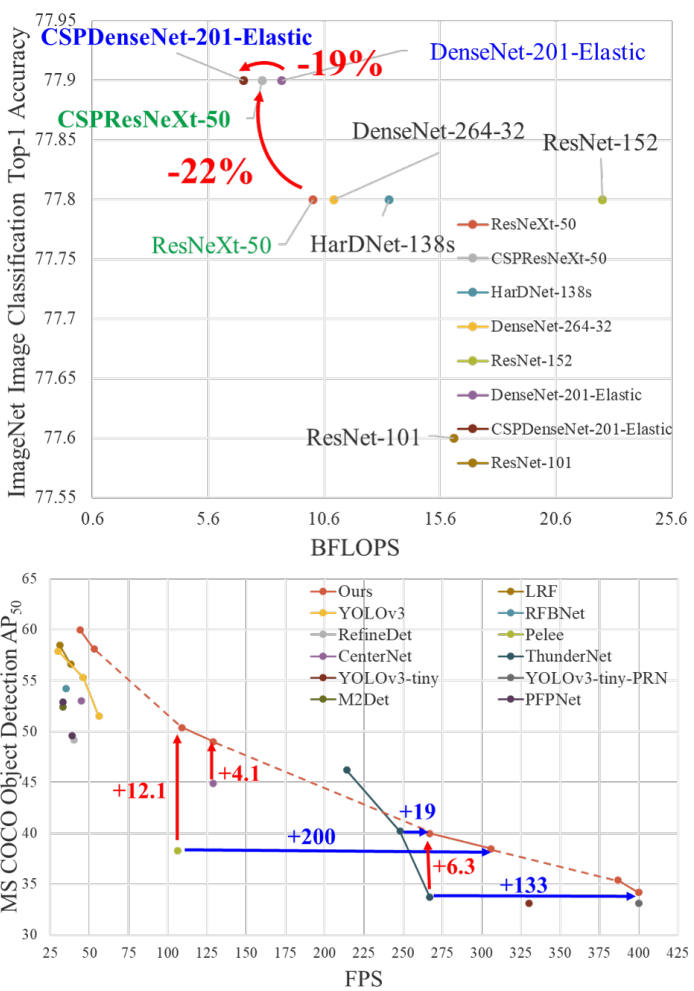 
Figure 1: Proposed CSPNet can be applied on ResNet [7], ResNeXt [39], DenseNet [11], etc. It not only reduce computation cost and memory usage of these networks, but also benefit on inference speed and accuracy.
图1:提出的CSPNet可应用于ResNet[7]、ResNeXt[39]、DenseNet[11]等。它不仅降低了这些网络的计算成本和内存使用，而且有利于推理速度和准确性。

In this study, we introduce Cross Stage Partial Network (CSPNet). The main purpose of designing CSPNet is to enable this architecture to achieve a richer gradient combination while reducing the amount of computation. This aim is achieved by partitioning feature map of the base layer into two parts and then merging them through a proposed cross-stage hierarchy. Our main concept is to make the gradient flow propagate through different network paths by splitting the gradient flow. In this way, we have confirmed that the propagated gradient information can have a large correlation difference by switching concatenation and transition steps. In addition, CSPNet can greatly reduce the amount of computation, and improve inference speed as well as accuracy, as illustrated in Fig 1. The proposed CSPNet-based object detector deals with the following three problems:
1. Strengthening learning ability of a CNN, The accuracy of existing CNN is greatly degraded after lightweightening, so we hope to strengthen CNN’s learning ability, so that it can maintain sufficient accuracy while being lightweightening. The proposed CSPNet can be easily applied to ResNet, ResNeXt, and DenseNet. After applying CSPNet on the above mentioned networks, the computation effort can be reduced from 10% to 20%, but it outperforms ResNet [7], ResNeXt [39], DenseNet [11], HarDNet [1], Elastic [36], and Res2Net [5], in terms of accuracy, in conducting image classification task on ImageNet [2].
2. Removing computational bottlenecks, Too high a computational bottleneck will result in more cycles to complete the inference process, or some arithmetic units will often idle. Therefore, we hope we can evenly distribute the amount of computation at each layer in CNN so that we can effectively upgrade the utilization rate of each computation unit and thus reduce unnecessary energy consumption. It is noted that the proposed CSPNet makes the computational bottlenecks of PeleeNet [37] cut into half. Moreover, in the MS COCO [18] dataset-based object detection experiments, our proposed model can effectively reduce 80% computational bottleneck when test on YOLOv3-based models.
3. Reducing memory costs, The wafer fabrication cost of Dynamic Random-Access Memory (DRAM) is very expensive, and it also takes up a lot of space. If one can effectively reduce the memory cost, he/she will greatly reduce the cost of ASIC. In addition, a small area wafer can be used in a variety of edge computing devices. In reducing the use of memory usage, we adopt cross-channel pooling [6] to compress the feature maps during the feature pyramid generating process. In this way, the proposed CSPNet with the proposed object detector can cut down 75% memory usage on PeleeNet when generating feature pyramids.

在本研究中，我们引入了跨阶段部分网络(CSPNet)。设计CSPNet的主要目的是使该架构能够实现更丰富的梯度组合，同时减少计算量。这一目标是通过将基础层的特征图划分为两个部分，然后通过提出的跨阶段层次结构合并它们来实现的。我们的主要概念是通过分裂梯度流，使梯度流通过不同的网络路径传播。通过这种方式，我们已经确认，通过切换级联和转换步骤，传播的梯度信息可以有很大的相关性差异。此外，CSPNet可以大大减少计算量，提高推理速度和准确性，如图1所示。提出的基于CSPNet的目标检测器处理以下三个问题：
1. 加强CNN的学习能力, 现有CNN的准确性在轻量化后会大大降低，因此我们希望加强CNN学习能力，以便在轻量化时保持足够的准确性。提出的CSPNet可以轻松应用于ResNet、ResNeXt和DenseNet。在上述网络上应用CSPNet后，计算量可以减少10%到20%，但在准确性方面，它在ImageNet上执行图像分类任务[2]方面优于ResNet[7]、ResNeXt[39]、DenseNet[11]、HarDNet[1]、Elastic[36]和Res2Net[5]。
2. 消除计算瓶颈, 过高的计算瓶颈将导致更多的周期来完成推理过程，或者某些算术单元经常处于空闲状态。因此，我们希望我们能够在CNN中均匀地分配每一层的计算量，以便有效地提高每个计算单元的利用率，从而减少不必要的能耗。值得注意的是，提出的CSPNet将PeleeNet[37]的计算瓶颈削减了一半。此外，在基于MS COCO[18]数据集的目标检测实验中，我们提出的模型在基于YOLOv3的模型上测试时可以有效减少80%的计算瓶颈。
3. 降低内存成本, 动态随机存取存储器(DRAM)的晶圆制造成本非常昂贵，而且还占用大量空间。如果能有效地降低内存成本，它将大大降低ASIC的成本。此外，小面积晶圆可用于各种边缘计算设备。为了减少内存使用，我们在特征金字塔生成过程中采用跨通道池化[6]来压缩特征图。这样，在生成特征金字塔时，带有目标检测器的CSPNet可以减少PeleeNet上75%的内存使用。

Since CSPNet is able to promote the learning capability of a CNN, we thus use smaller models to achieve better accuracy. Our proposed model can achieve 50% COCO AP50 at 109 fps on GTX 1080ti. Since CSPNet can effectively cut down a significant amount of memory traffic, our proposed method can achieve 40% COCO AP50 at 52 fps on Intel Core i9-9900K. In addition, since CSPNet can significantly lower down the computational bottleneck and Exact Fusion Model (EFM) can effectively cut down the required memory bandwidth, our proposed method can achieve 42% COCO AP50 at 49 fps on Nvidia Jetson TX2.

由于CSPNet能够提高CNN的学习能力，因此我们使用较小的模型来实现更好的准确性。我们提出的模型可以在GTX 1080ti上以109 fps的速度达到50%COCO AP50。由于CSPNet可以有效地减少大量内存流量，因此我们提出的方法可以在Intel Core i9-9900K上以52 fps的速度实现40%的COCO AP50。此外，由于CSPNet可以显著降低计算瓶颈，而Exact Fusion Model(EFM)可以有效地减少所需的内存带宽，因此我们提出的方法在Nvidia Jetson TX2上可以在49 fps下达到42%的COCO AP50。

## 2 Related work
CNN architectures design. In ResNeXt [39], Xie et al. first demonstrate that cardinality can be more effective than the dimensions of width and depth. DenseNet [11] can significantly reduce the number of parameters and computations due to the strategy of adopting a large number of reuse features. And it concatenates the output features of all preceding layers as the next input, which can be considered as the way to maximize cardinality. SparseNet [46] adjusts dense connection to exponentially spaced connection can effectively improve parameter utilization and thus result in better outcomes. Wang et al. further explain why high cardinality and sparse connection can improve the learning ability of the network by the concept of gradient combination and developed the partial ResNet (PRN) [35]. For improving the inference speed of CNN, Ma et al. [24] introduce four guidelines to be followed and design ShuffleNet-v2. Chao et al. [1] proposed a low memory traffic CNN called Harmonic DenseNet (HarDNet) and a metric Convolutional Input/Output (CIO) which is an approximation of DRAM traffic proportional to the real DRAM traffic measurement.

CNN架构设计。在ResNeXt[39]中，Xieet al 首先证明了基数比宽度和深度维度更有效。由于采用了大量可重复使用特征的策略，DenseNet[11]可以显著减少参数和计算的数量。它将前面所有层的输出特性连接起来作为下一个输入，这可以被视为最大化基数的方法。SparseNet[46]将密集连接调整为指数间隔连接，可以有效提高参数利用率，从而获得更好的结果。Wanget al 进一步解释了为什么高基数和稀疏连接可以通过梯度组合的概念提高网络的学习能力，并开发了部分ResNet(PRN)[35]。为了提高CNN的推理速度，Maet al [24]介绍了需要遵循的四个准则，并设计了ShuffleNet-v2。Chaoet al [1]提出了一种称为Harmonic DenseNet(HarDNet)的低内存流量CNN和一种度量卷积输入/输出(CIO)，它是与实际DRAM流量测量成比例的DRAM流量的近似值。

Real-time object detector. The most famous two real-time object detectors are YOLOv3 [29] and SSD [21]. Based on SSD, LRF [38] and RFBNet [19] can achieve state-of-the-art real-time object detection performance on GPU. Recently, anchor-free based object detector [3, 45, 13, 14, 42] has become main-stream object detection system. Two object detector of this sort are CenterNet [45] and CornerNet-Lite [14], and they both perform very well in terms of efficiency and efficacy. For real-time object detection on CPU or mobile GPU, SSD-based Pelee [37], YOLOv3-based PRN [35], and Light-Head RCNN [17]-based ThunderNet [25] all receive excellent performance on object detection.

实时目标检测器。最著名的两个实时目标检测器是YOLOv3[29]和SSD[21]。基于SSD，LRF[38]和RFBNet[19]可以在GPU上实现SOTA实时目标检测性能。最近，基于无锚的目标检测器[3，45，13，14，42]已成为主流的目标检测系统。这种类型的两个目标检测器是CenterNet[45]和CornerNet Lite[14]，它们在效率和效能方面都表现得很好。对于CPU或移动GPU上的实时目标检测，基于SSD的Pelee[37]、基于YOLOv3的PRN[35]和基于Light Head RCNN[17]的ThunderNet[25]都在目标检测方面表现出色。

## 3 Method
### 3.1 Cross Stage Partial Network

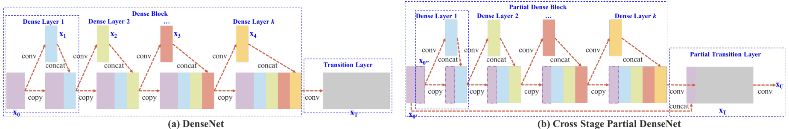 
Figure 2: Illustrations of (a) DenseNet and (b) our proposed Cross Stage Partial DenseNet (CSPDenseNet). CSPNet separates feature map of the base layer into two part, one part will go through a dense block and a transition layer; the other one part is then combined with transmitted feature map to the next stage.

图2：(a)DenseNet和(b)我们提出的跨阶段部分DenseNet(CSPDenseNet)的插图。CSPNet将基础层的特征图分为两部分，一部分将经过稠密块体和转换层; 然后将另一部分与传输的特征图结合到下一阶段。

#### DenseNet. 
Figure 2 (a) shows the detailed structure of one-stage of the DenseNet proposed by Huang et al. [11]. Each stage of a DenseNet contains a dense block and a transition layer, and each dense block is composed of k dense layers. The output of the ith dense layer will be concatenated with the input of the ith dense layer, and the concatenated outcome will become the input of the (i + 1)th dense layer. The equations showing the above-mentioned mechanism can be expressed as:

DenseNet。图2(a)显示了Huanget al [11]提出的DenseNet一阶段的详细结构。DenseNet的每个阶段包含一个致密块和一个转换层，每个致密块由k个致密层组成。第i个致密层的输出将与第i个密集层的输入串联，串联的结果将成为第(i+1)个致密层输入。显示上述机制的方程式可以表示为：

$x_1 = w_1 * x_0 $

$x_2 = w_2 * [x_0,x_1] $

*
*
*
$x_2 = w_k * [x_0,x_1, ... , x_{k-1} ] $

where ∗ represents the convolution operator, and [x0, x1, ...] means to concatenate x0, x1, ..., and wi and xi are the weights and output of the ith dense layer, respectively.

其中∗ 表示卷积算子，[x0，x1，…]表示串联x0，x1，…，wi，xi分别是第i个密集层的权重和输出。

If one makes use of a backpropagation algorithm to update weights, the equations of weight updating can be written as:

如果使用反向传播算法更新权重，则权重更新方程可以写成：

$w^,_1=f(w_1,g_0)$

$w^,_2=f(w_2,g_0,g_1)$

*
*
*

$w^,_k=f(w_k,g_0,g_1,...,g_{k-1})$

where f is the function of weight updating, and $g_i$ represents the gradient propagated to the ith dense layer. We can find that large amount of gradient information are reused for updating weights of different dense layers. This will result in different dense layers repeatedly learn copied gradient information.

其中f是权重更新的函数，$g_i$表示传播到第i致密层的梯度。我们可以发现，大量的梯度信息被重复用于更新不同稠密层的权重。这将导致不同致密层重复学习重复的梯度信息。

#### Cross Stage Partial DenseNet. 
The architecture of one-stage of the proposed CSPDenseNet is shown in Figure 2 (b). A stage of CSPDenseNet is composed of a partial dense block and a partial transition layer. In a partial dense block, the feature maps of the base layer in a stage are split into two parts through channel x0 = [x0, x0 ]. Between x0 and x0, the former is directly linked to the end of the stage, and the latter will go through a dense block. All steps involved in a partial transition layer are as follows: First, the output of dense layers, [x0 , x1 , ..., xk ], will undergo a transition  layer.Second,theoutputofthistransitionlayer,xT,willbeconcatenatedwithx0 andundergoanothertransitionlayer, and then generate output xU . The equations of feed-forward pass and weight updating of CSPDenseNet are shown in Equations 3 and 4, respectively. 

跨阶段部分密度网络。拟建CSPDenseNet的一级架构如图2(b)所示。CSPDenseNet的一个阶段由部分致密块和部分转换层组成。在部分稠密块体中，通过通道x0=[x0，x0]将阶段中基础层的特征图拆分为两部分。在x0和x0之间，前者直接连接到阶段的末尾，而后者将穿过一个密集的块体。部分转换层涉及的所有步骤如下：首先，密集层[x0，x1，…，xk]的输出将经历一个转换层。其次，这个转换层的输出xT将与thx0和另一个转换层下连接，然后生成输出xU。CSPDenseNet的前馈传递和权重更新方程分别如方程3和4所示。

We can see that the gradients coming from the dense layers are separately integrated. On the other hand, the feature map x0 that did not go through the dense layers is also separately integrated. As to the gradient information for updating weights, both sides do not contain duplicate gradient information that belongs to other sides.

我们可以看到，来自致密层的梯度是单独整合的。另一方面，未穿过密集层的特征图x0也被单独集成。至于用于更新权重的梯度信息，两侧不包含属于其他侧的重复梯度信息。

Overall speaking, the proposed CSPDenseNet preserves the advantages of DenseNet’s feature reuse characteristics, but at the same time prevents an excessively amount of duplicate gradient information by truncating the gradient flow. This idea is realized by designing a hierarchical feature fusion strategy and used in a partial transition layer.

总体而言，所提出的CSPDenseNet保留了DenseNet的特征重用特性的优点，但同时通过截断梯度流防止了过多的重复梯度信息。这种思想是通过设计一种分层特征融合策略来实现的，并用于部分转换层。

#### Partial Dense Block. 
The purpose of designing partial dense blocks is to 1.) increase gradient path: Through the split and merge strategy, the number of gradient paths can be doubled. Because of the cross-stage strategy, one can alleviate the disadvantages caused by using explicit feature map copy for concatenation; 2.) balance computation of each layer: usually, the channel number in the base layer of a DenseNet is much larger than the growth rate. Since the base layer channels involved in the dense layer operation in a partial dense block account for only half of the original number, it can effectively solve nearly half of the computational bottleneck; and 3.) reduce memory traffic: Assume the base feature map size of a dense block in a DenseNet is w × h × c, the growth rate is d, and there are in total m dense layers. Then, the CIO of that dense block is (c × m) + ((m2 + m) × d)/2, and the CIO of partial dense block is ((c × m) + (m2 + m) × d)/2. While m and d are usually far smaller than c, a partial dense block is able to save at most half of the memory traffic of a network.

部分致密块体。设计部分密集块的目的是
1. 增加梯度路径：通过拆分和合并策略，梯度路径的数量可以加倍。由于采用跨阶段策略，可以缓解使用显式特征图副本进行拼接所带来的缺点; 
2. 各层平衡计算：通常，DenseNet底层的信道数远大于增长率。由于部分稠密块中稠密层操作所涉及的底层通道仅占原始通道数的一半，因此可以有效解决近一半的计算瓶颈; 
3. 减少内存流量：假设DenseNet中稠密块的基本特征图大小为w×h×c，增长率为d，共有m个稠密层。然后，该稠密块的CIO为(c×m)+((m2+m)×d)/2，而部分稠密块则为((c×m+(m2+m)×d/2)。虽然m和d通常远小于c，但部分稠密的块最多可以节省网络一半的内存流量。

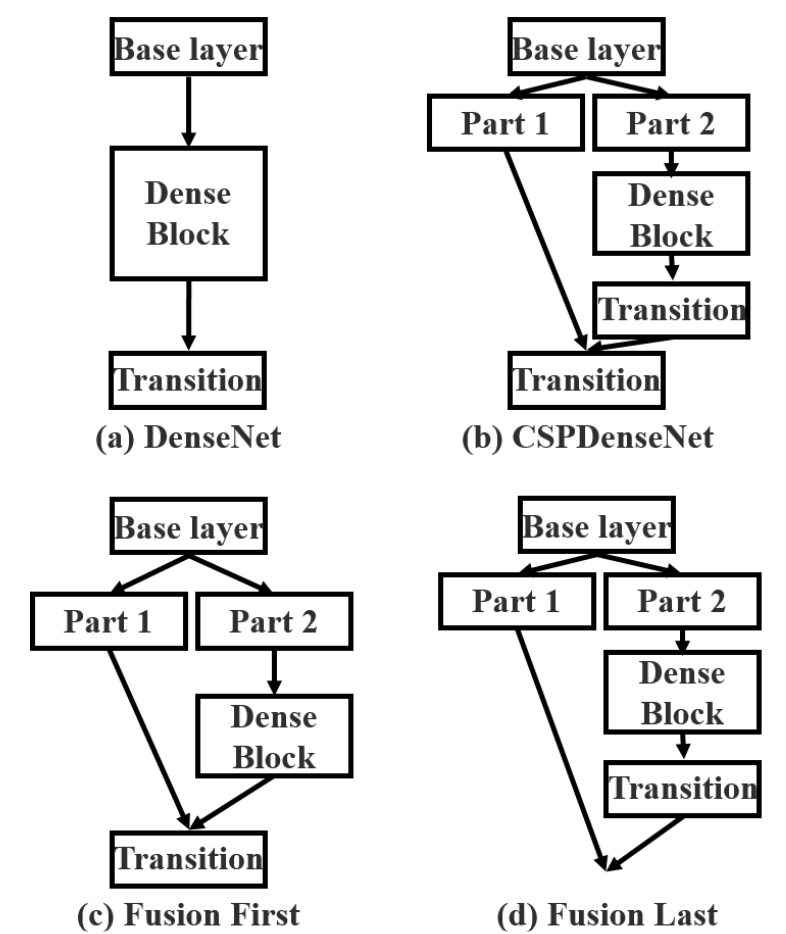 
Figure 3: Different kind of feature fusion strategies. (a) single path DenseNet, (b) proposed CSPDenseNet: transition → concatenation → transition, (c) concatenation → transition, and (d) transition → concatenation.

图3：不同类型的特征融合策略。(a) 单路径DenseNet，(b)提出的CSPDenseNet:过渡→ 串联→ 转换，(c)串联→ 过渡，和(d)过渡→ 串联。

#### Partial Transition Layer. 
The purpose of designing partial transition layers is to maximize the difference of gradient combination. The partial transition layer is a hierarchical feature fusion mechanism, which uses the strategy of truncating the gradient flow to prevent distinct layers from learning duplicate gradient information. Here we design two variations of CSPDenseNet to show how this sort of gradient flow truncating affects the learning ability of a network. 3 (c) and 3 (d) show two different fusion strategies. CSP (fusion first) means to concatenate the feature maps generated by two parts, and then do transition operation. If this strategy is adopted, a large amount of gradient information will be reused. As to the CSP (fusion last) strategy, the output from the dense block will go through the transition layer and then do concatenation with the feature map coming from part 1. If one goes with the CSP (fusion last) strategy, the gradient information will not be reused since the gradient flow is truncated. If we use the four architectures shown in 3 to perform image classification, the corresponding results are shown in Figure 4. It can be seen that if one adopts the CSP (fusion last) strategy to perform image classification, the computation cost is significantly dropped, but the top-1 accuracy only drop 0.1%. On the other hand, the CSP (fusion first) strategy does help the significant drop in computation cost, but the top-1 accuracy significantly drops 1.5%. By using the split and merge strategy across stages, we are able to effectively reduce the possibility of duplication during the information integration process. From the results shown in Figure 4, it is obvious that if one can effectively reduce the repeated gradient information, the learning ability of a network will be greatly improved.

部分转换层。设计部分转换层的目的是最大化梯度组合的差异。部分转换层是一种分层特征融合机制，它使用截断梯度流的策略来防止不同层学习重复的梯度信息。在这里，我们设计了两种CSPDenseNet变体，以显示这种梯度流截断如何影响网络的学习能力。3(c)和3(d)显示了两种不同的融合策略。CSP(融合优先)是指将两部分生成的特征图串联起来，然后进行转换操作。如果采用这种策略，将重用大量的梯度信息。对于CSP(fusion last)策略，稠密块的输出将经过转换层，然后与来自第1部分的特征图进行连接。如果使用CSP(fusion last，融合最后)策略，梯度信息将不会被重用，因为梯度流被截断。如果我们使用图3中所示的四种架构来进行图像分类，相应的结果如图4所示。可以看出，如果采用CSP(融合-最后)策略来执行图像分类，计算成本会显著降低，但top-1精度仅下降0.1%。另一方面，CSP(融合优先)策略确实有助于显著降低计算成本，但top-1精度显著降低1.5%。通过跨阶段使用拆分和合并策略，我们能够有效地减少信息集成过程中重复的可能性。从图4所示的结果可以明显看出，如果能够有效地减少重复的梯度信息，网络的学习能力将大大提高。

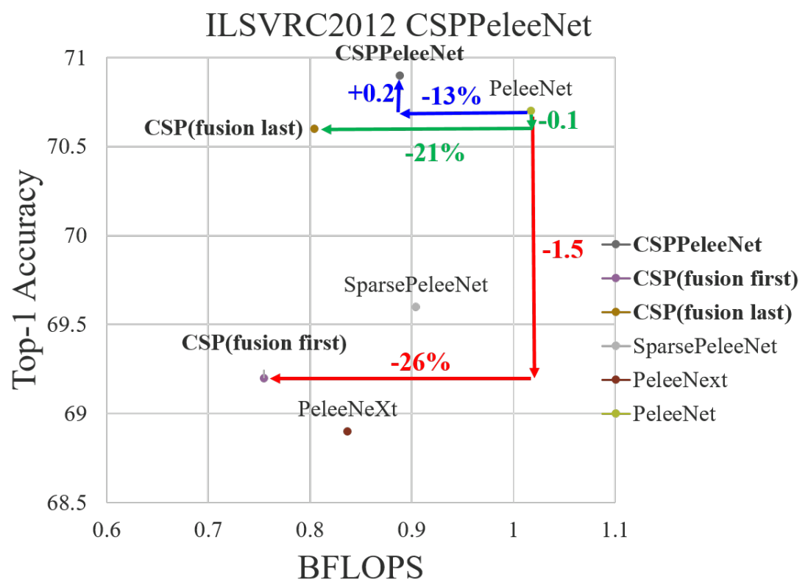 
Figure 4: Effect of truncating gradient flow for maximizing difference of gradient combination.
图4：截断梯度流对最大化梯度组合差异的影响。

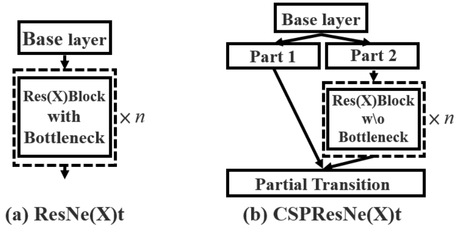 
Figure 5: Applying CSPNet to ResNe(X)t.
图5：将CSPNet应用于ResNe(X)t。

#### Apply CSPNet to Other Architectures. 
CSPNet can be also easily applied to ResNet and ResNeXt, the architectures are shown in Figure 5. Since only half of the feature channels are going through Res(X)Blocks, there is no need to introduce the bottleneck layer anymore. This makes the theoretical lower bound of the Memory Access Cost (MAC) when the FLoating-point OPerations (FLOPs) is fixed.

将CSPNet应用于其他架构。CSPNet也可以很容易地应用于ResNet和ResNeXt，其架构如图5所示。由于只有一半的特征通道通过Res(X)Blocks，因此不再需要引入瓶颈层。这使得固定浮点运算(FLOP)时，内存访问成本(MAC)的理论下限。

### 3.2 Exact Fusion Model 精确融合模型
 
Figure 6: Different feature pyramid fusion strategies. (a) Feature Pyramid Network (FPN): fuse features from current scale and previous scale. (b) Global Fusion Model (GFM): fuse features of all scales. (c) Exact Fusion Model (EFM): fuse features depand on anchor size.
图6：不同的特征金字塔融合策略。(a) 特征金字塔网络(FPN)：融合当前比例和以前比例的特征。(b) 全局融合模型(GFM)：融合所有尺度的特征。(c) 精确融合模型(EFM)：融合特征取决于锚定尺寸。

#### Looking Exactly to predict perfectly. 
We propose EFM that captures an appropriate Field of View (FoV) for each anchor, which enhances the accuracy of the one-stage object detector. For segmentation tasks, since pixel-level labels usually do not contain global information, it is usually more preferable to consider larger patches for better information retrieval [22]. However, for tasks like image classification and object detection, some critical information can be obscure when observed from image-level and bounding box-level labels. Li et al. [15] found that CNN can be often distracted when it learns from image-level labels and concluded that it is one of the main reasons that two-stage object detectors outperform one-stage object detectors.

准确预测。我们建议EFM为每个锚点捕获一个合适的视野(FoV)，这提高了单阶段目标检测器的精度。对于分割任务，由于像素级标签通常不包含全局信息，因此通常最好考虑更大的分块以更好地检索信息[22]。然而，对于图像分类和目标检测等任务，当从图像级别和边界框级别标签观察时，一些关键信息可能会变得模糊。Liet al [15]发现，当CNN从图像级标签中学习时，它经常会分心，并得出结论，这是两级目标检测器优于一级目标检测器的主要原因之一。

#### Aggregate Feature Pyramid. 
The proposed EFM is able to better aggregate the initial feature pyramid. The EFM is based on YOLOv3 [29], which assigns exactly one bounding-box prior to each ground truth object. Each ground truth bounding box corresponds to one anchor box that surpasses the threshold IoU. If the size of an anchor box is equivalent to the FoV of the grid cell, then for the grid cells of the sth scale, the corresponding bounding box will be lower bounded by the (s − 1)th scale and upper bounded by the (s + 1)th scale. Therefore, the EFM assembles features from the three scales.

聚合特征金字塔。提出的EFM能够更好地聚合初始特征金字塔。EFM基于YOLOv3[29]，它在每个地面真值对象之前精确指定一个边界框。每个地面真相边界框对应一个超过阈值IoU的锚定框。如果锚定框的大小等于网格单元的FoV，那么对于sth刻度的网格单元，相应的边界框的下限为− 1) 第个标度，上限为第(s+1)个标度。因此，EFM从三个尺度集合特征。

#### Balance Computation. 
Since the concatenated feature maps from the feature pyramid are enormous, it introduces a great amount of memory and computation cost. To alleviate the problem, we incorporate the Maxout technique to compress the feature maps.

平衡计算。由于来自特征金字塔的串联特征图数量巨大，因此会引入大量内存和计算成本。为了缓解这个问题，我们结合了Maxout技术来压缩特征图。

## 4 Experiments 实验
We will use ImageNet’s image classification dataset [2] used in ILSVRC 2012 to validate our proposed CSPNet. Besides, we also use the MS COCO object detection dataset [18] to verify the proposed EFM. Details of the proposed architectures will be elaborated in the appendix.

我们将使用ImageNet在ILSVRC 2012中使用的图像分类数据集[2]来验证我们提出的CSPNet。此外，我们还使用MS COCO目标检测数据集[18]来验证提出的EFM。拟议架构的详情将在附录中详细说明。

### 4.1 Implementation Details
ImageNet. In ImageNet image classification experiments, all hyper-parameters such as training steps, learning rate schedule, optimizer, data augmentation, etc., we all follow the settings defined in Redmon et al. [29]. For ResNet-based models and ResNeXt-based models, we set 8000,000 training steps. As to DenseNet-based models, we set 1,600,000 training steps. We set the initial learning rate 0.1 and adopt the polynomial decay learning rate scheduling strategy. The momentum and weight decay are respectively set as 0.9 and 0.005. All architectures use a single GPU to train universally in the batch size of 128. Finally, we use the validation set of ILSVRC 2012 to validate our method.

ImageNet。在ImageNet图像分类实验中，所有超参数，如训练步骤、学习速率计划、优化器、数据增广等，我们都遵循Redmonet al [29]中定义的设置。对于基于ResNet的模型和基于ResNeXt的模型，我们设置了8000000个训练步骤。对于基于DenseNet的模型，我们设置了1600000个训练步骤。我们将初始学习速率设置为0.1，并采用多项式衰减学习速率调度策略。动量和权重衰减分别设置为0.9和0.005。所有架构都使用单个GPU进行批量大小为128的通用训练。最后，我们使用ILSVRC 2012的验证集来验证我们的方法。

MS COCO. In MS COCO object detection experiments, all hyper-parameters also follow the settings defined in Redmon et al. [29]. Altogether we did 500,000 training steps. We adopt the step decay learning rate scheduling strategy and multiply with a factor 0.1 at the 400,000 steps and the 450,000 steps, respectively. The momentum and weight decay are respectively set as 0.9 and 0.0005. All architectures use a single GPU to execute multi-scale training in the batch size of 64. Finally, the COCO test-dev set is adopted to verify our method.

MS COCO。在MS COCO目标检测实验中，所有超参数也遵循Redmonet al [29]中定义的设置。我们总共完成了500000个训练步骤。我们采用步进衰减学习速率调度策略，在400000步和450000步分别乘以系数0.1。动量和权重衰减分别设置为0.9和0.0005。所有架构都使用单个GPU执行批量大小为64的多尺度训练。最后，使用COCO测试开发集验证我们的方法。

### 4.2 Ablation Experiments
Ablation study of CSPNet on ImageNet. In the ablation experiments conducted on the CSPNet, we adopt PeleeNet [37] as the baseline, and the ImageNet is used to verify the performance of the CSPNet. We use different partial ratios γ and the different feature fusion strategies for ablation study. Table 1 shows the results of ablation study on CSPNet. In Table 1, SPeleeNet and PeleeNeXt are, respectively, the architectures that introduce sparse connection and group convolution to PeleeNet. As to CSP (fusion first) and CSP (fusion last), they are the two strategies proposed to validate the benefits of a partial transition.

ImageNet上CSPNet的消融研究。在CSPNet上进行的消融实验中，我们采用PeleeNet[37]作为基线，并使用ImageNet验证CSPNet的性能。我们使用不同的γ比值和不同的特征融合策略进行消融研究。表1显示了CSPNet上的消融研究结果。在表1中，SPeleeNet和PeleeNeXt分别是向PeleeNet引入稀疏连接和组卷积的架构。至于CSP(先融合)和CSP(最后融合)，这两种策略是为了验证部分过渡的好处而提出的。

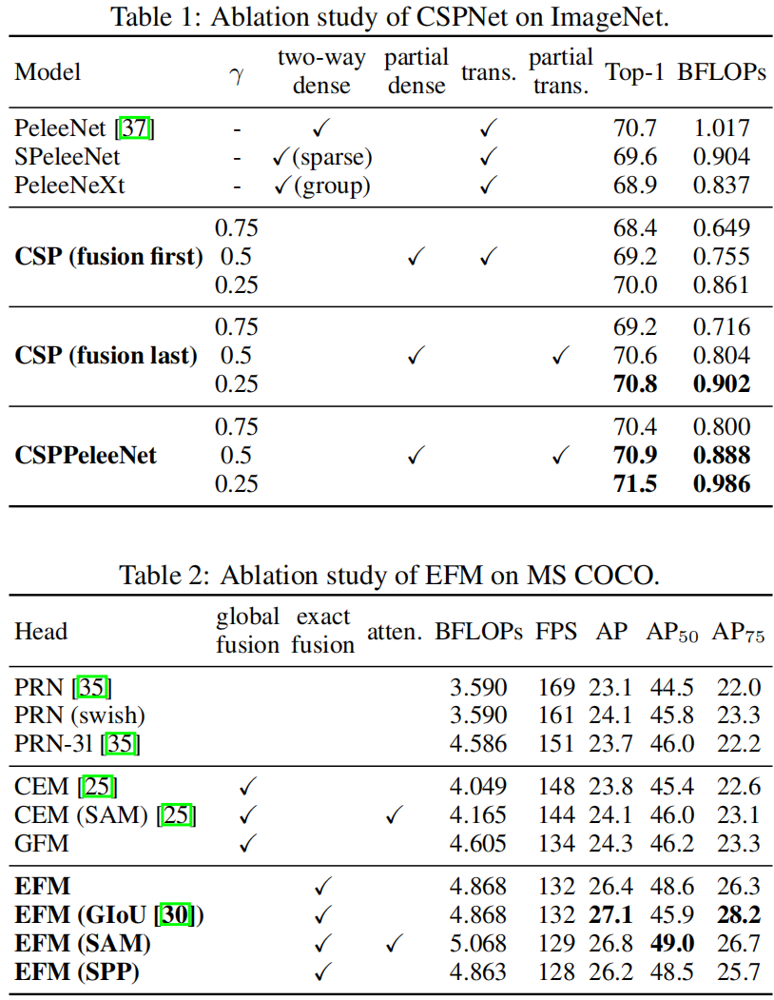

From the experimental results, if one only uses the CSP (fusion first) strategy on the cross-stage partial dense block, the performance can be slightly better than SPeleeNet and PeleeNeXt. However, the partial transition layer designed to reduce the learning of redundant information can achieve very good performance. For example, when the computation is cut down by 21%, the accuracy only degrades by 0.1%. One thing to be noted is that when γ = 0.25, the computation is cut down by 11%, but the accuracy is increased by 0.1%. Compared to the baseline PeleeNet, the proposed CSPPeleeNet achieves the best performance, it can cut down 13% computation, but at the same time upgrade the accuracy by 0.2%. If we adjust the partial ratio to γ = 0.25, we are able to upgrade the accuracy by 0.8% and at the same time cut down 3% computation.

从实验结果来看，如果只在跨阶段部分稠密块上使用CSP(fusion first)策略，性能可能略优于SPeleeNet和PeleeNeXt。然而，为减少冗余信息的学习而设计的部分转换层可以实现非常好的性能。例如，当计算量减少21%时，精度仅下降0.1%。需要注意的一点是，当γ=0.25时，计算量减少了11%，但精度增加了0.1%。与基线PeleeNet相比，所提出的CSPPelleeNet具有最佳性能，可以减少13%的计算量，但同时精度提高了0.2%。如果我们将部分比率调整为γ=0.25，我们可以将精度提高0.8%，同时减少3%的计算量。

Ablation study of EFM on MS COCO. Next, we shall conduct an ablation study of EFM based on the MS COCO dataset. In this series of experiments, we compare three different feature fusion strategies shown in Figure 6. We choose two state-of-the-art lightweight models, PRN [35] and ThunderNet [25], to make comparison. PRN is the feature pyramid architecture used for comparison, and the ThunderNet with Context Enhancement Module (CEM) and Spatial Attention Module (SAM) are the global fusion architecture used for comparison. We design a Global Fusion Model (GFM) to compare with the proposed EFM. Moreover, GIoU [30], SPP, and SAM are also applied to EFM to conduct an ablation study. All experiment results listed in Table 2 adopt CSPPeleeNet as the backbone.

EFM对MS COCO的消融研究。接下来，我们将根据MS COCO数据集对EFM进行消融研究。在这一系列实验中，我们比较了图6所示的三种不同的特征融合策略。我们选择了两种SOTA轻量级模型PRN[35]和ThunderNet[25]进行比较。PRN是用于比较的特征金字塔架构，而ThunderNet with Context Enhancement Module(CEM)和Spatial Attention Module(SAM)是用于对比的全局融合架构。我们设计了一个全局融合模型(GFM)来与所提出的EFM进行比较。此外，GIoU[30]、SPP和SAM也应用于EFM进行消融研究。表2中列出的所有实验结果都采用CSPPelleeNet作为主干。

As reflected in the experiment results, the proposed EFM is 2 fps slower than GFM, but its AP and AP50 are significantly upgraded by 2.1% and 2.4%, respectively. Although the introduction of GIoU can upgrade AP by 0.7%, the AP50 is, however, significantly degraded by 2.7%. However, for edge computing, what really matters is the number and locations of the objects rather than their coordinates. Therefore, we will not use GIoU training in the subsequent models. The attention mechanism used by SAM can get a better frame rate and AP compared with SPP’s increase of FoV mechanism, so we use EFM (SAM) as the final architecture. In addition, although the CSPPeleeNet with swish activation can improve AP by 1%, its operation requires a lookup table on the hardware design to accelerate, we finally also abandoned the swish activation function.

实验结果表明，所提出的EFM比GFM慢2 fps，但其AP和AP50分别显著提高了2.1%和2.4%。尽管引入GIoU可以将AP升级0.7%，但AP50却显著降低了2.7%。然而，对于边缘计算，真正重要的是对象的数量和位置，而不是它们的坐标。因此，我们不会在后续模型中使用GIoU训练。SAM使用的注意机制与SPP增加FoV机制相比可以获得更好的帧速率和AP，因此我们使用EFM(SAM)作为最终架构。此外，虽然具有swish激活的CSPPelleeNet可以将AP提高1%，但其操作需要在硬件设计上查找表来加速，我们最终也放弃了swish激活函数。

### 4.3 ImageNet Image Classification
We apply the proposed CSPNet to ResNet-10 [7], ResNeXt-50 [39], PeleeNet [37], and DenseNet-201-Elastic [36] and compare with state-of-the-art methods. The experimental results are shown in Table 3.

我们将拟议的CSPNet应用于ResNet-10[7]、ResNeXt-50[39]、PeleeNet[37]和DenseNet-201-Elastic[36]，并与SOTA方法进行比较。实验结果如表3所示。

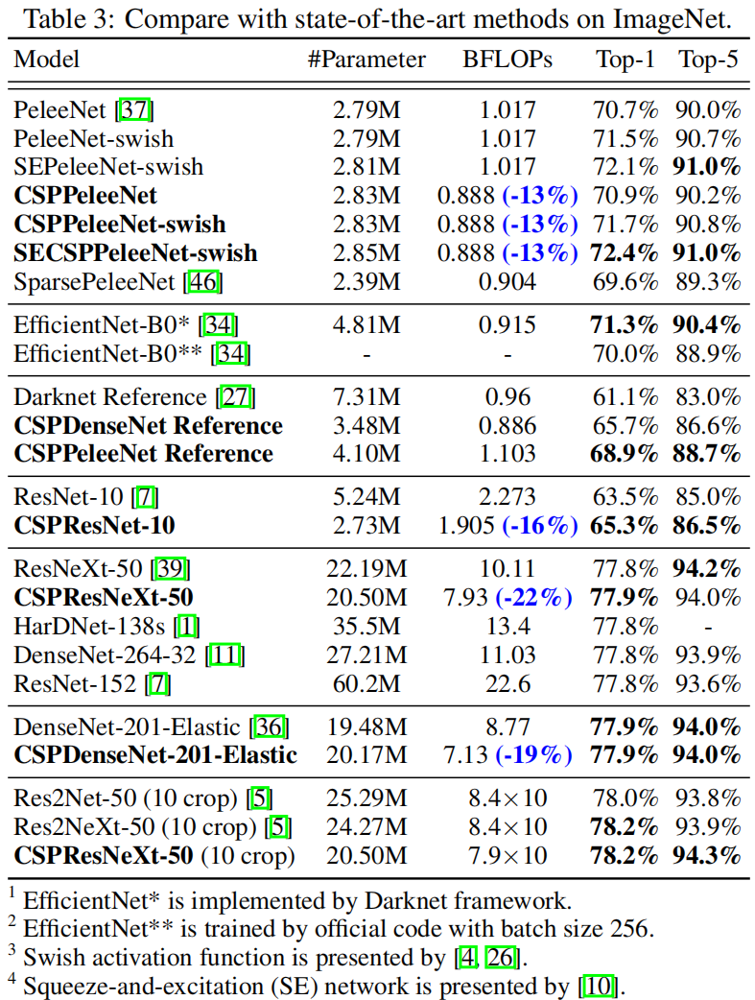

It is confirmed by experimental results that no matter it is ResNet-based models, ResNeXt-based models, or DenseNetbased models, when the concept of CSPNet is introduced, the computational load is reduced at least by 10% and the accuracy is either remain unchanged or upgraded. Introducing the concept of CSPNet is especially useful for the improvement of lightweight models. For example, compared to ResNet-10, CSPResNet-10 can improve accuracy by 1.8%. As to PeleeNet and DenseNet-201-Elastic, CSPPeleeNet and CSPDenseNet-201-Elastic can respectively cut down 13% and 19% computation, and either upgrade a little bit or maintain the accuracy. As to the case of ResNeXt-50, CSPResNeXt-50 can cut down 22% computation and upgrade top-1 accuracy to 77.9%.

实验结果证实，无论是基于ResNet的模型、基于ResNeXt的模型还是基于DenseNet的模式，当引入CSPNet的概念时，计算负载至少减少了10%，精度要么保持不变，要么提高。引入CSPNet的概念对于改进轻量级模型特别有用。例如，与ResNet-10相比，CSPResNet-10可以将精确度提高1.8%。对于PeleeNet和DenseNet-201-Elastic，CSPPelleeNet和CSPDenseNet-201-Elastic可以分别减少13%和19%的计算量，并且可以稍微升级或保持精度。对于ResNeXt-50的情况，CSPResNeXt-500可以减少22%的计算量，并将top-1精度提升至77.9%。

If compared with the state-of-the-art lightweight model – EfficientNet-B0, although it can achieve 76.8% accuracy when the batch size is 2048, when the experiment environment is the same as ours, that is, only one GPU is used, EfficientNetB0 can only reach 70.0% accuracy. In fact, the swish activation function and SE block used by EfficientNet-B0 are not efficient on the mobile GPU. A similar analysis has been conducted during the development of EfficientNet-EdgeTPU.

如果与SOTA轻量级模型EfficientNet-B0相比，尽管当批量大小为2048时，它可以达到76.8%的准确度，但当实验环境与我们相同，即只使用一个GPU时，EfficinentNetB0只能达到70.0%的准确度。事实上，EfficientNet-B0使用的swish激活函数和SE块在移动GPU上是无效的。在EfficientNet EdgeTPU的开发过程中进行了类似的分析。

Here, for demonstrating the learning ability of CSPNet, we introduce swish and SE into CSPPeleeNet and then make a comparison with EfficientNet-B0*. In this experiment, SECSPPeleeNet-swish cut down computation by 3% and upgrade 1.1% top-1 accuracy.

在这里，为了演示CSPNet的学习能力，我们将swish和SE引入CSPPelleeNet，然后与EfficientNet-B0*进行比较。在这个实验中，SECSPPeleeNet swish减少了3%的计算量，并提高了1.1%的top-1精度。

Proposed CSPResNeXt-50 is compared with ResNeXt-50 [39], ResNet-152 [7], DenseNet-264 [11], and HarDNet-138s [1], regardless of parameter quantity, amount of computation, and top-1 accuracy, CSPResNeXt-50 all achieve the best result. As to the 10-crop test, CSPResNeXt-50 also outperforms Res2Net-50 [5] and Res2NeXt-50 [5].

提出的CSPResNeXt-50与ResNeXt-50[39]、ResNet-152[7]、DenseNet-264[11]和HarDNet-138s[1]进行了比较，无论参数数量、计算量和顶级精度如何，CSPResNetXt-50都取得了最佳结果。在10作物试验中，CSPResNeXt-50也优于Res2Net-50[5]和Res2NeXt-50[5]。

### 4.4 MS COCO Object Detection
In the task of object detection, we aim at three targeted scenarios: (1) real-time on GPU: we adopt CSPResNeXt50 with PANet (SPP) [20]; (2) real-time on mobile GPU: we adopt CSPPeleeNet, CSPPeleeNet Reference, and CSPDenseNet Reference with the proposed EFM (SAM); and (3) real-time on CPU: we adopt CSPPeleeNet Reference and CSPDenseNet Reference with PRN [35]. The comparisons between the above models and the state-of-the-art methods are listed in Table 4. As to the analysis on the inference speed of CPU and mobile GPU will be detailed in the next subsection.

在目标检测任务中，我们针对三种有针对性的场景：
1. GPU上的实时：我们采用CSPResNeXt50 with PANet(SPP)[20]; 
2. 移动GPU的实时：我们采用CSPPelleeNet、CSPPelleNet Reference和CSPDenseNet Reference与提出的EFM(SAM); 
3. CPU上的实时性：我们采用CSPPelleeNet Reference和CSPDenseNetReference，PRN[35]。

表4列出了上述模型与最先进方法的比较。关于CPU和移动GPU的推理速度的分析，将在下一小节中详细说明。

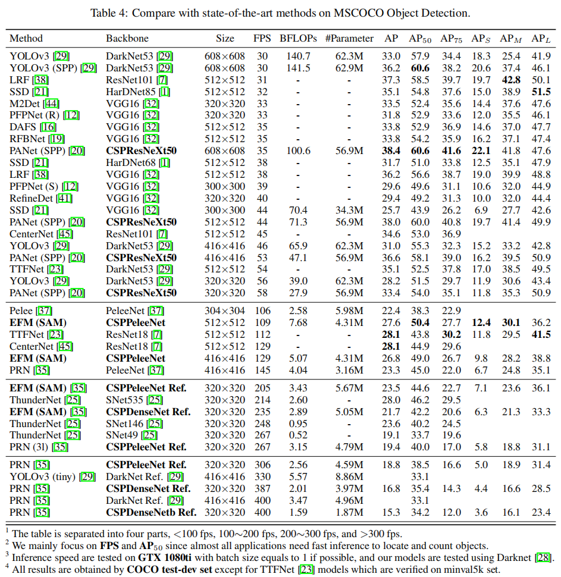

If compared to object detectors running at 30∼100 fps, CSPResNeXt50 with PANet (SPP) achieves the best performance in AP, AP50 and AP75. They receive, respectively, 38.4%, 60.6%, and 41.6% detection rates. If compared to state-ofthe-art LRF [38] under the input image size 512×512, CSPResNeXt50 with PANet (SPP) outperforms ResNet101 with LRF by 0.7% AP, 1.5% AP50 and 1.1% AP75. If compared to object detectors running at 100∼200 fps, CSPPeleeNet with EFM (SAM) boosts 12.1% AP50 at the same speed as Pelee [37] and increases 4.1% [37] at the same speed as CenterNet [45].

如果与运行速度为30的目标检测器相比∼100 fps，CSPResNeXt50 with PANet(SPP)在AP、AP50和AP75中达到最佳性能。它们的检测率分别为38.4%、60.6%和41.6%。如果与输入图像大小为512×512的最先进LRF[38]相比，带有PANet(SPP)的CSPResNeXt50比带有LRF的ResNet101的性能好0.7%AP、1.5%AP50和1.1%AP75。如果与运行在100∼200 fps，带有EFM(SAM)的CSPPelleeNet以与Pelee[37]相同的速度提升12.1%AP50，并以与CenterNet[45]相同的速率提升4.1%[37]。

If compared to very fast object detectors such as ThunderNet [25], YOLOv3-tiny [29], and YOLOv3-tiny-PRN [35], the proposed CSPDenseNetb Reference with PRN is the fastest. It can reach 400 fps frame rate, i.e., 133 fps faster than ThunderNet with SNet49. Besides, it gets 0.5% higher on AP50. If compared to ThunderNet146, CSPPeleeNet Reference with PRN (3l) increases the frame rate by 19 fps while maintaining the same level of AP50.

如果与ThunderNet[25]、YOLOv3 tiny[29]和YOLOv 3 tiny PRN[35]等速度极快的目标检测器相比，使用PRN的CSPDenseNetb参考是最快的。它的帧速率可以达到400 fps，即比使用SNet49的ThunderNet快133 fps。此外，它在AP50上高0.5%。如果与ThunderNet146相比，使用PRN(3l)的CSPPelleeNet Reference将帧速率提高19 fps，同时保持与AP50相同的水平。

### 4.5 Analysis
Computational Bottleneck. Figure 7 shows the BLOPS of each layer of PeleeNet-YOLO, PeleeNet-PRN and proposed CSPPeleeNet-EFM. From Figure 7, it is obvious that the computational bottleneck of PeleeNet-YOLO occurs when the head integrates the feature pyramid. The computational bottleneck of PeleeNet-PRN occurs on the transition layers of the PeleeNet backbone. As to the proposed CSPPeleeNet-EFM, it can balance the overall computational bottleneck, which reduces the PeleeNet backbone 44% computational bottleneck and reduces PeleeNet-YOLO 80% computational bottleneck. Therefore, we can say that the proposed CSPNet can provide hardware with a higher utilization rate.

计算瓶颈。图7显示了PeleeNet-YOLO、PeleeNet-PRN和提出的CSPPelleNet-EFM各层的BLOPS。从图7可以明显看出，当头部集成特征金字塔时，PeleeNet-YOLO的计算瓶颈就会出现。PeleeNet-PRN的计算瓶颈出现在PeleeNet主干的转换层上。对于所提出的CSPPelleNet-EFM，它可以平衡整体计算瓶颈，从而减少了PeleeNet主干44%的计算瓶颈，减少了PeleaNet-YOLO 80%的计算瓶颈。因此，我们可以说，提出的CSPNet可以提供具有更高利用率的硬件。

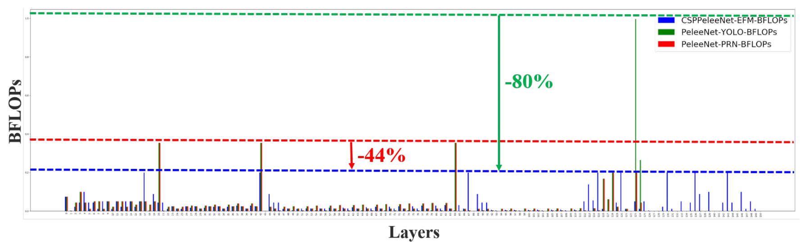 
Figure 7: Computational bottleneck of PeleeNet-YOLO, PeleeNet-PRN and CSPPeleeNet-EFM.

Memory Traffic. Figure 8 shows the size of each layer of ResNeXt50 and the proposed CSPResNeXt50. The CIO of the proposed CSPResNeXt (32.6M) is lower than that of the original ResNeXt50 (34.4M). In addition, our CSPResNeXt50 removes the bottleneck layers in the ResXBlock and maintains the same numbers of the input channel and the output channel, which is shown in Ma et al. [24] that this will have the lowest MAC and the most efficient computation when FLOPs are fixed. The low CIO and FLOPs enable our CSPResNeXt50 to outperform the vanilla ResNeXt50 by 22% in terms of computations.

内存流量。图8显示了ResNeXt50和提出的CSPResNeXt五十的每一层的大小。提出的CSCResNeXt(32.6M)的CIO低于最初的ResNeXt50(34.4M)。此外，我们的CSPResNeXt50消除了ResXBlock中的瓶颈层，并保持了相同数量的输入通道和输出通道，如Maet al [24]所示，在固定FLOP时，这将具有最低的MAC和最有效的计算。较低的CIO和FLOP使我们的CSPResNeXt50在计算方面比普通的ResNeXt50强22%。

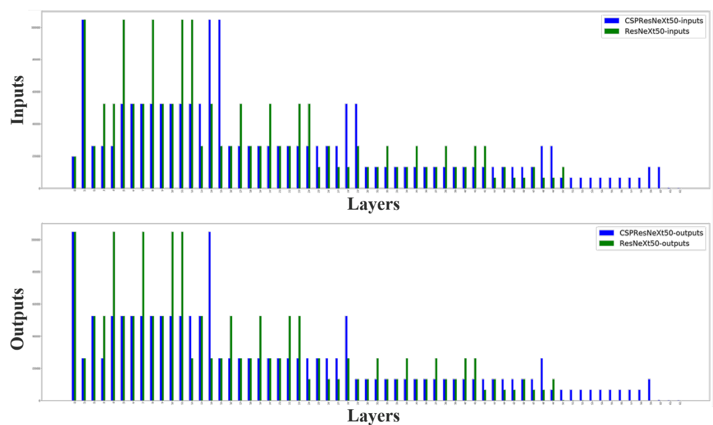 
Figure 8: Input size and output size of ResNeXt and proposed CSPResNeXt.

Inference Rate. We further evaluate whether the proposed methods are able to be deployed on real-time detectors with mobile GPU or CPU. Our experiments are based on NVIDIA Jetson TX2 and Intel Core i9-9900K, and the inference rate on CPU is evaluated with the OpenCV DNN module. We do not adopt model compression or quantization for fair comparisons. The results are shown in Table5.

推断率。我们进一步评估了所提出的方法是否能够部署在具有移动GPU或CPU的实时探测器上。我们的实验基于NVIDIA Jetson TX2和Intel Core i9-9900K，并使用OpenCV DNN模块评估CPU上的推理率。我们不采用模型压缩或量化进行公平比较。结果如表5所示。

If we compare the inference speed executed on CPU, CSPDenseNetb Ref.-PRN receives higher AP50 than SNet49TunderNet, YOLOv3-tiny, and YOLOv3-tiny-PRN, and it also outperforms the above three models by 55 fps, 48 fps, and 31 fps, respectively, in terms of frame rate. On the other hand, CSPPeleeNet Ref.-PRN (3l) reaches the same accuracy level as SNet146-ThunderNet but significantly upgrades the frame rate by 20 fps on CPU.

如果我们比较在CPU上执行的推理速度，CSPDenseNetb Ref.-PRN接收的AP50比SNet49TunderNet、YOLOv3 tiny和YOLOv 3 tiny PRN高，并且在帧速率方面，它也分别比上述三种模型高55 fps、48 fps和31 fps。另一方面，CSPPelleeNet Ref.-PRN(3l)达到了与SNet146 ThunderNet相同的精度水平，但CPU上的帧速率显著提高了20 fps。

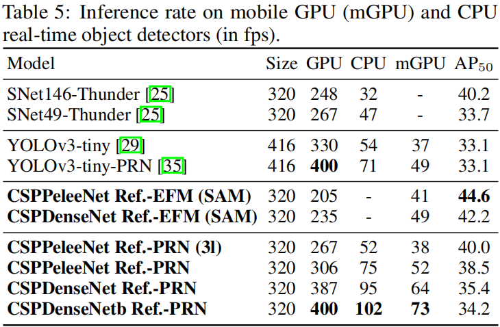

If we compare the inference speed executed on mobile GPU, our proposed EFM will be a good model to use. Since our proposed EFM can greatly reduce the memory requirement when generating feature pyramids, it is definitely beneficial to function under the memory bandwidth restricted mobile environment. For example, CSPPeleeNet Ref.-EFM (SAM) can have a higher frame rate than YOLOv3-tiny, and its AP50 is 11.5% higher than YOLOv3-tiny, which is significantly upgraded. For the same CSPPeleeNet Ref. backbone, although EFM (SAM) is 62 fps slower than PRN (3l) on GTX 1080ti, it reaches 41 fps on Jetson TX2, 3 fps faster than PRN (3l), and at AP50 4.6% growth.

如果我们比较在移动GPU上执行的推理速度，我们提出的EFM将是一个很好的模型。由于我们提出的EFM可以大大减少生成特征金字塔时的内存需求，因此它肯定有利于在内存带宽受限的移动环境下运行。例如，CSPPelleNet Ref.-EFM(SAM)可以比YOLOv3 tiny具有更高的帧速率，其AP50比YOLOv3 tiny高11.5%，这是显著升级的。对于相同的CSPPelleeNet Ref.主干网，尽管GTX 1080ti上的EFM(SAM)比PRN(3l)慢62 fps，但Jetson TX2上的速度达到41 fps，比PRN的速度快3 fps，AP50增长4.6%。

## 5 Conclusion
We have proposed the CSPNet that enables state-of-the-art methods such as ResNet, ResNeXt, and DenseNet to be light-weighted for mobile GPUs or CPUs. One of the main contributions is that we have recognized the redundant gradient information problem that results in inefficient optimization and costly inference computations. We have proposed to utilize the cross-stage feature fusion strategy and the truncating gradient flow to enhance the variability of the learned features within different layers. In addition, we have proposed the EFM that incorporates the Maxout operation to compress the features maps generated from the feature pyramid, which largely reduces the required memory bandwidth and thus the inference is efficient enough to be compatible with edge computing devices. Experimentally, we have shown that the proposed CSPNet with the EFM significantly outperforms competitors in terms of accuracy and inference rate on mobile GPU and CPU for real-time object detection tasks.

我们提出了CSPNet，它使ResNet、ResNeXt和DenseNet等SOTA方法能够针对移动GPU或CPU进行轻量化。主要贡献之一是我们认识到了冗余梯度信息问题，该问题导致低效优化和昂贵的推理计算。我们建议利用跨阶段特征融合策略和截断梯度流来增强不同层内学习特征的可变性。此外，我们还提出了EFM，它结合了Maxout操作来压缩从特征金字塔生成的特征图，这大大减少了所需的内存带宽，因此推理效率足以与边缘计算设备兼容。实验表明，在移动GPU和CPU上，使用EFM的CSPNet在实时目标检测任务的准确性和推理率方面明显优于竞争对手。

## References
1. Ping Chao, Chao-Yang Kao, Yu-Shan Ruan, Chien-Hsiang Huang, and Youn-Long Lin. HarDNet: A low memory traffic network. Proceedings of the IEEE International Conference on Computer Vision (ICCV), 2019.
2. Jia Deng, Wei Dong, Richard Socher, Li-Jia Li, Kai Li, and Li Fei-Fei. ImageNet: A large-scale hierarchical image database. In Proceedings of the IEEE Conference on Computer Vision and Pattern Recognition (CVPR), pages 248–255, 2009.
3. Kaiwen Duan, Song Bai, Lingxi Xie, Honggang Qi, Qingming Huang, and Qi Tian. CenterNet: Keypoint triplets for object detection. In Proceedings of the IEEE International Conference on Computer Vision (ICCV), pages 6569–6578, 2019.
4. Stefan Elfwing, Eiji Uchibe, and Kenji Doya. Sigmoid-weighted linear units for neural network function approximation in reinforcement learning. Neural Networks, 107:3–11, 2018.
5. Shang-Hua Gao, Ming-Ming Cheng, Kai Zhao, Xin-Yu Zhang, Ming-Hsuan Yang, and Philip Torr. Res2Net: A new multi-scale backbone architecture. IEEE Transactions on Pattern Analysis and Machine Intelligence (TPAMI), 2020.
6. Ian J Goodfellow, David Warde-Farley, Mehdi Mirza, Aaron Courville, and Yoshua Bengio. Maxout networks. In Proceedings of International Conference on Machine Learning (ICML), 2013.
7. Kaiming He, Xiangyu Zhang, Shaoqing Ren, and Jian Sun. Deep residual learning for image recognition. In Proceedings of the IEEE Conference on Computer Vision and Pattern Recognition (CVPR), pages 770–778, 2016.
8. Andrew Howard, Mark Sandler, Grace Chu, Liang-Chieh Chen, Bo Chen, Mingxing Tan, Weijun Wang, Yukun Zhu, Ruoming Pang, Vijay Vasudevan, et al. Searching for MobileNetV3. In Proceedings of the IEEE International Conference on Computer Vision (ICCV), 2019.
9. Andrew G Howard, Menglong Zhu, Bo Chen, Dmitry Kalenichenko, Weijun Wang, Tobias Weyand, Marco Andreetto, and Hartwig Adam. MobileNets: Efficient convolutional neural networks for mobile vision applications. arXiv preprint arXiv:1704.04861, 2017.
10. Jie Hu, Li Shen, and Gang Sun. Squeeze-and-excitation networks. In Proceedings of the IEEE Conference on Computer Vision and Pattern Recognition (CVPR), pages 7132–7141, 2018.
11. Gao Huang, Zhuang Liu, Laurens Van Der Maaten, and Kilian Q Weinberger. Densely connected convolutional networks. In Proceedings of the IEEE Conference on Computer Vision and Pattern Recognition (CVPR), pages 4700–4708, 2017.
12. Seung-Wook Kim, Hyong-Keun Kook, Jee-Young Sun, Mun-Cheon Kang, and Sung-Jea Ko. Parallel feature pyramid network for object detection. In Proceedings of the European Conference on Computer Vision (ECCV), pages 234–250, 2018. 12 CSPNet: A New Backbone that can Enhance Learning Capability of CNN A PREPRINT
13. Hei Law and Jia Deng. CornerNet: Detecting objects as paired keypoints. In Proceedings of the European Conference on Computer Vision (ECCV), pages 734–750, 2018.
14. Hei Law, Yun Teng, Olga Russakovsky, and Jia Deng. CornerNet-Lite: Efficient keypoint based object detection. arXiv preprint arXiv:1904.08900, 2019.
15. Kunpeng Li, Ziyan Wu, Kuan-Chuan Peng, Jan Ernst, and Yun Fu. Tell me where to look: Guided attention inference network. In Proceedings of the IEEE Conference on Computer Vision and Pattern Recognition (CVPR), pages 9215–9223, 2018.
16. Shuai Li, Lingxiao Yang, Jianqiang Huang, Xian-Sheng Hua, and Lei Zhang. Dynamic anchor feature selection for single-shot object detection. In Proceedings of the IEEE International Conference on Computer Vision (ICCV), pages 6609–6618, 2019.
17. Zeming Li, Chao Peng, Gang Yu, Xiangyu Zhang, Yangdong Deng, and Jian Sun. Light-Head R-CNN: In defense of two-stage object detector. arXiv preprint arXiv:1711.07264, 2017.
18. Tsung-Yi Lin, Michael Maire, Serge Belongie, James Hays, Pietro Perona, Deva Ramanan, Piotr Dollár, and C Lawrence Zitnick. Microsoft COCO: Common objects in context. In Proceedings of the European Conference on Computer Vision (ECCV), pages 740–755, 2014.
19. Songtao Liu, Di Huang, et al. Receptive field block net for accurate and fast object detection. In Proceedings of the European Conference on Computer Vision (ECCV), pages 385–400, 2018.
20. Shu Liu, Lu Qi, Haifang Qin, Jianping Shi, and Jiaya Jia. Path aggregation network for instance segmentation. In Proceedings of the IEEE Conference on Computer Vision and Pattern Recognition (CVPR), pages 8759–8768, 2018.
21. Wei Liu, Dragomir Anguelov, Dumitru Erhan, Christian Szegedy, Scott Reed, Cheng-Yang Fu, and Alexander C Berg. SSD: Single shot multibox detector. In Proceedings of the European Conference on Computer Vision (ECCV), pages 21–37, 2016.
22. Wei Liu, Andrew Rabinovich, and Alexander C Berg. ParseNet: Looking wider to see better. International Conference on Learning Representations (ICLR), 2016.
23. Zili Liu, Tu Zheng, Guodong Xu, Zheng Yang, Haifeng Liu, and Deng Cai. Training-time-friendly network for real-time object detection. arXiv preprint arXiv:1909.00700, 2019.
24. Ningning Ma, Xiangyu Zhang, Hai-Tao Zheng, and Jian Sun. ShuffleNetV2: Practical guidelines for efficient cnn architecture design. In Proceedings of the European Conference on Computer Vision (ECCV), pages 116–131, 2018.
25. Zheng Qin, Zeming Li, Zhaoning Zhang, Yiping Bao, Gang Yu, Yuxing Peng, and Jian Sun. ThunderNet: Towards real-time generic object detection. Proceedings of the IEEE International Conference on Computer Vision (ICCV), 2019.
26. Prajit Ramachandran, Barret Zoph, and Quoc V Le. Searching for activation functions. arXiv preprint arXiv:1710.05941, 2017.
27. Joseph Redmon. Darknet: Open source neural networks in C. http://pjreddie.com/darknet/, 2013–2016.
28. Joseph Redmon, Alexey Bochkovskiy, and Stefano Sinigardi. Darknet: YOLOv3 - neural network for object detection. https://github.com/AlexeyAB/darknet, 2019.
29. Joseph Redmon and Ali Farhadi. YOLOv3: An incremental improvement. arXiv preprint arXiv:1804.02767, 2018.
30. Hamid Rezatofighi, Nathan Tsoi, JunYoung Gwak, Amir Sadeghian, Ian Reid, and Silvio Savarese. Generalized intersection over union: A metric and a loss for bounding box regression. In Proceedings of the IEEE Conference on Computer Vision and Pattern Recognition (CVPR), pages 658–666, 2019.
31. Mark Sandler, Andrew Howard, Menglong Zhu, Andrey Zhmoginov, and Liang-Chieh Chen. MobileNetV2: Inverted residuals and linear bottlenecks. In Proceedings of the IEEE Conference on Computer Vision and Pattern Recognition (CVPR), pages 4510–4520, 2018.
32. Karen Simonyan and Andrew Zisserman. Very deep convolutional networks for large-scale image recognition. arXiv preprint arXiv:1409.1556, 2014.
33. Mingxing Tan, Bo Chen, Ruoming Pang, Vijay Vasudevan, Mark Sandler, Andrew Howard, and Quoc V Le. MNASnet: Platform-aware neural architecture search for mobile. In Proceedings of the IEEE Conference on Computer Vision and Pattern Recognition (CVPR), pages 2820–2828, 2019.
34. Mingxing Tan and Quoc V Le. EfficientNet: Rethinking model scaling for convolutional neural networks. In Proceedings of International Conference on Machine Learning (ICML), 2019.
35. Chien-Yao Wang, Hong-Yuan Mark Liao, Ping-Yang Chen, and Jun-Wei Hsieh. Enriching variety of layer-wise learning information by gradient combination. Proceedings of the IEEE International Conference on Computer Vision Workshop (ICCV Workshop), 2019.
36. Huiyu Wang, Aniruddha Kembhavi, Ali Farhadi, Alan L Yuille, and Mohammad Rastegari. Elastic: Improving cnns with dynamic scaling policies. In Proceedings of the IEEE Conference on Computer Vision and Pattern Recognition (CVPR), pages 2258–2267, 2019.
37. Robert J Wang, Xiang Li, and Charles X Ling. Pelee: A real-time object detection system on mobile devices. In Advances in Neural Information Processing Systems (NeurIPS), pages 1963–1972, 2018.
38. Tiancai Wang, Rao Muhammad Anwer, Hisham Cholakkal, Fahad Shahbaz Khan, Yanwei Pang, and Ling Shao. Learning rich features at high-speed for single-shot object detection. In Proceedings of the IEEE International Conference on Computer Vision (ICCV), pages 1971–1980, 2019.
39. Saining Xie, Ross Girshick, Piotr Dollár, Zhuowen Tu, and Kaiming He. Aggregated residual transformations for deep neural networks. In Proceedings of the IEEE Conference on Computer Vision and Pattern Recognition (CVPR), pages 1492–1500, 2017.
40. Sergey Zagoruyko and Nikos Komodakis. Wide residual networks. In Proceedings of the British Machine Vision Conference (BMVC), 2016. 13 CSPNet: A New Backbone that can Enhance Learning Capability of CNN A PREPRINT
41. Shifeng Zhang, Longyin Wen, Xiao Bian, Zhen Lei, and Stan Z Li. Single-shot refinement neural network for object detection. In Proceedings of the IEEE Conference on Computer Vision and Pattern Recognition (CVPR), pages 4203–4212, 2018.
42. Xiaosong Zhang, Fang Wan, Chang Liu, Rongrong Ji, and Qixiang Ye. FreeAnchor: Learning to match anchors for visual object detection. In Advances in Neural Information Processing Systems (NeurIPS), 2019.
43. Xiangyu Zhang, Xinyu Zhou, Mengxiao Lin, and Jian Sun. ShuffleNet: An extremely efficient convolutional neural network for mobile devices. In Proceedings of the IEEE Conference on Computer Vision and Pattern Recognition (CVPR), pages 6848–6856, 2018.
44. Qijie Zhao, Tao Sheng, Yongtao Wang, Zhi Tang, Ying Chen, Ling Cai, and Haibin Ling. M2det: A single-shot object detector based on multi-level feature pyramid network. In Proceedings of the AAAI Conference on Artificial Intelligence (AAAI), volume 33, pages 9259–9266, 2019.
45. Xingyi Zhou, Dequan Wang, and Philipp Krähenbühl. Objects as points. In arXiv preprint arXiv:1904.07850, 2019.
46. Ligeng Zhu, Ruizhi Deng, Michael Maire, Zhiwei Deng, Greg Mori, and Ping Tan. Sparsely aggregated convolutional networks. In Proceedings of the European Conference on Computer Vision (ECCV), pages 186–201, 2018. 14