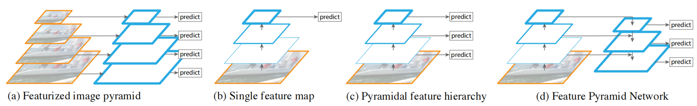

# Feature Pyramid Networks for Object Detection
用于目标检测的特征金字塔网络 2016-12-9 原文：https://arxiv.org/abs/1612.03144

## ABSTRACT
Feature pyramids are a basic component in recognition systems for detecting objects at different scales. But recent deep learning object detectors have avoided pyramid representations, in part because they are compute and memory intensive. In this paper, we exploit the inherent multi-scale, pyramidal hierarchy of deep convolutional networks to construct feature pyramids with marginal extra cost. A top-down architecture with lateral connections is developed for building high-level semantic feature maps at all scales. This architecture, called a Feature Pyramid Network (FPN), shows significant improvement as a generic feature extractor in several applications. Using FPN in a basic Faster R-CNN system, our method achieves state-of-the-art single-model results on the COCO detection benchmark without bells and whistles, surpassing all existing single-model entries including those from the COCO 2016 challenge winners. In addition, our method can run at 5 FPS on a GPU and thus is a practical and accurate solution to multi-scale object detection. Code will be made publicly available.

特征金字塔是识别系统中检测不同尺度目标的基本组件。但最近的深度学习目标检测器避免了金字塔表示，部分原因是它们是计算和内存密集型的。本文利用深卷积网络固有的多尺度、金字塔层次结构，以边际额外成本构建特征金字塔。开发了一种具有横向连接的自顶向下架构，用于构建所有尺度的高级语义特征图。这种架构称为特征金字塔网络(FPN)，在几个应用程序中作为通用特征提取器显示出显著的改进。在一个基本的Faster R-CNN系统中使用FPN，我们的方法在COCO检测基准上实现了最先进的单模型结果，无需任何花哨技巧，超过了所有的单模型参赛者，包括来自COCO 2016挑战优胜的参赛者。此外，我们的方法可以在GPU上以5 FPS的速度运行，因此是一种实用而精确的多尺度目标检测解决方案。

## 1. Introduction
Recognizing objects at vastly different scales is a fundamental challenge in computer vision. Feature pyramids built upon image pyramids (for short we call these featurized image pyramids) form the basis of a standard solution [1] (Fig. 1(a)). These pyramids are scale-invariant in the sense that an object’s scale change is offset by shifting its level in the pyramid. Intuitively, this property enables a model to detect objects across a large range of scales by scanning the model over both positions and pyramid levels.

识别不同尺度的物体是计算机视觉的一个基本挑战。基于图像金字塔构建的特征金字塔(简称为特征化图像金字塔)构成了标准解决方案的基础[1](图1(a))。这些金字塔是比例不变的，因为目标的比例变化通过在金字塔中移动其级别来抵消。直观地说，该属性使模型能够通过在位置和金字塔级别上扫描模型来检测大范围范围内的目标。

 
Figure 1. (a) Using an image pyramid to build a feature pyramid. Features are computed on each of the image scales independently, which is slow. (b) Recent detection systems have opted to use only single scale features for faster detection. (c) An alternative is to reuse the pyramidal feature hierarchy computed by a ConvNet as if it were a featurized image pyramid. (d) Our proposed Feature Pyramid Network (FPN) is fast like (b) and (c), but more accurate.In this figure, feature maps are indicate by blue outlines and thicker outlines denote semantically stronger features. 
图1.(a)使用图像金字塔构建特征金字塔。在每个图像尺度上独立计算特征，这很慢。(b) 最近的检测系统已选择仅使用单尺度特征以实现Faster 检测。(c) 另一种方法是重用ConvNet计算的金字塔特征层次，就像它是一个特征化图像金字塔一样。(d) 我们提出的特征金字塔网络(FPN)与(b)和(c)一样快，但更准确。在该图中，特征图由蓝色轮廓表示，较粗的轮廓表示语义更强的特征。

Featurized image pyramids were heavily used in the era of hand-engineered features [5, 25]. They were so critical that object detectors like DPM [7] required dense scale sampling to achieve good results (e.g., 10 scales per octave). For recognition tasks, engineered features have largely been replaced with features computed by deep convolutional networks (ConvNets) [19, 20]. Aside from being capable of representing higher-level semantics, ConvNets are also more robust to variance in scale and thus facilitate recognition from features computed on a single input scale [15, 11, 29] (Fig. 1(b)). But even with this robustness, pyramids are still needed to get the most accurate results. All recent top entries in the ImageNet [33] and COCO [21] detection challenges use multi-scale testing on featurized image pyramids (e.g., [16, 35]). The principle advantage of featurizing each level of an image pyramid is that it produces a multi-scale feature representation in which all levels are semantically strong, including the high-resolution levels.

在手工设计特征的时代，特征化图像金字塔被大量使用[5，25]。它们是如此关键，以至于像DPM[7]这样的目标检测器需要密集的尺度采样以获得良好的结果(例如，每八度10个尺度)。对于识别任务，工程特征在很大程度上被深度卷积网络(ConvNets)计算的特征所取代[19，20]。除了能够表示更高层次的语义之外，ConvNets对尺度变化也更为稳健，因此有助于从单个输入尺度上计算的特征中进行识别[15，11，29](图1(b))。但即使有这种稳健性，金字塔仍然需要得到最准确的结果。ImageNet[33]和COCO[21]检测挑战中最近的所有顶级参赛者都使用了对特征化图像金字塔的多尺度测试(例如，[16，35])。特征化图像金字塔的每个级别的主要优点是，它产生了多尺度特征表示，其中所有级别都是语义强大的，包括高分辨率级别。

Nevertheless, featurizing each level of an image pyramid has obvious limitations. Inference time increases considerably (e.g., by four times [11]), making this approach impractical for real applications. Moreover, training deep networks end-to-end on an image pyramid is infeasible in terms of memory, and so, if exploited, image pyramids are used only at test time [15, 11, 16, 35], which creates an inconsistency between train/test-time inference. For these reasons, Fast and Faster R-CNN [11, 29] opt to not use featurized image pyramids under default settings.

尽管如此，将图像金字塔的每一层特征化都有明显的局限性。推理时间大大增加(例如，增加了四倍[11])，使得这种方法对于实际应用来说不切实际。此外，在图像金字塔上进行端到端的深度网络训练在内存方面是不可行的，因此，如果加以利用，图像金字塔仅在测试时间使用[15，11，16，35]，这在训练/测试时间推理之间产生了不一致性。出于这些原因，Fast and Faster R-CNN[11，29]选择在默认设置下不使用特征化图像金字塔。

However, image pyramids are not the only way to compute a multi-scale feature representation. A deep ConvNet computes a feature hierarchy layer by layer, and with subsampling layers the feature hierarchy has an inherent multiscale, pyramidal shape. This in-network feature hierarchy produces feature maps of different spatial resolutions, but introduces large semantic gaps caused by different depths.The high-resolution maps have low-level features that harm their representational capacity for object recognition.

然而，图像金字塔并不是计算多尺度特征表示的唯一方法。深层ConvNet逐层计算特征层次，通过二次采样层，特征层次具有固有的多尺度金字塔形状。网络中的这种特征层次结构产生了不同空间分辨率的特征图，但引入了由不同深度引起的较大语义差距。高分辨率图具有低水平的特征，这些特征会损害其物体识别的表现能力。

The Single Shot Detector (SSD) [22] is one of the first attempts at using a ConvNet’s pyramidal feature hierarchy as if it were a featurized image pyramid (Fig. 1(c)). Ideally, the SSD-style pyramid would reuse the multi-scale feature maps from different layers computed in the forward pass and thus come free of cost. But to avoid using low-level features SSD foregoes reusing already computed layers and instead builds the pyramid starting from high up in the network (e.g., conv4 3 of VGG nets [36]) and then by adding several new layers. Thus it misses the opportunity to reuse the higher-resolution maps of the feature hierarchy. We show that these are important for detecting small objects.

单样本检测器(SSD)[22]是第一次尝试使用ConvNet的金字塔特征层次结构，就像它是一个特征化的图像金字塔一样(图1(c))。理想情况下，SSD样式的金字塔将重用在正向过程中计算的来自不同层的多尺度特征图，因此不会产生成本。但为了避免使用低级特征，SSD放弃了重复使用已经计算的层，而是从网络的高层开始构建金字塔(例如，VGG网络的conv4 3[36])，然后添加几个新层。因此，它错过了重用特征层次结构的高分辨率图的机会。我们证明这些对于检测小物体很重要。

The goal of this paper is to naturally leverage the pyramidal shape of a ConvNet’s feature hierarchy while creating a feature pyramid that has strong semantics at all scales. To achieve this goal, we rely on an architecture that combines low-resolution, semantically strong features with high-resolution, semantically weak features via a top-down pathway and lateral connections (Fig. 1(d)). The result is a feature pyramid that has rich semantics at all levels and is built quickly from a single input image scale. In other words, we show how to create in-network feature pyramids that can be used to replace featurized image pyramids without sacrificing representational power, speed, or memory.

本文的目标是自然地利用ConvNet特征层次结构的金字塔形状，同时创建在所有尺度上都具有强语义的特征金字塔。为了实现这一目标，我们依赖于通过自上而下的路径和横向连接将低分辨率、语义强的特征与高分辨率、语义弱的特征相结合的架构(图1(d))。其结果是一个在所有级别都具有丰富语义的特征金字塔，并从单个输入图像尺度快速构建。换句话说，我们展示了如何在网络中创建特征金字塔，这些特征金字塔可用于替换特征化的图像金字塔，而不牺牲表现力、速度或内存。

Similar architectures adopting top-down and skip connections are popular in recent research [28, 17, 8, 26]. Their goals are to produce a single high-level feature map of a fine resolution on which the predictions are to be made (Fig. 2 top). On the contrary, our method leverages the architecture as a feature pyramid where predictions (e.g., object detections) are independently made on each level (Fig. 2 bottom). Our model echoes a featurized image pyramid, which has not been explored in these works.

采用自顶向下和跳跃连接的类似架构在最近的研究中很流行[28，17，8，26]。他们的目标是生成一个高分辨率的单一高级特征图，据此进行预测(图2左部)。相反，我们的方法将架构作为一个特征金字塔，在每个层次上独立地进行预测(例如，目标检测)(图2右部)。我们的模型与这些作品中没有探索过的特征化图像金字塔相呼应。

 
Figure 2. Left: a top-down architecture with skip connections, where predictions are made on the finest level (e.g., [28]). Right: our model that has a similar structure but leverages it as a feature pyramid, with predictions made independently at all levels. 
图2.左图：具有跳跃连接的自顶向下架构，其中在最精细的层次上进行预测(例如[28])。右：我们的模型具有类似的结构，但将其作为一个特征金字塔，在各个级别独立进行预测。

We evaluate our method, called a Feature Pyramid Network (FPN), in various systems for detection and segmentation [11, 29, 27]. Without bells and whistles, we report a state-of-the-art single-model result on the challenging COCO detection benchmark [21] simply based on FPN and a basic Faster R-CNN detector [29], surpassing all existing heavily-engineered single-model entries of competition winners. In ablation experiments, we find that for bounding box proposals, FPN significantly increases the Average Recall (AR) by 8.0 points; for object detection, it improves the COCO-style Average Precision (AP) by 2.3 points and PASCAL-style AP by 3.8 points, over a strong single-scale baseline of Faster R-CNN on ResNets [16]. Our method is also easily extended to mask proposals and improves both instance segmentation AR and speed over state-of-the-art methods that heavily depend on image pyramids.

我们在各种检测和分割系统中评估了我们的方法，称为特征金字塔网络(FPN)[11，29，27]。在没有花哨技术的情况下，我们报告了具有挑战性的COCO检测基准[21]的最先进的单模型结果，该基准仅基于FPN和Faster R-CNN检测器[29]，超过了所有目前竞争获胜者的重量设计的单模型。在消融实验中，我们发现，对于边框方案，FPN显著提高了平均召回率(AR)8.0点; 对于目标检测，它在ResNets上的Faster R-CNN的强大单尺度基线上，将COCO风格的平均精度(AP)提高了2.3点，将PASCAL风格的AP提高了3.8点[16]。与严重依赖图像金字塔的最先进方法相比，我们的方法还可以很容易地扩展到遮罩候选，并提高实例分割AR和速度。

In addition, our pyramid structure can be trained end-toend with all scales and is used consistently at train/test time, which would be memory-infeasible using image pyramids. As a result, FPNs are able to achieve higher accuracy than all existing state-of-the-art methods. Moreover, this improvement is achieved without increasing testing time over the single-scale baseline. We believe these advances will facilitate future research and applications. Our code will be made publicly available.

此外，我们的金字塔结构可以用所有尺度进行训练，并在训练/测试时一致使用，这是使用图像金字塔在内存上不可行的。因此，FPN能够实现比所有现有最先进方法更高的精度。此外，这种改进是在不增加单尺度基线的测试时间的情况下实现的。我们相信这些进展将促进未来的研究和应用。我们的代码将公开。

## 2. Related Work
### Hand-engineered features and early neural networks.
SIFT features [25] were originally extracted at scale-space extrema and used for feature point matching. HOG features [5], and later SIFT features as well, were computed densely over entire image pyramids. These HOG and SIFT pyramids have been used in numerous works for image classification, object detection, human pose estimation, and more. There has also been significant interest in computing featurized image pyramids quickly. Doll´ar et al. [6] demonstrated fast pyramid computation by first computing a sparsely sampled (in scale) pyramid and then interpolating missing levels. Before HOG and SIFT, early work on face detection with ConvNets [38, 32] computed shallow networks over image pyramids to detect faces across scales. 

手工设计的特征和早期的神经网络。SIFT特征[25]最初是在尺度空间极值处提取的，并用于特征点匹配。HOG特征[5]，以及后来的SIFT特征，在整个图像金字塔上进行了密集计算。这些HOG和SIFT金字塔已用于图像分类、物体检测、人体姿态估计等许多工作。人们对快速计算特征化图像金字塔也很感兴趣。Doll´aret al [6]通过首先计算稀疏采样(按比例)金字塔，然后插值缺失的水平，证明了快速金字塔计算。在HOG和SIFT之前，ConvNets[38，32]的人脸检测早期工作在图像金字塔上计算浅层网络，以检测跨尺度的人脸。

### Deep ConvNet object detectors. 
With the development of modern deep ConvNets [19], object detectors like OverFeat [34] and R-CNN [12] showed dramatic improvements in accuracy. OverFeat adopted a strategy similar to early neural network face detectors by applying a ConvNet as a sliding window detector on an image pyramid. R-CNN adopted a region proposal-based strategy [37] in which each proposal was scale-normalized before classifying with a ConvNet. SPPnet [15] demonstrated that such region-based detectors could be applied much more efficiently on feature maps extracted on a single image scale. Recent and more accurate detection methods like Fast R-CNN [11] and Faster R-CNN [29] advocate using features computed from a single scale, because it offers a good trade-off between accuracy and speed. Multi-scale detection, however, still performs better, especially for small objects.

Deep ConvNet目标检测器。随着现代深度卷积网[19]的发展，像OverFeat[34]和R-CNN[12]这样的目标检测器在精度上有了显著的提高。OverFeat采用了类似于早期神经网络人脸检测器的策略，在图像金字塔上应用ConvNet作为滑动窗口检测器。R-CNN采用了基于区域提案的策略[37]，其中在使用ConvNet进行分类之前，对每个提案进行了尺度归一化。SPPnet[15]证明，这种基于区域的检测器可以更有效地应用于在单个图像尺度上提取的特征图。最近和更精确的检测方法，如Fast R-CNN[11]和Faster R-CNN[29]提倡使用从单一尺度计算的特征，因为它在精度和速度之间提供了很好的权衡。然而，多尺度检测仍然表现得更好，尤其是对于小目标。

### Methods using multiple layers. 
A number of recent approaches improve detection and segmentation by using different layers in a ConvNet. FCN [24] sums partial scores for each category over multiple scales to compute semantic segmentations. Hypercolumns [13] uses a similar method for object instance segmentation. Several other approaches (HyperNet [18], ParseNet [23], and ION [2]) concatenate features of multiple layers before computing predictions, which is equivalent to summing transformed features. SSD [22] and MS-CNN [3] predict objects at multiple layers of the feature hierarchy without combining features or scores.

使用多层的方法。许多最近的方法通过在ConvNet中使用不同的层来改进检测和分割。FCN[24]在多个尺度上对每个类别的部分分数进行求和，以计算语义分割。Hypercolumns[13]使用类似的方法进行目标实例分割。其他几种方法(HyperNet[18]、ParseNet[23]和ION[2])在计算预测之前连接多个层的特征，这相当于对转换后的特征求和。SSD[22]和MS-CNN[3]在不组合特征或分数的情况下预测特征层次的多个层的目标。

There are recent methods exploiting lateral/skip connections that associate low-level feature maps across resolutions and semantic levels, including U-Net [31] and SharpMask [28] for segmentation, Recombinator networks [17] for face detection, and Stacked Hourglass networks [26] for keypoint estimation. Ghiasi et al. [8] present a Laplacian pyramid presentation for FCNs to progressively refine segmentation. Although these methods adopt architectures with pyramidal shapes, they are unlike featurized image pyramids [5, 7, 34] where predictions are made independently at all levels, see Fig. 2. In fact, for the pyramidal architecture in Fig. 2 (top), image pyramids are still needed to recognize objects across multiple scales [28].

最近有一些方法利用横向/跳跃连接来关联不同分辨率和语义级别的低级别特征图，包括用于分割的U-Net[31]和SharpMask[28]，用于面部检测的Recombinator网络[17]，以及用于关键点估计的堆积沙漏网络[26]。Ghiasiet al [8]提出了FCN的拉普拉斯金字塔表示法，以逐步细化分割。尽管这些方法采用了金字塔形状的结构，但它们不同于特征化的图像金字塔[5，7，34]，其中预测是在所有级别独立进行的，见图2。事实上，对于图2(顶部)中的金字塔结构，仍然需要图像金字塔来识别多个尺度的目标[28]。

## 3. Feature Pyramid Networks
Our goal is to leverage a ConvNet’s pyramidal feature hierarchy, which has semantics from low to high levels, and build a feature pyramid with high-level semantics throughout. The resulting Feature Pyramid Network is generalpurpose and in this paper we focus on sliding window proposers (Region Proposal Network, RPN for short) [29] and region-based detectors (Fast R-CNN) [11]. We also generalize FPNs to instance segmentation proposals in Sec. 6.

我们的目标是利用ConvNet的金字塔形特征层次结构，它具有从低到高的语义，并构建一个贯穿始终的具有高级语义的特征金字塔。生成的特征金字塔网络是通用的，在本文中，我们关注滑动窗口提议者(区域提议网络，简称RPN)[29]和基于区域的检测器(Fast R-CNN)[11]。我们还将FPN推广到第6节中的实例分割建议。

Our method takes a single-scale image of an arbitrary size as input, and outputs proportionally sized feature maps at multiple levels, in a fully convolutional fashion. This process is independent of the backbone convolutional architectures (e.g., [19, 36, 16]), and in this paper we present results using ResNets [16]. The construction of our pyramid involves a bottom-up pathway, a top-down pathway, and lateral connections, as introduced in the following.

我们的方法将任意大小的单尺度图像作为输入，并以完全卷积的方式在多个级别上输出成比例大小的特征图。该过程独立于主干卷积架构(例如[19，36，16])，在本文中，我们使用ResNets[16]给出了结果。金字塔的构建包括自下而上的路径、自上而下的路径和横向连接，如下所述。

 
Figure 3. A building block illustrating the lateral connection and the top-down pathway, merged by addition. 
图3.通过添加合并的横向连接和自上而下路径的构建块。

Bottom-up pathway. The bottom-up pathway is the feedforward computation of the backbone ConvNet, which computes a feature hierarchy consisting of feature maps at several scales with a scaling step of 2. There are often many layers producing output maps of the same size and we say these layers are in the same network stage. For our feature pyramid, we define one pyramid level for each stage. We choose the output of the last layer of each stage as our reference set of feature maps, which we will enrich to create our pyramid. This choice is natural since the deepest layer of each stage should have the strongest features.

自下而上的路径。自底向上的路径是主干ConvNet的前馈计算，它计算由多个尺度的特征图组成的特征层次，缩放步长为2。通常有许多层产生相同大小的输出图，我们说这些层处于同一网络阶段。对于我们的特征金字塔，我们为每个阶段定义一个金字塔级别。我们选择每个阶段最后一层的输出作为特征图的参考集，我们将对其进行丰富以创建金字塔。这种选择是自然的，因为每个阶段的最深层应该具有最强的特征。

Specifically, for ResNets [16] we use the feature activations output by each stage’s last residual block. We denote the output of these last residual blocks as {C2, C3, C4, C5} for conv2, conv3, conv4, and conv5 outputs, and note that they have strides of {4, 8, 16, 32} pixels with respect to the input image. We do not include conv1 into the pyramid due to its large memory footprint.

具体而言，对于ResNets[16]，我们使用每个阶段最后一个残差块输出的特征激活。对于conv2、conv3、conv4和conv5输出，我们将这些最后的残差块的输出表示为{C2、C3、C4、C5}，并注意它们相对于输入图像具有{4、8、16、32}像素的步长。我们没有将conv1包含在金字塔中，因为它占用了大量内存。

Top-down pathway and lateral connections. The topdown pathway hallucinates higher resolution features by upsampling spatially coarser, but semantically stronger, feature maps from higher pyramid levels. These features are then enhanced with features from the bottom-up pathway via lateral connections. Each lateral connection merges feature maps of the same spatial size from the bottom-up pathway and the top-down pathway. The bottom-up feature map is of lower-level semantics, but its activations are more accurately localized as it was subsampled fewer times.

自上而下的路径和横向连接。自上而下的路径通过从更高的金字塔级别对空间上更粗糙但语义上更强的特征图进行上采样，从而产生更高分辨率的特征。然后，这些特征通过横向连接的自下而上路径的特征得到增强。每个横向连接合并来自自下而上路径和自上而下路径的相同空间大小的特征图。自底向上的特征图具有较低级别的语义，但由于子采样次数较少，其激活更准确地定位。

Fig. 3 shows the building block that constructs our topdown feature maps. With a coarser-resolution feature map, we upsample the spatial resolution by a factor of 2 (using nearest neighbor upsampling for simplicity). The upsam- 3 pled map is then merged with the corresponding bottom-up map (which undergoes a 1×1 convolutional layer to reduce channel dimensions) by element-wise addition. This process is iterated until the finest resolution map is generated. To start the iteration, we simply attach a 1×1 convolutional layer on C5 to produce the coarsest resolution map. Finally, we append a 3×3 convolution on each merged map to generate the final feature map, which is to reduce the aliasing effect of upsampling. This final set of feature maps is called {P2, P3, P4, P5}, corresponding to {C2, C3, C4, C5} that are respectively of the same spatial sizes.

图3显示了构建自上而下特征图的构建块。使用更粗分辨率的特征图，我们将空间分辨率上采样2倍(为简单起见，使用最近邻上采样)。然后，通过逐元素相加，将upsam-3点映射与相应的自底向上映射(其经历1×1卷积层以减少信道维度)合并。重复此过程，直到生成最佳分辨率贴图。为了开始迭代，我们简单地在C5上附加一个1×1卷积层，以产生最粗糙的分辨率图。最后，我们在每个合并的图上附加3×3卷积以生成最终的特征图，这是为了减少上采样的混叠效应。这最后一组特征图被称为{P2，P3，P4，P5}，对应于分别具有相同空间大小的{C2，C3，C4，C5}。

Because all levels of the pyramid use shared classi- fiers/regressors as in a traditional featurized image pyramid, we fix the feature dimension (numbers of channels, denoted as d) in all the feature maps. We set d = 256 in this paper and thus all extra convolutional layers have 256-channel outputs. There are no non-linearities in these extra layers, which we have empirically found to have minor impacts.

因为金字塔的所有级别都使用共享的分类器/回归器，就像传统的特征化图像金字塔一样，所以我们在所有特征图中固定了特征维度(通道数量，表示为d)。我们在本文中设置d＝256，因此所有额外的卷积层具有256个信道输出。在这些额外的层中没有非线性，我们根据经验发现，这些层的影响很小。

Simplicity is central to our design and we have found that our model is robust to many design choices. We have experimented with more sophisticated blocks (e.g., using multilayer residual blocks [16] as the connections) and observed marginally better results. Designing better connection modules is not the focus of this paper, so we opt for the simple design described above.

简洁性是我们设计的核心，我们发现我们的模型对许多设计选择都是稳健的。我们已经用更复杂的块进行了实验(例如，使用多层残余块[16]作为连接)，并观察到稍微更好的结果。设计更好的连接模块不是本文的重点，因此我们选择了上面描述的简单设计。

## 4. Applications
Our method is a generic solution for building feature pyramids inside deep ConvNets. In the following we adopt our method in RPN [29] for bounding box proposal generation and in Fast R-CNN [11] for object detection. To demonstrate the simplicity and effectiveness of our method, we make minimal modifications to the original systems of [29, 11] when adapting them to our feature pyramid.

我们的方法是在深度ConvNets中构建特征金字塔的通用解决方案。在下文中，我们采用RPN[29]中的方法生成边框建议，并采用Fast R-CNN[11]中的方法进行目标检测。为了证明我们方法的简单性和有效性，我们在将[29，11]的原始系统适应我们的特征金字塔时，对其进行了最小的修改。

### 4.1. Feature Pyramid Networks for RPN
RPN [29] is a sliding-window class-agnostic object detector. In the original RPN design, a small subnetwork is evaluated on dense 3×3 sliding windows, on top of a singlescale convolutional feature map, performing object/nonobject binary classification and bounding box regression. This is realized by a 3×3 convolutional layer followed by two sibling 1×1 convolutions for classification and regression, which we refer to as a network head. The object/nonobject criterion and bounding box regression target are defined with respect to a set of reference boxes called anchors [29]. The anchors are of multiple pre-defined scales and aspect ratios in order to cover objects of different shapes.

RPN[29]是一种滑动窗口类未知目标检测器。在最初的RPN设计中，在单尺度卷积特征图上，在密集的3×3滑动窗口上评估一个子网络，执行目标/非目标二分类和边框回归。这是通过3×3卷积层实现的，然后是两个用于分类和回归的兄弟1×1卷积，我们称之为网络头部。目标/非目标评估和边框回归目标相对于一组称为锚点的参考框进行定义[29]。锚具有多个预定义的比例和纵横比，以覆盖不同形状的目标。

We adapt RPN by replacing the single-scale feature map with our FPN. We attach a head of the same design (3×3 conv and two sibling 1×1 convs) to each level on our feature pyramid. Because the head slides densely over all locations in all pyramid levels, it is not necessary to have multi-scale anchors on a specific level. Instead, we assign anchors of a single scale to each level. Formally, we define the anchors to have areas of {$32^2, 64^2, 128^2, 256^2, 512^2$} pixels on {$P_2, P_3, P_4, P_5, P_6$} respectively.(1Here we introduce P6 only for covering a larger anchor scale of $512^2$. $P_6$ is simply a stride two subsampling of $P_5$. $P_6$ is not used by the Fast R-CNN detector in the next section.) As in [29] we also use anchors of multiple aspect ratios {1:2, 1:1, 2:1} at each level. So in total there are 15 anchors over the pyramid.

我们通过用FPN替换单比例特征图来调整RPN。我们将相同设计的头部(3×3 conv和两个兄弟1×1 conv)附加到特征金字塔的每个级别。由于头部在所有金字塔级别的所有位置上密集滑动，因此无需在特定级别上设置多尺度锚点。相反，我们为每个级别指定单个比例的锚点。形式上，我们定义锚分别在{$P_2, P_3, P_4, P_5, P_6$}上具有{$32^2, 64^2, 128^2, 256^2, 512^2$}像素的区域。(在这里，我们只介绍了$P_6$，用于覆盖$512^2$的较大锚点比例。$P_6$只是$P_5$的两步二次采样。在下一节中，快速R-CNN检测器不使用P6。)如[29]所示，我们也在每个级别使用多个纵横比{1:2、1:1、2:1}的锚点。所以金字塔上总共有15个锚。

We assign training labels to the anchors based on their Intersection-over-Union (IoU) ratios with ground-truth bounding boxes as in [29]. Formally, an anchor is assigned a positive label if it has the highest IoU for a given groundtruth box or an IoU over 0.7 with any ground-truth box, and a negative label if it has IoU lower than 0.3 for all ground-truth boxes. Note that scales of ground-truth boxes are not explicitly used to assign them to the levels of the pyramid; instead, ground-truth boxes are associated with anchors, which have been assigned to pyramid levels. As such, we introduce no extra rules in addition to those in [29].

我们根据锚的交并(IoU)比率和基础真实边框为锚分配训练标签，如[29]所示。形式上，如果锚对于给定的基础真值框具有最高IoU，或者对于任何基础真值盒具有超过0.7的IoU，则为锚分配一个正标签，如果锚的IoU对于所有基础真值箱都低于0.3，则为其分配一个负标签。请注意，基础真实值框的比例并没有明确用于将其分配给金字塔的级别; 相反，基础真相框与锚相关联，锚被分配到金字塔级别。因此，除了[29]中的规则外，我们没有引入额外的规则。

We note that the parameters of the heads are shared across all feature pyramid levels; we have also evaluated the alternative without sharing parameters and observed similar accuracy. The good performance of sharing parameters indicates that all levels of our pyramid share similar semantic levels. This advantage is analogous to that of using a featurized image pyramid, where a common head classifier can be applied to features computed at any image scale.

我们注意到，头部的参数在所有特征金字塔级别上共享; 我们还评估了不共享参数的替代方案，并观察到类似的准确性。共享参数的良好性能表明，金字塔的所有级别共享相似的语义级别。这一优点类似于使用特征化图像金字塔，其中公共头部分类器可以应用于以任何图像尺度计算的特征。

With the above adaptations, RPN can be naturally trained and tested with our FPN, in the same fashion as in [29]. We elaborate on the implementation details in the experiments.

通过上述调整，RPN可以用我们的FPN以与[29]中相同的方式进行自然训练和测试。我们在实验中详细阐述了实现细节。

### 4.2. Feature Pyramid Networks for Fast R-CNN
Fast R-CNN [11] is a region-based object detector in which Region-of-Interest (RoI) pooling is used to extract features. Fast R-CNN is most commonly performed on a single-scale feature map. To use it with our FPN, we need to assign RoIs of different scales to the pyramid levels.

Fast R-CNN[11]是一种基于区域的目标检测器，其中使用感兴趣区域(RoI)池来提取特征。快速R-CNN最常用于单尺度特征图。为了与我们的FPN一起使用，我们需要将不同规模的RoI分配给金字塔级别。

We view our feature pyramid as if it were produced from an image pyramid. Thus we can adapt the assignment strategy of region-based detectors [15, 11] in the case when they are run on image pyramids. Formally, we assign an RoI of width w and height h (on the input image to the network) to the level Pk of our feature pyramid by: 

我们将特征金字塔视为从图像金字塔中产生的。因此，当基于区域的检测器在图像金字塔上运行时，我们可以调整它们的分配策略[15，11]。形式上，我们通过以下方式将宽度w和高度h(在网络的输入图像上)的RoI分配给特征金字塔的级别Pk：

k = b k0 + log2(√ wh/224)c . (1)

Here 224 is the canonical ImageNet pre-training size, and k0 is the target level on which an RoI with w × h = 2242 should be mapped into. Analogous to the ResNet-based Faster R-CNN system [16] that uses C4 as the single-scale feature map, we set k0 to 4. Intuitively, Eqn. (1) means that if the RoI’s scale becomes smaller (say, 1/2 of 224), it should be mapped into a finer-resolution level (say, k = 3). 

这里224是标准ImageNet预训练大小，k0是w×h＝2242的RoI应该映射到的目标级别。类似于基于ResNet的Faster R-CNN系统[16]，该系统使用C4作为单比例特征图，我们将k0设置为4。(1) 这意味着如果RoI的尺度变小(例如，224的1/2)，则应该将其映射到更精细的分辨率级别(例如，k＝3)。

We attach predictor heads (in Fast R-CNN the heads are class-specific classifiers and bounding box regressors) to all RoIs of all levels. Again, the heads all share parameters, regardless of their levels. In [16], a ResNet’s conv5 layers (a 9-layer deep subnetwork) are adopted as the head on top of the conv4 features, but our method has already harnessed conv5 to construct the feature pyramid. So unlike [16], we simply adopt RoI pooling to extract 7×7 features, and attach two hidden 1,024-d fully-connected (fc) layers (each followed by ReLU) before the final classification and bounding box regression layers. These layers are randomly initialized, as there are no pre-trained fc layers available in ResNets. Note that compared to the standard conv5 head, our 2-fc MLP head is lighter weight and faster.

我们将预测器头部(在Fast R-CNN中，头部是类特定分类器和边框回归器)附加到所有级别的RoI。同样，头部都共享参数，无论其级别如何。在[16]中，ResNet的conv5层(9层深子网络)被用作conv4特征的顶部，但我们的方法已经利用conv5构建了特征金字塔。因此，与[16]不同的是，我们简单地采用RoI池来提取7×7个特征，并在最终分类和边框回归层之前附加两个隐藏的1024-d完全连接(fc)层(每个层后跟ReLU)。这些层是随机初始化的，因为ResNets中没有预训练的fc层。注意，与标准conv5磁头相比，我们的2-fc MLP磁头重量更轻，速度更快。

Based on these adaptations, we can train and test Fast RCNN on top of the feature pyramid. Implementation details are given in the experimental section.

基于这些适应，我们可以在特征金字塔的顶部训练和测试快速RCNN。实验部分给出了实施细节。

## 5. Experiments on Object Detection
We perform experiments on the 80 category COCO detection dataset [21]. We train using the union of 80k train images and a 35k subset of val images (trainval35k [2]), and report ablations on a 5k subset of val images (minival). We also report final results on the standard test set (test-std) [21] which has no disclosed labels.

我们在80类COCO检测数据集上进行了实验[21]。我们使用80k列车图像和35k val图像子集(trainval35k[2])的联合进行训练，并报告5k val图像子集上的消融(minival)。我们还报告了没有公开标签的标准测试集(测试标准)[21]的最终结果。

As is common practice [12], all network backbones are pre-trained on the ImageNet1k classification set [33] and then fine-tuned on the detection dataset. We use the pre-trained ResNet-50 and ResNet-101 models that are publicly available.2 Our code is a reimplementation of py-faster-rcnn3 using Caffe2.4

正如常见的做法[12]，所有网络主干都在ImageNet1k分类集[33]上进行预训练，然后在检测数据集上进行微调。我们使用公开可用的预先训练的ResNet-50和ResNet-101模型。2我们的代码是使用Caffe2.4重新实现py-faster-rcn3

### 5.1. Region Proposal with RPN 带有RPN的区域提案
We evaluate the COCO-style Average Recall (AR) and AR on small, medium, and large objects (ARs, ARm, and ARl) following the definitions in [21]. We report results for 100 and 1000 proposals per images (AR100 and AR1k ).

我们根据[21]中的定义评估了COCO风格的平均召回(AR)和小、中、大目标(AR、ARm和ARl)的AR。我们报告每个图像100和1000个建议的结果(AR100和AR1k)。

Implementation details. All architectures in Table 1 are trained end-to-end. The input image is resized such that its shorter side has 800 pixels. We adopt synchronized SGD training on 8 GPUs. A mini-batch involves 2 images per GPU and 256 anchors per image. We use a weight decay of 0.0001 and a momentum of 0.9. The learning rate is 0.02 for the first 30k mini-batches and 0.002 for the next 10k. For all RPN experiments (including baselines), we include the anchor boxes that are outside the image for training, which is unlike [29] where these anchor boxes are ignored. Other implementation details are as in [29]. Training RPN with FPN on 8 GPUs takes about 8 hours on COCO. 

实施细节。表1中的所有架构都经过端到端培训。调整输入图像的大小，使其短边具有800个像素。我们在8个GPU上采用同步SGD培训。一个小批量包含每个GPU 2个图像和每个图像256个锚点。我们使用0.0001的权重衰减和0.9的动量。前30k小批量的学习率为0.02，后10k的学习率是0.002。对于所有RPN实验(包括基线)，我们包括图像外部的锚框用于训练，这不同于[29]，这些锚框被忽略。其他实施细节如[29]所示。在COCO上用FPN在8个GPU上训练RPN大约需要8小时。

2https://github.com/kaiminghe/deep-residual-networks 
3https://github.com/rbgirshick/py-faster-rcnn 
4https://github.com/caffe2/caffe2

### 5.1.1 Ablation Experiments
Comparisons with baselines. For fair comparisons with original RPNs [29], we run two baselines (Table 1(a, b)) using the single-scale map of C4 (the same as [16]) or C5, both using the same hyper-parameters as ours, including using 5 scale anchors of {322, 642, 1282, 2562, 5122}. Table 1 (b) shows no advantage over (a), indicating that a single higherlevel feature map is not enough because there is a trade-off between coarser resolutions and stronger semantics.

与基线的比较。为了与原始RPN进行公平比较[29]，我们使用C4(与[16]相同)或C5的单比例图运行了两个基线(表1(a，b))，这两个基线都使用与我们相同的超参数，包括使用{322、642、1282、2562、5122}的5个比例锚。表1(b)没有显示出优于(a)的优势，表明单一的高级特征图是不够的，因为在更粗的分辨率和更强的语义之间存在权衡。

Placing FPN in RPN improves AR1k to 56.3 (Table 1 (c)), which is 8.0 points increase over the single-scale RPN baseline (Table 1 (a)). In addition, the performance on small objects (AR1sk ) is boosted by a large margin of 12.9 points. Our pyramid representation greatly improves RPN’s robustness to object scale variation.

在RPN中放置FPN将AR1k提高到56.3(表1(c))，这比单尺度RPN基线(表1)增加了8.0个点。此外，在小目标(AR1sk)上的性能提高了12.9分。我们的金字塔表示极大地提高了RPN对目标尺度变化的稳健性。

How important is top-down enrichment? Table 1(d) shows the results of our feature pyramid without the topdown pathway. With this modification, the 1×1 lateral connections followed by 3×3 convolutions are attached to the bottom-up pyramid. This architecture simulates the effect of reusing the pyramidal feature hierarchy (Fig. 1(b)).

自上而下的丰富有多重要？表1(d)显示了没有自上而下路径的特征金字塔的结果。通过这种修改，1×1的横向连接和3×3的卷积被连接到自下而上的金字塔。该架构模拟了重用金字塔特征层次的效果(图1(b))。

The results in Table 1(d) are just on par with the RPN baseline and lag far behind ours. We conjecture that this is because there are large semantic gaps between different levels on the bottom-up pyramid (Fig. 1(b)), especially for very deep ResNets. We have also evaluated a variant of Table 1(d) without sharing the parameters of the heads, but observed similarly degraded performance. This issue cannot be simply remedied by level-specific heads.

表1(d)中的结果与RPN基线基本持平，远远落后于我们的结果。我们推测，这是因为自底向上金字塔的不同层次之间存在很大的语义差距(图1(b))，特别是对于非常深的ResNets。我们还评估了表1(d)的变体，但没有共享磁头的参数，但观察到类似的性能下降。这个问题不能简单地由特定级别的负责人来解决。

How important are lateral connections? Table 1(e) shows the ablation results of a top-down feature pyramid without the 1×1 lateral connections. This top-down pyramid has strong semantic features and fine resolutions. But we argue that the locations of these features are not precise, because these maps have been downsampled and upsampled several times. More precise locations of features can be directly passed from the finer levels of the bottom-up maps via the lateral connections to the top-down maps. As a results, FPN has an AR1k score 10 points higher than Table 1(e).

横向连接有多重要？表1(e)显示了没有1×1横向连接的自上而下特征金字塔的消融结果。这种自上而下的金字塔具有强大的语义特征和精细的分辨率。但我们认为，这些特征的位置并不精确，因为这些图已经进行了多次下采样和上采样。更精确的特征位置可以通过横向连接直接从自下而上的图的更精细级别传递到自上而下的图。结果，FPN的AR1k得分比表1(e)高10分。

How important are pyramid representations? Instead of resorting to pyramid representations, one can attach the head to the highest-resolution, strongly semantic feature maps of P2 (i.e., the finest level in our pyramids). Similar to the single-scale baselines, we assign all anchors to the P2 feature map. This variant (Table 1(f)) is better than the baseline but inferior to our approach. RPN is a sliding window detector with a fixed window size, so scanning over pyramid levels can increase its robustness to scale variance.

金字塔表示有多重要？不需要使用金字塔表示，可以将头部附加到P2的最高分辨率、强语义特征图(即金字塔中最精细的级别)。与单比例基线类似，我们将所有锚点指定给P2要素图。该变体(表1(f))优于基线，但低于我们的方法。RPN是一种具有固定窗口大小的滑动窗口检测器，因此在金字塔级别上扫描可以提高其对尺度方差的稳健性。

In addition, we note that using P2 alone leads to more anchors (750k, Table 1(f)) caused by its large spatial resolution. This result suggests that a larger number of anchors is not sufficient in itself to improve accuracy. 

此外，我们注意到，单独使用P2会导致更多的锚(750k，表1(f))，这是因为其空间分辨率大。这一结果表明，更多数量的锚本身不足以提高精度。

Table 1. Bounding box proposal results using RPN [29], evaluated on the COCO minival set. All models are trained on trainval35k.The columns “lateral” and “top-down” denote the presence of lateral and top-down connections, respectively. The column “feature” denotes the feature maps on which the heads are attached. All results are based on ResNet-50 and share the same hyper-parameters.

表1.使用RPN[29]对COCO最小值集进行评估的边框提议结果。所有模型都接受了35k训练。“横向”和“自上而下”列分别表示存在横向和自上而下的连接。“特征”列表示头部所附的特征图。所有结果都基于ResNet-50并共享相同的超参数。

Table 2. Object detection results using Fast R-CNN [11] on a fixed set of proposals (RPN, {Pk}, Table 1(c)), evaluated on the COCO minival set. Models are trained on the trainval35k set. All results are based on ResNet-50 and share the same hyper-parameters.

表2.使用Fast R-CNN[11]对固定提案集(RPN，｛Pk｝，表1(c))的目标检测结果，在COCO最小值集上进行评估。模型在trainval35k集合上进行训练。所有结果都基于ResNet-50并共享相同的超参数。

Table 3. Object detection results using Faster R-CNN [29] evaluated on the COCO minival set. The backbone network for RPN are consistent with Fast R-CNN. Models are trained on the trainval35k set and use ResNet-50. †Provided by authors of [16].

表3.使用Faster R-CNN[29]在COCO minival集合上评估的目标检测结果。RPN的骨干网络与Fast R-CNN一致。模型在trainval35k集合上进行训练，并使用ResNet-50。†由[16]的作者提供。

### 5.2. Object Detection with Fast/Faster R-CNN
Next we investigate FPN for region-based (non-sliding window) detectors. We evaluate object detection by the COCO-style Average Precision (AP) and PASCAL-style AP (at a single IoU threshold of 0.5). We also report COCO AP on objects of small, medium, and large sizes (namely, APs, APm, and APl) following the definitions in [21].

接下来，我们研究基于区域(非滑动窗口)检测器的FPN。我们通过COCO风格的平均精度(AP)和PASCAL风格的AP(单个IoU阈值为0.5)来评估目标检测。我们还根据[21]中的定义报告了小、中和大尺寸目标(即APs、APm和APl)的COCO AP。

Implementation details. The input image is resized such that its shorter side has 800 pixels. Synchronized SGD is used to train the model on 8 GPUs. Each mini-batch involves 2 image per GPU and 512 RoIs per image. We use a weight decay of 0.0001 and a momentum of 0.9. The learning rate is 0.02 for the first 60k mini-batches and 0.002 for the next 20k. We use 2000 RoIs per image for training and 1000 for testing. Training Fast R-CNN with FPN takes about 10 hours on the COCO dataset.

实施细节。调整输入图像的大小，使其短边具有800个像素。同步SGD用于在8个GPU上训练模型。每个小批量涉及每个GPU 2个图像和每个图像512个RoI。我们使用0.0001的权重衰减和0.9的动量。前60k小批量的学习率为0.02，后20k的学习率是0.002。我们使用每个图像2000个RoI进行训练，1000个RoI用于测试。在COCO数据集上使用FPN训练快速R-CNN需要大约10小时。

### 5.2.1 Fast R-CNN (on fixed proposals) 快速R-CNN(固定提案)
To better investigate FPN’s effects on the region-based detector alone, we conduct ablations of Fast R-CNN on a fixed set of proposals. We choose to freeze the proposals as computed by RPN on FPN (Table 1(c)), because it has good performance on small objects that are to be recognized by the detector. For simplicity we do not share features between Fast R-CNN and RPN, except when specified.

为了更好地研究FPN对基于区域的探测器的影响，我们根据一组固定的建议对Fast R-CNN进行了消融。我们选择冻结由FPN上的RPN计算的建议(表1(c))，因为它在探测器识别的小物体上具有良好的性能。为了简单起见，我们不在Fast R-CNN和RPN之间共享功能，除非指定。

As a ResNet-based Fast R-CNN baseline, following [16], we adopt RoI pooling with an output size of 14×14 and attach all conv5 layers as the hidden layers of the head. This gives an AP of 31.9 in Table 2(a). Table 2(b) is a baseline exploiting an MLP head with 2 hidden fc layers, similar to the head in our architecture. It gets an AP of 28.8, indicating that the 2-fc head does not give us any orthogonal advantage over the baseline in Table 2(a).

作为基于ResNet的快速R-CNN基线，遵循[16]，我们采用输出大小为14×14的RoI池，并将所有conv5层作为头部的隐藏层。表2(a)中的AP为31.9。表2(b)是利用具有2个隐藏fc层的MLP磁头的基线，类似于我们架构中的磁头。它的AP为28.8，表明2-fc磁头与表2(a)中的基线相比没有任何正交优势。

Table 2(c) shows the results of our FPN in Fast R-CNN. Comparing with the baseline in Table 2(a), our method improves AP by 2.0 points and small object AP by 2.1 points. Comparing with the baseline that also adopts a 2fc head (Table 2(b)), our method improves AP by 5.1 points.5 These comparisons indicate that our feature pyramid is superior to single-scale features for a region-based object detector.

表2(c)显示了我们在Fast R-CNN中的FPN结果。与表2(a)中的基线相比，我们的方法将AP提高了2.0点，小目标AP提高了2.1点。与同样采用2fc头部的基线(表2(b))相比，我们的方法将AP提高了5.1个点。5这些比较表明，对于基于区域的目标检测器，我们的特征金字塔优于单尺度特征。

Table 2(d) and (e) show that removing top-down connections or removing lateral connections leads to inferior results, similar to what we have observed in the above subsection for RPN. It is noteworthy that removing top-down connections (Table 2(d)) significantly degrades the accuracy, suggesting that Fast R-CNN suffers from using the low-level features at the high-resolution maps.

表2(d)和(e)显示，移除自上而下的连接或移除横向连接会导致较差的结果，类似于我们在上述RPN小节中观察到的结果。值得注意的是，移除自上而下的连接(表2(d))显著降低了准确性，这表明Fast R-CNN在高分辨率图上使用低级别特征。

5We expect a stronger architecture of the head [30] will improve upon our results, which is beyond the focus of this paper. 
5我们期望更强的头部结构[30]将改进我们的结果，这超出了本文的重点。

Table 4. Comparisons of single-model results on the COCO detection benchmark. Some results were not available on the test-std set, so we also include the test-dev results (and for Multipath [40] on minival). †: http://image-net.org/challenges/ talks/2016/GRMI-COCO-slidedeck.pdf. ‡: http://mscoco.org/dataset/#detections-leaderboard. § : This entry of AttractioNet [10] adopts VGG-16 for proposals and Wide ResNet [39] for object detection, so is not strictly a single-model result. 

表4.COCO检测基准的单一模型结果比较。一些结果在测试标准集上不可用，因此我们还包括测试开发结果(以及minival上的Multipath[40])。†：http://image-net.org/challenges/会谈/2016/GRMI-COCO-slidedeck.pdf。‡：http://mscoco.org/dataset/#detections-排行榜。§：AttractionNet[10]的本参赛者采用VGG-16作为提案，采用Wide ResNet[39]作为目标检测，因此并非严格意义上的单一模型结果。

In Table 2(f), we adopt Fast R-CNN on the single finest scale feature map of P2. Its result (33.4 AP) is marginally worse than that of using all pyramid levels (33.9 AP, Table 2(c)). We argue that this is because RoI pooling is a warping-like operation, which is less sensitive to the region’s scales. Despite the good accuracy of this variant, it is based on the RPN proposals of {Pk} and has thus already benefited from the pyramid representation.

在表2(f)中，我们在P2的单个最细尺度特征图上采用Fast R-CNN。其结果(33.4 AP)略低于使用所有金字塔级别的结果(33.9 AP，表2(c))。我们认为这是因为RoI池是一种类似扭曲的操作，对该地区的规模不太敏感。尽管该变体具有良好的准确性，但它基于{Pk}的RPN提议，因此已经从金字塔表示中受益。

### 5.2.2 Faster R-CNN (on consistent proposals) Faster R-CNN(基于一致的建议)
In the above we used a fixed set of proposals to investigate the detectors. But in a Faster R-CNN system [29], the RPN and Fast R-CNN must use the same network backbone in order to make feature sharing possible. Table 3 shows the comparisons between our method and two baselines, all using consistent backbone architectures for RPN and Fast R-CNN. Table 3(a) shows our reproduction of the baseline Faster R-CNN system as described in [16]. Under controlled settings, our FPN (Table 3(c)) is better than this strong baseline by 2.3 points AP and 3.8 points AP@0.5.

在上文中，我们使用了一组固定的建议来调查探测器。但在Faster R-CNN系统[29]中，RPN和快速R-CNN必须使用相同的网络主干，以使功能共享成为可能。表3显示了我们的方法与两个基线之间的比较，所有这些基线都使用了RPN和Fast R-CNN的一致主干架构。表3(a)显示了我们对基线Faster R-CNN系统的再现，如[16]所述。在受控设置下，我们的FPN(表3(c))比这个强大的基线好2.3分AP和3.8分AP@0.5.

Note that Table 3(a) and (b) are baselines that are much stronger than the baseline provided by He et al. [16] in Table 3(*). We find the following implementations contribute to the gap: (i) We use an image scale of 800 pixels instead of 600 in [11, 16]; (ii) We train with 512 RoIs per image which accelerate convergence, in contrast to 64 RoIs in [11, 16]; (iii) We use 5 scale anchors instead of 4 in [16] (adding 322 ); (iv) At test time we use 1000 proposals per image instead of 300 in [16]. So comparing with He et al.’s ResNet- 50 Faster R-CNN baseline in Table 3(*), our method improves AP by 7.6 points and AP@0.5 by 9.6 points.

注意，表3(a)和(b)是比Heet al [16]在表3(*)中提供的基线强得多的基线。我们发现以下实现促成了差距：(i)我们使用800像素的图像比例，而不是[11，16]中的600像素; (ii)与[11，16]中的64个RoI相比，我们用每个图像512个RoI进行训练，这加速了收敛; (iii)我们使用了5个比例锚，而不是[16]中的4个(增加322); (iv)在测试时，我们使用每个图像1000个建议，而不是[16]中的300个。因此，与表3(*)中Heet al 的ResNet-50 Faster R-CNN基线相比，我们的方法将AP提高了7.6点AP@0.5下降9.6分。

Sharing features. In the above, for simplicity we do not share the features between RPN and Fast R-CNN. In Table 5, we evaluate sharing features following the 4-step training described in [29]. Similar to [29], we find that sharing features improves accuracy by a small margin. Feature sharing also reduces the testing time.

共享功能。在上文中，为了简单起见，我们不共享RPN和Fast R-CNN之间的特性。在表5中，我们评估了[29]中描述的4步训练后的共享特征。与[29]类似，我们发现共享特征可以小幅度提高准确性。功能共享也减少了测试时间。

Table 5. More object detection results using Faster R-CNN and our FPNs, evaluated on minival. Sharing features increases train time by 1.5× (using 4-step training [29]), but reduces test time. 
表5.使用Faster R-CNN和我们的FPN的更多物体检测结果，在minival上进行了评估。共享功能将训练时间增加1.5倍(使用4步训练[29])，但减少了测试时间。

Running time. With feature sharing, our FPN-based Faster R-CNN system has inference time of 0.148 seconds per image on a single NVIDIA M40 GPU for ResNet-50, and 0.172 seconds for ResNet-101.6 As a comparison, the single-scale ResNet-50 baseline in Table 3(a) runs at 0.32 seconds. Our method introduces small extra cost by the extra layers in the FPN, but has a lighter weight head. Overall our system is faster than the ResNet-based Faster R-CNN counterpart. We believe the efficiency and simplicity of our method will benefit future research and applications.

运行时间。通过功能共享，我们基于FPN的Faster R-CNN系统对于ResNet-50，在单个NVIDIA M40 GPU上每幅图像的推理时间为0.148秒，对于ResNet-101.6，推理时间为0.172秒。相比之下，表3(a)中的单尺度ResNet-50基线运行时间为0.32秒。我们的方法通过FPN中的额外层引入了较小的额外成本，但具有更轻的重量头。总体而言，我们的系统比基于ResNet的faster R-CNN系统更快。我们相信，我们方法的效率和简单性将有利于未来的研究和应用。

### 5.2.3 Comparing with COCO Competition Winners
We find that our ResNet-101 model in Table 5 is not suffi- ciently trained with the default learning rate schedule. So we increase the number of mini-batches by 2× at each learning rate when training the Fast R-CNN step. This increases AP on minival to 35.6, without sharing features. This model is the one we submitted to the COCO detection leaderboard, shown in Table 4. We have not evaluated its feature-sharing version due to limited time, which should be slightly better as implied by Table 5.

我们发现表5中的ResNet-101模型没有充分使用默认学习率计划进行训练。因此，我们在训练快速R-CNN步骤时，以每个学习速率将小批量的数量增加2倍。这将使minival上的AP增加到35.6，而不共享功能。该模型是我们提交给COCO检测排行榜的模型，如表4所示。由于时间有限，我们尚未评估其功能共享版本，如表5所示，该版本应该稍好一些。

Table 4 compares our method with the single-model results of the COCO competition winners, including the 2016 winner G-RMI and the 2015 winner Faster R-CNN+++. Without adding bells and whistles, our single-model entry has surpassed these strong, heavily engineered competitors. 6These runtimes are updated from an earlier version of this paper. On the test-dev set, our method increases over the existing best results by 0.5 points of AP (36.2 vs. 35.7) and 3.4 points of AP@0.5 (59.1 vs. 55.7). It is worth noting that our method does not rely on image pyramids and only uses a single input image scale, but still has outstanding AP on small-scale objects. This could only be achieved by highresolution image inputs with previous methods.

表4将我们的方法与COCO竞赛获奖者的单一模型结果进行了比较，其中包括2016年获奖者G-RMI和2015年获奖者Faster R-CNN+++。在不添加任何提示的情况下，我们的单一模型产品已经超过了这些强大的、精心设计的竞争对手。6这些运行时是从本文的早期版本更新的。在测试开发集上，我们的方法比现有的最佳结果提高了0.5个AP点(36.2对35.7)和3.4个AP点AP@0.5(59.1对55.7)。值得注意的是，我们的方法不依赖于图像金字塔，仅使用单个输入图像比例，但在小规模目标上仍然具有出色的AP。这只能通过使用先前方法的高分辨率图像输入来实现。

 
Figure 4. FPN for object segment proposals. The feature pyramid is constructed with identical structure as for object detection. We apply a small MLP on 5×5 windows to generate dense object segments with output dimension of 14×14. Shown in orange are the size of the image regions the mask corresponds to for each pyramid level (levels P3−5 are shown here). Both the corresponding image region size (light orange) and canonical object size (dark orange) are shown. Half octaves are handled by an MLP on 7x7 windows (7 ≈ 5√2), not shown here. Details are in the appendix.
图4.目标段提案的FPN。特征金字塔的结构与目标检测的结构相同。我们在5×5个窗口上应用一个小MLP，以生成输出尺寸为14×14的密集目标片段。橙色显示的是每个金字塔级别(级别P3−5在此示出)。显示了相应的图像区域大小(浅橙色)和标准目标大小(深橙色)。在7x7窗口(7≈ 5.√2) ，此处未显示。详情见附录。

Moreover, our method does not exploit many popular improvements, such as iterative regression [9], hard negative mining [35], context modeling [16], stronger data augmentation [22], etc. These improvements are complementary to FPNs and should boost accuracy further.

此外，我们的方法没有利用许多流行的改进，例如迭代回归[9]、硬负挖掘[35]、上下文建模[16]、更强的数据增广[22]等。这些改进是对FPN的补充，应该进一步提高准确性。

Recently, FPN has enabled new top results in all tracks of the COCO competition, including detection, instance segmentation, and keypoint estimation. See [14] for details.

最近，FPN在COCO竞赛的所有赛道上都取得了新的顶级成绩，包括检测、实例分割和关键点估计。详见[14]。

## 6. Extensions: Segmentation Proposals 扩展：细分建议
Our method is a generic pyramid representation and can be used in applications other than object detection. In this section we use FPNs to generate segmentation proposals, following the DeepMask/SharpMask framework [27, 28].

我们的方法是一种通用的金字塔表示法，可用于除目标检测之外的应用。在本节中，我们使用FPN根据DeepMask/SharpMask框架[27，28]生成分割建议。

DeepMask/SharpMask were trained on image crops for predicting instance segments and object/non-object scores. At inference time, these models are run convolutionally to generate dense proposals in an image. To generate segments at multiple scales, image pyramids are necessary [27, 28].

对DeepMask/SharpMask进行了图像裁剪训练，以预测实例片段和目标/非目标分数。在推理时，这些模型以卷积方式运行，以在图像中生成密集的建议。为了在多个尺度上生成片段，需要图像金字塔[27，28]。

It is easy to adapt FPN to generate mask proposals. We use a fully convolutional setup for both training and inference. We construct our feature pyramid as in Sec. 5.1 and set d = 128. On top of each level of the feature pyramid, we apply a small 5×5 MLP to predict 14×14 masks and object scores in a fully convolutional fashion, see Fig. 4. Additionally, motivated by the use of 2 scales per octave in the image pyramid of [27, 28], we use a second MLP of input size 7×7 to handle half octaves. The two MLPs play a similar role as anchors in RPN. The architecture is trained end-to-end; full implementation details are given in the appendix. 

很容易调整FPN以生成掩码建议。我们使用完全卷积设置进行训练和推理。我们如第5.1节所述构建了我们的特征金字塔，并将d设置为128。在特征金字塔的每个级别上，我们应用一个小的5×5 MLP以完全卷积的方式预测14×14掩模和目标分数，见图4。此外，受[27，28]图像金字塔中每八度使用2个尺度的激励，我们使用输入大小为7×7的第二个MLP来处理半八度。这两个MLP在RPN中扮演着类似的锚定角色。架构经过端到端培训; 附录中给出了完整的实施细节。

Table 6. Instance segmentation proposals evaluated on the first 5k COCO val images. All models are trained on the train set. DeepMask, SharpMask, and FPN use ResNet-50 while InstanceFCN uses VGG-16. DeepMask and SharpMask performance is computed with models available from https://github. com/facebookresearch/deepmask (both are the ‘zoom’ variants). †Runtimes are measured on an NVIDIA M40 GPU, except the InstanceFCN timing which is based on the slower K40.
表6.对前5k COCO值图像评估的实例分割建议。所有模特都在火车上训练。DeepMask、SharpMask和FPN使用ResNet-50，而InstanceFCN使用VGG-16。DeepMask和SharpMask性能使用以下模型计算：https://github.com/facebookresearch/deepmask(两者都是“缩放”变体)。†运行时间在NVIDIA M40 GPU上测量，但InstanceFCN计时基于较慢的K40。

### 6.1. Segmentation Proposal Results
Results are shown in Table 6. We report segment AR and segment AR on small, medium, and large objects, always for 1000 proposals. Our baseline FPN model with a single 5×5 MLP achieves an AR of 43.4. Switching to a slightly larger 7×7 MLP leaves accuracy largely unchanged. Using both MLPs together increases accuracy to 45.7 AR. Increasing mask output size from 14×14 to 28×28 increases AR another point (larger sizes begin to degrade accuracy). Finally, doubling the training iterations increases AR to 48.1.

结果如表6所示。我们报告了小型、中型和大型目标的AR段和AR段，通常为1000个提案。我们使用单个5×5 MLP的基线FPN模型实现了43.4的AR。切换到稍大的7×7 MLP，精度基本不变。同时使用这两个MLP可以将精度提高到45.7 AR。将掩模输出大小从14×14增加到28×28会增加AR另一个点(更大的尺寸开始降低精度)。最后，双倍的训练迭代将AR增加到48.1。

We also report comparisons to DeepMask [27], SharpMask [28], and InstanceFCN [4], the previous state of the art methods in mask proposal generation. We outperform the accuracy of these approaches by over 8.3 points AR. In particular, we nearly double the accuracy on small objects.

我们还报告了与DeepMask[27]、SharpMask[28]和InstanceFCN[4]的比较，这是掩码建议生成中的最新技术。我们比这些方法的精度高出8.3分AR。特别是，我们在小物体上的精度几乎提高了一倍。

Existing mask proposal methods [27, 28, 4] are based on densely sampled image pyramids (e.g., scaled by 2 {−2:0.5:1} in [27, 28]), making them computationally expensive. Our approach, based on FPNs, is substantially faster (our models run at 6 to 7 FPS). These results demonstrate that our model is a generic feature extractor and can replace image pyramids for other multi-scale detection problems.

现有的掩模建议方法[27，28，4]基于密集采样的图像金字塔(例如，按2{−2： [27，28]中的0.5:1})，使得它们在计算上昂贵。我们的方法基于FPN，速度明显更快(我们的模型运行速度为6至7 FPS)。这些结果表明，我们的模型是一个通用的特征提取器，可以代替图像金字塔来解决其他多尺度检测问题。

## 7. Conclusion
We have presented a clean and simple framework for building feature pyramids inside ConvNets. Our method shows significant improvements over several strong baselines and competition winners. Thus, it provides a practical solution for research and applications of feature pyramids, without the need of computing image pyramids. Finally, our study suggests that despite the strong representational power of deep ConvNets and their implicit robustness to scale variation, it is still critical to explicitly address multiscale problems using pyramid representations. 

我们提出了一个干净简单的框架，用于在ConvNets内部构建特征金字塔。我们的方法在几个强大的基线和竞争对手上显示出显著的改进。因此，它为特征金字塔的研究和应用提供了实用的解决方案，而无需计算图像金字塔。最后，我们的研究表明，尽管深度卷积网具有强大的表示能力，并且对尺度变化具有隐式稳健性，但使用金字塔表示来明确解决多尺度问题仍然至关重要。

## A. Implementation of Segmentation Proposals 细分建议的实施
We use our feature pyramid networks to efficiently generate object segment proposals, adopting an image-centric training strategy popular for object detection [11, 29]. Our FPN mask generation model inherits many of the ideas and motivations from DeepMask/SharpMask [27, 28]. However, in contrast to these models, which were trained on image crops and used a densely sampled image pyramid for inference, we perform fully-convolutional training for mask prediction on a feature pyramid. While this requires changing many of the specifics, our implementation remains similar in spirit to DeepMask. Specifically, to define the label of a mask instance at each sliding window, we think of this window as being a crop on the input image, allowing us to inherit definitions of positives/negatives from DeepMask. We give more details next, see also Fig. 4 for a visualization.

我们使用我们的特征金字塔网络来有效地生成目标片段建议，采用了一种适用于目标检测的以图像为中心的训练策略[11，29]。我们的FPN掩模生成模型继承了DeepMask/SharpMask的许多想法和动机[27，28]。然而，与这些模型不同，这些模型在图像裁剪上进行训练，并使用密集采样的图像金字塔进行推理，我们在特征金字塔上执行完全卷积训练以进行掩模预测。虽然这需要改变许多细节，但我们的实现在精神上仍然与DeepMask类似。具体来说，为了在每个滑动窗口中定义掩码实例的标签，我们将该窗口视为输入图像上的裁剪，从而允许我们从DeepMask继承正/负的定义。接下来我们将给出更多细节，可视化见图4。

We construct the feature pyramid with P2−6 using the same architecture as described in Sec. 5.1. We set d = 128. Each level of our feature pyramid is used for predicting masks at a different scale. As in DeepMask, we define the scale of a mask as the max of its width and height. Masks with scales of {32, 64, 128, 256, 512} pixels map to {P2, P3, P4, P5, P6}, respectively, and are handled by a 5×5 MLP. As DeepMask uses a pyramid with half octaves, we use a second slightly larger MLP of size 7×7 (7 ≈ 5√2) to handle half-octaves in our model (e.g., a 128√2 scale mask is predicted by the 7×7 MLP on P4). Objects at intermediate scales are mapped to the nearest scale in log space.

我们用P2构造特征金字塔−6使用第5.1节中描述的相同架构。我们设置d=128。我们的特征金字塔的每个级别都用于预测不同比例的掩模。与DeepMask一样，我们将遮罩的比例定义为其宽度和高度的最大值。具有｛32、64、128、256、512｝像素比例的掩码分别映射到｛P2、P3、P4、P5、P6｝，并由5×5 MLP处理。由于DeepMask使用了半八度的金字塔，我们使用了第二个稍大的MLP，大小为7×7(7≈ 5.√2) 在我们的模型中处理半八度(例如，128√×7 MLP预测P4)。中间比例的目标映射到日志空间中最近的比例。

As the MLP must predict objects at a range of scales for each pyramid level (specifically a half octave range), some padding must be given around the canonical object size. We use 25% padding. This means that the mask output over {P2, P3, P4, P5, P6} maps to {40, 80, 160, 320, 640} sized image regions for the 5×5 MLP (and to √2 larger corresponding sizes for the 7×7 MLP).

由于MLP必须预测每个金字塔级别(特别是半倍频程范围)范围内的目标，因此必须在标准目标大小周围提供一些填充。我们使用25%的填充。这意味着｛P2、P3、P4、P5、P6｝上的掩模输出映射到5×5 MLP的｛40、80、160、320、640｝大小的图像区域(以及√×7 MLP的2个较大的对应尺寸)。

Each spatial position in the feature map is used to predict a mask at a different location. Specifically, at scale Pk, each spatial position in the feature map is used to predict the mask whose center falls within 2k pixels of that location (corresponding to ±1 cell offset in the feature map). If no object center falls within this range, the location is considered a negative, and, as in DeepMask, is used only for training the score branch and not the mask branch.

特征图中的每个空间位置用于预测不同位置的掩模。具体而言，在尺度Pk处，特征图中的每个空间位置用于预测其中心落在该位置2k像素内的掩模(对应于特征图中±1个单元偏移)。如果没有目标中心落在该范围内，则该位置被视为负值，并且与DeepMask中一样，仅用于训练分数分支而不是掩码分支。

The MLP we use for predicting the mask and score is fairly simple. We apply a 5×5 kernel with 512 outputs, followed by sibling fully connected layers to predict a 14×14 mask (142 outputs) and object score (1 output). The model is implemented in a fully convolutional manner (using 1×1 convolutions in place of fully connected layers). The 7×7 MLP for handling objects at half octave scales is identical to the 5×5 MLP except for its larger input region.

我们用于预测掩码和分数的MLP相当简单。我们应用具有512个输出的5×5内核，然后是兄弟完全连接的层，以预测14×14掩码(142个输出)和目标分数(1个输出)。该模型以完全卷积的方式实现(使用1×1卷积代替完全连接的层)。用于处理半倍频程目标的7×7 MLP与5×5 MLP相同，但输入区域较大。

During training, we randomly sample 2048 examples per mini-batch (128 examples per image from 16 images) with a positive/negative sampling ratio of 1:3. The mask loss is given 10× higher weight than the score loss. This model is trained end-to-end on 8 GPUs using synchronized SGD (2 images per GPU). We start with a learning rate of 0.03 and train for 80k mini-batches, dividing the learning rate by 10 after 60k mini-batches. The image scale is set to 800 pixels during training and testing (we do not use scale jitter). During inference our fully-convolutional model predicts scores at all positions and scales and masks at the 1000 highest scoring locations. We do not perform any non-maximum suppression or post-processing.

在训练过程中，我们以1:3的正/负采样率对每个小批量随机采样2048个样本(16幅图像中的每个图像128个样本)。该模型使用同步SGD(每个GPU 2个图像)在8个GPU上进行端到端训练。我们从0.03的学习率开始，训练80k小批量，在60k小批量后将学习率除以10。在训练和测试期间，图像比例设置为800像素(我们不使用比例抖动)。在推理过程中，我们的完全卷积模型预测所有位置和尺度的得分，并在1000个最高得分位置处进行掩码。我们不执行任何非最大抑制或后处理。

## References
1. E. H. Adelson, C. H. Anderson, J. R. Bergen, P. J. Burt, and J. M. Ogden. Pyramid methods in image processing. RCA engineer, 1984.
2. S. Bell, C. L. Zitnick, K. Bala, and R. Girshick. Insideoutside net: Detecting objects in context with skip pooling and recurrent neural networks. In CVPR, 2016.
3. Z. Cai, Q. Fan, R. S. Feris, and N. Vasconcelos. A unified multi-scale deep convolutional neural network for fast object detection. In ECCV, 2016.
4. J. Dai, K. He, Y. Li, S. Ren, and J. Sun. Instance-sensitive fully convolutional networks. In ECCV, 2016.
5. N. Dalal and B. Triggs. Histograms of oriented gradients for human detection. In CVPR, 2005.
6. P. Doll´ar, R. Appel, S. Belongie, and P. Perona. Fast feature pyramids for object detection. TPAMI, 2014.
7. P. F. Felzenszwalb, R. B. Girshick, D. McAllester, and D. Ramanan. Object detection with discriminatively trained partbased models. TPAMI, 2010.
8. G. Ghiasi and C. C. Fowlkes. Laplacian pyramid reconstruction and refinement for semantic segmentation. In ECCV, 2016.
9. S. Gidaris and N. Komodakis. Object detection via a multiregion & semantic segmentation-aware CNN model. In ICCV, 2015.
10. S. Gidaris and N. Komodakis. Attend refine repeat: Active box proposal generation via in-out localization. In BMVC, 2016.
11. R. Girshick. Fast R-CNN. In ICCV, 2015.
12. R. Girshick, J. Donahue, T. Darrell, and J. Malik. Rich feature hierarchies for accurate object detection and semantic segmentation. In CVPR, 2014.
13. B. Hariharan, P. Arbel´aez, R. Girshick, and J. Malik. Hypercolumns for object segmentation and fine-grained localization. In CVPR, 2015.
14. K. He, G. Gkioxari, P. Doll´ar, and R. Girshick. Mask r-cnn. arXiv:1703.06870, 2017.
15. K. He, X. Zhang, S. Ren, and J. Sun. Spatial pyramid pooling in deep convolutional networks for visual recognition. In ECCV. 2014.
16. K. He, X. Zhang, S. Ren, and J. Sun. Deep residual learning for image recognition. In CVPR, 2016. 9
17. S. Honari, J. Yosinski, P. Vincent, and C. Pal. Recombinator networks: Learning coarse-to-fine feature aggregation. In CVPR, 2016.
18. T. Kong, A. Yao, Y. Chen, and F. Sun. Hypernet: Towards accurate region proposal generation and joint object detection. In CVPR, 2016.
19. A. Krizhevsky, I. Sutskever, and G. Hinton. ImageNet classification with deep convolutional neural networks. In NIPS, 2012.
20. Y. LeCun, B. Boser, J. S. Denker, D. Henderson, R. E. Howard, W. Hubbard, and L. D. Jackel. Backpropagation applied to handwritten zip code recognition. Neural computation, 1989.
21. T.-Y. Lin, M. Maire, S. Belongie, J. Hays, P. Perona, D. Ramanan, P. Doll´ar, and C. L. Zitnick. Microsoft COCO: Common objects in context. In ECCV, 2014.
22. W. Liu, D. Anguelov, D. Erhan, C. Szegedy, and S. Reed. SSD: Single shot multibox detector. In ECCV, 2016.
23. W. Liu, A. Rabinovich, and A. C. Berg. ParseNet: Looking wider to see better. In ICLR workshop, 2016.
24. J. Long, E. Shelhamer, and T. Darrell. Fully convolutional networks for semantic segmentation. In CVPR, 2015.
25. D. G. Lowe. Distinctive image features from scale-invariant keypoints. IJCV, 2004.
26. A. Newell, K. Yang, and J. Deng. Stacked hourglass networks for human pose estimation. In ECCV, 2016.
27. P. O. Pinheiro, R. Collobert, and P. Dollar. Learning to segment object candidates. In NIPS, 2015.
28. P. O. Pinheiro, T.-Y. Lin, R. Collobert, and P. Doll´ar. Learning to refine object segments. In ECCV, 2016.
29. S. Ren, K. He, R. Girshick, and J. Sun. Faster R-CNN: Towards real-time object detection with region proposal networks. In NIPS, 2015.
30. S. Ren, K. He, R. Girshick, X. Zhang, and J. Sun. Object detection networks on convolutional feature maps. PAMI, 2016.
31. O. Ronneberger, P. Fischer, and T. Brox. U-Net: Convolutional networks for biomedical image segmentation. In MICCAI, 2015.
32. H. Rowley, S. Baluja, and T. Kanade. Human face detection in visual scenes. Technical Report CMU-CS-95-158R, Carnegie Mellon University, 1995.
33. O. Russakovsky, J. Deng, H. Su, J. Krause, S. Satheesh, S. Ma, Z. Huang, A. Karpathy, A. Khosla, M. Bernstein, A. C. Berg, and L. Fei-Fei. ImageNet Large Scale Visual Recognition Challenge. IJCV, 2015.
34. P. Sermanet, D. Eigen, X. Zhang, M. Mathieu, R. Fergus, and Y. LeCun. Overfeat: Integrated recognition, localization and detection using convolutional networks. In ICLR, 2014.
35. A. Shrivastava, A. Gupta, and R. Girshick. Training regionbased object detectors with online hard example mining. In CVPR, 2016.
36. K. Simonyan and A. Zisserman. Very deep convolutional networks for large-scale image recognition. In ICLR, 2015.
37. J. R. Uijlings, K. E. van de Sande, T. Gevers, and A. W. Smeulders. Selective search for object recognition. IJCV, 2013.
38. R. Vaillant, C. Monrocq, and Y. LeCun. Original approach for the localisation of objects in images. IEE Proc. on Vision, Image, and Signal Processing, 1994.
39. S. Zagoruyko and N. Komodakis. Wide residual networks. In BMVC, 2016.
40. S. Zagoruyko, A. Lerer, T.-Y. Lin, P. O. Pinheiro, S. Gross, S. Chintala, and P. Doll´ar. A multipath network for object detection. In BMVC, 2016. 10