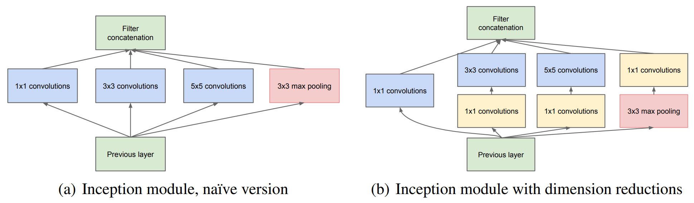

# Going deeper with convolutions
GoogLeNet, 2014-9-17 https://arxiv.org/abs/1409.4842

## 阅读笔记
* [pytorch实现](https://github.com/pytorch/vision/blob/main/torchvision/models/googlenet.py)

## Abstract
We propose a deep convolutional neural network architecture codenamed Inception, which was responsible for setting the new state of the art for classification and detection in the ImageNet Large-Scale Visual Recognition Challenge 2014 (ILSVRC14). The main hallmark of this architecture is the improved utilization of the computing resources inside the network. This was achieved by a carefully crafted design that allows for increasing the depth and width of the network while keeping the computational budget constant. To optimize quality, the architectural decisions were based on the Hebbian principle and the intuition of multi-scale processing. One particular incarnation used in our submission for ILSVRC14 is called GoogLeNet, a 22 layers deep network, the quality of which is assessed in the context of classification and detection. 

我们提出了一种深度卷积神经网络架构，代号为Inception，该架构负责为ImageNet大规模视觉识别挑战2014(ILSVRC14)中的分类和检测设置新SOTA。该架构的主要特点是提高了网络内算力的利用率。这是通过精心设计实现的，该设计允许增加网络的深度和宽度，同时保持计算量不变。为了优化质量，架构决策基于Hebbian原理和多尺度处理的直觉。我们提交了在ILSVRC14中使用的一种特殊形式称为GoogLeNet，它是一个22层深度网络，其质量在分类和检测的背景下进行评估。

 

## 1 Introduction
In the last three years, mainly due to the advances of deep learning, more concretely convolutional networks [10], the quality of image recognition and object detection has been progressing at a dramatic pace. One encouraging news is that most of this progress is not just the result of more powerful hardware, larger datasets and bigger models, but mainly a consequence of new ideas, algorithms and improved network architectures. No new data sources were used, for example, by the top entries in the ILSVRC 2014 competition besides the classification dataset of the same competition for detection purposes. Our GoogLeNet submission to ILSVRC 2014 actually uses 12× fewer parameters than the winning architecture of Krizhevsky et al [9] from two years ago, while being significantly more accurate. The biggest gains in object-detection have not come from the utilization of deep networks alone or bigger models, but from the synergy of deep architectures and classical computer vision, like the R-CNN algorithm by Girshick et al [6].

在过去三年中，主要由于深度学习的进步，更具体地说是卷积网络[10]，图像识别和目标检测的质量一直在以惊人的速度进步。一个令人鼓舞的消息是，这一进步的大部分不仅仅是更强大的硬件、更大的数据集和更大的模型的结果，而且主要是新思想、算法和改进的网络架构的结果。例如，除了用于检测目的的相同竞争的分类数据集之外，2014年ILSVRC竞赛的顶级参赛者没有使用新的数据源。我们向ILSVRC 2014提交的GoogLeNet实际使用的参数比两年前Krizhevskyet al [9]的获奖架构少12×12，但更准确。在目标检测方面，最大的收益并不是来自于单独使用深层网络或更大的模型，而是来自深层架构和经典计算机视觉的协同作用，如Girshicket al 的R-CNN算法[6]。

Another notable factor is that with the ongoing traction of mobile and embedded computing, the efficiency of our algorithms – especially their power and memory use – gains importance. It is noteworthy that the considerations leading to the design of the deep architecture presented in this paper included this factor rather than having a sheer fixation on accuracy numbers. For most of the experiments, the models were designed to keep a computational budget of 1.5 billion multiply-adds at inference time, so that the they do not end up to be a purely academic curiosity, but could be put to real world use, even on large datasets, at a reasonable cost. 

另一个值得注意的因素是，随着移动和嵌入式计算的不断发展，我们算法的效率 —— 尤其是其功率和内存使用率 —— 变得越来越重要。值得注意的是，本文中提出的导致深层建筑设计的考虑因素包括了这一因素，而不是完全固定在精度数字上。对于大多数实验来说，这些模型被设计为在推理时保持15亿次乘法加法的计算预算，这样它们就不会成为纯粹的学术好奇心，而是可以以合理的成本投入到实际应用中，即使是在大型数据集上。

In this paper, we will focus on an efficient deep neural network architecture for computer vision, codenamed Inception, which derives its name from the Network in network paper by Lin et al [12] in conjunction with the famous “we need to go deeper” internet meme [1]. In our case, the word “deep” is used in two different meanings: first of all, in the sense that we introduce a new level of organization in the form of the “Inception module” and also in the more direct sense of increased network depth. In general, one can view the Inception model as a logical culmination of [12] while taking inspiration and guidance from the theoretical work by Arora et al [2]. The benefits of the architecture are experimentally verified on the ILSVRC 2014 classification and detection challenges, on which it significantly outperforms the current state of the art. 

在本文中，我们将重点关注一种用于计算机视觉的高效深层神经网络架构，代号为Inception，其名称来源于Linet al [12]在网络论文中提出的网络，以及著名的“我们需要深入”网络迷因[1]。在我们的例子中，单词“deep”有两种不同的含义：首先，我们以“Inception模块”的形式引入了一个新的组织层次，也更直接地说是增加了网络深度。一般来说，人们可以将Inception模型视为[12]的逻辑顶点，同时从Aroraet al 的理论工作中获得灵感和指导[2]。该架构的优点在ILSVRC 2014分类和检测挑战中得到了实验验证，在这方面它明显优于当前技术水平。

## 2 Related Work 
Starting with LeNet-5 [10], convolutional neural networks (CNN) have typically had a standard structure – stacked convolutional layers (optionally followed by contrast normalization and maxpooling) are followed by one or more fully-connected layers. Variants of this basic design are prevalent in the image classification literature and have yielded the best results to-date on MNIST,CIFAR and most notably on the ImageNet classification challenge [9, 21]. For larger datasets such as Imagenet, the recent trend has been to increase the number of layers [12] and layer size [21, 14], while using dropout [7] to address the problem of overfitting.

从LeNet-5[10]开始，卷积神经网络(CNN)通常有一个标准结构 —— 卷积层堆叠(可选后接对比度归一化和最大池化)后接一个或多个完全连接的层。这种基本设计的变体在图像分类文献中很常见，迄今为止在MNIST、CIFAR和ImageNet分类挑战方面取得了最好的结果[9，21]。对于更大的数据集，如Imagenet，最近的趋势是增加层数[12]和层大小[21，14]，同时使用dropout[7]来解决过拟合问题。

Despite concerns that max-pooling layers result in loss of accurate spatial information, the same convolutional network architecture as [9] has also been successfully employed for localization [9, 14], object detection [6, 14, 18, 5] and human pose estimation [19]. Inspired by a neuroscience model of the primate visual cortex, Serre et al. [15] use a series of fixed Gabor filters of different sizes in order to handle multiple scales, similarly to the Inception model. However, contrary to the fixed 2-layer deep model of [15], all filters in the Inception model are learned. Furthermore, Inception layers are repeated many times, leading to a 22-layer deep model in the case of the GoogLeNet model.

尽管担心最大池化层会导致丢失准确的空间信息，但与[9]相同的卷积网络架构也已成功用于定位[9,14]、目标检测[6,14,18,5]和人体姿势估计[19]。受灵长类视觉皮层神经科学模型的启发，Serreet al [15]使用了一系列不同大小的固定Gabor卷积核来处理多个尺度，类似于Inception模型。然而，与[15]中固定的2层深度模型相反，Inception模型中的所有卷积核都被学习。此外，Inception层被多次重复，在GoogLeNet模型中导致了22层深度的模型。

Network-in-Network is an approach proposed by Lin et al. [12] in order to increase the representational power of neural networks. When applied to convolutional layers, the method could be viewed as additional 1×1 convolutional layers followed typically by the rectified linear activation [9]. This enables it to be easily integrated in the current CNN pipelines. We use this approach heavily in our architecture. However, in our setting, 1 × 1 convolutions have dual purpose: most critically, they are used mainly as dimension reduction modules to remove computational bottlenecks, that would otherwise limit the size of our networks. This allows for not just increasing the depth, but also the width of our networks without significant performance penalty.

网络中的网络是Linet al [12]为了提高神经网络的表示能力而提出的一种方法。当应用于卷积层时，该方法可被视为额外的1×1卷积层，之后通常跟一个ReLU[9]。这使得它能够轻松地集成到当前的CNN管道中。我们在架构中大量使用这种方法。然而，在我们的设置中，1×1卷积具有双重用途：最关键的是，它们主要用作降维模块，以消除计算瓶颈，否则会限制网络的大小。这不仅可以增加网络的深度，还可以增加网络宽度，而不会显著降低性能。

The current leading approach for object detection is the Regions with Convolutional Neural Networks (R-CNN) proposed by Girshick et al. [6]. R-CNN decomposes the overall detection problem into two subproblems: to first utilize low-level cues such as color and superpixel consistency for potential object proposals in a category-agnostic fashion, and to then use CNN classifiers to identify object categories at those locations. Such a two stage approach leverages the accuracy of bounding box segmentation with low-level cues, as well as the highly powerful classification power of state-of-the-art CNNs. We adopted a similar pipeline in our detection submissions, but have explored enhancements in both stages, such as multi-box [5] prediction for higher object bounding box recall, and ensemble approaches for better categorization of bounding box proposals. 

当前主要的目标检测方法是Girshicket al 提出的区域卷积神经网络(R-CNN)[6]。R-CNN将整个检测问题分解为两个子问题：首先利用颜色和超像素一致性等低级别线索，以类别无关的方式提出潜在目标候选区，然后使用CNN分类器识别这些位置的目标类别。这种两阶段的方法利用了边框分割的准确性和低级线索，以及最先进的CNN强大的分类能力。我们在提交的检测报告中采用了类似的管道，但在这两个阶段都进行了改进，例如对更高对象边框召回的多框[5]预测，以及对边框建议进行更好分类的集成方法。

## 3 Motivation and High Level Considerations  动机和高层次考虑
The most straightforward way of improving the performance of deep neural networks is by increasing their size. This includes both increasing the depth – the number of levels – of the network and its width: the number of units at each level. This is as an easy and safe way of training higher quality models, especially given the availability of a large amount of labeled training data. However this simple solution comes with two major drawbacks.

提高深度神经网络性能的最直接方法是增加其大小。这包括增加网络的深度(层数)和宽度(每层的单元数)。这是训练高质量模型的一种简单、安全的方法，尤其是考虑到大量标记的训练数据的可用性。然而，这个简单的解决方案有两个主要缺点。

Bigger size typically means a larger number of parameters, which makes the enlarged network more prone to overfitting, especially if the number of labeled examples in the training set is limited. This can become a major bottleneck, since the creation of high quality training sets can be tricky and expensive, especially if expert human raters are necessary to distinguish between fine-grained visual categories like those in ImageNet (even in the 1000-class ILSVRC subset) as demonstrated by Figure 1.

较大的规模通常意味着较大的参数数量，这使得扩大的网络更容易过拟合，特别是在训练集中标记样本数量有限的情况下。这可能成为一个主要的瓶颈，因为创建高质量的训练集可能很棘手，而且成本也很高，特别是如果需要专业的人工评分员来区分像ImageNet中那样的细粒度视觉类别(甚至在1000级ILSVRC子集中)，如图1所示。

Figure 1: Two distinct classes from the 1000 classes of the ILSVRC 2014 classification challenge. 
图1:ILSVRC 2014分类挑战中1000个类别中的两个不同类别。

Another drawback of uniformly increased network size is the dramatically increased use of computational resources. For example, in a deep vision network, if two convolutional layers are chained, any uniform increase in the number of their filters results in a quadratic increase of computation. If the added capacity is used inefficiently (for example, if most weights end up to be close to zero), then a lot of computation is wasted. Since in practice the computational budget is always finite, an efficient distribution of computing resources is preferred to an indiscriminate increase of size, even when the main objective is to increase the quality of results.

统一增加网络规模的另一个缺点是算力的使用急剧增加。例如，在深度视觉网络中，如果两个卷积层被连接，则其卷积核数量的任何均匀增加都会导致计算量的二次增加。如果增加的容量使用效率低下(例如，如果大多数权重接近于零)，则会浪费大量计算。因为在实践中，算力总是有限的，所以即使主要目标是提高结果的质量，有效地分配算力也比不加区别地增加规模更可取。

The fundamental way of solving both issues would be by ultimately moving from fully connected to sparsely connected architectures, even inside the convolutions. Besides mimicking biological systems, this would also have the advantage of firmer theoretical underpinnings due to the groundbreaking work of Arora et al. [2]. Their main result states that if the probability distribution of the data-set is representable by a large, very sparse deep neural network, then the optimal network topology can be constructed layer by layer by analyzing the correlation statistics of the activations of the last layer and clustering neurons with highly correlated outputs. Although the strict mathematical proof requires very strong conditions, the fact that this statement resonates with the well known Hebbian principle – neurons that fire together, wire together – suggests that the underlying idea is applicable even under less strict conditions, in practice.

解决这两个问题的基本方法是，最终从完全连接架构迁移到稀疏连接架构，甚至在内部使用卷积。除了模拟生物系统外，由于Aroraet al 的开创性工作，这还具有更坚实的理论基础的优势[2]。他们的主要结果表明，如果数据集的概率分布可以由一个大型、非常稀疏的深层神经网络表示，那么可以通过分析最后一层激活的相关统计信息并将输出高度相关的神经元聚类，逐层构建最佳网络拓扑。虽然严格的数学证明需要非常强的条件，但这一说法与众所周知的希伯来原理(神经元一起放电、连接在一起)相一致，这一事实表明，即使在不太严格的条件下，基本思想在实践中也是适用的。

On the downside, todays computing infrastructures are very inefficient when it comes to numerical calculation on non-uniform sparse data structures. Even if the number of arithmetic operations is reduced by 100×, the overhead of lookups and cache misses is so dominant that switching to sparse matrices would not pay off. The gap is widened even further by the use of steadily improving, highly tuned, numerical libraries that allow for extremely fast dense matrix multiplication, exploiting the minute details of the underlying CPU or GPU hardware [16, 9]. Also, non-uniform sparse models require more sophisticated engineering and computing infrastructure. Most current vision oriented machine learning systems utilize sparsity in the spatial domain just by the virtue of employing convolutions. However, convolutions are implemented as collections of dense connections to the patches in the earlier layer. ConvNets have traditionally used random and sparse connection tables in the feature dimensions since [11] in order to break the symmetry and improve learning, the trend changed back to full connections with [9] in order to better optimize parallel computing. The uniformity of the structure and a large number of filters and greater batch size allow for utilizing efficient dense computation.

缺点是，当涉及到非均匀稀疏数据结构的数值计算时，当今的计算基础设施效率非常低。即使算术运算的数量减少了100倍，查找和缓存未命中的开销仍然占主导地位，因此切换到稀疏矩阵也不会有回报。通过使用稳步改进、高度优化的数字库，允许极快速密集矩阵乘法，差距进一步拉大，利用底层CPU或GPU硬件的详情[16,9]。此外，非均匀稀疏模型需要更复杂的工程和计算基础设施。目前，大多数面向视觉的机器学习系统仅通过使用卷积来利用空间域中的稀疏性。然而，卷积被实现为与前一层分块的密集连接的集合。自[11]以来，ConvNets传统上在特征维度中使用随机和稀疏连接表，以打破对称性并改进学习，为了更好地优化并行计算，趋势变回与[9]完全连接。结构的一致性、大量卷积核和更大的批量允许利用高效的密集计算。

This raises the question whether there is any hope for a next, intermediate step: an architecture that makes use of the extra sparsity, even at filter level, as suggested by the theory, but exploits our 3 current hardware by utilizing computations on dense matrices. The vast literature on sparse matrix computations (e.g. [3]) suggests that clustering sparse matrices into relatively dense submatrices tends to give state of the art practical performance for sparse matrix multiplication. It does not seem far-fetched to think that similar methods would be utilized for the automated construction of non-uniform deep-learning architectures in the near future.

这就提出了下一个中间步骤是否有希望的问题：一个架构，它利用了额外的稀疏性，即使是在卷积核级别，正如理论所建议的那样，但通过利用稠密矩阵的计算来利用我们当前的个硬件。关于稀疏矩阵计算的大量文献(例如[3])表明，将稀疏矩阵聚类为相对稠密的子矩阵往往会为稀疏矩阵乘法提供最先进的实用性能。可以毫不牵强地认为，在不久的将来，类似的方法将用于非统一深度学习架构的自动构建。

The Inception architecture started out as a case study of the first author for assessing the hypothetical output of a sophisticated network topology construction algorithm that tries to approximate a sparse structure implied by [2] for vision networks and covering the hypothesized outcome by dense, readily available components. Despite being a highly speculative undertaking, only after two iterations on the exact choice of topology, we could already see modest gains against the reference architecture based on [12]. After further tuning of learning rate, hyperparameters and improved training methodology, we established that the resulting Inception architecture was especially useful in the context of localization and object detection as the base network for [6] and [5]. Interestingly, while most of the original architectural choices have been questioned and tested thoroughly, they turned out to be at least locally optimal.

Inception架构最初是作为第一作者的一个案例研究，用于评估复杂网络拓扑构建算法的假设输出，该算法试图近似[2]所暗示的视觉网络稀疏结构，并通过密集、可用的组件覆盖假设的结果。尽管这是一项高度推测性的工作，但只有在对拓扑的精确选择进行了两次迭代之后，我们才能看到相对于基于[12]的参考架构的适度收益。在进一步调整学习速率、超参数和改进的训练方法之后，我们确定了生成的Inception架构在定位和对象检测方面特别有用，作为[6]和[5]的基础网络。有趣的是，虽然大多数最初的架构选择都受到了彻底的质疑和测试，但结果证明它们至少是局部最优的。

One must be cautious though: although the proposed architecture has become a success for computer vision, it is still questionable whether its quality can be attributed to the guiding principles that have lead to its construction. Making sure would require much more thorough analysis and verification: for example, if automated tools based on the principles described below would find similar, but better topology for the vision networks. The most convincing proof would be if an automated system would create network topologies resulting in similar gains in other domains using the same algorithm but with very differently looking global architecture. At very least, the initial success of the Inception architecture yields firm motivation for exciting future work in this direction. 

然而，我们必须谨慎：尽管所提议的架构已经成为计算机视觉的一个成功，但其质量是否可以归因于导致其构建的指导原则仍然值得怀疑。确保这一点需要更彻底的分析和验证：例如，如果基于下面描述的原理的自动化工具能够为视觉网络找到相似但更好的拓扑结构。最令人信服的证据是，如果一个自动化系统能够创建网络拓扑，从而使用相同的算法在其他领域中获得类似的收益，但全局架构看起来截然不同。至少，Inception架构的最初成功为这一方向的未来工作带来了坚实的动力。

## 4 Architectural Details
The main idea of the Inception architecture is based on finding out how an optimal local sparse structure in a convolutional vision network can be approximated and covered by readily available dense components. Note that assuming translation invariance means that our network will be built from convolutional building blocks. All we need is to find the optimal local construction and to repeat it spatially. Arora et al. [2] suggests a layer-by layer construction in which one should analyze the correlation statistics of the last layer and cluster them into groups of units with high correlation. These clusters form the units of the next layer and are connected to the units in the previous layer. We assume that each unit from the earlier layer corresponds to some region of the input image and these units are grouped into filter banks. In the lower layers (the ones close to the input) correlated units would concentrate in local regions. This means, we would end up with a lot of clusters concentrated in a single region and they can be covered by a layer of 1×1 convolutions in the next layer, as suggested in [12]. However, one can also expect that there will be a smaller number of more spatially spread out clusters that can be covered by convolutions over larger patches, and there will be a decreasing number of patches over larger and larger regions. In order to avoid patchalignment issues, current incarnations of the Inception architecture are restricted to filter sizes 1×1, 3×3 and 5×5, however this decision was based more on convenience rather than necessity. It also means that the suggested architecture is a combination of all those layers with their output filter banks concatenated into a single output vector forming the input of the next stage. Additionally, since pooling operations have been essential for the success in current state of the art convolutional networks, it suggests that adding an alternative parallel pooling path in each such stage should have additional beneficial effect, too (see Figure 2(a)).

Inception架构的主要思想是，找出卷积视觉网络中的最优局部稀疏结构如何被可用的密集组件近似和覆盖。请注意，假设平移不变性意味着我们的网络将由卷积构建块构建。我们所需要的只是找到最佳的局部构造并在空间上重复它。Aroraet al [2]建议采用逐层结构，其中应分析最后一层的相关统计数据，并将其聚类为具有高相关性的单元组。这些簇形成下一层的单元，并连接到上一层中的单元。我们假设前一层的每个单元对应于输入图像的某个区域，并且这些单元被分组为卷积核组。在低层(靠近输入的层)，相关单元将集中在局部区域。这意味着，如[12]中所建议的，我们最终会在一个区域中集中许多簇，它们可以被下一层的1×1卷积层覆盖。然而，人们也可以预期，在更大的分块上，可以被卷积覆盖的空间分布更广的簇数量会更少，而在越来越大的区域上，分块数量会越来越少。为了避免分块对齐问题，Inception架构的当前版本仅限于卷积核大小1×1、3×3和5×5，但这一决定更多地基于便利性而非必要性。这也意味着建议的架构是所有这些层的组合，它们的输出卷积核组连接成一个单独的输出向量，形成下一阶段的输入。此外，由于池化操作对于当前最先进卷积网络的成功至关重要，因此建议在每个此类阶段添加替代并行池化路径也应具有额外的有益效果(见图2(a))。

As these “Inception modules” are stacked on top of each other, their output correlation statistics are bound to vary: as features of higher abstraction are captured by higher layers, their spatial concentration is expected to decrease suggesting that the ratio of 3×3 and 5×5 convolutions should increase as we move to higher layers.

由于这些“Inception模块”堆叠在一起，它们的输出相关统计必然会有所不同：随着更高层捕获更高抽象的特征，它们的空间集中度预计会降低，这表明随着我们向更高层移动，3×3和5×5卷积的比率应该会增加。

One big problem with the above modules, at least in this na¨ıve form, is that even a modest number of 5×5 convolutions can be prohibitively expensive on top of a convolutional layer with a large number of filters. This problem becomes even more pronounced once pooling units are added to the mix: their number of output filters equals to the number of filters in the previous stage. The merging of the output of the pooling layer with the outputs of convolutional layers would lead to an inevitable increase in the number of outputs from stage to stage. Even while this architecture might cover the optimal sparse structure, it would do it very inefficiently, leading to a computational blow up within a few stages.

上述模块的一个大问题是，至少在这种幼稚的形式下，在具有大量卷积核的卷积层上，即使是数量适中的5×5卷积也可能非常昂贵。一旦将池化单元添加到组合中，这个问题就变得更加明显：它们的输出卷积核数量等于前一阶段的卷积核数量。将池化层的输出与卷积层的输出合并将导致阶段间输出的数量不可避免地增加。即使这种架构可能覆盖最佳稀疏结构，它也会非常低效，导致几个阶段内的计算崩溃。

 

This leads to the second idea of the proposed architecture: judiciously applying dimension reductions and projections wherever the computational requirements would increase too much otherwise. This is based on the success of embeddings: even low dimensional embeddings might contain a lot of information about a relatively large image patch. However, embeddings represent information in a dense, compressed form and compressed information is harder to model. We would like to keep our representation sparse at most places (as required by the conditions of [2]) and compress the signals only whenever they have to be aggregated en masse. That is, 1×1 convolutions are used to compute reductions before the expensive 3×3 and 5×5 convolutions. Besides being used as reductions, they also include the use of rectified linear activation which makes them dual-purpose. The final result is depicted in Figure 2(b).

这引出了拟议架构的第二个想法：在计算需求增加过多的地方明智地应用降维和投影。这是基于嵌入的成功：即使是低维嵌入也可能包含大量有关较大图像分块的信息。然而，嵌入以密集的压缩形式表示信息，而压缩信息更难建模。我们希望在大多数地方保持我们的表示稀疏(根据[2]的条件要求)，并且只在必须聚合信号时压缩信号。即,在昂贵的3×3和5×5卷积之前，使用1×1卷积来计算约简。除了用作还原，它们还包括使用整流线性激活，这使它们具有双重用途。最终结果如图2(b)所示。

In general, an Inception network is a network consisting of modules of the above type stacked upon each other, with occasional max-pooling layers with stride 2 to halve the resolution of the grid. For technical reasons (memory efficiency during training), it seemed beneficial to start using Inception modules only at higher layers while keeping the lower layers in traditional convolutional fashion. This is not strictly necessary, simply reflecting some infrastructural inefficiencies in our current implementation.

一般来说，Inception网络是由上述类型的模块相互堆叠而成的网络，偶尔会出现最大池化层，步幅为2，以将网格的分辨率减半。出于技术原因(训练期间的内存效率)，似乎只在较高的层开始使用Inception模块，而以传统的卷积方式保留较低的层是有益的。这并不是绝对必要的，只是反映了我们当前实施中的一些基础设施效率低下。

One of the main beneficial aspects of this architecture is that it allows for increasing the number of units at each stage significantly without an uncontrolled blow-up in computational complexity. The ubiquitous use of dimension reduction allows for shielding the large number of input filters of the last stage to the next layer, first reducing their dimension before convolving over them with a large patch size. Another practically useful aspect of this design is that it aligns with the intuition that visual information should be processed at various scales and then aggregated so that the next stage can abstract features from different scales simultaneously.

该架构的一个主要优点是，它允许显著增加每个阶段的单元数，而不会造成计算复杂性的失控膨胀。降维的普遍使用允许将上一级的大量输入卷积核掩码到下一层，首先降低它们的维数，然后用较大的分块大小卷积它们。这种设计的另一个实际有用的方面是，它与视觉信息应在不同尺度上处理然后聚合的直觉相一致，以便下一阶段可以同时从不同尺度上提取特征。

The improved use of computational resources allows for increasing both the width of each stage as well as the number of stages without getting into computational difficulties. Another way to utilize the inception architecture is to create slightly inferior, but computationally cheaper versions of it. We have found that all the included the knobs and levers allow for a controlled balancing of computational resources that can result in networks that are 2 − 3× faster than similarly performing networks with non-Inception architecture, however this requires careful manual design at this point. 

算力的改进使用允许增加每个阶段的宽度和阶段的数量，而不会造成计算困难。利用Inception架构的另一种方法是创建稍差但计算成本较低的版本。我们发现，所有包含的旋钮和杠杆都允许控制算力的平衡，从而形成比具有非Inception架构的类似网络性能快2−3倍，但此时需要仔细的手动设计。

## 5 GoogLeNet
We chose GoogLeNet as our team-name in the ILSVRC14 competition. This name is an homage to Yann LeCuns pioneering LeNet 5 network [10]. We also use GoogLeNet to refer to the particular incarnation of the Inception architecture used in our submission for the competition. We have also used a deeper and wider Inception network, the quality of which was slightly inferior, but adding it to the ensemble seemed to improve the results marginally. We omit the details of that network, since our experiments have shown that the influence of the exact architectural parameters is relatively minor. Here, the most successful particular instance (named GoogLeNet) is described in Table 1 for demonstrational purposes. The exact same topology (trained with different sampling methods) was used for 6 out of the 7 models in our ensemble.

在ILSVRC14比赛中，我们选择GoogLeNet作为我们的团队名称。这个名字是对Yann LeCuns开创的LeNet 5网络的致敬[10]。我们还使用GoogLeNet来指代我们提交的比赛中使用的Inception架构的具体体现。我们还使用了更深更广的Inception网络，其质量稍差，但将其添加到集合中似乎略微改善了结果。我们忽略了该网络的细节，因为我们的实验表明，准确的架构参数的影响相对较小。这里，出于演示目的，表1描述了最成功的特定实例(名为GoogLeNet)。我们集合中的7个模型中有6个使用了完全相同的拓扑结构(使用不同的采样方法训练)。

Table 1: GoogLeNet incarnation of the Inception architecture 
表1:Inception架构的GoogLeNet体现

All the convolutions, including those inside the Inception modules, use rectified linear activation. The size of the receptive field in our network is 224×224 taking RGB color channels with mean subtraction. “#3×3 reduce” and “#5×5 reduce” stands for the number of 1×1 filters in the reduction layer used before the 3×3 and 5×5 convolutions. One can see the number of 1×1 filters in the projection layer after the built-in max-pooling in the pool proj column. All these reduction/projection layers use rectified linear activation as well.

所有卷积，包括Inception模块内的卷积，都使用ReLU。我们网络中的感受野大小为224×224，采用平均减法的RGB颜色通道。“#3×3 reduce”和“#5×5 reduce“表示在3×3和5×5卷积之前使用的还原层中的1×1卷积核的数量。在pool proj列中内置的最大池化之后，可以看到投影层中1×1个卷积核的数量。所有这些还原/投影层也使用ReLU。

The network was designed with computational efficiency and practicality in mind, so that inference can be run on individual devices including even those with limited computational resources, especially with low-memory footprint. The network is 22 layers deep when counting only layers with parameters (or 27 layers if we also count pooling). The overall number of layers (independent building blocks) used for the construction of the network is about 100. However this number depends on the machine learning infrastructure system used. The use of average pooling before the classifier is based on [12], although our implementation differs in that we use an extra linear layer. This enables adapting and fine-tuning our networks for other label sets easily, but it is mostly convenience and we do not expect it to have a major effect. It was found that a move from fully connected layers to average pooling improved the top-1 accuracy by about 0.6%, however the use of dropout remained essential even after removing the fully connected layers.

该网络的设计考虑了计算效率和实用性，因此推理可以在单个设备上运行，包括算力有限的设备，尤其是内存占用较少的设备。当仅计算带参数的层时，网络深度为22层(如果还计算池化，则为27层)。用于构建网络的总层数(独立构建块)约为100。然而，这一数字取决于所使用的机器学习基础设施系统。在分类器之前使用平均池化是基于[12]的，尽管我们的实现不同，因为我们使用了一个额外的线性层。这使我们能够轻松地调整和微调我们的网络以适应其他标签集，但这主要是方便的，我们不希望它产生重大影响。研究发现，从全连接层到平均池化的移动将top 1的准确性提高了约0.6%，但即使在删除全连接层后，仍然需要使用dropout。

Given the relatively large depth of the network, the ability to propagate gradients back through all the layers in an effective manner was a concern. One interesting insight is that the strong performance of relatively shallower networks on this task suggests that the features produced by the layers in the middle of the network should be very discriminative. By adding auxiliary classifiers connected to these intermediate layers, we would expect to encourage discrimination in the lower stages in the classifier, increase the gradient signal that gets propagated back, and provide additional regularization. These classifiers take the form of smaller convolutional networks put on top of the output of the Inception (4a) and (4d) modules. During training, their loss gets added to the total loss of the network with a discount weight (the losses of the auxiliary classifiers were weighted by 0.3). At inference time, these auxiliary networks are discarded.

考虑到网络的深度相对较大，以有效方式将梯度传播回所有层的能力令人担忧。一个有趣的发现是，相对较浅的网络在这项任务中的强大性能表明，网络中间层产生的特征应该具有很强的区分性。通过添加连接到这些中间层的辅助分类器，我们期望在分类器的较低阶段鼓励区分，增加传播回来的梯度信号，并提供额外的正则化。这些分类器以较小的卷积网络的形式放置在Inception(4a)和(4d)模块的输出之上。在训练期间，他们的损失以折扣权重加到网络的总损失中(辅助分类器的损失加权为0.3)。在推理时，这些辅助网络被丢弃。

The exact structure of the extra network on the side, including the auxiliary classifier, is as follows:
* An average pooling layer with 5×5 filter size and stride 3, resulting in an 4×4×512 output for the (4a), and 4×4×528 for the (4d) stage. 6 input
* A 1×1 convolution with 128 filters for dimension reduction and rectified linear activation.
* A fully connected layer with 1024 units and rectified linear activation.
* A dropout layer with 70% ratio of dropped outputs.
* A linear layer with softmax loss as the classifier (predicting the same 1000 classes as the main classifier, but removed at inference time).

侧面额外网络(包括辅助分类器)的确切结构如下：
* 具有5×5卷积核大小和步幅3的平均池化层，导致(4a)输出为4×4×512，(4d)级输出为4 x 4×528。6输入
* 带有128个卷积核的1×1卷积，用于降维和校正线性激活。
* 具有1024个单元和整流线性激活的全连接层。
* 输出下降率为70%的下降层。
* 以softmax损失作为分类器的线性层(预测与主分类器相同的1000个类，但在推理时删除)。

Figure 3: GoogLeNet network with all the bells and whistles 7
图3:GoogLeNet网络，具有所有提示信息7

A schematic view of the resulting network is depicted in Figure 3. 
结果网络的示意图如图3所示。

## 6 Training Methodology
Our networks were trained using the DistBelief [4] distributed machine learning system using modest amount of model and data-parallelism. Although we used CPU based implementation only, a rough estimate suggests that the GoogLeNet network could be trained to convergence using few high-end GPUs within a week, the main limitation being the memory usage. Our training used asynchronous stochastic gradient descent with 0.9 momentum [17], fixed learning rate schedule (decreasing the learning rate by 4% every 8 epochs). Polyak averaging [13] was used to create the final model used at inference time.

我们的网络使用DistBelief[4]分布式机器学习系统进行训练，该系统使用了适度的模型和数据并行性。虽然我们只使用基于CPU的实现，但粗略估计，GoogLeNet网络可以在一周内使用少量高端GPU进行收敛训练，主要限制是内存使用。我们的训练使用了具有0.9动量的异步随机梯度下降[17]，固定的学习速率计划(每8个周期将学习速率降低4%)。Polyak平均值[13]用于创建推理时使用的最终模型。

Our image sampling methods have changed substantially over the months leading to the competition, and already converged models were trained on with other options, sometimes in conjunction with changed hyperparameters, like dropout and learning rate, so it is hard to give a definitive guidance to the most effective single way to train these networks. To complicate matters further, some of the models were mainly trained on smaller relative crops, others on larger ones, inspired by [8]. Still, one prescription that was verified to work very well after the competition includes sampling of various sized patches of the image whose size is distributed evenly between 8% and 100% of the image area and whose aspect ratio is chosen randomly between 3/4 and 4/3. Also, we found that the photometric distortions by Andrew Howard [8] were useful to combat overfitting to some extent. In addition, we started to use random interpolation methods (bilinear, area, nearest neighbor and cubic, with equal probability) for resizing relatively late and in conjunction with other hyperparameter changes, so we could not tell definitely whether the final results were affected positively by their use. 

在比赛之前的几个月里，我们的图像采样方法已经发生了很大的变化，并且已经用其他选项训练了收敛模型，有时还结合了变化的超参数，如dropout和学习率，因此很难对训练这些网络的最有效的单一方法给出明确的指导。更复杂的是，受[8]的启发，一些模型主要针对相对较小的剪裁，其他模型则针对相对较大的剪裁。尽管如此，一个在比赛后被证明非常有效的处方包括对图像的各种大小的分块进行采样，这些分块的大小均匀分布在图像面积的8%到100%之间，其纵横比在3/4到4/3之间随机选择。此外，我们还发现Andrew Howard[8]的光度畸变在一定程度上有助于防止过拟合。此外，我们开始使用随机插值方法(双线性、面积、最近邻和立方，概率相等)来重新调整大小，时间相对较晚，并结合其他超参数变化，因此我们无法确定最终结果是否受到其使用的积极影响。

## 7 ILSVRC 2014 Classification Challenge Setup and Results
The ILSVRC 2014 classification challenge involves the task of classifying the image into one of 1000 leaf-node categories in the Imagenet hierarchy. There are about 1.2 million images for training, 50,000 for validation and 100,000 images for testing. Each image is associated with one ground truth category, and performance is measured based on the highest scoring classifier predictions. Two numbers are usually reported: the top-1 accuracy rate, which compares the ground truth against the first predicted class, and the top-5 error rate, which compares the ground truth against the first 5 predicted classes: an image is deemed correctly classified if the ground truth is among the top-5, regardless of its rank in them. The challenge uses the top-5 error rate for ranking purposes.

ILSVRC 2014分类挑战涉及将图像分类为Imagenet层次结构中1000个叶节点类别之一的任务。大约有120万张图像用于训练，50000张用于验证，100000张用于测试。每幅图像都与一个地面真相类别相关联，性能是根据评分最高的分类器预测来衡量的。通常会报告两个数字：top-1精度，它将地面真相与第一个预测类别进行比较; top-5错误率，它把地面真相与前五个预测类别相比较：如果地面真相在前五个类别中，无论其排名如何，图像都被视为正确分类。该挑战使用top-5错误率进行排名。

We participated in the challenge with no external data used for training. In addition to the training techniques aforementioned in this paper, we adopted a set of techniques during testing to obtain a higher performance, which we elaborate below.
1. We independently trained 7 versions of the same GoogLeNet model (including one wider version), and performed ensemble prediction with them. These models were trained with the same initialization (even with the same initial weights, mainly because of an oversight) and learning rate policies, and they only differ in sampling methodologies and the random order in which they see input images.
2. During testing, we adopted a more aggressive cropping approach than that of Krizhevsky et al. [9]. Specifically, we resize the image to 4 scales where the shorter dimension (height or width) is 256, 288, 320 and 352 respectively, take the left, center and right square of these resized images (in the case of portrait images, we take the top, center and bottom squares). For each square, we then take the 4 corners and the center 224×224 crop as well as the square resized to 224×224, and their mirrored versions. This results in 4×3×6×2 = 144 crops per image. A similar approach was used by Andrew Howard [8] in the previous year’s entry, which we empirically verified to perform slightly worse than the proposed scheme.We note that such aggressive cropping may not be necessary in real applications, as the benefit of more crops becomes marginal after a reasonable number of crops are present (as we will show later on).
3. The softmax probabilities are averaged over multiple crops and over all the individual classifiers to obtain the final prediction. In our experiments we analyzed alternative approaches on the validation data, such as max pooling over crops and averaging over classifiers, but they lead to inferior performance than the simple averaging.

我们参加了这次挑战，没有使用外部数据进行训练。除了本文中提到的训练技巧外，我们在测试期间还采用了一系列技巧，以获得更高的性能，我们将在下面详细介绍。
1. 我们独立训练了同一GoogLeNet模型的7个版本(包括一个更宽的版本)，并用它们进行了集成预测。这些模型使用相同的Inception化(即使Inception权重相同，主要是因为疏忽)和学习率策略进行训练，它们只在采样方法和看到输入图像的随机顺序上有所不同。
2. 在测试期间，我们采用了比Krizhevskyet al 更积极的裁剪方法[9]。具体来说，我们将图像调整为4个比例，其中较短的尺寸(高度或宽度)分别为256、288、320和352，取这些调整过大小的图像的左、中、右方块(对于纵向图像，我们取上、中、下方块)。然后，对于每个方块，我们取4个角和中心224×224裁剪，以及调整为224×244的方块及其镜像版本。这导致每张图像有4×3×6×2=144个剪裁。安德鲁·霍华德(Andrew Howard)[8]在前一年的条目中使用了类似的方法，我们通过经验验证，该方法的性能略低于提议的方案。我们注意到，在实际应用中，这种积极的种植可能没有必要，因为在种植了合理数量的剪裁后，更多剪裁的益处就变得微不足道了(我们稍后将展示)。
3. 对多个剪裁和所有单个分类器的softmax概率进行平均，以获得最终预测。在我们的实验中，我们分析了验证数据的替代方法，例如剪裁最大池化和分类器平均，但它们的性能不如简单平均。

Table 2: Classification performance
表2：分类性能

Table 3: GoogLeNet classification performance break down 
表3:GoogLeNet分类性能分解

In the remainder of this paper, we analyze the multiple factors that contribute to the overall performance of the final submission.

在本文的剩余部分，我们分析了影响最终提交文件总体性能的多个因素。

Our final submission in the challenge obtains a top-5 error of 6.67% on both the validation and testing data, ranking the first among other participants. This is a 56.5% relative reduction compared to the SuperVision approach in 2012, and about 40% relative reduction compared to the previous year’s best approach (Clarifai), both of which used external data for training the classifiers. The following table shows the statistics of some of the top-performing approaches.

我们在挑战赛中的最终提交在验证和测试数据上均获得6.67%的top-5错误率，在其他参与者中排名第一。这与2012年的SuperVision方法相比，相对减少了56.5%，与上一年的最佳方法(Clarifai)相比，相对降低了约40%，这两种方法都使用外部数据来训练分类器。下表显示了一些表现最好的方法的统计数据。

We also analyze and report the performance of multiple testing choices, by varying the number of models and the number of crops used when predicting an image in the following table. When we use one model, we chose the one with the lowest top-1 error rate on the validation data. All numbers are reported on the validation dataset in order to not overfit to the testing data statistics. 

我们还通过改变下表中预测图像时使用的模型数量和剪裁数量来分析和报告多种测试选择的性能。当我们使用一个模型时，我们选择了验证数据中top-1错误率最低的模型。所有数字都报告在验证数据集上，以免超出测试数据统计。

## 8 ILSVRC 2014 Detection Challenge Setup and Results
The ILSVRC detection task is to produce bounding boxes around objects in images among 200 possible classes. Detected objects count as correct if they match the class of the groundtruth and their bounding boxes overlap by at least 50% (using the Jaccard index). Extraneous detections count as false positives and are penalized. Contrary to the classification task, each image may contain many objects or none, and their scale may vary from large to tiny. Results are reported using the mean average precision (mAP).

ILSVRC检测任务是在200个可能的类中生成图像中对象周围的边框。如果检测到的对象与groundtruth的类匹配，并且其边框重叠至少50%(使用Jaccard索引)，则视为正确。外来检测被视为误报，并受到处罚。与分类任务相反，每个图像可能包含许多对象，也可能不包含任何对象，并且它们的比例可能从大到小不等。使用平均精度(mAP)报告结果。

Table 4: Detection performance
表4：检测性能

Table 5: Single model performance for detection 
表5：用于检测的单个模型性能

The approach taken by GoogLeNet for detection is similar to the R-CNN by [6], but is augmented with the Inception model as the region classifier. Additionally, the region proposal step is improved by combining the Selective Search [20] approach with multi-box [5] predictions for higher object bounding box recall. In order to cut down the number of false positives, the superpixel size was increased by 2×. This halves the proposals coming from the selective search algorithm. We added back 200 region proposals coming from multi-box [5] resulting, in total, in about 60% of the proposals used by [6], while increasing the coverage from 92% to 93%. The overall effect of cutting the number of proposals with increased coverage is a 1% improvement of the mean average precision for the single model case. Finally, we use an ensemble of 6 ConvNets when classifying each region which improves results from 40% to 43.9% accuracy. Note that contrary to R-CNN, we did not use bounding box regression due to lack of time.

GoogLeNet用于检测的方法类似于[6]的R-CNN，但使用Inception模型作为区域分类器进行了扩展。此外，区域建议步骤通过将选择性搜索[20]方法与多框[5]预测相结合来改进，以实现更高的对象边框召回。为了减少假阳性的数量，将超像素大小增加了2倍。这使得来自选择性搜索算法的提议减半。我们添加了来自多框[5]的200个区域提案，总共约占[6]所用提案的60%，同时将覆盖率从92%提高到93%。减少提案数量并增加覆盖范围的总体效果是，单个模型案例的平均精度提高了1%。最后，在对每个区域进行分类时，我们使用了6个ConvNets集合，从而将结果的准确性从40%提高到43.9%。注意，与R-CNN相反，由于时间不够，我们没有使用边框回归。

We first report the top detection results and show the progress since the first edition of the detection task. Compared to the 2013 result, the accuracy has almost doubled. The top performing teams all use Convolutional Networks. We report the official scores in Table 4 and common strategies for each team: the use of external data, ensemble models or contextual models. The external data is typically the ILSVRC12 classification data for pre-training a model that is later refined on the detection data. Some teams also mention the use of the localization data. Since a good portion of the localization task bounding boxes are not included in the detection dataset, one can pre-train a general bounding box regressor with this data the same way classification is used for pre-training. The GoogLeNet entry did not use the localization data for pretraining.

我们首先报告顶级检测结果，并显示自第一版检测任务以来的进展。与2013年的结果相比，准确度几乎翻了一番。表现最好的团队都使用卷积网络。我们在表4中报告了官方分数和每个团队的常见策略：使用外部数据、集成模型或上下文模型。外部数据通常是ILSVRC12分类数据，用于预先训练模型，然后根据检测数据进行细化。一些团队还提到了局部化数据的使用。由于检测数据集中不包含大部分局部化任务边框，因此可以使用此数据预训练通用边框回归器，方法与预训练中使用分类的方法相同。GoogLeNet条目未使用局部化数据进行预训练。

In Table 5, we compare results using a single model only. The top performing model is by Deep Insight and surprisingly only improves by 0.3 points with an ensemble of 3 models while the GoogLeNet obtains significantly stronger results with the ensemble. 

在表5中，我们仅使用单个模型比较结果。表现最好的模型是Deep Insight，令人惊讶的是，3个模型的组合只提高了0.3点，而GoogLeNet的组合获得了明显更强的结果。

## 9 Conclusions
Our results seem to yield a solid evidence that approximating the expected optimal sparse structure by readily available dense building blocks is a viable method for improving neural networks for computer vision. The main advantage of this method is a significant quality gain at a modest increase of computational requirements compared to shallower and less wide networks. Also note that our detection work was competitive despite of neither utilizing context nor performing bounding box regression and this fact provides further evidence of the strength of the Inception architecture. Although it is expected that similar quality of result can be achieved by much more expensive networks of similar depth and width, our approach yields solid evidence that moving to sparser architectures is feasible and useful idea in general. This suggest promising future work towards creating sparser and more refined structures in automated ways on the basis of [2]. 

我们的结果似乎提供了一个可靠的证据，即通过可用的密集构造块近似预期的最佳稀疏结构是改进计算机视觉神经网络的可行方法。这种方法的主要优点是，与较浅和较宽的网络相比，在计算要求适度增加的情况下，质量显著提高。还要注意的是，尽管我们的检测工作既没有利用上下文，也没有执行边框回归，但我们的检测是有竞争力的，这一事实进一步证明了Inception架构的强大。尽管预计通过深度和宽度相似的更昂贵的网络可以实现类似的结果质量，但我们的方法提供了坚实的证据，证明迁移到更稀疏的架构是可行的，并且总体上是有用的。这表明，未来有望在[2]的基础上，以自动化方式创建更稀疏、更精细的结构。

## 10 Acknowledgements
We would like to thank Sanjeev Arora and Aditya Bhaskara for fruitful discussions on [2]. Also we are indebted to the DistBelief [4] team for their support especially to Rajat Monga, Jon Shlens, Alex Krizhevsky, Jeff Dean, Ilya Sutskever and Andrea Frome. We would also like to thank to Tom Duerig and Ning Ye for their help on photometric distortions. Also our work would not have been possible without the support of Chuck Rosenberg and Hartwig Adam.

我们要感谢Sanjeev Arora和Aditya Bhaskara就[2]进行了富有成果的讨论。我们还感谢DistBelief[4]团队的支持，尤其是Rajat Monga、Jon Shlens、Alex Krizhevsky、Jeff Dean、Ilya Sutskever和Andrea Frome。我们还要感谢Tom Duerig和Ning Ye在光度失真方面的帮助。此外，如果没有查克·罗森博格和哈特维格·亚当的支持，我们的工作是不可能完成的。

## References
1. Know your meme: We need to go deeper. http://knowyourmeme.com/memes/ we-need-to-go-deeper. Accessed: 2014-09-15.
2. Sanjeev Arora, Aditya Bhaskara, Rong Ge, and Tengyu Ma. Provable bounds for learning some deep representations. CoRR, abs/1310.6343, 2013.
3. ¨Umit V. C¸ ataly¨urek, Cevdet Aykanat, and Bora Uc¸ar. On two-dimensional sparse matrix partitioning: Models, methods, and a recipe. SIAM J. Sci. Comput., 32(2):656–683, February 2010.
4. Jeffrey Dean, Greg Corrado, Rajat Monga, Kai Chen, Matthieu Devin, Mark Mao, Marc’aurelio Ranzato, Andrew Senior, Paul Tucker, Ke Yang, Quoc V. Le, and Andrew Y. Ng. Large scale distributed deep networks. In P. Bartlett, F.c.n. Pereira, C.j.c. Burges, L. Bottou, and K.q. Weinberger, editors, Advances in Neural Information Processing Systems 25, pages 1232–1240. 2012.
5. Dumitru Erhan, Christian Szegedy, Alexander Toshev, and Dragomir Anguelov. Scalable object detection using deep neural networks. In Computer Vision and Pattern Recognition, 2014. CVPR 2014. IEEE Conference on, 2014.
6. Ross B. Girshick, Jeff Donahue, Trevor Darrell, and Jitendra Malik. Rich feature hierarchies for accurate object detection and semantic segmentation. In Computer Vision and Pattern Recognition, 2014. CVPR 2014. IEEE Conference on, 2014.
7. Geoffrey E. Hinton, Nitish Srivastava, Alex Krizhevsky, Ilya Sutskever, and Ruslan Salakhutdinov. Improving neural networks by preventing co-adaptation of feature detectors. CoRR, abs/1207.0580, 2012.
8. Andrew G. Howard. Some improvements on deep convolutional neural network based image classification. CoRR, abs/1312.5402, 2013.
9. Alex Krizhevsky, Ilya Sutskever, and Geoff Hinton. Imagenet classification with deep convolutional neural networks. In Advances in Neural Information Processing Systems 25, pages 1106–1114, 2012.
10. Y. LeCun, B. Boser, J. S. Denker, D. Henderson, R. E. Howard, W. Hubbard, and L. D. Jackel. Backpropagation applied to handwritten zip code recognition. Neural Comput., 1(4):541–551, December 1989.
11. Yann LeCun, L´eon Bottou, Yoshua Bengio, and Patrick Haffner. Gradient-based learning applied to document recognition. Proceedings of the IEEE, 86(11):2278–2324, 1998.
12. Min Lin, Qiang Chen, and Shuicheng Yan. Network in network. CoRR, abs/1312.4400, 2013.
13. B. T. Polyak and A. B. Juditsky. Acceleration of stochastic approximation by averaging. SIAM J. Control Optim., 30(4):838–855, July 1992.
14. Pierre Sermanet, David Eigen, Xiang Zhang, Micha¨el Mathieu, Rob Fergus, and Yann LeCun. Overfeat: Integrated recognition, localization and detection using convolutional networks. CoRR, abs/1312.6229, 2013. 11
15. Thomas Serre, Lior Wolf, Stanley M. Bileschi, Maximilian Riesenhuber, and Tomaso Poggio. Robust object recognition with cortex-like mechanisms. IEEE Trans. Pattern Anal. Mach. Intell., 29(3):411–426, 2007.
16. Fengguang Song and Jack Dongarra. Scaling up matrix computations on shared-memory manycore systems with 1000 cpu cores. In Proceedings of the 28th ACM International Conference on Supercomputing, ICS ’14, pages 333–342, New York, NY, USA, 2014. ACM.
17. Ilya Sutskever, James Martens, George E. Dahl, and Geoffrey E. Hinton. On the importance of initialization and momentum in deep learning. In Proceedings of the 30th International Conference on Machine Learning, ICML 2013, Atlanta, GA, USA, 16-21 June 2013, volume 28 of JMLR Proceedings, pages 1139–1147. JMLR.org, 2013.
18. Christian Szegedy, Alexander Toshev, and Dumitru Erhan. Deep neural networks for object detection. In Christopher J. C. Burges, L´eon Bottou, Zoubin Ghahramani, and Kilian Q. Weinberger, editors, Advances in Neural Information Processing Systems 26: 27th Annual Conference on Neural Information Processing Systems 2013. Proceedings of a meeting held December 5-8, 2013, Lake Tahoe, Nevada, United States., pages 2553–2561, 2013.
19. Alexander Toshev and Christian Szegedy. Deeppose: Human pose estimation via deep neural networks. CoRR, abs/1312.4659, 2013.
20. Koen E. A. van de Sande, Jasper R. R. Uijlings, Theo Gevers, and Arnold W. M. Smeulders. Segmentation as selective search for object recognition. In Proceedings of the 2011 International Conference on Computer Vision, ICCV ’11, pages 1879–1886, Washington, DC, USA, 2011. IEEE Computer Society.
21. Matthew D. Zeiler and Rob Fergus. Visualizing and understanding convolutional networks. In David J. Fleet, Tom´as Pajdla, Bernt Schiele, and Tinne Tuytelaars, editors, Computer Vision - ECCV 2014 - 13th European Conference, Zurich, Switzerland, September 6-12, 2014, Proceedings, Part I, volume 8689 of Lecture Notes in Computer Science, pages 818–833. Springer, 2014. 12
