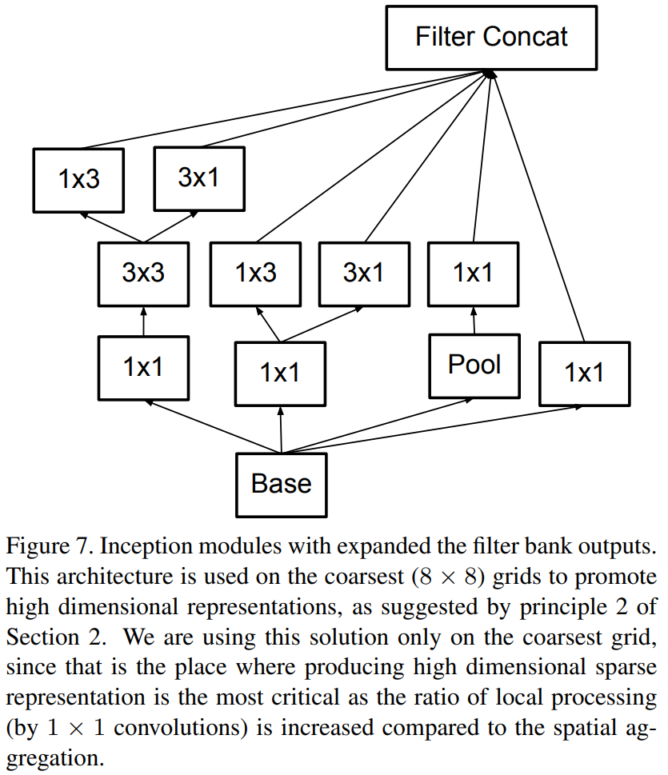

# Rethinking the Inception Architecture for Computer Vision
重新思考计算机视觉的Inception架构 2015.12.2 https://arxiv.org/abs/1512.00567

## 阅读笔记
* [pytorch实现](https://github.com/pytorch/vision/blob/main/torchvision/models/inception.py)
* factorized convolutions, 因式分解卷积,
    * 单层大卷积核可被多层小卷积核代替
    * Asymmetric Convolutions 非对称卷积， 早期不好，m×m特征图上，其中m在12到20 可以？
* regularization, 正则化
    * Auxiliary Classifiers 辅助分类器， 后期有作用，正则化
    * Label Smoothing 标签平滑实现模型正则化 (-1+0.001， 1-0.001)

## Abstract
Convolutional networks are at the core of most stateof-the-art computer vision solutions for a wide variety of tasks. Since 2014 very deep convolutional networks started to become mainstream, yielding substantial gains in various benchmarks. Although increased model size and computational cost tend to translate to immediate quality gains for most tasks (as long as enough labeled data is provided for training), computational efficiency and low parameter count are still enabling factors for various use cases such as mobile vision and big-data scenarios. Here we are exploring ways to scale up networks in ways that aim at utilizing the added computation as efficiently as possible by suitably factorized convolutions and aggressive regularization. We benchmark our methods on the ILSVRC 2012 classification challenge validation set demonstrate substantial gains over the state of the art: 21.2% top-1 and 5.6% top-5 error for single frame evaluation using a network with a computational cost of 5 billion multiply-adds per inference and with using less than 25 million parameters. With an ensemble of 4 models and multi-crop evaluation, we report 3.5% top-5 error and 17.3% top-1 error.

卷积网络是用于各种计算机视觉任务SOTA解决方案的核心。自2014年以来，非常深的卷积网络开始成为主流，在各种基准中取得了实质性进展。尽管模型尺寸和计算成本的增加往往会转化为大多数任务的即时质量提升(只要为训练提供足够的标注数据)，但计算效率和低参数计数仍然是各种用例(如移动视觉和大数据场景)的有利因素。在这里，我们正在探索通过适当的因式分解卷积和积极的正则化，以尽可能有效地利用增加的计算来扩大网络规模的方法。我们在ILSVRC 2012分类挑战验证集上对我们的方法进行了基准测试，结果表明，与现有技术相比，我们的方法取得了显著的进步：使用网络进行单帧评估时，top-1错误率21.2%，top-5错误率5.6%，每次推理的计算成本为50亿乘加，使用的参数少于2500万。在4个模型和多剪裁评估的集合中，我们报告了top-5错误率3.5%和top-1错误率17.3%。

## 1. Introduction
Since the 2012 ImageNet competition [16] winning entry by Krizhevsky et al [9], their network “AlexNet” has been successfully applied to a larger variety of computer vision tasks, for example to object-detection [5], segmentation [12], human pose estimation [22], video classification [8], object tracking [23], and superresolution [3]. These successes spurred a new line of research that focused on finding higher performing convolutional neural networks. Starting in 2014, the quality of network architectures significantly improved by utilizing deeper and wider networks. VGGNet [18] and GoogLeNet [20] yielded similarly high performance in the 2014 ILSVRC [16] classification challenge. One interesting observation was that gains in the classification performance tend to transfer to significant quality gains in a wide variety of application domains.

自2012年Krizhevskyet al [9]赢得ImageNet竞赛[16]以来，他们的网络“AlexNet”已成功应用于多种计算机视觉任务，例如目标检测[5]、分割[12]、人体姿势估计[22]、视频分类[8]、目标跟踪[23]和超分辨率[3]。这些成功推动了一系列新的研究，重点是寻找更高性能的卷积神经网络。从2014年开始，通过利用更深更广的网络，网络架构的质量显著提高。VGGNet[18]和GoogLeNet[20]在2014年ILSVRC[16]分类挑战中取得了类似的高绩效。一个有趣的观察结果是，在各种应用领域中，分类性能的提高往往会显著的转化为质量提高。

This means that architectural improvements in deep convolutional architecture can be utilized for improving performance for most other computer vision tasks that are increasingly reliant on high quality, learned visual features. Also, improvements in the network quality resulted in new application domains for convolutional networks in cases where AlexNet features could not compete with hand engineered, crafted solutions, e.g. proposal generation in detection[4].

这意味着，深度卷积架构中的架构改进可以用于提高大多数其他计算机视觉任务的性能，这些任务越来越依赖于高质量、学习过的视觉特征。此外，在AlexNet功能无法与手工设计、精心编制的解决方案竞争的情况下，网络质量的改进导致卷积网络出现了新的应用领域，例如检测中的候选区生成[4]。

Although VGGNet [18] has the compelling feature of architectural simplicity, this comes at a high cost: evaluating the network requires a lot of computation. On the other hand, the Inception architecture of GoogLeNet [20] was also designed to perform well even under strict constraints on memory and computational budget. For example, GoogleNet employed only 5 million parameters, which represented a 12× reduction with respect to its predecessor AlexNet, which used 60 million parameters. Furthermore, VGGNet employed about 3x more parameters than AlexNet.

尽管VGGNet[18]具有结构简单这一引人注目的特点，但这需要付出很高的代价：评估网络需要大量计算。另一方面，GoogLeNet[20]的Inception架构也被设计为即使在严格的内存和计算预算限制下也能很好地执行。例如，GoogleNet只使用了500万个参数，与使用6000万个参数的前身AlexNet相比，这意味着减少了12倍。此外，VGGNet使用的参数大约是AlexNet的3倍。

The computational cost of Inception is also much lower than VGGNet or its higher performing successors [6]. This has made it feasible to utilize Inception networks in big-data scenarios[17], [13], where huge amount of data needed to be processed at reasonable cost or scenarios where memory or computational capacity is inherently limited, for example in mobile vision settings. It is certainly possible to mitigate parts of these issues by applying specialized solutions to target memory use [2], [15] or by optimizing the execution of certain operations via computational tricks [10]. However, these methods add extra complexity. Furthermore, these methods could be applied to optimize the Inception architecture as well, widening the efficiency gap again.

Inception的计算成本也远低于VGGNet或其性能更高的后续版本[6]。这使得在大数据场景[17]、[13]中利用Inception网络成为可能，在这些场景中，需要以合理的成本处理大量数据，或者在内存或固有计算能力有限的场景中，例如在移动视觉环境中。通过将专门的解决方案应用于目标内存使用[2]、[15]或通过计算技巧优化某些操作的执行，当然可以部分缓解这些问题[10]。然而，这些方法增加了额外的复杂性。此外，这些方法还可以用于优化Inception架构，从而再次扩大效率差距。

Still, the complexity of the Inception architecture makes it more difficult to make changes to the network. If the architecture is scaled up naively, large parts of the computational gains can be immediately lost. Also, [20] does not provide a clear description about the contributing factors that lead to the various design decisions of the GoogLeNet architecture. This makes it much harder to adapt it to new use-cases while maintaining its efficiency. For example, if it is deemed necessary to increase the capacity of some Inception-style model, the simple transformation of just doubling the number of all filter bank sizes will lead to a 4x increase in both computational cost and number of parameters. This might prove prohibitive or unreasonable in a lot of practical scenarios, especially if the associated gains are modest. In this paper, we start with describing a few general principles and optimization ideas that that proved to be useful for scaling up convolution networks in efficient ways. Although our principles are not limited to Inceptiontype networks, they are easier to observe in that context as the generic structure of the Inception style building blocks is flexible enough to incorporate those constraints naturally. This is enabled by the generous use of dimensional reduction and parallel structures of the Inception modules which allows for mitigating the impact of structural changes on nearby components. Still, one needs to be cautious about doing so, as some guiding principles should be observed to maintain high quality of the models.

尽管如此，Inception架构的复杂性使得更难对网络进行更改。如果对架构进行幼稚的扩展，很大一部分计算收益可能会立即丢失。此外，[20]没有明确描述导致GoogLeNet架构的各种设计决策的因素。这使得它很难适应新的用例，同时保持其效率。例如，如果认为有必要增加一些Inception样式的模型容量，那么只需将所有卷积核大小的数量增加一倍的简单转换，就会导致计算成本和参数数量增加4倍。在许多实际情况下，如果相关收益不大，这可能被证明是禁止的或不合理的。在本文中，我们首先描述了一些公认的原则和优化思想，这些原则和思想被证明对有效地扩展卷积网络是有用的。尽管我们的原则并不局限于Inception类型的网络，但在这种情况下，它们更容易观察，因为Inception风格构建块的一般结构足够灵活，可以自然地融入这些约束。这是由于大量使用了Inception模块的降维和并行结构，从而能够减轻结构变化对附近组件的影响。不过，这样做需要谨慎，因为应该遵守一些指导原则，以保持模型的高质量。

## 2. General Design Principles 一般设计原则
Here we will describe a few design principles based on large-scale experimentation with various architectural choices with convolutional networks. At this point, the utility of the principles below are speculative and additional future experimental evidence will be necessary to assess their accuracy and domain of validity. Still, grave deviations from these principles tended to result in deterioration in the quality of the networks and fixing situations where those deviations were detected resulted in improved architectures in general.
1. Avoid representational bottlenecks, especially early in the network. Feed-forward networks can be represented by an acyclic graph from the input layer(s) to the classifier or regressor. This defines a clear direction for the information flow. For any cut separating the inputs from the outputs, one can access the amount of information passing though the cut. One should avoid bottlenecks with extreme compression. In general the representation size should gently decrease from the inputs to the outputs before reaching the final representation used for the task at hand. Theoretically, information content can not be assessed merely by the dimensionality of the representation as it discards important factors like correlation structure; the dimensionality merely provides a rough estimate of information content.
2. Higher dimensional representations are easier to process locally within a network. Increasing the activations per tile in a convolutional network allows for more disentangled features. The resulting networks will train faster.
3. Spatial aggregation can be done over lower dimensional embeddings without much or any loss in representational power. For example, before performing a more spread out (e.g. 3 × 3) convolution, one can reduce the dimension of the input representation before the spatial aggregation without expecting serious adverse effects. We hypothesize that the reason for that is the strong correlation between adjacent unit results in much less loss of information during dimension reduction, if the outputs are used in a spatial aggregation context. Given that these signals should be easily compressible, the dimension reduction even promotes faster learning.
4. Balance the width and depth of the network. Optimal performance of the network can be reached by balancing the number of filters per stage and the depth of the network. Increasing both the width and the depth of the network can contribute to higher quality networks. However, the optimal improvement for a constant amount of computation can be reached if both are increased in parallel. The computational budget should therefore be distributed in a balanced way between the depth and width of the network.

在这里，我们将描述一些基于大规模实验的设计原则，使用卷积网络的各种架构选择。在这一点上，以下原则的实用性是推测性的，未来需要更多的实验证据来评估其准确性和有效范围。尽管如此，严重偏离这些原则往往会导致网络质量的恶化，并在检测到这些偏离的情况下进行修复，从而总体上改善架构。
1. 避免表示性瓶颈，尤其是在网络早期。前馈网络可以用从输入层到分类器或回归器的非循环图表示。这为信息流定义了明确的方向。对于任何将输入与输出分离的切割，可以访问通过切割的信息量。应该避免使用极端压缩的瓶颈。通常，在达到手头任务所用的最终表示之前，表示大小应该从输入到输出逐渐减小。理论上，信息内容不能仅仅通过表征的维度来评估，因为它抛弃了诸如相关性结构等重要因素; 维度仅仅提供了信息内容的粗略估计。
2. 更高维度的表示更容易在网络中局部处理。在卷积网络中增加每层的激活可以实现更多的分离功能。由此产生的网络将训练得更快。
3. 空间聚集可以在低维嵌入上进行，而不会造成太多或任何表征能力损失。例如，在执行更广泛的(例如3×3)卷积之前，可以在空间聚集之前降低输入表示的维数，而不会产生严重的不利影响。我们假设，原因是，如果输出用于空间聚集上下文，相邻单元之间的强相关性会导致在降维过程中信息损失少得多。考虑到这些信号应该很容易压缩，降维甚至可以促进更快的学习。
4. 平衡网络的宽度和深度。通过平衡每个阶段的卷积核数量和网络深度，可以达到网络的最佳性能。增加网络的宽度和深度可以提高网络的质量。然而，如果两者并行增加，则可以实现恒定计算量的最佳改进。因此，计算预算应在网络深度和宽度之间均衡分配。

Although these principles might make sense, it is not straightforward to use them to improve the quality of networks out of box. The idea is to use them judiciously in ambiguous situations only.

尽管这些原则可能有意义，但要使用它们来改进开箱即用的网络质量并不容易。其目的是仅在模棱两可的情况下明智地使用它们。

## 3. Factorizing Convolutions with Large Filter Size 大尺寸卷积核的分解卷积
Much of the original gains of the GoogLeNet network [20] arise from a very generous use of dimension reduction. This can be viewed as a special case of factorizing convolutions in a computationally efficient manner. Consider for example the case of a 1 × 1 convolutional layer followed by a 3 × 3 convolutional layer. In a vision network, it is expected that the outputs of near-by activations are highly correlated. Therefore, we can expect that their activations can be reduced before aggregation and that this should result in similarly expressive local representations.

GoogLeNet网络的大部分原始收益都来自于对降维的大量使用。这可以看作是以计算效率的方式分解卷积的特殊情况。例如，考虑1×1卷积层后接3×3卷积层的情况。在视觉网络中，预期近距离激活的输出高度相关。因此，我们可以预期，它们的激活可以在聚合之前减少，这将导致类似的表达局部表示。

Here we explore other ways of factorizing convolutions in various settings, especially in order to increase the computational efficiency of the solution. Since Inception networks are fully convolutional, each weight corresponds to one multiplication per activation. Therefore, any reduction in computational cost results in reduced number of parameters. This means that with suitable factorization, we can end up with more disentangled parameters and therefore with faster training. Also, we can use the computational and memory savings to increase the filter-bank sizes of our network while maintaining our ability to train each model replica on a single computer.

在这里，我们探索了在各种情况下分解卷积的其他方法，特别是为了提高解的计算效率。由于Inception网络是完全卷积的，每个权重对应于每次激活的一个乘法。因此，计算成本的任何减少都会导致参数数量的减少。这意味着，通过适当的因式分解，我们可以得到更多的非纠缠参数，因此可以得到更快的训练。此外，我们可以利用节省的计算和内存来增加网络的卷积核组大小，同时保持在单个计算机上训练每个模型副本的能力。

 
Figure 1. Mini-network replacing the 5 × 5 convolutions.
图1.替换5×5卷积的小型网络。 

#### 3.1. Factorization into smaller convolutions 分解成更小的卷积
Convolutions with larger spatial filters (e.g. 5 × 5 or 7 × 7) tend to be disproportionally expensive in terms of computation. For example, a 5 × 5 convolution with n filters over a grid with m filters is 25/9 = 2.78 times more computationally expensive than a 3 × 3 convolution with the same number of filters. Of course, a 5×5 filter can capture dependencies between signals between activations of units further away in the earlier layers, so a reduction of the geometric size of the filters comes at a large cost of expressiveness. However, we can ask whether a 5 × 5 convolution could be replaced by a multi-layer network with less parameters with the same input size and output depth. If we zoom into the computation graph of the 5 × 5 convolution, we see that each output looks like a small fully-connected network sliding over 5×5 tiles over its input (see Figure 1). Since we are constructing a vision network, it seems natural to exploit translation invariance again and replace the fully connected component by a two layer convolutional architecture: the first layer is a 3 × 3 convolution, the second is a fully connected layer on top of the 3 × 3 output grid of the first layer (see Figure 1). Sliding this small network over the input activation grid boils down to replacing the 5 × 5 convolution with two layers of 3 × 3 convolution (compare Figure 4 with 5).

具有较大空间卷积核(例如5×5或7×7)的卷积在计算方面往往非常昂贵。例如，在具有m个卷积核的网格上，具有n个卷积核的5×5卷积的计算开销是具有相同数目卷积核的3×3卷积的25/9=2.78倍。当然，一个5×5的卷积核可以捕获更早层中更远单元的激活之间的信号依赖性，因此减小卷积核的几何尺寸会以很大的表现力代价。然而，我们可以问，在相同的输入尺寸和输出深度下，是否可以用参数较少的多层网络来代替5×5卷积。如果我们放大5×5卷积的计算图，我们会看到每个输出看起来像一个小的完全连接网络，在其输入上滑动5×5片(见图1)。由于我们正在构建视觉网络，再次利用平移不变性并用两层卷积结构替换完全连接的组件似乎很自然：第一层是3×3卷积，第二层是第一层3×3输出网格顶部的全连接层(见图1)。在输入激活网格上滑动这个小网络可以归结为将5×5卷积替换为两层3×3卷积(比较图4和5)。

This setup clearly reduces the parameter count by sharing the weights between adjacent tiles. To analyze the expected computational cost savings, we will make a few simplifying assumptions that apply for the typical situations: We can assume that n = αm, that is that we want to change the number of activations/unit by a constant alpha factor. Since the 5 × 5 convolution is aggregating, α is typically slightly larger than one (around 1.5 in the case of GoogLeNet). Having a two layer replacement for the 5 × 5 layer, it seems reasonable to reach this expansion in two steps: increasing the number of filters by $\sqrt{α}$ in both steps. In order to simplify our estimate by choosing α = 1 (no expansion), If we would naivly slide a network without reusing the computation between neighboring grid tiles, we would increase the computational cost. sliding this network can be represented by two 3 × 3 convolutional layers which reuses the activations between adjacent tiles. This way, we end up with a net $\frac{9+9}{25}$× reduction of computation, resulting in a relative gain of 28% by this factorization. The exact same saving holds for the parameter count as each parameter is used exactly once in the computation of the activation of each unit. Still, this setup raises two general questions: Does this replacement result in any loss of expressiveness? If our main goal is to factorize the linear part of the computation, would it not suggest to keep linear activations in the first layer? We have ran several control experiments (for example see figure 2) and using linear activation was always inferior to using rectified linear units in all stages of the factorization. We attribute this gain to the enhanced space of variations that the network can learn especially if we batchnormalize [7] the output activations. One can see similar effects when using linear activations for the dimension reduction components.

此设置通过在相邻分片之间共享权重，明显减少了参数计数。为了分析预期的计算成本节约，我们将做一些适用于典型情况的简化假设：我们可以假设n=αm，即,我们希望通过一个恒定的α因子改变激活次数/单位。由于5×5卷积正在聚集，α通常略大于1(对于GoogLeNet，约为1.5)。将5×5层替换为两层，似乎可以分两步实现此扩展：将卷积核数量增加两个$\sqrt{α}$步骤中的。为了通过选择α=1(无扩展)简化估算，如果我们简单地滑动网络而不重用相邻网格块之间的计算，我们将增加计算成本。滑动这个网络可以用两个3×3卷积层来表示，这两个卷积层重用了相邻分块之间的激活。这样，我们得到了净$\frac{9+9}{25}$×计算量的减少，通过这个因式分解得到了28%的相对增益。在计算每个单元的激活时，每个参数只使用一次，因此参数计数的保存完全相同。然而，这种设置提出了两个一般性问题：这种替换是否会导致表达能力的丧失？如果我们的主要目标是分解计算的线性部分，那么不建议将线性激活保留在第一层吗？我们进行了几个对照实验(例如见图2)，在因子分解的所有阶段，使用线性激活总是不如使用校正线性单位(ReLU)。我们将这种收益归因于网络可以学习的增强的变化空间，特别是如果我们批归一化[7]输出激活。当对尺寸缩减组件使用线性激活时，可以看到类似的效果。

Figure 2. One of several control experiments between two Inception models, one of them uses factorization into linear + ReLU layers, the other uses two ReLU layers. After 3.86 million operations, the former settles at 76.2%, while the latter reaches 77.2% top-1 Accuracy on the validation set. 
图2.两个Inception模型之间的几个控制实验之一，其中一个使用因子分解成线性+ReLU层，另一个使用两个ReLU层。在386万次操作后，验证集上的top-1精度前者到76.2%，后者达77.2%。

### 3.2. Spatial Factorization into Asymmetric Convolutions 非对称卷积的空间分解
The above results suggest that convolutions with filters larger 3 × 3 a might not be generally useful as they can always be reduced into a sequence of 3 × 3 convolutional layers. Still we can ask the question whether one should factorize them into smaller, for example 2×2 convolutions. However, it turns out that one can do even better than 2 × 2 by using asymmetric convolutions, e.g. n × 1. For example using a 3 × 1 convolution followed by a 1 × 3 convolution is equivalent to sliding a two layer network with the same receptive field as in a 3 × 3 convolution (see figure 3). Still the two-layer solution is 33% cheaper for the same number of output filters, if the number of input and output filters is equal. By comparison, factorizing a 3 × 3 convolution into a two 2 × 2 convolution represents only a 11% saving of computation.

上述结果表明，卷积核大于3×3的卷积通常不太有用，因为它们总是可以简化为3×3卷积层序列。我们仍然可以问一个问题，是否应该将它们分解成更小的，例如2×2卷积。然而，事实证明，使用非对称卷积(例如n×1)可以比2×2做得更好。例如，使用3×1卷积后再使用1×3卷积相当于滑动具有与3×3卷曲相同感受野的两层网络(见图3)。如果输入和输出卷积核的数量相等，对于相同数量的输出卷积核，两层解决方案仍然少33%。相比之下，将3×3卷积分解为2×2卷积只节省11%的计算量。

 
Figure 3. Mini-network replacing the 3 × 3 convolutions. The lower layer of this network consists of a 3 × 1 convolution with 3 output units. 
图3.替换3×3卷积的小型网络。该网络的下层由3×1卷积和3个输出单元组成。

 
Figure 4. Original Inception module as described in [20]. 
图4.原始Inception模块，如[20]所述。

In theory, we could go even further and argue that one can replace any n × n convolution followed by a n × 1 convolution and the computational cost saving increases dramatically as n grows (see figure 6). In practice, we have found that employing this factorization does not work well on early layers, but it gives very good results on medium grid-sizes (On m×m feature maps, where m ranges between 12 and 20). On that level, very good results can be achieved by using 1 × 7 convolutions followed by 7 × 1 convolutions.

理论上，我们可以更进一步，认为可以用n×1卷积替换任何n×n卷积，并且随着n的增长，计算成本节省显著增加(见图6)。在实践中，我们发现使用这种因式分解在早期层上效果不好，但在中等网格大小(在m×m特征图上，其中m在12到20之间)上可以得到很好的结果。在这个水平上，使用1×7卷积，然后再使用7×1卷积，可以获得非常好的结果。

 
Figure 5. Inception modules where each 5 × 5 convolution is replaced by two 3 × 3 convolution, as suggested by principle 3 of Section 2. 
图5.Inception模块，其中每个5×5卷积被两个3×3卷积代替，如第2节原则3所示。

## 4. Utility of Auxiliary Classifiers 辅助分类器的使用
[20] has introduced the notion of auxiliary classifiers to improve the convergence of very deep networks. The original motivation was to push useful gradients to the lower layers to make them immediately useful and improve the convergence during training by combating the vanishing gradient problem in very deep networks. Also Lee et al[11] argues that auxiliary classifiers promote more stable learning and better convergence. Interestingly, we found that auxiliary classifiers did not result in improved convergence early in the training: the training progression of network with and without side head looks virtually identical before both models reach high accuracy. Near the end of training, the network with the auxiliary branches starts to overtake the accuracy of the network without any auxiliary branch and reaches a slightly higher plateau.

[20] 引入了辅助分类器的概念，以改进深度网络的收敛性。最初的动机是将有用的梯度推到较低的层，使其立即有用，并通过在非常深的网络中消除梯度消失问题来提高训练期间的收敛性。Leeet al [11]也认为辅助分类器可以促进更稳定的学习和更好的收敛。有趣的是，我们发现辅助分类器在训练的早期并没有改善收敛性：在两个模型达到高精度之前，有侧头和无侧头网络的训练进度看起来几乎相同。在训练接近尾声时，带有辅助分支的网络开始超过没有任何辅助分支网络的精度，并达到稍高的水平。

Also [20] used two side-heads at different stages in the network. The removal of the lower auxiliary branch did not have any adverse effect on the final quality of the network. Together with the earlier observation in the previous paragraph, this means that original the hypothesis of [20] that these branches help evolving the low-level features is most likely misplaced. Instead, we argue that the auxiliary classifiers act as regularizer. This is supported by the fact that the main classifier of the network performs better if the side branch is batch-normalized [7] or has a dropout layer. This also gives a weak supporting evidence for the conjecture that batch normalization acts as a regularizer.

此外，[20]在网络的不同阶段使用了两个侧头。拆除底层辅助分支对网络的最终质量没有任何不利影响。与前一段中的早期观察结果一起，这意味着最初的假设[20]，即这些分支有助于演化低级特征，很可能是错误的。相反，我们认为辅助分类器充当正则化。这一点得到了这样一个事实的支持，即如果分支是批归一化的[7]或具有dropout层，则网络的主分类器性能更好。这也为批归一化作为正则化器的推测提供了微弱的支持证据。

 
Figure 6. Inception modules after the factorization of the n × n convolutions. In our proposed architecture, we chose n = 7 for the 17 × 17 grid. (The filter sizes are picked using principle 3) . 

图6.n×n卷积因式分解后的Inception模块。在我们提出的架构中，我们为17×17网格选择了n=7。(根据原则3选择卷积核尺寸)。

## 5. Efficient Grid Size Reduction 有效减小网格大小
Traditionally, convolutional networks used some pooling operation to decrease the grid size of the feature maps. In order to avoid a representational bottleneck, before applying maximum or average pooling the activation dimension of the network filters is expanded. For example, starting a d×d grid with k filters, if we would like to arrive at a $\frac{d}{2}×\frac{d}{2}$ grid with 2k filters, we first need to compute a stride-1 convolution with 2k filters and then apply an additional pooling step. This means that the overall computational cost is dominated by the expensive convolution on the larger grid using $2d^2k^2$ operations. One possibility would be to switch to pooling with convolution and therefore resulting in $2(\frac{d}{2})^2k^2$  reducing the computational cost by a quarter. However, this creates a representational bottlenecks as the overall dimensionality of the representation drops to $(\frac{d}{2})^2k$ resulting in less expressive networks (see Figure 9). Instead of doing so, we suggest another variant the reduces the computational cost even further while removing the representational bottleneck. (see Figure 10). We can use two parallel stride 2 blocks: P and C. P is a pooling layer (either average or maximum pooling) the activation, both of them are stride 2 the filter banks of which are concatenated as in figure 10. 

传统上，卷积网络使用一些池化操作来减小特征图的网格大小。为了避免表示性瓶颈，在应用最大或平均池化之前，应扩展网络卷积核的激活维度。例如，用k个卷积核启动一个d×d网格，如果我们想得到一个带2k个卷积核的$\frac{d}{2}×\frac{d}{2}$网格，我们首先需要用2k个卷积核计算一个跨步1卷积，然后应用一个额外的池化步骤。这意味着总体计算成本主要由使用$2d^2k^2$操作的较大网格上的昂贵卷积决定。一种可能是切换到使用卷积的池化，从而导致$2(\frac{d}{2})^2k^2$将计算成本减少四分之一。然而，这会造成表征瓶颈，因为表征的总体维度降至$(\frac{d}{2})^2k$，导致表达网络较少(见图9)。相反，我们建议使用另一种变体，在消除表征瓶颈的同时进一步降低计算成本。(见图10)。我们可以使用两个并行的步骤2块：P和C。P是激活的池化层(平均池化或最大池化)，它们都是步骤2，其卷积核组如图10所示串联。

 
Figure 7. Inception modules with expanded the filter bank outputs. This architecture is used on the coarsest (8 × 8) grids to promote high dimensional representations, as suggested by principle 2 of Section 2. We are using this solution only on the coarsest grid, since that is the place where producing high dimensional sparse representation is the most critical as the ratio of local processing (by 1 × 1 convolutions) is increased compared to the spatial aggregation. 
图7.扩展了卷积核组输出的Inception模块。正如第2节原则2所提出的那样，这种结构用于最粗糙的(8×8)网格，以促进高维表示。我们仅在最粗糙的网格上使用这种解决方案，因为这是产生高维稀疏表示的最关键的地方，因为与空间聚集相比，局部处理的比率(1×1卷积)增加了。

 
Figure 8. Auxiliary classifier on top of the last 17×17 layer. Batch normalization[7] of the layers in the side head results in a 0.4% absolute gain in top-1 accuracy. The lower axis shows the number of itertions performed, each with batch size 32. 
图8. 最后17×17层顶部的辅助分类器。侧面封头中各层的批归一化(BN)[7]可在前1精度中获得0.4%的绝对增益。下轴显示执行的迭代数，每个迭代的批次大小为32。

 
Figure 9. Two alternative ways of reducing the grid size. The solution on the left violates the principle 1 of not introducing an representational bottleneck from Section 2. The version on the right is 3 times more expensive computationally.
图9.减小网格大小的两种可选方法。左侧的解决方案违反了第2节中不引入表示性瓶颈的原则1。右侧的解决方案在计算上的开销是第2节的3倍。

 
Figure 10. Inception module that reduces the grid-size while expands the filter banks. It is both cheap and avoids the representational bottleneck as is suggested by principle 1. The diagram on the right represents the same solution but from the perspective of grid sizes rather than the operations.
图10.减少网格大小同时扩展卷积核组的Inception模块。它既便宜又避免了原则1所提出的表示瓶颈。右边的图表示相同的解决方案，但从网格大小而不是操作的角度来看。

## 6. Inception-v2
Here we are connecting the dots from above and propose a new architecture with improved performance on the ILSVRC 2012 classification benchmark. The layout of our network is given in table 1. Note that we have factorized the traditional 7 × 7 convolution into three 3 × 3 convolutions based on the same ideas as described in section 3.1. For the Inception part of the network, we have 3 traditional inception modules at the 35×35 with 288 filters each. This is reduced to a 17 × 17 grid with 768 filters using the grid reduction technique described in section 5. This is is followed by 5 instances of the factorized inception modules as depicted in figure 5. This is reduced to a 8 × 8 × 1280 grid with the grid reduction technique depicted in figure 10. At the coarsest 8 × 8 level, we have two Inception modules as depicted in figure 6, with a concatenated output filter bank size of 2048 for each tile. The detailed structure of the network, including the sizes of filter banks inside the Inception modules, is given in the supplementary material, given in the model.txt that is in the tar-file of this submission. However, we have observed that the quality of the network is relatively stable to variations as long as the principles from Section 2 are observed. Although our network is 42 layers deep, our computation cost is only about 2.5 higher than that of GoogLeNet and it is still much more efficient than VGGNet. 

在这里，我们将上述要点连接起来，并提出一种新的架构，该架构在ILSVRC 2012分类基准上具有改进的性能。我们的网络布局如表1所示。注意，我们已经根据第3.1节所述的相同思想将传统的7×7卷积分解为三个3×3卷积。对于网络的Inception部分，我们在35×35处有3个传统的Inception模块，每个模块有288个卷积核。使用第5节中描述的网格缩减技术，将网格缩减为17×17网格，其中包含768个卷积核。接下来是图5中描述的5个因子化Inception模块实例。使用图10中描述的栅格缩减技术，网格缩减为8×8×1280网格。在最粗的8×8级别，我们有两个Inception模块，如图6所示，每个磁贴的串联输出卷积核组大小为2048。网络的详细结构，包括Inception模块内卷积核组的大小，在模型中给出的补充材料中给出。此提交的tar文件中的model.txt。然而，我们观察到，只要遵守第2节中的原则，网络的质量相对稳定。虽然我们的网络有42层深，但我们的计算成本仅比GoogLeNet高2.5左右，而且比VGGNet效率更高。

Table 1. The outline of the proposed network architecture. The output size of each module is the input size of the next one. We are using variations of reduction technique depicted Figure 10 to reduce the grid sizes between the Inception blocks whenever applicable. We have marked the convolution with 0-padding, which is used to maintain the grid size. 0-padding is also used inside those Inception modules that do not reduce the grid size. All other layers do not use padding. The various filter bank sizes are chosen to observe principle 4 from Section 2.
表1.提出的网络架构概述。每个模块的输出大小是下一个模块的输入大小。我们正在使用图10所示的各种简化技术来减少Inception块之间的网格大小(只要适用)。我们用0填充标记了卷积，用于保持网格大小。在那些不减小网格大小的Inception模块中也使用了0-padding。所有其他层都不使用填充。选择不同的卷积核组尺寸是为了遵守第2节中的原则4。

## 7. Model Regularization via Label Smoothing 通过标签平滑实现模型正则化
Here we propose a mechanism to regularize the classifier layer by estimating the marginalized effect of label-dropout during training.

在这里，我们提出了一种机制，通过估计训练期间标签丢失的边缘化效应来规范分类器层。

For each training example x, our model computes the probability of each label k ∈ {1 . . . K}: 
$p(k|x) = \frac{exp(z_k)}{ \sum^K_{i=1}exp(z_i) }$. 
Here, $z_i$ are the logits or unnormalized logprobabilities. Consider the ground-truth distribution over labels q(k|x) for this training example, normalized so that $\sum_kq(k|x) = 1$. For brevity, let us omit the dependence of p and q on example x. We define the loss for the example as the cross entropy:  $l= −\sum^K_{k=1} log(p(k))q(k)$. Minimizing this is equivalent to maximizing the expected log-likelihood of a label, where the label is selected according to its ground-truth distribution q(k). Cross-entropy loss is differentiable with respect to the logits $z_k$ and thus can be used for gradient training of deep models. The gradient has a rather simple form: $\frac{∂_l}{∂_{z_k}} = p(k)−q(k)$, which is bounded between −1 and 1.

对于每个训练样本x，我们的模型计算每个标签k的概率∈ {1…K}:$p(k|x) = \frac{exp(z_k)}{ \sum^K_{i=1}exp(z_i) }$。这里，$z_i$ 是逻辑或非归一化对数概率。考虑这个训练样本的标签q(k|x)上的基本真值分布，将其归一化为$\sum_kq(k|x) = 1$。为了简单起见，让我们忽略P和q对样本x的依赖性。我们将样本的损失定义为交叉熵：$l= −\sum^K_{k=1} log(p(k))q(k)$。最小化这一点相当于最大化标签的预期对数似然，其中标签是根据其基本真值分布q(k)选择的。交叉熵损失对于logits $z_k$是可微的，因此可以用于深度模型的梯度训练。渐变的形式相当简单：$\frac{∂_l}{∂_{z_k}} = p(k)−q(k)$，其范围为−1和1。

Consider the case of a single ground-truth label y, so that q(y) = 1 and q(k) = 0 for all k 6 = y. In this case, minimizing the cross entropy is equivalent to maximizing the log-likelihood of the correct label. For a particular example x with label y, the log-likelihood is maximized for q(k) = $δ_{k,y}$, where δ_{k,y}$ is Dirac delta, which equals 1 for k = y and 0 otherwise. This maximum is not achievable for finite zk but is approached if $z_y >> z_k$ for all k  $\neq$ y – that is, if the logit corresponding to the ground-truth label is much great than all other logits. This, however, can cause two problems. First, it may result in over-fitting: if the model learns to assign full probability to the groundtruth label for each training example, it is not guaranteed to generalize. Second, it encourages the differences between the largest logit and all others to become large, and this, combined with the bounded gradient $\frac{∂_l}{∂_{z_k}}$ , reduces the ability of the model to adapt. Intuitively, this happens because the model becomes too confident about its predictions.

考虑单个地面真值标签y的情况，对于所有k 6=y，q(y)=1，q(k)=0。在这种情况下，最小化交叉熵等于最大化正确标签的对数似然。对于标签为y的特定样本x，对于q(k)=δ_{k,y}$，对数似然最大化，其中δ_{k,y}$是Diracδ，对于k=y等于1，否则等于0。对于有限$z_k$，这个最大值是无法实现的，但如果所有k6=y的zy-zk都达到了这个最大值，即,如果对应于基本真值标签的logit比所有其他logit都好得多，那么这个最大值就会达到。然而，这可能会导致两个问题。首先，它可能会导致过度拟合：如果模型学习为每个训练样本将全部概率分配给基础真值标签，则不能保证泛化。其次，它鼓励最大logit和所有其他logit之间的差异变得更大，这与有界梯度相结合$\frac{∂_l}{∂_{z_k}}$，降低了模型的自适应能力。直觉上，这是因为模型对其预测过于自信。

We propose a mechanism for encouraging the model to be less confident. While this may not be desired if the goal is to maximize the log-likelihood of training labels, it does regularize the model and makes it more adaptable. The method is very simple. Consider a distribution over labels u(k), independent of the training example x, and a smoothing parameter e . For a training example with ground-truth label y, we replace the label distribution q(k|x) = δk,y with q0 (k|x) = (1 − e )$δ_{k,y}$ + eu(k) which is a mixture of the original ground-truth distribution q(k|x) and the fixed distribution u(k), with weights 1 − e and e , respectively. This can be seen as the distribution of the label k obtained as follows: first, set it to the groundtruth label k = y; then, with probability e , replace k with a sample drawn from the distribution u(k). We propose to use the prior distribution over labels as u(k). In our experiments, we used the uniform distribution u(k) = 1/K, so that q0 (k) = (1 − e )$δ_{k,y}$ + e K . We refer to this change in ground-truth label distribution as label-smoothing regularization, or LSR.

我们建议建立一种机制，鼓励该模型降低信心。如果目标是最大化训练标签的对数似然，那么这可能并不理想，但它确实规范了模型，使其更具适应性。方法非常简单。考虑标签u(k)上的分布，独立于训练样本x，以及平滑参数。对于具有基本真值标签y的训练样本，我们将标签分布q(k|x)=δk，y替换为q0(k|x)=(1− δk，y+u(k)，它是原始基本真值分布q(k|x)和固定分布u(k− 和。这可以看作是标签k的分布，如下所示：首先，将其设置为基础真值标签k=y; 然后，以概率将k替换为从分布u(k)中提取的样本。我们建议将标签上的先验分布用作u(k)。在我们的实验中，我们使用均匀分布u(k)=1/k，因此q0(k)=(1− )δk，y+k。我们将地面真值标签分布的这种变化称为标签平滑正则化，或LSR。

Note that LSR achieves the desired goal of preventing the largest logit from becoming much larger than all others. Indeed, if this were to happen, then a single q(k) would approach 1 while all others would approach 0. This would result in a large cross-entropy with q0 (k) because, unlike q(k) = δk,y, all q0 (k) have a positive lower bound.

请注意，LSR实现了预期的目标，即防止最大的logit变得比所有其他logit都大得多。事实上，如果发生这种情况，那么单个q(k)将接近1，而所有其他q(k。

Another interpretation of LSR can be obtained by considering the cross entropy:
通过考虑交叉熵，可以得到LSR的另一种解释：

H(q0 , p) = − KXk=1 log p(k)q0 (k) = (1−e )H(q, p)+eH(u, p)

Thus, LSR is equivalent to replacing a single cross-entropy loss H(q, p) with a pair of such losses H(q, p) and H(u, p). The second loss penalizes the deviation of predicted label distribution p from the prior u, with the relative weight e 1−e . Note that this deviation could be equivalently captured by the KL divergence, since H(u, p) = DKL(uk p) + H(u) and H(u) is fixed. When u is the uniform distribution, H(u, p) is a measure of how dissimilar the predicted distribution p is to uniform, which could also be measured (but not equivalently) by negative entropy −H(p); we have not experimented with this approach.

因此，LSR相当于用一对这样的损失H(q，p)和H(u，p)替换单个交叉熵损失H(qp)。第二个损失惩罚了预测标签分布p与前u的偏差，相对权重为1−注意，由于H(u，p)=DKL(uk p)+H(u)和H(u。当u是均匀分布时，H(u，p)是预测分布p与均匀分布的差异程度的度量，也可以用负熵来度量(但不等价)−H(p); 我们还没有尝试过这种方法。

In our ImageNet experiments with K = 1000 classes, we used u(k) = 1/1000 and e = 0.1. For ILSVRC 2012, we have found a consistent improvement of about 0.2% absolute both for top-1 error and the top-5 error (cf. Table 3).

在我们使用K=1000类的ImageNet实验中，我们使用了u(K)=1/1000和=0.1。对于ILSVRC 2012，我们发现top-1错误和top-5错误都有大约0.2%的绝对改善(参见表3)。

## 8. Training Methodology
We have trained our networks with stochastic gradient utilizing the TensorFlow [1] distributed machine learning system using 50 replicas running each on a NVidia Kepler GPU with batch size 32 for 100 epochs. Our earlier experiments used momentum [19] with a decay of 0.9, while our best models were achieved using RMSProp [21] with decay of 0.9 and e = 1.0. We used a learning rate of 0.045, decayed every two epoch using an exponential rate of 0.94. In addition, gradient clipping [14] with threshold 2.0 was found to be useful to stabilize the training. Model evaluations are performed using a running average of the parameters computed over time.

我们利用TensorFlow[1]分布式机器学习系统，使用随机梯度训练我们的网络，该系统使用50个副本，每个副本在NVidia Kepler GPU上运行，批量大小为32，持续100个周期。我们早期的实验使用动量[19]，衰减为0.9，而我们的最佳模型是使用RMSProp[21]，衰减0.9且=1.0。我们使用的学习速率为0.045，使用指数速率0.94每两个周期衰减一次。此外，阈值为2.0的梯度削波[14]对于稳定训练很有用。使用随时间计算的参数的运行平均值进行模型评估。

## 9. Performance on Lower Resolution Input 低分辨率输入性能
A typical use-case of vision networks is for the the postclassification of detection, for example in the Multibox [4] context. This includes the analysis of a relative small patch of the image containing a single object with some context. The tasks is to decide whether the center part of the patch corresponds to some object and determine the class of the object if it does. The challenge is that objects tend to be relatively small and low-resolution. This raises the question of how to properly deal with lower resolution input.

视觉网络的一个典型用例是检测后分类，例如在Multibox[4]上下文中。这包括对包含具有某种上下文的单个对象的图像的相对较小分块的分析。任务是确定分块的中心部分是否对应于某个对象，如果对应，则确定对象的类别。挑战在于物体往往相对较小，分辨率较低。这就提出了如何正确处理低分辨率输入的问题。

The common wisdom is that models employing higher resolution receptive fields tend to result in significantly improved recognition performance. However it is important to distinguish between the effect of the increased resolution of the first layer receptive field and the effects of larger model capacitance and computation. If we just change the resolution of the input without further adjustment to the model, then we end up using computationally much cheaper models to solve more difficult tasks. Of course, it is natural, that these solutions loose out already because of the reduced computational effort. In order to make an accurate assessment, the model needs to analyze vague hints in order to be able to “hallucinate” the fine details. This is computationally costly. The question remains therefore: how much does higher input resolution helps if the computational effort is kept constant. One simple way to ensure constant effort is to reduce the strides of the first two layer in the case of lower resolution input, or by simply removing the first pooling layer of the network.

人们普遍认为，采用高分辨率感受野的模型往往会显著提高识别性能。然而，重要的是要区分第一层感受野分辨率增加的影响和较大模型容量和计算的影响。如果我们只改变输入的分辨率而不对模型进行进一步调整，那么我们最终会使用计算成本更低的模型来解决更困难的任务。当然，由于计算工作量的减少，这些解决方案已经失效，这是很自然的。为了做出准确的评估，模型需要分析模糊的提示，以便能够“幻觉”精细的细节。这是计算成本高的。因此，问题仍然存在：如果计算工作量保持不变，那么更高的输入分辨率有多大帮助。确保持续努力的一个简单方法是，在低分辨率输入的情况下，减少前两层的步幅，或者简单地删除网络的第一个池化层。

Table 2. Comparison of recognition performance when the size of the receptive field varies, but the computational cost is constant. 
表2.感受野大小不同但计算成本不变时的识别性能比较。

For this purpose we have performed the following three experiments:
1. 299 × 299 receptive field with stride 2 and maximum pooling after the first layer.
2. 151 × 151 receptive field with stride 1 and maximum pooling after the first layer.
3. 79 × 79 receptive field with stride 1 and without pooling after the first layer.

为此，我们进行了以下三个实验：
1. 299×299感受野，步幅2，第一层后最大汇集。
2. 151×151感受野，步幅1，第一层后最大聚集。
3. 79×79感受野，第一层后有步幅1，无汇集。

All three networks have almost identical computational cost. Although the third network is slightly cheaper, the cost of the pooling layer is marginal and (within 1% of the total cost of the)network. In each case, the networks were trained until convergence and their quality was measured on the validation set of the ImageNet ILSVRC 2012 classification benchmark. The results can be seen in table 2. Although the lower-resolution networks take longer to train, the quality of the final result is quite close to that of their higher resolution counterparts.

这三个网络的计算成本几乎相同。尽管第三个网络稍微便宜一些，但池化层的成本微乎其微，并且(在网络总成本的1%以内)。在每种情况下，对网络进行训练直到收敛，并在ImageNet ILSVRC 2012分类基准的验证集上测量其质量。结果如表2所示。虽然低分辨率网络需要更长的时间来训练，但最终结果的质量与高分辨率网络相当接近。

However, if one would just naively reduce the network size according to the input resolution, then network would perform much more poorly. However this would an unfair comparison as we would are comparing a 16 times cheaper model on a more difficult task.

然而，如果单纯地根据输入分辨率减小网络大小，那么网络的性能就会差得多。然而，这将是一个不公平的比较，因为我们将在更困难的任务上比较一个便宜16倍的模型。

Also these results of table 2 suggest, one might consider using dedicated high-cost low resolution networks for smaller objects in the R-CNN [5] context.

表2的这些结果还表明，在R-CNN[5]的背景下，可以考虑为较小的物体使用专用的高成本低分辨率网络。

## 10. Experimental Results and Comparisons
Table 3. Single crop experimental results comparing the cumulative effects on the various contributing factors. We compare our numbers with the best published single-crop inference for Ioffe at al [7]. For the “Inception-v2” lines, the changes are cumulative and each subsequent line includes the new change in addition to the previous ones. The last line is referring to all the changes is what we refer to as “Inception-v3” below. Unfortunately, He et al [6] reports the only 10-crop evaluation results, but not single crop results, which is reported in the Table 4 below.

表3.单季作物试验结果，比较了各种影响因素的累积效应。我们将我们的数据与Ioffe at al[7]的最佳单作物推断进行了比较。对于“Inception-v2”行，更改是累积的，并且每个后续行除了以前的更改之外还包括新的更改。最后一行是指所有的变化，我们在下面称之为“Inception-v3”。不幸的是，Heet al [6]只报告了10种作物的评估结果，但没有报告单一作物的结果，如下表4所示。

Table 3 shows the experimental results about the recognition performance of our proposed architecture (Inceptionv2) as described in Section 6. Each Inception-v2 line shows the result of the cumulative changes including the highlighted new modification plus all the earlier ones. Label Smoothing refers to method described in Section 7. Factorized 7 × 7 includes a change that factorizes the first 7 × 7 convolutional layer into a sequence of 3 × 3 convolutional layers. BN-auxiliary refers to the version in which the fully connected layer of the auxiliary classifier is also batch-normalized, not just the convolutions. We are referring to the model in last row of Table 3 as Inception-v3 and evaluate its performance in the multi-crop and ensemble settings.

表3显示了第6节中描述的关于我们提出的架构(Inceptionv2)识别性能的实验结果。每行Inception v2显示了累积变化的结果，包括突出显示的新修改和所有早期修改。标签平滑指的是第7节中描述的方法。分解7×7包括将第一个7×7卷积层分解为3×3卷积层序列的变化。BN辅助分类器是指辅助分类器的全连接层也被批归一化的版本，而不仅仅是卷积。我们将表3最后一行中的模型称为Inception-v3，并评估其在多剪裁和集合设置中的性能。

Table 4. Single-model, multi-crop experimental results comparing the cumulative effects on the various contributing factors. We compare our numbers with the best published single-model inference results on the ILSVRC 2012 classification benchmark. 
表4.单模式、多剪裁试验结果，比较了对各种成因的累积影响。我们将我们的数据与ILSVRC 2012分类基准上公布的最佳单模型推断结果进行了比较。

All our evaluations are done on the 48238 nonblacklisted examples on the ILSVRC-2012 validation set, as suggested by [16]. We have evaluated all the 50000 examples as well and the results were roughly 0.1% worse in top-5 error and around 0.2% in top-1 error. In the upcoming version of this paper, we will verify our ensemble result on the test set, but at the time of our last evaluation of BNInception in spring [7] indicates that the test and validation set error tends to correlate very well.

正如[16]所提出的，我们对ILSVRC-2012验证集上的48238个非黑名单样本进行了所有评估。我们还评估了所有50000个样本，结果在前5个错误中大约差0.1%，在前1个错误中约0.2%。在本文的下一版本中，我们将在测试集上验证我们的集成结果，但在我们上次在春季对BNInception进行评估时[7]，表明测试集和验证集的错误往往相关性很好。

Table 5. Ensemble evaluation results comparing multi-model, multi-crop reported results. Our numbers are compared with the best published ensemble inference results on the ILSVRC 2012 classification benchmark. ∗All results, but the top-5 ensemble result reported are on the validation set. The ensemble yielded 3.46% top-5 error on the validation set.
表5.比较多模型、多剪裁报告结果的集成评估结果。我们的数据与ILSVRC 2012分类基准上公布的最佳集成推断结果进行了比较。∗所有结果，但报告的前5个集合结果都在验证集中。在验证集上，集合产生了3.46%的前5个错误。

## 11. Conclusions
We have provided several design principles to scale up convolutional networks and studied them in the context of the Inception architecture. This guidance can lead to high performance vision networks that have a relatively modest computation cost compared to simpler, more monolithic architectures. Our highest quality version of Inception-v3 reaches 21.2%, top-1 and 5.6% top-5 error for single crop evaluation on the ILSVR 2012 classification, setting a new state of the art. This is achieved with relatively modest (2.5×) increase in computational cost compared to the network described in Ioffe et al [7]. Still our solution uses much less computation than the best published results based on denser networks: our model outperforms the results of He et al [6] – cutting the top-5 (top-1) error by 25% (14%) relative, respectively – while being six times cheaper computationally and using at least five times less parameters (estimated). Our ensemble of four Inception-v3 models reaches 3.5% with multi-crop evaluation reaches 3.5% top5 error which represents an over 25% reduction to the best published results and is almost half of the error of ILSVRC 2014 winining GoogLeNet ensemble.

我们提供了几个设计原则来扩展卷积网络，并在Inception架构的背景下对其进行了研究。与更简单、更单片的架构相比，该指南可以带来计算成本相对较低的高性能视觉网络。我们最高质量的Inception-v3版本在ILSVR 2012分类单作物评估中达到了21.2%、前1位和前5位5.6%的错误，开创了一种新的技术水平。与Ioffeet al [7]描述的网络相比，计算成本增加相对较小(2.5倍)，实现了这一目标。尽管如此，我们的解决方案使用的计算量比基于更密集网络的最佳公布结果少得多：我们的模型优于Heet al [6]的结果，相对而言，前5(前1)误差分别减少了25%(14%)，同时计算成本降低了6倍，使用的参数至少减少了5倍(估计值)。我们的四个Inception-v3模型集合达到3.5%，多剪裁评估达到3.5%的前5个错误，这意味着与最佳发布结果相比减少了25%以上，几乎是ILSVRC 2014年赢得GoogLeNet集合的误差的一半。

We have also demonstrated that high quality results can be reached with receptive field resolution as low as 79×79. This might prove to be helpful in systems for detecting relatively small objects. We have studied how factorizing convolutions and aggressive dimension reductions inside neural network can result in networks with relatively low computational cost while maintaining high quality. The combination of lower parameter count and additional regularization with batch-normalized auxiliary classifiers and label-smoothing allows for training high quality networks on relatively modest sized training sets.

我们还证明，当感受野分辨率低至79×79时，可以获得高质量的结果。这可能对探测相对较小物体的系统有帮助。我们已经研究了神经网络中的因式分解卷积和积极降维如何在保持高质量的同时，以相对较低的计算成本生成网络。较低的参数计数和额外的正则化与批归一化辅助分类器和标签平滑相结合，可以在相对较小的训练集上训练高质量的网络。

## References
1. M. Abadi, A. Agarwal, P. Barham, E. Brevdo, Z. Chen, C. Citro, G. S. Corrado, A. Davis, J. Dean, M. Devin, S. Ghemawat, I. Goodfellow, A. Harp, G. Irving, M. Isard, Y. Jia, R. Jozefowicz, L. Kaiser, M. Kudlur, J. Levenberg, D. Man´e, R. Monga, S. Moore, D. Murray, C. Olah, M. Schuster, J. Shlens, B. Steiner, I. Sutskever, K. Talwar, P. Tucker, V. Vanhoucke, V. Vasudevan, F. Vi´egas, O. Vinyals, P. Warden, M. Wattenberg, M. Wicke, Y. Yu, and X. Zheng. TensorFlow: Large-scale machine learning on heterogeneous systems, 2015. Software available from tensorflow.org.
2. W. Chen, J. T. Wilson, S. Tyree, K. Q. Weinberger, and Y. Chen. Compressing neural networks with the hashing trick. In Proceedings of The 32nd International Conference on Machine Learning, 2015.
3. C. Dong, C. C. Loy, K. He, and X. Tang. Learning a deep convolutional network for image super-resolution. In Computer Vision–ECCV 2014, pages 184–199. Springer, 2014.
4. D. Erhan, C. Szegedy, A. Toshev, and D. Anguelov. Scalable object detection using deep neural networks. In Computer Vision and Pattern Recognition (CVPR), 2014 IEEE Conference on, pages 2155–2162. IEEE, 2014.
5. R. Girshick, J. Donahue, T. Darrell, and J. Malik. Rich feature hierarchies for accurate object detection and semantic segmentation. In Proceedings of the IEEE Conference on Computer Vision and Pattern Recognition (CVPR), 2014.
6. K. He, X. Zhang, S. Ren, and J. Sun. Delving deep into rectifiers: Surpassing human-level performance on imagenet classification. arXiv preprint arXiv:1502.01852, 2015.
7. S. Ioffe and C. Szegedy. Batch normalization: Accelerating deep network training by reducing internal covariate shift. In Proceedings of The 32nd International Conference on Machine Learning, pages 448–456, 2015.
8. A. Karpathy, G. Toderici, S. Shetty, T. Leung, R. Sukthankar, and L. Fei-Fei. Large-scale video classification with convolutional neural networks. In Computer Vision and Pattern Recognition (CVPR), 2014 IEEE Conference on, pages 1725–1732. IEEE, 2014.
9. A. Krizhevsky, I. Sutskever, and G. E. Hinton. Imagenet classification with deep convolutional neural networks. In Advances in neural information processing systems, pages 1097–1105, 2012.
10. A. Lavin. Fast algorithms for convolutional neural networks. arXiv preprint arXiv:1509.09308, 2015.
11. C.-Y. Lee, S. Xie, P. Gallagher, Z. Zhang, and Z. Tu. Deeplysupervised nets. arXiv preprint arXiv:1409.5185, 2014.
12. J. Long, E. Shelhamer, and T. Darrell. Fully convolutional networks for semantic segmentation. In Proceedings of the IEEE Conference on Computer Vision and Pattern Recognition, pages 3431–3440, 2015.
13. Y. Movshovitz-Attias, Q. Yu, M. C. Stumpe, V. Shet, S. Arnoud, and L. Yatziv. Ontological supervision for fine grained classification of street view storefronts. In Proceedings of the IEEE Conference on Computer Vision and Pattern Recognition, pages 1693–1702, 2015.
14. R. Pascanu, T. Mikolov, and Y. Bengio. On the difficulty of training recurrent neural networks. arXiv preprint arXiv:1211.5063, 2012.
15. D. C. Psichogios and L. H. Ungar. Svd-net: an algorithm that automatically selects network structure. IEEE transactions on neural networks/a publication of the IEEE Neural Networks Council, 5(3):513–515, 1993.
16. O. Russakovsky, J. Deng, H. Su, J. Krause, S. Satheesh, S. Ma, Z. Huang, A. Karpathy, A. Khosla, M. Bernstein, et al. Imagenet large scale visual recognition challenge. 2014.
17. F. Schroff, D. Kalenichenko, and J. Philbin. Facenet: A unified embedding for face recognition and clustering. arXiv preprint arXiv:1503.03832, 2015.
18. K. Simonyan and A. Zisserman. Very deep convolutional networks for large-scale image recognition. arXiv preprint arXiv:1409.1556, 2014.
19. I. Sutskever, J. Martens, G. Dahl, and G. Hinton. On the importance of initialization and momentum in deep learning. In Proceedings of the 30th International Conference on Machine Learning (ICML-13), volume 28, pages 1139–1147. JMLR Workshop and Conference Proceedings, May 2013.
20. C. Szegedy, W. Liu, Y. Jia, P. Sermanet, S. Reed, D. Anguelov, D. Erhan, V. Vanhoucke, and A. Rabinovich. Going deeper with convolutions. In Proceedings of the IEEE Conference on Computer Vision and Pattern Recognition, pages 1–9, 2015.
21. T. Tieleman and G. Hinton. Divide the gradient by a running average of its recent magnitude. COURSERA: Neural Networks for Machine Learning, 4, 2012. Accessed: 201511-05.
22. A. Toshev and C. Szegedy. Deeppose: Human pose estimation via deep neural networks. In Computer Vision and Pattern Recognition (CVPR), 2014 IEEE Conference on, pages 1653–1660. IEEE, 2014.
23. N. Wang and D.-Y. Yeung. Learning a deep compact image representation for visual tracking. In Advances in Neural Information Processing Systems, pages 809–817, 2013.
