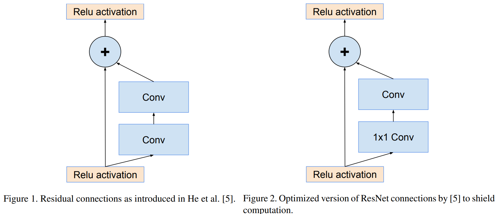

# Inception-v4, Inception-ResNet and the Impact of Residual Connections on Learning
Inception-v4, Inception-ResNet和残差连接对学习的影响 2016.02 https://arxiv.org/abs/1602.07261

## 阅读笔记
* 网络足够深，效果无差异，但残差连接能加速训练过程?
* 残差和inception, 本质都是增加了基数(cardinality)

## Abstract
Very deep convolutional networks have been central to the largest advances in image recognition performance in recent years. One example is the Inception architecture that has been shown to achieve very good performance at relatively low computational cost. Recently, the introduction of residual connections in conjunction with a more traditional architecture has yielded state-of-the-art performance in the 2015 ILSVRC challenge; its performance was similar to the latest generation Inception-v3 network. This raises the question of whether there are any benefit in combining the Inception architecture with residual connections. Here we give clear empirical evidence that training with residual connections accelerates the training of Inception networks significantly. There is also some evidence of residual Inception networks outperforming similarly expensive Inception networks without residual connections by a thin margin. We also present several new streamlined architectures for both residual and non-residual Inception networks. These variations improve the single-frame recognition performance on the ILSVRC 2012 classification task significantly. We further demonstrate how proper activation scaling stabilizes the training of very wide residual Inception networks. With an ensemble of three residual and one Inception-v4, we achieve 3.08% top-5 error on the test set of the ImageNet classification (CLS) challenge.

极深卷积网络是近年来图像识别性能进步的最大核心。一个例子是Inception架构，它已被证明能够以相对较低的计算成本实现非常好的性能。最近，在2015年ILSVRC挑战中，结合更传统的架构引入残差连接，产生了最先进的性能; 其性能与最新一代Inception-v3网络相似。这就提出了这样一个问题：将Inception架构与残差连接相结合是否有任何好处。在这里，我们给出了明确的经验证据，即使用残差连接进行训练可以显著加快Inception网络的训练。还有一些证据表明，残差Inception网络比同样昂贵的没有残差连接的Incept网络表现更好。我们还为残差和非残差Inception网络提供了几种新的简化架构。这些变化显著提高了ILSVRC 2012分类任务的单帧识别性能。我们进一步演示了适当的激活缩放如何稳定非常宽的残差Inception网络的训练。通过三个残差和一个Inception-v4的组合，我们在ImageNet分类(CLS)挑战的测试集top5获得了3.08%错误率。

## 1. Introduction
Since the 2012 ImageNet competition [11] winning entry by Krizhevsky et al [8], their network “AlexNet” has been successfully applied to a larger variety of computer vision tasks, for example to object-detection [4], segmentation [10], human pose estimation [17], video classification [7], object tracking [18], and superresolution [3]. These examples are but a few of all the applications to which deep convolutional networks have been very successfully applied ever since.

自2012年Krizhevskyet al [8]赢得ImageNet竞赛[11]比赛以来，他们的网络“AlexNet”已成功应用于多种计算机视觉任务，例如目标检测[4]、分割[10]、人体姿势估计[17]、视频分类[7]、目标跟踪[18]和超分辨率[3]。这些例子只是深卷积网络自那时以来成功应用的所有应用中的一小部分。

In this work we study the combination of the two most recent ideas: Residual connections introduced by He et al. in [5] and the latest revised version of the Inception architecture [15]. In [5], it is argued that residual connections are of inherent importance for training very deep architectures. Since Inception networks tend to be very deep, it is natural to replace the filter concatenation stage of the Inception architecture with residual connections. This would allow Inception to reap all the benefits of the residual approach while retaining its computational efficiency.

在这项工作中，我们研究了两种最新思想的结合：Heet al 在[5]中引入的残差连接和最新修订版的Inception架构[15]。在[5]中，有人认为残差连接对于训练非常深入的架构具有固有的重要性。因为Inception网络往往很深，所以用残差连接替换Inception架构的的卷积核串联(concatenation)阶段是很自然的。这将使Inception在保持其计算效率的同时，获得残差方法的所有好处。

Besides a straightforward integration, we have also studied whether Inception itself can be made more efficient by making it deeper and wider. For that purpose, we designed a new version named Inception-v4 which has a more uniform simplified architecture and more inception modules than Inception-v3. Historically, Inception-v3 had inherited a lot of the baggage of the earlier incarnations. The technical constraints chiefly came from the need for partitioning the model for distributed training using DistBelief [2]. Now, after migrating our training setup to TensorFlow [1] these constraints have been lifted, which allowed us to simplify the architecture significantly. The details of that simplified architecture are described in Section 3.

除了简单的集成之外，我们还研究了Inception本身是否可以通过使其更深和更宽来提高效率。为此，我们设计了一个名为Inception-v4的新版本，它具有比Incepton-v3更统一的简化架构和更多的Inception模块。历史上，Inception v3继承了早期版本的许多包袱。技术限制主要来自使用 DistBelief 划分分布式训练模型的需要[2]。现在，在将我们的训练设置迁移到TensorFlow[1]之后，这些约束已经解除，这使我们能够显著简化架构。第3节描述了简化架构的细节。

In this report, we will compare the two pure Inception variants, Inception-v3 and v4, with similarly expensive hybrid Inception-ResNet versions. Admittedly, those models were picked in a somewhat ad hoc manner with the main constraint being that the parameters and computational complexity of the models should be somewhat similar to the cost of the non-residual models. In fact we have tested bigger and wider Inception-ResNet variants and they performed very similarly on the ImageNet classification challenge [11] dataset.

在本报告中，我们将比较两个纯Inception变体，Inception-v3和v4，以及同样昂贵的混合Incepton-ResNet版本。诚然，这些模型是以某种特定的方式挑选的，主要限制是模型的参数和计算复杂度应该与非残差模型的成本有点类似。事实上，我们已经测试了更大更广的Inception-ResNet变体，它们在ImageNet分类挑战[11]数据集上的表现非常相似。

The last experiment reported here is an evaluation of an ensemble of all the best performing models presented here. As it was apparent that both Inception-v4 and InceptionResNet-v2 performed similarly well, exceeding state-ofthe art single frame performance on the ImageNet validation dataset, we wanted to see how a combination of those pushes the state of the art on this well studied dataset. Surprisingly, we found that gains on the single-frame performance do not translate into similarly large gains on ensembled performance. Nonetheless, it still allows us to report 3.1% top-5 error on the validation set with four models ensembled setting a new state of the art, to our best knowledge.

这里报告的最后一个实验是对这里所有表现最好的模型的综合评估。显然，Inception-v4和InceptonResNet-v2都表现得很好，超过了ImageNet验证数据集的最先进单帧性能，因此我们想看看这些组合如何推动这一经过充分研究的数据集的先进水平。令人惊讶的是，我们发现单帧性能的提高并没有转化为信号群性能的同样大的提高。尽管如此，据我们所知，它仍然允许我们报告验证集上3.1%的top-5个错误，四个模型集合设置了一个新的技术水平。

In the last section, we study some of the classification failures and conclude that the ensemble still has not reached the label noise of the annotations on this dataset and there is still room for improvement for the predictions.

在最后一节中，我们研究了一些分类失败，并得出结论，集成仍然没有达到该数据集上注释的标签噪声，预测仍有改进的余地。

## 2. Related Work
Convolutional networks have become popular in large scale image recognition tasks after Krizhevsky et al. [8]. Some of the next important milestones were Network-innetwork [9] by Lin et al., VGGNet [12] by Simonyan et al. and GoogLeNet (Inception-v1) [14] by Szegedy et al.

继Krizhevskyet al [8]之后，卷积网络在大规模图像识别任务中变得越来越流行。接下来的一些重要里程碑是Linet al 的Network-innetwork[9]、Simonyanet al 的VGGNet[12]和Szegedyet al 的GoogLeNet(Inception-v1)[14]。

Residual connection were introduced by He et al. in [5] in which they give convincing theoretical and practical evidence for the advantages of utilizing additive merging of signals both for image recognition, and especially for object detection. The authors argue that residual connections are inherently necessary for training very deep convolutional models. Our findings do not seem to support this view, at least for image recognition. However it might require more measurement points with deeper architectures to understand the true extent of beneficial aspects offered by residual connections. In the experimental section we demonstrate that it is not very difficult to train competitive very deep networks without utilizing residual connections. However the use of residual connections seems to improve the training speed greatly, which is alone a great argument for their use.

Heet al 在[5]中引入了残差连接，他们为利用信号的加性合并(additive merging)进行图像识别，特别是在目标检测的优势提供了令人信服的理论和实践证据。作者认为，残差连接对于训练非常深的卷积模型是内在必要的。我们的发现似乎不支持这种观点，至少在图像识别方面是这样。然而，它可能需要更多具有更深层架构的测量点，以了解残差连接所提供的有益方面的真正程度。在实验部分，我们证明，在不利用残差连接的情况下，训练具有竞争力的深度网络并不困难。然而，使用残差连接似乎可以大大提高训练速度，这是使用残差连接的一个很好的理由。

The Inception deep convolutional architecture was introduced in [14] and was called GoogLeNet or Inception-v1 in our exposition. Later the Inception architecture was refined in various ways, first by the introduction of batch normalization [6] (Inception-v2) by Ioffe et al. Later the architecture was improved by additional factorization ideas in the third iteration [15] which will be referred to as Inception-v3 in this report.

Inception深度卷积架构于[14]中引入，在我们的论述中被称为GoogLeNet或Inception-v1。后来，先是Ioffeet al 引入了批归一化(BN)[6](Inception-v2)，以各种方式对Inception架构进行了改进。随后，在第三次迭代[15]中，通过额外的因子分解思想对架构进行了改善，在本报告中称之为Incepton-v3。

 
Figure 1. Residual connections as introduced in He et al. [5].
图1.Heet al [5]中介绍的残差连接。

Figure 2. Optimized version of ResNet connections by [5] to shield computation.
图2.通过[5]优化的ResNet连接版本以掩码?计算。

## 3. Architectural Choices
### 3.1. Pure Inception blocks
Our older Inception models used to be trained in a partitioned manner, where each replica was partitioned into a multiple sub-networks in order to be able to fit the whole model in memory. However, the Inception architecture is highly tunable, meaning that there are a lot of possible changes to the number of filters in the various layers that do not affect the quality of the fully trained network. In order to optimize the training speed, we used to tune the layer sizes carefully in order to balance the computation between the various model sub-networks. In contrast, with the introduction of TensorFlow our most recent models can be trained without partitioning the replicas. This is enabled in part by recent optimizations of memory used by backpropagation, achieved by carefully considering what tensors are needed for gradient computation and structuring the compu- tation to reduce the number of such tensors. Historically, we have been relatively conservative about changing the architectural choices and restricted our experiments to varying isolated network components while keeping the rest of the network stable. Not simplifying earlier choices resulted in networks that looked more complicated that they needed to be. In our newer experiments, for Inception-v4 we decided to shed this unnecessary baggage and made uniform choices for the Inception blocks for each grid size. Plase refer to Figure 9 for the large scale structure of the Inception-v4 network and Figures 3, 4, 5, 6, 7 and 8 for the detailed structure of its components. All the convolutions not marked with “V” in the figures are same-padded meaning that their output grid matches the size of their input. Convolutions marked with “V” are valid padded, meaning that input patch of each unit is fully contained in the previous layer and the grid size of the output activation map is reduced accordingly.

我们早期的Inception模型过去是以分区的方式进行训练的，其中每个副本被划分为多个子网络，以便能够在内存中容纳整个模型。然而，Inception架构是高度可调的，这意味着在各个层中卷积核的数量有很多可能的变化，这些变化不会影响经过充分训练的网络的质量。为了优化训练速度，我们经常仔细调整层大小，以平衡不同模型子网络之间的计算。相反，随着TensorFlow的引入，我们最新的模型可以在不划分副本的情况下进行训练。这在一定程度上是由于最近对反向传播使用的内存进行了优化，通过仔细考虑梯度计算所需的张量以及构造计算以减少此类张量的数量来实现的。从历史上看，我们在改变架构选择方面相对保守，并将我们的实验限制在改变孤立的网络组件，同时保持网络的其余部分稳定。不简化早期的选择会导致网络看起来更加复杂。在我们最新的实验中，对于Inception-v4，我们决定摆脱这个不必要的包袱，为每个网格大小的Inception块做出统一的选择。Inception-v4网络的大规模结构见图9，其组件的详细结构见图3、4、5、6、7和8。图中所有未标记“V”的卷积都是相同的填充，这意味着它们的输出网格与其输入的大小相匹配。标有“V”的卷积是有效的填充，这意味着每个单元的输入分块完全包含在前一层中，输出激活图的网格大小也相应减小。

### 3.2. Residual Inception Blocks
For the residual versions of the Inception networks, we use cheaper Inception blocks than the original Inception. Each Inception block is followed by filter-expansion layer (1 × 1 convolution without activation) which is used for scaling up the dimensionality of the filter bank before the addition to match the depth of the input. This is needed to compensate for the dimensionality reduction induced by the Inception block.

对于Inception网络的残差版本，我们使用的Inception块比原始的Incept更便宜。每个Inception块之后是卷积核扩展层(1×1卷积，无激活)，用于在添加之前放大卷积核组的维数，以匹配输入深度。这是为了补偿由Inception块引起的维度减少。

We tried several versions of the residual version of Inception. Only two of them are detailed here. The first one “Inception-ResNet-v1” roughly the computational cost of Inception-v3, while “Inception-ResNet-v2” matches the raw cost of the newly introduced Inception-v4 network. See Figure 15 for the large scale structure of both varianets. (However, the step time of Inception-v4 proved to be significantly slower in practice, probably due to the larger number of layers.)

我们尝试了Inception残差版本的几个版本。这里只详细介绍了其中的两个。第一个“Inception-ResNet-v1”大致相当于Incepton-v3的计算成本，而“Incept-ResNet-v2”则相当于新引入的Inception-v4网络的原始成本。两个方差的大规模结构见图15。(然而，事实证明，Inception-v4的步长在实践中明显较慢，可能是因为层数较多。)

Another small technical difference between our residual and non-residual Inception variants is that in the case of Inception-ResNet, we used batch-normalization only on top of the traditional layers, but not on top of the summations. It is reasonable to expect that a thorough use of batchnormalization should be advantageous, but we wanted to keep each model replica trainable on a single GPU. It turned out that the memory footprint of layers with large activation size was consuming disproportionate amount of GPUmemory. By omitting the batch-normalization on top of those layers, we were able to increase the overall number of Inception blocks substantially. We hope that with better utilization of computing resources, making this trade-off will become unecessary. 

我们的残差和非残差Inception变体之间的另一个小技术差异是，在Inception-ResNet的情况下，我们只在传统层的顶部使用了批归一化(BN)，而不是在总和的顶部。完全使用批归一化(BN)应该是有利的，这是合理的，但我们希望在单个GPU上保持每个模型副本的可训练性。事实证明，具有较大激活大小的层的内存占用占用了不成比例的GPU内存。通过在这些层之上省略批归一化(BN)，我们能够大幅增加Inception块的总数。我们希望，随着计算资源的更好利用，这种权衡将变得不必要。

Figure 3. The schema for stem of the pure Inception-v4 and Inception-ResNet-v2 networks. This is the input part of those networks. Cf. Figures 9 and 15 
图3.纯Inception-v4和Incepton-ResNet-v2网络的主干模式。这是这些网络的输入部分。参见图9和图15

Figure 4. The schema for 35 × 35 grid modules of the pure Inception-v4 network. This is the Inception-A block of Figure 9. 
图4.纯Inception-v4网络的35×35网格模块的模式。这是图9中的Inception-A区块。

Figure 5. The schema for 17 × 17 grid modules of the pure Inception-v4 network. This is the Inception-B block of Figure 9. 
图5.纯Inception-v4网络17×17网格模块的模式。这是图9中的Inception-B区块。

Figure 6. The schema for 8×8 grid modules of the pure Inceptionv4 network. This is the Inception-C block of Figure 9
图6.纯Inceptionv4网络的8×8网格模块的模式。这是图9的Inception-C块

Figure 7. The schema for 35 × 35 to 17 × 17 reduction module. Different variants of this blocks (with various number of filters) are used in Figure 9, and 15 in each of the new Inception(-v4, -ResNet-v1, -ResNet-v2) variants presented in this paper. The k, l, m, n numbers represent filter bank sizes which can be looked up in Table 1. 
图7.35×35至17×17简化模块的示意图。图9中使用了此块的不同变体(具有不同数量的卷积核)，本文中提出的每个新Inception变体(-v4、-ResNet-v1、-ResNet-v2)中使用了15个变体。k、l、m、n数字表示卷积核组大小，可在表1中查找。

Figure 8. The schema for 17 × 17 to 8 × 8 grid-reduction module. This is the reduction module used by the pure Inception-v4 network in Figure 9.
图8.17×17至8×8网格缩减模块的示意图。这是图9中纯Inception-v4网络使用的简化模块。

Figure 9. The overall schema of the Inception-v4 network. For the detailed modules, please refer to Figures 3, 4, 5, 6, 7 and 8 for the detailed structure of the various components. 
图9.Inception-v4网络的总体架构。对于详细的模块，请参考图3、4、5、6、7和8了解各个组件的详细结构。

Figure 10. The schema for 35 × 35 grid (Inception-ResNet-A) module of Inception-ResNet-v1 network.
图10.Inception-ResNet-v1网络的35×35网格(Incepton-ResNet-A)模块的模式。

Figure 11. The schema for 17 × 17 grid (Inception-ResNet-B) module of Inception-ResNet-v1 network
图11.Inception-ResNet-v1网络17×17网格(Incepton-ResNet-B)模块的模式

Figure 12. “Reduction-B” 17×17 to 8×8 grid-reduction module. This module used by the smaller Inception-ResNet-v1 network in Figure 15. 
图12“Reduction B”17×17至8×8网格缩减模块。图15中较小的Inception-ResNet-v1网络使用该模块。

Figure 13. The schema for 8×8 grid (Inception-ResNet-C) module of Inception-ResNet-v1 network. 
图13.Inception-ResNet-v1网络的8×8网格(Incepton-ResNet-C)模块模式。

Figure 14. The stem of the Inception-ResNet-v1 network.
图14.Inception-ResNet-v1网络的主干。

Figure 15. Schema for Inception-ResNet-v1 and InceptionResNet-v2 networks. This schema applies to both networks but the underlying components differ. Inception-ResNet-v1 uses the blocks as described in Figures 14, 10, 7, 11, 12 and 13. InceptionResNet-v2 uses the blocks as described in Figures 3, 16, 7,17, 18 and 19. The output sizes in the diagram refer to the activation vector tensor shapes of Inception-ResNet-v1. 
图15. Inception-ResNet-v1和InceptonResNet-v2网络的模式。此模式适用于两个网络，但底层组件不同。Inception-ResNet-v1使用图14、10、7、11、12和13中所示的块。InceptonResNet-v2使用图3、16、7、17、18和19中所述的块。图中的输出大小参考Inception-ResNet-v1的激活向量张量形状。

Figure 16. The schema for 35 × 35 grid (Inception-ResNet-A) module of the Inception-ResNet-v2 network. 
图16.Inception-ResNet-v2网络的35×35网格(Incepton-ResNet-A)模块模式。

Figure 17. The schema for 17 × 17 grid (Inception-ResNet-B) module of the Inception-ResNet-v2 network. 
图17.Inception-ResNet-v2网络17×17网格(Incepton-ResNet-B)模块的模式。

Figure 18. The schema for 17 × 17 to 8 × 8 grid-reduction module. Reduction-B module used by the wider Inception-ResNet-v1 network in Figure 15. 
图18. 17×17至8×8网格缩减模块的示意图。图15中更宽的Inception-ResNet-v1网络使用的Reduction-B模块。

Figure 19. The schema for 8×8 grid (Inception-ResNet-C) module of the Inception-ResNet-v2 network.
图19.Inception-ResNet-v2网络的8×8网格(Incepton-ResNet-C)模块模式。

Table 1. The number of filters of the Reduction-A module for the three Inception variants presented in this paper. The four numbers in the colums of the paper parametrize the four convolutions of Figure 7
表1.本文介绍的三种Inception变体的Reduction-A模块的卷积核数量。论文列中的四个数字将图7的四个卷积参数化

Figure 20. The general schema for scaling combined Inceptionresnet moduels. We expect that the same idea is useful in the general resnet case, where instead of the Inception block an arbitrary subnetwork is used. The scaling block just scales the last linear activations by a suitable constant, typically around 0.1.
图20.扩展组合Inceptionresnet模型的一般模式。我们希望在一般的resnet情况下，使用任意子网代替Inception块，也可以使用相同的想法。缩放块只按适当的常数缩放最后的线性激活，通常约为0.1。

### 3.3. Scaling of the Residuals
Also we found that if the number of filters exceeded 1000, the residual variants started to exhibit instabilities and the network has just “died” early in the training, meaning that the last layer before the average pooling started to produce only zeros after a few tens of thousands of iterations. This could not be prevented, neither by lowering the learning rate, nor by adding an extra batch-normalization to this layer.

此外，我们还发现，如果卷积核的数量超过1000，则残差变量开始表现出不稳定性，网络在训练的早期就已经“死亡”，这意味着平均池化之前的最后一层在几万次迭代后开始只产生零。这是无法避免的，无论是通过降低学习率，还是通过向该层添加额外的批归一化(BN)。

We found that scaling down the residuals before adding them to the previous layer activation seemed to stabilize the training. In general we picked some scaling factors between 0.1 and 0.3 to scale the residuals before their being added to the accumulated layer activations (cf. Figure 20).

我们发现，在将残差添加到前一层激活之前，缩小残差的比例似乎可以稳定训练。通常，我们选择0.1到0.3之间的一些比例因子，以在将残差添加到累积的层激活中之前对其进行缩放(参见图20)。

A similar instability was observed by He et al. in [5] in the case of very deep residual networks and they suggested a two-phase training where the first “warm-up” phase is done with very low learning rate, followed by a second phase with high learning rata. We found that if the number of filters is very high, then even a very low (0.00001) learning rate is not sufficient to cope with the instabilities and the training with high learning rate had a chance to destroy its effects. We found it much more reliable to just scale the residuals.

Heet al 在[5]中发现，对于非常深的残差网络，也存在类似的不稳定性，他们建议进行两阶段训练，其中第一个“热身”阶段的学习率非常低，然后是第二个学习率较高的阶段。我们发现，如果卷积核的数量非常高，那么即使是非常低的(0.00001)学习率也不足以应对不稳定性，高学习率的训练也有可能破坏其效果。我们发现，只计算残差更可靠。

Even where the scaling was not strictly necessary, it never seemed to harm the final accuracy, but it helped to stabilize the training.

即使在严格意义上不需要缩放的情况下，它似乎也不会影响最终精度，但它有助于稳定训练。

## 4. Training Methodology
We have trained our networks with stochastic gradient utilizing the TensorFlow [1] distributed machine learning system using 20 replicas running each on a NVidia Kepler GPU. Our earlier experiments used momentum [13] with a decay of 0.9, while our best models were achieved using RMSProp [16] with decay of 0.9 and  = 1.0. We used a learning rate of 0.045, decayed every two epochs using an exponential rate of 0.94. Model evaluations are performed using a running average of the parameters computed over time.

我们利用TensorFlow[1]分布式机器学习系统，在NVidia Kepler GPU上运行20个副本，利用随机梯度训练网络。我们早期的实验使用动量[13]，衰减为0.9，而我们的最佳模型是使用RMSProp[16]，衰减0.9且=1.0。我们使用的学习率为0.045，每两个周期衰减一次，指数率为0.94。模型评估是使用随时间计算的参数的运行平均值进行的。

Figure 21. Top-1 error evolution during training of pure Inceptionv3 vs a residual network of similar computational cost. The evaluation is measured on a single crop on the non-blacklist images of the ILSVRC-2012 validation set. The residual model was training much faster, but reached slightly worse final accuracy than the traditional Inception-v3.

图21.纯Inceptionv3训练期间Top-1错误演化与计算成本相似的残差网络。评估是在ILSVRC-2012验证集的非黑名单图像上的单剪裁上测量的。残差模型的训练速度快得多，但最终精度比传统Inception-v3稍差。

## 5. Experimental Results
First we observe the top-1 and top-5 validation-error evolution of the four variants during training. After the experiment was conducted, we have found that our continuous evaluation was conducted on a subset of the validation set which omitted about 1700 blacklisted entities due to poor bounding boxes. It turned out that the omission should have been only performed for the CLSLOC benchmark, but yields somewhat incomparable (more optimistic) numbers when compared to other reports including some earlier reports by our team. The difference is about 0.3% for top-1 error and about 0.15% for the top-5 error. However, since the differences are consistent, we think the comparison between the curves is a fair one.

首先，我们观察了训练期间四种变体的top-1和top-5验证错误演变。在进行实验之后，我们发现，我们对验证集的一个子集进行了持续评估，由于边界框不好，该验证集遗漏了约1700个被列入黑名单的实体。事实证明，这一遗漏本应仅针对CLSLOC基准进行，但与其他报告(包括我们团队的一些早期报告)相比，得出了一些无法比拟的(更乐观的)数字。top-1个错误的差值约为0.3%，top-5个错误的相差约为0.15%。然而，由于差异是一致的，我们认为曲线之间的比较是公平的。

On the other hand, we have rerun our multi-crop and ensemble results on the complete validation set consisting of 50000 images. Also the final ensemble result was also performed on the test set and sent to the ILSVRC test server for validation to verify that our tuning did not result in an over-fitting. We would like to stress that this final validation was done only once and we have submitted our results only twice in the last year: once for the BN-Inception paper and later during the ILSVR-2015 CLSLOC competition, so we believe that the test set numbers constitute a true estimate of the generalization capabilities of our model.

另一方面，我们对包含50000张图像的完整验证集重新运行了多裁剪和集成结果。此外，还对测试集执行了最终的集成结果，并将其发送到ILSVRC测试服务器进行验证，以验证我们的调整没有导致过度拟合。我们想强调的是，这一最终验证只进行了一次，去年我们只提交了两次结果：一次用于BN-Inception文件，随后在ILSVR-2015 CLSLOC竞赛中提交，因此我们认为测试集数量是对我们模型泛化能力的真实估计。

Finally, we present some comparisons, between various versions of Inception and Inception-ResNet. The models Inception-v3 and Inception-v4 are deep convolutional net works not utilizing residual connections while InceptionResNet-v1 and Inception-ResNet-v2 are Inception style networks that utilize residual connections instead of filter concatenation.

最后，我们给出了不同版本的Inception和Inception-ResNet之间的一些比较。模型Inception-v3和Incepton-v4是深度卷积网络，不使用残差连接，而Inception ResNet-v1和Incept ResNet-v2是Inception类型的网络，使用残差连接而不是卷积核串联。

Figure 22. Top-5 error evolution during training of pure Inceptionv3 vs a residual Inception of similar computational cost. The evaluation is measured on a single crop on the non-blacklist images of the ILSVRC-2012 validation set. The residual version has trained much faster and reached slightly better final recall on the validation set. 
图22.纯Inceptionv3训练期间Top-5错误演变与类似计算成本的残差Inception。评估是在ILSVRC-2012验证集的非黑名单图像上的单剪裁上测量的。残差版本的训练速度快得多，在验证集的最终召回率略高。

Figure 23. Top-1 error evolution during training of pure Inceptionv3 vs a residual Inception of similar computational cost. The evaluation is measured on a single crop on the non-blacklist images of the ILSVRC-2012 validation set. The residual version was training much faster and reached slightly better final accuracy than the traditional Inception-v4.
图23.纯Inceptionv3训练期间的Top-1错误演变与类似计算成本的残差Inception。评估是在ILSVRC-2012验证集的非黑名单图像上的单剪裁上测量的。残差版本的训练速度要快得多，最终精度比传统的Inception-v4稍好。

Table 2. Single crop - single model experimental results. Reported on the non-blacklisted subset of the validation set of ILSVRC 2012. 
表2.单剪裁-单模型试验结果。报告了ILSVRC 2012验证集的非黑名单子集。

Table 2 shows the single-model, single crop top-1 and top-5 error of the various architectures on the validation set.

表2显示了验证集中各种架构的单模型、单裁剪top-1和top-5错误。

Table 3. 10/12 crops evaluations - single model experimental results. Reported on the all 50000 images of the validation set of ILSVRC 2012.
表3. 10/12剪裁评估-单模式试验结果。报告了ILSVRC 2012验证集的所有50000张图像。

Table 3 shows the performance of the various models with a small number of crops: 10 crops for ResNet as was reported in [5]), for the Inception variants, we have used the 12 crops evaluation as as described in [14].

表3显示了使用少量剪裁的各种模型的性能：[5]中报告了ResNet的10种剪裁，对于Inception变体，我们使用了[14]中描述的12种剪裁评估。

Figure 24. Top-5 error evolution during training of pure Inceptionv4 vs a residual Inception of similar computational cost. The evaluation is measured on a single crop on the non-blacklist images of the ILSVRC-2012 validation set. The residual version trained faster and reached slightly better final recall on the validation set. 

图24.纯Inceptionv4训练期间Top-5错误演变与类似计算成本的残差Inception。评估是在ILSVRC-2012验证集的非黑名单图像上的单剪裁上测量的。残差版本的训练速度更快，在验证集的最终召回率略好。

Figure 25. Top-5 error evolution of all four models (single model, single crop). Showing the improvement due to larger model size.
Although the residual version converges faster, the final accuracy seems to mainly depend on the model size. 
图25.所有四个模型(单模型、单剪裁)的Top-5误差演变。显示由于较大的模型尺寸而带来的改进。尽管残差版本收敛更快，但最终精度似乎主要取决于模型大小。

Figure 26. Top-1 error evolution of all four models (single model, single crop). This paints a similar picture as the top-5 evaluation.
图26.所有四个模型(单模型、单剪裁)的Top-1误差演变。这与排名top-5的评估结果类似。

Table 4. 144 crops evaluations - single model experimental results.
表4.144种剪裁评估-单模式试验结果。

Table 4 shows the single model performance of the various models using. For residual network the dense evaluation result is reported from [5]. For the inception networks, the 144 crops strategy was used as described in [14].

表4显示了使用的各种模型的单模型性能。对于残差网络，密集评估结果见[5]。对于Inception网络，如[14]所述，使用了144种剪裁策略。

Table 5. Ensemble results with 144 crops/dense evaluation. Reported on the all 50000 images of the validation set of ILSVRC 2012. For Inception-v4(+Residual), the ensemble consists of one pure Inception-v4 and three Inception-ResNet-v2 models and were evaluated both on the validation and on the test-set. The test-set performance was 3.08% top-5 error verifying that we don’t over- fit on the validation set.
表5. 144种剪裁/密度评估的综合结果。在ILSVRC 2012验证集的所有50000张图像上进行了报告。对于Inception-v4(+残差)，集合由一个纯Inception v4和三个Incepton-ResNet-v2模型组成，并在验证和测试集上进行了评估。测试集性能为3.08%的top-5个错误，验证了我们没有过度适合验证集。

Table 5 compares ensemble results. For the pure residual network the 6 models dense evaluation result is reported from [5]. For the inception networks 4 models were ensembled using the 144 crops strategy as described in [14].

表5比较了总体结果。对于纯残差网络，[5]报告了6个模型的密集评估结果。对于Inception网络，使用[14]中描述的144种剪裁策略将4个模型整合起来。

## 6. Conclusions
We have presented three new network architectures in detail:
* Inception-ResNet-v1: a hybrid Inception version that has a similar computational cost to Inception-v3 from [15].
* Inception-ResNet-v2: a costlier hybrid Inception version with significantly improved recognition performance.
* Inception-v4: a pure Inception variant without residual connections with roughly the same recognition performance as Inception-ResNet-v2.

我们详细介绍了三种新的网络架构：
* Inception-ResNet-v1：一个混合的Inception版本，其计算成本与[15]中的Incept v3类似。
* Inception-ResNet-v2：成本更高的Inception混合版，识别性能显著提高。
* Inception-v4：纯Inception变体，无残差连接，识别性能与Incepton-ResNet-v2大致相同。

We studied how the introduction of residual connections leads to dramatically improved training speed for the Inception architecture. Also our latest models (with and without residual connections) outperform all our previous networks, just by virtue of the increased model size.

我们研究了残差连接的引入如何显著提高Inception架构的训练速度。此外，我们的最新模型(有或无残差连接)的性能优于所有以前的网络，仅仅是因为模型尺寸增加了。

## References
1. M. Abadi, A. Agarwal, P. Barham, E. Brevdo, Z. Chen, C. Citro, G. S. Corrado, A. Davis, J. Dean, M. Devin, S. Ghemawat, I. Goodfellow, A. Harp, G. Irving, M. Isard, Y. Jia, R. Jozefowicz, L. Kaiser, M. Kudlur, J. Levenberg, D. Man´e, R. Monga, S. Moore, D. Murray, C. Olah, M. Schuster, J. Shlens, B. Steiner, I. Sutskever, K. Talwar, P. Tucker, V. Vanhoucke, V. Vasudevan, F. Vi´egas, O. Vinyals, P. Warden, M. Wattenberg, M. Wicke, Y. Yu, and X. Zheng. TensorFlow: Large-scale machine learning on heterogeneous systems, 2015. Software available from tensorflow.org.
2. J. Dean, G. Corrado, R. Monga, K. Chen, M. Devin, M. Mao, A. Senior, P. Tucker, K. Yang, Q. V. Le, et al. Large scale distributed deep networks. In Advances in Neural Information Processing Systems, pages 1223–1231, 2012.
3. C. Dong, C. C. Loy, K. He, and X. Tang. Learning a deep convolutional network for image super-resolution. In Computer Vision–ECCV 2014, pages 184–199. Springer, 2014.
4. R. Girshick, J. Donahue, T. Darrell, and J. Malik. Rich feature hierarchies for accurate object detection and semantic segmentation. In Proceedings of the IEEE Conference on Computer Vision and Pattern Recognition (CVPR), 2014.
5. K. He, X. Zhang, S. Ren, and J. Sun. Deep residual learning for image recognition. arXiv preprint arXiv:1512.03385, 2015.
6. S. Ioffe and C. Szegedy. Batch normalization: Accelerating deep network training by reducing internal covariate shift. In Proceedings of The 32nd International Conference on Machine Learning, pages 448–456, 2015.
7. A. Karpathy, G. Toderici, S. Shetty, T. Leung, R. Sukthankar, and L. Fei-Fei. Large-scale video classification with convolutional neural networks. In Computer Vision and Pattern Recognition (CVPR), 2014 IEEE Conference on, pages 1725–1732. IEEE, 2014.
8. A. Krizhevsky, I. Sutskever, and G. E. Hinton. Imagenet classification with deep convolutional neural networks. In Advances in neural information processing systems, pages 1097–1105, 2012.
9. M. Lin, Q. Chen, and S. Yan. Network in network. arXiv preprint arXiv:1312.4400, 2013.
10. J. Long, E. Shelhamer, and T. Darrell. Fully convolutional networks for semantic segmentation. In Proceedings of the IEEE Conference on Computer Vision and Pattern Recognition, pages 3431–3440, 2015.
11. O. Russakovsky, J. Deng, H. Su, J. Krause, S. Satheesh, S. Ma, Z. Huang, A. Karpathy, A. Khosla, M. Bernstein, et al. Imagenet large scale visual recognition challenge. 2014.
12. K. Simonyan and A. Zisserman. Very deep convolutional networks for large-scale image recognition. arXiv preprint arXiv:1409.1556, 2014.
13. I. Sutskever, J. Martens, G. Dahl, and G. Hinton. On the importance of initialization and momentum in deep learning. In Proceedings of the 30th International Conference on Machine Learning (ICML-13), volume 28, pages 1139–1147. JMLR Workshop and Conference Proceedings, May 2013.
14. C. Szegedy, W. Liu, Y. Jia, P. Sermanet, S. Reed, D. Anguelov, D. Erhan, V. Vanhoucke, and A. Rabinovich. Going deeper with convolutions. In Proceedings of the IEEE Conference on Computer Vision and Pattern Recognition, pages 1–9, 2015.
15. C. Szegedy, V. Vanhoucke, S. Ioffe, J. Shlens, and Z. Wojna. Rethinking the inception architecture for computer vision. arXiv preprint arXiv:1512.00567, 2015.
16. T. Tieleman and G. Hinton. Divide the gradient by a running average of its recent magnitude. COURSERA: Neural Networks for Machine Learning, 4, 2012. Accessed: 2015- 11-05.
17. A. Toshev and C. Szegedy. Deeppose: Human pose estimation via deep neural networks. In Computer Vision and Pattern Recognition (CVPR), 2014 IEEE Conference on, pages 1653–1660. IEEE, 2014.
18. N. Wang and D.-Y. Yeung. Learning a deep compact image representation for visual tracking. In Advances in Neural Information Processing Systems, pages 809–817, 2013.
