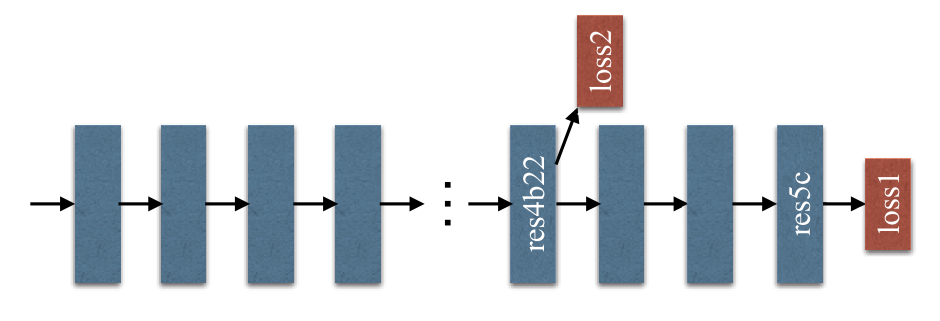

# Pyramid Scene Parsing Network
金字塔场景解析网络 2016-12-4 原文：https://arxiv.org/abs/1612.01105

## ABSTRACT 
Scene parsing is challenging for unrestricted open vocabulary and diverse scenes. In this paper, we exploit the capability of global context information by different-region-based context aggregation through our pyramid pooling module together with the proposed pyramid scene parsing network (PSPNet). Our global prior representation is effective to produce good quality results on the scene parsing task, while PSPNet provides a superior framework for pixel-level prediction tasks. The proposed approach achieves state-of-the-art performance on various datasets. It came first in ImageNet scene parsing challenge 2016, PASCAL VOC 2012 benchmark and Cityscapes benchmark. A single PSPNet yields new record of mIoU accuracy 85.4% on PASCAL VOC 2012 and accuracy 80.2% on Cityscapes.

场景解析对于不受限制的开放词汇表和多样的场景来说是一个挑战。本文通过我们的金字塔池化模块和提出的金字塔场景解析网络(PSPNet)，通过基于不同区域的上下文聚合来利用全局上下文信息的能力。我们的全局先验表示可以有效地在场景解析任务中产生高质量的结果，而PSPNet为像素级预测任务提供了一个优秀的框架。提出的方法在各种数据集上实现了最先进的性能。它在ImageNet 2016场景解析挑战赛、PASCAL VOC 2012基准测试和Cityscapes基准测试中名列前茅。单个PSPNet在PASCAL VOC 2012上的mIoU精度达到85.4%，在Cityscapes上的精度达到80.2%。

## 1. Introduction
Scene parsing, based on semantic segmentation, is a fundamental topic in computer vision. The goal is to assign each pixel in the image a category label. Scene parsing provides complete understanding of the scene. It predicts the label, location, as well as shape for each element. This topic is of broad interest for potential applications of automatic driving, robot sensing, to name a few.

基于语义分割的场景分析是计算机视觉的一个基本课题。目标是为图像中的每个像素分配一个类别标签。场景解析提供了对场景的完整理解。它预测每个元素的标签、位置和形状。该主题对自动驾驶、机器人传感等潜在应用具有广泛的兴趣。

Difficulty of scene parsing is closely related to scene and label variety. The pioneer scene parsing task [23] is to classify 33 scenes for 2,688 images on LMO dataset [22]. More recent PASCAL VOC semantic segmentation and PASCAL context datasets [8, 29] include more labels with similar context, such as chair and sofa, horse and cow, etc. The new ADE20K dataset [43] is the most challenging one with a large and unrestricted open vocabulary and more scene classes. A few representative images are shown in Fig. 1. To develop an effective algorithm for these datasets needs to conquer a few difficulties.

场景解析的难度与场景和标签的多样性密切相关。先锋场景解析任务[23]是对LMO数据集[22]上2688幅图像的33个场景进行分类。最近的PASCAL VOC语义分割和PASCAL上下文数据集[8，29]包括更多具有相似上下文的标签，如椅子和沙发、马和牛等。新的ADE20K数据集[43]是最具挑战性的数据集，具有大量且不受限制的开放词汇和更多场景类。图1显示了一些有代表性的图像。为这些数据集开发有效的算法需要克服一些困难。

State-of-the-art scene parsing frameworks are mostly based on the fully convolutional network (FCN) [26]. The deep convolutional neural network (CNN) based methods boost dynamic object understanding, and yet still face challenges considering diverse scenes and unrestricted vocabulary. One example is shown in the first row of Fig. 2, where a boat is mistaken as a car. These errors are due to similar appearance of objects. But when viewing the image regarding the context prior that the scene is described as boathouse near a river, correct prediction should be yielded.

最先进的场景解析框架大多基于完全卷积网络(FCN)[26]。基于深度卷积神经网络(CNN)的方法促进了动态对象理解，但考虑到不同场景和不受限制的词汇，仍然面临挑战。图2的第一行显示了一个例子，其中船被误认为是汽车。这些错误是由于对象的外观相似。但是，在将场景描述为河流附近的船屋之前，当查看关于上下文的图像时，应该产生正确的预测。

 
Figure 1. Illustration of complex scenes in ADE20K dataset. 
图1.ADE20K数据集中复杂场景的图解。

Towards accurate scene perception, the knowledge graph relies on prior information of scene context. We found that the major issue for current FCN based models is lack of suitable strategy to utilize global scene category clues. For typical complex scene understanding, previously to get a global image-level feature, spatial pyramid pooling [18] was widely employed where spatial statistics provide a good descriptor for overall scene interpretation. Spatial pyramid pooling network [12] further enhances the ability.

为了获得准确的场景感知，知识图谱依赖于场景上下文的先验信息。我们发现，当前基于FCN的模型的主要问题是缺乏适当的策略来利用全局场景类别线索。对于典型的复杂场景理解，以前为了获得全局图像级特征，空间金字塔池[18]被广泛使用，其中空间统计为整体场景解释提供了良好的描述符。空间金字塔池网络[12]进一步增强了该能力。

Different from these methods, to incorporate suitable global features, we propose pyramid scene parsing network (PSPNet). In addition to traditional dilated FCN [3, 40] for pixel prediction, we extend the pixel-level feature to the specially designed global pyramid pooling one. The local and global clues together make the final prediction more reliable. We also propose an optimization strategy with deeply supervised loss. We give all implementation details, which are key to our decent performance in this paper, and make the code and trained models publicly available 1.

与这些方法不同，为了结合合适的全局特征，我们提出了金字塔场景解析网络(PSPNet)。除了用于像素预测的传统扩展FCN[3，40]之外，我们将像素级特征扩展到专门设计的全局金字塔池。当地和全局的线索一起使最终预测更加可靠。我们还提出了一种具有深度监督损失的优化策略。我们给出了所有的实现细节，这是我们在本文中获得良好性能的关键，并公开了代码和经过训练的模型1。

Our approach achieves state-of-the-art performance on all available datasets. It is the champion of ImageNet scene parsing challenge 2016 [43], and arrived the 1st place on PASCAL VOC 2012 semantic segmentation benchmark [8], and the 1st place on urban scene Cityscapes data [6]. They manifest that PSPNet gives a promising direction for pixellevel prediction tasks, which may even benefit CNN-based stereo matching, optical flow, depth estimation, etc. in follow-up work. Our main contributions are threefold.
* We propose a pyramid scene parsing network to embed difficult scenery context features in an FCN based pixel prediction framework.
* We develop an effective optimization strategy for deep ResNet [13] based on deeply supervised loss.
* We build a practical system for state-of-the-art scene parsing and semantic segmentation where all crucial implementation details are included.

我们的方法在所有可用数据集上实现了最先进的性能。它是2016年ImageNet场景解析挑战赛的冠军[43]，在PASCAL VOC 2012语义分割基准测试中获得第1名[8]，在城市场景Cityscapes数据中获得第6名[6]。他们表明，PSPNet为像素级预测任务提供了一个很有前途的方向，这甚至可能有利于后续工作中基于CNN的立体匹配、光流、深度估计等。我们的主要贡献有三方面。
* 我们提出了一种金字塔场景解析网络，以在基于FCN的像素预测框架中嵌入困难的场景上下文特征。
* 我们基于深度监督损失为深度ResNet[13]开发了一种有效的优化策略。
* 我们为最先进的场景解析和语义分割构建了一个实用系统，其中包括所有关键的实现细节。

## 2. Related Work
In the following, we review recent advances in scene parsing and semantic segmentation tasks. Driven by powerful deep neural networks [17, 33, 34, 13], pixel-level prediction tasks like scene parsing and semantic segmentation achieve great progress inspired by replacing the fully-connected layer in classification with the convolution layer [26]. To enlarge the receptive field of neural networks, methods of [3, 40] used dilated convolution. Noh et al. [30] proposed a coarse-to-fine structure with deconvolution network to learn the segmentation mask. Our baseline network is FCN and dilated network [26, 3].

在下文中，我们回顾了场景解析和语义分割任务的最新进展。在强大的深度神经网络[17，33，34，13]的驱动下，像素级预测任务(如场景解析和语义分割)通过将分类中的完全连接层替换为卷积层而取得了巨大进展[26]。为了扩大神经网络的感受野，[3,40]的方法使用了扩张卷积。Nohet al [30]提出了一种具有反卷积网络的粗到细结构，以学习分割掩码。我们的基线网络是FCN和扩张网络[26，3]。

Other work mainly proceeds in two directions. One line [26, 3, 5, 39, 11] is with multi-scale feature ensembling. Since in deep networks, higher-layer feature contains more semantic meaning and less location information. Combining multi-scale features can improve the performance.

其他工作主要从两个方向进行。一条线[26，3，5，39，11]具有多尺度特征集合。因为在深度网络中，更高层的特征包含更多的语义和更少的位置信息。结合多尺度特征可以提高性能。

The other direction is based on structure prediction. The pioneer work [3] used conditional random field (CRF) as post processing to refine the segmentation result. Following methods [25, 41, 1] refined networks via end-to-end modeling. Both of the two directions ameliorate the localization ability of scene parsing where predicted semantic boundary fits objects. Yet there is still much room to exploit necessary information in complex scenes.

另一个方向是基于结构预测。先驱工作[3]使用条件随机场(CRF)作为后处理来细化分割结果。以下方法[25，41，1]通过端到端建模来优化网络。这两个方向都提高了场景解析的定位能力，其中预测的语义边界适合对象。然而，在复杂的场景中，仍有很大的空间来利用必要的信息。

To make good use of global image-level priors for diverse scene understanding, methods of [18, 27] extracted global context information with traditional features not from deep neural networks. Similar improvement was made 1https://github.com/hszhao/PSPNet under object detection frameworks [35]. Liu et al. [24] proved that global average pooling with FCN can improve semantic segmentation results. However, our experiments show that these global descriptors are not representative enough for the challenging ADE20K data. Therefore, different from global pooling in [24], we exploit the capability of global context information by different-region-based context aggregation via our pyramid scene parsing network.

为了更好地利用全局图像级先验来理解不同的场景，[18，27]的方法使用传统特征而非深度神经网络提取全局上下文信息。也有类似的改进 1https://github.com/hszhao/PSPNet 在对象检测框架下[35]。Liuet al [24]证明了使用FCN的全局平均池可以改善语义分割结果。然而，我们的实验表明，这些全局描述符对于具有挑战性的ADE20K数据来说不够具有代表性。因此，与[24]中的全局池不同，我们通过金字塔场景解析网络，通过基于不同区域的上下文聚合来利用全局上下文信息的能力。

## 3. Pyramid Scene Parsing Network
We start with our observation and analysis of representative failure cases when applying FCN methods to scene parsing. They motivate proposal of our pyramid pooling module as the effective global context prior. Our pyramid scene parsing network (PSPNet) illustrated in Fig. 3 is then described to improve performance for open-vocabulary object and stuff identification in complex scene parsing.

当将FCN方法应用于场景解析时，我们首先观察和分析典型的失败案例。他们鼓励我们将金字塔池模块作为有效的全局环境优先。我们的金字塔场景解析网络(PSPNet)如图3所示，然后对其进行描述，以提高复杂场景解析中开放词汇对象和内容识别的性能。

### 3.1. Important Observations
The new ADE20K dataset [43] contains 150 stuff/object category labels (e.g., wall, sky, and tree) and 1,038 imagelevel scene descriptors (e.g., airport terminal, bedroom, and street). So a large amount of labels and vast distributions of scenes come into existence. Inspecting the prediction results of the FCN baseline provided in [43], we summarize several common issues for complex-scene parsing.

新的ADE20K数据集[43]包含150个填充物/对象类别标签(例如，墙、天空和树)和1038个图像级场景描述符(例如，机场航站楼、卧室和街道)。因此，大量的标签和大量的场景分布应运而生。检查[43]中提供的FCN基线的预测结果，我们总结了复杂场景解析的几个常见问题。

#### Mismatched Relationship 
Context relationship is universal and important especially for complex scene understanding. There exist co-occurrent visual patterns. For example, an airplane is likely to be in runway or fly in sky while not over a road. For the first-row example in Fig. 2, FCN predicts the boat in the yellow box as a “car” based on its appearance. But the common knowledge is that a car is seldom over a river. Lack of the ability to collect contextual information increases the chance of misclassification.

不匹配的关系. 语境关系是普遍的，尤其是对于复杂场景的理解。存在共存的视觉模式。例如，一架飞机可能在跑道上或在空中飞行，而不是在道路上。对于图2中的第一行样本，FCN根据外观将黄色框中的船预测为“汽车”。但众所周知的是，汽车很少在河上行驶。缺乏收集上下文信息的能力会增加错误分类的机会。

#### Confusion Categories 
There are many class label pairs in the ADE20K dataset [43] that are confusing in classifi- cation. Examples are field and earth; mountain and hill; wall, house, building and skyscraper. They are with similar appearance. The expert annotator who labeled the entire dataset, still makes 17.60% pixel error as described in [43]. In the second row of Fig. 2, FCN predicts the object in the box as part of skyscraper and part of building. These results should be excluded so that the whole object is either skyscraper or building, but not both. This problem can be remedied by utilizing the relationship between categories.

混淆类别. ADE20K数据集[43]中有许多类标签对在分类上令人困惑。例如，田地和土地; 高山丘陵; 墙、房子、建筑物和摩天大楼。它们的外观相似。标记整个数据集的专家注释器仍然会产生17.60%的像素误差，如[43]所述。在图2的第二行中，FCN预测框中的对象是摩天大楼和建筑的一部分。这些结果应该被排除在外，这样整个物体要么是摩天大楼，要么是建筑物，而不是两者都是。这个问题可以通过利用类别之间的关系来解决。

#### Inconspicuous Classes
Scene contains objects/stuff of arbitrary size. Several small-size things, like streetlight and signboard, are hard to find while they may be of great importance. Contrarily, big objects or stuff may exceed the receptive field of FCN and thus cause discontinuous prediction. As shown in the third row of Fig. 2, the pillow has similar appearance with the sheet. Overlooking the global scene category may fail to parse the pillow. To improve performance for remarkably small or large objects, one should pay much attention to different sub-regions that contain inconspicuous-category stuff.

不方便的类别. 场景包含任意大小的对象/填充物。一些小尺寸的东西，比如街灯和招牌，虽然很重要，但很难找到。相反，大的物体或东西可能会超过FCN的感受野，从而导致不连续的预测。如图2第三行所示，枕头与床单外观相似。忽略全局场景类别可能无法解析枕头。为了提高非常小或非常大的对象的性能，应该非常注意包含不明显类别内容的不同子区域。

 
Figure 2. Scene parsing issues we observe on ADE20K [43] dataset. The first row shows the issue of mismatched relationship – cars are seldom over water than boats. The second row shows confusion categories where class “building” is easily confused as “skyscraper”. The third row illustrates inconspicuous classes. In this example, the pillow is very similar to the bed sheet in terms of color and texture. These inconspicuous objects are easily misclassified by FCN. 
图2.我们在ADE20K[43]数据集上观察到的场景解析问题。第一行显示了不匹配关系的问题——汽车在水上的次数很少超过船。第二行显示了混淆类别，其中类“建筑”很容易被混淆为“摩天大楼”。第三行说明了不起眼的类。在本例中，枕头在颜色和质地方面与床单非常相似。这些不起眼的物体很容易被FCN误分类。

To summarize these observations, many errors are partially or completely related to contextual relationship and global information for different receptive fields. Thus a deep network with a suitable global-scene-level prior can much improve the performance of scene parsing.

总结这些观察，许多错误部分或完全与不同感受野的上下文关系和全局信息有关。因此，具有适当全局场景级先验的深度网络可以大大提高场景解析的性能。

### 3.2. Pyramid Pooling Module
With above analysis, in what follows, we introduce the pyramid pooling module, which empirically proves to be an effective global contextual prior.

通过以上分析，在下文中，我们介绍了金字塔池模块，该模块被经验证明是一个有效的全局上下文先验。

In a deep neural network, the size of receptive field can roughly indicates how much we use context information. Although theoretically the receptive field of ResNet [13] is already larger than the input image, it is shown by Zhou et al. [42] that the empirical receptive field of CNN is much smaller than the theoretical one especially on high-level layers. This makes many networks not sufficiently incorporate the momentous global scenery prior. We address this issue by proposing an effective global prior representation.

在深度神经网络中，感受野的大小可以大致指示我们使用上下文信息的程度。尽管理论上ResNet的感受野[13]已经大于输入图像，但Zhouet al [42]表明，CNN的经验感受野比理论感受野小得多，特别是在高层。这使得许多网络没有充分融入之前重要的全局风光。我们通过提出有效的全局事先代表来解决这个问题。

Global average pooling is a good baseline model as the global contextual prior, which is commonly used in image classification tasks [34, 13]. In [24], it was successfully applied to semantic segmentation. But regarding the complexscene images in ADE20K [43], this strategy is not enough to cover necessary information. Pixels in these scene images are annotated regarding many stuff and objects. Directly fusing them to form a single vector may lose the spatial relation and cause ambiguity. Global context information along with sub-region context is helpful in this regard to distinguish among various categories. A more powerful representation could be fused information from different sub-regions with these receptive fields. Similar conclusion was drawn in classical work [18, 12] of scene/image classification.

作为全局上下文先验，全局平均池是一个很好的基线模型，通常用于图像分类任务[34，13]。在[24]中，它成功地应用于语义分割。但对于ADE20K[43]中的复杂场景图像，该策略不足以涵盖必要的信息。这些场景图像中的像素标注了许多东西和对象。直接将它们融合成单个向量可能会失去空间关系并导致歧义。在这方面，全局背景信息以及子区域背景有助于区分各种类别。一个更有力的表示可以是来自不同亚区域的信息与这些感受野的融合。在场景/图像分类的经典工作[18，12]中得出了类似的结论。

In [12], feature maps in different levels generated by pyramid pooling were finally flattened and concatenated to be fed into a fully connected layer for classification. This global prior is designed to remove the fixed-size constraint of CNN for image classification. To further reduce context information loss between different sub-regions, we propose a hierarchical global prior, containing information with different scales and varying among different sub-regions. We call it pyramid pooling module for global scene prior construction upon the final-layer-feature-map of the deep neural network, as illustrated in part (c) of Fig. 3.

在[12]中，由金字塔池生成的不同级别的特征图最终被展平并连接起来，以馈送到完全连接的层中进行分类。该全局先验被设计为去除CNN对图像分类的固定大小约束。为了进一步减少不同子区域之间的上下文信息丢失，我们提出了一种分层全局先验，它包含不同尺度的信息，并在不同子区域间变化。我们称之为金字塔池模块，用于在深度神经网络的最终层特征图上进行全局场景先验构建，如图3的部分(c)所示。

 
Figure 3. Overview of our proposed PSPNet. Given an input image (a), we first use CNN to get the feature map of the last convolutional layer (b), then a pyramid parsing module is applied to harvest different sub-region representations, followed by upsampling and concatenation layers to form the final feature representation, which carries both local and global context information in (c). Finally, the representation is fed into a convolution layer to get the final per-pixel prediction (d). 

图3：我们提议的PSPNet概述。给定输入图像(a)，我们首先使用CNN获得最后一个卷积层(b)的特征图，然后应用金字塔解析模块来获取不同的子区域表示，然后上采样和级联层以形成最终的特征表示，其在(c)中携带局部和全局上下文信息。最后，该表示被馈送到卷积层以获得最终的每像素预测(d)。

The pyramid pooling module fuses features under four different pyramid scales. The coarsest level highlighted in red is global pooling to generate a single bin output. The following pyramid level separates the feature map into different sub-regions and forms pooled representation for different locations. The output of different levels in the pyramid pooling module contains the feature map with varied sizes. To maintain the weight of global feature, we use 1×1 convolution layer after each pyramid level to reduce the dimension of context representation to 1/N of the original one if the level size of pyramid is N. Then we directly upsample the low-dimension feature maps to get the same size feature as the original feature map via bilinear interpolation. Finally, different levels of features are concatenated as the final pyramid pooling global feature.

金字塔池模块融合了四种不同金字塔尺度下的特征。用红色突出显示的最粗糙级别是生成单个bin输出的全局池。下面的金字塔级别将特征图分成不同的子区域，并形成不同位置的集合表示。金字塔池模块中不同级别的输出包含不同大小的特征图。为了保持全局特征的权重，我们在每个金字塔级别之后使用1×1卷积层，如果金字塔的级别大小为N，则将上下文表示的维数降低到原始特征的1/N。然后我们通过双线性插值直接对低维特征图进行上采样，以获得与原始特征图相同大小的特征。最后，不同级别的特征被连接为最终的金字塔池全局特征。

Noted that the number of pyramid levels and size of each level can be modified. They are related to the size of feature map that is fed into the pyramid pooling layer. The structure abstracts different sub-regions by adopting varying-size pooling kernels in a few strides. Thus the multi-stage kernels should maintain a reasonable gap in representation. Our pyramid pooling module is a four-level one with bin sizes of 1×1, 2×2, 3×3 and 6×6 respectively. For the type of pooling operation between max and average, we perform extensive experiments to show the difference in Section 5.2.

注意，可以修改金字塔级别的数量和每个级别的大小。它们与输入到金字塔池层的特征地图的大小有关。该结构通过在几个步骤中采用不同大小的池核来抽象不同的子区域。因此，多级内核应该在表示上保持合理的差距。我们的金字塔池模块是一个四级模块，其容器大小分别为1×1、2×2、3×3和6×6。对于最大值和平均值之间的池操作类型，我们进行了大量实验，以显示第5.2节中的差异。

### 3.3. Network Architecture
With the pyramid pooling module, we propose our pyramid scene parsing network (PSPNet) as illustrated in Fig. 3. Given an input image in Fig. 3(a), we use a pretrained ResNet [13] model with the dilated network strategy [3, 40] to extract the feature map. The final feature map size is 1/8 of the input image, as shown in Fig. 3(b). On top of the map, we use the pyramid pooling module shown in (c) to gather context information. Using our 4-level pyramid, the pooling kernels cover the whole, half of, and small portions of the image. They are fused as the global prior. Then we concatenate the prior with the original feature map in the final part of (c). It is followed by a convolution layer to generate the final prediction map in (d).

利用金字塔池模块，我们提出了如图3所示的金字塔场景解析网络(PSPNet)。给定图3(a)中的输入图像，我们使用预训练的ResNet[13]模型和扩张网络策略[3，40]来提取特征图。最终特征图大小为输入图像的1/8，如图3(b)所示。在地图的顶部，我们使用(c)中所示的金字塔池模块来收集上下文信息。使用我们的4级金字塔，池内核覆盖图像的整个、一半和小部分。它们融合为全局先验。然后我们在(c)的最后部分将先验与原始特征图连接起来。随后是卷积层以生成(d)中的最终预测图。

 
Figure 4. Illustration of auxiliary loss in ResNet101. Each blue box denotes a residue block. The auxiliary loss is added after the res4b22 residue block. 
图4.ResNet101中辅助损失的图示。每个蓝色框表示一个残差块。在res4b22残差块之后添加辅助损失。

To explain our structure, PSPNet provides an effective global contextual prior for pixel-level scene parsing. The pyramid pooling module can collect levels of information, more representative than global pooling [24]. In terms of computational cost, our PSPNet does not much increase it compared to the original dilated FCN network. In end-toend learning, the global pyramid pooling module and the local FCN feature can be optimized simultaneously.

为了解释我们的结构，PSPNet为像素级场景解析提供了有效的全局上下文先验。金字塔池模块可以收集信息级别，比全局池更具代表性[24]。就计算成本而言，我们的PSPNet与最初的扩张FCN网络相比，并没有增加多少。在端到端学习中，可以同时优化全局金字塔池模块和局部FCN特征。

## 4. Deep Supervision for ResNet-Based FCN
Deep pretrained networks lead to good performance [17, 33, 13]. However, increasing depth of the network may introduce additional optimization difficulty as shown in [32, 19] for image classification. ResNet solves this problem with skip connection in each block. Latter layers of deep ResNet mainly learn residues based on previous ones.

深度预训练的网络会带来良好的性能[17，33，13]。然而，增加网络的深度可能会带来额外的优化困难，如[32，19]中所示，用于图像分类。ResNet通过在每个块中跳过连接来解决这个问题。深层ResNet的后一层主要基于前一层学习残差。

We contrarily propose generating initial results by supervision with an additional loss, and learning the residue afterwards with the final loss. Thus, optimization of the deep network is decomposed into two, each is simpler to solve.

相反，我们建议通过监督产生附加损失的初始结果，然后通过最终损失学习剩余量。因此，深度网络的优化被分解为两个，每个都更容易解决。

An example of our deeply supervised ResNet101 [13] model is illustrated in Fig. 4. Apart from the main branch using softmax loss to train the final classifier, another classifier is applied after the fourth stage, i.e., the res4b22 residue block. Different from relay backpropagation [32] that blocks the backward auxiliary loss to several shallow layers, we let the two loss functions pass through all previous layers. The auxiliary loss helps optimize the learning process, while the master branch loss takes the most responsibility. We add weight to balance the auxiliary loss.

我们的深度监督ResNet101[13]模型的一个样本如图4所示。除了使用softmax损失训练最终分类器的主分支之外，在第四阶段之后应用另一个分类器，即res4b22残差块。不同于中继反向传播[32]，中继反向传播将反向辅助损耗阻挡到几个浅层，我们让两个损耗函数通过所有先前的层。辅助损失有助于优化学习过程，而主分支损失承担最大责任。我们增加重量以平衡辅助损失。

In the testing phase, we abandon this auxiliary branch and only use the well optimized master branch for final prediction. This kind of deeply supervised training strategy for ResNet-based FCN is broadly useful under different experimental settings and works with the pre-trained ResNet model. This manifests the generality of such a learning strategy. More details are provided in Section 5.2.

在测试阶段，我们放弃了这个辅助分支，只使用优化良好的主分支进行最终预测。这种基于ResNet的FCN的深度监督训练策略在不同的实验环境下非常有用，并与预先训练的ResNet模型一起使用。这体现了这种学习策略的普遍性。更多详情见第5.2节。

## 5. Experiments
Our proposed method is successful on scene parsing and semantic segmentation challenges. We evaluate it in this section on three different datasets, including ImageNet scene parsing challenge 2016 [43], PASCAL VOC 2012 semantic segmentation [8] and urban scene understanding dataset Cityscapes [6].

我们提出的方法在场景解析和语义分割方面取得了成功。我们在本节中对三个不同的数据集进行了评估，包括ImageNet场景解析挑战2016[43]、PASCAL VOC 2012语义分割[8]和城市场景理解数据集Cityscapes[6]。

### 5.1. Implementation Details
For a practical deep learning system, devil is always in the details. Our implementation is based on the public platform Caffe [15]. Inspired by [4], we use the “poly” learning rate policy where current learning rate equals to the base one multiplying (1 − max iter iter ) power. We set base learning rate to 0.01 and power to 0.9. The performance can be improved by increasing the iteration number, which is set to 150K for ImageNet experiment, 30K for PASCAL VOC and 90K for Cityscapes. Momentum and weight decay are set to 0.9 and 0.0001 respectively. For data augmentation, we adopt random mirror and random resize between 0.5 and 2 for all datasets, and additionally add random rotation between - 10 and 10 degrees, and random Gaussian blur for ImageNet and PASCAL VOC. This comprehensive data augmentation scheme makes the network resist overfitting. Our network contains dilated convolution following [4].

对于一个实用的深度学习系统，魔鬼总是在细节中。我们的实现基于公共平台Caffe[15]。受[4]的启发，我们使用“多”学习率策略，其中当前学习率等于基础1乘以(1− 最大iter iter)功率。我们将基础学习率设置为0.01，功率设置为0.9。可以通过增加迭代次数来提高性能，ImageNet实验设置为150K，PASCAL VOC设置为30K，Cityscapes设置为90K。动量和重量衰减分别设置为0.9和0.0001。对于数据增广，我们对所有数据集采用0.5到2之间的随机镜像和随机调整大小，并额外添加-10到10度之间的随机旋转，以及ImageNet和PASCAL VOC的随机高斯模糊。这种全面的数据增广方案使网络能够抵抗过度拟合。我们的网络包含扩张卷积[4]。

During the course of experiments, we notice that an appropriately large “cropsize” can yield good performance and “batchsize” in the batch normalization [14] layer is of great importance. Due to limited physical memory on GPU cards, we set the “batchsize” to 16 during training. To achieve this, we modify Caffe from [37] together with branch [4] and make it support batch normalization on data gathered from multiple GPUs based on OpenMPI. For the auxiliary loss, we set the weight to 0.4 in experiments.

在实验过程中，我们注意到，适当大的“cropsize”可以产生良好的性能，批次归一化[14]层中的“批次大小”非常重要。由于GPU卡上的物理内存有限，我们在训练期间将“批量大小”设置为16。为了实现这一点，我们修改了[37]中的Caffe和分支[4]，并使其支持基于OpenMPI从多个GPU收集的数据的批处理规范化。对于辅助损失，我们在实验中将权重设置为0.4。

Table 1. Investigation of PSPNet with different settings. Baseline is ResNet50-based FCN with dilated network. ‘B1’ and ‘B1236’ denote pooled feature maps of bin sizes {1 × 1} and {1 × 1, 2 × 2, 3 × 3, 6 × 6} respectively. ‘MAX’ and ‘AVE’ represent max pooling and average pooling operations individually. ‘DR’ means that dimension reduction is taken after pooling. The results are tested on the validation set with the single-scale input. 
表1.不同设置的PSPNet调查。基线是基于ResNet50的FCN，网络扩张B1’和‘B1236’分别表示仓大小为{1×1}和{1×1，2×2，3×3，6×6}的合并特征图MAX和AVE分别表示最大池操作和平均池操作DR’表示在合并后进行维度缩减。结果在验证集上用单尺度输入进行测试。

### 5.2. ImageNet Scene Parsing Challenge 2016
#### Dataset and Evaluation Metrics 
The ADE20K dataset [43] is used in ImageNet scene parsing challenge 2016. Different from other datasets, ADE20K is more challenging for the up to 150 classes and diverse scenes with a total of 1,038 image-level labels. The challenge data is divided into 20K/2K/3K images for training, validation and testing. Also, it needs to parse both objects and stuff in the scene, which makes it more difficult than other datasets. For evaluation, both pixel-wise accuracy (Pixel Acc.) and mean of class-wise intersection over union (Mean IoU) are used.

数据集和评估指标. ADE20K数据集[43]用于2016年ImageNet场景解析挑战。与其他数据集不同，ADE20K对于多达150个类别和总共1038个图像级别标签的不同场景更具挑战性。挑战数据分为20K/2K/3K图像，用于训练、验证和测试。此外，它需要解析场景中的对象和内容，这使得它比其他数据集更困难。为了进行评估，使用了像素精度(pixel Acc.)和联合上的类相交平均值(mean IoU)。

#### Ablation Study for PSPNet 
To evaluate PSPNet, we conduct experiments with several settings, including pooling types of max and average, pooling with just one global feature or four-level features, with and without dimension reduction after the pooling operation and before concatenation. As listed in Table 1, average pooling works better than max pooling in all settings. Pooling with pyramid parsing outperforms that using global pooling. With dimension reduction, the performance is further enhanced. With our proposed PSPNet, the best setting yields results 41.68/80.04 in terms of Mean IoU and Pixel Acc. (%), exceeding global average pooling of 40.07/79.52 as idea in Liu et al. [24] by 1.61/0.52. And compared to the baseline, PSPNet outperforming it by 4.45/2.03 in terms of absolute improvement and 11.95/2.60 in terms of relative difference.

PSPNet消融研究. 为了评估PSPNet，我们使用多种设置进行了实验，包括最大值和平均值的池化类型，仅使用一个全局特征或四个级别的特征进行池化，在池化操作之后和级联之前进行降维和不降维。如表1所示，在所有设置中，平均池比最大池工作得更好。使用金字塔解析的池优于使用全局池。通过尺寸减小，性能进一步提高。使用我们提出的PSPNet，在平均IoU和像素Acc.(%)方面，最佳设置的结果为41.68/8.04，超过Liuet al [24]所设想的40.07/79.52的全局平均池1.61/0.52。与基线相比，PSPNet在绝对改善方面优于其4.45/2.03，在相对差异方面优于其11.95/2.60。

#### Ablation Study for Auxiliary Loss 
The introduced auxiliary loss helps optimize the learning process while not in- fluencing learning in the master branch. We experiment with setting the auxiliary loss weight α between 0 and 1 and show the results in Table 2. The baseline uses ResNet50- based FCN with dilated network, with the master branch’s softmax loss for optimization. Adding the auxiliary loss branch, α = 0.4 yields the best performance. It outperforms the baseline with an improvement of 1.41/0.94 in terms of Mean IoU and Pixel Acc. (%). We believe deeper networks will benefit more given the new augmented auxiliary loss.

辅助损失的消融研究. 引入的辅助损失有助于优化学习过程，同时不会影响主分支的学习。我们将辅助损失权重α设置在0和1之间进行了实验，并将结果显示在表2中。基线使用基于ResNet50的FCN，具有扩张网络，主分支的软最大损失用于优化。添加辅助损耗支路，α=0.4产生最佳性能。在平均IoU和像素加速度(%)方面，它优于基线，提高了1.41/0.94。我们相信，考虑到新增加的辅助损耗，更深的网络将受益更多。

Table 2. Setting an appropriate loss weight α in the auxiliary branch is important. ‘AL’ denotes the auxiliary loss. Baseline is ResNet50-based FCN with dilated network. Empirically, α = 0.4 yields the best performance. The results are tested on the validation set with the single-scale input.
表2.在辅助分支中设置适当的损失权重α很重要AL’表示辅助损耗。基线是具有扩张网络的基于ResNet50的FCN。经验上，α=0.4产生最佳性能。结果在验证集上用单尺度输入进行测试。

 
Figure 5. Performance grows with deeper networks. The results are obtained on the validation set with the single-scale input.
图5：随着网络的深入，性能不断提高。结果是在具有单尺度输入的验证集上获得的。

Table 3. Deeper pre-trained model get higher performance. Number in the brackets refers to the depth of ResNet and ‘MS’ denotes multi-scale testing. 
表3.更深的预训练模型获得更高的性能。括号中的数字表示ResNet的深度，“MS”表示多尺度测试。

#### Ablation Study for Pre-trained Model 
Deeper neural networks have been shown in previous work to be beneficial to large scale data classification. To further analyze PSPNet, we conduct experiments for different depths of pre-trained ResNet. We test four depths of {50, 101, 152, 269}. As shown in Fig. 5, with the same setting, increasing the depth of ResNet from 50 to 269 can improve the score of (Mean IoU + Pixel Acc.) / 2 (%) from 60.86 to 62.35, with 1.49 absolute improvement. Detailed scores of PSPNet pre-trained from different depth ResNet models are listed in Table 3.

预训练模型的消融研究. 在先前的工作中已经表明，更深层的神经网络有利于大规模数据分类。为了进一步分析PSPNet，我们对不同深度的预训练ResNet进行了实验。我们测试了｛50，101，152，269｝的四个深度。如图5所示，在相同的设置下，将ResNet的深度从50增加到269可以将(平均IoU+像素加速度)/2(%)的分数从60.86提高到62.35，绝对值提高1.49。表3列出了从不同深度ResNet模型预训练的PSPNet的详细分数。

Table 4. Detailed analysis of our proposed PSPNet with comparison with others. Our results are obtained on the validation set with the single-scale input except for the last row. Results of FCN, SegNet and DilatedNet are reported in [43]. ‘DA’ refers to data augmentation we performed, ‘AL’ denotes the auxiliary loss we added and ‘PSP’ represents the proposed PSPNet. ‘MS’ means that multi-scale testing is used.

表4：我们建议的PSPNet与其他PSPNet的详细分析。我们的结果是在验证集上获得的，除最后一行外，使用单刻度输入。FCN、SegNet和DilatedNet的结果见[43]“DA”指我们进行的数据增广，“AL”表示我们增加的辅助损失，“PSP”表示建议的PSPNet。”MS意味着使用多尺度测试。

Table 5. Results of ImageNet scene parsing challenge 2016. The best entry of each team is listed. The final score is the mean of Mean IoU and Pixel Acc. Results are evaluated on the testing set.
表5.2016年ImageNet场景解析挑战的结果。列出了每个团队的最佳条目。最终得分是平均IoU和像素Acc的平均值。结果在测试集上进行评估。

#### More Detailed Performance Analysis 
We show our more detailed analysis on the validation set of ADE20K in Table 4. All our results except the last-row one use singlescale test. “ResNet269+DA+AL+PSP+MS” uses multiscale testing. Our baseline is adapted from ResNet50 with dilated network, which yields MeanIoU 34.28 and Pixel Acc. 76.35. It already outperforms other prior systems possibly due to the powerful ResNet [13].

更详细的性能分析. 我们在表4中对ADE20K的验证集进行了更详细的分析。除了最后一行之外，我们的所有结果都使用了单尺度测试。“ResNet269+DA+AL+PPS+MS”使用多尺度测试。我们的基线是从具有扩张网络的ResNet50改编而来的，它产生MeanIoU 34.28和Pixel Acc.76.35。可能由于强大的ResNet，它已经优于其他现有系统[13]。

Our proposed architecture makes further improvement compared to the baseline. Using data augmentation, our result exceeds the baseline by 1.54/0.72 and reaches 35.82/77.07. Using the auxiliary loss can further improve it by 1.41/0.94 and reaches 37.23/78.01. With PSPNet, we notice relatively more significant progress for improvement of 4.45/2.03. The result reaches 41.68/80.04. The difference from the baseline result is 7.40/3.69 in terms of absolute improvement and 21.59/4.83 (%) in terms of relativity. A deeper network of ResNet269 yields even higher performance up to 43.81/80.88. Finally, the multi-scale testing scheme moves the scores to 44.94/81.69.

与基线相比，我们提出的架构有了进一步的改进。使用数据增广，我们的结果超过基线1.54/0.72，达到35.82/77.07。使用辅助损失可以进一步改善1.41/0.94，达到37.23/78.01。使用PSPNet，我们注意到4.45/2.03的改善相对更显著。结果达到41.68/8.04。与基线结果的绝对改善差异为7.40/3.69，相对性差异为21.59/4.83(%)。更深层次的ResNet269网络产生了更高的性能，最高可达43.81/80.88。最后，多尺度测试方案将分数提高到44.94/81.69。

#### Results in Challenge 
Using the proposed architecture, our team came in the 1st place in ImageNet scene parsing Figure 6. Visual improvements on ADE20K, PSPNet produces more accurate and detailed results. challenge 2016. Table 5 shows a few results in this competition. Our ensemble submission achieves score 57.21% on the testing set. Our single-model yields score 55.38%, which is even higher than a few other multi-model ensemble submissions. This score is lower than that on the validation set possibly due to the difference of data distributions between validation and testing sets. As shown in column (d) of Fig. 2, PSPNet solves the common problems in FCN. Fig. 6 shows another few parsing results on validation set of ADE20K. Our results contain more accurate and detailed structures compared to the baseline.

挑战中的结果. 使用所提出的架构，我们的团队在ImageNet场景解析中获得了第一名(图6)。在ADE20K上的视觉改进，PSPNet产生了更准确和详细的结果。2016年挑战赛。表5显示了本次比赛的一些结果。我们的整体提交在测试集上获得了57.21%的分数。我们的单一模型收益率为55.38%，这甚至高于其他几个多模型集成提交的分数。该得分低于验证集的得分，这可能是因为验证集和测试集之间的数据分布不同。如图2(d)列所示，PSPNet解决了FCN中的常见问题。图6显示了ADE20K验证集的另一些解析结果。与基线相比，我们的结果包含更准确和详细的结构。

### 5.3. PASCAL VOC 2012
Our PSPNet also works satisfyingly on semantic segmentation. We carry out experiments on the PASCAL VOC 2012 segmentation dataset [8], which contains 20 object categories and one background class. Following the procedure of [26, 7, 31, 3], we use augmented data with the annotation of [10] resulting 10,582, 1,449 and 1,456 images for training, validation and testing. Results are shown in Table 6, we compare PSPNet with previous best-performing methods on the testing set based on two settings, i.e., with or without pre-training on MS-COCO dataset [21]. Methods pre-trained with MS-COCO are marked by ‘†’. For fair comparison with current ResNet based frameworks [38, 9, 4] in scene parsing/semantic segmentation task, we build our architecture based on ResNet101 while without postprocessing like CRF. We evaluate PSPNet with severalscale input and use the average results following [3, 24].

我们的PSPNet在语义分割方面也取得了令人满意的效果。我们在PASCAL VOC 2012分割数据集[8]上进行了实验，该数据集包含20个对象类别和一个背景类。按照[26，7，31，3]的步骤，我们使用带有[10]注释的增强数据，得到10582，1449和1456幅图像，用于训练、验证和测试。结果如表6所示，我们基于两种设置(即，在MS-COCO数据集上进行或不进行预训练[21])，将PSPNet与测试集上先前的最佳执行方法进行了比较。用MS-COCO预训练的方法标记为“†”。为了在场景解析/语义分割任务中与当前基于ResNet的框架[38，9，4]进行公平比较，我们基于ResNet101构建了我们的架构，而没有像CRF这样的后处理。我们使用多个规模的输入来评估PSPNet，并使用下面的平均结果[3，24]。

Figure 7. Visual improvements on PASCAL VOC 2012 data. PSPNet produces more accurate and detailed results.
图7.PASCAL VOC 2012数据的视觉改进。PSPNet产生更准确和详细的结果。

As shown in Table 6, PSPNet outperforms prior methods on both settings. Trained with only VOC 2012 data, we achieve 82.6% accuracy2 – we get the highest accuracy on all 20 classes. When PSPNet is pre-trained with MS-COCO dataset, it reaches 85.4% accuracy3 where 19 out of the 20 classes receive the highest accuracy. Intriguingly, our PSPNet trained with only VOC 2012 data outperforms existing methods trained with the MS-COCO pre-trained model.
如表6所示，PSPNet在两种设置上都优于现有方法。我们只接受了2012年VOC数据的培训，精度达到82.6%2–我们在所有20个课程中都获得了最高的精度。当PSPNet使用MS-COCO数据集进行预训练时，其精度达到85.4%，其中20个类中有19个类的精度最高。有趣的是，我们仅使用VOC 2012数据训练的PSPNet优于使用MS-COCO预训练模型训练的现有方法。

One may argue that our based classification model is more powerful than several prior methods since ResNet was recently proposed. To exhibit our unique contribution, we show that our method also outperforms stateof-the-art frameworks that use the same model, including FCRNs [38], LRR [9], and DeepLab [4]. In this process, we even do not employ time-consuming but effective postprocessing, such as CRF, as that in [4, 9].

有人可能会认为，自从ResNet最近被提出以来，我们基于分类的模型比以前的几种方法更强大。为了展示我们的独特贡献，我们表明我们的方法也优于使用相同模型的现有框架，包括FCRN[38]、LRR[9]和DeepLab[4]。在这个过程中，我们甚至没有采用耗时但有效的后处理，如CRF，如[4]，9]中所述。

Several examples are shown in Fig. 7. For “cows” in row one, our baseline model treats it as “horse” and “dog” while PSPNet corrects these errors. For “aeroplane” and “table” in the second and third rows, PSPNet finds missing parts. For “person”, “bottle” and “plant” in following rows, PSPNet performs well on these small-size-object classes in the images compared to the baseline model. More visual comparisons between PSPNet and other methods are included in Fig. 9.

图7中显示了几个样本。对于第一行中的“奶牛”，我们的基线模型将其视为“马”和“狗”，而PSPNet将纠正这些错误。对于第二行和第三行的“飞机”和“桌子”，PSPNet会找到缺失的零件。对于以下行中的“人”、“瓶子”和“植物”，与基线模型相比，PSPNet在图像中的这些小尺寸对象类上表现良好。PSPNet和其他方法之间的更多视觉比较如图9所示。

### 5.4. Cityscapes 城市景观
Cityscapes [6] is a recently released dataset for semantic urban scene understanding. It contains 5,000 high quality pixel-level finely annotated images collected from 50 cities in different seasons. The images are divided into sets with numbers 2,975, 500, and 1,525 for training, validation and testing. It defines 19 categories containing both stuff and objects. Also, 20,000 coarsely annotated images are provided for two settings in comparison, i.e., training with only fine data or with both the fine and coarse data. Methods trained using both fine and coarse data are marked with ‘‡’.Detailed results are listed in Table 7. Our base model is ResNet101 as in DeepLab [4] for fair comparison and the testing procedure follows Section 5.3.

Cityscapes[6]是最近发布的用于语义城市场景理解的数据集。它包含从50个不同季节的城市收集的5000张高质量像素级精细注释图像。这些图像被分为数为2975、500和1525的集合，用于训练、验证和测试。它定义了19个类别，既包含材料又包含对象。此外，为两种设置提供了20000个粗略注释的图像，即，仅使用精细数据或使用精细和粗略数据进行训练。使用精细和粗略数据训练的方法标记为“‡”。详细结果列于表7中。为了公平比较，我们的基础模型是DeepLab[4]中的ResNet101，测试程序遵循第5.3节。

2http://host.robots.ox.ac.uk:8080/anonymous/0OOWLP.html 
3http://host.robots.ox.ac.uk:8080/anonymous/6KIR41.html

Table 7. Results on Cityscapes testing set. Methods trained using both fine and coarse data are marked with ‘‡’. 
表7.Cityscapes测试集的结果。使用精细和粗略数据训练的方法标记为“‡”。

Statistics in Table 7 show that PSPNet outperforms other methods with notable advantage. Using both fine and coarse data for training makes our method yield 80.2 accuracy. Several examples are shown in Fig. 8. Detailed per-class results on testing set are shown in Table 8.

表7中的统计数据表明，PSPNet优于其他方法，具有显著优势。使用精细和粗糙数据进行训练，使我们的方法获得80.2的精度。图8显示了几个样本。表8显示了测试集的每类详细结果。

## 6. Concluding Remarks
We have proposed an effective pyramid scene parsing network for complex scene understanding. The global pyraFigure 8. Examples of PSPNet results on Cityscapes dataset. mid pooling feature provides additional contextual information. We have also provided a deeply supervised optimization strategy for ResNet-based FCN network. We hope the implementation details publicly available can help the community adopt these useful strategies for scene parsing and semantic segmentation and advance related techniques.

我们提出了一种用于复杂场景理解的有效金字塔场景解析网络。全局金字塔图8.Cityscapes数据集上PSPNet结果的样本。中间池功能提供了附加的上下文信息。我们还为基于ResNet的FCN网络提供了一种深度监督的优化策略。我们希望公开的实现细节可以帮助社区采用这些有用的场景解析和语义分割策略，并推进相关技术。

## Acknowledgements
We would like to thank Gang Sun and Tong Xiao for their help in training the basic classification models, Qun Luo for technical support. This work is supported by a grant from the Research Grants Council of the Hong Kong SAR (project No. 2150760).

Figure 9. Visual comparison on PASCAL VOC 2012 data. (a) Image. (b) Ground Truth. (c) FCN [26]. (d) DPN [24]. (e) DeepLab [4]. (f) PSPNet.
图9 PASCAL VOC 2012数据的视觉比较。(a) 图像。(b) 地面真相。(c) 函数[26]。(d) DPN[24]。(e) DeepLab[4]。(f) PSPNet。

Table 8. Per-class results on Cityscapes testing set. Methods trained using both fine and coarse set are marked with ‘‡’.
表8.Cityscapes测试集的每类结果。使用细集和粗集训练的方法标记为“‡”。

## References
1. A. Arnab, S. Jayasumana, S. Zheng, and P. H. S. Torr. Higher order conditional random fields in deep neural networks. In ECCV, 2016. 2
2. V. Badrinarayanan, A. Kendall, and R. Cipolla. Segnet: A deep convolutional encoder-decoder architecture for image segmentation. arXiv:1511.00561, 2015. 6
3. L. Chen, G. Papandreou, I. Kokkinos, K. Murphy, and A. L. Yuille. Semantic image segmentation with deep convolutional nets and fully connected crfs. arXiv:1412.7062, 2014. 1, 2, 4, 7, 8
4. L. Chen, G. Papandreou, I. Kokkinos, K. Murphy, and A. L. Yuille. Deeplab: Semantic image segmentation with deep convolutional nets, atrous convolution, and fully connected crfs. arXiv:1606.00915, 2016. 5, 7, 8, 9
5. L. Chen, Y. Yang, J. Wang, W. Xu, and A. L. Yuille. Attention to scale: Scale-aware semantic image segmentation. In CVPR, 2016. 2
6. M. Cordts, M. Omran, S. Ramos, T. Rehfeld, M. Enzweiler, R. Benenson, U. Franke, S. Roth, and B. Schiele. The cityscapes dataset for semantic urban scene understanding. In CVPR, 2016. 2, 5, 7
7. J. Dai, K. He, and J. Sun. Boxsup: Exploiting bounding boxes to supervise convolutional networks for semantic segmentation. In ICCV, 2015. 7, 8
8. M. Everingham, L. J. V. Gool, C. K. I. Williams, J. M. Winn, and A. Zisserman. The pascal visual object classes VOC challenge. IJCV, 2010. 1, 2, 5, 7
9. G. Ghiasi and C. C. Fowlkes. Laplacian pyramid reconstruction and refinement for semantic segmentation. In ECCV,2016. 7, 8, 9
10. B. Hariharan, P. Arbelaez, L. D. Bourdev, S. Maji, and J. Malik. Semantic contours from inverse detectors. In ICCV,2011. 7
11. B. Hariharan, P. A. Arbel´aez, R. B. Girshick, and J. Malik. Hypercolumns for object segmentation and fine-grained localization. In CVPR, 2015. 2
12. K. He, X. Zhang, S. Ren, and J. Sun. Spatial pyramid pooling in deep convolutional networks for visual recognition. In ECCV, 2014. 1, 3
13. K. He, X. Zhang, S. Ren, and J. Sun. Deep residual learning for image recognition. In CVPR, 2016. 2, 3, 4, 5, 6
14. S. Ioffe and C. Szegedy. Batch normalization: Accelerating deep network training by reducing internal covariate shift. In ICML, 2015. 5
15. Y. Jia, E. Shelhamer, J. Donahue, S. Karayev, J. Long, R. B. Girshick, S. Guadarrama, and T. Darrell. Caffe: Convolutional architecture for fast feature embedding. In ACM MM,2014. 5
16. I. Kreso, D. Causevic, J. Krapac, and S. Segvic. Convolutional scale invariance for semantic segmentation. In GCPR,2016. 8, 9
17. A. Krizhevsky, I. Sutskever, and G. E. Hinton. Imagenet classification with deep convolutional neural networks. In NIPS, 2012. 2, 4
18. S. Lazebnik, C. Schmid, and J. Ponce. Beyond bags of features: Spatial pyramid matching for recognizing natural scene categories. In CVPR, 2006. 1, 2, 3
19. C. Lee, S. Xie, P. W. Gallagher, Z. Zhang, and Z. Tu. Deeplysupervised nets. In AISTATS, 2015. 4
20. G. Lin, C. Shen, I. D. Reid, and A. van den Hengel. Efficient piecewise training of deep structured models for semantic segmentation. In CVPR, 2016. 8, 9
21. T. Lin, M. Maire, S. J. Belongie, J. Hays, P. Perona, D. Ramanan, P. Doll´ar, and C. L. Zitnick. Microsoft coco: Common objects in context. In ECCV, 2014. 7
22. C. Liu, J. Yuen, and A. Torralba. Nonparametric scene parsing: Label transfer via dense scene alignment. In CVPR,2009. 1
23. C. Liu, J. Yuen, and A. Torralba. Nonparametric scene parsing via label transfer. TPAMI, 2011. 1
24. W. Liu, A. Rabinovich, and A. C. Berg. Parsenet: Looking wider to see better. arXiv:1506.04579, 2015. 2, 3, 4, 5, 7, 9
25. Z. Liu, X. Li, P. Luo, C. C. Loy, and X. Tang. Semantic image segmentation via deep parsing network. In ICCV, 2015. 2, 8, 9
26. J. Long, E. Shelhamer, and T. Darrell. Fully convolutional networks for semantic segmentation. In CVPR, 2015. 1, 2, 6, 7, 8, 9
27. A. Lucchi, Y. Li, X. B. Bosch, K. Smith, and P. Fua. Are spatial and global constraints really necessary for segmentation? In ICCV, 2011. 2
28. M. Mostajabi, P. Yadollahpour, and G. Shakhnarovich. Feedforward semantic segmentation with zoom-out features. In CVPR, 2015. 8
29. R. Mottaghi, X. Chen, X. Liu, N. Cho, S. Lee, S. Fidler, R. Urtasun, and A. L. Yuille. The role of context for object detection and semantic segmentation in the wild. In CVPR,2014. 1
30. H. Noh, S. Hong, and B. Han. Learning deconvolution network for semantic segmentation. In ICCV, 2015. 2, 8
31. G. Papandreou, L. Chen, K. P. Murphy, and A. L. Yuille. Weakly-and semi-supervised learning of a deep convolutional network for semantic image segmentation. In ICCV,2015. 7
32. L. Shen, Z. Lin, and Q. Huang. Relay backpropagation for effective learning of deep convolutional neural networks. In ECCV, 2016. 4, 5
33. K. Simonyan and A. Zisserman. Very deep convolutional networks for large-scale image recognition. arXiv:1409.1556, 2014. 2, 4
34. C. Szegedy, W. Liu, Y. Jia, P. Sermanet, S. E. Reed, D. Anguelov, D. Erhan, V. Vanhoucke, and A. Rabinovich. Going deeper with convolutions. In CVPR, 2015. 2, 3
35. C. Szegedy, S. E. Reed, D. Erhan, and D. Anguelov. Scalable, high-quality object detection. arXiv:1412.1441, 2014. 2
36. R. Vemulapalli, O. Tuzel, M. Liu, and R. Chellappa. Gaussian conditional random field network for semantic segmentation. In CVPR, 2016. 8
37. L. Wang, Y. Xiong, Z. Wang, and Y. Qiao. Towards good practices for very deep two-stream convnets. arXiv:1507.02159, 2015. 5
38. Z. Wu, C. Shen, and A. van den Hengel. Bridging category-level and instance-level semantic image segmentation. arXiv:1605.06885, 2016. 7, 8
39. F. Xia, P. Wang, L. Chen, and A. L. Yuille. Zoom better to see clearer: Human and object parsing with hierarchical auto-zoom net. In ECCV, 2016. 2
40. F. Yu and V. Koltun. Multi-scale context aggregation by dilated convolutions. arXiv:1511.07122, 2015. 1, 2, 4, 6, 8, 9
41. S. Zheng, S. Jayasumana, B. Romera-Paredes, V. Vineet, Z. Su, D. Du, C. Huang, and P. H. S. Torr. Conditional random fields as recurrent neural networks. In ICCV, 2015. 2, 8, 9
42. B. Zhou, A. Khosla, `A. Lapedriza, A. Oliva, and A. Torralba. Object detectors emerge in deep scene cnns. arXiv:1412.6856, 2014. 3
43. B. Zhou, H. Zhao, X. Puig, S. Fidler, A. Barriuso, and A. Torralba. Semantic understanding of scenes through the ADE20K dataset. arXiv:1608.05442, 2016. 1, 2, 3, 5, 6