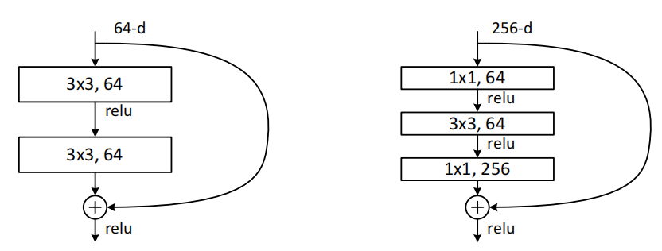

# Deep Residual Learning for Image Recognition
图像识别中的深度残差学习 2015.12.10 原文：https://arxiv.org/abs/1512.03385

## 阅读笔记
* https://github.com/pytorch/vision/blob/main/torchvision/models/resnet.py
* 简单的深度堆叠，训练和测试误差反而下降的原因？

## Abstract
Deeper neural networks are more difficult to train. We present a residual learning framework to ease the training of networks that are substantially deeper than those used previously. We explicitly reformulate the layers as learning residual functions with reference to the layer inputs, instead of learning unreferenced functions. We provide comprehensive empirical evidence showing that these residual networks are easier to optimize, and can gain accuracy from considerably increased depth. On the ImageNet dataset we evaluate residual nets with a depth of up to 152 layers—8× deeper than VGG nets [41] but still having lower complexity. An ensemble of these residual nets achieves 3.57% error on the ImageNet test set. This result won the 1st place on the ILSVRC 2015 classification task. We also present analysis on CIFAR-10 with 100 and 1000 layers.

更深层的神经网络更难训练。我们提出了一个残差学习框架，以简化更深层网络的训练。我们明确地将层重新表述为学习残差函数的参考层输入，而不是学习未引用的函数。我们提供了全面的实验证据表明,这些残差网络更容易优化，并且可以从显著增加的深度中以获得精度。在ImageNet数据集上，我们评估了深度达152层的残差网络，比VGG网络深8倍[41]，但复杂性仍然较低。这些集成的残差网络在ImageNet测试集上达到3.57%的误差。该结果在ILSVRC 2015分类任务中获得第一名。我们还对具有100和1000层的CIFAR-10进行了分析。

The depth of representations is of central importance for many visual recognition tasks. Solely due to our extremely deep representations, we obtain a 28% relative improvement on the COCO object detection dataset. Deep residual nets are foundations of our submissions to ILSVRC & COCO 2015 competitions1, where we also won the 1st places on the tasks of ImageNet detection, ImageNet localization, COCO detection, and COCO segmentation.

表征的深度对于许多视觉识别任务至关重要。仅由于我们的超深度表示，我们在COCO目标检测数据集上获得了28%的相对改进。深度残差网是我们提交给ILSVRC&COCO 2015竞赛1的基础，在那里我们还赢得了ImageNet检测、ImageNet定位、COCO检测和COCO语义分割任务的第一名。

## 1. Introduction
Deep convolutional neural networks [22, 21] have led to a series of breakthroughs for image classification [21, 50, 40]. Deep networks naturally integrate low/mid/highlevel features [50] and classifiers in an end-to-end multilayer fashion, and the “levels” of features can be enriched by the number of stacked layers (depth). Recent evidence [41, 44] reveals that network depth is of crucial importance, and the leading results [41, 44, 13, 16] on the challenging ImageNet dataset [36] all exploit “very deep” [41] models, with a depth of sixteen [41] to thirty [16]. Many other nontrivial visual recognition tasks [8, 12, 7, 32, 27] have also greatly benefited from very deep models.

深度卷积神经网络[22，21]在图像分类方面取得了一系列突破[21，50，40]。深层网络天然以端到端的多层方式集成低/中/高层特征[50]和分类器，并且特征的“层次”可以通过堆叠层的数量(深度)来丰富。最近的证据[41，44]表明，网络深度至关重要，在富有挑战性的ImageNet数据集[36]上，领先的结果[41，44，13，16]都利用了“非常深”[41]模型，深度为16[41]到30[16]。许多其他非凡的视觉识别任务[8,12,7,32,27]也从非常深的模型中受益匪浅。

Driven by the significance of depth, a question arises: Is learning better networks as easy as stacking more layers? An obstacle to answering this question was the notorious problem of vanishing/exploding gradients [1, 9], which hamper convergence from the beginning. This problem, however, has been largely addressed by normalized initialization [23, 9, 37, 13] and intermediate normalization layers [16], which enable networks with tens of layers to start converging for stochastic gradient descent (SGD) with backpropagation [22].

受深度重要性的驱动，出现了一个问题：学习更好的网络就像堆叠更多层一样容易吗？回答这个问题的一个障碍是众所周知的梯度消失/爆炸问题[1,9]，这从一开始就阻碍了收敛。然而，这个问题在很大程度上已经通过初始归一化[23、9、37、13]和中间的归一化层[16]得到了解决，这使得具有数十层的网络能够开始通过反向传播进行随机梯度下降(SGD)的收敛[22]。

When deeper networks are able to start converging, a degradation problem has been exposed: with the network depth increasing, accuracy gets saturated (which might be unsurprising) and then degrades rapidly. Unexpectedly, such degradation is not caused by overfitting, and adding more layers to a suitably deep model leads to higher training error, as reported in [11, 42] and thoroughly verified by our experiments. Fig. 1 shows a typical example.

当更深的网络能够开始收敛时，就会暴露出一个退化问题：随着网络深度的增加，精度会达到饱和(这可能并不奇怪)，然后迅速退化。出乎意料的是，这种退化并不是由过拟合引起的，向适当深度的模型添加更多层会导致更高的训练误差，如[11，42]所述，并通过我们的实验进行了彻底验证。图1显示了一个典型样本。

 
Figure 1. Training error (left) and test error (right) on CIFAR-10 with 20-layer and 56-layer “plain” networks. The deeper network has higher training error, and thus test error. Similar phenomena on ImageNet is presented in Fig. 4.
图1.CIFAR-10上的训练误差(左)和测试误差(右)，具有20层和56层“普通”网络。较深的网络具有较高的训练误差，和测试误差。ImageNet上的类似现象如图4所示。

The degradation (of training accuracy) indicates that not all systems are similarly easy to optimize. Let us consider a shallower architecture and its deeper counterpart that adds more layers onto it. There exists a solution by construction to the deeper model: the added layers are identity mapping, and the other layers are copied from the learned shallower model. The existence of this constructed solution indicates that a deeper model should produce no higher training error than its shallower counterpart. But experiments show that our current solvers on hand are unable to find solutions that are comparably good or better than the constructed solution (or unable to do so in feasible time).

(训练精度)下降表明，并非所有系统都同样容易优化。让我们考虑在一个较浅的架构上添加更多层的较深的对应结构。通过构建更深层的模型，存在一个解决方案：添加的层是恒等映射，其他层是从学习到的浅层模型复制而来的。该结构的存在表明，较深的模型不会比较浅的模型产生更高的训练误差。但实验表明，我们现有的解决方案无法找到与结构相当好或更好的解(或无法在可行时间内找到)。

In this paper, we address the degradation problem by introducing a deep residual learning framework. Instead of hoping each few stacked layers directly fit a desired underlying mapping, we explicitly let these layers fit a residual mapping. Formally, denoting the desired underlying mapping as H(x), we let the stacked nonlinear layers fit another mapping of F (x) := H(x) − x. The original mapping is recast into F(x)+x. We hypothesize that it is easier to optimize the residual mapping than to optimize the original, unreferenced mapping. To the extreme, if an identity mapping were optimal, it would be easier to push the residual to zero than to fit an identity mapping by a stack of nonlinear layers.

在本文中，我们通过引入深度残差学习框架来解决退化问题。我们不希望每个堆叠层直接拟合所需的底层映射，而是明确地让这些层拟合残差映射。形式上，将所需的底层映射表示为H(x)，我们让堆叠的非线性层与另一个映射 F(x) := H(x) − x. 原始映射被重新转换为F(x)+x。我们假设优化残差映射比优化原始未引用映射更容易。在极端情况下，如果恒等映射是最优的，那么将残差降到零比通过一堆非线性层拟合的恒等映射更容易。

The formulation of F(x) + x can be realized by feedforward neural networks with “shortcut connections” (Fig. 2). Shortcut connections [2, 34, 49] are those skipping one or more layers. In our case, the shortcut connections simply perform identity mapping, and their outputs are added to the outputs of the stacked layers (Fig. 2). Identity shortcut connections add neither extra parameter nor computational complexity. The entire network can still be trained end-to-end by SGD with backpropagation, and can be easily implemented using common libraries (e.g., Caffe [19]) without modifying the solvers.

F(x) + x的公式可以通过具有“快捷连接”的前馈神经网络实现(图2)。快捷连接[2、34、49]是跳过一个或多个层的连接。在我们的例子中，快捷连接只执行恒等映射，它们的输出被添加到堆叠层的输出中(图2)。恒等快捷方式连接既不会增加额外的参数，也不会增加计算复杂性。整个网络仍然可以通过带有反向传播的SGD进行端到端的训练，并且可以使用公共库(例如，Caffe[19])轻松实现，而无需修改求解器。

 
Figure 2. Residual learning: a building block.

We present comprehensive experiments on ImageNet [36] to show the degradation problem and evaluate our method. We show that: 1) Our extremely deep residual nets are easy to optimize, but the counterpart “plain” nets (that simply stack layers) exhibit higher training error when the depth increases; 2) Our deep residual nets can easily enjoy accuracy gains from greatly increased depth, producing results substantially better than previous networks.

我们在ImageNet[36]上进行了综合实验，以显示退化问题并评估我们的方法。我们表明：1)我们的极深残差网很容易优化，但对应的“普通”网(简单地堆叠层)在深度增加时表现出更高的训练误差; 2) 我们的深度残差网可以很容易地从大增的深度中获得精度，产生的结果大优于以前的网络。

Similar phenomena are also shown on the CIFAR-10 set [20], suggesting that the optimization difficulties and the effects of our method are not just akin to a particular dataset. We present successfully trained models on this dataset with over 100 layers, and explore models with over 1000 layers.

CIFAR-10集成[20]上也显示了类似的现象，这表明我们的方法的优化困难和效果不仅类似于特定的数据集。我们在这个数据集上展示了100层的成功训练模型，并探索了1000层的模型。

On the ImageNet classification dataset [36], we obtain excellent results by extremely deep residual nets. Our 152layer residual 
net is the deepest network ever presented on ImageNet, while still having lower complexity than VGG nets [41]. Our ensemble has 3.57% top-5 error on the ImageNet test set, and won the 1st place in the ILSVRC 2015 classification competition. The extremely deep representations also have excellent generalization performance on other recognition tasks, and lead us to further win the 1st places on: ImageNet detection, ImageNet localization, COCO detection, and COCO segmentation in ILSVRC & COCO 2015 competitions. This strong evidence shows that the residual learning principle is generic, and we expect that it is applicable in other vision and non-vision problems.

在ImageNet分类数据集[36]上，我们通过极深的残差网获得了极好的结果。我们的152层残差网络是ImageNet上有史以来最深的网络，但其复杂性仍低于VGG网络[41]。我们的团队在ImageNet测试集的前五名错误率为3.57%，并在ILSVRC 2015分类比赛中获得第一名。极深的表征在其他识别任务上也具有出色的泛化性能，并使我们在ILSVRC和COCO 2015比赛中，在ImageNet检测、ImageNet定位、COCO检测和COCO分割方面进一步赢得第一名。这一有力证据表明，残差学习原则是通用的，我们期望它适用于其他视觉和非视觉问题。

## 2. Related Work
### Residual Representations. 
In image recognition, VLAD [18] is a representation that encodes by the residual vectors with respect to a dictionary, and Fisher Vector [30] can be formulated as a probabilistic version [18] of VLAD. Both of them are powerful shallow representations for image retrieval and classification [4, 48]. For vector quantization, encoding residual vectors [17] is shown to be more effective than encoding original vectors.

残差表示。在图像识别中，VLAD[18]是一种表示形式，它通过字典的残差向量进行编码，Fisher向量[30]可以表示为VLAD的概率版本[18]。它们都是图像检索和分类的强大浅层表示[4，48]。对于向量量化，编码残差向量[17]被证明比编码原始向量更有效。

In low-level vision and computer graphics, for solving Partial Differential Equations (PDEs), the widely used Multigrid method [3] reformulates the system as subproblems at multiple scales, where each subproblem is responsible for the residual solution between a coarser and a finer scale. An alternative to Multigrid is hierarchical basis preconditioning [45, 46], which relies on variables that represent residual vectors between two scales. It has been shown [3, 45, 46] that these solvers converge much faster than standard solvers that are unaware of the residual nature of the solutions. These methods suggest that a good reformulation or preconditioning can simplify the optimization.

在低级视觉和计算机图形学中，为了求解偏微分方程(PDE)，广泛使用的多重网格方法[3]将系统重新构造为多尺度的子问题，其中每个子问题负责较粗尺度和较细尺度之间的残差解。多重网格的另一种选择是分层基预处理[45,46]，它依赖于表示两个尺度之间残差向量的变量。已经证明[3、45、46]，这些求解器比不知道解的残差性质的标准求解器收敛得快得多。这些方法表明，良好的重新制定或预处理可以简化优化。

### Shortcut Connections. 
Practices and theories that lead to shortcut connections [2, 34, 49] have been studied for a long time. An early practice of training multi-layer perceptrons (MLPs) is to add a linear layer connected from the network input to the output [34, 49]. In [44, 24], a few intermediate layers are directly connected to auxiliary classifiers for addressing vanishing/exploding gradients. The papers of [39, 38, 31, 47] propose methods for centering layer responses, gradients, and propagated errors, implemented by shortcut connections. In [44], an “inception” layer is composed of a shortcut branch and a few deeper branches.

快捷连接。指导快捷连接的实践和理论[2，34，49]已经研究了很长时间。训练多层感知器(MLP)的早期实践是添加一个从网络输入连接到输出的线性层[34，49]。在[44，24]中，一些中间层直接连接到辅助分类器，用于处理消失/爆炸梯度。[39、38、31、47]的论文提出了通过快捷连接实现的层响应、梯度和传播误差中心化方法。在[44]中，“inception”层由一个快捷分支和几个更深的分支组成。

Concurrent with our work, “highway networks” [42, 43] present shortcut connections with gating functions [15]. These gates are data-dependent and have parameters, in contrast to our identity shortcuts that are parameter-free. When a gated shortcut is “closed” (approaching zero), the layers in highway networks represent non-residual functions. On the contrary, our formulation always learns residual functions; our identity shortcuts are never closed, and all information is always passed through, with additional residual functions to be learned. In addition, highway networks have not demonstrated accuracy gains with extremely increased depth (e.g., over 100 layers).

与我们的工作同时，“公路网络”[42，43]提供了具有门函数的快捷连接[15]。这些门依赖于数据，并且有参数，而我们的恒等快捷方式是无参数的。当门快捷方式“关闭”(接近零)时，公路网中的图层表示非残差函数。相反，我们的公式总是学习残差函数; 我们的恒等快捷方式永远不会关闭，所有信息都会通过，还有其他残差功能需要学习。此外，公路网在深度极大增加的情况下(例如，超过100层)，并不会提高精度。

## 3. Deep Residual Learning 
### 3.1. Residual Learning
Let us consider H(x) as an underlying mapping to be fit by a few stacked layers (not necessarily the entire net), with x denoting the inputs to the first of these layers. If one hypothesizes that multiple nonlinear layers can asymptotically approximate complicated functions2, then it is equivalent to hypothesize that they can asymptotically approximate the residual functions, i.e., H(x) − x (assuming that the input and output are of the same dimensions). So rather than expect stacked layers to approximate H(x), we explicitly let these layers approximate a residual function F(x) := H(x) − x. The original function thus becomes F(x)+x. Although both forms should be able to asymptotically approximate the desired functions (as hypothesized), the ease of learning might be different.

让我们将H(x)视为一个底层映射，由几个堆叠层(不一定是整个网络)拟合，x表示这些层中第一层的输入。如果假设多个非线性层可以渐近逼近复杂函数2，则相当于假设它们可以渐近逼近残差函数，即H(x)− x(假设输入和输出的尺寸相同)。因此，我们不是期望堆叠层近似于H(x)，而是明确地让这些层近似于残差函数F(x)：=H(x− x、 因此，原始函数变成F(x)+x。虽然这两种形式都应该能够渐近逼近所需的函数(如假设的那样)，但学习的容易程度可能有所不同。

This reformulation is motivated by the counterintuitive phenomena about the degradation problem (Fig. 1, left). As we discussed in the introduction, if the added layers can be constructed as identity mappings, a deeper model should have training error no greater than its shallower counterpart. The degradation problem suggests that the solvers might have difficulties in approximating identity mappings by multiple nonlinear layers. With the residual learning reformulation, if identity mappings are optimal, the solvers may simply drive the weights of the multiple nonlinear layers toward zero to approach identity mappings.

这种重新制定的动机是关于退化问题的反直觉现象(图1，左)。正如我们在引言中所讨论的，如果添加的层可以构造为恒等映射，则较深的模型的训练误差不应大于较浅的模型。退化问题表明，求解器可能难以通过多个非线性层来近似恒等映射。使用残差学习重设公式，如果恒等映射是最优的，求解器可以简单地将多个非线性层的权重逼近零，以接近恒等映射。

In real cases, it is unlikely that identity mappings are optimal, but our reformulation may help to precondition the problem. If the optimal function is closer to an identity mapping than to a zero mapping, it should be easier for the solver to find the perturbations with reference to an identity mapping, than to learn the function as a new one. We show by experiments (Fig. 7) that the learned residual functions in general have small responses, suggesting that identity mappings provide reasonable preconditioning.

在实际情况下，恒等映射不太可能是最优的，但我们的重设公式可能有助于解决问题。如果最优函数更接近恒等映射，而不是零映射，那么求解器应该更容易根据恒等映射找到扰动，而不是将函数作为新函数来学习。我们通过实验(图7)表明，学习的残差函数通常具有较小的响应，这表明恒等映射提供了合理的预处理。

### 3.2. Identity Mapping by Shortcuts
We adopt residual learning to every few stacked layers. A building block is shown in Fig. 2. Formally, in this paper we consider a building block defined as:

我们对每个堆叠层采用残差学习。一个构建块如图2所示。在本文中，我们考虑的构建块定义为：

$y = F(x, \{W_i\}) + x$.     (1)

Here x and y are the input and output vectors of the layers considered. The function $F(x, \{W_i\})$ represents the residual mapping to be learned. For the example in Fig. 2 that has two layers, $F = W_2σ(W_1x)$ in which σ denotes ReLU [29] and the biases are omitted for simplifying notations. The operation F + x is performed by a shortcut connection and element-wise addition. We adopt the second nonlinearity after the addition (i.e., σ(y), see Fig. 2).

这里x和y是所考虑层的输入和输出向量。函数$F(x, \{Wz_i\})$表示要学习的残差映射。对于图2中有两层的样本，$F = W_2σ(W_1x)$，其中σ表示ReLU[29]，为了简化符号，省略了偏差。操作F+x通过快捷连接和元素相加来执行。我们采用加法后的第二个非线性(即σ(y)，见图2)。

The shortcut connections in Eqn.(1) introduce neither extra parameter nor computation complexity. This is not only attractive in practice but also important in our comparisons between plain and residual networks. We can fairly compare plain/residual networks that simultaneously have the same number of parameters, depth, width, and computational cost (except for the negligible element-wise addition).

Eqn(1)中的快捷连接。 既不引入额外参数，也不引入计算复杂性。这不仅在实践中很有吸引力，而且在我们比较普通网络和残差网络时也很重要。我们可以公平地比较同时具有相同数量的参数、深度、宽度和计算成本(除了可忽略的元素相加)的普通/残差网络。

The dimensions of x and F must be equal in Eqn.(1). If this is not the case (e.g., when changing the input/output channels), we can perform a linear projection $W_s$ by the shortcut connections to match the dimensions:

公式(1)中x和F的尺寸必须相等。如果不是这样(例如，在更改输入/输出通道时)，我们可以通过快捷连接执行线性投影$W_s$，以匹配尺寸：

$y = F (x, \{W_i \}) + W_s x$.  (2)

We can also use a square matrix $W_s$ in Eqn.(1). But we will show by experiments that the identity mapping is sufficient for addressing the degradation problem and is economical, and thus $W_s$ is only used when matching dimensions.

我们也可以在式(1)中使用方阵$W_s$。但是，我们将通过实验表明，恒等映射足以解决退化问题，而且是经济的，因此$W_s$仅在维度匹配时使用。

The form of the residual function F is flexible. Experiments in this paper involve a function F that has two or three layers (Fig. 5), while more layers are possible. But if F has only a single layer, Eqn.(1) is similar to a linear layer: y = $W_1$ x + x, for which we have not observed advantages.

残差函数F的形式是灵活的。本文中的实验涉及一个有两层或三层的函数F(图5)，而可能有更多层。但如果F只有一层，Eqn.(1)类似于线性层：y=$W_1$ x+x，我们尚未观察到其优点。

We also note that although the above notations are about fully-connected layers for simplicity, they are applicable to convolutional layers. The function $F(x,\{W_i\})$ can represent multiple convolutional layers. The element-wise addition is performed on two feature maps, channel by channel.

我们还注意到，尽管为了简单起见，上述符号是关于全连接层的，但它们适用于卷积层。函数$F(x,\{W_i\})$可以表示多个卷积层。逐通道在两个特征图上执行元素添加。

### 3.3. Network Architectures
We have tested various plain/residual nets, and have observed consistent phenomena. To provide instances for discussion, we describe two models for ImageNet as follows.

我们测试了各种普通网络/残差网络，并观察到一致的现象。为了提供讨论的实例，我们描述了两个针对ImageNet的模型，如下所示。

#### Plain Network. 
Our plain baselines (Fig. 3, middle) are mainly inspired by the philosophy of VGG nets [41] (Fig. 3, left). The convolutional layers mostly have 3×3 filters and follow two simple design rules: (i) for the same output feature map size, the layers have the same number of filters; and (ii) if the feature map size is halved, the number of filters is doubled so as to preserve the time complexity per layer. We perform downsampling directly by convolutional layers that have a stride of 2. The network ends with a global average pooling layer and a 1000-way fully-connected layer with softmax. The total number of weighted layers is 34 in Fig. 3 (middle).

普通网络。我们的简单基线(图3，中间)主要受VGG网络的理念启发[41](图3(左))。卷积层主要有3×3个卷积核，并遵循两个简单的设计规则：(i)对于相同的输出特征图大小，层具有相同数量的卷积核; 和(ii)如果特征图大小减半，则卷积核的数量加倍，以保持每层的时间复杂性。我们直接通过步幅为2的卷积层进行下采样。网络以全局平均池层和与softmax完全连接的1000路层结束。图3(中间)中的加权层数总计为34层。

 
Figure 3. Example network architectures for ImageNet. 
Left: the VGG-19 model [41] (19.6 billion FLOPs) as a reference. 
Middle: a plain network with 34 parameter layers (3.6 billion FLOPs).
Right: a residual network with 34 parameter layers (3.6 billion FLOPs). 
The dotted shortcuts increase dimensions. Table 1 shows more details and other variants.
图3.ImageNet的网络架构样本。
左：参考VGG-19模型[41](196亿FLOP)。
中：具有34个参数层(36亿FLOP)的普通网络。
右：具有34个参数层(36亿FLOP)的残差网络。
虚线快捷键增加了尺寸。表1显示了更多细节和其他变体。

It is worth noticing that our model has fewer filters and lower complexity than VGG nets [41] (Fig. 3, left). Our 34layer baseline has 3.6 billion FLOPs (multiply-adds), which is only 18% of VGG-19 (19.6 billion FLOPs).

值得注意的是，我们的模型比VGG网络具有更少的卷积核和更低的复杂性[41](图3，左)。我们的34层基线有36亿FLOP(乘加)，仅为VGG-19(196亿FLOP)的18%。

 
Table 1. Architectures for ImageNet. Building blocks are shown in brackets (see also Fig. 5), with the numbers of blocks stacked.Downsampling is performed by conv3 1, conv4 1, and conv5 1 with a stride of 2.

#### Residual Network. 
Based on the above plain network, we insert shortcut connections (Fig. 3, right) which turn the network into its counterpart residual version. The identity shortcuts (Eqn.(1)) can be directly used when the input and output are of the same dimensions (solid line shortcuts in Fig. 3). When the dimensions increase (dotted line shortcuts in Fig. 3), we consider two options: (A) The shortcut still performs identity mapping, with extra zero entries padded for increasing dimensions. This option introduces no extra parameter; (B) The projection shortcut in Eqn.(2) is used to match dimensions (done by 1×1 convolutions). For both options, when the shortcuts go across feature maps of two sizes, they are performed with a stride of 2.

残差网络。基于上述普通网络，我们插入快捷连接(图3，右)，将网络转换为对应的残差版本。当输入和输出的尺寸相同时，可以直接使用恒等快捷键(等式(1))(图3中的实线快捷键)。当尺寸增加时(图3中的虚线快捷方式)，我们考虑两个选项：(A)快捷方式仍然执行恒等映射，为增加尺寸填充额外的零条目。此选项不引入额外参数; (B) Eqn中的投影快捷方式。(2) 用于匹配尺寸(通过1×1卷积完成)。对于这两个选项，当快捷方式穿过两种尺寸的要素地图时，将以2的步幅执行。

### 3.4. Implementation
Our implementation for ImageNet follows the practice in [21, 41]. The image is resized with its shorter side randomly sampled in [256, 480] for scale augmentation [41]. A 224×224 crop is randomly sampled from an image or its horizontal flip, with the per-pixel mean subtracted [21]. The standard color augmentation in [21] is used. We adopt batch normalization (BN) [16] right after each convolution and before activation, following [16]. We initialize the weights as in [13] and train all plain/residual nets from scratch. We use SGD with a mini-batch size of 256. The learning rate starts from 0.1 and is divided by 10 when the error plateaus, and the models are trained for up to 60 × 104 iterations. We use a weight decay of 0.0001 and a momentum of 0.9. We do not use dropout [14], following the practice in [16].

我们对ImageNet的实现遵循[21，41]中的实践。图像的较短边在[256,480]中随机采样，以进行缩放[41]。从图像或其水平翻转中随机采样224×224裁剪，减去每像素平均值[21]。使用了[21]中的标准颜色增强。我们在每次卷积之后和激活之前采用批归一化(BN)[16]，如下[16]。我们初始化权重，如[13]所示，并从头开始训练所有普通/残差网络。我们使用最小批量大小为256的SGD。学习率从0.1开始，当误差达到稳定时除以10，并且模型经过最多60×104次迭代的训练。我们使用0.0001的权重衰减和0.9的动量。按照[16]中的实践，我们不使用衰减[14]。

In testing, for comparison studies we adopt the standard 10-crop testing [21]. For best results, we adopt the fullyconvolutional form as in [41, 13], and average the scores at multiple scales (images are resized such that the shorter side is in {224, 256, 384, 480, 640}).

在测试中，为了进行比较研究，我们采用了标准的10种剪裁测试[21]。为了获得最佳结果，我们采用了如[41，13]所示的全循环形式，并在多个尺度上平均分数(调整图像大小，使较短的一侧位于{224，256，384，480，640})。

## 4. Experiments
### 4.1. ImageNet Classification
We evaluate our method on the ImageNet 2012 classification dataset [36] that consists of 1000 classes. The models are trained on the 1.28 million training images, and evaluated on the 50k validation images. We also obtain a final result on the 100k test images, reported by the test server. We evaluate both top-1 and top-5 error rates.

我们在由1000个类组成的ImageNet 2012分类数据集[36]上评估了我们的方法。模型在128万张训练图像上进行训练，并在50k验证图像上进行评估。我们还获得了测试服务器报告的100k测试图像的最终结果。我们评估了前1名和前5名的错误率。

#### Plain Networks. 
We first evaluate 18-layer and 34-layer plain nets. The 34-layer plain net is in Fig. 3 (middle). The 18-layer plain net is of a similar form. See Table 1 for detailed architectures.

普通网络。我们首先评估18层和34层普通网。34层普通网如图3(中)所示。18层普通网形式类似，具体结构见表1。

 
Table 2. Top-1 error (%, 10-crop testing) on ImageNet validation. Here the ResNets have no extra parameter compared to their plain counterparts. Fig. 4 shows the training procedures.
ImageNet验证的前1个错误(%，10个裁剪测试)。在这里，ResNets与普通的ResNets相比没有额外的参数。图4显示了训练过程。

 
Figure 4. Training on ImageNet. Thin curves denote training error, and bold curves denote validation error of the center crops. Left: plain networks of 18 and 34 layers. Right: ResNets of 18 and 34 layers. In this plot, the residual networks have no extra parameter compared to their plain counterparts.
图4.ImageNet训练。细曲线表示训练误差，粗曲线表示中心裁剪的验证误差。左图：18层和34层的普通网络。右：18层和34层的ResNets。在该图中，与普通网络相比，残差网络没有额外的参数。

The results in Table 2 show that the deeper 34-layer plain net has higher validation error than the shallower 18-layer plain net. To reveal the reasons, in Fig. 4 (left) we compare their training/validation errors during the training procedure. We have observed the degradation problem the 34-layer plain net has higher training error throughout the whole training procedure, even though the solution space of the 18-layer plain network is a subspace of that of the 34-layer one.

表2中的结果表明，较深的34层普通网比较浅的18层普通网具有更高的验证误差。为了揭示原因，在图4(左)中，我们比较了他们在训练过程中的训练/验证错误。我们已经观察到退化问题，34层普通网络在整个训练过程中都有较高的训练误差，即使18层普通网络的解空间是34层普通网解空间的子空间。

We argue that this optimization difficulty is unlikely to be caused by vanishing gradients. These plain networks are trained with BN [16], which ensures forward propagated signals to have non-zero variances. We also verify that the backward propagated gradients exhibit healthy norms with BN. So neither forward nor backward signals vanish. In fact, the 34-layer plain net is still able to achieve competitive accuracy (Table 3), suggesting that the solver works to some extent. We conjecture that the deep plain nets may have exponentially low convergence rates, which impact the reducing of the training error3. The reason for such optimization difficulties will be studied in the future.

我们认为，这种优化困难不太可能是由梯度消失引起的。这些普通网络使用BN[16]进行训练，确保前向传播的信号具有非零方差。我们还验证了后向传播梯度在BN上表现出健康的标准。因此，前向和反向信号都不会消失。事实上，34层普通网络仍然能够达到具有竞争力的精度(表3)，这表明求解器在一定程度上可以工作。我们推测，深度普通网络可能具有指数级的低收敛速度，这会影响训练误差的减少3。此类优化困难的原因将在未来研究。

 
Table 3. Error rates (%, 10-crop testing) on ImageNet validation. VGG-16 is based on our test. ResNet-50/101/152 are of option B that only uses projections for increasing dimensions.
表3.ImageNet验证的错误率(%，10种剪裁测试)。VGG-16基于我们的测试。ResNet-50/101/152是选项B，仅使用投影增加尺寸。

#### Residual Networks. 
Next we evaluate 18-layer and 34layer residual nets (ResNets). The baseline architectures are the same as the above plain nets, expect that a shortcut connection is added to each pair of 3×3 filters as in Fig. 3 (right). In the first comparison (Table 2 and Fig. 4 right), we use identity mapping for all shortcuts and zero-padding for increasing dimensions (option A). So they have no extra parameter compared to the plain counterparts.

残差网络。接下来，我们评估18层和34层残差网络(ResNets)。基线架构与上述普通网络相同，但对每对3×3卷积核都添加了一个快捷连接，如图3(右)所示。在第一次比较中(右表2和图4)，我们对所有快捷方式使用恒等映射，对增加的维度使用零填充(选项A)。因此，与普通的参数相比，它们没有额外的参数。

We have three major observations from Table 2 and Fig. 4. First, the situation is reversed with residual learning – the 34-layer ResNet is better than the 18-layer ResNet (by 2.8%). More importantly, the 34-layer ResNet exhibits considerably lower training error and is generalizable to the validation data. This indicates that the degradation problem is well addressed in this setting and we manage to obtain accuracy gains from increased depth.

我们从表2和图4中可以看到三个主要的观察结果。首先，这种情况与残差学习相反 —— 34层的ResNet比18层的ResNet好(2.8%)。更重要的是，34层ResNet的训练误差要小得多，并且可以推广到验证数据中。这表明退化问题在此设置中得到了很好的解决，我们设法通过增加深度获得了精度增益。

Second, compared to its plain counterpart, the 34-layer ResNet reduces the top-1 error by 3.5% (Table 2), resulting from the successfully reduced training error (Fig. 4 right vs. left). This comparison verifies the effectiveness of residual learning on extremely deep systems.

其次，与普通ResNet相比，34层ResNet将top-1错误减少了3.5%(表2)，这是因为成功地减少了训练错误(图4右侧与左侧)。这一比较验证了残差学习在极深系统上的有效性。

Last, we also note that the 18-layer plain/residual nets are comparably accurate (Table 2), but the 18-layer ResNet converges faster (Fig. 4 right vs. left). When the net is “not overly deep” (18 layers here), the current SGD solver is still able to find good solutions to the plain net. In this case, the ResNet eases the optimization by providing faster convergence at the early stage.

最后，我们还注意到，18层普通网络/残差网络相对准确(表2)，但18层ResNet收敛更快(图4右侧与左侧)。当网络“不太深”(此处为18层)时，当前的SGD求解器仍然能够为普通网络找到好的解决方案。在这种情况下，ResNet通过在早期提供更快的收敛来简化优化。

#### Identity vs. Projection Shortcuts. 
We have shown that parameter-free, identity shortcuts help with training. Next we investigate projection shortcuts (Eqn.(2)). In Table 3 we compare three options: (A) zero-padding shortcuts are used for increasing dimensions, and all shortcuts are parameterfree (the same as Table 2 and Fig. 4 right); (B) projection shortcuts are used for increasing dimensions, and other shortcuts are identity; and (C) all shortcuts are projections.

恒等与投影快捷方式。我们已经证明，无参数的恒等快捷方式有助于训练。接下来我们研究投影快捷方式(等式(2))。在表3中，我们比较了三个选项：
(A)零填充快捷键用于增加尺寸，所有快捷键都是无参数的(与右表2和图4相同); 
(B) 投影快捷键用于增加尺寸，其他快捷键是恒等; 
和(C)所有捷径都是投影。

Table 3 shows that all three options are considerably better than the plain counterpart. B is slightly better than A. We argue that this is because the zero-padded dimensions in A indeed have no residual learning. C is marginally better than B, and we attribute this to the extra parameters introduced by many (thirteen) projection shortcuts. But the small differences among A/B/C indicate that projection shortcuts are not essential for addressing the degradation problem. So we do not use option C in the rest of this paper, to reduce memory/time complexity and model sizes. Identity shortcuts are particularly important for not increasing the complexity of the bottleneck architectures that are introduced below.

表3显示，这三种方案都比普通方案好得多。B略优于A。我们认为这是因为A中的零填充维度确实没有残差学习。C稍微好于B，我们将其归因于许多(十三个)投影快捷方式引入的额外参数。但A/B/C之间的细微差异表明，投影快捷方式对于解决降级问题并不重要。因此，在本文的其余部分，我们不使用选项C来降低内存/时间复杂性和模型大小。恒等快捷方式对于不增加下面介绍的瓶颈架构的复杂性尤为重要。

 
Table 4. Error rates (%) of single-model results on the ImageNet validation set (except † reported on the test set).
表4.ImageNet验证集上单模型结果的错误率(%)(测试集上报告的†除外)。

#### Deeper Bottleneck Architectures. 
Next we describe our deeper nets for ImageNet. Because of concerns on the training time that we can afford, we modify the building block as a bottleneck design(4Deeper non-bottleneck ResNets (e.g., Fig. 5 left) also gain accuracy from increased depth (as shown on CIFAR-10), but are not as economical as the bottleneck ResNets. So the usage of bottleneck designs is mainly due to practical considerations. We further note that the degradation problem of plain nets is also witnessed for the bottleneck designs.) . For each residual function F , we use a stack of 3 layers instead of 2 (Fig. 5). The three layers are 1×1, 3×3, and 1×1 convolutions, where the 1×1 layers are responsible for reducing and then increasing (restoring) dimensions, leaving the 3×3 layer a bottleneck with smaller input/output dimensions. Fig. 5 shows an example, where both designs have similar time complexity.

更深层的瓶颈架构。接下来，我们描述ImageNet的深层网络。由于担心我们能够负担得起的训练时间，我们将构建块修改为瓶颈设计(4更深的非瓶颈ResNets(例如，图5左侧)也可以从增加的深度中获得精度(如CIFAR-10所示)，但不如瓶颈ResNet经济。因此，瓶颈设计的使用主要是出于实际考虑。我们进一步注意到，对于瓶颈设计，也存在普通网络的退化问题。)。对于每个残差函数F，我们使用3层而不是2层的堆栈(图5)。这三个层是1×1、3×3和1×1卷积，其中1×1层负责减小然后增加(恢复)维度，使3×3层成为输入/输出维度较小的瓶颈。图5显示了一个样本，其中两种设计具有相似的时间复杂度。

The parameter-free identity shortcuts are particularly important for the bottleneck architectures. If the identity shortcut in Fig. 5 (right) is replaced with projection, one can show that the time complexity and model size are doubled, as the shortcut is connected to the two high-dimensional ends. So identity shortcuts lead to more efficient models for the bottleneck designs.

无参数恒等快捷方式对于瓶颈架构尤为重要。如果将图5(右)中的恒等快捷方式替换为投影，可以看出时间复杂度和模型大小是原来的两倍，因为快捷方式连接到两个高维端。因此，恒等快捷方式可以为瓶颈设计提供更高效的模型。

 
Figure 5. A deeper residual function F for ImageNet. Left: a building block (on 56×56 feature maps) as in Fig. 3 for ResNet- 34. Right: a “bottleneck” building block for ResNet-50/101/152.
图5.ImageNet的更深残差函数F。左图：ResNet-34的构建块(在56×56特征图上)，如图3所示。右图：ResNet-50/101/152的“瓶颈”构建块。

#### 50-layer ResNet: 
We replace each 2-layer block in the 34-layer net with this 3-layer bottleneck block, resulting in a 50-layer ResNet (Table 1). We use option B for increasing dimensions. This model has 3.8 billion FLOPs.

50层ResNet：我们将34层网络中的每个2层块替换为这个3层瓶颈块，从而得到50层的ResNet(表1)。我们使用选项B来增加尺寸。此模型有38亿FLOP。

#### 101-layer and 152-layer ResNets: 
We construct 101layer and 152-layer ResNets by using more 3-layer blocks (Table 1). Remarkably, although the depth is significantly increased, the 152-layer ResNet (11.3 billion FLOPs) still has lower complexity than VGG-16/19 nets (15.3/19.6 billion FLOPs).

101层和152层ResNets：我们通过使用更多的3层块构造101层和52层ResNet(表1)。值得注意的是，尽管深度显著增加，但152层ResNet(113亿FLOP)的复杂性仍低于VGG-16/19网络(153/196亿FLOPs)。

The 50/101/152-layer ResNets are more accurate than the 34-layer ones by considerable margins (Table 3 and 4). We do not observe the degradation problem and thus enjoy significant accuracy gains from considerably increased depth. The benefits of depth are witnessed for all evaluation metrics (Table 3 and 4).

50/101/152层ResNets比34层ResNet精确得多(表3和表4)。我们没有观察到退化问题，因此，深度大大增加，精度显著提高。所有评估指标都证明了深度的好处(表3和表4)。

#### Comparisons with State-of-the-art Methods. 
In Table 4 we compare with the previous best single-model results. Our baseline 34-layer ResNets have achieved very competitive accuracy. Our 152-layer ResNet has a single-model top-5 validation error of 4.49%. This single-model result outperforms all previous ensemble results (Table 5). We combine six models of different depth to form an ensemble (only with two 152-layer ones at the time of submitting). This leads to 3.57% top-5 error on the test set (Table 5). This entry won the 1st place in ILSVRC 2015.

与最先进方法的比较。在表4中，我们将其与之前的最佳单模型结果进行了比较。我们的基线34层ResNets达到了极具竞争力的精度。我们的152层ResNet的单个模型前5名验证错误为4.49%。这个单一模型的结果优于所有以前的集成结果(表5)。我们将六个不同深度的模型组合成一个整体(提交时只有两个152层模型)。这导致测试集的前5个错误率为3.57%(表5)。该参赛作品在2015年ILSVRC中获得第一名。

 
Table 5. Error rates (%) of ensembles. The top-5 error is on the test set of ImageNet and reported by the test server.

### 4.2. CIFAR-10 and Analysis
We conducted more studies on the CIFAR-10 dataset [20], which consists of 50k training images and 10k testing images in 10 classes. We present experiments trained on the training set and evaluated on the test set. Our focus is on the behaviors of extremely deep networks, but not on pushing the state-of-the-art results, so we intentionally use simple architectures as follows.

我们对CIFAR-10数据集进行了更多研究[20]，该数据集由10个类中的50k训练图像和10k测试图像组成。我们展示了在训练集上训练的实验，并在测试集上进行了评估。我们的重点是极深网络的行为，而不是推动SOTA结果，因此我们有意使用以下简单的架构。

The plain/residual architectures follow the form in Fig. 3 (middle/right). The network inputs are 32×32 images, with the per-pixel mean subtracted. The first layer is 3×3 convolutions. Then we use a stack of 6n layers with 3×3 convolutions on the feature maps of sizes {32, 16, 8} respectively, with 2n layers for each feature map size. The numbers of filters are {16, 32, 64} respectively. The subsampling is performed by convolutions with a stride of 2. The network ends with a global average pooling, a 10-way fully-connected layer, and softmax. There are totally 6n+2 stacked weighted layers. The following table summarizes the architecture:

普通/残差架构遵循图3的形式(中间/右侧)。网络输入为32×32图像，减去每个像素的平均值。第一层为3×3卷积。然后，我们在尺寸分别为{32、16、8}的特征图上使用一个6n层、3×3卷积的堆栈，每个特征图尺寸有2n层。卷积核的数量分别为{16、32、64}。子采样通过步长为2的卷积进行。网络以全局平均池、10路全连接层和softmax结束。共有6n+2个叠加加权层。下表总结了架构：

When shortcut connections are used, they are connected to the pairs of 3×3 layers (totally 3n shortcuts). On this dataset we use identity shortcuts in all cases (i.e., option A), so our residual models have exactly the same depth, width, and number of parameters as the plain counterparts.

当使用快捷方式连接时，它们被连接到3×3层的成对(总共3n个快捷方式)。在这个数据集上，我们在所有情况下都使用恒等快捷方式(即选项A)，因此我们的残差模型与普通模型具有完全相同的深度、宽度和参数数量。

We use a weight decay of 0.0001 and momentum of 0.9, and adopt the weight initialization in [13] and BN [16] but with no dropout. These models are trained with a minibatch size of 128 on two GPUs. We start with a learning rate of 0.1, divide it by 10 at 32k and 48k iterations, and terminate training at 64k iterations, which is determined on a 45k/5k train/val split. We follow the simple data augmentation in [24] for training: 4 pixels are padded on each side, and a 32×32 crop is randomly sampled from the padded image or its horizontal flip. For testing, we only evaluate the single view of the original 32×32 image.

我们使用0.0001的权重衰减和0.9的动量，并采用[13]和BN[16]中的权重初始化，但没有dropout。这些模型在两个GPU上以128的小批量进行训练。我们从0.1的学习率开始，在32k和48k迭代中除以10，在64k迭代中终止训练，这是根据45k/5k列/val分割确定的。我们遵循[24]中的简单数据增广进行训练：每侧填充4个像素，并从填充图像或其水平翻转中随机抽取32×32裁剪。对于测试，我们只评估原始32×32图像的单视图。

 
Figure 6. Training on CIFAR-10. Dashed lines denote training error, and bold lines denote testing error. Left: plain networks. The error of plain-110 is higher than 60% and not displayed. Middle: ResNets. Right: ResNets with 110 and 1202 layers.
图6.CIFAR-10上的训练。虚线表示训练错误，粗线表示测试错误。左图：普通网络。plain-110的误差大于60%且未显示。中间：ResNets。右：具有110和1202层的ResNets。

We compare n = {3, 5, 7, 9}, leading to 20, 32, 44, and 56-layer networks. Fig. 6 (left) shows the behaviors of the plain nets. The deep plain nets suffer from increased depth, and exhibit higher training error when going deeper. This phenomenon is similar to that on ImageNet (Fig. 4, left) and on MNIST (see [42]), suggesting that such an optimization difficulty is a fundamental problem.

我们比较了n={3、5、7、9}，得出了20、32、44和56层网络。图6(左)显示了普通网的行为。深度普通网络深度增加，深度越深，训练误差越大。这种现象与ImageNet(图4，左图)和MNIST(见[42])上的现象相似，表明这种优化困难是一个根本问题。

Fig. 6 (middle) shows the behaviors of ResNets. Also similar to the ImageNet cases (Fig. 4, right), our ResNets manage to overcome the optimization difficulty and demonstrate accuracy gains when the depth increases.

图6(中间)显示了ResNets的行为。同样类似于ImageNet问题(图4，右图)，我们的ResNets成功克服了优化困难，并证明了深度增加时的精度会提高。

We further explore n = 18 that leads to a 110-layer ResNet. In this case, we find that the initial learning rate of 0.1 is slightly too large to start converging5. So we use 0.01 to warm up the training until the training error is below 80% (about 400 iterations), and then go back to 0.1 and continue training. The rest of the learning schedule is as done previously. This 110-layer network converges well (Fig. 6, middle). It has fewer parameters than other deep and thin networks such as FitNet [35] and Highway [42] (Table 6), yet is among the state-of-the-art results (6.43%, Table 6).

我们进一步研究n=18，得出110层ResNet。在这种情况下，我们发现初始学习率0.1稍大，无法开始收敛5。因此，我们使用0.01预热训练，直到训练误差低于80%(大约400次迭代)，然后返回到0.1并继续训练。学习计划的其余部分与之前一样。这110层网络汇聚良好(图6，中间)。与FitNet[35]和Highway[42](表6)等其他深度和细长网络相比，它的参数较少，但属于SOTA结果(6.43%，表6)。

 
Table 6. Classification error on the CIFAR-10 test set. All methods are with data augmentation. For ResNet-110, we run it 5 times and show “best (mean±std)” as in [43]

 
Figure 7. Standard deviations (std) of layer responses on CIFAR10. The responses are the outputs of each 3×3 layer, after BN and before nonlinearity. Top: the layers are shown in their original order. Bottom: the responses are ranked in descending order.
图7。CIFAR10上各层响应的标准偏差(std)。这些响应是BN之后和非线性之前每个3×3层的输出。顶部：图层按原始顺序显示。底部：答案按降序排列。

#### Analysis of Layer Responses. 
Fig. 7 shows the standard deviations (std) of the layer responses. The responses are the outputs of each 3×3 layer, after BN and before other nonlinearity (ReLU/addition). For ResNets, this analysis reveals the response strength of the residual functions. Fig. 7 shows that ResNets have generally smaller responses than their plain counterparts. These results support our basic motivation (Sec.3.1) that the residual functions might be generally closer to zero than the non-residual functions. We also notice that the deeper ResNet has smaller magnitudes of responses, as evidenced by the comparisons among ResNet-20, 56, and 110 in Fig. 7. When there are more layers, an individual layer of ResNets tends to modify the signal less.

层响应分析。图7显示了层响应的标准偏差(std)。响应是每个3×3层、BN之后和其他非线性(ReLU/加法)之前的输出。对于ResNets，此分析揭示了残差函数的响应强度。图7显示，ResNets的响应通常比普通的响应小。这些结果支持我们的基本动机(第3.1节)，即残差函数通常比非残差函数更接近于零。我们还注意到，较深的ResNet的响应幅度较小，如图7中ResNet-20、56和110之间的比较所示。当有更多层时，单个ResNets层倾向于较少修改信号。

#### Exploring Over 1000 layers. 
We explore an aggressively deep model of over 1000 layers. We set n = 200 that leads to a 1202-layer network, which is trained as described above. Our method shows no optimization difficulty, and this $10^3$-layer network is able to achieve training error <0.1% (Fig. 6, right). Its test error is still fairly good (7.93%, Table 6).

探索超过1000层。我们探索了一个超过1000层的深度模型。我们将n=200设置为通向1202层网络，该网络按上述方式训练。我们的方法没有显示出优化的难度，并且这个$10^3$层网络能够实现训练误差<0.1%(图6，右)。其测试误差仍然相当好(7.93%，表6)。

But there are still open problems on such aggressively deep models. The testing result of this 1202-layer network is worse than that of our 110-layer network, although both have similar training error. We argue that this is because of overfitting. The 1202-layer network may be unnecessarily large (19.4M) for this small dataset. Strong regularization such as maxout [10] or dropout [14] is applied to obtain the best results ([10, 25, 24, 35]) on this dataset. In this paper, we use no maxout/dropout and just simply impose regularization via deep and thin architectures by design, without distracting from the focus on the difficulties of optimization. But combining with stronger regularization may improve results, which we will study in the future.

但在这种激进深层模型上，仍然存在一些开放性问题。这个1202层网络的测试结果比我们的110层网络差，尽管两者都有相似的训练误差。我们认为这是因为过拟合。对于这个小数据集，1202层网络可能不必要地大(19.4M)。应用强正则化，如maxout[10]或dropout[14]，以在此数据集上获得最佳结果([10，25，24，35])。在本文中，我们没有使用maxout/dropout，只是通过设计简单地通过深度和薄型架构进行正则化，而不会分散对优化困难的关注。但结合更强的正则化可能会改善结果，我们将在未来进行研究。

### 4.3. Object Detection on PASCAL and MS COCO
 
Table 7. Object detection mAP (%) on the PASCAL VOC 2007/2012 test sets using baseline Faster R-CNN. See also Table 10 and 11 for better results.

 
Table 8. Object detection mAP (%) on the COCO validation set using baseline Faster R-CNN. See also Table 9 for better results.

Our method has good generalization performance on other recognition tasks. Table 7 and 8 show the object detection baseline results on PASCAL VOC 2007 and 2012 [5] and COCO [26]. We adopt Faster R-CNN [32] as the detection method. Here we are interested in the improvements of replacing VGG-16 [41] with ResNet-101. The detection implementation (see appendix) of using both models is the same, so the gains can only be attributed to better networks. Most remarkably, on the challenging COCO dataset we obtain a 6.0% increase in COCO’s standard metric (mAP@[.5, .95]), which is a 28% relative improvement. This gain is solely due to the learned representations.

我们的方法在其他识别任务中具有良好的泛化性能。表7和表8显示了PASCAL VOC 2007和2012[5]以及COCO[26]的目标检测基线结果。我们采用Faster R-CNN[32]作为检测方法。在这里，我们对用ResNet-101替换VGG-16[41]的改进很感兴趣。使用这两种模型的检测实现(见附录)是相同的，因此，收益只能归功于更好的网络。最值得注意的是，在具有挑战性的COCO数据集上，COCO的标准度量(mAP@[.5，.95])增加了6.0%，这是28%的相对改进。这种增益完全是由于所学的表示。

Based on deep residual nets, we won the 1st places in several tracks in ILSVRC & COCO 2015 competitions: ImageNet detection, ImageNet localization, COCO detection, and COCO segmentation. The details are in the appendix.

基于深度残差网络，我们在ILSVRC和COCO 2015竞赛的多个赛道中获得了第一名：ImageNet检测、ImageNet定位、COCO检测和COCO分割。详情见附录。

## References

## A. Object Detection Baselines
In this section we introduce our detection method based on the baseline Faster R-CNN [32] system. The models are initialized by the ImageNet classification models, and then fine-tuned on the object detection data. We have experimented with ResNet-50/101 at the time of the ILSVRC & COCO 2015 detection competitions.

在本节中，我们介绍了基于基线Faster R-CNN[32]系统的检测方法。模型由ImageNet分类模型初始化，然后根据目标检测数据进行微调。在ILSVRC和COCO 2015检测比赛期间，我们对ResNet-50/101进行了试验。

Unlike VGG-16 used in [32], our ResNet has no hidden fc layers. We adopt the idea of “Networks on Conv feature maps” (NoC) [33] to address this issue. We compute the full-image shared conv feature maps using those layers whose strides on the image are no greater than 16 pixels (i.e., conv1, conv2 x, conv3 x, and conv4 x, totally 91 conv layers in ResNet-101; Table 1). We consider these layers as analogous to the 13 conv layers in VGG-16, and by doing so, both ResNet and VGG-16 have conv feature maps of the same total stride (16 pixels). These layers are shared by a region proposal network (RPN, generating 300 proposals) [32] and a Fast R-CNN detection network [7]. RoI pooling [7] is performed before conv5 1. On this RoI-pooled feature, all layers of conv5 x and up are adopted for each region, playing the roles of VGG-16’s fc layers. The final classification layer is replaced by two sibling layers (classification and box regression [7]).

与[32]中使用的VGG-16不同，我们的ResNet没有隐藏的fc层。我们采用“Conv特征图上的网络”(NoC)[33]的想法来解决这个问题。我们使用图像步长不大于16像素的层(即，conv1、conv2x、conv3x和conv4x，ResNet-101中总共91个conv层; 表1)计算完整的图像共享conv特征图。我们认为这些层类似于VGG-16中的13个conv层，通过这样做，ResNet和VGG-160都具有相同总步幅(16像素)的conv特征图。这些层由一个区域提案网络(RPN，生成300个提案)[32]和一个快速R-CNN检测网络[7]共享。RoI池[7]在conv51之前执行。在这个RoI池功能上，每个区域都采用conv5x及以上的所有层，扮演VGG-16的fc层的角色。最后的分类层被两个同级层(分类和边框回归[7])取代。

For the usage of BN layers, after pre-training, we compute the BN statistics (means and variances) for each layer on the ImageNet training set. Then the BN layers are fixed during fine-tuning for object detection. As such, the BN layers become linear activations with constant offsets and scales, and BN statistics are not updated by fine-tuning. We fix the BN layers mainly for reducing memory consumption in Faster R-CNN training.

对于BN层的使用，在预训练之后，我们计算ImageNet训练集中每个层的BN统计数据(平均值和方差)。然后在微调过程中固定BN层以进行目标检测。因此，BN层成为具有恒定偏移量和比例的线性激活，并且BN统计数据不会通过微调进行更新。我们修复BN层主要是为了减少更快的R-CNN训练中的内存消耗。

### PASCAL VOC
Following [7, 32], for the PASCAL VOC 2007 test set, we use the 5k trainval images in VOC 2007 and 16k trainval images in VOC 2012 for training (“07+12”). For the PASCAL VOC 2012 test set, we use the 10k trainval+test images in VOC 2007 and 16k trainval images in VOC 2012 for training (“07++12”). The hyper-parameters for training Faster R-CNN are the same as in [32]. Table 7 shows the results. ResNet-101 improves the mAP by >3% over VGG-16. This gain is solely because of the improved features learned by ResNet.

根据[7，32]，对于PASCAL VOC 2007测试集，我们使用VOC 2007中的5k训练图像和VOC 2012中的16k训练图像进行训练(“07+12”)。对于PASCAL VOC 2012测试集，我们使用VOC 2007中的10k训练+测试图像和VOC 2012中的16k训练图像进行训练(“07++12”)。训练Faster R-CNN的超参数与[32]中的相同。表7显示了结果。与VGG-16相比，ResNet-101将mAP提高了3%以上。这仅仅是因为ResNet学习到了改进的功能。

### MS COCO
The MS COCO dataset [26] involves 80 object categories. We evaluate the PASCAL VOC metric (mAP @ IoU = 0.5) and the standard COCO metric (mAP @ IoU = .5:.05:.95). We use the 80k images on the train set for training and the 40k images on the val set for evaluation. Our detection system for COCO is similar to that for PASCAL VOC. We train the COCO models with an 8-GPU implementation, and thus the RPN step has a mini-batch size of 8 images (i.e., 1 per GPU) and the Fast R-CNN step has a mini-batch size of 16 images. The RPN step and Fast RCNN step are both trained for 240k iterations with a learning rate of 0.001 and then for 80k iterations with 0.0001.

MS COCO数据集[26]涉及80个目标类别。我们评估了PASCAL VOC指标(mAP@IoU=0.5)和标准COCO指标(mAP@IoU=.5:.05:.95)。我们使用火车组上的80k图像进行训练，使用val组上的40k图像进行评估。我们对COCO的检测系统与PASCAL VOC的检测系统相似。我们使用8-GPU实现对COCO模型进行训练，因此RPN步骤的最小批量大小为8张图像(即每个GPU 1张)，而Fast R-CNN步骤的最大批量大小为16张图像。RPN步长和Fast RCNN步长都经过240k迭代的训练，学习率为0.001，然后是80k迭代的0.0001。

Table 8 shows the results on the MS COCO validation set. ResNet-101 has a 6% increase of mAP@[.5, .95] over VGG-16, which is a 28% relative improvement, solely contributed by the features learned by the better network. Remarkably, the mAP@[.5, .95]’s absolute increase (6.0%) is nearly as big as mAP@.5’s (6.9%). This suggests that a deeper network can improve both recognition and localization.

表8显示了MS COCO验证集的结果。与VGG-16相比，ResNet-101的mAP@[.5，.95]增加了6%，这是28%的相对改进，这完全归功于更好的网络所学习的功能。值得注意的是，mAP@[.5，.95]的绝对增长率(6.0%)几乎与mAP@.5的(6.9%)。这表明更深的网络可以提高识别和定位。

## B. Object Detection Improvements
For completeness, we report the improvements made for the competitions. These improvements are based on deep features and thus should benefit from residual learning.

为了完整起见，我们报告了比赛的改进情况。这些改进基于深层的特征，因此应该从残差学习中受益。

### MS COCO
Box refinement. Our box refinement partially follows the iterative localization in [6]. In Faster R-CNN, the final output is a regressed box that is different from its proposal box. So for inference, we pool a new feature from the regressed box and obtain a new classification score and a new regressed box. We combine these 300 new predictions with the original 300 predictions. Non-maximum suppression (NMS) is applied on the union set of predicted boxes using an IoU threshold of 0.3 [8], followed by box voting [6]. Box refinement improves mAP by about 2 points (Table 9).

边框改进。我们的边框改进部分遵循了[6]中的迭代位置。在Faster R-CNN中，最终输出是一个回归框，它不同于其提案框。因此，为了进行推理，我们从回归框中汇集一个新特征，并获得一个新的分类分数和一个新回归框。我们将这300个新预测与最初的300个预测结合起来。非最大值抑制(NMS)应用于预测框的并集，使用0.3[8]的IoU阈值，然后进行框投票[6]。方框细化将mAP提高约2点(表9)。

Global context. We combine global context in the Fast R-CNN step. Given the full-image conv feature map, we pool a feature by global Spatial Pyramid Pooling [12] (with a “single-level” pyramid) which can be implemented as “RoI” pooling using the entire image’s bounding box as the RoI. This pooled feature is fed into the post-RoI layers to obtain a global context feature. This global feature is concatenated with the original per-region feature, followed by the sibling classification and box regression layers. This new structure is trained end-to-end. Global context improves mAP@.5 by about 1 point (Table 9).

全局背景。我们在Fast R-CNN步骤中结合了全局背景。给定完整的图像conv特征图，我们通过全局空间金字塔池[12](带有“单层”金字塔)汇集一个特征，可以使用整个图像的边界框作为RoI实现为“RoI”池。该池特征被送入后RoI层以获得全局上下文特征。此全局特征与原始的逐区域特征连接，然后是同级分类和框回归层。这种新结构是端到端训练的。全局环境改善mAP@.5约1分(表9)。

Multi-scale testing. In the above, all results are obtained by single-scale training/testing as in [32], where the image’s shorter side is s = 600 pixels. Multi-scale training/testing has been developed in [12, 7] by selecting a scale from a feature pyramid, and in [33] by using maxout layers. In our current implementation, we have performed multi-scale testing following [33]; we have not performed multi-scale training because of limited time. In addition, we have performed multi-scale testing only for the Fast R-CNN step (but not yet for the RPN step). With a trained model, we compute conv feature maps on an image pyramid, where the image’s shorter sides are s ∈ {200, 400, 600, 800, 1000}.

多尺度测试。在上面，所有结果都是通过单尺度训练/测试获得的，如[32]所示，其中图像的较短边为s=600像素。在[12,7]中，通过从特征金字塔中选择一个尺度来开发多尺度训练/测试，而在[33]中，则通过使用最大输出层来开发。在我们当前的实施中，我们按照[33]进行了多尺度测试; 由于时间有限，我们没有进行多尺度训练。此外，我们仅对Fast R-CNN步骤(但尚未对RPN步骤)执行多尺度测试。使用经过训练的模型，我们计算图像金字塔上的conv特征图，其中图像的较短边为s∈ {200, 400, 600, 800, 1000}.

We select two adjacent scales from the pyramid following [33]. RoI pooling and subsequent layers are performed on the feature maps of these two scales [33], which are merged by maxout as in [33]. Multi-scale testing improves the mAP by over 2 points (Table 9).

我们从下面的金字塔中选择了两个相邻的比例[33]。RoI池和后续层在这两种比例的特征图上执行[33]，如[33]所示，这些特征图通过maxout合并。多尺度测试将mAP提高了2点以上(表9)。

Using validation data. Next we use the 80k+40k trainval set for training and the 20k test-dev set for evaluation. The testdev set has no publicly available ground truth and the result is reported by the evaluation server. Under this setting, the results are an mAP@.5 of 55.7% and an mAP@[.5, .95] of 34.9% (Table 9). This is our single-model result.

使用验证数据。接下来，我们使用80k+40k训练集进行训练，使用20k测试开发集进行评估。test dev集合没有公开可用的基本事实，结果由评估服务器报告。在此设置下，结果为mAP@.555.7%，mAP@[.5，.95]为34.9%(表9)。这是我们的单一模型结果。

Ensemble. In Faster R-CNN, the system is designed to learn region proposals and also object classifiers, so an ensemble can be used to boost both tasks. We use an ensemble for proposing regions, and the union set of proposals are processed by an ensemble of per-region classifiers. Table 9 shows our result based on an ensemble of 3 networks. The mAP is 59.0% and 37.4% on the test-dev set. This result won the 1st place in the detection task in COCO 2015.

集成. 在Faster R-CNN中，该系统用于学习区域建议和目标分类器，因此可以使用集成来促进这两项任务。我们使用一个集成来提出区域，并且每个区域分类器的集成处理联合建议集。表9显示了我们基于3个网络集成的结果。在测试开发集上，mAP分别为59.0%和37.4%。该结果在COCO 2015检测任务中获得第一名。

### PASCAL VOC
We revisit the PASCAL VOC dataset based on the above model. With the single model on the COCO dataset (55.7% mAP@.5 in Table 9), we fine-tune this model on the PASCAL VOC sets. The improvements of box refinement, context, and multi-scale testing are also adopted. By doing so we achieve 85.6% mAP on PASCAL VOC 2007 (Table 10) and 83.8% on PASCAL VOC 2012 (Table 11)6. The result on PASCAL VOC 2012 is 10 points higher than the previous state-of-the-art result [6].

基于上述模型，我们重新访问了PASCAL VOC数据集。COCO数据集上的单一模型(55.7%mAP@.5在表9)中，我们在PASCAL VOC集成上微调此模型。还采用了改进的边框细化、上下文和多尺度测试。通过这样做，我们在2007年PASCAL VOC上获得了85.6%的mAP(表10)，在2012年PASCAL VOC上达到了83.8%(表11)6。2012年PACAL VOC的结果比之前的最先进结果高出10个百分点[6]。

### ImageNet Detection
The ImageNet Detection (DET) task involves 200 object categories. The accuracy is evaluated by mAP@.5. Our object detection algorithm for ImageNet DET is the same as that for MS COCO in Table 9. The networks are pretrained on the 1000-class ImageNet classification set, and are fine-tuned on the DET data. We split the validation set into two parts (val1/val2) following [8]. We fine-tune the detection models using the DET training set and the val1 set. The val2 set is used for validation. We do not use other ILSVRC 2015 data. Our single model with ResNet-101 has 58.8% mAP and our ensemble of 3 models has 62.1% mAP on the DET test set (Table 12). This result won the 1st place in the ImageNet detection task in ILSVRC 2015, surpassing the second place by 8.5 points (absolute).

ImageNet检测(DET)任务涉及200个目标类别。准确度评估方法为mAP@.5.我们针对ImageNet DET的目标检测算法与表9中针对MS COCO的算法相同。这些网络在1000级ImageNet分类集上进行预处理，并在DET数据上进行微调。我们在[8]之后将验证集分为两部分(val1/val2)。我们使用DET训练集和val1集微调检测模型。val2集成用于验证。我们不使用其他ILSVRC 2015数据。我们使用ResNet-101的单个模型具有58.8%的mAP，我们的3个模型集成在DET测试集上具有62.1%的mAP(表12)。该结果在2015年ILSVRC的ImageNet检测任务中获得第一名，以8.5分(绝对值)超过第二名。

### C. ImageNet Localization
The ImageNet Localization (LOC) task [36] requires to classify and localize the objects. Following [40, 41], we assume that the image-level classifiers are first adopted for predicting the class labels of an image, and the localization algorithm only accounts for predicting bounding boxes based on the predicted classes. We adopt the “per-class regression” (PCR) strategy [40, 41], learning a bounding box regressor for each class. We pre-train the networks for ImageNet classification and then fine-tune them for localization. We train networks on the provided 1000-class ImageNet training set.

ImageNet位置(LOC)任务[36]需要对目标进行分类和位置。继[40，41]之后，我们假设首先采用图像级分类器来预测图像的类标签，而定位算法仅考虑基于预测的类预测边界框。我们采用“逐类回归”(PCR)策略[40,41]，为每个类学习一个边界框回归量。我们针对ImageNet分类对网络进行预训练，然后针对位置对其进行微调。我们在提供的1000级ImageNet训练集上训练网络。

Our localization algorithm is based on the RPN framework of [32] with a few modifications. Unlike the way in [32] that is category-agnostic, our RPN for localization is designed in a per-class form. This RPN ends with two sibling 1×1 convolutional layers for binary classification (cls) and box regression (reg), as in [32]. The cls and reg layers are both in a per-class from, in contrast to [32]. Specifically, the cls layer has a 1000-d output, and each dimension is binary logistic regression for predicting being or not being an object class; the reg layer has a 1000×4-d output consisting of box regressors for 1000 classes. As in [32], our bounding box regression is with reference to multiple translation-invariant “anchor” boxes at each position.

我们的定位算法基于[32]的RPN框架，并做了一些修改。与[32]中不确定类别的方法不同，我们用于位置的RPN是以每类形式设计的。这个RPN以两个兄弟的1×1卷积层结束，用于二进制分类(cls)和边框回归(reg)，如[32]所示。与[32]相反，cls和reg层都在中的每类中。具体来说，cls层有1000-d的输出，每个维度都是二元逻辑回归，用于预测是否是目标类; reg层有一个1000×4-d的输出，由1000个类的box回归因子组成。如[32]所示，我们的边界框回归是在每个位置参考多个平移不变的“锚”框。

As in our ImageNet classification training (Sec. 3.4), we randomly sample 224×224 crops for data augmentation. We use a mini-batch size of 256 images for fine-tuning. To avoid negative samples being dominate, 8 anchors are randomly sampled for each image, where the sampled positive and negative anchors have a ratio of 1:1 [32]. For testing, the network is applied on the image fully-convolutionally.

与我们的ImageNet分类训练(第3.4节)一样，我们随机抽取224×224种剪裁进行数据增广。我们使用256个图像的小批量进行微调。为了避免负采样占主导地位，对每个图像随机采样8个锚，其中采样的正锚和负锚的比率为1:1[32]。为了进行测试，将网络完全卷积地应用于图像。

Table 13 compares the localization results. Following [41], we first perform “oracle” testing using the ground truth class as the classification prediction. VGG’s paper [41] reports a center-crop error of 33.1% (Table 13) using ground truth classes. Under the same setting, our RPN method using ResNet-101 net significantly reduces the center-crop error to 13.3%. This comparison demonstrates the excellent performance of our framework. With dense (fully convolutional) and multi-scale testing, our ResNet-101 has an error of 11.7% using ground truth classes. Using ResNet-101 for predicting classes (4.6% top-5 classification error, Table 4), the top-5 localization error is 14.4%.

表13比较了位置结果。继[41]之后，我们首先使用基础真值类作为分类预测执行“oracle”测试。VGG的论文[41]报告了使用基本真值类的中心裁剪误差为33.1%(表13)。在相同的设置下，我们使用ResNet-101网络的RPN方法将中心裁剪误差显著降低至13.3%。这个比较展示了我们框架的出色性能。通过密集(完全卷积)和多尺度测试，我们的ResNet-101使用地面真值类的误差为11.7%。使用ResNet-101预测类别(4.6%的前5个分类错误，表4)，前5个定位错误为14.4%。

The above results are only based on the proposal network (RPN) in Faster R-CNN [32]. One may use the detection network (Fast R-CNN [7]) in Faster R-CNN to improve the results. But we notice that on this dataset, one image usually contains a single dominate object, and the proposal regions highly overlap with each other and thus have very similar RoI-pooled features. As a result, the image-centric training of Fast R-CNN [7] generates samples of small variations, which may not be desired for stochastic training. Motivated by this, in our current experiment we use the original RCNN [8] that is RoI-centric, in place of Fast R-CNN.

上述结果仅基于Faster R-CNN[32]中的提案网络(RPN)。可以使用Faster R-CNN中的检测网络(Fast R-CNN[7])来改善结果。但我们注意到，在这个数据集上，一幅图像通常包含一个主导目标，建议区域彼此高度重叠，因此具有非常相似的RoI池特征。因此，Fast R-CNN的以图像为中心的训练[7]生成了小变化的样本，这可能不是随机训练所需要的。基于此，在我们当前的实验中，我们使用原始的以RoI为中心的RCNN[8]来代替Fast R-CNN。

Our R-CNN implementation is as follows. We apply the per-class RPN trained as above on the training images to predict bounding boxes for the ground truth class. These predicted boxes play a role of class-dependent proposals. For each training image, the highest scored 200 proposals are extracted as training samples to train an R-CNN classifier. The image region is cropped from a proposal, warped to 224×224 pixels, and fed into the classification network as in R-CNN [8]. The outputs of this network consist of two sibling fc layers for cls and reg, also in a per-class form. This R-CNN network is fine-tuned on the training set using a mini-batch size of 256 in the RoI-centric fashion. For testing, the RPN generates the highest scored 200 proposals for each predicted class, and the R-CNN network is used to update these proposals’ scores and box positions.

我们的R-CNN实施如下。我们在训练图像上应用如上训练的每类RPN来预测地面真相类的边界框。这些预测框起到了依赖于类的提出的作用。对于每个训练图像，提取得分最高的200个建议作为训练样本，以训练R-CNN分类器。图像区域是从建议中裁剪出来的，扭曲为224×224像素，并像R-CNN[8]中那样输入到分类网络中。该网络的输出由cls和reg的两个同级fc层组成，也以每班为单位。该R-CNN网络在训练集上进行微调，以RoI为中心，使用256个小批量。在测试中，RPN为每个预测班级生成得分最高的200份提案，R-CNN网络用于更新这些提案的得分和方框位置。

This method reduces the top-5 localization error to 10.6% (Table 13). This is our single-model result on the validation set. Using an ensemble of networks for both classification and localization, we achieve a top-5 localization error of 9.0% on the test set. This number significantly outperforms the ILSVRC 14 results (Table 14), showing a 64% relative reduction of error. This result won the 1st place in the ImageNet localization task in ILSVRC 2015.

该方法将前5位的定位误差降至10.6%(表13)。这是我们对验证集的单个模型结果。使用一个用于分类和定位的网络集成，我们在测试集上获得了9.0%的前5个定位错误。这个数字明显优于ILSVRC 14结果(表14)，表明误差相对减少了64%。这一结果在2015年ILSVRC的ImageNet位置任务中获得了第一名。

## 附 
### pytorch 实现
https://github.com/pytorch/vision/blob/main/torchvision/models/resnet.py