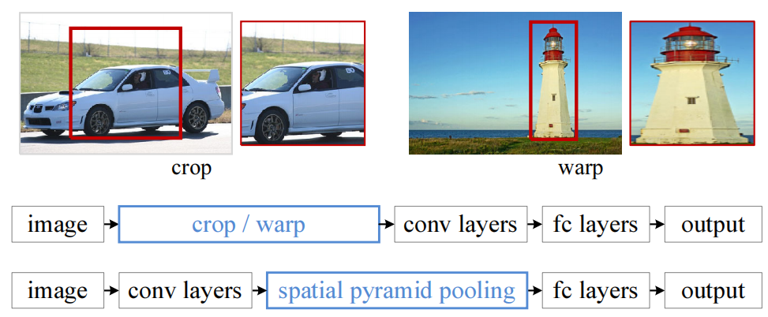
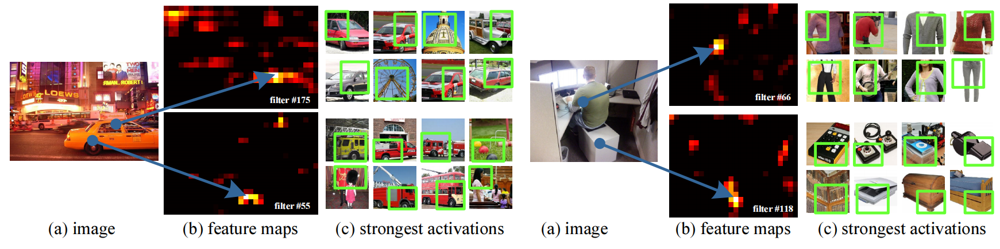
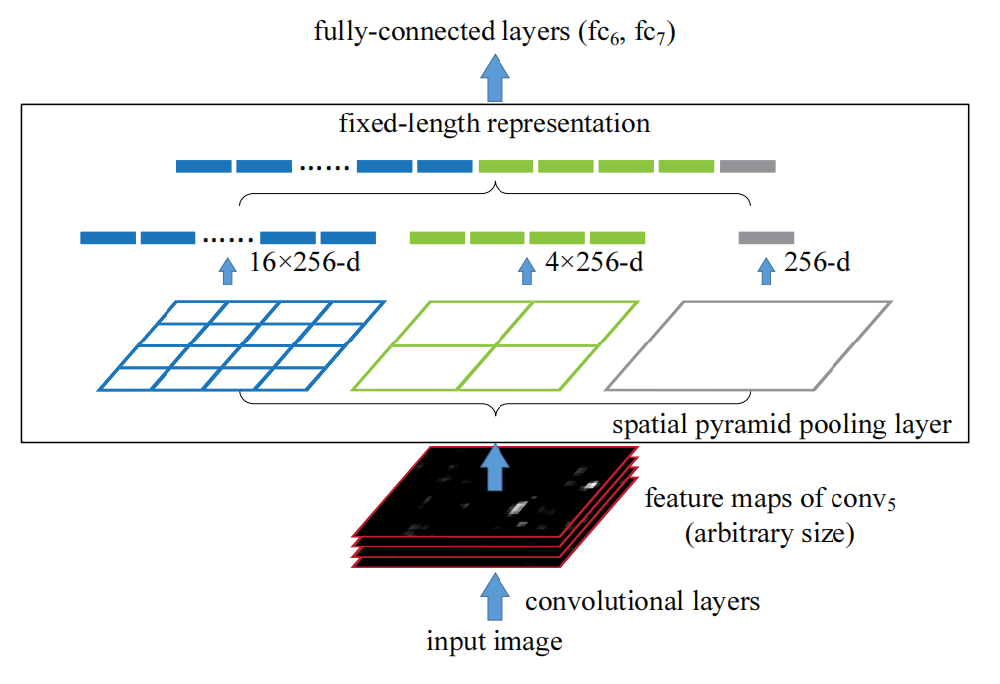
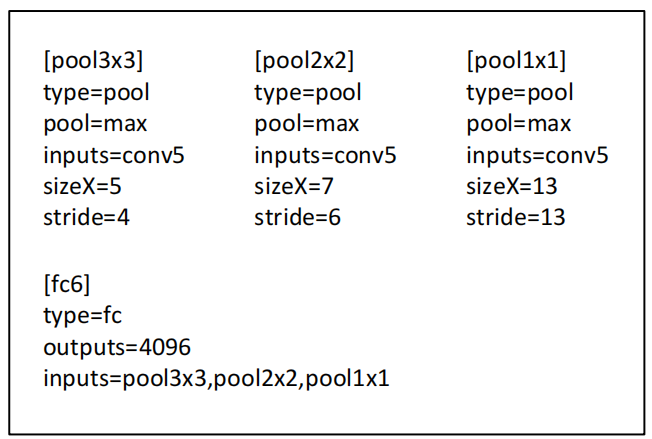
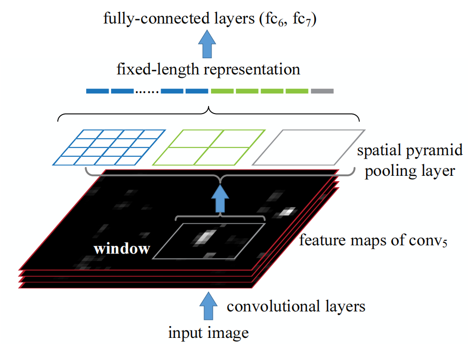

# Spatial Pyramid Pooling in Deep Convolutional Networks for Visual Recognition
用于视觉识别的深度卷积网络中的空间金字塔池化 2014-6-18 https://arxiv.org/abs/1406.4729

## 阅读笔记
* 空间金字塔池化，SPP, 生成固定长度的表示，解决实际预测时图像尺寸不固定问题

## ABSTRACT 
Existing deep convolutional neural networks (CNNs) require a fixed-size (e.g., 224x224) input image. This requirement is "artificial" and may reduce the recognition accuracy for the images or sub-images of an arbitrary size/scale. In this work, we equip the networks with another pooling strategy, "spatial pyramid pooling", to eliminate the above requirement. The new network structure, called SPP-net, can generate a fixed-length representation regardless of image size/scale. Pyramid pooling is also robust to object deformations. With these advantages, SPP-net should in general improve all CNN-based image classification methods. On the ImageNet 2012 dataset, we demonstrate that SPP-net boosts the accuracy of a variety of CNN architectures despite their different designs. On the Pascal VOC 2007 and Caltech101 datasets, SPP-net achieves state-of-the-art classification results using a single full-image representation and no fine-tuning.

现有的深度卷积神经网络(CNN)需要一个固定大小的输入图像(例如，224x224)。这一要求是“人为的”，可能会降低任意大小/比例的图像或子图像的识别精度。在这项工作中，我们为网络配备了另一种池策略“空间金字塔池化”，以消除上述要求。新的网络结构称为SPP网络，它可以生成固定长度的表示，而不管图像大小/比例如何。金字塔池化对目标变形也很健壮。有了这些优势，SPP网络通常应该改进所有基于CNN的图像分类方法。在ImageNet 2012数据集上，我们证明了SPP网络提高了各种CNN架构的准确性，尽管它们的设计不同。在Pascal VOC 2007和Caltech101数据集上，SPP网络使用单个完整图像表示，无需微调，即可获得最先进的分类结果。

The power of SPP-net is also significant in object detection. Using SPP-net, we compute the feature maps from the entire image only once, and then pool features in arbitrary regions (sub-images) to generate fixed-length representations for training the detectors. This method avoids repeatedly computing the convolutional features. In processing test images, our method is 24-102x faster than the R-CNN method, while achieving better or comparable accuracy on Pascal VOC 2007.

SPP网络的能力在目标检测中也很重要。使用SPP网络，我们只需从整个图像中计算一次特征映射，然后将特征汇集到任意区域(子图像)中，以生成固定长度的表示，用于训练检测器。该方法避免了重复计算卷积特征。在处理测试图像时，我们的方法比R-CNN方法快24-102倍，同时在Pascal VOC 2007上达到更好或类似的精度。

In ImageNet Large Scale Visual Recognition Challenge (ILSVRC) 2014, our methods rank #2 in object detection and #3 in image classification among all 38 teams. This manuscript also introduces the improvement made for this competition.
在ImageNet大规模视觉识别挑战赛(ILSVRC)2014中，我们的方法在所有38个小组中，在目标检测和图像分类方面排名第二，在第三。这份手稿还介绍了为这次比赛所做的改进。

## 1 INTRODUCTION
We are witnessing a rapid, revolutionary change in our vision community, mainly caused by deep convolutional neural networks (CNNs) [1] and the availability of large scale training data [2]. Deep-networksbased approaches have recently been substantially improving upon the state of the art in image classification [3], [4], [5], [6], object detection [7], [8], [5], many other recognition tasks [9], [10], [11], [12], and even non-recognition tasks.

我们正在目睹视觉社区的快速、革命性变化，这主要是由深度卷积神经网络(CNN)[1]和大规模训练数据的可用性[2]引起的。基于深度网络的方法最近在图像分类[3]、[4]、[5]、[6]、目标检测[7]、[8]、[5]、许多其他识别任务[9]、[10]、[11]、[12]，甚至是非识别任务方面的技术水平上有了实质性的改进。

However, there is a technical issue in the training and testing of the CNNs: the prevalent CNNs require a fixed input image size (e.g., 224×224), which limits both the aspect ratio and the scale of the input image. When applied to images of arbitrary sizes, current methods mostly fit the input image to the fixed size, either via cropping [3], [4] or via warping [13], [7], as shown in Figure 1 (top). But the cropped region may not contain the entire object, while the warped content may result in unwanted geometric distortion. Recognition accuracy can be compromised due to the content loss or distortion. Besides, a pre-defined scale may not be suitable when object scales vary. Fixing input sizes overlooks the issues involving scales.

然而，在神经网络的训练和测试中存在一个技术问题：流行的神经网络需要固定的输入图像大小(例如，224×224)，这限制了输入图像的纵横比和比例。当应用于任意大小的图像时，当前方法大多通过裁剪[3]、[4]或扭曲[13]、[7]将输入图像拟合到固定大小，如图1(顶部)所示。但裁剪区域可能不包含整个目标，而扭曲的内容可能会导致不必要的几何失真。由于内容丢失或失真，识别精度可能会受到影响。此外，当目标比例变化时，预定义的比例可能不合适。固定输入大小忽略了涉及规模的问题。

 
Figure 1: Top: cropping or warping to fit a fixed size. Middle: a conventional CNN. Bottom: our spatial pyramid pooling network structure. 
图1：顶部：裁剪或扭曲以适合固定尺寸。中间：传统的CNN。底部：我们的空间金字塔池化网络结构。

So why do CNNs require a fixed input size? A CNN mainly consists of two parts: convolutional layers, and fully-connected layers that follow. The convolutional layers operate in a sliding-window manner and output feature maps which represent the spatial arrangement of the activations (Figure 2). In fact, convolutional layers do not require a fixed image size and can generate feature maps of any sizes. On the other hand, the fully-connected layers need to have fixedsize/length input by their definition. Hence, the fixedsize constraint comes only from the fully-connected layers, which exist at a deeper stage of the network.

那么，为什么CNN需要固定的输入大小？CNN主要由两部分组成：卷积层和随后的完全连接层。卷积层以滑动窗口的方式操作，并输出表示激活的空间排列的特征图(图2)。事实上，卷积层不需要固定的图像大小，并且可以生成任何大小的特征图。另一方面，完全连接的层需要根据其定义输入固定的大小/长度。因此，固定大小的约束仅来自于完全连接的层，这些层存在于网络的更深层。

In this paper, we introduce a spatial pyramid pooling (SPP) [14], [15] layer to remove the fixed-size constraint of the network. Specifically, we add an SPP layer on top of the last convolutional layer. The SPP layer pools the features and generates fixedlength outputs, which are then fed into the fullyconnected layers (or other classifiers). In other words, we perform some information “aggregation” at a deeper stage of the network hierarchy (between convolutional layers and fully-connected layers) to avoid the need for cropping or warping at the beginning. Figure 1 (bottom) shows the change of the network architecture by introducing the SPP layer. We call the new network structure SPP-net.

在本文中，我们引入了空间金字塔池化(SPP)[14]，[15]层，以消除网络的固定大小约束。具体来说，我们在最后一个卷积层的顶部添加一个SPP层。SPP层汇集特征并生成固定长度的输出，然后将其输入到完全连接的层(或其他分类器)。换句话说，我们在网络层次结构的更深层(卷积层和完全连接层之间)执行一些信息“聚合”，以避免在开始时需要裁剪或扭曲。图1(底部)显示了引入SPP层后网络架构的变化。我们称新的网络结构为SPP网。

Spatial pyramid pooling [14], [15] (popularly known as spatial pyramid matching or SPM [15]), as an extension of the Bag-of-Words (BoW) model [16], is one of the most successful methods in computer vision. It partitions the image into divisions from finer to coarser levels, and aggregates local features in them. SPP has long been a key component in the leading and competition-winning systems for classification (e.g., [17], [18], [19]) and detection (e.g., [20]) before the recent prevalence of CNNs. Nevertheless, SPP has not been considered in the context of CNNs. We note that SPP has several remarkable properties for deep CNNs: 1) SPP is able to generate a fixedlength output regardless of the input size, while the sliding window pooling used in the previous deep networks [3] cannot; 2) SPP uses multi-level spatial bins, while the sliding window pooling uses only a single window size. Multi-level pooling has been shown to be robust to object deformations [15]; 3) SPP can pool features extracted at variable scales thanks to the flexibility of input scales. Through experiments we show that all these factors elevate the recognition accuracy of deep networks.

空间金字塔池化[14]，[15](通常称为空间金字塔匹配或SPM[15])，作为单词袋(BoW)模型[16]的扩展，是计算机视觉中最成功的方法之一。它将图像划分为从精细到粗糙的层次，并聚合其中的局部特征。在最近流行的神经网络之前，SPP长期以来一直是分类(如[17]、[18]、[19])和检测(如[20])的领先和竞争获胜系统的关键组成部分。然而，SPP并未在CNNs的背景下考虑。我们注意到，SPP对于深度神经网络具有几个显著的特性：
1. SPP能够生成固定长度的输出，而不管输入大小，而在之前的深度网络中使用的滑动窗口池[3]不能; 
2. SPP使用多级空间箱，而滑动窗口池仅使用单个窗口大小。多级池已被证明对目标变形具有稳健性[15]; 
3. 由于输入尺度的灵活性，SPP可以汇集以可变尺度提取的特征。通过实验，我们表明所有这些因素都提高了深度网络的识别精度。

SPP-net not only makes it possible to generate representations from arbitrarily sized images/windows for testing, but also allows us to feed images with varying sizes or scales during training. Training with variable-size images increases scale-invariance and reduces over-fitting. We develop a simple multi-size training method. For a single network to accept variable input sizes, we approximate it by multiple networks that share all parameters, while each of these networks is trained using a fixed input size. In each epoch we train the network with a given input size, and switch to another input size for the next epoch. Experiments show that this multi-size training converges just as the traditional single-size training, and leads to better testing accuracy.

SPP网络不仅可以从任意大小的图像/窗口生成用于测试的表示，而且还允许我们在训练期间以不同的大小或比例提供图像。使用可变尺寸图像进行训练可以提高尺度不变性并减少过度拟合。我们开发了一种简单的多尺寸训练方法。对于接受可变输入大小的单个网络，我们通过共享所有参数的多个网络来近似它，而这些网络中的每一个都使用固定的输入大小来训练。在每个周期中，我们用给定的输入大小训练网络，并切换到下一个周期的另一个输入大小。实验表明，这种多尺寸训练与传统的单尺寸训练一样收敛，并带来更好的测试精度。

The advantages of SPP are orthogonal to the specific CNN designs. In a series of controlled experiments on the ImageNet 2012 dataset, we demonstrate that SPP improves four different CNN architectures in existing publications [3], [4], [5] (or their modifications), over the no-SPP counterparts. These architectures have various filter numbers/sizes, strides, depths, or other designs. It is thus reasonable for us to conjecture that SPP should improve more sophisticated (deeper and larger) convolutional architectures. SPP-net also shows state-of-the-art classification results on Caltech101 [21] and Pascal VOC 2007 [22] using only a single full-image representation and no fine-tuning.

SPP的优点与特定的CNN设计正交。在ImageNet 2012数据集上的一系列受控实验中，我们证明了SPP在现有发表论文[3]、[4]、[5](或其修改)中改进了四种不同的CNN架构，而不是没有SPP。这些架构具有各种滤波器数量/大小、步长、深度或其他设计。因此，我们有理由推测SPP应该可以改进更复杂(更深和更大)的卷积架构。SPP网络还显示了Caltech101[21]和Pascal VOC 2007[22]的最新分类结果，仅使用单个完整图像表示，无需微调。

SPP-net also shows great strength in object detection. In the leading object detection method R-CNN [7], the features from candidate windows are extracted via deep convolutional networks. This method shows remarkable detection accuracy on both the VOC and ImageNet datasets. But the feature computation in RCNN is time-consuming, because it repeatedly applies the deep convolutional networks to the raw pixels of thousands of warped regions per image. In this paper, we show that we can run the convolutional layers only once on the entire image (regardless of the number of windows), and then extract features by SPP-net on the feature maps. This method yields a speedup of over one hundred times over R-CNN. Note that training/running a detector on the feature maps (rather than image regions) is actually a more popular idea [23], [24], [20], [5]. But SPP-net inherits the power of the deep CNN feature maps and also the flexibility of SPP on arbitrary window sizes, which leads to outstanding accuracy and efficiency. In our experiment, the SPP-net-based system (built upon the R-CNN pipeline) computes features 24-102× faster than R-CNN, while has better or comparable accuracy. With the recent fast proposal method of EdgeBoxes [25], our system takes 0.5 seconds processing an image (including all steps). This makes our method practical for real-world applications.

SPP网络在目标检测方面也显示出强大的实力。在领先的目标检测方法R-CNN[7]中，通过深度卷积网络提取候选窗口的特征。该方法在VOC和ImageNet数据集上都显示出显著的检测精度。但是R-CNN中的特征计算是耗时的，因为它重复地将深度卷积网络应用于每个图像数千个扭曲区域的原始像素。在本文中，我们表明，我们可以在整个图像上只运行一次卷积层(无论窗口的数量)，然后通过SPP网络在特征图上提取特征。这种方法比R-CNN的速度提高了100多倍。注意，在特征图(而不是图像区域)上训练/运行检测器实际上是一个更流行的想法[23]，[24]，[20]，[5]。但SPP网络继承了深度CNN特征图的功能，也继承了SPP对任意窗口大小的灵活性，这导致了卓越的准确性和效率。在我们的实验中，基于SPP网络的系统(基于R-CNN管道)计算特征的速度比R-CNN快24-102倍，同时具有更好或相当的精度。使用EdgeBoxes[25]最近的快速建议方法，我们的系统处理图像需要0.5秒(包括所有步骤)。这使得我们的方法适用于实际应用。

A preliminary version of this manuscript has been published in ECCV 2014. Based on this work, we attended the competition of ILSVRC 2014 [26], and ranked #2 in object detection and #3 in image classification (both are provided-data-only tracks) among all 38 teams. There are a few modifications made for ILSVRC 2014. We show that the SPP-nets can boost various networks that are deeper and larger (Sec. 3.1.2-3.1.4) over the no-SPP counterparts. Further, driven by our detection framework, we find that multi-view testing on feature maps with flexibly located/sized windows (Sec. 3.1.5) can increase the classification accuracy. This manuscript also provides the details of these modifications.

该手稿的初步版本已在ECCV 2014中发布。基于这项工作，我们参加了ILSVRC 2014的比赛[26]，在所有38个团队中，在物体检测方面排名第2，在图像分类方面排名第3(均为仅提供数据的轨迹)。对ILSVRC 2014进行了一些修改。我们表明，与无SPP网络相比，SPP网络可以促进更深更大的各种网络(第3.1.2-3.1.4节)。此外，在我们的检测框架的驱动下，我们发现在具有灵活定位/大小窗口的特征地图上进行多视图测试(第3.1.5节)可以提高分类精度。这份手稿还提供了这些修改的细节。

We have released the code to facilitate future research (http://research.microsoft.com/en-us/um/people/kahe/). 

## 2 DEEP NETWORKS WITH SPATIAL PYRAMID POOLING
### 2.1 Convolutional Layers and Feature Maps
Consider the popular seven-layer architectures [3], [4]. The first five layers are convolutional, some of which are followed by pooling layers. These pooling layers can also be considered as “convolutional”, in the sense that they are using sliding windows. The last two layers are fully connected, with an N-way softmax as the output, where N is the number of categories.

考虑流行的七层架构[3]，[4]。前五层是卷积层，其中一些是池化层。这些池化层也可以被认为是“卷积”的，因为它们使用了滑动窗口。最后两层完全连接，输出为N路softmax，其中N是类别数。

The deep network described above needs a fixed image size. However, we notice that the requirement of fixed sizes is only due to the fully-connected layers that demand fixed-length vectors as inputs. On the other hand, the convolutional layers accept inputs of arbitrary sizes. The convolutional layers use sliding filters, and their outputs have roughly the same aspect ratio as the inputs. These outputs are known as feature maps [1] - they involve not only the strength of the responses, but also their spatial positions.

上述深度网络需要固定的图像大小。然而，我们注意到，固定大小的要求只是由于需要固定长度向量作为输入的全连接层。另一方面，卷积层接受任意大小的输入。卷积层使用滑动滤波器，其输出具有与输入大致相同的纵横比。这些输出被称为特征图[1] —— 它们不仅涉及响应的强度，还涉及它们的空间位置。

 
Figure 2: Visualization of the feature maps. (a) Two images in Pascal VOC 2007. (b) The feature maps of some conv5 filters. The arrows indicate the strongest responses and their corresponding positions in the images. (c) The ImageNet images that have the strongest responses of the corresponding filters. The green rectangles mark the receptive fields of the strongest responses. 
图2：特征图的可视化。(a) Pascal VOC 2007中的两张图片。(b)一些conv5滤波器的特征图。箭头指示最强的响应及其在图像中的对应位置。(c) 具有相应滤波器最强响应的ImageNet图像。绿色矩形表示最强反应的感受野。

In Figure 2, we visualize some feature maps. They are generated by some filters of the conv5 layer. Figure 2(c) shows the strongest activated images of these filters in the ImageNet dataset. We see a filter can be activated by some semantic content. For example, the 55-th filter (Figure 2, bottom left) is most activated by a circle shape; the 66-th filter (Figure 2, top right) is most activated by a ∧-shape; and the 118-th filter (Figure 2, bottom right) is most activated by a ∨-shape. These shapes in the input images (Figure 2(a)) activate the feature maps at the corresponding positions (the arrows in Figure 2).

在图2中，我们可视化了一些特征图。它们由conv5层的一些滤波器生成。图2(c)显示了ImageNet数据集中这些滤波器的最强激活图像。我们看到滤波器可以被一些语义内容激活。例如，第55个滤波器(图2，左下)最受圆形激活; 第66个滤波器(图2，右上角)由∧-形状而第118个滤波器(图2，右下角)最受∨-形状输入图像中的这些形状(图2(a))激活了相应位置的特征图(图2中的箭头)。

It is worth noticing that we generate the feature maps in Figure 2 without fixing the input size. These feature maps generated by deep convolutional layers are analogous to the feature maps in traditional methods [27], [28]. In those methods, SIFT vectors [29] or image patches [28] are densely extracted and then encoded, e.g., by vector quantization [16], [15], [30], sparse coding [17], [18], or Fisher kernels [19]. These encoded features consist of the feature maps, and are then pooled by Bag-of-Words (BoW) [16] or spatial pyramids [14], [15]. Analogously, the deep convolutional features can be pooled in a similar way.

值得注意的是，我们在不固定输入大小的情况下生成了图2中的特征图。这些由深度卷积层生成的特征图类似于传统方法中的特征图[27]，[28]。在这些方法中，密集地提取SIFT向量[29]或图像块[28]，然后进行编码，例如，通过向量量化[16]、[15]、[30]、稀疏编码[17]、[18]或Fisher核[19]。这些编码特征由特征图组成，然后由单词袋(BoW)[16]或空间金字塔[14]，[15]合并。类似地，可以以类似的方式合并深度卷积特征。

### 2.2 The Spatial Pyramid Pooling Layer
The convolutional layers accept arbitrary input sizes, but they produce outputs of variable sizes. The classi- fiers (SVM/softmax) or fully-connected layers require fixed-length vectors. Such vectors can be generated by the Bag-of-Words (BoW) approach [16] that pools the features together. Spatial pyramid pooling [14], [15] improves BoW in that it can maintain spatial information by pooling in local spatial bins. These spatial bins have sizes proportional to the image size, so the number of bins is fixed regardless of the image size. This is in contrast to the sliding window pooling of the previous deep networks [3], where the number of sliding windows depends on the input size.

卷积层接受任意的输入大小，但它们产生可变大小的输出。分类器(SVM/softmax)或完全连接的层需要固定长度的向量。这样的向量可以通过将特征集合在一起的单词袋(BoW)方法[16]生成。空间金字塔池[14]，[15]改进了BoW，因为它可以通过在局部空间箱中池化来维护空间信息。这些空间箱的大小与图像大小成比例，因此无论图像大小如何，箱的数量都是固定的。这与之前深度网络[3]的滑动窗口池形成对比，其中滑动窗口的数量取决于输入大小。

 
Figure 3: A network structure with a spatial pyramid pooling layer. Here 256 is the filter number of the conv5 layer, and conv5 is the last convolutional layer. 
图3：具有空间金字塔池层的网络结构。这里256是conv5层的滤波器数，conv5是最后一个卷积层。

To adopt the deep network for images of arbitrary sizes, we replace the last pooling layer (e.g., pool5, after the last convolutional layer) with a spatial pyramid pooling layer. Figure 3 illustrates our method. In each spatial bin, we pool the responses of each filter (throughout this paper we use max pooling). The outputs of the spatial pyramid pooling are kMdimensional vectors with the number of bins denoted as M (k is the number of filters in the last convolutional layer). The fixed-dimensional vectors are the input to the fully-connected layer.

为了对任意大小的图像采用深度网络，我们将最后一个池化层(例如，池5，在最后一个卷积层之后)替换为空间金字塔池化层。图3说明了我们的方法。在每个空间箱中，我们汇集每个过滤器的响应(在本文中，我们使用最大池)。空间金字塔池的输出是kM维向量，其中箱的数量表示为M(k是最后卷积层中滤波器的数量)。固定维向量是全连接层的输入。

With spatial pyramid pooling, the input image can 4 be of any sizes. This not only allows arbitrary aspect ratios, but also allows arbitrary scales. We can resize the input image to any scale (e.g., min(w, h)=180, 224, ...) and apply the same deep network. When the input image is at different scales, the network (with the same filter sizes) will extract features at different scales. The scales play important roles in traditional methods, e.g., the SIFT vectors are often extracted at multiple scales [29], [27] (determined by the sizes of the patches and Gaussian filters). We will show that the scales are also important for the accuracy of deep networks.

使用空间金字塔池，输入图像可以是任何大小。这不仅允许任意纵横比，还允许任意比例。我们可以将输入图像调整为任何比例(例如，min(w，h)=180，224，…)，并应用相同的深度网络。当输入图像处于不同的尺度时，网络(具有相同的滤波器大小)将以不同的尺度提取特征。尺度在传统方法中起着重要作用，例如，SIFT向量通常在多个尺度上提取[29]，[27](由分块和高斯滤波器的大小确定)。我们将证明，尺度对于深度网络的准确性也很重要。

Interestingly, the coarsest pyramid level has a single bin that covers the entire image. This is in fact a “global pooling” operation, which is also investigated in several concurrent works. In [31], [32] a global average pooling is used to reduce the model size and also reduce overfitting; in [33], a global average pooling is used on the testing stage after all fc layers to improve accuracy; in [34], a global max pooling is used for weakly supervised object recognition. The global pooling operation corresponds to the traditional Bag-of-Words method.

有趣的是，最粗糙的金字塔级别有一个覆盖整个图像的单仓。事实上，这是一个“全局池”操作，在多个并行工作中也对其进行了研究。在[31]中，[32]使用全局平均池来减少模型大小，并减少过度拟合; 在[33]中，在所有fc层之后的测试阶段使用全局平均池来提高精度; 在[34]中，全局最大池用于弱监督对象识别。全局池操作对应于传统的单词包方法。

### 2.3 Training the Network
Theoretically, the above network structure can be trained with standard back-propagation [1], regardless of the input image size. But in practice the GPU implementations (such as cuda-convnet [3] and Caffe [35]) are preferably run on fixed input images. Next we describe our training solution that takes advantage of these GPU implementations while still preserving the spatial pyramid pooling behaviors.

理论上，无论输入图像大小如何，都可以使用标准反向传播[1]来训练上述网络结构。但在实践中，GPU实现(如cuda convnet[3]和Caffe[35])优选在固定输入图像上运行。接下来，我们将描述我们的训练解决方案，该解决方案利用了这些GPU实现，同时仍然保留了空间金字塔池行为。

#### Single-size training
As in previous works, we first consider a network taking a fixed-size input (224×224) cropped from images. The cropping is for the purpose of data augmentation. For an image with a given size, we can pre-compute the bin sizes needed for spatial pyramid pooling.Consider the feature maps after conv5 that have a size of a×a (e.g., 13×13). With a pyramid level of n×n bins, we implement this pooling level as a sliding window pooling, where the window size win = d a/ne and stride str = b a/nc with d·e and b·c denoting ceiling and floor operations. With an l-level pyramid, we implement l such layers. The next fully-connected layer (fc6) will concatenate the l outputs. Figure 4 shows an example configuration of 3-level pyramid pooling (3×3, 2×2, 1×1) in the cuda-convnet style [3].

与前面的工作一样，我们首先考虑从图像中裁剪出的固定大小输入(224×224)的网络。裁剪是为了增加数据。对于给定大小的图像，我们可以预先计算空间金字塔池所需的bin大小。考虑conv5之后的大小为a×a(例如，13×13)的特征图。对于n×n个箱的金字塔级别，我们将此池级别实现为滑动窗口池，其中窗口大小win=d a/ne，步长str=b a/nc，d·e和b·c表示天花板和地板操作。使用l级金字塔，我们实现了l个这样的层。下一个完全连接的层(fc6)将连接l个输出。图4显示了cuda convnet样式[3]中的三级金字塔池(3×3，2×2，1×1)的样本配置。

The main purpose of our single-size training is to enable the multi-level pooling behavior. Experiments show that this is one reason for the gain of accuracy.

我们的单一规模训练的主要目的是实现多层次的汇集行为。实验表明，这是提高精度的一个原因。

#### Multi-size training
Our network with SPP is expected to be applied on images of any sizes. To address the issue of varying image sizes in training, we consider a set of predefined sizes. We consider two sizes: 180×180 in addition to 224×224. Rather than crop a smaller 180×180 region, we resize the aforementioned 224×224 region to 180×180. So the regions at both scales differ only in resolution but not in content/layout. For the network to accept 180×180 inputs, we implement another fixed-size-input (180×180) network. The feature map size after conv5 is a×a = 10×10 in this case. Then we still use win = d a/ne and str = b a/nc to implement each pyramid pooling level. The output of the spatial pyramid pooling layer of this 180-network has the same fixed length as the 224-network. As such, this 180-network has exactly the same parameters as the 224-network in each layer. In other words, during training we implement the varying-input-size SPP-net by two fixed-size networks that share parameters.

我们与SPP的网络有望应用于任何大小的图像。为了解决训练中图像大小变化的问题，我们考虑了一组预定义的大小。我们考虑两种尺寸：180×180和224×224。我们没有裁剪更小的180×180区域，而是将前面提到的224×224区域调整为180×180。因此，两种尺度下的区域仅在分辨率上不同，而在内容/布局上相同。对于接受180×180输入的网络，我们实现了另一个固定大小的输入(180×180)网络。在这种情况下，conv5之后的特征图大小为a×a＝10×10。然后我们仍然使用win=d a/ne和str=b a/nc来实现每个金字塔池级别。该180网络的空间金字塔池层的输出具有与224网络相同的固定长度。因此，该180网络在每个层中具有与224网络完全相同的参数。换句话说，在训练期间，我们通过共享参数的两个固定大小的网络来实现不同输入大小的SPP网络。

 
Figure 4: An example 3-level pyramid pooling in the cuda-convnet style [3]. Here sizeX is the size of the pooling window. This configuration is for a network whose feature map size of conv5 is 13×13, so the pool_3×3, pool_2×2, and pool_1×1 layers will have 3×3, 2×2, and 1×1 bins respectively. 
图4：cuda convnet风格的三级金字塔池样本[3]。这里sizeX是池窗口的大小。此配置适用于conv5的特征图大小为13×13的网络，因此池3×3、池2×2和池1×1层将分别具有3×3，2×2，和1×1个容器。

To reduce the overhead to switch from one network (e.g., 224) to the other (e.g., 180), we train each full epoch on one network, and then switch to the other one (keeping all weights) for the next full epoch. This is iterated. In experiments, we find the convergence rate of this multi-size training to be similar to the above single-size training.

为了减少从一个网络(例如，224)切换到另一个(例如，180)的开销，我们在一个网络上训练每个完整周期，然后切换到下一个完整周期(保持所有权重)。这是重复的。在实验中，我们发现这种多尺寸训练的收敛速度与上述单尺寸训练相似。

The main purpose of our multi-size training is to simulate the varying input sizes while still leveraging the existing well-optimized fixed-size implementations. Besides the above two-scale implementation, we have also tested a variant using s × s as input where s is randomly and uniformly sampled from [180, 224] at each epoch. We report the results of both variants in the experiment section.

我们的多尺寸训练的主要目的是模拟不同的输入尺寸，同时仍然利用现有的优化良好的固定尺寸实现。除了上述两个尺度的实现，我们还测试了一个使用s×s作为输入的变体，其中s在每个周期从[180224]随机均匀采样。我们在实验部分报告了两种变体的结果。

Note that the above single/multi-size solutions are for training only. At the testing stage, it is straightforward to apply SPP-net on images of any sizes. 

请注意，上述单/多尺寸解决方案仅用于训练。在测试阶段，直接将SPP网络应用于任何大小的图像。

Table 1: Network architectures: filter number×filter size (e.g., 96×72 ), filter stride (e.g., str 2), pooling window size (e.g., pool 32 ), and the output feature map size (e.g., map size 55 × 55). LRN represents Local Response Normalization. The padding is adjusted to produce the expected output feature map size. 
表1：网络架构：滤波器数量×滤波器大小(例如96×72)、滤波器步长(例如str 2)、池化窗口大小(例如池32)和输出特征映射大小(例如映射大小55×55)。LRN表示本地响应规范化。调整填充以产生预期的输出特征图大小。

## 3 SPP-NET FOR IMAGE CLASSIFICATION
### 3.1 Experiments on ImageNet 2012 Classification
We train the networks on the 1000-category training set of ImageNet 2012. Our training algorithm follows the practices of previous work [3], [4], [36]. The images are resized so that the smaller dimension is 256, and a 224×224 crop is picked from the center or the four corners from the entire image1 . The data are augmented by horizontal flipping and color altering [3]. Dropout [3] is used on the two fully-connected layers. The learning rate starts from 0.01, and is divided by 10 (twice) when the error plateaus. Our implementation is based on the publicly available code of cuda-convnet [3] and Caffe [35]. All networks in this paper can be trained on a single GeForce GTX Titan GPU (6 GB memory) within two to four weeks.

#### 3.1.1 Baseline Network Architectures
The advantages of SPP are independent of the convolutional network architectures used. We investigate four different network architectures in existing publications [3], [4], [5] (or their modifications), and we show SPP improves the accuracy of all these architectures. These baseline architectures are in Table 1 and briefly introduced below:
• ZF-5: this architecture is based on Zeiler and Fergus’s (ZF) “fast” (smaller) model [4]. The number indicates five convolutional layers.
• Convnet*-5: this is a modification on Krizhevsky et al.’s network [3]. We put the two pooling layers after conv2 and conv3 (instead of after conv1 and conv2). As a result, the feature maps after each layer have the same size as ZF-5.
• Overfeat-5/7: this architecture is based on the Overfeat paper [5], with some modifications as in [6]. In contrast to ZF-5/Convnet*-5, this architecture produces a larger feature map (18×18 instead of 13 × 13) before the last pooling layer. A larger filter number (512) is used in conv3 and the following convolutional layers. We also investigate a deeper architecture with 7 convolutional layers, where conv3 to conv7 have the same structures.

1. In [3], the four corners are picked from the corners of the central 256×256 crop. 

In the baseline models, the pooling layer after the last convolutional layer generates 6×6 feature maps, with two 4096-d fc layers and a 1000-way softmax layer following. Our replications of these baseline networks are in Table 2 (a). We train 70 epochs for ZF-5 and 90 epochs for the others. Our replication of ZF-5 is better than the one reported in [4]. This gain is because the corner crops are from the entire image, as is also reported in [36].

#### 3.1.2 Multi-level Pooling Improves Accuracy
In Table 2 (b) we show the results using singlesize training. The training and testing sizes are both 224×224. In these networks, the convolutional layers have the same structures as the corresponding baseline models, whereas the pooling layer after the final convolutional layer is replaced with the SPP layer. For the results in Table 2, we use a 4-level pyramid. The pyramid is {6×6, 3×3, 2×2, 1×1} (totally 50 bins). For fair comparison, we still use the standard 10- view prediction with each view a 224×224 crop. Our results in Table 2 (b) show considerable improvement over the no-SPP baselines in Table 2 (a). Interestingly, the largest gain of top-1 error (1.65%) is given by the most accurate architecture. Since we are still using the same 10 cropped views as in (a), these gains are solely because of multi-level pooling.

It is worth noticing that the gain of multi-level pooling is not simply due to more parameters; rather, it is because the multi-level pooling is robust to the variance in object deformations and spatial layout [15]. To show this, we train another ZF-5 network with a different 4-level pyramid: {4×4, 3×3, 2×2, 1×1} (totally 30 bins). This network has fewer parameters than its no-SPP counterpart, because its fc6 layer has 30×256-d inputs instead of 36×256-d. The top-1/top- 5 errors of this network are 35.06/14.04. This result is similar to the 50-bin pyramid above (34.98/14.14), but considerably better than the no-SPP counterpart (35.99/14.76). 

#### 3.1.3 Multi-size Training Improves Accuracy
Table 2: Error rates in the validation set of ImageNet 2012. All the results are obtained using standard 10-view testing. In the brackets are the gains over the “no SPP” baselines.

Table 2 (c) shows our results using multi-size training. The training sizes are 224 and 180, while the testing size is still 224. We still use the standard 10-view prediction. The top-1/top-5 errors of all architectures further drop. The top-1 error of SPP-net (Overfeat-7) drops to 29.68%, which is 2.33% better than its noSPP counterpart and 0.68% better than its single-size trained counterpart.

Besides using the two discrete sizes of 180 and 224, we have also evaluated using a random size uniformly sampled from [180, 224]. The top-1/5 error of SPP-net (Overfeat-7) is 30.06%/10.96%. The top- 1 error is slightly worse than the two-size version, possibly because the size of 224 (which is used for testing) is visited less. But the results are still better the single-size version.

There are previous CNN solutions [5], [36] that deal with various scales/sizes, but they are mostly based on testing. In Overfeat [5] and Howard’s method [36], the single network is applied at multiple scales in the testing stage, and the scores are averaged. Howard further trains two different networks on low/highresolution image regions and averages the scores. To our knowledge, our method is the first one that trains a single network with input images of multiple sizes.

#### 3.1.4 Full-image Representations Improve Accuracy
Table 3: Error rates in the validation set of ImageNet 2012 using a single view. The images are resized so min(w, h) = 256. The crop view is the central 224×224 of the image.

Next we investigate the accuracy of the full-image views. We resize the image so that min(w, h)=256 while maintaining its aspect ratio. The SPP-net is applied on this full image to compute the scores of the full view. For fair comparison, we also evaluate the accuracy of the single view in the center 224×224 crop (which is used in the above evaluations). The comparisons of single-view testing accuracy are in Table 3. Here we evaluate ZF-5/Overfeat-7. The top-1 error rates are all reduced by the full-view representation. This shows the importance of maintaining the complete content. Even though our network is trained using square images only, it generalizes well to other aspect ratios.

Comparing Table 2 and Table 3, we find that the combination of multiple views is substantially better than the single full-image view. However, the fullimage representations are still of good merits. First, we empirically find that (discussed in the next subsection) even for the combination of dozens of views, the additional two full-image views (with flipping) can still boost the accuracy by about 0.2%. Second, the full-image view is methodologically consistent with the traditional methods [15], [17], [19] where the encoded SIFT vectors of the entire image are pooled together. Third, in other applications such as image retrieval [37], an image representation, rather than a classification score, is required for similarity ranking. A full-image representation can be preferred.

#### 3.1.5 Multi-view Testing on Feature Maps
Inspired by our detection algorithm (described in the next section), we further propose a multi-view testing method on the feature maps. Thanks to the flexibility of SPP, we can easily extract the features from windows (views) of arbitrary sizes from the convolutional feature maps.

On the testing stage, we resize an image so min(w, h) = s where s represents a predefined scale (like 256). Then we compute the convolutional feature maps from the entire image. For the usage of flipped views, we also compute the feature maps of the flipped image. Given any view (window) in the image, we map this window to the feature maps (the way of mapping is in Appendix), and then use SPP to pool the features from this window (see Figure 5). The pooled features are then fed into the fc layers to compute the softmax score of this window. These scores are averaged for the final prediction. For the standard 10-view, we use s = 256 and the views are 224×224 windows on the corners or center. Experiments show that the top-5 error of the 10-view prediction on feature maps is within 0.1% around the original 10-view prediction on image crops.

We further apply this method to extract multiple views from multiple scales. We resize the image to six scales s ∈ {224, 256, 300, 360, 448, 560} and compute the feature maps on the entire image for each scale. We use 224 × 224 as the view size for any scale, so these views have different relative sizes on the original image for different scales. We use 18 views for each scale: one at the center, four at the corners, and four on the middle of each side, with/without flipping (when s = 224 there are 6 different views). The combination of these 96 views reduces the top-5 error from 10.95% to 9.36%. Combining the two fullimage views (with flipping) further reduces the top-5 error to 9.14%.

In the Overfeat paper [5], the views are also extracted from the convolutional feature maps instead of image crops. However, their views cannot have arbitrary sizes; rather, the windows are those where the pooled features match the desired dimensionality. We empirically find that these restricted windows are less beneficial than our flexibly located/sized windows.

#### 3.1.6 Summary and Results for ILSVRC 2014
Table 4: Error rates in ImageNet 2012. All the results are based on a single network. The number of views in Overfeat depends on the scales and strides, for which there are several hundreds at the finest scale. 

In Table 4 we compare with previous state-of-theart methods. Krizhevsky et al.’s [3] is the winning method in ILSVRC 2012; Overfeat [5], Howard’s [36], and Zeiler and Fergus’s [4] are the leading methods rank team top-5 test 1 GoogLeNet [32] 6.66 2 VGG [33] 7.32 3 ours 8.06 4 Howard 8.11 5 DeeperVision 9.50 6 NUS-BST 9.79 7 TTIC ECP 10.22

Table 5: The competition results of ILSVRC 2014 classification [26]. The best entry of each team is listed. in ILSVRC 2013. We only consider single-network performance for manageable comparisons.

Our best single network achieves 9.14% top-5 error on the validation set. This is exactly the single-model entry we submitted to ILSVRC 2014 [26]. The top-5 error is 9.08% on the testing set (ILSVRC 2014 has the same training/validation/testing data as ILSVRC 2012). After combining eleven models, our team’s result (8.06%) is ranked #3 among all 38 teams attending ILSVRC 2014 (Table 5). Since the advantages of SPPnet should be in general independent of architectures, we expect that it will further improve the deeper and larger convolutional architectures [33], [32].

### 3.2 Experiments on VOC 2007 Classification
Our method can generate a full-view image representation. With the above networks pre-trained on ImageNet, we extract these representations from the images in the target datasets and re-train SVM classifiers [38]. In the SVM training, we intentionally do not use any data augmentation (flip/multi-view). We l2-normalize the features for SVM training.

The classification task in Pascal VOC 2007 [22] involves 9,963 images in 20 categories. 5,011 images are for training, and the rest are for testing. The performance is evaluated by mean Average Precision (mAP). Table 6 summarizes the results.

Table 6: Classification mAP in Pascal VOC 2007. For SPP-net, the pool5/7 layer uses the 6×6 pyramid level. 

Table 7: Classification accuracy in Caltech101. For SPP-net, the pool5/7 layer uses the 6×6 pyramid level.

We start from a baseline in Table 6 (a). The model is ZF-5 without SPP. To apply this model, we resize the image so that its smaller dimension is 224, and crop the center 224×224 region. The SVM is trained via the features of a layer. On this dataset, the deeper the layer is, the better the result is. In Table 6 (b), we replace the no-SPP net with our SPP-net. As a first-step comparison, we still apply the SPP-net on the center 224×224 crop. The results of the fc layers improve. This gain is mainly due to multi-level pooling.

Table 6 (c) shows our results on full images, where the images are resized so that the shorter side is 224. We find that the results are considerably improved (78.39% vs. 76.45%). This is due to the full-image representation that maintains the complete content.

Because the usage of our network does not depend on scale, we resize the images so that the smaller dimension is s and use the same network to extract features. We find that s = 392 gives the best results (Table 6 (d)) based on the validation set. This is mainly because the objects occupy smaller regions in VOC 2007 but larger regions in ImageNet, so the relative object scales are different between the two sets. These results indicate scale matters in the classification tasks, and SPP-net can partially address this “scale mismatch” issue.

In Table 6 (e) the network architecture is replaced with our best model (Overfeat-7, multi-size trained), and the mAP increases to 82.44%. Table 8 summarizes our results and the comparisons with the state-of-theart methods. Among these methods, VQ [15], LCC [18], and FK [19] are all based on spatial pyramids matching, and [13], [4], [34], [6] are based on deep networks. In these results, Oquab et al.’s (77.7%) and Chatfield et al.’s (82.42%) are obtained by network fine-tuning and multi-view testing. Our result is comparable with the state of the art, using only a single full-image representation and without fine-tuning.

### 3.3 Experiments on Caltech101
The Caltech101 dataset [21] contains 9,144 images in 102 categories (one background). We randomly sample 30 images per category for training and up to 50 images per category for testing. We repeat 10 random splits and average the accuracy. Table 7 summarizes our results.

There are some common observations in the Pascal VOC 2007 and Caltech101 results: SPP-net is better than the no-SPP net (Table 7 (b) vs. (a)), and the fullview representation is better than the crop ((c) vs. (b)). But the results in Caltech101 have some differences with Pascal VOC. The fully-connected layers are less accurate, and the SPP layers are better. This is possibly because the object categories in Caltech101 are less related to those in ImageNet, and the deeper layers are more category-specialized. Further, we find that the scale 224 has the best performance among the scales we tested on this dataset. This is mainly because the objects in Caltech101 also occupy large regions of the images, as is the case of ImageNet.

Besides cropping, we also evaluate warping the image to fit the 224×224 size. This solution maintains the complete content, but introduces distortion. On the SPP (ZF-5) model, the accuracy is 89.91% using the SPP layer as features - lower than 91.44% which uses the same model on the undistorted full image. 

Table 8: Classification results for Pascal VOC 2007 (mAP) and Caltech101 (accuracy). †numbers reported by [27]. ‡our implementation as in Table 6 (a).

Table 8 summarizes our results compared with the state-of-the-art methods on Caltech101. Our result (93.42%) exceeds the previous record (88.54%) by a substantial margin (4.88%). 

## 4 SPP-NET FOR OBJECT DETECTION
Deep networks have been used for object detection. We briefly review the recent state-of-the-art R-CNN method [7]. R-CNN first extracts about 2,000 candidate windows from each image via selective search [20]. Then the image region in each window is warped to a fixed size (227×227). A pre-trained deep network is used to extract the feature of each window. A binary SVM classifier is then trained on these features for detection. R-CNN generates results of compelling quality and substantially outperforms previous methods. However, because R-CNN repeatedly applies the deep convolutional network to about 2,000 windows per image, it is time-consuming. Feature extraction is the major timing bottleneck in testing.

Our SPP-net can also be used for object detection. We extract the feature maps from the entire image only once (possibly at multiple scales). Then we apply the spatial pyramid pooling on each candidate window of the feature maps to pool a fixed-length representation of this window (see Figure 5). Because the time-consuming convolutions are only applied once, our method can run orders of magnitude faster.

Our method extracts window-wise features from regions of the feature maps, while R-CNN extracts directly from image regions. In previous works, the Deformable Part Model (DPM) [23] extracts features from windows in HOG [24] feature maps, and the Selective Search (SS) method [20] extracts from windows in encoded SIFT feature maps. The Overfeat detection method [5] also extracts from windows of deep convolutional feature maps, but needs to predefine the window size. On the contrary, our method enables feature extraction in arbitrary windows from the deep convolutional feature maps. spatial pyramid pooling layer feature maps of conv5 convolutional layers fixed-length representation input image window …... fully-connected layers (fc6, fc7)

 
Figure 5: Pooling features from arbitrary windows on feature maps. The feature maps are computed from the entire image. The pooling is performed in candidate windows.

### 4.1 Detection Algorithm
We use the “fast” mode of selective search [20] to generate about 2,000 candidate windows per image. Then we resize the image such that min(w, h) = s, and extract the feature maps from the entire image. We use the SPP-net model of ZF-5 (single-size trained) for the time being. In each candidate window, we use a 4-level spatial pyramid (1×1, 2×2, 3×3, 6×6, totally 50 bins) to pool the features. This generates a 12,800- d (256×50) representation for each window. These representations are provided to the fully-connected layers of the network. Then we train a binary linear SVM classifier for each category on these features.

Our implementation of the SVM training follows [20], [7]. We use the ground-truth windows to generate the positive samples. The negative samples are those overlapping a positive window by at most 30% (measured by the intersection-over-union (IoU) ratio). Any negative sample is removed if it overlaps another negative sample by more than 70%. We apply the standard hard negative mining [23] to train the SVM. This step is iterated once. It takes less than 1 hour to train SVMs for all 20 categories. In testing, the classifier is used to score the candidate windows. Then we use non-maximum suppression [23] (threshold of 30%) on the scored windows.

Our method can be improved by multi-scale feature extraction. We resize the image such that min(w, h) = s ∈ S = {480, 576, 688, 864, 1200}, and compute the feature maps of conv5 for each scale. One strategy of combining the features from these scales is to pool them channel-by-channel. But we empirically find that another strategy provides better results. For each candidate window, we choose a single scale s ∈ S such that the scaled candidate window has a number of pixels closest to 224×224. Then we only use the feature maps extracted from this scale to compute 10 the feature of this window. If the pre-defined scales are dense enough and the window is approximately square, our method is roughly equivalent to resizing the window to 224×224 and then extracting features from it. Nevertheless, our method only requires computing the feature maps once (at each scale) from the entire image, regardless of the number of candidate windows.

We also fine-tune our pre-trained network, following [7]. Since our features are pooled from the conv5 feature maps from windows of any sizes, for simplicity we only fine-tune the fully-connected layers. In this case, the data layer accepts the fixed-length pooled features after conv5, and the fc6,7 layers and a new 21-way (one extra negative category) fc8 layer follow. The fc8 weights are initialized with a Gaussian distribution of σ=0.01. We fix all the learning rates to 1e-4 and then adjust to 1e-5 for all three layers. During fine-tuning, the positive samples are those overlapping with a ground-truth window by [0.5, 1], and the negative samples by [0.1, 0.5). In each mini-batch, 25% of the samples are positive. We train 250k minibatches using the learning rate 1e-4, and then 50k mini-batches using 1e-5. Because we only fine-tune the fc layers, the training is very fast and takes about 2 hours on the GPU (excluding pre-caching feature maps which takes about 1 hour). Also following [7], we use bounding box regression to post-process the prediction windows. The features used for regression are the pooled features from conv5 (as a counterpart of the pool5 features used in [7]). The windows used for the regression training are those overlapping with a ground-truth window by at least 50%.

### 4.2 Detection Results
We evaluate our method on the detection task of the Pascal VOC 2007 dataset. Table 9 shows our results on various layers, by using 1-scale (s=688) or 5-scale. Here the R-CNN results are as reported in [7] using the AlexNet [3] with 5 conv layers. Using the pool5 layers (in our case the pooled features), our result (44.9%) is comparable with R-CNN’s result (44.2%). But using the non-fine-tuned fc6 layers, our results are inferior. An explanation is that our fc layers are pretrained using image regions, while in the detection case they are used on the feature map regions. The feature map regions can have strong activations near the window boundaries, while the image regions may not. This difference of usages can be addressed by fine-tuning. Using the fine-tuned fc layers (ftfc6,7), our results are comparable with or slightly better than the fine-tuned results of R-CNN. After bounding box regression, our 5-scale result (59.2%) is 0.7% better than R-CNN (58.5%), and our 1-scale result (58.0%) is 0.5% worse.

In Table 10 we further compare with R-CNN using the same pre-trained model of SPPnet (ZF-5). In this case, our method and R-CNN have comparable averaged scores. The R-CNN result is boosted by this pre-trained model. This is because of the better architecture of ZF-5 than AlexNet, and also because of the multi-level pooling of SPPnet (if using the noSPP ZF-5, the R-CNN result drops). Table 11 shows the results for each category.

Table 9: Detection results (mAP) on Pascal VOC 2007. “ft” and “bb” denote fine-tuning and bounding box regression.

Table 10: Detection results (mAP) on Pascal VOC 2007, using the same pre-trained model of SPP (ZF-5). 

Table 11 also includes additional methods. Selective Search (SS) [20] applies spatial pyramid matching on SIFT feature maps. DPM [23] and Regionlet [39] are based on HOG features [24]. The Regionlet method improves to 46.1% [8] by combining various features including conv5. DetectorNet [40] trains a deep network that outputs pixel-wise object masks. This method only needs to apply the deep network once to the entire image, as is the case for our method. But this method has lower mAP (30.5%).

### 4.3 Complexity and Running Time
Despite having comparable accuracy, our method is much faster than R-CNN. The complexity of the convolutional feature computation in R-CNN is O(n · 2272) with the window number n (∼2000). This complexity of our method is O(r · s2) at a scale s, where r is the aspect ratio. Assume r is about 4/3. In the single-scale version when s = 688, this complexity is about 1/160 of R-CNN’s; in the 5-scale version, this complexity is about 1/24 of R-CNN’s.

Table 11: Comparisons of detection results on Pascal VOC 2007. 

Table 12: Detection results on VOC 2007 using model combination. The results of both models use “ftfc7 bb”. 

In Table 10, we provide a fair comparison on the running time of the feature computation using the same SPP (ZF-5) model. The implementation of RCNN is from the code published by the authors implemented in Caffe [35]. We also implement our feature computation in Caffe. In Table 10 we evaluate the average time of 100 random VOC images using GPU. R-CNN takes 14.37s per image for convolutions, while our 1-scale version takes only 0.053s per image. So ours is 270× faster than R-CNN. Our 5-scale version takes 0.293s per image for convolutions, so is 49× faster than R-CNN. Our convolutional feature computation is so fast that the computational time of fc layers takes a considerable portion. Table 10 shows that the GPU time of computing the 4,096-d fc7 features is  0.089s per image. Considering both convolutional and fully-connected features, our 1-scale version is 102× faster than R-CNN and is 1.2% inferior; our 5-scale version is 38× faster and has comparable results.

We also compares the running time in Table 9 where R-CNN uses AlexNet [3] as is in the original paper [7]. Our method is 24× to 64× faster. Note that the AlexNet [3] has the same number of filters as our ZF- 5 on each conv layer. The AlexNet is faster because it uses splitting on some layers, which was designed for two GPUs in [3].

We further achieve an efficient full system with the help of the recent window proposal method [25]. The Selective Search (SS) proposal [20] takes about 1-2 seconds per image on a CPU. The method of EdgeBoxes [25] only takes ∼ 0.2s. Note that it is sufficient to use a fast proposal method during testing only. Using the same model trained as above (using SS), we test proposals generated by EdgeBoxes only. The mAP is 52.8 without bounding box regression. This is reasonable considering that EdgeBoxes are not used for training. Then we use both SS and EdgeBox as proposals in the training stage, and adopt only EdgeBoxes in the testing stage. The mAP is 56.3 without bounding box regression, which is better than 55.2 (Table 10) due to additional training samples. In this case, the overall testing time is ∼0.5s per image including all steps (proposal and recognition). This makes our method practical for real-world applications.

### 4.4 Model Combination for Detection
Model combination is an important strategy for boosting CNN-based classification accuracy [3]. We propose a simple combination method for detection.

We pre-train another network in ImageNet, using the same structure but different random initializations. Then we repeat the above detection algorithm. Table 12 (SPP-net (2)) shows the results of this network. Its mAP is comparable with the first network (59.1% vs. 59.2%), and outperforms the first network in 11 categories.

Given the two models, we first use either model to score all candidate windows on the test image. Then we perform non-maximum suppression on the union of the two sets of candidate windows (with their scores). A more confident window given by one method can suppress those less confident given by the other method. After combination, the mAP is boosted to 60.9% (Table 12). In 17 out of all 20 categories the combination performs better than either individual model. This indicates that the two models are complementary.

We further find that the complementarity is mainly because of the convolutional layers. We have tried to combine two randomly initialized fine-tuned results of the same convolutional model, and found no gain. 

### 4.5 ILSVRC 2014 Detection
The ILSVRC 2014 detection [26] task involves 200 categories. There are ∼450k/20k/40k images in the training/validation/testing sets. We focus on the task of the provided-data-only track (the 1000-category CLS training data is not allowed to use).

There are three major differences between the detection (DET) and classification (CLS) training datasets, which greatly impacts the pre-training quality. First, the DET training data is merely 1/3 of the CLS training data. This seems to be a fundamental challenge of the provided-data-only DET task. Second, the category number of DET is 1/5 of CLS. To overcome this problem, we harness the provided subcategory labels2 for pre-training. There are totally 499 nonoverlapping subcategories (i.e., the leaf nodes in the provided category hierarchy). So we pre-train a 499- category network on the DET training set. Third, the distributions of object scales are different between DET/CLS training sets. The dominant object scale in CLS is about 0.8 of the image length, but in DET is about 0.5. To address the scale difference, we resize each training image to min(w, h) = 400 (instead of 256), and randomly crop 224×224 views for training. A crop is only used when it overlaps with a ground truth object by at least 50%.

We verify the effect of pre-training on Pascal VOC 2007. For a CLS-pre-training baseline, we consider the pool5 features (mAP 43.0% in Table 9). Replaced with a 200-category network pre-trained on DET, the mAP significantly drops to 32.7%. A 499-category pre-trained network improves the result to 35.9%. Interestingly, even if the amount of training data do not increase, training a network of more categories boosts the feature quality. Finally, training with min(w, h) = 400 instead of 256 further improves the mAP to 37.8%. Even so, we see that there is still a considerable gap to the CLS-pre-training result. This indicates the importance of big data to deep learning.

For ILSVRC 2014, we train a 499-category Overfeat- 7 SPP-net. The remaining steps are similar to the VOC 2007 case. Following [7], we use the validation set to generate the positive/negative samples, with windows proposed by the selective search fast mode. The training set only contributes positive samples using the ground truth windows. We fine-tune the fc layers and then train the SVMs using the samples in both validation and training sets. The bounding box regression is trained on the validation set.

Our single model leads to 31.84% mAP in the ILSVRC 2014 testing set [26]. We combine six similar models using the strategy introduced in this paper. The mAP is 35.11% in the testing set [26]. This result ranks #2 in the provided-data-only track of ILSVRC 2014 (Table 13) [26]. The winning result is 37.21% from NUS, which uses contextual information.

2. Using the provided subcategory labels is allowed, as is explicitly stated in the competition introduction.

Table 13: The competition results of ILSVRC 2014 detection (provided-data-only track) [26]. The best entry of each team is listed.

Our system still shows great advantages on speed for this dataset. It takes our single model 0.6 seconds (0.5 for conv, 0.1 for fc, excluding proposals) per testing image on a GPU extracting convolutional features from all 5 scales. Using the same model, it takes 32 seconds per image in the way of RCNN. For the 40k testing images, our method requires 8 GPU·hours to compute convolutional features, while RCNN would require 15 GPU·days. 

## 5 CONCLUSION
SPP is a flexible solution for handling different scales, sizes, and aspect ratios. These issues are important in visual recognition, but received little consideration in the context of deep networks. We have suggested a solution to train a deep network with a spatial pyramid pooling layer. The resulting SPP-net shows outstanding accuracy in classification/detection tasks and greatly accelerates DNN-based detection. Our studies also show that many time-proven techniques/insights in computer vision can still play important roles in deep-networks-based recognition.

## APPENDIX A
In the appendix, we describe some implementation details:

### Mean Subtraction.
The 224×224 cropped training/testing images are often pre-processed by subtracting the per-pixel mean [3]. When input images are in any sizes, the fixedsize mean image is not directly applicable. In the ImageNet dataset, we warp the 224×224 mean image to the desired size and then subtract it. In Pascal VOC 2007 and Caltech101, we use the constant mean (128) in all the experiments.

### Implementation of Pooling Bins.
We use the following implementation to handle all bins when applying the network. Denote the width and height of the conv5 feature maps (can be the full image or a window) as w and h. For a pyramid level with n×n bins, the (i, j)-th bin is in the range of [b i−1 n wc , d inwe ] × [b j−1 n hc , d jn he ]. Intuitively, if rounding is needed, we take the floor operation on the left/top boundary and ceiling on the right/bottom boundary.

 
Figure 6: Example detection results of “SPP-net ftfc7 bb” on the Pascal VOC 2007 testing set (59.2% mAP). All windows with scores > 0 are shown. The predicted category/score are marked. The window color is associated with the predicted category. These images are manually selected because we find them impressive. Visit our project website to see all 4,952 detection results in the testing set. 

### Mapping a Window to Feature Maps.
In the detection algorithm (and multi-view testing on feature maps), a window is given in the image domain, and we use it to crop the convolutional feature maps (e.g., conv5) which have been sub-sampled several times. So we need to align the window on the feature maps.

In our implementation, we project the corner point of a window onto a pixel in the feature maps, such that this corner point in the image domain is closest to the center of the receptive field of that feature map pixel. The mapping is complicated by the padding of all convolutional and pooling layers. To simplify the implementation, during deployment we pad b p/2c pixels for a layer with a filter size of p. As such, for a response centered at (x0 , y0 ) , its effective receptive field in the image domain is centered at (x, y) = (Sx0 , Sy0 ) where S is the product of all previous strides. In our models, S = 16 for ZF-5 on conv5, and S = 12 for Overfeat-5/7 on conv5/7. Given a window in the image domain, we project the left (top) boundary by: x0 = b x/Sc + 1 and the right (bottom) boundary x0 = d x/Se − 1. If the padding is not b p/2c , we need to add a proper offset to x. 14

## References
1. Y. LeCun, B. Boser, J. S. Denker, D. Henderson, R. E. Howard, W. Hubbard, and L. D. Jackel, “Backpropagation applied to handwritten zip code recognition,” Neural computation, 1989.
2. J. Deng, W. Dong, R. Socher, L.-J. Li, K. Li, and L. FeiFei, “Imagenet: A large-scale hierarchical image database,” in CVPR, 2009.
3. A. Krizhevsky, I. Sutskever, and G. Hinton, “Imagenet classi- fication with deep convolutional neural networks,” in NIPS, 2012.
4. M. D. Zeiler and R. Fergus, “Visualizing and understanding convolutional neural networks,” arXiv:1311.2901, 2013.
5. P. Sermanet, D. Eigen, X. Zhang, M. Mathieu, R. Fergus, and Y. LeCun, “Overfeat: Integrated recognition, localization and detection using convolutional networks,” arXiv:1312.6229, 2013.
6. A. V. K. Chatfield, K. Simonyan and A. Zisserman, “Return of the devil in the details: Delving deep into convolutional nets,” in ArXiv:1405.3531, 2014.
7. R. Girshick, J. Donahue, T. Darrell, and J. Malik, “Rich feature hierarchies for accurate object detection and semantic segmentation,” in CVPR, 2014.
8. W. Y. Zou, X. Wang, M. Sun, and Y. Lin, “Generic object detection with dense neural patterns and regionlets,” in ArXiv:1404.4316, 2014.
9. A. S. Razavian, H. Azizpour, J. Sullivan, and S. Carlsson, “Cnn features off-the-shelf: An astounding baseline for recogniton,” in CVPR 2014, DeepVision Workshop, 2014.
10. Y. Taigman, M. Yang, M. Ranzato, and L. Wolf, “Deepface: Closing the gap to human-level performance in face verification,” in CVPR, 2014.
11. N. Zhang, M. Paluri, M. Ranzato, T. Darrell, and L. Bourdevr, “Panda: Pose aligned networks for deep attribute modeling,” in CVPR, 2014.
12. Y. Gong, L. Wang, R. Guo, and S. Lazebnik, “Multi-scale orderless pooling of deep convolutional activation features,” in ArXiv:1403.1840, 2014.
13. J. Donahue, Y. Jia, O. Vinyals, J. Hoffman, N. Zhang, E. Tzeng, and T. Darrell, “Decaf: A deep convolutional activation feature for generic visual recognition,” arXiv:1310.1531, 2013.
14. K. Grauman and T. Darrell, “The pyramid match kernel: Discriminative classification with sets of image features,” in ICCV, 2005.
15. S. Lazebnik, C. Schmid, and J. Ponce, “Beyond bags of features: Spatial pyramid matching for recognizing natural scene categories,” in CVPR, 2006.
16. J. Sivic and A. Zisserman, “Video google: a text retrieval approach to object matching in videos,” in ICCV, 2003.
17. J. Yang, K. Yu, Y. Gong, and T. Huang, “Linear spatial pyramid matching using sparse coding for image classification,” in CVPR, 2009.
18. J. Wang, J. Yang, K. Yu, F. Lv, T. Huang, and Y. Gong, “Localityconstrained linear coding for image classification,” in CVPR, 2010.
19. F. Perronnin, J. S´anchez, and T. Mensink, “Improving the fisher kernel for large-scale image classification,” in ECCV, 2010.
20. K. E. van de Sande, J. R. Uijlings, T. Gevers, and A. W. Smeulders, “Segmentation as selective search for object recognition,” in ICCV, 2011.
21. L. Fei-Fei, R. Fergus, and P. Perona, “Learning generative visual models from few training examples: An incremental bayesian approach tested on 101 object categories,” CVIU, 2007.
22. M. Everingham, L. Van Gool, C. K. I. Williams, J. Winn, and A. Zisserman, “The PASCAL Visual Object Classes Challenge 2007 (VOC2007) Results,” 2007.
23. P. F. Felzenszwalb, R. B. Girshick, D. McAllester, and D. Ramanan, “Object detection with discriminatively trained partbased models,” PAMI, 2010.
24. N. Dalal and B. Triggs, “Histograms of oriented gradients for human detection,” in CVPR, 2005.
25. C. L. Zitnick and P. Doll´ar, “Edge boxes: Locating object proposals from edges,” in ECCV, 2014.
26. O. Russakovsky, J. Deng, H. Su, J. Krause, S. Satheesh, S. Ma, Z. Huang, A. Karpathy, A. Khosla, M. Bernstein et al., “Imagenet large scale visual recognition challenge,” arXiv:1409.0575, 2014.
27. K. Chatfield, V. Lempitsky, A. Vedaldi, and A. Zisserman, “The devil is in the details: an evaluation of recent feature encoding methods,” in BMVC, 2011.
28. A. Coates and A. Ng, “The importance of encoding versus training with sparse coding and vector quantization,” in ICML, 2011.
29. D. G. Lowe, “Distinctive image features from scale-invariant keypoints,” IJCV, 2004.
30. J. C. van Gemert, J.-M. Geusebroek, C. J. Veenman, and A. W. Smeulders, “Kernel codebooks for scene categorization,” in ECCV, 2008.
31. M. Lin, Q. Chen, and S. Yan, “Network in network,” arXiv:1312.4400, 2013.
32. C. Szegedy, W. Liu, Y. Jia, P. Sermanet, S. Reed, D. Anguelov, D. Erhan, V. Vanhoucke, and A. Rabinovich, “Going deeper with convolutions,” arXiv:1409.4842, 2014.
33. K. Simonyan and A. Zisserman, “Very deep convolutional networks for large-scale image recognition,” arXiv:1409.1556, 2014.
34. M. Oquab, L. Bottou, I. Laptev, J. Sivic et al., “Learning and transferring mid-level image representations using convolutional neural networks,” in CVPR, 2014.
35. Y. Jia, “Caffe: An open source convolutional architecture for fast feature embedding,” http://caffe.berkeleyvision.org/, 2013.
36. A. G. Howard, “Some improvements on deep convolutional neural network based image classification,” ArXiv:1312.5402, 2013.
37. H. Jegou, F. Perronnin, M. Douze, J. Sanchez, P. Perez, and C. Schmid, “Aggregating local image descriptors into compact codes,” TPAMI, vol. 34, no. 9, pp. 1704–1716, 2012.
38. C.-C. Chang and C.-J. Lin, “Libsvm: a library for support vector machines,” ACM Transactions on Intelligent Systems and Technology (TIST), 2011.
39. X. Wang, M. Yang, S. Zhu, and Y. Lin, “Regionlets for generic object detection,” in ICCV, 2013.
40. C. Szegedy, A. Toshev, and D. Erhan, “Deep neural networks for object detection,” in NIPS, 2013. 
