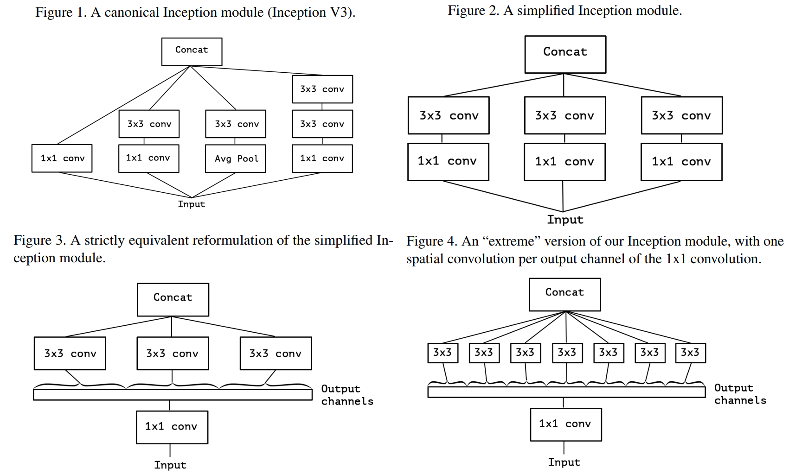

# Xception: Deep Learning with Depthwise Separable Convolutions
Xception：用深度可分离卷积进行深度学习 2016-11-7 https://arxiv.org/abs/1610.02357

## 阅读笔记
* 深度可分离卷积的发展过程

## Abstract
We present an interpretation of Inception modules in convolutional neural networks as being an intermediate step in-between regular convolution and the depthwise separable convolution operation (a depthwise convolution followed by a pointwise convolution). In this light, a depthwise separable convolution can be understood as an Inception module with a maximally large number of towers. This observation leads us to propose a novel deep convolutional neural network architecture inspired by Inception, where Inception modules have been replaced with depthwise separable convolutions. We show that this architecture, dubbed Xception, slightly outperforms Inception V3 on the ImageNet dataset (which Inception V3 was designed for), and significantly outperforms Inception V3 on a larger image classification dataset comprising 350 million images and 17,000 classes. Since the Xception architecture has the same number of parameters as Inception V3, the performance gains are not due to increased capacity but rather to a more efficient use of model parameters.

我们将卷积神经网络中的Inception模块解释为常规卷积和深度可分离卷积操作(深度卷积之后是点卷积)之间的中间步骤。因此，深度可分离卷积可以理解为具有最大数量塔的Inception模块。这一观察结果促使我们提出了一种受Inception启发的新型深度卷积神经网络结构，其中，Inception模块已被深度可分离卷积所取代。我们表明，这种称为Xception的架构在ImageNet数据集(Inception V3是为其设计的)上略优于InceptionV3，在包含3.5亿张图像和17000个类的更大图像分类数据集上显著优于Incept V3。由于Xception架构与Inception V3具有相同数量的参数，因此性能的提高并不是因为容量的增加，而是因为模型参数的使用效率更高。

 
Figure 1. A canonical Inception module (Inception V3).
图1.规范的Inception模块(InceptionV3)。

Figure 2. A simplified Inception module.
图2.简化的Inception模块。

Figure 3. A strictly equivalent reformulation of the simplified Inception module.
图3.简化的Inception模块的严格等效重新公式。
 
Figure 4. An “extreme” version of our Inception module, with one spatial convolution per output channel of the 1x1 convolution. 
图4.我们的Inception模块的“极端”版本，每个1x1卷积的输出通道有一个空间卷积。

## 1. Introduction
Convolutional neural networks have emerged as the master algorithm in computer vision in recent years, and developing recipes for designing them has been a subject of considerable attention. The history of convolutional neural network design started with LeNet-style models [10], which were simple stacks of convolutions for feature extraction and max-pooling operations for spatial sub-sampling. In 2012, these ideas were refined into the AlexNet architecture [9], where convolution operations were being repeated multiple times in-between max-pooling operations, allowing the network to learn richer features at every spatial scale. What followed was a trend to make this style of network increasingly deeper, mostly driven by the yearly ILSVRC competition; first with Zeiler and Fergus in 2013 [25] and then with the VGG architecture in 2014 [18].

近年来，卷积神经网络已成为计算机视觉领域的主要算法，开发设计卷积神经网的方法一直是一个备受关注的课题。卷积神经网络设计的历史始于LeNet风格的模型[10]，这些模型是用于特征提取的简单卷积堆栈，以及用于空间子采样的最大池化操作。2012年，这些想法被细化到AlexNet架构[9]中，在最大池化操作之间，卷积操作被多次重复，使网络能够在每个空间尺度上学习更丰富的特征。随之而来的是一种趋势，使这种类型的网络越来越深入，主要是由每年的ILSVRC竞赛推动的; 2013年首次与Zeiler和Fergus合作[25]，2014年与VGG架构合作[18]。

At this point a new style of network emerged, the Inception architecture, introduced by Szegedy et al. in 2014 [20] as GoogLeNet (Inception V1), later refined as Inception V2 [7], Inception V3 [21], and most recently Inception-ResNet [19]. Inception itself was inspired by the earlier NetworkIn-Network architecture [11]. Since its first introduction, Inception has been one of the best performing family of models on the ImageNet dataset [14], as well as internal datasets in use at Google, in particular JFT [5].

在这一点上，一种新的网络风格应运而生，即Szegedyet al 于2014年[20]引入的Inception架构，称为GoogLeNet(Inceptation V1)，后来又被改进为Incepton V2[7]、Inception V3[21]，最近的是Inception ResNet[19]。Inception本身受到早期Network In Network架构的启发[11]。自其首次推出以来，Inception一直是ImageNet数据集[14]以及Google使用的内部数据集(尤其是JFT[5])上性能最好的模型系列之一。

The fundamental building block of Inception-style models is the Inception module, of which several different versions exist. In figure 1 we show the canonical form of an Inception module, as found in the Inception V3 architecture. An Inception model can be understood as a stack of such modules. This is a departure from earlier VGG-style networks which were stacks of simple convolution layers.

Inception风格的基本构建块是Inception模块，它有几个不同的版本。在图1中，我们展示了Inception模块的规范形式，如InceptionV3架构中所示。Inception模型可以理解为此类模块的堆栈。这与早期的VGG型网络不同，后者是简单卷积层的堆栈。

While Inception modules are conceptually similar to convolutions (they are convolutional feature extractors), they empirically appear to be capable of learning richer representations with less parameters. How do they work, and how do they differ from regular convolutions? What design strategies come after Inception?

虽然Inception模块在概念上与卷积相似(它们是卷积特征提取器)，但从经验上看，它们似乎能够用较少的参数学习更丰富的表示。它们是如何工作的，与常规卷积有何区别？Inception之后有什么设计策略？

### 1.1. The Inception hypothesis  假设
A convolution layer attempts to learn filters in a 3D space, with 2 spatial dimensions (width and height) and a channel dimension; thus a single convolution kernel is tasked with simultaneously mapping cross-channel correlations and spatial correlations.

卷积层尝试在3D空间中学习滤波器，具有2个空间维度(宽度和高度)和一个通道维度; 因此，单个卷积核的任务是同时映射跨通道相关性和空间相关性。

This idea behind the Inception module is to make this process easier and more efficient by explicitly factoring it into a series of operations that would independently look at cross-channel correlations and at spatial correlations. More precisely, the typical Inception module first looks at crosschannel correlations via a set of 1x1 convolutions, mapping the input data into 3 or 4 separate spaces that are smaller than the original input space, and then maps all correlations in these smaller 3D spaces, via regular 3x3 or 5x5 convolutions. This is illustrated in figure 1. In effect, the fundamental hypothesis behind Inception is that cross-channel correlations and spatial correlations are sufficiently decoupled that it is preferable not to map them jointly $^1$. 

Inception模块背后的想法是，通过将其明确分解为一系列独立查看跨通道相关性和空间相关性的操作，使该过程更容易、更高效。更准确地说，典型的Inception模块首先通过一组1x1卷积查看跨信道相关性，将输入数据映射到比原始输入空间小的3个或4个独立空间，然后通过常规的3x3或5x5卷积映射这些较小的3D空间中的所有相关性。这如图1所示。实际上，Inception背后的基本假设是，跨通道相关性和空间相关性充分解耦，最好不要将它们联合映射。

Consider a simplified version of an Inception module that only uses one size of convolution (e.g. 3x3) and does not include an average pooling tower (figure 2). This Inception module can be reformulated as a large 1x1 convolution followed by spatial convolutions that would operate on nonoverlapping segments of the output channels (figure 3). This observation naturally raises the question: what is the effect of the number of segments in the partition (and their size)? Would it be reasonable to make a much stronger hypothesis than the Inception hypothesis, and assume that cross-channel correlations and spatial correlations can be mapped completely separately?

考虑一个简化版的Inception模块，它只使用一种卷积大小(例如3x3)，不包括平均池化塔(图2)。这个Inception模块可以重新定义为一个大的1x1卷积，然后是空间卷积，它将在输出通道的非重叠段上运行(图3)。这一观察结果自然提出了一个问题：分区中的段数(及其大小)的影响是什么？是否有理由提出一个比Inception更强有力的假设，并假设跨通道相关性和空间相关性可以完全分开映射？

### 1.2. The continuum between convolutions and separable convolutions 卷积与可分卷积之间的连续体
An “extreme” version of an Inception module, based on this stronger hypothesis, would first use a 1x1 convolution to map cross-channel correlations, and would then separately map the spatial correlations of every output channel. This is shown in figure 4. We remark that this extreme form of an Inception module is almost identical to a depthwise separable convolution, an operation that has been used in neural network design as early as 2014 [15] and has become more popular since its inclusion in the TensorFlow framework [1] in 2016.

基于这个更强的假设，Inception模块的“极端”版本将首先使用1x1卷积来映射跨通道相关性，然后分别映射每个输出通道的空间相关性。这如图4所示。我们注意到，Inception模块的这种极端形式几乎与深度可分离卷积相同，这种运算早在2014年[15]就已用于神经网络设计，自2016年被纳入TensorFlow框架[1]以来，这种运算变得更为流行。

A depthwise separable convolution, commonly called “separable convolution” in deep learning frameworks such as TensorFlow and Keras, consists in a depthwise convolution, i.e. a spatial convolution performed independently over each channel of an input, followed by a pointwise convolution, i.e. a 1x1 convolution, projecting the channels output by the depthwise convolution onto a new channel space. This is not to be confused with a spatially separable convolution, which is also commonly called “separable convolution” in the image processing community.

深度可分离卷积，在TensorFlow和Keras等深度学习框架中通常称为“可分离卷积”，由深度卷积组成，即在输入的每个通道上独立执行的空间卷积，然后是逐点卷积，即1x1卷积，将深度卷积输出的通道投影到新的通道空间。这不应与空间上可分离的卷积混淆，在图像处理界，这种卷积也通常称为“可分离卷积”。

Two minor differences between and “extreme” version of an Inception module and a depthwise separable convolution would be:
* The order of the operations: depthwise separable convolutions as usually implemented (e.g. in TensorFlow) perform first channel-wise spatial convolution and then perform 1x1 convolution, whereas Inception performs the 1x1 convolution first.
* The presence or absence of a non-linearity after the first operation. In Inception, both operations are followed by a ReLU non-linearity, however depthwise separable convolutions are usually implemented without non-linearities.

Inception模块和深度可分离卷积的“极端”版本之间的两个细微差异是：
* 操作顺序：通常执行的深度可分离卷积(例如在TensorFlow中)执行第一个信道空间卷积，然后执行1x1卷积，而Inception首先执行1x1卷积。
* 首次操作后是否存在非线性。在Inception中，两个操作都遵循ReLU非线性，但深度可分离卷积通常没有非线性。

We argue that the first difference is unimportant, in particular because these operations are meant to be used in a stacked setting. The second difference might matter, and we investigate it in the experimental section (in particular see figure 10).

我们认为第一个区别并不重要，特别是因为这些操作是在堆叠设置中使用的。第二个差异可能很重要，我们在实验部分对此进行了研究(特别是见图10)。

We also note that other intermediate formulations of Inception modules that lie in between regular Inception modules and depthwise separable convolutions are also possible: in effect, there is a discrete spectrum between regular convolutions and depthwise separable convolutions, parametrized by the number of independent channel-space segments used for performing spatial convolutions. A regular convolution (preceded by a 1x1 convolution), at one extreme of this spectrum, corresponds to the single-segment case; a depthwise separable convolution corresponds to the other extreme where there is one segment per channel; Inception modules lie in between, dividing a few hundreds of channels into 3 or 4 segments. The properties of such intermediate modules appear not to have been explored yet.

我们还注意到，位于常规Inception模块和深度可分离卷积之间的Inception模块的其他中间公式也是可能的：实际上，常规卷积和深度可分开卷积之间有一个离散谱，由用于执行空间卷积的独立信道空间段数参数化。在这个谱的一个极端，常规卷积(前面是1x1卷积)对应于单段情况; 深度可分离卷积对应于另一个极端，其中每个信道有一个段; Inception模块位于两者之间，将数百个通道划分为3或4个部分。这些中间模块的性质似乎还没有被探讨过。

Having made these observations, we suggest that it may be possible to improve upon the Inception family of architectures by replacing Inception modules with depthwise separable convolutions, i.e. by building models that would be stacks of depthwise separable convolutions. This is made practical by the efficient depthwise convolution implementation available in TensorFlow. In what follows, we present a convolutional neural network architecture based on this idea, with a similar number of parameters as Inception V3, and we evaluate its performance against Inception V3 on two large-scale image classification task.

根据这些观察结果，我们认为可以通过用深度可分离卷积替换Inception模块来改进Inception系列架构，即通过构建深度可分离的卷积堆栈模型。通过TensorFlow中可用的高效深度卷积实现，这是可行的。在下文中，我们提出了一种基于这种思想的卷积神经网络结构，其参数量与InceptionV3相似，并且我们评估了其在两个大规模图像分类任务中相对于InceptionV3的性能。

## 2. Prior work
The present work relies heavily on prior efforts in the following areas:
* Convolutional neural networks [10, 9, 25], in particular the VGG-16 architecture [18], which is schematically similar to our proposed architecture in a few respects.
* The Inception architecture family of convolutional neural networks [20, 7, 21, 19], which first demonstrated the advantages of factoring convolutions into multiple branches operating successively on channels and then on space.
* Depthwise separable convolutions, which our proposed architecture is entirely based upon. While the use of spatially separable convolutions in neural networks has a long history, going back to at least 2012 [12] (but likely even earlier), the depthwise version is more recent. Laurent Sifre developed depthwise separable convolutions during an internship at Google Brain in 2013, and used them in AlexNet to obtain small gains in accuracy and large gains in convergence speed, as well as a significant reduction in model size. An overview of his work was first made public in a presentation at ICLR 2014 [23]. Detailed experimental results are reported in Sifre’s thesis, section 6.2 [15]. This initial work on depthwise separable convolutions was inspired by prior research from Sifre and Mallat on transformation-invariant scattering [16, 15]. Later, a depthwise separable convolution was used as the first layer of Inception V1 and Inception V2 [20, 7]. Within Google, Andrew Howard [6] has introduced efficient mobile models called MobileNets using depthwise separable convolutions. Jin et al. in 2014 [8] and Wang et al. in 2016 [24] also did related work aiming at reducing the size and computational cost of convolutional neural networks using separable convolutions. Additionally, our work is only possible due to the inclusion of an efficient implementation of depthwise separable convolutions in the TensorFlow framework [1].
* Residual connections, introduced by He et al. in [4], which our proposed architecture uses extensively.

目前的工作在很大程度上依赖于先前在以下领域的努力：
* 卷积神经网络[10,9,25]，特别是VGG-16架构[18]，在几个方面与我们提出的架构类似。
* 卷积神经网络的Inception架构家族[20，7，21，19]，首先展示了将卷积分解为多个分支的优点，这些分支依次在通道上和空间上操作。
* 深度可分离卷积，我们提出的架构完全基于此。虽然在神经网络中使用空间可分离卷积已有很长的历史，至少可以追溯到2012年[12](但可能更早)，但深度方面的版本更近。2013年，Laurent Sifre在Google Brain实习期间开发了深度可分离卷积，并在AlexNet中使用这些卷积以获得较小的精度增益和较大的收敛速度增益，以及显著减小模型大小。他的工作概述首次在2014年ICLR的演讲中公开[23]。Sifre的论文第6.2节[15]中报告了详细的实验结果。这项关于深度可分离卷积的Inception工作受到Sifre和Mallat先前关于变换不变散射的研究的启发[16，15]。后来，一个深度可分离的卷积被用作InceptionV1和InceptionV2的第一层[20,7]。在谷歌内部，安德鲁·霍华德(Andrew Howard)[6]引入了一种高效的移动模型，称为MobileNets，使用深度可分离卷积。Jinet al 在2014年[8]和Wanget al 在2016年[24]也开展了相关工作，旨在使用可分离卷积减少卷积神经网络的规模和计算成本。此外，由于在TensorFlow框架中包含了深度可分离卷积的高效实现，我们的工作才有可能完成[1]。
* Heet al 在[4]中介绍的残差连接，我们提出的架构广泛使用了它。

## 3. The Xception architecture
We propose a convolutional neural network architecture based entirely on depthwise separable convolution layers. In effect, we make the following hypothesis: that the mapping of cross-channels correlations and spatial correlations in the feature maps of convolutional neural networks can be entirely decoupled. Because this hypothesis is a stronger version of the hypothesis underlying the Inception architecture, we name our proposed architecture Xception, which stands for “Extreme Inception”.

我们提出了一种完全基于深度可分离卷积层的CNN结构。实际上，我们做了以下假设：卷积神经网络特征映射中的跨通道相关性和空间相关性映射可以完全解耦。因为这个假设是一个更强有力的版本，它是Inception架构的基础，所以我们将我们提出的架构命名为Xception，它代表“极限Inception”。

Figure 5. The Xception architecture: the data first goes through the entry flow, then through the middle flow which is repeated eight times, and finally through the exit flow. Note that all Convolution and SeparableConvolution layers are followed by batch normalization [7] (not included in the diagram). All SeparableConvolution layers use a depth multiplier of 1 (no depth expansion).
图5.Xception架构：数据首先通过入口流，然后通过重复八次的中间流，最后通过出口流。请注意，所有卷积和可分离卷积层之后都是批归一化[7](图中未包括)。所有可分离卷积层都使用深度乘数1(无深度扩展)。

A complete description of the specifications of the network is given in figure 5. The Xception architecture has 36 convolutional layers forming the feature extraction base of the network. In our experimental evaluation we will exclusively investigate image classification and therefore our convolutional base will be followed by a logistic regression layer. Optionally one may insert fully-connected layers before the logistic regression layer, which is explored in the experimental evaluation section (in particular, see figures 7 and 8). The 36 convolutional layers are structured into 14 modules, all of which have linear residual connections around them, except for the first and last modules.

图5给出了网络规范的完整描述。Xception架构有36个卷积层，构成了网络的特征提取基础。在我们的实验评估中，我们将专门研究图像分类，因此我们的卷积基础后面将是逻辑回归层。可选地，可以在逻辑回归层之前插入全连接层，这在实验评估部分中进行了探讨(特别是见图7和8)。36个卷积层被构造成14个模块，除第一个和最后一个模块外，所有模块周围都有线性残差连接。

In short, the Xception architecture is a linear stack of depthwise separable convolution layers with residual connections. This makes the architecture very easy to define and modify; it takes only 30 to 40 lines of code using a highlevel library such as Keras [2] or TensorFlow-Slim [17], not unlike an architecture such as VGG-16 [18], but rather un- like architectures such as Inception V2 or V3 which are far more complex to define. An open-source implementation of Xception using Keras and TensorFlow is provided as part of the Keras Applications module2 , under the MIT license.

简而言之，Xception架构是一个具有残差连接的深度可分离卷积层的线性堆栈。这使得架构非常容易定义和修改; 使用Keras[2]或TensorFlow Slim[17]等高级库，它只需要30到40行代码，与VGG-16[18]等架构没有什么不同，但与Inception V2或V3等非同类架构相比，它们的定义要复杂得多。在MIT许可下，使用Keras和TensorFlow的Xception的开源实现作为Keras应用程序模块2的一部分提供。

## 4. Experimental evaluation
We choose to compare Xception to the Inception V3 architecture, due to their similarity of scale: Xception and Inception V3 have nearly the same number of parameters (table 3), and thus any performance gap could not be attributed to a difference in network capacity. We conduct our comparison on two image classification tasks: one is the well-known 1000-class single-label classification task on the ImageNet dataset [14], and the other is a 17,000-class multi-label classification task on the large-scale JFT dataset.

我们选择将Xception与Inception V3架构进行比较，因为它们的规模相似：Xcepton和Incepton V3的参数数量几乎相同(表3)，因此任何性能差距都不能归因于网络容量的差异。我们对两个图像分类任务进行了比较：一个是著名的ImageNet数据集上的1000类单标签分类任务[14]，另一个是大型JFT数据集的17000类多标签分类任务。

### 4.1. The JFT dataset
JFT is an internal Google dataset for large-scale image classification dataset, first introduced by Hinton et al. in [5], which comprises over 350 million high-resolution images annotated with labels from a set of 17,000 classes. To evaluate the performance of a model trained on JFT, we use an auxiliary dataset, FastEval14k.

JFT是由Hintonet al 在[5]中首次引入的用于大规模图像分类数据集的内部Google数据集，它包含超过3.5亿幅用17000个类别的标签注释的高分辨率图像。为了评估经过JFT训练的模型的性能，我们使用了一个辅助数据集FastEval14k。

FastEval14k is a dataset of 14,000 images with dense annotations from about 6,000 classes (36.5 labels per image on average). On this dataset we evaluate performance using Mean Average Precision for top 100 predictions (MAP@100), and we weight the contribution of each class to MAP@100 with a score estimating how common (and therefore important) the class is among social media images. This evaluation procedure is meant to capture performance on frequently occurring labels from social media, which is crucial for production models at Google.

FastEval14k是一个包含14000个图像的数据集，其中包含约6000个类别的密集注释(平均每张图像36.5个标签)。在此数据集上，我们使用前100个预测的平均平均精度评估性能(MAP@100)，我们衡量每个类对MAP@100用分数估计班级在社交媒体图像中的常见程度(因此也很重要)。此评估程序旨在捕获社交媒体中频繁出现的标签的性能，这对于谷歌的生产模型至关重要。

### 4.2. Optimization configuration
A different optimization configuration was used for ImageNet and JFT:

ImageNet和JFT使用了不同的优化配置:

• On ImageNet: 
    – Optimizer: SGD 
    – Momentum: 0.9 
    – Initial learning rate: 0.045 
    – Learning rate decay: decay of rate 0.94 every 2 epochs
• On JFT: 
    – Optimizer: RMSprop [22] 
    – Momentum: 0.9 
    – Initial learning rate: 0.001 2
    – Learning rate decay: decay of rate 0.9 every 3,000,000 samples

For both datasets, the same exact same optimization con- figuration was used for both Xception and Inception V3. Note that this configuration was tuned for best performance with Inception V3; we did not attempt to tune optimization hyperparameters for Xception. Since the networks have different training profiles (figure 6), this may be suboptimal, especially on the ImageNet dataset, on which the optimization configuration used had been carefully tuned for Inception V3.

对于这两个数据集，Xception和Inception V3使用了完全相同的优化配置; 我们没有尝试调整Xception的优化超参数。由于网络具有不同的训练配置文件(图6)，这可能是次优的，尤其是在ImageNet数据集上，在该数据集上使用的优化配置已针对Inception V3进行了仔细调整。

Additionally, all models were evaluated using Polyak averaging [13] at inference time.

此外，在推理时，所有模型均采用Polyak平均值[13]进行评估。

### 4.3. Regularization configuration 
* Weight decay: The Inception V3 model uses a weight decay (L2 regularization) rate of 4e − 5, which has been carefully tuned for performance on ImageNet. We found this rate to be quite suboptimal for Xception and instead settled for 1e − 5. We did not perform an extensive search for the optimal weight decay rate. The same weight decay rates were used both for the ImageNet experiments and the JFT experiments.
* Dropout: For the ImageNet experiments, both models include a dropout layer of rate 0.5 before the logistic regression layer. For the JFT experiments, no dropout was included due to the large size of the dataset which made overfitting unlikely in any reasonable amount of time.
* Auxiliary loss tower: The Inception V3 architecture may optionally include an auxiliary tower which backpropagates the classification loss earlier in the network, serving as an additional regularization mechanism. For simplicity, we choose not to include this auxiliary tower in any of our models.

正则配置：
* 权重衰减：InceptionV3模型使用的权重衰减(L2正则化)4e−5，已针对ImageNet上的性能进行了仔细调整。我们发现这个比率对于Xception来说是非常不理想的，因此只适用于1e−5. 我们没有广泛搜索最佳权重衰减率。ImageNet实验和JFT实验使用相同的权重衰减率。
* Dropout：对于ImageNet实验，两个模型都在逻辑回归层之前包含一个速率为0.5的Dropout层。对于JFT实验，由于数据集的大尺寸，使得在任何合理的时间内都不太可能进行过拟合，因此没有包含Dropout。
* 辅助损失塔：Inception V3架构可以选择包括一个辅助塔，它在网络中较早地反向传播分类损失，作为一种额外的正则化机制。为了简单起见，我们选择在我们的任何模型中不包括此辅助塔。

### 4.4. Training infrastructure 训练设施
All networks were implemented using the TensorFlow framework [1] and trained on 60 NVIDIA K80 GPUs each.

所有网络都是使用TensorFlow框架[1]实现的，每个网络都接受了60个NVIDIA K80 GPU的训练。

For the ImageNet experiments, we used data parallelism with synchronous gradient descent to achieve the best classi- fication performance, while for JFT we used asynchronous gradient descent so as to speed up training. The ImageNet experiments took approximately 3 days each, while the JFT experiments took over one month each. The JFT models were not trained to full convergence, which would have taken over three month per experiment.

对于ImageNet实验，我们使用数据并行与同步梯度下降来实现最佳分类性能，而对于JFT，我们使用异步梯度下降来加快训练。ImageNet实验每次大约需要3天，而JFT实验每次需要一个多月。JFT模型没有训练到完全收敛，每次实验需要花费三个多月的时间。

### 4.5. Comparison with Inception V3
#### 4.5.1 Classification performance
All evaluations were run with a single crop of the inputs images and a single model. ImageNet results are reported on the validation set rather than the test set (i.e. on the non-blacklisted images from the validation set of ILSVRC 2012). JFT results are reported after 30 million iterations (one month of training) rather than after full convergence. Results are provided in table 1 and table 2, as well as figure 6, figure 7, figure 8. On JFT, we tested both versions of our networks that did not include any fully-connected layers, and versions that included two fully-connected layers of 4096 units each before the logistic regression layer.

所有评估都是使用一组输入图像和一个模型进行的。ImageNet结果报告在验证集而不是测试集(即ILSVRC 2012验证集的非黑名单图像)。JFT结果是在3000万次迭代(一个月的训练)后报告的，而不是在完全收敛后。结果见表1和表2，以及图6、图7和图8。在JFT上，我们测试了两个不包含任何全连接层的网络版本，以及在逻辑回归层之前包含两个4096个单元的全连接层版本。

On ImageNet, Xception shows marginally better results than Inception V3. On JFT, Xception shows a 4.3% relative improvement on the FastEval14k MAP@100 metric. We also note that Xception outperforms ImageNet results reported by He et al. for ResNet-50, ResNet-101 and ResNet-152 [4].

在ImageNet上，Xception显示出比Inception V3稍好的结果。在JFT上，Xception在FastEval14k上显示出4.3%的相对改进MAP@100米制的我们还注意到，Xception在ResNet-50、ResNet-101和ResNet-152方面的表现优于Heet al 报告的ImageNet结果[4]。

Figure 6. Training profile on ImageNet
图6.ImageNet上的训练配置文件

Figure 7. Training profile on JFT, without fully-connected layers ularization parameters) would yield significant additional improvement.
图7.JFT上的训练配置文件(没有全连接的层化参数)将产生显著的额外改进。

Table 1. Classification performance comparison on ImageNet (single crop, single model). VGG-16 and ResNet-152 numbers are only included as a reminder. The version of Inception V3 being benchmarked does not include the auxiliary tower.
表1.ImageNet上的分类性能比较(单次剪裁，单模型)。VGG-16和ResNet-152数字仅作为提示。正在进行基准测试的Inception V3版本不包括辅助塔。

Table 2. Classification performance comparison on JFT (single crop, single model).
表2.JFT(单次剪裁、单模型)分类性能比较。

The Xception architecture shows a much larger performance improvement on the JFT dataset compared to the ImageNet dataset. We believe this may be due to the fact that Inception V3 was developed with a focus on ImageNet and may thus be by design over-fit to this specific task. On the other hand, neither architecture was tuned for JFT. It is likely that a search for better hyperparameters for Xception on ImageNet (in particular optimization parameters and regularization parameters) would yield significant additional improvement.

与ImageNet数据集相比，Xception架构在JFT数据集上显示出更大的性能改进。我们认为，这可能是因为Inception V3是以ImageNet为重点开发的，因此可能是由于设计过于适合这一特定任务。另一方面，两个架构都没有针对JFT进行优化。在ImageNet上为Xception搜索更好的超参数(特别是优化参数和正则化参数)可能会带来显著的额外改进。

#### 4.5.2 Size and speed
Table 3. Size and training speed comparison.
表3.规模和训练速度比较。

In table 3 we compare the size and speed of Inception V3 and Xception. Parameter count is reported on ImageNet (1000 classes, no fully-connected layers) and the number of training steps (gradient updates) per second is reported on ImageNet with 60 K80 GPUs running synchronous gradient descent. Both architectures have approximately the same size (within 3.5%), and Xception is marginally slower. We expect that engineering optimizations at the level of the depthwise convolution operations can make Xception faster than Inception V3 in the near future. The fact that both architectures have almost the same number of parameters indicates that the improvement seen on ImageNet and JFT does not come from added capacity but rather from a more efficient use of the model parameters.

在表3中，我们比较了Inception V3和Xception的大小和速度。参数计数在ImageNet上报告(1000个类，没有全连接的层)，每秒的训练步数(梯度更新)在ImageNet上报告，60 K80 GPU运行同步梯度下降。两种架构的大小大致相同(在3.5%以内)，Xception的速度稍慢。我们预计，在深度卷积操作级别上的工程优化可以使Xception在不久的将来比Inception V3更快。这两种架构具有几乎相同数量的参数，这表明ImageNet和JFT的改进并不是因为增加了容量，而是因为更有效地使用了模型参数。

Figure 8. Training profile on JFT, with fully-connected layers V3 
图8.JFT上的训练配置文件，具有全连接的层V3

### 4.6. Effect of the residual connections
To quantify the benefits of residual connections in the Xception architecture, we benchmarked on ImageNet a modified version of Xception that does not include any residual connections. Results are shown in figure 9. Residual connections are clearly essential in helping with convergence, both in terms of speed and final classification performance. However we will note that benchmarking the non-residual model with the same optimization configuration as the residual model may be uncharitable and that better optimization configurations might yield more competitive results.

为了量化Xception架构中残差连接的好处，我们在ImageNet上对Xcepton的一个修改版本进行了基准测试，该版本不包括任何残差连接。结果如图9所示。在速度和最终分类性能方面，残差连接对于帮助收敛显然至关重要。然而，我们会注意到，使用与残差模型相同的优化配置对非残差模型进行基准测试可能是不可靠的，更好的优化配置可能会产生更具竞争力的结果。

Figure 9. Training profile with and without residual connections.
图9.有或无残差连接的训练配置文件。

Additionally, let us note that this result merely shows the importance of residual connections for this specific architecture, and that residual connections are in no way required in order to build models that are stacks of depthwise separable convolutions. We also obtained excellent results with non-residual VGG-style models where all convolution layers were replaced with depthwise separable convolutions (with a depth multiplier of 1), superior to Inception V3 on JFT at equal parameter count.

此外，让我们注意到，这个结果仅仅表明了残差连接对于这个特定架构的重要性，并且为了构建深度可分离卷积堆栈的模型，不需要残差连接。在非残差VGG型模型中，所有卷积层都被深度可分离的卷积(深度乘数为1)所取代，在等参数计数的JFT上，我们也获得了很好的结果，优于Inception V3。

### 4.7. Effect of an intermediate activation after pointwise convolutions 逐点卷积后的中间激活效应
We mentioned earlier that the analogy between depthwise separable convolutions and Inception modules suggests that depthwise separable convolutions should potentially include a non-linearity between the depthwise and pointwise operations. In the experiments reported so far, no such nonlinearity was included. However we also experimentally tested the inclusion of either ReLU or ELU [3] as intermediate non-linearity. Results are reported on ImageNet in figure 10, and show that the absence of any non-linearity leads to both faster convergence and better final performance.

我们前面提到过，深度可分离卷积和Inception模块之间的类比表明，深度可分离卷积应该潜在地包括深度操作和点操作之间的非线性。在迄今为止报告的实验中，没有包括这种非线性。然而，我们还通过实验测试了ReLU或ELU[3]作为中间非线性。图10显示了ImageNet上的结果，并显示了任何非线性的缺失都会导致更快的收敛和更好的最终性能。

Figure 10. Training profile with different activations between the depthwise and pointwise operations of the separable convolution layers.
图10.可分离卷积层的深度操作和点操作之间不同激活的训练剖面。

This is a remarkable observation, since Szegedy et al. report the opposite result in [21] for Inception modules. It may be that the depth of the intermediate feature spaces on which spatial convolutions are applied is critical to the usefulness of the non-linearity: for deep feature spaces (e.g. those found in Inception modules) the non-linearity is helpful, but for shallow ones (e.g. the 1-channel deep feature spaces of depthwise separable convolutions) it becomes harmful, possibly due to a loss of information.

这是一个值得注意的观察结果，因为Szegedyet al 在[21]中报告了Inception模块的相反结果。应用空间卷积的中间特征空间的深度可能对非线性的有用性至关重要：对于深度特征空间(例如在Inception模块中发现的那些)，非线性是有用的，但对于浅层特征空间(如深度可分离卷积的1通道深部特征空间)，非线性变得有害，可能是由于信息丢失。

## 5. Future directions 未来方向
We noted earlier the existence of a discrete spectrum between regular convolutions and depthwise separable convolutions, parametrized by the number of independent channelspace segments used for performing spatial convolutions. Inception modules are one point on this spectrum. We showed in our empirical evaluation that the extreme formulation of an Inception module, the depthwise separable convolution, may have advantages over regular a regular Inception module. However, there is no reason to believe that depthwise separable convolutions are optimal. It may be that intermediate points on the spectrum, lying between regular Inception modules and depthwise separable convolutions, hold further advantages. This question is left for future investigation.

我们之前注意到，常规卷积和深度可分离卷积之间存在离散谱，由用于执行空间卷积的独立信道空间段的数量参数化。Inception模块是这个范围中的一点。我们在经验评估中表明，Inception模块的极端形式，即深度可分离卷积，可能比常规Inception模块具有优势。然而，没有理由相信深度可分离卷积是最优的。频谱上介于规则Inception模块和深度可分离卷积之间的中间点可能具有进一步的优势。这个问题留待以后研究。

## 6. Conclusions
We showed how convolutions and depthwise separable convolutions lie at both extremes of a discrete spectrum, with Inception modules being an intermediate point in between. This observation has led to us to propose replacing Inception modules with depthwise separable convolutions in neural computer vision architectures. We presented a novel architecture based on this idea, named Xception, which has a similar parameter count as Inception V3. Compared to Inception V3, Xception shows small gains in classification performance on the ImageNet dataset and large gains on the JFT dataset. We expect depthwise separable convolutions to become a cornerstone of convolutional neural network architecture design in the future, since they offer similar properties as Inception modules, yet are as easy to use as regular convolution layers.

我们展示了卷积和深度可分离卷积如何位于离散谱的两个极端，而Inception模块是介于两者之间的中间点。这一观察结果促使我们提出用神经计算机视觉架构中的深度可分离卷积替换Inception模块。我们基于这一思想提出了一种新的架构，名为Xception，它的参数计数与Inception V3类似。与Incept V3相比，Xceptions在ImageNet数据集上的分类性能方面的提升很小，在JFT数据集方面的提升很大。我们预计，深度可分离卷积将成为未来卷积神经网络架构设计的基石，因为它们提供与Inception模块相似的属性，但也与常规卷积层一样易于使用。

## References
1. M. Abadi, A. Agarwal, P. Barham, E. Brevdo, Z. Chen, C. Citro, G. S. Corrado, A. Davis, J. Dean, M. Devin, S. Ghemawat, I. Goodfellow, A. Harp, G. Irving, M. Isard, Y. Jia, R. Jozefowicz, L. Kaiser, M. Kudlur, J. Levenberg, D. Man´e, R. Monga, S. Moore, D. Murray, C. Olah, M. Schuster, J. Shlens, B. Steiner, I. Sutskever, K. Talwar, P. Tucker, V. Vanhoucke, V. Vasudevan, F. Vi´egas, O. Vinyals, P. Warden, M. Wattenberg, M. Wicke, Y. Yu, and X. Zheng. TensorFlow: Large-scale machine learning on heterogeneous systems, 2015. Software available from tensorflow.org.
2. F. Chollet. Keras. https://github.com/fchollet/keras, 2015.
3. D.-A. Clevert, T. Unterthiner, and S. Hochreiter. Fast and accurate deep network learning by exponential linear units (elus). arXiv preprint arXiv:1511.07289, 2015.
4. K. He, X. Zhang, S. Ren, and J. Sun. Deep residual learning for image recognition. arXiv preprint arXiv:1512.03385, 2015.
5. G. Hinton, O. Vinyals, and J. Dean. Distilling the knowledge in a neural network, 2015.
6. A. Howard. Mobilenets: Efficient convolutional neural networks for mobile vision applications. Forthcoming.
7. S. Ioffe and C. Szegedy. Batch normalization: Accelerating deep network training by reducing internal covariate shift. In Proceedings of The 32nd International Conference on Machine Learning, pages 448–456, 2015.
8. J. Jin, A. Dundar, and E. Culurciello. Flattened convolutional neural networks for feedforward acceleration. arXiv preprint arXiv:1412.5474, 2014.
9. A. Krizhevsky, I. Sutskever, and G. E. Hinton. Imagenet classification with deep convolutional neural networks. In Advances in neural information processing systems, pages 1097–1105, 2012.
10. Y. LeCun, L. Jackel, L. Bottou, C. Cortes, J. S. Denker, H. Drucker, I. Guyon, U. Muller, E. Sackinger, P. Simard, et al. Learning algorithms for classification: A comparison on handwritten digit recognition. Neural networks: the statistical mechanics perspective, 261:276, 1995.
11. M. Lin, Q. Chen, and S. Yan. Network in network. arXiv preprint arXiv:1312.4400, 2013.
12. F. Mamalet and C. Garcia. Simplifying ConvNets for Fast Learning. In International Conference on Artificial Neural Networks (ICANN 2012), pages 58–65. Springer, 2012.
13. B. T. Polyak and A. B. Juditsky. Acceleration of stochastic approximation by averaging. SIAM J. Control Optim., 30(4):838–855, July 1992.
14. O. Russakovsky, J. Deng, H. Su, J. Krause, S. Satheesh, S. Ma, Z. Huang, A. Karpathy, A. Khosla, M. Bernstein, et al. Imagenet large scale visual recognition challenge. 2014.
15. L. Sifre. Rigid-motion scattering for image classification, 2014. Ph.D. thesis.
16. L. Sifre and S. Mallat. Rotation, scaling and deformation invariant scattering for texture discrimination. In 2013 IEEE Conference on Computer Vision and Pattern Recognition, Portland, OR, USA, June 23-28, 2013, pages 1233–1240, 2013.
17. N. Silberman and S. Guadarrama. Tf-slim, 2016.
18. K. Simonyan and A. Zisserman. Very deep convolutional networks for large-scale image recognition. arXiv preprint arXiv:1409.1556, 2014.
19. C. Szegedy, S. Ioffe, and V. Vanhoucke. Inception-v4, inception-resnet and the impact of residual connections on learning. arXiv preprint arXiv:1602.07261, 2016.
20. C. Szegedy, W. Liu, Y. Jia, P. Sermanet, S. Reed, D. Anguelov, D. Erhan, V. Vanhoucke, and A. Rabinovich. Going deeper with convolutions. In Proceedings of the IEEE Conference on Computer Vision and Pattern Recognition, pages 1–9, 2015.
21. C. Szegedy, V. Vanhoucke, S. Ioffe, J. Shlens, and Z. Wojna. Rethinking the inception architecture for computer vision. arXiv preprint arXiv:1512.00567, 2015.
22. T. Tieleman and G. Hinton. Divide the gradient by a running average of its recent magnitude. COURSERA: Neural Networks for Machine Learning, 4, 2012. Accessed: 2015- 11-05.
23. V. Vanhoucke. Learning visual representations at scale. ICLR, 2014.
24. M. Wang, B. Liu, and H. Foroosh. Factorized convolutional neural networks. arXiv preprint arXiv:1608.04337, 2016.
25. M. D. Zeiler and R. Fergus. Visualizing and understanding convolutional networks. In Computer Vision–ECCV 2014, pages 818–833. Springer, 2014.
