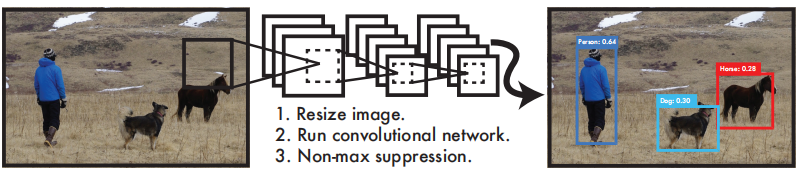
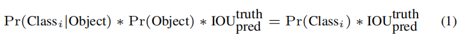
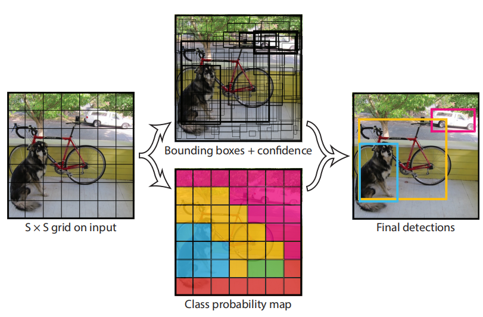
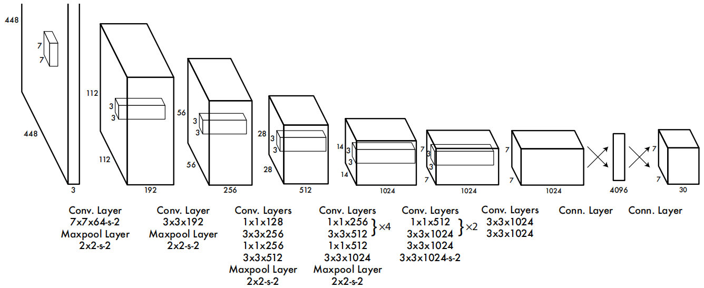
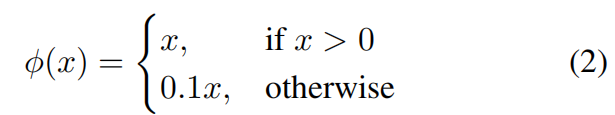
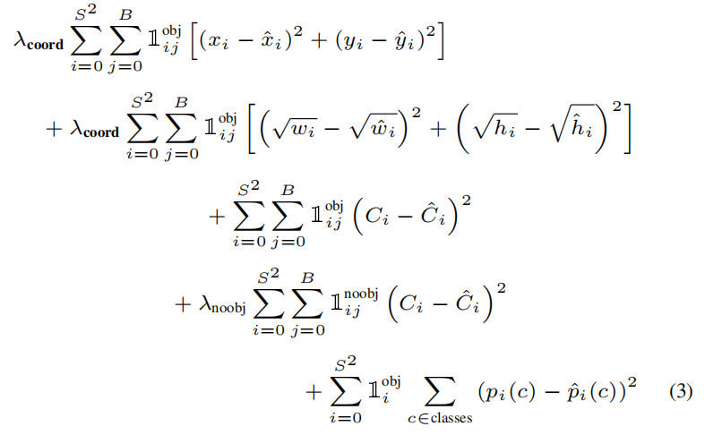

# You Only Look Once: Unified, Real-Time Object Detection
您只需查看一次：统一的实时目标检测 2015.6.8 原文：https://arxiv.org/abs/1506.02640

## 阅读笔记
* 模型输出：将输入图片分成S*S网格(S=7)，每个网格有B个锚框(B=2)，总计7*7*2=98个锚框; S × S × (B ∗ 5 + C)， 5是预测边框坐标: x、y(偏移量)、w、h和置信度(IoU), C为目标分类数。
* 损失函数：4个偏移量+1个包含目标的置信度+C个类别概率。
* 每个单元格只预测一个分类，而不是B个
* 锚框大小如何选择
* 正负样本，均衡问题
* No-max suppression, 非极大值抑制

## Abstract
We present YOLO, a new approach to object detection. Prior work on object detection repurposes classifiers to perform detection. Instead, we frame object detection as a regression problem to spatially separated bounding boxes and associated class probabilities. A single neural network predicts bounding boxes and class probabilities directly from full images in one evaluation. Since the whole detection pipeline is a single network, it can be optimized end-to-end directly on detection performance.

我们提出了一种新的目标检测方法YOLO。之前的目标检测工作重新调整分类器的用途以执行检测。相反，我们将目标检测作为一个回归问题来处理空间分离的边框和相关的类概率。单个神经网络在一次评估中直接从完整图像预测边框和类概率。由于整个检测管道是一个单一的网络，因此可以直接对检测性能进行端到端优化。

Our unified architecture is extremely fast. Our base YOLO model processes images in real-time at 45 frames per second. A smaller version of the network, Fast YOLO, processes an astounding 155 frames per second while still achieving double the mAP of other real-time detectors. Compared to state-of-the-art detection systems, YOLO makes more localization errors but is less likely to predict false positives on background. Finally, YOLO learns very general representations of objects. It outperforms other detection methods, including DPM and R-CNN, when generalizing from natural images to other domains like artwork.

我们的统一架构非常快。我们的基本YOLO模型以每秒45帧的速度实时处理图像。该网络的一个较小版本Fast YOLO每秒处理155帧，速度惊人，但其mAP仍然是其他实时探测器的两倍。与SOTA检测系统相比，YOLO会产生更多的定位误差，但不太可能在后台预测假阳性。最后，YOLO学习目标的一般表示法。当从自然图像推广到艺术品等其他领域时，它优于其他检测方法，包括DPM和R-CNN。

## 1. Introduction
Humans glance at an image and instantly know what objects are in the image, where they are, and how they interact. The human visual system is fast and accurate, allowing us to perform complex tasks like driving with little conscious thought. Fast, accurate algorithms for object detection would allow computers to drive cars without specialized sensors, enable assistive devices to convey real-time scene information to human users, and unlock the potential for general purpose, responsive robotic systems.

人类看一眼图像，就会立即知道图像中的目标是什么，它们在哪里，以及它们是如何相互作用的。人类的视觉系统快速准确，使我们能够在几乎没有意识的情况下执行复杂的任务，如驾驶。快速、准确的目标检测算法将允许计算机在没有专用传感器的情况下驾驶汽车，使辅助设备能够向人类用户传送实时场景信息，并释放通用、响应性机器人系统的潜力。

Current detection systems repurpose classifiers to perform detection. To detect an object, these systems take a classifier for that object and evaluate it at various locations and scales in a test image. Systems like deformable parts models (DPM) use a sliding window approach where the classifier is run at evenly spaced locations over the entire image [10].

当前的检测系统重新调整分类器的用途以执行检测。为了检测一个物体，这些系统对该物体采用分类器，并在测试图像中的不同位置和比例对其进行评估。像可变形部件模型(DPM)这样的系统使用滑动窗口方法，分类器在整个图像上均匀分布的位置运行[10]。

More recent approaches like R-CNN use region proposal methods to first generate potential bounding boxes in an image and then run a classifier on these proposed boxes. After classification, post-processing is used to refine the bounding boxes, eliminate duplicate detections, and rescore the boxes based on other objects in the scene [13]. These complex pipelines are slow and hard to optimize because each individual component must be trained separately.

最近的方法如R-CNN使用区域候选方法，首先在图像中生成潜在的边框，然后对这些提出的框运行分类器。分类后，后处理用于细化边框，消除重复检测，并基于场景中的其他目标重新扫描框[13]。这些复杂的管道很慢，很难优化，因为每个单独的组件都必须单独训练。

We reframe object detection as a single regression problem, straight from image pixels to bounding box coordinates and class probabilities. Using our system, you only look once (YOLO) at an image to predict what objects are present and where they are.

我们将目标检测重新定义为一个单一的回归问题，直接从图像像素到边框坐标和分类概率。使用我们的系统，您只需看一次图像(YOLO)即可预测存在的目标和位置。

 
Figure 1: The YOLO Detection System. Processing images with YOLO is simple and straightforward. Our system (1) resizes the input image to 448 × 448, (2) runs a single convolutional network on the image, and (3) thresholds the resulting detections by the model’s confidence. 
图1. YOLO检测系统。用YOLO处理图像简单明了。我们的系统(1)将输入图像大小调整为448×448，(2)在图像上运行单个卷积网络，(3)根据模型的置信度对检测结果进行阈值。

YOLO is refreshingly simple: see Figure 1. A single convolutional network simultaneously predicts multiple bounding boxes and class probabilities for those boxes. YOLO trains on full images and directly optimizes detection performance. This unified model has several benefits over traditional methods of object detection.

YOLO非常简单：见图1。一个卷积网络可以同时预测多个边框和这些框的分类概率。YOLO对完整图像进行训练，并直接优化检测性能。与传统的目标检测方法相比，这种统一模型有几个优点。

First, YOLO is extremely fast. Since we frame detection as a regression problem we don’t need a complex pipeline. We simply run our neural network on a new image at test time to predict detections. Our base network runs at 45 frames per second with no batch processing on a Titan X GPU and a fast version runs at more than 150 fps. This means we can process streaming video in real-time with less than 25 milliseconds of latency. Furthermore, YOLO achieves more than twice the mean average precision of other real-time systems. For a demo of our system running in real-time on a webcam please see our project webpage: http://pjreddie.com/yolo/.

首先，YOLO非常快。因为我们将帧检测作为一个回归问题，所以不需要复杂的流水线。我们只需在测试时对新图像运行神经网络来预测检测结果。我们的基本网络以每秒45帧的速度运行，在Titan X GPU上没有批处理，而快速版本的速度超过每秒150帧。这意味着我们可以在不到25毫秒的延迟内实时处理流视频。此外，YOLO的平均精度是其他实时系统的两倍以上。有关我们的系统在网络摄像头上实时运行的演示，请参见我们的项目网页：http://pjreddie.com/yolo/.

Second, YOLO reasons globally about the image when making predictions. Unlike sliding window and region proposal-based techniques, YOLO sees the entire image during training and test time so it implicitly encodes contextual information about classes as well as their appearance. Fast R-CNN, a top detection method [14], mistakes background patches in an image for objects because it can’t see the larger context. YOLO makes less than half the number of background errors compared to Fast R-CNN.

第二，YOLO在进行预测时对图像进行全局推理。与基于滑动窗口和区域候选技术不同，YOLO在训练和测试期间可以看到整个图像，因此它隐式编码了关于类及其外观的上下文信息。Fast R-CNN是一种顶级检测方法[14]，它会将图像中的背景分块错误地定位为物体，因为它看不到更大的背景。与Fast R-CNN相比，YOLO的背景错误数量不到一半。

Third, YOLO learns generalizable representations of objects. When trained on natural images and tested on artwork, YOLO outperforms top detection methods like DPM and R-CNN by a wide margin. Since YOLO is highly generalizable it is less likely to break down when applied to new domains or unexpected inputs.

第三，YOLO能学习到目标的泛化表示。当在自然图像上进行训练并在艺术品上进行测试时，YOLO比DPM和R-CNN等顶级检测方法表现出色。由于YOLO具有高度的通用性，当应用于新领域或意外输入时，它不太可能崩溃。

YOLO still lags behind state-of-the-art detection systems in accuracy. While it can quickly identify objects in images it struggles to precisely localize some objects, especially small ones. We examine these tradeoffs further in our experiments.

YOLO在精度方面仍然落后于SOTA(SOTA)检测系统。虽然它可以快速识别图像中的目标，但它很难精确定位某些目标，尤其是小目标。我们在实验中进一步研究了这些权衡。

All of our training and testing code is open source. A variety of pretrained models are also available to download.

我们所有的训练和测试代码都是开源的。还可以下载各种预训练模型。

## 2. Unified Detection 统一检测
We unify the separate components of object detection into a single neural network. Our network uses features from the entire image to predict each bounding box. It also predicts all bounding boxes across all classes for an image simultaneously. This means our network reasons globally about the full image and all the objects in the image. The YOLO design enables end-to-end training and realtime speeds while maintaining high average precision.

我们将目标检测的各个组成部分统一到单个神经网络中。我们的网络使用整个图像的特征来预测每个边框。它还可以同时预测图像所有类的所有边框。这意味着我们的网络在全局范围内对完整图像和图像中的所有目标进行推理。YOLO设计实现端到端训练和实时速度下同时保持较高的平均精度。

Our system divides the input image into an S × S grid. If the center of an object falls into a grid cell, that grid cell is responsible for detecting that object.

我们的系统将输入图像划分为S×S网格。如果一个物体的中心落在一个网格单元中，该网格单元负责检测该物体。

Each grid cell predicts B bounding boxes and confidence scores for those boxes. These confidence scores reflect how confident the model is that the box contains an object and also how accurate it thinks the box is that it predicts. Formally we define confidence as $Pr(Object) ∗ IOU^{truth}_{pred}$ . If no pred object exists in that cell, the confidence scores should be zero. Otherwise we want the confidence score to equal the intersection over union (IOU) between the predicted box and the ground truth.

每个网格单元预测B个边框和这些框的置信度得分。这些置信度得分反映了模型对边框包含目标的信心以及它认为边框预测的准确性。我们正式将置信度定义为$Pr(Object) ∗ IOU^{truth}_{pred}$ 。如果该单元格中不存在预测的目标，则置信度得分应为零。否则，我们希望置信度得分等于预测框和真实框之间的交并比(IoU)。

Each bounding box consists of 5 predictions: x, y, w, h, and confidence. The (x, y) coordinates represent the center of the box relative to the bounds of the grid cell. The width and height are predicted relative to the whole image. Finally the confidence prediction represents the IOU between the predicted box and any ground truth box.

每个边框由5个预测组成：x、y、w、h和置信度。(x，y)坐标表示边框的中心相对于单元格的边界。宽度和高度是相对于整个图像预测的。最后，置信度预测表示预测框和任何真实框之间的IoU(交并比)。

Each grid cell also predicts C conditional class probabilities, $Pr(Class_i |Object)$. These probabilities are conditioned on the grid cell containing an object. We only predict one set of class probabilities per grid cell, regardless of the number of boxes B.

每个网格单元还预测C 条件类概率 $Pr(Class_i |Object)$。这些概率取决于网格单元包含的目标。我们只预测每个网格单元的一组类概率，而不考虑方框B的数量。

At test time we multiply the conditional class probabilities and the individual box confidence predictions,

在测试时，我们将类的条件概率和单个边框置信度预测相乘，

$Pr(Class_i|Object) ∗ Pr(Object) ∗ IOU^{truth}_{pred} = Pr(Class_i) ∗ IOU^{truth}_{pred}$ (1)

<!---->

which gives us class-specific confidence scores for each box. These scores encode both the probability of that class appearing in the box and how well the predicted box fits the object.

这给了我们每个边框的特定类别的置信度得分。这些分数编码该类出现在框中的概率以及预测框与目标的匹配程度。

 
Figure 2: The Model. Our system models detection as a regression problem. It divides the image into an S × S grid and for each grid cell predicts B bounding boxes, confidence for those boxes, and C class probabilities. These predictions are encoded as an S × S × (B ∗ 5 + C) tensor.  
图-2 模型。我们的系统将检测建模为一个回归问题。它将图像分成一个S×S网格，每个网格单元预测B个边框、这些框的置信度和C类概率。这些预测编码为 S × S × (B ∗ 5 + C) 的张量。

For evaluating YOLO on PASCAL VOC, we use S = 7, B = 2. PASCAL VOC has 20 labelled classes so C = 20. Our final prediction is a 7 × 7 × 30 tensor.

为了评估PASCAL VOC上的YOLO，我们使用S=7，B=2。PASCAL VOC有20个标记类，所以C=20。我们的最终预测是7×7×30张量。

### 2.1. Network Design
We implement this model as a convolutional neural network and evaluate it on the PASCAL VOC detection dataset [9]. The initial convolutional layers of the network extract features from the image while the fully connected layers predict the output probabilities and coordinates.

我们将此模型实现为卷积神经网络，并在PASCAL VOC检测数据集上进行评估[9]。网络的初始卷积层从图像中提取特征，而全连接层预测输出概率和坐标。

Our network architecture is inspired by the GoogLeNet model for image classification [34]. Our network has 24 convolutional layers followed by 2 fully connected layers. Instead of the inception modules used by GoogLeNet, we simply use 1 × 1 reduction layers followed by 3 × 3 convolutional layers, similar to Lin et al [22]. The full network is shown in Figure 3.

我们的网络架构受到GoogLeNet图像分类模型的启发[34]。我们的网络有24个卷积层，然后是2个全连接层。与GoogLeNet使用的inception模块不同，我们只使用1×1简化层，然后使用3×3卷积层，类似于Linet al [22]。整个网络如图3所示。

 
Figure 3: The Architecture. Our detection network has 24 convolutional layers followed by 2 fully connected layers. Alternating 1 × 1 convolutional layers reduce the features space from preceding layers. We pretrain the convolutional layers on the ImageNet classification task at half the resolution (224 × 224 input image) and then double the resolution for detection.
图3：架构。我们的检测网络有24个卷积层，然后是2个全连接层。交替1×1卷积层减少了前一层的特征空间。我们以一半分辨率(224×224输入图像)对ImageNet分类任务中的卷积层进行预训练，然后加倍分辨率进行检测。

We also train a fast version of YOLO designed to push the boundaries of fast object detection. Fast YOLO uses a neural network with fewer convolutional layers (9 instead of 24) and fewer filters in those layers. Other than the size of the network, all training and testing parameters are the same between YOLO and Fast YOLO.

我们还训练了一个快速版本的YOLO，旨在突破快速目标检测的界限。Fast YOLO使用的神经网络具有较少的卷积层(9层而不是24层)和较少的卷积核。除了网络的大小之外，YOLO和Fast YOLO的所有训练和测试参数都是相同的。

The final output of our network is the 7 × 7 × 30 tensor of predictions.

我们网络的最终输出是7×7×30的预测张量。附：S*S=7*7,  30=20个分类 + 5(x,y,w,h,p) * B (B=2).

### 2.2. Training
We pretrain our convolutional layers on the ImageNet 1000-class competition dataset [30]. For pretraining we use the first 20 convolutional layers from Figure 3 followed by a average-pooling layer and a fully connected layer. We train this network for approximately a week and achieve a single crop top-5 accuracy of 88% on the ImageNet 2012 validation set, comparable to the GoogLeNet models in Caffe’s Model Zoo [24]. We use the Darknet framework for all training and inference [26].

我们在ImageNet 1000分类竞争数据集上预训练卷积层[30]。对于预训练，我们使用图3中的前20个卷积层，然后是平均池化层和全连接层。我们对该网络进行了大约一周的训练，在ImageNet 2012验证集上实现了88%的单剪裁top5精度，与Caffe模型动物园中的GoogLeNet模型相比[24]。我们使用Darknet框架进行所有训练和推理[26]。

We then convert the model to perform detection. Ren et al. show that adding both convolutional and connected layers to pretrained networks can improve performance [29]. Following their example, we add four convolutional layers and two fully connected layers with randomly initialized weights. Detection often requires fine-grained visual information so we increase the input resolution of the network from 224 × 224 to 448 × 448.

然后，我们转换模型以执行检测。Renet al 表明，向预训练网络中添加卷积层和连接层可以提高性能[29]。按照他们的样本，我们添加了四个卷积层和两个具有随机初始化权重的全连接层。检测通常需要细粒度的视觉信息，因此我们将网络的输入分辨率从224×224提高到448×448。

Our final layer predicts both class probabilities and bounding box coordinates. We normalize the bounding box width and height by the image width and height so that they fall between 0 and 1. We parametrize the bounding box x and y coordinates to be offsets of a particular grid cell location so they are also bounded between 0 and 1.

最后一层预测类概率和边框坐标。我们通过图像宽度和高度归一化边框宽度和高度，使其介于0和1之间。我们将边框x和y坐标参数化为特定网格单元位置的偏移量，使其也在0和1范围内。

We use a linear activation function for the final layer and all other layers use the following leaky rectified linear activation:

我们对最后一层使用线性激活函数，所有其他层使用以下leaky校正线性激活：

We optimize for sum-squared error in the output of our model. We use sum-squared error because it is easy to optimize, however it does not perfectly align with our goal of maximizing average precision. It weights localization error equally with classification error which may not be ideal. Also, in every image many grid cells do not contain any object. This pushes the “confidence” scores of those cells towards zero, often overpowering the gradient from cells that do contain objects. This can lead to model instability, causing training to diverge early on.

我们对模型输出中的平方和误差进行了优化。我们使用平方和误差是因为它很容易优化，但它与我们最大化平均精度的目标并不完全一致。它将定位误差和分类误差同等权重，分类误差可能并不理想。此外，在每个图像中，许多网格单元不包含任何目标。这会将这些单元格的“置信度”分数推向零，通常会压倒包含目标的单元格的梯度。这可能导致模型不稳定，导致训练过早偏离。

To remedy this, we increase the loss from bounding box coordinate predictions and decrease the loss from confidence predictions for boxes that don’t contain objects. We use two parameters, $λ_{coord}$ and $λ_{noobj}$ to accomplish this. We set $λ_{coord}$ = 5 and $λ_{noobj}$ = .5.

为了解决这个问题，我们增加了边框坐标预测的损失，并减少了不包含目标的框的置信预测的损失。我们使用两个参数$λ_{coord}$和$λ_{noobj}$来实现这一点。我们设置$λ_{coord}$=5和$λ_{noobj}$=.5。

Sum-squared error also equally weights errors in large boxes and small boxes. Our error metric should reflect that small deviations in large boxes matter less than in small boxes. To partially address this we predict the square root of the bounding box width and height instead of the width and height directly.

平方和误差也同样加权大框和小框中的误差。我们的误差度量应该反映出，大框中的小偏差比小框中的重要。为了部分解决这个问题，我们预测了边框宽度和高度的平方根，而不是直接预测宽度和高度。

YOLO predicts multiple bounding boxes per grid cell. At training time we only want one bounding box predictor to be responsible for each object. We assign one predictor to be “responsible” for predicting an object based on which prediction has the highest current IOU with the ground truth. This leads to specialization between the bounding box predictors. Each predictor gets better at predicting certain sizes, aspect ratios, or classes of object, improving overall recall.

YOLO预测每个网格单元有多个边框。在训练时，我们只需要一个边框预测器来负责每个目标。我们指定一个预测者“负责”预测一个目标，根据该目标的预测，当前IoU具有最高的真实值。这会导致边框预测器之间的专门化。每个预测器都能更好地预测物体的某些尺寸、纵横比或类别，从而提高整体召回能力。

During training we optimize the following, multi-part loss function:

在训练期间，我们优化了以下多部分损失函数：

where ✶obj denotes that the jth bounding box predictor in cell i is “responsible” for that prediction.

表示单元格i中的第j个边框预测器对该预测“负责”。

Note that the loss function only penalizes classification error if an object is present in that grid cell (hence the conditional class probability discussed earlier). It also only penalizes bounding box coordinate error if that predictor is “responsible” for the ground truth box (i.e. has the highest IOU of any predictor in that grid cell).

注意，如果网格单元中存在目标，损失函数只惩罚分类错误(因此，前面讨论的条件类概率)。如果该预测器对真实框“负责”(即在该网格单元中具有任何预测器的最高IoU)，则仅惩罚边框坐标错误。

We train the network for about 135 epochs on the training and validation data sets from PASCAL VOC 2007 and 2012. When testing on 2012 we also include the VOC 2007 test data for training. Throughout training we use a batch size of 64, a momentum of 0.9 and a decay of 0.0005.

我们对该网络进行了大约135个时期的训练，训练数据集来自PASCAL VOC 2007和2012。2012年测试时，我们还将VOC 2007测试数据纳入训练。在整个训练过程中，我们使用的批次大小为64，动量为0.9，衰减为0.0005。

Our learning rate schedule is as follows: For the first epochs we slowly raise the learning rate from $10^{−3}$ to $10^{−2}$. If we start at a high learning rate our model often diverges due to unstable gradients. We continue training with $10^{−2}$ for 75 epochs, then $10^{−3}$ for 30 epochs, and finally $10^{−4}$ for 30 epochs.

我们的学习率计划如下：在第一个时期，我们将学习率从10提高到$10^{−3}$到$10^{−2}$.如果我们以高学习率开始，我们的模型往往会因不稳定的梯度而偏离。我们继续训练$10^{−2}$ 75个时代，然后$10^{−3}$个时代3个，最后$10^{−4}$个代表30个时代。

To avoid overfitting we use dropout and extensive data augmentation. A dropout layer with rate = .5 after the first connected layer prevents co-adaptation between layers [18]. For data augmentation we introduce random scaling and translations of up to 20% of the original image size. We also randomly adjust the exposure and saturation of the image by up to a factor of 1.5 in the HSV color space.

为了避免过拟合，我们使用了dropout和广泛的数据增广。在第一个连接层之后，速率为0.5的dropout层会阻止层之间的协同适应[18]。对于数据增广，我们引入了随机缩放和平移，最大为原始图像大小的20%。我们还将图像的曝光和饱和度在HSV颜色空间中随机调整为1.5倍。

### 2.3. Inference 推理
Just like in training, predicting detections for a test image only requires one network evaluation. On PASCAL VOC the network predicts 98 bounding boxes per image and class probabilities for each box. YOLO is extremely fast at test time since it only requires a single network evaluation, unlike classifier-based methods.

就像在训练中一样，预测测试图片时的检测只需要一次网络评估。在PASCAL VOC上，网络预测每个图像有98个边框，每个框有类概率。与基于分类器的方法不同，YOLO在测试时速度非常快，因为它只需要一个网络评估。

The grid design enforces spatial diversity in the bounding box predictions. Often it is clear which grid cell an object falls in to and the network only predicts one box for each object. However, some large objects or objects near the border of multiple cells can be well localized by multiple cells. Non-maximal suppression can be used to fix these multiple detections. While not critical to performance as it is for R-CNN or DPM, non-maximal suppression adds 23% in mAP.

网格设计加强了边框预测中的空间多样性。通常很清楚一个目标属于哪个网格单元，网络只为每个目标预测一个长方体。但是，一些大型目标或多个单元格边界附近的目标可以通过多个单元格很好地定位。非最大抑制可用于修复这些多重检测。虽然与R-CNN或DPM一样，非最大抑制对性能并不重要，但在mAP中增加23%。

### 2.4. Limitations of YOLO
YOLO imposes strong spatial constraints on bounding box predictions since each grid cell only predicts two boxes and can only have one class. This spatial constraint limits the number of nearby objects that our model can predict. Our model struggles with small objects that appear in groups, such as flocks of birds.

YOLO对边框预测施加了很强的空间约束，因为每个网格单元只能预测两个框，并且只能有一个类。这种空间约束限制了我们的模型可以预测附近目标的数量。我们的模型很难处理成群出现的小目标，例如成群的鸟。

Since our model learns to predict bounding boxes from data, it struggles to generalize to objects in new or unusual aspect ratios or configurations. Our model also uses relatively coarse features for predicting bounding boxes since our architecture has multiple downsampling layers from the input image.

由于我们的模型从数据中学习预测边框，因此它很难推广到具有新的或不寻常的纵横比或配置的目标。我们的模型还使用相对粗糙的特征来预测边框，因为我们的架构具有来自输入图像的多个下采样层。

Finally, while we train on a loss function that approximates detection performance, our loss function treats errors the same in small bounding boxes versus large bounding boxes. A small error in a large box is generally benign but a small error in a small box has a much greater effect on IOU. Our main source of error is incorrect localizations.

最后，当我们训练的损失函数接近检测性能时，我们的损失函数对小边框和大边框中的错误处理相同。大边框中的小错误通常是良性的，但小边框中的小错对IoU的影响更大。我们的主要错误来源是不正确的位置。

## 3. Comparison to Other Detection Systems
Object detection is a core problem in computer vision. Detection pipelines generally start by extracting a set of robust features from input images (Haar [25], SIFT [23], HOG [4], convolutional features [6]). Then, classifiers [36, 21, 13, 10] or localizers [1, 32] are used to identify objects in the feature space. These classifiers or localizers are run either in sliding window fashion over the whole image or on some subset of regions in the image [35, 15, 39]. We compare the YOLO detection system to several top detection frameworks, highlighting key similarities and differences.

目标检测是计算机视觉的核心问题。检测管道通常从从输入图像中提取一组稳健特征开始(Haar[25]，SIFT[23]，HOG[4]，卷积特征[6])。然后，使用分类器[36、21、13、10]或定位器[1、32]来识别特征空间中的目标。这些分类器或定位器要么以滑动窗口的方式在整个图像上运行，要么在图像中的某些区域子集上运行[35，15，39]。我们将YOLO检测系统与几个顶级检测框架进行了比较，突出了关键的相似性和差异性。

### Deformable parts models (DPM). 
Deformable parts models (DPM) use a sliding window approach to object detection [10]. DPM uses a disjoint pipeline to extract static features, classify regions, predict bounding boxes for high scoring regions, etc. Our system replaces all of these disparate parts with a single convolutional neural network. The network performs feature extraction, bounding box prediction, nonmaximal suppression, and contextual reasoning all concurrently. Instead of static features, the network trains the features in-line and optimizes them for the detection task. Our unified architecture leads to a faster, more accurate model than DPM.

可变形组件模型。可变形组件模型(DPM)使用滑动窗口方法检测目标[10]。DPM使用不相交的管道来提取静态特征、分类区域、预测高得分区域的边框等。我们的系统用一个卷积神经网络替换所有这些不同的部分。该网络同时执行特征提取、边框预测、非最大值抑制和上下文推理。网络不是静态特征，而是在线训练特征，并针对检测任务对其进行优化。我们的统一架构带来了比DPM更快、更准确的模型。

### R-CNN. 
R-CNN and its variants use region proposals instead of sliding windows to find objects in images. Selective Search [35] generates potential bounding boxes, a convolutional network extracts features, an SVM scores the boxes, a linear model adjusts the bounding boxes, and non-max suppression eliminates duplicate detections. Each stage of this complex pipeline must be precisely tuned independently and the resulting system is very slow, taking more than 40 seconds per image at test time [14].

R-CNN。R-CNN及其变体使用区域候选代替滑动窗口来查找图像中的目标。选择性搜索[35]生成潜在的边框，卷积网络提取特征，SVM为边框评分，线性模型调整边框，非最大值抑制消除重复检测。这个复杂管道的每个阶段都必须独立精确地进行调整，结果系统非常慢，测试时每张图像需要40秒以上的时间[14]。

YOLO shares some similarities with R-CNN. Each grid cell proposes potential bounding boxes and scores those boxes using convolutional features. However, our system puts spatial constraints on the grid cell proposals which helps mitigate multiple detections of the same object. Our system also proposes far fewer bounding boxes, only 98 per image compared to about 2000 from Selective Search. Finally, our system combines these individual components into a single, jointly optimized model.

YOLO与R-CNN有一些相似之处。每个网格单元选出潜在的边框，并使用卷积特征对这些框进行评分。但我们的系统对网格单元方案施加了空间约束，这有助于减少对同一目标的多次检测。我们的系统还提出了更少的边框，每张图像只有98个，而选择性搜索大约只有2000个。最后，我们的系统将这些单独的组件组合成一个单一的、联合的优化模型。

Other Fast Detectors Fast and Faster R-CNN focus on speeding up the R-CNN framework by sharing computation and using neural networks to propose regions instead of Selective Search [14] [28]. While they offer speed and accuracy improvements over R-CNN, both still fall short of real-time performance.

其他快速检测器Fast and Faster R-CNN专注于通过共享计算和使用神经网络而不是选择性搜索来选出区域，从而加快R-CNN框架的速度[14][28]。虽然它们比R-CNN提供了速度和准确性的改进，但它们仍然没有达到实时性能。

Many research efforts focus on speeding up the DPM pipeline [31] [38] [5]. They speed up HOG computation, use cascades, and push computation to GPUs. However, only 30Hz DPM [31] actually runs in real-time.

许多研究工作都集中在加速DPM管道[31][38][5]。它们加速HOG计算，使用级联，并将计算推送到GPU。然而，实际上只有30Hz DPM[31]实时运行。

Instead of trying to optimize individual components of a large detection pipeline, YOLO throws out the pipeline entirely and is fast by design.

YOLO没有尝试优化大型检测管道的单个组件，而是完全抛弃了管道，并且速度很快。

Detectors for single classes like faces or people can be highly optimized since they have to deal with much less variation [37]. YOLO is a general purpose detector that learns to detect a variety of objects simultaneously.

针对人脸或人物等单一类别的探测器可以进行高度优化，因为它们必须处理的变化要少得多[37]。YOLO是一种通用探测器，可以同时检测各种物体。

### Deep MultiBox. 
Unlike R-CNN, Szegedy et al. train a convolutional neural network to predict regions of interest [8] instead of using Selective Search. MultiBox can also perform single object detection by replacing the confidence prediction with a single class prediction. However, MultiBox cannot perform general object detection and is still just a piece in a larger detection pipeline, requiring further image patch classification. Both YOLO and MultiBox use a convolutional network to predict bounding boxes in an image but YOLO is a complete detection system.

Deep MultiBox。与R-CNN不同，Szegedyet al 训练卷积神经网络来预测感兴趣的区域[8]，而不是使用选择性搜索。MultiBox还可以通过将置信度预测替换为单个类预测来执行单个目标检测。然而，MultiBox无法执行一般目标检测，仍然只是更大检测管道中的一部分，需要进一步的图像分块分类。YOLO和MultiBox都使用卷积网络预测图像中的边框，但YOLO是一个完整的检测系统。

### OverFeat. 
Sermanet et al. train a convolutional neural network to perform localization and adapt that localizer to perform detection [32]. OverFeat efficiently performs sliding window detection but it is still a disjoint system. OverFeat optimizes for localization, not detection performance. Like DPM, the localizer only sees local information when making a prediction. OverFeat cannot reason about global context and thus requires significant post-processing to produce coherent detections.

OverFeat。Sermanetet al 训练一个卷积神经网络来执行定位，并调整定位器来执行检测[32]。OverFeat有效地执行滑动窗口检测，但它仍然是一个不相交的系统。OverFeat针对定位而不是检测性能进行优化。与DPM一样，定位器在进行预测时只看到局部信息。OverFeat无法对全局上下文进行推理，因此需要大量的后处理才能产生一致的检测。

### MultiGrasp. 
Our work is similar in design to work on grasp detection by Redmon et al [27]. Our grid approach to bounding box prediction is based on the MultiGrasp system for regression to grasps. However, grasp detection is a much simpler task than object detection. MultiGrasp only needs to predict a single graspable region for an image containing one object. It doesn’t have to estimate the size, location, or boundaries of the object or predict it’s class, only find a region suitable for grasping. YOLO predicts both bounding boxes and class probabilities for multiple objects of multiple classes in an image.

MultiGrasp。我们的工作在设计上与Redmonet al 的抓握检测工作类似[27]。我们对边框预测的网格方法是基于MultiGrasp系统进行回归掌握的。然而，抓握检测比目标检测简单得多。MultiGrasp只需要预测包含一个目标的图像的单个可抓取区域。它不需要估计物体的大小、位置或边界，也不需要预测它的类别，只需要找到一个适合抓取的区域。YOLO预测图像中多个类的多个目标的边框和类概率。

## 4. Experiments
First we compare YOLO with other real-time detection systems on PASCAL VOC 2007. To understand the differences between YOLO and R-CNN variants we explore the errors on VOC 2007 made by YOLO and Fast R-CNN, one of the highest performing versions of R-CNN [14]. Based on the different error profiles we show that YOLO can be used to rescore Fast R-CNN detections and reduce the errors from background false positives, giving a significant performance boost. We also present VOC 2012 results and compare mAP to current state-of-the-art methods. Finally, we show that YOLO generalizes to new domains better than other detectors on two artwork datasets.

首先，我们将YOLO与PASCAL VOC 2007上的其他实时检测系统进行比较。为了了解YOLO和R-CNN变体之间的差异，我们研究了YOLO以及Fast R-CNN(R-CNN的最高性能版本之一)在VOC 2007中的错误[14]。基于不同的错误性能，我们表明YOLO可以用于重新搜索Fast R-CNN检测，并减少背景误报带来的错误，从而显著提高性能。我们还提供了2012年VOC结果，并将mAP与当前SOTA方法进行了比较。最后，我们证明了在两个艺术数据集上，YOLO比其他检测器更好地推广到新的领域。

### 4.1. Comparison to Other Real-Time Systems
Many research efforts in object detection focus on making standard detection pipelines fast. [5] [38] [31] [14] [17] [28] However, only Sadeghi et al. actually produce a detection system that runs in real-time (30 frames per second or better) [31]. We compare YOLO to their GPU implementation of DPM which runs either at 30Hz or 100Hz. While the other efforts don’t reach the real-time milestone we also compare their relative mAP and speed to examine the accuracy-performance tradeoffs available in object detection systems.

目标检测方面的许多研究工作都集中在使标准检测管道更快[5] [38][31][14][17][28]。然而，只有Sadeghiet al 实际生产了实时运行的检测系统(每秒30帧或以上)[31]。我们将YOLO与DPM的GPU实现进行了比较，DPM的运行频率为30Hz或100Hz。虽然其他努力没有达到实时里程碑，但我们还比较了它们的相对mAP和速度，以检查目标检测系统中可用的精度-性能权衡。

Fast YOLO is the fastest object detection method on PASCAL; as far as we know, it is the fastest extant object detector. With 52.7% mAP, it is more than twice as accurate as prior work on real-time detection. YOLO pushes mAP to 63.4% while still maintaining real-time performance.

Fast YOLO是PASCAL上速度最快的目标检测方法; 据我们所知，它是现存最快的目标检测器。对于52.7%的mAP，它的准确度是以前实时检测工作的两倍多。YOLO将mAP提高到63.4%，同时仍保持实时性能。

We also train YOLO using VGG-16. This model is more accurate but also significantly slower than YOLO. It is useful for comparison to other detection systems that rely on VGG-16 but since it is slower than real-time the rest of the paper focuses on our faster models.

我们还使用VGG-16训练YOLO。这个模型比YOLO更准确，但速度也慢得多。与其他依赖于VGG-16的检测系统相比，它很有用，但由于它比实时系统慢，因此本文的其余部分将重点放在我们更快的模型上。

Fastest DPM effectively speeds up DPM without sacrificing much mAP but it still misses real-time performance by a factor of 2 [38]. It also is limited by DPM’s relatively low accuracy on detection compared to neural network approaches.

最快的DPM在不牺牲mAP的情况下有效地提高了DPM的速度，但它仍然会以2倍的速度损失实时性能[38]。与神经网络方法相比，DPM的检测精度相对较低，这也约束了它。

R-CNN minus R replaces Selective Search with static bounding box proposals [20]. While it is much faster than R-CNN, it still falls short of real-time and takes a significant accuracy hit from not having good proposals.

R-CNN减去R将“选择性搜索”替换为静态边框建议[20]。虽然它比R-CNN快得多，但它仍然缺乏实时性，并且由于没有好的提案而严重影响了准确性。

Real-Time Detectors | rain | mAP | FPS |
--- | --- | --- | --- 
100Hz DPM [31] | 2007 | 16.0 | 100
30Hz DPM [31] | 2007 | 26.1 | 30
Fast YOLO | 2007+2012 | 52.7 | 155
YOLO | 2007+2012 | 63.4 | 45

Less Than Real-Time |  |  | |
--- | --- | --- | --- 
Fastest DPM [38] | 2007 | 30.4 | 15
R-CNN Minus R [20] | 2007 | 53.5 | 6
Fast R-CNN [14] | 2007+2012 | 70.0 | 0.5
Faster R-CNN VGG-16[28] | 2007+2012 | 73.2 7
Faster R-CNN ZF [28] | 2007+2012 | 62.1 18
YOLO VGG-16 | 2007+2012 | 66.4 | 21

Table 1: Comparing the performance and speed of fast detectors. Fast YOLO is the fastest detector on record for PASCAL VOC detection and is still twice as accurate as any other real-time detector. YOLO is 10 mAP more accurate than the fast version while still well

表1：比较快速探测器的性能和速度。Fast YOLO是PASCAL VOC检测记录中速度最快的检测器，其准确度仍然是其他实时检测器的两倍。YOLO比快速版本准确10 mAP，但仍很好

Fast R-CNN speeds up the classification stage of R-CNN but it still relies on selective search which can take around 2 seconds per image to generate bounding box proposals. Thus it has high mAP but at 0.5 fps it is still far from realtime.

Fast R-CNN加速了R-CNN的分类阶段，但它仍然依赖于选择性搜索，每个图像大约需要2秒钟才能生成边框建议。因此，它具有较高的mAP，但在每秒0.5帧时仍远不能实时显示。

The recent Faster R-CNN replaces selective search with a neural network to propose bounding boxes, similar to Szegedy et al. [8] In our tests, their most accurate model achieves 7 fps while a smaller, less accurate one runs at 18 fps. The VGG-16 version of Faster R-CNN is 10 mAP higher but is also 6 times slower than YOLO. The ZeilerFergus Faster R-CNN is only 2.5 times slower than YOLO but is also less accurate.

最近的Faster R-CNN用神经网络代替了选择性搜索来提供边框，类似于Szegedyet al [8]。在我们的测试中，他们最精确的模型达到了7 fps，而一个较小、不太精确的模型以18 fps的速度运行。VGG-16版本的Faster R-CNN比YOLO高10 mAP，但速度要慢6倍。Zeiler-Fergus Faster R-CNN仅比YOLO慢2.5倍，但精确度较低。

### 4.2. VOC 2007 Error Analysis
To further examine the differences between YOLO and state-of-the-art detectors, we look at a detailed breakdown of results on VOC 2007. We compare YOLO to Fast RCNN since Fast R-CNN is one of the highest performing detectors on PASCAL and it’s detections are publicly available.

为了进一步研究YOLO和最先进探测器之间的差异，我们查看了VOC 2007结果的详细分类。我们将YOLO与Fast RCNN进行了比较，因为Fast R-CNN是PASCAL上性能最高的探测器之一，并且其检测结果是公开的。

We use the methodology and tools of Hoiem et al. [19] For each category at test time we look at the top N predictions for that category. Each prediction is either correct or it is classified based on the type of error:

我们使用Hoiemet al 的方法和工具。[19]对于测试时的每个类别，我们查看该类别的前N个预测。每个预测要么正确，要么根据错误类型进行分类：

• Correct: correct class and IOU > .5
• Localization: correct class, .1 < IOU < .5 • Similar: class is similar, IOU > .1
• Other: class is wrong, IOU > .1
• Background: IOU < .1 for any object

•正确：正确等级和欠条>.5
•定位：等级正确，.1<IOU<.5•相似：等级相似，IOU>.1
•其他：类别错误，欠条>.1
•背景：任何目标的欠条<.1

 
Figure 4 shows the breakdown of each error type averaged across all 20 classes.
图4显示了所有20个类中平均的每种错误类型的细分。

Figure 4: Error Analysis: Fast R-CNN vs. YOLO These charts show the percentage of localization and background errors in the top N detections for various categories (N = # objects in that category).
图4：错误分析：快速R-CNN与YOLO这些图表显示了不同类别(N=#该类别中的目标)前N个检测中的定位和背景错误百分比。

YOLO struggles to localize objects correctly. Localization errors account for more of YOLO’s errors than all other sources combined. Fast R-CNN makes much fewer localization errors but far more background errors. 13.6% of it’s top detections are false positives that don’t contain any objects. Fast R-CNN is almost 3x more likely to predict background detections than YOLO.

YOLO很难正确定位目标。在YOLO的错误中，定位错误所占的比例超过了所有其他来源的总和。快速R-CNN的定位错误要少得多，但背景错误要多得多。13.6%的最高检测结果为假阳性，不包含任何物体。与YOLO相比，Fast R-CNN预测背景探测的可能性几乎高出3倍。

### 4.3. Combining Fast R-CNN and YOLO
YOLO makes far fewer background mistakes than Fast R-CNN. By using YOLO to eliminate background detections from Fast R-CNN we get a significant boost in performance. For every bounding box that R-CNN predicts we check to see if YOLO predicts a similar box. If it does, we give that prediction a boost based on the probability predicted by YOLO and the overlap between the two boxes.

YOLO的背景错误比Fast R-CNN少得多。通过使用YOLO消除Fast R-CNN的背景检测，我们可以显著提高性能。对于R-CNN预测的每个边框，我们检查YOLO是否预测了类似的框。如果是这样，我们将根据YOLO预测的概率和两个框之间的重叠来提高预测。

The best Fast R-CNN model achieves a mAP of 71.8% on the VOC 2007 test set. When combined with YOLO, its mAP increases by 3.2% to 75.0%. We also tried combining the top Fast R-CNN model with several other versions of Fast R-CNN. Those ensembles produced small increases in mAP between .3 and .6%, see Table 2 for details.

在VOC 2007测试集上，最好的Fast R-CNN模型的mAP达到71.8%。当与YOLO结合时，其mAP增加3.2%至75.0%。我们还尝试将顶级Fast R-CNN模型与其他几个版本的Fast R-CNN相结合。这些信号群产生的mAP在0.3%到0.6%之间的微小增加，详见表2。

| |mAP | Combined | Gain |
--- | --- | --- | --- |
Fast R-CNN | 71.8 | - | -
Fast R-CNN | (2007 | data) | 66.9 | 72.4 | .6
Fast R-CNN | (VGG-M) | 59.2 | 72.4 | .6
Fast R-CNN | (CaffeNet) | 57.1 | 72.1 | .3
YOLO | 63.4 | 75.0 | 3.2

Table 2: Model combination experiments on VOC 2007. We examine the effect of combining various models with the best version of Fast R-CNN. Other versions of Fast R-CNN provide only a small benefit while YOLO provides a significant performance boost.
表2:VOC 2007的模型组合实验。我们检验了不同模型与Fast R-CNN最佳版本组合的效果。其他版本的Fast R-CNN只提供了一小部分好处，而YOLO提供了显著的性能提升。

Table 3: PASCAL VOC 2012 Leaderboard. YOLO compared with the full comp4 (outside data allowed) public leaderboard as of November 6th, 2015. Mean average precision and per-class average precision are shown for a variety of detection methods. YOLO is the only real-time detector. Fast R-CNN + YOLO is the forth highest scoring method, with a 2.3% boost over Fast R-CNN.
表3:PASCAL VOC 2012排行榜。YOLO与截至2015年11月6日的完整comp4(允许外部数据)公共排行榜进行了比较。显示了各种检测方法的平均精度和每类平均精度。YOLO是唯一的实时探测器。快速R-CNN+YOLO是第四高得分方法，比快速R-CNN提高2.3%。

The boost from YOLO is not simply a byproduct of model ensembling since there is little benefit from combining different versions of Fast R-CNN. Rather, it is precisely because YOLO makes different kinds of mistakes at test time that it is so effective at boosting Fast R-CNN’s performance.

YOLO的推动不仅仅是模型集成的副产品，因为将不同版本的Fast R-CNN结合在一起几乎没有什么好处。相反，正是因为YOLO在测试时犯了不同类型的错误，所以它在提高Fast R-CNN的表现方面非常有效。

Unfortunately, this combination doesn’t benefit from the speed of YOLO since we run each model seperately and then combine the results. However, since YOLO is so fast it doesn’t add any significant computational time compared to Fast R-CNN.

不幸的是，这种组合并没有受益于YOLO的速度，因为我们分别运行每个模型，然后再组合结果。然而，由于YOLO速度如此之快，与fast R-CNN相比，它不会增加任何显著的计算时间。

### 4.4. VOC 2012 Results
On the VOC 2012 test set, YOLO scores 57.9% mAP. This is lower than the current state of the art, closer to the original R-CNN using VGG-16, see Table 3. Our system struggles with small objects compared to its closest competitors. On categories like bottle, sheep, and tv/monitor YOLO scores 8-10% lower than R-CNN or Feature Edit. However, on other categories like cat and train YOLO achieves higher performance.

在VOC 2012测试集上，YOLO的mAP得分为57.9%。这低于目前的技术水平，更接近于使用VGG-16的原始R-CNN，见表3。与最接近的竞争对手相比，我们的系统在处理小物体方面存在困难。在瓶子、绵羊和电视/监视器等类别中，YOLO的得分比R-CNN或Feature Edit低8-10%。然而，在其他类别如猫和火车上，YOLO取得了更高的表现。

Our combined Fast R-CNN + YOLO model is one of the highest performing detection methods. Fast R-CNN gets a 2.3% improvement from the combination with YOLO, boosting it 5 spots up on the public leaderboard.

我们的Fast R-CNN+YOLO组合模型是性能最高的检测方法之一。Fast R-CNN与YOLO的结合提高了2.3%，使其在公共排行榜上排名上升了5位。

### 4.5. Generalizability: Person Detection in Artwork 概括性：艺术品中的人物检测
Academic datasets for object detection draw the training and testing data from the same distribution. In real-world applications it is hard to predict all possible use cases and the test data can diverge from what the system has seen before [3]. We compare YOLO to other detection systems on the Picasso Dataset [12] and the People-Art Dataset [3], two datasets for testing person detection on artwork.

用于目标检测的学术数据集从相同的分布中提取训练和测试数据。在实际应用中，很难预测所有可能的用例，测试数据可能与系统之前看到的情况不同[3]。我们将YOLO与毕加索数据集[12]和人物艺术数据集[3]上的其他检测系统进行了比较，这两个数据集用于检测艺术品上的人物检测。

Figure 5 shows comparative performance between YOLO and other detection methods. For reference, we give VOC 2007 detection AP on person where all models are trained only on VOC 2007 data. On Picasso models are trained on VOC 2012 while on People-Art they are trained on VOC 2010.

图5显示了YOLO和其他检测方法之间的性能比较。作为参考，我们给出了VOC 2007个人检测AP，其中所有模型仅根据VOC 2007数据进行训练。毕加索的模特们接受VOC 2012训练，而人物艺术的模特们则接受VOC 2010训练。

 
Figure 5: Generalization results on Picasso and People-Art datasets.
图5：毕加索和人物艺术数据集的综合结果。

R-CNN has high AP on VOC 2007. However, R-CNN drops off considerably when applied to artwork. R-CNN uses Selective Search for bounding box proposals which is tuned for natural images. The classifier step in R-CNN only sees small regions and needs good proposals.

R-CNN在2007年VOC上有较高的AP。然而，R-CNN应用于艺术品时会大幅下降。R-CNN对边框建议使用选择性搜索，该建议针对自然图像进行了调整。R-CNN中的分类器步骤只看到小区域，需要好的建议。

DPM maintains its AP well when applied to artwork. Prior work theorizes that DPM performs well because it has strong spatial models of the shape and layout of objects. Though DPM doesn’t degrade as much as R-CNN, it starts from a lower AP.

DPM将其AP应用于艺术品时保持良好。先前的工作理论上认为DPM表现良好，因为它具有目标形状和布局的强大空间模型。虽然DPM不如R-CNN降级，但它从较低的AP开始。

YOLO has good performance on VOC 2007 and its AP degrades less than other methods when applied to artwork. Like DPM, YOLO models the size and shape of objects, as well as relationships between objects and where objects commonly appear. Artwork and natural images are very different on a pixel level but they are similar in terms of the size and shape of objects, thus YOLO can still predict good bounding boxes and detections.

YOLO在VOC 2007上表现良好，当应用于艺术品时，它的AP比其他方法降解得更少。与DPM一样，YOLO对目标的大小和形状、目标之间的关系以及目标通常出现的位置进行建模。艺术品和自然图像在像素级别上非常不同，但它们在物体的大小和形状方面相似，因此YOLO仍然可以预测良好的边框和检测。

## 5. Real-Time Detection In The Wild
YOLO is a fast, accurate object detector, making it ideal for computer vision applications. We connect YOLO to a webcam and verify that it maintains real-time performance,including the time to fetch images from the camera and display the detections.

YOLO是一种快速、准确的目标检测器，非常适合计算机视觉应用。我们将YOLO连接到网络摄像头，并验证它是否保持实时性能，包括从摄像头获取图像和显示检测结果的时间。

The resulting system is interactive and engaging. While YOLO processes images individually, when attached to a webcam it functions like a tracking system, detecting objects as they move around and change in appearance. A demo of the system and the source code can be found on our project website: http://pjreddie.com/yolo/.

由此产生的系统是交互式的，具有吸引力。当YOLO单独处理图像时，当连接到网络摄像头时，它就像一个跟踪系统，在物体移动和外观变化时检测物体。系统演示和源代码可在我们的项目网站上找到：http://pjreddie.com/yolo/.

## 6. Conclusion 结论
We introduce YOLO, a unified model for object detection. Our model is simple to construct and can be trained directly on full images. Unlike classifier-based approaches, YOLO is trained on a loss function that directly corresponds to detection performance and the entire model is trained jointly.

我们介绍了YOLO，一种用于目标检测的统一模型。我们的模型构造简单，可以直接在完整图像上训练。与基于分类器的方法不同，YOLO是根据与检测性能直接对应的损失函数进行训练的，整个模型是联合训练的。

Fast YOLO is the fastest general-purpose object detector in the literature and YOLO pushes the state-of-the-art in real-time object detection. YOLO also generalizes well to new domains making it ideal for applications that rely on fast, robust object detection.

Fast YOLO是文献中速度最快的通用目标检测器，YOLO推动了实时目标检测的最先进技术。YOLO还可以很好地推广到新领域，非常适合于依赖快速、健壮的目标检测的应用程序。

## Acknowledgements: 
This work is partially supported by ONR N00014-13-1-0720, NSF IIS-1338054, and The Allen Distinguished Investigator Award.

致谢：ONR N00014-13-0720、NSF IIS-1338054和Allen杰出研究员奖为本研究提供了部分支持。

## References
1. M. B. Blaschko and C. H. Lampert. Learning to localize objects with structured output regression. In Computer Vision– ECCV 2008, pages 2–15. Springer, 2008. 4
2. L. Bourdev and J. Malik. Poselets: Body part detectors trained using 3d human pose annotations. In International Conference on Computer Vision (ICCV), 2009. 8
3. H. Cai, Q. Wu, T. Corradi, and P. Hall. The crossdepiction problem: Computer vision algorithms for recognising objects in artwork and in photographs. arXiv preprint arXiv:1505.00110, 2015. 7
4. N. Dalal and B. Triggs. Histograms of oriented gradients for human detection. In Computer Vision and Pattern Recognition, 2005. CVPR 2005. IEEE Computer Society Conference on, volume 1, pages 886–893. IEEE, 2005. 4, 8
5. T. Dean, M. Ruzon, M. Segal, J. Shlens, S. Vijayanarasimhan, J. Yagnik, et al. Fast, accurate detection of 100,000 object classes on a single machine. In Computer Vision and Pattern Recognition (CVPR), 2013 IEEE Conference on, pages 1814–1821. IEEE, 2013. 5
6. J. Donahue, Y. Jia, O. Vinyals, J. Hoffman, N. Zhang, E. Tzeng, and T. Darrell. Decaf: A deep convolutional activation feature for generic visual recognition. arXiv preprint arXiv:1310.1531, 2013. 4
7. J. Dong, Q. Chen, S. Yan, and A. Yuille. Towards unified object detection and semantic segmentation. In Computer Vision–ECCV 2014, pages 299–314. Springer, 2014. 7
8. D. Erhan, C. Szegedy, A. Toshev, and D. Anguelov. Scalable object detection using deep neural networks. In Computer Vision and Pattern Recognition (CVPR), 2014 IEEE Conference on, pages 2155–2162. IEEE, 2014. 5, 6
9. M. Everingham, S. M. A. Eslami, L. Van Gool, C. K. I. Williams, J. Winn, and A. Zisserman. The pascal visual object classes challenge: A retrospective. International Journal of Computer Vision, 111(1):98–136, Jan. 2015. 2
10. P. F. Felzenszwalb, R. B. Girshick, D. McAllester, and D. Ramanan. Object detection with discriminatively trained part based models. IEEE Transactions on Pattern Analysis and Machine Intelligence, 32(9):1627–1645, 2010. 1, 4
11. S. Gidaris and N. Komodakis. Object detection via a multiregion & semantic segmentation-aware CNN model. CoRR, abs/1505.01749, 2015. 7
12. S. Ginosar, D. Haas, T. Brown, and J. Malik. Detecting people in cubist art. In Computer Vision-ECCV 2014 Workshops, pages 101–116. Springer, 2014. 7
13. R. Girshick, J. Donahue, T. Darrell, and J. Malik. Rich feature hierarchies for accurate object detection and semantic segmentation. In Computer Vision and Pattern Recognition (CVPR), 2014 IEEE Conference on, pages 580–587. IEEE,2014. 1, 4, 7
14. R. B. Girshick. Fast R-CNN. CoRR, abs/1504.08083, 2015. 2, 5, 6, 7
15. S. Gould, T. Gao, and D. Koller. Region-based segmentation and object detection. In Advances in neural information processing systems, pages 655–663, 2009. 4
16. B. Hariharan, P. Arbel´aez, R. Girshick, and J. Malik. Simultaneous detection and segmentation. In Computer Vision– ECCV 2014, pages 297–312. Springer, 2014. 7
17. K. He, X. Zhang, S. Ren, and J. Sun. Spatial pyramid pooling in deep convolutional networks for visual recognition. arXiv preprint arXiv:1406.4729, 2014. 5
18. G. E. Hinton, N. Srivastava, A. Krizhevsky, I. Sutskever, and R. R. Salakhutdinov. Improving neural networks by preventing co-adaptation of feature detectors. arXiv preprint arXiv:1207.0580, 2012. 4
19. D. Hoiem, Y. Chodpathumwan, and Q. Dai. Diagnosing error in object detectors. In Computer Vision–ECCV 2012, pages 340–353. Springer, 2012. 6
20. K. Lenc and A. Vedaldi. R-cnn minus r. arXiv preprint arXiv:1506.06981, 2015. 5, 6
21. R. Lienhart and J. Maydt. An extended set of haar-like features for rapid object detection. In Image Processing. 2002. Proceedings. 2002 International Conference on, volume 1, pages I–900. IEEE, 2002. 4
22. M. Lin, Q. Chen, and S. Yan. Network in network. CoRR, abs/1312.4400, 2013. 2
23. D. G. Lowe. Object recognition from local scale-invariant features. In Computer vision, 1999. The proceedings of the seventh IEEE international conference on, volume 2, pages 1150–1157. Ieee, 1999. 4
24. D. Mishkin. Models accuracy on imagenet 2012 val. https://github.com/BVLC/caffe/wiki/ Models-accuracy-on-ImageNet-2012-val. Accessed: 2015-10-2. 3
25. C. P. Papageorgiou, M. Oren, and T. Poggio. A general framework for object detection. In Computer vision, 1998. sixth international conference on, pages 555–562. IEEE, 1998. 4
26. J. Redmon. Darknet: Open source neural networks in c. http://pjreddie.com/darknet/, 2013–2016. 3
27. J. Redmon and A. Angelova. Real-time grasp detection using convolutional neural networks. CoRR, abs/1412.3128, 2014. 5
28. S. Ren, K. He, R. Girshick, and J. Sun. Faster r-cnn: Towards real-time object detection with region proposal networks. arXiv preprint arXiv:1506.01497, 2015. 5, 6, 7
29. S. Ren, K. He, R. B. Girshick, X. Zhang, and J. Sun. Object detection networks on convolutional feature maps. CoRR, abs/1504.06066, 2015. 3, 7
30. O. Russakovsky, J. Deng, H. Su, J. Krause, S. Satheesh, S. Ma, Z. Huang, A. Karpathy, A. Khosla, M. Bernstein, A. C. Berg, and L. Fei-Fei. ImageNet Large Scale Visual Recognition Challenge. International Journal of Computer Vision (IJCV), 2015. 3
31. M. A. Sadeghi and D. Forsyth. 30hz object detection with dpm v5. In Computer Vision–ECCV 2014, pages 65–79. Springer, 2014. 5, 6
32. P. Sermanet, D. Eigen, X. Zhang, M. Mathieu, R. Fergus, and Y. LeCun. Overfeat: Integrated recognition, localization and detection using convolutional networks. CoRR, abs/1312.6229, 2013. 4, 5
33. Z. Shen and X. Xue. Do more dropouts in pool5 feature maps for better object detection. arXiv preprint arXiv:1409.6911, 2014. 7
34. C. Szegedy, W. Liu, Y. Jia, P. Sermanet, S. Reed, D. Anguelov, D. Erhan, V. Vanhoucke, and A. Rabinovich. Going deeper with convolutions. CoRR, abs/1409.4842, 2014. 2
35. J. R. Uijlings, K. E. van de Sande, T. Gevers, and A. W. Smeulders. Selective search for object recognition. International journal of computer vision, 104(2):154–171, 2013. 4
36. P. Viola and M. Jones. Robust real-time object detection. International Journal of Computer Vision, 4:34–47, 2001. 4
37. P. Viola and M. J. Jones. Robust real-time face detection. International journal of computer vision, 57(2):137–154, 2004. 5
38. J. Yan, Z. Lei, L. Wen, and S. Z. Li. The fastest deformable part model for object detection. In Computer Vision and Pattern Recognition (CVPR), 2014 IEEE Conference on, pages 2497–2504. IEEE, 2014. 5, 6
39. C. L. Zitnick and P. Doll´ar. Edge boxes: Locating object proposals from edges. In Computer Vision–ECCV 2014, pages 391–405. Springer, 2014. 4
