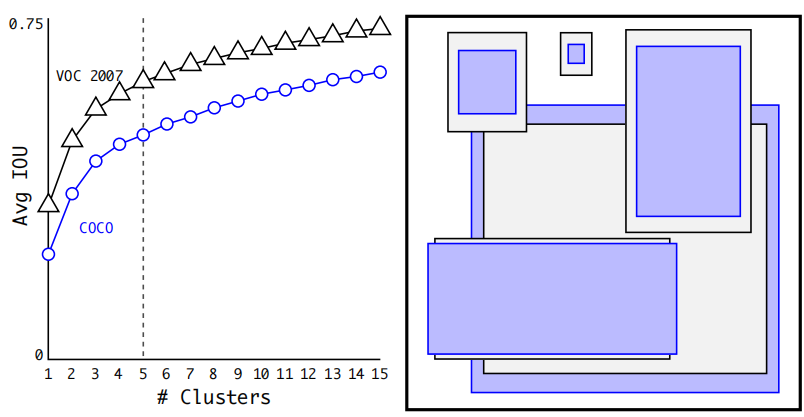
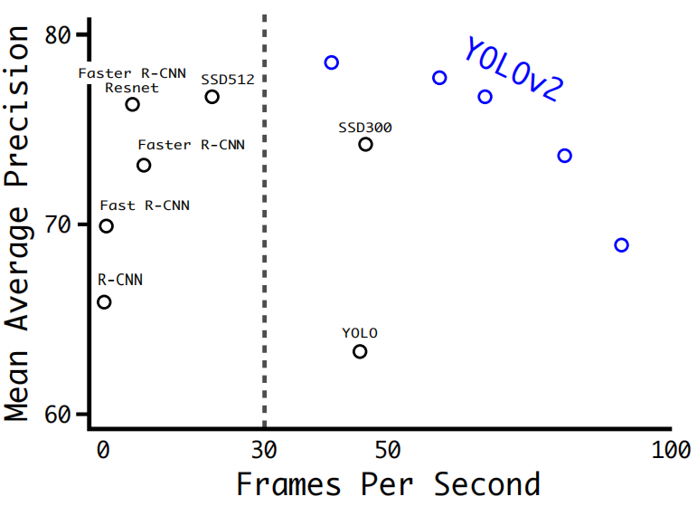
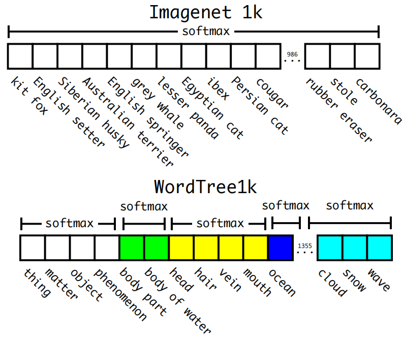
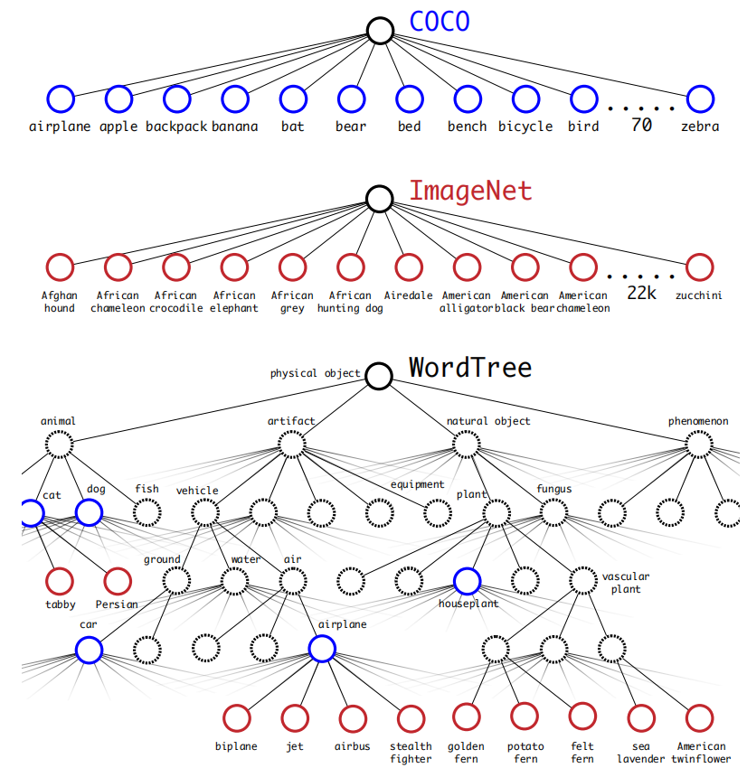

# YOLO9000: Better, Faster, Stronger
YOLOv2 2016.12.25 https://arxiv.org/abs/1612.08242

## 阅读笔记
* 网络架构：
    * S * S * B * 2, S=13(单元格),B=5(每个单元格5个锚框，5聚类后评估出来的), 2是有2个粒度的特征图, 总计要产出1690个预测边框
    * 移除了全连接层和全局池化，416/32=13，416输入图像大小，32下采样倍数， 13*13 最终特征图的分辨率 ？ 锚框机制
    * 回归机制：直接预测边界框中心位置, 预测相对于网格单元位置的位置坐标
    * 直通层，26 × 26 × 512 的特征图变成了 13 × 13 × 2048 
* 训练方式：
    * 联合训练目标检测和分类：图像分类数据集规模大于目标检测数据集的规模，先分类上预训练，再迁移至检测数据; 
    * 训练集边框大小k-mean聚类，获得先验尺寸, 5个尺寸大小 ?
    * wordnet 层次化标签
    * 多尺度训练方法，图像输入尺寸变化？

## Abstract  
We introduce YOLO9000, a state-of-the-art, real-time object detection system that can detect over 9000 object categories. First we propose various improvements to the YOLO detection method, both novel and drawn from prior work. The improved model, YOLOv2, is state-of-the-art on standard detection tasks like PASCAL VOC and COCO. Using a novel, multi-scale training method the same YOLOv2 model can run at varying sizes, offering an easy tradeoff between speed and accuracy. At 67 FPS, YOLOv2 gets 76.8 mAP on VOC 2007. At 40 FPS, YOLOv2 gets 78.6 mAP, outperforming state-of-the-art methods like Faster RCNN with ResNet and SSD while still running significantly faster. Finally we propose a method to jointly train on object detection and classification. Using this method we train YOLO9000 simultaneously on the COCO detection dataset and the ImageNet classification dataset. Our joint training allows YOLO9000 to predict detections for object classes that don’t have labelled detection data. We validate our approach on the ImageNet detection task. YOLO9000 gets 19.7 mAP on the ImageNet detection validation set despite only having detection data for 44 of the 200 classes. On the 156 classes not in COCO, YOLO9000 gets 16.0 mAP. But YOLO can detect more than just 200 classes; it predicts detections for more than 9000 different object categories. And it still runs in real-time.

我们介绍了 YOLO9000，这是一种SOTA实时目标检测系统，可以检测超过 9000 个目标类别。首先，我们提出了对 YOLO 检测方法的各种改进，无论是新颖的还是从先前的工作中汲取的。改进后的模型 YOLOv2 在标准检测任务(如 PASCAL VOC 和 COCO)上是SOTA。使用一种新颖的多尺度训练方法，相同的 YOLOv2 模型可以以不同的大小运行，从而在速度和准确性之间轻松权衡。在 67 FPS 时，YOLOv2 在 VOC 2007 上获得 76.8 mAP。在 40 FPS 时，YOLOv2 获得 78.6 mAP，优于使用 ResNet 和 SSD 的 Faster RCNN 等SOTA方法，同时仍然运行得更快。最后，我们提出了一种联合训练目标检测和分类的方法。使用这种方法，我们在 COCO 检测数据集和 ImageNet 分类数据集上同时训练 YOLO9000。我们的联合训练允许 YOLO9000 预测没有标记检测数据的目标类的检测。我们在 ImageNet 检测任务上验证了我们的方法。 YOLO9000 在 ImageNet 检测验证集上获得 19.7 mAP，尽管只有 200 个类别中的 44 个类别的检测数据。在 COCO 以外的 156 个类上，YOLO9000 获得 16.0 mAP。但 YOLO 可以检测的不仅仅是 200 多个类; 它预测超过 9000 个不同目标类别的检测。它仍然实时运行。

## 1. Introduction 
General purpose object detection should be fast, accurate, and able to recognize a wide variety of objects. Since the introduction of neural networks, detection frameworks have become increasingly fast and accurate. However, most detection methods are still constrained to a small set of objects. 

通用目标检测应该是快速、准确的，并且能够识别各种各样的目标。自引入神经网络以来，检测框架变得越来越快速和准确。然而，大多数检测方法仍然局限于一小部分目标。

Current object detection datasets are limited compared to datasets for other tasks like classification and tagging. The most common detection datasets contain thousands to hundreds of thousands of images with dozens to hundreds of tags [3] [10] [2]. Classification datasets have millions of images with tens or hundreds of thousands of categories [20] [2]. 

与分类和标记等其他任务的数据集相比，当前的目标检测数据集是有限的。最常见的检测数据集包含数千到数十万张带有数十到数百个标签的图像 [3] [10] [2]。分类数据集包含数百万张具有数万或数十万个类别的图像 [20] [2]。

We would like detection to scale to level of object classification. However, labelling images for detection is far more expensive than labelling for classification or tagging (tags are often user-supplied for free). Thus we are unlikely to see detection datasets on the same scale as classification datasets in the near future.

我们希望检测扩展到目标分类的级别。然而，标记图像进行检测比标记分类或标记要昂贵得多(标记通常由用户免费提供)。因此，在不久的将来，我们不太可能看到与分类数据集具有相同规模的检测数据集。

We propose a new method to harness the large amountof classification data we already have and use it to expandthe scope of current detection systems. Our method uses ahierarchical view of object classification that allows us tocombine distinct datasets together.

我们提出了一种新方法来利用我们已经拥有的大量分类数据，并使用它来扩展当前检测系统的范围。我们的方法使用目标分类的分层视图，允许我们将不同的数据集组合在一起。

We also propose a joint training algorithm that allowsus to train object detectors on both detection and classification data. Our method leverages labeled detection images tolearn to precisely localize objects while it uses classificationimages to increase its vocabulary and robustness.

我们还提出了一种联合训练算法，允许我们在检测和分类数据上训练目标检测器。我们的方法利用标记的检测图像来学习精确定位目标，同时使用分类图像来增加其词汇量和稳健性。

Using this method we train YOLO9000, a real-time object detector that can detect over 9000 different object categories. First we improve upon the base YOLO detectionsystem to produce YOLOv2, a state-of-the-art, real-timedetector. Then we use our dataset combination methodand joint training algorithm to train a model on more than9000 classes from ImageNet as well as detection data fromCOCO.

我们使用这种方法训练了 YOLO9000，这是一个实时目标检测器，可以检测超过 9000 个不同的目标类别。首先，我们改进了基本的 YOLO 检测系统来生产 YOLOv2，这是一种SOTA实时检测器。然后我们使用我们的数据集组合方法和联合训练算法，在 ImageNet 的 9000 多个类以及 COCO 的检测数据上训练一个模型。

All of our code and pre-trained models are available online at http://pjreddie.com/yolo9000/

我们所有的代码和预训练模型都可以在 http://pjreddie.com/yolo9000/ 上在线获取

## 2. Better  
YOLO suffers from a variety of shortcomings relative to state-of-the-art detection systems. Error analysis of YOLO compared to Fast R-CNN shows that YOLO makes a significant number of localization errors. Furthermore, YOLO has relatively low recall compared to region proposal-based methods. Thus we focus mainly on improving recall and localization while maintaining classification accuracy.  

与SOTA检测系统相比，YOLO 存在各种缺点。与 Fast R-CNN 相比，YOLO 的错误分析表明，YOLO 产生了大量的定位错误。此外，与基于区域提议的方法相比，YOLO 的召回率相对较低。因此，我们主要专注于提高召回率和定位，同时保持分类准确性。

Computer vision generally trends towards larger, deeper networks [6] [18] [17]. Better performance often hinges on training larger networks or ensembling multiple models together. However, with YOLOv2 we want a more accurate detector that is still fast. Instead of scaling up our network, we simplify the network and then make the representation easier to learn. We pool a variety of ideas from past work with our own novel concepts to improve YOLO’s performance. A summary of results can be found in Table 2.  

计算机视觉通常倾向于更大、更深的网络 [6] [18] [17]。更好的性能通常取决于训练更大的网络或将多个模型集成在一起。然而，对于 YOLOv2，我们想要一个更准确、速度更快的检测器。我们不是扩大我们的网络，而是简化网络，然后使表示更容易学习。我们将过去工作中的各种想法与我们自己的新颖概念结合起来，以提高 YOLO 的性能。结果总结见表2。

### Batch Normalization. 
Batch normalization leads to significant improvements in convergence while eliminating the need for other forms of regularization [7]. By adding batch normalization on all of the convolutional layers in YOLO we get more than 2% improvement in mAP. Batch normalization also helps regularize the model. With batch normalization we can remove dropout from the model without overfitting.  

批归一化。批归一化可以显著提高收敛性，同时消除对其他形式的正则化的需求 [7]。通过在 YOLO 中的所有卷积层上添加批归一化，我们的 mAP 提高了 2% 以上。批归一化也有助于正则化模型。通过批归一化，我们可以在不过度拟合的情况下从模型中移除 dropout。

### High Resolution Classifier. 
All state-of-the-art detection methods use classifier pre-trained on ImageNet [16]. Starting with AlexNet most classifiers operate on input images smaller than 256 × 256 [8]. The original YOLO trains the classifier network at 224 × 224 and increases the resolution to 448 for detection. This means the network has to simultaneously switch to learning object detection and adjust to the new input resolution.  

高分辨率分类器。所有SOTA检测方法都使用在 ImageNet [16] 上预训练的分类器。从 AlexNet 开始，大多数分类器对小于 256 × 256 [8] 的输入图像进行操作。原始 YOLO 以 224 × 224 训练分类器网络，并将分辨率提高到 448 进行检测。这意味着网络必须同时切换到学习目标检测并适应新的输入分辨率。

For YOLOv2 we first fine tune the classification network at the full 448 × 448 resolution for 10 epochs on ImageNet. This gives the network time to adjust its filters to work better on higher resolution input. We then fine tune the resulting network on detection. This high resolution classification network gives us an increase of almost 4% mAP.  

对于 YOLOv2，我们首先在 ImageNet 上以 448 × 448 的全分辨率微调分类网络 10 个周期。 这使网络有时间调整其过滤器以更好地处理更高分辨率的输入。然后，我们在检测时微调生成的网络。这种高分辨率分类网络使我们的 mAP 增加了近 4%。

### Convolutional With Anchor Boxes. 
YOLO predicts the coordinates of bounding boxes directly using fully connected layers on top of the convolutional feature extractor. Instead of predicting coordinates directly Faster R-CNN predicts bounding boxes using hand-picked priors [15]. Using only convolutional layers the region proposal network (RPN) in Faster R-CNN predicts offsets and confidences for anchor boxes. Since the prediction layer is convolutional, the RPN predicts these offsets at every location in a feature map. Predicting offsets instead of coordinates simplifies the problem and makes it easier for the network to learn.  

用于锚框的卷积。 YOLO 直接使用卷积特征提取器顶部的全连接层来预测边界框的坐标。 Faster R-CNN 不是直接预测坐标，而是使用手工挑选的先验预测边框 [15]。 Faster R-CNN 中的区域提议网络 (RPN) 仅使用卷积层来预测锚框的偏移量和置信度。由于预测层是卷积层，因此 RPN 会在特征图中的每个位置预测这些偏移量。预测偏移量而不是坐标可以简化问题并使网络更容易学习。

We remove the fully connected layers from YOLO and use anchor boxes to predict bounding boxes. First we eliminate one pooling layer to make the output of the network’s convolutional layers higher resolution. We also shrink the network to operate on 416 input images instead of 448×448. We do this because we want an odd number of locations in our feature map so there is a single center cell. Objects, especially large objects, tend to occupy the center of the image so it’s good to have a single location right at the center to predict these objects instead of four locations that are all nearby. YOLO’s convolutional layers downsample the image by a factor of 32 so by using an input image of 416 we get an output feature map of 13 × 13.  

我们从 YOLO 中移除全连接层，并使用锚框来预测边界框。首先，我们消除了一个池化层，以使网络卷积层的输出具有更高的分辨率。我们还缩小了网络以对 416 输入图像而不是 448×448 进行操作。我们这样做是因为想要在特征图中有奇数个位置，所以只有一个中心单元。物体，尤其是大物体，往往占据图像的中心，因此最好在中心有一个位置来预测这些物体，而不是四个都在附近的位置。 YOLO 的卷积层将图像下采样 32 倍，因此通过使用 416 的输入图像，我们得到 13 × 13 的输出特征图。

When we move to anchor boxes we also decouple the class prediction mechanism from the spatial location and instead predict class and objectness for every anchor box. Following YOLO, the objectness prediction still predicts the IOU of the ground truth and the proposed box and the class predictions predict the conditional probability of that class given that there is an object.  

当我们移动到锚框时，我们还将类预测机制与空间位置解耦，而是为每个锚框预测类和目标。在 YOLO 之后，目标预测仍然预测真实框和候选框IoU，并且类预测在确定有目标的情况下才预测该类的条件概率。

Using anchor boxes we get a small decrease in accuracy. YOLO only predicts 98 boxes per image but with anchor boxes our model predicts more than a thousand. Without anchor boxes our intermediate model gets 69.5 mAP with a recall of 81%. With anchor boxes our model gets 69.2 mAP with a recall of 88%. Even though the mAP decreases, the increase in recall means that our model has more room to improve.  

使用锚框，我们的准确性会略有下降。 YOLO 仅预测每张图像 98 个框，但使用锚框，我们的模型预测超过 1000 (这个1000+是怎么来的，13*13*5(每个cell5个锚框)，2个粒度的特征图再*2=1690？) 个框。在没有锚框的情况下，我们的中间模型得到 69.5 mAP，召回率为 81%。使用锚框，我们的模型获得 69.2 mAP，召回率为 88%。尽管 mAP 降低了，但召回率的增加意味着我们的模型还有更多的改进空间。

### Dimension Clusters. 
We encounter two issues with anchor boxes when using them with YOLO. The first is that the box dimensions are hand picked. The network can learn to adjust the boxes appropriately but if we pick better priors for the network to start with we can make it easier for the network to learn to predict good detections.  

维度聚类。在 YOLO 中使用锚框时，我们遇到了两个问题。首先是边框尺寸是手工挑选的。网络可以学习适当地调整框，但是如果我们为网络选择更好的先验，我们可以使网络更容易学习预测良好的检测。

Instead of choosing priors by hand, we run k-means clustering on the training set bounding boxes to automatically find good priors. If we use standard k-means with Euclidean distance larger boxes generate more error than smaller boxes. However, what we really want are priors that lead to good IOU scores, which is independent of the size of the box. Thus for our distance metric we use:  

我们不是手动选择先验，而是在训练集边界框上运行 k-means 聚类以自动找到好的先验。如果我们使用具有欧几里德距离的标准 k 均值，则较大的框会比较小的框产生更多的错误。然而，我们真正想要的是导致良好 IoU 分数的先验，这与框的大小无关。因此，对于我们的距离度量，我们使用：

d(box, centroid) = 1 − IOU(box, centroid)

We run k-means for various values of k and plot the average IOU with closest centroid, see Figure 2. We choose k = 5 as a good tradeoff between model complexity and high recall. The cluster centroids are significantly different than hand-picked anchor boxes. There are fewer short, wide boxes and more tall, thin boxes.  

我们对不同的 k 值运行 k-means 并绘制具有最近质心的平均 IOU，见图 2。我们选择 k = 5 作为模型复杂性和高召回率之间的良好折衷。聚类质心与手工挑选的锚框有很大不同。短而宽的边框更少，而高而薄的边框更多。

 
Figure 2: Clustering box dimensions on VOC and COCO. We run k-means clustering on the dimensions of bounding boxes to get good priors for our model. The left image shows the average IOU we get with various choices for k. We find that k = 5 gives a good tradeoff for recall vs. complexity of the model. The right image shows the relative centroids for VOC and COCO. Both sets of priors favor thinner, taller boxes while COCO has greater variation in size than VOC.
图2:VOC和COCO上的聚类框尺寸。我们在边界框的维度上运行k-means聚类，以获得模型的良好先验。左图显示了k的各种选择的平均IOU。我们发现k=5可以很好地权衡召回率与模型复杂性。右图显示VOC和COCO的相对质心。这两组优先选择更薄、更高的边框，而COCO的尺寸变化比VOC大。

We compare the average IOU to closest prior of our clustering strategy and the hand-picked anchor boxes in Table 1. At only 5 priors the centroids perform similarly to 9 anchor boxes with an average IOU of 61.0 compared to 60.9. If we use 9 centroids we see a much higher average IOU. This indicates that using k-means to generate our bounding box starts the model off with a better representation and makes the task easier to learn 

我们将平均 IOU 与我们的聚类策略的最接近先验和表 1 中手工挑选的锚框进行比较。在只有 5 个先验时，质心的性能与 9 个锚框相似，平均 IOU 为 61.0，而平均 IOU 为 60.9。如果我们使用 9 个质心，我们会看到更高的平均 IOU。这表明使用 k-means 生成我们的边界框以更好的表示开始模型并使任务更容易学习

Box Generation | # | Avg IOU 
--- | --- | --- 
Cluster SSE | 5 | 58.7
Cluster IOU | 5 | 61.0
Anchor Boxes[15] | 9 | 60.9
Cluster IOU | 9 |  67.2

Table 1: Average IOU of boxes to closest priors on VOC 2007. The average IOU of objects on VOC 2007 to their closest, unmodified prior using different generation methods. Clustering gives much better results than using hand-picked priors. 
表1：VOC 2007上最接近先验的框的平均IOU。VOC 2007上使用不同生成方法的未修改的最接近先验对象的平均IOO。聚类比使用人工选择的先验给出更好的结果。

### Direct location prediction. 
When using anchor boxes with YOLO we encounter a second issue: model instability, especially during early iterations. Most of the instability comes from predicting the (x, y) locations for the box. In region proposal networks the network predicts values $t_x$ and $t_y$ and the (x, y) center coordinates are calculated as:  

直接位置预测。在 YOLO 中使用锚框时，我们遇到了第二个问题：模型不稳定，尤其是在早期迭代期间。大多数不稳定性来自预测框的 (x, y) 位置。在区域候选网络(RPN)中，网络预测值 $t_x$ 和 $t_y$ 并且 (x, y) 中心坐标计算如下：

* $x = (t_x ∗ w_a) − x_a$ 
* $y = (t_y ∗ h_a) − y_a$

For example, a prediction of $t_x$ = 1 would shift the box to the right by the width of the anchor box, a prediction of tx = −1 would shift it to the left by the same amount.  

例如，$t_x$ = 1 的预测会将框向右移动锚框的宽度，$t_x$ = -1 的预测会将其向左移动相同的量。

This formulation is unconstrained so any anchor box can end up at any point in the image, regardless of what location predicted the box. With random initialization the model takes a long time to stabilize to predicting sensible offsets.  

这个公式是不受约束的，因此任何锚框都可以在图像中的任何点结束，而不管预测框的位置如何。通过随机初始化，模型需要很长时间才能稳定到预测合理的偏移量。

Instead of predicting offsets we follow the approach of YOLO and predict location coordinates relative to the location of the grid cell. This bounds the ground truth to fall between 0 and 1. We use a logistic activation to constrain the network’s predictions to fall in this range.  

我们遵循 YOLO 的方法并预测相对于网格单元位置的位置坐标，而不是预测偏移量。这将基本事实限制在 0 和 1 之间。我们使用logistic激活来将网络的预测限制在这个范围内。

The network predicts 5 bounding boxes at each cell in the output feature map. The network predicts 5 coordinates for each bounding box, $t_x, t_y, t_w, t_h, and t_o$. If the cell is offset from the top left corner of the image by ($c_x, c_y$) and the bounding box prior has width and height $p_w, p_h$, then the predictions correspond to:  

网络预测输出特征图中每个单元格的 5 个边界框。网络为每个边界框预测 5 个坐标，$t_x、t_y、t_w、t_h 和 t_o$。如果单元格从图像的左上角偏移 ($c_x, c_y$) 并且边界框先验具有宽度和高度 $p_w$, $p_h$，则预测对应于：

* $b_x = σ(t_x) + c_x$ 
* $b_y = σ(t_y) + c_y$ 
* $b_w = p_we^{t_w}$ 
* $b_h = p_he^{t_h}$
* $Pr(object) ∗ IOU(b, object) = σ(t_o)$

Since we constrain the location prediction the parametrization is easier to learn, making the network more stable. Using dimension clusters along with directly predicting the bounding box center location improves YOLO by almost 5% over the version with anchor boxes.  

由于我们限制了位置预测，参数化更容易学习，使网络更稳定。使用维度聚类以及直接预测边界框中心位置，与使用锚框的版本相比，YOLO 提高了近 5%。

### Fine-Grained Features.
This modified YOLO predicts detections on a 13 × 13 feature map. While this is sufficient for large objects, it may benefit from finer grained features for localizing smaller objects. Faster R-CNN and SSD both run their proposal networks at various feature maps in the network to get a range of resolutions. We take a different approach, simply adding a passthrough layer that brings features from an earlier layer at 26 × 26 resolution.  

细粒度特征。这个修改后的 YOLO 在13 × 13 特征图上做预测检测。虽然这对于大型目标来说已经足够了，但它可能会受益于用于定位较小目标的更细粒度的特征。 Faster R-CNN 和 SSD 都在网络中的各种特征图上运行他们的候选网络，以获得一系列分辨率。我们采用不同的方法，只需添加一个直通层，以 26 × 26 的分辨率从较早的层引入特征。

The passthrough layer concatenates the higher resolution features with the low resolution features by stacking adjacent features into different channels instead of spatial locations, similar to the identity mappings in ResNet. This turns the 26 × 26 × 512 feature map into a 13 × 13 × 2048 feature map, which can be concatenated with the original features. Our detector runs on top of this expanded feature map so that it has access to fine grained features. This gives a modest 1% performance increase.  

直通层通过将相邻特征堆叠到不同的通道而不是空间位置来连接更高分辨率的特征和低分辨率的特征，类似于 ResNet 中的恒等映射。这将 26 × 26 × 512 的特征图变成了 13 × 13 × 2048 的特征图，可以与原始特征进行拼接。我们的检测器在这个扩展的特征图之上运行，因此它可以访问细粒度的特征。这会带来 1% 的性能增加。

### Multi-Scale Training. 
The original YOLO uses an input resolution of 448 × 448. With the addition of anchor boxes we changed the resolution to 416×416. However, since our model only uses convolutional and pooling layers it can be resized on the fly. We want YOLOv2 to be robust to running on images of different sizes so we train this into the model.  

多尺度训练。原始 YOLO 使用 448 × 448 的输入分辨率。为了添加锚框，我们将分辨率更改为 416×416。然而，由于我们的模型只使用卷积层和池化层，它可以动态调整大小。我们希望 YOLOv2 能够在不同大小的图像上运行，因此我们将其训练到模型中。

Instead of fixing the input image size we change the network every few iterations. Every 10 batches our network randomly chooses a new image dimension size. Since our model downsamples by a factor of 32, we pull from the following multiples of 32: {320, 352, ..., 608}. Thus the smallest option is 320 × 320 and the largest is 608 × 608. We resize the network to that dimension and continue training.  

我们不是固定输入图像的大小，而是每隔几次迭代就改变网络。每 10 批我们的网络随机选择一个新的图像尺寸。由于我们的模型下采样了 32 倍，因此我们从以下 32 的倍数中提取：{320, 352, ..., 608}。因此，最小的选项是 320 × 320，最大的选项是 608 × 608。我们将网络调整到该维度并继续训练。

This regime forces the network to learn to predict well across a variety of input dimensions. This means the same network can predict detections at different resolutions. The network runs faster at smaller sizes so YOLOv2 offers an easy tradeoff between speed and accuracy.  

这种制度迫使网络学会在各种输入维度上进行良好的预测。这意味着同一个网络可以预测不同分辨率的检测。网络在较小的尺寸下运行得更快，因此 YOLOv2 提供了速度和准确性之间的简单权衡。

At low resolutions YOLOv2 operates as a cheap, fairly accurate detector. At 288 × 288 it runs at more than 90 FPS with mAP almost as good as Fast R-CNN. This makes it ideal for smaller GPUs, high framerate video, or multiple video streams.  

在低分辨率下，YOLOv2 是一种廉价且相当准确的检测器。在 288 × 288 时，它以超过 90 FPS 的速度运行，mAP 几乎与 Fast R-CNN 一样好。这使其非常适合较小的 GPU、高帧率视频或多个视频流。

At high resolution YOLOv2 is a state-of-the-art detector with 78.6 mAP on VOC 2007 while still operating above real-time speeds. See Table 3 for a comparison of YOLOv2 with other frameworks on VOC 2007. Figure 4  

在高分辨率下，YOLOv2 是SOTA检测器，在 VOC 2007 上具有 78.6 mAP，同时仍以高于实时速度运行。 YOLOv2 与其他框架在 VOC 2007 上的比较见表 3。 图 4

Detection Frameworks | Train | mAP | FPS
--- | --- | --- | ---
Fast R-CNN  [5] | 2007+2012 | 70.0 | 0.5
Faster R-CNN  VGG-16[15] | 2007+2012 | 73.2 | 7
Faster R-CNN  ResNet[6] | 2007+2012 | 76.4 | 5
YOLO  [14] | 2007+2012 | 63.4 | 45
SSD300 [11] | 2007+2012 | 74.3 | 46
SSD500 [11] | 2007+2012 | 76.8 | 19
YOLOv2 288*288 | 2007+2012 | 69.0 | 91
YOLOv2 352*352 | 2007+2012 | 73.7 | 81
YOLOv2 416*416 | 2007+2012 | 76.8 | 67
YOLOv2 480*480 | 2007+2012 | 77.8 | 59
YOLOv2 544*544 | 2007+2012 | 78.6 | 40

Table 3: Detection frameworks on PASCAL VOC 2007. YOLOv2 is faster and more accurate than prior detection methods. It can also run at different resolutions for an easy tradeoff between speed and accuracy. Each YOLOv2 entry is actually the same trained model with the same weights, just evaluated at a different size. All timing information is on a Geforce GTX Titan X (original, not Pascal model).
表3:PASCAL VOC 2007的检测框架。YOLOv2比现有检测方法更快、更准确。它还可以在不同的分辨率下运行，以便在速度和精度之间轻松权衡。每个YOLOv2条目实际上是相同的训练模型，具有相同的权重，只是以不同的大小进行评估。所有的计时信息都在Geforce GTX Titan X(原始的，不是Pascal模型)上。

 
Figure 4: Accuracy and speed on VOC 2007.

### Further Experiments. 
We train YOLOv2 for detection on VOC 2012. Table 4 shows the comparative performance of YOLOv2 versus other state-of-the-art detection systems. YOLOv2 achieves 73.4 mAP while running far faster than competing methods. We also train on COCO and compare to other methods in Table 5. On the VOC metric (IOU = .5) YOLOv2 gets 44.0 mAP, comparable to SSD and Faster R-CNN.  

进一步的实验。我们训练 YOLOv2 在 VOC 2012 上进行检测。表 4 显示了 YOLOv2 与其他最先进检测系统的比较性能。 YOLOv2 达到 73.4 mAP，同时运行速度远快于竞争方法。我们还在 COCO 上进行了训练，并与表 5 中的其他方法进行了比较。在 VOC 指标 (IOU = .5) 上，YOLOv2 获得 44.0 mAP，与 SSD 和 Faster R-CNN 相当。

Table 4: PASCAL VOC2012 test detection results. YOLOv2 performs on par with state-of-the-art detectors like Faster R-CNN with ResNet and SSD512 and is 2 − 10× faster.

Table 5: Results on COCO test-dev2015. Table adapted from [11]

## 3. Faster  
We want detection to be accurate but we also want it to be fast. Most applications for detection, like robotics or selfdriving cars, rely on low latency predictions. In order to maximize performance we design YOLOv2 to be fast from the ground up.  

我们希望检测准确，但我们也希望它快速。大多数检测应用，如机器人或自动驾驶汽车，都依赖于低延迟预测。为了最大限度地提高性能，我们从头开始设计快速的YOLOv2。

Most detection frameworks rely on VGG-16 as the base feature extractor [17]. VGG-16 is a powerful, accurate classification network but it is needlessly complex. The convolutional layers of VGG-16 require 30.69 billion floating point operations for a single pass over a single image at 224 × 224 resolution.  

大多数检测框架依赖 VGG-16 作为基本特征提取器 [17]。 VGG-16 是一个强大、准确的分类网络，但它不必要地复杂。 VGG-16 的卷积层需要 306.9 亿次浮点运算才能在 224 × 224 分辨率的单个图像上进行单次传递。

The YOLO framework uses a custom network based on the Googlenet architecture [19]. This network is faster than VGG-16, only using 8.52 billion operations for a forward pass. However, it’s accuracy is slightly worse than VGG16. For single-crop, top-5 accuracy at 224 × 224, YOLO’s custom model gets 88.0% ImageNet compared to 90.0% for VGG-16.  

YOLO 框架使用基于 Googlenet 架构的自定义网络 [19]。这个网络比 VGG-16 更快，前向传递只使用了 85.2 亿次操作。但是，它的准确性比 VGG16 略差。对于 224 × 224 的单裁剪、top-5 精度，YOLO 的自定义模型获得了 88.0% 的 ImageNet，而 VGG-16 为 90.0%。

### Darknet-19. 
We propose a new classification model to be used as the base of YOLOv2. Our model builds off of prior work on network design as well as common knowledge in the field. Similar to the VGG models we use mostly 3 × 3 filters and double the number of channels after every pooling step [17]. Following the work on Network in Network (NIN) we use global average pooling to make predictions as well as 1 × 1 filters to compress the feature representation between 3 × 3 convolutions [9]. We use batch normalization to stabilize training, speed up convergence, and regularize the model [7].

Darknet-19。我们提出了一个新的分类模型作为 YOLOv2 的基础。我们的模型建立在先前的网络设计工作以及该领域的常识之上。与 VGG 模型类似，我们主要使用 3 × 3 过滤器，并且在每个池化步骤后将通道数加倍 [17]。网中网(NIN) 的工作之后，我们使用全局平均池化来进行预测，并使用 1 × 1 卷积来压缩 3 × 3 卷积之间的特征表示 [9]。我们使用批归一化来稳定训练、加速收敛和正则化模型 [7]。

Our final model, called Darknet-19, has 19 convolutional layers and 5 maxpooling layers. For a full description see Table 6. Darknet-19 only requires 5.58 billion operations to process an image yet achieves 72.9% top-1 accuracy and 91.2% top-5 accuracy on ImageNet.  

我们的最终模型称为 Darknet-19，有 19 个卷积层和 5 个最大池化层。有关完整描述，请参见表 6。Darknet-19 仅需要 55.8 亿次操作即可处理图像，但在 ImageNet 上实现了 72.9% 的 top-1 准确度和 91.2% 的 top-5 准确度。

Type|Filters|Size/Stride|Output
---|---|---|---
Convolutional|32|3x3|224x224
Maxpool||2x2/2|112x112
Convolutional|64|3x3|112x112
Maxpool||2x2/2|56x56
Convolutional|128|3x3|56x56
Convolutional|64|1x1|56x56
Convolutional|128|3x3|56x56
Maxpool||2x2/2|28x28
Convolutional|256|3x3|28x28
Convolutional|128|1x1|28x28
Convolutional|256|3x3|28x28
Maxpool||2x2/2|14x14
Convolutional|512|3x3|14x14
Convolutional|256|1x1|14x14
Convolutional|512|3x3|14x14
Convolutional|256|1x1|14x14
Convolutional|512|3x3|14x14
Maxpool||2x2/2|7x7
Convolutional|1024|3x3|7x7
Convolutional|512|1x1|7x7
Convolutional|1024|3x3|7x7
Convolutional|512|1x1|7x7
Convolutional|1024|3x3|7x7
|||
Convolutional|1000|1x1|7x7
Avgpool||Global|1000
Softmax|||

Table 6: Darknet-19.

### Training for classification. 
We train the network on the standard ImageNet 1000 class classification dataset for 160 epochs using stochastic gradient descent with a starting learning rate of 0.1, polynomial rate decay with a power of 4, weight decay of 0.0005 and momentum of 0.9 using the Darknet neural network framework [13]. During training we use standard data augmentation tricks including random crops, rotations, and hue, saturation, and exposure shifts.  

分类训练。我们使用随机梯度下降法在标准 ImageNet 1000 类分类数据集上训练网络 160 个周期，起始学习率为 0.1，多项式速率衰减为 4，权重衰减为 0.0005，动量为 0.9，使用Darknet神经网络框架[13]。在训练期间，我们使用标准的数据增广技巧，包括随机裁剪、旋转以及色调、饱和度和曝光变化。

As discussed above, after our initial training on images at 224 × 224 we fine tune our network at a larger size, 448. For this fine tuning we train with the above parameters but for only 10 epochs and starting at a learning rate of $10^{−3}$ . At this higher resolution our network achieves a top-1 accuracy of 76.5% and a top-5 accuracy of 93.3%.  

如上所述，在对 224 × 224 的图像进行初始训练后，我们将网络微调为更大的尺寸448。对于这种微调，我们使用上述参数进行训练，但仅训练 10 个 epoch，并以 $10^{−3}$ 的学习率开始.在这个更高的分辨率下，我们的网络达到了 76.5% 的 top-1 精度和 93.3% 的 top-5 精度。

### Training for detection. 
We modify this network for detection by removing the last convolutional layer and instead adding on three 3 × 3 convolutional layers with 1024 filters each followed by a final 1 × 1 convolutional layer with the number of outputs we need for detection. For VOC we predict 5 boxes with 5 coordinates each and 20 classes per box so 125 filters. We also add a passthrough layer from the final 3 × 3 × 512 layer to the second to last convolutional layer so that our model can use fine grain features. We train the network for 160 epochs with a starting learning rate of $10^{−3}$ , dividing it by 10 at 60 and 90 epochs.

检测训练。我们通过移除最后一个卷积层来修改该网络以进行检测，而是添加三个 3 × 3 卷积层，每个卷积层有 1024 个卷积核，然后最后一个是 1 × 1 卷积层，其中包含我们检测所需的输出数量。对于 VOC，我们预测 5 个框，每个框有 5 个坐标，每个框有 20 个类，因此有 125 个卷积核。我们还从最后的 3 × 3 × 512 层到倒数第二个卷积层添加了一个直通层，以便我们的模型可以使用细粒度特征。我们以 $10^{−3}$ 的起始学习率训练网络 160 个 epoch，在 60 和 90 个 epoch 将其除以 10。

We use a weight decay of 0.0005 and momentum of 0.9. We use a similar data augmentation to YOLO and SSD with random crops, color shifting, etc. We use the same training strategy on COCO and VOC.

我们使用 0.0005 的权重衰减和 0.9 的动量。 我们使用与 YOLO 和 SSD 类似的数据增广方法，包括随机裁剪、颜色偏移等。我们在 COCO 和 VOC 上使用相同的训练策略。

## 4. Stronger
We propose a mechanism for jointly training on classification and detection data. Our method uses images labelled for detection to learn detection-specific information like bounding box coordinate prediction and objectness as well as how to classify common objects. It uses images with only class labels to expand the number of categories it can detect.

我们提出了一种联合训练分类和检测数据的机制。我们的方法使用标记为检测的图像来学习特定于检测的信息，例如边界框坐标预测和目标性以及如何对常见目标进行分类。它使用仅具有类标签的图像来扩展它可以检测到的类别数量。

During training we mix images from both detection and classification datasets. When our network sees an image labelled for detection we can backpropagate based on the full YOLOv2 loss function. When it sees a classification image we only backpropagate loss from the classificationspecific parts of the architecture.

在训练期间，我们混合来自检测和分类数据集的图像。当我们的网络看到标记为检测的图像时，我们可以基于完整的 YOLOv2 损失函数进行反向传播。当它看到分类图像时，我们只从架构的分类特定部分反向传播损失。

This approach presents a few challenges. Detection datasets have only common objects and general labels, like “dog” or “boat”. Classification datasets have a much wider and deeper range of labels. ImageNet has more than a hundred breeds of dog, including “Norfolk terrier”, “Yorkshire terrier”, and “Bedlington terrier”. If we want to train on both datasets we need a coherent way to merge these labels.

这种方法提出了一些挑战。检测数据集只有常见的目标和一般标签，如“狗”或“船”。分类数据集具有更广泛和更深的标签范围。 ImageNet 拥有一百多种犬种，包括“诺福克梗”、“约克夏梗”和“贝灵顿梗”。如果我们想在两个数据集上进行训练，我们需要一种连贯的方式来合并这些标签。

Most approaches to classification use a softmax layer across all the possible categories to compute the final probability distribution. Using a softmax assumes the classes are mutually exclusive. This presents problems for combining datasets, for example you would not want to combine ImageNet and COCO using this model because the classes “Norfolk terrier” and “dog” are not mutually exclusive.

大多数分类方法在所有可能的类别中使用 softmax 层来计算最终的概率分布。使用 softmax 假定类是互斥的。这给组合数据集带来了问题，例如，您不想使用此模型组合 ImageNet 和 COCO，因为“诺福克梗”和“狗”类并不相互排斥。

We could instead use a multi-label model to combine the datasets which does not assume mutual exclusion. This approach ignores all the structure we do know about the data, for example that all of the COCO classes are mutually exclusive.

我们可以改为使用多标签模型来组合不假设互斥的数据集。这种方法忽略了我们所知道的关于数据的所有结构，例如所有的 COCO 类都是互斥的。

### Hierarchical classification. 
ImageNet labels are pulled from WordNet, a language database that structures concepts and how they relate [12]. In WordNet, “Norfolk terrier” and “Yorkshire terrier” are both hyponyms of “terrier” which is a type of “hunting dog”, which is a type of “dog”, which is a “canine”, etc. Most approaches to classification assume a flat structure to the labels however for combining datasets, structure is exactly what we need.

层次分类。 ImageNet 标签是从 WordNet 中提取的，WordNet 是一种语言数据库，用于构建概念以及它们之间的关系 [12]。在 WordNet 中，“诺福克梗”和“约克夏梗”都是“梗犬”的下义词，“梗犬”是“猎犬”的一种，“狗”是“犬”的一种，等等。分类假设标签具有平面结构，但是对于组合数据集，结构正是我们所需要的。

WordNet is structured as a directed graph, not a tree, because language is complex. For example a “dog” is both a type of “canine” and a type of “domestic animal” which are both synsets in WordNet. Instead of using the full graph structure, we simplify the problem by building a hierarchical tree from the concepts in ImageNet.

WordNet 的结构是有向图，而不是树，因为语言很复杂。例如，“狗”既是“犬”的一种，又是“家畜”的一种，它们都是 WordNet 中的同义词。我们没有使用完整的图结构，而是通过从 ImageNet 中的概念构建层次树来简化问题。

To build this tree we examine the visual nouns in ImageNet and look at their paths through the WordNet graph to the root node, in this case “physical object”. Many synsets only have one path through the graph so first we add all of those paths to our tree. Then we iteratively examine the concepts we have left and add the paths that grow the tree by as little as possible. So if a concept has two paths to the root and one path would add three edges to our tree and the other would only add one edge, we choose the shorter path.

为了构建这棵树，我们检查 ImageNet 中的视觉名词，并查看它们通过 WordNet 图到根节点的路径，在本例中为“物理目标”。许多同义词集只有一条通过图的路径，所以首先我们将所有这些路径添加到我们的树中。然后我们迭代检查我们留下的概念，并尽可能少地添加使树生长的路径。因此，如果一个概念有两条到根的路径，一条路径会向我们的树添加三条边，而另一条只会添加一条边，我们选择较短的路径。

The final result is WordTree, a hierarchical model of visual concepts. To perform classification with WordTree we predict conditional probabilities at every node for the probability of each hyponym of that synset given that synset. For example, at the “terrier” node we predict:

最终的结果是 WordTree，一个视觉概念的层次模型。为了使用 WordTree 执行分类，我们在给定同义词集的情况下预测每个节点的同义词集的每个下义词的概率的条件概率。例如，在“梗犬”节点，我们预测：

* Pr(Norfolk terrier|terrier)
* Pr(Yorkshire terrier|terrier)
* Pr(Bedlington terrier|terrier)
* ...

If we want to compute the absolute probability for a particular node we simply follow the path through the tree to the root node and multiply to conditional probabilities. So if we want to know if a picture is of a Norfolk terrier we compute:

如果我们想计算特定节点的绝对概率，我们只需沿着通过树的路径到达根节点并乘以条件概率。因此，如果我们想知道一张图片是否是诺福克梗，我们计算：

* Pr(Norfolk terrier) = P r(Norfolk terrier|terrier) 
* ∗Pr(terrier|hunting dog) 
* ∗ . . .∗ 
* ∗Pr(mammal|P r(animal) 
* ∗Pr(animal|physical object)

For classification purposes we assume that the the image contains an object: P r(physical object) = 1.

出于分类目的，我们假设图像包含一个目标：Pr(physical object) = 1。

To validate this approach we train the Darknet-19 model on WordTree built using the 1000 class ImageNet. To build WordTree1k we add in all of the intermediate nodes which expands the label space from 1000 to 1369. During training we propagate ground truth labels up the tree so that if an image is labelled as a “Norfolk terrier” it also gets labelled as a “dog” and a “mammal”, etc. To compute the conditional probabilities our model predicts a vector of 1369 values and we compute the softmax over all sysnsets that are hyponyms of the same concept, see Figure 5.

为了验证这种方法，我们在使用 1000 类 ImageNet 构建的 WordTree 上训练 Darknet-19 模型。为了构建 WordTree1k，我们添加了所有中间节点，将标签空间从 1000 扩展到 1369。在训练期间，我们将地面实况标签传播到树上，这样如果图像被标记为“诺福克梗”，它也会被标记为“狗”和“哺乳动物”等。为了计算条件概率，我们的模型预测了一个包含 1369 个值的向量，并且我们计算了所有系统集的 softmax，这些系统集是同一概念的下位词，参见图 5。

 
Figure 5: Prediction on ImageNet vs WordTree. Most ImageNet models use one large softmax to predict a probability distribution. Using WordTree we perform multiple softmax operations over co-hyponyms.

图5:ImageNet与WordTree的预测。大多数ImageNet模型使用一个较大的softmax来预测概率分布。使用WordTree，我们可以对共下位词执行多个softmax操作。

Using the same training parameters as before, our hierarchical Darknet-19 achieves 71.9% top-1 accuracy and 90.4% top-5 accuracy. Despite adding 369 additional concepts and having our network predict a tree structure our accuracy only drops marginally. Performing classification in this manner also has some benefits. Performance degrades gracefully on new or unknown object categories. For example, if the network sees a picture of a dog but is uncertain what type of dog it is, it will still predict “dog” with high confidence but have lower confidences spread out among the hyponyms.

使用与以前相同的训练参数，我们的分层 Darknet-19 达到了 71.9% 的 top-1 精度和 90.4% 的 top-5 精度。尽管添加了 369 个额外的概念并让我们的网络预测树结构，但我们的准确度仅略有下降。以这种方式执行分类也有一些好处。在新的或未知的目标类别上，性能会优雅地下降。例如，如果网络看到一张狗的照片，但不确定它是什么类型的狗，它仍然会以高置信度预测“狗”，但在下位词中的置信度较低。

This formulation also works for detection. Now, instead of assuming every image has an object, we use YOLOv2’s objectness predictor to give us the value of P r(physical object). The detector predicts a bounding box and the tree of probabilities. We traverse the tree down, taking the highest confidence path at every split until we reach some threshold and we predict that object class.

这个公式也适用于检测。现在，我们不再假设每个图像都有一个目标，而是使用 YOLOv2 的目标预测器来给我们 Pr(物理目标)的值。检测器预测边界框和概率树。我们向下遍历树，在每次拆分时采用最高置信度路径，直到达到某个阈值并预测该目标类别。

Dataset combination with WordTree. We can use WordTree to combine multiple datasets together in a sensible fashion. We simply map the categories in the datasets to synsets in the tree. Figure 6 shows an example of using WordTree to combine the labels from ImageNet and COCO. WordNet is extremely diverse so we can use this technique with most datasets.

与 WordTree 的数据集组合。我们可以使用 WordTree 以合理的方式将多个数据集组合在一起。我们只是将数据集中的类别映射到树中的同义词集。图 6 显示了使用 WordTree 组合来自 ImageNet 和 COCO 的标签的样本。 WordNet 非常多样化，因此我们可以将这种技术用于大多数数据集。

 
Figure 6: Combining datasets using WordTree hierarchy. Using the WordNet concept graph we build a hierarchical tree of visual concepts. Then we can merge datasets together by mapping the classes in the dataset to synsets in the tree. This is a simplified view of WordTree for illustration purposes.

图6：使用WordTree层次结构组合数据集。使用WordNet概念图，我们构建了一个视觉概念的层次树。然后，我们可以通过将数据集中的类映射到树中的synset，将数据集合并在一起。这是WordTree的简化视图，用于演示目的。

Joint classification and detection. Now that we can combine datasets using WordTree we can train our joint model on classification and detection. We want to train an extremely large scale detector so we create our combined dataset using the COCO detection dataset and the top 9000 classes from the full ImageNet release. We also need to evaluate our method so we add in any classes from the ImageNet detection challenge that were not already included. The corresponding WordTree for this dataset has 9418 classes. ImageNet is a much larger dataset so we balance the dataset by oversampling COCO so that ImageNet is only larger by a factor of 4:1.

联合分类和检测。现在我们可以使用 WordTree 组合数据集，我们可以在分类和检测方面训练我们的联合模型。我们想要训练一个超大规模的检测器，因此我们使用 COCO 检测数据集和完整 ImageNet 版本中的前 9000 个类来创建我们的组合数据集。我们还需要评估我们的方法，因此我们添加了 ImageNet 检测挑战中尚未包含的任何类。该数据集对应的 WordTree 有 9418 个类。 ImageNet 是一个更大的数据集，因此我们通过对 COCO 进行过采样来平衡数据集，以便 ImageNet 仅大 4:1 倍。

Using this dataset we train YOLO9000. We use the base YOLOv2 architecture but only 3 priors instead of 5 to limit the output size. When our network sees a detection image we backpropagate loss as normal. For classification loss, we only backpropagate loss at or above the corresponding level of the label. For example, if the label is “dog” we do assign any error to predictions further down in the tree, “German Shepherd” versus “Golden Retriever”, because we do not have that information.

使用这个数据集，我们训练 YOLO9000。我们使用基本的 YOLOv2 架构，但只有 3 个先验而不是 5 个来限制输出大小。当我们的网络看到检测图像时，我们会像往常一样反向传播损失。对于分类损失，我们只在标签相应级别或以上进行反向传播损失。例如，如果标签是“狗”，我们确实会将任何错误分配给树中更靠后的预测，“德国牧羊犬”与“金毛猎犬”，因为我们没有这些信息。

When it sees a classification image we only backpropagate classification loss. To do this we simply find the bounding box that predicts the highest probability for that class and we compute the loss on just its predicted tree. We also assume that the predicted box overlaps what would be the ground truth label by at least .3 IOU and we backpropagate objectness loss based on this assumption.

当它看到分类图像时，我们只反向传播分类损失。为此，我们只需找到预测该类最高概率的边界框，然后仅计算其预测树的损失。我们还假设预测框与真实标签重叠至少 0.3 IOU，我们基于此假设反向传播目标损失。

Using this joint training, YOLO9000 learns to find objects in images using the detection data in COCO and it learns to classify a wide variety of these objects using data from ImageNet.

通过这种联合训练，YOLO9000 学习使用 COCO 中的检测数据在图像中查找目标，并学习使用来自 ImageNet 的数据对各种这些目标进行分类。

We evaluate YOLO9000 on the ImageNet detection task. The detection task for ImageNet shares on 44 object categories with COCO which means that YOLO9000 has only seen classification data for the majority of the test images, not detection data. YOLO9000 gets 19.7 mAP overall with 16.0 mAP on the disjoint 156 object classes that it has never seen any labelled detection data for. This mAP is higher than results achieved by DPM but YOLO9000 is trained on different datasets with only partial supervision [4]. It also is simultaneously detecting 9000 other object categories, all in real-time.

我们在 ImageNet 检测任务上评估 YOLO9000。 ImageNet 的检测任务与 COCO 共享 44 个目标类别，这意味着 YOLO9000 只看到了大多数测试图像的分类数据，而不是检测数据。 YOLO9000 在它从未见过任何标记检测数据的不相交的 156 个目标类别上总体获得 19.7 mAP 和 16.0 mAP。这个 mAP 比 DPM 获得的结果要高，但是 YOLO9000 在不同的数据集上进行了训练，只有部分监督 [4]。它还同时实时检测 9000 个其他目标类别。

When we analyze YOLO9000’s performance on ImageNet we see it learns new species of animals well but struggles with learning categories like clothing and equipment.

当我们在 ImageNet 上分析 YOLO9000 的性能时，我们发现它可以很好地学习新的动物物种，但在学习服装和设备等类别方面却很吃力。

New animals are easier to learn because the objectness predictions generalize well from the animals in COCO. Conversely, COCO does not have bounding box label for any type of clothing, only for person, so YOLO9000 struggles to model categories like “sunglasses” or “swimming trunks”.

新动物更容易学习，因为客观性预测很好地概括了 COCO 中的动物。相反，COCO 没有针对任何类型服装的边界框标签，仅针对人，因此 YOLO9000 难以为“太阳镜”或“泳裤”等类别建模。

## 5. Conclusion
We introduce YOLOv2 and YOLO9000, real-time detection systems. YOLOv2 is state-of-the-art and faster than other detection systems across a variety of detection datasets. Furthermore, it can be run at a variety of image sizes to provide a smooth tradeoff between speed and accuracy.
YOLO9000 is a real-time framework for detection more than 9000 object categories by jointly optimizing detection and classification. We use WordTree to combine data from various sources and our joint optimization technique to train simultaneously on ImageNet and COCO. YOLO9000 is a strong step towards closing the dataset size gap between detection and classification.

我们介绍 YOLOv2 和 YOLO9000，实时检测系统。 YOLOv2 是SOTA，并且在各种检测数据集中比其他检测系统更快。此外，它可以在各种图像尺寸下运行，以提供速度和准确性之间的平滑折衷。
YOLO9000 是一个实时框架，通过联合优化检测和分类来检测超过 9000 个目标类别。我们使用 WordTree 结合来自各种来源的数据和我们的联合优化技术，在 ImageNet 和 COCO 上同时进行训练。 YOLO9000 是朝着缩小检测和分类之间的数据集大小差距迈出的重要一步。

Many of our techniques generalize outside of object detection. Our WordTree representation of ImageNet offers a richer, more detailed output space for image classification. Dataset combination using hierarchical classification would be useful in the classification and segmentation domains. Training techniques like multi-scale training could provide benefit across a variety of visual tasks.

我们的许多技术都在目标检测之外进行推广。我们的 ImageNet 的 WordTree 表示为图像分类提供了更丰富、更详细的输出空间。使用分层分类的数据集组合将在分类和分割领域中很有用。多尺度训练等训练技术可以为各种视觉任务带来好处。

For future work we hope to use similar techniques for weakly supervised image segmentation. We also plan to improve our detection results using more powerful matching strategies for assigning weak labels to classification data during training. Computer vision is blessed with an enormous amount of labelled data. We will continue looking for ways to bring different sources and structures of data together to make stronger models of the visual world.

对于未来的工作，我们希望使用类似的技术进行弱监督图像分割。我们还计划使用更强大的匹配策略来改进我们的检测结果，以便在训练期间为分类数据分配弱标签。计算机视觉拥有大量标注数据。我们将继续寻找将不同来源和数据结构整合在一起的方法，以构建更强大的视觉世界模型。

## References
1. S. Bell, C. L. Zitnick, K. Bala, and R. Girshick. Insideoutside net: Detecting objects in context with skip pooling and recurrent neural networks. arXiv preprint arXiv:1512.04143, 2015. 6
2. J. Deng, W. Dong, R. Socher, L.-J. Li, K. Li, and L. FeiFei. Imagenet: A large-scale hierarchical image database. In Computer Vision and Pattern Recognition, 2009. CVPR 2009. IEEE Conference on, pages 248–255. IEEE, 2009. 1
3. M. Everingham, L. Van Gool, C. K. Williams, J. Winn, and A. Zisserman. The pascal visual object classes (voc) challenge. International journal of computer vision, 88(2):303– 338, 2010. 1
4. P. F. Felzenszwalb, R. B. Girshick, and D. McAllester. Discriminatively trained deformable part models, release 4. http://people.cs.uchicago.edu/pff/latent-release4/. 8
5. R. B. Girshick. Fast R-CNN. CoRR, abs/1504.08083, 2015. 4, 5, 6
6. K. He, X. Zhang, S. Ren, and J. Sun. Deep residual learning for image recognition. arXiv preprint arXiv:1512.03385, 2015. 2, 4, 5
7. S. Ioffe and C. Szegedy. Batch normalization: Accelerating deep network training by reducing internal covariate shift. arXiv preprint arXiv:1502.03167, 2015. 2, 5
8. A. Krizhevsky, I. Sutskever, and G. E. Hinton. Imagenet classification with deep convolutional neural networks. In Advances in neural information processing systems, pages 1097–1105, 2012. 2
9. M. Lin, Q. Chen, and S. Yan. Network in network. arXiv preprint arXiv:1312.4400, 2013. 5
10. T.-Y. Lin, M. Maire, S. Belongie, J. Hays, P. Perona, D. Ramanan, P. Doll´ar, and C. L. Zitnick. Microsoft coco: Common objects in context. In European Conference on Computer Vision, pages 740–755. Springer, 2014. 1, 6
11. W. Liu, D. Anguelov, D. Erhan, C. Szegedy, and S. E. Reed. SSD: single shot multibox detector. CoRR, abs/1512.02325, 2015. 4, 5, 6
12. G. A. Miller, R. Beckwith, C. Fellbaum, D. Gross, and K. J. Miller. Introduction to wordnet: An on-line lexical database. International journal of lexicography, 3(4):235–244, 1990. 6
13. J. Redmon. Darknet: Open source neural networks in c. http://pjreddie.com/darknet/, 2013–2016. 5
14. J. Redmon, S. Divvala, R. Girshick, and A. Farhadi. You only look once: Unified, real-time object detection. arXiv preprint arXiv:1506.02640, 2015. 4, 5
15. S. Ren, K. He, R. Girshick, and J. Sun. Faster r-cnn: Towards real-time object detection with region proposal networks. arXiv preprint arXiv:1506.01497, 2015. 2, 3, 4, 5, 6
16. O. Russakovsky, J. Deng, H. Su, J. Krause, S. Satheesh, S. Ma, Z. Huang, A. Karpathy, A. Khosla, M. Bernstein, A. C. Berg, and L. Fei-Fei. ImageNet Large Scale Visual Recognition Challenge. International Journal of Computer Vision (IJCV), 2015. 2
17. K. Simonyan and A. Zisserman. Very deep convolutional networks for large-scale image recognition. arXiv preprint arXiv:1409.1556, 2014. 2, 5
18. C. Szegedy, S. Ioffe, and V. Vanhoucke. Inception-v4, inception-resnet and the impact of residual connections on learning. CoRR, abs/1602.07261, 2016. 2
19. C. Szegedy, W. Liu, Y. Jia, P. Sermanet, S. Reed, D. Anguelov, D. Erhan, V. Vanhoucke, and A. Rabinovich. Going deeper with convolutions. CoRR, abs/1409.4842,2014. 5
20. B. Thomee, D. A. Shamma, G. Friedland, B. Elizalde, K. Ni, D. Poland, D. Borth, and L.-J. Li. Yfcc100m: The new data in multimedia research. Communications of the ACM, 59(2):64–73, 2016. 1 9
