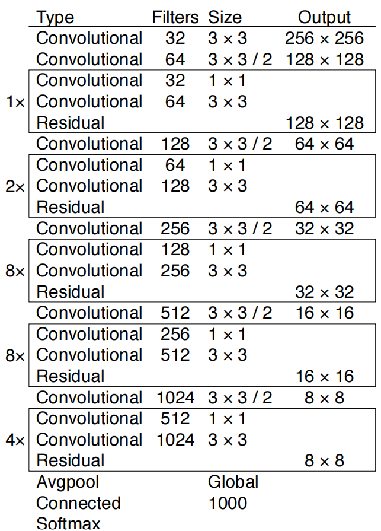

# YOLOv3: An Incremental Improvement
2018.4.8 https://arxiv.org/abs/1804.02767

## 阅读笔记
* 模型输出：N×N×[3∗(4+1+80)], N为cell网格数， 每个cell上预测大、中、小 3 个框, 因此对于 4 个边框偏移x,y,w,h ; 1 个是否有目标预测 和 80 个类别预测
* 损失函数：1. 预测框是否有目标的概率，如果有，输出分类概率;  2. 真实边框，预测边框 -> IoU,GIou
* 标签分配：实际边框中心落在哪个cell中，那个cell负责？ 正样本容易确定，IoU最匹配那个，负样本的确定方式？
* 引入FPN
* 大中小三个锚框的大小，如何确定，训练集聚类分析？引入先验
* 类别：每个类别的概率，而非softmax，类别不均衡？
* 只为每个实际目标分配一个边框, focal loss效果在这里不好的原因？

## Abstract
We present some updates to YOLO! We made a bunch of little design changes to make it better. We also trained this new network that’s pretty swell. It’s a little bigger than last time but more accurate. It’s still fast though, don’t worry. At 320 × 320 YOLOv3 runs in 22 ms at 28.2 mAP, as accurate as SSD but three times faster. When we look at the old .5 IOU mAP detection metric YOLOv3 is quite good. It achieves 57.9 AP50 in 51 ms on a Titan X, compared to 57.5 AP50 in 198 ms by RetinaNet, similar performance but 3.8× faster. As always, all the code is online at https://pjreddie.com/yolo/.

我们为 YOLO 提供了一些更新！ 我们进行了一些小的设计更改以使其更好。 我们还训练了这个非常庞大的新网络。 它比上次大一点，但更准确。 不过它仍然很快，别担心。 在 320 × 320 的情况下，YOLOv3 以 28.2 mAP 的速度在 22 毫秒内运行，与 SSD 一样准确，但速度快了三倍。 当我们查看旧的 0.5 IOU mAP 检测指标时，YOLOv3 非常好。 它在 Titan X 上在 51 毫秒内达到 57.9 AP50，而 RetinaNet 在 198 毫秒内达到 57.5 AP50，性能相似但快了 3.8 倍。 与往常一样，所有代码都在 https://pjreddie.com/yolo/ 上在线。

 
Figure 1. We adapt this figure from the Focal Loss paper [9]. YOLOv3 runs significantly faster than other detection methods with comparable performance. Times from either an M40 or Titan X, they are basically the same GPU.
图1. 我们改编自 Focal Loss 论文 [9] 中的这个图。 YOLOv3 的运行速度明显快于其他性能相当的检测方法。 从 M40 或 Titan X 开始，它们基本上是相同的 GPU。

## 1. Introduction
Sometimes you just kinda phone it in for a year, you know? I didn’t do a whole lot of research this year. Spent a lot of time on Twitter. Played around with GANs a little. I had a little momentum left over from last year [12] [1]; I managed to make some improvements to YOLO. But, honestly, nothing like super interesting, just a bunch of small changes that make it better. I also helped out with other people’s research a little.

有时你只是打电话给它一年，你知道吗？今年我没有做很多研究。在推特上花了很多时间。玩了一点 GAN。我从去年 [12] [1] 留下了一点动力; 我设法对 YOLO 进行了一些改进。但是，老实说，没有什么比超级有趣的了，只是一堆让它变得更好的小改动。我也帮助了一些其他人的研究。

Actually, that’s what brings us here today. We have a camera-ready deadline [4] and we need to cite some of the random updates I made to YOLO but we don’t have a source. So get ready for a TECH REPORT!

实际上，这就是我们今天来到这里的原因。我们有一个准备就绪的截止日期 [4]，我们需要引用我对 YOLO 所做的一些随机更新，但我们没有来源。所以准备好接受技术报告吧！

The great thing about tech reports is that they don’t need intros, y’all know why we’re here. So the end of this introduction will signpost for the rest of the paper. First we’ll tell you what the deal is with YOLOv3. Then we’ll tell you how we do. We’ll also tell you about some things we tried that didn’t work. Finally we’ll contemplate what this all means.

技术报告的伟大之处在于它们不需要介绍，你们就知道我们为什么在这里。因此，本介绍的结尾将成为本文其余部分的标志。首先，我们将告诉您与 YOLOv3 的交易是什么。然后我们会告诉你我们是怎么做的。我们还将告诉您我们尝试过的一些不起作用的事情。最后，我们将思考这一切意味着什么。

## 2. The Deal
So here’s the deal with YOLOv3: We mostly took good ideas from other people. We also trained a new classifier network that’s better than the other ones. We’ll just take you through the whole system from scratch so you can understand it all.

所以这是与 YOLOv3 的交易：我们主要从其他人那里获得好的想法。 我们还训练了一个比其他分类器更好的新分类器网络。 我们将带您从头开始浏览整个系统，以便您了解所有内容。

### 2.1. Bounding Box Prediction 边框预测
Following YOLO9000 our system predicts bounding boxes using dimension clusters as anchor boxes [15]. The network predicts 4 coordinates for each bounding box, $t_x, t_y, t_w, t_h$. If the cell is offset from the top left corner of the image by ($c_x , c_y$) and the bounding box prior has width and height $p_w, p_h$, then the predictions correspond to:

在 YOLO9000 之后，我们的系统使用维度簇作为锚框来预测边框 [15]。 网络为每个边框预测 4 个坐标，$t_x, t_y, t_w, t_h$。 如果单元格从图像的左上角偏移 ($c_x , c_y$) 并且先验边框具有宽度和高度 $p_w, p_h$，则预测对应于：

* $b_x = σ(t_x) + c_x$ 
* $b_y = σ(t_y) + c_y$ 
* $b_w = p_we^{t_w}$ 
* $b_h = p_he^{t_h}$ 

 
Figure 2. Bounding boxes with dimension priors and location prediction. We predict the width and height of the box as offsets from cluster centroids. We predict the center coordinates of the box relative to the location of filter application using a sigmoid function. This figure blatantly self-plagiarized from [15].  
图2. 具有维度先验和位置预测的边框。我们将框的宽度和高度预测为与簇质心的偏移量。我们使用 sigmoid 函数预测相对于过滤器应用位置的框的中心坐标。这个数字公然自我抄袭[15]。

During training we use sum of squared error loss. If the ground truth for some coordinate prediction is tˆ* our gradient is the ground truth value (computed from the ground truth box) minus our prediction: tˆ* − t* . This ground truth value can be easily computed by inverting the equations above.

在训练期间，我们使用平方误差损失之和。如果某个坐标预测的真实值是 t^*，我们的梯度就是实际值(从实际框计算得到的真实值)减去我们的预测：t^* - t*。通过反转上面的式子可以很容易地计算出这个真实值。

YOLOv3 predicts an objectness score for each bounding box using logistic regression. This should be 1 if the bounding box prior overlaps a ground truth object by more than any other bounding box prior. If the bounding box prior is not the best but does overlap a ground truth object by more than some threshold we ignore the prediction, following [17]. We use the threshold of .5. Unlike [17] our system only assigns one bounding box prior for each ground truth object. If a bounding box prior is not assigned to a ground truth object it incurs no loss for coordinate or class predictions, only objectness.

YOLOv3 使用逻辑回归预测每个边框的是否包含目标得分。如果先验边框与实际目标的重叠多于任何其他先验边框，则该值应为 1。如果先验边框不是最好的，但确实与实际目标重叠超过某个阈值，我们将忽略预测，如下 [17]。我们使用 0.5 的阈值。与 [17] 不同，我们的系统只为每个实际目标分配一个边框。如果没有将先验边框分配给实际目标，则不会对坐标或类别预测造成损失，只会对是否包含目标任务造成损失。(这里的先验边框，指的是锚框，每张图片分N*N个单元格，每个单元格有大中小3个锚框)

### 2.2. Class Prediction 类别预测
Each box predicts the classes the bounding box may contain using multilabel classification. We do not use a softmax as we have found it is unnecessary for good performance, instead we simply use independent logistic classifiers. During training we use binary cross-entropy loss for the class predictions.

每个框都使用多标签分类预测边框可能包含的类别。 我们不使用 softmax，因为我们发现它对于良好的性能是不必要的，而是我们简单地使用独立的逻辑分类器。 在训练期间，我们使用二分交叉熵损失进行类预测。

This formulation helps when we move to more complex domains like the Open Images Dataset [7]. In this dataset there are many overlapping labels (i.e. Woman and Person). Using a softmax imposes the assumption that each box has exactly one class which is often not the case. A multilabel approach better models the data.

当我们转向更复杂的领域(如开放图像数据集 [7])时，这个公式会有所帮助。 在这个数据集中有许多重叠的标签(即女人和人)。 使用 softmax 会假设每个边框都只有一个类别，但通常情况并非如此。 多标签方法可以更好地对数据进行建模。

### 2.3. Predictions Across Scales 跨尺度预测
YOLOv3 predicts boxes at 3 different scales. Our system extracts features from those scales using a similar concept to feature pyramid networks [8]. From our base feature extractor we add several convolutional layers. The last of these predicts a 3-d tensor encoding bounding box, objectness, and class predictions. In our experiments with COCO [10] we predict 3 boxes at each scale so the tensor is N ×N ×[3∗(4+1+80)]forthe4boundingboxoffsets, 1 objectness prediction, and 80 class predictions.

YOLOv3预测3个不同尺度的框。我们的系统使用类似于特征金字塔网络(FPN)的概念从这些尺度中提取特征[8]。从我们的基本特征提取器中，我们添加了几个卷积层。最后一个预测 3-d 张量编码边框、目标检测和分类预测。在我们使用 COCO [10] 的实验中，我们在每个尺度上预测 3 个框，因此对于 4 个边框偏移、1 个目标预测和 80 个类别预测，张量为 N×N×[3∗(4+1+80)]。

Next we take the feature map from 2 layers previous and upsample it by 2×. We also take a feature map from earlier in the network and merge it with our upsampled features using concatenation. This method allows us to get more meaningful semantic information from the upsampled features and finer-grained information from the earlier feature map. We then add a few more convolutional layers to process this combined feature map, and eventually predict a similar tensor, although now twice the size.

接下来，我们从之前的 2 层获取特征图，并将其上采样 2 倍。我们还从网络早期获取特征图，并使用连接将其与我们的上采样特征合并。这种方法使我们能够从上采样的特征中获得更有意义的语义信息，并从早期的特征图中获得更细粒度的信息。然后我们添加更多的卷积层来处理这个组合的特征图，并最终预测一个相似的张量，尽管现在是两倍大小。

We perform the same design one more time to predict boxes for the final scale. Thus our predictions for the 3rd scale benefit from all the prior computation as well as finegrained features from early on in the network.

我们再次执行相同的设计来预测最终比例的框。因此，我们对第 3 尺度的预测受益于所有先前的计算以及网络早期的细粒度特征。

We still use k-means clustering to determine our bounding box priors. We just sort of chose 9 clusters and 3 scales arbitrarily and then divide up the clusters evenly across scales. On the COCO dataset the 9 clusters were: (10×13),(16×30),(33×23),(30×61),(62×45),(59× 119), (116 × 90), (156 × 198), (373 × 326).

我们仍然使用 k-means 聚类来确定我们的先验边框。我们只是随意选择了 9 个簇和 3 个尺度，然后在尺度上均匀地划分集群。在COCO数据集上，9个簇分别为：(10×13),(16×30),(33×23),(30×61),(62×45),(59×119),(116×90) , (156 × 198), (373 × 326)。(3个尺度是指卷积下采样的3个阶段，每个尺度下每个单元个有3个锚框，因此是3x3=9个簇？)

### 2.4. Feature Extractor 特征提取器
We use a new network for performing feature extraction. Our new network is a hybrid approach between the network used in YOLOv2, Darknet-19, and that newfangled residual network stuff. Our network uses successive 3 × 3 and 1 × 1 convolutional layers but now has some shortcut connections as well and is significantly larger. It has 53 convolutional layers so we call it.... wait for it..... Darknet-53!

我们使用一个新的网络来执行特征提取。我们的新网络是 YOLOv2、Darknet-19 中使用的网络和新奇的残差网络的混合方法。我们的网络使用连续的 3 × 3 和 1 × 1 卷积层，但现在也有一些快捷连接，并且明显更大。它有 53 个卷积层，所以我们称之为 Darknet-53！

 
Table 1. Darknet-53.

This new network is much more powerful than Darknet19 but still more efficient than ResNet-101 or ResNet-152. Here are some ImageNet results:

这个新网络比 Darknet-19 强大得多，但仍然比 ResNet-101 或 ResNet-152 更有效。以下是一些 ImageNet 结果：

Backbone | Top-1 | Top-5 | Bn Ops | BFLOP/s | FPS
--- | --- | --- | --- | --- | --- 
Darknet-19[15] | 74.1 | 91.8 | 7.29 | 1246 | 171
ResNet-101[5] | 77.1 | 93.7 | 19.7 | 1039 | 53
ResNet-152[5] | 77.6 | 93.8 | 29.4 | 1090 | 37
Darknet-53 | 77.2 | 93.8 | 18.7 | 1457 | 78

Table 2. Comparison of backbones. Accuracy, billions of operations, billion floating point operations per second, and FPS for various networks.
表2 骨干比较。精度、数十亿次操作、每秒十亿次浮点操作以及各种网络的 FPS。

Each network is trained with identical settings and tested at 256 × 256, single crop accuracy. Run times are measured on a Titan X at 256 × 256. Thus Darknet-53 performs on par with state-of-the-art classifiers but with fewer floating point operations and more speed. Darknet-53 is better than ResNet-101 and 1.5× faster. Darknet-53 has similar performance to ResNet-152 and is 2× faster.

每个网络都使用相同的设置进行训练，并以 256 × 256 的单裁剪精度进行测试。运行时间是在 Titan X 上以 256 × 256 测量的。因此，Darknet-53 的性能与SOTA分类器相当，但浮点运算更少，速度更快。 Darknet-53 比 ResNet-101 好，快 1.5 倍。 Darknet-53 具有与 ResNet-152 相似的性能，并且快 2 倍。

Darknet-53 also achieves the highest measured floating point operations per second. This means the network structure better utilizes the GPU, making it more efficient to evaluate and thus faster. That’s mostly because ResNets have just way too many layers and aren’t very efficient.

Darknet-53 还实现了每秒最高测量浮点运算。这意味着网络结构可以更好地利用 GPU，从而提高评估效率，从而加快速度。这主要是因为 ResNet 的层太多并且效率不高。

### 2.5. Training 训练
We still train on full images with no hard negative mining or any of that stuff. We use multi-scale training, lots of data augmentation, batch normalization, all the standard stuff. We use the Darknet neural network framework for training and testing [14].

我们仍然在没有困难负样本挖掘或任何其他东西的情况下训练完整图像。 我们使用多尺度训练、大量数据增广、批归一化，所有标准的东西。 我们使用 Darknet 神经网络框架进行训练和测试 [14]。

## 3. How We Do 我们的效果如何
YOLOv3 is pretty good! See table 3. In terms of COCOs weird average mean AP metric it is on par with the SSD variants but is 3× faster. It is still quite a bit behind other models like RetinaNet in this metric though.

YOLOv3还不错！见表 3。就 COCO 奇怪的平均 AP 指标而言，它与 SSD 变体相当，但速度快了 3 倍。不过，在这个指标上，它仍然落后于 RetinaNet 等其他模型。

Table 3. I’m seriously just stealing all these tables from [9] they take soooo long to make from scratch. Ok, YOLOv3 is doing alright. Keep in mind that RetinaNet has like 3.8× longer to process an image. YOLOv3 is much better than SSD variants and comparable to state-of-the-art models on the AP50 metric.
表3.我真的只是从 [9] 中偷来的这些表，它们需要很长时间才能从头开始制作。好的，YOLOv3 一切正常。请记住，RetinaNet 处理图像的时间要长 3.8 倍。 YOLOv3 比 SSD 变体好得多，并且在 AP50 指标上可与SOTA模型相媲美。

Figure 3. Again adapted from the [9], this time displaying speed/accuracy tradeoff on the mAP at .5 IOU metric. You can tell YOLOv3 is good because it’s very high and far to the left. Can you cite your own paper? Guess who’s going to try, this guy → [16]. Oh, I forgot, we also fix a data loading bug in YOLOv2, that helped by like 2 mAP. Just sneaking this in here to not throw off layout.
图3.再次改编自 [9]，这次在 0.5 IOU 指标下显示 mAP 上的速度/准确度权衡。你可以看出 YOLOv3 很好，因为它非常高而且在左边很远。你能引用你自己的论文吗？猜猜谁会尝试，这家伙 → [16]。哦，我忘了，我们还修复了 YOLOv2 中的一个数据加载错误，这得益于 2 mAP 的帮助。只是偷偷把它放在这里，以免影响布局。

However, when we look at the “old” detection metric of mAP at IOU= .5 (or AP50 in the chart) YOLOv3 is very strong. It is almost on par with RetinaNet and far above the SSD variants. This indicates that YOLOv3 is a very strong detector that excels at producing decent boxes for objects. However, performance drops significantly as the IOU threshold increases indicating YOLOv3 struggles to get the boxes perfectly aligned with the object.

但是，当我们查看 IOU= .5(或图表中的 AP50)时 mAP 的“旧”检测指标时，YOLOv3 非常强大。它几乎与 RetinaNet 相当，远高于 SSD 变体。这表明 YOLOv3 是一个非常强大的检测器，擅长为物体生成像样的边框。然而，随着 IOU 阈值的增加，性能显著下降，这表明 YOLOv3 难以让框与目标完美对齐。

In the past YOLO struggled with small objects. However, now we see a reversal in that trend. With the new multi-scale predictions we see YOLOv3 has relatively high APS performance. However, it has comparatively worse performance on medium and larger size objects. More investigation is needed to get to the bottom of this.

过去，YOLO 与小目标作斗争。然而，现在我们看到了这一趋势的逆转。通过新的多尺度预测，我们看到 YOLOv3 具有相对较高的 APS 性能。但是，它在中型和大型目标上的性能相对较差。需要进行更多的调查才能弄清楚这一点。

When we plot accuracy vs speed on the AP50 metric (see figure 5) we see YOLOv3 has significant benefits over other detection systems. Namely, it’s faster and better.

当我们在 AP50 指标上绘制精度与速度的关系图时(见图 5)，我们看到 YOLOv3 与其他检测系统相比具有显著优势。即,它更快更好。

## 4. Things We Tried That Didn’t Work 我们尝试过但不起作用的方法
We tried lots of stuff while we were working on YOLOv3. A lot of it didn’t work. Here’s the stuff we can remember.

在开发 YOLOv3 时，我们尝试了很多东西。很多都没有用。这是我们能记住的东西。

Anchor box x, y offset predictions. We tried using the normal anchor box prediction mechanism where you predict the x, y offset as a multiple of the box width or height using a linear activation. We found this formulation decreased model stability and didn’t work very well.

锚框 x, y 偏移预测。我们尝试使用正常的锚框预测机制，您可以使用线性激活将 x、y 偏移量预测为框宽度或高度的倍数。我们发现这个公式降低了模型的稳定性并且效果不佳。

Linear x, y predictions instead of logistic. We tried using a linear activation to directly predict the x, y offset instead of the logistic activation. This led to a couple point drop in mAP.

线性 x, y 预测而不是logistic。我们尝试使用线性激活来直接预测 x、y 偏移而不是逻辑激活。这导致 mAP 下降了几个点。

Focal loss. We tried using focal loss. It dropped our mAP about 2 points. YOLOv3 may already be robust to the problem focal loss is trying to solve because it has separate objectness predictions and conditional class predictions. Thus for most examples there is no loss from the class predictions? Or something? We aren’t totally sure.

焦点损失。我们尝试使用焦点损失。它使我们的 mAP 下降了大约 2 个点。 YOLOv3 可能已经对焦点损失试图解决的问题具有稳健性，因为它具有单独的目标预测和条件类预测。因此，对于大多数样本，类别预测没有损失？或者其他的东西？我们不完全确定。

Dual IOU thresholds and truth assignment. Faster RCNN uses two IOU thresholds during training. If a prediction overlaps the ground truth by .7 it is as a positive example, by [.3 − .7] it is ignored, less than .3 for all ground truth objects it is a negative example. We tried a similar strategy but couldn’t get good results.

双 IOU 阈值和真值分配。 Faster R-CNN 在训练期间使用两个 IOU 阈值。如果一个预测与基本事实重叠 0.7，则它是一个正例，如果是 [.3 .7]，它会被忽略，对于所有基本事实目标，它小于 .3 是一个反例。我们尝试了类似的策略，但没有得到好的结果。

We quite like our current formulation, it seems to be at a local optima at least. It is possible that some of these techniques could eventually produce good results, perhaps they just need some tuning to stabilize the training.

我们非常喜欢我们目前的表述，它似乎至少处于局部最优状态。其中一些技术可能最终会产生良好的结果，也许它们只需要一些调整来稳定训练。

## 5. What This All Means 总结
YOLOv3 is a good detector. It’s fast, it’s accurate. It’s not as great on the COCO average AP between .5 and .95 IOU metric. But it’s very good on the old detection metric of .5 IOU.

YOLOv3 是一个很好的检测器。它很快，很准确。在 0.5 到 0.95 IOU 指标之间的 COCO 平均 AP 上并没有那么好。但它在 0.5 IOU 的旧检测指标上非常好。

Why did we switch metrics anyway? The original COCO paper just has this cryptic sentence: “A full discussion of evaluation metrics will be added once the evaluation server is complete”. 
Russakovsky et al report that that humans have a hard time distinguishing an IOU of .3 from .5! “Training humans to visually inspect a bounding box with IOU of 0.3 and distinguish it from one with IOU 0.5 is surprisingly difficult.” [18] If humans have a hard time telling the difference, how much does it matter?

为什么我们还是要切换指标？最初的 COCO 论文只有这个神秘的句子：“一旦评估服务器完成，将添加对评估指标的完整讨论”。 Russakovsky et al 报告说，人类很难区分 0.3 和 0.5 的 IOU！ “训练人类目视检查 IOU 为 0.3 的边框并将其与 IOU 0.5 的边框区分开来非常困难。” [18] 如果人类很难分辨出差异，那有多大关系？

But maybe a better question is: “What are we going to do with these detectors now that we have them?” A lot of the people doing this research are at Google and Facebook. I guess at least we know the technology is in good hands and definitely won’t be used to harvest your personal information and sell it to.... wait, you’re saying that’s exactly what it will be used for?? Oh.

但也许更好的问题是：“既然我们有了这些探测器，我们将如何处理它们？”许多从事这项研究的人都在谷歌和 Facebook。我想至少我们知道这项技术掌握得很好，绝对不会被用来收集你的个人信息并将其出售给……等等，你是说这正是它的用途？？哦。

Well the other people heavily funding vision research are the military and they’ve never done anything horrible like killing lots of people with new technology oh wait.....

好吧，其他大量资助视觉研究的人是军队，他们从来没有做过任何可怕的事情，比如用新技术杀死很多人哦等等......

I have a lot of hope that most of the people using computer vision are just doing happy, good stuff with it, like counting the number of zebras in a national park [13], or tracking their cat as it wanders around their house [19]. But computer vision is already being put to questionable use and as researchers we have a responsibility to at least consider the harm our work might be doing and think of ways to mitigate it. We owe the world that much.

我非常希望大多数使用计算机视觉的人只是在用它做快乐、有益的事情，比如数国家公园里斑马的数量 [13]，或者跟踪他们的猫在他们家附近闲逛[19]。但是计算机视觉已经被投入使用，作为研究人员，我们有责任至少考虑我们的工作可能造成的危害，并想办法减轻它。我们欠世界那么多。

In closing, do not @ me. (Because I finally quit Twitter).
最后，不要@我。 (因为我终于退出了 Twitter)。

## References
1. Analogy. Wikipedia, Mar 2018. 1
2. M. Everingham, L. Van Gool, C. K. Williams, J. Winn, and A. Zisserman. The pascal visual object classes (voc) challenge. International journal of computer vision, 88(2):303– 338, 2010. 6
3. C.-Y. Fu, W. Liu, A. Ranga, A. Tyagi, and A. C. Berg. Dssd: Deconvolutional single shot detector. arXiv preprint arXiv:1701.06659, 2017. 3
4. D. Gordon, A. Kembhavi, M. Rastegari, J. Redmon, D. Fox, and A. Farhadi. Iqa: Visual question answering in interactive environments. arXiv preprint arXiv:1712.03316, 2017. 1
5. K. He, X. Zhang, S. Ren, and J. Sun. Deep residual learning for image recognition. In Proceedings of the IEEE conference on computer vision and pattern recognition, pages 770–778, 2016. 3
6. J. Huang, V. Rathod, C. Sun, M. Zhu, A. Korattikara, A. Fathi, I. Fischer, Z. Wojna, Y. Song, S. Guadarrama, et al. Speed/accuracy trade-offs for modern convolutional object detectors. 3
7. I. Krasin, T. Duerig, N. Alldrin, V. Ferrari, S. Abu-El-Haija, A. Kuznetsova, H. Rom, J. Uijlings, S. Popov, A. Veit, S. Belongie, V. Gomes, A. Gupta, C. Sun, G. Chechik, D. Cai, Z. Feng, D. Narayanan, and K. Murphy. Openimages: A public dataset for large-scale multi-label and multi-class image classification. Dataset available from https://github.com/openimages, 2017. 2
8. T.-Y. Lin, P. Dollar, R. Girshick, K. He, B. Hariharan, and S. Belongie. Feature pyramid networks for object detection. In Proceedings of the IEEE Conference on Computer Vision and Pattern Recognition, pages 2117–2125, 2017. 2, 3
9. T.-Y. Lin, P. Goyal, R. Girshick, K. He, and P. Doll´ar. Focal loss for dense object detection. arXiv preprint arXiv:1708.02002, 2017. 1, 3, 4
10. T.-Y. Lin, M. Maire, S. Belongie, J. Hays, P. Perona, D. Ramanan, P. Doll´ar, and C. L. Zitnick. Microsoft coco: Common objects in context. In European conference on computer vision, pages 740–755. Springer, 2014. 2
11. W. Liu, D. Anguelov, D. Erhan, C. Szegedy, S. Reed, C.- Y. Fu, and A. C. Berg. Ssd: Single shot multibox detector. In European conference on computer vision, pages 21–37. Springer, 2016. 3
12. I. Newton. Philosophiae naturalis principia mathematica. William Dawson & Sons Ltd., London, 1687. 1
13. J. Parham, J. Crall, C. Stewart, T. Berger-Wolf, and D. Rubenstein. Animal population censusing at scale with citizen science and photographic identification. 2017. 4
14. J. Redmon. Darknet: Open source neural networks in c. http://pjreddie.com/darknet/, 2013–2016. 3
15. J. Redmon and A. Farhadi. Yolo9000: Better, faster, stronger. In Computer Vision and Pattern Recognition (CVPR), 2017 IEEE Conference on, pages 6517–6525. IEEE, 2017. 1, 2, 3
16. J. Redmon and A. Farhadi. Yolov3: An incremental improvement. arXiv, 2018. 4
17. S. Ren, K. He, R. Girshick, and J. Sun. Faster r-cnn: Towards real-time object detection with region proposal networks. arXiv preprint arXiv:1506.01497, 2015. 2
18. O. Russakovsky, L.-J. Li, and L. Fei-Fei. Best of both worlds: human-machine collaboration for object annotation. In Proceedings of the IEEE Conference on Computer Vision and Pattern Recognition, pages 2121–2131, 2015. 4
19. M. Scott. Smart camera gimbal bot scanlime:027, Dec 2017. 4
20. A. Shrivastava, R. Sukthankar, J. Malik, and A. Gupta. Beyond skip connections: Top-down modulation for object detection. arXiv preprint arXiv:1612.06851, 2016. 3
21. C. Szegedy, S. Ioffe, V. Vanhoucke, and A. A. Alemi. Inception-v4, inception-resnet and the impact of residual connections on learning. 2017. 3 

Figure 4. Zero-axis charts are probably more intellectually honest... and we can still screw with the variables to make ourselves look good!
图4. 零轴图表可能在智力上更诚实……我们仍然可以通过变量来让自己看起来不错！

## Rebuttal 辩驳
We would like to thank the Reddit commenters, labmates, emailers, and passing shouts in the hallway for their lovely, heartfelt words. If you, like me, are reviewing for ICCV then we know you probably have 37 other papers you could be reading that you’ll invariably put off until the last week and then have some legend in the field email you about how you really should finish those reviews execept it won’t entirely be clear what they’re saying and maybe they’re from the future? Anyway, this paper won’t have become what it will in time be without all the work your past selves will have done also in the past but only a little bit further forward, not like all the way until now forward. And if you tweeted about it I wouldn’t know. Just sayin.

我们要感谢 Reddit 评论者、实验室伙伴、电子邮件发送者以及走廊里传来的呼喊声，感谢他们可爱、发自内心的话。如果你和我一样，正在审查 ICCV，那么我们知道你可能还有 37 篇其他论文你可以阅读，你总是会推迟到最后一周，然后在该领域有一些传奇人物给你发电子邮件，告诉你你应该如何完成那些评论除了不完全清楚他们在说什么，也许他们来自未来？无论如何，如果没有你们过去的自己在过去所做的所有工作，这篇论文不会及时成为现在的样子，但只会向前推进一点点，而不像一直到现在一样。如果你发推文我不会知道。只是在说。

Reviewer #2 AKA Dan Grossman (lol blinding who does that) insists that I point out here that our graphs have not one but two non-zero origins. You’re absolutely right Dan, that’s because it looks way better than admitting to ourselves that we’re all just here battling over 2-3% mAP. But here are the requested graphs. I threw in one with FPS too because we look just like super good when we plot on FPS.

审稿人 #2 AKA Dan Grossman(大声笑谁这样做)坚持我在这里指出，我们的图表不是一个而是两个非零起源。你说得对，丹，那是因为它看起来比承认我们都只是在这里与 2-3% 的 mAP 作斗争要好得多。但这里是要求的图表。我也加入了 FPS，因为我们在 FPS 上绘制时看起来非常好。

Reviewer #4 AKA JudasAdventus on Reddit writes “Entertaining read but the arguments against the MSCOCO metrics seem a bit weak”. Well, I always knew you would be the one to turn on me Judas. You know how when you work on a project and it only comes out alright so you have to figure out some way to justify how what you did actually was pretty cool? I was basically trying to do that and I lashed out at the COCO metrics a little bit. But now that I’ve staked out this hill I may as well die on it.

评论者 #4 AKA JudasAdventus 在 Reddit 上写道“有趣的阅读，但反对 MSCOCO 指标的论据似乎有点弱”。好吧，我一直都知道你会成为挑衅我的人，犹大。你知道当你在一个项目上工作的时候，结果还不错，所以你必须想出一些方法来证明你所做的实际上是多么的酷？我基本上是在尝试这样做，并且对 COCO 指标进行了一些猛烈抨击。但既然我已经在这座山上放样了，我还不如死在上面。

See here’s the thing, mAP is already sort of broken so an update to it should maybe address some of the issues with it or at least justify why the updated version is better in some way. And that’s the big thing I took issue with was the lack of justification. For PASCAL VOC, the IOU threshold was ”set deliberately low to account for inaccuracies in bounding boxes in the ground truth data“ [2]. Does COCO have better labelling than VOC? This is definitely possible since COCO has segmentation masks maybe the labels are more trustworthy and thus we aren’t as worried about inaccuracy. But again, my problem was the lack of justification.

看到这里，mAP 已经有点坏了，所以它的更新应该可以解决它的一些问题，或者至少证明为什么更新版本在某些方面更好。我最大的问题是缺乏正当理由。对于 PASCAL VOC，IOU 阈值“故意设置得很低，以解决实际数据中边框的不准确性”[2]。 COCO的标签比VOC好吗？这绝对是可能的，因为 COCO 有分割掩码，也许标签更值得信赖，因此我们不必担心不准确。但同样，我的问题是缺乏正当理由。

The COCO metric emphasizes better bounding boxes but that emphasis must mean it de-emphasizes something else, in this case classification accuracy. Is there a good reason to think that more precise bounding boxes are more important than better classification? A miss-classified example is much more obvious than a bounding box that is slightly shifted.

COCO 指标强调更好的边框，但强调必须意味着它不强调其他东西，在这种情况下是分类准确性。是否有充分的理由认为更精确的边框比更好的分类更重要？一个错误分类的例子比一个稍微移动的边框要明显得多。

mAP is already screwed up because all that matters is per-class rank ordering. For example, if your test set only has these two images then according to mAP two detectors that produce these results are JUST AS GOOD:

mAP 已经搞砸了，因为重要的是按类别排序。例如，如果您的测试集只有这两个图像，那么根据 mAP，产生这些结果的两个检测器都很好：

Figure 5. These two hypothetical detectors are perfect according to mAP over these two images. They are both perfect. Totally equal.

根据这两个图像的 mAP，这两个假设检测器是完美的。他们都很完美。完全相等。

Now this is OBVIOUSLY an over-exaggeration of the problems with mAP but I guess my newly retconned point is that there are such obvious discrepancies between what people in the “real world” would care about and our current metrics that I think if we’re going to come up with new metrics we should focus on these discrepancies. Also, like, it’s already mean average precision, what do we even call the COCO metric, average mean average precision?

现在这显然是对 mAP 问题的过度夸大了，但我想我最近重新表达的观点是，“现实世界”中的人们所关心的与我们当前的指标之间存在如此明显的差异，我认为如果我们'将提出新的指标，我们应该关注这些差异。此外，它已经是平均精度，我们甚至将 COCO 度量称为什么，平均平均精度？

Here’s a proposal, what people actually care about is given an image and a detector, how well will the detector find and classify objects in the image. What about getting rid of the per-class AP and just doing a global average precision? Or doing an AP calculation per-image and averaging over that?

这是一个建议，人们真正关心的是给定图像和检测器，检测器在图像中目标检测和分类的能力如何。摆脱每个类的 AP 并只做一个全局平均精度怎么样？或者对每个图像进行 AP 计算并对其进行平均？

Boxes are stupid anyway though, I’m probably a true believer in masks except I can’t get YOLO to learn them.

无论如何，边框都是愚蠢的，我可能是掩码的真正信徒，但我无法让 YOLO 学习它们。