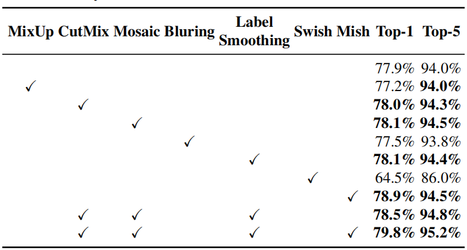

# YOLOv4: Optimal Speed and Accuracy of Object Detection 
YOLOv4: 目标检测的最佳速度和精度 2020.4.23 原文：https://arxiv.org/abs/2004.10934

## 阅读笔记
* 对目标检测做了系统的梳理

## Abstract 摘要
There are a huge number of features which are said to improve Convolutional Neural Network (CNN) accuracy. Practical testing of combinations of such features on large datasets, and theoretical justification of the result, is required. Some features operate on certain models exclusively and for certain problems exclusively, or only for small-scale datasets; while some features, such as batch-normalization and residual-connections, are applicable to the majority of models, tasks, and datasets. We assume that such universal features include Weighted-Residual-Connections (WRC), Cross-Stage-Partial-connections (CSP), Cross mini-Batch Normalization (CmBN), Self-adversarial-training (SAT) and Mish-activation. We use new features: WRC, CSP, CmBN, SAT, Mish activation, Mosaic data augmentation, CmBN, DropBlock regularization, and CIoU loss, and combine some of them to achieve state-of-the-art results: 43.5% AP (65.7% AP50) for the MS COCO dataset at a realtime speed of ∼65 FPS on Tesla V100. Source code is at https://github.com/AlexeyAB/darknet .

有大量的功能据说可以提高卷积神经网络 (CNN) 的准确性。对这些功能的组合需要在大型数据集上进行实际测试，并对结果进行理论证明。一些功能专门针对某些模型和某些问题专门操作，或仅针对小规模数据集; 另一些特性，例如批归一化和残差连接，适用于大多数模型、任务和数据集。我们假设这些通用特征包括加权残差连接 (WRC)、跨阶段部分连接 (CSP)、交叉小批量归一化 (CmBN)、自我对抗训练 (SAT) 和 Mish激活函数。我们使用新功能：WRC、CSP、CmBN、SAT、Mish激活函数、Mosaic数据增广、CmBN、DropBlock正则化和CIoU损失函数，并结合其中一些SOTA实现结果：用MS COCO数据集在Tesla V100上以∼65 FPS的实时速度, 达到43.5% AP (65.7 % AP50) ，源代码位于 https://github.com/AlexeyAB/darknet 。

 
Figure 1: Comparison of the proposed YOLOv4 and other state-of-the-art object detectors. YOLOv4 runs twice faster than EfficientDet with comparable performance. Improves YOLOv3’s AP and FPS by 10% and 12%, respectively. 

YOLOv4与其他最先进目标检测器的比较。YOLOv4的运行速度是EfficientDet的两倍，性能相当。将YOLOv3的AP和FPS分别提高10%和12%。

## 1. Introduction 介绍
The majority of CNN-based object detectors are largely applicable only for recommendation systems. For example, searching for free parking spaces via urban video cameras is executed by slow accurate models, whereas car collision warning is related to fast inaccurate models. Improving the real-time object detector accuracy enables using them not only for hint generating recommendation systems, but also for stand-alone process management and human input reduction. Real-time object detector operation on conventional Graphics Processing Units (GPU) allows their mass usage at an affordable price. The most accurate modern neural networks do not operate in real time and require large number of GPUs for training with a large mini-batch-size. We address such problems through creating a CNN that operates in real-time on a conventional GPU, and for which training requires only one conventional GPU.

大多数基于CNN的目标检测器在很大程度上仅适用于推荐系统。例如，通过城市摄像机搜索空闲停车位是由**慢准确模型**执行的，而汽车碰撞警告则与**快速不准确模型**有关。提高实时目标检测器的准确性不仅可以将它们用于生成提示的推荐系统，还可以用于独立的流程管理和减少人工输入。传统图形处理单元 (GPU) 上的实时目标检测器操作允许以可承受的价格大规模使用它们。最准确的现代神经网络不是实时运行的，需要大量GPU来进行大量的训练。我们通过创建一个在传统GPU上实时运行的CNN来解决这些问题，并且只需要一个传统GPU来训练。

The main goal of this work is designing a fast operating speed of an object detector in production systems and optimization for parallel computations, rather than the low computation volume theoretical indicator (BFLOP). We hope that the designed object can be easily trained and used. For example, anyone who uses a conventional GPU to train and test can achieve real-time, high quality, and convincing object detection results, as the YOLOv4 results shown in Figure 1. Our contributions are summarized as follows:
1. We develope an efficient and powerful object detection model. It makes everyone can use a 1080 Ti or 2080 Ti GPU to train a super fast and accurate object detector.
2. We verify the influence of state-of-the-art Bag-ofFreebies and Bag-of-Specials methods of object detection during the detector training.
3. We modify state-of-the-art methods and make them more effecient and suitable for single GPU training, including CBN [89], PAN [49], SAM [85], etc.

这项工作的主要目标是设计生产系统中目标检测器的快速运行速度和优化并行计算，而不是低计算量理论指标(BFLOP)。我们希望设计的对象可以很容易地训练和使用。例如，任何使用传统GPU进行训练和测试的人都可以实现实时、高质量和令人信服的目标检测结果，如图1 所示的YOLOv4结果。我们的贡献总结如下：
1. 我们开发了一种高效而强大的目标检测模型。它使每个人都可以使用 1080 Ti 或 2080 Ti GPU 来训练超快速和准确的目标检测器。
2. 我们在检测器训练期间验证了SOTA Bag-of-Freebies 和 Bag-of-Specials 方法对目标检测的影响。
3. 我们修改了一些SOTA方法，使它们更有效，更适合单GPU训练，包括CBN [89]、PAN [49]、SAM [85]等。

## 2. Related work 相关工作
### 2.1. Object detection models 目标检测模型
A modern detector is usually composed of two parts, a backbone which is pre-trained on ImageNet and a head which is used to predict classes and bounding boxes of objects. For those detectors running on GPU platform, their backbone could be VGG [68], ResNet [26], ResNeXt [86], or DenseNet [30]. For those detectors running on CPU platform, their backbone could be SqueezeNet [31], MobileNet [28, 66, 27, 74], or ShuffleNet [97, 53]. As to the head part, it is usually categorized into two kinds, i.e., one-stage object detector and two-stage object detector. The most representative two-stage object detector is the R-CNN [19] series, including fast R-CNN [18], faster R-CNN [64], R-FCN [9], and Libra R-CNN [58]. It is also possible to make a twostage object detector an anchor-free object detector, such as RepPoints [87]. As for one-stage object detector, the most representative models are YOLO [61, 62, 63], SSD [50], and RetinaNet [45]. In recent years, anchor-free one-stage object detectors are developed. The detectors of this sort are CenterNet [13], CornerNet [37, 38], FCOS [78], etc. Object detectors developed in recent years often insert some layers between backbone and head, and these layers are usually used to collect feature maps from different stages. We can call it the neck of an object detector. Usually, a neck is composed of several bottom-up paths and several topdown paths. Networks equipped with this mechanism include Feature Pyramid Network (FPN) [44], Path Aggregation Network (PAN) [49], BiFPN [77], and NAS-FPN [17]. In addition to the above models, some researchers put their emphasis on directly building a new backbone (DetNet [43], DetNAS [7]) or a new whole model (SpineNet [12], HitDetector [20]) for object detection.

现代检测器通常由两部分组成，一个在ImageNet上预训练的骨干网和一个用于预测目标类别和边界框的头。对于那些在GPU平台上运行的检测器，它们的骨干网可以是VGG [68]、ResNet [26]、ResNeXt [86] 或 DenseNet [30]。对于那些在CPU平台上运行的检测器，它们的骨干网可以是SqueezeNet [31]、MobileNet [28、66、27、74] 或 ShuffleNet [97、53]。对于头部，通常分为两类，即单步目标检测器和两步目标检测器。最具代表性的两步目标检测器是R-CNN [19] 系列，包括fast R-CNN [18]、faster R-CNN [64]、R-FCN [9] 和 Libra R-CNN [58]. 也可以将两步目标检测器制作为无锚框目标检测器，例如 RepPoints [87]。对于单步目标检测器，最具代表性的模型是 YOLO [61、62、63]、SSD [50] 和 RetinaNet [45]。近年来开发了无锚框的单步目标检测器。这类检测器有CenterNet [13]、CornerNet [37, 38]、FCOS [78]等。近年来开发的目标检测器经常在骨干网和头部之间插入一些层，这些层通常用于从不同的阶段收集特征图。我们可以称它为目标检测器的颈部(Neck)。通常，一个颈部由几个自下而上的路径和几个自上而下的路径组成。配备这种机制的网络包括特征金字塔网络 (FPN) [44]、路径聚合网络 (PAN) [49]、BiFPN [77] 和 NAS-FPN [17]。除了上述模型，一些研究人员将重点放在直接构建新的骨干网(DetNet [43]、DetNAS [7])或新的整体模型(SpineNet [12]、HitDetector [20])来进行目标检测。

To sum up, an ordinary object detector is composed of several parts:
* Input: Image, Patches, Image Pyramid
* Backbones: VGG16 [68], ResNet-50 [26], SpineNet [12], EfficientNet-B0/B7 [75], CSPResNeXt50 [81], CSPDarknet53 [81]
* Neck:
    * Additional blocks: SPP [25], ASPP [5], RFB [47], SAM [85]
    * Path-aggregation blocks: FPN [44], PAN [49], NAS-FPN [17], Fully-connected FPN, BiFPN [77], ASFF [48], SFAM [98]
* Heads:
    * Dense Prediction (one-stage):
        ◦ RPN[64],SSD[50],YOLO[61],RetinaNet [45] (anchor based)
        ◦ CornerNet [37], CenterNet [13], MatrixNet [60], FCOS [78] (anchor free)
    * Sparse Prediction (two-stage):
        ◦ Faster R-CNN [64], R-FCN [9], Mask RCNN [23] (anchor based)
        ◦ RepPoints [87] (anchor free)

综上所述，一个普通的目标检测器由几部分组成：
* 输入：图像、分块、图像金字塔
* 骨干网：VGG16 [68]、ResNet-50 [26]、SpineNet [12]、EfficientNet-B0/B7 [75]、CSPResNeXt50 [81]、CSPDarknet53 [81]
* 颈部：
     * 附加块：SPP [25]、ASPP [5]、RFB [47]、SAM [85]
     * 路径聚合块：FPN [44]、PAN [49]、NAS-FPN [17]、全连接FPN、BiFPN [77]、ASFF [48]、SFAM [98]
* 检测头:
     * 密集预测(单步骤)：
         ◦ RPN[64]、SSD[50]、YOLO[61]、RetinaNet [45](基于锚框)
         ◦ CornerNet [37]、CenterNet [13]、MatrixNet [60]、FCOS [78](无锚框)
     * 稀疏预测(两步骤)：
         ◦ Faster R-CNN [64]、R-FCN [9]、Mask RCNN [23](基于锚框)
         ◦ RepPoints [87](无锚框)

### 2.2. Bag of freebies 免费包
Usually, a conventional object detector is trained offline. Therefore, researchers always like to take this advantage and develop better training methods which can make the object detector receive better accuracy without increasing the inference cost. We call these methods that only change the training strategy or only increase the training cost as “**bag of freebies** .” What is often adopted by object detection methods and meets the definition of bag of freebies is data augmentation. The purpose of data augmentation is to increase the variability of the input images, so that the designed object detection model has higher robustness to the images obtained from different environments. For examples, photometric distortions and geometric distortions are two commonly used data augmentation method and they definitely benefit the object detection task. In dealing with photometric distortion, we adjust the brightness, contrast, hue, saturation, and noise of an image. For geometric distortion, we add random scaling, cropping, flipping, and rotating.

通常，传统的目标检测器是离线训练的。因此，研究人员总是喜欢利用这一优势，开发更好的训练方法，使目标检测器在不增加推理成本的情况下获得更好的精度。我们将这些仅改变训练策略或只增加训练成本，而不增加推理成本的方法称为“**免费包(BoF)**”。目标检测方法经常采用的符合免费包(BoF)定义的是数据增广。数据增广的目的是增加输入图像的可变性，使设计的目标检测模型对从不同环境获得的图像具有更高的稳健性。例如，光度失真和几何失真是两种常用的数据增广方法，它们绝对有利于目标检测任务。在处理光度失真时，我们调整图像的亮度、对比度、色调、饱和度和噪声。对于几何失真，我们添加了随机缩放、裁剪、翻转和旋转。

The data augmentation methods mentioned above are all pixel-wise adjustments, and all original pixel information in the adjusted area is retained. In addition, some researchers engaged in data augmentation put their emphasis on simulating object occlusion issues. They have achieved good results in image classification and object detection. For example, random erase [100] and CutOut [11] can randomly select the rectangle region in an image and fill in a random or complementary value of zero. As for hide-and-seek [69] and grid mask [6], they randomly or evenly select multiple rectangle regions in an image and replace them to all zeros. If similar concepts are applied to feature maps, there are DropOut [71], DropConnect [80], and DropBlock [16] methods. In addition, some researchers have proposed the methods of using multiple images together to perform data augmentation. For example, MixUp [92] uses two images to multiply and superimpose with different coefficient ratios, and then adjusts the label with these superimposed ratios. As for CutMix [91], it is to cover the cropped image to rectangle region of other images, and adjusts the label according to the size of the mix area. In addition to the above mentioned methods, style transfer GAN [15] is also used for data augmentation, and such usage can effectively reduce the texture bias learned by CNN.

上面提到的数据增广方法都是像素级调整，调整区域内的所有原始像素信息都被保留。此外，一些从事数据增广的研究人员将重点放在**模拟目标遮挡** 问题上。他们在图像分类和目标检测方面取得了很好的效果。例如，random erase [100] 和 CutOut [11] 可以随机选择图像中的矩形区域，并填充随机或互补的零值。至于捉迷藏[69]和网格掩码[6]，它们随机或均匀地选择图像中的多个矩形区域并将它们替换为全零。如果将类似的概念应用于特征图，则有DropOut [71]、DropConnect [80] 和 DropBlock [16] 方法。此外，一些研究人员提出了将多张图像一起使用来进行数据增广的方法。例如，MixUp [92] 使用两个图像以不同的系数比率相乘和叠加，然后用这些叠加的比率调整标签。对于CutMix [91]，它是将裁剪后的图像覆盖到其他图像的矩形区域，并根据混合区域的大小调整标签。除了上述方法外，风格迁移 GAN [15] 还用于数据增广，这样的使用可以有效地减少CNN学习到的纹理偏差。

Different from the various approaches proposed above, some other bag of freebies methods are dedicated to solving the problem that the semantic distribution in the dataset may have bias. In dealing with the problem of semantic distribution bias, a very important issue is that there is a problem of data imbalance between different classes, and this problem is often solved by hard negative example mining [72] or online hard example mining [67] in two-stage object detector. But the example mining method is not applicable to one-stage object detector, because this kind of detector belongs to the dense prediction architecture. Therefore Lin et al. [45] proposed **focal loss** to deal with the problem of data imbalance existing between various classes. Another very important issue is that it is difficult to express the relationship of the degree of association between different categories with the one-hot hard representation. This representation scheme is often used when executing labeling. The label smoothing proposed in [73] is to convert hard label into soft label for training, which can make model more robust. In order to obtain a better soft label, Islam et al. [33] introduced the concept of knowledge distillation to design the label refinement network.

与上面提出的各种方法不同，其他一些免费包方法致力于解决数据集中的语义分布可能存在偏差的问题。在处理语义分布偏差问题时，一个很重要的问题是不同类之间存在数据不平衡的问题，而这个问题在两级目标检测器中往往通过困难样本挖掘[72]或在线困难样本挖掘[67]来解决。但是样本挖掘方法不适用于单步目标检测器，因为这种检测器属于密集预测架构。因此林et al [45]提出了focal loss来处理各个类之间存在的数据不平衡问题。另一个非常重要的问题是，很难用在标注时经常使用的one-hot硬编码方案来表达不同类别之间的关联程度的关系。标签平滑[73]中提出的是将硬标签转换为软标签进行训练，可以使模型更加健壮。为了获得更好的软标签，Islamet al [33]引入了知识蒸馏的概念来设计标签细化网络。

The last bag of freebies is the objective function of Bounding Box (BBox) regression. The traditional object detector usually uses Mean Square Error (MSE) to directly perform regression on the center point coordinates and height and width of the BBox, i.e., {$x_{center}$, $y_{center}$, w, h}, or the upper left point and the lower right point, i.e., {$x_{top\_left}$, $y_{top\_left}$, $x_{bottom\_right}$, $y_{bottom\_right}$}. As for anchor-based method, it is to estimate the corresponding offset, for example {$x_{center\_offset}$ , $y_{center\_offset}$ , $w_{offset}$, $h_{offset}$} and {$x_{top\_left\_offset}$, $y_{top\_left\_offset}$, $x_{bottom\_right\_offset}$, $y_{bottom\_right\_offset}$}. However, to directly estimate the coordinate values of each point of the BBox is to treat these points as independent variables, but in fact does not consider the integrity of the object itself. In order to make this issue processed better, some researchers recently proposed IoU loss [90], which puts the coverage of predicted BBox area and ground truth BBox area into consideration. The IoU loss computing process will trigger the calculation of the four coordinate points of the BBox by executing IoU with the ground truth, and then connecting the generated results into a whole code. Because IoU is a scale invariant representation, it can solve the problem that when traditional methods calculate the l1 or l2 loss of {x, y, w, h}, the loss will increase with the scale. Recently, some researchers have continued to improve IoU loss. For example, GIoU loss [65] is to include the shape and orientation of object in addition to the coverage area. They proposed to find the smallest area BBox that can simultaneously cover the predicted BBox and ground truth BBox, and use this BBox as the denominator to replace the denominator originally used in IoU loss. As for DIoU loss [99], it additionally considers the distance of the center of an object, and CIoU loss [99], on the other hand simultaneously considers the overlapping area, the distance between center points, and the aspect ratio. CIoU can achieve better convergence speed and accuracy on the BBox regression problem.

最后一个方式是边界框(BBox)回归的目标函数。传统的目标检测器通常使用均方误差(MSE)直接对BBox的中心点坐标和高宽进行回归，即{$x_{center}$, $y_{center}$, w, h}，或者左上点和右下点点，即{$x_{top\_left}$, $y_{top\_left}$, $x_{bottom\_right}$, $y_{bottom\_right}$}。基于锚框的方法是估计对应的偏移量，例如{$x_{center\_offset}$ , $y_{center\_offset}$ , $w_{offset}$, $h_{offset}$} and {$x_{top\_left\_offset}$, $y_{top\_left\_offset}$, $x_{bottom\_right\_offset}$, $y_{bottom\_right\_offset}$} . 但是，直接估计BBox每个点的坐标值，就是把这些点当作自变量，而实际上没有考虑目标本身的完整性。为了更好地处理这个问题，一些研究人员最近提出了IoU loss [90]，它考虑了预测BBox区域和真实BBox区域的覆盖范围。 IoU loss会通过与真实框执行IoU计算来触发BBox的四个坐标点的计算，然后将生成的结果连接成一个完整的代码。因为IoU是一种尺度不变的表示，它可以解决传统方法在计算{x,y,w,h}的l1或l2损失时，损失会随尺度增加的问题。最近，一些研究人员不断改进IoU loss。例如，GIoU loss [65] 是除了覆盖区域之外还包括目标的形状和方向。他们提出找到能够同时覆盖预测框和真实框的最小区域BBox，并以此BBox作为分母来代替原来用于IoU loss 的分母。至于DIoU损失[99]，它额外考虑了物体中心的距离，而CIoU损失[99]同时考虑了重叠区域、中心点之间的距离和纵横比。 CIoU在BBox回归问题上可以达到更好的收敛速度和精度。

### 2.3. Bag of specials 特色包
For those plugin modules and post-processing methods that only increase the inference cost by a small amount but can significantly improve the accuracy of object detection, we call them “bag of specials”. Generally speaking, these plugin modules are for enhancing certain attributes in a model, such as enlarging receptive field, introducing attention mechanism, or strengthening feature integration capability, etc., and post-processing is a method for screening model prediction results.

对于那些只增加少量推理成本但可以显著提高目标检测精度的插件模块和后处理方法，我们称之为“特色包(BoS)”。一般来说，这些插件模块是为了增强模型中的某些属性，比如扩大感受野，引入注意力机制，或者加强特征整合能力等，而后处理是一种筛选模型预测结果的方法。

Common modules that can be used to enhance receptive field are SPP [25], ASPP [5], and RFB [47]. The SPP module was originated from Spatial Pyramid Matching (SPM) [39], and SPMs original method was to split feature map into several d × d equal blocks, where d can be {1, 2, 3, ...}, thus forming spatial pyramid, and then extracting bag-of-word features. SPP integrates SPM into CNN and use max-pooling operation instead of bag-of-word operation. Since the SPP module proposed by He et al. [25] will output one dimensional feature vector, it is infeasible to be applied in Fully Convolutional Network (FCN). Thus in the design of YOLOv3 [63], Redmon and Farhadi improve SPP module to the concatenation of max-pooling outputs with kernel size k × k, where k = {1, 5, 9, 13}, and stride equals to 1. Under this design, a relatively large k × k maxpooling effectively increase the receptive field of backbone feature. After adding the improved version of SPP module, YOLOv3-608 upgrades AP50 by 2.7% on the MS COCO object detection task at the cost of 0.5% extra computation. The difference in operation between ASPP [5] module and improved SPP module is mainly from the original k×k kernel size, max-pooling of stride equals to 1 to several 3 × 3 kernel size, dilated ratio equals to k, and stride equals to 1 in dilated convolution operation. RFB module is to use several dilated convolutions of k × k kernel, dilated ratio equals to k, and stride equals to 1 to obtain a more comprehensive spatial coverage than ASPP. RFB [47] only costs 7% extra inference time to increase the AP50 of SSD on MS COCO by 5.7%.

可用于增强感受野的常见模块是SPP [25]、ASPP [5] 和 RFB [47]。 SPP模块起源于空间金字塔匹配(SPM)[39]，SPM的原始方法是将特征图分割成几个d × d相等的块，其中 d 可以是 {1, 2, 3, ...}，因此形成空间金字塔，然后提取词袋特征。 由于 He et al 提出的SPP模块, 将SPM集成到CNN 中，使用 max-pooling 操作代替 bag-of-word 操作。 [25]将输出一维特征向量，在全卷积网络(FCN)中应用是不可行的。因此，在 YOLOv3 [63] 的设计中，Redmon 和 Farhadi 将 SPP 模块改进为max-pooling输出的串联，内核大小为 k × k，其中 k = {1, 5, 9, 13}，步幅等于 1。在这种设计下，相对较大的 k × k 最大池化有效地增加了骨干特征的感受野。在加入改进版的 SPP 模块后，YOLOv3-608在MS COCO目标检测任务上将 AP50 提升了2.7%，代价是额外计算了0.5%。 ASPP [5] 模块和改进的SPP模块在操作上的区别主要在于原始 k×k 内核大小，最大池化步幅等于 1 到几个 3×3 内核大小，扩张比等于 k，步幅等于在扩张卷积操作中为 1。 RFB模块是利用k×k核的几个扩张卷积，扩张率等于k，stride等于1，以获得比ASPP更全面的空间覆盖。 RFB [47] 只需花费7%的额外推理时间即可将MS COCO 上SSD的AP50提高5.7%。

The attention module that is often used in object detection is mainly divided into channel-wise attention and pointwise attention, and the representatives of these two attention models are Squeeze-and-Excitation (SE) [29] and Spatial Attention Module (SAM) [85], respectively. Although SE module can improve the power of ResNet50 in the ImageNet image classification task 1% top-1 accuracy at the cost of only increasing the computational effort by 2%, but on a GPU usually it will increase the inference time by about 10%, so it is more appropriate to be used in mobile devices. But for SAM, it only needs to pay 0.1% extra calculation and it can improve ResNet50-SE 0.5% top-1 accuracy on the ImageNet image classification task. Best of all, it does not affect the speed of inference on the GPU at all.

目标检测中经常用到的注意力模块主要分为channel-wise attention和pointwise attention，这两种注意力模型的代表分别是Squeeze-and-Excitation(SE)[29]和Spatial Attention Module(SAM)[ 85]。虽然 SE 模块可以在 ImageNet 图像分类任务中将 ResNet50 的能力提高 1% top-1 精度，代价是仅增加 2% 的计算量，但在 GPU 上通常会增加约 10% 的推理时间，所以更适合用在移动设备上。但是对于 SAM，它只需要支付 0.1% 的额外计算，就可以在 ImageNet 图像分类任务上将 ResNet50-SE 的 top-1 精度提高 0.5%。最重要的是，它根本不会影响 GPU 上的推理速度。

In terms of feature integration, the early practice is to use skip connection [51] or hyper-column [22] to integrate lowlevel physical feature to high-level semantic feature. Since multi-scale prediction methods such as FPN have become popular, many lightweight modules that integrate different feature pyramid have been proposed. The modules of this sort include SFAM [98], ASFF [48], and BiFPN [77]. The main idea of SFAM is to use SE module to execute channelwise level re-weighting on multi-scale concatenated feature maps. As for ASFF, it uses softmax as point-wise level reweighting and then adds feature maps of different scales. In BiFPN, the multi-input weighted residual connections is proposed to execute scale-wise level re-weighting, and then add feature maps of different scales.

在特征整合方面，早期的做法是使用跳跃连接[51]或超列[22]将低级物理特征整合到高级语义特征。由于FPN等多尺度预测方法的流行，许多融合不同特征金字塔的轻量级模块被提出。这类模块包括 SFAM [98]、ASFF [48] 和 BiFPN [77]。 SFAM 的主要思想是使用 SE 模块对多尺度级联特征图执行通道级别重新加权。至于 ASFF，它使用 softmax 作为逐点级别的重新加权，然后添加不同尺度的特征图。在 BiFPN 中，提出了多输入加权残差连接来执行 scale-wise level re-weighting，然后添加不同尺度的特征图。

In the research of deep learning, some people put their focus on searching for good activation function. A good activation function can make the gradient more efficiently propagated, and at the same time it will not cause too much extra computational cost. In 2010, Nair and Hinton [56] propose ReLU to substantially solve the gradient vanish problem which is frequently encountered in traditional tanh and sigmoid activation function. Subsequently, LReLU [54], PReLU [24], ReLU6 [28], Scaled Exponential Linear Unit (SELU) [35], Swish [59], hard-Swish [27], and Mish [55], etc., which are also used to solve the gradient vanish problem, have been proposed. The main purpose of LReLU and PReLU is to solve the problem that the gradient of ReLU is zero when the output is less than zero. As for ReLU6 and hard-Swish, they are specially designed for quantization networks. For self-normalizing a neural network, the SELU activation function is proposed to satisfy the goal. One thing to be noted is that both Swish and Mish are continuously differentiable activation function.

在深度学习的研究中，有些人把重点放在寻找好的激活函数上。一个好的激活函数可以使梯度更有效地传播，同时不会造成太多额外的计算成本。 2010年，Nair和Hinton [56] 提出 ReLU 来大幅解决传统 tanh 和 sigmoid 激活函数中经常遇到的梯度消失问题。随后，LReLU [54]、PReLU [24]、ReLU6 [28]、Scaled Exponential Linear Unit (SELU) [35]、Swish [59]、hard-Swish [27]和Mish [55]等已经被提出用于解决梯度消失问题。 LReLU和PReLU的主要目的是解决输出小于零时ReLU的梯度为零的问题。至于 ReLU6 和 hard-Swish，它们是专门为量化网络设计的。对于神经网络的自归一化，提出了 SELU 激活函数来满足目标。需要注意的一点是 Swish 和 Mish 都是连续可微的激活函数。

The post-processing method commonly used in deeplearning-based object detection is NMS, which can be used to filter those BBoxes that badly predict the same object, and only retain the candidate BBoxes with higher response. The way NMS tries to improve is consistent with the method of optimizing an objective function. The original method proposed by NMS does not consider the context information, so Girshick et al. [19] added classification confidence score in R-CNN as a reference, and according to the order of confidence score, greedy NMS was performed in the order of high score to low score. As for soft NMS [1], it considers the problem that the occlusion of an object may cause the degradation of confidence score in greedy NMS with IoU score. The DIoU NMS [99] developers way of thinking is to add the information of the center point distance to the BBox screening process on the basis of soft NMS. It is worth mentioning that, since none of above postprocessing methods directly refer to the captured image features, post-processing is no longer required in the subsequent development of an anchor-free method.

基于深度学习的目标检测常用的后处理方法是NMS(非极大值抑制)，它可以用来过滤那些对同一目标预测不好的BBox，只保留响应最高的候选BBox。 NMS试图改进的方式与优化目标函数的方法是一致的。 NMS提出的原始方法没有考虑上下文信息，因此 Girshick et al [19]在R-CNN中增加了分类置信度得分作为参考，并按照置信度得分的顺序，按照从高到低的顺序进行贪心NMS。对于soft NMS [1]，它考虑了在 IoU 得分的贪婪 NMS 中，物体的遮挡可能导致置信度得分下降的问题。 DIoU NMS[99]开发者的思路是在soft NMS的基础上，在BBox筛选过程中加入中心点距离的信息。值得一提的是，由于上述后处理方法都不是直接参考捕获的图像特征，因此后续开发无锚框方法时不再需要后处理。

## 3. Methodology 研究方法
The basic aim is fast operating speed of neural network, in production systems and optimization for parallel computations, rather than the low computation volume theoretical indicator (BFLOP). We present two options of real-time neural networks:
* For GPU we use a small number of groups (1 - 8) in convolutional layers: CSPResNeXt50 / CSPDarknet53
* For VPU we use grouped-convolution, but we refrain from using Squeeze-and-excitement (SE) blocks specifically this includes the following models: EfficientNet-lite / MixNet [76] / GhostNet [21] / MobileNetV3

基本目标是神经网络的快速运行速度，在生产系统和并行计算的优化，而不是低计算量的理论指标(BFLOP)。 我们提出了两种实时神经网络选项：
* 对于 GPU，我们在卷积层中使用少量组 (1~8)：CSPResNeXt50 / CSPDarknet53
* 对于 VPU，我们使用分组卷积，但避免使用 Squeeze-and-excitement (SE) 块，具体包括以下模型：EfficientNet-lite / MixNet [76] / GhostNet [21] / MobileNetV3

### 3.1. Selection of architecture 架构选型
Our objective is to find the optimal balance among the input network resolution, the convolutional layer number, the parameter number ($filter\_size^2$ * filters * channel / groups), and the number of layer outputs (filters). For instance, our numerous studies demonstrate that the CSPResNext50 is considerably better compared to CSPDarknet53 in terms of object classification on the ILSVRC2012 (ImageNet) dataset [10]. However, conversely, the CSPDarknet53 is better compared to CSPResNext50 in terms of detecting objects on the MS COCO dataset [46].

我们的目标是在输入网络分辨率、卷积层数、参数数($filter\_size^2$ * filters * channel / groups)和层输出数(滤波器)之间找到最佳平衡。 例如，我们的大量研究表明，在 ILSVRC2012(ImageNet)数据集 [10] 上的目标分类方面，CSPResNext50 与 CSPDarknet53 相比要好得多。 然而，相反，CSPDarknet53 在检测 MS COCO 数据集上的目标方面优于 CSPResNext50 [46]。

The next objective is to select additional blocks for increasing the receptive field and the best method of parameter aggregation from different backbone levels for different detector levels: e.g. FPN, PAN, ASFF, BiFPN.

下一个目标是为不同的检测器级别选择额外的块来增加感受野和来自不同骨干级别的参数聚合的最佳方法：例如 FPN、PAN、ASFF、BiFPN。

A reference model which is optimal for classification is not always optimal for a detector. In contrast to the classifier, the detector requires the following:
* Higher input network size (resolution) – for detecting multiple small-sized objects
* More layers – for a higher receptive field to cover the increased size of input network
* More parameters – for greater capacity of a model to detect multiple objects of different sizes in a single image

对分类最优的参考模型并不总是对检测器最优。 与分类器相比，检测器需要以下内容：
* 更高的输入网络大小(分辨率)—— 用于检测多个小尺寸目标
* 更多的层 —— 更高的感受野来覆盖增加的输入网络规模
* 更多参数 – 使模型具有更大的能力，可以在单个图像中检测多个不同大小的目标

Hypothetically speaking, we can assume that a model with a larger receptive field size (with a larger number of convolutional layers 3 × 3) and a larger number of parameters should be selected as the backbone. Table 1 shows the information of CSPResNeXt50, CSPDarknet53, and EfficientNet B3. The CSPResNext50 contains only 16 convolutional layers 3 × 3, a 425 × 425 receptive field and 20.6 M parameters, while CSPDarknet53 contains 29 convolutional layers 3 × 3, a 725 × 725 receptive field and 27.6 M parameters. This theoretical justification, together with our numerous experiments, show that CSPDarknet53 neural network is the optimal model of the two as the backbone for a detector.

Table 1: Parameters of neural networks for image classification.
Backbone model | Input network resolution | Receptive field size | Parameters | Average size of layer output (WxHxC) | BFLOPs (512x512 network resolution) | FPS(GPU RTX 2070)
--- | --- | --- | --- | --- | --- | --- 
CSPResNext50 | 512x512 | 425x425 | 20.6 M | 1058 K | 31 (15.5 FMA) | 62
CSPDarknet53 |  512x512 | 725x725 |  27.6 M | 950 K |  52 (26.0 FMA) | 66
EfficientNet-B3 (ours) |  512x512 | 1311x1311 |  12.0 M | 668 K | 11 (5.5 FMA) | 26

假设地说，我们可以假设应该选择具有更大感受野大小(具有更大数量的卷积层 3×3)和更多参数的模型作为骨干网。 表 1 显示了 CSPResNeXt50、CSPDarknet53 和 EfficientNet B3 的信息。 CSPResNext50 仅包含 16 个 3×3 卷积层、一个 425×425 感受野和 20.6M 参数，而 CSPDarknet53 包含 29 个 3×3 卷积层、一个 725×725 感受野和 27.6M 参数。 这一理论证明连同我们的大量实验表明, CSPDarknet53 神经网络是两者作为检测器骨干网的最佳模型。

The influence of the receptive field with different sizes is summarized as follows:
* Up to the object size allows viewing the entire object
* Up to network size allows viewing the context around the object
* Exceeding the network size increases the number of connections between the image point and the final activation

不同大小的感受野的影响总结如下：
* 最大目标大小允许查看整个目标
* 最大网络大小允许查看对象周围的上下文
* 扩展网络大小会增加图像点和最终激活之间的连接数

We add the SPP block over the CSPDarknet53, since it significantly increases the receptive field, separates out the most significant context features and causes almost no reduction of the network operation speed. We use PANet as the method of parameter aggregation from different backbone levels for different detector levels, instead of the FPN used in YOLOv3.

我们在 CSPDarknet53 上添加了 SPP 块，因为它显著增加了感受野，分离出最重要的上下文特征，并且几乎不会降低网络运行速度。我们使用 PANet 作为不同检测器级别的不同骨干网级别的参数聚合方法，而不是 YOLOv3 中使用的 FPN。

Finally, we choose CSPDarknet53 backbone, SPP additional module, PANet path-aggregation neck, and YOLOv3 (anchor based) head as the architecture of YOLOv4.

最后，我们选择 CSPDarknet53作为骨干网，SPP附加模块、PANet路径聚合颈部 和 YOLOv3(anchor based)头作为 YOLOv4 的架构。

In the future we plan to expand significantly the content of Bag of Freebies (BoF) for the detector, which theoretically can address some problems and increase the detector accuracy, and sequentially check the influence of each feature in an experimental fashion.

未来我们计划大幅扩展免费包(BoF)检测器的内容，理论上可以解决一些问题并提高检测器精度，并以实验的方式依次检查每个特征的影响。

We do not use Cross-GPU Batch Normalization (CGBN or SyncBN) or expensive specialized devices. This allows anyone to reproduce our state-of-the-art outcomes on a conventional graphic processor e.g. GTX 1080Ti or RTX 2080Ti.

我们不使用跨 GPU 批量归一化(CGBN 或 SyncBN)或昂贵的专用设备。这允许任何人在传统图形处理器上重现我们SOTA结果，例如图形处理器。 GTX 1080Ti 或 RTX 2080Ti。

### 3.2. Selection of BoF and BoS 免费包(BoF)和特色包(Bos)选型
For improving the object detection training, a CNN usually uses the following:
* Activations: ReLU, leaky-ReLU, parametric-ReLU, ReLU6, SELU, Swish, or Mish
* Bounding box regression loss: MSE, IoU, GIoU, CIoU, DIoU
* Data augmentation: CutOut, MixUp, CutMix
* Regularization method: DropOut, DropPath [36],Spatial DropOut [79], or DropBlock
* Normalization of the network activations by their mean and variance: Batch Normalization (BN) [32], Cross-GPU Batch Normalization (CGBN or SyncBN) [93], Filter Response Normalization (FRN) [70], or Cross-Iteration Batch Normalization (CBN) [89]
* Skip-connections: Residual connections, Weighted residual connections, Multi-input weighted residual connections, or Cross stage partial connections (CSP)

为了改进目标检测训练，CNN 通常使用以下内容：
* 激活：ReLU、leaky-ReLU、parametric-ReLU、ReLU6、SELU、Swish 或 Mish
* 边界框回归损失：MSE、IoU、GIoU、CIoU、DIoU
* 数据增广：CutOut、MixUp、CutMix
* 正则化方法：DropOut、DropPath [36]、Spatial DropOut [79] 或 DropBlock
* 通过均值和方差对网络激活进行归一化：批归一化 (BN) [32]、跨 GPU 批量归一化(CGBN 或 SyncBN)[93]、滤波器响应归一化 (FRN) [70] 或交叉迭代批量 归一化(CBN)[89]
* 跳跃连接：残差连接、加权残差连接、多输入加权残差连接、或跨级部分连接 (CSP)

As for training activation function, since PReLU and SELU are more difficult to train, and ReLU6 is specifically designed for quantization network, we therefore remove the above activation functions from the candidate list. In the method of reqularization, the people who published DropBlock have compared their method with other methods in detail, and their regularization method has won a lot. Therefore, we did not hesitate to choose DropBlock as our regularization method. As for the selection of normalization method, since we focus on a training strategy that uses only one GPU, syncBN is not considered.

至于训练中的激活函数，由于 PReLU 和 SELU 更难训练，而 ReLU6 是专门为量化网络设计的，因此我们将上述激活函数从候选列表中删除。 在正则化的方法上，发表DropBlock的人详细对比了他们的方法和其他的方法，他们的正则化方法收获颇丰。 因此，我们毫不犹豫地选择了 DropBlock 作为我们的正则化方法。 至于归一化方法的选择，由于我们专注于只使用一个 GPU 的训练策略，所以没有考虑 syncBN。

### 3.3. Additional improvements 其他改进
In order to make the designed detector more suitable for training on single GPU, we made additional design and improvement as follows:
* We introduce a new method of data augmentation Mosaic, and Self-Adversarial Training (SAT)
* We select optimal hyper-parameters while applying genetic algorithms
* We modify some exsiting methods to make our design suitble for efficient training and detection modified SAM, modified PAN, and Cross mini-Batch Normalization (CmBN)

为了使设计的检测器更适合在单 GPU 上训练，我们做了如下额外的设计和改进：
* 我们引入了一种新的数据增广马赛克方法和自我对抗训练 (SAT)
* 我们在应用遗传算法时选择最优超参数
* 我们修改了一些现有的方法，以使我们的设计适用于有效的训练和检测修改的 SAM、修改的 PAN 和交叉小批量归一化 (CmBN)

Mosaic represents a new data augmentation method that mixes 4 training images. Thus 4 different contexts are mixed, while CutMix mixes only 2 input images. This allows detection of objects outside their normal context. In addition, batch normalization calculates activation statistics from 4 different images on each layer. This significantly reduces the need for a large mini-batch size.

Mosaic 代表了一种新的数据增广方法，它混合了 4 个训练图像。因此混合了 4 个不同的上下文，而 CutMix 仅混合了 2 个输入图像。这允许检测其正常上下文之外的目标。此外，批量归一化从每层的 4 个不同图像计算激活统计信息。这显著减少了对大型 mini-batch 的需求。

Self-Adversarial Training (SAT) also represents a new data augmentation technique that operates in 2 forward backward stages. In the 1st stage the neural network alters the original image instead of the network weights. In this way the neural network executes an adversarial attack on itself, altering the original image to create the deception that there is no desired object on the image. In the 2nd stage, the neural network is trained to detect an object on this modified image in the normal way.

自我对抗训练(SAT)也代表了一种新的数据增广技术，它在 2 个前向后向阶段中运行。在第一阶段，神经网络改变原始图像而不是网络权重。通过这种方式，神经网络对自身执行对抗性攻击，改变原始图像以创建图像上没有所需目标的欺骗。在第二阶段，训练神经网络以正常方式检测修改后的图像上的目标。

CmBN represents a CBN modified version, as shown in Figure 4, defined as Cross mini-Batch Normalization (CmBN). This collects statistics only between mini-batches within a single batch.
CmBN 表示 CBN 的修改版本，如图 4 所示，定义为 Cross mini-Batch Normalization (CmBN)。这仅在单个批次中的小批次之间收集统计信息。

We modify SAM from spatial-wise attention to pointwise attention, and replace shortcut connection of PAN to concatenation, as shown in Figure 5 and Figure 6, respectively.

我们将SAM从spatial-wise attention修改为pointwise attention，并将PAN的shortcut connection替换为concatenation，分别如图5和图6所示。

 

### 3.4. YOLOv4
In this section, we shall elaborate the details of YOLOv4. YOLOv4 consists of:
* Backbone: CSPDarknet53 [81] 
* Neck: SPP [25], PAN [49]
* Head: YOLOv3 [63]

在本节中，我们将详细阐述 YOLOv4 的细节。 YOLOv4 包括：
* 骨干：CSPDarknet53 [81] 
* 颈部：SPP [25]、PAN [49]
* head：YOLOv3 [63]

YOLO v4 uses:
* Bag of Freebies (BoF) for backbone: CutMix and Mosaic data augmentation, DropBlock regularization, Class label smoothing
* Bag of Specials (BoS) for backbone: Mish activation, Cross-stage partial connections (CSP), Multiinput weighted residual connections (MiWRC)
* Bag of Freebies (BoF) for detector: CIoU-loss, CmBN, DropBlock regularization, Mosaic data augmentation, Self-Adversarial Training, Eliminate grid sensitivity, Using multiple anchors for a single ground truth, Cosine annealing scheduler [52], Optimal hyperparameters, Random training shapes
* Bag of Specials (BoS) for detector: Mish activation, SPP-block, SAM-block, PAN path-aggregation block, DIoU-NMS

YOLO v4 使用：
* 用于骨干网的免费包 (BoF)：CutMix 和 Mosaic 数据增广、DropBlock 正则化、类标签平滑
* 用于骨干网的特殊包 (BoS)：Mish激活函数、跨阶段部分连接 (CSP)、多输入加权残差连接 (MiWRC)
* 用于检测器的免费包 (BoF)：CIoU 损失、CmBN、DropBlock 正则化、马赛克数据增广、自我对抗训练、消除网格敏感性、使用多个锚点用于单个真实、余弦退火调度程序 [52]、最优超参数 , 随机训练形状
* 用于检测器的特殊包 (BoS)：Mish激活、SPP块、SAM块、PAN路径聚合块、DIoU-NMS

## 4. Experiments 实验
We test the influence of different training improvement techniques on accuracy of the classifier on ImageNet (ILSVRC 2012 val) dataset, and then on the accuracy of the detector on MS COCO (test-dev 2017) dataset.

我们测试了不同训练改进技术对ImageNet (ILSVRC 2012 val) 数据集上分类器准确度的影响，然后测试了检测器在MS COCO (test-dev 2017) 数据集上准确度的影响。

### 4.1. Experimental setup 实验设置
In ImageNet image classification experiments, the default hyper-parameters are as follows: the training steps is 8,000,000; the batch size and the mini-batch size are 128 and 32, respectively; the polynomial decay learning rate scheduling strategy is adopted with initial learning rate 0.1; the warm-up steps is 1000; the momentum and weight decay are respectively set as 0.9 and 0.005. All of our BoS experiments use the same hyper-parameter as the default setting, and in the BoF experiments, we add an additional 50% training steps. In the BoF experiments, we verify MixUp, CutMix, Mosaic, Bluring data augmentation, and label smoothing regularization methods. In the BoS experiments, we compared the effects of LReLU, Swish, and Mish activation function. All experiments are trained with a 1080 Ti or 2080 Ti GPU.

在 ImageNet 图像分类实验中，默认超参数如下：训练步数为 8,000,000; 批量大小和小批量大小分别为 128 和 32; 采用多项式衰减学习率调度策略，初始学习率为0.1; 预热步数为1000; 动量和权重衰减分别设置为 0.9 和 0.005。我们所有的 BoS 实验都使用与默认设置相同的超参数，并且在 BoF 实验中，我们额外增加了 50% 的训练步骤。在 BoF 实验中，我们验证了 MixUp、CutMix、Mosaic、Bluring 数据增广和标签平滑正则化方法。在 BoS 实验中，我们比较了 LReLU、Swish 和 Mish 激活函数的效果。所有实验均使用 1080 Ti 或 2080 Ti GPU 进行训练。

In MS COCO object detection experiments, the default hyper-parameters are as follows: the training steps is 500,500; the step decay learning rate scheduling strategy is adopted with initial learning rate 0.01 and multiply with a factor 0.1 at the 400,000 steps and the 450,000 steps, respectively; The momentum and weight decay are respectively set as 0.9 and 0.0005. All architectures use a single GPU to execute multi-scale training in the batch size of 64 while mini-batch size is 8 or 4 depend on the architectures and GPU memory limitation. Except for using genetic algorithm for hyper-parameter search experiments, all other experiments use default setting. Genetic algorithm used YOLOv3-SPP to train with GIoU loss and search 300 epochs for min-val 5k sets. We adopt searched learning rate 0.00261, momentum 0.949, IoU threshold for assigning ground truth 0.213, and loss normalizer 0.07 for genetic algorithm experiments. We have verified a large number of BoF, including grid sensitivity elimination, mosaic data augmentation, IoU threshold, genetic algorithm, class label smoothing, cross mini-batch normalization, selfadversarial training, cosine annealing scheduler, dynamic mini-batch size, DropBlock, Optimized Anchors, different kind of IoU losses. We also conduct experiments on various BoS, including Mish, SPP, SAM, RFB, BiFPN, and Gaussian YOLO [8]. For all experiments, we only use one GPU for training, so techniques such as syncBN that optimizes multiple GPUs are not used.

在 MS COCO 目标检测实验中，默认超参数如下：训练步数为 500,500; 采用阶梯衰减学习率调度策略，初始学习率为0.01，在400000步和450000步分别乘以0.1因子; 动量和权重衰减分别设置为 0.9 和 0.0005。所有架构都使用单个 GPU 执行批量大小为 64 的多尺度训练，而 mini-batch 大小为 8 或 4 取决于架构和 GPU 内存限制。除超参数搜索实验使用遗传算法外，其他实验均使用默认设置。遗传算法使用 YOLOv3-SPP 进行 GIoU 损失训练并搜索 300 个 epoch 以找到 min-val 5k 集。我们采用搜索学习率 0.00261、动量 0.949、分配基本事实的 IoU 阈值 0.213 和遗传算法实验的损失归一化器 0.07。我们已经验证了大量的 BoF，包括网格敏感性消除、马赛克数据增广、IoU 阈值、遗传算法、类标签平滑、交叉 mini-batch 归一化、自对抗训练、余弦退火调度器、动态 mini-batch 大小、DropBlock、Optimized锚点，不同类型的 IoU 损失。我们还对各种 BoS 进行了实验，包括 Mish、SPP、SAM、RFB、BiFPN 和 Gaussian YOLO [8]。对于所有的实验，我们只使用一个 GPU 进行训练，因此没有使用优化多个 GPU 的 syncBN 等技术。

### 4.2. Influence of different features on Classifier training 不同特征对分类器训练的影响
First, we study the influence of different features on classifier training; specifically, the influence of Class label smoothing, the influence of different data augmentation techniques, bilateral blurring, MixUp, CutMix and Mosaic, as shown in Fugure 7, and the influence of different activations, such as Leaky-ReLU (by default), Swish, and Mish.

首先，我们研究了不同特征对分类器训练的影响;  具体来说，类标签平滑的影响，不同数据增广技术的影响，双边模糊、MixUp、CutMix 和 Mosaic，如 Fugure 7 所示，以及不同激活函数的影响，例如 Leaky-ReLU(默认情况下)、Swish ，和Mish。

In our experiments, as illustrated in Table 2, the classifier’s accuracy is improved by introducing the features such as: CutMix and Mosaic data augmentation, Class label smoothing, and Mish activation. As a result, our BoFbackbone (Bag of Freebies) for classifier training includes the following: CutMix and Mosaic data augmentation and Class label smoothing. In addition we use Mish activation as a complementary option, as shown in Table 2 and Table 3.

在我们的实验中，如表 2 所示，通过引入诸如 CutMix 和 Mosaic 数据增广、类标签平滑和 Mish 激活等功能来提高分类器的准确性。 因此，我们用于分类器训练的 BoF (免费赠品袋)骨干网络包括以下内容：CutMix 和 Mosaic 数据增广以及类标签平滑。 此外，我们使用 Mish 激活函数作为补充选项，如表 2 和表 3 所示。

Table 2: Influence of BoF and Mish on the CSPResNeXt-50 classifier accuracy
 
Table 3: Influence of BoF and Mish on the CSPDarknet-53 classifier accuracy

### 4.3. Influence of different features on Detector training 不同特征对检测器训练的影响
Further study concerns the influence of different Bag-ofFreebies (BoF-detector) on the detector training accuracy, as shown in Table 4. We significantly expand the BoF list through studying different features that increase the detector accuracy without affecting FPS:
* S: Eliminate grid sensitivity the equation bx = σ(tx)+ cx,by =σ(ty)+cy,wherecx andcy arealwayswhole numbers, is used in YOLOv3 for evaluating the object coordinates, therefore, extremely high tx absolute values are required for the bx value approaching the cx or cx + 1 values. We solve this problem through multiplying the sigmoid by a factor exceeding 1.0, so eliminating the effect of grid on which the object is undetectable.
* M: Mosaic data augmentation using the 4-image mosaic during training instead of single image
* IT: IoU threshold using multiple anchors for a single ground truth IoU (truth, anchor) > IoU threshold
* GA: Genetic algorithms using genetic algorithms for selecting the optimal hyperparameters during network training on the first 10% of time periods
* LS: Class label smoothing using class label smoothing for sigmoid activation
* CBN: CmBN using Cross mini-Batch Normalization for collecting statistics inside the entire batch, instead of collecting statistics inside a single mini-batch
* CA: Cosine annealing scheduler altering the learning rate during sinusoid training
* DM: Dynamic mini-batch size automatic increase of mini-batch size during small resolution training by using Random training shapes
* OA:Optimized Anchors-usingtheoptimizedanchors for training with the 512x512 network resolution
* GIoU, CIoU, DIoU, MSE using different loss algorithms for bounded box regression

进一步的研究涉及不同 Bag-of Freebies (BoF-detector) 对检测器训练精度的影响，如表 4 所示。我们通过研究在不影响 FPS 的情况下提高检测器精度的不同特征，显著扩展了 BoF 列表：
* S：消除网格敏感性 方程bx = σ(tx)+ cx,by =σ(ty)+cy,其中cx 和cy 总是整数，在YOLOv3 中用于评估目标坐标，因此需要极高的tx 绝对值对于接近 cx 或 cx + 1 值的 bx 值。我们通过将 sigmoid 乘以超过 1.0 的因子来解决这个问题，从而消除了无法检测到目标的网格的影响。
* M：在训练期间使用 4 图像马赛克而不是单图像进行马赛克数据增广
* IT：IoU 阈值使用多个锚点用于单个真实 IoU(真值，锚点)> IoU 阈值
* GA：使用遗传算法在前 10% 时间段的网络训练期间选择最佳超参数的遗传算法
* LS：使用类标签平滑进行类标签平滑以进行 sigmoid 激活
* CBN：CmBN 使用 Cross mini-Batch Normalization 在整个批次内收集统计数据，而不是在单个 mini-batch 内收集统计数据
* CA：余弦退火调度程序在正弦训练期间改变学习率
* DM：使用随机训练形状在小分辨率训练期间动态小批量大小自动增加小批量大小
* OA：Optimized Anchors - 使用优化的锚点进行训练，网络分辨率为 512x512
* GIoU、CIoU、DIoU、MSE 使用不同的损失算法进行有界框回归

Table 4: Ablation Studies of Bag-of-Freebies. (CSPResNeXt50-PANet-SPP, 512x512).

Further study concerns the influence of different Bagof-Specials (BoS-detector) on the detector training accuracy, including PAN, RFB, SAM, Gaussian YOLO (G), and ASFF, as shown in Table 5. In our experiments, the detector gets best performance when using SPP, PAN, and SAM.

Table 5: Ablation Studies of Bag-of-Specials. (Size 512x512).

Model | AP | AP50 | AP75
--- | ---  | ---  | --- 
CSPResNeXt50-PANet-SPP | 42.4% | 64.4% | 45.9%
CSPResNeXt50-PANet-SPP-RFB | 41.8% | 62.7% | 45.1%
CSPResNeXt50-PANet-SPP-SAM | 42.7% | 64.6% | 46.3%
CSPResNeXt50-PANet-SPP-SAM-G | 41.6% | 62.7% | 45.0%
CSPResNeXt50-PANet-SPP-ASFF-RFB | 41.1% | 62.6% | 44.4%

进一步的研究关注不同 Bagof-Specials (BoS-detector) 对检测器训练精度的影响，包括 PAN、RFB、SAM、Gaussian YOLO (G) 和 ASFF，如表 5 所示。在我们的实验中，检测器得到 使用 SPP、PAN 和 SAM 时的最佳性能。

### 4.4. Influence of different backbones and pretrained weightings on Detector training 不同骨干网和预训练权重对检测器训练的影响
Further on we study the influence of different backbone models on the detector accuracy, as shown in Table 6. We notice that the model characterized with the best classification accuracy is not always the best in terms of the detector accuracy.

Table 6: Using different classifier pre-trained weightings for detector training (all other training parameters are similar in all models) .
Model(with optimal setting) | Size | AP | AP50 | AP75
--- | ---  | ---  | --- | --- |
CSPResNeXt50-PANet-SPP | 512x512 | 42.4 | 64.4 | 45.9
CSPResNeXt50-PANet-SPP(BoF-backbone) | 512x512 | 42.3 | 64.3 | 45.7
CSPResNeXt50-PANet-SPP(BoF-backbone+Mish) | 512x512 | 42.3 | 64.2 | 45.8
CSPDarknet53-PANet-SPP(BoF-backbone) | 512x512 | 42.4 | 64.5 | 46.0
CSPDarknet53-PANet-SPP(BoF-backbone+Mish) | 512x512 | 43.0 | 64.9 | 46.5

进一步研究了不同骨干网模型对检测器精度的影响，如表 6 所示。我们注意到，以最佳分类精度为特征的模型在检测器精度方面并不总是最好的。

First, although classification accuracy of CSPResNeXt50 models trained with different features is higher compared to CSPDarknet53 models, the CSPDarknet53 model shows higher accuracy in terms of object detection.

首先，虽然与 CSPDarknet53 模型相比，用不同特征训练的 CSPResNeXt50 模型的分类精度更高，但 CSPDarknet53 模型在目标检测方面表现出更高的精度。

Second, using BoF and Mish for the CSPResNeXt50 classifier training increases its classification accuracy, but further application of these pre-trained weightings for detector training reduces the detector accuracy. However, using BoF and Mish for the CSPDarknet53 classifier training increases the accuracy of both the classifier and the detector which uses this classifier pre-trained weightings. The net result is that backbone CSPDarknet53 is more suitable for the detector than for CSPResNeXt50.

其次，使用 BoF 和 Mish 进行 CSPResNeXt50 分类器训练提高了其分类精度，但进一步应用这些预训练的权重进行检测器训练会降低检测器精度。然而，使用 BoF 和 Mish 进行 CSPDarknet53 分类器训练提高了分类器和使用该分类器预训练权重的检测器的准确性。最终结果是骨干网 CSPDarknet53 比 CSPResNeXt50 更适合检测器。

We observe that the CSPDarknet53 model demonstrates a greater ability to increase the detector accuracy owing to various improvements.

我们观察到，由于各种改进，CSPDarknet53 模型展示了提高检测器精度的更大能力。

### 4.5. Influence of different mini-batch size on Detector training 不同 mini-batch 大小对 Detector 训练的影响
Finally, we analyze the results obtained with models trained with different mini-batch sizes, and the results are shown in Table 7. From the results shown in Table 7, we found that after adding BoF and BoS training strategies, the mini-batch size has almost no effect on the detector’s performance. This result shows that after the introduction of BoF and BoS, it is no longer necessary to use expensive GPUs for training. In other words, anyone can use only a conventional GPU to train an excellent detector.

Table 7: Using different mini-batch size for detector training.
Model(without OA) | Size | AP | AP50 | AP75
--- | --- | --- | --- | ---
CSPResNeXt50-PANet-SPP(without BoF/BoS,mini-batch 4) | 608 | 37.1 | 59.2 | 39.9
CSPResNeXt50-PANet-SPP(without BoF/BoS,mini-batch 8) | 608 | 38.4 | 60.6 | 41.6
CSPDarknet53-PANet-SPP(with BoF/BoS,mini-batch 4) | 512 | 41.6 | 64.1 | 45.0
CSPDarknet53-PANet-SPP(with BoF/BoS,mini-batch 8) | 512 | 41.7 | 64.2 | 45.2

最后，我们分析了使用不同 mini-batch 大小训练的模型得到的结果，结果如表 7 所示。从表 7 所示的结果中，我们发现添加 BoF 和 BoS 训练策略后，mini-batch 大小对探测器的性能几乎没有影响。这个结果表明，在引入 BoF 和 BoS 之后，不再需要使用昂贵的 GPU 进行训练。换句话说，任何人都可以只使用传统的 GPU 来训练出色的检测器。

Figure 8: Comparison of the speed and accuracy of different object detectors. (Some articles stated the FPS of their detectors for only one of the GPUs: Maxwell/Pascal/Volta)  不同目标检测器速度和精度的比较。(一些文章仅针对一个GPU(Maxwell/Pascal/Volta)说明了其探测器的FPS)

## 5. Results 成绩
Comparison of the results obtained with other stateof-the-art object detectors are shown in Figure 8. Our YOLOv4 are located on the Pareto optimality curve and are superior to the fastest and most accurate detectors in terms of both speed and accuracy.

与其他SOTA目标检测器获得的结果比较如图 8 所示。我们的 YOLOv4 位于帕累托最优曲线上，在速度和准确度方面都优于最快和最准确的检测器。

Since different methods use GPUs of different architectures for inference time verification, we operate YOLOv4 on commonly adopted GPUs of Maxwell, Pascal, and Volta architectures, and compare them with other state-of-the-art methods. Table 8 lists the frame rate comparison results of using Maxwell GPU, and it can be GTX Titan X (Maxwell) or Tesla M40 GPU. Table 9 lists the frame rate comparison results of using Pascal GPU, and it can be Titan X (Pascal), Titan Xp, GTX 1080 Ti, or Tesla P100 GPU. As for Table 10, it lists the frame rate comparison results of using Volta GPU, and it can be Titan Volta or Tesla V100 GPU.

由于不同的方法使用不同架构的 GPU 进行推理时间验证，我们在常用的 Maxwell、Pascal 和 Volta 架构的 GPU 上运行 YOLOv4，并将它们与其他SOTA方法进行比较。表 8 列出了使用 Maxwell GPU 的帧率对比结果，它可以是 GTX Titan X (Maxwell) 或 Tesla M40 GPU。表 9 列出了使用 Pascal GPU 的帧率对比结果，它可以是 Titan X (Pascal)、Titan Xp、GTX 1080 Ti 或 Tesla P100 GPU。表 10 列出了使用 Volta GPU 的帧率对比结果，可以是 Titan Volta 或 Tesla V100 GPU。

## 6. Conclusions 结论
We offer a state-of-the-art detector which is faster (FPS) and more accurate (MS COCO AP50...95 and AP50) than all available alternative detectors. The detector described can be trained and used on a conventional GPU with 8-16 GB-VRAM this makes its broad use possible. The original concept of one-stage anchor-based detectors has proven its viability. We have verified a large number of features, and selected for use such of them for improving the accuracy of both the classifier and the detector. These features can be used as best-practice for future studies and developments.

我们提供SOTA检测器，它比所有可用的替代检测器更快 (FPS) 且更准确(MS COCO AP50...95 和 AP50)。 所描述的检测器可以在具有 8-16 GB-VRAM 的传统 GPU 上进行训练和使用，这使得其广泛使用成为可能。 一级锚点检测器的原始概念已经证明了它的可行性。 我们已经验证了大量的特征，并选择使用这些特征来提高分类器和检测器的准确性。 这些功能可以用作未来研究和开发的最佳实践。

## 7. Acknowledgements 致谢
The authors wish to thank Glenn Jocher for the ideas of Mosaic data augmentation, the selection of hyper-parameters by using genetic algorithms and solving the grid sensitivity problem https://github.com/ultralytics/yolov3.

作者要感谢 Glenn Jocher 提出的Mosaic数据增广、使用遗传算法选择超参数和解决网格敏感性问题 https://github.com/ultralytics/yolov3 的想法。

## References 引用
1. Navaneeth Bodla, Bharat Singh, Rama Chellappa, and Larry S Davis. Soft-NMS–improving object detection with one line of code. In Proceedings of the IEEE International Conference on Computer Vision (ICCV), pages 5561–5569, 2017. 4
2. Zhaowei Cai and Nuno Vasconcelos. Cascade R-CNN: Delving into high quality object detection. In Proceedings of the IEEE Conference on Computer Vision and Pattern Recognition (CVPR), pages 6154–6162, 2018. 12
3. Jiale Cao, Yanwei Pang, Jungong Han, and Xuelong Li. Hierarchical shot detector. In Proceedings of the IEEE International Conference on Computer Vision (ICCV), pages 9705–9714, 2019. 12
4. Ping Chao, Chao-Yang Kao, Yu-Shan Ruan, Chien-Hsiang Huang, and Youn-Long Lin. HarDNet: A low memory traf- fic network. Proceedings of the IEEE International Conference on Computer Vision (ICCV), 2019. 13
5. Liang-Chieh Chen, George Papandreou, Iasonas Kokkinos, Kevin Murphy, and Alan L Yuille. DeepLab: Semantic image segmentation with deep convolutional nets, atrous convolution, and fully connected CRFs. IEEE Transactions on Pattern Analysis and Machine Intelligence (TPAMI), 40(4):834–848, 2017. 2, 4
6. Pengguang Chen. GridMask data augmentation. arXiv preprint arXiv:2001.04086, 2020. 3
7. Yukang Chen, Tong Yang, Xiangyu Zhang, Gaofeng Meng, Xinyu Xiao, and Jian Sun. DetNAS: Backbone search for object detection. In Advances in Neural Information Processing Systems (NeurIPS), pages 6638–6648, 2019. 2
8. Jiwoong Choi, Dayoung Chun, Hyun Kim, and Hyuk-Jae Lee. Gaussian YOLOv3: An accurate and fast object detector using localization uncertainty for autonomous driving. In Proceedings of the IEEE International Conference on Computer Vision (ICCV), pages 502–511, 2019. 7
9. Jifeng Dai, Yi Li, Kaiming He, and Jian Sun. R-FCN: Object detection via region-based fully convolutional networks. In Advances in Neural Information Processing Systems (NIPS), pages 379–387, 2016. 2
10. Jia Deng, Wei Dong, Richard Socher, Li-Jia Li, Kai Li, and Li Fei-Fei. ImageNet: A large-scale hierarchical image database. In Proceedings of the IEEE Conference on Computer Vision and Pattern Recognition (CVPR), pages 248–255, 2009. 5
11. Terrance DeVries and Graham W Taylor. Improved regularization of convolutional neural networks with CutOut. arXiv preprint arXiv:1708.04552, 2017. 3
12. Xianzhi Du, Tsung-Yi Lin, Pengchong Jin, Golnaz Ghiasi, Mingxing Tan, Yin Cui, Quoc V Le, and Xiaodan Song. SpineNet: Learning scale-permuted backbone for recognition and localization. arXiv preprint arXiv:1912.05027, 2019. 2
13. Kaiwen Duan, Song Bai, Lingxi Xie, Honggang Qi, Qingming Huang, and Qi Tian. CenterNet: Keypoint triplets for object detection. In Proceedings of the IEEE International Conference on Computer Vision (ICCV), pages 6569–6578, 2019. 2, 12
14. Cheng-Yang Fu, Mykhailo Shvets, and Alexander C Berg. RetinaMask: Learning to predict masks improves stateof-the-art single-shot detection for free. arXiv preprint arXiv:1901.03353, 2019. 12
15. Robert Geirhos, Patricia Rubisch, Claudio Michaelis, Matthias Bethge, Felix A Wichmann, and Wieland Brendel. ImageNet-trained cnns are biased towards texture; increasing shape bias improves accuracy and robustness. In International Conference on Learning Representations (ICLR), 2019. 3
16. Golnaz Ghiasi, Tsung-Yi Lin, and Quoc V Le. DropBlock: A regularization method for convolutional networks. In Advances in Neural Information Processing Systems (NIPS), pages 10727–10737, 2018. 3
17. Golnaz Ghiasi, Tsung-Yi Lin, and Quoc V Le. NAS-FPN: Learning scalable feature pyramid architecture for object detection. In Proceedings of the IEEE Conference on Computer Vision and Pattern Recognition (CVPR), pages 7036– 7045, 2019. 2, 13
18. Ross Girshick. Fast R-CNN. In Proceedings of the IEEE International Conference on Computer Vision (ICCV), pages 1440–1448, 2015. 2
19. Ross Girshick, Jeff Donahue, Trevor Darrell, and Jitendra Malik. Rich feature hierarchies for accurate object detection and semantic segmentation. In Proceedings of the IEEE Conference on Computer Vision and Pattern Recognition (CVPR), pages 580–587, 2014. 2, 4
20. Jianyuan Guo, Kai Han, Yunhe Wang, Chao Zhang, Zhaohui Yang, Han Wu, Xinghao Chen, and Chang Xu. HitDetector: Hierarchical trinity architecture search for object detection. In Proceedings of the IEEE Conference on Computer Vision and Pattern Recognition (CVPR), 2020. 2
21. Kai Han, Yunhe Wang, Qi Tian, Jianyuan Guo, Chunjing Xu, and Chang Xu. GhostNet: More features from cheap operations. In Proceedings of the IEEE Conference on Computer Vision and Pattern Recognition (CVPR), 2020. 5
22. Bharath Hariharan, Pablo Arbel´aez, Ross Girshick, and Jitendra Malik. Hypercolumns for object segmentation and fine-grained localization. In Proceedings of the IEEE Conference on Computer Vision and Pattern Recognition (CVPR), pages 447–456, 2015. 4
23. Kaiming He, Georgia Gkioxari, Piotr Doll´ar, and Ross Girshick. Mask R-CNN. In Proceedings of the IEEE International Conference on Computer Vision (ICCV), pages 2961–2969, 2017. 2
24. Kaiming He, Xiangyu Zhang, Shaoqing Ren, and Jian Sun. Delving deep into rectifiers: Surpassing human-level performance on ImageNet classification. In Proceedings of the IEEE International Conference on Computer Vision (ICCV), pages 1026–1034, 2015. 4
25. Kaiming He, Xiangyu Zhang, Shaoqing Ren, and Jian Sun. Spatial pyramid pooling in deep convolutional networks for visual recognition. IEEE Transactions on Pattern Analysis and Machine Intelligence (TPAMI), 37(9):1904–1916, 2015. 2, 4, 7
26. Kaiming He, Xiangyu Zhang, Shaoqing Ren, and Jian Sun. Deep residual learning for image recognition. In Proceed- 14 ings of the IEEE Conference on Computer Vision and Pattern Recognition (CVPR), pages 770–778, 2016. 2
27. Andrew Howard, Mark Sandler, Grace Chu, Liang-Chieh Chen, Bo Chen, Mingxing Tan, Weijun Wang, Yukun Zhu, Ruoming Pang, Vijay Vasudevan, et al. Searching for MobileNetV3. In Proceedings of the IEEE International Conference on Computer Vision (ICCV), 2019. 2, 4
28. Andrew G Howard, Menglong Zhu, Bo Chen, Dmitry Kalenichenko, Weijun Wang, Tobias Weyand, Marco Andreetto, and Hartwig Adam. MobileNets: Efficient convolutional neural networks for mobile vision applications. arXiv preprint arXiv:1704.04861, 2017. 2, 4
29. Jie Hu, Li Shen, and Gang Sun. Squeeze-and-excitation networks. In Proceedings of the IEEE Conference on Computer Vision and Pattern Recognition (CVPR), pages 7132– 7141, 2018. 4
30. Gao Huang, Zhuang Liu, Laurens Van Der Maaten, and Kilian Q Weinberger. Densely connected convolutional networks. In Proceedings of the IEEE Conference on Computer Vision and Pattern Recognition (CVPR), pages 4700– 4708, 2017. 2
31. Forrest N Iandola, Song Han, Matthew W Moskewicz, Khalid Ashraf, William J Dally, and Kurt Keutzer. SqueezeNet: AlexNet-level accuracy with 50x fewer parameters and¡ 0.5 MB model size. arXiv preprint arXiv:1602.07360, 2016. 2
32. Sergey Ioffe and Christian Szegedy. Batch normalization: Accelerating deep network training by reducing internal covariate shift. arXiv preprint arXiv:1502.03167, 2015. 6
33. Md Amirul Islam, Shujon Naha, Mrigank Rochan, Neil Bruce, and Yang Wang. Label refinement network for coarse-to-fine semantic segmentation. arXiv preprint arXiv:1703.00551, 2017. 3
34. Seung-Wook Kim, Hyong-Keun Kook, Jee-Young Sun, Mun-Cheon Kang, and Sung-Jea Ko. Parallel feature pyramid network for object detection. In Proceedings of the European Conference on Computer Vision (ECCV), pages 234–250, 2018. 11
35. G¨unter Klambauer, Thomas Unterthiner, Andreas Mayr, and Sepp Hochreiter. Self-normalizing neural networks. In Advances in Neural Information Processing Systems (NIPS), pages 971–980, 2017. 4
36. Gustav Larsson, Michael Maire, and Gregory Shakhnarovich. FractalNet: Ultra-deep neural networks without residuals. arXiv preprint arXiv:1605.07648, 2016. 6
37. Hei Law and Jia Deng. CornerNet: Detecting objects as paired keypoints. In Proceedings of the European Conference on Computer Vision (ECCV), pages 734–750, 2018. 2, 11
38. Hei Law, Yun Teng, Olga Russakovsky, and Jia Deng. CornerNet-Lite: Efficient keypoint based object detection. arXiv preprint arXiv:1904.08900, 2019. 2
39. Svetlana Lazebnik, Cordelia Schmid, and Jean Ponce. Beyond bags of features: Spatial pyramid matching for recognizing natural scene categories. In Proceedings of the IEEE Conference on Computer Vision and Pattern Recognition (CVPR), volume 2, pages 2169–2178. IEEE, 2006. 4
40. Youngwan Lee and Jongyoul Park. CenterMask: Real-time anchor-free instance segmentation. In Proceedings of the IEEE Conference on Computer Vision and Pattern Recognition (CVPR), 2020. 12, 13
41. Shuai Li, Lingxiao Yang, Jianqiang Huang, Xian-Sheng Hua, and Lei Zhang. Dynamic anchor feature selection for single-shot object detection. In Proceedings of the IEEE International Conference on Computer Vision (ICCV), pages 6609–6618, 2019. 12
42. Yanghao Li, Yuntao Chen, Naiyan Wang, and Zhaoxiang Zhang. Scale-aware trident networks for object detection. In Proceedings of the IEEE International Conference on Computer Vision (ICCV), pages 6054–6063, 2019. 12
43. Zeming Li, Chao Peng, Gang Yu, Xiangyu Zhang, Yangdong Deng, and Jian Sun. DetNet: Design backbone for object detection. In Proceedings of the European Conference on Computer Vision (ECCV), pages 334–350, 2018. 2
44. Tsung-Yi Lin, Piotr Doll´ar, Ross Girshick, Kaiming He, Bharath Hariharan, and Serge Belongie. Feature pyramid networks for object detection. In Proceedings of the IEEE Conference on Computer Vision and Pattern Recognition (CVPR), pages 2117–2125, 2017. 2
45. Tsung-Yi Lin, Priya Goyal, Ross Girshick, Kaiming He, and Piotr Doll´ar. Focal loss for dense object detection. In Proceedings of the IEEE International Conference on Computer Vision (ICCV), pages 2980–2988, 2017. 2, 3, 11, 13
46. Tsung-Yi Lin, Michael Maire, Serge Belongie, James Hays, Pietro Perona, Deva Ramanan, Piotr Doll´ar, and C Lawrence Zitnick. Microsoft COCO: Common objects in context. In Proceedings of the European Conference on Computer Vision (ECCV), pages 740–755, 2014. 5
47. Songtao Liu, Di Huang, et al. Receptive field block net for accurate and fast object detection. In Proceedings of the European Conference on Computer Vision (ECCV), pages 385–400, 2018. 2, 4, 11
48. Songtao Liu, Di Huang, and Yunhong Wang. Learning spatial fusion for single-shot object detection. arXiv preprint arXiv:1911.09516, 2019. 2, 4, 13
49. Shu Liu, Lu Qi, Haifang Qin, Jianping Shi, and Jiaya Jia. Path aggregation network for instance segmentation. In Proceedings of the IEEE Conference on Computer Vision and Pattern Recognition (CVPR), pages 8759–8768, 2018. 1, 2, 7
50. Wei Liu, Dragomir Anguelov, Dumitru Erhan, Christian Szegedy, Scott Reed, Cheng-Yang Fu, and Alexander C Berg. SSD: Single shot multibox detector. In Proceedings of the European Conference on Computer Vision (ECCV), pages 21–37, 2016. 2, 11
51. Jonathan Long, Evan Shelhamer, and Trevor Darrell. Fully convolutional networks for semantic segmentation. In Proceedings of the IEEE Conference on Computer Vision and Pattern Recognition (CVPR), pages 3431–3440, 2015. 4
52. Ilya Loshchilov and Frank Hutter. SGDR: Stochastic gradient descent with warm restarts. arXiv preprint arXiv:1608.03983, 2016. 7
53. Ningning Ma, Xiangyu Zhang, Hai-Tao Zheng, and Jian Sun. ShuffleNetV2: Practical guidelines for efficient cnn 15 architecture design. In Proceedings of the European Conference on Computer Vision (ECCV), pages 116–131, 2018. 2
54. Andrew L Maas, Awni Y Hannun, and Andrew Y Ng. Rectifier nonlinearities improve neural network acoustic models. In Proceedings of International Conference on Machine Learning (ICML), volume 30, page 3, 2013. 4
55. Diganta Misra. Mish: A self regularized nonmonotonic neural activation function. arXiv preprint arXiv:1908.08681, 2019. 4
56. Vinod Nair and Geoffrey E Hinton. Rectified linear units improve restricted boltzmann machines. In Proceedings of International Conference on Machine Learning (ICML), pages 807–814, 2010. 4
57. Jing Nie, Rao Muhammad Anwer, Hisham Cholakkal, Fahad Shahbaz Khan, Yanwei Pang, and Ling Shao. Enriched feature guided refinement network for object detection. In Proceedings of the IEEE International Conference on Computer Vision (ICCV), pages 9537–9546, 2019. 12
58. Jiangmiao Pang, Kai Chen, Jianping Shi, Huajun Feng, Wanli Ouyang, and Dahua Lin. Libra R-CNN: Towards balanced learning for object detection. In Proceedings of the IEEE Conference on Computer Vision and Pattern Recognition (CVPR), pages 821–830, 2019. 2, 12
59. Prajit Ramachandran, Barret Zoph, and Quoc V Le. Searching for activation functions. arXiv preprint arXiv:1710.05941, 2017. 4
60. Abdullah Rashwan, Agastya Kalra, and Pascal Poupart. Matrix Nets: A new deep architecture for object detection. In Proceedings of the IEEE International Conference on Computer Vision Workshop (ICCV Workshop), pages 0–0, 2019. 2
61. Joseph Redmon, Santosh Divvala, Ross Girshick, and Ali Farhadi. You only look once: Unified, real-time object detection. In Proceedings of the IEEE Conference on Computer Vision and Pattern Recognition (CVPR), pages 779– 788, 2016. 2
62. Joseph Redmon and Ali Farhadi. YOLO9000: better, faster, stronger. In Proceedings of the IEEE Conference on Computer Vision and Pattern Recognition (CVPR), pages 7263– 7271, 2017. 2
63. Joseph Redmon and Ali Farhadi. YOLOv3: An incremental improvement. arXiv preprint arXiv:1804.02767, 2018. 2, 4, 7, 11
64. Shaoqing Ren, Kaiming He, Ross Girshick, and Jian Sun. Faster R-CNN: Towards real-time object detection with region proposal networks. In Advances in Neural Information Processing Systems (NIPS), pages 91–99, 2015. 2
65. Hamid Rezatofighi, Nathan Tsoi, JunYoung Gwak, Amir Sadeghian, Ian Reid, and Silvio Savarese. Generalized intersection over union: A metric and a loss for bounding box regression. In Proceedings of the IEEE Conference on Computer Vision and Pattern Recognition (CVPR), pages 658–666, 2019. 3
66. Mark Sandler, Andrew Howard, Menglong Zhu, Andrey Zhmoginov, and Liang-Chieh Chen. MobileNetV2: Inverted residuals and linear bottlenecks. In Proceedings of the IEEE Conference on Computer Vision and Pattern Recognition (CVPR), pages 4510–4520, 2018. 2
67. Abhinav Shrivastava, Abhinav Gupta, and Ross Girshick. Training region-based object detectors with online hard example mining. In Proceedings of the IEEE Conference on Computer Vision and Pattern Recognition (CVPR), pages 761–769, 2016. 3
68. Karen Simonyan and Andrew Zisserman. Very deep convolutional networks for large-scale image recognition. arXiv preprint arXiv:1409.1556, 2014. 2
69. Krishna Kumar Singh, Hao Yu, Aron Sarmasi, Gautam Pradeep, and Yong Jae Lee. Hide-and-Seek: A data augmentation technique for weakly-supervised localization and beyond. arXiv preprint arXiv:1811.02545, 2018. 3
70. Saurabh Singh and Shankar Krishnan. Filter response normalization layer: Eliminating batch dependence in the training of deep neural networks. arXiv preprint arXiv:1911.09737, 2019. 6
71. Nitish Srivastava, Geoffrey Hinton, Alex Krizhevsky, Ilya Sutskever, and Ruslan Salakhutdinov. DropOut: A simple way to prevent neural networks from overfitting. The journal of machine learning research, 15(1):1929–1958, 2014. 3
72. K-K Sung and Tomaso Poggio. Example-based learning for view-based human face detection. IEEE Transactions on Pattern Analysis and Machine Intelligence (TPAMI), 20(1):39–51, 1998. 3
73. Christian Szegedy, Vincent Vanhoucke, Sergey Ioffe, Jon Shlens, and Zbigniew Wojna. Rethinking the inception architecture for computer vision. In Proceedings of the IEEE Conference on Computer Vision and Pattern Recognition (CVPR), pages 2818–2826, 2016. 3
74. Mingxing Tan, Bo Chen, Ruoming Pang, Vijay Vasudevan, Mark Sandler, Andrew Howard, and Quoc V Le. MNASnet: Platform-aware neural architecture search for mobile. In Proceedings of the IEEE Conference on Computer Vision and Pattern Recognition (CVPR), pages 2820–2828, 2019. 2
75. Mingxing Tan and Quoc V Le. EfficientNet: Rethinking model scaling for convolutional neural networks. In Proceedings of International Conference on Machine Learning (ICML), 2019. 2
76. Mingxing Tan and Quoc V Le. MixNet: Mixed depthwise convolutional kernels. In Proceedings of the British Machine Vision Conference (BMVC), 2019. 5
77. Mingxing Tan, Ruoming Pang, and Quoc V Le. EfficientDet: Scalable and efficient object detection. In Proceedings of the IEEE Conference on Computer Vision and Pattern Recognition (CVPR), 2020. 2, 4, 13
78. Zhi Tian, Chunhua Shen, Hao Chen, and Tong He. FCOS: Fully convolutional one-stage object detection. In Proceedings of the IEEE International Conference on Computer Vision (ICCV), pages 9627–9636, 2019. 2
79. Jonathan Tompson, Ross Goroshin, Arjun Jain, Yann LeCun, and Christoph Bregler. Efficient object localization using convolutional networks. In Proceedings of the IEEE Conference on Computer Vision and Pattern Recognition (CVPR), pages 648–656, 2015. 6 16
80. Li Wan, Matthew Zeiler, Sixin Zhang, Yann Le Cun, and Rob Fergus. Regularization of neural networks using DropConnect. In Proceedings of International Conference on Machine Learning (ICML), pages 1058–1066, 2013. 3
81. Chien-Yao Wang, Hong-Yuan Mark Liao, Yueh-Hua Wu, Ping-Yang Chen, Jun-Wei Hsieh, and I-Hau Yeh. CSPNet: A new backbone that can enhance learning capability of cnn. Proceedings of the IEEE Conference on Computer Vision and Pattern Recognition Workshop (CVPR Workshop), 2020. 2, 7
82. Jiaqi Wang, Kai Chen, Shuo Yang, Chen Change Loy, and Dahua Lin. Region proposal by guided anchoring. In Proceedings of the IEEE Conference on Computer Vision and Pattern Recognition (CVPR), pages 2965–2974, 2019. 12
83. Shaoru Wang, Yongchao Gong, Junliang Xing, Lichao Huang, Chang Huang, and Weiming Hu. RDSNet: A new deep architecture for reciprocal object detection and instance segmentation. arXiv preprint arXiv:1912.05070, 2019. 13
84. Tiancai Wang, Rao Muhammad Anwer, Hisham Cholakkal, Fahad Shahbaz Khan, Yanwei Pang, and Ling Shao. Learning rich features at high-speed for single-shot object detection. In Proceedings of the IEEE International Conference on Computer Vision (ICCV), pages 1971–1980, 2019. 11
85. Sanghyun Woo, Jongchan Park, Joon-Young Lee, and In So Kweon. CBAM: Convolutional block attention module. In Proceedings of the European Conference on Computer Vision (ECCV), pages 3–19, 2018. 1, 2, 4
86. Saining Xie, Ross Girshick, Piotr Doll´ar, Zhuowen Tu, and Kaiming He. Aggregated residual transformations for deep neural networks. In Proceedings of the IEEE Conference on Computer Vision and Pattern Recognition (CVPR), pages 1492–1500, 2017. 2
87. Ze Yang, Shaohui Liu, Han Hu, Liwei Wang, and Stephen Lin. RepPoints: Point set representation for object detection. In Proceedings of the IEEE International Conference on Computer Vision (ICCV), pages 9657–9666, 2019. 2, 12
88. Lewei Yao, Hang Xu, Wei Zhang, Xiaodan Liang, and Zhenguo Li. SM-NAS: Structural-to-modular neural architecture search for object detection. In Proceedings of the AAAI Conference on Artificial Intelligence (AAAI), 2020. 13
89. Zhuliang Yao, Yue Cao, Shuxin Zheng, Gao Huang, and Stephen Lin. Cross-iteration batch normalization. arXiv preprint arXiv:2002.05712, 2020. 1, 6
90. Jiahui Yu, Yuning Jiang, Zhangyang Wang, Zhimin Cao, and Thomas Huang. UnitBox: An advanced object detection network. In Proceedings of the 24th ACM international conference on Multimedia, pages 516–520, 2016. 3
91. Sangdoo Yun, Dongyoon Han, Seong Joon Oh, Sanghyuk Chun, Junsuk Choe, and Youngjoon Yoo. CutMix: Regularization strategy to train strong classifiers with localizable features. In Proceedings of the IEEE International Conference on Computer Vision (ICCV), pages 6023–6032, 2019. 3
92. Hongyi Zhang, Moustapha Cisse, Yann N Dauphin, and David Lopez-Paz. MixUp: Beyond empirical risk minimization. arXiv preprint arXiv:1710.09412, 2017. 3
93. Hang Zhang, Kristin Dana, Jianping Shi, Zhongyue Zhang, Xiaogang Wang, Ambrish Tyagi, and Amit Agrawal. Context encoding for semantic segmentation. In Proceedings of the IEEE Conference on Computer Vision and Pattern Recognition (CVPR), pages 7151–7160, 2018. 6
94. Shifeng Zhang, Cheng Chi, Yongqiang Yao, Zhen Lei, and Stan Z Li. Bridging the gap between anchor-based and anchor-free detection via adaptive training sample selection. In Proceedings of the IEEE Conference on Computer Vision and Pattern Recognition (CVPR), 2020. 13
95. Shifeng Zhang, Longyin Wen, Xiao Bian, Zhen Lei, and Stan Z Li. Single-shot refinement neural network for object detection. In Proceedings of the IEEE Conference on Computer Vision and Pattern Recognition (CVPR), pages 4203–4212, 2018. 11
96. Xiaosong Zhang, Fang Wan, Chang Liu, Rongrong Ji, and Qixiang Ye. FreeAnchor: Learning to match anchors for visual object detection. In Advances in Neural Information Processing Systems (NeurIPS), 2019. 12
97. Xiangyu Zhang, Xinyu Zhou, Mengxiao Lin, and Jian Sun. ShuffleNet: An extremely efficient convolutional neural network for mobile devices. In Proceedings of the IEEE Conference on Computer Vision and Pattern Recognition (CVPR), pages 6848–6856, 2018. 2
98. Qijie Zhao, Tao Sheng, Yongtao Wang, Zhi Tang, Ying Chen, Ling Cai, and Haibin Ling. M2det: A single-shot object detector based on multi-level feature pyramid network. In Proceedings of the AAAI Conference on Artificial Intelligence (AAAI), volume 33, pages 9259–9266, 2019. 2, 4, 11
99. Zhaohui Zheng, Ping Wang, Wei Liu, Jinze Li, Rongguang Ye, and Dongwei Ren. Distance-IoU Loss: Faster and better learning for bounding box regression. In Proceedings of the AAAI Conference on Artificial Intelligence (AAAI), 2020. 3, 4
100. Zhun Zhong, Liang Zheng, Guoliang Kang, Shaozi Li, and Yi Yang. Random erasing data augmentation. arXiv preprint arXiv:1708.04896, 2017. 3
101. Chenchen Zhu, Fangyi Chen, Zhiqiang Shen, and Marios Savvides. Soft anchor-point object detection. arXiv preprint arXiv:1911.12448, 2019. 12
102. Chenchen Zhu, Yihui He, and Marios Savvides. Feature selective anchor-free module for single-shot object detection. In Proceedings of the IEEE Conference on Computer Vision and Pattern Recognition (CVPR), pages 840–849, 2019. 11 17