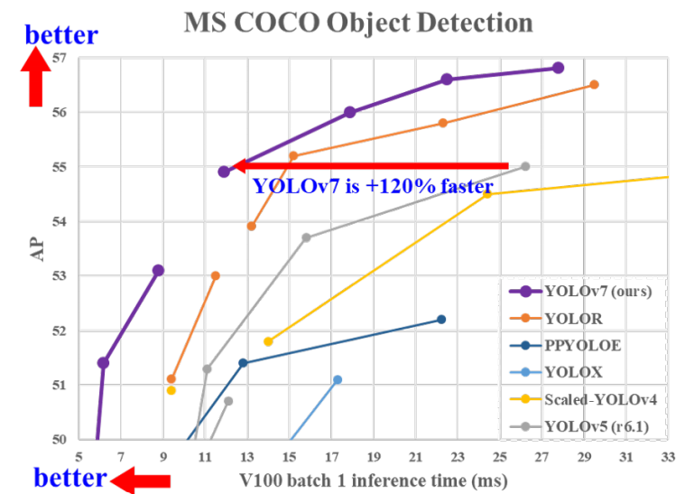

# YOLOv7: Trainable bag-of-freebies sets new state-of-the-art for real-time object detectors  
可训练的免费包为实时目标检测器刷新SOTA 原文：https://arxiv.org/abs/2207.02696

## 阅读笔记
* 模型缩放，基于级联的模型在缩放时会改边输入宽度
* E-ELAN, 扩展、洗牌、合并基数,使用组卷积来扩展计算块的通道和基数

## Abstract 摘要
YOLOv7 surpasses all known object detectors in both speed and accuracy in the range from 5 FPS to 160 FPS and has the highest accuracy 56.8% AP among all known real-time object detectors with 30 FPS or higher on GPU V100. YOLOv7-E6 object detector (56 FPS V100, 55.9% AP) outperforms both transformer-based detector **SWINL Cascade-Mask R-CNN** (9.2 FPS A100, 53.9% AP) by 509% in speed and 2% in accuracy, and convolutional-based detector **ConvNeXt-XL Cascade-Mask R-CNN** (8.6 FPS A100, 55.2% AP) by 551% in speed and 0.7% AP in accuracy, as well as YOLOv7 outperforms: YOLOR, YOLOX, Scaled-YOLOv4, YOLOv5, DETR, Deformable DETR, DINO-5scale-R50, ViT-Adapter-B and many other object detectors in speed and accuracy. Moreover, we train YOLOv7 only on MS COCO dataset from scratch without using any other datasets or pre-trained weights. Source code is released in https://github.com/WongKinYiu/yolov7

YOLOv7在5~160FPS范围内的速度和精度都超过了所有已知的目标检测器，在GPU V100上30+FPS的准确度56.8% AP，超过了已知实时目标检测器。YOLOv7-E6目标检测器(56FPS V100，55.9% AP)在速度和精度上均优于transformer型检测器 SWINL Cascade-Mask R-CNN(9.2FPS A100，53.9% AP)509%和2%，卷积型检测器ConvNeXt-XL Cascade-Mask R-CNN(8.6FPS A100，55.2% AP)551%和0.7% AP，YOLOv7的性能优于：YOLOR、YOLOX、Scaled-YOLOv-4、YOLOv5、DETR、可变形DETR、DINO-5scale-R50、ViT-Adapter-B和许多其他目标检测器的速度和精度。此外，我们只在MS COCO数据集上从头开始训练YOLOv7，而不使用任何其他数据集或预先训练的权重。源代码发布于 https://github.com/WongKinYiu/yolov7 

 
Figure 1: Comparison with other real-time object detectors, our proposed methods achieve state-of-the-arts performance. 
图1：与其他实时目标检测器相比，我们提出的方法达到了SOTA性能。

## 1. Introduction 介绍
Real-time object detection is a very important topic in computer vision, as it is often a necessary component in computer vision systems. For example, multi-object tracking [94, 93], autonomous driving [40, 18], robotics [35, 58], medical image analysis [34, 46], etc. The computing devices that execute real-time object detection is usually some mobile CPU or GPU, as well as various neural processing units (NPU) developed by major manufacturers. For example, the Apple neural engine (Apple), the neural compute stick (Intel), Jetson AI edge devices (Nvidia), the edge TPU (Google), the neural processing engine (Qualcomm), the AI processing unit (MediaTek), and the AI SoCs (Kneron), are all NPUs. Some of the above mentioned edge devices focus on speeding up different operations such as vanilla convolution, depth-wise convolution, or MLP operations. In this paper, the real-time object detector we proposed mainly hopes that it can support both mobile GPU and GPU devices from the edge to the cloud.

实时目标检测是计算机视觉中一个非常重要的课题，因为它通常是计算机视觉系统中的一个必要组成部分。例如，多目标跟踪[94，93]、自动驾驶[40，18]、机器人学[35，58]、医学图像分析[34，46]等。执行实时目标检测的计算设备通常是一些移动CPU或GPU，以及由主要制造商开发的各种神经处理单元(NPU)。例如，Apple神经引擎(Apple)、神经计算棒(Intel)、Jetson AI边缘设备(Nvidia)、边缘TPU(Google)、神经处理引擎(Qualcomm)、AI处理单元(MediaTek)和AI SoC(Kneron)都是NPU。上面提到的一些边缘设备侧重于加速不同的操作，例如普通卷积、深度卷积或MLP操作。本文中，我们提出的实时目标检测器主要希望它能够同时支持从边缘到云的移动GPU和GPU设备。

In recent years, the real-time object detector is still developed for different edge device. For example, the development of MCUNet [49, 48] and NanoDet [54] focused on producing low-power single-chip and improving the inference speed on edge CPU. As for methods such as YOLOX [21] and YOLOR [81], they focus on improving the inference speed of various GPUs. More recently, the development of real-time object detector has focused on the design of efficient architecture. As for real-time object detectors that can be used on CPU [54, 88, 84, 83], their design is mostly based on MobileNet [28, 66, 27], ShuffleNet [92, 55], or GhostNet [25]. Another mainstream real-time object detectors are developed for GPU [81, 21, 97], they mostly use ResNet [26], DarkNet [63], or DLA [87], and then use the CSPNet [80] strategy to optimize the architecture. The development direction of the proposed methods in this paper are different from that of the current mainstream real-time object detectors. In addition to architecture optimization, our proposed methods will focus on the optimization of the training process. Our focus will be on some optimized modules and optimization methods which may strengthen the training cost for improving the accuracy of object detection, but without increasing the inference cost. We call the proposed modules and optimization methods trainable bag-of-freebies.

近年来，针对不同边缘设备仍在开发实时目标检测器。例如，MCUNet[49，48]和NanoDet[54]的开发重点是生产低功耗单片机和提高边缘CPU的推理速度。对于YOLOX[21]和YOLOR[81]等方法，他们专注于提高各种GPU的推理速度。最近，实时目标检测器的发展主要集中在高效架构的设计上。至于可以在CPU上使用的实时目标检测器[54、88、84、83]，它们的设计主要基于MobileNet[28、66、27]、ShuffleNet[92、55]或GhostNet[25]。另一种主流的实时目标检测器是为GPU开发的[81、21、97]，它们大多使用ResNet[26]、DarkNet[63]或DLA[87]，然后使用CSPNet[80]策略来优化架构。本文提出的方法的发展方向不同于目前主流的实时目标检测器。除了架构优化之外，我们提出的方法将侧重于训练过程的优化。我们将重点关注一些优化的模块和优化方法，这些模块和方法以提高训练成本的方式提高目标检测的准确性，但不会增加推理成本。我们将这些模块和优化方法称为可训练的免费包。

Recently, model re-parameterization [13, 12, 29] and dynamic label assignment [20, 17, 42] have become important topics in network training and object detection. Mainly after the above new concepts are proposed, the training of object detector evolves many new issues. In this paper, we will present some of the new issues we have discovered and devise effective methods to address them. For model re-parameterization, we analyze the model re-parameterization strategies applicable to layers in different networks with the concept of gradient propagation path, and propose **planned re-parameterized model**. In addition, when we discover that with dynamic label assignment technology, the training of model with multiple output layers will generate new issues. That is: “How to assign dynamic targets for the outputs of different branches?” For this problem, we propose a new label assignment method called **coarse-to-fine lead guided label assignment**.

最近，模型重新参数化[13，12，29]和动态标签分配[20，17，42]已成为网络训练和目标检测中的重要课题。主要是在上述新概念提出之后，目标检测器的训练产生了许多新问题。在本文中，我们将介绍一些我们发现的新问题，并设计有效的方法来解决这些问题。对于模型重新参数化，我们使用梯度传播路径的概念分析了适用于不同网络层的模型重新参数化策略，并提出了计划的重新参数化模型。此外，当我们发现使用动态标签分配技术时，具有多个输出层的模型的训练将产生新的问题。即：如何为不同分支的输出分配动态目标？ 针对这个问题，我们提出了一种新的标签分配方法，称为从粗到细的引导标签分配。

The contributions of this paper are summarized as follows: 
(1) we design several trainable bag-of-freebies methods, so that real-time object detection can greatly improve the detection accuracy without increasing the inference cost; 
(2) for the evolution of object detection methods, we found two new issues, namely how re-parameterized module replaces original module, and how dynamic label assignment strategy deals with assignment to different output layers. In addition, we also propose methods to address the difficulties arising from these issues; 
(3) we propose “extend” and “compound scaling” methods for the real-time object detector that can effectively utilize parameters and computation;  
(4) the method we proposed can effectively reduce about 40% parameters and 50% computation of state-of-the-art real-time object detector, and has faster inference speed and higher detection accuracy.

本文的贡献总结如下：
1. 我们设计了几种可训练的免费包方法，使得实时目标检测可以在不增加推理成本的情况下大大提高检测精度; 
2. 对于目标检测方法的发展，我们发现了两个新的问题，即重新参数化的模块如何替换原始模块，以及动态标签分配策略如何处理对不同输出层的分配。此外，我们还提出了解决这些问题带来的困难的方法; 
3. 我们为实时目标检测器提出了“扩展”和“复合缩放”方法，可以有效地利用参数和计算; 
4. 我们提出的方法可以有效地减少现有实时目标检测器大约40%的参数和50%的计算量，并且具有更快的推理速度和更高的检测精度。

## 2. Related work 相关工作
### 2.1. Real-time object detectors  实时目标检测器
Currently state-of-the-art real-time object detectors are mainly based on YOLO [61, 62, 63] and FCOS [76, 77], which are [3, 79, 81, 21, 54, 85, 23]. Being able to become a state-of-the-art real-time object detector usually requires the following characteristics: (1) a faster and stronger network architecture; (2) a more effective feature integration method [22, 97, 37, 74, 59, 30, 9, 45]; (3) a more accurate detection method [76, 77, 69]; (4) a more robust loss function [96, 64, 6, 56, 95, 57]; (5) a more efficient label assignment method [99, 20, 17, 82, 42]; and (6) a more efficient training method. In this paper, we do not intend to explore self-supervised learning or knowledge distillation methods that require additional data or large model. Instead, we will design new trainable bag-of-freebies method for the issues derived from the state-of-the-art methods associated with (4), (5), and (6) mentioned above.

目前SOTA实时目标检测器主要基于YOLO[61、62、63]和FCOS[76、77]，分别是[3、79、81、21、54、85、23]。要成为SOTA实时目标检测器，通常需要以下特征：
1. 更快、更强的网络架构; 
2. 更有效的特征集成方法[22,97,37,74,59,30,9,45]; 
3. 更精确的检测方法[76,77,69]; 
4. 更稳健的损失函数[96，64，6，56，95，57]; 
5. 更有效的标签分配方法[99，20，17，82，42]; 
6. 更有效的训练方法。

在本文中，我们不打算探索需要额外数据或大型模型的自监督学习或知识蒸馏方法。相反，我们将为上述4、5、6相关的SOTA方法衍生的问题设计了新的BoF方法。

### 2.2. Model re-parameterization 模型重新参数化
Model re-parametrization techniques [71, 31, 75, 19, 33, 11, 4, 24, 13, 12, 10, 29, 14, 78] merge multiple computational modules into one at inference stage. The model re-parameterization technique can be regarded as an ensemble technique, and we can divide it into two categories, i.e., module-level ensemble and model-level ensemble. There are two common practices for model-level re-parameterization to obtain the final inference model. One is to train multiple identical models with different training data, and then average the weights of multiple trained models. The other is to perform a weighted average of the weights of models at different iteration number. Modulelevel re-parameterization is a more popular research issue recently. This type of method splits a module into multiple identical or different module branches during training and integrates multiple branched modules into a completely equivalent module during inference. However, not all proposed re-parameterized module can be perfectly applied to different architectures. With this in mind, we have developed new re-parameterization module and designed related application strategies for various architectures.

模型重新参数化技术[71、31、75、19、33、11、4、24、13、12、10、29、14、78]在推理阶段将多个计算模块合并为一个。模型重新参数化技术可以看作是一种集成技术，我们可以将其分为两类，即模块级集成和模型级集成。模型级重新参数化有两种常见的做法，以获得最终的推理模型。
1. 用不同的训练数据训练多个相同的模型，然后平均多个训练模型的权重。
2. 对不同迭代次数下的模型权重进行加权平均。

模块级重参数化是近年来比较热门的研究课题。这种方法在训练期间将一个模块拆分为多个相同或不同的模块分支，并在推理期间将多个分支模块整合为完全等效的模块。然而，并非所有提出的重新参数化模块都能完美地应用于不同的架构。有鉴于此，我们开发了新的重新参数化模块，并为各种架构设计了相关的应用策略。

### 2.3. Model scaling 模型缩放
Model scaling [72, 60, 74, 73, 15, 16, 2, 51] is a way to scale up or down an already designed model and make it fit in different computing devices. The model scaling method usually uses different scaling factors, such as resolution (size of input image), depth (number of layer), width (number of channel), and stage (number of feature pyramid), so as to achieve a good trade-off for the amount of network parameters, computation, inference speed, and accuracy. Network architecture search (NAS) is one of the commonly used model scaling methods. NAS can automatically search for suitable scaling factors from search space without defining too complicated rules. The disadvantage of NAS is that it requires very expensive computation to complete the search for model scaling factors. In [15], the researcher analyzes the relationship between scaling factors and the amount of parameters and operations, trying to directly estimate some rules, and thereby obtain the scaling factors required by model scaling. Checking the literature, we found that almost all model scaling methods analyze individual scaling factor independently, and even the methods in the compound scaling category also optimized scaling factor independently. The reason for this is because most popular NAS architectures deal with scaling factors that are not very correlated. We observed that all concatenation-based models, such as DenseNet [32] or VoVNet [39], will change the input width of some layers when the depth of such models is scaled. Since the proposed architecture is concatenation-based, we have to design a new compound scaling method for this model.

模型缩放[72、60、74、73、15、16、2、51]是一种放大或缩小已设计模型并使其适合不同计算设备的方法。模型缩放方法通常使用不同的缩放因子，例如分辨率(输入图像的大小)、深度(层数)、宽度(通道数)和阶段(特征金字塔数)，以便在网络参数的数量、计算、推理速度和精度方面取得良好的平衡。网络架构搜索(NAS)是常用的模型缩放方法之一。NAS可以从搜索空间自动搜索合适的缩放因子，而无需定义太复杂的规则。NAS的缺点是，它需要非常昂贵的计算来完成模型缩放因子的搜索。在[15]中，研究人员分析了缩放因子与参数和运算量之间的关系，试图直接估计一些规则，从而获得模型缩放所需的缩放因子。查阅文献，我们发现几乎所有模型缩放方法都独立分析单个缩放因子，甚至复合缩放类别中的方法也独立优化缩放因子。这是因为大多数流行的NAS架构都处理不太相关的扩展因素。我们观察到，所有基于级联的模型，如DenseNet[32]或VoVNet[39]，在缩放这些模型的深度时，都会改变某些层的输入宽度。由于所提出的架构是基于级联的，因此我们必须为该模型设计一种新的复合缩放方法。

## 3. Architecture 架构
### 3.1. Extended efficient layer aggregation networks 扩展的高效层聚合网络
In most of the literature on designing the efficient architectures, the main considerations are no more than the number of parameters, the amount of computation, and the computational density. Starting from the characteristics of memory access cost, Ma et al. [55] also analyzed the influence of the input/output channel ratio, the number of branches of the architecture, and the element-wise operation on the network inference speed. Dollar et al. [15] additionally considered activation when performing model scaling, that is, to put more consideration on the number of elements in the output tensors of convolutional layers. The design of CSPVoVNet [79] in Figure 2 (b) is a variation of VoVNet [39]. In addition to considering the aforementioned basic designing concerns, the architecture of CSPVoVNet [79] also analyzes the gradient path, in order to enable the weights of different layers to learn more diverse features. The gradient analysis approach described above makes inferences faster and more accurate. ELAN [1] in Figure 2 (c) considers the following design strategy – “How to design an efficient network?.” They came out with a conclusion: By controlling the longest shortest gradient path, a deeper network can learn and converge effectively. In this paper, we propose Extended-ELAN (E-ELAN) based on ELAN and its main architecture is shown in Figure 2 (d).

在大多数关于设计高效架构的文献中，主要考虑的因素不超过参数量、计算量和计算密度。从内存访问成本的特点出发，Maet al [55]还分析了输入/输出通道比率、架构的分支数和元素操作对网络推理速度的影响。Dollaret al [15]在执行模型缩放时还考虑了激活，即更多地考虑卷积层输出张量中的元素数量。图2(b)中CSPVoVNet[79]的设计是VoVNet[39]的变体。除了考虑上述基本设计问题外，CSPVoVNet[79]的架构还分析了梯度路径，以使不同层的权重能够学习更多不同的特征。上述梯度分析方法使推断更快、更准确。图2(c)中的ELAN[1]考虑了以下设计策略——“如何设计高效网络？”。他们得出了一个结论：通过控制最长最短梯度路径，更深的网络可以有效地学习和收敛。本文提出了基于ELAN的扩展ELAN(E-ELAN)，其主要架构如图2(d)所示。

 
Figure 2: Extended efficient layer aggregation networks. The proposed extended ELAN (E-ELAN) does not change the gradient transmission path of the original architecture at all, but use group convolution to increase the cardinality of the added features, and combine the features of different groups in a shuffle and merge cardinality manner. This way of operation can enhance the features learned by different feature maps and improve the use of parameters and calculations.

图2：扩展的高效层聚合网络。提出的扩展ELAN(E-ELAN)并没有改变原有架构的梯度传输路径，而是使用组卷积来增加所添加特征的基数，并以洗牌和合并基数的方式组合不同组的特征。这种操作方式可以增强不同特征图所学习的特征，并改进参数和计算的使用。

Regardless of the gradient path length and the stacking number of computational blocks in large-scale ELAN, it has reached a stable state. If more computational blocks are stacked unlimitedly, this stable state may be destroyed, and the parameter utilization rate will decrease. The proposed E-ELAN uses expand, shuffle, merge cardinality to achieve the ability to continuously enhance the learning ability of the network without destroying the original gradient path. In terms of architecture, E-ELAN only changes the architecture in computational block, while the architecture of transition layer is completely unchanged. Our strategy is to use group convolution to expand the channel and cardinality of computational blocks. We will apply the same group parameter and channel multiplier to all the computational blocks of a computational layer. Then, the feature map calculated by each computational block will be shuffled into g groups according to the set group parameter g, and then concatenate them together. At this time, the number of channels in each group of feature map will be the same as the number of channels in the original architecture. Finally, we add g groups of feature maps to perform merge cardinality. In addition to maintaining the original ELAN design architecture, E-ELAN can also guide different groups of computational blocks to learn more diverse features.

在大规模ELAN中，无论梯度路径长度和计算块的堆叠数量如何，它都已达到稳定状态。如果无限制地堆叠更多的计算块，则可能会破坏这种稳定状态，并且参数利用率会降低。提出的E-ELAN使用扩展、洗牌、合并基数来实现在不破坏原有梯度路径的情况下不断增强网络学习能力的能力。在架构方面，E-ELAN只改变了计算块中的架构，而转换层的架构完全没有改变。我们的策略是使用组卷积来扩展计算块的通道和基数。我们将对计算层的所有计算块应用相同的组参数和信道乘数。然后，根据集合组参数g将每个计算块计算出的特征图重新组合成g组，然后将它们连接在一起。此时，每组功能图中的通道数将与原始架构中的通道数目相同。最后，我们添加g组特征图以执行合并基数。除了保持原来的ELAN设计架构外，E-ELAN还可以指导不同组的计算块学习更多不同的功能。

### 3.2. Model scaling for concatenation-based models 基于级联的模型的模型缩放
The main purpose of model scaling is to adjust some attributes of the model and generate models of different scales to meet the needs of different inference speeds. For example the scaling model of EfficientNet [72] considers the width, depth, and resolution. As for the scaled-YOLOv4 [79], its scaling model is to adjust the number of stages. In [15], Dollar et al. analyzed the influence of vanilla convolution and group convolution on the amount of parameter and computation when performing width and depth scaling, and used this to design the corresponding model scaling method.

模型缩放的主要目的是调整模型的某些属性，生成不同比例的模型，以满足不同推理速度的需要。例如，EfficientNet[72]的缩放模型考虑了宽度、深度和分辨率。对于scaled-YOLOv4[79]，其缩放模型是调整阶段(stages)数。在[15]中，Dollaret al 分析了在执行宽度和深度缩放时，普通卷积和组卷积对参数量和计算的影响，并以此设计了相应的模型缩放方法。

The above methods are mainly used in architectures such as PlainNet or ResNet. When these architectures are in executing scaling up or scaling down, the in-degree and out-degree of each layer will not change, so we can independently analyze the impact of each scaling factor on the amount of parameters and computation. However, if these methods are applied to the concatenation-based architecture, we will find that when scaling up or scaling down is performed on depth, the in-degree of a translation layer which is immediately after a concatenation-based computational block will decrease or increase, as shown in Figure 3 (a) and (b).

上述方法主要用于PlainNet或ResNet等架构。当这些架构在执行放大或缩小时，每个层的输入度和输出度都不会改变，因此我们可以独立分析每个缩放因子对参数和计算量的影响。然而，如果将这些方法应用于基于级联的架构，我们会发现，当对深度执行放大或缩小时，紧随基于级联的计算块之后的转换层的放大程度将减小或增大，如图3(a)和(b)所示。

 
Figure 3: Model scaling for concatenation-based models. From (a) to (b), we observe that when depth scaling is performed on concatenation-based models, the output width of a computational block also increases. This phenomenon will cause the input width of the subsequent transmission layer to increase. Therefore, we propose (c), that is, when performing model scaling on concatenationbased models, only the depth in a computational block needs to be scaled, and the remaining of transmission layer is performed with corresponding width scaling.

图3：基于级联的模型的模型缩放。从(a)到(b)，我们观察到当对基于级联的模型执行深度缩放时，计算块的输出宽度也会增加。这种现象将导致后续传输层的输入宽度增加。因此，我们建议(c)，即在基于级联的模型上执行模型缩放时，只需要缩放计算块中的深度，而传输层的其余部分则使用相应的宽度缩放。

It can be inferred from the above phenomenon that we cannot analyze different scaling factors separately for a concatenation-based model but must be considered together. Take scaling-up depth as an example, such an action will cause a ratio change between the input channel and output channel of a transition layer, which may lead to a decrease in the hardware usage of the model. Therefore, we must propose the corresponding compound model scaling method for a concatenation-based model. When we scale the depth factor of a computational block, we must also calculate the change of the output channel of that block. Then, we will perform width factor scaling with the same amount of change on the transition layers, and the result is shown in Figure 3 (c). Our proposed compound scaling method can maintain the properties that the model had at the initial design and maintains the optimal structure.

从上述现象可以推断，我们不能单独分析基于级联模型的不同比例因子，而必须一起考虑。以放大深度为例，这样的动作将导致转换层的输入通道和输出通道之间的比率变化，这可能导致模型的硬件使用率下降。因此，我们必须为基于级联的模型提出相应的复合模型缩放方法。当我们缩放计算块的深度因子时，我们还必须计算该块的输出通道的变化。然后，我们将在转换层上以相同的变化量执行宽度因子缩放，结果如图3(c)所示。我们提出的复合缩放方法可以保持模型在初始设计时的特性，并保持最佳结构。

## 4. Trainable bag-of-freebies 可训练的免费包
### 4.1. Planned re-parameterized convolution 计划的重新参数化卷积
Although RepConv [13] has achieved excellent performance on the VGG [68], when we directly apply it to ResNet [26] and DenseNet [32] and other architectures, its accuracy will be significantly reduced. We use gradient flow propagation paths to analyze how re-parameterized convolution should be combined with different network. We also designed planned re-parameterized convolution accordingly.

尽管RepConv[13]在VGG[68]上取得了优异的性能，但当我们将其直接应用于ResNet[26]和DenseNet[32]及其他架构时，其准确性将大大降低。我们使用梯度流传播路径来分析如何将重新参数化的卷积与不同的网络相结合。我们还相应地设计了计划的重新参数化卷积。

RepConv actually combines 3×3 convolution, 1×1 convolution, and identity connection in one convolutional layer. After analyzing the combination and corresponding performance of RepConv and different architectures, we find that the identity connection in RepConv destroys the residual in ResNet and the concatenation in DenseNet, which provides more diversity of gradients for different feature maps. For the above reasons, we use RepConv without identity connection (RepConvN) to design the architecture of planned re-parameterized convolution. In our thinking, when a convolutional layer with residual or concatenation is replaced by re-parameterized convolution, there should be no identity connection. Figure 4 shows an example of our designed “planned re-parameterized convolution” used in PlainNet and ResNet. As for the complete planned re-parameterized convolution experiment in residual-based model and concatenation-based model, it will be presented in the ablation study session.

RepConv实际上在一个卷积层中组合了3×3卷积、1×1卷积和恒等连接。在分析了RepConv与不同架构的组合及其相应性能后，我们发现RepConv中的恒等连接破坏了ResNet中的残差和DenseNet的级联，从而为不同的特征图提供了更多的梯度多样性。基于以上原因，我们使用无恒等连接的RepConv(RepConvN)来设计计划的重新参数化卷积的架构。在我们看来，当具有残差或级联的卷积层被重新参数化的卷积所取代时，应该没有恒等连接。图4显示了我们设计的用于PlainNet和ResNet的“计划重新参数化卷积”的样本。至于残差模型和级联模型中完整的计划重新参数化卷积实验，将在消融研究一节中介绍。

 
Figure 4: **planned re-parameterized model**. In the proposed **planned re-parameterized model**, we found that a layer with residual or concatenation connections, its RepConv should not have identity connection. Under these circumstances, it can be replaced by RepConvN that contains no identity connections.

图4：计划的重新参数化模型。在提出的计划重新参数化模型中，我们发现具有残差连接或级联连接的层，其RepConv不应具有恒等连接。在这些情况下，它可以替换为不包含恒等连接的RepConvN。

### 4.2. Coarse for auxiliary and fine for lead loss 粗用于辅助，细用于引导损失
Deep supervision [38] is a technique that is often used in training deep networks. Its main concept is to add extra auxiliary head in the middle layers of the network, and the shallow network weights with assistant loss as the guide. Even for architectures such as ResNet [26] and DenseNet [32] which usually converge well, deep supervision [70, 98, 67, 47, 82, 65, 86, 50] can still significantly improve the performance of the model on many tasks. Figure 5 (a) and (b) show, respectively, the object detector architecture “without” and “with” deep supervision. In this paper, we call the head responsible for the final output as the lead head, and the head used to assist training is called auxiliary head.

深度监督[38]是一种常用于训练深度网络的技术。其主要概念是在网络的中间层添加额外的辅助头，并以辅助损失为导向的浅层网络权重。即使对于ResNet[26]和DenseNet[32]等通常收敛良好的架构，深度监督[70、98、67、47、82、65、86、50]仍然可以显著提高模型在许多任务上的性能。图5(a)和(b)分别显示了“无”和“有”深度监控的目标检测器架构。在本文中，我们将负责最终输出的头称为引导头，而用于辅助训练的头则称为辅助头。

 
Figure 5: Coarse for auxiliary and fine for lead head label assigner. Compare with normal model (a), the schema in (b) has auxiliary head. Different from the usual independent label assigner (c), we propose (d) lead head guided label assigner and (e) coarse-to-fine lead head guided label assigner. The proposed label assigner is optimized by lead head prediction and the ground truth to get the labels of training lead head and auxiliary head at the same time. The detailed coarse-to-fine implementation method and constraint design details will be elaborated in Apendix.

图5：粗略表示辅助，精细表示引导头标签分配器。与正常模型(a)相比，(b)中的模式具有辅助中心。与通常的独立标签分配器 (c) 不同，我们提出 (d) 引导头引导标签分配器和 (e) 粗到细引导头引导标签分配器。 所提出的标签分配器通过引导头预测和真实值进行优化，以同时获得训练引导头和辅助头的标签。 详细的从粗到细的实现方法和约束设计细节将在附录中详述。

Next we want to discuss the issue of label assignment. In the past, in the training of deep network, label assignment usually refers directly to the ground truth and generate hard label according to the given rules. However, in recent years, if we take object detection as an example, researchers often use the quality and distribution of prediction output by the network, and then consider together with the ground truth to use some calculation and optimization methods to generate a reliable soft label [61, 8, 36, 99, 91, 44, 43, 90, 20, 17, 42]. For example, YOLO [61] use IoU of prediction of bounding box regression and ground truth as the soft label of objectness. In this paper, we call the mechanism that considers the network prediction results together with the ground truth and then assigns soft labels as “label assigner.”

接下来，我们要讨论标签分配问题。过去，在深度网络的训练中，标签分配通常直接指真实值，并根据给定的规则生成硬标签。然而，近年来，如果我们以目标检测为例，研究人员经常使用网络预测输出的质量和分布，然后结合实际情况考虑使用一些计算和优化方法来生成可靠的软标签[61、8、36、99、91、44、43、90、20、17、42]。例如，YOLO[61]使用边界框回归预测的IoU和真实值作为目标的软标签。在本文中，我们将这种机制称为“标签分配器”，它将网络预测结果与真实值结合起来，然后分配软标签.

Deep supervision needs to be trained on the target objectives regardless of the circumstances of auxiliary head or lead head. During the development of soft label assigner related techniques, we accidentally discovered a new derivative issue, i.e., “How to assign soft label to auxiliary head and lead head ?” To the best of our knowledge, the relevant literature has not explored this issue so far. The results of the most popular method at present is as shown in Figure 5 (c), which is to separate auxiliary head and lead head, and then use their own prediction results and the ground truth to execute label assignment. The method proposed in this paper is a new label assignment method that guides both auxiliary head and lead head by the lead head prediction. In other words, we use lead head prediction as guidance to generate coarse-to-fine hierarchical labels, which are used for auxiliary head and lead head learning, respectively. The two proposed deep supervision label assignment strategies are shown in Figure 5 (d) and (e), respectively.

无论辅助头或引导头的情况如何，都需要对目标目标进行深度监督训练。在开发软标签分配相关技术的过程中，我们意外地发现了一个新的衍生问题，即“如何将软标签分配给辅助头和引导头”？ 据我们所知，迄今为止，相关文献尚未探讨这个问题。目前最流行的方法的结果如图5(c)所示，即分离辅助头和引导头，然后使用各自的预测结果和真实值来执行标签分配。本文提出的方法是一种新的标签分配方法，通过引导头预测指导辅助头和引导头。换句话说，我们使用引导头预测作为指导，生成从粗到细的层次标签，分别用于辅助头和引导头学习。图5(d)和(e)分别显示了两种提议的深度监管标签分配策略。

Lead head guided label assigner is mainly calculated based on the prediction result of the lead head and the ground truth, and generate soft label through the optimization process. This set of soft labels will be used as the target training model for both auxiliary head and lead head. The reason to do this is because lead head has a relatively strong learning capability, so the soft label generated from it should be more representative of the distribution and correlation between the source data and the target. Furthermore, we can view such learning as a kind of generalized residual learning. By letting the shallower auxiliary head directly learn the information that lead head has learned, lead head will be more able to focus on learning residual information that has not yet been learned.

引导头引导标签分配器主要根据引导头的预测结果和真实值进行计算，并通过优化过程生成软标签。这组软标签将用作辅助头和引导头的目标训练模型。这样做的原因是因为潜在客户具有相对较强的学习能力，因此从中生成的软标签应该更能代表源数据和目标数据之间的分布和相关性。此外，我们可以将这种学习视为一种广义残差学习。通过让较浅的辅助头直接学习引导头已经学习的信息，引导头将能够更专注于学习尚未学习的残差信息。

Coarse-to-fine lead head guided label assigner also used the predicted result of the lead head and the ground truth to generate soft label. However, in the process we generate two different sets of soft label, i.e., coarse label and fine label, where fine label is the same as the soft label generated by lead head guided label assigner, and coarse label is generated by allowing more grids to be treated as positive target by relaxing the constraints of the positive sample assignment process. The reason for this is that the learning ability of an auxiliary head is not as strong as that of a lead head, and in order to avoid losing the information that needs to be learned, we will focus on optimizing the recall of auxiliary head in the object detection task. As for the output of lead head, we can filter the high precision results from the high recall results as the final output. However, we must note that if the additional weight of coarse label is close to that of fine label, it may produce bad prior at final prediction. Therefore, in order to make those extra coarse positive grids have less impact, we put restrictions in the decoder, so that the extra coarse positive grids cannot produce soft label perfectly. The mechanism mentioned above allows the importance of fine label and coarse label to be dynamically adjusted during the learning process, and makes the optimizable upper bound of fine label always higher than coarse label.

由粗到细引导头引导标签分配器还使用引导头的预测结果和真实值来生成软标签。然而，在这个过程中，我们生成了两组不同的软标签，即粗标签和细标签，其中细标签与引导头引导标签分配器生成的软标签相同，粗标签是通过放松正样本分配过程的约束，允许更多网格被视为阳性目标而生成的。这是因为辅助头的学习能力不如引导头强，为了避免丢失需要学习的信息，我们将在目标检测任务中重点优化辅助头的召回。对于引导头的输出，我们可以从高召回结果中过滤出高精度结果作为最终输出。然而，我们必须注意，如果粗标签的附加权重接近细标签的附加权重，那么在最终预测之前可能会产生不良后果。因此，为了使这些超粗的正网格具有较小的影响，我们在解码器中设置了限制，使得超粗的正网格不能完美地生成软标签。上述机制允许在学习过程中动态调整精细标签和粗糙标签的重要性，并使精细标签的优化上限始终高于粗糙标签。

表1：与基线目标检测器的比较。

### 4.3. Other trainable bag-of-freebies 其他可训练的免费包
In this section we will list some trainable bag-offreebies. These freebies are some of the tricks we used in training, but the original concepts were not proposed by us. The training details of these freebies will be elaborated in the Appendix, including (1) Batch normalization in conv-bn-activation topology: This part mainly connects batch normalization layer directly to convolutional layer. The purpose of this is to integrate the mean and variance of batch normalization into the bias and weight of convolutional layer at the inference stage. (2) Implicit knowledge in YOLOR [81] combined with convolution feature map in addition and multiplication manner: Implicit knowledge in YOLOR can be simplified to a vector by pre-computing at the inference stage. This vector can be combined with the bias and weight of the previous or subsequent convolutional layer. (3) EMA model: EMA is a technique used in mean teacher [75], and in our system we use EMA model purely as the final inference model.

在本节中，我们将列出一些可训练的免费包。这些免费包是我们在训练中使用的一些技巧，但最初的概念并不是我们提出的。这些免费包的训练细节将在附录中详细说明，包括：
1. conv-bn-activation拓扑中的批归一化：这部分主要将批归一化层直接连接到卷积层。其目的是在推理阶段将批归一化的均值和方差集成到卷积层的偏差和权重中。
2. YOLOR[81]中的隐式知识与卷积特征图的加法和乘法相结合：在推理阶段，可以通过预计算将YOLOR中的隐性知识简化为向量。该矢量可以与前一或后一卷积层的偏移和权重相结合。
3. EMA模型：EMA是平均教师使用的一种技术[75]，在我们的系统中，我们仅使用EMA模型作为最终推理模型。

表2：与SOTA实时目标检测器对比

## 5. Experiments 实验
### 5.1. Experimental setup 实验设置
We use Microsoft COCO dataset to conduct experiments and validate our object detection method. All our experiments did not use pre-trained models. That is, all models were trained from scratch. During the development process, we used train 2017 set for training, and then used val 2017 set for verification and choosing hyperparameters. Finally, we show the performance of object detection on the test 2017 set and compare it with the state-of-the-art object detection algorithms. Detailed training parameter settings are described in Appendix.

我们使用Microsoft COCO数据集进行实验，并验证我们的目标检测方法。我们的所有实验都没有使用预先训练过的模型。即,所有模型都是从头开始训练的。在开发过程中，我们使用2017年训练集进行训练，然后使用2017年val集进行验证和选择超参数。最后，我们展示了2017测试集上的目标检测性能，并将其与SOTA目标检测算法进行了比较。详细的训练参数设置见附录。

We designed basic model for edge GPU, normal GPU, and cloud GPU, and they are respectively called YOLOv7tiny, YOLOv7, and YOLOv7-W6. At the same time, we also use basic model for model scaling for different service requirements and get different types of models. For YOLOv7, we do stack scaling on neck, and use the proposed compound scaling method to perform scaling-up of the depth and width of the entire model, and use this to obtain YOLOv7-X. As for YOLOv7-W6, we use the newly proposed compound scaling method to obtain YOLOv7-E6 and YOLOv7-D6. In addition, we use the proposed EELAN for YOLOv7-E6, and thereby complete YOLOv7-E6E. Since YOLOv7-tiny is an edge GPU-oriented architecture, it will use leaky ReLU as activation function. As for other models we use SiLU as activation function. We will describe the scaling factor of each model in detail in Appendix.

我们为边缘GPU、普通GPU和云GPU设计了基本模型，分别称为YOLOv7-tiny、YOLOv7和YOLOv-W6。同时，我们还针对不同的服务需求使用基本模型进行模型缩放，得到不同类型的模型。对于YOLOv7，我们在颈部进行叠加缩放，并使用提出的复合缩放方法来缩放整个模型的深度和宽度，并使用该方法来获得YOLOv7-X。对于YOLOv7-W6，我们使用新提出的复合缩放方法来获得YOLOv7-E6和YOLOv-D6。此外，我们对YOLOv7-E6使用提出的E-ELAN，从而完成YOLOv7-E6E。由于YOLOv7 tiny是一种面向边缘GPU的架构，它将使用leaky ReLU作为激活函数。对于其他模型，我们使用SiLU作为激活函数。我们将在附录中详细描述每个模型的比例因子。

### 5.2. Baselines 基线
We choose previous version of YOLO [3, 79] and stateof-the-art object detector YOLOR [81] as our baselines. Table 1 shows the comparison of our proposed YOLOv7 models and those baseline that are trained with the same settings.

我们选择先前版本的YOLO[3]9]和SOTA目标检测器YOLOR[81]作为基线。表1显示了我们提出的YOLOv7模型与使用相同设置训练的基线的比较。

From the results we see that if compared with YOLOv4, YOLOv7 has 75% less parameters, 36% less computation, and brings 1.5% higher AP. If compared with state-of-theart YOLOR-CSP, YOLOv7 has 43% fewer parameters, 15% less computation, and 0.4% higher AP. In the performance of tiny model, compared with YOLOv4-tiny-31, YOLOv7tiny reduces the number of parameters by 39% and the amount of computation by 49%, but maintains the same AP. On the cloud GPU model, our model can still have a higher AP while reducing the number of parameters by 19% and the amount of computation by 33%.

从结果中我们可以看到，如果与YOLOv4相比，YOLOv7的参数少75%，计算量少36%，AP高1.5%。如果与SOTA YOLOR-CSP相比，YOLOv7的参数少43%，计算量少15%，AP高0.4%。在微型模型的性能上，与YOLOv4-tiny-31相比，YOLOv7-tiny减少了39%的参数数量和49%的计算量，但保持了相同的AP。在云GPU模型上，我们的模型仍然可以具有较高的AP，同时将参数数量减少19%，计算量减少33%。

### 5.3. Comparison with state-of-the-arts 与SOTA技术进行比较
We compare the proposed method with state-of-the-art object detectors for general GPUs and Mobile GPUs, and the results are shown in Table 2. From the results in Table 2 we know that the proposed method has the best speed-accuracy trade-off comprehensively. If we compare YOLOv7-tiny-SiLU with YOLOv5-N (r6.1), our method is 127 fps faster and 10.7% more accurate on AP. In addition, YOLOv7 has 51.4% AP at frame rate of 161 fps, while PPYOLOE-L with the same AP has only 78 fps frame rate. In terms of parameter usage, YOLOv7 is 41% less than PPYOLOE-L. If we compare YOLOv7-X with 114 fps inference speed to YOLOv5-L (r6.1) with 99 fps inference speed, YOLOv7-X can improve AP by 3.9%. If YOLOv7X is compared with YOLOv5-X (r6.1) of similar scale, the inference speed of YOLOv7-X is 31 fps faster. In addition, in terms of the amount of parameters and computation, YOLOv7-X reduces 22% of parameters and 8% of computation compared to YOLOv5-X (r6.1), but improves AP by 2.2%.

我们将所提出的方法与用于普通GPU和移动GPU的SOTA目标检测器进行了比较，结果如表2所示。从表2中的结果来看，我们知道所提出的算法具有最佳的速度精度综合权衡。如果我们比较YOLOv7微型SiLU和YOLOv5-N(r6.1)，我们的方法在AP上的速度是127fps，准确率是10.7%。此外，YOLOv7在161fps的帧速率下有51.4%的AP，而具有相同AP的PPYOLOE-L只有78fps的帧速率。在参数使用方面，YOLOv7比PPYOLOE-L低41%。如果我们将具有114fps参考速度的YOLOv7-X与具有99fps推断速度的YLOv5-L(r6.1)进行比较，则YOLOv7-X可以将AP提高3.9%。如果将YOLOv7-X与类似规模的YOLOv5-X(r6.1)进行比较，则YOLOv-X的推理速度会快31fps。此外，就参数和计算量而言，与YOLOv5-X(r6.1)相比，YOLOv7-X减少了22%的参数和8%的计算量，但AP提高了2.2%。

If we compare YOLOv7 with YOLOR using the input resolution 1280, the inference speed of YOLOv7-W6 is 8 fps faster than that of YOLOR-P6, and the detection rate is also increased by 1% AP. As for the comparison between YOLOv7-E6 and YOLOv5-X6 (r6.1), the former has 0.9% AP gain than the latter, 45% less parameters and 63% less computation, and the inference speed is increased by 47%. YOLOv7-D6 has close inference speed to YOLOR-E6, but improves AP by 0.8%. YOLOv7-E6E has close inference speed to YOLOR-D6, but improves AP by 0.3%.

如果使用输入分辨率1280将YOLOv7与YOLOR进行比较，则YOLOv7-W6的推理速度比YOLOR-P6快8fps，检测率也提高了1%AP。对于YOLOv7-E6和YOLOv5-X6(r6.1)的比较，前者的AP增益比后者低0.9%，参数少45%，计算量少63%，推理速度提高了47%。YOLOv7-D6的推理速度与YOLOR-E6相近，但AP提高了0.8%。YOLOv7-E6E的推理速度与YOLOR-D6相近，但AP提高了0.3%。

### 5.4. Ablation study 消融研究

#### 5.4.1 Proposed compound scaling method 复合缩放方法
Table 3 shows the results obtained when using different model scaling strategies for scaling up. Among them, our proposed compound scaling method is to scale up the depth of computational block by 1.5 times and the width of transition block by 1.25 times. If our method is compared with the method that only scaled up the width, our method can improve the AP by 0.5% with less parameters and amount of computation. If our method is compared with the method that only scales up the depth, our method only needs to increase the number of parameters by 2.9% and the amount of computation by 1.2%, which can improve the AP by 0.2%. It can be seen from the results of Table 3 that our proposed compound scaling strategy can utilize parameters and computation more efficiently.

表3显示了使用不同的模型缩放策略进行缩放时获得的结果。其中，我们提出的复合缩放方法是将计算块的深度放大1.5倍，将变换块的宽度放大1.25倍。如果将我们的方法与仅按比例放大宽度的方法进行比较，我们的方法可以用更少的参数和计算量将AP提高0.5%。如果我们的方法与只增加深度的方法相比，我们的方法只需将参数数量增加2.9%，计算量增加1.2%，即可将AP提高0.2%。从表3的结果可以看出，我们提出的复合缩放策略可以更有效地利用参数和计算。

#### 5.4.2 Proposed **planned re-parameterized model**  计划重新参数化模型
In order to verify the generality of our proposed planed re-parameterized model, we use it on concatenation-based model and residual-based model respectively for verification. The concatenation-based model and residual-based model we chose for verification are 3-stacked ELAN and CSPDarknet, respectively.

为了验证我们提出的计划重参数化模型的通用性，我们分别在基于级联的模型和基于残差的模型上使用它进行验证。我们选择用于验证的基于级联的模型和基于残差的模型分别是三层ELAN和CSPDarknet。

In the experiment of concatenation-based model, we replace the 3 × 3 convolutional layers in different positions in 3-stacked ELAN with RepConv, and the detailed configuration is shown in Figure 6. From the results shown in Table 4 we see that all higher AP values are present on our proposed **planned re-parameterized model**.

在基于级联模型的实验中，我们使用RepConv将3×3卷积层重新放置在三层ELAN中的不同位置，详细配置如图6所示。从表4所示的结果中，我们可以看到，我们提出的计划重新参数化模型中存在所有更高的AP值。

 
Figure 6: Planned RepConv 3-stacked ELAN. Blue circles are the position we replace Conv by RepConv.  计划RepConv 3层ELAN。蓝圈是我们用RepConv取代Conv的位置。

表4：计划RepConcationation模型的消融研究。

In the experiment dealing with residual-based model, since the original dark block does not have a 3 × 3 convolution block that conforms to our design strategy, we additionally design a reversed dark block for the experiment, whose architecture is shown in Figure 7. Since the CSPDarknet with dark block and reversed dark block has exactly the same amount of parameters and operations, it is fair to compare. The experiment results illustrated in Table 5 fully confirm that the proposed **planned re-parameterized model** is equally effective on residual-based model. We find that the design of RepCSPResNet [85] also fit our design pattern.

在处理基于残差模型的实验中，由于原始dark块没有符合我们设计策略的3×3卷积块，因此我们为实验设计了一个反向dark块，其结构如图7所示。由于带有dark块和反向dark块的CSP-Darknet具有完全相同的参数和操作量，比较是公平的。表5所示的实验结果充分证明，所提出的计划重新参数化模型对基于残差的模型同样有效。我们发现RepCSPResNet[85]的设计也符合我们的设计模式。

 
Figure 7: Reversed CSPDarknet. We reverse the position of 1 × 1 and 3 × 3 convolutional layer in dark block to fit our planned reparameterized model design strategy. 反向 CSPDarknet。 我们颠倒了dark块中 1×1 和 3×3 卷积层的位置，以适应我们计划的重新参数化模型设计策略。

表5：计划的 RepResidual 模型的消融研究。
 

 
Figure 8: Objectness map predicted by different methods at auxiliary head and lead head.
辅助头和引导头不同方法预测的物体图。

#### 5.4.3 Proposed assistant loss for auxiliary head 辅助头辅助损失
In the assistant loss for auxiliary head experiments, we compare the general independent label assignment for lead head and auxiliary head methods, and we also compare the two proposed lead guided label assignment methods. We show all comparison results in Table 6. From the results listed in Table 6, it is clear that any model that increases assistant loss can significantly improve the overall performance. In addition, our proposed lead guided label assignment strategy receives better performance than the general independent label assignment strategy in AP, AP50, and AP75. As for our proposed coarse for assistant and fine for lead label assignment strategy, it results in best results in all cases. In Figure 8 we show the objectness map predicted by different methods at auxiliary head and lead head. From Figure 8 we find that if auxiliary head learns lead guided soft label, it will indeed help lead head to extract the residual information from the consistant targets.

在辅助头的辅助损失实验中，我们比较了引导头和辅助头的一般独立标签分配方法，并比较了所提出的两种导联引导标签分配方法。我们在表6中显示了所有比较结果。从表6中列出的结果来看，很明显，任何增加辅助损失的模型都可以显著提高总体性能。此外，我们提出的引导标签分配策略在AP、AP50和AP75中的性能优于一般独立标签分配策略。至于我们提出的粗辅助和细辅助引导标签分配策略，在所有情况下都会得到最佳结果。在图8中，我们显示了通过不同方法在辅助头和引导头预测的目标图。从图8中我们发现，如果辅助头学习导联导联软标签，它将确实有助于引导头从一致目标中提取残差信息。

Table 6: 提议的辅助头的消融研究。

In Table 7 we further analyze the effect of the proposed **coarse-to-fine lead guided label assignment** method on the decoder of auxiliary head. That is, we compared the results of with/without the introduction of upper bound constraint. Judging from the numbers in the Table, the method of constraining the upper bound of objectness by the distance from the center of the object can achieve better performance.

在表7中，我们进一步分析了所提出的从粗到细导联引导标签分配方法对辅助头解码器的影响。即,我们比较了有、无上界约束的结果。从表中的数字来看，通过与目标中心的距离来限制目标上限的方法可以获得更好的性能。

表7：约束辅助头的消融研究

Since the proposed YOLOv7 uses multiple pyramids to jointly predict object detection results, we can directly connect auxiliary head to the pyramid in the middle layer for training. This type of training can make up for information that may be lost in the next level pyramid prediction. For the above reasons, we designed partial auxiliary head in the proposed E-ELAN architecture. Our approach is to connect auxiliary head after one of the sets of feature map before merging cardinality, and this connection can make the weight of the newly generated set of feature map not directly updated by assistant loss. Our design allows each pyramid of lead head to still get information from objects with different sizes. Table 8 shows the results obtained using two different methods, i.e., coarse-to-fine lead guided and partial coarse-to-fine lead guided methods. Obviously, the partial coarse-to-fine lead guided method has a better auxiliary effect.

由于提出的YOLOv7使用多个金字塔共同预测目标检测结果，我们可以直接将辅助头连接到中间层的金字塔进行训练。这种类型的训练可以弥补下一级金字塔预测中可能丢失的信息。基于以上原因，我们在提出的E-ELAN架构中设计了部分辅助头。我们的方法是在合并基数之前在一组特征图之后连接辅助头，这种连接会使新生成的特征图集的权重不被辅助损失直接更新。我们的设计允许每个引导头金字塔仍然可以从不同大小的物体中获取信息。表8显示了使用两种不同方法获得的结果，即粗到细引导头方法和部分粗到细的引导头引导方法。显然，部分粗-细导引法具有更好的辅助效果。

表8：部分辅助头的消融研究
 

## 6. Conclusions 结论
In this paper we propose a new architecture of realtime object detector and the corresponding model scaling method. Furthermore, we find that the evolving process of object detection methods generates new research topics. During the research process, we found the replacement problem of re-parameterized module and the allocation problem of dynamic label assignment. To solve the problem, we propose the trainable bag-of-freebies method to enhance the accuracy of object detection. Based on the above, we have developed the YOLOv7 series of object detection systems, which receives the state-of-the-art results.

本文提出了一种新的实时目标检测器架构和相应的模型缩放方法。此外，我们发现目标检测方法的发展过程产生了新的研究热点。在研究过程中，我们发现了重新参数化模块的替换问题和动态标签分配问题。为了解决这个问题，我们提出了可训练的免费包方法来提高目标检测的准确性。基于以上，我们开发了YOLOv7系列目标检测系统，获得了SOTA结果。

## 7. Acknowledgements 致谢
The authors wish to thank National Center for Highperformance Computing (NCHC) for providing computational and storage resources.

作者感谢国家高性能计算中心(NCHC)提供的计算和存储资源。

## 8. More comparison 更多比较
YOLOv7 surpasses all known object detectors in both speed and accuracy in the range from 5 FPS to 160 FPS and has the highest accuracy 56.8% AP test-dev / 56.8% AP min-val among all known real-time object detectors with 30 FPS or higher on GPU V100. YOLOv7-E6 object detector (56 FPS V100, 55.9% AP) outperforms both transformerbased detector SWIN-L Cascade-Mask R-CNN (9.2 FPS A100, 53.9% AP) by 509% in speed and 2% in accuracy,and convolutional-based detector ConvNeXt-XL CascadeMask R-CNN (8.6 FPS A100, 55.2% AP) by 551% in speed and 0.7% AP in accuracy, as well as YOLOv7 outperforms: YOLOR, YOLOX, Scaled-YOLOv4, YOLOv5, DETR, Deformable DETR, DINO-5scale-R50, ViT-Adapter-B and many other object detectors in speed and accuracy. More over, we train YOLOv7 only on MS COCO dataset from scratch without using any other datasets or pre-trained weights.

YOLOv7在5 FPS到160 FPS范围内的速度和精度都超过了所有已知的目标检测器，在GPU V100上具有30 FPS或更高速度的所有已知实时目标检测器中，具有56.8%AP测试偏差/56.8%AP最小值的最高精度。YOLOv7-E6目标检测器(56 FPS V100，55.9%AP)在速度和精度上均优于变压器型检测器SWIN-L级联掩码R-CNN(9.2 FPS A100，53.9%AP)509%和2%，卷积型检测器ConvNeXt XL级联掩码-RCNN(8.6 FPS A1 00，55.2%AP)551%和0.7%AP，YOLOv7的性能优于：YOLOR、YOLOX、Scaled-YOLOv-4、YOLOv5、DETR、，可变形的DETR、DINO-5scale-R50、ViT-Adapter-B和许多其他目标检测器的速度和精度。此外，我们只在MS COCO数据集上从头开始训练YOLOv7，而不使用任何其他数据集或预先训练的权重。

表9：更多比较(batch=1，no-TRT，没有额外的目标检测训练数据)

图9：与其他目标检测器的比较。
图10：与其他实时目标检测器的比较。

表-10：不同设置的比较
 

The maximum accuracy of the YOLOv7-E6E (56.8% AP) real-time model is +13.7% AP higher than the current most accurate meituan/YOLOv6-s model (43.1% AP) on COCO dataset. Our YOLOv7-tiny (35.2% AP, 0.4 ms) model is +25% faster and +0.2% AP higher than meituan/YOLOv6-n (35.0% AP, 0.5 ms) under identical conditions on COCO dataset and V100 GPU with batch=32.

YOLOv7-E6E(56.8% AP)实时模型在COCO数据集上的最大准确率比目前最准确的美团/YOLOv6-s模型(43.1% AP)高+13.7% AP。 在 COCO 数据集和 V100 GPU with batch= 的相同条件下，我们的 YOLOv7-tiny (35.2% AP, 0.4 ms) 模型比 meituan/YOLOv6-n (35.0% AP, 0.5 ms) 快 +25% 和 +0.2% AP 32.

图-11：与其他实时目标检测器的比较。

## References
1. anonymous. Designing network design strategies. anonymous submission, 2022. 3
2. Irwan Bello, William Fedus, Xianzhi Du, Ekin Dogus Cubuk, Aravind Srinivas, Tsung-Yi Lin, Jonathon Shlens, and Barret Zoph. Revisiting ResNets: Improved training and scaling strategies. Advances in Neural Information Processing Systems (NeurIPS), 34, 2021. 2
3. Alexey Bochkovskiy, Chien-Yao Wang, and HongYuan Mark Liao. YOLOv4: Optimal speed and accuracy of object detection. arXiv preprint arXiv:2004.10934, 2020. 2, 6, 7
4. Yue Cao, Thomas Andrew Geddes, Jean Yee Hwa Yang, and Pengyi Yang. Ensemble deep learning in bioinformatics. Nature Machine Intelligence, 2(9):500–508, 2020. 2
5. Nicolas Carion, Francisco Massa, Gabriel Synnaeve, Nicolas Usunier, Alexander Kirillov, and Sergey Zagoruyko. End-to-end object detection with transformers. In Proceedings of the European Conference on Computer Vision (ECCV), pages 213–229, 2020. 10
6. Kean Chen, Weiyao Lin, Jianguo Li, John See, Ji Wang, and Junni Zou. AP-loss for accurate one-stage object detection. IEEE Transactions on Pattern Analysis and Machine Intelligence (TPAMI), 43(11):3782–3798, 2020. 2
7. Zhe Chen, Yuchen Duan, Wenhai Wang, Junjun He, Tong Lu, Jifeng Dai, and Yu Qiao. Vision transformer adapter for dense predictions. arXiv preprint arXiv:2205.08534, 2022. 10
8. Jiwoong Choi, Dayoung Chun, Hyun Kim, and Hyuk-Jae Lee. Gaussian YOLOv3: An accurate and fast object detector using localization uncertainty for autonomous driving. In Proceedings of the IEEE/CVF International Conference on Computer Vision (ICCV), pages 502–511, 2019. 5
9. Xiyang Dai, Yinpeng Chen, Bin Xiao, Dongdong Chen, Mengchen Liu, Lu Yuan, and Lei Zhang. Dynamic head: Unifying object detection heads with attentions. In Proceedings of the IEEE/CVF Conference on Computer Vision and Pattern Recognition (CVPR), pages 7373–7382, 2021. 2
10. Xiaohan Ding, Honghao Chen, Xiangyu Zhang, Kaiqi Huang, Jungong Han, and Guiguang Ding. Reparameterizing your optimizers rather than architectures. arXiv preprint arXiv:2205.15242, 2022. 2
11. Xiaohan Ding, Yuchen Guo, Guiguang Ding, and Jungong Han. ACNet: Strengthening the kernel skeletons for powerful CNN via asymmetric convolution blocks. In Proceedings of the IEEE/CVF International Conference on Computer Vision (ICCV), pages 1911–1920, 2019. 2
12. Xiaohan Ding, Xiangyu Zhang, Jungong Han, and Guiguang Ding. Diverse branch block: Building a convolution as an inception-like unit. In Proceedings of the IEEE/CVF Conference on Computer Vision and Pattern Recognition (CVPR), pages 10886–10895, 2021. 2
13. Xiaohan Ding, Xiangyu Zhang, Ningning Ma, Jungong Han, Guiguang Ding, and Jian Sun. RepVGG: Making VGG-style convnets great again. In Proceedings of the IEEE/CVF Conference on Computer Vision and Pattern Recognition (CVPR), pages 13733–13742, 2021. 2, 4
14. Xiaohan Ding, Xiangyu Zhang, Yizhuang Zhou, Jungong Han, Guiguang Ding, and Jian Sun. Scaling up your kernels to 31x31: Revisiting large kernel design in CNNs. In Proceedings of the IEEE/CVF Conference on Computer Vision and Pattern Recognition (CVPR), 2022. 2
15. Piotr Doll´ar, Mannat Singh, and Ross Girshick. Fast and accurate model scaling. In Proceedings of the IEEE/CVF Conference on Computer Vision and Pattern Recognition (CVPR), pages 924–932, 2021. 2, 3
16. Xianzhi Du, Barret Zoph, Wei-Chih Hung, and Tsung-Yi Lin. Simple training strategies and model scaling for object detection. arXiv preprint arXiv:2107.00057, 2021. 2
17. Chengjian Feng, Yujie Zhong, Yu Gao, Matthew R Scott, and Weilin Huang. TOOD: Task-aligned one-stage object detection. In Proceedings of the IEEE/CVF International Conference on Computer Vision (ICCV), pages 3490–3499, 2021. 2, 5
18. Di Feng, Christian Haase-Sch¨utz, Lars Rosenbaum, Heinz Hertlein, Claudius Glaeser, Fabian Timm, Werner Wiesbeck, and Klaus Dietmayer. Deep multi-modal object detection and semantic segmentation for autonomous driving: Datasets, methods, and challenges. IEEE Transactions on Intelligent Transportation Systems, 22(3):1341– 1360, 2020. 1
19. Timur Garipov, Pavel Izmailov, Dmitrii Podoprikhin, Dmitry P Vetrov, and Andrew G Wilson. Loss surfaces, mode connectivity, and fast ensembling of DNNs. Advances in Neural Information Processing Systems (NeurIPS), 31, 2018. 2
20. Zheng Ge, Songtao Liu, Zeming Li, Osamu Yoshie, and Jian Sun. OTA: Optimal transport assignment for object detection. In Proceedings of the IEEE/CVF Conference on Computer Vision and Pattern Recognition (CVPR), pages 303–312, 2021. 2, 5
21. Zheng Ge, Songtao Liu, Feng Wang, Zeming Li, and Jian Sun. YOLOX: Exceeding YOLO series in 2021. arXiv preprint arXiv:2107.08430, 2021. 1, 2, 7, 10
22. Golnaz Ghiasi, Tsung-Yi Lin, and Quoc V Le. NAS-FPN: Learning scalable feature pyramid architecture for object detection. In Proceedings of the IEEE/CVF Conference on Computer Vision and Pattern Recognition (CVPR), pages 7036–7045, 2019. 2
23. Jocher Glenn. YOLOv5 release v6.1. https://github.com/ultralytics/yolov5/releases/tag/v6.1, 2022. 2, 7, 10
24. Shuxuan Guo, Jose M Alvarez, and Mathieu Salzmann. ExpandNets: Linear over-parameterization to train compact convolutional networks. Advances in Neural Information Processing Systems (NeurIPS), 33:1298–1310, 2020. 2
25. Kai Han, Yunhe Wang, Qi Tian, Jianyuan Guo, Chunjing Xu, and Chang Xu. GhostNet: More features from cheap operations. In Proceedings of the IEEE/CVF Conference on Computer Vision and Pattern Recognition (CVPR), pages 1580–1589, 2020. 1
26. Kaiming He, Xiangyu Zhang, Shaoqing Ren, and Jian Sun. Deep residual learning for image recognition. In Proceed- 12 ings of the IEEE/CVF Conference on Computer Vision and Pattern Recognition (CVPR), pages 770–778, 2016. 1, 4, 5
27. Andrew Howard, Mark Sandler, Grace Chu, Liang-Chieh Chen, Bo Chen, Mingxing Tan, Weijun Wang, Yukun Zhu, Ruoming Pang, Vijay Vasudevan, et al. Searching for MobileNetV3. In Proceedings of the IEEE/CVF Conference on Computer Vision and Pattern Recognition (CVPR), pages 1314–1324, 2019. 1
28. Andrew G Howard, Menglong Zhu, Bo Chen, Dmitry Kalenichenko, Weijun Wang, Tobias Weyand, Marco Andreetto, and Hartwig Adam. MobileNets: Efficient convolutional neural networks for mobile vision applications. arXiv preprint arXiv:1704.04861, 2017. 1
29. Mu Hu, Junyi Feng, Jiashen Hua, Baisheng Lai, Jianqiang Huang, Xiaojin Gong, and Xiansheng Hua. Online convolutional re-parameterization. In Proceedings of the IEEE/CVF Conference on Computer Vision and Pattern Recognition (CVPR), 2022. 2
30. Miao Hu, Yali Li, Lu Fang, and Shengjin Wang. A2 -FPN: Attention aggregation based feature pyramid network for instance segmentation. In Proceedings of the IEEE/CVF Conference on Computer Vision and Pattern Recognition (CVPR), pages 15343–15352, 2021. 2
31. Gao Huang, Yixuan Li, Geoff Pleiss, Zhuang Liu, John E Hopcroft, and Kilian Q Weinberger. Snapshot ensembles: Train 1, get m for free. International Conference on Learning Representations (ICLR), 2017. 2
32. Gao Huang, Zhuang Liu, Laurens Van Der Maaten, and Kilian Q Weinberger. Densely connected convolutional networks. In Proceedings of the IEEE/CVF Conference on Computer Vision and Pattern Recognition (CVPR), pages 4700–4708, 2017. 2, 4, 5
33. Pavel Izmailov, Dmitrii Podoprikhin, Timur Garipov, Dmitry Vetrov, and Andrew Gordon Wilson. Averaging weights leads to wider optima and better generalization. In Conference on Uncertainty in Artificial Intelligence (UAI), 2018. 2
34. Paul F Jaeger, Simon AA Kohl, Sebastian Bickelhaupt, Fabian Isensee, Tristan Anselm Kuder, Heinz-Peter Schlemmer, and Klaus H Maier-Hein. Retina U-Net: Embarrassingly simple exploitation of segmentation supervision for medical object detection. In Machine Learning for Health Workshop, pages 171–183, 2020. 1
35. Hakan Karaoguz and Patric Jensfelt. Object detection approach for robot grasp detection. In IEEE International Conference on Robotics and Automation (ICRA), pages 4953–4959, 2019. 1
36. Kang Kim and Hee Seok Lee. Probabilistic anchor assignment with iou prediction for object detection. In Proceedings of the European conference on computer vision (ECCV), pages 355–371, 2020. 5
37. Alexander Kirillov, Ross Girshick, Kaiming He, and Piotr Doll´ar. Panoptic feature pyramid networks. In Proceedings of the IEEE/CVF Conference on Computer Vision and Pattern Recognition (CVPR), pages 6399–6408, 2019. 2
38. Chen-Yu Lee, Saining Xie, Patrick Gallagher, Zhengyou Zhang, and Zhuowen Tu. Deeply-supervised nets. In Artificial Intelligence and Statistics, pages 562–570, 2015. 5
39. Youngwan Lee, Joong-won Hwang, Sangrok Lee, Yuseok Bae, and Jongyoul Park. An energy and GPU-computation efficient backbone network for real-time object detection. In Proceedings of the IEEE/CVF Conference on Computer Vision and Pattern Recognition Workshops (CVPRW), pages 0–0, 2019. 2, 3
40. Buyu Li, Wanli Ouyang, Lu Sheng, Xingyu Zeng, and Xiaogang Wang. GS3D: An efficient 3d object detection framework for autonomous driving. In Proceedings of the IEEE/CVF Conference on Computer Vision and Pattern Recognition (CVPR), pages 1019–1028, 2019. 1
41. Feng Li, Hao Zhang, Shilong Liu, Jian Guo, Lionel M Ni, and Lei Zhang. DN-DETR: Accelerate detr training by introducing query denoising. In Proceedings of the IEEE/CVF Conference on Computer Vision and Pattern Recognition (CVPR), pages 13619–13627, 2022. 10
42. Shuai Li, Chenhang He, Ruihuang Li, and Lei Zhang. A dual weighting label assignment scheme for object detection. In Proceedings of the IEEE/CVF Conference on Computer Vision and Pattern Recognition (CVPR), pages 9387– 9396, 2022. 2, 5
43. Xiang Li, Wenhai Wang, Xiaolin Hu, Jun Li, Jinhui Tang, and Jian Yang. Generalized focal loss v2: Learning reliable localization quality estimation for dense object detection. In Proceedings of the IEEE/CVF Conference on Computer Vision and Pattern Recognition (CVPR), pages 11632–11641, 2021. 5
44. Xiang Li, Wenhai Wang, Lijun Wu, Shuo Chen, Xiaolin Hu, Jun Li, Jinhui Tang, and Jian Yang. Generalized focal loss: Learning qualified and distributed bounding boxes for dense object detection. Advances in Neural Information Processing Systems (NeurIPS), 33:21002–21012, 2020. 5
45. Yanghao Li, Hanzi Mao, Ross Girshick, and Kaiming He. Exploring plain vision transformer backbones for object detection. arXiv preprint arXiv:2203.16527, 2022. 2
46. Zhuoling Li, Minghui Dong, Shiping Wen, Xiang Hu, Pan Zhou, and Zhigang Zeng. CLU-CNNs: Object detection for medical images. Neurocomputing, 350:53–59, 2019. 1
47. Tingting Liang, Xiaojie Chu, Yudong Liu, Yongtao Wang, Zhi Tang, Wei Chu, Jingdong Chen, and Haibin Ling. CBNetV2: A composite backbone network architecture for object detection. arXiv preprint arXiv:2107.00420, 2021. 5, 10
48. Ji Lin, Wei-Ming Chen, Han Cai, Chuang Gan, and Song Han. Memory-efficient patch-based inference for tiny deep learning. Advances in Neural Information Processing Systems (NeurIPS), 34:2346–2358, 2021. 1
49. Ji Lin, Wei-Ming Chen, Yujun Lin, Chuang Gan, Song Han, et al. MCUNet: Tiny deep learning on IoT devices. Advances in Neural Information Processing Systems (NeurIPS), 33:11711–11722, 2020. 1
50. Yuxuan Liu, Lujia Wang, and Ming Liu. YOLOStereo3D: A step back to 2D for efficient stereo 3D detection. In IEEE International Conference on Robotics and Automation (ICRA), pages 13018–13024, 2021. 5
51. Ze Liu, Han Hu, Yutong Lin, Zhuliang Yao, Zhenda Xie, Yixuan Wei, Jia Ning, Yue Cao, Zheng Zhang, Li Dong, 13 et al. Swin transformer v2: Scaling up capacity and resolution. In Proceedings of the IEEE/CVF Conference on Computer Vision and Pattern Recognition (CVPR), 2022. 2
52. Ze Liu, Yutong Lin, Yue Cao, Han Hu, Yixuan Wei, Zheng Zhang, Stephen Lin, and Baining Guo. Swin transformer: Hierarchical vision transformer using shifted windows. In Proceedings of the IEEE/CVF International Conference on Computer Vision (ICCV), pages 10012–10022, 2021. 10
53. Zhuang Liu, Hanzi Mao, Chao-Yuan Wu, Christoph Feichtenhofer, Trevor Darrell, and Saining Xie. A ConvNet for the 2020s. In Proceedings of the IEEE/CVF Conference on Computer Vision and Pattern Recognition (CVPR), pages 11976–11986, 2022. 10
54. Rangi Lyu. NanoDet-Plus. https://github.com/RangiLyu/nanodet/releases/tag/v1.0.0-alpha-1, 2021. 1, 2
55. Ningning Ma, Xiangyu Zhang, Hai-Tao Zheng, and Jian Sun. ShuffleNet V2: Practical guidelines for efficient CNN architecture design. In Proceedings of the European Conference on Computer Vision (ECCV), pages 116–131, 2018. 1, 3
56. Kemal Oksuz, Baris Can Cam, Emre Akbas, and Sinan Kalkan. A ranking-based, balanced loss function unifying classification and localisation in object detection. Advances in Neural Information Processing Systems (NeurIPS), 33:15534–15545, 2020. 2
57. Kemal Oksuz, Baris Can Cam, Emre Akbas, and Sinan Kalkan. Rank & sort loss for object detection and instance segmentation. In Proceedings of the IEEE/CVF International Conference on Computer Vision (ICCV), pages 3009–3018, 2021. 2
58. Shuvo Kumar Paul, Muhammed Tawfiq Chowdhury, Mircea Nicolescu, Monica Nicolescu, and David FeilSeifer. Object detection and pose estimation from rgb and depth data for real-time, adaptive robotic grasping. In Advances in Computer Vision and Computational Biology, pages 121–142. 2021. 1
59. Siyuan Qiao, Liang-Chieh Chen, and Alan Yuille. DetectoRS: Detecting objects with recursive feature pyramid and switchable atrous convolution. In Proceedings of the IEEE/CVF Conference on Computer Vision and Pattern Recognition (CVPR), pages 10213–10224, 2021. 2
60. Ilija Radosavovic, Raj Prateek Kosaraju, Ross Girshick, Kaiming He, and Piotr Doll´ar. Designing network design spaces. In Proceedings of the IEEE/CVF Conference on Computer Vision and Pattern Recognition (CVPR), pages 10428–10436, 2020. 2
61. Joseph Redmon, Santosh Divvala, Ross Girshick, and Ali Farhadi. You only look once: Unified, real-time object detection. In Proceedings of the IEEE/CVF Conference on Computer Vision and Pattern Recognition (CVPR), pages 779–788, 2016. 2, 5
62. Joseph Redmon and Ali Farhadi. YOLO9000: better, faster, stronger. In Proceedings of the IEEE/CVF Conference on Computer Vision and Pattern Recognition (CVPR), pages 7263–7271, 2017. 2
63. Joseph Redmon and Ali Farhadi. YOLOv3: An incremental improvement. arXiv preprint arXiv:1804.02767, 2018. 1, 2
64. Hamid Rezatofighi, Nathan Tsoi, JunYoung Gwak, Amir Sadeghian, Ian Reid, and Silvio Savarese. Generalized intersection over union: A metric and a loss for bounding box regression. In Proceedings of the IEEE/CVF Conference on Computer Vision and Pattern Recognition (CVPR), pages 658–666, 2019. 2
65. Byungseok Roh, JaeWoong Shin, Wuhyun Shin, and Saehoon Kim. Sparse DETR: Efficient end-to-end object detection with learnable sparsity. arXiv preprint arXiv:2111.14330, 2021. 5
66. Mark Sandler, Andrew Howard, Menglong Zhu, Andrey Zhmoginov, and Liang-Chieh Chen. MobileNetV2: Inverted residuals and linear bottlenecks. In Proceedings of the IEEE/CVF Conference on Computer Vision and Pattern Recognition (CVPR), pages 4510–4520, 2018. 1
67. Zhiqiang Shen, Zhuang Liu, Jianguo Li, Yu-Gang Jiang, Yurong Chen, and Xiangyang Xue. Object detection from scratch with deep supervision. IEEE Transactions on Pattern Analysis and Machine Intelligence (TPAMI), 42(2):398–412, 2019. 5
68. Karen Simonyan and Andrew Zisserman. Very deep convolutional networks for large-scale image recognition. arXiv preprint arXiv:1409.1556, 2014. 4
69. Peize Sun, Rufeng Zhang, Yi Jiang, Tao Kong, Chenfeng Xu, Wei Zhan, Masayoshi Tomizuka, Lei Li, Zehuan Yuan, Changhu Wang, et al. Sparse R-CNN: End-to-end object detection with learnable proposals. In Proceedings of the IEEE/CVF Conference on Computer Vision and Pattern Recognition (CVPR), pages 14454–14463, 2021. 2
70. Christian Szegedy, Wei Liu, Yangqing Jia, Pierre Sermanet, Scott Reed, Dragomir Anguelov, Dumitru Erhan, Vincent Vanhoucke, and Andrew Rabinovich. Going deeper with convolutions. In Proceedings of the IEEE/CVF Conference on Computer Vision and Pattern Recognition (CVPR), pages 1–9, 2015. 5
71. Christian Szegedy, Vincent Vanhoucke, Sergey Ioffe, Jon Shlens, and Zbigniew Wojna. Rethinking the inception architecture for computer vision. In Proceedings of the IEEE/CVF Conference on Computer Vision and Pattern Recognition (CVPR), pages 2818–2826, 2016. 2
72. Mingxing Tan and Quoc Le. EfficientNet: Rethinking model scaling for convolutional neural networks. In International Conference on Machine Learning (ICML), pages 6105–6114, 2019. 2, 3
73. Mingxing Tan and Quoc Le. EfficientNetv2: Smaller models and faster training. In International Conference on Machine Learning (ICML), pages 10096–10106, 2021. 2
74. Mingxing Tan, Ruoming Pang, and Quoc V Le. EfficientDet: Scalable and efficient object detection. In Proceedings of the IEEE/CVF Conference on Computer Vision and Pattern Recognition (CVPR), pages 10781–10790, 2020. 2, 10
75. Antti Tarvainen and Harri Valpola. Mean teachers are better role models: Weight-averaged consistency targets improve semi-supervised deep learning results. Advances in Neural Information Processing Systems (NeurIPS), 30, 2017. 2, 6
76. Zhi Tian, Chunhua Shen, Hao Chen, and Tong He. FCOS: Fully convolutional one-stage object detection. In Proceed- 14 ings of the IEEE/CVF International Conference on Computer Vision (ICCV), pages 9627–9636, 2019. 2
77. Zhi Tian, Chunhua Shen, Hao Chen, and Tong He. FCOS: A simple and strong anchor-free object detector. IEEE Transactions on Pattern Analysis and Machine Intelligence (TPAMI), 44(4):1922–1933, 2022. 2
78. Pavan Kumar Anasosalu Vasu, James Gabriel, Jeff Zhu, Oncel Tuzel, and Anurag Ranjan. An improved one millisecond mobile backbone. arXiv preprint arXiv:2206.04040, 2022. 2
79. Chien-Yao Wang, Alexey Bochkovskiy, and HongYuan Mark Liao. Scaled-YOLOv4: Scaling cross stage partial network. In Proceedings of the IEEE/CVF Conference on Computer Vision and Pattern Recognition (CVPR), pages 13029–13038, 2021. 2, 3, 6, 7
80. Chien-Yao Wang, Hong-Yuan Mark Liao, Yueh-Hua Wu, Ping-Yang Chen, Jun-Wei Hsieh, and I-Hau Yeh. CSPNet: A new backbone that can enhance learning capability of CNN. In Proceedings of the IEEE/CVF Conference on Computer Vision and Pattern Recognition Workshops (CVPRW), pages 390–391, 2020. 1
81. Chien-Yao Wang, I-Hau Yeh, and Hong-Yuan Mark Liao. You only learn one representation: Unified network for multiple tasks. arXiv preprint arXiv:2105.04206, 2021. 1, 2, 6, 7, 10
82. Jianfeng Wang, Lin Song, Zeming Li, Hongbin Sun, Jian Sun, and Nanning Zheng. End-to-end object detection with fully convolutional network. In Proceedings of the IEEE/CVF Conference on Computer Vision and Pattern Recognition (CVPR), pages 15849–15858, 2021. 2, 5
83. Bichen Wu, Chaojian Li, Hang Zhang, Xiaoliang Dai, Peizhao Zhang, Matthew Yu, Jialiang Wang, Yingyan Lin, and Peter Vajda. FBNetv5: Neural architecture search for multiple tasks in one run. arXiv preprint arXiv:2111.10007, 2021. 1
84. Yunyang Xiong, Hanxiao Liu, Suyog Gupta, Berkin Akin, Gabriel Bender, Yongzhe Wang, Pieter-Jan Kindermans, Mingxing Tan, Vikas Singh, and Bo Chen. MobileDets: Searching for object detection architectures for mobile accelerators. In Proceedings of the IEEE/CVF Conference on Computer Vision and Pattern Recognition (CVPR), pages 3825–3834, 2021. 1
85. Shangliang Xu, Xinxin Wang, Wenyu Lv, Qinyao Chang, Cheng Cui, Kaipeng Deng, Guanzhong Wang, Qingqing Dang, Shengyu Wei, Yuning Du, et al. PPYOLOE: An evolved version of YOLO. arXiv preprint arXiv:2203.16250, 2022. 2, 7, 8, 10
86. Zetong Yang, Yin Zhou, Zhifeng Chen, and Jiquan Ngiam. 3D-MAN: 3D multi-frame attention network for object detection. In Proceedings of the IEEE/CVF Conference on Computer Vision and Pattern Recognition (CVPR), pages 1863–1872, 2021. 5
87. Fisher Yu, Dequan Wang, Evan Shelhamer, and Trevor Darrell. Deep layer aggregation. In Proceedings of the IEEE/CVF Conference on Computer Vision and Pattern Recognition (CVPR), pages 2403–2412, 2018. 1
88. Guanghua Yu, Qinyao Chang, Wenyu Lv, Chang Xu, Cheng Cui, Wei Ji, Qingqing Dang, Kaipeng Deng, Guanzhong Wang, Yuning Du, et al. PP-PicoDet: A better realtime object detector on mobile devices. arXiv preprint arXiv:2111.00902, 2021. 1
89. Hao Zhang, Feng Li, Shilong Liu, Lei Zhang, Hang Su, Jun Zhu, Lionel M Ni, and Heung-Yeung Shum. DINO: DETR with improved denoising anchor boxes for end-to-end object detection. arXiv preprint arXiv:2203.03605, 2022. 10
90. Haoyang Zhang, Ying Wang, Feras Dayoub, and Niko Sunderhauf. VarifocalNet: An IoU-aware dense object detector. In Proceedings of the IEEE/CVF Conference on Computer Vision and Pattern Recognition (CVPR), pages 8514–8523, 2021. 5
91. Shifeng Zhang, Cheng Chi, Yongqiang Yao, Zhen Lei, and Stan Z Li. Bridging the gap between anchor-based and anchor-free detection via adaptive training sample selection. In Proceedings of the IEEE/CVF Conference on Computer Vision and Pattern Recognition (CVPR), pages 9759– 9768, 2020. 5
92. Xiangyu Zhang, Xinyu Zhou, Mengxiao Lin, and Jian Sun. ShuffleNet: An extremely efficient convolutional neural network for mobile devices. In Proceedings of the IEEE/CVF Conference on Computer Vision and Pattern Recognition (CVPR), pages 6848–6856, 2018. 1
93. Yifu Zhang, Peize Sun, Yi Jiang, Dongdong Yu, Zehuan Yuan, Ping Luo, Wenyu Liu, and Xinggang Wang. BYTETrack: Multi-object tracking by associating every detection box. arXiv preprint arXiv:2110.06864, 2021. 1
94. Yifu Zhang, Chunyu Wang, Xinggang Wang, Wenjun Zeng, and Wenyu Liu. FAIRMOT: On the fairness of detection and re-identification in multiple object tracking. International Journal of Computer Vision, 129(11):3069–3087, 2021. 1
95. Zhaohui Zheng, Ping Wang, Wei Liu, Jinze Li, Rongguang Ye, and Dongwei Ren. Distance-IoU loss: Faster and better learning for bounding box regression. In Proceedings of the AAAI Conference on Artificial Intelligence (AAAI), volume 34, pages 12993–13000, 2020. 2
96. Dingfu Zhou, Jin Fang, Xibin Song, Chenye Guan, Junbo Yin, Yuchao Dai, and Ruigang Yang. IoU loss for 2D/3D object detection. In International Conference on 3D Vision (3DV), pages 85–94, 2019. 2
97. Xingyi Zhou, Dequan Wang, and Philipp Kr¨ahenb¨uhl. Objects as points. arXiv preprint arXiv:1904.07850, 2019. 1, 2
98. Zongwei Zhou, Md Mahfuzur Rahman Siddiquee, Nima Tajbakhsh, and Jianming Liang. UNet++: A nested UNet architecture for medical image segmentation. In Deep Learning in Medical Image Analysis and Multimodal Learning for Clinical Decision Support, 2018. 5
99. Benjin Zhu, Jianfeng Wang, Zhengkai Jiang, Fuhang Zong, Songtao Liu, Zeming Li, and Jian Sun. AutoAssign: Differentiable label assignment for dense object detection. arXiv preprint arXiv:2007.03496, 2020. 2, 5
100. Xizhou Zhu, Weijie Su, Lewei Lu, Bin Li, Xiaogang Wang, and Jifeng Dai. Deformable DETR: Deformable transformers for end-to-end object detection. In Proceedings of the International Conference on Learning Representations (ICLR), 2021. 10 15

## A. Appendix 附录
### A.1. Implementation details 实施细节
#### A.1.1 Architectures 架构
Figure A1 and Figure A2 show the architectures of the proposed YOLOv7 P5 and YOLOv7 P6, respectively. Please note that Down, Up, CSPSPP, and the compression rate of a transition layer of ELAN modules in different models have a little bit different implementation. The details can be found at https://github.com/WongKinYiu/yolov7/tree/main/cfg/deploy.

图A1和图A2分别显示了提出的YOLOv7 P5和YOLOv7 P6的架构。请注意，不同模型中ELAN模块的Down、Up、CSPSPP和转换层的压缩率的实现略有不同。有关详情，请访问https://github.com/WongKinYiu/yolov7/tree/main/cfg/deploy。

 
Figure A1: Architectures of YOLOv7 P5 models. YOLOv7 P5 模型的架构

 
Figure A2: Architectures of YOLOv7 P6 models. YOLOv7 P6 模型的架构

For E-ELAN architecture, since our edge device do not support group convolution and shuffle operation, we are forced to implement it as an equivalence architecture, which is shown in Figure A3.

对于E-ELAN架构，由于我们的边缘设备不支持组卷积和洗牌操作，我们被迫将其实现为等效架构，如图A3所示。

 
Figure A3: Equivalence E-ELAN. 等效E-ELAN。

The designed equivalence E-ELAN makes it easier for us to implement partial auxiliary head. E-ELAN with normal auxiliary head and partial auxilary head are shown in Figure A4.

设计的等效E-ELAN使我们更容易实现部分辅助头。带有正常辅助头和部分辅助头的E-ELAN如图A4所示。

 
Figure A4: Partial auxilary head on E-ELAN. E-ELAN上的部分辅助头。

Here we show how we make coarse-to-fine constraint lead head guided label assigner in Figure A5. We make a dynamic constraint by limiting the decoder of two additional candidate positive grids (yellow grids in the figure). Theoretically, yellow grids need to predict the range in [1, 2] to fit ground truth bounding box, and we make the decoder can only predict in the range of [-0.5, 1.5]. This constraint makes the model can automatically learn the pink grids and yellow grid at different levels.

在这里，我们展示了如何在图A5中从粗略到精细的约束引导头引导标签分配器。我们通过限制两个额外的候选正网格(图中的黄色网格)的解码器来实现动态约束。理论上，黄色网格需要预测范围在[-1，2]以适应真实的边界框，我们使解码器只能预测范围在[0.5，1.5]。此约束使模型可以在不同级别自动学习粉色网格和黄色网格。

 
Figure A5: Coarse-to-fine lead head guided label assigner. 从粗到细的引导头指导标签分配器

#### A.1.2 Hyper-parameters 超参数
We have three different training hyper-parameters settings. One is for YOLOv7-tiny, one is for YOLOv7 and YOLOv7x, and the last one is for YOLOv7-W6, YOLOv7E6, YOLOv7-D6, and YOLOv7-E6E. The hyper-parameter setting are follow updated YOLOR code, which is described in https://github.com/WongKinYiu/yolor#yolor. These three hyper-parameter settings can be found at https://github.com/WongKinYiu/yolov7/tree/main/data, and they are respectively named by “hyp.scratch.tiny.yaml”, “hyp.scratch.p5.yaml”, and “hyp.scratch.p6.yaml”.

我们有三种不同的训练超参数设置。一个是针对YOLOv7 tiny的，一个是关于YOLOv7和YOLOv7x的，最后一个是对于YOLOv-W6、YOLOvs7-E6、YLOv7-D6和YOLOv7-E6E的。超参数设置遵循更新的YOLOR代码，如中所述 https://github.com/WongKinYiu/yolor#yolor . 这三个超参数设置可以在 https://github.com/WongKinYiu/yolov7/tree/main/data ，它们分别以“hyp.scratch.minin.yaml”、“hyp.scratch.p5.yaml”和“hyp.skratch.p6.yaml”命名。

An additional training hyper-parameter is top k of simOTA. To train 640 × 640 models, we follow YOLOX to use k = 10. For 1280 × 1280 models, as described in previous section, 3-NN candidate postive grids are used in our training. That is to say, when input resolution grows, the candidate positive grids will grow along two directions, not four directions. Therefore, we set k = 20 on simOTA to train 1280 × 1280 models.

另一个训练超参数是simOTA的top k。为了训练640×640模型，我们遵循YOLOX使用k=10。对于1280×1280模型，如前一节所述，我们在训练中使用了3-NN候选正网格。即,当输入分辨率增加时，候选正网格将沿两个方向增长，而不是四个方向。因此，我们在simOTA上设置k=20，以训练1280×1280模型。

#### A.1.3 re-parameterization 重新参数化
Merging Convolution-BatchNorm-Activation into Convolution-Activation at inference time is a wellknown technique, and its cprresponding formulas are shown in Figure A6. RepConv has become a popular re-parameterization method in recent years. Here we show how the YOLOR implicit knowledge can be merged into convolutional layer when addition or multiplication is used to combine implicit knowledge and representation. Figure A7 shows the formula to re-parameterize the implicit knowledge of YOLOR and the convolutional layer.

在推理时将Convolution-BatchNorm-Activation合并到Convolution-Activation中是一种众所周知的技术，其相应的公式如图A6所示。RepConv近年来已成为一种流行的重新参数化方法。在这里，我们展示了当使用加法或乘法组合隐式知识和表示时，如何将YOLOR隐式知识合并到卷积层中。图A7显示了重新参数化YOLOR和卷积层隐式知识的公式。

 
Figure A6: Batch normalization as trainable BoF. 批量标准化作为可训练的 BoF

 
Figure A7: YOLOR implicit knowledge as trainable BoF. YOLOR 隐式知识作为可训练的 BoF

### A.2. More results 更多结果
We integrate YOLOv7 with BlendMask [1] to do instance segmentation. We simply fine-tune YOLOv7 object detection model on MS COCO instance segmentation dataset and trained for 30 epochs. It achieves state-of-the-art real-time instance segmentation result. The architecture of YOLOv7mask and the corresponding results are shown in Figure A8 (a) and Figure A9, respectively.

我们将YOLOv7与BlendMask[1]集成，以进行实例分割。我们只需在MS COCO实例分割数据集上微调YOLOv7目标检测模型，并训练30个阶段。它实现了SOTA实时实例分割结果。YOLOv7-mask的架构和相应的结果分别如图A8(a)和图A9所示。

 
Figure A8: Architectures of YOLOv7-mask and YOLOv7-pose. YOLOv7-mask 和 YOLOv7-pose 的架构

#### A.2.1 YOLOv7-mask 语义分割
We integrate YOLOv7 with BlendMask [1] to do instance segmentation. We simply fine-tune YOLOv7 object detection model on MS COCO instance segmentation dataset and trained for 30 epochs. It achieves state-of-the-art real-time instance segmentation result. The architecture of YOLOv7mask and the corresponding results are shown in Figure A8 (a) and Figure A9, respectively.

我们将 YOLOv7 与 BlendMask [1] 集成来进行实例分割。 我们只需在 MS COCO 实例分割数据集上微调 YOLOv7 目标检测模型并训练 30 个 epoch。 它实现了SOTA实时实例分割结果。 YOLOv7mask的架构和相应的结果分别如图A8(a)和图A9所示。

 
Figure A9: Sample results after applying YOLOv7-mask. 应用 YOLOv7-mask 后的样本结果。

#### A.2.2 YOLOv7-pose 姿态识别
We integrate YOLOv7 with YOLO-Pose [2] to do keypoint detection. We follow the same setting as [2] to fine-tune YOLOv7-W6 people detection model on MS COCO keypoint detection dataset. YOLOv7-W6-pose achieves stateof-the-art real-time pose estimation result. The architecture and sample results are shown in Figure A8 (b) and Figure A10, respectively.

我们将YOLOv7与YOLO Pose[2]结合起来进行关键点检测。我们遵循与[2]相同的设置，在MS COCO关键点检测数据集上微调YOLOv7-W6人员检测模型。YOLOv7-W6姿势实现了SOTA实时姿势估计结果。架构和样本结果分别如图A8(b)和图A10所示。

图-A10: Sample results after applying YOLOv7-pose. 应用 YOLOv7-pose 后的样本结果。