# You Only Learn One Representation: Unified Network for Multiple Tasks
您只需学习一种表示：多任务的统一网络 2021-5-10 论文：https://arxiv.org/abs/2105.04206

## Abstract
People “understand” the world via vision, hearing, tactile, and also the past experience. Human experience can be learned through normal learning (we call it explicit knowledge), or subconsciously (we call it implicit knowledge). These experiences learned through normal learning or subconsciously will be encoded and stored in the brain. Using these abundant experience as a huge database, human beings can effectively process data, even they were unseen beforehand. In this paper, we propose a unified network to encode implicit knowledge and explicit knowledge together, just like the human brain can learn knowledge from normal learning as well as subconsciousness learning. The unified network can generate a unified representation to simultaneously serve various tasks. We can perform kernel space alignment, prediction refinement, and multi-task learning in a convolutional neural network. The results demonstrate that when implicit knowledge is introduced into the neural network, it benefits the performance of all tasks. We further analyze the implicit representation learnt from the proposed unified network, and it shows great capability on catching the physical meaning of different tasks. The source code of this work is at : https://github.com/WongKinYiu/yolor .

人们通过视觉、听觉、触觉以及过去的经验“理解”世界。人类经验可以通过正常的学习(我们称之为显性知识)或潜意识(我们称其为隐性知识)来学习。通过正常学习或潜意识学习的这些经验将被编码并存储在大脑中。利用这些丰富的经验作为一个巨大的数据库，人类可以有效地处理数据，即使它们是事先看不到的。本文提出了一个统一的网络，将内隐知识和外显知识编码在一起，就像人脑可以从正常学习和潜意识学习中学习知识一样。统一网络可以生成统一的表示，以同时服务于各种任务。我们可以在卷积神经网络中执行核空间对齐、预测细化和多任务学习。结果表明，当隐式知识被引入神经网络时，它有利于所有任务的执行。我们进一步分析了从所提出的统一网络中学习到的隐式表示，它在捕捉不同任务的物理意义方面显示出强大的能力。这项工作的源代码位于：https://github.com/WongKinYiu/yolor .

## 1. Introduction
As shown in Figure 1, humans can analyze the same piece of data from various angles. However, a trained convolutional neural network (CNN) model can usually only fulfill a single objective. Generally speaking, the features that can be extracted from a trained CNN are usually poorly adaptable to other types of problems. The main cause for the above problem is that we only extract features from neurons, and implicit knowledge, which is abundant in CNN, is not used. When the real human brain is operating, the aforementioned implicit knowledge can effectively assist the brain to perform various tasks.

如图1所示，人类可以从不同角度分析同一段数据。然而，经过训练的卷积神经网络(CNN)模型通常只能实现单个目标。一般来说，可以从经过训练的CNN中提取的特征通常对其他类型的问题适应性较差。上述问题的主要原因是我们只从神经元中提取特征，而CNN中丰富的隐性知识没有被使用。当真正的人脑在运作时，上述内隐知识可以有效地帮助大脑执行各种任务。

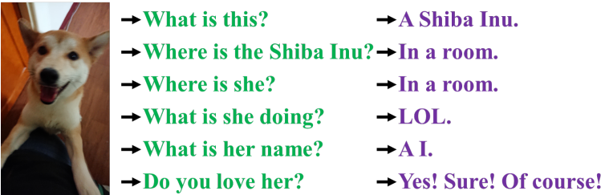 
Figure 1: Human beings can answer different questions from the same input. Our aim is to train a single deep neural network that can serve many tasks.
图1：人类可以用相同的输入回答不同的问题。我们的目标是训练一个单一的深层神经网络，它可以服务于多种任务。

Implicit knowledge refers to the knowledge learned in a subconscious state. However, there is no systematic definition of how implicit learning operates and how to obtain implicit knowledge. In the general definition of neural networks, the features obtained from the shallow layers are often called explicit knowledge, and the features obtained from the deep layers are called implicit knowledge. In this paper, we call the knowledge that directly correspond to observation as explicit knowledge. As for the knowledge that is implicit in the model and has nothing to do with observation, we call it as implicit knowledge.

隐性知识是指在潜意识状态下学习到的知识。然而，对于内隐学习是如何运作的以及如何获得内隐知识，还没有系统的定义。在神经网络的一般定义中，从浅层获得的特征通常称为显式知识，从深层获得的特征称为隐式知识。在本文中，我们将与观察直接对应的知识称为显性知识。对于模型中隐含的与观察无关的知识，我们称之为隐性知识。

We propose a unified network to integrate implicit knowledge and explicit knowledge, and enable the learned model to contain a general representation, and this general representation enable sub-representations suitable for various tasks. Figure 2.(c) illustrates the proposed unified network architecture.

我们提出了一个统一的网络来集成隐式知识和显式知识，并使学习的模型包含一般表示，而这种一般表示使子表示适用于各种任务。图2.(c)说明了拟议的统一网络架构。

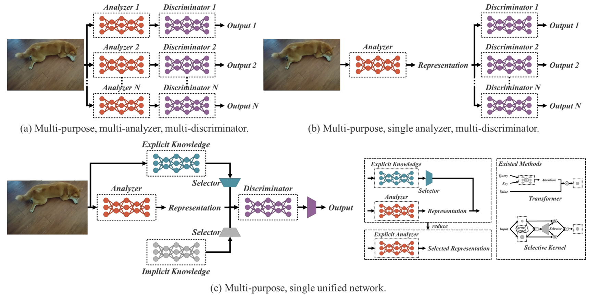 
Figure 2: Multi-purpose NN architectures. (a) distinct models for distinct tasks; (b) shared backbone, different heads for different tasks; and (c) our proposed unified network: one representation with explicit knowledge and implicit knowledge for serving multiple tasks.
图2：多用途NN架构。(a) 不同任务不同模型; (b) 共享主干，不同任务不同头部; 以及(c)我们提出的统一网络：一个具有明确知识和隐含知识的表示，用于服务于多个任务。

The way to construct the above unified networks is to combine compressive sensing and deep learning, and the main theoretical basis can be found in our previous work [16, 17, 18]. In [16], we prove the effectiveness of reconstructing residual error by extended dictionary. In [17, 18], we use sparse coding to reconstruct feature map of a CNN and make it more robust. The contribution of this work are summarized as follows:
1. Weproposeaunifiednetworkthatcanaccomplishvarious tasks, it learns a general representation by integrating implicit knowledge and explicit knowledge, and one can complete various tasks through this general representation. The proposed network effectively improves the performance of the model with a very small amount of additional cost (less than one ten thousand of the amount of parameters and calculations.)
2. We introduced kernel space alignment, prediction refinement, and multi-task learning into the implicit knowledge learning process, and verified their effectiveness.
3. We respectively discussed the ways of using vector, neural network, or matrix factorization as a tool to model implicit knowledge, and at the same time verified its effectiveness.
4. We confirmed that the proposed implicit representation learned can accurately correspond to a specific physical characteristic, and we also present it in a visual way. We also confirmed that if operators that conform to the physical meaning of an objective, it can be used to integrate implicit knowledge and explicit knowledge, and it will have a multiplier effect.
5. Combined with state-of-the-art methods, our proposed unified network achieved comparable accuracy as Scaled-YOLOv4-P7 [15] on object detection and the inference speed has been increased 88%.

构建上述统一网络的方法是将压缩感知和深度学习相结合，主要的理论基础可以在我们之前的工作中找到[16,17,18]。在[16]中，我们证明了利用扩展字典重构残差的有效性。在[17，18]中，我们使用稀疏编码来重建CNN的特征图，使其更加健壮。这项工作的贡献总结如下：
1. 我们建议统一的网络可以完成各种任务，它通过整合内隐知识和外显知识来学习一般表示，人们可以通过这种一般表示来完成各种任务。提出的网络有效地提高了模型的性能，只需很少的额外成本(不到参数和计算量的一万)
2. 在隐式知识学习过程中引入了核空间对齐、预测细化和多任务学习，并验证了它们的有效性。
3. 我们分别讨论了将向量分解、神经网络分解或矩阵分解作为隐式知识建模工具的方法，并验证了其有效性。
4. 我们确认所学的建议隐式表征能够准确地对应特定的物理特征，并且我们也以可视化的方式呈现它。我们还证实，如果操作符符合目标的物理意义，它可以用于整合隐性知识和显性知识，并且会产生乘数效应。
5. 结合最先进的方法，我们提出的统一网络在目标检测方面达到了与Scaled-YOLOv4-P7[15]相当的精度，推理速度提高了88%。

## 2. Related work
We conduct a review of the literature related to this research topic. This literature review is mainly divided into three aspects: (1) explicit deep learning: it will cover some methods that can automatically adjust or select features based on input data, (2) implicit deep learning: it will cover the related literature of implicit deep knowledge learning and implicit differential derivative, and (3) knowledge modeling: it will list several methods that can be used to integrate implicit knowledge and explicit knowledge.

我们对与此研究主题相关的文献进行了回顾。本文献综述主要分为三个方面：(1)外显深度学习：它将涵盖一些可以根据输入数据自动调整或选择特征的方法; (2)内隐深度学习：将涵盖内隐深度知识学习和内隐微分导数的相关文献，知识建模：它将列出几种可用于整合隐性知识和显性知识的方法。

### 2.1. Explicit deep learning 显性深度学习
Explicit deep learning can be carried out in the following ways. Among them, Transformer [14, 5, 20] is one way, and it mainly uses query, key, or value to obtain self-attention. Non-local networks [21, 4, 24] is another way to obtain attention, and it mainly extracts pair-wise attention in time and space. Another commonly used explicit deep learning method [7, 25] is to automatically select the appropriate kernel by input data.

显性深度学习可以通过以下方式进行。其中，Transformer[14，5，20]是一种方式，它主要使用查询、键或值来获得自注意。非局部 网络[21,4,24]是获得注意力的另一种方式，它主要在时间和空间上提取成对的注意力。另一种常用的显式深度学习方法[7，25]是通过输入数据自动选择合适的内核。

### 2.2. Implicit deep learning 内隐深度学习
The methods that belong to the category of implicit deep learning are mainly implicit neural representations [11] and deep equilibrium models [2, 3, 19]. The former is mainly to obtain the parameterized continuous mapping representation of discrete inputs to perform different tasks, while the latter is to transform implicit learning into a residual form neural networks, and perform the equilibrium point calculation on it.

属于内隐深度学习范畴的方法主要是内隐神经表征[11]和深度平衡模型[2，3，19]。前者主要是获得执行不同任务的离散输入的参数化连续映射表示，而后者是将内隐学习转化为残差形式的神经网络，并对其进行平衡点计算。

### 2.3. Knowledge modeling 知识建模
As for the methods belonging to the category of knowledge modeling, sparse representation [1, 23] and memory networks [22, 12] are mainly included. The former uses exemplar, predefined over complete, or learned dictionary to perform modeling, while the latter relies on combining various forms of embedding to form memory, and enable memory to be dynamically added or changed.

至于属于知识建模范畴的方法，主要包括稀疏表示[1，23]和存储网络[22，12]。前者使用范例、预定义的超完整或学习字典来执行建模，而后者依赖于组合各种形式的嵌入来形成内存，并使内存能够动态添加或更改。

## 3. How implicit knowledge works? 隐性知识是如何发挥作用的？
The main purpose of this research is to conduct a unified network that can effectively train implicit knowledge, so first we will focus on how to train implicit knowledge and inference it quickly in the follow-up. Since implicit representation zi is irrelevant to observation, we can think of it as a set of constant tensor Z = {z1,z2,...,zk}. In this section we will introduce how implicit knowledge as constant tensor can be applied to various tasks.

本研究的主要目的是建立一个能够有效训练内隐知识的统一网络，因此首先我们将关注如何训练内隐的知识，并在后续的研究中快速推理。由于隐式表示zi与观测无关，我们可以将其看作一组常数张量Z={z1，z2，…，zk}。在本节中，我们将介绍作为常量张量的隐式知识如何应用于各种任务。

### 3.1. Manifold space reduction 流行空间减少
We believe that a good representation should be able to find an appropriate projection in the manifold space to which it belongs, and facilitate the subsequent objective tasks to succeed. For example, as shown in Figure 3, if the target categories can be successfully classified by the hyperplane in the projection space, that will be the best outcome. In the above example, we can take the inner product of the projection vector and implicit representation to achieve the goal of reducing the dimensionality of manifold space and effectively achieving various tasks.

我们认为，一个好的表示应该能够在它所属的流形空间中找到合适的投影，并有助于后续的客观任务取得成功。例如，如图3所示，如果目标类别可以通过投影空间中的超平面成功分类，那将是最佳结果。在上面的例子中，我们可以利用投影向量的内积和隐式表示来实现降低流形空间维数的目标，并有效地完成各种任务。

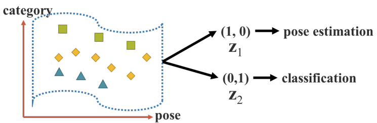 
Figure 3: Manifold space reduction.
图3：流行空间减少。

### 3.2. Kernel space alignment 内核空间对齐
In multi-task and multi-head neural networks, kernel space misalignment is a frequent problem, Figure 4.(a) illustrates an example of kernel space misalignment in multitask and multi-head NN. To deal with this problem, we can perform addition and multiplication of output feature and implicit representation, so that Kernel space can be translated, rotated, and scaled to align each output kernel space of neural networks, as shown in Figure 4.(b). The above mode of operation can be widely used in different fields, such as the feature alignment of large objects and small objects in feature pyramid networks (FPN) [8], the use of knowledge distillation to integrate large models and small models, and the handling of zero-shot domain transfer and other issues.

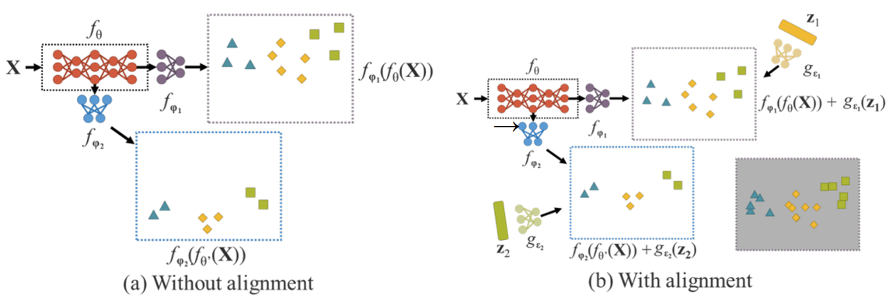 
Figure 4: Kernel space alignment.
图4：内核空间对齐。

在多任务和多头神经网络中，核空间错位是一个常见问题，图4。(a)举例说明了多任务和多头NN中的核空间错乱。为了解决这个问题，我们可以对输出特征和隐式表示进行加法和乘法运算，从而可以平移、旋转和缩放内核空间，以对齐神经网络的每个输出内核空间，如图4.(b)所示。上述操作模式可广泛应用于不同的领域，例如特征金字塔网络(FPN)中大对象和小对象的特征对齐[8]，使用知识提取来集成大模型和小模型，以及处理零启动域迁移等问题。

### 3.3. More functions
In addition to the functions that can be applied to different tasks, implicit knowledge can also be extended into many more functions. As illustrated in Figure 5, through introducing addition, one can make neural networks to predict the offset of center coordinate. It is also possible to introduce multiplication to automatically search the hyperparameter set of an anchor, which is very often needed by an anchor-based object detector. Besides, dot multiplication and concatenation can be used, respectively, to perform multi-task feature selection and to set pre-conditions for subsequent calculations.

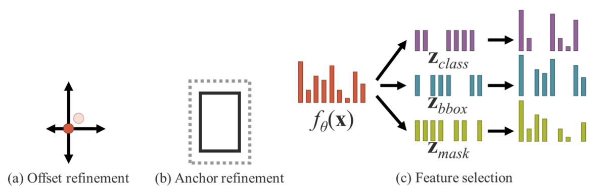 
Figure 5: More functions.
图5：更多功能。

除了可以应用于不同任务的功能外，隐性知识还可以扩展到更多功能。如图5所示，通过引入加法，可以使神经网络预测中心坐标的偏移量。还可以引入乘法来自动搜索锚框的超参数集，这是基于锚框的目标检测器经常需要的。此外，可以分别使用点乘和串联来执行多任务特征选择，并为后续计算设置先决条件。

## 4. Implicit knowledge in our unified networks 统一网络中的隐性知识
In this section, we shall compare the objective function of conventional networks and the proposed unified networks, and to explain why introducing implicit knowledge is important for training a multi-purpose network. At the same time, we will also elaborate the details of the method proposed in this work.

在本节中，我们将比较传统网络和提议的统一网络的目标函数，并解释为什么引入隐含知识对于训练多用途网络很重要。同时，我们还将详细阐述本工作中提出的方法。

### 4.1. Formulation of implicit knowledge 隐性知识的形成

#### Conventional Networks: 传统网络
For the object function of conventional network training, we can use (1) to express as follows:

对于传统网络训练的目标函数，我们可以用(1)表示如下：

$y = f_θ(x) + ε$   (1)

minimize ε 

where x is observation, θ is the set of parameters of a neural network, $f_θ$ represents operation of the neural network, ε is error term, and y is the target of given task.

其中x是观测值，θ是神经网络的参数集，$f_θ$表示神经网络的操作，ε是误差项，y是给定任务的目标。

In the training process of a conventional neural network, usually one will minimize ε to make $f_θ$(x) as close to the target as possible. This means that we expect different observations with the same target to be a single point in the sub space obtained by $f_θ$, as illustrated in Figure 6.(a). In other words, the solution space we expect to obtain is discriminative only for the current task $t_i$ and invariant to tasks other than $t_i$ in various potential tasks, T \ $t_i$, where T = {$t_1$,$t_2$, ..., $t_n$}.

在传统神经网络的训练过程中，通常会最小化ε，使$f_θ$(x)尽可能接近目标。这意味着，我们期望具有相同目标的不同观测值是通过$f_θ$获得的子空间中的单个点，如图6所示。(a)。换句话说，我们期望获得的解空间仅对当前任务$t_i$有区别，对各种潜在任务T \ $t_i$中除$t_i$以外的其他任务是不变的，其中T = {$t_1$,$t_2$, ..., $t_n$}。

For general purpose neural network, we hope that the obtained representation can serve all tasks belonging to T . Therefore, we need to relax ε to make it possible to find solution of each task at the same time on manifold space, as shown in Figure 6.(b). However, the above requirements make it impossible for us to use a trivial mathematical method, such as maximum value of one-hot vector, or threshold of Euclidean distance, to get the solution of ti. In order to solve the problem, we must model the error term ε to find solutions for different tasks, as shown in Figure 6.(c).

对于通用神经网络，我们希望得到的表示能够服务于属于T的所有任务。因此，我们需要放松ε，以便能够在流形空间上同时找到每个任务的解，如图6.(b)所示。然而，上述要求使我们无法使用简单的数学方法，例如一个one-hot向量的最大值或欧氏距离的阈值，来获得ti的解。为了解决这个问题，我们必须对误差项ε进行建模，以找到不同任务的解，如图6.(c)所示。

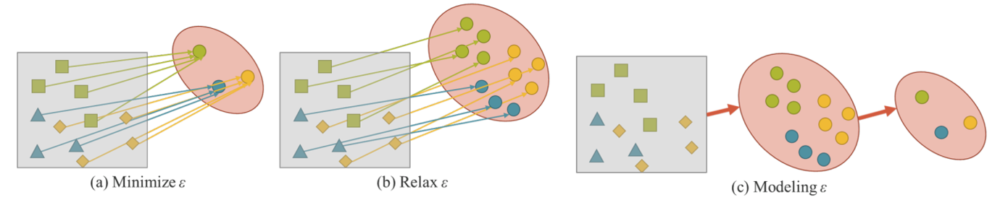 
Figure 6: Modeling error term. 建模误差项

#### Unified Networks: 统一网络
To train the proposed unified networks, we use explicit and implicit knowledge together to model the error term, and then use it to guide the multi-purpose network training process. The corresponding equation for training is as follows:

为了训练所提出的统一网络，我们将显式知识和隐式知识结合起来对误差项进行建模，然后使用它来指导多用途网络的训练过程。相应的训练方程如下：

$y = f_θ (x) + ε + g_φ (ε_{ex}(x), ε_{im} (z)) $ (2) 

minimize $ε + g_φ (ε_{ex}(x), ε_{im} (z)) $

where $ε_{ex}$ and $ε_{im}$ are operations which modeling, respectively, the explicit error and implicit error from observation x and latent code z. $g_φ$ here is a task specific operation that serves to combine or select information from explicit knowledge and implicit knowledge.

其中$ε_{ex}$和$ε_{im}$是分别建模观测x和潜在代码z. g的显式误差和隐式误差的操作。这里是一个特定于任务的操作，用于从显式知识和隐式知识中组合或选择信息。

There are some existing methods to integrate explicit knowledge into $f_θ$, so we can rewrite (2) into (3).

有一些现有的方法可以将显式知识集成到$f_θ$中，因此我们可以将(2)重写为(3)。

$y = f_θ(x) ⋆ g_φ(z)$ (3)

where ⋆ represents some possible operators that can combine $f_θ$ and $g_φ$. In this work, the operators introduced in Section 3 will be used, which are addition, multiplication, and concatenation.

其中 ⋆ 表示可以组合$f_θ$和$g_φ$的一些可能的运算符。在这项工作中，将使用第3节中介绍的运算符，即加法、乘法和串联。

If we extend derivation process of error term to handling multiple tasks, we can get the following equation:

如果我们将误差项的推导过程扩展到处理多个任务，我们可以得到以下等式：

F(x,θ,Z,Φ,Y,Ψ) = 0 (4)

where Z = {z1, z2, ..., zT } is a set of implicit latent code of T different tasks. Φ are the parameters that can be used to generate implicit representation from Z. Ψ is used to calculate the final output parameters from different combinations of explicit representation and implicit representation.

其中Z={z1，z2，…，zT}是T个不同任务的一组隐式潜在代码。Φ是可用于从Z生成隐式表示的参数。Ψ用于计算显式表示和隐式表示不同组合的最终输出参数。

For different tasks, we can use the following formula to obtain prediction for all z ∈ Z.

对于不同的任务，我们可以使用以下公式获得所有z的预测∈ Z

$d_Ψ(f_θ(x), g_Φ(z), y) = 0 $ (5)

For all tasks we start with a common unified representation $f_θ(x)$, go through task-specific implicit representation $g_Φ(z)$, and finally complete different tasks with taskspecific discriminator dΨ.

对于所有任务，我们从通用的统一表示$f_θ(x)$开始，经过任务特定的隐式表示$g_Φ(z)$，最后使用任务特定的鉴别器dΨ完成不同的任务。

### 4.2. Modeling implicit knowledge 建模隐性知识
The implicit knowledge we proposed can be modeled in the following ways:

我们提出的隐性知识可以通过以下方式建模：

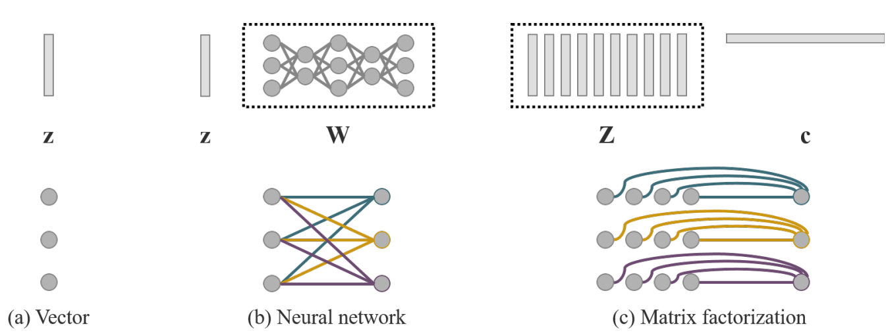 
Figure 7: We proposed to use three different ways for modeling implicit knowledge. The top row shows the formation of these three different modeling approaches, and the bottom row shows their corresponding mathematical attributes. (a) Vector: single base, and each dimension is independent with another dimensions; (b) Neural Network: single or multiple basis, and each dimension is dependent to another dimensions; and (c) Matrix factorization: multiple basis, and each dimension is independent with another dimensions.

图7：我们建议使用三种不同的方法来建模隐性知识。顶行显示了这三种不同建模方法的形成，而底行显示了它们相应的数学属性。(a) 向量：单个基数，每个维度与另一个维度独立; (b) 神经网络：单个或多个基础，每个维度依赖于另一个维度; (c) 矩阵因式分解：多重基，每个维度与另一个维度独立。

#### Vector / Matrix / Tensor: z (6)
Use vector z directly as the prior of implicit knowledge, and directly as implicit representation. At this time, it must be assumed that each dimension is independent of each other.

直接使用向量z作为隐式知识的先验，并直接作为隐式表示。此时，必须假设每个维度都是相互独立的。

#### Neural Network: Wz (7)
Use vector z as the prior of implicit knowledge, then use the weight matrix W to perform linear combination or nonlinearization and then become an implicit representation. At this time, it must be assumed that each dimension is dependent of each other. We can also use more complex neural network to generate implicit representation. Or use Markov chain to simulate the correlation of implicit representation between different tasks.

使用向量z作为隐式知识的先验，然后使用权重矩阵W进行线性组合或非线性化，然后成为隐式表示。此时，必须假设每个维度都是相互依赖的。我们还可以使用更复杂的神经网络来生成隐式表示。或者使用马尔可夫链来模拟不同任务之间隐式表示的相关性。

#### Matrix Factorization: $Z^Tc$ (8) 
Use multiple vectors as prior of implicit knowledge, and these implicit prior basis Z and coefficient c will form implicit representation. We can also further do sparse constraint to c and convert it into sparse representation form. In addition, we can also impose non-negative constraint on Z and c to convert them into non-negative matrix factorization (NMF) form.

使用多个向量作为隐式知识的先验，这些隐式先验基Z和系数c将形成隐式表示。我们还可以进一步对c进行稀疏约束，并将其转换为稀疏表示形式。此外，我们还可以对Z和c施加非负约束，以将它们转换为非负矩阵分解(NMF)形式。

### 4.3. Training
Assuming that our model dos not have any prior implicit knowledge at the beginning, that is to say, it will not have any effect on explicit representation $f_θ(x)$. When the combining operator ⋆ ∈ {addition, concatenation}, the initial implicit prior z ∼ N (0, σ), and when the combing operator ⋆ is multiplication, z ∼ N (1, σ). Here, σ is a very small value which is close to zero. As for z and φ, they both are trained with backpropagation algorithm during the training process.

假设我们的模型在开始时没有任何先验隐式知识，即,它不会对$f_θ(x)$的显式表示产生任何影响。当组合运算符⋆ ∈ {加法，串联}，初始隐式先验z∼ N(0，σ)，当组合运算符⋆ 是乘法，z∼ N(1，σ)。这里，σ是一个非常小的值，接近于零。对于z和φ，在训练过程中都使用反向传播算法进行训练。

### 4.4. Inference
Since implicit knowledge is irrelevant to observation x, no matter how complex the implicit model gφ is, it can be reduced to a set of constant tensor before the inference phase is executed. In other words, the formation of implicit information has almost no effect on the computational complexity of our algorithm. In addition, when the above operator is multiplication, if the subsequent layer is a convolutional layer, then we use (9) below to integrate. When one encounters an addition operator, and if the previous layer is a convolutional layer and it has no activation function, then one use (10) shown below to integrate.

由于隐式知识与观测值x无关，因此无论隐式模型gφ有多复杂，在执行推理阶段之前，它都可以简化为一组常数张量。换句话说，隐式信息的形成对我们算法的计算复杂性几乎没有影响。此外，当上面的运算符是乘法时，如果后续层是卷积层，则我们使用下面的(9)进行积分。当遇到加法运算符时，如果前一层是卷积层，并且没有激活函数，则使用下面所示的(10)进行积分。

$x_{(l+1)} = σ(W_l(g_φ(z)x_l) + b_l)$

$=σ(W_l(x_l)+b_l)$, where $W_l =W_lgφ(z)$  (9)

$x_{(l+1)} = W_l(x_l) + b_l + g_φ(z)$

$= W_l(x_l) + b_l$ ,where $b_l =b_l +g_φ(z)$  (10)

## 5. Experiments
Our experiments adopted the MSCOCO dataset [9], because it provides ground truth for many different tasks, including 1 object detection, 2 instance segmentation, 3 panoptic segmentation, 4 keypoint detection, 5 stuff segmentation, 6 image caption, 7 multi-label image classification, and 8long tail object recognition. These data with rich annotation content can help train a unified network that can support computer vision-related tasks as well as natural language processing tasks.

我们的实验采用了MSCOCO数据集[9]，因为它为许多不同的任务提供了基础真相，包括1个目标检测、2个实例分割、3个全景分割、4个关键点检测、5个素材分割、6个图像标题、7个多标签图像分类和8个长尾对象识别。这些具有丰富注释内容的数据可以帮助训练一个统一的网络，该网络可以支持计算机视觉相关任务以及自然语言处理任务。

### 5.1. Experimental setup
In the experimental design, we chose to apply implicit knowledge to three aspects, including 1feature alignment for FPN, 2 prediction refinement, and 3 multi-task learning in a single model. The tasks covered by multi-task learning include 1object detection, 2multi-label image classification, and 3feature embedding. We choose YOLOv4CSP [15] as the baseline model in the experiments, and introduce implicit knowledge into the model at the position pointed by the arrow in Figure 8. All the training hyper-parameters are compared to default setting of ScaledYOLOv4 [15].

在实验设计中，我们选择将内隐知识应用于三个方面，包括1个FPN特征对齐、2个预测细化和3个单一模型中的多任务学习。多任务学习涉及的任务包括1目标检测、2多标签图像分类和3特征嵌入。我们在实验中选择YOLOv4CSP[15]作为基线模型，并在图8中箭头所指的位置将隐式知识引入模型。所有训练超参数都与ScaledYOLOv 4[15]的默认设置进行了比较。

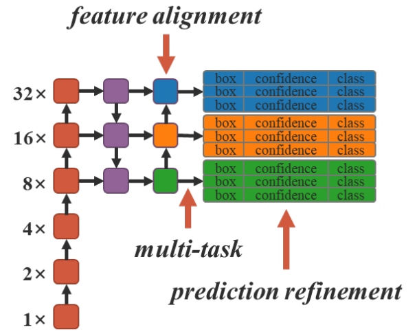 
Figure 8: Architecture.

In Section 5.2, 5.3, and 5.4, we use the simplist vector implicit representation and addition operator to verify the positive impact on various tasks when implicit knowledge is introduced. In Section 5.5, we will use different operators on different combinations of explicit knowledge and implicit knowledge, and discuss the effectiveness of these combinations. In Section 5.6, we shall model implicit knowledge by using different approaches. In Section 5.7, we analyze the model with and without introduce implicit knowledge. Finally in Section 5.8, we shall train object detectors with implicit knowledge and then compare the performance with state-of-the-art methods.

在第5.2、5.3和5.4节中，我们使用单纯形向量隐式表示和加法运算符来验证引入隐式知识对各种任务的积极影响。在第5.5节中，我们将在显性知识和隐性知识的不同组合上使用不同的运算符，并讨论这些组合的有效性。在第5.6节中，我们将使用不同的方法对隐性知识进行建模。在第5.7节中，我们分析了有无引入隐性知识的模型。最后，在第5.8节中，我们将训练具有隐含知识的目标检测器，然后将其性能与最先进的方法进行比较。

### 5.2. Feature alignment for FPN FPN的要素对齐
We add implicit representation into the feature map of each FPN for feature alignment, and the corresponding experiment results are illustrated in Table 1. From these results shown in Table 1 we can say: After using implicit representation for feature space alignment, all performances, including APS , APM , and APL , have been improved by about 0.5%, which is a very significant improvement.

我们将隐式表示添加到每个FPN的特征图中进行特征对齐，相应的实验结果如表1所示。从表1中显示的这些结果可以说：使用隐式表示进行特征空间对齐后，包括APS、APM和APL在内的所有性能都提高了约0.5%，这是一个非常显著的改进。

Table 1: Ablation study of feature alignment.
表1：特征对齐的消融研究。

### 5.3. Prediction refinement for object detection 目标检测预测细化
Implicit representations are added to YOLO output layers for prediction refinement. As illustrated in Table 2, we see that almost all indicator scores have been improved. Figure 9 shows how the introduction of implicit representation affects the detection outcome. In the object detection case, even we do not provide any prior knowledge for implicit representation, the proposed learning mechanism can still automatically learn (x, y), (w, h), (obj), and (classes) patterns of each anchor.

隐式表示被添加到YOLO输出层以进行预测优化。如表2所示，我们看到几乎所有指标得分都有所提高。图9显示了隐式表示的引入如何影响检测结果。在目标检测情况下，即使我们没有提供隐式表示的任何先验知识，所提出的学习机制仍然可以自动学习每个锚的(x，y)、(w，h)、(obj)和(class)模式。

Table 2: Ablation study of prediction refinement.
表2：预测细化的消融研究。

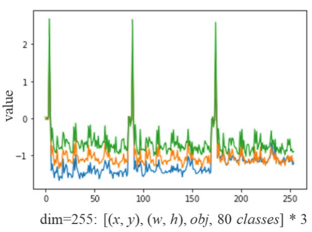 

Figure 9: Value of learned implicit representation for prediction refinement.
图9：用于预测细化的学习隐式表示的值。

### 5.4. Canonical representation for multi-task 多任务的标准表示
When one wants to train a model that can be shared by many tasks at the same time, since the joint optimization process on loss function must be executed, multiple parties often pull each other during the execution process. The above situation will cause the final overall performance to be worse than training multiple models individually and then integrating them. In order to solve the above problem, we propose to train a canonical representation for multitasks. Our idea is to augment the representation power by introducing implicit representation to each task branch, and the effects it causes are listed in Table 3. As the data illustrated in Table 3, without the introduction of implicit representation, some index scores improved after multi-task training, and some dropped. After introducing implicit representation to joint detection and classification (JDC), in the model category corresponding to + iJDC, we can clearly see that the overall index score has increased significantly, and it has surpassed the performance of single-task training model. Compared to when implicit representation was not introduced, the performance of our model on mediumsized objects and large-sized objects has also been improved by 0.3% and 0.7%, respectively. In the experiment of joint detection and embedding (JDE), because of the characteristic of implicit representation implied by feature alignment, the effect of improving the index score is more significant. Among the index scores corresponding to JDE and + iJDE listed in Table 3, all index scores of + iJDE surpass the index that does not introduce implicit representation. Among them, the AP for large objects even increased by 1.1%.

当一个人想要训练一个可以由多个任务同时共享的模型时，由于必须执行损失函数的联合优化过程，因此在执行过程中，多方往往会相互拉动。上述情况将导致最终的总体性能比单独训练多个模型然后将其集成更差。为了解决上述问题，我们建议训练多任务的规范表示。我们的想法是通过向每个任务分支引入隐式表示来增强表示能力，表3列出了它所造成的影响。如表3所示，在没有引入隐式表达的情况下，一些指标得分在多任务训练后有所提高，而一些则有所下降。在将隐式表示引入联合检测与分类(JDC)后，在+iJDC对应的模型类别中，我们可以清楚地看到，总体指标得分显著增加，已经超过了单任务训练模型的性能。与未引入隐式表示相比，我们的模型在中型对象和大型对象上的性能也分别提高了0.3%和0.7%。在联合检测与嵌入(JDE)实验中，由于特征对齐隐含的隐式表示特性，提高指标得分的效果更为显著。在表3列出的JDE和+iJDE对应的指标得分中，+iJDE的所有指标得分都超过了不引入隐式表示的指标。其中，大型物体的AP甚至增加了1.1%。

Table 3: Ablation study of multi-task joint learning.
表3：多任务联合学习的消融研究。

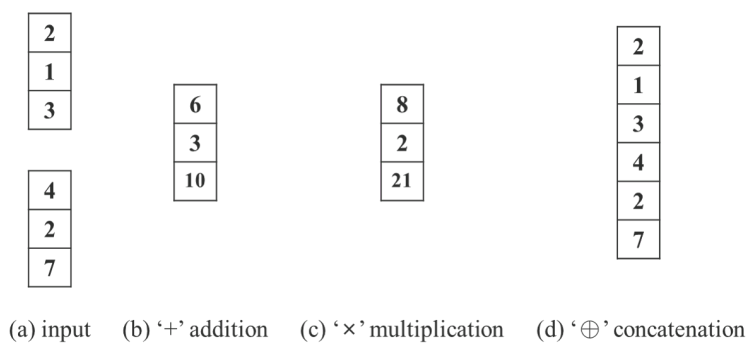 

Figure 10: Implicit modeling with (a) addition, (b) multiplication, and (c) concatenation operators.
图10：使用(a)加法、(b)乘法和(c)串联运算符的隐式建模。

### 5.5. Implicit modeling with different operators 使用不同运算符的隐式建模
Table 4 shows the experimental results of using different operators shown in Figure 10 to combine explicit representation and implicit representation. In the implicit knowledge for feature alignment experiment, we see that addition and concatenation both improve performance, while multiplication actually degrades performance. The experimental results of feature alignment are in full compliance with its physical characteristics, because it must deal with the scaling of global shift and all individual clusters. In the implicit knowledge for prediction refinement experiment, since the operator of concatenation ill change the dimension of output, we only compare the effects of using addition and multiplication operators in the experiment. In this set of experiments, the performance of applying multiplication is better than that of applying addition. Analyzing the reason, we found that center shift uses addition decoding when executing prediction, while anchor scale uses multiplication decoding. Because center coordinate is bounded by grid, the impact is minor, and the artificially set anchor owns a larger optimization space, so the improvement is more significant.

表4显示了使用图10所示的不同操作符组合显式表示和隐式表示的实验结果。在特征对齐实验的隐含知识中，我们看到加法和级联都可以提高性能，而乘法实际上会降低性能。特征对齐的实验结果完全符合其物理特性，因为它必须处理全局偏移和所有单个簇的缩放。在预测精化实验的隐性知识中，由于串联算子会改变输出的维数，因此我们只比较了在实验中使用加法和乘法算子的效果。在这组实验中，应用乘法的性能优于应用加法的性能。分析原因，我们发现中心移位在执行预测时使用加法解码，而锚定尺度使用乘法解码。由于中心坐标以网格为界，影响较小，而人工设置锚具有较大的优化空间，因此改进更为显著。

Table 4: Ablation study of different operators.
表4：不同操作人员的消融研究。

Based on the above analysis, we designed two other set of experiments – {× iFA∗, × iPR∗}. In the first set of experiments – × iFA∗, we split feature space into anchor cluster level for combination with multiplication, while in the second set of experiments – × iPR∗, we only performed multiplication refinement on width and height in prediction. The results of the above experiments are illustrated in Table 5. From the figures shown in Table 5, we find that after corresponding modifications, the scores of various indices have been comprehensively improved. The experiment shows that when we designing how to combine explicit and implicit knowledge, we must first consider the physical meaning of the combined layers to achieve a multiplier effect.

基于上述分析，我们设计了另外两组实验——{×iFA∗, ×iPR∗}. 在第一组实验中-×iFA∗, 我们将特征空间划分为锚簇级别，以便与乘法相结合，而在第二组实验中-×iPR∗, 在预测中，我们只对宽度和高度进行乘法求精。上述实验的结果如表5所示。从表5中的数字可以看出，经过相应的修改，各项指标的得分得到了全面提高。实验表明，在设计如何结合显性知识和隐性知识时，我们必须首先考虑结合层的物理意义，以实现乘数效应。

Table 5: Ablation study of different operators.
表5：不同操作人员的消融研究。

### 5.6. Modeling implicit knowledge in different ways
We tried to model implicit knowledge in different ways, including vector, neural networks, and matrix factorization. When modeling with neural networks and matrix factorization, the default value of implicit prior dimension is twice that of explicit representation dimension. The results of this set of experiments are shown in Table 6. We can see that whether it is to use neural networks or matrix factorization to model implicit knowledge, it will improve the overall effect. Among them, the best results have been achieved by using matrix factorization model, and it upgrades the performance of AP, AP50, and AP75 by 0.2%, 0.4%, and 0.5%, respectively. In this experiment, we demonstrated the effect of using different modeling ways. Meanwhile, we confirmed the potential of implicit representation in the future.

我们尝试以不同的方式对隐性知识建模，包括向量、神经网络和矩阵分解。当使用神经网络和矩阵分解进行建模时，隐式先验维数的默认值是显式表示维数的两倍。这组实验的结果如表6所示。我们可以看到，无论是使用神经网络还是矩阵分解来建模内隐知识，都会提高整体效果。其中，使用矩阵分解模型取得了最佳结果，它将AP、AP50和AP75的性能分别提高了0.2%、0.4%和0.5%。在这个实验中，我们演示了使用不同建模方法的效果。同时，我们确认了内隐表征在未来的潜力。

Table 6: Ablation study of different modeling approaches.
表6：不同建模方法的消融研究。

### 5.7. Analysis of implicit models 隐式模型分析
We analyze the number of parameters, FLOPs, and learning process of model with/w/o implicit knowledge, and show the results in Table 7 and Figure 11, respectively. From the experimental data, we found that in the model with implicit knowledge set of experiments, we only increased the amount of parameters and calculations by less than one ten thousandth, which can significantly improve the performance of the model, and the training process can also converge quickly and correctly.

我们分析了带有/w/o隐式知识的模型的参数数量、FLOP和学习过程，并分别在表7和图11中显示了结果。从实验数据中我们发现，在具有隐含知识集的实验模型中，我们只增加了不到万分之一的参数和计算量，这可以显著提高模型的性能，并且训练过程也可以快速、正确地收敛。

Table 7: Information of model with/without implicit knowledge.
表7：有/无隐性知识的模型信息。

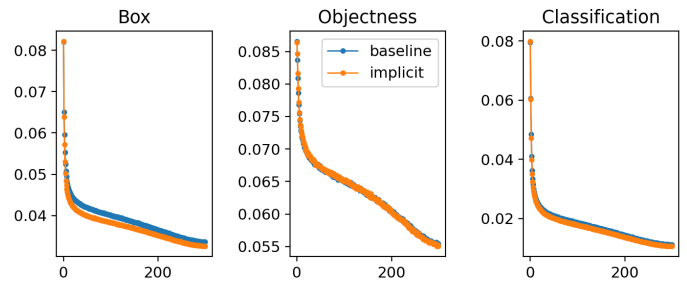 
Figure 11: Learning curve of model with/w/o implicit knowledge.
图11：具有/w/o内隐知识的模型的学习曲线。

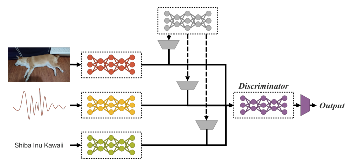 
Figure 12: Multimodal unified netwrok.
图12：多模式统一网络。

### 5.8. Implicit knowledge for object detection 目标检测的隐含知识
Finally, we compare the effectiveness of the proposed method with object detection’s state-of-the-art methods. The benefits of introducing implicit knowledge are shown in Table 8. For the entire training process, we follow the scaled-YOLOv4 [15] training process, that is, train from scratch 300 epochs first, and then fine-tune 150 epochs. Table 9 illustrates the comparisons with the state-of-theart methods. One thing worth noting is that our proposed method does not have additional training data and annotations. By introducing the unified network of implicit knowledge, we still achieve results that are sufficient to match the state-of-the-art methods.

最后，我们将该方法与目标检测的最新方法进行了比较。表8显示了引入内隐知识的好处。对于整个训练过程，我们遵循scaled-YOLOv4[15]训练过程，即先从零开始训练300个阶段，然后微调150个阶段。表9说明了与最新方法的比较。值得注意的是，我们提出的方法没有额外的训练数据和注释。通过引入统一的隐性知识网络，我们仍然可以获得足以与最先进的方法相匹配的结果。

 

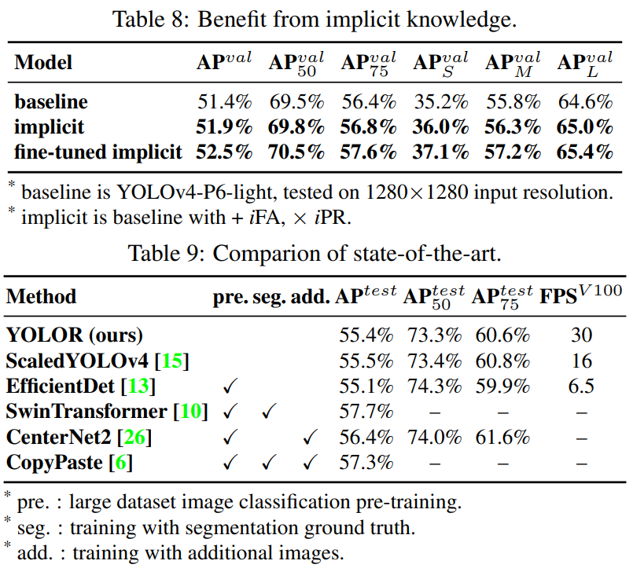 
表8：受益于隐性知识。
表9：和SOTA的比较。

## 6. Conclusions
In this paper, we show how to construct a unified network that integrates implicit knowledge and explicit knowledge, and prove that it is still very effective for multi-task learning under the single model architecture. In the future, we shall extend the training to multi-modal and multi-task, as shown in Figure 12.

在本文中，我们展示了如何构建一个整合了隐式知识和显式知识的统一网络，并证明了在单模型架构下，它对于多任务学习仍然非常有效。未来，我们将把训练扩展到多模式和多任务，如图12所示。

## 7. Acknowledgements
The authors wish to thank National Center for Highperformance Computing (NCHC) for providing computational and storage resources.

作者感谢国家高性能计算中心(NCHC)提供计算和存储资源。

## References

## A. Appendix
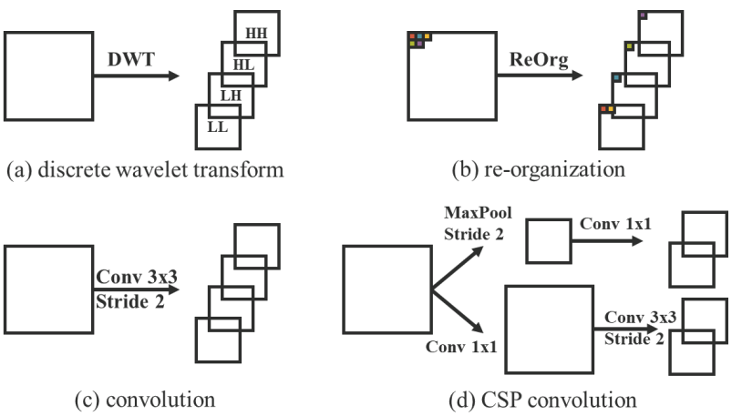 
Figure A1: We use four kind of down-sampling modules in this work, including (a) discrete wavelet transform (DWT): https://github.com/fbcotter/pytorch wavelets, (b) re-organization (ReOrg): https://github.com/AlexeyAB/darknet/ issues/4662#issuecomment-608886018, (c) convolution, and (d) CSP convolution used in CSPNet: https://github.com/ WongKinYiu/CrossStagePartialNetworks/tree/pytorch.

图A1：我们在这项工作中使用了四种下采样模块，包括
1. 离散小波变换(DWT)：https://github.com/fbcotter/pytorch 小波，
2. 重组(ReOrg)：https://github.com/AlexeyAB/darknet/issues/4662#issuecomment-608886018 ，
3. 卷积
4. CSPNet中使用的CSP卷积：https://github.com/WongKinYiu/CrossStagePartialNetworks/tree/pytorch 

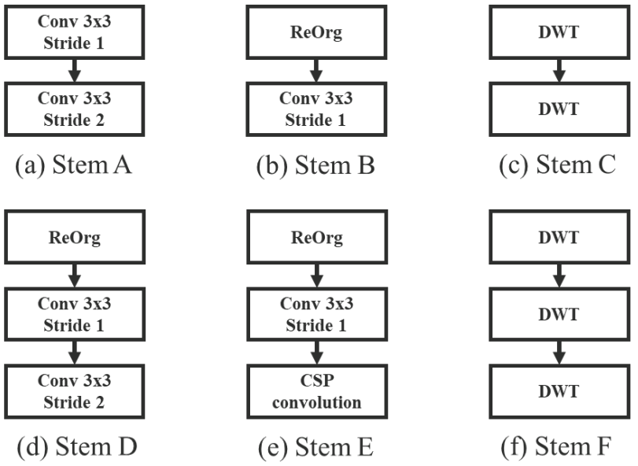 
Figure A2: We use down-sampling modules in Figure A1 to form stem blocks: (a) Stem A is used in YOLOv4-CSP, (b) Stem B is used in YOLOv4-CSP-fast, (c) Stem C is used in YOLOv4-CSPSSS, (d) Stem D is proposed by 10.5281/zenodo.4679653 and called focus layer, it is used in YOLOv4-P6-light, YOLOR-P6, and YOLOR-W6, (e) Stem E is used in YOLOR-E6 and YOLORD6, and (f) Stem F is used in YOLOv4-CSP-SSSS.

图A2：我们使用图A1中的向下采样模块来形成干块：
1. 干块a用于YOLOv4 CSP，
2. 干块b用于YOLOv4 CSP快速，
3. 干块c用于YOLOv4 CSPSSS，
4. 干块d由10.5281/zenodo提出。4679653，称为聚焦层，用于YOLOv4-P6-light、YOLOR-P6和YOLOR-W6，
5. Stem e用于YOLOR-E6和YLORD6，(f)Stem f用于YOLOv4 CSP SSSS。

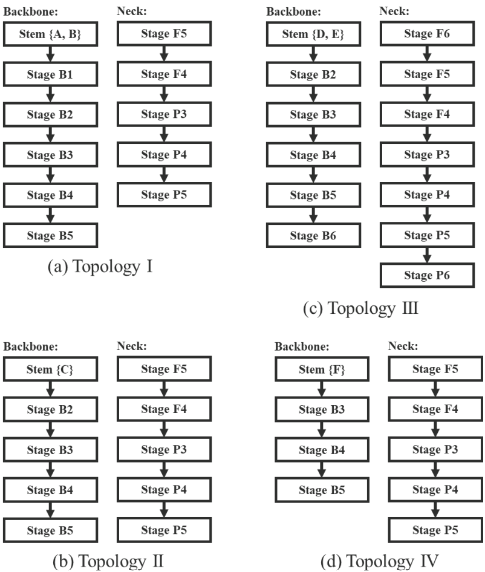 
Figure A3: Models in this paper can be mapped to three four of architecture topology. Due to Stem C, D, and E contain two downsampling modules, models used those stem blocks has no Stage B1 in the backbone, for same reason Stem F has no Stage B1 and B2. 
* YOLOv4-CSP belongs to Topology 1, the architecture is described in Scaled-YOLOv4 paper.
* YOLOv4-CSP-fast is modified from YOLOv4-CSP, we replace Stem A in YOLOv4-CSP by Stem B to form YOLOv4-CSP-fast. 
* YOLOv4-CSP-SSS belongs to Topology 2, Stem C is used in this model. The topology after Stage B2 is as same as YOLOv4CSP, and width scaling factor and depth scaling factor are set as 0.5 and 0.33, respectively. We then using SiLU activation to replace all Mish activation in the model.
* YOLOv4-CSP-SSSS is modified from YOLOv4-CSP-SSS, Stem C in YOLOv4-CSP-SSS is replaced by Stem F in this model. Due to the stem block contains three down-sampling modules, YOLOv4-CSP-SSSS belongs to topology IV.
* YOLOv4-P6-light belongs to Topology 3, it uses Stem D and base channels are set as {128, 256, 384, 512, 640}. To optimize the gradient propagation, we apply CSP fusion first in B* stages and the repeat number of B2 to B6 are set as {3, 7, 7, 3, 3}.
* YOLOR-P6 has same architecture as YOLOv4-P6-light, we replace all Mish activation in YOLOv4-P6-light by SiLU activation. • YOLOR-W6 is wider YOLOR-P6, base channels are set as {128, 256, 512, 768, 1024}.
* YOLOR-E6 expands the width of YOLOR-W6, the width scaling factor is set as 1.25, and all of convolution down-sampling modules are replaced by CSP convolution.
* YOLOR-D6 is deeper YOLOR-E6, the repeat number of B2 to B6 are set as {3, 15, 15, 7, 7}

图A3：本文中的模型可以映射到三到四个架构拓扑。由于阀杆C、D和E包含两个下采样模块，因此使用这些阀杆块的模型在主干中没有B1级，同样的原因，阀杆F没有B1级和B2级。
* YOLOv4 CSP属于拓扑1，该架构在Scaled-YOLOv 4论文中描述。
* YOLOv4 CSP fast由YOLOv 4 CSP改进而来，我们用阀杆B替换YOLOv-4 CSP中的阀杆A，以快速形成YOLOvs 4 CSP。
* YOLOv4 CSP SSS属于拓扑2，此模型中使用了阀杆C。阶段B2之后的拓扑与YOLOv4CSP相同，宽度比例因子和深度比例因子分别设置为0.5和0.33。然后，我们使用SiLU激活来替换模型中的所有Mish激活。
* YOLOv4 CSP SSSS是由YOLOv 4 CSP SS改进而来，在该模型中，YOLOv-4 CSP SSS中的阀杆C被阀杆F取代。由于阀杆块包含三个向下采样模块，因此YOLOv4 CSP SSSS属于拓扑IV。
* YOLOv4-P6-light属于Topology 3，它使用Stem D，基本通道设置为{128、256、384、512、640}。为了优化梯度传播，我们首先在B*阶段应用CSP融合，将B2到B6的重复次数设置为{3，7，7，3，3}。
* YOLOR-P6与YOLOv4-P6-light具有相同的架构，我们通过SiLU活化取代了YOLOv 4-P6-light中的所有Mish活化。•YOLOR-W6是更宽的YOLOR-P6，基本通道设置为{128、256、512、768、1024}。
* YOLOR-E6扩展了YOLOR-W6的宽度，宽度比例因子设置为1.25，所有卷积下采样模块都被CSP卷积代替。
* YOLOR-D6是更深的YOLOR-E6，B2到B6的重复编号设置为{3，15，15，7，7}

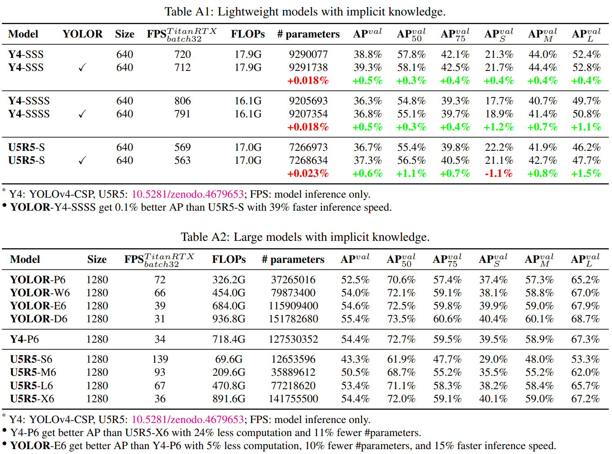 
表A1：具有隐含知识的轻量级模型。
表A2：具有隐性知识的大型模型。

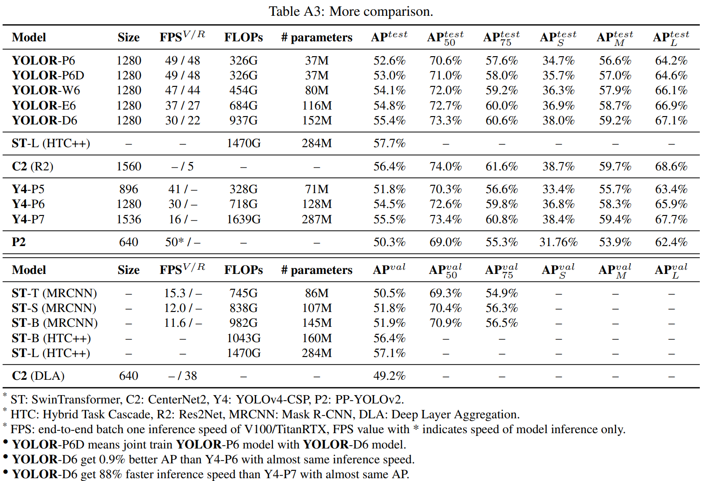 
表A3：更多比较。