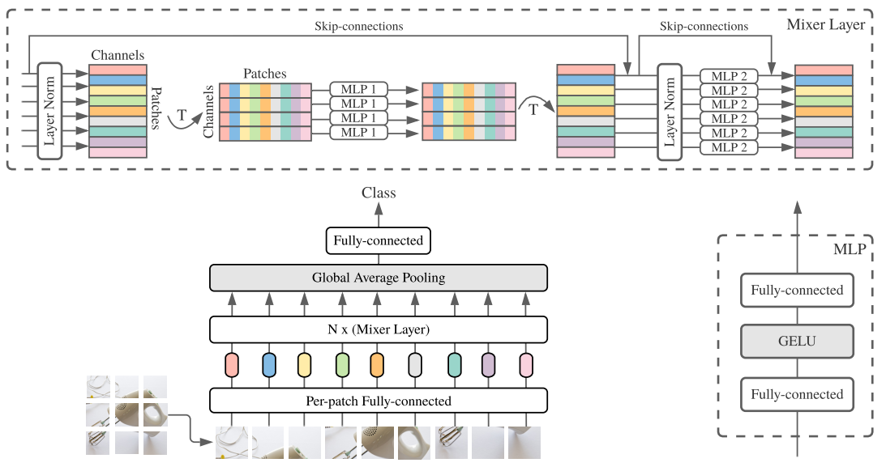
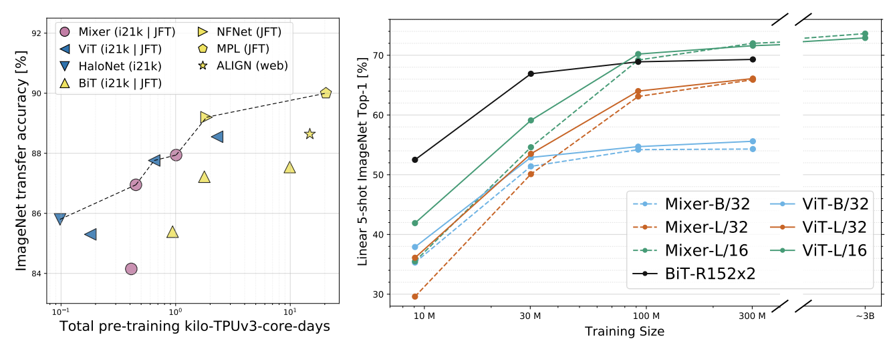
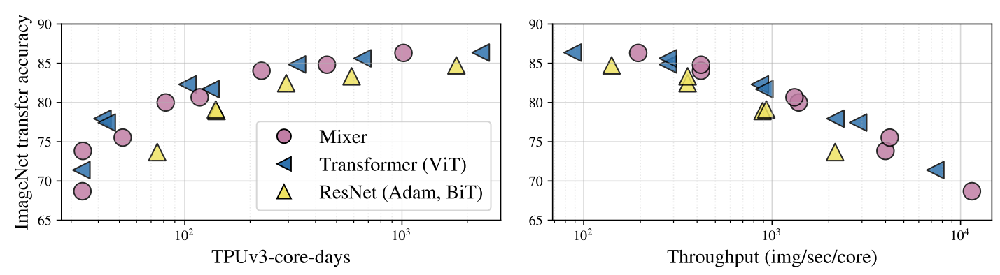
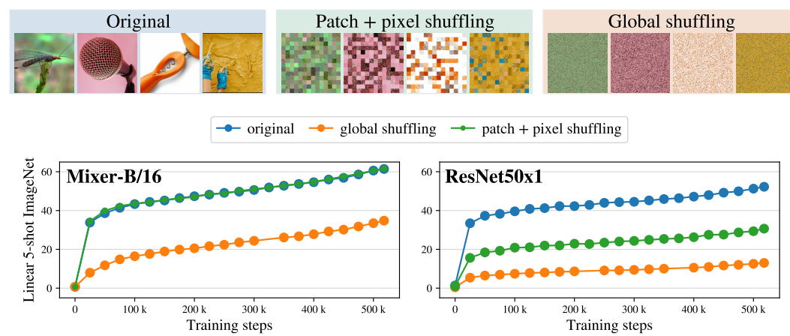
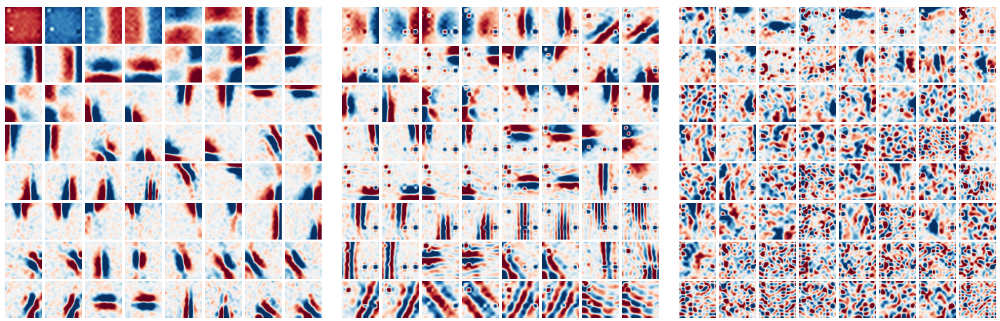

# MLP-Mixer: An all-MLP Architecture for Vision
MLP-Mixer：一种全MLP视觉架构 2021-5-4, 原文：https://arxiv.org/abs/2105.01601

## 阅读笔记
* 一种是独立应用于图像块的MLP(即“混合”每个位置的特征)，另一种是跨块应用MLP(如“混合”空间信息)。
* inductive biases
* 现代的正则化技术[49，54]

## Abstract
Convolutional Neural Networks (CNNs) are the go-to model for computer vision. Recently, attention-based networks, such as the Vision Transformer, have also become popular. In this paper we show that while convolutions and attention are both sufficient for good performance, neither of them are necessary. We present MLP-Mixer, an architecture based exclusively on multi-layer perceptrons (MLPs).MLP-Mixer contains two types of layers: one with MLPs applied independently to image patches (i.e. “mixing” the per-location features), and one with MLPs applied across patches (i.e. “mixing” spatial information). When trained on large datasets, or with modern regularization schemes, MLP-Mixer attains competitive scores on image classification benchmarks, with pre-training and inference cost comparable to state-of-the-art models. We hope that these results spark further research beyond the realms of well established CNNs and Transformers.(MLP-Mixer code will be available at https://github.com/google-research/vision_transformer)

卷积神经网络(CNN)是计算机视觉的首选模型。最近，基于注意力的网络，如视觉Transformer，也变得流行起来。在本文中，我们表明，虽然卷积和注意力都足以获得良好的性能，但两者都不是必需的。我们介绍了MLP-Mixer，一种专门基于多层感知器(MLP)的架构。MLP-Mixer包含两种类型的层：一种是独立应用于图像块的MLP(即“混合”每个位置的特征)，另一种是跨块应用MLP(如“混合”空间信息)。当在大型数据集上进行训练或使用现代正则化方案时，MLP-Mixer在图像分类基准上获得了具有竞争力的分数，预训练和推理成本与最先进的模型相当。我们希望这些结果能激发出超越成熟CNN和Transformers领域的进一步研究。(MLP-Mixer代码:https://github.com/google-research/vision_transformer)

## 1 Introduction
As the history of computer vision demonstrates, the availability of larger datasets coupled with increased computational capacity often leads to a paradigm shift. While Convolutional Neural Networks (CNNs) have been the de-facto standard for computer vision, recently Vision Transformers [14] (ViT), an alternative based on self-attention layers, attained state-of-the-art performance. ViT continues the long-lasting trend of removing hand-crafted visual features and inductive biases from models and relies further on learning from raw data.

正如计算机视觉的历史所证明的，更大数据集的可用性加上算力的增加，通常会导致范式转变。虽然卷积神经网络(CNN)已成为计算机视觉的事实标准，但最近，视觉Transformer[14](ViT)，一种基于自注意层的替代方案，获得了最先进的性能。ViT继续了从模型中去除手工制作的视觉特征和归纳偏差的长期趋势，并进一步依赖于从原始数据中学习。

We propose the MLP-Mixer architecture (or “Mixer” for short), a competitive but conceptually and technically simple alternative, that does not use convolutions or self-attention. Instead, Mixer’s architecture is based entirely on multi-layer perceptrons (MLPs) that are repeatedly applied across either spatial locations or feature channels. Mixer relies only on basic matrix multiplication routines, changes to data layout (reshapes and transpositions), and scalar nonlinearities.

我们提出了MLP-Mixer架构(简称“Mixer”)，这是一种具有竞争力但概念和技术上都很简单的替代方案，它不使用卷积或自注意力。相反，Mixer的架构完全基于多层感知器(MLP)，这些感知器在空间位置或特征通道上重复应用。Mixer仅依赖于基本的矩阵乘法例程、数据布局更改(变形和转置)以及非线性标量。

Figure 1 depicts the macro-structure of Mixer. It accepts a sequence of linearly projected image patches (also referred to as tokens) shaped as a “patches × channels” table as an input, and maintains this dimensionality. Mixer makes use of two types of MLP layers: channel-mixing MLPs and token-mixing MLPs. The channel-mixing MLPs allow communication between different channels; they operate on each token independently and take individual rows of the table as inputs. The token-mixing MLPs allow communication between different spatial locations (tokens); they operate on each channel independently and take individual columns of the table as inputs. These two types of layers are interleaved to enable interaction of both input dimensions.  

图1描述了Mixer的宏结构。它接受一系列线性投影的图像块(也称为tokens)作为输入，其形状为“块×通道”表，并保持该维度。Mixer使用两种类型的MLP层：信道混合MLP和令牌混合MLP。信道混合MLP允许不同信道之间的通信; 它们独立地对每个令牌进行操作，并将表中的各行作为输入。令牌混合MLP允许不同空间位置(令牌)之间的通信; 它们独立地在每个通道上操作，并将表的各个列作为输入。这两种类型的层被交错以实现两个输入维度的交互。

 
Figure 1: MLP-Mixer consists of per-patch linear embeddings, Mixer layers, and a classifier head. Mixer layers contain one token-mixing MLP and one channel-mixing MLP, each consisting of two fully-connected layers and a GELU nonlinearity. Other components include: skip-connections, dropout, and layer norm on the channels. 
图1:MLP-Mixer由每个块的线性嵌入、Mixer层和分类器头组成。Mixer层包含一个令牌混合MLP和一个信道混合MLP，每个都由两个全连接的层和一个GELU非线性组成。其他组件包括：跳跃连接、dropout和通道上的层归一化。

In the extreme case, our architecture can be seen as a very special CNN, which uses 1×1 convolutions for channel mixing, and single-channel depth-wise convolutions of a full receptive field and parameter sharing for token mixing. However, the converse is not true as typical CNNs are not special cases of Mixer. Furthermore, a convolution is more complex than the plain matrix multiplication in MLPs as it requires an additional costly reduction to matrix multiplication and/or specialized implementation.

在极端情况下，我们的架构可以被视为一个非常特殊的CNN，它使用1×1卷积进行信道混合，使用全接收场的单信道深度卷积和参数共享进行令牌混合。相反的，典型的CNN不是Mixer的特例。此外，卷积比MLP中的普通矩阵乘法更复杂，因为它需要对矩阵乘法and/or操作进行额外的实现以降低成本。

Despite its simplicity, Mixer attains competitive results. When pre-trained on large datasets (i.e., ∼100M images), it reaches near state-of-the-art performance, previously claimed by CNNs and Transformers, in terms of the accuracy/cost trade-off. This includes 87.94% top-1 validation accuracy on ILSVRC2012 “ImageNet” [13]. When pre-trained on data of more modest scale (i.e., ∼1– 10M images), coupled with modern regularization techniques [49, 54], Mixer also achieves strong performance. However, similar to ViT, it falls slightly short of specialized CNN architectures. 

尽管它很简单，但Mixer还是取得了具有竞争力的结果。当在大数据集(即，∼1亿张图像)，在精度/成本权衡方面，它达到了CNN和Transformers之前宣称的接近最先进的性能。这包括ILSVRC2012“ImageNet”上87.94%的顶级验证准确率[13]。当对更适度规模的数据进行预训练时(即，∼1–10M图像)，再加上现代的正则化技术[49，54]，Mixer也实现了强大的性能。然而，与ViT类似，它略低于专门的CNN架构。

## 2 Mixer Architecture
Modern deep vision architectures consist of layers that mix features (i) at a given spatial location, (ii) between different spatial locations, or both at once. In CNNs, (ii) is implemented with N × N convolutions (for N > 1) and pooling. Neurons in deeper layers have a larger receptive field [1, 28]. At the same time, 1×1 convolutions also perform (i), and larger kernels perform both (i) and (ii). In Vision Transformers and other attention-based architectures, self-attention layers allow both (i) and (ii) and the MLP-blocks perform (i). The idea behind the Mixer architecture is to clearly separate the per-location (channel-mixing) operations (i) and cross-location (token-mixing) operations (ii). Both operations are implemented with MLPs. Figure 1 summarizes the architecture.

现代深度视觉架构由混合特征(i)在给定空间位置，(ii)在不同空间位置之间，或同时混合两者的层组成。在CNN中，(ii)使用N×N个卷积(对于N>1)和池化来实现。更深层次的神经元具有更大的感受野[1，28]。同时，1×1卷积也执行(i)，较大的核执行(i)和(ii)。在视觉Transformer和其他基于注意力的架构中，自我注意力层允许(i)和(ii)，MLP块执行(i)。Mixer架构背后的想法是明确地将每位置(信道混合)操作(i)和跨位置(令牌混合)操作分开(ii)。这两种操作都是用MLP实现的。图1总结该架构。

Mixer takes as input a sequence of S non-overlapping image patches, each one projected to a desired hidden dimension C. This results in a two-dimensional real-valued input table, $X ∈ R^{S×C}$ . If the original input image has resolution (H, W), and each patch has resolution (P, P), then the number of patches is $S = HW/P^2$ . All patches are linearly projected with the same projection matrix. Mixer consists of multiple layers of identical size, and each layer consists of two MLP blocks. The first one is the token-mixing MLP: it acts on columns of X (i.e. it is applied to a transposed input table $X^T$ ), maps $R^S$ → $R^S$, and is shared across all columns. The second one is the channel-mixing MLP: it acts on rows of X, maps $R^C$ → $R^C$ , and is shared across all rows. Each MLP block contains two fully-connected layers and a nonlinearity applied independently to each row of its input data tensor. Mixer layers can be written as follows (omitting layer indices):

Mixer将S个非重叠图像块序列作为输入，每个图像块投影到所需的隐藏维度C。这将生成一个二维实值输入表 $X ∈ R^{S×C}$。如果原始输入图像具有分辨率(H，W)，并且每个块具有分辨率(P，P)，则块的数量为$S = HW/P^2$。所有分块都使用相同的投影矩阵进行线性投影。Mixer由多个大小相同的层组成，每个层由两个MLP块组成。第一个是标记混合MLP：它作用于X列(即应用于转置输入表$X^T$)，映射$R^S$ → $R^S$ 并且跨所有列共享。第二个是通道混合MLP：它作用于X行，映射 $R^C$ → $R^C$并且跨所有行共享。每个MLP块包含两个全连接的层和独立应用于其输入数据张量的每一行的非线性。Mixer层可以写如下(省略层索引)：

$U_{∗,i} = X_{∗,i} + W_2 σ (W_1 LayerNorm(X)_{∗,i} ), for i = 1 . . . C,$ (1)

$Y_{j,∗} = U_{j,∗} + W_4 σ (W_3 LayerNorm(U)_{j,∗} ), for j = 1 . . . S.$

Here σ is an element-wise nonlinearity (GELU [16]). $D_S$ and $D_C$ are tunable hidden widths in the token-mixing and channel-mixing MLPs, respectively. Note that DS is selected independently of the number of input patches. Therefore, the computational complexity of the network is linear in the number of input patches, unlike ViT whose complexity is quadratic. Since $D_C$ is independent of the patch size, the overall complexity is linear in the number of pixels in the image, as for a typical CNN.

这里σ是非线性元素(GELU[16])。$D_S$和$D_C$分别是令牌混合和信道混合MLP中的可调隐藏宽度。注意，$D_S$的选择与输入块的数量无关。因此，与复杂度为二次的ViT不同，网络的计算复杂度在输入块的数量上是线性的。由于$D_C$与块大小无关，因此与典型的CNN一样，图像中的像素数的总体复杂度是线性的。

As mentioned above, the same channel-mixing MLP (token-mixing MLP) is applied to every row (column) of X. Tying the parameters of the channel-mixing MLPs (within each layer) is a natural choice—it provides positional invariance, a prominent feature of convolutions. However, tying parameters across channels is much less common. For example, separable convolutions [9, 40], used in some CNNs, apply convolutions to each channel independently of the other channels. However, in separable convolutions, a different convolutional kernel is applied to each channel unlike the token-mixing MLPs in Mixer that share the same kernel (of full receptive field) for all of the channels. The parameter tying prevents the architecture from growing too fast when increasing the hidden dimension C or the sequence length S and leads to significant memory savings. Surprisingly, this choice does not affect the empirical performance, see Supplementary A.1.

如上所述，相同的信道混合MLP(令牌混合MLP)应用于X的每一行(列)。绑定信道混合MLPs的参数(在每一层内)是一个自然的选择，它提供了位置不变性，这是卷积的一个显著特征。然而，跨通道绑定参数的情况要少得多。例如，在一些CNN中使用的可分离卷积[9，40]将卷积独立于其他信道应用于每个信道。然而，在可分离卷积中，不同于Mixer中的令牌混合MLP，不同的卷积核被应用于每个信道，它们对所有信道共享相同的核(完全感受野)。当增加隐藏维度C或序列长度S时，参数绑定防止架构增长过快，并导致显著的内存节省。令人惊讶的是，这一选择并不影响实际性能，见补充A.1。

Each layer in Mixer (except for the initial patch projection layer) takes an input of the same size. This “isotropic” design is most similar to Transformers, or deep RNNs in other domains, that also use a fixed width. This is unlike most CNNs, which have a pyramidal structure: deeper layers have a lower resolution input, but more channels. Note that while these are the typical designs, other combinations exist, such as isotropic ResNets [38] and pyramidal ViTs [52].

Mixer中的每个层(除了初始分块投影层)都接受相同大小的输入。这种“各向同性”设计最类似于Transformers，或其他领域的深RNN，也使用固定宽度。这与大多数CNN不同，后者具有金字塔结构：更深的层具有更低的分辨率输入，但更多的通道。请注意，虽然这些是典型的设计，但也存在其他组合，如各向同性ResNets[38]和金字塔形ViT[52]。

Aside from the MLP layers, Mixer uses other standard architectural components: skip-connections [15] and layer normalization [2]. Unlike ViTs, Mixer does not use position embeddings because the token-mixing MLPs are sensitive to the order of the input tokens. Finally, Mixer uses a standard classification head with the global average pooling layer followed by a linear classifier. Overall, the architecture can be written compactly in JAX/Flax, the code is given in Supplementary E. 

除了MLP层，Mixer还使用了其他标准架构组件：跳跃连接[15]和层归一化[2]。与ViT不同，Mixer不使用位置嵌入，因为令牌混合MLP对输入令牌的顺序敏感。最后，Mixer使用一个标准的分类头，全局平均池化层后面是一个线性分类器。总体而言，架构可以用JAX/Flax简洁地编写，代码在补充E中给出。

## 3 Experiments
We evaluate the performance of MLP-Mixer models, pre-trained with medium- to large-scale datasets, on a range of small and mid-sized downstream classification tasks. We are interested in three primary quantities: 
(1) Accuracy on the downstream task; 
(2) Total computational cost of pre-training, which is important when training the model from scratch on the upstream dataset; 
(3) Test-time throughput, which is important to the practitioner. 
Our goal is not to demonstrate state-of-the-art results, but to show that, remarkably, a simple MLP-based model is competitive with today’s best convolutional and attention-based models.

我们评估了MLP-Mixer模型在一系列中小型下游分类任务中的性能，该模型使用中大型数据集进行了预训练。我们对三个主要指标感兴趣：
1. 下游任务的准确性; 
2. 预训练的总计算成本，这在上游数据集上从头开始训练模型时很重要; 
3. 测试时间吞吐量，这对真实场景很重要。
我们的目标不是展示最先进的结果，而是要证明，值得注意的是，一个简单的基于MLP的模型与当今最好的基于卷积和注意力的模型同样具有竞争力。

#### Downstream tasks. 
We use popular downstream tasks such as ILSVRC2012 “ImageNet” (1.3M training examples, 1k classes) with the original validation labels [13] and cleaned-up ReaL labels [5],CIFAR-10/100 (50k examples, 10/100 classes) [23], Oxford-IIIT Pets (3.7k examples, 36 classes) [32], and Oxford Flowers-102 (2k examples, 102 classes) [31]. We also use the Visual Task Adaptation Benchmark (VTAB-1k), which consists of 19 diverse datasets, each with 1k training examples [58].

下游任务。我们使用了流行的下游任务，如ILSVRC2012“ImageNet”(130万个训练样本，1k个类)和原始验证标签[13]，并清理了ReaL标签[5]、CIFAR-10/100(50k个样本，10/100个类)[23]、牛津IIIT宠物(3.7k个样本、36个类)[32]和牛津Flowers-102(2k个样本和102个类)[3]。我们还使用了视觉任务适应基准(VTAB-1k)，它由19个不同的数据集组成，每个数据集有1k个训练样本[58]。

####  Pre-training. 
We follow the standard transfer learning setup: pre-training followed by fine-tuning on the downstream tasks. We pre-train our models on two public datasets: ILSVRC2021 ImageNet, and ImageNet-21k, a superset of ILSVRC2012 that contains 21k classes and 14M images [13]. To assess performance at larger scale, we also train on JFT-300M, a proprietary dataset with 300M examples and 18k classes [44]. We de-duplicate all pre-training datasets with respect to the test sets of the downstream tasks as done in Dosovitskiy et al. [14], Kolesnikov et al. [22]. We pre-train all models at resolution 224 using Adam with β1 = 0.9, β2 = 0.999, linear learning rate warmup of 10k steps and linear decay, batch size 4 096, weight decay, and gradient clipping at global norm 1. For JFT-300M, we pre-process images by applying the cropping technique from Szegedy et al. [45] in addition to random horizontal flipping. For ImageNet and ImageNet-21k, we employ additional data augmentation and regularization techniques. In particular, we use RandAugment [12], mixup [60], dropout [43], and stochastic depth [19]. This set of techniques was inspired by the timm library [54] and Touvron et al. [48]. More details on these hyperparameters are provided in Supplementary B.

预训练。我们遵循标准的迁移学习设置：预训练，然后对下游任务进行微调。我们在两个公共数据集上预训练我们的模型：ILSVRC2021 ImageNet和ImageNet-21k，这是ILSVRC2012的超集，包含21k个类和14M个图像[13]。为了更大规模地评估性能，我们还对JFT-300M进行了训练，这是一个拥有300M个样本和18k个类的专有数据集[44]。我们对Dosovitskiyet al [14]、Kolesnikovet al [22]中所做的与下游任务测试集相关的所有预训练数据集进行了重复。我们使用Adam对分辨率为224的所有模型进行预训练，其中β1=0.9，β2=0.999，线性学习率预热为10k步，线性衰减为4096，权重衰减和梯度裁剪为全局范数1。对于JFT-300M，我们通过应用Szegedyet al 的裁剪技术预处理图像。[45]除了随机水平翻转之外，还应用了Szegeyet al 的裁剪方法。对于ImageNet和ImageNet-21k，我们采用了额外的数据增广和正则化技术。特别是，我们使用了随机增强[12]、混合[60]、衰减[43]和随机深度[19]。这套技术的灵感来自timm库[54]和Touvronet al [48]。关于这些超参数的更多细节在附录B中提供。

Table 1: Specifications of the Mixer architectures. The “B”, “L”, and “H” (base, large, and huge) model scales follow Dosovitskiy et al. [14]. A brief notation “B/16” means the model of base scale with patches of resolution 16×16. The number of parameters is reported for an input resolution of 224 and does not include the weights of the classifier head.
表1：Mixer架构的规格。“B”、“L”和“H”(基础、大型和大型)模型比例遵循Dosovitskiyet al [14]。简记“B/16”是指具有分辨率为16×16的块的基本尺度模型。输入分辨率为224时报告的参数数量不包括分类器头部的权重。

#### Fine-tuning. 
We fine-tune using momentum SGD, batch size 512, gradient clipping at global norm 1, and a cosine learning rate schedule with a linear warmup. We do not use weight decay when finetuning. Following common practice [22, 48], we also fine-tune at higher resolutions with respect to those used during pre-training. Since we keep the patch resolution fixed, this increases the number of input patches (say from S to S0 ) and thus requires modifying the shape of Mixer’s token-mixing MLP blocks. Formally, the input in Eq. (1) is left-multiplied by a weight matrix W1 ∈ RDS×S and this operation has to be adjusted when changing the input dimension S. For this, we increase the hidden layer width from DS to DS0 in proportion to the number of patches and initialize the (now larger) weight matrix W02 ∈ RDS0 ×S0 with a block-diagonal matrix containing copies of W2 on its diagonal. This particular scheme only allows for S0 = K2S with K ∈ N. See Supplementary C for further details. On the VTAB-1k benchmark we follow the BiT-HyperRule [22] and fine-tune Mixer models at resolution 224 and 448 on the datasets with small and large input images respectively.

微调。我们使用动量SGD、批量大小512、全局范数1的梯度削波以及具有线性预热的余弦学习速率调度来微调。我们在微调时不使用权重衰减。按照常见做法[22，48]，我们还微调了与训练前使用的分辨率相比更高的分辨率。由于我们保持分块分辨率不变，这会增加输入分块的数量(例如从S到S0)，因此需要修改Mixer的令牌混合MLP块的形状。形式上，等式(1)中的输入被左乘以权重矩阵W1∈ RDS×S，并且在更改输入维度S时必须调整此操作。为此，我们将隐藏层宽度从DS增加到DS0，与块数量成比例，并初始化(现在更大)权重矩阵W02∈ ×S0，其对角线上包含W2的副本的块对角线矩阵。该特定方案仅允许S0=K2S和K∈ N、 详见附录C。在VTAB-1k基准测试中，我们遵循BiT HyperRule[22]，并在分别具有小和大输入图像的数据集上以224和448分辨率微调Mixer模型。

#### Metrics. 
We evaluate the trade-off between the model’s computational cost and quality. For the former we compute two metrics: (1) Total pre-training time on TPU-v3 accelerators, which combines three relevant factors: the theoretical FLOPs for each training setup, the computational efficiency on the relevant training hardware, and the data efficiency. (2) Throughput in images/sec/core on TPU-v3. Since models of different sizes may benefit from different batch sizes, we sweep the batch sizes and report the highest throughput for each model. For model quality, we focus on top-1 downstream accuracy after fine-tuning. On two occasions (Figure 3, right and Figure 4), where fine-tuning all of the models is too costly, we report the few-shot accuracies obtained by solving the ` 2-regularized linear regression problem between the frozen learned representations of images and the labels.

指标。我们评估了模型的计算成本和质量之间的权衡。对于前者，我们计算两个指标：
1. TPU-v3加速器上的总预训练时间，它结合了三个相关因素：每个训练设置的理论FLOP、相关训练硬件上的计算效率和数据效率。
2. TPU-v3上的吞吐量(图像/秒/核)。由于不同大小的模型可能受益于不同的批次大小，我们扫描批次大小并报告每个模型的最高吞吐量。对于模型质量，我们关注微调后的顶级下游精度。在两种情况下(图3，右侧和图4)，微调所有模型的成本太高，我们报告了通过解决图像的冻结学习表示和标签之间的“2正则化线性回归问题”获得的少样本学习精度。

#### Models. 
We compare various configurations of Mixer, summarized in Table 1, to the most recent, state-of-the-art, CNNs and attention-based models. In all the figures and tables, the MLP-based Mixer models are marked with pink ( ), convolution-based models with yellow ( ), and attention-based models with blue ( ). The Vision Transformers (ViTs) have model scales and patch resolutions similar to Mixer. HaloNets are attention-based models that use a ResNet-like structure with local selfattention layers instead of 3×3 convolutions [51]. We focus on the particularly efficient “HaloNet-H4 (base 128, Conv-12)” model, which is a hybrid variant of the wider HaloNet-H4 architecture with some of the self-attention layers replaced by convolutions. Note, we mark HaloNets with both attention and convolutions with blue ( ). Big Transfer (BiT) [22] models are ResNets optimized for transfer learning. NFNets [7] are normalizer-free ResNets with several optimizations for ImageNet classification. We consider the NFNet-F4+ model variant. We consider MPL [34] and ALIGN [21] for EfficientNet architectures. MPL is pre-trained at very large-scale on JFT-300M images, using meta-pseudo labelling from ImageNet instead of the original labels. We compare to the EfficientNetB6-Wide model variant. ALIGN pre-train image encoder and language encoder on noisy web image text pairs in a contrastive way. We compare to their best EfficientNet-L2 image encoder.

模型。我们将表1中总结的Mixer的各种配置与最新、最先进的CNN和基于注意力的模型进行了比较。在所有的图和表中，基于MLP的Mixer模型用粉红色()标记，基于卷积的模型用黄色()标记和基于注意力的模型用蓝色()标记。视觉Transformers(ViT)的模型比例和块分辨率与Mixer相似。HaloNets是一种基于注意力的模型，它使用类似ResNet的结构，具有局部自注意力层，而不是3×3卷积[51]。我们将重点放在特别高效的“HaloNet-H4(base 128，Conv-12)”模型上，该模型是更广泛的HaloNet-H4架构的混合变体，其中一些自注意力层被卷积取代。注意，我们用注意力和蓝色()卷积标记HaloNets。大迁移(BiT)[22]模型是为迁移学习而优化的ResNets。NFNets[7]是无规范化的ResNets，对ImageNet分类进行了若干优化。我们考虑NFNet-F4+模型变体。我们考虑将MPL[34]和ALIGN[21]用于EfficientNet架构。MPL是在JFT-300M图像上大规模预训练的，使用ImageNet的元伪标签而不是原始标签。我们将其与EfficientNetB6 Wide模型变体进行比较。以对比的方式将预训练图像编码器和语言编码器对准有噪声的网络图像文本对。我们与他们最好的EfficientNet-L2图像编码器进行了比较。

### 3.1 Main results
Table 2 presents comparison of the largest Mixer models to state-of-the-art models from the literature. “ImNet” and “ReaL” columns refer to the original ImageNet validation [13] and cleaned-up ReaL [5] labels. “Avg. 5” stands for the average performance across all five downstream tasks (ImageNet, CIFAR-10, CIFAR-100, Pets, Flowers). Figure 2 (left) visualizes the accuracy-compute frontier. When pre-trained on ImageNet-21k with additional regularization, Mixer achieves an overall strong performance (84.15% top-1 on ImageNet), although slightly inferior to other models (In Table 2 we consider the highest accuracy models in each class for each pre-training dataset. These all use the large resolutions (448 and above). However, fine-tuning at smaller resolution can lead to substantial improvements in the test-time throughput, with often only a small accuracy penalty. For instance, when pretraining on ImageNet-21k, the Mixer-L/16 model fine-tuned at 224 resolution achieves 82.84% ImageNet top-1 accuracy at throughput 420 img/sec/core; the ViT-L/16 model fine-tuned at 384 resolution achieves 85.15% at 80 img/sec/core [14]; and HaloNet fine-tuned at 384 resolution achieves 85.5% at 258 img/sec/core [51]. ). Regularization in this scenario is necessary and Mixer overfits without it, which is consistent with similar observations for ViT [14]. The same conclusion holds when training Mixer from random initialization on ImageNet (see Section 3.2): Mixer-B/16 attains a reasonable score of 76.4% at resolution 224, but tends to overfit. This score is similar to a vanilla ResNet50, but behind state-of-the-art CNNs/hybrids for the ImageNet “from scratch” setting, e.g. 84.7% BotNet [42] and 86.5% NFNet [7].

表2给出了最大的Mixer模型与文献中最先进的模型的比较。“ImNet”和“ReaL”列指的是原始ImageNet验证[13]和清理的ReaL[5]标签。“Avg.5”表示所有五个下游任务(ImageNet、CIFAR-10、CIFAR-100、宠物、鲜花)的平均性能。图2(左)显示了精度计算边界。当在ImageNet-21k上通过额外的正则化进行预训练时，Mixer实现了整体的强大性能(84.15%在ImageNetwork上名列前茅)，尽管略逊于其他模型(在表2中，我们认为每个预训练数据集的每个类中的精度最高的模型。这些都使用了大分辨率(448及以上)。然而，在较小的分辨率下进行微调可以导致测试时间吞吐量的大幅提高，通常只有很小的精度损失。例如，当在ImageNet-21k上进行预训练时，以224分辨率微调的Mixer-L/16模型在吞吐量420 img/秒/核的情况下实现了82.84%的ImageNet顶级精度; 在384分辨率下微调的ViT-L/16模型在80μg/秒/核下达到85.15%[14]; 在384分辨率下微调的HaloNet在258 img/秒/核下达到85.5%(51])。在这种情况下，正则化是必要的，如果没有正则化，Mixer会过拟合，这与ViT的类似观察结果一致[14]。当从ImageNet上的随机初始化训练Mixer时，同样的结论成立(见第3.2节)：Mixer-B/16在分辨率224时获得了76.4%的合理分数，但趋于过拟合。这一得分与普通的ResNet50相似，但落后于ImageNet“从头开始”设置的最先进CNN/混合架构，例如84.7%的BotNet[42]和86.5%的NFNet[7]。

Table 2: Transfer performance, inference throughput, and training cost. The rows are sorted by inference throughput (fifth column). Mixer has comparable transfer accuracy to state-of-the-art models with similar cost. The Mixer models are fine-tuned at resolution 448. Mixer performance numbers are averaged over three fine-tuning runs and standard deviations are smaller than 0.1.
表2：传输性能、推理吞吐量和训练成本。行按推理吞吐量排序(第五列)。Mixer的传输精度与成本相近的最新模型相当。Mixer模型以448分辨率进行微调。Mixer性能数字在三次微调运行中进行平均，标准偏差小于0.1。

When the size of the upstream dataset increases, Mixer’s performance improves significantly. In particular, Mixer-H/14 achieves 87.94% top-1 accuracy on ImageNet, which is 0.5% better than BiTResNet152x4 and only 0.5% lower than ViT-H/14. Remarkably, Mixer-H/14 runs 2.5 times faster than ViT-H/14 and almost twice as fast as BiT. Overall, Figure 2 (left) supports our main claim that in terms of the accuracy-compute trade-off Mixer is competitive with more conventional neural network architectures. The figure also demonstrates a clear correlation between the total pre-training cost and the downstream accuracy, even across architecture classes.

当上游数据集的大小增加时，Mixer的性能显著提高。特别是，Mixer-H/14在ImageNet上实现了87.94%的顶级精度，比BiTResNet152x4高0.5%，仅比ViT-H/14低0.5%。值得注意的是，Mixer-H/14的运行速度是ViT-H/4的2.5倍，几乎是BiT的两倍。总体而言，图2(左)支持了我们的主要主张，即在精度计算权衡方面，Mixer与更传统的神经网络架构具有竞争力。该图还显示了预训练总成本与下游精度之间的明显相关性，即使是跨架构类。

BiT-ResNet152x4 in the table are pre-trained using SGD with momentum and a long schedule. Since Adam tends to converge faster, we complete the picture in Figure 2 (left) with the BiT-R200x3 model from Dosovitskiy et al. [14] pre-trained on JFT-300M using Adam. This ResNet has a slightly lower accuracy, but considerably lower pre-training compute. Finally, the results of smaller ViT-L/16 and Mixer-L/16 models are also reported in this figure.

表中的BiT-ResNet152x4是使用SGD进行预训练的，具有动力和长时间的计划。由于Adam趋向于更快地收敛，我们使用Dosovitskiyet al 的BiT-R200x3模型完成了图2(左)的图片。[14]使用Adam在JFT-300M上预训练。该ResNet的精度略低，但训练前计算却低得多。最后，较小的ViT-L/16和Mixer-L/16模型的结果也报告在该图中。

### 3.2 The role of the model scale 模型缩放的作用
The results outlined in the previous section focus on (large) models at the upper end of the compute spectrum. We now turn our attention to smaller Mixer models.

上一节中概述的结果集中于高端算力的(大型)模型。现在我们将注意力转向更小的Mixer模型。

We may scale the model in two independent ways: (1) Increasing the model size (number of layers, hidden dimension, MLP widths) when pre-training; (2) Increasing the input image resolution when fine-tuning. While the former affects both pre-training compute and test-time throughput, the latter only affects the throughput. Unless stated otherwise, we fine-tune at resolution 224.

我们可以用两种独立的方式缩放模型：(1)在预训练时增加模型大小(层数、隐藏维度、MLP宽度); (2) 微调时增加输入图像分辨率。虽然前者影响预训练计算和测试时间吞吐量，但后者只影响吞吐量。除非另有说明，我们将对第224分辨率进行微调。

 
Figure 2: Left: ImageNet accuracy/training cost Pareto frontier (dashed line) for the SOTA models in Table 2. Models are pre-trained on ImageNet-21k, or JFT (labelled, or pseudo-labelled for MPL), or web image text pairs. Mixer is as good as these extremely performant ResNets, ViTs, and hybrid models, and sits on frontier with HaloNet, ViT, NFNet, and MPL. Right: Mixer (solid) catches or exceeds BiT (dotted) and ViT (dashed) as the data size grows. Every point on a curve uses the same pre-training compute; they correspond to pre-training on 3%, 10%, 30%, and 100% of JFT-300M for 233, 70, 23, and 7 epochs, respectively. Additional points at ∼3B correspond to pre-training on an even larger JFT-3B dataset for the same number of total steps. Mixer improves more rapidly with data than ResNets, or even ViT. The gap between large Mixer and ViT models shrinks. 

图2：左：表2中SOTA模型的ImageNet精度/训练成本Pareto边界(虚线)。模型在ImageNet-21k或JFT(标记或伪标记MPL)或web图像文本对上进行预训练。Mixer与这些性能极佳的ResNets、ViT和混合模型一样出色，与HaloNet、ViT、NFNet和MPL并驾齐驱。右：随着数据大小的增长，Mixer(实心)捕获或超过BiT(虚线)和ViT(虚)。曲线上的每个点都使用相同的预训练计算; 它们分别对应于JFT-300M的3%、10%、30%和100%的233、70、23和7个时期的预训练。其他点位于∼3B对应于对于相同数量的总步骤在更大的JFT-3B数据集上的预训练。与ResNets甚至ViT相比，Mixer对数据的改进速度更快。大型Mixer和ViT模型之间的差距缩小。

 
Figure 3: The role of the model scale. ImageNet validation top-1 accuracy vs. total pre-training compute (left) and throughput (right) of ViT, BiT, and Mixer models at various scales. All models are pre-trained on JFT-300M and fine-tuned at resolution 224, which is lower than in Figure 2 (left). 
图3：模型缩放的作用。ImageNet验证在各种尺度下ViT、BiT和Mixer模型的前1精度与总训练前计算(左)和吞吐量(右)之比。所有模型都在JFT-300M上进行了预训练，并在分辨率为224的情况下进行了微调，该分辨率低于图2(左)。

We compare various configurations of Mixer (see Table 1) to ViT models of similar scales and BiT models pre-trained with Adam. The results are summarized in Table 3 and Figure 3. When trained from scratch on ImageNet, Mixer-B/16 achieves a reasonable top-1 accuracy of 76.44%. This is 3% behind the ViT-B/16 model. The training curves (not reported) reveal that both models achieve very similar values of the training loss. In other words, Mixer-B/16 overfits more than ViT-B/16. For the Mixer-L/16 and ViT-L/16 models this difference is even more pronounced.

我们将Mixer的各种配置(见表1)与类似规模的ViT模型和用Adam预训练的BiT模型进行了比较。结果总结在表3和图3中。当在ImageNet上从头开始训练时，Mixer-B/16达到了76.44%的合理的顶级精度。这比ViT-B/16模型落后3%。训练曲线(未报告)表明，两种模型的训练损失值非常相似。换句话说，Mixer-B/16比ViT-B/16过拟合。对于Mixer-L/16和ViT-L/16模型，这种差异更为明显。

As the pre-training dataset grows, Mixer’s performance steadily improves. Remarkably, Mixer-H/14 pre-trained on JFT-300M and fine-tuned at 224 resolution is only 0.3% behind ViT-H/14 on ImageNet whilst running 2.2 times faster. Figure 3 clearly demonstrates that although Mixer is slightly below the frontier on the lower end of model scales, it sits confidently on the frontier at the high end.

随着预训练数据集的增长，Mixer的性能稳步提高。值得注意的是，Mixer-H/14在JFT-300M上进行了预训练，并在224分辨率下进行了微调，仅比ImageNet上的ViT-H/14落后0.3%，同时运行速度提高了2.2倍。图3清楚地表明，尽管Mixer在模型比例的低端略低于边界，但它自信地位于高端的边界。

### 3.3 The role of the pre-training dataset size
The results presented thus far demonstrate that pre-training on larger datasets significantly improves Mixer’s performance. Here, we study this effect in more detail.

迄今为止的结果表明，在更大的数据集上进行预训练可以显著提高Mixer的性能。在这里，我们更详细地研究了这种影响。

To study Mixer’s ability to make use of the growing number of training examples we pre-train Mixer-B/32, Mixer-L/32, and Mixer-L/16 models on random subsets of JFT-300M containing 3%, 10%, 30% and 100% of all the training examples for 233, 70, 23, and 7 epochs. Thus, every model is pre-trained for the same number of total steps. We also pre-train Mixer-L/16 model on an even larger JFT-3B dataset [59] containing roughly 3B images with 30k classes for the same number of total steps. 

为了研究Mixer利用越来越多训练样本的能力，我们在JFT-300M的随机子集上预训练Mixer-B/32、Mixer-L/32和Mixer-L-16模型，其中包含233、70、23和7个时期所有训练样本的3%、10%、30%和100%。因此，每个模型都针对相同数量的总步骤进行了预训练。我们还在更大的JFT-3B数据集[59]上预训练Mixer-L/16模型，该数据集包含大约3B个图像，30k个类，总步数相同。

Table 3: Performance of Mixer and other models from the literature across various model and pre-training dataset scales. “Avg. 5” denotes the average performance across five downstream tasks. Mixer and ViT models are averaged over three fine-tuning runs, standard deviations are smaller than 0.15. (‡) Extrapolated from the numbers reported for the same models pre-trained on JFT-300M without extra regularization. (T ) Numbers provided by authors of Dosovitskiy et al. [14] through personal communication. Rows are sorted by throughput.

表3：Mixer和其他模型在各种模型和预训练数据集尺度上的性能。“平均5”表示五个下游任务的平均性能。Mixer和ViT模型在三次微调运行中进行平均，标准偏差小于0.15。(T)Dosovitskiyet al [14]的作者通过个人通信提供的数字。行按吞吐量排序。

While not strictly comparable, this allows us to further extrapolate the effect of scale. We use the linear 5-shot top-1 accuracy on ImageNet as a proxy for transfer quality. For every pre-training run we perform early stopping based on the best upstream validation performance. Results are reported in Figure 2 (right), where we also include ViT-B/32, ViT-L/32, ViT-L/16, and BiT-R152x2 models.

虽然不能严格比较，但这允许我们进一步推断规模效应。我们使用ImageNet上的线性5样本top-1精度作为传输质量的智能体。对于每一次预训练，我们都会根据最佳的上游验证性能进行提前停止。结果如图2(右)所示，其中我们还包括ViT-B/32、ViT-L/32、ViT-L/16和BiT-R152x2模型。

When pre-trained on the smallest subset of JFT-300M, all Mixer models strongly overfit. BiT models also overfit, but to a lesser extent, possibly due to the strong inductive biases associated with the convolutions. As the dataset increases, the performance of both Mixer-L/32 and Mixer-L/16 grows faster than BiT; Mixer-L/16 keeps improving, while the BiT model plateaus.

当在JFT-300M的最小子集上进行预训练时，所有Mixer模型都会过拟合。BiT模型也过拟合，但程度较小，可能是由于与卷积相关的强归纳偏差。随着数据集的增加，Mixer-L/32和Mixer-L/16的性能都比BiT增长得更快; Mixer-L/16不断改进，而BiT模型保持平稳。

The same conclusions hold for ViT, consistent with Dosovitskiy et al. [14]. However, the relative improvement of larger Mixer models are even more pronounced. The performance gap between Mixer-L/16 and ViT-L/16 shrinks with data scale. It appears that Mixer benefits from the growing dataset size even more than ViT. One could speculate and explain it again with the difference in inductive biases: self-attention layers in ViT lead to certain properties of the learned functions that are less compatible with the true underlying distribution than those discovered with Mixer architecture.

同样的结论适用于ViT，与Dosovitskiyet al 一致。[14]。然而，更大的Mixer模型的相对改进更为明显。Mixer-L/16和ViT-L/16之间的性能差距随着数据规模的缩小而缩小。Mixer似乎比ViT更受益于不断增长的数据集大小。人们可以用归纳偏差的差异来推测和解释它：ViT中的自我注意层导致学习函数的某些特性，与Mixer架构中发现的特性相比，这些特性与真正的底层分布不太兼容。

### 3.4 Invariance to input permutations 输入排列的不变性
In this section, we study the difference between inductive biases of Mixer and CNN architectures. Specifically, we train Mixer-B/16 and ResNet50x1 models on JFT-300M following the pre-training setup described in Section 3 and using one of two different input transformations: (1) Shuffle the order of 16×16 patches and permute pixels within each patch with a shared permutation; (2) Permute the pixels globally in the entire image. Same permutation is used across all images. We report the linear 5-shot top-1 accuracy of the trained models on ImageNet in Figure 4 (bottom). Some original images along with their two transformed versions appear in Figure 4 (top). As could be expected, Mixer is invariant to the order of patches and pixels within the patches (the blue and green curves match perfectly). On the other hand, ResNet’s strong inductive bias relies on a particular order of pixels within an image and its performance drops significantly when the patches are permuted. Remarkably, when globally permuting the pixels, Mixer’s performance drops much less (∼45% drop) compared to the ResNet (∼75% drop).

在本节中，我们研究了Mixer和CNN架构的归纳偏差之间的差异。具体来说，我们在JFT-300M上训练Mixer-B/16和ResNet50x1模型，遵循第3节所述的预训练设置，并使用两种不同的输入变换之一：
(1) 乱序16×16块的顺序，并用共享排列排列每个块内的像素; 
(2) 在整个图像中全局排列像素。在所有图像上使用相同的排列。
我们在图4(底部)中报告了ImageNet上训练模型的线性5样本top-1精度。一些原始图像及其两个转换版本如图4(顶部)所示。正如预期的那样，混合器对分块和分块内像素的顺序不变(蓝色和绿色曲线完美匹配)。另一方面，ResNet的强归纳偏差依赖于图像中特定的像素顺序，当分块被排列时，其性能显著下降。值得注意的是，当全局排列像素时，Mixer的性能下降幅度要小得多(∼下降45%)(∼下降75%)。

 
Figure 4: Top: Input examples from ImageNet before permuting the contents (left); after shuffling the 16 × 16 patches and pixels within the patches (center); after shuffling pixels globally (right). Bottom: Mixer-B/16 (left) and ResNet50x1 (right) trained with three corresponding input pipelines.
图4：顶部：在排列内容之前从ImageNet输入样本(左); 在对16×16个块和块内的像素进行混洗之后(中); 全局混洗像素后(右)。
底部：Mixer-B/16(左)和ResNet50x1(右)用三条相应的输入管道训练。

### 3.5 Visualization
 
Figure 5: Hidden units in the first (left), second (center), and third (right) token-mixing MLPs of a Mixer-B/16 model trained on JFT-300M. Each unit has 196 weights, one for each of the 14 × 14 incoming patches. We pair the units to highlight the emergence of kernels of opposing phase. Pairs are sorted by filter frequency. In contrast to the kernels of convolutional filters, where each weight corresponds to one pixel in the input image, one weight in any plot from the left column corresponds to a particular 16 × 16 patch of the input image. Complete plots in Supplementary D. 
图5：在JFT-300M上训练的Mixer-B/16模型的第一(左)、第二(中)和第三(右)令牌混合MLP中的隐藏单元。每个单元有196个权重，每个权重用于14×14个传入块。我们将单元配对，以突出反相核的出现。成对按滤波器频率排序。与卷积滤波器的内核(其中每个权重对应于输入图像中的一个像素)相反，从左列开始的任何图中的每个权重对应输入图像的特定16×16块。补充D中的完整绘图。

It is commonly observed that the first layers of CNNs tend to learn Gabor-like detectors that act on pixels in local regions of the image. In contrast, Mixer allows for global information exchange in the token-mixing MLPs, which begs the question whether it processes information in a similar fashion. Figure 5 shows hidden units of the first three token-mixing MLPs of Mixer trained on JFT-300M. Recall that the token-mixing MLPs allow global communication between different spatial locations. Some of the learned features operate on the entire image, while others operate on smaller regions. Deeper layers appear to have no clearly identifiable structure. Similar to CNNs, we observe many pairs of feature detectors with opposite phases [39]. The structure of learned units depends on the hyperparameters. Plots for the first embedding layer appear in Figure 7 of Supplementary D. 

通常观察到，CNN的第一层倾向于学习作用于图像局部区域中的像素的类Gabor检测器。相比之下，Mixer允许令牌混合MLP中的全局信息交换，这就回避了它是否以类似方式处理信息的问题。图5显示了在JFT-300M上训练的Mixer的前三个令牌混合MLP的隐藏单元。回想一下，令牌混合MLP允许不同空间位置之间的全局通信。一些学习的特征在整个图像上运行，而其他特征在较小的区域上运行。深层似乎没有明显的可识别结构。与CNN类似，我们观察到许多相位相反的特征检测器对[39]。学习单元的结构取决于超参数。补充D的图7显示了第一嵌入层的图。

## 4 Related work
MLP-Mixer is a new architecture for computer vision that differs from previous successful architectures because it uses neither convolutional nor self-attention layers. Nevertheless, the design choices can be traced back to ideas from the literature on CNNs [24, 25] and Transformers [50].

MLP-Mixer是一种新的计算机视觉架构，它与以前成功的架构不同，因为它既不使用卷积层，也不使用自注意层。然而，设计选择可以追溯到CNN[24，25]和Transformers[50]文献中的想法。

CNNs have been the de-facto standard in computer vision since the AlexNet model [24] surpassed prevailing approaches based on hand-crafted image features [35]. Many works focused on improving the design of CNNs. Simonyan and Zisserman [41] demonstrated that one can train state-of-the-art models using only convolutions with small 3×3 kernels. He et al. [15] introduced skip-connections together with the batch normalization [20], which enabled training of very deep neural networks and further improved performance. A prominent line of research has investigated the benefits of using sparse convolutions, such as grouped [57] or depth-wise [9, 17] variants. In a similar spirit to our token-mixing MLPs, Wu et al. [55] share parameters in the depth-wise convolutions for natural language processing. Hu et al. [18] and Wang et al. [53] propose to augment convolutional networks with non-local operations to partially alleviate the constraint of local processing from CNNs. Mixer takes the idea of using convolutions with small kernels to the extreme: by reducing the kernel size to 1×1 it turns convolutions into standard dense matrix multiplications applied independently to each spatial location (channel-mixing MLPs). This alone does not allow aggregation of spatial information and to compensate we apply dense matrix multiplications that are applied to every feature across all spatial locations (token-mixing MLPs). In Mixer, matrix multiplications are applied row-wise or column-wise on the “patches×features” input table, which is also closely related to the work on sparse convolutions. Mixer uses skip-connections [15] and normalization layers [2, 20].

自AlexNet模型[24]超越基于手工制作的图像特征的主流方法[35]以来，CNN已成为计算机视觉的事实标准。许多工作侧重于改进CNN的设计。Simonyan和Zisserman[41]证明，人们可以只使用具有3×3小核的卷积来训练最先进的模型。Heet al [15]引入了跳跃连接和批归一化[20]，这使得能够训练非常深度的神经网络并进一步提高性能。一项重要的研究已经调查了使用稀疏卷积的好处，如分组[57]或深度[9，17]变体。本着与我们的令牌混合MLP类似的精神，Wuet al [55]在自然语言处理的深度卷积中共享参数。Huet al [18]和Wanget al [53]提出用非局部运算增强卷积网络，以部分缓解CNN的局部处理约束。Mixer将使用小核卷积的想法发挥到了极致：通过将核大小减小到1×1，它将卷积转化为独立应用于每个空间位置的标准密集矩阵乘法(信道混合MLP)。仅此一点不允许空间信息的聚集，并且为了进行补偿，我们应用密集矩阵乘法，该矩阵乘法应用于所有空间位置上的每个特征(标记混合MLP)。在Mixer中，矩阵乘法在“块×特征”输入表上按行或列应用，这也与稀疏卷积的工作密切相关。Mixer使用跳跃连接[15]和归一化层[2，20]。

In computer vision, self-attention based Transformer architectures were initially applied for generative modeling [8, 33]. Their value for image recognition was demonstrated later, albeit in combination with a convolution-like locality bias [37], or on low-resolution images [10]. Dosovitskiy et al. [14] introduced ViT, a pure transformer model that has fewer locality biases, but scales well to large data. ViT achieves state-of-the-art performance on popular vision benchmarks while retaining the robustness of CNNs [6]. Touvron et al. [49] trained ViT effectively on smaller datasets using extensive regularization. Mixer borrows design choices from recent transformer-based architectures. The design of Mixer’s MLP-blocks originates in Vaswani et al. [50]. Converting images to a sequence of patches and directly processing embeddings of these patches originates in Dosovitskiy et al. [14].

在计算机视觉中，基于自注意的Transformer架构最初用于生成建模[8，33]。它们在图像识别中的价值稍后得到了证明，尽管与卷积式局部偏差[37]或低分辨率图像[10]相结合。Dosovitskiyet al [14]引入了ViT，这是一种纯Transformer模型，具有较少的局部偏差，但可以很好地扩展到大数据。ViT在流行视觉基准上实现了最先进的性能，同时保持了CNN的稳健性[6]。Touvronet al [49]使用广泛的正则化在较小的数据集上有效地训练ViT。Mixer借鉴了最近基于Transformer的架构的设计选择。Mixer的MLP块的设计源自Vaswaniet al [50]。将图像转换为块序列并直接处理这些块的嵌入源自Dosovitskiyet al [14]。

Many recent works strive to design more effective architectures for vision. Srinivas et al. [42] replace 3×3 convolutions in ResNets by self-attention layers. Ramachandran et al. [37], Tay et al. [47], Li et al. [26], and Bello [3] design networks with new attention-like mechanisms. Mixer can be seen as a step in an orthogonal direction, without reliance on locality bias and attention mechanisms.

最近的许多工作致力于为视觉设计更有效的架构。Srinivaset al [42]用自注意力层替换ResNets中的3×3卷积。Ramachandranet al [37]、Tayet al [47]、Liet al [26]和Bello[3]设计了具有新的关注机制的网络。Mixer可以被看作是在正交方向上的一个步骤，而不依赖于局部偏差和注意力机制。

The work of Lin et al. [27] is closely related. It attains reasonable performance on CIFAR-10 using fully connected networks, heavy data augmentation, and pre-training with an auto-encoder. Neyshabur [30] devises custom regularization and optimization algorithms and trains a fully-connected network, attaining impressive performance on small-scale tasks. Instead we rely on token and channel-mixing MLPs, use standard regularization and optimization techniques, and scale to large data effectively.

Linet al 的工作密切相关。[27]。它在CIFAR-10上使用全连接的网络、大量的数据增广和带有自动编码器的预训练，获得了合理的性能。Neyshabur[30]设计了定制的正则化和优化算法，并训练了一个全连接的网络，在小规模任务中获得了令人印象深刻的性能。相反，我们依赖令牌和信道混合MLP，使用标准正则化和优化技术，并有效地扩展到大数据。

Traditionally, networks evaluated on ImageNet [13] are trained from random initialization using Inception-style pre-processing [46]. For smaller datasets, transfer of ImageNet models is popular. However, modern state-of-the-art models typically use either weights pre-trained on larger datasets, or more recent data-augmentation and training strategies. For example, Dosovitskiy et al. [14],Kolesnikov et al. [22], Mahajan et al. [29], Pham et al. [34], Xie et al. [56] all advance state-of-the-art in image classification using large-scale pre-training. Examples of improvements due to augmentation or regularization changes include Cubuk et al. [11], who attain excellent classification performance with learned data augmentation, and Bello et al. [4], who show that canonical ResNets are still near state-of-the-art, if one uses recent training and augmentation strategies. 

传统上，在ImageNet[13]上评估的网络是使用Inception风格的预处理从随机初始化中训练的[46]。对于较小的数据集，ImageNet模型的传输很受欢迎。然而，现代最先进的模型通常使用在更大数据集上预训练的权重，或者使用更新的数据增广和训练策略。例如，Dosovitskiyet al [14]、Kolesnikovet al [22]、Mahajanet al [29]、Phamet al [34]、Xieet al [56]都在使用大规模预训练进行图像分类方面取得了最新进展。由于增强或正则化变化而改进的例子包括Cubuket al [11]，他们通过学习数据增广获得了优异的分类性能，以及Belloet al [4]，他们表明，如果使用最近的训练和增强策略，规范ResNets仍然接近最新水平。

## 5 Conclusions
We describe a very simple architecture for vision. Our experiments demonstrate that it is as good as existing state-of-the-art methods in terms of the trade-off between accuracy and computational resources required for training and inference. We believe these results open many questions. On the practical side, it may be useful to study the features learned by the model and identify the main differences (if any) from those learned by CNNs and Transformers. On the theoretical side, we would like to understand the inductive biases hidden in these various features and eventually their role in generalization. Most of all, we hope that our results spark further research, beyond the realms of established models based on convolutions and self-attention. It would be particularly interesting to see whether such a design works in NLP or other domains.

我们描述了一个非常简单的视觉架构。我们的实验表明，在训练和推理所需的准确性和计算资源之间的权衡方面，它与现有的最先进的方法一样好。我们相信这些结果会带来很多问题。在实际方面，研究模型学习到的特征并确定与CNN和Transformer学习到的主要差异(如果有)可能是有用的。在理论方面，我们希望理解隐藏在这些不同特征中的归纳偏差，并最终理解它们在泛化中的作用。最重要的是，我们希望我们的结果能够引发进一步的研究，超越基于卷积和自注意的既定模型领域。看看这样的设计是否适用于NLP或其他领域将是特别有趣的。

## Acknowledgements
The work was performed in the Brain teams in Berlin and Zürich. We thank Josip Djolonga for feedback on the initial version of the paper; Preetum Nakkiran for proposing to train MLP-Mixer on input images with shuffled pixels; Olivier Bousquet, Yann Dauphin, and Dirk Weissenborn for useful discussions.

这项工作在柏林和苏黎世的大脑团队中进行。我们感谢Josip Djolonga对论文初稿的反馈; Preetum Nakkiran提议对具有混洗像素的输入图像训练MLP-Mixer; Olivier Bousquet、Yann Dauphin和Dirk Weissenborn进行了有益的讨论。

## References
1. A. Araujo, W. Norris, and J. Sim. Computing receptive fields of convolutional neural networks. Distill, 2019. doi: 10.23915/distill.00021. URL https://distill.pub/2019/ computing-receptive-fields.
2. J. L. Ba, J. R. Kiros, and G. E. Hinton. Layer normalization. arXiv preprint arXiv:1607.06450, 2016.
3. I. Bello. LambdaNetworks: Modeling long-range interactions without attention. arXiv preprint arXiv:2102.08602, 2021.
4. I. Bello, W. Fedus, X. Du, E. D. Cubuk, A. Srinivas, T.-Y. Lin, J. Shlens, and B. Zoph. Revisiting ResNets: Improved training and scaling strategies. arXiv preprint arXiv:2103.07579, 2021.
5. L. Beyer, O. J. Hénaff, A. Kolesnikov, X. Zhai, and A. van den Oord. Are we done with ImageNet? arXiv preprint arXiv:2006.07159, 2020.
6. S. Bhojanapalli, A. Chakrabarti, D. Glasner, D. Li, T. Unterthiner, and A. Veit. Understanding robustness of transformers for image classification. arXiv preprint arXiv:2103.14586, 2021.
7. A. Brock, S. De, S. L. Smith, and K. Simonyan. High-performance large-scale image recognition without normalization. arXiv preprint arXiv:2102.06171, 2021.
8. R. Child, S. Gray, A. Radford, and I. Sutskever. Generating long sequences with sparse transformers. arXiv preprint arXiv:1904.10509, 2019.
9. F. Chollet. Xception: Deep learning with depthwise separable convolutions. In CVPR, 2017.
10. J.-B. Cordonnier, A. Loukas, and M. Jaggi. On the relationship between self-attention and convolutional layers. In ICLR, 2020.
11. E. D. Cubuk, B. Zoph, D. Mane, V. Vasudevan, and Q. V. Le. AutoAugment: Learning augmentation policies from data. In CVPR, 2019.
12. E. D. Cubuk, B. Zoph, J. Shlens, and Q. V. Le. RandAugment: Practical automated data augmentation with a reduced search space. In CVPR Workshops, 2020.
13. J. Deng, W. Dong, R. Socher, L. Li, Kai Li, and Li Fei-Fei. ImageNet: A large-scale hierarchical image database. In CVPR, 2009.
14. A. Dosovitskiy, L. Beyer, A. Kolesnikov, D. Weissenborn, X. Zhai, T. Unterthiner, M. Dehghani, M. Minderer, G. Heigold, S. Gelly, J. Uszkoreit, and N. Houlsby. An image is worth 16x16 words: Transformers for image recognition at scale. In ICLR, 2021.
15. K. He, X. Zhang, S. Ren, and J. Sun. Deep residual learning for image recognition. In CVPR, 2016.
16. D. Hendrycks and K. Gimpel. Gaussian error linear units (GELUs). arXiv preprint arXiv:1606.08415, 2016.
17. A. G. Howard, M. Zhu, B. Chen, D. Kalenichenko, W. Wang, T. Weyand, M. Andreetto, and H. Adam. Mobilenets: Efficient convolutional neural networks for mobile vision applications. arXiv preprint arXiv:1704.04861, 2017.
18. J. Hu, L. Shen, and G. Sun. Squeeze-and-excitation networks. In CVPR, 2018. 10
19. G. Huang, Y. Sun, Z. Liu, D. Sedra, and K. Q. Weinberger. Deep networks with stochastic depth. In ECCV, 2016.
20. S. Ioffe and C. Szegedy. Batch normalization: Accelerating deep network training by reducing internal covariate shift. In ICML, 2015.
21. C. Jia, Y. Yang, Y. Xia, Y.-T. Chen, Z. Parekh, H. Pham, Q. V. Le, Y. Sung, Z. Li, and T. Duerig. Scaling up visual and vision-language representation learning with noisy text supervision. arXiv preprint arXiv:2102.05918, 2021.
22. A. Kolesnikov, L. Beyer, X. Zhai, J. Puigcerver, J. Yung, S. Gelly, and N. Houlsby. Big transfer (BiT): General visual representation learning. In ECCV, 2020.
23. A. Krizhevsky. Learning multiple layers of features from tiny images. Technical report, University of Toronto, 2009.
24. A. Krizhevsky, I. Sutskever, and G. E. Hinton. ImageNet classification with deep convolutional neural networks. In NeurIPS, 2012.
25. Y. LeCun, B. Boser, J. Denker, D. Henderson, R. Howard, W. Hubbard, and L. Jackel. Backpropagation applied to handwritten zip code recognition. Neural Computation, 1:541–551, 1989.
26. D. Li, J. Hu, C. Wang, X. Li, Q. She, L. Zhu, T. Zhang, and Q. Chen. Involution: Inverting the inherence of convolution for visual recognition. CVPR, 2021.
27. Z. Lin, R. Memisevic, and K. Konda. How far can we go without convolution: Improving fullyconnected networks. In ICLR, Workshop Track, 2016.
28. W. Luo, Y. Li, R. Urtasun, and R. Zemel. Understanding the effective receptive field in deep convolutional neural networks. In NeurIPS, 2016.
29. D. Mahajan, R. Girshick, V. Ramanathan, K. He, M. Paluri, Y. Li, A. Bharambe, and L. van der Maaten. Exploring the limits of weakly supervised pretraining. In ECCV, 2018.
30. B. Neyshabur. Towards learning convolutions from scratch. In NeurIPS, 2020.
31. M. Nilsback and A. Zisserman. Automated flower classification over a large number of classes. In ICVGIP, 2008.
32. O. M. Parkhi, A. Vedaldi, A. Zisserman, and C. V. Jawahar. Cats and dogs. In CVPR, 2012.
33. N. Parmar, A. Vaswani, J. Uszkoreit, L. Kaiser, N. Shazeer, A. Ku, and D. Tran. Image transformer. In ICML, 2018.
34. H. Pham, Z. Dai, Q. Xie, M.-T. Luong, and Q. V. Le. Meta pseudo labels. In CVPR, 2021.
35. A. Pinz. Object categorization. Foundations and Trends in Computer Graphics and Vision, 1(4), 2006.
36. B. T. Polyak and A. B. Juditsky. Acceleration of stochastic approximation by averaging. SIAM Journal on Control and Optimization, 30(4):838–855, 1992.
37. P. Ramachandran, N. Parmar, A. Vaswani, I. Bello, A. Levskaya, and J. Shlens. Stand-alone self-attention in vision models. In NeurIPS, 2019.
38. M. Sandler, J. Baccash, A. Zhmoginov, and Howard. Non-discriminative data or weak model? On the relative importance of data and model resolution. In ICCV Workshop on Real-World Recognition from Low-Quality Images and Videos, 2019.
39. W. Shang, K. Sohn, D. Almeida, and H. Lee. Understanding and improving convolutional neural networks via concatenated rectified linear units. In ICML, 2016.
40. L. Sifre. Rigid-Motion Scattering For Image Classification. PhD thesis, Ecole Polytechnique, 2014.
41. K. Simonyan and A. Zisserman. Very deep convolutional networks for large-scale image recognition. In ICLR, 2015.
42. A. Srinivas, T.-Y. Lin, N. Parmar, J. Shlens, P. Abbeel, and A. Vaswani. Bottleneck transformers for visual recognition. arXiv preprint arXiv:2101.11605, 2021.
43. N. Srivastava, G. Hinton, A. Krizhevsky, I. Sutskever, and R. Salakhutdinov. Dropout: A simple way to prevent neural networks from overfitting. JMLR, 15(56), 2014. 11
44. C. Sun, A. Shrivastava, S. Singh, and A. Gupta. Revisiting unreasonable effectiveness of data in deep learning era. In ICCV, 2017.
45. C. Szegedy, W. Liu, Y. Jia, P. Sermanet, S. Reed, D. Anguelov, D. Erhan, V. Vanhoucke, and A. Rabinovich. Going deeper with convolutions. In CVPR, 2015.
46. C. Szegedy, V. Vanhoucke, S. Ioffe, J. Shlens, and Z. Wojna. Rethinking the inception architecture for computer vision. In CVPR, 2016.
47. Y. Tay, D. Bahri, D. Metzler, D.-C. Juan, Z. Zhao, and C. Zheng. Synthesizer: Rethinking self-attention in transformer models. arXiv, 2020.
48. H. Touvron, A. Vedaldi, M. Douze, and H. Jegou. Fixing the train-test resolution discrepancy. In NeurIPS, 2019.
49. H. Touvron, M. Cord, M. Douze, F. Massa, A. Sablayrolles, and H. Jégou. Training data-efficient image transformers & distillation through attention. arXiv preprint arXiv:2012.12877, 2020.
50. A. Vaswani, N. Shazeer, N. Parmar, J. Uszkoreit, L. Jones, A. N. Gomez, Ł. Kaiser, and I. Polosukhin. Attention is all you need. In NeurIPS, 2017.
51. A. Vaswani, P. Ramachandran, A. Srinivas, N. Parmar, B. Hechtman, and J. Shlens. Scaling local self-attention for parameter efficient visual backbones. arXiv preprint arXiv:2103.12731, 2021.
52. W. Wang, E. Xie, X. Li, D.-P. Fan, K. Song, D. Liang, T. Lu, P. Luo, and L. Shao. Pyramid vision transformer: A versatile backbone for dense prediction without convolutions. arXiv preprint arXiv:2102.12122, 2021.
53. X. Wang, R. Girshick, A. Gupta, and K. He. Non-local neural networks. In CVPR, 2018.
54. R. Wightman. Pytorch image models. https://github.com/rwightman/pytorch-image-models, 2019.
55. F. Wu, A. Fan, A. Baevski, Y. Dauphin, and M. Auli. Pay less attention with lightweight and dynamic convolutions. In ICLR, 2019.
56. Q. Xie, M.-T. Luong, E. Hovy, and Q. V. Le. Self-training with noisy student improves imagenet classification. In CVPR, 2020.
57. S. Xie, R. Girshick, P. Dollár, Z. Tu, and K. He. Aggregated residual transformations for deep neural networks. arXiv preprint arXiv:1611.05431, 2016.
58. X. Zhai, J. Puigcerver, A. Kolesnikov, P. Ruyssen, C. Riquelme, M. Lucic, J. Djolonga, A. S. Pinto, M. Neumann, A. Dosovitskiy, et al. A large-scale study of representation learning with the visual task adaptation benchmark. arXiv preprint arXiv:1910.04867, 2019.
59. X. Zhai, A. Kolesnikov, N. Houlsby, and L. Beyer. Scaling vision transformers. arXiv preprint arXiv:2106.04560, 2021.
60. H. Zhang, M. Cisse, Y. N. Dauphin, and D. Lopez-Paz. mixup: Beyond empirical risk minimization. In ICLR, 2018. 

## A
### A Things that did not help 没有帮助的事情
#### A.1 Modifying the token-mixing MLPs 修改令牌混合MLP
We ablated a number of ideas trying to improve the token-mixing MLPs for Mixer models of various scales pre-trained on JFT-300M.

我们消融了许多想法，试图改进在JFT-300M上预训练的各种规模的Mixer模型的令牌混合MLP。

Untying (not sharing) the parameters. Token-mixing MLPs in the Mixer layer are shared across the columns of the input table X ∈ RS×C . In other words, the same MLP is applied to each of the C different features. Instead, we could introduce C separate MLPs with independent weights, effectively multiplying the number of parameters by C. We did not observe any noticeable improvements. 

取消(不共享)参数。Mixer层中的令牌混合MLP跨输入表X的列共享∈ 换句话说，相同的MLP应用于C个不同特征中的每一个。相反，我们可以引入具有独立权重的C个独立MLP，有效地将参数数量乘以C。我们没有观察到任何显著的改进。

Table 4: Hyperparameter settings used for pre-training Mixer models.
表4：用于预训练Mixer模型的超参数设置。

Grouping the channels together. Token-mixing MLPs take S-dimensional vectors as inputs. Every such vector contains values of a single feature across S different spatial locations. In other words, token-mixing MLPs operate by looking at only one channel at once. One could instead group channels together by concatenating G neighbouring columns in X ∈ RS×C , reshaping it to a matrix of dimension (S · G) × (C/G). This increases the MLP’s input dimensionality from S to G · S and reduces the number of vectors to be processed from C to C/G. Now the MLPs look at several channels at once when mixing the tokens. This concatenation of the column-vectors improved linear 5-shot top-1 accuracy on ImageNet by less than 1–2%.

将信道分组在一起。令牌混合MLP将S维向量作为输入。每个这样的向量都包含S个不同空间位置上单个特征的值。换句话说，令牌混合MLP通过一次只查看一个信道来操作。相反，可以通过在X中连接G个相邻列来将信道分组在一起∈ RS×C，将其重塑为维数(S·G)×(C/G)的矩阵。这将MLP的输入维数从s增加到G·s，并将要处理的向量从C减少到C/G。现在，MLP在混合令牌时同时查看多个通道。这种列向量的串联将ImageNet上的线性5样本top 1精度提高了不到1–2%。

We tried a different version, where we replace the simple reshaping described above with the following: (1) Introduce G linear functions (with trainable parameters) projecting RC to R C/G. (2) Using them, map each of the S rows (tokens) in X ∈ RS×C to G different (C/G)-dimensional vectors. This results in G different “views” on every token, each one consisting of C/G features. (3) Finally, concatenate vectors corresponding to G different views for each of the C/G features. This results in a matrix of dimension (S · G) × (C/G). The idea is that MLPs can look at G different views of the original channels, when mixing the tokens. This version improved the top-5 ImageNet accuracy by 3–4% for the Mixer-S/32 architecture, however did not show any improvements for the larger scales.

我们尝试了一个不同的版本，其中我们将上述简单的重塑替换为以下内容：(1)引入G线性函数(具有可训练参数)，将RC投影到RC/G。(2) 使用它们，在X中映射每个S行(标记)∈ RS×C到G的不同(C/G)维向量。这导致每个令牌上有G个不同的“视图”，每个视图由C/G特性组成。(3) 最后，为每个C/G特征连接对应于G个不同视图的向量。这导致了一个维数为(S·G)×(C/G)的矩阵。这个想法是MLP在混合令牌时可以查看原始信道的G个不同视图。该版本将Mixer-S/32架构的前5名ImageNet精度提高了3-4%，但在更大的规模上没有任何改进。

Pyramids. All layers in Mixer retain the same, isotropic design. Recent improvements on the ViT architecture hint that this might not be ideal [52]. We tried using the token-mixing MLP to reduce the number of tokens by mapping from S input tokens to S0 < S output tokens. While first experiments showed that on JFT-300M such models significantly reduced training time without losing much performance, we were unable to transfer these findings to ImageNet or ImageNet-21k. However, since pyramids are a popular design, exploring this design for other vision tasks may still be promising.

金字塔。Mixer中的所有层都保持相同的各向同性设计。最近对ViT架构的改进表明，这可能并不理想[52]。我们尝试使用令牌混合MLP，通过从S个输入令牌映射到S0 S个输出令牌来减少令牌的数量。虽然最初的实验表明，在JFT-300M上，这种模型显著减少了训练时间，而没有损失太多性能，但我们无法将这些发现迁移到ImageNet或ImageNet-21k。然而，由于金字塔是一种流行的设计，探索这种设计用于其他视觉任务可能仍然很有前途。

#### A.2 Fine-tuning
Following ideas from BiT [22] and ViT [14], we also tried using mixup [60] and Polyak averaging [36] during fine-tuning. However, these did not lead to consistent improvements, so we dropped them. We also experimented with using inception cropping [45] during fine-tuning, which also did not lead to any improvements. We did these experiments for JFT-300M pre-trained Mixer models of all scales.

根据BiT[22]和ViT[14]的想法，我们还尝试在微调期间使用混合[60]和Polyak平均[36]。然而，这些并没有带来持续的改进，所以我们放弃了它们。我们还尝试在微调期间使用初始裁剪[45]，这也没有带来任何改进。我们对所有规模的JFT-300M预训练Mixer模型进行了这些实验。

### B Pre-training: hyperparameters, data augmentation and regularization 预训练：超参数、数据增广和正则化
In Table 4 we describe optimal hyperparameter settings that were used for pre-training Mixer models. For pre-training on ImageNet and ImageNet-21k we used additional augmentation and regularization. For RandAugment [12] we always use two augmentations layers and sweep magnitude, m, parameter in a set {0, 10, 15, 20}. For mixup [60] we sweep mixing strength, p, in a set {0.0, 0.2, 0.5, 0.8}. For dropout [43] we try dropping rates, d of 0.0 and 0.1. For stochastic depth, following the original paper [19], we linearly increase the probability of dropping a layer from 0.0 (for the first MLP) to s (for the last MLP), where we try s ∈ {0.0, 0.1}. Finally, we sweep learning rate, lr, and weight decay, wd, from {0.003, 0.001} and {0.1, 0.01} respectively. 

在表4中，我们描述了用于预训练Mixer模型的最佳超参数设置。对于ImageNet和ImageNet-21k的预训练，我们使用了额外的增强和正则化。对于RandAugment[12]，我们总是使用两个增强层和集合｛0，10，15，20｝中的扫描幅度m参数。对于混合[60]，我们在集合{0.0，0.2，0.5，0.8}中扫描混合强度p。对于脱落[43]，我们尝试下降速率，d为0.0和0.1。对于随机深度，遵循原始论文[19]，我们线性增加了层从0.0(对于第一个MLP)下降到s(对于最后一个MLP，我们尝试s∈ {0.0, 0.1}. 最后，我们分别从｛0.003，0.001｝和｛0.1，0.01｝扫描学习率lr和权重衰减wd。

### C Fine-tuning: hyperparameters and higher image resolution 微调：超参数和更高的图像分辨率
Models are fine-tuned at resolution 224 unless mentioned otherwise. We follow the setup of [14]. The only differences are: (1) We exclude lr = 0.001 from the grid search and instead include lr = 0.06 for CIFAR-10, CIFAR-100, Flowers, and Pets. (2) We perform a grid search over lr ∈ {0.003, 0.01, 0.03} for VTAB-1k. (3) We try two different ways of pre-processing during evaluation: (i) “resize-crop”: first resize the image to 256 × 256 pixels and then take a 224 × 224 pixel sized central crop. (ii) “resmall-crop”: first resize the shorter side of the image to 256 pixels and then take a 224 × 224 pixel sized central crop. For the Mixer and ViT models reported in Table 3 of the main text we used (ii) on ImageNet, Pets, Flowers, CIFAR-10 and CIFAR-100. We used the same setup for the BiT models reported in Table 3 of the main text, with the only exception of using (i) on ImageNet. For the Mixer models reported in Table 2 of the main text we used (i) for all 5 downstream datasets.

除非另有说明，否则模型在分辨率224处进行微调。我们遵循[14]的设置。唯一的区别是：(1)我们从网格搜索中排除lr=0.001，而包括CIFAR-10、CIFAR-100、Flowers和Pets的lr=0.06。(2) 我们在lr上执行网格搜索∈ VTAB-1k的{0.003，0.01，0.03}。(3) 我们在评估期间尝试了两种不同的预处理方法：(i)“调整裁剪大小”：首先将图像调整为256×256像素，然后进行224×224像素大小的中央裁剪。(ii)“重新缩小裁剪”：首先将图像的短边调整为256像素，然后进行224×224像素大小的中央裁剪。对于正文表3中报告的Mixer和ViT模型，我们在ImageNet、Pets、Flowers、CIFAR-10和CIFAR-100上使用了(ii)。我们对正文表3所报告的BiT模型使用了相同的设置，唯一的例外是在ImageNetwork上使用(i)。对于正文表2中报告的Mixer模型，我们对所有5个下游数据集使用(i)。

Fine-tuning at higher resolution than the one used at pre-training time has been shown to substantially improve the transfer performance of existing vision models [48, 22, 14]. We therefore apply this technique to Mixer as well. When feeding images of higher resolution to the model, we do not change the patch size, which results in a longer sequence of tokens. The token-mixing MLPs have to be adjusted to handle these longer sequences. We experimented with several options and describe the most successful one below.

以比预训练时使用的分辨率更高的分辨率进行微调已被证明可以显著改善现有视觉模型的传输性能[48，22，14]。因此，我们也将此技术应用于Mixer。当向模型馈送更高分辨率的图像时，我们不改变块大小，这会导致更长的令牌序列。必须调整令牌混合MLP以处理这些较长的序列。我们尝试了几个选项，并在下面描述了最成功的选项。

For simplicity we assume that the image resolution is increased by an integer factor K. The length S of the token sequence increases by a factor of K2 . We increase the hidden width DS of the token-mixing MLP by a factor of K2 as well. Now we need to initialize the parameters of this new (larger) MLP with the parameters of the pre-trained MLP. To this end we split the input sequence into K2 equal parts, each one of the original length S, and initialize the new MLP so that it processes all these parts independently in parallel with the pre-trained MLP.

为了简单起见，我们假设图像分辨率增加了整数因子K。标记序列的长度S增加了因子K2。我们还将标记混合MLP的隐藏宽度DS增加了因子K2。现在我们需要用预训练的MLP的参数来初始化这个新的(更大的)MLP的。为此，我们将输入序列分成K2个相等的部分，每个部分的原始长度为S，并初始化新的MLP，以便它与预训练的MLP并行地独立处理所有这些部分。

Formally, the pre-trained weight matrix W1 ∈ RDS×S of the original MLP in Eq. 1 of the main text will be now replaced with a larger matrix W10 ∈ R(K2·DS )×(K2·S) . Assume the token sequence for the resized input image is a concatenation of K2 token sequences of length S each, computed by splitting the input into K × K equal parts spatially. We then initialize W10 with a block-diagonal matrix that has copies of W1 on its main diagonal. Other parameters of the MLP are handled analogously.

形式上，预训练的权重矩阵W1∈ 正文等式1中原始MLP的RDS×S现在将替换为更大的矩阵W10∈ R(K2·DS)×。然后，我们用块对角线矩阵初始化W10，该矩阵在其主对角线上具有W1的副本。MLP的其他参数的处理类似。

### D Weight visualizations 权重可视化
For better visualization, we sort all hidden units according to a heuristic that tries to show low frequency filters first. For each unit, we also try to identify the unit that is closest to its inverse. Figure 6 shows each unit followed by its closest inverse. Note that the models pre-trained on ImageNet and ImageNet-21k used heavy data augmentation. We found that this strongly influences the structure of the learned units.

为了更好的可视化，我们根据一种尝试首先显示低频滤波器的启发式算法对所有隐藏单元进行排序。对于每个单位，我们还试图确定最接近其倒数的单位。图6显示了每个单元及其最近的逆单元。请注意，在ImageNet和ImageNet-21k上预训练的模型使用了大量数据增广。我们发现，这强烈影响了学习单元的结构。

We also visualize the linear projection units in the embedding layer learned by different models in Figure 7. Interestingly, it appears that their properties strongly depend on the patch resolution used by the models. Across all Mixer model scales, using patches of higher resolution 32×32 leads to Gabor-like low-frequency linear projection units, while for the 16×16 resolution the units show no such structure. 

我们还可视化了图7中不同模型学习的嵌入层中的线性投影单元。有趣的是，它们的属性似乎强烈依赖于模型使用的块分辨率。在所有Mixer模型比例中，使用分辨率更高的32×32的贴片会导致类似Gabor的低频线性投影单元，而对于16×16分辨率的单元，则没有这种结构。

Figure 6: Weights of all hidden dense units in the first two token-mixing MLPs (rows) of the MixerB/16 model trained on three different datasets (columns). Each unit has 14 × 14 = 196 weights, which is the number of incoming tokens, and is depicted as a 14 × 14 image. In each block there are 384 hidden units in total.
图6:MixerB/16模型在三个不同数据集(列)上训练的前两个令牌混合MLP(行)中所有隐藏密集单元的权重。每个单元有14×14＝196个权重，这是传入令牌的数量，并被描绘为14×14图像。每个区块共有384个隐藏单元。

Figure 7: Linear projection units of the embedding layer for Mixer-B/16 (left) and Mixer-B/32 (right) models pre-trained on JFT-300M. Mixer-B/32 model that uses patches of higher resolution 32 × 32 learns very structured low frequency projection units, while most of the units learned by the MixerB/16 have high frequencies and no clear structure. 
图7：在JFT-300M上预训练的Mixer-B/16(左)和Mixer-B/32(右)模型的嵌入层的线性投影单元。使用更高分辨率32×32的贴片的Mixer-B/32模型学习非常结构化的低频投影单元，而MixerB/16学习的大多数单元具有高频且没有清晰的结构。

### E MLP-Mixer code
...