# Train Short, Test Long: Attention with Linear Biases Enables Input Length Extrapolation
训练短，测试长：线性偏差的注意力使输入长度外推成为可能 2021.8.27 https://arxiv.org/abs/2108.12409

## 阅读笔记
* 线性偏差注意力 (ALiBi), 不是词嵌入+位置嵌入，查询-键之间的距离成比例的线性递减惩罚来负向影响注意力得分. 
* 旋转方法将位置信息注入模型的每一层
* 对新近度的归纳偏差？
* 方法
    * sin/cos
    * Rotary, [Roformer: Enhanced transformer with rotary position embedding](#) 不是一开始就词嵌入+正弦嵌入，而是将每个注意力层的键和查询乘以正弦嵌入
    * T5 bias, 计算成本为啥会高？ Parikh et al. (2016，方程7)
    * ALiBi, 线性偏差注意力

    

## Abstract
Since the introduction of the transformer model by Vaswani et al. (2017), a fundamental question has yet to be answered: how does a model achieve extrapolation at inference time for sequences that are longer than it saw during training? We first show that extrapolation can be enabled by simply changing the position representation method, though we find that current methods do not allow for efficient extrapolation. We therefore introduce a simpler and more efficient position method, Attention with Linear Biases (ALiBi). ALiBi does not add positional embeddings to word embeddings; instead, it biases query-key attention scores with a penalty that is proportional to their distance. We show that this method trains a 1.3 billion parameter model on input sequences of length 1024 that extrapolates to input sequences of length 2048, achieving the same perplexity as a sinusoidal position embedding model trained on inputs of length 2048 but training 11% faster and using 11% less memory. ALiBi’s inductive bias towards recency also leads it to outperform multiple strong position methods on the WikiText-103 benchmark. Code & models: https://github.com/ofirpress/attention_with_linear_biases 

自从 Vaswani et al. (2017)引入transformer模型以来，一个基本问题尚未得到回答：模型如何在推理时比训练期间看到的更长序列进行外推？ 我们首先展示了通过简单改变位置表示方法来启用外推，尽管我们发现当前的方法不允许进行有效的外推。 因此，我们引入了一种更简单、更有效的位置方法，线性偏差注意力 (ALiBi)。 ALiBi 不会在词嵌入中添加位置嵌入;  相反，它使用与距离成正比的惩罚来偏向查询-键注意力得分。 我们表明，该方法在长度为 1024 的输入序列上训练了一个 13 亿参数模型，该模型外推到长度为 2048 的输入序列，实现了与在长度为 2048 的输入上训练的正弦位置嵌入模型相同的困惑度，但训练速度提高了 11%，内存使用减少了11%。 ALiBi 对新近度的归纳偏差也让它在 WikiText-103 基准测试中优于多种强定位方法。

## 1 Introduction
When constructing a transformer-based language model, a major design decision is the length of training sequences, denoted L herein, which has to date been equivalent to the length of inference sequences. More context, achieved by larger L, improves predictions at inference time. But longer sequences are more expensive to train on.(2 Figure 7 in the appendix plots training speed, in words per second, against L. )

在构建基于 transformer 的语言模型时，一个主要的设计决策是训练序列的长度，在此表示为 L，迄今为止，它已等于推理序列的长度。 通过更大的 L 实现的更多上下文改善了推理时的预测。 但是更长的序列训练成本更高。(2 附录中的图7 绘制了训练速度，以每秒字数为单位，与 L 的对比。)

Before transformers, RNN language models were trained on shorter-L sequences and assumed to generalize to longer contexts at inference time (Mikolov et al., 2010; Mikolov & Zweig, 2012; Zaremba et al., 2014). Vaswani et al. (2017), introducing the transformer, speculated that it “may [...] extrapolate to sequence lengths longer than the ones encountered during training.” We define extrapolation as a model’s ability to continue performing well as the number of input tokens during validation increases beyond the number of tokens on which the the model was trained. We find that transformer language models (LMs)that use sinusoidal position embeddings have very weak extrapolation abilities; see Figure 1.

在 transformers 出现之前，RNN 语言模型在较短的 L 序列上进行训练，并假设在推理时泛化到较长的上下文(Mikolov et al., 2010; Mikolov & Zweig, 2012; Zaremba et al., 2014)。 Vaswani et al. (2017)介绍了 transformer，推测它“可能 [...] 外推到比训练期间遇到的序列长度更长的序列长度。” 我们将外推定义为模型在验证期间随着输入令牌的数量增加超过训练模型的令牌数量而继续表现良好的能力。 我们发现使用正弦位置嵌入的transformer语言模型(LM)的外推能力非常弱;  参见图1。

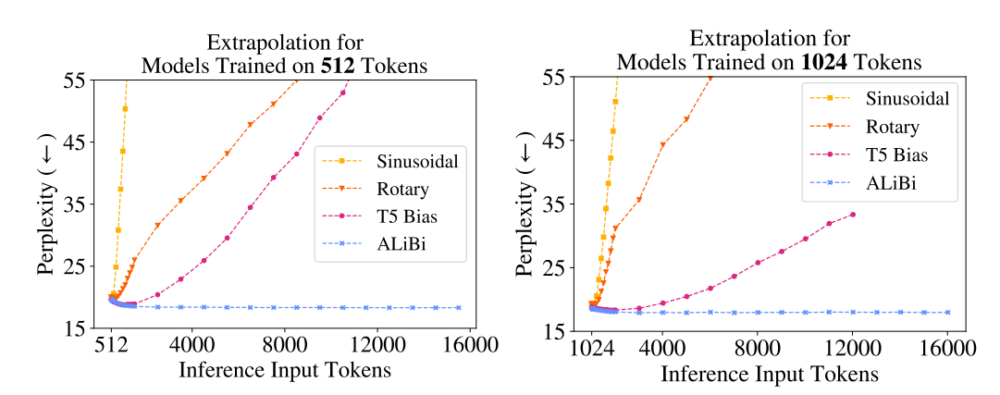 
Figure 1: Extrapolation: as the (validation-set’s)input sequence gets longer (x-axis), current position methods (sinusoidal, rotary, and T5)show degraded perplexity (y-axis, lower is better), but our method (§3)does not. Models were trained on WikiText-103 with sequences of L = 512 (left)or L = 1,024 (right)tokens. T5 ran out of memory on our 32GB GPU. For more detail on exact perplexities and runtimes, see Tables 2 and 3 in the appendix.
图1：外推：随着(验证集的)输入序列变长(x 轴)，当前位置方法(正弦曲线、旋转和 T5)显示出下降的困惑度(y 轴，越低越好)，但我们的方法(§3)没有。 模型在 WikiText-103 上使用 L = 512(左)或 L = 1,024(右)令牌序列进行训练。 T5 在我们的 32GB GPU 上耗尽了内存。 有关确切困惑和运行时间的更多详情，请参阅附录中的表2 和表3。

We demonstrate that this failure to extrapolate is caused by the position embedding method. As shown in Figure 1, recent alternatives to the original sinusoidal position method (Su et al., 2021; Raffel et al., 2020)have improved extrapolation. However, the better of these, the T5 bias, is considerably slower than the sinusoidal approach and uses extra memory and parameters (Figure 2).

我们证明这种外推失败是由位置嵌入方法引起的。 如图1 所示，原始正弦位置方法的最新替代方法(Su et al., 2021; Raffel et al., 2020)改进了外推法。 然而，其中更好的 T5偏差 比正弦方法慢得多，并且使用额外的内存和参数(图2)。

We therefore introduce Attention with Linear Biases (ALiBi)to facilitate efficient extrapolation. ALiBi negatively biases attention scores with a linearly decreasing penalty proportional to the distance between the relevant key and query. Our simple approach eliminates position embeddings. 

因此，我们引入 线性偏差注意力(ALiBi) 以促进高效外推。 ALiBi以与相关键和查询之间的距离成比例的线性递减惩罚来负向影响注意力得分。 我们的简单方法消除了位置嵌入。

Compared to a sinusoidal model trained on the same input length, our method requires no additional runtime or parameters and incurs a negligible (0–0.7%)memory increase. ALiBi can be implemented by changing only a few lines of existing transformer code.

与在相同输入长度上训练的正弦模型相比，我们的方法不需要额外的运行时间或参数，并且内存增加可忽略不计 (0–0.7%)。 ALiBi 只需更改几行现有transformer代码即可实现。

Using ALiBi, a transformer LM can be trained on short-L sequences and therefore at much lower cost, and it can still be reliably applied to long sequences at runtime. For example, a 1.3 billion parameter LM trained on L = 1024 tokens with ALiBi achieves the same perplexity as a sinusoidal model trained on L = 2048 when both are tested on sequences of 2048 tokens, even though our model is 11% faster and uses 11% less memory.

使用 ALiBi，transformer LM 可以在 短-L 序列上进行训练，因此成本要低得多，而且它仍然可以在运行时可靠地应用于长序列。 例如，使用 ALiBi 在 L = 1024 个令牌上训练的 13 亿参数 LM 实现了与在 L = 2048 上训练的正弦模型相同的困惑度，当两者都在 2048 个令牌的序列上进行测试时，即使我们的模型快 11%,内存使用减少了11%。

Though performance peaks at around two times the number of tokens that the model was trained on, ALiBi maintains strong performance even on sequences of length 10,000. In recently explored settings where NLP training examples are given as context to an LM (Brown et al., 2020), our approach will allow exposure to more examples. Additionally, it enables generation of longer outputs. 

虽然性能峰值大约是模型训练的令牌数量的两倍，但 ALiBi 即使在长度为 10,000 的序列上也能保持强大的性能。 在最近探索的设置中，将 NLP 训练样本作为 LM 的上下文给出(Brown et al., 2020)，我们的方法将允许接触更多样本。 此外，它还可以生成更长的输出。

## 2 CURRENT APPROACHES DO NOT EXTRAPOLATE EFFICIENTLY
We show for the first time that the sinusoidal position method, which technically should be able to extrapolate, in practice has very limited extrapolation capabilities. Though the rotary position method improves over the sinusoidal one, it still does not achieve satisfying results. Holding everything else constant, we are the first to observe that the T5 bias method leads to better extrapolation than either of these, and so we conclude that extrapolation ability depends heavily on the position embedding. Unfortunately, the T5 bias is computationally costly (Figure 2).

我们首次表明，技术上应该能够外推的正弦位置方法在实践中外推能力非常有限。 虽然旋转定位法比正弦定位法有所改进，但仍未取得令人满意的结果。 保持其他一切不变，我们是第一个观察到 T5偏差 方法比这两种方法更好外推的人，因此我们得出结论，外推能力在很大程度上取决于位置嵌入。 不幸的是，T5偏差 的计算成本很高(图2)。

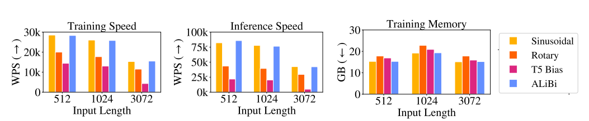 
Figure 2: A comparison of batched training, inference speed and memory use of the sinusoidal, rotary, T5 bias, and our ALiBi position methods. The speed differences between our method and the sinusoidal are within 1% during training and 3% for inference, which is insignificant on our hardware. ALiBi uses 100MB of extra memory when training on input lengths 1024 and 3072 in this setting. Memory usage is lower in all approaches when training on 3072 tokens (compared to 1024)since we break batches into multiple updates. See Table 1 in the appendix for exact numbers.
图2：正弦、旋转、T5偏差 和我们的 ALiBi 位置方法的批量训练、推理速度和内存使用的比较。 我们的方法和正弦曲线之间的速度差异在训练期间在 1% 以内，在推理期间差异在 3% 以内，这在我们的硬件上是微不足道的。 在此设置中训练输入长度 1024 和 3072 时，ALiBi 使用 100MB 的额外内存。 在训练 3072 个令牌(与 1024 个令牌相比)时，所有方法的内存使用量都较低，因为我们将批次分成多个更新。 确切数字见附录中的表1。

### 2.1 BACKGROUND AND EXPERIMENTAL SETUP
A transformer LM receives a list of tokens and outputs a probability distribution representing its prediction for the next token. We call the input list the current input subsequence since the inputs to language models are typically subsequences from (much longer)training or evaluation sequences. During both training and perplexity evaluation (i.e., scoring a fixed sequence), many predictions can be calculated at once; this is done using a “causal mask” that ensures each position’s prediction is influenced only by tokens to its left. Let L be the length of each input subsequence during training; it includes L predictions, which on average have access to $\frac{L+1}{2}$ tokens of (left)context. To explore a model’s extrapolation abilities, we are interested in cases where sequences of length $L_{valid}$ > L are considered at evaluation time. When L differs between inference and training, we use L to refer to the length of subsequences during training and $L_{valid}$ to refer to their length at validation. 

Transformer LM 接收令牌列表并输出表示其对下一个令牌的预测的概率分布。 我们将输入列表称为当前输入子序列，因为语言模型的输入通常是来自(更长的)训练或评估序列的子序列。 在训练和困惑度评估(即对固定序列进行评分)期间，可以一次计算许多预测;  这是使用“因果掩码”完成的，该掩码确保每个位置的预测仅受其左侧令牌的影响。 令 L 为训练期间每个输入子序列的长度;  它包括 L 个预测，平均可以访问 $\frac{L+1}{2}$ 个(左边的)上下文令牌。 为了探索模型的外推能力，我们对在评估时考虑长度 $L_{valid}$ > L 的序列的情况感兴趣。 当 L 在推理和训练之间不同时，我们使用 L 来指代训练期间子序列的长度，并使用 $L_{valid}$ 来指代它们在验证时的长度。

#### Nonoverlapping Inference 非重叠推理
To train on or evaluate a sequence longer than L tokens, it is typical to segment the sequence into L-length subsequences and train on or evaluate them independently. Unless otherwise stated, we use nonoverlapping inference to report perplexity scores.

要训练或评估比 L个令牌长的序列，通常将序列分割成 L长度的子序列并独立训练或评估它们。 除非另有说明，否则我们使用非重叠推理来报告困惑得分。

#### Extrapolation During Inference  推理过程中的外推
Formally, the functions that define a transformer layer are agnostic to input length(3 These include the embedding lookup, feedforward sublayer, and softmax layer, which act independently on vector inputs, as well as the attention sublayers, whose parameters do not depend on input length (and which must handle variable-length inputs, e.g., due to causal masking)); they map from some arbitrary, unfixed number of input vectors to the same number of output vectors. When transformers are applied to data that is inherently sequential, like text, positional information is injected into the inputs in various ways.

形式上，定义transformer层的函数与输入长度无关(3 其中包括嵌入查找、前馈子层和 softmax 层，它们独立作用于向量输入，以及注意力子层，其参数不依赖于输入长度(并且必须处理可变长度的输入，例如，由于因果掩码));  它们从一些任意的、不固定数量的输入向量映射到相同数量的输出向量。 当transformer应用于本质上是顺序的数据(如文本)时，位置信息会以各种方式注入到输入中。

Vaswani et al. (2017)discussed two options for embedding positions into vectors to be added to word embeddings: learning embeddings for specific positions and unlearned sinusoidal embeddings. They observed similar performance between these two but preferred the sinusoidal approach, which they argued might extrapolate to longer input sequences during inference. We find that this model cannot extrapolate to more than a few dozen tokens beyond L.(4 The learned positional embedding approach does not have a way to encode positions greater than L; it therefore has no ability to extrapolate.)

Vaswani et al. (2017)讨论了将位置嵌入到要添加到词嵌入的向量中的两种选择：学习特定位置的嵌入和非学习的正弦嵌入。 他们观察到这两者之间的性能相似，但更喜欢正弦方法，他们认为这可能会在推理过程中外推到更长的输入序列。 我们发现该模型不能外推到超过 L 的几十个令牌。(4 学习到的位置嵌入方法没有办法对大于 L 的位置进行编码; 因此它没有外推能力)

#### Experiment Setup 实验设置
We first test the extrapolation abilities of various position methods on the WikiText-103 corpus (Merity et al., 2016)using the transformer language model of Baevski & Auli (2018). We use this model because of its prominent role in recent language modeling developments (Khandelwal et al., 2020; Press et al., 2021). The training set is about 103 million tokens from English Wikipedia (half a gigabyte). The model has 16 transformer layers of dimension 1024, with 8 heads, and a feedforward inner dimension of 4096. This model ties the word embedding and softmax matrices (Press & Wolf, 2017; Inan et al., 2017). In our experiments, other than varying the position method and training subsequence length, we modify no other hyperparameters, including the random seed and number of training epochs (205).

我们首先使用 Baevski & Auli (2018)的transformer语言模型在 WikiText-103语料库 (Merity et al., 2016)上测试各种位置方法的外推能力。 我们使用该模型是因为它在最近的语言建模发展中发挥了突出作用(Khandelwal et al., 2020; Press et al., 2021)。 训练集是来自英文维基百科的大约 1.03 亿个令牌(半千兆字节)。 该模型有 16层, 1024维, 8个头，前馈内部为4096维 的transformer层。该模型将词嵌入和 softmax 矩阵联系在一起 (Press & Wolf, 2017; Inan et al., 2017)。 在我们的实验中，除了改变位置方法和训练子序列长度外，我们没有修改其他超参数，包括随机种子和训练时期数 (205)。

### 2.2 MEASURING EXTRAPOLATION 测量外推
#### Sinusoidal Position Embeddings 正弦位置嵌入
Sinusoidal position embeddings (Vaswani et al., 2017; §3.5)are constant, non-learned vectors that are added to token embeddings on input to the first layer of the transformer. They are frequently used in transformer language modeling (Baevski & Auli, 2018; Lewis et al., 2021)and machine translation (Vaswani et al., 2017; Ott et al., 2018)models. We first consider the unmodified model of Baevski & Auli (2018), which uses sinusoidal position embeddings, and train it on L = 512 tokens; we then run inference with it on the validation set on L + k tokens, with k ranging from 0 to 15,000. Figure 1 (left)and the corresponding Table 2 (in the appendix)show that while the model improves perplexity up to k = 20, performance stops improving and stays steady from k = 20 to k = 50 and then begins degrading. Similar results are obtained for a model trained with L = 1024 tokens (Figure 1 (right)and Table 3 in the appendix). That model improves for up to $L_{valid}$ = L + 50 tokens, after which performance declines. 

正弦位置嵌入(Vaswani et al., 2017; §3.5)是恒定的、非学习的向量，它们被添加到transformer第一层的输入令牌嵌入中。 它们经常用于transformer语言建模(Baevski & Auli，2018; Lewis et al., 2021)和机器翻译(Vaswani et al., 2017; Ott et al., 2018)模型。 我们首先考虑 Baevski & Auli (2018) 未修改模型，它使用正弦位置嵌入，并在 L = 512 个令牌上训练它;  然后，我们在 L + k 个令牌的验证集上使用它进行推理，k 的范围从 0 到 15,000。 图1(左)和相应的表2(附录中)显示，虽然模型将困惑度提高到 k = 20，但性能停止提高并从 k = 20 到 k = 50 保持稳定，然后开始下降。 使用 L = 1024 个令牌训练的模型也获得了类似的结果(图1(右)和附录中的表3)。 该模型改进了最多 $L_{valid}$ = L + 50 个令牌，之后性能下降。

#### Rotary Position Embeddings  旋转位置嵌入
The rotary method was introduced by Su et al. (2021) and has recently been popularized by the open source GPT-3 (Brown et al., 2020)implementation GPTJ (Wang & Komatsuzaki, 2021). Instead of adding sinusoidal embeddings at the bottom of the transformer, they multiply the keys and queries of every attention layer by sinusoidal embeddings.

旋转方法由 Su et al. (2021) 介绍, 并且最近因开源 GPT-3(Brown et al., 2020)实现 GPTJ(Wang 和 Komatsuzaki，2021)而得到普及。 他们不是在transformer底部添加正弦嵌入，而是将每个注意力层的键和查询乘以正弦嵌入。

Unlike the sinusoidal or learned positional embedding approach, the rotary method injects position information into the model at every layer, not just at the initial one. In addition, it adds no position information to the values of the self-attention sublayer. The output of a self-attention sublayer is a linearly transformed, weighted sum of the input value vectors; therefore, by not inserting position information into the values, the outputs of each transformer-layer contain no explicit position information. We suspect that this segregation of position information may be beneficial for extrapolation, and we draw inspiration from it in the design of our method (§3).

与正弦或学习位置嵌入方法不同，旋转方法将位置信息注入模型的每一层，而不仅仅是在初始层。 此外，它不向自注意力子层的值添加任何位置信息。 自注意力子层的输出是输入值向量的线性变换加权和;  因此，通过不将位置信息插入到值中，每个transformer层的输出不包含明确的位置信息。 我们怀疑这种位置信息的分离可能有利于外推，我们在这种方法的设计中汲取了灵感 (§3)。

We apply the rotary position embedding method to our Baevski & Auli baseline(5 Our rotary method implementation is based on the code in https://github.com/JunnYu/RoFormer_pytorch, which is linked to from the official repository of Su et al. (2021): (https: //github.com/ZhuiyiTechnology/roformer). After we finished running our experiments with the rotary method, we were informed that the runtime of the code linked above could be optimized, making it only 2% slower than the sinusoidal approach. This optimization would not change extrapolation performance ). The perplexity results (Figure 1 and Appendix Tables 2 and 3)are better than the sinusoidal approach: the model with L = 512 (L = 1024) improves perplexity with up to k = 200 (k = 100)more tokens than it saw during training, but this comes at the cost of slower training and inference (Figure 2).

我们将旋转位置嵌入方法应用于我们的 Baevski & Auli 基线(5 我们的旋转方法实现基于 https://github.com/JunnYu/RoFormer_pytorch 中的代码，该代码链接到 Su et al. (2021)的官方代码库: https://github.com/ZhuiyiTechnology/roformer). 在我们用旋转方法完成实验后，我们被告知上面链接的代码的运行时间可以优化，只比正弦方法慢了2% 。这种优化不会改变外推性能。 困惑度结果(图1 和附录表2 和 3)优于正弦方法：L = 512 (L = 1024)的模型 与它在训练时相比，改善了困惑度，但这是以较慢的训练和推理为代价的(图2)。

#### T5 Bias 
Though most models use trained or sinusoidal position embeddings, the T5 model of Raffel et al. (2020)uses a relative position method (Shaw et al., 2018; Huang et al., 2019)that adds no position information to word embeddings (as in the previous method). Instead, it modifies the way attention values are computed. We refer to this as the “T5 bias” method(6 This method is similar to the one used in Parikh et al. (2016, Equation 7). ). To compute attention values in the unmodified transformer, we compute the dot product of every query with every relevant key and then softmax these attention values. In this method, we compute the attention values as before, but then we add a learned, shared bias to each query-key score that is dependent on just the distance between the query and key. Therefore, all query-key scores where the query and key distance are zero (i.e., the query and key represent the same token)get a specific learned bias, all scores where the query and key are one word away get a different learned bias, and so on, up to a certain point, from where multiple different distances share the same learned bias (which might be beneficial for extrapolation). As in the rotary method, the T5 bias injects position information into the model at every layer and integrates no explicit position information into the self-attention value vectors.

尽管大多数模型使用经过训练的或正弦位置嵌入，但 Raffel et al. (2020) 的 T5模型使用相对位置方法(Shaw et al., 2018; Huang et al., 2019)，不向词嵌入添加位置信息(与之前的方法一样)。 相反，它修改了注意力 值的计算方式。 我们将此称为“T5偏差”方法(6 此方法类似于 Parikh et al. (2016，方程7)中使用的方法)。 为了计算未修改的transformer中的注意力值，我们计算每个查询与每个相关键的点积，然后对这些注意力值进行 softmax。 在这种方法中，我们像以前一样计算注意力值，但随后我们向每个 查询-键 得分添加一个学习的共享偏差，该得分仅取决于查询和键之间的距离。 因此，查询和键距离为零的所有 查询-键 得分(即查询和键表示相同的令牌)都会得到特定的学习偏差，查询和键相距一个词的所有得分都会得到不同的学习偏差， 依此类推，直到某个点，从那里多个不同的距离共享相同的学习偏差(这可能有利于外推)。 与旋转方法一样，T5偏差 将位置信息注入模型的每一层，并且没有将明确的位置信息集成到自注意力值向量中。

<!-- 
A decomposable attention model for natural language inference https://aclanthology.org/D16-1244/
-->

Raffel et al. (2020)propose that the T5 bias may allow extrapolation, but they did not report experiments testing this. Here, we show that the T5 bias does allow language models to extrapolate. We do this by again modifying the Baevski & Auli model, this time to insert the T5 bias into it.(7 Our T5 bias implementation is based on the one used in HuggingFace Transformers (Wolf et al., 2020), which in turn is based on the official Mesh Tensorflow T5 code. )

Raffel et al. (2020)提出 T5偏差 可能允许外推，但他们没有报告对此进行测试的实验。 在这里，我们表明 T5偏差 确实允许语言模型进行推断。 为此，我们再次修改 Baevski & Auli 模型，这次是将 T5偏差 插入其中。(7 我们的 T5偏差 实现基于 HuggingFace Transformers(Wolf et al., 2020)中使用的那个，而后者又是 基于官方 Mesh Tensorflow T5 代码)

As Figure 1 shows, the T5 bias improves perplexity with longer sequences than the ones it was trained on, i.e., k = 600 (k = 800)extra tokens for a model trained on L = 512 (L = 1024)input tokens. Unfortunately, this impressive performance comes at a cost: training is at least twice as slow as with the sinusoidal model. Therefore, this model’s extrapolation ability provides no efficiency advantage. For example, to do inference on 1024 tokens, we could either train the sinusoidal model with L = 1024 or train the T5 bias model on L = 512 tokens and extrapolate to 1024 for inference.

如图1 所示，T5偏差 改善了序列比训练序列更长的困惑度，即，对于在 L = 512 (L = 1024)输入令牌上训练的模型，k = 600 (k = 800)个额外令牌。 不幸的是，这种令人印象深刻的性能是有代价的：训练速度至少是正弦模型的两倍。 因此，该模型的外推能力没有效率优势。 例如，要对 1024 个令牌进行推理，我们可以使用 L = 1024 训练正弦模型，或者在 L = 512 个令牌上训练 T5偏差 模型并外推到 1024 以进行推理。

However, the L = 1024 sinusoidal model runs at 28.5k words per second (WPS), while the L = 512 T5 bias model runs at 14.4k WPS (Appendix Table 1), so there is no speedup when training on shorter sequences with this method.(8 Narang et al. (2021)benchmarked the T5 bias as being just 8.7% slower than the sinusoidal approach; thus, while always incurring a runtime penalty, this method’s runtime could be faster depending on the choice of hardware and software frameworks used. Narang et al. used the Tensorflow T5 library running on TPUs, while we used the PyTorch Fairseq library running on GPUs. )

然而，L = 1024 正弦模型以每秒 28.5k 字 (WPS)的速度运行，而 L = 512 T5偏差 模型以 14.4k WPS 运行(附录表1)，因此在使用此方法训练较短序列时没有加速 方法。(8 Narang et al. (2021) 将 T5偏差 作为基准，仅比正弦方法慢 8.7%; 因此，虽然总是会产生运行时间损失，但根据选择使用的硬件和软件框架，该方法的运行时间可能会更快。Narang et al. 使用在 TPU 上运行的 Tensorflow T5 库，而我们使用在 GPU 上运行的 PyTorch Fairseq 库)

## 3 ATTENTION WITH LINEAR BIASES (ALIBI) 线性偏差注意
In the transformer model of Vaswani et al. (2017), position embeddings are added to the word embeddings at the bottom of the network. For an input subsequence of length L, the attention sublayer computes the attention scores for the ith query $q_i ∈ R^{1×d}$ , (1 ≤ i ≤ L)in each head, given the first i keys K ∈ $R^{i×d}$ , where d is the head dimension: 

在 Vaswani et al. (2017)的transformer模型中，位置嵌入被添加到网络底部的词嵌入中。 对于长度为 L 的输入子序列，注意力子层计算每个头中第 i 个查询 $q_i ∈ R^{1×d}$ , (1 ≤ i ≤ L)的注意力得分，给定前 i 个键 K ∈ $ R^{i×d}$ ，其中 d 是头的维度：

$softmax(q_iK^T)$

These attention scores are then multiplied by the values to return the output of the attention sublayer.(9 For simplicity we omit the key, query, value and final output projections, dropout, and the scaling factor.)

然后将这些注意力得分乘以值以返回注意力子层的输出。(9 为简单起见，我们省略了键、查询、值和最终输出投影、dropout和缩放因子)

When using ALiBi, we do not add position embeddings at any point in the network. The only modification we apply is after the query-key dot product, where we add a static, non-learned bias(10The ALiBi bias is not multiplied by the $\sqrt{d_k}$ scaling factor from Equation 1 of Vaswani et al. (2017).):

使用 ALiBi 时，我们不会在网络中的任何点添加位置嵌入。 我们应用的唯一修改是在 查询-键 点积之后，我们在其中添加了一个静态的、非学习的偏差(10 ALiBi 偏差没有乘以 Vaswani et al. (2017)等式 1 中的 $\sqrt{d_k}$ 比例因子)：

softmax($q_iK^T$ + m · [−(i − 1), ..., −2, −1, 0]), 

where scalar m is a head-specific slope fixed before training. Figure 3 offers a visualization.

其中, 标量m 是训练前固定的头部特定斜率。 图3 提供了可视化效果。

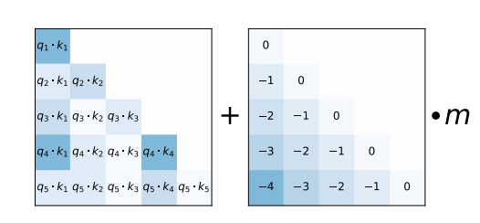 
Figure 3: When computing attention scores for each head, our linearly biased attention method, ALiBi, adds a constant bias (right)to each attention score ($q_i$ · $k_j$ , left). As in the unmodified attention sublayer, the softmax function is then applied to these scores, and the rest of the computation is unmodified. m is a head-specific scalar that is set and not learned throughout training. We show that our method for setting m values generalizes to multiple text domains, models and training compute budgets. When using ALiBi, we do not add positional embeddings at the bottom of the network. 
图3：在计算每个头部的注意力得分时，我们的线性偏差注意力方法 ALiBi 为每个注意力得分($q_i$·$k_j$，左)添加了一个常量偏差(右)。 与未修改的注意力子层一样，softmax 函数随后应用于这些得分，其余计算未修改。 m 是特定于头部的标量，它是在整个训练过程中设置的而不是学习的。 我们展示了我们设置 m值的方法可以推广到多个文本域、模型和训练计算预算。 使用 ALiBi 时，我们不在网络底部添加位置嵌入。
<!--m，增加超参数总是怪怪的, m值多大？ -->

For our models with 8 heads, the slopes that we used are the geometric sequence: $\frac{1}{2^1} , \frac{1}{2^2} , ..., \frac{1}{2^8}$ . For models that require 16 heads, we interpolate those 8 slopes by geometrically averaging every consecutive pair, resulting in the geometric sequence that starts at $\frac{1}{ \sqrt{2}}$ and has the ratio of $\frac{1}{ \sqrt{2}}$ : $\frac{1}{2^{0.5}} , \frac{1}{2^1} , \frac{1}{2^{1.5}} , ..., \frac{1}{2^8}$ . In general, for n heads, our set of slopes is the geometric sequence that starts at $2^{\frac{−8}{n}}$ and uses that same value as its ratio.

对于我们有 8个头的模型，我们使用的斜率m是几何序列： $\frac{1}{2^1} , \frac{1}{2^2} , ..., \frac{1}{ 2^8}$。 对于需要 16 个头的模型，我们通过对每对连续对进行几何平均来对这 8 个斜率进行插值，得到从 $\frac{1}{ \sqrt{2}}$ 开始并具有 $\frac{ 1}{ \sqrt{2}}$ : $\frac{1}{2^{0.5}} , \frac{1}{2^1} , \frac{1}{2^{1.5}} , . .., \frac{1}{2^8}$ 。 一般来说，对于 n 个头，我们的斜率集是从 $2^{\frac{−8}{n}}$ 开始的几何序列，并使用相同的值作为其比率。

In §4, we observe that this set of slopes works on a wide variety of text domains and model sizes. Therefore, we do not believe that it is necessary to tune these slope values every time a new model is trained on a new dataset. This makes our method similar to the sinusoidal approach, where the hyperparameters (the start and end of the geometric progression of wavelengths)were set once by Vaswani et al. (2017)and then reused in different models of different sizes on different datasets.

在§4 中，我们观察到这组斜率适用于各种文本域和模型大小。 因此，我们不认为每次在新数据集上训练新模型时都需要调整这些斜率值。 这使得我们的方法类似于正弦方法，其中超参数(波长几何级数的开始和结束)由 Vaswani et al.  (2017) 设置一次，然后在不同数据集上的不同大小的不同模型中重复使用。

ALiBi has an inductive bias towards recency; it penalizes attention scores between distant query-key pairs, with the penalty increasing as the distance between a key and a query grows. The different heads increase their penalties at different rates, depending on the slope magnitude.

ALiBi 对新近度有归纳偏差;  它会惩罚远距离查询-键对之间的注意力得分，随着键和查询之间的距离增加，惩罚也会增加。 不同的头以不同的速率增加他们的惩罚，这取决于斜率的大小。

We initially experimented with making the slopes trainable, but this did not yield strong extrapolation results(11 In our experiments, trainable slopes also slowed down the training speed by 3%.). A brief manual exploration of around ten slope sets led us to discover the set of slopes that we finally picked. Our main insight from this exploration is that the slope sets that work best are those with slopes in the (0, 1)range, with the slopes’ density increasing as we get closer to 0. We also found our method to be robust to slope choice. Even randomly sampling from the exponential distribution worked well in some cases (although that method had high variance).

我们最初尝试使斜率可训练，但这并没有产生强有力的外推结果(11 在我们的实验中，可训练的斜率也使训练速度减慢了 3%)。 对大约十个斜率集的简短手动探索使我们发现了我们最终选择的斜率集。 我们从这次探索中得到的主要见解是，效果最好的斜率集是那些斜率在 (0, 1)范围内的斜率，随着我们接近 0，斜率的密度增加。我们还发现我们的方法对斜率具有稳健性 选择。 在某些情况下，甚至从指数分布中随机抽样也能很好地工作(尽管该方法具有高方差)。

Since ALiBi is a relative position method, we add position information at every layer to the keys and queries but not to the values, as is done in the T5 bias and rotary methods. We hypothesize that these properties might be beneficial for extrapolation. 

由于 ALiBi 是一种相对位置方法，我们将每一层的位置信息添加到键和查询中，而不是值中，就像在 T5偏差 和旋转方法中所做的那样。 我们假设这些特性可能有利于外推。

Implementation. ALiBi is easy to implement, with all changes accomplished in a few lines of code. We implement it by modifying the mask matrix by adding the linear biases to it (in practice, when training a transformer LM, query $q_i$ attends only to keys 1 to i; this is implemented by adding a mask matrix to the query-key dot product before the softmax operation is applied). This means that there is no runtime penalty when using our method since we add no operations to the network.

执行。 ALiBi 易于实施，只需几行代码即可完成所有更改。 我们通过添加线性偏差来修改掩码矩阵来实现它(在实践中，当训练一个transformer LM 时，查询 $q_i$ 只关注键 1 到 i; 这是通过向 查询-键 点积添加一个掩码矩阵来实现的 在应用 softmax 操作之前)。 这意味着使用我们的方法时没有运行时惩罚，因为我们没有向网络添加任何操作。

Compared to the sinusoidal model trained on the same input lengths, AliBi incurs a memory increase (up to 100MB in some of our experiments): in the unmodified transformer, the mask is of size L×L; when using ALiBi, the mask is a slightly larger n×L×L (where n is the number of heads)since the linear biases added for each head uses a different slope. But, as we show, ALiBi enables training on much smaller sequences while still achieving (and occasionally surpassing)results obtained using sinusoidal embeddings on longer sequences, which saves multiple gigabytes of memory. 

与在相同输入长度上训练的正弦模型相比，AliBi 导致内存增加(在我们的一些实验中高达 100MB)：在未修改的 transformer 中，mask 的大小为 L×L;  当使用 ALiBi 时，掩码略大 n×L×L(其中 n 是头的数量)，因为为每个头添加的线性偏差使用不同的斜率。 但是，正如我们展示的那样，ALiBi 可以在更小的序列上进行训练，同时仍然可以实现(有时甚至超过)在更长的序列上使用正弦嵌入获得的结果，从而节省数 GB 的内存。

## 4 RESULTS
We first show that on WikiText103 ALiBi is efficient and enables training models with short input subsequences that outperform strong baselines even when the ALiBi models extrapolate to more than six times the number of tokens that they were trained on. We then take the same hyperparameters for our method (the set of slopes)that worked on WikiText-103 and show that – with no modification – they provide strong results on a dataset in a very different domain: books. Finally, we show that a 1.3B parameter model trained with AliBi on a much larger (461 GB)dataset with much more compute provides a superior alternative to the sinusoidal method since it achieves similar perplexity scores while running faster and using less memory (since it is trained on shorter inputs).

我们首先表明，在 WikiText103 上，ALiBi 是高效的，并且可以训练具有短输入子序列的模型，即使 ALiBi 模型外推到它们所训练的令牌数量的六倍以上，其性能也优于强基线。 然后，我们为我们的方法(斜率集)采用与 WikiText-103 相同的超参数，并表明——在没有修改的情况下 —— 它们在一个非常不同的领域的数据集上提供了很好的结果：书籍。 最后，我们展示了使用 AliBi 在更大 (461 GB)的数据集上训练的 1.3B 参数模型提供了比正弦方法更好的替代方法，因为它在运行速度更快和使用更少内存的同时实现了相似的困惑得分(因为它 接受较短输入的训练)。

While multiple alternatives to the position methods presented in Vaswani et al. (2017)have been proposed, few have been adopted in large (1B or more parameter)LMs since that setting is much more challenging than the smaller scale experiments. GPT-3 and Jurassic-1 (Lieber et al., 2021)use the learned position embedding method from Vaswani et al., and GPT-J uses the rotary method. Our results on the 1.3B parameter model show our method’s ability to generalize to larger models, dataset sizes and training durations without retuning the hyperparameter.

虽然 Vaswani et al.  (2017)提出的位置方法的多种替代方案已经被提出，很少有人在大型(1B 或更多参数)LM 中采用，因为该设置比小规模实验更具挑战性。 GPT-3 和 Jurassic-1 (Lieber et al., 2021)使用 Vaswani et al. 学习的位置嵌入方法，GPT-J 使用旋转方法。 我们在 1.3B 参数模型上的结果表明我们的方法能够在不重新调整超参数的情况下推广到更大的模型、数据集大小和训练持续时间。

### 4.1 RESULTS ON WIKITEXT-103 AND TORONTO BOOKCORPUS
We first develop our method on the WikiText-103 corpus (Merity et al., 2016), replacing the sinusoidal position embeddings in the language model of Baevski & Auli (2018)with ALiBi.

我们首先在 WikiText-103语料库 (Merity et al., 2016)上开发我们的方法，用 ALiBi 替换 Baevski & Auli (2018)语言模型中的正弦位置嵌入。

Figure 4 (and the corresponding Appendix Table 5)show our results for models trained with varying numbers of input subsequence tokens (L), extrapolating to longer subsequence lengths on the validation dataset. Our first observation is that, without extrapolation, for every L, our models outperform those using the sinusoidal method, sometimes by a significant amount. For example, the Baevski & Auli model achieves 18.67±0.24 (std. dev.)perplexity when trained with L = 3072 input tokens, but our L = 3072 model achieves 17.60 perplexity (when both models evaluate with $L_{valid}$ = 3072). 

图4(和相应的附录表5)显示了我们使用不同数量的输入子序列令牌 (L)训练的模型的结果，外推到验证数据集上更长的子序列长度。 我们的第一个观察结果是，在没有外推的情况下，对于每个 L，我们的模型都优于使用正弦方法的模型，有时甚至要好很多。 例如，Baevski & Auli 模型在使用 L = 3072 输入令牌训练时达到 18.67±0.24(标准偏差)的困惑度，但我们的 L = 3072 模型达到 17.60 的困惑度(当两个模型都使用 $L_{valid}$ = 3072 进行评估时)。

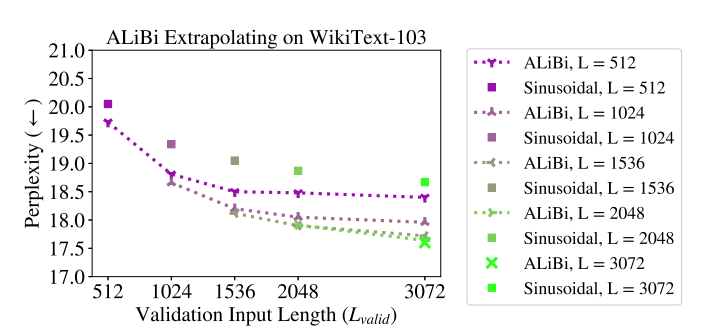 
Figure 4: ALiBi models trained and evaluated on varying sequence lengths on the WikiText-103 validation set and the sinusoidal baseline (not evaluated on longer sequences). All of our models outperform the sinusoidal ones even when trained on fewer tokens. Appendix Table 5 has exact perplexities, more ALiBi models (trained on fewer tokens), and results for rotary and T5 bias models.
图4：ALiBi 模型在 WikiText-103 验证集和正弦基线(未在较长序列上评估)的不同序列长度上训练和评估。 我们所有的模型都优于正弦曲线模型，即使在使用较少的令牌进行训练时也是如此。 附录表5 有确切的困惑、更多的 ALiBi 模型(在更少的令牌上训练)以及旋转和 T5偏差 模型的结果。

Our second observation is that all of our models can extrapolate, and they obtain improved perplexity scores when handling more tokens than they observed during training. For example, our model trained on 512 tokens (which achieves 19.73 perplexity when evaluating subsequences of length 512 in the development set)achieves a perplexity score of 18.40 on the development set when extrapolating to subsequences of length 3072. Surprisingly, this surpasses the score that the L = 3072 sinusoidal model obtains on the development set by a statistically significant margin. Note that all our models trained on L = 512 to L = 2048 outperform the sinusoidal baseline trained on L = 3072 when extrapolating to $L_{valid}$ = 3072 even though those models all take much less time to train since they train on shorter subsequences (Appendix Figure 8 compares training speed to perplexity for these models)! The L = 512 model is 1.84 times faster to train and yet still outperforms the L = 3072 sinusoidal model when extrapolating to $L_{valid}$ = 3072. In addition, training the L = 3072 sinusoidal model requires a GPU with more than 16 GB of memory to fit the large attention matrices, which our L = 512 outperforms even though it can be trained on a GPU with much less memory due to much smaller attention matrices.

我们的第二个观察结果是，我们所有的模型都可以进行推断，并且当它们处理比训练期间观察到的更多的令牌时，它们会获得改善的困惑得分。 例如，我们的模型在 512 个令牌上训练(在评估开发集中长度为 512 的子序列时达到 19.73 的困惑度)在外推到长度为 3072 的子序列时在开发集中达到了 18.40 的困惑度得分。令人惊讶的是，这超过了 L = 3072 正弦模型在开发集上获得了具有统计显著性的裕度。 请注意，当外推到 $L_{valid}$ = 3072 时，我们在 L = 512 到 L = 2048 上训练的所有模型都优于在 L = 3072 上训练的正弦基线，尽管这些模型训练时间要少得多，因为它们训练的子序列较短(附录图8) 将训练速度与这些模型的困惑度进行比较)！ L = 512 模型的训练速度提高了 1.84 倍，但在外推到 $L_{valid}$ = 3072 时仍然优于 L = 3072 正弦模型。此外，训练 L = 3072 正弦模型需要具有超过 16 GB 内存的 GPU 才能适应 大的注意力矩阵，我们的 L = 512 优于它，即使它可以在内存更少的 GPU 上进行训练，因为注意力矩阵小得多。

Additionally, Table 5 (in the appendix)also shows that, for Ls of 1024 and 3072, our method performs better than the rotary and T5 bias models even when $L_{valid}$ = L (i.e., no extrapolation is occurring). Figure 1 (and the corresponding Appendix Tables 2 and 3)more broadly explore our method vs. the other position methods. They show that the T5 bias (the best of the baselines)improves perplexity until $L_{valid}$ is around 2L, but on the WikiText-103 dataset our method continually improves perplexity until at least around 3L, with the L = 512 model improving perplexity even when $L_{valid}$ exceeds 12k tokens. Even when unable to improve perplexity given longer sequences, ALiBi always maintains strong performance as more tokens are added.

此外，表5(在附录中)还表明，对于 1024 和 3072 的 Ls，即使在 $L_{valid}$ = L(即没有发生外推)时，我们的方法也比旋转和 T5偏差 模型表现更好。 图1(以及相应的附录表2 和 3)更广泛地探索了我们的方法与其他位置方法。 他们表明，T5偏差 (最好的基线)改善了困惑度，直到 $L_{valid}$ 大约为 2L，但在 WikiText-103 数据集上，我们的方法不断提高困惑度，直到至少达到 3L 左右，L = 512 模型改善了困惑度，即使在 $L_{valid}$ 时也是如此 超过 12k 个令牌。 即使在给定更长的序列无法提高困惑度时，ALiBi 也始终保持强大的性能，因为添加了更多的令牌。

Appendix Table 6 shows that our results on the validation set also transfer to the test set of WikiText-103. Currently, almost all models that present results on WikiText-103 use sliding window evaluation (defined in §B)to compute perplexities. We apply that method to our (and to the sinusoidal, rotary and T5 bias)models in Appendix Table 7. We find that our L = 3072 model surpasses the performance of Transformer-XL (Dai et al., 2019), the Sandwich (Press et al., 2020), and Shortformer (Press et al., 2021)models. Our results are similar to the ones obtained with staged training (Press et al., 2021)but fall short of results obtained by Routing Transformer (Roy et al., 2020)and kNN-LM (Khandelwal et al., 2020). The methods used in those models are orthogonal to ours, and we hypothesize that combining them with ours might lead to even larger performance increases.

附录表6 显示我们在验证集上的结果也迁移到 WikiText-103 的测试集上。 目前，几乎所有在 WikiText-103 上呈现结果的模型都使用滑动窗口评估(在§B 中定义)来计算困惑度。 我们将该方法应用于附录表7 中的模型(以及正弦曲线、旋转和 T5偏差 )模型。我们发现我们的 L = 3072 模型超过了 Transformer-XL(Dai et al., 2019)、Sandwich( Press et al., 2020)和 Shortformer(Press et al., 2021)模型。 我们的结果与通过分阶段训练 (Press et al., 2021)获得的结果相似，但不及通过 Routing Transformer (Roy et al., 2020)和 kNN-LM (Khandelwal et al., 2020)获得的结果。 这些模型中使用的方法与我们的方法正交，我们假设将它们与我们的方法相结合可能会带来更大的性能提升。

After developing our method on WikiText-103, in Appendix Section A.3, we run one set of experiments on a different domain (books)using a similar model architecture and without modifying any of the ALiBi hyperparameters (the slopes)and show that our results fully transfer to this new domain. Our models are able to both surpass the sinusoidal baseline when not extrapolating while also outperforming it when extrapolating to longer sequences.

在 WikiText-103 上开发我们的方法后，在附录A.3 节中，我们使用类似的模型架构在不同领域(书籍)上运行一组实验，并且不修改任何 ALiBi 超参数(斜率)，并表明我们的 结果完全迁移到这个新领域。 我们的模型在不外推时能够超过正弦基线，而在外推到更长的序列时也能优于正弦基线。

### 4.2 RESULTS ON THE CC100+ROBERTA CORPUS
Our final set of experiments investigates whether ALiBi transfers to a larger model trained with a larger computational budget on a larger dataset than the ones we previously used. We show that our method achieves strong results in this more challenging setting, obtaining similar performance to the sinusoidal baseline while using significantly less memory, since we train on shorter subsequences.

我们的最后一组实验研究了 ALiBi 是否迁移到一个更大的模型，该模型在比我们之前使用的更大的数据集上用更大的计算预算训练。 我们表明，我们的方法在这个更具挑战性的设置中取得了很好的结果，获得了与正弦基线相似的性能，同时使用显著减少的内存，因为我们训练了较短的子序列。

The dataset we choose is a combination of the datasets used to train the RoBERTa (Liu et al., 2019)implementation of BERT (Devlin et al., 2019)and the English part of the CC-100 corpus introduced in Conneau et al. (2020), for a total of 461 GB. The RoBERTa training corpus—i.e., the Toronto Book Corpus (Zhu et al., 2015), English Wikipedia, CC-News (Nagel, 2016), OpenWebText (Gokaslan & Cohen, 2019)and Stories (Trinh & Le, 2018) —is 161 gigabytes, and the English part of the CC-100 corpus is 300 gigabytes. The validation set contains 649K tokens.

我们选择的数据集是用于训练 BERT(Devlin et al., 2019)的 RoBERTa(Liu et al., 2019)实现的数据集和 Conneau et al. (2020) 介绍的 CC-100 语料库的英文部分的组合，总计 461 GB。 RoBERTa 训练语料库——即 Toronto Book Corpus(Zhu et al., 2015)、英语维基百科、CC-News(Nagel，2016)、OpenWebText(Gokaslan & Cohen，2019)和 Stories(Trinh & Le，2018) —是 161 GB，CC-100 语料库的英文部分是 300 GB。 验证集包含 649K 个令牌。

Our models for this dataset have 25 transformer layers with 16 heads and a dimension of 2048, with an 8192 hidden dimension of the feedforward sublayers. These models have 1.3B parameters. We train our models for one epoch, which is 50k updates on 128 V100 GPUs.

我们针对此数据集的模型有 25 个 transformer 层，有 16 个头，维度为 2048，前馈子层的隐藏维度为 8192。 这些模型具有 1.3B 参数。 我们训练我们的模型一个时期，即在 128 个 V100 GPU 上进行 50k 次更新。

In Figure 5 (left), we compare the validation perplexity for $L_{valid}$ = 1024 throughout the training process for an ALiBi model trained with L = 512 compared to the sinusoidal model trained with L = 1024. Since our model is trained on shorter sequences, it is 7% faster and uses 1.6 GB less memory. We halt training of the sinusoidal baseline when our model reaches the end of its training (one epoch). At that time, our model is just 0.06 perplexity away from the baseline even though it was trained on sequences that are half the length of those the baseline used and requires less memory.

在图5(左)中，我们将 $L_{valid}$ = 1024 的验证困惑度与 L = 512 训练的 ALiBi 模型与 L = 1024 训练的正弦模型在整个训练过程中进行了比较。由于我们的模型是在较短的序列上训练的，因此它 速度提高 7%，内存减少 1.6 GB。 当我们的模型达到训练结束时(一个时期)，我们停止训练正弦基线。 那时，我们的模型距离基线只有 0.06 的困惑度，即使它是在长度是基线所用序列长度一半的序列上训练的，并且需要更少的内存。

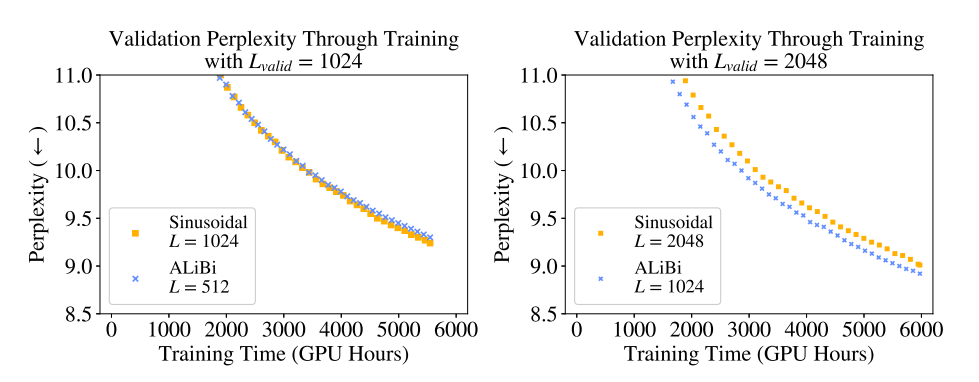 
Figure 5: On the left (right), a 1.3B-parameter ALiBi model trained on 512 (1024)and evaluated on 1024 (2048)tokens during training, compared to the sinusoidal baseline trained on 1024 (2048)tokens. The ALiBi models obtain strong results even though they use 6%-11% less memory since they train on shorter sequences. Appendix Table 11 shows memory use and end-of-training perplexities. 
图5：在左侧(右侧)，一个 1.3B 参数的 ALiBi 模型在训练期间在 512(1024)个令牌上训练并在 1024(2048)个令牌上评估，与在 1024(2048)个令牌上训练的正弦基线相比。 ALiBi 模型获得了很好的结果，尽管它们使用的内存减少了 6%-11%，因为它们在较短的序列上进行训练。 附录表11 显示了内存使用和训练结束时的困惑。

In Figure 5 (right), results become even more impressive, showing that our model trained on L = 1024 outperforms by 0.09 perplexity the sinusoidal model trained on L = 2048 (when evaluating with $L_{valid}$ = 2048)even though our model uses 3.1 GB less memory. Our model maintains a lead in perplexity over the sinusoidal model during the entire training process. By sampling five evenly distributed points across the training process, we compute that our L = 1024 model reaches a given perplexity value, on average, 11% faster than the sinusoidal model does.

在图5(右)中，结果变得更加令人印象深刻，表明我们在 L = 1024 上训练的模型比在 L = 2048 上训练的正弦模型(在使用 $L_{valid}$ = 2048 进行评估时)的困惑度高 0.09，尽管我们的模型使用的内存减少了 3.1 GB 记忆。 在整个训练过程中，我们的模型在困惑度上保持领先于正弦模型。 通过在整个训练过程中对五个均匀分布的点进行采样，我们计算出我们的 L = 1024 模型达到给定的困惑值，平均比正弦模型快 11%。

Since our models in these comparisons use much less memory, they allow for stacking more layers, which would further improve performance (with negligible, if any, runtime cost). To keep our experiments as straightforward as possible, however, we do not add layers to our models.

由于我们在这些比较中的模型使用的内存少得多，因此它们允许堆叠更多层，这将进一步提高性能(运行时成本可以忽略不计)。 然而，为了让我们的实验尽可能简单明了，我们没有在模型中添加层。

Appendix Table 12 presents additional results comparing our models to the sinusoidal baseline when both are trained on the same L, showing that ALiBi performs similarly to the sinusoidal baseline when not extrapolating. This contrasts with the results presented on the smaller datasets, where ALiBi consistently outperforms other position methods even when not extrapolating, suggesting that ALiBi’s inductive bias provides additional benefits for lower-resource language modeling.

附录表12 提供了将我们的模型与正弦基线进行比较的其他结果，当两者都在相同的 L 上训练时，表明 ALiBi 在不外推时与正弦基线的表现相似。 这与在较小的数据集上呈现的结果形成对比，在较小的数据集上，ALiBi 始终优于其他位置方法，即使不进行外推，这表明 ALiBi 的归纳偏差为低资源语言建模提供了额外的好处。

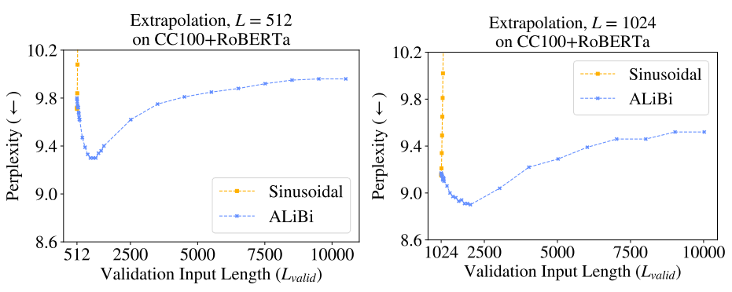 
Figure 6: The ALiBi and sinusoidal models (with both L = 512 and 1024)trained for 50k updates (1 epoch)on the CC100+RoBERTa corpus, extrapolating on the validation set. ALiBi achieves the best results at around 2L but maintains strong performance even up to 10000 tokens in these experiments.
图6：ALiBi 和正弦模型(L = 512 和 1024)在 CC100+RoBERTa 语料库上训练 50k 更新(1 个时期)，在验证集上进行外推。 ALiBi 在 2L 左右取得了最好的结果，但在这些实验中即使高达 10000 个令牌也能保持强劲的性能。

Figure 6 shows that our models trained on L = 512 and L = 1024 achieve the best results when extrapolating to about double the tokens that they were trained on. Specifically, the L = 512 model (that obtains 9.79 perplexity when $L_{valid}$ = 512)achieves its best score (9.3)when extrapolating to 1012 tokens, and the L = 1024 model (that obtains 9.16 perplexity when $L_{valid}$ = 1024)achieves its best score (8.9)when extrapolating to 2024 tokens.

图6 显示，我们在 L = 512 和 L = 1024 上训练的模型在外推到它们所训练的令牌的大约两倍时取得了最佳结果。 具体来说，L = 512 模型(当 $L_{valid}$ = 512 时获得 9.79 的困惑度)在外推到 1012 个令牌时达到其最佳得分(9.3)，而 L = 1024 模型(当 $L_{valid}$ = 1024 时获得 9.16 的困惑度)达到其最佳得分 (8.9)当外推到 2024 个令牌时。

One possible explanation is that the subsequences the model observes during training are up to L tokens long. When performing inference on subsequences of length 2L, half of the subsequences the model consumes are as long as the examples seen during training. When inference is performed on subsequences of length 2L + 1 or longer, less than half of the predictions the model makes are on subsequences of lengths seen during training, and that might degrade performance.

一种可能的解释是，模型在训练期间观察到的子序列最长为 L 个令牌。 当对长度为 2L 的子序列进行推理时，模型消耗的一半子序列与训练期间看到的样本一样长。 当对长度为 2L + 1 或更长的子序列执行推理时，模型做出的预测中只有不到一半是针对训练期间看到的长度子序列，这可能会下降性能。

The sinusoidal model cannot extrapolate at all in this setting, with its performance degrading for both the L = 512 and 1024 models as soon as one token more than L is added during evaluation.

在这种情况下，正弦模型根本无法进行外推，一旦在评估期间添加了一个比 L 多的令牌，L = 512 和 1024 模型的性能都会下降。

In Appendix B, we find that ALiBi’s edge over sinusoidal embeddings is largely explained by its improved avoidance of the early token curse. We posit that future work building on ALiBi might achieve further gains by more efficiently exploiting longer histories. 

在附录B 中，我们发现 ALiBi 相对于正弦嵌入的优势在很大程度上可以解释为它改进了对早期令牌诅咒的避免。 我们假设，未来基于 ALiBi 的工作可能会通过更有效地利用更长的历史来取得进一步的收益。

## 5 RELATED WORK
In parallel with our work, Wennberg & Henter (2021)introduce a relative position method that, like our method, adds a bias to attention scores that is a function of the distance between the key and query elements. Unlike our ALiBi method, which uses a non-learned linear function, their method uses a radial-basis function, with multiple trainable parameters (in our experiments, this led to a slight decrease in runtime). In addition, they present experiments on text classification, not on language modeling. They do not explore extrapolation. The Distance Aware Transformer (Wu et al., 2021)multiplies attention scores by a bias that is a function of the distance between the key and query. This function uses a different, learned parameter in every head. They show results only on text classification. In our experiments (not presented), multiplying attention scores by the bias (instead of adding, as in ALiBi)degraded performance.

与我们的工作同时进行的是，Wennberg & Henter (2021)引入了一种相对位置方法，与我们的方法一样，它为注意力得分添加了一个偏差，该偏差是键元素和查询元素之间距离的函数。 与我们使用非学习线性函数的 ALiBi 方法不同，他们的方法使用径向基函数，具有多个可训练参数(在我们的实验中，这导致运行时间略有减少)。 此外，他们提出了关于文本分类的实验，而不是关于语言建模的实验。 他们不探索外推法。 Distance Aware Transformer (Wu et al., 2021)将注意力得分乘以偏差，偏差是键和查询之间距离的函数。 此函数在每个头中使用不同的学习参数。 它们仅显示文本分类的结果。 在我们的实验中(未展示)，将注意力得分乘以偏差(而不是像 ALiBi 那样相加)会下降性能。

Transformer-XL (Dai et al., 2019)presented a language model that uses a cache and can attend to more tokens during inference than it was trained on (by increasing the length of the cache). However, this work presents results only where output length is limited to the L (the training length), and their relative position method is very slow (Press et al., 2021). The Longformer (Beltagy et al., 2020)adapts models trained on shorter sequences to document-level tasks. However, to achieve this they had to partially train their models on longer sequences. Our ALiBi method enables extrapolation without any additional training on longer sequences.

Transformer-XL(Dai et al., 2019)提出了一种使用缓存的语言模型，并且在推理过程中可以处理比训练时更多的令牌(通过增加缓存的长度)。 然而，这项工作仅在输出长度限制为 L(训练长度)且它们的相对位置方法非常慢的情况下呈现结果(Press et al., 2021)。 Longformer (Beltagy et al., 2020)使在较短序列上训练的模型适应文档级任务。 然而，为了实现这一点，他们必须在更长的序列上部分训练他们的模型。 我们的 ALiBi 方法无需对更长的序列进行任何额外训练即可实现外推。

To our knowledge, extrapolation has not been previously explored in transformer language modeling, but it has been investigated previously and concurrently with transformers on other tasks, such as machine translation (Rosendahl et al., 2019; Neishi & Yoshinaga, 2019; Newman et al., 2020; Kiyono et al., 2021), sequence-to-sequence models trained on an artificial dataset (Hupkes et al., 2020), pretrained sequence-to-sequence models tested on arithmetic tasks (Nogueira et al., 2021, Appendix C), models trained with reinforcement learning (Lampinen et al., 2021), image, speech recognition, and machine translation models (Likhomanenko et al., 2021), and protein structure prediction (Jumper et al., 2021, Appendix 1.5). 

据我们所知，外推之前没有在 Transformer 语言建模中进行过探索，但之前已经在机器翻译等其他任务上与 Transformer 一起进行了研究(Rosendahl et al., 2019; Neishi 和 Yoshinaga，2019; Newman et al. ) ., 2020; Kiyono et al., 2021)，在人工数据集上训练的序列到序列模型(Hupkes et al., 2020)，在算术任务上测试的预训练序列到序列模型(Nogueira et al., 2021) , Appendix C)，强化学习训练模型(Lampinen et al., 2021)，图像、语音识别和机器翻译模型(Likhomanenko et al., 2021)，以及蛋白质结构预测(Jumper et al., 2021, Appendix) 1.5).

## 6 CONCLUSION
We showed that the sinusoidal position embedding approach does not enable transformers to extrapolate to inputs longer than the ones they were trained on. We then established that extrapolation in transformers can be enabled by just changing the position method. We showed that our ALiBi method offers an extremely simple replacement for existing position approaches and allow models to extrapolate. In addition, when not extrapolating, our method achieves either better perplexity than the sinusoidal method (in models smaller than 1B parameters, trained on less data)or similar perplexity (in larger, billion parameter models trained on much more data). ALiBi is simple to implement and does not slow down runtime or require extra parameters (but does occasionally require a negligible amount of extra memory). Using our method, we sped up the training of a 1.3 billion parameter model evaluated on the same input sequence length as GPT-3 (2048). 

我们表明，正弦位置嵌入方法不能使transformer推断出比他们接受训练的输入更长的输入。 然后，我们确定只需更改位置方法即可启用transformer中的外推。 我们展示了我们的 ALiBi 方法为现有位置方法提供了一种极其简单的替代方法，并允许模型进行推断。 此外，当不进行外推时，我们的方法实现了比正弦方法更好的困惑度(在小于 1B 参数的模型中，在更少的数据上训练)或类似的困惑度(在更大的十亿参数模型中训练更多的数据)。 ALiBi 易于实现，不会减慢运行时间或需要额外的参数(但偶尔需要可忽略不计的额外内存)。 使用我们的方法，我们加快了在与 GPT-3 (2048)相同的输入序列长度上评估的 13 亿参数模型的训练。

## Acknowledgments
We thank Tim Dettmers, Gabriel Ilharco, Jungo Kasai, Hao Peng, Sewon Min, Sofia Serrano, Sam Shleifer, Luke Zettlemoyer, Julian Michael, Nikolaos Pappas, Yizhong Wang, and the anonymous reviewers for their valuable feedback and fruitful discussions. 

## References
* Alexei Baevski and Michael Auli. Adaptive input representations for neural language modeling. CoRR, abs/1809.10853, 2018. URL http://arxiv.org/abs/1809.10853. 
* Iz Beltagy, Matthew E. Peters, and Arman Cohan. Longformer: The long-document transformer.  arXiv:2004.05150, 2020. 
* Tom B. Brown, Benjamin Mann, Nick Ryder, Melanie Subbiah, Jared Kaplan, Prafulla Dhari￾wal, Arvind Neelakantan, Pranav Shyam, Girish Sastry, Amanda Askell, Sandhini Agarwal, Ariel Herbert-Voss, Gretchen Krueger, Tom Henighan, Rewon Child, Aditya Ramesh, Daniel M. 
* Ziegler, Jeffrey Wu, Clemens Winter, Christopher Hesse, Mark Chen, Eric Sigler, Mateusz Litwin, Scott Gray, Benjamin Chess, Jack Clark, Christopher Berner, Sam McCandlish, Alec Radford, Ilya Sutskever, and Dario Amodei. Language models are few-shot learners, 2020. 
* Alexis Conneau, Kartikay Khandelwal, Naman Goyal, Vishrav Chaudhary, Guillaume Wenzek, Francisco Guzm´an, Edouard Grave, Myle Ott, Luke Zettlemoyer, and Veselin Stoyanov. Un￾supervised cross-lingual representation learning at scale. Proceedings of the 58th Annual Meeting of the Association for Computational Linguistics, 2020. doi: 10.18653/v1/2020.acl-main.747.  URL http://dx.doi.org/10.18653/v1/2020.acl-main.747. 
* Zihang Dai, Zhilin Yang, Yiming Yang, Jaime Carbonell, Quoc Le, and Ruslan Salakhutdinov. Transformer-XL: Attentive language models beyond a fixed-length context. In Proceedings of the 57th Annual Meeting of the Association for Computational Linguistics, pp. 2978–2988, Florence, Italy, July 2019. Association for Computational Linguistics. doi: 10.18653/v1/P19-1285. URL https://aclanthology.org/P19-1285. 
* Jacob Devlin, Ming-Wei Chang, Kenton Lee, and Kristina Toutanova. BERT: Pre-training of deep bidirectional transformers for language understanding. In Proceedings of the 2019 Conference of the North American Chapter of the Association for Computational Linguistics: Human Language Technologies, Volume 1 (Long and Short Papers), pp. 4171–4186, Minneapolis, Minnesota, June 2019. Association for Computational Linguistics. doi: 10.18653/v1/N19-1423. URL https: //www.aclweb.org/anthology/N19-1423. 
* Aaron Gokaslan and Vanya Cohen. Openwebtext corpus. http://Skylion007.github.io/ OpenWebTextCorpus, 2019. 
* Cheng-Zhi Anna Huang, Ashish Vaswani, Jakob Uszkoreit, Ian Simon, Curtis Hawthorne, Noam M. Shazeer, Andrew M. Dai, M. Hoffman, M. Dinculescu, and D. Eck. Music transformer: Generat￾ing music with long-term structure. In ICLR, 2019. 
* Dieuwke Hupkes, Verna Dankers, Mathijs Mul, and Elia Bruni. Compositionality decomposed: How do neural networks generalise? Journal of Artificial Intelligence Research, 67:757–795, April 2020. doi: 10.1613/jair.1.11674. URL https://doi.org/10.1613/jair.1.11674. 
* Hakan Inan, Khashayar Khosravi, and Richard Socher. Tying word vectors and word classifiers: A loss framework for language modeling. In ICLR, 2017. URL https://openreview.net/ forum?id=r1aPbsFle. 
* J. Jumper, Richard Evans, A. Pritzel, Tim Green, Michael Figurnov, O. Ronneberger, Kathryn Tun￾yasuvunakool, Russ Bates, Augustin Z´ıdek, Anna Potapenko, A. Bridgland, Clemens Meyer, Simon A A Kohl, Andy Ballard, A. Cowie, B. Romera-Paredes, Stanislav Nikolov, Rishub Jain, J. Adler, T. Back, Stig Petersen, D. Reiman, Ellen Clancy, Michal Zielinski, Martin Steinegger, Michalina Pacholska, Tamas Berghammer, S. Bodenstein, D. Silver, Oriol Vinyals, A. Senior, K. Kavukcuoglu, P. Kohli, and D. Hassabis. Highly accurate protein structure prediction with alphafold. Nature, 596:583 – 589, 2021. 
* Urvashi Khandelwal, Omer Levy, Dan Jurafsky, Luke Zettlemoyer, and Mike Lewis. Generalization through Memorization: Nearest Neighbor Language Models. In International Conference on Learning Representations (ICLR), 2020. 
* Shun Kiyono, Sosuke Kobayashi, Jun Suzuki, and Kentaro Inui. Shape: Shifted absolute position embedding for transformers. ArXiv, abs/2109.05644, 2021. 
* Andrew Kyle Lampinen, Stephanie C. Y. Chan, Andrea Banino, and Felix Hill. Towards mental time travel: a hierarchical memory for reinforcement learning agents. CoRR, abs/2105.14039, 2021. URL https://arxiv.org/abs/2105.14039. 
* Mike Lewis, Shruti Bhosale, Tim Dettmers, Naman Goyal, and Luke Zettlemoyer. Base layers: Simplifying training of large, sparse models, 2021. 
* Opher Lieber, Or Sharir, Barak Lenz, and Yoav Shoham. Jurassic-1: Technical details and evalua￾tion. Technical report, AI21 Labs, August 2021. 
* Tatiana Likhomanenko, Qiantong Xu, Ronan Collobert, Gabriel Synnaeve, and Alex Rogozhnikov. CAPE: encoding relative positions with continuous augmented positional embeddings. CoRR, abs/2106.03143, 2021. URL https://arxiv.org/abs/2106.03143. 
* Yinhan Liu, Myle Ott, Naman Goyal, Jingfei Du, Mandar Joshi, Danqi Chen, Omer Levy, Mike Lewis, Luke Zettlemoyer, and Veselin Stoyanov. Roberta: A robustly optimized bert pretraining approach, 2019. 
* Stephen Merity, Caiming Xiong, James Bradbury, and Richard Socher. Pointer sentinel mixture models, 2016. 
* Tomas Mikolov and G. Zweig. Context dependent recurrent neural network language model. 2012 IEEE Spoken Language Technology Workshop (SLT), pp. 234–239, 2012. 
* Tomas Mikolov, M. Karafi´at, L. Burget, J. Cernock´y, and S. Khudanpur. Recurrent neural network based language model. In INTERSPEECH, 2010. 
* Sebastian Nagel. Cc-news. https://commoncrawl.org/2016/10/ news-dataset-available/, 2016. 
* Sharan Narang, Hyung Won Chung, Yi Tay, William Fedus, Thibault Fevry, Michael Matena, Kar￾ishma Malkan, Noah Fiedel, Noam Shazeer, Zhenzhong Lan, Yanqi Zhou, Wei Li, Nan Ding, Jake Marcus, Adam Roberts, and Colin Raffel. Do transformer modifications transfer across implementations and applications?, 2021. 
* Masato Neishi and Naoki Yoshinaga. On the relation between position information and sen￾tence length in neural machine translation. In Proceedings of the 23rd Conference on Com￾putational Natural Language Learning (CoNLL), pp. 328–338, Hong Kong, China, Novem￾ber 2019. Association for Computational Linguistics. doi: 10.18653/v1/K19-1031. URL https://aclanthology.org/K19-1031. 
* Benjamin Newman, John Hewitt, Percy Liang, and Christopher D. Manning. The eos decision and length extrapolation. In BlackBoxNLP@EMNLP, 2020. URL https://nlp.stanford.edu/pubs/newman2020extrapolation.pdf. 
* Rodrigo Nogueira, Zhiying Jiang, and Jimmy J. Li. Investigating the limitations of the transformers with simple arithmetic tasks. ArXiv, abs/2102.13019, 2021. 
* Myle Ott, Sergey Edunov, David Grangier, and Michael Auli. Scaling neural machine translation. In Proceedings of the Third Conference on Machine Translation (WMT), 2018. 
* Ankur Parikh, Oscar T¨ackstr¨om, Dipanjan Das, and Jakob Uszkoreit. A decomposable atten￾tion model for natural language inference. In Proceedings of the 2016 Conference on Em￾pirical Methods in Natural Language Processing, pp. 2249–2255, Austin, Texas, November 2016. Association for Computational Linguistics. doi: 10.18653/v1/D16-1244. URL https: //aclanthology.org/D16-1244. 
* Ofir Press and Lior Wolf. Using the output embedding to improve language models. In Proceedings of the 15th Conference of the European Chapter of the Association for Computational Linguistics: Volume 2, Short Papers, pp. 157–163, Valencia, Spain, April 2017. Association for Computational Linguistics. URL https://www.aclweb.org/anthology/E17-2025. 
* Ofir Press, Noah A. Smith, and Omer Levy. Improving transformer models by reordering their sublayers. In Proceedings of the 58th Annual Meeting of the Association for Computational Linguistics, pp. 2996–3005, Online, July 2020. Association for Computational Linguistics. doi: 10.18653/v1/2020.acl-main.270. URL https://www.aclweb.org/anthology/2020.acl-main.270. 
* Ofir Press, Noah A. Smith, and Mike Lewis. Shortformer: Better language modeling using shorter inputs. In Proceedings of the 59th Annual Meeting of the Association for Computational Lin￾guistics and the 11th International Joint Conference on Natural Language Processing (Volume 1: Long Papers), pp. 5493–5505, Online, August 2021. Association for Computational Linguistics.  URL https://aclanthology.org/2021.acl-long.427. 
* Jack W. Rae, Anna Potapenko, Siddhant M. Jayakumar, Chloe Hillier, and Timothy P. Lilli￾crap. Compressive transformers for long-range sequence modelling. In International Confer￾ence on Learning Representations, 2020. URL https://openreview.net/forum?id= SylKikSYDH. 
* Colin Raffel, Noam Shazeer, Adam Roberts, Katherine Lee, Sharan Narang, Michael Matena, Yanqi Zhou, Wei Li, and Peter J. Liu. Exploring the limits of transfer learning with a unified text-to￾text transformer. Journal of Machine Learning Research, 21(140):1–67, 2020. URL http: //jmlr.org/papers/v21/20-074.html. 
* Jan Rosendahl, Viet Anh Khoa Tran, Weiyue Wang, and Hermann Ney. Analysis of positional encodings for neural machine translation. In International Workshop on Spoken Language Trans￾lation, Hong Kong, China, November 2019. 
* Aurko Roy, Mohammad Saffar, Ashish Vaswani, and David Grangier. Efficient content-based sparse attention with routing transformers, 2020. 
* Peter Shaw, Jakob Uszkoreit, and Ashish Vaswani. Self-attention with relative position representa￾tions. In Proceedings of the 2018 Conference of the North American Chapter of the Association for Computational Linguistics: Human Language Technologies, Volume 2 (Short Papers), pp.464–468, New Orleans, Louisiana, June 2018. Association for Computational Linguistics. doi: 10.18653/v1/N18-2074. URL https://www.aclweb.org/anthology/N18-2074. 
* Jianlin Su, Yu Lu, Shengfeng Pan, Bo Wen, and Yunfeng Liu. Roformer: Enhanced transformer with rotary position embedding, 2021. 
* Trieu H. Trinh and Quoc V. Le. A simple method for commonsense reasoning, 2018. 
* Ashish Vaswani, Noam Shazeer, Niki Parmar, Jakob Uszkoreit, Llion Jones, Aidan N Gomez, Ł ukasz Kaiser, and Illia Polosukhin. Attention is all you need. In I. Guyon, U. V. Luxburg, S. Bengio, H. Wallach, R. Fergus, S. Vishwanathan, and R. Garnett (eds.), Advances in Neural Information Processing Systems, volume 30. Curran Asso￾ciates, Inc., 2017. URL https://proceedings.neurips.cc/paper/2017/file/3f5ee243547dee91fbd053c1c4a845aa-Paper.pdf. 
* Ben Wang and Aran Komatsuzaki. GPT-J-6B: A 6 Billion Parameter Autoregressive Language Model. https://github.com/kingoflolz/mesh-transformer-jax, May 2021. 
* Ulme Wennberg and Gustav Eje Henter. The case for translation-invariant self-attention in transformer-based language models, 2021. 
* Thomas Wolf, Lysandre Debut, Victor Sanh, Julien Chaumond, Clement Delangue, Anthony Moi, Pierric Cistac, Tim Rault, R´emi Louf, Morgan Funtowicz, Joe Davison, Sam Shleifer, Patrick von Platen, Clara Ma, Yacine Jernite, Julien Plu, Canwen Xu, Teven Le Scao, Sylvain Gug￾ger, Mariama Drame, Quentin Lhoest, and Alexander M. Rush. Transformers: State-of-the-art natural language processing. In Proceedings of the 2020 Conference on Empirical Methods in Natural Language Processing: System Demonstrations, pp. 38–45, Online, October 2020. As￾sociation for Computational Linguistics. URL https://www.aclweb.org/anthology/ 2020.emnlp-demos.6. 
* Chuhan Wu, Fangzhao Wu, and Yongfeng Huang. DA-transformer: Distance-aware transformer. In Proceedings of the 2021 Conference of the North American Chapter of the Association for Computational Linguistics: Human Language Technologies, pp. 2059–2068, Online, June 2021. Association for Computational Linguistics. doi: 10.18653/v1/2021.naacl-main.166. URL https://aclanthology.org/2021.naacl-main.166. 
* Wojciech Zaremba, Ilya Sutskever, and Oriol Vinyals. Recurrent neural network regularization, 2014. 
* Yukun Zhu, Ryan Kiros, Rich Zemel, Ruslan Salakhutdinov, Raquel Urtasun, Antonio Torralba, and Sanja Fidler. Aligning books and movies: Towards story-like visual explanations by watching movies and reading books. In Proceedings of the IEEE international conference on computer vision, pp. 19–27, 2015.

## A APPENDIX
### A.1 INTRODUCTION
The training speed of transformer LMs gets slower as the input subsequence length L increases. Figure 7 visualizes this.

随着输入子序列长度 L 的增加，Transformer LM 的训练速度变慢。 图7 对此进行了可视化。

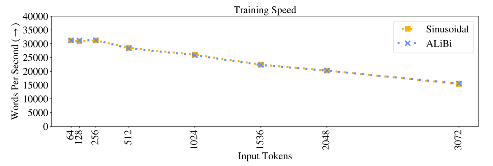 
Figure 7: Training speed of our model and the sinusoidal baseline trained on different amounts of input subsequence tokens L.
图7：我们模型的训练速度和在不同数量的输入子序列令牌 L 上训练的正弦基线。

Table 1 contains the runtimes and memory use statistics for models using the various position methods discussed in this work.

表1 包含使用本工作中讨论的各种位置方法的模型的运行时间和内存使用统计信息。

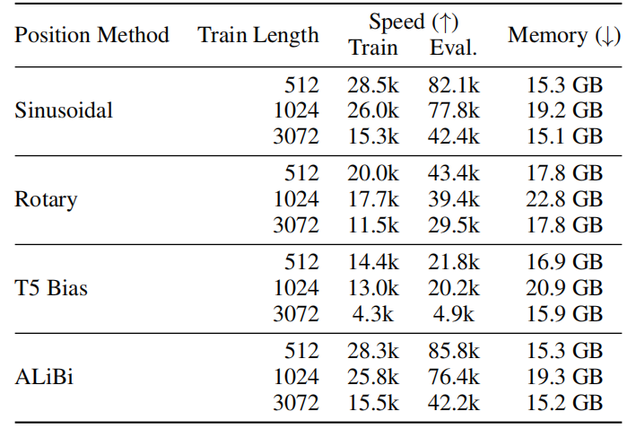 
Table 1: The speed (during training and evaluation, in words per second)and memory usage (during training)of the rotary, T5 bias, and ALiBi models compared to the sinusoidal baseline on WikiText-103. Training and inference are batched, and speeds are shown for one V100 GPU.
表1：与 WikiText-103 上的正弦基线相比，旋转、T5偏差 和 ALiBi 模型的速度(训练和评估期间，以每秒字数表示)和内存使用(训练期间)。 训练和推理是分批进行的，并显示了一个 V100 GPU 的速度。
 
Tables 2, 3, and 4 show the perplexity and runtime of models using the sinusoidal, rotary T5 bias, and ALiBi position methods when extrapolating to sequences longer than the ones they were trained on. The models used in these tables were trained on L = 512, 1024 and 3072 tokens.

表2、表3 和表4 显示了使用正弦曲线、旋转 T5偏差 和 ALiBi 位置方法的模型在外推到比训练的序列更长的序列时的困惑度和运行时间。 这些表中使用的模型在 L = 512、1024 和 3072 个令牌上进行了训练。

 
Table 2: The sinusoidal, rotary, T5 bias and ALiBi models trained on L = 512 on WikiText-103 and evaluated with different values of $L_{valid}$ on the validation set. Bold shows the best score for each model. Inference speeds (in words per second)are from inference on a GPU with batch size of one.
表2：正弦曲线、旋转、T5偏差 和 ALiBi 模型在 WikiText-103 上的 L = 512 上训练，并在验证集上使用不同的 $L_{valid}$ 值进行评估。 粗体显示每个模型的最佳得分。 推理速度(以每秒字数表示)来自批量大小为 1 的 GPU 上的推理。

 
Table 3: The sinusoidal, rotary, T5 bias and ALiBi models trained on L = 1024 on WikiText-103 and evaluated with different values of $L_{valid}$ on the validation set. Bold shows the best score for each model. Inference speeds (in words per second)are from inference on a GPU with batch size of one.
表3：正弦、旋转、T5偏差 和 ALiBi 模型在 WikiText-103 上的 L = 1024 上训练，并在验证集上使用不同的 $L_{valid}$ 值进行评估。 粗体显示每个模型的最佳得分。 推理速度(以每秒字数表示)来自批量大小为 1 的 GPU 上的推理。

 
Table 4: The sinusoidal, rotary, T5 bias and ALiBi models trained on L = 3072 on WikiText-103 and evaluated with different values of $L_{valid}$ on the validation set. Bold shows the best score for each model. Inference speeds (in words per second)are from inference on a GPU with batch size of one.
表4：正弦、旋转、T5偏差 和 ALiBi 模型在 WikiText-103 上的 L = 3072 上训练，并在验证集上使用不同的 $L_{valid}$ 值进行评估。 粗体显示每个模型的最佳得分。 推理速度(以每秒字数表示)来自批量大小为 1 的 GPU 上的推理。

### A.2 ALIBI RESULTS ON WIKITEXT-103
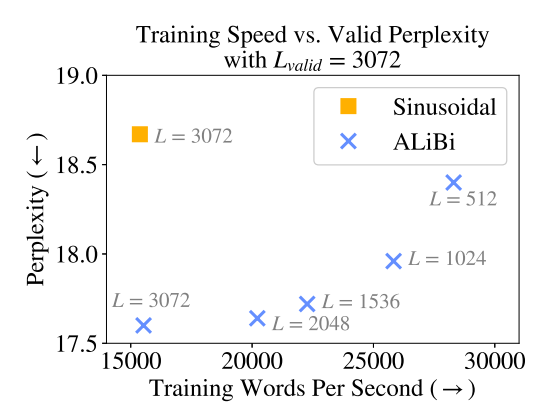 
Figure 8: The training speed and validation perplexity (with $L_{valid}$ = 3072)for ALiBi models and the sinusoidal model trained with L = 3072. All our models trained on 512 or more tokens achieve better perplexity than the sinusoidal model even though all of them (except the L = 3072)require less time and memory to train.
图8：ALiBi 模型和使用 L = 3072 训练的正弦模型的训练速度和验证困惑度($L_{valid}$ = 3072)。我们在 512 个或更多令牌上训练的所有模型都比正弦模型实现了更好的困惑度，尽管它们都是( 除了 L = 3072)需要更少的时间和记忆来训练。

Figure 8 depicts a cross section of Figure 4, showing our models with different train lengths and the sinusoidal baseline, all evaluated on $L_{valid}$ = 3072 tokens. We observe that all our models with 512 ≤ L < 3072 are faster to train than the sinusoidal model with L = 3072, but they all achieve greater perplexity scores on the validation set. Our model with L = 3072 trains just as fast as the sinusoidal one but bests its score by more than one perplexity point; (the standard deviation for the the sinusoidal model with L = 3072 is 0.24).

图8 描绘了图4 的横截面，显示了我们具有不同列车长度和正弦基线的模型，所有这些都是在 $L_{valid}$ = 3072 个令牌上进行评估的。 我们观察到我们所有 512 ≤ L < 3072 的模型都比 L = 3072 的正弦模型训练得更快，但它们在验证集上都获得了更高的困惑得分。 我们的模型 L = 3072 的训练速度与正弦曲线模型一样快，但其得分超过一个困惑点;  (L = 3072 的正弦模型的标准偏差为 0.24)。

Table 5 shows the perplexity values obtained when 8 different ALiBi models, trained on L values between 64 and 3072, extrapolating to $L_{valid}$ values longer than the ones they were trained on. In addition, we present results for the sinusoidal, rotary and T5 bias models, with $L_{valid}$ = L.

表5 显示了当 8 个不同的 ALiBi 模型在 64 到 3072 之间的 L 值上训练时获得的困惑值，外推到比他们训练的 $L_{valid}$ 值更长的值。 此外，我们还提供了正弦、旋转和 T5偏差 模型的结果，其中 $L_{valid}$ = L。

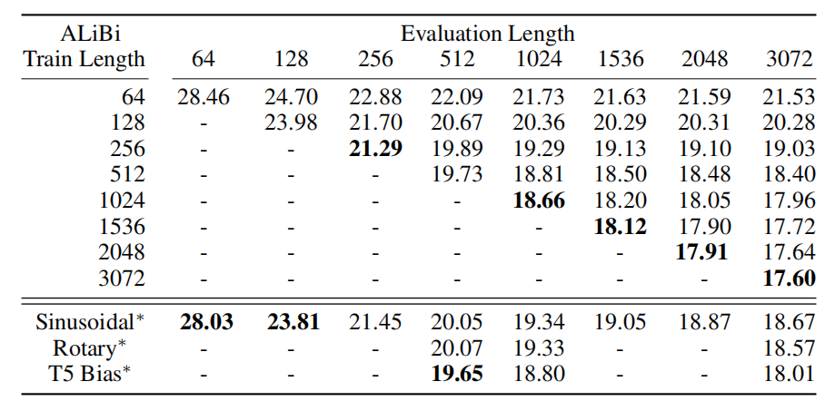 
Table 5: Perplexity when ALiBi extrapolates on the WikiText-103 development set. ∗For results we present for the sinusoidal, rotary and T5 bias models, L = $L_{valid}$ (so we do not test the extrapolation abilities of those baselines here).
表5：ALiBi 在 WikiText-103 开发集上进行外推时的困惑度。 *对于我们针对正弦曲线、旋转和 T5偏差 模型呈现的结果，L = $L_{valid}$(因此我们不在此处测试这些基线的外推能力)。

Table 6 compares ALiBi to the sinusoidal, rotary and T5 bias baselines on the test set of WikiText- 103, and Table 7 compares ALiBi to the current state of the art models on that test set. 
表6 将 ALiBi 与 WikiText-103 测试集上的正弦、旋转和 T5偏差 基线进行了比较，表7 将 ALiBi 与该测试集上的当前最先进模型进行了比较。

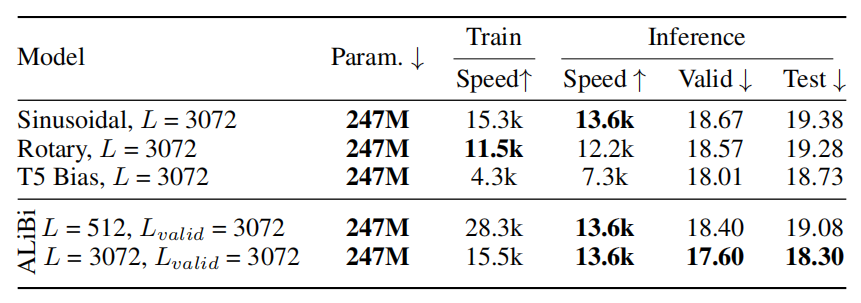 
Table 6: Test perplexity and runtime on WikiText-103 for two of our ALiBi models and models that use the sinusoidal, rotary and T5 bias methods.
表6：在 WikiText-103 上测试我们的两个 ALiBi 模型和使用正弦、旋转和 T5偏差 方法的模型的困惑度和运行时间。

 
Table 7: Valid and test perplexity scores on WikiText-103 for two of our ALiBi models and models that use the sinusoidal, rotary and T5 bias methods with sliding window evaluation (§B and S=512 following (Baevski & Auli, 2018; Khandelwal et al., 2020; Press et al., 2021)). The sinusoidal model presents our results from training and inference with the model of Baevski & Auli.
表7：我们的两个 ALiBi 模型和使用滑动窗口评估的正弦曲线、旋转和 T5偏差 方法的模型在 WikiText-103 上的有效和测试困惑得分(§B 和 S=512 以下(Baevski & Auli，2018; Khandelwal et al., 2020; Press et al., 2021))。 正弦模型展示了我们使用 Baevski & Auli 模型进行训练和推理的结果。

### A.3 RESULTS ON THE TORONTO BOOK CORPUS
To ensure that our results are not specific to the WikiText-103 corpus, we next apply our model and the baselines to a different domain while using a similar model architecture and the same ALiBi slopes as those used in the previous subsection.

为了确保我们的结果不特定于 WikiText-103 语料库，我们接下来将我们的模型和基线应用到不同的领域，同时使用与上一小节中使用的相似的模型架构和相同的 ALiBi 斜率。

We emphasize that our set of slopes was chosen by running experiments on the WikiText-103 corpus, and here we apply that set of slopes to a model trained on a very different text domain. Throughout the entire process of developing this method, we ran only one set of experiments on this domain using the previously selected set of slopes.

我们强调，我们的斜率集是通过在 WikiText-103 语料库上运行实验选择的，在这里我们将该斜率集应用于在非常不同的文本域上训练的模型。 在开发此方法的整个过程中，我们仅使用先前选择的一组斜率在该域上运行了一组实验。

Specifically, we use the Toronto BooksCorpus (Zhu et al., 2015), which has been used to train BERT (Devlin et al., 2019)(in conjuction with the English Wikipedia). The corpus is about 700M tokens (2.9 GB).

具体来说，我们使用 Toronto BooksCorpus (Zhu et al., 2015)，它已被用于训练 BERT (Devlin et al., 2019)(结合英文维基百科)。 语料库大约有 7 亿个令牌 (2.9 GB)。

We use the same train/validation/test split as Khandelwal et al. (2020)and their tokenization, which uses BERT’s vocabulary of 29K byte-pair encodings. Since the vocabulary is much smaller than WikiText-103’s, we replace the adaptive word embedding and softmax of Baevski & Auli (2018)with a tied word embedding and softmax matrix (Press & Wolf, 2017; Inan et al., 2017).

我们使用与 Khandelwal et al. 相同的训练/验证/测试拆分。 (2020)及其令牌化，它使用 BERT 的 29K 字节对编码词汇表。 由于词汇表比 WikiText-103 小得多，我们将 Baevski & Auli (2018)的自适应词嵌入和 softmax 替换为绑定词嵌入和 softmax 矩阵(Press & Wolf，2017; Inan et al., 2017)。

Our results in Figure 9 (and Table 8)replicate our success on the WikiText-103 dataset. Our model surpasses the sinusoidal baseline when trained on the same amount of input tokens (L)and, in addition, our model is able to extrapolate to longer sequences at inference. This occurs even though our set of slopes was not tuned on this dataset. This result establishes the generality of ALiBi and the particular set of slopes we found and suggests that they may be used on different text domains without further hyperparameter tuning.

我们在图9(和表8)中的结果复制了我们在 WikiText-103 数据集上的成功。 当使用相同数量的输入令牌 (L)进行训练时，我们的模型超过了正弦基线，此外，我们的模型能够在推理时外推到更长的序列。 即使我们的斜率集未针对此数据集进行调整，也会发生这种情况。 这个结果确立了 ALiBi 的普遍性和我们发现的特定斜率集，并表明它们可以用于不同的文本域而无需进一步的超参数调整。

 
Figure 9: ALiBi-enabled models evaluated on different input lengths on the Toronto BookCorpus. Our models extrapolate to longer sequence lengths and outperform the sinusoidal baseline even when trained on much shorter sequences. 
图9：支持 ALiBi 的模型在 Toronto BookCorpus 的不同输入长度上进行评估。 我们的模型外推到更长的序列长度，并且即使在更短的序列上训练时也优于正弦基线。

Tables 9 and 10 present the perplexities for our ALiBi models, the baselines, and the current state of the art on the Toronto BookCorpus validation and test sets. Our results here mirror our results on WikiText-103: we improve over the sinusoidal baseline even when AliBi is trained on fewer tokens.

表9 和表10 展示了我们的 ALiBi 模型的困惑、基线以及 Toronto BookCorpus 验证和测试集的当前技术水平。 我们这里的结果反映了我们在 WikiText-103 上的结果：即使 AliBi 在更少的令牌上进行训练，我们也改进了正弦基线。

 
Table 8: ALiBi models extrapolating on the Toronto BookCorpus development set. ∗For the results of the sinusoidal models, L = $L_{valid}$ (so we do not test the extrapolation abilities of those models here).
表8：在 Toronto BookCorpus 开发集上外推的 ALiBi 模型。 ∗对于正弦模型的结果，L = $L_{valid}$(所以我们在这里不测试这些模型的外推能力)。

 
Table 9: Validation and test perplexities on the Toronto Book Corpus dataset.
表9：多伦多图书语料库数据集的验证和测试困惑。

### A.4 RESULTS ON THE CC100+ROBERTA CORPUS
Table 11 compares our 1.3 billion parameter ALiBi models when extrapolating to two times the number of tokens that they were trained on. We use the sinusoidal model as our baseline, and train it for the same amount of time as we train the ALiBi model that we compare it to (and so since our ALiBi models run faster in this setting, the sinusoidal models complete less updates). 

表11 比较了我们的 13 亿参数 ALiBi 模型，当外推到他们接受训练的令牌数量的两倍时。 我们使用正弦模型作为我们的基线，训练它的时间与我们训练我们与之比较的 ALiBi 模型的时间相同(因此，由于我们的 ALiBi 模型在此设置下运行得更快，正弦模型完成的更新更少)。

 
Table 10: Validation and test perplexities on the Toronto Book Corpus dataset with a sliding window (§B). Following (Baevski & Auli, 2018; Khandelwal et al., 2020; Press et al., 2020; 2021), we set the sliding window stride S=512.
表10：使用滑动窗口 (§B)对多伦多图书语料库数据集的验证和测试困惑。 按照(Baevski & Auli, 2018; Khandelwal et al., 2020; Press et al., 2020; 2021)，我们设置滑动窗口步长 S=512。

 
Table 11: Perplexity, memory, and train time on the CC100+RoBERTa corpus for our ALiBi models and the sinusoidal baseline. We run our L = 512 (1024)model and the sinusoidal model with L = 1024 (2048)for the same amount of time. We show that our models achieve strong results even though they use 6–11% less memory.
表11：我们的 ALiBi 模型和正弦基线在 CC100+RoBERTa 语料库上的困惑度、记忆力和训练时间。 我们在相同的时间内运行 L = 512 (1024)模型和 L = 1024 (2048)的正弦模型。 我们表明，即使使用的内存减少了 6-11%，我们的模型也能取得很好的结果。

Table 12 compares our 1.3 billion parameter ALiBi models to the sinusoidal baselines, with and without extrapolation, with all models completing 50,000 updates.

表12 将我们的 13 亿参数 ALiBi 模型与正弦基线进行了比较，有和没有外推，所有模型都完成了 50,000 次更新。

 
Table 12: Perplexity, train time and memory use of the sinusoidal and ALiBi models on the CC100+RoBERTa corpus when all models are trained with 50k updates.
表12：当所有模型都经过 50k 更新训练时，正弦和 ALiBi 模型在 CC100+RoBERTa 语料库上的困惑度、训练时间和内存使用。

## B ANALYSIS
In this section we investigate why ALiBi works so effectively. We find that ALiBi’s decrease in perplexity when given longer sequences is largely explained by its improved avoidance of the early token curse. We hypothesize that future work building on ALiBi might achieve further gains by more efficiently exploiting longer histories. 

在本节中，我们将研究 ALiBi 如此有效的原因。 我们发现，当给定更长的序列时，ALiBi 的困惑度下降在很大程度上可以解释为它更好地避免了早期令牌诅咒。 我们假设未来基于 ALiBi 的工作可能会通过更有效地利用更长的历史来取得进一步的收益。

### B.1 DEFINING SLIDING WINDOW EVALUATION AND THE EARLY TOKEN CURSE  定义滑动窗口评估和早期令牌诅咒
#### Sliding Window Inference 滑动窗口推理
As mentioned in Section 2, nonoverlapping inference is commonly used to evaluate sequences longer than L (the number of tokens in each training subsequence). An alternative is to use a sliding window during evaluation (Baevski & Auli, 2018).

如第 2 节所述，非重叠推理通常用于评估长于 L(每个训练子序列中的令牌数)的序列。 另一种方法是在评估期间使用滑动窗口(Baevski & Auli，2018)。

A stride S is picked between 1 and L − 1, and the window is advanced by S tokens after each forward pass.12 This means that L − S tokens from the previous subsequence are re-encoded, and only S new tokens are output. The advantage is that all outputs in each subsequence after the first have at least L − S previous tokens to condition on. However, since tokens must be re-encoded multiple times, this approach is much slower than the nonoverlapping one. When S = 1, we output one token every inference pass, each using the maximal context window that the model can handle; however, this is the slowest approach. Figure 10 is a visualization of the nonoverlapping and sliding window evaluation approaches.

在 1 和 L-1 之间选择一个步幅 S，并且在每次前向传递后窗口前进 S 个令牌。12 这意味着来自前一个子序列的 L-S 个令牌被重新编码，并且只输出 S 个新令牌。 优点是在第一个之后的每个子序列中的所有输出至少有 L-S 个先前的令牌作为条件。 然而，由于令牌必须多次重新编码，因此这种方法比非重叠方法慢得多。 当 S = 1 时，我们在每个推理过程中输出一个令牌，每个令牌都使用模型可以处理的最大上下文窗口;  然而，这是最慢的方法。 图10 是非重叠和滑动窗口评估方法的可视化。

 
Figure 10: Sliding window evaluation (top; blue)compared to nonoverlapping evaluation (bottom; red)on a sequence of 8 words using a model with $L_{valid}$ = 4. Nonoverlapping evaluation is much faster since it requires just two inference passes (as opposed to the five passes required by the siding window approach). But the sliding window approach provides more context for each prediction.
图10：滑动窗口评估(顶部; 蓝色)与非重叠评估(底部; 红色)相比，使用 $L_{valid}$ = 4 的模型对 8 个单词的序列进行比较。非重叠评估要快得多，因为它只需要两次推理(相对于 侧窗方法所需的五次通过)。 但是滑动窗口方法为每个预测提供了更多的上下文。

We use sliding window inference as a tool to analyze our models, but we note that it is normally prohibitively slow in practice (Press et al., 2021).

我们使用滑动窗口推理作为分析模型的工具，但我们注意到它在实践中通常非常慢(Press et al., 2021)。

#### Early Token Curse  早期令牌诅咒
Splitting an evaluation set into subsequences means that predictions occuring early in each subsequence cannot access many previous context tokens (appearing at the end of the previous subsequence). The result, referred to as the early token curse (Press et al., 2021), increases (i.e., degrades)perplexity scores. A workaround is to evaluate the model using a sliding window, giving each prediction more context. This solution is slow since it requires many more forward passes of the model.

将评估集拆分为子序列意味着在每个子序列中早期发生的预测无法访问许多先前的上下文标记（出现在先前子序列的末尾）。 结果被称为早期令牌诅咒（Press et al., 2021），改善了（即降低了）困惑度得分。 一种解决方法是使用滑动窗口评估模型，为每个预测提供更多上下文。 这个解决方案很慢，因为它需要模型的更多前向传递。

### B.2 EXTRAPOLATION REDUCES THE EARLY TOKEN CURSE  外推减少了早期的令牌诅咒
We presented results showing that our ALiBi method (and, to a lesser extent, the T5 bias)allows LMs to extrapolate during inference. Two reasons could explain why these methods enable LMs to achieve better perplexity given longer input subsequences:
1. Performance improves because the models can use longer contexts to make more accurate predictions. For example, the average article length in the WikiText-103 corpus is about 3600 tokens; therefore, if a model trained on L = 512 tokens extrapolates to $L_{valid}$ = 3072 tokens during inference and achieves better results, that might be because it can spot patterns occurring across more than 512 tokens.
2. Performance improves because longer input sequences mean the early token curse is reduced. For example, during nonoverlapping evaluation on sequences of length $L_{valid}$ = 1000, 10% of predictions have 100 tokens of context or less. If we rerun nonoverlapping evaluation on that model with $L_{valid}$ = 2000 tokens, now only 5% of predictions have 100 12Nonoverlapping inference can be viewed as sliding window inference with stride L.   tokens of context or less. So, by simply being able to handle longer sequences, a model can substantially reduce the early token curse and improve performance.(13 100 tokens is an arbitrary small number used here to represent a short history context, i.e., one in which making predictions for the next output token would be harder.)

我们展示的结果表明我们的 ALiBi 方法(以及较小程度上的 T5偏差 )允许 LM 在推理过程中进行推断。 两个原因可以解释为什么这些方法使 LM 能够在给定更长的输入子序列的情况下实现更好的困惑度：
1. 性能提高是因为模型可以使用更长的上下文来做出更准确的预测。 例如，WikiText-103 语料库中的平均文章长度约为 3600 个令牌;  因此，如果一个在 L = 512 个令牌上训练的模型在推理过程中外推到 $L_{valid}$ = 3072 个令牌并获得更好的结果，那可能是因为它可以发现超过 512 个令牌中出现的模式。
2. 性能提高，因为更长的输入序列意味着早期令牌诅咒减少了。 例如，在对长度 $L_{valid}$ = 1000 的序列进行非重叠评估期间，10% 的预测具有 100 个或更少的上下文令牌。 如果我们在 $L_{valid}$ = 2000 个令牌的模型上重新运行非重叠评估，现在只有 5% 的预测有 100 个 12 非重叠推理可以被视为具有步长 L. 上下文令牌或更少的滑动窗口推理。 因此，通过简单地能够处理更长的序列，模型可以大大减少早期令牌诅咒并提高性能。(13 100 个令牌是这里用来表示短历史上下文的任意小数字，即，其中对 下一个输出令牌会更难。)

To better understand what might be occurring, we re-evaluate the development set of WikiText-103 with our models and the sinusoidal baseline with L = 512, 1024, 3072. However, this time we use sliding window evaluation with a stride of S = 1, meaning that we move the sliding window just one token after every inference pass, giving each prediction the maximum number of context tokens that the model can use. 

为了更好地理解可能发生的情况，我们使用我们的模型和 L = 512、1024、3072 的正弦基线重新评估 WikiText-103 的开发集。然而，这次我们使用步幅为 S = 1，这意味着我们在每次推理通过后将滑动窗口移动一个令牌，为每个预测提供模型可以使用的上下文令牌的最大数量。

 
Figure 11: ALiBi models evaluated on different input lengths on WikiText-103 with sliding window evaluation (with stride S = 1). Unlike results shown in Figure 4, where performance improves in each of our models as we increase the validation sequence length, here performance stays relatively flat as we increase $L_{valid}$. This might mean that ALiBi increases performance when $L_{valid}$ > L not because it uses longer contexts, but because fewer tokens suffer from the early token curse. Note that as in §2, the perplexity of the sinusoidal model explodes when $L_{valid}$ > L even when using sliding window evaluation.

图11：ALiBi 模型在 WikiText-103 上使用滑动窗口评估(步长 S = 1)在不同输入长度上进行评估。 与图4 所示的结果不同，随着我们增加验证序列长度，我们每个模型的性能都会提高，而随着我们增加 $L_{valid}$，性能保持相对平稳。 这可能意味着当 $L_{valid}$ > L 时 ALiBi 提高性能不是因为它使用更长的上下文，而是因为更少的令牌遭受早期令牌诅咒。 请注意，与§2 中一样，即使在使用滑动窗口评估时，当 $L_{valid}$ > L 时，正弦模型的复杂性也会爆炸。

The results are shown in Figure 11 and in the corresponding Tables 13 (sinusoidal)and 15 (ALiBi). Unsurprisingly, for the sinusoidal model, as in §2, increasing $L_{valid}$ causes an explosion in perplexity even when using sliding window evaluation. Our ALiBi models cannot improve perplexity when looking at longer sequences in this setting, but they keep perplexity flat when $L_{valid}$ increases.

结果显示在图11 和相应的表13(正弦曲线)和 15(ALiBi)中。 不出所料，对于正弦模型，如§2 中所述，即使使用滑动窗口评估，增加 $L_{valid}$ 也会导致困惑激增。 我们的 ALiBi 模型在查看此设置中的较长序列时无法改善困惑度，但当 $L_{valid}$ 增加时它们会保持困惑度平坦。

This leads us to believe that our perplexity improvement when increasing $L_{valid}$ and using nonoverlapping evaluation is caused by explanation 2, not explanation 1. Because sliding window evaluation provides long context windows for every prediction made, it curtails the early token curse. In this setting, ALiBi’s performance remains flat when $L_{valid}$ increases, leading us to hypothesize that the gains seen while increasing $L_{valid}$ in §4 were the result of larger $L_{valid}$ values mitigating the early token curse.

这让我们相信，当增加 $L_{valid}$ 和使用非重叠评估时，我们的困惑度改善是由解释 2 而不是解释 1 引起的。因为滑动窗口评估为每个预测提供了长上下文窗口，它减少了早期令牌诅咒。 在这种情况下，当 $L_{valid}$ 增加时，ALiBi 的性能保持平稳，这使我们假设在§4 中增加 $L_{valid}$ 时看到的收益是较大的 $L_{valid}$ 值减轻了早期令牌诅咒的结果。

Our ALiBi results mirror what occurs in the model using the T5 bias: when using sliding window evaluation, perplexity remains relatively flat when evaluating longer sequences (see Table 14).

我们的 ALiBi 结果反映了使用 T5偏差 的模型中发生的情况：使用滑动窗口评估时，在评估较长序列时，困惑度保持相对平坦(参见表14)。

Our analysis reveals that when $L_{valid}$ > L, ALiBi might not be using contexts longer than the ones it was trained on. This highlights a research direction that could be pursued in future work.

我们的分析表明，当 $L_{valid}$ > L 时，ALiBi 使用的上下文可能不会比它所训练的上下文更长。 这突出了一个可以在未来工作中追求的研究方向。

These findings do not lessen the value of ALiBi. When $L_{valid}$ = L, ALiBi achieves either superior or similar results to the sinusoidal method and other alternatives even though it is simpler and requires no learned parameters. When evaluating $L_{valid}$ > L tokens, even if ALiBi does not attend to more than L tokens, it yields better results than the other alternatives that can be used in this case, i.e., standard nonoverlapping inference (which is cheap, but does not perform as well)and the more accurate sliding window approach (which is very slow). 

这些发现并没有下降 ALiBi 的价值。 当 $L_{valid}$ = L 时，即使 ALiBi 更简单并且不需要学习参数，ALiBi 也能获得优于或类似正弦方法和其他替代方法的结果。 在评估 $L_{valid}$ > L 令牌时，即使 ALiBi 不关注超过 L 个令牌，它也会产生比在这种情况下可以使用的其他替代方案更好的结果，即标准非重叠推理(它很便宜，但性能不如 好)和更准确的滑动窗口方法(非常慢)。

 
Table 13: Perplexities of the sinusoidal models evaluated with sliding window evaluation with stride
表13：正弦模型的复杂度用带步长的滑动窗口评估评估

 
Table 14: Perplexities of the T5 bias models evaluated with sliding window evaluation with stride
表14：T5偏差 模型的复杂性，使用带步长的滑动窗口评估进行评估

 
Table 15: Perplexities of the ALiBi models evaluated with sliding window evaluation with stride
表15：ALiBi 模型的困惑度，使用带步长的滑动窗口评估进行评估