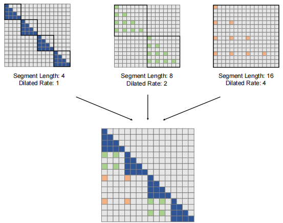
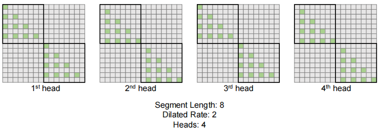
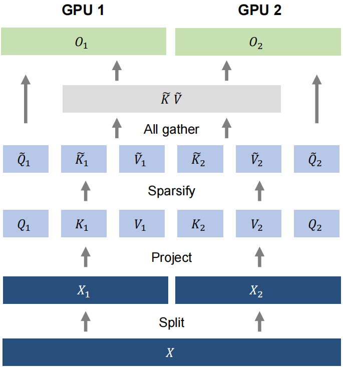
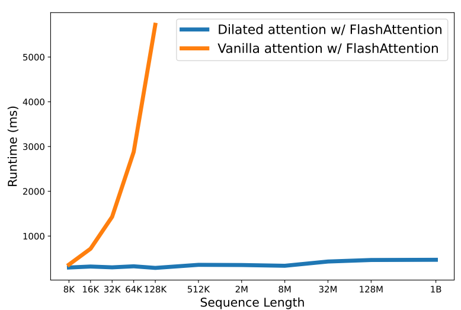
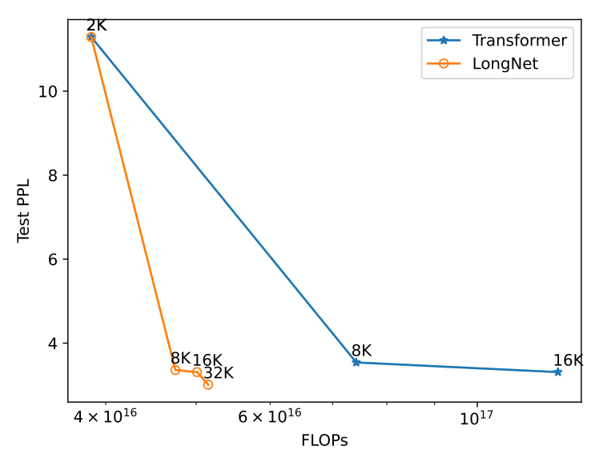

# LONGNET: Scaling Transformers to 1,000,000,000 Tokens
LongNet：将转换器扩展到1000000000个令牌 2023.7.5 https://arxiv.org/abs/2307.02486

Microsoft Research https://aka.ms/GeneralAI

## Abstract
Scaling sequence length has become a critical demand in the era of large language models. However, existing methods struggle with either computational complexity or model expressivity, rendering the maximum sequence length restricted. In this work, we introduce LONGNET, a Transformer variant that can scale sequence length to more than 1 billion tokens, without sacrificing the performance on shorter sequences. Specifically, we propose dilated attention, which expands the attentive field exponentially as the distance grows. LONGNET has significant advantages: 1) it has a linear computation complexity and a logarithm dependency between tokens; 2) it can be served as a distributed trainer for extremely long sequences; 3) its dilated attention is a drop-in replacement for standard attention, which can be seamlessly integrated with the existing Transformer-based optimization. Experiments results demonstrate that LONGNET yields strong performance on both long-sequence modeling and general language tasks. Our work opens up new possibilities for modeling very long sequences, e.g., treating a whole corpus or even the entire Internet as a sequence. Code is available at https://aka.ms/LongNet.

缩放序列长度已经成为大型语言模型时代的一个关键需求。然而，现有的方法要么难以解决计算复杂度，要么难以解决模型表达能力问题，导致最大序列长度受到限制。在这项工作中，我们介绍了LongNet，这是一种Transformer变体，可以将序列长度扩展到超过10亿个令牌，而不会牺牲较短序列的性能。具体地说，我们提出了扩展注意力，它随着距离的增长，注意力场呈指数级扩展。LONGNET具有显著的优点：
1. 它具有线性计算复杂度和令牌之间的对数依赖性;
2. 对于超长序列，它可以作为分布式训练器;
3. 它的扩展注意力是标准注意力的替代品，可以与现有的基于Transformer的优化无缝集成。
实验结果表明，LONGNET在长序列建模和通用语言任务上都有很强的性能。我们的工作为建模超长序列开辟了新的可能性，例如，将整个语料库甚至整个互联网视为一个序列。代码位于https://aka.ms/LongNet.

 
Figure 1: Trend of Transformer sequence lengths over time.
图1：转换器序列长度随时间变化的趋势。

## 1 Introduction
Recent years have witnessed a trend toward scaling neural networks [BMR+20, KMH+20, ZKHB22, CND+22, DDM+23]. The depth is primarily scaled up for exponential expressivity, producing many powerful deep networks [HZRS16, HCB+19, WMD+22]. Then, the sparse MoE models [LLX+21, FZS21, ZBK+22] and model parallelism approaches [SPP+19, KCL+22] efficiently enlarge the hidden dimension. Sequence length, as the last atomic dimension of the neural network, is desirable to be unlimited. Breaking the limitation of sequence length introduces significant advantages. First, it provides large memory and receptive field for models, which is practical for them to interact with human and the world. Second, a longer context contains more complex causality and reasoning paths that models can exploit in training data. In contrast, short dependency has more spurious correlations, which is harmful to generalization. Third, it enables to explore the limits of in-context learning, which has the potential to be a paradigm shift for many-shot learning, as an extremely long context may help the models alleviate catastrophic forgetting.

近年来，出现了缩放神经网络的趋势[BMR+20，KMH+20，ZKHB22，CND+22，DDM+23]。深度主要是为了指数表现力而放大的，产生了许多强大的深度网络[HZRS16、HCB+19、WMD+22]。然后，稀疏MoE模型[LLX+21，FZS21，ZBK+22]和模型并行方法[SSP+19，KCL+22]有效地放大了隐藏维度。序列长度作为神经网络的最后一个原子维度，是不受限制的。打破序列长度的限制带来了显著的优势。
1. 首先，它为模型提供了大的记忆和接受场，这对模型与人类和世界的互动是实用的。
2. 其次，较长的上下文包含更复杂的因果关系和推理路径，模型可以在训练数据中利用这些路径。相比之下，短依赖关系具有更多的虚假相关性，这对泛化是有害的。
3. 第三，它能够探索上下文内学习的局限性，这有可能成为多样本学习的范式转变，因为超长的上下文可能有助于模型缓解灾难性遗忘。

The major challenge of scaling up sequence length is striking the right balance between the computational complexity and the model expressivity. RNN-style models are primarily implemented to increase the length. However, its sequential nature limits the parallelization during training, which is essential in long-sequence modeling. More recently, state space models [GGR22, SWL23, FDS+23, PMN+23] are appealing to sequence modeling. It can operate as a CNN during training, and transform to an efficient RNN at test time. While they perform well at long-range benchmarks [TDA+21], their performance on regular lengths is not as good as Transformers, limited mainly by the model expressivity [FPB+23].

扩大序列长度的主要挑战是在计算复杂度和模型表达能力之间取得正确的平衡。RNN样式的模型主要是为了增加长度而实现的。然而，它的序列性质限制了训练过程中的并行化，这在长序列建模中是必不可少的。最近，状态空间模型[GGR22，SWL23，FDS+23，PMN+23]对序列建模很有吸引力。它可以在训练期间作为CNN运行，并在测试时转换为高效的RNN。虽然它们在长距离基准测试[TDA+21]中表现良好，但在常规长度上的性能不如转换器，主要受模型表现力[FPB+23]的限制。
<!-- 状态空间模型? -->

Another strand of scaling the sequence length is to decrease the complexity of Transformers, i.e., the quadratic complexity of self-attention. Implementing sliding windows or convolution modules over the attention is a straightforward way to make the complexity nearly linear. Nevertheless, this sacrifices the ability to recall the early tokens, forgetting the prompts at the very beginning of the sequence. Sparse attention reduces the computation by sparsifying the attention matrix, preserving the possibility of recalling long-distant information. For example, [CGRS19] obtains $O(N\sqrt{N}d)$ time complexity with a fixed sparse pattern. Besides the heuristic patterns [ZGD+20, BPC20], the learnable patterns prove to be useful for sparse attention [KKL20, ALdJ+23]. There are also some other efficient Transformer-based variants, including low-rank attention [WLK+20, WCL+20], kernel-based methods [KVPF20, CLD+21, QHS+22], downsampling approaches [LLK+19, JGB+21, MKW+21], recurrent models [DYY+19, BKB23], and retrieval-based methods [WRHS22, WDC+23]. Yet, none has been scaled to 1 billion tokens (see Figure 1).

另一个缩放序列长度的方法是降低Transformers的复杂度，即自注意的二次复杂度。在注意力上实现滑动窗口或卷积模块是使复杂度接近线性的一种简单方法。然而，这牺牲了回忆早期令牌的能力，忘记了序列一开始的提示。稀疏注意力通过稀疏注意力矩阵来减少计算，保留了回忆远距离信息的可能性。例如，[CGRS19]获得具有固定稀疏模式的 $O(N\sqrt{N}d)$ 时间复杂度。除了启发式模式[ZGD+20，BPC20]，可学习模式被证明对稀疏注意力有用[KKL20，ALdJ+23]。还有一些其他有效的基于Transformer的变体，包括低秩注意力[WLK+20，WCL+20]、基于内核的方法[KVPF20，CLD+21，QHS+22]、下采样方法[LLK+19，JGB+21，MKW+21]、递归模型[DY+19，BKB23]和基于检索的方法[WRHS22，WDC+23]。然而，没有一个被扩展到10亿个令牌（见图1）。
<!-- 启发式模式? 可学习模式? 低秩注意力 -->

Method | Computation Complexity
---|---
Recurrent | $O(Nd^2)$
Vanilla Attention | $O(N^2d)$
Sparse Attention | $O(N\sqrt{N}d)$
Dilated Attention (This Work) | O(Nd)

Table 1: Comparison of computation complexity among different methods. N is the sequence length and d is the hidden dimension.
表1：不同方法的计算复杂度比较。N是序列长度，d是隐藏维度。

In this work, we successfully scale the sequence length to 1 billion tokens. Our solution is LONGNET, which replaces the attention of vanilla Transformers with a novel component named dilated attention. The general design principle is - attention allocation decreases exponentially as the distance between tokens grows. We prove that it obtains a linear computation complexity and a logarithm dependency between tokens. This deals with the contradiction between limited attention resources and the accessibility to every token. In the implementation, LONGNET can be transformed into a dense Transformer, which seamlessly supports the off-the-shelf optimization for Transformers (e.g., kernel fusion, quantization, and distributed training). Taking advantage of the linear complexity, LONGNET can parallelize the training across nodes, breaking the constraint of both computation and memory with a distributed algorithm. This allows us to efficiently scale up the sequence length to 1B tokens with nearly constant runtime (see Figure 5), while vanilla Transformer suffers from quadratic complexity.

在这项工作中，我们成功地将序列长度扩展到10亿个令牌。我们的解决方案是LONGNET，它用一个名为“扩展注意力”的新组件取代了普通转换器的注意力。一般的设计原则是，注意力分配随着令牌之间距离的增长而呈指数级下降。我们证明了它具有线性计算复杂度和令牌之间的对数依赖性。这处理了有限的注意力资源和每个令牌的可访问性之间的矛盾。在实现中，LONGNET可以转换为密集的Transformer，它无缝地支持Transformer的现成优化(例如，内核融合、量化和分布式训练)。利用线性复杂度，LONGNET可以跨节点并行训练，利用分布式算法打破计算和内存的限制。这使我们能够在几乎恒定的运行时间内有效地将序列长度扩展到1B个令牌(见图5)，而 普通Transformer则具有二次复杂度。

## 2 LONGNET 
### 2.1 Preliminary 初步
The core of Transformers [VSP+17] is self-attention, which maps a query and a set of keys and values to output. Given the inputs $Q, K, V ∈ R^{N×d}$ , it computes the outputs O with

Transformers[VSP+17]的核心是自注意，它将查询和一组键和值映射到输出。给定输入$Q，K，V∈R^{N×d}$，它计算输出O

$O = softmax(QK^T)V$ (1)

Self-attention struggles with long sequences, due to its quadratic dependency on the sequence length. One query would attend to all keys and values, leading to computational inefficiencies.

由于自我注意对序列长度的二次依赖性，它在长序列中很吃力。一个查询将处理所有的键和值，导致计算效率低下。

Sparse attention alleviates this issue by restricting the query’s access to a subset of keys and values. The key of sparse attention is the sparse attention pattern $S ∈ \{0, 1\}^{N×N}$ , which determines specific keys and values that the query Q can attend to.

稀疏注意力通过限制查询对键和值的子集的访问来缓解这个问题。稀疏注意的关键是稀疏注意模型 $S∈\{0,1\}^{N×N}$，它确定了查询Q可以注意力的特定键和值。

$O = softmax(QK^T ⊙ LS)V$ (2)

For example, the fixed pattern of sparse Transformer [CGRS19] is composed of a local pattern and a strided pattern. The sequence is divided into blocks of length l. The local pattern allows one query to attend to tokens within the same block, while strided pattern allows one query to attend to the last c tokens of each block. Formally, the local pattern $S_i^{(1)}$ = {j | ⌊j/l⌋ = ⌊i/l⌋}, and the strided pattern $S_i^{(2)}$ = {j | j mod l ∈ {t, t + 1, ..., l}}.

例如，稀疏变换器[CGRS19]的固定模型由局部模型和跨步模型组成。序列被划分为长度为l的块。局部模型允许一个查询处理同一块内的令牌，而跨步模型允许一次查询处理每个块的最后c个令牌。形式上，局部模型$S_i^{(1)}$ = {j | ⌊j/l⌋ = ⌊i/l⌋}, 跨步模型$S_i^{(2)}$ = {j | j mod l ∈ {t, t + 1, ..., l}}

### 2.2 Dilated Attention 分散注意力
 
Figure 2: Building blocks of dilated attention used in LONGNET. It consists of a series of attention patterns for modeling both short-range and long-range dependency. The number of attention patterns can be extended according to the sequence length.
图2：LONGNET中使用的分散注意力的构建块。它由一系列用于建模短期和长期依赖关系的注意力模型组成。注意力模型的数量可以根据序列长度进行扩展。

Figure 2 illustrates the overview of dilated attention. Dilated attention splits the input (Q, K, V ) into segments $\{(\hat{Q}_i,\hat{K}_i,\hat{V}_i)\}^{\frac{N}{w}}$ equally with a segment length w. Each segment is then sparsified along the sequence dimension by selecting the rows with an interval r. The computation can be written as:

图2演示了分散注意力的概述。扩展注意力将输入(Q，K，V)以段长度w等分为段$\{(\hat{Q}_i,\hat{K}_i,\hat{V}_i)\}^{\frac{N}{w}}$。然后通过选择具有间隔r的行来沿着序列维度稀疏每个段。计算可以写成：

$\hat{Q}_i = [Q_{iw}, Q_{iw+r}, Q_{iw+2r}, ..., Q_{(i+1)w−1]}$ (3)

$\hat{K}_i = [K_{iw}, K_{iw+r}, K_{iw+2r}, ..., K_{(i+1)w−1]}$ (4)

$\hat{V}_i = [V_{iw}, V_{iw+r}, V_{iw+2r}, ..., V_{(i+1)w−1]}$ (5)

The sparsified segments $\{( \hat{Q}_i , \hat{K}_i , \hat{V}_i$)\}^{\frac{N}{w}}$ are fed into the attention in parallel, after which are scattered and concatenated as the output O:

稀疏化的分段 $\{( \hat{Q}_i , \hat{K}_i , \hat{V}_i$)\}^{\frac{N}{w}}$ 被并行地馈送到注意力中，之后被分散并级联作为输出O：

$\hat{O}_i = softmax( \hat{Q}_i \hat{K}_i^T )\hat{V}_i$ (6) 

$\hat{O}_i = \{ \hat{O}_{i,j} |j \ mod \ r = 0; 0|j \ mod \ r $ ̸= 0 \} $ (7)

$O = [ \hat{O}_0, \hat{O}_1, ..., \hat{O}_{\frac{N}{w} −1} ] $ (8)

In the implementation, the dilated attention can be transformed into dense attention between a gathering operation over the input (Q, K, V ) and a scattering operation over the output $\hat{O}_i$ , so it can directly reuse any optimization for vanilla attention (e.g., flash attention [DFE+22]). Dilated attention can significantly reduce the computation cost by a factor of $\frac{N}{w}r^2$ over the vanilla attention.

在实现中，扩展注意力可以在输入(Q，K，V)上的聚集操作和输出$\hat{O}_i$上的散射操作之间转换为密集注意力，因此它可以直接重用任何针对普通注意力的优化(例如，闪光注意力[DFE+22])。与普通注意力相比，扩展注意力可以显著降低$\frac{N}{w}r^2$的计算成本。

In practice, the segment size w trades the globality of attention for efficiency, while the dilation with a size r reduces the computation cost by approximating the attention matrix. To capture both long-range and short-range information efficiently, we implement a mixture of dilated attentions with different segment sizes and dilation rates $\{r_i , w_i\}^k$ :

在实践中，分段大小w用注意力的全局性换取效率，而大小为r的膨胀通过逼近注意力矩阵来降低计算成本。为了有效地捕捉长距离和短距离信息，我们实现了具有不同分段大小和扩展率的扩展注意力的混合  $\{r_i , w_i\}^k$: 

$O = \sum^k_{i=1} α_iO|_{r_i,w_i}$ (9)

$α_i = \frac{s_i}{\sum_js_j}$ (10)

where $s_i$ denotes the denominator of the attention softmax for $O|r_i,w_i$ . Note that the computations for $\{O|_{r_i,w_i} \}^k$ are in parallel because there is no computation dependency among them. Experiments show that dynamic weights calculated by the denominator of the attention softmax are better than learnable fixed weights. For a query attends to keys in different dilated attentions, our method to mix dilated attentions is equivalent to gather keys in different parts and calculate softmax together.

其中$s_i$表示$O|r_i,w_i$的注意力softmax的分母。注意，$\{O|_{r_i,w_i} \}^k$的计算是并行的，因为它们之间没有计算依赖关系。实验表明，由注意力softmax的分母计算的动态权重优于可学习的固定权重。对于查询注意力不同扩展注意力中的键，我们混合扩展注意力的方法等效于将不同部分的键聚集在一起并计算softmax。

Intuitively, the local attention should be precisely computed, while the global attention can be approximate. Therefore, we set a larger $w_i$ with a bigger $r_i$ . Moreover, we gradually increase the $w_i$ for each attention until it reaches the maximum length N or the number of attention patterns k: 

直观地说，局部注意力应该是精确计算的，而全局注意力可以是近似的。因此，我们设置了一个更大的$w_i$和一个更高的 $r_i$ 。此外，我们逐渐增加每个注意力的$w_i$，直到它达到最大长度N或注意力模型的数量k:

$w = \{w_0, w_1, w_2, ..., N\}^k (w_i < w_{i+1} < N)$ (11) 

$r = \{1, r_1, r_2, ..., r_k\}^k (1 < r_i < r_{i+1})$ (12)

In practice, we set w and r to geometric sequences for an exponential attentive field.

在实践中，我们将w和r设置为指数注意域的几何序列。

### 2.3 Multi-Head Dilated Attention 多头分散注意力
 
Figure 3: Dilated attention with multiple heads. The attention patterns differ among heads by shifting the position successively.
图3：多个头分散注意力。头部的注意力模型因位置的连续变化而不同。

As shown in Figure 3, we differ in the computation among different heads by sparsifying different parts of the query-key-value pairs. Specifically, for the j-th head, we have an offset $s_j = j$ mod r when selecting the (Q, K, V ):

如图3所示，通过稀疏查询键值对的不同部分，我们在不同头部之间的计算有所不同。具体地，对于第j个头，当选择(Q，K，V)时，我们具有偏移$s_j = j$ mod r：

$Q_i = [Q_{iw+sj} , Q_{iw+sj+r}, Q_{iw+sj+2r}, ..., Q_{(i+1)w+sj−1}]$ (13)

$K_i = [K_{iw+sj} , K_{iw+sj+r}, K_{iw+sj+2r}, ..., K_{(i+1)w+sj−1}]$ (14)
 
$V_i = [V_{iw+sj} , V_{iw+sj+r}, V_{iw+sj+2r}, ..., V_{(i+1)w+sj−1}]$ (15)

Following the vanilla multi-head attention, the outputs of different heads are concatenated into a final output. The rest of the computation remains the same as the single-head counterpart in Section 2.2.

在普通的多头注意力之后，不同头的输出被连接成最终输出。计算的其余部分与第2.2节中的单头对应部分相同。

### 2.4 Computational Complexity and Token Dependency 计算复杂度和令牌依赖性
Given dilated attention with a segment size and dilation rate of (r, w), each query-key-value pair is sparsified from $(Q, K, V ) ∈ R^{N×d}$ to $(Q, K, V ) ∈ R^{\frac{w}{r} ×d}$ , so the flops of the attention computation are estimated as:

给定分段大小和扩张率为(r，w)的扩张注意力，每个查询键值对从$(Q, K, V ) ∈ R^{N×d}$ 稀疏到$(Q, K, V ) ∈ R^{\frac{w}{r} ×d}$，因此注意力计算的flops估计为：

$FLOPs = \frac{2N}{w} (\frac{w}{r})^2 d = \frac{2Nwd}{r^2}$ (16)

We further extend it to dilated attention with multiple segment sizes and dilation rates. The flops can be written as:

我们进一步将其扩展到具有多个分段大小和扩张率的扩张注意力。flops可以写成：

$FLOPs = 2N d \sum^k_{i=1}\frac{wi}{r_i^2}$ (17)

With the segment sizes and dilation rates in Equation (11) and Equation (12), the flops are given by

利用等式(11)和等式(12)中的分段大小和膨胀率，flops由下式给出

$FLOPs = 2w0Nd\sum^{k−1}_{i=0}\frac{1}{α^i} ≤ \frac{2α}{α − 1} w_0N d$  (α > 1) (18)

where $w_0$ is a predefined constant and α is the common ratio for geometric sequences w and r. Therefore, the computation complexity of dilated attention is approximate to O(N d).

其中$w_0$是预定义的常数，α是几何序列w和r的公比。因此，扩张注意力的计算复杂度近似于O(Nd)。

Moreover, the information of each tokens can be propagated to a maximum distance of D:

此外，每个令牌的信息可以传播到最大距离D:

$D = \sum^{l−1}_{i=0} w_i = w0 \sum^{l−1}_{i=0} α^i ≈ \frac{w_0}{α − 1} α^l$ (19)

where l is the length of the propagated path. Therefore, the maximum path length of a sequence with N tokens can be estimated as:

其中l是传播路径的长度。因此，具有N个令牌的序列的最大路径长度可以估计为：

$L ≈ log_α\frac{N(α − 1)}{w_0}$ (α > 1) (20)

This proves that the token dependency  is approximate to O(log N)

这证明了令牌依赖近似于O(log N)。

## 3 LONGNET as a Distributed Trainer: Scaling up to 1B Tokens 作为分布式训练：可扩展至1B令牌
Although the computation complexity of dilated attention has been greatly reduced to O(N d), it is infeasible to scale the sequence length to the million level on a single GPU device due to the computation and memory constraints. There are some distributed training algorithms for large-scale model training, such as model parallelism [SPP+19], sequence parallelism [LXLY21, KCL+22], and pipeline parallelism [HCB+19]. However, they are insufficient for LONGNET especially when the sequence dimension is extremely large.

尽管扩展注意力的计算复杂度已大大降低到O(N d)，但由于计算和内存的限制，在单个GPU设备上将序列长度扩展到百万级是不可行的。有一些用于大规模模型训练的分布式训练算法，如模型并行[SSP+19]、序列并行[LXLY21，KCL+22]和流水线并行[HCB+19]。然而，它们对于LONGNET来说是不够的，尤其是当序列维度非常大的时候。

### 3.1 Distributed Algorithm 分布式算法
 
Figure 4: Distributed training of LONGNET on two GPU devices. It parallelizes the training by partitioning the sequence dimension. The computation and communication costs are nearly constant as the number of devices grows.
图4：LONGNET在两个GPU设备上的分布式训练。它通过划分序列维度来并行化训练。随着设备数量的增长，计算和通信成本几乎是不变的。

We take advantage of the linear computation complexity of LONGNET for the distributed training of sequence dimension. Without loss of generality, Figure 4 presents our distributed algorithm on two GPUs, which can be further scaled to an arbitrary number of devices. We start by splitting the input sequence along the sequence dimension. Each sequence is put on one device separately:

我们利用LONGNET的线性计算复杂度进行序列维数的分布式训练。在不失一般性的情况下，图4给出了我们在两个GPUs，可以进一步扩展到任意数量的设备。我们从沿着序列维度分割输入序列开始。每个序列分别放在一个设备上：

$X = [X_1, X_2]$ (21)

Then, they are projected into queries, keys, and values on the two devices:

然后，它们被投影到两个设备上的查询、键和值中：

$[Q_1, K_1, V_1] = [W_Q, W_K, W_V ]X_1, [Q_2, K_2, V_2] = [W_Q, W_K, W_V ]X_2$ (22)
 
For the segment length $w_i$ ≤ l (where l is the sequence length on the local device), we compute the attention locally with Equation (3) to Equation (8). For the segment length $w_i$ > l, the keys and values are distributed across different devices. Therefore, we collect the key-value pairs before computing the attention. We use Equation (3) to Equation (5) to sparsify the {Q, K, V } into { $\hat{Q}, \hat{K}, \hat{V}$ }. An all-gather operation is implemented to collect the key-value pairs:

对于分段长度$w_i$≤l(其中l是本地设备上的序列长度)，我们使用等式(3)到等式(8)来计算局部注意力。对于线段长度$w_i$>l，关键点和值分布在不同的设备上。因此，我们在计算注意力之前先收集键值对。我们使用方程(3)至方程(5)将{Q，K，V}稀疏为{$\hat{Q}, \hat{K}, \hat{V}$}。实现了一个全收集操作来收集键值对：

$K = [\hat{K}_1, \hat{K}_2], \hat{V} = [\hat{V}_1, \hat{V}_2]$ (23)
 
Note that the all-gather operation in the backward becomes a reduce-scatter operation. Different from vanilla attention, both sizes of $\hat{K}_i$ and $\hat{V}_i$ are independent of the sequence length N, making the communication cost constant.

请注意，向后的所有聚集操作变为减少散射操作。与普通注意力不同的是，$\hat{K}_i$ 和 $\hat{V}_i$的大小都与序列长度N无关，使得通信成本恒定。

Finally, we compute the cross-attention with the local queries $\hat{Q}_i$ and the global key-value pairs { $\hat{K}, \hat{V}$ }. The formulation is written as:

最后，我们计算了与局部查询$\hat{Q}_i$和全局键值对{$\hat{K}, \hat{V}$}的交叉注意。公式写为：

$\hat{O}_1 = softmax(\hat{Q}_1 \hat{K}^T )\hat{V} , \hat{O}_2 = softmax(\hat{Q}_2 \hat{K}^T )\hat{V}$ (24)

The concatenation of the outputs across different devices becomes the final attention output:

不同设备之间的输出串联成为最终的注意力输出：

$O = [\hat{O}_1, \hat{O}_2]$ (25)
 
The distributed algorithm described above is orthogonal to other parallelisms, including data parallelism which partitions the batch dimension, model parallelism which partitions the hidden dimension, and pipeline parallelism which partitions the layers.

上述分布式算法与其他并行性正交，包括划分批维度的数据并行性、划分隐藏维度的模型并行性和划分层的流水线并行性。

### 3.2 Scaling up to 1B Tokens 扩展到1B令牌
We verify the feasibility of scaling to 1B tokens with the modern distributed systems. Starting from 8K, we gradually scale the sequence length until the limit of GPU memory. We reduce the batch size accordingly to keep the number of tokens per batch at 1 billion. Each model of different sequence lengths has up to 3 segment lengths, which are 2,048, the number of tokens per device, and the sequence length. We compute the average speed in the forward propagation for 10 different runs.

我们用现代分布式系统验证了扩展到1B令牌的可行性。从8K开始，我们逐渐缩放序列长度，直到GPU内存的极限。我们相应地减少了批量大小，以将每批令牌的数量保持在10亿个。不同序列长度的每个模型最多有3个分段长度，分别为2048、每个设备的令牌数量和序列长度。我们计算了10次不同运行的正向传播的平均速度。

 
Figure 5: Runtime of our dilated attention and vanilla attention. Both are equipped with FlashAttention [DFE+22]. 
图5：我们分散注意力和普通注意力的运行时间。两者都配备了FlashAttention[DFE+22]。

Figure 5 reports the runtime of vanilla attention and our dilated attention. Both of them are implemented with FlashAttention Kernel for saving memory and improving speed. It shows that dilated attention can successfully scale up the sequence length with almost constant latency. By partitioning the sequence dimension, it can leverage the distributed systems to scale the sequence length to 1 billion tokens. In contrast, vanilla attention suffers from the quadratic dependency on the sequence length. Its latency dramatically increases as the length grows. Moreover, there is no distributed algorithm for vanilla attention to break sequence length limitation. This proves the advantage of the linear complexity as well as the distributed algorithm for LONGNET.

图5报告了普通注意力和我们分散注意力的运行时间。为了节省内存和提高速度，两者都使用FlashAttention内核实现。它表明注意力可以以几乎恒定的延迟成功地扩大序列长度。通过划分序列维度，它可以利用分布式系统将序列长度扩展到10亿个令牌。相反，普通注意力受到序列长度的二次依赖性的影响。它的延迟随着长度的增长而显著增加。此外，还没有一种分布式算法可以让普通注意力打破序列长度的限制。这证明了LONGNET的线性复杂度和分布式算法的优点。

## 4 Experiments on Language Modeling 语言建模实验
### 4.1 Setup 设置
We implement LONGNET on language modeling. The backbone architecture is MAGNETO [WMH+22] with XPOS [SDP+22] relative position encoding, except that we replace the standard attention with our dilated attention. We use the base-size configuration of MAGNETO, which has a hidden dimension of 768, 12 attention heads, and 12 decoder layers. We pre-train the model with The Stack dataset [KLA+22], a source code collection in over 300 programming languages.

我们在语言建模上实现了LONGNET。骨干架构是具有XPOS[SDP+22]相对位置编码的MAGNETO[WMH+22]，只是我们用扩展的注意力取代了标准的注意力。我们使用MAGNETO的基本尺寸配置，它具有768的隐藏尺寸、12个注意力头和12个解码器层。我们使用the Stack数据集[KLA+22]预训练模型，该数据集是300多种编程语言的源代码集合。

The data is preprocessed with the tiktoken tokenizer(2 https://github.com/openai/tiktoken) with cl100k_base encoding. The models are trained with a batch size of 0.5M tokens for 300K steps. More details regarding the hyperparameters can be found in the appendix. All experiments are conducted based on the torchscale [MWH+22] codebase.

数据使用tiktoken tokenizer(2 https://github.com/openai/tiktoken)进行预处理，采用cl100k_base编码。这些模型是用0.5M个令牌的批量大小训练300K个步骤的。有关超参数的更多详细信息，请参阅附录。所有实验都是基于torchscale[MWH+22]代码库进行的。

### 4.2 Results 结果
We compare LONGNET with both vanilla Transformer and sparse Transformers. The differences among the architectures are the attention layers, while the others remain the same. We scale the sequence length of these models from 2K to 32K, while reducing the batch size to keep the number of tokens per batch constant. For LONGNET, we use segment lengths of w = {2048, 4096, 8192, 16384, 32768}, and the dilated ratios are r = {1, 2, 4, 6, 12}. We implement the fixed pattern for sparse attention as in [CGRS19] with multiple heads attending to distinct subblocks. The block size is set to 2048. We adjust their sparse ratios to match the computation flops with LONGNET so that the comparison is fair. The attention layers in vanilla Transformers are dense and fully connected, so the computation cost is much higher. Due to the computation constraints, we only scale it up to 32K sequence length. All of our implementations of attention variants are based on FlashAttention(3 https://github.com/HazyResearch/flash-attention/tree/main) for training efficiency. We customize the flash attention kernels for both sparse attention and dilated attention.

我们将LONGNET与普通转换器和稀疏转换器进行了比较。架构之间的差异在于注意力层，而其他架构保持不变。我们将这些模型的序列长度从2K扩展到32K，同时减少批大小以保持每个批的令牌数量不变。对于LONGNET，我们使用w＝｛2048、4096、8192、16384、32768｝的分段长度，并且膨胀比为r＝｛1、2、4、6、12｝。我们实现了稀疏注意力的固定模型，如[CGRS19]中所述，其中多个头部处理不同的子块。块大小设置为2048。我们调整了它们的稀疏比，以匹配LONGNET的计算flops，从而使比较公平。普通转换器中的注意力层密集且完全连接，因此计算成本要高得多。由于计算限制，我们只能将其扩展到32K序列长度。为了提高训练效率，我们所有注意力变体的实现都基于 FlashAttention(3 https://github.com/HazyResearch/flash-attention/tree/main) 。我们为稀疏注意力和扩展注意力定制了闪光注意力内核。

Table 2: Perplexity of language models for LONGNET and the baselines. 
表2：LONGNET语言模型和基线的困惑。

Table 2 summarizes the results of these models on the Stack dataset. We use perplexity as the evaluation metric. The models are tested with different sequence lengths, ranging from 2K to 32K.
表2总结了这些模型在Stack数据集上的结果。我们用困惑作为评估标准。对模型进行了不同序列长度的测试，序列长度从2K到32K不等。

When the input is longer than the maximum length that the models support, we implement blockwise causal attention (BCA) [SDP+22], a state-of-the-art extrapolation method for language model inference. Besides, we remove the absolute position encoding. Primarily, the results demonstrate that increasing the sequence length during training generally leads to a better language model. Secondly, the extrapolation of sequence length in inference does not apply to the case when the length is much larger than the model supports. Finally, LONGNET consistently outperforms the baseline models, proving its effectiveness in language modeling.

当输入比模型支持的最大长度长时，我们实现分块因果注意(BCA)[SDP+22]，这是一种用于语言模型推理的最先进的外推方法。此外，我们去除了绝对位置编码。首先，结果表明，在训练过程中增加序列长度通常会产生更好的语言模型。其次，推理中序列长度的外推不适用于长度远大于模型支持的情况。最后，LONGNET始终优于基线模型，证明了它在语言建模方面的有效性。

### 4.3 Scaling Curves of Sequence Length 序列长度的比例曲线
Previous work [KMH+20] has shown that language models follow some scaling laws by increasing parameters or training tokens. We are interested in the performance of language models when the context length is scaled up during training. We test the losses with inputs of a mixture of different lengths, from 1K to 32K. We use blockwise causal attention during inference to improve the generalization of sequence lengths.

先前的工作[KMH+20]已经表明，语言模型通过增加参数或训练令牌来遵循一些缩放定律。当在训练过程中上下文长度被放大时，我们对语言模型的性能感兴趣。我们用从1K到32K的不同长度的混合物的输入来测试损耗。我们在推理过程中使用分块因果注意来提高序列长度的泛化能力。

 
Figure 6: Test perplexity of LONGNET and dense Transformers using different sequence lengths during training. LONGNET outperforms dense Transformers with a lower perplexity and a significantly smaller amount of computation.
图6：训练期间使用不同序列长度测试LONGNET和密集转换器的困惑。LONGNET的性能优于密集转换器，具有更低的困惑和显著更小的计算量。

Figure 6 plots the scaling curves of sequence length for both vanilla Transformers and LONGNET. We estimate the amount of compute by calculating the total flops of matrix multiplication. The results show that both vanilla Transformers and LONGNET benefit from a larger context length during training. However, LONGNET can scale up the context length more efficiently, achieving a lower test loss with a smaller amount of computing. This demonstrates the advantage of longer training input over extrapolation. In conclusion, our experiments show that LONGNET is a more efficient way to scale up the context length in language models. This is because LONGNET can learn longer-range dependencies more effectively.

图6绘制了普通转换器和LONGNET的序列长度比例曲线。我们通过计算矩阵乘法的总flops次数来估计计算量。结果表明，vanilla Transformers和LONGNET在训练过程中都受益于更大的上下文长度。然而，LONGNET可以更有效地扩展上下文长度，用更少的计算量实现更低的测试损失。这证明了较长的训练输入相对于外推的优势。总之，我们的实验表明，LONGNET是在语言模型中扩大上下文长度的一种更有效的方法。这是因为LONGNET可以更有效地学习更长范围的依赖关系。

### 4.4 Scaling up Model Size  放大模型尺寸
An important property of large language models is that the loss scales as a power law with compute. To verify whether LONGNET still follows the similar scaling law, we train a series of models with different model sizes, from 125 million to 2.7 billion parameters. The 2.7B model is trained with 300B tokens, while the rest digest about 40B tokens. Figure 7(a) plots the scaling curve of LONGNET regarding the compute. We compute the perplexity on the same test set. The amount of compute is estimated by calculating the total flops of matrix multiplication during training. It proves that LONGNET can still follow the power law. This implies that the dense Transformer is not a prerequisite

大型语言模型的一个重要特性是损失随着计算的幂律而缩放。为了验证LONGNET是否仍然遵循类似的比例定律，我们训练了一系列具有不同模型大小的模型，参数从1.25亿到27亿不等。2.7B模型使用300B令牌进行训练，而其余模型则消化约40B令牌。图7(a)绘制了LONGNET关于计算的比例曲线。我们在同一个测试集上计算困惑。通过计算训练期间矩阵乘法的总flops次数来估计计算量。这证明了LONGNET仍然可以遵循幂律。这意味着密集的转换器不是先决条件

Figure 7: Left: Test loss of LONGNET with an increasing model size. The scaling curve follows a similar law to the vanilla Transformers. Right: Test loss of LONGNET using different context windows. A longer context window yields better language modeling. for scaling the language models. Additionally, the scalability and the efficiency are both obtained by LONGNET.

图7：左图：随着模型尺寸的增加，LONGNET的测试损失。缩放曲线遵循与普通转换器相似的定律。右：使用不同的上下文窗口测试LONGNET的丢失。更长的上下文窗口可以产生更好的语言建模。用于缩放语言模型。此外，LONGNET还获得了可扩展性和效率。

### 4.5 Long Context Prompting 长上下文提示
Prompting is an essential method to guide and provide additional information to the language models. We conduct experiments to verify whether LONGNET can benefit from a longer context window for prompting. Specifically, we reserve a piece of prefixes as the prompt and test the perplexity of its suffixes. We gradually scale the length of the prompt from 2K to 32K. For a fair comparison, we keep the suffixes the same, while increasing the length of the prefixes to the maximum lengths of the models. Figure 7(b) reports the results on the test set. It shows that the test loss of LONGNET gradually decreases as the context window grows. This demonstrates the superiority of LONGNET in fully leveraging the long context to improve the language model.

提示是指导语言模型并为其提供附加信息的重要方法。我们进行了实验来验证LONGNET是否可以从更长的提示上下文窗口中受益。具体来说，我们保留了一段前缀作为提示，并测试其后缀的困惑性。我们逐渐将提示的长度从2K扩展到32K。为了进行公平的比较，我们保持后缀不变，同时将前缀的长度增加到模型的最大长度。图7(b)报告了测试集的结果。结果表明，随着上下文窗口的增加，LONGNET的测试损失逐渐减少。这证明了LONGNET在充分利用长上下文来改进语言模型方面的优势。

## 5 Conclusion and Future Work 总结和未来工作
We present LONGNET, a Transformer variant that can scale the sequence length to 1 billion tokens and beyond, with no loss in shorter sequences. The core of LONGNET is dilated attention, which reduces the computation complexity from quadratic to linear. LONGNET can be served as a distributed trainer that parallelizes the training of a sequence across multiple GPU devices. Experiments show that

我们介绍了LONGNET，一种Transformer变体，它可以将序列长度扩展到10亿个令牌及以上，在较短的序列中不会丢失。LONGNET的核心是扩展注意力，将计算复杂度从二次型降低到线性。LONGNET可以作为分布式训练器，在多个GPU设备上并行训练序列。实验表明

LONGNET has superior performance over the strong baselines on modeling both long and short sequences. In the future, we will extend LONGNET to support more tasks, e.g., multimodal large language modeling [HDW+23, PWD+23], BEiT pretraining [BDPW22, PDB+22, WBD+23], and genomic data modeling.

LONGNET在长序列和短序列建模方面都优于强基线。未来，我们将扩展LONGNET以支持更多任务，例如，多模型大型语言建模[HDW+23，PWD+23]、BEiT预训练[BDPW22，PDB+22，WBD+23]和基因组数据建模。

## Acknowledgement
We would like to acknowledge Yuqing Xia and Jilong Xue for the early exploration of the flash attention kernel.

我们要感谢夏玉清和薛继龙对flash注意力内核的早期探索。

## References
* [ALdJ+23] Joshua Ainslie, Tao Lei, Michiel de Jong, Santiago Ontañón, Siddhartha Brahma, Yury Zemlyanskiy, David C. Uthus, Mandy Guo, James Lee-Thorp, Yi Tay, Yun-Hsuan Sung, and Sumit Sanghai. CoLT5: Faster long-range transformers with conditional computation. CoRR, abs/2303.09752, 2023. 
* [BDPW22] Hangbo Bao, Li Dong, Songhao Piao, and Furu Wei. BEiT: BERT pre-training of image transformers. In International Conference on Learning Representations, 2022. 
* [BKB23] Aydar Bulatov, Yuri Kuratov, and Mikhail S. Burtsev. Scaling transformer to 1m tokens and beyond with RMT. CoRR, abs/2304.11062, 2023. 
* [BMR+20] Tom B. Brown, Benjamin Mann, Nick Ryder, Melanie Subbiah, Jared Kaplan, Prafulla Dhariwal, Arvind Neelakantan, Pranav Shyam, Girish Sastry, Amanda Askell, Sandhini Agarwal, Ariel Herbert-Voss, Gretchen Krueger, Tom Henighan, Rewon Child, Aditya Ramesh, Daniel M. Ziegler, Jeffrey Wu, Clemens Winter, Christopher Hesse, Mark Chen, Eric Sigler, Mateusz Litwin, Scott Gray, Benjamin Chess, Jack Clark, Christopher Berner, Sam McCandlish, Alec Radford, Ilya Sutskever, and Dario Amodei. Language models are few-shot learners. In NeurIPS 2020, 2020. 
* [BPC20] Iz Beltagy, Matthew E. Peters, and Arman Cohan. Longformer: The long-document transformer. CoRR, abs/2004.05150, 2020. 
* [CGRS19] Rewon Child, Scott Gray, Alec Radford, and Ilya Sutskever. Generating long sequences with sparse transformers. ArXiv, abs/1904.10509, 2019. 
* [CLD+21] Krzysztof Marcin Choromanski, Valerii Likhosherstov, David Dohan, Xingyou Song, Andreea Gane, Tamás Sarlós, Peter Hawkins, Jared Quincy Davis, Afroz Mohiud￾din, Lukasz Kaiser, David Benjamin Belanger, Lucy J. Colwell, and Adrian Weller. Rethinking attention with performers. In 9th International Conference on Learning Representations, ICLR 2021, Virtual Event, Austria, May 3-7, 2021. OpenReview.net, 2021. 
* [CND+22] Aakanksha Chowdhery, Sharan Narang, Jacob Devlin, Many Others, Jeff Dean, Slav Petrov, and Noah Fiedel. PaLM: Scaling language modeling with Pathways. ArXiv, abs/2204.02311, 2022. 
* [DDM+23] Mostafa Dehghani, Josip Djolonga, Basil Mustafa, Piotr Padlewski, Jonathan Heek, Justin Gilmer, Many Others, Xiaohua Zhai, Daniel Keysers, Jeremiah Harmsen, and Neil Houlsby. Scaling vision transformers to 22 billion parameters. CoRR, abs/2302.05442, 2023. 
* [DFE+22] Tri Dao, Daniel Y. Fu, Stefano Ermon, Atri Rudra, and Christopher Ré. Flashattention: Fast and memory-efficient exact attention with io-awareness. In NeurIPS, 2022. 
* [DYY+19] Zihang Dai, Zhilin Yang, Yiming Yang, Jaime G. Carbonell, Quoc Viet Le, and Ruslan Salakhutdinov. Transformer-xl: Attentive language models beyond a fixed-length context. In Anna Korhonen, David R. Traum, and Lluís Màrquez, editors, Proceedings of the 57th Conference of the Association for Computational Linguistics, ACL 2019, Florence, Italy, July 28- August 2, 2019, Volume 1: Long Papers, pages 2978–2988. Association for Computational Linguistics, 2019. 
* [FDS+23] Daniel Y. Fu, Tri Dao, Khaled Kamal Saab, Armin W. Thomas, Atri Rudra, and Christopher Ré. Hungry hungry hippos: Towards language modeling with state space models. In The Eleventh International Conference on Learning Representations, ICLR 2023, Kigali, Rwanda, May 1-5, 2023. OpenReview.net, 2023. 
* [FPB+23] Mahan Fathi, Jonathan Pilault, Pierre-Luc Bacon, Christopher Pal, Orhan Firat, and Ross Goroshin. Block-state transformer. CoRR, abs/2306.09539, 2023. 
* [FZS21] William Fedus, Barret Zoph, and Noam Shazeer. Switch transformers: Scaling to trillion parameter models with simple and efficient sparsity. CoRR, abs/2101.03961, 2021. 
* [GGR22] Albert Gu, Karan Goel, and Christopher Ré. Efficiently modeling long sequences with structured state spaces. In The Tenth International Conference on Learning Representations, ICLR 2022, Virtual Event, April 25-29, 2022. OpenReview.net, 2022. 
* [HCB+19] Yanping Huang, Youlong Cheng, Ankur Bapna, Orhan Firat, Dehao Chen, Mia Xu Chen, HyoukJoong Lee, Jiquan Ngiam, Quoc V. Le, Yonghui Wu, and Zhifeng Chen. Gpipe: Efficient training of giant neural networks using pipeline parallelism. In NeurIPS 2019, pages 103–112, 2019. 
* [HDW+23] Shaohan Huang, Li Dong, Wenhui Wang, Yaru Hao, Saksham Singhal, Shuming Ma, Tengchao Lv, Lei Cui, Owais Khan Mohammed, Qiang Liu, Kriti Aggarwal, Zewen Chi, Johan Bjorck, Vishrav Chaudhary, Subhojit Som, Xia Song, and Furu Wei. Language is not all you need: Aligning perception with language models. ArXiv, abs/2302.14045, 2023. 
* [HZRS16] Kaiming He, Xiangyu Zhang, Shaoqing Ren, and Jian Sun. Deep residual learning for image recognition. In 2016 IEEE Conference on Computer Vision and Pattern Recognition (CVPR), pages 770–778, 2016. 
* [JGB+21] Andrew Jaegle, Felix Gimeno, Andy Brock, Oriol Vinyals, Andrew Zisserman, and João Carreira. Perceiver: General perception with iterative attention. In Marina Meila and Tong Zhang, editors, Proceedings of the 38th International Conference on Machine Learning, ICML 2021, 18-24 July 2021, Virtual Event, volume 139 of Proceedings of Machine Learning Research, pages 4651–4664. PMLR, 2021. 
* [KCL+22] Vijay Korthikanti, Jared Casper, Sangkug Lym, Lawrence McAfee, Michael Andersch, Mohammad Shoeybi, and Bryan Catanzaro. Reducing activation recomputation in large transformer models. CoRR, abs/2205.05198, 2022. 
* [KKL20] Nikita Kitaev, Lukasz Kaiser, and Anselm Levskaya. Reformer: The efficient trans￾former. In 8th International Conference on Learning Representations, ICLR 2020, Addis Ababa, Ethiopia, April 26-30, 2020. OpenReview.net, 2020. 
* [KLA+22] Denis Kocetkov, Raymond Li, Loubna Ben Allal, Jia Li, Chenghao Mou, Carlos Muñoz Ferrandis, Yacine Jernite, Margaret Mitchell, Sean Hughes, Thomas Wolf, Dzmitry Bahdanau, Leandro von Werra, and Harm de Vries. The stack: 3 TB of permissively licensed source code. CoRR, abs/2211.15533, 2022. 
* [KMH+20] Jared Kaplan, Sam McCandlish, Tom Henighan, Tom B. Brown, Benjamin Chess, Rewon Child, Scott Gray, Alec Radford, Jeffrey Wu, and Dario Amodei. Scaling laws for neural language models. CoRR, abs/2001.08361, 2020. 
* [KVPF20] Angelos Katharopoulos, Apoorv Vyas, Nikolaos Pappas, and François Fleuret. Trans￾formers are rnns: Fast autoregressive transformers with linear attention. In Proceedings of the 37th International Conference on Machine Learning, ICML 2020, 13-18 July 2020, Virtual Event, volume 119 of Proceedings of Machine Learning Research, pages 5156–5165. PMLR, 2020. 
* [LLK+19] Juho Lee, Yoonho Lee, Jungtaek Kim, Adam R. Kosiorek, Seungjin Choi, and Yee Whye Teh. Set transformer: A framework for attention-based permutation-invariant neural networks. In Kamalika Chaudhuri and Ruslan Salakhutdinov, editors, Proceedings of the 36th International Conference on Machine Learning, ICML 2019, 9-15 June 2019, Long Beach, California, USA, volume 97 of Proceedings of Machine Learning Research, pages 3744–3753. PMLR, 2019. 
* [LLX+21] Dmitry Lepikhin, HyoukJoong Lee, Yuanzhong Xu, Dehao Chen, Orhan Firat, Yanping Huang, Maxim Krikun, Noam Shazeer, and Zhifeng Chen. Gshard: Scaling giant models with conditional computation and automatic sharding. In ICLR 2021, 2021. 
* [LXLY21] Shenggui Li, Fuzhao Xue, Yongbin Li, and Yang You. Sequence parallelism: Making 4d parallelism possible. CoRR, abs/2105.13120, 2021. 
* [MKW+21] Xuezhe Ma, Xiang Kong, Sinong Wang, Chunting Zhou, Jonathan May, Hao Ma, and Luke Zettlemoyer. Luna: Linear unified nested attention. In Marc’Aurelio Ranzato, Alina Beygelzimer, Yann N. Dauphin, Percy Liang, and Jennifer Wortman Vaughan, editors, Advances in Neural Information Processing Systems 34: Annual Conference on Neural Information Processing Systems 2021, NeurIPS 2021, December 6-14, 2021, virtual, pages 2441–2453, 2021. 
* [MWH+22] Shuming Ma, Hongyu Wang, Shaohan Huang, Wenhui Wang, Zewen Chi, Li Dong, Alon Benhaim, Barun Patra, Vishrav Chaudhary, Xia Song, and Furu Wei. TorchScale: Transformers at scale. CoRR, abs/2211.13184, 2022. 
* [PDB+22] Zhiliang Peng, Li Dong, Hangbo Bao, Qixiang Ye, and Furu Wei. BEiT v2: Masked image modeling with vector-quantized visual tokenizers. 2022. 
* [PMN+23] Michael Poli, Stefano Massaroli, Eric Nguyen, Daniel Y. Fu, Tri Dao, Stephen Baccus, Yoshua Bengio, Stefano Ermon, and Christopher Ré. Hyena hierarchy: Towards larger convolutional language models. CoRR, abs/2302.10866, 2023. 
* [PWD+23] Zhiliang Peng, Wenhui Wang, Li Dong, Yaru Hao, Shaohan Huang, Shuming Ma, and Furu Wei. Kosmos-2: Grounding multimodal large language models to the world. ArXiv, abs/2306, 2023. 
* [QHS+22] Zhen Qin, Xiaodong Han, Weixuan Sun, Dongxu Li, Lingpeng Kong, Nick Barnes, and Yiran Zhong. The devil in linear transformer. In Yoav Goldberg, Zornitsa Kozareva, and Yue Zhang, editors, Proceedings of the 2022 Conference on Empirical Methods in Natural Language Processing, EMNLP 2022, Abu Dhabi, United Arab Emirates, December 7-11, 2022, pages 7025–7041. Association for Computational Linguistics, 2022. 
* [SDP+22] Yutao Sun, Li Dong, Barun Patra, Shuming Ma, Shaohan Huang, Alon Benhaim, Vishrav Chaudhary, Xia Song, and Furu Wei. A length-extrapolatable transformer. CoRR, abs/2212.10554, 2022. 
* [SPP+19] Mohammad Shoeybi, Mostofa Patwary, Raul Puri, Patrick LeGresley, Jared Casper, and Bryan Catanzaro. Megatron-lm: Training multi-billion parameter language models using model parallelism. CoRR, abs/1909.08053, 2019. 
* [SWL23] Jimmy T. H. Smith, Andrew Warrington, and Scott W. Linderman. Simplified state space layers for sequence modeling. In The Eleventh International Conference on Learning Representations, ICLR 2023, Kigali, Rwanda, May 1-5, 2023. OpenReview.net, 2023. 
* [TDA+21] Yi Tay, Mostafa Dehghani, Samira Abnar, Yikang Shen, Dara Bahri, Philip Pham, Jinfeng Rao, Liu Yang, Sebastian Ruder, and Donald Metzler. Long range arena : A benchmark for efficient transformers. In 9th International Conference on Learning Representations, ICLR 2021, Virtual Event, Austria, May 3-7, 2021. OpenReview.net, 2021. 
* [VSP+17] Ashish Vaswani, Noam Shazeer, Niki Parmar, Jakob Uszkoreit, Llion Jones, Aidan N. Gomez, Lukasz Kaiser, and Illia Polosukhin. Attention is all you need. In NeurIPS 2017, pages 5998–6008, 2017. 
* [WBD+23] Wenhui Wang, Hangbo Bao, Li Dong, Johan Bjorck, Zhiliang Peng, Qiang Liu, Kriti Aggarwal, Owais Khan Mohammed, Saksham Singhal, Subhojit Som, and Furu Wei. Image as a foreign language: BEiT pretraining for vision and vision-language tasks. In Proceedings of the IEEE/CVF Conference on Computer Vision and Pattern Recognition, 2023. 
* [WCL+20] Genta Indra Winata, Samuel Cahyawijaya, Zhaojiang Lin, Zihan Liu, and Pascale Fung. Lightweight and efficient end-to-end speech recognition using low-rank transformer. In 2020 IEEE International Conference on Acoustics, Speech and Signal Processing, ICASSP 2020, Barcelona, Spain, May 4-8, 2020, pages 6144–6148. IEEE, 2020. 
* [WDC+23] Weizhi Wang, Li Dong, Hao Cheng, Xiaodong Liu, Xifeng Yan, Jianfeng Gao, and Furu Wei. Augmenting language models with long-term memory. CoRR, abs/2306.07174, 2023. 
* [WLK+20] Sinong Wang, Belinda Z. Li, Madian Khabsa, Han Fang, and Hao Ma. Linformer: Self-attention with linear complexity. CoRR, abs/2006.04768, 2020. 
* [WMD+22] Hongyu Wang, Shuming Ma, Li Dong, Shaohan Huang, Dongdong Zhang, and Furu Wei. DeepNet: Scaling transformers to 1,000 layers. CoRR, abs/2203.00555, 2022. 
* [WMH+22] Hongyu Wang, Shuming Ma, Shaohan Huang, Li Dong, Wenhui Wang, Zhiliang Peng, Yu Wu, Payal Bajaj, Saksham Singhal, Alon Benhaim, Barun Patra, Zhun Liu, Vishrav Chaudhary, Xia Song, and Furu Wei. Foundation transformers. CoRR, abs/2210.06423, 2022. 
* [WRHS22] Yuhuai Wu, Markus Norman Rabe, DeLesley Hutchins, and Christian Szegedy. Memo￾rizing transformers. In The Tenth International Conference on Learning Representations, ICLR 2022, Virtual Event, April 25-29, 2022. OpenReview.net, 2022. 
* [ZBK+22] Barret Zoph, Irwan Bello, Sameer Kumar, Nan Du, Yanping Huang, Jeff Dean, Noam Shazeer, and William Fedus. Designing effective sparse expert models. CoRR, abs/2202.08906, 2022. 
* [ZGD+20] Manzil Zaheer, Guru Guruganesh, Kumar Avinava Dubey, Joshua Ainslie, Chris Al￾berti, Santiago Ontañón, Philip Pham, Anirudh Ravula, Qifan Wang, Li Yang, and Amr Ahmed. Big bird: Transformers for longer sequences. In Hugo Larochelle, Marc’Aurelio Ranzato, Raia Hadsell, Maria-Florina Balcan, and Hsuan-Tien Lin, edi￾tors, Advances in Neural Information Processing Systems 33: Annual Conference on Neural Information Processing Systems 2020, NeurIPS 2020, December 6-12, 2020, virtual, 2020. 
* [ZKHB22] Xiaohua Zhai, Alexander Kolesnikov, Neil Houlsby, and Lucas Beyer. Scaling vision transformers. In IEEE/CVF Conference on Computer Vision and Pattern Recognition, CVPR 2022, New Orleans, LA, USA, June 18-24, 2022, pages 1204–1213. IEEE, 2022. 

## A Hyperparameters
Hyperparameters | Value
---| ---
Layers |12
Hidden size| 768
FFN size |3072
Heads |12
Learning rate |6e-4
LR scheduler |Polynomial decay
Warm-up steps |750
Tokens per batch |500K
Adam β | (0.9, 0.98)
Training steps | 300K
Gradient clipping | 2.0
Dropout | 0.0
Weight decay | 0.01

Table 3: Hyperparamters used for the models in Table 2.

Parameters|Layers|Hidden|Heads|Learning Rate|Batch Size
---|---|---|---|---|---
125M|12|768|12|6e-4|500K
350M|24|1024|16|6e-4|500K
760M|24|1536|16|6e-4|500K
2.7B|32|2560|32|2e-4|4M

Table 4: Hyperparamters used for the experiments in Figure 7(a).
