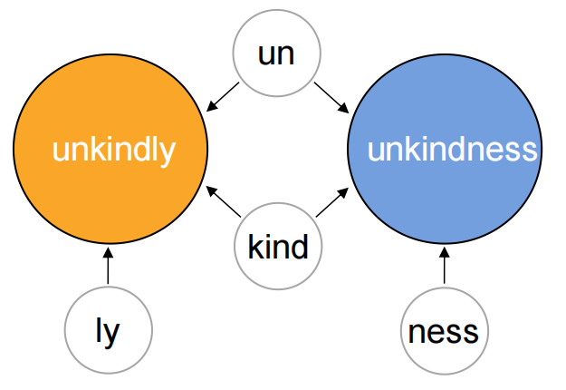
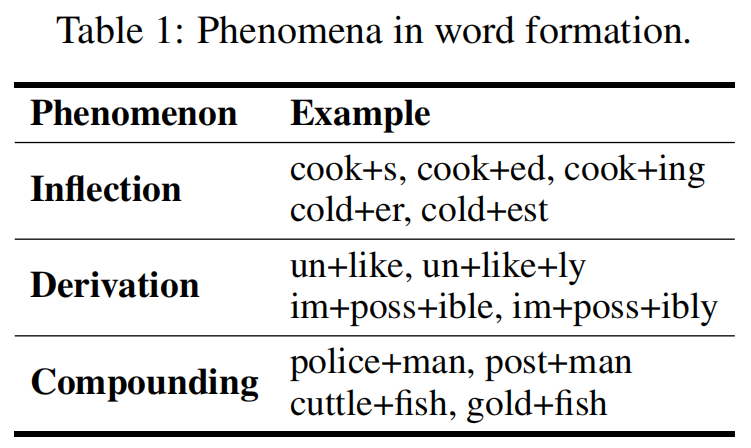
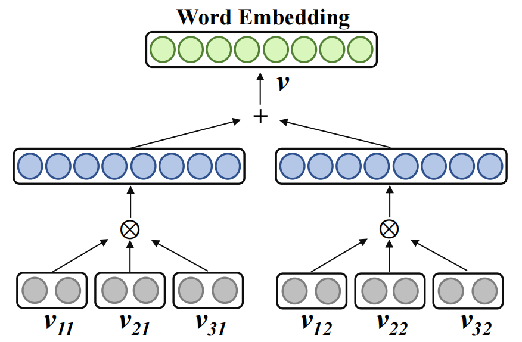
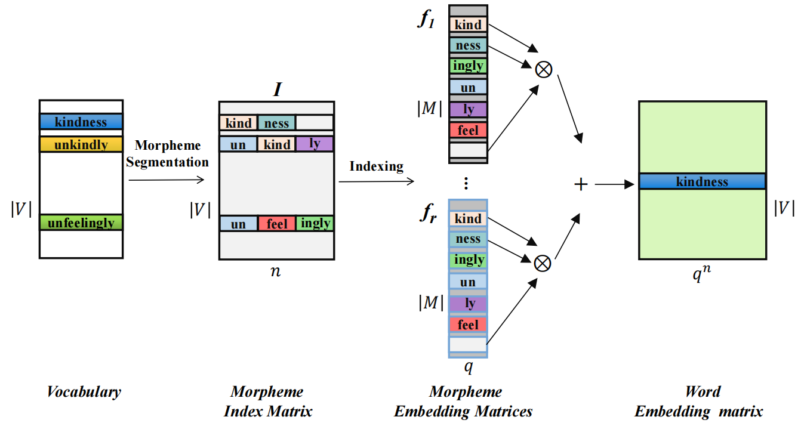
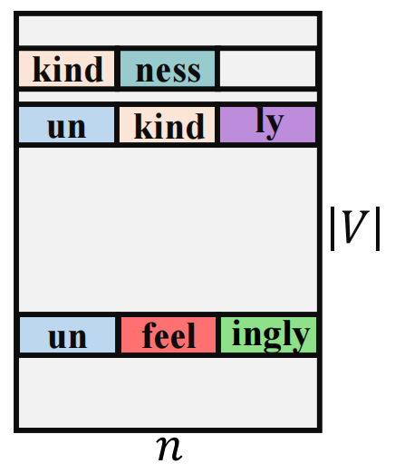
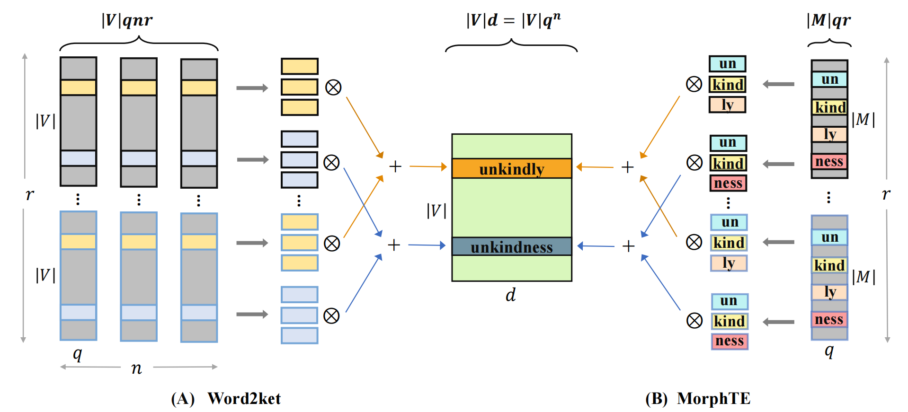
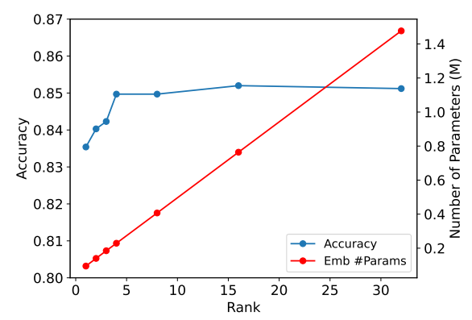

# MorphTE: Injecting Morphology in Tensorized Embeddings
MorphTE:形态学增强的张量化嵌入 2022.10.27 https://arxiv.org/abs/2210.15379

## 阅读笔记
1. 

## Abstract
In the era of deep learning, word embeddings are essential when dealing with text tasks. However, storing and accessing these embeddings requires a large amount of space. This is not conducive to the deployment of these models on resource-limited devices. Combining the powerful compression capability of tensor products, we propose a word embedding compression method with morphological augmentation, Morphologically-enhanced Tensorized Embeddings (MorphTE). A word consists of one or more morphemes, the smallest units that bear meaning or have a grammatical function. MorphTE represents a word embedding as an entangled form of its morpheme vectors via the tensor product, which injects prior semantic and grammatical knowledge into the learning of embeddings. Furthermore, the dimensionality of the morpheme vector and the number of morphemes are much smaller than those of words, which greatly reduces the parameters of the word embeddings. We conduct experiments on tasks such as machine translation and question answering. Experimental results on four translation datasets of different languages show that MorphTE can compress word embedding parameters by about 20 times without performance loss and significantly outperforms related embedding compression methods. 

在深度学习时代，词嵌入在处理文本任务时至关重要。然而，存储和访问这些嵌入需要大量空间。这不利于在资源有限的设备上部署这些模型。结合张量积强大的压缩能力，我们提出了一种具有形态学增强的词嵌入压缩方法，形态学增强的张量化嵌入(MorphTE)。一个词由一个或多个语素组成，语素是具有意义或语法功能的最小单位。MorphTE通过张量积将单词嵌入表示为其语素向量的纠缠形式，张量积为嵌入学习注入了先验语义和语法知识。此外，语素向量的维数和语素的数量比单词的维数小得多，这大大降低了单词嵌入的参数。我们在机器翻译和问答等任务上进行实验。在不同语言的四个翻译数据集上的实验结果表明，MorphTE可以将单词嵌入参数压缩约20倍而不会造成性能损失，并且显著优于相关的嵌入压缩方法。

## 1 Introduction
The word embedding layer is a key component of the neural network models in natural language processing (NLP). It uses an embedding matrix to map each word into a dense real-valued vector. However, when the vocabulary size and word embedding size (dimensionality) are large, the word embedding matrix requires a large number of parameters. For example, the One Billion Word task of language modeling [8] has a vocabulary size (|V |) of around 800K. Besides, the embedding size (d) can range from 300 to 1024 [30, 11, 22]. Storing and accessing the |V | × d embedding matrix requires a large amount of disk and memory space. This limits the deployment of these models on such devices having limited resources. To resolve this issue, there are many studies compressing embedding layers [32, 15, 27]. They can be roughly divided into two lines: product quantizationbased and decomposition-based methods. The product quantization-based methods [32, 20, 36] mainly utilize the compositional coding for constructing the word embeddings with fewer parameters, and it needs to introduce an additional task to learn the compact code for each word.

单词嵌入层是自然语言处理(NLP)中神经网络模型的关键组成部分。它使用嵌入矩阵将每个单词映射到密集实值向量中。然而，当词汇表大小和单词嵌入大小(维度)较大时，单词嵌入矩阵需要大量参数。例如，语言建模的十亿字任务[8]的词汇量(|V|)约为800K。此外，嵌入大小(d)可以在300到1024[30，11，22]的范围内。存储和访问|V|×d嵌入矩阵需要大量的磁盘和内存空间。这限制了这些模型在资源有限的设备上的部署。为了解决这个问题，有许多研究压缩嵌入层[32，15，27]。它们大致可以分为两类：基于乘积量化的方法和基于分解的方法。基于乘积量化的方法[32，20，36]主要利用合成编码来构造具有较少参数的单词嵌入，并且需要引入额外的任务来学习每个单词的紧凑代码。

The decomposition-based word embedding compression methods are mostly based on low-rank matrix factorization [18, 9] and tensor decomposition [15, 27]. Utilizing low-rank matrix factorization, ALBERT [18] replaces the embedding matrix with the product of two small matrices. Inspired by quantum entanglement, Word2ket and Word2ketXS embeddings are proposed [27]. Specifically, Word2ket represents a word embedding as an entangled tensor of multiple small vectors (tensors) via the tensor product. The entangled form is essentially consistent with Canonical Polyadic decomposition [16]. Decomposition-based methods approximate the original large word embedding matrix with multiple small matrices and tensors. However, these small matrices or tensors have no specific meaning and lack interpretation, and the approximate substitution with them often hurts the model performance in complicated NLP tasks such as machine translation [15, 27].

基于分解的词嵌入压缩方法主要基于低秩矩阵分解[18，9]和张量分解[15，27]。利用低秩矩阵分解，ALBERT[18]将嵌入矩阵替换为两个小矩阵的乘积。受量子纠缠的启发，提出了Word2ket和Word2ketXS嵌入[27]。具体而言，Word2ket通过张量积将单词嵌入表示为多个小向量(张量)的纠缠张量。纠缠形式基本上与经典多原子分解一致[16]。基于分解的方法用多个小矩阵和张量近似原始的大单词嵌入矩阵。然而，这些小矩阵或张量没有具体意义，缺乏解释，用它们进行近似替换通常会损害复杂NLP任务(如机器翻译)中的模型性能[15，27]。

 
Figure 1: Morphemes of "unkindly" and "unkindness".
图1：“不友善”和“不友好”的词素。

 
Table 1: Phenomena in word formation.
表1：构词现象。

In this study, we focus on high-quality compressed word embeddings. To this end, we propose the Morphologically-enhanced Tensorized Embeddings (MorphTE), which injects morphological knowledge in tensorized embeddings. Specifically, MorphTE models the embedding for a word as the entangled form of their morpheme vectors via tensor products. Notably, the quality of word embeddings can be improved by fine-grained morphemes, which has been verified in literature [4, 5].

在这项研究中，我们关注高质量的压缩词嵌入。为此，我们提出了形态学增强的张量化嵌入(MorphTE)，它在张量化的嵌入中注入了形态学知识。具体而言，MorphTE通过张量积将单词的嵌入建模为词素向量的纠缠形式。值得注意的是，细粒度语素可以提高单词嵌入的质量，这在文献[4，5]中得到了验证。

The benefits of introducing the morphology of morphemes in MorphTE can be summed up in two points. (1) A word consists of morphemes which are considered to be the smallest meaning-bearing or grammatical units of a language [24]. As shown in Figure 1, the root ‘kind’ determines the underlying meanings of ‘unkindly’ and ‘unkindness’. The affixes ‘un’, ‘ly’, and ‘ness’ grammatically refer to negations, adverbs, and nouns, respectively. In MorphTE, using these meaningful morphemes to generate word embeddings explicitly injects prior semantic and grammatical knowledge into the learning of word embeddings. (2) As shown in Table 1, linguistic phenomena such as inflection and derivation in word formation make morphologically similar words often semantically related. In MorphTE, these similar words can be connected by sharing the same morpheme vector.

在MorphTE中引入语素形态的好处可以归纳为两点。(1) 一个词由语素组成，语素被认为是语言中最小的含意或语法单位[24]。如图1所示，词根“kind”决定了“unkindly”和“unkindness”的基本含义。词缀“un”、“ly”和“ness”在语法上分别指否定、副词和名词。在MorphTE中，使用这些有意义的语素生成单词嵌入明确地将先前的语义和语法知识注入到单词嵌入的学习中。(2) 如表1所示，构词中的屈折和派生等语言现象使形态相似的词通常在语义上相关。在MorphTE中，这些相似的单词可以通过共享相同的语素向量来连接。

MorphTE only needs to train and store morpheme vectors, which are smaller in embedding size and vocabulary size than original word embeddings, leading to fewer parameters. For example, a word embedding of size 512 can be generated using three morpheme vectors of size 8 via tensor products. In addition, since morphemes are the basic units of words, the size of the morpheme vocabulary is smaller than the size of the word vocabulary. To sum up, MorphTE can learn high-quality and space-efficient word embeddings, combining the prior knowledge of morphology and the compression ability of tensor products.

MorphTE只需要训练和存储语素向量，与原始单词嵌入相比，语素向量的嵌入大小和词汇量都更小，从而减少了参数。例如，可以通过张量积使用大小为8的三个语素向量来生成大小为512的单词嵌入。此外，由于语素是单词的基本单位，语素词汇的大小小于单词词汇的大小。综上所述，MorphTE可以结合形态学的先验知识和张量积的压缩能力，学习高质量和空间效率的单词嵌入。

We conducted comparative experiments on machine translation, retrieval-based question answering, and natural language inference tasks. Our proposed MorphTE achieves better model performance on these tasks compared to related word embedding compression methods. Compared with Word2ket, MorphTE achieves improvements of 0.7, 0.6, and 0.6 BLEU scores on De-En, En-It, and En-Ru datasets respectively. In addition, on 4 translation datasets in different languages, our method can maintain the original performance when compressing the number of parameters of word embeddings by more than 20 times and reducing the proportion of word embeddings to the total parameters approximately from 30% to 2%, while other compression methods hurt the performance.

我们对机器翻译、基于检索的问答和自然语言推理任务进行了比较实验。与相关的单词嵌入压缩方法相比，我们提出的MorphTE在这些任务中实现了更好的模型性能。与Word2ket相比，MorphTE在De-En、En-It和En-Ru数据集上的BLEU得分分别提高了0.7、0.6和0.6。此外，在不同语言的4个翻译数据集上，当将单词嵌入的参数数量压缩20倍以上，并将单词嵌入占总参数的比例从30%降至2%左右时，我们的方法可以保持原始性能，而其他压缩方法会损害性能。

The main contributions of our work can be summarized as follows:
* We propose MorphTE, a novel compression method for word embeddings using the form of entangled tensors with morphology. The combination of morpheme and tensor product can compress word embeddings in terms of both vocabulary and embedding size.
* MorphTE introduces prior semantic knowledge in the learning of word embeddings from a fine-grained morpheme perspective, and explicitly models the connections between words by sharing morpheme vectors. These enabled it to learn high-quality compressed embeddings. 
* Experiments on multiple languages and tasks show that MorphTE can compress word embedding parameters over 20 times without hurting the original performance. 

我们工作的主要贡献可以总结如下：
* 我们提出了MorphTE，这是一种新的单词嵌入压缩方法，使用了具有形态学的纠缠张量形式。语素和张量积的组合可以在词汇和嵌入大小方面压缩单词嵌入。
* MorphTE从细粒度语素的角度在单词嵌入的学习中引入了先验语义知识，并通过共享语素向量来显式地建模单词之间的连接。这些使它能够学习高质量的压缩嵌入。
* 对多种语言和任务的实验表明，MorphTE可以将单词嵌入参数压缩20倍以上，而不会影响原始性能。

## 2 Related Work
Morphologically-augmented Embeddings. Related works [23, 4, 5, 29, 2, 10] propose to improve the quality of word embeddings by integrating morphological information. Representing word embeddings as the sum of morpheme and surface form vectors has been employed in several studies [5, 29, 2]. Morphological RNNs [5] learns word representations using morphemes as units of recursive neural networks [33]. Our proposed MorphTE also utilizes the information of morphemes and is a decomposition-based word embedding compression method, similar to Word2ket [27].

形态学增强嵌入。相关工作[23，4，5，29，2，10]提出通过整合形态学信息来提高单词嵌入的质量。将单词嵌入表示为词素和表面形式向量的总和已被用于若干研究[5，29，2]。形态学RNN[5]使用语素作为递归神经网络的单元来学习单词表示[33]。我们提出的MorphTE也利用了语素的信息，是一种基于分解的单词嵌入压缩方法，类似于Word2ket[27]。

Decomposition-based Compression Embeddings. Decomposition-based methods are either based on low-rank matrix factorization [18, 9, 1, 21, 19] or tensor decomposition [15, 41, 27, 34]. Based on low-rank matrix factorization, ALBERT [18] simply approximates the embedding matrix by the product of two small matrices. GroupReduce [9] and DiscBlock [19] perform a fine-grained matrix factorization. They first block the word embedding matrix according to the word frequency and then approximate each block. Notably, the method based on matrix factorization has a low-rank bottleneck, and its expressive ability is limited under the condition of a high compression ratio [35].

基于分解的压缩嵌入。基于分解的方法要么基于低阶矩阵分解[18，9，1，21，19]，要么基于张量分解[15，41，27，34]。基于低秩矩阵分解，ALBERT[18]简单地通过两个小矩阵的乘积来近似嵌入矩阵。GroupReduce[9]和DiscBlock[19]执行细粒度矩阵分解。他们首先根据单词频率对单词嵌入矩阵进行块化，然后对每个块进行近似。值得注意的是，基于矩阵分解的方法具有低秩瓶颈，并且在高压缩比的条件下其表达能力受到限制[35]。

As for the tensor decomposition, TT embeddings [15] uses the Tensor Train decomposition [25] to approximate the embedding matrix with several 2-order and 3-order tensors. TT-Rec [41] improves TT embeddings in terms of implementation and initialization to fit the recommended scenario. Word2ket [27] represents a word embedding as an entangled tensor via multiple small vectors. It essentially exploits Canonical Polyadic decomposition [16, 17]. Word2ketXs [27] is similar to Word2ket, but it compresses embeddings from the perspective of all words rather than individual words. In addition, KroneckerBERT [34] uses Kronecker decomposition to compress the word embeddings, and the form of Kronecker Embeddings is consistent with Word2ket [27] with an order of 2. Unlike these compression methods, our MorphTE utilizes meaningful morphemes as basic units for generating word embeddings, rather than vectors or tensors with no specific meaning. 

对于张量分解，TT嵌入[15]使用张量序列分解[25]来近似具有几个2阶和3阶张量的嵌入矩阵。TT-Rec[41]在实现和初始化方面改进了TT嵌入，以适应推荐的场景。Word2ket[27]通过多个小向量将单词嵌入表示为纠缠张量。它基本上利用了典型的多元分解[16，17]。Word2ketXs[27]类似于Word2ket，但它从所有单词而不是单个单词的角度压缩嵌入。此外，KroneckerBERT[34]使用Kronecker分解来压缩单词嵌入，并且Kronecer嵌入的形式与Word2ket[27]一致，阶数为2。与这些压缩方法不同，我们的MorphTE使用有意义的语素作为生成单词嵌入的基本单位，而不是没有特定含义的向量或张量。

## 3 Preliminary
### 3.1 Tensor Product Space and Entangled Tensors
A tensor product space of two separable Hilbert spaces V and W is also a separable Hilbert space

H, which is denoted as H = V ⊗ W. Suppose {ψ1, . . . , ψg} and {φ1, . . . , φh} are the orthonormal basis in V and W, respectively. The tensor product of the vector c =

Pg j=1 cjψj ∈ V and e = Ph k=1 ekφk ∈ W is defined as follow: c ⊗ e = (Xg j=1 cjψj ) ⊗ (Xh k=1 ekφk ) =

Xg j=1

Xh k=1 cj ekψj ⊗ φk (1)

The set {ψj ⊗ φk}jk forms the orthonormal basis in H, and the dimensionality of H is the product (gh) of dimensionalities of V and W. This tensor product operation can be simplified as the product of the corresponding coefficients as follow: c ⊗ e = [c1, c2, . . . , cg] ⊗ [e1, e2, . . . , eh] = [c1e1, c1e2, . . . , c1eh, . . . , cge1, cge2, . . . , cgeh] (2)

The cumulative tensor product space of the following form is said to have a tensor order of n, and the dimensionality of cumulative tensor product space is the cumulative product of its subspace dimensionalities. See Appendix B for concrete examples of the cumulative tensor product of multiple vectors.

On j=1

H = H1 ⊗ H2 . . . ⊗ Hn (3)

Considering the n-order tensor product space Nn j=1 Hj , vectors of the form v = ⊗n j=1vj , where vj ∈ Hj , are called simple tensors. In addition, vectors need to be represented as the sum of multiple 3 simple tensors are called entangled tensors. Tensor rank of a vector v is the smallest number of simple tensors that sum up to v.

### 3.2 Tensorized Embeddings with Tensor Product
 ⊗ + v11 v21 v31 v12 v22 v32 v

Word Embedding ⊗

 
Figure 2: Word2ket embedding with a rank of r = 2 and an order of n = 3.

Tensor products have been introduced to learn parameterefficient word embeddings in KroneckerBERT [34] and

Word2ket[27]. As shown in Figure 2, Word2ket[27] represents the embedding v ∈ R d of a word as an entangled tensor of rank r and order n as follow: v =

Xr k=1

On j=1 vjk (4) where vjk ∈ R q and v ∈ R q n . Word2ket only needs to store and use these small vectors vjk to generate a large word embedding. If q n > d, the excess part of the generated embedding will be cut off. Therefore, setting q n = d can avoid the waste of parameters caused by clipping, and the number of embedding parameters for a word is reduced from d to rn √n d.

For example, when d = 512, q = 8, n = 3, and r = 2, the number of parameters of a word embedding can be reduced from 512 to 48. 

## 4 Methodology: Morphologically-enhanced Tensorized Embeddings
In this section, we first discuss the rationale for introducing morphology in the embedding compression. Then, we propose MorphTE, a morphologically-enhanced word embedding compression method based on the tensor product. Finally, we show the detailed workflow of MorphTE.

### 4.1 Motivation to Introduce Morphology
To achieve compression, existing decomposition-based word embedding compression methods [18, 15] use a series of small vectors or tensors to generate large word embeddings, as shown in Figure 2.

These methods are not only uninterpretable as their small tensors do not have specific meaning [15, 27], but also lack lexical knowledge. We argue that, in resource-limited scenarios like compression, knowledge injection is much more critical than in common scenarios. Since with a significant amount of parameters in common scenarios it could to an easier extent learn implicitly such knowledge in a data-driven way, which is also one of the objectives for neural networks. However, in compression, it is more beneficial to inject explicit knowledge to compensate for inferiority in parameter scales, therefore underscoring the importance of knowledge injection in compression.

From a reductionism point of view, words might not be the smallest unit for some languages; for example unfeelingly could be separated into four meaningful parts [un, feel, ing, ly], a.k.a., morphemes 2 . By using a limited number of morphemes, one could possibly exponentially extend a given core vocabulary by composing morphemes as new words according to the rules of word formation in Table 1. The adoption of morphemes largely reduces the memory burden and therefore facilitates the learning of words for humans. We hypothesize that morphology also helps for word representation in neural networks, especially in resource-limited scenarios like compression.

### 4.2 Definition of MorphTE
Considering the above analysis, we propose to inject morphological knowledge to achieve highquality and space-efficient word embeddings. Suppose a word is segmented as l morphemes [m1, m2, . . . , ml ] in the natural order. For example, a four-morpheme word unfeelingly is segmented as [un, feel, ing, ly]. We refer f1(·), f2(·), · · · fr(·) : N → R q as r different representation functions of morphemes 3 , selected from a parametric family F = {f : N → R q}. The 2This also holds for logogram, written symbols of which represent words instead of sounds. For example,

Chinese language has character components, a.k.a, radicals. 3

For example, such a function could be morpheme embeddings, each vector of which is a q-sized vector, which are similar to word embeddings. 4

Vocabulary Morpheme Morpheme Word

Index Matrix Embedding Matrices Embedding matrix

Morpheme un

Segmentation kind kind ness unfeelingly un feel ingly unkindly kindness un kind ness kindness feel ingly

Indexing ... ⊗ un feel +

I

𝑉 𝑉

𝑀 𝑞 𝑛 𝑞 𝑛

𝑉 ly ly kind ness ingly ly

𝑀 ⊗ f1 f r

 
Figure 3: The workflow of MorphTE. n is the order (number of morphemes for a word). q is the size of morpheme vectors. |V| and |M| denote the size of word vocabulary and morpheme vocabulary.

Morphologically-enhanced Tensorized Embedding (MorphTE in short) of a word is defined as a sum of cumulative tensor products of morpheme vectors from different representation functions, namely, v =

Xr i=1

Ol j=1 fi(mj ) (5)

Each representation function of morphemes fi could sometimes be considered as a subspace of morphemes. The number of subspaces (i.e., r) is called the rank, and the number of morphemes (i.e., n) of a word is called the order, similar to Word2ket. The sum of the outputs from different subspaces in MorphTE is similar to the multi-head mechanism in Transformer [37].

Reasons to use tensor product. MorphTE utilizes tensor products to aggregate several small vectors

Interestingly, we find that there are some commonalities between tensor product and morpheme composition. (1) Both tensor product and morpheme composition are non-commutative (e.g., c ⊗ e 6= e ⊗ c and likewise "houseboat" 6= "boathouse"). (2) Small vectors are the smallest units in Word2ket and morphemes are also the smallest meaning-bearing units of words. Naturally, these small vectors in Word2ket can be assigned morpheme identities and shared among different words.

### 4.3 Workflow of MorphTE
We describe the workflow of MorphTE to generate embeddings for all the words in Figure 3. �un kindkind ness un feel ingly � ly

 
Figure 4: Segmentation

Morpheme segmentation Suppose there are |V | individual words. We first segment each word as a sequence of morphemes (a l-morpheme word could be segmented as a sequence as [m1, . . . , ml ]) using polyglot 4 To facilitate processing in neural networks, we truncate morpheme sequences in a fixed length n (e.g., n = 3 or n = 4). (1) For those words that have less than n morphemes, we pad them with some extra tokens; for example, we pad a single-morpheme word with n − 1 padding morphemes. (2) For those words that have more than n morphemes, we concatenate the rest of morphemes as the last one. The processing could be explained as follows:  [m1, m2, . . . , ml, padl+1, . . . padn ], l < n [m1, m2, . . . , concat(mn, . . . , ml)], l > n (6) 4 polyglot could be found in https://github.com/aboSamoor/polyglot. Based on morfessor [38], polyglot provides trained morpheme segmentation models for a variety of languages. Numerous studies [3, 29, 12] also utilize morfessor for morpheme segmentation. 5 where concat(·) is the operation to concatenate multiple morphemes into one morpheme. For example, a four-morpheme word unfeelingly, segmented as [un, feel, ing, ly], could be then truncated into [un, feel, ingly] when n = 3.

After morpheme segmentation, we could get a n-length morpheme sequence for each word; this results in a matrix I ∈ R |V |×n, each row of which (denoted as Ij ∈ R n ) is the morpheme sequence for a word (i.e., wj ), see I in Figure 4.

Rank-one MorphTE Assume that there are |M| individual morphemes. We first define a qsized trainable morpheme embeddings f ∈ R |M|×q . For a word wj with a morpheme sequence [Ij,1, Ij,2, · · · , Ij,n], its rank-one MorphTE embedding is a tensor product between these q-sized embeddings of these morphemes, resulting in a q n-sized vector. Namely, the formula for a rank-one version of MorphTE is as follows:

Embed(wj ) = f(Ij,1) ⊗ f(Ij,2) ⊗ . . . ⊗ f(Ij,n) (7)

If q n is greater than the given dimensionality of word embeddings (i.e., d), the excess part of the generated word embedding will be discarded.

General MorphTE Here, we propose a general version of MorphTE; the rank-one MorphTE is a special case of MorphTE when its rank r = 1. We define r copies of morpheme embeddings, namely, f1, . . . , fr ∈ R |M|×q with Xavier [13]. The general MorphTE could be considered as a sum of r rank-one MorphTE embeddings, r is called a ‘rank’ of MorphTE. Technically, it is formalized as:

Embed(wj ) = Xr i=1 fi(Ij,1) ⊗ . . . ⊗ fi(Ij,n) (8)

### 4.4 Difference between MorphTE and Word2ket
 kind + unkindly unkindness

𝑽 𝒒𝒏𝒓 𝑽 𝒅 = 𝑽 𝒒 𝒏 𝑴 𝒒𝒓

𝑉 𝑑

𝑀 𝑟 𝑞 𝑞 𝑛

𝑉 ⊗ ⊗ +

𝑉 ⊗ ⊗ ⊗ + ⊗ ⊗ ⊗ +

𝑀 (A) Word2ket (B) MorphTE 𝑟 un kind ly ness un kind ly kind un ly kind un ness kind un ness ly un ness kind ... ... ... ... ... ...

 
Figure 5: The graphical representation and parameters of Word2ket (A), and MorphTE (B). We show the procedure of how Word2ket and MorphTE generate word embeddings. |V| and |M| denote the size of word vocabulary and morpheme vocabulary. d indicates the word embedding size and q indicates the size of the small vector in Word2ket and MorphTE. r is the rank and n is the order.

Although Eq. 5 of MorphTE and Eq. 4 of Word2ket have a similar form, these two methods are fundamentally different. Compared with Word2ket, the innovations of MorphTE are as follows:

MorphTE is morphologically-enhanced. MorphTE uses morpheme vectors with meaning or grammatical functions to generate word embeddings. Compared with vectors without specific meanings in

Word2ket, this way introduces prior morphological knowledge and has better interpretability.

MorphTE captures commonness among words. MorphTE can explicitly add connections of morphologically similar words by sharing morpheme vectors. As shown in Figure 5, in MorphTE, "unkindly" and "unkindness" share the vectors of "un" and "kind", and they are both semantically related to "unkind". However, Word2ket considers these two words to be completely unrelated.

MorphTE is more parameter-efficient. Suppose MorphTE and Word2ket have the same rank (r ≥ 1), order (n ≥ 2), and dimensionality (q) of the subspace. (1) As shown in Figure 5, the number 6 of trainable parameters required by MorphTE and Word2ket are |M|qr and |V |qnr, respectively. (2) The number of parameters of Word2ket divided by that of MorphTE equals n|V |/|M|. (3) As smaller units, the number of morphemes (|M|) is usually smaller than the number of words (|V |).

Referring to Table 5, |V |/|M| > 2.5. (4) Hence, MorphTE can save more than 5 times the parameters compared to Word2ket (n|V |/|M| > 2.5n ≥ 5). 

## 5 Experiments

### 5.1 Experimental Setup
Baselines. (1) For word embedding compression, we chose Matrix Factor. (low–rank matrix factorization [18]), Tensor Train [15], Word2ket, and Word2ketXs embeddings [27] for comparison. (2) For morphological word embeddings, we reproduced the method (called as MorphSum) of representing a word embedding as the sum of its morpheme and surface form vectors [5, 29, 2].

In addition, we reproduced the method (called as MorphLSTM) of using the output of the word’s last morpheme in the LSTM network [14] as the embedding of the word, referring to Morphological

RNNs [5]. Our MorphTE utilizes the same morpheme segmentation as MorphSum and MorphLSTM.

Besides, we call the original word embeddings as Original. Except for the embedding layer, all models have the same structure.

Tasks, Datasets, and Metrics. We conducted experiments on machine translation, question answering, and natural language inference (NLI) tasks. (1) For machine translation tasks, we chose

IWSLT’14 German-to-English (De-En) dataset [7], English-to-Italian (En-It), English-to-Spanish (En-Es), and English-to-Russian (En-Ru) datasets of OPUS-100 [42]. The De-En dataset contains 160K sentence pairs and is processed by the BPE [31] of 10K tokens. The En-It, En-Es, and En-Ru datasets contain 1M sentence pairs and use joint source-target vocabulary processed by the BPE of 40K tokens. The performance is measured by case-sensitive tokenized BLEU[28] for all translation tasks. (2) For question answering tasks, we chose WikiQA [40], a retrieval-based question answering dataset. It contains 20.4K training pairs, and mean average precision (MAP), mean reciprocal rank (MRR) are used for evaluation. (3) For NLI tasks, we chose SNLI [6] which consists of 570k annotated sentence pairs from an image captioning corpus. Accuracy is used as the evaluation metric.

Implementations. (1) For machine translation tasks, we chose Transformer [37] with the implementation of Fairseq [26]. For De-En dataset, the Transformer consists of 6-layer encoder and 6-layer decoder with 512 embedding size, 1024 feed-forward network (FFN) size. It is trained with a batch size of 4096 tokens on a NVIDIA Tesla V100 GPU. For En-It, En-Es, and En-Ru tasks, the FFN size is increased to 2048. They are trained with a batch size of 32768 tokens on 2 NVIDIA Tesla

V100 GPUs. (2) For question answering and NLI tasks, we followed the implementation and setup of

RE2 [39]. The word embedding size is set to 512, and we trained them for 30 epochs with the early stopping. (3) Notices: Unless otherwise specified, the hyperparameter order of MorphTE is 3 in our experiments. For MorphTE and word embedding compression baselines, they are compared under a roughly equal number of parameters (compression ratio) by adjusting their hyperparameters of the rank. For more details on hyperparameters and training settings, refer to Appendix D.

### 5.2 Main Results
MorphTE outperforms compression baselines. As shown in Table 2, we compared MorphTE and compression baselines at about 20× and 40× compression ratios on four translation datasets. (1) At the ratio of 20×, MorphTE can maintain the performance of the original embeddings on all datasets.

Specifically, MorphTE achieves 0.4 and 0.3 BLEU score improvements on the De-En and En-Ru datasets, respectively. For other datasets, it achieves the same BLEU scores. However, none of the other compression methods can maintain the performance of the original model on these datasets. (2) At the ratio of 40×, although almost all compression methods cannot maintain the original performance, MorphTE still achieves the best results compared to other compression baselines.

Notably, the performance of the Matrix Factor. degrades significantly when a higher compression is conducted, and Word2ket cannot achieve more than 40× compression on these datasets. 7

Table 2: Experimental results of different embedding compression methods on translation tasks.

BLEU scores and compression ratios of the embedding layers are reported, with the form of B(C×). - indicates that the method can not achieve approximately the same compression ratio as other methods.

Refer to Appendix C for the analysis of the parameters of the methods.

Method De-En En-It En-Es En-Ru

Original 34.5 (1.0×) - 32.9 (1.0×) - 39.1 (1.0×) - 31.6 (1.0×) -

Matrix Factor. 32.7 (19×) 22.8 (40×) 31.0 (20×) 23.2 (42×) 38.0 (20×) 29.7 (42×) 28.9 (20×) 17.9 (40×)

Tensor Train 34.3 (20×) 33.4 (43×) 32.4 (21×) 32.1 (43×) 38.7 (21×) 38.5 (43×) 31.2 (21×) 30.9 (41×)

Word2ketXs 34.3 (21×) 33.7 (42×) 32.6 (21×) 31.5 (43×) 38.4 (21×) 38.0 (43×) 31.5 (21×) 31.0 (41×)

Word2ket 34.2 (21×) - 32.3 (21×) - 39.1 (21×) - 31.3 (21×) -

MorphTE 34.9 (21×) 34.1 (43×) 32.9 (21×) 32.1 (45×) 39.1 (21×) 38.7 (43×) 31.9 (21×) 31.5 (41×) 
Table 3: Experimental results on WikiQA of question answering tasks and SNLI of NLI tasks. ratio means the compression ratio of embedding layers.

Method WikiQA SNLI ratio MAP MRR ratio Accuracy

Original 1× 0.6798 0.6970 1× 0.8492

Matrix Factor. 82× 0.5957 0.6121 38× 0.4166

Tensor Train 80× 0.6251 0.6440 37× 0.8473

Word2ketXs 80× 0.6686 0.6871 38× 0.8450

Word2ket 21× 0.6842 0.7025 21× 0.8487

MorphTE 81× 0.6834 0.7051 38× 0.8497

MorphTE can handle different languages and tasks well. (1) We validated MorphTE on translation datasets of De-En, En-It, En-Es, and

En-Ru. MorphTE has been shown to handle different languages effectively. (2) For translation tasks, the De-En dataset uses separate source and target dictionaries, while other datasets use a shared source-target dictionary. MorphTE is shown to work in both ways. (3) Besides translation tasks, we also validated MorphTE on question answering (WikiQA) and natural language inference (SNLI) tasks. The experimental results in Table 3 show that MorphTE still maintains the performance of the original model and outperforms other compression baselines on these different tasks.

Table 4: Experimental results for analyzing the effect of morphology. BLEU scores and compression ratios of the embedding layers are reported, with the form of B(C×). Morph. indicates whether the method introduces morphological knowledge. Compr. indicates whether the method supports high compression. Word2ket+Rshare means the method of random sharing of small vectors in Word2ket.

Method Morph. Compr. De-En En-It En-Es En-Ru

Original ✗ ✗ 34.5 (1.0×) 32.9 (1.0×) 39.1 (1.0×) 31.6 (1.0×)

MorphSum ✓ ✗ 34.9 (0.7×) 33.0 (0.8×) 39.1(0.8×) 31.7 (0.8×)

MorphLSTM ✓ ✗ 34.9 (1.6×) 32.9 (2.8×) 39.7 (2.7×) 32.4 (2.5×)

Word2ket ✗ ✓ 34.2 (21×) 32.3 (21×) 39.1 (21×) 31.3 (21×)

Word2ket+Rshare ✗ ✓ 34.0 (21×) 32.0 (21×) 38.3 (21×) 30.6 (21×)

MorphTE ✓ ✓ 34.9 (21×) 32.9 (21×) 39.1 (21×) 31.9 (21×)

Morpheme-based morphology can enhance word embeddings. To study the impact of morphemes on MorphTE, we conducted following explorations. (1) As introduced in Section 5.1,

MorphSum and MorphLSTM both introduce morphological knowledge based on morphemes. As shown in Table 4, although they cannot achieve high compression on word embeddings, they (especially MorphLSTM) achieve significant improvements compared with original embeddings. This shows that morphological knowledge based on morphemes is beneficial for word embeddings. (2)

MorphTE assigns the identities of morphemes to the small vectors of Word2ket, and shares these small vectors based on morphemes. We consider the method (called Word2ket+Rshare) of random sharing of small vectors in Word2ket rather than morpheme-based sharing. This method can be implemented in such a way that for each word, randomly assign several row vectors of the trainable matrix of the same shape as the morpheme embedding matrix. As shown in Table 4, Word2ket+Rshare has lower BLEU scores than Word2ket on different translation datasets, and it is significantly inferior to MorphTE. This also verifies that it makes sense to introduce morphemes in MorphTE.

Marginal utility of higher compression ratios (e.g., > 40). We report the statistics of translation tasks in Table 5. The experimental results of this table are consistent with those in Table 2. (1) At about 20× compression, MorphTE can maintain the performance of the original word embeddings. 8

Table 5: Statistics of translation tasks. |V | and |M| are the size of the word vocabulary and morpheme vocabulary, respectively. #Struc and #Emb are the number of parameters of the model structure and that of the embedding layer, respectively. ratio is the compression ratio of the word embedding layer.

P is the proportion of the embedding layer to the total parameters.

Dataset |V | |M| #Stuc Original MorphTE

#Emb P ratio #Emb P ∆ BLEU ratio #Emb P ∆ BLEU
De-En 15480 5757 31.54M 7.93M 20.1% 21× 0.37M 1.2% + 0.4 43× 0.18M 0.6% − 0.4

En-It 41280 10818 44.14M 21.14M 32.4% 21× 0.99M 2.2% + 0.0 45× 0.45M 1.0% − 0.8

En-Es 41336 11377 44.14M 21.16M 32.4% 21× 1.03M 2.3% + 0.0 43× 0.49M 1.1% − 0.4

En-Ru 42000 12423 44.14M 21.50M 32.8% 21× 1.02M 2.3% + 0.3 41× 0.52M 1.2% − 0.1

The number of embedding parameters is approximately reduced from 20M to 1M, and its proportion of total parameters is reduced from 20.1%-31.8% to 1.2%-2.3%. (2) At about 40× compression, although MorphTE outperforms other compression methods referring to Table 2, MorphTE’s BLEU scores are significantly lower than the original model. Although the compression ratio is increased from 20× to 40×, the parameters of embeddings are only approximately reduced from 1M to 0.5M, and the proportion of embedding parameters to the total parameters is only reduced from 1.2%-2.3% to 0.6%-1.2%. Considering the loss of model performance, the slight reduction in the number of parameters resulting from higher compression ratios does not make much sense.

### 5.3 Ablation Study
Table 6: Experimental results for the ablation on the order of MorphTE on De-En. d / q means the size of the word embedding or morpheme vector. |V| / |M| means the size of the word or morpheme vocabulary.

Method order rank d / q |V| / |M| #Emb ratio BLEU

Orginal - - 512 15480 7.93M 1x 34.5 2 2 23 7654 0.38M 20x 34.4

MorphTE 3 7 8 5757 0.37M 21x 34.9 4 11 6 5257 0.41M 19x 34.4

Sensitivity on the order. (1) In previous experiments, we set the order of MorphTE to 3. In this section, we perform the statistical analysis and ablation experiments on the De-En dataset. Morpheme statistics show that more than 90% of the words have no more than three morphemes, referring to Appendix E. (2) We set the order of MorphTE to 2, 3, and 4, that is, limiting the maximum number of morphemes to 2, 3, and 4, respectively.

The word embedding size was set to 512. We adjusted the rank of MorphTE so that the models corresponding to these three cases have a similar number of parameters. From Table 6, setting the order of MorphTE to 3 achieves the best results when compressing the word embedding parameters by about 20 times. 0 5 10 15 20 25 30

 
Figure 6: Accuracy on SNLI and parameter numbers of embeddings changes w.r.t. the rank.

Sensitivity on the rank. We show the effect of rank on the number of parameters and performance of MorphTE in Figure 6. The rank of

MorphTE is set from 1 to 32. As can be seen, as the rank increases, the number of embedding parameters increases linearly, and the Accuracy first increases and then gradually stabilizes. This means that with the increase of embedding parameters, the model performance will gradually improve, but after the parameter amount exceeds a certain threshold, it will not drive the performance improvement. Therefore, the degree of compression and model performance can be balanced by adjusting the rank of MorphTE.

Sensitivity on the Embedding Size. To verify that MorphTE can stably achieve compression under different word embedding dimensionalities, We conducted experiments with the dimensionalities of 216, 512, and 1000. As can be seen in Table 7, when order n = 3 and the word embedding size / hidden size (d) is set to 216, 512, and 1000, the dimensionality of the morpheme vector (q) is set to 6, 8, and 10, respectively. In addition, the rank is set to 8 for these three cases. It can be seen that as the 9

Table 7: Experimental results for the ablation on the embedding size on IWSLT’14 De-En. d/q means the size of the word embedding or morpheme vector. |V |/|M| means the size of the word or morpheme vocabulary. n and r are the order and rank of MorphTE. #Emb and #Stuc are the parameter numbers of the embedding layer and the model structure, respectively. ratio is the compression ratio of word embedding layers.

Method d/q n r |V |/|M| #Emb ratio #Stuc BLEU

Original 216 3 - 15480 3.34M 1× 8.71M 34.1

MorphTE 6 3 8 5757 0.32M 10× 8.71M 34.2

Original 512 3 - 15480 7.93M 1× 31.54M 34.5

MorphTE 8 3 8 5757 0.41M 19× 31.54M 34.9

Original 1000 3 - 15480 15.48M 1× 96.72M 32.8

MorphTE 10 3 8 5757 0.51M 30× 96.72M 33.4 dimensionality of a word embedding increases significantly, the dimensionality of the morpheme vector does not increase significantly. This means that the larger the word embedding size, the more the compression potential of our method can be released.

Specifically, when the word embedding dimensionality is 216, our method can compress the word embedding parameters by a factor of 10 with comparable model performance. When the word embedding dimensionality is set to 512, our method is able to compress the word embedding parameters by a factor of 19, with a 0.4 BLEU score higher than the uncompressed model. When the word embedding dimensionality is set to 1000, our method outperforms the original model by a 0.6 BLEU score when compressing the word embedding parameters by a factor of 30. In conclusion, our method has stable compression ability and can maintain or slightly improve the model performance under different word embedding sizes.

Similar to other compression methods, our method introduces some computational overhead when generating word embeddings. However, this limitation is light according to the experimental analysis in Appendix G. 6 Conclusion

We propose MorphTE which combines the prior knowledge of morphology and the compression ability of tensor products to learn high-quality and space-efficient word embeddings. We validated our method on tasks such as machine translation, text summarization, and retrieval-based question answering. Experimental results show that MorphTE can handle different languages and tasks well. It outperforms related decomposition-based word embedding compression methods such as

Word2ket [27] and TT embeddings [15], and can achieve dozens of times compression of word embedding parameters without hurting the performance of the original model.

Acknowledgements

This work is supported in part by Natural Science Foundation of China (grant No.62276188 and

No.61876129), the Beijing Academy of Artificial Intelligence(BAAI), TJU-Wenge joint laboratory funding, and MindSpore 5 .

## References

1. Anish Acharya, Rahul Goel, Angeliki Metallinou, and Inderjit S. Dhillon. Online embedding compression for text classification using low rank matrix factorization. In The Thirty-Third AAAI Conference on Artificial Intelligence, pages 6196–6203, 2019.
2. Oded Avraham and Yoav Goldberg. The interplay of semantics and morphology in word embeddings. In Proceedings of the 15th Conference of the European Chapter of the Association for Computational Linguistics, EACL 2017, Valencia, Spain, April 3-7, 2017, Volume 2: Short Papers, pages 422–426. Association for Computational Linguistics, 2017.
3. Tamali Banerjee and Pushpak Bhattacharyya. Meaningless yet meaningful: Morphology grounded subword-level NMT. In Proceedings of the Second Workshop on Subword/Character LEvel Models, pages 55–60, New Orleans, June 2018. Association for Computational Linguistics. 5 https://www.mindspore.cn/ 10
4. Parminder Bhatia, Robert Guthrie, and Jacob Eisenstein. Morphological priors for probabilistic neural word embeddings. In Proceedings of the 2016 Conference on Empirical Methods in Natural Language Processing, EMNLP 2016, Austin, Texas, USA, November 1-4, 2016, pages 490–500. The Association for Computational Linguistics, 2016.
5. Jan A. Botha and Phil Blunsom. Compositional morphology for word representations and language modelling. In Proceedings of the 31th International Conference on Machine Learning, ICML 2014, Beijing, China, 21-26 June 2014, volume 32 of JMLR Workshop and Conference Proceedings, pages 1899–1907. JMLR.org, 2014.
6. Samuel R. Bowman, Gabor Angeli, Christopher Potts, and Christopher D. Manning. A large annotated corpus for learning natural language inference. In Proceedings of the 2015 Conference on Empirical Methods in Natural Language Processing, EMNLP 2015, Lisbon, Portugal, September 17-21, 2015, pages 632–642, 2015.
7. Mauro Cettolo, Jan Niehues, Sebastian Stüker, Luisa Bentivogli, and Marcello Federico. Report on the 11th IWSLT evaluation campaign. In Proceedings of the 11th International Workshop on Spoken Language Translation: Evaluation Campaign, pages 2–17, Lake Tahoe, California, December 4-5 2014.
8. Ciprian Chelba, Tomás Mikolov, Mike Schuster, Qi Ge, Thorsten Brants, Phillipp Koehn, and Tony Robinson. One billion word benchmark for measuring progress in statistical language modeling. In INTERSPEECH 2014, 15th Annual Conference of the International Speech Communication Association, Singapore, September 14-18, 2014, pages 2635–2639. ISCA, 2014.
9. Patrick H. Chen, Si Si, Yang Li, Ciprian Chelba, and Cho-Jui Hsieh. Groupreduce: Blockwise low-rank approximation for neural language model shrinking. In Advances in Neural Information Processing Systems 31: Annual Conference on Neural Information Processing Systems 2018, NeurIPS 2018, December 3-8, 2018, Montréal, Canada, pages 11011–11021, 2018.
10. Ryan Cotterell and Hinrich Schütze. Morphological word embeddings. CoRR, abs/1907.02423, 2019.
11. Jacob Devlin, Ming-Wei Chang, Kenton Lee, and Kristina Toutanova. BERT: pre-training of deep bidirectional transformers for language understanding. In Proceedings of the 2019 Conference of the North American Chapter of the Association for Computational Linguistics: Human Language Technologies, NAACL-HLT 2019, Minneapolis, MN, USA, June 2-7, 2019, Volume 1 (Long and Short Papers), pages 4171–4186, 2019.
12. Nadir Durrani, Fahim Dalvi, Hassan Sajjad, Yonatan Belinkov, and Preslav Nakov. One size does not fit all: Comparing NMT representations of different granularities. In Proceedings of the 2019 Conference of the North American Chapter of the Association for Computational Linguistics: Human Language Technologies, NAACL-HLT 2019, Minneapolis, MN, USA, June 2-7, 2019, Volume 1 (Long and Short Papers), pages 1504–1516. Association for Computational Linguistics, 2019.
13. Xavier Glorot and Yoshua Bengio. Understanding the difficulty of training deep feedforward neural networks. In Proceedings of the Thirteenth International Conference on Artificial Intelligence and Statistics, AISTATS 2010, Chia Laguna Resort, Sardinia, Italy, May 13-15, 2010, volume 9 of JMLR Proceedings, pages 249–256. JMLR.org, 2010.
14. Sepp Hochreiter and Jürgen Schmidhuber. Long short-term memory. Neural Comput., 9(8):1735–1780, nov 1997.
15. Oleksii Hrinchuk, Valentin Khrulkov, Leyla Mirvakhabova, Elena Orlova, and Ivan Oseledets. Tensorized embedding layers. In Findings of the Association for Computational Linguistics: EMNLP 2020, pages 4847–4860, November 2020.
16. Henk AL Kiers. Towards a standardized notation and terminology in multiway analysis. Journal of Chemometrics: A Journal of the Chemometrics Society, 14(3):105–122, 2000.
17. Tamara G Kolda and Brett W Bader. Tensor decompositions and applications. SIAM review, 51(3):455–500, 2009.
18. Zhenzhong Lan, Mingda Chen, Sebastian Goodman, Kevin Gimpel, Piyush Sharma, and Radu Soricut. ALBERT: A lite BERT for self-supervised learning of language representations. In 11 8th International Conference on Learning Representations, ICLR 2020, Addis Ababa, Ethiopia, April 26-30, 2020, 2020.
19. Jong-Ryul Lee, Yong-Ju Lee, and Yong-Hyuk Moon. Block-wise word embedding compression revisited: Better weighting and structuring. In Findings of the Association for Computational Linguistics: EMNLP 2021, Virtual Event / Punta Cana, Dominican Republic, 16-20 November, 2021, pages 4379–4388, 2021.
20. Zhongliang Li, Raymond Kulhanek, Shaojun Wang, Yunxin Zhao, and Shuang Wu. Slim embedding layers for recurrent neural language models. In Proceedings of the Thirty-Second AAAI Conference on Artificial Intelligence, pages 5220–5228. AAAI Press, 2018.
21. Vasileios Lioutas, Ahmad Rashid, Krtin Kumar, Md. Akmal Haidar, and Mehdi Rezagholizadeh. Improving word embedding factorization for compression using distilled nonlinear neural decomposition. In Findings of the Association for Computational Linguistics: EMNLP 2020, Online Event, 16-20 November 2020, volume EMNLP 2020 of Findings of ACL, pages 2774– 2784, 2020.
22. Yinhan Liu, Myle Ott, Naman Goyal, Jingfei Du, Mandar Joshi, Danqi Chen, Omer Levy, Mike Lewis, Luke Zettlemoyer, and Veselin Stoyanov. Roberta: A robustly optimized BERT pretraining approach. CoRR, abs/1907.11692, 2019.
23. Thang Luong, Richard Socher, and Christopher D. Manning. Better word representations with recursive neural networks for morphology. In Proceedings of the Seventeenth Conference on Computational Natural Language Learning, CoNLL 2013, Sofia, Bulgaria, August 8-9, 2013, pages 104–113. ACL, 2013.
24. William O’Grady, Michael Dobrovolsky, and Francis Katamba. Contemporary linguistics. St. Martin’s, 1997.
25. I. Oseledets. Tensor-train decomposition. SIAM J. Sci. Comput., 33:2295–2317, 2011.
26. Myle Ott, Sergey Edunov, Alexei Baevski, Angela Fan, Sam Gross, Nathan Ng, David Grangier, and Michael Auli. fairseq: A fast, extensible toolkit for sequence modeling. In Proceedings of the 2019 Conference of the North American Chapter of the Association for Computational Linguistics: Human Language Technologies, NAACL-HLT 2019, Minneapolis, MN, USA, June 2-7, 2019, Demonstrations, pages 48–53, 2019.
27. Aliakbar Panahi, Seyran Saeedi, and Tomasz Arodz. word2ket: Space-efficient word embeddings inspired by quantum entanglement. In 8th International Conference on Learning Representations, ICLR 2020, Addis Ababa, Ethiopia, April 26-30, 2020, 2020.
28. Kishore Papineni, Salim Roukos, Todd Ward, and Wei-Jing Zhu. Bleu: a method for automatic evaluation of machine translation. In Proceedings of the 40th Annual Meeting of the Association for Computational Linguistics, July 6-12, 2002, Philadelphia, PA, USA, pages 311–318. ACL, 2002.
29. Peyman Passban, Qun Liu, and Andy Way. Providing morphological information for SMT using neural networks. Prague Bull. Math. Linguistics, 108:271–282, 2017.
30. Jeffrey Pennington, Richard Socher, and Christopher D. Manning. Glove: Global vectors for word representation. In Proceedings of the 2014 Conference on Empirical Methods in Natural Language Processing, EMNLP 2014, October 25-29, 2014, Doha, Qatar, A meeting of SIGDAT, a Special Interest Group of the ACL, pages 1532–1543. ACL, 2014.
31. Rico Sennrich, Barry Haddow, and Alexandra Birch. Neural machine translation of rare words with subword units. In Proceedings of the 54th Annual Meeting of the Association for Computational Linguistics, ACL 2016, August 7-12, 2016, Berlin, Germany, Volume 1: Long Papers, 2016.
32. Raphael Shu and Hideki Nakayama. Compressing word embeddings via deep compositional code learning. In 6th International Conference on Learning Representations, ICLR 2018, Vancouver, BC, Canada, April 30 - May 3, 2018, Conference Track Proceedings. OpenReview.net, 2018.
33. Richard Socher, Cliff Chiung-Yu Lin, Andrew Y. Ng, and Christopher D. Manning. Parsing natural scenes and natural language with recursive neural networks. In Proceedings of the 28th International Conference on Machine Learning, ICML 2011, Bellevue, Washington, USA, June 28 - July 2, 2011, pages 129–136. Omnipress, 2011. 12
34. Marzieh S. Tahaei, Ella Charlaix, Vahid Partovi Nia, Ali Ghodsi, and Mehdi Rezagholizadeh. Kroneckerbert: Learning kronecker decomposition for pre-trained language models via knowledge distillation. CoRR, abs/2109.06243, 2021.
35. Urmish Thakker, Jesse G. Beu, Dibakar Gope, Ganesh Dasika, and Matthew Mattina. Rank and run-time aware compression of NLP applications. CoRR, abs/2010.03193, 2020.
36. Julien Tissier, Christophe Gravier, and Amaury Habrard. Near-lossless binarization of word embeddings. In The Thirty-Third AAAI Conference on Artificial Intelligence, AAAI 2019, The Thirty-First Innovative Applications of Artificial Intelligence Conference, IAAI 2019, The Ninth AAAI Symposium on Educational Advances in Artificial Intelligence, EAAI 2019, Honolulu, Hawaii, USA, January 27 - February 1, 2019, pages 7104–7111. AAAI Press, 2019.
37. Ashish Vaswani, Noam Shazeer, Niki Parmar, Jakob Uszkoreit, Llion Jones, Aidan N Gomez, Łukasz Kaiser, and Illia Polosukhin. Attention is all you need. In Advances in neural information processing systems, pages 5998–6008, 2017.
38. Sami Virpioja, Peter Smit, Stig-Arne Grönroos, and Mikko Kurimo. Morfessor 2.0: Python implementation and extensions for morfessor baseline. In Aalto University publication series. Department of Signal Processing and Acoustics, Aalto University, 2013.
39. Runqi Yang, Jianhai Zhang, Xing Gao, Feng Ji, and Haiqing Chen. Simple and effective text matching with richer alignment features. In Proceedings of the 57th Conference of the Association for Computational Linguistics, ACL 2019, Florence, Italy, July 28- August 2, 2019, Volume 1: Long Papers, pages 4699–4709, 2019.
40. Yi Yang, Wen-tau Yih, and Christopher Meek. Wikiqa: A challenge dataset for open-domain question answering. In Proceedings of the 2015 conference on empirical methods in natural language processing, pages 2013–2018, 2015.
41. Chunxing Yin, Bilge Acun, Xing Liu, and Carole-Jean Wu. Tt-rec: Tensor train compression for deep learning recommendation models. ArXiv, abs/2101.11714, 2021.
42. Biao Zhang, Philip Williams, Ivan Titov, and Rico Sennrich. Improving massively multilingual neural machine translation and zero-shot translation. In Proceedings of the 58th Annual Meeting of the Association for Computational Linguistics, ACL 2020, Online, July 5-10, 2020, pages 1628–1639. Association for Computational Linguistics, 2020. 13 

## A

### Checklist
##### 1. For all authors...
 (a) Do the main claims made in the abstract and introduction accurately reflect the paper’s contributions and scope? [Yes] (b) Did you describe the limitations of your work? [No] (c) Did you discuss any potential negative societal impacts of your work? [No] (d) Have you read the ethics review guidelines and ensured that your paper conforms to them? [Yes]

##### 2. If you are including theoretical results...
 (a) Did you state the full set of assumptions of all theoretical results? [N/A] (b) Did you include complete proofs of all theoretical results? [N/A]

##### 3. If you ran experiments...
 (a) Did you include the code, data, and instructions needed to reproduce the main experimental results (either in the supplemental material or as a URL)? [Yes] See supplemental material. (b) Did you specify all the training details (e.g., data splits, hyperparameters, how they were chosen)? [Yes] See Section 5.1 and supplemental material. (c) Did you report error bars (e.g., with respect to the random seed after running experiments multiple times)? [No] (d) Did you include the total amount of compute and the type of resources used (e.g., type of GPUs, internal cluster, or cloud provider)? [Yes] See Section 5.1.

####### 4. If you are using existing assets (e.g., code, data, models) or curating/releasing new assets...
 (a) If your work uses existing assets, did you cite the creators? [Yes] See Section 5.1. (b) Did you mention the license of the assets? [No] (c) Did you include any new assets either in the supplemental material or as a URL? [Yes] (d) Did you discuss whether and how consent was obtained from people whose data you’re using/curating? [No] (e) Did you discuss whether the data you are using/curating contains personally identifiable information or offensive content? [No]

##### 5. If you used crowdsourcing or conducted research with human subjects...
 (a) Did you include the full text of instructions given to participants and screenshots, if applicable? [N/A] (b) Did you describe any potential participant risks, with links to Institutional Review

Board (IRB) approvals, if applicable? [N/A] (c) Did you include the estimated hourly wage paid to participants and the total amount spent on participant compensation? [N/A] 14

### A Linguistic Phenomena in Word Formation

In the theory of linguistic morphology, morphemes are considered to be the smallest meaning-bearing or grammatical units of a language.

In the word formation, common linguistic phenomena include inflection, derivation, and compounding, as shown in Table 1 of our paper. (1) Inflection occurs when a word has different forms but essentially the same meaning. For example, the underlying meanings of ‘cooks‘, ‘cooked‘, and ‘cooking‘ are all ‘cook‘, and there are only certain grammatical differences. (2) Derivation makes a word with a different meaning, such as ‘possible‘ and ‘impossible‘. (3) Compounding occurs when multiple words are combined to form a new word. For example, ‘policeman‘ is obtained by compounding ‘police‘ and ‘man‘. Based on these common phenomena, there are common connections between words due to shared morphemes, and morphologically similar words with some of the same morphemes are often semantically related. Therefore, it makes sense to segment words into morphemes to learn word representations in a more fine-grained way.

### B The Example of Tensor Products

Typically, there exist two types of definitions for the tensor product. Here, we give an example for the tensor product between two vectors, but it also holds for the tensor product between matrices.

Definition 1. a tensor product between an m-sized vector and an n-sized vector results in an m × n matrix. a ⊗ 1 b = " a1 a2

#
 ⊗ [ b1 b2 b3 ] = " a1b1 a1b2 a1b3 a2b1 a2b2 a2b3

#
 (9)

Definition 2. a tensor product between an m-sized vector and an n-sized vector results in an mn-sized vector. a ⊗ 2 b = [ a1 a2 ] ⊗ [ b1 b2 b3 ] =  a1 [ b1 b2 b3 ] a2 [ b1 b2 b3 ]  = [ a1b1 a1b2 a1b3 a2b1 a2b2 a2b3 ] (10)

Note that Definition 1 increases the dimensions of the tensors while Definition 2 does not. As formulated in Eq. 2 in our paper, we use Definition 2 without dimension increase if not specified.

The difference between Definition 1 and Definition 2 is that Definition 2 further reshapes the RHS of Definition 1 (previously a two-dimensional tensor, i.e., a matrix) into a flattened vector. Since a word embedding is a vector in neural networks, we make use of Definition 2 so that any resulted embeddings for words are necessarily vectors.

As formulated in Eq. 2, a tensor product between a g-sized vector and h-sized vector results in a gh-sized vector. Similarly, a cumulative tensor product of n q-size vectors will be a q n-sized vector.

We show a concrete example of cumulative tensor product with n = 3 and q = 2 as follow: a ⊗ b ⊗ c =  a1 a2  ⊗  b1 b2  ⊗  c1 c2  =  a1  b1 b2  a2  b1 b2 ⊗  c1 c2  =  a1b1 a1b2 a2b1 a2b2  ⊗  c1 c2  =  a1b1  c1 c2  a1b2  c1 c2  a2b1  c1 c2  a2b2  c1 c2  =  a1b1c1 a1b1c2 a1b2c1 a1b2c2 a2b1c1 a2b1c2 a2b2c1 a2b2c2  (11) 15

Table 8: Parameter complexities for different word embedding methods. |V | and d are the word vocabulary size and word embedding size, respectively. r and n are the rank and order. |M| is the morpheme vocabulary size.

Method Parameter Method Parameter Method Parameter

Original |V |d Word2ket rn|V | √n d Word2ketXs rnpn |V | √n d

MorphTE |M| √n dr + |V |n Matrix Factor. r (|V | + d) Tensor Train (n − 2) r 2 + 2r  pn |V | √n d

MorphSum (|V | + |M|) d MorphLSTM |M|d + 8d 2

### C Analysis of Parameter

In the experiments of the paper, we directly report the specific number of parameters for different word embedding methods. To illustrate how these parameter numbers are calculated, we report the parameter complexity and settings of different methods in Section C.1 and Section C.2, respectively.

C.1 Parameter Complexity of Embedding Methods

We summarize the parameter complexities of different embedding methods in Table 8. Suppose the word vocabulary size is |V | and the word embedding size (dimensionality) is d. Suppose the morpheme vocabulary size is |M|, which involves embedding methods utilizing morphology. Suppose the rank is r and the order is n, which involves decomposition-based embedding compression methods. Note that the rank and order have different meanings in different decomposition methods.

The value of the order is generally 2 to 4. The number of parameters of the decomposition method is generally controlled by adjusting the rank, and the value of rank may vary greatly in different methods. The detailed analysis of the parameter complexity is as follows:
* Original: The original word embedding layer has a word embedding matrix, each row of which is the embedding (vector) of a word. The parameter number of the embedding matrix is |V |d.
* MorphSum: MorphSum needs to specify a unique embedding for each morpheme and word, resulting in the parameter number of (|V | + |M|) d.
* MorphLSTM: MorphLSTM needs to specify a unique embedding for each morpheme, resulting in the parameter number of |M|d. In addition, the LSTM network in MorphLSTM requires 8d 2 parameters. Therefore, the total parameter number is |M|d + 8d 2 .
* Matrix Factor.: The low–rank matrix factorization method decomposes the original word embedding matrix into the product of two small matrices of size |V | × r and r × d. r is called the rank of this method. Therefore, the number of parameters required by this method is r (|V | + d).
* Word2ket: Referring to Eq. 4 in the paper, Word2ket represents the embedding of a word as an entangled tensor of rank r and n. The number of parameters required by this method is at least rn|V | √n d.
* Word2ketXs: Word2ketXs compresses both the vocabulary size (|V |) and the word embedding size (d), while Word2ket only compresses the word embedding size (d) . The number of parameters required by this method is at least rnpn |V | √n d.
* Tensor Train: Like word2ketXS, Tensor Train method compresses both the vocabulary size (|V |) and the word embedding size (d). This method compresses the embedding matrix into 2 tensors of sizes |V |1 × d1 × r and |V |n × dn × r, and n − 2 tensors with size of |V |i × di × r 2 (1 < i < n), where |V | =

Qn k=1 |V |k, and d =

Qn k=1 dk. To simplify the calculation, let |V |1 = . . . = |V |n = pn |V | and d1 = . . . = dn = √n d, and then the number of parameters of this method is (n − 2) r 2 + 2r  pn |V | √n d.
* MorphTE: Similar to Word2ket, the size of the morpheme vector is at least √n d. Referring to

Section 4, there are r morpheme embedding matrices of size |M| √n d, resulting in |M| √n dr trainable parameters. In addition, storing the morpheme index matrix also requires additional constant parameters of |V |n. Therefore, the total parameter number is |M| √n dr + |V |n. 

C.2 Settings of Embedding Methods

We show detailed settings of different embedding methods on translation tasks in Tables 9 and 10, and these two tables correspond to Table 2 of the paper. We show detailed settings of different embedding methods on WikiQA of question answering tasks and SNLI of natural language inference tasks in

Tables 11 and 12. These two tables correspond to Table 3 of the paper.

Table 9: Detailed settings of Original, Matrix Factor., and Tensor Train methods on translation tasks, corresponding to Table 2. De-En and De-En mean the settings of the source language (De) and target language (En), respectively. Since other datasets (e.g., En-It) use shared source-target dictionaries, only one set of settings is reported. |V | is the size of the word vocabulary and d is the size (dimensionality) of a word embedding. #Emb is the parameter number of the word embedding layer. n and r are the order and rank of decomposition methods, respectively. ∆|V | and ∆d are the decomposition of the word vocabulary size (|V |) and word embedding dimensionality (d) by the decomposition method, respectively. For example, in Wordket, ∆d is (8, 8, 8), because a word embedding is constructed from three (n = 3) 8-size vectors.

Dataset

Original Matrix Factor. Tensor Train |V | d #Emb 20× 40× n ∆|V | ∆d 20× 40× r #Emb r #Emb r #Emb r #Emb

De-En 8848 512 4.53M 25 0.23M 12 0.11M 3 (18,20,25) (8,8,8) 34 0.20M 23 0.09M

De-En 6632 512 3.40M 25 0.19M 12 0.09M 3 (14,20,25) (8,8,8) 34 0.19M 23 0.09M

En-It 41280 512 21.14M 25 1.04M 12 0.50M 3 (30,35,40) (8,8,8) 59 1.01M 41 0.49M

En-Es 41336 512 21.16M 25 1.05M 12 0.50M 3 (30,35,40) (8,8,8) 59 1.01M 41 0.49M

En-Ru 42000 512 21.50M 25 1.06M 12 0.51M 3 (30,35,40) (8,8,8) 59 1.01M 43 0.54M

Table 10: Detailed settings of Word2ketXs, Word2ket, and MorphTE methods on translation tasks, corresponding to Table 2. |M| is the size of the morpheme vocabulary. Refer to Table 9 for the meaning of other fields.

Dataset

Word2ketXs Word2ket MorphTE n ∆|V | ∆d 20× 40× n ∆d 20× |M| n ∆d 20× 40× r #Emb r #Emb r #Emb r #Emb r #Emb

De-En 2 (95,95) (16,32) 44 0.20M 22 0.10M 3 (8,8,8) 1 0.21M 3013 3 (8,8,8) 7 0.20M 3 0.10M

De-En 2 (82,82) (16,32) 44 0.17M 22 0.09M 3 (8,8,8) 1 0.16M 2744 3 (8,8,8) 7 0.17M 3 0.08M

En-It 2 (205,205) (16,32) 104 1.02M 50 0.49M 3 (8,8,8) 1 0.99M 10818 3 (8,8,8) 10 0.99M 4 0.45M

En-Es 2 (205,205) (16,32) 104 1.02M 50 0.49M 3 (8,8,8) 1 0.99M 11377 3 (8,8,8) 10 1.03M 4 0.49M

En-Ru 2 (205,205) (16,32) 104 1.02M 53 0.52M 3 (8,8,8) 1 1.01M 12423 3 (8,8,8) 9 1.02M 4 0.52M

Table 11: Detailed settings of Original, Matrix Factor., and Tensor Train methods on WikiQA and

SNLI tasks, corresponding to Table 3. Refer to Table 9 for the meaning of the fields in this table.

Dataset Original Matrix Factor. Tensor Train |V | d #Emb r #Emb n ∆|V | ∆d r #Emb

WikiQA 12333 512 6.314M 6 0.077M 3 (20,25,26) (8,8,8) 19 0.079M

SNLI 16936 512 8.671M 13 0.227M 3 (25,25,32) (8,8,8) 33 0.233M

Table 12: Detailed settings of Word2ketXs, Word2ket, and MorphTE methods on WikiQA and SNLI tasks, corresponding to Table 3. |M| is the size of the morpheme vocabulary. Refer to Table 9 for the meaning of the fields in this table.

Dataset Word2ketXs Word2ket MorphTE n ∆|V| ∆d r #Emb n ∆d r #Emb |M| n ∆d r #Emb

WikiQA 3 (24,24,24) (8,8,8) 137 0.079M 3 (8,8,8) 1 0.296M 5152 3 (8,8,8) 1 0.078M

SNLI 3 (8,29,73) (8,8,8) 260 0.229M 3 (8,8,8) 1 0.406M 5572 3 (8,8,8) 4 0.229M 17

### D Implementation and Training Details

In this section, we report the hyperparameter details of the experiments in our paper. The hyperparameter details of implementation and training on machine translation tasks are shown in Table 13. The hyperparameter details of implementation and training on question answering and natural language inference tasks are shown in Table 14.

Table 13: Hyperparameter details of implementation and training on translation tasks.

IWSLT’14 means the De-En dataset, and

OPUS-100 means the En-It, En-Es, and En-Ru datasets.

Hyperparameter IWSLT’14 OPUS-100 num encoder layers 6 6 num decoder layers 6 6 embedding size 512 512 feed-forward size 1024 2048 attention heads 4 8 learning rate 5e-4 7e-4 label smoothing 0.1 0.1 max tokens per batch 4096 36864 dropout 0.3 0.25

Adam-betas (0.9, 0.98) (0.9, 0.98) warmup steps 20000 20000 weight decay 0.0001 0.0 beam size 5 5

Table 14: Hyperparameter details of implementation and training on question answering and natural language inference tasks. QA means the question answering task of the WikiQA dataset, and NLI means the natural language inference task of the SNLI dataset.

Hyperparameter QA NLI num encoder blocks 2 3 num convolutional encoders 3 2 kernel size 3 3 embedding size 512 512 hidden size 200 150 learning rate 1e-3 2e-3 batch size 400 512 dropout 0.1 0.1

Adam-betas (0.9, 0.999) (0.9, 0.999) weight decay 0.0 0.0 lr decay rate 1.0 0.94

### E Morpheme Statistics on IWSLT’14 De-En

We performed a statistical analysis of morphemes on the IWSLT’14 De-En dataset. The statistical results are shown in Table 15. The mor∞ means the segmentation that does not limit the number of morphemes for a word. As can be seen from the row of Table 15 where mor∞ is located, the number of words in German containing 1, 2, and 3 morphemes is 1728, 3623, and 2627, respectively.

These words make up 91% of the total number of words (8848) in the corpus of German. In terms of

English, the numbers of these three types of words are 1724, 2977, and 1632 respectively, accounting for a higher proportion (95%). Since most words contain no more than 3 morphemes, we tend to choose the segmentation that restricts the number of morphemes to a maximum of 3, and the order of

MorphTE is set to 3.

Table 15: Statistics of morpheme segmentation results on IWSLT’14 De-En. The column of segmentation means different morphological segmentation schemes, mor∞ means the segmentation that does not limit the number of morphemes for a word, and mori means the segmentation that restricts the number of morphemes to a maximum of i, referring to Eq. 6 in our paper. N = n represents the number of words containing n morphemes. |M| indicates the size of the morpheme vocabulary after the morpheme segmentation.

Language segmentation N = 1 N = 2 N = 3 N = 4 N > 4 |M| mor∞ 1728 3623 2627 716 154 2531 mor4 1728 3623 2627 870 0 2643

De (German) mor3 1728 3623 3497 0 0 3013 mor2 1728 7120 0 0 0 4302 mor1 8848 0 0 0 0 8848 mor∞ 1724 2977 1632 260 39 2584 mor4 1724 2977 1632 299 0 2614

En (English) mor3 1724 2977 1931 0 0 2744 mor2 1724 4908 0 0 0 3352 mor1 6632 0 0 0 0 6632 18

### F Effect of Morpheme Segmenters on MorphTE

In previous experiments, our MorphTE utilized the morfessor [38] to segment words. It is a widely used morpheme segmentation tool [3, 29, 12]. In this section, we study how the morpheme segmenter affects the performance of MorphTE. We hypothesize that high-quality morpheme segmentation could improve the performance of MorphTE, while unreasonable segmentation could be counterproductive.

To illustrate this, we add a comparative experiment on morpheme segmentation methods. Instead of using a morpheme segmenter, we design a random segmentation method called randomSeg. The randomseg does not segment words with a length of no more than three. For words with more than three characters, randomSeg randomly selects two gaps from the inside of the word to divide the word into 3 parts. Obviously, randomSeg makes little use of morpheme knowledge.

Table 16: Experimental results of different morpheme segmenters on translation tasks. Original dictates the original word embeddings without compression. MorphTE w/ morfessor dictates the

MorphTE we use in the paper. MorphTE w/ randomSeg indicates the MorphTE using randomSeg for morpheme segmentation.

Method De-En En-It En-Es En-Ru

Original 34.5 32.9 39.1 31.6

MorphTE w/ morfessor 34.9 32.9 39.1 31.9

MorphTE w/ randomSeg 33.8 31.7 38.6 30.4

As shown in Table 16, the performance of MorphTE w/ randomSeg is inferior to the original word embedding method and MorphTE w/ morfessor on four translation datasets. This shows that morpheme segmentation can affect the effectiveness of MorphTE, and improving morpheme segmentation may further enhance MorphTE.

### G Memory and Time Analysis

G.1 Memory Analysis

Table 17: Experimental results of the memory cost for different embedding methods. #Emb represents the memory/parameter cost of the word embedding layer, and #Stuc represents the memory/parameter cost of other parts of the model except the word embedding layer. P represents the proportion of the memory/parameter cost of the word embedding layer to the total cost of the model.

Method Parameter Memory

#Stuc/ M #Emb / M P / % #Stuc / MiB #Emb / MiB P / %
Original 3.8 6.3 62 14.6 24.1 62

Matrix Factor. 3.8 0.08 2 14.6 0.3 2

Tensor Train 3.8 0.08 2 14.6 0.3 2

Word2ketXS 3.8 0.08 2 14.6 0.3 2

Word2ket 3.8 0.3 7 14.6 1.1 7

MorphTE 3.8 0.08 2 14.6 0.3 2

Through MorphTE or other compression methods, the parameters of the word embedding layer can be greatly reduced. In this section, We further experimentally test the memory cost of different word embedding methods on the WikiQA task. The experimental setup is consistent with the main experiment in our paper. As shown in Table 17, the memory reduction of different word embedding compression methods is consistent with their parameter reduction. MorphTE could reduce the proportion of the original word embedding parameters/memory to the total model parameters/memory from about 62% to 2%. 19

G.2 Time Analysis

Table 18: Experimental results of the time cost for different embedding methods. #Emb represents the time cost of the word embedding layer, and #Stuc represents the time cost of other parts of the model except the word embedding layer. P represents the proportion of the time cost of the word embedding layer to the total time cost of the model.

Method GPU CPU

#Stuc / ms #Emb / ms P / % #Stuc / ms #Emb / ms P / %
Original 10.6 0.1 0.9 92.0 0.1 0.1

Matrix Factor. 10.6 0.2 1.9 92.0 1.0 1.1

Tensor Train 10.6 0.5 4.5 92.0 45.0 33

Word2ketXS 10.6 0.6 5.4 92.0 49.0 35

Word2ket 10.6 0.5 4.5 92.0 2.0 2.1

MorphTE 10.6 0.6 5.4 92.0 3.0 3.2

The original word embedding method can directly index the word vector from the word embedding matrix, and this process has almost no computational overhead. Almost all word embedding compression methods, including our method, require certain pre-operations to generate word embeddings, which introduces a certain computational overhead. To this end, we test the time cost of different word embedding methods on the WikiQA task. The experimental setup is also consistent with the main experiment in our paper. We test the time cost of different word embedding methods on Intel

E5-2698 CPU and Tesla V100 GPU. Specifically, we repeat the test 100 times on an input sample, and average the time.

As shown in Table 18, although word embedding compression methods increase the time cost of word embeddings, most of them only account for a small fraction of the total time cost. The time cost of our MorphTE accounts for 5.4% and 3.2% of the model on GPU and CPU, respectively.

Compared with the significant parameter/memory reduction, this slight computational overhead is tolerable. In addition, we also found that the time cost of word2ketxs and tensor train methods increased significantly on CPU devices. This may be related to the fact that these two methods have more computational operations under the condition of the same number of parameters. 20

