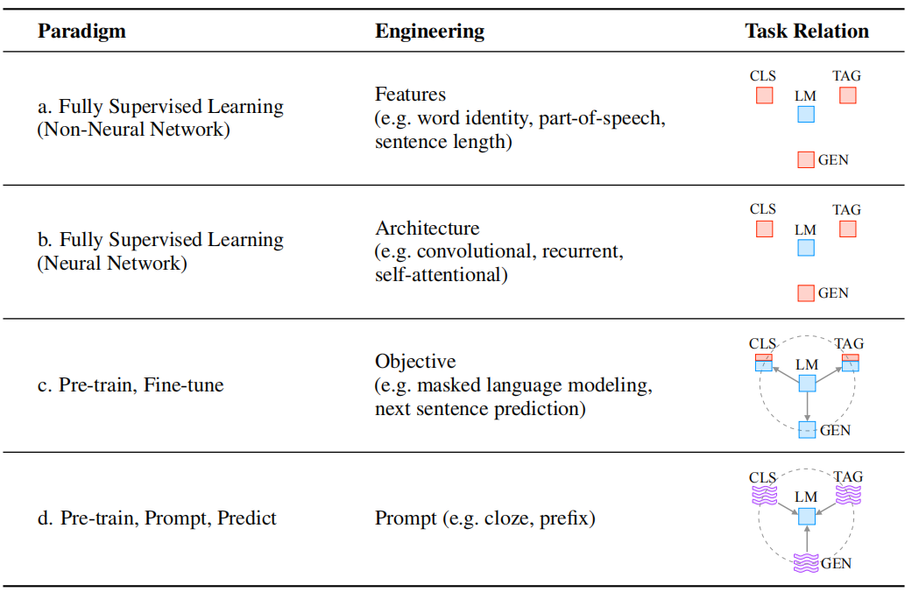

# Pre-train, Prompt, and Predict: A Systematic Survey of Prompting Methods in Natural Language Processing
预训练、提示和预测：自然语言处理中提示方法的系统综述 2021.7.28 https://arxiv.org/abs/2107.13586

## 阅读笔记
* 知乎上一篇介绍：https://zhuanlan.zhihu.com/p/396098543
* http://pretrain.nlpedia.ai/
* 完全监督 -> 预训练+微调 -> 基于提示预训练+直接预测
* chatGPT的出现，似乎人类和AI的任务对齐更重要，从大量真实环境获取用户的提问形式，让AI更适应人类的提示方式，而不是一堆提示模板。

## Abstract
This paper surveys and organizes research works in a new paradigm in natural language processing, which we dub “prompt-based learning”. Unlike traditional supervised learning, which trains a model to take in an input x and predict an output y as P(y|x), prompt-based learning is based on language models that model the probability of text directly. To use these models to perform prediction tasks, the original input x is modified using a template into a textual string prompt x0 that has some unfilled slots, and then the language model is used to probabilistically fill the unfilled information to obtain a final string ˆx, from which the final output y can be derived. This framework is powerful and attractive for a number of reasons: it allows the language model to be pre-trained on massive amounts of raw text, and by defining a new prompting function the model is able to perform few-shot or even zero-shot learning, adapting to new scenarios with few or no labeled data. In this paper we introduce the basics of this promising paradigm, describe a unified set of mathematical notations that can cover a wide variety of existing work, and organize existing work along several dimensions, e.g. the choice of pre-trained models, prompts, and tuning strategies. To make the field more accessible to interested beginners, we not only make a systematic review of existing works and a highly structured typology of prompt-based concepts, but also release other resources, e.g., a website NLPedia–Pretrain including constantly-updated survey, and paperlist. 

本文调查并组织了自然语言处理新范式的研究工作，我们称之为“基于提示的学习”。与传统的监督学习不同，基于提示的学习基于直接对文本概率进行建模的语言模型，后者训练模型接受输入x并将输出y预测为P(y|x)。为了使用这些模型来执行预测任务，使用模板将原始输入x修改为具有一些未填充槽的文本字符串提示x0，然后使用语言模型来概率地填充未填充信息以获得最终字符串，从中可以导出最终输出y。这个框架强大而吸引人的原因有很多：它允许在大量原始文本上对语言模型进行预训练，通过定义一个新的提示函数，该模型能够执行少量甚至零次学习，适应很少或没有标注数据的新场景。在本文中，我们介绍了这一有前景的范式的基础知识，描述了一组统一的数学符号，可以涵盖各种现有工作，并沿着几个维度组织现有工作，例如选择预先训练的模型、提示和调整策略。为了让感兴趣的初学者更容易进入该领域，我们不仅对现有作品和基于提示的概念的高度结构化类型进行了系统审查，还发布了其他资源，例如NLPedia–Pretrain网站，包括不断更新的调查和论文列表。

## 1 Two Sea Changes in NLP  2个巨变
Fully supervised learning, where a task-specific model is trained solely on a dataset of input-output examples for the target task, has long played a central role in many machine learning tasks (Kotsiantis et al., 2007), and natural language processing (NLP) was no exception. Because such fully supervised datasets are ever-insufficient for learning high-quality models, early NLP models relied heavily on feature engineering (Tab. 1 a.; e.g. Lafferty et al. (2001); Guyon et al. (2002); Och et al. (2004); Zhang and Nivre (2011)), where NLP researchers or engineers used their domain knowledge to define and extract salient features from raw data and provide models with the appropriate inductive bias to learn from this limited data. With the advent of neural network models for NLP, salient features were learned jointly with the training of the model itself (Collobert et al., 2011; Bengio et al., 2013), and hence focus shifted to architecture engineering, where inductive bias was rather provided through the design of a suitable network architecture conducive to learning such features (Tab. 1 b.; e.g. Hochreiter and Schmidhuber (1997); Kalchbrenner et al. (2014); Chung et al. (2014); Kim (2014); Bahdanau et al. (2014); Vaswani et al. (2017)).(1Even during this stage, there was some use of pre-trained models exemplified by word2vec (Mikolov et al., 2013b,a) and GloVe (Pennington et al., 2014), but they were used for only a limited portion of the final model parameters. )

完全监督学习，即仅在目标任务的输入输出样本数据集上训练特定于任务的模型，长期以来在许多机器学习任务中发挥着核心作用(Kotsiantiset al., 2007)，自然语言处理(NLP)也不例外。由于这种完全监督的数据集始终不足以学习高质量模型，早期NLP模型严重依赖于特征工程(表1a; 例如Laffertyet al (2001); Guyonet al (2002); Ochet al (2004); Zhang和Nivre(2011))，其中NLP研究人员或工程师使用他们的领域知识从原始数据中定义和提取显著特征，并为模型提供适当的归纳偏差，以从有限的数据中学习。随着NLP神经网络模型的出现，显著特征与模型本身的训练相结合(Collobertet al., 2011;Bengioet al., 2013年)，因此重点转向了架构，其中通过设计有助于学习这些特征的适当网络架构来提供归纳偏差(表1b; 例如Hochrieter和Schmidhuber(1997); Kalchbrenneret al (2014); Chunget al (2014); Kim(2014); Bahdanauet al (2014); Vaswaniet al (2017))。(即使在这一阶段，也有一些预训练模型的使用，例如word2vec(Mikolovet al., 2013b，a)和GloVe(Penningtonet al., 2014)，但它们仅用于最终模型参数的有限部分。)

However, from 2017-2019 there was a sea change in the learning of NLP models, and this fully supervised paradigm is now playing an ever-shrinking role. Specifically, the standard shifted to the pre-train and fine-tune paradigm (Tab. 1 c.; e.g. Radford and Narasimhan (2018); Peters et al. (2018); Dong et al. (2019); Yang et al. (2019); Lewis et al. (2020a)). In this paradigm, a model with a fixed(2This paradigm is less conducive to architectural exploration because (i) unsupervised pre-training allows models to learn with fewer structural priors, and (ii) as pre-training of models is time-consuming, experimenting with structural variants is costly. ) architecture is pre-trained as a language model (LM), predicting the probability of observed textual data. Because the raw textual data necessary to train LMs is available in abundance, these LMs can be trained on large datasets, in the process learning robust general-purpose features of the language it is modeling. The above pre-trained LM will be then adapted to different downstream tasks by introducing additional parameters and fine-tuning them using task-specific objective functions. Within this paradigm, the focus turned mainly to objective engineering, designing the training objectives used at both the pre-training and fine-tuning stages. For example, Zhang et al. (2020a) show that introducing a loss function of predicting salient sentences from a document will lead to a better pre-trained model for text summarization. Notably, the main body of the pre-trained LM is generally (but not always; Peters et al. (2019)) fine-tuned as well to make it more suitable for solving the downstream task.

然而，从2017-2019年开始，NLP模型的学习发生了巨大变化，这种完全监督的范式现在正在发挥越来越小的作用。具体而言，标准转向了预训练和微调模式(表1c.; 如Radford和Narasimhan(2018); Peterset al (2018); Donget al (2019); Yanget al (2019); Lewiset al (2020a))。在这种范式中，具有固定模式的模型(2这种范式不利于架构探索，因为(i)无监督的预训练允许模型使用较少的结构先验进行学习，以及(ii)由于模型的预训练耗时，因此使用结构变体进行实验成本高昂。)架构被预先训练为语言模型(LM)，预测观察到的文本数据的概率。由于训练LMs所需的原始文本数据非常丰富，因此可以在大型数据集上训练这些LMs，在学习其建模语言的强大通用特性的过程中。然后，通过引入附加参数并使用任务特定目标函数对其进行微调，上述预训练的LM将适用于不同的下游任务。在这一范式中，重点主要转向目标工程，设计训练前和微调阶段使用的训练目标。例如，Zhanget al (2020a)表明，引入预测文档中重要句子的损失函数将为文本摘要提供更好的预训练模型。值得注意的是，预训练LM的主体通常(但不总是; Peterset al (2019))也进行了微调，以使其更适合解决下游任务。

Now, as of this writing in 2021, we are in the middle of a second sea change, in which the “pre-train, fine-tune” procedure is replaced by one in which we dub “pre-train, prompt, and predict”. In this paradigm, instead of adapting pre-trained LMs to downstream tasks via objective engineering, downstream tasks are reformulated to look more like those solved during the original LM training with the help of a textual prompt. For example, when recognizing the emotion of a social media post, “I missed the bus today.”, we may continue with a prompt “I felt so __”, and ask the LM to fill the blank with an emotion-bearing word. Or if we choose the prompt “English: I missed the bus today. French: __”), an LM may be able to fill in the blank with a French translation. In this way, by selecting the appropriate prompts we can manipulate the model behavior so that the pre-trained LM itself can be used to predict the desired output, sometimes even without any additional task-specific training (Tab. 1 d.; e.g. Radford et al. (2019); Petroni et al. (2019); Brown et al. (2020); Raffel et al. (2020); Schick and Sch¨utze (2021b); Gao et al. (2021)). The advantage of this method is that, given a suite of appropriate prompts, a single LM trained in an entirely unsupervised fashion can be used to solve a great number of tasks (Brown et al., 2020; Sun et al., 2021).However, as with most conceptually enticing prospects, there is a catch – this method introduces the necessity for prompt engineering, finding the most appropriate prompt to allow a LM to solve the task at hand.

现在，到2021写这篇文章时，我们正处于第二次大变革的中期，“预训练，微调”流程被我们称为“预训练、提示和预测”的流程取代。在这个范例中，不是通过目标工程使预先训练的LM适应下游任务，而是通过文本提示重新制定下游任务，使其看起来更像原始LM训练期间解决的任务。例如，当识别到社交媒体帖子“I missed the bus today.”的情绪时，我们可以继续提示“I felt so __”，并要求LM用一个带情绪的词来填补空白。或者如果我们选择提示 “English: I missed the bus today. French: __”)，LM可能可以用法语翻译来填补空白。通过选择适当的提示，我们可以操纵模型行为，以便预训练的LM本身可以用于预测期望的输出，有时甚至无需任何额外的任务特定训练(表1d; 例如Radfordet al (2019); Petroniet al (2019); Brownet al (2020); Raffelet al (2020); Schick和Sch¨utze(2021b); Gaoet al (2021)。这种方法的优点是，如果给出一组适当的提示，以完全无监督的方式训练的单个LM可以用于解决大量任务(Brownet al., 2020; Sunet al., 2021)。然而，与大多数概念上诱人的前景一样，有一个陷阱 —— 这种方法引入了提示工程的必要性，找到最合适的提示以允许LM解决手头的任务。
<!--目标工程，
怎样编写提示？-->

This survey attempts to organize the current state of knowledge in this rapidly developing field by providing an overview and formal definition of prompting methods (§2), and an overview of the pre-trained language models that use these prompts (§3). This is followed by in-depth discussion of prompting methods, from basics such as prompt engineering (§4) and answer engineering (§5) to more advanced concepts such as multi-prompt learning methods (§6) and prompt-aware training methods (§7). We then organize the various applications to which prompt-based learning methods have been applied, and discuss how they interact with the choice of prompting method (§8). Finally, we attempt to situate the current state of prompting methods in the research ecosystem, making connections to other research fields (§9), suggesting some current challenging problems that may be ripe for further research (§10), and performing a meta-analysis of current research trends (§11).

本调查试图通过提供提示方法的概述和正式定义(§2)，以及使用这些提示的预训练语言模型的概述(§3)，来组织这个快速发展的领域的当前知识状态。接下来是对提示方法的深入讨论，从提示工程(§4)和答案工程(§5)等基础知识到多提示学习方法(§6)和提示感知训练方法(§7)等更先进的概念。然后，我们组织了基于提示的学习方法所应用的各种应用程序，并讨论了它们如何与提示方法的选择进行交互(§8)。最后，我们试图确定研究生态系统中激励方法的现状，将它与其他研究领域联系起来(§9)，提出一些当前具有挑战性的问题，这些问题可能已经成熟，可以进行进一步研究(§10)，并对当前研究趋势进行荟萃分析(§11)。

Finally, in order to help beginners who are interested in this field learn more effectively, we highlight some systematic resources about prompt learning (as well as pre-training) provided both within this survey and on companion websites:
* : A website of prompt-based learning that contains: frequent updates to this survey, related slides, etc.
* Fig.1: A typology of important concepts for prompt-based learning. 
* Tab.7: A systematic and comprehensive comparison among different prompting methods.
* Tab.10: An organization of commonly-used prompts.
* Tab.12: A timeline of prompt-based research works.
* Tab.13: A systematic and comprehensive comparison among different pre-trained LMs. 

最后，为了帮助对该领域感兴趣的初学者更有效地学习，我们强调了本调查和相关网站中提供的一些关于快速学习(以及预训练)的系统资源：
* ：一个基于提示的学习网站，包含：此调查的频繁更新、相关幻灯片等。
* 图1：基于提示的学习的重要概念类型。
* 表7：不同激励方法之间的系统和全面比较。
* 表10：常用提示的组织。
* 表12：基于提示的研究工作时间表。
* 表13：不同预训练LMs之间的系统和全面比较。

 
Table 1: Four paradigms in NLP. The “engineering” column represents the type of engineering to be done to build strong systems. The “task relation” column, shows the relationship between language models (LM) and other NLP tasks (CLS: classification, TAG: sequence tagging, GEN: text generation).
* fully unsupervised training
* fully supervised training
* Supervised training combined with unsupervised training
* indicates a textual prompt
Dashed lines suggest that different tasks can be connected by sharing parameters of pre-trained models. “LM→Task” represents adapting LMs (objectives) to downstream tasks while “Task→LM” denotes adapting downstream tasks (formulations) to LMs. 

表1:NLP中的四种范式。“工程”栏表示构建强大系统所需的工程类型。“任务关系”列显示语言模型(LM)与其他NLP任务(CLS:分类，TAG:序列标记，GEN：文本生成)之间的关系。
* 完全无监督训练
* 全监督训练
* 监督训练与无监督训练相结合
* 表示文本提示
虚线表明，可以通过共享预训练模型的参数来连接不同的任务。“”LM“→任务”表示使LMs(目标)适应下游任务，而“任务”→LM”表示使下游任务(配方)适应LM。

## 2 A Formal Description of Prompting 提示的正式描述
### 2.1 Supervised Learning in NLP  NLP中的监督学习
In a traditional supervised learning system for NLP, we take an input x, usually text, and predict an output y based on a model P(y|x; θ). y could be a label, text, or other variety of output. In order to learn the parameters θ of this model, we use a dataset containing pairs of inputs and outputs, and train a model to predict this conditional probability. We will illustrate this with two stereotypical examples.

在NLP的传统监督学习系统中，我们获取输入x，通常是文本，并基于模型P(y|x; θ)预测输出y。y可以是标签、文本或其他类型的输出。为了学习这个模型的参数θ，我们使用包含输入和输出对的数据集，并训练一个模型来预测这个条件概率。我们将用两个典型的例子来说明这一点。

First, text classification takes an input text x and predicts a label y from a fixed label set Y. To give an example, sentiment analysis (Pang et al., 2002; Socher et al., 2013) may take an input x =“I love this movie.” and predict a label y = ++, out of a label set Y = {++, +, ~ , -, --}.

首先，文本分类采用输入文本x并预测固定标签集y中的标签y。举个例子，情感分析(Panget al., 2002; Socheret al., 2013)可能采用输入x=“我爱这部电影”，并预测标签集y={++，+，~，-，-}中的标签y=++。

Second, conditional text generation takes an input x and generates another text y. One example is machine translation (Koehn, 2009), where the input is text in one language such as the Finnish x = “Hyv¨a¨a huomenta.” and the output is the English y = “Good morning”.

第二，条件文本生成接受输入x并生成另一个文本y。一个例子是机器翻译(Koehn，2009)，其中输入是一种语言的文本，如芬兰语x=“Hyv¨a¨a huomenta.”，输出是英语y=“Good morning”。

### 2.2 Prompting Basics
The main issue with supervised learning is that in order to train a model P(y|x; θ), it is necessary to have supervised data for the task, which for many tasks cannot be found in large amounts. Prompt-based learning methods for NLP attempt to circumvent this issue by instead learning an LM that models the probability P(x; θ) of text x itself (details in §3) and using this probability to predict y, reducing or obviating the need for large supervised datasets. In this section we lay out a mathematical description of the most fundamental form of prompting, which encompasses many works on prompting and can be expanded to cover others as well. Specifically, basic prompting predicts the highest-scoring yˆ in three steps. 

监督学习的主要问题是，为了训练模型P(y|x。NLP的基于提示的学习方法试图通过学习LM来规避这一问题，LM建模文本x自身的概率P(x; θ)(详见§3)，并使用该概率预测y，从而减少或消除对大型监督数据集的需求。在本节中，我们对最基本的提示形式进行了数学描述，其中包括许多关于提示的工作，也可以扩展到其他方面。具体而言，基本提示预测三个步骤中的最高得分yû。

 
Table 2: Terminology and notation of prompting methods. z∗ represents answers that correspond to true output y∗.
表2：提示方法的术语和符号。z*表示对应于真实输出y*的答案。

#### 2.2.1 Prompt Addition
In this step a prompting function fprompt(·) is applied to modify the input text x into a prompt x0 = fprompt(x). In the majority of previous work (Kumar et al., 2016; McCann et al., 2018; Radford et al., 2019; Schick and Sch¨utze, 2021a), this function consists of a two step process:
1. Apply a template, which is a textual string that has two slots: an input slot [X] for input x and an answer slot [Z] for an intermediate generated answer text z that will later be mapped into y.
2. Fill slot [X] with the input text x. 

在此步骤中，应用提示函数fprompt(·)将输入文本x修改为提示x0=fprompt(x)。在之前的大部分工作中(Kumaret al., 2016;McCannet al., 2018;Radfordet al., 2019;Schick和Sch¨utze，2021a)，该功能由两个步骤组成：
1. 应用一个模板，该模板是一个具有两个槽的文本字符串：一个用于输入X的输入槽[X]，一个用于稍后映射到y的中间生成的答案文本Z的答案槽[Z]。
2. 用输入文本X填充槽[X]。

In the case of sentiment analysis where x =“I love this movie.”, the template may take a form such as “[X] Overall, it was a [Z] movie.”. Then, x0 would become “I love this movie. Overall it was a [Z] movie.” given the previous example. In the case of machine translation, the template may take a form such as “Finnish: [X] English: [Z]”, where the text of the input and answer are connected together with headers indicating the language. We show more examples in Tab. 3.

在情绪分析的情况下，x=“I love this movie.”，模板可能采用“[X] Overall, it was a [Z] movie.”。然后，x0将变为“I love this movie. Overall it was a [Z] movie.”。在机器翻译的情况下，模板可以采用“Finnish: [X] English: [Z]” 等形式，其中输入和答案的文本与表示语言的标题连接在一起。我们在表3中展示了更多样本。

Notably, (1) the prompts above will have an empty slot to fill in for z, either in the middle of the prompt or at the end. In the following text, we will refer to the first variety of prompt with a slot to fill in the middle of the text as a cloze prompt, and the second variety of prompt where the input text comes entirely before z as a prefix prompt. (2) In many cases these template words are not necessarily composed of natural language tokens; they could be virtual words (e.g. represented by numeric ids) which would be embedded in a continuous space later, and some prompting methods even generate continuous vectors directly (more in §4.3.2). (3) The number of [X] slots and the number of [Z] slots can be flexibly changed for the need of tasks at hand.

值得注意的是，
1. 上面的提示符将在提示符中间或末尾有一个空的空格来填充z。在下面的文本中，我们将把第一种类型的提示称为完形填空提示，将在文本中间插入一个空格，将输入文本完全位于z之前的第二种提示称为前缀提示。
2. 在许多情况下，这些模板词不一定由自然语言标记组成; 它们可以是虚拟单词(例如，由数字id表示)，稍后将嵌入到连续空间中，一些提示方法甚至直接生成连续向量(详见§4.3.2)。
3. [X]槽的数量和[Z]槽的数量可以根据手头任务的需要灵活更改。

#### 2.2.2 Answer Search
Next, we search for the highest-scoring text zˆ that maximizes the score of the LM. We first define Z as a set of permissible values for z. Z could range from the entirety of the language in the case of generative tasks, or could be a small subset of the words in the language in the case of classification, such as defining Z = {“excellent”, “good”, “OK”, “bad”, “horrible”} to represent each of the classes in Y = {++, +, ~ , -, --}.

接下来，我们搜索使LM得分最大化的最高得分文本zû。我们首先将Z定义为Z的一组允许值。在生成任务的情况下，Z可以是整个语言的范围，或者在分类的情况下可以是语言中单词的一小部分，例如定义Z={“优秀”、“良好”、“好”、“坏”、“可怕”}来表示Y={++、+、~、-、--}中的每个类。

We then define a function ffill(x0 , z) that fills in the location [Z] in prompt x0 with the potential answer z. We will call any prompt that has gone through this process as a filled prompt. Particularly, if the prompt is filled with a true answer, we will refer to it as an answered prompt (Tab. 2 shows an example). Finally, we search over the set of potential answers z by calculating the probability of their corresponding filled prompts using a pre-trained LM P(·; θ) 

然后我们定义一个函数ffill(x0，z)，它用潜在的答案z填充提示x0中的位置[z]。特别是，如果提示中填充了真实答案，我们将其称为已应答提示(表2显示了一个样本)。最后，我们通过使用预先训练的LM P(·; θ) 

zˆ = search z∈Z P(ffill(x0 , z); θ). (1)

This search function could be an argmax search that searches for the highest-scoring output, or sampling that randomly generates outputs following the probability distribution of the LM.

该搜索函数可以是搜索最高得分输出的argmax搜索，或者是根据LM的概率分布随机生成输出的采样。

#### 2.2.3 Answer Mapping
Finally, we would like to go from the highest-scoring answer zˆ to the highest-scoring output yˆ. This is trivial in some cases, where the answer itself is the output (as in language generation tasks such as translation), but there are also other cases where multiple answers could result in the same output. For example, one may use multiple different sentiment-bearing words (e.g. “excellent”, “fabulous”, “wonderful”) to represent a single class (e.g. “++”), in which case it is necessary to have a mapping between the searched answer and the output value.

最后，我们希望从最高得分的答案zû到最高得分的输出yû。在某些情况下，这是微不足道的，因为答案本身就是输出(如在翻译等语言生成任务中)，但在其他情况下，多个答案可能导致相同的输出。例如，可以使用多个不同的情感词(例如“优秀”、“精彩”、“美妙”)来表示单个类(例如“++”)，在这种情况下，需要在搜索的答案和输出值之间进行映射。

 
Table 3: Examples of input, template, and answer for different tasks. In the Type column, “CLS” is an abbreviation for “classification”. In the Task column, “NLI” and “NER” are abbreviations for “natural language inference” (Bowman et al., 2015) and “named entity recognition” (Tjong Kim Sang and De Meulder, 2003) respectively. 
表3：不同任务的输入、模板和答案样本。在“类型”列中，“CLS”是“分类”的缩写。在任务栏中，“NLI”和“NER”分别是“自然语言推理”(Bowmanet al., 2015)和“命名实体识别”(Tjong Kim Sang和De Meulder，2003)的缩写。

### 2.3 Design Considerations for Prompting 提示的设计考虑
Now that we have our basic mathematical formulation, we elaborate a few of the basic design considerations that go into a prompting method, which we will elaborate in the following sections:
* Pre-trained Model Choice: There are a wide variety of pre-trained LMs that could be used to calculate P(x; θ). In §3 we give a primer on pre-trained LMs, specifically from the dimensions that are important for interpreting their utility in prompting methods.
* Prompt Engineering: Given that the prompt specifies the task, choosing a proper prompt has a large effect not only on the accuracy, but also on which task the model performs in the first place. In §4 we discuss methods to choose which prompt we should use as fprompt(x). 
* Answer Engineering: Depending on the task, we may want to design Z differently, possibly along with the mapping function. In §5 we discuss different ways to do so.
* Expanding the Paradigm: As stated above, the above equations represent only the simplest of the various underlying frameworks that have been proposed to do this variety of prompting. In §6 we discuss ways to expand this underlying paradigm to further improve results or applicability.
* Prompt-based Training Strategies: There are also methods to train parameters, either of the prompt, the LM, or both. In §7, we summarize different strategies and detail their relative advantages. 

现在我们已经有了基本的数学公式，我们将详细介绍一些进入提示方法的基本设计考虑因素，我们将在以下章节中详细介绍：
* 预训练模型选择：有多种预训练的LMs可用于计算P(x; θ)。在§3中，我们介绍了预训练的LMs，特别是从对解释其在提示方法中的效用很重要的维度。
* 提示工程：由于提示指定了任务，选择适当的提示不仅对准确性有很大影响，而且对模型首先执行的任务也有很大影响。在§4中，我们讨论了选择应使用哪个提示作为fprompt(x)的方法。
* 答案工程：根据任务的不同，我们可能希望设计不同的Z，可能还包括映射功能。在§5中，我们讨论了不同的方法。
* 扩展范式：如上所述，上述方程仅代表了为实现各种提示而提出的各种基础框架中最简单的一种。在§6中，我们讨论了如何扩展这一基本范式，以进一步提高结果或适用性。
* 基于提示的训练策略：也有训练参数的方法，包括提示、LM或两者。在§7中，我们总结了不同的策略，并详细介绍了它们的相对优势。

 
Figure 1: Typology of prompting methods. 
图1：提示方法的类型。

## 3 Pre-trained Language Models
Given the large impact that pre-trained LMs have had on NLP in the pre-train and fine-tune paradigm, there are already a number of high-quality surveys that interested readers where interested readers can learn more (Raffel et al., 2020; Qiu et al., 2020; Xu et al., 2021; Doddapaneni et al., 2021). Nonetheless, in this chapter we present a systematic view of various pre-trained LMs which (i) organizes them along various axes in a more systematic way, (ii) particularly focuses on aspects salient to prompting methods. Below, we will detail them through the lens of main training objective, type of text noising, auxiliary training objective, attention mask, typical architecture, and preferred application scenarios. We describe each of these objectives below, and also summarize a number of pre-trained LMs along each of these axes in Tab. 13 in the appendix.

鉴于预训练LM在预训练和微调范式中对NLP的巨大影响，已经有许多高质量的调查，感兴趣的读者可以从中了解更多信息(Raffelet al., 2020;邱et al., 2020; Xuet al., 2021; Doddapaneniet al., 2021)。尽管如此，在本章中，我们提出了各种预训练的LMs的系统视图，(i)以更系统的方式沿着各个轴组织它们，(ii)特别关注提示方法的突出方面。下面，我们将从主要训练目标、文本噪声类型、辅助训练目标、注意力掩码、典型架构和首选应用场景的角度详细介绍它们。我们在下面描述了这些目标中的每一个，并在附录的表13中总结了沿着这些轴的一些预先训练的LMs。

### 3.1 Training Objectives 训练目标
The main training objective of a pre-trained LM almost invariably consists of some sort of objective predicting the probability of text x.

预训练LM的主要训练目标几乎总是由某种预测文本x概率的目标组成。

#### Standard Language Model (SLM) 
objectives do precisely this, training the model to optimize the probability P(x) of text from a training corpus (Radford et al., 2019). In these cases, the text is generally predicted in an autoregressive fashion, predicting the tokens in the sequence one at a time. This is usually done from left to right (as detailed below), but can be done in other orders as well.

标准语言模型(SLM)。目标正是这样做的，训练模型以优化来自训练语料库的文本的概率P(x)(Radfordet al., 2019)。在这些情况下，文本通常以自回归的方式进行预测，每次预测序列中的标记。这通常是从左到右完成的(如下所述)，但也可以按其他顺序完成。

A popular alternative to standard LM objectives are denoising objectives, which apply some noising function ˜x = fnoise(x) to the input sentence (details in the following subsection), then try to predict the original input sentence given this noised text P(x|˜x). There are two common flavors of these objectives:

标准LM目标的一个流行替代方案是去噪目标，它将一些噪声函数~x=fnoise(x)应用于输入句子(详情见下一小节)，然后尝试预测给定该噪声文本P(x| ~x)的原始输入句子。这些目标有两种常见类型：

#### Corrupted Text Reconstruction (CTR) 
These objectives restore the processed text to its uncorrupted state by calculating loss over only the noised parts of the input sentence.

损坏的文本重建(CTR)。这些目标通过仅计算输入句子的噪声部分的损失，将处理后的文本恢复到其未损坏状态。

#### Full Text Reconstruction (FTR) 
These objectives reconstruct the text by calculating the loss over the entirety of the input texts whether it has been noised or not (Lewis et al., 2020a).

全文重建(FTR)。这些目标通过计算整个输入文本的损失来重建文本，无论其是否有噪声(Lewiset al., 2020a)。

The main training objective of the pre-trained LMs plays an important role in determining its applicability to particular prompting tasks. For example, left-to-right autoregressive LMs may be particularly suitable for prefix prompts, whereas reconstruction objectives may be more suitable for cloze prompts. In addition, models trained with standard LM and FTR objectives may be more suitable for tasks regarding text generation, whereas other tasks such as classification can be formulated using models trained with any of these objectives.

预训练LMs的主要训练目标在确定其对特定提示任务的适用性方面起着重要作用。例如，从左到右的自回归LMs可能特别适合于前缀提示，而重建目标可能更适合于完形填空提示。此外，使用标准LM和FTR目标训练的模型可能更适合于与文本生成相关的任务，而其他任务(如分类)可以使用使用这些目标中的任何一个训练的模型来制定。

In addition to the main training objectives above, a number of auxiliary objectives have been engineered to further improve models’ ability to perform certain varieties of downstream tasks. We list some commonly-used auxiliary objectives in Appendix A.2.

除了上述主要训练目标外，还设计了一些辅助目标，以进一步提高模型执行某些下游任务的能力。我们在附录A.2中列出了一些常用的辅助目标。

### 3.2 Noising Functions 噪声函数
In training objectives based on reconstruction, the specific type of corruption applied to obtain the noised text ˜x has an effect on the efficacy of the learning algorithm. In addition, prior knowledge can be incorporated by controlling the type of noise, e.g. the noise could focus on entities of a sentence, which allows us to learn a pre-trained model with particularly high predictive performance for entities. In the following, we introduce several types of noising functions, and give detailed examples in Tab. 4.

在基于重建的训练目标中，用于获得含噪文本的特定类型的损坏对学习算法的效率有影响。此外，可以通过控制噪声的类型来结合先验知识，例如，噪声可以集中在句子的实体上，这允许我们学习对实体具有特别高预测性能的预训练模型。在下文中，我们介绍了几种类型的噪声函数，并在表4中给出了详细的样本。
 
Table 4: Detailed examples for different noising operations.
表4：不同降噪操作的详细样本。

#### Masking (e.g. Devlin et al. (2019)) 
The text will be masked in different levels, replacing a token or multi-token span with a special token such as [MASK]. Notably, masking can either be random from some distribution or specifically designed to introduce prior knowledge, such as the above-mentioned example of masking entities to encourage the model to be good at predicting entities.

掩码(例如Devlinet al (2019)) . 文本将在不同级别被掩码，用特殊标记(如[MASK])替换标记或多标记跨度。值得注意的是，掩码可以是来自某些分布的随机的，也可以是专门设计来引入先验知识的，例如上述掩码实体的样本，以鼓励模型善于预测实体。

#### Replacement (e.g. Raffel et al. (2020)) 
Replacement is similar to masking, except that the token or multi-token span is not replaced with a [MASK] but rather another token or piece of information (e.g., an image region (Su et al., 2020)).

替换(例如Raffelet al (2020)). 替换类似于掩码，不同之处在于令牌或多令牌跨度不是用[MASK]而是用另一个令牌或信息片段(例如，图像区域(Suet al., 2020))替换。

#### Deletion (e.g. Lewis et al. (2020a)) 
Tokens or multi-token spans will be deleted from a text without the addition of [MASK] or any other token. This operation is usually used together with the FTR loss.

删除(例如Lewiset al (2020a)). 将从文本中删除标记或多标记跨度，而不添加[MASK]或任何其他标记。该操作通常与FTR损失一起使用。

#### Permutation (e.g. Liu et al. (2020a)) 
The text is first divided into different spans (tokens, sub-sentential spans, or sentences), and then these spans are be permuted into a new text.

置换(例如Liuet al (2020a)). 文本首先被划分为不同的跨度(标记、子句子跨度或句子)，然后这些跨度被排列成新的文本。

### 3.3 Directionality of Representations 表示的方向性
A final important factor that should be considered in understanding pre-trained LMs and the difference between them is the directionality of the calculation of representations. In general, there are two widely used ways to calculate such representations:

在理解预训练的LMs以及它们之间的差异时，应考虑的最后一个重要因素是表示计算的方向性。通常，有两种广泛使用的方法来计算这种表示：

#### Left-to-Right 
The representation of each word is calculated based on the word itself and all previous words in the sentence. For example, if we have a sentence “This is a good movie”, the representation of the word “good” would be calculated based on previous words. This variety of factorization is particularly widely used when calculating standard LM objectives or when calculating the output side of an FTR objective, as we discuss in more detail below.

从左到右. 每个单词的表示是根据单词本身和句子中所有之前的单词来计算的。例如，如果我们有一句“这是一部好电影”，那么“好”一词的表示将根据之前的单词进行计算。当计算标准LM目标或计算FTR目标的输出侧时，这种因子分解特别广泛，我们将在下面详细讨论。

#### Bidirectional 
The representation of each word is calculated based on all words in the sentence, including words to the left of the current word. In the example above, “good” would be influenced by all words in the sentence, even the following “movie”.

双向. 每个单词的表示是基于句子中的所有单词计算的，包括当前单词左边的单词。在上面的例子中，“good”会受到句子中所有单词的影响，甚至是后面的“movie”。

In addition to the two most common directionalities above, it is also possible to mix the two strategies together in a single model (Dong et al., 2019; Bao et al., 2020), or perform conditioning of the representations in a randomly permuted order (Yang et al., 2019), although these strategies are less widely used. Notably, when implementing these strategies within a neural model, this conditioning is generally implemented through attention masking, which masks out the values in an attentional model (Bahdanau et al., 2014), such as the popular Transformer architecture (Vaswani et al., 2017). Some examples of such attention masks are shown in Figure 2. 

除了上述两种最常见的方向性之外，还可以在一个模型中将两种策略混合在一起(Donget al., 2019; Baoet al., 2020)，或者以随机排列的顺序对表示进行条件调节(Yanget al., 2019)，尽管这些策略的使用较少。值得注意的是，当在神经模型中实施这些策略时，这种调节通常通过注意力掩码来实现，这掩盖了注意力模型中的值(Bahdanauet al., 2014)，例如流行的Transformer架构(Vaswaniet al., 2017)。图2显示了此类注意掩码的一些样本。

 
Figure 2: Three popular attention mask patterns, where the subscript t indicates the t-th timestep. A shaded box at (i, j) indicates that the attention mechanism is allowed to attend to the input element i at output time step j. A white box indicates that the attention mechanism is not allowed to attend to the corresponding i and j combination.
图2：三种流行的注意力掩码模式，其中下标t表示第t个时间步长。(i，j)处的阴影框指示允许关注机制在输出时间步骤j关注输入元素i。白色框指示不允许关注机制关注对应的i和j组合。

### 3.4 Typical Pre-training Methods
With the above concepts in mind, we introduce four popular pre-training methods, resulting from diverse combinations of objective, noising function, and directionality. These are described below, and summarized in Fig. 3 and Tab. 5.

考虑到上述概念，我们介绍了四种流行的预训练方法，这些方法来自目标、噪声函数和方向性的不同组合。这些描述如下，并在图3和表5中总结。

#### 3.4.1 Left-to-Right Language Model
Left-to-right LMs (L2R LMs), a variety of auto-regressive LM, predict the upcoming words or assign a probability P(x) to a sequence of words x = x1, · · · , xn (Jurafsky and Martin, 2021). The probability is commonly broken down using the chain rule in a left-to-right fashion: P(x) = P(x1) × · · · P(xn|x1 · · · xn−1).(3 Similarly, a right-to-left LM can predict preceding words based on the future context, such as P(xi|xi+1, · · · , xn). )

从左到右的LMs(L2R LMs)是一种自回归LM，它可以预测即将出现的单词，或者为单词序列x=x1、··、xn指定概率P(x)(Jurafsky和Martin，2021)。概率通常用链式法则从左到右分解：P(x)=P(x1)×··P(xn|x1··xn-1)。(3类似地，从右到左的LM可以根据未来的上下文预测前面的单词，例如P(xi | xi+1，··，xn)。) 

 
Figure 3: Typical paradigms of pre-trained LMs.
图3：预训练LMs的典型范例。

Example & Applicable Scenario.
Left-to-right LMs have been standard since their proposal by Markov in 1913 (Markov, 2006), and have been used continuously since then in both count-based (Goodman, 2001) and neural forms (Bengio et al., 2003; Mikolov et al., 2010; Radford and Narasimhan, 2018). Representative examples of modern pre-trained left-to-right LMs include GPT-3 (Brown et al., 2020), and GPT-Neo (Black et al., 2021). L2R pre-trained LMs are also the popular backbone that many prompting methods adopt (Radford et al., 2019; Brown et al., 2020) . One practical reason for this is that many such models are large (PanGu-α (Zeng et al., 2021), Ernie-3 (Sun et al., 2021)) and ponderous to train, or not even available publicly. Thus using these models in the pre-train and fine-tune regimen is often not possible.

样本和适用场景. 
自1913年Markov提出(Markov，2006)以来，从左到右的LMs一直是标准的，此后一直在基于计数的(Goodman，2001)和神经形式中使用(Bengioet al., 2003; Mikolovet al., 2010; Radford和Narasimhan，2018)。现代预训练从左到右LM的典型样本包括GPT-3(Brownet al., 2020)和GPT-Neo(Blacket al., 2021)。L2R预训练LMs也是许多提示方法采用的流行主干(Radfordet al., 2019; Brownet al., 2020)。其中一个实际原因是，许多这样的模型都很大(PanGu-α(Zenget al., 2021)、Ernie-3(Sunet al., 2021))，而且训练起来很笨重，甚至无法公开使用。因此，在预训练和微调方案中使用这些模型通常是不可能的。

 
Table 5: Typical architectures for pre-trained LMs. x and y represent text to be encoded and decoded, respectively. SLM: Standard language model. CTR: Corrupted text reconstruction. FTR: Full text reconstruction. †: Encoderdecoder architectures usually apply objective functions to the decoder only.

表5：预训练LMs的典型架构。x和y分别表示要编码和解码的文本。SLM：标准语言模型。CTR：损坏的文本重建。FTR：全文重建†：编码器-解码器架构通常仅将目标函数应用于解码器。

#### 3.4.2 Masked Language Models 掩码语言模型
While autoregressive language models provide a powerful tool for modeling the probability of text, they also have disadvantages such as requiring representations be calculated from left-to-right. When the focus is shifted to generating the optimal representations for down-stream tasks such as classification, many other options become possible, and often preferable. One popular bidirectional objective function used widely in representation learning is the masked language model (MLM; Devlin et al. (2019)), which aims to predict masked text pieces based on surrounded context. For example, P(xi|x1, . . . , xi−1, xi+1, . . . , xn) represents the probability of the word xi given the surrounding context.

虽然自回归语言模型为文本概率建模提供了强大的工具，但它们也有缺点，例如需要从左到右计算表示。当焦点迁移到为下游任务(如分类)生成最佳表示时，许多其他选项成为可能，并且通常是优选的。在表示学习中广泛使用的一个流行的双向目标函数是掩码语言模型(MLM; Devlinet al (2019))，其目的是基于包围的上下文来预测掩码文本片段。例如，P(xi | x1，…，xi−1，xi+1，…，xn)表示单词xi在周围上下文中的概率。

Example & Applicable Scenario.
Representative pre-trained models using MLMs include: BERT (Devlin et al., 2019), ERNIE (Zhang et al., 2019; Sun et al., 2019b) and many variants. In prompting methods, MLMs are generally most suitable for natural language understanding or analysis tasks (e.g., text classification, natural language inference , and extractive question answering). These tasks are often relatively easy to be reformulated into cloze problems, which are consistent with the training objectives of the MLM. Additionally, MLMs have been a pre-trained model of choice when exploring methods that combine prompting with fine-tuning, elaborated further in §7.

样本和适用场景. 
使用MLM的代表性预训练模型包括：BERT(Devlinet al., 2019)、ERNIE(Zhanget al., 2019; Sunet al., 2019b)和许多变体。在提示方法中，MLM通常最适合自然语言理解或分析任务(例如，文本分类、自然语言推理和提取式问题回答)。这些任务通常相对容易重新表述为完形填空问题，这与MLM的训练目标一致。此外，在探索将提示与微调相结合的方法时，MLM是一个预先训练的选择模型，在§7中进一步阐述。

#### 3.4.3 Prefix and Encoder-Decoder 前缀和编码器-解码器
For conditional text generation tasks such as translation and summarization where an input text x = x1, · · · , xn is given and the goal is to generate target text y, we need a pre-trained model that is both capable of encoding the input text and generating the output text. There are two popular architectures for this purpose that share a common 10 thread of (1) using an encoder with fully-connected mask to encode the source x first and then (2) decode the target y auto-regressively (from the left to right).

对于条件文本生成任务，例如翻译和摘要，其中给定输入文本x=x1，··，xn，目标是生成目标文本y，我们需要一个预训练的模型，该模型既能编码输入文本，又能生成输出文本。为此，有两种流行的架构共享一个公共的10线程：(1)使用具有完全连接掩码的编码器首先对源x进行编码，然后(2)自动回归(从左到右)解码目标y。

Prefix Language Model The prefix LM is a left-to-right LM that decodes y conditioned on a prefixed sequence x, which is encoded by the same model parameters but with a fully-connected mask. Notably, to encourage the prefix LM to learn better representations of the input, a corrupted text reconstruction objective is usually applied over x, in addition to a standard conditional language modeling objective over y.

前缀语言模型前缀LM是一个从左到右的LM，它解码以前缀序列x为条件的y，该序列由相同的模型参数编码，但具有完全连接的掩码。值得注意的是，为了鼓励前缀LM学习更好的输入表示，除了在y上应用标准条件语言建模目标之外，通常在x上应用损坏的文本重建目标。

Encoder-decoder The encoder-decoder model is a model that uses a left-to-right LM to decode y conditioned on a separate encoder for text x with a fully-connected mask; the parameters of the encoder and decoder are not shared. Similarly to the prefix LM, diverse types of noising can be applied to the input x.

编码器-解码器编码器-解码器模型是一种使用从左到右LM对y进行解码的模型，该模型在具有完全连接掩码的文本x的单独编码器上进行调节; 编码器和解码器的参数不共享。类似于前缀LM，不同类型的噪声可以应用于输入x。

Example & Applicable Scenario
Prefix LMs have been explored in UniLM 1-2 (Dong et al., 2019; Bao et al., 2020) and ERNIE-M (Ouyang et al., 2020) while encoder-decoder models are widely used in pre-trained models such as T5 (Raffel et al., 2020), BART (Lewis et al., 2020a), MASS (Song et al., 2019) and their variants. Pre-trained models with prefix LMs and encoder-decoder paradigms can be naturally used to text generation tasks with (Dou et al., 2021) or without (Yuan et al., 2021a; Liu and Liu, 2021) prompting using input texts. However, recent studies reveal that other non-generation tasks, such as information extraction (Cui et al., 2021), question answering (Khashabi et al., 2020) , and text generation evaluation (Yuan et al., 2021b) can be reformulated a generation problems by providing appropriate prompts. Therefore, prompting methods (i) broaden the applicability of these generation-oriented pre-trained models. For example, pre-trained models like BART are less used in NER while prompting methods make BART applicable, and (ii) breaks the difficulty of unified modelling among different tasks (Khashabi et al., 2020). 

样本和适用场景.
UniLM 1-2(Dong et al.，2019; Bao et al.，2020)和ERNIE-M(欧阳et al., 2020)中已经探索了前缀LMs，而编码器-解码器模型广泛用于预训练模型，如T5(Raffelet al., 2020年)、BART(Lewiset al., 2020a)、MASS(Songet al., 2019年)及其变体。带有前缀LM和编解码范式的预训练模型可以自然地用于有(Douet al., 2021)或无(Yuanet al., 2021a; Liu和Liu，2021)输入文本提示的文本生成任务。然而，最近的研究表明，其他非生成任务，如信息提取(Cuiet al., 2021)、问答(Khashabiet al., 2020年)和文本生成评估(Yuanet al., 2021b)，可以通过提供适当的提示重新制定生成问题。因此，提示方法(i)扩大了这些面向生成的预训练模型的适用性。例如，预训练模型(如BART)较少用于NER，而提示方法使BART适用，并且(ii)打破了不同任务之间统一建模的困难(Khashabiet al., 2020)。

## 4 Prompt Engineering 提示工程
Prompt engineering is the process of creating a prompting function fprompt(x) that results in the most effective performance on the downstream task. In many previous works, this has involved prompt template engineering, where a human engineer or algorithm searches for the best template for each task the model is expected to perform. As shown in the “Prompt Engineering” section of Fig.1, one must first consider the prompt shape, and then decide whether to take a manual or automated approach to create prompts of the desired shape, as detailed below.

提示工程是创建提示函数fprompt(x)的过程，该函数可在下游任务上获得最有效的性能。在以前的许多工作中，这涉及到提示模板工程，其中人工工程师或算法为模型预期执行的每个任务搜索最佳模板。如图1的“提示工程”部分所示，必须首先考虑提示形状，然后决定是采用手动还是自动方法来创建所需形状的提示，如下所述。

<!--人工设计的模板，与人在chatGPT自然对话的形式，还有一定的差别-->

### 4.1 Prompt Shape 提示形状
As noted above, there are two main varieties of prompts: cloze prompts (Petroni et al., 2019; Cui et al., 2021), which fill in the blanks of a textual string, and prefix prompts (Li and Liang, 2021; Lester et al., 2021), which continue a string prefix. Which one is chosen will depend both on the task and the model that is being used to solve the task. In general, for tasks regarding generation, or tasks being solved using a standard auto-regressive LM, prefix prompts tend to be more conducive, as they mesh well with the left-to-right nature of the model. For tasks that are solved using masked LMs, cloze prompts are a good fit, as they very closely match the form of the pre-training task. Full text reconstruction models are more versatile, and can be used with either cloze or prefix prompts. Finally, for some tasks regarding multiple inputs such as text pair classification, prompt templates must contain space for two inputs, [X1] and [X2], or more.

如上所述，有两种主要的提示：填空提示(Petroniet al., 2019;Cuiet al., 2021)，用于填充文本字符串的空白; 前缀提示(Li和Liang，2021; Lesteret al., 2021)，用于继续字符串前缀。选择哪一个将取决于任务和用于解决任务的模型。一般来说，对于与生成相关的任务，或使用标准自回归LM解决的任务，前缀提示往往更有用，因为它们与模型的从左到右的性质很好地吻合。对于使用掩码LMs解决的任务，完形填空提示非常适合，因为它们与预训练任务的形式非常匹配。全文重建模型更通用，可以与完形填空或前缀提示一起使用。最后，对于一些涉及多个输入的任务，如文本对分类，提示模板必须包含两个输入的空间，[X1]和[X2]或更多。

### 4.2 Manual Template Engineering 手工模板工程
Perhaps the most natural way to create prompts is to manually create intuitive templates based on human introspection. For example, the seminal LAMA dataset (Petroni et al., 2019) provides manually created cloze templates to probe knowledge in LMs. Brown et al. (2020) create manually crafted prefix prompts to handle a wide variety of tasks, including question answering, translation, and probing tasks for common sense reasoning. Schick and Sch¨utze (2020, 2021a,b) use pre-defined templates in a few-shot learning setting on text classification and conditional text generation tasks.

也许创建提示最自然的方法是基于人类的内省手动创建直观的模板。例如，开创性的LAMA数据集(Petroniet al., 2019)提供了手动创建的完形填空模板，以探测LMs中的知识。Brownet al (2020)创建手工制作的前缀提示，以处理各种任务，包括问答、翻译和常识推理的探究任务。Schick和Sch¨utze(2022021a，b)在文本分类和条件文本生成任务的几个样本学习设置中使用预定义的模板。

### 4.3 Automated Template Learning 自动模板学习
While the strategy of manually crafting templates is intuitive and does allow solving various tasks with some degree of accuracy, there are also several issues with this approach: (1) creating and experimenting with these prompts is an art that takes time and experience, particularly for some complicated tasks such as semantic parsing (Shin et al., 2021); (2) even experienced prompt designers may fail to manually discover optimal prompts (Jiang et al., 2020c).

虽然手动创建模板的策略是直观的，并且确实允许以某种程度的准确性解决各种任务，但这种方法也存在几个问题：(1)创建和试验这些提示是一门需要时间和经验的艺术，尤其是对于一些复杂的任务，如语义解析(Shinet al., 2021); (2) 即使是经验丰富的提示设计者也可能无法手动发现最佳提示(Jianget al., 2020c)。

To address these problems, a number of methods have been proposed to automate the template design process. In particular, the automatically induced prompts can be further separated into discrete prompts, where the prompt is an actual text string, and continuous prompts, where the prompt is instead described directly in the embedding space of the underlying LM.

为了解决这些问题，已经提出了许多方法来自动化模板设计过程。特别地，自动诱导的提示可以进一步分为离散提示和连续提示，其中，提示是实际的文本字符串，而不是直接在底层LM的嵌入空间中描述提示。

One other orthogonal design consideration is whether the prompting function fprompt(x) is static, using essentially the same prompt template for each input, or dynamic, generating a custom template for each input. Both static and dynamic strategies have been used for different varieties of discrete and continuous prompts, as we will mention below.

另一个正交设计考虑是提示函数fprompt(x)是静态的，对每个输入使用基本相同的提示模板，还是动态的，为每个输入生成自定义模板。静态和动态策略都用于不同种类的离散和连续提示，我们将在下面提到。

#### 4.3.1 Discrete Prompts 离散提示
Works on discovering discrete prompts (a.k.a hard prompts) automatically search for templates described in a discrete space, usually corresponding to natural language phrases. We detail several methods that have been proposed for this below:

致力于发现离散提示(也称为硬提示)，自动搜索离散空间中描述的模板，通常对应于自然语言短语。我们详细介绍了为此提出的几种方法：

D1: Prompt Mining. Jiang et al. (2020c)’s MINE approach is a mining-based method to automatically find templates given a set of training inputs x and outputs y. This method scrapes a large text corpus (e.g. Wikipedia) for strings containing x and y, and finds either the middle words or dependency paths between the inputs and outputs. Frequent middle words or dependency paths can serve as a template as in “[X] middle words [Z]”.

D1：Prompt Mining. Jianget al (2020c)的MINE方法是一种基于挖掘的方法，用于在给定一组训练输入x和输出y的情况下自动查找模板。该方法从大型文本语料库(例如维基百科)中抓取包含x和y的字符串，并查找输入和输出之间的中间词或依赖路径。频繁的中间词或依赖路径可以作为“[X]中间词[Z]”中的模板。

<!-- MINE方法,给定输入输出，到语料库中搜索， -->

D2: Prompt Paraphrasing. Paraphrasing-based approaches take in an existing seed prompt (e.g. manually constructed or mined), and paraphrases it into a set of other candidate prompts, then selects the one that achieves the highest training accuracy on the target task. This paraphrasing can be done in a number of ways, including using round-trip translation of the prompt into another language then back (Jiang et al., 2020c), using replacement of phrases from a thesaurus (Yuan et al., 2021b), or using a neural prompt rewriter specifically optimized to improve accuracy of systems using the prompt (Haviv et al., 2021). Notably, Haviv et al. (2021) perform paraphrasing after the input x is input into the prompt template, allowing a different paraphrase to be generated for each individual input.

D2：提示-释义. 基于释义的方法采用现有的种子提示(例如，手动构建或挖掘)，并将其释义为一组其他候选提示，然后选择在目标任务上实现最高训练精度的提示。这种改写可以通过多种方式进行，包括使用提示到另一种语言的往返翻译，然后再返回(Jianget al., 2020c)，使用同义词库中的短语替换(Yuanet al., 2021b)，或者使用专门优化的神经提示改写器，以提高使用提示的系统的准确性(Havivet al., 2021)。值得注意的是，Havivet al (2021)在将输入x输入到提示模板后执行释义，允许为每个单独的输入生成不同的释义。

D3: Gradient-based Search Wallace et al. (2019a) applied a gradient-based search over actual tokens to find short sequences that can trigger the underlying pre-trained LM to generate the desired target prediction. This search is done in an iterative fashion, stepping through tokens in the prompt . Built upon this method, Shin et al. (2020) automatically search for template tokens using downstream application training samples and demonstrates strong performance in prompting scenarios.

D3：基于梯度的搜索Wallaceet al (2019a)对实际令牌应用了基于梯度的检索，以找到可以触发基础预训练LM以生成期望目标预测的短序列。这个搜索是以迭代的方式完成的，通过提示中的标记逐步进行。基于该方法，Shinet al (2020)使用下游应用程序训练样本自动搜索模板令牌，并在提示场景中表现出强大的性能。

D4: Prompt Generation Other works treat the generation of prompts as a text generation task and use standard natural language generation models to perform this task. For example, Gao et al. (2021) introduce the seq2seq pre-trained model T5 into the template search process. Since T5 has been pre-trained on a task of filling in missing spans, they use T5 to generate template tokens by (1) specifying the position to insert template tokens within a template(4The number of template tokens do not need to be pre-specified since T5 can decode multiple tokens at a masked position.) (2) provide training samples for T5 to decode template tokens. Ben-David et al. (2021) propose a domain adaptation algorithm that trains T5 to generate unique domain relevant features (DRFs; a set of keywords that characterize domain information) for each input. Then those DRFs can be concatenated with the input to form a template and be further used by downstream tasks.

D4：提示生成其他工作将提示的生成视为文本生成任务，并使用标准的自然语言生成模型来执行此任务。例如，Gaoet al (2021)将seq2seq预训练模型T5引入模板搜索过程。由于T5已经在填充缺失跨度的任务上进行了预训练，他们使用T5通过(1)指定在模板内插入模板令牌的位置(4模板令牌的数量不需要预先指定，因为T5可以在掩码位置解码多个令牌。)(2)为T5提供训练样本以解码模板令牌来生成模板令牌。Ben-Davidet al (2021)提出了一种域自适应算法，训练T5为每个输入生成独特的域相关特征(DRF; 一组表征域信息的关键字)。然后，这些DRF可以与输入连接以形成模板，并被下游任务进一步使用。

D5: Prompt Scoring Davison et al. (2019) investigate the task of knowledge base completion and design a template for an input (head-relation-tail triple) using LMs. They first hand-craft a set of templates as potential candidates, and fill the input and answer slots to form a filled prompt. They then use a unidirectional LM to score those filled prompts, selecting the one with the highest LM probability. This will result in custom template for each individual input.

D5:Prompt Scoring Davisonet al (2019)研究了知识库完成的任务，并使用LMs设计了输入模板(头-关系-尾三重)。他们首先手工制作一组模板作为潜在的候选，并填充输入和回答槽以形成填充的提示。然后，他们使用单向LM对这些填充的提示进行评分，选择LM概率最高的提示。这将为每个单独的输入生成自定义模板。

#### 4.3.2 Continuous Prompts 连续提示
Because the purpose of prompt construction is to find a method that allows an LM to effectively perform a task, rather than being for human consumption, it is not necessary to limit the prompt to human-interpretable natural language. Because of this, there are also methods that examine continuous prompts (a.k.a. soft prompts) that perform prompting directly in the embedding space of the model. Specifically, continuous prompts remove two constraints: (1) relax the constraint that the embeddings of template words be the embeddings of natural language (e.g., English) words. (2) Remove the restriction that the template is parameterized by the pre-trained LM’s parameters. Instead, templates have their own parameters that can be tuned based on training data from the downstream task. We highlight several representative methods below. 

由于提示构造的目的是找到一种方法，使LM能够有效地执行任务，而不是供人类使用，因此不必将提示限制为人类可解释的自然语言。因此，也有方法检查直接在模型的嵌入空间中执行提示的连续提示(也称为软提示)。具体来说，连续提示消除了两个约束：(1)放宽了模板词嵌入是自然语言(例如英语)词嵌入的约束。(2) 取消模板由预先训练的LM参数参数化的限制。相反，模板有自己的参数，可以根据下游任务的训练数据进行调整。我们强调以下几种代表性方法。

##### C1: Prefix Tuning 
Prefix Tuning (Li and Liang, 2021) is a method that prepends a sequence of continuous task-specific vectors to the input, while keeping the LM parameters frozen. Mathematically, this consists of optimizing over the following log-likelihood objective given a trainable prefix matrix Mφ and a fixed pre-trained LM parameterized by θ. 

前缀调整(Li和Liang，2021)是一种在输入前添加一系列连续的特定任务向量的方法，同时保持LM参数冻结。数学上，这包括在给定可训练前缀矩阵Mφ和由θ参数化的固定预训练LM的情况下，对以下对数似然目标进行优化。

max φ log P(y|x; θ; φ) = max φ X yi log P(yi|h < i; θ; φ) (2)

In Eq. 2, h < i = [h (1) < i ; · · · ; h(n) < i ] is the concatenation of all neural network layers at time step i. It is copied from Mφ directly if the corresponding time step is within the prefix (hi is Mφ[i]), otherwise it is computed using the pre-trained LM.

在等式2中，h< i=[h(1)< i; ···; h(n)< i]是所有神经网络层在时间步长i的级联。如果相应的时间步长在前缀内(hi是Mφ[i])，则直接从Mφ复制，否则使用预训练的LM计算。

Experimentally, Li and Liang (2021) observe that such continuous prefix-based learning is more sensitive to different initialization in low-data settings than the use of discrete prompts with real words. Similarly, Lester et al. (2021) prepend the input sequence with special tokens to form a template and tune the embeddings of these tokens directly. Compared to Li and Liang (2021)’s method, this adds fewer parameters as it doesn’t introduce additional tunable parameters within each network layer. Tsimpoukelli et al. (2021) train a vision encoder that encodes an image into a sequence of embeddings that can be used to prompt a frozen auto-regressive LM to generate the appropriate caption. They show that the resulting model can perform few-shot learning for vision-language tasks such as visual question answering etc. Different from the above two works, the prefix used in (Tsimpoukelli et al., 2021) is sample-dependent, namely a representation of input images, instead of a task embedding.

实验上，Li和Liang(2021)观察到，这种基于前缀的连续学习对低数据环境下的不同初始化比使用带有实词的离散提示更敏感。类似地，Lesteret al (2021)在输入序列前添加了特殊标记，以形成模板，并直接调整这些标记的嵌入。与Li和Liang(2021)的方法相比，这增加了更少的参数，因为它没有在每个网络层中引入额外的可调参数。Tsimpoukelliet al (2021)训练了一个视觉编码器，该编码器将图像编码为一系列嵌入，可用于提示冻结的自动累进LM生成适当的字幕。他们表明，所得到的模型可以对视觉语言任务(如视觉问答等)执行少量的快照学习。与上述两部作品不同，(Tsimpoukelliet al., 2021)中使用的前缀是样本依赖的，即输入图像的表示，而不是任务嵌入。

##### C2: Tuning Initialized with Discrete Prompts 
There are also methods that initialize the search for a continuous prompt using a prompt that has already been created or discovered using discrete prompt search methods. For example, Zhong et al. (2021b) first define a template using a discrete search method such as AUTOPROMPT (Shin et al., 2020)’s, initialize virtual tokens based on this discovered prompt, then fine-tune the embeddings to increase task accuracy. This work found that initializing with manual templates can provide a better starting point for the search process. Qin and Eisner (2021) propose to learn a mixture of soft templates for each input where the weights and parameters for each template are jointly learned using training samples. The initial set of templates they use are either manually crafted ones or those obtained using the “prompt mining” method. Similarly, Hambardzumyan et al. (2021) introduce the use of a continuous template whose shape follows a manual prompt template.

使用离散提示初始化调谐. 还有一些方法可以使用已经使用离散提示搜索方法创建或发现的提示来初始化对连续提示的搜索。例如，Zhonget al (2021b)首先使用AUTOPROMPT(Shinet al., 2020)等离散搜索方法定义模板，根据发现的提示初始化虚拟令牌，然后微调嵌入以提高任务精度。这项工作发现，使用手动模板进行初始化可以为搜索过程提供更好的起点。Qin和Eisner(2021)建议为每个输入学习软模板的混合，其中每个模板的权重和参数是使用训练样本联合学习的。他们使用的初始模板集要么是手工制作的模板，要么是使用“提示挖掘”方法获得的模板。类似地，Hambardzumyanet al (2021)引入了连续模板的使用，其形状遵循手动提示模板。

##### C3: Hard-Soft Prompt Hybrid Tuning 
Instead of using a purely learnable prompt template, these methods insert some tunable embeddings into a hard prompt template. Liu et al. (2021b) propose “P-tuning”, where continuous prompts are learned by inserting trainable variables into the embedded input. To account for interaction between prompt tokens, they represent prompt embeddings as the output of a BiLSTM (Graves et al., 2013). P-tuning also introduces the use of task-related anchor tokens (such as “capital” in relation extraction) within the template for further improvement. These anchor tokens are not tuned during training. Han et al. (2021) propose prompt tuning with rules (PTR), which uses manually crafted sub-templates to compose a complete template using logic rules. To enhance the representation ability of the resulting template, they also insert several virtual tokens whose embeddings can be tuned together with the pre-trained LMs parameters using training samples. The template tokens in PTR contain both actual tokens and virtual tokens. Experiment results demonstrate the effectiveness of this prompt design method in relation classification tasks. 

硬-软提示混合调谐. 这些方法不是使用纯可学习的提示模板，而是在硬提示模板中插入一些可调整的嵌入。Liuet al (2021b)提出了“P-tuning”，通过将可训练变量插入嵌入式输入来学习连续提示。为了说明提示令牌之间的交互，它们将提示嵌入表示为BiLSTM的输出(Graveset al., 2013)。P-tuning还引入了在模板中使用与任务相关的锚标记(如关系提取中的“资本”)以进一步改进。这些锚标记在训练期间不进行调整。Hanet al (2021)提出使用规则进行即时调整(PTR)，即使用手动构建的子模板，使用逻辑规则组成完整的模板。为了增强生成的模板的表示能力，他们还插入了几个虚拟令牌，这些虚拟令牌的嵌入可以使用训练样本与预训练的LMs参数一起进行调整。PTR中的模板令牌包含实际令牌和虚拟令牌。实验结果证明了该快速设计方法在关系分类任务中的有效性。

## 5 Answer Engineering 答案工程
In contrast to prompt engineering, which designs appropriate inputs for prompting methods, answer engineering aims to search for an answer space Z and a map to the original output Y that results in an effective predictive model. Fig.1’s “Answer Engineering” section illustrates two dimensions that must be considered when performing answer engineering: deciding the answer shape and choosing an answer design method.

与为提示方法设计适当输入的提示工程不同，答案工程旨在搜索答案空间Z和原始输出Y的映射，从而生成有效的预测模型。图1的“答案工程”部分说明了执行答案工程时必须考虑的两个维度：决定答案形状和选择答案设计方法。

### 5.1 Answer Shape
The shape of an answer characterizes its granularity. Some common choices include:
* Tokens: One of the tokens in the pre-trained LM’s vocabulary, or a subset of the vocabulary.
* Span: A short multi-token span. These are usually used together with cloze prompts.
* Sentence: A sentence or document. These are commonly used with prefix prompts.

答案的形状是其粒度的特征。一些常见的选择包括：
* 标记：预先训练的LM词汇表中的标记之一，或词汇表的子集。
* 跨度：短的多标记跨度。这些通常与完形填空提示一起使用。
* 句子：句子或文件。这些通常与前缀提示一起使用。

In practice, how to choose the shape of acceptable answers depends on the task we want to perform. Token or text-span answer spaces are widely used in classification tasks (e.g. sentiment classification; Yin et al. (2019)), but also other tasks such as relation extraction (Petroni et al., 2019) or named entity recognition (Cui et al., 2021). Longer phrasal or sentential answers are often used in language generation tasks (Radford et al., 2019), but also used in other tasks such as multiple-choice question answering (where the scores of multiple phrases are compared against each-other; Khashabi et al. (2020)).

在实践中，如何选择可接受答案的形状取决于我们要执行的任务。标记或文本跨度答案空间广泛用于分类任务(例如情感分类; Yinet al (2019))，也用于其他任务，例如关系提取(Petroniet al., 2019)或命名实体识别(Cuiet al., 2021)。较长的短语或句子答案通常用于语言生成任务(Radfordet al., 2019)，但也用于其他任务，如选择题回答(其中多个短语的分数相互比较; Khashabiet al (2020))。

### 5.2 Answer Space Design Methods 答题空间设计方法
The next question to answer is how to design the appropriate answer space Z, as well as the mapping to the output space Y if the answers are not used as the final outputs.

下一个要回答的问题是如何设计适当的答案空间Z，以及如果答案没有用作最终输出，则如何映射到输出空间Y。

#### 5.2.1 Manual Design 手工设计
In manual design, the space of potential answers Z and its mapping to Y are crafted manually by an interested system or benchmark designer. There are a number of strategies that can be taken to perform this design.

在手动设计中，潜在答案Z的空间及其到Y的映射是由感兴趣的系统或基准设计者手动制作的。有许多策略可用于执行此设计。

##### Unconstrained Spaces 无约束空间
In many cases, the answer space Z is the space of all tokens (Petroni et al., 2019), fixed-length spans (Jiang et al., 2020a), or token sequences (Radford et al., 2019). In these cases, it is most common to directly map answer z to the final output y using the identity mapping.

在许多情况下，答案空间Z是所有令牌(Petroniet al., 2019)、固定长度跨度(Jianget al., 2020a)或令牌序列(Radfordet al., 2019年)的空间。在这些情况下，最常见的是使用身份映射将答案z直接映射到最终输出y。

##### Constrained Spaces 受约束的空间
However, there are also cases where the space of possible outputs is constrained. This is often performed for tasks with a limited label space such as text classification or entity recognition, or multiplechoice question answering. To give some examples, Yin et al. (2019) manually design lists of words relating to relevant topics (“health”, “finance”, “politics”, “sports”, etc.), emotions (“anger”, “joy”, “sadness”, “fear”, etc.), or other aspects of the input text to be classified. Cui et al. (2021) manually design lists such as “person”, “location”, etc. for NER tasks. In these cases, it is necessary to have a mapping between the answer Z and the underlying class Y.

然而，也存在可能输出空间受限的情况。这通常用于具有有限标签空间的任务，如文本分类或实体识别，或多项选择问题解答。举一些例子，Yinet al (2019)手动设计了与相关主题(“健康”、“金融”、“政治”、“体育”等)、情绪(“愤怒”、“喜悦”、“悲伤”、“恐惧”等)或要分类的输入文本的其他方面相关的单词列表。Cuiet al (2021)手动设计NER任务的列表，如“人员”、“位置”等。在这些情况下，需要在答案Z和基础类Y之间建立映射。

With regards to multiple-choice question answering, it is common to use an LM to calculate the probability of an output among multiple choices, with Zweig et al. (2012) being an early example.

关于多项选择题回答，通常使用LM来计算多项选择中输出的概率，Zweiget al (2012)是一个早期的例子。

#### 5.2.2 Discrete Answer Search 离散答案搜索
As with manually created prompts, it is possible that manually created answers are sub-optimal for getting the LM to achieve ideal prediction performance. Because of this, there is some work on automatic answer search, albeit less than that on searching for ideal prompts. These work on both discrete answer spaces (this section) and continuous answer spaces (the following).

与手动创建的提示一样，手动创建的答案对于使LM实现理想的预测性能来说可能是次优的。因此，在自动答案搜索方面有一些工作，尽管比在搜索理想提示方面少。这些方法既适用于离散答案空间(本节)，也适用于连续答案空间(下文)。

##### Answer Paraphrasing 
These methods start with an initial answer space Z0 , and then use paraphrasing to expand this answer space to broaden its coverage (Jiang et al., 2020b). Given a pair of answer and output h z0 , yi , we define a function that generates a paraphrased set of answers para(z0 ). The probability of the final output is then defined as the marginal probability all of the answers in this paraphrase set P(y|x) = P z∈para(z0 ) P(z|x). This paraphrasing can be performed using any method, but Jiang et al. (2020b) specifically use a back-translation method, first translating into another language then back to generate a list of multiple paraphrased answers.

答案释义。这些方法从初始答案空间Z0开始，然后使用复述来扩展这个答案空间，以扩大其覆盖范围(Jianget al., 2020b)。给定一对答案和输出hz0，yi，我们定义一个函数，该函数生成一组解释的答案para(z0)。然后，最终输出的概率被定义为该释义集合P(y|x)=Pz∈para(z0)P(z|x)中所有答案的边际概率。这种转述可以使用任何方法进行，但Jianget al (2020b)特别使用了反向翻译方法，首先将其翻译成另一种语言，然后返回以生成多个转述答案的列表。

##### Prune-then-Search 
In these methods, first, an initial pruned answer space of several plausible answers Z0 is generated, and then an algorithm further searches over this pruned space to select a final set of answers. Note that in some of the papers introduced below, they define a function from label y to a single answer token z, which is often called a verbalizer (Schick and Sch¨utze, 2021a). Schick and Sch¨utze (2021a); Schick et al. (2020) find tokens containing at least two alphabetic characters that are frequent in a large unlabeled dataset. In the search step, they iteratively compute a word’s suitability as a representative answer z for a label y by maximizing the likelihood of the label over training data. Shin et al. (2020) learn a logistic classifier using the contextualized representation of the [Z] token as input. In the search step, they select the top-k tokens that achieve the highest probability score using the learned logistic classifier in the first step. Those selected tokens will form the answer. Gao et al. (2021) first construct a pruned search space Z0 by selecting top-k vocabulary words based on their generation probability at the [Z] position determined by training samples. Then the search space is further pruned down by only selecting a subset of words within Z0 based on their zero-shot accuracy on the training samples. (2) In the search step, they fine-tune the LM with fixed templates together with every answer mapping using training data and select the best label word as the answer based on the accuracy on the development set.

修剪然后搜索. 在这些方法中，首先，生成几个可能答案Z0的初始修剪答案空间，然后算法进一步搜索该修剪空间以选择最终答案集。注意，在下面介绍的一些论文中，他们定义了从标签y到单个答案标记z的函数，这通常被称为描述器(Schick和Sch¨utze，2021a)。Schick和Sch¨utze(2021a); Schicket al (2020)发现了包含至少两个字母字符的令牌，这些字符在大型未标注数据集中很常见。在搜索步骤中，他们通过最大化标签对训练数据的可能性，迭代地计算单词的适合性作为标签y的代表性答案z。Shinet al (2020)使用[Z]令牌的上下文化表示作为输入来学习逻辑分类器。在搜索步骤中，他们在第一步中使用学习的逻辑分类器选择获得最高概率分数的前k个令牌。这些选定的令牌将构成答案。Gaoet al (2021)首先根据训练样本确定的[Z]位置的生成概率，选择top-k词汇，构建一个修剪搜索空间Z0。然后，通过仅基于训练样本上的零样本精度来选择Z0内的词的子集，进一步缩减搜索空间。(2) 在搜索步骤中，他们使用固定模板以及使用训练数据的每个答案映射对LM进行微调，并根据开发集的准确性选择最佳标签词作为答案。

##### Label Decomposition 
When performing relation extraction, Chen et al. (2021b) automatically decompose each relation label into its constituent words and use them as an answer. For example, for the relation per:city of death, the decomposed label words would be {person, city, death}. The probability of the answer span will be calculated as the sum of each token’s probability.

标签分解。在执行关系提取时，Chenet al (2021b)自动将每个关系标签分解为其组成词，并将其用作答案。例如，对于per:死亡之城的关系，分解的标签词将是{person，city，death}。答案跨度的概率将计算为每个令牌的概率之和。

#### 5.2.3 Continuous Answer Search 连续答案搜索
Very few works explore the possibility of using soft answer tokens which can be optimized through gradient descent. Hambardzumyan et al. (2021) assign a virtual token for each class label and optimize the token embedding for each class together with prompt token embeddings. Since the answer tokens are optimized directly in the embedding space, they do not make use of the embeddings learned by the LM and instead learn an embedding from scratch for each label. 

很少有研究探索使用软答案令牌的可能性，该令牌可以通过梯度下降进行优化。Hambardzumyanet al (2021)为每个类标签分配一个虚拟令牌，并优化每个类的令牌嵌入以及提示令牌嵌入。由于答案令牌是直接在嵌入空间中优化的，因此它们不使用LM学习的嵌入，而是从头学习每个标签的嵌入。

 
Figure 4: Different multi-prompt learning strategies. We use different colors to differentiate different components as follows. 
 for input text
 for prompt
 for answered prompt
 for sub-prompt
We use the following abbreviations  "PR" for prompt, "Ans-PR" for answered prompt, "Sub-PR" for sub-prompt.

图4：不同的多提示学习策略。我们使用不同的颜色来区分不同的组件，如下所示。
用于输入文本
用于提示
对于应答提示
用于子提示
我们使用以下缩写“PR”表示提示，“Ans PR”表示应答提示，“Sub PR”表示子提示。

## 6 Multi-Prompt Learning 多提示学习
The prompt engineering methods we discussed so far focused mainly on constructing a single prompt for an input. However, a significant body of research has demonstrated that the use of multiple prompts can further improve the efficacy of prompting methods, and we will call these methods multi-prompt learning methods. In practice, there are several ways to extend the single prompt learning to the use multiple prompts, which have a variety of motivations. We summarize representative methods in the “Multi-prompt Learning” section of Fig.1 as well as Fig.4.

到目前为止，我们讨论的提示工程方法主要集中于为输入构建单个提示。然而，大量研究表明，使用多提示可以进一步提高提示方法的效率，我们将这些方法称为多提示学习方法。在实践中，有几种方法可以将单提示学习扩展到使用多提示，这有多种动机。我们在图1和图4的“多提示学习”部分总结了代表性方法。

### 6.1 Prompt Ensembling 提示嵌入
Prompt ensembling is the process of using multiple unanswered prompts for an input at inference time to make predictions. An example is shown in Fig. 4-(a). The multiple prompts can either be discrete prompts or continuous prompts.(5Multiple continuous prompts are typically learned by using different initializations or different random seeds.)  This sort of prompt ensembling can (1) leverage the complementary advantages of different prompts, (2) alleviate the cost of prompt engineering, since choosing one best-performing prompt is challenging, (3) stabilize performance on downstream tasks.

提示集合是在推理时对输入使用多个未回答的提示进行预测的过程。样本如图4-(a)所示。多个提示可以是离散提示或连续提示。(5多个连续提示通常通过使用不同的初始化或不同的随机种子来学习。)这种提示集合可以(1)利用不同提示的互补优势，(2)降低提示工程的成本，因为选择一个性能最佳的提示是有挑战性的，(3)稳定下游任务的性能。

Prompt ensembling is connected to ensembling methods that are used to combine together multiple systems, which have a long history in machine learning (Ting and Witten, 1997; Zhou et al., 2002; Duh et al., 2011). Current research also borrows ideas from these works to derive effective ways for prompt ensembling, as described below.

提示集合与用于将多个系统组合在一起的集合方法有关，这些系统在机器学习中有着悠久的历史(Ting和Witten，1997; Zhouet al., 2002; Duhet al., 2011)。当前的研究还借鉴了这些工作的思想，以获得快速集合的有效方法，如下所述。

#### Uniform averaging 
The most intuitive way to combine the predictions when using multiple prompts is to take the average of probabilities from different prompts. Concretely, this indicates that P(z|x) := 1K P Ki P(z|fprompt,i(x)) where fprompt,i(·) is the ith prompt in the prompt ensemble. Jiang et al. (2020c) first filter their prompts by selecting K prompts that achieve the highest accuracy on the training set, and then use the average log probabilities obtained from the top K prompts to calculate the probability for a single token at [Z] position when performing factual probing tasks. Schick and Sch¨utze (2021a) also try a simple average when using an ensemble model to annotate an unlabeled dataset. When performing text generation evaluation, Yuan et al. (2021b) formulates this task as a text generation problem and take the average of the final generation scores obtained using different prompts.

统一平均值。当使用多个提示时，组合预测的最直观的方法是从不同提示中获取概率的平均值。具体地说，这表明P(z|x)：=1K P Ki P(z| fprompt，i(x))，其中fprompt、i(·)是提示集合中的第i个提示。Jianget al (2020c)首先通过选择在训练集上达到最高精度的K个提示来过滤他们的提示，然后使用从顶部K个提示获得的平均对数概率来计算在执行实际探测任务时[Z]位置的单个令牌的概率。Schick和Sch¨utze(2021a)在使用集成模型注释未标注数据集时也尝试了一个简单的平均值。在执行文本生成评估时，Yuanet al (2021b)将此任务表述为文本生成问题，并采用使用不同提示获得的最终生成分数的平均值。

#### Weighted averaging 
Simple uniform averaging of results from multiple prompts is easy to implement, but can also be suboptimal given that some prompts are more performant than others. To account for this, some works also explore to use of weighted averages for prompt ensembling where each prompt is associated with a weight. The weights are typically pre-specified based on prompt performance or optimized using a training set. For example, Jiang et al. (2020c) learn the weight for each prompt by maximizing the probability of the target output over training data. Qin and Eisner (2021) use the same approach except that the weight for each prompt is optimized together with soft prompt parameters. Besides, Qin and Eisner (2021) also introduce a data-dependent weighting strategy where the probability of the input appearing in that prompt is considered in weighting different prompts as well. Schick and Sch¨utze (2021a,b) set the weight for each prompt proportional to the accuracy on the training set before training.

加权平均值. 对多个提示的结果进行简单的统一平均很容易实现，但考虑到某些提示比其他提示更具性能，也可能是次优的。为了说明这一点，一些工作还探索了使用加权平均值进行提示集合，其中每个提示都与权重相关联。权重通常基于提示性能预先指定或使用训练集进行优化。例如，Jianget al (2020c)通过最大化目标输出相对于训练数据的概率来学习每个提示的权重。Qin和Eisner(2021)使用了相同的方法，只是每个提示的权重与软提示参数一起进行了优化。此外，Qin和Eisner(2021)还引入了一种与数据相关的加权策略，在加权不同提示时，也考虑了该提示中出现的输入的概率。Schick和Sch¨utze(2021a，b)在训练前将每个提示的权重设置为与训练集的精度成比例。

#### Majority voting 
For classification tasks, majority voting can also be used to combine the results from different prompts (Lester et al., 2021; Hambardzumyan et al., 2021).

多数表决权. 对于分类任务，也可以使用多数投票来组合不同提示的结果(Lesteret al., 2021; Hambardzumyanet al., 2021)。

#### Knowledge distillation 
An ensemble of deep learning models can typically improve the performance, and this superior performance can be distilled into a single model using knowledge distillation (Allen-Zhu and Li, 2020). To incorporate this idea, Schick and Sch¨utze (2021a,b, 2020) train a separate model for each manually-created template-answer pair, and use the ensemble of them to annotate an unlabeled dataset. Then the final model is trained to distill the knowledge from the annotated dataset. Gao et al. (2021) use a similar ensemble method on their automatically generated templates.

知识蒸馏. 深度学习模型的集合通常可以提高性能，这种优异的性能可以使用知识蒸馏提炼成单个模型(Allen Zhu和Li，2020)。为了融合这一思想，Schick和Sch¨utze(2021a，b，2020)为每个手动创建的模板答案对训练一个单独的模型，并使用它们的集合来注释未标记的数据集。然后训练最终模型以从注释数据集中提取知识。Gaoet al (2021)在其自动生成的模板上使用了类似的集成方法。

#### Prompt ensembling for text generation 
There is relatively little work on prompt ensembling for generation tasks (i.e. tasks where the answers is a string of tokens instead of a single one). A simple way to perform ensembling in this case is to use standard methods that generate the output based on the ensembled probability of the next word in the answer sequence P(zt|x, z< t) := 1K P Ki P(zt|fprompt,i(x), z< t). In contrast, Schick and Sch¨utze (2020) train a separate model for each prompt fprompt,i(x), and thus storing each of these fine-tuned LMs in memory is infeasible. Instead, they first decode generations using each model and then score each generation by averaging their generation probability across all models.

文本生成提示集合. 关于生成任务(即，答案是一串令牌而不是单个令牌的任务)的提示集合的工作相对较少。在这种情况下，执行集合的一种简单方法是使用标准方法，该方法基于答案序列P(zt|x，z< t)中的下一个单词的集合概率生成输出：=1K P Ki P(zt |fprompt，i(x)，z< t)。相比之下，Schick和Sch¨utze(2020)为每个提示fprompt，i(x)训练一个单独的模型，因此将这些微调的LMs中的每一个存储在内存中是不可行的。相反，他们首先使用每个模型对代进行解码，然后通过对所有模型的代概率进行平均来对代进行评分。

### 6.2 Prompt Augmentation
Prompt augmentation, also sometimes called demonstration learning (Gao et al., 2021), provides a few additional answered prompts that can be used to demonstrate how the LM should provide the answer to the actual prompt instantiated with the input x. For example, instead of just providing a prompt of “China’s capital is [Z] .”, the prompt can be prefaced by a few examples such as “Great Britain’s capital is London . Japan’s capital is Tokyo . China’s capital is [Z] .” Another example of performing addition of two numbers can be found in Fig. 4-(b). These few-shot demonstrations take advantage of the ability of strong language models to learn repetitive patterns (Brown et al., 2020).

提示增强，有时也称为演示学习 (Gao et al., 2021)，提供一些额外的已回答提示，可用于演示 LM 应如何为使用输入 x 实例化的实际提示提供答案。 例如，不是仅仅提供“中国的首都是[Z]。”的提示，而是可以在提示前加上几个例子，例如“英国的首都是伦敦。 日本的首都是东京。 中国的首都是[Z]。” 执行两个数字相加的另一个例子可以在图 4-(b) 中找到。 这些小样本演示利用了强大的语言模型学习重复模式的能力(Brown et al., 2020)。

Although the idea of prompt augmentation is simple, there are several aspects that make it challenging: (1) Sample Selection: how to choose the most effective examples? (2) Sample Ordering: How to order the chosen examples with the prompt?

虽然提示增强的想法很简单，但有几个方面使其具有挑战性：(1)样本选择：如何选择最有效的例子？ (2) Sample Ordering：如何根据提示对选中的样例进行排序？

#### Sample Selection. 
Researchers have found that the choice of examples used in this few-shot scenario can result in very different performance, ranging from near state-of-the-art accuracy on some tasks to near random guess (Lu et al., 2021). To address this issue, Gao et al. (2021); Liu et al. (2021a) utilize sentence embeddings to sample examples that are close to the input in this embedding space. To measure the generalization capability of pre-trained LMs to perform new tasks based on instructions, Mishra et al. (2021) provide both positive samples and negative samples that highlight things to avoid.

样本选择。 研究人员发现，在这种少样本场景中使用的样本的选择可能会导致非常不同的性能，从某些任务上接近最先进的准确度到接近随机猜测(Lu et al., 2021)。 为了解决这个问题，Gao et al. (2021); 刘et al. (2021a) 利用句子嵌入来采样接近该嵌入空间中输入的样本。 为了衡量预训练 LM 的泛化能力，以根据指令执行新任务，Mishra et al. (2021) 提供了突出要避免的事情的正样本和负样本。

#### Sample Ordering. 
Lu et al. (2021) found that the order of answered prompts provided to the model plays an important role in model performance, and propose entropy-based methods to score different candidate permutations. Kumar and Talukdar (2021) search for a good permutation of training examples as augmented prompts and learn a separator token between the prompts for further gains in performance.

样本排序。 卢et al. (2021) 发现提供给模型的回答提示的顺序在模型性能中起着重要作用，并提出了基于熵的方法来对不同的候选排列进行评分。 Kumar 和 Talukdar (2021) 搜索训练样本的良好排列作为增强提示，并学习提示之间的分隔符以进一步提高性能。

Prompt augmentation is closely related to retrieval-based methods that provide more textual context to the model to improve performance (Guu et al., 2018), a method which has also been shown to be effective in prompt-based learning (Petroni et al., 2020). However, the key difference lies in the fact that prompt augmentation also leverages the template and answer, while larger context learning does not.

提示增强与基于检索的方法密切相关，后者为模型提供更多文本上下文以提高性能(Guu et al., 2018)，这种方法也被证明在基于提示的学习中有效(Petroni et al., 2018)。 , 2020). 然而，关键区别在于提示增强也利用了模板和答案，而更大的上下文学习则没有。

### 6.3 Prompt Composition
For those composable tasks, which can be composed based on more fundamental subtasks, we can also perform prompt composition, using multiple sub-prompts, each for one subtask, and then defining a composite prompt based on those sub-prompts. This process is illustrated in Fig. 4-(c). For example, in the relation extraction task, which aims to extract the relation of two entities, we can break down the task into several subtasks including identifying the characteristics of entities and classifying the relationships between entities. Based on this intuition, Han et al. (2021) first use multiple manually created sub-prompts for entity recognition and relation classification and then compose them into a complete prompt based on logic rules for relation extraction.

### 6.4 Prompt Decomposition
For tasks where multiple predictions should be performed for one sample (e.g., sequence labeling), directly defining a holistic prompt with regards to the entire input text x is challenging. One intuitive method to address this problem is to break down the holistic prompt into different sub-prompts, and then answer each sub-prompt separately.

Fig.4-(d) illustrates this idea with an example from the named entity recognition task, which aims to identify all named entities in an input sentence. In this case, the input will first be converted into a set of text spans, and the model can then be prompted to predict the entity type (including “Not an Entity”) for each span. It is not easy to predict all the span types at the same time due to the large number of spans, so different prompts for each span can be created and predicted separately. This sort of prompt decomposition for named entity recognition has been explored by Cui et al. (2021) where they apply the approach we discussed here. 

## 7 Training Strategies for Prompting Methods
With the methods in the above sections, it is now clear how to obtain an appropriate prompt (or prompts) and corresponding answers. Now we discuss about methods that explicitly train models in concert with prompting methods, as outlined in the “Training Strategies” section of Fig.1.

### 7.1 Training Settings
In many cases, prompting methods can be used without any explicit training of the LM for the down-stream task, simply taking an LM that has been trained to predict the probability of text P(x) and applying it as-is to fill the cloze or prefix prompts defined to specify the task. This is traditionally called the zero-shot setting, as there is zero training data for the task of interest.

However, there are also methods that use training data to train the model in concert with prompting methods. These consist of either full-data learning, where a reasonably large number of training examples are used to train the model, or few-shot learning where a very small number of examples are used to train the model. Prompting methods are particularly useful in the latter case, as there are generally not enough training examples to fully specify the desired behavior, and thus using a prompt to push the model in the right direction is particularly effective.

One thing to note is that for many of the prompt engineering methods described in §4, although annotated training samples are not explicitly used in the training of the downstream task model, they are often used in the construction or validation of the prompts that the downstream task will use. As noted by Perez et al. (2021), this is arguably not true zero-shot learning with respect to the downstream task.

### 7.2 Parameter Update Methods
In prompt-based downstream task learning, there are usually two types of parameters, namely those from (1) pre-trained models and (2) prompts. Which part of parameters should be updated is one important design decision, which can lead to different levels of applicability in different scenarios. We summarize five tuning strategies (as shown in Tab. 6) based on (i) whether the parameters of the underlying LM are tuned, (ii) whether there are additional prompt-related parameters, (iii) if there are additional prompt-related parameters, whether those parameters are tuned.

 
Table 6: Characteristics of different tuning strategies. “Additional” represents if there are additional parameters beyond LM parameters while “Tuned” denotes if parameters are updated. 

### 7.2 Parameter Update Methods
#### 7.2.1 Promptless Fine-tuning
As mentioned in the introduction, the pre-train and fine-tune strategy has been widely used in NLP since before the popularization of prompting methods. Here we refer to pre-training and fine-tuning without prompts as promptless fine-tuning, to contrast with the prompt-based learning methods introduced in the following sections. In this strategy, given a dataset of a task, all (or some (Howard and Ruder, 2018; Peters et al., 2019)) of the parameters of the pre-trained LM will be updated via gradients induced from downstream training samples. Typical examples of pre-trained models tuned in this way include BERT [32] and RoBERTa [105]. This is a simple, powerful, and widely-used method, but it may overfit or not learn stably on small datasets (Dodge et al., 2020). Models are also prone to catastrophic forgetting, where the LM loses its ability to do things that it was able to do before fine-tuning (McCloskey and Cohen, 1989).
* Advantages: Simplicity, no need for prompt design. Tuning all the LM parameters allows the model to fit to larger training datasets.
* Disadvantages: LMs may overfit or not learn stably on smaller datasets.

#### 7.2.2 Tuning-free Prompting
Tuning-free prompting directly generates the answers without changing the parameters of the pre-trained LMs based only on a prompt, as described in the simplest incarnation of prompting in §2. These can be optionally augmenting input with answered prompts as described in §6.2, and this combination of tuning-free prompting and prompt augmentation is also referred to as in-context learning (Brown et al., 2020). Typical examples of tuning-free prompting include LAMA [133] and GPT-3 [16].
* Advantages: Efficiency, there is no parameter update process. No catastrophic forgetting, as LM parameters remain fixed. Applicable in zero-shot settings.
* Disadvantages: Because prompts are the only method that provide the task specification, heavy engineering is necessary to achieve high accuracy. In particular in the in-context learning setting, providing many answered prompts can be slow at test time, and thus cannot easily use large training datasets.

#### 7.2.3 Fixed-LM Prompt Tuning
In the scenario where additional prompt-relevant parameters are introduced besides parameters of the pre-trained model, fixed-LM prompt tuning updates only the prompts’ parameters using the supervision signal obtained from the downstream training samples, while keeping the entire pre-trained LM unchanged. Typical examples are Prefix-Tuning [96] and WARP [55].
* Advantages: Similarly to tuning-free prompting, it can retain knowledge in LMs and is suitable in few-shot scenarios. Often superior accuracy to tuning-free prompting.
* Disadvantages: Not applicable in zero-shot scenarios. While effective in few-shot scenarios, representation power is limited in large-data settings. Prompt engineering through choice of hyperparameters or seed prompts is necessary. Prompts are usually not human-interpretable or manipulable.

#### 7.2.4 Fixed-prompt LM Tuning
Fixed-prompt LM tuning tunes the parameters of the LM, as in the standard pre-train and fine-tune paradigm, but additionally uses prompts with fixed parameters to specify the model behavior. This potentially leads to improvements, particularly in few-shot scenarios.

The most natural way to do so is to provide a discrete textual template that is applied to every training and test example. Typical examples include PET-TC [153], PET-Gen [152], LM-BFF [46]. Logan IV et al. (2021) more recently observe that the prompt engineering can be reduced by allowing for a combination of answer engineering and partial LM fine-tuning. For example, they define a very simple template, null prompt, where the input and mask are directly concatenated “[X][Z]” without any template words, and find this achieves competitive accuracy.
* Advantages: Prompt or answer engineering more completely specify the task, allowing for more efficient learning, particularly in few-shot scenarios.
* Disadvantages: Prompt or answer engineering are still required, although perhaps not as much as without prompting. LMs fine-tuned on one downstream task may not be effective on another one. 

#### 7.2.5 Prompt+LM Tuning
In this setting, there are prompt-relevant parameters, which can be fine-tuned together with the all or some of the parameters of the pre-trained models. Representative examples include PADA [8], P-Tuning [103]. Notably, this setting is very similar to the standard pre-train and fine-tune paradigm, but the addition of the prompt can provide additional bootstrapping at the start of model training.
* Advantages: This is the most expressive method, likely suitable for high-data settings.
* Disadvantages: Requires training and storing all parameters of the models. May overfit to small datasets. 

## 8 Applications
In previous sections, we examined prompting methods from the point of view of the mechanism of the method itself. In this section, we rather organize prompting methods from the point of view of which applications they have been applied to. We list these applications in Tab. 7-8 and summarize them in the following sections.

### 8.1 Knowledge Probing
Factual Probing Factual probing (a.k.a. fact retrieval) is one of the earliest scenarios with respect to which prompting methods were applied. The motivation of exploring this task is to quantify how much factual knowledge the pre-trained LM’s internal representations bear. In this task, parameters of pre-trained models are usually fixed, and knowledge is retrieved by transforming the original input into a cloze prompt as defined in §2.2, which can be manually crafted or automatically discovered. Relevant datasets including LAMA (Petroni et al., 2019) and X-FACTR (Jiang et al., 2020a). Since the answers are pre-defined, fact retrieval only focuses on finding effective templates and analyzing the results of different models using these templates. Both discrete template search (Petroni et al., 2019, 2020; Jiang et al., 2020c,a; Haviv et al., 2021; Shin et al., 2020; Perez et al., 2021) and continuous template learning (Qin and Eisner, 2021; Liu et al., 2021b; Zhong et al., 2021b) have been explored within this context, as well as prompt ensemble learning (Jiang et al., 2020c; Qin and Eisner, 2021).

Linguistic Probing Besides factual knowledge, large-scale pre-training also allows LMs to handle linguistic phenomena such as analogies (Brown et al., 2020), negations (Ettinger, 2020), semantic role sensitivity (Ettinger, 2020), semantic similarity (Sun et al., 2021), cant understanding (Sun et al., 2021), and rare word understanding (Schick and Sch¨utze, 2020). The above knowledge can also be elicited by presenting linguistic probing tasks in the form of natural language sentences that are to be completed by the LM.

### 8.2 Classification-based Tasks
Prompt-based learning has been widely explored in classification-based tasks where prompt templates can be constructed relatively easily, such as text classification (Yin et al., 2019) and natural language inference (Schick and Sch¨utze, 2021a). The key to prompting for classification-based tasks is reformulating it as an appropriate prompt. For example, Yin et al. (2019) use a prompt such as “the topic of this document is [Z].”, which is then fed into mask pre-trained LMs for slot filling.

Text Classification. For text classification tasks, most previous work has used cloze prompts, and both prompt engineering (Gao et al., 2021; Hambardzumyan et al., 2021; Lester et al., 2021) and answer engineering (Schick and Sch¨utze, 2021a; Schick et al., 2020; Gao et al., 2021) have been explored extensively. Most existing works explore the efficacy of prompt learning for text classification in the context of few-shot setting with “fixed-prompt LM Tuning” strategies (defined in §7.2.4).

Natural Language Inference (NLI) NLI aims to predict the relationship (e.g., entailment) of two given sentences. Similar to text classification tasks, for natural language inference tasks, cloze prompts are commonly used (Schick and Sch¨utze, 2021a). Regarding prompt engineering, researchers mainly focus on the template search in the few-shot learning setting and the answer space Z is usually manually pre-selected from the vocabulary. 

 
Table 7: An organization of works on prompting (Part 1). See the caption of Tab. 8 for a detailed description for all the abbreviations used in this table.

 
Table 8: An organization of works on prompting (Part 2). The Task column lists the tasks that are performed in corresponding papers. We use the following abbreviations. CR: Commonsense Reasoning. QA: Question Answering. SUM: Summarization. MT: Machine Translation. LCP: Linguistic Capacity Probing. GCG: General Conditional Generation. CKM: Commonsense Knowledge Mining. FP: Fact Probing. TC: Text Classification. MR: Mathematical Reasoning. SR: Symbolic Reasoning. AR: Analogical Reasoning. Theory: Theoretical Analysis.IE: Information Extraction. D2T: Data-to-text. TAG: Sequence Tagging. SEMP: Semantic Parsing. EVALG:Evaluation of Text Generation. VQA: Visual Question Answering. VFP: Visual Fact Probing. MG: Multimodal Grounding. CodeGen: Code generation. The PLM column lists all the pre-trained LMs that have been used in corresponding papers for downstream tasks. GPT-like is an autoregressive language model which makes small modifications to the original GPT-2 architecture. For other pre-trained LMs, please refer to §3 for more information.Setting column lists the settings for prompt-based learning, can be zero-shot learning (Zero), few-shot learning (Few), fully supervised learning (Full). Under Prompt Engineering, Shape denotes the shape of the template (Clo for cloze and Pre for prefix), Man denotes whether human effort is needed, Auto denotes data-driven search methods (Disc for discrete search, Cont for continuous search). Under Answer Engineering, Shape indicates the shape of the answer (Tok for token-level, Sp for span-level, Sen for sentence- or document-level), and Man and Auto are the same as above. The Tuning column lists tuning strategies (§7). TFP: Tuning-free Prompting. LMT: Fixed-prompt LM Tuning. PT: Fixed-LM Prompt Tuning. LMPT: LM+Prompt Tuning. The Mul-Pr column lists multi-prompt learning methods. PA: Prompt Augmentation. PE: Prompt Ensembling. PC: Prompt Composition.
PD: Prompt Decomposition. 

### 8.3 Information Extraction
Unlike classification tasks where cloze questions can often be intuitively constructed, for information extraction tasks constructing prompts often requires more finesse.

Relation Extraction. Relation extraction is a task of predicting the relation between two entities in a sentence. Chen et al. (2021b) first explored the application of fixed-prompt LM Tuning in relation extraction and discuss two major challenges that hinder the direct inheritance of prompting methodology from classification tasks: (1) The larger label space (e.g. 80 in relation extraction v.s 2 in binary sentiment classification) results in more difficulty in answer engineering. (2) In relation extraction, different tokens in the input sentence may be more or less important (e.g. entity mentions are more likely to participate in a relation), which, however, can not be easily reflected in the prompt templates for classification since the original prompt template regards each word equally. To address the above problems, Chen et al. (2021b) propose an adaptive answer selection method to address the issue (1) and task-oriented prompt template construction for the issue (2), where they use special markers (e.g. [E]) to highlight the entity mentions in the template. Similarly, Han et al. (2021) incorporate entity type information via multiple prompt composition techniques (illustrated in Fig. 4).

Semantic Parsing. Semantic parsing is a task of generating a structured meaning representation given a natural language input. Shin et al. (2021) explore the task of few-shot semantic parsing using LMs by (1) framing the semantic parsing task as a paraphrasing task (Berant and Liang, 2014) and (2) constraining the decoding process by only allowing output valid according to a grammar. They experiment with the in-context learning setting described in §7.2.2, choosing answered prompts that are semantically close to a given test example (determined by the conditional generation probability of generating a test sample given another training example). The results demonstrate the effectiveness of the paraphrasing reformulation for semantic parsing tasks using pre-trained LMs.

Named Entity Recognition. Named entity recognition (NER) is a task of identifying named entities (e.g., person name, location) in a given sentence. The difficulty of prompt-based learning’s application to tagging tasks, exemplified as NER, is that, unlike classification, (1) each unit to be predicted is a token or span instead of the whole input text, (2) there is a latent relationship between the token labels in the sample context. Overall, the application of prompt-based learning in tagging task has not been fully explored. Cui et al. (2021) recently propose a template-based NER model using BART, which enumerates text spans and considers the generation probability of each type within manually crafted templates. For example, given an input “Mike went to New York yesterday”, to determine what type of entity “Mike” is, they use the template “Mike is a [Z] entity”, and the answer space Z consists of values such as “person” or “organization”.

### 8.4 “Reasoning” in NLP
There is still a debate6 about if deep neural networks are capable of performing “reasoning” or just memorizing patterns based on large training data (Arpit et al., 2017; Niven and Kao, 2019). As such, there have been a number of attempts to probe models’ reasoning ability by defining benchmark tasks that span different scenarios. We detail below how prompting methods have been used in these tasks.

Commonsense Reasoning. There are a number of benchmark datasets testing commonsense reasoning in NLP systems (Huang et al., 2019; Rajani et al., 2019; Lin et al., 2020; Ponti et al., 2020). Some commonly attempted tasks involve solving Winograd Schemas (Levesque et al., 2012), which require the model to identify the antecedent of an ambiguous pronoun within context, or involve completing a sentence given multiple choices. For the former, an example could be “The trophy doesn’t fit into the brown suitcase because it is too large.” And the task for the model is to infer whether “it” refers to the trophy or the “suitcase”. By replacing “it” with its potential candidates in the original sentences and calculating the probability of the different choices, pre-trained LMs can perform quite well by choosing the choice that achieves the highest probability (Trinh and Le, 2018). For the latter, an example could be “Eleanor offered to fix her visitor some coffee. Then she realized she didn’t have a clean [Z].”. The candidate choices are “cup”, “bowl” and “spoon”. The task for the pre-trained LM is to choose the one from the three candidates that most conforms to common sense. For these kinds of tasks, we can also score the generation probability of each candidate and choose the one with the highest probability (Ettinger, 2020).

Mathematical Reasoning. Mathematical reasoning is the ability to solve mathematical problems, e.g. arithmetic addition, function evaluation. Within the context of pre-trained LMs, researchers have found that pre-trained embeddings and LMs can perform simple operations such as addition and subtraction when the number of digits is small, but fail when the numbers are larger (Naik et al., 2019; Wallace et al., 2019b; Brown et al., 2020). Reynolds and McDonell (2021) explore more complex mathematical (e.g. f(x) = x ∗ x, what is f(f(3))?) reasoning problems and improve LM performance through serializing reasoning for the question. 6 e.g. https://medium.com/reconstruct-inc/the-golden-age-of-computer-vision-338da3e471d1 

### 8.5 Question Answering
Question answering (QA) aims to answer a given input question, often based on a context document. QA can take a variety of formats, such as extractive QA (which identifies content from the context document containing the answer; e.g. SQuAD (Rajpurkar et al., 2016)), multiple-choice QA (where the model has to pick from several choices; e.g. RACE (Lai et al., 2017)), and free-form QA (where the model can return an arbitrary textual string as a response; e.g. NarrativeQA (Koˇcisk´y et al., 2018)). Generally, these different formats have been handled using different modeling frameworks. One benefit of solving QA problems with LMs, potentially using prompting methods, is that different formats of QA tasks can be solved within the same framework. For example, Khashabi et al. (2020) reformulate many QA tasks as a text generation problem by fine-tuning seq2seq-based pre-trained models (e.g. T5) and appropriate prompts from the context and questions. Jiang et al. (2020b) take a closer look at such prompt-based QA systems using sequence to sequence pre-trained models (T5, BART, GPT2) and observe that probabilities from these pre-trained models on QA tasks are not very predictive of whether the model is correct or not.

### 8.6 Text Generation
Text generation is a family of tasks that involve generating text, usually conditioned on some other piece of information. Prompting methods can be easily applied to these tasks by using prefix prompts together with autoregressive pre-trained LMs. Radford et al. (2019) demonstrated impressive ability of such models to perform generation tasks such as text summarization and machine translation using prompts such as “translate to french, [X], [Z]”. Brown et al. (2020) perform in-context learning (§7.2.2) for text generation, creating a prompt with manual templates and augmenting the input with multiple answered prompts. Schick and Sch¨utze (2020) explore fixed-prompt LM tuning (§7.2.4) for few-shot text summarization with manually crafted templates. (Li and Liang, 2021) investigate fixed-LM prompt tuning (§7.2.3) for text summarization and data-to-text generation in few-shot settings, where learnable prefix tokens are prepended to the input while parameters in pre-trained models are kept frozen. Dou et al. (2021) explored the prompt+LM tuning strategy (§7.2.5) on text summarization task, where learnable prefix prompts are used and initialized by different types of guidance signals, which can then be updated together with parameters of pre-trained LMs.

### 8.7 Automatic Evaluation of Text Generation
Yuan et al. (2021b) have demonstrated that prompt learning can be used for automated evaluation of generated texts. Specifically, they conceptualize the evaluation of generated text as a text generation problem, modeled using a pre-trained sequence-to-sequence, and then use prefix prompts that bring the evaluation task closer to the pre-training task. They experimentally find that simply adding the phrase “such as” to the translated text when using pre-trained models can lead to a significant improvement in correlation on German-English machine translation (MT) evaluation.

### 8.8 Multi-modal Learning
Tsimpoukelli et al. (2021) shift the application of prompt learning from text-based NLP to the multi-modal setting (vision and language). Generally, they adopt the fixed-LM prompt tuning strategy together with prompt augmentation techniques. They specifically represent each image as a sequence of continuous embeddings, and a pre-trained LM whose parameters are frozen is prompted with this prefix to generate texts such as image captions. Empirical results show few-shot learning ability: with the help of a few demonstrations (answered prompts), system can rapidly learn words for new objects and novel visual categories.

### 8.9 Meta-Applications
There are also a number of applications of prompting techniques that are not NLP tasks in and of themselves, but are useful elements of training strong models for any application.

Domain Adaptation. Domain adaptation is the practice of adapting a model from one domain (e.g. news text) to another (e.g. social media text). Ben-David et al. (2021) use self-generated domain related features (DRFs) to augment the original text input and perform sequence tagging as a sequence-to-sequence problem using a seq2seq pre-trained model.

Debiasing. Schick et al. (2021) found that LMs can perform self-diagnosis and self-debiasing based on biased or debiased instructions. For example, to self-diagnosis whether the generated text contains violent information, we can use the following template “The following text contains violence. [X][Z]”. Then we fill [X] with the input text and look at the generation probability at [Z], if the probability of “Yes” is greater than “No”, then we would assume the given text contains violence, and vice versa. To perform debiasing when generating text, we first compute the probability of the next word P(xt|x < t; θ) given the original input. Then we compute the probability of next word P(xt|[x< t; xdiagnosis]; θ) by appending self-diagnosis textual input to the original input as mentioned above. These two probability distributions for the next token can be combined to suppress the undesired attribute.

Dataset Construction. Schick and Sch¨utze (2021) propose to use pre-trained LMs to generate datasets given certain instructions. As an example, suppose we have an unlabeled dataset in which each sample is a sentence. If we want to construct a dataset containing pairs of semantically similar sentences, then we can use the following template for each input sentence: “Write two sentences that mean the same thing. [X][Z]” and attempt to generate a sentence that shares the same meaning as the input sentence.

### 8.10 Resources
We also collect some useful resources for different prompt-based applications.

Dataset. Some datasets specifically designed for few-shot and zero-shot learning are shown in Tab. 9.

 
Table 9: Few-shot and zero-shot datasets for prompt-based learning.

Prompts. As shown in Tab. 10, we collect existing commonly-used prompts designed manually, which can be regarded as off-the-shelf resource for future research and applications. 

## 9 Prompt-relevant Topics
What is the essence of prompt-based learning and how does it relate to other learning methods? In this section, we connect prompt learning with other similar learning methods.

Ensemble Learning. Ensemble learning (Ting and Witten, 1997; Zhou et al., 2002) is a technique that aims to improve the performance of a task by taking advantage of the complementarity of multiple systems. Generally, the different systems used in an ensemble result from different choices of architectures, training strategies, data ordering, and/or random initialization. In prompt ensembling (§6.1), the choice of prompt templates becomes another way to generate multiple results to be combined. This has the clear advantage that this does not necessarily require training the model multiple times. For example, when using discrete prompts, these prompts can simply be changed during the inference stage (Jiang et al., 2020c).

Few-shot Learning. Few-shot learning aims to learn a machine learning system in the data-scarce scenarios with few training samples. There are a wide variety of methods to achieve few-shot learning including model agnostic meta-learning (Finn et al., 2017b) (learning features rapidly adaptable to new tasks), embedding learning (Bertinetto et al., 2016) (embedding each sample in a lower-dimensional space where similar samples are close together), memory-based learning (Kaiser et al., 2017) (representing each sample by a weighted average of contents from the memory) etc. (Wang et al., 2020). Prompt augmentation can be regarded as another way to achieve few-shot learning (a.k.a. priming-based few-shot learning (Kumar and Talukdar, 2021)). Compared to previous methods, prompt augmentation directly prepends several labeled samples to the currently-processed sample elicit knowledge from pre-trained LMs even without any parameter tuning. 

 
Table 10: Commonly used prompts and answers for different tasks. [X] and [Z] denote slots for input and answer respectively. V denotes the vocabulary of the LM. More prompts for each task can be found using the Resource column. 

 
Table 11: Other research topics relevant to prompting methods.

Larger-context Learning. Larger-context learning aims to improve the system’s performance by augmenting the input with additional contextual information, e.g. retrieved from the training set (Cao et al., 2018) or external data sources (Guu et al., 2020). Prompt augmentation can be regarded as adding relevant labeled samples into the input, but a minor difference is in larger-context learning, the introduced context is not necessarily labeled data.

Query Reformulation. Query reformulation (Mathieu and Sabatier, 1986; Daum´e III and Brill, 2004) is commonly used in information retrieval (Nogueira and Cho, 2017) and question answering tasks (Buck et al., 2017; Vakulenko et al., 2020), which aim to elicit more relevant texts (documents or answers) by expanding the input query with related query terms (Hassan, 2013) or generating paraphrases. There are several commonalities between promptbased learning and query reformulation, for example (1) both aim to make better use of some existing knowledge bases by asking a right questions (2) the knowledge bases are usually a black-box, not available to the users, so researchers must learn how to probe it optimally based on solely questions.

There are also differences: the knowledge base in traditional query reformulation problems is usually a search engine (Nogueira and Cho, 2017), or QA system (Buck et al., 2017). By contrast, for prompt-based learning, we usually define this knowledge base as an LM, and need to find the appropriate query to elicit an appropriate answer from it. The input reformulation in prompt learning has changed the form of tasks. For example, an original text classification task has been converted into a cloze question problem, therefore bringing additional complexity regarding how to (1) make an appropriate task formulation, and (2) change the modeling framework accordingly.

These steps are not required in traditional query formulation. Despite these discrepancies, some methodologies from query reformulation research still can be borrowed for prompt learning, such as decomposing input query into multiple sub-queries (Nogueira et al., 2019), similar to prompt decomposition.

QA-based Task Formulation. QA-based task formulation aims to conceptualize different NLP tasks as a questionanswering problem. (Kumar et al., 2016; McCann et al., 2018) are earlier works that attempt to unify multiple NLP tasks into a QA framework. Later, this idea has been further explored in information extraction (Li et al., 2020; Wu 26 et al., 2020) and text classification (Chai et al., 2020). These methods are very similar to the prompting methods introduced here in that they use textual questions to specify which task is to be performed. However, one of the key points of prompting methods is how to better use the knowledge in pre-trained LMs, and these were not covered extensively on previous works advocating for QA formulations.

Controlled Generation. Controlled generation aims to incorporate various types of guidance beyond the input text into the generation model (Yu et al., 2020). Specifically, the guidance signals could be style tokens (Sennrich et al., 2016b; Fan et al., 2018), length specifications (Kikuchi et al., 2016), domain tags (Chu et al., 2017), or any variety of other pieces of information used to control of the generated text. It could also be keywords (Saito et al., 2020), relation triples (Zhu et al., 2020) or even highlighted phrases or sentences (Grangier and Auli, 2018; Liu et al., 2021c) to plan the content of generated texts. In a way, many of the prompting methods described here are a type of controllable generation, where the prompt is usually used to specify the task itself. Thus, it is relatively easy to find commonalities between the two genres: (1) both add extra information to the input text for better generation, and these additional signals are (often) learnable parameters. (2) If “controlled generation” is equipped with seq2seq-based pre-trained models (e.g., BART), then it is can be regarded as prompt learning with input-dependent prompts and the prompt+LM fine-tuning strategy (§7.2.5), e.g. GSum (Dou et al., 2021), where both the prompt’s and pre-trained LM’s parameters can be tuned.

Also, some clear discrepancies between controlled generation and prompt-based text generation are: (1) In controlled generation work, the control is generally performed over the style or content of the generations (Fan et al., 2018; Dou et al., 2021) while the underlying task remains the same. They don’t necessarily require a pre-trained model. In contrast, the main motivation for using prompts for text generation is to specify the task itself and better utilize the pre-trained model. (2) Moreover, most of the current work on prompt learning in text generation shares a dataset- or task-level prompt (Li and Liang, 2021). Only very few works have explored input-dependent ones (Tsimpoukelli et al., 2021). However, this is a common setting and effective in the controlled text generation, which may provide valuable direction for the future work on prompt learning.

Supervised Attention. Knowing to pay attention to the important information is a key step when extracting useful information from objects such as long text sequences (Liu et al., 2016; Sood et al., 2020), images (Sugano and Bulling, 2016; Zhang et al., 2020b), or knowledge bases (Yu et al., 2020; Dou et al., 2021)). Supervised attention (Liu et al., 2017b) aims to provide explicit supervision over the attention of models based on the fact that completely data-driven attention can overfit to some artifacts (Liu et al., 2017a). In this respect, prompt learning and supervised attention share ideas that both aim to extract salient information with some clues, which need to be provided separately. To solve this problem, supervised attention methods tried to use additional loss functions to learn to predict gold attention on a manually labeled corpus (Jiang et al., 2015; Qiao et al., 2018; Gan et al., 2017). Research on prompt learning may also borrow ideas from this literature.

Data Augmentation. Data augmentation is a technique that targets increasing the amount of data that can be used for training by making modifications to existing data (Fadaee et al., 2017; Ratner et al., 2017). As recently observed by (Scao and Rush, 2021), adding prompts can achieve a similar accuracy improvement to the addition of 100s of data points on average across classification tasks, which suggests that using prompts for a downstream task is similar to conducting data augmentation implicitly. 

## 10 Challenges
Although prompt-based learning has shown significant potential among different tasks and scenarios, several challenges remain, some of which we detail below.

### 10.1 Prompt Design
#### Tasks beyond Classification and Generation 
Most existing works about prompt-based learning revolve around either text classification or generation-based tasks. Applications to information extraction and text analysis tasks have been discussed less, largely because the design of prompts is less straightforward. We expect that applying prompting methods to these tasks in the future it will require either reformulating these tasks so that they can be solved using classification or text generation-based methods, or performing effective answer engineering that expresses structured outputs in an appropriate textual format.

#### Prompting with Structured Information 
In many NLP tasks, the inputs are imbued with some variety of structure, such as tree, graph, table, or relational structures. How to best express these structures in prompt or answer engineering is a major challenge. Existing works (Chen et al., 2021b) make a step by making prompts with additional marks to encode lexical information, such as entity markings. Aghajanyan et al. (2021) present structured prompts based on hyper text markup language for more fine-grained web text generation. However, moving beyond this to more complicated varieties of structure is largely unexplored, and a potentially interesting research area. 

 
Figure 5: Multi-prompt learning for multi-task, multi-domain or multi-lingual learning. We use different colors to differentiate different components as follows. “
...

#### Entanglement of Template and Answer 
The performance of a model will depend on both the templates being used and the answer being considered. How to simultaneously search or learn for the best combination of template and answer remains a challenging question. Current works typically select answers before select template (Gao et al., 2021; Shin et al., 2020), but Hambardzumyan et al. (2021) have demonstrated the initial potential of simultaneously learning both.

### 10.2 Answer Engineering
#### Many-class and Long-answer Classification Tasks 
For classification-based tasks, there are two main challenges for answer engineering: (a) When there are too many classes, how to select an appropriate answer space becomes a difficult combinatorial optimization problem. (b) When using multi-token answers, how to best decode multiple tokens using LMs remains unknown, although some multi-token decoding methods have been proposed (Jiang et al., 2020a).

#### Multiple Answers for Generation Tasks 
For text generation tasks, qualified answers can be semantically equivalent but syntactically diverse. So far, almost all works use prompt learning for text generation relying solely on a single answer, with only a few exceptions (Jiang et al., 2020c). How to better guide the learning process with multiple references remains a largely open research problem.

### 10.3 Selection of Tuning Strategy
As discussed in §7, there are a fairly wide variety of methods for tuning parameters of prompts, LMs, or both. However, given the nascent stage of this research field, we still lack a systematic understanding of the tradeoffs between these methods. The field could benefit from systematic explorations such as those performed in the pre-train and fine-tune paradigm regarding the tradeoffs between these different strategies (Peters et al., 2019).

### 10.4 Multiple Prompt Learning
#### Prompt Ensembling 
In prompt ensembling methods, the space and time complexity increase as we consider more prompts. How to distill the knowledge from different prompts remains underexplored. Schick and Sch¨utze (2020, 2021a,b) use an ensemble model to annotate a large dataset to distill the knowledge from multiple prompts.

In addition, how to select ensemble-worthy prompts is also under-explored. For text generation tasks, the study of prompt ensemble learning has not been performed so far, probably because ensemble learning in text generation itself is relatively complicated. To remedy this problem, some recently proposed neural ensembling methods such as Refactor (Liu et al., 2021c) could be considered as a method for prompt ensembling in text generation tasks.

#### Prompt Composition and Decomposition 
Both prompt composition and decomposition aim to break down the difficulty of a complicated task input by introducing multiple sub-prompts. In practice, how to make a good choice between them is a crucial step. Empirically, for those token (Ma and Hovy, 2016) or span (Fu et al., 2021) prediction tasks (e.g., NER), prompt decomposition can be considered, while for those span relation prediction (Lee et al., 2017) tasks (e.g., entity coreference), prompts composition would be a better choice. In the future, the general idea of de-/composing can be explored in more scenarios.

#### Prompt Augmentation 
Existing prompt augmentation methods are limited by the input length, i.e., feeding too many demonstrations to input is infeasible. Therefore, how to select informative demonstrations, and order them in an appropriate is an interesting but challenging problem (Kumar and Talukdar, 2021).

#### Prompt Sharing 
All the above considerations refer to the application of prompt in a single task, domain or language. We may also consider prompt sharing, where prompt learning is applied to multiple tasks, domains, or languages. Some key issues that may arise include how to design individual prompts for different tasks, and how to modulate their interaction with each other. So far this field has not been explored. Fig.5 illustrates a simple multiple prompt learning strategy for multiple tasks, where prompt templates are partially shared. 28

### 10.5 Selection of Pre-trained Models
With plenty of pre-trained LMs to select from (see §3), how to choose them to better leverage prompt-based learning is an interesting and difficult problem. Although we have conceptually introduced (§3.4) how different paradigms of pre-trained models are selected for diverse NLP tasks, there are few to no systematic comparisons of the benefits brought by prompt-based learning for different pre-trained LMs.

### 10.6 Theoretical and Empirical Analysis of Prompting
Despite their success in many scenarios, theoretical analysis and guarantees for prompt-based learning are scarce. Wei et al. (2021) showed that soft-prompt tuning can relax the non-degeneracy assumptions (the generation probability of each token is linearly independent) needed for downstream recovery (i.e. recover the ground-truth labels of the downstream task.), making it easier to extract task-specific information. Saunshi et al. (2021) verified that text classification tasks can be reformulated as sentence completion tasks, thus making language modeling a meaningful pre-training task. Scao and Rush (2021) empirically show that prompting is often worth 100s of data points on average across classification tasks.

### 10.7 Transferability of Prompts
Understanding the extent to which prompts are specific to the model and improving the transferability of prompts are also important topics. (Perez et al., 2021) show that prompts selected under tuned few-shot learning scenario (where one has a larger validation set to choose prompts) generalize well across models of similar sizes while prompts selected under true few-shot learning scenario (where one only has a few training samples) do not generalize as effectively as the former setting among models with similar sizes. The transferability is poor when the model sizes are quite different in both scenarios.

### 10.8 Combination of Different Paradigms
Notably, much of the success of the prompting paradigm is built on top of pre-trained models that were developed for the pre-train and fine-tune paradigm, such as BERT. However, are the pre-training methods that are effective for the latter applicable as-is to the former, or can we entirely re-think our pre-training methods to further improve accuracy or ease of applicability to prompting-based learning? This is an important research question that has not been covered extensively by the literature.

### 10.9 Calibration of Prompting Methods
Calibration (Gleser, 1996) refers to the ability of a model to make good probabilistic predictions. When using the generation probability of the pre-trained LMs (e.g., BART) to predict the answer, we need to be careful since the probability distribution is typically not well calibrated. Jiang et al. (2020b) observed the probabilities of pre-trained models (e.g., BART, T5, GPT-2) on QA tasks are well calibrated. Zhao et al. (2021) identify three pitfalls (majority label bias, recency bias and common token bias) that lead the pre-trained LMs to be biased toward certain answers when provided answered prompts. For example, if the final answered prompt has a positive label, then this will bias the model towards predicting positive words. To overcome those pitfalls, Zhao et al. (2021) first use context-free input (e.g. the prompt would be “Input: Subpar acting. Sentiment: Negative\n Input: Beautiful film. Sentiment: Positive\n Input: N/A. Sentiment:”) to get the initial probability distribution P0, then they use the real input (e.g. the prompt would be “Input: Subpar acting. Sentiment: Negative\n Input: Beautiful film. Sentiment: Positive\n Input: Amazing. Sentiment:”) to get the probability distribution P1. Finally, these two distributions can be used to get a calibrated generation probability distribution. However, this method has two drawbacks: (1) it comes with the overhead of finding proper context-free input (e.g. whether to use “N/A” or “None”) and (2) the probability distribution of the underlying pre-trained LM is still not calibrated.

Even though we have a calibrated probability distribution, we also need to be careful when we assume a single gold answer for an input. This is because that all surface forms of a same object will compete for finite probability mass (Holtzman et al., 2021). For example, if we consider the gold answer to be “Whirlpool bath”, the generation probability of it will typically be low since the word “Bathtub” shares the same meaning and it will take over a large probability mass. To address this issue, we could either (i) perform answer engineering to construct a comprehensive gold answer set using paraphrasing methods (§5.2.2) or (ii) calibrate the probability of a word based on its prior likelihood within the context (Holtzman et al., 2021). 

## 11 Meta Analysis
In this section, we aim to give a quantitative birds-eye view of existing research on prompting methods by performing a meta analysis over existing research works along different dimensions. 

TABLE 12 Timeline of prompt-based learning. The time for each paper is based on its first arXiv version (if exists) or estimated submission time. A web-version can refer to NLPedia-Pretrain. Works in red consider natural language understanding (NLU) tasks; works in blue consider natural language generation (NLG) tasks; works in green consider both NLU tasks and NLG tasks.

### 11.1 Timeline
We first summarize a number of existing research papers in a chronological order with in the form of a timeline, which hopefully, help researchers who are new to this topic understand the evolution of the field.

### 11.2 Trend Analysis
We also calculate the number of prompt-based papers with respect to different dimensions.

#### Year 
With the emergence of different kinds of pre-trained LMs, prompt-based learning has become a more and more active research field, as can be seen in Fig. 6-(a). We can see a huge surge in 2021, which is perhaps due to the prevalence of GPT-3 (Brown et al., 2020), which greatly increased the popularity of prompting in the few-shot multi-task setting. 

 
Figure 6: Meta-analyses over different dimensions. The statistics are based on the works in Tab. 7 and Tab. 8. In (d), we use the following abbreviations. TC: text classification, FP: factual probing, GCG: general conditional generation, QA: question answering, CR: commonsense reasoning, SUM: summarization, O: others.

#### Tasks 
We plot the number of works that investigate various tasks in Fig. 6-(b). For a task that has fewer than 5 relevant works, we group it into “Others”. As the bar chart indicates, most tasks regarding prompt-based learning revolve around text classification and factual probing. We conjecture that this is because that for these tasks, both template engineering and answer engineering are relatively easy to conduct, and experiments are relatively computationally inexpensive.

#### Prompt vs. Answer Search 
As noted in previous sections, both prompt and answer search are important tools to take advantage of pre-trained language models for many tasks. Current research mainly focuses on template search instead of answer search, as shown in Fig. 6-(c).

Likely reasons are: (1) For conditional generation tasks (e.g. summarization or translation), the gold references can be directly used as answer. Although there are many sequences that may share the same semantics, how to effectively conduct multi-reference learning in conditional text generation problems is non-trivial. (2) For classification tasks, most of the time, label words are relative easy to select using domain knowledge.

#### Discrete Search vs. Continuous Search 
Since there are only a few works focus on automatic answer search, we analyze the automatic template search. As time goes by, there has been a shift from discrete search to continuous search for prompt engineering, as shown in Fig. 6-(d). Likely reasons are: (1) discrete search is harder to optimize compared to continuous search, (2) soft prompts have greater representation ability. 

## 12 Conclusion
In this paper, we have summarized and analyzed several paradigms in the development of statistical natural language processing techniques, and have argued that prompt-based learning is a promising new paradigm that may represent another major change in the way we look at NLP. First and foremost, we hope this survey will help researchers more effectively and comprehensively understand the paradigm of prompt-based learning, and grasp its core challenges so that more scientifically meaningful advances can be made in this field. In addition, looking all the way back to the summary of the four paradigms of NLP research presented in §1, we hope to highlight the commonalities and differences between them, making research on any of these paradigms more full-fledged, and potentially providing a catalyst to inspire work towards the next paradigm shift as well.

## Acknowledgements
We would like to thank Chunting Zhou for her constructive comments on this work. 

## References
1. Armen Aghajanyan, Dmytro Okhonko, Mike Lewis, Mandar Joshi, Hu Xu, Gargi Ghosh, and Luke Zettlemoyer. 2021. Htlm: Hyper-text pre-training and prompting of language models. arXiv preprint arXiv:2107.06955.
2. Zeyuan Allen-Zhu and Yuanzhi Li. 2020. Towards understanding ensemble, knowledge distillation and selfdistillation in deep learning. CoRR, abs/2012.09816.
3. Devansh Arpit, Stanislaw Jastrzebski, Nicolas Ballas, David Krueger, Emmanuel Bengio, Maxinder S Kanwal, Tegan Maharaj, Asja Fischer, Aaron Courville, Yoshua Bengio, et al. 2017. A closer look at memorization in deep networks. In International Conference on Machine Learning, pages 233–242. PMLR.
4. Dzmitry Bahdanau, Kyunghyun Cho, and Yoshua Bengio. 2014. Neural machine translation by jointly learning to align and translate. arXiv preprint arXiv:1409.0473.
5. Hangbo Bao, Li Dong, and Furu Wei. 2021. Beit: Bert pre-training of image transformers. arXiv preprint arXiv:2106.08254.
6. Hangbo Bao, Li Dong, Furu Wei, Wenhui Wang, Nan Yang, Xiaodong Liu, Yu Wang, Jianfeng Gao, Songhao Piao, Ming Zhou, and Hsiao-Wuen Hon. 2020. Unilmv2: Pseudo-masked language models for unified language model pre-training. In Proceedings of the 37th International Conference on Machine Learning, ICML 2020, 13-18 July 2020, Virtual Event, volume 119 of Proceedings of Machine Learning Research, pages 642–652. PMLR.
7. Iz Beltagy, Kyle Lo, and Arman Cohan. 2019. SciBERT: A pretrained language model for scientific text. In Proceedings of the 2019 Conference on Empirical Methods in Natural Language Processing and the 9th International Joint Conference on Natural Language Processing (EMNLP-IJCNLP), pages 3615–3620, Hong Kong, China. Association for Computational Linguistics.
8. Eyal Ben-David, Nadav Oved, and Roi Reichart. 2021. Pada: A prompt-based autoregressive approach for adaptation to unseen domains.
9. Yoshua Bengio, Aaron Courville, and Pascal Vincent. 2013. Representation learning: A review and new perspectives. IEEE transactions on pattern analysis and machine intelligence, 35(8):1798–1828.
10. Yoshua Bengio, R´ejean Ducharme, Pascal Vincent, and Christian Janvin. 2003. A neural probabilistic language model. The journal of machine learning research, 3:1137–1155.
11. Jonathan Berant and Percy Liang. 2014. Semantic parsing via paraphrasing. In Proceedings of the 52nd Annual Meeting of the Association for Computational Linguistics (Volume 1: Long Papers), pages 1415–1425, Baltimore, Maryland. Association for Computational Linguistics.
12. Luca Bertinetto, Jo˜ao F Henriques, Jack Valmadre, Philip Torr, and Andrea Vedaldi. 2016. Learning feedforward one-shot learners. In Advances in neural information processing systems, pages 523–531.
13. Sid Black, Leo Gao, Phil Wang, Connor Leahy, and Stella Biderman. 2021. GPT-Neo: Large scale autoregressive language modeling with mesh-tensorflow.
14. Samuel R. Bowman, Gabor Angeli, Christopher Potts, and Christopher D. Manning. 2015. A large annotated corpus for learning natural language inference. In Proceedings of the 2015 Conference on Empirical Methods in Natural Language Processing, pages 632–642, Lisbon, Portugal. Association for Computational Linguistics.
15. Jonathan Bragg, Arman Cohan, Kyle Lo, and Iz Beltagy. 2021. FLEX: unifying evaluation for few-shot NLP. CoRR, abs/2107.07170.
16. Tom B Brown, Benjamin Mann, Nick Ryder, Melanie Subbiah, Jared Kaplan, Prafulla Dhariwal, Arvind Neelakantan, Pranav Shyam, Girish Sastry, Amanda Askell, et al. 2020. Language models are few-shot learners. arXiv preprint arXiv:2005.14165.
17. Christian Buck, Jannis Bulian, Massimiliano Ciaramita, Wojciech Gajewski, Andrea Gesmundo, Neil Houlsby, and Wei Wang. 2017. Ask the right questions: Active question reformulation with reinforcement learning. arXiv preprint arXiv:1705.07830.
18. Ziqiang Cao, Wenjie Li, Sujian Li, and Furu Wei. 2018. Retrieve, rerank and rewrite: Soft template based neural summarization. In Proceedings of the 56th Annual Meeting of the Association for Computational Linguistics (Volume 1: Long Papers), pages 152–161, Melbourne, Australia. Association for Computational Linguistics.
19. Duo Chai, Wei Wu, Qinghong Han, Fei Wu, and Jiwei Li. 2020. Description based text classification with reinforcement learning. In International Conference on Machine Learning, pages 1371–1382. PMLR. 
20. Mark Chen, Jerry Tworek, Heewoo Jun, Qiming Yuan, Henrique Ponde, Jared Kaplan, Harri Edwards, Yura Burda, Nicholas Joseph, Greg Brockman, et al. 2021a. Evaluating large language models trained on code. arXiv preprint arXiv:2107.03374.
21. Xiang Chen, Xin Xie, Ningyu Zhang, Jiahuan Yan, Shumin Deng, Chuanqi Tan, Fei Huang, Luo Si, and Huajun Chen. 2021b. Adaprompt: Adaptive prompt-based finetuning for relation extraction. CoRR, abs/2104.07650.
22. Zewen Chi, Li Dong, Shuming Ma, Shaohan Huang, Xian-Ling Mao, Heyan Huang, and Furu Wei. 2021a. mt6: Multilingual pretrained text-to-text transformer with translation pairs. CoRR, abs/2104.08692.
23. Zewen Chi, Shaohan Huang, Li Dong, Shuming Ma, Saksham Singhal, Payal Bajaj, Xia Song, and Furu Wei. 2021b. XLM-E: cross-lingual language model pre-training via ELECTRA. CoRR, abs/2106.16138.
24. Chenhui Chu, Raj Dabre, and Sadao Kurohashi. 2017. An empirical comparison of domain adaptation methods for neural machine translation. In Proceedings of the 55th Annual Meeting of the Association for Computational Linguistics (Volume 2: Short Papers), pages 385–391, Vancouver, Canada. Association for Computational Linguistics.
25. J. Chung, C¸ aglar G¨ulc¸ehre, Kyunghyun Cho, and Yoshua Bengio. 2014. Empirical evaluation of gated recurrent neural networks on sequence modeling. ArXiv, abs/1412.3555.
26. Kevin Clark, Minh-Thang Luong, Quoc V. Le, and Christopher D. Manning. 2020. ELECTRA: pre-training text encoders as discriminators rather than generators. In 8th International Conference on Learning Representations, ICLR 2020, Addis Ababa, Ethiopia, April 26-30, 2020. OpenReview.net.
27. Ronan Collobert, J. Weston, L. Bottou, Michael Karlen, K. Kavukcuoglu, and P. Kuksa. 2011. Natural language processing (almost) from scratch. J. Mach. Learn. Res., 12:2493–2537.
28. Alexis Conneau, Kartikay Khandelwal, Naman Goyal, Vishrav Chaudhary, Guillaume Wenzek, Francisco Guzm´an, Edouard Grave, Myle Ott, Luke Zettlemoyer, and Veselin Stoyanov. 2020. Unsupervised cross-lingual representation learning at scale. In Proceedings of the 58th Annual Meeting of the Association for Computational Linguistics, ACL 2020, Online, July 5-10, 2020, pages 8440–8451. Association for Computational Linguistics.
29. Leyang Cui, Yu Wu, Jian Liu, Sen Yang, and Yue Zhang. 2021. Template-based named entity recognition using bart.
30. Hal Daum´e III and Eric Brill. 2004. Web search intent induction via automatic query reformulation. In Proceedings of HLT-NAACL 2004: Short Papers, pages 49–52, Boston, Massachusetts, USA. Association for Computational Linguistics.
31. Joe Davison, Joshua Feldman, and Alexander M. Rush. 2019. Commonsense knowledge mining from pretrained models. In Proceedings of the 2019 Conference on Empirical Methods in Natural Language Processing and the 9th International Joint Conference on Natural Language Processing, EMNLP-IJCNLP 2019, Hong Kong, China, November 3-7, 2019, pages 1173–1178. Association for Computational Linguistics.
32. Jacob Devlin, Ming-Wei Chang, Kenton Lee, and Kristina Toutanova. 2019. BERT: Pre-training of deep bidirectional transformers for language understanding. In Proceedings of the 2019 Conference of the North American Chapter of the Association for Computational Linguistics: Human Language Technologies, Volume 1 (Long and Short Papers), pages 4171–4186, Minneapolis, Minnesota. Association for Computational Linguistics.
33. Sumanth Doddapaneni, Gowtham Ramesh, Anoop Kunchukuttan, Pratyush Kumar, and Mitesh M Khapra.2021. A primer on pretrained multilingual language models. arXiv preprint arXiv:2107.00676.
34. Jesse Dodge, Gabriel Ilharco, Roy Schwartz, Ali Farhadi, Hannaneh Hajishirzi, and Noah Smith. 2020. Finetuning pretrained language models: Weight initializations, data orders, and early stopping. arXiv preprint arXiv:2002.06305.
35. Li Dong, Nan Yang, Wenhui Wang, Furu Wei, Xiaodong Liu, Yu Wang, Jianfeng Gao, Ming Zhou, and Hsiao-Wuen Hon. 2019. Unified language model pre-training for natural language understanding and generation. In Advances in Neural Information Processing Systems 32: Annual Conference on Neural Information Processing Systems 2019, NeurIPS 2019, December 8-14, 2019, Vancouver, BC, Canada, pages 13042–13054.
36. Zi-Yi Dou, Pengfei Liu, Hiroaki Hayashi, Zhengbao Jiang, and Graham Neubig. 2021. GSum: A general framework for guided neural abstractive summarization. In Proceedings of the 2021 Conference of the North American Chapter of the Association for Computational Linguistics: Human Language Technologies, pages 4830–4842, Online. Association for Computational Linguistics.
37. Zhengxiao Du, Yujie Qian, Xiao Liu, Ming Ding, Jiezhong Qiu, Zhilin Yang, and Jie Tang. 2021. All nlp tasks are generation tasks: A general pretraining framework. 
38. Kevin Duh, Katsuhito Sudoh, Xianchao Wu, Hajime Tsukada, and Masaaki Nagata. 2011. Generalized minimum bayes risk system combination. In Proceedings of 5th International Joint Conference on Natural Language Processing, pages 1356–1360.
39. Allyson Ettinger. 2020. What BERT is not: Lessons from a new suite of psycholinguistic diagnostics for language models. Trans. Assoc. Comput. Linguistics, 8:34–48.
40. Marzieh Fadaee, Arianna Bisazza, and Christof Monz. 2017. Data augmentation for low-resource neural machine translation. In Proceedings of the 55th Annual Meeting of the Association for Computational Linguistics (Volume 2: Short Papers), pages 567–573, Vancouver, Canada. Association for Computational Linguistics.
41. Angela Fan, David Grangier, and Michael Auli. 2018. Controllable abstractive summarization. In Proceedings of the 2nd Workshop on Neural Machine Translation and Generation, pages 45–54, Melbourne, Australia. Association for Computational Linguistics.
42. Chelsea Finn, Pieter Abbeel, and Sergey Levine. 2017a. Model-agnostic meta-learning for fast adaptation of deep networks. In Proceedings of the 34th International Conference on Machine Learning, ICML 2017, Sydney, NSW, Australia, 6-11 August 2017, volume 70 of Proceedings of Machine Learning Research, pages 1126–1135. PMLR.
43. Chelsea Finn, Pieter Abbeel, and Sergey Levine. 2017b. Model-agnostic meta-learning for fast adaptation of deep networks. In International Conference on Machine Learning, pages 1126–1135. PMLR.
44. Jinlan Fu, Xuanjing Huang, and Pengfei Liu. 2021. Spanner: Named entity re-/recognition as span prediction. arXiv preprint arXiv:2106.00641.
45. Chuang Gan, Yandong Li, Haoxiang Li, Chen Sun, and Boqing Gong. 2017. Vqs: Linking segmentations to questions and answers for supervised attention in vqa and question-focused semantic segmentation. In Proceedings of the IEEE international conference on computer vision, pages 1811–1820.
46. Tianyu Gao, Adam Fisch, and Danqi Chen. 2021. Making pre-trained language models better few-shot learners. In Association for Computational Linguistics (ACL).
47. Samuel Gehman, Suchin Gururangan, Maarten Sap, Yejin Choi, and Noah A Smith. 2020. Realtoxicityprompts: Evaluating neural toxic degeneration in language models. In Proceedings of the 2020 Conference on Empirical Methods in Natural Language Processing: Findings, pages 3356–3369.
48. Leon Jay Gleser. 1996. Measurement, regression, and calibration.
49. Joshua T Goodman. 2001. A bit of progress in language modeling. Computer Speech & Language, 15(4):403– 434.
50. David Grangier and Michael Auli. 2018. QuickEdit: Editing text & translations by crossing words out. In Proceedings of the 2018 Conference of the North American Chapter of the Association for Computational Linguistics: Human Language Technologies, Volume 1 (Long Papers), pages 272–282, New Orleans, Louisiana. Association for Computational Linguistics.
51. Alex Graves, Abdel-rahman Mohamed, and Geoffrey Hinton. 2013. Speech recognition with deep recurrent neural networks. In 2013 IEEE International Conference on Acoustics, Speech and Signal Processing, pages 6645–6649.
52. Kelvin Guu, Tatsunori B. Hashimoto, Yonatan Oren, and Percy Liang. 2018. Generating sentences by editing prototypes. Transactions of the Association for Computational Linguistics, 6:437–450.
53. Kelvin Guu, Kenton Lee, Zora Tung, Panupong Pasupat, and Ming-Wei Chang. 2020. Realm: Retrievalaugmented language model pre-training. arXiv preprint arXiv:2002.08909.
54. Isabelle Guyon, Jason Weston, Stephen Barnhill, and Vladimir Vapnik. 2002. Gene selection for cancer classification using support vector machines. Machine learning, 46(1):389–422.
55. Karen Hambardzumyan, Hrant Khachatrian, and Jonathan May. 2021. Warp: Word-level adversarial reprogramming. ArXiv, abs/2101.00121.
56. Xu Han, Weilin Zhao, Ning Ding, Zhiyuan Liu, and Maosong Sun. 2021. Ptr: Prompt tuning with rules for text classification.
57. Ahmed Hassan. 2013. Identifying web search query reformulation using concept based matching. In Proceedings of the 2013 Conference on Empirical Methods in Natural Language Processing, pages 1000–1010, Seattle, Washington, USA. Association for Computational Linguistics.
58. Adi Haviv, Jonathan Berant, and Amir Globerson. 2021. BERTese: Learning to speak to BERT. In Proceedings of the 16th Conference of the European Chapter of the Association for Computational Linguistics: Main Volume, pages 3618–3623, Online. Association for Computational Linguistics.
59. Junxian He, Wojciech Kryscinski, Bryan McCann, Nazneen Fatema Rajani, and Caiming Xiong. 2020a. Ctrlsum: Towards generic controllable text summarization. CoRR, abs/2012.04281.
60. Pengcheng He, Xiaodong Liu, Jianfeng Gao, and Weizhu Chen. 2020b. Deberta: Decoding-enhanced bert with disentangled attention. arXiv preprint arXiv:2006.03654.
61. Sepp Hochreiter and J¨urgen Schmidhuber. 1997. Long short-term memory. Neural computation, 9(8):1735– 1780.
62. Ari Holtzman, Peter West, Vered Schwartz, Yejin Choi, and Luke Zettlemoyer. 2021. Surface form competition: Why the highest probability answer isn’t always right.
63. Jeremy Howard and Sebastian Ruder. 2018. Universal language model fine-tuning for text classification. In Proceedings of the 56th Annual Meeting of the Association for Computational Linguistics (Volume 1: Long Papers), pages 328–339.
64. Lifu Huang, Ronan Le Bras, Chandra Bhagavatula, and Yejin Choi. 2019. Cosmos QA: Machine reading comprehension with contextual commonsense reasoning. In Proceedings of the 2019 Conference on Empirical Methods in Natural Language Processing and the 9th International Joint Conference on Natural Language Processing (EMNLP-IJCNLP), pages 2391–2401, Hong Kong, China. Association for Computational Linguistics.
65. Ming Jiang, Shengsheng Huang, Juanyong Duan, and Qi Zhao. 2015. Salicon: Saliency in context. In Proceedings of the IEEE conference on computer vision and pattern recognition, pages 1072–1080.
66. Zhengbao Jiang, Antonios Anastasopoulos, Jun Araki, Haibo Ding, and Graham Neubig. 2020a. X-FACTR: Multilingual factual knowledge retrieval from pretrained language models. In Proceedings of the 2020 Conference on Empirical Methods in Natural Language Processing (EMNLP), pages 5943–5959, Online. Association for Computational Linguistics.
67. Zhengbao Jiang, Jun Araki, Haibo Ding, and Graham Neubig. 2020b. How can we know when language models know? CoRR, abs/2012.00955.
68. Zhengbao Jiang, Frank F. Xu, Jun Araki, and Graham Neubig. 2020c. How can we know what language models know? Transactions of the Association for Computational Linguistics, 8:423–438.
69. Xiaoqi Jiao, Yichun Yin, Lifeng Shang, Xin Jiang, Xiao Chen, Linlin Li, Fang Wang, and Qun Liu. 2020. Tinybert: Distilling BERT for natural language understanding. In Proceedings of the 2020 Conference on Empirical Methods in Natural Language Processing: Findings, EMNLP 2020, Online Event, 16-20 November 2020, volume EMNLP 2020 of Findings of ACL, pages 4163–4174. Association for Computational Linguistics.
70. Mandar Joshi, Danqi Chen, Yinhan Liu, Daniel S. Weld, Luke Zettlemoyer, and Omer Levy. 2020. SpanBERT: Improving pre-training by representing and predicting spans. Transactions of the Association for Computational Linguistics, 8:64–77.
71. Daniel Jurafsky and James H Martin. 2021. Speech and language processing: An introduction to natural language processing, computational linguistics, and speech recognition.
72. Łukasz Kaiser, Ofir Nachum, Aurko Roy, and Samy Bengio. 2017. Learning to remember rare events. arXiv preprint arXiv:1703.03129.
73. Nal Kalchbrenner, Edward Grefenstette, and Phil Blunsom. 2014. A convolutional neural network for modelling sentences. In Proceedings of the 52nd Annual Meeting of the Association for Computational Linguistics (Volume 1: Long Papers), pages 655–665, Baltimore, Maryland. Association for Computational Linguistics.
74. Nora Kassner and Hinrich Sch¨utze. 2020. Negated and misprimed probes for pretrained language models: Birds can talk, but cannot fly. In Proceedings of the 58th Annual Meeting of the Association for Computational Linguistics, ACL 2020, Online, July 5-10, 2020, pages 7811–7818. Association for Computational Linguistics.
75. Nitish Shirish Keskar, Bryan McCann, Lav R. Varshney, Caiming Xiong, and Richard Socher. 2019. CTRL: A conditional transformer language model for controllable generation. CoRR, abs/1909.05858.
76. Daniel Khashabi, Sewon Min, Tushar Khot, Ashish Sabharwal, Oyvind Tafjord, Peter Clark, and Hannaneh Hajishirzi. 2020. UNIFIEDQA: Crossing format boundaries with a single QA system. In Findings of the Association for Computational Linguistics: EMNLP 2020, pages 1896–1907, Online. Association for Computational Linguistics.
77. Yuta Kikuchi, Graham Neubig, Ryohei Sasano, Hiroya Takamura, and Manabu Okumura. 2016. Controlling output length in neural encoder-decoders. In Proceedings of the 2016 Conference on Empirical Methods in Natural Language Processing, pages 1328–1338, Austin, Texas. Association for Computational Linguistics.
78. Yoon Kim. 2014. Convolutional neural networks for sentence classification. In EMNLP.
79. Tom´as Ko ˇ ˇcisk´y, Jonathan Schwarz, Phil Blunsom, Chris Dyer, Karl Moritz Hermann, G´abor Melis, and Edward Grefenstette. 2018. The NarrativeQA reading comprehension challenge. Transactions of the Association for Computational Linguistics, 6:317–328.
80. Philipp Koehn. 2009. Statistical machine translation. Cambridge University Press.
81. Sotiris B Kotsiantis, I Zaharakis, P Pintelas, et al. 2007. Supervised machine learning: A review of classification techniques. Emerging artificial intelligence applications in computer engineering, 160(1):3–24.
82. Ankit Kumar, Ozan Irsoy, Peter Ondruska, Mohit Iyyer, James Bradbury, Ishaan Gulrajani, Victor Zhong, Romain Paulus, and Richard Socher. 2016. Ask me anything: Dynamic memory networks for natural language processing. In International conference on machine learning, pages 1378–1387. PMLR.
83. Sawan Kumar and Partha Talukdar. 2021. Reordering examples helps during priming-based few-shot learning.
84. J. Lafferty, A. McCallum, and Fernando Pereira. 2001. Conditional random fields: Probabilistic models for segmenting and labeling sequence data. In ICML.
85. Guokun Lai, Qizhe Xie, Hanxiao Liu, Yiming Yang, and Eduard Hovy. 2017. RACE: Large-scale ReAding comprehension dataset from examinations. In Proceedings of the 2017 Conference on Empirical Methods in Natural Language Processing, pages 785–794, Copenhagen, Denmark. Association for Computational Linguistics.
86. Guillaume Lample and Alexis Conneau. 2019. Cross-lingual language model pretraining. arXiv preprint arXiv:1901.07291.
87. Zhenzhong Lan, Mingda Chen, Sebastian Goodman, Kevin Gimpel, Piyush Sharma, and Radu Soricut. 2020. ALBERT: A lite BERT for self-supervised learning of language representations. In 8th International Conference on Learning Representations, ICLR 2020, Addis Ababa, Ethiopia, April 26-30, 2020. OpenReview.net.
88. Teven Le Scao and Alexander Rush. 2021. How many data points is a prompt worth? In Proceedings of the 2021 Conference of the North American Chapter of the Association for Computational Linguistics: Human Language Technologies, pages 2627–2636, Online. Association for Computational Linguistics.
89. Jinhyuk Lee, Wonjin Yoon, Sungdong Kim, Donghyeon Kim, Sunkyu Kim, Chan Ho So, and Jaewoo Kang. 2019. BioBERT: a pre-trained biomedical language representation model for biomedical text mining. Bioinformatics.
90. Kenton Lee, Luheng He, Mike Lewis, and Luke Zettlemoyer. 2017. End-to-end neural coreference resolution. In Proceedings of the 2017 Conference on Empirical Methods in Natural Language Processing, pages 188–197, Copenhagen, Denmark. Association for Computational Linguistics.
91. Brian Lester, Rami Al-Rfou, and Noah Constant. 2021. The power of scale for parameter-efficient prompt tuning.
92. Hector Levesque, Ernest Davis, and Leora Morgenstern. 2012. The winograd schema challenge. In Thirteenth International Conference on the Principles of Knowledge Representation and Reasoning.
93. Hector J. Levesque. 2011. The winograd schema challenge. In Logical Formalizations of Commonsense Reasoning, Papers from the 2011 AAAI Spring Symposium, Technical Report SS-11-06, Stanford, California, USA, March 21-23, 2011. AAAI.
94. Mike Lewis, Yinhan Liu, Naman Goyal, Marjan Ghazvininejad, Abdelrahman Mohamed, Omer Levy, Veselin Stoyanov, and Luke Zettlemoyer. 2020a. BART: Denoising sequence-to-sequence pre-training for natural language generation, translation, and comprehension. In Proceedings of the 58th Annual Meeting of the Association for Computational Linguistics, pages 7871–7880, Online. Association for Computational Linguistics.
95. Patrick S. H. Lewis, Ethan Perez, Aleksandra Piktus, Fabio Petroni, Vladimir Karpukhin, Naman Goyal, Heinrich K¨uttler, Mike Lewis, Wen-tau Yih, Tim Rockt¨aschel, Sebastian Riedel, and Douwe Kiela. 2020b. Retrieval-augmented generation for knowledge-intensive NLP tasks. In Advances in Neural Information Processing Systems 33: Annual Conference on Neural Information Processing Systems 2020, NeurIPS 2020, December 6-12, 2020, virtual.
96. Xiang Lisa Li and Percy Liang. 2021. Prefix-tuning: Optimizing continuous prompts for generation. arXiv preprint arXiv:2101.00190.
97. Xiaoya Li, Jingrong Feng, Yuxian Meng, Qinghong Han, Fei Wu, and Jiwei Li. 2020. A unified MRC framework for named entity recognition. In Proceedings of the 58th Annual Meeting of the Association for Computational Linguistics, pages 5849–5859, Online. Association for Computational Linguistics.
98. Bill Yuchen Lin, Wangchunshu Zhou, Ming Shen, Pei Zhou, Chandra Bhagavatula, Yejin Choi, and Xiang Ren. 2020. CommonGen: A constrained text generation challenge for generative commonsense reasoning. In Findings of the Association for Computational Linguistics: EMNLP 2020, pages 1823–1840, Online. Association for Computational Linguistics.
99. Chenxi Liu, Junhua Mao, Fei Sha, and Alan Yuille. 2017a. Attention correctness in neural image captioning. In Proceedings of the AAAI Conference on Artificial Intelligence.
100. Jiachang Liu, Dinghan Shen, Yizhe Zhang, Bill Dolan, Lawrence Carin, and Weizhu Chen. 2021a. What makes good in-context examples for gpt-3?
101. Lemao Liu, Masao Utiyama, Andrew Finch, and Eiichiro Sumita. 2016. Neural machine translation with supervised attention. In Proceedings of COLING 2016, the 26th International Conference on Computational Linguistics: Technical Papers, pages 3093–3102, Osaka, Japan. The COLING 2016 Organizing Committee.
102. Shulin Liu, Yubo Chen, Kang Liu, and Jun Zhao. 2017b. Exploiting argument information to improve event detection via supervised attention mechanisms. In Proceedings of the 55th Annual Meeting of the Association for Computational Linguistics (Volume 1: Long Papers), pages 1789–1798.
103. Xiao Liu, Yanan Zheng, Zhengxiao Du, Ming Ding, Yujie Qian, Zhilin Yang, and Jie Tang. 2021b. GPT understands, too. CoRR, abs/2103.10385.
104. Yinhan Liu, Jiatao Gu, Naman Goyal, Xian Li, Sergey Edunov, Marjan Ghazvininejad, Mike Lewis, and Luke Zettlemoyer. 2020a. Multilingual denoising pre-training for neural machine translation. Trans. Assoc. Comput. Linguistics, 8:726–742.
105. Yinhan Liu, Myle Ott, Naman Goyal, Jingfei Du, Mandar Joshi, Danqi Chen, Omer Levy, M. Lewis, Luke Zettlemoyer, and Veselin Stoyanov. 2019. Roberta: A robustly optimized bert pretraining approach. ArXiv, abs/1907.11692.
106. Yixin Liu, Zi-Yi Dou, and Pengfei Liu. 2021c. RefSum: Refactoring neural summarization. In Proceedings of the 2021 Conference of the North American Chapter of the Association for Computational Linguistics: Human Language Technologies, pages 1437–1448, Online. Association for Computational Linguistics.
107. Yixin Liu and Pengfei Liu. 2021. Simcls: A simple framework for contrastive learning of abstractive summarization. arXiv preprint arXiv:2106.01890.
108. Zhuang Liu, Degen Huang, Kaiyu Huang, Zhuang Li, and Jun Zhao. 2020b. Finbert: A pre-trained financial language representation model for financial text mining. In Proceedings of the Twenty-Ninth International Joint Conference on Artificial Intelligence, IJCAI 2020, pages 4513–4519. ijcai.org.
109. Robert L. Logan IV, Ivana Balaˇzevi´c, Eric Wallace, Fabio Petroni, Sameer Singh, and Sebastian Riedel. 2021. Cutting down on prompts and parameters: Simple few-shot learning with language models.
110. Jiasen Lu, Dhruv Batra, Devi Parikh, and Stefan Lee. 2019. Vilbert: Pretraining task-agnostic visiolinguistic representations for vision-and-language tasks. In Advances in Neural Information Processing Systems 32: Annual Conference on Neural Information Processing Systems 2019, NeurIPS 2019, December 8-14, 2019, Vancouver, BC, Canada, pages 13–23.
111. Yao Lu, Max Bartolo, A. Moore, S. Riedel, and Pontus Stenetorp. 2021. Fantastically ordered prompts and where to find them: Overcoming few-shot prompt order sensitivity. ArXiv, abs/2104.08786.
112. Xuezhe Ma and Eduard Hovy. 2016. End-to-end sequence labeling via bi-directional LSTM-CNNs-CRF. In Proceedings of the 54th Annual Meeting of the Association for Computational Linguistics (Volume 1: Long Papers), pages 1064–1074, Berlin, Germany. Association for Computational Linguistics.
113. Andre˘ı Andreevich Markov. 2006. An example of statistical investigation of the text eugene onegin concerning the connection of samples in chains. Science in Context, 19(4):591–600.
114. Yvette Mathieu and Paul Sabatier. 1986. INTERFACILE: Linguistic coverage and query reformulation. In Coling 1986 Volume 1: The 11th International Conference on Computational Linguistics.
115. Bryan McCann, Nitish Shirish Keskar, Caiming Xiong, and Richard Socher. 2018. The natural language decathlon: Multitask learning as question answering. arXiv preprint arXiv:1806.08730. 
116. Michael McCloskey and Neal J Cohen. 1989. Catastrophic interference in connectionist networks: The sequential learning problem. In Psychology of learning and motivation, volume 24, pages 109–165. Elsevier.
117. Tomas Mikolov, Kai Chen, G. Corrado, and J. Dean. 2013a. Efficient estimation of word representations in vector space. In ICLR.
118. Tom´as Mikolov, Martin Karafi ˇ ´at, Luk´as Burget, Jan ˇ ˇCernock`y, and Sanjeev Khudanpur. 2010. Recurrent neural network based language model. In Eleventh annual conference of the international speech communication association.
119. Tomas Mikolov, Ilya Sutskever, Kai Chen, G. Corrado, and J. Dean. 2013b. Distributed representations of words and phrases and their compositionality. In NIPS.
120. Swaroop Mishra, Daniel Khashabi, Chitta Baral, and Hannaneh Hajishirzi. 2021. Natural instructions: Benchmarking generalization to new tasks from natural language instructions. CoRR, abs/2104.08773.
121. Aakanksha Naik, Abhilasha Ravichander, Carolyn Rose, and Eduard Hovy. 2019. Exploring numeracy in word embeddings. In Proceedings of the 57th Annual Meeting of the Association for Computational Linguistics, pages 3374–3380, Florence, Italy. Association for Computational Linguistics.
122. Timothy Niven and Hung-Yu Kao. 2019. Probing neural network comprehension of natural language arguments. In Proceedings of the 57th Annual Meeting of the Association for Computational Linguistics, pages 4658–4664, Florence, Italy. Association for Computational Linguistics.
123. Rodrigo Nogueira and Kyunghyun Cho. 2017. Task-oriented query reformulation with reinforcement learning. arXiv preprint arXiv:1704.04572.
124. Rodrigo Frassetto Nogueira, Jannis Bulian, and Massimiliano Ciaramita. 2019. Multi-agent query reformulation: Challenges and the role of diversity. ICLR Workshop on Deep Reinforcement Learning for Structured Prediction.
125. Franz Josef Och, Daniel Gildea, Sanjeev Khudanpur, Anoop Sarkar, Kenji Yamada, Alex Fraser, Shankar Kumar, Libin Shen, David Smith, Katherine Eng, Viren Jain, Zhen Jin, and Dragomir Radev. 2004. A smorgasbord of features for statistical machine translation. In Proceedings of the Human Language Technology Conference of the North American Chapter of the Association for Computational Linguistics: HLT-NAACL 2004, pages 161–168, Boston, Massachusetts, USA. Association for Computational Linguistics.
126. Xuan Ouyang, Shuohuan Wang, Chao Pang, Yu Sun, Hao Tian, Hua Wu, and Haifeng Wang. 2020. ERNIE-M: enhanced multilingual representation by aligning cross-lingual semantics with monolingual corpora. CoRR, abs/2012.15674.
127. Bo Pang, Lillian Lee, and Shivakumar Vaithyanathan. 2002. Thumbs up? sentiment classification using machine learning techniques. In Proceedings of the 2002 Conference on Empirical Methods in Natural Language Processing (EMNLP 2002), pages 79–86. Association for Computational Linguistics.
128. Jeffrey Pennington, R. Socher, and Christopher D. Manning. 2014. Glove: Global vectors for word representation. In EMNLP.
129. Ethan Perez, Douwe Kiela, and Kyunghyun Cho. 2021. True few-shot learning with language models.
130. Matthew E. Peters, Mark Neumann, Mohit Iyyer, Matt Gardner, Christopher Clark, Kenton Lee, and Luke Zettlemoyer. 2018. Deep contextualized word representations. In Proceedings of the 2018 Conference of the North American Chapter of the Association for Computational Linguistics: Human Language Technologies, Volume 1 (Long Papers), pages 2227–2237, New Orleans, Louisiana. Association for Computational Linguistics.
131. Matthew E. Peters, Sebastian Ruder, and Noah A. Smith. 2019. To tune or not to tune? adapting pretrained representations to diverse tasks. In Proceedings of the 4th Workshop on Representation Learning for NLP (RepL4NLP-2019), pages 7–14, Florence, Italy. Association for Computational Linguistics.
132. Fabio Petroni, Patrick Lewis, Aleksandra Piktus, Tim Rockt¨aschel, Yuxiang Wu, Alexander H. Miller, and Sebastian Riedel. 2020. How context affects language models’ factual predictions. ArXiv, abs/2005.04611.
133. Fabio Petroni, Tim Rockt¨aschel, Sebastian Riedel, Patrick Lewis, Anton Bakhtin, Yuxiang Wu, and Alexander Miller. 2019. Language models as knowledge bases? In Proceedings of the 2019 Conference on Empirical Methods in Natural Language Processing and the 9th International Joint Conference on Natural Language Processing (EMNLP-IJCNLP), pages 2463–2473, Hong Kong, China. Association for Computational Linguistics.
134. Edoardo Maria Ponti, Goran Glavas, Olga Majewska, Qianchu Liu, Ivan Vuli ˇ ´c, and Anna Korhonen. 2020. XCOPA: A multilingual dataset for causal commonsense reasoning. In Proceedings of the 2020 Conference on Empirical Methods in Natural Language Processing (EMNLP), pages 2362–2376, Online. Association for Computational Linguistics.
135. Raul Puri and Bryan Catanzaro. 2019. Zero-shot text classification with generative language models. CoRR, abs/1912.10165.
136. Tingting Qiao, Jianfeng Dong, and Duanqing Xu. 2018. Exploring human-like attention supervision in visual question answering. In Thirty-Second AAAI Conference on Artificial Intelligence.
137. Guanghui Qin and Jason Eisner. 2021. Learning how to ask: Querying LMs with mixtures of soft prompts. In Proceedings of the 2021 Conference of the North American Chapter of the Association for Computational Linguistics: Human Language Technologies, pages 5203–5212, Online. Association for Computational Linguistics.
138. Xipeng Qiu, Tianxiang Sun, Yige Xu, Yunfan Shao, Ning Dai, and Xuanjing Huang. 2020. Pre-trained models for natural language processing: A survey. Science China Technological Sciences, pages 1–26.
139. Alec Radford and Karthik Narasimhan. 2018. Improving language understanding by generative pre-training. In arXiv.
140. Alec Radford, Jeffrey Wu, R. Child, David Luan, Dario Amodei, and Ilya Sutskever. 2019. Language models are unsupervised multitask learners. In arXiv.
141. Colin Raffel, Noam Shazeer, Adam Roberts, Katherine Lee, Sharan Narang, Michael Matena, Yanqi Zhou, Wei Li, and Peter J. Liu. 2020. Exploring the limits of transfer learning with a unified text-to-text transformer. Journal of Machine Learning Research, 21(140):1–67.
142. Nazneen Fatema Rajani, Bryan McCann, Caiming Xiong, and Richard Socher. 2019. Explain yourself! leveraging language models for commonsense reasoning. In Proceedings of the 57th Annual Meeting of the Association for Computational Linguistics, pages 4932–4942, Florence, Italy. Association for Computational Linguistics.
143. Pranav Rajpurkar, Jian Zhang, Konstantin Lopyrev, and Percy Liang. 2016. SQuAD: 100,000+ questions for machine comprehension of text. In Proceedings of the 2016 Conference on Empirical Methods in Natural Language Processing, pages 2383–2392, Austin, Texas. Association for Computational Linguistics.
144. Alexander J. Ratner, Henry R. Ehrenberg, Zeshan Hussain, Jared Dunnmon, and Christopher R´e. 2017. Learning to compose domain-specific transformations for data augmentation. In Advances in Neural Information Processing Systems 30: Annual Conference on Neural Information Processing Systems 2017, December 4-9, 2017, Long Beach, CA, USA, pages 3236–3246.
145. Laria Reynolds and Kyle McDonell. 2021. Prompt programming for large language models: Beyond the few-shot paradigm. In Extended Abstracts of the 2021 CHI Conference on Human Factors in Computing Systems, CHI EA ’21, New York, NY, USA. Association for Computing Machinery.
146. Itsumi Saito, Kyosuke Nishida, Kosuke Nishida, and Junji Tomita. 2020. Abstractive summarization with combination of pre-trained sequence-to-sequence and saliency models. arXiv preprint arXiv:2003.13028.
147. Nikunj Saunshi, Sadhika Malladi, and Sanjeev Arora. 2021. A mathematical exploration of why language models help solve downstream tasks. In 9th International Conference on Learning Representations, ICLR 2021, Virtual Event, Austria, May 3-7, 2021. OpenReview.net.
148. Teven Le Scao and Alexander M Rush. 2021. How many data points is a prompt worth? arXiv preprint arXiv:2103.08493.
149. Timo Schick, Helmut Schmid, and Hinrich Sch¨utze. 2020. Automatically identifying words that can serve as labels for few-shot text classification. In Proceedings of the 28th International Conference on Computational Linguistics, COLING 2020, Barcelona, Spain (Online), December 8-13, 2020, pages 5569–5578. International Committee on Computational Linguistics.
150. Timo Schick and Hinrich Sch¨utze. 2020. Rare words: A major problem for contextualized embeddings and how to fix it by attentive mimicking. In The Thirty-Fourth AAAI Conference on Artificial Intelligence, AAAI 2020, The Thirty-Second Innovative Applications of Artificial Intelligence Conference, IAAI 2020, The Tenth AAAI Symposium on Educational Advances in Artificial Intelligence, EAAI 2020, New York, NY, USA, February 7-12, 2020, pages 8766–8774. AAAI Press.
151. Timo Schick and Hinrich Sch¨utze. 2021. Generating datasets with pretrained language models. arXiv preprint arXiv:2104.07540. 
152. Timo Schick and Hinrich Sch¨utze. 2020. Few-shot text generation with pattern-exploiting training.
153. Timo Schick and Hinrich Sch¨utze. 2021a. Exploiting cloze questions for few shot text classification and natural language inference.
154. Timo Schick and Hinrich Sch¨utze. 2021b. It’s not just size that matters: Small language models are also few-shot learners.
155. Timo Schick, Sahana Udupa, and Hinrich Sch¨utze. 2021. Self-diagnosis and self-debiasing: A proposal for reducing corpus-based bias in nlp.
156. Rico Sennrich, Barry Haddow, and Alexandra Birch. 2016a. Controlling politeness in neural machine translation via side constraints. In Proceedings of the 2016 Conference of the North American Chapter of the Association for Computational Linguistics: Human Language Technologies, pages 35–40, San Diego, California. Association for Computational Linguistics.
157. Rico Sennrich, Barry Haddow, and Alexandra Birch. 2016b. Improving neural machine translation models with monolingual data. In Proceedings of the 54th Annual Meeting of the Association for Computational Linguistics (Volume 1: Long Papers), pages 86–96, Berlin, Germany. Association for Computational Linguistics.
158. Richard Shin, C. H. Lin, Sam Thomson, Charles Chen, Subhro Roy, Emmanouil Antonios Platanios, Adam Pauls, D. Klein, J. Eisner, and Benjamin Van Durme. 2021. Constrained language models yield few-shot semantic parsers. ArXiv, abs/2104.08768.
159. Taylor Shin, Yasaman Razeghi, Robert L. Logan IV, Eric Wallace, and Sameer Singh. 2020. AutoPrompt: Eliciting knowledge from language models with automatically generated prompts. In Empirical Methods in Natural Language Processing (EMNLP).
160. Jake Snell, Kevin Swersky, and Richard S. Zemel. 2017. Prototypical networks for few-shot learning. In Advances in Neural Information Processing Systems 30: Annual Conference on Neural Information Processing Systems 2017, December 4-9, 2017, Long Beach, CA, USA, pages 4077–4087.
161. Richard Socher, Alex Perelygin, Jean Wu, Jason Chuang, Christopher D Manning, Andrew Y Ng, and Christopher Potts. 2013. Recursive deep models for semantic compositionality over a sentiment treebank. In Proceedings of the 2013 conference on empirical methods in natural language processing, pages 1631–1642.
162. Kaitao Song, Xu Tan, Tao Qin, Jianfeng Lu, and Tie-Yan Liu. 2019. MASS: masked sequence to sequence pre-training for language generation. In Proceedings of the 36th International Conference on Machine Learning, ICML 2019, 9-15 June 2019, Long Beach, California, USA, volume 97 of Proceedings of Machine Learning Research, pages 5926–5936. PMLR.
163. Ekta Sood, Simon Tannert, Philipp Mueller, and Andreas Bulling. 2020. Improving natural language processing tasks with human gaze-guided neural attention. Advances in Neural Information Processing Systems, 33:6327– 6341.
164. Weijie Su, Xizhou Zhu, Yue Cao, Bin Li, Lewei Lu, Furu Wei, and Jifeng Dai. 2020. VL-BERT: pre-training of generic visual-linguistic representations. In 8th International Conference on Learning Representations, ICLR 2020, Addis Ababa, Ethiopia, April 26-30, 2020. OpenReview.net.
165. Yusuke Sugano and Andreas Bulling. 2016. Seeing with humans: Gaze-assisted neural image captioning. arXiv preprint arXiv:1608.05203.
166. Chen Sun, Austin Myers, Carl Vondrick, Kevin Murphy, and Cordelia Schmid. 2019a. Videobert: A joint model for video and language representation learning. In 2019 IEEE/CVF International Conference on Computer Vision, ICCV 2019, Seoul, Korea (South), October 27 - November 2, 2019, pages 7463–7472. IEEE.
167. Yu Sun, Shuohuan Wang, Shikun Feng, Siyu Ding, Chao Pang, Junyuan Shang, Jiaxiang Liu, Xuyi Chen, Yanbin Zhao, Yuxiang Lu, Weixin Liu, Zhihua Wu, Weibao Gong, Jianzhong Liang, Zhizhou Shang, Peng Sun, Wei Liu, Xuan Ouyang, Dianhai Yu, Hao Tian, Hua Wu, and Haifeng Wang. 2021. ERNIE 3.0: Large-scale knowledge enhanced pre-training for language understanding and generation. CoRR, abs/2107.02137.
168. Yu Sun, Shuohuan Wang, Yu-Kun Li, Shikun Feng, Hao Tian, Hua Wu, and Haifeng Wang. 2020. ERNIE 2.0: A continual pre-training framework for language understanding. In The Thirty-Fourth AAAI Conference on Artificial Intelligence, AAAI 2020, The Thirty-Second Innovative Applications of Artificial Intelligence Conference, IAAI 2020, The Tenth AAAI Symposium on Educational Advances in Artificial Intelligence, EAAI 2020, New York, NY, USA, February 7-12, 2020, pages 8968–8975. AAAI Press. 
169. Yu Sun, Shuohuan Wang, Yukun Li, Shikun Feng, Xuyi Chen, Han Zhang, Xin Tian, Danxiang Zhu, Hao Tian, and Hua Wu. 2019b. Ernie: Enhanced representation through knowledge integration. arXiv preprint arXiv:1904.09223.
170. Derek Tam, Rakesh R Menon, Mohit Bansal, Shashank Srivastava, and Colin Raffel. 2021. Improving and simplifying pattern exploiting training.
171. Kai Ming Ting and Ian H. Witten. 1997. Stacked generalizations: When does it work? In Proceedings of the Fifteenth International Joint Conference on Artificial Intelligence, IJCAI 97, Nagoya, Japan, August 23-29, 1997, 2 Volumes, pages 866–873. Morgan Kaufmann.
172. Erik F. Tjong Kim Sang and Fien De Meulder. 2003. Introduction to the CoNLL-2003 shared task: Languageindependent named entity recognition. In Proceedings of the Seventh Conference on Natural Language Learning at HLT-NAACL 2003, pages 142–147.
173. Trieu H. Trinh and Quoc V. Le. 2018. A simple method for commonsense reasoning. CoRR, abs/1806.02847.
174. Maria Tsimpoukelli, Jacob Menick, Serkan Cabi, S. M. Ali Eslami, Oriol Vinyals, and Felix Hill. 2021. Multimodal few-shot learning with frozen language models. CoRR, abs/2106.13884.
175. Svitlana Vakulenko, Shayne Longpre, Zhucheng Tu, and Raviteja Anantha. 2020. A wrong answer or a wrong question? an intricate relationship between question reformulation and answer selection in conversational question answering. In Proceedings of the 5th International Workshop on Search-Oriented Conversational AI (SCAI), pages 7–16, Online. Association for Computational Linguistics.
176. Ashish Vaswani, Noam Shazeer, Niki Parmar, Jakob Uszkoreit, Llion Jones, Aidan N Gomez, Łukasz Kaiser, and Illia Polosukhin. 2017. Attention is all you need. In Advances in neural information processing systems, pages 5998–6008.
177. Eric Wallace, Shi Feng, Nikhil Kandpal, Matt Gardner, and Sameer Singh. 2019a. Universal adversarial triggers for attacking and analyzing NLP. In Proceedings of the 2019 Conference on Empirical Methods in Natural Language Processing and the 9th International Joint Conference on Natural Language Processing, EMNLPIJCNLP 2019, Hong Kong, China, November 3-7, 2019, pages 2153–2162. Association for Computational Linguistics.
178. Eric Wallace, Yizhong Wang, Sujian Li, Sameer Singh, and Matt Gardner. 2019b. Do NLP models know numbers? probing numeracy in embeddings. In Proceedings of the 2019 Conference on Empirical Methods in Natural Language Processing and the 9th International Joint Conference on Natural Language Processing (EMNLP-IJCNLP), pages 5307–5315, Hong Kong, China. Association for Computational Linguistics.
179. Xiaozhi Wang, Tianyu Gao, Zhaocheng Zhu, Zhengyan Zhang, Zhiyuan Liu, Juanzi Li, and Jian Tang. 2021. KEPLER: A unified model for knowledge embedding and pre-trained language representation. Trans. Assoc. Comput. Linguistics, 9:176–194.
180. Yaqing Wang, Quanming Yao, James T Kwok, and Lionel M Ni. 2020. Generalizing from a few examples: A survey on few-shot learning. ACM Computing Surveys (CSUR), 53(3):1–34.
181. Colin Wei, Sang Michael Xie, and Tengyu Ma. 2021. Why do pretrained language models help in downstream tasks? an analysis of head and prompt tuning.
182. Wei Wu, Fei Wang, Arianna Yuan, Fei Wu, and Jiwei Li. 2020. CorefQA: Coreference resolution as querybased span prediction. In Proceedings of the 58th Annual Meeting of the Association for Computational Linguistics, pages 6953–6963, Online. Association for Computational Linguistics.
183. Dongling Xiao, Yu-Kun Li, Han Zhang, Yu Sun, Hao Tian, Hua Wu, and Haifeng Wang. 2021. Erniegram: Pre-training with explicitly n-gram masked language modeling for natural language understanding. In Proceedings of the 2021 Conference of the North American Chapter of the Association for Computational Linguistics: Human Language Technologies, NAACL-HLT 2021, Online, June 6-11, 2021, pages 1702–1715. Association for Computational Linguistics.
184. Han Xu, Zhang Zhengyan, Ding Ning, Gu Yuxian, Liu Xiao, Huo Yuqi, Qiu Jiezhong, Zhang Liang, Han Wentao, Huang Minlie, et al. 2021. Pre-trained models: Past, present and future. arXiv preprint arXiv:2106.07139.
185. Linting Xue, Aditya Barua, Noah Constant, Rami Al-Rfou, Sharan Narang, Mihir Kale, Adam Roberts, and Colin Raffel. 2021a. Byt5: Towards a token-free future with pre-trained byte-to-byte models. CoRR, abs/2105.13626. 
186. Linting Xue, Noah Constant, Adam Roberts, Mihir Kale, Rami Al-Rfou, Aditya Siddhant, Aditya Barua, and Colin Raffel. 2021b. mt5: A massively multilingual pre-trained text-to-text transformer. In Proceedings of the 2021 Conference of the North American Chapter of the Association for Computational Linguistics: Human Language Technologies, NAACL-HLT 2021, Online, June 6-11, 2021, pages 483–498. Association for Computational Linguistics.
187. Jheng-Hong Yang, Sheng-Chieh Lin, Rodrigo Nogueira, Ming-Feng Tsai, Chuan-Ju Wang, and Jimmy Lin. 2020. Designing templates for eliciting commonsense knowledge from pretrained sequence-to-sequence models. In Proceedings of the 28th International Conference on Computational Linguistics, pages 3449–3453, Barcelona, Spain (Online). International Committee on Computational Linguistics.
188. Zhilin Yang, Zihang Dai, Yiming Yang, Jaime G. Carbonell, Ruslan Salakhutdinov, and Quoc V. Le. 2019. Xlnet: Generalized autoregressive pretraining for language understanding. In Advances in Neural Information Processing Systems 32: Annual Conference on Neural Information Processing Systems 2019, NeurIPS 2019, December 8-14, 2019, Vancouver, BC, Canada, pages 5754–5764.
189. Pengcheng Yin, Graham Neubig, Wen-tau Yih, and Sebastian Riedel. 2020. Tabert: Pretraining for joint understanding of textual and tabular data. In Proceedings of the 58th Annual Meeting of the Association for Computational Linguistics, ACL 2020, Online, July 5-10, 2020, pages 8413–8426. Association for Computational Linguistics.
190. Wenpeng Yin, Jamaal Hay, and Dan Roth. 2019. Benchmarking zero-shot text classification: Datasets, evaluation and entailment approach. In Proceedings of the 2019 Conference on Empirical Methods in Natural Language Processing and the 9th International Joint Conference on Natural Language Processing, EMNLPIJCNLP 2019, Hong Kong, China, November 3-7, 2019, pages 3912–3921. Association for Computational Linguistics.
191. Wenhao Yu, Chenguang Zhu, Zaitang Li, Zhiting Hu, Qingyun Wang, Heng Ji, and Meng Jiang. 2020. A survey of knowledge-enhanced text generation. arXiv preprint arXiv:2010.04389.
192. Weizhe Yuan, Pengfei Liu, and Graham Neubig. 2021a. Can we automate scientific reviewing? arXiv preprint arXiv:2102.00176.
193. Weizhe Yuan, Graham Neubig, and Pengfei Liu. 2021b. Bartscore: Evaluating generated text as text generation.
194. Wei Zeng, Xiaozhe Ren, Teng Su, Hui Wang, Yi Liao, Zhiwei Wang, Xin Jiang, ZhenZhang Yang, Kaisheng Wang, Xiaoda Zhang, Chen Li, Ziyan Gong, Yifan Yao, Xinjing Huang, Jun Wang, Jianfeng Yu, Qi Guo, Yue Yu, Yan Zhang, Jin Wang, Hengtao Tao, Dasen Yan, Zexuan Yi, Fang Peng, Fangqing Jiang, Han Zhang, Lingfeng Deng, Yehong Zhang, Zhe Lin, Chao Zhang, Shaojie Zhang, Mingyue Guo, Shanzhi Gu, Gaojun Fan, Yaowei Wang, Xuefeng Jin, Qun Liu, and Yonghong Tian. 2021. Pangu-α: Large-scale autoregressive pretrained chinese language models with auto-parallel computation.
195. Jingqing Zhang, Yao Zhao, Mohammad Saleh, and Peter J. Liu. 2020a. PEGASUS: pre-training with extracted gap-sentences for abstractive summarization. In Proceedings of the 37th International Conference on Machine Learning, ICML 2020, 13-18 July 2020, Virtual Event, volume 119 of Proceedings of Machine Learning Research, pages 11328–11339. PMLR.
196. Ruohan Zhang, Akanksha Saran, Bo Liu, Yifeng Zhu, Sihang Guo, Scott Niekum, Dana Ballard, and Mary Hayhoe. 2020b. Human gaze assisted artificial intelligence: a review. In IJCAI: Proceedings of the Conference, volume 2020, page 4951. NIH Public Access.
197. Yue Zhang and Joakim Nivre. 2011. Transition-based dependency parsing with rich non-local features. In Proceedings of the 49th Annual Meeting of the Association for Computational Linguistics: Human Language Technologies, pages 188–193, Portland, Oregon, USA. Association for Computational Linguistics.
198. Zhengyan Zhang, Yuxian Gu, Xu Han, Shengqi Chen, Chaojun Xiao, Zhenbo Sun, Yuan Yao, Fanchao Qi, Jian Guan, Pei Ke, Yanzheng Cai, Guoyang Zeng, Zhixing Tan, Zhiyuan Liu, Minlie Huang, Wentao Han, Yang Liu, Xiaoyan Zhu, and Maosong Sun. 2021. CPM-2: large-scale cost-effective pre-trained language models. CoRR, abs/2106.10715.
199. Zhengyan Zhang, Xu Han, Zhiyuan Liu, Xin Jiang, Maosong Sun, and Qun Liu. 2019. ERNIE: enhanced language representation with informative entities. In Proceedings of the 57th Conference of the Association for Computational Linguistics, ACL 2019, Florence, Italy, July 28- August 2, 2019, Volume 1: Long Papers, pages 1441–1451. Association for Computational Linguistics.
200. Zhengyan Zhang, Xu Han, Hao Zhou, Pei Ke, Yuxian Gu, Deming Ye, Yujia Qin, YuSheng Su, Haozhe Ji, Jian Guan, Fanchao Qi, Xiaozhi Wang, Yanan Zheng, Guoyang Zeng, Huanqi Cao, Shengqi Chen, Daixuan Li, Zhenbo Sun, Zhiyuan Liu, Minlie Huang, Wentao Han, Jie Tang, Juanzi Li, Xiaoyan Zhu, and Maosong Sun. 2020c. CPM: A large-scale generative chinese pre-trained language model. CoRR, abs/2012.00413.
201. Tony Z. Zhao, Eric Wallace, Shi Feng, Dan Klein, and Sameer Singh. 2021. Calibrate before use: Improving few-shot performance of language models.
202. Ruiqi Zhong, Kristy Lee, Zheng Zhang, and Dan Klein. 2021a. Meta-tuning language models to answer prompts better. arXiv preprint arXiv:2104.04670.
203. Zexuan Zhong, Dan Friedman, and Danqi Chen. 2021b. Factual probing is MASK.: learning vs. learning to recall. CoRR, abs/2104.05240.
204. Zhi-Hua Zhou, Jianxin Wu, and Wei Tang. 2002. Ensembling neural networks: many could be better than all. Artificial intelligence, 137(1-2):239–263.
205. Chenguang Zhu, William Hinthorn, Ruochen Xu, Qingkai Zeng, Michael Zeng, Xuedong Huang, and Meng Jiang. 2020. Enhancing factual consistency of abstractive summarization. arXiv preprint arXiv:2003.08612.
206. Geoffrey Zweig, John C. Platt, Christopher Meek, Christopher J.C. Burges, Ainur Yessenalina, and Qiang Liu. 2012. Computational approaches to sentence completion. In Proceedings of the 50th Annual Meeting of the Association for Computational Linguistics (Volume 1: Long Papers), pages 601–610, Jeju Island, Korea. Association for Computational Linguistics. 

## A
### A Appendix on Pre-trained LMs
In this appendix we present some auxiliary information on pre-trained LMs that may be useful to the readers to better understand the current lay of the land with respect to this dynamic research area.

#### A.1 Evolution of Pre-trained LM Parameters
Fig. 7 lists several popular pre-trained models’ statistics of parameters, ranging from 0 to 200 billion. GPT3, CPM2, and PanGu-α are the top three largest models with parameters greater than 150 billion. 0 100 200

 
Figure 7: Comparison of the size of existing popular pre-trained language models.

#### A.2 Auxiliary Objective
In this subsection, more auxiliary objectives for pre-training language models have been listed.
* Next Sentence Prediction (NSP) (Devlin et al., 2019): A binary classification loss predicting whether two segments appear consecutively within a larger document, or are random unrelated sentences.
* Sentence Order Prediction (SOP) (Lan et al., 2020): A binary classification loss for predicting whether two sentences are in a natural or swapped order.
* Capital Word Prediction (CWP) (Liu et al., 2020b): A binary classification objective calculated over each word, predicting whether whether each word is capitalized or not.
* Sentence Deshuffling (SDS) (Liu et al., 2020b): A multi-class classification task to reorganize permuted segments.
* Sentence distance prediction (SDP) (Liu et al., 2020b) : A three-class classification task, predicting the positional relationship between two sentences (adjacent in the same document, not adjacent but in the same document, in different documents).
* Masked Column Prediction (MCP) (Yin et al., 2020): Given a table, recover the names and data types of masked columns.
* Linguistic-Visual Alignment (LVA) (Lu et al., 2019): A binary classification to Predict whether the text content can be aligned to visual content.
* Image Region prediction (IRP) (Su et al., 2020): Given an image whose partial features are masked (zeroed out), predict the masked regions.
* Replaced Token Detection (RTD) (Xiao et al., 2021): A binary classification loss predicting whether each token in corrupted input was replaced by a generative sample or not.
* Discourse Relation Prediction (DRP) (Sun et al., 2020): Predict the semantic or rhetorical relation between two sentences.
* Translation Language Modeling (TLM) (Lample and Conneau, 2019): Consider parallel sentences and mask words randomly in both source and target sentences.
* Information Retrieval Relevance (IRR) (Sun et al., 2020): Predict the information retrieval relevance of two sentences.
* Token-Passage Prediction (TPP) (Liu et al., 2020b): Identify the keywords of a passage appearing in the segment.
* Universal Knowledge-Text Prediction (UKTP) (Sun et al., 2021): Incorporate knowledge into one pre-trained language model.
* Machine Translation (MT) (Chi et al., 2021a) : Translate a sentence from the source language into the target language.
* Translation Pair Span Corruption (TPSC) (Chi et al., 2021a) : Predict the masked spans from a translation pair.
* Translation Span Corruption (TSC) (Chi et al., 2021a) : Unlike TPSC, TSC only masks and predicts the spans in one language.  
* Multilingual Replaced Token Detection (MRTD) (Chi et al., 2021b): Distinguish real input tokens from corrupted multilingual sentences by a Generative Adversarial Network, where both the generator and the discriminator are shared across languages.
* Translation Replaced Token Detection (TRTD) (Chi et al., 2021b): Distinguish the real tokens and masked tokens in the translation pair by the Generative Adversarial Network.
* Knowledge Embedding (KE) (Wang et al., 2021): Encode entities and relations in knowledge graphs (KGs) as distributed representations
* Image-to-text transfer (ITT) (Wang et al., 2021): Is similar to the image caption that generates a corresponding description for the input image.
* Multimodality-to-text transfer (MTT) (Wang et al., 2021): Generate the target text based on both the visual information and the noised linguistic information.

#### A.3 Pre-trained Language Model Families
The increasing number of models makes it difficult for people to clearly grasp the differences between them. Based on this, we cluster the current mainstream pre-training models and characterize them from diverse dimensions. 

Table 13: A detailed illustration of different pre-trained models characterized by the four aspects. “Parallel” represents if parallel data have been used for pre-training. Sci, Bio, Fin, K represent scientific, biomedical, financial, and knowledge, respectively. Tok, Sent, Doc denote token, sentence and document, respectively. Region, Frame denote basic units of images and video respectively. 
