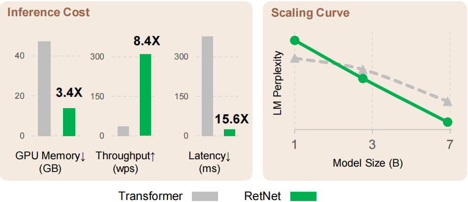
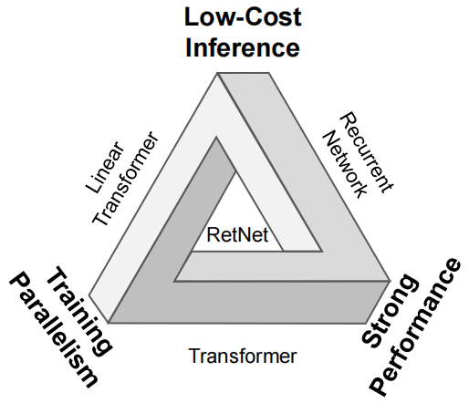
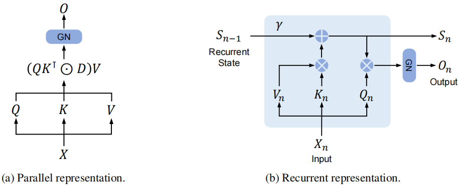

# Retentive Network: A Successor to Transformer for Large Language Models 
RetNet：大型语言模型转换器的继承者 2023.7.17 https://arxiv.org/abs/2307.08621

## Abstract
In this work, we propose Retentive Network (RETNET) as a foundation architecture for large language models, simultaneously achieving training parallelism, low-cost inference, and good performance. We theoretically derive the connection between recurrence and attention. Then we propose the retention mechanism for sequence modeling, which supports three computation paradigms, i.e., parallel, recurrent, and chunkwise recurrent. Specifically, the parallel representation allows for training parallelism. The recurrent representation enables low-cost O(1) inference, which improves decoding throughput, latency, and GPU memory without sacrificing performance. The chunkwise recurrent representation facilitates efficient long-sequence modeling with linear complexity, where each chunk is encoded parallelly while recurrently summarizing the chunks. Experimental results on language modeling show that RETNET achieves favorable scaling results, parallel training, low-cost deployment, and efficient inference. The intriguing properties make RETNET a strong successor to Transformer for large language models. Code will be available at https://aka.ms/retnet.

在这项工作中，我们提出了Retentive Network(RETNET)作为大型语言模型的基础架构，同时实现了训练并行性、低成本推理和良好的性能。我们从理论上推导了循环和注意力之间的联系。然后，我们提出了序列建模的保留(retention)机制，该机制支持三种计算范式，即并行、循环和分块循环。具体地说，并行表示允许训练并行性。循环表示实现了低成本的O(1)推理，在不牺牲性能的情况下提高了解码吞吐量、延迟和GPU内存。分块循环表示促进了具有线性复杂性的高效长序列建模，其中每个块被并行编码，同时循环地总结块。语言建模实验结果表明，RETNET实现了良好的伸缩性、并行训练、低成本部署和高效推理。这些有趣的特性使RETNET成为大型语言模型中Transformer的有力继承者。代码将在https://aka.ms/retnet.

 
Figure 1: Retentive network (RetNet) achieves low-cost inference (i.e., GPU memory, throughput, and latency), training parallelism, and favorable scaling curves compared with Transformer. Results of inference cost are reported with 8k as input length. Figure 6 shows more results on different sequence lengths.
图1：与Transformer相比，Retentive网络(RetNet)实现了低成本的推理(即GPU内存、吞吐量和延迟)、训练并行性和良好的缩放曲线。以8k作为输入长度来报告推理成本的结果。图6显示了不同序列长度的更多结果。

“The only way to discover the limits of the possible is to go beyond them into the impossible. ”  Arthur C. Clarke

“发现可能的极限的唯一方法是超越它们，进入不可能的世界。”阿瑟·C·克拉克

## 1 Introduction
Transformer [VSP+17] has become the de facto architecture for large language models [BMR+20], which was initially proposed to overcome the sequential training issue of recurrent models [HS97]. However, training parallelism of Transformers is at the cost of inefficient inference, because of the O(N) complexity per step and memory-bound key-value cache [Sha19], which renders Transformers unfriendly to deployment. The growing sequence length increases GPU memory consumption as well as latency and reduces inference speed.

Transformer[VSP+17]已成为大型语言模型[BMR+20]的事实架构，最初提出该架构是为了克服循环模型[HS97]的顺序训练问题。然而，由于每一步的O(N)复杂性和内存绑定的键值缓存[Sha19]，训练Transformers的并行性是以低效推理为代价的，这使得Transformers对部署不友好。不断增长的序列长度增加了GPU内存消耗以及延迟，并降低了推理速度。

Numerous efforts have continued to develop the next-generation architecture, aiming at retaining training parallelism and competitive performance as Transformers while having efficient O(1) inference. It is challenging to achieve the above goals simultaneously, i.e., the so-called “impossible triangle” as shown in Figure 2.

在开发下一代架构方面，人们继续做出了大量努力，旨在保持训练并行性和转换器的竞争性能，同时具有高效的O(1)推理。同时实现上述目标是具有挑战性的，即图2所示的所谓“不可能三角”。

 
Figure 2: RetNet makes the “impossible triangle” possible, which achieves training parallelism, good performance, and low inference cost simultaneously.
图2:RetNet使“不可能的三角”成为可能，同时实现了训练并行性、良好的性能和较低的推理成本。

There have been three main strands of research. First, linearized attention [KVPF20] approximates standard attention scores exp(q · k) with kernels ϕ(q) · ϕ(k), so that autoregressive inference can be rewritten in a recurrent form. However, the modeling capability and performance are worse than Transformers, which hinders the method’s popularity. The second strand returns to recurrent models for efficient inference while sacrificing training parallelism. As a remedy, element-wise operators [PAA+23] are used for acceleration, however, representation capacity and performance are harmed. The third line of research explores replacing attention with other mechanisms, such as S4 [GGR21], and its variants [DFS+22, PMN+23]. None of the previous work can break through the impossible triangle, resulting in no clear winner compared with Transformers.

研究主要有三个方面。首先，线性化注意力[KVPF20]用核(q)·(k)近似标准注意力得分exp(q·k)，使得自回归推理可以以循环形式重写。然而，建模能力和性能比Transformers差，这阻碍了该方法的流行。第二条回归到循环模型，以实现高效推理，同时牺牲训练并行性。作为补救措施，元素运算符[PAA+23]被用于加速，然而，表示能力和性能受到了损害。第三条研究线探索用其他机制取代注意力，如S4[GGR21]及其变体[DFS+22，PMN+23]。之前的工作都无法突破不可能三角，导致与转换器相比没有明确的赢家。

In this work, we propose retentive networks (RetNet), achieving low-cost inference, efficient longsequence modeling, Transformer-comparable performance, and parallel model training simultaneously. Specifically, we introduce a multi-scale retention mechanism to substitute multi-head attention, which has three computation paradigms, i.e., parallel, recurrent, and chunkwise recurrent representations. First, the parallel representation empowers training parallelism to utilize GPU devices fully. Second, the recurrent representation enables efficient O(1) inference in terms of memory and computation. The deployment cost and latency can be significantly reduced. Moreover, the implementation is greatly simplified without key-value cache tricks. Third, the chunkwise recurrent representation can perform efficient long-sequence modeling. We parallelly encode each local block for computation speed while recurrently encoding the global blocks to save GPU memory.

在这项工作中，我们提出了保留网络(RetNet)，同时实现了低成本的推理、高效的长序列建模、Transformer的可比性能和并行模型训练。具体来说，我们引入了一种多尺度保持机制来代替多头注意力，它有三种计算范式，即并行、循环和分块循环表示。首先，并行表示使训练并行性能够充分利用GPU设备。其次，循环表示使得能够在记忆和计算方面进行有效的O(1)推理。可以显著降低部署成本和延迟。此外，在没有键值缓存技巧的情况下，实现大大简化。第三，分块循环表示可以执行有效的长序列建模。为了计算速度，我们对每个局部块进行并行编码，同时对全局块进行循环编码以节省GPU内存。
<!-- multi-scale retention 多尺度保持, 局部并行，全局循环 -->

We conduct extensive experiments to compare RetNet with Transformer and its variants. Experimental results on language modeling show that RetNet is consistently competitive in terms of both scaling curves and in-context learning. Moreover, the inference cost of RetNet is length-invariant. For a 7B model and 8k sequence length, RetNet decodes 8.4× faster and saves 70% of memory than Transformers with key-value caches. During training, RetNet also achieves 25-50% memory saving and 7× acceleration than standard Transformer and an advantage towards highly-optimized FlashAttention [DFE+22]. Besides, RetNet’s inference latency is insensitive to batch size, allowing enormous throughput. The intriguing properties make RetNet a strong successor to Transformer for large language models.

我们进行了大量的实验来比较RetNet与Transformer及其变体。语言建模的实验结果表明，RetNet在缩放曲线和上下文学习方面都具有持续的竞争力。此外，RetNet的推理成本是长度不变的。对于7B模型和8k序列长度，RetNet解码速度比具有键值缓存的Transformers快8.4倍，节省70%的内存。在训练过程中，RetNet还实现了比标准Transformer节省25-50%的内存和7倍的加速，并在高度优化的FlashAttention[DFE+22]方面具有优势。此外，RetNet的推理延迟对批量大小不敏感，从而允许巨大的吞吐量。这些有趣的特性使RetNet成为大型语言模型中Transformer的有力继承者。

## 2 Retentive Networks 保留网络
Retentive network (RetNet) is stacked with L identical blocks, which follows a similar layout (i.e., residual connection, and pre-LayerNorm) as in Transformer [VSP+17]. Each RetNet block contains two modules: a multi-scale retention (MSR) module, and a feed-forward network (FFN) module. We introduce the MSR module in the following sections. Given an input sequence $x = x_1 · · · x_{|x|}$ , RetNet encodes the sequence in an autoregressive way. The input vectors $\{x_i\}^{|x|}_{i=1}$ is first packed into $X_0 = [x_1, · · · , x_{|x|} ] ∈ R^{|x|×d_{model}}$  , where $d_{model}$ is hidden dimension. Then we compute contextualized vector representations $X_l = RetNet_l(X^{l−1})$, l ∈ [1, L].

保留网络(RetNet)由L个相同的块堆叠而成，其遵循与Transformer[VSP+17]中类似的布局(即残差连接和预归一化层)。每个RetNet块包含两个模块：多尺度保留(MSR)模块和前馈网络(FFN)模块。我们将在以下部分介绍MSR模块。给定输入序列 $x = x_1 · · · x_{|x|}$ ，RetNet以自回归的方式对序列进行编码。首先将输入向量 $\{x_i\}^{|x|}_{i=1}$ 压缩成  $X_0 = [x_1, · · · , x_{|x|} ] ∈ R^{|x|×d_{model}}$ ，其中 $d_{model}$ 是隐藏维数。然后我们计算上下文化的向量表示 $X_l = RetNet_l(X^{l−1})$, l ∈ [1, L] 。

### 2.1 Retention 保留
In this section, we introduce the retention mechanism that has a dual form of recurrence and parallelism. So we can train the models in a parallel way while recurrently conducting inference.

在本节中，我们将介绍具有循环和并行双重形式的保留机制。因此，我们可以在循环进行推理的同时，以并行的方式训练模型。

Given input $X ∈ R^{|x|×d_{model}}$ , we project it to one-dimensional function $v(n) = X_n · w_V$ . Consider a sequence modeling problem that maps v(n) → o(n) through states $s_n$. Let $v_n$, $o_n$ denote v(n), o(n) for simplicity. We formulate the mapping in a recurrent manner:

给定输入 $X∈R^{|X|×d_{model}}$ ，我们将其投影到一维函数 $v(n)=X_n·w_v$。考虑映射v(n)→ o(n)的序列建模问题通过状态$s_n$。为了简单起见，设$v_n$，$o_n$表示v(n)，o(n)。我们以一种反复出现的方式制定映射：

$s_n = As_{n−1} + K_n^⊺v_n, A ∈ R^{d×d} , K_n ∈ R^{1×d}$ 

$o_n = Q_ns_n = \sum^n_{m=1} A^{n−m}K^⊺_mv_m, Q_n ∈ R^{1×d}$ (1)

where we map $v_n$ to the state vector $s_n$, and then implement a linear transform to encode sequence information recurrently.

其中我们将 $v_n$ 映射到状态向量 $s_n$，然后实现线性变换来循环编码序列信息。

Next, we make the projection $Q_n$, $K_n$ content-aware:

接下来，我们使投影$Q_n$, $K_n$内容知晓：

$Q = XW_Q, K = XW_K$ (2)

where $W_Q, W_K ∈ R^{d×d}$ are learnable matrices.

其中 $W_Q, W_K ∈ R^{d×d}$ 是可学习矩阵。

We diagonalize the matrix $A = Λ(γe^{iθ})Λ^−1$ , where $γ, θ ∈ R^d$ . Then we obtain $A^{n−m} = Λ(γe^{iθ})^{n−m}Λ^{−1}$ . By absorbing Λ into $W_Q$ and $W_K$, we can rewrite Equation (1) as:

我们对角化矩阵$A = Λ(γe^{iθ})Λ^−1$，其中γ，θ∈RD。然后我们得到了 $A^{n−m} = Λ(γe^{iθ})^{n−m}Λ^{−1}$ 。通过将∧吸收到 $W_Q$ 和 $W_K$ 中，我们可以将方程(1)重写为：

$o_n = \sum^n_{m=1} Q_n(γe^{iθ})^{n−m}K^⊺_mv_m $

$= \sum^n_{m=1} (Q_n(γe^{iθ}) n )(Km(γe^{iθ})^{−m})^⊺v_m$ (3)

where $Q_n(γe^{iθ})^n$, $K_m(γe^{iθ})^{−m}$ is known as xPos [SDP+22], i.e., a relative position embedding proposed for Transformer. We further simplify γ as a scalar, Equation (3) becomes:

其中，$Q_n(γe^{iθ})^n$, $K_m(γe^{iθ})^{−m}$ 被称为xPos[SDP+22]，即为转换器提出的相对位置嵌入。我们进一步将γ简化为标量，方程(3)变为：

$o_n = \sum^n_{m=1} γ^{n−m}(Q_ne^{inθ})(K_me^{imθ})^† v_m$ (4)

where † is the conjugate transpose. The formulation is easily parallelizable within training instances.

其中†是共轭转置。该公式很容易在训练实例中并行化。

In summary, we start with recurrent modeling as shown in Equation (1), and then derive its parallel formulation in Equation (4). We consider the original mapping v(n) → o(n) as vectors and obtain the retention mechanism as follows.

总之，我们从方程(1)中所示的循环建模开始，然后在方程(4)中导出其并行公式。我们考虑原始映射v(n) → o(n)作为载体，并获得如下的保留机制。

The Parallel Representation of Retention As shown in Figure 3a, the retention layer is defined as:

保留的并行表示如图3a所示，保留层定义为：

$Q = (XW_Q) ⊙ Θ, K = (XW_K) ⊙ \hat{Θ}, V = XW_V$ 

$Θ_n = e^{iθ}, D_{nm} =  γ^{n−m}, n ≥ m 0, n < m$

$Retention(X) = (QK^⊺ ⊙ D)V$ (5)

where $\hat{Θ}$ is the complex conjugate of Θ, and $D ∈ R^{|x|×|x|}$ combines causal masking and exponential decay along relative distance as one matrix. Similar to self-attention, the parallel representation enables us to train the models with GPUs efficiently.

其中，$\hat{Θ}$是θ的复共轭，$D ∈ R^{|x|×|x|}$ 将因果掩码和沿相对距离的指数衰减组合为一个矩阵。与自注意类似，并行表示使我们能够有效地使用GPU训练模型。

 
Figure 3: Dual form of RetNet. “GN” is short for GroupNorm.
图3：RetNet的双重形式。“GN”是GroupNorm的缩写。

The Recurrent Representation of Retention As shown in Figure 3b, the proposed mechanism can also be written as recurrent neural networks (RNNs), which is favorable for inference. For the n-th timestep, we recurrently obtain the output as:

保留的循环表示如图3b所示，所提出的机制也可以写成循环神经网络(RNN)，这有利于推理。对于第n个时间步长，我们循环地获得如下输出：

$S_n = γS_{n−1} + K_n^⊺V_n $ 

$Retention(X_n) = Q_nS_n, n = 1, · · · , |x|$ (6) 

where Q, K, V, γ are the same as in Equation (5).

其中Q、K、V、γ与方程(5)相同。

The Chunkwise Recurrent Representation of Retention A hybrid form of parallel representation and recurrent representation is available to accelerate training, especially for long sequences. We divide the input sequences into chunks. Within each chunk, we follow the parallel representation (Equation (5)) to conduct computation. In contrast, cross-chunk information is passed following the recurrent representation (Equation (6)). Specifically, let B denote the chunk length. We compute the retention output of the i-th chunk via:

保留的Chunkwise循环表示并行表示和循环表示的混合形式可用于加速训练，尤其是对于长序列。我们把输入序列分成块。在每个块中，我们遵循并行表示(等式(5))来进行计算。相反，跨块信息是在循环表示之后传递的(等式(6))。具体地，设B表示块长度。我们通过以下方式计算第i个块的保留输出：

$Q_{[i]} = Q_{B_i:B_{(i+1)}, K_{[i]} = KB_i:B_{(i+1)}, V_{[i]} = VB_i:B_{(i+1)} $

$R_i = K^⊺_{[i]}V_{[i]} + γ^BR_{i−1}$ 

$Retention(X_{[i]}) = (Q[i]K[ ⊺ i] ⊙ D)V[i] | {z } Inner-Chunk + (Q[i]Ri) ⊙ ξ | {z } Cross-Chunk , ξij = γ i+1 (7)

where [i] indicates the i-th chunk, i.e., $x[i] = [x_{(i−1)}B+1, · · · , x_iB]$.

其中[i]表示第i个块，即$x[i] = [x_{(i−1)}B+1, · · · , x_iB]$。

### 2.2 Gated Multi-Scale Retention 门控多尺度保留
We use h = dmodel/d retention heads in each layer, where d is the head dimension. The heads use different parameter matrices WQ, WK, WV ∈ R d×d . Moreover, multi-scale retention (MSR) assigns different γ for each head. For simplicity, we set γ identical among different layers and keep them fixed. In addition, we add a swish gate [RZL17] to increase the non-linearity of retention layers.

我们在每层中使用h=dmodel/d保持头，其中d是头尺寸。头使用不同的参数矩阵WQ，WK，WV∈Rd×d。此外，多尺度保留(MSR)为每个头部分配不同的γ。为了简单起见，我们在不同的层之间设置γ相同，并保持它们不变。此外，我们添加了一个摆动门[RZL17]来增加保持层的非线性。

Formally, given input X, we define the layer as:

形式上，给定输入X，我们将层定义为：

γ = 1 − 2 −5−arange(0,h) ∈ R h headi = Retention(X, γi) Y = GroupNormh (Concat(head1, · · · , headh)) MSR(X) = (swish(XWG) ⊙ Y )WO (8)

where WG, WO ∈ R dmodel×dmodel are learnable parameters, and GroupNorm [WH18] normalizes the output of each head, following SubLN proposed in [SPP+19]. Notice that the heads use multiple γ scales, which results in different variance statistics. So we normalize the head outputs separately.

其中WG，WO∈R dmodel×dmodel是可学习的参数，GroupNorm[WH18]根据[SSP+19]中提出的SubLN对每个头部的输出进行归一化。请注意，头部使用多个γ标度，这会导致不同的方差统计。因此，我们分别对头部输出进行归一化。

The pseudocode of retention is summarized in Figure 4.

保留的伪代码如图4所示。

Figure 4: Pseudocode for the three computation paradigms of retention.
图4：保留的三种计算范式的伪代码。

Retention Score Normalization We utilize the scale-invariant nature of GroupNorm to improve the numerical precision of retention layers. Specifically, multiplying a scalar value within GroupNorm does not affect outputs and backward gradients, i.e.,  GroupNorm(α ∗ headi) = GroupNorm(headi). We implement three normalization factors in Equation (5). First, we normalize QK⊺ as QK⊺ / √ d. Second, we replace D with ˜Dnm = Dnm/ √P n i=1 Dni. Third, let R denote the retention scores R = QK⊺ ⊙ D, we normalize it as ˜Rnm = Rnm/max(| P n i=1 Rni|,1). Then the retention output becomes Retention(X) = ˜RV . The above tricks do not affect the final results while stabilizing the numerical flow of both forward and backward passes, because of the scale-invariant property.

保留分数归一化我们利用GroupNorm的尺度不变性质来提高保留层的数值精度。具体地说，在GroupNorm内乘以标量值不会影响输出和后向梯度，即GroupNorm(α*headi)=GroupNorm(headi)。我们在等式(5)中实现了三个归一化因子。首先，我们将QK⊺规范化为QK⊦/√d。其次，我们将d替换为~Dnm=Dnm/√P n i=1Dni。第三，设R表示保留分数R=QK⊺⊙D，我们将其归一化为~Rnm=Rnm/max(|PNi=1Rni|，1)。然后保持输出变为retention(X)=~RV。由于尺度不变的特性，在稳定前向和后向通道的数值流的同时，上述技巧不会影响最终结果。

### 2.3 Overall Architecture of Retention Networks 保留网络的总体架构
For an L-layer retention network, we stack multi-scale retention (MSR) and feed-forward network (FFN) to build the model. Formally, the input sequence {xi} |x| i=1 is transformed to vectors by a word embedding layer. We use the packed embeddings X0 = [x1, · · · , x|x| ] ∈ R |x|×dmodel as the input and compute the model output XL:

对于L层保留网络，我们堆叠多尺度保留(MSR)和前馈网络(FFN)来构建模型。形式上，输入序列{xi}|x|i=1通过字嵌入层转换为向量。我们使用压缩嵌入X0=[x1，···，x|x|]∈R|x|×dmodel作为输入，并计算模型输出XL：

Y l = MSR(LN(Xl )) + Xl Xl+1 = FFN(LN(Y l )) + Y l (9)

where LN(·) is LayerNorm [BKH16]. The FFN part is computed as FFN(X) = gelu(XW1)W2, where W1, W2 are parameter matrices.

式中，LN(·)为层标准[BKH16]。FFN部分计算为FFN(X)=gelu(XW1)W2，其中W1、W2是参数矩阵。

Training We use the parallel (Equation (5)) and chunkwise recurrent (Equation (7)) representations during the training process. The parallelization within sequences or chunks efficiently utilizes GPUs to accelerate computation. More favorably, chunkwise recurrence is especially useful for long-sequence training, which is efficient in terms of both FLOPs and memory consumption.

训练我们在训练过程中使用并行(方程(5))和分块循环(方程(7))表示。序列或块内的并行化有效地利用GPU来加速计算。更有利的是，分块循环对于长序列训练特别有用，这在FLOP和内存消耗方面都是有效的。

Table 1: Model comparison from various perspectives. RetNet achieves training parallelization, constant inference cost, linear long-sequence memory complexity, and good performance.
表1：从不同角度进行的模型比较。RetNet实现了训练并行化、恒定的推理成本、线性长序列内存复杂性和良好的性能。

Inference The recurrent representation (Equation (6)) is employed during the inference, which nicely fits autoregressive decoding. The O(1) complexity reduces memory and inference latency while achieving equivalent results.

推理在推理过程中使用了循环表示(方程(6))，它很好地适应了自回归解码。O(1)复杂性降低了内存和推理延迟，同时实现了等效的结果。

### 2.4 Relation to and Differences from Previous Methods 与以往方法的关系和区别
Table 1 compares RetNet with previous methods from various perspectives. The comparison results echo the “impossible triangle” presented in Figure 2. Moreover, RetNet has linear memory complexity for long sequences due to the chunkwise recurrent representation. We also summarize the comparisons with specific methods as follows.

表1从不同的角度将RetNet与以前的方法进行了比较。比较结果与图2中所示的“不可能三角形”相呼应。此外，由于分块循环表示，RetNet对长序列具有线性内存复杂性。我们还将与具体方法的比较总结如下。

Transformer The parallel representation of retention shares similar spirits as Transformers [VSP+17]. The most related Transformer variant is Lex Transformer [SDP+22] which implements xPos as position embeddings. As described in Equation (3), the derivation of retention aligns with xPos. In comparison with attention, retention removes softmax and enables recurrent formulation, which significantly benefits inference.

转换器保留的并行表示与转换器[VSP+17]具有相似的精神。最相关的Transformer变体是Lex Transformer[SDP+22]，它将xPos实现为位置嵌入。如等式(3)所述，保留率的推导与xPos一致。与注意力相比，保留消除了softmax，并使配置能够重复使用，这显著有利于推理。

S4 Unlike Equation (2), if Qn and Kn are content-unaware, the formulation can be degenerated to S4 [GGR21], where O = (QK⊺ , QAK⊺ , .., QA|x|−1K⊺ ) ∗ V .

S4与方程(2)不同，如果Qn和Kn是内容未知的，则公式可以退化为S4[GGR21]，其中O=(QK⊺，QAK𕭄，..，QA|x|−1K \8890;)*V。

Linear Attention The variants typically use various kernels ϕ(qi)ϕ(kj )/ P |x| n=1 ϕ(qi)ϕ(kn) to replace the softmax function. However, linear attention struggles to effectively encode position information, rendering the models less performant. Besides, we reexamine sequence modeling from scratch, rather than aiming at approximating softmax.

线性注意变体通常使用不同的核Γ(qi)Γ(kj)/P|x|n=1Γ(qi)ξ(kn)来代替softmax函数。然而，线性注意力难以有效地对位置信息进行编码，这使得模型的性能较差。此外，我们从头开始重新审视序列建模，而不是以逼近softmax为目标。

AFT/RWKV Attention Free Transformer (AFT) simplifies dot-product attention to element-wise operations and moves softmax to key vectors. RWKV replaces AFT’s position embeddings with exponential decay and runs the models recurrently for training and inference. In comparison, retention preserves high-dimensional states to encode sequence information, which contributes to expressive ability and better performance. xPos/RoPE Compared with relative position embedding methods proposed for Transformers,Equation (3) presents a similar formulation as xPos [SDP+22] and RoPE [SLP+21].

AFT/RWKV无注意变换器(AFT)将点积注意力简化为元素操作，并将softmax移动到关键向量。RWKV用指数衰减代替AFT的位置嵌入，并循环运行模型进行训练和推理。相比之下，保留保留保留了高维状态来编码序列信息，这有助于提高表达能力和更好的性能。xPos/RoPE与为转换器提出的相对位置嵌入方法相比，方程(3)给出了与xPos[SDP+22]和RoPE[SLP+21]类似的公式。

Sub-LayerNorm As shown in Equation (8), the retention layer uses Sub-LayerNorm [WMH+22] to normalize outputs. Because the multi-scale modeling leads to different variances for the heads, we replace the original LayerNorm with GroupNorm.

如等式(8)所示，保留层使用Sub LayerNorm[WMH+22]对输出进行归一化。由于多尺度建模会导致头部的差异不同，因此我们将原始LayerNorm替换为GroupNorm。

## 3 Experiments
We conduct experiments on language modeling to evaluate RetNet. We evaluate the proposed architecture with various benchmarks, i.e., language modeling performance, and zero-/few-shot learning on downstream tasks. Moreover, for training and inference, we compare speed, memory consumption, and latency.

我们进行了语言建模实验来评估RetNet。我们使用各种基准来评估所提出的架构，即语言建模性能和下游任务的零/少样本学习。此外，对于训练和推理，我们比较了速度、内存消耗和延迟。

Table 2: Sizes, and learning hyper-parameters of the models in language modeling experiments.
表2：语言建模实验中模型的大小和学习超参数。

Figure 5: Perplexity decreases along with scaling up the model size. We empirically observe that RetNet tends to outperform Transformer when the model size is larger than 2B.
图5：困惑随着模型尺寸的增大而减小。我们从经验上观察到，当模型大小大于2B时，RetNet往往优于Transformer。

### 3.1 Setup
Parameter Allocation We re-allocate the parameters in MSR and FFN for fair comparisons. Let d denote dmodel for simplicity here. In Transformers, there are about 4d 2 parameters in self-attention where WQ, WK, WV , WO ∈ R d×d , and 8d 2 parameters in FFN where the intermediate dimension is 4d. In comparison, RetNet has 8d 2 parameters in retention, where WQ, WK ∈ R d×d , WG, WV ∈ R d×2d , WO ∈ R 2d×d . Notice that the head dimension of V is twice Q, K. The widened dimension is projected back to d by WO. In order to keep the parameter number the same as Transformer, the FFN intermediate dimension in RetNet is 2d. Meanwhile, we set the head dimension to 256 in our experiments, i.e., 256 for queries and keys, and 512 for values. For fair comparison, we keep γ identical among different model sizes, where γ = 1 − e linspace(log 1/32,log 1/512,h) ∈ R h instead of the default value in Equation (8).

参数分配为了公平比较，我们重新分配了MSR和FFN中的参数。为了简单起见，这里让d表示dmodel。在Transformers中，自注意的参数大约有4d2个，其中WQ，WK，WV，WO∈Rd×d，以及FFN中的8d2个参数，其中中间维数为4d。相比之下，RetNet在保留中有8d2个参数，其中WQ，WK∈RD×d，WG，WV∈RD？d，WO∈R 2d×d。请注意，V的头部尺寸是Q，K的两倍。WO将加宽的尺寸投影回d。为了保持参数编号与Transformer相同，RetNet中的FFN中间维度为2d。同时，在我们的实验中，我们将头部维度设置为256，即查询和密钥为256，值为512。为了公平比较，我们在不同的模型大小之间保持γ相同，其中γ=1−e林空间(log 1/32，log 1/512，h)∈R h，而不是方程(8)中的默认值。

Language Model Training As shown in Table 2, we train language models with various sizes (i.e., 1.3B, 2.7B, and 6.7B) from scratch. The training corpus is a curated compilation of The Pile [GBB+20], C4 [DMI+21], and The Stack [KLBA+22]. We append the <bos> token to indicate the start of a sequence2 . The training batch size is 4M tokens with 2048 maximal length. We train the models with 100B tokens, i.e., 25k steps. We use the AdamW [LH19] optimizer with β1 = 0.9, β2 = 0.98, and weight decay is set to 0.05. The number of warmup steps is 375 with linear learning rate decay. The parameters are initialized following DeepNet [WMD+22] to guarantee training stability. The implementation is based on TorchScale [MWH+22]. We train the models with 512 AMD MI200 GPUs.

语言模型训练如表2所示，我们从头开始训练各种大小(即1.3B、2.7B和6.7B)的语言模型。训练语料库是The Pile[GBB+20]、C4[DMI+21]和The Stack[KLBA+22]的策划汇编。我们附加<bos>令牌来指示序列2的开始。训练批量大小为4M个令牌，最大长度为2048。我们用100B令牌训练模型，即25k步。我们使用AdamW[LH19]优化器，其中β1=0.9，β2=0.98，并且权重衰减设置为0.05。在线性学习率衰减的情况下，预热步骤的数量为375。参数按照DeepNet[MWMD+22]进行初始化，以保证训练的稳定性。该实现基于TorchScale[MWH+22]。我们用512个AMD MI200 GPU训练模型。

### 3.2 Comparisons with Transformer 与转换器的比较
Language Modeling As shown in Figure 5, we report perplexity on the validation set for the language models based on Transformer and RetNet. We present the scaling curves with three model sizes, i.e., 1.3B, 2.7B, and 6.7B. RetNet achieves comparable results with Transformers. More importantly, the results indicate that RetNet is favorable regarding size scaling. Besides performance, the RetNet training is quite stable in our experiments. Experimental results show that RetNet is a strong competitor to Transformer for large language models. Empirically, we find that RetNet starts to outperform Transformer when the model size is larger than 2B. We also summarize the language modeling results with different context lengths in Appendix B. 2We find that appending the <bos> token at the beginning benefits training stability and performance.

语言建模如图5所示，我们报告了基于Transformer和RetNet的语言模型的验证集的困惑。我们给出了三种模型尺寸的缩放曲线，即1.3B、2.7B和6.7B。RetNet与Transformers的结果相当。更重要的是，结果表明RetNet在规模缩放方面是有利的。除了性能，RetNet训练在我们的实验中是相当稳定的。实验结果表明，在大型语言模型方面，RetNet是Transformer的有力竞争对手。根据经验，我们发现当模型大小大于2B时，RetNet开始优于Transformer。我们还在附录B中总结了不同上下文长度的语言建模结果。2我们发现，在开头添加<bos>令牌有利于训练的稳定性和性能。

Table 3: Zero-shot and few-shot learning with Transformer and RetNet. The model size is 6.7B.
表3：Transformer和RetNet的零样本和少快照学习。模型尺寸为6.7B。

Table 4: Training cost of Transformer (Trm), Transformer with FlashAttention (Trm+FlashAttn), and RetNet. We report memory consumption and training throughput (word per second; wps).
表4：转换器(Trm)、带FlashAttention的转换器(Trm+FlashAttn)和RetNet的训练成本。我们报告了内存消耗和训练吞吐量(每秒字;wps)。

Zero-Shot and Few-Shot Evaluation on Downstream Tasks We also compare the language models on a wide range of downstream tasks. We evaluate zero-shot and 4-shot learning with the 6.7B models. As shown in Table 3, the datasets include HellaSwag (HS) [ZHB+19], BoolQ [CLC+19], COPA [WPN+19], PIQA [BZB+20], Winograd, Winogrande [LDM12], and StoryCloze (SC) [MRL+17]. The accuracy numbers are consistent with language modeling perplexity presented in Figure 5. RetNet achieves comparable performance with Transformer on zero-shot and in-context learning settings.

下游任务的零样本和少快照评估我们还比较了各种下游任务的语言模型。我们使用6.7B模型评估零样本和四射学习。如表3所示，数据集包括HellaSwag(HS)[ZHB+19]、BoolQ[CLC+19]、COPA[WPN+19]、PIQA[BZB+20]、Winograd、Winogrande[LDM12]和StoryCloze(SC)[MRL+17]。准确度数字与图5所示的语言建模困惑一致。RetNet在零样本和上下文学习设置上的性能与Transformer相当。

### 3.3 Training Cost 训练费用
As shown in Table 4, we compare the training speed and memory consumption of Transformer and RetNet, where the training sequence length is 8192. We also compare with FlashAttention [DFE+22], which improves speed and reduces GPU memory IO by recomputation and kernel fusion. In comparison, we implement RetNet using vanilla PyTorch code, and leave kernel fusion or FlashAttention-like acceleration for future work. We use chunkwise recurrent representation of retention as described in Equation (7). The chunk size is set to 512. We evaluate the results with eight Nvidia A100-80GB GPUs, because FlashAttention is highly optimized for A100. Tensor parallelism is enabled for 6.7B and 13B models.

如表4所示，我们比较了Transformer和RetNet的训练速度和内存消耗，其中训练序列长度为8192。我们还与FlashAttention[DFE+22]进行了比较，后者通过重新计算和内核融合提高了速度并减少了GPU内存IO。相比之下，我们使用普通PyTorch代码实现RetNet，并将内核融合或类似FlashAttention的加速留给未来的工作。我们使用保留的分块循环表示，如方程(7)所述。块大小被设置为512。我们使用八个Nvidia A100-80GB GPU评估结果，因为FlashAttention针对A100进行了高度优化。6.7B和13B模型启用张量并行。

Experimental results show that RetNet is more memory-efficient and has higher throughput than Transformers during training. Even compared with FlashAttention, RetNet is still competitive in terms of speed and memory cost. Moreover, without relying on specific kernels, it is easy to train RetNet on other platforms efficiently. For example, we train the RetNet models on an AMD MI200 cluster with decent throughput. It is notable that RetNet has the potential to further reduce cost via advanced implementation, such as kernel fusion.

实验结果表明，在训练过程中，RetNet比Transformers具有更高的内存效率和吞吐量。即使与FlashAttention相比，RetNet在速度和内存成本方面仍然具有竞争力。此外，在不依赖特定内核的情况下，很容易在其他平台上高效地训练RetNet。例如，我们在具有不错吞吐量的AMD MI200集群上训练RetNet模型。值得注意的是，RetNet有可能通过高级实现(如内核融合)进一步降低成本。

### 3.4 Inference Cost 推理成本
As shown in Figure 6, we compare memory cost, throughput, and latency of Transformer and RetNet during inference. Transformers reuse KV caches of previously decoded tokens. RetNet uses the recurrent representation as described in Equation (6). We evaluate the 6.7B model on the A100-80GB GPU in our experiments. Figure 6 shows that RetNet outperforms Transformer in terms of inference cost.

如图6所示，我们比较了Transformer和RetNet在推理过程中的内存成本、吞吐量和延迟。转换器重用先前解码的令牌的KV缓存。RetNet使用公式(6)中描述的循环表示。我们在实验中评估了A100-80GB GPU上的6.7B模型。图6显示，RetNet在推理成本方面优于Transformer。

Memory As shown in Figure 6a, the memory cost of Transformer increases linearly due to KV caches. In contrast, the memory consumption of RetNet remains consistent even for long sequences, requiring much less GPU memory to host RetNet. The additional memory consumption of RetNet is almost negligible (i.e., about 3%) while the model weights occupy 97%.

内存如图6a所示，由于KV缓存，Transformer的内存成本线性增加。相比之下，即使对于长序列，RetNet的内存消耗也保持一致，因此托管RetNet所需的GPU内存要少得多。RetNet的额外内存消耗几乎可以忽略不计(即约3%)，而模型权重占97%。

Figure 6: Inference cost of Transformer and RetNet with a model size of 6.7B. RetNet outperforms Transformers in terms of memory consumption, throughput, and latency.
图6：模型大小为6.7B的Transformer和RetNet的推理成本。RetNet在内存消耗、吞吐量和延迟方面优于Transformers。

Throughput As presented in Figure 6b, the throughput of Transformer drops along with the decoding length increases. In comparison, RetNet has higher and length-invariant throughput during decoding, by utilizing the recurrent representation of retention.

吞吐量如图6b所示，Transformer的吞吐量随着解码长度的增加而下降。相比之下，RetNet通过利用保留的循环表示，在解码过程中具有更高的长度不变吞吐量。

Latency Latency is an important metric in deployment, which greatly affects user experience. We report decoding latency in Figure 6c. Experimental results show that increasing batch size renders Transformer’s latency larger. Moreover, the latency of Transformers grows faster with longer input. In order to make latency acceptable, we have to restrict the batch size, which harms the overall inference throughput of Transformers. By contrast, RetNet’s decoding latency outperforms Transformers and keeps almost the same across different batch sizes and input lengths.

延迟延迟是部署中的一个重要指标，它会极大地影响用户体验。我们在图6c中报告了解码延迟。实验结果表明，批量大小的增加会使Transformer的延迟变大。此外，Transformers的延迟随着输入时间的延长而增长得更快。为了使延迟可以接受，我们必须限制批量大小，这会损害Transformers的整体推理吞吐量。相比之下，RetNet的解码延迟优于Transformers，并且在不同的批量大小和输入长度下保持几乎相同。

### 3.5 Comparison with Transformer Variants 与转换器变体的比较
Apart from Transformer, we compare RetNet with various efficient Transformer variants, including Linear Transformer [KVPF20], RWKV [PAA+23], H3 [DFS+22], and Hyena [PMN+23]. All models have 200M parameters with 16 layers and a hidden dimension of 1024. For H3, we set the head dimension as 8. For RWKV, we use the TimeMix module to substitute self-attention layers while keeping FFN layers consistent with other models for fair comparisons. We train the models with 10k steps with a batch size of 0.5M tokens. Most hyperparameters and training corpora are kept the same as in Section 3.1.

除了转换器，我们还将RetNet与各种高效转换器变体进行了比较，包括线性转换器[KVPF20]、RWKV[PAA+23]、H3[DFS+22]和Hyena[PMN+23]。所有模型都有200M个参数，有16层，隐藏尺寸为1024。对于H3，我们将头部尺寸设置为8。对于RWKV，我们使用TimeMix模块来替代自我关注层，同时保持FFN层与其他模型的一致性，以进行公平的比较。我们用10k个步骤训练模型，批量大小为0.5M个令牌。大多数超参数和训练语料库与第3.1节中的保持相同。

Table 5 reports the perplexity numbers on the in-domain validation set and other out-of-domain corpora, e.g., Project Gutenberg 2019-2022 (PG22) [SDP+22], QMSum [ZYY+21], GovReport [HCP+21], SummScreen [CCWG21, SSI+22]. Overall, RetNet outperforms previous methods across different datasets. RetNet not only achieves better evaluation results on the in-domain corpus but also obtains lower perplexity on several out-of-domain datasets. The favorable performance makes RetNet a strong successor to Transformer, besides the benefits of significant cost reduction (Sections 3.3 and 3.4).

表5报告了域内验证集和其他域外语料库的困惑数字，例如，Project Gutenberg 2019-2022(PG22)[SDP+22]、QMSum[ZYY+21]、GovReport[HCP+21]、SummScreen[CCWG21、SSI+22]。总的来说，RetNet在不同的数据集上都优于以前的方法。RetNet不仅在域内语料库上获得了更好的评估结果，而且在几个域外数据集上获得了更低的困惑。除了显著降低成本的好处(第3.3节和第3.4节)外，良好的性能使RetNet成为Transformer的有力继任者。

Table 5: Perplexity results on language modeling. RetNet outperforms other architectures on both the in-domain evaluation set and various out-of-domain corpora.
表5：语言建模的困惑结果。RetNet在域内评估集和各种域外语料库上都优于其他架构。

Table 6: Ablation results on in-domain and out-of-domain corpora.
表6：域内和域外语料库的消融结果。

In addition, we discuss the training and inference efficiency of the compared methods. Let d denote the hidden dimension, and n the sequence length. For training, RWKV’s token-mixing complexity is O(dn) while Hyena’s is O(dn log n) with Fast Fourier Transform acceleration. The above two methods reduce training FLOPS via employing element-wise operators to trade-off modeling capacity. In comparison with retention, the chunk-wise recurrent representation is O(dn(b + h)), where b is the chunk size, h is the head dimension, and we usually set b = 512, h = 256. For either large model size (i.e., larger d) or sequence length, the additional b + h has negligible effects. So the RetNet training is quite efficient without sacrificing the modeling performance. For inference, among the compared efficient architectures, Hyena has the same complexity (i.e., O(n) per step) as Transformer while the others can perform O(1) decoding.

此外，我们还讨论了比较方法的训练和推理效率。设d表示隐藏维度，n表示序列长度。对于训练，RWKV的令牌混合复杂性为O(dn)，而Hyena的令牌混合复杂度为O(dn-logn)，具有快速傅立叶变换加速。上述两种方法通过使用元素运算符来权衡建模能力来减少训练FLOPS。与保留相比，按块的循环表示是O(dn(b+h))，其中b是块大小，h是头部尺寸，并且我们通常设置b=512，h=256。对于大的模型大小(即，较大的d)或序列长度，额外的b+h具有可忽略的影响。因此，在不牺牲建模性能的情况下，RetNet训练是非常有效的。为了推理，在比较的高效架构中，Hyena具有与Transformer相同的复杂性(即，每步O(n))，而其他架构可以执行O(1)解码。

### 3.6 Ablation Studies 消融研究
We ablate various design choices of RetNet and report the language modeling results in Table 6. The evaluation settings and metrics are the same as in Section 3.5.

我们列举了RetNet的各种设计选择，并在表6中报告了语言建模结果。评估设置和指标与第3.5节中的相同。

Architecture We ablate the swish gate and GroupNorm as described in Equation (8). Table 6 shows that the above two components improve the final performance. Firstly, the gating module is essential for enhancing non-linearity and improving model capability. Notice that we use the same parameter allocation as Transformers after removing the gate. Secondly, group normalization in retention balances the variances of multi-head outputs, which improves training stability and language modeling results.

架构我们按照等式(8)中的描述，消融swish gate和GroupNorm。表6显示，上述两个组件提高了最终性能。首先，门控模块对于增广非线性和提高模型性能至关重要。请注意，在移除门之后，我们使用与Transformers相同的参数分配。其次，保留中的组归一化平衡了多头输出的方差，提高了训练稳定性和语言建模结果。

Multi-Scale Decay Equation (8) shows that we use different γ as the decay rates for the retention heads. In the ablation studies, we examine removing γ decay (i.e., “− γ decay”) and applying the same decay rate across heads (i.e., “− multi-scale decay”). Specifically, ablating γ decay is equivalent to γ = 1. In the second setting, we set γ = 127/128 for all heads. Table 6 indicates that both the decay mechanism and using multiple decay rates can improve the language modeling performance.

多尺度衰变方程(8)表明，我们使用不同的γ作为保留头的衰变率。在消融研究中，我们检查了去除γ衰变(即“−γ衰变”)和在头部应用相同的衰变率(即“–多尺度衰变”)。具体来说，消融γ衰变相当于γ=1。在第二个设置中，我们为所有磁头设置γ=127/128。表6表明，衰减机制和使用多重衰减率都可以提高语言建模性能。

Head Dimension From the recurrent perspective of Equation (1), the head dimension implies the memory capacity of hidden states. In the ablation study, we reduce the default head dimension from 256 to 64, i.e., 64 for queries and keys, and 128 for values. We keep the hidden dimension dmodel the same so the number of heads increases. Experimental results in Table 6 show that the larger head dimension achieves better performance.

头部维度从方程(1)的循环角度来看，头部维度意味着隐藏状态的记忆能力。在消融研究中，我们将默认头部尺寸从256减小到64，即查询和键为64，值为128。我们保持隐藏维度dmodel相同，因此头的数量会增加。表6中的实验结果表明，头部尺寸越大，性能越好。

## 4 Conclusion
In this work, we propose retentive networks (RetNet) for sequence modeling, which enables various representations, i.e., parallel, recurrent, and chunkwise recurrent. RetNet achieves significantly better inference efficiency (in terms of memory, speed, and latency), favorable training parallelization, and competitive performance compared with Transformers. The above advantages make RetNet an ideal successor to Transformers for large language models, especially considering the deployment benefits brought by the O(1) inference complexity. In the future, we would like to scale up RetNet in terms of model size [CDH+22] and training steps. Moreover, retention can efficiently work with structured prompting [HSD+22b] by compressing long-term memory. We will also use RetNet as the backbone architecture to train multimodal large language models [HSD+22a, HDW+23, PWD+23].

在这项工作中，我们提出了用于序列建模的保留网络(RetNet)，它实现了各种表示，即并行、循环和分块循环。与Transformers相比，RetNet实现了显著更好的推理效率(在内存、速度和延迟方面)、良好的训练并行性和有竞争力的性能。上述优势使RetNet成为大型语言模型Transformers的理想继任者，特别是考虑到O(1)推理复杂性带来的部署优势。未来，我们希望在模型大小[CDH+22]和训练步骤方面扩大RetNet。此外，通过压缩长期记忆，保留可以有效地与结构化提示[HSD+22b]配合使用。我们还将使用RetNet作为骨干架构来训练多模型大型语言模型[HSD+22a，HDW+23，PWD+23]。

In addition, we are interested in deploying RetNet models on various edge devices, such as mobile phones.

此外，我们有兴趣在各种边缘设备(如手机)上部署RetNet模型。

## Acknowledgement
We would like to acknowledge Jiayu Ding, Songlin Yang, and colleagues from MSRA System Group for the helpful discussions.

我们感谢丁佳宇、杨松林和MSRA系统集团的同事们的有益讨论。

## References
* [BKH16] Jimmy Lei Ba, Jamie Ryan Kiros, and Geoffrey E Hinton. Layer normalization. arXivpreprint arXiv:1607.06450, 2016.
* [BMR+20] Tom Brown, Benjamin Mann, Nick Ryder, Melanie Subbiah, Jared D Kaplan, PrafullaDhariwal, Arvind Neelakantan, Pranav Shyam, Girish Sastry, Amanda Askell, Sand￾hini Agarwal, Ariel Herbert-Voss, Gretchen Krueger, Tom Henighan, Rewon Child,Aditya Ramesh, Daniel Ziegler, Jeffrey Wu, Clemens Winter, Chris Hesse, Mark Chen,Eric Sigler, Mateusz Litwin, Scott Gray, Benjamin Chess, Jack Clark, ChristopherBerner, Sam McCandlish, Alec Radford, Ilya Sutskever, and Dario Amodei. Languagemodels are few-shot learners. In Advances in Neural Information Processing Systems,volume 33, pages 1877–1901. Curran Associates, Inc., 2020.
* [BZB+20] Yonatan Bisk, Rowan Zellers, Ronan Le Bras, Jianfeng Gao, and Yejin Choi. Piqa:Reasoning about physical commonsense in natural language. In Thirty-Fourth AAAIConference on Artificial Intelligence, 2020.
* [CCWG21] Mingda Chen, Zewei Chu, Sam Wiseman, and Kevin Gimpel. Summscreen: A datasetfor abstractive screenplay summarization. arXiv preprint arXiv:2104.07091, 2021.
* [CDH+22] Zewen Chi, Li Dong, Shaohan Huang, Damai Dai, Shuming Ma, Barun Patra, SakshamSinghal, Payal Bajaj, Xia Song, Xian-Ling Mao, Heyan Huang, and Furu Wei. On therepresentation collapse of sparse mixture of experts. In Alice H. Oh, Alekh Agarwal,Danielle Belgrave, and Kyunghyun Cho, editors, Advances in Neural InformationProcessing Systems, 2022.
* [CLC+19] Christopher Clark, Kenton Lee, Ming-Wei Chang, Tom Kwiatkowski, Michael Collins,and Kristina Toutanova. BoolQ: Exploring the surprising difficulty of natural yes/noquestions. In Proceedings of the 2019 Conference of the North American Chapter of theAssociation for Computational Linguistics: Human Language Technologies, Volume1 (Long and Short Papers), pages 2924–2936, Minneapolis, Minnesota, June 2019.Association for Computational Linguistics.
* [DFE+22] Tri Dao, Dan Fu, Stefano Ermon, Atri Rudra, and Christopher Ré. Flashattention:Fast and memory-efficient exact attention with io-awareness. Advances in NeuralInformation Processing Systems, 35:16344–16359, 2022.
* [DFS+22] Tri Dao, Daniel Y Fu, Khaled K Saab, Armin W Thomas, Atri Rudra, and ChristopherRé. Hungry hungry hippos: Towards language modeling with state space models. arXivpreprint arXiv:2212.14052, 2022.
* [DMI+21] Jesse Dodge, Ana Marasovi´c, Gabriel Ilharco, Dirk Groeneveld, Margaret Mitchell, andMatt Gardner. Documenting large webtext corpora: A case study on the colossal cleancrawled corpus. In Conference on Empirical Methods in Natural Language Processing,2021.
* [GBB+20] Leo Gao, Stella Biderman, Sid Black, Laurence Golding, Travis Hoppe, Charles Foster,Jason Phang, Horace He, Anish Thite, Noa Nabeshima, et al. The Pile: An 800GBdataset of diverse text for language modeling. arXiv preprint arXiv:2101.00027, 2020.
* [GGR21] Albert Gu, Karan Goel, and Christopher Ré. Efficiently modeling long sequences withstructured state spaces. arXiv preprint arXiv:2111.00396, 2021.
* [HCP+21] Luyang Huang, Shuyang Cao, Nikolaus Parulian, Heng Ji, and Lu Wang. Efficientattentions for long document summarization. arXiv preprint arXiv:2104.02112, 2021.
* [HDW+23] Shaohan Huang, Li Dong, Wenhui Wang, Yaru Hao, Saksham Singhal, Shuming Ma,Tengchao Lv, Lei Cui, Owais Khan Mohammed, Qiang Liu, Kriti Aggarwal, Zewen Chi,Johan Bjorck, Vishrav Chaudhary, Subhojit Som, Xia Song, and Furu Wei. Languageis not all you need: Aligning perception with language models. ArXiv, abs/2302.14045,2023.
* [HS97] Sepp Hochreiter and Jürgen Schmidhuber. Long short-term memory. Neural Computa￾tion, 9:1735–1780, November 1997.
* [HSD+22a] Yaru Hao, Haoyu Song, Li Dong, Shaohan Huang, Zewen Chi, Wenhui Wang, Shum￾ing Ma, and Furu Wei. Language models are general-purpose interfaces. ArXiv,abs/2206.06336, 2022.
* [HSD+22b] Yaru Hao, Yutao Sun, Li Dong, Zhixiong Han, Yuxian Gu, and Furu Wei. Structuredprompting: Scaling in-context learning to 1,000 examples. ArXiv, abs/2212.06713,2022.
* [KLBA+22] Denis Kocetkov, Raymond Li, Loubna Ben Allal, Jia Li, Chenghao Mou, CarlosMuñoz Ferrandis, Yacine Jernite, Margaret Mitchell, Sean Hughes, Thomas Wolf,Dzmitry Bahdanau, Leandro von Werra, and Harm de Vries. The Stack: 3 tb ofpermissively licensed source code. Preprint, 2022.
* [KVPF20] Angelos Katharopoulos, Apoorv Vyas, Nikolaos Pappas, and François Fleuret. Trans￾formers are rnns: Fast autoregressive transformers with linear attention. In InternationalConference on Machine Learning, pages 5156–5165. PMLR, 2020.
* [LDM12] Hector Levesque, Ernest Davis, and Leora Morgenstern. The winograd schema chal￾lenge. In Thirteenth International Conference on the Principles of Knowledge Repre￾sentation and Reasoning, 2012.
* [LH19] Ilya Loshchilov and Frank Hutter. Decoupled weight decay regularization. In Interna￾tional Conference on Learning Representations, 2019.
* [MRL+17] Nasrin Mostafazadeh, Michael Roth, Annie Louis, Nathanael Chambers, and JamesAllen. Lsdsem 2017 shared task: The story cloze test. In Proceedings of the 2ndWorkshop on Linking Models of Lexical, Sentential and Discourse-level Semantics,pages 46–51, 2017.
* [MWH+22] Shuming Ma, Hongyu Wang, Shaohan Huang, Wenhui Wang, Zewen Chi, Li Dong,Alon Benhaim, Barun Patra, Vishrav Chaudhary, Xia Song, and Furu Wei. TorchScale:Transformers at scale. CoRR, abs/2211.13184, 2022.
* [OSG+23] Antonio Orvieto, Samuel L. Smith, Albert Gu, Anushan Fernando, Caglar Gulcehre,Razvan Pascanu, and Soham De. Resurrecting recurrent neural networks for longsequences. ArXiv, abs/2303.06349, 2023.
* [PAA+23] Bo Peng, Eric Alcaide, Quentin Anthony, Alon Albalak, Samuel Arcadinho, HuanqiCao, Xin Cheng, Michael Chung, Matteo Grella, Kranthi Kiran GV, Xuzheng He,Haowen Hou, Przemyslaw Kazienko, Jan Kocon, Jiaming Kong, Bartlomiej Koptyra,Hayden Lau, Krishna Sri Ipsit Mantri, Ferdinand Mom, Atsushi Saito, Xiangru Tang,Bolun Wang, Johan S. Wind, Stansilaw Wozniak, Ruichong Zhang, Zhenyuan Zhang,Qihang Zhao, Peng Zhou, Jian Zhu, and Rui-Jie Zhu. Rwkv: Reinventing rnns for thetransformer era, 2023.
* [PMN+23] Michael Poli, Stefano Massaroli, Eric Nguyen, Daniel Y Fu, Tri Dao, Stephen Baccus,Yoshua Bengio, Stefano Ermon, and Christopher Ré. Hyena hierarchy: Towards largerconvolutional language models. arXiv preprint arXiv:2302.10866, 2023.
* [PWD+23] Zhiliang Peng, Wenhui Wang, Li Dong, Yaru Hao, Shaohan Huang, Shuming Ma, andFuru Wei. Kosmos-2: Grounding multimodal large language models to the world.ArXiv, abs/2306.14824, 2023.
* [RZL17] Prajit Ramachandran, Barret Zoph, and Quoc V. Le. Swish: a self-gated activationfunction. arXiv: Neural and Evolutionary Computing, 2017.
* [SDP+22] Yutao Sun, Li Dong, Barun Patra, Shuming Ma, Shaohan Huang, Alon Benhaim,Vishrav Chaudhary, Xia Song, and Furu Wei. A length-extrapolatable transformer.arXiv preprint arXiv:2212.10554, 2022.
* [Sha19] Noam M. Shazeer. Fast transformer decoding: One write-head is all you need. ArXiv,abs/1911.02150, 2019.
* [SLP+21] Jianlin Su, Yu Lu, Shengfeng Pan, Bo Wen, and Yunfeng Liu. Roformer: Enhancedtransformer with rotary position embedding. arXiv preprint arXiv:2104.09864, 2021.
* [SPP+19] Mohammad Shoeybi, Mostofa Patwary, Raul Puri, Patrick LeGresley, Jared Casper,and Bryan Catanzaro. Megatron-lm: Training multi-billion parameter language modelsusing model parallelism. arXiv preprint arXiv:1909.08053, 2019.
* [SSI+22] Uri Shaham, Elad Segal, Maor Ivgi, Avia Efrat, Ori Yoran, Adi Haviv, Ankit Gupta,Wenhan Xiong, Mor Geva, Jonathan Berant, et al. Scrolls: Standardized comparisonover long language sequences. arXiv preprint arXiv:2201.03533, 2022.
* [VSP+17] Ashish Vaswani, Noam Shazeer, Niki Parmar, Jakob Uszkoreit, Llion Jones, Aidan N.Gomez, Lukasz Kaiser, and Illia Polosukhin. Attention is all you need. In Advances inNeural Information Processing Systems 30: Annual Conference on Neural InformationProcessing Systems 2017, 4-9 December 2017, Long Beach, CA, USA, pages 6000–6010, 2017.
* [WH18] Yuxin Wu and Kaiming He. Group normalization. In Proceedings of the Europeanconference on computer vision (ECCV), pages 3–19, 2018.
* [WMD+22] Hongyu Wang, Shuming Ma, Li Dong, Shaohan Huang, Dongdong Zhang, and FuruWei. DeepNet: Scaling Transformers to 1,000 layers. ArXiv, abs/2203.00555, 2022.
* [WMH+22] Hongyu Wang, Shuming Ma, Shaohan Huang, Li Dong, Wenhui Wang, Zhiliang Peng,Yu Wu, Payal Bajaj, Saksham Singhal, Alon Benhaim, et al. Foundation transformers.arXiv preprint arXiv:2210.06423, 2022.
* [WPN+19] Alex Wang, Yada Pruksachatkun, Nikita Nangia, Amanpreet Singh, Julian Michael,Felix Hill, Omer Levy, and Samuel R Bowman. SuperGLUE: A stickier benchmark forgeneral-purpose language understanding systems. arXiv preprint arXiv:1905.00537,2019.
* [ZHB+19] Rowan Zellers, Ari Holtzman, Yonatan Bisk, Ali Farhadi, and Yejin Choi. Hellaswag:Can a machine really finish your sentence? In Proceedings of the 57th Annual Meetingof the Association for Computational Linguistics, 2019.
* [ZYY+21] Ming Zhong, Da Yin, Tao Yu, Ahmad Zaidi, Mutethia Mutuma, Rahul Jha, Ahmed Has￾san Awadallah, Asli Celikyilmaz, Yang Liu, Xipeng Qiu, et al. Qmsum: A newbenchmark for query-based multi-domain meeting summarization. arXiv preprintarXiv:2104.05938, 2021.

## A Hyperparameters
Hyperparameters 1.3B 2.7B 6.7B
Layers 24 32 32
Hidden size 2048 2560 4096
FFN size 4096 5120 8192
Heads 8 10 16
Learning rate 6 × 10−4 3 × 10−4 3 × 10−4
LR scheduler Polynomial decay
Warm-up steps 375
Tokens per batch 4M
Adam β (0.9, 0.98)
Training steps 25,000
Gradient clipping 2.0
Dropout 0.1
Weight decay 0.01

Table 7: Hyperparamters used for the models in Section 3.

## B Grouped Results of Different Context Lengths
As shown in Table 8, we report language modeling results with different context lengths. In order to make the numbers comparable, we use 2048 text chunks as evaluation data and only compute perplexity for the last 128 tokens. Experimental results show that RetNet outperforms Transformer across different context lengths. Besides, RetNet can utilize longer context for better results.

Model 512 1024 2048
Transformer 13.55 12.56 12.35
RetNet 13.09 12.14 11.98

Table 8: Language modeling perplexity of RetNet and Transformer with different context length. The results show that RetNet has a consistent advantage across sequence length.