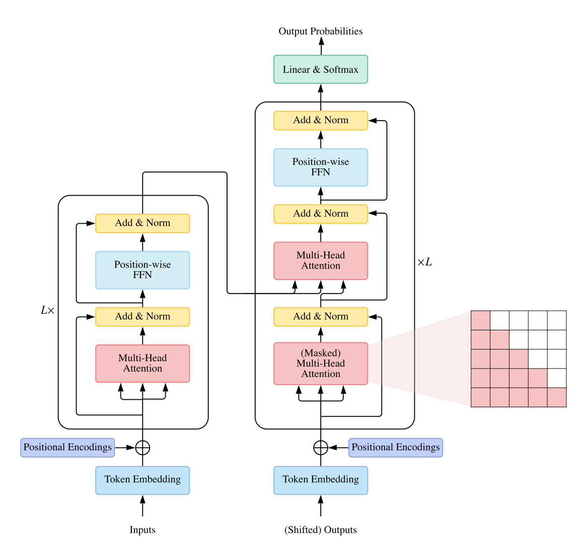

# A Survey of Transformers
2021.6.8 https://arxiv.org/abs/2106.04554

## 阅读笔记
* 处理长序列的效率低，小规模数据难以训练(不是事儿)

## Abstract 
Transformers have achieved great success in many artificial intelligence fields, such as natural language processing, computer vision, and audio processing. Therefore, it is natural to attract lots of interest from academic and industry researchers. Up to the present, a great variety of Transformer variants (a.k.a. X-formers) have been proposed, however, a systematic and comprehensive literature review on these Transformer variants is still missing. In this survey, we provide a comprehensive review of various X-formers. We first briefly introduce the vanilla Transformer and then propose a new taxonomy of X-formers. Next, we introduce the various X-formers from three perspectives: architectural modification, pre-training, and applications. Finally, we outline some potential directions for future research.

Transformers在许多人工智能领域取得了巨大成功，如自然语言处理、计算机视觉和音频处理。因此，自然会吸引学术界和行业研究人员的大量兴趣。到目前为止，已经提出了多种Transformer变体(也称为X-formers)，但是，仍然缺少关于这些Transformer变体的系统和全面的文献综述。在本次调查中，我们对各种X-formers进行了全面的回顾。我们首先简要介绍了原始Transformer，然后提出了一种新的X-formers。接下来，我们将从三个角度介绍各种X-formers：架构修改、预训练和应用。最后，我们概述了未来研究的一些潜在方向。

CCS Concepts: * General and reference → Surveys and overviews; * Computing methodologies → Artificial intelligence.

Additional Key Words and Phrases: Transformer, Self-Attention, Pre-trained Models, Deep Learning 

## 1 INTRODUCTION
Transformer [137] is a prominent deep learning model that has been widely adopted in various fields, such as natural language processing (NLP), computer vision (CV) and speech processing. Transformer was originally proposed as a sequence-to-sequence model [130] for machine translation. Later works show that Transformer-based pre-trained models (PTMs) [100] can achieve state-ofthe-art performances on various tasks. As a consequence, Transformer has become the go-to architecture in NLP, especially for PTMs. In addition to language related applications, Transformer has also been adopted in CV [13, 33, 94], audio processing [15, 31, 41] and even other disciplines, such as chemistry [114] and life sciences [109].

Transformer[137]是一种突出的深度学习模型，已被广泛应用于各种领域，如自然语言处理(NLP)、计算机视觉(CV)和语音处理。Transformer最初被提出作为机器翻译的序列到序列模型[130]。后来的研究表明，基于Transformer的预训练模型(PTM)[100]可以在各种任务上实现最先进的性能。因此，Transformer已成为NLP的首选架构，尤其是PTM。除了语言相关的应用，Transformer还被应用于CV[13、33、94]、音频处理[15、31、41]甚至其他学科，如化学[114]和生命科学[109]。

Due to the success, a variety of Transformer variants (a.k.a. X-formers) have been proposed over the past few years. These X-formers improve the vanilla Transformer from different perspectives. 
1. Model Efficiency. A key challenge of applying Transformer is its inefficiency at processing long sequences mainly due to the computation and memory complexity of the self-attention module. The improvement methods include lightweight attention (e.g. sparse attention variants) and Divide-and-conquer methods (e.g., recurrent and hierarchical mechanism). 
2. Model Generalization. Since the transformer is a flexible architecture and makes few assumptions on the structural bias of input data, it is hard to train on small-scale data. The improvement methods include introducing structural bias or regularization, pre-training on large-scale unlabeled data, etc. 
3. Model Adaptation. This line of work aims to adapt the Transformer to specific downstream tasks and applications.

由于成功，在过去几年中提出了各种Transformer变体(也称为X-formers)。这些X-former从不同的角度改进了最初的Transformer。
1. 模型效率。应用Transformer的一个关键挑战是其处理长序列的效率低下，这主要是由于自关注模块的计算和内存复杂性。改进方法包括轻量级注意力(例如稀疏注意力变体)和分而治之方法(例如循环和分层机制)。
2. 模型泛化。由于变换器是一种灵活的架构，并且很少对输入数据的结构偏差进行假设，因此很难对小规模数据进行训练。改进方法包括引入结构偏差或正则化、对大规模未标注数据进行预训练等。
3. 模型适应。这项工作旨在使Transformer适应特定的下游任务和应用。

In this survey, we aim to provide a comprehensive review of the Transformer and its variants.Although we can organize X-formers on the basis of the perspectives mentioned above, many existing X-formers may address one or several issues. For example, sparse attention variants not only reduce the computational complexity but also introduce structural prior on input data to alleviate the overfitting problem on small datasets. Therefore, it is more methodical to categorize the various existing X-formers and propose a new taxonomy mainly according to their ways to improve the vanilla Transformer: architecture modification, pre-training, and applications. Considering the audience of this survey may be from different domains, we mainly focus on the general architecture variants and just briefly discuss the specific variants on pre-training and applications.

在本次调查中，我们旨在对Transformer及其变体进行全面审查。尽管我们可以根据上述观点来组织X成形者，但许多现有的X成形者可能会解决一个或多个问题。例如，稀疏注意变量不仅降低了计算复杂性，还引入了输入数据的结构先验，以缓解小数据集上的过度拟合问题。因此，对各种现有的X形器进行分类并提出一种新的分类法更具系统性，主要是根据它们改进普通Transformer的方式：架构修改、预训练和应用程序。考虑到本次调查的受众可能来自不同的领域，我们主要关注一般架构变体，仅简要讨论预训练和应用程序的具体变体。

The rest of the survey is organized as follows. Sec. 2 introduces the architecture and the key components of Transformer. Sec. 3 clarifies the categorization of Transformer variants. Sec. 4∼5 review the module-level modifications, including attention module, position encoding, layer normalization and feed-forward layer. Sec. 6 reviews the architecture-level variants. Sec. 7 introduces some of the representative Transformer-based PTMs. Sec. 8 introduces the application of Transformer to various different fields. Sec. 9 discusses some aspects of Transformer that researchers might find intriguing and summarizes the paper. 

调查的其余部分组织如下。第2节介绍了Transformer的架构和关键组件。第3节阐明了Transformer变体的分类。第4～5节回顾了模块级修改，包括注意模块、位置编码、层归一化和前馈层。第6节审查了架构级别的变体。第7节介绍了一些典型的基于Transformer的PTM。第8节介绍了Transformer在不同领域的应用。第9节讨论了研究人员可能会发现有趣的Transformer的一些方面，并总结了论文。

## 2 BACKGROUND
### 2.1 Vanilla Transformer
The vanilla Transformer [137] is a sequence-to-sequence model and consists of an encoder and a decoder, each of which is a stack of 𝐿 identical blocks. Each encoder block is mainly composed of a multi-head self-attention module and a position-wise feed-forward network (FFN). For building a deeper model, a residual connection [49] is employed around each module, followed by Layer Normalization [4] module. Compared to the encoder blocks, decoder blocks additionally insert cross-attention modules between the multi-head self-attention modules and the position-wise FFNs. Furthermore, the self-attention modules in the decoder are adapted to prevent each position from attending to subsequent positions. The overall architecture of the vanilla Transformer is shown in Fig. 1.

最初的Transformer[137]是一个序列到序列模型，由编码器和解码器组成，每个编码器和解码器都是一个堆栈𝐿 相同的块。每个编码器块主要由多头自关注模块和位置前馈网络(FFN)组成。为了构建更深入的模型，在每个模块周围使用残差连接[49]，然后是层归一化[4]模块。与编码器块相比，解码器块额外地在多头自关注模块和位置方向FFN之间插入交叉关注模块。此外，解码器中的自注意模块适于防止每个位置关注后续位置。普通Transformer的总体结构如图1所示。

In the following subsection, we shall introduce the key modules of the vanilla Transformer.
在下面的小节中，我们将介绍最初的Transformer的关键模块。

#### 2.1.1 Attention Modules. 
Transformer adopts attention mechanism with Query-Key-Value (QKV) model. Given the packed matrix representations of queries Q ∈ R𝑁 ×𝐷𝑘 , keys K ∈ R𝑀×𝐷𝑘 , and values V ∈ R𝑀×𝐷𝑣 , the scaled dot-product attention used by Transformer is given by(1 if not stated otherwise, we use row-major notations throughout this survey (e.g., the 𝑖-th row in Q is the query q𝑖 ) and all the vectors are row vectors by default.)

Transformer采用带有查询-关键字-值(QKV)模型的注意机制。给定查询Q∈R的压缩矩阵表示𝑁 ×𝐷𝑘 , 键K∈R𝑀×𝐷𝑘 , 值V∈R𝑀×𝐷𝑣 , Transformer使用的缩放点积关注度由(1)给出，如果没有另外说明，我们在整个调查中使用行主要符号(例如𝑖-Q中的第行是查询Q𝑖 ) 并且默认情况下所有向量都是行向量。)

Attention(Q, K, V) = softmax  QK⊤ √𝐷𝑘  V = AV, 1.  

where 𝑁 and 𝑀 denote the lengths of queries and keys (or values); 𝐷𝑘 and 𝐷𝑣 denote the dimensions of keys (or queries) and values; A = softmax  QK⊤ √𝐷𝑘  is often called attention matrix; softmax is applied in a row-wise manner. The dot-products of queries and keys are divided by √𝐷𝑘 to alleviate gradient vanishing problem of the softmax function.

其中，𝑁 和𝑀 表示查询和键(或值)的长度; 𝐷𝑘 和𝐷𝑣 表示键(或查询)和值的维度; A=软最大QK⊤√𝐷𝑘 通常称为注意力矩阵; 以行方式应用softmax。查询和键的点积除以√𝐷𝑘 以缓解softmax函数的梯度消失问题。

Instead of simply applying a single attention function, Transformer uses multi-head attention, where the 𝐷𝑚-dimensional original queries, keys and values are projected into 𝐷𝑘 , 𝐷𝑘 and 𝐷𝑣 dimensions, respectively, with 𝐻 different sets of learned projections. For each of the projected queries, keys and values, and output is computed with attention according to Eq. 1. . The model then concatenates all the outputs and projects them back to a 𝐷𝑚-dimensional representation.

Transformer使用多头注意力，而不是简单地应用单个注意力功能𝐷𝑚-维度原始查询、键和值被投影到𝐷𝑘 , 𝐷𝑘 和𝐷𝑣 尺寸，分别为𝐻 不同的学习预测集。对于每个预测的查询、键和值以及输出，根据等式(1)进行计算。然后，模型连接所有输出，并将它们投射回𝐷𝑚-维度表示。

MultiHeadAttn(Q, K, V) = Concat(head1, · · · , head𝐻 )W𝑂, 2.  

where head𝑖 = Attention(QW𝑄𝑖 , KW𝐾𝑖 , VW𝑉𝑖 ). 3.  

Fig. 1. Overview of vanilla Transformer architecture

In Transformer, there are three types of attention in terms of the source of queries and key-value pairs:
* Self-attention. In Transformer encoder, we set Q = K = V = X in Eq. 2. , where X is the outputs of the previous layer.
* Masked Self-attention. In the Transformer decoder, the self-attention is restricted such that queries at each position can only attend to all key-value pairs up to and including that position. To enable parallel training, this is typically done by applying a mask function to the unnormalized attention matrix ˆA = exp(QK⊤ √𝐷𝑘 ), where the illegal positions are masked out by setting 𝐴ˆ 𝑖𝑗 = −∞ if 𝑖 < 𝑗. This kind of self-attention is often referred to as autoregressive or causal attention(2This term seems to be borrowed from the causal system, where the output depends on past and current inputs but not future inputs.). 
* Cross-attention. The queries are projected from the outputs of the previous (decoder) layer, whereas the keys and values are projected using the outputs of the encoder.

在Transformer中，在查询源和键值对方面有三种关注：
* 自注意。在Transformer编码器中，我们在等式(2)中设置Q=K=V=X，其中X是前一层的输出。
* Masked 自注意。在Transformer解码器中，自注意受到限制，使得每个位置的查询只能关注该位置之前(包括该位置)的所有键值对。为了实现并行训练，这通常通过将掩码函数应用于未标准化的注意力矩阵来完成𝐷𝑘 ), 非法位置通过设置𝐴ˆ 𝑖𝑗 = −∞ 如果𝑖 < 𝑗. 这种自注意通常被称为自回归或因果注意2
* 交叉关注。查询是从前一(解码器)层的输出中投影的，而键和值是使用编码器的输出进行投影的。

#### 2.1.2 Position-wise FFN. 
The position-wise FFN(3The parameters are shared across different positions, thus the position-wise FFN can also be understood as two convolution layers with kernel size of 1. ) is a fully connected feed-forward module that operates separately and identically on each position

位置方向FFN(3参数在不同位置上共享，因此位置方向的FFN也可以理解为内核大小为1的两个卷积层。)是一个完全连接的前馈模块，在每个位置上独立且相同地工作

FFN(H′) = ReLU(H′W1 + b1)W2 + b2, 4.  

where H′ is the outputs of previous layer, and W1 ∈ R𝐷𝑚×𝐷𝑓 , W2 ∈ R𝐷𝑓 ×𝐷𝑚, b1 ∈ R𝐷𝑓 , b2 ∈ R𝐷𝑚 are trainable parameters. Typically the intermediate dimension 𝐷𝑓 of the FFN is set to be larger than 𝐷𝑚.

其中H′是前一层的输出，W1∈R𝐷𝑚×𝐷𝑓 , W2∈R𝐷𝑓 ×𝐷𝑚, b1∈R𝐷𝑓 , b2∈R𝐷𝑚 是可训练的参数。通常为中间尺寸𝐷𝑓 FFN的值设置为大于𝐷𝑚.
 
#### 2.1.3 Residual Connection and Normalization. 
In order to build a deep model, Transformer employs a residual connection [49] around each module, followed by Layer Normalization [4]. For instance, each Transformer encoder block may be written as

为了建立一个深度模型，Transformer在每个模块周围使用了一个残余连接[49]，然后是层归一化[4]。例如，每个Transformer编码器块可以写为

H′ = LayerNorm(SelfAttention(X) + X) 5. 

H = LayerNorm(FFN(H′ ) + H′), 6.  where SelfAttention(·) denotes self attention module and LayerNorm(·) denotes the layer normalization operation.

H=LayerNorm(FFN(H′)+H′)，(6)，其中SelfAttention(·)表示自注意模块，LayerNor(·)指示层归一化操作。

#### 2.1.4 Position Encodings. 
Since Transformer doesn’t introduce recurrence or convolution, it is ignorant of positional information (especially for the encoder). Thus additional positional representation (Detailed discussion in Sec. 5.1) is needed to model the ordering of tokens.

由于Transformer不引入循环或卷积，因此它不了解位置信息(尤其是编码器)。因此，需要额外的位置表示(第5.1节中的详细讨论)来模拟令牌的排序。

### 2.2 Model Usage
Generally, the Transformer architecture can be used in three different ways:
* Encoder-Decoder. The full Transformer architecture as introduced in Sec. 2.1 is used. This is typically used in sequence-to-sequence modeling (e.g., neural machine translation).
* Encoder only. Only the encoder is used and the outputs of the encoder are utilized as a representation for the input sequence. This is usually used for classification or sequence labeling problems.
* Decoder only. Only the decoder is used, where the encoder-decoder cross-attention module is also removed. This is typically used for sequence generation, such as language modeling.

通常，Transformer架构可以三种不同的方式使用：
* 编码器解码器。使用第2.1节中介绍的完整Transformer架构。这通常用于序列到序列建模(例如，神经机器翻译)。
* 仅编码器。仅使用编码器，并且编码器的输出被用作输入序列的表示。这通常用于分类或序列标记问题。
* 仅解码器。仅使用解码器，其中编码器-解码器交叉关注模块也被移除。这通常用于序列生成，例如语言建模。

### 2.3 Model Analysis
To illustrate the computation time and parameter requirements of the Transformer, we analyze the two core components of the Transformer (i.e., the self-attention module and the position-wise FFN) in Table 1. We assume that the hidden dimension 𝐷𝑚 of the model is 𝐷, and that the input sequence length is 𝑇 . The intermediate dimension of FFN is set to 4𝐷 and the dimension of keys and values are set to 𝐷/𝐻 as in Vaswani et al. [137].

为了说明Transformer的计算时间和参数要求，我们分析了表1中Transformer的两个核心组件(即自注意模块和位置式FFN)。我们假设隐藏维度𝐷𝑚 模型的𝐷, 并且输入序列长度为𝑇 . FFN的中间尺寸设置为4𝐷 键和值的维度设置为𝐷/𝐻 如Vaswaniet al [137]所述。

Table 1. Complexity and parameter counts of self-attention and position-wise FFN
表1。自注意和位置式FFN的复杂性和参数计数

When the input sequences are short, the hidden dimension 𝐷 dominates the complexity of self-attention and position-wise FFN. The bottleneck of Transformer thus lies in FFN. However, as the input sequences grow longer, the sequence length 𝑇 gradually dominates the complexity of these modules, in which case self-attention becomes the bottleneck of Transformer. Furthermore, the computation of self-attention requires that a 𝑇 × 𝑇 attention distribution matrix is stored, which makes the computation of Transformer infeasible for long-sequence scenarios (e.g., long text documents and pixel-level modeling of high-resolution images). One shall see that the goal of increasing the efficiency of Transformer generally leads to the long-sequence compatibility of self-attention, as well as the computation and parameter efficiency of position-wise FFN for ordinary settings.

当输入序列短时，隐藏维度𝐷 控制了自注意和位置型FFN的复杂性。因此，Transformer的瓶颈在于FFN。然而，随着输入序列的增长，序列长度𝑇 在这种情况下，自注意成为Transformer的瓶颈。此外，自注意的计算需要𝑇 × 𝑇 存储了注意力分布矩阵，这使得Transformer的计算对于长序列场景(例如，长文本文档和高分辨率图像的像素级建模)不可行。应该看到，提高Transformer效率的目标通常会导致自注意的长序列兼容性，以及普通设置的位置式FFN的计算和参数效率。

### 2.4 Comparing Transformer to Other Network Types Transformer与其他网络类型的比较
#### 2.4.1 Analysis of Self-Attention.  自注意分析
As a central piece of Transformer, self-attention comes with a flexible mechanism to deal with variable-length inputs. It can be understood as a fully connected layer where the weights are dynamically generated from pairwise relations from inputs. Table 2 compares the complexity, sequential operations, and maximum path length(4The maximum length of the paths forward and backward signals have to traverse to get from any input position to arbitrary output position. Shorter length implies a better potential for learning long-range dependencies. ) of self-attention with three commonly used layer types. We summarize the advantages of self-attention as follows: 
1. It has the same maximum path length as fully connected layers, making it suitable for long-range dependencies modeling. Compared to fully connected layers, it is more parameterefficient and more flexible in handling variable-length inputs. 
2. Due to the limited receptive field of convolutional layers, one typically needs to stack a deep network to have a global receptive field. On the other hand, the constant maximum path length enables self-attention to model long-range dependencies with a constant number of layers. 
3. The constant sequential operations and maximum path length make self-attention more parallelizable and better at long-range modeling than recurrent layers.

作为Transformer的一个核心部分，自注意具有处理可变长度输入的灵活机制。它可以被理解为一个完全连接的层，其中权重是从输入的成对关系中动态生成的。表2比较了三种常用层类型的自注意的复杂性、顺序操作和最大路径长度(4为了从任何输入位置到达任意输出位置，前向和后向信号必须经过的路径的最大长度。更短的长度意味着学习长期依赖性的可能性更大)。我们总结了自注意的优点如下：
1. 它具有与完全连接层相同的最大路径长度，使其适合于长距离依赖关系建模。与完全连接的层相比，它在处理可变长度输入时更具参数效率和灵活性。
2. 由于卷积层的接收场有限，通常需要堆叠深度网络以具有全局接收场。另一方面，恒定的最大路径长度使自己能够注意使用恒定数量的层来建模长期依赖关系。
3. 恒定的顺序操作和最大路径长度使自注意比循环层更具并行性，并且更擅长远程建模。

Table 2. Per-layer complexity, minimum number of sequential operations and maximum path lengths for different layer types. 𝑇 is the sequence length, 𝐷 is the representation dimension and 𝐾 is the kernel size of convolutions [137].
表2。不同层类型的每层复杂性、最小顺序操作数和最大路径长度。𝑇 是序列长度，𝐷 是表示尺寸𝐾 是卷积的核大小[137]。

#### 2.4.2 In Terms of Inductive Bias.  
Transformer is often compared against convolutional and recurrent networks. Convolutional networks are known to impose the inductive biases of translation invariance and locality with shared local kernel functions. Similarly, recurrent networks carry the inductive biases of temporal invariance and locality via their Markovian structure [9]. On the other hand, the Transformer architecture makes few assumptions about structural information of data. This makes Transformer a universal and flexible architecture. As a side effect, the lack of structural bias makes Transformer prone to overfitting for small-scale data.

就归纳偏差而言，Transformer经常与卷积和循环网络进行比较。已知卷积网络利用共享的局部核函数施加平移不变性和局部性的归纳偏差。类似地，循环网络通过其马尔可夫结构携带时间不变性和局部性的归纳偏差[9]。另一方面，Transformer架构很少对数据的结构信息进行假设。这使Transformer成为一种通用且灵活的架构。作为一个副作用，结构偏差的缺乏使得Transformer容易对小规模数据进行过度拟合。

Another closely related network type is Graph Neural Networks (GNNs) with message passing [149]. Transformer can be viewed as a GNN defined over a complete directed graph (with self-loop) where each input is a node in the graph. The key difference between Transformer and GNNs is that Transformer introduces no prior knowledge over how input data are structured — the message passing process in Transformer solely depends on similarity measures over the content. 

另一种密切相关的网络类型是具有消息传递的图形神经网络(GNN)[149]。Transformer可以被视为在完整有向图(带自环)上定义的GNN，其中每个输入都是图中的一个节点。Transformer和GNN之间的关键区别在于，Transformer没有引入关于输入数据结构的先验知识 —— Transformer中的消息传递过程仅取决于内容的相似性度量。

## 3 TAXONOMY OF TRANSFORMERS Transformer分类
A wide variety of models have been proposed so far based on the vanilla Transformer from three perspectives: types of architecture modification, pre-training methods, and applications. Fig. 2 gives an illustrations of our categorization of Transformer variants.

到目前为止，基于vanillaTransformer从三个角度提出了各种各样的模型：架构修改类型、预训练方法和应用程序。图2说明了我们对Transformer变体的分类。

Fig. 2. Categorization of Transformer variants.
图2。Transformer变体分类。

Fig. 3. Taxonomy of Transformers

Fig. 3 illustrates our taxonomy and some representative models.
图3说明了我们的分类和一些代表性模型。

In this survey, we focus on reviewing the works on architecture modifications. Since the attention module is the key component of Transformer, we solely describe the attention-related variants in Sec. 4 and introduce the other module-level variants in Sec. 5. Then Sec. 6 describes the other architecture-level variants. Finally, we briefly review the works on pre-training in Sec. 7 and applications in Sec. 8. There are some comprehensive surveys on the latter two categories of work, such as pre-trained models (PTMs) [100] and visual Transformers[47, 64]. 

在本次调查中，我们重点回顾了架构修改方面的工作。由于注意力模块是Transformer的关键组件，我们在第4节中仅描述了与注意力相关的变体，并在第5节中介绍了其他模块级变体。然后，第6节描述了其他架构级变体。最后，我们简要回顾了第7节中的预训练工作和第8节中的应用。对后两类工作进行了一些全面的调查，如预训练模型(PTM)[100]和视觉Transformer[47，64]。

## 4 ATTENTION
Self-attention plays an important role in Transformer, but there are two challenges in practical applications. 
1.  Complexity. As discussion in Sec. 2.3, the complexity of self-attention is O (𝑇 2 · 𝐷). Therefore, the attention module becomes a bottleneck when dealing with long sequences. 
2.  Structural prior. Self-attention does no assume any structural bias over inputs. Even the order information is also needed to be learned from training data. Therefore, Transformer (w/o pre-training) is usually easy to overfit on small or moderate-size data.

自注意在Transformer中发挥着重要作用，但在实际应用中存在两个挑战。
1. 复杂性。如第2.3节所述，自注意的复杂性为O(𝑇 2 · 𝐷). 因此，注意力模块在处理长序列时成为瓶颈。
2. 结构优先。自注意不会对输入产生任何结构性偏见。甚至order信息也需要从训练数据中学习。因此，Transformer(不带预训练)通常很容易过度填充小或中等大小的数据。

The improvements on attention mechanism can be divided into several directions: 
1.  Sparse Attention. This line of work introduces sparsity bias into the attention mechanism, leading to reduced complexity. 
2.  Linearized Attention. This line of work disentangles the attention matrix with kernel feature maps. The attention is then computed in reversed order to achieve linear complexity.
3.  Prototype and Memory Compression. This class of methods reduces the number of queries or key-value memory pairs to reduce the size of the attention matrix. 
4.  Low-rank Self-Attention. This line of work capture the low-rank property of self-attention. 
5.  Attention with Prior. The line of research explores supplementing or substituting standard attention with prior attention distributions. 
6.  Improved Multi-Head Mechanism. The line of studies explores different alternative multi-head mechanisms.

注意力机制的改进可分为几个方向：
1. 分散注意力。这项工作将稀疏性偏差引入注意力机制，从而降低了复杂性。
2. 线性注意。这一行工作将注意力矩阵与核心特征图解开。然后以相反的顺序计算注意力，以实现线性复杂性。
3. 原型和记忆压缩。这类方法减少了查询或键值记忆对的数量，以减少注意力矩阵的大小。
4. 低级自注意。这项工作抓住了自注意的低级属性。
5. 注意Prior。该研究线探索用先前的注意力分布来补充或替代标准注意力。
6. 改进的多头机构。该系列研究探索了不同的替代多头机制。

We will describe these attention variants at length in the rest of this section.

我们将在本节的其余部分详细描述这些注意力变体。

### 4.1 Sparse Attention 分散注意力
In the standard self-attention mechanism, every token needs to attend to all other tokens. However, it is observed that for the trained Transformers the learned attention matrix A is often very sparse across most data points [17]. Therefore, it is possible to reduce computation complexity by incorporating structural bias to limit the number of query-key pairs that each query attends to. Under this limitation, we just compute the similarity score of the query-key pairs according to pre-defined patterns 

在标准的自注意机制中，每个令牌都需要关注所有其他令牌。然而，观察到，对于训练的Transformers，学习的注意力矩阵A在大多数数据点上通常非常稀疏[17]。因此，通过引入结构偏差来限制每个查询所关注的查询关键字对的数量，可以降低计算复杂性

ˆA𝑖𝑗 = ( q𝑖k⊤𝑗 if token 𝑖 attends to token 𝑗, −∞ if token 𝑖 does not attend to token 𝑗, (7) 

where ˆA is un-normalized attention matrix. In implementation the −∞ item is usually not stored in memory so as to decrease memory footprint.

其中，A是未归一化的注意力矩阵。在实现中，-∞项通常不存储在内存中，以减少内存占用。

From another perspective, the standard attention can be regarded as a complete bipartite graph where each query receives information from all memory nodes and updates its representation. The sparse attention can be considered as a sparse graph where some of the connections between nodes are removed.

从另一个角度来看，标准注意力可以被视为一个完整的二分图，其中每个查询从所有内存节点接收信息并更新其表示。稀疏注意力可以被视为稀疏图，其中节点之间的一些连接被移除。

Based on the metrics of determining the sparse connection, we categorize these approaches into two classes: position-based and content-based sparse attention.

基于确定稀疏连接的度量，我们将这些方法分为两类：基于位置的稀疏关注和基于内容的稀疏关注。

#### 4.1.1 Position-based Sparse Attention. 基于位置的分散注意力
In position-based sparse attention, the attention matrix is limited according to some pre-defined patterns. Although these sparse patterns vary in different forms, we find that some of them can be decomposed into some atomic sparse patterns.

在基于位置的稀疏注意力中，注意力矩阵根据一些预定义的模式受到限制。尽管这些稀疏模式的形式不同，但我们发现其中一些可以分解为一些原子稀疏模式。

We first identify some atomic sparse patterns and then describe how these patterns are composed in some existing work. Finally, we introduce some extended sparse patterns for specific data types.

我们首先识别一些原子稀疏模式，然后描述这些模式是如何在现有工作中组成的。最后，我们为特定的数据类型引入了一些扩展的稀疏模式。

#### 4.1.1.1 Atomic Sparse Attention.  原子稀疏注意
There are mainly five types of atomic sparse attention patterns, as shown in Fig. 4. 
1.  Global Attention. To alleviate the degradation of the ability to model the long-range dependencies in sparse attention, one can add some global nodes(5In practice, these global nodes can be selected from the sequence (internal global nodes) or virtual nodes with trainable parameters (external global nodes).) as the hub for information propagation between nodes. These global nodes can attend all nodes in the sequence and the whole sequence attend to these global nodes, as illustrated in Fig. 4(a). 
2.  Band Attention(a.k.a sliding window attention or local attention). Since most data come with a strong property of locality, it is natural to restrict each query to attend to its neighbor nodes. A widely adopted class of such sparse pattern is band attention, in which the attention matrix is a band matrix as illustrated in Fig. 4(b). 
3.  Dilated Attention. Analogous to dilated CNNs [134], one can potentially increase the receptive field of the band attention without increasing computation complexity by using a dilated window with gaps of dilation 𝑤𝑑 ≥ 1, as depicted in Fig. 4(c). This can be easily extended to strided attention, where the window size is not limited but the dilation 𝑤𝑑 is set to a large value. 
4.  Random Attention. To increase the ability of non-local interactions, a few edges are randomly sampled for each query, as illustrated in Fig. 4(d). This is based on the observation that random graphs (e.g., Erdős–Rényi random graph) can have similar spectral properties with complete graphs that leads to a fast mixing time for random walking on graphs. 
5.  Block Local Attention. This class of attention segments input sequence into several nonoverlapping query blocks, each of which is associated with a local memory block. All the queries in a query block attend to only the keys in the corresponding memory block. Fig. 4(e) depicts a commonly used case where the memory blocks are identical to their corresponding query blocks.

主要有五种类型的原子稀疏注意力模式，如图4所示。
1. 全局关注。为了缓解稀疏注意力中对长距离依赖性建模能力的退化，可以添加一些全局节点(5实际上，这些全局节点可以从序列(内部全局节点)或具有可训练参数的虚拟节点(外部全局节点)中选择)作为节点之间信息传播的中心。这些全局节点可以参与序列中的所有节点，整个序列参与这些全局节点，如图4(a)所示。
2. Band注意(又称滑动窗口注意或局部注意)。由于大多数数据都具有很强的局部性，因此自然会将每个查询限制在其相邻节点上。这种稀疏模式的一个广泛采用的类别是频带注意，其中注意矩阵是如图4(b)所示的频带矩阵。
3. 注意力分散。类似于扩张的神经网络[134]，通过使用具有扩张间隙的扩张窗口，可以潜在地增加频带注意力的感受野，而不增加计算复杂性𝑤𝑑 ≥ 如图4(c)所示。这可以很容易地扩展到跨越式的注意力，其中窗口大小不受限制，而是扩张𝑤𝑑 设置为大值。
4. 随机注意。为了提高非局部交互的能力，为每个查询随机采样一些边缘，如图4(d)所示。这是基于随机图(例如Erdås–Rényi随机图)可以具有与完整图相似的光谱特性的观察，这导致了图上随机行走的快速混合时间。
5. 阻止本地注意。这类注意力将输入序列分割成几个不重叠的查询块，每个查询块都与一个本地内存块相关联。一个查询块中的所有查询都只关注相应内存块中的键。图4(e)描述了一种常见的情况，其中存储块与其对应的查询块相同。

Fig. 4. Some representative atomic sparse attention patterns. The colored squares means corresponding attention scores are calculated and a blank square means the attention score is discarded. 
图4。一些代表性的原子稀疏注意力模式。彩色方块表示计算相应的注意力得分，空白方块表示丢弃注意力得分。

#### 4.1.1.2 Compound Sparse Attention. 复合分散注意力
Existing sparse attentions are often composed of more than one of the above atomic patterns. Fig. 5 illustrates some representative compound sparse attention patterns. 

现有的稀疏关注通常由以上原子模式中的一种以上组成。图5说明了一些典型的复合稀疏注意模式。

Fig. 5. Some representative compound sparse attention patterns. The red boxes indicate sequence boundaries.
图5。一些有代表性的复合稀疏注意模式。红色框表示序列边界。

Star-Transformer [43] uses a combination of band attention and global attention. Specifically, Star-Transformer just includes only a global node and a band attention with the width of 3, in which any pair of non-adjacent nodes are connected through a shared global node and adjacent nodes are connected directly with each other. This kind of sparse pattern forms a star-shaped graph among nodes. Longformer [10] uses a combination of band attention and internal global-node attention. The global nodes are chosen to be [CLS] token for classification and all question tokens 10  for Question Answering tasks. They also replace some of the band attention heads in upper layers with dilated window attention to increase the receptive field without increasing computation. As a concurrent work to Longformer [10], Extended Transformer Construction (ETC) [1] utilizes combination of band attention and external global-node attention. ETC also includes a masking mechanism to handle structured inputs and adapt Contrastive Predictive Coding (CPC) [135] for pre-training. In addition to the band and global attention, BigBird [163] uses additional random attention to approximate full attention. Their theoretical analysis also reveals that the usage of a sparse encoder and sparse decoder can simulate any Turing Machine, which explains the success of those sparse attention models.

Star-Transformer[43]使用了band关注和全局关注的组合。具体而言，Star-Transformer仅包括一个全局节点和宽度为3的频带关注，其中任何一对非相邻节点通过共享全局节点连接，相邻节点彼此直接连接。这种稀疏模式在节点之间形成星形图。Longformer[10]使用了频带注意力和内部全局节点注意力的组合。全局节点被选择为[CLS]标记用于分类，所有问题标记10Linet al 用于问答任务。他们还用扩张的窗口注意力取代了上层的一些带注意力头，以增加感受野而不增加计算。作为Longformer[10]的并行工作，扩展Transformer构造(ETC)[1]利用了频带关注和外部全局节点关注的组合。ETC还包括一种掩码机制，用于处理结构化输入并调整对比预测编码(CPC)[135]以进行预训练。除了乐队和全局注意力之外，BigBird[163]还使用额外的随机注意力来近似完全注意力。他们的理论分析还揭示了稀疏编码器和稀疏解码器的使用可以模拟任何图灵机，这解释了这些稀疏注意力模型的成功。

Sparse Transformer [17] uses a factorized attention where different sparse patterns are designed for different types of data. For data with a periodic structure (e.g., images), it uses a composition of band attention and strided attention. Whereas for data without a periodic structure (e.g., text), it uses a composition of block local attention combined with global attention, where global nodes are from fixed positions in the input sequence.

稀疏变换器[17]使用因子化注意力，其中为不同类型的数据设计了不同的稀疏模式。对于具有周期性结构的数据(例如，图像)，它使用波段注意力和跨步注意力的组合。而对于没有周期性结构的数据(例如文本)，它使用块局部关注与全局关注相结合的组合，其中全局节点来自输入序列中的固定位置。

#### 4.1.1.3 Extended Sparse Attention. 分散注意力
Apart from the above patterns, some existing studies have explored extended sparse patterns for specific data types.

除上述模式外，一些现有研究还探索了特定数据类型的扩展稀疏模式。

For text data, BP-Transformer [158] constructs a binary tree where all tokens are leaf nodes and the internal nodes are span nodes containing many tokens. The edges in this graph are constructed so that each leaf node is connected to its neighbor leaf nodes and higher-level span nodes containing tokens from a longer distance. This approach can be seen as an extension of global attention, where global nodes are hierarchically organized and any pair of tokens are connected with paths in the binary tree. An abstract view of this method is illustrated in Fig. 6(a).

对于文本数据，BP-Transformer[158]构建了一个二叉树，其中所有标记都是叶节点，内部节点是包含许多标记的跨度节点。此图中的边被构造为使得每个叶节点连接到其相邻叶节点和包含来自更远距离的令牌的更高级别跨度节点。这种方法可以看作是全局注意力的扩展，其中全局节点是分层组织的，任何一对令牌都与二叉树中的路径相连接。该方法的抽象视图如图6(a)所示。

There are also some extensions for vision data. Image Transformer [94] explores two types of attention: 1.  flattening image pixels in raster-scan order and then applying block local sparse attention. 2.  2D block local attention, where query blocks and memory blocks are arranged directly in 2D plate, as depicted in Fig. 6(b). As another example of sparse pattern on vision data, Axial Transformer [54] applies independent attention modules over each axis of the image. Each attention module mixes information along one axis while keeping information along the other axis independent, as illustrated in Fig. 6(c). This can be understood as horizontally and vertically flattening image pixels in raster-scan order and then applying strided attention with gaps of image width and height, respectively. 

视觉数据也有一些扩展。Image Transformer[94]探讨了两种类型的注意力：1。以光栅扫描顺序展平图像像素，然后应用块局部稀疏关注。2.2D块局部关注，其中查询块和存储块直接布置在2D板中，如图6(b)所示。作为视觉数据上稀疏模式的另一个样本，轴向变换器[54]在图像的每个轴上应用独立的注意力模块。如图6(c)所示，每个注意力模块沿着一个轴混合信息，同时保持沿着另一个轴的信息独立。这可以理解为以光栅扫描顺序水平和垂直地展平图像像素，然后分别以图像宽度和高度的间隙施加跨步注意力。

Fig. 6. Other types of sparse attentions. The red box indicates the query position, and the orange nodes/squares means corresponding tokens are attended to by the query.
图6。其他类型的稀疏关注。红色框表示查询位置，橙色节点/正方形表示查询关注相应的令牌。

#### 4.1.2 Content-based Sparse Attention.  基于内容的注意力分散
Another line of work creates a sparse graph based on input content, i.e., the sparse connections are conditioned on inputs.

另一项工作是基于输入内容创建稀疏图，即稀疏连接以输入为条件。

A straightforward way of constructing a content-based sparse graph is to select those keys that are likely to have large similarity scores with the given query. To efficiently construct the sparse graph, we can recur to Maximum Inner Product Search (MIPS) problem, where one tries to find the keys with maximum dot product with a query without computing all dot product terms. Routing Transformer [111] uses k-means clustering to cluster both queries {q𝑖 }𝑇𝑖=1 and keys {k𝑖 }𝑇𝑖= on the same set of centroid vectors {𝜇𝑖 }𝑘𝑖=1 . Each query only attends to the keys that belong to the same cluster. During training, the cluster centroid vectors are updated using the exponentially moving average of vectors assigned to it, divided by the exponentially moving average of cluster counts: 

构建基于内容的稀疏图的一种简单方法是选择那些可能与给定查询具有较大相似性分数的关键字。为了有效地构造稀疏图，我们可以重复到最大内积搜索(MIPS)问题，即在不计算所有点积项的情况下，试图通过查询找到具有最大点积的键。路由转换器[111]使用k-means聚类来聚类两个查询{q𝑖 }𝑇𝑖=1和键{k𝑖 }𝑇𝑖= 在同一组形心向量上{𝜇𝑖 }𝑘𝑖=1.每个查询只关注属于同一集群的键。在训练期间，使用分配给它的向量的指数移动平均值除以簇计数的指数移动均值来更新簇形心向量：

˜𝜇 ← 𝜆 ˜𝜇 + (1 − 𝜆) © ­ « ∑︁𝑖:𝜇 (q𝑖)=𝜇 q𝑖 + 𝑗:𝜇∑︁(k𝑗)=𝜇 k𝑗 ª ® ¬ , (8) 

𝑐𝜇 ← 𝜆𝑐𝜇 + (1 − 𝜆)|𝜇|, (9) 

𝜇 ← ˜𝜇𝑐𝜇 , (10) 

where |𝜇| denotes the number of vectors currently in cluster 𝜇 and 𝜆 ∈ (0, 1) is a hyperparameter.

其中|𝜇| 表示集群中当前向量的数量𝜇 和𝜆 ∈ (0，1)是超参数。

Let P𝑖 denote the set of indices of keys that the 𝑖-th query attend to. P𝑖 in Routing Transformer is defined as

设P𝑖 表示键的索引集𝑖-第个查询涉及.P𝑖 在路由Transformer中定义为

P𝑖 = { 𝑗 : 𝜇(q𝑖) = 𝜇(k𝑗)}. (11)

Reformer [66] uses locality-sensitive hashing (LSH) to select key-value pairs for each query. The proposed LSH attention allows each token to attend only to the tokens within the same hashing bucket. The basic idea is to use an LSH function to hash queries and keys into several buckets, with similar items fall in the same bucket with high probability. Specifically, they use the random matrix method for the LSH function. Let 𝑏 be the number of buckets, given a random matrix 𝑅 of size [𝐷𝑘, 𝑏/2], the LSH function is computed by : 

重整器[66]使用位置敏感散列(LSH)为每个查询选择键值对。提出的LSH关注允许每个令牌只关注同一哈希桶内的令牌。其基本思想是使用LSH函数将查询和键散列到多个桶中，类似的项目很可能落在同一个桶中。具体来说，他们对LSH函数使用随机矩阵方法。允许𝑏 是给定随机矩阵的桶数𝑅 的大小[𝐷𝑘, 𝑏/2] ，LSH函数通过以下公式计算：

ℎ(𝑥) = arg max( [𝑥𝑅; −𝑥𝑅]). (12)

The LSH attention allows the 𝑖-th query to attend only to key-value pairs with indices

LSH关注允许𝑖-只处理带索引的键值对的查询

P𝑖 = { 𝑗 : ℎ(q𝑖) = ℎ(k𝑗)}. (13)

Sparse Adaptive Connection (SAC) [78] views the input sequence as a graph and learns to construct attention edges to improve task-specific performances using an adaptive sparse connection. SAC uses an LSTM edge predictor to construct edges between tokens. With no ground truth for edges, the edge predictor is trained with reinforcement learning.

稀疏自适应连接(SAC)[78]将输入序列视为一个图，并学习使用自适应稀疏连接构建注意力边缘以提高任务特定性能。SAC使用LSTM边缘预测器来构造令牌之间的边缘。在边缘没有地面真实性的情况下，通过强化学习来训练边缘预测器。

Sparse Sinkhorn Attention [132] first splits queries and keys into several blocks and assigns a key block to each query block. Each query is only allowed to attend to the keys in the key block that is assigned to its corresponding query block. The assignment of key blocks is controlled by a sorting network, which uses Sinkhorn normalization to produce a doubly stochastic matrix as the permutation matrix representing the assignment. They use this content-based block sparse attention along with block local attention introduced in Sec. 4.1.1 to enhance the ability of the model to model locality.

Sparse Sinkhorn Attention[132]首先将查询和键拆分为几个块，并为每个查询块分配一个键块。每个查询只允许关注分配给其相应查询块的键块中的键。关键块的分配由排序网络控制，该排序网络使用Sinkhorn归一化产生双随机矩阵作为表示分配的置换矩阵。他们使用这种基于内容的块稀疏注意力以及第4.1.1节中介绍的块局部注意力来增强模型对局部性的建模能力。

### 4.2 Linearized Attention 线性化注意力
Assuming Q, K, V ∈ R𝑇×𝐷 , the complexity of computing softmax(QK⊤)V is quadratic w.r.t. sequence length𝑇 , as illustrated in Fig. 7(a). Ifsoftmax(QK⊤) can be disentangled into Q′K ′⊤, we can compute Q′K ′⊤V in reversed order (i.e., Q′ (K ′⊤V)), leading to a complexity of O (𝑇 ). 

假设Q，K，V∈R𝑇×𝐷 , 计算softmax(QK⊤)V的复杂性是二次w.r.t.序列长度𝑇 , 如图7(a)所示。如果softmax(QK⊤)可以解缠为Q′K′\8868; ，我们可以以相反的顺序(即，Q′(K′韔V))计算Q′K〃\8868 V，导致O的复杂性(𝑇 ). 

Let ˆA = exp(QK⊤) denote un-normalized attention matrix, and exp(·) is applied element-wise, the regular attention can be rewritten as Z = D−1 ˆAV, where D = diag( ˆA1⊤𝑇 ); 1𝑇⊤ is the all-ones column vector of length 𝑇 ; diag(·) is a diagonal matrix with the input vector as the diagonal.

设⑪A=exp(QK⊤)表示未归一化的注意矩阵，并且exp(·)是按元素应用的，规则注意可以重写为Z=D−1⑪AV，其中D=diag𝑇 ); 1.𝑇⊤ 是长度为1的列向量𝑇 ; diag(·)是一个以输入向量为对角线的对角矩阵。

Linearized attention is a class of methods that approximate or replace the unnormalized attention matrix exp(QK⊤) with 𝜙 (Q)𝜙 (K)⊤, where 𝜙 is a feature map that is applied in row-wise manner. Hence the computation of unnormalized attention matrix can be linearized by computing 𝜙 (Q) (𝜙 (K)⊤V)(6Similarly, the partition term D can be computed with 𝜙 (Q)  𝜙 (K)⊤1𝑇⊤ in linear time.), as illustrated in Fig. 7(b).

线性化注意力是一类方法，它将非标准化注意力矩阵exp(QK⊤)近似或替换为𝜙 (Q)𝜙 (K) ⊤，其中𝜙 是以行方式应用的特征图。因此，非标准化注意力矩阵的计算可以通过计算来线性化𝜙 (Q)(𝜙 (K) ⊤V)6，如图7(b)所示。

Fig. 7. Illustration of complexity difference between standard self-attention and linearized self-attention.
图7。说明标准自注意和线性化自注意之间的复杂性差异。

To gain further insights into linearized attention, we derive the formulation in vector form. We consider a general form of attention 

为了进一步了解线性化注意力，我们推导了向量形式的公式

z𝑖 = ∑︁𝑗 sim(q𝑖, k𝑗) Í 𝑗′ sim(q𝑖, k𝑗′) v𝑗, (14) 

where sim(·, ·) is a scoring function measuring similarity between input vectors. In vanilla Transformer, the scoring function is the exponential of inner product exp(⟨·, ·⟩). A natural choice of sim(·, ·) is a kernel function K (x, y) = 𝜙 (x)𝜙 (y)⊤, which leads to 

其中sim(·，·)是测量输入向量之间相似性的评分函数。在vanilla Transformer中，评分函数是内积exp的指数(⟨·，·⟩)。sim(·，·)的自然选择是核函数K(x，y)=𝜙 (x)𝜙 (y) ⊤，这导致

z𝑖 = ∑︁𝑗 𝜙 (q𝑖)𝜙 (k𝑗)⊤ Í 𝑗′ 𝜙 (q𝑖)𝜙 (k𝑗′)⊤ v𝑗 (15) 
= 𝜙 (q𝑖)Í 𝑗 𝜙 (k𝑗) ⊗ v𝑗 𝜙 (q𝑖)Í 𝑗′ 𝜙 (k𝑗′)⊤ , (16) 

where ⊗ denotes outer product of vectors. Based on this formulation, attention can be linearized by first computing the highlighted terms Í 𝑗 𝜙 (k𝑗) ⊗ v𝑗 andÍ 𝑗′ 𝜙 (k𝑗′)⊤. This could be especially beneficial for autoregressive attention, as the cumulative sums S𝑖 = Í 𝑖𝑗=1 𝜙 (k𝑗) ⊗v𝑗 and u𝑖 = Í 𝑖𝑗=1 𝜙 (k𝑗) can be computed from S𝑖−1 and u𝑖−1 in constant time. The effectively enables Transformer decoders to run like RNNs.

其中⊗表示向量的外积。基于这个公式，注意力可以通过首先计算突出显示的项来线性化𝑗 𝜙 (k)𝑗) ⊗ v𝑗 和𝑗′ 𝜙 (k)𝑗′)⊤. 这对于自回归关注尤其有益，因为累积总和S𝑖 = Í 𝑖𝑗=1.𝜙 (k)𝑗) ⊗v𝑗 和u𝑖 = Í 𝑖𝑗=1.𝜙 (k)𝑗) 可以从S计算𝑖−1和u𝑖−1在恒定时间内。有效地使Transformer解码器能够像RNN一样运行。

An interpretation of Eq. (16) is that the model maintains a memory matrix by aggregating associations represented by outer products of (feature mapped) keys and values, and then retrieve a value by multiplying the memory matrix with feature mapped query with proper normalization. There are two key components in this approach: 1.  feature map 𝜙 (·), and 2.  aggregation rule.

对等式(16)的解释是，该模型通过聚合由(特征映射)键和值的外积表示的关联来维持存储器矩阵，然后通过将存储器矩阵与具有适当归一化的特征映射查询相乘来检索值。这种方法有两个关键组成部分：1。地形图𝜙 (·)和2。聚合规则。

#### 4.2.1 Feature Maps. 
Linear Transformer [62] propose to use a simple feature map𝜙𝑖(x) = elu(𝑥𝑖)+1. This feature map does not aim to approximate dot product attention, but is empirically proved to perform on par with the standard Transformer. 

线性Transformer[62]建议使用简单的特征图𝜙𝑖(x) =洗脱液(𝑥𝑖)+1.此特征图的目的不是近似点积注意力，但经验证明其性能与标准Transformer相当。

Performer [18, 19] uses random feature maps that approximate the scoring function of Transformer. The random feature maps take functions 𝑓1, · · · , 𝑓𝑙 : R → R and ℎ : R𝐷 → R. 

执行者[18，19]使用随机特征图来近似Transformer的评分函数。随机特征图具有功能𝑓1, · · · , 𝑓𝑙 : R→ R和ℎ : R𝐷 → R

𝜙 (x) = ℎ(x) √𝑚 [𝑓1 (𝜔1⊤x), · · · , 𝑓𝑚 (𝜔⊤𝑚x), · · · , 𝑓𝑙 (𝜔1⊤x), · · · , 𝑓𝑙 (𝜔⊤𝑚x)], (17) 

where 𝜔1, · · · , 𝜔𝑚 iid∼ D are drawn from some distribution D ∈ P (R𝐷 ).

其中，𝜔1, · · · , 𝜔𝑚 iid～D由一些分布D∈P(R𝐷 ).

The first version of Performer [18] is inspired from the random Fourier feature map [105] that was originally used to approximate Gaussian kernel. It uses trigonometric functions with ℎ(x) = exp( ∥x2∥2 ),𝑙 = 2, 𝑓1 = sin, 𝑓2 = cos. This approach has also been used in Random Feature Attention (RFA) [95], with the difference thatℎ(x) is set to 1 as the queries and keys are ℓ2-normalized before applying the feature map.

Performer[18]的第一个版本源自最初用于近似高斯核的随机傅里叶特征图[105]。它使用三角函数ℎ(x) =exp(‖x2‖2)，𝑙 = 2.𝑓1＝sin，𝑓2=余弦。随机特征注意(RFA)[95]中也使用了这种方法，区别在于ℎ(x) 设置为1，因为查询和键是ℓ2在应用特征图之前归一化。

Although the trigonometric random feature map leads to an unbiased approximation, it does not guarantee non-negative attention scores and thus could lead to unstable behaviors and abnormal behaviors. To mitigate this issue, the second version of Performer [19] proposes positive random feature maps, which uses ℎ(x) = exp(− ∥x2∥2 ),𝑙 = 1, 𝑓1 = exp and thus guarantees unbiased and nonnegative approximation of dot-product attention. This approach is more stable than Choromanski et al. [18] and reports better approximation results.

尽管三角随机特征图导致了无偏近似，但它不能保证非负注意力得分，因此可能导致不稳定行为和异常行为。为了缓解这个问题，Performer[19]的第二个版本提出了正随机特征图，它使用ℎ(x) =exp(−‖x2‖2)，𝑙 = 1.𝑓1＝exp，从而保证点积注意力的无偏和非负近似。该方法比Choromanskiet al 更稳定[18]，并报告了更好的近似结果。

In addition to using random feature maps to approximate standard dot product attention, Peng et al. [95] and Choromanski et al. [19] also explore approximating order-1 arc-cosine kernel with ℎ(x) = 1,𝑙 = 1, 𝑓1 = ReLU. This feature map has been show to be effective in various tasks including machine translation and protein sequence modeling.

除了使用随机特征图来近似标准点积注意力之外，Penget al [95]和Choromanskiet al [19]还探索了用ℎ(x) ＝1，𝑙 = 1.𝑓1=ReLU。该特征图已被证明在包括机器翻译和蛋白质序列建模在内的各种任务中是有效的。

Schlag et al. [113] design a feature map that aims at facilitating orthogonality in feature space. Specifically, given an input x ∈ R𝐷 , the feature map 𝜙 : R𝐷 → R2𝜈𝐷 is defined by the partial function 

Schlaget al [113]设计了一个旨在促进特征空间正交性的特征图。具体地，给定输入x∈R𝐷 , 特征图𝜙 : R𝐷 → 第2次𝜈𝐷 由部分函数定义

𝜙𝑖+2(𝑗−1)𝐷 (x) = ReLU( [x, −x])𝑖ReLU( [x, −x])𝑖+𝑗 for 𝑖 = 1, · · · , 2𝐷, 𝑗 = 1, · · · , 𝜈. (18)

#### 4.2.2 Aggregation Rule. 
In Eq. (16) the associations {𝜙 (k)𝑗 ⊗ v𝑗 } are aggregated into the memory matrix by simple summation. This is adopted by several studies [18, 19, 62]. However, it could be more beneficial for the network to selectively drop associations as new associations are added to the memory matrix.

RFA [95] introduces a gating mechanism to the summation to model local dependency in sequence data. Specifically, when adding a new association to the memory matrix S, at a particular time step, they weigh S by a learnable, input-dependent scalar 𝑔, and the new association by (1 − 𝑔) (and a similar mechanism to u). With this modification, history associations are exponentially decayed and recent context is favored in each timestep.

Schlag et al. [113] argue that simple summation limits the capacity of the memory matrix and thus propose to enlarge the capacity in a write-and-remove fashion. Specifically, given a new input key-value pair (k𝑖, v𝑖), the model first retrieve the value ¯v𝑖 currently associated with k𝑖 using matrix multiplication. It then writes to the memory matrix a convex combination of ¯v𝑖 and v𝑖 , using a input-dependent gating scalar 𝑔, and removes the association ¯v𝑖 . They also propose sum normalization (normalizing 𝜙 (q𝑖), 𝜙 (k𝑖) by the sum of their components before updating the memory matrix) instead of normalizing with the denominator in Eq. (16) for this aggregation rule. 14 

### 4.3 Query Prototyping and Memory Compression
Apart from using sparse attention or kernel-based linearized attention, one could also reduce the complexity of attention by reducing the number of queries or key-value pairs, which leads to query prototyping and memory compression7 methods, respectively.

#### 4.3.1 Attention with Prototype Queries. 
In query prototyping, several prototypes of queries serve as the main source to compute attention distributions. The model either copies the distributions to the positions of represented queries or filling those positions with discrete uniform distributions.

Fig. 8(a) illustrates the computing flow of query prototyping. prototypes queries keys values aggregate ··· (a) Query prototyping compressed values queries keys compressed keys aggregate values ··· ··· (b) Memory compression

Fig. 8. Query prototyping and memory compression.

Clustered Attention [138] groups queries into several clusters and then computes attention distributions for cluster centroids. All queries in a cluster share the attention distribution calculated with the corresponding centroid.

Informer [170] selects prototypes from queries using explicit query sparsity measurement, which is derived from an approximation of the Kullback-Leibler divergence between the query’s attention distribution and the discrete uniform distribution. Attention distributions are then only calculated for the top-𝑢 queries under query sparsity measurement. The rest of the queries are assigned with discrete uniform distributions.

#### 4.3.2 Attention with Compressed Key-Value Memory. 
Apart from decreasing the number of queries with query prototyping, one can also reduce the complexity by reducing the number of the key-value pairs before applying the attention mechanism, as depicted in Fig. 8(b).

Liu et al. [84] propose Memory Compressed Attention (MCA) that reduces the number of keys and values using a strided convolution. This modification is used as a complement to local attention proposed in the same work (as discussed in Sec. 4.1), in that it can capture global context. The mechanism reduces the number of keys and values by a factor of kernel size 𝑘 and thus allowing to process significantly longer sequences than vanilla Transformer given the same computation resources.

Set Transformer [70] and Luna [90] use a number of external trainable global nodes to summarize information from inputs and then the summarized representations serve as a compressed memory that the inputs attend to. This reduces the quadratic complexity of self-attention to linear complexity w.r.t. sequence length. 7The key-value pairs are often referred to as a key-value memory (hence the name memory compression). ··· ··· ··· ··· ··· ···

Linformer [142] utilizes linear projections to project keys and values from length 𝑛 to a smaller length 𝑛𝑘 . This also reduces the complexity of self-attention to linear. The drawback of this approach is that an input sequence length has to be assumed and hence it cannot be used in autoregressive attention.

Poolingformer [165] adopts two-level attention that combines a sliding window attention and a compressed memory attention. The compressed memory module is used after the sliding window attention to increase the receptive field. They explore a few different pooling operations as the compression operation to compress the number of keys and values, including max pooling and pooling with Dynamic Convolution [146].

### 4.4 Low-rank Self-Attention
Some empirical and theoretical analyses [45, 142] report the self-attention matrix A ∈ R𝑇×𝑇 is often low-rank8 . The implications of this property are twofold: 1.  The low-rank property could be explicitly modeled with parameterization; 2.  The self-attention matrix could be replaced by a low-rank approximation.

#### 4.4.1 Low-rank Parameterization. 
The fact that the rank of the attention matrix is less than sequence length implies that, for scenarios where the inputs are typically short, setting 𝐷𝑘 > 𝑇 would be more than an over-parameterization and lead to overfitting. It is thus reasonable to limit the dimension of 𝐷𝑘 to explicitly model the low-rank property as an inductive bias. Guo et al. [45] decompose self-attention matrix into a low-rank attention module with small 𝐷𝑘 that captures long-range non-local interactions, and a band attention module that captures local dependencies.

#### 4.4.2 Low-rank Approximation. 
Another implication of the low-rank property of the attention matrix is that one can use a low-rank matrix approximation to reduce the complexity of selfattention. A closely related methodology is the low-rank approximation of kernel matrices. We believe some existing works are inspired by kernel approximation.

Some of the aforementioned linearized attention methods in Sec. 4.2 are inspired from kernel approximation with random feature maps. For example, Performer [18] follows the Random Fourier feature map originally proposed to approximate Gaussian kernels. The method first decomposes the attention distribution matrix A into C𝑄 GC𝐾 where G is a Gaussian kernel matrix and the random feature map is used to approximate G.

Another line of work follow the idea of Nyström method. These Nyström-based methods [16, 152] first select 𝑚 landmark nodes from the 𝑇 inputs with down-sampling methods (e.g., strided average pooling). Let ˜Q, ˜K be the selected landmark queries and keys, then the follow approximation is used in the attention computation ˜A = softmax  Q ˜K⊤   softmax  ˜Q ˜K⊤   −1 softmax  ˜QK⊤ . (19)

Note that M−1 =  softmax  ˜Q ˜K⊤   −1 in Eq. (19) does not always exist. To mitigate this issue,

CSALR [16] adds an identity matrix to M to make sure that the inverse always exists. Nyströmformer [152] uses the Moore-Penrose pseudoinverse of M instead of the inverse so that the approximation can be made for cases where M is singular.

### 4.5 Attention with Prior
Attention mechanism generally outputs an expected attended value as a weighted sum of vectors, where the weights are an attention distribution over the values. Traditionally, the distribution is 8The rank of A is far lower than input length 𝑇 . 16  prior attention generated attention final attention fuse = …

Fig. 9. Attention with prior. This type of model fuse generated attention scores with pior attention scores, producing the final attention scores for attention computation. generated from inputs (e.g., softmax(QK⊤) in vanilla Transformer). As a generalized case, attention distribution can also come from other sources, which we refer to as prior. Prior attention distribution can be a supplement or substitute for distribution generated from inputs. We abstract this formulation of attention as attention with prior, as depicted in Fig. 9. In most cases, the fusion of two attention distribution can be done by computing a weighted sum of the scores corresponding to the prior and generated attention before applying softmax.

##### 4.5.1 Prior that Models locality. 
Some types of data (e.g., text) can exhibit a strong preference for the locality. This property can be explicitly encoded as a prior attention. A simple method would be to use a Gaussian distribution over positions. Specifically, one could multiply the generated attention distribution with some Gaussian density and then renormalize, which is equivalent to adding to the generated attention scores A a bias term G, where higher 𝐺𝑖𝑗 indicates a higher prior probability that the 𝑖-th input attend to the 𝑗-th input.

Yang et al. [156] proposes to first predict a central position 𝑝𝑖 for each q𝑖 using a simple feedforward network. The Gaussian bias is then defined to be

𝐺𝑖𝑗 = − (𝑗 − 𝑝𝑖)2 2𝜎2 , (20) where 𝜎 denotes standard deviation for the Gaussian and can be determined as a hyperparameter or predicted from inputs.

Gaussian Transformer [42] assumes the central position to be 𝑖 for each q𝑖 and defines the bias to bes

𝐺𝑖𝑗 = −|𝑤(𝑖 − 𝑗)2 + 𝑏|, (21) where 𝑤 ≥ 0, 𝑏 ≤ 0 are scalar parameters that controls the deviation and reduce the weight for central position, respectively.

#### 4.5.2 Prior from Lower Modules. 
In Transformer architecture, it is often observed the attention distributions are similar in adjacent layers. It is thus natural to provide attention distribution from previous layer as a prior for attention computation. The final attention scores can be defined as ˆA(𝑙) = 𝑤1 · A(𝑙) + 𝑤2 · 𝑔(A(𝑙−1)), (22) where A(𝑙) denotes the attention scores of the 𝑙-th layer, 𝑤1,𝑤2 ∈ R are weight applied to the scores from adjacent layers, and 𝑔 : R𝑛×𝑛 → R𝑛×𝑛 is a function that translate previous scores to the prior to be applied.

Predictive Attention Transformer [143] proposes to apply a 2D-convolutional layer to previous attention scores and compute the final attention scores as a convex combination of the generated attention scores and the convolved scores. This is equivalent to setting 𝑤1 = 𝛼,𝑤2 = 1 − 𝛼 and 𝑔(·) to be a convolutional layer in Eq. (22). They experiment training such a model from scratch and finetune after adapting the pre-trained BERT model, and both sets of experiments show improvements over baseline models.

Realformer [51] uses adds the previous attention scores directly to the generated attention scores, thus resembles a residual skip connection on attention maps. It’s equivalent to setting 𝑤1 = 𝑤2 = 1 and 𝑔(·) to be identity map in Eq. (22). They conduct pre-training experiments on this model.

The results show that this model outperforms the baseline BERT model in multiple datasets and surpasses the baseline model even when pre-training budgets are significantly lower.

As an extreme case, Lazyformer [159] proposes to share attention maps between a number of adjacent layers. This is equivalent to setting 𝑔(·) to identity and switch the settings of 𝑤1 = 0,𝑤2 = 1 and 𝑤1 = 1,𝑤2 = 0 alternatingly. The benefit of this approach is that the attention maps are computed only once and reused several times in the succeeding layers, thus reducing the computation cost. Their pre-training experiments show that the resulting model remains effective while being much more efficient to compute.

#### 4.5.3 Prior as Multi-task Adapters. 
Adapters are task-dependent, trainale modules that are attached in specific locations of a pre-trained network for cross-task efficient parameter sharing [108]. Pilault et al. [98] propose a Conditionally Adaptive Multi-Task Learning (CAMTL) framework that uses a trainable attention prior 𝑀(z𝑖) that depends on task encoding z𝑖 ∈ R𝐷𝑧 𝑀(z𝑖) = 𝑚Ê𝑗=1 𝐴′𝑗 (z𝑖), 𝐴′𝑗 (z𝑖) = 𝐴𝑗𝛾𝑖(z𝑖) + 𝛽𝑖(z𝑖), (23) where É denotes direct sum, 𝐴𝑗 ∈ R(𝑛/𝑚)×(𝑛/𝑚) are trainable parameters, and 𝛾𝑗 , 𝛽𝑗 : R𝐷𝑧 → R(𝑛/𝑚)×(𝑛/𝑚) are are Feature Wise Linear Modulation functions [96]. A maximum sequence length 𝑛𝑚𝑎𝑥 is specified in implementation. The prior is formulated as a block diagonal matrix and added to the attention scores of upper layers in pre-trained Transformers to serve as an adapter for parameter-efficient multi-task inductive knowledge transfer.

#### 4.5.4 Attention with Only Prior. 
Some works have explored using an attention distribution that is independent of pair-wise interaction between inputs. In other words, their models exploit only a prior attention distribution.

Zhang et al. [164] design an efficient Transformer decoder variant called average attention network that uses a discrete uniform distribution as the sole source of attention distribution. The values are thus aggregated as a cumulative-average of all values. To improve the expressiveness of the network, they further adds a feed-forward gating layer on top of the average attention module.

The advantage of this approach is that the adapted Transformer decoder can train in a parallel manner as usual Transformers do and decode like an RNN, thus avoiding the O (𝑇 2) complexity in decoding.

You et al. [161] utilize a Gaussian distribution as the hardcoded attention distribution for attention calculation. The intuition is very similar to Yang et al. [156] and Guo et al. [42] in that attention distribution should be focused on a certain local window. Distinctively, they drop the generated attention completely and use only the Gaussian distribution for attention computation. In this approach, the mean (central position) and variance are designed to be hyperparameters. The experiments show that the hardcoded attention, when applied only to self-attention, can achieve comparable performance to the baseline model in machine translation tasks.

Synthesizer [131] proposes to replace generated attention scores with: 1.  a learnable, randomly initialized attention scores, and 2.  attention scores output by a feed-forward network that is only conditioned on the querying input itself. The experiments on machine translation and language modeling show that these variants can achieve competitive performance with vanilla Transformer.

It is not explained why these variants work but the empirical results are intriguing. 18 

### 4.6 Improved Multi-Head Mechanism
Multi-head attention is appealing for the ability to jointly attend to information from different representation subspaces at different positions. However, there is no mechanism to guarantee that different attention heads indeed capture distinct features.

#### 4.6.1 Head Behavior Modeling. 
A basic motivation for using multi-head attention is to allow the model to jointly attend to information from different representation subspaces at different positions [137]. However, in vanilla Transformer there is no explicit mechanism to guarantee different behavior across attention heads, nor is there any mechanism for heads to interact with each other. A line of work is dedicated to improving multi-head mechanism by introducing incorporating more sophisticated mechanisms that guide the behavior of different attention heads or allow interaction across attention heads.

Li et al. [73] introduce an auxiliary disagreement regularization term into loss function to encourage diversity among different attention heads. Two regularization terms are respectively to maximize cosine distances of the input subspaces and output representations, while the last one is to disperse the positions attended by multiple heads with element-wise multiplication of the corresponding attention matrices.

Several probing works have revealed that pre-trained Transformer models exhibit certain patterns of self-attention that are of little linguistic backing. As a representative work, Kovaleva et al. [68] identify several simple attention patterns in BERT. For instance, many of the attention heads simply pay attention to special BERT tokens [CLS] and [SEP]. As a result, some constraints can be introduced to boost the training of Transformer models. To this end, Deshpande and Narasimhan [27] propose to use an auxiliary loss, which is defined to be the Frobenius norm between attention distribution maps and predefined attention patterns.

Talking-head Attention [119] uses a talking head mechanism that linearly projects the generated attention scores from ℎ𝑘 to ℎ heads, applies softmax in that space, and then projects to ℎ𝑣 heads for value aggregation. The motivation is to encourage the model to move information between attention heads in a learnable fashion.

Collaborative Multi-head Attention [21] uses shared query and key projection W𝑄 and W𝐾 and a mixing vector m𝑖 for the 𝑖-th head to filter from the projection parameters such that Eq. 3.  is adapted to head𝑖 = Attention(QW𝑄 diag(m𝑖), KW𝐾, VW𝑉𝑖 ), (24) where W𝑄 and W𝐾 are shared by all the attention heads.

#### 4.6.2 Multi-head with Restricted Spans. 
Vanilla attention adopts full attention spans assume, where a query can attend to all of the key-value pairs. However, it is often observed that some heads focus their attention distribution mainly in a local context while some other heads attend to broader contexts. It could thus be beneficial to restrict the attention spans:
* Locality cases where locality is an important prior. . Restricting attention spans induce explicit local constraints. This is advantageous in
* Efficiency. If implemented appropriately, such a model can scale to very long sequences without introducing additional memory footprint and computational time.

Restricting attention spans can be expressed as multiplying each attention distribution value with a mask value and then re-normalize, where the mask can be expressed as a non-increasing function that maps a distance to a value in [0, 1]. A vanilla attention assigns a mask value of 1 for all distances, as depicted in Fig. 10(a).

Sukhbaatar et al. [126] propose to use a learnable attention span, as depicted in Fig. 10(b) .

The mask is parameterized by a learnable scalar 𝑧 and a hyperparameter 𝑅. The experiments on

 19 𝑥 𝑚(𝑥1) (a) mask function for vanilla attention 𝑥 𝑚𝑧 (𝑥1) 𝑧 𝑧 + 𝑅 (b) mask function for adaptive span 𝑥 𝑚𝑧 (𝑥1) 𝑤 (c) mask function for fixed span

Fig. 10. Three types of span masking function 𝑚(𝑥). The horizontal axis represents distance 𝑥 and vertical axis the mask value. character-level language modeling show that the adaptive-span models outperform baseline models while having significantly fewer FLOPS. It is also observed that lower layers generally have smaller learned spans and higher layers otherwise. This indicates that the model can learn a hierarchical composition of features.

Multi-Scale Transformer [44] proposes to use a fixed attention span, with different heads in different layers using a different max span. The fixed attention span is depicted in Fig. 10(c). The attention is restricted within a fixed window which is controlled by a scale value 𝑤. They design the scales from an intuitive linguistic perspective and empirical observation from BERT such that higher layers tend to have more large scales (e.g., large span size), and lower layers should be confined with a smaller scale. Their experiments on several tasks show that the model can outperform baseline models while accelerating inference on long sequences.

#### 4.6.3 Multi-head with Refined Aggregation. 
After each attention head computes its output representation, the vanilla multi-head attention [137] concatenates these representation and then apply a linear transformation to the concatenated representation to obtain the final output representation, as formulated in Eq. 2. . Combining Eq. 1. 2.  and 3. , one can see that this concatenate-and-project formulation is equivalent to summation over 𝐻 re-parameterized attention outputs. To this end, we first divide W𝑂 ∈ R𝐷𝑚×𝐷𝑚 into 𝐻 blocks

W𝑂 = [W𝑂1 ; W𝑂2 ; · · · ; W𝑂𝐻 ], (25) where each W𝑂 reformulated as 𝑖 is of dimension 𝐷𝑣 × 𝐷𝑚. It’s thus easy to see that multi-head attention can be

MultiHeadAttn(𝑄, 𝐾,𝑉 ) = 𝐻∑︁𝑖=1

Attention(𝑄W𝑄𝑖 , 𝐾W𝐾𝑖 ,𝑉W𝑉𝑖 W𝑂𝑖 ). (26)

One might argue that this simple aggregate-by-summation paradigm does not fully exploit the expressiveness of multi-head attention and that it is more desirable to use a more complex aggregation.

Gu and Feng [40], Li et al. [74] propose to use routing methods, originally proposed for capsule networks [112], to further aggregate information produced by different attention heads. The outputs of attention heads are first transformed into input capsules, then output capsules are obtained after the iterative routing process. The output capsules are then concatenated as a final output of multi-head attention. These two works both utilizes two routing mechanisms, namely dynamic routing[112] and EM routing[53]. One would notice that iterative routing introduces additional parameters and computational overhead. Li et al. [74] empirically show that applying the routing mechanism only to the lower layers can best balance the translation performance and computational efficiency. 20 

#### 4.6.4 Other Modifications. 
Several other modifications to the multi-head mechanism have been proposed to improve multi-head attention.

Shazeer [117] propose multi-query attention, where key-value pairs are shared among attention heads (i.e., to use only one key projection and one value projection for all attention heads). The advantage of this method is that it reduces the memory bandwidth requirements for decoding and results in a model that is faster to decode, while incurring only minor quality degradation from the baseline.

Bhojanapalli et al. [11] establish that small attention key size can affect its ability to represent arbitrary distribution. They thus propose to disentangle head size from the number of heads ℎ, as opposed to the common practice that sets the head size to be 𝐷𝑚/ℎ. It is observed empirically that setting attention head size to be input sequence length is beneficial. 

## 5 OTHER MODULE-LEVEL MODIFICATIONS 其他模块级修改
### 5.1 Position Representations
Definition 5.1 (permutation equivariant function). Let Π𝑛 be the set of all permutations of indices {1, 2, · · · ,𝑇 }. A function 𝑓 : X𝑇 → Y𝑇 is said to be permutation equivariant if and only if for any 𝜋 ∈ Π𝑇 𝑓 (𝜋𝑥) = 𝜋 𝑓 (𝑥). (27)

It is easy to verify that Convolution and Recurrence networks are not permutation equivariant.

However, both self-attention modules and position-wise feed-forward layers in Transformer are permutation equivariant, which could be a problem when it comes to modeling problems other than set-input problems where the structure of inputs is needed. For example, when modeling sequences of text, the ordering of words matters and it’s thus crucial to properly encode the positions of words in Transformer architecture. Therefore, additional mechanisms are required to inject positional information into Transformers. A common design is to first represent positional information using vectors and then infuse the vectors to the model as an additional input.

#### 5.1.1 Absolute Position Representations. 
In vanilla Transformer [137], positional information is encoded as absolute sinusoidal position encodings.For each position index 𝑡, the encoding is a vector p𝑡 = PE(𝑡) ∈ R𝐷𝑚 , of which every element is a sinusoidal (sin/cos) function of the index with pre-defined frequency.

PE(𝑡)𝑖 = ( sin(𝜔𝑖𝑡) if 𝑖 is even, cos(𝜔𝑖𝑡) if 𝑖 is odd, (28) where 𝜔𝑖 is the hand-crafted frequency for each dimension. The position encoding of each position in the sequence is then added to the token embeddings and fed to Transformer.

Another way of representing absolute positions is to learn a set of positional embeddings for each position [28, 37]. Compared to hand-crafted position representation, learned embeddings are more flexible in that position representation can adapt to tasks through back-propagation. But the number of embeddings is limited up to a maximum sequence length determined before training, which makes this approach no longer inductive, i.e., not able to handle sequences longer than sequences seen in the training time[20, 85].

Wang et al. [139] propose to use sinusoidal position representation, but with each frequency 𝜔𝑖 (in Eq. (28)) learned from data. This approach retains inductiveness but is more flexible than hand-crafted sinusoidal encoding. FLOATER [85] frames positional representation as a continuous dynamical system and adopts Neural ODE to enable end-to-end training with backpropagation.

This method is inductive and flexible while being parameter efficient compared to a fully learnable approach.

The Vanilla approach to incorporating absolute position representations is to add position encodings/embeddings to token embeddings. However, as the input signals propagate through the layers, the positional information might get lost in the upper layers. Later works find it beneficial to add position representations to inputs to each Transformer layer [2, 26, 45, 85].

#### 5.1.2 Relative Position Representations. 
Another line of works focuses on representing positional relationships between tokens instead of positions of individual tokens. The intuition is that in self-attention, pairwise positional relationships between input elements (direction and distance) could be more beneficial than positions of elements. Methods following this principles are called relative positional representation. Shaw et al. [116] propose to add a learnable relative position embedding to keys of attention mechanism k′𝑗 = k𝑗 + r𝑖𝑗, for 𝑖 = 1, · · · , 𝑛, (29) r𝑖𝑗 = Rclip(𝑖−𝑗), (30) clip(𝑥) = max(−𝐾, min(𝑥, 𝐾)), (31) where r𝑖𝑗 ∈ R𝐷𝑘 is the relative position embedding for relation between position 𝑖 and 𝑗 and 𝐾 is the largest offset that determines the number of embeddingg. Typically 𝐾 is set to a length that can accommodate most input sequences. As a special case, InDIGO [39] sets 𝐾 to 3 for their specially designed framework for non-autoregressive generation. As an incremental effort, Music

Transformer [56] further introduce a mechanism to reduce the intermediate memory requirements for this approach. Similar to this approach, T5 Raffel et al. [104] adopt a simplified form of relative position embeddings where each embedding is only a learnable scalar that is added to the corresponding score used for computing the attention weights.

Transformer-XL [24] use a sinusoidal encoding to represent positional relationships but fuses contents and position information by redesign the computation of attention scores9 A𝑖𝑗 = q𝑖k⊤𝑗 + q𝑖  R𝑖−𝑗W𝐾,𝑅 ⊤ + u1k⊤𝑗 + u2  R𝑖−𝑗W𝐾,𝑅 ⊤ , (32) where W𝐾,𝑅 ∈ R𝐷𝑚×𝐷𝑘 , u1, u2 ∈ R𝐷𝑘 are learnable parameters and R is a sinusoidal encoding matrix similar to position encoding in vanilla Transformer. Then softmax function is applied to scores A to provide attention weights. Note that the learnable sinusoidal encoding[139] is also a drop-in replacement to hand-crafted R.

DeBERTa [50] utilizes position embeddings like Shaw et al. [116] and applies the embeddings to the model in a disentangled style similar to Transformer-XL [24] A𝑖𝑗 = q𝑖k⊤𝑗 + q𝑖  r𝑖𝑗W𝐾,𝑅 ⊤ + k𝑗  r𝑖𝑗W𝑄,𝑅 ⊤ , (33) where W𝐾,𝑅 , W𝑄,𝑅 ∈ R𝐷𝑚×𝐷𝑘 are learnable parameters and r𝑖𝑗 is the learnable relative positional embedding as in Eq. (30). The first term is interpreted as a content-to-content attention, and the latter two terms are interpreted as (relative) content-to-position and position-to-content attention, respectively.

#### 5.1.3 Other Representations. 
Some research studies have explored using hybrid positional representations that contains both absolute and relative positional information. Transformer with Untied Position Encoding (TUPE) [63] re-designs the computation of attention scores as a combination 9 the scaling factor is omitted without loss of generality. 22  of a content-to-content term, an absolute position-to-position term and a bias term representing relative positional relationships

A𝑖𝑗 = q𝑖k⊤𝑗 +  p𝑖W𝑄,𝑃   p𝑗W𝐾,𝑃  ⊤ + 𝑏𝑗−𝑖, (34) where W𝐾,𝑃 , W𝑄,𝑃 ∈ R𝐷𝑚×𝐷𝑘 are learnable parameters, p𝑖, p𝑗 are the position embeddings for positions 𝑖, 𝑗, and 𝑏𝑗−𝑖 is a learnable scalar relative position embedding.

One can also design a single set of positional representations that express both absolute and relative information. Roformer [124] uses Rotary Position Embedding (RoPE) to represent the position of a token by multiplying the affine-transformed embedding of the 𝑡-th input 𝑥𝑡 by a rotatory matrix RΘ,𝑡 q𝑡 = x𝑡W𝑄 RΘ,𝑡 k𝑡 = x𝑡W𝐾RΘ,𝑡, (35)

RΘ,𝑡 = 𝐷𝑘 /2 Ê 𝑗=1 M(𝑡, 𝜃 𝑗), (36) where É denotes direct sum of matrices. Each M(𝑡, 𝜃 𝑗) is a 2-D clockwise rotatory matrix of angle 𝑡 · 𝜃 𝑗 M(𝑡, 𝜃 𝑗) =  cos(𝑡 · 𝜃 𝑗) sin(𝑡 · 𝜃 𝑗) − sin(𝑡 · 𝜃 𝑗) cos(𝑡 · 𝜃 𝑗) . (37)

The key advantage of this formulation is that the induced representation is translation invariant, i.e., the attention score of (q𝑖, k𝑗) is only related to their relative position offset q𝑖k⊤𝑗 =  x𝑖W𝑄  RΘ,𝑗−𝑖  x𝑗W𝐾  ⊤ . (38)

In practice, the embedding matrix multiplication can be implemented by two element-wise multiplication for lower memory footprint. The RoPE uses the form of absolute embedding but can capture relative positional relations. This approach is compatible with linearized attention in Sec. 4.2.

#### 5.1.4 Position Representations without Explicit Encoding. 
Instead of explicitly introducing additional positional encodings, Wang et al. [140] propose to encode positional information in word embeddings, by generalizing embedding to continuous (complex-valued) functions over positions.

R-Transformer [144] model locality of sequential data with a local RNN. Specifically, inputs to each block of R-Transformer are first fed to a local RNN and then to multi-Head self-attention module. The RNN structure introduces ordering information and captures local dependencies as a complement to self-attention.

Conditional positional encoding (CPE) [20] generate conditional position encodings at each layer for ViT with a 2-D convolution with zero-paddings. The intuition behind this approach is that convolution networks can implicitly encode absolute positional information with zeropaddings [60].

#### 5.1.5 Position Representation on Transformer Decoders. 
It is worth noticing that masked selfattention is not permutation equivariant [133]. Thus a model that exploits only the decoder of
Transformer has the potential of sensing positional information without incorporating explicit positional representation. This is confirmed by some empirical results on language modeling tasks [59, 113], where the authors find that removing position encodings even improves performance.

### 5.2 Layer Normalization
Layer Normalization (LN), along with residual connection, is considered as a mechanism to stabilizing training of deep networks (e.g., alleviating ill-posed gradients and model degeneration). There are some studies that are dedicated to analyzing and improving LN module.

Multi-Head Attention Position-wise FFN LayerNorm LayerNorm !⇥ (a) post-LN

Multi-Head Attention Position-wise FFN LayerNorm LayerNorm LayerNorm !⇥ (b) pre-LN

Fig. 11. Comparison of Transformer Encoder with pre-LN and post-LN.

#### 5.2.1 Placement of Layer Normalization.
In vanilla Transformer, the LN layer lies between the residual blocks, called post-LN [141]. Later Transformer implementations [67, 136] place the LN layer inside the residual connection before the attention or FFN, with an additional LN after the final layer to control the magnitude of final outputs, which is referred to as pre-LN10. The pre-LN has been adopted by numerous following research studies and implementations, e.g., [6, 17, 141].

The difference between pre-LN and post-LN is shown in Fig. 11.

Xiong et al. [151] theoretically investigate the gradients of Transformers and find that the gradients near the output layer are large at initialization in post-LN Transformers, which could be the reason why post-LN Transformers without learning rate warm-up [137] 11 leads to unstable training, whereas pre-LN Transformers do not suffer from the same problem. They thus deduce and empirically verify that warm-up stage can be safely removed for pre-LN Transformers.

Although Post-LN often results in unstable training and divergence, it usually outperforms preLN variants after convergence [83]. Similar to Xiong et al. [151], Liu et al. [83] conduct theoretical and empirical analysis and find that post-LN encoders do not suffer from gradient imbalance. They thus conjecture that the gradient issue is not the direct cause of unstable post-LN Transformer training and further identify the amplification effect in post-LN Transformers — at initialization, the heavier dependency on residual branch leads to a larger output shift in post-LN Transformers, thus resulting in unstable training. In light of this finding, they introduce additional parameters to post-LN Transformers to control residual dependencies of Post-LN. These parameters are initialized according to activation variations of sample data so that the output shift of post-LN Transformers is 10To the best of our knowledge, this approach is adopted since v1.1.7 in the Tensor2Tensor implementation [136]. 11Learning rate warm-up refers to starting optimization with an extremely small learning rate and then gradually increasing it to a pre-defined maximum value in a certain number of iterations. 24  not amplified. This approach ensures and boosts convergence of post-LN Transformers and reaches better performance than pre-LN Transformers.

#### 5.2.2 Substitutes of Layer Normalization. 
Xu et al. [153] empirically observe that the learnable parameters in the LN module do not work in most experiments, and even increase the risk of overfitting. They further conclude from controlled experiments that the forward normalization is not the reason why LN works for Transformer. From analysis and experiments, it is concluded that the derivatives of the mean and variance re-center and re-scale the gradients and play a significant role in LN. They thus propose AdaNorm, a normalization technique without learnable parameters z = 𝐶(1 − 𝑘y) ⊙ y, (39) y = x − 𝜇 𝜎 , (40) where 𝐶, 𝑘 are hyperparameters and ⊙ denotes element-wise multiplication. 𝜇 and 𝜎 are the mean and standard deviation of input x, respectively.

Nguyen and Salazar [93] propose to replace the LN module with scaled ℓ2 normalization. Given any input x of 𝑑-dimension, their approach project it onto a 𝑑 − 1-sphere of learned radius 𝑔 z = 𝑔 x∥x∥, (41) where 𝑔 is a learnable scalar. It is more parameter efficient compared to normal LN and is shown to be effective in machine translation datasets, especially in low-resource settings.

Shen et al. [121] discuss why Batch Normalization (BN) [58] performs poorly in Transformer for text data and conclude that BN’s significant performance degradation stems from the instabilities associated with its batch statistics. They thus propose PowerNorm (PN) that has three modifications over BN: 1.  it relaxes the zero-mean normalization; 2.  it uses the quadratic mean of the signal, instead of the variance; 3.  it uses running statistics for the quadratic mean, instead of using per-batch statistics. Specifically, for the 𝑡-th iteration, the PN computes the outputs as z(𝑡) = 𝛾 ⊙ y(𝑡) + 𝛽, (42) y(𝑡) = x(𝑡) 𝜓 (𝑡−1) , (43) (𝜓 (𝑡))2 = 𝛼 (𝜓 (𝑡−1))2 + (1 − 𝛼) |𝐵1| |𝐵| ∑︁𝑖=1 (x𝑖(𝑡))2! , (44) where 0 < 𝛼 < 1 is the moving average coefficient and 𝛾, 𝛽 are the learnable parameters as in BN formulation.

#### 5.2.3 Normalization-free Transformer. 
Besides LN, there is another mechanism to construct deeper neural network. ReZero [5] replace LN module with a learnable residual connection. For each module 𝐹 (·), ReZero re-scales 𝐹 (·) in the residual formulation:

H′ = H + 𝛼 · 𝐹 (H), (45) where 𝛼 is a learnable parameter with zero-initialization.

Replacing LN in Transformer with ReZero mechanism is verified to induce better dynamic isometry for input signals and leads to faster convergence.

### 5.3 Position-wise FFN
Despite its simplicity, the position-wise feed-forward network (FFN) layers are important for a

Transformer to achieve good performance. Dong et al. [32] observe that simply stacking selfattention modules causes a rank collapse problem, leading to token-uniformity inductive bias, and that the feed-forward layer is one of the important building blocks that mitigate this issue. Various works have explored modifications on the FFN module.

#### 5.3.1 Activation Function in FFN. 
The vanilla Transformer [137] adopts the Rectified Linear Units (ReLU) activation for non-linearity in between the two FFN layers. Over time, several studies have explored different activation other than ReLU.

Ramachandran et al. [106] try to replace ReLU in Transformer with Swish function 𝑓 (𝑥) = 𝑥sigmoid(𝛽𝑥) and observe that it consistently improve performance on WMT 2014 English→German dataset.

GPT [101] replace ReLU with Gaussian Error Linear Unit (GELU) [52] on language pre-training.

It becomes the default practice for many pre-trained language models [28, 50].

Shazeer [118] explore using Gated Linear Units (GLU) [25] and its variants as a drop-in replacement for ReLU in FFN. Their pre-training experiments show that the GLU variants consistently improve vanilla Transformer with ReLU activation. Note that GLU introduces extra parameters and the experiments are conducted with the intermediate dimension of FFN reduced to match the parameter count with baseline.

#### 5.3.2 Adapting FFN for Larger Capacity. 
Several works have focused on expanding FFNs in order for a larger model capacity. The basic idea is to replace FFNs with similar structures with much more parameters.

Lample et al. [69] replace some of the FFNs with the product-key memory layers. A product-key memory is composed of three components: a query network, a key selection module containing two sets of sub-keys, and a value lookup table. The model first projects an input to a latent space using the query network, and then compares the generated query to keys that are Cartesian product of the two sets of sub-keys from key selection module to get 𝑘 nearest neighbors, and finally finds the corresponding values in a value lookup table using the 𝑘 nearest keys and aggregates them to produce the final output. This process resembles the attention mechanism, in that the generated query attends to a large number of global key-value pairs. They thus propose a multihead mechanism for the key-product memory to further enlarge the capacity of this module. The experiments on large-scale language modeling suggest that this mechanism significantly improves performance with negligible computational overhead.

Several studies exploits the idea of Mixture-of-Experts (MoE)[120] to increase the capacity of

FFNs. Gshard[71] uses sparsely-gated MoE layers to replace FFNs in Transformer. Each MoE layer consists of several FFNs (each called an expert) that are the same structure as position-wise FFNs in vanilla Transformer. The output of the layer is a weighted sum of the outputs of the FFNs, using gate values computed by a routing function 𝑔(·). They design a learnable routing function that assigns tokens to experts, with auxiliary loss to satisfy balanced loads between experts and efficiency at the scale of length such that the experts can be distributed across multiple devices. For each forward pass of the MoE layer, only the experts with top-𝑘 gate values are activated.

Instead of using 𝑘 experts for each forward pass, Switch Transformer [36] proposes to route using only a single expert with the largest gate value, leading to a much smaller computational footprint. The authors also design an auxiliary loss to encourage load balance between experts. It is reported to speed up pre-training by a large margin compared to the non-MoE counterpart while having a similar number of FLOPS. 26 

Yang et al. [155] propose to replace top-𝑘 routing with expert prototyping strategy. Specifically, the proposed strategy splits experts into 𝑘 different groups and applies top-1 routing within each group. The outputs of prototype groups are combined linearly to form the final output of the

MoE layer. This strategy is proved to improve the model quality while maintaining constant computational costs.

As opposed to using a learnable routing function for expert assignment, Roller et al. [110] design hash layers where tokens are hashed into a fixed number of buckets, each bucket corresponding to an expert. This approach requires no routing parameters or any auxiliary loss function, while showing competitive results with existing methods such as Switch Transformer [36].

#### 5.3.3 Dropping FFN Layers. 
Notably, one might argue that under some circumstances, FFN layers can be dropped completely, resulting in a simplified network.

Sukhbaatar et al. [127] demonstrate that replacing the ReLU activation with Softmax and dropping the bias term in FFN effectively turns FFN into an attention module where position-wise inputs attend to a global key-value memory of 𝐷ffn slots. They thus propose to drop the FFN module and add to the attention module a set of global key-value pairs, which are learnable parameters concatenated with key and values generated by inputs. This approach simplifies the structure of the network with no loss of performance.

Yang et al. [157] empirically show that FFNs in the decoder of Transformer, despite its large number of parameters, is not efficient and can be removed safely with only slight or no loss of performance. This approach significantly boosts the training and inference speed. 

## 6 ARCHITECTURE-LEVEL VARIANTS 架构级变体
In this section, we introduce the X-formers that modify the vanilla Transformer beyond modules.

在本节中，我们将介绍在模块之外修改原始Transformer 的 X-former。

### 6.1 Adapting Transformer to Be Lightweight 轻量化
Apart from the efforts made at the module level to alleviate computation overheads, there are several attempts to adapt Transformer to be lightweight by modifications at a higher level.

Similar to low-rank self-attention [45] that decomposes attention into a locality-constrained attention and a low-rank global attention, Lite Transformer [148] proposes to replace each attention module in Transformer with a two-branch structure, where one branch uses attention to capture long-range contexts while the other branch uses depth-wise convolution and linear layers to capture local dependencies. The architecture is lightweight both in terms of model size and computation, and is thus more suitable for mobile devices.

Funnel Transformer [23] utilizes a funnel-like encoder architecture where the length of the hidden sequence is gradually reduced using pooling along the sequence dimension, and then recovered using up-sampling. The architecture effectively reduces the FLOPs and memory compared to the vanilla Transformer encoder. Naturally, one can use this architecture to build a deeper or wider model using the same computation resources.

DeLighT [91] replaces the standard Transformer block with DeLighT block, which consists of three sub-modules: 1.  a “expand-and-reduce” DeLighT transformation module to learn wider representations with low computation requirements; 2.  a single-head self-attention to learn pairwise interaction; 3.  a lightweight “reduce-and-expand” FFN (as opposed to vanilla Transformer that first expands the dimension of hidden representations and then reduces them back to 𝐷𝑚).

They also propose a block-wise scaling strategy that allows for shallower and narrower blocks near the input and wider and deeper blocks near the output. The induced network is much deeper than the vanilla Transformer but with fewer parameters and operations.

### 6.2 Strengthening Cross-Block Connectivity  加强跨区块连接
In vanilla Transformer, each block takes outputs from the previous block as inputs and outputs a sequence of hidden representations. One might be interested in creating more paths along which input signals can run through the networks. In Sec. 4.5.2, we introduced Realformer [51] and

Predictive Attention Transformer [143] that reuses attention distributions from previous block to guide attention of current block. This can be seen as creating a forward path between adjacent

Transformer blocks.

In a deep Transformer encoder-decoder model, the cross-attention modules in the decoder only utilize the final outputs of the encoder, therefore the error signal will have to traverse along the depth of the encoder. This makes Transformer more susceptible to optimization issues (e.g., vanishing gradients). Transparent Attention [8] uses a weighted sum of encoder representations at all encoder layers (including the embedding layer) in each cross-attention module. For the 𝑗-th decoder block, the cross-attention module is modified to attend to ˜H(𝑗) = 𝑁∑︁𝑖=0 exp(𝑤𝑖𝑗) Í 𝑁𝑘=0 exp(𝑤𝑘 𝑗) H(𝑖), (46) where each 𝑤𝑖𝑗 is a trainable parameter. This effectively shortens the path from each layer in the encoder to the error signal and thus eases the optimization of deeper Transformer models.

Another issue associated with vanilla Transformer is that each position can only attend to history representations from lower layers. Feedback Transformer [34] proposes to add a feedback mechanism to Transformer decoder, where each position attends to a weighted sum of history representations from all layers ˜h𝑖 = 𝑁∑︁𝑙=0 exp(𝑤𝑙) Í 𝑁𝑘=0 exp(𝑤𝑘 ) h𝑖(𝑙) . (47)

### 6.3 Adaptive Computation Time  计算时间自适应
Vanilla Transformer, like most neural models, utilizes a fixed (learned) computation procedure to process each input. An intriguing and promising modification is to make computation time conditioned on the inputs, i.e., to introduce Adaptive Computation Time (ACT) [38] into Transformer models. Such modifications potentially give rise to the following advantages:
* Feature refinement for hard examples. For data that are hard to process, a shallow representation might not be adequate to fulfill the task at hand. It would be more ideal to apply more computations to acquire a deeper and more refined representation.
* Efficiency for easy examples. When processing easy examples, a shallow representation might be enough for the task. In this case, it would be beneficial if the network can learn to extract features using reduced computation time.

Universal Transformer (UT) [26] incorporates a recurrence-over-depth mechanism that iteratively refines representations for all symbols using a module that is shared over depth, as illustrated in Fig. 12(a). It also adds a per-position dynamic halting mechanism that calculates a halting probability for each symbol at every time step. If a symbol’s halting probability is greater than a predefined threshold, then the symbol’s representation will remain unchanged for subsequent timesteps. The recurrence is stopped when all symbols halt or when a predefined maximum step is reached.

Conditional Computation Transformer (CCT) [7] adds a gating module at each self-attention and feed-forward layer to decide whether to skip the current layer, as illustrated in Fig. 12(b). The authors also introduce an auxiliary loss that encourages the model to adjust the gating modules to match the practical computation cost to the available computation budget. 28  yes output no

Fig. 12. Three typical ACT paradigms.

Similar to the dynamic halting mechanism used in UT, there is a line of work dedicated to adapting the number of layers to each input in order to achieve a good speed-accuracy trade-off, which is called early exit mechanism, as illustrated in Fig. 12(c). A commonly used technique is to add an internal classifier at each layer and jointly train all classifiers. The core of these methods is the criteria used to decide whether to exit at each layer. DeeBERT [150] uses the entropy of the output probability distribution of the current layer to determine whether to exit. PABEE [171] counts the number of times that the predictions remain unchanged to decide whether to exit. Li et al. [79] design a window-based uncertainty criterion to achieve token-level partial exiting for sequence labeling tasks. Sun et al. [129] introduces a voting-based exiting strategy that considers at each layer predictions of all the past internal classifiers to infer the correct label and to decide whether to exit.

### 6.4 Transformers with Divide-and-Conquer Strategies 分而治之策略
The quadratic complexity of self-attention on sequences length can significantly limit the performance of some downstream tasks. For example, language modeling usually needs long-range context. Apart from the techniques introduced in Sec. 4, another effective way of dealing with long sequences is to use divide-and-conquer strategy, i.e., to decompose an input sequence into finer segments that can be efficiently processed by Transformer or Transformer modules. We identify two representative class of methods, recurrent and hierarchical Transformers, as illustrated in

Fig. 13. These techniques can be understood as a wrapper for the Transformer model in which Transformer acts as an elementary component that is reused to process different input segments.

Fig. 13. Illustrations of recurrent and hierarchical Transformers.

#### 6.4.1 Recurrent Transformers.  循环Transformers
In recurrent Transformers, a cache memory is maintained to incorporate the history information. While processing a segment of text, the network reads from the cache as an additional input. After the processing is done, the network writes to the memory by simply copying hidden states or using more complex mechanisms. The abstract process is illustrated in Fig. 13(a).

Transformer-XL [24] address the limitation of a fixed length context by caching representations from the previous segment and reuse it as an extended context when the model processes the current segment. For the 𝑙-th layer and the (𝜏 + 1)-th segment, the input representation H(𝑙−1) 𝜏+1 is concatenated with the representation H(𝑙−1) 𝜏 from previous segment to produce the keys and values ˜H(𝑙) 𝜏+1 = [SG(H(𝑙−1) 𝜏 ) ◦ H(𝑙−1) 𝜏+1 ], (48)

K(𝑙) 𝜏+1, V(𝑙) 𝜏+1 = ˜H(𝑙) 𝜏+1W𝐾, ˜H(𝑙) 𝜏+1W𝑉 , (49) where H(0) 𝜏 is defined as the word embedding sequence, SG(·) denotes stop-gradient operation and [X ◦ Y] denotes concatenating the two vector sequences along the time dimension. This approach extends the maximum context length by 𝐿 × 𝑁mem where 𝐿 is the number of layers and 𝑁mem is the length of cached memory sequence.

Compressive Transformer [103] extends this idea further by extending the cache with two levels of memory. In Transformer-XL, the activations from the previous segment are cached as a memory that is used to augment the current segment, and activations from older segments are discarded.

Compressive Transformer, on the other hand, applies a compression operation (e.g., Convolution,

Pooling, etc.) on older activations and stores them in the compressed memory. In order to avoid the expensive backpropagating-through-time (BPTT) from training compression sub-network with gradients from the loss, they propose to use local loss functions where original memories are constructed from the compressed memories. This approach further extends the theoretical maximum history context length from 𝐿 ×𝑁mem of Transformer-XL to 𝐿 × (𝑁mem +𝑐 ×𝑁cm), where 𝑐 is the compression rate and 𝑁cm is the length of compressed memory.

Memformer [147] extends the recurrence mechanism from decoder-only architecture to an encoder-decoder architecture. They introduce to the encoder a memory cross attention similar to the cross attention in vanilla Transformer to allow the Transformer encoder to attend to the memory. They also introduce a memory slot attention on top of the encoder output to explicitly write the memory for the next segment. To avoid BPTT over a long range of timesteps, they propose

Memory Replay Back-Propagation (MRBP) algorithm, which replays the memory at each timestep to accomplish gradient back-propagation over long unrolls.

Yoshida et al. [160] propose a simple fine-tuning mechanism to add recurrence to a pre-trained language model (e.g., GPT-2 [102]). They first compress the representations produced by the 𝜏-th segment into one single vector representation, using a weighted average of pooled representations from each layer 𝑙 ∈ {1, · · · , 𝐿} z𝜏 = 𝐿∑︁𝑙=1 𝑤𝑙 𝑇𝜏 ∑︁𝑗=1 h(𝑗𝑙), (50) where 𝑇𝜏 denotes the sequence length of the 𝜏-th segment, 𝑤𝑙 = softmax(𝛼)𝑙 is the weight softmaxnormalized from learnable parameters 𝛼 = [𝛼1, · · · , 𝛼𝐿]. This compressed representation is then fed to a feed-forward network to produce the memory state hprev,𝜏 for the 𝜏-th segment, which is then prepended to the key-value inputs of a specific attention layer. This approach effectively extends the context length of a pre-trained language model, without significant change of the architecture of the original model. 30 

ERNIE-Doc [30] proposes an enhanced recurrence mechanism based on the recurrence mechanism used in Transformer-XL, by replacing the memory with the history representations from the 𝑙-th layer. ˜H(𝑙) 𝜏+1 = [SG(H(𝑙) 𝜏 ) ◦ H(𝑙−1) 𝜏+1 ], (51) as opposed to using representations from the leads to a larger effective context length. (𝑙 −1)-th layer in Eq. (48). This modification essentially

#### 6.4.2 Hierarchical Transformers.  分层
Hierarchical Transformer decomposes inputs hierarchically into elements of finer granularity. Low-level features are first fed to a Transformer encoder, producing output representations that are then aggregated (using pooling or other operations) to form a high-level feature, which is then processed by a high-level Transformer. This class of methods can be understood as a process of hierarchical abstraction. The overview of this approach is depicted in Fig. 13(b). The advantages of this approach are twofold: 1.  Hierarchical modeling allows the model to handle long inputs with limited resources; 2.  It has the potential to generate richer representations that are beneficial to tasks.

#### 6.5.2.1 Hierarchical for long sequence inputs.  长序列输入的分层
For tasks with inherently long input length, one can use hierarchical Transformers for effective modeling of long-range dependencies. For documentlevel machine translation tasks, Miculicich et al. [92] introduce dependencies on the previous sentences from both the source and target sides when translating a sentence. They use an attention mechanism as the aggregation operation to summarize low-level information. For document summarization, HIBERT [166] encodes a document of text by first learn sentence representations for all sentences and then use these sentence representations to encode document-level representations that are then used to generate the summary. The model uses the last hidden representation (corresponding to the EOS token) as the representation for each sentence. Liu and Lapata [86] propose a similar hierarchical Transformer for multi-document summarization where the extracted low-level representations are aggregated using an attention layer with a global trainable query node and low-level representations as the source of key-value pairs. Hi-Transformer [145] first utilizes a sentence Transformer and a document Transformer to hierarchically learn document context-aware sentence representations. The document context-aware sentence representations are then fed to another sentence Transformer to further improve the sentence context modeling.

#### 6.5.2.2 Hierarchical for richer representations.  分层以获得更丰富的表示
One might also be interested in using hierarchical models to acquire richer representations that are beneficial to the tasks at hand. For example,

TENER [154] uses a low-level Transformer encoder to encode character features, which is then concatenated with word embeddings as the inputs to the high-level Transformer encoder. This incorporates more features and alleviates the problems of data sparsity and out-of-vocabulary (OOV). Recently emerging Vision Transformer [33] divides an input image into several patches that serve as the basic input elements of Transformer, which potentially loses intrinsic pixellevel information within patches. To address this issue, Transformer in Transformer (TNT) [48] uses at each layer an inner Transformer block that transforms pixel representations and an outer

Transformer block that takes fused vectors of patch representations and pixel representations as input.

### 6.5 Exploring Alternative Architecture 探索替代架构
Despite the success of Transformer architecture, one might question whether the current Transformer architecture is optimal. Interestingly, several studies have explored alternative architectures for Transformer. 

Lu et al. [89] interpret Transformer as a numerical Ordinary Differential Equation (ODE) solver for a convection-diffusion equation in a multi-particle dynamic system and design Macaron Transformer, which replaces each Transformer block with a FFN-attention-FFN variant.

Sandwich Transformer [99] explores reorganizing attention modules and FFN modules such that attention modules are mainly located in lower layers and FFN modules in upper layers. The induced model improves perplexity on multiple language modeling benchmarks, without increasing parameters, memory or training time.

Mask Attention Network (MAN) [35] prepends a dynamic mask attention module to the selfattention module in each Transformer block. The mask is conditioned on token representations, the relative distance between tokens and head indices. The proposed dynamic mask attention is shown to effectively model locality in text data and the induced model consistently outperforms the baseline model in machine translation and abstractive summarization.

Notably, there’s a line of work that uses Neural Architecture Search (NAS) to search for alternative Transformer architectures. The Evolved Transformer (ET) [123] employs evolution-based architecture search with the standard Transformer architecture seeding the initial population. The searched model demonstrates consistent improvement over Transformer on several language tasks. As another representative work, DARTSformer[167] applies differentiable architecture search (DARTS) [82], combined with a multi-split reversible network and a backpropagation-withreconstruction algorithm for memory efficiency. The resulting model consistently outperforms standard Transformer and compares favorably to larger ET models, with a significantly reduced search cost. 

## 7 PRE-TRAINED TRANSFORMERS
As a key difference from convolutional networks and recurrent networks that inherently incorporates the inductive bias of locality, Transformer does not make any assumption about how the data is structured. On the one hand, this effectively makes Transformer a very universal architecture that has the potential of capturing dependencies of different ranges. On the other hand, this makes Transformer prone to overfitting when the data is limited. One way to alleviate this issue is to introduce inductive bias into the model.

作为卷积网络和循环网络的一个关键区别，Transformer没有对数据的结构进行任何假设。一方面，这有效地使Transformer成为一个非常通用的架构，有可能捕获不同范围的依赖关系。另一方面，这使得Transformer在数据有限时容易过度拟合。缓解这一问题的一种方法是在模型中引入归纳偏差。

Recent studies suggest that Transformer models that are pre-trained on large corpora can learn universal language representations that are beneficial for downstream tasks [100]. The models are pre-trained using various self-supervised objectives, e.g., predicting a masked word given its context. After pre-training a model, one can simply fine-tune it on downstream datasets, instead of training a model from scratch. To illustrate typical ways of using Transformers in pre-training, we identify some of the pre-trained Transformers and categorize them as follows.
* Encoder only. A line of work uses the Transformer encoder as its backbone architecture. BERT [28] is a representative PTM that is typically used for natural language understanding tasks. It utilizes Masked Language Modeling (MLM) and Next Sentence Prediction (NSP) as the self-supervised training objective. RoBERTa [87] further adapts the training of BERT and removes the NSP objective as it is found to hurt performance on downstream tasks.
* Decoder only. Several studies focus on pre-training Transformer decoders on language modeling. For example, the Generative Pre-trained Transformer (GPT) series (i.e., GPT [101], GPT-2 [102], and GPT-3 [12]) is dedicated to scaling pre-trained Transformer decoders and has recently illustrated that a large-scale PTM can achieve impressive few-shot performance with the task and examples fed to the model as constructed prompts [12]. 
* Encoder-Decoder architecture. BART [ . There are also PTMs that adopt Transformer encoder-decoder as the overall 72] extends the denoising objective of BERT to encoder-decoder architecture. The benefit of using an encoder-decoder architecture is that the inducing model is equipped with the ability to perform both natural language understanding and generation. T5 [104] adopts similar architecture and was one of the earliest studies that use task-specific text prefix in downstream tasks.

最近的研究表明，在大型语料库上预训练的Transformer模型可以学习对下游任务有益的通用语言表示[100]。使用各种自我督目标对模型进行预训练，例如，在给定上下文的情况下预测遮蔽单词。在对模型进行预训练之后，可以简单地在下游数据集上对其进行微调，而不是从头开始训练模型。为了说明在预训练中使用Transformers的典型方法，我们确定了一些预训练的Transformers，并将其分类如下。
* 仅编码器。一项工作使用Transformer编码器作为其主干架构。BERT[28]是一种典型的PTM，通常用于自然语言理解任务。它利用掩码语言建模(MLM)和下一句预测(NSP)作为自监督训练目标。RoBERTa[87]进一步调整了BERT的训练，并删除了NSP目标，因为发现它会影响下游任务的性能。
* 仅解码器。一些研究侧重于对Transformer解码器进行语言建模的预训练。例如，Generative Pre-trained Transformer(GPT)系列(即GPT[101]、GPT-2[102]和GPT-3[12])专门用于缩放预训练的Transformer解码器，并且最近已经表明，大规模PTM可以实现令人印象深刻的少样本性能，将任务和样本作为构建的提示提供给模型[12]。
* 编码器-解码器架构。BART[72],也有PTM采用Transformer编码器-解码器，因为整体将BERT的去噪目标扩展到编码器-解码器架构。使用编码器-解码器架构的好处是，诱导模型配备有执行自然语言理解和生成的能力。T5[104]采用了类似的架构，是在下游任务中使用任务特定文本前缀的最早研究之一。

Some of the Transformer architecture variants can also be applied to Transformer-based PTMs. For instance, BigBird [163] introduced in Sec. 4.1 is a encoder-based PTM that uses compound position-based sparse attention to enable long sequence inputs. GPT-3 [12] uses alternating dense and locally banded sparse attention (which was also introduced in Sec. 4.1) in self-attention modules. Switch Transformer [36] is an encoder-based PTM that replaces FFN layers with mixture-of-experts layers and can increase parameter count while keeping the FLOPs per example constant. 

一些Transformer架构变体也可以应用于基于Transformer的PTM。例如，第4.1节中介绍的BigBird[163]是一种基于编码器的PTM，它使用基于复合位置的稀疏注意力来实现长序列输入。GPT-3[12]在自注意模块中使用交替的密集和局部带状稀疏注意(这也在第4.1节中介绍)。Switch-Transformer[36]是一种基于编码器的PTM，它将FFN层替换为专家层的混合层，可以增加参数计数，同时保持每个样本的FLOP恒定。

## 8 APPLICATIONS OF TRANSFORMER
Transformer was originally designed for machine translation but has been widely adopted in various fields besides NLP, including CV and audio processing, due to its flexible architecture. 
1.  Natural Language Processing. Transformer and its variants have been extensively explored and applied in NLP tasks, e.g., machine translation [35, 91, 104, 123, 137], language modeling [24, 103, 111, 122] and named entity recognition [80, 154]. Massive effort has been dedicated to pre-training Transformer models on large-scale text corpora, which we believe is one of the major reasons of Transformer’s wide application in NLP. 
2.  Computer Vision. Transformer have also been adapted for various vision tasks, e.g., image classification [14, 33, 88], object detection [13, 88, 168, 172], image generation [61, 94] and video processing [3, 115]. Han et al. [47] and Khan et al. [64] provide reviews on existing work of visual Transformers. We encourage readers to refer to these surveys for further understand the current research progress on Transformers in CV. 
3.  Audio Applications. Transformer can also be extended for audio-related applications, e.g., speech recognition [15, 31, 41, 97], speech synthesis [57, 76, 169], speech enhancement [65, 162] and music generation [56]. 
4.  Multimodal Applications. Owing to its flexible architecture, Transformer has also been applied in various multimodal scenarios, e.g., visual question answering [55, 75, 77, 125], visual commonsense reasoning [75, 125], caption generation [22, 81, 128], speech-to-text translation [46] and text-to-image generation [29, 81, 107]. 

Transformer最初是为机器翻译而设计的，但由于其灵活的架构，它已被广泛应用于除NLP之外的各个领域，包括CV和音频处理。
1. 自然语言处理。Transformer及其变体已被广泛探索并应用于NLP任务，例如机器翻译[35、91、104、123、137]、语言建模[24、103、111、122]和命名实体识别[80、154]。大量工作致力于在大规模文本语料库上预训练Transformer模型，我们认为这是Transformer在NLP中广泛应用的主要原因之一。
2. 计算机视觉。Transformer还适用于各种视觉任务，例如图像分类[14，33，88]、对象检测[13，88，168，172]、图像生成[61，94]和视频处理[3，115]。Hanet al [47]和Khanet al [64]对视觉Transformer的现有工作进行了审查。我们鼓励读者参考这些调查，以进一步了解CV.
3. 音频应用。Transformer还可以扩展到音频相关应用，例如语音识别[15、31、41、97]、语音合成[57、76、169]、语音增强[65、162]和音乐生成[56]。
4. 多模式应用。由于其灵活的架构，Transformer还被应用于各种多模式场景，例如，视觉问答[55，75，77，125]，视觉常识推理[75，125]、字幕生成[22，81，128]、语音到文本翻译[46]和文本到图像生成[29，81，107]。

## 9 CONCLUSION AND FUTURE DIRECTIONS
In this survey, we conduct a comprehensive overview of X-formers and propose a new taxonomy. Most of the existing works improve Transformer from different perspectives, such as efficiency, generalization, and applications. The improvements include incorporating structural prior, designing lightweight architecture, pre-training, and so on.

在本次调查中，我们对X-formers进行了全面的概述，并提出了一个新的分类法。大多数现有的工作从不同的角度改进了Transformer，例如效率、通用性和应用程序。这些改进包括结合结构先验、设计轻量级架构、预训练等。

Although X-formers have proven their power for various tasks, challenges still exist. Besides the current concerns (e.g. efficiency and generalization), the further improvements of Transformer may lie in the following directions: 
1.  Theoretical Analysis. The architecture of Transformer has been demonstrated to be capable of supporting large-scale training datasets with enough parameters. Many works show that Transformer has a larger capacity than CNNs and RNNs and hence has the ability to handle a huge amount of training data. When Transformer is trained on sufficient data, it usually has better performances than CNNs or RNNs. An intuitive explanation is that Transformer has few prior assumptions on the data structure and therefore is more flexible than CNNs and RNNs. However, the theoretical reason is unclear and we need some theoretical analysis of Transformer ability. 
2.  Better Global Interaction Mechanism beyond Attention. A main advantage of Transformer is the use of the attention mechanism to model the global dependencies among nodes within input data. However, many studies have shown that full attention is unnecessary for most nodes. It is, to some degree, inefficient to indistinguishably calculate attention for all nodes. Therefore, there is still plenty of room for improvements in efficiently modeling global interactions. On the one hand, the self-attention module can be regarded as a fully-connected neural network with dynamical connection weights, which aggregates non-local information with dynamic routing. Therefore, other dynamic routing mechanisms are alternative approaches worth exploring. On the other hand, the global interaction can also be modeled by other types of neural networks, such as memory-enhanced models. 
3.  Unified Framework for Multimodal Data. In many application scenarios, integrating multimodal data is useful and necessary to boost the task performance. Moreover, the general AI also needs the ability to capture the semantic relations across different modalities. Since Transformer achieves great success on text, image, video, and audio, we have a chance to build a unified framework and better capture the inherent connections among multimodal data. However, the design of the intra-modal and cross-modal attention still remains to be improved.

尽管X-formers已经证明了他们在各种任务中的能力，但挑战仍然存在。除了当前的问题(例如效率和通用性)，Transformer的进一步改进可能在以下方面：
1. 理论分析。Transformer的架构已被证明能够支持具有足够参数的大规模训练数据集。许多研究表明，Transformer的容量大于CNN和RNN，因此能够处理大量训练数据。当Transformer在足够的数据上进行训练时，它通常比CNN或RNN具有更好的性能。直观的解释是，Transformer对数据结构几乎没有预先的假设，因此比CNN和RNN更灵活。然而，理论原因尚不清楚，我们需要对变压器能力进行一些理论分析。
2. 超越注意力的更好的全局互动机制。Transformer的一个主要优点是使用注意力机制来建模输入数据中节点之间的全局依赖关系。然而，许多研究表明，对大多数节点来说，完全关注是不必要的。在某种程度上，无法区分地计算所有节点的注意力是低效的。因此，在有效地建模全局交互方面仍有很大的改进空间。一方面，自注意模块可以被视为具有动态连接权重的完全连接的神经网络，它通过动态路由聚合非局部信息。因此，其他动态路由机制是值得探索的替代方法。另一方面，全局交互也可以通过其他类型的神经网络来建模，例如记忆增强模型。
3. 多式联运数据统一框架。在许多应用场景中，集成多模态数据对于提高任务性能是有用的，也是必要的。此外，通用AI还需要捕获不同模态之间的语义关系的能力。由于Transformer在文本、图像、视频和音频方面取得了巨大成功，我们有机会构建一个统一的框架，更好地捕捉多模态数据之间的内在联系。然而，模态内和跨模态注意的设计仍有待改进。

Finally, we wish this survey to be a hands-on reference for better understanding the current research progress on Transformers and help readers to further improve Transformers for various applications.

最后，我们希望本次调查能够成为更好地了解Transformers当前研究进展的实际参考，并帮助读者进一步改进变压器的各种应用。

## References
1. Joshua Ainslie, Santiago Ontanon, Chris Alberti, Vaclav Cvicek, Zachary Fisher, Philip Pham, Anirudh Ravula, Sumit Sanghai, Qifan Wang, and Li Yang. 2020. ETC: Encoding Long and Structured Inputs in Transformers. In Proceedings of EMNLP. Online, 268–284. https://doi.org/10.18653/v1/2020.emnlp-main.19
2. Rami Al-Rfou, Dokook Choe, Noah Constant, Mandy Guo, and Llion Jones. 2019. Character-Level Language Modeling with Deeper Self-Attention. In Proceedings of AAAI. 3159–3166. https://doi.org/10.1609/aaai.v33i01.33013159
3. Anurag Arnab, Mostafa Dehghani, Georg Heigold, Chen Sun, Mario Lučić, and Cordelia Schmid. 2021. ViViT: A Video Vision Transformer. arXiv:2103.15691 cs.CV.
4. Lei Jimmy Ba, Jamie Ryan Kiros, and Geoffrey E. Hinton. 2016. Layer Normalization. CoRR abs/1607.06450 (2016). arXiv:1607.06450
5. Thomas Bachlechner, Bodhisattwa Prasad Majumder, Huanru Henry Mao, Garrison W. Cottrell, and Julian J. McAuley.2020. ReZero is All You Need: Fast Convergence at Large Depth. CoRR abs/2003.04887 (2020). arXiv:2003.04887
6. Alexei Baevski and Michael Auli. 2019. Adaptive Input Representations for Neural Language Modeling. In Proceedings of ICLR. https://openreview.net/forum?id=ByxZX20qFQ
7. Ankur Bapna, Naveen Arivazhagan, and Orhan Firat. 2020. Controlling Computation versus Quality for Neural Sequence Models. arXiv:2002.07106 cs.LG.
8. Ankur Bapna, Mia Chen, Orhan Firat, Yuan Cao, and Yonghui Wu. 2018. Training Deeper Neural Machine Translation Models with Transparent Attention. In Proceedings of EMNLP. Brussels, Belgium, 3028–3033. https://doi.org/10.18653/ v1/D18-1338
9. Peter W. Battaglia, Jessica B. Hamrick, Victor Bapst, Alvaro Sanchez-Gonzalez, Vinicius Zambaldi, Mateusz Malinowski, Andrea Tacchetti, David Raposo, Adam Santoro, Ryan Faulkner, Caglar Gulcehre, Francis Song, Andrew Ballard, Justin Gilmer, George Dahl, Ashish Vaswani, Kelsey Allen, Charles Nash, Victoria Langston, Chris Dyer, Nicolas Heess, Daan Wierstra, Pushmeet Kohli, Matt Botvinick, Oriol Vinyals, Yujia Li, and Razvan Pascanu. 2018. Relational inductive biases, deep learning, and graph networks. arXiv:1806.01261 cs.LG.
10. Iz Beltagy, Matthew E. Peters, and Arman Cohan. 2020. Longformer: The Long-Document Transformer. arXiv:2004.05150 cs.CL.
11. Srinadh Bhojanapalli, Chulhee Yun, Ankit Singh Rawat, Sashank J. Reddi, and Sanjiv Kumar. 2020. Low-Rank Bottleneck in Multi-head Attention Models. In Proceedings of ICML. 864–873. http://proceedings.mlr.press/v119/ bhojanapalli20a.html
12. Tom Brown, Benjamin Mann, Nick Ryder, Melanie Subbiah, Jared D Kaplan, Prafulla Dhariwal, Arvind Neelakantan, Pranav Shyam, Girish Sastry, Amanda Askell, Sandhini Agarwal, Ariel Herbert-Voss, Gretchen Krueger, Tom Henighan, 34  Rewon Child, Aditya Ramesh, Daniel Ziegler, Jeffrey Wu, Clemens Winter, Chris Hesse, Mark Chen, Eric Sigler, Mateusz Litwin, Scott Gray, Benjamin Chess, Jack Clark, Christopher Berner, Sam McCandlish, Alec Radford, Ilya Sutskever, and Dario Amodei. 2020. Language Models are Few-Shot Learners. In Proceedings of NeurIPS. 1877–1901. https://proceedings.neurips.cc/paper/2020/file/1457c0d6bfcb4967418bfb8ac142f64a-Paper.pdf
13. Nicolas Carion, Francisco Massa, Gabriel Synnaeve, Nicolas Usunier, Alexander Kirillov, and Sergey Zagoruyko. 2020. End-to-End Object Detection with Transformers. In Proceedings of ECCV. 213–229. https://doi.org/10.1007/978-3- 030-58452-8_13
14. Mark Chen, Alec Radford, Rewon Child, Jeffrey Wu, Heewoo Jun, David Luan, and Ilya Sutskever. 2020. Generative Pretraining From Pixels. In Proceedings of ICML. 1691–1703. http://proceedings.mlr.press/v119/chen20s.html
15. Xie Chen, Yu Wu, Zhenghao Wang, Shujie Liu, and Jinyu Li. 2021. Developing Real-time Streaming Transformer Transducer for Speech Recognition on Large-scale Dataset. arXiv:2010.11395 cs.CL.
16. Ziye Chen, Mingming Gong, Lingjuan Ge, and Bo Du. 2020. Compressed Self-Attention for Deep Metric Learning with Low-Rank Approximation. In Proceedings of IJCAI. 2058–2064. https://doi.org/10.24963/ijcai.2020/285
17. Rewon Child, Scott Gray, Alec Radford, and Ilya Sutskever. 2019. Generating Long Sequences with Sparse Transformers. arXiv:1904.10509 cs.LG.
18. Krzysztof Choromanski, Valerii Likhosherstov, David Dohan, Xingyou Song, Andreea Gane, Tamas Sarlos, Peter Hawkins, Jared Davis, David Belanger, Lucy Colwell, and Adrian Weller. 2020. Masked Language Modeling for Proteins via Linearly Scalable Long-Context Transformers. arXiv:2006.03555 cs.LG.
19. Krzysztof Choromanski, Valerii Likhosherstov, David Dohan, Xingyou Song, Andreea Gane, Tamas Sarlos, Peter Hawkins, Jared Davis, Afroz Mohiuddin, Lukasz Kaiser, David Belanger, Lucy Colwell, and Adrian Weller. 2020. Rethinking Attention with Performers. arXiv:2009.14794 cs.LG.
20. Xiangxiang Chu, Zhi Tian, Bo Zhang, Xinlong Wang, Xiaolin Wei, Huaxia Xia, and Chunhua Shen. 2021. Conditional Positional Encodings for Vision Transformers. arXiv:2102.10882 cs.CV.
21. Jean-Baptiste Cordonnier, Andreas Loukas, and Martin Jaggi. 2020. Multi-Head Attention: Collaborate Instead of Concatenate. CoRR abs/2006.16362 (2020). arXiv:2006.16362
22. Marcella Cornia, Matteo Stefanini, Lorenzo Baraldi, and Rita Cucchiara. 2020. Meshed-Memory Transformer for Image Captioning. In 2020 IEEE/CVF Conference on Computer Vision and Pattern Recognition, CVPR 2020, Seattle, WA, USA, June 13-19, 2020. IEEE, 10575–10584. https://doi.org/10.1109/CVPR42600.2020.01059
23. Zihang Dai, Guokun Lai, Yiming Yang, and Quoc Le. 2020. Funnel-Transformer: Filtering out Sequential Redundancy for Efficient Language Processing. In Proceedings of NeurIPS. https://proceedings.neurips.cc/paper/2020/hash/ 2cd2915e69546904e4e5d4a2ac9e1652-Abstract.html
24. Zihang Dai, Zhilin Yang, Yiming Yang, Jaime Carbonell, Quoc Le, and Ruslan Salakhutdinov. 2019. TransformerXL: Attentive Language Models beyond a Fixed-Length Context. In Proceedings of ACL. Florence, Italy, 2978–2988. https://doi.org/10.18653/v1/P19-1285
25. Yann N. Dauphin, Angela Fan, Michael Auli, and David Grangier. 2017. Language Modeling with Gated Convolutional Networks. In Proceedings of ICML. 933–941. http://proceedings.mlr.press/v70/dauphin17a.html
26. Mostafa Dehghani, Stephan Gouws, Oriol Vinyals, Jakob Uszkoreit, and Lukasz Kaiser. 2019. Universal Transformers. In Proceedings of ICLR. https://openreview.net/forum?id=HyzdRiR9Y7
27. Ameet Deshpande and Karthik Narasimhan. 2020. Guiding Attention for Self-Supervised Learning with Transformers. In Findings of the Association for Computational Linguistics: EMNLP 2020. Online, 4676–4686. https://doi.org/10.18653/ v1/2020.findings-emnlp.419
28. Jacob Devlin, Ming-Wei Chang, Kenton Lee, and Kristina Toutanova. 2019. BERT: Pre-training of Deep Bidirectional Transformers for Language Understanding. In Proceedings of HLT-NAACL. Minneapolis, Minnesota, 4171–4186. https://doi.org/10.18653/v1/N19-1423
29. Ming Ding, Zhuoyi Yang, Wenyi Hong, Wendi Zheng, Chang Zhou, Da Yin, Junyang Lin, Xu Zou, Zhou Shao, Hongxia Yang, and Jie Tang. 2021. CogView: Mastering Text-to-Image Generation via Transformers. arXiv:2105.13290 cs.CV.
30. Siyu Ding, Junyuan Shang, Shuohuan Wang, Yu Sun, Hao Tian, Hua Wu, and Haifeng Wang. 2020. ERNIE-DOC: The Retrospective Long-Document Modeling Transformer. (2020). arXiv:2012.15688 cs.CL.
31. Linhao Dong, Shuang Xu, and Bo Xu. 2018. Speech-Transformer: A No-Recurrence Sequence-to-Sequence Model for Speech Recognition. In Proceedings of ICASSP. 5884–5888. https://doi.org/10.1109/ICASSP.2018.8462506
32. Yihe Dong, Jean-Baptiste Cordonnier, and Andreas Loukas. 2021. Attention is Not All You Need: Pure Attention Loses Rank Doubly Exponentially with Depth. CoRR abs/2103.03404 (2021). arXiv:2103.03404
33. Alexey Dosovitskiy, Lucas Beyer, Alexander Kolesnikov, Dirk Weissenborn, Xiaohua Zhai, Thomas Unterthiner, Mostafa Dehghani, Matthias Minderer, Georg Heigold, Sylvain Gelly, Jakob Uszkoreit, and Neil Houlsby. 2020. An Image is Worth 16x16 Words: Transformers for Image Recognition at Scale. arXiv:2010.11929 cs.CV.
34. Angela Fan, Thibaut Lavril, Edouard Grave, Armand Joulin, and Sainbayar Sukhbaatar. 2021. Addressing Some Limitations of Transformers with Feedback Memory. https://openreview.net/forum?id=OCm0rwa1lx1  35
35. Zhihao Fan, Yeyun Gong, Dayiheng Liu, Zhongyu Wei, Siyuan Wang, Jian Jiao, Nan Duan, Ruofei Zhang, and Xuanjing Huang. 2021. Mask Attention Networks: Rethinking and Strengthen Transformer. In Proceedings of NAACL. 1692–1701. https://www.aclweb.org/anthology/2021.naacl-main.135
36. William Fedus, Barret Zoph, and Noam Shazeer. 2021. Switch Transformers: Scaling to Trillion Parameter Models with Simple and Efficient Sparsity. CoRR abs/2101.03961 (2021). arXiv:2101.03961
37. Jonas Gehring, Michael Auli, David Grangier, Denis Yarats, and Yann N. Dauphin. 2017. Convolutional Sequence to Sequence Learning. In Proceedings of ICML. 1243–1252.
38. Alex Graves. 2016. Adaptive Computation Time for Recurrent Neural Networks. CoRR abs/1603.08983 (2016). arXiv:1603.08983
39. Jiatao Gu, Qi Liu, and Kyunghyun Cho. 2019. Insertion-based Decoding with Automatically Inferred Generation Order. Trans. Assoc. Comput. Linguistics 7 (2019), 661–676. https://transacl.org/ojs/index.php/tacl/article/view/1732
40. Shuhao Gu and Yang Feng. 2019. Improving Multi-head Attention with Capsule Networks. In Proceedings of NLPCC. 314–326. https://doi.org/10.1007/978-3-030-32233-5_25
41. Anmol Gulati, James Qin, Chung-Cheng Chiu, Niki Parmar, Yu Zhang, Jiahui Yu, Wei Han, Shibo Wang, Zhengdong Zhang, Yonghui Wu, and Ruoming Pang. 2020. Conformer: Convolution-augmented Transformer for Speech Recognition. In Proceedings of Interspeech. 5036–5040. https://doi.org/10.21437/Interspeech.2020-3015
42. Maosheng Guo, Yu Zhang, and Ting Liu. 2019. Gaussian Transformer: A Lightweight Approach for Natural Language Inference. In Proceedings of AAAI. 6489–6496. https://doi.org/10.1609/aaai.v33i01.33016489
43. Qipeng Guo, Xipeng Qiu, Pengfei Liu, Yunfan Shao, Xiangyang Xue, and Zheng Zhang. 2019. Star-Transformer. In Proceedings of HLT-NAACL. 1315–1325. https://www.aclweb.org/anthology/N19-1133
44. Qipeng Guo, Xipeng Qiu, Pengfei Liu, Xiangyang Xue, and Zheng Zhang. 2020. Multi-Scale Self-Attention for Text Classification. In Proceedings of AAAI. 7847–7854. https://aaai.org/ojs/index.php/AAAI/article/view/6290
45. Qipeng Guo, Xipeng Qiu, Xiangyang Xue, and Zheng Zhang. 2019. Low-Rank and Locality Constrained SelfAttention for Sequence Modeling. IEEE/ACM Trans. Audio, Speech and Lang. Proc. 27, 12 (2019), 2213–2222. https: //doi.org/10.1109/TASLP.2019.2944078
46. Chi Han, Mingxuan Wang, Heng Ji, and Lei Li. 2021. Learning Shared Semantic Space for Speech-to-Text Translation. arXiv:2105.03095 cs.CL.
47. Kai Han, Yunhe Wang, Hanting Chen, Xinghao Chen, Jianyuan Guo, Zhenhua Liu, Yehui Tang, An Xiao, Chunjing Xu, Yixing Xu, Zhaohui Yang, Yiman Zhang, and Dacheng Tao. 2021. A Survey on Visual Transformer. arXiv:2012.12556 cs.CV.
48. Kai Han, An Xiao, Enhua Wu, Jianyuan Guo, Chunjing Xu, and Yunhe Wang. 2021. Transformer in Transformer. arXiv:2103.00112 cs.CV.
49. Kaiming He, Xiangyu Zhang, Shaoqing Ren, and Jian Sun. 2016. Deep Residual Learning for Image Recognition. In Proceedings CVPR. 770–778. https://doi.org/10.1109/CVPR.2016.90
50. Pengcheng He, Xiaodong Liu, Jianfeng Gao, and Weizhu Chen. 2020. DeBERTa: Decoding-enhanced BERT with Disentangled Attention. arXiv:2006.03654
51. Ruining He, Anirudh Ravula, Bhargav Kanagal, and Joshua Ainslie. 2020. RealFormer: Transformer Likes Residual Attention. arXiv:2012.11747 cs.LG.
52. Dan Hendrycks and Kevin Gimpel. 2020. Gaussian Error Linear Units (GELUs). arXiv:1606.08415 cs.LG.
53. Geoffrey E. Hinton, Sara Sabour, and Nicholas Frosst. 2018. Matrix capsules with EM routing. In Proceedings of ICLR. https://openreview.net/forum?id=HJWLfGWRb
54. Jonathan Ho, Nal Kalchbrenner, Dirk Weissenborn, and Tim Salimans. 2019. Axial Attention in Multidimensional Transformers. CoRR abs/1912.12180 (2019). arXiv:1912.12180
55. Ronghang Hu, Amanpreet Singh, Trevor Darrell, and Marcus Rohrbach. 2020. Iterative Answer Prediction With PointerAugmented Multimodal Transformers for TextVQA. In 2020 IEEE/CVF Conference on Computer Vision and Pattern Recognition, CVPR 2020, Seattle, WA, USA, June 13-19, 2020. 9989–9999. https://doi.org/10.1109/CVPR42600.2020.01001
56. Cheng-Zhi Anna Huang, Ashish Vaswani, Jakob Uszkoreit, Ian Simon, Curtis Hawthorne, Noam Shazeer, Andrew M. Dai, Matthew D. Hoffman, Monica Dinculescu, and Douglas Eck. 2019. Music Transformer. In Proceedings of ICLR. https://openreview.net/forum?id=rJe4ShAcF7
57. Hyeong Rae Ihm, Joun Yeop Lee, Byoung Jin Choi, Sung Jun Cheon, and Nam Soo Kim. 2020. Reformer-TTS: Neural Speech Synthesis with Reformer Network. In Proceedings of Interspeech, Helen Meng, Bo Xu, and Thomas Fang Zheng (Eds.). 2012–2016. https://doi.org/10.21437/Interspeech.2020-2189
58. Sergey Ioffe and Christian Szegedy. 2015. Batch Normalization: Accelerating Deep Network Training by Reducing Internal Covariate Shift. In Proceedings of ICML. 448–456. http://proceedings.mlr.press/v37/ioffe15.html
59. Kazuki Irie, Albert Zeyer, Ralf Schlüter, and Hermann Ney. 2019. Language Modeling with Deep Transformers. In Proceedings of Interspeech. 3905–3909. https://doi.org/10.21437/Interspeech.2019-2225 36 
60. Md. Amirul Islam, Sen Jia, and Neil D. B. Bruce. 2020. How much Position Information Do Convolutional Neural Networks Encode?. In Proceedings of ICLR. https://openreview.net/forum?id=rJeB36NKvB
61. Yifan Jiang, Shiyu Chang, and Zhangyang Wang. 2021. TransGAN: Two Transformers Can Make One Strong GAN. arXiv:2102.07074 cs.CV.
62. Angelos Katharopoulos, Apoorv Vyas, Nikolaos Pappas, and François Fleuret. 2020. Transformers are RNNs: Fast Autoregressive Transformers with Linear Attention. In Proceedings of ICML. 5156–5165. http://proceedings.mlr.press/ v119/katharopoulos20a.html
63. Guolin Ke, Di He, and Tie-Yan Liu. 2020. Rethinking Positional Encoding in Language Pre-training. arXiv:2006.15595 cs.CL.
64. Salman Khan, Muzammal Naseer, Munawar Hayat, Syed Waqas Zamir, Fahad Shahbaz Khan, and Mubarak Shah.2021. Transformers in Vision: A Survey. arXiv:2101.01169 cs.CV.
65. Jaeyoung Kim, Mostafa El-Khamy, and Jungwon Lee. 2020. T-GSA: Transformer with Gaussian-Weighted SelfAttention for Speech Enhancement. In 2020 IEEE International Conference on Acoustics, Speech and Signal Processing, ICASSP 2020, Barcelona, Spain, May 4-8, 2020. IEEE, 6649–6653. https://doi.org/10.1109/ICASSP40776.2020.9053591
66. Nikita Kitaev, Lukasz Kaiser, and Anselm Levskaya. 2020. Reformer: The Efficient Transformer. In Proceedings of ICLR. https://openreview.net/forum?id=rkgNKkHtvB
67. Guillaume Klein, Yoon Kim, Yuntian Deng, Jean Senellart, and Alexander Rush. 2017. OpenNMT: Open-Source Toolkit for Neural Machine Translation. In Proceedings of ACL. 67–72. https://www.aclweb.org/anthology/P17-4012
68. Olga Kovaleva, Alexey Romanov, Anna Rogers, and Anna Rumshisky. 2019. Revealing the Dark Secrets of BERT. In Proceedings of EMNLP-IJCNLP. 4364–4373. https://doi.org/10.18653/v1/D19-1445
69. Guillaume Lample, Alexandre Sablayrolles, Marc’Aurelio Ranzato, Ludovic Denoyer, and Hervé Jégou. 2019. Large Memory Layers with Product Keys. In Proceedings of NeurIPS. 8546–8557. https://proceedings.neurips.cc/paper/2019/ hash/9d8df73a3cfbf3c5b47bc9b50f214aff-Abstract.html
70. Juho Lee, Yoonho Lee, Jungtaek Kim, Adam R. Kosiorek, Seungjin Choi, and Yee Whye Teh. 2019. Set Transformer: A Framework for Attention-based Permutation-Invariant Neural Networks. In Proceedings of ICML. 3744–3753. http://proceedings.mlr.press/v97/lee19d.html
71. Dmitry Lepikhin, HyoukJoong Lee, Yuanzhong Xu, Dehao Chen, Orhan Firat, Yanping Huang, Maxim Krikun, Noam Shazeer, and Zhifeng Chen. 2020. GShard: Scaling Giant Models with Conditional Computation and Automatic Sharding. CoRR abs/2006.16668 (2020). arXiv:2006.16668
72. Mike Lewis, Yinhan Liu, Naman Goyal, Marjan Ghazvininejad, Abdelrahman Mohamed, Omer Levy, Veselin Stoyanov, and Luke Zettlemoyer. 2020. BART: Denoising Sequence-to-Sequence Pre-training for Natural Language Generation, Translation, and Comprehension. In Proceedings of ACL. 7871–7880. https://doi.org/10.18653/v1/2020.acl-main.703
73. Jian Li, Zhaopeng Tu, Baosong Yang, Michael R. Lyu, and Tong Zhang. 2018. Multi-Head Attention with Disagreement Regularization. In Proceedings of EMNLP. Brussels, Belgium, 2897–2903. https://doi.org/10.18653/v1/D18-1317
74. Jian Li, Baosong Yang, Zi-Yi Dou, Xing Wang, Michael R. Lyu, and Zhaopeng Tu. 2019. Information Aggregation for Multi-Head Attention with Routing-by-Agreement. In Proceedings of HLT-NAACL. 3566–3575. https://doi.org/10. 18653/v1/N19-1359
75. Liunian Harold Li, Mark Yatskar, Da Yin, Cho-Jui Hsieh, and Kai-Wei Chang. 2019. VisualBERT: A Simple and Performant Baseline for Vision and Language. arXiv:1908.03557 cs.CV.
76. Naihan Li, Shujie Liu, Yanqing Liu, Sheng Zhao, and Ming Liu. 2019. Neural Speech Synthesis with Transformer Network. In Proceedings of AAAI. 6706–6713. https://doi.org/10.1609/aaai.v33i01.33016706
77. Wei Li, Can Gao, Guocheng Niu, Xinyan Xiao, Hao Liu, Jiachen Liu, Hua Wu, and Haifeng Wang. 2020. UNIMO: Towards Unified-Modal Understanding and Generation via Cross-Modal Contrastive Learning. arXiv preprint arXiv:2012.15409 (2020).
78. Xiaoya Li, Yuxian Meng, Mingxin Zhou, Qinghong Han, Fei Wu, and Jiwei Li. 2020. SAC: Accelerating and Structuring Self-Attention via Sparse Adaptive Connection. In Proceedings of NeurIPS. https://proceedings.neurips.cc/paper/2020/ hash/c5c1bda1194f9423d744e0ef67df94ee-Abstract.html
79. Xiaonan Li, Yunfan Shao, Tianxiang Sun, Hang Yan, Xipeng Qiu, and Xuanjing Huang. 2021. Accelerating BERT Inference for Sequence Labeling via Early-Exit. arXiv:2105.13878 cs.CL.
80. Xiaonan Li, Hang Yan, Xipeng Qiu, and Xuanjing Huang. 2020. FLAT: Chinese NER Using Flat-Lattice Transformer. In Proceedings of ACL. 6836–6842. https://doi.org/10.18653/v1/2020.acl-main.611
81. Junyang Lin, Rui Men, An Yang, Chang Zhou, Ming Ding, Yichang Zhang, Peng Wang, Ang Wang, Le Jiang, Xianyan Jia, Jie Zhang, Jianwei Zhang, Xu Zou, Zhikang Li, Xiaodong Deng, Jie Liu, Jinbao Xue, Huiling Zhou, Jianxin Ma, Jin Yu, Yong Li, Wei Lin, Jingren Zhou, Jie Tang, and Hongxia Yang. 2021. M6: A Chinese Multimodal Pretrainer. arXiv:2103.00823 cs.CL.
82. Hanxiao Liu, Karen Simonyan, and Yiming Yang. 2019. DARTS: Differentiable Architecture Search. In Proceedings of ICLR. https://openreview.net/forum?id=S1eYHoC5FX  37
83. Liyuan Liu, Xiaodong Liu, Jianfeng Gao, Weizhu Chen, and Jiawei Han. 2020. Understanding the Difficulty of Training Transformers. In Proceedings of EMNLP. 5747–5763. https://doi.org/10.18653/v1/2020.emnlp-main.463
84. Peter J. Liu, Mohammad Saleh, Etienne Pot, Ben Goodrich, Ryan Sepassi, Lukasz Kaiser, and Noam Shazeer. 2018. Generating Wikipedia by Summarizing Long Sequences. In Proceedings of ICLR. https://openreview.net/forum?id= Hyg0vbWC-
85. Xuanqing Liu, Hsiang-Fu Yu, Inderjit S. Dhillon, and Cho-Jui Hsieh. 2020. Learning to Encode Position for Transformer with Continuous Dynamical Model. In Proceedings of ICML. 6327–6335. http://proceedings.mlr.press/v119/liu20n.html
86. Yang Liu and Mirella Lapata. 2019. Hierarchical Transformers for Multi-Document Summarization. In Proceedings of ACL. Florence, Italy, 5070–5081. https://doi.org/10.18653/v1/P19-1500
87. Yinhan Liu, Myle Ott, Naman Goyal, Jingfei Du, Mandar Joshi, Danqi Chen, Omer Levy, Mike Lewis, Luke Zettlemoyer, and Veselin Stoyanov. 2019. RoBERTa: A Robustly Optimized BERT Pretraining Approach. arXiv:1907.11692 cs.CL.
88. Ze Liu, Yutong Lin, Yue Cao, Han Hu, Yixuan Wei, Zheng Zhang, Stephen Lin, and Baining Guo. 2021. Swin Transformer: Hierarchical Vision Transformer using Shifted Windows. arXiv:2103.14030 cs.CV.
89. Yiping Lu, Zhuohan Li, Di He, Zhiqing Sun, Bin Dong, Tao Qin, Liwei Wang, and Tie-Yan Liu. 2020. Understanding and Improving Transformer From a Multi-Particle Dynamic System Point of View. https://openreview.net/forum? id=SJl1o2NFwS
90. Xuezhe Ma, Xiang Kong, Sinong Wang, Chunting Zhou, Jonathan May, Hao Ma, and Luke Zettlemoyer. 2021. Luna: Linear Unified Nested Attention. arXiv:2106.01540 cs.LG.
91. Sachin Mehta, Marjan Ghazvininejad, Srinivasan Iyer, Luke Zettlemoyer, and Hannaneh Hajishirzi. 2020. DeLighT: Very Deep and Light-weight Transformer. arXiv:2008.00623 cs.LG.
92. Lesly Miculicich, Dhananjay Ram, Nikolaos Pappas, and James Henderson. 2018. Document-Level Neural Machine Translation with Hierarchical Attention Networks. In Proceedings of EMNLP. Brussels, Belgium, 2947–2954. https: //doi.org/10.18653/v1/D18-1325
93. Toan Q. Nguyen and Julian Salazar. 2019. Transformers without Tears: Improving the Normalization of Self-Attention. CoRR abs/1910.05895 (2019). arXiv:1910.05895
94. Niki Parmar, Ashish Vaswani, Jakob Uszkoreit, Lukasz Kaiser, Noam Shazeer, Alexander Ku, and Dustin Tran. 2018. Image Transformer. In Proceedings of ICML. 4052–4061. http://proceedings.mlr.press/v80/parmar18a.html
95. Hao Peng, Nikolaos Pappas, Dani Yogatama, Roy Schwartz, Noah Smith, and Lingpeng Kong. 2021. Random Feature Attention. In Proceedings of ICLR. https://openreview.net/forum?id=QtTKTdVrFBB
96. Ethan Perez, Florian Strub, Harm de Vries, Vincent Dumoulin, and Aaron C. Courville. 2018. FiLM: Visual Reasoning with a General Conditioning Layer. In Proceedings of AAAI. 3942–3951. https://www.aaai.org/ocs/index.php/AAAI/ AAAI18/paper/view/16528
97. Ngoc-Quan Pham, Thai-Son Nguyen, Jan Niehues, Markus Müller, and Alex Waibel. 2019. Very Deep Self-Attention Networks for End-to-End Speech Recognition. In Proceedings of Interspeech. 66–70. https://doi.org/10.21437/ Interspeech.2019-2702
98. Jonathan Pilault, Amine El hattami, and Christopher Pal. 2021. Conditionally Adaptive Multi-Task Learning: Improving Transfer Learning in NLP Using Fewer Parameters & Less Data. In Proceedings of ICLR. https://openreview.net/ forum?id=de11dbHzAMF
99. Ofir Press, Noah A. Smith, and Omer Levy. 2020. Improving Transformer Models by Reordering their Sublayers. In Proceedings of ACL. Online, 2996–3005. https://doi.org/10.18653/v1/2020.acl-main.270
100. Xipeng Qiu, TianXiang Sun, Yige Xu, Yunfan Shao, Ning Dai, and Xuanjing Huang. 2020. Pre-trained Models for Natural Language Processing: A Survey. SCIENCE CHINA Technological Sciences 63, 10 (2020), 1872–1897. https://doi.org/10.1007/s11431-020-1647-3
101. Alec Radford, Karthik Narasimhan, Tim Salimans, and Ilya Sutskever. 2018. Improving language understanding by generative pre-training. (2018).
102. Alec Radford, Jeff Wu, Rewon Child, David Luan, Dario Amodei, and Ilya Sutskever. 2019. Language Models are Unsupervised Multitask Learners. (2019).
103. Jack W. Rae, Anna Potapenko, Siddhant M. Jayakumar, Chloe Hillier, and Timothy P. Lillicrap. 2020. Compressive Transformers for Long-Range Sequence Modelling. In Proceedings of ICLR. https://openreview.net/forum?id= SylKikSYDH
104. Colin Raffel, Noam Shazeer, Adam Roberts, Katherine Lee, Sharan Narang, Michael Matena, Yanqi Zhou, Wei Li, and Peter J. Liu. 2020. Exploring the Limits of Transfer Learning with a Unified Text-to-Text Transformer. arXiv:1910.10683 cs.LG.
105. Ali Rahimi and Benjamin Recht. 2007. Random Features for Large-Scale Kernel Machines. In Proceedings of NeurIPS. 1177–1184. https://proceedings.neurips.cc/paper/2007/hash/013a006f03dbc5392effeb8f18fda755-Abstract.html
106. Prajit Ramachandran, Barret Zoph, and Quoc V. Le. 2018. Searching for Activation Functions. In Proceedings of ICLR. https://openreview.net/forum?id=Hkuq2EkPf 38 
107. Aditya Ramesh, Mikhail Pavlov, Gabriel Goh, Scott Gray, Chelsea Voss, Alec Radford, Mark Chen, and Ilya Sutskever.2021. Zero-Shot Text-to-Image Generation. arXiv:2102.12092 cs.CV.
108. Sylvestre-Alvise Rebuffi, Hakan Bilen, and Andrea Vedaldi. 2017. Learning multiple visual domains with residual adapters. In Proceedings of NeurIPS. 506–516. https://proceedings.neurips.cc/paper/2017/hash/ e7b24b112a44fdd9ee93bdf998c6ca0e-Abstract.html
109. Alexander Rives, Joshua Meier, Tom Sercu, Siddharth Goyal, Zeming Lin, Jason Liu, Demi Guo, Myle Ott, C. Lawrence Zitnick, Jerry Ma, and Rob Fergus. 2021. Biological structure and function emerge from scaling unsupervised learning to 250 million protein sequences. Proceedings of the National Academy of Sciences 118, 15 (2021). https: //doi.org/10.1073/pnas.2016239118
110. Stephen Roller, Sainbayar Sukhbaatar, Arthur Szlam, and Jason Weston. 2021. Hash Layers For Large Sparse Models. arXiv:2106.04426 cs.LG.
111. Aurko Roy, Mohammad Saffar, Ashish Vaswani, and David Grangier. 2020. Efficient Content-Based Sparse Attention with Routing Transformers. arXiv:2003.05997 cs.LG.
112. Sara Sabour, Nicholas Frosst, and Geoffrey E. Hinton. 2017. Dynamic Routing Between Capsules. In Proceedings of NeurIPS. 3856–3866. https://proceedings.neurips.cc/paper/2017/hash/2cad8fa47bbef282badbb8de5374b894-Abstract. html
113. Imanol Schlag, Kazuki Irie, and Jürgen Schmidhuber. 2021. Linear Transformers Are Secretly Fast Weight Memory Systems. CoRR abs/2102.11174 (2021). arXiv:2102.11174
114. Philippe Schwaller, Teodoro Laino, Théophile Gaudin, Peter Bolgar, Christopher A. Hunter, Costas Bekas, and Alpha A. Lee. 2019. Molecular Transformer: A Model for Uncertainty-Calibrated Chemical Reaction Prediction. ACS Central Science 5, 9 (2019), 1572–1583. https://doi.org/10.1021/acscentsci.9b00576
115. Jie Shao, Xin Wen, Bingchen Zhao, and Xiangyang Xue. 2021. Temporal Context Aggregation for Video Retrieval With Contrastive Learning. In Proceedings of WACV. 3268–3278.
116. Peter Shaw, Jakob Uszkoreit, and Ashish Vaswani. 2018. Self-Attention with Relative Position Representations. In Proceedings of HLT-NAACL. New Orleans, Louisiana, 464–468. https://doi.org/10.18653/v1/N18-2074
117. Noam Shazeer. 2019. Fast Transformer Decoding: One Write-Head is All You Need. CoRR abs/1911.02150 (2019). arXiv:1911.02150
118. Noam Shazeer. 2020. GLU Variants Improve Transformer. arXiv:2002.05202 cs.LG.
119. Noam Shazeer, Zhenzhong Lan, Youlong Cheng, Nan Ding, and Le Hou. 2020. Talking-Heads Attention. CoRR abs/2003.02436 (2020). arXiv:2003.02436
120. Noam Shazeer, Azalia Mirhoseini, Krzysztof Maziarz, Andy Davis, Quoc V. Le, Geoffrey E. Hinton, and Jeff Dean.2017. Outrageously Large Neural Networks: The Sparsely-Gated Mixture-of-Experts Layer. In Proceedings of ICLR.
 https://openreview.net/forum?id=B1ckMDqlg
121. Sheng Shen, Zhewei Yao, Amir Gholami, Michael W. Mahoney, and Kurt Keutzer. 2020. PowerNorm: Rethinking Batch Normalization in Transformers. In Proceedings of ICML. 8741–8751. http://proceedings.mlr.press/v119/shen20e.html
122. Mohammad Shoeybi, Mostofa Patwary, Raul Puri, Patrick LeGresley, Jared Casper, and Bryan Catanzaro. 2020. Megatron-LM: Training Multi-Billion Parameter Language Models Using Model Parallelism. arXiv:1909.08053 cs.CL.
123. David R. So, Quoc V. Le, and Chen Liang. 2019. The Evolved Transformer. In Proceedings of ICML. 5877–5886. http://proceedings.mlr.press/v97/so19a.html
124. Jianlin Su, Yu Lu, Shengfeng Pan, Bo Wen, and Yunfeng Liu. 2021. RoFormer: Enhanced Transformer with Rotary Position Embedding. arXiv:2104.09864
125. Weijie Su, Xizhou Zhu, Yue Cao, Bin Li, Lewei Lu, Furu Wei, and Jifeng Dai. 2020. VL-BERT: Pre-training of Generic Visual-Linguistic Representations. In Proceedings of ICLR. https://openreview.net/forum?id=SygXPaEYvH
126. Sainbayar Sukhbaatar, Edouard Grave, Piotr Bojanowski, and Armand Joulin. 2019. Adaptive Attention Span in Transformers. In Proceedings of ACL. Florence, Italy, 331–335. https://doi.org/10.18653/v1/P19-1032
127. Sainbayar Sukhbaatar, Edouard Grave, Guillaume Lample, Herve Jegou, and Armand Joulin. 2019. Augmenting Self-attention with Persistent Memory. arXiv:1907.01470 cs.LG.
128. Chen Sun, Austin Myers, Carl Vondrick, Kevin Murphy, and Cordelia Schmid. 2019. VideoBERT: A Joint Model for Video and Language Representation Learning. In Proceedings of ICCV. 7463–7472. https://doi.org/10.1109/ICCV.2019. 00756
129. Tianxiang Sun, Yunhua Zhou, Xiangyang Liu, Xinyu Zhang, Hao Jiang, Zhao Cao, Xuanjing Huang, and Xipeng Qiu. 2021. Early Exiting with Ensemble Internal Classifiers. arXiv:2105.13792 cs.CL.
130. Ilya Sutskever, Oriol Vinyals, and Quoc V. Le. 2014. Sequence to Sequence Learning with Neural Networks. In Proceedings of NeurIPS. 3104–3112. https://proceedings.neurips.cc/paper/2014/hash/a14ac55a4f27472c5d894ec1c3c743d2- Abstract.html
131. Yi Tay, Dara Bahri, Donald Metzler, Da-Cheng Juan, Zhe Zhao, and Che Zheng. 2020. Synthesizer: Rethinking Self-Attention in Transformer Models. CoRR abs/2005.00743 (2020). arXiv:2005.00743  39
132. Yi Tay, Dara Bahri, Liu Yang, Donald Metzler, and Da-Cheng Juan. 2020. Sparse Sinkhorn Attention. In Proceedings of ICML. 9438–9447. http://proceedings.mlr.press/v119/tay20a.html
133. Yao-Hung Hubert Tsai, Shaojie Bai, Makoto Yamada, Louis-Philippe Morency, and Ruslan Salakhutdinov. 2019. Transformer Dissection: An Unified Understanding for Transformer’s Attention via the Lens of Kernel. In Proceedings of EMNLP-IJCNLP. Hong Kong, China, 4344–4353. https://doi.org/10.18653/v1/D19-1443
134. Aäron van den Oord, Sander Dieleman, Heiga Zen, Karen Simonyan, Oriol Vinyals, Alex Graves, Nal Kalchbrenner, Andrew W. Senior, and Koray Kavukcuoglu. 2016. WaveNet: A Generative Model for Raw Audio. In Proceedings of ISCA. 125. http://www.isca-speech.org/archive/SSW_2016/abstracts/ssw9_DS-4_van_den_Oord.html
135. Aäron van den Oord, Yazhe Li, and Oriol Vinyals. 2018. Representation Learning with Contrastive Predictive Coding. CoRR abs/1807.03748 (2018). arXiv:1807.03748
136. Ashish Vaswani, Samy Bengio, Eugene Brevdo, Francois Chollet, Aidan Gomez, Stephan Gouws, Llion Jones, Łukasz Kaiser, Nal Kalchbrenner, Niki Parmar, Ryan Sepassi, Noam Shazeer, and Jakob Uszkoreit. 2018. Tensor2Tensor for Neural Machine Translation. In Proceedings of AMTA. 193–199. https://www.aclweb.org/anthology/W18-1819
137. Ashish Vaswani, Noam Shazeer, Niki Parmar, Jakob Uszkoreit, Llion Jones, Aidan N. Gomez, Lukasz Kaiser, and Illia Polosukhin. 2017. Attention is All you Need. In Proceedings of NeurIPS. 5998–6008. https://proceedings.neurips.cc/ paper/2017/hash/3f5ee243547dee91fbd053c1c4a845aa-Abstract.html
138. Apoorv Vyas, Angelos Katharopoulos, and François Fleuret. 2020. Fast Transformers with Clustered Attention. arXiv:2007.04825 cs.LG.
139. Benyou Wang, Lifeng Shang, Christina Lioma, Xin Jiang, Hao Yang, Qun Liu, and Jakob Grue Simonsen. n.d... On Position Embeddings in BERT, url = https://openreview.net/forum?id=onxoVA9FxMw, year = 2021. In Proceedings of ICLR.
140. Benyou Wang, Donghao Zhao, Christina Lioma, Qiuchi Li, Peng Zhang, and Jakob Grue Simonsen. 2020. Encoding word order in complex embeddings. In Proceedings of ICLR. https://openreview.net/forum?id=Hke-WTVtwr
141. Qiang Wang, Bei Li, Tong Xiao, Jingbo Zhu, Changliang Li, Derek F. Wong, and Lidia S. Chao. 2019. Learning Deep Transformer Models for Machine Translation. In Proceedings of ACL. 1810–1822. https://doi.org/10.18653/v1/p19-1176
142. Sinong Wang, Belinda Z. Li, Madian Khabsa, Han Fang, and Hao Ma. 2020. Linformer: Self-Attention with Linear Complexity. arXiv:2006.04768 cs.LG.
143. Yujing Wang, Yaming Yang, Jiangang Bai, Mingliang Zhang, Jing Bai, Jing Yu, Ce Zhang, and Yunhai Tong. 2021. Predictive Attention Transformer: Improving Transformer with Attention Map Prediction. https://openreview.net/ forum?id=YQVjbJPnPc9
144. Zhiwei Wang, Yao Ma, Zitao Liu, and Jiliang Tang. 2019. R-Transformer: Recurrent Neural Network Enhanced Transformer. CoRR abs/1907.05572 (2019). arXiv:1907.05572
145. Chuhan Wu, Fangzhao Wu, Tao Qi, and Yongfeng Huang. 2021. Hi-Transformer: Hierarchical Interactive Transformer for Efficient and Effective Long Document Modeling. arXiv:2106.01040 cs.CL.
146. Felix Wu, Angela Fan, Alexei Baevski, Yann N. Dauphin, and Michael Auli. 2019. Pay Less Attention with Lightweight and Dynamic Convolutions. In Proceedings of ICLR. https://openreview.net/forum?id=SkVhlh09tX
147. Qingyang Wu, Zhenzhong Lan, Jing Gu, and Zhou Yu. 2020. Memformer: The Memory-Augmented Transformer. arXiv:2010.06891 cs.CL.
148. Zhanghao Wu, Zhijian Liu, Ji Lin, Yujun Lin, and Song Han. 2020. Lite Transformer with Long-Short Range Attention. In Proceedings of ICLR. https://openreview.net/forum?id=ByeMPlHKPH
149. Zonghan Wu, Shirui Pan, Fengwen Chen, Guodong Long, Chengqi Zhang, and Philip S. Yu. 2021. A Comprehensive Survey on Graph Neural Networks. IEEE Trans. Neural Networks Learn. Syst. 32, 1 (2021), 4–24. https://doi.org/10. 1109/TNNLS.2020.2978386
150. Ji Xin, Raphael Tang, Jaejun Lee, Yaoliang Yu, and Jimmy Lin. 2020. DeeBERT: Dynamic Early Exiting for Accelerating BERT Inference. In Proceedings of ACL. 2246–2251. https://doi.org/10.18653/v1/2020.acl-main.204
151. Ruibin Xiong, Yunchang Yang, Di He, Kai Zheng, Shuxin Zheng, Chen Xing, Huishuai Zhang, Yanyan Lan, Liwei Wang, and Tie-Yan Liu. 2020. On Layer Normalization in the Transformer Architecture. In Proceedings of ICML. 10524–10533. http://proceedings.mlr.press/v119/xiong20b.html
152. Yunyang Xiong, Zhanpeng Zeng, Rudrasis Chakraborty, Mingxing Tan, Glenn Fung, Yin Li, and Vikas Singh. 2021. Nyströmformer: A Nyström-based Algorithm for Approximating Self-Attention. (2021).
153. Jingjing Xu, Xu Sun, Zhiyuan Zhang, Guangxiang Zhao, and Junyang Lin. 2019. Understanding and Improving Layer Normalization. In Proceedings of NeurIPS. 4383–4393. https://proceedings.neurips.cc/paper/2019/hash/ 2f4fe03d77724a7217006e5d16728874-Abstract.html
154. Hang Yan, Bocao Deng, Xiaonan Li, and Xipeng Qiu. 2019. TENER: Adapting transformer encoder for named entity recognition. arXiv preprint arXiv:1911.04474 (2019).
155. An Yang, Junyang Lin, Rui Men, Chang Zhou, Le Jiang, Xianyan Jia, Ang Wang, Jie Zhang, Jiamang Wang, Yong Li, Di Zhang, Wei Lin, Lin Qu, Jingren Zhou, and Hongxia Yang. 2021. Exploring Sparse Expert Models and Beyond. 40  arXiv:2105.15082 cs.LG.
156. Baosong Yang, Zhaopeng Tu, Derek F. Wong, Fandong Meng, Lidia S. Chao, and Tong Zhang. 2018. Modeling Localness for Self-Attention Networks. In Proceedings of EMNLP. Brussels, Belgium, 4449–4458. https://doi.org/10.18653/v1/D18- 1475
157. Yilin Yang, Longyue Wang, Shuming Shi, Prasad Tadepalli, Stefan Lee, and Zhaopeng Tu. 2020. On the Sub-layer Functionalities of Transformer Decoder. In Findings of EMNLP. Online, 4799–4811. https://doi.org/10.18653/v1/2020. findings-emnlp.432
158. Zihao Ye, Qipeng Guo, Quan Gan, Xipeng Qiu, and Zheng Zhang. 2019. BP-Transformer: Modelling Long-Range Context via Binary Partitioning. arXiv:1911.04070 cs.CL.
159. Chengxuan Ying, Guolin Ke, Di He, and Tie-Yan Liu. 2021. LazyFormer: Self Attention with Lazy Update. CoRR abs/2102.12702 (2021). arXiv:2102.12702
160. Davis Yoshida, Allyson Ettinger, and Kevin Gimpel. 2020. Adding Recurrence to Pretrained Transformers for Improved Efficiency and Context Size. CoRR abs/2008.07027 (2020). arXiv:2008.07027
161. Weiqiu You, Simeng Sun, and Mohit Iyyer. 2020. Hard-Coded Gaussian Attention for Neural Machine Translation. In Proceedings of ACL. Online, 7689–7700. https://doi.org/10.18653/v1/2020.acl-main.687
162. Weiwei Yu, Jian Zhou, HuaBin Wang, and Liang Tao. 2021. SETransformer: Speech Enhancement Transformer. Cognitive Computation (02 2021). https://doi.org/10.1007/s12559-020-09817-2
163. Manzil Zaheer, Guru Guruganesh, Avinava Dubey, Joshua Ainslie, Chris Alberti, Santiago Ontanon, Philip Pham, Anirudh Ravula, Qifan Wang, Li Yang, and Amr Ahmed. 2020. Big Bird: Transformers for Longer Sequences. arXiv:2007.14062 cs.LG.
164. Biao Zhang, Deyi Xiong, and Jinsong Su. 2018. Accelerating Neural Transformer via an Average Attention Network. In Proceedings of ACL. Melbourne, Australia, 1789–1798. https://doi.org/10.18653/v1/P18-1166
165. Hang Zhang, Yeyun Gong, Yelong Shen, Weisheng Li, Jiancheng Lv, Nan Duan, and Weizhu Chen. 2021. Poolingformer: Long Document Modeling with Pooling Attention. arXiv:2105.04371
166. Xingxing Zhang, Furu Wei, and Ming Zhou. 2019. HIBERT: Document Level Pre-training of Hierarchical Bidirectional Transformers for Document Summarization. In Proceedings of ACL. Florence, Italy, 5059–5069. https://doi.org/10. 18653/v1/P19-1499
167. Yuekai Zhao, Li Dong, Yelong Shen, Zhihua Zhang, Furu Wei, and Weizhu Chen. 2021. Memory-Efficient Differentiable Transformer Architecture Search. arXiv:2105.14669 cs.LG.
168. Minghang Zheng, Peng Gao, Xiaogang Wang, Hongsheng Li, and Hao Dong. 2020. End-to-End Object Detection with Adaptive Clustering Transformer. CoRR abs/2011.09315 (2020). arXiv:2011.09315
169. Yibin Zheng, Xinhui Li, Fenglong Xie, and Li Lu. 2020. Improving End-to-End Speech Synthesis with Local Recurrent Neural Network Enhanced Transformer. In Proceedings of ICASSP. 6734–6738. https://doi.org/10.1109/ICASSP40776.2020.9054148
170. Haoyi Zhou, Shanghang Zhang, Jieqi Peng, Shuai Zhang, Jianxin Li, Hui Xiong, and Wancai Zhang. 2021. Informer: Beyond Efficient Transformer for Long Sequence Time-Series Forecasting. In Proceedings of AAAI.
171. Wangchunshu Zhou, Canwen Xu, Tao Ge, Julian McAuley, Ke Xu, and Furu Wei. 2020. BERT Loses Patience: Fast and Robust Inference with Early Exit. arXiv:2006.04152
172. Xizhou Zhu, Weijie Su, Lewei Lu, Bin Li, Xiaogang Wang, and Jifeng Dai. 2020. Deformable DETR: Deformable Transformers for End-to-End Object Detection. CoRR abs/2010.04159 (2020). arXiv:2010.04159
