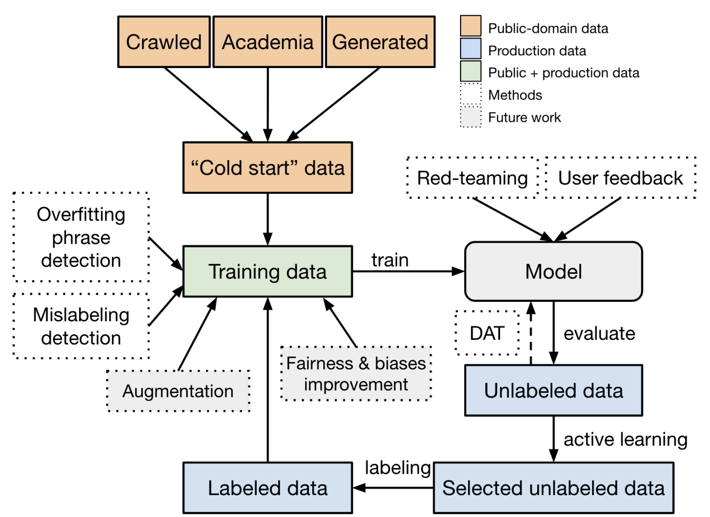

# A Holistic Approach to Undesired Content Detection in the Real World
在现实世界中检测不希望的内容的整体方法 https://arxiv.org/abs/2208.03274

## Abstract
We present a holistic approach to building a robust and useful natural language classification system for real-world content moderation. The success of such a system relies on a chain of carefully designed and executed steps, including the design of content taxonomies and labeling instructions, data quality control, an active learning pipeline to capture rare events, and a variety of methods to make the model robust and to avoid overfitting. Our moderation system is trained to detect a broad set of categories of undesired content, including sexual content, hateful content, violence, self-harm, and harassment. This approach generalizes to a wide range of different content taxonomies and can be used to create high-quality content classifiers that outperform off-the-shelf models. 

我们提出了一种整体方法来为现实世界的内容审核构建强大且有用的自然语言分类系统。 这种系统的成功依赖于一系列精心设计和执行的步骤，包括内容分类和标签说明的设计、数据质量控制、捕获罕见事件的主动学习管道，以及使模型稳健的各种方法 并避免过度拟合。 我们的审核系统经过训练可以检测各种类别的不良内容，包括色情内容、仇恨内容、暴力、自残和骚扰。 这种方法适用于各种不同的内容分类法，可用于创建优于现成模型的高质量内容分类器。
<!-- 捕获罕见事件的主动学习管道 -->

## 1 Introduction
Recent advances in deep learning have accelerated the adoption of language models for socioeconomically valuable tasks in the real world (Devlin et al. 2019; Brown et al. 2020; Cohen et al. 2022). Both the systems’ builders and its users may benefit from a responsible deployment approach that includes moderating the models’ outputs: First, model providers may want assurances that the models will not produce content that is disallowed by their policies. Second, customers of these models sometimes require control over content to mitigate the impact of sensitive use cases or to reduce brand risk. A principled, robust, and efficient moderation solution can track and measure the model inputs and outputs to ensure safety standards. It can also provide finegrained control to enable use cases with sensitive needs, such as educational applications. We believe that a strong undesired content classifier lays the foundation for building safer AI systems in the wild, as it enables the capacity of moderating, evaluating, and guiding the models towards safer behavior.

深度学习的最新进展加速了语言模型在现实世界中用于具有社会经济价值的任务的采用(Devlin et al  2019; Brown et al  2020; Cohen et al  2022)。 系统的构建者及其用户都可能受益于负责任的部署方法，其中包括调节模型的输出：首先，模型提供者可能希望保证模型不会产生其策略不允许的内容。 其次，这些模型的客户有时需要控制内容以减轻敏感用例的影响或降低品牌风险。 一个有原则的、稳健的、高效的调节解决方案可以跟踪和测量模型的输入和输出，以确保安全标准。 它还可以提供细粒度控制，以启用具有敏感需求的用例，例如教育应用程序。 我们相信，一个强大的不希望的内容分类器为在野外构建更安全的人工智能系统奠定了基础，因为它能够调节、评估和引导模型走向更安全的行为。

 
Figure 1: Overview of the model training framework. 

Existing work on content detection either focuses mainly on a limited set of categories, including toxicity (Pavlopoulos et al. 2020; Gehman et al. 2020), hate speech (Kwok and Wang 2013; Davidson et al. 2017), and abusive content (Nobata et al. 2016; Vidgen et al. 2019); or is tailored towards a targeted use case, such as Perspective API (Jigsaw) on online toxic comment moderation. There is increasing attention to understanding the risk areas of large language models via a more rigorous taxonomy (Weidinger et al. 2021), but the amount of work is still limited, especially when it comes to deploying language models for real-world applications. Here we build a more comprehensive system for detecting a broad set of categories of undesired content, including sexual content, hateful content, violence, self-harm, and harassment, as well as severe subcategories under each top-level category. Large-scale content moderation systems and tooling exist on a number of platforms (YouTube 2019; Reddit 2022). We aim to provide a blueprint for creating such systems across a wide variety of use cases.

现有的内容检测工作主要集中在一组有限的类别上，包括毒性(Pavlopoulos et al  2020; Gehman et al  2020)、仇恨言论(Kwok 和 Wang 2013; Davidson et al  2017)和辱骂性内容( Nobata et al  2016; Vidgen et al  2019);  或针对目标用例量身定制，例如在线有毒评论审核的 Perspective API (Jigsaw)。 人们越来越关注通过更严格的分类法来了解大型语言模型的风险区域(Weidinger et al. 2021)，但工作量仍然有限，尤其是在为实际应用程序部署语言模型时。 在这里，我们构建了一个更全面的系统来检测一系列广泛的不良内容类别，包括色情内容、仇恨内容、暴力、自残和骚扰，以及每个顶级类别下的严重子类别。 许多平台上都存在大规模的内容审核系统和工具(YouTube 2019; Reddit 2022)。 我们的目标是为在各种用例中创建此类系统提供蓝图。

Detecting undesired content is difficult due to several challenges. First, there is not a clearly and widely agreedupon categorization of undesired content. Designing a detailed taxonomy for undesired content and operationalizing it for labeling purposes require a lot of work. The categorization framework usually needs to clarify a significant number of corner cases to achieve high inter-rater agreement during labeling. This is further complicated by the subjectivity of some labeling decisions, due to the different social and cultural backgrounds of human annotators. Second, a practical moderation system needs to process real-world traffic. Thus a model bootstrapped from public data or academic datasets would not work well because there exists a big data distribution shift and taxonomy misalignment. Third, it is rare to encounter certain categories of undesired content in real-world settings. For example, among sampled user prompts we observed that only 0.04% of cases included selfharm and 0.017% included hateful content involving threats. Hence, we need smart solutions to the cold start problem and effective ways to discover undesired samples.

由于一些挑战，检测不希望的内容很困难。 首先，对于不希望的内容的分类没有明确和广泛认可的。 为不希望的内容设计详细的分类法并将其用于标注目的需要大量的工作。 分类框架通常需要澄清大量的边角案例，以在标注期间实现高度的评估者之间的一致性。 由于人类标注者的社会和文化背景不同，某些标注决策的主观性使这变得更加复杂。 其次，实用的审核系统需要处理真实世界的流量。 因此，从公共数据或学术数据集引导的模型不会很好地工作，因为存在大数据分布变化和分类错位。 第三，在现实世界中很少遇到某些类别的不良内容。 例如，在抽样的用户提示中，我们观察到只有 0.04% 的案例包含自我伤害，0.017% 的案例包含涉及威胁的仇恨内容。 因此，我们需要解决冷启动问题的智能解决方案和发现不希望的样本的有效方法。

Multiple components contribute to the success of building and deploying a practical, general moderation system into the real world. These include effectively establishing a chain of carefully polished and curated configurations for data collection, data labeling, model training and active learning. Based on our experimentation, we find the following conclusions to be especially noteworthy.
* Detailed instructions and quality control are needed to ensure data quality. Labeling instructions that lack suf- ficient precision force annotators to rely on their subjective judgment, resulting in inconsistently labeled data that confuses the model. Regular calibration sessions are necessary to refine these instructions and ensure annotators are aligned with them. And a poorly chosen quality metric can lead to data that hurts model performance. (See §3.2)
* Active learning is a necessity. There is likely a large distribution shift between public data and the traffic from one’s production system. Thus, it is critical to collect new training samples from the production traffic. Active learning can effectively expand the training dataset to capture a significantly (up to 22×) larger amount of undesired samples when dealing with rare events. This can lead to a performance improvement in the underlying model of up to 10× for rare categories. (See §3.1 and §4.3)
* Use public datasets with care. Publicly available data might not lead to high quality performance for the problem in hand due to differences in taxonomy and training data distribution, but can be used to construct a noisy cold start dataset at the early stage. However, adding academic data into the training set may hurt the model performance at a later stage when there are enough properly labeled data samples. (See 3.5)
* Imbalanced training data can lead to incorrect generalization. Deep learning models could easily overfit common phrases or templates. For example, the model can over-generalize to anything formatted as "X is hateful" if the data distribution is off-balance. We tackle this challenge by programmatically identifying overfitted phrases and by red-teaming via human trials. We then alter the training distribution by incorporating model-generated or human-curated synthetic data to patch the weakness. (See §3.5 and §3.3)
* Mistakes in data will happen and need to be managed. Even with significant amounts of effort on data quality control, we still run into mislabeled examples. We explore different methods for identifying those cases, including cross-validation and hunting down common phrases causing the model to overfit via token subtraction. (See §3.2 and §3.5)

多个组件有助于在现实世界中成功构建和部署实用的通用审核系统。 其中包括为数据收集、数据标注、模型训练和主动学习有效地建立一个精心打磨和策划的配置链。 根据我们的实验，我们发现以下结论尤其值得注意。
* 需要详细的说明和质量控制以确保数据质量。 缺乏足够精确度的标注指令迫使标注者依赖于他们的主观判断，导致标注数据不一致，从而混淆了模型。 定期校准会议是必要的，以完善这些说明并确保标注人员与它们保持一致。 选择不当的质量指标可能会导致数据损害模型性能。 (见§3.2)
* 主动学习是必要的。 公共数据和来自生产系统的流量之间可能存在较大的分布迁移。 因此，从生产流量中收集新的训练样本至关重要。 在处理罕见事件时，主动学习可以有效地扩展训练数据集以捕获大量(高达 22 倍)的不希望的样本。 对于稀有类别，这可以使基础模型的性能提高多达 10 倍。 (参见 §3.1 和 §4.3)
* 谨慎使用公共数据集。 由于分类和训练数据分布的差异，公开可用的数据可能不会为手头的问题带来高质量的性能，但可用于在早期阶段构建嘈杂的冷启动数据集。 但是，当有足够的正确标注的数据样本时，将学术数据添加到训练集中可能会在后期损害模型性能。 (见 3.5)
* 不平衡的训练数据会导致不正确的泛化。 深度学习模型很容易过度拟合常用短语或模板。 例如，如果数据分布不平衡，该模型可能会过度概括为任何格式为“X is hateful”的东西。 我们通过以编程方式识别过度拟合的短语和通过人体试验进行红队合作来应对这一挑战。 然后，我们通过结合模型生成的或人工策划的合成数据来改变训练分布来修补弱点。 (参见 §3.5 和 §3.3)
* 数据错误会发生，需要管理。 即使在数据质量控制方面付出了大量努力，我们仍然会遇到错误标注的样本。 我们探索了识别这些案例的不同方法，包括交叉验证和通过标注减法寻找导致模型过度拟合的常见短语。 (参见 §3.2 和 §3.5)

We aim to present a holistic approach to building a reliable and robust undesired content detection model for realworld applications. Our approach is meant to handle the scenario in which the type of the content to be detected is rarely observed in the real world. We hope that the lessons we learned are useful to others working on similar problems. We release a dataset(1 https://github.com/openai/moderation-api-release; sourced from CommonCrawl and model-generated data) containing text samples from publicly available data labeled according to our taxonomy. The model is accessible via the OpenAI Moderation endpoint(2 https://beta.openai.com/docs/guides/moderation; Harassment category is currently under further improvement and will be available in the future). 

我们的目标是提供一种整体方法，为实际应用程序构建可靠且强大的不希望的内容检测模型。我们的方法旨在处理在现实世界中很少观察到要检测的内容类型的情况。我们希望，我们吸取的教训对从事类似问题工作的其他人有用。我们发布了一个数据集1，其中包含根据我们的分类法标注的公开可用数据的文本样本。该模型可通过 OpenAI 审核端点(2)访问。

## 2 Taxonomy 分类
Given that the meaning of a sentence can depend on context, designing a universal taxonomy for undesired content is challenging and requires inherent trade-offs. Throughout this exercise, we aimed to make the dataset as broadly applicable as possible to maximize its utility across research and industrial contexts, but recognize it still ought to be critically evaluated prior to use in any context, The anatomy of what’s undesired can vary based on factors like use cases, users, regions and many others. Some sentences labeled as undesired according to our taxonomy (e.g. "I will kill you" would be labeled as containing violence) may not be considered undesired when appearing in another context such as fiction.

鉴于句子的含义可能取决于上下文，为不希望的内容设计通用分类法具有挑战性，需要进行内在的权衡。 在整个练习中，我们的目标是使数据集尽可能广泛地适用，以最大限度地提高其在研究和工业环境中的效用，但认识到在将其用于任何环境之前，仍应对其进行严格评估。 用例、用户、地区和许多其他因素。 根据我们的分类法，一些被标注为不受欢迎的句子(例如“我会杀了你”会被标注为包含暴力)在出现在小说等其他上下文中时可能不会被视为不受欢迎。

Additionally, we aimed to capture layers of subcategorization and granularity. Much existing work lacks subcategorizations to capture a spectrum of severity, which is critical, since statements such as "kill all [IDENT GROUP]" can have different repercussions compared to "[IDENT - GROUP] are dishonest". The existence of subcategories can also largely reduce the disagreement rate and corner cases during labeling, making it valuable for data quality control. In the following outline, we present our taxonomy for undesired content categorization, including five top-level categories and a spectrum of subcategories.

此外，我们的目标是捕获子分类和粒度层。 许多现有工作缺乏子分类来捕捉一系列严重性，这很关键，因为与“[IDENT - GROUP] 不诚实”相比，诸如“杀死所有 [IDENT GROUP]”之类的陈述可能会产生不同的影响。 子类别的存在也可以在很大程度上减少标注过程中的不一致率和极端情况，对数据质量控制具有重要价值。 在下面的大纲中，我们介绍了不希望的内容分类的分类法，包括五个顶级类别和一系列子类别。

S: Sexual content. Content that depicts explicit or implicit sexual behavior. Subcategories that are considered undesired: [S3] sexual content involving minors, [S2] content that depicts certain sexual activities which could be illegal(3This mapped most closely to what’s illegal in USA. ) if they happened in real life today, and [S1] erotic sexual content that does not depict illegal activities. Subcategories that are not considered undesired: [S0] Nonerotic or contextualized sexual content, such as medical or sex education material.

S：色情内容. 描述明确或暗示的性行为的内容。 被视为不受欢迎的子类别：[S3] 涉及未成年人的性内容，[S2] 描述某些可能违法的性活动的内容(3 这最接近于美国的非法行为。)如果它们发生在今天的现实生活中，以及 [S1] 不描绘非法活动的色情内容。 不被视为不希望的子类别：[S0] 非色情或情境化的性内容，例如医学或性教育材料。

H: Hateful content. Content that is threatening, insulting, derogatory and otherwise abusive content targeting specific chosen groups or members of the group because of their group identities. Subcategories that are considered undesired: [H2] hateful content calling for violence or threatening, [H1] derogatory stereotypes or support for hateful statements. Subcategories that are not considered undesired: [H0.a] neutral statement referring to group identity and [H0.b] contextualized hate speech, such as a quote of other individual’s statement in order to provide commentary.

H：仇恨内容. 威胁、侮辱、贬损和其他辱骂性内容，针对特定选定的群体或群体成员，因为他们的群体身份。 被视为不希望的子类别：[H2] 呼吁暴力或威胁的仇恨内容，[H1] 贬损刻板印象或支持仇恨言论。 不被视为不受欢迎的子类别：[H0.a] 涉及群体身份的中性陈述和 [H0.b] 情境化的仇恨言论，例如为了提供评论而引用其他人的陈述。

V: Violence Content that depicts or shows support for physical violence. Subcategories that are considered undesired: [V2] extremely graphic violence, [V1] threats or support for violence. Subcategories that are not considered undesired: [V0] neutral depictions of contextualized violence.

V：暴力描述或显示支持身体暴力的内容。 被认为不受欢迎的子类别：[V2] 极端暴力，[V1] 威胁或支持暴力。 不被视为不受欢迎的子类别：[V0] 对情境化暴力的中立描述。

SH: Self-harm Content that contains a graphic description or shows support for self-harm.

SH：自我伤害内容包含图形描述或表明支持自我伤害。

HR: Harassment Content that may be used to torment or annoy individuals in real life, or make harassment more likely to occur.

HR: Harassment Content 可能用于在现实生活中折磨或骚扰个人，或使骚扰更容易发生的内容。

Our model learns to predict whether a given sample violates any of 8 chosen categories, including all the top categories (S, H, V, SH, HR) and three most severe subcategories (S3, H2, and V2). 

我们的模型学习预测给定样本是否违反了 8 个选定类别中的任何一个，包括所有顶级类别(S、H、V、SH、HR)和三个最严重的子类别(S3、H2 和 V2)的3种方法。

## 3 Methods
### 3.1 Data Selection and Active Learning 数据选择和主动学习
To ensure that our moderation system performs well in the context of our production use cases, we need to incorporate production data to our training set. We set up a three-stage procedure in an iterative fashion.

为了确保我们的审核系统在我们的生产用例中表现良好，我们需要将生产数据合并到我们的训练集中。 我们以迭代方式建立了一个三阶段过程。

First, a large volume of our production data is selected at random. Any potential personally identifiable information (PII) is masked. The most recent moderation model is used to score these samples and discover which ones may trigger any chosen categories.

首先，我们的大量生产数据是随机选择的。 隐藏任何潜在的个人身份信息 (PII)。 最新的审核模型用于对这些样本进行评分，并发现哪些样本可能触发任何选定的类别。

In the second stage we run a simple active learning strategy to select a subset of most valuable samples to be labeled out of the random samples extracted in stage one. The active learning strategy is composed of three parallel pipelines. The first one relies on random sampling such that some fraction of our data remain consistent with the underlying data distribution in production. The second one randomly selects from samples with model score above a certain threshold for each category to identify likely undesired data points. The last pipeline adopts a set of uncertainty sampling strategies (Lewis and Gale 1994; Lewis and Catlett 1994) to capture samples that the model is most uncertain about, where the model score for that category is closest to 0.5.

在第二阶段，我们运行一个简单的主动学习策略，从第一阶段提取的随机样本中选择最有价值样本的子集进行标注。 主动学习策略由三个并行流水线组成。 第一个依赖于随机抽样，这样我们的部分数据与生产中的基础数据分布保持一致。 第二个从模型得分高于每个类别特定阈值的样本中随机选择，以识别可能不希望的数据点。 最后一个管道采用一组不确定性抽样策略(Lewis 和 Gale 1994; Lewis 和 Catlett 1994)来捕获模型最不确定的样本，其中该类别的模型得分最接近 0.5。

During the final stage, all the samples selected by different active learning strategies are aggregated and re-weighted based on statistics of certain metadata associated with it. The sampling weight is configured to be proportional to the square root of the sample count. This helps improve the diversity of selected samples with regard to the associated metadata. We update the sub-strategy mixture over time based on changes in the data distribution and categories that we want to improve the most at different stages.

在最后阶段，根据与其相关的某些元数据的统计信息，对通过不同主动学习策略选择的所有样本进行聚合和重新加权。 采样权重被配置为与样本计数的平方根成正比。 这有助于提高所选样本在相关元数据方面的多样性。 我们根据数据分布和类别的变化随时间更新子策略组合，我们希望在不同阶段对其进行最大改进。

### 3.2 Labeling and Quality Control
Data label correctness is critical to good model performance. Getting such data can be difficult given that our categories and the boundary lines between them are inherently subjective. However, certain interventions can significantly improve the quality of labeled data.

数据标签的正确性对于良好的模型性能至关重要。 鉴于我们的类别和它们之间的界限本质上是主观的，因此获取此类数据可能很困难。 然而，某些干预措施可以显著提高标注数据的质量。

One important intervention for improving data quality - in terms of both consistent labels across different annotators as well as between annotators and researchers - is to make the labeling instructions as well-defined and concrete as possible. To make the instructions well-defined, we sought to design detailed definitions and design categories or subcategories to be as mutually exclusive as possible so as to minimize ambiguity. To make the instructions concrete, we hosted regular calibration sessions to review ambiguous edge cases and instances where external annotators and our internal auditors disagree. Based on feedback from those sessions, we made the instructions more clear and concrete, with numerous examples and clearer definitions around borderline cases. As rules are defined clearly and concretely to minimize subjective judgments, they can be executed more consistently by the annotators.

提高数据质量的一项重要干预措施 —— 就不同标注者之间以及标注者和研究人员之间的一致标签而言 —— 是使标签说明尽可能明确和具体。 为了使说明定义明确，我们试图设计详细的定义和设计类别或子类别，使其尽可能相互排斥，以最大程度地减少歧义。 为了使说明具体化，我们举办了定期校准会议，以审查外部标注者和我们的内部审计员不同意的模棱两可的边缘案例和实例。 根据这些会议的反馈，我们使说明更加清晰和具体，围绕边界案例提供了大量样本和更清晰的定义。 由于规则定义明确且具体以最大限度地减少主观判断，因此标注者可以更一致地执行它们。

Regular, ongoing audits are necessary to ensure that labeled data continues to be of sufficiently high quality. The choice of which samples to audit and what metrics to use to measure data quality is crucial. We found that selecting auditing targets at random cannot maximize the value out of auditing due to the imbalanced distribution across categories. The annotator-auditor agreement rate (i.e. accuracy) is suboptimal because undesired examples are rare events to encounter and the accuracy can be arbitrarily high due to the abundance of true negatives. Instead, in each chosen category, we randomly select 10 samples labeled as undesired and 10 samples with model probability greater than 50%. The former help capture false positive cases and the latter provide an estimation on recall. Then we compute the F-1 score for the chosen samples based on the annotator-assigned labels while using auditor-assigned labels as ground truth. This procedure performs much better in practice when certain categories of undesired data points are rare. Separation of metrics per category makes it easy to recognize category-specific issues and to retrain annotators accordingly.

定期的、持续的审计是必要的，以确保标注的数据继续具有足够高的质量。 选择要审计的样本以及使用什么指标来衡量数据质量至关重要。 我们发现，由于跨类别的分布不平衡，随机选择审计目标无法最大化审计的价值。 标注者-审计者的一致率(即精度)不是最优的，因为不受欢迎的例子是很少见的事件，而且精度可以任意高，因为有大量的真阴性。 相反，在每个选择的类别中，我们随机选择 10 个标注为不希望的样本和 10 个模型概率大于 50% 的样本。 前者有助于捕获误报案例，后者提供对召回率的估计。 然后，我们根据标注者分配的标签计算所选样本的 F-1 分数，同时使用审核员分配的标签作为基本事实。 当某些类别的不希望的数据点很少见时，此过程在实践中表现得更好。 每个类别的指标分离使得识别特定于类别的问题并相应地重新训练标注人员变得容易。

Even with very clear labeling instructions and an effective audit procedure, mistakes in data are still unavoidable. To identify potentially mislabeled samples in our dataset, we periodically split our current training dataset into two parts, train separate models on those datasets and use each model to score another half of the dataset that model was not trained on. When the model prediction disagrees with the current ground-truth label, the sample in question gets flagged. A random portion of flagged samples is audited, and if more than 30% are identified as mislabeled, all flagged samples would get labeled again for the second time.

即使有非常明确的标签说明和有效的审核程序，数据错误仍然不可避免。 为了识别数据集中可能被错误标注的样本，我们定期将当前的训练数据集分成两部分，在这些数据集上训练单独的模型，并使用每个模型对未训练模型的另一半数据集进行评分。 当模型预测与当前的真实标签不一致时，相关样本就会被标注出来。 对标注样本的随机部分进行审计，如果超过 30% 的样本被识别为错误标注，则所有标注样本将再次标注第二次。

### 3.3 Synthetic Data
In addition to the data collection discussed above, we also use synthetic data to improve model performance on rare categories such as SH and to mitigate the counterfactual bias towards certain demographic attributes (Kusner et al. 2017; Garg et al. 2019; Dwork et al. 2012). Generating synthetic data through large pre-trained language models has shown to be an effective way for data augmentation (Anaby-Tavor et al. 2020; Kumar, Choudhary, and Cho 2020; Yoo et al. 2021) and it is particularly helpful when there is little to no initial data (“cold start”) or when there are not enough undesired samples in the production traffic.

除了上面讨论的数据收集之外，我们还使用合成数据来提高 SH 等稀有类别的模型性能，并减轻对某些人口统计属性的反事实偏见(Kusner et al  2017; Garg et al  2019; Dwork et al  . 2012). 通过大型预训练语言模型生成合成数据已被证明是一种有效的数据增广方法(Anaby-Tavor et al  2020; Kumar、Choudhary 和 Cho 2020; Yoo et al  2021) 几乎没有初始数据(“冷启动”)，或者当生产流量中没有足够的不希望的样本时。

Table 1: Example zero-shot prompt template for generating synthetic SH data. The sections in green are filled with random ingredients to encourage diversity. 
表1：用于生成合成 SH 数据的样本零样本提示模板。 绿色部分充满了随机成分，以鼓励多样性。

#### Zero-shot data for cold start. 
To kick start the active learning and labeling process, we need some initial data to build the first version of the model and train annotators. However, it is difficult to find existing public datasets on certain categories such as SH and V2. We tackle the problem by generating a synthetic dataset with zero-shot prompts on GPT-3. The prompts are constructed from human-crafted templates and we label the generated texts as the initial dataset. Table 1 provides an example prompt for SH.

冷启动的零次数据。 要启动主动学习和标注过程，我们需要一些初始数据来构建模型的第一个版本并训练标注人员。 但是，很难在某些类别(例如 SH 和 V2)上找到现有的公共数据集。 我们通过在 GPT-3 上生成一个带有零样本提示的合成数据集来解决这个问题。 提示由人工制作的模板构成，我们将生成的文本标注为初始数据集。 表1 提供了 SH 的样本提示。

#### Few-shot data for rare categories. 
Some sub-categories had minimal amounts of undesired data even after several iterations of active learning. To address this, we constructed few-shot prompts with existing undesired examples and sent the generated texts to be labeled. The generated texts are manually inspected to avoid bias amplification (Zhao et al. 2017). We observed a nontrivial performance improvement by incorporating the synthetic dataset.

稀有类别的少量数据。 即使在主动学习的几次迭代之后，一些子类别的不希望的数据也很少。 为了解决这个问题，我们用现有的不希望的例子构建了少样本提示，并将生成的文本发送给标签。 手动检查生成的文本以避免偏差放大 (Zhao et al. 2017)。 通过合并合成数据集，我们观察到了显著的性能提升。

#### Curated data to mitigate counterfactual bias. 
Similar to other existing NLP models, our models also suffer from counterfactual bias towards certain demographic attributes as bias commonly exists in the training data. For instance, "black women." was classified as hateful content with high confidence in earlier versions of the model. We mitigate the issue by curating a synthetic dataset with templates that tend to lead to hateful predictions, e.g., "[subject] is selfish/foolish/narrow-minded.". The [subject] could either be filled with real demographic attributes (e.g., Latino) or random object names (e.g., "black blanket"), which forms hateful and safe samples respectively. We observe that the curated dataset not only mitigates bias to some degree, but also helps improve the model performance. For instance, the average AUPRC on hateful content was improved from 0.417 to 0.551 by adding 69k curated synthetic examples. We believe this is because the contrastive setup of subjects in synthetic example templates encourages the model to infer the correct feature representations: negative descriptive words or individual identity groups alone are not enough to be considered hateful, and only when they appear together they might be considered hateful. Despite the observed improvements, the synthetic dataset also has limitations and we will continue improving it in the future (§6).

精选数据以减轻反事实偏见。 与其他现有的 NLP 模型类似，我们的模型也存在对某些人口统计属性的反事实偏见，因为训练数据中普遍存在偏见。 例如，“黑人妇女”。 在模型的早期版本中被归类为具有高置信度的仇恨内容。 我们通过使用模板管理一个合成数据集来缓解这个问题，这些模板往往会导致可恶的预测，例如，“[subject] is selfish/foolish/narrow-minded.”。 [subject] 可以填充真实的人口统计属性(例如，拉丁裔)或随机对象名称(例如，“黑毯子”)，它们分别形成可恨和安全的样本。 我们观察到，精选的数据集不仅在一定程度上减轻了偏差，而且还有助于提高模型性能。 例如，通过添加 69k 精选合成样本，仇恨内容的平均 AUPRC 从 0.417 提高到 0.551。 我们认为这是因为合成样本模板中主题的对比设置鼓励模型推断出正确的特征表示：仅负面描述性词或个体身份组不足以被认为是可恨的，只有当它们一起出现时才可能被认为是可恨的 可恶。 尽管观察到改进，合成数据集也有局限性，我们将在未来继续改进它(§6)。

#### Large amount of noisy data does not help. 
To understand whether it is helpful to include a large amount of noisy synthetic data, we also generated zero-shot and few-shot examples twice the size of the existing labeled training dataset. For zero-shot examples, we set the label to positive or negative if the prompt asks the model to generate undesired or safe examples, respectively. For few-shot examples, we set the label to positive or negative if all of the few-shot examples are undesired or safe, respectively. Contrary to previous studies (Wang et al. 2021b; Schick and Sch¨utze 2021), we found mixing noisy synthetic data into training hurt model performance. It is worth noting that many existing studies on synthetic data usage experimented in the no-to-low data regime, where only a handful of labels are available. However, in our experiment, we have collected a large highquality dataset and we suspect that noise introduced by synthetic data confuses the model and lowers the learning effi- ciency.

大量嘈杂的数据无济于事。 为了了解包含大量嘈杂的合成数据是否有帮助，我们还生成了两倍于现有标注训练数据集大小的零样本和少样本样本。 对于零样本样本，如果提示要求模型分别生成不希望的或安全的样本，我们将标签设置为正面或负面。 对于少样本样本，如果所有少样本样本都是不受欢迎的或安全的，我们将标签分别设置为正或负。 与之前的研究(Wang et al  2021b; Schick 和 Sch¨utze 2021)相反，我们发现将嘈杂的合成数据混合到训练中会损害模型性能。 值得注意的是，许多关于合成数据使用的现有研究都是在无到低数据制度下进行实验的，其中只有少数标签可用。 然而，在我们的实验中，我们收集了大量高质量的数据集，我们怀疑合成数据引入的噪声会混淆模型并降低学习效率。

### 3.4 Domain Adversarial Training 领域对抗训练
We intended to make good use of existing public NLP datasets to improve the performance of our models. However, we observed that models trained on public NLP datasets do not perform well on our production traffic. This is likely due to the distribution difference between domains. For instance, examples from our production traffic are usually much longer and contain few-shot prompts, whereas existing public NLP datasets are usually shorter and often crawled from Wikipedia, Twitter, etc. (Vidgen and Derczynski 2020). To mitigate the problem, besides carefully tuning the mixture of public datasets and production data, we in addition apply Wasserstein Distance Guided Domain Adversarial Training (WDAT) to encourage the model to learn domain invariant representations (Arjovsky, Chintala, and Bottou 2017; Ganin et al. 2016).

我们打算充分利用现有的公共 NLP 数据集来提高我们模型的性能。 然而，我们观察到在公共 NLP 数据集上训练的模型在我们的生产流量上表现不佳。 这可能是由于领域之间的分布差异。 例如，来自我们生产流量的样本通常更长并且包含少量提示，而现有的公共 NLP 数据集通常更短并且经常从维基百科、Twitter 等抓取(Vidgen 和 Derczynski 2020)。 为了缓解这个问题，除了仔细调整公共数据集和生产数据的混合之外，我们还应用 Wasserstein 距离引导领域对抗训练 (WDAT) 来鼓励模型学习域不变表示(Arjovsky、Chintala 和 Bottou 2017; Ganin 等 et al. 2016)。

We follow Shen et al. (2018) and approximate the Wasserstein distance by maximizing the loss of a domain critic head. Let fz(x) : R d → R z be the feature extractor that maps the d-dimensional input into a z-dimensional embedding, fc(h) : R z → R c be a multiclass classification head, and fd(h) : R z → R be the domain critic head that maps the embedding into real number. The domain critic loss is defined as

我们跟随 Shen et al. (2018) 并通过最大化领域评论家头的损失来近似 Wasserstein 距离。 设 fz(x) : R d → R z 是将 d 维输入映射到 z 维嵌入的特征提取器，fc(h) : R z → R c 是多类分类头，fd(h) : R z → R 是将嵌入映射到实数的领域评论家头。 领域评论家损失定义为

Ld(Ds, Dt) = | E x∈Ds fd(fz(x)) − E x∈Dt fd(fz(x))|.

Combined with the regular classification loss Lc, our objective is to solve the following minimax problem: 

结合常规分类损失 Lc，我们的目标是解决以下 minimax 问题：

min θz,θc {Lc + λ max θd Ld}, 

where θz, θc, θd are the parameters of fz, fc, fd, respectively. Our model uses a transformer encoder as the feature extractor fz.

其中θz、θc、θd分别是fz、fc、fd的参数。 我们的模型使用变压器编码器作为特征提取器 fz。

In our implementation, we use the absolute value in Ld since the initial loss could be negative, and clip θd in a compact space [−0.01, 0.01] to enforce the Lipchitz constraint. We empirically set the balancing coefficient λ to 0.01. In experiments, WDAT achieves a more stable training compared to the original classifier-based approach (Arjovsky, Chintala, and Bottou 2017), and yields better performance on our production traffic with and without labeled production data in the training set.

在我们的实现中，我们使用 Ld 中的绝对值，因为初始损失可能为负，并将 θd 限制在紧凑空间 [−0.01, 0.01] 中以强制执行 Lipchitz 约束。 我们根据经验将平衡系数 λ 设置为 0.01。 在实验中，与原始的基于分类器的方法(Arjovsky、Chintala 和 Bottou 2017)相比，WDAT 实现了更稳定的训练，并且在训练集中有和没有标注生产数据的情况下在我们的生产流量上产生更好的性能。

### 3.5 Model Probing
It is widely known that ML models are vulnerable to adversarial inputs and may make predictions based on seemingly irrelevant features (Szegedy et al. 2013; Goodfellow, Shlens, and Szegedy 2015; Alzantot et al. 2018; Zhang et al. 2021). For instance, a sentiment classification model may make different predictions for "a short and moving film." and "a short and moving movie.", indicating that the model makes predictions based on film/- movie rather than descriptive words. To make sure that our model performs as expected, we conduct tool-assisted model probing and human-in-the-loop red-teaming.

众所周知，ML 模型容易受到对抗性输入的影响，并可能根据看似不相关的特征做出预测(Szegedy et al  2013; Goodfellow、Shlens 和 Szegedy 2015; Alzantot et al  2018; Zhang et al  2021)。 例如，情感分类模型可能会对“一部感人的短片”做出不同的预测。 和“a short and moving movie.”，表明该模型根据电影/电影而不是描述性词语进行预测。 为确保我们的模型按预期执行，我们进行了工具辅助模型探测和人在环红队。

#### Key Tokens Probing. 
Our first goal is to verify whether the model is making predictions based on correct features. For instance, we observed that our models may incorrectly predict "all immigrants." as hate, which is possibly because among 21 training examples containing the phrase (from R¨ottger et al. (2021)), 17 examples are undesired and only 4 examples are safe. Table 2 provides a few examples, where the expected behavior is to also take k1ll and D3ath into account. To identify such potentially over- fitted key tokens, we apply input reduction (Feng et al. 2018) on the training dataset by removing tokens greedily until the prediction drops below 0.8. On average, we were able to reduce the number of characters per sample from 722.3 to 15.9. By cross-validating with third-party APIs and heuristic keywords, we infer that about 97% of the identified keytokens are indeed unsafe, indicating that the model is picking up the correct feature most of the time. For the remaining 3% key tokens, we manually reviewed them and discovered the following problems:
1. The frequency of irrelevant symbols is high (e.g., the period symbol contributes to the prediction score).
2. Some key tokens are long and close to the original example, hinting that the model memorizes training samples.
3. Our model is not strong at handling typos and adversarial inputs (e.g., "w h o r e s" becomes "e s").

关键令牌探测。 我们的首要目标是验证模型是否根据正确的特征进行预测。 例如，我们观察到我们的模型可能会错误地预测“所有移民”。 作为仇恨，这可能是因为在包含该短语的 21 个训练样本中(来自 R¨ottger et al (2021))，17 个样本是不希望的，只有 4 个样本是安全的。 表2 提供了一些样本，其中预期的行为还将考虑 k1ll 和 D3ath。 为了识别这种可能过度拟合的关键令牌，我们通过贪婪地删除标注，直到预测降到 0.8 以下，对训练数据集应用输入减少 (Feng et al. 2018)。 平均而言，我们能够将每个样本的字符数从 722.3 个减少到 15.9 个。 通过与第三方 API 和启发式关键字进行交叉验证，我们推断大约 97% 的已识别密钥令牌确实不安全，这表明该模型大部分时间都在选择正确的特征。 对于剩下的3%的关键令牌，我们通过人工审核，发现了以下问题：
1. 无关符号出现频率高(如周期符号对预测分数有贡献)。
2. 一些关键令牌很长并且接近原始例子，暗示模型记住了训练样本。
3. 我们的模型在处理拼写错误和对抗性输入方面并不强大(例如，“w h o r e s”变成“e s”)。

We partially addressed the above issues, and plan to resolve with better data augmentation in the future (§6).

我们部分解决了上述问题，并计划在未来通过更好的数据增广来解决(§6)。

Table 2: Example training data from (R¨ottger et al. 2021) containing the phrase "all immigrants." The model trained on it directly may make predictions based on incorrect features.
表2：样本训练数据来自 (R¨ottger et al. 2021)，其中包含短语“all immigrants”。 直接在其上训练的模型可能会根据不正确的特征进行预测。

#### Human Red-teaming. 
As a final layer of the verification process, we conduct internal red-teaming before releasing new models. The goal of the red-teaming is to uncover any unexpected model weaknesses beyond the test dataset. During the process, we discovered the following issues:
1. The model predicts high hate scores for examples containing the “#” token. This phenomenon is likely caused by the fact that we have many hate training examples from some academic datasets that contain only short tweets.
2. The model predicts high hate and violence scores for examples containing potential racial tokens such as black. It is expected to classify "I hate black people!" as hate but not "I hate black cats!" as hate.

人类红队。 作为验证过程的最后一层，我们在发布新模型之前进行内部红队测试。 红队的目标是发现测试数据集之外的任何意外模型弱点。 在这个过程中，我们发现了以下问题：
1. 该模型预测包含“#”标注的样本的高仇恨分数。 这种现象很可能是由于我们有许多来自一些仅包含短推文的学术数据集的仇恨训练样本。
2. 对于包含潜在种族标注(例如黑人)的样本，该模型预测高仇恨和暴力分数。 有望归类为“我讨厌黑人！” 讨厌但不是“我讨厌黑猫！” 作为仇恨。

To mitigate the above issues, we construct synthetic datasets from hand-curated templates and synthetic model generations to patch the holes (§3.3), and adjust the training dataset distribution to make sure we have the right mix across multiple types of text sourced from academic datasets. The process can be iterative, helping us discover new issues and solutions in each round and naturally leading to improved robustness and consistency in time when the red-teaming process can be executed more regularly and at scale. 

为了缓解上述问题，我们从手工策划的模板和合成模型生成中构建合成数据集以修补漏洞(§3.3)，并调整训练数据集分布以确保我们在来自学术的多种类型的文本中正确混合 数据集。 这个过程可以是迭代的，帮助我们在每一轮中发现新的问题和解决方案，并且当红队过程可以更定期和更大规模地执行时，自然会及时提高稳健性和一致性。

## 4 Experiment Results
### 4.1 Model Architecture and Training
Our model is a lightweight transformer decoder model where the final output linear layer is replaced with 8 MLP heads, each corresponding to one independent matrix of shape [dmodel, 256, 1], where dmodel is the transformer model size. We find this head architecture works better than a single deep MLP layer with one output vector of 8 dimensions at avoiding interference between categories and requires fewer parameters to train.

我们的模型是一个轻量级的变压器解码器模型，其中最终输出线性层被 8 个 MLP 头替换，每个头对应一个独立的形状矩阵 [dmodel, 256, 1]，其中 dmodel 是变压器模型的大小。 我们发现这种头部架构在避免类别之间的干扰方面比具有一个 8 维输出向量的单个深度 MLP 层效果更好，并且需要更少的参数来训练。

The model is initialized from a GPT model that is pretrained on a large text corpus and then fine-tuned with learning rate 0.05, batch size 256, dropout rate 0.1 within MLP heads and up to 3 epochs.

该模型从 GPT 模型初始化，该模型在大型文本语料库上进行预训练，然后以学习率 0.05、批量大小 256、MLP 头内的丢失率 0.1 和最多 3 个时期进行微调。

### 4.2 Model Performance
Our model is trained and tested on both production and public data. We are not able to share the test dataset containing production traffic for privacy and legal reasons; hence, we report the model performance on a different test dataset(4 https://github.com/openai/moderation-api-release) containing only samples from public data, as well as several publicly available datasets on undesired content detection. 

我们的模型在生产数据和公共数据上都经过训练和测试。 出于隐私和法律原因，我们无法共享包含生产流量的测试数据集;  因此，我们报告了不同测试数据集 (4 https://github.com/openai/moderation-api-release) 上的模型性能，该数据集仅包含来自公共数据的样本，以及几个关于不良内容检测的公开数据集。

Table 3: Comparison of our model with Perspective API on AUPRC (Area under the Precision-Recall Curve) across a set of test datasets. Numbers followed with ”*” are based on approximated taxonomy match, so not an exact fair comparison.
表3：在一组测试数据集上，我们的模型与 AUPRC(精确召回曲线下的面积)上的 Perspective API 的比较。 数字后跟“*”是基于近似的分类匹配，所以不是一个完全公平的比较。

Table 3 compares the performance of our model with Perspective API(5https://www.perspectiveapi.com/) as a baseline on our test dataset, TweetEval (Barbieri et al. 2020), Stormfront hate speech dataset (de Gibert et al. 2018), a subset of Reddit comments with noisy labels on erotic content processed according to Barrientos et al. (2020) and a downsampled Jigsaw toxic comments test dataset (Jigsaw 2018). None of the training portion of external evaluation benchmarks are incorporated into our training, except for half of Jigsaw’s training data that has no overlap with the Jigsaw test set in evaluation. Unfortunately, due to the taxonomy mismatch, we cannot have exact comparison across all categories. For example, our taxonomy does not cover “toxic” and Perspective API does not explicitly detect “self-harm” or “sexual content”. See the details on how we match two taxonomies and preprocess each test dataset in Appendix. A.

表3 比较了我们模型的性能，Perspective API5 作为测试数据集 TweetEval(Barbieri et al. 2020)、Stormfront 仇恨言论数据集(de Gibert et al. 2018)的基线，Reddit 评论的一个子集带有嘈杂的标签 根据 Barrientos et al 处理的色情内容。 (2020) 和下采样的 Jigsaw 有毒评论测试数据集 (Jigsaw 2018)。 除了 Jigsaw 的一半训练数据在评估中与 Jigsaw 测试集没有重叠外，我们的训练中没有包含外部评估基准的训练部分。 不幸的是，由于分类不匹配，我们无法对所有类别进行精确比较。 例如，我们的分类法不包括“有毒”，Perspective API 没有明确检测“自残”或“性内容”。 请参阅附录A中有关我们如何匹配两个分类法和预处理每个测试数据集的详情。

It is not surprising that our model performs the best on the test dataset labeled with the same taxonomy and the Perspective API does a better job on Jigsaw data. It further proves the point on how important it is to align the taxonomy between training data and use cases in evaluation. Our model outperforms the Perspective API baseline on both TweetEval and Stormfront test sets for detecting hateful content, despite the fact that neither are in the training set.

毫不奇怪，我们的模型在标有相同分类法的测试数据集上表现最好，而 Perspective API 在 Jigsaw 数据上表现更好。 它进一步证明了在评估中调整训练数据和用例之间的分类法的重要性。 我们的模型在 TweetEval 和 Stormfront 测试集上都优于 Perspective API 基线来检测仇恨内容，尽管事实上两者都不在训练集中。

### 4.3 Active Learning Experiments
To assess the importance of active learning, we evaluate the performance of our active learning strategy, as described in §3.1, compared to random sampling.

为了评估主动学习的重要性，我们评估了我们的主动学习策略的性能，如§3.1 中所述，与随机抽样相比。

Table 4: Label distributions for samples selected by random sampling and active learning sampling. Note that one sample can be assigned with multiple labels so the percentages sum up to more than 100%. 
表4：通过随机抽样和主动学习抽样选择的样本的标签分布。 请注意，一个样本可以分配多个标签，因此百分比总和超过 100%。

Iterative training. We run the following training procedure twice, using our active learning strategy and random sampling, respectively.
1. Start with an initial training dataset D0 of k0 = 6000 labeled examples from public data and a validation set V of about 5500 samples from the production traffic.
2. for i ← 0 to N − 1 do (N = 3): 
(a) Train a new model Mi on Di ; 
(b) Evaluate Mi on V; 
(c) Score 5 × 105 production samples with Mi from our production traffic; 
(d) Choose about 2000 samples from the above data pool via the selection strategy in test and add samples to the training set to construct Di+1 after labeling.

迭代训练。 我们运行以下训练程序两次，分别使用我们的主动学习策略和随机抽样。
1. 从 k0 = 6000 个来自公共数据的标注样本的初始训练数据集 D0 和来自生产流量的大约 5500 个样本的验证集 V 开始。
2. 对于 i ← 0 到 N − 1 do (N = 3)：
(a) 在 Di 上训练新模型 Mi ; 
(b) 在 V 上评估 Mi; 
(c) 从我们的生产流量中用 Mi 对 5×105 个生产样本进行评分; 
(d) 通过test中的选择策略，从上述数据池中选取约2000个样本加入训练集，标注后构建Di+1。

Results. Table 4 demonstrates the label distributions obtained by the two strategies and our active learning strategy can capture undesired content 10+ times more effectively than random sampling on all categories. Overall about 40% of samples selected by active learning can trigger at least one undesired label, while in comparison only 3.4% of random samples are assigned with any undesired label.

结果。 表4 展示了两种策略获得的标签分布，我们的主动学习策略可以比所有类别的随机抽样更有效地捕获不希望的内容 10 倍以上。 总体而言，主动学习选择的样本中约有 40% 可以触发至少一个不希望的标签，而相比之下，只有 3.4% 的随机样本被分配了任何不希望的标签。

As shown in Fig. 2, using the active learning strategy to decide which new data samples leads to a greater improvement across all categories than random sampling. We observe significant performance improvement on all categories with active learning after 3 iterations.

如图 2 所示，使用主动学习策略来决定哪些新数据样本比随机抽样在所有类别中产生更大的改进。 在 3 次迭代后，我们观察到主动学习在所有类别上的显著性能改进。

### 4.4 Domain Adversarial Training Experiments 域对抗训练实验
We want to understand the effectiveness of Wasserstein Distance Guided Domain Adversarial Training (WDAT) under three scenarios: 
1. At the beginning of the project, we only have labeled public data and unlabeled production data. 
2. In the middle of the project, we also curate synthetic examples to improve model weaknesses. 
3. At the later stage, we get a sufficient amount of labeled production examples. 
All three circumstances are important because we want to make good use of unlabeled production data to train the best model throughout the project, and a strong model on production traffic boosts the effectiveness of active learning at every iteration. We use the following setup to compare the performance on our production traffic.

我们想了解 Wasserstein Distance Guided Domain Adversarial Training (WDAT) 在三种情况下的有效性：
1. 在项目开始时，我们只有带标签的公共数据和未带标签的生产数据。
2. 在项目中期，我们还整理了合成样本以改进模型的弱点。
3. 后期得到足够数量的标注生产实例。
这三种情况都很重要，因为我们希望在整个项目中充分利用未标注的生产数据来训练最佳模型，并且强大的生产流量模型可以提高每次迭代中主动学习的有效性。 我们使用以下设置来比较生产流量的性能。

Figure 2: Performance of active learning sampling versus random sampling on the same validation set at each model iteration, measured by AUPRC. 
图 2：在每次模型迭代时，主动学习抽样与随机抽样在同一验证集上的性能，由 AUPRC 测量。

#### Datasets. 
We create three training datasets PUB, SYN, and MIX to study (1), (2), and (3), respectively. PUB consists of around 90k public examples including both samples from academic datasets and Web data (Common Crawl) labeled by our annotators. SYN adds additional 69k curated synthetic examples. MIX contains all examples in SYN with additional 60k production samples with labels.

数据集。 我们创建了三个训练数据集 PUB、SYN 和 MIX 来分别研究 (1)、(2) 和 (3)。 PUB 包含大约 90k 个公共样本，包括来自学术数据集的样本和我们的标注人员标注的 Web 数据(Common Crawl)。 SYN 添加了额外的 69k 精选合成样本。 MIX 包含 SYN 中的所有样本以及带有标签的额外 60k 生产样本。

#### Models. 
The baseline models are trained with basic supervised learning. The DAT models are trained with two hidden layers of 300 dimensions using additional 100k unlabeled production data points. All models are trained with up to 2 epochs, and the training is repeated 3 times with different random seeds.

模型。 基线模型使用基本的监督学习进行训练。 DAT 模型使用额外的 100k 未标注生产数据点使用两个 300 维的隐藏层进行训练。 所有模型最多训练 2 个 epoch，并使用不同的随机种子重复训练 3 次。

#### Results. 
We compare the average AUPRC on the production validation set V. As demonstrated in Table 5, the improvement from WDAT is significant when we only have access to public datasets (PUB), and the marginal gain reduces gradually as we add more training examples, especially in-distribution production samples. For instance, DAT improved SH AUPRC from 0.063 to 0.281 on PUB and from 0.086 to 0.296 on SYN, whereas the improvement is only from 0.621 to 0.632 on MIX. WDAT still helps weak categories (SH and V2) on SYN and MIX, but it may slightly hurt the performance for categories with a sufficient amount of in-distribution data such as H and V. We suspect this is because the model failed to find a representation that works very well for both the public datasets and our production distribution. Further study on the model architecture and training methods is required to improve the performance on all categories with unlabeled data throughout different stages of the project. 

结果。 我们比较了生产验证集 V 上的平均 AUPRC。如表5 所示，当我们只能访问公共数据集 (PUB) 时，WDAT 的改进是显著的，并且随着我们添加更多训练样本，边际收益逐渐减少，尤其是 分销生产样品。 例如，DAT 在 PUB 上将 SH AUPRC 从 0.063 提高到 0.281，在 SYN 上从 0.086 提高到 0.296，而在 MIX 上仅从 0.621 提高到 0.632。 WDAT 仍然有助于 SYN 和 MIX 上的弱类别(SH 和 V2)，但它可能会稍微损害具有足够数量的分布内数据的类别(例如 H 和 V)的性能。我们怀疑这是因为模型未能找到 对于公共数据集和我们的生产分布都非常有效的表示。 需要进一步研究模型架构和训练方法，以在项目的不同阶段提高所有类别的未标注数据的性能。

Table 5: The average AUPRC on a production validation set. PUB denotes models trained on labeled public datasets, SYN adds additional synthetic examples, and MIX adds additional labeled production examples. We mark the best result within each configuration in bold. 
表5：生产验证集上的平均 AUPRC。 PUB 表示在标注的公共数据集上训练的模型，SYN 表示添加额外的合成样本，MIX 表示添加额外的标注生产样本。 我们用粗体标注每个配置中的最佳结果。

## 5 Related Work
There is a long track record of work on the definition and detection of hateful, toxic, offensive and abusive content (Kwok and Wang 2013; Nobata et al. 2016; Waseem 2016; de Gibert et al. 2018; Vidgen et al. 2019; Gehman et al. 2020; Rosenthal et al. 2020; Lees et al. 2022). Zampieri et al. (2019) proposed a three-level hierarchical taxonomy considering whether the given language is (i) offensive or not; (ii) targeted or not; and (iii) targeted at a group, an individual or other organizations. Usually hateful expressions targeting protected identity groups are considered hate speech (Davidson et al. 2017). Perspective API defines toxicity as ”A rude, disrespectful, or unreasonable comment that is likely to make people leave a discussion”. Some also used toxicity as a general umbrella term for offensive, abusive, and hateful language (Pavlopoulos et al. 2020). The definitions of hatefulness, toxicity, offensiveness and abusiveness have overlaps but are not exactly the same, creating obstacles for sharing datasets between projects. Furthermore, only a limited amount of work considered detailed subcategorizations (Mollas et al. 2020; Borkan et al. 2019) to capture a spectrum of severity, making it harder to control labeling quality. Finally, there exist various types of potentially undesired text in the wild, such as sexual content involving minors, extreme graphic violence, or support for self-harm or suicides, besides offensive and abusive language, and we ob- served a gap between current research work and the entirety of content types that should be moderated and detected. Our work aims to fill in the gap.

在定义和检测仇恨、有毒、攻击性和辱骂性内容方面有着长期的工作记录(Kwok 和 Wang 2013; Nobata et al  2016; Waseem 2016; de Gibert et al  2018; Vidgen et al  2019;  Gehman et al  2020; Rosenthal et al  2020; Lees et al  2022)。 Zampieri 等。 (2019) 提出了一个三级分类法，考虑给定的语言是否 (i) 冒犯性;  (ii) 是否有针对性;  (iii) 针对团体、个人或其他组织。 通常针对受保护身份群体的仇恨表达被视为仇恨言论(Davidson et al. 2017)。 Perspective API 将毒性定义为“粗鲁、无礼或不合理的评论，可能会让人们离开讨论”。 有些人还使用毒性作为冒犯性、辱骂性和仇恨性语言的总称(Pavlopoulos et al. 2020)。 仇恨、毒性、攻击性和辱骂性的定义有重叠但并不完全相同，这为项目之间共享数据集造成了障碍。 此外，只有有限数量的工作考虑了详细的子分类(Mollas et al. 2020; Borkan et al. 2019)以捕捉一系列严重性，这使得控制标签质量变得更加困难。 最后，除了冒犯性和辱骂性语言外，还存在各种潜在的不良文本，例如涉及未成年人的性内容、极端暴力画面或支持自残或自杀，我们观察到当前研究之间的差距 工作以及应审核和检测的所有内容类型。 我们的工作旨在填补这一空白。

Despite the common belief that training data quality is critical for model performance, there is still lack of community standards for labeling standards, annotator training, quality metrics, etc. (Vidgen and Derczynski 2020; Yin and Zubiaga 2021; Lees et al. 2022; PAI 2021). Vidgen and Derczynski (2020) studied 60+ datasets for abusive language detection and found that the primary data source is Twitter and expert coding is the most common way to annotate data, closely followed by crowdsourcing. For large-scale data collection, crowdsourcing remains the most common approach (Mollas et al. 2020; Zampieri et al. 2019; Davidson et al. 2017). However, the weak skill set of non-expert annotators can lead to lower data quality (Waseem 2016; Yin and Zubiaga 2021). Some recent work turns to large pre-trained language models to generate synthetic data, significantly reducing the cost of time and human labor (Wang et al. 2021a; Hartvigsen et al. 2022), but it is unclear whether model outputs would be diverse enough to adapt to the real-world distribution. Synthetic data can be hand-crafted (R¨ottger et al. 2021), but it is limited by size and thus more suitable for evaluation. It is noteworthy that training data can contain bias due to the subjectivity and biases in the data collection process (Davidson, Bhattacharya, and Weber 2019; Sap et al. 2019).

尽管人们普遍认为训练数据质量对模型性能至关重要，但仍然缺乏标签标准、标注器训练、质量指标等方面的社区标准。(Vidgen 和 Derczynski 2020; Yin 和 Zubiaga 2021; Lees et al  2022;  2021)。 Vidgen 和 Derczynski (2020) 研究了 60 多个用于滥用语言检测的数据集，发现主要数据源是 Twitter，专家编码是最常见的数据标注方式，紧随其后的是众包。 对于大规模数据收集，众包仍然是最常见的方法(Mollas et al. 2020; Zampieri et al. 2019; Davidson et al. 2017)。 然而，非专家标注人员的技能较弱可能会导致数据质量下降(Waseem 2016; Yin 和 Zubiaga 2021)。 最近的一些工作转向大型预训练语言模型来生成合成数据，显著降低了时间和人力成本(Wang et al  2021a; Hartvigsen et al  2022)，但尚不清楚模型输出是否足够多样化 以适应现实世界的分布。 合成数据可以手工制作 (R¨ottger et al. 2021)，但它受大小限制，因此更适合评估。 值得注意的是，由于数据收集过程中的主观性和偏见，训练数据可能包含偏见(Davidson、Bhattacharya 和 Weber，2019; Sap et al. 2019)。

Active learning has been successfully applied to a number of different domains such as text classification (Lewis and Gale 1994; Schohn and Cohn 2000; Siddhant and Lipton 2018); machine translation (Zeng et al. 2019); image classi- fication (Luo et al. 2005; Hoi et al. 2006; Gal, Islam, and Ghahramani 2017); object detection (Schmidt et al. 2020) and information retrieval (Shen and Zhai 2005). There are several families of active learning sampling strategies that are often used in practice. Uncertainty sampling selects data points about which the model is most uncertain. The uncertainty of the model can be quantified by predicted probabilities (Lewis and Gale 1994; Lewis and Catlett 1994; Culotta and McCallum 2005; Scheffer, Decomain, and Wrobel 2001), disagreement among an ensemble of models (Seung, Opper, and Sompolinsky 1992; Dagan and Engelson 1995; McCallum and Nigam 1998), or by using dropout and Bayesian approaches (Gal, Islam, and Ghahramani 2017; Siddhant and Lipton 2018). Diversity sampling chooses samples in a way that ensures sufficient diversity within the selection. This is commonly achieved by clustering unlabeled data and sampling from different clusters (Nguyen and Smeulders 2004; Xu, Akella, and Zhang 2007), or by selecting samples which are ”representative” of the sample distribution (i.e., which are similar to many other samples) (McCallum and Nigam 1998; Settles and Craven 2008). Uncertainty and diversity sampling are sometimes combined in a single complex active learning strategy.

主动学习已成功应用于许多不同领域，例如文本分类(Lewis 和 Gale 1994; Schohn 和 Cohn 2000; Siddhant 和 Lipton 2018);  机器翻译(Zeng et al. 2019);  图像分类 (Luo et al. 2005; Hoi et al. 2006; Gal, Islam, and Ghahramani 2017);  对象检测 (Schmidt et al. 2020) 和信息检索 (Shen and Zhai 2005)。 在实践中经常使用的主动学习抽样策略有几个系列。 不确定性抽样选择模型最不确定的数据点。 模型的不确定性可以通过预测概率(Lewis 和 Gale 1994; Lewis 和 Catlett 1994; Culotta 和 McCallum 2005; Scheffer、Decomain 和 Wrobel 2001)、模型集合之间的分歧(Seung、Opper 和 Sompolinsky 1992)来量化 ; Dagan 和 Engelson 1995; McCallum 和 Nigam 1998)，或使用 dropout 和贝叶斯方法(Gal、Islam 和 Ghahramani 2017; Siddhant 和 Lipton 2018)。 多样性抽样以确保选择范围内足够多样性的方式选择样本。 这通常是通过对未标注的数据进行聚类并从不同的聚类中抽样来实现的(Nguyen 和 Smeulders 2004; Xu、Akella 和 Zhang 2007)，或者通过选择样本分布的“代表性”样本(即与许多其他样本相似的样本) 样本)(McCallum 和 Nigam 1998; Settles 和 Craven 2008)。 不确定性和多样性抽样有时会结合在一个复杂的主动学习策略中。

Red-teaming is a common approach for model improvement by discovering and patching the weakness iteratively (Dinan et al. 2019; Vidgen et al. 2020; Kiela et al. 2021; Ziegler et al. 2022; Perez et al. 2022; Ribeiro et al. 2020), where humans are encouraged to look for examples that could fail the model. Dynabench (Kiela et al. 2021) is built as a platform for easy adversarial data collection. Mishkin et al. (2022) describes in detail an operational process for doing red-teaming using external experts. Ziegler et al. (2022) designed a tool to efficiently assist human adversaries to identify failures in a classifier. Models trained with red-teaming data are found to be more robust to adversarial attack (Dinan et al. 2019; Ziegler et al. 2022) and human-in-the-loop dynamic data collection can efficiently improve model performance (Kiela et al. 2021; Vidgen et al. 2020).

红队是通过迭代发现和修补弱点来改进模型的常用方法(Dinan et al  2019; Vidgen et al  2020; Kiela et al  2021; Ziegler et al  2022; Perez et al  2022; Ribeiro et al  al. 2020)，鼓励人们寻找可能使模型失败的例子。 Dynabench(Kiela et al. 2021)被构建为一个易于对抗性数据收集的平台。 米什金等。 (2022) 详细描述了使用外部专家进行红队操作的操作过程。 齐格勒et al. (2022) 设计了一种工具来有效地帮助人类对手识别分类器中的故障。 发现使用红队数据训练的模型对对抗性攻击更稳健(Dinan et al  2019; Ziegler et al  2022)，并且人在回路动态数据收集可以有效地提高模型性能(Kiela et al. 2022)。 2021; Vidgen et al. 2020)。

Domain adaptation aims at generalizing knowledge learned in the source domain towards a related target domain (Ben-David et al. 2006; Weiss, Khoshgoftaar, and Wang 2016; Ben-David et al. 2009), the technique is most useful when there is insufficient labeled data in the target domain but sufficient labeled data in the source domain. Different methods have been proposed to transfer the knowledge across domains (Ramponi and Plank 2020; Blitzer, McDonald, and Pereira 2006; Mansour, Mohri, and Rostamizadeh 2008). Inspired by generative adversarial nets (GANs) (Goodfellow et al. 2014) which train a discriminator to make the representations of source and target indistinguishable, Domain Adversarial Training (DAT) methods are proposed to reduce the domain discrepancy through a domain discriminator (Arjovsky, Chintala, and Bottou 2017; Ganin et al. 2016; Tzeng et al. 2017; Ganin and Lempitsky 2015). To learn domain-invariant feature representations, DAT employs a gradient reversal layer to maximize the minimal loss of the domain discriminator. However, DAT suffers from a gradient vanishing problem when the domain discriminator can tell apart the two domains easily, and Wasserstein distance based methods are proposed to enable a more stable training (Shen et al. 2018; Arjovsky, Chintala, and Bottou 2017; Shah et al. 2018). 

域适应旨在将在源域中学到的知识推广到相关的目标域(Ben-David et al  2006; Weiss、Khoshgoftaar 和 Wang 2016; Ben-David et al  2009)，该技术在以下情况下最有用 目标域中的标注数据不足，但源域中的标注数据充足。 已经提出了不同的方法来跨领域迁移知识(Ramponi 和 Plank 2020; Blitzer、McDonald 和 Pereira 2006; Mansour、Mohri 和 Rostamizadeh 2008)。 受生成对抗网络 (GAN) (Goodfellow et al. 2014) 的启发，生成对抗网络训练鉴别器使源和目标的表示无法区分，提出了域对抗训练 (DAT) 方法以通过域鉴别器减少域差异 (Arjovsky, Chintala 和 Bottou 2017; Ganin et al  2016; Tzeng et al  2017; Ganin 和 Lempitsky 2015)。 为了学习域不变特征表示，DAT 使用梯度反转层来最大化域鉴别器的最小损失。 然而，当域鉴别器可以轻松区分两个域时，DAT 会遇到梯度消失问题，并且提出了基于 Wasserstein 距离的方法来实现更稳定的训练(Shen et al  2018; Arjovsky、Chintala 和 Bottou 2017; Shah et al. 2018)。

## 6 Future Work and Limitations
### Bias and Fairness. 
Similar to other existing NLP models, our models also suffer from bias towards certain demographic attributes (Kusner et al. 2017; Garg et al. 2019; Dwork et al. 2012). For instance, the model may give higher hate predictions if the input contains gay and higher sexual predictions if the input contains her. This is because we use data from the Internet, and social bias may present explicitly or implicitly in the training datasets. We tried mitigation methods such as creating a balanced synthetic dataset with templates but could not fully eliminate the issue. In the future, we will continue following related research and improve the fairness of our models.

偏见和公平。 与其他现有的 NLP 模型类似，我们的模型也存在对某些人口统计属性的偏见(Kusner et al  2017; Garg et al  2019; Dwork et al  2012)。 例如，如果输入包含同性恋，模型可能会给出更高的仇恨预测; 如果输入包含她，模型可能会给出更高的性预测。 这是因为我们使用的数据来自互联网，而社会偏见可能会显式或隐式地存在于训练数据集中。 我们尝试了缓解方法，例如使用模板创建平衡的合成数据集，但无法完全消除该问题。 未来，我们会继续跟进相关研究，提高我们模型的公平性。

### Data Augmentation. 
We plan to investigate more data augmentation methods to boost the training dataset. Although our current training dataset naturally includes misspelled words and incorrect grammar as some of it is usergenerated content, it is valuable to experiment with data augmentation to improve lexicon robustness (Wei and Zou 2019; Kobayashi 2018; Zhang et al. 2021) and the generalizability of the model (Guo, Mao, and Zhang 2019; Shen et al. 2020; Gao, Yao, and Chen 2021), especially when working with the changing distribution of real-world data.

数据增广。 我们计划研究更多的数据增广方法来提升训练数据集。 尽管我们当前的训练数据集自然包含拼写错误的单词和不正确的语法，因为其中一些是用户生成的内容，但通过数据增广来提高词典的稳健性(Wei and Zou 2019; Kobayashi 2018; Zhang et al. 2021)和泛化能力是有价值的 模型(Guo、Mao 和 Zhang，2019; Shen et al. 2020; Gao、Yao 和 Chen，2021)，尤其是在处理真实世界数据不断变化的分布时。

### Better Multilingual Support. 
Only about 5% of the samples are non-English in our training set. As the vast majority of our production traffic is in English, we have not yet rigorously evaluated or optimized performance on non-English text. Multilingual toxic content classification (Aluru et al. 2020; Wang and Banko 2021; Lees et al. 2022) would require more non-English training data and may need additional changes on tokenization or model architecture.

更好的多语言支持。 在我们的训练集中，只有大约 5% 的样本是非英语的。 由于我们的绝大多数生产流量都是英文的，因此我们尚未严格评估或优化非英文文本的性能。 多语言有毒内容分类(Aluru et al  2020; Wang 和 Banko 2021; Lees et al  2022)将需要更多非英语训练数据，并且可能需要对令牌化或模型架构进行其他更改。

### Red-teaming at scale. 
Red-teaming is an effective way to find unknown failure cases for the model. Currently we do internal red-teaming with each new model version, which is not a scalable approach. In the future, we plan to set up a pipeline for model red-teaming similar to the one we have for labeling production traffic. We plan to use a specialized interface inspired by Kiela et al. (2021); Ziegler et al. (2022) to improve the efficiency of the red-teamers.

大规模的红队合作。 红队是为模型查找未知故障案例的有效方法。 目前，我们对每个新模型版本进行内部红队协作，这不是一种可扩展的方法。 未来，我们计划为模型红队建立一个管道，类似于我们用于标注生产流量的管道。 我们计划使用受Kiela et al. (2021); Ziegler et al. (2022) 启发的专用界面提高红队的效率。

### More Active Learning Experiments. 
Our current active learning strategy to select high-value data for labeling is quite simple. For example, we did not explore diversity sampling due to computational restriction. Onward we plan to run more rigorous experiments comparing the performance of different active learning strategies, as well as more sophisticated strategies, incorporating both uncertainty and diversity sampling. 

更多主动学习的实验。 我们目前选择高价值数据进行标注的主动学习策略非常简单。 例如，由于计算限制，我们没有探索多样性采样。 今后，我们计划进行更严格的实验，比较不同主动学习策略的性能，以及更复杂的策略，结合不确定性和多样性抽样。

## 7 Broader Impacts
Content moderation classifiers have many uses. When paired with fair and robust enforcement practices, they have the potential to reduce certain instances of misuse(6 misuse may be defined as uses of the model that the moderating body does not want to allow, e.g. generation of hateful content) by ensuring that policies are operationalized on both inputs and outputs of language models. Classifiers also enable filtration of datasets at scale, which may be used to train language models with desired properties (Welbl et al. 2021) and allow for better evaluation of language models (Gehman et al. 2020). Longer-term, content moderation classifiers can be used as a way to ensure high-stakes reliability in very-capable AI systems (Ziegler et al. 2022)—a critical necessity for enabling the deployment of those systems in certain domains.

内容审核分类器有很多用途。 当与公平和强有力的执法实践相结合时，它们有可能通过确保策略减少某些滥用情况(6 滥用可能被定义为使用调节机构不希望允许的模型，例如生成仇恨内容) 在语言模型的输入和输出上进行操作。 分类器还可以大规模过滤数据集，这可用于训练具有所需属性的语言模型(Welbl et al. 2021)，并允许更好地评估语言模型(Gehman et al. 2020)。 长期而言，内容审核分类器可用作确保功能强大的 AI 系统中高风险可靠性的一种方式(Ziegler et al. 2022)——这是在某些领域部署这些系统的关键必要条件。

While this underscores the importance of the undesired content classifiers, all classifiers rest on certain assumptions and decisions that may present vulnerabilities or make them inappropriate for certain use cases or types of text. Additionally, these tools can suffer from problematic biases, such as disproportionate false positives when discussing groups that are frequently the target of hate. (Garg et al. 2019)

虽然这强调了不希望的内容分类器的重要性，但所有分类器都基于某些可能存在漏洞或使其不适用于某些用例或文本类型的假设和决策。 此外，这些工具可能存在有问题的偏见，例如在讨论经常成为仇恨目标的群体时出现不成比例的误报(Garg et al. 2019)。 

The following sections discuss the normative and subjective questions on which these classifiers rest and explore the challenges they present.

以下部分讨论了这些分类器所依据的规范和主观问题，并探讨了它们所带来的挑战。

### 7.1 Challenges of Taxonomy Design 分类设计的挑战
We take care to design our taxonomy to reflect generalizable viewpoints. However, much of our data is drawn from a US-centric context and the taxonomy was designed to best fit this data. Additionally, while we have designed our taxonomy to be as comprehensive as possible, it would still be useful for future researchers to add and update the categories based on their own use cases and deployment contexts. Given the sensitive nature of various tasks, we also encourage the use of this taxonomy in concert with other mitigation strategies, as there is no silver bullet for content moderation.

我们注意设计我们的分类法以反映普遍的观点。 然而，我们的大部分数据都是从以美国为中心的背景中提取的，分类法的设计是为了最适合这些数据。 此外，虽然我们将分类法设计得尽可能全面，但对于未来的研究人员来说，根据他们自己的用例和部署环境添加和更新类别仍然很有用。 鉴于各种任务的敏感性，我们还鼓励将这种分类法与其他缓解策略结合使用，因为内容审核没有灵丹妙药。

We hope that this work will encourage further discussion and debate around the principles and values that underpin content moderation.

我们希望这项工作将鼓励围绕支持内容审核的原则和价值观进行进一步的讨论和辩论。

### 7.2 Annotator Viewpoints and Disagreement 标注人员的观点和分歧
It is commonly agreed that the annotation of toxic language is subjective and that annotators’ interpretations may be in- fluenced by their personal and cultural backgrounds, including lived experiences, values and demographic factors. For example, Waseem (2016) found that feminist and anti-racist activists systematically disagree with crowd workers on their hate speech annotations. In their study, agreement between the authors, amateurs and expert annotators is low (14%), most often because in many instances where the authors had identified hate speech, annotators do not.

人们普遍认为，有毒语言的标注是主观的，标注人员的解释可能会受到他们的个人和文化背景的影响，包括生活经历、价值观和人口统计因素。 例如，Waseem(2016)发现，女权主义者和反种族主义活动家在仇恨言论标注上系统地不同意众包工作者的意见。 在他们的研究中，作者、业余爱好者和专家标注人员之间的一致性很低 (14%)，这通常是因为在许多情况下，作者已经识别出仇恨言论，而标注人员却没有。

By necessity, incorporating diverse viewpoints invites disagreement on annotation labels. Much of the computer science literature focuses on eliminating inter-rater disagreements, most often via deliberation or majority vote. However, in the case of data from or about marginalized populations, disagreement may be a meaningful signal: An adverse effect of majority vote in such cases is limiting representation of minority perspectives in data Prabhakaran, Mostafazadeh Davani, and Diaz (2021), potentially reinforcing societal disparities and harms. Moreover, analyzing disagreements may lead to a better understanding of the domain of application Patton et al. (2018).

必然地，合并不同的观点会引起对标注标签的分歧。 许多计算机科学文献都侧重于消除评分者之间的分歧，通常是通过审议或多数表决。 然而，对于来自边缘化人群或关于边缘化人群的数据，分歧可能是一个有意义的信号：在这种情况下，多数投票的不利影响是限制了少数群体观点在数据中的代表性 Prabhakaran、Mostafazadeh Davani 和 Diaz(2021)，这可能会加强 社会差异和危害。 此外，分析分歧可能会导致更好地理解 Patton et al 的应用领域。 (2018)。

In their study, rather than aggregating, Davani, D´ıaz, and Prabhakaran (2021) preserve annotator disagreements, which they note could reflect useful and nuanced information about the uncertainty of a sample’s membership to a class. Indeed, they demonstrate that their approach yields the same or better performance than similar approaches with aggregated labels, while retaining the ability to estimate uncertainty in predictions that correlate with real-life annotator disagreements.

在他们的研究中，Davani、D´ıaz 和 Prabhakaran(2021)保留了标注人员的分歧，而不是汇总，他们指出这可能反映出关于样本属于某个类别的不确定性的有用且细微的信息。 事实上，他们证明他们的方法产生与使用聚合标签的类似方法相同或更好的性能，同时保留估计与现实生活中的标注人员分歧相关的预测不确定性的能力。

Moreover, resolving disagreement via majority vote may be at odds with preserving minority opinions in subjective tasks. Ovesdotter Alm (2011) argues that achieving a single real ”ground truth” label is impossible and is not essential in subjective tasks, and calls for finding ways to model subjective interpretations of annotators, rather than seeking to reduce the variability in annotations.

此外，通过多数票解决分歧可能与在主观任务中保留少数意见不一致。 Ovesdotter Alm (2011) 认为，实现单一真实的“ground truth”标签是不可能的，在主观任务中也不是必需的，并呼吁寻找方法来模拟标注人员的主观解释，而不是寻求减少标注的可变性。

### 7.3 Annotator Selection and Welfare 标注者选择与福利
We are committed to ensuring that our labeling tasks are managed in a considerate and ethical manner, and we strive to follow current best practices for sourcing data labeling services (PAI 2021). Via our data vendors, all of our annotators are selected for their skill and willingness to participate in these difficult tasks. Before they opt in, all annotators are vetted by counselors and made aware of the risks and potential harms of working with sensitive data. Our data vendors provide them with access to mental health and wellness resources and annotators have the right to opt out at any point.

我们致力于确保以体贴和道德的方式管理我们的标注任务，并且我们努力遵循采购数据标注服务的当前最佳实践 (PAI 2021)。 通过我们的数据供应商，我们所有的标注人员都是根据他们的技能和参与这些困难任务的意愿来选择的。 在他们选择加入之前，所有标注人员都经过顾问的审查，并了解使用敏感数据的风险和潜在危害。 我们的数据供应商为他们提供心理健康资源，标注人员有权随时选择退出。

### 7.4 Data Privacy and Security 数据隐私和安全
Trustworthy handling of production data necessitates transparency with users and effective security measures. We obtain consent from all customers whose data is used to train our moderation models. Customers who wish to opt their data out of training may do so. No production data is included in the dataset we are releasing. Our data labeling and active learning pipelines feature security controls that are designed and tested to protect the confidentiality and integrity of production data. The model we deploy can not be used to generate text, only to compute safety scores, so we consider the risk of training data leakage to be extremely low.

可靠地处理生产数据需要对用户透明并采取有效的安全措施。 我们征得所有客户的同意，他们的数据被用于训练我们的审核模型。 希望从训练中选择他们的数据的客户可以这样做。 我们发布的数据集中不包含生产数据。 我们的数据标签和主动学习管道具有安全控制功能，这些安全控制经过设计和测试以保护生产数据的机密性和完整性。 我们部署的模型不能用于生成文本，只能用于计算安全分数，因此我们认为训练数据泄漏的风险极低。

### 7.5 Summary of Broader Impacts Discussion 更广泛的影响讨论摘要
Content moderation classifiers are one key tool that empowers developers of language models at every stage of the model development and deployment process- from working with large-scale datasets, to testing out models, to deploying the models to many users. However, as we have observed above, there are a range of normative and subjective decisions made throughout the development process of building these classifiers from designing taxonomies to labeling data. Given the nature of these tools, these decisions are sometimes distilled down bluntly and do not enable capturing the nuances that the moderation decision may warrant. This loss of nuance may disproportionately impact members of socially marginalized populations by muting their opinions via unweighted majority annotations. This impact is doubly grievous if moderation decisions about members of marginalized populations are made about them by a system that excludes their input. This highlights some inherent limitations of classifiers, using automated tools for content moderation, and point to the importance of their robust testing to ensure suitability for each specific use that they may be deployed in. 

内容审核分类器是一种关键工具，它在模型开发和部署过程的每个阶段为语言模型开发人员提供支持——从使用大规模数据集到测试模型，再到将模型部署到许多用户。 然而，正如我们上面所观察到的，在构建这些分类器的整个开发过程中，从设计分类法到标注数据，都会做出一系列规范和主观的决定。 鉴于这些工具的性质，这些决定有时会被直截了当地提炼出来，并且无法捕捉到适度决定可能需要的细微差别。 这种细微差别的丧失可能会通过未加权的多数标注使他们的意见静音，从而对社会边缘化人群的成员产生不成比例的影响。 如果关于边缘化人口成员的节制决定是由一个排除他们的投入的系统做出的，那么这种影响是双重严重的。 这突出了分类器的一些固有局限性，使用自动化工具进行内容审核，并指出了其稳健测试的重要性，以确保它们适合可能部署的每个特定用途。

## 8 Conclusion
Building high-quality undesired content detection systems in the real world is a challenge that requires the incorporation of multiple methods. A good content taxonomy is the foundation for problem scoping and data collection. A reliable data pipeline is needed to guarantee high data quality and to handle distribution shift. We show that in cases where certain target content occurs rarely, an active learning sampling strategy leads to much better model performance. Additionally, we argue that good operational aspects of the labeling pipeline are essential for ensuring high data quality. And we show that model performance can further be improved through the use of curated synthetic data and semisupervised learning.

在现实世界中构建高质量的不良内容检测系统是一项挑战，需要结合多种方法。 良好的内容分类法是确定问题范围和收集数据的基础。 需要可靠的数据管道来保证高质量的数据并处理分布迁移。 我们表明，在某些目标内容很少出现的情况下，主动学习采样策略会带来更好的模型性能。 此外，我们认为标签管道的良好操作方面对于确保高数据质量至关重要。 我们表明，通过使用精选的合成数据和半监督学习，可以进一步提高模型性能。

As large generative language models become more and more prevalent, it becomes increasingly important to develop ways of controlling and guiding their outputs. The goal of this work has been to demonstrate one way of implementing such control by way of building content detection models. We are looking forward to further refinement of our approach in the future, as well as progress in other methods of controlling and aligning generative model outputs. 

随着大型生成语言模型变得越来越普遍，开发控制和引导其输出的方法变得越来越重要。 这项工作的目标是展示一种通过构建内容检测模型来实现此类控制的方法。 我们期待在未来进一步完善我们的方法，以及在控制和对齐生成模型输出的其他方法方面取得进展。

## 9 Acknowledgments
This work would not have been possible without the contributions of data workers. We greatly appreciate their work handling sensitive content and helping us build better automated systems to make content moderation work less demanding of human labor. We also thank Miles Brundage, Raf Jakubanis, Gretchen Krueger, Derek Chen, Summer Yue, Karl Cobbe, Pranav Shyam, Jason Kwon and Matt Knight for feedback on this work.

如果没有数据工作者的贡献，这项工作是不可能完成的。 我们非常感谢他们处理敏感内容并帮助我们构建更好的自动化系统以减少内容审核工作对人工的要求。 我们还感谢 Miles Brundage、Raf Jakubanis、Gretchen Krueger、Derek Chen、Summer Yue、Karl Cobbe、Pranav Shyam、Jason Kwon 和 Matt Knight 对这项工作的反馈。

## References
* Aluru, S. S.; Mathew, B.; Saha, P.; and Mukherjee, A. 2020.
Deep learning models for multilingual hate speech detection. arXiv preprint arXiv:2004.06465.
* Alzantot, M.; Sharma, Y.; Elgohary, A.; Ho, B.-J.; Srivastava, M.; and Chang, K.-W. 2018. Generating Natural Language Adversarial Examples. In Proceedings of the 2018
Conference on Empirical Methods in Natural Language
Processing, 2890–2896. Brussels, Belgium: Association for
Computational Linguistics.
* Anaby-Tavor, A.; Carmeli, B.; Goldbraich, E.; Kantor, A.;
Kour, G.; Shlomov, S.; Tepper, N.; and Zwerdling, N. 2020.
* Do not have enough data? Deep learning to the rescue! In
Proceedings of the AAAI Conference on Artificial Intelligence, volume 34, 7383–7390.
* Arjovsky, M.; Chintala, S.; and Bottou, L. 2017. Wasserstein Generative Adversarial Networks. In Precup, D.; and
Teh, Y. W., eds., Proceedings of the 34th International Conference on Machine Learning, volume 70 of Proceedings of
Machine Learning Research, 214–223. PMLR.
* Barbieri, F.; Camacho-Collados, J.; Espinosa Anke, L.; and
Neves, L. 2020. TweetEval: Unified Benchmark and Comparative Evaluation for Tweet Classification. In Findings
of the Association for Computational Linguistics: EMNLP
2020, 1644–1650. Association for Computational Linguistics.
* Barrientos, G. M.; Alaiz-Rodr´ıguez, R.; Gonz´alez-Castro,
V.; and Parnell, A. C. 2020. Machine learning techniques
for the detection of inappropriate erotic content in text. International Journal of Computational Intelligence Systems,
13(1): 591–603.
* Ben-David, S.; Blitzer, J.; Crammer, K.; Kulesza, A.;
Pereira, F. C.; and Vaughan, J. W. 2009. A theory of learning
from different domains. Machine Learning, 79: 151–175.
* Ben-David, S.; Blitzer, J.; Crammer, K.; and Pereira, F. C.
* 2006. Analysis of Representations for Domain Adaptation.
* In NIPS.
* Blitzer, J.; McDonald, R. T.; and Pereira, F. C. 2006. Domain Adaptation with Structural Correspondence Learning.
* In EMNLP.
* Borkan, D.; Dixon, L.; Sorensen, J.; Thain, N.; and Vasserman, L. 2019. Nuanced Metrics for Measuring Unintended
Bias with Real Data for Text Classification. In Companion Proceedings of The 2019 World Wide Web Conference,
WWW ’19, 491–500. New York, NY, USA: Association for
Computing Machinery. ISBN 9781450366755.
* Brown, T.; Mann, B.; Ryder, N.; Subbiah, M.; Kaplan, J. D.;
Dhariwal, P.; Neelakantan, A.; Shyam, P.; Sastry, G.; Askell,
A.; et al. 2020. Language models are few-shot learners. Advances in neural information processing systems, 33: 1877–
1901.
* Cohen, A. D.; Roberts, A.; Molina, A.; Butryna, A.; Jin, A.;
Kulshreshtha, A.; Hutchinson, B.; Zevenbergen, B.; AgueraArcas, B. H.; ching Chang, C.; Cui, C.; Du, C.; Adiwardana, D. D. F.; Chen, D.; Lepikhin, D. D.; Chi, E. H.;
Hoffman-John, E.; Cheng, H.-T.; Lee, H.; Krivokon, I.; Qin,
J.; Hall, J.; Fenton, J.; Soraker, J.; Meier-Hellstern, K.; Olson, K.; Aroyo, L. M.; Bosma, M. P.; Pickett, M. J.; Menegali, M. A.; Croak, M.; D´ıaz, M.; Lamm, M.; Krikun, M.;
Morris, M. R.; Shazeer, N.; Le, Q. V.; Bernstein, R.; Rajakumar, R.; Kurzweil, R.; Thoppilan, R.; Zheng, S.; Bos,
T.; Duke, T.; Doshi, T.; Prabhakaran, V.; Rusch, W.; Li, Y.;
Huang, Y.; Zhou, Y.; Xu, Y.; and Chen, Z. 2022. LaMDA:
Language Models for Dialog Applications. In arXiv.
* Culotta, A.; and McCallum, A. 2005. Reducing labeling effort for structured prediction tasks. In AAAI, volume 5, 746–
751.
* Dagan, I.; and Engelson, S. P. 1995. Committee-based sampling for training probabilistic classifiers. In Machine Learning Proceedings 1995, 150–157. Elsevier.
* Davani, A. M.; D´ıaz, M.; and Prabhakaran, V. 2021. Dealing
with Disagreements: Looking Beyond the Majority Vote in
Subjective Annotations. CoRR, abs/2110.05719.
* Davidson, T.; Bhattacharya, D.; and Weber, I. 2019. Racial
Bias in Hate Speech and Abusive Language Detection
Datasets. In Proceedings of the Third Workshop on Abusive Language Online, 25–35. Florence, Italy: Association
for Computational Linguistics.
* Davidson, T.; Warmsley, D.; Macy, M.; and Weber, I. 2017.
* Automated hate speech detection and the problem of offensive language. In Proceedings of the international AAAI
conference on web and social media, volume 11, 512–515.
* de Gibert, O.; Perez, N.; Garc´ıa-Pablos, A.; and Cuadros, M.
* 2018. Hate Speech Dataset from a White Supremacy Forum.
* In Proceedings of the 2nd Workshop on Abusive Language
Online (ALW2), 11–20. Brussels, Belgium: Association for
Computational Linguistics.
* Devlin, J.; Chang, M.; Lee, K.; and Toutanova, K. 2019.
* BERT: Pre-training of Deep Bidirectional Transformers for
Language Understanding. In Burstein, J.; Doran, C.; and
Solorio, T., eds., Proceedings of the 2019 Conference of the
North American Chapter of the Association for Computational Linguistics: Human Language Technologies, NAACLHLT 2019, Minneapolis, MN, USA, June 2-7, 2019, Volume 1 (Long and Short Papers), 4171–4186. Association for
Computational Linguistics.
* Dinan, E.; Humeau, S.; Chintagunta, B.; and Weston, J.
* 2019. Build it break it fix it for dialogue safety: Robustness from adversarial human attack. arXiv preprint
arXiv:1908.06083.
* Dwork, C.; Hardt, M.; Pitassi, T.; Reingold, O.; and Zemel,
R. 2012. Fairness through Awareness. In Proceedings of
the 3rd Innovations in Theoretical Computer Science Conference, ITCS ’12, 214–226. New York, NY, USA: Association for Computing Machinery. ISBN 9781450311151.
* Feng, S.; Wallace, E.; Grissom II, A.; Iyyer, M.; Rodriguez,
P.; and Boyd-Graber, J. 2018. Pathologies of Neural Models Make Interpretations Difficult. In Proceedings of the
2018 Conference on Empirical Methods in Natural Language Processing, 3719–3728. Brussels, Belgium: Association for Computational Linguistics.
* Gal, Y.; Islam, R.; and Ghahramani, Z. 2017. Deep bayesian
active learning with image data. In International Conference
on Machine Learning, 1183–1192. PMLR.
* Ganin, Y.; and Lempitsky, V. S. 2015. Unsupervised Domain
Adaptation by Backpropagation. ArXiv, abs/1409.7495.
* Ganin, Y.; Ustinova, E.; Ajakan, H.; Germain, P.; Larochelle,
H.; Laviolette, F.; Marchand, M.; and Lempitsky, V. 2016.
* Domain-Adversarial Training of Neural Networks. J. Mach.
* Learn. Res., 17(1): 2096–2030.
* Gao, T.; Yao, X.; and Chen, D. 2021. SimCSE: Simple Contrastive Learning of Sentence Embeddings. In Empirical
Methods in Natural Language Processing (EMNLP).
* Garg, S.; Perot, V.; Limtiaco, N.; Taly, A.; Chi, E. H.; and
Beutel, A. 2019. Counterfactual Fairness in Text Classi-
fication through Robustness. In Proceedings of the 2019
AAAI/ACM Conference on AI, Ethics, and Society, AIES
’19, 219–226. New York, NY, USA: Association for Computing Machinery. ISBN 9781450363242.
* Gehman, S.; Gururangan, S.; Sap, M.; Choi, Y.; and
Smith, N. A. 2020. Realtoxicityprompts: Evaluating neural toxic degeneration in language models. arXiv preprint
arXiv:2009.11462.
* Goodfellow, I. J.; Pouget-Abadie, J.; Mirza, M.; Xu, B.;
Warde-Farley, D.; Ozair, S.; Courville, A. C.; and Bengio,
Y. 2014. Generative Adversarial Nets. In NIPS.
* Goodfellow, I. J.; Shlens, J.; and Szegedy, C. 2015. Explaining and Harnessing Adversarial Examples. CoRR,
abs/1412.6572.
* Guo, H.; Mao, Y.; and Zhang, R. 2019. Augmenting data
with mixup for sentence classification: An empirical study.
* arXiv preprint arXiv:1905.08941.
* Hartvigsen, T.; Gabriel, S.; Palangi, H.; Sap, M.; Ray, D.;
and Kamar, E. 2022. Toxigen: A large-scale machinegenerated dataset for adversarial and implicit hate speech
detection. arXiv preprint arXiv:2203.09509.
* Hoi, S. C.; Jin, R.; Zhu, J.; and Lyu, M. R. 2006. Batch mode
active learning and its application to medical image classifi-
cation. In Proceedings of the 23rd international conference
on Machine learning, 417–424.
* Jigsaw. ???? Perspective API. https://www.perspectiveapi.
* com/. Accessed: 2022-06-15.
* Jigsaw. 2018. Toxic Comment Classification Challenge. https://www.kaggle.com/competitions/jigsaw-toxiccomment-classification-challenge/overview. Accessed:
2022-06-15.
* Kiela, D.; Bartolo, M.; Nie, Y.; Kaushik, D.; Geiger, A.; Wu,
Z.; Vidgen, B.; Prasad, G.; Singh, A.; Ringshia, P.; Ma, Z.;
Thrush, T.; Riedel, S.; Waseem, Z.; Stenetorp, P.; Jia, R.;
Bansal, M.; Potts, C.; and Williams, A. 2021. Dynabench:
Rethinking Benchmarking in NLP. In Proceedings of the
2021 Conference of the North American Chapter of the Association for Computational Linguistics: Human Language
Technologies, 4110–4124. Online: Association for Computational Linguistics.
* Kobayashi, S. 2018. Contextual Augmentation: Data Augmentation by Words with Paradigmatic Relations. In Proceedings of the 2018 Conference of the North American
Chapter of the Association for Computational Linguistics:
Human Language Technologies, Volume 2 (Short Papers),
452–457. New Orleans, Louisiana: Association for Computational Linguistics.
* Kumar, V.; Choudhary, A.; and Cho, E. 2020. Data augmentation using pre-trained transformer models. arXiv preprint
arXiv:2003.02245.
* Kusner, M. J.; Loftus, J.; Russell, C.; and Silva, R. 2017.
* Counterfactual Fairness. In Guyon, I.; Luxburg, U. V.; Bengio, S.; Wallach, H.; Fergus, R.; Vishwanathan, S.; and Garnett, R., eds., Advances in Neural Information Processing
Systems 30, 4066–4076. Curran Associates, Inc.
* Kwok, I.; and Wang, Y. 2013. Locate the Hate: Detecting Tweets against Blacks. In Proceedings of the
Twenty-Seventh AAAI Conference on Artificial Intelligence,
AAAI’13, 1621–1622. AAAI Press.
* Lees, A.; Tran, V. Q.; Tay, Y.; Sorensen, J.; Gupta, J.; Metzler, D.; and Vasserman, L. 2022. A new generation of
perspective api: Efficient multilingual character-level transformers. arXiv preprint arXiv:2202.11176.
* Lewis, D. D.; and Catlett, J. 1994. Heterogeneous uncertainty sampling for supervised learning. In Machine learning proceedings 1994, 148–156. Elsevier.
* Lewis, D. D.; and Gale, W. A. 1994. A sequential algorithm
for training text classifiers. In SIGIR’94, 3–12. Springer.
* Luo, T.; Kramer, K.; Goldgof, D. B.; Hall, L. O.; Samson,
S.; Remsen, A.; Hopkins, T.; and Cohn, D. 2005. Active
learning to recognize multiple types of plankton. Journal of
Machine Learning Research, 6(4).
* Mansour, Y.; Mohri, M.; and Rostamizadeh, A. 2008. Domain Adaptation with Multiple Sources. In NIPS.
* McCallum, A.; and Nigam, K. 1998. Employing EM
and Pool-Based Active Learning for Text Classification.
* In Proceedings of the Fifteenth International Conference
on Machine Learning, ICML ’98, 350–358. San Francisco, CA, USA: Morgan Kaufmann Publishers Inc. ISBN
1558605568.
* Mishkin, P.; Ahmad, L.; Brundage, M.; Krueger, G.; and
Sastry, G. 2022. DALL·E 2 Preview - Risks and Limitations.
* Mollas, I.; Chrysopoulou, Z.; Karlos, S.; and Tsoumakas,
G. 2020. ETHOS: an online hate speech detection dataset.
* arXiv preprint arXiv:2006.08328.
* Nguyen, H. T.; and Smeulders, A. 2004. Active learning
using pre-clustering. In Proceedings of the twenty-first international conference on Machine learning.
* Nobata, C.; Tetreault, J.; Thomas, A.; Mehdad, Y.; and
Chang, Y. 2016. Abusive Language Detection in Online
User Content. In Proceedings of the 25th International Conference on World Wide Web, WWW ’16, 145–153. Republic
and Canton of Geneva, CHE: International World Wide Web
Conferences Steering Committee. ISBN 9781450341431.
* Ovesdotter Alm, C. 2011. Subjective Natural Language
Problems: Motivations, Applications, Characterizations, and
Implications. In Proceedings of the 49th Annual Meeting of
the Association for Computational Linguistics: Human Language Technologies, 107–112. Portland, Oregon, USA: Association for Computational Linguistics.
* PAI. 2021. https://partnershiponai.org/paper/responsiblesourcing-considerations/.
* Patton, D.; Blandfort, P.; Frey, W.; Gaskell, M.; and Karaman, S. 2018. Annotating Twitter Data from Vulnerable Populations: Evaluating Disagreement Between Domain
Experts and Graduate Student Annotators.
* Pavlopoulos, J.; Sorensen, J.; Dixon, L.; Thain, N.; and Androutsopoulos, I. 2020. Toxicity detection: Does context really matter? arXiv preprint arXiv:2006.00998.
* Perez, E.; Huang, S.; Song, F.; Cai, T.; Ring, R.; Aslanides,
J.; Glaese, A.; McAleese, N.; and Irving, G. 2022. Red teaming language models with language models. arXiv preprint
arXiv:2202.03286.
* Prabhakaran, V.; Mostafazadeh Davani, A.; and Diaz, M.
* 2021. On Releasing Annotator-Level Labels and Information in Datasets. In Proceedings of The Joint 15th Linguistic Annotation Workshop (LAW) and 3rd Designing Meaning
Representations (DMR) Workshop. Punta Cana, Dominican
Republic: Association for Computational Linguistics.
* Ramponi, A.; and Plank, B. 2020. Neural Unsupervised Domain Adaptation in NLP—A Survey. ArXiv,
abs/2006.00632.
* Reddit. 2022. Building Better Moderator Tools. Accessed:
2022-08-04.
* Ribeiro, M. T.; Wu, T.; Guestrin, C.; and Singh, S. 2020.
* Beyond Accuracy: Behavioral Testing of NLP Models with
CheckList. In Proceedings of the 58th Annual Meeting of
the Association for Computational Linguistics, 4902–4912.
* Online: Association for Computational Linguistics.
* Rosenthal, S.; Atanasova, P.; Karadzhov, G.; Zampieri,
M.; and Nakov, P. 2020. A Large-Scale Semi-Supervised
Dataset for Offensive Language Identification. arXiv
preprint arXiv:2004.14454. R¨ottger, P.; Vidgen, B.; Nguyen, D.; Waseem, Z.; Margetts,
H.; and Pierrehumbert, J. 2021. HateCheck: Functional
Tests for Hate Speech Detection Models. In Proceedings
of the 59th Annual Meeting of the Association for Computational Linguistics and the 11th International Joint Conference on Natural Language Processing (Volume 1: Long
Papers), 41–58. Online: Association for Computational Linguistics.
* Sap, M.; Card, D.; Gabriel, S.; Choi, Y.; and Smith, N. A.
* 2019. The Risk of Racial Bias in Hate Speech Detection. In
Proceedings of the 57th Annual Meeting of the Association
for Computational Linguistics, 1668–1678. Florence, Italy:
Association for Computational Linguistics.
* Scheffer, T.; Decomain, C.; and Wrobel, S. 2001. Active
hidden markov models for information extraction. In International Symposium on Intelligent Data Analysis, 309–318.
* Springer.
* Schick, T.; and Sch¨utze, H. 2021. Generating datasets
with pretrained language models. arXiv preprint
arXiv:2104.07540.
* Schmidt, S.; Rao, Q.; Tatsch, J.; and Knoll, A. 2020. Advanced active learning strategies for object detection. In
2020 IEEE Intelligent Vehicles Symposium (IV), 871–876.
* IEEE.
* Schohn, G.; and Cohn, D. 2000. Less is more: Active learning with support vector machines. In ICML.
* Settles, B.; and Craven, M. 2008. An analysis of active
learning strategies for sequence labeling tasks. In proceedings of the 2008 conference on empirical methods in natural
language processing, 1070–1079.
* Seung, H. S.; Opper, M.; and Sompolinsky, H. 1992. Query
by committee. In Proceedings of the fifth annual workshop
on Computational learning theory, 287–294.
* Shah, D.; Lei, T.; Moschitti, A.; Romeo, S.; and Nakov, P.
* 2018. Adversarial Domain Adaptation for Duplicate Question Detection. In Proceedings of the 2018 Conference on
Empirical Methods in Natural Language Processing, 1056–
1063. Brussels, Belgium: Association for Computational
Linguistics.
* Shen, D.; Zheng, M.; Shen, Y.; Qu, Y.; and Chen, W. 2020.
* A Simple but Tough-to-Beat Data Augmentation Approach
for Natural Language Understanding and Generation. arXiv
preprint arXiv:2009.13818.
* Shen, J.; Qu, Y.; Zhang, W.; and Yu, Y. 2018. Wasserstein Distance Guided Representation Learning for Domain
Adaptation. In AAAI.
* Shen, X.; and Zhai, C. 2005. Active feedback in ad hoc
information retrieval. In Proceedings of the 28th annual international ACM SIGIR conference on Research and development in information retrieval, 59–66.
* Siddhant, A.; and Lipton, Z. C. 2018. Deep Bayesian Active Learning for Natural Language Processing: Results of a
Large-Scale Empirical Study. In Proceedings of the 2018
Conference on Empirical Methods in Natural Language
Processing, 2904–2909. Brussels, Belgium: Association for
Computational Linguistics.
* Szegedy, C.; Zaremba, W.; Sutskever, I.; Bruna, J.; Erhan,
D.; Goodfellow, I. J.; and Fergus, R. 2013. Intriguing properties of neural networks. CoRR, abs/1312.6199.
* Tzeng, E.; Hoffman, J.; Saenko, K.; and Darrell, T. 2017.
* Adversarial Discriminative Domain Adaptation. 2017 IEEE
Conference on Computer Vision and Pattern Recognition
(CVPR), 2962–2971.
* Vidgen, B.; and Derczynski, L. 2020. Directions in abusive language training data, a systematic review: Garbage
in, garbage out. Plos one, 15(12): e0243300.
* Vidgen, B.; Harris, A.; Nguyen, D.; Tromble, R.; Hale, S.;
and Margetts, H. 2019. Challenges and frontiers in abusive
content detection. In Proceedings of the Third Workshop on
Abusive Language Online, 80–93. Florence, Italy: Association for Computational Linguistics.
* Vidgen, B.; Thrush, T.; Waseem, Z.; and Kiela, D.
* 2020. Learning from the worst: Dynamically generated
datasets to improve online hate detection. arXiv preprint
arXiv:2012.15761.
* Wang, C.; and Banko, M. 2021. Practical Transformer-based
Multilingual Text Classification. In Proceedings of the 2021
Conference of the North American Chapter of the Association for Computational Linguistics: Human Language Technologies: Industry Papers, 121–129. Online: Association for
Computational Linguistics.
* Wang, S.; Liu, Y.; Xu, Y.; Zhu, C.; and Zeng, M. 2021a.
* Want To Reduce Labeling Cost? GPT-3 Can Help. In
Findings of the Association for Computational Linguistics:
EMNLP 2021, 4195–4205. Punta Cana, Dominican Republic: Association for Computational Linguistics.
* Wang, Z.; Yu, A. W.; Firat, O.; and Cao, Y. 2021b.
* Towards zero-label language learning. arXiv preprint
arXiv:2109.09193.
* Waseem, Z. 2016. Are You a Racist or Am I Seeing Things?
Annotator Influence on Hate Speech Detection on Twitter.
* In Proceedings of the First Workshop on NLP and Computational Social Science, 138–142. Austin, Texas: Association
for Computational Linguistics.
* Wei, J.; and Zou, K. 2019. EDA: Easy Data Augmentation
Techniques for Boosting Performance on Text Classification
Tasks. In Proceedings of the 2019 Conference on Empirical
Methods in Natural Language Processing and the 9th International Joint Conference on Natural Language Processing
(EMNLP-IJCNLP), 6383–6389. Hong Kong, China: Association for Computational Linguistics.
* Weidinger, L.; Mellor, J.; Rauh, M.; Griffin, C.; Uesato, J.;
Huang, P.-S.; Cheng, M.; Glaese, M.; Balle, B.; Kasirzadeh,
A.; et al. 2021. Ethical and social risks of harm from language models. arXiv preprint arXiv:2112.04359.
* Weiss, K. R.; Khoshgoftaar, T. M.; and Wang, D. 2016. A
survey of transfer learning. Journal of Big Data, 3: 1–40.
* Welbl, J.; Glaese, A.; Uesato, J.; Dathathri, S.; Mellor, J.;
Hendricks, L. A.; Anderson, K.; Kohli, P.; Coppin, B.; and
Huang, P.-S. 2021. Challenges in detoxifying language models. arXiv preprint arXiv:2109.07445.
* Xu, Z.; Akella, R.; and Zhang, Y. 2007. Incorporating diversity and density in active learning for relevance feedback.
* In European Conference on Information Retrieval, 246–257.
* Springer.
* Yin, W.; and Zubiaga, A. 2021. Towards generalisable hate
speech detection: a review on obstacles and solutions. PeerJ
Computer Science, 7: e598.
* Yoo, K. M.; Park, D.; Kang, J.; Lee, S.-W.; and Park, W.
* 2021. GPT3Mix: Leveraging large-scale language models
for text augmentation. arXiv preprint arXiv:2104.08826.
* YouTube. 2019. The Four Rs of Responsibility, Part 1: Removing Harmful Content. Accessed: 2022-08-04.
* Zampieri, M.; Malmasi, S.; Nakov, P.; Rosenthal, S.; Farra,
N.; and Kumar, R. 2019. Predicting the Type and Target of
Offensive Posts in Social Media. In Proceedings of the 2019
Conference of the North American Chapter of the Association for Computational Linguistics: Human Language Technologies, Volume 1 (Long and Short Papers), 1415–1420.
* Association for Computational Linguistics.
* Zeng, X.; Garg, S.; Chatterjee, R.; Nallasamy, U.; and
Paulik, M. 2019. Empirical evaluation of active learning
techniques for neural MT. In Proceedings of the 2nd Workshop on Deep Learning Approaches for Low-Resource NLP
(DeepLo 2019), 84–93.
* Zhang, C.; Zhao, J.; Zhang, H.; Chang, K.-W.; and Hsieh,
C.-J. 2021. Double Perturbation: On the Robustness of Robustness and Counterfactual Bias Evaluation. In Proceedings of the 2021 Conference of the North American Chapter of the Association for Computational Linguistics: Human Language Technologies, 3899–3916. Online: Association for Computational Linguistics.
* Zhao, J.; Wang, T.; Yatskar, M.; Ordonez, V.; and Chang, K.-
W. 2017. Men Also Like Shopping: Reducing Gender Bias
Amplification using Corpus-level Constraints. In Proceedings of the 2017 Conference on Empirical Methods in Natural Language Processing, 2979–2989. Copenhagen, Denmark: Association for Computational Linguistics.
* Ziegler, D. M.; Nix, S.; Chan, L.; Bauman, T.; SchmidtNielsen, P.; Lin, T.; Scherlis, A.; Nabeshima, N.; WeinsteinRaun, B.; de Haas, D.; et al. 2022. Adversarial Training for
High-Stakes Reliability. arXiv preprint arXiv:2205.01663.
* A Experiment Details
Table 6 presents how we map model taxonomies into labels of different evaluation datasets. Some of the mappings
are only approximation. For example, Perspective defines
”threat” as ”Describes an intention to inflict pain, injury,
or violence against an individual or group.”, not including graphic violence, so not a perfect match for our ”violence” category. Either or our taxonomy has a good match
for ”toxic”, ”severe toxic”, or ”offensive.
* Our Evaluation Set. We are aware that about 4% of our
evaluation samples are in non-English. Perspective API call
takes the language as an input parameter, but multilingual is
not supported for several attributes. We instead use ”en” for
all the calls.
* Jigsaw. Jigsaw dataset is pretty large and we include about
half of it into our training set to resolve the cold-start problem. Among the rest half, we sampled 5000 examples for
evaluation.
* TweetEval. We take the TweetEval (Barbieri et al. 2020)
test datasets7 on ”hate” and ”offensive”. There are in total
2970 samples in the hate task test set and 860 in the offensive
one.
* Stormfront. We use the test dataset of de Gibert et al.
* (2018)8
, containing 478 samples.
* Reddit. We downsampled 5000 examples from the ”RS -
201501” snapshot of Reddit pushshift datasets9
and assigned
noisy binary label to each example on whether it contains
sexual content according to the subreddits as listed in Barrientos et al. (2020).
* 7https://github.com/cardiffnlp/tweeteval/tree/main/datasets 
8https://github.com/Vicomtech/hate-speech-dataset
9https://files.pushshift.io/reddit/submissions/
