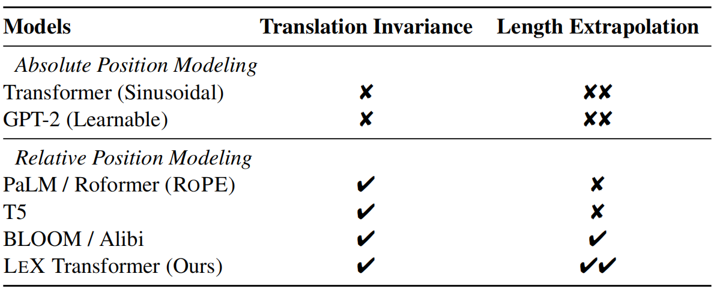
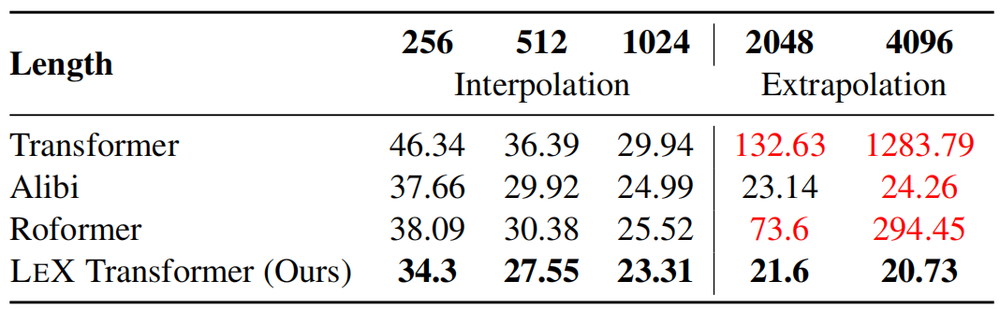
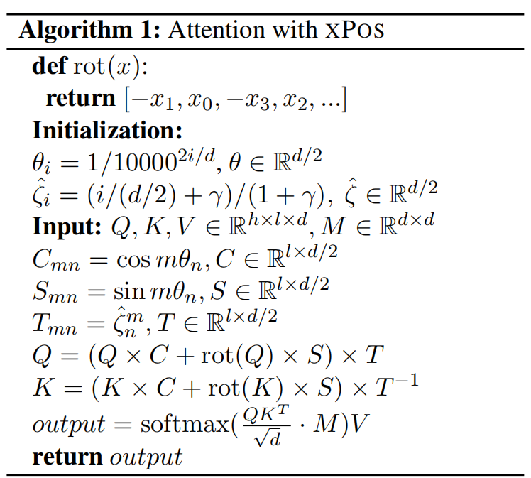
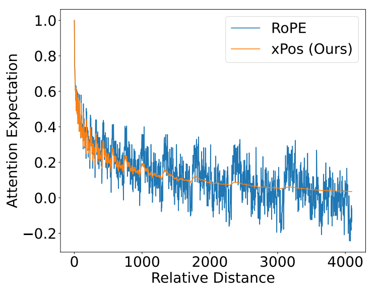
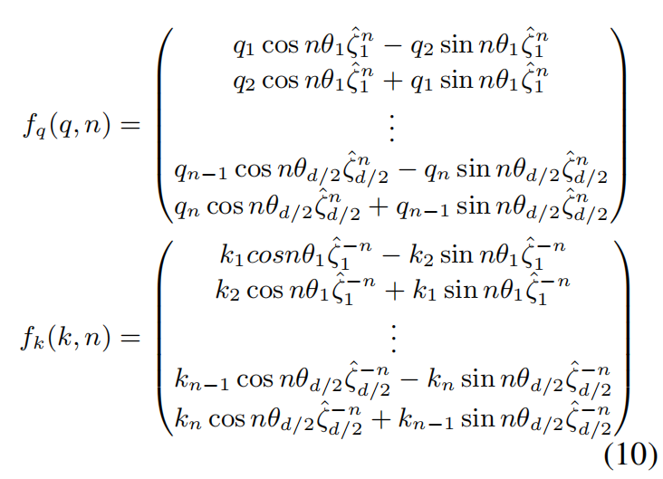
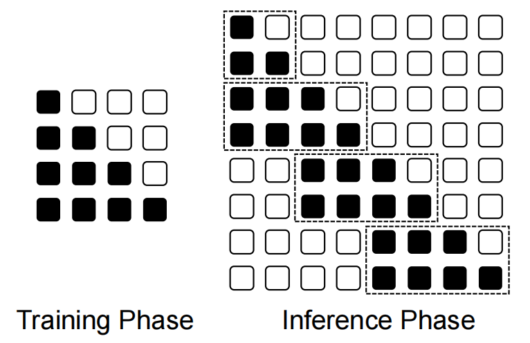
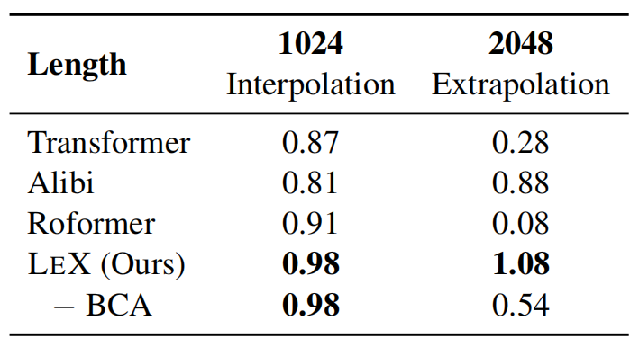
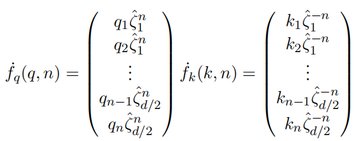
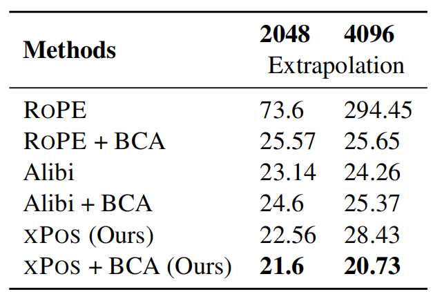

# A Length-Extrapolatable Transformer
XPOS: 长度可外推的Transformer 2022.12.20 https://arxiv.org/abs/2212.10554  

## 阅读笔记
* 长度外推: 对短文本进行训练，但推理时的可以评估较长的序列。(和ViTDet训练时采用低分辨率，目标检测时高分辨率的异同？)
    * 引入了相对位置嵌入来显式最大化注意力分辨率; 
    * 使用分块因果注意力(blockwise causal attention)以获得更好的分辨率; 
* 位置嵌入 (position embedding)
    * 衡量位置单调性的指标：注意力分辨率
    * 绝对位置:  absolute
        * 正弦嵌入  sinusoidal , Vaswani et al. (2017) , 初始词嵌入中的加法操作会扰乱注意力权重?
        * 可学习的嵌入 learnable, Devlin et al. (2019) 
    * 相对位置嵌入: relative
        * ROPE,不能处理超长的序列; Su et al., 2021  https://kexue.fm/archives/8265
        * Alibi, 在注意力矩阵上添加指数衰减， 内插效果差？;  Press et al., 2021
        * XPOS, Extrapolatable Position Embedding, 本文提出的; [code](https://github.com/microsoft/torchscale/blob/main/torchscale/component/xpos_relative_position.py)
* 分块因果注意力(blockwise causal attention)

## Abstract
Position modeling plays a critical role in Transformers. In this paper, we focus on length extrapolation, i.e., training on short texts while evaluating longer sequences. We define attention resolution as an indicator of extrapolation. Then we propose two designs to improve the above metric of Transformers. Specifically, we introduce a relative position embedding to explicitly maximize attention resolution. Moreover, we use blockwise causal attention during inference for better resolution. We evaluate different Transformer variants with language modeling. Experimental results show that our model achieves strong performance in both interpolation and extrapolation settings. The code will be available at https://aka.ms/LeX-Transformer. 

位置建模在Transformers中起着至关重要的作用。 在本文中，我们专注于长度外推，即在对短文本进行训练的同时评估较长序列。 我们将注意力分辨率定义为外推的指标。 然后我们提出了两种设计来改进 Transformers 的上述指标。 具体来说，我们引入了相对位置嵌入来显式最大化注意力分辨率。 此外，我们在推理过程中使用分块因果注意力以获得更好的分辨率。 我们使用语言建模评估不同的 Transformer 变体。 实验结果表明，我们的模型在插值和外推设置中都取得了很好的性能。 该代码将在 https://github.com/sunyt32/torchscale , https://github.com/microsoft/torchscale 上提供。 (sunyt32从microsoft拉出来的分支，哪些改动对比？)

## 1 Introduction
Transformer (Vaswani et al., 2017) shows a strong performance in NLP and becomes a universal choice nowadays (Dosovitskiy et al., 2020; Radford et al., 2021; Wang et al., 2022). However, most of them have a crucial shortcoming: they can only deal with the in-distribution size of inputs. It is usually infeasible to train a model with all possible input lengths. Therefore, a length-extrapolatable Transformer is essential for wider usage.

Transformer(Vaswani et al., 2017) 在 NLP 中表现出色，成为当今的普遍选择 (Dosovitskiy et al., 2020; Radford et al., 2021; Wang et al., 2022)。 然而，它们中的大多数都有一个关键的缺点：只能处理输入的分布大小。 用所有可能的输入长度训练模型通常是不可行的。 因此，长度可外推的 Transformer 对于更广泛的使用是必不可少的。

In sequence modeling, position information plays a crucial role in building the correct representation and understanding of the latent meaning. For Recurrent Neural Networks such as LSTM (Hochreiter and Schmidhuber, 1997), the calculation is done along the sequence order in O(n) time. However, the parallel attention module makes it hard to encode position effectively. First, Vaswani et al. (2017) propose absolute sinusoidal position embedding, and Devlin et al. (2019) adjust it to a learnable one. The absolute design is computation-efficient, but not comparable with subsequent relative ones (Shaw et al., 2018; Su et al., 2021; Press et al., 2021). Among many relative position embeddings, ROPE (Su et al., 2021) shows better performance and is used to many PLMs such as PaLM (Chowdhery et al., 2022). However, it can’t deal with sequences with exceed length. Alibi (Press et al., 2021) mitigates the extrapolation problem but sacrifices the general performance.

在序列建模中，位置信息在构建正确表示和理解潜在含义方面起着至关重要的作用。 对于循环神经网络，如 LSTM(Hochreiter 和 Schmidhuber，1997)，计算是在 O(n) 时间内沿着序列顺序完成的。 然而，并行注意力模块使得很难有效地编码位置。 首先，Vaswani et al. (2017) 提出绝对正弦位置嵌入，Devlin et al. (2019) 将其调整为可学习的。 绝对设计具有计算效率，但无法与后续相对设计相比(Shaw et al., 2018 ; Su et al., 2021 ; Press et al., 2021)。 在许多相对位置嵌入中，ROPE (Su et al., 2021) 表现出更好的性能，并被用于许多 PLM，例如 PaLM (Chowdhery et al., 2022)。 但是，它不能处理超长的序列。 Alibi (Press et al., 2021) 减轻了外推问题但牺牲了通用性能。

Since different strategies concentrate on some part of the position feature, it is essential to build a comprehensive view and guide the Transformer’s design systematically. First, a Transformer should be sensitive to order. Otherwise, it will degenerate into a bag-of-word model which confuses the whole meaning. Then, position translation can’t hurt the representation a lot especially combing with the proper attention-mask operations. After that, a good sequence model needs to deal with any input length. As illustrated before, the length problem is not universal but special for Transformer. Especially, when a Transformer is pre-trained under a maximal length, it is not affordable to re-train for applying to tasks with longer sequences. Finally, when a Transformer satisfies the principles above, we will evaluate the performance, which requires thorough experiments and empirical analysis.

由于不同的策略集中在位置特征的某些部分，因此必须构建一个全面的视图并系统地指导 Transformer 的设计。 首先，Transformer 应该对顺序敏感, 否则，它会退化为混淆整个意义的词袋模型。 然后，位置转换不会对表示造成太大影响，尤其是<strong>结合适当的注意力掩码操作</strong>。 之后，一个好的序列模型需要处理任何输入长度。 如前所述，长度问题不是共性的，而是 Transformer 的特有问题。 特别是当 Transformer 在最大长度下进行预训练时，重新训练以应用于具有更长序列的任务是负担不起的。 最后，当 Transformer 满足上述原则时，我们将对其性能进行评估，这需要进行充分的实验和实证分析。

Considering all the properties above, we propose Extrapolatable Position Embedding (XPOS), which is a universal-good design for Transformers. Based on ROPE’s design, we propose attention resolution as a metric to measure position monotonicity accurately. Then, we generalize its mathematical form, where an exponential decay is added to the rotation matrix. XPOS preserves the advantage of ROPE, and behaves stably at long-term dependency. Besides, we use blockwise causal attention to increase attention resolution, which improves the performance of length extrapolation for language modeling.

考虑到上述所有属性，我们提出了可外推位置嵌入 (XPOS)，这是一种适用于 Transformers 的通用设计。 基于 ROPE 的设计，我们提出注意力分辨率作为准确测量位置单调性的指标。 然后，我们概括其数学形式，其中<strong>将指数衰减添加到旋转矩阵</strong>。 XPOS 保留了 ROPE 的优势，在长期依赖下表现稳定。 此外，我们使用分块因果注意力来增加注意力分辨率，从而提高语言建模的长度外推性能。
<!--旋转rotation  矩阵 ?-->

We train different Transformers from scratch. On the pre-training corpus, LEX Transformer reaches minimal perplexity on the validation set. We use the arXiv dataset (above 6k length) to evaluate the model’s ability for extrapolation length. Our methods can continue decreasing the perplexity while other methods either can’t extrapolate or increase the perplexity when the input length is very long.

我们从头开始训练不同的Transformers。 在预训练语料库上，LEX Transformer 在验证集上达到了最小的困惑度。 我们使用 arXiv 数据集(长度超过 6k)来评估模型的外推长度能力。 我们的方法可以继续降低困惑度，而当输入长度很长时，其他方法要么无法外推，要么增加困惑度。

 
Table 1: Position modeling capabilities of Transformer variants for language modeling.
表 1：用于语言建模的 Transformer变体 的位置建模能力。 术语: Translation Invariance 平移不变性, Length Extrapolation 长度外推.

We summarize our contributions as follows: 
* We summarize the design principles of Transformers for position modeling. 
* We define attention resolution to indicate length extrapolation. 
* We propose an extrapolatable position embedding and use blockwise causal attention to improve length extrapolation. 
* We conduct experiments on language modeling and show that the proposed LEX Transformer achieves strong performance on both short and long texts. 

我们将我们的贡献总结如下：
* 总结了Transformers 位置建模的设计原则。
* 定义了注意力分辨率来指示长度外推。
* 提出了一种可外推的位置嵌入，并使用分块因果注意力来改进长度外推。
* 对语言建模进行了实验，并表明所提出的 LEX Transformer 在短文本和长文本上都取得了很好的性能。

## 2 Design Principles of Transformers for Position Modeling  位置建模的设计原则
### 2.1 Order Variance 顺序差异
Transformer aims to capture long-term dependency efficiently (Vaswani et al., 2017), so the distance between every two tokens is 1. Transformer without position information is actually a bag-of-word model. With effective position information, Transformer models should be variant with permuting the order (Dufter et al., 2022): 

Transformer 旨在有效地捕获长期依赖(Vaswani et al., 2017)，因此每两个 token 之间的距离为 1。没有位置信息的 Transformer 实际上是一个词袋模型。 有了有效的位置信息，Transformer 模型应该随着顺序的排列而变化(Dufter et al., 2022)：

$f(P_π(X)) \neq P_π(f(X))$ (1)

Although for some tasks, bag-of-words models can achieve comparable performance (Wang et al., 2020a), position information is essential generally for sequence modeling. Almost every position modeling strategy satisfies this goal (Vaswani et al., 2017; Devlin et al., 2019; Shaw et al., 2018; Wang et al., 2020a; Raffel et al., 2020; Su et al., 2021).

尽管对于某些任务，词袋模型可以实现相当的性能(Wang et al., 2020a)，但位置信息通常对于序列建模至关重要。 几乎每个位置建模策略都满足这个目标(Vaswani et al., 2017; Devlin et al., 2019; Shaw et al., 2018; Wang et al., 2020a; Raffel et al., 2020; Su et al., 2021).

### 2.2 Translation Invariance 平移不变性
The representation of a sequence should be robust with the position’s translation. For instance, in fact, a sentence’s meaning is variant with padding before or after the whole sentence. We give a general form for translation invariance similar with (Wang et al., 2020a): for a Transformer model f(input, mask), any input sequence X = [$x_0, x_1, ..., x_n$] with mask M = [$m_0, m_1, ..., m_n$], the output should be same with the padding one:

序列的表示应该对位置的平移具有稳健性。 例如，事实上一个句子的意思是随着整个句子前后的填充而变化的。 我们给出了类似于 (Wang et al., 2020a) 的平移不变性的一般形式：对于 Transformer 模型 f(input, mask)，任何输入序列 X = [$x_0, x_1, ..., x_n$] 和 掩码 M = [$m_0, m_1, ..., m_n$]，输出应与填充相同：

$X_{pad} = [0]_i ⊕ X ⊕ [0]_j $

$M_{pad} = [0]_i ⊕ M ⊕ [0]_j $

$f(X, M) = f(X_{pad}, M_{pad})[i : i + n] $ (2)

Obviously, relative positions (Shaw et al., 2018; Raffel et al., 2020; Wang et al., 2020a; Su et al., 2021) have this property instead of absolute ones (Vaswani et al., 2017; Devlin et al., 2019). Even though absolute sinusoidal embedding has a similar property (Vaswani et al., 2017): $PE_{pos+k}$ can be represented as a linear function of $PE_{pos}$, the addition operation in the initial word embedding messes the attention weight, where the spread form of $QK^T$ has 4 components whose geometric connection with position is unclear.

显然，相对位置 (Shaw et al., 2018; Raffel et al., 2020; Wang et al., 2020a; Su et al., 2021) 具有此属性而不是绝对位置(Vaswani et al., 2017; Devlin et al., 2019)。 尽管绝对正弦嵌入具有类似的特性(Vaswani et al., 2017)：$PE_{pos+k}$ 可以表示为 $PE_{pos}$ 的线性函数，但初始词嵌入中的加法操作会扰乱注意力权重，其中扩散形式 $QK^T$ 有 4 个分量，它们与位置的几何联系不明确。

<!--初始词嵌入中的加法操作会扰乱注意力权重
4 个份量？
-->

### 2.3 Length Extrapolation 长度外推
As the cost of pre-training is getting bigger due to the larger model size and corpus, we do not hope to retrain a model just because of the longer length of downstream tasks. A Transformer model with a suitable design should be capable of dealing with any input length.

由于模型尺寸和语料库较大，预训练的成本越来越大，我们不希望仅仅因为下游任务的长度较长而重新训练模型。 具有合适设计的 Transformer 模型应该能够处理任何输入长度。

First, learnable absolute position embedding (Devlin et al., 2019) is not able to extrapolate at all because it does not have any pre-defined position knowledge. With the evaluation of perplexity on different length (Press et al., 2021), almost every position embedding’s performance drops signifi- cantly (Vaswani et al., 2017; Raffel et al., 2020; Su et al., 2021). Alibi (Press et al., 2021) solves this problem by adding an exponential decay on the attention matrix, which lower the influence of outof-distribution position like a soft sliding window. However, the absence of long-term dependency contributes to a performance drop compared with other relative strategies. Table 2 shows that Alibi’s perplexity is larger than ROPE about 0.2 ∼ 0.3.

首先，可学习的绝对位置嵌入 (Devlin et al., 2019) 根本无法外推，因为它没有任何预定义的位置知识。 随着对不同长度的困惑度评估 (Press et al., 2021)，几乎每个位置嵌入的性能都显著下降 (Vaswani et al., 2017; Raffel et al., 2020; Su et al., 2021)。 Alibi (Press et al., 2021) 通过在注意力矩阵上添加指数衰减来解决这个问题，它像软滑动窗口一样降低了分布外位置的影响。 然而，与其他相关策略相比，没有长期依赖导致性能下降。 表2 显示 Alibi 的困惑度比 ROPE 大 0.2∼0.3。

 
Table 2: Results of perplexity with different lengths. The language models are trained with a length of 1024 and then evaluated on various lengths. LEX obtains better performance not only on shorter texts (i.e., interpolation) but also on longer texts (i.e., extrapolation). The red color indicates that the perplexity begins increasing compared with the shorter length. LEX is the only method that has lower perplexity along with increased evaluation length.
表 2：不同长度的困惑度结果。 语言模型以 1024 的长度进行训练，然后对各种长度进行评估。 LEX 不仅在较短的文本(即插值)上而且在较长的文本(即外推)上都获得了更好的性能。 红色表示与较短的长度相比，困惑度开始增加。 LEX 是唯一一种具有较低困惑度和增加评估长度的方法。

However, the extrapolation ability needs a systematic design where position embedding is a crucial but not only component. With the proper attention map, the relative position can deal with long text, where the perplexity does not explode but does not decrease at the same time. The ideal situation is to use the long context in the right way, in that case, the model should perform better instead of saturation. 

然而，外推能力需要一个系统的设计，其中位置嵌入是一个关键但不是唯一的组成部分。 使用合适的注意力图，相对位置可以处理长文本，同时困惑度不会爆炸但不会减少。 理想情况是以正确的方式使用长上下文，在这种情况下，模型应该表现得更好而不是饱和。

## 3 A Length-Extrapolatable Transformer
We define attention resolution as the indicator of length extrapolation in Section 3.1. Then we propose two ways to maximize the resolution metric, i.e., improve the length extrapolation of Transformers. First, we introduce a relative position encoding method (Section 3.2) to explicitly maximize attention resolution. Second, we propose to use blockwise causal masking (Section 3.3) during inference for improved resolution. The proposed architecture is named Length-Extrapolatable (LEX) Transformer.

我们在 3.1 节中将注意力分辨率定义为长度外推的指标。 然后我们提出了两种最大化分辨率度量的方法，即改进 Transformers 的长度外推。 首先，我们引入了一种相对位置编码方法(第 3.2 节)来显式最大化注意力分辨率。 其次，我们建议在推理期间使用分块因果掩码(第 3.3 节)以提高分辨率。 拟议的架构被命名为 Length-Extrapolatable (LEX) Transformer。

### 3.1 Attention Resolution 注意力分辨率
The monotonicity of attention scores is essential to represent distance in language models. We denote s[n] as the score expectation when the distance of two tokens is n. We define attention resolution R(s) as a metric to evaluate attention’s ability to recognize position:

注意力分数的单调性 对于表示语言模型中的距离至关重要。 当两个令牌的距离为 n 时，我们将 s[n] 表示为分数期望。 我们将 注意力分辨率R(s) 定义为评估注意力识别位置能力的指标：

$R(s) = \sum^N_{i=0} \frac{e^{s[i]} \big( e^{s[i]} − e^{s[i+1]} \big) }{ \big( \sum^N_{i=0} e^{s[i]} \big)^2}$ (3)

<!--代码实现？-->

First, s[i] > s[i+1] is preferred to ensure monotonicity. Besides, we implement softmax operation to simulate the attention probability. To mitigate the influence of long-tail distribution, the factor $e^{s[i]}$ is multiplied. We can estimate s[n] and R(s) quantitatively when we design Transformers.

首先，首选 s[i] > s[i+1] 以确保单调性。 此外，我们实现了 softmax 操作来模拟注意力概率。 为了减轻长尾分布的影响，乘以因子 $e^{s[i]}$。 我们在设计 Transformers 时可以定量地估计 s[n] 和 R(s)。

### 3.2 Improve Resolution by Position Encoding 通过位置编码提高分辨率

 
Algorithm 1: Attention with XPOS 
算法 1：使用 XPOS 的注意力 M:?

Su et al. (2021) propose that by adding absolute position embedding on query and key, the attention matrix is actually encoded with relative position information. We use a similar but generalized strategy. First, a pseudo inner product is defined as $ \langle x, y \rangle = \sum Re(x_i · y_i^∗)$, which is consistent with the exact inner product’s definition when we map $C^{d/2} → R^d$ . Formally, the encoding must satisfy: 

Su et al. (2021) 提出通过在查询和键上添加绝对位置嵌入，注意力矩阵实际上是用相对位置信息编码的。 我们使用类似但通用的策略。 首先，伪内积定义为 $ \langle x, y \rangle = \sum Re(x_i · y_i^∗)$，这与映射 $C^{d/2} → R^d$ 时精确内积的定义一致。 形式上，编码必须满足：

$\langle f_q(q, n + r), f_k(k, n) \rangle  = \langle f_q(q, r), f_k(k, 0) \rangle $ (4)

A simple solution is as follows: 
一个简单的解决方案如下：

$f_q(q, n) = A_qqe^{λn} $

$f_k(k, n) = A_kke^{−λn}$ (5)

The scaling factor $A_q$, $A_k$ is unnecessary because q, k is obtained by a linear transformation. $λ = k + iθ ∈ C^{d/2} $ where k, θ ∈ $R^{d/2}$: 

比例因子 $A_q$, $A_k$ 是不必要的，因为 q, k 是通过线性变换得到的。 $λ = k + iθ ∈ C^{d/2} $ 其中 k, θ ∈ $R^{d/2}$：

$f_q(q, n) = qe^{ξn+iθn}$ 

$f_k(k, n) = ke^{−ξn−iθn}$ (6)

If ξ = 0, the form is the same as ROPE (Su et al., 2021). Geometrically, the transformation provides a rotation on vectors. If the relative angle between q and k is larger, the inner product is smaller. However, the cosine value is not monotony if the rotating angle is large than π, which causes an unstable phenomenon that the expectation of the inner product oscillates dramatically with the growth of relative distance. Following the parameters (Vaswani et al., 2017; Su et al., 2021) θ = {$θ_i = 10000^{−2i/d}$, i ∈ [0, 1, ..., d/2]}, we will calculate the expectation as follows. For generate models, we assume E(∠q) ≤ E(∠k) to ensure the monotony:

如果 ξ = 0，则形式与 ROPE 相同(Su et al., 2021)。 在几何上，变换提供了向量的旋转。 如果q和k之间的相对角度越大，则内积越小。 然而，如果旋转角度大于π，则余弦值不单调，这会导致内积的期望随着相对距离的增长而剧烈振荡的不稳定现象。 遵循参数 (Vaswani et al., 2017; Su et al., 2021) θ = {$θ_i = 10000^{−2i/d}$, i ∈ [0, 1, ..., d/2]} ，我们将按如下方式计算期望。 对于生成模型，我们假设 E(∠q) ≤ E(∠k) 以确保单调性：

$ E[ \langle qe^{mξ+imθ}, ken^{ξ+inθ} \rangle ] $

$ = \sum^{d/2}_{i=0} E[Re(q_ik_ie^{(m−n)ξi+i(m−n)θi} )]  $

$ ≤ \sum^{d/2}_{i=0} Re(E[|qiki|] q_ik_ie^{(m−n)ξi+i(m−n)θi} ) $

$ ∝ \sum^{d/2}_{i=0} cos(m − n)θ_ie^{(m−n)ξi} $ (7)

The inference here is different from (Su et al., 2021) because of two reasons: 1) there is an additional assumption brought by language models; 2) the inequality scaling of (Su et al., 2021) is too strong to lose generality. We calculate expectation instead of the upper bound.

这里的推论与(Su et al., 2021)不同，原因有二：1)语言模型带来了额外的假设;  2) (Su et al., 2021) 的不等式缩放太强以至于失去了一般性。 我们计算期望而不是上限。

Now we define a function to represent the property of relative position: 
现在我们定义一个函数来表示相对位置的属性：

$ gζ [n] = \sum^{d/2}_{i=0} cos nθ_iζ_i^n $ (8)

Stabilizing the curve of g[n] is an intuitive way. Even though attention bias can achieve this goal, we do not hope additional position calculation. Instead, we can achieve this goal by selecting a good ζ to maximize R(gζ ).

稳定 g[n] 的曲线是一种直观的方法。 尽管注意力偏差可以实现这个目标，但我们不希望额外的位置计算。 相反，我们可以通过选择一个好的 ζ 来最大化 R(gζ) 来实现这个目标。

Obviously, the oscillation mainly comes from large $θ_i$ . Manually setting ζ can achieve this goal:
显然，振荡主要来自较大的 $θ_i$ 。 手动设置 ζ 可以达到这个目的： 

$\hat ζ_i = \frac{i/(d/2) + γ}{ 1 + γ} ∈ [0, 1]$ (9) 

where $\hat ζ_i$ becomes smaller when $θ_i$ is larger. In this way, we punish the oscillation of unstable dimensions and keep the distribution of stable ones.

其中 $\hat ζ_i$ 在 $θ_i$ 变大时变小。 通过这种方式，我们惩罚不稳定维度的振荡并保持稳定维度的分布。

Numerical optimization methods are tried to find optimal values for ζ. However, the results rely on the initial value and lack control when the hidden dimension changes. Besides, the numerical precision should be considered because of fp16’s range. Finally, we find a sub-optimal solution by manually setting γ to both satisfy the resolution is recognizable (R(gζ ) is partially optimized) and $ζ_i^n$ can be represented by fp16 when n is big (8192 in our setting). The optimized value $\hat ζ_i$ will be used as the final value in LEX Transformer.

尝试使用数值优化方法来找到 ζ 的最优值。 然而，结果依赖于初始值并且在隐藏维度变化时缺乏控制。 此外，由于 fp16 的范围，应考虑数值精度。 最后，我们通过手动设置 γ 来找到次优解决方案，以满足分辨率是可识别的(R(gζ) 是部分优化的)并且 $ζ_i^n$ 在 n 很大时可以用 fp16 表示(在我们的设置中为 8192) . 优化后的值 $\hat ζ_i$ 将用作 LEX Transformer 中的最终值。

The curves of ζ = 1, $\hat ζ$  are shown in Figure 1. The default rotary embedding contributes to a dramatic oscillation, especially in the large relative distance, which causes bad extrapolation performance and restricts the model’s convergence speed. After adding a decay, the curve is almost stable, especially on long-term dependency. What’s more, it does not hurt pure rotation’s fitting ability because $ζ_i^n$ ≈ 1 when i is large or n is small. In that way, short-term and long-term dependencies are divided continuously.

ζ = 1, $\hat ζ$ 的曲线如图 1 所示。默认的旋转嵌入会导致剧烈的振荡，尤其是在相对距离较大的情况下，这会导致外推性能不佳并限制模型的收敛速度。 添加衰减后，曲线几乎稳定，尤其是在长期依赖性上。 更重要的是，它不会损害纯旋转的拟合能力，因为当 i 较大或 n 较小时 $ζ_i^n$ ≈ 1。 这样，短期和长期的依赖关系就被不断地划分开来。

 
Figure 1: The long dependency curve of attention expectation. ROPE’s dramatic oscillation confuses the attention resolution at long distances. In contrast, XPOS provides stable and accurate position modeling.
图 1：注意力期望的长依赖曲线。 ROPE 的剧烈振荡混淆了远距离的注意力分辨率。 相比之下，XPOS 提供了稳定和准确的位置建模。

Finally, we have Extrapolatable Position Embedding (XPOS): 
最后，我们有可外推的位置嵌入(XPOS)：

 

In the implementation, the transformation for key and value can be easily calculated by parallel addition and multiplication as shown in Algorithm 1.

在实现中，key 和 value 的转换可以很容易地通过并行加法和乘法计算，如算法 1 所示。

### 3.3 Blockwise Causal Attention 分块因果注意力
Another way to improve attention resolution (Section 3.1) is using windowed attention. During inference, we use blockwise masking (Dai et al., 2019; Zaheer et al., 2020; Xiong et al., 2021) for selfattention. Notice that other window strategies, such as sliding window (Child et al., 2019), also work. We use blockwise causal attention because it is cache-friendly and easy to implement.

另一种提高注意力分辨率的方法(第 3.1 节)是使用窗口注意力。 在推理过程中，我们使用 基于分块的掩码 (Dai et al., 2019; Zaheer et al., 2020; Xiong et al., 2021) 进行自注意力。 请注意，其他窗口策略(例如滑动窗口(Child et al., 2019))也有效。 我们使用 分块因果注意力 是因为它对缓存友好且易于实现。

As shown in Figure 2, if the pre-training length is l, we divide the query as blocks with l/2 length, and each query interacts with its own block and the last block. In this way, the context information can be delivered by the reuse of key and value. The window constraint helps models to encode longer input with improved resolution.

如图 2 所示，如果预训练长度为 l，我们将查询分成长度为 l/2 的块，每个查询与它自己的块和最后一个块交互。 这样，上下文信息可以通过键和值的重用来传递。 窗口约束有助于模型以更高的分辨率对更长的输入进行编码。

 
Figure 2: Our language model is trained on shorter texts in the same way as vanilla Transformers, i.e., using causal masking. During inference, we use blockwise causal attention for longer sequences, which recurrently reuses the overlapped parts (i.e., key and value vectors).
图 2：我们的语言模型以与普通 Transformers 相同的方式在较短的文本上进行训练，即使用因果掩码。 在推理过程中，我们对较长的序列使用逐块因果注意力，它会反复重用重叠部分(即键和值向量)。

Different from training a long-sequence model with stop-gradient, we use vanilla attention in the training phase, because the pre-training corpus is not very long on average. However, during the inference phase, when dealing with long sequences, we directly implement BCA to help the model to be more position-recognizable.

与使用停止梯度训练长序列模型不同，我们在训练阶段使用普通的注意力，因为预训练语料库平均不是很长。 然而，在推理阶段，当处理长序列时，我们直接实现 BCA(blockwise causal attention) 来帮助模型更好地识别位置。

## 4 Experiments
### 4.1 Pre-training
To fairly evaluate different Transformer variants, we pre-train the Transformer from scratch. We use 1024 hidden dimension, 16 heads, and 24 layers, i.e., comparable to medium-size GPT-3 (Brown et al., 2020). The training corpus includes a subset of the Pile (Gao et al., 2020): Books3, OpenWebText2, Stack Exchange, PubMed Abstracts, Wikipedia, Gutenberg (PG-19), BookCorpus2, NIH ExPorter, and Pile-CC datasets. The training procedure is implemented on 16×V100 GPUs. Maximal length is 1024 for saving memory and extrapolation evaluation. The learning rate is 3 × 10−4 and polynomial decay is used to adjust learning rate. The global batch size is 512 to follow GPT-3(Brown et al., 2020), i.e., 0.5M token size. We use Adam (Kingma and Ba, 2015) optimizer with β1 = 0.9, β2 = 0.98, e = 10−6 . The code is based on TorchScale (Ma et al., 2022a).

为了公平地评估不同的 Transformer 变体，我们从头开始预训练 Transformer。 我们使用 1024 个隐藏维度、16 个头和 24 个层，即与中等大小的 GPT-3 相当(Brown et al., 2020)。 训练语料库包括 Pile 的一个子集(Gao et al., 2020 )：Books3、OpenWebText2、Stack Exchange、PubMed Abstracts、Wikipedia、Gutenberg (PG-19)、BookCorpus2、NIH ExPorter 和 Pile-CC 数据集。 训练过程在 16×V100 GPU 上实现。 最大长度为 1024，用于节省内存和外推评估。 学习率为 3 × 10−4，多项式衰减用于调整学习率。 全局批量大小为 512，以遵循 GPT-3(Brown et al., 2020)，即 0.5M 令牌大小。 我们使用 Adam (Kingma and Ba, 2015) 优化器，β1 = 0.9，β2 = 0.98，e = 10−6。 该代码基于 TorchScale(Ma et al., 2022a)。

### 4.2 Language Modeling
We first measure perplexity on arXiv, where the document length is usually larger than 6k, which can show the model’s ability for long-dependency modeling. We care about the performance on different input lengths to evaluate the model’s interpolation and extrapolation capability. For every document, we select its first 4k tokens and divide them into the target length to fairly compare the perplexity of different lengths. The results are shown in Table 2.

我们首先在 arXiv 上测量 perplexity，其中文档长度通常大于 6k，这可以显示模型对长依赖建模的能力。 我们关心不同输入长度的性能，以评估模型的插值和外推能力。 对于每个文档，我们选择它的前 4k 个令牌并将它们划分为目标长度，以公平比较不同长度的困惑度。 结果如表2所示。

For interpolation capability, we analyze the results where the length is no more than 1024. All Transformers converge to similar perplexity. XPOS have a stable advantage on others with 1∼3 perplexity drop.

对于插值能力，我们分析了长度不超过 1024 的结果。所有的 Transformer 收敛到相似的困惑度。 XPOS 在 1∼3 perplexity drop 上比其他人有稳定的优势。

For lengths 2048 and 4096, we use BCA in all position embeddings, and the following ablation study will discuss the performance without that. Press et al. (2021)’s experiment shows that most of the position strategies can’t deal with input length longer than pre-training directly. In our experiment, with the improvement brought by BCA, ROPE gets a better performance while Absolute still can’t extrapolate. XPOS shows a stable decrease when the sequence length increases, which satisfies the assumption that a longer context makes the prediction better. While others’ perplexity increases when the input length is 4096.

对于长度 2048 和 4096，我们在所有位置嵌入中使用 BCA，下面的消融研究将讨论没有它的性能。 Press et al. (2021)的实验表明，大多数位置策略不能直接处理比预训练更长的输入长度。 在我们的实验中，随着 BCA 带来的改进，ROPE 获得了更好的性能，而 绝对位置 仍然无法外推。 当序列长度增加时，XPOS 显示稳定下降，这满足了更长的上下文使预测更好的假设。 而当输入长度为 4096 时，其他人的困惑会增加。

Here, XPOS’s advantage towards ROPE is worth analyzing. With BCA, the position embedding does not extrapolate, so ROPE also has the potential to encode long documents. However, with the forward layer by layer, the distribution of hidden states is different from pre-training. Then, the resolution matters to building a recurrent-similar encoding.

在这里，XPOS相对于ROPE的优势值得分析。 使用 BCA，位置嵌入不会外推，因此 ROPE 也有可能对长文档进行编码。 然而，逐层前向，隐藏状态的分布与预训练不同。 然后，分辨率对于构建循环相似编码很重要。

The experiment shows that XPOS gets better performance on language modeling. With the stable advantage of any length, users can input any sentence freely without the concern of position. Besides, results also indicate that is not essential to build an explicit decay on the attention matrix, Instead, a proper design for an attention mask is actually better to deal with long-context tasks.

实验表明，XPOS 在语言建模方面取得了更好的性能。 凭借任意长度的稳定优势，用户可以自由输入任意句子，无需担心位置问题。 此外，结果还表明，在注意力矩阵上建立显式衰减并不是必需的，相反，适当设计注意力掩码实际上可以更好地处理长上下文任务。

### 4.3 Measuring Resolution 测量分辨率
In the previous section, we claim that resolution is a crucial index for building an effective Transformer. To verify the claim, we evaluate the resolution of different Transformer variants empirically. Equation 8 estimates the expectation of attention score for LEX. Denote attention score of query i and key j (before softmax) as $e_{ij}$ , the expectation of s[n] is as follows: 

在上一节中，我们说分辨率是构建有效 Transformer 的关键指标。 为了验证这一说法，我们根据经验评估了不同 Transformer 变体的分辨率。 等式 8 估计了 LEX 的注意力分数期望值。 将查询 i 和键 j(在 softmax 之前)的注意力得分表示为 $e_{ij}$ ，对 s[n] 的期望如下：

$\hat s [n] = E[s[n]] = \frac{1}{N − n} E [ \sum^{N−1}_{i=n} e_i(i−n)]$ (11)

The resolution can be calculated by combining Equation 3 and 11. The final expectation is the average of different input text. Resolution is calculated in every layer, and the average resolution is shown in Table 3. The results show that XPOS makes the position more recognizable in training length (1024). For Alibi (Press et al., 2021), the stable resolution comes from explicit decay, but it prevents the model from learning position dependency itself. Besides, we run an ablation on BCA. In length 2048, we measure the resolution with/without block. The result supports that BCA helps model distinguish positions better.

可以通过结合公式 3 和 11 来计算分辨率。最终的期望是不同输入文本的平均值。 在每一层计算分辨率，平均分辨率如表3所示。结果表明，XPOS使训练长度(1024)的位置更容易识别。 对于 Alibi (Press et al., 2021)，稳定的分辨率来自显式衰减，但它阻止了模型学习位置依赖性本身。 此外，我们对 BCA 进行了消融。 在长度为 2048 的情况下，我们测量有/无块的分辨率。 结果支持 BCA 有助于模型更好地区分位置。

 
Table 3: Results of resolution with different Transformer variants. Higher resolution indicates that the architecture tends to better distinguish context tokens. “BCA” is short for blockwise causal attention. 
表 3：不同 Transformer 变体的分辨率结果。 更高的分辨率表明该架构倾向于更好地区分上下文令牌。 “BCA”是分块因果注意力的缩写。

### 4.4 Ablation Studies
#### 4.4.1 Rotation Computation
In this part, we discuss the necessity of the combination of vector rotation and exponential decay. XPOS without rotation means Equation 10 degenerates to $θ_i$ = 0:

在这一部分，我们讨论了向量旋转和指数衰减相结合的必要性。 没有旋转的 XPOS 意味着等式 10 退化为 $θ_i$ = 0：

After pre-training, we test the perplexity on the valid split of training corpus with 1k length. The result in Table 4 shows that simple scaling operation can’t perform as well as LEX. Therefore, the combination of rotation and decay means the combination of in-distribution and out-of-distribution ability.

预训练后，我们测试了长度为 1k 的训练语料的有效分割的困惑度。 表 4 中的结果表明，简单的缩放操作不能像 LEX 那样执行。 因此，旋转和衰减的结合意味着分布内和分布外能力的结合。

Methods | Perplexity
--- | ---
ROPE | 17.74
XPOS | (Ours) 17.54 
− Rotation | 33.68

Table 4: Ablation results on the validation set show that rotation of XPOS is necessary for strong performance. 
表 4：验证集上的消融结果表明 XPOS 的旋转对于强大的性能是必要的。

#### 4.4.2 Blockwise Causal Attention
To fairly compare different methods, we run the evaluation using different position embeddings (i.e.,Alibi, ROPE, and XPOS) with or without blockwise causal attention. The results are shown in Table 5.

为了公平地比较不同的方法，我们使用不同的位置嵌入(即 Alibi、ROPE 和 XPOS)进行评估，有或没有分块因果注意力。 结果如表5所示。

 
Table 5: Results of perplexity on arXiv dataset. “BCA” is short for blockwise causal attention.
表 5：arXiv 数据集的困惑度结果。 “BCA”是分块因果注意力的缩写。

First, Blockwise Causal Attention works for ROPE whose perplexity will explode without that. Alibi performs well without windowed attention because its “soft window” is broader than a hard block window. XPOS’s perplexity without BCA increases by about 1 in 2048, and 8 in 4096. However, with its high resolution, XPOS can recognize position with BCA’s constraint. 

首先，Blockwise Causal Attention 适用于 ROPE，如果没有它，ROPE 的困惑就会爆炸。 Alibi 在没有窗口注意力的情况下表现良好，因为它的“软窗口”比硬块窗口更宽。 XPOS 在没有 BCA 的情况下的困惑度在 2048 增加了大约 1，在 4096 增加了 8。但是，凭借其高分辨率，XPOS 可以识别具有 BCA 约束的位置。

## 5 Related Work
### 5.1 Long-Sequence Transformers
Long-sequence Transformers aim to solve two key problems. First, the computation or memory consumption is not efficient enough for long sequences. Second, there is a trade-off between performance and efficiency.

长序列Transformers旨在解决两个关键问题。 首先，对于长序列，计算或内存消耗效率不够高。 其次，性能和效率之间存在权衡。

One popular solution (Wang et al., 2020b; Katharopoulos et al., 2020; Choromanski et al., 2020) is linear attention, i.e., using a kernel-based or low-rank approximation to replace vanilla attention. The methods typically target efficiency while underperforming vanilla Transformers for regular length. Another strand is sparse attention (Child et al., 2019; Beltagy et al., 2020; Zaheer et al., 2020; Xiong et al., 2021), which usually leverages structured sparsity to reduce computation. For causal sequence modeling, the recurrent-style designs (Dai et al., 2019; Hutchins et al., 2022; Ma et al., 2022b) are also competitive.

一种流行的解决方案(Wang et al., 2020b; Katharopoulos et al., 2020 ; Choromanski et al., 2020 )是线性注意力，即使用基于内核或低秩的近似来代替普通注意力。 这些方法通常以效率为目标，同时在常规长度上表现不佳。 另一条线索是稀疏注意力(Child et al., 2019 ; Beltagy et al., 2020 ; Zaheer et al., 2020 ; Xiong et al., 2021 )，它通常利用结构化稀疏性来减少计算量。 对于因果序列建模，循环式设计(Dai et al., 2019 ; Hutchins et al., 2022 ; Ma et al., 2022b)也具有竞争力。

In comparison, we focus on the extrapolation issue (Press et al., 2021) for language modeling, i.e., training on short texts while evaluating long texts. The training process is kept the same as vanilla Transformers, i.e., training on short sequences, and using dense attention computation. The capability of long-sequence modeling is given for free during inference. So the training efficiency (which is typically expensive for large-scale language models) is not affected compared with previous work. Moreover, the performance on regular length is perfectly retained, without trade-offs for long-sequence modeling.

相比之下，我们专注于语言建模的外推问题 (Press et al., 2021)，即在评估长文本的同时对短文本进行训练。 训练过程与 普通Transformers 保持相同，即对短序列进行训练，并使用密集的注意力计算。 推理时免费提供长序列建模能力。 因此，与以前的工作相比，训练效率(对于大型语言模型来说通常是昂贵的)没有受到影响。 此外，完美保留了常规长度的性能，无需对长序列建模进行权衡。

### 5.2 Position Modeling
#### 5.2.1 Absolute Position Embedding 绝对位置嵌入
Absolute sinusoidal position embedding is proposed by Vaswani et al. (2017). For each dimension, different frequencies are encoded from 2π to 10000 × 2π:

Vaswani et al. (2017) 提出了绝对正弦位置嵌入。 对于每个维度，不同的频率从 2π 到 10000 × 2π 编码：

$PE_{(pos,2i)} = cos(pos/10000^{2i/d_{model}})$

$PE_{(pos,2i+1)} = sin(pos/10000^{2i/d_{model}})$ (12) 

where $PE_{pos+k}$ is represented as a linear function of $PE_{pos}$ to restore a relative-position property.

其中 $PE_{pos+k}$ 表示为 $PE_{pos}$ 的线性函数以恢复相对位置属性。

#### 5.2.2 Relative Position Embedding 相对位置嵌入
Shaw et al. (2018) propose relative position embedding as an alternative approach. Denote $e_{ij}$ as attention weight, $α_{ij} = softmax(e_{ij})$, $o_i$ as output, we have: 

Shaw et al. (2018) 提出相对位置嵌入作为替代方法。 将 $e_{ij}$ 表示为注意力权重，$α_{ij} = softmax(e_{ij})$，$o_i$ 作为输出，我们有：

$e_{ij} = \frac {q_i · k_j} {\sqrt d }=⇒ \frac {q_i · (k_j + a^K_{ij} )}{ \sqrt d }$

$o_i = \sum_j α_{ij}v_j =⇒ \sum_j α_{ij} (v_j + a^V_{ij} ) $ (13) 

where $a^K_{ij} = ω^K_{clip(i−j,k)}$, $a^V_{ij} = ω^V_{clip(i−j,k)}$ , and $ω^K$ and $ω^V$ are learnable parameters. The clipping strategy helps length generalization but cannot distinguish the positions that are larger than k. Yang et al. (2019) and He et al. (2020) further reparameterize the relative position vectors for better performance. T5 (Raffel et al., 2020) uses a simpler strategy to encode relative position: 

其中 $a^K_{ij} = ω^K_{clip(i−j,k)}$, $a^V_{ij} = ω^V_{clip(i−j,k)}$ 和 $ω ^K$ 和 $ω^V$ 是可学习的参数。 裁剪策略有助于长度泛化，但无法区分大于 k 的位置。 Yang et al. (2019) 和 He et al. (2020) 进一步重新参数化相对位置向量以获得更好的性能。 T5 (Raffel et al., 2020) 使用更简单的策略来编码相对位置：

$ e_{ij} = \frac {q_i · k_j}{\sqrt d} + a_{bucket(i−j)} $ (14) 

where log-bucket scalars are added to attention scores. Recently, pre-defined position embedding is brought back by ROPE (Su et al., 2021). Alibi (Press et al., 2021) proposes to explicitly build an exponential decay on the attention matrix, which contributes to length extrapolation: 

其中对数桶标量被添加到注意力分数中。 最近，预定义位置嵌入被 ROPE 引入(Su et al., 2021)。 Alibi (Press et al., 2021) 提出在注意力矩阵上显式构建指数衰减，这有助于长度外推：

$ e_{ij} = \frac {q_i · k_j}{\sqrt d} − m(i − j), m(·) > 0 $ (15) 

where the values of m(·) are manually defined. However, Alibi (Press et al., 2021)’s performance tends to be inferior to ROPE for the context whose length is shorter than the pre-training length. In this work, we propose a theoretically derived relative position embedding XPOS that optimizes the attention resolution between tokens. The XPOS method not only has the nice property of length extrapolation but also achieves strong performance.

其中 m(·) 的值是手动定义的。 然而，Alibi (Press et al., 2021) 对于长度小于预训练长度的上下文，其性能往往不如 ROPE。 在这项工作中，我们提出了一种从理论上推导出的嵌入 XPOS 的相对位置，以优化令牌之间的注意力解析。 XPOS 方法不仅具有良好的长度外推特性，而且具有很强的性能。

## Limitations
In this work, we focus on causal language modeling. It needs additional efforts to integrate the proposed methods into bidirectional attention, such as masked language modeling (Devlin et al., 2019). Moreover, XPOS introduces about 6% inference cost compared with absolute position embeddings, although it accelerates training convergence.

在这项工作中，我们专注于因果语言建模。 它需要额外的努力来将所提出的方法整合到双向注意力中，例如掩码语言建模(Devlin et al., 2019)。 此外，与绝对位置嵌入相比，XPOS 引入了大约 6% 的推理成本，尽管它加速了训练收敛。

## References
* Iz Beltagy, Matthew E Peters, and Arman Cohan.2020. Longformer: The long-document transformer. arXiv preprint arXiv:2004.05150.  
* Tom Brown, Benjamin Mann, Nick Ryder, Melanie Subbiah, Jared D Kaplan, Prafulla Dhariwal, Arvind Neelakantan, Pranav Shyam, Girish Sastry, Amanda Askell, Sandhini Agarwal, Ariel HerbertVoss, Gretchen Krueger, Tom Henighan, Rewon Child, Aditya Ramesh, Daniel Ziegler, Jeffrey Wu, Clemens Winter, Chris Hesse, Mark Chen, Eric Sigler, Mateusz Litwin, Scott Gray, Benjamin Chess, Jack Clark, Christopher Berner, Sam McCandlish, Alec Radford, Ilya Sutskever, and Dario Amodei.2020. Language models are few-shot learners. In Advances in Neural Information Processing Systems, volume 33, pages 1877–1901. Curran Associates, Inc.  
* Rewon Child, Scott Gray, Alec Radford, and Ilya Sutskever. 2019. Generating long sequences with sparse transformers. URL https://openai.com/blog/sparse-transformers.  
* Krzysztof Choromanski, Valerii Likhosherstov, David Dohan, Xingyou Song, Andreea Gane, Tamas Sarlos, Peter Hawkins, Jared Davis, Afroz Mohiuddin, Lukasz Kaiser, et al. 2020. Rethinking attention with performers. arXiv preprint arXiv:2009.14794.  
* Aakanksha Chowdhery, Sharan Narang, Jacob Devlin, Maarten Bosma, Gaurav Mishra, Adam Roberts, Paul Barham, Hyung Won Chung, Charles Sutton, Sebastian Gehrmann, Parker Schuh, Kensen Shi, Sasha Tsvyashchenko, Joshua Maynez, Abhishek B Rao, Parker Barnes, Yi Tay, Noam M. Shazeer, Vinodkumar Prabhakaran, Emily Reif, Nan Du, Benton C. Hutchinson, Reiner Pope, James Bradbury, Jacob Austin, Michael Isard, Guy Gur-Ari, Pengcheng Yin, Toju Duke, Anselm Levskaya, Sanjay Ghemawat, Sunipa Dev, Henryk Michalewski, Xavier García, Vedant Misra, Kevin Robinson, Liam Fedus, Denny Zhou, Daphne Ippolito, David Luan, Hyeontaek Lim, Barret Zoph, Alexander Spiridonov, Ryan Sepassi, David Dohan, Shivani Agrawal, Mark Omernick, Andrew M. Dai, Thanumalayan Sankaranarayana Pillai, Marie Pellat, Aitor Lewkowycz, Erica Oliveira Moreira, Rewon Child, Oleksandr Polozov, Katherine Lee, Zongwei Zhou, Xuezhi Wang, Brennan Saeta, Mark Díaz, Orhan Firat, Michele Catasta, Jason Wei, Kathleen S. Meier-Hellstern, Douglas Eck, Jeff Dean, Slav Petrov, and Noah Fiedel. 2022. PaLM: Scaling language modeling with pathways. ArXiv, abs/2204.02311.  
* Zihang Dai, Zhilin Yang, Yiming Yang, Jaime Carbonell, Quoc V Le, and Ruslan Salakhutdinov.2019. Transformer-xl: Attentive language models beyond a fixed-length context. arXiv preprint arXiv:1901.02860.  
* Jacob Devlin, Ming-Wei Chang, Kenton Lee, and Kristina Toutanova. 2019. BERT: Pre-training of deep bidirectional transformers for language understanding. In Proceedings of the 2019 Conference of the North American Chapter of the Association for Computational Linguistics: Human Language Technologies, Volume 1 (Long and Short Papers), pages 4171–4186, Minneapolis, Minnesota. Association for Computational Linguistics.  
* Alexey Dosovitskiy, Lucas Beyer, Alexander Kolesnikov, Dirk Weissenborn, Xiaohua Zhai, Thomas Unterthiner, Mostafa Dehghani, Matthias Minderer, Georg Heigold, Sylvain Gelly, et al. 2020.  
* An image is worth 16x16 words: Transformers for image recognition at scale. arXiv preprint arXiv:2010.11929.  
* Philipp Dufter, Martin Schmitt, and Hinrich Schütze.2022. Position information in transformers: An overview. Computational Linguistics, 48(3):733– 763.  
* Leo Gao, Stella Biderman, Sid Black, Laurence Golding, Travis Hoppe, Charles Foster, Jason Phang, Horace He, Anish Thite, Noa Nabeshima, et al. 2020.  
* The pile: An 800gb dataset of diverse text for language modeling. arXiv preprint arXiv:2101.00027.  
* Pengcheng He, Xiaodong Liu, Jianfeng Gao, and Weizhu Chen. 2020. Deberta: Decoding-enhanced bert with disentangled attention. arXiv preprint arXiv:2006.03654.  
* Sepp Hochreiter and Jürgen Schmidhuber. 1997. Long short-term memory. Neural Computation, 9:1735– 1780.  
* DeLesley Hutchins, Imanol Schlag, Yuhuai Wu, Ethan Dyer, and Behnam Neyshabur. 2022. Blockrecurrent Transformers. In Advances in Neural Information Processing Systems.  
* Angelos Katharopoulos, Apoorv Vyas, Nikolaos Pappas, and François Fleuret. 2020. Transformers are rnns: Fast autoregressive transformers with linear attention. In International Conference on Machine Learning, pages 5156–5165. PMLR.  
* Diederik P. Kingma and Jimmy Ba. 2015. Adam: A method for stochastic optimization. In 3rd International Conference on Learning Representations, San Diego, CA.  
* Shuming Ma, Hongyu Wang, Shaohan Huang, Wenhui Wang, Zewen Chi, Li Dong, Alon Benhaim, Barun Patra, Vishrav Chaudhary, Xia Song, and Furu Wei.2022a. TorchScale: Transformers at scale. CoRR, abs/2211.13184.  
* Xuezhe Ma, Chunting Zhou, Xiang Kong, Junxian He, Liangke Gui, Graham Neubig, Jonathan May, and Luke Zettlemoyer. 2022b. Mega: Moving average equipped gated attention. arXiv preprint arXiv:2209.10655.  
* Ofir Press, Noah A Smith, and Mike Lewis. 2021.  
* Train short, test long: Attention with linear biases enables input length extrapolation. arXiv preprint arXiv:2108.12409.  
* Alec Radford, Jong Wook Kim, Chris Hallacy, Aditya Ramesh, Gabriel Goh, Sandhini Agarwal, Girish Sastry, Amanda Askell, Pamela Mishkin, Jack Clark, et al. 2021. Learning transferable visual models from natural language supervision. In International Conference on Machine Learning, pages 8748–8763. PMLR.  
* Colin Raffel, Noam Shazeer, Adam Roberts, Katherine Lee, Sharan Narang, Michael Matena, Yanqi Zhou, Wei Li, and Peter J. Liu. 2020. Exploring the limits of transfer learning with a unified text-totext transformer. Journal of Machine Learning Research, 21(140):1–67.  
* Peter Shaw, Jakob Uszkoreit, and Ashish Vaswani.2018. Self-attention with relative position representations. arXiv preprint arXiv:1803.02155.  
* Jianlin Su, Yu Lu, Shengfeng Pan, Bo Wen, and Yunfeng Liu. 2021. Roformer: Enhanced transformer with rotary position embedding. arXiv preprint arXiv:2104.09864.  
* Ashish Vaswani, Noam Shazeer, Niki Parmar, Jakob Uszkoreit, Llion Jones, Aidan N. Gomez, Lukasz Kaiser, and Illia Polosukhin. 2017. Attention is all you need. In Advances in Neural Information Processing Systems 30: Annual Conference on Neural Information Processing Systems 2017, 4-9 December 2017, Long Beach, CA, USA, pages 6000–6010.  
* Benyou Wang, Lifeng Shang, Christina Lioma, Xin Jiang, Hao Yang, Qun Liu, and Jakob Grue Simonsen. 2020a. On position embeddings in bert. In International Conference on Learning Representations.  
* Sinong Wang, Belinda Z Li, Madian Khabsa, Han Fang, and Hao Ma. 2020b. Linformer: Selfattention with linear complexity. arXiv preprint arXiv:2006.04768.  
* Wenhui Wang, Hangbo Bao, Li Dong, Johan Bjorck, Zhiliang Peng, Qiang Liu, Kriti Aggarwal, Owais Khan Mohammed, Saksham Singhal, Subhojit Som, et al. 2022. Image as a foreign language: BEiT pretraining for all vision and vision-language tasks. arXiv preprint arXiv:2208.10442.  
* Wenhan Xiong, Barlas O˘guz, Anchit Gupta, Xilun Chen, Diana Liskovich, Omer Levy, Wen-tau Yih, and Yashar Mehdad. 2021. Simple local attentions remain competitive for long-context tasks. arXiv preprint arXiv:2112.07210.  
* Zhilin Yang, Zihang Dai, Yiming Yang, Jaime Carbonell, Russ R Salakhutdinov, and Quoc V Le. 2019.  
* XLNet: Generalized autoregressive pretraining for language understanding. In Advances in Neural Information Processing Systems, volume 32. Curran Associates, Inc.  
* Manzil Zaheer, Guru Guruganesh, Kumar Avinava Dubey, Joshua Ainslie, Chris Alberti, Santiago Ontanon, Philip Pham, Anirudh Ravula, Qifan Wang, Li Yang, et al. 2020. Big bird: Transformers for longer sequences. Advances in Neural Information Processing Systems, 33:17283–17297.