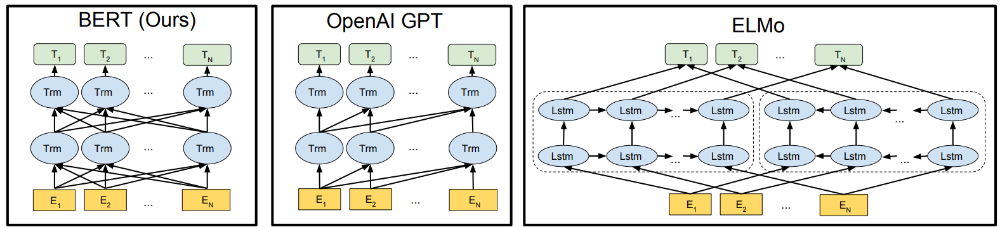

# BERT: Pre-training of Deep Bidirectional Transformers for Language Understanding
BERT：深度双向Transformers语言理解预训练 2018-10-11 原文：https://arxiv.org/abs/1810.04805

## 阅读笔记
1. https://huggingface.co/bert-base-cased

## Abstract
We introduce a new language representation model called BERT, which stands for Bidirectional Encoder Representations from Transformers. Unlike recent language representation models (Peters et al., 2018a; Radford et al., 2018), BERT is designed to pretrain deep bidirectional representations from unlabeled text by jointly conditioning on both left and right context in all layers. As a result, the pre-trained BERT model can be finetuned with just one additional output layer to create state-of-the-art models for a wide range of tasks, such as question answering and language inference, without substantial taskspecific architecture modifications.

我们介绍了一种称为BERT(Bidirectional Encoder Representations from Transformers)的新语言表示模型，意思是来自Transformers的双向编码器表示。与最近的语言表示模型(Peterset al., 2018a; Radfordet al., 2018)不同，BERT旨在通过联合处理所有层中的左右上下文来预处理未token文本的深层双向表示。因此，只需一个额外的输出层，即可对预训练的BERT模型进行微调，以创建适用于广泛任务的最新模型，如问答和语言推理，而无需对特定任务的架构进行重大修改。

BERT is conceptually simple and empirically powerful. It obtains new state-of-the-art results on eleven natural language processing
tasks, including pushing the GLUE score to 80.5% (7.7% point absolute improvement), MultiNLI accuracy to 86.7% (4.6% absolute improvement), SQuAD v1.1 question answering Test F1 to 93.2 (1.5 point absolute improvement) and SQuAD v2.0 Test F1 to 83.1 (5.1 point absolute improvement).

BERT概念简单，经验性强。它在11种自然语言处理任务中取得了最新的成果，包括将GLUE分数提高到80.5%(7.7%绝对进步)，MultiNLI准确率提高到86.7%(4.6%绝对进步”)，SQuAD v1.1问答测试F1提高到93.2(1.5点绝对进步)，SQuID v2.0测试F1提高至83.1(5.1点绝对进步)。

## 1 Introduction
Language model pre-training has been shown to be effective for improving many natural language processing tasks (Dai and Le, 2015; Peters et al., 2018a; Radford et al., 2018; Howard and Ruder, 2018). These include sentence-level tasks such as natural language inference (Bowman et al., 2015; Williams et al., 2018) and paraphrasing (Dolan and Brockett, 2005), which aim to predict the relationships between sentences by analyzing them holistically, as well as token-level tasks such as named entity recognition and question answering, where models are required to produce fine-grained output at the token level (Tjong Kim Sang and De Meulder, 2003; Rajpurkar et al., 2016).

语言模型预训练已被证明对改善许多自然语言处理任务有效(Dai和Le，2015; Peterset al., 2018a; Radfordet al., 2018; Howard和Ruder，2018)。这些任务包括句子级任务，如自然语言推理(Bowman et al.，2015; Williams et al..，2018)和释义(Dolan and Brockett，2005)，旨在通过整体分析预测句子之间的关系，以及token级任务，例如命名实体识别和问答，其中，模型需要在token级别生成细粒度输出(Tjong Kim Sang和De Meulder，2003; Rajpurkaret al., 2016)。

There are two existing strategies for applying pre-trained language representations to downstream tasks: feature-based and fine-tuning. The feature-based approach, such as ELMo (Peters et al., 2018a), uses task-specific architectures that include the pre-trained representations as additional features. The fine-tuning approach, such as the Generative Pre-trained Transformer (OpenAI GPT) (Radford et al., 2018), introduces minimal task-specific parameters, and is trained on the downstream tasks by simply fine-tuning all pretrained parameters. The two approaches share the same objective function during pre-training, where they use unidirectional language models to learn general language representations.

将预训练好的语言表示应用于下游任务的现有策略有两种：基于特征的和微调。基于特征的方法，如ELMo(Peterset al., 2018a)，使用特定于任务的架构，其中包括作为附加特征的预训练表示。微调方法，如生成式预训练Transformer(OpenAI GPT)(Radfordet al., 2018)，引入了最小的任务特定参数，并通过微调所有预训练参数对下游任务进行训练。这两种方法在预训练期间具有相同的目标功能，它们使用单向语言模型来学习一般语言表示。

We argue that current techniques restrict the power of the pre-trained representations, especially for the fine-tuning approaches. The major limitation is that standard language models are unidirectional, and this limits the choice of architectures that can be used during pre-training. For example, in OpenAI GPT, the authors use a left-toright architecture, where every token can only attend to previous tokens in the self-attention layers of the Transformer (Vaswani et al., 2017). Such restrictions are sub-optimal for sentence-level tasks, and could be very harmful when applying finetuning based approaches to token-level tasks such as question answering, where it is crucial to incorporate context from both directions.

我们认为，当前的技术限制了预训练表示的能力，特别是对于微调方法。主要的限制是标准语言模型是单向的，这限制了在预训练期间可以使用的架构的选择。例如，在OpenAI GPT中，作者使用从左向右的架构，其中每个token只能关注Transformer的自注意层中的前一个token(Vaswani et al.，2017)。这些限制对于句子级任务来说是次优的，当将基于微调的方法应用于诸如问答之类的token级任务时，可能会非常有害，因为在这类任务中，从两个方向结合上下文是至关重要的。

In this paper, we improve the fine-tuning based approaches by proposing BERT: Bidirectional Encoder Representations from Transformers. BERT alleviates the previously mentioned unidirectionality constraint by using a “masked language model” (MLM) pre-training objective, inspired by the Cloze task (Taylor, 1953). The masked language model randomly masks some of the tokens from the input, and the objective is to predict the original vocabulary id of the masked word based only on its context. Unlike left-to-right language model pre-training, the MLM objective enables the representation to fuse the left and the right context, which allows us to pretrain a deep bidirectional Transformer. In addition to the masked language model, we also use a “next sentence prediction” task that jointly pretrains text-pair representations. The contributions of our paper are as follows:
* We demonstrate the importance of bidirectional pre-training for language representations. Unlike Radford et al. (2018), which uses unidirectional language models for pre-training, BERT uses masked language models to enable pretrained deep bidirectional representations. This is also in contrast to Peters et al. (2018a), which uses a shallow concatenation of independently trained left-to-right and right-to-left LMs.
* We show that pre-trained representations reduce the need for many heavily-engineered taskspecific architectures. BERT is the first finetuning based representation model that achieves state-of-the-art performance on a large suite of sentence-level and token-level tasks, outperforming many task-specific architectures.
* BERT advances the state of the art for eleven NLP tasks. The code and pre-trained models are available at https://github.com/ google-research/bert .

本文通过提出BERT：来自Transformer的双向编码器表示，改进了基于微调的方法。BERT在完形填空任务的启发下，通过使用“掩码语言模型”(MLM)的预训练目标，缓解了前面提到的单向性约束(Taylor，1953)。MLM从输入中随机掩码一些tokens，其目标是仅基于上下文预测掩码单词的原始词汇表id。与从左向右语言模型的预训练不同，MLM目标使表示能够融合左右上下文，这使我们能够预训练一个深层的双向Transformers。除了MLM之外，我们还使用“下一句预测”任务来联合预训练文本对表示。我们的论文贡献如下：
* 我们论证了语言表征双向预训练的重要性。与Radfordet al (2018)使用单向语言模型进行预训练不同，BERT使用MLM实现预训练的深层双向表示。这也与Peterset al (2018a)形成了对比，Peterset al 使用了由独立训练的从左到右和从右到左的LM的浅串联。
* 我们表明，预训练的表示减少了对特定任务需要许多精心设计的架构的必要。BERT是第一个基于微调的表示模型，它在一大组句子级和token级任务上实现了最先进的性能，优于许多特定于任务的架构。
* BERT提高了11项NLP任务的技术水平。代码和预训练的模型在 https://github.com/google-research/bert 。

## 2 Related Work
There is a long history of pre-training general language representations, and we briefly review the most widely-used approaches in this section.

预训练的一般语言表达有着悠久的历史，我们在本节中简要回顾了最广泛使用的方法。

### 2.1 Unsupervised Feature-based Approaches 无监督的基于特征的方法
Learning widely applicable representations of words has been an active area of research for decades, including non-neural (Brown et al., 1992; Ando and Zhang, 2005; Blitzer et al., 2006) and neural (Mikolov et al., 2013; Pennington et al., 2014) methods. Pre-trained word embeddings are an integral part of modern NLP systems, offering significant improvements over embeddings learned from scratch (Turian et al., 2010). To pretrain word embedding vectors, left-to-right language modeling objectives have been used (Mnih and Hinton, 2009), as well as objectives to discriminate correct from incorrect words in left and right context (Mikolov et al., 2013).

几十年来，学习广泛适用的单词表征一直是一个活跃的研究领域，包括非神经网络(Brownet al., 1992; Ando和Zhang，2005; Blitzeret al., 2006)和神经网络(Mikolovet al., 2013; Penningtonet al., 2014)方法。预训练的词嵌入是现代NLP系统的一个组成部分，与从头开始学习的嵌入相比有了显著的改进(Turian et al.，2010)。为了预处理词嵌入向量，使用了从左到右的语言建模目标(Mnih和Hinton，2009)，以及在左右语境中区分正确单词和错误单词的目标(Mikolovet al., 2013)。

These approaches have been generalized to coarser granularities, such as sentence embeddings (Kiros et al., 2015; Logeswaran and Lee, 2018) or paragraph embeddings (Le and Mikolov, 2014). To train sentence representations, prior work has used objectives to rank candidate next sentences (Jernite et al., 2017; Logeswaran and Lee, 2018), left-to-right generation of next sentence words given a representation of the previous sentence (Kiros et al., 2015), or denoising autoencoder derived objectives (Hill et al., 2016).

这些方法已被推广到更粗的粒度，例如句子嵌入(Kiros et al.，2015; Logeswaran and Lee，2018)或段落嵌入(Le and Mikolov，2014)。为了训练句子表征，之前的工作已经使用目标对候选的下一个句子进行排序(Jernite et al.，2017; Logeswaran and Lee，2018)，根据前一个句子的表征从左到右生成下一个单词(Kiros et al.、2015)，或去噪自动编码器衍生的目标(Hill et al. 2016)。

ELMo and its predecessor (Peters et al., 2017, 2018a) generalize traditional word embedding research along a different dimension. They extract context-sensitive features from a left-to-right and a right-to-left language model. The contextual representation of each token is the concatenation of the left-to-right and right-to-left representations. When integrating contextual word embeddings with existing task-specific architectures, ELMo advances the state of the art for several major NLP benchmarks (Peters et al., 2018a) including question answering (Rajpurkar et al., 2016), sentiment analysis (Socher et al., 2013), and named entity recognition (Tjong Kim Sang and De Meulder, 2003). Melamud et al. (2016) proposed learning contextual representations through a task to predict a single word from both left and right context using LSTMs. Similar to ELMo, their model is feature-based and not deeply bidirectional. Fedus et al. (2018) shows that the cloze task can be used to improve the robustness of text generation models.

ELMo及其前身(Peterset al., 2017,2018a)从不同的维度概括了传统的词嵌入研究。它们从从左到右和从右到左的语言模型中提取上下文相关的特征。每个token的上下文表示是从左到右和从右到左表示的串联。在将上下文词嵌入与现有任务特定架构相结合时，ELMo为几个主要NLP基准(Peterset al., 2018a)提高了技术水平，包括问答(Rajpurkaret al., 2016)、情感分析(Socheret al., 2013)和命名实体识别(Tjong Kim Sang和De Meulder，2003)。Melamudet al (2016)提出通过任务学习语境表征，使用LSTM从左右语境预测单个单词。与ELMo类似，他们的模型是基于特征的，不是深度双向的。Feduset al (2018)表明，完形填空任务可以用于提高文本生成模型的健壮性。

### 2.2 Unsupervised Fine-tuning Approaches 无监督微调方法
As with the feature-based approaches, the first works in this direction only pre-trained word embedding parameters from unlabeled text (Collobert and Weston, 2008).

与基于特征的方法一样，第一种方法在这个方向上只适用于来自未token文本的预训练的词嵌入参数(Collobert和Weston，2008)。

More recently, sentence or document encoders which produce contextual token representations have been pre-trained from unlabeled text and fine-tuned for a supervised downstream task (Dai and Le, 2015; Howard and Ruder, 2018; Radford et al., 2018). The advantage of these approaches is that few parameters need to be learned from scratch. At least partly due to this advantage, OpenAI GPT (Radford et al., 2018) achieved previously state-of-the-art results on many sentencelevel tasks from the GLUE benchmark (Wang et al., 2018a). Left-to-right language modeling and auto-encoder objectives have been used for pre-training such models (Howard and Ruder, 2018; Radford et al., 2018; Dai and Le, 2015).

最近，生成上下文token表示的句子或文档编码器已经过未token文本的预训练，并针对受监督的下游任务进行了微调(Dai and Le，2015; Howard and Ruder，2018; Radford et al.，2018)。这些方法的优点是，几乎不需要从头学习参数。至少部分由于这一优势，OpenAI GPT(Radfordet al., 2018)在GLUE基准的许多句子级任务上取得了先前最先进的结果(Wanget al., 2018a)。从左到右的语言建模和自动编码器目标已用于此类模型的预训练(Howard and Ruder，2018; Radford et al.，2018; Dai and Le，2015)。

### 2.3 Transfer Learning from Supervised Data 从监督数据中迁移学习
There has also been work showing effective transfer from supervised tasks with large datasets, such as natural language inference (Conneau et al., 2017) and machine translation (McCann et al., 2017). Computer vision research has also demonstrated the importance of transfer learning from large pre-trained models, where an effective recipe is to fine-tune models pre-trained with ImageNet (Deng et al., 2009; Yosinski et al., 2014).

也有研究表明，在大数据集的情况下，受监督任务的有效迁移，例如自然语言推理(Conneauet al., 2017年)和机器翻译(McCannet al., 2017)。计算机视觉研究也证明了从大型预训练模型中迁移学习的重要性，其中一个有效的方法是微调使用ImageNet预训练的模型(Denget al., 2009; Yosinskiet al., 2014)。

## 3 BERT
We introduce BERT and its detailed implementation in this section. There are two steps in our framework: pre-training and fine-tuning. During pre-training, the model is trained on unlabeled data over different pre-training tasks. For finetuning, the BERT model is first initialized with the pre-trained parameters, and all of the parameters are fine-tuned using labeled data from the downstream tasks. Each downstream task has separate fine-tuned models, even though they are initialized with the same pre-trained parameters. The question-answering example in Figure 1 will serve as a running example for this section.
A distinctive feature of BERT is its unified architecture across different tasks. There is minimal difference between the pre-trained architecture and the final downstream architecture.

我们在本节中介绍BERT及其详细实现。我们的框架有两个步骤：预训练和微调。在预训练期间，模型在不同的预训练任务中根据未标记的数据进行训练。对于微调，首先使用预训练的参数初始化BERT模型，并使用下游任务的标注数据微调所有参数。每个下游任务都有单独的微调模型，即使它们是用相同的预训练参数初始化的。图1中的问答样本将作为本节的运行样本。BERT的一个显著特点是跨不同任务的统一架构，预训练的架构和最终的下游架构之间的差异最小。

 
Figure 1: Overall pre-training and fine-tuning procedures for BERT. Apart from output layers, the same architectures are used in both pre-training and fine-tuning. The same pre-trained model parameters are used to initialize models for different down-stream tasks. During fine-tuning, all parameters are fine-tuned. [CLS] is a special symbol added in front of every input example, and [SEP] is a special separator token (e.g. separating questions/answers).
图1：BERT的预训练和微调总体过程。除了输出层之外，在预训练和微调中都使用了相同的架构。相同的预训练模型参数用于为不同的下游任务初始化模型。在微调过程中，所有参数都会进行微调。[CLS]是添加在每个输入样本前面的特殊符号，[SEP]是一个特殊分隔符token(例如，分隔问题/答案)。

Model Architecture. BERT’s model architecture is a multi-layer bidirectional Transformer encoder based on the original implementation described in Vaswani et al. (2017) and released in the tensor2tensor library.1 Because the use of Transformers has become common and our implementation is almost identical to the original, we will omit an exhaustive background description of the model architecture and refer readers to Vaswani et al. (2017) as well as excellent guides such as “The Annotated Transformer.”2

模型架构. BERT的模型架构是一种多层双向Transformer编码器，基于Vaswani et al.(2017)中描述的原始实现，并在tensor2tensor库中发布1。由于Transformers的使用已经变得很普遍，而且我们的实施几乎与原始版本相同，因此我们将省略对模型架构的详尽背景描述，并向读者推荐Vaswaniet al (2017年)以及《[带注释的Transformer](https://github.com/harvardnlp/annotated-transformer/blob/master/AnnotatedTransformer.ipynb)》等优秀指南2。 

In this work, we denote the number of layers (i.e., Transformer blocks) as L, the hidden size as H, and the number of self-attention heads as A.3 We primarily report results on two model sizes: BERT-BASE (L=12, H=768, A=12, Total Parameters=110M) and BERT-LARGE (L=24, H=1024, A=16, Total Parameters=340M).

在这项工作中，我们将层数(即Transformer块)表示为L，将隐藏大小表示为H，将自注意头数表示为A.3。我们主要报告两种模型大小的结果：BERT-BASE(L=12，H=768，A=12，总参数=110M)和 BERT-LARGE(L=24，H=1024，A=16，总参数=340M)。

BERT-BASE was chosen to have the same model size as OpenAI GPT for comparison purposes. Critically, however, the BERT Transformer uses bidirectional self-attention, while the GPT Transformer uses constrained self-attention where every token can only attend to context to its left.

为了进行比较，选择BERT-BASE与OpenAI GPT具有相同的模型大小。然而，至关重要的是，BERT Transformer使用双向自注意，而GPT Transformer则使用受限自注意，其中每个token只能关注其左侧的上下文。

Input/Output. Representations To make BERT handle a variety of down-stream tasks, our input representation is able to unambiguously represent both a single sentence and a pair of sentences (e.g., ⟨ Question, Answer ⟩) in one token sequence. Throughout this work, a “sentence” can be an arbitrary span of contiguous text, rather than an actual linguistic sentence. A “sequence” refers to the input token sequence to BERT, which may be a single sentence or two sentences packed together.

输入/输出。表示为了使BERT能够处理各种下游任务，我们的输入表示能够明确表示一个句子和一对句子(例如，⟨ 问题，答案⟩) 在一个token序列中。在整个作品中，“句子”可以是连续文本的任意跨度，而不是实际的语言句子。“序列”是指BERT的输入token序列，可以是一个句子或两个句子组合在一起。

We use WordPiece embeddings (Wu et al., 2016) with a 30,000 token vocabulary. The first token of every sequence is always a special classification token ([CLS]). The final hidden state corresponding to this token is used as the aggregate sequence representation for classification tasks. Sentence pairs are packed together into a single sequence. We differentiate the sentences in two ways. First, we separate them with a special token ([SEP]). Second, we add a learned embedding to every token indicating whether it belongs to sentence A or sentence B. As shown in Figure 1, we denote input embedding as E, the final hidden vector of the special [CLS] token as C ∈ RH, and the final hidden vector for the ith input token asTi ∈RH.

我们使用WordPiece嵌入(Wu et al.，2016)和30000个token词汇。每个序列的第一个token总是一个特殊的分类token([CLS])。与此token对应的最终隐藏状态用作分类任务的聚合序列表示。句子对组合成一个序列。我们用两种方式区分句子。首先，我们用一个特殊token([SEP])将它们分开。其次，我们向每个token添加一个学习的嵌入，指示它是属于句子a还是句子B。如图1所示，我们将输入嵌入表示为E，特殊[CLS]token的最终隐藏向量表示为C∈ RH，第i个输入token的最终隐藏向量为Ti∈右侧。

For a given token, its input representation is constructed by summing the corresponding token, segment, and position embeddings. A visualization of this construction can be seen in Figure 2.

对于给定的token，其输入表示形式是通过对相应的token、分段和位置嵌入求和来构造的。图2为这种结构的可视化展示。

 
Figure 2: BERT input representation. The input embeddings are the sum of the token embeddings, the segmentation embeddings and the position embeddings.
图2:BERT输入表示。输入嵌入是token嵌入、分段嵌入和位置嵌入的总和。

### 3.1 Pre-training BERT
Unlike Peters et al. (2018a) and Radford et al. (2018), we do not use traditional left-to-right or right-to-left language models to pre-train BERT. Instead, we pre-train BERT using two unsupervised tasks, described in this section. This step is presented in the left part of Figure 1.

与Peterset al (2018a)和Radfordet al (2018)不同，我们不使用传统的从左到右或从右到左的语言模型来预训练BERT。相反，我们使用本节描述的两个无监督任务对BERT进行预训练。此步骤如图1左侧所示。

#### Task #1: Masked LM 
Intuitively, it is reasonable to believe that a deep bidirectional model is strictly more powerful than either a left-to-right model or the shallow concatenation of a left-toright and a right-to-left model. Unfortunately, standard conditional language models can only be trained left-to-right or right-to-left, since bidirectional conditioning would allow each word to indirectly “see itself”, and the model could trivially predict the target word in a multi-layered context.

直觉上，有理由相信深度双向模型比从左到右模型或从左到左模型的浅串联更强大。不幸的是，标准条件语言模型只能从左到右或从右到左进行训练，因为双向条件作用将允许每个单词间接“看到自己”，并且该模型可以在多层上下文中预测目标单词。

In order to train a deep bidirectional representation, we simply mask some percentage of the input tokens at random, and then predict those masked tokens. We refer to this procedure as a “masked LM” (MLM), although it is often referred to as a Cloze task in the literature (Taylor, 1953). In this case, the final hidden vectors corresponding to the mask tokens are fed into an output softmax over the vocabulary, as in a standard LM. In all of our experiments, we mask 15% of all WordPiece tokens in each sequence at random. In contrast to denoising auto-encoders (Vincent et al., 2008), we only predict the masked words rather than reconstructing the entire input.

为了训练深度双向表示，我们只需随机掩码一些百分比的输入token，然后预测那些掩码的tokens。我们将此过程称为““masked LM”(MLM)，尽管在文献中它通常被称为完形填空任务(Taylor，1953)。在这种情况下，与掩码token对应的最终隐藏向量被送入词汇表上的输出softmax，就像在标准LM中一样。在我们的所有实验中，我们在每个序列中随机掩码15%的所有WordPiece token。与去噪自动编码器(Vincent et al.，2008)相反，我们只预测掩码单词，而不是重建整个输入。

Although this allows us to obtain a bidirectional pre-trained model, a downside is that we are creating a mismatch between pre-training and fine-tuning, since the [MASK] token does not appear during fine-tuning. To mitigate this, we do not always replace “masked” words with the actual [MASK] token. The training data generator chooses 15% of the token positions at random for prediction. If the i-th token is chosen, we replace the i-th token with (1) the [MASK] token 80% of the time (2) a random token 10% of the time (3) the unchanged i-th token 10% of the time. Then, Ti will be used to predict the original token with cross entropy loss. We compare variations of this procedure in Appendix C.2.

虽然这允许我们获得双向预训练模型，但缺点是我们在预训练和微调之间造成了不匹配，因为微调期间不会出现[MASK]token。为了缓解这种情况，我们并不总是用实际的[MASK]token替换被“掩码”单词。训练数据生成器随机选择15%的token位置进行预测。如果选择了第i个token，我们将第i个替换为(1)80%的[MASK]token(2)10%的随机token(3)10%的未更改的第i个。然后，将使用Ti预测具有交叉熵损失的原始token。我们在附录C.2中比较了该程序的变化。

#### Task #2: Next Sentence Prediction (NSP) 下一句预测
Many important downstream tasks such as Question Answering (QA) and Natural Language Inference (NLI) are based on understanding the relationship between two sentences, which is not directly captured by language modeling. In order to train a model that understands sentence relationships, we pre-train for a binarized next sentence prediction task that can be trivially generated from any monolingual corpus. Specifically, when choosing the sentences A and B for each pretraining example, 50% of the time B is the actual next sentence that follows A (labeled as IsNext), and 50% of the time it is a random sentence from the corpus (labeled as NotNext). As we show in Figure 1, C is used for next sentence prediction (NSP).5 Despite its simplicity, we demonstrate in Section 5.1 that pre-training towards this task is very beneficial to both QA and NLI.

许多重要的下游任务，如问答(QA)和自然语言推理(NLI)，都是基于理解两个句子之间的关系，而语言建模并不能直接捕获这一关系。为了训练一个理解句子关系的模型，我们预训练了一个可以从任何单语语料库生成的二值化下一句预测任务。具体来说，当为每个预训练样本选择句子A和B时，50%的时间B是A后面的实际下一个句子(token为IsNext)，50%的时候它是语料库中的一个随机句(token为NotNext)。如图1所示，C用于下一句预测(NSP)5。尽管简单，但我们在第5.1节中证明，针对这项任务的预训练对QA和NLI都非常有益。

The NSP task is closely related to representationlearning objectives used in Jernite et al. (2017) and Logeswaran and Lee (2018). However, in prior work, only sentence embeddings are transferred to down-stream tasks, where BERT transfers all parameters to initialize end-task model parameters.

NSP任务与Jernite et al.(2017)和Logeswaran and Lee(2018)中使用的代表学习目标密切相关。然而，在之前的工作中，只有句子嵌入被传输到下游任务，其中BERT传输所有参数来初始化终端任务模型参数。

Pre-training data. The pre-training procedure largely follows the existing literature on language model pre-training. For the pre-training corpus we use the BooksCorpus (800M words) (Zhu et al., 2015) and English Wikipedia (2,500M words). For Wikipedia we extract only the text passages and ignore lists, tables, and headers. It is critical to use a document-level corpus rather than a shuffled sentence-level corpus such as the Billion Word Benchmark (Chelba et al., 2013) in order to extract long contiguous sequences.

预训练数据。预训练程序主要遵循关于语言模型预训练的现有文献。对于预训练语料库，我们使用BooksCorpus(800M单词)(Zhu et al.，2015)和英语维基百科(2500M单词)。对于维基百科，我们只提取文本段落，而忽略列表、表格和标题。为了提取长连续序列，关键是要使用文档级语料库，而不是像Billion Word Benchmark(Chelba et al.，2013)这样的混合句子级语料集。

### 3.2 Fine-tuning BERT
Fine-tuning is straightforward since the self-attention mechanism in the Transformer allows BERT to model many downstream tasks— whether they involve single text or text pairs—by swapping out the appropriate inputs and outputs. For applications involving text pairs, a common pattern is to independently encode text pairs before applying bidirectional cross attention, such as Parikh et al. (2016); Seo et al. (2017). BERT instead uses the self-attention mechanism to unify these two stages, as encoding a concatenated text pair with self-attention effectively includes bidirectional cross attention between two sentences.

微调很简单，因为Transformer中的自注意机制允许BERT通过交换适当的输入和输出，对许多下游任务进行建模，无论是涉及单个文本还是文本对。对于涉及文本对的应用程序，常见的模式是在应用双向交叉注意之前对文本对进行独立编码，例如Parikhet al (2016); Seoet al (2017年)。BERT则使用自我注意机制来统一这两个阶段，因为对具有自我注意的串联文本对进行编码时，有效地包括了两个句子之间的双向交叉注意。

For each task, we simply plug in the task specific inputs and outputs into BERT and finetune all the parameters end-to-end. At the input, sentence A and sentence B from pre-training are analogous to (1) sentence pairs in paraphrasing, (2) hypothesis-premise pairs in entailment, (3) question-passage pairs in question answering, and (4) a degenerate text-∅ pair in text classification or sequence tagging. At the output, the token representations are fed into an output layer for tokenlevel tasks, such as sequence tagging or question answering, and the [CLS] representation is fed into an output layer for classification, such as entailment or sentiment analysis.

对于每个任务，我们只需将特定任务的输入和输出插入BERT，并端到端微调所有参数。在输入端，来自预训练的句子A和句子B类似于(1)复述中的句子对，(2)隐含中的假设前提对，(3)问答中的问句对，以及(4)退化文本-∅ 文本分类或序列token中的配对。在输出时，token表示被送入token级任务的输出层，如序列token或问答，[CLS]表示被送入输出层进行分类，如隐含或情感分析。

Compared to pre-training, fine-tuning is relatively inexpensive. All of the results in the paper can be replicated in at most 1 hour on a single Cloud TPU, or a few hours on a GPU, starting from the exact same pre-trained model.7 We describe the task-specific details in the corresponding subsections of Section 4. More details can be found in Appendix A.5.

与预训练相比，微调相对便宜。从完全相同的预训练模型开始，论文中的所有结果最多可以在单个Cloud TPU上1小时内复现，或在GPU上几个小时内复现7。我们在第4节的相应小节中描述了具体任务的细节。更多细节见附录A.5。

## 4 Experiments
In this section, we present BERT fine-tuning results on 11 NLP tasks.

在本节中，我们将介绍11个NLP任务的BERT微调结果。

### 4.1 GLUE
The General Language Understanding Evaluation (GLUE) benchmark (Wang et al., 2018a) is a collection of diverse natural language understanding tasks. Detailed descriptions of GLUE datasets are included in Appendix B.1.

通用语言理解评估(GLUE)基准(Wanget al., 2018a)是多种自然语言理解任务的集合。GLUE数据集的详细描述见附录B.1。

To fine-tune on GLUE, we represent the input sequence (for single sentence or sentence pairs) as described in Section 3, and use the final hidden vector C ∈ RH corresponding to the first input token ([CLS]) as the aggregate representation. The only new parameters introduced during fine-tuning are classification layer weights W ∈ RK ×H , where K is the number of labels. We compute a standard classification loss with C and W , i.e., log(softmax(C W T )).

为了对GLUE进行微调，我们表示输入序列(对于单个句子或句子对)，如第3节所述，并使用最终的隐藏向量C∈ 与第一个输入token([CLS])相对应的RH作为聚合表示。微调期间引入的唯一新参数是分类层权重W∈ RK×H，其中K是标签数量。我们用C和W计算标准分类损失，即log(softmax(C W T))。

 
Table 1: GLUE Test results, scored by the evaluation server (https://gluebenchmark.com/leaderboard). The number below each task denotes the number of training examples. The “Average” column is slightly different than the official GLUE score,since we exclude the problematic WNLI set.8 BERT and OpenAI GPT are single model, single task. F1 scores are reported for QQP and MRPC, Spearman correlations are reported for STS-B, and accuracy scores are reported for the other tasks. We exclude entries that use BERT as one of their components.

表1：GLUE测试结果，由评估服务器评分(https://gluebenchmark.com/leaderboard). 每个任务下面的数字表示训练样本的数量。“平均”列与官方GLUE分数略有不同，因为我们排除了有问题的WNLI集合 8。 BERT和OpenAI GPT是单一模型、单一任务。QQP和MRPC报告F1分数，STS-B报告Spearman相关性，其他任务报告准确性分数。我们排除了使用BERT作为其组成部分之一的条目。

We use a batch size of 32 and fine-tune for 3 epochs over the data for all GLUE tasks. For each task, we selected the best fine-tuning learning rate (among 5e-5, 4e-5, 3e-5, and 2e-5) on the Dev set. Additionally, for BERT-LARGE we found that finetuning was sometimes unstable on small datasets, so we ran several random restarts and selected the best model on the Dev set. With random restarts, we use the same pre-trained checkpoint but perform different fine-tuning data shuffling and classifier layer initialization.9

对于所有GLUE任务，我们使用32的批量大小，对数据进行3轮的微调。对于每个任务，我们在Dev集合中选择了最佳微调学习率(5e-5、4e-5、3e-5和2e-5)。此外，对于BERT-LARGE，我们发现微调在小数据集上有时是不稳定的，因此我们运行了几次随机重启，并在Dev集上选择了最佳模型。对于随机重启，我们使用相同的预训练的检查点，但执行不同的微调数据洗牌和分类器层初始化9。

Results are presented in Table 1. Both BERT-BASE and BERT-LARGE outperform all systems on all tasks by a substantial margin, obtaining 4.5% and 7.0% respective average accuracy improvement over the prior state of the art. Note that BERT-BASE and OpenAI GPT are nearly identical in terms of model architecture apart from the attention masking. For the largest and most widely reported GLUE task, MNLI, BERT obtains a 4.6% absolute accuracy improvement. On the official GLUE leaderboard10, BERT-LARGE obtains a score of 80.5, compared to OpenAI GPT, which obtains 72.8 as of the date of writing.

结果如表1所示。BERT-BASE和BERT-LARGE在所有任务上都比其他系统表现出色，差别很大，与现有技术相比，其平均精度分别提高了4.5%和7.0%。请注意，除了注意掩码外，BERT-BASE和OpenAI GPT在模型架构方面几乎相同。对于最大和最广泛报道的GLUE任务MNLI，BERT的绝对精度提高了4.6%。在正式的GLUE排行榜10中，BERT-LARGE获得80.5分，而OpenAI GPT截至撰写之日获得72.8分。

We find that BERT-LARGE significantly outperforms BERT-BASE across all tasks, especially those with very little training data. The effect of model size is explored more thoroughly in Section 5.2.

我们发现，BERT-LARGE在所有任务中都显著优于BERT-BASE，尤其是那些训练数据很少的任务。第5.2节更深入地探讨了模型尺寸的影响。

### 4.2 SQuAD v1.1
The Stanford Question Answering Dataset (SQuAD v1.1) is a collection of 100k crowdsourced question/answer pairs (Rajpurkar et al., 2016). Given a question and a passage from Wikipedia containing the answer, the task is to predict the answer text span in the passage.

斯坦福问答数据集(SQuAD v1.1)是10万个众包问答对的集合(Rajpurkaret al., 2016)。给定一个问题和一段维基百科中包含答案的文章，任务是预测文章中答案的文本跨度。

As shown in Figure 1, in the question answering task, we represent the input question and passage as a single packed sequence, with the question using the A embedding and the passage using the B embedding. We only introduce a start vectorS ∈ RH andanendvectorE ∈ RH during fine-tuning. The probability of word i being the start of the answer span is computed as a dot product between Ti and S followed by a softmax over eS·Ti all of the words in the paragraph: Pi = 􏰍j eS·Tj . The analogous formula is used for the end of the answer span. The score of a candidate span from position i to position j is defined as S ·Ti + E ·Tj , and the maximum scoring span where j ≥ i is used as a prediction. The training objective is the sum of the log-likelihoods of the correct start and end positions. We fine-tune for 3 epochs with a learning rate of 5e-5 and a batch size of 32.

如图1所示，在问答任务中，我们将输入的问题和段落表示为单个打包序列，问题使用a嵌入，段落使用B嵌入。我们只引入一个起始向量S∈ 右侧和右侧挡板E∈ 微调期间的相对湿度。单词i作为答案跨度开始的概率计算为Ti和S之间的点积，后跟eS·Ti上的softmax：Pi=􏰍j eS·Tj。类似公式用于答案跨度的结束。候选人从位置i到位置j的得分定义为S·Ti+E·Tj，最大得分跨度，其中j≥ i被用作预测。训练目标是正确开始和结束位置的对数可能性之和。我们微调了3个时期，学习率为5e-5，批量大小为32。

Table 2 shows top leaderboard entries as well as results from top published systems (Seo et al., 2017; Clark and Gardner, 2018; Peters et al., 2018a; Hu et al., 2018). The top results from the SQuAD leaderboard do not have up-to-date public system descriptions available,11 and are allowed to use any public data when training their systems. We therefore use modest data augmentation in our system by first fine-tuning on TriviaQA (Joshi et al., 2017) befor fine-tuning on SQuAD.

表2显示了顶级排行榜条目以及顶级发布系统的结果(Seoet al., 2017; Clark和Gardner，2018; Peterset al., 2018a; Huet al., 2018)。SQuAD排行榜的顶级结果没有可用的最新公共系统描述，11并且允许在训练其系统时使用任何公共数据。因此，在SQuAD微调之前，我们通过对TriviaQA(Joshi et al.，2017)进行首次微调，在系统中使用适度的数据增广。

Our best performing system outperforms the top leaderboard system by +1.5 F1 in ensembling and +1.3 F1 as a single system. In fact, our single BERT model outperforms the top ensemble system in terms of F1 score. Without TriviaQA finetuning data, we only lose 0.1-0.4 F1, still outperforming all existing systems by a wide margin.

我们表现最好的系统在整体上比顶级排行榜系统表现出色，分别为+1.5 F1和+1.3 F1。事实上，就F1分数而言，我们的单BERT模型优于顶级集成系统。如果没有TriviaQA微调数据，我们只损失了0.1-0.4 F1，仍大大优于所有现有系统。

Table 2: SQuAD 1.1 results. The BERT ensemble is 7x systems which use different pre-training checkpoints and fine-tuning seeds.
表2:SQuAD 1.1结果。BERT集成是7x系统，使用不同的预训练检查点和微调种子。

### 4.3 SQuAD v2.0
The SQuAD 2.0 task extends the SQuAD 1.1 problem definition by allowing for the possibility that no short answer exists in the provided paragraph, making the problem more realistic.

SQuAD 2.0任务通过允许提供的段落中不存在简短答案的可能性，扩展了SQuAD1.1问题定义，使问题更加现实。

We use a simple approach to extend the SQuAD v1.1 BERT model for this task. We treat questions that do not have an answer as having an answer span with start and end at the [CLS] token. The probability space for the start and end answer span positions is extended to include the position of the [CLS] token. For prediction, we compare the score of the no-answer span: snull = S·C + E·C to the score of the best non-null span sˆ = max S·T + E·T . We predict a non-null i,j j≥i i j answer when sˆ > s + τ , where the threshi,j null old τ is selected on the dev set to maximize F1. We did not use TriviaQA data for this model. We fine-tuned for 2 epochs with a learning rate of 5e-5 and a batch size of 48.

我们使用一种简单的方法来扩展此任务的SQuAD v1.1 BERT模型。我们将没有答案的问题视为在[CLS]token处有一个开始和结束的答案跨度。开始和结束答案范围位置的概率空间扩展为包括[CLS]token的位置。对于预测，我们比较了无答案跨度的得分：snull=S·C+E·C和最佳非零跨度的得分Sˆ=max S·T+E·T。我们预测了非零i，j j≥i i j回答sˆ>s+τ，其中在dev集合上选择阈值j null oldτ以最大化F1。我们没有将TriviaQA数据用于此模型。我们对两个时期进行了微调，学习率为5e-5，批量大小为48。

The results compared to prior leaderboard entries and top published work (Sun et al., 2018; Wang et al., 2018b) are shown in Table 3, excluding systems that use BERT as one of their components. We observe a +5.1 F1 improvement over the previous best system.

表3显示了与之前排行榜条目和顶级出版作品(Sunet al., 2018; Wanget al., 2018b)相比的结果，不包括使用BERT作为其组成部分之一的系统。我们观察到F1比以前最好的系统提高了+5.1。

Table 3: SQuAD 2.0 results. We exclude entries that use BERT as one of their components.
表3:SQuAD 2.0结果。我们排除了使用BERT作为其组成部分之一的条目。

### 4.4 SWAG
The Situations With Adversarial Generations (SWAG) dataset contains 113k sentence-pair completion examples that evaluate grounded commonsense inference (Zellers et al., 2018). Given a sentence, the task is to choose the most plausible continuation among four choices.

Situations With Adversarial Generations(SWAG)数据集包含113k个句子对补全样本，用于评估基于常识的推理(Zellerset al., 2018)。给定一个句子，任务是在四个选项中选择最合理的延续。

When fine-tuning on the SWAG dataset, we construct four input sequences, each containing the concatenation of the given sentence (sentence A) and a possible continuation (sentence B). The only task-specific parameters introduced is a vector whose dot product with the [CLS] token representation C denotes a score for each choice which is normalized with a softmax layer.

在对SWAG数据集进行微调时，我们构造了四个输入序列，每个输入序列包含给定句子(句子A)的串联和可能的延续(句子B)。唯一引入的特定于任务的参数是向量，该向量的[CLS]符号表示的点积C表示每个选项的分数，该分数通过softmax层标准化。

We fine-tune the model for 3 epochs with a learning rate of 2e-5 and a batch size of 16. Results are presented in Table 4. BERT-LARGE outperforms the authors’ baseline ESIM+ELMo system by +27.1% and OpenAI GPT by 8.3%.

我们对3个时期的模型进行了微调，学习率为2e-5，批量大小为16。结果如表4所示。BERT-LARGE的表现优于作者的基线ESIM+ELMo系统+27.1%，OpenAI GPT为8.3%。

Table 4: SWAG Dev and Test accuracies Human performance is measured with 100 samples, as reported in the SWAG paper.
表4:SWAG开发和测试精度人因绩效是用100个样本测量的，如SWAG文件中所述。

## 5 Ablation Studies 消融研究
In this section, we perform ablation experiments over a number of facets of BERT in order to better understand their relative importance. Additional ablation studies can be found in Appendix C.

在本节中，我们对BERT的多个方面进行消融实验，以便更好地了解它们的相对重要性。其他消融研究见附录C。

Table 5: Ablation over the pre-training tasks using the BERT-BASE architecture. “No NSP” is trained without the next sentence prediction task. “LTR & No NSP” is trained as a left-to-right LM without the next sentence prediction, like OpenAI GPT. “+ BiLSTM” adds a randomly initialized BiLSTM on top of the “LTR + No NSP” model during fine-tuning.

表5：使用BERT-BASE架构对预训练任务进行消融。“No NSP”是在没有下一句预测任务的情况下训练的。“LTR&No NSP”被训练为从左到右的LM，没有下一句预测，就像OpenAI GPT一样。在微调期间，“+BiLSTM”在“LTR+No NSP”模型之上添加一个随机初始化的BiLSTM。

### 5.1 Effect of Pre-training Tasks
We demonstrate the importance of the deep bidirectionality of BERT by evaluating two pretraining objectives using exactly the same pretraining data, fine-tuning scheme, and hyperparameters as BERT-BASE:

通过使用与BERT-BASE完全相同的预处理数据、微调方案和超参数评估两个预处理目标，我们证明了BERT深度双向性的重要性：

No NSP: A bidirectional model which is trained using the “masked LM” (MLM) but without the “next sentence prediction” (NSP) task.

无NSP：使用“掩码LM”(MLM)训练的双向模型，但没有“下一句预测”(NSP)任务。

LTR & No NSP: A left-context-only model which is trained using a standard Left-to-Right (LTR) LM, rather than an MLM. The left-only constraint was also applied at fine-tuning, because removing it introduced a pre-train/fine-tune mismatch that degraded downstream performance. Additionally, this model was pre-trained without the NSP task. This is directly comparable to OpenAI GPT, but using our larger training dataset, our input representation, and our fine-tuning scheme.

LTR&No NSP：仅左上下文模型，使用标准的从左到右(LTR)LM而不是MLM进行训练。仅左约束也适用于微调，因为取消它会导致预处理/微调不匹配，从而降低下游性能。此外，该模型是在没有NSP任务的情况下预训练的。这与OpenAI GPT有直接的可比性，但使用我们更大的训练数据集、我们的输入表示和我们的微调方案。

We first examine the impact brought by the NSP task. In Table 5, we show that removing NSP hurts performance significantly on QNLI, MNLI, and SQuAD 1.1. Next, we evaluate the impact of training bidirectional representations by comparing “No NSP” to “LTR & No NSP”. The LTR model performs worse than the MLM model on all tasks, with large drops on MRPC and SQuAD.

我们首先检查NSP任务带来的影响。在表5中，我们显示删除NSP会显著影响QNLI、MNLI和SQuAD 1.1的性能。接下来，我们通过比较“无NSP”和“LTR&无NSP)来评估训练双向表示的影响。LTR模型在所有任务上的表现都比MLM模型差，MRPC和SQuAD下降幅度较大。

For SQuAD it is intuitively clear that a LTR model will perform poorly at token predictions, since the token-level hidden states have no rightside context. In order to make a good faith attempt at strengthening the LTR system, we added a randomly initialized BiLSTM on top. This does significantly improve results on SQuAD, but the results are still far worse than those of the pretrained bidirectional models. The BiLSTM hurts performance on the GLUE tasks.

对于SQuAD，很明显LTR模型在token预测方面表现不佳，因为token级隐藏状态没有右侧上下文。为了真诚地尝试加强LTR系统，我们在顶部添加了一个随机初始化的BiLSTM。这确实显著改善了SQuAD的结果，但结果仍远不如预处理双向模型的结果。BiLSTM会影响GLUE任务的性能。

We recognize that it would also be possible to train separate LTR and RTL models and represent each token as the concatenation of the two models, as ELMo does. However: (a) this is twice as expensive as a single bidirectional model; (b) this is non-intuitive for tasks like QA, since the RTL model would not be able to condition the answer on the question; (c) this it is strictly less powerful than a deep bidirectional model, since it can use both left and right context at every layer.

我们认识到，也可以像ELMo一样，训练单独的LTR和RTL模型，并将每个token表示为两个模型的串联。然而：(a)这是单个双向模型的两倍; (b) 对于QA这样的任务来说，这是不直观的，因为RTL模型无法根据问题来确定答案; (c) 这严格来说，它不如深度双向模型强大，因为它可以在每一层使用左上下文和右上下文。

### 5.2 Effect of Model Size
In this section, we explore the effect of model size on fine-tuning task accuracy. We trained a number of BERT models with a differing number of layers, hidden units, and attention heads, while otherwise using the same hyperparameters and training procedure as described previously.

在本节中，我们将探讨模型大小对微调任务准确性的影响。我们训练了许多具有不同层数、隐藏单元和注意头的BERT模型，同时使用了与前面描述的相同的超参数和训练程序。

Results on selected GLUE tasks are shown in Table 6. In this table, we report the average Dev Set accuracy from 5 random restarts of fine-tuning. We can see that larger models lead to a strict accuracy improvement across all four datasets, even for MRPC which only has 3,600 labeled training examples, and is substantially different from the pre-training tasks. It is also perhaps surprising that we are able to achieve such significant improvements on top of models which are already quite large relative to the existing literature. For example, the largest Transformer explored in Vaswani et al. (2017) is (L=6, H=1024, A=16) with 100M parameters for the encoder, and the largest Transformer we have found in the literature is (L=64, H=512, A=2) with 235M parameters (Al-Rfou et al., 2018). By contrast, BERT-BASE contains 110M parameters and BERT-LARGE contains 340M parameters.

所选GLUE任务的结果如表6所示。在此表中，我们报告了5次随机重新启动微调后的平均Dev Set精度。我们可以看到，更大的模型导致了所有四个数据集的精确性的严格提高，即使是MRPC，它只有3600个token的训练样本，与预训练任务有很大的不同。同样令人惊讶的是，相对于现有文献，我们能够在已经相当大的模型之上实现如此显著的改进。例如，Vaswaniet al (2017年)研究的最大Transformer是(L=6，H=1024，A=16)，编码器参数为100M，我们在文献中发现的最大Transformer为(L=64，H=512，A=2)，参数为235M(al-Rfouet al., 2018年)。相比之下，BERT-BASE包含110M参数，BERT-LARGE包含340M参数。

It has long been known that increasing the model size will lead to continual improvements on large-scale tasks such as machine translation and language modeling, which is demonstrated by the LM perplexity of held-out training data shown in Table 6. However, we believe that this is the first work to demonstrate convincingly that scaling to extreme model sizes also leads to large improvements on very small scale tasks, provided that the model has been sufficiently pre-trained. Peters et al. (2018b) presented mixed results on the downstream task impact of increasing the pre-trained bi-LM size from two to four layers and Melamud et al. (2016) mentioned in passing that increasing hidden dimension size from 200 to 600 helped, but increasing further to 1,000 did not bring further improvements. Both of these prior works used a featurebased approach — we hypothesize that when the model is fine-tuned directly on the downstream tasks and uses only a very small number of randomly initialized additional parameters, the taskspecific models can benefit from the larger, more expressive pre-trained representations even when downstream task data is very small.

众所周知，增加模型大小将导致大规模任务(如机器翻译和语言建模)的持续改进，这一点从表6所示的持续训练数据的LM困惑中可以看出。然而，我们相信，这是第一项令人信服地证明，如果模型经过充分的预训练，扩展到极端模型大小也会导致非常小规模任务的大幅改进的工作。Peterset al (2018b)就将预训练的双LM尺寸从两层增加到四层对下游任务的影响提出了不同的结果，Melamudet al (2016)顺便提到，将隐藏尺寸从200增加到600有帮助，但进一步增加到1000并没有带来进一步的改善。这两个先前的工作都使用了基于特征的方法 —— 我们假设，当模型直接针对下游任务进行微调，并且只使用极少数随机初始化的附加参数时，即使下游任务数据非常小，特定任务模型也可以从更大、更具表现力的预训练表示中受益。

### 5.3 Feature-based Approach with BERT  基于特征的BERT方法
All of the BERT results presented so far have used the fine-tuning approach, where a simple classification layer is added to the pre-trained model, and all parameters are jointly fine-tuned on a downstream task. However, the feature-based approach, where fixed features are extracted from the pretrained model, has certain advantages. First, not all tasks can be easily represented by a Transformer encoder architecture, and therefore require a task-specific model architecture to be added. Second, there are major computational benefits to pre-compute an expensive representation of the training data once and then run many experiments with cheaper models on top of this representation.

迄今为止提供的所有BERT结果都使用了微调方法，即在预训练的模型中添加一个简单的分类层，并在下游任务中联合微调所有参数。然而，基于特征的方法(从预处理模型中提取固定特征)具有一定的优势。首先，并非所有任务都可以用Transformer编码器架构轻松表示，因此需要添加特定于任务的模型架构。其次，对训练数据的昂贵表示进行一次预计算，然后在该表示的基础上使用更便宜的模型运行许多实验，这在计算上有很大的好处。

In this section, we compare the two approaches by applying BERT to the CoNLL-2003 Named Entity Recognition (NER) task (Tjong Kim Sang and De Meulder, 2003). In the input to BERT, we use a case-preserving WordPiece model, and we include the maximal document context provided by the data. Following standard practice, we formulate this as a tagging task but do not use a CRF layer in the output. We use the representation of the first sub-token as the input to the token-level classifier over the NER label set.

在本节中，我们通过将BERT应用于CoNLL-2003命名实体识别(NER)任务来比较这两种方法(Tjong Kim Sang和De Meulder，2003)。在BERT的输入中，我们使用了一个保留大小写的WordPiece模型，并且我们包含了数据提供的最大文档上下文。按照标准实践，我们将其作为token任务，但在输出中不使用CRF层。我们使用第一个子token的表示作为NER标签集上token级分类器的输入。

To ablate the fine-tuning approach, we apply the feature-based approach by extracting the activations from one or more layers without fine-tuning any parameters of BERT. These contextual embeddings are used as input to a randomly initialized two-layer 768-dimensional BiLSTM before the classification layer.

为了消除微调方法，我们采用基于特征的方法，从一个或多个层提取激活物，而不微调BERT的任何参数。这些上下文嵌入用作分类层之前随机初始化的两层768维BiLSTM的输入。

Results are presented in Table 7. BERT-LARGE performs competitively with state-of-the-art methods. The best performing method concatenates the token representations from the top four hidden layers of the pre-trained Transformer, which is only 0.3 F1 behind fine-tuning the entire model. This demonstrates that BERT is effective for both finetuning and feature-based approaches.

结果如表7所示。BERT-LARGE采用最先进的方法进行竞争。最好的执行方法是将来自预训练的Transformer的四个隐藏层的token表示串联起来，这只比微调整个模型落后0.3 F1。这表明BERT对于微调和基于特征的方法都是有效的。

Table 6: Ablation over BERT model size. #L = the number of layers; #H = hidden size; #A = number of attention heads. “LM (ppl)” is the masked LM perplexity of held-out training data.
表6:BERT模型尺寸的消融#L=层数#H=隐藏尺寸#A=注意头数量。“LM(ppl)”是公开训练数据的掩码LM困惑。

Table 7: CoNLL-2003 Named Entity Recognition results. Hyperparameters were selected using the Dev set. The reported Dev and Test scores are averaged over 5 random restarts using those hyperparameters.

表7:CoNLL-2003命名实体识别结果。使用Dev集合选择超参数。报告的Dev和Test分数是使用这些超参数在5次随机重启中的平均值。

## 6 Conclusion
Recent empirical improvements due to transfer learning with language models have demonstrated that rich, unsupervised pre-training is an integral part of many language understanding systems. In particular, these results enable even low-resource tasks to benefit from deep unidirectional architectures. Our major contribution is further generalizing these findings to deep bidirectional architectures, allowing the same pre-trained model to successfully tackle a broad set of NLP tasks.

最近的经验改进表明，由于语言模型的迁移学习，丰富的、无监督的预训练是许多语言理解系统的组成部分。特别是，这些结果使即使是低资源任务也能从深层单向架构中受益。我们的主要贡献是将这些发现进一步推广到深度双向架构，允许相同的预训练模型成功地处理广泛的NLP任务。

## References

## Appendix
We organize the appendix into three sections:
* Additional implementation details for BERT are presented in Appendix A;
* Additional details for our experiments are presented in Appendix B; 
* Additional ablation studies are presented in Appendix C.
We present additional ablation studies for BERT including:
* Effect of Number of Training Steps;  
* Ablation for Different Masking Procedures.

我们将附录分为三个部分：
* BERT的其他实施细节见附录A; 
* 我们实验的其他细节见附录B; 
* 其他消融研究见附录C。
我们提供了BERT的额外消融研究，包括：
* 训练步骤数量的影响; 
* 不同遮蔽程序的消融。

### A Additional Details for BERT 
#### A.1 Illustration of the Pre-training Tasks
We provide examples of the pre-training tasks in the following.

我们在下面提供了预训练任务的样本。

Masked LM and the Masking Procedure Assuming the unlabeled sentence is my dog is hairy, and during the random masking procedure we chose the 4-th token (which corresponding to hairy), our masking procedure can be further illustrated by
* 80% of the time: Replace the word with the [MASK] token, e.g., my dog is hairy → my dog is [MASK]
* 10% of the time: Replace the word with a randomword,e.g.,my dog is hairy → my dog is apple
* 10% of the time: Keep the word unchanged,e.g.,my dog is hairy → my dog is hairy. The purpose of this is to bias the representation towards the actual observed word.

掩码LM和掩码程序假设未token的句子是 <i>my dog is hairy</i>，并且在随机掩码过程中，我们选择了第4个token(对应于有毛)，我们的掩码过程可以通过以下进一步说明
* 80%的情况下：用[MASK]token替换单词，例如，<i>my dog is hairy</i>→ my dog is[面具]
* 10%的时间：用随机词替换该词，例如，<i>my dog is hairy</i>→ my dog is apple
* 10%的时间：保持单词不变，例如，<i>my dog is hairy</i>→ <i>my dog is hairy</i>。这样做的目的是使表述偏向于实际观察到的单词。

The advantage of this procedure is that the Transformer encoder does not know which words it will be asked to predict or which have been replaced by random words, so it is forced to keep a distributional contextual representation of every input token. Additionally, because random replacement only occurs for 1.5% of all tokens (i.e., 10% of 15%), this does not seem to harm the model’s language understanding capability. In Section C.2, we evaluate the impact this procedure.

此过程的优点是Transformer编码器不知道将要求它预测哪些单词，或者哪些单词已被随机单词替换，因此它必须保持每个输入token的分布式上下文表示。此外，由于随机替换仅发生在所有token的1.5%(即15%中的10%)，这似乎不会损害模型的语言理解能力。在C.2节中，我们评估了该程序的影响。

Compared to standard langauge model training, the masked LM only make predictions on 15% of tokens in each batch, which suggests that more pre-training steps may be required for the model to converge. In Section C.1 we demonstrate that MLM does converge marginally slower than a leftto-right model (which predicts every token), but the empirical improvements of the MLM model far outweigh the increased training cost.

与标准语言模型训练相比，掩码LM仅对每批中15%的token进行预测，这表明模型可能需要更多的预训练步骤才能收敛。在C.1节中，我们证明了MLM确实比从左到右的模型(预测每一个token)收敛稍微慢，但MLM模型的经验改进远远超过了增加的训练成本。

Next Sentence Prediction The next sentence prediction task can be illustrated in the following examples.

下一句预测下一句的预测任务可以用下面的例子来说明。

* Input = [CLS] the man went to [MASK] store [SEP] he bought a gallon [MASK] milk [SEP]
* Label = IsNext
* Input = [CLS] the man [MASK] to the store [SEP] penguin [MASK] are flight ##less birds [SEP]
*Label = NotNext

#### A.2 Pre-training Procedure
To generate each training input sequence, we sample two spans of text from the corpus, which we refer to as “sentences” even though they are typically much longer than single sentences (but can be shorter also). The first sentence receives the A embedding and the second receives the B embedding. 50% of the time B is the actual next sentence that follows A and 50% of the time it is a random sentence, which is done for the “next sentence prediction” task. They are sampled such that the combined length is ≤ 512 tokens. The LM masking is applied after WordPiece tokenization with a uniform masking rate of 15%, and no special consideration given to partial word pieces.

为了生成每个训练输入序列，我们从语料库中抽取两段文本，我们称之为“句子”，尽管它们通常比单个句子长得多(但也可以短一些)。第一个句子接受A嵌入，第二个句子接受B嵌入。50%的时间B是A后面的实际下一个句子，50%的时间是随机句子，这是为“下一句预测”任务完成的。对它们进行采样，使其组合长度为≤ 512个令牌。LM掩码在WordPiecetoken化后应用，统一掩码率为15%，不考虑部分词条。

We train with batch size of 256 sequences (256 sequences * 512 tokens = 128,000 tokens/batch) for 1,000,000 steps, which is approximately 40 epochs over the 3.3 billion word corpus. We use Adam with learning rate of 1e-4, β1 = 0.9, β2 = 0.999, L2 weight decay of 0.01, learning rate warmup over the first 10,000 steps, and linear decay of the learning rate. We use a dropout probability of 0.1 on all layers. We use a gelu activation (Hendrycks and Gimpel, 2016) rather than the standard relu, following OpenAI GPT. The training loss is the sum of the mean masked LM likelihood and the mean next sentence prediction likelihood.

我们使用256个序列(256个顺序*512个token=128000个token/批次)的批量大小进行1000000个步骤的训练，这大约是33亿单词语料库中的40轮。我们使用Adam，学习率为1e-4，β1=0.9，β2=0.999，L2权重衰减为0.01，前10000步学习率预热，学习率线性衰减。我们在所有层上使用0.1的退出概率。我们使用gelu激活(Hendrycks和Gimpel，2016)，而不是标准relu，遵循OpenAI GPT。训练损失是平均掩码LM似然和平均下一句预测似然之和。

Training of BERT-BASE was performed on 4 Cloud TPUs in Pod configuration (16 TPU chips total).13 Training of BERT-LARGE was performed on 16 Cloud TPUs (64 TPU chips total). Each pretraining took 4 days to complete.

BERT-BASE的训练在吊舱配置的4个云TPU上进行(总共16个TPU芯片)。13对16个云TPU(总共64个TPU芯片)进行了BERT-LARGE训练。每次预训练需要4天才能完成。

Longer sequences are disproportionately expensive because attention is quadratic to the sequence length. To speed up pretraing in our experiments, we pre-train the model with sequence length of 128 for 90% of the steps. Then, we train the rest 10% of the steps of sequence of 512 to learn the positional embeddings.

较长序列的代价不成比例，因为注意力是序列长度的二次方。为了加快实验中的预处理速度，我们对序列长度为128的模型进行了90%的预处理。然后，我们训练512序列其余10%的步骤来学习位置嵌入。

#### A.3 Fine-tuning Procedure
For fine-tuning, most model hyperparameters are the same as in pre-training, with the exception of the batch size, learning rate, and number of training epochs. The dropout probability was always kept at 0.1. The optimal hyperparameter values are task-specific, but we found the following range of possible values to work well across all tasks:
* Batch size: 16, 32
* Learning rate (Adam): 5e-5, 3e-5, 2e-5 
* Number of epochs: 2, 3, 4

对于微调，大多数模型超参数与预训练中的相同，但批次大小、学习速率和训练周期数除外。退出概率始终保持在0.1。最佳超参数值是特定于任务的，但我们发现以下范围的可能值适用于所有任务：
* 批次大小：16、32
* 学习率(Adam)：5e-5、3e-5、2e-5
* 迭代轮数：2、3、4

We also observed that large data sets (e.g., 100k+ labeled training examples) were far less sensitive to hyperparameter choice than small data sets. Fine-tuning is typically very fast, so it is reasonable to simply run an exhaustive search over the above parameters and choose the model that performs best on the development set.

我们还观察到，与小数据集相比，大数据集(例如，100k+token的训练样本)对超参数选择的敏感性要低得多。微调通常非常快，因此只需对上述参数进行彻底搜索并选择在开发集上性能最佳的模型是合理的。

#### A.4 Comparison of BERT, ELMo, and OpenAI GPT
Here we studies the differences in recent popular representation learning models including ELMo, OpenAI GPT and BERT. The comparisons between the model architectures are shown visually in Figure 3. Note that in addition to the architecture differences, BERT and OpenAI GPT are finetuning approaches, while ELMo is a feature-based approach.

在这里，我们研究了最近流行的表征学习模型的差异，包括ELMo、OpenAI GPT和BERT。图3直观地显示了模型架构之间的比较。请注意，除了架构差异之外，BERT和OpenAI GPT是微调方法，而ELMo是基于特征的方法。

 
Figure 3: Differences in pre-training model architectures. BERT uses a bidirectional Transformer. OpenAI GPT uses a left-to-right Transformer. ELMo uses the concatenation of independently trained left-to-right and right-toleft LSTMs to generate features for downstream tasks. Among the three, only BERT representations are jointly conditioned on both left and right context in all layers. In addition to the architecture differences, BERT and OpenAI GPT are fine-tuning approaches, while ELMo is a feature-based approach.

图3：预训练模型架构的差异。BERT使用双向Transformer。OpenAI GPT使用从左到右的Transformer。ELMo将经过独立训练的从左到右和从右到左的LSTM串联起来，为下游任务生成功能。在这三种表示中，只有BERT表示在所有层中都是基于左右上下文的。除了架构差异之外，BERT和OpenAI GPT是微调方法，而ELMo是基于特征的方法。

The most comparable existing pre-training method to BERT is OpenAI GPT, which trains a left-to-right Transformer LM on a large text corpus. In fact, many of the design decisions in BERT were intentionally made to make it as close to GPT as possible so that the two methods could be minimally compared. The core argument of this work is that the bi-directionality and the two pretraining tasks presented in Section 3.1 account for the majority of the empirical improvements, but we do note that there are several other differences between how BERT and GPT were trained:
* GPT is trained on the Books Corpus (800M words); BERT is trained on the BooksCorpus (800M words) and Wikipedia (2,500M words).
* GPT uses a sentence separator ([SEP]) and classifier token ([CLS]) which are only introduced at fine-tuning time; BERT learns [SEP], [CLS] and sentence A/B embeddings during pre-training.
* GPT was trained for 1M steps with a batch size of 32,000 words; BERT was trained for 1M steps with a batch size of 128,000 words.
* GPT used the same learning rate of 5e-5 for all fine-tuning experiments; BERT chooses a task-specific fine-tuning learning rate which performs the best on the development set.

与BERT最相似的现有预训练方法是OpenAI GPT，它在大型文本语料库上训练从左到右的Transformer LM。事实上，BERT中的许多设计决策都是为了使其尽可能接近GPT，以便将这两种方法进行最小程度的比较。这项工作的核心论点是，第3.1节中提出的双向性和两个预训练任务是大多数经验改进的原因，但我们确实注意到，BERT和GPT的训练方式还有其他几个不同之处：
* GPT接受Books Corpus训练(8亿字); BERT接受了Books Corpus(8亿字)和Wikipedia(25亿字)的训练。
* GPT使用句子分隔符([SEP])和分类器token([CLS])，它们仅在微调时引入; BERT在预训练学习[SEP]、[CLS]和句子A/B嵌入。
* GPT接受了1M步的训练，批量为32000字; BERT接受了1M步骤的训练，批量大小为128000字。
* GPT对所有微调实验使用相同的学习率5e-5; BERT选择特定于任务的微调学习率，该学习率在开发集上表现最佳。

To isolate the effect of these differences, we perform ablation experiments in Section 5.1 which demonstrate that the majority of the improvements are in fact coming from the two pre-training tasks and the bidirectionality they enable.

为了隔离这些差异的影响，我们在第5.1节中进行了消融实验，证明大多数改进实际上来自于两个预训练任务和它们所实现的双向性。

#### A.5 Illustrations of Fine-tuning on Different Tasks
The illustration of fine-tuning BERT on different tasks can be seen in Figure 4. Our task-specific models are formed by incorporating BERT with one additional output layer, so a minimal number of parameters need to be learned from scratch. Among the tasks, (a) and (b) are sequence-level tasks while (c) and (d) are token-level tasks. In the figure, E represents the input embedding, Ti represents the contextual representation of token i, [CLS] is the special symbol for classification output, and [SEP] is the special symbol to separate non-consecutive token sequences.

图4显示了在不同任务上微调BERT的样本。我们的任务特定模型是通过将BERT与一个额外的输出层结合而形成的，因此需要从头开始学习最少数量的参数。在这些任务中，(a)和(b)是序列级任务，而(c)和(d)是token级任务。在图中，E表示输入嵌入，Ti表示tokeni的上下文表示，[CLS]是分类输出的特殊符号，[SEP]是分隔非连续token序列的特殊符号。

### B Detailed Experimental Setup
#### B.1 Detailed Descriptions for the GLUE Benchmark Experiments.
 
Figure 4: Illustrations of Fine-tuning BERT on Different Tasks.
图4：不同任务的BERT微调示意图。

Our GLUE results in Table1 are obtained from https://gluebenchmark.com/ leaderboard and https://blog.openai.com/language-unsupervised. The GLUE benchmark includes the following datasets, the descriptions of which were originally summarized in Wang et al. (2018a):

表1中的GLUE结果来自https://gluebenchmark.com/ 排行榜和 https://blog.openai.com/language 无监督。GLUE基准包括以下数据集，其描述最初在Wanget al (2018a)中进行了总结：

MNLI Multi-Genre Natural Language Inference is a large-scale, crowdsourced entailment classification task (Williams et al., 2018). Given a pair of sentences, the goal is to predict whether the second sentence is an entailment, contradiction, or neutral with respect to the first one.

MNLI多语种自然语言推理是一项大规模的众包蕴涵分类任务(Williamset al., 2018)。给定一对句子，目标是预测第二个句子相对于第一个句子是隐含句、矛盾句还是中性句。

QQP Quora Question Pairs is a binary classification task where the goal is to determine if two questions asked on Quora are semantically equivalent (Chen et al., 2018).

QQP Quora问题对是一个二进制分类任务，其目标是确定Quora上提出的两个问题在语义上是否相等(Chenet al., 2018)。

QNLI Question Natural Language Inference is a version of the Stanford Question Answering Dataset (Rajpurkar et al., 2016) which has been converted to a binary classification task (Wang et al., 2018a). The positive examples are (question, sentence) pairs which do contain the correct answer, and the negative examples are (question, sentence) from the same paragraph which do not contain the answer.

QNLI问题自然语言推理是斯坦福问答数据集(Rajpurkaret al., 2016)的一个版本，已转换为二进制分类任务(Wanget al., 2018a)。正面样本是(问题、句子)对，其中包含正确答案; 反面样本是来自同一段落的(问题、语句)，其中不包含答案。

SST-2 The Stanford Sentiment Treebank is a binary single-sentence classification task consisting of sentences extracted from movie reviews with human annotations of their sentiment (Socher et al., 2013).

SST-2《斯坦福情感树库》是一项二元单句分类任务，由电影评论中提取的句子和对其情感的人工注释组成(Socheret al., 2013)。

CoLA The Corpus of Linguistic Acceptability is a binary single-sentence classification task, where the goal is to predict whether an English sentence is linguistically “acceptable” or not (Warstadt et al., 2018).

CoLA语言可接受性语料库是一项二元单句子分类任务，其目标是预测英语句子在语言上是否“可接受”(Warstadtet al., 2018)。

STS-B The Semantic Textual Similarity Benchmark is a collection of sentence pairs drawn from news headlines and other sources (Cer et al., 2017). They were annotated with a score from 1 to 5 denoting how similar the two sentences are in terms of semantic meaning.

STS-B语义文本相似性基准是从新闻标题和其他来源提取的句子对集合(Ceret al., 2017)。他们被标注为1到5分，表示这两个句子在语义上的相似程度。

MRPC Microsoft Research Paraphrase Corpus consists of sentence pairs automatically extracted from online news sources, with human annotations for whether the sentences in the pair are semantically equivalent (Dolan and Brockett, 2005).
RTE Recognizing Textual Entailment is a binary entailment task similar to MNLI, but with much less training data (Bentivogli et al., 2009).14

MRPC Microsoft Research Paraphrase语料库由自动从在线新闻源中提取的句子对组成，并对其中的句子是否语义对等进行人工注释(Dolan and Brockett，2005)。RTE识别文本蕴涵是一项类似于MNLI的二元蕴涵任务，但训练数据少得多(Bentivogliet al., 2009)。14

WNLI Winograd NLI is a small natural language inference dataset (Levesque et al., 2011). The GLUE webpage notes that there are issues with the construction of this dataset, 15 and every trained system that’s been submitted to GLUE has performed worse than the 65.1 baseline accuracy of predicting the majority class. We therefore exclude this set to be fair to OpenAI GPT. For our GLUE submission, we always predicted the majority class.

WNLI Winograd NLI是一个小型自然语言推理数据集(Levesqueet al., 2011)。GLUE网页指出，该数据集的构建存在问题，15并且提交给GLUE的每个经过训练的系统的性能都低于预测大多数类别的65.1基线精度。因此，为了公平对待OpenAI GPT，我们排除了这一套。对于我们提交的GLUE，我们总是预测大多数类别。

### C Additional Ablation Studies
#### C.1 Effect of Number of Training Steps
Figure 5 presents MNLI Dev accuracy after finetuning from a checkpoint that has been pre-trained for k steps. This allows us to answer the following questions:

图5显示了从已针对k个步骤进行了预训练的检查点进行微调后的MNLI Dev准确性。这使我们能够回答以下问题：

1. Question: Does BERT really need such a large amount of pre-training (128,000 words/batch * 1,000,000 steps) to achieve high fine-tuning accuracy?

Answer: Yes, BERT-BASE achieves almost 1.0% additional accuracy on MNLI when trained on 1M steps compared to 500k steps.

2. Question: Does MLM pre-training converge slower than LTR pre-training, since only 15% of words are predicted in each batch rather than every word?

Answer: The MLM model does converge slightly slower than the LTR model. However, in terms of absolute accuracy the MLM model begins to outperform the LTR model almost immediately.

1. 问题：BERT真的需要如此大量的预训练(128000字/批*1000000步)来实现高微调精度吗？

回答：是的，与500k步相比，BERT-BASE在1M步训练时，在MNLI上获得了几乎1.0%的额外精度。

2. 问题：MLM预训练收敛速度是否比LTR预训练慢，因为每个批次中预测的单词只有15%，而不是每个单词？

答：MLM模型的收敛速度确实略慢于LTR模型。然而，就绝对精度而言，MLM模型几乎立即开始超越LTR模型。

#### C.2 Ablation for Different Masking Procedures 不同掩码程序的消融
In Section 3.1, we mention that BERT uses a mixed strategy for masking the target tokens when pre-training with the masked language model (MLM) objective. The following is an ablation study to evaluate the effect of different masking strategies.

在第3.1节中，我们提到BERT在使用掩码语言模型(MLM)目标进行预训练时，使用混合策略掩码目标token。以下是评估不同掩码策略效果的消融研究。

Figure 5: Ablation over number of training steps. This shows the MNLI accuracy after fine-tuning, starting from model parameters that have been pre-trained for k steps. The x-axis is the value of k.

图5：消融过多的训练步骤。这显示了微调后的MNLI精度，从已为k步预训练的模型参数开始。x轴是k的值。

Note that the purpose of the masking strategies is to reduce the mismatch between pre-training and fine-tuning, as the [MASK] symbol never appears during the fine-tuning stage. We report the Dev results for both MNLI and NER. For NER, we report both fine-tuning and feature-based approaches, as we expect the mismatch will be amplified for the feature-based approach as the model will not have the chance to adjust the representations.

请注意，掩码策略的目的是减少预训练和微调之间的不匹配，因为在微调阶段，[MASK]符号从未出现。我们报告了MNLI和NER的Dev结果。对于净入学率，我们报告了微调和基于特征的方法，因为我们预计，由于模型没有机会调整表示，基于特征的方式的不匹配将被放大。

Table8: Ablation over different masking strategies.
表8：不同掩码策略的消融。

The results are presented in Table 8. In the table, MASK means that we replace the target token with the [MASK] symbol for MLM; SAME means that we keep the target token as is; RND means that we replace the target token with another random token.

结果如表8所示。在表中，MASK表示我们用MLM的[MASK]符号替换目标token; SAME意味着我们保持目标token不变; RND意味着我们用另一个随机token替换目标token。

The numbers in the left part of the table represent the probabilities of the specific strategies used during MLM pre-training (BERT uses 80%, 10%, 10%). The right part of the paper represents the Dev set results. For the feature-based approach, we concatenate the last 4 layers of BERT as the features, which was shown to be the best approach in Section 5.3.

表格左侧的数字表示MLM预训练期间使用的特定策略的概率(BERT使用80%、10%、10%)。论文的右侧部分表示Dev集合的结果。对于基于特征的方法，我们将BERT的最后4层连接为特征，这在第5.3节中被证明是最佳方法。

From the table it can be seen that fine-tuning is surprisingly robust to different masking strategies. However, as expected, using only the MASK strategy was problematic when applying the featurebased approach to NER. Interestingly, using only the RND strategy performs much worse than our strategy as well.

从表中可以看出，微调对不同的掩码策略具有惊人的稳健性。然而，正如预期的那样，在将基于特征的方法应用于NER时，仅使用MASK策略是有问题的。有趣的是，仅使用RND策略的表现也比我们的策略差得多。