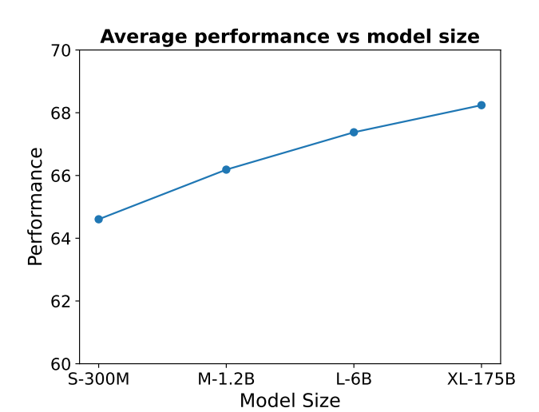
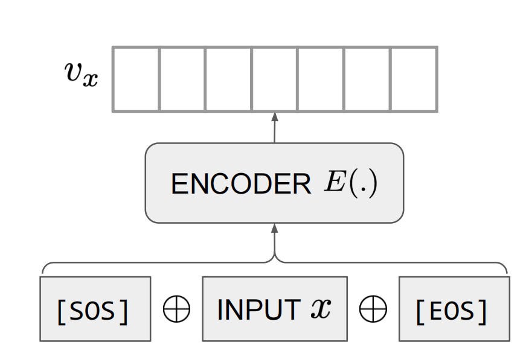
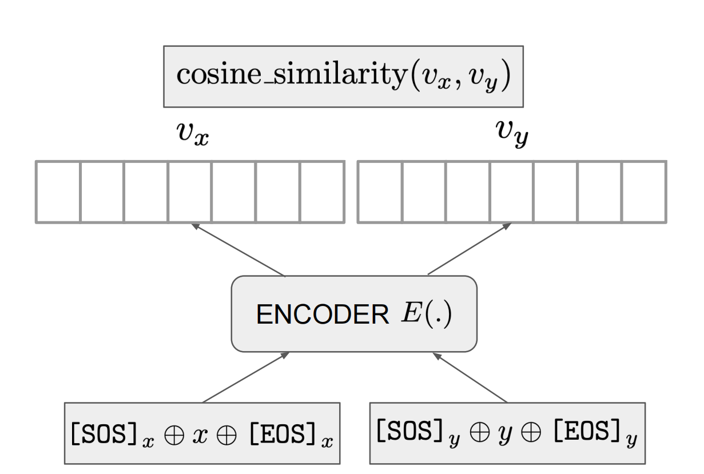

# Text and Code Embeddings by Contrastive Pre-Training
cpt-txt: 通过对比预训练嵌入文本和代码 2022.1.24 https://arxiv.org/abs/2201.10005

## Abstract
Text embeddings are useful features in many applications such as semantic search and computing text similarity. Previous work typically trains models customized for different use cases, varying in dataset choice, training objective and model architecture. In this work, we show that contrastive pre-training on unsupervised data at scale leads to high quality vector representations of text and code. The same unsupervised text embeddings that achieve new state-of-the-art results in linear-probe classification also display impressive semantic search capabilities and sometimes even perform competitively with fine-tuned models. On linear-probe classification accuracy averaging over 7 tasks, our best unsupervised model achieves a relative improvement of 4% and 1.8% over previous best unsupervised and supervised text embedding models respectively. The same text embeddings when evaluated on large-scale semantic search attains a relative improvement of 23.4%, 14.7%, and 10.6% over previous best unsupervised methods on MSMARCO, Natural Questions and TriviaQA benchmarks, respectively. Similarly to text embeddings, we train code embedding models on (text, code) pairs, obtaining a 20.8% relative improvement over prior best work on code search.

文本嵌入是许多应用程序中的有用功能，例如语义搜索和计算文本相似性。以前的工作通常会训练针对不同用例定制的模型，这些用例在数据集选择、训练目标和模型架构方面各不相同。在这项工作中，我们表明，大规模对无监督数据的对比预训练会得到文本和代码的高质量向量表示。在线性探测分类中实现最新结果的相同无监督文本嵌入也显示出令人印象深刻的语义搜索功能，有时甚至可以与微调模型竞争。在平均7个任务的线性探测分类精度上，我们的最佳无监督模型分别比以前的最佳无监督和监督文本嵌入模型实现了4%和1.8%的相对改进。在大规模语义搜索上评估时，相同的文本嵌入分别比以前在MSMARCO，Natural Questions和TriviaQA基准上的最佳无监督方法提高了23.4%，14.7%和10.6%。与文本嵌入类似，我们在 文本-代码对 上训练代码嵌入模型，比之前在代码搜索方面的最佳工作获得了 20.8% 的相对改进。

<!-- linear-probe 线性探测 在2021后的论文反复出现，大模型泛化能力？-->

## 1. Introduction
Deep unsupervised learning with generative and embedding models has seen dramatic success in the past few years. Generative models (Peters et al., 2018; Raffel et al., 2019; van den Oord et al., 2016; Ramesh et al., 2021; Brown et al., 2020; Chen et al., 2021) are trained to maximize the likelihood of observed data while embedding models are trained to distinguish observed data from noise (Sohn, 2016; van den Oord et al., 2018; Radford et al., 2021; Jia et al., 2021; Gao et al., 2021; Izacard et al., 2021). Generative models have been shown to produce realistic content and benefit many downstream applications, reducing the need for labeled training datasets. In generative models, the information about the input is typically distributed over multiple hidden states of the model. While some generative models (Kingma & Welling, 2014; Kiros et al., 2015) can learn a single representation of the input, most autoregressive Transformer (Vaswani et al., 2017) models do not (Raffel et al., 2019; Brown et al., 2020; Chen et al., 2021; Ramesh et al., 2021). However, learning such a representation (or embedding) is necessary for many tasks. Systems that search over millions or billions of items require each entry to be embedded as a dense representation and build an index in advance to save computational costs at query time. These embeddings are useful features for classification tasks and can also enable data visualization applications via techniques such as clustering. Embedding models are explicitly optimized to learn a low dimensional representation that captures the semantic meaning of the input (Radford et al., 2021; Jia et al., 2021; Giorgi et al., 2020; Gao et al., 2021; Izacard et al., 2021).

使用生成和嵌入模型的深度无监督学习在过去几年中取得了巨大的成功。生成模型(Peters et al., 2018; Raffel et al., 2019; van den Oord et al., 2016; Ramesh et al., 2021; Brown et al., 2020; Chen et al., 2021)经过训练以最大限度地提高观测数据的可能性，同时训练嵌入模型以区分观测数据与噪声(Sohn, 2016; van den Oord et al., 2018; Radford et al., 2021; Jia et al., 2021; Gao et al., 2021; Izacard et al., 2021)。生成模型已被证明可以生成逼真的内容并使许多下游应用程序受益，从而减少对标记训练数据集的需求。在生成模型中，有关输入的信息通常分布在模型的多个隐藏状态中。虽然一些生成模型 (Kingma & Welling, 2014; Kiros et al., 2015) 可以学习输入的单一表示，但大多数自回归Transformer (Vaswani et al., 2017)模型则没有(Raffel et al., 2019; Brown et al., 2020; Chen et al., 2021; Ramesh et al., 2021)。但是，学习这样的表示(或嵌入)对于许多任务是必要的。搜索数百万或数十亿项的系统要求将每个条目嵌入为密集表示形式，并提前构建索引以节省查询时的计算成本。这些嵌入是分类任务的有用功能，还可以通过聚类等技术启用数据可视化应用程序。嵌入模型经过显式优化，以学习捕获输入语义的低维表示(Radford et al., 2021; Jia et al., 2021; Giorgi et al., 2020; Gao et al., 2021; Izacard et al., 2021)。

In this work, we train embedding models using a contrastive learning objective with in-batch negatives (Sohn, 2016; Yih et al., 2011) on unlabeled data. The input is encoded with a Transformer encoder (Vaswani et al., 2017) and we leverage naturally occurring paired data to construct training data with no explicit labels. Text embedding models are trained on paired text data where we consider neighboring pieces of text on the Internet as positive pairs. Code embedding models treat the top-level docstring in a function along with its implementation as a (text, code) pair. The training signal of the contrastive objective on its own is not sufficient to learn useful representations and we overcome this by initializing our model with other pretrained models (Brown et al., 2020; Chen et al., 2021). Finally, we find that it is critical to use a sufficiently large batch to achieve the optimal performance. We show that this simple recipe combining pre-trained model initialization, large-batch contrastive learning and training at scale, can produce text and code embeddings that possess a broad range of capabilities.

在这项工作中，我们使用批内否定的对比学习目标(Sohn，2016; Yihet al., 2011)在未标注数据上训练嵌入模型。使用Transformer编码器对输入进行编码(Vaswaniet al., 2017)，我们利用自然出现的成对数据构建无显式标签的训练数据。文本嵌入模型(cpt-txt)是在成对文本数据上训练的，我们将互联网上的相邻文本片段视为正对。代码嵌入模型(cpt-code)将函数中的顶级文档字符串及其实现视为(文本、代码)对。对比目标本身的训练信号不足以学习有用的表示法，我们通过使用其他预处理模型初始化我们的模型来克服这一点(Brownet al., 2020; Chenet al., 2021)。最后，我们发现使用足够大的批处理来实现最佳性能至关重要。我们表明，这种结合了预训练模型初始化、大批量对比学习和大规模训练的简单方法可以产生具有广泛功能的文本和代码嵌入。
<!--其他预处理模型初始化, 足够大的批处理-->

We train a series of unsupervised text embedding models (cpt-text) of different sizes, ranging from 300M to 175B parameters, and observe a consistent performance improvement with increasing model sizes (Figure 1). On classification accuracy averaging across 7 linearprobe classification tasks in SentEval (Conneau & Kiela, 2018), our largest unsupervised model achieves new stateof-the-art results with a relative improvement of 4% and 1.8% over the previous best unsupervised (Giorgi et al., 2020) and supervised (Gao et al., 2021) text embedding models, respectively.

我们训练了一系列不同大小的无监督文本嵌入模型(cpt-text)，参数范围从300M到175B，并观察到随着模型大小的增加，性能得到了一致的改进(图1)。在 SentEval 中 7 个线性探测分类任务的分类准确性平均(Conneau & Kiela，2018)中，我们最大的无监督模型实现了最先进的新结果，分别比之前最好的无监督(Giorgi et al., 2020)和监督(Gao et al., 2021)文本嵌入模型提高了 4% 和 1.8%。


<br/>
Figure 1. Average performance of unsupervised cpt-text models of different sizes across 22 tasks consisting of linear-probe classification, text search, and sentence similarity tasks. 
图1.不同大小的无监督 cpt-text 模型在 22 个任务(包括线性探测分类、文本搜索和句子相似性任务)中的平均性能。


Text embedding in previous work was studied under different domains, varying in data, training objective and model architecture. Precisely, sentence embedding (Reimers & Gurevych, 2019; Gao et al., 2021; Giorgi et al., 2020) and neural information retrieval (Lee et al.; Guu et al., 2020; Karpukhin et al., 2020a; Sachan et al., 2021; Izacard et al., 2021) have remained different research topics evaluated on distinct benchmarks, even though both aim to learn high-quality text representation. However, we find the same model that achieves good performance on sentence embedding benchmarks, as discussed above, is also able to obtain impressive results on large-scale information retrieval. When evaluated on the MSMARCO passage ranking task (Nguyen et al., 2016) to search over 4M passages, cpt-text gets a relative improvement of 23.4% over previous best unsupervised methods (Robertson, 2009). On the task of searching on 21M documents from Wikipedia, cpt-text obtains a relative improvement of 14.7%, and 10.6% over previous unsupervised methods (Izacard et al., 2021) for Natural Questions (Kwiatkowski et al., 2019) and TriviaQA (Joshi et al., 2017), respectively. On TriviaQA, our unsupervised method is even competitive with fine-tuned models.

以前工作中的文本嵌入在不同的领域进行了研究，数据、训练目标和模型架构各不相同。准确地说，句子嵌入(Reimers & Gurevych, 2019; Gao et al., 2021; Giorgi et al., 2020) 和神经信息检索(Lee et al.; Guu et al., 2020; Karpukhin et al., 2020a; Sachan et al., 2021; Izacard et al., 2021)仍然是在不同的基准上评估的不同研究主题，尽管两者都旨在学习高质量的文本表示。然而，我们发现在句子嵌入基准上实现良好性能的相同模型，如上所述，也能够在大规模信息检索中获得令人印象深刻的结果。当在MSMARCO段落排名任务(Nguyenet al., 2016)上评估以搜索超过4M通道时，cpt-text比以前的最佳无监督方法(Robertson，2009)相对提高了23.4%。在从维基百科搜索 21M 文档的任务中，cpt-text 分别比以前的无监督方法(Izacard et al., 2021)在自然问题(Kwiatkowski et al., 2019)和TriviaQA(Joshi et al., 2017)上获得了 14.7% 和 10.6% 的相对改进。在TriviaQA上，我们的无监督方法甚至可以与微调模型竞争。

Next, we train code embedding models (cpt-code) using the same recipe. Our models learn via (text, code) pairs, extracted from open source code. We evaluate our model on CodeSearchNet (Husain et al., 2020), a commonly used code search benchmark, where the task is to find the most relevant code snippet given a natural language query. Our models achieve new state-of-the-art results with a 20.8% relative improvement over the previous best result (Guo et al., 2021). Unlike text embedding models, we observe no performance improvement on code search when increasing the number of parameters of cpt-code from 300M to 1.2B.

接下来，我们使用相同的配置训练代码嵌入模型(cpt-code)。我们的模型通过从开源代码中提取的(文本、代码)对进行学习。我们在CodeSearchNet上评估我们的模型(Husainet al., 2020)，这是一种常用的代码搜索基准，其任务是在给定自然语言查询的情况下找到最相关的代码片段。我们的模型实现了最先进的新结果，与之前的最佳结果相比，相对提高了 20.8%(Guo et al., 2021)。与文本嵌入模型不同，当将 cpt-code 的参数数量从 300M 增加到 1.2B 时，我们观察到代码搜索的性能没有提高。
<!--300mb -> 1.2b, 数据量不够？ -->

Finally, we experiment with fine-tuning our models on several supervised datasets and study the transfer learning performance. When fine-tuned on NLI (Natural Language Inference) datasets, we see a further boost in linearprobe classification, outperforming the previous best transfer method (Gao et al., 2021) by 2.2%. On SST-2 sentiment classification (Socher et al., 2013), we find that our representations are sufficiently descriptive that even a simple k-NN classifier achieves results comparable to a linearprobe classifier. Interestingly, zero-shot performance with our embeddings outperforms the supervised neural network models introduced along with the release of the SST-2 dataset. We also fine-tune the unsupervised model on MSMARCO and evaluate it on a suite of zero-shot search tasks in the BEIR benchmark (Thakur et al., 2021). In the transfer setting, our models achieve a 5.2% relative improvement over previous methods (Izacard et al., 2021) and is comparable even with methods (Santhanam et al., 2021; Formal et al., 2021; Wang et al., 2020) that demand substantially more computation at test time.

最后，我们尝试在几个监督数据集上微调我们的模型，并研究迁移学习性能。在 NLI(自然语言推理)数据集上进行微调时，我们看到线性探测分类进一步提升，比之前的最佳迁移方法(Gao et al., 2021)高出 2.2%。在SST-2情感分类(Socheret al., 2013)上，我们发现我们的表示具有足够的描述性，即使是简单的k-NN分类器也能获得与线性探测分类器相当的结果。有趣的是，我们的嵌入的零样本性能优于随 SST-2 数据集发布而引入的监督神经网络模型。我们还在 MSMARCO 上微调了无监督模型，并在 BEIR 基准测试中的一套零样本搜索任务中对其进行了评估(Thakur et al., 2021)。在迁移设置中，我们的模型比以前的方法实现了 5.2% 的相对改进(Izacard et al., 2021)，甚至可以与方法相媲美(Santhanam et al., 2021; Formal et al., 2021; Wang et al., 2020)，在测试时需要更多的计算。

## 2. Approach
Our models are trained with a contrastive objective on paired data. In this section, we present more details on the model architecture and the training objective. The training set consists of paired samples, $\{(x_i , y_i)\}^N_{i=1}$, where $(x_i , y_i)$ corresponds to a positive example pair, indicating that $x_i$ and $y_i$ are semantically similar or contextually relevant.

我们的模型在配对数据上采用对比目标进行训练。在本节中，我们将提供有关模型架构和训练目标的更多详情。训练集由成对样本 $\{(x_i , y_i)\}^N_{i=1}$组成，其中 $(x_i , y_i)$ 对应于一个正样本对，表明 $x_i$ 和 $y_i$ 在语义上相似或上下文相关。

### 2.1. Model
Given a training pair (x, y), a Transformer (Vaswani et al., 2017) encoder E is used to process x and y independently. The encoder maps the input to a dense vector representation or embedding (Figure 2). We insert two special token delimiters, [SOS] and [EOS], to the start and end of the input sequence respectively. The hidden state from the last layer corresponding to the special token [EOS] is considered as the embedding of the input sequence.

给定一个训练对(x，y)，使用Transformer (Vaswani et al., 2017)编码器E独立处理x和y。编码器将输入映射到密集的矢量表示或嵌入(图2)。我们分别在输入序列的开头和结尾插入两个特殊的标记分隔符 [SOS] 和 [EOS]。对应于特殊令牌 [EOS] 的最后一层的隐藏状态被视为输入序列的嵌入。
<!--加sos,eos的目的？-->


<br/>
Figure 2. The encoder E maps input x to embedding $v_x$. Special tokens, [SOS] and [EOS], are appended to the start and end of the input sequence respectively. The last layer hidden state corresponding to the token [EOS] is extracted as the embedding of the input sequence.
图2.编码器 E 将输入 x 映射到嵌入 $v_x$。特殊标记 [SOS] 和 [EOS] 分别附加到输入序列的开头和结尾。提取与令牌 [EOS] 对应的最后一层隐藏状态作为输入序列的嵌入。


<br/>
Figure 3. The encoder E maps inputs x and y, to embeddings, $v_x$ and $v_y$ independently. The similarity score between x and y is defined as the cosine similarity between these two embedding vectors.
图3.编码器 E 将输入 x 和 y 分别映射到嵌入 $v_x$ 和 $v_y$。x 和 y 之间的相似性得分定义为这两个嵌入向量之间的余弦相似性。

The Transformer encoder maps the input, x and y, to embeddings, $v_x$ and $v_y$ respectively and the similarity between two inputs is quantified by the cosine similarity between their embeddings, $v_x$ and $v_y$ (Figure 3). 

Transformer编码器将输入 x 和 y 分别映射到嵌入 $v_x$ 和 $v_y$，两个输入之间的相似性通过其嵌入之间的余弦相似性 $v_x$ 和 $v_y$ 来量化(图 3)。

$v_x = E([SOS]_x ⊕ x ⊕ [EOS]_x)$ 

$v_y = E([SOS]_y ⊕ y ⊕ [EOS]_y)$ 

$sim(x, y) = \frac{v_x · v_y}{|| v_x || · ||v_y||}$ 

where ⊕ is an operation to concatenate two strings together. We found that using different delimiters leads to more stable training. For x, we use ‘[’ as [SOS]x and ‘]’ as [EOS]x, while we use ‘{’ and ‘}’ as [SOS]y and [EOS]y respectively for y.

其中 ⊕ 是将两个字符串连接在一起的操作。 我们发现使用不同的定界符可以使训练更稳定。 对于 x，我们使用‘[’作为 [SOS]x，‘]’作为 [EOS]x，而我们使用‘{’和‘}’分别作为 y 的 [SOS]y 和 [EOS]y。

### 2.2. Training Objective
The paired samples in the training set are contrasted against in-batch negatives (Yih et al., 2011; Sohn, 2016). Contrastive learning with in-batch negatives has been widely used for unsupervised representation learning in prior work (Radford et al., 2021; Jia et al., 2021; Chen et al., 2020; Izacard et al., 2021). For each example in a mini-batch of M examples, the other (M − 1) in the batch are used as negative examples. The usage of in-batch negatives enables re-use of computation both in the forward and the backward pass making training highly efficient. The logits for one batch is a M × M matrix, where each entry $logit(x_i , y_j)$ is given by, 

训练集中的成对样本与批内负对比(Yihet al., 2011; Sohn，2016)。在之前的研究中，使用批内负的对比学习已广泛用于无监督表征学习(Radfordet al., 2021; Jiaet al., 2021; Chenet al., 2020; Izacardet al., 2021)。对于M个样本的小批量中的每个样本，该批中的其他(M−1)用作反面样本。批内否定的使用使得在前向和后向传球中都可以重复使用计算，从而提高训练效率。一个批次的逻辑是一个M×M矩阵，其中每个条目$logit(x_i，y_j)$由，

$logit(x_i ,y_j ) = sim(x_i , y_j ) · exp(τ )$, 

$∀(i, j), i, j ∈ {1, 2, . . . , M} $

where τ is a trainable temperature parameter.

其中 τ 是可训练的温度参数。

Model | Parameters | Embed Dimensions | Batch size
--| --| --| ---
S | 300M | 1024 | 12288
M | 1.2B | 2048 | 6912
L | 6B | 4096 | 5896
XL | 175B | 12288 | 4976

Table 1. Batch size used to train the models of different sizes. 
表 1.用于训练不同大小的模型的批大小。

Only entries on the diagonal of the matrix are considered positive examples. The final training loss is the sum of the cross entropy losses on the row and the column direction, as described in the following numpy style pseudo code. 

只有矩阵对角线上的条目才被视为正面样本。最终的训练损失是行和列方向上的交叉熵损失之和，如以下 numpy 样式伪代码中所述。
<!-- 样本均衡问题？BERT也有预测上下句的目标，二者啥区别？-->

``` python
labels = np.arange(M) 
l_r = cross_entropy(logits, labels, axis=0) 
l_c = cross_entropy(logits, labels, axis=1) 
loss = (l_r + l_c) / 2
```

We initialize our models with pre-trained generative language models. cpt-text is initialized with GPT models (Brown et al., 2020) and cpt-code is initialized with Codex models (Chen et al., 2021). When fine-tuning our models (Section 3), the supervised training data like NLI datasets contain explicit negative examples and they are used along with the in-batch negatives.

我们使用预先训练的生成语言模型初始化我们的模型。cpt-text 使用 GPT 模型初始化(Brown et al., 2020)，cpt-code 使用 Codex 模型初始化(Chen et al., 2021)。在微调我们的模型(第 3 节)时，像 NLI 数据集这样的监督训练数据包含明确的负样本，并且它们与批量负数一起使用。

## 3. Results
Our models are trained on naturally occurring paired data. cpt-text models are trained on Internet data with neighboring pieces of text as positive pairs for the contrastive objective. The code embedding cpt-code models use (text, code) pairs extracted from open source code. As discussed in Section 3.4.1, sufficiently large batch size is crucial to achieve good performance with our setup. Table 1 lists the batch sizes used to train the models of different sizes.

我们的模型是在自然发生的配对数据上训练的。 cpt-text 模型是在 Internet 数据上训练的，相邻的文本片段作为对比目标的正对。 代码嵌入 cpt-code 模型使用从开源代码中提取的 (text, code) 对。 正如第 3.4.1 节中所讨论的，足够大的批量对于我们的设置实现良好的性能至关重要。 表1 列出了用于训练不同大小模型的批量大小。

We evaluate our text embedding models on a broad range of tasks: linear-probe classification, sentence similarity, and semantic search. While sentence embedding (Reimers & Gurevych, 2019; Gao et al., 2021; Giorgi et al., 2020) methods report results only on embedding benchmarks and neural information retrieval methods (Lee et al.; Guu et al., 2020; Karpukhin et al., 2020a; Sachan et al., 2021; Izacard et al., 2021) report results only on search benchmarks, we use the same unsupervised model across all these tasks.

我们在广泛的任务上评估我们的文本嵌入模型：线性探测分类、句子相似性和语义搜索。 虽然句子嵌入 (Reimers & Gurevych, 2019; Gao et al., 2021; Giorgi et al., 2020) 方法仅报告嵌入基准和神经信息检索方法的结果 (Lee et al.; Guu et al., 2020; Karpukhin et al., 2020a; Sachan et al., 2021; Izacard et al., 2021) 仅报告搜索基准的结果，我们在所有这些任务中使用相同的无监督模型。

### 3.1. Text Embedding
The SentEval benchmark (Conneau & Kiela, 2018) is widely adopted to assess the quality of sentence embeddings, consisting of a broad collection of tasks in the categories of linear-probe classification and sentence similarity, and we use the same to evaluate ours.

SentEval 基准 (Conneau & Kiela, 2018) 被广泛用于评估句子嵌入的质量，包括线性探测分类和句子相似性类别中的广泛任务集合，我们使用它来评估我们的。

#### 3.1.1. LINEAR PROBE CLASSIFICATION 线性探头分类
When evaluated on linear-probe classification, the embeddings are used as features to train a linear classifier to solve a variety of downstream tasks. The results in Table 2 demonstrate a clear advantage of larger model sizes producing better features for improved classification performance. In transfer learning setup, we fine-tune unsupervised cpt-text models on SNLI (Bowman et al., 2015) and MNLI (Williams et al., 2018) datasets using entailment pairs as positive examples and contradiction pairs as negative examples. On both unsupervised learning and transfer learning settings, we achieve state-of-the-art results.

当对线性探测分类进行评估时，嵌入被用作特征来训练线性分类器来解决各种下游任务。 表2 中的结果表明，较大的模型尺寸具有明显的优势，可以产生更好的特征以提高分类性能。 在迁移学习设置中，我们在 SNLI(Bowman et al., 2015)和 MNLI(Williams et al., 2018)数据集上微调无监督 cpt-text 模型，使用匹配对作为正例，不匹配对作为负例。 在无监督学习和迁移学习设置上，我们都取得了最先进的结果。

#### 3.1.2. ZERO-SHOT AND k-NN CLASSIFICATION
In this section, we discuss results using zero-shot classification and k-nearest neighbor classification on the SST-2 binary sentiment classification task (Socher et al., 2013). We experiment with 6B (L) cpt-text model fine-tuned on NLI data for this study. In the first zero-shot experiment, each input text is assigned with one of the two labels (‘positive’, ‘negative’) based on which label has its embedding closest to the input text embedding. The performance can be further improved by prompting, where we use a simple label description, ‘this is an example of a positive/negative movie review.’, instead of a single word. This zero-shot usage of embeddings is novel compared to prior work on embeddings and it is interesting to note that our zero-shot results are better than the supervised neural network results reported along with the release of the dataset (Socher et al., 2013). In the k-NN classification experiment, given an input text, the prediction is the majority label among 256 training examples closest to the test input in the embedding space. As shown in Table 3, the k-NN classifier without any task-specific tuning of trainable parameters achieves results comparable to a linear classifier.

在本节中，我们将讨论在 SST-2 二元情感分类任务中使用零样本分类和 k 最近邻分类的结果(Socher et al., 2013)。 我们对 6B (L) cpt-text 模型进行了实验，该模型针对本研究的 NLI 数据进行了微调。 在第一个零样本实验中，根据哪个标签的嵌入最接近输入文本嵌入，为每个输入文本分配两个标签(‘positive’、‘negative’)之一。 通过提示可以进一步提高性能，我们使用简单的标签描述，“这是一个正面/负面电影评论的例子。”，而不是一个单词。 与之前关于嵌入的工作相比，这种嵌入的零样本使用是新颖的，有趣的是我们的零样本结果比数据集发布时报告的监督神经网络结果更好(Socher et al., 2013) ). 在 k-NN 分类实验中，给定一个输入文本，预测是嵌入空间中最接近测试输入的 256 个训练样本中的多数标签。 如表 3 所示，没有对可训练参数进行任何任务特定调整的 k-NN 分类器取得了与线性分类器相当的结果。

#### 3.1.3. SENTENCE SIMILARITY
On sentence similarity tasks in SentEval, we find that our models perform worse than previous SOTA methods (Table 4). Sentence similarity is not a completely well-defined downstream task (e.g. are the sentences, ‘Jack loves Jill’ and ‘Mary loves chocolates’, similar?)(1 https://twitter.com/yoavgo/status/1431299645570011142 2 https://twitter.com/yoavgo/status/1483565266575540225?s=20). For example, Goodman (1972) argue that two objects can be infinitely similar or dissimilar (Vervaeke et al., 2012). A possible explanation for why our models perform better than prior work on search and classification but not on these tasks is that our models might not be optimized for the specific definition used by these sentence similarity benchmarks. It is important to note that previous embedding search methods do not report performance on sentence similarity tasks (Karpukhin et al., 2020a; Sachan et al., 2021; Izacard et al., 2021). More discussion on this phenomenon is presented in Section 3.4.2.

在 SentEval 中的句子相似性任务中，我们发现我们的模型比以前的 SOTA 方法表现更差(表 4)。 句子相似性并不是一个完全明确定义的下游任务(例如，“Jack loves Jill”和“Mary loves chocolates”这两个句子是否相似？)(1 https://twitter.com/yoavgo/status/1431299645570011142 2 https: //twitter.com/yoavgo/status/1483565266575540225?s=20)。 例如，Goodman (1972) 认为两个对象可以无限相似或无限不同 (Vervaeke et al., 2012)。 为什么我们的模型在搜索和分类方面比之前的工作表现更好，但在这些任务上却没有，一个可能的解释是我们的模型可能没有针对这些句子相似性基准使用的特定定义进行优化。 重要的是要注意，以前的嵌入搜索方法不会报告句子相似性任务的性能(Karpukhin et al., 2020a; Sachan et al., 2021; Izacard et al., 2021)。 3.4.2 节介绍了关于这种现象的更多讨论。

### 3.2. Text Search
Previous work on training embedding methods for search typically requires fine-tuning on a particular text search dataset (Karpukhin et al., 2020a; Sachan et al., 2021; Qu et al., 2021). It is also common to have a multi-step setup where fine-tuned models rely on an expensive query and document cross-attention encoder in the final step (Qu et al., 2021; Wang et al., 2020). In contrast, we push the limits of using a single embedding model for large-scale semantic search.

先前关于训练搜索嵌入方法的工作通常需要对特定文本搜索数据集进行微调(Karpukhin et al., 2020a; Sachan et al., 2021; Qu et al., 2021)。 多步骤设置也很常见，其中微调模型在最后一步依赖昂贵的查询和文档交叉注意力编码器(Qu et al., 2021; Wang et al., 2020)。 相比之下，我们突破了使用单一嵌入模型进行大规模语义搜索的限制。

#### 3.2.1. LARGE-SCALE SEARCH
First, we evaluate our models on several large-scale text search benchmarks. MSMARCO (Nguyen et al., 2016) requires the model to search over 4M documents while Natural Questions (NQ) (Kwiatkowski et al., 2019) and TriviaQA (Joshi et al., 2017) involve searching over 21M Wikipedia documents. We use the FAISS library (Johnson et al., 2019) to build the vector indices for approximate k-nearest neighbor search. The same unsupervised model discussed previously achieves impressive performance on semantic search. Table 5 demonstrates that cpt-text outperforms prior unsupervised approaches by a big margin and larger model sizes consistently lead to improved performance. Surprisingly, on TriviaQA, our model is even competitive with fine-tuned models. 

首先，我们在几个大规模文本搜索基准上评估我们的模型。 MSMARCO(Nguyen et al., 2016)要求模型搜索超过 400 万份文档，而自然问题 (NQ)(Kwiatkowski et al., 2019)和 TriviaQA(Joshi et al., 2017)涉及搜索超过 2100 万份维基百科文档。 我们使用 FAISS 库(Johnson et al., 2019)来构建用于近似 k 最近邻搜索的向量索引。 前面讨论的相同无监督模型在语义搜索方面取得了令人印象深刻的性能。 表5 表明 cpt-text 的性能大大优于之前的无监督方法，并且更大的模型尺寸始终会导致性能提高。 令人惊讶的是，在 TriviaQA 上，我们的模型甚至可以与微调模型竞争。

Table 2. cpt-text models of different sizes, ranging from 300M (S) to 175B (XL), are compared to previous work on linear-probe classification tasks in SentEval. We report performance of unsupervised models, as well as those fine-tuned on NLI data.
表 2. 不同大小的 cpt 文本模型，范围从 300M (S) 到 175B (XL)，与 SentEval 中线性探测分类任务的先前工作进行了比较。 我们报告无监督模型的性能，以及那些在 NLI 数据上微调的模型。


Table 3. Comparison of different classification strategies using the 6B cpt-text model fine-tuned on NLI data for SST-2 binary sentiment task (Socher et al., 2013). Our zero-shot results are better than the 85.4% accuracy obtained by supervised neural networks reported along with the release of the dataset (Socher et al., 2013).
表 3. 使用 6B cpt-text 模型对 SST-2 二元情感任务的 NLI 数据进行微调的不同分类策略的比较(Socher et al., 2013)。 我们的零样本结果优于数据集发布时报告的监督神经网络获得的 85.4% 精度(Socher et al., 2013)。

Table 4. cpt-text performs worse than the previous best sentence embedding method on sentence similarity tasks. We investigate this result in more detail in Section 3.4.2.
表 4. cpt-text 在句子相似性任务上的表现比之前最好的句子嵌入方法差。 我们在第 3.4.2 节中更详细地研究了这个结果。
<!--相似性任务上的表现差？-->

Table 5. Evaluation of unsupervised cpt-text models of different sizes on several large-scale text search benchmarks. We report MRR@10 on MSMARCO and Recall@20, Recall@100 for NQ and TriviaQA as done in prior work. Results for training with Inverse Cloze Task (ICT) and masked salient spans (MSS) objectives are taken from Sachan et al. (2021). cpt-text achieves the best results among unsupervised methods, surpassing keyword search methods on MSMARCO (Robertson, 2009) and embedding based methods (Izacard et al., 2021) on NQ and TriviaQA.
表 5. 不同大小的无监督 cpt-text 模型在几个大规模文本搜索基准上的评估。 我们在 MSMARCO 上报告 MRR@10，在 NQ 和 TriviaQA 上报告 Recall@20、Recall@100，正如之前的工作所做的那样。 使用反向完形填空任务 (ICT) 和掩码显著跨度 (MSS) 目标进行训练的结果取自 Sachan et al. (2021)。 cpt-text 在无监督方法中取得了最好的结果，在 MSMARCO (Robertson, 2009) 上超过了关键字搜索方法，在 NQ 和 TriviaQA 上超过了基于嵌入的方法 (Izacard et al., 2021)。


#### 3.2.2. BEIR SEARCH
Next, we evaluate our models on 11 zero-shot search tasks in the BEIR evaluation suite (Thakur et al., 2021). First, we observe that our unsupervised model performs competitively even with some previous embedding methods that leverage supervised MSMARCO data (Xiong et al., 2020; Hofst¨atter et al., 2021). Keyword-based BM25 (Robertson, 2009) achieves the best results in the unsupervised setting while cpt-text achieves the best transfer learning results.

接下来，我们在 BEIR 评估套件(Thakur et al., 2021)中针对 11 个零样本搜索任务评估我们的模型。 首先，我们观察到我们的无监督模型即使与之前利用监督 MSMARCO 数据的一些嵌入方法相比也具有竞争力(Xiong et al., 2020; Hofstatter et al., 2021)。 基于关键字的 BM25 (Robertson, 2009) 在无监督设置中取得了最好的结果，而 cpt-text 取得了最好的迁移学习结果。

In the transfer setting, our models achieve a 5.2% relative improvement over the previous best embedding method (Izacard et al., 2021). It also outperforms docT5query (Nogueira et al., 2019a) that relies on a fine-tuned T5 model (Raffel et al., 2019) for document expansion. cpt-text results are competitive even with methods that use substantially more compute at test time. BM25+CE (Wang et al., 2020) uses keyword search to select top 100 documents which are then re-ranked by a cross-attention neural network encoder. The ranking encoder network performs computationally expensive joint query and document attention and cannot exploit indexing and approximate nearest neighbor algorithms for fast and efficient search at query time. Several other existing work take this approach of leveraging more computation resources at query time to obtain better search performance. ColBERT v2 (Santhanam et al., 2021) is a multi-vector method that represents the query and the documents as a set of vectors, and employs a multi-step retrieval procedure to obtain relevant documents. Splade v2 (Formal et al., 2021) represents queries and documents as sparse vectors of size equivalent to the vocabulary of the BERT encoder (Devlin et al., 2019). Our cpt-text models compute only one dense embedding per document which are indexed offline and does not depend on any cross-attention re-ranker at query time.

在迁移设置中，我们的模型比之前的最佳嵌入方法实现了 5.2% 的相对改进(Izacard et al., 2021)。 它还优于 docT5query(Nogueira et al., 2019a)，后者依赖于经过微调的 T5 模型(Raffel et al., 2019)进行文档扩展。 即使与在测试时使用更多计算的方法相比，cpt-text 结果也具有竞争力。 BM25+CE (Wang et al., 2020) 使用关键字搜索来选择前 100 个文档，然后由交叉注意力神经网络编码器重新排序。 排名编码器网络执行计算量大的联合查询和文档注意，并且不能利用索引和近似最近邻算法在查询时进行快速有效的搜索。 其他一些现有工作采用这种在查询时利用更多计算资源的方法来获得更好的搜索性能。 ColBERT v2 (Santhanam et al., 2021) 是一种多向量方法，将查询和文档表示为一组向量，并采用多步检索过程来获取相关文档。 Splade v2 (Formal et al., 2021) 将查询和文档表示为大小等于 BERT 编码器词汇表的稀疏向量(Devlin et al., 2019)。 我们的 cpt-text 模型只计算每个文档的一个密集嵌入，这些嵌入是离线索引的，并且在查询时不依赖于任何交叉注意力重新排序器。

### 3.3. Code Search
We evaluate our code embedding models on the code search task using the CodeSearchNet benchmark (Husain et al., 2020). Given a natural language query, the model is expected to retrieve the relevant code block among 1K candidates. The models are evaluated on 6 programming languages and our model achieves state-of-the-art results (Table 7). Unlike with text embeddings, we do not see a performance improvement with increased model size for code embeddings.

我们使用 CodeSearchNet 基准(Husain et al., 2020)在代码搜索任务上评估我们的代码嵌入模型。 给定一个自然语言查询，该模型有望在 1K 个候选者中检索相关代码块。 这些模型在 6 种编程语言上进行了评估，我们的模型取得了最先进的结果(表7)。 与文本嵌入不同，我们没有看到代码嵌入的模型大小增加会带来性能提升。

We also evaluate on a harder setting of finding the relevant code block among 10K candidates instead of 1K. Here, we compare the performance of cpt-text models against cpt-code models (Table 8). It is interesting to see that text embedding performs fairly well in code search especially in Python. We see a drop in performance for code embedding models with increased distractors and still don’t see bigger models giving a boost in search performance.

我们还评估了在 10K 个候选而不是 1K 中找到相关代码块的更难设置。 在这里，我们比较了 cpt-text 模型与 cpt-code 模型的性能(表 8)。 有趣的是，文本嵌入在代码搜索中表现相当出色，尤其是在 Python 中。 我们看到代码嵌入模型的性能随着干扰因素的增加而下降，并且仍然没有看到更大的模型可以提高搜索性能。

### 3.4. Analysis
#### 3.4.1. EFFECT OF BATCH SIZE
Our ablation study highlights the effect of the model’s batch size on the final performance. Table 9 compares the performance of S (300M) cpt-text model trained with different batch sizes on the NQ development set. Since we train with in-batch negatives, a larger batch increases the chances of having hard negatives in a batch, resulting in a significant performance boost.

我们的消融研究强调了模型批量大小对最终性能的影响。 表9 比较了在 NQ 开发集上使用不同 batch size 训练的 S (300M) cpt-text 模型的性能。 由于我们使用批内负片进行训练，因此更大的批次会增加批次中出现硬负片的机会，从而显著提高性能。

#### 3.4.2. TRAINING BEHAVIOR
We observe that as we train our models for longer, the performance on search and classification tasks increases while the performance on sentence similarity tasks decreases (Figure 4). As discussed previously, sentence similarity is not a well defined task. A hypothesis is that search tasks and sentence similarity tasks might have contradicting definitions. For example, a sentence and its negation could be considered as relevant during search, but not “similar” in sentence similarity tasks. It is also important to note that previous embedding search methods do not report performance on sentence similarity tasks (Karpukhin et al., 2020a; Sachan et al., 2021; Izacard et al., 2021) and previous sentence embedding methods do not evaluate on search tasks (Reimers & Gurevych, 2019; Giorgi et al., 2020; Gao et al., 2021). When deciding the model checkpoints to use for evaluation, we assigned higher importance to search and classification tasks as they are commonly associated with clearly defined real-world applications while sentence similarity tasks are less so.

我们观察到，随着我们对模型进行更长时间的训练，搜索和分类任务的性能会提高，而句子相似性任务的性能会下降(图 4)。 如前所述，句子相似性不是一个明确定义的任务。 一个假设是搜索任务和句子相似性任务可能有相互矛盾的定义。 例如，一个句子及其否定在搜索过程中可以被认为是相关的，但在句子相似性任务中则不是“相似的”。 同样重要的是要注意，以前的嵌入搜索方法不报告句子相似性任务的性能(Karpukhin et al., 2020a; Sachan et al., 2021; Izacard et al., 2021)，以前的句子嵌入方法不评估 搜索任务 (Reimers & Gurevych, 2019; Giorgi et al., 2020; Gao et al., 2021)。 在决定用于评估的模型检查点时，我们对搜索和分类任务赋予了更高的重要性，因为它们通常与明确定义的现实世界应用相关联，而句子相似性任务则不太重要。

## 4. Related Work
The goal of representation learning (Bengio et al., 2012) is to learn an embedding space in which similar examples stay close to each other while dissimilar ones are far apart (Hadsell et al., 2006). In contrastive learning, the learning procedure is formulated as a classification problem given similar and dissimilar candidates (Chopra et al., 2005; Gutmann & Hyv¨arinen, 2010; Schroff et al., 2015; Sohn, 2016; van den Oord et al., 2018). Recent work relies on contrastive objective to learn representations for images (Wu et al., 2018; He et al., 2020; Chen et al., 2020; Zbontar et al., 2021), text, or both jointly (Lu et al., 2019; Sun et al., 2019; Kim et al., 2021; Radford et al., 2021; Khosla et al., 2020). In self-supervised contrastive learning, positive samples can be collected in various approaches including by creating an augmented version of the original input without modifying the semantic meaning (Gao et al., 2021), by grouping samples within the same context (Giorgi et al., 2020; Izacard et al., 2021), or by collecting data about the same object from different views (Tian et al., 2019).

表示学习的目标 (Bengio et al., 2012) 是学习一个嵌入空间，在该空间中相似的例子彼此靠近，而不同的例子相距很远 (Hadsell et al., 2006)。 在对比学习中，学习过程被表述为给定相似和不同候选人的分类问题(Chopra et al., 2005; Gutmann 和 Hyvarinen，2010; Schroff et al., 2015; Sohn，2016; van den Oord et al  ., 2018). 最近的工作依赖于对比目标来学习图像(Wu et al., 2018; He et al., 2020; Chen et al., 2020; Zbontar et al., 2021)、文本或两者的表征(Lu et al. ., 2019; Sun et al., 2019; Kim et al., 2021; Radford et al., 2021; Khosla et al., 2020)。 在自监督对比学习中，可以通过各种方法收集正样本，包括通过在不修改语义含义的情况下创建原始输入的增强版本(Gao et al., 2021)，通过在相同上下文中对样本进行分组(Giorgi et al  ., 2020; Izacard et al., 2021)，或通过从不同视角收集关于同一对象的数据 (Tian et al., 2019)。

Table 6. Comparison of cpt-text to previous methods on 11 zero-shot search tasks in the BEIR evaluation suite (Thakur et al., 2021). Results are reported both in the unsupervised data setting and in the transfer data setting. cpt-text outperforms previous best embedding methods (Xiong et al., 2020; Hofst¨atter et al., 2021; Izacard et al., 2021) in both the settings. In the unsupervised setting, BM25 (Robertson, 2009) still achieves the best performance while in the transfer setting cpt-text is competitive with methods that use substantially more compute at test time (Wang et al., 2020; Santhanam et al., 2021; Formal et al., 2021).
表 6. cpt-text 与之前方法在 BEIR 评估套件(Thakur et al., 2021)中 11 个零样本搜索任务上的比较。 结果在无监督数据设置和迁移数据设置中均有报告。 cpt-text 在这两种设置中都优于以前的最佳嵌入方法(Xiong et al., 2020; Hofst¨atter et al., 2021; Izacard et al., 2021)。 在无监督设置中，BM25 (Robertson, 2009) 仍然取得了最佳性能，而在迁移设置中，cpt-text 与在测试时使用大量计算的方法具有竞争力(Wang et al., 2020; Santhanam et al., 2021) ; Formal et al., 2021)。

Table 7. Comparison of cpt-code on code search across 6 programming languages (Husain et al., 2020) with CodeBERT (Feng et al., 2020) and GraphCodeBERT (Guo et al., 2021). The task requires finding the relevant code block among 1K candidates for a given natural language query. cpt-code performs substantially better than previous methods on all the languages.
表 7. cpt-code 在 6 种编程语言(Husain et al., 2020)与 CodeBERT(Feng et al., 2020)和 GraphCodeBERT(Guo et al., 2021)的代码搜索上的比较。 该任务需要在 1K 个候选者中为给定的自然语言查询找到相关的代码块。 cpt-code 在所有语言上的表现都比以前的方法好得多。

Table 8. Comparison of cpt-code vs cpt-text on large scale code search (Husain et al., 2020). The task is to retrieve the relevant code block among 10K candidates for a given natural language query. It is interesting to note that cpt-text performs quite well on Python code search without explicitly training on (text, code) pairs.
表 8. cpt-code 与 cpt-text 在大规模代码搜索中的比较(Husain et al., 2020)。 任务是在给定自然语言查询的 10K 个候选者中检索相关代码块。 有趣的是，cpt-text 在 Python 代码搜索上表现得很好，而无需对 (text, code) 对进行显式训练。


Batch Size | MRR@10 
--- | --- 
1536 | 71.4 
12288 | 84.7

Table 9. Performance of the cpt-text 300M model on NQ dev set given different training batch sizes. 
表 9. cpt-text 300M 模型在 NQ 开发集上给定不同训练批量大小的性能。


Learning word embeddings is a well studied research area (Brown et al., 1992; Gutmann & Hyv¨arinen, 2010; Mikolov et al., 2013; Pennington et al., 2014). Learning lowdimensional representations of larger text pieces, denser than raw term-based vectors, has been studied extensively as well (Deerwester et al., 1990; Yih et al., 2011). Most of the recent models for learning sentence embeddings rely on supervised NLI datasets, using entailment pairs as positive examples and contradiction pairs as (hard) negatives. SBERT (Reimers & Gurevych, 2019) trained a siamese network to learn a representation where sentence similarity is estimated by the cosine similarity between embeddings. Li et al. (2020) improves the embedding space to be isotropic via normalizing flows. The whitening operation is another alternative operation to improve the isotropy of the embedding space (Su et al., 2021). It is typical to initialize such models with a pre-trained language model (Devlin et al., 2019) before training on NLI datasets.

学习词嵌入是一个经过充分研究的研究领域(Brown et al., 1992; Gutmann 和 Hyvarinen，2010; Mikolov et al., 2013; Pennington et al., 2014)。 学习更大文本片段的低维表示，比基于原始术语的向量更密集，也得到了广泛的研究(Deerwester et al., 1990; Yih et al., 2011)。 大多数用于学习句子嵌入的最新模型都依赖于受监督的 NLI 数据集，使用蕴含对作为正例，使用矛盾对作为(硬)负例。 SBERT(Reimers & Gurevych，2019)训练了一个孪生网络来学习一种表示，其中句子相似性是通过嵌入之间的余弦相似性来估计的。 李等。 (2020) 通过归一化流将嵌入空间改进为各向同性。 白化操作是另一种提高嵌入空间各向同性的替代操作(Su et al., 2021)。 在对 NLI 数据集进行训练之前，通常会使用预训练的语言模型(Devlin et al., 2019)初始化此类模型。

Figure 4. Performance of M (1.2B) cpt-text model on classification, search and sentence similarity tasks at different training steps. While the performance on search and classification improves with longer training, the performance on sentence similarity degrades. 
图 4. M (1.2B) cpt-text 模型在不同训练步骤的分类、搜索和句子相似性任务上的性能。 虽然搜索和分类的性能随着训练时间的延长而提高，但句子相似性的性能却下降了。

Several methods have been studied for unsupervised or self-supervised sentence embedding learning (Logeswaran & Lee, 2018; Zhang et al., 2020; Gao et al., 2021). Common approaches consider sentences within the same context as semantically similar samples (Kiros et al., 2015; Logeswaran & Lee, 2018). To create positive training pairs with augmented samples, a diverse set of text augmentation operations have been explored, including lexiconbased distortion (Wei & Zou, 2019), synonym replacement (Kobayashi, 2018), back-translation (Fang & Xie, 2020), cut-off (Shen et al., 2020) and dropout (Gao et al., 2021). However, unsupervised sentence embedding models still perform notably worse than supervised sentence encoders.

已经研究了几种用于无监督或自监督句子嵌入学习的方法(Logeswaran & Lee，2018; Zhang et al., 2020; Gao et al., 2021)。 常见的方法将相同上下文中的句子视为语义相似的样本(Kiros et al., 2015; Logeswaran 和 Lee，2018)。 为了使用增强样本创建正训练对，已经探索了一组不同的文本增强操作，包括基于词典的失真 (Wei & Zou, 2019)、同义词替换 (Kobayashi, 2018)、反向翻译 (Fang & Xie, 2020)、 cut-off (Shen et al., 2020) 和 dropout (Gao et al., 2021)。 然而，无监督句子嵌入模型的性能仍然明显低于监督句子编码器。

Large-scale text search based on dense embeddings and neural information retrieval (neural IR) have the potential to generalize better than keyword matching in classic IR systems. Neural IR systems encode documents at the indexing stage and then perform nearest neighbor search (Johnson et al., 2019) at query time (Lin et al., 2021). Neural IR models are usually learned by fine-tuning a pretrained language model on supervised search corpus (Lee et al.; Guu et al., 2020; Karpukhin et al., 2020b; Lewis et al., 2020). Many SOTA search models combine classical IR with neural IR in a staged setup, where the candidates are first narrowed down by BM25 keyword search (Robertson, 2009) and then re-ranked by joint query and document neural encoders (Nogueira et al., 2019b; Qu et al., 2021). Xiong et al. (2020) proposed ANCE, a contrastive learning framework for learning text representations for dense retrieval using mined hard negatives. Other unsupervised retriever methods use the Inverse Cloze Task or masked salient spans to achieve significant improvement on ODQA tasks (Sachan et al., 2021). In comparison to most prior work, we find that with a large enough batch size, it is possible to achieve good search performance without using supervised data. Finally, the recently published Contriever (Izacard et al., 2021) is most similar to our work on learning text embeddings for text search using contrastive learning on unlabeled data.

基于密集嵌入和神经信息检索(神经 IR)的大规模文本搜索具有比经典 IR 系统中的关键字匹配更好的泛化能力。 神经 IR 系统在索引阶段对文档进行编码，然后在查询时执行最近邻搜索 (Johnson et al., 2019) (Lin et al., 2021)。 神经 IR 模型通常是通过在监督搜索语料库上微调预训练语言模型来学习的(Lee et al ; Guu et al., 2020; Karpukhin et al., 2020b; Lewis et al., 2020)。 许多 SOTA 搜索模型在分阶段设置中将经典 IR 与神经 IR 相结合，其中候选者首先通过 BM25 关键字搜索(Robertson，2009)缩小范围，然后通过联合查询和文档神经编码器重新排名(Nogueira et al., 2019b) ;曲et al., 2021)。 熊等。 (2020) 提出了 ANCE，这是一种对比学习框架，用于学习文本表示以使用挖掘的硬底片进行密集检索。 其他无监督检索器方法使用逆完形填空任务或掩码显著跨度来实现对 ODQA 任务的显著改进(Sachan et al., 2021)。 与大多数先前的工作相比，我们发现如果批量大小足够大，则可以在不使用监督数据的情况下实现良好的搜索性能。 最后，最近发表的 Contriever (Izacard et al., 2021) 与我们在未标注数据上使用对比学习来学习文本嵌入以进行文本搜索的工作最相似。

Semantic code search refers to the task of retrieving code relevant to a query in natural language. The CodeSearchNet challenge (Husain et al., 2020) presents a set of benchmark code search tasks in different programming languages, as well as a simple baseline model to predict embeddings of query and code via contrastive learning on a dataset of (text, code) pairs. ContraCode (Jain et al., 2021) uses a contrastive learning task of identifying functionally similar programs, where the functionally similar samples are generated via source-to-source compiler transformations. CodeBERT (Feng et al., 2020) learns to predict semantic similarity with a pre-trained language model and GraphCodeBERT (Guo et al., 2021) further improves the performance on the CodeSearchNet benchmark by adding pre-training tasks on code structure.

语义代码搜索是指以自然语言检索与查询相关的代码的任务。 CodeSearchNet 挑战赛(Husain et al., 2020)提出了一组不同编程语言的基准代码搜索任务，以及一个简单的基线模型，通过对(文本，代码)数据集的对比学习来预测查询和代码的嵌入 对。 ContraCode(Jain et al., 2021)使用对比学习任务来识别功能相似的程序，其中功能相似的样本是通过源到源编译器转换生成的。 CodeBERT(Feng et al., 2020)通过预训练语言模型学习预测语义相似度，而 GraphCodeBERT(Guo et al., 2021)通过在代码结构上添加预训练任务进一步提高了 CodeSearchNet 基准测试的性能。

## 5. Broader Impacts
Prior research has shown that text representation models encode the biases present in their training data, including those which are discriminatory towards protected groups such as Black people or women (Bolukbasi et al., 2016; Caliskan et al., 2017; May et al., 2019; Zhao et al., 2018; Rudinger et al., 2018). Biases encoded in embedding models may cause representational harms(3 Representational harms occur when systems reinforce the subordination of some groups along the lines of identity, e.g. stereotyping or denigration (Crawford, 2017).) by reinforcing existent societal biases in the text corpus, and further propagating them in downstream tasks of embedding models.

先前的研究表明，文本表示模型对其训练数据中存在的偏见进行编码，包括那些歧视黑人或妇女等受保护群体的偏见(Bolukbasi et al., 2016; Caliskan et al., 2017; May et al. ，2019; Zhao et al., 2018; Rudinger et al., 2018)。 嵌入模型中编码的偏差可能会通过强化文本语料库中现有的社会偏见而导致表征危害(3 当系统沿着身份强化某些群体的从属关系时，例如刻板印象或诋毁(Crawford，2017)，就会发生表征危害，并且 在嵌入模型的下游任务中进一步传播它们。

Therefore, we encourage further research on two research agendas: (a) developing robust evaluation methodologies for multiple classes of bias in training data and pre-trained models, and (b) developing and improving methods for mitigating encoded bias, including fine-tuning to reduce bias in pre-trained models (Caliskan et al., 2017; May et al., 2019; Bolukbasi et al., 2016; Liang et al., 2020; Park et al., 2018; Solaiman & Dennison, 2021). Until we have robust evaluation methodology, it is important to restrict and monitor the use of the model in downstream applications. Particularly for those where risk of representational harm is great and those where biased representations may influence the allocation of resources and opportunities to people.

因此，我们鼓励进一步研究两个研究议程：(a)为训练数据和预训练模型中的多类偏差开发稳健的评估方法，以及(b)开发和改进减轻编码偏差的方法，包括微调 减少预训练模型中的偏差(Caliskan et al., 2017; May et al., 2019; Bolukbasi et al., 2016; Liang et al., 2020; Park et al., 2018; Solaiman 和 Dennison，2021)。 在我们拥有稳健的评估方法之前，限制和监控模型在下游应用程序中的使用非常重要。 特别是对于那些代表性伤害风险很大的人以及那些有偏见的陈述可能会影响资源和机会分配给人们的人。

Our embedding models are trained with large batch sizes and require substantial computation resources. While this training regime is environmentally and computationally costly, there are promising paths forward to amortize and offset these costs while allowing users to benefits from the capabilities of these models. For example, safe public access to large pre-trained language models, and efficient training pipelines that leverage improved model architectures and training schemes. We encourage further research and implementation efforts in these areas.

我们的嵌入模型经过大批量训练，需要大量计算资源。 虽然这种训练制度在环境和计算方面成本高昂，但有一些有前途的途径可以分摊和抵消这些成本，同时允许用户从这些模型的功能中受益。 例如，安全地公开访问大型预训练语言模型，以及利用改进的模型架构和训练方案的高效训练管道。 我们鼓励在这些领域进一步研究和实施。

## 6. Conclusion
We showed that contrastive pre-training on unsupervised data with a sufficiently large batch size can lead to high quality vector representations of text and code. Our models achieved new state-of-the-art results in linear-probe classification, text search and code search. We find that our models underperformed on sentence similarity tasks and observed unexpected training behavior with respect to these tasks. Finally, we discussed the broader impact of our work on society.

我们表明，对具有足够大批量大小的无监督数据进行对比预训练可以产生高质量的文本和代码向量表示。 我们的模型在线性探测分类、文本搜索和代码搜索方面取得了最新的最新成果。 我们发现我们的模型在句子相似性任务上表现不佳，并且观察到关于这些任务的意外训练行为。 最后，我们讨论了我们的工作对社会的更广泛影响。

## References
* Bengio, Y., Courville, A. C., and Vincent, P. Representa￾tion learning: A review and new perspectives. Transac￾tions on pattern analysis and machine intelligence, 35
(8), 2012.
* Bolukbasi, T., Chang, K., Zou, J. Y., Saligrama, V., and
Kalai, A. Man is to computer programmer as woman is
to homemaker? debiasing word embeddings. 29, 2016.
* Bowman, S. R., Angeli, G., Potts, C., and Manning, C. D.
* A large annotated corpus for learning natural language
inference. In Conference on Empirical Methods in Nat￾ural Language Processing (EMNLP). ACL, 2015.
* Brown, P. F., Della Pietra, V. J., deSouza, P. V., Lai, J. C.,and Mercer, R. L. Class-based n-gram models of nat￾ural language. Computational Linguistics, 18(4):467–
480, 1992.
* Brown, T., Mann, B., Ryder, N., Subbiah, M., Kaplan,J. D., Dhariwal, P., Neelakantan, A., Shyam, P., Sastry,G., Askell, A., Agarwal, S., Herbert-Voss, A., Krueger,G., Henighan, T., Child, R., Ramesh, A., Ziegler, D.,Wu, J., Winter, C., Hesse, C., Chen, M., Sigler, E.,Litwin, M., Gray, S., Chess, B., Clark, J., Berner, C.,McCandlish, S., Radford, A., Sutskever, I., and Amodei,D. Language models are few-shot learners. In Advances
in Neural Information Processing Systems, 2020.
* Caliskan, A., Bryson, J. J., and Narayanan, A. Seman￾tics derived automatically from language corpora contain
human-like biases. Science, 356(6334):183–186, 2017.
* Chen, M., Tworek, J., Jun, H., Yuan, Q., de Oliveira Pinto,H. P., Kaplan, J., Edwards, H., Burda, Y., Joseph, N.,Brockman, G., Ray, A., Puri, R., Krueger, G., Petrov,M., Khlaaf, H., Sastry, G., Mishkin, P., Chan, B., Gray,S., Ryder, N., Pavlov, M., Power, A., Kaiser, L., Bavar￾ian, M., Winter, C., Tillet, P., Such, F. P., Cummings,D., Plappert, M., Chantzis, F., Barnes, E., Herbert-Voss,A., Guss, W. H., Nichol, A., Paino, A., Tezak, N., Tang,J., Babuschkin, I., Balaji, S., Jain, S., Saunders, W.,Hesse, C., Carr, A. N., Leike, J., Achiam, J., Misra,V., Morikawa, E., Radford, A., Knight, M., Brundage,M., Murati, M., Mayer, K., Welinder, P., McGrew, B.,Amodei, D., McCandlish, S., Sutskever, I., and Zaremba,W. Evaluating large language models trained on code. arXiv preprint arXiv:2107.03374, 2021.
* Chen, T., Kornblith, S., Norouzi, M., and Hinton, G. E.
* A simple framework for contrastive learning of visual
representations. In International conference on machine
learning (ICML), 2020.
* Chopra, S., Hadsell, R., and LeCun, Y. Learning a similar￾ity metric discriminatively, with application to face ver￾ification. In Computer Vision and Pattern Recognition
(CVPR). IEEE, 2005.
* Conneau, A. and Kiela, D. Senteval: An evaluation toolkit
for universal sentence representations. arXiv preprint arXiv:1803.05449, 2018.
* Crawford, K. The trouble with bias. Keynote at NeurIPS,2017.
* Deerwester, S., Dumais, S., Furnas, G., Landauer, T., and
Harshman, R. Indexing by latent semantic analysis.
* Journal of the American society for information science,41(6):391–407, 1990.
* Devlin, J., Chang, M.-W., Lee, K., and Toutanova, K.
* BERT: Pre-training of deep bidirectional transformers
for language understanding. In Conference of the North
American Chapter of the Association for Computational
Linguistics (NAACL). ACL, 2019.
* Fang, H. and Xie, P. CERT: contrastive self-supervised
learning for language understanding. arXiv preprint arXiv:2005.12766, 2020.
* Feng, Z., Guo, D., Tang, D., Duan, N., Feng, X., Gong, M.,Shou, L., Qin, B., Liu, T., Jiang, D., and Zhou, M. Code￾bert: A pre-trained model for programming and natural
Text and Code Embeddings by Contrastive Pre-Training
languages. In Conference on Empirical Methods in Nat￾ural Language Processing (EMNLP), 2020.
* Formal, T., Lassance, C., Piwowarski, B., and Clinchant,S. SPLADE v2: Sparse lexical and expansion model for
information retrieval. arXiv preprint arXiv:2109.10086,2021.
* Gao, T., Yao, X., and Chen, D. SimCSE: Simple con￾trastive learning of sentence embeddings. In Conference
on Empirical Methods in Natural Language Processing
(EMNLP), 2021.
* Giorgi, J. M., Nitski, O., Bader, G. D., and Wang, B. De￾clutr: Deep contrastive learning for unsupervised textual
representations. In Proceedings of ACL/IJCNLP, 2020.
* Goodman, N. Seven strictures on similarity. Bobbs Merrill,1972.
* Guo, D., Ren, S., Lu, S., Feng, Z., Tang, D., Liu, S.,Zhou, L., Duan, N., Svyatkovskiy, A., Fu, S., Tufano,M., Deng, S. K., Clement, C. B., Drain, D., Sundaresan,N., Yin, J., Jiang, D., and Zhou, M. Graphcodebert: Pre￾training code representations with data flow. In Interna￾tional Conference on Learning Representation (ICLR),2021.
* Gutmann, M. and Hyv¨arinen, A. Noise-contrastive estima￾tion: A new estimation principle for unnormalized sta￾tistical models. In Conference on Artificial Intelligence
and Statistics. PMLR, 2010.
* Guu, K., Lee, K., Tung, Z., Pasupat, P., and Chang,M. REALM: retrieval-augmented language model pre￾training. arXiv preprint arXiv:2002.08909, 2020.
* Hadsell, R., Chopra, S., and LeCun, Y. Dimensionality
reduction by learning an invariant mapping. In Computer
Vision and Pattern Recognition (CVPR), volume 2, pp.
* 1735–1742. IEEE, 2006.
* He, K., Fan, H., Wu, Y., Xie, S., and Girshick, R. B. Mo￾mentum contrast for unsupervised visual representation
learning. In Computer Vision and Pattern Recognition
(CVPR), 2020.
* Hofst¨atter, S., Lin, S., Yang, J., Lin, J., and Hanbury,A. Efficiently teaching an effective dense retriever
with balanced topic aware sampling. arXiv preprint arXiv:2104.06967, 2021.
* Husain, H., Wu, H.-H., Gazit, T., Allamanis, M., and
Brockschmidt, M. CodeSearchNet challenge: Evaluat￾ing the state of semantic code search. arXiv preprint arXiv:1909.09436, 2020.
* Izacard, G., Caron, M., Hosseini, L., Riedel, S., Bo￾janowski, P., Joulin, A., and Grave, E. Towards unsuper￾vised dense information retrieval with contrastive learn￾ing. arXiv preprint arXiv:2112.09118, 2021.
* Jain, P., Jain, A., Zhang, T., Abbeel, P., Gonzalez, J. E., and
Stoica, I. Contrastive code representation learning. In
Conference on Empirical Methods in Natural Language
Processing (EMNLP), 2021.
* Jia, C., Yang, Y., Xia, Y., Chen, Y.-T., Parekh, Z., Pham,H., Le, Q. V., Sung, Y., Li, Z., and Duerig, T. Scaling up
visual and vision-language representation learning with
noisy text supervision. In International Conference on
Machine Learning (ICML), 2021.
* Johnson, J., Douze, M., and J´egou, H. Billion-scale simi￾larity search with gpus. IEEE Transactions on Big Data,2019.
* Joshi, M., Choi, E., Weld, D., and Zettlemoyer, L.
* TriviaQA: A large scale distantly supervised challenge
dataset for reading comprehension. In Conference of the
Association for Computational Linguistics (ACL). ACL,2017.
* Karpukhin, V., Oguz, B., Min, S., Lewis, P., Wu, L.,Edunov, S., Chen, D., and Yih, W.-t. Dense passage
retrieval for open-domain question answering. In Con￾ference on Empirical Methods in Natural Language Pro￾cessing (EMNLP), 2020a.
* Karpukhin, V., Oguz, B., Min, S., Wu, L., Edunov, S.,Chen, D., and Yih, W. Dense passage retrieval for open￾domain question answering. In Conference on Empiri￾cal Methods in Natural Language Processing (EMNLP),2020b.
* Khosla, P., Teterwak, P., Wang, C., Sarna, A., Tian,Y., Isola, P., Maschinot, A., Liu, C., and Krishnan,D. Supervised contrastive learning. arXiv preprint arXiv:2004.11362, 2020.
* Kim, W., Son, B., and Kim, I. Vilt: Vision-and￾language transformer without convolution or region su￾pervision. In International Conference on Machine
Learning (ICML), 2021.
* Kingma, D. P. and Welling, M. Auto-Encoding Variational
Bayes. In International Conference on Learning Repre￾sentation (ICLR), 2014.
* Kiros, J., Zhu, Y., Salakhutdinov, R., Zemel, R. S., Tor￾ralba, A., Urtasun, R., and Fidler, S. Skip-thought vec￾tors. In Advances in Neural Information Processing Sys￾tems (NeuriPS), 2015.
* Text and Code Embeddings by Contrastive Pre-Training
Kobayashi, S. Contextual augmentation: Data augmen￾tation by words with paradigmatic relations. arXiv
preprint arXiv:1805.06201, 2018.
* Kwiatkowski, T., Palomaki, J., Redfield, O., Collins, M.,Parikh, A., Alberti, C., Epstein, D., Polosukhin, I., Kel￾cey, M., Devlin, J., Lee, K., Toutanova, K. N., Jones,L., Chang, M.-W., Dai, A., Uszkoreit, J., Le, Q., and
Petrov, S. Natural questions: a benchmark for question
answering research. Transactions of the Association of
Computational Linguistics, 2019.
* Lee, K., Chang, M., and Toutanova, K. Latent retrieval
for weakly supervised open domain question answering.
* In Korhonen, A., Traum, D. R., and M`arquez, L. (eds.),Conference of the Association for Computational Lin￾guistics (ACL), pp. 6086–6096. ACL.
* Lewis, P. S. H., Perez, E., Piktus, A., Petroni, F.,Karpukhin, V., Goyal, N., K¨uttler, H., Lewis, M., Yih,W., Rockt¨aschel, T., Riedel, S., and Kiela, D. Retrieval￾augmented generation for knowledge-intensive NLP
tasks. In Advances in Neural Information Processing
Systems (NeuriPS), 2020.
* Li, B., Zhou, H., He, J., Wang, M., Yang, Y., and Li, L.
* On the sentence embeddings from pre-trained language
models. In Conference on Empirical Methods in Natural
Language Processing (EMNLP), 2020.
* Liang, P. P., Li, I. M., Zheng, E., Lim, Y. C., Salakhutdinov,R., and Morency, L. Towards debiasing sentence repre￾sentations. In Conference of the Association for Compu￾tational Linguistics (ACL), 2020.
* Lin, J., Nogueira, R., and Yates, A. Pretrained transformers
for text ranking: BERT and beyond. Synthesis Lectures
on Human Language Technologies, 14(4):1–325, 2021.
* Logeswaran, L. and Lee, H. An efficient framework for
learning sentence representations. In International Con￾ference on Learning Representation (ICLR), 2018.
* Lu, J., Batra, D., Parikh, D., and Lee, S. Vil￾bert: Pretraining task-agnostic visiolinguistic represen￾tations for vision-and-language tasks. arXiv preprint arXiv:1908.02265, 2019.
* May, C., Wang, A., Bordia, S., Bowman, S. R., and
Rudinger, R. On measuring social biases in sentence en￾coders. In Conference of the North American Chapter of
the Association for Computational Linguistics (NAACL),2019.
* Mikolov, T., Chen, K., Corrado, G. S., and Dean, J. Effi-
cient estimation of word representations in vector space. arXiv preprint arXiv:1301.3781, 2013.
* Nguyen, T., Rosenberg, M., Song, X., Gao, J., Tiwary,S., Majumder, R., and Deng, L. MS MARCO: A hu￾man generated machine reading comprehension dataset. arXiv preprint arXiv:1611.09268, 2016.
* Nogueira, R., Lin, J., and Epistemic, A. From doc2query
to doctttttquery. Online preprint, 2019a.
* Nogueira, R., Yang, W., Cho, K., and Lin, J. Multi￾stage document ranking with BERT. arXiv preprint arXiv:1910.14424, 2019b.
* Park, J. H., Shin, J., and Fung, P. Reducing gender bias in
abusive language detection. In Conference on Empiri￾cal Methods in Natural Language Processing (EMNLP),2018.
* Pennington, J., Socher, R., and Manning, C. GloVe:
Global vectors for word representation. In Conference
on Empirical Methods in Natural Language Processing
(EMNLP), 2014.
* Peters, M. E., Neumann, M., Iyyer, M., Gardner, M.,Clark, C., Lee, K., and Zettlemoyer, L. Deep con￾textualized word representations. In Proceedings of
NCAAL/IJCNLP, 2018.
* Qu, Y., Ding, Y., Liu, J., Liu, K., Ren, R., Zhao, X., Dong,D., Wu, H., and Wang, H. Rocketqa: An optimized train￾ing approach to dense passage retrieval for open-domain
question answering. In Conference of the Association for
Computational Linguistics (ACL), 2021.
* Radford, A., Kim, J. W., Hallacy, C., Ramesh, A., Goh, G.,Agarwal, S., Sastry, G., Askell, A., Mishkin, P., Clark,J., Krueger, G., and Sutskever, I. Learning transferable
visual models from natural language supervision. arXiv
preprint arXiv:2103.00020, 2021.
* Raffel, C., Shazeer, N., Roberts, A., Lee, K., Narang, S.,Matena, M., Zhou, Y., Li, W., and Liu, P. J. Exploring
the limits of transfer learning with a unified text-to-text
transformer. arXiv preprint arXiv:1910.10683, 2019.
* Ramesh, A., Pavlov, M., Goh, G., Gray, S., Voss, C., Rad￾ford, A., Chen, M., and Sutskever, I. Zero-shot text￾to-image generation. arXiv preprint arXiv:2102.12092,2021.
* Reimers, N. and Gurevych, I. Sentence-bert: Sentence em￾beddings using siamese bert-networks. In Conference
on Empirical Methods in Natural Language Processing
(EMNLP), 2019.
* Robertson, S. The Probabilistic Relevance Framework:
BM25 and Beyond. Foundations and Trends® in Infor￾mation Retrieval, 2009.
* Text and Code Embeddings by Contrastive Pre-Training
Rudinger, R., Naradowsky, J., Leonard, B., and Durme,B. V. Gender bias in coreference resolution. arXiv
preprint arXiv:1804.09301, 2018.
* Sachan, D. S., Patwary, M., Shoeybi, M., Kant, N., Ping,W., Hamilton, W. L., and Catanzaro, B. End-to-end
training of neural retrievers for open-domain question
answering. In Zong, C., Xia, F., Li, W., and Navigli,R. (eds.), Proceedings of ACL/IJCNLP, pp. 6648–6662.
* ACL, 2021.
* Santhanam, K., Khattab, O., Saad-Falcon, J., Potts, C.,and Zaharia, M. Colbertv2: Effective and efficient re￾trieval via lightweight late interaction. arXiv preprint arXiv:2112.01488, 2021.
* Schroff, F., Kalenichenko, D., and Philbin, J. Facenet: A
unified embedding for face recognition and clustering.
* In Computer Vision and Pattern Recognition (CVPR),2015.
* Shen, D., Zheng, M., Shen, Y., Qu, Y., and Chen, W. A
simple but tough-to-beat data augmentation approach for
natural language understanding and generation. arXiv
preprint arXiv:2009.13818, 2020.
* Socher, R., Perelygin, A., Wu, J., Chuang, J., Manning,C. D., Ng, A., and Potts, C. Recursive deep models for
semantic compositionality over a sentiment treebank. In
Conference on Empirical Methods in Natural Language
Processing (EMNLP), 2013.
* Sohn, K. Improved deep metric learning with multi-class
n-pair loss objective. In Advances in Neural Information
Processing Systems (NeuriPS), 2016.
* Solaiman, I. and Dennison, C. Process for adapting lan￾guage models to society (PALMS) with values-targeted
datasets. arXiv preprint arXiv:2106.10328, 2021.
* Su, J., Cao, J., Liu, W., and Ou, Y. Whitening sentence
representations for better semantics and faster retrieval. arXiv preprint arXiv:2103.15316, 2021.
* Sun, C., Myers, A., Vondrick, C., Murphy, K., and Schmid,C. Videobert: A joint model for video and language
representation learning. In International Conference on
Computer Vision (ICCV), 2019.
* Thakur, N., Reimers, N., R¨uckl´e, A., Srivastava, A., and
Gurevych, I. BEIR: A heterogenous benchmark for
zero-shot evaluation of information retrieval models.
* In Advances in Neural Information Processing Systems
(NeuriPS), 2021.
* Tian, Y., Krishnan, D., and Isola, P. Contrastive multi￾view coding. European Conference on Computer Vision
(ECCV), 2019.
* van den Oord, A., Dieleman, S., Zen, H., Simonyan, K.,Vinyals, O., Graves, A., Kalchbrenner, N., Senior, A.,and Kavukcuoglu, K. Wavenet: A generative model for
raw audio. arXiv preprint arXiv:1609.03499, 2016.
* van den Oord, A., Li, Y., and Vinyals, O. Representa￾tion learning with contrastive predictive coding. arXiv
preprint arXiv:1807.03748, 2018.
* Vaswani, A., Shazeer, N., Parmar, N., Uszkoreit, J., Jones,L., Gomez, A. N., Kaiser, L. u., and Polosukhin, I. Atten￾tion is all you need. In Advances in Neural Information
Processing Systems (NeuriPS), 2017.
* Vervaeke, J., Lillicrap, T. P., and Richards, B. A. Relevance
realization and the emerging framework in cognitive sci￾ence. Journal of logic and computation, 22(1):79–99,2012.
* Wang, W., Wei, F., Dong, L., Bao, H., Yang, N., and Zhou,M. Minilm: Deep self-attention distillation for task￾agnostic compression of pre-trained transformers. arXiv
preprint arXiv:2002.10957, 2020.
* Wei, J. W. and Zou, K. EDA: easy data augmentation tech￾niques for boosting performance on text classification
tasks. arXiv preprint arXiv:1901.11196, 2019.
* Williams, A., Nangia, N., and Bowman, S. A broad￾coverage challenge corpus for sentence understanding
through inference. In Conference of the North American
Chapter of the Association for Computational Linguis￾tics (NAACL). ACL, 2018.
* Wu, Z., Xiong, Y., Yu, S. X., and Lin, D. Unsupervised
feature learning via non-parametric instance-level dis￾crimination. In Computer Vision and Pattern Recogni￾tion (CVPR), 2018.
* Xiong, L., Xiong, C., Li, Y., Tang, K., Liu, J., Bennett,P. N., Ahmed, J., and Overwijk, A. Approximate near￾est neighbor negative contrastive learning for dense text
retrieval. arXiv preprint arXiv:2007.00808, 2020.
* Yih, W.-t., Toutanova, K., Platt, J. C., and Meek, C. Learn￾ing discriminative projections for text similarity mea￾sures. In Conference on Computational Natural Lan￾guage Learning (CoNLL). ACL, 2011.
* Zbontar, J., Jing, L., Misra, I., LeCun, Y., and Deny, S. Bar￾low twins: Self-supervised learning via redundancy re￾duction. In International Conference on Machine Learn￾ing (ICML), 2021.
* Zhang, Y., He, R., Liu, Z., Lim, K. H., and Bing, L.
* An unsupervised sentence embedding method by mutual
information maximization. In Conference on Empiri￾cal Methods in Natural Language Processing (EMNLP),2020.
* Text and Code Embeddings by Contrastive Pre-Training
Zhao, J., Wang, T., Yatskar, M., Ordonez, V., and Chang,K. Gender bias in coreference resolution: Evaluation and
debiasing methods. arXiv preprint arXiv:1804.06876,2018.