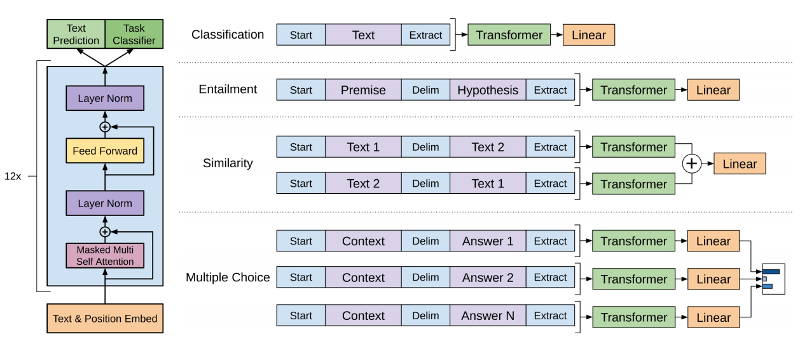

# Improving Language Understanding by Generative Pre-Training
通过生成式预训练提高语言理解 2018.6.11 https://s3-us-west-2.amazonaws.com/openai-assets/research-covers/language-unsupervised/language_understanding_paper.pdf

## 阅读笔记
* 思路: 单向自回归、生成式预训练 + 微调时多任务不同的结构化输入对齐到文本序列中
    * 预训练目标: 预测下一个token; 
        * 语料可充分利用；最小输入长度有限制吗？
        * 迭代生成token时的结束信号：按设定的最大生成长度；按结束字符？
        * 高效率训练的技巧？使用批处理（跨示例和序列长度）?
    * 规模：512-input, 768-d, 12-layer, 12-head, 3072-FFN, 64-batch
    * 词典：字节对编码 (BPE), 4w+
    * 数据预处理：ftfy library 文本清理工具, spaCy 分词器
    * 微调时：下游训练任务的输入输出向预训练模型对齐(任务感知输入转换)，将各种任务的结构化输入打平成文本序列; 将语言建模作为微调的辅助目标? 结合 图-1看比较清除。
* 代码实现
    * https://github.com/karpathy/minGPT, https://github.com/karpathy/nanoGPT 强烈推荐
    * https://github.com/openai/finetune-transformer-lm 官方实现
    * https://github.com/lyeoni/gpt-pytorch 非官方的pytorch实现

## Abstract
Natural language understanding comprises a wide range of diverse tasks such as textual entailment, question answering, semantic similarity assessment, and document classification. Although large unlabeled text corpora are abundant, labeled data for learning these specific tasks is scarce, making it challenging for discriminatively trained models to perform adequately. We demonstrate that large gains on these tasks can be realized by generative pre-training of a language model on a diverse corpus of unlabeled text, followed by discriminative fine-tuning on each specific task. In contrast to previous approaches, we make use of task-aware input transformations during fine-tuning to achieve effective transfer while requiring minimal changes to the model architecture. We demonstrate the effectiveness of our approach on a wide range of benchmarks for natural language understanding. Our general task-agnostic model outperforms discriminatively trained models that use architectures specifically crafted for each task, significantly improving upon the state of the art in 9 out of the 12 tasks studied. For instance, we achieve absolute improvements of 8.9% on commonsense reasoning (Stories Cloze Test), 5.7% on question answering (RACE), and 1.5% on textual entailment (MultiNLI). 

自然语言理解包括广泛的不同任务，如文本蕴涵、问答、语义相似性评估和文档分类。尽管大量的未标注文本语料库非常丰富，但用于学习这些特定任务的标注数据却非常稀少，这使得经过区分训练的模型难以充分执行。我们证明，通过在不同的未标注文本语料库上对语言模型进行生成式预训练，再对每个特定任务进行有区别的微调，可以实现这些任务的巨大收益。与以前的方法不同，我们在微调期间使用任务感知输入转换，以实现有效的转换，同时对模型架构进行最小的更改。我们在一系列自然语言理解基准上证明了我们的方法的有效性。我们的通用的任务未知模型优于使用专门为每项任务构建的架构的经过区分训练的模型，在所研究的12项任务中，有9项任务的性能显著提高。例如，我们在常识推理(Stories Cloze Test)上取得了8.9%的绝对进步，在问答(RACE)上取得5.7%的绝对进步和在文本蕴涵(MultiNLI)上取得1.5%的绝对改善。

<!--任务感知输入转换
12项任务？
* commonsense reasoning (Stories Cloze Test), 常识推理(故事完形测试)
* question answering (RACE), 问答
* textual entailment (MultiNLI) , 文本蕴涵
machine translation [62], 
document generation [34],  
syntactic parsing [29]
 -->

 
图 1：(左)本工作中使用的 Transformer 架构和训练目标。 (右)用于微调不同任务的输入转换。 我们将所有结构化输入转换为令牌序列，以供我们的预训练模型处理，然后是线性+softmax 层。

## 1 Introduction
The ability to learn effectively from raw text is crucial to alleviating the dependence on supervised learning in natural language processing (NLP). Most deep learning methods require substantial amounts of manually labeled data, which restricts their applicability in many domains that suffer from a dearth of annotated resources [61]. In these situations, models that can leverage linguistic information from unlabeled data provide a valuable alternative to gathering more annotation, which can be time-consuming and expensive. Further, even in cases where considerable supervision is available, learning good representations in an unsupervised fashion can provide a significant performance boost. The most compelling evidence for this so far has been the extensive use of pretrained word embeddings [10, 39, 42] to improve performance on a range of NLP tasks [8, 11, 26, 45].

从原始文本中有效学习的能力对于减轻自然语言处理 (NLP) 中对监督学习的依赖至关重要。 大多数深度学习方法需要大量手工标注数据，这限制了它们在许多缺乏标注资源领域中的适用性 [61]。 在这些情况下，可以利用未标注数据中的语言信息模型提供一种有价值的替代方法来收集更多的标注，这可能既耗时又昂贵。 此外，即使在有大量监督的情况下，以无监督方式学习良好的表示也可以显著提高性能。 迄今为止，最令人信服的证据是广泛使用预训练的词嵌入 [10、39、42] 来提高一系列 NLP任务的性能 [8、11、26、45]。

Leveraging more than word-level information from unlabeled text, however, is challenging for two main reasons. First, it is unclear what type of optimization objectives are most effective at learning text representations that are useful for transfer. Recent research has looked at various objectives such as language modeling [44], machine translation [38], and discourse coherence [22], with each method outperforming the others on different tasks(1https://gluebenchmark.com/leaderboard). Second, there is no consensus on the most effective way to transfer these learned representations to the target task. Existing techniques involve a combination of making task-specific changes to the model architecture [43, 44], using intricate learning schemes [21] and adding auxiliary learning objectives [50]. These uncertainties have made it difficult to develop effective semi-supervised learning approaches for language processing. 

然而，利用来自未标注文本的超过单词级别的信息具有挑战性, 主要有两个原因。 首先，尚不清楚哪种类型的优化目标在学习对迁移有用的文本表示方面最有效。 最近的研究着眼于各种目标，例如语言建模 [44]、机器翻译 [38] 和话语连贯性 [22]，每种方法在不同任务上都优于其他方法 (1 https://gluebenchmark.com/leaderboard )。 其次，对于将这些学习到的表示迁移到目标任务的最有效方法，目前还没有达成共识。 现有技术包括对模型架构 [43、44] 进行特定于任务的更改、使用复杂的学习方案 [21] 和添加辅助学习目标 [50]。 这些不确定性使得开发有效的语言处理半监督学习方法变得困难。

In this paper, we explore a semi-supervised approach for language understanding tasks using a combination of unsupervised pre-training and supervised fine-tuning. Our goal is to learn a universal representation that transfers with little adaptation to a wide range of tasks. We assume access to a large corpus of unlabeled text and several datasets with manually annotated training examples (target tasks). Our setup does not require these target tasks to be in the same domain as the unlabeled corpus. We employ a two-stage training procedure. First, we use a language modeling objective on the unlabeled data to learn the initial parameters of a neural network model. Subsequently, we adapt these parameters to a target task using the corresponding supervised objective.

在本文中，我们结合无监督预训练和监督微调，探索了一种用于语言理解任务的半监督方法。 我们的目标是学习一种通用表示，这种表示几乎不需要适应各种任务。 我们假设可以访问大量未标注文本和几个带有手工标注的训练样本(目标任务)的数据集。 我们的设置不要求这些目标任务与未标注的语料库位于同一域中。 我们采用两阶段训练程序。 首先，我们在未标注数据上使用语言建模目标来学习神经网络模型的初始参数。 随后，我们使用相应的监督目标使这些参数适应目标任务。

<!-- 学习一种通用表示  -->

For our model architecture, we use the Transformer [62], which has been shown to perform strongly on various tasks such as machine translation [62], document generation [34], and syntactic parsing [29]. This model choice provides us with a more structured memory for handling long-term dependencies in text, compared to alternatives like recurrent networks, resulting in robust transfer performance across diverse tasks. During transfer, we utilize task-specific input adaptations derived from traversal-style approaches [52], which process structured text input as a single contiguous sequence of tokens. As we demonstrate in our experiments, these adaptations enable us to fine-tune effectively with minimal changes to the architecture of the pre-trained model.

对于我们的模型架构，我们使用了 Transformer [62]，它已被证明在机器翻译 [62]、文档生成 [34] 和句法解析 [29] 等各种任务中表现出色。 与循环网络等替代方案相比，选择这种模型为我们提供了更结构化的记忆来处理文本中的长期依赖关系，从而在不同任务中产生稳健的迁移性能。 在迁移过程中，我们利用源自遍历式方法 [52] 的特定于任务的输入自适应，该方法将结构化文本输入处理为单个连续的令牌序列。 正如我们在实验中所展示的那样，这些调整使我们能够在对预训练模型的架构进行最小更改的情况下有效地进行微调。

<!-- 将结构化文本输入处理为单个连续的令牌序列 
遍历式 traversal-style 方法 [52] , Reasoning about entailment with neural attention. arXiv preprint arXiv:1509.06664, 2015.-->

We evaluate our approach on four types of language understanding tasks – natural language inference, question answering, semantic similarity, and text classification. Our general task-agnostic model outperforms discriminatively trained models that employ architectures specifically crafted for each task, significantly improving upon the state of the art in 9 out of the 12 tasks studied. For instance, we achieve absolute improvements of 8.9% on commonsense reasoning (Stories Cloze Test) [40], 5.7% on question answering (RACE) [30], 1.5% on textual entailment (MultiNLI) [66] and 5.5% on the recently introduced GLUE multi-task benchmark [64]. We also analyzed zero-shot behaviors of the pre-trained model on four different settings and demonstrate that it acquires useful linguistic knowledge for downstream tasks. 
 
我们在四种类型的语言理解任务上评估我们的方法 —— 自然语言推理、问答、语义相似性和文本分类。 我们的通用任务未知模型优于采用专门为每项任务设计的架构的判别式训练模型，显著改进了所研究的 12 项任务中的 9 项的最新技术水平。 例如，我们在常识推理(Stories Cloze Test)[40]、问答(RACE)[30]、文本隐含(MultiNLI)[66]在最近引入的GLUE多任务基准[64]上分别获得了8.9%、5.7%、1.5%和5.5%的绝对改进。 我们还分析了预训练模型在四种不同设置下的零样本行为，并证明它为下游任务获取了有用的语言知识。

## 2 Related Work
### Semi-supervised learning for NLP   半监督学习
Our work broadly falls under the category of semi-supervised learning for natural language. This paradigm has attracted significant interest, with applications to tasks like sequence labeling [24, 33, 57] or text classification [41, 70]. The earliest approaches used unlabeled data to compute word-level or phrase-level statistics, which were then used as features in a supervised model [33]. Over the last few years, researchers have demonstrated the benefits of using word embeddings [11, 39, 42], which are trained on unlabeled corpora, to improve performance on a variety of tasks [8, 11, 26, 45]. These approaches, however, mainly transfer word-level information, whereas we aim to capture higher-level semantics.

我们的工作大致属于自然语言的半监督学习类别。 这种范式引起了人们的极大兴趣，应用于序列标注 [24、33、57] 或文本分类 [41、70] 等任务。 最早的方法使用未标注的数据来计算单词级别或短语级别的统计信息，然后将其用作监督模型中的特征 [33]。 在过去的几年中，研究人员已经证明了使用在未标注的语料库上训练的词嵌入 [11、39、42] 来提高各种任务的性能的好处 [8、11、26、45]。 然而，这些方法主要迁移单词级别的信息，而我们的目标是捕获更高级别的语义。

Recent approaches have investigated learning and utilizing more than word-level semantics from unlabeled data. Phrase-level or sentence-level embeddings, which can be trained using an unlabeled corpus, have been used to encode text into suitable vector representations for various target tasks [28, 32, 1, 36, 22, 12, 56, 31].

最近的方法研究了从未标注的数据中学习和利用超过单词级的语义。 可以使用未标注的语料库进行训练的短语级或句子级嵌入已被用于将文本编码为适合各种目标任务的向量表示 [28、32、1、36、22、12、56、31]。

### Unsupervised pre-training 
Unsupervised pre-training is a special case of semi-supervised learning where the goal is to find a good initialization point instead of modifying the supervised learning objective. Early works explored the use of the technique in image classification [20, 49, 63] and regression tasks [3]. Subsequent research [15] demonstrated that pre-training acts as a regularization scheme, enabling better generalization in deep neural networks. In recent work, the method has been used to help train deep neural networks on various tasks like image classification [69], speech recognition [68], entity disambiguation [17] and machine translation [48].

无监督预训练是半监督学习的一个特例，其目标是找到一个好的初始化点而不是修改监督学习目标。 早期的工作探索了该技术在图像分类 [20、49、63] 和回归任务 [3] 中的应用。 随后的研究 [15] 表明，预训练作为一种正则化方案，可以在深度神经网络中实现更好的泛化。 在最近的工作中，该方法已被用于帮助训练深度神经网络完成各种任务，如图像分类 [69]、语音识别 [68]、实体消歧 [17] 和机器翻译 [48]。

The closest line of work to ours involves pre-training a neural network using a language modeling objective and then fine-tuning it on a target task with supervision. Dai et al. [13] and Howard and Ruder [21] follow this method to improve text classification. However, although the pre-training phase helps capture some linguistic information, their usage of LSTM models restricts their prediction ability to a short range. In contrast, our choice of transformer networks allows us to capture longerrange linguistic structure, as demonstrated in our experiments. Further, we also demonstrate the effectiveness of our model on a wider range of tasks including natural language inference, paraphrase detection and story completion. Other approaches [43, 44, 38] use hidden representations from a pre-trained language or machine translation model as auxiliary features while training a supervised model on the target task. This involves a substantial amount of new parameters for each separate target task, whereas we require minimal changes to our model architecture during transfer.

与我们最接近的工作涉及使用语言建模目标对神经网络进行预训练，然后在监督下针对目标任务对其进行微调。 Dai et al. [13] 以及 Howard and Ruder [21] 遵循这种方法来改进文本分类。 然而，尽管预训练阶段有助于捕获一些语言信息，但他们对 LSTM 模型的使用将他们的预测能力限制在一个小范围内。 相比之下，我们选择的transformer使我们能够捕获更远距离的语言结构，如我们的实验所示。 此外，我们还展示了我们的模型在更广泛的任务中的有效性，包括自然语言推理、释义检测和故事完成。 其他方法 [43、44、38] 使用来自预训练语言或机器翻译模型的隐藏表示作为辅助特征，同时在目标任务上训练监督模型。 这涉及每个单独的目标任务的大量新参数，而我们需要在迁移过程中对模型架构进行最少的更改。

### Auxiliary training objectives 
Adding auxiliary unsupervised training objectives is an alternative form of semi-supervised learning. Early work by Collobert and Weston [10] used a wide variety of auxiliary NLP tasks such as POS tagging, chunking, named entity recognition, and language modeling to improve semantic role labeling. More recently, Rei [50] added an auxiliary language modeling objective to their target task objective and demonstrated performance gains on sequence labeling tasks. Our experiments also use an auxiliary objective, but as we show, unsupervised pre-training already learns several linguistic aspects relevant to target tasks. 

添加辅助无监督训练目标是半监督学习的另一种形式。 Collobert 和 Weston [10] 的早期工作使用了各种各样的辅助 NLP 任务，例如 词性标注、断句、命名实体识别和语言建模来改进语义角色标注。 最近，Rei [50] 在他们的目标任务目标中添加了一个辅助语言建模目标，并展示了在序列标注任务上的性能提升。 我们的实验还使用了一个辅助目标，但正如我们所展示的，无监督预训练已经学习了与目标任务相关的几个语言方面。

## 3 Framework
Our training procedure consists of two stages. The first stage is learning a high-capacity language model on a large corpus of text. This is followed by a fine-tuning stage, where we adapt the model to a discriminative task with labeled data.

我们的训练过程包括两个阶段。 第一阶段是在大型文本语料库上学习高容量语言模型。 接下来是微调阶段，在此阶段我们使模型适应带有标注数据的判别任务。

### 3.1 Unsupervised pre-training
Given an unsupervised corpus of tokens $U = \{u_1, . . . , u_n\}$, we use a standard language modeling objective to maximize the following likelihood:

给定一个无监督的令牌语料库 $U = \{u_1, . . . , u_n\}$，我们使用标准语言建模目标来最大化以下可能性：

$L_1(U) = \sum_i log P(u_i|u_{i−k}, . . . , u_{i−1}; Θ)$ (1) 

where k is the size of the context window, and the conditional probability P is modeled using a neural network with parameters Θ. These parameters are trained using stochastic gradient descent [51].

其中 k 是上下文窗口的大小，条件概率 P 使用参数为 Θ 的神经网络建模。 这些参数使用随机梯度下降 [51] 进行训练。

<!--K值如何设置？-->

In our experiments, we use a multi-layer Transformer decoder [34] for the language model, which is a variant of the transformer [62]. This model applies a multi-headed self-attention operation over the input context tokens followed by position-wise feedforward layers to produce an output distribution over target tokens: 

在我们的实验中，我们为语言模型使用多层 Transformer 解码器 [34]，它是 transformer [62] 的变体。 该模型对输入上下文令牌应用多头自注意力操作，然后是位置前馈层，以在目标令牌上产生输出分布：

$h_0 = UW_e + W_p$ 

$h_l = transformer-block(h_{l−1}) ∀i ∈ [1, n] $

$P(u) = softmax(h_nW_e^T )$ (2) 

where U = (u−k, . . . , u−1) is the context vector of tokens, n is the number of layers, $W_e$ is the token embedding matrix, and $W_p$ is the position embedding matrix.

其中U = (u−k, . . . , u−1)是令牌的上下文向量，n是层数，$W_e$是令牌嵌入矩阵，$W_e$是位置嵌入矩阵。

### 3.2 Supervised fine-tuning
After training the model with the objective in Eq. 1, we adapt the parameters to the supervised target task. We assume a labeled dataset C, where each instance consists of a sequence of input tokens, $x^1 , . . . , x^m$, along with a label y. The inputs are passed through our pre-trained model to obtain the final transformer block’s activation $h^m_l$ , which is then fed into an added linear output layer with parameters $W_y$ to predict y: 

在使用等式-1中的目标训练模型之后，我们调整参数以适应监督目标任务。 我们假设有一个带标签的数据集 C，其中每个实例都包含一系列输入令牌 $x^1 , . . . , x^m$, 以及标签 y。 输入通过我们的预训练模型来获得最终的转换器块的激活 $h^m_l$ ，然后将其馈送到带有参数 $W_y$ 的附加线性输出层以预测 y：

$P(y|x^1 , . . . , x^m) = softmax(h^m_l W_y). $(3)

This gives us the following objective to maximize:

这为我们提供了以下最大化目标：

$L_2(C) = \sum_{(x,y)} log P(y|x_1 , . . . , x_m). $(4)

We additionally found that including language modeling as an auxiliary objective to the fine-tuning helped learning by (a) improving generalization of the supervised model, and (b) accelerating convergence. This is in line with prior work [50, 43], who also observed improved performance with such an auxiliary objective. Specifically, we optimize the following objective (with weight λ):

我们还发现，将语言建模作为微调的辅助目标通过 (a) 改进监督模型的泛化，以及 (b) 加速收敛来帮助学习。 这与之前的工作 [50、43] 一致，他们还观察到这种辅助目标的性能有所提高。 具体来说，我们优化了以下目标(权重为 λ)：<!--将语言建模作为微调的辅助目标? 微调任务向预训练任务对齐-->

$L_3(C) = L_2(C) + λ ∗ L_1(C) $(5)

Overall, the only extra parameters we require during fine-tuning are $W_y$, and embeddings for delimiter tokens (described below in Section 3.3). 

总的来说，我们在微调期间唯一需要的额外参数是 $W_y$ 和分隔符令牌的嵌入(在下面的 3.3 节中描述)。

### 3.3 Task-specific input transformations 任务特定的输入转换
For some tasks, like text classification, we can directly fine-tune our model as described above. Certain other tasks, like question answering or textual entailment, have structured inputs such as ordered sentence pairs, or triplets of document, question, and answers. Since our pre-trained model was trained on contiguous sequences of text, we require some modifications to apply it to these tasks. Previous work proposed learning task specific architectures on top of transferred representations [44]. Such an approach re-introduces a significant amount of task-specific customization and does not use transfer learning for these additional architectural components. Instead, we use a traversal-style approach [52], where we convert structured inputs into an ordered sequence that our pre-trained model can process. These input transformations allow us to avoid making extensive changes to the architecture across tasks. We provide a brief description of these input transformations below and Figure 1 provides a visual illustration. All transformations include adding randomly initialized start and end tokens ( \<s\>, \<e\> ).

对于一些任务，比如文本分类，我们可以直接微调我们的模型，如上所述。 某些其他任务，如问题回答或文本蕴含，具有结构化输入，例如有序的句子对，或文档、问题和答案的三元组。 由于我们的预训练模型是在连续的文本序列上训练的，因此我们需要进行一些修改才能将其应用于这些任务。 以前的工作提出了在迁移表示之上的学习任务特定架构 [44]。 这种方法重新引入了大量特定于任务的定制，并且不对这些额外的架构组件使用迁移学习。 相反，我们使用遍历式方法 [52]，我们将结构化输入转换为我们的预训练模型可以处理的有序序列。 这些输入转换使我们能够避免跨任务对架构进行大量更改。 我们在下面提供了这些输入转换的简要描述，图1 提供了一个直观的说明。 所有转换都包括添加随机初始化的开始和结束令牌 ( \<s\>, \<e\>)。

 
Figure 1: (left) Transformer architecture and training objectives used in this work. (right) Input transformations for fine-tuning on different tasks. We convert all structured inputs into token sequences to be processed by our pre-trained model, followed by a linear+softmax layer.
图 1：(左)本工作中使用的 Transformer 架构和训练目标。 (右)用于微调不同任务的输入转换。 我们将所有结构化输入转换为令牌序列，以供我们的预训练模型处理，然后是线性+softmax 层。

#### Textual entailment 
For entailment tasks, we concatenate the premise p and hypothesis h token sequences, with a delimiter token ($) in between.

文本蕴涵. 对于蕴含任务，我们将前提 p 和假设 h 令牌序列连接起来，中间有一个分隔符令牌 ($)。

#### Similarity 
For similarity tasks, there is no inherent ordering of the two sentences being compared. To reflect this, we modify the input sequence to contain both possible sentence orderings (with a delimiter in between) and process each independently to produce two sequence representations hml which are added element-wise before being fed into the linear output layer.

相似度. 对于相似性任务，被比较的两个句子没有固有的顺序。 为了反映这一点，我们修改输入序列以包含两种可能的句子顺序(中间有一个分隔符)并独立处理每个以产生两个序列表示 hml，它们在被馈送到线性输出层之前按元素添加。

#### Question Answering and Commonsense Reasoning 
For these tasks, we are given a context document z, a question q, and a set of possible answers {$a_k$}. We concatenate the document context and question with each possible answer, adding a delimiter token in between to get [z; q; $; $a_k$]. Each of these sequences are processed independently with our model and then normalized via a softmax layer to produce an output distribution over possible answers. 

问答和常识推理. 对于这些任务，我们得到了一个上下文文档 z、一个问题 q 和一组可能的答案 {$a_k$}。 我们将文档上下文和问题与每个可能的答案连接起来，在它们之间添加一个定界符令牌以获得 [z; q; $; $a_k$]。 这些序列中的每一个都使用我们的模型独立处理，然后通过 softmax 层归一化以产生可能答案的输出分布。

## 4 Experiments
### 4.1 Setup
#### Unsupervised pre-training 
We use the BooksCorpus dataset [71] for training the language model. It contains over 7,000 unique unpublished books from a variety of genres including Adventure, Fantasy, and Romance. Crucially, it contains long stretches of contiguous text, which allows the generative model to learn to condition on long-range information. An alternative dataset, the 1B Word Benchmark, which is used by a similar approach, ELMo [44], is approximately the same size but is shuffled at a sentence level - destroying long-range structure. Our language model achieves a very low token level perplexity of 18.4 on this corpus.

我们使用 BooksCorpus 数据集 [71] 来训练语言模型。 它包含 7,000 多本独特的未出版书籍，这些书籍来自各种类型，包括冒险、奇幻和浪漫。 至关重要的是，它包含很长一段连续的文本，这使得生成模型能够学习以远程信息为条件。 另一个数据集 1B Word Benchmark 被类似的方法 ELMo [44] 使用，其大小大致相同，但在句子级别进行了打乱 —— 破坏了远程结构。 我们的语言模型在这个语料库上达到了 18.4 的非常低的令牌级别困惑。

 
Table 1: A list of the different tasks and datasets used in our experiments.
表 1：我们实验中使用的不同任务和数据集的列表。

#### Model specifications 模型规格
Our model largely follows the original transformer work [62]. We trained a 12-layer decoder-only transformer with masked self-attention heads (768 dimensional states and 12 attention heads). For the position-wise feed-forward networks, we used 3072 dimensional inner states. We used the Adam optimization scheme [27] with a max learning rate of 2.5e-4. The learning rate was increased linearly from zero over the first 2000 updates and annealed to 0 using a cosine schedule. We train for 100 epochs on minibatches of 64 randomly sampled, contiguous sequences of 512 tokens. Since layernorm [2] is used extensively throughout the model, a simple weight initialization of N(0, 0.02) was sufficient. We used a bytepair encoding (BPE) vocabulary with 40,000 merges [53] and residual, embedding, and attention dropouts with a rate of 0.1 for regularization. We also employed a modified version of L2 regularization proposed in [37], with w = 0.01 on all non bias or gain weights. For the activation function, we used the Gaussian Error Linear Unit (GELU) [18]. We used learned position embeddings instead of the sinusoidal version proposed in the original work. We use the ftfy library(2 https://ftfy.readthedocs.io/en/latest/ ) to clean the raw text in BooksCorpus, standardize some punctuation and whitespace, and use the spaCy tokenizer(3 https://spacy.io/).

我们的模型在很大程度上遵循了原始的transformer工作 [62]。 我们训练了一个只有 12 层解码器的transformer，带有掩码的自注意力头(768 维状态和 12 个注意力头)。 对于位置前馈网络，我们使用了 3072 维内部状态。 我们使用 Adam 优化方案 [27]，最大学习率为 2.5e-4。 在前 2000 次更新中，学习率从零开始线性增加，并使用余弦计划退火到 0。 我们在 64 个随机抽样的小批量、512 个令牌的连续序列上训练 100 个时期。 由于 layernorm [2] 在整个模型中被广泛使用，因此 N(0, 0.02) 的简单权重初始化就足够了。 我们使用具有 40,000 次合并 [53] 的字节对编码 (BPE) 词汇表和 0.1 比率的残差、嵌入和注意力丢失进行正则化。 我们还采用了 [37] 中提出的 L2 正则化的修改版本，在所有非偏差或增益权重上 w = 0.01。 对于激活函数，我们使用了高斯误差线性单元 (GELU) [18]。 我们使用学习位置嵌入而不是原始工作中提出的正弦版本。 我们使用 ftfy library2 清理 BooksCorpus 中的原始文本，标准化一些标点符号和空格，并使用 spaCy 分词器。

#### Fine-tuning details 
Unless specified, we reuse the hyperparameter settings from unsupervised pre-training. We add dropout to the classifier with a rate of 0.1. For most tasks, we use a learning rate of 6.25e-5 and a batchsize of 32. Our model finetunes quickly and 3 epochs of training was sufficient for most cases. We use a linear learning rate decay schedule with warmup over 0.2% of training. λ was set to 0.5.

除非另有说明，否则我们会重复使用无监督预训练中的超参数设置。 我们以 0.1 的比率将 dropout 添加到分类器中。 对于大多数任务，我们使用 6.25e-5 的学习率和 32 的批量大小。我们的模型可以快速微调，对于大多数情况，3 轮训练就足够了。 我们使用线性学习率衰减计划，预热超过 0.2% 的训练。 λ 设置为 0.5。

### 4.2 Supervised fine-tuning
We perform experiments on a variety of supervised tasks including natural language inference, question answering, semantic similarity, and text classification. Some of these tasks are available as part of the recently released GLUE multi-task benchmark [64], which we make use of. Figure 1 provides an overview of all the tasks and datasets.

我们对各种监督任务进行实验，包括自然语言推理、问答、语义相似性和文本分类。 其中一些任务可作为我们最近发布的 GLUE 多任务基准测试 [64] 的一部分使用。 图 1 提供了所有任务和数据集的概览。

#### Natural Language Inference 
The task of natural language inference (NLI), also known as recognizing textual entailment, involves reading a pair of sentences and judging the relationship between them from one of entailment, contradiction or neutral. Although there has been a lot of recent interest [58, 35, 44], the task remains challenging due to the presence of a wide variety of phenomena like lexical entailment, coreference, and lexical and syntactic ambiguity. We evaluate on five datasets with diverse sources, including image captions (SNLI), transcribed speech, popular fiction, and government reports (MNLI), Wikipedia articles (QNLI), science exams (SciTail) or news articles (RTE).

自然语言推理(NLI)的任务，也称为识别文本蕴含，涉及阅读一对句子，并从蕴含、矛盾或中性中判断它们之间的关系。 尽管最近有很多兴趣[58、35、44]，但由于存在各种各样的现象，如词汇蕴涵、共指以及词汇和句法歧义，这项任务仍然具有挑战性。 我们评估了五个不同来源的数据集，包括图像说明 (SNLI)、转录语音、通俗小说和政府报告 (MNLI)、维基百科文章 (QNLI)、科学考试 (SciTail) 或新闻文章 (RTE)。

Table 2 details various results on the different NLI tasks for our model and previous state-of-the-art approaches. Our method significantly outperforms the baselines on four of the five datasets, achieving absolute improvements of upto 1.5% on MNLI, 5% on SciTail, 5.8% on QNLI and 0.6% on SNLI over the previous best results. This demonstrates our model’s ability to better reason over multiple sentences, and handle aspects of linguistic ambiguity. On RTE, one of the smaller datasets we evaluate on (2490 examples), we achieve an accuracy of 56%, which is below the 61.7% reported by a multi-task biLSTM model. Given the strong performance of our approach on larger NLI datasets, it is likely our model will benefit from multi-task training as well but we have not explored this currently. 

表 2 详细列出了我们的模型和以前最先进的方法在不同 NLI 任务上的各种结果。 我们的方法在五个数据集中的四个上明显优于基线，与之前的最佳结果相比，MNLI 的绝对改进高达 1.5%，SciTail 的绝对改进高达 5%，QNLI 的绝对改进高达 5.8%，SNLI 的绝对改进高达 0.6%。 这表明我们的模型能够更好地推理多个句子，并处理语言歧义的各个方面。 在 RTE 上，我们评估的较小数据集之一(2490 个样本)，我们达到了 56% 的精度，低于多任务 biLSTM 模型报告的 61.7%。 鉴于我们的方法在更大的 NLI 数据集上的强大性能，我们的模型很可能也会从多任务训练中受益，但我们目前尚未对此进行探索。

 
Table 2: Experimental results on natural language inference tasks, comparing our model with current state-of-the-art methods. 5x indicates an ensemble of 5 models. All datasets use accuracy as the evaluation metric.
表 2：自然语言推理任务的实验结果，将我们的模型与当前最先进的方法进行比较。 5x 表示 5 个模型的集合。 所有数据集都使用准确性作为评估指标。

#### Question answering and commonsense reasoning 问答和常识推理
Another task that requires aspects of single and multi-sentence reasoning is question answering. We use the recently released RACE dataset [30], consisting of English passages with associated questions from middle and high school exams. This corpus has been shown to contain more reasoning type questions that other datasets like CNN [19] or SQuaD [47], providing the perfect evaluation for our model which is trained to handle long-range contexts. In addition, we evaluate on the Story Cloze Test [40], which involves selecting the correct ending to multi-sentence stories from two options. On these tasks, our model again outperforms the previous best results by significant margins - up to 8.9% on Story Cloze, and 5.7% overall on RACE. This demonstrates the ability of our model to handle long-range contexts effectively.

另一个需要单句和多句推理的任务是问答。 我们使用最近发布的 RACE 数据集 [30]，该数据集由英语段落和中学和高中考试的相关问题组成。 该语料库已被证明包含比 CNN [19] 或 SQuaD [47] 等其他数据集更多的推理类型问题，为我们的模型提供了完美的评估，该模型经过训练可以处理远程上下文。 此外，我们还对故事完形填空测试 [40] 进行了评估，该测试涉及从两个选项中选择多句故事的正确结尾。 在这些任务上，我们的模型再次以显著优势超越之前的最佳结果——Story Cloze 高达 8.9%，RACE 总体上高达 5.7%。 这证明了我们的模型有效处理远程上下文的能力。

 
Table 3: Results on question answering and commonsense reasoning, comparing our model with current state-of-the-art methods.. 9x means an ensemble of 9 models.
表 3：问题回答和常识推理的结果，将我们的模型与当前最先进的方法.. 9x 表示 9 个模型的集合。

#### Semantic Similarity 语义相似度
Semantic similarity (or paraphrase detection) tasks involve predicting whether two sentences are semantically equivalent or not. The challenges lie in recognizing rephrasing of concepts, understanding negation, and handling syntactic ambiguity. We use three datasets for this task – the Microsoft Paraphrase corpus (MRPC) [14] (collected from news sources), the Quora Question Pairs (QQP) dataset [9], and the Semantic Textual Similarity benchmark (STS-B) [6]. We obtain state-of-the-art results on two of the three semantic similarity tasks (Table 4) with a 1 point absolute gain on STS-B. The performance delta on QQP is significant, with a 4.2% absolute improvement over Single-task BiLSTM + ELMo + Attn.

语义相似性(或释义检测)任务涉及预测两个句子在语义上是否等价。 挑战在于识别概念的改写、理解否定和处理句法歧义。 我们为此任务使用了三个数据集——Microsoft 释义语料库 (MRPC) [14](从新闻来源收集)、Quora 问题对 (QQP) 数据集 [9] 和语义文本相似性基准 (STS-B) [6 ]. 我们在三个语义相似性任务(表 4)中的两个上获得了最先进的结果，在 STS-B 上获得了 1 分的绝对增益。 QQP 的性能增量非常显著，与单任务 BiLSTM + ELMo + Attn 相比绝对提高了 4.2%。

 
Table 4: Semantic similarity and classification results, comparing our model with current state-of-theart methods. All task evaluations in this table were done using the GLUE benchmark. (mc= Mathews correlation, acc=Accuracy, pc=Pearson correlation)
表 4：语义相似性和分类结果，将我们的模型与当前最先进的方法进行比较。 此表中的所有任务评估都是使用 GLUE 基准完成的。 (mc=马修斯相关系数，acc=准确度，pc=皮尔逊相关系数)

#### Classification 
Finally, we also evaluate on two different text classification tasks. The Corpus of Linguistic Acceptability (CoLA) [65] contains expert judgements on whether a sentence is grammatical or not, and tests the innate linguistic bias of trained models. The Stanford Sentiment Treebank (SST-2) [54], on the other hand, is a standard binary classification task. Our model obtains an score of 45.4 on CoLA, which is an especially big jump over the previous best result of 35.0, showcasing the innate linguistic bias learned by our model. The model also achieves 91.3% accuracy on SST-2, which is competitive with the state-of-the-art results. We also achieve an overall score of 72.8 on the GLUE benchmark, which is significantly better than the previous best of 68.9.

最后，我们还评估了两个不同的文本分类任务。 语言可接受性语料库 (CoLA) [65] 包含对句子是否符合语法的专家判断，并测试训练模型的先天语言偏差。 另一方面，斯坦福情感树库 (SST-2) [54] 是标准的二元分类任务。 我们的模型在 CoLA 上获得了 45.4 分，这比之前的最佳成绩 35.0 有了很大的飞跃，展示了我们的模型学习到的先天语言偏见。 该模型还在 SST-2 上达到了 91.3% 的精度，这与最先进的结果具有竞争力。 我们还在 GLUE 基准测试中获得了 72.8 的总分，明显优于之前的最佳成绩 68.9。

Overall, our approach achieves new state-of-the-art results in 9 out of the 12 datasets we evaluate on, outperforming ensembles in many cases. Our results also indicate that our approach works well across datasets of different sizes, from smaller datasets such as STS-B (≈5.7k training examples) – to the largest one – SNLI (≈550k training examples). 

总的来说，我们的方法在我们评估的 12 个数据集中的 9 个中取得了新的最先进的结果，在许多情况下优于集成。 我们的结果还表明，我们的方法适用于不同大小的数据集，从较小的数据集(例如 STS-B(≈5.7k 训练样本))到最大的数据集 – SNLI(≈550k 训练样本)。

## 5 Analysis
### Impact of number of layers transferred 层数的影响
We observed the impact of transferring a variable number of layers from unsupervised pre-training to the supervised target task. Figure 2(left) illustrates the performance of our approach on MultiNLI and RACE as a function of the number of layers transferred. We observe the standard result that transferring embeddings improves performance and that each transformer layer provides further benefits up to 9% for full transfer on MultiNLI. This indicates that each layer in the pre-trained model contains useful functionality for solving target tasks.

我们观察了将可变层数从无监督预训练迁移到监督目标任务的影响。 图2(左)说明了我们的方法在 MultiNLI 和 RACE 上的性能与迁移层数的关系。 我们观察到标准结果，即迁移嵌入提高了性能，并且每个transformer层为 MultiNLI 上的完全迁移提供了高达 9% 的进一步收益。 这表明预训练模型中的每一层都包含用于解决目标任务的有用功能。

 
Figure 2: (left) Effect of transferring increasing number of layers from the pre-trained language model on RACE and MultiNLI. (right) Plot showing the evolution of zero-shot performance on different tasks as a function of LM pre-training updates. Performance per task is normalized between a random guess baseline and the current state-of-the-art with a single model.
图 2：(左)从 RACE 和 MultiNLI 上的预训练语言模型迁移更多层的效果。 (右)绘图显示了不同任务的零样本性能随 LM 预训练更新的变化。 每个任务的性能在随机猜测基线和单个模型的当前最先进技术之间标准化。

### Zero-shot Behaviors 
We’d like to better understand why language model pre-training of transformers is effective. A hypothesis is that the underlying generative model learns to perform many of the tasks we evaluate on in order to improve its language modeling capability and that the more structured attentional memory of the transformer assists in transfer compared to LSTMs. We designed a series of heuristic solutions that use the underlying generative model to perform tasks without supervised finetuning. We visualize the effectiveness of these heuristic solutions over the course of generative pre-training in Fig 2(right). We observe the performance of these heuristics is stable and steadily increases over training suggesting that generative pretraining supports the learning of a wide variety of task relevant functionality. We also observe the LSTM exhibits higher variance in its zero-shot performance suggesting that the inductive bias of the Transformer architecture assists in transfer. 

我们想更好地理解为什么 Transformer 的语言模型预训练是有效的。 一个假设是，底层生成模型学习执行我们评估的许多任务，以提高其语言建模能力，并且与 LSTM 相比，transformer 结构化程度更高的注意力记忆有助于迁移。 我们设计了一系列启发式解决方案，这些解决方案使用底层生成模型在没有监督微调的情况下执行任务。 我们在图 2(右)的生成预训练过程中可视化了这些启发式解决方案的有效性。 我们观察到这些启发式方法的性能是稳定的，并且在训练过程中稳步增加，这表明生成预训练支持学习各种任务相关功能。 我们还观察到 LSTM 在其零样本性能方面表现出更高的方差，这表明 Transformer 架构的归纳偏差有助于迁移。

For CoLA (linguistic acceptability), examples are scored as the average token log-probability the generative model assigns and predictions are made by thresholding. For SST-2 (sentiment analysis), we append the token very to each example and restrict the language model’s output distribution to only the words positive and negative and guess the token it assigns higher probability to as the prediction. For RACE (question answering), we pick the answer the generative model assigns the highest average token log-probability when conditioned on the document and question. For DPRD [46] (winograd schemas), we replace the definite pronoun with the two possible referrents and predict the resolution that the generative model assigns higher average token log-probability to the rest of the sequence after the substitution.

对于 CoLA(语言可接受性)，样本被评分为生成模型分配的平均令牌对数概率，并通过阈值进行预测。 对于 SST-2(情感分析)，我们将 token 非常附加到每个样本，并将语言模型的输出分布限制为仅单词 positive 和 negative 并猜测它分配更高概率的 token 作为预测。 对于 RACE(问答)，我们选择生成模型在以文档和问题为条件时分配最高平均令牌对数概率的答案。 对于 DPRD [46](winograd 模式)，我们将定代词替换为两个可能的指称，并预测生成模型在替换后将更高的平均令牌对数概率分配给序列其余部分的分辨率。

### Ablation studies 
We perform three different ablation studies (Table 5). First, we examine the performance of our method without the auxiliary LM objective during fine-tuning. We observe that the auxiliary objective helps on the NLI tasks and QQP. Overall, the trend suggests that larger datasets benefit from the auxiliary objective but smaller datasets do not. Second, we analyze the effect of the Transformer by comparing it with a single layer 2048 unit LSTM using the same framework. We observe a 5.6 average score drop when using the LSTM instead of the Transformer. The LSTM only outperforms the Transformer on one dataset – MRPC. Finally, we also compare with our transformer architecture directly trained on supervised target tasks, without pre-training. We observe that the lack of pre-training hurts performance across all the tasks, resulting in a 14.8% decrease compared to our full model. 

我们进行了三种不同的消融研究(表 5)。 
1. 我们在微调期间检查了我们的方法在没有辅助 LM 目标的情况下的性能。 我们观察到辅助目标有助于 NLI 任务和 QQP。 总的来说，趋势表明<strong>较大的数据集受益于辅助目标，但较小的数据集</strong>则没有。 
2. 我们通过将其与使用相同框架的单层 2048 单元 LSTM 进行比较来分析 Transformer 的效果。 当使用 LSTM 而不是 Transformer 时，我们观察到平均分数下降了 5.6。 LSTM 仅在一个数据集——MRPC 上优于 Transformer。 
3. 我们还比较了直接在监督目标任务上训练的 transformer 架构，无需预训练。 我们观察到，缺乏预训练会影响所有任务的性能，与我们的完整模型相比，性能下降了 14.8%。

 
Table 5: Analysis of various model ablations on different tasks. Avg. score is a unweighted average of all the results. (mc= Mathews correlation, acc=Accuracy, pc=Pearson correlation) 
表 5：对不同任务的各种模型消融分析。 平均score 是所有结果的未加权平均值。 (mc=马修斯相关系数，acc=准确度，pc=皮尔逊相关系数)

## 6 Conclusion
We introduced a framework for achieving strong natural language understanding with a single task-agnostic model through generative pre-training and discriminative fine-tuning. By pre-training on a diverse corpus with long stretches of contiguous text our model acquires significant world knowledge and ability to process long-range dependencies which are then successfully transferred to solving discriminative tasks such as question answering, semantic similarity assessment, entailment determination, and text classification, improving the state of the art on 9 of the 12 datasets we study. Using unsupervised (pre-)training to boost performance on discriminative tasks has long been an important goal of Machine Learning research. Our work suggests that achieving significant performance gains is indeed possible, and offers hints as to what models (Transformers) and data sets (text with long range dependencies) work best with this approach. We hope that this will help enable new research into unsupervised learning, for both natural language understanding and other domains, further improving our understanding of how and when unsupervised learning works.

我们引入了一个框架，通过生成式预训练和判别式微调，使用与任务无关的单一模型实现强大的自然语言理解。 通过对具有长段连续文本的多样化语料库进行预训练，我们的模型获得了重要的世界知识和处理远程依赖关系的能力，然后成功地迁移到解决判别任务，如问答、语义相似性评估、蕴含确定和 文本分类，改进了我们研究的 12 个数据集中的 9 个的最新技术水平。 使用无监督(预)训练来提高判别任务的性能一直是机器学习研究的一个重要目标。 我们的工作表明，实现显著的性能提升确实是可能的，并提供了关于哪种模型(Transformers)和数据集(具有远程依赖性的文本)最适合这种方法的提示。 我们希望这将有助于对自然语言理解和其他领域的无监督学习进行新的研究，进一步提高我们对无监督学习如何以及何时工作的理解。

## References
1. S. Arora, Y. Liang, and T. Ma. A simple but tough-to-beat baseline for sentence embeddings. 2016. 8
2. J. L. Ba, J. R. Kiros, and G. E. Hinton. Layer normalization. arXiv preprint arXiv:1607.06450, 2016.
3. Y. Bengio, P. Lamblin, D. Popovici, and H. Larochelle. Greedy layer-wise training of deep networks. In Advances in neural information processing systems, pages 153–160, 2007.
4. L. Bentivogli, P. Clark, I. Dagan, and D. Giampiccolo. The fifth pascal recognizing textual entailment challenge. In TAC, 2009.
5. S. R. Bowman, G. Angeli, C. Potts, and C. D. Manning. A large annotated corpus for learning natural language inference. EMNLP, 2015.
6. D. Cer, M. Diab, E. Agirre, I. Lopez-Gazpio, and L. Specia. Semeval-2017 task 1: Semantic textual similarity-multilingual and cross-lingual focused evaluation. arXiv preprint arXiv:1708.00055, 2017.
7. S. Chaturvedi, H. Peng, and D. Roth. Story comprehension for predicting what happens next. In Proceedings of the 2017 Conference on Empirical Methods in Natural Language Processing, pages 1603–1614, 2017.
8. D. Chen and C. Manning. A fast and accurate dependency parser using neural networks. In Proceedings of the 2014 conference on empirical methods in natural language processing (EMNLP), pages 740–750, 2014.
9. Z. Chen, H. Zhang, X. Zhang, and L. Zhao. Quora question pairs. https://data.quora.com/First-QuoraDataset-Release-Question-Pairs, 2018.
10. R. Collobert and J. Weston. A unified architecture for natural language processing: Deep neural networks with multitask learning. In Proceedings of the 25th international conference on Machine learning, pages 160–167. ACM, 2008.
11. R. Collobert, J. Weston, L. Bottou, M. Karlen, K. Kavukcuoglu, and P. Kuksa. Natural language processing (almost) from scratch. Journal of Machine Learning Research, 12(Aug):2493–2537, 2011.
12. A. Conneau, D. Kiela, H. Schwenk, L. Barrault, and A. Bordes. Supervised learning of universal sentence representations from natural language inference data. EMNLP, 2017.
13. A. M. Dai and Q. V. Le. Semi-supervised sequence learning. In Advances in Neural Information Processing Systems, pages 3079–3087, 2015.
14. W. B. Dolan and C. Brockett. Automatically constructing a corpus of sentential paraphrases. In Proceedings of the Third International Workshop on Paraphrasing (IWP2005), 2005.
15. D. Erhan, Y. Bengio, A. Courville, P.-A. Manzagol, P. Vincent, and S. Bengio. Why does unsupervised pre-training help deep learning? Journal of Machine Learning Research, 11(Feb):625–660, 2010.
16. S. Gray, A. Radford, and K. P. Diederik. Gpu kernels for block-sparse weights. 2017.
17. Z. He, S. Liu, M. Li, M. Zhou, L. Zhang, and H. Wang. Learning entity representation for entity disambiguation. In Proceedings of the 51st Annual Meeting of the Association for Computational Linguistics (Volume 2: Short Papers), volume 2, pages 30–34, 2013.
18. D. Hendrycks and K. Gimpel. Bridging nonlinearities and stochastic regularizers with gaussian error linear units. arXiv preprint arXiv:1606.08415, 2016.
19. K. M. Hermann, T. Kocisky, E. Grefenstette, L. Espeholt, W. Kay, M. Suleyman, and P. Blunsom. Teaching machines to read and comprehend. In Advances in Neural Information Processing Systems, pages 1693– 1701, 2015.
20. G. E. Hinton, S. Osindero, and Y.-W. Teh. A fast learning algorithm for deep belief nets. Neural computation, 18(7):1527–1554, 2006.
21. J. Howard and S. Ruder. Universal language model fine-tuning for text classification. Association for Computational Linguistics (ACL), 2018.
22. Y. Jernite, S. R. Bowman, and D. Sontag. Discourse-based objectives for fast unsupervised sentence representation learning. arXiv preprint arXiv:1705.00557, 2017.
23. Y. Ji and J. Eisenstein. Discriminative improvements to distributional sentence similarity. In Proceedings of the 2013 Conference on Empirical Methods in Natural Language Processing, pages 891–896, 2013. 9
24. F. Jiao, S. Wang, C.-H. Lee, R. Greiner, and D. Schuurmans. Semi-supervised conditional random fields for improved sequence segmentation and labeling. In Proceedings of the 21st International Conference on Computational Linguistics and the 44th annual meeting of the Association for Computational Linguistics, pages 209–216. Association for Computational Linguistics, 2006.
25. T. Khot, A. Sabharwal, and P. Clark. Scitail: A textual entailment dataset from science question answering. In Proceedings of AAAI, 2018.
26. Y. Kim. Convolutional neural networks for sentence classification. EMNLP, 2014.
27. D. P. Kingma and J. Ba. Adam: A method for stochastic optimization. arXiv preprint arXiv:1412.6980, 2014.
28. R. Kiros, Y. Zhu, R. R. Salakhutdinov, R. Zemel, R. Urtasun, A. Torralba, and S. Fidler. Skip-thought vectors. In Advances in neural information processing systems, pages 3294–3302, 2015.
29. N. Kitaev and D. Klein. Constituency parsing with a self-attentive encoder. ACL, 2018.
30. G. Lai, Q. Xie, H. Liu, Y. Yang, and E. Hovy. Race: Large-scale reading comprehension dataset from examinations. EMNLP, 2017.
31. G. Lample, L. Denoyer, and M. Ranzato. Unsupervised machine translation using monolingual corpora only. ICLR, 2018.
32. Q. Le and T. Mikolov. Distributed representations of sentences and documents. In International Conference on Machine Learning, pages 1188–1196, 2014.
33. P. Liang. Semi-supervised learning for natural language. PhD thesis, Massachusetts Institute of Technology, 2005.
34. P. J. Liu, M. Saleh, E. Pot, B. Goodrich, R. Sepassi, L. Kaiser, and N. Shazeer. Generating wikipedia by summarizing long sequences. ICLR, 2018.
35. X. Liu, K. Duh, and J. Gao. Stochastic answer networks for natural language inference. arXiv preprint arXiv:1804.07888, 2018.
36. L. Logeswaran and H. Lee. An efficient framework for learning sentence representations. ICLR, 2018.
37. I. Loshchilov and F. Hutter. Fixing weight decay regularization in adam. arXiv preprint arXiv:1711.05101, 2017.
38. B. McCann, J. Bradbury, C. Xiong, and R. Socher. Learned in translation: Contextualized word vectors. In Advances in Neural Information Processing Systems, pages 6297–6308, 2017.
39. T. Mikolov, I. Sutskever, K. Chen, G. S. Corrado, and J. Dean. Distributed representations of words and phrases and their compositionality. In Advances in neural information processing systems, pages 3111–3119, 2013.
40. N. Mostafazadeh, M. Roth, A. Louis, N. Chambers, and J. Allen. Lsdsem 2017 shared task: The story cloze test. In Proceedings of the 2nd Workshop on Linking Models of Lexical, Sentential and Discourse-level Semantics, pages 46–51, 2017.
41. K. Nigam, A. McCallum, and T. Mitchell. Semi-supervised text classification using em. Semi-Supervised Learning, pages 33–56, 2006.
42. J. Pennington, R. Socher, and C. Manning. Glove: Global vectors for word representation. In Proceedings of the 2014 conference on empirical methods in natural language processing (EMNLP), pages 1532–1543, 2014.
43. M. E. Peters, W. Ammar, C. Bhagavatula, and R. Power. Semi-supervised sequence tagging with bidirectional language models. ACL, 2017.
44. M. E. Peters, M. Neumann, M. Iyyer, M. Gardner, C. Clark, K. Lee, and L. Zettlemoyer. Deep contextualized word representations. NAACL, 2018.
45. Y. Qi, D. S. Sachan, M. Felix, S. J. Padmanabhan, and G. Neubig. When and why are pre-trained word embeddings useful for neural machine translation? NAACL, 2018. 10
46. A. Rahman and V. Ng. Resolving complex cases of definite pronouns: the winograd schema challenge. In Proceedings of the 2012 Joint Conference on Empirical Methods in Natural Language Processing and Computational Natural Language Learning, pages 777–789. Association for Computational Linguistics, 2012.
47. P. Rajpurkar, J. Zhang, K. Lopyrev, and P. Liang. Squad: 100,000+ questions for machine comprehension of text. EMNLP, 2016.
48. P. Ramachandran, P. J. Liu, and Q. V. Le. Unsupervised pretraining for sequence to sequence learning. arXiv preprint arXiv:1611.02683, 2016.
49. M. Ranzato, C. Poultney, S. Chopra, and Y. LeCun. Efficient learning of sparse representations with an energy-based model. In Advances in neural information processing systems, pages 1137–1144, 2007.
50. M. Rei. Semi-supervised multitask learning for sequence labeling. ACL, 2017.
51. H. Robbins and S. Monro. A stochastic approximation method. The annals of mathematical statistics, pages 400–407, 1951.
52. T. Rocktäschel, E. Grefenstette, K. M. Hermann, T. Koˇcisk`y, and P. Blunsom. Reasoning about entailment with neural attention. arXiv preprint arXiv:1509.06664, 2015.
53. R. Sennrich, B. Haddow, and A. Birch. Neural machine translation of rare words with subword units. arXiv preprint arXiv:1508.07909, 2015.
54. R. Socher, A. Perelygin, J. Wu, J. Chuang, C. D. Manning, A. Ng, and C. Potts. Recursive deep models for semantic compositionality over a sentiment treebank. In Proceedings of the 2013 conference on empirical methods in natural language processing, pages 1631–1642, 2013.
55. S. Srinivasan, R. Arora, and M. Riedl. A simple and effective approach to the story cloze test. arXiv preprint arXiv:1803.05547, 2018.
56. S. Subramanian, A. Trischler, Y. Bengio, and C. J. Pal. Learning general purpose distributed sentence representations via large scale multi-task learning. arXiv preprint arXiv:1804.00079, 2018.
57. J. Suzuki and H. Isozaki. Semi-supervised sequential labeling and segmentation using giga-word scale unlabeled data. Proceedings of ACL-08: HLT, pages 665–673, 2008.
58. Y. Tay, L. A. Tuan, and S. C. Hui. A compare-propagate architecture with alignment factorization for natural language inference. arXiv preprint arXiv:1801.00102, 2017.
59. Y. Tay, L. A. Tuan, and S. C. Hui. Multi-range reasoning for machine comprehension. arXiv preprint arXiv:1803.09074, 2018.
60. J. Tian, Z. Zhou, M. Lan, and Y. Wu. Ecnu at semeval-2017 task 1: Leverage kernel-based traditional nlp features and neural networks to build a universal model for multilingual and cross-lingual semantic textual similarity. In Proceedings of the 11th International Workshop on Semantic Evaluation (SemEval-2017), pages 191–197, 2017.
61. Y. Tsvetkov. Opportunities and challenges in working with low-resource languages. CMU, 2017.
62. A. Vaswani, N. Shazeer, N. Parmar, J. Uszkoreit, L. Jones, A. N. Gomez, Ł. Kaiser, and I. Polosukhin. Attention is all you need. In Advances in Neural Information Processing Systems, pages 6000–6010, 2017.
63. P. Vincent, H. Larochelle, Y. Bengio, and P.-A. Manzagol. Extracting and composing robust features with denoising autoencoders. In Proceedings of the 25th international conference on Machine learning, pages 1096–1103. ACM, 2008.
64. A. Wang, A. Singh, J. Michael, F. Hill, O. Levy, and S. R. Bowman. Glue: A multi-task benchmark and analysis platform for natural language understanding. arXiv preprint arXiv:1804.07461, 2018.
65. A. Warstadt, A. Singh, and S. R. Bowman. Corpus of linguistic acceptability. http://nyu-mll.github.io/cola, 2018.
66. A. Williams, N. Nangia, and S. R. Bowman. A broad-coverage challenge corpus for sentence understanding through inference. NAACL, 2018.
67. Y. Xu, J. Liu, J. Gao, Y. Shen, and X. Liu. Towards human-level machine reading comprehension: Reasoning and inference with multiple strategies. arXiv preprint arXiv:1711.04964, 2017. 11
68. D. Yu, L. Deng, and G. Dahl. Roles of pre-training and fine-tuning in context-dependent dbn-hmms for real-world speech recognition. In Proc. NIPS Workshop on Deep Learning and Unsupervised Feature Learning, 2010.
69. R. Zhang, P. Isola, and A. A. Efros. Split-brain autoencoders: Unsupervised learning by cross-channel prediction. In CVPR, volume 1, page 6, 2017.
70. X. Zhu. Semi-supervised learning literature survey. 2005.
71. Y. Zhu, R. Kiros, R. Zemel, R. Salakhutdinov, R. Urtasun, A. Torralba, and S. Fidler. Aligning books and movies: Towards story-like visual explanations by watching movies and reading books. In Proceedings of the IEEE international conference on computer vision, pages 19–27, 2015. 12
