# Language Models are Unsupervised Multitask Learners
语言模型是无监督多任务学习者  论文：https://cdn.openai.com/better-language-models/language_models_are_unsupervised_multitask_learners.pdf

## 阅读笔记
* 大模型预训练 + 零样本
    * 数据集 WebText, 数百万网页, 社交媒体平台Reddit, 出站链接 ; 
        * Dragnet,Newspaper 内容提取工具， 
        * 重复判断 8-gram，布隆过滤器;  heuristic based cleaning 启发式清理; 删除Wikipedia的文章
        * Common Crawl质量太差
    * 语言提供了一种灵活的方式来将任务、输入和输出指定为一系列符号
    * LN提前,最终再加一个LN, 缩放残差层的权重
    * 50,257, 1024输入，512批大小
    * 详细介绍了token表示： Byte Pair Encoding (BPE) (Sennrich et al., 2015)
        * [Neural Machine Translation with Byte-Level Subwords](./BPE.md)
        * reversible tokenization described therein 可逆令牌化
* 代码 
    * https://github.com/openai/gpt-2
    * https://huggingface.co/gpt2

## Abstract
Natural language processing tasks, such as question answering, machine translation, reading comprehension, and summarization, are typically approached with supervised learning on taskspecific datasets. We demonstrate that language models begin to learn these tasks without any explicit supervision when trained on a new dataset of millions of webpages called WebText. When conditioned on a document plus questions, the answers generated by the language model reach 55 F1 on the CoQA dataset matching or exceeding the performance of 3 out of 4 baseline systems without using the 127,000+ training examples. The capacity of the language model is essential to the success of zero-shot task transfer and increasing it improves performance in a log-linear fashion across tasks. Our largest model, GPT-2, is a 1.5B parameter Transformer that achieves state of the art results on 7 out of 8 tested language modeling datasets in a zero-shot setting but still underfits WebText. Samples from the model reflect these improvements and contain coherent paragraphs of text. These findings suggest a promising path towards building language processing systems which learn to perform tasks from their naturally occurring demonstrations.

自然语言处理任务，如问答、机器翻译、阅读理解和摘要，通常是在特定任务数据集上进行监督学习。我们证明，当在一个名为WebText的数百万网页的新数据集上训练时，语言模型在没有任何明确监督的情况下开始学习这些任务。当以文档加问题为条件时，而不使用 127,000+ 多个训练样本,语言模型生成的答案在CoQA数据集上达到55 F1-匹配或超过4个基线系统中的3个。语言模型的容量对于零样本任务迁移的成功至关重要，并且增加它可以以对数线性方式提高任务间的性能。我们最大的模型GPT-2是一个1.5B参数的Transformer，它可以在8个测试语言建模数据集中的7个在零样本设置下获得最先进的结果，但在WebText上仍欠拟合。模型中的样本反映了这些改进，并包含连贯的文本段落。这些发现为构建语言处理系统提供了一条有希望的道路，该系统可以从自然发生的演示中学习执行任务。

<!-- 文档加问题为条件? 给出一段文档，再给出问题，从文档中找出问题的答案的语义表示，最终生成答案 -->

## 1. Introduction
Machine learning systems now excel (in expectation) at tasks they are trained for by using a combination of large datasets, high-capacity models, and supervised learning (Krizhevsky et al., 2012) (Sutskever et al., 2014) (Amodei et al., 2016). Yet these systems are brittle and sensitive to slight changes in the data distribution (Recht et al., 2018) and task specification (Kirkpatrick et al., 2017). Current systems are better characterized as narrow experts rather than competent generalists. We would like to move towards more general systems which can perform many tasks – eventually without the need to manually create and label a training dataset for each one.

现在，机器学习系统通过使用大型数据集、高容量模型和监督学习的组合，在训练任务方面表现出色(预期)(Krizhevskyet al., 2012) (Sutskeveret al., 2014) (Amodeiet al., 2016)。然而，这些系统是脆弱的，对数据分布(Rechtet al., 2018)和任务规范(Kirkpatricket al., 2017)的轻微变化非常敏感。目前的系统更好地被描述为狭隘的专家，而不是称职的通才。我们希望转向更通用的系统，它可以执行许多任务，最终无需为每个任务手动创建和标注训练数据集。

The dominant approach to creating ML systems is to collect a dataset of training examples demonstrating correct behavior for a desired task, train a system to imitate these behaviors, and then test its performance on independent and identically distributed (IID) held-out examples. This has served well to make progress on narrow experts. But the often erratic behavior of captioning models (Lake et al., 2017), reading comprehension systems (Jia & Liang, 2017), and image classifiers (Alcorn et al., 2018) on the diversity and variety of possible inputs highlights some of the shortcomings of this approach.

创建ML系统的主要方法是收集一个训练样本数据集，演示所需任务的正确行为，训练系统模仿这些行为，然后在独立且相同分布(IID)的样本上测试其性能。这很有助于在狭隘的专家身上取得进展。但字幕模型(Lake et al.，2017)、阅读理解系统(Jia&Liang，2017)和图像分类器(Alcorn et al.，2018)对可能输入的多样性和多样性的经常不稳定行为突出了这种方法的一些缺点。

Our suspicion is that the prevalence of single task training on single domain datasets is a major contributor to the lack of generalization observed in current systems. Progress towards robust systems with current architectures is likely to require training and measuring performance on a wide range of domains and tasks. Recently, several benchmarks have been proposed such as GLUE (Wang et al., 2018) and decaNLP (McCann et al., 2018) to begin studying this.

我们怀疑单域数据集上单任务训练的普遍存在是导致当前系统中观察到的泛化能力不足的主要原因。在采用当前架构的健壮系统方面取得进展可能需要在广泛的领域和任务上进行训练和测量性能。最近，已经提出了几个基准，如GLUE(Wanget al., 2018)和decaNLP(McCannet al., 2018)，以开始研究这一点。

Multitask learning (Caruana, 1997) is a promising framework for improving general performance. However, multitask training in NLP is still nascent. Recent work reports modest performance improvements (Yogatama et al., 2019) and the two most ambitious efforts to date have trained on a total of 10 and 17 (dataset, objective) pairs respectively (McCann et al., 2018) (Bowman et al., 2018). From a meta-learning perspective, each (dataset, objective) pair is a single training example sampled from the distribution of datasets and objectives. Current ML systems need hundreds to thousands of examples to induce functions which generalize well. This suggests that multitask training many need just as many effective training pairs to realize its promise with current approaches. It will be very difficult to continue to scale the creation of datasets and the design of objectives to the degree that may be required to brute force our way there with current techniques. This motivates exploring additional setups for performing multitask learning.

多任务学习(Caruana，1997)是提高总体性能的一个有前景的框架。然而，NLP中的多任务训练仍处于起步阶段。最近的工作报告显示性能略有改善(Yogatamaet al., 2019)，迄今为止最具雄心的两项努力分别训练了10和17对(数据集，目标)(McCannet al., 2018)(Bowmanet al., 2018)。从元学习的角度来看，每个(数据集，目标)对都是从数据集和目标的分布中采样的单个训练样本。当前的ML系统需要数百到数千个样本来诱导能够很好地推广的函数。这表明，多任务训练需要同样多的有效训练对，以实现当前方法的承诺。要继续将数据集的创建和目标的设计规模扩大到用当前技术强行实现目标所需的程度，将是非常困难的。这激发了探索执行多任务学习的其他设置。

The current best performing systems on language tasks utilize a combination of pre-training and supervised finetuning. This approach has a long history with a trend towards more flexible forms of transfer. First, word vectors were learned and used as inputs to task-specific architectures (Mikolov et al., 2013) (Collobert et al., 2011), then the contextual representations of recurrent networks were transferred (Dai & Le, 2015) (Peters et al., 2018), and recent work suggests that task-specific architectures are no longer necessary and transferring many self-attention blocks is sufficient (Radford et al., 2018) (Devlin et al., 2018).

当前在语言任务上表现最好的系统使用预训练和监督微调的组合。这种方法由来已久，有着更灵活的迁移形式的趋势。首先，学习单词向量并将其用作任务特定架构的输入(Mikolovet al., 2013)(Collbertet al., 2011)，然后迁移循环网络的上下文表示(Dai&Le，2015)(Peterset al., 2018)，最近的研究表明，任务特定的架构不再是必要的，迁移许多自注意力块就足够了(Radfordet al., 2018)(Devlinet al., 2018)。

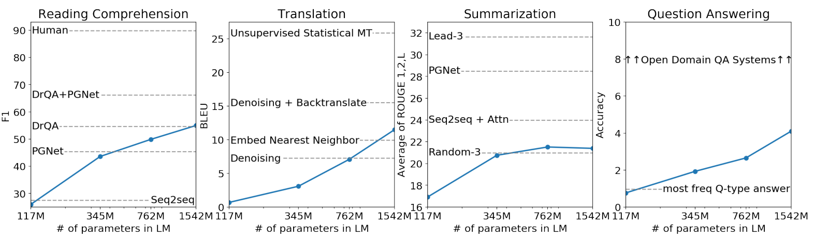 
Figure 1. Zero-shot task performance of WebText LMs as a function of model size on many NLP tasks. Reading Comprehension results are on CoQA (Reddy et al., 2018), translation on WMT-14 Fr-En (Artetxe et al., 2017), summarization on CNN and Daily Mail (See et al., 2017), and Question Answering on Natural Questions (Kwiatkowski et al., 2019). Section 3 contains detailed descriptions of each result. 
图 1. WebText LM 的零样本任务性能作为许多 NLP 任务中模型大小的函数。 阅读理解结果在 CoQA (Reddy et al., 2018) 上，翻译在 WMT-14 Fr-En (Artetxe et al., 2017) 上，摘要在 CNN 和 Daily Mail (See et al., 2017) 上，问答 关于自然问题(Kwiatkowski et al., 2019 )。 第 3 节包含每个结果的详细描述。

These methods still require supervised training in order to perform a task. When only minimal or no supervised data is available, another line of work has demonstrated the promise of language models to perform specific tasks, such as commonsense reasoning (Schwartz et al., 2017) and sentiment analysis (Radford et al., 2017).

为了执行任务，这些方法仍然需要监督训练。当只有极少或没有监督数据可用时，另一项工作证明了语言模型执行特定任务的前景，如常识推理(Schwartzet al., 2017)和情感分析(Radfordet al., 2017)。

In this paper, we connect these two lines of work and continue the trend of more general methods of transfer. We demonstrate language models can perform down-stream tasks in a zero-shot setting – without any parameter or architecture modification. We demonstrate this approach shows potential by highlighting the ability of language models to perform a wide range of tasks in a zero-shot setting. We achieve promising, competitive, and state of the art results depending on the task.

在本文中，我们将这两条工作线联系起来，并继续采用更通用的迁移方法。我们演示了语言模型可以在零样本设置下执行下游任务 —— 无需任何参数或架构修改。我们通过强调语言模型在零样本设置下执行广泛任务的能力，展示了这种方法的潜力。根据任务的不同，我们会取得有希望、有竞争力和最先进的结果。

## 2. Approach
At the core of our approach is language modeling. Language modeling is usually framed as unsupervised distribution estimation from a set of examples $(x_1, x_2, ..., x_n)$ each composed of variable length sequences of symbols $(s_1, s_2, ..., s_n)$. Since language has a natural sequential ordering, it is common to factorize the joint probabilities over symbols as the product of conditional probabilities (Jelinek & Mercer, 1980) (Bengio et al., 2003): 

我们方法的核心是语言建模。语言建模通常被构造为来自一组样本$(x_1, x_2, ..., x_n)$的无监督分布估计，每个样本由可变长度的符号序列 $(s_1, s_2, ..., s_n)$ 组成。由于语言具有自然的顺序排列，通常将符号上的联合概率分解为条件概率的乘积(Jelinek&Mercer，1980)(Bengioet al., 2003)：

$p(x) = \prod_{i=1}^n p(s_n|s_1, ..., s_{n−1})$ (1)

This approach allows for tractable sampling from and estimation of p(x) as well as any conditionals of the form $p(s_{n−k}, ..., s_n|s_1, ..., s_{n−k−1})$. In recent years, there have been significant improvements in the expressiveness of models that can compute these conditional probabilities, such as self-attention architectures like the Transformer (Vaswani et al., 2017).

这种方法允许从 p(x) 以及形式为 $p(s_{n−k}, ..., s_n|s_1, ..., s_{n−k−1})$。 近年来，可以计算这些条件概率的模型的表达能力有了显著提高，例如像 Transformer 这样的自注意力架构(Vaswani et al., 2017 )。

Learning to perform a single task can be expressed in a probabilistic framework as estimating a conditional distribution p(output|input). Since a general system should be able to perform many different tasks, even for the same input, it should condition not only on the input but also on the task to be performed. That is, it should model p(output|input, task). This has been variously formalized in multitask and meta-learning settings. Task conditioning is often implemented at an architectural level, such as the task specific encoders and decoders in (Kaiser et al., 2017) or at an algorithmic level such as the inner and outer loop optimization framework of MAML (Finn et al., 2017). But as exemplified in McCann et al. (2018), language provides a flexible way to specify tasks, inputs, and outputs all as a sequence of symbols. For example, a translation training example can be written as the sequence (translate to french, english text, french text). Likewise, a reading comprehension training example can be written as (answer the question, document, question, answer). McCann et al. (2018) demonstrated it was possible to train a single model, the MQAN, to infer and perform many different tasks on examples with this type of format.

学习执行单个任务可以在概率框架中表示为估计条件分布 p(output|input)。 由于通用系统应该能够执行许多不同的任务，即使对于相同的输入，它也应该不仅以输入为条件，而且以要执行的任务为条件。 即,它应该对 p(output|input, task) 建模。 这已经在多任务和元学习环境中得到了不同的形式化。 任务调节通常在架构级别实现，例如 (Kaiser et al., 2017) 中的任务特定编码器和解码器，或在算法级别实现，例如 MAML 的内外循环优化框架 (Finn et al., 2017) . 但正如 McCann et al. (2018) 所举例说明的那样，语言提供了一种灵活的方式来将任务、输入和输出指定为一系列符号。 例如，翻译训练样本可以写成序列(翻译成法语、英语文本、法语文本)。 同样，一个阅读理解训练的例子可以写成(回答问题，文档，问题，答案)。McCann et al. (2018)  证明可以训练单个模型 MQAN，以使用这种类型的格式在样本上推断和执行许多不同的任务。

<!--多任务学习，元学习, 将不同任务异构的结构化输入统一为一串文本-->

Language modeling is also able to, in principle, learn the tasks of McCann et al. (2018) without the need for explicit supervision of which symbols are the outputs to be predicted. Since the supervised objective is the the same as the unsupervised objective but only evaluated on a subset of the sequence, the global minimum of the unsupervised objective is also the global minimum of the supervised objective. In this slightly toy setting, the concerns with density estimation as a principled training objective discussed in (Sutskever et al., 2015) are side stepped. The problem instead becomes whether we are able to, in practice, optimize the unsupervised objective to convergence. Preliminary experiments confirmed that sufficiently large language models are able to perform multitask learning in this toy-ish setup but learning is much slower than in explicitly supervised approaches.

原则上，语言建模还能够学习McCann et al. (2018)的任务，而无需明确监督哪些符号是要预测的输出。由于有监督目标与无监督目标相同，但仅在序列的子集上进行评估，因此无监督目标的全局最小值也是有监督目标的最小值。在这种略显玩具化的环境中，(Sutskeveret al., 2015)中讨论的将密度估计作为原则性训练目标的问题是片面的。相反，问题是我们是否能够在实践中优化无监督目标以实现收敛。初步实验证实，在这种玩具般的设置中，足够大的语言模型能够执行多任务学习，但学习速度比显式监督方法慢得多。

While it is a large step from the well-posed setup described above to the messiness of “language in the wild”, Weston (2016) argues, in the context of dialog, for the need to develop systems capable of learning from natural language directly and demonstrated a proof of concept – learning a QA task without a reward signal by using forward prediction of a teacher’s outputs. While dialog is an attractive approach, we worry it is overly restrictive. The internet contains a vast amount of information that is passively available without the need for interactive communication. Our speculation is that a language model with sufficient capacity will begin to learn to infer and perform the tasks demonstrated in natural language sequences in order to better predict them, regardless of their method of procurement. If a language model is able to do this it will be, in effect, performing unsupervised multitask learning. We test whether this is the case by analyzing the performance of language models in a zero-shot setting on a wide variety of tasks.

虽然从上述适定的设置到混乱的“自然语言”是一大步，但 Weston(2016)认为，在对话的背景下，需要开发能够直接从自然语言中学习的系统 并展示了概念验证 —— 通过使用教师输出的前向预测来学习没有奖励信号的 QA 任务。虽然对话是一种有吸引力的方法，但我们担心它过于限制。互联网包含大量的信息，这些信息是被动提供的，不需要交互通信。我们的推测是，一个具有足够能力的语言模型将开始学习推断和执行自然语言序列中演示的任务，以便更好地预测它们，无论其采用的方法如何。如果一个语言模型能够做到这一点，实际上，它将执行无监督的多任务学习。我们通过分析语言模型在各种任务的零样本设置下的性能来测试这种情况是否属实。

### 2.1. Training Dataset
Most prior work trained language models on a single domain of text, such as news articles (Jozefowicz et al., 2016), Wikipedia (Merity et al., 2016), or fiction books (Kiros et al., 2015). Our approach motivates building as large and diverse a dataset as possible in order to collect natural language demonstrations of tasks in as varied of domains and contexts as possible.

大多数先前的工作都在单一文本领域训练语言模型，例如新闻文章(Jozefowiczet al., 2016)、维基百科(Merityet al., 2016)或小说书(Kiroset al., 2015)。我们的方法鼓励构建尽可能大且多样的数据集，以便在尽可能多的领域和上下文中收集任务的自然语言演示。

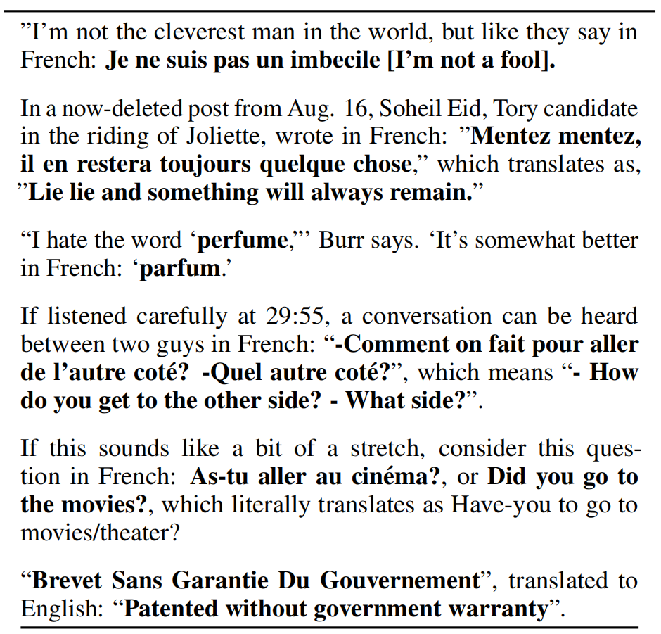 
Table 1. Examples of naturally occurring demonstrations of English to French and French to English translation found throughout the WebText training set.
表1.整个WebText训练集中自然出现的英语到法语和法语到英语翻译演示样本。

A promising source of diverse and nearly unlimited text is web scrapes such as Common Crawl. While these archives are many orders of magnitude larger than current language modeling datasets, they have significant data quality issues. Trinh & Le (2018) used Common Crawl in their work on commonsense reasoning but noted a large amount of documents “whose content are mostly unintelligible”. We observed similar data issues in our initial experiments with Common Crawl. Trinh & Le (2018)’s best results were achieved using a small subsample of Common Crawl which included only documents most similar to their target dataset, the Winograd Schema Challenge. While this is a pragmatic approach to improve performance on a specific task, we want to avoid making assumptions about the tasks to be performed ahead of time.

一个有前途的多样性和几乎无限的文本来源是诸如Common Crawl之类的网页抓取。虽然这些存档比当前的语言建模数据集大很多数量级，但它们存在严重的数据质量问题。Trinh&Le(2018)在他们关于常识推理的工作中使用了Common Crawl，但注意到大量文档“其内容大多难以理解”。我们在使用Common Crawl的初始实验中观察到了类似的数据问题。Trinh&Le(2018)的最佳结果是使用Common Crawl的一个子样本获得的，该样本仅包含与目标数据集Winograd Schema Challenge最相似的文档。虽然这是一种提高特定任务性能的实用方法，但我们希望避免对要提前执行的任务做出假设。

Instead, we created a new web scrape which emphasizes document quality. To do this we only scraped web pages which have been curated/filtered by humans. Manually filtering a full web scrape would be exceptionally expensive so as a starting point, we scraped all outbound links from Reddit, a social media platform, which received at least 3 karma. This can be thought of as a heuristic indicator for whether other users found the link interesting, educational, or just funny.

相反，我们创建了一个强调文档质量的新网络抓取。 为此，我们只抓取了人工策划/过滤的网页。 手动过滤完整的网络抓取将非常昂贵，因此作为起点，我们从社交媒体平台 Reddit 抓取了所有出站链接，该平台至少获得了 3 个点赞(karma?)。 这可以被认为是其他用户是否觉得该链接有趣、有教育意义或只是有趣的启发式指标。

<!--搜索引擎公司的优势，通过用户点击行为积累大量的高质量网页库-->

The resulting dataset, WebText, contains the text subset of these 45 million links. To extract the text from HTML responses we use a combination of the Dragnet (Peters & Lecocq, 2013) and Newspaper(1 https://github.com/codelucas/newspaper ) content extractors. All results presented in this paper use a preliminary version of WebText which does not include links created after Dec 2017 and which after de-duplication and some heuristic based cleaning contains slightly over 8 million documents for a total of 40 GB of text. We removed all Wikipedia documents from WebText since it is a common data source for other datasets and could complicate analysis due to overlapping training data with test evaluation tasks.

生成的数据集WebText包含这4500万个链接的文本子集。为了从HTML响应中提取文本，我们使用了Dragnet(Peters&Leocq，2013)和Newspaper(1https://github.com/codelucas/newspaper )内容提取器。本文中的所有结果都使用了WebText的初步版本，该版本不包括2017年12月之后创建的链接，并且在重复数据消除和一些基于启发式的清理之后，包含了略超过800万个文档，总共40 GB的文本。我们从WebText中删除了所有Wikipedia文档，因为它是其他数据集的通用数据源，并且由于训练数据与测试评估任务重叠，可能会使分析复杂化。

<!--实时更新的新增语料迭代式训练？-->

### 2.2. Input Representation 输入表示
A general language model (LM) should be able to compute the probability of (and also generate) any string. Current large scale LMs include pre-processing steps such as lowercasing, tokenization, and out-of-vocabulary tokens which restrict the space of model-able strings. While processing Unicode strings as a sequence of UTF-8 bytes elegantly fulfills this requirement as exemplified in work such as Gillick et al. (2015), current byte-level LMs are not competitive with word-level LMs on large scale datasets such as the One Billion Word Benchmark (Al-Rfou et al., 2018). We observed a similar performance gap in our own attempts to train standard byte-level LMs on WebText.

通用语言模型(LM)应该能够计算(并生成)任何字符串的概率。当前的大规模LMs包括预处理步骤，如小写转化、令牌化和词汇表外标记，这些步骤限制了可建模字符串的空间。虽然将Unicode字符串处理为UTF-8字节序列非常完美 -如Gillicket al. (2015)所示，满足了这一要求，但当前的字节(byte)级LMs在大规模数据集(如十亿字基准)上与单词(word)级LMs相比没有竞争力(al Rfouet al., 2018)。我们在WebText上训练标准字节级LMs的尝试中发现了类似的性能差距。

Byte Pair Encoding (BPE) (Sennrich et al., 2015) is a practical middle ground between character and word level language modeling which effectively interpolates between word level inputs for frequent symbol sequences and character level inputs for infrequent symbol sequences. Despite its name, reference BPE implementations often operate on Unicode code points and not byte sequences. These implementations would require including the full space of Unicode symbols in order to model all Unicode strings. This would result in a base vocabulary of over 130,000 before any multi-symbol tokens are added. This is prohibitively large compared to the 32,000 to 64,000 token vocabularies often used with BPE. In contrast, a byte-level version of BPE only requires a base vocabulary of size 256. However, directly applying BPE to the byte sequence results in suboptimal merges due to BPE using a greedy frequency based heuristic for building the token vocabulary. We observed BPE including many versions of common words like dog since they occur in many variations such as dog. dog! dog? . This results in a sub-optimal allocation of limited vocabulary slots and model capacity. To avoid this, we prevent BPE from merging across character categories for any byte sequence. We add an exception for spaces which significantly improves the compression efficiency while adding only minimal fragmentation of words across multiple vocab tokens.

字节对编码 (BPE)(Sennrich et al., 2015 )是字符级和词级语言建模之间实用的折中，它有效地在高频符号序列的单词级输入和不常见符号序列的字符级输入之间进行插值。 尽管名称如此，参考 BPE 实现，通常在 Unicode 代码点而不是字节序列上运行。 这些实现需要包括 Unicode 符号的完整空间，以便对所有 Unicode 字符串进行建模。 在添加任何多符号标记之前，这将导致超过 130,000 个基本词汇表。 与 BPE 经常使用的 32,000 到 64,000 个标记词汇表相比，这个数字大得令人望而却步。 相比之下，BPE 的字节级版本只需要大小为 256 的基本词汇表。但是，直接将 BPE 应用于字节序列会导致次优合并，因为 BPE 使用基于贪婪频率的启发式方法来构建标记词汇表。 我们观察到 BPE 包括许多版本的常用词，例如dog，因为它们出现在许多变体中，例如: dog. dog! dog? . 这导致有限词汇槽和模型容量的次优分配。 为避免这种情况，我们阻止 BPE 合并任何字节序列的跨字符类别。 我们为空格添加了一个例外，这显著提高了压缩效率，同时仅在多个词汇标记中添加了最少的单词碎片。

<!-- token的粒度，词表大小，这段没太懂 -->

This input representation allows us to combine the empirical benefits of word-level LMs with the generality of byte-level approaches. Since our approach can assign a probability to any Unicode string, this allows us to evaluate our LMs on any dataset regardless of pre-processing, tokenization, or vocab size.

这种输入表示允许我们将单词级LMs的经验优势与字节级方法的通用性结合起来。由于我们的方法可以为任何Unicode字符串分配概率，因此无论预处理、令牌化或vocab大小如何，这都允许我们在任何数据集上评估LMs。

### 2.3. Model
We use a Transformer (Vaswani et al., 2017) based architecture for our LMs. The model largely follows the details of the OpenAI GPT model (Radford et al., 2018) with a few modifications. Layer normalization (Ba et al., 2016) was moved to the input of each sub-block, similar to a pre-activation residual network (He et al., 2016) and an additional layer normalization was added after the final selfattention block. A modified initialization which accounts for the accumulation on the residual path with model depth is used. We scale the weights of residual layers at initialization by a factor of $1/\sqrt{N}$ where N is the number of residual layers. The vocabulary is expanded to 50,257. We also increase the context size from 512 to 1024 tokens and a larger batchsize of 512 is used.

我们为 LM 使用基于 Transformer(Vaswani et al., 2017)的架构。 该模型在很大程度上遵循 OpenAI GPT 模型(Radford et al., 2018 )的细节，并进行了一些修改。 层归一化 (Ba et al., 2016) 被移动到每个子块的输入，类似于预激活残差网络 (He et al., 2016)，并且在最终的自注意力块之后添加了额外的层归一化。 使用修改后的初始化，该初始化考虑了具有模型深度的残差路径上的累积。 我们在初始化时通过因子 $1/\sqrt{N}$ 缩放残差层的权重，其中 N 是残差层的数量。 词汇量扩大到 50,257。 我们还将上下文大小(输入字符串的长度)从 512 个标记增加到 1024 个标记，并使用了更大的批大小 512。

## 3. Experiments
We trained and benchmarked four LMs with approximately log-uniformly spaced sizes. The architectures are summarized in Table 2. The smallest model is equivalent to the original GPT, and the second smallest equivalent to the largest model from BERT (Devlin et al., 2018). Our largest model, which we call GPT-2, has over an order of magnitude more parameters than GPT. The learning rate of each model was manually tuned for the best perplexity on a 5% held-out sample of WebText. All models still underfit WebText and held-out perplexity has as of yet improved given more training time.

我们对四个 LM 进行了训练和基准测试，这些 LM 具有近似对数均匀间隔的大小。 表-2 总结了这些架构。最小的模型相当于原始 GPT，第二小的相当于 BERT 的最大模型(Devlin et al., 2018)。 我们称为 GPT-2 的最大模型的参数比 GPT 多一个数量级。 每个模型的学习率都是手动调整的，以便在 WebText 的 5% 保留样本上获得最佳困惑度。 所有模型仍然欠拟合 WebText ，并且在提供更多训练时间的情况下，保留的困惑度仍然有所改善。

Parameters | Layers | dmodel
--- | --- | ---
117M | 12 | 768
345M | 24 | 1024
762M | 36 | 1280
1542M | 48 | 1600

<!-- 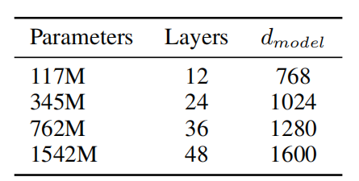  -->
Table 2. Architecture hyperparameters for the 4 model sizes. 
表2.4种模型尺寸的架构超参数。

### 3.1. Language Modeling
As an initial step towards zero-shot task transfer, we are interested in understanding how WebText LM’s perform at zero-shot domain transfer on the primary task they are trained for – language modeling. Since our model operates on a byte level and does not require lossy pre-processing or tokenization, we can evaluate it on any language model benchmark. Results on language modeling datasets are commonly reported in a quantity which is a scaled or exponentiated version of the average negative log probability per canonical prediction unit usually a character, a byte, or a word. We evaluate the same quantity by computing the log-probability of a dataset according to a WebText LM and dividing by the number of canonical units. For many of these datasets, WebText LMs would be tested significantly outof-distribution, having to predict aggressively standardized text, tokenization artifacts such as disconnected punctuation and contractions, shuffled sentences, and even the string < UNK > which is extremely rare in WebText occurring only 26 times in 40 billion bytes. We report our main results in Table 3 using invertible de-tokenizers which remove as many of these tokenization / pre-processing artifacts as possible. Since these de-tokenizers are invertible, we can still calculate the log probability of a dataset and they can be thought of as a simple form of domain adaptation. We observe gains of 2.5 to 5 perplexity for GPT-2 with these de-tokenizers.

作为零样本任务迁移的第一步，我们有兴趣了解 WebText LM 如何在零样本域迁移中执行他们接受训练的主要任务 —— 语言建模。 由于我们的模型在字节级别上运行并且不需要有损预处理或令牌化，因此我们可以在任何语言模型基准上对其进行评估。 语言建模数据集的结果通常以一个质量报告，该质量是每个规范预测单元的平均负对数概率的缩放或取幂版本 —— 通常是一个字符、一个字节或一个单词。 我们通过根据 WebText LM 计算数据集的对数概率并除以规范单元数来评估相同的质量。 对于这些数据集中的许多数据集，WebText LM 将进行明显的分布外测试，必须预测积极标准化的文本、令牌化工件，例如断开连接的标点符号和收缩、打乱的句子，甚至是字符串 \<UNK\>，这在 WebText 中极为罕见 发生 在 400 亿字节中只有 26 次。 我们使用 可逆去令牌器 在表-3 中报告了我们的主要结果，它尽可能多地删除了这些令牌化/预处理工件。 由于这些 去令牌器 是可逆的，我们仍然可以计算数据集的对数概率，它们可以被认为是域适应的一种简单形式。 我们观察到使用这些 去令牌器 的 GPT-2 的困惑度增加了 2.5 到 5。

<!-- 去标记器 -->

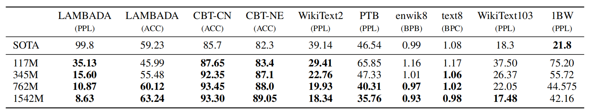 
Table 3. Zero-shot results on many datasets. No training or fine-tuning was performed for any of these results. PTB and WikiText-2 results are from (Gong et al., 2018). CBT results are from (Bajgar et al., 2016). LAMBADA accuracy result is from (Hoang et al., 2018) and LAMBADA perplexity result is from (Grave et al., 2016). Other results are from (Dai et al., 2019). 
表-3. 许多数据集的零样本结果。 没有对这些结果中的任何一个进行训练或微调。 PTB 和 WikiText-2 结果来自 (Gong et al., 2018)。 CBT 结果来自 (Bajgar et al., 2016)。 LAMBADA 准确度结果来自 (Hoang et al., 2018)，LAMBADA 困惑度结果来自 (Grave et al., 2016)。 其他结果来自 (Dai et al., 2019)。

WebText LMs transfer well across domains and datasets, improving the state of the art on 7 out of the 8 datasets in a zero-shot setting. Large improvements are noticed on small datasets such as Penn Treebank and WikiText-2 which have only 1 to 2 million training tokens. Large improvements are also noticed on datasets created to measure long-term dependencies like LAMBADA (Paperno et al., 2016) and the Children’s Book Test (Hill et al., 2015). Our model is still significantly worse than prior work on the One Billion Word Benchmark (Chelba et al., 2013). This is likely due to a combination of it being both the largest dataset and having some of the most destructive pre-processing 1BW’s sentence level shuffling removes all long-range structure.

WebText LM 可以很好地跨领域和数据集迁移，在零样本设置中改进了 8 个数据集中的 7 个的最新技术水平。 在 Penn Treebank 和 WikiText-2 等只有 1~200 万个训练令牌的小型数据集上注意到了很大的改进。 在为测量长期依赖性而创建的数据集上也注意到了重大改进，例如 LAMBADA(Paperno et al., 2016 )和儿童图书测试(Hill et al., 2015 )。 我们的模型仍然比之前在One Billion Word Benchmark上的工作差得多(Chelba et al., 2013 )。 这可能是由于它既是最大的数据集又具有一些最具破坏性的预处理——1BW 的句子级改组删除了所有远程结构。

### 3.2. Children’s Book Test
The Children’s Book Test (CBT) (Hill et al., 2015) was created to examine the performance of LMs on different categories of words: named entities, nouns, verbs, and prepositions. Rather than reporting perplexity as an evaluation metric, CBT reports accuracy on an automatically constructed cloze test where the task is to predict which of 10 possible choices for an omitted word is correct. Following the LM approach introduced in the original paper, we compute the probability of each choice and the rest of the sentence conditioned on this choice according to the LM, and predict the one with the highest probability. As seen in Figure 2 performance steadily improves as model size is increased and closes the majority of the gap to human performance on this test. Data overlap analysis showed one of the CBT test set books, The Jungle Book by Rudyard Kipling, is in WebText, so we report results on the validation set which has no significant overlap. GPT-2 achieves new state of the art results of 93.3% on common nouns and 89.1% on named entities. A de-tokenizer was applied to remove PTB style tokenization artifacts from CBT.

童书测试 (CBT)(Hill et al., 2015 )的创建是为了检查 LM 在不同类别的单词上的表现：命名实体、名词、动词和介词。 CBT 不是将困惑度报告为评估指标，而是报告自动构建的完形填空测试的准确性，其中的任务是预测遗漏单词的 10 种可能选择中哪一种是正确的。 遵循原论文中介绍的 LM 方法，我们根据 LM 计算每个选择和以该选择为条件的句子的其余部分的概率，并预测概率最高的那个。 如图 2 所示，性能随着模型大小的增加而稳步提高，并缩小了该测试中与人类性能的大部分差距。 数据重叠分析显示 CBT 测试集书籍之一，Rudyard Kipling 的 The Jungle Book，在 WebText 中，因此我们报告了验证集上没有明显重叠的结果。 GPT-2 在普通名词上达到了 93.3% 的新水平，在命名实体上达到了 89.1% 的新水平。 应用去标记器从 CBT 中删除 PTB 样式令牌化工件。

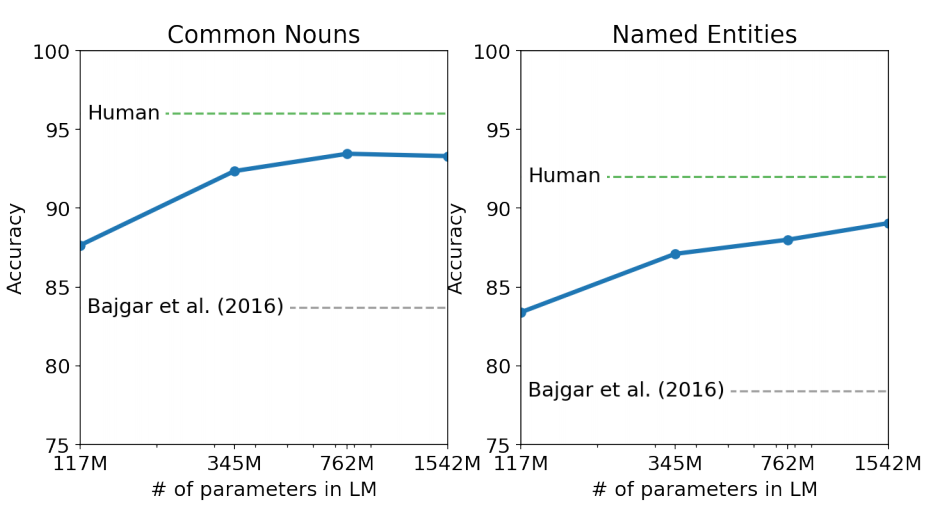 
Figure 2. Performance on the Children’s Book Test as a function of model capacity. Human performance are from Bajgar et al. (2016), instead of the much lower estimates from the original paper.
图 2. 儿童图书测试的表现与模型容量的关系。 人类表现来自 Bajgar et al. 。 (2016)，而不是原始论文中低得多的估计。

### 3.3. LAMBADA
The LAMBADA dataset (Paperno et al., 2016) tests the ability of systems to model long-range dependencies in text. The task is to predict the final word of sentences which require at least 50 tokens of context for a human to successfully predict. GPT-2 improves the state of the art from 99.8 (Grave et al., 2016) to 8.6 perplexity and increases the accuracy of LMs on this test from 19% (Dehghani et al., 2018) to 52.66%. Investigating GPT-2’s errors showed most predictions are valid continuations of the sentence, but are not valid final words. This suggests that the LM is not using the additional useful constraint that the word must be the final of the sentence. Adding a stop-word filter as an approximation to this further increases accuracy to 63.24%, improving the overall state of the art on this task by 4%. The previous state of the art (Hoang et al., 2018) used a different restricted prediction setting where the outputs of the model were constrained to only words that appeared in the context. For GPT-2, this restriction is harmful rather than helpful since 19% of answers are not in context. We use a version of the dataset without preprocessing.

LAMBADA 数据集(Paperno et al., 2016 )测试了系统对文本中的远程依赖建模的能力。 任务是预测句子的最后一个单词，这需要至少 50 个上下文标记才能让人类成功预测。 GPT-2 将现有技术的困惑度从 99.8(Grave et al., 2016 )提高到 8.6，并将 LM 在此测试中的准确度从 19%(Dehghani et al., 2018 )提高到 52.66%。 调查 GPT-2 的错误表明，大多数预测都是句子的有效延续，但不是有效的最终词。 这表明 LM 没有使用额外的有用约束，即单词必须是句子的结尾。 添加一个停用词过滤器作为对此的近似值进一步将精度提高到 63.24%，将此任务的整体技术水平提高了 4%。 先前的技术水平(Hoang et al., 2018 )使用了不同的受限预测设置，其中模型的输出仅限于出现在上下文中的单词。 对于 GPT-2，这种限制是有害的而不是有益的，因为 19% 的答案不在上下文中。 我们使用未经预处理的数据集版本。

### 3.4. Winograd Schema Challenge
The Winograd Schema challenge (Levesque et al., 2012) was constructed to measure the capability of a system to perform commonsense reasoning by measuring its ability to resolve ambiguities in text. Recently Trinh & Le (2018) demonstrated significant progress on this challenge using LMs, by predicting the resolution of the ambiguity with higher probability. We follow their problem formulation and visualize the performance of our models with both full and partial scoring techniques in Figure 3. GPT-2 improves state of the art accuracy by 7%, achieving 70.70%. The dataset is quite small with only 273 examples so we recommend reading Trichelair et al. (2018) to help contextualize this result.

Winograd Schema 挑战(Levesque et al., 2012 )旨在通过衡量系统解决文本歧义的能力来衡量系统执行常识推理的能力。 最近，Trinh & Le (2018) 通过以更高的概率预测歧义的解决，展示了使用 LM 在应对这一挑战方面取得的重大进展。 我们遵循他们的问题表述，并使用图 3 中的完整和部分评分技术可视化我们模型的性能。GPT-2 将最先进的准确度提高了 7%，达到 70.70%。 数据集非常小，只有 273 个样本，因此我们建议阅读 Trichelair et al. 。 (2018) 帮助将这一结果背景化。

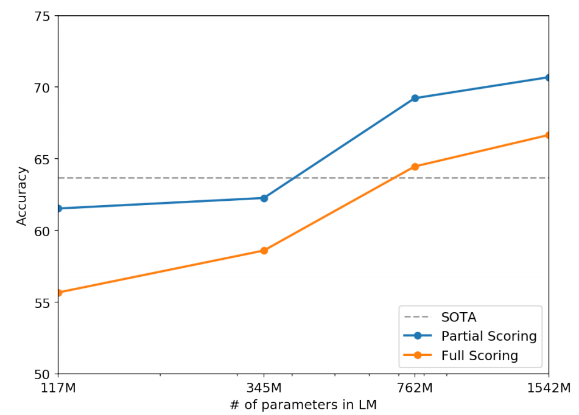 
Figure 3. Performance on the Winograd Schema Challenge as a function of model capacity.
图 3. Winograd Schema Challenge 的性能与模型容量的关系。

### 3.5. Reading Comprehension 阅读理解
The Conversation Question Answering dataset (CoQA) Reddy et al. (2018) consists of documents from 7 different domains paired with natural language dialogues between a question asker and a question answerer about the document. CoQA tests reading comprehension capabilities and also the ability of models to answer questions that depend on conversation history (such as “Why?”).

对话问答数据集 (CoQA) Reddy 等。 (2018) 包含来自 7 个不同领域的文档，以及提问者和回答者之间关于该文档的自然语言对话。 CoQA 测试阅读理解能力以及模型回答依赖于对话历史的问题(例如“为什么？”)的能力。

Greedy decoding from GPT-2 when conditioned on a document, the history of the associated conversation, and a final token A: achieves 55 F1 on the development set. This matches or exceeds the performance of 3 out of 4 baseline systems without using the 127,000+ manually collected question answer pairs those baselines were trained on. The supervised SOTA, a BERT based system (Devlin et al.,2018), is nearing the 89 F1 performance of humans. While GPT-2’s performance is exciting for a system without any supervised training, some inspection of its answers and errors suggests GPT-2 often uses simple retrieval based heuristics such as answer with a name from the document in response to a who question.

当以文档、相关对话的历史和最终标记 A 为条件时，从 GPT-2 进行贪婪解码：在开发集上达到 55 F1。 这匹配或超过了 4 个基线系统中的 3 个的性能，而没有使用这些基线所训练的 127,000 多个手动收集的问题答案对。 受监督的 SOTA 是一种基于 BERT 的系统(Devlin et al., 2018 )，其性能接近人类的 89 F1。 虽然 GPT-2 的性能对于没有任何监督训练的系统来说是令人兴奋的，但对其答案和错误的一些检查表明 GPT-2 经常使用简单的基于检索的启发式方法，例如用文档中的名字回答 who 问题。

### 3.6. Summarization
We test GPT-2’s ability to perform summarization on the CNN and Daily Mail dataset (Nallapati et al., 2016). To induce summarization behavior we add the text TL;DR: after the article and generate 100 tokens with Top-k random sampling (Fan et al., 2018) with k = 2 which reduces repetition and encourages more abstractive summaries than greedy decoding. We use the first 3 generated sentences in these 100 tokens as the summary. While qualitatively the generations resemble summaries, as shown in Table 14, they often focus on recent content from the article or confuse specific details such as how many cars were involved in a crash or whether a logo was on a hat or shirt. On the commonly reported ROUGE 1,2,L metrics the generated summaries only begin to approach the performance of classic neural baselines and just barely outperforms selecting 3 random sentences from the article. GPT-2’s performance drops by 6.4 points on the aggregate metric when the task hint is removed which demonstrates the ability to invoke task specific behavior in a language model with natural language.

我们测试了 GPT-2 在 CNN 和每日邮报数据集上执行摘要的能力(Nallapati et al., 2016 )。 为了诱导摘要行为，我们在文章之后添加文本 TL;DR: 并使用 k = 2 的 Top-k 随机抽样(Fan et al., 2018 )生成 100 个标记，这减少了重复并鼓励比贪婪解码更抽象的摘要。 我们使用这 100 个标记中的前 3 个生成的句子作为摘要。 虽然从质量上讲，各代类似于摘要，如表-4 所示，但它们通常关注文章中的最新内容或混淆具体细节，例如有多少辆汽车卷入了撞车事故，或者帽子或衬衫上是否有徽标。 在通常报告的 ROUGE 1,2,L 指标上，生成的摘要仅开始接近经典神经基线的性能，并且仅勉强优于从文章中选择 3 个随机句子。 当删除任务提示时，GPT-2 的性能在聚合指标上下降了 6.4 分，这证明了在具有自然语言的语言模型中调用任务特定行为的能力。<!-在文章之后添加文本 TL;DR:? -->

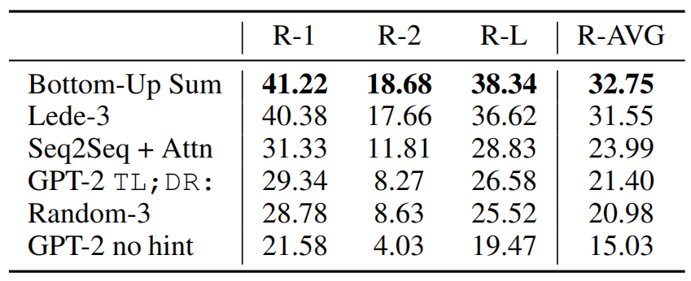 
Table 4. Summarization performance as measured by ROUGE F1 metrics on the CNN and Daily Mail dataset. Bottom-Up Sum is the SOTA model from (Gehrmann et al., 2018) 
表-4. 根据 CNN 和每日邮报数据集上的 ROUGE F1 指标测量的摘要性能。 Bottom-Up Sum 是来自 (Gehrmann et al., 2018) 的 SOTA 模型

### 3.7. Translation
We test whether GPT-2 has begun to learn how to translate from one language to another. In order to help it infer that this is the desired task, we condition the language model on a context of example pairs of the format english sentence = french sentence and then after a final prompt of english sentence = we sample from the model with greedy decoding and use the first generated sentence as the translation. On the WMT-14 English-French test set, GPT-2 gets 5 BLEU, which is slightly worse than a word-by-word substitution with a bilingual lexicon inferred in previous work on unsupervised word translation (Conneau et al., 2017b). On the WMT-14 French-English test set, GPT-2 is able to leverage its very strong English language model to perform significantly better, achieving 11.5 BLEU. This outperforms several unsupervised machine translation baselines from (Artetxe et al., 2017) and (Lample et al., 2017) but is still much worse than the 33.5 BLEU of the current best unsupervised machine translation approach (Artetxe et al., 2019). Performance on this task was surprising to us, since we deliberately removed non-English webpages from WebText as a filtering step. In order to confirm this, we ran a byte-level language detector(2https://github.com/CLD2Owners/cld2 ) on WebText which detected only 10MB of data in the French language which is approximately 500x smaller than the monolingual French corpus common in prior unsupervised machine translation research.

我们测试 GPT-2 是否已经开始学习如何将一种语言翻译成另一种语言。 为了帮助它推断这是所需的任务，我们将语言模型置于英语句子 = 法语句子格式的样本对的上下文中，然后在英语句子 = 的最终提示之后，我们从模型中采样 贪心解码并使用第一个生成的句子作为翻译。 在 WMT-14 英法测试集上，GPT-2 获得 5 BLEU，这比之前关于无监督单词翻译的工作中推断的双语词典的逐词替换略差(Conneau et al., 2017b) . 在 WMT-14 法语-英语测试集上，GPT-2 能够利用其非常强大的英语语言模型表现得更好，达到 11.5 BLEU。 这优于 (Artetxe et al., 2017) 和 (Lample et al., 2017) 的几个无监督机器翻译基线，但仍然比当前最好的无监督机器翻译方法 (Artetxe et al., 2019) 的 33.5 BLEU 差得多 . 这项任务的表现令我们感到惊讶，因为我们故意从 WebText 中删除非英语网页作为过滤步骤。 为了证实这一点，我们在 WebText 上运行了一个字节级语言检测器 (2https://github.com/CLD2Owners/cld2)，它只检测到 10MB 的法语数据，比单语法语小大约 500 倍 语料库在先前的无监督机器翻译研究中很常见。

### 3.8. Question Answering 
A potential way to test what information is contained within a language model is to evaluate how often it generates the correct answer to factoid-style questions. Previous showcasing of this behavior in neural systems where all information is stored in parameters such as A Neural Conversational Model (Vinyals & Le, 2015) reported qualitative results due to the lack of high-quality evaluation datasets. The recently introduced Natural Questions dataset (Kwiatkowski et al.,2019) is a promising resource to test this more quantitatively. Similar to translation, the context of the language model is seeded with example question answer pairs which helps the model infer the short answer style of the dataset. GPT-2 answers 4.1% of questions correctly when evaluated by the exact match metric commonly used on reading comprehension datasets like SQUAD(3Alec, who previously thought of himself as good at random trivia, answered 17 of 100 randomly sampled examples correctly when tested in the same setting as GPT-2. He actually only got 14 right but he should have gotten those other 3 ). As a comparison point, the smallest model does not exceed the 1.0% accuracy of an incredibly simple baseline which returns the most common answer for each question type (who, what, where, etc...). GPT-2 answers 5.3 times more questions correctly, suggesting that model capacity has been a major factor in the poor performance of neural systems on this kind of task as of yet. The probability GPT-2 assigns to its generated answers is well calibrated and GPT-2 has an accuracy of 63.1% on the 1% of questions it is most confident in. The 30 most confident answers generated by GPT-2 on development set questions are shown in Table 5. The performance of GPT-2 is still much, much, worse than the 30 to 50% range of open domain question answering systems which hybridize information retrieval with extractive document question answering (Alberti et al., 2019). 

测试语言模型中包含哪些信息的一种潜在方法是评估它为事实式问题生成正确答案的频率。 由于缺乏高质量的评估数据集，之前在神经系统中展示这种行为，其中所有信息都存储在神经会话模型(Vinyals＆Le，2015)等参数中报告了定性结果。 最近推出的 Natural Questions 数据集(Kwiatkowski et al., 2019 )是一个很有前途的资源，可以更定量地测试这一点。 与翻译类似，语言模型的上下文中植入了样本问答对，这有助于模型推断数据集的简短回答风格。 当使用 SQUAD 等阅读理解数据集上常用的精确匹配指标评估时，GPT-2 正确回答了 4.1% 的问题(3Alec，他以前认为自己擅长随机琐事，在 与 GPT-2 相同的设置。他实际上只答对了 14 个，但他应该得到其他 3 个)。 作为比较点，最小的模型不超过一个非常简单的基线的 1.0% 准确度，该基线返回每个问题类型(谁、什么、哪里等)的最常见答案。 GPT-2 正确回答了 5.3 倍的问题，这表明模型容量是迄今为止神经系统在此类任务上表现不佳的一个主要因素。 GPT-2 分配给其生成的答案的概率经过了很好的校准，GPT-2 在它最有信心的 1% 问题上的精度为 63.1%。GPT-2 在开发集问题上生成的 30 个最有信心的答案是 如表-5 所示。GPT-2 的性能仍然比混合信息检索和提取文档问答的开放域问答系统的 30% 到 50% 差很多很多(Alberti et al., 2019 )。

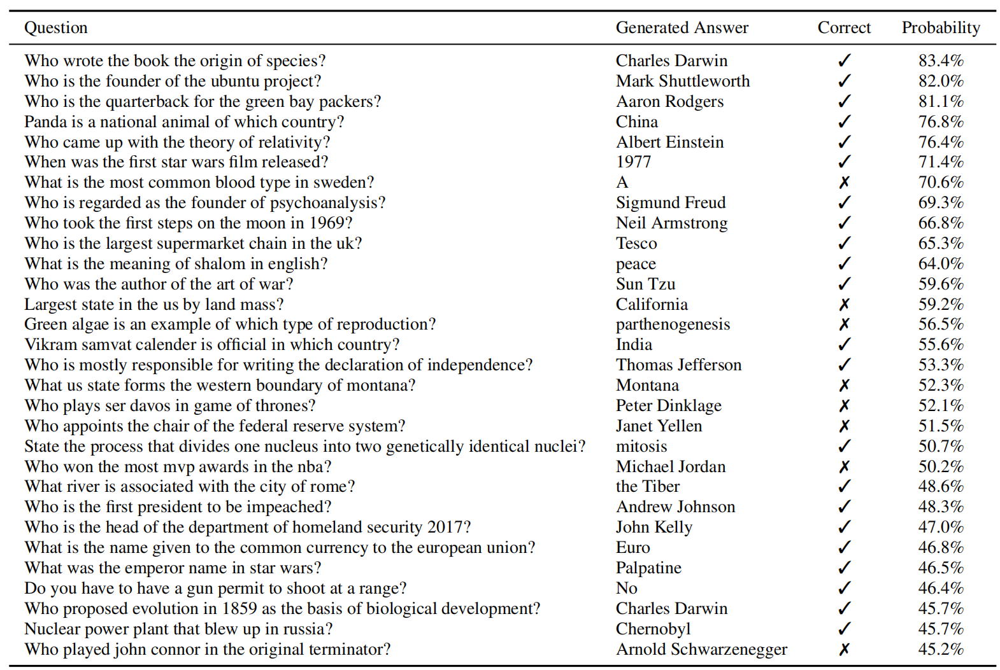 
Table 5. The 30 most confident answers generated by GPT-2 on the development set of Natural Questions sorted by their probability according to GPT-2. None of these questions appear in WebText according to the procedure described in Section 4. 
表-5. GPT-2 在自然问题开发集上生成的 30 个最有信心的答案，根据 GPT-2 按概率排序。 根据第 4 节中描述的过程，这些问题都没有出现在 WebText 中。

## 4. Generalization vs Memorization 泛化与记忆
Recent work in computer vision has shown that common image datasets contain a non-trivial amount of near-duplicate images. For instance CIFAR-10 has 3.3% overlap between train and test images (Barz & Denzler, 2019). This results in an over-reporting of the generalization performance of machine learning systems. As the size of datasets increases this issue becomes increasingly likely which suggests a similar phenomena could be happening with WebText. Therefore it is important to analyze how much test data also shows up in the training data.

最近在计算机视觉方面的工作表明，常见的图像数据集包含大量接近重复的图像。 例如，CIFAR-10 在训练图像和测试图像之间有 3.3% 的重叠(Barz & Denzler，2019)。 这导致机器学习系统的泛化性能被过度报告。 随着数据集大小的增加，这个问题变得越来越有可能，这表明 WebText 可能会发生类似的现象。 因此，重要的是要分析有多少测试数据也出现在训练数据中。

To study this we created Bloom filters containing 8-grams of WebText training set tokens. To improve recall, strings were normalized to contain only lower-cased alphanumeric words with a single space as a delimiter. The Bloom filters were constructed such that the false positive rate is upper bounded by ${1/10^8}$ . We further verified the low false positive rate by generating 1M strings, of which zero were found by the filter.

为了研究这一点，我们创建了包含 8-grams WebText 训练集标记的布隆过滤器。 为了提高记忆力，字符串被归一化为仅包含小写字母数字单词，并以单个空格作为分隔符。 构造布隆过滤器使得误报率上限为 ${1/10^8}$ 。 我们通过生成 1M 字符串进一步验证了低误报率，其中过滤器没发现了重复。

These Bloom filters let us calculate, given a dataset, the percentage of 8-grams from that dataset that are also found in the WebText training set. Table 6 shows this overlap analysis for the test sets of common LM benchmarks. Common LM datasets’ test sets have between 1-6% overlap with WebText train, with an average of overlap of 3.2%. Somewhat surprisingly, many datasets have larger overlaps with their own training splits, with an average of 5.9% overlap.

这些 Bloom 过滤器让我们可以在给定数据集的情况下计算该数据集中 8-gram 的百分比，这些百分比也在 WebText 训练集中找到。 表-6 显示了对常见 LM 基准测试集的重叠分析。 普通 LM 数据集的测试集与 WebText 训练有 1-6% 的重叠，平均重叠为 3.2%。 有些令人惊讶的是，许多数据集与它们自己的训练拆分有更大的重叠，平均重叠率为 5.9%。

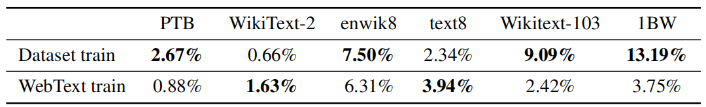 
Table 6. Percentage of test set 8 grams overlapping with training sets.
表-6. 测试集 8-grams 与训练集重叠的百分比。

Our approach optimizes for recall, and while manual inspection of the overlaps shows many common phrases, there are many longer matches that are due to duplicated data. This is not unique to WebText. For instance, we discovered that the test set of WikiText-103 has an article which is also in the training dataset. Since there are only 60 articles in the test set there is at least an overlap of 1.6%.(4A significant portion of additional overlap is due to editors reusing some paragraphs across multiple articles with a shared theme such as various battles in the Korean War.) Potentially more worryingly, 1BW has an overlap of nearly 13.2% with its own training set according to our procedure.

我们的方法针对召回进行了优化，虽然手动检查重叠显示了许多常用短语，但由于重复数据，存在许多更长的匹配。 这不是 WebText 独有的。 例如，我们发现 WikiText-103 的测试集有一篇文章也在训练数据集中。 由于测试集中只有 60 篇文章，因此至少有 1.6% 的重叠。(4 额外重叠的很大一部分是由于编辑在具有共同主题(例如朝鲜战争中的各种战斗)的多篇文章中重复使用某些段落。) 更令人担忧的是，根据我们的程序，1BW 与其自己的训练集有近 13.2% 的重叠。

For the Winograd Schema Challenge, we found only 10 schemata which had any 8-gram overlaps with the WebText training set. Of these, 2 were spurious matches. Of the remaining 8, only 1 schema appeared in any contexts that gave away the answer.

对于 Winograd Schema Challenge，我们只发现了 10 个与 WebText 训练集有任何 8-gram 重叠的模式。 其中，2 个是虚假匹配。 在剩下的 8 个中，只有 1 个模式出现在给出答案的任何上下文中。

For CoQA, about 15% of documents in the news domain are already in WebText and the model performs about 3 F1 better on these. CoQA’s development set metric reports the average performance over 5 different domains and we measure a gain of about 0.5-1.0 F1 due to overlap across the various domains. However, no actual training questions or answers are in WebText since CoQA was released after the cutoff date for links in WebText.

对于 CoQA，新闻领域中大约 15% 的文档已经在 WebText 中，并且该模型在这些方面的性能提高了大约 3 F1。 CoQA 的开发集指标报告了 5 个不同领域的平均性能，并且由于各个领域之间的重叠，我们测得大约 0.5-1.0 F1 的增益。 但是，由于 CoQA 在 WebText 中的链接截止日期之后发布，因此 WebText 中没有实际的训练问题或答案。

On LAMBADA, the average overlap is 1.2%. GPT-2 performs about 2 perplexity better on examples with greater than 15% overlap. Recalculating metrics when excluding all examples with any overlap shifts results from 8.6 to 8.7 perplexity and reduces accuracy from 63.2% to 62.9%. This very small change in overall results is likely due to only 1 in 200 examples having significant overlap.

在 LAMBADA 上，平均重叠率为 1.2%。 GPT-2 在重叠度大于 15% 的样本中表现出大约 2 倍的困惑度。 在排除所有具有任何重叠的样本时重新计算指标会导致困惑度从 8.6 变为 8.7，并将准确度从 63.2% 降低到 62.9%。 总体结果的这种非常小的变化可能是由于 200 个样本中只有 1 个具有显著重叠。

Overall, our analysis suggests that data overlap between WebText training data and specific evaluation datasets provides a small but consistent benefit to reported results. However, for most datasets we do not notice significantly larger overlaps than those already existing between standard training and test sets, as Table 6 highlights.

总的来说，我们的分析表明 WebText 训练数据和特定评估数据集之间的数据重叠为报告的结果提供了一个小但一致的好处。 然而，对于大多数数据集，我们没有注意到比标准训练和测试集之间已经存在的重叠明显更大的重叠，如表-6 突出显示的那样。

Understanding and quantifying how highly similar text impacts performance is an important research question. Better de-duplication techniques such as scalable fuzzy matching could also help better answer these questions. For now, we recommend the use of n-gram overlap based de-duplication as an important verification step and sanity check during the creation of training and test splits for new NLP datasets.

理解和量化高度相似的文本如何影响性能是一个重要的研究问题。 更好的重复数据删除技术，如可扩展的模糊匹配，也有助于更好地回答这些问题。 目前，我们建议在为新的 NLP 数据集创建训练和测试拆分期间，使用基于 n-gram 重叠的去重作为重要的验证步骤和健全性检查。

Another potential way of determining whether the performance of WebText LMs is attributable to memorization is inspecting their performance on their own held-out set. As shown in Figure 4, performance on both the training and test sets of WebText are similar and improve together as model size is increased. This suggests even GPT-2 is still underfitting on WebText in many ways.

确定 WebText LM 的性能是否归因于记忆的另一种可能方法是检查它们在自己的保留集上的性能。 如图 4 所示，WebText 在训练集和测试集上的性能相似，并且随着模型大小的增加一起提高。 这表明即使是 GPT-2 在许多方面仍然欠拟合 WebText。

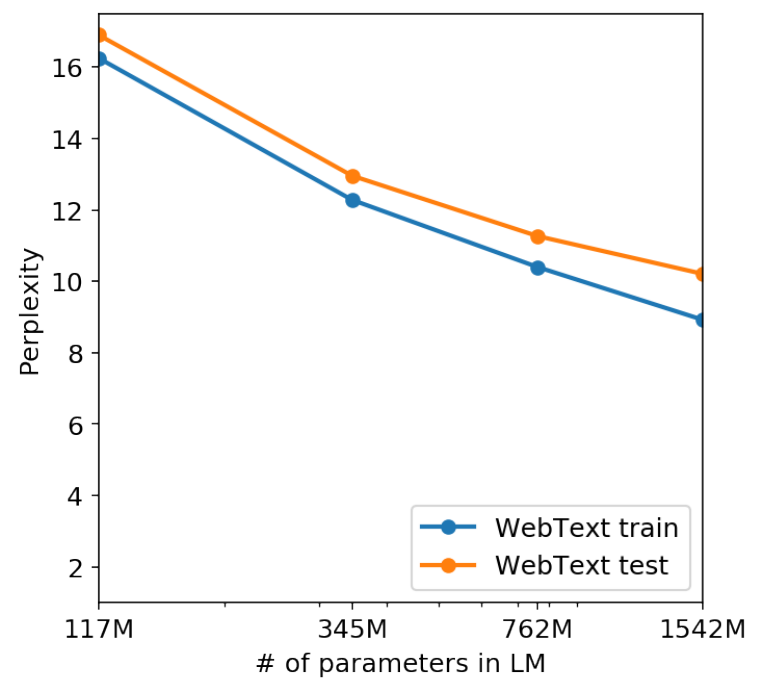 
Figure 4. The performance of LMs trained on WebText as a function of model size. 
图4.在WebText上训练的LMs的性能与模型大小的关系。

GPT-2 is also able to write news articles about the discovery of talking unicorns. An example is provided in Table 13.

GPT-2 还能够撰写有关发现会说话的独角兽的新闻文章。 表-13 中提供了一个样本。

## 5. Related Work
A significant portion of this work measured the performance of larger language models trained on larger datasets. This is similar to the work of Jozefowicz et al. (2016) which scaled RNN based language models on the 1 Billion Word Benchmark. Bajgar et al. (2016) also previously improved results on the Children’s Book Test by creating a much larger training dataset out of Project Gutenberg to supplement the standard training dataset. Hestness et al. (2017) conducted a thorough analysis of how the performance of various deep learning models changes as a function of both model capacity and dataset size. Our experiments, while much noisier across tasks, suggest similar trends hold for sub-tasks of an objective and continue into the 1B+ parameter regime.

这项工作的很大一部分衡量了在大型数据集上训练的大型语言模型的性能。这与Jozefowiczet al. (2016)在10亿单词基准上缩放基于RNN的语言模型的工作类似。Baggaret al. (2016)之前也通过在Gutenberg项目中创建更大的训练数据集来补充标准训练数据集，从而改进了儿童图书测试的结果。Hesentyet al. (2017)对各种深度学习模型的性能如何作为模型容量和数据集大小的函数而变化进行了深入分析。我们的实验表明，尽管任务间的噪声更大，但目标的子任务也存在类似的趋势，并继续进入1B+参数状态。

Interesting learned functionality in generative models has been documented before such as the cells in an RNN language model performing line-width tracking and quote/comment detection Karpathy et al. (2015). More inspirational to our work was the observation of Liu et al. (2018) that a model trained to generate Wikipedia articles also learned to translate names between languages.

生成模型中有趣的学习能力之前已被记录，例如RNN语言模型中的单元执行线宽跟踪和引用/注释检测Karpathyet al. (2015)。 Liuet al. (2018)的观察对我们的工作更具启发性，即一个经过训练生成维基百科文章的模型也学会了在语言之间翻译名称。

Previous work has explored alternative approaches to filtering and constructing a large text corpus of web pages, such as the iWeb Corpus (Davies, 2018).

先前的工作探索了过滤和构建大型网页文本语料库的替代方法，如iWeb语料库(Davies，2018)。

There has been extensive work on pre-training methods for language tasks. In addition to those mentioned in the introduction, GloVe (Pennington et al., 2014) scaled word vector representation learning to all of Common Crawl. An influential early work on deep representation learning for text was Skip-thought Vectors (Kiros et al., 2015). McCann et al. (2017) explored the use of representations derived from machine translation models and Howard & Ruder (2018) improved the RNN based fine-tuning approaches of (Dai & Le, 2015). (Conneau et al., 2017a) studied the transfer performance of representations learned by natural language inference models and (Subramanian et al., 2018) explored large-scale multitask training. 

对于语言任务的预训练方法，已经进行了广泛的研究。除了引言中提到的那些之外，GloVe(Penningtonet al., 2014)将单词向量表示学习扩展到所有Common Crawl。关于深度文本表示学习的一项有影响力的早期工作是Skip-thought 向量(Kiroset al., 2015)。McCannet al. (2017)探索了从机器翻译模型导出的表示的使用，Howard&Ruder(2018)改进了基于RNN的微调方法(Dai&Le，2015)。(Conneauet al., 2017a)研究了自然语言推理模型学习的表征迁移性能，(Subramanianet al., 2018)探索了大规模多任务训练。

(Ramachandran et al., 2016) demonstrated that seq2seq models benefit from being initialized with pre-trained language models as encoders and decoders. More recent work has shown that LM pre-training is helpful when fine-tuned for difficult generation tasks like chit-chat dialog and dialog based question answering systems as well (Wolf et al., 2019) (Dinan et al., 2018).

(Ramachandranet al., 2016)证明，seq2seq模型受益于使用预训练的语言模型作为编码器和解码器进行初始化。最近的研究表明，LM预训练在对诸如聊天对话和基于对话的问答系统等困难的生成任务进行微调时非常有用(Wolfet al., 2019)(Dinanet al., 2018)。

## 6. Discussion
Much research has been dedicated to learning (Hill et al., 2016), understanding (Levy & Goldberg, 2014), and critically evaluating (Wieting & Kiela, 2019) the representations of both supervised and unsupervised pre-training methods. Our results suggest that unsupervised task learning is an additional promising area of research to explore. These findings potentially help explain the widespread success of pre-training techniques for down-stream NLP tasks as we show that, in the limit, one of these pre-training techniques begins to learn to perform tasks directly without the need for supervised adaption or modification.

许多研究致力于学习(Hillet al., 2016)、理解(Levy&Goldberg，2014)和批判性评估(Wieting&Kiela，2019)有监督和无监督预训练方法的表示。我们的结果表明，无监督任务学习是一个值得探索的新的研究领域。这些发现可能有助于解释用于下游NLP任务的预训练技术的广泛成功，因为我们表明，在极限情况下，这些预训练技术中的一种开始学习直接执行任务，而无需监督适应或修改。

On reading comprehension the performance of GPT-2 is competitive with supervised baselines in a zero-shot setting. However, on other tasks such as summarization, while it is qualitatively performing the task, its performance is still only rudimentary according to quantitative metrics. While suggestive as a research result, in terms of practical applications, the zero-shot performance of GPT-2 is still far from use-able.

在阅读理解方面，GPT-2的表现与零样本设置下的监督基线相比具有竞争力。然而，在其他任务(如摘要)上，虽然它在定性地执行任务，但根据量化指标，它的性能仍然很初级。尽管作为一项研究结果，GPT-2的零样本性能在实际应用方面仍具有一定的启发性。

We have studied the zero-shot performance of WebText LMs on many canonical NLP tasks, but there are many additional tasks that could be evaluated. There are undoubtedly many practical tasks where the performance of GPT-2 is still no better than random. Even on common tasks that we evaluated on, such as question answering and translation, language models only begin to outperform trivial baselines when they have sufficient capacity.

我们已经研究了WebText LMs在许多规范NLP任务上的零样本性能，但还有许多其他任务可以评估。毫无疑问，在许多实际任务中，GPT-2的性能仍然不比随机要好。即使在我们评估的常见任务上，如问题解答和翻译，语言模型只有在有足够的能力时，才开始优于微不足道的基线。

While zero-shot performance establishes a baseline of the potential performance of GPT-2 on many tasks, it is not clear where the ceiling is with finetuning. On some tasks, GPT-2’s fully abstractive output is a significant departure from the extractive pointer network (Vinyals et al., 2015) based outputs which are currently state of the art on many question answering and reading comprehension datasets. Given the prior success of fine-tuning GPT, we plan to investigate fine-tuning on benchmarks such as decaNLP and GLUE, especially since it is unclear whether the additional training data and capacity of GPT-2 is sufficient to overcome the inefficiencies of uni-directional representations demonstrated by BERT (Devlin et al., 2018).

虽然零样本性能为GPT-2在许多任务上的潜在性能建立了基线，但尚不清楚微调的上限在哪里。在某些任务中，GPT-2的完全抽象输出与基于提取式指针网络(Vinyalset al., 2015)的输出显著不同，后者目前是许多问答和阅读理解数据集的最新技术。鉴于先前GPT微调的成功，我们计划研究decaNLP和GLUE等基准的微调，特别是因为不清楚GPT-2的额外训练数据和容量是否足以克服BERT证明的单向表示的低效(Devlinet al., 2018)。

## 7. Conclusion
When a large language model is trained on a sufficiently large and diverse dataset it is able to perform well across many domains and datasets. GPT-2 zero-shots to state of the art performance on 7 out of 8 tested language modeling datasets. The diversity of tasks the model is able to perform in a zero-shot setting suggests that high-capacity models trained to maximize the likelihood of a sufficiently varied text corpus begin to learn how to perform a surprising amount of tasks without the need for explicit supervision.

当一个大型语言模型在足够大且多样化的数据集上进行训练时，它能够在许多领域和数据集上表现良好。GPT-2在8个测试语言建模数据集中的7个上实现了最先进的性能。该模型能够在零样本设置下执行的任务的多样性表明，经过训练以最大化充分变化的文本语料库的可能性的高容量模型开始学习如何在不需要明确监督的情况下执行数量惊人的任务。

## Acknowledgements
Thanks to everyone who wrote the text, shared the links, and upvoted the content in WebText. Many millions of people were involved in creating the data that GPT-2 was trained on. Also thanks to all the Googlers who helped us with training infrastructure, including Zak Stone, JS Riehl, Jonathan Hseu, Russell Power, Youlong Cheng, Noam Shazeer, Solomon Boulos, Michael Banfield, Aman Gupta, Daniel Sohn, and many more. Finally thanks to the people who gave feedback on drafts of the paper: Jacob Steinhardt, Sam Bowman, Geoffrey Irving, and Madison May.

感谢所有在WebText中撰写文本、分享链接并投票支持内容的人。数以百万计的人参与了GPT-2的训练数据的创建。也感谢所有帮助我们训练基础设施的谷歌员工，包括Zak Stone、JS Riehl、Jonathan Hseu、Russell Power、Youlong Cheng、Noam Shazeer、Solomon Boulos、Michael Banfield、Aman Gupta、Daniel Sohn等。最后感谢对论文草稿进行反馈的人：雅各布·斯坦哈特、萨姆·鲍曼、杰弗里·欧文和麦迪逊·梅。

## References
* Al-Rfou, R., Choe, D., Constant, N., Guo, M., and Jones, L. Character-level language modeling with deeper self-attention. arXiv preprint arXiv:1808.04444, 2018.
* Alberti, C., Lee, K., and Collins, M. A bert baseline for the natural questions. arXiv preprint arXiv:1901.08634, 2019.
* Alcorn, M. A., Li, Q., Gong, Z., Wang, C., Mai, L., Ku, W.-S., and Nguyen, A. Strike (with) a pose: Neural networks are easily fooled by strange poses of familiar objects. arXiv preprint arXiv:1811.11553, 2018.
* Amodei, D., Ananthanarayanan, S., Anubhai, R., Bai, J., Battenberg, E., Case, C., Casper, J., Catanzaro, B., Cheng, Q., Chen, G., et al. Deep speech 2: End-to-end speech recognition in english and mandarin. In International Conference on Machine Learning, pp. 173–182, 2016.
* Artetxe, M., Labaka, G., Agirre, E., and Cho, K. Unsupervised neural machine translation. arXiv preprint arXiv:1710.11041, 2017.
* Artetxe, M., Labaka, G., and Agirre, E. An effective approach to unsupervised machine translation. arXiv preprint arXiv:1902.01313, 2019.
* 5Preliminary code for downloading and using the small model is available at https://github.com/openai/gpt-2
* Ba, J. L., Kiros, J. R., and Hinton, G. E. Layer normalization. arXiv preprint arXiv:1607.06450, 2016.
* Bajgar, O., Kadlec, R., and Kleindienst, J. Embracing data abundance: Booktest dataset for reading comprehension. arXiv preprint arXiv:1610.00956, 2016.
* Barz, B. and Denzler, J. Do we train on test data? purging cifar of near-duplicates. arXiv preprint arXiv:1902.00423, 2019.
* Bengio, Y., Ducharme, R., Vincent, P., and Jauvin, C. A neural probabilistic language model. Journal of machine learning research, 3(Feb):1137–1155, 2003.
* Bowman, S. R., Pavlick, E., Grave, E., Van Durme, B., Wang, A., Hula, J., Xia, P., Pappagari, R., McCoy, R. T., Patel, R., et al. Looking for elmo’s friends: Sentence-level pretraining beyond language modeling. arXiv preprint arXiv:1812.10860, 2018.
* Caruana, R. Multitask learning. Machine learning, 28(1):41–75, 1997.
* Chelba, C., Mikolov, T., Schuster, M., Ge, Q., Brants, T., Koehn, P., and Robinson, T. One billion word benchmark for measuring progress in statistical language modeling. arXiv preprint arXiv:1312.3005, 2013.
* Collobert, R., Weston, J., Bottou, L., Karlen, M., Kavukcuoglu, K., and Kuksa, P. Natural language processing (almost) from scratch. Journal of Machine Learning Research, 12(Aug):2493– 2537, 2011.
* Conneau, A., Kiela, D., Schwenk, H., Barrault, L., and Bordes, A. Supervised learning of universal sentence representations from natural language inference data. arXiv preprint arXiv:1705.02364, 2017a.
* Conneau, A., Lample, G., Ranzato, M., Denoyer, L., and Je ́gou, H. Word translation without parallel data. arXiv preprint arXiv:1710.04087, 2017b.
* Dai, A. M. and Le, Q. V. Semi-supervised sequence learning. In Advances in neural information processing systems, pp. 3079– 3087, 2015.
* Dai, Z., Yang, Z., Yang, Y., Cohen, W. W., Carbonell, J., Le, Q. V., and Salakhutdinov, R. Transformer-xl: Attentive language models beyond a fixed-length context. arXiv preprint arXiv:1901.02860, 2019.
* Davies, M. The 14 billion word iweb corpus. https://corpus.byu.edu/iWeb/, 2018.
* Dehghani, M., Gouws, S., Vinyals, O., Uszkoreit, J., and Kaiser, Ł. Universal transformers. arXiv preprint arXiv:1807.03819, 2018.
* Devlin, J., Chang, M.-W., Lee, K., and Toutanova, K. Bert: Pretraining of deep bidirectional transformers for language understanding. arXiv preprint arXiv:1810.04805, 2018.
* Dinan, E., Roller, S., Shuster, K., Fan, A., Auli, M., and Weston, J. Wizard of wikipedia: Knowledge-powered conversational agents. arXiv preprint arXiv:1811.01241, 2018.
* Fan, A., Lewis, M., and Dauphin, Y. Hierarchical neural story generation. arXiv preprint arXiv:1805.04833, 2018.
* Finn, C., Abbeel, P., and Levine, S. Model-agnostic metalearning for fast adaptation of deep networks. arXiv preprint arXiv:1703.03400, 2017.
* Gehrmann, S., Deng, Y., and Rush, A. M. Bottom-up abstractive summarization. arXiv preprint arXiv:1808.10792, 2018.
* Gillick, D., Brunk, C., Vinyals, O., and Subramanya, A. Multilingual language processing from bytes. arXiv preprint arXiv:1512.00103, 2015.
* Gong, C., He, D., Tan, X., Qin, T., Wang, L., and Liu, T.-Y. Frage: frequency-agnostic word representation. In Advances in Neural Information Processing Systems, pp. 1341–1352, 2018.
* Grave, E., Joulin, A., and Usunier, N. Improving neural language models with a continuous cache. arXiv preprint arXiv:1612.04426, 2016.
* He, K., Zhang, X., Ren, S., and Sun, J. Identity mappings in deep residual networks. In European conference on computer vision, pp. 630–645. Springer, 2016.
* Hestness, J., Narang, S., Ardalani, N., Diamos, G., Jun, H., Kianinejad, H., Patwary, M., Ali, M., Yang, Y., and Zhou, Y. Deep learning scaling is predictable, empirically. arXiv preprint arXiv:1712.00409, 2017.
* Hill, F., Bordes, A., Chopra, S., and Weston, J. The goldilocks principle: Reading children’s books with explicit memory representations. arXiv preprint arXiv:1511.02301, 2015.
* Hill, F., Cho, K., and Korhonen, A. Learning distributed representations of sentences from unlabelled data. arXiv preprint arXiv:1602.03483, 2016.
* Hoang, L., Wiseman, S., and Rush, A. M. Entity tracking improves cloze-style reading comprehension. arXiv preprint arXiv:1810.02891, 2018.
* Howard, J. and Ruder, S. Universal language model fine-tuning for text classification. In Proceedings of the 56th Annual Meeting of the Association for Computational Linguistics (Volume 1: Long Papers), volume 1, pp. 328–339, 2018.
* Jelinek, F. and Mercer, R. L. Interpolated estimation of markov source parameters from sparse data. In Proceedings of the Workshop on Pattern Recognition in Practice, Amsterdam, The Netherlands: North-Holland, May., 1980.
* Jia, R. and Liang, P. Adversarial examples for evaluating reading comprehension systems. arXiv preprint arXiv:1707.07328, 2017.
* Jozefowicz, R., Vinyals, O., Schuster, M., Shazeer, N., and Wu, Y. Exploring the limits of language modeling. arXiv preprint arXiv:1602.02410, 2016.
* Kaiser, L., Gomez, A. N., Shazeer, N., Vaswani, A., Parmar, N., Jones, L., and Uszkoreit, J. One model to learn them all. arXiv preprint arXiv:1706.05137, 2017.
* Karpathy, A., Johnson, J., and Fei-Fei, L. Visualizing and understanding recurrent networks. arXiv preprint arXiv:1506.02078, 2015.
* Kirkpatrick, J., Pascanu, R., Rabinowitz, N., Veness, J., Desjardins, G., Rusu, A. A., Milan, K., Quan, J., Ramalho, T., GrabskaBarwinska, A., et al. Overcoming catastrophic forgetting in neural networks. Proceedings of the national academy of sciences, pp. 201611835, 2017.
* Kiros, R., Zhu, Y., Salakhutdinov, R. R., Zemel, R., Urtasun, R., Torralba, A., and Fidler, S. Skip-thought vectors. In Advances in neural information processing systems, pp. 3294–3302, 2015.
* Krizhevsky, A., Sutskever, I., and Hinton, G. E. Imagenet classification with deep convolutional neural networks. In Advances in neural information processing systems, pp. 1097–1105, 2012.
* Kwiatkowski, T., Palomaki, J., Rhinehart, O., Collins, M., Parikh, A., Alberti, C., Epstein, D., Polosukhin, I., Kelcey, M., Devlin, J., et al. Natural questions: a benchmark for question answering research. 2019.
* Lake, B. M., Ullman, T. D., Tenenbaum, J. B., and Gershman, S. J. Building machines that learn and think like people. Behavioral and Brain Sciences, 40, 2017.
* Lample, G., Conneau, A., Denoyer, L., and Ranzato, M. Unsupervised machine translation using monolingual corpora only. arXiv preprint arXiv:1711.00043, 2017.
* Levesque, H., Davis, E., and Morgenstern, L. The winograd schema challenge. In Thirteenth International Conference on the Principles of Knowledge Representation and Reasoning, 2012.
* Levy, O. and Goldberg, Y. Neural word embedding as implicit matrix factorization. In Advances in neural information processing systems, pp. 2177–2185, 2014.
* Liu, P. J., Saleh, M., Pot, E., Goodrich, B., Sepassi, R., Kaiser, L., and Shazeer, N. Generating wikipedia by summarizing long sequences. arXiv preprint arXiv:1801.10198, 2018.
* McCann, B., Bradbury, J., Xiong, C., and Socher, R. Learned in translation: Contextualized word vectors. In Advances in Neural Information Processing Systems, pp. 6294–6305, 2017.
* McCann, B., Keskar, N. S., Xiong, C., and Socher, R. The natural language decathlon: Multitask learning as question answering. arXiv preprint arXiv:1806.08730, 2018.
* Merity, S., Xiong, C., Bradbury, J., and Socher, R. Pointer sentinel mixture models. arXiv preprint arXiv:1609.07843, 2016.
* Mikolov, T., Sutskever, I., Chen, K., Corrado, G. S., and Dean, J. Distributed representations of words and phrases and their compositionality. In Advances in neural information processing systems, pp. 3111–3119, 2013.
* Nallapati, R., Zhou, B., Gulcehre, C., Xiang, B., et al. Abstractive text summarization using sequence-to-sequence rnns and beyond. arXiv preprint arXiv:1602.06023, 2016.
* Paperno, D., Kruszewski, G., Lazaridou, A., Pham, Q. N., Bernardi, R., Pezzelle, S., Baroni, M., Boleda, G., and Ferna ́ndez, R. The lambada dataset: Word prediction requiring a broad discourse context. arXiv preprint arXiv:1606.06031, 2016.
* Pennington, J., Socher, R., and Manning, C. Glove: Global vectors for word representation. In Proceedings of the 2014 conference on empirical methods in natural language processing (EMNLP), pp. 1532–1543, 2014.
* Peters, M. E. and Lecocq, D. Content extraction using diverse feature sets. In Proceedings of the 22nd International Conference on World Wide Web, pp. 89–90. ACM, 2013.
* Peters, M. E., Neumann, M., Iyyer, M., Gardner, M., Clark, C., Lee, K., and Zettlemoyer, L. Deep contextualized word representations. arXiv preprint arXiv:1802.05365, 2018.
* Radford, A., Jozefowicz, R., and Sutskever, I. Learning to generate reviews and discovering sentiment. arXiv preprint arXiv:1704.01444, 2017.
* Radford, A., Narasimhan, K., Salimans, T., and Sutskever, I. Improving language understanding by generative pre-training. 2018.
* Ramachandran, P., Liu, P. J., and Le, Q. V. Unsupervised pretraining for sequence to sequence learning. arXiv preprint arXiv:1611.02683, 2016.
* Recht, B., Roelofs, R., Schmidt, L., and Shankar, V. Do
* Vinyals, O., Fortunato, M., and Jaitly, N. Pointer networks. In Advances in Neural Information Processing Systems, pp. 2692– 2700, 2015.
* Wang, A., Singh, A., Michael, J., Hill, F., Levy, O., and Bowman, S. R. Glue: A multi-task benchmark and analysis platform for natural language understanding. arXiv preprint arXiv:1804.07461, 2018.
* Weston, J. E. Dialog-based language learning. In Advances in Neural Information Processing Systems, pp. 829–837, 2016.
* Wieting, J. and Kiela, D. No training required: Exploring random encoders for sentence classification. arXiv preprint arXiv:1901.10444, 2019.
* Wolf, T., Sanh, V., Chaumond, J., and Delangue, C. Transfertransfo: A transfer learning approach for neural network based conversational agents. arXiv preprint arXiv:1901.08149, 2019.
* Yogatama, D., d’Autume, C. d. M., Connor, J., Kocisky, T., Chrzanowski, M., Kong, L., Lazaridou, A., Ling, W., Yu, L., Dyer, C., et al. Learning and evaluating general linguistic intelligence. arXiv preprint arXiv:1901.11373, 2019.
* cifar-10 classifiers generalize to cifar-10? arXiv:1806.00451, 2018.
* arXiv preprint
* Reddy, S., Chen, D., and Manning, C. D. Coqa: A conversational question answering challenge. arXiv preprint arXiv:1808.07042, 2018.
* Schwartz, R., Sap, M., Konstas, I., Zilles, L., Choi, Y., and Smith, N. A. Story cloze task: Uw nlp system. In Proceedings of the 2nd Workshop on Linking Models of Lexical, Sentential and Discourse-level Semantics, pp. 52–55, 2017.
* See, A., Liu, P. J., and Manning, C. D. Get to the point: Summarization with pointer-generator networks. arXiv preprint arXiv:1704.04368, 2017.
* Sennrich, R., Haddow, B., and Birch, A. Neural machine translation of rare words with subword units. arXiv preprint arXiv:1508.07909, 2015.
* Subramanian, S., Trischler, A., Bengio, Y., and Pal, C. J. Learning general purpose distributed sentence representations via large scale multi-task learning. arXiv preprint arXiv:1804.00079, 2018.
* Sutskever, I., Vinyals, O., and Le, Q. V. Sequence to sequence learning with neural networks. In Advances in neural information processing systems, pp. 3104–3112, 2014.
* Sutskever, I., Jozefowicz, R., Gregor, K., Rezende, D., Lillicrap, T., and Vinyals, O. Towards principled unsupervised learning. arXiv preprint arXiv:1511.06440, 2015.
* Trichelair, P., Emami, A., Cheung, J. C. K., Trischler, A., Suleman, K., and Diaz, F. On the evaluation of common-sense reasoning in natural language understanding. arXiv preprint arXiv:1811.01778, 2018.
* Trinh, T. H. and Le, Q. V. A simple method for commonsense reasoning. arXiv preprint arXiv:1806.02847, 2018.
* Vaswani, A., Shazeer, N., Parmar, N., Uszkoreit, J., Jones, L., Gomez, A. N., Kaiser, Ł., and Polosukhin, I. Attention is all you need. In Advances in Neural Information Processing Systems, pp. 5998–6008, 2017.
* Vinyals, O. and Le, Q. A neural conversational model. arXiv preprint arXiv:1506.05869, 2015.

## 8. Appendix A: Samples
### 8.1. Model capacity
To complement the reported perplexity gains of bigger LMs on WebText show in Figure 4, Tables 7 through 11 show side-by-side completions of the smallest WebText LM and GPT-2 on random unseen WebText test set articles.

为了补充图 4 中较大 LM 在 WebText 上报告的困惑增益，表 7 到 11 显示了最小 WebText LM 和 GPT-2 在随机未见 WebText 测试集文章上的并排完成。

### 8.2. Text Memorization
We observe some memorizing behavior in GPT-2 on longer strings that are repeated many times in the dataset such as famous quotes or speeches. For example, when conditioned on the first sentence and a half of the Gettysburg Address (which occurs approximately 40 times throughout WebText), an argmax decode from GPT-2 recovers the speech. Even when sampling without truncation, we find that the model copies the speech for awhile before drifting, albeit in a similar style. It typically drifts within 100-200 tokens, and displays widening diversity once it drifts.

我们在 GPT-2 中观察到一些在数据集中重复多次的较长字符串(例如名言或演讲)上的记忆行为。 例如，当以葛底斯堡演说的第一句和一半为条件时(在整个 WebText 中出现大约 40 次)，来自 GPT-2 的 argmax 解码恢复了语音。 即使在没有截断的情况下进行采样，我们发现模型在漂移之前会复制语音一段时间，尽管采用的是相似的风格。 它通常在 100-200 个令牌范围内漂移，并且一旦漂移就会显示出不断扩大的多样性。

To quantify how often exact memorization shows up in samples, we generated samples from GPT-2 conditioned on WebText test set articles and compared the overlap rates of GPT-2’s generations to the overlap rates of the ground-truth completions. The results of this analysis are shown below and suggest that GPT-2 repeats text from the training set less often then the baseline rate of held-out articles.

为了量化准确记忆在样本中出现的频率，我们从基于 WebText 测试集文章的 GPT-2 生成样本，并将 GPT-2 生成的重叠率与地面实况补全的重叠率进行比较。 该分析的结果如下所示，表明 GPT-2 重复训练集中的文本的频率低于保留文章的基线率。

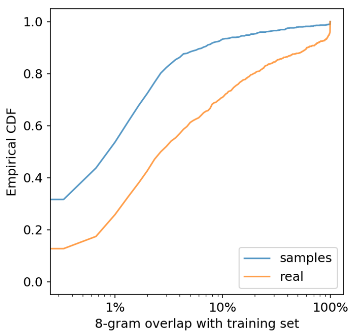 
Figure 5. CDF of percentage 8-gram overlap with WebText training set, for both WebText test set and samples (conditioned on WebText test set, with top-k truncated random sampling with k = 40). Most samples have less than 1% overlap, including over 30% of samples with no overlap, whereas the median for test set is 2.6% overlap.
图 5. 对于 WebText 测试集和样本(以 WebText 测试集为条件，使用 k = 40 的 top-k 截断随机抽样)，与 WebText 训练集的 8 克重叠百分比的 CDF。 大多数样本有不到 1% 的重叠，包括超过 30% 的样本没有重叠，而测试集的中位数为 2.6% 重叠。

### 8.3. Diversity 多样性
Table 12 shows multiple completions of the same random WebText test set context, showing the diversity of completions with standard sampling settings.

表 12 显示了同一随机 WebText 测试集上下文的多个补全，显示了具有标准采样设置的补全的多样性。

 
Table 12. Non-cherry-picked completions from GPT-2 generated from the same context (from WebText test). Context is 384 tokens
(shown truncated), and generations are 128 tokens. Top-k random sampling with k = 40 was used for generation.

### 8.4. Robustness
Table 13 shows the previously mentioned talking unicorns news article. We find the model to be capable of handling out of distribution contexts, but the quality of these samples is generally lower.   

表 13 显示了前面提到的会说话的独角兽新闻文章。 我们发现该模型能够处理超出分布的上下文，但这些样本的质量通常较低。

 
Table 13. Conditional generation on an out-of-distribution context by GPT-2. Cherry pick of 10 samples generated with k = 40

### Samples
 
Table 7. Random unseen contexts (top), and non-cherry-picked completions from both the smallest (left) and largest (right) models.
Contexts are 768 tokens, with approximately 256 tokens worth of paragraphs shown. Completions are 256 tokens and fully shown. Top-k
random sampling with k = 40 was used for generation.

