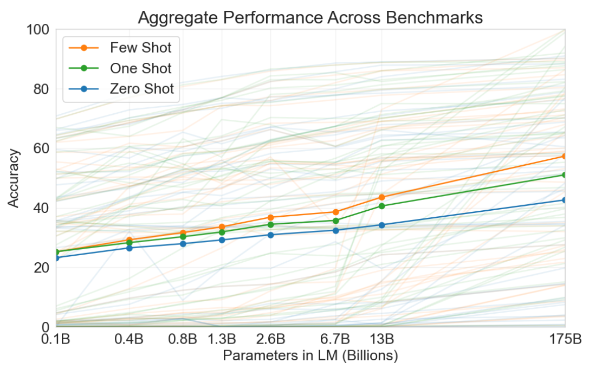

# Language Models are Few-Shot Learners
语言模型是少样本学习器 2020-5-28 论文：https://arxiv.org/abs/2005.14165 https://github.com/openai/gpt-3

## 阅读笔记
* [稀疏语言模型](https://zhuanlan.zhihu.com/p/463352552) ?
* GPT-3的规模：Table 2.1 显示 layers,heads,输入维度; 输入字符串的最大长度=2048,token粒度? 
* 模型和gpt-2不同点：在transformer层中使用交替的密集和局部带状稀疏注意模式，类似于稀疏transformer[CGRS19]
* one-shot,few-shot 如何转换成模型可接受的输入格式？
* 训练集，Common Crawl数据集, 过滤低质，去重，加入其他高质量语料库 Appendix A Table 2.2

## Abstract
Recent work has demonstrated substantial gains on many NLP tasks and benchmarks by pre-training on a large corpus of text followed by fine-tuning on a specific task. While typically task-agnostic in architecture, this method still requires task-specific fine-tuning datasets of thousands or tens of thousands of examples. By contrast, humans can generally perform a new language task from only a few examples or from simple instructions - something which current NLP systems still largely struggle to do. Here we show that scaling up language models greatly improves task-agnostic, few-shot performance, sometimes even reaching competitiveness with prior state-of-the-art fine-tuning approaches. Specifically, we train GPT-3, an autoregressive language model with 175 billion parameters, 10x more than any previous non-sparse language model, and test its performance in the few-shot setting. For all tasks, GPT-3 is applied without any gradient updates or fine-tuning, with tasks and few-shot demonstrations specified purely via text interaction with the model. GPT-3 achieves strong performance on many NLP datasets, including translation, question-answering, and cloze tasks, as well as several tasks that require on-the-fly reasoning or domain adaptation, such as unscrambling words, using a novel word in a sentence, or performing 3-digit arithmetic. At the same time, we also identify some datasets where GPT-3's few-shot learning still struggles, as well as some datasets where GPT-3 faces methodological issues related to training on large web corpora. Finally, we find that GPT-3 can generate samples of news articles which human evaluators have difficulty distinguishing from articles written by humans. We discuss broader societal impacts of this finding and of GPT-3 in general.

最近的工作表明，通过对大量文本进行预训练，然后对特定任务进行微调，在许多NLP任务和基准测试方面取得了实质性进展。虽然该方法在架构中通常是任务无关的，但仍需要数千或数万个基于特定任务样本数据集的的微调。相比之下，人类通常只从几个例子或简单的指令中执行一项新的语言任务 —— 这是当前NLP系统仍然很难做到的。在这里，我们表明，扩展语言模型可以极大地提高任务未知的、few-shot的性能，有时甚至可以与现有最先进的微调方法相媲美。具体来说，我们训练GPT-3，一个具有1750亿个参数的自回归语言模型，比以前的任何非稀疏语言模型多10倍，并在少样本设置下测试其性能。对于所有任务，GPT-3应用时没有任何梯度更新或微调，仅通过与模型的文本交互指定任务和少量样本演示。GPT-3在许多NLP数据集上表现出色，包括翻译、问答和完形填空任务，以及一些需要即时推理或领域适应的任务，如解译单词、在句子中使用新词或执行三位数算术。同时，我们还确定了GPT-3的少样本学习仍然困难的一些数据集，以及GPT-3面临与大型网络语料库训练相关的方法学问题的一些数据集中。最后，我们发现GPT-3可以生成新闻文章样本，人类评估人员很难将其与人类撰写的文章区分开来。我们讨论了这一发现和GPT-3的更广泛的社会影响。

## 1 Introduction
Recent years have featured a trend towards pre-trained language representations in NLP systems, applied in increasingly flexible and task-agnostic ways for downstream transfer. First, single-layer representations were learned using word vectors [MCCD13, PSM14] and fed to task-specific architectures, then RNNs with multiple layers of representations and contextual state were used to form stronger representations [DL15, MBXS17, PNZtY18] (though still applied to task-specific architectures), and more recently pre-trained recurrent or transformer language models [VSP+17] have been directly fine-tuned, entirely removing the need for task-specific architectures [RNSS18, DCLT18, HR18].

近年来，NLP系统中的预训练语言表示呈现出一种趋势，以越来越灵活和任务无关的方式应用于下游迁移。首先，使用词向量[MCCD13，PSM14]学习单层表示，并将其馈送给任务特定架构，然后使用具有多层表示和上下文状态的RNNs来形成更强的表示[DL15，MBXS17，PNZtY18](尽管仍应用于任务特定架构)，以及最近预训练的循环或transformer语言模型[VSP+17]已经被直接微调，完全消除了对特定任务架构[RNSS18、DCLT18、HR18]的需要。

This last paradigm has led to substantial progress on many challenging NLP tasks such as reading comprehension, question answering, textual entailment, and many others, and has continued to advance based on new architectures and algorithms [RSR+19, LOG+19, YDY+19, LCG+19]. However, a major limitation to this approach is that while the architecture is task-agnostic, there is still a need for task-specific datasets and task-specific fine-tuning: to achieve strong performance on a desired task typically requires fine-tuning on a dataset of thousands to hundreds of thousands of examples specific to that task. Removing this limitation would be desirable, for several reasons.

最后一种范式在许多具有挑战性的NLP任务上取得了实质性进展，如阅读理解、问题解答、文本蕴涵等，并基于新的架构和算法[RSR+19、LOG+19、YDY+19、LCG+19]不断进步。然而，这种方法的一个主要限制是，尽管架构是任务无关的，但仍然需要任务特定的数据集+微调：要在所需任务上实现强大的性能，通常需要对特定于该任务的数千到数十万个样本的数据集进行微调。出于几个原因，消除这一限制是可取的。

First, from a practical perspective, the need for a large dataset of labeled examples for every new task limits the applicability of language models. There exists a very wide range of possible useful language tasks, encompassing anything from correcting grammar, to generating examples of an abstract concept, to critiquing a short story. For many of these tasks it is difficult to collect a large supervised training dataset, especially when the process must be repeated for every new task.

首先，从实用角度来看，每一项新任务都需要一个标注样本的大数据集，这限制了语言模型的适用性。存在着非常广泛的可能有用的语言任务，包括从纠正语法到生成抽象概念的样本，再到评论一个短篇故事的任何事情。对于其中的许多任务，很难收集一个大型的监督训练数据集，特别是当每个新任务都必须重复该过程时。

Second, the potential to exploit spurious correlations in training data fundamentally grows with the expressiveness of the model and the narrowness of the training distribution. This can create problems for the pre-training plus fine-tuning paradigm, where models are designed to be large to absorb information during pre-training, but are then fine-tuned on very narrow task distributions. For instance [HLW+20] observe that larger models do not necessarily generalize better out-of-distribution. There is evidence that suggests that the generalization achieved under this paradigm can be poor because the model is overly specific to the training distribution and does not generalize well outside it [YdC+19, MPL19]. Thus, the performance of fine-tuned models on specific benchmarks, even when it is nominally at human-level, may exaggerate actual performance on the underlying task [GSL+18, NK19].

第二，利用训练数据中的伪相关性的潜力从根本上随着模型的表现力和训练分布的狭窄而增长。这可能会给预训练加微调范式带来问题，在这种范式中，模型被设计得很大，以便在预训练期间吸收信息，但随后在非常窄的任务分布上进行微调。例如[HLW+20]观察到，更大的模型不一定能更好地泛化出分布。有证据表明，在这种范式下实现的泛化可能很差，因为该模型过于特定于训练分布，并且在其之外无法很好地泛化[YdC+19，MPL19]。因此，微调模型在特定基准上的性能，即使名义上是人类水平，也可能夸大基础任务的实际性能[GSL+18，NK19]。

Third, humans do not require large supervised datasets to learn most language tasks – a brief directive in natural language (e.g. “please tell me if this sentence describes something happy or something sad”) or at most a tiny number of demonstrations (e.g. “here are two examples of people acting brave; please give a third example of bravery”) is often sufficient to enable a human to perform a new task to at least a reasonable degree of competence. Aside from pointing to a conceptual limitation in our current NLP techniques, this adaptability has practical advantages – it allows humans to seamlessly mix together or switch between many tasks and skills, for example performing addition during a lengthy dialogue. To be broadly useful, we would someday like our NLP systems to have this same fluidity and generality.

第三，人类学习大多数语言任务不需要大型受监督的数据集 —— 自然语言的简短指令(例如“请告诉我这句话描述的是快乐还是悲伤”)或最多少量的演示(例如“这里有两个表现勇敢的例子; 请举第三个勇敢的例子”)通常足以让人类执行新任务的能力至少达到合理程度。除了指出我们当前NLP技术在概念上的局限性之外，这种适应性还具有实际优势——它允许人类无缝地混合在一起或在许多任务和技能之间切换，例如在长时间对话中执行加法。为了广泛使用，我们希望有一天我们的NLP系统具有相同的流动性和通用性。

 
Figure 1.1: Language model meta-learning. During unsupervised pre-training, a language model develops a broad set of skills and pattern recognition abilities. It then uses these abilities at inference time to rapidly adapt to or recognize the desired task. We use the term “in-context learning” to describe the inner loop of this process, which occurs within the forward-pass upon each sequence. The sequences in this diagram are not intended to be representative of the data a model would see during pre-training, but are intended to show that there are sometimes repeated sub-tasks embedded within a single sequence. 
图1.1：语言模型元学习。在无监督的预训练过程中，语言模型培养了广泛的技能和模式识别能力。然后，它在推理时使用这些能力来快速适应或识别期望的任务。我们使用术语“上下文学习”来描述这个过程的内部循环，它发生在每个序列的前向传递中。该图中的序列不代表模型在预训练期间看到的数据，但旨在表明有时在单个序列中嵌入了重复的子任务。

One potential route towards addressing these issues is meta-learning(1In the context of language models this has sometimes been called “zero-shot transfer”, but this term is potentially ambiguous: the method is “zero-shot” in the sense that no gradient updates are performed, but it often involves providing inference-time demonstrations to the model, so is not truly learning from zero examples. To avoid this confusion, we use the term “meta-learning” to capture the inner-loop / outer-loop structure of the general method, and the term “in context-learning” to refer to the inner loop of meta-learning. We further specialize the description to “zero-shot”, “one-shot”, or “few-shot” depending on how many demonstrations are provided at inference time. These terms are intended to remain agnostic on the question of whether the model learns new tasks from scratch at inference time or simply recognizes patterns seen during training – this is an important issue which we discuss later in the paper, but “meta-learning” is intended to encompass both possibilities, and simply describes the inner-outer loop structure. ) – which in the context of language models means the model develops a broad set of skills and pattern recognition abilities at training time, and then uses those abilities at inference time to rapidly adapt to or recognize the desired task (illustrated in Figure 1.1). Recent work [RWC+19] attempts to do this via what we call “in-context learning”, using the text input of a pretrained language model as a form of task specification: the model is conditioned on a natural language instruction and/or a few demonstrations of the task and is then expected to complete further instances of the task simply by predicting what comes next.

解决这些问题的一个潜在途径是元学习(1在语言模型的上下文中，这有时被称为“zero-shot迁移”，但这一术语可能不明确：该方法是“zero-shot”，即不执行梯度更新，但它通常涉及向模型提供推理时演示，因此不是真正从zero-shot中学习。为了避免这种混淆，我们使用术语“元学习”来捕获一般方法的内循环/外循环结构，使用术语“上下文学习”来指代元学习的内循环。我们进一步将描述专门化为“zero-shot”、“one-shot”或“few-shot”，这取决于在推理时提供的演示数量。这些术语旨在保持未知性，即模型是在推理时从头开始学习新任务，还是简单地识别训练过程中看到的模式 —— 这是一个重要问题，我们将在本文稍后讨论，但“元学习”旨在涵盖这两种可能性，并简单地描述内外循环结构。) —— 在语言模型的背景下，这意味着模型在训练时开发了一套广泛的技能和模式识别能力，然后在推理时使用这些能力来快速适应或识别期望的任务(如图1.1所示)。最近的工作[RWC+19]试图通过我们所称的“上下文学习”来实现这一点，使用预训练语言模型的文本输入作为任务规范的一种形式：该模型以自然语言指令和/或任务的一些演示为条件，然后期望通过预测接下来的内容来完成任务的进一步实例。

<!--广泛的技能和模式识别能力-->

While it has shown some initial promise, this approach still achieves results far inferior to fine-tuning – for example [RWC+19] achieves only 4% on Natural Questions, and even its 55 F1 CoQa result is now more than 35 points behind the state of the art. Meta-learning clearly requires substantial improvement in order to be viable as a practical method of solving language tasks.

尽管它已经显示出一些初步的希望，但这种方法仍然取得了远不如微调的结果 —— 例如[RWC+19]在自然问题上仅取得了4%的成绩，甚至其55 F1 CoQa的成绩现在也落后于最先进水平35分以上。元学习显然需要大幅改进，才能成为解决语言任务的实用方法。

Another recent trend in language modeling may offer a way forward. In recent years the capacity of transformer language models has increased substantially, from 100 million parameters [RNSS18], to 300 million parameters [DCLT18], to 1.5 billion parameters [RWC+19], to 8 billion parameters [SPP+19], 11 billion parameters [RSR+19], and finally 17 billion parameters [Tur20]. Each increase has brought improvements in text synthesis and/or downstream NLP tasks, and there is evidence suggesting that log loss, which correlates well with many downstream tasks, follows a smooth trend of improvement with scale [KMH+20]. Since in-context learning involves absorbing many skills and tasks within the parameters of the model, it is plausible that in-context learning abilities might show similarly strong gains with scale. 

语言建模的另一个最新趋势可能提供了前进的方向。近年来，transformer语言模型的容量大幅增加，从1亿个参数[RNSS18]，到3亿个参数[DCLT18]，到15亿个参数/RWC+19]，到80亿个参数[SSP+19]，110亿个参数RSR+19]，最后是170亿个参数[Tur20]。每一次增加都带来了文本合成和/或下游NLP任务的改进，有证据表明，log loss与许多下游任务密切相关，随着规模的增长，log loss呈现平稳的改善趋势[KMH+20]。由于上下文学习涉及在模型的参数范围内吸收许多技能和任务，因此，上下文学习能力可能会随着规模的增长而表现出类似的强大收益。

In this paper, we test this hypothesis by training a 175 billion parameter autoregressive language model, which we call GPT-3, and measuring its in-context learning abilities. Specifically, we evaluate GPT-3 on over two dozen NLP datasets, as well as several novel tasks designed to test rapid adaptation to tasks unlikely to be directly contained in the training set. For each task, we evaluate GPT-3 under 3 conditions: (a) “few-shot learning”, or in-context learning where we allow as many demonstrations as will fit into the model’s context window (typically 10 to 100), (b) “one-shot learning”, where we allow only one demonstration, and (c) “zero-shot” learning, where no demonstrations are allowed and only an instruction in natural language is given to the model. GPT-3 could also in principle be evaluated in the traditional fine-tuning setting, but we leave this to future work.

在本文中，我们通过训练一个1750亿参数的自回归语言模型(我们称之为GPT-3)并测量其上下文学习能力来检验这一假设。具体来说，我们在20多个NLP数据集上评估GPT-3，以及设计用于测试对不太可能直接包含在训练集中的任务的快速适应的几个新任务。对于每项任务，我们在3个条件下评估GPT-3：
1. “少样本学习”，或在上下文学习中，我们允许尽可能多的演示，以适应模型的上下文窗口(通常为10到100); 
2. “one-shot学习”(仅允许一次演示); 
3. “zero-shot”学习，其中不允许演示，只向模型提供自然语言指令。
GPT-3原则上也可以在传统的微调设置中进行评估，但我们将这留给未来的工作。

 
Figure 1.2: Larger models make increasingly efficient use of in-context information. We show in-context learning performance on a simple task requiring the model to remove random symbols from a word, both with and without a natural language task description (see Sec. 3.9.2). The steeper “in-context learning curves” for large models demonstrate improved ability to learn a task from contextual information. We see qualitatively similar behavior across a wide range of tasks. 
图1.2：更大的模型越来越有效地使用上下文信息。我们展示了一个简单任务的上下文学习性能，该任务要求模型从单词中移除随机符号，无论是否有自然语言任务描述(见第3.9.2节)。大型模型的更陡峭的“上下文学习曲线”表明，从上下文信息学习任务的能力有所提高。我们在广泛的任务中看到了质量相似的行为。

Figure 1.2 illustrates the conditions we study, and shows few-shot learning of a simple task requiring the model to remove extraneous symbols from a word. Model performance improves with the addition of a natural language task description, and with the number of examples in the model’s context, K. Few-shot learning also improves dramatically with model size. Though the results in this case are particularly striking, the general trends with both model size and number of examples in-context hold for most tasks we study. We emphasize that these “learning” curves involve no gradient updates or fine-tuning, just increasing numbers of demonstrations given as conditioning.

图1.2说明了我们研究的条件，并显示了需要模型从单词中删除多余符号的简单任务的少量学习。随着自然语言任务描述的增加以及模型上下文中的样本数量的增加，模型性能得到了改善。少样本学习也随着模型大小的增加而显著提高。尽管本案例中的结果特别引人注目，但模型大小和上下文中样本数量的总体趋势适用于我们研究的大多数任务。我们强调，这些“学习”曲线不涉及梯度更新或微调，只是增加了作为条件的演示次数。

Broadly, on NLP tasks GPT-3 achieves promising results in the zero-shot and one-shot settings, and in the the few-shot setting is sometimes competitive with or even occasionally surpasses state-of-the-art (despite state-of-the-art being held by fine-tuned models). For example, GPT-3 achieves 81.5 F1 on CoQA in the zero-shot setting, 84.0 F1 on CoQA in the one-shot setting, 85.0 F1 in the few-shot setting. Similarly, GPT-3 achieves 64.3% accuracy on TriviaQA in the zero-shot setting, 68.0% in the one-shot setting, and 71.2% in the few-shot setting, the last of which is state-of-the-art relative to fine-tuned models operating in the same closed-book setting.

大体上，在NLP任务中，GPT-3在zero-shot和单样本设置中取得了令人满意的结果，在少样本设置中，有时与最先进的技术相竞争，甚至有时超越最先进的(尽管最先进的是由微调的模型保持的)。例如，GPT-3在零样本设置中在CoQA上实现81.5 F1，在单样本设置中实现84.0 F1，在少样本设置中达到85.0 F1。类似地，GPT-3在TriviaQA上实现了64.3%的零样本设置精度，68.0%的单样本设置精度和71.2%的少样本设置精度。与在相同的闭卷设置下运行的微调模型相比，最后一个是最先进的。

GPT-3 also displays one-shot and few-shot proficiency at tasks designed to test rapid adaption or on-the-fly reasoning, which include unscrambling words, performing arithmetic, and using novel words in a sentence after seeing them defined only once. We also show that in the few-shot setting, GPT-3 can generate synthetic news articles which human evaluators have difficulty distinguishing from human-generated articles.

GPT-3在测试快速适应或动态推理的任务中也表现出单样本或少样本的熟练程度，这些任务包括解读单词、执行算术，以及在看到一次定义后在句子中使用新单词。我们还表明，在少样本设置下，GPT-3可以生成合成新闻文章，人类评估人员很难将其与人类生成的文章区分开来。

At the same time, we also find some tasks on which few-shot performance struggles, even at the scale of GPT-3. This includes natural language inference tasks like the ANLI dataset, and some reading comprehension datasets like RACE or QuAC. By presenting a broad characterization of GPT-3’s strengths and weaknesses, including these limitations, we hope to stimulate study of few-shot learning in language models and draw attention to where progress is most needed.

同时，我们还发现一些少样本任务表现不佳，甚至在GPT-3的规模上。这包括自然语言推理任务，如ANLI数据集，以及一些阅读理解数据集，如RACE或QuAC。通过对GPT-3的优点和缺点(包括这些局限性)进行广泛的描述，我们希望能够激发对语言模型中少样本学习的研究，并提请人们注意最需要进步的地方。<!-- CoT 能解决？ -->

 
Figure 1.3: Aggregate performance for all 42 accuracy-denominated benchmarks While zero-shot performance improves steadily with model size, few-shot performance increases more rapidly, demonstrating that larger models are more proficient at in-context learning. See Figure 3.8 for a more detailed analysis on SuperGLUE, a standard NLP benchmark suite.
图1.3：所有42个精度基准的综合性能虽然零样本性能随着模型大小而稳步提高，但少样本性能增长更快，这表明较大的模型更精通上下文学习。有关标准NLP基准套件SuperGLUE的更详细分析，请参见图3.8。

A heuristic sense of the overall results can be seen in Figure 1.3, which aggregates the various tasks (though it should not be seen as a rigorous or meaningful benchmark in itself). 

图1.3中可以看到整体结果的启发式意义，它聚合了各种任务(尽管它本身不应该被视为一个严格或有意义的基准)。

We also undertake a systematic study of “data contamination” – a growing problem when training high capacity models on datasets such as Common Crawl, which can potentially include content from test datasets simply because such content often exists on the web. In this paper we develop systematic tools to measure data contamination and quantify its distorting effects. Although we find that data contamination has a minimal effect on GPT-3’s performance on most datasets, we do identify a few datasets where it could be inflating results, and we either do not report results on these datasets or we note them with an asterisk, depending on the severity.

我们还对“数据污染”进行了系统研究 —— 在诸如Common Crawl之类的数据集上训练高容量模型时，这是一个日益严重的问题，因为此类内容通常存在于网络上，因此可能会包含测试数据集中的内容。在本文中，我们开发了系统工具来测量数据污染并量化其扭曲效应。尽管我们发现数据污染对GPT-3在大多数数据集上的性能影响很小，但我们确实发现了一些数据集可能会导致结果膨胀，我们要么不报告这些数据集的结果，要么根据严重程度用星号标注。

In addition to all the above, we also train a series of smaller models (ranging from 125 million parameters to 13 billion parameters) in order to compare their performance to GPT-3 in the zero, one and few-shot settings. Broadly, for most tasks we find relatively smooth scaling with model capacity in all three settings; one notable pattern is that the gap between zero-, one-, and few-shot performance often grows with model capacity, perhaps suggesting that larger models are more proficient meta-learners.

除了以上所有内容，我们还训练了一系列较小的模型(从1.25亿个参数到130亿个参数)，以便将它们的性能与GPT-3在零次、一次和少样本设置下的性能进行比较。大体上，对于大多数任务，我们发现在所有三种设置中，模型容量的扩展都相对平滑; 一个值得注意的模式是，零、一和少样本表现之间的差距往往会随着模型容量的增加而增加，这可能意味着更大的模型是更熟练的元学习者。

Finally, given the broad spectrum of capabilities displayed by GPT-3, we discuss concerns about bias, fairness, and broader societal impacts, and attempt a preliminary analysis of GPT-3’s characteristics in this regard. The remainder of this paper is organized as follows. In Section 2, we describe our approach and methods for training GPT-3 and evaluating it. Section 3 presents results on the full range of tasks in the zero-, one- and few-shot settings. Section 4 addresses questions of data contamination (train-test overlap). Section 5 discusses limitations of GPT-3. Section 6 discusses broader impacts. Section 7 reviews related work and Section 8 concludes. 

最后，鉴于GPT-3显示的广泛功能，我们讨论了对偏见、公平性和更广泛的社会影响的担忧，并尝试对GPT-3在这方面的特性进行初步分析。本文的其余部分组织如下。在第2节中，我们描述了训练GPT-3并对其进行评估的方法和方法。第3节介绍了在零、一和少样本设置下的所有任务的结果。第4节讨论了数据污染问题(训练测试重叠)。第5节讨论了GPT-3的局限性。第6节讨论了更广泛的影响。第7节回顾相关工作，第8节总结。

## 2 Approach
Our basic pre-training approach, including model, data, and training, is similar to the process described in [RWC+19], with relatively straightforward scaling up of the model size, dataset size and diversity, and length of training. Our use of in-context learning is also similar to [RWC+19], but in this work we systematically explore different settings for learning within the context. Therefore, we start this section by explicitly defining and contrasting the different settings that we will be evaluating GPT-3 on or could in principle evaluate GPT-3 on. These settings can be seen as lying on a spectrum of how much task-specific data they tend to rely on. Specifically, we can identify at least four points on this spectrum (see Figure 2.1 for an illustration):

我们的基本预训练方法，包括模型、数据和训练，与[RWC+19]中所述的过程类似，模型大小、数据集大小和多样性以及训练长度的扩展相对简单。我们对上下文学习的使用也类似于[RWC+19]，但在这项工作中，我们系统地探索了上下文学习中的不同设置。因此，我们通过明确定义和对比我们将要评估GPT-3或原则上可以评估GPT-2的不同设置来开始本节。这些设置可以被视为取决于他们倾向于依赖多少特定于任务的数据。具体来说，我们可以在这个谱上确定至少四个点(见图2.1)：

* Fine-Tuning (FT) has been the most common approach in recent years, and involves updating the weights of a pre-trained model by training on a supervised dataset specific to the desired task. Typically thousands to hundreds of thousands of labeled examples are used. The main advantage of fine-tuning is strong performance on many benchmarks. The main disadvantages are the need for a new large dataset for every task, the potential for poor generalization out-of-distribution [MPL19], and the potential to exploit spurious features of the training data [GSL+18, NK19], potentially resulting in an unfair comparison with human performance. In this work we do not fine-tune GPT-3 because our focus is on task-agnostic performance, but GPT-3 can be fine-tuned in principle and this is a promising direction for future work.

微调(FT)是近年来最常见的方法，涉及通过对特定任务所需的监督数据集进行训练来更新预训练模型的权重。通常使用数千至数十万个标注样本。微调的主要优点是在许多基准测试上表现出色。主要缺点是每项任务都需要一个新的大型数据集，存在分布外泛化能力差的可能性[MPL19]，以及利用训练数据的虚假特征的可能性[GSL+18，NK19]，可能导致与人类表现的不公平比较。在这项工作中，我们没有对GPT-3进行微调，因为我们的重点是任务无关的性能，但GPT-3原则上可以进行微调，这是未来工作的一个有希望的方向。

* Few-Shot (FS) is the term we will use in this work to refer to the setting where the model is given a few demonstrations of the task at inference time as conditioning [RWC+19], but no weight updates are allowed. As shown in Figure 2.1, for a typical dataset an example has a context and a desired completion (for example an English sentence and the French translation), and few-shot works by giving K examples of context and completion, and then one final example of context, with the model expected to provide the completion. We typically set K in the range of 10 to 100 as this is how many examples can fit in the model’s context window ($n_{ctx}$ = 2048). The main advantages of few-shot are a major reduction in the need for task-specific data and reduced potential to learn an overly narrow distribution from a large but narrow fine-tuning dataset. The main disadvantage is that results from this method have so far been much worse than state-of-the-art fine-tuned models. Also, a small amount of task specific data is still required. As indicated by the name, few-shot learning as described here for language models is related to few-shot learning as used in other contexts in ML [HYC01, VBL+16] – both involve learning based on a broad distribution of tasks (in this case implicit in the pre-training data) and then rapidly adapting to a new task.

少样本(FS)是我们将在本工作中使用的术语，指的是在推理时为模型提供任务的一些演示作为条件[RWC+19]，但不允许进行权重更新的设置。如图2.1所示，对于一个典型的数据集，一个例子有一个上下文和一个期望的完成(例如一个英语句子和法语翻译)，通过给出K个上下文和完成的例子，然后给出一个上下文的最后例子，提供模型期望的结果，少样本作品。我们通常将K设置在10到100的范围内，因为这是模型上下文窗口中可以容纳的样本数($n_{ctx}$=2048)。少样本的主要优点是大大减少了对任务特定数据的需求，并减少了从大而窄的微调数据集中学习过窄分布的可能性。主要缺点是，迄今为止，这种方法的结果比最先进的微调模型差得多。此外，仍然需要少量特定于任务的数据。如名称所示，这里描述的语言模型的少样本学习与ML[HYC01，VBL+16]中其他上下文中使用的few-shot教学相关 —— 两者都涉及基于广泛任务分布的学习(在这种情况下，隐含在预训练数据中)，然后快速适应新任务。

* One-Shot (1S) is the same as few-shot except that only one demonstration is allowed, in addition to a natural language description of the task, as shown in Figure 1. The reason to distinguish one-shot from few-shot and zero-shot (below) is that it most closely matches the way in which some tasks are communicated to humans. For example, when asking humans to generate a dataset on a human worker service (for example Mechanical Turk), it is common to give one demonstration of the task. By contrast it is sometimes difficult to communicate the content or format of a task if no examples are given. 

单样本(1S)与少样本相同，除了任务的自然语言描述外，只允许进行一次演示，如图1所示。区分单样本与少样本和零样本(下图)的原因是，它与某些任务与人类交流的方式最为接近。例如，当要求人类在人工服务(例如Mechanical Turk)上生成数据集时，通常会给出一个任务演示。相比之下，如果没有给出样本，有时很难传达任务的内容或格式。

* Zero-Shot (0S) is the same as one-shot except that no demonstrations are allowed, and the model is only given a natural language instruction describing the task. This method provides maximum convenience, potential for robustness, and avoidance of spurious correlations (unless they occur very broadly across the large corpus of pre-training data), but is also the most challenging setting. In some cases it may even be difficult for humans to understand the format of the task without prior examples, so this setting is in some cases “unfairly hard”. For example, if someone is asked to “make a table of world records for the 200m dash”, this request can be ambiguous, as it may not be clear exactly what format the table should have or what should be included (and even with careful clarification, understanding precisely what is desired can be difficult). Nevertheless, for at least some settings zero-shot is closest to how humans perform tasks – for example, in the translation example in Figure 2.1, a human would likely know what to do from just the text instruction.

零样本(0S)与单样本相同，但不允许演示，且模型仅给出描述任务的自然语言指令。该方法提供了最大的便利性、稳健性和避免伪相关的可能性(除非它们在大量训练前数据中广泛出现)，但也是最具挑战性的设置。在某些情况下，如果没有先前的样本，人类甚至很难理解任务的格式，因此这种设置在有些情况下是“不公平的困难”。例如，如果有人被要求“为200米短跑制作一张世界纪录表”，这一要求可能是模棱两可的，因为可能不清楚表格应该采用什么格式或应该包括什么内容(即使仔细澄清，也很难准确理解所需内容)。然而，至少在某些设置中，zero-shot最接近于人类执行任务的方式 —— 例如，在图2.1中的翻译样本中，人类可能仅从文本指令就知道该做什么。

 
Figure 2.1: Zero-shot, one-shot and few-shot, contrasted with traditional fine-tuning. The panels above show four methods for performing a task with a language model – fine-tuning is the traditional method, whereas zero-, one-, and few-shot, which we study in this work, require the model to perform the task with only forward passes at test time. We typically present the model with a few dozen examples in the few shot setting. Exact phrasings for all task descriptions, examples and prompts can be found in Appendix G. 
图2.1：zero-shot、one-shot和few-shot，与传统微调形成对比。上面的面板显示了使用语言模型执行任务的四种方法 —— 微调是传统的方法，而我们在这项工作中研究的零、一和few-shot，要求模型在测试时仅通过前向传递来执行任务。我们通常在几个样本设置中为模型提供几十个样本。所有任务描述、样本和提示的准确措辞见附录G。

Figure 2.1 shows the four methods using the example of translating English to French. In this paper we focus on zero-shot, one-shot and few-shot, with the aim of comparing them not as competing alternatives, but as different problem settings which offer a varying trade-off between performance on specific benchmarks and sample efficiency. We especially highlight the few-shot results as many of them are only slightly behind state-of-the-art fine-tuned models. Ultimately, however, one-shot, or even sometimes zero-shot, seem like the fairest comparisons to human performance, and are important targets for future work.

图2.1显示了将英语翻译为法语的四种方法。在本文中，我们将重点放在零个、单个和few-shot上，目的是将它们作为不同的问题设置进行比较，而不是将它们作为竞争对手，这些问题设置在特定基准测试的性能和样本效率之间提供了不同的权衡。我们特别强调了少样本的效果，因为它们中的许多仅略微落后于最先进的微调模型。然而，最终，one-shot，甚至有时zero-shot，似乎是与人类表现最公平的比较，是未来工作的重要目标。

Sections 2.1-2.3 below give details on our models, training data, and training process respectively. Section 2.4 discusses the details of how we do few-shot, one-shot, and zero-shot evaluations. 

下文第2.1-2.3节分别详细介绍了我们的模型、训练数据和训练流程。第2.4节讨论了如何进行few-shot、one-shot和zero-shot评估的细节。

### 2.1 Model and Architectures
We use the same model and architecture as GPT-2 [RWC+19], including the modified initialization, pre-normalization, and reversible tokenization described therein, with the exception that we use alternating dense and locally banded sparse attention patterns in the layers of the transformer, similar to the Sparse Transformer [CGRS19]. To study the dependence of ML performance on model size, we train 8 different sizes of model, ranging over three orders of magnitude from 125 million parameters to 175 billion parameters, with the last being the model we call GPT-3. Previous work [KMH+20] suggests that with enough training data, scaling of validation loss should be approximately a smooth power law as a function of size; training models of many different sizes allows us to test this hypothesis both for validation loss and for downstream language tasks.

我们使用与GPT-2[RWC+19]相同的模型和架构，包括其中描述的修改的初始化、预归一化和可逆令牌化，除了我们在transformer层中使用交替的密集和局部带状稀疏注意模式，类似于稀疏transformer[CGRS19]。为了研究ML性能对模型大小的依赖性，我们训练了8个不同大小的模型，从1.25亿个参数到1750亿个参数，三个数量级，最后一个是我们称为GPT-3的模型。之前的工作[KMH+20]表明，如果有足够的训练数据，验证损失的缩放应该近似于大小的平滑幂律; 许多不同大小的训练模型允许我们测试验证损失和下游语言任务的假设。

 
Table 2.1: Sizes, architectures, and learning hyper-parameters (batch size in tokens and learning rate) of the models which we trained. All models were trained for a total of 300 billion tokens.
表2.1：我们训练的模型的大小、架构和学习超参数(令牌的批量大小和学习率)。所有模型都接受了总计3000亿令牌的训练。

Table 2.1 shows the sizes and architectures of our 8 models. Here $n_{params}$ is the total number of trainable parameters, $n_{layers}$ is the total number of layers, $d_{model}$ is the number of units in each bottleneck layer (we always have the feedforward layer four times the size of the bottleneck layer, $d_{ff} = 4 ∗ d_{model}$), and $d_{head}$ is the dimension of each attention head. All models use a context window of $n_{ctx} = 2048 $ tokens. We partition the model across GPUs along both the depth and width dimension in order to minimize data-transfer between nodes. The precise architectural parameters for each model are chosen based on computational efficiency and load-balancing in the layout of models across GPU’s. Previous work [KMH+20] suggests that validation loss is not strongly sensitive to these parameters within a reasonably broad range.

表2.1显示了8种模型的尺寸和结构。这里，$n_{params}$是可训练参数的总数，$n_{layers}$是层的总数，$d_{model}$是每个瓶颈层中的单元数(我们总是有四倍于瓶颈层大小的前馈层，$d_{ff} = 4 ∗ d_{model}$)，并且$d_{head}$是每个注意力头部的尺寸。所有模型都使用$n_{ctx}=2048$个令牌的上下文窗口。我们沿着深度和宽度维度在GPU之间划分模型，以最小化节点之间的数据传输。每个模型的精确架构参数是基于GPU模型布局中的计算效率和负载平衡来选择的。先前的工作[KMH+20]表明，在合理的范围内，验证损失对这些参数不太敏感。

### 2.2 Training Dataset
Datasets for language models have rapidly expanded, culminating in the Common Crawl dataset(2 https://commoncrawl.org/the-data/) [RSR+19] constituting nearly a trillion words. This size of dataset is sufficient to train our largest models without ever updating on the same sequence twice. However, we have found that unfiltered or lightly filtered versions of Common Crawl tend to have lower quality than more curated datasets. Therefore, we took 3 steps to improve the average quality of our datasets: (1) we downloaded and filtered a version of CommonCrawl based on similarity to a range of high-quality reference corpora, (2) we performed fuzzy deduplication at the document level, within and across datasets, to prevent redundancy and preserve the integrity of our held-out validation set as an accurate measure of overfitting, and (3) we also added known high-quality reference corpora to the training mix to augment CommonCrawl and increase its diversity.

语言模型的数据集扩展迅速，最终形成了Common Crawl数据集(2https://commoncrawl.org/the-data/)[RSR+19]构成了近万亿个单词。这种数据集大小足以训练我们最大的模型，而无需对同一序列进行两次更新。然而，我们发现未过滤或轻度过滤的Common Crawl版本的质量往往低于更精确的数据集。因此，我们采取了3个步骤来提高数据集的平均质量, 我们
1. 下载，并基于与一系列高质量参考语料库的相似性过滤了CommonCrawl的版本，
2. 在文档级别、数据集内部和数据集之间执行了模糊重复数据消除，以防止冗余，并保持我们的验证集的完整性，作为过度拟合的准确度量，
3. 还将已知的高质量参考语料库添加到训练组合中，以增强CommonCrawl并增加其多样性。

Details of the first two points (processing of Common Crawl) are described in Appendix A. For the third, we added several curated high-quality datasets, including an expanded version of the WebText dataset [RWC+19], collected by scraping links over a longer period of time, and first described in [KMH+20], two internet-based books corpora (Books1 and Books2) and English-language Wikipedia.

附录A中描述了前两点(Common Crawl的处理)的细节。对于第三点，我们添加了几个精心策划的高质量数据集，包括WebText数据集[RWC+19]的扩展版本，该数据集是通过在较长时间内抓取链接收集的，并在[KMH+20]中首次描述、两个基于互联网的图书语料库(Books1和Books2)和英语维基百科。

Table 2.2 shows the final mixture of datasets that we used in training. The CommonCrawl data was downloaded from 41 shards of monthly CommonCrawl covering 2016 to 2019, constituting 45TB of compressed plaintext before filtering and 570GB after filtering, roughly equivalent to 400 billion byte-pair-encoded tokens. Note that during training, datasets are not sampled in proportion to their size, but rather datasets we view as higher-quality are sampled more frequently, such that CommonCrawl and Books2 datasets are sampled less than once during training, but the other datasets are sampled 2-3 times. This essentially accepts a small amount of overfitting in exchange for higher quality training data. 

表2.2 显示了我们在训练中使用的数据集的最终混合。CommonCrawl数据是从2016年至2019年每月的41个CommonCrawl数据碎片中下载的，在过滤前构成45TB的压缩明文，过滤后构成570GB，大致相当于4000亿字节对编码令牌。请注意，在训练期间，数据集的采样不与其大小成比例，而是我们认为质量更高的数据集采样频率更高，因此CommonCrawl和Books2数据集在训练期间采样次数少于一次，但其他数据集采样次数为2-3次。这基本上接受了少量的过度拟合，以换取更高质量的训练数据。

 
Table 2.2: Datasets used to train GPT-3. “Weight in training mix” refers to the fraction of examples during training that are drawn from a given dataset, which we intentionally do not make proportional to the size of the dataset. As a result, when we train for 300 billion tokens, some datasets are seen up to 3.4 times during training while other datasets are seen less than once.
表 2.2：用于训练 GPT-3 的数据集。 “训练组合中的权重”指的是训练期间从给定数据集中提取的样本部分，我们故意不使其与数据集的大小成比例。 因此，当我们训练 3000 亿个令牌时，某些数据集在训练期间最多出现 3.4 次，而其他数据集出现次数不到一次。

 
Figure 2.2: Total compute used during training. Based on the analysis in Scaling Laws For Neural Language Models [KMH+20] we train much larger models on many fewer tokens than is typical. As a consequence, although GPT-3 3B is almost 10x larger than RoBERTa-Large (355M params), both models took roughly 50 petaflop/s-days of compute during pre-training. Methodology for these calculations can be found in Appendix D.
图 2.2：训练期间使用的总计算量。 基于神经语言模型的缩放定律 [KMH+20] 中的分析，我们用比典型情况少得多的令牌训练了更大的模型。 因此，尽管 GPT-3 3B 几乎是 RoBERTa-Large(355M 参数)的 10 倍，但两个模型在预训练期间都花费了大约 50 petaflop/s-days 的计算量。 这些计算的方法可以在附录 D 中找到。

A major methodological concern with language models pretrained on a broad swath of internet data, particularly large models with the capacity to memorize vast amounts of content, is potential contamination of downstream tasks by having their test or development sets inadvertently seen during pre-training. To reduce such contamination, we searched for and attempted to remove any overlaps with the development and test sets of all benchmarks studied in this paper. Unfortunately, a bug in the filtering caused us to ignore some overlaps, and due to the cost of training it was not feasible to retrain the model. In Section 4 we characterize the impact of the remaining overlaps, and in future work we will more aggressively remove data contamination.

在广泛的互联网数据上预训练语言模型的一个主要方法论问题，特别是具有记忆大量内容能力的大型模型，是下游任务的潜在污染，因为在预训练期间无意中看到了它们的测试或开发集。 为了减少这种污染，我们搜索并试图消除与本文研究的所有基准的开发和测试集的任何重叠。 不幸的是，过滤中的一个错误导致我们忽略了一些重叠，并且由于训练成本，重新训练模型是不可行的。 在第 4 节中，我们描述了剩余重叠的影响，在未来的工作中，我们将更积极地消除数据污染。

### 2.3 Training Process
As found in [KMH+20, MKAT18], larger models can typically use a larger batch size, but require a smaller learning rate. We measure the gradient noise scale during training and use it to guide our choice of batch size [MKAT18]. Table 2.1 shows the parameter settings we used. To train the larger models without running out of memory, we use a mixture of model parallelism within each matrix multiply and model parallelism across the layers of the network. All models were trained on V100 GPU’s on part of a high-bandwidth cluster provided by Microsoft. Details of the training process and hyperparameter settings are described in Appendix B.

如[KMH+20，MKAT18]所示，较大的模型通常可以使用较大的批量，但需要较小的学习率。我们在训练期间测量梯度噪声等级，并使用它来指导批量大小的选择[MKAT18]。表2.1显示了我们使用的参数设置。为了在不耗尽内存的情况下训练更大的模型，我们混合使用了每个矩阵乘法中的模型并行性和网络各层之间的模型并行度。所有模型都在V100 GPU上进行了训练，这是微软提供的高带宽集群的一部分。附录B中描述了训练过程和超参数设置的详情。

<!--测量梯度噪声等级?-->

### 2.4 Evaluation
For few-shot learning, we evaluate each example in the evaluation set by randomly drawing K examples from that task’s training set as conditioning, delimited by 1 or 2 newlines depending on the task. For LAMBADA and Storycloze there is no supervised training set available so we draw conditioning examples from the development set and evaluate on the test set. For Winograd (the original, not SuperGLUE version) there is only one dataset, so we draw conditioning examples directly from it.

对于少样本学习，我们通过从该任务的训练集中随机抽取K个样本作为条件来评估评估集中的每个样本，根据任务用1或2个换行符分隔。对于LAMBADA和故事完形填空，没有可用的监督训练集，因此我们从开发集中提取条件样本，并在测试集上进行评估。对于Winograd(原始版本，而非SuperGLUE版本)，只有一个数据集，因此我们直接从中提取条件样本。

K can be any value from 0 to the maximum amount allowed by the model’s context window, which is $n_{ctx}$ = 2048 for all models and typically fits 10 to 100 examples. Larger values of K are usually but not always better, so when a separate development and test set are available, we experiment with a few values of K on the development set and then run the best value on the test set. For some tasks (see Appendix G) we also use a natural language prompt in addition to (or for K = 0, instead of) demonstrations.

K可以是从0到模型上下文窗口允许的最大值的任何值，对于所有模型，该值为$n_{ctx}$=2048，通常适合10到100个样本。较大的K值通常但并不总是更好，因此当单独的开发集和测试集可用时，我们在开发集上尝试一些K值，然后在测试集上运行最佳值。对于某些任务(参见附录G)，除了演示(或K=0，而不是)，我们还使用自然语言提示。

On tasks that involve choosing one correct completion from several options (multiple choice), we provide K examples of context plus correct completion, followed by one example of context only, and compare the LM likelihood of each completion. For most tasks we compare the per-token likelihood (to normalize for length), however on a small number of datasets (ARC, OpenBookQA, and RACE) we gain additional benefit as measured on the development set by normalizing by the unconditional probability of each completion, by computing P (completion|context) P (completion|answer context) , where answer context is the string "Answer: " or "A: " and is used to prompt that the completion should be an answer but is otherwise generic.

对于涉及从多个选项(多选)中选择一个正确完成的任务，我们提供了K个上下文加上正确完成的样本，然后仅提供了一个上下文样本，并比较了每个完成的LM可能性。对于大多数任务，我们比较每个令牌的可能性(对长度进行归一化)，然而，在少数数据集(ARC、OpenBookQA和RACE)上，我们通过对每个完成的无条件概率进行归一化，通过计算P(完成|上下文)P(完成/答案上下文)，其中，answercontext是字符串“answer:”或“A:”，用于提示完成应该是一个答案，否则是通用的。

On tasks that involve binary classification, we give the options more semantically meaningful names (e.g. “True” or “False” rather than 0 or 1) and then treat the task like multiple choice; we also sometimes frame the task similar to what is done by [RSR+19] (see Appendix G) for details.

对于涉及二分类任务，我们给选项赋予更具语义意义的名称(例如“True”或“False”，而不是0或1)，然后将任务视为多项选择; 我们有时也会将任务框定为类似于[RSR+19](参见附录G)所做的工作。

On tasks with free-form completion, we use beam search with the same parameters as [RSR+19]: a beam width of 4 and a length penalty of α = 0.6. We score the model using F1 similarity score, BLEU, or exact match, depending on what is standard for the dataset at hand.

对于自由形式完成的任务，我们使用与[RSR+19]相同参数的波束搜索：波束宽度为4，长度惩罚为α=0.6。我们使用F1相似度得分、BLEU或精确匹配对模型进行评分，这取决于当前数据集的标准。

Final results are reported on the test set when publicly available, for each model size and learning setting (zero-, one-, and few-shot). When the test set is private, our model is often too large to fit on the test server, so we report results on the development set. We do submit to the test server on a small number of datasets (SuperGLUE, TriviaQA, PiQa) where we were able to make submission work, and we submit only the 200B few-shot results, and report development set results for everything else. 

对于每个模型大小和学习设置(零次、一次和few-shot)，当公开可用时，最终结果将在测试集上报告。当测试集是私有的时，我们的模型通常太大，无法安装在测试服务器上，因此我们在开发集上报告结果。我们确实在少数数据集(SuperGLUE、TriviaQA、PiQa)上向测试服务器提交，在这些数据集上，我们能够使提交工作正常，并且我们只提交200B的少量快照结果，并报告其他所有开发集结果。

## 3 Results
In Figure 3.1 we display training curves for the 8 models described in Section 2. For this graph we also include 6 additional extra-small models with as few as 100,000 parameters. As observed in [KMH+20], language modeling performance follows a power-law when making efficient use of training compute. After extending this trend by two more orders of magnitude, we observe only a slight (if any) departure from the power-law. One might worry that these improvements in cross-entropy loss come only from modeling spurious details of our training corpus. However, we will see in the following sections that improvements in cross-entropy loss lead to consistent performance gains across a broad spectrum of natural language tasks.

在图 3.1 中，我们显示了第 2 节中描述的 8 个模型的训练曲线。对于此图，我们还包括 6 个额外的超小型模型，参数少至 100,000。 正如 [KMH+20] 中观察到的那样，在有效利用训练计算时，语言建模性能遵循幂律。 将此趋势再扩展两个数量级后，我们观察到与幂律的偏离很小(如果有的话)。 人们可能会担心交叉熵损失的这些改进仅来自于对我们训练语料库的虚假细节进行建模。 但是，我们将在以下部分中看到，交叉熵损失的改进会在广泛的自然语言任务中带来一致的性能提升。

 
Figure 3.1: Smooth scaling of performance with compute. Performance (measured in terms of cross-entropy validation loss) follows a power-law trend with the amount of compute used for training. The power-law behavior observed in [KMH+20] continues for an additional two orders of magnitude with only small deviations from the predicted curve. For this figure, we exclude embedding parameters from compute and parameter counts.
图 3.1：通过计算平滑扩展性能。 性能(根据交叉熵验证损失来衡量)遵循幂律趋势与用于训练的计算量。 在 [KMH+20] 中观察到的幂律行为持续了另外两个数量级，与预测曲线的偏差很小。 对于此图，我们从计算和参数计数中排除了嵌入参数。

Below, we evaluate the 8 models described in Section 2 (the 175 billion parameter parameter GPT-3 and 7 smaller models) on a wide range of datasets. We group the datasets into 9 categories representing roughly similar tasks.

下面，我们在广泛的数据集上评估第 2 节中描述的 8 个模型(1750 亿参数 GPT-3 和 7 个较小的模型)。 我们将数据集分为 9 个类别，代表大致相似的任务。

In Section 3.1 we evaluate on traditional language modeling tasks and tasks that are similar to language modeling, such as Cloze tasks and sentence/paragraph completion tasks. In Section 3.2 we evaluate on “closed book” question answering tasks: tasks which require using the information stored in the model’s parameters to answer general knowledge questions. In Section 3.3 we evaluate the model’s ability to translate between languages (especially one-shot and few-shot). In Section 3.4 we evaluate the model’s performance on Winograd Schema-like tasks. In Section 3.5 we evaluate on datasets that involve commonsense reasoning or question answering. In Section 3.6 we evaluate on reading comprehension tasks, in Section 3.7 we evaluate on the SuperGLUE benchmark suite, and in 3.8 we briefly explore NLI. Finally, in Section 3.9, we invent some additional tasks designed especially to probe in-context learning abilities – these tasks focus on on-the-fly reasoning, adaptation skills, or open-ended text synthesis. We evaluate all tasks in the few-shot, one-shot, and zero-shot settings. 

在第 3.1 节中，我们评估了传统语言建模任务和类似于语言建模的任务，例如 Cloze 任务和句子/段落完成任务。 在第 3.2 节中，我们评估了“闭卷”问答任务：需要使用存储在模型参数中的信息来回答一般知识问题的任务。 在第 3.3 节中，我们评估了模型在语言之间进行翻译的能力(尤其是单样本和few-shot)。 在第 3.4 节中，我们评估了模型在类似 Winograd Schema 任务上的性能。 在第 3.5 节中，我们评估涉及常识推理或问题回答的数据集。 在 3.6 节中，我们评估了阅读理解任务，在 3.7 节中，我们评估了 SuperGLUE 基准套件，在 3.8 节中，我们简要探讨了 NLI。 最后，在第 3.9 节中，我们发明了一些额外的任务，专门用于探索情境学习能力——这些任务侧重于即时推理、适应技能或开放式文本合成。 我们在few-shot、one-shot和零样本设置中评估所有任务。

 
Table 3.1: Zero-shot results on PTB language modeling dataset. Many other common language modeling datasets are omitted because they are derived from Wikipedia or other sources which are included in GPT-3’s training data. a[RWC+19]
表 3.1：PTB 语言建模数据集的zero-shot结果。 许多其他通用语言建模数据集被省略，因为它们来自维基百科或 GPT-3 训练数据中包含的其他来源。 a[RWC+19]

### 3.1 Language Modeling, Cloze, and Completion Tasks 语言建模、完形填空和完成任务
In this section we test GPT-3’s performance on the traditional task of language modeling, as well as related tasks that involve predicting a single word of interest, completing a sentence or paragraph, or choosing between possible completions of a piece of text.

在本节中，我们测试 GPT-3 在传统语言建模任务以及涉及预测单个感兴趣单词、完成句子或段落或在一段文本的可能完成之间进行选择的相关任务上的性能。

#### 3.1.1 Language Modeling
We calculate zero-shot perplexity on the Penn Tree Bank (PTB) [MKM+94] dataset measured in [RWC+19]. We omit the 4 Wikipedia-related tasks in that work because they are entirely contained in our training data, and we also omit the one-billion word benchmark due to a high fraction of the dataset being contained in our training set. PTB escapes these issues due to predating the modern internet. Our largest model sets a new SOTA on PTB by a substantial margin of 15 points, achieving a perplexity of 20.50. Note that since PTB is a traditional language modeling dataset it does not have a clear separation of examples to define one-shot or few-shot evaluation around, so we measure only zero-shot.

我们在 [RWC+19] 中测量的 Penn Tree Bank (PTB) [MKM+94] 数据集上计算zero-shot困惑度。 我们在这项工作中省略了 4 个与维基百科相关的任务，因为它们完全包含在我们的训练数据中，而且我们也省略了十亿字基准，因为我们的训练集中包含很大一部分数据集。 由于早于现代互联网，PTB 避免了这些问题。 我们最大的模型在 PTB 上将新的 SOTA 大幅提高了 15 个百分点，达到了 20.50 的困惑度。 请注意，由于 PTB 是一个传统的语言建模数据集，它没有明确的样本分离来定义单样本或few-shot评估，因此我们仅测量zero-shot。

#### 3.1.2 LAMBADA
The LAMBADA dataset [PKL+16] tests the modeling of long-range dependencies in text – the model is asked to predict the last word of sentences which require reading a paragraph of context. It has recently been suggested that the continued scaling of language models is yielding diminishing returns on this difficult benchmark. [BHT+20] reflect on the small 1.5% improvement achieved by a doubling of model size between two recent state of the art results ([SPP+19] and [Tur20]) and argue that “continuing to expand hardware and data sizes by orders of magnitude is not the path forward”. We find that path is still promising and in a zero-shot setting GPT-3 achieves 76% on LAMBADA, a gain of 8% over the previous state of the art. 

LAMBADA 数据集 [PKL+16] 测试文本中长程依赖的建模 —— 该模型被要求预测需要阅读一段上下文的句子的最后一个词。 最近有人提出，语言模型的持续扩展正在这个困难的基准上产生递减的回报。 [BHT+20] 反思最近两个最先进的结果([SPP+19] 和 [Tur20])通过将模型大小加倍实现的 1.5% 的小改进，并认为“继续扩展硬件和数据大小 数量级不是前进的道路”。 我们发现这条路径仍然很有希望，在零样本设置中，GPT-3 在 LAMBADA 上达到了 76%，比之前的技术水平提高了 8%。

 
Table 3.2: Performance on cloze and completion tasks. GPT-3 significantly improves SOTA on LAMBADA while achieving respectable performance on two difficult completion prediction datasets. a[Tur20] b[RWC+19] c[LDL19] d[LCH+20]
表 3.2：完形填空和完成任务的表现。 GPT-3 在 LAMBADA 上显著提高了 SOTA，同时在两个困难的完成预测数据集上取得了可观的性能。 a[Tur20] b[RWC+19] c[LDL19] d[LCH+20]

 
Figure 3.2: On LAMBADA, the few-shot capability of language models results in a strong boost to accuracy. GPT-3 2.7B outperforms the SOTA 17B parameter Turing-NLG [Tur20] in this setting, and GPT-3 175B advances the state of the art by 18%. Note zero-shot uses a different format from one-shot and few-shot as described in the text. 
图 3.2：在 LAMBADA 上，语言模型的 few-shot 能力极大地提高了准确性。 GPT-3 2.7B 在此设置中优于 SOTA 17B 参数 Turing-NLG [Tur20]，GPT-3 175B 领先 state of the art 18%。 注意zero-shot使用与文本中描述的单样本和few-shot不同的格式。

LAMBADA is also a demonstration of the flexibility of few-shot learning as it provides a way to address a problem that classically occurs with this dataset. Although the completion in LAMBADA is always the last word in a sentence, a standard language model has no way of knowing this detail. It thus assigns probability not only to the correct ending but also to other valid continuations of the paragraph. This problem has been partially addressed in the past with stop-word filters [RWC+19] (which ban “continuation” words). The few-shot setting instead allows us to “frame” the task as a cloze-test and allows the language model to infer from examples that a completion of exactly one word is desired. We use the following fill-in-the-blank format:

LAMBADA 还展示了少样本学习的灵活性，因为它提供了一种方法来解决该数据集通常会出现的问题。 尽管 LAMBADA 中的补全始终是句子中的最后一个词，但标准语言模型无法了解这一细节。 因此，它不仅将概率分配给正确的结尾，而且还分配给该段落的其他有效延续。 这个问题在过去已经通过停用词过滤器 [RWC+19](禁止“连续”词)得到了部分解决。 相反，few-shot 设置允许我们将任务“框架”为完形填空测试，并允许语言模型从样本中推断出需要完成一个单词。 我们使用以下填空格式：

<!-- 结尾后的单词 -->

Alice was friends with Bob. Alice went to visit her friend ___ . → Bob

George bought some baseball equipment, a ball, a glove, and a ___ . →

When presented with examples formatted this way, GPT-3 achieves 86.4% accuracy in the few-shot setting, an increase of over 18% from the previous state-of-the-art. We observe that few-shot performance improves strongly with model size. While this setting decreases the performance of the smallest model by almost 20%, for GPT-3 it improves accuracy by 10%. Finally, the fill-in-blank method is not effective one-shot, where it always performs worse than the zero-shot setting. Perhaps this is because all models still require several examples to recognize the pattern. 

当以这种格式呈现样本时，GPT-3 在少样本设置中达到 86.4% 的准确率，比之前的SOTA提高了 18% 以上。 我们观察到，少样本性能随着模型大小的增加而显著提高。 虽然此设置将最小模型的性能降低了近 20%，但对于 GPT-3，它提高了 10% 的准确性。 最后，填空方法不是有效的one-shot方法，它总是比零样本设置更差。 也许这是因为所有模型仍然需要几个样本来识别模式。

One note of caution is that an analysis of test set contamination identified that a significant minority of the LAMBADA dataset appears to be present in our training data – however analysis performed in Section 4 suggests negligible impact on performance.

需要注意的一点是，对测试集污染的分析表明，LAMBADA 数据集的一小部分似乎出现在我们的训练数据中 —— 但是第 4 节中进行的分析表明对性能的影响可以忽略不计。

#### 3.1.3 HellaSwag
The HellaSwag dataset [ZHB+19] involves picking the best ending to a story or set of instructions. The examples were adversarially mined to be difficult for language models while remaining easy for humans (who achieve 95.6% accuracy). GPT-3 achieves 78.1% accuracy in the one-shot setting and 79.3% accuracy in the few-shot setting, outperforming the 75.4% accuracy of a fine-tuned 1.5B parameter language model [ZHR+19] but still a fair amount lower than the overall SOTA of 85.6% achieved by the fine-tuned multi-task model ALUM.

HellaSwag 数据集 [ZHB+19] 涉及为故事或指令集选择最佳结局。 这些例子被对抗性挖掘为语言模型很难，但对人类来说很容易(准确率达到 95.6%)。 GPT-3 在单次设置中达到 78.1% 的准确率，在少次设置中达到 79.3% 的准确率，优于微调的 1.5B 参数语言模型 [ZHR+19] 的 75.4% 准确率，但仍低很多 比整体微调的多任务模型 ALUM 实现了 85.6% 的 SOTA。

#### 3.1.4 StoryCloze 故事完形填空
We next evaluate GPT-3 on the StoryCloze 2016 dataset [MCH+16], which involves selecting the correct ending sentence for five-sentence long stories. Here GPT-3 achieves 83.2% in the zero-shot setting and 87.7% in the few-shot setting (with K = 70). This is still 4.1% lower than the fine-tuned SOTA using a BERT based model [LDL19] but improves over previous zero-shot results by roughly 10%.

接下来，我们在 StoryCloze 2016 数据集 [MCH+16] 上评估 GPT-3，其中涉及为五句长篇故事选择正确的结尾句。 这里 GPT-3 在零样本设置中达到 83.2%，在少样本设置中达到 87.7%(K = 70)。 这仍然比使用基于 BERT 的模型 [LDL19] 的微调 SOTA 低 4.1%，但比之前的zero-shot结果提高了大约 10%。

### 3.2 Closed Book Question Answering 闭卷答题
In this section we measure GPT-3’s ability to answer questions about broad factual knowledge. Due to the immense amount of possible queries, this task has normally been approached by using an information retrieval system to find relevant text in combination with a model which learns to generate an answer given the question and the retrieved text. Since this setting allows a system to search for and condition on text which potentially contains the answer it is denoted “open-book”. [RRS20] recently demonstrated that a large language model can perform surprisingly well directly answering the questions without conditioning on auxilliary information. They denote this more restrictive evaluation setting as “closed-book”. Their work suggests that even higher-capacity models could perform even better and we test this hypothesis with GPT-3. We evaluate GPT-3 on the 3 datasets in [RRS20]: Natural Questions [KPR+19], WebQuestions [BCFL13], and TriviaQA [JCWZ17], using the same splits. Note that in addition to all results being in the closed-book setting, our use of few-shot, one-shot, and zero-shot evaluations represent an even stricter setting than previous closed-book QA work: in addition to external content not being allowed, fine-tuning on the Q&A dataset itself is also not permitted.

在本节中，我们衡量 GPT-3 回答有关广泛事实知识的问题的能力。 由于可能的查询数量巨大，通常通过使用信息检索系统来查找相关文本并结合模型来完成此任务，该模型会学习根据问题和检索到的文本生成答案。 由于此设置允许系统搜索和条件化可能包含答案的文本，因此它被表示为“开卷”。 [RRS20] 最近证明，大型语言模型可以在不以辅助信息为条件的情况下直接回答问题，表现出奇的好。 他们将这种更具限制性的评估设置称为“闭卷”。 他们的工作表明，更高容量的模型可以表现得更好，我们用 GPT-3 测试了这个假设。 我们在 [RRS20] 中的 3 个数据集上评估 GPT-3：Natural Questions [KPR+19]、WebQuestions [BCFL13] 和 TriviaQA [JCWZ17]，使用相同的拆分。 请注意，除了所有结果都在闭卷设置中之外，我们对few-shot、one-shot和zero-shot评估的使用代表了比以前的闭卷 QA 工作更严格的设置：除了外部内容之外， 在允许的情况下，也不允许对问答数据集本身进行微调。

<!--开卷：还是需要用到传统的检索系统，先拿到适配文本，再从中生成回复; 闭卷则不需要 -->

The results for GPT-3 are shown in Table 3.3. On TriviaQA, we achieve 64.3% in the zero-shot setting, 68.0% in the one-shot setting, and 71.2% in the few-shot setting. The zero-shot result already outperforms the fine-tuned T5-11B by 14.2%, and also outperforms a version with Q&A tailored span prediction during pre-training by 3.8%. The one-shot result improves by 3.7% and matches the SOTA for an open-domain QA system which not only fine-tunes but also makes use of a learned retrieval mechanism over a 15.3B parameter dense vector index of 21M documents [LPP+20]. GPT-3’s few-shot result further improves performance another 3.2% beyond this.

GPT-3 的结果如表 3.3 所示。 在 TriviaQA 上，我们在零样本设置中达到 64.3%，在单样本设置中达到 68.0%，在少样本设置中达到 71.2%。 zero-shot结果已经比微调的 T5-11B 高出 14.2%，并且在预训练期间也比带有 Q&A 定制跨度预测的版本高出 3.8%。 一次性结果提高了 3.7% 并与开放域 QA 系统的 SOTA 相匹配，该系统不仅微调而且还利用学习检索机制超过 21M 文档的 15.3B 参数密集向量索引 [LPP+20 ]. GPT-3 的 few-shot 结果进一步将性能提高了 3.2%。

 
Table 3.3: Results on three Open-Domain QA tasks. GPT-3 is shown in the few-, one-, and zero-shot settings, as compared to prior SOTA results for closed book and open domain settings. TriviaQA few-shot result is evaluated on the wiki split test server.
表 3.3：三个开放域 QA 任务的结果。 与闭卷和开放域设置的先前 SOTA 结果相比，GPT-3 在少数、一次和零次设置中显示。 TriviaQA few-shot 结果在 wiki 拆分测试服务器上进行评估。

On WebQuestions (WebQs), GPT-3 achieves 14.4% in the zero-shot setting, 25.3% in the one-shot setting, and 41.5% in the few-shot setting. This compares to 37.4% for fine-tuned T5-11B, and 44.7% for fine-tuned T5-11B+SSM, which uses a Q&A-specific pre-training procedure. GPT-3 in the few-shot setting approaches the performance of state-of-the-art fine-tuned models. Notably, compared to TriviaQA, WebQS shows a much larger gain from zero-shot to few-shot (and indeed its zero-shot and one-shot performance are poor), perhaps suggesting that the WebQs questions and/or the style of their answers are out-of-distribution for GPT-3. Nevertheless, GPT-3 appears able to adapt to this distribution, recovering strong performance in the few-shot setting.

在 WebQuestions(WebQs)上，GPT-3 在零样本设置中达到 14.4%，在单样本设置中达到 25.3%，在少样本设置中达到 41.5%。 相比之下，微调 T5-11B 为 37.4%，微调 T5-11B+SSM 为 44.7%，后者使用特定于问答的预训练程序。 少样本设置中的 GPT-3 接近最先进的微调模型的性能。 值得注意的是，与 TriviaQA 相比，WebQS 显示出从zero-shot到few-shot的更大增益(实际上它的zero-shot和one-shot性能很差)，这可能表明 WebQ 的问题和/或他们的答案风格 已超出 GPT-3 的分发范围。 尽管如此，GPT-3 似乎能够适应这种分布，在 few-shot 设置中恢复强劲的性能。

 
Figure 3.3: On TriviaQA GPT3’s performance grows smoothly with model size, suggesting that language models continue to absorb knowledge as their capacity increases. One-shot and few-shot performance make significant gains over zero-shot behavior, matching and exceeding the performance of the SOTA fine-tuned open-domain model, RAG [LPP+20] 
图 3.3：在 TriviaQA 上，GPT3 的性能随着模型大小的增加而平稳增长，这表明语言模型会随着容量的增加而继续吸收知识。 One-shot 和 few-shot 性能显著优于 zero-shot 行为，匹配并超过 SOTA 微调开放域模型 RAG [LPP+20] 的性能

On Natural Questions (NQs) GPT-3 achieves 14.6% in the zero-shot setting, 23.0% in the one-shot setting, and 29.9% in the few-shot setting, compared to 36.6% for fine-tuned T5 11B+SSM. Similar to WebQS, the large gain from zero-shot to few-shot may suggest a distribution shift, and may also explain the less competitive performance compared to TriviaQA and WebQS. In particular, the questions in NQs tend towards very fine-grained knowledge on Wikipedia specifically which could be testing the limits of GPT-3’s capacity and broad pretraining distribution.

在自然问题 (NQs) 上，GPT-3 在零样本设置中达到 14.6%，在单样本设置中达到 23.0%，在少样本设置中达到 29.9%，而微调 T5 11B+SSM 为 36.6% . 与 WebQS 类似，从 zero-shot 到 few-shot 的巨大收益可能表明分布发生了变化，也可能解释了与 TriviaQA 和 WebQS 相比竞争力较低的表现。 特别是，NQ 中的问题倾向于维基百科上非常细粒度的知识，特别是可以测试 GPT-3 容量的极限和广泛的预训练分布。

Overall, on one of the three datasets GPT-3’s one-shot matches the open-domain fine-tuning SOTA. On the other two datasets it approaches the performance of the closed-book SOTA despite not using fine-tuning. On all 3 datasets, we find that performance scales very smoothly with model size (Figure 3.3 and Appendix H Figure H.7), possibly reflecting the idea that model capacity translates directly to more ‘knowledge’ absorbed in the parameters of the model.

总体而言，在三个数据集之上，GPT-3 的one-shot匹配开放域微调 SOTA。 尽管没有使用微调，但在其他两个数据集上它接近闭书 SOTA 的性能。 在所有 3 个数据集上，我们发现性能随模型大小的变化非常平滑(图 3.3 和附录 H 图 H.7)，这可能反映了模型容量直接转化为模型参数吸收的更多“知识”的想法。

### 3.3 Translation 翻译
For GPT-2 a filter was used on a multilingual collection of documents to produce an English only dataset due to capacity concerns. Even with this filtering GPT-2 showed some evidence of multilingual capability and performed non-trivially when translating between French and English despite only training on 10 megabytes of remaining French text. Since we increase the capacity by over two orders of magnitude from GPT-2 to GPT-3, we also expand the scope of the training dataset to include more representation of other languages, though this remains an area for further improvement. As discussed in 2.2 the majority of our data is derived from raw Common Crawl with only quality-based filtering. Although GPT-3’s training data is still primarily English (93% by word count), it also includes 7% of text in other languages. These languages are documented in the supplemental material. In order to better understand translation capability, we also expand our analysis to include two additional commonly studied languages, German and Romanian.

对于 GPT-2，由于容量问题，过滤器被用于多语言文档集合以生成仅英语的数据集。 即使使用这种过滤，GPT-2 也显示出一些多语言能力的证据，并且在法语和英语之间进行翻译时表现出色，尽管只对 10 兆字节的剩余法语文本进行了训练。 由于我们将容量从 GPT-2 增加到 GPT-3 超过两个数量级，我们还扩大了训练数据集的范围以包括更多其他语言的表示，尽管这仍然是一个需要进一步改进的领域。 正如 2.2 中所讨论的，我们的大部分数据来自仅基于质量的过滤的原始 Common Crawl。 尽管 GPT-3 的训练数据仍然主要是英语(字数占 93%)，但它也包括 7% 的其他语言文本。 这些语言记录在补充材料中。 为了更好地理解翻译能力，我们还扩展了我们的分析以包括另外两种常被学习的语言，德语和罗马尼亚语。

Existing unsupervised machine translation approaches often combine pretraining on a pair of monolingual datasets with back-translation [SHB15] to bridge the two languages in a controlled way. By contrast, GPT-3 learns from a blend of training data that mixes many languages together in a natural way, combining them on a word, sentence, and document level. GPT-3 also uses a single training objective which is not customized or designed for any task in particular. However, our one / few-shot settings aren’t strictly comparable to prior unsupervised work since they make use of a small amount of paired examples (1 or 64). This corresponds to up to a page or two of in-context training data.

现有的无监督机器翻译方法通常将一对单语数据集的预训练与反向翻译 [SHB15] 相结合，以可控的方式连接两种语言。 相比之下，GPT-3 从以自然方式将多种语言混合在一起的混合训练数据中学习，将它们组合在单词、句子和文档级别。 GPT-3 还使用一个单一的训练目标，它不是为任何特定任务定制或设计的。 然而，我们的单次/少量样本设置不能与之前的无监督工作严格比较，因为它们使用少量配对样本(1 或 64)。 这对应于最多一页或两页上下文中的训练数据。

Results are shown in Table 3.4. Zero-shot GPT-3, which only receives on a natural language description of the task, still underperforms recent unsupervised NMT results. However, providing only a single example demonstration for each translation task improves performance by over 7 BLEU and nears competitive performance with prior work. GPT-3 in the full few-shot setting further improves another 4 BLEU resulting in similar average performance to prior unsupervised NMT work. GPT-3 has a noticeable skew in its performance depending on language direction. For the three input languages studied, GPT-3 significantly outperforms prior unsupervised NMT work when translating into English but underperforms when translating in the other direction. Performance on En-Ro is a noticeable outlier at over 10 BLEU worse than prior unsupervised NMT work. This could be a weakness due to reusing the byte-level BPE tokenizer of GPT-2 which was developed for an almost entirely English training dataset. For both Fr-En and De-En, few shot GPT-3 outperforms the best supervised result we could find but due to our unfamiliarity with the literature and the appearance that these are un-competitive benchmarks we do not suspect those results represent true state of the art. For Ro-En, few shot GPT-3 performs within 0.5 BLEU of the overall SOTA which is achieved by a combination of unsupervised pretraining, supervised finetuning on 608K labeled examples, and backtranslation [LHCG19b].

结果如表 3.4 所示。 仅接收任务的自然语言描述的zero-shot GPT-3 仍然不如最近的无监督 NMT 结果。 然而，仅为每个翻译任务提供一个样本演示可将性能提高超过 7 个 BLEU，并且接近与先前工作的竞争性能。 GPT-3 在 full few-shot 设置中进一步提高了另外 4 个 BLEU，从而实现了与之前的无监督 NMT 工作相似的平均性能。 根据语言方向，GPT-3 的性能存在明显偏差。 对于所研究的三种输入语言，GPT-3 在翻译成英语时明显优于之前的无监督 NMT 工作，但在向另一个方向翻译时表现不佳。 在 En-Ro 上的表现是一个明显的异常值，比之前的无监督 NMT 工作差 10 BLEU 以上。 这可能是一个弱点，因为重用了 GPT-2 的字节级 BPE 分词器，该分词器是为几乎完全是英语的训练数据集开发的。 对于 Fr-En 和 De-En，很少有 GPT-3 的表现优于我们能找到的最佳监督结果，但由于我们对文献不熟悉，而且这些基准看起来没有竞争力，我们不怀疑这些结果代表真实状态 的艺术。 对于 Ro-En，很少有 GPT-3 的表现在整体 SOTA 的 0.5 BLEU 以内，这是通过结合无监督预训练、608K 标注样本的监督微调和反向翻译 [LHCG19b] 来实现的。

Table 3.4: Few-shot GPT-3 outperforms previous unsupervised NMT work by 5 BLEU when translating into English reflecting its strength as an English LM. We report BLEU scores on the WMT’14 Fr↔En, WMT’16 De↔En, and WMT’16 Ro↔En datasets as measured by multi-bleu.perl with XLM’s tokenization in order to compare most closely with prior unsupervised NMT work. SacreBLEUf [Pos18] results reported in Appendix H. Underline indicates an unsupervised or few-shot SOTA, bold indicates supervised SOTA with relative confidence. a[EOAG18] b[DHKH14] c[WXH+18] d[oR16] e[LGG+20] f [SacreBLEU signature: BLEU+case.mixed+numrefs.1+smooth.exp+tok.intl+version.1.2.20]

表 3.4：Few-shot GPT-3 在翻译成英语时优于 5 BLEU 之前的无监督 NMT 工作，反映了其作为英语 LM 的实力。 我们报告了 WMT'14 Fr↔En、WMT'16De↔En 和 WMT'16Ro↔En 数据集的 BLEU 分数，这些数据是通过 multi-bleu.perl 和 XLM 的令牌化测量的，以便与之前的无监督 NMT 工作进行最密切的比较 . SacreBLEUf [Pos18] 结果在附录 H 中报告。下划线表示无监督或few-shot SOTA，粗体表示具有相对置信度的监督 SOTA。 a[EOAG18] b[DHKH14] c[WXH+18] d[oR16] e[LGG+20] f [SacreBLEU 签名：BLEU+case.mixed+numrefs.1+smooth.exp+tok.intl+version.1.2 .20]

Figure 3.4: Few-shot translation performance on 6 language pairs as model capacity increases. There is a consistent trend of improvement across all datasets as the model scales, and as well as tendency for translation into English to be stronger than translation from English.  
图 3.4：随着模型容量的增加，6 种语言对的few-shot翻译性能。 随着模型规模的扩大，所有数据集都有一致的改进趋势，而且翻译成英语的趋势比从英语翻译强。

Table 3.5: Results on the WSC273 version of Winograd schemas and the adversarial Winogrande dataset. See Section 4 for details on potential contamination of the Winograd test set. a[SBBC19] b[LYN+20]
表 3.5：Winograd 模式的 WSC273 版本和对抗性 Winogrande 数据集的结果。 有关 Winograd 测试装置潜在污染的详情，请参阅第 4 节。 a[SBBC19] b[LYN+20]

Figure 3.5: Zero-, one-, and few-shot performance on the adversarial Winogrande dataset as model capacity scales. Scaling is relatively smooth with the gains to few-shot learning increasing with model size, and few-shot GPT-3 175B is competitive with a fine-tuned RoBERTA-large. 
图 3.5：作为模型容量规模的对抗性 Winogrande 数据集上的零、一和少样本性能。 随着模型大小的增加，少样本学习的收益增加，缩放相对平滑，few-shot GPT-3 175B 与微调的 RoBERTA-large 具有竞争力。

Finally, across all language pairs and across all three settings (zero-, one-, and few-shot), there is a smooth trend of improvement with model capacity. This is shown in Figure 3.4 in the case of few-shot results, and scaling for all three settings is shown in Appendix H.
最后，在所有语言对和所有三种设置(零、一次和少量)中，模型容量呈现出平稳的改进趋势。 这在图 3.4 中显示了few-shot结果的情况，所有三种设置的缩放比例显示在附录 H 中。

### 3.4 Winograd-Style Tasks  代词消歧
The Winograd Schemas Challenge [LDM12] is a classical task in NLP that involves determining which word a pronoun refers to, when the pronoun is grammatically ambiguous but semantically unambiguous to a human. Recently fine-tuned language models have achieved near-human performance on the original Winograd dataset, but more difficult versions such as the adversarially-mined Winogrande dataset [SBBC19] still significantly lag human performance. We test GPT-3’s performance on both Winograd and Winogrande, as usual in the zero-, one-, and few-shot setting.

Winograd Schemas Challenge [LDM12] 是 NLP 中的一项经典任务，涉及确定代词指的是哪个词，当代词在语法上有歧义但在语义上对人类来说是明确的。 最近经过微调的语言模型在原始 Winograd 数据集上取得了接近人类的性能，但更困难的版本，如对抗挖掘的 Winogrande 数据集 [SBBC19] 仍然明显落后于人类性能。 我们在 Winograd 和 Winogrande 上测试了 GPT-3 的性能，就像往常一样在零、一和少量设置中。

Table 3.6: GPT-3 results on three commonsense reasoning tasks, PIQA, ARC, and OpenBookQA. GPT-3 Few-Shot PIQA result is evaluated on the test server. See Section 4 for details on potential contamination issues on the PIQA test set.
表 3.6：GPT-3 在三个常识性推理任务 PIQA、ARC 和 OpenBookQA 上的结果。 GPT-3 Few-Shot PIQA 结果在测试服务器上进行评估。 有关 PIQA 测试装置上潜在污染问题的详情，请参阅第 4 节。

Figure 3.6: GPT-3 results on PIQA in the zero-shot, one-shot, and few-shot settings. The largest model achieves a score on the development set in all three conditions that exceeds the best recorded score on the task. 
图 3.6：GPT-3 在 PIQA 上的zero-shot、one-shot和少样本设置的结果。 最大的模型在所有三种情况下在开发集上的得分都超过了任务的最佳记录得分。

On Winograd we test GPT-3 on the original set of 273 Winograd schemas, using the same “partial evaluation” method described in [RWC+19]. Note that this setting differs slightly from the WSC task in the SuperGLUE benchmark, which is presented as binary classification and requires entity extraction to convert to the form described in this section. On Winograd GPT-3 achieves 88.3%, 89.7%, and 88.6% in the zero-shot, one-shot, and few-shot settings, showing no clear in-context learning but in all cases achieving strong results just a few points below state-of-the-art and estimated human performance. We note that contamination analysis found some Winograd schemas in the training data but this appears to have only a small effect on results (see Section 4).

在 Winograd 上，我们使用 [RWC+19] 中描述的相同“部分评估”方法，在原始的 273 个 Winograd 模式集上测试 GPT-3。 请注意，此设置与 SuperGLUE 基准测试中的 WSC 任务略有不同，后者呈现为二进制分类，需要实体提取才能转换为本节中描述的形式。 在 Winograd GPT-3 上，在zero-shot、one-shot和少样本设置中达到 88.3%、89.7% 和 88.6%，显示没有明显的上下文学习，但在所有情况下都取得了很好的结果，仅低于以下几点 最先进的和估计的人类表现。 我们注意到污染分析在训练数据中发现了一些 Winograd 模式，但这似乎对结果只有很小的影响(见第 4 节)。

On the more difficult Winogrande dataset, we do find gains to in-context learning: GPT-3 achieves 70.2% in the zero-shot setting, 73.2% in the one-shot setting, and 77.7% in the few-shot setting. For comparison a fine-tuned RoBERTA model achieves 79%, state-of-the-art is 84.6% achieved with a fine-tuned high capacity model (T5), and human performance on the task as reported by [SBBC19] is 94.0%.

在更困难的 Winogrande 数据集上，我们确实发现了上下文学习的收益：GPT-3 在零样本设置中达到 70.2%，在单样本设置中达到 73.2%，在少样本设置中达到 77.7%。 相比之下，经过微调的 RoBERTA 模型达到了 79%，最先进的是经过微调的高容量模型 (T5) 达到了 84.6%，而 [SBBC19] 报告的人类在任务上的表现是 94.0% .

### 3.5 Common Sense Reasoning 常识推理
Next we consider three datasets which attempt to capture physical or scientific reasoning, as distinct from sentence completion, reading comprehension, or broad knowledge question answering. The first, PhysicalQA (PIQA) [BZB+19], asks common sense questions about how the physical world works and is intended as a probe of grounded understanding of the world. GPT-3 achieves 81.0% accuracy zero-shot, 80.5% accuracy one-shot, and 82.8% accuracy few-shot (the last measured on PIQA’s test server). This compares favorably to the 79.4% accuracy prior state-of-the-art of a fine-tuned RoBERTa. PIQA shows relatively shallow scaling with model size and is still over 10% worse than human performance, but GPT-3’s few-shot and even zero-shot result outperform the current state-of-the-art. Our analysis flagged PIQA for a potential data contamination issue (despite hidden test labels), and we therefore conservatively mark the result with an asterisk. See Section 4 for details. 

接下来我们考虑三个数据集，它们试图捕捉物理或科学推理，与句子完成、阅读理解或广义知识问答不同。 第一个，PhysicalQA (PIQA) [BZB+19]，询问有关物理世界如何运作的常识性问题，旨在探索对世界的扎根理解。 GPT-3 实现了 81.0% 的zero-shot准确率、80.5% 的one-shot准确率和 82.8% 的few-shot准确率(最后在 PIQA 的测试服务器上测得)。 这与经过微调的 RoBERTa 的 79.4% 准确率相比是有利的。 PIQA 显示模型大小的缩放比例相对较浅，仍然比人类表现差 10% 以上，但 GPT-3 的few-shot甚至zero-shot结果优于当前的最新技术水平。 我们的分析将 PIQA 令牌为潜在的数据污染问题(尽管隐藏了测试标签)，因此我们保守地将结果令牌为星号。 有关详情，请参阅第 4 节。

Table 3.7: Results on reading comprehension tasks. All scores are F1 except results for RACE which report accuracy. a[JZC+19] b[JN20] c[AI19] d[QIA20] e[SPP+19] 
表 3.7：阅读理解任务的结果。 除了报告准确性的 RACE 结果外，所有分数均为 F1。 a[JZC+19] b[JN20] c[AI19] d[QIA20] e[SPP+19]

ARC [CCE+18] is a dataset of multiple-choice questions collected from 3rd to 9th grade science exams. On the “Challenge” version of the dataset which has been filtered to questions which simple statistical or information retrieval methods are unable to correctly answer, GPT-3 achieves 51.4% accuracy in the zero-shot setting, 53.2% in the one-shot setting, and 51.5% in the few-shot setting. This is approaching the performance of a fine-tuned RoBERTa baseline (55.9%) from UnifiedQA [KKS+20]. On the “Easy” version of the dataset (questions which either of the mentioned baseline approaches answered correctly), GPT-3 achieves 68.8%, 71.2%, and 70.1% which slightly exceeds a fine-tuned RoBERTa baseline from [KKS+20]. However, both of these results are still much worse than the overall SOTAs achieved by the UnifiedQA which exceeds GPT-3’s few-shot results by 27% on the challenge set and 22% on the easy set.

ARC [CCE+18] 是从 3 至 9级科学考试中收集的多项选择题的数据集。 在过滤掉简单统计或信息检索方法无法正确回答的问题的“挑战”版数据集上，GPT-3 在零样本设置中的准确率为 51.4%，在单样本设置中的准确率为 53.2% ，在少样本设置中为 51.5%。 这接近 UnifiedQA [KKS+20] 的微调 RoBERTa 基线 (55.9%) 的性能。 在数据集的“简单”版本(上述任一基线方法都正确回答的问题)上，GPT-3 达到了 68.8%、71.2% 和 70.1%，略微超过了来自 [KKS+20] 的微调 RoBERTa 基线 . 然而，这两个结果仍然比 UnifiedQA 获得的整体 SOTA 差得多，UnifiedQA 在挑战集上比 GPT-3 的few-shot结果高出 27%，在简单集上高出 22%。

On OpenBookQA [MCKS18], GPT-3 improves significantly from zero to few shot settings but is still over 20 points short of the overall SOTA. GPT-3’s few-shot performance is similar to a fine-tuned BERT Large baseline on the leaderboard.

在 OpenBookQA [MCKS18] 上，GPT-3 显著提高了从零到少量设置的设置，但仍比整体 SOTA 低 20 多分。 GPT-3 的 few-shot 性能类似于排行榜上经过微调的 BERT Large 基线。

Overall, in-context learning with GPT-3 shows mixed results on commonsense reasoning tasks, with only small and inconsistent gains observed in the one and few-shot learning settings for both PIQA and ARC, but a significant improvement is observed on OpenBookQA. GPT-3 sets SOTA on the new PIQA dataset in all evaluation settings.

总体而言，使用 GPT-3 进行的上下文学习在常识推理任务上显示出混合结果，在 PIQA 和 ARC 的单次和少量学习设置中仅观察到很小且不一致的增益，但在 OpenBookQA 上观察到显著改进。 GPT-3 在所有评估设置中对新的 PIQA 数据集设置 SOTA。

### 3.6 Reading Comprehension  阅读理解
Next we evaluate GPT-3 on the task of reading comprehension. We use a suite of 5 datasets including abstractive, multiple choice, and span based answer formats in both dialog and single question settings. We observe a wide spread in GPT-3’s performance across these datasets suggestive of varying capability with different answer formats. In general we observe GPT-3 is on par with initial baselines and early results trained using contextual representations on each respective dataset.

接下来我们评估 GPT-3 在阅读理解任务上的表现。 我们在对话和单个问题设置中使用了一套包含 5 个数据集的数据集，包括抽象的、多项选择和基于跨度的答案格式。 我们观察到 GPT-3 在这些数据集上的性能广泛分布，这表明不同的答案格式具有不同的能力。 总的来说，我们观察到 GPT-3 与初始基线和在每个相应数据集上使用上下文表示训练的早期结果相当。

GPT-3 performs best (within 3 points of the human baseline) on CoQA [RCM19] a free-form conversational dataset and performs worst (13 F1 below an ELMo baseline) on QuAC [CHI+18] a dataset which requires modeling structured dialog acts and answer span selections of teacher-student interactions. On DROP [DWD+19], a dataset testing discrete reasoning and numeracy in the context of reading comprehension, GPT-3 in a few-shot setting outperforms the fine-tuned BERT baseline from the original paper but is still well below both human performance and state-of-the-art approaches which augment neural networks with symbolic systems [RLL+19]. On SQuAD 2.0 [RJL18], GPT-3 demonstrates its few-shot learning capabilities, improving by almost 10 F1 (to 69.8) compared to a zero-shot setting. This allows it to slightly outperform the best fine-tuned result in the original paper. On RACE [LXL+17], a multiple choice dataset of middle school and high school english examinations, GPT-3 performs relatively weakly and is only competitive with the earliest work utilizing contextual representations and is still 45% behind SOTA.

GPT-3 在 CoQA [RCM19] 一个自由形式的对话数据集上表现最好(在人类基线的 3 个点以内)，在 QuAC [CHI+18] 一个需要建模结构化对话的数据集上表现最差(13 F1 低于 ELMo 基线) 行为和回答跨越师生互动的选择。 在 DROP [DWD+19] 上，一个在阅读理解的背景下测试离散推理和计算能力的数据集，GPT-3 在少数情况下的表现优于原始论文中微调的 BERT 基线，但仍远低于人类表现 以及用符号系统增强神经网络的最先进方法 [RLL+19]。 在 SQuAD 2.0 [RJL18] 上，GPT-3 展示了其少样本学习能力，与零样本设置相比提高了近 10 F1(达到 69.8)。 这使得它略微优于原始论文中的最佳微调结果。 在 RACE [LXL+17] 中，高中英语考试的多项选择数据集上，GPT-3 表现相对较弱，仅与最早使用上下文表示的工作竞争，仍然落后 SOTA 45%。

Figure 3.7: GPT-3 results on CoQA reading comprehension task. GPT-3 175B achieves 85 F1 in the few-shot setting, only a few points behind measured human performance and state-of-the-art fine-tuned models. Zero-shot and one-shot performance is a few points behind, with the gains to few-shot being largest for bigger models.
图 3.7：GPT-3 在 CoQA 阅读理解任务上的结果。 GPT-3 175B 在 few-shot 设置中达到 85 F1，仅落后于测得的人类表现和最先进的微调模型几分。 zero-shot和单样本性能落后几个点，对于较大的模型，few-shot的增益最大。

### 3.7 SuperGLUE
In order to better aggregate results on NLP tasks and compare to popular models such as BERT and RoBERTa in a more systematic way, we also evaluate GPT-3 on a standardized collection of datasets, the SuperGLUE benchmark [WPN+19] [WPN+19] [CLC+19] [DMST19] [RBG11] [KCR+18] [ZLL+18] [DGM06] [BHDD+06] [GMDD07] [BDD+09] [PCC18] [PHR+18]. GPT-3’s test-set performance on the SuperGLUE dataset is shown in Table 3.8. In the few-shot setting, we used 32 examples for all tasks, sampled randomly from the training set. For all tasks except WSC and MultiRC, we sampled a new set of examples to use in the context for each problem. For WSC and MultiRC, we used the same set of randomly drawn examples from the training set as context for all of the problems we evaluated.

为了更好地汇总 NLP 任务的结果并以更系统的方式与 BERT 和 RoBERTa 等流行模型进行比较，我们还在标准化的数据集集合上评估 GPT-3，SuperGLUE 基准 [WPN+19] [WPN+19 ] [CLC+19] [DMST19] [RBG11] [KCR+18] [ZLL+18] [DGM06] [BHDD+06] [GMDD07] [BDD+09] [PCC18] [PHR+18]。 GPT-3 在 SuperGLUE 数据集上的测试集性能如表 3.8 所示。 在少样本设置中，我们对所有任务使用了 32 个样本，这些样本是从训练集中随机抽取的。 对于除 WSC 和 MultiRC 之外的所有任务，我们抽取了一组新样本以在每个问题的上下文中使用。 对于 WSC 和 MultiRC，我们使用训练集中随机抽取的同一组样本作为我们评估的所有问题的上下文。

Table 3.8: Performance of GPT-3 on SuperGLUE compared to fine-tuned baselines and SOTA. All results are reported on the test set. GPT-3 few-shot is given a total of 32 examples within the context of each task and performs no gradient updates. 
表 3.8：与微调基线和 SOTA 相比，GPT-3 在 SuperGLUE 上的性能。 所有结果都在测试集上报告。 GPT-3 few-shot 在每个任务的上下文中总共给出了 32 个样本，并且不执行梯度更新。

Figure 3.8: Performance on SuperGLUE increases with model size and number of examples in context. A value of K = 32 means that our model was shown 32 examples per task, for 256 examples total divided across the 8 tasks in SuperGLUE. We report GPT-3 values on the dev set, so our numbers are not directly comparable to the dotted reference lines (our test set results are in Table 3.8). The BERT-Large reference model was fine-tuned on the SuperGLUE training set (125K examples), whereas BERT++ was first fine-tuned on MultiNLI (392K examples) and SWAG (113K examples) before further fine-tuning on the SuperGLUE training set (for a total of 630K fine-tuning examples). We find the difference in performance between the BERT-Large and BERT++ to be roughly equivalent to the difference between GPT-3 with one example per context versus eight examples per context. 
图 3.8：SuperGLUE 的性能随着模型大小和上下文样本数量的增加而增加。 K = 32 的值意味着我们的模型在每个任务中显示了 32 个样本，在 SuperGLUE 中总共有 256 个样本分布在 8 个任务中。 我们报告了开发集上的 GPT-3 值，因此我们的数字不能直接与虚线参考线进行比较(我们的测试集结果在表 3.8 中)。 BERT-Large 参考模型在 SuperGLUE 训练集(125K 个样本)上进行了微调，而 BERT++ 首先在 MultiNLI(392K 个样本)和 SWAG(113K 个样本)上进行了微调，然后再在 SuperGLUE 训练集上进行进一步微调( 总共 630K 个微调样本)。 我们发现 BERT-Large 和 BERT++ 之间的性能差异大致相当于每个上下文一个样本与每个上下文八个样本的 GPT-3 之间的差异。

We observe a wide range in GPT-3’s performance across tasks. On COPA and ReCoRD GPT-3 achieves near-SOTA performance in the one-shot and few-shot settings, with COPA falling only a couple points short and achieving second place on the leaderboard, where first place is held by a fine-tuned 11 billion parameter model (T5). On WSC, performance is still relatively strong, achieving 80.1% in the few-shot setting (note that GPT-3 achieves 88.6% on the original Winograd dataset as described in Section 3.4). On BoolQ, MultiRC, and RTE, performance is reasonable, roughly matching that of a fine-tuned BERT-Large. On CB, we see signs of life at 75.6% in the few-shot setting.

我们观察到 GPT-3 在任务中的广泛表现。 在 COPA 和 ReCoRD 上，GPT-3 在one-shot和少发设置中实现了接近 SOTA 的性能，COPA 仅落后几分，在排行榜上获得第二名，其中第一名由经过微调的 11 十亿参数模型(T5)。 在 WSC 上，性能仍然比较强，在 few-shot 设置中达到 80.1%(请注意，GPT-3 在原始 Winograd 数据集上达到 88.6%，如第 3.4 节所述)。 在 BoolQ、MultiRC 和 RTE 上，性能是合理的，大致与微调的 BERT-Large 相当。 在 CB 上，我们在少样本设置中看到了 75.6% 的生命迹象。

WiC is a notable weak spot with few-shot performance at 49.4% (at random chance). We tried a number of different phrasings and formulations for WiC (which involves determining if a word is being used with the same meaning in two sentences), none of which was able to achieve strong performance. This hints at a phenomenon that will become clearer in the next section (which discusses the ANLI benchmark) – GPT-3 appears to be weak in the few-shot or one-shot setting at some tasks that involve comparing two sentences or snippets, for example whether a word is used the same way in two sentences (WiC), whether one sentence is a paraphrase of another, or whether one sentence implies another. This could also explain the comparatively low scores for RTE and CB, which also follow this format. Despite these weaknesses, GPT-3 still outperforms a fine-tuned BERT-large on four of eight tasks and on two tasks GPT-3 is close to the state-of-the-art held by a fine-tuned 11 billion parameter model.

WiC 是一个显著的弱点，其 few-shot 性能为 49.4%(随机概率)。 我们为 WiC 尝试了多种不同的措辞和表述(包括确定一个词在两个句子中是否具有相同的含义)，但没有一个能够取得很好的性能。 这暗示了一个现象，该现象将在下一节(讨论 ANLI 基准)中变得更加清晰——GPT-3 在一些涉及比较两个句子或片段的任务中，在few-shot或单样本设置中似乎很弱，因为 例如，一个词在两个句子中的使用方式是否相同 (WiC)，一个句子是否是另一个句子的释义，或者一个句子是否暗示另一个句子。 这也可以解释同样遵循这种格式的 RTE 和 CB 得分相对较低的原因。 尽管存在这些弱点，但 GPT-3 在八项任务中的四项上仍然优于经过微调的 BERT-large，而在两项任务上，GPT-3 接近于经过微调的 110 亿参数模型所拥有的最先进水平。

Finally, we note that the few-shot SuperGLUE score steadily improves with both model size and with number of examples in the context showing increasing benefits from in-context learning (Figure 3.8). We scale K up to 32 examples per task, after which point additional examples will not reliably fit into our context. When sweeping over values of K, we find that GPT-3 requires less than eight total examples per task to outperform a fine-tuned BERT-Large on overall SuperGLUE score.

最后，我们注意到 few-shot SuperGLUE 分数随着模型大小和上下文中样本数量的增加而稳步提高，显示出上下文学习带来的好处越来越多(图 3.8)。 我们将每个任务的 K 扩展到 32 个样本，之后额外的样本将无法可靠地适合我们的上下文。 当扫过 K 的值时，我们发现 GPT-3 每个任务需要少于 8 个样本才能在总体 SuperGLUE 得分上优于经过微调的 BERT-Large。

### 3.8 NLI 自然语言推理
Natural Language Inference (NLI) [Fyo00] concerns the ability to understand the relationship between two sentences. In practice, this task is usually structured as a two or three class classification problem where the model classifies whether the second sentence logically follows from the first, contradicts the first sentence, or is possibly true (neutral). SuperGLUE includes an NLI dataset, RTE, which evaluates the binary version of the task. On RTE, only the largest version of GPT-3 performs convincingly better than random (56%) in any evaluation setting, but in a few-shot setting GPT-3 performs similarly to a single-task fine-tuned BERT Large. We also evaluate on the recently introduced Adversarial Natural Language Inference (ANLI) dataset [NWD+19]. ANLI is a difficult dataset employing a series of adversarially mined natural language inference questions in three rounds (R1, R2, and R3). Similar to RTE, all of our models smaller than GPT-3 perform at almost exactly random chance on ANLI, even in the few-shot setting (∼ 33%), whereas GPT-3 itself shows signs of life on Round 3. Results for ANLI R3 are highlighted in Figure 3.9 and full results for all rounds can be found in Appendix H. These results on both RTE and ANLI suggest that NLI is still a very difficult task for language models and they are only just beginning to show signs of progress.

自然语言推理 (NLI) [Fyo00] 关注理解两个句子之间关系的能力。 在实践中，此任务通常被构造为二类或三类分类问题，其中模型对第二个句子是否在逻辑上遵循第一个句子、与第一个句子矛盾或可能为真(中性)进行分类。 SuperGLUE 包括一个 NLI 数据集 RTE，它评估任务的二进制版本。 在 RTE 上，只有最大版本的 GPT-3 在任何评估设置中的表现都令人信服地优于随机版本 (56%)，但在少样本设置中，GPT-3 的表现与单任务微调 BERT Large 相似。 我们还评估了最近引入的对抗性自然语言推理 (ANLI) 数据集 [NWD+19]。 ANLI 是一个困难的数据集，在三轮(R1、R2 和 R3)中采用了一系列对抗性挖掘的自然语言推理问题。 与 RTE 类似，我们所有小于 GPT-3 的模型在 ANLI 上的表现几乎完全是随机的，即使在少样本设置(~ 33%)中也是如此，而 GPT-3 本身在第 3 轮显示出生命迹象。 ANLI R3 在图 3.9 中突出显示，所有回合的完整结果可以在附录 H 中找到。RTE 和 ANLI 的这些结果表明，NLI 对于语言模型来说仍然是一项非常困难的任务，它们才刚刚开始显示出进步的迹象 .

Figure 3.9: Performance of GPT-3 on ANLI Round 3. Results are on the dev-set, which has only 1500 examples and therefore has high variance (we estimate a standard deviation of 1.2%). We find that smaller models hover around random chance, while few-shot GPT-3 175B closes almost half the gap from random chance to SOTA. Results for ANLI rounds 1 and 2 are shown in the appendix. 
图 3.9：GPT-3 在 ANLI Round 3 上的表现。结果来自开发集，它只有 1500 个样本，因此具有高方差(我们估计标准偏差为 1.2%)。 我们发现较小的模型徘徊在随机机会附近，而 few-shot GPT-3 175B 缩小了随机机会与 SOTA 之间几乎一半的差距。 ANLI 第 1 轮和第 2 轮的结果显示在附录中。

### 3.9 Synthetic and Qualitative Tasks 综合和定性任务
One way to probe GPT-3’s range of abilities in the few-shot (or zero- and one-shot) setting is to give it tasks which require it to perform simple on-the-fly computational reasoning, recognize a novel pattern that is unlikely to have occurred in training, or adapt quickly to an unusual task. We devise several tasks to test this class of abilities. First, we test GPT-3’s ability to perform arithmetic. Second, we create several tasks that involve rearranging or unscrambling the letters in a word, tasks which are unlikely to have been exactly seen during training. Third, we test GPT-3’s ability to solve SAT-style analogy problems few-shot. Finally, we test GPT-3 on several qualitative tasks, including using new words in a sentence, correcting English grammar, and news article generation. We will release the synthetic datasets with the hope of stimulating further study of test-time behavior of language models.

探索 GPT-3 在少拍(或零拍和单拍)设置中的能力范围的一种方法是给它任务，要求它执行简单的即时计算推理，识别一种新颖的模式 不太可能在训练中发生，或迅速适应不寻常的任务。 我们设计了几个任务来测试这类能力。 首先，我们测试 GPT-3 的运算能力。 其次，我们创建了几个涉及重新排列或解读单词中字母的任务，这些任务不太可能在训练期间被准确地看到。 第三，我们测试 GPT-3 解决 SAT 类比问题的能力。 最后，我们在几个定性任务上测试 GPT-3，包括在句子中使用新词、纠正英语语法和新闻文章生成。 我们将发布合成数据集，希望能促进对语言模型测试时行为的进一步研究。

#### 3.9.1 Arithmetic 算术
To test GPT-3’s ability to perform simple arithmetic operations without task-specific training, we developed a small battery of 10 tests that involve asking GPT-3 a simple arithmetic problem in natural language:
* 2 digit addition (2D+) – The model is asked to add two integers sampled uniformly from [0, 100), phrased in the form of a question, e.g. “Q: What is 48 plus 76? A: 124.”
* 2 digit subtraction (2D-) – The model is asked to subtract two integers sampled uniformly from [0, 100); the answer may be negative. Example: “Q: What is 34 minus 53? A: -19”.
* 3 digit addition (3D+) – Same as 2 digit addition, except numbers are uniformly sampled from [0, 1000). 
* 3 digit subtraction (3D-) – Same as 2 digit subtraction, except numbers are uniformly sampled from [0, 1000). 
* 4 digit addition (4D+) – Same as 3 digit addition, except uniformly sampled from [0, 10000). 
* 4 digit subtraction (4D-) – Same as 3 digit subtraction, except uniformly sampled from [0, 10000). 
* 5 digit addition (5D+) – Same as 3 digit addition, except uniformly sampled from [0, 100000). 
* 5 digit subtraction (5D-) – Same as 3 digit subtraction, except uniformly sampled from [0, 100000). 
* 2 digit multiplication (2Dx) – The model is asked to multiply two integers sampled uniformly from [0, 100), e.g. “Q: What is 24 times 42? A: 1008”.
* One-digit composite (1DC) – The model is asked to perform a composite operation on three 1 digit numbers, with parentheses around the last two. For example, “Q: What is 6+(4*8)? A: 38”. The three 1 digit numbers are selected uniformly on [0, 10) and the operations are selected uniformly from {+,-,*}.

为了测试 GPT-3 在没有特定任务训练的情况下执行简单算术运算的能力，我们开发了一个由 10 个测试组成的小电池组，其中涉及用自然语言向 GPT-3 提出一个简单的算术问题：
* 2 digit addition (2D+) – 要求模型将从 [0, 100] 均匀采样的两个整数相加，以问题的形式表达，例如 “问：48加76等于多少？ 答：124。
* 2 digit subtraction (2D-) – 要求模型从[0, 100]中减去两个均匀采样的整数;  答案可能是否定的。 样本：“问：34 减 53 是多少？ 答：-19”。
* 3 位加法 (3D+) – 与 2 位加法相同，只是数字从 [0, 1000) 统一采样。 
* 3 位减法 (3D-) – 与 2 位减法相同，只是数字从 [0, 1000) 统一采样。
* 4 位加法 (4D+) – 与 3 位加法相同，除了从 [0, 10000) 均匀采样。
* 4 位减法 (4D-) – 与 3 位减法相同，除了从 [0, 10000) 均匀采样。
* 5 位加法 (5D+) – 与 3 位加法相同，除了从 [0, 100000) 均匀采样。
* 5 位减法 (5D-) – 与 3 位减法相同，除了从 [0, 100000) 均匀采样。
* 2 位数字乘法 (2Dx) – 要求模型乘以从 [0, 100) 均匀采样的两个整数，例如 “问：24 乘以 42 是多少？ 答：1008”。
* 一位数复合 (1DC) – 要求模型对三个 1 位数字执行复合运算，最后两个用括号括起来。 例如，“问：6+(4*8) 是多少？ 答：38”。 三个1位数字在[0, 10)上统一选择，操作从{+,-,*}统一选择。

In all 10 tasks the model must generate the correct answer exactly. For each task we generate a dataset of 2,000 random instances of the task and evaluate all models on those instances.

在所有 10 个任务中，模型必须准确地生成正确答案。 对于每个任务，我们生成一个包含 2,000 个任务随机实例的数据集，并评估这些实例上的所有模型。

First we evaluate GPT-3 in the few-shot setting, for which results are shown in Figure 3.10. On addition and subtraction, GPT-3 displays strong proficiency when the number of digits is small, achieving 100% accuracy on 2 digit addition, 98.9% at 2 digit subtraction, 80.2% at 3 digit addition, and 94.2% at 3-digit subtraction. Performance decreases as the number of digits increases, but GPT-3 still achieves 25-26% accuracy on four digit operations and 9-10% accuracy on five digit operations, suggesting at least some capacity to generalize to larger numbers of digits. GPT-3 also achieves 29.2% accuracy at 2 digit multiplication, an especially computationally intensive operation. Finally, GPT-3 achieves 21.3% accuracy at single digit combined operations (for example, 9*(7+5)), suggesting that it has some robustness beyond just single operations.

首先，我们在 few-shot 设置中评估 GPT-3，其结果如图 3.10 所示。 在加减法上，GPT-3在位数较少时表现出很强的熟练度，2位加法100%，2位减法98.9%，3位加法80.2%，3位减法94.2% . 性能会随着位数的增加而降低，但 GPT-3 在四位数运算上仍能达到 25-26% 的准确率，在五位数运算上仍能达到 9-10% 的准确率，这表明至少有一定的能力可以泛化到更多的位数。 GPT-3 在 2 位数乘法时也达到了 29.2% 的准确率，这是一种计算量特别大的运算。 最后，GPT-3 在个位数组合运算(例如 9*(7+5))中实现了 21.3% 的准确率，这表明它具有超越单一运算的稳健性。

As Figure 3.10 makes clear, small models do poorly on all of these tasks – even the 13 billion parameter model (the second largest after the 175 billion full GPT-3) can solve 2 digit addition and subtraction only half the time, and all other operations less than 10% of the time.

如图 3.10 所示，小型模型在所有这些任务上都表现不佳 —— 即使是 130 亿参数模型(仅次于 1750 亿全 GPT-3 的第二大模型)也只能用一半时间解决两位数的加减法，而所有其他 不到 10% 的时间进行操作。

Figure 3.10: Results on all 10 arithmetic tasks in the few-shot settings for models of different sizes. There is a significant jump from the second largest model (GPT-3 13B) to the largest model (GPT-3 175), with the latter being able to reliably accurate 2 digit arithmetic, usually accurate 3 digit arithmetic, and correct answers a significant fraction of the time on 4-5 digit arithmetic, 2 digit multiplication, and compound operations. Results for one-shot and zero-shot are shown in the appendix.

图 3.10：针对不同大小的模型，在少样本设置中所有 10 个算术任务的结果。 从第二大模型(GPT-3 13B)到最大模型(GPT-3 175)有一个显著的跳跃，后者能够可靠地准确地进行 2 位数字运算，通常是准确的 3 位数字运算，并且正确答案显著 4-5 位算术、2 位乘法和复合运算所需时间的一小部分。 一次和零次的结果显示在附录中。

One-shot and zero-shot performance are somewhat degraded relative to few-shot performance, suggesting that adaptation to the task (or at the very least recognition of the task) is important to performing these computations correctly. Nevertheless, one-shot performance is still quite strong, and even zero-shot performance of the full GPT-3 significantly outperforms few-shot learning for all smaller models. All three settings for the full GPT-3 are shown in Table 3.9, and model capacity scaling for all three settings is shown in Appendix H. 

相对于少样本性能，one-shot和零样本性能有所下降，这表明适应任务(或至少识别任务)对于正确执行这些计算很重要。 尽管如此，one-shot 性能仍然相当强劲，即使是完整 GPT-3 的零样本性能也明显优于所有较小模型的 few-shot 学习。 完整 GPT-3 的所有三种设置如表 3.9 所示，所有三种设置的模型容量缩放如附录 H 所示。

Table 3.9: Results on basic arithmetic tasks for GPT-3 175B. {2,3,4,5}D{+,-} is 2, 3, 4, and 5 digit addition or subtraction, 2Dx is 2 digit multiplication. 1DC is 1 digit composite operations. Results become progressively stronger moving from the zero-shot to one-shot to few-shot setting, but even the zero-shot shows significant arithmetic abilities.
表 3.9：GPT-3 175B 基本算术任务的结果。 {2,3,4,5}D{+,-}为2、3、4、5位加减法，2Dx为2位乘法。 1DC 是 1 位复合运算。 从zero-shot到单样本再到少样本设置，结果变得越来越强，但即使是zero-shot也显示出显著的算术能力。

To spot-check whether the model is simply memorizing specific arithmetic problems, we took the 3-digit arithmetic problems in our test set and searched for them in our training data in both the forms "<NUM1> + <NUM2> =" and "<NUM1> plus <NUM2>". Out of 2,000 addition problems we found only 17 matches (0.8%) and out of 2,000 subtraction problems we found only 2 matches (0.1%), suggesting that only a trivial fraction of the correct answers could have been memorized. In addition, inspection of incorrect answers reveals that the model often makes mistakes such as not carrying a “1”, suggesting it is actually attempting to perform the relevant computation rather than memorizing a table.

为了抽查模型是否只是简单地记忆特定的算术问题，我们在测试集中提取了 3 位算术问题，并在训练数据中以“<NUM1> + <NUM2> =”和“”两种形式搜索它们 <NUM1> 加上 <NUM2>”。 在 2,000 个加法问题中，我们只找到了 17 个匹配项 (0.8%)，在 2,000 个减法问题中，我们只找到了 2 个匹配项 (0.1%)，这表明我们只能记住一小部分正确答案。 此外，对错误答案的检查表明，该模型经常犯错误，例如不携带“1”，这表明它实际上是在尝试执行相关计算，而不是记住表格。

Overall, GPT-3 displays reasonable proficiency at moderately complex arithmetic in few-shot, one-shot, and even zero-shot settings.
总的来说，GPT-3 在 few-shot、one-shot 甚至 zero-shot 设置中对中等复杂的算法表现出合理的熟练程度。

#### 3.9.2 Word Scrambling and Manipulation Tasks 单词加扰和操作任务
To test GPT-3’s ability to learn novel symbolic manipulations from a few examples, we designed a small battery of 5 “character manipulation” tasks. Each task involves giving the model a word distorted by some combination of scrambling, addition, or deletion of characters, and asking it to recover the original word. The 5 tasks are:
* Cycle letters in word (CL) – The model is given a word with its letters cycled, then the “=” symbol, and is expected to generate the original word. For example, it might be given “lyinevitab” and should output “inevitably”.
* Anagrams of all but first and last characters (A1) – The model is given a word where every letter except the first and last have been scrambled randomly, and must output the original word. Example: criroptuon = corruption.
* Anagrams of all but first and last 2 characters (A2) – The model is given a word where every letter except the first 2 and last 2 have been scrambled randomly, and must recover the original word. Example: opoepnnt → opponent.
* Random insertion in word (RI) – A random punctuation or space character is inserted between each letter of a word, and the model must output the original word. Example: s.u!c/c!e.s s i/o/n = succession.
* Reversed words (RW) – The model is given a word spelled backwards, and must output the original word. Example: stcejbo → objects.

为了测试 GPT-3 从几个例子中学习新的符号操作的能力，我们设计了一个由 5 个“字符操作”任务组成的小电池组。 每项任务都涉及给模型一个单词，该单词因字符的加扰、添加或删除的某种组合而变形，并要求它恢复原始单词。 5个任务是：
* Cycle letters in word (CL) – 给模型一个单词，其字母循环，然后是“=”符号，预计会生成原始单词。 例如，它可能被赋予“lyinevitab”并且应该输出“inevitably”。
* Anagrams of all but first and last characters (A1) – 给模型一个单词，其中除了第一个和最后一个字符之外的每个字母都被随机打乱，并且必须输出原始单词。 样本：criroptuon = 腐败。
* Anagrams of all but first and last 2 characters (A2) – 给模型一个单词，其中除了前 2 个和最后 2 个之外的每个字母都被随机打乱，并且必须恢复原始单词。 样本：opoepnnt → 对手。
* Random insertion in word (RI) – 在单词的每个字母之间插入随机标点符号或空格字符，模型必须输出原始单词。 样本：s.u!c/c!e.s s i/o/n = 继承。
* 反向单词 (RW) – 给模型一个单词的反向拼写，并且必须输出原始单词。 样本：stcejbo → 对象。

For each task we generate 10,000 examples, which we chose to be the top 10,000 most frequent words as measured by [Nor09] of length more than 4 characters and less than 15 characters. The few-shot results are shown in Figure 3.11. Task performance tends to grow smoothly with model size, with the full GPT-3 model achieving 66.9% on removing random insertions, 38.6% on cycling letters, 40.2% on the easier anagram task, and 15.1% on the more difficult anagram task (where only the first and last letters are held fixed). None of the models can reverse the letters in a word.

对于每个任务，我们生成 10,000 个样本，我们选择这些样本是 [Nor09] 测量的前 10,000 个最常见的单词，长度超过 4 个字符且少于 15 个字符。 few-shot结果如图 3.11 所示。 任务性能往往随着模型大小的增加而平稳增长，完整的 GPT-3 模型在删除随机插入时达到 66.9%，在循环字母上达到 38.6%，在较简单的字谜任务中达到 40.2%，在较困难的字谜任务中达到 15.1%(其中 只有第一个和最后一个字母是固定的)。 没有一个模型可以颠倒单词中的字母。

Figure 3.11: Few-shot performance on the five word scrambling tasks for different sizes of model. There is generally smooth improvement with model size although the random insertion task shows an upward slope of improvement with the 175B model solving the task the majority of the time. Scaling of one-shot and zero-shot performance is shown in the appendix. All tasks are done with K = 100. 
图 3.11：针对不同模型大小的五个单词置乱任务的少样本性能。 尽管随机插入任务在大多数情况下使用 175B 模型解决任务时显示出向上的改进，但模型大小通常会有平稳的改进。 附录中显示了单次和零次性能的缩放。 所有任务都在 K = 100 的情况下完成。

In the one-shot setting, performance is significantly weaker (dropping by half or more), and in the zero-shot setting the model can rarely perform any of the tasks (Table 3.10). This suggests that the model really does appear to learn these tasks at test time, as the model cannot perform them zero-shot and their artificial nature makes them unlikely to appear in the pre-training data (although we cannot confirm this with certainty).

在单次设置中，性能明显较弱(下降一半或更多)，而在零次设置中，模型几乎不能执行任何任务(表 3.10)。 这表明该模型似乎确实在测试时学习了这些任务，因为该模型无法zero-shot地执行这些任务，而且它们的人工性质使它们不太可能出现在预训练数据中(尽管我们无法确定这一点)。

Table 3.10: GPT-3 175B performance on various word unscrambling and word manipulation tasks, in zero-, one-, and few-shot settings. CL is “cycle letters in word”, A1 is anagrams of but the first and last letters, A2 is anagrams of all but the first and last two letters, RI is “Random insertion in word”, RW is “reversed words”. 
表 3.10：GPT-3 175B 在各种单词解密和单词操作任务上的性能，在零、一和少样本设置中。 CL是“单词中的循环字母”，A1是首字母和尾字母的变位词，A2是除首尾两个字母以外的所有字母的变位词，RI是“单词中的随机插入”，RW是“颠倒的单词”。

We can further quantify performance by plotting “in-context learning curves”, which show task performance as a function of the number of in-context examples. We show in-context learning curves for the Symbol Insertion task in Figure 1.2. We can see that larger models are able to make increasingly effective use of in-context information, including both task examples and natural language task descriptions.

我们可以通过绘制“上下文学习曲线”进一步量化性能，该曲线将任务性能显示为上下文样本数量的函数。 我们在图 1.2 中展示了符号插入任务的上下文学习曲线。 我们可以看到，更大的模型能够越来越有效地利用上下文信息，包括任务样本和自然语言任务描述。

Finally, it is worth adding that solving these tasks requires character-level manipulations, whereas our BPE encoding operates on significant fractions of a word (on average ∼ 0.7 words per token), so from the LM’s perspective succeeding at these tasks involves not just manipulating BPE tokens but understanding and pulling apart their substructure. Also, CL, A1, and A2 are not bijective (that is, the unscrambled word is not a deterministic function of the scrambled word), requiring the model to perform some search to find the correct unscrambling. Thus, the skills involved appear to require non-trivial pattern-matching and computation.

最后，值得补充的是，解决这些任务需要字符级别的操作，而我们的 BPE 编码对一个单词的重要部分进行操作(平均每个令牌 ∼ 0.7 个单词)，因此从 LM 的角度来看，成功完成这些任务不仅涉及操作 BPE 令牌，但了解并拆解其子结构。 此外，CL、A1 和 A2 不是双射的(即未加扰的词不是加扰词的确定性函数)，需要模型执行一些搜索才能找到正确的加扰。 因此，所涉及的技能似乎需要不平凡的模式匹配和计算。

#### 3.9.3 SAT Analogies  SAT类比
To test GPT-3 on another task that is somewhat unusual relative to the typical distribution of text, we collected a set of 374 “SAT analogy” problems [TLBS03]. Analogies are a style of multiple choice question that constituted a section of the SAT college entrance exam before 2005. A typical example is “audacious is to boldness as (a) sanctimonious is to hypocrisy, (b) anonymous is to identity, (c) remorseful is to misdeed, (d) deleterious is to result, (e) impressionable is to temptation”. The student is expected to choose which of the five word pairs has the same relationship as the original word pair; in this example the answer is “sanctimonious is to hypocrisy”. On this task GPT-3 achieves 65.2% in the few-shot setting, 59.1% in the one-shot setting, and 53.7% in the zero-shot setting, whereas the average score among college applicants was 57% [TL05] (random guessing yields 20%). As shown in Figure 3.12, the results improve with scale, with the the full 175 billion model improving by over 10% compared to the 13 billion parameter model. 

为了在另一个相对于典型的文本分布有些不寻常的任务上测试 GPT-3，我们收集了一组 374 个“SAT 类比”问题 [TLBS03]。 类比是2005年以前SAT高考的一种选择题题型。典型的例子是“大胆就是大胆，因为(a)道貌岸然就是虚伪，(b)匿名就是身份，(c) 悔恨是对不当行为，(d)有害是结果，(e)易受影响是诱惑”。 学生需要选择五个词对中的哪一个与原始词对具有相同的关系;  在这个例子中，答案是“道貌岸然就是伪善”。 在这项任务中，GPT-3 在少样本设置中达到 65.2%，在单样本设置中达到 59.1%，在零样本设置中达到 53.7%，而大学申请者的平均得分为 57% [TL05](随机 猜测收益率为 20%)。 如图 3.12 所示，结果随着规模的扩大而提高，与 130 亿参数模型相比，完整的 1750 亿模型提高了 10% 以上。

Figure 3.12: Zero-, one-,and few-shot performance on SAT analogy tasks, for different sizes of model. The largest model achieves 65% accuracy in the few-shot setting, and also demonstrates significant gains to in-context learning which are not present in smaller models.
图 3.12：对于不同大小的模型，SAT 类比任务的零、一和少样本性能。 最大的模型在少样本设置中达到了 65% 的准确率，并且还展示了上下文学习的显著收益，这在较小的模型中是不存在的。

#### 3.9.4 News Article Generation 新闻文章生成
Previous work on generative language models qualitatively tested their ability to generate synthetic “news articles” by conditional sampling from the model given a human-written prompt consisting of a plausible first sentence for a news story [RWC+19]. Relative to [RWC+19], the dataset used to train GPT-3 is much less weighted towards news articles, so trying to generate news articles via raw unconditional samples is less effective – for example GPT-3 often interprets the proposed first sentence of a “news article” as a tweet and then posts synthetic responses or follow-up tweets. To solve this problem we employed GPT-3’s few-shot learning abilities by providing three previous news articles in the model’s context to condition it. With the title and subtitle of a proposed next article, the model is able to reliably generate short articles in the “news” genre.

先前关于生成语言模型的工作定性地测试了它们通过从模型中条件抽样生成合成“新闻文章”的能力，给出了一个由新闻故事的合理第一句组成的人工提示 [RWC+19]。 相对于 [RWC+19]，用于训练 GPT-3 的数据集对新闻文章的权重要小得多，因此尝试通过原始无条件样本生成新闻文章效果较差——例如 GPT-3 通常会解释建议的第一句话 将“新闻文章”作为推文，然后发布合成回复或后续推文。 为了解决这个问题，我们通过在模型的上下文中提供三篇先前的新闻文章来对其进行调节，从而利用 GPT-3 的少样本学习能力。 有了下一篇文章的标题和副标题，该模型能够可靠地生成“新闻”类型的短文。

To gauge the quality of news article generation from GPT-3 (which we believe is likely to be correlated with conditional sample generation quality in general), we decided to measure human ability to distinguish GPT-3-generated articles from real ones. Similar work has been carried out by Kreps et al. [KMB20] and Zellers et al. [ZHR+19]. Generative language models are trained to match the distribution of content generated by humans, so the (in)ability of humans to distinguish the two is a potentially important measure of quality.(3This task is also relevant to the potential misuse of language models discussed in Section 6.1. )

为了衡量 GPT-3 生成新闻文章的质量(我们认为这可能与一般条件样本生成质量相关)，我们决定衡量人类区分 GPT-3 生成文章和真实文章的能力。 Kreps et al 进行了类似的工作。 [KMB20] 和 Zellers et al. [ZHR+19]。 生成语言模型经过训练以匹配人类生成的内容的分布，因此人类区分两者的(无)能力是衡量质量的潜在重要指标。(3此任务也与讨论的语言模型的潜在滥用有关 第 6.1 节。)

In order to see how well humans can detect model generated text, we arbitrarily selected 25 article titles and subtitles from the website newser.com (mean length: 215 words). We then generated completions of these titles and subtitles from four language models ranging in size from 125M to 175B (GPT-3) parameters (mean length: 200 words). For each model, we presented around 80 US-based participants with a quiz consisting of these real titles and subtitles followed by either the human written article or the article generated by the model(4We wanted to identify how good an average person on the internet is at detecting language model outputs, so we focused on participants drawn from the general US population. See Appendix E for details.  ) . Participants were asked to select whether the article was “very likely written by a human”, “more likely written by a human”, “I don’t know”, “more likely written by a machine”, or “very likely written by a machine”.

为了了解人类检测模型生成文本的能力，我们从 newser.com 网站上任意选择了 25 篇文章标题和副标题(平均长度：215 个单词)。 然后，我们从大小从 125M 到 175B (GPT-3) 参数(平均长度：200 个单词)的四种语言模型生成了这些标题和副标题的补全。 对于每个模型，我们向大约 80 位美国参与者展示了一个测验，其中包含这些真实的标题和副标题，然后是人类撰写的文章或模型生成的文章(4我们想确定互联网上的普通人有多好 在检测语言模型的输出方面，所以我们专注于从美国普通人群中抽取的参与者。有关详情，请参阅附录 E。)。 参与者被要求选择文章是“很可能是人写的”、“更可能是人写的”、“我不知道”、“更可能是机器写的”还是“很可能是人写的” 机器”。

The articles we selected were not in the models’ training data and the model outputs were formatted and selected programmatically to prevent human cherry-picking. All models used the same context to condition outputs on and were pre-trained with the same context size and the same article titles and subtitles were used as prompts for each model. However, we also ran an experiment to control for participant effort and attention that followed the same format but involved intentionally bad model generated articles. This was done by generating articles from a “control model”: a 160M parameter model with no context and increased output randomness. 

我们选择的文章不在模型的训练数据中，并且模型输出以编程方式进行格式化和选择，以防止人工挑选。 所有模型都使用相同的上下文来调节输出，并使用相同的上下文大小进行预训练，并且使用相同的文章标题和副标题作为每个模型的提示。 然而，我们还进行了一项实验来控制参与者的努力和注意力，该实验遵循相同的格式但涉及故意不良模型生成的文章。 这是通过从“控制模型”生成文章来完成的：一个 160M 参数模型，没有上下文并且增加了输出随机性。

Table 3.11: Human accuracy in identifying whether short (∼200 word) news articles are model generated. We find that human accuracy (measured by the ratio of correct assignments to non-neutral assignments) ranges from 86% on the control model to 52% on GPT-3 175B. This table compares mean accuracy between five different models, and shows the results of a two-sample T-Test for the difference in mean accuracy between each model and the control model (an unconditional GPT-3 Small model with increased output randomness).
表 3.11：人类识别短(~200 字)新闻文章是否由模型生成的准确性。 我们发现人类准确度(通过正确分配与非中性分配的比率来衡量)范围从控制模型的 86% 到 GPT-3 175B 的 52%。 该表比较了五个不同模型之间的平均准确度，并显示了两个样本 T 检验的结果，以了解每个模型和控制模型(输出随机性增加的无条件 GPT-3 小型模型)之间的平均准确度差异。

Mean human accuracy (the ratio of correct assignments to non-neutral assignments per participant) at detecting that the intentionally bad articles were model generated was ∼ 86% where 50% is chance level performance. By contrast, mean human accuracy at detecting articles that were produced by the 175B parameter model was barely above chance at ∼ 52% (see Table 3.11)(5We use a two-sample Student’s T-Test to test for significant difference between the means of the participant accuracies of each model and the control model and report the normalized difference in the means (as the t-statistic) and the p-value. ). Human abilities to detect model generated text appear to decrease as model size increases: there appears to be a trend towards chance accuracy with model size, and human detection of GPT-3 is close to chance(6If a model consistently produces texts that are more impressive than human articles, it is possible that human performance on this task would drop below 50%. Indeed, many individual participants scored below 50% on this task. ). This is true despite the fact that participants spend more time on each output as model size increases (see Appendix E).

在检测到故意坏文章是由模型生成时，人类的平均准确度(每个参与者的正确分配与非中性分配的比率)约为 86%，其中 50% 是机会水平表现。 相比之下，人类在检测由 175B 参数模型生成的文章时的平均准确度仅略高于概率，约为 52%(见表 3.11)(5我们使用双样本学生 T 检验来检验 每个模型和控制模型的参与者准确性，并报告均值(作为 t 统计量)和 p 值的归一化差异。)。 随着模型大小的增加，人类检测模型生成的文本的能力似乎会降低：模型大小似乎有机会准确性的趋势，并且 GPT-3 的人类检测接近偶然(6如果模型持续生成更令人印象深刻的文本 与人类文章相比，人类在这项任务上的表现可能会下降到 50% 以下。事实上，许多个体参与者在这项任务上的得分低于 50%。) 尽管随着模型大小的增加，参与者在每个输出上花费的时间更多(见附录 E)，但这是事实。

Examples of synthetic articles from GPT-3 are given in Figures 3.14 and 3.15(7Additional non-news samples can be found in Appendix F. ). Much of the text is—as indicated by the evaluations—difficult for humans to distinguish from authentic human content. Factual inaccuracies can be an indicator that an article is model generated since, unlike human authors, the models have no access to the specific facts that the article titles refer to or when the article was written. Other indicators include repetition, non sequiturs, and unusual phrasings, though these are often subtle enough that they are not noticed.

图 3.14 和 3.15 给出了来自 GPT-3 的合成文章样本(7 其他非新闻样本可以在附录 F 中找到。)。 正如评估所表明的那样，大部分文本对于人类来说很难与真实的人类内容区分开来。 事实不准确可能表明文章是模型生成的，因为与人类作者不同，模型无法访问文章标题所指的特定事实或文章的撰写时间。 其他指标包括重复、不合逻辑和不寻常的措辞，尽管这些通常非常微妙以至于不会被注意到。

Related work on language model detection by Ippolito et al. [IDCBE19] indicates that automatic discriminators like G R O V E R [ZHR+19] and GLTR [GSR19] may have greater success at detecting model generated text than human evaluators. Automatic detection of these models may be a promising area of future research.

Ippolito et al 关于语言模型检测的相关工作。 [IDCBE19] 表明像 G R O V E R [ZHR+19] 和 GLTR [GSR19] 这样的自动鉴别器在检测模型生成的文本方面可能比人类评估者更成功。 这些模型的自动检测可能是未来研究的一个有前途的领域。

Ippolito et al. [IDCBE19] also note that human accuracy at detecting model generated text increases as humans observe more tokens. To do a preliminary investigation of how good humans are at detecting longer news articles generated by GPT-3 175B, we selected 12 world news articles from Reuters with an average length of 569 words and generated completions of these articles from GPT-3 with an average length of 498 words (298 words longer than our initial experiments). Following the methodology above, we ran two experiments, each on around 80 US-based participants, to compare human abilities to detect the articles generated by GPT-3 and a control model.

伊波利托et al. [IDCBE19] 还指出，随着人类观察到更多令牌，人类检测模型生成文本的准确性会提高。 为了初步调查人类在检测 GPT-3 175B 生成的较长新闻文章方面有多好，我们从路透社选择了 12 篇平均长度为 569 个单词的世界新闻文章，并从 GPT-3 生成了这些文章的补全，平均 498 个单词的长度(比我们最初的实验长 298 个单词)。 按照上述方法，我们进行了两个实验，每个实验针对大约 80 名美国参与者，以比较人类检测 GPT-3 和控制模型生成的文章的能力。

We found that mean human accuracy at detecting the intentionally bad longer articles from the control model was ∼ 88%, while mean human accuracy at detecting the longer articles that were produced by GPT-3 175B was still barely above chance at ∼ 52% (see Table 3.12). This indicates that, for news articles that are around 500 words long, GPT-3 continues to produce articles that humans find difficult to distinguish from human written news articles.

我们发现，人类从控制模型中检测故意损坏的较长文章的平均准确度约为 88%，而人类检测 GPT-3 175B 生成的较长文章的平均准确度仍略高于概率，约为 52%(参见 表 3.12)。 这表明，对于大约 500 字长的新闻文章，GPT-3 继续生成人类发现难以与人类书面新闻文章区分开来的文章。

#### 3.9.5 Learning and Using Novel Words 学习和使用新词
A task studied in developmental linguistics [CB78] is the ability to learn and utilize new words, for example using a word in a sentence after seeing it defined only once, or conversely inferring a word’s meaning from only one usage. Here we qualitatively test GPT-3’s ability to do the former. Specifically, we give GPT-3 the definition of a nonexistent word, such as “Gigamuru”, and then ask it to use it in a sentence. We provide one to five previous examples of a (separate) nonexistent word being defined and used in a sentence, so the task is few-shot in terms of previous examples of the broad task and one-shot in terms of the specific word. Table 3.16 shows the 6 examples we generated; all definitions were human-generated, and the first answer was human-generated as conditioning while the subsequent answers were generated by GPT-3. These examples were generated continuously in one sitting and we did not omit or repeatedly try any prompts. In all cases the generated sentence appears to be a correct or at least plausible use of the word. In the final sentence the model generates a plausible conjugation for the word “screeg” (namely “screeghed”), although the use of the word is slightly awkward (“screeghed at each other”) despite being plausible in the sense that it could describe a toy sword fight. Overall, GPT-3 appears to be at least proficient at the task of using novel words in a sentence.

发展语言学 [CB78] 研究的一项任务是学习和使用新词的能力，例如，在看到一个词只定义一次后在句子中使用它，或者相反地从一次用法中推断出一个词的含义。 在这里，我们定性地测试了 GPT-3 执行前者的能力。 具体来说，我们给 GPT-3 一个不存在的词的定义，例如“Gigamuru”，然后要求它在句子中使用它。 我们提供了一到五个先前的例子，说明一个(单独的)不存在的词被定义并在一个句子中使用，因此就广泛任务的先前例子而言，该任务是少量的，而就特定词而言是一次性的。 表 3.16 显示了我们生成的 6 个样本;  所有的定义都是人为生成的，第一个答案是人为生成的条件，而随后的答案是由 GPT-3 生成的。 这些样本是一次连续生成的，我们没有遗漏或重复尝试任何提示。 在所有情况下，生成的句子似乎都是对这个词的正确或至少合理的使用。 在最后一句话中，模型为“screeg”(即“screeghed”)这个词生成了一个似是而非的变位，尽管这个词的使用有点尴尬(“screeghed at each other”)，尽管在它可以描述的意义上是似是而非的 玩具剑战。 总体而言，GPT-3 似乎至少精通在句子中使用新词的任务。

Figure 3.13: People’s ability to identify whether news articles are model-generated (measured by the ratio of correct assignments to non-neutral assignments) decreases as model size increases. Accuracy on the outputs on the deliberatelybad control model (an unconditioned GPT-3 Small model with higher output randomness) is indicated with the dashed line at the top, and the random chance (50%) is indicated with the dashed line at the bottom. Line of best fit is a power law with 95% confidence intervals.
图 3.13：人们识别新闻文章是否由模型生成的能力(通过正确分配与非中性分配的比率衡量)随着模型大小的增加而降低。 故意不良控制模型(具有更高输出随机性的无条件 GPT-3 小型模型)的输出精度在顶部用虚线表示，随机机会 (50%) 在底部用虚线表示。 最佳拟合线是具有 95% 置信区间的幂律。

Table 3.12: People’s ability to identify whether ∼ 500 word articles are model generated (as measured by the ratio of correct assignments to non-neutral assignments) was 88% on the control model and 52% on GPT-3 175B. This table shows the results of a two-sample T-Test for the difference in mean accuracy between GPT-3 175B and the control model (an unconditional GPT-3 Small model with increased output randomness). 
表 3.12：人们识别 ∼ 500 词文章是否由模型生成的能力(通过正确分配与非中性分配的比率衡量)在控制模型上为 88%，在 GPT-3 175B 上为 52%。 此表显示了 GPT-3 175B 和控制模型(输出随机性增加的无条件 GPT-3 Small 模型)之间平均准确度差异的双样本 T 检验结果。

Figure 3.14: The GPT-3 generated news article that humans had the greatest difficulty distinguishing from a human written article (accuracy: 12%).
图 3.14：GPT-3 生成的新闻文章人类最难区分人类撰写的文章(准确率：12%)。

Figure 3.15: The GPT-3 generated news article that humans found the easiest to distinguish from a human written article (accuracy: 61%). 
图 3.15：GPT-3 生成的新闻文章是人类发现最容易与人类撰写的文章区分开来的(准确率：61%)。

Figure 3.16: Representative GPT-3 completions for the few-shot task of using a new word in a sentence. Boldface is GPT-3’s completions, plain text is human prompts. In the first example both the prompt and the completion are provided by a human; this then serves as conditioning for subsequent examples where GPT-3 receives successive additional prompts and provides the completions. Nothing task-specific is provided to GPT-3 other than the conditioning shown here. 
图 3.16：在句子中使用新词的少量任务的代表性 GPT-3 补全。 粗体字是 GPT-3 的补全，纯文本是人工提示。 在第一个例子中，提示和完成都是由人提供的;  然后，这将作为后续样本的条件，在这些样本中，GPT-3 会收到连续的附加提示并提供补全。 除了此处显示的条件之外，没有向 GPT-3 提供任何特定于任务的内容。

#### 3.9.6 Correcting English Grammar 纠正英语语法
Another task well suited for few-shot learning is correcting English grammar. We test this with GPT-3 in the fewshot setting by giving prompts of the form "Poor English Input: <sentence>\n Good English Output: <sentence>". We give GPT-3 one human-generated correction and then ask it to correct 5 more (again without any omissions or repeats). Results are shown in Figure 3.17. 

另一个非常适合少样本学习的任务是纠正英语语法。 我们在 fewshot 设置中使用 GPT-3 进行测试，给出形式为“糟糕的英语输入：<sentence>\n 良好的英语输出：<sentence>”的提示。 我们给 GPT-3 一个人工生成的修正，然后要求它再修正 5 个(同样没有任何遗漏或重复)。 结果如图 3.17 所示。

## 4 Measuring and Preventing Memorization Of Benchmarks 测量和防止记忆基准
Since our training dataset is sourced from the internet, it is possible that our model was trained on some of our benchmark test sets. Accurately detecting test contamination from internet-scale datasets is a new area of research without established best practices. While it is common practice to train large models without investigating contamination, given the increasing scale of pretraining datasets, we believe this issue is becoming increasingly important to attend to.

由于我们的训练数据集来自互联网，因此我们的模型可能是在我们的一些基准测试集上训练的。 从互联网规模的数据集中准确检测测试污染是一个新的研究领域，还没有建立最佳实践。 虽然在不调查污染的情况下训练大型模型是常见的做法，但鉴于预训练数据集的规模不断扩大，我们认为这个问题变得越来越重要。

This concern is not just hypothetical. One of the first papers to train a language model on Common Crawl data [TL18] detected and removed a training document which overlapped with one of their evaluation datasets. Other work such as GPT-2 [RWC+19] also conducted post-hoc overlap analysis. Their study was relatively encouraging, finding that although models did perform moderately better on data that overlapped between training and testing, this did not significantly impact reported results due to the small fraction of data which was contaminated (often only a few percent).

这种担忧不仅仅是假设。 第一篇在 Common Crawl 数据 [TL18] 上训练语言模型的论文检测并删除了与他们的一个评估数据集重叠的训练文档。 GPT-2 [RWC+19] 等其他工作也进行了事后重叠分析。 他们的研究相对令人鼓舞，发现虽然模型在训练和测试之间重叠的数据上确实表现得更好，但这并没有显著影响报告的结果，因为只有一小部分数据被污染(通常只有百分之几)。

Figure 3.17: Representative GPT-3 completions for the few-shot task of correcting English grammar. Boldface is GPT-3’s completions, plain text is human prompts. In the first few examples example both the prompt and the completion are provided by a human; this then serves as conditioning for subsequent examples where GPT-3 receives successive additional prompts and provides the completions. Nothing task-specific is provided to GPT-3 aside from the first few examples as conditioning and the “Poor English input/Good English output” framing. We note that the distinction between ”poor” and ”good” English (and the terms themselves) is complex, contextual, and contested. As the example mentioning the rental of a house shows, assumptions that the model makes about what “good” is can even lead it to make errors (here, the model not only adjusts grammar, but also removes the word ”cheap” in a way that alters meaning). 
图 3.17：纠正英语语法的少样本任务的代表性 GPT-3 完成。 粗体字是 GPT-3 的补全，纯文本是人工提示。 在前几个例子中，提示和完成都是由人提供的;  然后，这将作为后续样本的条件，在这些样本中，GPT-3 会收到连续的附加提示并提供补全。 除了前几个样本作为条件和“糟糕的英语输入/良好的英语输出”框架之外，没有向 GPT-3 提供任何特定任务。 我们注意到，“差”和“好”英语(以及术语本身)之间的区别是复杂的、上下文相关的和有争议的。 正如提到房屋出租的例子所示，模型对什么是“好”的假设甚至会导致它出错(这里，模型不仅调整了语法，还以某种方式删除了“便宜”一词 这改变了意义)。

Figure 4.1: GPT-3 Training Curves We measure model performance during training on a deduplicated validation split of our training distribution. Though there is some gap between training and validation performance, the gap grows only minimally with model size and training time, suggesting that most of the gap comes from a difference in difficulty rather than overfitting. 
图 4.1：GPT-3 训练曲线 我们在训练期间对训练分布的去重验证分割测量模型性能。 尽管训练和验证性能之间存在一些差距，但随着模型大小和训练时间的增加，差距只会最小化，这表明大部分差距来自难度差异而不是过度拟合。

GPT-3 operates in a somewhat different regime. On the one hand, the dataset and model size are about two orders of magnitude larger than those used for GPT-2, and include a large amount of Common Crawl, creating increased potential for contamination and memorization. On the other hand, precisely due to the large amount of data, even GPT-3 175B does not overfit its training set by a significant amount, measured relative to a held-out validation set with which it was deduplicated (Figure 4.1). Thus, we expect that contamination is likely to be frequent, but that its effects may not be as large as feared.

GPT-3 的运作方式略有不同。 一方面，数据集和模型大小比用于 GPT-2 的数据集和模型大小大约大两个数量级，并且包含大量 Common Crawl，增加了污染和记忆的可能性。 另一方面，正是由于数据量大，即使是 GPT-3 175B 也不会显著过度拟合其训练集，这是相对于它被去重的保留验证集测量的(图 4.1)。 因此，我们预计污染可能会频繁发生，但其影响可能没有担心的那么大。

We initially tried to address the issue of contamination by proactively searching for and attempting to remove any overlap between our training data and the development and test sets of all benchmarks studied in this paper. Unfortunately, a bug resulted in only partial removal of all detected overlaps from the training data. Due to the cost of training, it wasn’t feasible to retrain the model. To address this, we investigate in detail how the remaining detected overlap impacts results.

我们最初试图通过主动搜索并尝试消除我们的训练数据与本文研究的所有基准的开发和测试集之间的任何重叠来解决污染问题。 不幸的是，一个错误导致仅部分删除了训练数据中检测到的所有重叠。 由于训练成本，重新训练模型是不可行的。 为了解决这个问题，我们详细调查了剩余的检测到的重叠如何影响结果。

For each benchmark, we produce a ‘clean’ version which removes all potentially leaked examples, defined roughly as examples that have a 13-gram overlap with anything in the pretraining set (or that overlap with the whole example when it is shorter than 13-grams). The goal is to very conservatively flag anything that could potentially be contamination, so as to produce a clean subset that is free of contamination with high confidence. The exact procedure is detailed in Appendix C.

对于每个基准，我们生成一个“干净”版本，它删除了所有可能泄漏的样本，大致定义为与预训练集中的任何内容有 13 克重叠的样本(或者当它短于 13- 时与整个样本重叠) 克)。 目标是非常保守地令牌任何可能被污染的东西，以便产生一个干净的子集，该子集具有很高的置信度，没有污染。 确切的程序在附录 C 中有详细说明。

We then evaluate GPT-3 on these clean benchmarks, and compare to the original score. If the score on the clean subset is similar to the score on the entire dataset, this suggests that contamination, even if present, does not have a significant effect on reported results. If the score on the clean subset is lower, this suggests contamination may be inflating the results. The results are summarized in Figure 4.2. Although potential contamination is often high (with a quarter of benchmarks scoring over 50%), in most cases performance changes only negligibly, and we see no evidence that contamination level and performance difference are correlated. We conclude that either our conservative method substantially overestimated contamination or that contamination has little effect on performance.

然后，我们在这些干净的基准上评估 GPT-3，并与原始分数进行比较。 如果干净子集的分数与整个数据集的分数相似，这表明即使存在污染，也不会对报告的结果产生重大影响。 如果干净子集的分数较低，这表明污染可能会夸大结果。 结果总结在图 4.2 中。 尽管潜在污染通常很高(四分之一的基准得分超过 50%)，但在大多数情况下，性能变化可以忽略不计，而且我们没有看到污染水平与性能差异相关的证据。 我们得出结论，要么我们的保守方法大大高估了污染，要么污染对性能影响很小。

Figure 4.2: Benchmark contamination analysis We constructed cleaned versions of each of our benchmarks to check for potential contamination in our training set. The x-axis is a conservative lower bound for how much of the dataset is known with high confidence to be clean, and the y-axis shows the difference in performance when evaluating only on the verified clean subset. Performance on most benchmarks changed negligibly, but some were flagged for further review. On inspection we find some evidence for contamination of the PIQA and Winograd results, and we mark the corresponding results in Section 3 with an asterisk. We find no evidence that other benchmarks are affected. 
图 4.2：基准污染分析 我们构建了每个基准的清洁版本，以检查训练集中的潜在污染。 x 轴是一个保守的下限，表示有多少数据集被认为是干净的，并且 y 轴显示了仅在经过验证的干净子集上进行评估时的性能差异。 大多数基准测试的性能变化可以忽略不计，但有些被令牌为需要进一步审查。 在检查中，我们发现了一些 PIQA 和 Winograd 结果被污染的证据，我们在第 3 节中用星号令牌了相应的结果。 我们没有发现其他基准受到影响的证据。

Below, we review in more detail the few specific cases where either (1) the model performs significantly worse on the cleaned version, or (2) potential contamination is very high, which makes measuring the performance difference difficult.

下面，我们将更详细地回顾几个特定情况，其中 (1) 模型在清洁版本上的表现明显更差，或 (2) 潜在污染非常高，这使得难以衡量性能差异。

Our analysis flagged six groups of benchmarks for further investigation: Word Scrambling, Reading Comprehension (QuAC, SQuAD2, DROP), PIQA, Winograd, language modeling tasks (Wikitext tasks, 1BW), and German to English translation. Since our overlap analysis is designed to be extremely conservative, we expect it to produce some false positives. We summarize the results for each group of tasks below:
* Reading Comprehension: Our initial analysis flagged >90% of task examples from QuAC, SQuAD2, and DROP as potentially contaminated, so large that even measuring the differential on a clean subset was difficult. Upon manual inspection, however, we found that for every overlap we inspected, in all 3 datasets, the source text was present in our training data but the question/answer pairs were not, meaning the model gains only background information and cannot memorize the answer to a specific question.
* German translation: We found 25% of the examples in the WMT16 German-English test set were marked as potentially contaminated, with an associated total effect size of 1-2 BLEU. Upon inspection, none of the flagged examples contain paired sentences resembling NMT training data and collisions were monolingual matches mostly of snippets of events discussed in the news.
* Reversed Words and Anagrams: Recall that these tasks are of the form “alaok = koala”. Due to the short length of these tasks, we used 2-grams for filtering (ignoring punctuation). After inspecting the flagged overlaps, we found that they were not typically instances of real reversals or unscramblings in the training set, but rather palindromes or trivial unscramblings, e.g “kayak = kayak”. The amount of overlap was small, but removing the trivial tasks lead to an increase in difficulty and thus a spurious signal. Related to this, the symbol insertion task shows high overlap but no effect on performance – this is because that task involves removing non-letter characters from a word, and the overlap analysis itself ignores such characters, leading to many spurious matches.
* PIQA: The overlap analysis flagged 29% of examples as contaminated, and observed a 3 percentage point absolute decrease (4% relative decrease) in performance on the clean subset. Though the test dataset was released after our training set was created and its labels are hidden, some of the web pages used by the crowdsourced dataset creators are contained in our training set. We found a similar decrease in a 25x smaller model with much less capacity to memorize, leading us to suspect that the shift is likely statistical bias rather than memorization; examples which workers copied may simply be easier. Unfortunately, we cannot rigorously prove this hypothesis. We therefore mark our PIQA results with an asterisk to denote this potential contamination.
* Winograd: The overlap analysis flagged 45% of examples, and found a 2.6% decrease in performance on the clean subset. Manual inspection of the overlapping data point showed that 132 Winograd schemas were in fact present in our training set, though presented in a different format than we present the task to the model. Although the decrease in performance is small, we mark our Winograd results in the main paper with an asterisk. 
* Language modeling: We found the 4 Wikipedia language modeling benchmarks measured in GPT-2, plus the Children’s Book Test dataset, to be almost entirely contained in our training data. Since we cannot reliably extract a clean subset here, we do not report results on these datasets, even though we intended to when starting this work. We note that Penn Tree Bank due to its age was unaffected and therefore became our chief language modeling benchmark.

我们的分析令牌了六组基准以供进一步研究：Word Scrambling、阅读理解(QuAC、SQuAD2、DROP)、PIQA、Winograd、语言建模任务(Wikitext 任务、1BW)和德英翻译。 由于我们的重叠分析设计得非常保守，我们预计它会产生一些误报。 我们总结了以下每组任务的结果：
* 阅读理解：我们的初步分析将来自 QuAC、SQuAD2 和 DROP 的 >90% 的任务样本令牌为潜在污染，如此之大以至于即使在干净的子集上测量差异也很困难。 然而，在手动检查时，我们发现对于我们检查的每个重叠部分，在所有 3 个数据集中，源文本都出现在我们的训练数据中，但问题/答案对却没有，这意味着模型仅获得背景信息而无法记住答案 到一个特定的问题。
* 德文翻译：我们发现 WMT16 德英测试集中 25% 的样本被令牌为潜在污染，相关总效应大小为 1-2 BLEU。 经检查，令牌的样本中没有一个包含类似于 NMT 训练数据的成对句子，并且冲突是单语匹配，主要是新闻中讨论的事件片段。
* 颠倒的单词和字谜：回想一下，这些任务的形式是“alaok = koala”。 由于这些任务的长度较短，我们使用 2-grams 进行过滤(忽略标点符号)。 在检查令牌的重叠后，我们发现它们通常不是训练集中真实反转或解读的实例，而是回文或琐碎的解读，例如“kayak = kayak”。 重叠量很小，但删除琐碎的任务会导致难度增加，从而产生虚假信号。 与此相关的是，符号插入任务显示出高重叠但对性能没有影响——这是因为该任务涉及从单词中删除非字母字符，而重叠分析本身会忽略此类字符，从而导致许多虚假匹配。
* PIQA：重叠分析将 29% 的样本令牌为受污染，并观察到清洁子集的性能绝对下降 3 个百分点(相对下降 4%)。 虽然测试数据集是在我们的训练集创建后发布的，并且它的标签是隐藏的，但众包数据集创建者使用的一些网页包含在我们的训练集中。 我们在记忆能力小得多的 25 倍小模型中发现了类似的下降，这让我们怀疑这种转变可能是统计偏差而不是记忆;  工人模仿的例子可能更容易。 不幸的是，我们无法严格证明这个假设。 因此，我们用星号令牌我们的 PIQA 结果，以表示这种潜在的污染。
* Winograd：重叠分析令牌了 45% 的样本，并发现干净子集的性能下降了 2.6%。 对重叠数据点的手动检查表明，132 个 Winograd 模式实际上存在于我们的训练集中，尽管以不同于我们向模型呈现任务的格式呈现。 尽管性能下降很小，但我们在主要论文中用星号令牌了我们的 Winograd 结果。
* 语言建模：我们发现在 GPT-2 中测量的 4 个维基百科语言建模基准，加上儿童图书测试数据集，几乎完全包含在我们的训练数据中。 由于我们无法在此处可靠地提取干净的子集，因此我们不会报告这些数据集的结果，即使我们打算在开始这项工作时这样做。 我们注意到 Penn Tree Bank 由于其年龄未受影响，因此成为我们的主要语言建模基准。

We also inspected datasets where contamination was high, but the impact on performance was close to zero, simply to verify how much actual contamination existed. These appeared to often contain false positives. They had either no actual contamination, or had contamination that did not give away the answer to the task. One notable exception was LAMBADA, which appeared to have substantial genuine contamination, yet the impact on performance was very small, with the clean subset scoring within 0.5% of the full dataset. Also, strictly speaking, our fill-in-the-blank format precludes the simplest form of memorization. Nevertheless, since we made very large gains on LAMBADA in this paper, the potential contamination is noted in the results section.

我们还检查了污染严重但对性能的影响接近于零的数据集，只是为了验证实际存在多少污染。 这些似乎经常包含误报。 他们要么没有实际污染，要么没有给出任务答案的污染。 一个值得注意的例外是 LAMBADA，它似乎有大量真正的污染，但对性能的影响非常小，干净的子集得分在完整数据集的 0.5% 以内。 此外，严格来说，我们的填空格式排除了最简单的记忆形式。 尽管如此，由于我们在本文中对 LAMBADA 取得了非常大的收益，因此在结果部分指出了潜在的污染。

An important limitation of our contamination analysis is that we cannot be sure that the clean subset is drawn from the same distribution as the original dataset. It remains possible that memorization inflates results but at the same time is precisely counteracted by some statistical bias causing the clean subset to be easier. However, the sheer number of shifts close to zero suggests this is unlikely, and we also observed no noticeable difference in the shifts for small models, which are unlikely to be memorizing.

我们的污染分析的一个重要限制是我们不能确定干净的子集是从与原始数据集相同的分布中提取的。 记忆仍然有可能使结果膨胀，但同时被一些统计偏差精确地抵消，导致干净的子集更容易。 然而，接近于零的大量移位表明这不太可能，而且我们还观察到小模型的移位没有明显差异，这些模型不太可能被记住。

Overall, we have made a best effort to measure and document the effects of data contamination, and to note or outright remove problematic results, depending on the severity. Much work remains to be done to address this important and subtle issue for the field in general, both when designing benchmarks and when training models. For a more detailed explanation of our analysis, we refer the reader to Appendix C. 

总体而言，我们已尽最大努力衡量和记录数据污染的影响，并根据严重程度记录或彻底删除有问题的结果。 在设计基准和训练模型时，要解决该领域这一重要而微妙的问题，还有很多工作要做。 如需对我们的分析进行更详细的解释，请读者参阅附录 C。

## 5 Limitations
GPT-3 and our analysis of it have a number of limitations. Below we describe some of these and suggest directions for future work.

GPT-3及其分析有许多局限性。下面我们将介绍其中的一些内容，并提出未来工作的方向。

First, despite the strong quantitative and qualitative improvements of GPT-3, particularly compared to its direct predecessor GPT-2, it still has notable weaknesses in text synthesis and several NLP tasks. On text synthesis, although the overall quality is high, GPT-3 samples still sometimes repeat themselves semantically at the document level, start to lose coherence over sufficiently long passages, contradict themselves, and occasionally contain non-sequitur sentences or paragraphs. We will release a collection of 500 uncurated unconditional samples to help provide a better sense of GPT-3’s limitations and strengths at text synthesis. Within the domain of discrete language tasks, we have noticed informally that GPT-3 seems to have special difficulty with “common sense physics”, despite doing well on some datasets (such as PIQA [BZB+19]) that test this domain. Specifically GPT-3 has difficulty with questions of the type “If I put cheese into the fridge, will it melt?”. Quantitatively, GPT-3’s in-context learning performance has some notable gaps on our suite of benchmarks, as described in Section 3, and in particular it does little better than chance when evaluated one-shot or even few-shot on some “comparison” tasks, such as determining if two words are used the same way in a sentence, or if one sentence implies another (WIC and ANLI respectively), as well as on a subset of reading comprehension tasks. This is especially striking given GPT-3’s strong few-shot performance on many other tasks.

首先，尽管GPT-3在数量和质量上都有很大的改进，特别是与它的直接前身GPT-2相比，它在文本合成和几个NLP任务方面仍然存在明显的弱点。在文本合成方面，尽管总体质量很高，但GPT-3样本有时仍在文档级别语义重复，在足够长的段落中开始失去连贯性，自相矛盾，偶尔包含不符合逻辑的句子或段落。我们将发布一组500个未经修正的无条件样本，以帮助更好地了解GPT-3在文本合成方面的局限性和优势。在离散语言任务领域，我们非正式地注意到，GPT-3似乎在“常识物理学”方面有特殊困难，尽管在一些测试该领域的数据集(如PIQA[BZB+19])上做得很好。具体来说，GPT-3很难回答“如果我把奶酪放进冰箱，它会融化吗？”这类问题。从数量上来说，GPT-3的上下文学习性能在我们的一套基准测试中有一些显著的差距，如第3节所述，尤其是在一些“比较”任务中，当评估一次或甚至几次时，它的效果比偶然性要好得多，例如确定两个单词在一个句子中的使用方式是否相同，或者一个句子是否暗示另一个(分别是WIC和ANLI)，以及阅读理解任务的子集。鉴于GPT-3在许多其他任务上的强大的少样本性能，这一点尤其引人注目。

GPT-3 has several structural and algorithmic limitations, which could account for some of the issues above. We focused on exploring in-context learning behavior in autoregressive language models because it is straightforward to both sample and compute likelihoods with this model class. As a result our experiments do not include any bidirectional architectures or other training objectives such as denoising. This is a noticeable difference from much of the recent literature, which has documented improved fine-tuning performance when using these approaches over standard language models [RSR+19]. Thus our design decision comes at the cost of potentially worse performance on tasks which empirically benefit from bidirectionality. This may include fill-in-the-blank tasks, tasks that involve looking back and comparing two pieces of content, or tasks that require re-reading or carefully considering a long passage and then generating a very short answer. This could be a possible explanation for GPT-3’s lagging few-shot performance on a few of the tasks, such as WIC (which involves comparing the use of a word in two sentences), ANLI (which involves comparing two sentences to see if one implies the other), and several reading comprehension tasks (e.g. QuAC and RACE). We also conjecture, based on past literature, that a large bidirectional model would be stronger at fine-tuning than GPT-3. Making a bidirectional model at the scale of GPT-3, and/or trying to make bidirectional models work with few- or zero-shot learning, is a promising direction for future research, and could help achieve the “best of both worlds”.

GPT-3有几个结构和算法上的限制，这可以解释上面的一些问题。我们专注于探索自回归语言模型中的上下文学习行为，因为使用该模型类可以直接进行采样和计算似然性。因此，我们的实验不包括任何双向架构或其他训练目标，例如去噪。这与最近的许多文献有着明显的不同，这些文献记录了在使用这些方法时，与标准语言模型相比，改进了微调性能[RSR+19]。因此，我们的设计决策以在经验上受益于双向性的任务上可能更差的性能为代价。这可能包括填空任务、回顾和比较两段内容的任务，或者需要重新阅读或仔细考虑一段较长的文章，然后生成一个非常简短的答案的任务。这可能是GPT-3在一些任务上表现滞后的一种可能的解释，例如WIC(包括比较两个句子中单词的用法)、ANLI(包括比较两句话以查看其中一个是否暗示另一个)和几个阅读理解任务(例如QuAC和RACE)。根据过去的文献，我们还推测，大型双向模型在微调方面会比GPT-3更强。以GPT-3的规模制作双向模型，和/或尝试使双向模型在很少或零次学习的情况下工作，是未来研究的一个有希望的方向，有助于实现“两全其美”。

A more fundamental limitation of the general approach described in this paper – scaling up any LM-like model, whether autoregressive or bidirectional – is that it may eventually run into (or could already be running into) the limits of the pretraining objective. Our current objective weights every token equally and lacks a notion of what is most important to predict and what is less important. [RRS20] demonstrate benefits of customizing prediction to entities of interest. Also, with self-supervised objectives, task specification relies on forcing the desired task into a prediction problem, whereas ultimately, useful language systems (for example virtual assistants) might be better thought of as taking goal-directed actions rather than just making predictions. Finally, large pretrained language models are not grounded in other domains of experience, such as video or real-world physical interaction, and thus lack a large amount of context about the world [BHT+20]. For all these reasons, scaling pure self-supervised prediction is likely to hit limits, and augmentation with a different approach is likely to be necessary. Promising future directions in this vein might include learning the objective function from humans [ZSW+19a], fine-tuning with reinforcement learning, or adding additional modalities such as images to provide grounding and a better model of the world [CLY+19].

本文中描述的一般方法的更基本局限性 —— 放大任何类似LM的模型，无论是自回归模型还是双向模型 —— 是它最终可能会达到(或可能已经达到)预训练目标的极限。我们目前的目标对每一个token都一视同仁，缺乏预测什么最重要，什么不重要的概念。[RS20]展示了为感兴趣的实体定制预测的好处。此外，对于自监督的目标，任务规范依赖于将期望的任务强制到预测问题中，而最终，有用的语言系统(例如虚拟助理)可能更好地被认为是采取目标导向的行动，而不仅仅是做出预测。最后，大型预训练语言模型没有基于其他经验领域，例如视频或真实世界的物理交互，因此缺乏关于世界的大量上下文[BHT+20]。由于所有这些原因，缩放纯自监督预测可能会达到极限，并且可能需要使用不同的方法进行增强。这方面有希望的未来方向可能包括从人类学习目标函数[ZSW+19a]，通过强化学习进行微调，或添加额外的模式，如图像，以提供基础和更好的世界模型[CLY+19]。

Another limitation broadly shared by language models is poor sample efficiency during pre-training. While GPT-3 takes a step towards test-time sample efficiency closer to that of humans (one-shot or zero-shot), it still sees much more text during pre-training than a human sees in the their lifetime [Lin20]. Improving pre-training sample efficiency is an important direction for future work, and might come from grounding in the physical world to provide additional information, or from algorithmic improvements.

语言模型普遍存在的另一个限制是预训练期间样本效率低。虽然GPT-3朝着接近人类的测试时间样本效率(一次或零次)迈出了一步，但它在预训练期间看到的文本仍然比人类一生中看到的文本多得多[Lin20]。提高预训练样本的效率是未来工作的一个重要方向，可能来自于物理世界中提供额外信息的基础，或者来自于算法的改进。

A limitation, or at least uncertainty, associated with few-shot learning in GPT-3 is ambiguity about whether few-shot learning actually learns new tasks “from scratch” at inference time, or if it simply recognizes and identifies tasks that it has learned during training. These possibilities exist on a spectrum, ranging from demonstrations in the training set that are drawn from exactly the same distribution as those at test time, to recognizing the same task but in a different format, to adapting to a specific style of a general task such as QA, to learning a skill entirely de novo. Where GPT-3 is on this spectrum may also vary from task to task. Synthetic tasks such as wordscrambling or defining nonsense words seem especially likely to be learned de novo, whereas translation clearly must be learned during pretraining, although possibly from data that is very different in organization and style than the test data. Ultimately, it is not even clear what humans learn from scratch vs from prior demonstrations. Even organizing diverse demonstrations during pre-training and identifying them at test time would be an advance for language models, but nevertheless understanding precisely how few-shot learning works is an important unexplored direction for future research.

GPT-3中与少样本学习相关的一个限制，或者至少是不确定性，是关于少样本学习是否真的在推理时“从头开始”学习新任务，或者它是否只是识别和识别在训练中学习的任务。这些可能性存在于一个范围内，从与测试时完全相同分布的训练集中的演示，到识别相同的任务但格式不同，到适应一般任务的特定风格(如QA)，再到从头学习技能。GPT-3在该频谱上的位置也可能因任务而异。合成任务(如单词加扰或定义无意义单词)似乎特别可能从头学习，而翻译显然必须在预训练期间学习，尽管可能来自组织和风格与测试数据非常不同的数据。最终，我们甚至不清楚人类从零开始和从之前的演示中学到了什么。即使在预训练期间组织不同的演示，并在测试时识别它们，对语言模型来说也是一种进步，但准确地了解少样本学习的效果是未来研究的一个重要的未探索方向。

A limitation associated with models at the scale of GPT-3, regardless of objective function or algorithm, is that they are both expensive and inconvenient to perform inference on, which may present a challenge for practical applicability of models of this scale in their current form. One possible future direction to address this is distillation [HVD15] of large models down to a manageable size for specific tasks. Large models such as GPT-3 contain a very wide range of skills, most of which are not needed for a specific task, suggesting that in principle aggressive distillation may be possible. Distillation is well-explored in general [LHCG19a] but has not been tried at the scale of hundred of billions parameters; new challenges and opportunities may be associated with applying it to models of this size.

与GPT-3规模的模型相关的一个限制是，无论目标函数或算法如何，它们既昂贵又不方便进行推理，这可能对当前形式的这种规模的模型的实际适用性提出挑战。解决这一问题的一个可能的未来方向是将大型模型蒸馏[HVD15]，使其达到特定任务的可管理大小。像GPT-3这样的大型模型包含非常广泛的技能，其中大多数技能不是特定任务所需要的，这表明原则上积极蒸馏是可能的。蒸馏通常被很好地探索[LHCG19a]，但尚未在数千亿参数的规模上进行过尝试; 将其应用于这种规模的模型可能会带来新的挑战和机遇。

Finally, GPT-3 shares some limitations common to most deep learning systems – its decisions are not easily interpretable, it is not necessarily well-calibrated in its predictions on novel inputs as observed by the much higher variance in performance than humans on standard benchmarks, and it retains the biases of the data it has been trained on. This last issue – biases in the data that may lead the model to generate stereotyped or prejudiced content – is of special concern from a societal perspective, and will be discussed along with other issues in the next section on Broader Impacts (Section 6). 

最后，GPT-3与大多数深度学习系统有一些共同的局限性 —— 它的决策不容易解释，它对新输入的预测不一定经过很好的校准，因为在标准基准测试中，性能差异远高于人类，并且它保留了它所训练的数据的偏差。最后一个问题——数据中可能导致模型产生刻板印象或偏见内容的偏见——从社会角度来看特别值得关注，将在下一节“更广泛的影响”(第6节)中与其他问题一起讨论。

## 6 Broader Impacts  更广泛的影响
... 

## 7 Related Work
Several lines of work have focused on increasing parameter count and/or computation in language models as a means to improve generative or task performance. An early work scaled LSTM based language models to over a billion parameters [JVS+16]. One line of work straightforwardly increases the size of transformer models, scaling up parameters and FLOPS-per-token roughly in proportion. Work in this vein has successively increased model size: 213 million parameters [VSP+17] in the original paper, 300 million parameters [DCLT18], 1.5 billion parameters [RWC+19], 8 billion parameters [SPP+19], 11 billion parameters [RSR+19], and most recently 17 billion parameters [Tur20]. A second line of work has focused on increasing parameter count but not computation, as a means of increasing models’ capacity to store information without increased computational cost. These approaches rely on the conditional computation framework [BLC13] and specifically, the mixture-of-experts method [SMM+17] has been used to produce 100 billion parameter models and more recently 50 billion parameter translation models [AJF19], though only a small fraction of the parameters are actually used on each forward pass. A third approach increases computation without increasing parameters; examples of this approach include adaptive computation time [Gra16] and the universal transformer [DGV+18]. Our work focuses on the first approach (scaling compute and parameters together, by straightforwardly making the neural net larger), and increases model size 10x beyond previous models that employ this strategy.

有几项工作集中于增加语言模型中的参数量和/或计算，以提高生成或任务性能。
1. 一项早期工作将基于LSTM的语言模型扩展到超过十亿个参数[JVS+16]。一行工作直接增加了转换器模型的大小，按比例放大了每个令牌的参数和FLOPS。这方面的工作已经陆续增加了模型大小：原始论文中的2.13亿参数[VSP+17]、3亿参数[DCLT18]、15亿参数[RWC+19]、80亿参数[SSP+19]、110亿参数[RSR+19]，以及最近的170亿参数[Tur20]。
2. 第二条工作重点是增加参数计数，而不是计算，这是一种在不增加计算成本的情况下增加模型存储信息的能力的方法。这些方法依赖于条件计算框架[BLC13]，具体而言，专家混合方法[SSM+17]已用于生成1000亿个参数模型和最近的500亿个参数转换模型[AJF19]，尽管每个正向传递实际使用的参数只有一小部分。
3. 第三种方法在不增加参数的情况下增加计算; 该方法的样本包括自适应计算时间[Gra16]和通用变压器[DGV+18]。
我们的工作重点放在第一种方法上(通过直接使神经网络更大，将计算和参数缩放在一起)，并将模型大小增加10倍，超过使用此策略的先前模型。

Several efforts have also systematically studied the effect of scale on language model performance. [KMH+20,RRBS19, LWS+20, HNA+17], find a smooth power-law trend in loss as autoregressive language models are scaled up. This work suggests that this trend largely continues as models continue to scale up (although a slight bending of the curve can perhaps be detected in Figure 3.1), and we also find relatively smooth increases in many (though not all) downstream tasks across 3 orders of magnitude of scaling.

一些研究还系统地研究了规模对语言模型性能的影响。[KMH+20，RRBS19，LWS+20，HNA+17]，发现随着自回归语言模型的放大，损失中的平滑幂律趋势。这项工作表明，随着模型不断扩大，这一趋势在很大程度上仍在继续(尽管图3.1中可能会检测到曲线的轻微弯曲)，而且我们还发现，在3个数量级的扩展范围内，许多(但并非所有)下游任务的增长相对平稳。

Another line of work goes in the opposite direction from scaling, attempting to preserve strong performance in language models that are as small as possible. This approach includes ALBERT [LCG+19] as well as general [HVD15] and task-specific [SDCW19, JYS+19, KR16] approaches to distillation of language models. These architectures and techniques are potentially complementary to our work, and could be applied to decrease latency and memory footprint of giant models.

另一项工作与扩展相反，试图在尽可能小的语言模型中保持强大的性能。该方法包括ALBERT[LCG+19]以及通用[HVD15]和任务特定[SSDW19、JYS+19、KR16]方法来提取语言模型。这些架构和技术对我们的工作具有潜在的补充作用，可以应用于减少大型模型的延迟和内存占用。

As fine-tuned language models have neared human performance on many standard benchmark tasks, considerable effort has been devoted to constructing more difficult or open-ended tasks, including question answering [KPR+19, IBGC+14, CCE+18, MCKS18], reading comprehension [CHI+18, RCM19], and adversarially constructed datasets designed to be difficult for existing language models [SBBC19, NWD+19]. In this work we test our models on many of these datasets.

随着微调的语言模型在许多标准基准任务上接近人类的表现，人们已经投入了大量的精力来构建更困难或开放式的任务，包括问题解答[KPR+19、IBGC+14、CCE+18、MCKS18]、阅读理解[CHI+18、RCM19]，以及设计为现有语言模型难以实现的逆向构建数据集[SBC19、NWD+19]。在这项工作中，我们在许多这些数据集上测试了我们的模型。

Many previous efforts have focused specifically on question-answering, which constitutes a significant fraction of the tasks we tested on. Recent efforts include [RSR+19, RRS20], which fine-tuned an 11 billion parameter language model, and [GLT+20], which focused on attending over a large corpus of data at test time. Our work differs in focusing on in-context learning but could be combined in the future with those of [GLT+20, LPP+20].

之前的许多工作都特别关注问题回答，这是我们测试任务的一个重要组成部分。最近的工作包括[RSR+19，RRS20]，它微调了110亿参数语言模型，以及[GLT+20]，它专注于在测试时处理大量数据。我们的工作在关注上下文学习方面有所不同，但未来可以与[GLT+20，LPP+20]的工作相结合。

Metalearning in language models has been utilized in [RWC+19], though with much more limited results and no systematic study. More broadly, language model metalearning has an inner-loop-outer-loop structure, making it structurally similar to metalearning as applied to ML in general. Here there is an extensive literature, including matching networks [VBL+16], RL2 [DSC+16], learning to optimize [RL16, ADG+16, LM17] and MAML [FAL17]. Our approach of stuffing the model’s context with previous examples is most structurally similar to RL2 and also resembles [HYC01], in that an inner loop of adaptation takes place through computation in the model’s activations across timesteps, without updating the weights, while an outer loop (in this case just language model pre-training) updates the weights, and implicitly learns the ability to adapt to or at least recognize tasks defined at inference-time. Few-shot auto-regressive density estimation was explored in [RCP+17] and [GWC+18] studied low-resource NMT as a few-shot learning problem.

语言模型中的元学习在[RWC+19]中得到了应用，但结果有限，没有系统的研究。更广泛地说，语言模型元学习具有内循环外循环结构，使其在结构上类似于一般应用于ML的元学习。这里有大量文献，包括匹配网络[VBL+16]、RL2[DSC+16]、学习优化[RL16、ADG+16、LM17]和MAML[FL17]。我们用前面的例子填充模型上下文的方法在结构上与RL2最为相似，也与[HYC01]相似，因为自适应的内循环是通过跨时间步长的模型激活中的计算进行的，而不更新权重，而外循环(在本例中仅是语言模型预训练)更新权重，并且隐式地学习适应或至少识别在推断时间定义的任务的能力。在[RCP+17]中探索了few-shot自回归密度估计，[GWC+18]将低资源NMT作为少样本学习问题进行了研究。

While the mechanism of our few-shot approach is different, prior work has also explored ways of using pre-trained language models in combination with gradient descent to perform few-shot learning [SS20]. Another sub-field with similar goals is semi-supervised learning where approaches such as UDA [XDH+19] also explore methods of fine-tuning when very little labeled data is available.

虽然我们的few-shot方法的机制不同，但先前的工作也探索了使用预训练的语言模型结合梯度下降来执行少样本学习的方法[SS20]。另一个具有类似目标的子领域是半监督学习，其中UDA[XDH+19]等方法也探索了当标注数据很少时的微调方法。

Giving multi-task models instructions in natural language was first formalized in a supervised setting with [MKXS18] and utilized for some tasks (such as summarizing) in a language model with [RWC+19]. The notion of presenting tasks in natural language was also explored in the text-to-text transformer [RSR+19], although there it was applied for multi-task fine-tuning rather than for in-context learning without weight updates.

用自然语言给出多任务模型指令首先在[MKXS18]的监督设置中正式化，并在[RWC+19]的语言模型中用于某些任务(如总结)。在文本到文本转换器[RSR+19]中也探讨了以自然语言呈现任务的概念，尽管它适用于多任务微调，而不是用于无权重更新的上下文学习。

Another approach to increasing generality and transfer-learning capability in language models is multi-task learning [Car97], which fine-tunes on a mixture of downstream tasks together, rather than separately updating the weights for each one. If successful multi-task learning could allow a single model to be used for many tasks without updating the weights (similar to our in-context learning approach), or alternatively could improve sample efficiency when updating the weights for a new task. Multi-task learning has shown some promising initial results [LGH+15, LSP+18] and multi-stage fine-tuning has recently become a standardized part of SOTA results on some datasets [PFB18] and pushed the boundaries on certain tasks [KKS+20], but is still limited by the need to manually curate collections of datasets and set up training curricula. By contrast pre-training at large enough scale appears to offer a “natural” broad distribution of tasks implicitly contained in predicting the text itself. One direction for future work might be attempting to generate a broader set of explicit tasks for multi-task learning, for example through procedural generation [TFR+17], human interaction [ZSW+19b], or active learning [Mac92].

在语言模型中增加通用性和迁移学习能力的另一种方法是多任务学习[Car97]，它对下游任务的混合进行微调，而不是单独更新每个任务的权重。如果成功的多任务学习可以允许单个模型用于许多任务而不更新权重(类似于我们的上下文学习方法)，或者可以在更新新任务的权重时提高样本效率。多任务学习已显示出一些有希望的初始结果[LGH+15，LSP+18]，多阶段微调最近已成为一些数据集[PFB18]上SOTA结果的标准化部分，并推动了某些任务的边界[KKS+20]，但仍受到手动整理数据集和设置培训课程的需求的限制。相比之下，足够大规模的预训练似乎提供了预测文本本身隐含的任务的“自然”广泛分布。未来工作的一个方向可能是尝试为多任务学习生成一组更广泛的显式任务，例如通过程序生成[TFR+17]、人机交互[ZSW+19b]或主动学习[Mac92]。

Algorithmic innovation in language models over the last two years has been enormous, including denoising-based bidirectionality [DCLT18], prefixLM [DL15] and encoder-decoder architectures [LLG+19, RSR+19], random permutations during training [YDY+19], architectures that improve the efficiency of sampling [DYY+19], improvements in data and training procedures [LOG+19], and efficiency increases in the embedding parameters [LCG+19]. Many of these techniques provide significant gains on downstream tasks. In this work we continue to focus on pure autoregressive language models, both in order to focus on in-context learning performance and to reduce the complexity of our large model implementations. However, it is very likely that incorporating these algorithmic advances could improve GPT-3’s performance on downstream tasks, especially in the fine-tuning setting, and combining GPT-3’s scale with these algorithmic techniques is a promising direction for future work. 

在过去两年中，语言模型的算法创新是巨大的，包括基于去噪的双向性[DCLT18]、前缀LM[DL15]和编码器-解码器架构[LLG+19、RSR+19]、训练期间的随机排列[YDY+19]、提高采样效率的架构[DY+19]，数据和训练过程的改进[LOG+19]，并且嵌入参数的效率增加[LCG+19]。其中许多技术在下游任务上提供了显著的收益。在这项工作中，我们继续关注纯自回归语言模型，以关注上下文中的学习性能，并降低大型模型实现的复杂性。然而，结合这些算法进步很可能会提高GPT-3在下游任务上的性能，特别是在微调设置中，并且将GPT-3的规模与这些算法技术相结合是未来工作的一个有希望的方向。

## 8 Conclusion
We presented a 175 billion parameter language model which shows strong performance on many NLP tasks and benchmarks in the zero-shot, one-shot, and few-shot settings, in some cases nearly matching the performance of 40 state-of-the-art fine-tuned systems, as well as generating high-quality samples and strong qualitative performance at tasks defined on-the-fly. We documented roughly predictable trends of scaling in performance without using fine-tuning. We also discussed the social impacts of this class of model. Despite many limitations and weaknesses, these results suggest that very large language models may be an important ingredient in the development of adaptable, general language systems.

我们提出了一个1750亿参数的语言模型，该模型在0、1和少量样本设置下，在许多NLP任务和基准测试上显示出强大的性能，在某些情况下，几乎与40个最先进的微调系统的性能相匹配，并在动态定义的任务中生成高质量的样本和强大的定性性能。我们记录了在不使用微调的情况下性能扩展的大致可预测的趋势。我们还讨论了这类模型的社会影响。尽管存在许多局限性和弱点，这些结果表明，非常大的语言模型可能是开发适应性强的通用语言系统的重要组成部分。

## Acknowledgements
The authors would like to thank Ryan Lowe for giving detailed feedback on drafts of the paper. Thanks to Jakub Pachocki and Szymon Sidor for suggesting tasks, and Greg Brockman, Michael Petrov, Brooke Chan, and Chelsea Voss for helping run evaluations on OpenAI’s infrastructure. Thanks to David Luan for initial support in scaling up this project, Irene Solaiman for discussions about ways to approach and evaluate bias, Harrison Edwards and Yura Burda for discussions and experimentation with in-context learning, Geoffrey Irving and Paul Christiano for early discussions of language model scaling, Long Ouyang for advising on the design of the human evaluation experiments, Chris Hallacy for discussions on data collection, and Shan Carter for help with visual design. Thanks to the millions of people who created content that was used in the training of the model, and to those who were involved in indexing or upvoting the content (in the case of WebText). Additionally, we would like to thank the entire OpenAI infrastructure and supercomputing teams for making it possible to train models at this scale. 

作者要感谢 Ryan Lowe 对本文草稿提供的详细反馈。 感谢 Jakub Pachocki 和 Szymon Sidor 提出任务建议，感谢 Greg Brockman、Michael Petrov、Brooke Chan 和 Chelsea Voss 帮助对 OpenAI 的基础设施进行评估。 感谢 David Luan 为扩大该项目提供的初步支持，感谢 Irene Solaiman 就处理和评估偏见的方法进行的讨论，感谢 Harrison Edwards 和 Yura Burda 对情境学习的讨论和实验，感谢 Geoffrey Irving 和 Paul Christiano 对语言的早期讨论 模型缩放，Long Ouyang 就人体评估实验的设计提供建议，Chris Hallacy 就数据收集进行讨论，Shan Carter 提供视觉设计方面的帮助。 感谢数以百万计的人创建了用于模型训练的内容，并感谢那些参与索引或更新内容的人(在 WebText 的情况下)。 此外，我们还要感谢整个 OpenAI 基础设施和超级计算团队，是他们让这种规模的模型训练成为可能。

## Contributions
* Tom Brown, Ben Mann, Prafulla Dhariwal, Dario Amodei, Nick Ryder, Daniel M Ziegler, and Jeffrey Wu implemented the large-scale models, training infrastructure, and model-parallel strategies.
* Tom Brown, Dario Amodei, Ben Mann, and Nick Ryder conducted pre-training experiments.
* Ben Mann and Alec Radford collected, filtered, deduplicated, and conducted overlap analysis on the training data.
* Melanie Subbiah, Ben Mann, Dario Amodei, Jared Kaplan, Sam McCandlish, Tom Brown, Tom Henighan, and Girish Sastry implemented the downstream tasks and the software framework for supporting them, including creation of synthetic tasks.
* Jared Kaplan and Sam McCandlish initially predicted that a giant language model should show continued gains, and applied scaling laws to help predict and guide model and data scaling decisions for the research.
* Ben Mann implemented sampling without replacement during training.
* Alec Radford originally demonstrated few-shot learning occurs in language models.
* Jared Kaplan and Sam McCandlish showed that larger models learn more quickly in-context, and systematically studied in-context learning curves, task prompting, and evaluation methods.
* Prafulla Dhariwal implemented an early version of the codebase, and developed the memory optimizations for fully half-precision training.
* Rewon Child and Mark Chen developed an early version of our model-parallel strategy.
* Rewon Child and Scott Gray contributed the sparse transformer.
* Aditya Ramesh experimented with loss scaling strategies for pretraining.
* Melanie Subbiah and Arvind Neelakantan implemented, experimented with, and tested beam search.
* Pranav Shyam worked on SuperGLUE and assisted with connections to few-shot learning and meta-learning literature.
* Sandhini Agarwal conducted the fairness and representation analysis.
* Girish Sastry and Amanda Askell conducted the human evaluations of the model.
* Ariel Herbert-Voss conducted the threat analysis of malicious use.
* Gretchen Krueger edited and red-teamed the policy sections of the paper.
* Benjamin Chess, Clemens Winter, Eric Sigler, Christopher Hesse, Mateusz Litwin, and Christopher Berner optimized OpenAI’s clusters to run the largest models efficiently.
* Scott Gray developed fast GPU kernels used during training.
* Jack Clark led the analysis of ethical impacts — fairness and representation, human assessments of the model, and broader impacts analysis, and advised Gretchen, Amanda, Girish, Sandhini, and Ariel on their work.
* Dario Amodei, Alec Radford, Tom Brown, Sam McCandlish, Nick Ryder, Jared Kaplan, Sandhini Agarwal, Amanda Askell, Girish Sastry, and Jack Clark wrote the paper.
* Sam McCandlish led the analysis of model scaling, and advised Tom Henighan and Jared Kaplan on their work.
* Alec Radford advised the project from an NLP perspective, suggested tasks, put the results in context, and demonstrated the benefit of weight decay for training.
* Ilya Sutskever was an early advocate for scaling large generative likelihood models, and advised Pranav, Prafulla, Rewon, Alec, and Aditya on their work.
* Dario Amodei designed and led the research.

 
翻译：
* Tom Brown、Ben Mann、Prafulla Dhariwal、Dario Amodei、Nick Ryder、Daniel M Ziegler 和 Jeffrey Wu 实施了大规模模型、训练基础设施和模型并行策略。
* Tom Brown、Dario Amodei、Ben Mann 和 Nick Ryder 进行了预训练实验。
* Ben Mann 和 Alec Radford 对训练数据进行了收集、过滤、去重和重叠分析。
* Melanie Subbiah、Ben Mann、Dario Amodei、Jared Kaplan、Sam McCandlish、Tom Brown、Tom Henighan 和 Girish Sastry 实施了下游任务和支持它们的软件框架，包括合成任务的创建。
* Jared Kaplan 和 Sam McCandlish 最初预测，一个巨大的语言模型应该显示出持续的收益，并应用缩放定律来帮助预测和指导研究的模型和数据缩放决策。
* Ben Mann 在训练期间实施了无放回抽样。
* Alec Radford 最初展示了语言模型中的少样本学习。
* Jared Kaplan 和 Sam McCandlish 表明，较大的模型在上下文中学习得更快，并系统地研究了上下文中的学习曲线、任务提示和评估方法。
* Prafulla Dhariwal 实施了早期版本的代码库，并为完全开发了内存优化半精度训练。
* Rewon Child 和 Mark Chen 开发了我们模型并行策略的早期版本。
* Rewon Child 和 Scott Gray 贡献了稀疏变换器。
* Aditya Ramesh 试验了预训练的损失缩放策略。
* Melanie Subbiah 和 Arvind Neelakantan 实施、试验和测试了波束搜索。
* Pranav Shyam 致力于 SuperGLUE，并协助建立与少样本学习和元学习文献的联系。
* Sandhini Agarwal 进行了公平性和代表性分析。
* Girish Sastry 和 Amanda Askell 对模型进行了人工评估。
* Ariel Herbert-Voss 进行了恶意使用的威胁分析。
* Gretchen Krueger 对本文的策略部分进行了编辑和红队化。
* Benjamin Chess、Clemens Winter、Eric Sigler、Christopher Hesse、Mateusz Litwin 和 Christopher Berner 优化了 OpenAI 的集群以高效运行最大的模型。
* Scott Gray 开发了训练期间使用的快速 GPU 内核。
* Jack Clark 领导了道德影响分析——公平性和代表性、模型的人类评估以及更广泛的影响分析，并为 Gretchen、Amanda、Girish、Sandhini 和 Ariel 的工作提供了建议。
* Dario Amodei、Alec Radford、Tom Brown、Sam McCandlish、Nick Ryder、Jared Kaplan、Sandhini Agarwal、Amanda Askell、Girish Sastry 和 Jack Clark 撰写了这篇论文。
* Sam McCandlish 领导了模型缩放分析，并为 Tom Henighan 和 Jared Kaplan 的工作提供了建议。
* Alec Radford 从 NLP 的角度为该项目提供建议，建议任务，将结果置于上下文中，并展示权重衰减对训练的好处。
* Ilya Sutskever 是缩放大型生成似然模型的早期倡导者，并为 Pranav、Prafulla、Rewon、Alec 和 Aditya 的工作提供建议。
* Dario Amodei 设计并领导了这项研究。

## A Details of Common Crawl Filtering 常见抓取过滤详解
As mentioned in Section 2.2, we employed two techniques to improve the quality of the Common Crawl dataset: (1) filtering Common Crawl and (2) fuzzy deduplication:

如第 2.2 节所述，我们采用了两种技术来提高 Common Crawl 数据集的质量：(1) 过滤 Common Crawl 和 (2) 模糊去重：

1. In order to improve the quality of Common Crawl, we developed an automatic filtering method to remove low quality documents. Using the original WebText as a proxy for high-quality documents, we trained a classifier to distinguish these from raw Common Crawl. We then used this classifier to re-sample Common Crawl by prioritizing documents which were predicted by the classifier to be higher quality. The classifier is trained using logistic regression classifier with features from Spark’s standard tokenizer and HashingTF(10https://spark.apache.org/docs/latest/api/python/pyspark.ml.html#pyspark.ml.feature.HashingTF). For the positive examples, we used a collection of curated datasets such as WebText, Wikiedia, and our web books corpus as the positive examples, and for the negative examples, we used unfiltered Common Crawl. We used this classifier to score Common Crawl documents. We kept each document in our dataset iff 

为了提高Common Crawl的质量，我们开发了一种自动过滤的方法来去除低质量的文档。 使用原始 WebText 作为高质量文档的智能体，我们训练了一个分类器来将它们与原始的 Common Crawl 区分开来。 然后，我们使用该分类器对 Common Crawl 进行重新采样，方法是对分类器预测为更高质量的文档进行优先排序。 分类器使用具有 Spark 标准分词器和 HashingTF 特征的逻辑回归分类器进行训练。对于正面样本，我们使用精选数据集的集合，例如 WebText、Wikiedia 和我们的网络图书语料库，对于负面样本 例如，我们使用了未经过滤的 Common Crawl。 我们使用这个分类器对 Common Crawl 文档进行评分。 我们将每个文档保存在我们的数据集中，当且仅当

np.random.pareto(α) > 1 − document_score

We chose α = 9 in order to take mostly documents the classifier scored highly, but still include some documents that were out of distribution. α was chosen to match the distribution of scores from our classifier on WebText.We found this re-weighting increased quality as measured by loss on a range of out-of-distribution generative text samples.

我们选择 α = 9 是为了获取分类器得分高的大部分文档，但仍包括一些未分布的文档。 选择 α 来匹配我们分类器在 WebText 上的分数分布。我们发现这种重新加权提高了质量，这是通过一系列分布外生成文本样本的损失来衡量的。

2. To further improve model quality and prevent overfitting (which becomes increasingly important as model capacity increases), we fuzzily deduplicated documents (i.e. removed documents with high overlap with other documents) within each dataset using Spark’s MinHashLSH implementation with 10 hashes, using the same features as were used for classification above. We also fuzzily removed WebText from Common Crawl. Overall this decreased dataset size by an average of 10%.

为了进一步提高模型质量并防止过度拟合(随着模型容量的增加，这变得越来越重要)，我们使用具有 10 个哈希值的 Spark 的 MinHashLSH 实现对每个数据集中的文档进行模糊去重(即删除与其他文档高度重叠的文档)，使用相同的 用于上述分类的特征。 我们还模糊地从 Common Crawl 中删除了 WebText。 总体而言，这将数据集大小平均减少了 10%。

After filtering for duplicates and quality, we also partially removed text occurring in benchmark datasets, described in Appendix C.

在过滤重复项和质量后，我们还部分删除了基准数据集中出现的文本，如附录 C 中所述。

## B Details of Model Training
To train all versions of GPT-3, we use Adam with β1 = 0.9, β2 = 0.95, and  = 10−8 , we clip the global norm of the gradient at 1.0, and we use cosine decay for learning rate down to 10% of its value, over 260 billion tokens (after 260 billion tokens, training continues at 10% of the original learning rate). There is a linear LR warmup over the first 375 million tokens. We also gradually increase the batch size linearly from a small value (32k tokens) to the full value over the first 4-12 billion tokens of training, depending on the model size. Data are sampled without replacement during training (until an epoch boundary is reached) to minimize overfitting. All models use weight decay of 0.1 to provide a small amount of regularization [LH17].

为了训练所有版本的 GPT-3，我们使用 β1 = 0.9、β2 = 0.95 和 = 10−8 的 Adam，我们将梯度的全局范数剪裁为 1.0，并使用余弦衰减将学习率降至 10 其价值的百分比，超过 2600 亿个令牌(在 2600 亿个令牌之后，继续以原始学习率的 10% 进行训练)。 对前 3.75 亿个令牌进行线性 LR 预热。 我们还根据模型大小，在训练的前 4-120 亿个令牌中，逐渐将批量大小从一个小值(32k 令牌)线性增加到完整值。 在训练期间(直到达到纪元边界)对数据进行无替换采样，以最大程度地减少过度拟合。 所有模型都使用 0.1 的权重衰减来提供少量正则化 [LH17]。

During training we always train on sequences of the full $n_{ctx}$ = 2048 token context window, packing multiple documents into a single sequence when documents are shorter than 2048, in order to increase computational efficiency. Sequences with multiple documents are not masked in any special way but instead documents within a sequence are delimited with a special end of text token, giving the language model the information necessary to infer that context separated by the end of text token is unrelated. This allows for efficient training without need for any special sequence-specific masking.

在训练期间，我们总是在完整的 $n_{ctx}$ = 2048 令牌上下文窗口的序列上进行训练，当文档短于 2048 时，将多个文档打包成一个序列，以提高计算效率。 具有多个文档的序列不会以任何特殊方式掩码，而是序列中的文档用特殊的文本令牌结尾分隔，为语言模型提供必要的信息来推断由文本令牌结尾分隔的上下文是不相关的。 这允许进行有效的训练，而无需任何特殊的特定于序列的掩码。

## C Details of Test Set Contamination Studies 测试装置污染研究的详情
In section 4 we gave a high level overview of test set contamination studies. In this section we provide details on methodology and results.

在第 4 节中，我们对测试集污染研究进行了高度概述。 在本节中，我们提供有关方法和结果的详情。

### Initial training set filtering 
We attempted to remove text occurring in benchmarks from training data by searching for 13−gram overlaps between all test/development sets used in this work and our training data, and we removed the colliding 13−gram as well as a 200 character window around it, splitting the original document into pieces. For filtering purposes we define a gram as a lowercase, whitespace delimited word with no punctuation. Pieces less than 200 characters long were discarded. Documents split into more than 10 pieces were considered contaminated and removed entirely. Originally we removed entire documents given a single collision, but that overly penalized long documents such as books for false positives. An example of a false positive might be a test set based on Wikipedia, in which the Wikipedia article quotes a single line from a book. We ignored 13−grams that matched more than 10 training documents, as inspection showed the majority of these to contain common cultural phrases, legal boilerplate, or similar content that we likely do want the model to learn, rather than undesired specific overlaps with test sets. Examples for various frequencies can be found in the GPT-3 release repository(11https://github.com/openai/gpt-3/blob/master/overlap_frequency.md) .

初始训练集过滤。 我们试图通过搜索这项工作中使用的所有测试/开发集与我们的训练数据之间的 13-gram 重叠来从训练数据中删除基准中出现的文本，并且我们删除了冲突的 13-gram 以及 200 它周围的字符窗口，将原始文档分成几块。 出于过滤目的，我们将 gram 定义为小写、空格分隔的单词，没有标点符号。 长度少于 200 个字符的片段被丢弃。 分成 10 份以上的文件被认为已被污染并被完全移除。 最初我们在一次碰撞中删除了整个文档，但这过度惩罚了长文档，例如书籍的误报。 误报的一个例子可能是基于维基百科的测试集，其中维基百科文章引用了一本书中的一行。 我们忽略了匹配超过 10 个训练文档的 13-grams，因为检查显示其中大部分包含常见的文化短语、法律样板或我们可能确实希望模型学习的类似内容，而不是与测试集不希望的特定重叠 . 可以在 GPT-3 发布存储库中找到各种频率的样本。

### Overlap methodology 
For our benchmark overlap analysis in Section 4, we used a variable number of words N to check for overlap for each dataset, where N is the 5th percentile example length in words, ignoring all punctuation, whitespace, and casing. Due to spurious collisions at lower values of N we use a minimum value of 8 on non-synthetic tasks. For performance reasons, we set a maximum value of 13 for all tasks. Values for N and the amount of data marked as dirty are shown in Table C.1. Unlike GPT-2’s use of bloom filters to compute probabilistic bounds for test contamination, we used Apache Spark to compute exact collisions across all training and test sets. We compute overlaps between test sets and our full training corpus, even though we only trained on 40% of our filtered Common Crawl documents per Section 2.2.

重叠方法。 对于第 4 节中的基准重叠分析，我们使用可变数量的单词 N 来检查每个数据集的重叠，其中 N 是单词中第 5 个百分位样本长度，忽略所有标点符号、空格和大小写。 由于 N 值较低时的虚假碰撞，我们在非合成任务上使用最小值 8。 出于性能原因，我们将所有任务的最大值设置为 13。 N 的值和令牌为脏的数据量如表 C.1 所示。 与 GPT-2 使用布隆过滤器来计算测试污染的概率边界不同，我们使用 Apache Spark 来计算所有训练和测试集的精确碰撞。 我们计算了测试集和我们完整的训练语料库之间的重叠，尽管我们根据第 2.2 节只训练了 40% 的过滤后的 Common Crawl 文档。

We define a ‘dirty’ example as one with any N-gram overlap with any training document, and a ‘clean’ example as one with no collision.

我们将“脏”样本定义为任何 N-gram 与任何训练文档重叠的样本，将“干净”样本定义为没有冲突的样本。

Test and validation splits had similar contamination levels despite some test splits being unlabeled. Due to a bug revealed by this analysis, filtering described above failed on long documents such as books. Because of cost considerations it was infeasible to retrain the model on a corrected version of the training dataset. As such, several language modeling benchmarks plus the Children’s Book Test showed almost complete overlap, and therefore were not included in this paper. Overlaps are shown in Table C.1

尽管一些测试拆分未标注，但测试和验证拆分具有相似的污染水平。 由于此分析揭示的错误，上述过滤在书籍等长文档上失败。 出于成本考虑，在训练数据集的修正版本上重新训练模型是不可行的。 因此，几个语言建模基准测试加上儿童读物测试显示几乎完全重叠，因此未包含在本文中。 重叠部分如表 C.1 所示

### Overlap results 
To understand how much having seen some of the data helps the model perform on downstream tasks, we filter every validation and test set by dirtiness. Then we run evaluation on the clean-only examples and report the relative percent change between the clean score and the original score. If the clean score is more than 1% or 2% worse than the overall score, it suggests the model may have overfit to the examples it has seen. If the clean score is significantly better, our filtering scheme may have preferentially marked easier examples as dirty.

重叠结果。为了了解看到一些数据对模型执行下游任务有多大帮助，我们按脏度过滤每个验证和测试集。 然后我们对仅干净的样本运行评估并报告干净分数和原始分数之间的相对百分比变化。 如果干净分数比总体分数差 1% 或 2% 以上，则表明该模型可能对其所见样本过度拟合。 如果干净的分数明显更好，我们的过滤方案可能会优先将更简单的样本令牌为脏。

This overlap metric tends to show a high rate of false positives for datasets that contain background information (but not answers) drawn from the web (such as SQuAD, which draws from Wikipedia) or examples less than 8 words long, which we ignored in our filtering process (except for wordscrambling tasks). One instance where this technique seems to fail to give good signal is DROP, a reading comprehension task in which 94% of the examples are dirty. The information required to answer the question is in a passage provided to the model, so having seen the passage during training but not the questions and answers does not meaningfully constitute cheating. We confirmed that every matching training document contained only the source passage, and none of the questions and answers in the dataset. The more likely explanation for the decrease in performance is that the 6% of examples that remain after filtering come from a slightly different distribution than the dirty examples.

对于包含来自网络的背景信息(但不是答案)的数据集(例如来自维基百科的 SQuAD)或长度少于 8 个单词的样本，这种重叠指标往往会显示很高的误报率，我们在我们的 过滤过程(wordscrambling 任务除外)。 这种技术似乎无法给出良好信号的一个例子是 DROP，这是一项阅读理解任务，其中 94% 的例子都是脏的。 回答问题所需的信息在提供给模型的段落中，因此在训练期间看到段落而不是问题和答案并不构成作弊。 我们确认每个匹配的训练文档只包含源段落，而不包含数据集中的任何问题和答案。 对性能下降的更可能解释是过滤后剩余的 6% 的样本来自与脏样本略有不同的分布。

Figure 4.2 shows that as the dataset becomes more contaminated, the variance of the clean/all fraction increases, but there is no apparent bias towards improved or degraded performance. This suggests that GPT-3 is relatively insensitive to contamination. See Section 4 for details on the datasets we flagged for further review. 

图 4.2 显示，随着数据集变得更加污染，clean/all 分数的方差增加，但没有明显的倾向是提高或降低性能。 这表明 GPT-3 对污染相对不敏感。 有关我们令牌以供进一步审查的数据集的详情，请参阅第 4 节。

Table C.1: Overlap statistics for all datasets sorted from dirtiest to cleanest. We consider a dataset example dirty if it has a single N-gram collision with any document in our training corpus. “Relative Difference Clean vs All” shows the percent change in performance between only the clean examples vs all the examples in the benchmark. “Count” shows the number of examples. “Clean percentage” is the percent of examples that are clean vs total. For “Acc/F1/BLEU” we use the metric specified in “Metric”. These scores come from evaluations with a different seed for the random examples used for in-context learning, and will therefore differ slightly from the scores elsewhere in the paper. 
表 C.1：所有数据集的重叠统计数据从最脏到最干净排序。 如果数据集样本与我们训练语料库中的任何文档发生单个 N-gram 冲突，我们认为它是脏的。 “Clean 与 All 的相对差异”显示了基准测试中仅 clean 样本与所有样本之间的性能变化百分比。 “计数”显示样本的数量。 “干净百分比”是干净样本与总数的百分比。 对于“Acc/F1/BLEU”，我们使用“Metric”中指定的指标。 这些分数来自对用于上下文学习的随机样本使用不同种子的评估，因此与本文其他地方的分数略有不同。

## D Total Compute Used to Train Language Models 用于训练语言模型的总计算量
This appendix contains the calculations that were used to derive the approximate compute used to train the language models in Figure 2.2. As a simplifying assumption, we ignore the attention operation, as it typically uses less than 10% of the total compute for the models we are analyzing. Calculations can be seen in Table D.1 and are explained within the table caption.

本附录包含用于推导用于训练图 2.2 中的语言模型的近似计算的计算。 作为一个简化的假设，我们忽略了注意力操作，因为对于我们正在分析的模型，它通常使用不到总计算量的 10%。计算结果见表 D.1，并在表标题中进行了解释。

Table D.1: Starting from the right hand side and moving left, we begin with the number of training tokens that each model was trained with. Next we note that since T5 uses an encoder-decoder model, only half of the parameters are active for each token during a forward or backwards pass. We then note that each token is involved in a single addition and a single multiply for each active parameter in the forward pass (ignoring attention). Then we add a multiplier of 3x to account for the backwards pass (as computing both ∂params ∂loss and ∂acts ∂loss use a similar amount of compute as the forwards pass. Combining the previous two numbers, we get the total flops per parameter per token. We multiply this value by the total training tokens and the total parameters to yield the number of total flops used during training. We report both flops and petaflop/s-day (each of which are 8.64e+19 flops).

表 D.1：从右手边开始向左移动，我们从训练每个模型的训练令牌的数量开始。 接下来我们注意到，由于 T5 使用编码器-解码器模型，因此在向前或向后传递期间，每个令牌只有一半的参数是活动的。 然后我们注意到每个令牌都涉及前向传递中每个活动参数的单个加法和单个乘法(忽略注意力)。 然后我们添加一个 3x 的乘数来解释向后传递(因为计算 ∂params ∂loss 和 ∂acts ∂loss 使用与前向传递相似的计算量。结合前两个数字，我们得到每个参数的总失败次数 每个令牌。我们将此值乘以总训练令牌和总参数，得出训练期间使用的总触发器数。我们报告了触发器和 petaflop/s-day(每个都是 8.64e+19 触发器)。

## E Human Quality Assessment of Synthetic News Articles 综合新闻文章的人类质量评估
This appendix contains details on the experiments measuring human ability to distinguish GPT-3-generated synthetic news articles from real news articles. We first describe the experiments on the ∼ 200 word news articles, and then describe the preliminary investigation of ∼ 500 word news articles generated by GPT-3.

本附录包含有关测量人类区分 GPT-3 生成的合成新闻文章和真实新闻文章的能力的实验的详情。 我们首先描述了对～200 词新闻文章的实验，然后描述了对 GPT-3 生成的～500 词新闻文章的初步调查。

Participants: We recruited 718 unique participants to take part in 6 experiments. 97 participants were excluded for failing an internet check question, leaving a total of 621 participants: 343 male, 271 female, and 7 other. Mean participant age was ∼ 38 years old. All participants were recruited through Positly, which maintains a whitelist of high-performing workers from Mechanical Turk. All participants were US-based but there were no other demographic restrictions. Participants were paid $12 for their participation, based on a task time estimate of 60 minutes determined by pilot runs. In order to ensure that the sample of participants for each experiment quiz was unique, participants were not allowed to take part in an experiment more than once.

参与者：我们招募了 718 名独特的参与者参与 6 个实验。 97 名参与者因未通过互联网检查问题而被排除在外，总共剩下 621 名参与者：343 名男性、271 名女性和 7 名其他人。 参与者的平均年龄约为 38 岁。 所有参与者都是通过 Positly 招募的，Positly 维护着来自 Mechanical Turk 的高绩效员工白名单。 所有参与者都居住在美国，但没有其他人口统计限制。 根据试点运行确定的 60 分钟任务时间估计，参与者的参与费用为 12 美元。 为了确保每个实验测验的参与者样本是唯一的，参与者不得多次参加实验。

Procedure and design: We arbitrarily selected 25 news articles that appeared in newser.com in early 2020. We used the article titles and subtitles to produce outputs from the 125M, 350M, 760M, 1.3B, 2.7B, 6.7B, 13.0B, and 200B (GPT-3) parameter language models. Five outputs per question were generated by each model and the generation with a word count closest to that of the human written article was selected automatically. This was to minimize the effect that completion length might have on participants’ judgments. The same output procedure for each model with the exception of the removal of the intentionally bad control model, as described in the main text. 

程序和设计：我们任意选择了 2020初出现在 newser.com 上的 25 篇新闻文章。我们使用文章标题和副标题从 125M、350M、760M、1.3B、2.7B、6.7B、13.0B、 和 200B (GPT-3) 参数语言模型。 每个模型为每个问题生成五个输出，并自动选择字数最接近人类书面文章的生成。 这是为了尽量减少完成长度对参与者判断的影响。 如正文中所述，每个模型的输出过程相同，但删除了故意损坏的控制模型。

Table E.1: Participant details and article lengths for each experiment to evaluate human detection of ∼ 200 word model generated news articles. Participants were excluded due to internet check fails.

表 E.1：每个实验的参与者详情和文章长度，以评估人工检测 ∼ 200 字模型生成的新闻文章。 由于互联网检查失败，参与者被排除在外。

Figure E.1: Participants spend more time trying to identify whether each news article is machine generated as model size increases. Duration on the control model is indicated with the dashed line. Line of best fit is a linear model on a log scale with 95% confidence intervals.

图 E.1：随着模型大小的增加，参与者花费更多时间来尝试识别每篇新闻文章是否是机器生成的。 控制模型的持续时间用虚线表示。 最佳拟合线是具有 95% 置信区间的对数尺度上的线性模型。

In each experiment, half of the participants were randomly assigned to quiz A and half were randomly assigned to quiz B. Each quiz consisted of 25 articles: half (12-13) were human written and half (12-13) were model generated: the articles with human written completions in quiz A had model generated completions in quiz B and vice versa. The order of quiz question was shuffled for each participant. Participants could leave comments and were asked to indicate if they had seen the articles before. Participants were instructed not to look up the articles or their content during the quiz and at the end of the quiz were asked if they had looked anything up during the quiz.

在每个实验中，一半的参与者被随机分配到测验 A，另一半被随机分配到测验 B。每个测验包含 25 篇文章：一半 (12-13) 是人类撰写的，一半 (12-13) 是模型生成的： 测验 A 中人工完成的文章在测验 B 中由模型生成完成，反之亦然。 为每个参与者打乱了测验问题的顺序。 参与者可以发表评论，并被要求表明他们以前是否看过这些文章。 参与者被指示不要在测验期间查看文章或其内容，并在测验结束时询问他们是否在测验期间查看过任何内容。

Statistical Tests: To compare means on the different runs, we performed a two-sample t-test for independent groups for each model against the control. This was implemented in Python using the scipy.stats.ttest_ind function. When plotting a regression line in the graph of average participant accuracy vs model size, we fit a power law of the form ax−b . The 95% confidence intervals were estimated from the t-distribution of the sample mean.

统计检验：为了比较不同运行的平均值，我们对每个模型的独立组与对照进行了双样本 t 检验。 这是使用 scipy.stats.ttest_ind 函数在 Python 中实现的。 在平均参与者准确度与模型大小的关系图中绘制回归线时，我们拟合了 ax−b 形式的幂律。 根据样本均值的 t 分布估计 95% 置信区间。

Duration statistics: In the main text, we discussed the finding that the ability of human participants to distinguish model and human generated news articles decreases as our models become larger. We have also found that the average time spent for a given set of questions increases as the model size increases, as shown in Figure E.1. Lower 

持续时间统计：在正文中，我们讨论了以下发现：随着我们的模型变大，人类参与者区分模型和人类生成的新闻文章的能力会降低。 我们还发现，随着模型大小的增加，花在一组给定问题上的平均时间也增加了，如图 E.1 所示。 降低

Table E.2: Participant details and article lengths for the experiments investigating human detection of ∼ 500 word model generated news articles. Participants were excluded due to internet check fails. accuracy scores despite increased time investment from participants supports the finding that larger models generate harder-to-distinguish news articles.
表 E.2：调查人类检测～500 词模型生成的新闻文章的实验的参与者详情和文章长度。 由于互联网检查失败，参与者被排除在外。 尽管参与者投入的时间增加了，但准确性得分支持了这样一个发现，即更大的模型会生成更难区分的新闻文章。

Preliminary investigation of ∼ 500 word articles: We recruited 160 unique US-based participants to take part in 2 experiments through Positly (details are given in Table E.2). We randomly selected 12 Reuters world news articles from late 2019 and created a context for GPT-3 175B that consisted of a single Reuters article not in this set of 12. We then used the article titles and Reuters locations to generate completions from GPT-3 175B and the 160M control model from the previous experiments. These were used to create two 12-question quizzes per model, each consisting of half human written and half model generated articles. Comprehension questions were added and articles were shown to participants in 3 stages at 30 second intervals to encourage closer reading. Participants were paid $12 for this task. Model generation selection methods, exclusion criteria, and statistical tests mirror those of the previous experiments.

500 ~ 字文章的初步调查：我们通过 Positly 招募了 160 名独特的美国参与者参与 2 项实验(详情见表 E.2)。 我们从 2019底随机选择了 12 篇路透社世界新闻文章，并为 GPT-3 175B 创建了一个上下文，其中包含一篇不在这 12 篇文章中的路透社文章。然后我们使用文章标题和路透社位置从 GPT-3 生成补全 175B 和之前实验的 160M 控制模型。 这些用于为每个模型创建两个 12 个问题的测验，每个测验由一半人写的文章和一半模型生成的文章组成。 添加了理解问题，并以 30 秒的间隔分 3 个阶段向参与者展示文章，以鼓励他们仔细阅读。 参与者为此任务支付了 12 美元。 模型生成选择方法、排除标准和统计测试与之前的实验相似。

## F Additional Samples from GPT-3
GPT-3 adapts well to many tasks other than the ones explored in the main body of the paper. As an example, in Figure F.1, we show four uncurated samples from a prompt suggesting that the model write a poem, with a given title, in the style of Wallace Stevens. We first experimented with a few prompts, then generated four samples with no additional editing or selection (sampling at temperature 1 using nucleus sampling [HBFC19] with P = 0.9). Completions were truncated when the model began to write a new title and author heading, or broke into prose commentary. 

Figure F.1: Four uncurated completions from a context suggesting the model compose a poem in the style of Wallace Stevens with the title ‘Shadows on the Way’. 

## G Details of Task Phrasing and Specifications 任务措辞和规范的详情
The following figures illustrate the formatting and phrasing of all the tasks included in the paper. All data comes from the ground truth datasets in this section, and no samples from GPT-3 are included here.

下图说明了论文中包含的所有任务的格式和措辞。 本节所有数据均来自 ground truth 数据集，此处不包含 GPT-3 的样本。

Figure G.1: Formatted dataset example for RACE-h. When predicting, we normalize by the unconditional probability of each answer as described in 2. 

Figure G.2: Formatted dataset example for ANLI R2

Figure G.3: Formatted dataset example for RACE-m. When predicting, we normalize by the unconditional probability of each answer as described in 2. 51

Figure G.4: Formatted dataset example for PIQA

Figure G.5: Formatted dataset example for COPA

Figure G.6: Formatted dataset example for ReCoRD. We consider the context above to be a single ”problem” because this is how the task is presented in the ReCoRD dataset and scored in the ReCoRD evaluation script.

Figure G.7: Formatted dataset example for ANLI R1 52

Figure G.8: Formatted dataset example for OpenBookQA. When predicting, we normalize by the unconditional probability of each answer as described in 2.

Figure G.9: Formatted dataset example for HellaSwag

Figure G.10: Formatted dataset example for ANLI R3

Figure G.11: Formatted dataset example for ARC (Challenge). When predicting, we normalize by the unconditional probability of each answer as described in 2.

Figure G.12: Formatted dataset example for SAT Analogies

Figure G.13: Formatted dataset example for Winograd. The ‘partial’ evaluation method we use compares the probability of the completion given a correct and incorrect context. 

Figure G.14: Formatted dataset example for Winogrande. The ‘partial’ evaluation method we use compares the probability of the completion given a correct and incorrect context.

Figure G.15: Formatted dataset example for MultiRC. There are three levels within MultiRC: (1) the passage, (2) the questions, and (3) the answers. During evaluation, accuracy is determined at the per-question level, with a question being considered correct if and only if all the answers within the question are labeled correctly. For this reason, we use K to refer to the number of questions shown within the context.

Figure G.16: Formatted dataset example for ARC (Easy). When predicting, we normalize by the unconditional probability of each answer as described in 2. 

Figure G.17: Formatted dataset example for StoryCloze

Figure G.18: Formatted dataset example for CoQA

Figure G.19: Formatted dataset example for Cycled Letters 

Figure G.20: Formatted dataset example for DROP

Figure G.21: Formatted dataset example for LAMBADA

Figure G.22: Formatted dataset example for Anagrams 1 (A1) 
Figure G.23: Formatted dataset example for Anagrams 2

Figure G.24: Formatted dataset example for Natural Questions 

Figure G.25: Formatted dataset example for QuAC

Figure G.26: Formatted dataset example for Symbol Insertion

Figure G.27: Formatted dataset example for Reversed Words 57

Figure G.28: Formatted dataset example for SQuADv2
 
Figure G.29: Formatted dataset example for BoolQ

Figure G.30: Formatted dataset example for CB 

Figure G.31: Formatted dataset example for RTE

Figure G.32: Formatted dataset example for WiC

Figure G.33: Formatted dataset example for WSC

Figure G.34: Formatted dataset example for TriviaQA. TriviaQA allows for multiple valid completions. 59

Figure G.35: Formatted dataset example for WebQA

Figure G.36: Formatted dataset example for De→En. This is the format for one- and few-shot learning, for this and other langauge tasks, the format for zero-shot learning is “Q: What is the {language} translation of {sentence} A: {translation}.”

Figure G.37: Formatted dataset example for En→De

Figure G.38: Formatted dataset example for En→Fr

Figure G.39: Formatted dataset example for Fr→En

Figure G.40: Formatted dataset example for En→Ro 60

Figure G.41: Formatted dataset example for Ro→En

Figure G.42: Formatted dataset example for Arithmetic 1DC

Figure G.43: Formatted dataset example for Arithmetic 2DContext → Q: What is 98 plus 45?

Figure G.44: Formatted dataset example for Arithmetic 2D+

Figure G.45: Formatted dataset example for Arithmetic 2Dx

Figure G.46: Formatted dataset example for Arithmetic 3D 
 
Figure G.47: Formatted dataset example for Arithmetic 3D+

Figure G.48: Formatted dataset example for Arithmetic 4D- 61

Figure G.49: Formatted dataset example for Arithmetic 4D+

Figure G.50: Formatted dataset example for Arithmetic 5D−

Figure G.51: Formatted dataset example for Arithmetic 5D+ 

## H Results on All Tasks for All Model Sizes
Table H.1: Scores for every task, setting and model that we investigate in this paper.

Figure H.1: All results for all SuperGLUE tasks.

Figure H.2: Results for SAT task

Figure H.3: All results for all Winograd tasks.

Figure H.4: All results for all Arithmetic tasks.

Figure H.5: All results for all Cloze and Completion tasks.

Figure H.6: All results for all Common Sense Reasoning tasks.

Figure H.7: All results for all QA tasks.

Figure H.8: All results for all Reading Comprehension tasks.

Figure H.9: All results for all ANLI rounds.

Figure H.10: All results for all Scramble tasks.

Figure H.11: All results for all Translation tasks

## References
* [ADG+16] Marcin Andrychowicz, Misha Denil, Sergio Gomez, Matthew W Hoffman, David Pfau, Tom Schaul, Brendan Shillingford, and Nando De Freitas. Learning to learn by gradient descent by gradient descent. In Advances in neural information processing systems, pages 3981–3989, 2016.
* [AI19] WeChat AI. Tr-mt (ensemble), December 2019.
* [AJF19] Roee Aharoni, Melvin Johnson, and Orhan Firat. Massively multilingual neural machine translation. In Proceedings of the 2019 Conference of the North American Chapter of the Association for Computational Linguistics: Human Language Technologies, Volume 1 (Long and Short Papers), 2019.
* [BBDIW20] Su Lin Blodgett, Solon Barocas, Hal Daum´e III, and Hanna Wallach. Language (technology) is power: A critical survey of “bias” in nlp. arXiv preprint arXiv:2005.14050, 2020.
* [BCFL13] Jonathan Berant, Andrew Chou, Roy Frostig, and Percy Liang. Semantic parsing on freebase from question-answer pairs. In Proceedings of the 2013 conference on empirical methods in natural language processing, pages 1533–1544, 2013.
* [BDD+09] Luisa Bentivogli, Ido Dagan, Hoa Trang Dang, Danilo Giampiccolo, and Bernardo Magnini. The fifth PASCAL recognizing textual entailment challenge. 2009.
* [BES10] Stefano Baccianella, Andrea Esuli, and Fabrizio Sebastiani. Sentiwordnet 3.0: an enhanced lexical resource for sentiment analysis and opinion mining. In Lrec, volume 10, pages 2200–2204, 2010.
* [BHDD+06] Roy Bar Haim, Ido Dagan, Bill Dolan, Lisa Ferro, Danilo Giampiccolo, Bernardo Magnini, and Idan Szpektor. The second PASCAL recognising textual entailment challenge. 2006.
* [BHT+20] Yonatan Bisk, Ari Holtzman, Jesse Thomason, Jacob Andreas, Yoshua Bengio, Joyce Chai, Mirella Lapata, Angeliki Lazaridou, Jonathan May, Aleksandr Nisnevich, et al. Experience grounds language. arXiv preprint arXiv:2004.10151, 2020.
* [BLC13] Yoshua Bengio, Nicholas L´eonard, and Aaron C. Courville. Estimating or propagating gradients through stochastic neurons for conditional computation. Arxiv, 2013.
* [BZB+19] Yonatan Bisk, Rowan Zellers, Ronan Le Bras, Jianfeng Gao, and Yejin Choi. Piqa: Reasoning about physical commonsense in natural language. arXiv preprint arXiv:1911.11641, 2019.
* [Car97] Rich Caruana. Multitask learning. Machine learning, 28(1), 1997.
* [CB78] Susan Carey and Elsa Bartlett. Acquiring a single new word. Proceedings of the Stanford Child Language Conference, 1978.
* [CCE+18] Peter Clark, Isaac Cowhey, Oren Etzioni, Tushar Khot, Ashish Sabharwal, Carissa Schoenick, and Oyvind Tafjord. Think you have solved question answering? try arc, the ai2 reasoning challenge. ArXiv, abs/1803.05457, 2018.
* [CGRS19] Rewon Child, Scott Gray, Alec Radford, and Ilya Sutskever. Generating long sequences with sparse transformers, 2019.
* [CHI+18] Eunsol Choi, He He, Mohit Iyyer, Mark Yatskar, Wen-tau Yih, Yejin Choi, Percy Liang, and Luke Zettlemoyer. Quac : Question answering in context. Arxiv, 2018.
* [CLC+19] Christopher Clark, Kenton Lee, Ming-Wei Chang, Tom Kwiatkowski, Michael Collins, and Kristina Toutanova. BoolQ: Exploring the surprising difficulty of natural yes/no questions. arXiv preprint arXiv:1905.10044, 2019.
* [CLY+19] Yen-Chun Chen, Linjie Li, Licheng Yu, Ahmed El Kholy, Faisal Ahmed, Zhe Gan, Yu Cheng, and Jingjing Liu. Uniter: Learning universal image-text representations. arXiv preprint arXiv:1909.11740, 2019.
* [Cra17] Kate Crawford. The trouble with bias. NIPS 2017 Keynote, 2017.
* [DCLT18] Jacob Devlin, Ming-Wei Chang, Kenton Lee, and Kristina Toutanova. BERT: Pre-training of deep bidirectional transformers for language understanding. arXiv preprint arXiv:1810.04805, 2018. 68
* [DGM06] Ido Dagan, Oren Glickman, and Bernardo Magnini. The PASCAL recognising textual entailment challenge. In Machine learning challenges. evaluating predictive uncertainty, visual object classification, and recognising textual entailment, pages 177–190. Springer, 2006.
* [DGV+18] Mostafa Dehghani, Stephan Gouws, Oriol Vinyals, Jakob Uszkoreit, and Lukasz Kaiser. Universal transformers. Arxiv, 2018.
* [DHKH14] Nadir Durrani, Barry Haddow, Philipp Koehn, and Kenneth Heafield. Edinburgh’s phrase-based machine translation systems for wmt-14. In Proceedings of the Ninth Workshop on Statistical Machine Translation, pages 97–104, 2014.
* [DL15] Andrew M. Dai and Quoc V. Le. Semi-supervised sequence learning. In Advances in neural information processing systems, 2015.
* [DMST19] Marie-Catherine De Marneffe, Mandy Simons, and Judith Tonhauser. The CommitmentBank: Investigating projection in naturally occurring discourse. 2019. To appear in proceedings of Sinn und Bedeutung  23. Data can be found at https://github.com/mcdm/CommitmentBank/.
* [DSC+16] Yan Duan, John Schulman, Xi Chen, Peter L. Bartlett, Ilya Sutskever, and Pieter Abbeel. Rl2 : Fast reinforcement learning via slow reinforcement learning. ArXiv, abs/1611.02779, 2016.
* [DWD+19] Dheeru Dua, Yizhong Wang, Pradeep Dasigi, Gabriel Stanovsky, Sameer Singh, and Matt Gardner. Drop: A reading comprehension benchmark requiring discrete reasoning over paragraphs. arXiv preprint arXiv:1903.00161, 2019.
* [DYY+19] Zihang Dai, Zhilin Yang, Yiming Yang, Jaime G. Carbonell, Quoc V. Le, and Ruslan Salakhutdinov. Transformer-xl: Attentive language models beyond a fixed-length context. Arxiv, 2019.
* [EOAG18] Sergey Edunov, Myle Ott, Michael Auli, and David Grangier. Understanding back-translation at scale. arXiv preprint arXiv:1808.09381, 2018.
* [FAL17] Chelsea Finn, Pieter Abbeel, and Sergey Levine. Model-agnostic meta-learning for fast adaptation of deep networks. ArXiv, abs/1703.03400, 2017.
* [Fyo00] Yaroslav Fyodorov. A natural logic inference system, 2000.
* [GG19] Hila Gonen and Yoav Goldberg. Lipstick on a pig: Debiasing methods cover up systematic gender biases in word embeddings but do not remove them. arXiv preprint arXiv:1903.03862, 2019.
* [GLT+20] Kelvin Guu, Kenton Lee, Zora Tung, Panupong Pasupat, and Ming-Wei Chang. Realm: Retrievalaugmented language model pre-training. arXiv preprint arXiv:2002.08909, 2020.
* [GMDD07] Danilo Giampiccolo, Bernardo Magnini, Ido Dagan, and Bill Dolan. The third PASCAL recognizing textual entailment challenge. In Proceedings of the ACL-PASCAL workshop on textual entailment and paraphrasing, pages 1–9. Association for Computational Linguistics, 2007.
* [Gra16] Alex Graves. Adaptive computation time for recurrent neural networks. Arxiv, 2016.
* [GSL+18] Suchin Gururangan, Swabha Swayamdipta, Omer Levy, Roy Schwartz, Samuel R Bowman, and Noah A Smith. Annotation artifacts in natural language inference data. arXiv preprint arXiv:1803.02324, 2018.
* [GSR19] Sebastian Gehrmann, Hendrik Strobelt, and Alexander M. Rush. Gltr: Statistical detection and visualization of generated text. arXiv preprint arXiv: 1906.04043, 2019.
* [GWC+18] Jiatao Gu, Yong Wang, Yun Chen, Kyunghyun Cho, and Victor OK Li. Meta-learning for low-resource neural machine translation. arXiv preprint arXiv:1808.08437, 2018.
* [HB20] Daniel Hernandez and Tom Brown. Ai and efficiency, May 2020.
* [HBFC19] Ari Holtzman, Jan Buys, Maxwell Forbes, and Yejin Choi. The curious case of neural text degeneration. CoRR, abs/1904.09751, 2019.
* [HLW+20] Dan Hendrycks, Xiaoyuan Liu, Eric Wallace, Adam Dziedzic, Rishabh Krishnan, and Dawn Song. Pretrained transformers improve out of distribution robustness. arXiv preprint arXiv:2004.06100, 2020. 69
* [HNA+17] Joel Hestness, Sharan Narang, Newsha Ardalani, Gregory Diamos, Heewoo Jun, Hassan Kianinejad, Md. Mostofa Ali Patwary, Yang Yang, and Yanqi Zhou. Deep learning scaling is predictable, empirically. arXiv preprint arXiv:1712.00409, 2017.
* [HR18] Jeremy Howard and Sebastian Ruder. Universal language model fine-tuning for text classification. arXiv preprint arXiv:1801.06146, 2018.
* [HVD15] Geoffrey Hinton, Oriol Vinyals, and Jeff Dean. Distilling the knowledge in a neural network. arXiv preprint arXiv:1503.02531, 2015.
* [HYC01] Sepp Hochreiter, A Steven Younger, and Peter R Conwell. Learning to Learn Using Gradient Descent. In International Conference on Artificial Neural Networks, pages 87–94. Springer, 2001.
* [HZJ+19] Po-Sen Huang, Huan Zhang, Ray Jiang, Robert Stanforth, Johannes Welbl, Jack Rae, Vishal Maini, Dani Yogatama, and Pushmeet Kohli. Reducing sentiment bias in language models via counterfactual evaluation. arXiv preprint arXiv:1911.03064, 2019.
* [IBGC+14] Mohit Iyyer, Jordan Boyd-Graber, Leonardo Claudino, Richard Socher, and Hal Daum´e III. A neural network for factoid question answering over paragraphs. In Empirical Methods in Natural Language Processing, 2014.
* [IDCBE19] Daphne Ippolito, Daniel Duckworth, Chris Callison-Burch, and Douglas Eck. Automatic detection of generated text is easiest when humans are fooled. arXiv preprint arXiv:1911.00650, 2019.
* [JCWZ17] Mandar Joshi, Eunsol Choi, Daniel S. Weld, and Luke Zettlemoyer. TriviaQA: A large scale distantly supervised challenge dataset for reading comprehension. arXiv preprint arXiv:1705.03551, 2017.
* [JN20] Zheng Junyuan and Gamma Lab NYC. Numeric transformer - albert, March 2020.
* [JVS+16] Rafal Jozefowicz, Oriol Vinyals, Mike Schuster, Noam Shazeer, and Yonghui Wu. Exploring the limits of language modeling. arXiv preprint arXiv:1602.02410, 2016.
* [JYS+19] Xiaoqi Jiao, Yichun Yin, Lifeng Shang, Xin Jiang, Xiao Chen, Linlin Li, Fang Wang, and Qun Liu. TinyBERT: Distilling BERT for natural language understanding. arXiv preprint arXiv:1909.10351, 2019.
* [JZC+19] Ying Ju, Fubang Zhao, Shijie Chen, Bowen Zheng, Xuefeng Yang, and Yunfeng Liu. Technical report on conversational question answering. arXiv preprint arXiv:1909.10772, 2019.
* [KCR+18] Daniel Khashabi, Snigdha Chaturvedi, Michael Roth, Shyam Upadhyay, and Dan Roth. Looking beyond the surface: A challenge set for reading comprehension over multiple sentences. In Proceedings of North American Chapter of the Association for Computational Linguistics (NAACL), 2018.
* [KKS+20] Daniel Khashabi, Tushar Khot, Ashish Sabharwal, Oyvind Tafjord, Peter Clark, and Hannaneh Hajishirzi. Unifiedqa: Crossing format boundaries with a single qa system. arXiv preprint arXiv:2005.00700, 2020.
* [KMB20] Sarah E. Kreps, Miles McCain, and Miles Brundage. All the news that’s fit to fabricate: Ai-generated text as a tool of media misinformation, 2020.
* [KMH+20] Jared Kaplan, Sam McCandlish, Tom Henighan, Tom B. Brown, Benjamin Chess, Rewon Child, Scott Gray, Alec Radford, Jeffrey Wu, and Dario Amodei. Scaling laws for neural language models, 2020.
* [KPR+19] Tom Kwiatkowski, Jennimaria Palomaki, Olivia Redfield, Michael Collins, Ankur Parikh, Chris Alberti, Danielle Epstein, Illia Polosukhin, Matthew Kelcey, Jacob Devlin, Kenton Lee, Kristina N. Toutanova, Llion Jones, Ming-Wei Chang, Andrew Dai, Jakob Uszkoreit, Quoc Le, and Slav Petrov. Natural questions: a benchmark for question answering research. Transactions of the Association of Computational Linguistics, 2019.
* [KR16] Yoon Kim and Alexander M. Rush. Sequence-level knowledge distillation. Arxiv, 2016.
* [LB02] Edward Loper and Steven Bird. Nltk: The natural language toolkit, 2002.
* [LC19] Guillaume Lample and Alexis Conneau. Cross-lingual language model pretraining. arXiv preprint arXiv:1901.07291, 2019. 70
* [LCG+19] Zhenzhong Lan, Mingda Chen, Sebastian Goodman, Kevin Gimpel, Piyush Sharma, and Radu Soricut. ALBERT: A lite BERT for self-supervised learning of language representations. arXiv preprint arXiv:1909.11942, 2019.
* [LCH+20] Xiaodong Liu, Hao Cheng, Pengcheng He, Weizhu Chen, Yu Wang, Hoifung Poon, and Jianfeng Gao. Adversarial training for large neural language models. arXiv preprint arXiv:2004.08994, 2020.
* [LDL19] Zhongyang Li, Xiao Ding, and Ting Liu. Story ending prediction by transferable bert. arXiv preprint arXiv:1905.07504, 2019.
* [LDM12] Hector Levesque, Ernest Davis, and Leora Morgenstern. The Winograd schema challenge. In Thirteenth International Conference on the Principles of Knowledge Representation and Reasoning, 2012.
* [LGG+20] Yinhan Liu, Jiatao Gu, Naman Goyal, Xian Li, Sergey Edunov, Marjan Ghazvininejad, Mike Lewis, and Luke Zettlemoyer. Multilingual denoising pre-training for neural machine translation. arXiv preprint arXiv:2001.08210, 2020.
* [LGH+15] Xiaodong Liu, Jianfeng Gao, Xiaodong He, Li Deng, Kevin Duh, and Ye-Yi Wang. Representation learning using multi-task deep neural networks for semantic classification and information retrieval. In Proceedings of the 2015 Conference of the North American Chapter of the Association for Computational Linguistics: Human Language Technologies, 2015.
* [LH17] Ilya Loshchilov and Frank Hutter. Decoupled weight decay regularization. arXiv preprint arXiv:1711.05101, 2017.
* [LHCG19a] Xiaodong Liu, Pengcheng He, Weizhu Chen, and Jianfeng Gao. Improving multi-task deep neural networks via knowledge distillation for natural language understanding. arXiv preprint arXiv:1904.09482, 2019.
* [LHCG19b] Xiaodong Liu, Pengcheng He, Weizhu Chen, and Jianfeng Gao. Multi-task deep neural networks for natural language understanding. arXiv preprint arXiv:1901.11504, 2019.
* [Lin20] Tal Linzen. How can we accelerate progress towards human-like linguistic generalization? arXiv preprint arXiv:2005.00955, 2020.
* [LLG+19] Mike Lewis, Yinhan Liu, Naman Goyal, Marjan Ghazvininejad, Abdelrahman Mohamed, Omer Levy, Ves Stoyanov, and Luke Zettlemoyer. Bart: Denoising sequence-to-sequence pre-training for natural language generation, translation, and comprehension. arXiv preprint arXiv:1910.13461, 2019.
* [LM17] Ke Li and Jitendra Malik. Learning to optimize neural nets. arXiv preprint arXiv:1703.00441, 2017.
* [LOG+19] Yinhan Liu, Myle Ott, Naman Goyal, Jingfei Du, Mandar Joshi, Danqi Chen, Omer Levy, Mike Lewis, Luke Zettlemoyer, and Veselin Stoyanov. RoBERTa: A robustly optimized BERT pretraining approach. arXiv preprint arXiv:1907.11692, 2019.
* [LPP+20] Patrick Lewis, Ethan Perez, Aleksandra Piktus, Fabio Petroni, Vladimir Karpukhin, Naman Goyal, Heinrich K¨uttler, Mike Lewis, Wen-tau Yih, Tim Rockt¨aschel, Sebastian Riedel, and Kiela Douwe. Retrieval-augmented generation for knowledge-intensive nlp tasks. arXiv preprint arXiv:2005.11401, 2020.
* [LSP+18] Peter J. Liu, Mohammad Saleh, Etienne Pot, Ben Goodrich, Ryan Sepassi, Lukasz Kaiser, and Noam Shazeer. Generating Wikipedia by summarizing long sequences. arXiv preprint arXiv:1801.10198, 2018.
* [LWS+20] Zhuohan Li, Eric Wallace, Sheng Shen, Kevin Lin, Kurt Keutzer, Dan Klein, and Joseph E. Gonzalez. Train large, then compress: Rethinking model size for efficient training and inference of transformers, 2020.
* [LXL+17] Guokun Lai, Qizhe Xie, Hanxiao Liu, Yiming Yang, and Eduard Hovy. Race: Large-scale reading comprehension dataset from examinations. arXiv preprint arXiv:1704.04683, 2017.
* [LYN+20] Sheng-Chieh Lin, Jheng-Hong Yang, Rodrigo Nogueira, Ming-Feng Tsai, Chuan-Ju Wang, and Jimmy Lin. Tttttackling winogrande schemas. arXiv preprint arXiv:2003.08380, 2020.
* [Mac92] David. MacKay. Information-based objective functions for active data selection. Neural Computation, 1992. 71
* [MBXS17] Bryan McCann, James Bradbury, Caiming Xiong, and Richard Socher. Learned in translation: Contextualized word vectors. In Advances in Neural Information Processing Systems, pages 6294–6305, 2017.
* [MCCD13] Tomas Mikolov, Kai Chen, Greg Corrado, and Jeffrey Dean. Efficient estimation of word representations in vector space. arXiv preprint arXiv:1301.3781, 2013.
* [MCH+16] Nasrin Mostafazadeh, Nathanael Chambers, Xiaodong He, Devi Parikh, Dhruv Batra, Lucy Vanderwende, Pushmeet Kohli, and James Allen. A corpus and evaluation framework for deeper understanding of commonsense stories. arXiv preprint arXiv:1604.01696, 2016.
* [MCKS18] Todor Mihaylov, Peter Clark, Tushar Khot, and Ashish Sabharwal. Can a suit of armor conduct electricity? a new dataset for open book question answering. ArXiv, abs/1809.02789, 2018.
* [MKAT18] Sam McCandlish, Jared Kaplan, Dario Amodei, and OpenAI Dota Team. An empirical model of large-batch training, 2018.
* [MKM+94] Mitchell Marcus, Grace Kim, Mary Ann Marcinkiewicz, Robert MacIntyre, Ann Bies, Mark Ferguson, Karen Katz, and Britta Schasberger. The penn treebank: annotating predicate argument structure. In Proceedings of the workshop on Human Language Technology, pages 114–119. Association for Computational Linguistics, 1994.
* [MKXS18] Bryan McCann, Nitish Shirish Keskar, Caiming Xiong, and Richard Socher. The natural language decathlon: Multitask learning as question answering. arXiv preprint arXiv:1806.08730, 2018.
* [MPL19] R Thomas McCoy, Ellie Pavlick, and Tal Linzen. Right for the wrong reasons: Diagnosing syntactic heuristics in natural language inference. arXiv preprint arXiv:1902.01007, 2019.
* [MWZ+18] Margaret Mitchell, Simone Wu, Andrew Zaldivar, Parker Barnes, Lucy Vasserman, Ben Hutchinson, Elena Spitzer, Inioluwa Deborah Raji, and Timnit Gebru. Model cards for model reporting, 2018.
* [NBR20] Moin Nadeem, Anna Bethke, and Siva Reddy. Stereoset: Measuring stereotypical bias in pretrained language models. arXiv preprint arXiv:2004.09456, 2020.
* [NK19] Timothy Niven and Hung-Yu Kao. Probing neural network comprehension of natural language arguments. arXiv preprint arXiv:1907.07355, 2019.
* [Nor09] Peter Norvig. Natural language corpus data, 2009.
* [NvNvdG19] Malvina Nissim, Rik van Noord, and Rob van der Goot. Fair is better than sensational: Man is to doctor as woman is to doctor. arXiv preprint arXiv:1905.09866, 2019.
* [NWD+19] Yixin Nie, Adina Williams, Emily Dinan, Mohit Bansal, Jason Weston, and Douwe Kiela. Adversarial nli: A new benchmark for natural language understanding. arXiv preprint arXiv:1910.14599, 2019.
* [oR16] University of Regensburg. Fascha, 2016.
* [PCC18] Mohammad Taher Pilehvar and Jose Camacho-Collados. WIC: 10,000 example pairs for evaluating context-sensitive representations. arXiv preprint arXiv:1808.09121, 2018.
* [PFB18] Jason Phang, Thibault F´evry, and Samuel R. Bowman. Sentence encoders on STILTs: Supplementary training on intermediate labeled-data tasks. arXiv preprint arXiv:1811.01088, 2018.
* [PHR+18] Adam Poliak, Aparajita Haldar, Rachel Rudinger, J. Edward Hu, Ellie Pavlick, Aaron Steven White, and Benjamin Van Durme. Collecting diverse natural language inference problems for sentence representation evaluation. In Proceedings of EMNLP, 2018.
* [PKL+16] Denis Paperno, Germ´an Kruszewski, Angeliki Lazaridou, Quan Ngoc Pham, Raffaella Bernardi, Sandro Pezzelle, Marco Baroni, Gemma Boleda, and Raquel Fern´andez. The lambada dataset: Word prediction requiring a broad discourse context. arXiv preprint arXiv:1606.06031, 2016.
* [PNZtY18] Matthew E. Peters, Mark Neumann, Luke Zettlemoyer, and Wen tau Yih. Dissecting contextual word embeddings: Architecture and representation, 2018.
* [Pos18] Matt Post. A call for clarity in reporting BLEU scores. arXiv preprint arXiv:1804.08771, 2018. 72
* [PSM14] Jeffrey Pennington, Richard Socher, and Christopher Manning. GloVe: Global vectors for word representation. In Proceedings of the 2014 conference on empirical methods in natural language processing (EMNLP), 2014.
* [QIA20] QIANXIN. Sa-net on albert (ensemble), April 2020.
* [QMZH19] Yusu Qian, Urwa Muaz, Ben Zhang, and Jae Won Hyun. Reducing gender bias in word-level language models with a gender-equalizing loss function. arXiv preprint arXiv:1905.12801, 2019.
* [RBG11] Melissa Roemmele, Cosmin Adrian Bejan, and Andrew S Gordon. Choice of plausible alternatives: An evaluation of commonsense causal reasoning. In 2011 AAAI Spring Symposium Series, 2011.
* [RCM19] Siva Reddy, Danqi Chen, and Christopher D Manning. Coqa: A conversational question answering challenge. Transactions of the Association for Computational Linguistics, 7:249–266, 2019.
* [RCP+17] Scott Reed, Yutian Chen, Thomas Paine, A¨aron van den Oord, SM Eslami, Danilo Rezende, Oriol Vinyals, and Nando de Freitas. Few-shot autoregressive density estimation: Towards learning to learn distributions. arXiv preprint arXiv:1710.10304, 2017.
* [RJL18] Pranav Rajpurkar, Robin Jia, and Percy Liang. Know what you don’t know: Unanswerable questions for squad. arXiv preprint arXiv:1806.03822, 2018.
* [RL16] Sachin Ravi and Hugo Larochelle. Optimization as a model for few-shot learning. ICLR 2017 (oral), 2016.
* [RLL+19] Qiu Ran, Yankai Lin, Peng Li, Jie Zhou, and Zhiyuan Liu. NumNet: Machine reading comprehension with numerical reasoning. In Proceedings of EMNLP, 2019.
* [RNLVD18] Rachel Rudinger, Jason Naradowsky, Brian Leonard, and Benjamin Van Durme. Gender bias in coreference resolution. arXiv preprint arXiv:1804.09301, 2018.
* [RNSS18] Alec Radford, Karthik Narasimhan, Tim Salimans, and Ilya Sutskever. Improving language understanding by generative pre-training, 2018.
* [Ros12] R.S. Ross. Guide for conducting risk assessments. NIST Special Publication, 2012.
* [RRBS19] Jonathan S. Rosenfeld, Amir Rosenfeld, Yonatan Belinkov, and Nir Shavit. A constructive prediction of the generalization error across scales, 2019.
* [RRS20] Adam Roberts, Colin Raffel, and Noam Shazeer. How much knowledge can you pack into the parameters of a language model? arXiv preprint arXiv:2002.08910, 2020.
* [RSR+19] Colin Raffel, Noam Shazeer, Adam Roberts, Katherine Lee, Sharan Narang, Michael Matena, Yanqi Zhou, Wei Li, and Peter J. Liu. Exploring the limits of transfer learning with a unified text-to-text transformer, 2019.
* [RWC+19] Alec Radford, Jeffrey Wu, Rewon Child, David Luan, Dario Amodei, and Ilya Sutskever. Language models are unsupervised multitask learners, 2019.
* [SBBC19] Keisuke Sakaguchi, Ronan Le Bras, Chandra Bhagavatula, and Yejin Choi. Winogrande: An adversarial winograd schema challenge at scale, 2019.
* [SBC+19] Irene Solaiman, Miles Brundage, Jack Clark, Amanda Askell, Ariel Herbert-Voss, Jeff Wu, Alec Radford, Gretchen Krueger, Jong Wook Kim, Sarah Kreps, Miles McCain, Alex Newhouse, Jason Blazakis, Kris McGuffie, and Jasmine Wang. Release strategies and the social impacts of language models, 2019.
* [SCNP19] Emily Sheng, Kai-Wei Chang, Premkumar Natarajan, and Nanyun Peng. The woman worked as a babysitter: On biases in language generation. arXiv preprint arXiv:1909.01326, 2019.
* [SDCW19] Victor Sanh, Lysandre Debut, Julien Chaumond, and Thomas Wolf. DistilBERT, a distilled version of BERT: smaller, faster, cheaper and lighter. arXiv preprint arXiv:1910.01108, 2019.
* [SDSE19] Roy Schwartz, Jesse Dodge, Noah A. Smith, and Oren Etzioni. Green AI. CoRR, abs/1907.10597, 2019.
* [SHB15] Rico Sennrich, Barry Haddow, and Alexandra Birch. Improving neural machine translation models with monolingual data. arXiv preprint arXiv:1511.06709, 2015. 73
* [SMM+17] Noam Shazeer, Azalia Mirhoseini, Krzysztof Maziarz, Andy Davis, Quoc Le, Geoffrey Hinton, and Jeff Dean. Outrageously large neural networks: The sparsely-gated mixture-of-experts layer. arXiv preprint arXiv:1701.06538, 2017.
* [SPP+19] Mohammad Shoeybi, Mostofa Patwary, Raul Puri, Patrick LeGresley, Jared Casper, and Bryan Catanzaro. Megatron-lm: Training multi-billion parameter language models using model parallelism, 2019.
* [SS20] Timo Schick and Hinrich Sch¨utze. Exploiting cloze questions for few-shot text classification and natural language inference. arXiv preprint arXiv:2001.07676, 2020.
* [STQ+19] Kaitao Song, Xu Tan, Tao Qin, Jianfeng Lu, and Tie-Yan Liu. MASS: Masked sequence to sequence pre-training for language generation. arXiv preprint arXiv:1905.02450, 2019.
* [TFR+17] Josh Tobin, Rachel Fong, Alex Ray, Jonas Schneider, Wojciech Zaremba, and Pieter Abbeel. Domain randomization for transferring deep neural networks from simulation to the real world. In 2017 IEEE/RSJ international conference on intelligent robots and systems (IROS), pages 23–30. IEEE, 2017.
* [TL05] Peter D. Turney and Michael L. Littman. Corpus-based learning of analogies and semantic relations. CoRR, abs/cs/0508103, 2005.
* [TL18] Trieu H. Trinh and Quoc V. Le. A simple method for commonsense reasoning. arXiv preprint arXiv:1806.02847, 2018.
* [TLBS03] Peter D. Turney, Michael L. Littman, Jeffrey Bigham, and Victor Shnayder. Combining independent modules to solve multiple-choice synonym and analogy problems. CoRR, cs.CL/0309035, 2003.
* [Tur20] Project Turing. Microsoft research blog, Feb 2020.
* [VBL+16] Oriol Vinyals, Charles Blundell, Timothy Lillicrap, Daan Wierstra, et al. Matching Networks for One Shot Learning. In Advances in neural information processing systems, pages 3630–3638, 2016.
* [VSP+17] Ashish Vaswani, Noam Shazeer, Niki Parmar, Jakob Uszkoreit, Llion Jones, Aidan N. Gomez, Łukasz Kaiser, and Illia Polosukhin. Attention is all you need. In Advances in neural information processing systems, 2017.
* [WPN+19] Alex Wang, Yada Pruksachatkun, Nikita Nangia, Amanpreet Singh, Julian Michael, Felix Hill, Omer Levy, and Samuel Bowman. Superglue: A stickier benchmark for general-purpose language understanding systems. In Advances in Neural Information Processing Systems, pages 3261–3275, 2019.
* [WXH+18] Yiren Wang, Yingce Xia, Tianyu He, Fei Tian, Tao Qin, ChengXiang Zhai, and Tie-Yan Liu. Multi-agent dual learning. ICLR 2019, 2018.
* [XDH+19] Qizhe Xie, Zihang Dai, Eduard Hovy, Minh-Thang Luong, and Quoc V. Le. Unsupervised data augmentation for consistency training, 2019.
* [YdC+19] Dani Yogatama, Cyprien de Masson d’Autume, Jerome Connor, Tomas Kocisky, Mike Chrzanowski, Lingpeng Kong, Angeliki Lazaridou, Wang Ling, Lei Yu, Chris Dyer, et al. Learning and evaluating general linguistic intelligence. arXiv preprint arXiv:1901.11373, 2019.
* [YDY+19] Zhilin Yang, Zihang Dai, Yiming Yang, Jaime Carbonell, Ruslan Salakhutdinov, and Quoc V. Le. XLNet: Generalized autoregressive pretraining for language understanding. arXiv preprint arXiv:1906.08237, 2019.
* [ZHB+19] Rowan Zellers, Ari Holtzman, Yonatan Bisk, Ali Farhadi, and Yejin Choi. Hellaswag: Can a machine really finish your sentence? arXiv preprint arXiv:1905.07830, 2019.
* [ZHR+19] Rowan Zellers, Ari Holtzman, Hannah Rashkin, Yonatan Bisk, Ali Farhadi, Franziska Roesner, and Yejin Choi. Defending against neural fake news. arXiv preprint arXiv:1905.12616, 2019.
* [ZLL+18] Sheng Zhang, Xiaodong Liu, Jingjing Liu, Jianfeng Gao, Kevin Duh, and Benjamin Van Durme. ReCoRD: Bridging the gap between human and machine commonsense reading comprehension. arXiv preprint arXiv:1810.12885, 2018.
* [ZSW+19a] Daniel M. Ziegler, Nisan Stiennon, Jeffrey Wu, Tom B. Brown, Alec Radford, Dario Amodei, Paul Christiano, and Geoffrey Irving. Fine-tuning language models from human preferences, 2019. 74
* [ZSW+19b] Daniel M. Ziegler, Nisan Stiennon, Jeffrey Wu, Tom B. Brown, Alec Radford, Dario Amodei, Paul Christiano, and Geoffrey Irving. Fine-tuning language models from human preferences. ArXiv, abs/1909.08593, 2019. 75