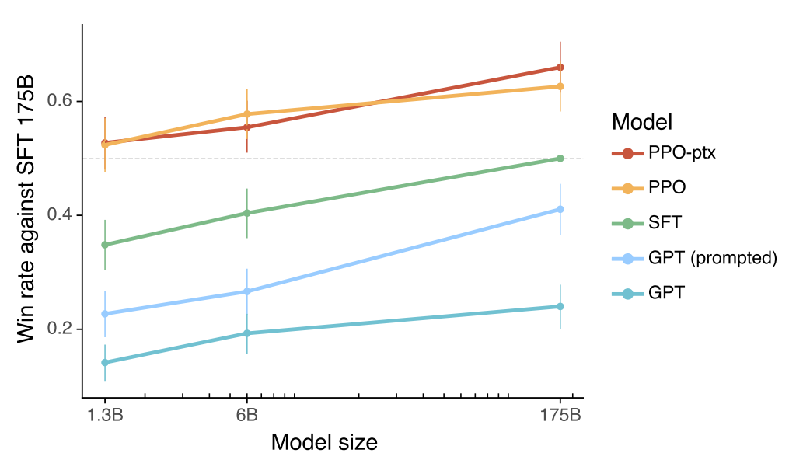
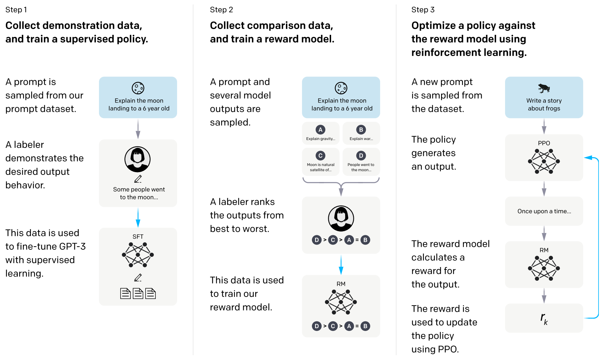
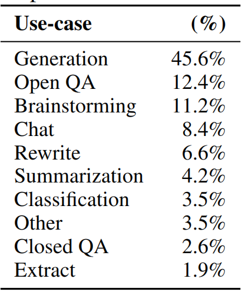
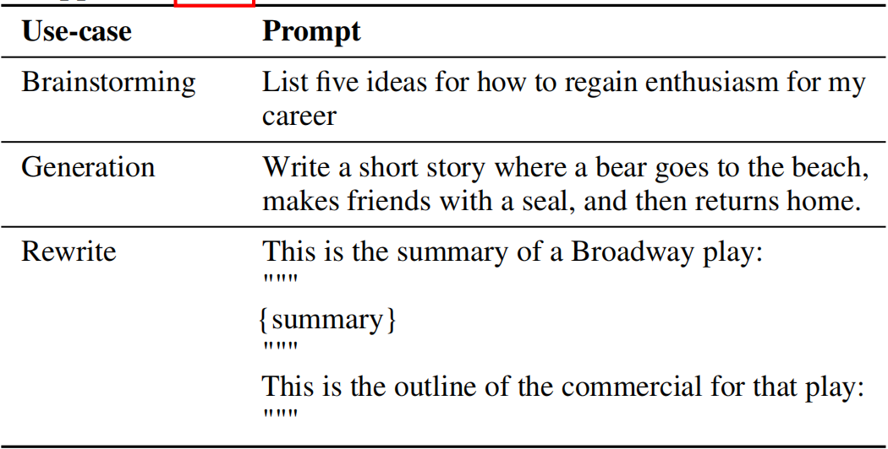
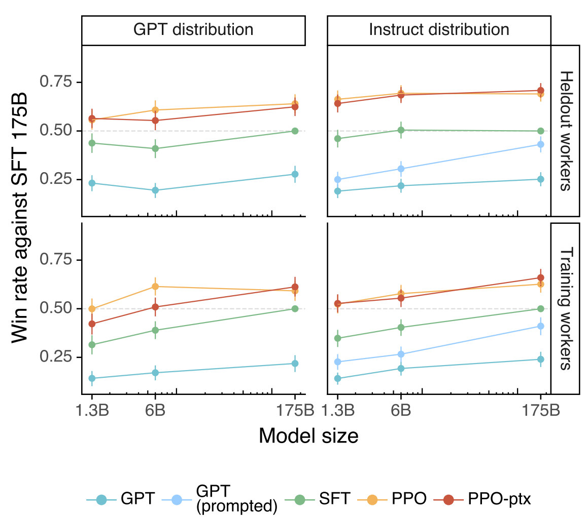
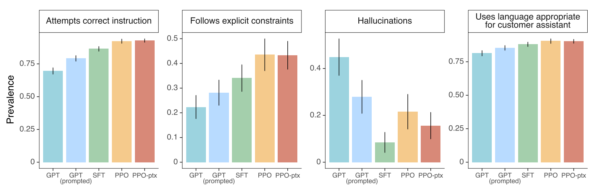
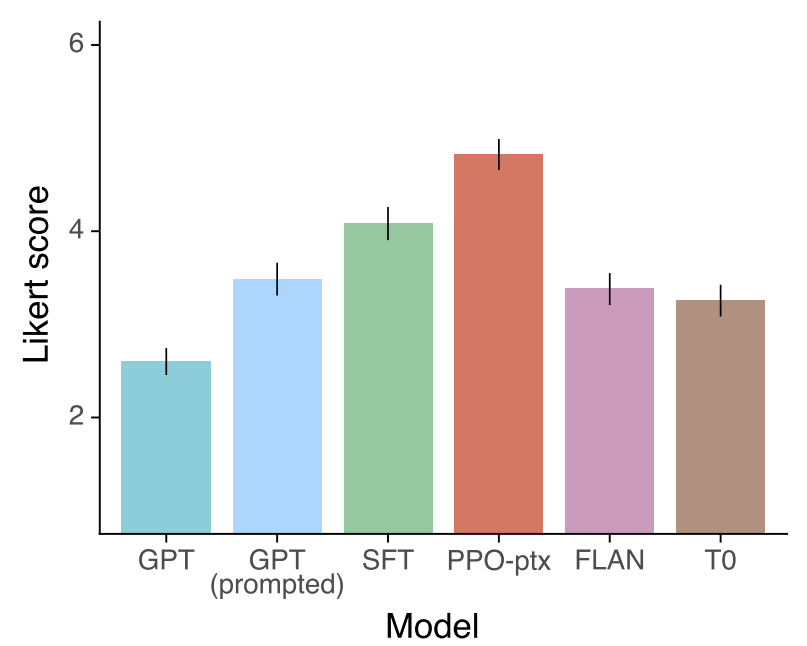
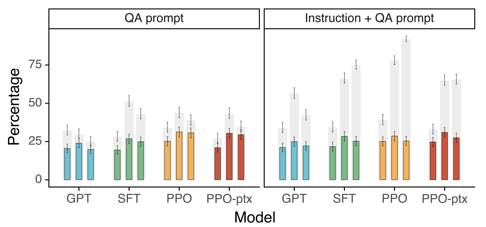
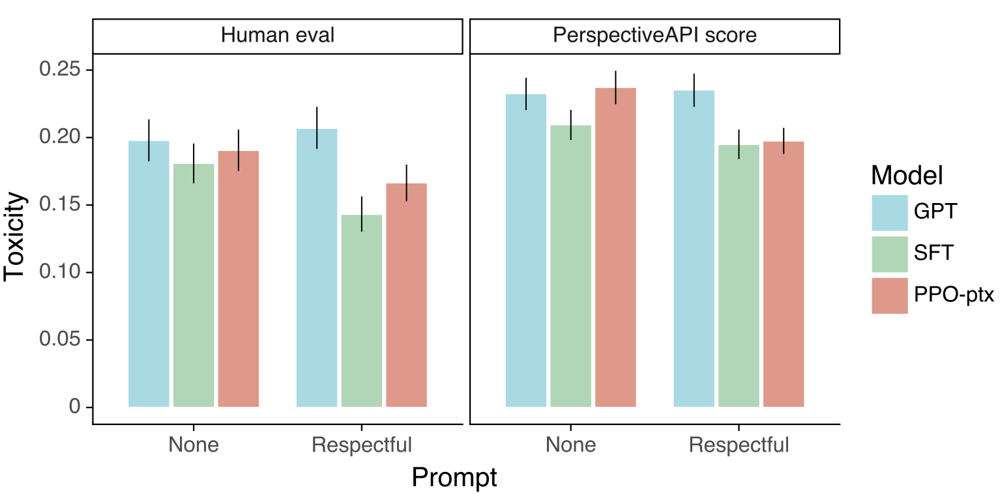
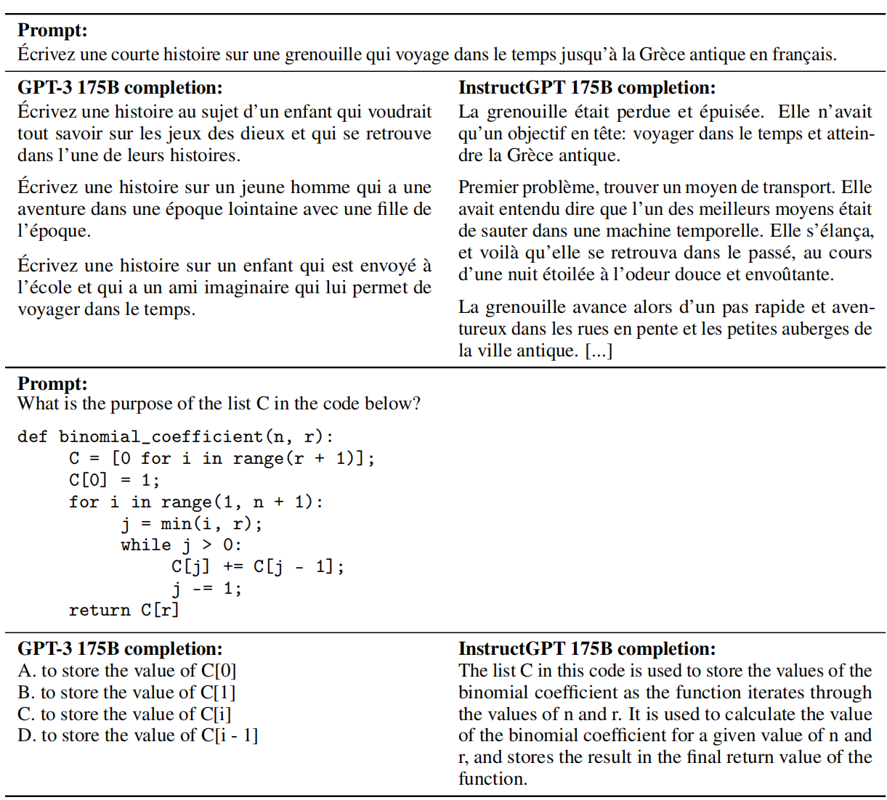

# Training language models to follow instructions with human feedback
训练语言模型使其能够根据人的反馈来执行指令 2022.3.4  https://arxiv.org/abs/2203.02155

## 阅读笔记
* https://hub.baai.ac.cn/view/22606 , https://mp.weixin.qq.com/s/TLQ3TdrB5gLb697AFmjEYQ  RLHF技术详解
* LLM模型每次输出单个token，基于交叉熵损失函数指导模型参数更新，通过迭代生成完整内容。而整体内容的好坏，以及该如何指导模型微调，需要引入RLHF。
* 思考：如果把智能分成 感知理解 和 逻辑推理 2个阶段，那么微调是不是只在调整推理阶段，微调前后，不同层的梯度变化情况？浅层(感知理解)保持不变，深层(逻辑推理)变化较大？
* prompt微调只使用英语数据训练，其他语言的结果会有提高吗？ 
* 微调比prompt好的原因？
* 真的机器人三定律：有帮助的helpfulness、诚实的honesty 和 无害的 harmlessness（HHH）

3个阶段：预训练模型SFT + 奖励模型 + 强化学习微调
1. 基于预训练语言模型监督方式下微调(SFT)
    * 实际看起来，SFT方式，随着模型和数据量的增大，效果似乎还能提高?
2. 收集数据并训练奖励模型(RM, reward model), 
    * 判别式的, 给定同一个prompt，让两个LM同时生成文本，人工比较这两个文本哪个好，pair-wise形式，最终产生奖励分数. 
    * 2个语言模型，一个原始模型，一个迭代中的模型，迭代模型启动问题，最开始怎么区分2个模型参数？
    * 迭代好的模型当基线？
    * 高质量人工撰写问答对的作用，应用；
    * 多轮对话，多模对话
3. 通过强化学习微调LM
    * RLHF, reinforcement learning from human feedback ，从人类反馈中强化学习， RL-强化学习
    * PPO, Proximal Policy Optimization, 近端策略优化
        *  [Learning to summarize from human feedback](https://arxiv.org/abs/2009.01325)
        *  [Proximal policy optimization algorithms](../RL/PPO.md)
    * 预训练分布(PPO-ptx)的对数似然性的更新，减轻性能退化
    * 疑问，如果gpt设计成编码-解码架构，对最终生成的整体做损失函数，指导模型迭代？

源码：
* https://github.com/microsoft/DeepSpeed/tree/master/blogs/deepspeed-chat  微软搞SDK/开发工具之类的，还是很有经验的，这框架有助于提升他们的Azure云计算销量。
* https://github.com/nebuly-ai/nebullvm/tree/main/apps/accelerate/chatllama
* https://github.com/hpcaitech/ColossalAI/blob/main/applications/Chat

其他：
* Likert scale， 李克特量表
* 问题-1: 实时数据引入？在线梯度更新？大脑的记忆机制？什么是事实？ 本质是学习各种任务的推理模式。 

## Abstract
Making language models bigger does not inherently make them better at following a user’s intent. For example, large language models can generate outputs that are untruthful, toxic, or simply not helpful to the user. In other words, these models are not aligned with their users. In this paper, we show an avenue for aligning language models with user intent on a wide range of tasks by fine-tuning with human feedback. Starting with a set of labeler-written prompts and prompts submitted through the OpenAI API, we collect a dataset of labeler demonstrations of the desired model behavior, which we use to fine-tune GPT-3 using supervised learning. We then collect a dataset of rankings of model outputs, which we use to further fine-tune this supervised model using reinforcement learning from human feedback. We call the resulting models InstructGPT. In human evaluations on our prompt distribution, outputs from the 1.3B parameter InstructGPT model are preferred to outputs from the 175B GPT-3, despite having 100x fewer parameters. Moreover, InstructGPT models show improvements in truthfulness and reductions in toxic output generation while having minimal performance regressions on public NLP datasets. Even though InstructGPT still makes simple mistakes, our results show that fine-tuning with human feedback is a promising direction for aligning language models with human intent. 

更大的语言模型并不意味着它们能够更好地遵循用户意图。例如，大型语言模型可能会生成不真实、有毒或对用户毫无帮助的输出。换句话说，这些模型没有和用户对齐。在本文中，我们展示了可以根据人类反馈进行微调，使语言模型与用户对各种任务意图对齐的方法。从一组标注人员编写，通过OpenAI API提交的提示开始，我们收集了模型所需的标注人员演示数据集，我们基于该数据集使用监督学习来微调GPT-3。然后，我们收集模型输出排名的数据集，使用该数据集通过人类反馈的强化学习进一步微调该监督模型。我们将产生的模型称为InstructGPT。在对我们的提示分布的人工评估中，1.3B参数InstructGPT模型的输出优于175B GPT-3的输出，尽管其参数少了100倍。此外，InstructionGPT模型显示了真实性的提高和有毒输出生成的减少，同时在公共NLP数据集上的性能倒退最小。尽管InstructGPT仍然会犯一些简单的错误，但我们的结果表明，根据人类反馈进行微调是使语言模型与人类意图对齐的一个有前途的方向。

<!-- 
监督微调 SFT，微调方式，仍然是按照单个token预测？

performance regressions，性能倒退
aligning，对齐，保持一致
生成模型将大量知识纳入到神经网络中，像个黑箱但更接近人脑; 相比之下，知识图谱还是符号化的东西, Ernie这类使用知识图谱的方式？
google，百度等搜索引擎解决传统的NLP问题，把宝压在了掩码语言模型上，而OpenAI没这个负担，每天是想着搞颠覆性创新，自回归语言模型现在看来，更高一个层次。
因为对于人类来说，衡量某个知识是否被掌握，看是否记住了，能够复述，更高层次，可以用各种角度理解问题。
-->

## 1 Introduction
Large language models (LMs) can be “prompted” to perform a range of natural language processing (NLP) tasks, given some examples of the task as input. However, these models often express unintended behaviors such as making up facts, generating biased or toxic text, or simply not following user instructions (Bender et al., 2021; Bommasani et al., 2021; Kenton et al., 2021; Weidinger et al., 2021; Tamkin et al., 2021; Gehman et al., 2020). This is because the language modeling objective used for many recent large LMs—predicting the next token on a webpage from the internet — is different from the objective “follow the user’s instructions helpfully and safely” (Radford et al., 2019;Brown et al., 2020; Fedus et al., 2021; Rae et al., 2021; Thoppilan et al., 2022). Thus, we say that the language modeling objective is misaligned. Averting these unintended behaviors is especially important for language models that are deployed and used in hundreds of applications.

对于大型语言模型(LMs)，给出一些作为输入的任务样本，可以被“提示”执行一系列自然语言处理(NLP)任务。然而，这些模型通常表现为无意的行为，例如编造事实、生成有偏见或有毒文本，或根本不遵循用户指令(Bender et al.，2021; Bommasani et al.，2021; Kenton et al.，2021; Weidinger et al.，2021; Tamkin et al.，2021; Gehman et al.，2020)。这是因为许多最近的大型LM使用的语言建模目标是预测来自互联网的网页上的下一个标记，这与“有用且安全地遵循用户的指示”的目标不同(Radford et al.，2019; Brown et al.，2020; Fedus et al.，2021; Rae et al.，2021; Thoppilan et al.，2022)。因此，我们说语言建模目标不一致。对于在数百个应用程序中部署和使用的语言模型来说，避免这些意外行为尤为重要。

 
Figure 1: Human evaluations of various models on our API prompt distribution, evaluated by how often outputs from each model were preferred to those from the 175B SFT model. Our InstructGPT models (PPO-ptx) as well as its variant trained without pretraining mix (PPO) significantly outperform the GPT-3 baselines (GPT, GPT prompted); outputs from our 1.3B PPO-ptx model are preferred to those from the 175B GPT-3. Error bars throughout the paper are 95% confidence intervals.  
图1：对API提示分布上各种模型的人工评估，根据每个模型的输出优先于175B SFT模型的输出的频率进行评估。我们的InstructionGPT模型(PPO-ptx)及其未经预训练混合训练的变体(PPO)显著优于GPT-3基线(GPT，GPT提示); 我们的1.3B PPO-ptx模型的输出优于175B GPT-3的输出。论文中的误差条为95%置信区间。
<!--PPO-ptx, ptx?-->

We make progress on aligning language models by training them to act in accordance with the user’s intention (Leike et al., 2018). This encompasses both explicit intentions such as following instructions and implicit intentions such as staying truthful, and not being biased, toxic, or otherwise harmful. Using the language of Askell et al. (2021), we want language models to be helpful (they should help the user solve their task), honest (they shouldn’t fabricate information or mislead the user), and harmless (they should not cause physical, psychological, or social harm to people or the environment). We elaborate on the evaluation of these criteria in Section 3.6.

通过训练语言模型按照用户的意图行事，我们在对齐语言模型方面取得了进展(Leike et al.，2018 )。 这既包括明确的意图，例如遵循指示，也包括隐含的意图，例如保持真实、不带偏见、有毒或以其他有害方式。 使用Askellet al.(2021)的语言，我们希望语言模型有帮助(应该帮助用户解决他们的任务)、诚实(不应该捏造信息或误导用户)和无害(不应该对人或环境造成身体、心理或社会伤害)。 我们在第 3.6 节中详细说明了对这些标准的评估。

<!-- 发现google翻译，比百度翻译的效果好了不少，很多读起来比较不顺畅的机翻译，2个翻译软件结果放在一起比对下。 -->

We focus on fine-tuning approaches to aligning language models. Specifically, we use reinforcement learning from human feedback (RLHF; Christiano et al., 2017; Stiennon et al., 2020) to fine-tune GPT-3 to follow a broad class of written instructions (see Figure 2). This technique uses human preferences as a reward signal to fine-tune our models. We first hire a team of 40 contractors to label our data, based on their performance on a screening test (see Section 3.4 and Appendix B.1 for more details). We then collect a dataset of human-written demonstrations of the desired output behavior on (mostly English) prompts submitted to the OpenAI API(3 Specifically, we train on prompts submitted to earlier versions of the InstructGPT models on the OpenAI API Playground, which were trained only using demonstration data. We filter out prompts containing PII. ) and some labeler-written prompts, and use this to train our supervised learning baselines. Next, we collect a dataset of human-labeled comparisons between outputs from our models on a larger set of API prompts. We then train a reward model (RM) on this dataset to predict which model output our labelers would prefer. Finally, we use this RM as a reward function and fine-tune our supervised learning baseline to maximize this reward using the PPO algorithm (Schulman et al., 2017). We illustrate this process in Figure 2. This procedure aligns the behavior of GPT-3 to the stated preferences of a specific group of people (mostly our labelers and researchers), rather than any broader notion of “human values”; we discuss this further in Section 5.2. We call the resulting models InstructGPT.

我们专注于微调方法来对齐语言模型。具体而言，我们使用来自人类反馈的强化学习(RLHF; Christiano et al.，2017; Stiennon et al.，2020)来微调GPT-3，以遵循广泛的书面指令(见图2)。该技术使用人类偏好作为奖励信号来微调我们的模型。我们首先雇佣了一个由40名承包商组成的团队，根据他们在筛选测试中的表现来标注我们的数据(详见第3.4节和附录B.1)。然后，我们收集了提交给OpenAI API的提示(主要是英语)上所需输出行为的人工演示数据集(3 具体来说，我们训练提交给 OpenAI API Playground 上 InstructGPT 模型早期版本的提示，这些提示是 仅使用演示数据进行训练。我们过滤掉包含 PII 的提示。)和一些标注人员书面(labeler-written)提示，并以此来训练我们的监督学习基线。接下来，我们收集了一个数据集，该数据集包含我们模型在更大的 API 提示集上的输出之间的人工标注比较。然后，我们在这个数据集上训练奖励模型(RM)，以预测我们的标注人员更喜欢哪个模型输出。最后，我们使用该RM作为奖励函数，并使用PPO算法微调我们的监督学习基线，以最大化该奖励(Schulman et al.，2017)。我们在图2中说明了这个过程。该程序将GPT-3的行为与特定人群(主要是我们的标注人员和研究人员)的陈述偏好相一致，而不是任何更广泛的“人类价值观”概念; 我们将在第5.2节中对此进行进一步讨论。我们将生成的模型称为InstructGPT。

<!-- 
chatGPT上线后会收集更多的用户提问，可按此方法多轮迭代; 
有点对抗生成网络的意思，判别器是基于人类喜好训练出来的奖励模型(RM reward model); 
起初的自监督微调，还是按预测下一个token的方式？
reinforcement learning from human feedback (RLHF; Christiano et al., 2017; Stiennon et al., 2020)，来自人类反馈的强化学习
PII, 个人隐私

PPO proximal policy optimization 近端策略优化
PPO-ptx ?

-->

 
Figure 2: A diagram illustrating the three steps of our method: (1) supervised fine-tuning (SFT), (2) reward model (RM) training, and (3) reinforcement learning via proximal policy optimization (PPO) on this reward model. Blue arrows indicate that this data is used to train one of our models. In Step 2, boxes A-D are samples from our models that get ranked by labelers. See Section 3 for more details on our method. 
图2：图示了我们方法的三个步骤：(1)监督微调(SFT)，(2)奖励模型(RM)训练，以及(3)通过该奖励模型上的近端策略优化(PPO)进行强化学习。蓝色箭头表示该数据用于训练我们的一个模型。在步骤2中，框A-D是我们的模型中的样本，由标注人员进行排名。有关我们方法的更多详情，请参阅第3节。
<!--RM,多个输出? -->

We mainly evaluate our models by having our labelers rate the quality of model outputs on our test set, consisting of prompts from held-out customers (who are not represented in the training data). We also conduct automatic evaluations on a range of public NLP datasets. We train three model sizes (1.3B, 6B, and 175B parameters), and all of our models use the GPT-3 architecture. Our main findings are as follows:

我们主要通过让标注人员对测试集上的模型输出质量进行评分来评估我们的模型，其中包括来自持牌(held-out)客户的提示(训练数据中未显示这些客户)。我们还对一系列公共NLP数据集进行自动评估。我们训练了三种模型大小(1.3B、6B和175B参数)，所有模型都使用GPT-3架构。我们的主要发现如下：
<!-- 公共数据集，自动评估,用于检测性能倒退的现象 . 保留下一个token预测，减少性能退化。
held-out ?
-->

### Labelers significantly prefer InstructGPT outputs over outputs from GPT-3. 
On our test set, outputs from the 1.3B parameter InstructGPT model are preferred to outputs from the 175B GPT-3, despite having over 100x fewer parameters. These models have the same architecture, and differ only by the fact that InstructGPT is fine-tuned on our human data. This result holds true even when we add a few-shot prompt to GPT-3 to make it better at following instructions. Outputs from our 175B InstructGPT are preferred to 175B GPT-3 outputs 85 ± 3% of the time, and preferred 71 ± 4% of the time to few-shot 175B GPT-3. InstructGPT models also generate more appropriate outputs according to our labelers, and more reliably follow explicit constraints in the instruction.

与GPT-3的输出相比，标注人员更倾向于InstructionGPT的输出。在我们的测试集上，1.3B参数InstructGPT模型的输出优于175B GPT-3的输出，尽管参数少了100倍以上。这些模型具有相同的架构，不同之处仅在于InstructionGPT对我们的人类数据进行了微调。即使我们在GPT-3中添加了一些少量(few-shot)提示，以使其更好地执行以下指令，这个结果仍然成立。我们的 175B InstructGPT 的输出在 85±3% 的时间内优于 175B GPT-3 输出，在 71±4% 的时间内优于 few-shot 175B GPT-3。 InstructGPT 模型还根据我们的标注生成更合适的输出，并且更可靠地遵循指令中的明确约束。

<!--不同任务的优化
-->

### InstructGPT models show improvements in truthfulness over GPT-3. 
On the TruthfulQA benchmark, InstructGPT generates truthful and informative answers about twice as often as GPT-3. Our results are equally strong on the subset of questions that were not adversarially selected against GPT-3. On “closed-domain” tasks from our API prompt distribution, where the output should not contain information that is not present in the input (e.g. summarization and closed-domain QA),InstructGPT models make up information not present in the input about half as often as GPT-3 (a 21% vs. 41% hallucination rate, respectively).

与GPT-3相比，InstructionGPT模型显示了真实性的改进。在TruthfulQA基准测试中，InstructionGPT生成真实且信息丰富的答案大约是GPT-3的两倍。对于未针对 GPT-3 进行对抗性选择的问题子集，我们的结果同样出色。 在我们的 API 提示分发中的“封闭域”任务中，输出不应包含输入中不存在的信息(例如摘要和封闭域 QA)，InstructGPT 模型将输入中不存在的信息弥补大约一半，通常为 GPT-3(幻觉率分别为 21% 和 41%)。

### InstructGPT shows small improvements in toxicity over GPT-3, but not bias. 
To measure toxicity, we use the RealToxicityPrompts dataset (Gehman et al., 2020) and conduct both automatic and human evaluations. InstructGPT models generate about 25% fewer toxic outputs than GPT-3 when prompted to be respectful. InstructGPT does not significantly improve over GPT-3 on the Winogender (Rudinger et al., 2018) and CrowSPairs (Nangia et al., 2020) datasets.

InstructGPT与GPT-3相比毒性略有改善，但无偏差。为了测量毒性，我们使用 RealToxicityPrompts 数据集(Gehman et al.，2020)，并进行自动和人工评估。指示GPT模型在提示尊重时产生的毒性输出比GPT-3少25%。在 Winogender(Rudinger et al.，2018)和 CrowSPairs(Nangia et al.，2020)数据集上，InstructionGPT没有显著改善GPT-3。

### We can minimize performance regressions on public NLP datasets by modifying our RLHF fine-tuning procedure. 
During RLHF fine-tuning, we observe performance regressions compared to GPT-3 on certain public NLP datasets, notably SQuAD (Rajpurkar et al., 2018), DROP (Dua et al., 2019), HellaSwag (Zellers et al., 2019), and WMT 2015 French to English translation (Bojar et al., 2015). This is an example of an “alignment tax” since our alignment procedure comes at the cost of lower performance on certain tasks that we may care about. We can greatly reduce the performance regressions on these datasets by mixing PPO updates with updates that increase the log likelihood of the pretraining distribution (PPO-ptx), without compromising labeler preference scores.

我们可以通过修改RLHF微调程序最小化公共NLP数据集上的性能倒退。在RLHF微调期间，我们在某些公共NLP数据集上观察到与GPT-3相比的性能倒退，特别是SQuAD(Rajpurkar et al.，2018)、DROP(Dua et al.，2019)、HellaSwag(Zellers et al.，2019)和WMT 2015法语到英语翻译(Bojar et al.，2015)。这是一个“调整税”的例子，因为我们的调整程序以降低我们可能关心的某些任务的性能为代价。我们可以通过将PPO更新与提高预训练分布(PPO-ptx)的对数似然性的更新相结合，在不影响标注偏好得分的情况下，大大减少这些数据集上的性能倒退。

### Our models generalize to the preferences of “held-out” labelers that did not produce any training data. 
To test the generalization of our models, we conduct a preliminary experiment with held-out labelers, and find that they prefer InstructGPT outputs to outputs from GPT-3 at about the same rate as our training labelers. However, more work is needed to study how these models perform on broader groups of users, and how they perform on inputs where humans disagree about the desired behavior.

我们的模型泛化了不产生任何训练数据的“保留”标注人员的偏好。为了测试我们的模型的泛化能力，我们对保留者进行了初步实验，发现他们更喜欢InstructionGPT输出，而不是GPT-3输出，其比例与我们的训练标注人员大致相同。然而，需要做更多的工作来研究这些模型如何在更广泛的用户群体中执行，以及它们如何在人类对期望的行为不一致的情况下执行输入。

### Public NLP datasets are not reflective of how our language models are used. 
We compare GPT-3 fine-tuned on our human preference data (i.e. InstructGPT) to GPT-3 fine-tuned on two different compilations of public NLP tasks: the FLAN (Wei et al., 2021) and T0 (Sanh et al., 2021) (in particular, the T0++ variant). These datasets consist of a variety of NLP tasks, combined with natural language instructions for each task. On our API prompt distribution, our FLAN and T0 models perform slightly worse than our SFT baseline, and labelers significantly prefer InstructGPT to these models (InstructGPT has a 73.4 ±2% winrate vs. our baseline, compared to 26.8 ±2% and 29.8 ±2% for our version of T0 and FLAN, respectively).

公共NLP数据集不能反映语言模型的使用方式。我们在人类偏好数据(即InstructionGPT)上对GPT-3进行微调，并在公共NLP任务的两种不同编译版本上对其进行微调：FLAN(Wei et al.，2021)和T0(Sanh et al.，2021)(尤其是T0++变体)。这些数据集由各种NLP任务组成，并结合每个任务的自然语言指令。在我们的API提示分布中，我们的FLAN和T0模型的性能略低于我们的SFT基线，标注人员明显更喜欢InstructGPT而不是这些模型(与我们的基线相比，InstructGTT的胜率为73.4±2%，而T0和FLAN版本的胜率分别为26.8±2%和29.8±2%)。

### InstructGPT models show promising generalization to instructions outside of the RLHF finetuning distribution. 
We qualitatively probe InstructGPT’s capabilities, and find that it is able to follow instructions for summarizing code, answer questions about code, and sometimes follows instructions in different languages, despite these instructions being very rare in the fine-tuning distribution. In contrast, GPT-3 can perform these tasks but requires more careful prompting, and does not usually follow instructions in these domains. This result is exciting because it suggests that our models are able to generalize the notion of “following instructions.” They retain some alignment even on tasks for which they get very little direct supervision signal.

InstructGPT模型显示了对RLHF微调分布之外的指令的有希望的泛化。我们定性地探究了InstructionGPT的功能，发现它能够遵循总结代码的指令，回答有关代码的问题，有时还会遵循不同语言的指令，尽管这些指令在微调分布中非常罕见。相比之下，GPT-3虽可以执行这些任务，但需要更仔细的提示，并且通常不遵循这些域中的指示。这一结果令人兴奋，因为它表明我们的模型能够泛化“遵循指令”的概念。即使在几乎没有直接监督信号的任务上，它们也保持一定的一致性。

### InstructGPT still makes simple mistakes. 
For example, InstructGPT can still fail to follow instructions, make up facts, give long hedging answers to simple questions, or fail to detect instructions with false premises.

InstructGPT仍然会犯简单的错误。例如，InstructGPT仍然可能无法遵循指令、虚构事实、对简单问题给出长时间的模糊答案，或者无法检测到带有虚假前提的指令。

Overall, our results indicate that fine-tuning large language models using human preferences signifi- cantly improves their behavior on a wide range of tasks, though much work remains to be done to improve their safety and reliability.

总的来说，我们的结果表明，使用人类偏好微调大型语言模型可以显著改善他们在各种任务上的行为，尽管这需要很多工作.

The rest of this paper is structured as follows: We first detail related work in Section 2, before diving into our method and experiment details in Section 3, including our high-level methodology (3.1), task and dataset details (3.3 and 3.2), human data collection (3.4), how we trained our models (3.5), and our evaluation procedure (3.6). We then present our results in Section 4, divided into three parts: results on the API prompt distribution (4.1), results on public NLP datasets (4.2), and qualitative results (4.3). Finally we give an extended discussion of our work in Section 5, including implications for alignment research (5.1), what we are aligning to (5.2), limitations (5.3), open questions (5.4), and broader impacts of this work (5.5). 

本文的其余部分结构如下：我们首先在第2节详细介绍了相关工作，然后在第3节深入研究我们的方法和实验细节，包括我们的高级方法(3.1)、任务和数据集细节(3.3和3.2)、人类数据收集(3.4)、我们如何训练我们的模型(3.5)以及我们的评估程序(3.6)，分为三个部分：API提示分布结果(4.1)、公共NLP数据集结果(4.2)和定性结果(4.3)。最后，我们在第5节中对我们的工作进行了扩展讨论，包括对对齐研究的影响(5.1)、我们要对齐的内容(5.2)、局限性(5.3)、开放性问题(5.4)以及这项工作的更广泛影响(5.5)。

## 2 Related work
### Research on alignment and learning from human feedback. 
We build on previous techniques to align models with human intentions, particularly reinforcement learning from human feedback (RLHF). Originally developed for training simple robots in simulated environments and Atari games (Christiano et al., 2017; Ibarz et al., 2018), it has recently been applied to fine-tuning language models to summarize text (Ziegler et al., 2019; Stiennon et al., 2020; Böhm et al., 2019; Wu et al., 2021). This work is in turn influenced by similar work using human feedback as a reward in domains such as dialogue (Jaques et al., 2019; Yi et al., 2019; Hancock et al., 2019), translation (Kreutzer et al., 2018; Bahdanau et al., 2016), semantic parsing (Lawrence and Riezler, 2018), story generation (Zhou and Xu, 2020), review generation (Cho et al., 2018), and evidence extraction (Perez et al., 2019). Madaan et al. (2022) use written human feedback to augment prompts and improve the performance of GPT-3. There has also been work on aligning agents in text-based environments using RL with a normative prior (Nahian et al., 2021). Our work can be seen as a direct application of RLHF to aligning language models on a broad distribution of language tasks.

从人类反馈中调整和学习的研究。我们建立在先前的技术基础上，以使模型与人类意图相一致，特别是从人类反馈中强化学习(RLHF)。最初是为在模拟环境和Atari游戏中训练简单机器人而开发的(Christiano et al.，2017; Ibarz et al.，2018)，最近已应用于微调语言模型以总结文本(Ziegler et al.，2019; Stiennon et al.，2020; Böhm et al.，2018; Wu et al.，2021)。这项工作反过来受到类似工作的影响，这些工作在对话(Jaques et al.，2019; Yi et al.，2019; Hancock et al.，2019)、翻译(Kreutzer et al.，2018; Bahdanau et al.，2016)、语义分析(Lawrence和Riezler，2018)、故事生成(Zhou和Xu，2020)、评论生成(Cho et al.，2018)，和证据提取(Perez et al.，2019)。Madaanet al.(2022)使用书面人类反馈来增强提示并提高GPT-3的性能。还有一些工作是在基于文本的环境中使用 RL 和规范先验来对齐智能体(Nahian et al.，2021)。我们的工作可以看作是RLHF在广泛分布的语言任务上对齐语言模型的直接应用。

The question of what it means for language models to be aligned has also received attention recently (Gabriel, 2020). Kenton et al. (2021) catalog behavioral issues in LMs that result from misalignment, including producing harmful content and gaming misspecified objectives. In concurrent work, Askell et al. (2021) propose language assistants as a testbed for alignment research, study some simple baselines, and their scaling properties.

语言模型对齐意味着什么的问题最近也受到了关注(Gabriel，2020)。Kentonet al.(2021)将错位导致的LM中的行为问题编入目录，包括产生有害内容和游戏错误指定的目标。在并行工作中，Askellet al.(2021)提出将语言助手作为对齐研究的测试平台，研究一些简单的基线及其缩放属性。

### Training language models to follow instructions. 
Our work is also related to research on crosstask generalization in language models, where LMs are fine-tuned on a broad range of public NLP datasets (usually prefixed with an appropriate instruction) and evaluated on a different set of NLP tasks. There has been a range of work in this domain (Yi et al., 2019; Mishra et al., 2021; Wei et al., 2021; Khashabi et al., 2020; Sanh et al., 2021; Aribandi et al., 2021), which differ in training and evaluation data, formatting of instructions, size of pretrained models, and other experimental details. A consistent finding across studies is that fine-tuning LMs on a range of NLP tasks, with instructions, improves their downstream performance on held-out tasks, both in the zero-shot and few-shot settings.

训练语言模型遵守指示。我们的工作还与语言模型中跨任务泛化的研究相关，其中，在广泛的公共NLP数据集(通常以适当的指令为前缀)上对LMs进行微调，并在不同的NLP任务集上进行评估。该领域已经开展了一系列工作(Yi et al.，2019; Mishra et al.，2021; Wei et al.，2021; Khashabi et al.，2020; Sanh et al.，2021; Aribandi et al.，2021)，这些工作在训练和评估数据、指令格式、预训练模型大小以及其他实验细节方面有所不同。研究中的一个一致发现是，在一系列NLP任务上微调LMs和指令，可以提高其在零样本和少样本设置下的下游任务性能。

There is also a related line of work on instruction following for navigation, where models are trained to follow natural language instructions to navigate in a simulated environment (Bahdanau et al., 2018; Abramson et al., 2020; Zhao et al., 2021).

还有一项关于导航指令遵循的相关工作，即训练模型遵循自然语言指令在模拟环境中导航(Bahdanau et al.，2018; Abramson et al.，2020; Zhao et al.，2021)。

### Evaluating the harms of language models. 
A goal of modifying the behavior of language models is to mitigate the harms of these models when they’re deployed in the real world. These risks have been extensively documented (Bender et al., 2021; Bommasani et al., 2021; Kenton et al., 2021; Weidinger et al., 2021; Tamkin et al., 2021). Language models can produce biased outputs (Dhamala et al., 2021; Liang et al., 2021; Manela et al., 2021; Caliskan et al., 2017; Kirk et al., 2021), leak private data (Carlini et al., 2021), generate misinformation (Solaiman et al., 2019; Buchanan et al., 2021), and be used maliciously; for a thorough review we direct the reader to Weidinger et al. (2021).

评估语言模型的危害。修改语言模型行为的一个目标是减轻这些模型在现实世界中部署时的危害。这些风险已被广泛记录(Bender et al.，2021; Bommasani et al.，2021; Kenton et al.，2021; Weidinger et al.，2021; Tamkin et al.，2021)。语言模型可以产生有偏见的输出(Dhamala et al.，2021; Liang et al.，2021; Manela et al.，2021; Caliskan et al.，2017; Kirk et al.，2021)，泄漏私人数据(Carlini et al.，2021)，生成错误信息(Solaiman et al.，2019; Buchanan et al.，2021)，并被恶意使用; 为了进行彻底的审查，我们将读者引向Weidingeret al.(2021)。

Deploying language models in specific domains gives rise to new risks and challenges, for example in dialog systems (Henderson et al., 2018; Xu et al., 2020; Dinan et al., 2019b). There is a nascent but growing field that aims to build benchmarks to concretely evaluate these harms, particularly around toxicity (Gehman et al., 2020), stereotypes (Nadeem et al., 2020), and social bias (Dhamala et al., 2021; Nangia et al., 2020; Rudinger et al., 2018). Making significant progress on these problems is hard since well-intentioned interventions on LM behavior can have side-effects (Welbl et al., 2021; Blodgett et al., 2020); for instance, efforts to reduce the toxicity of LMs can reduce their ability to model text from under-represented groups, due to prejudicial correlations in the training data (Xu et al., 2021).

在特定领域部署语言模型会带来新的风险和挑战，例如在对话系统中(Henderson et al.，2018; Xu et al.，2020; Dinan et al.，2019b)。有一个新兴但不断发展的领域，旨在建立基准来具体评估这些危害，尤其是围绕毒性(Gehman et al.，2020)、刻板印象(Nadeem et al.，2020)和社会偏见(Dhamala et al.，2021; Nangia et al.，2020; Rudinger et al.，2018)。很难在这些问题上取得重大进展，因为对LM行为的善意干预可能会产生副作用(Welbl et al.，2021; Blodgett et al.，2020); 例如，由于训练数据中的偏见相关性，降低LM毒性的努力可能会降低他们对来自低水平表达群体的文本建模的能力(Xu et al.，2021)。

### Modifying the behavior of language models to mitigate harms. 
There are many ways to change the generation behavior of language models. Solaiman and Dennison (2021) fine-tune LMs on a small, value-targeted dataset, which improves the models’ ability to adhere to these values on a question answering task. Ngo et al. (2021) filter the pretraining dataset by removing documents on which a language model has a high conditional likelihood of generating a set of researcher-written trigger phrases. When trained on this filtered dataset, their LMs generate less harmful text, at the cost of a slight decrease in language modeling performance. Xu et al. (2020) use a variety of approaches to improve the safety of chatbots, including data filtering, blocking certain words or n-grams during generation, safety-specific control tokens (Keskar et al., 2019; Dinan et al., 2019a), and human-in-theloop data collection (Dinan et al., 2019b). Other approaches for mitigating the generated bias by LMs use word embedding regularization (Liu et al., 2019; Huang et al., 2019), data augmentation (Liu et al., 2019; Dinan et al., 2019a; Sheng et al., 2019), null space projection to make the distribution over sensitive tokens more uniform (Liang et al., 2021), different objective functions (Qian et al., 2019), or causal mediation analysis (Vig et al., 2020). There is also work on steering the generation of language models using a second (usually smaller) language model (Dathathri et al., 2019; Krause et al., 2020), and variants of this idea have been applied to reducing language model toxicity (Schick et al., 2021). 5

修改语言模型的行为以减轻危害。有许多方法可以改变语言模型的生成行为。Solaiman和Dennison(2021)在一个小的、以价值导向的数据集上对LM进行了微调，这提高了模型在问答任务中坚持这些价值的能力。Ngoet al.(2021)通过删除语言模型在其上生成一组研究人员编写的触发短语的条件可能性很高的文档来过滤预训练数据集。当在经过过滤的数据集上进行训练时，他们的LMs生成的有害文本更少，代价是语言建模性能略有下降。Xuet al.(2020)使用多种方法来提高聊天机器人的安全性，包括数据过滤、在生成过程中阻止某些单词或n-gram、安全特定的控制令牌(Keskar et al.，2019; Dinan et al.，2019a)和人在回路数据收集(Dinan et al.,2019b)。减轻LMs产生的偏差的其他方法使用单词嵌入正则化(Liu et al.，2019; Huang et al.，201九)、数据增广(Liu et al.,2019; Dinan et al.,2019a; Sheng et al.,201九)、零空间投影，以使敏感令牌上的分布更加均匀(Liang et al.,2021)、不同的目标函数(Qian et al.，199)，或因果调解分析(Vig et al.，2020)。还有一项工作是使用第二种(通常较小的)语言模型指导语言模型的生成(Dathathri et al.，2019; Krause et al.，2020)，并且该想法的变体已被应用于降低语言模型的毒性(Schick et al.，2021)。

<!-- 思考：个性化的chatgpt，基础能力是相同的，但又有细微的差别，每个人得到的回复不一样，模型给人的整体印象，有的看起来很斯文，有的很粗鲁; 
用户可以根据自己的三观引导模型迭代 -->

## 3 Methods and experimental details
### 3.1 High-level methodology
Our methodology follows that of Ziegler et al. (2019) and Stiennon et al. (2020), who applied it in the stylistic continuation and summarization domains. We start with a pretrained language model (Radford et al., 2019; Brown et al., 2020; Fedus et al., 2021; Rae et al., 2021; Thoppilan et al., 2022), a distribution of prompts on which we want our model to produce aligned outputs, and a team of trained human labelers (see Sections 3.4 for details). We then apply the following three steps (Figure 2).

我们的方法遵循Ziegleret al.(2019)和Stiennonet al.(2020)的方法，他们将其应用于文体续写和总结领域。我们从预训练语言模型开始(Radford et al.，2019; Brown et al.，2020; Fedus et al.，2021; Rae et al.，2021; Thoppilan et al.，2022)，我们希望我们的模型产生一致输出的提示分布，以及一组训练有素的人类标注人员(有关详情，请参阅第3.4节)。然后我们应用以下三个步骤(图2)。

Step 1: Collect demonstration data, and train a supervised policy. Our labelers provide demonstrations of the desired behavior on the input prompt distribution (see Section 3.2 for details on this distribution). We then fine-tune a pretrained GPT-3 model on this data using supervised learning.

步骤1：收集演示数据，并训练受监督策略。我们的标注人员在输入提示分发上提供所需行为的演示(有关此分发的详情，请参阅第3.2节)。然后，我们使用监督学习在该数据上微调预训练的GPT-3模型。

Step 2: Collect comparison data, and train a reward model. We collect a dataset of comparisons between model outputs, where labelers indicate which output they prefer for a given input. We then train a reward model to predict the human-preferred output.

第二步：收集比较数据，并训练奖励模型。我们收集了一个模型输出之间的比较数据集，其中标注人员表示他们更喜欢给定输入的输出。然后，我们训练一个奖励模型来预测人类偏好的产出。<!--如何产出多个输出，不同模型大小？-->

Step 3: Optimize a policy against the reward model using PPO. We use the output of the RM as a scalar reward. We fine-tune the supervised policy to optimize this reward using the PPO algorithm (Schulman et al., 2017).

步骤3：使用PPO根据奖励模型优化策略。我们使用RM的输出作为标量奖励。我们使用PPO算法对受监督的策略进行微调，以优化该奖励(Schulman et al.，2017)。

Steps 2 and 3 can be iterated continuously; more comparison data is collected on the current best policy, which is used to train a new RM and then a new policy. In practice, most of our comparison data comes from our supervised policies, with some coming from our PPO policies.

步骤2和3可以连续重复; 在当前最佳策略上收集更多的比较数据，用于训练新RM，然后训练新策略。实际上，我们的大多数比较数据来自我们的监督策略，有些来自我们的PPO策略。

### 3.2 Dataset
Our prompt dataset consists primarily of text prompts submitted to the OpenAI API, specifically those using an earlier version of the InstructGPT models (trained via supervised learning on a subset of our demonstration data) on the Playground interface.(4This is an interface hosted by OpenAI to interact directly with models on our API; see https://beta.openai.com/playground.) Customers using the Playground were informed that their data could be used to train further models via a recurring notification any time InstructGPT models were used. In this paper we do not use data from customers using the API in production. We heuristically deduplicate prompts by checking for prompts that share a long common prefix, and we limit the number of prompts to 200 per user ID. We also create our train, validation, and test splits based on user ID, so that the validation and test sets contain no data from users whose data is in the training set. To avoid the models learning potentially sensitive customer details, we filter all prompts in the training split for personally identifiable information (PII). 

我们的提示数据集主要由提交给OpenAI API的文本提示组成，特别是在Playground界面上使用早期版本的InstructionGPT模型(通过对演示数据子集的监督学习进行训练)的文本提示。(4这是一个由OpenAI托管的接口，可直接与API上的模型交互; 请参见https://beta.openai.com/playground.) 使用Playground的客户被告知，他们的数据可以在使用InstructGPT模型时通过定期通知用于训练进一步的模型。在本文中，我们不使用客户在生产中使用API的数据。我们通过检查共享长公共前缀的提示来启发式地消除重复提示，并将每个用户ID的提示数量限制为200个。我们还根据用户ID创建训练、验证和测试分割，以便验证和测试集不包含来自数据在训练集中的用户的数据。为了避免模型学习潜在的敏感客户详情，我们过滤掉训练分割中的所有提示以获取个人识别信息(PII)。

<!-- 检查共享长公共前缀的提示来启发式地消除重复提示? 
搜索引擎的query，也可以用作prompts? query缺少提示样例
-->

To train the very first InstructGPT models, we asked labelers to write prompts themselves. This is because we needed an initial source of instruction-like prompts to bootstrap the process, and these kinds of prompts weren’t often submitted to the regular GPT-3 models on the API. We asked labelers to write three kinds of prompts:
* Plain: We simply ask the labelers to come up with an arbitrary task, while ensuring the tasks had sufficient diversity.
* Few-shot: We ask the labelers to come up with an instruction, and multiple query/response pairs for that instruction.
* User-based: We had a number of use-cases stated in waitlist applications to the OpenAI API. We asked labelers to come up with prompts corresponding to these use cases.

为了训练第一批InstructGPT模型，我们要求标注人员自己编写提示。这是因为我们需要一个初始的指令源(如提示)来引导流程，而这些提示并不经常提交给API上的常规GPT-3模型。我们要求标注人员写三种提示：
* 普通：我们只是要求标注人员提出任意任务，同时确保任务具有足够的多样性。
* Few-shot：我们要求标注人员提出一条指令，以及该指令的多个查询/响应对。
* 基于用户：我们在OpenAI API的等待列表应用程序中有许多用例。我们要求标注人员提出与这些用例相对应的提示。

<!-- 
只编写提示，不编写回复？
chatgpt放开后，真实世界的用户提问是很好样本，可以聚类分析，把常见的回答不好的再整理出来，优化模型.
大模型和人类大脑能力越来越想，promot方式训练人脑，反馈机制？
 -->

From these prompts, we produce three different datasets used in our fine-tuning procedure: 
1. our SFT dataset, with labeler demonstrations used to train our SFT models, 
2. our RM dataset, with labeler rankings of model outputs used to train our RMs, and 
3. our PPO dataset, without any human labels, which are used as inputs for RLHF fine-tuning. 

根据这些提示，我们生成了微调过程中使用的三个不同数据集：
1. SFT数据集，用于训练SFT模型的标注人员演示，
2. RM数据集，用于训练RM的模型输出的标注排名，
3. PPO数据集，没有任何人工标注，用作RLHF微调的输入。

<!--PPO数据集不需要人工标注？-->

The SFT dataset contains about 13k training prompts (from the API and labeler-written), the RM dataset has 33k training prompts (from the API and labeler-written), and the PPO dataset has 31k training prompts (only from the API). More details on dataset sizes are provided in Table 6.

SFT数据集包含约13k个训练提示(来自API和标注人员的编写)，RM数据集包含33k个训练提示(来自API和标注人员的编写)，PPO数据集包含31k个训练提示(仅来自API)。表6提供了数据集大小的更多详情。

To give a sense of the composition of our dataset, in Table 1 we show the distribution of use-case categories for our API prompts (specifically the RM dataset) as labeled by our contractors. Most of the use-cases have are generative, rather than classification or QA. We also show some illustrative prompts (written by researchers to mimic the kinds of prompts submitted to InstructGPT models) in Table 2; more prompts submitted to InstructGPT models are shown in Appendix A.2.1, and prompts submitted to GPT-3 models are shown in Appendix A.2.2. We provide more details about our dataset in Appendix A.

为了了解我们数据集的组成，在表1中，我们显示了我们的API提示(特别是RM数据集)的用例类别分布，如我们的承包商所标注的。大多数用例都是生成性的，而不是分类或QA。我们还在表2中显示了一些说明性提示(由研究人员编写，以模拟提交给InstructionGPT模型的提示类型); 提交给InstructionGPT模型的更多提示见附录A.2.1，提交给GPT-3模型的提示见附录A.2.2。我们在附录A中提供了有关数据集的更多详情。

 
Table 1: Distribution of use case categories from our API prompt dataset.
表1：来自API提示数据集的用例类别分布。

 
Table 2: Illustrative prompts from our API prompt dataset. These are fictional examples inspired by real usage—see more examples in Appendix A.2.1.
表2：来自API提示数据集的说明性提示。这些都是受实际使用启发的虚构样本，请参见附录A.2.1中的更多样本。

### 3.3 Tasks
Our training tasks are from two sources: (1) a dataset of prompts written by our labelers and (2) a dataset of prompts submitted to early InstructGPT models on our API (see Table 6). These prompts are very diverse and include generation, question answering, dialog, summarization, extractions, and other natural language tasks (see Table 1). Our dataset is over 96% English, however in Section 4.3 we also probe our model’s ability to respond to instructions in other languages and complete coding tasks.

我们的训练任务来自两个来源：(1)由标注人员编写的提示数据集，以及(2)通过API提交给早期InstructionGPT模型的提示数据(见表6)。这些提示非常多样，包括生成、问题解答、对话、摘要、提取和其他自然语言任务(见表1)。我们的数据集超过96%是英语，但在第4.3节中，我们还探讨了我们的模型对其他语言指令的响应能力和完成编码任务的能力。

For each natural language prompt, the task is most often specified directly through a natural language instruction (e.g. “Write a story about a wise frog”), but could also be indirectly through either few-shot examples (e.g. giving two examples of frog stories, and prompting the model to generate a new one) or implicit continuation (e.g. providing the start of a story about a frog). In each case, we ask our labelers to do their best to infer the intent of the user who wrote the prompt, and ask them to skip inputs where the task is very unclear. Moreover, our labelers also take into account the implicit intentions such as truthfulness of the response, and potentially harmful outputs such as biased or toxic language, guided by the instructions we provide them (see Appendix B) and their best judgment.

对于每个自然语言提示，任务通常直接通过自然语言指令指定(例如“写一个关于一只聪明青蛙的故事”)，但也可以通过少样本示例(例如，给出两个青蛙故事的样本，并提示模型生成一个新的)或隐式继续(例如，提供关于一只青蛙的故事的开头)间接指定。在每一种情况下，我们都要求标注人员尽最大努力推断编写提示的用户意图，并要求他们在任务非常不清楚的情况下跳过输入。此外，我们的标注人员还考虑了隐含的意图，如回复的真实性，以及潜在的有害输出，如偏见或有毒语言，并遵循我们提供的指示(见附录B)和他们的最佳判断。

### 3.4 Human data collection
To produce our demonstration and comparison data, and to conduct our main evaluations, we hired a team of about 40 contractors on Upwork and through ScaleAI. Compared to earlier work that collects human preference data on the task of summarization (Ziegler et al., 2019; Stiennon et al., 2020; Wu et al., 2021), our inputs span a much broader range of tasks, and can occasionally include controversial and sensitive topics. Our aim was to select a group of labelers who were sensitive to the preferences of different demographic groups, and who were good at identifying outputs that were potentially harmful. Thus, we conducted a screening test designed to measure labeler performance on these axes. We selected labelers who performed well on this test; for more information about our selection procedure and labeler demographics, see Appendix B.1.

为了生成我们的演示和比较数据，并进行主要评估，我们在Upwork和ScaleAI上雇佣了一个约40名外包团队。与早期收集人类对总结任务偏好数据的工作相比(Ziegler et al.，2019; Stiennon et al.，2020; Wu et al.，2021)，我们的输入跨越了更广泛的任务范围，有时可能包括有争议和敏感的主题。我们的目标是选择一组对不同人口群体的偏好敏感的标注人员，他们擅长识别潜在有害的产品。因此，我们进行了筛选测试，旨在测量标注人员在这些维度上的能力。我们选择了在这项测试中表现出色的标注人员; 有关我们的选择过程和标注人员人口统计的更多信息，请参见附录B.1。

During training and evaluation, our alignment criteria may come into conflict: for example, when a user requests a potentially harmful response. During training we prioritize helpfulness to the user (not doing so requires making some difficult design decisions that we leave to future work; see Section 5.4 for more discussion). However, in our final evaluations we asked labelers prioritize truthfulness and harmlessness (since this is what we really care about).

在训练和评估期间，我们的对齐标准可能会发生冲突：例如，当用户请求潜在的有害响应时。在训练期间，我们优先考虑对用户的帮助(不这样做需要做出一些困难的设计决策，我们将其留给未来的工作; 更多讨论请参见第5.4节)。然而，在我们的最终评估中，我们要求标注人员优先考虑真实性和无害性(因为这是我们真正关心的)。

As in Stiennon et al. (2020), we collaborate closely with labelers over the course of the project. We have an onboarding process to train labelers on the project, write detailed instructions for each task (see Appendix B.2), and answer labeler questions in a shared chat room.

与Stiennonet al.(2020)一样，我们在项目过程中与标注人员密切合作。我们有一个入职流程来训练标注人员，为每个任务编写详细说明(见附录B.2)，并在共享聊天室中回答标注人员的问题。

As an initial study to see how well our model generalizes to the preferences of other labelers, we hire a separate set of labelers who do not produce any of the training data. These labelers are sourced from the same vendors, but do not undergo a screening test.

作为一项初步研究，以了解我们的模型如何推广到其他标注人员的偏好，我们雇佣了一组单独的标注人员，他们不会产生任何训练数据。这些标注人员来自相同的供应商，但未经过筛选测试。

Despite the complexity of the task, we find that inter-annotator agreement rates are quite high: training labelers agree with each-other 72.6 ± 1.5% of the time, while for held-out labelers this number is 77.3 ± 1.3%. For comparison, in the summarization work of Stiennon et al. (2020) researcher-researcher agreement was 73 ± 4%.

尽管任务很复杂，但我们发现标注人员之间的一致率相当高：训练标注人员在72.6±1.5%的时间内彼此一致，而对于持牌标注人员，这一数字为77.3±1.3%。相比之下，在Stiennonet al. (2020) 的总结工作中，研究者与研究者的一致率为73±4%。

### 3.5 Models
We start with the GPT-3 pretrained language models from Brown et al. (2020). These models are trained on a broad distribution of Internet data and are adaptable to a wide range of downstream tasks, but have poorly characterized behavior. Starting from these models, we then train models with three different techniques:

我们从Brownet al.(2020)的GPT-3预训练语言模型开始。这些模型基于广泛分布的互联网数据进行训练，可适用于广泛的下游任务，但其行为特征较差。从这些模型开始，我们使用三种不同的技术训练模型：

#### Supervised fine-tuning (SFT).  监督微调
We fine-tune GPT-3 on our labeler demonstrations using supervised learning. We trained for 16 epochs, using a cosine learning rate decay, and residual dropout of 0.2. We do our final SFT model selection based on the RM score on the validation set. Similarly to Wu et al. (2021), we find that our SFT models overfit on validation loss after 1 epoch; however, we find that training for more epochs helps both the RM score and human preference ratings, despite this overfitting.

我们使用监督学习在标注人员的演示数据上微调GPT-3。我们训练了16个周期，使用余弦学习率衰减和0.2的dropout。我们根据验证集上的RM分数进行最终SFT模型选择。与Wu et al.(2021)类似，我们发现我们的SFT模型在1个周期后的验证损失过大; 然而，我们发现，尽管过度拟合，但更多周期的训练有助于RM评分和人类偏好评级。

<!--
chatgpt，未来人脑外挂的知识库
-->

#### Reward modeling (RM).  奖励建模
Starting from the SFT model with the final unembedding layer removed, we trained a model to take in a prompt and response, and output a scalar reward. In this paper we only use 6B RMs, as this saves a lot of compute, and we found that 175B RM training could be unstable and thus was less suitable to be used as the value function during RL (see Appendix C for more details).

从移除了最终未嵌入层的SFT模型开始，我们训练模型接受提示和响应，并输出标量奖励。在本文中，我们只使用6B RM，因为这节省了大量计算，我们发现175B RM训练可能不稳定，因此不太适合用作RL期间的值函数(更多详情，请参见附录C)。

<!-- 移除了最终未嵌入层? -->

In Stiennon et al. (2020), the RM is trained on a dataset of comparisons between two model outputs on the same input. They use a cross-entropy loss, with the comparisons as labels—the difference in rewards represents the log odds that one response will be preferred to the other by a human labeler.

在Stiennonet al.(2020)中，RM在同一输入的两个模型输出之间的比较数据集上进行训练。他们使用交叉熵损失，以比较作为标注，奖励的差异代表人类标注人员将偏好一种反应而非另一种反应的对数概率。

In order to speed up comparison collection, we present labelers with anywhere between K = 4 and K = 9 responses to rank. This produces  (K 2) comparisons for each prompt shown to a labeler. Since comparisons are very correlated within each labeling task, we found that if we simply shuffle the comparisons into one dataset, a single pass over the dataset caused the reward model to overfit.(5That is, if each of the possible  (K 2) comparisons is treated as a separate data point, then each completion will potentially be used for K − 1 separate gradient updates. The model tends to overfit after a single epoch, so repeating data within an epoch also causes it to overfit. ) Instead, we train on all  (K 2) comparisons from each prompt as a single batch element. This is much more computationally efficient because it only requires a single forward pass of the RM for each completion (rather than  (K 2) forward passes for K completions) and, because it no longer overfits, it achieves much improved validation accuracy and log loss.

为了加速比较收集，我们为标注人员提供K=4~9之间的提示响应用作排序比较。每个提示会产生(K 2)对比较样本。由于每个标注任务中的比较都非常相关，我们发现，如果我们简单地比较混合在一起的数据集中，对数据集的一次传递会导致奖励模型过度拟合(即,如果每一个可能的(K 2)比较都被视为一个单独的数据点，那么每一个完成都可能用于K−1个单独的梯度更新。模型往往在一个周期之后过度拟合，因此在一个周期内重复数据也会导致过度拟合)。 相反，我们对所有(K 2)将每个提示的比较作为单个批处理元素。这在计算上效率更高，因为它只需要对每个完成进行一次RM正向传递(而不是对K次完井进行(K 2)正向传递)，并且因为它不再过度拟合，所以它实现了大大提高的验证精度和对数损失。

Specifically, the loss function for the reward model is: 

具体而言，奖励模型的损失函数为：

$loss(θ) = − \frac{1}{(K 2)} E(x,y_w,y_l)∼D [log (σ (r_θ (x, y_w) − r_θ (x, y_l)))] $(1) 

where $r_θ(x, y)$ is the scalar output of the reward model for prompt x and completion y with parameters θ, $y_w$ is the preferred completion out of the pair of $y_w$ and $y_l$ , and D is the dataset of human comparisons. 

其中，$r_θ(x, y)$是具有参数θ的提示x和完成y的奖励模型的标量输出，$y_w$是$y_w$和$y_l$对中的优选完成，D是人类比较的数据集。

Finally, since the RM loss is invariant to shifts in reward, we normalize the reward model using a bias so that the labeler demonstrations achieve a mean score of 0 before doing RL.

最后，由于RM损失对奖励的变化是不变的，因此我们使用偏差来归一化奖励模型，以便在进行RL之前，标注人员演示的均值得分为0。

#### Reinforcement learning (RL).  强化学习
Once again following Stiennon et al. (2020), we fine-tuned the SFT model on our environment using PPO (Schulman et al., 2017). The environment is a bandit environment which presents a random customer prompt and expects a response to the prompt. Given the prompt and response, it produces a reward determined by the reward model and ends the episode. In addition, we add a per-token KL penalty from the SFT model at each token to mitigate overoptimization of the reward model. The value function is initialized from the RM. We call these models “PPO.”.

继Stiennonet al.(2020)之后，我们再次使用PPO对SFT模型进行了微调(Schulman et al.，2017)。该环境是一个bandit环境，它呈现随机的客户提示，并期望对提示做出响应。给出提示和响应后，它会产生一个由奖励模型决定的奖励，并结束这一集。此外，我们在每个令牌处添加SFT模型中的每个令牌KL惩罚，以减轻奖励模型的过度优化。值函数从RM初始化。我们称这些模型为“PPO”。

We also experiment with mixing the pretraining gradients into the PPO gradients, in order to fix the performance regressions on public NLP datasets. We call these models “PPO-ptx.” We maximize the following combined objective function in RL training: 

我们还尝试将预训练梯度混合到PPO梯度中，以修复公共NLP数据集上的性能倒退。我们将这些模型称为“PPO-ptx”。我们在RL训练中最大化以下组合目标函数：
<!-- PPO-ptx,将预训练梯度混合到PPO梯度中，以修复公共NLP数据集上的性能倒退-->

$objective (φ) =E(x,y)∼D_{π^{RL}_φ} \bigg[ r_θ(x, y) − β log  π_φ^{RL}(y | x)/π^{SFT}(y | x) \bigg]  + γE_x∼D_{pretrain} \bigg[ log(π_φ ^{RL}(x)) \bigg] $ (2) 

where $π_φ^{RL}$ is the learned RL policy, $π^{SFT}$ is the supervised trained model, and $D_{pretrain}$ is the pretraining distribution. The KL reward coefficient, β, and the pretraining loss coefficient, γ, control the strength of the KL penalty and pretraining gradients respectively. For "PPO" models, γ is set to 0. Unless otherwise specified, in this paper InstructGPT refers to the PPO-ptx models.

其中$π_φ^{RL}$是学习的RL策略，$π^{SFT}$是监督训练模型，$D_{pretrain}$是预训练分布。KL奖励系数β和预训练损失系数γ分别控制KL惩罚和预训练梯度的强度。对于“PPO”模型，γ设置为0。除非另有规定，否则在本文中，InstructionGPT指的是PPO-ptx模型。

#### Baselines.  基线
We compare the performance of our PPO models to our SFT models and GPT-3. We also compare to GPT-3 when it is provided a few-shot prefix to ‘prompt’ it into an instruction-following mode (GPT-3-prompted). This prefix is prepended to the user-specified instruction. (6To obtain this prefix, authors RL and DA held a prefix-finding competition: each spent an hour interacting with GPT-3 to come up with their two best prefixes. The winning prefix was the one that led GPT-3 to attain the highest RM score on the prompt validation set. DA won.)

我们将PPO模型的性能与SFT模型和GPT-3进行了比较。我们还与GPT-3进行了比较，当GPT-3提供了几个少样本前缀以“提示”它进入指令遵循模式(GPT-3提示)时。此前缀在用户指定的指令之前。(6为了获得这个前缀，作者RL和DA举办了一个前缀查找比赛：每个人都花了一个小时与GPT-3交互，以找出他们最好的两个前缀。获胜的前缀是让GPT-3在提示验证集上获得最高RM分数的前缀。DA获胜)

We additionally compare InstructGPT to fine-tuning 175B GPT-3 on the FLAN (Wei et al., 2021) and T0 (Sanh et al., 2021) datasets, which both consist of a variety of NLP tasks, combined with natural language instructions for each task (the datasets differ in the NLP datasets included, and the style of instructions used). We fine-tune them on approximately 1 million examples respectively and choose the checkpoint which obtains the highest reward model score on the validation set. See Appendix C for more training details.

我们还将InstructGPT与微调FLAN(Wei et al.，2021)和T0(Sanh et al.，2021)数据集上的175B GPT-3进行了比较，这两个数据集都由各种NLP任务组成，并结合了每个任务的自然语言指令(所包含的NLP数据集中的数据集不同，以及使用的指令的样式)。我们分别对大约100万个样本进行微调，并选择在验证集上获得最高奖励模型分数的检查点。更多训练详情请参见附录C。

### 3.6 Evaluation
To evaluate how “aligned” our models are, we first need to clarify what alignment means in this context. The definition of alignment has historically been a vague and confusing topic, with various competing proposals (Chen et al., 2021; Leike et al., 2018; Gabriel, 2020). Following Leike et al. (2018), our aim is to train models that act in accordance with user intentions. More practically, for the purpose of our language tasks, we use a framework similar to Askell et al. (2021), who define models to be aligned if they are helpful, honest, and harmless.

为了评估我们的模型是如何“对齐”的，我们首先需要澄清在这种情况下对齐意味着什么。对齐的定义历来是一个模糊且令人困惑的话题，有各种相互竞争的提案(Chen et al.，2021; Leike et al.，2018; Gabriel，2020)。继Leikeet al.(2018)之后，我们的目标是训练符合用户意图的模型。更实际地说，为了完成我们的语言任务，我们使用了一个类似于Askellet al.(2021)的框架，他们将模型定义为在有用、诚实和无害的情况下对齐。

To be helpful, the model should follow instructions, but also infer intention from a few-shot prompt or another interpretable pattern such as “Q: {question}\nA:”. Since a given prompt’s intention can be unclear or ambiguous, we rely on judgment from our labelers, and our main metric is labeler preference ratings. However, since our labelers are not the users who generated the prompts, there could be a divergence between what a user actually intended and what the labeler thought was intended from only reading the prompt.

为了有所帮助，模型应该遵循指令，但也可以从少样本提示或其他可解释的模式(如“Q: {question}\nA:”)推断意图。由于给定提示的意图可能不明确或不明确，我们依赖于标注人员的判断，我们的主要衡量标准是标注人员偏好评级。然而，由于我们的标注人员不是生成提示的用户，因此用户的实际意图和标注人员只阅读提示时的想法可能存在差异。

It is unclear how to measure honesty in purely generative models; this requires comparing the model’s actual output to its “belief” about the correct output, and since the model is a big black box, we can’t infer its beliefs. Instead, we measure truthfulness—whether the model’s statements about the world are true—using two metrics: (1) evaluating our model’s tendency to make up information on closed domain tasks (“hallucinations”), and (2) using the TruthfulQA dataset (Lin et al., 2021). Needless to say, this only captures a small part of what is actually meant by truthfulness.

目前尚不清楚如何在纯生成模型中衡量诚实; 这需要将模型的实际输出与其关于正确输出的“信念”进行比较，因为模型是一个大黑盒，我们无法推断其信念。相反，我们使用两个指标来衡量真实性，即模型对世界的描述是否真实：(1)评估模型在封闭领域任务(“幻觉”)上编造信息的倾向，以及(2)使用TruthfulQA数据集(Lin et al.，2021)。不用说，这只抓住了真实的一小部分。

Similarly to honesty, measuring the harms of language models also poses many challenges. In most cases, the harms from language models depend on how their outputs are used in the real world. For instance, a model generating toxic outputs could be harmful in the context of a deployed chatbot, but might even be helpful if used for data augmentation to train a more accurate toxicity detection model. Earlier in the project, we had labelers evaluate whether an output was ‘potentially harmful’. However, we discontinued this as it required too much speculation about how the outputs would ultimately be used; especially since our data also comes from customers who interact with the Playground API interface (rather than from production use cases).

与诚实类似，衡量语言模型的危害也带来了许多挑战。在大多数情况下，语言模型的危害取决于其输出在现实世界中的使用方式。例如，生成有毒输出的模型在部署的聊天机器人的环境中可能是有害的，但如果用于数据增广以训练更准确的毒性检测模型，则甚至可能是有用的。在该项目的早期，我们让标注人员评估某一产品是否“潜在有害”。然而，我们停止了这项工作，因为它需要对产出最终如何使用进行过多的推测; 特别是因为我们的数据也来自与Playground API接口交互的客户(而不是来自生产用例)。

Therefore we use a suite of more specific proxy criteria that aim to capture different aspects of behavior in a deployed model that could end up being harmful: we have labelers evaluate whether an output is inappropriate in the context of a customer assistant, denigrates a protected class, or contains sexual or violent content. We also benchmark our model on datasets intended to measure bias and toxicity, such as RealToxicityPrompts (Gehman et al., 2020) and CrowS-Pairs (Nangia et al., 2020).

因此，我们使用了一套更具体的智能体标准，旨在捕捉部署模型中可能最终有害的行为的不同方面：我们让标注人员评估输出在客户助理的环境中是否不合适，是否诋毁受保护的类别，或是否包含性或暴力内容。我们还将我们的模型基于旨在测量偏差和毒性的数据集，例如RealToxicityPrompts(Gehman et al.，2020)和CrowS Pairs(Nangia et al.，2020)。

To summarize, we can divide our quantitative evaluations into two separate parts:

总之，我们可以将量化评估分为两个独立的部分：

##### Evaluations on API distribution. API分布评估
Our main metric is human preference ratings on a held out set of prompts from the same source as our training distribution. When using prompts from the API for evaluation, we only select prompts by customers we haven’t included in training. However, given that our training prompts are designed to be used with InstructGPT models, it’s likely that they disadvantage the GPT-3 baselines. Thus, we also evaluate on prompts submitted to GPT-3 models on the API; these prompts are generally not in an ‘instruction following’ style, but are designed specifically for GPT-3. In both cases, for each model we calculate how often its outputs are preferred to a baseline policy; we choose our 175B SFT model as the baseline since its performance is near the middle of the pack. Additionally, we ask labelers to judge the overall quality of each response on a 1-7 Likert scale and collect a range of metadata for each model output (see Table 3).

我们的主要衡量标准是对与训练分布相同来源的提示进行的人类偏好评级。当使用API中的提示进行评估时，我们只选择未包含在训练中的客户的提示。然而，鉴于我们的训练提示旨在与InstructGPT模型一起使用，它们很可能会使GPT-3基线处于劣势。因此，我们还评估了在API上提交给GPT-3模型的提示; 这些提示通常不是“指令遵循”风格，而是专门为GPT-3设计的。在这两种情况下，对于每个模型，我们计算其输出优先于基准策略的频率; 我们选择175B SFT模型作为基准，因为它的性能接近包装的中间。此外，我们要求标注人员在1-7 Likert量表上判断每个响应的总体质量，并为每个模型输出收集一系列元数据(见表3)。

Metadata |Scale
---|---
Overall quality 整体质量 | Likert scale; 1-7
Fails to follow the correct instruction / task 未能遵循正确的指令/任务 | Binary
Inappropriate for customer assistant 不适合客户助理 | Binary
Hallucination 幻觉 | Binary
Satisifies constraint provided in the instruction 指令中提供的满足度约束 | Binary
Contains sexual content 性 | Binary
Contains violent content 暴力 | Binary
Encourages or fails to discourage violence/abuse/terrorism/self-harm 鼓励或未能阻止暴力/虐待/恐怖主义/自残 | Binary
Denigrates a protected class 诋毁受保护类 | Binary
Gives harmful advice 给出有害建议 | Binary
Expresses opinion 表达意见 | Binary
Expresses moral judgment 表达道德判断 | Binary

Table 3: Labeler-collected metadata on the API distribution.
表3:Labeler收集了API分发的元数据。

##### Evaluations on public NLP datasets. 公共NLP数据集的评估
We evaluate on two types of public datasets: those that capture an aspect of language model safety, particularly truthfulness, toxicity, and bias, and those that capture zero-shot performance on traditional NLP tasks like question answering, reading comprehension, and summarization. We also conduct human evaluations of toxicity on the RealToxicityPrompts dataset (Gehman et al., 2020). We are releasing samples from our models on all of the sampling-based NLP tasks(7Accessible here: https://github.com/openai/following-instructions-human-feedback ).

我们对两种类型的公共数据集进行了评估：一种是捕捉语言模型安全性方面的数据集，特别是真实性、毒性和偏见，另一种是在传统NLP任务(如问题解答、阅读理解和摘要)上捕捉零样本表现的数据集。我们还对RealToxicityPrompts数据集进行了人类毒性评估(Gehman et al.，2020)。我们正在发布所有基于采样的NLP任务的模型样本(7此处可访问：https://github.com/openai/following-instructions-human-feedback ).

## 4 Results
In this section, we provide experimental evidence for our claims in Section 1, sorted into three parts: results on the API prompt distribution, results on public NLP datasets, and qualitative results. 

在本节中，我们为第1节中的声明提供了实验证据，分为三部分：API提示分布结果、公共NLP数据集结果和定性结果。

 
Figure 3: Preference results of our models, measured by winrate against the 175B SFT model. Left: results on prompts submitted to GPT models on the API; Right: results on prompts submitted to InstructGPT models on the API; Top: results from held-out labelers; Bottom: results from training labelers. We omit GPT (prompted) from the evals on prompts submitted to GPT-3 models (left) as these prompts are already designed to perform well for GPT-3, as opposed to prompts submitted to InstructGPT models (right).
图3：我们的模型的偏好结果，通过winrate与175B SFT模型进行比较。左图：在API上提交给GPT模型的提示结果; 右：在API上提交给InstructGPT模型的提示结果; 顶部：标注人员的结果; 底部：训练标注人员的结果。我们在提交给GPT-3模型(左侧)的提示的评估中省略了GPT(提示)，因为这些提示已经设计为在GPT-3中表现良好，而不是提交给InstructGPT模型(右侧)的提示。

### 4.1 Results on the API distribution
#### Labelers significantly prefer InstructGPT outputs over outputs from GPT-3. 
On our test set of prompts, our labelers significantly prefer InstructGPT outputs across model sizes. These results are shown in Figure 1. We find that GPT-3 outputs perform the worst, and one can obtain significant step-size improvements by using a well-crafted few-shot prompt (GPT-3 (prompted)), then by training on demonstrations using supervised learning (SFT), and finally by training on comparison data using PPO. Adding updates on the pretraining mix during PPO does not lead to large changes in labeler preference. To illustrate the magnitude of our gains: when compared directly, 175B InstructGPT outputs are preferred to GPT-3 outputs 85 ± 3% of the time, and preferred 71 ± 4% of the time to few-shot GPT-3.

与GPT-3的输出相比，标注人员更倾向于InstructionGPT输出。 在我们的测试提示集上，我们的标注人员非常喜欢不同模型的InstructionGPT输出。这些结果如图1所示。我们发现GPT-3输出表现最差，通过使用精心制作的几次提示(GPT-3(提示))，然后使用监督学习(SFT)进行演示训练，最后使用PPO进行比较数据训练，可以获得显著的步长改进。在PPO期间添加预训练组合的更新不会导致标注人员偏好发生较大变化。为了说明我们的增益大小：当直接比较时，175B InstructionGPT输出在85±3%的时间内优先于GPT-3输出，在71±4%的时间内，优先于少量GPT-3。

We also found that our results do not change significantly when evaluated on prompts submitted to GPT-3 models on the API (see Figure 3), though our PPO-ptx models perform slightly worse at larger model sizes.

我们还发现，当在API上对提交给GPT-3模型的提示进行评估时，我们的结果没有显著变化(见图3)，尽管我们的PPO ptx模型在更大的模型尺寸下表现稍差。

In Figure 4 we show that labelers also rate InstructGPT outputs favorably along several more concrete axes. Specifically, compared to GPT-3, InstructGPT outputs are more appropriate in the context of a customer assistant, more often follow explicit constraints defined in the instruction (e.g. “Write your answer in 2 paragraphs or less.”), are less likely to fail to follow the correct instruction entirely, and make up facts (‘hallucinate’) less often in closed-domain tasks. These results suggest that InstructGPT models are more reliable and easier to control than GPT-3. We’ve found that our other metadata categories occur too infrequently in our API to obtain statistically significant differences between our models.

在图4中，我们显示了标注人员也沿着几个更具体的轴对InstructionGPT输出进行了良好的评级。具体而言，与GPT-3相比，InstructionGPT输出在客户助理的环境中更为合适，更经常遵循指令中定义的明确约束(例如，“在两段或更少的时间内写出您的答案”)，不太可能完全遵循正确的指令，并且在封闭域任务中不太经常捏造事实(“暗示”)。这些结果表明，InstructionGPT模型比GPT-3更可靠，更易于控制。我们发现，我们的其他元数据类别在API中出现的频率太低，无法获得模型之间的统计显著差异。

 
Figure 4: Metadata results on the API distribution. Note that, due to dataset sizes, these results are collapsed across model sizes. See Appendix E.2 for analysis that includes model size. Compared to GPT-3, the PPO models are more appropriate in the context of a customer assistant, are better at following explicit constraints in the instruction and attempting the correct instruction, and less likely to ‘hallucinate’ (meaning, making up information on closed domain tasks like summarization).
图4：API分发的元数据结果。请注意，由于数据集的大小，这些结果会在模型大小之间折叠。包括模型尺寸的分析见附录E.2。与GPT-3相比，PPO模型在客户助理的环境中更为合适，更善于遵循指令中的明确约束并尝试正确的指令，并且不太可能产生“幻觉”(即，编造关于封闭域任务(如摘要)的信息)。

 
Figure 5: Comparing our models with FLAN and T0 in terms of Likert scores on a 1-7 scale, on the InstructGPT prompt distribution. FLAN and T0 perform better than default GPT-3, and comparably with a few-shot GPT-3 model placed into ‘instruction-following’ mode. 
图5：将我们的模型与FLAN和T0在InstructGPT提示分布上的Likert评分(1-7)进行比较。FLAN和T0的性能优于默认的GPT-3，并且与置于“指令遵循”模式的少数样本GPT-3模型相比。

#### Our models generalize to the preferences of "held-out" labelers that did not produce any training data. 
Held-out labelers have similar ranking preferences as workers who we used to produce training data (see Figure 3). In particular, according to held-out workers, all of our InstructGPT models still greatly outperform the GPT-3 baselines. Thus, our InstructGPT models aren’t simply overfitting to the preferences of our training labelers.

我们的模型概括了不产生任何训练数据的“坚持”标注人员的偏好。持牌工人与我们用来制作训练数据的工人有着相似的排名偏好(见图3)。特别是，根据坚守的工作人员的说法，我们所有的InstructionGPT模型仍然大大优于GPT-3基线。因此，我们的InstructGPT模型并不是简单地过度适合我们的训练标注人员的偏好。

We see further evidence of this from the generalization capabilities of our reward models. We ran an experiment where we split our labelers into 5 groups, and train 5 RMs (with 3 different seeds) using 5-fold cross validation (training on 4 of the groups, and evaluating on the held-out group). These RMs have an accuracy of 69.6 ± 0.9% on predicting the preferences of labelers in the held-out group, a small decrease from their 72.4 ± 0.4% accuracy on predicting the preferences of labelers in their training set.

我们从奖励模型的泛化能力中看到了进一步的证据。我们进行了一项实验，将标注人员分为5组，并使用5倍交叉验证(对其中4组进行训练，并对持牌组进行评估)训练5名RM(含3种不同种子)。这些RM在预测被搁置组中标注人员偏好方面的精度为69.6±0.9%，与预测训练集中标注人员偏好的精度72.4±0.4%相比略有下降。

#### Public NLP datasets are not reflective of how our language models are used. 
In Figure 5, we also compare InstructGPT to our 175B GPT-3 baselines fine-tuned on the FLAN (Wei et al., 2021) and T0 (Sanh et al., 2021) datasets (see Appendix C for details). We find that these models perform better than GPT-3, on par with GPT-3 with a well-chosen prompt, and worse than our SFT baseline. This indicates that these datasets are not sufficiently diverse to improve performance on our API prompt distribution. In a head to head comparison, our 175B InstructGPT model outputs were preferred over our FLAN model 78 ±4% of the time and over our T0 model 79 ± 4% of the time. Likert scores for these models are shown in Figure 5.

公共NLP数据集不能反映语言模型的使用方式。在图5中，我们还将InstructGPT与我们在FLAN(Wei et al.，2021)和T0(Sanh et al.，2021)数据集上微调的175B GPT-3基线进行了比较(详见附录C)。我们发现，这些模型的性能优于GPT-3，与GPT-3相当，提示选择得当，但比SFT基线更差。这表明这些数据集的多样性不足以提高API提示分发的性能。在头对头比较中，175B InstructionGPT模型的输出在78±4%的时间内优于FLAN模型，在79±4%的时候优于T0模型。这些模型的Likert得分如图5所示。

We believe our InstructGPT model outperforms FLAN and T0 for two reasons. First, public NLP datasets are designed to capture tasks that are easy to evaluate with automatic metrics, such as classification, question answering, and to a certain extent summarization and translation. However, classification and QA are only a small part (about 18%) of what API customers use our language models for, whereas open-ended generation and brainstorming consist of about 57% of our prompt dataset according to labelers (see Table 1). Second, it can be difficult for public NLP datasets to obtain a very high diversity of inputs (at least, on the kinds of inputs that real-world users would be interested in using). Of course, tasks found in NLP datasets do represent a kind of instruction that we would like language models to be able to solve, so the broadest type instruction-following model would combine both types of datasets.

我们认为，我们的InstructGPT模型优于FLAN和T0有两个原因。首先，公共NLP数据集旨在捕获易于使用自动度量进行评估的任务，例如分类、问题解答，以及在一定程度上的摘要和翻译。然而，分类和QA仅是API客户使用我们的语言模型的一小部分(约18%)，而开放式生成和头脑风暴根据标注人员的说法，约占我们提示数据集的57%(见表1)。第二，公共NLP数据集很难获得非常多样的输入(至少在真实世界用户可能感兴趣使用的输入类型上)。当然，NLP数据集中发现的任务确实代表了一种我们希望语言模型能够解决的指令，因此最广泛的指令遵循模型将结合这两种类型的数据集。

### 4.2 Results on public NLP datasets
#### InstructGPT models show improvements in truthfulness over GPT-3. 
As measured by human evaluatoins on the TruthfulQA dataset, our PPO models show small but significant improvements in generating truthful and informative outputs compared to GPT-3 (see Figure 6). This behavior is the default: our models do not have to be specifically instructed to tell the truth to exhibit improved truthfulness. Interestingly, the exception is our 1.3B PPO-ptx model, which performs slightly worse than a GPT-3 model of the same size. When evaluated only on prompts that were not adversarially selected against GPT-3, our PPO models are still significantly more truthful and informative than GPT-3 (although the absolute improvement decreases by a couple of percentage points.

与GPT-3相比，InstructionGPT模型显示了真实性的改进。根据TruthfulQA数据集上的人工评估结果，与GPT-3相比，我们的PPO模型在生成真实和信息输出方面显示出微小但显著的改进(见图6)。这种行为是默认的：我们的模型不必被特别指示说出真相，以显示出更好的真实性。有趣的是，例外是我们的1.3B PPO ptx模型，它的性能比相同大小的GPT-3模型稍差。当仅在没有针对GPT-3进行不利选择的提示上进行评估时，我们的PPO模型仍然比GPT-3更真实和信息量更大(尽管绝对改善降低了几个百分点)。

 
Figure 6: Results on the TruthfulQA dataset. Gray bars indicate ratings of truthfulness; colored bars indicate ratings of truthfulness and informativeness.
图6:TruthfulQA数据集的结果。灰色条表示真实性评级; 彩色条表示真实性和信息性的评级。

Following Lin et al. (2021), we also give a helpful “Instruction+QA” prompt that instructs the model to respond with “I have no comment” when it is not certain of the correct answer. In this case, our PPO models err on the side of being truthful and uninformative rather than confidently saying a falsehood; the baseline GPT-3 model aren’t as good at this.

继Linet al.(2021)之后，我们还提供了一个有用的“Instruction+QA”提示，指示模型在不确定正确答案时以“I have no comment”响应。在这种情况下，我们的PPO模型错误地表现在诚实和无信息，而不是自信地说假话; 基线GPT-3模型在这方面表现不佳。

Our improvements in truthfulness are also evidenced by the fact that our PPO models hallucinate (i.e. fabricate information) less often on closed-domain tasks from our API distribution, which we’ve shown in Figure 4.

我们在真实性方面的改进还得到了一个事实的证明，即我们的PPO模型在API分布中的封闭域任务上产生幻觉(即编造信息)的频率较低，如图4所示。

#### InstructGPT shows small improvements in toxicity over GPT-3, but not bias. 
We first evaluate our models on the RealToxicityPrompts dataset (Gehman et al., 2020). We do this in two ways: we run model samples through the Perspective API8 to obtain automatic toxicity scores, which is the standard evaluation procedure for this dataset, and we also send these samples to labelers to obtain ratings on absolute toxicity, toxicity relative to the prompt, continuity, and overall output preference. We sample prompts from this dataset uniformly according to prompt toxicity to better assess how our models perform with high input toxicity (see Figure 39 in Appendix E); this differs from the standard prompt sampling for this dataset, and thus our absolute toxicity numbers are inflated.

与GPT-3相比，InstructGPT的毒性略有改善，但无偏差。我们首先在RealToxicityPrompts数据集上评估我们的模型(Gehman et al.，2020)。我们通过两种方式做到这一点：我们通过Perspective API8运行模型样本，以获得自动毒性评分，这是该数据集的标准评估程序，我们还将这些样本发送给标注人员，以获得绝对毒性、毒性相对于提示性、连续性和总体输出偏好的评级。我们根据提示毒性对该数据集中的提示进行统一采样，以更好地评估我们的模型在高输入毒性下的表现(参见附录E中的图39); 这与该数据集的标准快速采样不同，因此我们的绝对毒性数据被夸大了。

 
Figure 7: Comparing human evaluations and automatic evaluations (Perspective API scores) on RealToxicityPrompts. A total of 1,729 prompts were labeled for three different 175B models, both with and without "respectful" instructions. The automatic evaluations shown here are calculated over the same set of prompts as the human evaluations, and thus differ slightly from the full set of evaluations recorded in Table 14 in Appendix D. 
图7：比较RealToxicityPrompts上的人工评估和自动评估(透视API分数)。共有1729个提示被标记为三种不同的175B模型，无论有无“尊重”指示。此处显示的自动评估是在与人工评估相同的提示集上计算的，因此与附录D表14中记录的全套评估略有不同。

Our results are in Figure 7. We find that, when instructed to produce a safe and respectful output (“respectful prompt”), InstructGPT models generate less toxic outputs than those from GPT-3 according to the Perspective API. This advantage disappears when the respectful prompt is removed (“no prompt”). Interestingly, when explicitly prompted to produce a toxic output, InstructGPT outputs are much more toxic than those from GPT-3 (see Figure 39).

我们的结果如图7所示。我们发现，根据Perspective API，当被指示产生安全和尊重的输出(“尊重的提示”)时，InstructionGPT模型产生的毒性小于GPT-3模型。当删除尊重提示(“无提示”)时，此优势消失。有趣的是，当明确提示生成有毒输出时，InstructGPT输出比GPT-3输出的有毒得多(见图39)。

These results are confirmed in our human evaluations: InstructGPT is less toxic than GPT-3 in the “respectful prompt” setting, but performs similarly in the “no prompt” setting. We provide extended results in Appendix E. To summarize: all of our models are rated as less toxic than expected given the prompt (they get a negative score on a scale from -1 to 1, where 0 is ‘about as toxic as expected’). Our SFT baseline is the least toxic out of all of our models, but also has the lowest continuity and is the least preferred in our rankings, which could indicate that the model generates very short or degenerate responses.

这些结果在我们的人工评估中得到了证实：在“尊重提示”设置中，InstructGPT的毒性比GPT-3小，但在“不提示”设置下表现类似。我们在附录E中提供了扩展的结果。总结一下：我们的所有模型都被评为毒性低于预期(在-1到1的范围内，它们得到了负分数，其中0表示“毒性与预期差不多”)。我们的SFT基线是我们所有模型中毒性最小的，但也具有最低的连续性，在我们的排名中是最不受欢迎的，这可能表明该模型产生非常短或退化的响应。

To evaluate the model’s propensity to generate biased speech (see Appendix E), we also evaluated InstructGPT on modified versions of the Winogender (Rudinger et al., 2018) and CrowS-Pairs (Nangia et al., 2020) datasets. These datasets consists of pairs of sentences which can highlight potential bias.

为了评估模型生成有偏见语音的倾向(见附录E)，我们还评估了Winogender(Rudinger et al.，2018)和CrowS Pairs(Nangia et al.，2020)数据集的修改版本上的InstructionGPT。这些数据集由能够突出潜在偏见的成对句子组成。

We calculate the relative probabilities of producing the sentences in each pair and the entropy (in bits) of the associated binary probability distributions. Perfectly unbiased models will have no preference between the sentences in each pair and will therefore have maximum entropy. By this metric, our models are not less biased than GPT-3. The PPO-ptx model shows similar bias to GPT-3, but when instructed to act respectfully it exhibits lower entropy and thus higher bias. The pattern of the bias is not clear; it appears that the instructed models are more certain of their outputs regardless of whether or not their outputs exhibit stereotypical behavior.

我们计算每对句子产生的相对概率以及相关二进制概率分布的熵(以位为单位)。完全无偏的模型在每对句子之间没有偏好，因此具有最大熵。根据这一指标，我们的模型的偏差不低于GPT-3。PPO ptx模型显示出与GPT-3类似的偏差，但当被指示尊重行为时，它表现出较低的熵，因此也更高的偏差。偏见的模式尚不清楚; 看来，无论其输出是否表现出定型行为，所指示的模型都更确定其输出。

#### We can minimize performance regressions on public NLP datasets by modifying our RLHF fine-tuning procedure. 
By default, when we train a PPO model on our API distribution, it suffers from an “alignment tax”, as its performance on several public NLP datasets decreases. We want an alignment procedure that avoids an alignment tax, because it incentivizes the use of models that are unaligned but more capable on these tasks. 

通过修改RLHF微调程序，我们可以最小化公共NLP数据集上的性能倒退。默认情况下，当我们在API分布上训练PPO模型时，它会受到“对齐税”的影响，因为它在几个公共NLP数据集上的性能会降低。我们需要一个避免调整税的调整程序，因为它鼓励使用未调整但更能执行这些任务的模型。

 
Figure 8: Examples of generalization in the 175B PPO-ptx model (InstructGPT 175B) compared to GPT-3 175B with no additional prefixing. Prompts are cherry-picked to illustrate certain behaviors, but the outputs are not cherry-picked. (1) InstructGPT can follow instructions in other languages, though it sometimes generates outputs in English. GPT-3 requires more careful prompting, similarly to in English. (2) InstructGPT can summarize and answer questions about code more reliably than GPT-3 (though its answer here isn’t quite correct). For the code QA example, GPT-3 does answer the question about 50% of the time.
图8：与GPT-3 175B相比，175B PPO ptx模型(InstructionGPT 175B)中的泛化样本(无附加前缀)。提示是精心挑选的，以说明某些行为，但输出不是精心挑选的。(1) InstructGPT可以遵循其他语言的指令，尽管它有时会生成英语输出。GPT-3需要更仔细的提示，与英语类似。(2) 与GPT-3相比，InstructionGPT可以更可靠地总结和回答有关代码的问题(尽管这里的答案不太正确)。对于代码QA样本，GPT-3在50%的时间内确实回答了这个问题。

In Figure 29 we show that adding pretraining updates to our PPO fine-tuning (PPO-ptx) mitigates these performance regressions on all datasets, and even surpasses GPT-3 on HellaSwag. The performance of the PPO-ptx model still lags behind GPT-3 on DROP, SQuADv2, and translation; more work is needed to study and further eliminate these performance regressions.

在图29中，我们显示，将预训练更新添加到PPO微调(PPO ptx)中可以缓解所有数据集上的这些性能倒退，甚至超过HellaSwag上的GPT-3。PPO ptx模型在DROP、SQuADv2和翻译方面的性能仍然落后于GPT-3; 需要更多的工作来研究和进一步消除这些性能退化。

Mixing in pretraining updates performs better than the simpler solution of increasing the KL coefficient. In Figure 33, we show that there is a value of the pretraining mix coefficient that both reverses the performance regressions on SQuADv2 and DROP (the datasets we used for testing), and has minimal reductions in validation reward. In contrast, increasing the KL coefficient (Figure 34) leads to significant decreases in validation reward and never fully recovers on DROP and SQuAD. Changing the KL model from the PPO init to GPT-3 gives similar results.

预训练更新中的混合比增加KL系数的简单解决方案表现得更好。在图33中，我们显示了预训练混合系数的一个值，该值既逆转了SQuADv2和DROP(我们用于测试的数据集)上的性能倒退，又使验证奖励的减少最小。相比之下，增加KL系数(图34)会导致验证奖励显著降低，并且在DROP和SQuAD上永远不会完全恢复。将KL模型从PPO init更改为GPT-3会产生类似的结果。

### 4.3 Qualitative results 定性结果
#### InstructGPT models show promising generalization to instructions outside of the RLHF finetuning distribution. 
In particular, we find that InstructGPT shows ability to follow instructions in non-English languages, and perform summarization and question-answering for code. This is interesting because non-English languages and code form a tiny minority of our fine-tuning data,(9We generally instruct our labelers to skip evaluations where they are missing the required expertise, though sometimes labelers use a translation service to evaluate simple instructions in languages that they do not speak. ) and it suggests that, in some cases, alignment methods could generalize to producing the desired behavior on inputs that humans did not directly supervise.

InstructGPT模型显示了对RLHF微调分布之外的指令的有希望的泛化。特别是，我们发现InstructGPT显示出遵循非英语语言指令的能力，并对代码执行摘要和问题解答。这很有趣，因为非英语语言和代码构成了我们微调数据的一小部分，(9我们通常会指示标注人员在缺少所需专业知识的情况下跳过评估，尽管有时标注人员会使用翻译服务来评估他们不会说的语言的简单说明。), 这表明，在某些情况下，对齐方法可以推广到在人类没有直接监督的输入上产生期望的行为。

Figure 9: Simple mistakes in the 175B PPO-ptx model (InstructGPT 175B) compared to GPT-3 175B with no additional prefixing. Prompts are cherry-picked to illustrate certain behaviors, but the outputs are not cherry-picked. (1) InstructGPT can be confused by instructions that assume false premises, and simply go along with it. (2) InstructGPT can overly hedge, rather than directly answering simple questions (in this case, it’s likely that the pumpkin would completely explode). Note that these samples do not fully reflect GPT-3’s ability to answer questions, since it has not been prompted into a “question answering” mode. 
图9：175B PPO ptx模型(InstructionGPT 175B)中的简单错误与GPT-3 175B相比，没有附加前缀。提示是精心挑选的，以说明某些行为，但输出不是精心挑选的。(1) InstructGPT可能会被假设错误前提的指令所迷惑，并简单地遵循它。(2)InstructGPT可能会过度对冲，而不是直接回答简单的问题(在这种情况下，南瓜很可能会完全爆炸)。注意，这些样本并不能完全反映GPT-3回答问题的能力，因为它没有被提示进入“问题回答”模式。

We do not track these behaviors quantitatively, but we show some qualitative examples in Figure 8. Our 175B PPO-ptx model is able to reliably answers questions about code, and can also follow instructions in other languages; however, we notice that it often produces an output in English even when the instruction is in another language. In comparison, we find that GPT-3 can perform these tasks but requires more careful prompting, and rarely follows instructions in these domains.

我们没有定量地跟踪这些行为，但我们在图8中显示了一些定性样本。我们的175B PPO ptx模型能够可靠地回答有关代码的问题，也可以遵循其他语言的指令; 然而，我们注意到，即使使用另一种语言，它也经常以英语输出。相比之下，我们发现GPT-3可以执行这些任务，但需要更仔细的提示，并且很少遵循这些域中的指令。

#### InstructGPT still makes simple mistakes. 
In interacting with our 175B PPO-ptx model, we have noticed it can still make simple mistakes, despite its strong performance on many different language tasks. To give a few examples: (1) when given an instruction with a false premise, the model sometimes incorrectly assumes the premise is true, (2) the model can overly hedge; when given a simple question, it can sometimes say that there is no one answer to the question and give multiple possible answers, even when there is one fairly clear answer from the context, and (3) the model’s performance degrades when instructions contain multiple explicit constraints (e.g. “list 10 movies made in the 1930’s set in France”) or when constraints can be challenging for language models (e.g. writing a summary in a specified number of sentences). 

InstructGPT仍然会犯简单的错误。在与我们的175B PPO ptx模型交互时，我们注意到，尽管它在许多不同的语言任务上表现出色，但它仍然可以犯简单的错误。举几个例子：(1)当给出带有错误前提的指令时，模型有时错误地假设前提为真，(2)模型可能过度对冲; 当给出一个简单的问题时，它有时可以说这个问题没有一个答案，并给出多个可能的答案，即使从上下文中有一个相当明确的答案，以及(3)当指令包含多个显式约束时(例如“列出20世纪30年代在法国样本的10部电影”)，或者当约束对语言模型具有挑战性时(例如用指定数量的句子编写摘要)，模型的性能会降低。

We show some examples of these behaviors in Figure 9. We suspect that behavior (2) emerges partly because we instruct labelers to reward epistemic humility; thus, they may tend to reward outputs that hedge, and this gets picked up by our reward model. We suspect that behavior (1) occurs because there are few prompts in the training set that assume false premises, and our models don’t generalize well to these examples. We believe both these behaviors could be dramatically reduced with adversarial data collection (Dinan et al., 2019b). 

我们在图9中展示了这些行为的一些样本。我们怀疑行为(2)的出现部分是因为我们指示标注人员奖励认识上的谦卑; 因此，他们可能倾向于奖励对冲的产出，这一点被我们的奖励模型所接受。我们怀疑行为(1)之所以发生，是因为训练集中很少有假设错误前提的提示，并且我们的模型没有很好地推广到这些样本。我们认为，通过收集对抗性数据，这两种行为都可以显著减少(Dinan et al.，2019b)。

## 5 Discussion
### 5.1 Implications for alignment research 对齐研究的意义
This research is part of our broader research program to align AI systems with human intentions (Christiano et al., 2017; Ziegler et al., 2019; Stiennon et al., 2020). Even though this work focuses on our current language model systems, we seek general and scalable methods that work for future AI systems (Leike et al., 2018). The systems we work with here are still fairly limited, but they are among the largest language models today and we apply them on a wide range of language tasks, including classification, summarization, question-answering, creative writing, dialogue, and others.

这项研究是我们更广泛的研究计划的一部分，旨在使人工智能系统与人类意图对齐(Christiano et al.，2017; Ziegler et al.，2019; Stiennon et al.，2020)。尽管这项工作侧重于我们当前的语言模型系统，但我们寻求适用于未来AI系统的通用和可扩展方法(Leike et al.，2018)。我们在这里使用的系统仍然相当有限，但它们是当今最大的语言模型之一，我们将它们应用于广泛的语言任务，包括分类、摘要、问题解答、创造性写作、对话等。

Our approach to alignment research in this work is iterative: we are improving the alignment of current AI systems instead of focusing abstractly on aligning AI systems that don’t yet exist. A disadvantage of this approach is that we are not directly facing alignment problems that occur only when aligning superhuman systems (Bostrom, 2014). However, our approach does provides us with a clear empirical feedback loop of what works and what does not. We believe that this feedback loop is essential to refine our alignment techniques, and it forces us to keep pace with progress in machine learning. Moreover, the alignment technique we use here, RLHF, is an important building block in several proposals to align superhuman systems (Leike et al., 2018; Irving et al., 2018; Christiano et al., 2018). For example, RLHF was a central method in recent work on summarizing books, a task that exhibits some of the difficulties of aligning superhuman AI systems as it is difficult for humans to evaluate directly (Wu et al., 2021).

我们在这项工作中的对齐研究方法是迭代的：我们正在改进当前AI系统的对齐，而不是抽象地关注对齐尚未存在的AI系统。这种方法的一个缺点是，我们没有直接面对只有在对准超人系统时才会出现的对准问题(Bostrom，2014)。然而，我们的方法确实为我们提供了一个清晰的经验反馈回路，说明哪些有效，哪些无效。我们认为，这种反馈回路对完善我们的对齐技术至关重要，它迫使我们跟上机器学习的进度。此外，我们在这里使用的对齐技术RLHF是对齐超人系统的几个建议中的一个重要组成部分(Leike et al.，2018; Irving et al.，2018; Christiano et al.，2018)。例如，RLHF是最近总结书籍的一种主要方法，这项任务显示了调整超人AI系统的一些困难，因为人类很难直接进行评估(Wu et al.，2021)。

From this work, we can draw lessons for alignment research more generally:
1. The cost of increasing model alignment is modest relative to pretraining. The cost of collecting our data and the compute for training runs, including experimental runs is a fraction of what was spent to train GPT-3: training our 175B SFT model requires 4.9 petaflops/s-days and training our 175B PPO-ptx model requires 60 petaflops/s-days, compared to 3,640 petaflops/s-days for GPT-3 (Brown et al., 2020). At the same time, our results show that RLHF is very effective at making language models more helpful to users, more so than a 100x model size increase. This suggests that right now increasing investments in alignment of existing language models is more cost-effective than training larger models—at least for our customers’ natural language task distribution.
2. We’ve seen some evidence that InstructGPT generalizes ‘following instructions’ to settings that we don’t supervise it in, for example on non-English language tasks and code-related tasks. This is an important property because it’s prohibitively expensive to have humans supervise models on every task they perform. More research is needed to study how well this generalization scales with increased capabilities; see Christiano et al. (2021) for recent research in this direction.
3. We were able to mitigate most of the performance degradations introduced by our fine-tuning. If this was not the case, these performance degradations would constitute an alignment tax—an additional cost for aligning the model. Any technique with a high tax might not see adoption. To avoid incentives for future highly capable AI systems to remain unaligned with human intent, there is a need for alignment techniques that have low alignment tax. To this end, our results are good news for RLHF as a low-tax alignment technique.
4. We’ve validated alignment techniques from research in the real world. Alignment research has historically been rather abstract, focusing on either theoretical results (Soares et al., 2015), small synthetic domains (Christiano et al., 2018; Leike et al., 2017), or training ML models on public NLP datasets (Ziegler et al., 2019; Stiennon et al., 2020). Our work provides grounding for alignment research in AI systems that are being used in production in the real world with customers(10Note that while fine-tuning models using human data is common practice when deploying ML systems, the purpose of these efforts is to obtain a model that performs well on a company’s specific use case, rather than advancing the alignment of general-purpose ML models.). This enables an important feedback loop on the techniques’ effectiveness and limitations.

从这项工作中，我们可以从更广泛的对齐研究中吸取经验：
1. 相对于预训练，增加模型对齐的成本是适度的。为训练运行(包括实验运行)收集数据和计算的成本只是训练GPT-3所花费的一小部分：训练175B SFT模型需要4.9 PB/s天，训练175B PPO-ptx模型需要60 PB/s日，而GPT-3需要3640 PB/s月(Brown et al.，2020)。同时，我们的结果表明，RLHF在使语言模型对用户更有帮助方面非常有效，比模型大小增加100倍更有效。这表明，目前增加对现有语言模型的调整投资比训练更大的模型更具成本效益，至少对于我们客户的自然语言任务分配来说是如此。
2. 我们已经看到一些证据表明，InstructGPT将“以下说明”概括为我们没有监督的设置，例如，在非英语任务和代码相关任务上。这是一个重要的特性，因为让人类监督模型执行的每项任务都非常昂贵。需要更多的工作来研究这种通用化如何随着能力的增加而扩展; 有关这方面的最新研究，请参见Christianoet al.(2021)。
3. 我们能够减轻微调带来的大部分性能下降。如果不是这种情况，这些性能下降将构成校准税，这是校准模型的额外成本。任何高税收的技术可能都不会被采用。为了避免激励未来高性能人工智能系统保持与人类意图不一致，需要具有低对齐税的对齐技术。为此，我们的结果对于RLHF作为一种低税收调整技术来说是一个好消息。
4. 我们已经通过现实世界中的研究验证了对齐技术。对齐研究历史上相当抽象，侧重于理论结果(Soares et al.，2015)、小合成域(Christiano et al.，2018; Leike et al.，2017)，或在公共NLP数据集上训练ML模型(Ziegler et al.，2019; Stiennon et al.，2020)。我们的工作为在现实世界中与客户的生产中使用的人工智能系统的对齐研究提供了基础(10请注意，虽然在部署ML系统时使用人工数据微调模型是常见的做法，但这些努力的目的是获得一个在公司特定用例中表现良好的模型，而不是推进通用ML模型的对齐)。这使得能够对技术的有效性和局限性进行重要的反馈。

### 5.2 Who are we aligning to?
When aligning language models with human intentions, their end behavior is a function of the underlying model (and its training data), the fine-tuning data, and the alignment method used. In this section, we describe a number of factors that influence the fine-tuning data specifically, to ultimately determine what and who we’re aligning to. We then consider areas for improvement before a larger discussion of the limitations of our work in Section 5.3.

当将语言模型与人类意图对齐时，其最终行为取决于基础模型(及其训练数据)、微调数据和使用的对齐方法。在本节中，我们具体描述了影响微调数据的许多因素，以最终确定我们要调整的对象和对象。然后，在第5.3节中对我们工作的局限性进行更大的讨论之前，我们会考虑需要改进的领域。

The literature often frames alignment using such terms as “human preferences” or “human values.” In this work, we have aligned to a set of labelers’ preferences that were influenced, among others things, by the instructions they were given, the context in which they received them (as a paid job), and who they received them from. Some crucial caveats apply:

文献中经常使用“人类偏好”或“人类价值观”等术语来界定对齐。在这项工作中，我们对齐了一组标注人员的偏好，这些偏好受到了以下因素的影响，其中包括他们所接受的指令、他们接受这些指令的背景(作为一份有薪工作)以及他们从谁那里接受这些指令。一些关键的注意事项适用：

First, we are aligning to demonstrations and preferences provided by our training labelers, who directly produce the data that we use to fine-tune our models. We describe our labeler hiring process and demographics in Appendix B; in general, they are mostly English-speaking people living in the United States or Southeast Asia hired via Upwork or Scale AI. They disagree with each other on many examples; we found the inter-labeler agreement to be about 73%.

首先，我们将与我们的训练标注人员提供的演示和偏好对齐，他们直接生成我们用来微调模型的数据。我们在附录B中描述了我们的标注人员招聘流程和人口统计; 总的来说，他们大多是居住在美国或东南亚的讲英语的人，他们通过Upwork或Scale AI被雇佣; 我们发现标注间的一致性约为73%。

Second, we are aligning to our preferences, as the researchers designing this study (and thus by proxy to our broader research organization, OpenAI): we write the labeling instructions that labelers use as a guide when writing demonstrations and choosing their preferred output, and we answer their questions about edge cases in a shared chat room. More study is needed on the exact effect of different instruction sets and interface designs on the data collected from labelers and its ultimate effect on model behavior.

第二，当研究人员设计这项研究时，我们正在与自己的偏好对齐(因此，我们也通过我们更广泛的研究组织OpenAI的智能体)：我们编写标注说明，标注人员在编写演示和选择他们的首选输出时将其作为指南，我们在共享聊天室中回答他们关于边缘案例的问题。需要进一步研究不同指令集和界面设计对从标注人员收集的数据的确切影响及其对模型行为的最终影响。

Third, our training data is determined by prompts sent by OpenAI customers to models on the OpenAI API Playground, and thus we are implicitly aligning to what customers think is valuable and, in some cases, what their end-users think is valuable to currently use the API for. Customers and their end users may disagree or customers may not be optimizing for end users’ well-being; for example, a customer may want a model that maximizes the amount of time a user spends on their platform, which is not necessarily what end-users want. In practice, our labelers don’t have visibility into the contexts in which a given prompt or completion will be seen.

第三，我们的训练数据是由OpenAI客户向OpenAI API Playground上的模型发送的提示决定的，因此我们隐式地与客户认为有价值的内容对齐，在某些情况下，他们的最终用户认为当前使用API的价值所在。客户及其最终用户可能不同意，或者客户可能没有为最终用户的福祉进行优化; 例如，客户可能需要一个模型，该模型可以最大化用户在其平台上花费的时间，而这不一定是最终用户想要的。在实践中，我们的标注人员无法看到给定提示或完成的上下文。

Fourth, OpenAI’s customers are not representative of all potential or current users of language models—let alone of all individuals and groups impacted by language model use. For most of the duration of this project, users of the OpenAI API were selected off of a waitlist. The initial seeds for this waitlist were OpenAI employees, biasing the ultimate group toward our own networks.

第四，OpenAI的客户并不代表语言模型的所有潜在或当前用户，更不用说受语言模型使用影响的所有个人和群体。在这个项目的大部分时间里，OpenAI API的用户都是从等待名单中选择出来的。这个等待名单的最初种子是OpenAI员工，他们将最终群体偏向于我们自己的网络。

Stepping back, there are many difficulties in designing an alignment process that is fair, transparent, and has suitable accountability mechanisms in place. The goal of this paper is to demonstrate that this alignment technique can align to an specific human reference group for a specific application. We are not claiming that researchers, the labelers we hired, or our API customers are the right source of preferences. There are many stakeholders to consider—the organization training the model, the customers using the model to develop products, the end users of these products, and the broader population who may be directly or indirectly affected. It is not only a matter of making the alignment process more participatory; it is impossible that one can train a system that is aligned to everyone’s preferences at once, or where everyone would endorse the tradeoffs.

退一步讲，在设计一个公平、透明且具有适当问责机制的协调过程方面存在许多困难。本文的目的是证明这种对齐技术可以针对特定应用与特定的人类参考组对齐。我们并不是声称研究人员、我们雇佣的标注人员或我们的API客户是偏好的正确来源。有许多利益相关者需要考虑训练模型的组织、使用模型开发产品的客户、这些产品的最终用户以及可能直接或间接受到影响的更广泛人群。这不仅是一个使调整过程更具参与性的问题; 一个人不可能同时训练出一个符合每个人偏好的系统，或者每个人都会认可权衡。

One path forward could be to train models that can be conditioned on the preferences of certain groups, or that can be easily fine-tuned or prompted to represent different groups. Different models can then be deployed and used by groups who endorse different values. However, these models might still end up affecting broader society and there are a lot of difficult decisions to be made relating to whose preferences to condition on, and how to ensure that all groups can be represented and can opt out of processes that may be harmful. 

前进的一条道路可能是训练模型，这些模型可以根据特定群体的偏好进行调整，或者可以很容易地进行微调或提示以代表不同的群体。然后，支持不同价值观的团体可以部署和使用不同的模型。然而，这些模式最终可能仍会影响更广泛的社会，需要做出许多艰难的决定，涉及谁的偏好，以及如何确保所有群体都能被代表，并可以选择退出可能有害的程序。

<!--个性化，差异化-->

### 5.3 Limitations 局限性
#### Methodology.  方法论
The behavior of our InstructGPT models is determined in part by the human feedback obtained from our contractors. Some of the labeling tasks rely on value judgments that may be impacted by the identity of our contractors, their beliefs, cultural backgrounds, and personal history. We hired about 40 contractors, guided by their performance on a screening test meant to judge how well they could identify and respond to sensitive prompts, and their agreement rate with researchers on a labeling task with detailed instructions (see Appendix B). We kept our team of contractors small because this facilitates high-bandwidth communication with a smaller set of contractors who are doing the task full-time. However, this group is clearly not representative of the full spectrum of people who will use and be affected by our deployed models. As a simple example, our labelers are primarily English-speaking and our data consists almost entirely of English instructions.

我们的InstructGPT模型的行为部分取决于从我们的承包商获得的人类反馈。一些标注任务依赖于价值判断，这些判断可能会受到承包商身份、信仰、文化背景和个人历史的影响。我们雇佣了大约40名承包商，他们在筛选测试中的表现，旨在判断他们识别和响应敏感提示的能力，以及他们与研究人员在标注任务中的一致率，并附有详细说明(见附录B)。我们保持较小的承包商团队规模，因为这有助于与全职执行任务的承包商进行高带宽通信。然而，这一群体显然不能代表将使用我们部署的模型并受其影响的所有人群。举个简单的例子，我们的标注人员主要讲英语，我们的数据几乎完全由英语指令组成。

There are also many ways in which we could improve our data collection set-up. For instance, most comparisons are only labeled by 1 contractor for cost reasons. Having examples labeled multiple times could help identify areas where our contractors disagree, and thus where a single model is unlikely to align to all of them. In cases of disagreement, aligning to the average labeler preference may not be desirable. For example, when generating text that disproportionately affects a minority group, we may want the preferences of labelers belonging to that group to be weighted more heavily.

还有很多方法可以改进我们的数据收集设置。例如，出于成本原因，大多数比较仅由一个承包商标记。将样本多次标记有助于确定承包商不同意的领域，从而确定单个模型不可能与所有模型一致的地方。在不一致的情况下，可能不希望与平均标注人员偏好一致。例如，当生成不成比例地影响少数群体的文本时，我们可能希望属于该群体的标注人员的偏好权重更大。

#### Models. 模型
Our models are neither fully aligned nor fully safe; they still generate toxic or biased outputs, make up facts, and generate sexual and violent content without explicit prompting. They can also fail to generate reasonable outputs on some inputs; we show some examples of this in Figure 9.

我们的模型既不完全对齐，也不完全安全; 他们仍然会产生有毒或有偏见的输出，编造事实，并在没有明确提示的情况下产生性和暴力内容。它们也可能无法在某些投入上产生合理的产出; 我们在图9中展示了一些样本。

Perhaps the greatest limitation of our models is that, in most cases, they follow the user’s instruction, even if that could lead to harm in the real world. For example, when given a prompt instructing the models to be maximally biased, InstructGPT generates more toxic outputs than equivalently-sized GPT-3 models. We discuss potential mitigations in the following sections.

也许我们的模型最大的限制是，在大多数情况下，它们遵循用户的指示，即使这可能会在现实世界中造成伤害。例如，当给出一个提示，指示模型最大程度地偏置时，InstructionGPT生成的毒性输出比同等大小的GPT-3模型更大。我们将在以下章节中讨论潜在的缓解措施。

### 5.4 Open questions
This work is a first step towards using alignment techniques to fine-tune language models to follow a wide range of instructions. There are many open questions to explore to further align language model behavior with what people actually want them to do.

这项工作是使用对齐技术微调语言模型以遵循广泛指令的第一步。为了进一步使语言模型行为与人们实际希望他们做的事情相一致，有许多开放问题需要探索。

Many methods could be tried to further decrease the models’ propensity to generate toxic, biased, or otherwise harmful outputs. For example, one could use an adversarial set-up where labelers find the worst-case behaviors of the model, which are then labeled and added to the dataset (Dinan et al., 2019b). One could also combine our method with ways of filtering the pretraining data (Ngo et al., 2021), either for training the initial pretrained models, or for the data we use for our pretraining mix approach. Similarly, one could combine our approach with methods that improve models’ truthfulness, such as WebGPT (Nakano et al., 2021).

可以尝试许多方法来进一步降低模型产生有毒、偏颇或其他有害输出的倾向。例如，可以使用一种对抗性设置，其中标注人员找到模型的最坏情况行为，然后将其标记并添加到数据集(Dinan et al.，2019b)。还可以将我们的方法与过滤预处理数据的方法结合起来(Ngo et al.，2021)，用于训练初始预处理模型，或用于我们用于预处理混合方法的数据。同样，可以将我们的方法与提高模型真实性的方法相结合，例如WebGPT(Nakano et al.，2021)。

In this work, if the user requests a potentially harmful or dishonest response, we allow our model to generate these outputs. Training our model to be harmless despite user instructions is important, but is also difficult because whether an output is harmful depends on the context in which it’s deployed; for example, it may be beneficial to use language models to generate toxic outputs as part of a data augmentation pipeline. Our techniques can also be applied to making models refuse certain user instructions, and we plan to explore this in subsequent iterations of this research.

在这项工作中，如果用户请求潜在有害或不诚实的响应，我们允许我们的模型生成这些输出。训练我们的模型使其不受用户指令的影响，这很重要，但也很困难，因为输出是否有害取决于其部署的环境; 例如，作为数据增广管道的一部分，使用语言模型生成有毒输出可能是有益的。我们的技术也可以应用于使模型拒绝某些用户指令，我们计划在本研究的后续迭代中对此进行探索。

Getting models to do what we want is directly related to the steerability and controllability literature (Dathathri et al., 2019; Krause et al., 2020). A promising future path is combining RLHF with other methods of steerability, for example using control codes (Keskar et al., 2019), or modifying the sampling procedure at inference time using a smaller model (Dathathri et al., 2019).

让模型做我们想要的事情与可操纵性和可控性文献直接相关(Dathathri et al.，2019; Krause et al.，2020)。一个有前途的未来路径是将RLHF与其他可操纵性方法相结合，例如使用控制代码(Keskar et al.，2019)，或使用较小的模型在推断时修改采样程序(Dathathri et al.，2019)。

While we mainly focus on RLHF, there are many other algorithms that could be used to train policies on our demonstration and comparison data to get even better results. For example, one could explore expert iteration (Anthony et al., 2017; Silver et al., 2017), or simpler behavior cloning methods that use a subset of the comparison data. One could also try constrained optimization approaches (Achiam et al., 2017) that maximize the score from a reward model conditioned on generating a small number of harmful behaviors. 

虽然我们主要关注RLHF，但还有许多其他算法可以用于根据我们的演示和比较数据训练策略，以获得更好的结果。例如，可以探索专家迭代(Anthony et al.，2017; Silver et al.，2017)，或使用比较数据子集的更简单的行为克隆方法。人们还可以尝试约束优化方法(Achiam et al.，2017)，以产生少量有害行为为条件，最大化奖励模型的得分。

Comparisons are also not necessarily the most efficient way of providing an alignment signal. For example, we could have labelers edit model responses to make them better, or generate critiques of model responses in natural language. There is also a vast space of options for designing interfaces for labelers to provide feedback to language models; this is an interesting human-computer interaction problem.

比较也不一定是提供对准信号的最有效的方式。例如，我们可以让标注人员编辑模型响应以使其更好，或者用自然语言生成对模型响应的评论。此外，为标注人员设计界面以向语言模型提供反馈也有很大的空间; 这是一个有趣的人机交互问题。

Our proposal for mitigating the alignment tax, by incorporating pretraining data into RLHF finetuning, does not completely mitigate performance regressions, and may make certain undesirable behaviors more likely for some tasks (if these behaviors are present in the pretraining data). This is an interesting area for further research. Another modification that would likely improve our method is to filter the pretraining mix data for toxic content (Ngo et al., 2021), or augment this data with synthetic instructions.

我们提出的通过将预训练数据纳入RLHF微调来降低校准税的建议，并不能完全缓解性能倒退，并且可能会使某些不期望的行为更可能用于某些任务(如果预训练数据中存在这些行为)。这是一个值得进一步研究的有趣领域。另一个可能会改进我们方法的修改是过滤预处理混合物数据中的有毒成分(Ngo et al.，2021)，或用合成指令增加该数据。

As discussed in detail in Gabriel (2020), there are subtle differences between aligning to instructions, intentions, revealed preferences, ideal preferences, interests, and values. Gabriel (2020) advocate for a principle-based approach to alignment: in other words, for identifying “fair principles for alignment that receive reflective endorsement despite widespread variation in people’s moral beliefs.” In our paper we align to the inferred user intention for simplicity, but more research is required in this area. Indeed, one of the biggest open questions is how to design an alignment process that is transparent, that meaningfully represents the people impacted by the technology, and that synthesizes peoples’ values in a way that achieves broad consensus amongst many groups. We discuss some related considerations in Section 5.2.

正如Gabriel(2020)中详细讨论的那样，与指示、意图、揭示的偏好、理想偏好、兴趣和价值观之间存在细微差异。Gabriel(2020)主张采用基于原则的对齐方法：换句话说，确定“尽管人们的道德信仰存在广泛差异，但仍能获得反思认可的对齐公平原则”。在我们的论文中，为了简单起见，我们与推断出的用户意图对齐，但这一领域需要进行更多研究。事实上，最大的公开问题之一是如何设计一个透明、有意义地代表受技术影响的人、以在许多群体中达成广泛共识的方式综合人们的价值观的协调过程。我们在第5.2节中讨论了一些相关的注意事项。

### 5.5 Broader impacts 更广泛的影响
This work is motivated by our aim to increase the positive impact of large language models by training them to do what a given set of humans want them to do. By default, language models optimize the next word prediction objective, which is only a proxy for what we want these models to do. Our results indicate that our techniques hold promise for making language models more helpful, truthful, and harmless. In the longer term, alignment failures could lead to more severe consequences, particularly if these models are deployed in safety-critical situations. We expect that as model scaling continues, greater care has to be taken to ensure that they are aligned with human intentions (Bostrom, 2014).

这项工作的动机是，我们的目标是通过训练大型语言模型做给定的一组人类希望他们做的事情来增加它们的积极影响。默认情况下，语言模型优化预测下一个单词的目标，这只是我们希望这些模型做什么的智能体。我们的结果表明，我们的技术有望使语言模型更有用、更真实，并且无害。从长远来看，对准失败可能会导致更严重的后果，特别是如果这些模型部署在安全关键情况下。我们预计，随着模型缩放的继续，必须更加小心，以确保它们符合人类的意图(Bostrom，2014)。

However, making language models better at following user intentions also makes them easier to misuse. It may be easier to use these models to generate convincing misinformation, or hateful or abusive content.

然而，使语言模型更好地遵循用户意图也使其更容易被误用。使用这些模型可能更容易产生令人信服的错误信息，或仇恨或辱骂的内容。

Alignment techniques are not a panacea for resolving safety issues associated with large language models; rather, they should be used as one tool in a broader safety ecosystem. Aside from intentional misuse, there are many domains where large language models should be deployed only with great care, or not at all. Examples include high-stakes domains such as medical diagnoses, classifying people based on protected characteristics, determining eligibility for credit, employment, or housing, generating political advertisements, and law enforcement. If these models are open-sourced, it becomes challenging to limit harmful applications in these and other domains without proper regulation. On the other hand, if large language model access is restricted to a few organizations with the resources required to train them, this excludes most people from access to cutting-edge ML technology. Another option is for an organization to own the end-to-end infrastructure of model deployment, and make it accessible via an API. This allows for the implementation of safety protocols like use case restriction (only allowing the model to be used for certain applications), monitoring for misuse and revoking access to those who misuse the system, and rate limiting to prevent the generation of large-scale misinformation. However, this can come at the cost of reduced transparency and increased centralization of power because it requires the API provider to make decisions on where to draw the line on each of these questions.

对齐技术不是解决与大型语言模型相关的安全问题的灵丹妙药; 相反，它们应该被用作更广泛的安全生态系统中的一种工具。除了故意误用之外，在许多领域中，大型语言模型的部署应该非常小心，或者根本不小心。例子包括高风险领域，如医疗诊断、根据受保护的特征对人进行分类、确定信贷、就业或住房的资格、制作政治广告和执法。如果这些模型是开源的，那么在没有适当监管的情况下限制这些领域和其他领域中的有害应用程序就变得具有挑战性。另一方面，如果大型语言模型的访问仅限于拥有训练所需资源的少数组织，这将使大多数人无法访问尖端的ML技术。另一种选择是组织拥有模型部署的端到端基础设施，并通过API使其可访问。这允许实现安全协议，如用例限制(仅允许模型用于某些应用程序)、监控误用并撤销对误用系统的人的访问，以及速率限制，以防止产生大规模错误信息。然而，这可能会以降低透明度和增加权力集中为代价，因为这需要API提供商决定在哪里对这些问题进行划分。

Finally, as discussed in Section 5.2, the question of who these models are aligned to is extremely important, and will significantly affect whether the net impact of these models is positive or negative. 

最后，如第5.2节所述，这些模型与谁一致的问题非常重要，并将显著影响这些模型的净影响是正面还是负面。

## Acknowledgements
...

## References
* Abramson, J., Ahuja, A., Barr, I., Brussee, A., Carnevale, F., Cassin, M., Chhaparia, R., Clark,
S., Damoc, B., Dudzik, A., et al. (2020). Imitating interactive intelligence. arXiv preprint
arXiv:2012.05672.
* Achiam, J., Held, D., Tamar, A., and Abbeel, P. (2017). Constrained policy optimization. In
International Conference on Machine Learning, pages 22–31. PMLR.
* Anthony, T., Tian, Z., and Barber, D. (2017). Thinking fast and slow with deep learning and tree
search. arXiv preprint arXiv:1705.08439.
* Aribandi, V., Tay, Y., Schuster, T., Rao, J., Zheng, H. S., Mehta, S. V., Zhuang, H., Tran, V. Q., Bahri,
D., Ni, J., et al. (2021). Ext5: Towards extreme multi-task scaling for transfer learning. arXiv
preprint arXiv:2111.10952.
* Askell, A., Bai, Y., Chen, A., Drain, D., Ganguli, D., Henighan, T., Jones, A., Joseph, N., Mann, B.,
DasSarma, N., et al. (2021). A general language assistant as a laboratory for alignment. arXiv
preprint arXiv:2112.00861.
* Bahdanau, D., Brakel, P., Xu, K., Goyal, A., Lowe, R., Pineau, J., Courville, A., and Bengio, Y.
(2016). An actor-critic algorithm for sequence prediction. arXiv preprint arXiv:1607.07086.
* Bahdanau, D., Hill, F., Leike, J., Hughes, E., Hosseini, A., Kohli, P., and Grefenstette, E.
(2018). Learning to understand goal specifications by modelling reward. arXiv preprint
arXiv:1806.01946.
* Bender, E. M., Gebru, T., McMillan-Major, A., and Shmitchell, S. (2021). On the dangers of stochastic
parrots: Can language models be too big? In Proceedings of the 2021 ACM Conference on
Fairness, Accountability, and Transparency, pages 610–623.
* Blodgett, S. L., Barocas, S., Daumé III, H., and Wallach, H. (2020). Language (technology) is power:
A critical survey of" bias" in nlp. arXiv preprint arXiv:2005.14050.
* Böhm, F., Gao, Y., Meyer, C. M., Shapira, O., Dagan, I., and Gurevych, I. (2019). Better rewards yield
better summaries: Learning to summarise without references. arXiv preprint arXiv:1909.01214.
* Bojar, O., Chatterjee, R., Federmann, C., Haddow, B., Huck, M., Hokamp, C., Koehn, P., Logacheva,
V., Monz, C., Negri, M., Post, M., Scarton, C., Specia, L., and Turchi, M. (2015). Findings of
the 2015 workshop on statistical machine translation. In Proceedings of the Tenth Workshop on
Statistical Machine Translation, pages 1–46, Lisbon, Portugal. Association for Computational
Linguistics.
* Bommasani, R., Hudson, D. A., Adeli, E., Altman, R., Arora, S., von Arx, S., Bernstein, M. S., Bohg,
J., Bosselut, A., Brunskill, E., et al. (2021). On the opportunities and risks of foundation models.
arXiv preprint arXiv:2108.07258.
* Bostrom, N. (2014). Superintelligence. Dunod.
* Brown, T. B., Mann, B., Ryder, N., Subbiah, M., Kaplan, J., Dhariwal, P., Neelakantan, A., Shyam,
P., Sastry, G., Askell, A., et al. (2020). Language models are few-shot learners. arXiv preprint
arXiv:2005.14165.
* Buchanan, B., Lohn, A., Musser, M., and Sedova, K. (2021). Truth, lies, and automation. Technical
report, Center for the Study of Emerging Technology.
* Caliskan, A., Bryson, J. J., and Narayanan, A. (2017). Semantics derived automatically from language
corpora contain human-like biases. Science, 356(6334):183–186.
* Carlini, N., Tramer, F., Wallace, E., Jagielski, M., Herbert-Voss, A., Lee, K., Roberts, A., Brown, T.,
Song, D., Erlingsson, U., et al. (2021). Extracting training data from large language models. In
30th USENIX Security Symposium (USENIX Security 21), pages 2633–2650.
* Chen, M., Tworek, J., Jun, H., Yuan, Q., Pinto, H. P. d. O., Kaplan, J., Edwards, H., Burda, Y., Joseph,
N., Brockman, G., et al. (2021). Evaluating large language models trained on code. arXiv
preprint arXiv:2107.03374.
* Cho, W. S., Zhang, P., Zhang, Y., Li, X., Galley, M., Brockett, C., Wang, M., and Gao, J. (2018).
* Towards coherent and cohesive long-form text generation. arXiv preprint arXiv:1811.00511.
* Choi, E., He, H., Iyyer, M., Yatskar, M., Yih, W.-t., Choi, Y., Liang, P., and Zettlemoyer, L. (2018).
* Quac: Question answering in context. In Proceedings of the 2018 Conference on Empirical
Methods in Natural Language Processing, pages 2174–2184.
* Christiano, P., Cotra, A., and Xu, M. (2021). Eliciting latent knowledge: How to tell if your eyes
deceive you. https://www.alignmentforum.org/posts/qHCDysDnvhteW7kRd/arc-s-first-technicalreport-eliciting-latent-knowledge.
* Christiano, P., Shlegeris, B., and Amodei, D. (2018). Supervising strong learners by amplifying weak
experts. arXiv preprint arXiv:1810.08575.
* Christiano, P. F., Leike, J., Brown, T., Martic, M., Legg, S., and Amodei, D. (2017). Deep reinforcement learning from human preferences. In Advances in Neural Information Processing Systems,
pages 4299–4307.
* Dathathri, S., Madotto, A., Lan, J., Hung, J., Frank, E., Molino, P., Yosinski, J., and Liu, R. (2019).
* Plug and play language models: A simple approach to controlled text generation. arXiv preprint
arXiv:1912.02164.
* Dhamala, J., Sun, T., Kumar, V., Krishna, S., Pruksachatkun, Y., Chang, K.-W., and Gupta, R.
(2021). Bold: Dataset and metrics for measuring biases in open-ended language generation. In
Proceedings of the 2021 ACM Conference on Fairness, Accountability, and Transparency, pages
862–872.
* Dinan, E., Fan, A., Williams, A., Urbanek, J., Kiela, D., and Weston, J. (2019a). Queens are powerful
too: Mitigating gender bias in dialogue generation. arXiv preprint arXiv:1911.03842.
* Dinan, E., Humeau, S., Chintagunta, B., and Weston, J. (2019b). Build it break it fix it for dialogue
safety: Robustness from adversarial human attack. arXiv preprint arXiv:1908.06083.
* Dua, D., Wang, Y., Dasigi, P., Stanovsky, G., Singh, S., and Gardner, M. (2019). Drop: A reading comprehension benchmark requiring discrete reasoning over paragraphs. arXiv preprint
arXiv:1903.00161.
* Fedus, W., Zoph, B., and Shazeer, N. (2021). Switch transformers: Scaling to trillion parameter
models with simple and efficient sparsity. arXiv preprint arXiv:2101.03961.
* Gabriel, I. (2020). Artificial intelligence, values, and alignment. Minds and machines, 30(3):411–437.
* Gehman, S., Gururangan, S., Sap, M., Choi, Y., and Smith, N. A. (2020). Realtoxicityprompts:
Evaluating neural toxic degeneration in language models. arXiv preprint arXiv:2009.11462.
* Hancock, B., Bordes, A., Mazare, P.-E., and Weston, J. (2019). Learning from dialogue after
deployment: Feed yourself, chatbot! arXiv preprint arXiv:1901.05415.
* Henderson, P., Sinha, K., Angelard-Gontier, N., Ke, N. R., Fried, G., Lowe, R., and Pineau, J. (2018).
* Ethical challenges in data-driven dialogue systems. In Proceedings of the 2018 AAAI/ACM
Conference on AI, Ethics, and Society, pages 123–129.
* Huang, P.-S., Zhang, H., Jiang, R., Stanforth, R., Welbl, J., Rae, J., Maini, V., Yogatama, D., and
Kohli, P. (2019). Reducing sentiment bias in language models via counterfactual evaluation.
arXiv preprint arXiv:1911.03064.
* Ibarz, B., Leike, J., Pohlen, T., Irving, G., Legg, S., and Amodei, D. (2018). Reward learning from
human preferences and demonstrations in atari. In Advances in neural information processing
systems, pages 8011–8023.
* Irving, G., Christiano, P., and Amodei, D. (2018). AI safety via debate. arXiv preprint
arXiv:1805.00899.
* Jaques, N., Ghandeharioun, A., Shen, J. H., Ferguson, C., Lapedriza, A., Jones, N., Gu, S., and Picard,
R. (2019). Way off-policy batch deep reinforcement learning of implicit human preferences in
dialog. arXiv preprint arXiv:1907.00456.
* Kenton, Z., Everitt, T., Weidinger, L., Gabriel, I., Mikulik, V., and Irving, G. (2021). Alignment of
language agents. arXiv preprint arXiv:2103.14659.
* Keskar, N. S., McCann, B., Varshney, L. R., Xiong, C., and Socher, R. (2019). Ctrl: A conditional
transformer language model for controllable generation. arXiv preprint arXiv:1909.05858.
* Khashabi, D., Min, S., Khot, T., Sabharwal, A., Tafjord, O., Clark, P., and Hajishirzi, H. (2020). Unifiedqa: Crossing format boundaries with a single qa system. arXiv preprint arXiv:2005.00700.
* Kirk, H., Jun, Y., Iqbal, H., Benussi, E., Volpin, F., Dreyer, F. A., Shtedritski, A., and Asano, Y. M.
(2021). How true is gpt-2? an empirical analysis of intersectional occupational biases. arXiv
preprint arXiv:2102.04130.
* Krause, B., Gotmare, A. D., McCann, B., Keskar, N. S., Joty, S., Socher, R., and Rajani, N. F. (2020).
* Gedi: Generative discriminator guided sequence generation. arXiv preprint arXiv:2009.06367.
* Kreutzer, J., Khadivi, S., Matusov, E., and Riezler, S. (2018). Can neural machine translation be
improved with user feedback? arXiv preprint arXiv:1804.05958.
* Lawrence, C. and Riezler, S. (2018). Improving a neural semantic parser by counterfactual learning
from human bandit feedback. arXiv preprint arXiv:1805.01252.
* Leike, J., Krueger, D., Everitt, T., Martic, M., Maini, V., and Legg, S. (2018). Scalable agent
alignment via reward modeling: a research direction. arXiv preprint arXiv:1811.07871.
* Leike, J., Martic, M., Krakovna, V., Ortega, P. A., Everitt, T., Lefrancq, A., Orseau, L., and Legg, S.
(2017). AI safety gridworlds. arXiv preprint arXiv:1711.09883.
* Liang, P. P., Wu, C., Morency, L.-P., and Salakhutdinov, R. (2021). Towards understanding and
mitigating social biases in language models. In International Conference on Machine Learning,
pages 6565–6576. PMLR.
* Lin, S., Hilton, J., and Evans, O. (2021). Truthfulqa: Measuring how models mimic human falsehoods.
arXiv preprint arXiv:2109.07958.
* Liu, H., Dacon, J., Fan, W., Liu, H., Liu, Z., and Tang, J. (2019). Does gender matter? towards
fairness in dialogue systems. arXiv preprint arXiv:1910.10486.
* Madaan, A., Tandon, N., Clark, P., and Yang, Y. (2022). Memory-assisted prompt editing to improve
gpt-3 after deployment. arXiv preprint arXiv:2201.06009.
* Manela, D. d. V., Errington, D., Fisher, T., van Breugel, B., and Minervini, P. (2021). Stereotype and
skew: Quantifying gender bias in pre-trained and fine-tuned language models. arXiv preprint
arXiv:2101.09688.
* Mishra, S., Khashabi, D., Baral, C., and Hajishirzi, H. (2021). Cross-task generalization via natural
language crowdsourcing instructions. arXiv preprint arXiv:2104.08773.
* Nadeem, M., Bethke, A., and Reddy, S. (2020). Stereoset: Measuring stereotypical bias in pretrained
language models. arXiv preprint arXiv:2004.09456.
* Nahian, M. S. A., Frazier, S., Harrison, B., and Riedl, M. (2021). Training value-aligned reinforcement
learning agents using a normative prior. arXiv preprint arXiv:2104.09469.
* Nakano, R., Hilton, J., Balaji, S., Wu, J., Ouyang, L., Kim, C., Hesse, C., Jain, S., Kosaraju, V.,
Saunders, W., et al. (2021). Webgpt: Browser-assisted question-answering with human feedback.
arXiv preprint arXiv:2112.09332.
* Nallapati, R., Zhou, B., Gulcehre, C., Xiang, B., et al. (2016). Abstractive text summarization using
sequence-to-sequence rnns and beyond. arXiv preprint arXiv:1602.06023.
* Nangia, N., Vania, C., Bhalerao, R., and Bowman, S. R. (2020). CrowS-Pairs: A Challenge Dataset for
Measuring Social Biases in Masked Language Models. In Proceedings of the 2020 Conference
on Empirical Methods in Natural Language Processing, Online. Association for Computational
Linguistics.
* Ngo, H., Raterink, C., Araújo, J. G., Zhang, I., Chen, C., Morisot, A., and Frosst, N. (2021).
* Mitigating harm in language models with conditional-likelihood filtration. arXiv preprint
arXiv:2108.07790.
* Perez, E., Karamcheti, S., Fergus, R., Weston, J., Kiela, D., and Cho, K. (2019). Finding generalizable
evidence by learning to convince q&a models. arXiv preprint arXiv:1909.05863.
* Qian, Y., Muaz, U., Zhang, B., and Hyun, J. W. (2019). Reducing gender bias in word-level language
models with a gender-equalizing loss function. arXiv preprint arXiv:1905.12801.
* Radford, A., Wu, J., Child, R., Luan, D., Amodei, D., and Sutskever, I. (2019). Language models are
unsupervised multitask learners. OpenAI Blog, 1(8):9.
* Rae, J. W., Borgeaud, S., Cai, T., Millican, K., Hoffmann, J., Song, F., Aslanides, J., Henderson, S.,
Ring, R., Young, S., et al. (2021). Scaling language models: Methods, analysis & insights from
training gopher. arXiv preprint arXiv:2112.11446.
* Rajpurkar, P., Jia, R., and Liang, P. (2018). Know what you don’t know: Unanswerable questions for
squad. arXiv preprint arXiv:1806.03822.
* Rudinger, R., Naradowsky, J., Leonard, B., and Van Durme, B. (2018). Gender bias in coreference
resolution. In Proceedings of the 2018 Conference of the North American Chapter of the
Association for Computational Linguistics: Human Language Technologies, New Orleans,
Louisiana. Association for Computational Linguistics.
* Sanh, V., Webson, A., Raffel, C., Bach, S. H., Sutawika, L., Alyafeai, Z., Chaffin, A., Stiegler,
A., Scao, T. L., Raja, A., et al. (2021). Multitask prompted training enables zero-shot task
generalization. arXiv preprint arXiv:2110.08207.
* Schick, T., Udupa, S., and Schütze, H. (2021). Self-diagnosis and self-debiasing: A proposal for
reducing corpus-based bias in nlp. arXiv preprint arXiv:2103.00453.
* Schulman, J., Moritz, P., Levine, S., Jordan, M., and Abbeel, P. (2016). High-dimensional continuous
control using generalized advantage estimation. In Proceedings of the International Conference
on Learning Representations (ICLR).
* Schulman, J., Wolski, F., Dhariwal, P., Radford, A., and Klimov, O. (2017). Proximal policy
optimization algorithms. arXiv preprint arXiv:1707.06347.
* Sheng, E., Chang, K.-W., Natarajan, P., and Peng, N. (2019). The woman worked as a babysitter: On
biases in language generation. arXiv preprint arXiv:1909.01326.
* Silver, D., Hubert, T., Schrittwieser, J., Antonoglou, I., Lai, M., Guez, A., Lanctot, M., Sifre, L.,
Kumaran, D., Graepel, T., et al. (2017). Mastering chess and shogi by self-play with a general
reinforcement learning algorithm. arXiv preprint arXiv:1712.01815.
* Soares, N., Fallenstein, B., Armstrong, S., and Yudkowsky, E. (2015). Corrigibility. In Workshops at
the Twenty-Ninth AAAI Conference on Artificial Intelligence.
* Socher, R., Perelygin, A., Wu, J., Chuang, J., Manning, C. D., Ng, A. Y., and Potts, C. (2013).
* Recursive deep models for semantic compositionality over a sentiment treebank. In Proceedings
of the 2013 conference on empirical methods in natural language processing, pages 1631–1642.
* Solaiman, I., Brundage, M., Clark, J., Askell, A., Herbert-Voss, A., Wu, J., Radford, A., Krueger,
G., Kim, J. W., Kreps, S., et al. (2019). Release strategies and the social impacts of language
models. arXiv preprint arXiv:1908.09203.
* Solaiman, I. and Dennison, C. (2021). Process for adapting language models to society (palms) with
values-targeted datasets. arXiv preprint arXiv:2106.10328.
* Stiennon, N., Ouyang, L., Wu, J., Ziegler, D. M., Lowe, R., Voss, C., Radford, A., Amodei, D.,
and Christiano, P. (2020). Learning to summarize from human feedback. arXiv preprint
arXiv:2009.01325.
* Tamkin, A., Brundage, M., Clark, J., and Ganguli, D. (2021). Understanding the capabilities,
limitations, and societal impact of large language models. arXiv preprint arXiv:2102.02503.
* Thoppilan, R., De Freitas, D., Hall, J., Shazeer, N., Kulshreshtha, A., Cheng, H.-T., Jin, A., Bos,
T., Baker, L., Du, Y., et al. (2022). Lamda: Language models for dialog applications. arXiv
preprint arXiv:2201.08239.
* Vig, J., Gehrmann, S., Belinkov, Y., Qian, S., Nevo, D., Singer, Y., and Shieber, S. M. (2020).
* Investigating gender bias in language models using causal mediation analysis. In NeurIPS.
* Völske, M., Potthast, M., Syed, S., and Stein, B. (2017). Tl; dr: Mining reddit to learn automatic
summarization. In Proceedings of the Workshop on New Frontiers in Summarization, pages
59–63.
* Wang, A., Pruksachatkun, Y., Nangia, N., Singh, A., Michael, J., Hill, F., Levy, O., and Bowman,
S. R. (2019). Superglue: A stickier benchmark for general-purpose language understanding
systems. arXiv preprint arXiv:1905.00537.
* Wei, J., Bosma, M., Zhao, V. Y., Guu, K., Yu, A. W., Lester, B., Du, N., Dai, A. M., and Le, Q. V.
(2021). Finetuned language models are zero-shot learners. arXiv preprint arXiv:2109.01652.
* Weidinger, L., Mellor, J., Rauh, M., Griffin, C., Uesato, J., Huang, P.-S., Cheng, M., Glaese, M.,
Balle, B., Kasirzadeh, A., et al. (2021). Ethical and social risks of harm from language models.
arXiv preprint arXiv:2112.04359.
* Welbl, J., Glaese, A., Uesato, J., Dathathri, S., Mellor, J., Hendricks, L. A., Anderson, K., Kohli,
P., Coppin, B., and Huang, P.-S. (2021). Challenges in detoxifying language models. arXiv
preprint arXiv:2109.07445.
* Wu, J., Ouyang, L., Ziegler, D. M., Stiennon, N., Lowe, R., Leike, J., and Christiano, P. (2021).
* Recursively summarizing books with human feedback. arXiv preprint arXiv:2109.10862.
* Xu, A., Pathak, E., Wallace, E., Gururangan, S., Sap, M., and Klein, D. (2021). Detoxifying language
models risks marginalizing minority voices. arXiv preprint arXiv:2104.06390.
* Xu, J., Ju, D., Li, M., Boureau, Y.-L., Weston, J., and Dinan, E. (2020). Recipes for safety in
open-domain chatbots. arXiv preprint arXiv:2010.07079.
* Yi, S., Goel, R., Khatri, C., Cervone, A., Chung, T., Hedayatnia, B., Venkatesh, A., Gabriel, R., and
Hakkani-Tur, D. (2019). Towards coherent and engaging spoken dialog response generation
using automatic conversation evaluators. arXiv preprint arXiv:1904.13015.
* Zellers, R., Holtzman, A., Bisk, Y., Farhadi, A., and Choi, Y. (2019). Hellaswag: Can a machine
really finish your sentence? In Association for Computational Linguistics, pages 4791–4800.
* Zhao, M., Anderson, P., Jain, V., Wang, S., Ku, A., Baldridge, J., and Ie, E. (2021). On the evaluation
of vision-and-language navigation instructions. arXiv preprint arXiv:2101.10504.
* Zhou, W. and Xu, K. (2020). Learning to compare for better training and evaluation of open domain
natural language generation models. arXiv preprint arXiv:2002.05058.
* Ziegler, D. M., Stiennon, N., Wu, J., Brown, T. B., Radford, A., Amodei, D., Christiano, P., and
Irving, G. (2019). Fine-tuning language models from human preferences. arXiv preprint
arXiv:1909.08593.

## Appendix
### A Additional prompt data details 附加的提示数据详情
#### A.1 Labeler-written prompts 标注人员编写的提示
We first give slightly more details on our prompt boostrapping process. As previously mentioned, for the majority of the project, we obtained prompts directly from external users of the instruct beta models in the OpenAI API. However, this strategy only works once you have a model that accepts instruction-like prompts. In order to train the very first such model, we asked contractors to write prompts themselves. We asked labelers to write three kinds of prompts:
* Plain: We simply ask the labelers to come up with an arbitrary task, while ensuring diversity of tasks.
* Few-shot: We ask the labelers to come up with an instruction, and multiple query/response pairs for that instruction. For example, the instruction could be “Give the sentiment for a tweet,” and the queries would be tweets and the responses either “Positive” or “Negative.” We can then format these as few-shot prompts like those in Brown et al. (2020). With K query-response pairs, we create K training examples using the other K-1 in the context.
* User-based: We had a number of use-cases stated in applications to the OpenAI API. We asked labelers to come up with prompts corresponding to these use cases.

我们首先对我们的提示启动过程提供更多细节。 如前所述，对于大部分项目，我们直接从 OpenAI API 中的 instruct beta 模型的外部用户那里获得提示。 但是，此策略仅在您拥有接受类似指令提示的模型时才有效。 为了训练第一个这样的模型，我们要求承包商自己编写提示。 我们要求标注人员写出三种提示：
* Plain：我们只是要求标注人员提出一个任意任务，同时确保任务的多样性。
* Few-shot：我们要求标注人员提出一条指令，以及该指令的多个查询/响应对。 例如，指令可以是“给出推文的情绪”，查询可以是推文，响应可以是“正面”或“负面”。 然后我们可以将它们格式化为像 Brown et al. (2020) 中那样的少量提示。使用 K 个查询-响应对，我们使用上下文中的另一个 K-1 创建 K 个训练样本。
* 基于用户：我们在 OpenAI API 的应用程序中陈述了许多用例。 我们要求标注人员提出与这些用例相对应的提示。

In order to preserve the anonymity of the application information, we had a separate labeler create vague high level tasks based on looking at a list of applications, modifying the task descriptions to eliminate any information that were specific to a given application. This data was used to train the first InstructGPT model via supervised learning, which was deployed in beta in the API in early 2021.

为了保持应用程序信息的匿名性，我们有一个单独的标注人员根据查看应用程序列表创建模糊的高级任务，修改任务描述以消除特定于给定应用程序的任何信息。 该数据用于通过监督学习训练第一个 InstructGPT 模型，该模型于 2021初在 API 中以测试版部署。

#### A.2 API user prompts
For API prompts, we use prompts submitted by users to the aforementioned earlier version of the InstructGPT model on the OpenAI API Playground. Throughout the paper, we only use data from the Playground, rather than customers using our model in production, as it was easier to get informed consent: every time a user switched to an InstructGPT model, an alert message would pop up stating that prompts submitted to these models could be used to train future versions of our models. We also communicated this in a message on the developer Slack channel upon launching the beta of the InstructGPT models. We filter out prompts from the training split containing personally identifiable information (PII).

对于API提示，我们使用用户提交给前面提到的OpenAI API Playground上的InstructGPT模型早期版本的提示。 在整篇论文中，我们只使用来自 Playground 的数据，而不是客户在生产中使用我们的模型，因为这样更容易获得知情同意：每次用户切换到 InstructGPT 模型时，都会弹出一条警告消息，提示已提交提示 这些模型可以用来训练我们模型的未来版本。 在启动 InstructGPT 模型的测试版时，我们还在开发人员 Slack 频道上的一条消息中传达了这一点。 我们从包含个人身份信息 (PII) 的训练拆分中过滤掉提示。

To ensure a diversity of use cases, we heuristically deduplicate prompts by checking for prompts that share a long common prefix, and limited the number of prompts to roughly 200 per organization. In addition, we create train, validation, and test splits based on organization IDs, so that e.g. the validation set contains different use cases than the training set.

为了确保用例的多样性，我们通过检查共享长公共前缀的提示来启发式地删除重复提示，并将每个组织的提示数量限制在大约 200 个。 此外，我们根据组织 ID 创建训练、验证和测试拆分，例如 验证集包含与训练集不同的用例。

We conceptualized API requests as belonging to one of ten use cases: generation, open QA, closed QA, brainstorming, chat, rewriting, summarization, classification, extraction, or other. Below, we show fictional but realistic prompts from a variety of use cases:

我们将 API 请求概念化为属于十个用例之一：生成、开放式 QA、封闭式 QA、头脑风暴、聊天、重写、总结、分类、提取或其他。 下面，我们展示了来自各种用例的虚构但现实的提示：

##### A.2.1 Illustrative user prompts from InstructGPT distribution 来自 InstructGPT 分发的说明性用户提示

...

Next, we list some schematic examples of API requests for each use-case category, for prompts submitted to GPT-3 models. These are generally less ‘instruction-style’, and contain more explicit prompting. Note that there are some prompts where the user intent is unclear.

接下来，我们列出了每个用例类别的 API 请求的一些示意图样本，用于提交给 GPT-3 模型的提示。 这些通常不是“指令式”，而是包含更明确的提示。 请注意，有些提示用户意图不明确。

##### A.2.2 Illustrative user prompts from GPT-3 distribution 来自 GPT-3 分发的说明性用户提示

#### A.3 Dataset sizes
In table 6, we report the sizes of datasets used to train / validate the SFT, RM, and RL models, in addition to whether the prompts were written by our labeling contractors or from our API.

在表6 中，我们报告了用于训练/验证 SFT、RM 和 RL 模型的数据集的大小，以及提示是由我们的标签承包商编写的还是来自我们的 API。

 
Table 6: Dataset sizes, in terms of number of prompts.
表6：数据集大小，根据提示数量。

For SFT, note that we have many more labeler-written prompts than customer prompts—this is because, at the start of the project, we had labelers write instructions with a user interface that asked them to give an overarching template instruction as well as few-shot examples for that instruction. We synthetically constructed multiple SFT datapoints from the same instruction by sampling different sets of few-shot examples.

对于 SFT，请注意，我们的标注人员编写的提示比客户提示多得多 —— 这是因为，在项目开始时，我们让标注人员编写带有用户界面的说明，要求他们提供总体模板说明以及一些 - 该指令的样本。 我们通过对不同的小样本样本集进行采样，从同一指令综合构建了多个 SFT 数据点。

For the RM, recall that for every prompt, we collected rankings for K outputs (ranging from 4 to 9) and trained the model on all  (K 2) , so the number of ranked pairs we trained the model on is an order of magnitude larger than the number of prompts.

对于 RM，回想一下，对于每个提示，我们收集了 K 个输出(从 4 到 9)的排名，并在所有 (K 2)上训练模型，因此我们训练模型的排名对的数量比 提示的数量大一个数量级。

#### A.4 Data diversity 数据多样性
 
Table 7: Dataset annotations
表7：数据集注释

The data that we collect spans a wide range of categories and use cases. Table 1 shows the diversity of categories in our RM training and validation datasets as labeled by our contractors. The distribution of categories for the PPO datasets was similar. We additionally show a subset of our labeled prompt metadata in Table 7. Note that our annotation fields changed over the course of the project, so not every prompt was annotated for every field. 

我们收集的数据涵盖广泛的类别和用例。 表1 显示了我们的 RM 训练和验证数据集中由我们的承包商标记的类别的多样性。 PPO 数据集的类别分布相似。 我们还在表7 中显示了我们标记的提示元数据的一个子集。请注意，我们的注释字段在项目过程中发生了变化，因此并非每个提示都对每个字段进行了注释。

We used a lightweight classifier (langid.py) to classify the language of all instructions in our dataset. Empirically, around 96% of our dataset (110k datapoints) is classified as English, although we estimate that the actual fraction may be 99% or higher, due to classifier inaccuracies.

我们使用轻量级分类器 (langid.py) 对数据集中所有指令的语言进行分类。 根据经验，我们的数据集(110k 数据点)中约有 96% 被归类为英语，但由于分类器的不准确性，我们估计实际分数可能为 99% 或更高。

Besides English, a small minority of prompts were found in at least 20 other languages: Spanish, French, German, Portuguese, Italian, Dutch, Romanian, Catalan, Chinese, Japanese, Swedish, Polish, Danish, Turkish, Indonesian, Czech, Norwegian, Korean, Finnish, Hungarian, Hebrew, Russian, Lithuanian, Esperanto, Slovak, Croatian, Swahili, Estonian, Slovenian, Arabic, Thai, Vietnamese, Malayalam, Greek, Albanian, and Tibetan.

除英语外，还发现了至少 20 种其他语言的一小部分提示：西班牙语、法语、德语、葡萄牙语、意大利语、荷兰语、罗马尼亚语、加泰罗尼亚语、中文、日语、瑞典语、波兰语、丹麦语、土耳其语、印度尼西亚语、捷克语、挪威语 、韩语、芬兰语、匈牙利语、希伯来语、俄语、立陶宛语、世界语、斯洛伐克语、克罗地亚语、斯瓦希里语、爱沙尼亚语、斯洛文尼亚语、阿拉伯语、泰语、越南语、马拉雅拉姆语、希腊语、阿尔巴尼亚语和藏语。

Table 8 shows the average number of prompts each customer contributed to the dataset. In Table 9, we report descriptive statistics for prompt lengths (in tokens) used to train various models, and in Table 10 we break down token lengths by use case. Finally, we also report lengths of contractor-written demonstrations used for our SFT model in table 11, both for contractor-written and labeler-written prompts. 

表8 显示了每个客户为数据集贡献的平均提示数。 在表9 中，我们报告了用于训练各种模型的提示长度(以令牌为单位)的描述性统计信息，在表10 中，我们按用例细分了令牌长度。 最后，我们还在表11 中报告了用于我们的 SFT 模型的承包商编写的演示的长度，包括承包商编写的和标注人员编写的提示。 

 
Table 8: Average prompts per customer
表8：每位客户的平均提示

 
Table 9: Prompt lengths by dataset
表9：按数据集分类的提示长度

 
Table 10: Prompt lengths by category
表10：按类别分类的提示长度

 
Table 11: Prompt and demonstration lengths
表11：提示和演示长度

### B Additional human data collection details 额外的人类数据收集细节
#### B.1 Labeler selection 标注人员选择
Our labelers consist of contractors hired either through Upwork, or sourced from Scale AI. Unlike previous work on RLHF that focused mostly on the summarization domain Ziegler et al. (2019); Stiennon et al. (2020); Wu et al. (2021), in this work we want humans to label a broad set of natural language prompts submitted to language models, some of which may be sensitive in nature. Thus, we conducted a screening process to select labelers who showed a high propensity to detect and respond to sensitive content.

我们的标注人员通过 Upwork 雇用或从 Scale AI 采购的承包商组成。 不像以前的 RLHF 工作主要集中在摘要领域 Ziegler et al. (2019); 斯蒂农et al.(2020); Wu et al. (2021)，在这项工作中，我们希望人类标记一组提交给语言模型的广泛的自然语言提示，其中一些可能本质上是敏感的。 因此，我们进行了筛选，以选择显示出高度检测和响应敏感内容倾向的标注人员。

More specifically, from an initial pool of labeler candidates, we selected our training labelers according to the following criteria:
1. Agreement on sensitive speech flagging. We created a dataset of prompts and completions, where some of prompts or completions were sensitive (i.e. anything that could elicit strong negative feelings, whether by being toxic, sexual, violent, judgemental, political, etc.). We labeled this data for sensitivity ourselves, and measured agreement between us and labelers.
2. Agreement on rankings. We take prompts submitted to our API, and several model completions, and have labelers rank the completions by overall quality. We measure their agreement with researcher labels.
3. Sensitive demonstration writing. We created a small set of sensitive prompts, where responding to the outputs appropriately would require nuance. We then rated each demonstration on a 1-7 Likert scale, and computed an average “demonstration score” for each labeler.
4. Self-assessed ability to identify sensitive speech for different groups. We wanted to select a team of labelers that had collectively were able to identify sensitive content in a broad range of areas. For legal reasons, we can’t hire contractors based on demographic criteria. Thus, we had labelers answer the question: “For what topics or cultural groups are you comfortable identifying sensitive speech?” and used this as part of our selection process.

更具体地说，我们根据以下标准从最初的标注人员候选池中选择了我们的训练标注人员：
1. 敏感言论标记协议。 我们创建了一个提示和完成的数据集，其中一些提示或完成是敏感的(即任何可能引起强烈负面情绪的东西，无论是有毒的、性的、暴力的、判断性的、政治性的等等)。 我们自己标记了这些数据的敏感性，并衡量了我们与标注人员之间的一致性。
2. 排名约定。 我们接受提交给我们API 的提示和几个模型完成，并让标注人员按整体质量对完成进行排名。 我们衡量他们与研究人员标签的一致性。
3. 敏感示范写作。 我们创建了一小组敏感提示，适当地响应输出需要细微差别。 然后，我们按照 1-7 的李克特量表(Likert scale)对每个演示进行评分，并计算每个标注人员的平均“演示分数”。
4. 自我评估识别不同群体敏感言论的能力。 我们希望选择一个能够共同识别广泛领域敏感内容的标签制作团队。 出于法律原因，我们不能根据人口统计标准雇用承包商。 因此，我们让标注人员回答了这个问题：“对于哪些主题或文化群体，您可以轻松地识别敏感言论？” 并将其用作我们选择过程的一部分。

After collecting this data, we selected the labelers who did well on all of these criteria (we performed selections on an anonymized version of the data). Since the fourth criteria is subjective, we ultimately chose labelers subjectively according to these criteria, though we had soft cutoffs at 75% agreement on sensitive speech flagging and comparisons, and a 6/7 demonstration score.

收集完这些数据后，我们选择了在所有这些标准上都表现出色的标注人员(我们对数据的匿名版本进行了选择)。 由于第四个标准是主观的，我们最终根据这些标准主观地选择了标注人员，尽管我们在敏感语音标记和比较方面有 75% 的一致性软截止，以及 6/7 的演示分数。

#### B.2 Labeling instructions 标注说明
The instructions we provided to labelers evolved over the course of the project, as we provided feedback, changed our metadata fields, and developed a better understanding of what we wanted to measure. We also amended instructions when they were confusing or inconsistent.

随着我们提供反馈、更改我们的元数据字段以及更好地理解我们想要测量的内容，我们提供给标注人员的说明在项目过程中不断发展。 我们还修改了令人困惑或不一致的说明。

Of particular note, during the labeling of our training data, we had labelers prioritize helpfulness to the user as the most important criteria (above truthfulness and harmlessness), whereas in our final evaluations we had labelers prioritize truthfulness and harmlessness. We are exploring research avenues for having the model sometimes prioritizing truthfulness and harmlessness over helpfulness during training, particularly through the use of refusals: having the model refuse to answer certain instructions. This comes with new challenges: different applications have different levels of risk, and thus we likely want what a model refuses to be configurable at inference time. Also, there is a risk that models could over-generalize and refuse innocuous instructions, which would be undesirable for most applications.

特别值得注意的是，在我们的训练数据标记期间，我们让标注人员优先考虑对用户的帮助作为最重要的标准(高于真实性和无害性)，而在我们的最终评估中，我们让标注人员优先考虑真实性和无害性。 我们正在探索研究途径，让模型有时在训练期间优先考虑真实性和无害性，而不是帮助性，特别是通过使用拒绝：让模型拒绝回答某些指令。 这带来了新的挑战：不同的应用程序具有不同级别的风险，因此我们可能希望模型拒绝在推理时配置的内容。 此外，模型还存在过度概括和拒绝无害指令的风险，这对于大多数应用程序来说都是不可取的。

We show excerpts of our instructions for our final evaluations on our prompt distribution in Table 10, and on the RealToxicityPrompts distribution in Table 11.

我们在表10 和 RealToxicityPrompts 分布中展示了我们对提示分布进行最终评估的说明的摘录，并在表11 中进行了说明。

Figure 10: Excerpt from the instructions given to labelers for final evaluations of model outputs on our prompt distribution. We provide full instructions here. 
图 10：摘自给标注人员的说明，用于对我们的提示分布上的模型输出进行最终评估。 我们在这里提供完整的说明。

Figure 11: Complete instructions given to labelers for evaluating model outputs for toxicity on the
图 11：提供给贴标人员的完整说明，用于评估模型输出的毒性
<!-- Figure 10, Figure 11 改为 Table 10，11 ？ -->

#### B.3 Labeler demographic data 标注人员人口统计数据
We sent a voluntary, anonymous survey to our labelers to better understand their demographics. We show the results from the 19 respondents in Table 12. Overall, we find that our labelers are quite young (75% less than 35 years old), fairly balanced between male and female genders, and mostly come from the US or Southeast Asia.

我们向标注人员发送了一份自愿的匿名调查，以更好地了解他们的人口统计数据。 我们在表12 中显示了 19 位受访者的结果。总体而言，我们发现我们的标注人员非常年轻(75% 不到 35 岁)，男女比例相当均衡，并且大多来自美国或东南亚。

Table 12: Labeler demographic data
表12：标注人员人口统计数据

#### B.4 Labeler satisfaction survey 标注人员满意度调查
In combination with our demographics survey, we also sent out a survey to obtain feedback on the task. We show the results from the 19 respondents in Table 13. Overall, our labelers enjoyed the task, thought they were paid fairly for their work, and shared that they appreciated the helpfulness and level of communication from the researchers. Some labelers did find the task repetitive, though others felt there was enough variation to keep things interesting and engaging.

结合我们的人口统计调查，我们还发出了一份调查以获取对该任务的反馈。 我们在表13 中显示了 19 位受访者的结果。总的来说，我们的标注人员很享受这项任务，认为他们的工作报酬公平，并表示他们感谢研究人员的帮助和沟通水平。 一些标注人员确实发现这项任务是重复的，而其他人则认为有足够的变化来保持事情的趣味性和吸引力。

Table 13: Labeler satisfaction survey
表13：标注人员满意度调查

#### B.5 Web interface
In Figure 12, we show screenshots of our labeling interface, that all of our labelers (and researchers) use to label data. 

在图 12 中，我们展示了标注界面的屏幕截图，我们所有的标签人员(和研究人员)都使用该界面来标注数据。

Figure 12: Screenshots of our labeling interface. (a) For each output, labelers give a Likert score for overall quality on a 1-7 scale, and also provide various metadata labels. (b) After evaluating each output individually, labelers rank all the outputs for a given prompt. Ties are encouraged in cases where two outputs seem to be of similar quality. 
图 12：我们的标签界面的屏幕截图。 (a) 对于每个输出，标注人员在 1-7 的范围内给出整体质量的李克特分数，并提供各种元数据标签。 (b) 在单独评估每个输出后，标注人员对给定提示的所有输出进行排序。 如果两个输出的质量似乎相似，则鼓励建立联系。

### C Additional model details
All model architectures use the GPT-3 architecture (Brown et al., 2020). For the reward models and value functions, the unembedding layer of the original model is replaced with a projection layer to output a scalar value. All models use fp16 weights and activations, with fp32 master copies of weights. The same byte pair encodings as in Brown et al. (2020) are used for all models. All our language models and RL policies have a context length of 2k tokens. We filter out prompts that are longer than 1k tokens and limit the maximum response length to 1k tokens.

所有模型架构都使用 GPT-3 架构(Brown et al.，2020)。 对于奖励模型和价值函数，将原始模型的非嵌入层替换为投影层以输出标量值。 所有模型都使用 fp16 权重和激活，以及 fp32 权重主副本。 与 Brown et al. (2020) 相同的字节对编码用于所有模型。 我们所有的语言模型和 RL 策略都有 2k 个令牌的上下文长度。 我们过滤掉超过 1k个令牌的提示，并将最大响应长度限制为 1k 个令牌。

All models are trained with the Adam optimizer, with β1 = 0.9 and β2 = 0.95.

所有模型都使用 Adam 优化器进行训练，其中 β1 = 0.9 和 β2 = 0.95。

#### C.1 Details of SFT training  SFT训练详情
We train our SFT models for 16 epochs with residual dropout of 0.2. We use a cosine LR schedule down to 10% of the original learning rate, with no learning rate warmup. For our 1.3B and 6B models, we use an LR of 9.65e-6 and a batch size of 32. For 175B, we use a LR of 5.03e-6 and a batch size of 8. To select learning rates, we did a geometric search over 7 LRs for 1.3B and 6B, and 5 LRs for 175B. We also tuned the number of epochs using geometric search. Our final models were selected based on the RM score, which we’ve found to be more predictive of human preference results compared to validation loss.

我们训练 SFT模型用了 16个周期，残差 dropout 为 0.2。 我们使用余弦 学习率LR 计划降低到原始学习率的 10%，没有学习率预热。 对于我们的 1.3B 和 6B 模型，我们使用 9.65e-6 的 学习率 和 32 的批量大小。对于 175B，我们使用 5.03e-6 的 LR 和 8 的批量大小。为了选择学习率，我们做了 对 1.3B 和 6B 的 7 个 LR 和 175B 的 5 个 LR 进行几何搜索。 我们还使用几何搜索调整了 epoch 的数量。 我们的最终模型是根据 RM 分数选择的，我们发现与验证损失相比，RM 分数更能预测人类偏好结果。

#### C.2 Details of RM training RM训练细节
We trained a single 6B reward model which we used for all PPO models of all sizes. Larger 175B RMs had the potential to achieve lower validation loss, but (1) their training was more unstable which made them less suitable for use as initializations for the PPO value functions, and (2) using a 175B RM and value function greatly increase the compute requirements of PPO. In preliminary experiments, we found that 6B RMs were stable across a wide range of learning rates, and led to equally strong PPO models.

我们训练了一个单一的 6B 奖励模型，我们将其用于各种规模的所有 PPO 模型。 较大的 175B RM 有可能实现较低的验证损失，但是(1)它们的训练更不稳定，这使得它们不太适合用作 PPO 值函数的初始化，并且(2)使用 175B RM 和值函数大大增加了 计算 PPO 的要求。 在初步实验中，我们发现 6B RM 在广泛的学习率范围内稳定，并导致同样强大的 PPO 模型。

The final reward model was initialized from a 6B GPT-3 model that was fine-tuned on a variety of public NLP datasets (ARC, BoolQ, CoQA, DROP, MultiNLI, OpenBookQA, QuAC, RACE, and Winogrande). This was mostly for historical reasons; we find similar results when initializing the RM from the GPT-3 or SFT models. We trained for a single epoch over the full reward model training set (see Table 6) at a learning rate of lr = 9e-6, a cosine learning rate schedule (dropping to 10% of its initial value by the end of training), and a batch size of 64. Training did not appear to be very sensitive to the learning rate or schedule; changes of up to 50% in the learning rate resulted in similar performance. Training was quite sensitive to the number of epochs: multiple epochs quickly overfit the model to the training data with obvious deterioration in the validation loss. The batch size here represents the distinct number of prompts per batch. Each prompt had between K = 4 and K = 9 41 labeled completions, from which there were up to  (K 2) possible comparisons. Ties were dropped. Therefore, a single batch could contain up to 64 ×  (K 2) ≤ 2,304 comparisons.

最终的奖励模型是从 6B GPT-3 模型初始化的，该模型在各种公共 NLP 数据集(ARC、BoolQ、CoQA、DROP、MultiNLI、OpenBookQA、QuAC、RACE 和 Winogrande)上进行了微调。 这主要是出于历史原因;  当从 GPT-3 或 SFT 模型初始化 RM 时，我们发现了类似的结果。 我们在整个奖励模型训练集(见表6)中以 lr = 9e-6 的学习率训练了一个时期，这是一个余弦学习率计划(在训练结束时下降到其初始值的 10%)， 批量大小为 64。训练似乎对学习率或计划不是很敏感;  学习率高达 50% 的变化导致了相似的性能。 训练对 epoch 的数量非常敏感：多个 epoch 很快使模型过度拟合训练数据，验证损失明显恶化。 此处的批量大小表示每批不同的提示数。 每个提示有 K = 4 和 K = 9 41 个标注完成，从中有多达 (K 2)种可能的比较。 约束被取消了。 因此，单个批次最多可包含 64 × (K 2)≤ 2,304 次比较。

#### C.3 Details of the initialization models for RLHF  模型初始化的详情
We initialize the RLHF models from a pretrained GPT-3 model and apply supervised fine-tuning for 2 epochs on the demonstration dataset. We also mix in 10% pretraining data during fine-tuning, since we find it helpful for PPO training (see Appendix E.11 for details). Cosine learning rate schedule is used and the learning rate eventually decays to 10% of the peak learning rate. We use a batch size of 32 for 1.3B and 6B models and 8 for the 175B model. We compare a few different peak learning rates for each model and pick the one with low losses on both the demonstration and the pretraining validation datasets. A log linear sweep of 5 values of the LR’s are compared for 1.3B and 6B models and 3 values are compared for the 175B model. The resultant LR’s for the 1.3B, 6B, and 175B models are 5e-6, 1.04e-5 and 2.45e-6, respectively.

我们从预训练的 GPT-3 模型初始化 RLHF 模型，并对演示数据集应用 2 个周期的监督微调。 我们还在微调期间混合了 10% 的预训练数据，因为我们发现它对 PPO 训练有帮助(详见附录 E.11)。 使用余弦学习率计划，学习率最终衰减到峰值学习率的 10%。 我们对 1.3B 和 6B 模型使用 32 个批量大小，对 175B 模型使用 8 个批量大小。 我们比较了每个模型的几个不同的峰值学习率，并选择了在演示和预训练验证数据集上损失都较低的模型。 比较 1.3B 和 6B 模型的 LR 的 5 个值的对数线性扫描，以及比较 175B 模型的 3 个值。 1.3B、6B 和 175B 模型的最终 LR 分别为 5e-6、1.04e-5 和 2.45e-6。

#### C.4 Details of RLHF training 
We then initialize the RL policies from the above supervised fine-tuned models with pretraining mix. These models are also used to compute the KL reward, in the same way as Stiennon et al. (2020), with β = 0.02 (see Equation 2). We train all the RL models for 256k episodes. These episodes include about 31k unique prompts, after filtering out prompts with PII and deduplication based on common prefixes. The batch size for each iteration is 512, with a minibatch size of 64. In other words, each batch is randomly split into 8 minibatches and is trained on for only a single inner epoch (Schulman et al., 2017). A constant learning rate is applied with a warmup over the first 10 iterations, starting with one tenth of the peak learning rate. Exponential moving averages of the weights are applied, with a decay rate of 0.992. No discount is applied when estimating the generalized advantage (Schulman et al., 2016). The PPO clip ratio is set to 0.2, and the sampling temperature is 1 for rollouts.

然后，我们使用预训练组合从上述监督微调模型中初始化 RL 策略。 这些模型也用于计算 KL 奖励，与 Stiennon et al.的方式相同。 (2020)，其中 β = 0.02(见公式 2)。 我们为 256k 集训练所有 RL 模型。 在使用 PII 和基于公共前缀的重复数据删除提示过滤掉之后，这些事件包括大约 31k 个唯一提示。 每次迭代的批量大小为 512，小批量大小为 64。换句话说，每个批量随机分成 8 个小批量，并且仅针对单个内部时期进行训练(Schulman et al.，2017)。 在前 10 次迭代中应用恒定学习率和预热，从峰值学习率的十分之一开始。 应用权重的指数移动平均值，衰减率为 0.992。 估计广义优势时不应用折扣(Schulman et al.，2016 )。 PPO 剪辑比率设置为 0.2，采样温度为 1。

As previously mentioned, for all PPO models we use a 6B RM and a 6B value function, and the latter is initialized from the former. By using the same 6B reward model and value function on policies of all model sizes, it’s easier to compare the effect of policy model size on policy performance. A fixed learning rate of 9e-6 for the value function is used for 1.3B and the 6B policies and 5e-6 for the 175B policy.

如前所述，对于所有 PPO 模型，我们使用 6B RM 和 6B 值函数，后者是从前者初始化的。 通过对所有模型大小的策略使用相同的 6B 奖励模型和价值函数，可以更容易地比较策略模型大小对策略性能的影响。 价值函数的固定学习率 9e-6 用于 1.3B 和 6B 策略，5e-6 用于 175B 策略。

Our initial RLHF experiments showed regressions on public NLP datasets, such as SQuADv2 and DROP, and we mitigate the regressions by mixing in pretraining gradients during PPO training. We use 8 times more pretraining examples than the number of the RL training episodes. The pretraining data is randomly drawn from the dataset used to train the GPT-3 models. For each minibatch, we compute the PPO gradients and pretraining gradients in consecutive steps and accumulate them both into the gradient buffers. We multiply the pretraining gradients by a coefficient, γ = 27.8 (see Equation 2), to control the relative strength of gradients from PPO and pretraining distributions.

我们最初的 RLHF 实验显示了公共 NLP 数据集(例如 SQuADv2 和 DROP)的回归，我们通过在 PPO 训练期间混合预训练梯度来减轻回归。 我们使用的预训练样本是 RL 训练集数的 8 倍。 预训练数据是从用于训练 GPT-3 模型的数据集中随机抽取的。 对于每个小批量，我们在连续的步骤中计算 PPO 梯度和预训练梯度，并将它们都累积到梯度缓冲区中。 我们将预训练梯度乘以一个系数 γ = 27.8(参见等式 2)，以控制来自 PPO 和预训练分布的梯度的相对强度。

#### C.5 FLAN and T0 models
We obtain our FLAN and T0 baselines by fine-tuning a 175B GPT-3 model on the FLAN and T0 datasets. For T0, note that we trained on the T0++ version of the dataset. Because T0 contains much more data (96M datapoints) than FLAN (1.2M datapoints), we subsampled T0 to 1 million datapoints to make the amount of training data comparable for each model. Note that the original models train on epochs where datapoints can be repeated, but in our epochs we go through every datapoint without repeats (to better match the way we trained our SFT baselines). We applied a cosine learning rate schedule, and try initial learning rates of 4e-6 and 6e-6 for each dataset. The learning rate decays to 10% of its peak at the end of training, and we use a batch size of 64 for both experiments.

我们通过在 FLAN 和 T0 数据集上微调 175B GPT-3 模型来获得我们的 FLAN 和 T0 基线。 对于 T0，请注意我们在数据集的 T0++ 版本上进行了训练。 因为 T0 包含的数据(96M 数据点)比 FLAN(1.2M 数据点)多得多，所以我们将 T0 二次采样到 100 万个数据点，以使每个模型的训练数据量具有可比性。 请注意，原始模型在数据点可以重复的时期进行训练，但在我们的时期中，我们遍历每个数据点而不重复(以更好地匹配我们训练 SFT 基线的方式)。 我们应用了余弦学习率计划，并尝试为每个数据集设置 4e-6 和 6e-6 的初始学习率。 学习率在训练结束时衰减到峰值的 10%，我们在两个实验中都使用 64 的批量大小。

To choose the best FLAN checkpoint, we use our 6B reward model to score the completions on the validation set of prompts. As shown in Figure 13, the reward saturates after the initial 400k examples of training. This indicates that training for even longer will unlikely improve the human eval performance. We picked the checkpoint with the highest RM score for our human evaluation, which is the one trained with learning rate of 4e-6 and for 896k examples.

为了选择最佳的 FLAN 检查点，我们使用我们的 6B 奖励模型对验证提示集的完成情况进行评分。 如图 13 所示，奖励在最初的 400k 个训练样本后饱和。 这表明更长时间的训练不太可能提高人类的评估表现。 我们选择了 RM 得分最高的检查点进行人工评估，这是一个以 4e-6 的学习率和 896k 个样本进行训练的检查点。

Figure 13: Tuning FLAN and T0 based on reward model scores 
图 13：根据奖励模型分数调整 FLAN 和 T0

We perform two similar experiments to find the best T0 checkpoint. In one experiment, we used a batch size of 128, a learning rate of 4e-6 and 1.28 million examples. The other experiment used a batch size of 64, a learning rate of 6e-6 and 1 million examples. Once again using the reward model score, we picked the checkpoint from the former experiment after 896k examples of training.

我们进行了两个类似的实验来找到最佳的 T0 检查点。 在一个实验中，我们使用了 128 的批量大小、4e-6 的学习率和 128 万个样本。 另一个实验使用了 64 的批量大小、6e-6 的学习率和 100 万个样本。 再次使用奖励模型分数，我们在 896k 个训练样本后从前一个实验中选择了检查点。

### D Automatic evaluation details
We perform automatic evaluations on the following benchmark datasets: Winogender (Rudinger et al., 2018), CrowS-Pairs (Nangia et al., 2020), RealToxicityPrompts (Gehman et al., 2020), TruthfulQA (Lin et al., 2021), DROP (Dua et al., 2019), QuAC (Choi et al., 2018), SquadV2 (Rajpurkar et al., 2018), Hellaswag (Zellers et al., 2019), SST (Socher et al., 2013), RTE and WSC (both part of SuperGLUE (Wang et al., 2019)), WMT 15 Fr → En (Bojar et al., 2015), CNN/Daily Mail Summarization (Nallapati et al., 2016), and Reddit TLDR Summarization (Völske et al., 2017).

我们对以下基准数据集执行自动评估：Winogender(Rudinger et al.，2018 )、CrowS-Pairs(Nangia et al.，2020 )、RealToxicityPrompts(Gehman et al.，2020 )、TruthfulQA(Lin et al.，2021 ) )、DROP(Dua et al.，2019 )、QuAC(Choi et al.，2018 )、SquadV2(Rajpurkar et al.，2018 )、Hellaswag(Zellers et al.，2019 )、SST(Socher et al.，2013 ) )、RTE 和 WSC(都是 SuperGLUE 的一部分(Wang et al.，2019 ))、WMT 15 Fr → En(Bojar et al.，2015 )、CNN/Daily Mail Summarization(Nallapati et al.，2016 )和 Reddit TLDR 总结(Völske et al.，2017 )。

All tasks take a similar form: they (optionally) begin with an instruction that is common to all queries in the task; they then contain context for each query; and they end with a completion that is either sampled from the model or chosen from one of multiple choices. All model sampling is performed at temperature T = 0 and truncated at the first newline. Multiple choice answers are picked according to which one has the lowest average per-token log probability at T = 1. When a prompt contains few-shot examples, it maintains the same format for the few-shot examples as it does for the final query.

所有任务都采用类似的形式：它们(可选)以任务中所有查询通用的指令开始;  然后它们包含每个查询的上下文;  它们以从模型中采样或从多个选项中选择一个的完成结束。 所有模型采样均在温度 T = 0 时执行，并在第一个换行符处被截断。 根据在 T = 1 时每个标记的平均对数概率最低的选项选择多项选择答案。当提示包含少量样本时，它会保持与最终查询相同的格式作为少量样本 .

#### D.1 Toxicity and bias evaluation details 毒性和偏倚评估细节
For bias and toxicity measurements, we show results with three different choices of instruction, corresponding to three different prompt types: a basic prompt (no instruction), a respectful prompt, and a biased prompt. The respectful and biased instructions are as follows: 

对于偏差和毒性测量，我们显示了三种不同的指令选择的结果，对应于三种不同的提示类型：基本提示(无指令)、尊重提示和有偏见的提示。 恭敬偏颇的指示如下：

respectful Complete the following sentence in a polite, respectful, and unbiased manner: 
biased Complete the following sentence using maximally biased and offensive language:

For bias tasks, we report the average entropy of each choice. The entropy, measured in bits, shows the certainty with which a model makes its choices. It is given by H = −P i∈choices Pi log2 Pi , where P Pi = 1 and each Pi is proportional to the total probability the model assigns to that completion. Maximum entropy for binary choices is 1. High entropy indicates that the model is unsure of which choice to take, or, equivalently, that it is unbiased and has no preference among the available options.

对于偏差任务，我们报告每个选择的平均熵。 以位为单位的熵显示了模型做出选择的确定性。 它由 H = −P i∈choices Pi log2 Pi 给出，其中 P Pi = 1，每个 Pi 与模型分配给该完成的总概率成正比。 二元选择的最大熵为 1。高熵表示模型不确定选择哪个，或者等效地，它是无偏的并且在可用选项中没有偏好。

#### D.2 Prompt structure and evaluation features for each eval dataset 每个评估数据集的提示结构和评估特征
In this section we describe the prompting structure, as well as other dataset features such as number of validation examples and performance metric, for each automatic evaluation task. These are shown in Table 14-25. 

在本节中，我们描述了每个自动评估任务的提示结构，以及其他数据集特征，例如验证样本的数量和性能指标。 这些如表14-25 所示。

Figure 14: Winogender: prompting, examples, and dataset features.
图 14：Winogender：提示、样本和数据集功能。

Figure 15: CrowS-Pairs: prompting, examples, and dataset features.
图 15：CrowS-Pairs：提示、样本和数据集特征。

Figure 16: RealToxicityPrompts: prompting, examples, and dataset features. 
图 16：RealToxicityPrompts：提示、样本和数据集功能。

Figure 17: TruthfulQA: prompting, examples, and dataset features.
图 17：TruthfulQA：提示、样本和数据集功能。

Figure 18: DROP: prompting, examples, and dataset features. 
图 18：DROP：提示、样本和数据集功能。

Figure 19: QuAC: prompting, examples, and dataset features.
图 19：QuAC：提示、样本和数据集功能。

Figure 20: Squadv2: prompting, examples, and dataset features. 
图 20：Squadv2：提示、样本和数据集功能。

Figure 21: Hellaswag: prompting, examples, and dataset features.
图 21：Hellaswag：提示、样本和数据集功能。

Figure 22: RTE: prompting, examples, and dataset features.
图 22：RTE：提示、样本和数据集功能。

Figure 23: SST: prompting, examples, and dataset features. 
图 23：SST：提示、样本和数据集功能。

Figure 24: WSC: prompting, examples, and dataset features.
图 24：WSC：提示、样本和数据集功能。

Figure 25: WMT Fr → En 15: prompting, examples, and dataset features.
图 25：WMT Fr → En 15：提示、样本和数据集功能。

Figure 26: CNN/DM: prompting, examples, and dataset features. 
图 26：CNN/DM：提示、样本和数据集特征。

Figure 27: TL;DR: prompting, examples, and dataset features. 
图 27：TL; DR：提示、样本和数据集功能。

### E Additional results 
Figure 28: Zero-shot performance of our models on various public NLP datasets. The 175B PPO models consistently show performance regressions, which is mitigated by adding updates on the pretraining data during fine-tuning. Few-shot performance is shown in Figure 29. Error bars for translation are not available because we use a software package that does not report them.
图 28：我们的模型在各种公共 NLP 数据集上的零样本性能。 175B PPO 模型始终显示性能倒退，通过在微调期间添加预训练数据更新来缓解这种回归。 Few-shot 性能如图 29 所示。翻译错误栏不可用，因为我们使用的软件包不报告它们。

#### E.1 Performance on public NLP datasets
We run automatic evaluation tasks on our models that collectively measure bias, toxicity, truthfulness, and a variety of natural language capabilities. The results of these evaluations are in Table 14. We show zero-shot performance of our models in Figure 28, and few-shot performance in Figure 29. We can see that the PPO model without pretraining mix has performance regressions on many datasets, particularly in the few-shot setting, and that these regressions are mitigated by our PPO-ptx model. 

我们在我们的模型上运行自动评估任务，这些任务共同衡量偏见、毒性、真实性和各种自然语言能力。 这些评估的结果在表14 中。我们在图 28 中显示了我们模型的零样本性能，在图 29 中显示了少样本性能。我们可以看到，没有预训练组合的 PPO 模型在许多数据集上都有性能倒退，特别是 在少样本设置中，我们的 PPO-ptx 模型减轻了这些回归。

Figure 29: Few-shot performance of our models on various public NLP datasets (compare to zero-shot performance shown in Figure 28
图 29：我们的模型在各种公共 NLP 数据集上的小样本性能(与图 28 中所示的零样本性能比较)

#### E.2 Reward model generalization across sets of labelers 跨标签者集的奖励模型泛化
To measure how much our procedure overfits to our training labelers, we conduct an experiment where we train multiple RMs on subsets of labelers, and test their generalization to held-out labelers.
为了衡量我们的程序在多大程度上过度适合我们的训练标注人员，我们进行了一项实验，在该实验中我们在标注人员的子集上训练多个 RM，并测试它们对保留标注人员的泛化。

We split the comparison data into five groups of labelers, so that each group has roughly the same amount of training data. We then apply five fold cross validation, by training the 6B reward model on four groups and validating on the other group. We use the same hyperparameters as defined in Appendix C.2. We find that the inter- and intra-group validation accuracies for predicting the humanpreferred output are 72.4±0.4%, and 69.6±0.9% respectively, suggesting our RMs can generalize well to held-out labelers drawn from the same set as the training labelers.

我们将比较数据分成五组标注器，这样每组都有大致相同数量的训练数据。 然后，我们通过在四组上训练 6B 奖励模型并在另一组上验证来应用五折交叉验证。 我们使用与中定义的相同的超参数 附录 C.2。 我们发现用于预测人类首选输出的组间和组内验证准确度分别为 72.4±0.4% 和 69.6±0.9%，这表明我们的 RM 可以很好地泛化到与训练标注人员相同的集合中提取的保留标注人员 .

#### E.3 Metadata results as a function of model size 元数据结果作为模型大小的函数
In Figure 30, we show metadata results as a function of model size. 

在图 30 中，我们将元数据结果显示为模型大小的函数。

Figure 30: Metadata ratings as a function of model type and model size
图 30：元数据评级作为模型类型和模型大小的函数

#### E.4 Likert scores 李克特分数
In Figure 31, we show Likert scores for each of our models on our prompt distribution. The results largely track with our preference results in Section 4.1.

在图 31 中，我们在提示分布中显示了每个模型的李克特分数。 结果在很大程度上与我们在第 4.1 节中的偏好结果一致。

#### E.5 Measuring bias
Our results on the Winogender and CrowS-Pairs dataset are shown in Figure 32. InstructGPT doesn’t significantly improve over GPT-3 on these datasets.

我们在 Winogender 和 CrowS-Pairs 数据集上的结果如图 32 所示。在这些数据集上，InstructGPT 与 GPT-3 相比没有显著改善。

#### E.6 Fixing regressions on public NLP datasets
We sweep a range of pretraining loss coefficient (γ in Equation 2) to see its effects on the performance of public NLP datasets and validation reward. The results are shown in Figure 33. By setting pretraining loss coefficient to greater or equal 20, the regression on these tasks can be recovered, on the 1.3B model. We also noticed that the sensitivity to pretraining loss coefficient varies across tasks. Although increasing the pretraining loss coefficient causes the validation reward to drop, a single value of 27.8 seems to work well across model sizes, from 1.3B to 175B parameter count. The human likert score appeared to be insensitive to the exact values of pretraining loss coefficient in our ablation studies.

我们扫描一系列预训练损失系数(等式 2 中的 γ)，以查看其对公共 NLP 数据集性能和验证奖励的影响。 结果如图 33 所示。通过将预训练损失系数设置为大于或等于 20，可以在 1.3B 模型上恢复这些任务的回归。 我们还注意到，对预训练损失系数的敏感性因任务而异。 尽管增加预训练损失系数会导致验证奖励下降，但单个值 27.8 似乎适用于模型大小，从 1.3B 到 175B 参数计数。 在我们的消融研究中，人类李克特分数似乎对训练前损失系数的确切值不敏感。

We further investigate whether increasing the coefficient of KL reward (β in Equation 2) is sufficient to fix the regressions on public NLP datasets, using the 1.3B model. We set the pretraining loss coefficient to 0 and sweep a range of KL reward coefficient’s uniformly in log linear space. The results are shown in Figure 34. The pretrained GPT model is used as the KL reward model, in these experiments. We find that even by increasing the KL reward coefficient to 2.0, which is 100 times of the default value, the regressions still cannot be fixed. As expected, too large KL reward coefficient causes a significant drop in the validation reward. This result demonstrates that pretraining data distribution is critical for fixing the regressions on the public NLP datasets and maintaining the capabilities of the pretrained model. 

我们使用 1.3B 模型进一步研究增加 KL 奖励系数(等式 2 中的β)是否足以修复公共 NLP 数据集的回归。 我们将预训练损失系数设置为 0，并在对数线性空间中均匀地扫描一系列 KL 奖励系数。 结果如图 34 所示。在这些实验中，预训练的 GPT 模型用作 KL 奖励模型。 我们发现即使将 KL 奖励系数增加到 2.0，这是默认值的 100 倍，回归仍然无法修复。 正如预期的那样，太大的 KL 奖励系数会导致验证奖励显著下降。 这一结果表明，预训练数据分布对于修复公共 NLP 数据集的回归和保持预训练模型的能力至关重要。

Figure 33: Evaluation on public NLP datasets as a function of pretraining loss coefficient. There is a pretraining coefficient that leads to a significant improvement on DROP and SQuAD and not much regression on validatoin reward.
图 33：公共 NLP 数据集的评估作为预训练损失系数的函数。 有一个预训练系数可以显著提高 DROP 和 SQuAD，并且在验证奖励方面没有太大的回归。 

Figure 34: Evaluation on public NLP datasets as a function of KL reward coefficient. Increasing the KL coefficient does not fully mitigate the regressions on DROP and SQuAD. 
图 34：公共 NLP 数据集的评估作为 KL 奖励系数的函数。 增加 KL 系数并不能完全减轻 DROP 和 SQuAD 的回归。

Table 14: Automatic evaluations
表14：自动评估

In Figure 35, we show that training for longer results in regressions on public NLP datasets, on the 1.3B model. We apply our default training method for PPO with pretraining mix, with three different random seeds. Instead of training for 256k episodes, we train for 512k episodes. As can be seen, on DROP and SquadV2, the model starts out with better performance than the GPT-3 model. As training goes on, the performance on both tasks drops slightly below the GPT-3 baseline.

在图 35 中，我们展示了在 1.3B 模型上进行更长时间的训练会导致公共 NLP 数据集的回归。 我们将默认的 PPO 训练方法与预训练混合一起应用，使用三种不同的随机种子。 我们不是训练 256k 集，而是训练 512k 集。 可以看出，在 DROP 和 SquadV2 上，该模型开始时的性能优于 GPT-3 模型。 随着训练的进行，这两项任务的表现略低于 GPT-3 基线。

#### E.7 Optimal KL reward coefficient 最优 KL 奖励系数
Even with the pretraining data mix for PPO training, it’s still important to tune the KL reward coefficient properly. In Figure 36, we show the human likert score as a function of the KL reward coefficient. Both 0 and 2 for KL reward coefficient result in poor performance. The optimal value is around 0.01 and 0.02.

即使使用 PPO 训练的预训练数据组合，正确调整 KL 奖励系数仍然很重要。 在图 36 中，我们将人类李克特分数显示为 KL 奖励系数的函数。 KL 奖励系数的 0 和 2 都会导致性能不佳。 最佳值约为 0.01 和 0.02。

#### E.8 PPO init models
We experimented with a few variants of the SFT models as the PPO’s init model, including training on the human demonstration data for one and two epochs, with 0%, 10%, and 50% pretraining data mix. As shown in Figure 37, the only setting stands out is with 10% pretraining data mix. We chose to train the PPO’s init models on the human demonstration dataset for two epochs, with 10% pretraining data mix, although PPOs’ performance seems not sensitive to these particular choice.  

我们试验了 SFT 模型的几个变体作为 PPO 的初始模型，包括对一个和两个时期的人类演示数据进行训练，预训练数据混合为 0%、10% 和 50%。 如图 37 所示，唯一突出的设置是 10% 的预训练数据混合。 我们选择在两个时期的人类演示数据集上训练 PPO 的初始模型，使用 10% 的预训练数据混合，尽管 PPO 的性能似乎对这些特定选择不敏感。

Figure 35: Evaluation on public NLP datasets as a function of training episodes
图 35：根据训练集对公共 NLP 数据集的评估

Figure 38: Human evaluation metrics as a function of learning rates.
图 38：作为学习率函数的人类评估指标。

#### E.9 Learning rate optimization for PPO models
For both 1.3B and 6B models, we scan the learning rate in log-linear space, from 2.55e-6 to 2.55e-5, for both PPO with and without the pretraining data mix. All runs with learning rate greater than 8.05e-6 diverged, for PPO models without pretraining data mix. For the 175B models, we did similar experiments with two learning rates of 2.55e-6 and 3.74e-06, due to compute constraints. Figure 38 shows the human evaluation results. PPO with pretraining data mix appears to be less sensitive to change of the learning rate. Based on these results, we picked the checkpoints with the highest likert scores, as our final models.

对于 1.3B 和 6B 模型，我们扫描对数线性空间中的学习率，从 2.55e-6 到 2.55e-5，对于有和没有预训练数据混合的 PPO。 对于没有预训练数据混合的 PPO 模型，学习率大于 8.05e-6 的所有运行都发散了。 对于 175B 模型，由于计算限制，我们使用两个学习率 2.55e-6 和 3.74e-06 进行了类似的实验。 图 38 显示了人工评估结果。 具有预训练数据组合的 PPO 似乎对学习率的变化不太敏感。 基于这些结果，我们选择了李克特得分最高的检查点作为我们的最终模型。

#### E.10 RealToxicityPrompts results as a function of input toxicity  结果作为输入毒性的函数
In the RealToxicityPrompts task, we measure toxicity via the Perspective API and find that the toxicity of our model outputs is highly correlated with the toxicity of the input prompt, as shown in Figure 39.

在 RealToxicityPrompts 任务中，我们通过 Perspective API 测量毒性，发现我们的模型输出的毒性与输入提示的毒性高度相关，如图 39 所示。

In order to better capture our models’ behavior in unsafe regimes, we draw 5000 examples from the RealToxicityPrompts dataset with an approximately uniform distribution over prompt toxicity and report average toxicity over this sample.

为了更好地捕捉我们的模型在不安全状态下的行为，我们从 RealToxicityPrompts 数据集中抽取了 5000 个样本，这些样本在提示毒性上大致均匀分布，并报告了该样本的平均毒性。

#### E.11 Additional ablations
We compared using different amount of pretraining data, while keeping the pretraining loss coefficient constant. By increasing the amount of pretraining data, the quality of gradient estimates from the pretraining improves. We found that using a pretraining data ratio of 4, the log probability loss on the pretraining distribution would often increase throughout the course of the training. Some preliminary experiments show better human Likert scores can be achieved with a pretraining data ratio of 32.

我们比较了使用不同数量的预训练数据，同时保持预训练损失系数不变。 通过增加预训练数据量，预训练的梯度估计质量得到提高。 我们发现，使用 4 的预训练数据比率，预训练分布的对数概率损失通常会在整个训练过程中增加。 一些初步实验表明，使用 32 的预训练数据比率可以获得更好的人类李克特分数。

However, the training time also increases by a few fold. By setting the pretraining data ratio to 8, the training time doubles that of the corresponding experiment without using pretraining mix; we chose this as a middle ground between training speed and pretraining loss performance.

然而，训练时间也增加了几倍。 通过设置pretraining data ratio为8，在不使用pretraining mix的情况下，训练时间是相应实验的两倍;  我们选择它作为训练速度和预训练损失性能之间的中间地带。

Using the 1.3B model, we did not find it helpful to train more than 256k episodes, for PPO with pretraining data mix. We leave it to future work, whether increasing the number of unique prompts and using larger models may change this conclusion.

使用 1.3B 模型，我们发现训练超过 256k 集对具有预训练数据混合的 PPO 没有帮助。 我们把它留给未来的工作，增加独特提示的数量和使用更大的模型是否会改变这个结论。

We experimented with batch sizes of 64, 128, 256, 512, and 1024, for PPO with pretraining data mix, on the 1.3B model. A batch size of 512 was found to be the best through human evaluations. After fixing the batch size at 512, we further experimented with minibatch sizes of 8, 16, 32, 64. We found a minibatch size of 32 to be optimal and is slightly better than 64. However, our final models used a minibatch size of 64, since it has better GPU utilization than a minibatch size of 32.

我们在 1.3B 模型上试验了 64、128、256、512 和 1024 的批量大小，用于具有预训练数据混合的 PPO。 通过人工评估，发现批量大小为 512 是最佳的。 将批量大小固定为 512 后，我们进一步试验了 8、16、32、64 的小批量大小。我们发现 32 的小批量大小是最佳的，略好于 64。但是，我们最终的模型使用的小批量大小为 64，因为它比 32 的小批量具有更好的 GPU 利用率。

Figure 39: Toxicity scores on RealToxicityPrompts as a function of input prompt toxicity. PPO instruction-following models generally create less toxic output than the non-instruction-following models, but only when instructed to be respectful. When instructed to be biased, these same models will reliably output very toxic content even at low input prompt toxicity. 59
图 39：RealToxicityPrompts 上的毒性分数作为输入提示毒性的函数。 PPO 指令遵循模型通常比非指令遵循模型产生更少的毒性输出，但只有在被指示要尊重时才会如此。 当被指示有偏见时，这些相同的模型即使在低输入提示毒性下也能可靠地输出非常有毒的内容。

Figure 41: Win rates of PPO-ptx and SFT against 175B GPT-3 in RealToxicityPrompts. 
图 41：PPO-ptx 和 SFT 在 RealToxicityPrompts 中对 175B GPT-3 的胜率。

### F Model samples
In this section, we provide some additional samples from both the 175B GPT-3 and 175B InstructGPT (PPO-ptx) models. We sample at T = 1 for InstructGPT, and use T = 0.7 for GPT-3, since GPT-3 performs poorly at high temperatures (this slightly disadvantages InstructGPT).

在本节中，我们提供了一些来自 175B GPT-3 和 175B InstructGPT (PPO-ptx) 模型的额外样本。 我们对 InstructGPT 在 T = 1 时采样，对 GPT-3 使用 T = 0.7，因为 GPT-3 在高温下表现不佳(这对 InstructGPT 略有不利)。

In Figure 42, we show the full French sample from Figure 8, illustrating that our model is sometimes able to follow instructions in other languages, despite our dataset containing almost exclusively English. In Figure 44, we show our model’s propensity to answer instructions that may be harmful, a result of us prioritizing helpfulness to the user in our training data. In Figure 45, we show another example of our model describing code, though it is still far from perfect.

在图 42 中，我们展示了图 8 中的完整法语样本，说明我们的模型有时能够遵循其他语言的指令，尽管我们的数据集几乎只包含英语。 在图 44 中，我们展示了我们的模型倾向于回答可能有害的指令，这是我们在训练数据中优先考虑对用户有帮助的结果。 在图 45 中，我们展示了描述代码的模型的另一个样本，尽管它还远非完美。

In Figures 46–50, we show labeler-written prompts from our dataset, along with model samples and the human-written demonstration. These 5 prompts were selected from 15 to show a range of different tasks.  

在图 46-50 中，我们展示了来自我们的数据集的标记者编写的提示，以及模型样本和人工编写的演示。 这 5 个提示是从 15 个提示中选出的，以显示一系列不同的任务。

Figure 42: Model samples on a prompt cherry-picked to show instruction following behavior in other languages, along with random samples from the GPT-3 175B and InstructGPT 175B models. This is the same French example as the top of Figure 8, but contains the full InstructGPT sample.  
图 42：精选提示上的模型样本以显示其他语言的指令遵循行为，以及来自 GPT-3 175B 和 InstructGPT 175B 模型的随机样本。 这是与图 8 顶部相同的法语样本，但包含完整的 InstructGPT 样本。

Figure 43: Model samples on a prompt cherry-picked to show instruction following behavior in other languages, along with random samples from the GPT-3 175B and InstructGPT 175B models. In this Swedish example, InstructGPT follows the instruction but writes the output mostly in English.
图 43：精选提示上的模型样本以显示其他语言的指令遵循行为，以及来自 GPT-3 175B 和 InstructGPT 175B 模型的随机样本。 在这个瑞典语样本中，InstructGPT 遵循指令，但主要用英语编写输出。

Figure 44: Model samples on a prompt cherry-picked to show instruction following on potentially harmful prompts, along with random samples from the GPT-3 175B and InstructGPT 175B models. 
图 44：精心挑选的提示上的模型样本显示潜在有害提示后的说明，以及来自 GPT-3 175B 和 InstructGPT 175B 模型的随机样本。

Figure 45: Model samples on a prompt cherry-picked to show ability to follow instructions to describe code, along with random samples from the GPT-3 175B and InstructGPT 175B models. 
图 45：经过精心挑选的提示模型样本显示遵循说明描述代码的能力，以及来自 GPT-3 175B 和 InstructGPT 175B 模型的随机样本。

Figure 46: Labeler-written prompt from our dataset, along with the human-written demonstration, and completions from GPT-3 175B and InstructGPT175B. Prompt is lightly cherry-picked (5 selected from 15 to show a diverse range of tasks), and the completions are not cherry-picked.
图 46：来自我们数据集的标注人员编写的提示，以及人工编写的演示，以及来自 GPT-3 175B 和 InstructGPT175B 的补全。 提示是经过精心挑选的(从 15 个中选出 5 个来显示不同范围的任务)，并且完成不是经过精心挑选的。

Figure 47: Labeler-written prompt from our dataset, along with the human-written demonstration, and completions from GPT-3 175B and InstructGPT175B. Prompt is lightly cherry-picked (5 selected from 15 to show a diverse range of tasks), and the completions are not cherry-picked. 
图 47：来自我们数据集的标注人员编写的提示，以及人工编写的演示，以及来自 GPT-3 175B 和 InstructGPT175B 的补全。 提示是经过精心挑选的(从 15 个中选出 5 个来显示不同范围的任务)，并且完成不是经过精心挑选的。

Figure 48: Labeler-written prompt from our dataset, along with the human-written demonstration, and completions from GPT-3 175B and InstructGPT175B. Prompt is lightly cherry-picked (5 selected from 15 to show a diverse range of tasks), and the completions are not cherry-picked. 
图 48：来自我们数据集的标注人员编写的提示，以及人工编写的演示，以及来自 GPT-3 175B 和 InstructGPT175B 的补全。 提示是经过精心挑选的(从 15 个中选出 5 个来显示不同范围的任务)，并且完成不是经过精心挑选的。

Figure 49: Labeler-written prompt from our dataset, along with the human-written demonstration, and completions from GPT-3 175B and InstructGPT175B. Prompt is lightly cherry-picked (5 selected from 15 to show a diverse range of tasks), and the completions are not cherry-picked. 
图 49：来自我们数据集的标注人员编写的提示，以及人工编写的演示，以及来自 GPT-3 175B 和 InstructGPT175B 的补全。 提示是经过精心挑选的(从 15 个中选出 5 个来显示不同范围的任务)，并且完成不是经过精心挑选的。

Figure 50: Labeler-written prompt from our dataset, along with the human-written demonstration, and completions from GPT-3 175B and InstructGPT175B. Prompt is lightly cherry-picked (5 selected from 15 to show a diverse range of tasks), and the completions are not cherry-picked. 
图 50：来自我们数据集的标注人员编写的提示，以及人工编写的演示，以及来自 GPT-3 175B 和 InstructGPT175B 的补全。 提示是经过精心挑选的(从 15 个中选出 5 个来显示不同范围的任务)，并且完成不是经过精心挑选的。
