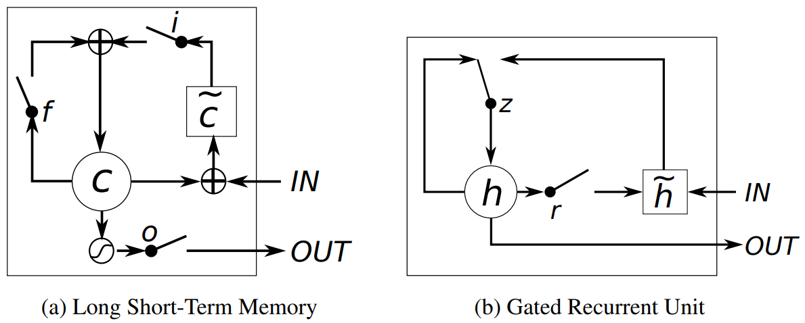

# Empirical evaluation of gated recurrent neural networks on sequence modeling
GRU: 2014.12.11 https://arxiv.org/abs/1412.3555

 
Figure 1: Illustration of (a) LSTM and (b) gated recurrent units. (a) i, f and o are the input, forget and output gates, respectively. c and c˜ denote the memory cell and the new memory cell content. (b) r and z are the reset and update gates, and h and h˜ are the activation and the candidate activation.