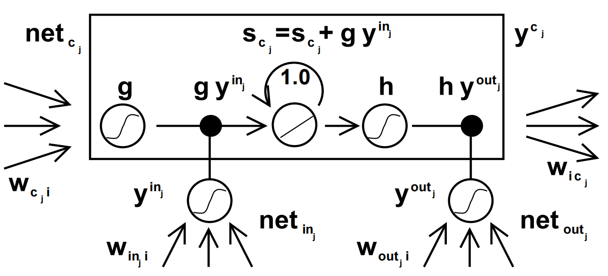
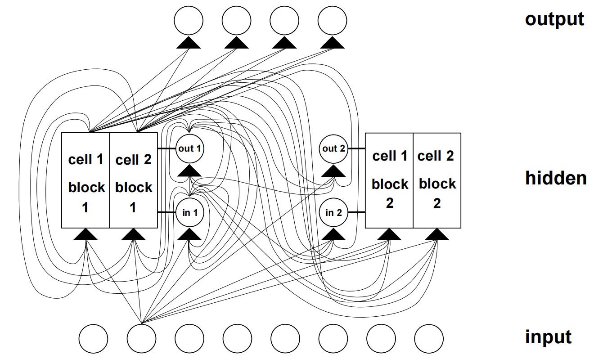
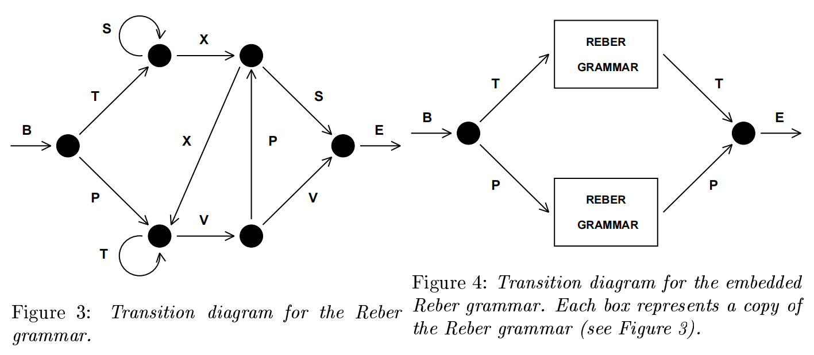

# LONG SHORT-TERM MEMORY
http://www.bioinf.jku.at/publications/older/2604.pdf

 
Figure 1: Architecture of memory cel l cj (the box) and its gate units inj , outj . The self-recurrent connection (with weight 1.0) indicates feedback with a delay of 1 time step. It builds the basis of the "constant error carrousel" CEC. The gate units open and close access to CEC. See text and appendix A.1 for details.

 
Figure 2: Example of a net with 8 input units, 4 output units, and 2 memory cel l blocks of size 2.
in1 marks the input gate, out1 marks the output gate, and cell1=block1 marks the rst memory
cel l of block 1. cell1=block1's architecture is identical to the one in Figure 1, with gate units
in1 and out1 (note that by rotating Figure 1 by 90 degrees anti-clockwise, it wil l match with the
corresponding parts of Figure 1). The example assumes dense connectivity: each gate unit and
each memory cel l see al l non-output units. For simplicity, however, outgoing weights of only
one type of unit are shown for each layer. With the ecient, truncated update rule, error 
ows
only through connections to output units, and through xed self-connections within cel l blocks (not
shown here | see Figure 1). Error 
ow is truncated once it \wants" to leave memory cel ls or
gate units. Therefore, no connection shown above serves to propagate error back to the unit from
which the connection originates (except for connections to output units), although the connections
themselves are modiable. That's why the truncated LSTM algorithm is so ecient, despite its
ability to bridge very long time lags. See text and appendix A.1 for details. Figure 2 actual ly shows
the architecture used for Experiment 6a | only the bias of the non-input units is omitted.

