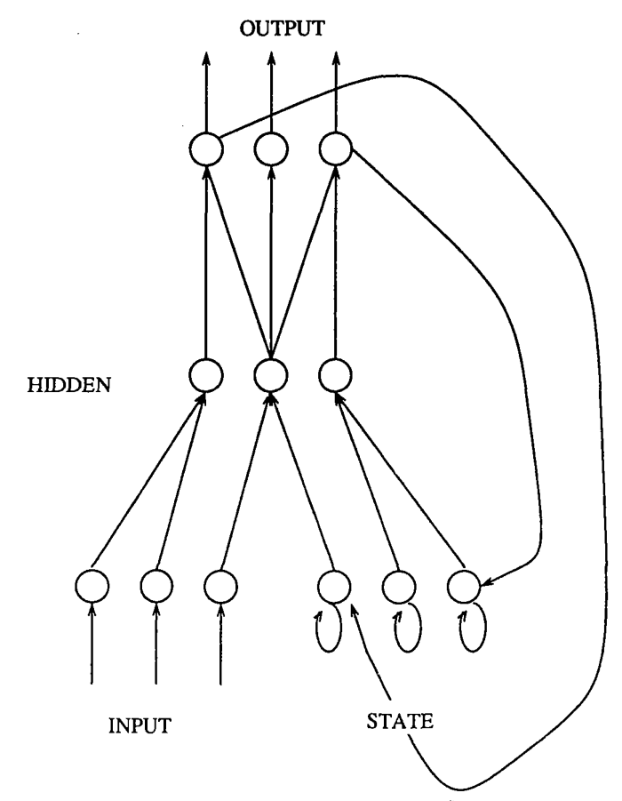
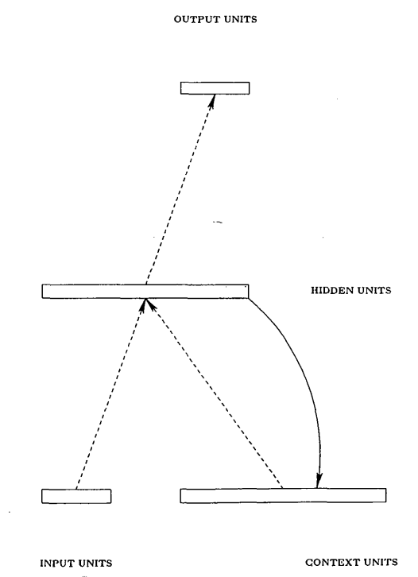

# Finding Structure in Time
http://psych.colorado.edu/~kimlab/Elman1990.pdf

 
Figure 1. Architecture used by Jordan (1986). Connections from output to state units are one-for-one, with a fixed weight of 1 .O Not all connections are shown.

 
Figure 2. A simple recurrent network in which activations are copied from hidden layer to context layer on a one-for-one basis,with fixed weight of 1 .O. Dotted lines represent trainable connections.