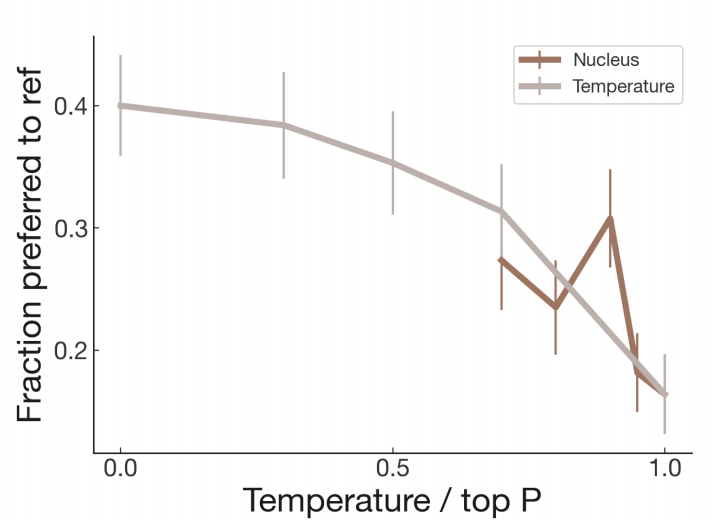

# Learning to summarize from human feedback 
学会从人类反馈中总结 2020.9.2 OpenAI https://arxiv.org/abs/2009.01325

## 阅读笔记
* https://github.com/openai/summarize-from-feedback/summarize_from_feedback/sample.py 

## Abstract
As language models become more powerful, training and evaluation are increasingly bottlenecked by the data and metrics used for a particular task. For example, summarization models are often trained to predict human reference summaries and evaluated using ROUGE, but both of these metrics are rough proxies for what we really care about—summary quality. In this work, we show that it is possible to significantly improve summary quality by training a model to optimize for human preferences. We collect a large, high-quality dataset of human comparisons between summaries, train a model to predict the human-preferred summary, and use that model as a reward function to fine-tune a summarization policy using reinforcement learning. We apply our method to a version of the TL;DR dataset of Reddit posts [63] and find that our models significantly outperform both human reference summaries and much larger models fine-tuned with supervised learning alone. Our models also transfer to CNN/DM news articles [22], producing summaries nearly as good as the human reference without any news-specific fine-tuning(2 Samples from all of our models can be viewed on our website, https://openaipublic.blob.core.windows.net/summarize-from-feedback/website/index.html ). We conduct extensive analyses to understand our human feedback dataset and fine-tuned models(3 We provide inference code for our 1.3B models and baselines, as well as a model card and our human feedback dataset with over 64k summary comparisons, https://github.com/openai/summarize-from-feedback ). We establish that our reward model generalizes to new datasets, and that optimizing our reward model results in better summaries than optimizing ROUGE according to humans. We hope the evidence from our paper motivates machine learning researchers to pay closer attention to how their training loss affects the model behavior they actually want.

随着语言模型变得越来越强大，训练和评估越来越受到用于特定任务的数据和度量的限制。例如，摘要模型通常被训练来预测人类参考摘要，并使用ROUGE进行评估，但这两个指标都是我们真正关心的摘要质量的粗略智能体。在这项工作中，我们表明，通过训练一个模型来优化人类偏好，可以显著提高摘要质量。我们收集了一个大的、高质量的摘要之间的人类比较数据集，训练一个模型来预测人类偏好的摘要，并将该模型用作奖励函数，使用强化学习来微调摘要策略。我们将我们的方法应用于TL;DR 的一个版本Reddit帖子的数据集[63]发现，我们的模型显著优于人类参考摘要和单独使用监督学习进行微调的更大模型。我们的模型也迁移到CNN/DM新闻文章[22]，在没有任何特定新闻微调的情况下，生成几乎与人类参考一样好的摘要(我们所有模型的2个样本都可以在我们的网站上查看,https://openaipublic.blob.core.windows.net/summarize-from-feedback/website/index.html )。我们进行了广泛的分析，以了解我们的人类反馈数据集和微调模型(3我们提供了1.3B模型和基线的推理代码，以及一张模型卡和我们的人类回馈数据集，其中包含超过64k的摘要比较，https://github.com/openai/summarize-from-feedback )。我们确定，我们的奖励模型可以推广到新的数据集，并且优化我们的奖励模型会比根据人类优化ROUGE产生更好的总结。我们希望我们论文中的证据能激励机器学习研究人员更加关注他们的训练损失如何影响他们真正想要的模型行为。

## 1 Introduction
Large-scale language model pretraining has become increasingly prevalent for achieving high performance on a variety of natural language processing (NLP) tasks. When applying these models to a specific task, they are usually fine-tuned using supervised learning, often to maximize the log probability of a set of human demonstrations.

为了在各种自然语言处理(NLP)任务中获得高性能，大规模语言模型预训练变得越来越普遍。当将这些模型应用于特定任务时，通常会使用监督学习对其进行微调，是为了最大限度地提高一组人类演示的对数概率。

While this strategy has led to markedly improved performance, there is still a misalignment between this fine-tuning objective—maximizing the likelihood of human-written text—and what we care about—generating high-quality outputs as determined by humans. This misalignment has several causes: the maximum likelihood objective has no distinction between important errors (e.g. making up facts [41]) and unimportant errors (e.g. selecting the precise word from a set of synonyms); models are incentivized to place probability mass on all human demonstrations, including those that are low-quality; and distributional shift during sampling can degrade performance [56, 52]. Quality can often be improved significantly by non-uniform sampling strategies such as beam search [51], but these can lead to repetition and other undesirable artifacts [69, 23]. Optimizing for quality may be a principled approach to overcoming these problems.

尽管这一策略显著提高了性能，但这一微调目标 —— 最大限度地提高人类书写文本的可能性 —— 与我们所关心的由人类决定的产生高质量输出的目标之间仍然存在偏差。这种错位有几个原因：最大似然目标对重要错误(例如编造事实[41])和不重要错误(如从一组同义词中选择精确的单词)没有区别;激励模型将概率质量放在所有人类演示上，包括低质量的演示;采样过程中的分布偏移会降低性能[56，52]。质量通常可以通过非均匀采样策略(如波束搜索[51])显著提高，但这些策略可能会导致重复和其他不希望的伪影[69，23]。优化质量可能是克服这些问题的一种原则性方法。

 
Figure 1: Fraction of the time humans prefer our models’ summaries over the human-generated reference summaries on the TL;DR dataset(4 Throughout the paper, error bars represent 1 standard error). Since quality judgments involve an arbitrary decision about how to trade off summary length vs. coverage within the 24-48 token limit, we also provide length-controlled graphs in Appendix F; length differences explain about a third of the gap between feedback and supervised learning at 6.7B.
图1：与人类生成的TL;DR参考摘要相比，人类更喜欢我们的模型摘要的次数比例数据集(4 在整个论文中，误差条代表1个标准误差)。由于质量判断涉及如何在24-48令牌限制内权衡摘要长度与覆盖范围的任意决定，我们还在附录F中提供了长度控制图;长度差异解释了6.7B时，反馈和监督学习之间大约三分之一的差距。

Our goal in this paper is to advance methods for training language models on objectives that more closely capture the behavior we care about. To make short-term progress towards this goal, we focus on abstractive English text summarization, as it has a long history in the NLP community [16, 8, 54, 59, 50], and is a subjective task where we believe it is difficult to quantify summary quality without human judgments. Indeed, existing automatic metrics for evaluating summary quality, such as ROUGE [39], have received criticism for poor correlation with human judgments [55, 45, 6, 33].

我们在这篇论文中的目标是提出训练语言模型的方法，以更紧密地捕捉我们关心的行为。为了在短期内实现这一目标，我们专注于抽象英语文本摘要，因为它在NLP社区有着悠久的历史[16，8，54，59，50]，并且是一项主观任务，我们认为如果没有人为判断，很难量化摘要质量。事实上，现有的评估摘要质量的自动指标，如ROUGE[39]，因与人类判断的相关性差而受到批评[55，45，6，33]。

We follow the works of [3, 73], who fine-tune language models from human feedback using reward learning [35]. We first collect a dataset of human preferences between pairs of summaries, then train a reward model (RM) via supervised learning to predict the human-preferred summary. Finally, we train a policy via reinforcement learning (RL) to maximize the score given by the RM; the policy generates a token of text at each ‘time step’, and is updated using the PPO algorithm [58] based on the RM ‘reward’ given to the entire generated summary. We can then gather more human data using samples from the resulting policy, and repeat the process. We follow the works of [48, 4] and use large pretrained GPT-3 models with as many as 6.7 billion parameters.

我们遵循了[3，73]的工作，他们使用奖励学习[35]从人类反馈中微调语言模型。我们首先收集成对摘要之间的人类偏好数据集，然后通过监督学习训练奖励模型(RM)来预测人类偏好的摘要。最后，我们通过强化学习(RL)来训练策略，以最大化RM给出的分数;该策略在每个“时间步长”生成一个文本令牌，并根据对整个生成的摘要的RM“奖励”使用PPO算法[58]进行更新。然后，我们可以使用由此产生的策略中的样本收集更多的人类数据，并重复该过程。我们遵循[48，4]的工作，使用具有多达67亿个参数的大型预训练GPT-3模型。

Our main contributions are four-fold.

我们的主要贡献有四个方面。

1. We show that training with human feedback significantly outperforms very strong baselines on English summarization. When applying our methods on a version of the Reddit TL;DR dataset [63], we train policies via human feedback that produce better summaries than much larger policies trained via supervised learning. Summaries from our human feedback models are preferred by our labelers to the original human demonstrations in the dataset (see Figure 1).

1.我们发现，在英语摘要方面，使用人类反馈的训练显著优于非常强的基线。在Reddit的一个版本上应用我们的方法时TL;DR数据集[63]，我们通过人工反馈来训练策略，这些策略比通过监督学习训练的更大的策略产生更好的摘要。与数据集中的原始人类演示相比，我们的标注人员更喜欢人类反馈模型的摘要(见图1)。

2. We show human feedback models generalize much better to new domains than supervised models. Our Reddit-trained human feedback models also generate high-quality summaries of news articles on the CNN/DailyMail (CNN/DM) dataset without any news-specific fine-tuning, almost matching the quality of the dataset’s reference summaries. We perform several checks to ensure that these human preferences reflect a real quality difference: we consistently monitor agreement rates amongst labelers and researchers, and find researcher-labeler agreement rates are nearly as high as researcher-researcher agreement rates (see Section C.2), and we verify models are not merely optimizing simple metrics like length or amount of copying (see Appendices F and G.7).

2.我们表明，人类反馈模型比监督模型更好地推广到新的领域。我们的Reddit训练的人类反馈模型还可以在CNN/DayMail(CNN/DM)数据集上生成高质量的新闻文章摘要，而无需任何特定于新闻的微调，几乎与数据集参考摘要的质量相匹配。我们进行了几项检查，以确保这些人类偏好反映出真正的质量差异：我们持续监测标注人员和研究人员之间的一致性，发现研究人员-标注人员的一致性几乎与研究人员-研究人员的一致性一样高(见第C.2节)，我们验证了模型不仅仅是在优化简单的指标，如复制的长度或数量(见附录F和G.7)。

3. We conduct extensive empirical analyses of our policy and reward model. We examine the impact of model and data size (Figure 6), study performance as we continue to optimize a given reward model (Section 4.3), and analyze reward model performance using synthetic and humanwritten perturbations of summaries (Section 4.3). We confirm that our reward model outperforms other metrics such as ROUGE at predicting human preferences, and that optimizing our reward model directly results in better summaries than optimizing ROUGE according to humans (Section 4.4).

3.我们对我们的策略和奖励模型进行了广泛的实证分析。我们研究了模型和数据大小的影响(图6)，在继续优化给定奖励模型时研究绩效(第4.3节)，并使用摘要的合成和人工扰动分析奖励模型绩效(第430节)。我们证实，我们的奖励模型在预测人类偏好方面优于其他指标，如ROUGE，并且优化我们的奖励模型比根据人类优化ROUGE直接产生更好的总结(第4.4节)。

4. We publicly release our human feedback dataset for further research. The dataset contains 64,832 summary comparisons on the TL;DR dataset, as well as our evaluation data on both TL;DR (comparisons and Likert scores) and CNN/DM (Likert scores).

4.我们公开发布了人类反馈数据集，以供进一步研究。该数据集包含64832个关于TL;DR的汇总比较数据集，以及我们对两个TL;DR的评估数据(比较和Likert评分)和CNN/DM(Likert得分)。

The methods we present in this paper are motivated in part by longer-term concerns about the misalignment of AI systems with what humans want them to do. When misaligned summarization models make up facts, their mistakes are fairly low-risk and easy to spot. However, as AI systems become more powerful and are given increasingly important tasks, the mistakes they make will likely become more subtle and safety-critical, making this an important area for further research.

我们在本文中提出的方法部分是出于对人工智能系统与人类希望它们做的事情不一致的长期担忧。当不一致的摘要模型构成事实时，它们的错误风险相当低，很容易被发现。然而，随着人工智能系统变得越来越强大，并被赋予越来越重要的任务，它们所犯的错误可能会变得更加微妙和关乎安全，这将成为进一步研究的重要领域。

## 2 Related Work
Most directly related to our work is previous work using human feedback to train summarization models with RL [3, 73]. Bohm et al. [3] learn a reward function from a dataset of human ratings of 2.5k CNN/DM summaries, and train a policy whose summaries are preferred to a policy optimizing ROUGE. Our work is most similar to [73], who also train Transformer models [62] to optimize human feedback across a range of tasks, including summarization on the Reddit TL;DR and CNN/DM datasets. Unlike us, they train in an online manner and find the model highly extractive. They note that their labelers prefer extractive summaries and have low agreement rates with researchers. Compared to [73], we use significantly larger models, move to the batch setting for collecting human feedback, ensure high labeler-researcher agreement, and make some algorithmic modifications, such as separating the policy and value networks.

与我们的工作最直接相关的是之前使用人类反馈来训练RL的摘要模型的工作[3，73]。Bohm et al.[3]从2.5k CNN/DM摘要的人工评级数据集中学习奖励函数，并训练其摘要优先于优化ROUGE的策略的策略。我们的工作与[73]最相似，后者还训练Transformer模型[62]，以优化一系列任务中的人类反馈，包括Reddit和CNN/DM上 TL;DR的摘要数据集。与我们不同的是，他们以在线方式进行训练，并发现这种模型具有高度的提取性。他们注意到，他们的标注人员更喜欢摘录摘要，与研究人员的一致率较低。与[73]相比，我们使用了更大的模型，转向批量设置来收集人类反馈，确保高标签研究者的一致性，并进行了一些算法修改，例如策略和价值网络的分离。

Human feedback has also been used as a reward to train models in other domains such as dialogue [25, 68, 21], translation [32, 1], semantic parsing [34], story generation [72], review generation [7], and evidence extraction [46]. Our reward modeling approach was developed in prior work on learning to rank [40], which has been applied to ranking search results using either explicit feedback [2, 18] or implicit feedback in the form of click-through data [29, 30]. In a related line of research, human feedback has been used to train agents in simulated environments [10, 24]. There is also a rich literature on using RL to optimize automatic metrics for NLP tasks, such as ROUGE for summarization [50, 65, 45, 15, 19], BLEU for translation [50, 66, 1, 43], and other domains [61, 27, 26]. Finally, there has been extensive research on modifying architectures [22, 59] and pre-training procedures [70, 36, 49, 60, 53, 14] for improving summarization performance.

人类反馈也被用作训练其他领域模型的奖励，如对话[25，68，21]、翻译[32，1]、语义解析[34]、故事生成[72]、评论生成[7]和证据提取[46]。我们的奖励建模方法是在先前关于学习排名的工作中开发的[40]，该方法已应用于使用显式反馈[2，18]或点击数据形式的隐式反馈[29，30]对搜索结果进行排名。在一项相关的研究中，人类反馈已被用于在模拟环境中训练智能体[10，24]。关于使用RL优化NLP任务的自动度量，也有丰富的文献，如用于摘要的ROUGE[50，65，45，15，19]，用于翻译的BLEU[50，66，1，43]和其他领域[61，27，26]。最后，人们对修改架构[22，59]和预训练程序[70，36，49，60，53，14]以提高摘要性能进行了广泛的研究。

## 3 Method and experiment details 方法和实验细节
### 3.1 High-level methodology 高层次方法
Our approach is similar to the one outlined in [73], adapted to the batch setting. We start with an initial policy that is fine-tuned via supervised learning on the desired dataset (in our case, the Reddit TL;DR summarization dataset). The process (illustrated in Figure 2) then consists of three steps that can be repeated iteratively.

我们的方法类似于[73]中概述的方法，适用于批量设置。我们从一个初始策略开始，该策略通过在所需数据集(在我们的案例中，是Reddit TL;DR摘要数据集)上的监督学习进行微调。该过程(如图2所示)由三个步骤组成，这些步骤可以反复进行。

Step 1: Collect samples from existing policies and send comparisons to humans. For each Reddit post, we sample summaries from several sources including the current policy, initial policy, original reference summaries and various baselines. We send a batch of pairs of summaries to our human evaluators, who are tasked with selecting the best summary of a given Reddit post.

步骤1：从现有策略中收集样本，并将比较结果发送给人类。对于每一篇Reddit帖子，我们都会从几个来源抽取摘要，包括当前策略、初始策略、原始参考摘要和各种基线。我们将一批成对的摘要发送给我们的人工评估人员，他们的任务是选择给定Reddit帖子的最佳摘要。

Step 2: Learn a reward model from human comparisons. Given a post and a candidate summary, we train a reward model to predict the log odds that this summary is the better one, as judged by our labelers.

步骤2：从人类比较中学习奖励模型。给定一个帖子和一个候选人摘要，我们训练一个奖励模型来预测这个摘要是更好的摘要的对数概率，这是由我们的标注人员判断的。

Step 3: Optimize a policy against the reward model. We treat the logit output of the reward model as a reward that we optimize using reinforcement learning, specifically with the PPO algorithm [58].

步骤3：针对奖励模型优化策略。我们将奖励模型的logit输出视为我们使用强化学习优化的奖励，特别是使用PPO算法[58]。

 
Figure 2: Diagram of our human feedback, reward model training, and policy training procedure.
图2：我们的人类反馈、奖励模型训练和策略训练程序示意图。

We provide a more thorough description of our procedure, including details of the reward model and policy training and our quality control process, in the following sections. In practice, rather than precisely iterating this sequence of three steps, we updated our data collection and training procedures over the course of the project while accumulating labels (see Appendix C.6 for details).

我们在以下部分对我们的程序进行了更全面的描述，包括奖励模型和策略训练以及我们的质量控制流程的细节。在实践中，我们没有精确地重复这三个步骤的序列，而是在项目过程中更新了数据收集和训练程序，同时积累了标签(详见附录C.6)。

### 3.2 Datasets and task 数据集和任务
Datasets. We use the TL;DR summarization dataset [63], which contains ~3 million posts from reddit.com across a variety of topics (subreddits), as well summaries of the posts written by the original poster (TL;DRs). We additionally filter this dataset (see Appendix A) to ensure quality, including using a whitelist of subreddits that are understandable to the general population. Crucially, we also filter to include only posts where the human-written summaries contain between 24 and 48 tokens, to minimize the potential effect of summary length on quality (see Section 4.1 and Appendix F). Our final filtered dataset contains 123,169 posts, and we hold out ~5% as a validation set. For the remainder of this paper, we refer to this dataset simply as TL;DR.

数据集。我们使用TL;DR摘要数据集[63]，其中包含来自reddit.com约300万条不同主题的帖子(subreddits)，以及原始发帖人撰写的帖子摘要(TL;DR)。我们还过滤了这个数据集(见附录A)以确保质量，包括使用普通人群可以理解的子版块白名单。至关重要的是，我们还过滤了只包含人工撰写的24~48个令牌摘要的帖子，以最大限度地减少摘要长度对质量的潜在影响(见第4.1节和附录F)。我们最终过滤的数据集包含123169篇帖子，我们保留了约5%作为验证集。在本文的其余部分中，我们将此数据集简称为TL;DR。

We chose the TL;DR dataset over the more commonly used CNN/DM dataset primarily because very strong performance can be attained on CNN/DM with simple extractive baselines. We find in Section 4.2 that our labelers prefer lead-3 over the CNN/DM reference summaries(5 We manually check this result in Appendix E and find we generally agree with labeler ratings), and that the supervised T5 model [49] with low-temperature sampling already surpasses the reference summary quality, while copying extensively from the article. On the other hand, simple extractive baselines perform poorly on TL;DR in our human evaluations (see Appendix G.2). Instead of training on CNN/DM, we study the transfer performance of our human feedback models to CNN/DM after being trained to summarize Reddit posts.

我们选择的TL;DR数据集优于更常用的CNN/DM数据集，主要是因为使用简单的提取基线可以在CNN/DM上获得非常强的性能。我们在第4.2节中发现，我们的标注人员更喜欢lead-3，而不是CNN/DM参考摘要(5我们在附录E中手动检查了这一结果，发现我们通常同意标注人员的评级)，并且具有低温采样的监督T5模型[49]已经超过了参考摘要的质量，同时从文章中大量复制。另一方面，简单的提取基线在TL;DR,我们的人类评估中的表现不佳(见附录G.2)。我们没有在CNN/DM上进行训练，而是在接受训练总结Reddit帖子后，研究人类反馈模型向CNN/DM的迁移性能。

Task. We define our ground-truth task as producing a model that generates summaries fewer than 48 tokens long that are as good as possible, according to our judgments. We judge summary quality by how faithfully the summary conveys the original post to a reader who can only read the summary and not the post (see Appendix C.5 for further discussion of criteria). Since we have limited capacity to do comparisons, we hire labelers to do the comparisons for us. We rely on detailed procedures to ensure high agreement between labelers and us on the task, which we describe in the next section.

任务。根据我们的判断，我们将基本事实任务定义为生成一个模型，该模型生成的摘要长度小于48个令牌，并且尽可能好。我们通过摘要向只能阅读摘要而不能阅读帖子的读者传达原始帖子的忠实程度来判断摘要的质量(关于标准的进一步讨论，请参见附录C.5)。由于我们进行比较的能力有限，我们聘请标注人员为我们进行比较。我们依靠详细的程序来确保标注人员和我们在任务上达成高度一致，我们将在下一节中进行描述。

 
Table 1: Example of post and samples on the TL;DR dataset, chosen to be particularly short. For random samples (along with posts), see Appendix H and our website.
表1：TL;DR数据集上的帖子和样本样本，选择特别短的数据集。关于随机样本(以及帖子)，请参阅附录H和我们的网站。

### 3.3 Collecting human feedback  收集人的反馈
Previous work on fine-tuning language models from human feedback [73] reported “a mismatch between the notion of quality we wanted our model to learn, and what the humans labelers actually evaluated”, leading to model-generated summaries that were high-quality according to the labelers, but fairly low-quality according to the researchers.

先前关于根据人类反馈微调语言模型的工作[73]报告称，“我们希望模型学习的质量概念与人类标注人员实际评估的内容不匹配”，导致模型生成的摘要根据标注人员的说法是高质量的，但根据研究人员的说法是相当低质量的。

Compared to [73], we implement two changes to improve human data quality. First, we transition entirely to the offline setting, where we alternate between sending large batches of comparison data(6Our decision to collect comparisons rather than Likert scores is supported by recent work, e.g. [37]) to our human labelers and re-training our models on the cumulative collected data. Second, we maintain a hands-on relationship with labelers(7 We recruited labelers from a freelancing platform, Upwork, and two labeling services, Scale and Lionbridge): we on-board them with detailed instructions, answer their questions in a shared chat room, and provide regular feedback on their performance. We train all labelers to ensure high agreement with our judgments, and continuously monitor labeler-researcher agreement over the course of the project. See Appendix C.1 and C.5 for details.

与[73]相比，我们实施了两项更改以提高人类数据质量。首先，我们完全过渡到离线设置，在离线设置中，我们交替向我们的人类标签人员发送大批量的比较数据(6 我们收集比较而不是Likert分数的决定得到了最近工作的支持，例如[37])，并根据累积收集的数据重新训练我们的模型。其次，我们与标注人员保持着亲力亲为的关系(7我们从自由职业平台Upwork和两个贴标服务Scale和Lionbridge招募标注人员)：我们为他们提供详细的指导，在共享聊天室回答他们的问题，并定期对他们的表现提供反馈。我们对所有标注人员进行训练，以确保与我们的判断高度一致，并在项目过程中持续监控标注人员与研究人员的一致性。详见附录C.1和C.5。

As a result of our procedure, we obtained high labeler-researcher agreement: on a subset of comparison tasks, labelers agree with researchers 77% ± 2% of the time, while researchers agree with each other 73% ± 4% of the time. We provide more analysis of our human data quality in Appendix C.2.

由于我们的程序，我们获得了标注人员-研究人员之间的高一致性：在一组比较任务中，标注人员77%±2%的时间与研究人员一致，而研究人员73%±4%的时间彼此一致。我们在附录C.2中提供了更多关于人类数据质量的分析。

### 3.4 Models 模型
All of our models are Transformer decoders [62] in the style of GPT-3 [47, 4]. We conduct our human feedback experiments on models with 1.3 billion (1.3B) and 6.7 billion (6.7B) parameters.

我们所有的模型都是GPT-3[47，4]风格的Transformer解码器[62]。我们在具有13亿(1.3B)和67亿(6.7B)参数的模型上进行了人类反馈实验。

Pretrained models. Similarly to [12, 47], we start with models pretrained to autoregressively predict the next token in a large text corpus. As in [48, 4], we use these models as ‘zero-shot’ baselines by padding the context with examples of high-quality summaries from the dataset. We provide details on pretraining in Appendix B, and on our zero-shot procedure in Appendix B.2.

预训练模型。类似于[12，47]，我们从预训练的模型开始，以自回归预测大型文本语料库中的下一个令牌。如[48，4]所示，我们使用这些模型作为“零样本”基线，方法是用数据集的高质量摘要样本填充上下文。我们在附录B中提供了关于预训练的详情，在附录B.2中提供了我们的零样本程序。

Supervised baselines. We next fine-tune these models via supervised learning to predict summaries from our filtered TL;DR dataset (see Appendix B for details). We use these supervised models to sample initial summaries for collecting comparisons, to initialize our policy and reward models, and as baselines for evaluation. In our final human evaluations, we use T=0 to sample from all models, as we found it performed better than higher temperatures or nucleus sampling (see Appendix B.1).

监督基线。接下来，我们通过监督学习对这些模型进行微调，以从我们过滤的TL;DR数据集中预测摘要(详见附录B)。我们使用这些监督模型对初始摘要进行采样，以收集比较，初始化我们的策略和奖励模型，并作为评估的基线。在我们的最终人类评估中，我们使用T=0从所有模型中进行采样，因为我们发现它比更高的温度或单元核采样表现更好(见附录B.1)。

To validate that our supervised models are indeed strong baselines for comparison, we run our supervised fine-tuning procedure with our 6.7B model on the CNN/DM dataset, and find that we achieve slightly better ROUGE scores than SOTA models [71] from mid-2019 (see Appendix G.4).

为了验证我们的监督模型确实是比较的有力基线，我们在CNN/DM数据集上使用6.7B模型运行了监督微调程序，发现从2019年年中开始，我们的ROUGE得分略高于SOTA模型[71](见附录G.4)。

Reward models. To train our reward models, we start from a supervised baseline, as described above, then add a randomly initialized linear head that outputs a scalar value. We train this model to predict which summary y ∈ {$y_0, y_1$} is better as judged by a human, given a post x. If the summary preferred by the human is $y_i$ , we can write the RM loss as:

奖励模型。为了训练我们的奖励模型，我们从监督基线开始，如上所述，然后添加一个随机初始化的线性头，输出标量值。我们训练这个模型来预测在给定帖子x的情况下，由人类判断哪个摘要y∈{$y_0, y_1$}更好。如果人类偏好的摘要是$y_i$，我们可以将RM损失写成：

$loss(r_θ) = −E_{(x,y_0,y_1,i)}∼D[log(σ(r_θ(x, y_i) − r_θ(x, y_{1−i})))] $

where $r_θ(x, y)$ is the scalar output of the reward model for post x and summary y with parameters θ, and D is the dataset of human judgments. At the end of training, we normalize the reward model outputs such that the reference summaries from our dataset achieve a mean score of 0.

其中$r_θ(x，y)$是带有参数θ的帖子x和摘要y的奖励模型的标量输出，D是人类判断的数据集。在训练结束时，我们对奖励模型输出进行归一化，使得来自我们数据集的参考摘要的平均得分为0。

Human feedback policies. We want to use the reward model trained above to train a policy that generates higher-quality outputs as judged by humans. We primarily do this using reinforcement learning, by treating the output of the reward model as a reward for the entire summary that we maximize with the PPO algorithm [58], where each time step is a BPE token(8Note that the reward model only gives rewards for entire summaries, and not at intermediate time steps. In RL terminology, each episode terminates when the policy outputs the EOS token, and the discount factor γ = 1). We initialize our policy to be the model fine-tuned on Reddit TL;DR. Importantly, we include a term in the reward that penalizes the KL divergence between the learned RL policy $π^{RL}_φ$ with parameters φ and this original supervised model $π^{SFT}$, as previously done in [25]. The full reward R can be written as:

人类反馈策略。我们希望使用上面训练的奖励模型来训练一种策略，该策略可以根据人类的判断产生更高质量的输出。我们主要使用强化学习来实现这一点，通过将奖励模型的输出视为对整个总结的奖励，我们使用PPO算法[58]将其最大化，其中，每个时间步长都是一个BPE令牌(8注意，奖励模型只对整个摘要进行奖励，而不是在中间时间步长。在RL术语中，当策略输出EOS令牌时，每个事件都会终止，折扣因子γ=1)。我们将我们的策略初始化为在Reddit TL;DR上微调的模型。重要的是，我们在奖励中包括了一个term，该term惩罚学习的RL策略$π^{RL}_φ$和参数φ与该原始监督模型$π^{SFT}$之间的KL偏差，如之前在[25]中所做的那样。全额奖励R可以写成：

$R(x, y) = r_θ(x, y) − β log[π^{RL}_φ (y|x)/π^{SFT}(y|x)]$

This KL term serves two purposes. First, it acts as an entropy bonus, encouraging the policy to explore and deterring it from collapsing to a single mode. Second, it ensures the policy doesn’t learn to produce outputs that are too different from those that the reward model has seen during training.

这个KL term有两个目的。首先，它起到了熵红利的作用，鼓励策略探索并阻止其崩溃为单一模型。其次，它确保了策略不会学会产生与奖励模型在训练期间看到的产出太大不同的产出。

For the PPO value function, we use a Transformer with completely separate parameters from the policy. This prevents updates to the value function from partially destroying the pretrained policy early in training (see ablation in Appendix G.1). We initialize the value function to the parameters of the reward model. In our experiments, the reward model, policy, and value function are the same size.

对于PPO价值函数，我们使用参数与策略完全分离的Transformer。这防止了价值函数的更新在训练早期部分破坏预先训练的策略(见附录G.1中的消融)。我们将价值函数初始化为奖励模型的参数。在我们的实验中，奖励模型、策略和价值函数的大小相同。

## 4 Results
### 4.1 Summarizing Reddit posts from human feedback 根据人类反馈总结Reddit帖子
Policies trained with human feedback are preferred to much larger supervised policies. Our main results evaluating our human feedback policies on TL;DR are shown in Figure 1. We measure policy quality as the percentage of summaries generated by that policy that humans prefer over the reference summaries in the dataset. Our policies trained with human feedback significantly outperform our supervised baselines on this metric, with our 1.3B human feedback model significantly outperforming a supervised model 10× its size (61% versus 43% raw preference score against reference summaries). Our 6.7B model in turn significantly outperforms our 1.3B model, suggesting that training with human feedback also benefits from scale. Additionally, both of our human feedback models are judged by humans to be superior to the human demonstrations used in the dataset.

经过人工反馈训练的策略比更大的监督策略更受欢迎。我们评估TL;DR的人类反馈策略的主要结果如图1所示。我们将策略质量衡量为人类更喜欢该策略生成的摘要的百分比，而不是数据集中的参考摘要。我们用人类反馈训练的策略在这一指标上显著优于我们的监督基线，我们的1.3B人类反馈模型显著优于10倍大小的监督模型(61%对43%的原始偏好分数与参考摘要相比)。反过来，我们的6.7B模型显著优于我们的1.3B模型，这表明人类反馈训练也受益于规模。此外，我们的两个人类反馈模型都被人类判断为优于数据集中使用的人类演示。

Controlling for summary length. When judging summary quality, summary length is a confounding factor. The target length of a summary is implicitly part of the summarization task; depending on the desired trade-off between conciseness and coverage, a shorter or longer summary might be better. Since our models learned to generate longer summaries, length could account for much of our quality improvements. We find that after controlling for length (Appendix F), the preference of our human feedback models vs. reference summaries drops by ~5%; even so, our 6.7B model summaries are still preferred to the reference summaries ~65% of the time.

控制摘要长度。在判断摘要质量时，摘要长度是一个混淆因素。摘要的目标长度隐含地是摘要任务的一部分;根据简洁性和覆盖率之间所需的权衡，更短或更长的摘要可能会更好。由于我们的模型学会了生成更长的摘要，因此长度可以在很大程度上解释我们的质量改进。我们发现，在控制了长度(附录F)后，我们的人类反馈模型相对于参考摘要的偏好下降了约5%;即便如此，我们的6.7B模型摘要在65%的时间内仍然优于参考摘要。

How do our policies improve over the baselines? To better understand the quality of our models’ summaries compared to the reference summaries and those of our supervised baselines, we conduct an additional analysis where human labelers assess summary quality across four dimensions (or “axes”) using a 7-point Likert scale [38]. Labelers rated summaries for coverage (how much important information from the original post is covered), accuracy (to what degree the statements in the summary are stated in the post), coherence (how easy the summary is to read on its own), and overall quality.

我们的策略如何在基线之上改进？与参考摘要和监督基线相比，为了更好地了解我们模型摘要的质量，我们进行了一项额外的分析，其中人类标注人员使用7点Likert量表评估四个维度(或“轴”)的摘要质量[38]。标注人员对摘要的覆盖率(原始帖子中的重要信息覆盖了多少)、准确性(摘要中的陈述在帖子中陈述的程度)、连贯性(摘要本身阅读的容易程度)和整体质量进行了评分。

The results (Figure 3) indicate that our human feedback models outperform the supervised baselines across every dimension of quality, but particularly coverage. Although our human labelers had a high bar for giving perfect overall scores, summaries from our 6.7B PPO model achieve a 7/7 overall score 45% of the time (compared to 20% and 23% for the 6.7B supervised baseline and reference summaries, respectively).

结果(图3)表明，我们的人类反馈模型在质量的各个方面都优于监督基线，尤其是覆盖范围。尽管我们的人类标注人员在给出完美的总分方面有很高的标准，但我们6.7B PPO模型的总结在45%的时间内达到了7/7的总分(相比之下，6.7B监督基线和参考总结分别为20%和23%)。

 
Figure 3: Evaluations of four axes of summary quality on the TL;DR dataset.
图3：对TL;DR数据集总结质量的四个轴的评估。

### 4.2 Transfer to summarizing news articles 迁移为新闻文章总结
Our human feedback models can also generate excellent summaries of CNN/DM news articles without any further training (Figure 4). Our human feedback models signifi- cantly outperform models trained via supervised learning on TL;DR and models trained only on pretraining corpora. In fact, our 6.7B human feedback model performs almost as well as a 6.7B model that was fine-tuned on the CNN/DM reference summaries, despite generating much shorter summaries.

我们的人类反馈模型也可以在没有任何进一步训练的情况下生成CNN/DM新闻文章的优秀摘要(图4)。我们的人类反馈模型显著优于通过TL;DR监督学习训练的模型和仅在预训练语料库上训练的模型。事实上，尽管生成的摘要要短得多，但我们的6.7B人类反馈模型的性能几乎与对CNN/DM参考摘要进行微调的6.7B模型一样好。

 
Figure 4: Transfer results on CNN/DM. (a) Overall summary quality on CNN/DM as a function of model size. Full results across axes shown in Appendix G.2. (b) Overall scores vs. length for the 6.7B TL;DR supervised baseline, the 6.7B TL;DR human feedback model, and T5 fine-tuned on CNN/DM summaries. At similar summary lengths, our 6.7B TL;DR human feedback model nearly matches T5 despite never being trained to summarize news articles.
图4：CNN/DM上的迁移结果。(a) 作为模型大小函数的CNN/DM的总体摘要质量。各轴的完整结果如附录G.2所示。(b) 6.7B TL的总得分与长度;DR监督基线，6.7B TL;DR人类反馈模型，以及对CNN/DM摘要进行微调的T5。在类似的汇总长度下，我们的6.7B TL;DR人类反馈模型几乎与T5相匹配，尽管从未接受过总结新闻文章的训练。

Since our human feedback models transferred to CNN/DM have little overlap in summary length distribution with models trained on CNN/DM, with about half as many tokens on average, they are difficult to compare directly. Thus our evaluations in Figure 4 use a 7-point Likert scale on four quality dimensions, as in Section 4.1 (see Appendix C.5 for labeler instructions). In Figure 4b we show the average overall score at different summary lengths, which suggests our human feedback models would perform even better if they generated longer summaries. Qualitatively, CNN/DM summaries from our human feedback models are consistently fluent and reasonable representations of the article; we show examples on our website and in Appendix H.

由于我们迁移到CNN/DM的人类反馈模型在摘要长度分布上与在CNN/DM上训练的模型几乎没有重叠，平均令牌数量约为其一半，因此很难直接比较。因此，我们在图4中的评估在四个质量维度上使用了7点Likert量表，如第4.1节所示(标注人员说明见附录C.5)。在图4b中，我们显示了不同摘要长度下的平均总分，这表明如果我们的人类反馈模型生成更长的摘要，它们的表现会更好。从质量上讲，来自我们人类反馈模型的CNN/DM摘要是对文章的一贯流畅和合理的表述;我们在我们的网站和附录H中展示了样本。

### 4.3 Understanding the reward model 理解奖励模型
What happens as we optimize the reward model? Optimizing against our reward model is supposed to make our policy align with human preferences. But the reward model isn’t a perfect representation of our labeler preferences, as it has limited capacity and only sees a small amount of comparison data from a relatively narrow distribution of summaries. While we can hope our reward model generalizes to summaries unseen during training, it’s unclear how much one can optimize against the reward model until it starts giving useless evaluations.

当我们优化奖励模型时会发生什么？根据我们的奖励模型进行优化应该使我们的策略与人类偏好保持一致。但奖励模型并不能完美地代表我们的标注人员偏好，因为它的容量有限，只能从相对狭窄的摘要分布中看到少量的比较数据。虽然我们可以希望奖励模型能推广到训练中看不到的总结，但在奖励模型开始给出无用的评估之前，还不清楚相对于奖励模型可以优化多少。

To answer this question, we created a range of policies optimized against an earlier version of our reward model, with varying degrees of optimization strength, and asked labelers to compare samples from them to the reference summaries. Figure 5 shows the results for PPO at a range of KL penalty coefficients (β). Under light optimization, the models improve (according to labelers). However, as we optimize further, true preferences fall off compared to the prediction, and eventually the reward model becomes anti-correlated with human preferences. Though this is clearly undesirable, we note that this over-optimization also happens with ROUGE (see [45] and Appendix G.3). Similar behavior has been observed in learned reward functions in the robotics domain [5].

为了回答这个问题，我们创建了一系列针对早期版本的奖励模型进行优化的策略，具有不同程度的优化强度，并要求标注人员将其中的样本与参考摘要进行比较。图5显示了在KL惩罚系数(β)范围内的PPO结果。在轻度优化的情况下，模型得到了改进(根据标注人员的说法)。然而，当进一步优化时，与预测相比，真实偏好会下降，最终奖励模型会与人类偏好反相关。尽管这显然是不可取的，但我们注意到，这种过度优化也会发生在ROUGE中(见[45]和附录G.3)。在机器人领域的奖励函数学习中也观察到了类似的行为[5]。

 
Figure 5: Preference scores versus degree of reward model optimization. Optimizing against the reward model initially improves summaries, but eventually overfits, giving worse summaries. This figure uses an earlier version of our reward model (see rm3 in Appendix C.6). See Appendix H.2 for samples from the KL 250 model.
图5：偏好得分与奖励模型优化程度的关系。针对奖励模型进行优化，最初可以改进摘要，但最终会过拟合，从而给出更差的摘要。该图使用了我们奖励模型的早期版本(见附录C.6中的rm3)。KL 250模型的样本见附录H.2。

How does reward modeling scale with increasing model and data size? We conduct an ablation to determine how data quantity and model size affect reward modeling performance. We train 7 reward models ranging from 160M to 13B parameters, on 8k to 64k human comparisons from our dataset. We find that doubling the training data amount leads to a ~1.1% increase in the reward model validation set accuracy, whereas doubling the model size leads to a ~1.8% increase (Figure 6).

随着模型和数据大小的增加，奖励模型的规模如何扩大？我们进行消融以确定数据量和模型大小如何影响奖励建模性能。我们训练了7个奖励模型，参数范围从160M到13B，从我们的数据集进行8k到64k的人类比较。我们发现，训练数据量增加一倍会使奖励模型验证集的准确性提高约1.1%，而模型大小增加一倍则会提高约1.8%(图6)。

 
Figure 6: Reward model performance versus data size and model size. Doubling amount of training data leads to a ~1.1% increase in reward model validation accuracy, whereas doubling the model size leads to a ~1.8% increase. The 6.7B model trained on all data begins approaching the accuracy of a single human.
图6：奖励模型性能与数据大小和模型大小的关系。将训练数据量增加一倍会使奖励模型验证的准确性提高约1.1%，而将模型大小增加一倍则会使其提高约1.8%。在所有数据上训练的6.7B模型开始接近单个人类的精度。

What has the reward model learned? We probe our reward model by evaluating it on several validation sets. We show the full results in Appendix G.6, and highlight them here. We find that our reward models generalize to evaluating CNN/DM summaries (Appendix G.7), agreeing with labeler preferences 62.4% and 66.5% of the time (for our 1.3B and 6.7B models, respectively). Our 6.7B reward model nearly matches the inter-labeler agreement value of 66.9%.

奖励模型学到了什么？我们通过对几个验证集进行评估来探索我们的奖励模型。我们在附录G.6中显示了完整的结果，并在此处突出显示。我们发现，奖励模型适用于评估CNN/DM摘要(附录G.7)，在62.4%和66.5%的时间内(分别针对我们的1.3B和6.7B模型)符合标签人员偏好。我们的6.7B奖励模型几乎与66.9%的标注人员间协议值相匹配。

We also find that our reward models are sensitive to small but semantically important details in the summary. We construct an additional validation set by having labelers make minimal edits to summaries to improve them. Our RMs prefer the edited summaries almost as often (79.4% for 1.3B and 82.8% for 6.7B) as a separate set of human evaluators (84.1%). Further, when comparing the reference summaries to perturbed summaries where the participants’ roles are reversed, our models reliably select the original summary (92.9% of the time for 1.3B, 97.2% for 6.7B). However, our RMs are biased towards longer summaries: our 6.7B RM prefers improving edits that make the summary shorter only 62.6% of the time (vs. 76.4% for humans).

我们还发现，我们的奖励模型对摘要中微小但语义上重要的细节很敏感。我们构建了一个额外的验证集，通过让标注人员对摘要进行最少的编辑来改进它们。我们的RM几乎和单独的一组人类评估者(84.1%)一样喜欢编辑后的摘要(对于1.3B为79.4%，对于6.7B为82.8%)。此外，当将参考摘要与参与者角色颠倒的扰动摘要进行比较时，我们的模型可靠地选择了原始摘要(对于1.3 B为92.9%，对于6.7B为97.2%)。然而，我们的RM偏向于较长的摘要：我们的6.7B RM更喜欢改进编辑，使摘要仅在62.6%的时间内更短(而人类为76.4%)。

### 4.4 Analyzing automatic metrics for summarization  分析用于摘要的自动度量
Evaluation. We study how well various automatic metrics act as predictors for human preferences, and compare them to our RMs. Specifically, we examine ROUGE, summary length, amount of copying from the post(9 We measure copying by computing the longest common subsequence of bigrams with the original Reddit post or news article, and dividing by the number of bigrams in the summary. ), and log probability under our baseline supervised models. We present a full matrix of agreement rates between these metrics in Appendix G.7.

评估。我们研究了各种自动指标作为人类偏好预测指标的效果，并将其与我们的RM进行了比较。具体来说，我们检查了ROUGE、摘要长度、帖子的复制量(9 我们通过计算原始Reddit帖子或新闻文章中最长的公共bigram子序列，并除以摘要中的bigram数量来衡量复制)，以及基线监督模型下的对数概率。我们在附录G.7中给出了这些指标之间一致率的完整矩阵。

We find that our learned reward models consistently outperform other metrics, even on the CNN/DM dataset on which it was never trained. We also find that ROUGE fails to track sample quality as our models improve. While ROUGE has ~57% agreement with labelers when comparing samples from our supervised baseline models, this drops to ~50% for samples from our human feedback model.

我们发现，即使在从未训练过的CNN/DM数据集上，我们学习的奖励模型也始终优于其他指标。我们还发现，随着模型的改进，ROUGE无法跟踪样本质量。虽然ROUGE在比较我们监督的基线模型的样本时与标注人员的一致性约为57%，但对于我们人类反馈模型的样本，这一比例降至约50%。

Similarly, log probability agreement with humans drops to ≤50% on comparisons between samples from our human feedback models, while our RMs still perform above chance (62%). Scaling up the size of the supervised model does not reliably improve log probability’s agreement with labelers.

类似地，在我们的人类反馈模型的样本之间的比较中，与人类的对数概率一致性下降到≤50%，而我们的RM仍然表现出高于概率(62%)。扩大监督模型的大小并不能可靠地提高对数概率与标注人员的一致性。

Optimization. In Figure 7, we show that optimizing ROUGE using a simple optimization scheme doesn’t consistently increase quality, as has been noted in [45]. Optimization against ROUGE peaks both sooner and at a substantially lower quality rate than optimization against our reward models.

优化。在图7中，我们表明，使用简单的优化方案优化ROUGE并不能持续提高质量，正如[45]中所指出的那样。与针对我们的奖励模型的优化相比，针对ROUGE的优化达到峰值的时间更快，质量率也更低。

 
Figure 7: Summary quality as a function of metric optimized and amount of optimization, using best-of-N rejection sampling. We evaluate ROUGE, our main reward models, and an earlier iteration of the 1.3B model trained on approximately 75% as much data (see Table 11 for details). ROUGE appears to peak both sooner and at a substantially lower preference rate than all reward models. Details in Appendix G.3.
图7：使用最佳N拒绝采样，作为优化度量和优化量的函数的汇总质量。我们评估了ROUGE，我们的主要奖励模型，以及在大约75%的数据上训练的1.3B模型的早期迭代(详见表11)。ROUGE似乎比所有奖励模型更快达到峰值，而且偏好率明显更低。详见附录G.3。

## 5 Discussion 讨论
Limitations. One limitation of our work is the time and cost required to produce our final models. Notably, fine-tuning our 6.7B model with RL required approximately 320 GPU-days. Our data collection procedure is also expensive compared to prior work — the training set took thousands of labeler hours and required significant researcher time to ensure quality. For this reason, we were unable to collect baselines such as an equivalent amount of high-quality human demonstrations for supervised baselines. See D for more discussion. We leave this ablation to future work. Nevertheless, we believe reward modeling is more likely to scale to tasks where it is extremely skill-intensive or time-consuming to provide good demonstrations.

局限性。我们工作的一个限制是生产最终模型所需的时间和成本。值得注意的是，使用RL微调我们的6.7B模型大约需要320 GPU-天。与之前的工作相比，我们的数据收集程序也很昂贵——训练集花费了数千个小时，需要大量的研究人员时间来确保质量。出于这个原因，我们无法收集基线，例如监督基线的同等数量的高质量人类演示。有关更多讨论，请参见D。我们把这个消融留给未来的工作。尽管如此，我们认为奖励建模更有可能扩展到那些需要大量技能或耗时才能提供良好演示的任务。

Future directions. The methods in this paper could be applied to any task where humans can compare samples, including dialogue, machine translation, question answering, speech synthesis, and music generation. We expect this method to be particularly important for generating long samples, where the distributional shift and degeneracy of maximum likelihood samples can be problematic. It may be possible to improve sample efficiency by training to predict feedback across many tasks [42].

未来方向。本文中的方法可以应用于任何人类可以比较样本的任务，包括对话、机器翻译、问答、语音合成和音乐生成。我们预计这种方法对于生成长样本特别重要，因为在长样本中，最大似然样本的分布偏移和退化可能会有问题。通过训练预测许多任务的反馈，可以提高样本效率[42]。

We are particularly interested in scaling human feedback to tasks where humans can’t easily evaluate the quality of model outputs. In this setting, it is particularly challenging to identify whether an ML system is aligned with the human designer’s intentions. One approach is to train ML systems to help humans perform the evaluation task quickly and accurately [9].

我们特别感兴趣的是将人类反馈扩展到人类无法轻松评估模型输出质量的任务。在这种情况下，识别ML系统是否符合人类设计者的意图尤其具有挑战性。一种方法是训练ML系统，帮助人类快速准确地执行评估任务[9]。

There is also a rich landscape of human feedback methods beyond binary comparisons that could be explored for training models [28, 17, 44, 64]. For example, we could solicit high-quality demonstrations from labelers, have labelers edit model outputs to make them better, or have labelers provide explanations for why they preferred one model output over another. All of this feedback could be leveraged as a signal to train more capable reward models and policies.

除了二元比较之外，还有丰富的人类反馈方法，可以用于训练模型[28，17，44，64]。例如，我们可以向标注人员征求高质量的演示，让标注人员编辑模型输出以使其更好，或者让标注人员解释为什么他们更喜欢一个模型输出而不是另一个。所有这些反馈都可以作为一个信号来训练更有能力的奖励模型和策略。

Broader impacts. The techniques we explore in this paper are generic techniques that could be used in a wide variety of machine learning applications, for any task where it is feasible for humans to evaluate the quality of model outputs. Thus, the potential implications are quite broad.

更广泛的影响。我们在本文中探索的技术是通用技术，可以用于各种各样的机器学习应用，用于任何人类可以评估模型输出质量的任务。因此，潜在的影响相当广泛。

Our research is primarily motivated by the potential positive effects of aligning machine learning algorithms with the designer’s preferences. Many machine learning applications optimize simple metrics which are only rough proxies for what the designer intends. This can lead to problems, such as Youtube recommendations promoting click-bait [11]. In the short term, improving techniques for learning from and optimizing human preferences directly may enable these applications to be more aligned with human well-being.

我们的研究主要是基于将机器学习算法与设计者的偏好相结合的潜在积极影响。许多机器学习应用程序优化简单的指标，这些指标只是设计者意图的粗略智能体。这可能会导致一些问题，比如Youtube推荐推广点击诱饵[11]。从短期来看，改进直接学习和优化人类偏好的技术可以使这些应用程序与人类福祉更加一致。

In the long term, as machine learning systems become more capable it will likely become increasingly difficult to ensure that they are behaving safely: the mistakes they make might be more difficult to spot, and the consequences will be more severe. For instance, writing an inaccurate summary of a news article is both easy to notice (one simply has to read the original article) and has fairly low consequences. On the other hand, imitating human driving may be substantially less safe than driving to optimize human preferences. We believe that the techniques we explore in this paper are promising steps towards mitigating the risks from such capable systems, and better aligning them with what humans care about.

从长远来看，随着机器学习系统的能力越来越强，确保它们的安全运行可能会变得越来越困难：它们所犯的错误可能更难发现，后果也会更严重。例如，写一篇不准确的新闻文章摘要既容易引起注意(只需阅读原文)，后果也相当低。另一方面，模仿人类驾驶可能比优化人类偏好的驾驶安全得多。我们相信，我们在本文中探索的技术是很有希望的步骤，可以减轻这种有能力的系统带来的风险，并更好地将它们与人类关心的东西相一致。

Unfortunately, our techniques also enable malicious actors to more easily train models that cause societal harm. For instance, one could use human feedback to fine-tune a language model to be more persuasive and manipulate humans’ beliefs, or to induce dependence of humans on the technology, or to generate large amounts of toxic or hurtful content intended to harm specific individuals. Avoiding these outcomes is a significant challenge for which there are few obvious solutions.

不幸的是，我们的技术也使恶意行为者能够更容易地训练造成社会危害的模型。例如，人们可以利用人类的反馈来微调语言模型，使其更有说服力并操纵人类的信仰，或者诱导人类对技术的依赖，或者生成大量有毒或有害的内容，意图伤害特定的个人。避免这些结果是一个重大挑战，几乎没有明显的解决方案。

Large-scale models trained with human feedback could have significant impacts on many groups. Thus, it is important to be careful about how we define the ‘good’ model behavior that human labelers will reinforce. Deciding what makes a good summary is fairly straightforward, but doing this for tasks with more complex objectives, where different humans might disagree on the correct model behavior, will require significant care. In these cases, it is likely not appropriate to use researcher labels as the ‘gold standard’; rather, individuals from groups impacted by the technology should be included in the process to define ‘good’ behavior, and hired as labelers to reinforce this behavior in the model.

用人类反馈训练的大规模模型可能会对许多群体产生重大影响。因此，重要的是要小心我们如何定义人类标注人员将强化的“良好”模型行为。决定什么是一个好的总结是相当简单的，但对于目标更复杂的任务，不同的人可能在正确的模型行为上存在分歧，这样做需要非常小心。在这些情况下，使用研究人员标签作为“黄金标准”可能是不合适的;相反，受技术影响的群体中的个人应该被包括在定义“良好”行为的过程中，并被雇佣为标注人员，在模型中强化这种行为。

We chose to train on the Reddit TL;DR dataset because the summarization task is significantly more challenging than on CNN/DM. However, since the dataset consists of user-submitted posts with minimal moderation, they often contain content that is offensive or reflects harmful social biases.

我们选择在Reddit TL;DR数据集上进行训练，因为摘要任务比CNN/DM更具挑战性。然而，由于数据集由用户提交的帖子组成，且审核程度最低，因此这些帖子通常包含冒犯性或反映有害社会偏见的内容。

This means our models can generate biased or offensive summaries, as they have been trained to summarize such content. For this reason, we recommend that the potential harms of our models be thoroughly studied before deploying them in user-facing applications.

这意味着我们的模型可以生成有偏见或冒犯性的摘要，因为它们已经被训练来总结这些内容。因此，我们建议在将我们的模型部署到面向用户的应用程序中之前，对其潜在危害进行彻底研究。

Finally, by improving the ability of machine learning algorithms to perform tasks that were previously only achievable by humans, we are increasing the likelihood of many jobs being automated, potentially leading to significant job loss. Without suitable policies targeted at mitigating the effects of large-scale unemployment, this could also lead to significant societal harm.

最后，通过提高机器学习算法执行以前只能由人类完成的任务的能力，我们正在增加许多工作被自动化的可能性，这可能会导致严重的失业。如果没有旨在减轻大规模失业影响的适当政策，这也可能导致重大的社会危害。

## Acknowledgements
We’d like to thank Beth Barnes for help with labeler hiring and general encouragement; Geoffrey Irving for guidance on earlier iterations of the project and inspiring conversations; Ben Mann, Tom Brown, Nick Ryder, and Melanie Subbiah for training and evaluating our pretrained models; Chris Hesse, Eric Sigler, Benjamin Chess, Christopher Berner, Clemens Winter, Mateusz Litwin, and many others for supporting us through computing infrastructure improvements and maintenance; Scott Gray for writing fast GPU kernels; Arvind Neelakantan and Wojciech Kryscinski for discussions on how to present the work, experiment design, and what datasets to use; Shan Carter for help designing the main diagram; Douwe Kiela, Zach Lipton, and Alex Irpan for providing feedback on the paper; and Gretchen Krueger for co-writing the model card accompanying the paper.

Finally, we’d like to thank all of our contractors for providing the data that was essential for training the models in this paper, including: Emill Jayson Caypuno, Rachelle Froyalde, Cyra Denura, Alex Malek, Isik Agil, Reshmi Patel, William Yap, Natalie Silver, Erol Akbaba, Jennifer Brillo, Alexandra Uifalean, Morris Stuttard, Russell Bernandez, Tasmai Dave, Rachel Wallace, Jenny Fletcher, Jian Ouyang, Justin Dill, Maria Orzek, Megan Niffenegger, William Sells, Emily Mariner, Andrew Seely, Lychelle Ignacio, Jelena Ostojic, Nhan Tran, Purev Batdelgar, Valentina Kezic, Michelle Wilkerson, Kelly Guerrero, Heather Scott, Sarah Mulligan, Gabriel Ricafrente, Kara Bell, Gabriel Perez, and Alfred Lee.

## References
1. D. Bahdanau, P. Brakel, K. Xu, A. Goyal, R. Lowe, J. Pineau, A. Courville, and Y. Bengio. An actor-critic algorithm for sequence prediction. arXiv preprint arXiv:1607.07086, 2016.
2. B. T. Bartell, G. W. Cottrell, and R. K. Belew. Automatic combination of multiple ranked retrieval systems. In SIGIR’94, pages 173–181. Springer, 1994.
3. F. Böhm, Y. Gao, C. M. Meyer, O. Shapira, I. Dagan, and I. Gurevych. Better rewards yield better summaries: Learning to summarise without references. arXiv preprint arXiv:1909.01214, 2019.
4. T. B. Brown, B. Mann, N. Ryder, M. Subbiah, J. Kaplan, P. Dhariwal, A. Neelakantan, P. Shyam, G. Sastry, A. Askell, S. Agarwal, A. Herbert-Voss, G. Krueger, T. Henighan, R. Child, A. Ramesh, D. M. Ziegler, J. Wu, C. Winter, C. Hesse, M. Chen, E. Sigler, M. Litwin, S. Gray, B. Chess, J. Clark, C. Berner, S. McCandlish, A. Radford, I. Sutskever, and D. Amodei. Language models are few-shot learners. 2020.
5. S. Cabi, S. Gómez Colmenarejo, A. Novikov, K. Konyushkova, S. Reed, R. Jeong, K. Zolna, Y. Aytar, D. Budden, M. Vecerik, et al. Scaling data-driven robotics with reward sketching and batch reinforcement learning. arXiv, pages arXiv–1909, 2019.
6. A. T. Chaganty, S. Mussman, and P. Liang. The price of debiasing automatic metrics in natural language evaluation. arXiv preprint arXiv:1807.02202, 2018.
7. W. S. Cho, P. Zhang, Y. Zhang, X. Li, M. Galley, C. Brockett, M. Wang, and J. Gao. Towards coherent and cohesive long-form text generation. arXiv preprint arXiv:1811.00511, 2018.
8. S. Chopra, M. Auli, and A. M. Rush. Abstractive sentence summarization with attentive recurrent neural networks. In Proceedings of the 2016 Conference of the North American Chapter of the Association for Computational Linguistics: Human Language Technologies, pages 93–98, 2016.
9. P. Christiano, B. Shlegeris, and D. Amodei. Supervising strong learners by amplifying weak experts. arXiv preprint arXiv:1810.08575, 2018.
10. P. F. Christiano, J. Leike, T. Brown, M. Martic, S. Legg, and D. Amodei. Deep reinforcement learning from human preferences. In Advances in Neural Information Processing Systems, pages 4299–4307, 2017.
11. P. Covington, J. Adams, and E. Sargin. Deep neural networks for youtube recommendations. In Proceedings of the 10th ACM conference on recommender systems, pages 191–198, 2016.
12. A. M. Dai and Q. V. Le. Semi-supervised sequence learning. In Advances in neural information processing systems, pages 3079–3087, 2015.
13. J. Dodge, G. Ilharco, R. Schwartz, A. Farhadi, H. Hajishirzi, and N. Smith. Fine-tuning pretrained language models: Weight initializations, data orders, and early stopping. arXiv preprint arXiv:2002.06305, 2020.
14. L. Dong, N. Yang, W. Wang, F. Wei, X. Liu, Y. Wang, J. Gao, M. Zhou, and H.-W. Hon. Unified language model pre-training for natural language understanding and generation. In Advances in Neural Information Processing Systems, 2019.
15. Y. Dong, Y. Shen, E. Crawford, H. van Hoof, and J. C. K. Cheung. Banditsum: Extractive summarization as a contextual bandit. arXiv preprint arXiv:1809.09672, 2018.
16. B. Dorr, D. Zajic, and R. Schwartz. Hedge trimmer: A parse-and-trim approach to headline generation. In Proceedings of the HLT-NAACL 03 on Text summarization workshop-Volume 5, pages 1–8. Association for Computational Linguistics, 2003.
17. S. Fidler et al. Teaching machines to describe images with natural language feedback. In Advances in Neural Information Processing Systems, pages 5068–5078, 2017. 11
18. N. Fuhr. Optimum polynomial retrieval functions based on the probability ranking principle. ACM Transactions on Information Systems (TOIS), 7(3):183–204, 1989.
19. Y. Gao, C. M. Meyer, M. Mesgar, and I. Gurevych. Reward learning for efficient reinforcement learning in extractive document summarisation. arXiv preprint arXiv:1907.12894, 2019.
20. X. Glorot and Y. Bengio. Understanding the difficulty of training deep feedforward neural networks. In Proceedings of the thirteenth international conference on artificial intelligence and statistics, pages 249–256, 2010.
21. B. Hancock, A. Bordes, P.-E. Mazare, and J. Weston. Learning from dialogue after deployment: Feed yourself, chatbot! arXiv preprint arXiv:1901.05415, 2019.
22. K. M. Hermann, T. Kocisky, E. Grefenstette, L. Espeholt, W. Kay, M. Suleyman, and P. Blunsom. Teaching machines to read and comprehend. In Advances in neural information processing systems, pages 1693–1701, 2015.
23. A. Holtzman, J. Buys, L. Du, M. Forbes, and Y. Choi. The curious case of neural text degeneration. arXiv preprint arXiv:1904.09751, 2019.
24. B. Ibarz, J. Leike, T. Pohlen, G. Irving, S. Legg, and D. Amodei. Reward learning from human preferences and demonstrations in atari. In Advances in neural information processing systems, pages 8011–8023, 2018.
25. N. Jaques, A. Ghandeharioun, J. H. Shen, C. Ferguson, A. Lapedriza, N. Jones, S. Gu, and R. Picard. Way off-policy batch deep reinforcement learning of implicit human preferences in dialog. arXiv preprint arXiv:1907.00456, 2019.
26. N. Jaques, S. Gu, D. Bahdanau, J. M. Hernández-Lobato, R. E. Turner, and D. Eck. Sequence tutor: Conservative fine-tuning of sequence generation models with kl-control. In International Conference on Machine Learning, pages 1645–1654. PMLR, 2017.
27. N. Jaques, S. Gu, R. E. Turner, and D. Eck. Tuning recurrent neural networks with reinforcement learning. 2017.
28. H. J. Jeon, S. Milli, and A. D. Dragan. Reward-rational (implicit) choice: A unifying formalism for reward learning. arXiv preprint arXiv:2002.04833, 2020.
29. T. Joachims. Optimizing search engines using clickthrough data. In Proceedings of the eighth ACM SIGKDD international conference on Knowledge discovery and data mining, pages 133–142, 2002.
30. T. Joachims, L. Granka, B. Pan, H. Hembrooke, and G. Gay. Accurately interpreting clickthrough data as implicit feedback. In ACM SIGIR Forum, volume 51, pages 4–11. Acm New York, NY, USA, 2005.
31. D. P. Kingma and J. Ba. Adam: A method for stochastic optimization. arXiv preprint arXiv:1412.6980, 2014.
32. J. Kreutzer, S. Khadivi, E. Matusov, and S. Riezler. Can neural machine translation be improved with user feedback? arXiv preprint arXiv:1804.05958, 2018.
33. W. Kryscinski, N. S. Keskar, B. McCann, C. Xiong, and R. Socher. Neural text summarization: A critical evaluation. In Proceedings of the 2019 Conference on Empirical Methods in Natural Language Processing and the 9th International Joint Conference on Natural Language Processing (EMNLP-IJCNLP), pages 540–551, 2019.
34. C. Lawrence and S. Riezler. Improving a neural semantic parser by counterfactual learning from human bandit feedback. arXiv preprint arXiv:1805.01252, 2018.
35. J. Leike, D. Krueger, T. Everitt, M. Martic, V. Maini, and S. Legg. Scalable agent alignment via reward modeling: a research direction. arXiv preprint arXiv:1811.07871, 2018.
36. M. Lewis, Y. Liu, N. Goyal, M. Ghazvininejad, A. Mohamed, O. Levy, V. Stoyanov, and L. Zettlemoyer. Bart: Denoising sequence-to-sequence pre-training for natural language generation, translation, and comprehension. arXiv preprint arXiv:1910.13461, 2019.
37. M. Li, J. Weston, and S. Roller. Acute-eval: Improved dialogue evaluation with optimized questions and multi-turn comparisons. arXiv preprint arXiv:1909.03087, 2019.
38. R. Likert. A technique for the measurement of attitudes. Archives of psychology, 1932. 12
39. C.-Y. Lin and F. J. Och. Automatic evaluation of machine translation quality using longest common subsequence and skip-bigram statistics. In Proceedings of the 42nd Annual Meeting on Association for Computational Linguistics, page 605. Association for Computational Linguistics, 2004.
40. T.-Y. Liu. Learning to rank for information retrieval. Springer Science & Business Media, 2011.
41. J. Maynez, S. Narayan, B. Bohnet, and R. McDonald. On faithfulness and factuality in abstractive summarization, 2020.
42. B. McCann, N. S. Keskar, C. Xiong, and R. Socher. The natural language decathlon: Multitask learning as question answering. arXiv preprint arXiv:1806.08730, 2018.
43. K. Nguyen, H. Daumé III, and J. Boyd-Graber. Reinforcement learning for bandit neural machine translation with simulated human feedback. arXiv preprint arXiv:1707.07402, 2017.
44. T. Niu and M. Bansal. Polite dialogue generation without parallel data. Transactions of the Association for Computational Linguistics, 6:373–389, 2018.
45. R. Paulus, C. Xiong, and R. Socher. A deep reinforced model for abstractive summarization. arXiv preprint arXiv:1705.04304, 2017.
46. E. Perez, S. Karamcheti, R. Fergus, J. Weston, D. Kiela, and K. Cho. Finding generalizable evidence by learning to convince q&a models. arXiv preprint arXiv:1909.05863, 2019.
47. A. Radford, K. Narasimhan, T. Salimans, and I. Sutskever. Improving language understanding by generative pre-training. URL https://s3-us-west-2. amazonaws. com/openaiassets/researchcovers/languageunsupervised/language understanding paper. pdf, 2018.
48. A. Radford, J. Wu, R. Child, D. Luan, D. Amodei, and I. Sutskever. Language models are unsupervised multitask learners. OpenAI Blog, 1(8):9, 2019.
49. C. Raffel, N. Shazeer, A. Roberts, K. Lee, S. Narang, M. Matena, Y. Zhou, W. Li, and P. J. Liu. Exploring the limits of transfer learning with a unified text-to-text transformer. arXiv preprint arXiv:1910.10683, 2019.
50. M. Ranzato, S. Chopra, M. Auli, and W. Zaremba. Sequence level training with recurrent neural networks. arXiv preprint arXiv:1511.06732, 2015.
51. D. R. Reddy et al. Speech understanding systems: A summary of results of the five-year research effort. department of computer science, 1977.
52. S. Ross, G. Gordon, and D. Bagnell. A reduction of imitation learning and structured prediction to no-regret online learning. In Proceedings of the fourteenth international conference on artificial intelligence and statistics, pages 627–635, 2011.
53. S. Rothe, S. Narayan, and A. Severyn. Leveraging pre-trained checkpoints for sequence generation tasks. Transactions of the Association for Computational Linguistics, 2020.
54. A. M. Rush, S. Chopra, and J. Weston. A neural attention model for abstractive sentence summarization. arXiv preprint arXiv:1509.00685, 2015.
55. N. Schluter. The limits of automatic summarisation according to rouge. In Proceedings of the 15th Conference of the European Chapter of the Association for Computational Linguistics: Volume 2, Short Papers, pages 41–45, 2017.
56. F. Schmidt. Generalization in generation: A closer look at exposure bias. arXiv preprint arXiv:1910.00292, 2019.
57. J. Schulman, P. Moritz, S. Levine, M. Jordan, and P. Abbeel. High-dimensional continuous control using generalized advantage estimation. In Proceedings of the International Conference on Learning Representations (ICLR), 2016.
58. J. Schulman, F. Wolski, P. Dhariwal, A. Radford, and O. Klimov. Proximal policy optimization algorithms. arXiv preprint arXiv:1707.06347, 2017.
59. A. See, P. J. Liu, and C. D. Manning. Get to the point: Summarization with pointer-generator networks. arXiv preprint arXiv:1704.04368, 2017.
60. K. Song, X. Tan, T. Qin, J. Lu, and T.-Y. Liu. Mass: Masked sequence to sequence pre-training for language generation. arXiv preprint arXiv:1905.02450, 2019. 13
61. P. Tambwekar, M. Dhuliawala, A. Mehta, L. J. Martin, B. Harrison, and M. O. Riedl. Controllable neural story generation via reinforcement learning. arXiv preprint arXiv:1809.10736, 2018.
62. A. Vaswani, N. Shazeer, N. Parmar, J. Uszkoreit, L. Jones, A. N. Gomez, Ł. Kaiser, and I. Polosukhin. Attention is all you need. In Advances in neural information processing systems, pages 5998–6008, 2017.
63. M. Völske, M. Potthast, S. Syed, and B. Stein. Tl; dr: Mining reddit to learn automatic summarization. In Proceedings of the Workshop on New Frontiers in Summarization, pages 59–63, 2017.
64. S. Welleck, I. Kulikov, S. Roller, E. Dinan, K. Cho, and J. Weston. Neural text generation with unlikelihood training. arXiv preprint arXiv:1908.04319, 2019.
65. Y. Wu and B. Hu. Learning to extract coherent summary via deep reinforcement learning. In Thirty-Second AAAI Conference on Artificial Intelligence, 2018.
66. Y. Wu, M. Schuster, Z. Chen, Q. V. Le, M. Norouzi, W. Macherey, M. Krikun, Y. Cao, Q. Gao, K. Macherey, et al. Google’s neural machine translation system: Bridging the gap between human and machine translation. arXiv preprint arXiv:1609.08144, 2016.
67. Y. Yan, W. Qi, Y. Gong, D. Liu, N. Duan, J. Chen, R. Zhang, and M. Zhou. Prophetnet: Predicting future n-gram for sequence-to-sequence pre-training. arXiv preprint arXiv:2001.04063, 2020.
68. S. Yi, R. Goel, C. Khatri, A. Cervone, T. Chung, B. Hedayatnia, A. Venkatesh, R. Gabriel, and D. Hakkani-Tur. Towards coherent and engaging spoken dialog response generation using automatic conversation evaluators. arXiv preprint arXiv:1904.13015, 2019.
69. H. Zhang, D. Duckworth, D. Ippolito, and A. Neelakantan. Trading off diversity and quality in natural language generation. arXiv preprint arXiv:2004.10450, 2020.
70. J. Zhang, Y. Zhao, M. Saleh, and P. J. Liu. Pegasus: Pre-training with extracted gap-sentences for abstractive summarization. arXiv preprint arXiv:1912.08777, 2019.
71. Y. Zhang, D. Li, Y. Wang, Y. Fang, and W. Xiao. Abstract text summarization with a convolutional seq2seq model. Applied Sciences, 9(8):1665, 2019.
72. W. Zhou and K. Xu. Learning to compare for better training and evaluation of open domain natural language generation models. arXiv preprint arXiv:2002.05058, 2020.
73. D. M. Ziegler, N. Stiennon, J. Wu, T. B. Brown, A. Radford, D. Amodei, P. Christiano, and G. Irving. Fine-tuning language models from human preferences. arXiv preprint arXiv:1909.08593, 2019. 

## Appendix 
### A TL;DR dataset details 数据集明细
Here, we discuss the pre-processing steps that we apply to the TL;DR dataset. We first remove all duplicate posts by checking the text body, finding that there are nearly 20,000 exact duplicates. We then re-parse the TL;DR carefully using a set of heuristics, and filter to use only top-level posts (rather than comments). We also filter out any post that is from a subreddit not in our ‘subreddit whitelist’ (see Table 2 for the distribution over subreddits), any post where the title starts with some variant of ‘Edit’ or ‘Update’(10These posts are usually follow-ups of previous posts that have been posted to Reddit, and require the context of the original post to fully understand), and posts that contain certain topics (such as graphic sex or suicide) using heuristics. Finally, to ensure the posts are short enough to fit into the context length of our models, we filter out any post whose body is longer than 512 tokens. This resulted in a set of 287,790 posts filtered by body but not summary, of which we hold out approximately 5% as a validation set. We used this set of posts for RL training since our RL procedure does not require reference summaries.

在这里，我们讨论了应用于TL;DR数据集的预处理步骤。我们首先通过检查文本正文来删除所有重复的帖子，发现有近20000个完全重复的帖子。然后我们重新解析TL;DR谨慎地使用了一组启发式方法，并筛选为只使用顶级帖子(而不是评论)。我们还过滤掉任何来自不在我们的“subreddit白名单”中的子Reddit的帖子(子Reddit上的分布情况见表2)，任何标题以“编辑”或“更新”的变体开头的帖子(10 这些帖子通常是之前发布到Reddit的帖子的后续，需要原始帖子的上下文才能完全理解)，以及使用启发式方法包含某些主题(如图形性行为或自杀)的帖子。最后，为了确保帖子足够短，以适应我们模型的上下文长度，我们过滤掉任何正文超过512个令牌的帖子。这导致了一组287790个帖子按正文而非摘要进行筛选，其中我们保留了大约5%作为验证集。我们使用这组职位进行RL训练，因为我们的RL程序不需要参考摘要。

We next perform additional filtering on the parsed reference summaries that we use for training our supervised baselines. Specifically, we remove summaries where the TL;DR starts with variants of ‘Edit’, ‘Update’, or ‘P.S.’, we heuristically remove summaries with certain levels of profanity, and we remove summaries that are less than 24 tokens or more than 48 tokens. As discussed in Section 4.1, since our RL models tend to generate summaries on the upper end of the allowed length limit, this length filtering ensures that there is enough length overlap between the RL summaries and reference summaries for us to perform a length-controlled analysis. Additionally, we found that summaries shorter than 16 tokens were usually of low quality. We later verified that the summaries we filtered out were lower quality according to our reward model — more than 0.5 nats worse on average (i.e. they are predicted to be exp(0.5) ≈ 1.6 times less likely to be preferred). Our final TL;DR dataset contains 123,169 posts including summaries, again with about 5% held out as a validation set. We use 1913 of these validation articles for model selection during development; the evaluations in this paper exclude these articles.

接下来，我们对解析的参考摘要进行额外的过滤，用于训练我们的监督基线。具体来说，我们删除了TL;DR从“编辑”、“更新”或“P.S.”的变体开始，我们启发式地删除具有特定亵渎级别的摘要，并删除少于24个令牌或多于48个令牌的摘要。如第4.1节所述，由于我们的RL模型倾向于在允许长度限制的上端生成摘要，因此这种长度过滤确保RL摘要和参考摘要之间有足够的长度重叠，以便我们进行长度控制分析。此外，我们发现短于16个令牌的摘要通常质量较低。我们后来验证了，根据我们的奖励模型，我们筛选出的摘要质量较低——平均差0.5纳茨以上(即，它们被预测为exp(0.5)≈1.6倍的首选)。我们的最终TL;DR数据集包含123169篇文章，包括摘要，其中约5%作为验证集。我们在开发过程中使用了1913篇验证文章进行模型选择;本文中的评估排除了这些文章。

Note that, from Table 2 we can see that about two thirds of our TL;DR dataset consists of posts relating to relationships or relationship advice, which is a fairly specific domain. This raises potential concerns about the generality of our models, though their strong transfer performance on CNN/DM news articles suggests they are not unreasonably specialized to relationship advice.

请注意，从表2中我们可以看到，大约三分之二的TL;DR数据集由与关联或关联建议相关的帖子组成，这是一个相当特定的领域。这引发了人们对我们模型的普遍性的潜在担忧，尽管它们在CNN/DM新闻文章中的强大迁移性能表明它们并非不合理地专门用于关联建议。

Subreddit | # posts | % ofdataset
---|---|---
relationships|63324|54.25%
AskReddit|15440|13.23%
relationship_advice|8691|7.45%
tifu|7685|6.58%
dating_advice|2849|2.44%
personalfinance|2312|1.98%
Advice|2088|1.79%
legaladvice|1997|1.71%
offmychest|1582|1.36%
loseit|1452|1.24%
jobs|1084|0.93%
self|1048|0.90%
BreakUps|838|0.72%
askwomenadvice|688|0.59%
dogs|638|0.55%
running|567|0.49%
pettyrevenge|548|0.47%
needadvice|528|0.45%
travel|452|0.39%
Parenting|435|0.37%
weddingplanning|433|0.37%
Pets|366|0.31%
Dogtraining|362|0.31%
cats|324|0.28%
AskDocs|283|0.24%
college|264|0.23%
GetMotivated|169|0.14%
books|161|0.14%
Cooking|114|0.10%

Table 2: Number of posts in the training set of our filtered Reddit TL;DR dataset by subreddit.
表2：我们通过subreddit筛选的Reddit TL;DR数据集 训练集中的发帖数量。

### B Further model training details  进一步的模型训练细节
#### B.1 Hyperparameters 超参数
All models follow the standard Transformer architecture, with 2048 learned position embeddings. All models are trained with fp16 activations and the Adam optimizer [31]. Nearly all supervised baselines, reward models, and reinforcement learning models are trained with fp32 weights; the exception is our TL;DR supervised baselines, which were trained with fp16 weights(11 This was for a historical reason - we found that fp32 weights improved RL performance and so used it for all our RL runs. This introduces a small discrepancy, since supervised runs trained in fp32 would have performed slightly better. Unfortunately, we forgot to address this in our human evaluations. However, the effect on the supervised loss corresponds to increasing model size by less than 20%, which is small compared to effect sizes that are present in this paper (as seen in Figure 1.)). All models are trained with the same byte-pair encoding as in [48].

所有模型都遵循标准的Transformer架构，有2048个学习位置嵌入。所有模型都使用fp16激活和Adam优化器进行训练[31]。几乎所有的监督基线、奖励模型和强化学习模型都使用fp32权重进行训练;例外是我们的TL;DR监督基线，用fp16重量训练(11 这是出于历史原因-我们发现fp32权重提高了RL性能，因此将其用于所有RL运行。这带来了一个小的差异，因为在fp32中训练的监督运行会表现得稍微好一点。不幸的是，我们忘记在人类评估中解决这一问题。然而，对监督损失的影响对应于模型大小增加不到20%，与本文中的效果大小相比(如图1所示)，这是很小的。所有模型都使用与[48]中相同的字节对编码进行训练。

During pretraining, the models were trained to predict the next token on a large text corpus consisting of Commoncrawl, Webtext [48], books, and Wikipedia. Training lasts between 1-3 epochs on each, for a total of 200-300 billion tokens. Learning rate follows a cosine schedule, with a short warmup, decaying to 10% of the maximum value. The batch size ramped up throughout training to some maximum, with each input having 2048 tokens. Hyperparameters for each model are shown in Table 3.

在预训练过程中，对模型进行训练，以预测由Commoncrawl、Webtext[48]、书籍和维基百科组成的大型文本语料库上的下一个令牌。每个训练持续1-3个周期，总共有2000-3000亿个令牌。学习率遵循余弦时间表，经过短暂的预热，衰减到最大值的10%。在整个训练过程中，批量大小逐渐增加到某个最大值，每个输入都有2048个令牌。每个模型的超参数如表3所示。

Model size | n_layers | d_model | n_heads | Max LR | Max batch size
---|---|---|---|---|---
1.3B|24|2048|16|2e-4|512
3B|32|2560|32|1.6e-4|512
6.7B|32|4096|32|1.2e-4|512
13B|40|5120|40|1e-4|1024

Table 3: Hyperparameters for our models of various sizes.
表3：各种尺寸模型的超参数。

 
Figure 8: The sweep we conducted for determining our sampling procedure, varying the temperature and the ‘top p’ value for nucleus sampling. While we didn’t do a large enough test to determine whether nucleus sampling is better or worse than moderate-temperature sampling, we found that very low temperature sampling is better than both on this task.
图8：我们为确定采样程序而进行的扫描，改变温度和单元核采样的“顶部p”值。虽然我们没有做足够大的测试来确定单元核采样是比中等温度采样好还是差，但我们发现在这项任务中，非常低的温度采样比两者都好。

For supervised baselines, we initialize models from the pretrained models. We decay the learning rate with a cosine schedule, using an initial learning rate chosen from a log linear sweep of at least 7 values. This resulted in learning rates of 6.35e-5, 5.66e-5, 2.83e-5, and 2.83e-5 for our TL;DR models of size 1.3B, 3B, 6.7B, and 13B respectively, and a learning rate of 2.38e-5 for our CNN/DM 6.7B model. We use a batch size of 128, and run for a single epoch.

对于监督基线，我们从预先训练的模型中初始化模型。我们使用余弦计划衰减学习率，使用从至少7个值的对数线性扫描中选择的初始学习率。这导致TL;DR模型的学习率分别为6.35e-5、5.66e-5、2.83e-5和2.83e-5;大小分别为1.3B、3B、6.7B和13B，我们的CNN/DM 6.7B模型的学习率为2.38e-5。我们使用128的批量大小，并运行一个epoch。

For reward modeling, we initialize to the supervised baseline, but with a reward head on top with weights initialized according to N (0, 1/($d_{model}$ + 1)) [20]. We train for one epoch, decaying the learning rate with a cosine schedule, using an initial learning rate chosen from a log linear sweep of at least 7 values. We also sweep over between 3 and 10 seeds, and choose the reward model that performs best on the development portion of the validation set, as we find that both the data iteration order and reward head initialization affect results [13]. For our main results, the 1.3B and 6.7B reward models had learning rates of 1.5e-5 and 5e-6, respectively. We use a batch size of 64, and run for a single epoch.

对于奖励建模，我们初始化为监督基线，但顶部有一个奖励头，权重根据N(0，1/($d_{model}$+1))初始化[20]。我们训练一个周期，使用余弦计划衰减学习率，使用从至少7个值的对数线性扫描中选择的初始学习率。我们还扫描了3到10个种子，并选择在验证集的开发部分表现最好的奖励模型，因为我们发现数据迭代顺序和奖励头初始化都会影响结果[13]。对于我们的主要结果，1.3B和6.7B的奖励模型的学习率分别为1.5e-5和5e-6。我们使用64的批处理大小，并运行一个epoch。

For PPO, we run with separate policy and value networks, initializing our policies to the supervised baseline, and our value functions to the reward model. We set γ = 1 and λ = 0.95 for the advantage estimation [57] and do 4 epochs of optimization for each batch of rollouts. We used a linear learning rate decay schedule, with initial learning rates of 1.5e-5 for the 1.3B model and 7e-6 for the 6.7B model, based on small amounts of experimentation and rough model size extrapolation. We used a KL coefficient of 0.05 for both of the main runs we report results for (except when we explicitly vary this value in the reward model optimization graphs). We use a batch size of 512 for the 1.3B model and 256 for the 6.7B model, and run for 1 million episodes.

对于PPO，我们使用单独的策略和价值网络运行，将我们的策略初始化为受监督的基线，并将我们的价值函数初始化为奖励模型。我们将γ=1和λ=0.95设置为优势估计[57]，并对每批产品进行4个周期的优化。我们使用了线性学习率衰减时间表，基于少量实验和粗略的模型大小外推，1.3B模型的初始学习率为1.5e-5，6.7B模型的原始学习率为7e-6。我们在报告结果的两次主要运行中都使用了0.05的KL系数(除非我们在奖励模型优化图中明确改变了这个值)。对于1.3B模型，我们使用512的批量，对于6.7B模型，使用256的批量，并运行100万集。

#### B.2 Input format 输入格式
Our model always receives a byte-pair encoded string of a fixed size. When the input is too small, we pad from the beginning of the input with a padding token, and if the input is too long we truncate the post/article field at newlines to stay under the limit.

我们的模型总是接收一个固定大小的字节对编码字符串。当输入太小时，我们用填充令牌从输入的开头填充，如果输入太长，我们在换行处截断post/article字段以保持在限制之下。

When sampling from models pretrained only on our pretrain mixture and not fine-tuned on TL;DR, we follow [48] and instead of padding with a padding token, we pad the beginning of the context with examples of posts/articles and high-quality summaries. We use as many examples as will fit in the token limit, with the examples formatted the same way as the main input. Table 4 documents the formats we used (with pythonic format strings).

当从仅在我们的预训练混合物上预训练而不在TL;DR上微调的模型中采样时，我们遵循[48]，不是用填充令牌填充，而是用帖子/文章和高质量摘要的样本填充上下文的开头。我们使用尽可能多的样本来满足令牌限制，样本的格式与主输入相同。表4记录了我们使用的格式(使用Python格式字符串)。

 
Table 4: Formats used for the context for each of our trained models on the TL;DR and CNN/DM datasets.
表4：用于TL上每个经过训练的模型的上下文的格式;DR和CNN/DM数据集。

### C Human data collection details 人类数据收集详情
#### C.1 Process for ensuring high-quality human data  确保高质量人类数据的过程
We first detail the procedures we use to ensure high-quality data. While these procedures became more rigorous over the course of the project, they generally involved four steps.

我们首先详细说明了我们用于确保高质量数据的流程。虽然这些流程在项目过程中变得更加严格，但它们通常涉及四个步骤。

Step 0: Understanding the task ourselves. To understand the task, we first do many summary comparisons ourselves. We also hire a small number of human labelers(12 We pay labelers an hourly wage, regardless of the number of comparisons completed) to do comparisons, and discuss our disagreements. We then draft instructions for a larger set of human labelers.

步骤0：自己理解任务。为了理解任务，我们首先自己做了许多总结比较。我们还雇佣了一小部分标注人员(12 我们向标注人员支付时薪，无论完成的比较数量如何)进行比较，并讨论我们的分歧。然后，我们起草了一套更大的人类标注人员的说明书。

Step 1: Labeler onboarding. Labelers are hired from Upwork, a freelancing platform, as well as two labeling services, Scale and Lionbridge. Labelers first complete a (paid) training process where they label summaries on a shared set of data. For some comparisons, labelers get immediate feedback about which summary was chosen by us, and why, to help them calibrate. We retain labelers that pass a minimum threshold for speed and agreement with us. To allow for a customizable labeler interface, we built our own website for data collection (see Appendix C.4).

步骤1：标注人员入职。标注人员来自Upwork，一个自由职业平台，以及两个标签服务，Scale和Lionbridge。标注人员首先完成(付费)训练过程，在共享数据集上标注摘要。对于一些比较，标注人员会立即得到关于我们选择了哪一个摘要以及为什么选择的反馈，以帮助他们进行校准。我们保留通过最低速度门槛并与我们达成一致的标注人员。为了实现可定制的标注人员界面，我们建立了自己的数据收集网站(见附录C.4)。

Step 2: Collecting comparison data. Next, we have labelers evaluate a large batch of comparisons on our website, which generates the bulk of our data. Before comparing two summaries directly, we have labelers write their ‘naive interpretations’ of summaries without seeing the original post. We’ve found this helpful for evaluating summaries, as they surface points of ambiguity in the summary that might not have been detected if the summary was read after the original post. After doing naive interpretations, labelers do comparisons by assigning a value on a 9-point scale for how confident they are that summary A is better than summary B (or the converse).

步骤2：收集比较数据。接下来，我们让标注人员在我们的网站上评估大量的比较，这将产生我们的大部分数据。在直接比较两个摘要之前，我们让标注人员在看不到原始帖子的情况下写下他们对摘要的“天真解读”。我们发现这有助于评估摘要，因为如果在原始帖子之后阅读摘要，它们会在摘要中暴露出可能无法检测到的歧义点。在进行了天真的解释后，标注人员通过在9分制上分配一个值来进行比较，以确定他们对摘要a优于摘要B(或相反)的信心程度。

Step 3: Providing labeler feedback. After collecting the comparison data, we can look at agreement rates between labelers. While most comparisons are only given to a single labeler, each labeler gets about 10-20% questions from a shared pool for calibration purposes. We can both attempt to use these statistics as crude measures of quality, and show cases of disagreements to workers to help them improve their labels.

步骤3：提供标注人员反馈。在收集了比较数据后，我们可以查看标注人员之间的一致率。虽然大多数比较只针对单个标注人员，但出于校准目的，每个标注人员从共享池中获得约10-20%的问题。我们都可以尝试将这些统计数据用作质量的粗略衡量标准，并向员工展示分歧案例，以帮助他们改进标签。

Step 4: Researcher comparison calibrations. We occasionally also do the task ourselves, to measure agreement rates between each labeler and us. This is used for quality assessment (see C.2). We also calculate per-labeler "high confidence" thresholds, by finding the confidence value on the Likert scale for each labeler such that we expect labels above this threshold to agree with us 80% of the time on average. For the purposes of reward model selection, we filter the validation set to contain only these higher confidence labels. For the entire process, we keep a high communication bandwidth with labelers: we use a shared chat room for labelers to ask clarifying questions and discuss difficult comparisons amongst themselves, host office hours, and occasionally have one-on-one video calls with labelers to discuss points of disagreement.

步骤4：研究人员比较校准。我们偶尔也会自己做这项任务，测量每个标注人员和我们之间的一致性。这用于质量评估(见C.2)。我们还计算每个标注人员的“高置信度”阈值，方法是在Likert量表上为每个标注人员找到置信度值，这样我们预计超过该阈值的标签平均有80%的时间与我们一致。为了选择奖励模型，我们过滤验证集，使其仅包含这些较高置信度的标签。在整个过程中，我们与标注人员保持着较高的沟通带宽：我们使用一个共享聊天室，让标注人员提出明确的问题，讨论他们之间的困难比较，主持办公时间，偶尔与标注人员进行一对一的视频通话，讨论分歧点。

We keep good labelers throughout the lifetime of the project, while firing the lowest-performing workers.

我们在项目的整个生命周期中都保持着良好的标注人员，同时解雇了表现最差的工人。

#### C.2 Assessing human feedback quality 评估人的反馈质量
We assess labeler accuracy by comparing the labeler’s preferred summary with the summary we prefer (ignoring the confidence level). We exclude comparisons where either the labeler or researcher expresses indifference. This gives us an agreement rate, in theory ranging from 0% (perfect disagreement) to 100% (perfect agreement). For our 2-way comparisons, a random labeler would get 50% agreement.

我们通过将标注人员的首选摘要与我们的首选摘要进行比较来评估标注人员的准确性(忽略置信水平)。我们排除了标注人员或研究人员表示漠不关心的比较。这给了我们一个一致率，理论上从0%(完全不一致)到100%(完全一致)不等。对于我们的双向比较，随机标注人员将获得50%的一致性。

To obtain our main number comparing labeler-researcher to researcher-researcher agreement, we restrict ourselves to comparisons between summaries from our 1.3B supervised baseline, because this subset of the data has the most researcher-labeled data. On this subset, labelers agree with researchers 77% ± 2% of the time, while researchers agree with each other 73% ± 4% of the time. We believe substantial noise comes from comparisons being quite difficult and subjective.

为了获得我们的主要数字，比较标注研究者与研究者之间的一致性，我们将自己限制在1.3B监督基线的摘要之间的比较，因为这一数据子集拥有最多的研究者标签数据。在这一子集上，标注人员77%±2%的时间与研究人员意见一致，而研究人员73%±4%的时间与彼此意见一致。我们认为，大量的噪音来自于相当困难和主观的比较。

In general, agreement rates range from about 65% for the least proficient labelers and most difficult comparisons (comparing two high-temperature samples from a single RL policy) to about 85% for the most proficient labelers and easiest comparisons (comparing a high-temperature sample from a supervised baseline to the reference summary). Averaging over all workers, weighted by their volume, gives us an estimated agreement rate of 73% ± 3% for our reward model training corpus.

一般来说，最不熟练的标注人员和最困难的比较(比较单个RL策略中的两个高温样本)的一致率约为65%，最熟练的贴标商和最容易的比较(将监督基线中的高温样本与参考摘要进行比较)的一致性约为85%。根据所有员工的数量加权平均，我们的奖励模型训练语料库的一致性估计为73%±3%。

Labelers agree with each other 72% of the time in the training corpus. This suggests we could get more reliable labels by aggregating labels from multiple workers on the same comparison. Indeed, on the subset of the training data for which we have enough shared comparisons, taking the modal label from 3 labelers increases their agreement rate with researchers from 72% to 77%. However, we usually collect only one label per comparison, in order to maximize label throughput.

标注人员在训练语料库中有72%的时间彼此一致。这表明，我们可以通过在同一比较中聚合来自多个工人的标签来获得更可靠的标签。事实上，在我们有足够多的共享比较的训练数据子集上，从3个标注人员中提取模态标签可以将他们与研究人员的一致性从72%提高到77%。然而，为了最大限度地提高标签吞吐量，我们通常每次比较只收集一个标签。

On the evaluations for Figure 1, labelers agreed with researchers 73% ± 3% of the time, and labelers agreed with each other 73% ± 2% of the time.

在图1的评估中，标注人员在73%±3%的时间内与研究人员达成一致，标注人员彼此在73%±2%的时间内达成一致。

Agreement rate between researchers ranged from about 65% on the most difficult comparisons (comparing two high-temperature samples from a single RL policy), to about 80% on the easiest comparisons (comparing a high-temperature sample from a supervised baseline to the human reference summary), to about 95% in cases where we discussed the comparisons with each other.

研究人员之间在最困难的比较(比较单个RL策略中的两个高温样本)上的一致率约为65%，在最简单的比较(将监督基线中的高温样本与人类参考摘要进行比较)上约为80%，在我们相互讨论比较的情况下约为95%。

Overall we believe that quality is fairly high. Our attempts to filter data generally hurt reward model accuracy. For example, using the confidence thresholds mentioned above, we found that while lower-confidence labels were less useful than high-confidence labels for improving reward model accuracy, they were still better to include than to omit. Similarly, leaving out workers with poorer agreement rates did not help.

总的来说，我们认为质量相当高。我们过滤数据的尝试通常会损害奖励模型的准确性。例如，使用上面提到的置信阈值，我们发现，虽然在提高奖励模型准确性方面，低置信度标签不如高置信度标签有用，但它们仍然最好包括在内，而不是省略。同样，将协议率较低的工人排除在外也无济于事。

#### C.3 Labeler demographics  标注人员人口统计
When training machine learning models with human feedback, the humans providing the feedback are essential in reinforcing the desired model behavior. If we are to scale human feedback to train models on more complex tasks, where humans might disagree about what the desired model behavior should be, it’s important for members of groups that will be impacted by the model to be included in the labeler population.

当用人类反馈训练机器学习模型时，提供反馈的人类对于增广期望的模型行为至关重要。如果我们要扩大人类的反馈，以在更复杂的任务上训练模型，而人类可能对所需的模型行为不一致，那么将受模型影响的群体成员纳入标签人群是很重要的。

To provide more transparency into our labeler demographics, we provide results from a survey given to our labelers in Table 5. The survey was optional, anonymous, and it was made clear that the results would not affect hiring or firing decisions. We find that our labelers span a range of ethnicities, nationalities, ages, and genders, and educational backgrounds, but are more likely to be White and American.

为了使我们的标注人员人口统计数据更加透明，我们在表5中提供了给标注人员的调查结果。这项调查是可选的、匿名的，并明确表示调查结果不会影响招聘或解雇决定。我们发现，我们的标注人员跨越了各种种族、国籍、年龄、性别和教育背景，但更有可能是白人和美国人。

 
Table 5: Demographic data from 21 of our labelers who participated in our voluntary survey.
表5：参与我们自愿调查的21名标注人员的人口统计数据。

#### C.4 Labeler website 标注人员网站
Since we hired and trained our own set of labelers, rather than using a crowdsourcing website such as Amazon Mechanical Turk, we built our own website to allow for a standardized, customizable user interface for all labelers. Each labeler created a separate profile, allowing us to assign different sets of comparisons to different labelers. The website contains different renderers for different kinds of questions, including naive interpretations, summary comparisons, and Likert evaluations along different axes, along with room for labelers to express concerns with the question or explanations for their decision. Screenshots from the website are shown in Figure 9. Data collected from the website can be easily ported into a central database containing all of our human data.

由于我们雇佣并训练了自己的标注人员，而不是使用亚马逊机械土耳其等众包网站，我们建立了自己的网站，为所有标注人员提供归一化、可定制的用户界面。每个标注人员都创建了一个单独的配置文件，允许我们将不同的比较集分配给不同的标注人员。该网站包含不同类型问题的不同渲染器，包括不同轴线上的天真解释、总结比较和Likert评估，以及标注人员表达对问题的担忧或对其决定的解释的空间。该网站的屏幕截图如图9所示。从网站收集的数据可以很容易地移植到一个包含我们所有人类数据的中央数据库中。

 
Figure 9: (a) The website we made to collect data from labelers. (b) Naive interpretations of summaries on the website.
图9：(a)我们制作的网站，用于收集标注人员的数据。(b) 对网站摘要的天真解读。

#### C.5 Instructions for labelers 标注人员说明
Here we provide more detail on the specific instructions given to labelers for comparing summaries, and for doing Likert evaluations of summaries along axes of quality. We produced separate sets of instructions for evaluating Reddit posts, and for evaluating CNN/DM news articles. For Reddit instructions, we first describe Reddit in general and provide a table that translates Reddit-specific lingo into common parlance.

在这里，我们提供了更多关于给标注人员的具体说明的细节，用于比较摘要，以及沿着质量轴对摘要进行Likert评估。我们制作了一套单独的说明，用于评估Reddit帖子和评估CNN/DM新闻文章。对于Reddit的说明，我们首先对Reddit进行了一般描述，并提供了一个表，将Reddit特定的行话翻译成通用术语。

Instructions for comparing summaries. We show an excerpt of the instructions given to labelers for making comparisons in Table 6. In addition to these instructions, we provide an example labeled comparison between Reddit summaries, and also example naive interpretations for summaries.

摘要比较说明。我们在表6中展示了给标注人员进行比较的说明摘录。除了这些说明之外，我们还提供了一个令牌为Reddit摘要之间的比较样本，以及对摘要的简单解释样本。

 
Table 6: An excerpt from the instructions we gave to labelers for doing comparisons.
表6：摘录了我们给标注人员进行比较的说明。

Instructions for evaluating summaries along axes of quality. We provide a separate set of detailed instructions for labelers for the 7-point Likert evaluations. We first introduce each of the 4 axes of quality we consider, giving an overview of coherence, accuracy, coverage, and overall score (shown in Table 7). We also provide a brief rubric for giving scores of 1, 4, and 7, along with several Reddit summaries annotated with our own judgments of quality along each of these axes (with explanations).

关于沿质量轴评估摘要的说明。我们为7点Likert评估的标注人员提供了一套单独的详细说明。我们首先介绍了我们考虑的4个质量轴中的每一个，概述了一致性、准确性、覆盖率和总分(如表7所示)。我们还提供了一个简单的评分标准，用于给出1、4和7的分数，以及一些Reddit摘要，这些摘要附有我们自己对这些轴的质量判断(并附有解释)。

 
Table 7: Instructions given to labelers for evaluating summaries along four different axes of quality.
表7：给标注人员的说明，用于沿着四个不同的质量轴评估摘要。

Finally, we provide a FAQ section that answers common questions raised by the small initial set of labelers we assigned to this task.

最后，我们提供了一个常见问题解答部分，回答了我们分配给这项任务的最初一小部分标注人员提出的常见问题。

For CNN/DM, we provide the same set of instructions, except we add some additional clarifications for how to judge news articles. We specifically ask labelers to place less emphasis on fluidity of sentences (because the reference summaries were originally written in bullet-point form, and we didn’t want labelers to penalize this), and to place less emphasis on the summary matching the intent of the article (which was important for Reddit summaries).

对于CNN/DM，我们提供了相同的一套说明，只是我们添加了一些关于如何判断新闻文章的额外说明。我们特别要求标注人员少强调句子的流动性(因为参考摘要最初是以要点形式写的，我们不希望标注人员惩罚这一点)，少强调与文章意图相匹配的摘要(这对Reddit摘要很重要)。

In terms of quality control, we conducted a smaller version of the quality control process described in Appendix C.1: we first labeled a small set of summaries ourselves along each axis to understand points of confusion, then we wrote the instructions document to provide to labelers, then we had a small number of labelers do a trial of the task to catch any remaining bugs or points of confusion, and finally we onboarded a larger set of labelers onto the task while remaining available to answer any questions.

在质量控制方面，我们进行了附录C.1中描述的质量控制流程的较小版本：我们首先沿着每个轴令牌一小组摘要，以了解混淆点，然后我们编写说明文件提供给标注人员，然后我们让少数标注人员对任务进行试验，以捕捉任何剩余的错误或混淆点，最后，我们让更多的标注人员参与到任务中，同时可以回答任何问题。

#### C.6 Composition of the labeled dataset 令牌数据集的组成
Over the course of the project, we trained several reward models and policies. Each batch of summaries that we sent to the labelers were sampled from a variety of policies. We didn’t have a systematic plan for which policies to sample from; rather, we chose what seemed best at the time in the spirit of exploratory research. Every time we trained a reward model, we trained on all labels we had collected so far. Successive models also benefited from improved hyperparameters and dataset cleaning. Our results could likely be replicated with a simpler, more systematic approach.

在项目过程中，我们训练了几个奖励模型和策略。我们发给标注人员的每一批摘要都是从各种策略中抽取的。我们没有一个系统的计划来对哪些策略进行抽样;相反，我们本着探索性研究的精神，选择了当时看起来最好的。每次我们训练奖励模型时，我们都会对迄今为止收集到的所有标签进行训练。连续的模型也受益于改进的超参数和数据集清理。我们的结果可能会用一种更简单、更系统的方法来复制。

In general, as we hire new labelers and as existing labelers perform the task more, it is possible that there is ‘labeler drift’, where the set of criteria used by labelers to evaluate summaries gradually shifts over time. This could lead to a regression in labeler-researcher disagreement, or lead to some policies becoming more or less preferred over time. To help guard against this, in most batches we include comparisons between samples from our supervised baseline and reference summaries, and measure the frequency with which the workers prefer one over the other. If this number drifts over time, it’s an indication that our workers’ preferences are also changing. However, we generally found that this preference number stayed relatively constant, within noise.

一般来说，随着我们雇佣新的标注人员，以及现有的标注人员更多地执行任务，可能会出现“标注人员漂移”，即标注人员用于评估摘要的一组标准随着时间的推移逐渐变化。这可能会导致标签制造商和研究人员之间的分歧消退，或者随着时间的推移，导致一些策略或多或少变得更受欢迎。为了防止这种情况，在大多数批次中，我们将监督基线和参考摘要中的样本进行比较，并测量工人更喜欢其中一个的频率。如果这个数字随着时间的推移而漂移，这表明我们员工的偏好也在改变。然而，我们普遍发现，在噪声范围内，这个偏好数保持相对恒定。

Table 8 lists the policies we trained by supervised finetuning on the TL;DR dataset, as well as the reward models, trained on successively larger datasets of human labels. Table 9 lists the RL policies.

表8列出了我们通过对TL进行监督微调而训练的策略;DR数据集以及奖励模型是在人类标签的连续较大数据集上训练的。表9列出了RL策略。

 
Table 8: Left: supervised baselines. sup4 and sup4_6b are the final supervised baselines used throughout the paper. Right: reward models. rm4 and rm4_6b are the final reward models used throughout the paper.
表8：左图：监督基线。sup4和sup4_6b是整个论文中使用的最终监督基线。右图：奖励模型。rm4和rm4_6b是整个论文中使用的最终奖励模型。

RL policy name|# Parameters|Objective|Initialization|KL coefficient|KL(ppo,|sup)
---|---|---|---|---|---|---
sup3 ppo rm1|1.3B|rm1|sup3|0.35|1.8
sup4 ppo rm3 1|1.3B|rm3|sup4|0.10|3.8
sup4 ppo rm3 2|1.3B|rm3|sup4|0.07|9.4
sup4 ppo rm3 3|1.3B|rm3|sup4|0.05|19.0
sup4 ppo rm4|1.3B|rm4|sup4|0.05|18.0
sup4_6b ppo rm4_6b|6.7B|rm4_6b|sup4_6b|0.05|14.0

Table 9: PPO policies. sup4 ppo rm4 and sup4_6b ppo rm4_6b are the final policies used throughout the paper.
表9:PPO策略。sup4 ppo rm4和sup4_6b ppo rm4_6b是本文使用的最终策略。

BoN policy name | Objective | Base policy |N | KL(BoN,sup)
---|---|---|---|---
sup2 bo 8 rm1|rm1|sup2|8|1.2
sup3 bo 8 rm1|rm2|sup3|8|1.2
sup3 bo 63 rm2|rm2|sup3|63|3.2
sup4 bo 8 rm3|rm3|sup4|8|1.2
sup4 bo 64 rm3|rm3|sup4|64|3.2
sup4 bo 128 rm3|rm3|sup4|128|3.9
sup4 bo 256 rm3|rm3|sup4|256|4.5
sup4 bo 512 rm3|rm3|sup4|512|5.2
sup4 bo 128 rm3_6b|rm3_6b|sup4|128|3.9
sup4 bo 256 rm3_6b|rm3_6b|sup4|256|4.5

Table 10: Best-of-N policies. KL divergence is computed analytically as KL(boN, sup) = log N - (N-1)/N.
表10：最佳N策略。KL发散被解析计算为KL(boN，sup)=log N-(N-1)/N。

We also explored a simple alternative to reinforcement learning: Sample N summaries from a supervised baseline at temperature 0.7, score them with a reward model, and take the summary with the highest score. This best-of-N (BoN) procedure is effectively a mildly optimized policy requiring no training. These policies are named in Table 10, and samples from them form part of the training data.

我们还探索了一种强化学习的简单替代方案：在0.7温度下，从监督基线中抽取N个摘要样本，用奖励模型对其进行评分，并以最高分数进行总结。这种最佳N(BoN)流程实际上是一种轻度优化的策略，不需要训练。表10中列出了这些策略，其中的样本构成了训练数据的一部分。

Table 11 lists the source policies for the training data for each reward model.

表11列出了每个奖励模型的训练数据的源策略。

 
Table 11: Training data for reward models. "ref" refers to human reference summaries.
表11：奖励模型的训练数据。“ref”指的是人类参考文献摘要。

#### C.7 Example comparison tasks 比较任务样本
To give a sense of the difficulty of the comparisons task, we provide example comparisons between two summaries generated by our 6.7B human feedback model. In Table 12 we show both a random comparison drawn from the TL;DR dataset, and a cherry-picked comparison (selected from 10 comparisons where labelers disagreed) to illustrate the trade-off between accuracy in coverage that can occur when labelers conduct evaluations.

为了了解比较任务的难度，我们提供了6.7B人类反馈模型生成的两个摘要之间的样本比较。在表12中，我们显示了从TL;DR数据集中得出的随机比较，以及精心挑选的比较(从10个标注人员不同意的比较中选择)，以说明标注人员进行评估时可能发生的覆盖准确性之间的权衡。

 
Table 12: Top: Example of a random comparison task on the TL;DR dataset between two summaries from our 6.7B human feedback model. Comparison chosen randomly from the validation set. Bottom: An example of a difficult comparison task on the TL;DR dataset. Chosen by looking at comparisons between supervised baseline summaries with at least 4 labeler judgements and with at least 40% vote for each summary. Cherry-picked out of 10 to highlight an accuracy-coverage tradeoff. Summary A is inaccurate since the author does not explicitly say she is having doubts about trying on wedding dresses. Summary B is entirely accurate but does not capture the general essence of the post. In this case, 4 workers chose A and 3 workers chose B. For more comparisons, see our website.
表12:Top：TLDR数据集上,我们6.7B人类反馈模型的两个摘要之间的随机比较任务样本。从验证集中随机选择的比较。底部：TL;DR数据集上一个困难的比较任务的样本。通过比较监督的基线摘要与至少4个标注人员的判断以及每个摘要至少40%的投票来选择。Cherry在10分中脱颖而出，突出了准确性和覆盖率的权衡。摘要A是不准确的，因为作者没有明确表示她对试穿婚纱有疑问。摘要B是完全准确的，但没有抓住帖子的一般本质。在这种情况下，4名员工选择A，3名员工选择B。有关更多比较，请访问我们的网站。

### D Choice of baselines 基线的选择
In testing our human feedback techniques, we collected a large amount of high-quality data from human labelers. In order to compare fairly against supervision-based techniques, we would have needed to spend a similar amount of labeler time collecting high quality demonstrations, and used those to fine-tune a model via supervised learning. Because this is prohibitively expensive, we do not provide such a baseline.

在测试我们的人类反馈技术时，我们从人类标注人员收集了大量高质量的数据。为了与基于监督的技术进行公平比较，我们需要花费类似的标注人员时间来收集高质量的演示，并使用这些演示通过监督学习来微调模型。因为这太贵了，我们没有提供这样的基线。

Existing prior work such as PEGASUS [70] has studied supervised methods on a dataset very similar to ours (the /r/tifu subset of TL;DR). However, they use much smaller (500M parameters) models, and report that their model outputs are worse than the human reference summaries, according to human evaluations. Thus, due to our limited labeler budget for evaluation, we decided to use our own supervised and zero-shot models as baselines (after sanity-checking the ROUGE performance of our supervised models), as well as T5 [49].

现有的先前工作，如PEGASUS[70]，已经在与我们非常相似的数据集(TL;DR的/r/tifu子集)上研究了监督方法。然而，根据人类评估，他们使用的模型要小得多(500M个参数)，并报告说，他们的模型输出比人类参考摘要更差。因此，由于我们用于评估的标注人员预算有限，我们决定使用我们自己的监督模型和零样本模型作为基线(在对监督模型的ROUGE性能进行健全检查后)，以及T5[49]。

T5 models [49] are pretrained and fine-tuned in a similar way to our supervised baselines, but they use an encoder-decoder architecture. We used T5 outputs which were obtained via beam search decoding, as described in [49]. We also carefully account for differences in tokenization between model outputs.(Since tokenization affects capitalization and punctuation of the model outputs, we normalized all CNN/Daily Mail outputs from all models by lower-casing everything and then heuristically re-capitalizing. We verify that this normalization procedure produces identical results for reference summaries tokenized in different ways.)

T5模型[49]以与我们的监督基线类似的方式进行预训练和微调，但它们使用编码器-解码器架构。我们使用了通过波束搜索解码获得的T5输出，如[49]中所述。我们还仔细考虑了模型输出之间在令牌化方面的差异。(由于令牌化会影响模型输出的大写和标点符号，我们通过降低所有模型的大小写，然后启发式地重新大写，对所有模型的所有CNN/Daily Mail输出进行了归一化。我们验证了这种归一化过程对以不同方式令牌化的参考摘要产生了相同的结果。)

###　E CNN/DM lead-3 vs reference summaries 　CNN/DM引导3与参考摘要
On the CNN/DM dataset, our labelers significantly preferred lead-3 (a summary consisting of the first 3 sentences of the article) to reference summaries. In part this is due to longer summaries receiving higher coverage scores and lead-3 being 50% longer, as shown in Table 13.

在CNN/DM数据集上，与参考摘要相比，我们的标注人员更喜欢lead-3(由文章的前3句组成的摘要)。如表13所示，这在一定程度上是由于较长的摘要获得了更高的覆盖分数，而lead-3的时间延长了50%。

Policy | Length (stdev) | Quality | Quality increase/ 100 char.
---|---|---|---
ref | 314 (119) | 5.54 | 0.14
lead-3 | 475 (114) | 6.23 | 0.34

Table 13: How length affects overall quality on CNN/DM for lead-3 and reference summaries.
表13：lead-3和参考摘要的长度如何影响CNN/DM的整体质量。

However, if we use a linear regression (similar to the procedure in Appendix F) to predict what lead-3 performance would be if its average length were reduced to 314 characters, we still find a quality of 5.68, modestly higher than the reference summaries. Moreover, for lead-3 to even achieve parity with the reference summaries seems to call into question the need for abstractive summarization or sophisticated ML methods, since a simple extractive baseline can match a perfect imitation of the reference summaries.

然而，如果我们使用线性回归(类似于附录F中的流程)来预测如果lead-3的平均长度减少到314个字符，它的性能会是什么，我们仍然发现质量为5.68，略高于参考摘要。此外，由于简单的提取基线可以与参考摘要的完美模仿相匹配，因此lead3甚至与参考摘要实现对等似乎对抽象摘要或复杂ML方法的必要性提出了质疑。

We wanted to understand labeler behavior on these comparisons, to ensure that it was not an error. To do this, we examined a sample of our labeler’s judgments ourselves. We found that in 20/143 cases labelers preferred lead-3 by 3 points or more, and that excluding these datapoints would raise the relative score of the reference summaries by about 0.5 points(14The reference summaries were preferred to lead-3 by a similar margin in only 7/143 cases). We were surprised to see the reference summaries performing so poorly in a significant fraction of cases, so we looked at labeler’s explanations and confirmed they made sense.

我们想了解标注人员在这些比较中的行为，以确保这不是一个错误。为了做到这一点，我们自己检查了一个标注人员的判断样本。我们发现，在20/143例中，令牌者更喜欢lead-3分或更多，排除这些数据点将使参考文献摘要的相对得分提高约0.5分(14只有7/143例中参考文献摘要比引入3更喜欢类似的分数)。我们很惊讶地看到参考文献摘要在相当一部分例子中表现如此糟糕，所以我们查看了labeler的解释，并证实它们是有意义的。

We found that two features of the reference summaries explained most of its underperformance. First, 13 of these 20 summaries omitted one of the key points from the article—the highlights are often written for a reader who had already seen the title of the article, even though the titles are not included in the CNN/DM dataset. Second, 10 of these 20 summaries actually introduced new information not present in the original article. From the perspective of labelers this information is totally confabulated and so led to lower scores. A likely explanation for these errors is that the reference summaries are extracted from “highlights” on the news sites rather than being a straightforward summary of the article. These failures are common enough that they significantly impact the average quality of the reference summaries, and the effects seem to be large relative to quality differences between ML models.

我们发现，参考摘要的两个特征解释了其大部分表现不佳的原因。首先，这20篇摘要中有13篇省略了文章中的一个关键点——亮点通常是为已经看过文章标题的读者写的，尽管标题不包括在CNN/DM数据集中。其次，这20篇摘要中有10篇实际上介绍了原文章中没有的新信息。从标注人员的角度来看，这些信息完全是虚构的，因此导致得分较低。对这些错误的一个可能解释是，参考摘要是从新闻网站上的“亮点”中提取的，而不是文章的简单摘要。这些故障非常常见，严重影响了参考摘要的平均质量，而且相对于ML模型之间的质量差异，影响似乎很大。

Overall we believe that labeler judgments were reasonable in these cases, and that it is potentially problematic to treat the “highlights” in the CNN/DM dataset as reference summaries. You can view all of our labeler’s judgments on CNN/DM at our website.

总的来说，我们认为在这些情况下，标注人员的判断是合理的，并且将CNN/DM数据集中的“亮点”视为参考摘要可能存在问题。您可以在我们的网站上查看CNN/DM上我们的所有标注人员的判断。

### F Controlling for summary length  汇总长度控制
As discussed in Section 4.1, the length of a summary is a confounding factor for evaluating summary quality; depending on the desired trade-off between conciseness and coverage, a shorter or longer summary might be better. Our models generate summaries that are longer than the reference summaries, as this led to higher labeler preference given the 24-48 token limit for our task. Here we describe the procedure we use to attempt to control for length.

如第4.1节所述，摘要的长度是评估摘要质量的一个混杂因素;根据简洁性和覆盖率之间所需的权衡，更短或更长的摘要可能会更好。我们的模型生成的摘要比参考摘要长，因为考虑到我们任务的24-48令牌限制，这导致了更高的标签人员偏好。在这里，我们描述了我们用来尝试控制长度的过程。

To calculate a single length-controlled preference number, we train a logistic regression model to predict the human-preferred summary on our dataset of human comparisons. We provide this model with 2 features: the identity of each policy, and the log ratio of the summary lengths. To calculate the length-controlled preference value between two policies, we simply give each policy ID to our trained logistic regression model and set the log length ratio to zero (see Figure 10a). In Figure 10b we examine summary quality across a range of summary lengths on TL;DR. We find that our human feedback model outperforms the supervised baseline across all length values.

为了计算单个长度控制的偏好数，我们训练了一个逻辑回归模型，以在我们的人类比较数据集上预测人类偏好摘要。我们为该模型提供了两个特性：每个策略的标识，以及摘要长度的对数比。为了计算两个策略之间的长度控制偏好值，我们只需将每个策略ID赋予我们训练的逻辑回归模型，并将对数长度比设置为零(见图10a)。在图10b中，我们检查了TL;DR上一系列摘要长度的摘要质量。我们发现我们的人类反馈模型在所有长度值上都优于监督基线。

 
Figure 10: (a) A length-controlled version of Figure 1, using the procedure described in Appendix F. Controlling for length reduces the relative preference of our human feedback models, however they are still preferred to the reference summaries. (b) Plotting model quality for different summary lengths on the TL;DR dataset. Our 6.7B human feedback model outperforms both the 6.7B supervised baseline and the reference summaries (horizontal line at 0.5) across lengths.
图10：(a)图1的长度控制版本，使用附录F中描述的流程。长度控制降低了我们人类反馈模型的相对偏好，但它们仍然比参考摘要更受欢迎。(b) 在TL上绘制不同汇总长度的模型质量;DR数据集。我们的6.7B人类反馈模型在长度上优于6.7B监督基线和参考摘要(0.5的水平线)。

For CNN/DM, we use a similar procedure as described above to control for length, except using a linear regression model to predict the Likert rating from 1-7. We show the expected quality increase for making summaries 100 characters longer in Table 14, which suggests our human feedback models would perform better if they generated longer summaries.

对于CNN/DM，除了使用线性回归模型预测1-7的Likert评分外，我们使用与上述类似的流程来控制长度。我们在表14中显示了将摘要延长100个字符的预期质量提高，这表明如果我们的人类反馈模型生成更长的摘要，它们会表现得更好。

Policy|Length(stdev)|Quality (1-7)|Quality / 100 char.
---|---|---|---
sl(tldr)-1.3b|138(34)|4.26|0.68
sl(tldr)-6.7b|127(31)|4.41|0.38
gpt-1.3b|141(41)|4.11|0.63
gpt-6.7b|142(36)|4.6|0.3
rl(tldr)-1.3b|166(30)|4.86|1.28
rl(tldr)-6.7b|175(30)|5.25|0.87
sl(cnn)-6.7b|300(103)|5.4|0.37
ref|314(119)|5.54|0.14
lead-3|475(114)|6.23|0.34
T5|316(95)|5.92|0.3

Table 14: How length affects overall quality on CNN/DM. We show average length and quality scores for various policies, and how much the summary quality increases on average per 100 added characters.
表14：长度如何影响CNN/DM的整体质量。我们显示了各种策略的平均长度和质量分数，以及每添加100个字符，摘要质量平均会增加多少。

### G Additional results 其他结果
#### G.1 Value function ablation 价值函数消融
In this section, we conduct an ablation comparing using separate parameters for the value function and policy, against using a shared network as done in [73]. The results, shown in Figure 11, clearly indicate that using separate networks outperforms the latter. On the other hand, having separate networks increases the memory requirements of running RL fine-tuning. Having separate networks also allows us to initialize the value function to be the learned reward model that is being optimized.

在本节中，我们使用价值函数和策略的单独参数与[73]中所做的使用共享网络进行消融比较。如图11所示，结果清楚地表明，使用单独的网络优于后者。另一方面，具有单独的网络增加了运行RL微调的内存需求。拥有独立的网络也允许我们将价值函数初始化为正在优化的学习奖励模型。

 
Figure 11: Comparing the reward obtained by optimizing with separate value function and reward model parameters to shared parameters.
图11：将通过单独的价值函数和奖励模型参数优化获得的奖励与共享参数进行比较。

#### G.2 Evaluating policies along axes of quality 沿着质量轴线评估策略
We show the full results of the evaluations of policies on a 7-point Likert scale along different axes of quality; for TL;DR this is shown in Figure 12, and for CNN/DM this is shown in Figure 13. It is evident that on both datasets coverage correlates strongly with overall score across models, and all models achieve a high coherence score.

我们展示了在7点Likert量表上沿着不同的质量轴对策略进行评估的全部结果;对于TL;DR，如图12所示，对于CNN/DM，如图13所示。很明显，在这两个数据集上，覆盖率与模型之间的总体得分密切相关，并且所有模型都实现了高一致性得分。

 
Figure 12: Evaluating TL;DR policies on a 7-point Likert scale along several axes of quality.
图12：评估TL;DR在几个质量轴上的7点Likert量表上的灾难恢复策略。

 
Figure 13: Evaluating CNN/DM policies on a 7-point Likert scale along several axes of quality.
图12：评估CNN/DM在几个质量轴上的7点Likert量表上的灾难恢复策略。

#### G.3 Studying best-of-N optimization 研究最佳N优化
A natural way to evaluate an automatic evaluation metric is to see the extent to which optimizing against it leads to high performance according to humans. One way to assess this is to use best-of-N as an (inefficient) optimization technique — this has the benefits of being simple and invariant to monotonic transformations. We report results for up to best-of-2048 on ROUGE and three of our reward models in Figure 7, using samples from the 1.3B supervised baseline. The results suggest that optimizing against ROUGE significantly under-performs optimizing against our reward models. The data also suggests ROUGE degrades with too much optimization much faster than our reward models.

评估自动评估度量的一种自然方法是查看针对它进行优化在多大程度上会导致人类的高性能。评估这一点的一种方法是使用最佳N作为一种(低效的)优化技术——这具有简单且对单调变换不变的优点。我们使用来自1.3B监督基线的样本，在图7中报告了ROUGE和我们的三个奖励模型的2048胜制的结果。结果表明，针对ROUGE的优化显著低于针对我们的奖励模型的优化。数据还表明，ROUGE在优化过多的情况下退化的速度比我们的奖励模型快得多。

With increasing N, the best-of-N policies get higher average reward. Similarly, by decreasing the KL coefficient β, the PPO policies get higher average reward. We found that at a given average reward, the best-of-N and PPO policies have similar quality as judged by human labelers (not shown). However, the PPO policy is farther from the supervised baseline than best-of-N is, as measured by the KL divergence.(15 We can use KL from the supervised baseline as a distance metric. Note that we can calculate the KL of a best-of-N policy analytically as $log(n) − \frac{n−1}{n}$ .)

随着N的增加，N中最优策略获得更高的平均奖励。同样，通过降低KL系数β，PPO策略获得更高的平均回报。我们发现，在给定的平均奖励下，最佳N和PPO策略的质量与人类令牌者判断的质量相似(未显示)。然而，正如KL分歧所衡量的那样，PPO策略比最佳N策略离监督基线更远。(15我们可以使用监督基线的KL作为距离度量。请注意，我们可以将最佳N策略的KL解析为 $log(n) − \frac{n−1}{n}$ )

#### G.4 ROUGE scores ROUGE分数
In Figure 14a and 14b, we show the ROUGE scores of our models on the TL;DR and CNN/DM datasets, respectively. We report results with T=0, consistent with our human evaluations. We found that temperature has an (often significant) impact on ROUGE score, and we did a thorough sweep to verify that the best temperature setting is T=0.

在图14a和14b中，我们显示了我们的模型在TL;DR和CNN/DM数据集上的ROUGE分数。我们报告的结果T=0，与我们的人类评估一致。我们发现温度对ROUGE评分有(通常是显著的)影响，我们进行了彻底的扫描，以验证最佳温度设置为T=0。

 
Figure 14: ROUGE scores for our models on (a) the TL;DR dataset, and (b) the CNN/DM dataset.
图14：我们的模型在(a)TL;DR数据集和(b)CNN/DM数据集上的ROUGE分数。

On TL;DR, we find that our human feedback models obtain a slightly lower ROUGE score than the supervised models at T = 0, further indicating that ROUGE correlates poorly with human preferences. For supervised models, lowering temperature has a larger impact than increasing model size. Interestingly, at higher temperatures, our feedback models actually outperform supervised counterparts (not shown).

在TL;DR上，我们发现，在T=0时，我们的人类反馈模型获得的ROUGE分数略低于监督模型，这进一步表明ROUGE与人类偏好的相关性很差。对于监督模型，降低温度比增加模型尺寸有更大的影响。有趣的是，在更高的温度下，我们的反馈模型实际上优于监督模型(未显示)。

On CNN/DM, ROUGE agrees with our human evaluations that our human feedback models transfer better than our supervised models. However, unsurprisingly, supervised CNN/DM models still achieve much higher ROUGE. In Table 15, we show the ROUGE results on CNN/DM for our 6.7B supervised baseline and various models from the literature. We find that our model achieves ROUGE scores less than T5 [49], but slightly greater than the CNN-2sent-hieco-RBM model from [71], which was SOTA for abstractive summarization on CNN/DM in mid-2019 according to the NLP-progress leaderboard.(16 http://nlpprogress.com/english/summarization.html)

在CNN/DM上，ROUGE同意我们的人类评估，即我们的人类反馈模型比我们的监督模型迁移得更好。然而，不出所料，受监督的CNN/DM模型仍然实现了更高的ROUGE。在表15中，我们显示了6.7B监督基线和文献中各种模型在CNN/DM上的ROUGE结果。我们发现，我们的模型获得的ROUGE分数低于T5[49]，但略高于[71]中的CNN-2sent-heeco-RBM模型，该模型是根据NLP进度排行榜在2019年年中对CNN/DM进行抽象总结的SOTA。(16 http://nlpprogress.com/english/summarization.html)

 
Table 15: Comparing the ROUGE score of our 6.7B supervised model on CNN/DM to recent SOTA models from the literature. Without any summarization-specific engineering, our model achieves ROUGE scores better than SOTA models from mid-2019, indicating that it is a strong baseline for comparison.
表15：将我们在CNN/DM上的6.7B监督模型的ROUGE评分与文献中最近的SOTA模型进行比较。在没有任何总结特定工程的情况下，从2019年年中开始，我们的模型比SOTA模型获得了更好的ROUGE分数，这表明它是一个强有力的比较基准。

#### G.5 Bigram overlap statistics  Bigram重叠统计
In Table 16, we show the bigram overlap statistics for our models on the TL;DR and CNN/DM datasets as a proxy for how much the summaries copy from the post. As in Section 4.4, we compute the longest common subsequence of bigrams with the original Reddit post or news article, and dividing by the number of bigrams in the summary. We find that models evaluated on CNN/DM (whether or not they were trained on CNN/DM) generally copy more than models evaluated on TL;DR. Further, our supervised and human feedback models copy less than our pretrained models.

在表16中，我们显示了TL;DR和CNN/DM数据集上我们的模型的二元重叠统计数据作为摘要在帖子中复制多少的贴子。如第4.4节所述，我们计算原始Reddit帖子或新闻文章中最长的公共bigram子序列，并除以摘要中的bigram数量。我们发现，在CNN/DM上评估的模型(无论它们是否在CNN/DT上训练)通常比在TL;DR上评估的模型复制得更多。此外，我们的监督和人类反馈模型比我们的预训练模型复制得更少。

 
Table 16: Bigram overlap statistics on the TL;DR dataset (top) and the CNN/DM dataset (bottom). Models trained on CNN/DM copy significantly more than models trained on TL;DR.
表16：TL;DR数据集(顶部)和CNN/DM数据集(底部)的Bigram重叠统计数据。在CNN/DM上训练的模型比在TL;DR上训练的模型复制得更多。

#### G.6 Reward model validation sets 奖励模型验证集
In this section, we report results evaluating our reward models on various manually constructed validation sets, shown in Tables 17 and 18. Notably, we asked our humans to produce a small dataset of edits, by having them make improvements to existing summaries (either reference summaries or supervised baseline summaries). Our 6.7B reward model prefer the improved summaries at a similar rate to humans (who do not know which summary has been edited).

在本节中，我们报告了在各种手动构建的验证集上评估我们的奖励模型的结果，如表17和18所示。值得注意的是，我们要求我们的人工制作一个小的编辑数据集，让他们对现有的摘要(参考摘要或监督的基线摘要)进行改进。我们的6.7B奖励模型更喜欢改进的摘要，其比率与人类相似(人类不知道哪一个摘要被编辑了)。

 
Table 17: Comparing reward model and human preference of summaries that were edited by humans to make them better. For each summary, the human labeler that makes the comparison is different than the labeler that wrote the edit. The agreement numbers do not include comparisons where the labeler’s preference was marked as ‘uncertain’.
表17：比较人类编辑的摘要的奖励模型和人类偏好，使其更好。对于每个摘要，进行比较的人工标注人员与编写编辑的标注人员不同。协议编号不包括标注人员偏好被令牌为“不确定”的比较。

 
Table 18: Reward model performance on various manually constructed validation sets. In all cases, Summary A is intended to be better than Summary B, and thus a higher preference % is generally better. ‘rand-3‘ indicates a baseline where 3 random sentences are taken from the post; however these sentences are kept in the order in which they appear in the post. ‘Original summary’ is either the reference summary or a summary from our supervised baselines. r/tifu is a subreddit whose purpose is sharing embarrassing stories (not asking for advice).
表18：各种人工构建的验证集的奖励模型性能。在所有情况下，摘要A都要优于摘要B，因此偏好百分比越高通常越好。”rand-3’表示从帖子中随机抽取3个句子的基线;然而，这些句子是按照它们在帖子中出现的顺序保存的原始摘要”是参考摘要或来自我们监督基线的摘要。r/tifu是一个reddit子网站，其目的是分享尴尬的故事(而不是寻求建议)。

Our reward models are also sensitive to sentence shuffling (whereas metrics like ROUGE are largely not), and are able to detect when the roles portrayed in the summary have been switched. On the other hand, our reward models sometimes exhibit preference for poor artificial summaries, such as the post title copied twice, or asking for advice at the end of the summary. In Table 19, we show examples where our model is sensitive to small, semantically meaningful changes in the summary.

我们的奖励模型也对句子重排很敏感(而像ROUGE这样的指标基本上不是)，并且能够检测摘要中描述的角色何时发生了切换。另一方面，我们的奖励模型有时会表现出对糟糕的人工摘要的偏好，比如复制两次的帖子标题，或者在摘要结尾寻求建议。在表19中，我们展示了一些样本，其中我们的模型对摘要中语义上有意义的小变化很敏感。

 
Table 19: Qualitative examples showing the change in reward of the reward model on humangenerated edits to TL;DR summaries that make the summaries better. Examples are randomly selected from the set where the edit distance was less than 5 and the magnitude of change in reward was greater than 0.5. Text in strike-through was removed from the original summary in the edit, and text in bold was added. The reward model is sensitive to small but semantically meaningful changes in the summary, although it makes errors on occasion.
表19：显示奖励模型对TL;DR的人工编辑的奖励变化的定性样本使摘要更好的摘要。样本是从编辑距离小于5并且奖励变化幅度大于0.5的集合中随机选择的。在编辑中，删除了原始摘要中的删除线文本，并添加了粗体文本。奖励模型对摘要中微小但语义上有意义的变化很敏感，尽管它有时会出错。

#### G.7 Measuring agreement between different evaluation metrics  衡量不同评估指标之间的一致性
We are interested in understanding the relationship between different metrics for evaluating summaries. To do this, we compute agreement between various metrics, including automatic metrics and humans, for different subsets of the data for which we have human evaluations. To remove policy quality as a confounding variable, all of the summary comparisons are generated by the same policy at the same temperature value. In Table 20, we use samples from our 1.3B supervised model at T=0.7 on TL;DR; Table 21 has comparisons from our 6.7B supervised model at T=0.7 on TL;DR; Table 22 has comparisons from our 6.7B human feedback model at T=0.7 on TL;DR; and Table 23 has comparisons from our 6.7B supervised baseline trained on CNN/DM.

我们有兴趣了解评估摘要的不同指标之间的关系。为了做到这一点，我们计算各种指标之间的一致性，包括自动指标和人工指标，用于我们进行人工评估的不同数据子集。为了消除作为混淆变量的策略质量，所有汇总比较都是由相同的策略在相同的温度值下生成的。在表20中，我们使用了来自1.3B监督模型的样本，在TL上T=0.7;博士;表21与我们在TL上T=0.7时的6.7B监督模型进行了比较;博士;表22与我们在TL上T=0.7时的6.7B人类反馈模型进行了比较;博士;表23与我们在CNN/DM上训练的6.7B监督基线进行了比较。

 
Table 20: Agreement rates between humans and various automated metrics on TL;DR 1.3b supervised model at T=0.7. Standard errors estimated via bootstrapping. Note: in the entry for labeler vs. labeler ensemble, the ensembles are slightly smaller than for other comparisons because we need to exclude the labeler being predicted. All ensembles have at least 3 workers.
表20：人类与TL的各种自动化指标之间的一致率;DR 1.3b监督模型，T=0.7。通过引导估计的标准错误。注意：在标注人员与标注人员系综的条目中，系综比其他比较略小，因为我们需要排除正在预测的标注人员。所有乐团至少有3名工作人员。

 
Table 21: Agreement rates between humans and various automated metrics on TL;DR 6.7B supervised model at T=0.7. Standard errors estimated via bootstrapping. Note: in the entry for labeler vs. labeler ensemble, the ensembles are slightly smaller than for other comparisons because we need to exclude the labeler being predicted. All ensembles have at least 3 workers.
表21：人类与TL的各种自动化指标之间的一致率;DR 6.7B监督模型，T=0.7。通过引导估计的标准错误。注意：在标注人员与标注人员系综的条目中，系综比其他比较略小，因为我们需要排除正在预测的标注人员。所有乐团至少有3名工作人员。

 
Table 22: Agreement rates between humans and various automated metrics on TL;DR 6.7B human feedback optimized model at T=0.7. Standard errors estimated via bootstrapping. Note: in the entry for labeler vs. labeler ensemble, the ensembles are slightly smaller than for other comparisons because we need to exclude the labeler being predicted. All ensembles have at least 3 workers.
表22：人类与TL的各种自动化指标之间的一致率;DR 6.7B人反馈优化模型，T=0.7。通过引导估计的标准错误。注意：在标注人员与标注人员系综的条目中，系综比其他比较略小，因为我们需要排除正在预测的标注人员。所有乐团至少有3名工作人员。

 
Table 23: Agreement rates between humans and various automated metrics on CNN/DM 6.7B supervised model at T=0.3. Standard errors estimated via bootstrapping. NOTE: in the entry for labeler vs. labeler ensemble, the ensembles are slightly smaller than for other comparisons because we need to exclude the labeler being predicted. (All ensembles have at least 3 workers)
表23：在T=0.3时，CNN/DM 6.7B监督模型上人类与各种自动化指标之间的一致率。通过引导估计的标准错误。注：在标注人员与标注人员系综的条目中，系综比其他比较略小，因为我们需要排除正在预测的标注人员。(所有集成至少有3名工作人员)

Our 6.7B reward model generally agrees with labelers as much as other labelers, although an ensemble of labelers does better. On the other hand, ROUGE generally has poor agreement, as does log probability under the supervised baselines, with simple heuristics like copying (longest common subsequence of bigrams with the article) and length often performing comparably.

我们的6.7B奖励模型通常与其他标注人员一样适用于标注人员，尽管一组标注人员做得更好。另一方面，ROUGE通常具有较差的一致性，监督基线下的对数概率也是如此，简单的启发式方法，如复制(与文章的二元图的最长公共子序列)和长度通常表现得相当。

### H Samples 样本
#### H.1 Random samples 随机样本
Here we provide non-cherry-picked samples and human evaluations for various models. In Tables 25- 26 we show samples on the TL;DR dataset, and in Tables 27-28 we show samples on the CNN/DM dataset (where we truncate the article for brevity). See our website for more uncurated policy samples.

在这里，我们为各种模型提供了非精心挑选的样本和人类评估。在表25-26中，我们展示了TL上的样本;DR数据集，在表27-28中，我们显示了CNN/DM数据集上的样本(为了简洁，我们截取了文章)。请参阅我们的网站，了解更多未评级的策略样本。

#### H.2 Overoptimized samples 过度优化的样本
We show examples of samples from a policy overoptimized to rm3. The summaries, while clearly long, low quality, and full of idiosyncrasies, do still reflect the rough gist of the post.

我们展示了从策略过度优化到rm3的样本。这些摘要虽然很长，质量很低，而且充满了特质，但仍然反映了帖子的大致要点。

 
Table 24: Examples of evaluations on the TL;DR dataset. For more random examples of evaluations, see our website.
表24：TL;DR数据集评估样本。有关更多随机评估样本，请访问我们的网站。

 
Table 25: Examples of evaluations on the TL;DR dataset. For further random examples of evaluations, see our website.
表25：TL;DR数据集评估样本。有关更多随机评估样本，请访问我们的网站。

 
Table 26: Examples of evaluations on the TL;DR dataset. For more random examples of evaluations, see our website.
表26：TL;DR数据集评估样本。有关更多随机评估样本，请访问我们的网站。

 
Table 27: Examples of evaluations on the CNN/DM dataset. For further random examples of evaluations, see our website.
表27：对CNN/DM数据集的评估样本。有关更多随机评估样本，请访问我们的网站。

 
Table 28: Examples of evaluations on the CNN/DM dataset. For further random examples of evaluations, see our website.
表28：对CNN/DM数据集的评估样本。有关更多随机评估样本，请访问我们的网站。

 
Table 29: Example of samples from our over-optimized model overfit to one of our 1.3B reward models.
表29：从我们的过度优化模型过度拟合到我们的1.3B奖励模型之一的样本样本。