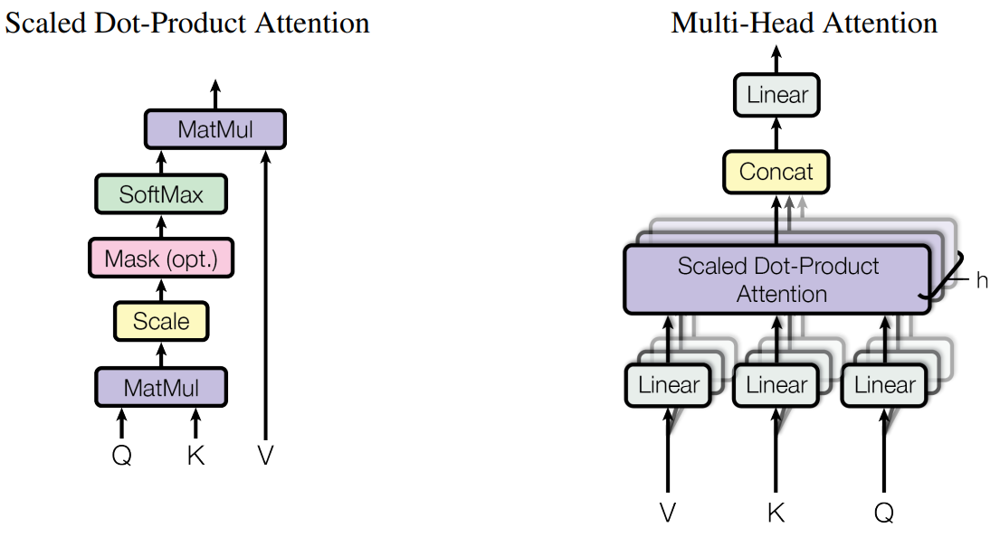

# Attention Is All You Need
google 2017.6.12 https://arxiv.org/abs/1706.03762

## 阅读笔记
1. 组件
    * 位置嵌入: 
        * 正弦/余弦; 维度越往后，数值变化越小，超大模型，维度特别大的情况？ 
        * 另-可学习的位置嵌入
        * 绝对位置嵌入、相对位置嵌入([Xpos](./XPOS.md))
    * self-attention  不依赖RNN的，并行化、长程关注
        * Multi-head, 向量维度拆分
        * Masked attention, 又叫因果attention 
        * cross attention
    * layer normalization
    * FFN
    * 初始化 
    * encoder/decoder 的区别
2. [很多图示有助于直观理解各种组件](https://wmathor.com/index.php/archives/1438/)  
    * transfomer 之前的self-attention？架构发展到一定程度，随之有精简的需求，哪些组件是非必须的。需要一个介绍self-attention演化过程的文章
3. [BLEU,Bilingual Evaluation Understudy](https://zhuanlan.zhihu.com/p/350596071), [0,1]双语评估替换分数, 机器翻译的评估指标

## Abstract
The dominant sequence transduction models are based on complex recurrent or convolutional neural networks that include an encoder and a decoder. The best performing models also connect the encoder and decoder through an attention mechanism. We propose a new simple network architecture, the Transformer, based solely on attention mechanisms, dispensing with recurrence and convolutions entirely. Experiments on two machine translation tasks show these models to be superior in quality while being more parallelizable and requiring significantly less time to train. Our model achieves 28.4 BLEU on the WMT 2014 Englishto-German translation task, improving over the existing best results, including ensembles, by over 2 BLEU. On the WMT 2014 English-to-French translation task, our model establishes a new single-model state-of-the-art BLEU score of 41.8 after training for 3.5 days on eight GPUs, a small fraction of the training costs of the best models from the literature. We show that the Transformer generalizes well to other tasks by applying it successfully to English constituency parsing both with large and limited training data.

主要的序列转换模型基于复杂的循环或卷积神经网络，包括编码器和解码器。性能最好的模型还通过注意力机制连接编码器和解码器。我们提出了一种新的简单网络架构，Transformer，它完全基于注意力机制，不需要循环和卷积。在两个机器翻译任务上的实验表明，这些模型在质量上具有优越性，同时更具并行能力，训练时间明显减少。我们的模型在WMT 2014英语-德语翻译任务中达到28.4 BLEU，比现有最佳结果(包括ensembles)提高了2个以上BLEU。在WMT 2014英法翻译任务中，我们的模型在八个GPU上训练了3.5天之后，建立了一个新的模型最先进的BLEU分数41.8，这只是文献中最佳模型的一小部分训练成本。我们证明Transformer可以很好地推广到其他任务，它成功地应用于英语选区分析，既有大量的训练数据，也有有限的训练数据。

 
Figure 1: The Transformer model architecture.

## 1 Introduction
Recurrent neural networks, long short-term memory [13] and gated recurrent [7] neural networks in particular, have been firmly established as state of the art approaches in sequence modeling and transduction problems such as language modeling and machine translation [35, 2, 5]. Numerous efforts have since continued to push the boundaries of recurrent language models and encoder-decoder architectures [38, 24, 15].

循环神经网络，特别是LSTM[13]和门控循环(GRU)[7]神经网络，已被牢固确立为序列建模和转换问题(如语言建模和机器翻译)的最新方法[35，2，5]。此后，许多工作都在继续扩大循环语言模型和编码器-解码器架构的边界[38，24，15]。

Recurrent models typically factor computation along the symbol positions of the input and output sequences. Aligning the positions to steps in computation time, they generate a sequence of hidden states $h_t$, as a function of the previous hidden state $h_{t−1}$ and the input for position t. This inherently sequential nature precludes parallelization within training examples, which becomes critical at longer sequence lengths, as memory constraints limit batching across examples. Recent work has achieved significant improvements in computational efficiency through factorization tricks [21] and conditional computation [32], while also improving model performance in case of the latter. The fundamental constraint of sequential computation, however, remains.

循环模型通常沿输入和输出序列的符号位置进行计算。将位置与计算时间中的步骤对齐，它们生成一系列隐藏状态$h_t$，作为前一个隐藏状态$h_{t−1}$ $h_t$和位置t的函数输入。这种固有的顺序性阻碍了训练样本中的并行化，这在较长的序列长度时变得至关重要，因为内存局限限制了样本之间的批处理。最近的工作通过因子分解技巧[21]和条件计算[32]显著提高了计算效率，同时也提高了后者的模型性能。然而，顺序计算的基本约束仍然存在。
<!-- 因子分解，条件计算？ -->

Attention mechanisms have become an integral part of compelling sequence modeling and transduction models in various tasks, allowing modeling of dependencies without regard to their distance in the input or output sequences [2, 19]. In all but a few cases [27], however, such attention mechanisms are used in conjunction with a recurrent network.

注意力机制已经成为各种任务中强制序列建模和转换模型的一个组成部分，允许对依赖进行建模，而不考虑它们在输入或输出序列中的距离[2,19]。然而，除少数情况外[27]，这种注意力机制都与循环网络结合使用。

In this work we propose the Transformer, a model architecture eschewing recurrence and instead relying entirely on an attention mechanism to draw global dependencies between input and output. The Transformer allows for significantly more parallelization and can reach a new state of the art in translation quality after being trained for as little as twelve hours on eight P100 GPUs.

在这项工作中，我们提出了Transformer，这是一种避免循环的模型架构，而完全依赖于一种注意力机制来绘制输入和输出之间的全局依赖关系。Transformer允许更大程度的并行化，并且在八个P100 GPU上经过12小时的训练后，可以在翻译质量方面达到最新水平。

## 2 Background
The goal of reducing sequential computation also forms the foundation of the Extended Neural GPU [16], ByteNet [18] and ConvS2S [9], all of which use convolutional neural networks as basic building block, computing hidden representations in parallel for all input and output positions. In these models, the number of operations required to relate signals from two arbitrary input or output positions grows in the distance between positions, linearly for ConvS2S and logarithmically for ByteNet. This makes it more difficult to learn dependencies between distant positions [12]. In the Transformer this is reduced to a constant number of operations, albeit at the cost of reduced effective resolution due to averaging attention-weighted positions, an effect we counteract with Multi-Head Attention as described in section 3.2.

减少串行计算的目标也构成了扩展神经GPU[16]、ByteNet[18]和ConvS2S[9]的基础，所有这些都使用卷积神经网络作为基本构建块，并行计算所有输入和输出位置的隐藏表示。在这些模型中，关联来自两个任意输入或输出位置的信号所需的操作数随位置之间的距离而增长，ConvS2S为线性，ByteNet为对数。这使得学习远距离位置之间的依赖关系更加困难[12]。在Transformer中，这被减少为恒定的操作次数，尽管由于平均注意力加权位置而降低了有效分辨率，但这是一种成本，正如第3.2节所述，我们用多头注意力抵消了这种影响。<!-- 平均注意力加权位置 降低了 有效分辨率，多头注意力低效这个影响。 -->

Self-attention, sometimes called intra-attention is an attention mechanism relating different positions of a single sequence in order to compute a representation of the sequence. Self-attention has been used successfully in a variety of tasks including reading comprehension, abstractive summarization, textual entailment and learning task-independent sentence representations [4, 27, 28, 22].

Self-attention，有时称为内部注意，是一种将单个序列的不同位置联系起来以计算序列表示的注意力机制。Self-attention已经成功地用于各种任务，包括阅读理解、抽象概括、文本蕴涵和学习任务无关的句子表征[4，27，28，22]。

End-to-end memory networks are based on a recurrent attention mechanism instead of sequence aligned recurrence and have been shown to perform well on simple-language question answering and language modeling tasks [34].

端到端记忆网络基于循环注意力机制，而不是序列对齐的循环，已经证明在简单的语言问答和语言建模任务中表现良好[34]。

To the best of our knowledge, however, the Transformer is the first transduction model relying entirely on self-attention to compute representations of its input and output without using sequencealigned RNNs or convolution. In the following sections, we will describe the Transformer, motivate self-attention and discuss its advantages over models such as [17, 18] and [9].

然而，据我们所知，Transformer是第一个完全依赖于self-attention来计算其输入和输出表示的转换模型，而不使用序列对齐的RNN或卷积。在以下章节中，我们将描述Transformer，说明self-attention，并讨论其相对于[17、18]和[9]等模型的优势。

## 3 Model Architecture
Most competitive neural sequence transduction models have an encoder-decoder structure [5, 2, 35]. Here, the encoder maps an input sequence of symbol representations $(x_1,...,x_n)$ to a sequence of continuous representations $z = (z_1,...,z_n)$. Given z, the decoder then generates an output sequence $(y_1, ..., y_m)$ of symbols one element at a time. At each step the model is auto-regressive [10], consuming the previously generated symbols as additional input when generating the next.

大多数竞品神经序列转换模型都有一个编码器-解码器结构[5,2,35]。这里，编码器将符号表示的输入序列$(x_1,...,x_n)$映射到连续表示序列$z = (z_1,...,z_n)$。给定z，解码器然后每次生成一个符号的输出序列$(y_1, ..., y_m)$。在每一步，模型都是自回归的[10]，在生成下一步时，将先前生成的符号作为额外输入。

The Transformer follows this overall architecture using stacked self-attention and point-wise, fully connected layers for both the encoder and decoder, shown in the left and right halves of Figure 1, respectively.

Transformer遵循这一总体架构，为编码器和解码器使用堆叠的self-attention和point-wise、全连接层，分别如图1的左半部分和右半部分所示。

## 3.1 Encoder and Decoder Stacks
Encoder: The encoder is composed of a stack of N = 6 identical layers. Each layer has two sub-layers. The first is a multi-head self-attention mechanism, and the second is a simple, positionwise fully connected feed-forward network. We employ a residual connection [11] around each of the two sub-layers, followed by layer normalization [1]. That is, the output of each sub-layer is LayerNorm(x + Sublayer(x)), where Sublayer(x) is the function implemented by the sub-layer itself. To facilitate these residual connections, all sub-layers in the model, as well as the embedding layers, produce outputs of dimension $d_{model}$ = 512.

编码器：编码器由N=6个相同层组成的堆栈构成。每层有两个子层。第一个是多头自注意机制，第二个是简单的、基于位置的全连接前馈网络。我们在两个子层中的每一个子层周围使用残差连接[11]，然后进行层归一化[1]。即,每个子层的输出是 LayerNorm(x + Sublayer(x))，其中Sublayers(x)是子层本身实现的函数。为了方便这些残差连接，模型中的所有子层以及嵌入层都会生成维度$d_{model}$=512的输出。

Decoder: The decoder is also composed of a stack of N = 6 identical layers. In addition to the two sub-layers in each encoder layer, the decoder inserts a third sub-layer, which performs multi-head attention over the output of the encoder stack. Similar to the encoder, we employ residual connections around each of the sub-layers, followed by layer normalization. We also modify the self-attention sub-layer in the decoder stack to prevent positions from attending to subsequent positions. This masking, combined with fact that the output embeddings are offset by one position, ensures that the predictions for position i can depend only on the known outputs at positions less than i.

解码器：解码器也由N=6个相同层组成的堆栈组成。除了每个编码器层中的两个子层外，解码器还插入第三个子层，该子层对编码器堆栈的输出执行多头部关注。与编码器类似，我们在每个子层周围使用残差连接，然后进行层归一化。我们还修改了解码器堆栈中的自注意子层，以防止位置关注后续位置。这种掩码，再加上输出嵌入被一个位置偏移的事实，确保了位置i的预测只能依赖于位置小于i的已知输出。<!-- 输出嵌入被一个位置偏移? -->

## 3.2 Attention
An attention function can be described as mapping a query and a set of key-value pairs to an output, where the query, keys, values, and output are all vectors. The output is computed as a weighted sum of the values, where the weight assigned to each value is computed by a compatibility function of the query with the corresponding key.

注意力函数可以描述为将查询和一组键值对映射到输出，其中查询、键、值和输出都是向量。输出被计算为值的加权和，其中分配给每个值的权重由查询的兼容函数与相应键计算。

### 3.2.1 Scaled Dot-Product Attention
We call our particular attention "Scaled Dot-Product Attention" (Figure 2). The input consists of queries and keys of dimension $d_k$ , and values of dimension $d_v$ . We compute the dot products of the query with all keys, divide each by $\sqrt{d_k}$, and apply a softmax function to obtain the weights on the values.

我们将我们的特别关注称为“Scaled Dot-Product Attention”(图2)。输入由维度$d_k$的查询和键以及维度$d_v$的值组成。我们用所有键计算查询的点积，除以$\sqrt{d_k}$，然后应用softmax函数获得值的权重。 <!-- 点积，用于表示向量相关度距离 -->

 
Figure 2: (left) Scaled Dot-Product Attention. (right) Multi-Head Attention consists of several attention layers running in parallel.
图2：(左)点乘缩放注意力。(右)多头注意力由几个并行运行的注意力层组成。

In practice, we compute the attention function on a set of queries simultaneously, packed together into a matrix Q. The keys and values are also packed together into matrices K and V . We compute the matrix of outputs as:

在实践中，我们同时计算一组查询的注意力函数，并将其打包成矩阵Q。键和值也打包成矩阵K和V。我们将输出矩阵计算为：

$Attention(Q, K, V ) = softmax(\frac{QK^T}{\sqrt{d_k}} )V$

The two most commonly used attention functions are additive attention [2], and dot-product (multiplicative) attention. Dot-product attention is identical to our algorithm, except for the scaling factor of $\frac{1}{\sqrt{d_k}}$ . Additive attention computes the compatibility function using a feed-forward network with a single hidden layer. While the two are similar in theoretical complexity, dot-product attention is much faster and more space-efficient in practice, since it can be implemented using highly optimized matrix multiplication code.

两个最常用的注意力函数是加法注意力[2]和点积(乘法)注意力。点积注意力与我们的算法相同，除了$\frac{1}{\sqrt{d_k}}$. 加法注意使用带有单个隐藏层的前馈网络计算兼容性函数。虽然二者在理论复杂度上相似，但点积注意力在实践中更快，空间效率更高，因为它可以使用高度优化的矩阵乘法代码来实现。<!--加法注意力?-->

While for small values of $d_k$ the two mechanisms perform similarly, additive attention outperforms dot product attention without scaling for larger values of $d_k$ [3]. We suspect that for large values of $d_k$, the dot products grow large in magnitude, pushing the softmax function into regions where it has extremely small gradients(4 To illustrate why the dot products get large, assume that the components of q and k are independent random
variables with mean 0 and variance 1. Then their dot product, $q · k = \sum^{dk}_{i=1} q_ik_i$, has mean 0 and variance $d_k$.). To counteract this effect, we scale the dot products by $\frac{1}{\sqrt{d_k}}$ .

虽然对于较小的$d_k$值，这两种机制的表现相似，但在不缩放较大的$d_k$数值的情况下，加性注意优于点积注意[3]。我们怀疑，对于较大的$d_k$值，点积的大小会变大，从而将softmax函数推到梯度非常小的区域(4 为了说明为什么点积变大，假设q和k的分量是独立随机的平均值为0，方差为1的变量。那么它们的点积$q · k = \sum^{dk}_{i=1} q_ik_i$，平均值为1，方差为$d_k$)。为了抵消这种影响，我们将点积缩放为$\frac{1}{\sqrt{d_k}}$.

### 3.2.2 Multi-Head Attention
Instead of performing a single attention function with $d_{model}$-dimensional keys, values and queries, we found it beneficial to linearly project the queries, keys and values h times with different, learned linear projections to $d_k, d_k$ and $d_v$ dimensions, respectively. On each of these projected versions of queries, keys and values we then perform the attention function in parallel, yielding $d_v$-dimensional output values. These are concatenated and once again projected, resulting in the final values, as depicted in Figure 2.

与使用$d_{model}$-维键、值和查询执行单个注意函数不同，我们发现使用不同的学习线性投影将查询、键和值线性投影h次，分别投影到$d_k、d_k和d_v$维是有益的。然后，在查询、键和值的每个投影版本上，我们并行执行注意力函数，生成$d_v$维输出值。这些值被连接并再次投影，得到最终值，如图2所示。

Multi-head attention allows the model to jointly attend to information from different representation subspaces at different positions. With a single attention head, averaging inhibits this.

多头注意力允许模型共同关注来自不同位置的不同表示子空间的信息。对于单个注意力头，平均值可以抑制这种情况。

$MultiHead(Q, K, V ) = Concat(head_1, ..., head_h)W^O$

where $head_i = Attention(QW_i^Q, KW_i^K, VW_i^V )$

Where the projections are parameter matrices $W_i^Q ∈ R^{d_{model} × d_k}$ , $W_i^K ∈ R^{d_{model} × d_k}$ , $W_i^V ∈ R^{d_{model} × d_v}$ and $W^O ∈ R^{hd_v × d_{model}}$.

In this work we employ h = 8 parallel attention layers, or heads. For each of these we use $d_k = d_v = d_{model}/h = 64$. Due to the reduced dimension of each head, the total computational cost is similar to that of single-head attention with full dimensionality.

在这项工作中，我们使用了h=8个并行的注意力层，即头部。对于其中的每一个，我们使用$d_k = d_v = d_{model}/h = 64$。由于每个头部的尺寸减小，总计算成本与全尺寸单头部注意力的计算成本相似。

### 3.2.3 Applications of Attention in our Model
The Transformer uses multi-head attention in three different ways:
* In "encoder-decoder attention" layers, the queries come from the previous decoder layer, and the memory keys and values come from the output of the encoder. This allows every position in the decoder to attend over all positions in the input sequence. This mimics the typical encoder-decoder attention mechanisms in sequence-to-sequence models such as [38, 2, 9].
* The encoder contains self-attention layers. In a self-attention layer all of the keys, values and queries come from the same place, in this case, the output of the previous layer in the encoder. Each position in the encoder can attend to all positions in the previous layer of the encoder.
* Similarly, self-attention layers in the decoder allow each position in the decoder to attend to all positions in the decoder up to and including that position. We need to prevent leftward information flow in the decoder to preserve the auto-regressive property. We implement this inside of scaled dot-product attention by masking out (setting to −∞) all values in the input of the softmax which correspond to illegal connections. See Figure 2.

Transformer以三种不同的方式使用多头注意力：
* 在“编码器-解码器注意”层中，查询来自前一个解码器层，内存中的键和值来自编码器的输出。这使得解码器中的每个位置都能处理输入序列中的所有位置。这模仿了序列对序列模型中的典型编码器-解码器注意机制，如[38，2，9]。
* 编码器包含自注意层。在自注意层中，所有的键、值和查询都来自同一个地方，在本例中，是编码器中前一层的输出。编码器中的每个位置都可以处理编码器前一层中的所有位置。
* 类似地，解码器中的自注意层允许解码器中的每个位置关注解码器中直到并包括该位置的所有位置。我们需要防止解码器中的信息向左流动，以保持自回归特性。我们通过掩码(设置为−∞) softmax输入中对应于非法连接的所有值。见图2。

## 3.3 Position-wise Feed-Forward Networks
In addition to attention sub-layers, each of the layers in our encoder and decoder contains a fully connected feed-forward network, which is applied to each position separately and identically. This consists of two linear transformations with a ReLU activation in between.

除了注意力子层之外，我们的编码器和解码器中的每个层都包含一个全连接的前馈网络，它分别相同地应用于每个位置。这包括两个线性变换，中间有一个ReLU激活。

$FFN(x) = max(0, xW_1 + b_1 )W_2 + b_2 $(2)

While the linear transformations are the same across different positions, they use different parameters from layer to layer. Another way of describing this is as two convolutions with kernel size 1. The dimensionality of input and output is $d_{model}$ = 512, and the inner-layer has dimensionality $d_{ff}$ =2048.

虽然不同位置的线性变换是相同的，但它们在层与层之间使用不同的参数。另一种描述这一点的方法是两个核大小为1的卷积。输入和输出的维数为$d_{model}$=512，内层的维数为$d_{ff}$=2048。<!--4x?-->

## 3.4 Embeddings and Softmax
Similarly to other sequence transduction models, we use learned embeddings to convert the input tokens and output tokens to vectors of dimension $d_model$. We also use the usual learned linear transformation and softmax function to convert the decoder output to predicted next-token probabilities. In our model, we share the same weight matrix between the two embedding layers and the pre-softmax linear transformation, similar to [30]. In the embedding layers, we multiply those weights by $d_{model}$

与其他序列转换模型类似，我们使用学习的嵌入将输入令牌和输出令牌转换为维度为$d_model$的向量。我们还使用通常学习的线性变换和softmax函数将解码器输出转换为预测的下一个词组的概率。在我们的模型中，我们在两个嵌入层和预softmax线性变换之间共享相同的权重矩阵，类似于[30]。在嵌入层中，我们将这些权重乘以$\sqrt{d_{model}}$

## 3.5 Positional Encoding
Since our model contains no recurrence and no convolution, in order for the model to make use of the order of the sequence, we must inject some information about the relative or absolute position of the tokens in the sequence. To this end, we add "positional encodings" to the input embeddings at the bottoms of the encoder and decoder stacks. The positional encodings have the same dimension dmodel as the embeddings, so that the two can be summed. There are many choices of positional encodings, learned and fixed [9].

由于我们的模型不包含循环和卷积，为了让模型用上序列的顺序，我们必须注入一些关于序列中令牌的相对或绝对位置的信息。为此，我们将“位置编码”添加到编码器和解码器堆栈底部的输入嵌入。位置编码与嵌入具有相同的维度$d_model$，因此可以将两者相加。位置编码有很多选择，有学习型和固定型[9]。

In this work, we use sine and cosine functions of different frequencies:
在这项工作中，我们使用不同频率的正弦和余弦函数：

* $PE_{(pos,2i)} =sin(pos/10000^{2i/d_{model}})$
* $PE_{(pos,2i+1)} =cos(pos/10000^{2i/d_{model}})$

where pos is the position and i is the dimension. That is, each dimension of the positional encoding corresponds to a sinusoid. The wavelengths form a geometric progression from 2π to 10000 · 2π. We chose this function because we hypothesized it would allow the model to easily learn to attend by relative positions, since for any fixed offset k, $PE_{pos+k}$ can be represented as a linear function of $PE_pos$.

其中pos是位置，i是维度。即,位置编码的每个维度对应于一个正弦曲线。波长形成从2π到10000·2π的几何级数。我们选择这个函数是因为我们假设它可以让模型很容易地学会通过相对位置来关注，因为对于任何固定偏移量k，$PE_{pos+k}$都可以表示为$PE_pos$的线性函数。

We also experimented with using learned positional embeddings [9] instead, and found that the two versions produced nearly identical results (see Table 3 row (E)). We chose the sinusoidal version because it may allow the model to extrapolate to sequence lengths longer than the ones encountered during training.

我们还尝试使用学习的位置嵌入[9]，发现两个版本产生了几乎相同的结果(见表3行(E))。我们选择正弦模式是因为它可以让模型推断出比训练中遇到的序列长度更长的序列长度。

## 4 Why Self-Attention
In this section we compare various aspects of self-attention layers to the recurrent and convolutional layers commonly used for mapping one variable-length sequence of symbol representations $(x_1, ..., x_n)$ to another sequence of equal length $(z_1, ..., z_n)$, with $x_i, z_i ∈ R^d$, such as a hidden layer in a typical sequence transduction encoder or decoder. Motivating our use of self-attention we consider three desiderata.

在本节中，我们将自注意力层的各个方面与通常用于将一个可变长度符号表示序列$(x_1, ..., x_n)$映射到另一个等长序列$(z_1, ..., z_n)$的循环层和卷积层进行比较，其中$x_i, z_i ∈ R^d$，例如典型序列转导编码器或解码器中的隐藏层。为了激励我们使用自注意力，我们认为有三个迫切需要。

One is the total computational complexity per layer. Another is the amount of computation that can be parallelized, as measured by the minimum number of sequential operations required.

一是每层的总计算复杂度。另一个是可以并行化的计算量，用所需的最小顺序操作数来衡量。

The third is the path length between long-range dependencies in the network. Learning long-range dependencies is a key challenge in many sequence transduction tasks. One key factor affecting the ability to learn such dependencies is the length of the paths forward and backward signals have to traverse in the network. The shorter these paths between any combination of positions in the input and output sequences, the easier it is to learn long-range dependencies [12]. Hence we also compare the maximum path length between any two input and output positions in networks composed of the different layer types.

第三个是网络中长期依赖项之间的路径长度。在许多序列转导任务中，学习长程依赖性是一个关键挑战。影响学习这种相关性的能力的一个关键因素是网络中前向和反向信号必须穿越的路径长度。输入和输出序列中任意位置组合之间的这些路径越短，学习长期依赖关系就越容易[12]。因此，我们还比较了由不同层类型组成的网络中任意两个输入和输出位置之间的最大路径长度。

As noted in Table 1, a self-attention layer connects all positions with a constant number of sequentially executed operations, whereas a recurrent layer requires O(n) sequential operations. In terms of computational complexity, self-attention layers are faster than recurrent layers when the sequence length n is smaller than the representation dimensionality d, which is most often the case with sentence representations used by state-of-the-art models in machine translations, such as word-piece [38] and byte-pair [31] representations. To improve computational performance for tasks involving very long sequences, self-attention could be restricted to considering only a neighborhood of size r in the input sequence centered around the respective output position. This would increase the maximum path length to O(n/r). We plan to investigate this approach further in future work.

如表1所示，自注意层用恒定数量的顺序执行操作连接所有位置，而循环层需要O(n)个顺序操作。就计算复杂性而言，当序列长度n小于表示维度d时，自注意层比循环层快，这通常是机器翻译中最先进的模型使用的句子表示的情况，例如单词[38]和字节对[31]表示。为了提高涉及很长序列的任务的计算性能，可以将受限自注意为仅考虑以各自输出位置为中心的输入序列中大小为r的邻域。这会将最大路径长度增加到O(n/r)。我们计划在未来的工作中进一步研究这种方法。

 
Table1: Maximum path lengths, per-layer complexity and minimum number of sequential operations for different layer types. n is the sequence length, d is the representation dimension, k is the kernel size of convolutions and r the size of the neighborhood in restricted self-attention.
表1：不同层类型的最大路径长度、每层复杂性和最小顺序操作数。n是序列长度，d是表示维数，k是卷积的核大小，r是受限自注意中邻域的大小。

A single convolutional layer with kernel width k < n does not connect all pairs of input and output positions. Doing so requires a stack of O(n/k) convolutional layers in the case of contiguous kernels, or O(logk(n)) in the case of dilated convolutions [18], increasing the length of the longest paths between any two positions in the network. Convolutional layers are generally more expensive than recurrent layers, by a factor of k. Separable convolutions [6], however, decrease the complexity considerably, to O(k · n · d + n · d2). Even with k = n, however, the complexity of a separable convolution is equal to the combination of a self-attention layer and a point-wise feed-forward layer, the approach we take in our model.

核宽度k小于n的单个卷积层并不能连接所有的输入和输出位置对。要做到这一点，对于相邻的核，需要一个O(n/k)卷积层堆栈; 对于扩展的卷积，则需要O(logk(n))层堆栈[18]，从而增加网络中任意两个位置之间最长路径的长度。卷积层通常比循环层贵一倍。然而，可分离卷积[6]将复杂度大大降低到O(k·n·d+n·d2)。然而，即使k=n，可分离卷积的复杂度也等于我们在模型中采用的自注意层和逐点前馈层的组合。

As side benefit, self-attention could yield more interpretable models. We inspect attention distributions from our models and present and discuss examples in the appendix. Not only do individual attention heads clearly learn to perform different tasks, many appear to exhibit behavior related to the syntactic and semantic structure of the sentences.

作为附加作用，self-attention可以产生更多可解释的模型。我们从模型中检查注意力分布，并在附录中展示和讨论样本。不仅个别注意力集中者能够清楚地学习执行不同的任务，许多注意力集中者还表现出与句子的句法和语义结构相关的行为。<!--注意力分布-->

## 5 Training
This section describes the training regime for our models.

本节描述了我们模型的训练方法。

### 5.1 Training Data and Batching
We trained on the standard WMT 2014 English-German dataset consisting of about 4.5 million sentence pairs. Sentences were encoded using byte-pair encoding [3], which has a shared sourcetarget vocabulary of about 37000 tokens. For English-French, we used the significantly larger WMT 2014 English-French dataset consisting of 36M sentences and split tokens into a 32000 word-piece vocabulary [38]. Sentence pairs were batched together by approximate sequence length. Each training batch contained a set of sentence pairs containing approximately 25000 source tokens and 25000 target tokens.

我们对标准WMT 2014英德数据集进行了训练，该数据集包含约450万个句子对。句子使用字节对编码[3]进行编码，该编码具有大约37000个标记的共享源目标词汇表。对于英语法语，我们使用了更大的WMT 2014英语法语数据集，其中包含36M个句子，并将标记拆分为32000个单词词汇量[38]。句子对按近似序列长度分批排列。每个训练批次包含一组句子对，其中包含大约25000个源标记和25000个目标标记。

### 5.2 Hardware and Schedule
We trained our models on one machine with 8 NVIDIA P100 GPUs. For our base models using the hyperparameters described throughout the paper, each training step took about 0.4 seconds. We trained the base models for a total of 100,000 steps or 12 hours. For our big models,(described on the bottom line of table 3), step time was 1.0 seconds. The big models were trained for 300,000 steps (3.5 days).

我们在一台配备8个NVIDIA P100 GPU的机器上训练模型。对于使用本文中描述的超参数的基本模型，每个训练步骤大约需要0.4秒。我们对基础模型进行了总计100000步或12小时的训练。对于我们的大型模型(如表3底线所述)，每步耗时为1.0秒。大模型接受了300000步(3.5天)的训练。

### 5.3 Optimizer
We used the Adam optimizer [20] with $β_1$ = 0.9, $β_2$ = 0.98 and ε = 10−9. We varied the learning rate over the course of training, according to the formula:
我们使用Adam优化器[20]，其中$β_1$=0.9，$β_2$=0.98，ε=10−9.根据以下公式，我们在训练过程中改变了学习率：

$lrate=d^{−0.5}_{model} ·min(step\_num^{−0.5},step\_num·warmup\_steps^{−1.5})$ (3) 

This corresponds to increasing the learning rate linearly for the first warmup_steps training steps, and decreasing it thereafter proportionally to the inverse square root of the step number. We used warmup_steps = 4000.

这对应于第一个warmup_steps训练步骤的学习速率线性增加，然后与步骤数的平方根成比例减小。我们使用了warmup_steps=4000。

### 5.4 Regularization
We employ three types of regularization during training:

我们在训练期间采用三种正则化方式:

Residual Dropout. We apply dropout [33] to the output of each sub-layer, before it is added to the sub-layer input and normalized. In addition, we apply dropout to the sums of the embeddings and the positional encodings in both the encoder and decoder stacks. For the base model, we use a rate of Pdrop = 0.1.

残差Dropout. 我们将Dropout[33]应用于每个子层的输出，然后再将其添加到子层输入并进行归一化。此外，我们对编码器和解码器堆栈中的嵌入和位置编码的总和应用丢弃。对于基本模型，我们使用Pdrop=0.1的速率。

Label Smoothing. During training, we employed label smoothing of value $ε_ls$ = 0.1 [36]. This hurts perplexity, as the model learns to be more unsure, but improves accuracy and BLEU score.

标签平滑. 在训练期间，我们采用了值$ε_ls$=0.1[36]的标签平滑。这会伤害困惑，因为模型会变得更加不确定，但会提高准确性和BLEU分数。

## 6 Results
### 6.1 Machine Translation
On the WMT 2014 English-to-German translation task, the big transformer model (Transformer (big) in Table 2) outperforms the best previously reported models (including ensembles) by more than 2.0 BLEU, establishing a new state-of-the-art BLEU score of 28.4. The configuration of this model is listed in the bottom line of Table 3. Training took 3.5 days on 8 P100 GPUs. Even our base model surpasses all previously published models and ensembles, at a fraction of the training cost of any of the competitive models.

在WMT 2014英语到德语的翻译任务中，表2中的大的transformer模型(transformer(big))比之前报道的最佳模型(包括组合)的性能要好2.0多BLEU，新的最先进BLEU分数为28.4。该模型的配置列于表3的底线。8 P100 GPU的训练耗时3.5天。即使是我们的基本模型也超过了所有之前发布的模型和组合，只不过是任何竞品模型的训练成本的一小部分。

 
Table 2: The Transformer achieves better BLEU scores than previous state-of-the-art models on the English-to-German and English-to-French newstest2014 tests at a fraction of the training cost.

表2：Transformer在英语到德语和英语到法语的newstest2014测试中取得了比以前最先进的车型更好的BLEU分数，只需训练成本的一小部分。

On the WMT 2014 English-to-French translation task, our big model achieves a BLEU score of 41.0, outperforming all of the previously published single models, at less than 1/4 the training cost of the previous state-of-the-art model. The Transformer (big) model trained for English-to-French used dropout rate Pdrop = 0.1, instead of 0.3.

在WMT 2014英法翻译任务中，我们的大模型的BLEU分数为41.0，优于所有之前发布的单一模型，训练成本低于之前最先进模型的1/4。为英语到法语训练的Transformer(大型)模型使用了dropout率Pdrop=0.1，而不是0.3。

For the base models, we used a single model obtained by averaging the last 5 checkpoints, which were written at 10-minute intervals. For the big models, we averaged the last 20 checkpoints. We used beam search with a beam size of 4 and length penalty α = 0.6 [38]. These hyperparameters were chosen after experimentation on the development set. We set the maximum output length during inference to input length + 50, but terminate early when possible [38].

对于基本模型，我们使用了一个通过平均最后5个检查点获得的单一模型，这些检查点每隔10分钟写入一次。对于大型模型，我们平均了最后20个检查点。我们使用波束搜索，波束大小为4，长度惩罚α=0.6[38]。这些超参数是在对开发集进行实验后选择的。我们将推断期间的最大输出长度设置为输入长度+50，但在可能的情况下提前终止[38]。
<!--波束搜索?-->

Table 2 summarizes our results and compares our translation quality and training costs to other model architectures from the literature. We estimate the number of floating point operations used to train a model by multiplying the training time, the number of GPUs used, and an estimate of the sustained single-precision floating-point capacity of each GPU 5.

表2总结了我们的结果，并将我们的翻译质量和训练成本与文献中的其他模型架构进行了比较。我们通过乘以训练时间、使用的GPU数以及每个GPU 5的持续单精度浮点容量的估计值来估计用于训练模型的浮点操作数。

### 6.2 Model Variations
To evaluate the importance of different components of the Transformer, we varied our base model in different ways, measuring the change in performance on English-to-German translation on the development set, newstest2013. We used beam search as described in the previous section, but no checkpoint averaging. We present these results in Table 3.

为了评估Transformer不同组件的重要性，我们以不同的方式改变了我们的基本模型，测量了开发集newstest2013中英德语翻译的性能变化。我们使用了前一节中描述的波束搜索，但没有检查点平均。我们在表3中给出了这些结果。

 
Table 3: Variations on the Transformer architecture. Unlisted values are identical to those of the base model. All metrics are on the English-to-German translation development set, newstest2013. Listed perplexities are per-wordpiece, according to our byte-pair encoding, and should not be compared to per-word perplexities.
表3：Transformer架构的变化。未列出的值与基础模型的值相同。所有指标都在英语到德语的翻译开发集newstest2013上。根据我们的字节对编码，列出的困惑是每个单词的，不应与每个单词的困惑相比较。

In Table 3 rows (A), we vary the number of attention heads and the attention key and value dimensions, keeping the amount of computation constant, as described in Section 3.2.2. While single-head attention is 0.9 BLEU worse than the best setting, quality also drops off with too many heads.

在表3行(A)中，我们改变了注意头的数量以及注意键和值维度，保持计算量不变，如第3.2.2节所述。虽然单头注意比最佳设置差0.9 BLEU，但过多的注意头也会降低质量。

In Table 3 rows (B), we observe that reducing the attention key size $d_k$ hurts model quality. This suggests that determining compatibility is not easy and that a more sophisticated compatibility function than dot product may be beneficial. We further observe in rows (C) and (D) that, as expected, bigger models are better, and dropout is very helpful in avoiding over-fitting. In row (E) we replace our sinusoidal positional encoding with learned positional embeddings [9], and observe nearly identical results to the base model.

在表3的行(B)中，我们发现减少注意键大小$d_k$会影响模型质量。这表明确定兼容性并不容易，而且比点积更复杂的兼容性函数可能是有益的。我们在第(C)行和第(D)行进一步观察到，正如预期的那样，模型越大越好，而dropout对避免过度拟合非常有帮助。在第(E)行中，我们将正弦位置编码替换为学习的位置嵌入[9]，并观察到与基本模型几乎相同的结果。

### 6.3 English Constituency Parsing
To evaluate if the Transformer can generalize to other tasks we performed experiments on English constituency parsing. This task presents specific challenges: the output is subject to strong structural constraints and is significantly longer than the input. Furthermore, RNN sequence-to-sequence models have not been able to attain state-of-the-art results in small-data regimes [37].

为了评估Transformer是否可以推广到其他任务，我们对英语选区解析进行了实验。这项任务提出了具体的挑战：输出受到强烈的结构约束，远远长于输入。此外，RNN序列到序列模型还无法在小数据领域获得最先进的结果[37]。

We trained a 4-layer transformer with $d_model$ = 1024 on the Wall Street Journal (WSJ) portion of the Penn Treebank [25], about 40K training sentences. We also trained it in a semi-supervised setting, using the larger high-confidence and BerkleyParser corpora from with approximately 17M sentences [37]. We used a vocabulary of 16K tokens for the WSJ only setting and a vocabulary of 32K tokens for the semi-supervised setting.

我们在Penn Treebank[25]的《华尔街日报》(WSJ)部分训练了一个$d_model$=1024的4层transformer，大约40K个训练句子。我们也在半监督的环境中对其进行了训练，使用了更大的高可信度和BerkleyParser语料库，其中包含大约17M个句子[37]。对于仅限WSJ的设置，我们使用了16K令牌的词汇表，而对于半监督设置，我们则使用了32K令牌的词表。

We performed only a small number of experiments to select the dropout, both attention and residual (section 5.4), learning rates and beam size on the Section 22 development set, all other parameters remained unchanged from the English-to-German base translation model. During inference, we increased the maximum output length to input length + 300. We used a beam size of 21 and α = 0.3 for both WSJ only and the semi-supervised setting.

我们仅进行了少量实验，以选择第22节开发集上的dropout、注意力和残差(第5.4节)、学习率和波束大小，所有其他参数从英语到德语基本翻译模型保持不变。在推理过程中，我们将最大输出长度增加到输入长度+300。我们仅对WSJ和半监督设置使用了21的波束大小和α=0.3。

Our results in Table 4 show that despite the lack of task-specific tuning our model performs surprisingly well, yielding better results than all previously reported models with the exception of the Recurrent Neural Network Grammar [8].

我们在表4中的结果表明，尽管缺少特定于任务的调整，但我们的模型表现出奇的好，比之前报告的所有模型都要好，除了RNN语法[8]。

 
Table 4: The Transformer generalizes well to English constituency parsing (Results are on Section 23 of WSJ)
表4:Transformer很好地概括了英语选区解析(结果见WSJ第23节)

In contrast to RNN sequence-to-sequence models [37], the Transformer outperforms the BerkeleyParser [29] even when training only on the WSJ training set of 40K sentences.

与RNN序列到序列模型[37]相比，Transformer的表现优于BerkeleyParser[29]，即使只在WSJ 40K句子训练集上训练。

## 7 Conclusion
In this work, we presented the Transformer, the first sequence transduction model based entirely on attention, replacing the recurrent layers most commonly used in encoder-decoder architectures with multi-headed self-attention.

在这项工作中，我们提出了Transformer，这是第一个完全基于注意力的序列转换模型，用多头自注意力替换了编码器-解码器架构中最常用的循环层。

For translation tasks, the Transformer can be trained significantly faster than architectures based on recurrent or convolutional layers. On both WMT 2014 English-to-German and WMT 2014 English-to-French translation tasks, we achieve a new state of the art. In the former task our best model outperforms even all previously reported ensembles.

对于翻译任务，Transformer的训练速度比基于循环或卷积层的架构要快得多。在WMT 2014英语到德语和WMT 2014英文到法语的翻译任务中，我们都达到了一个新的水平。在前一个任务中，最好的模型甚至超过了之前报道的所有组合。

We are excited about the future of attention-based models and plan to apply them to other tasks. We plan to extend the Transformer to problems involving input and output modalities other than text and to investigate local, restricted attention mechanisms to efficiently handle large inputs and outputs such as images, audio and video. Making generation less sequential is another research goals of ours.

我们对注意力模型的未来感到兴奋，并计划将其应用于其他任务。我们计划将Transformer扩展到涉及文本以外的输入和输出模态的问题，并研究局部、受限注意力机制，以有效处理图像、音频和视频等大型输入和输出。减少生成过程的顺序性也是我们的研究目标之一。

The code we used to train and evaluate our models is available at https://github.com/tensorflow/tensor2tensor .
我们用于训练和评估模型的代码在 https://github.com/tensorflow/tensor2tensor 。

## Acknowledgements 
We are grateful to Nal Kalchbrenner and Stephan Gouws for their fruitful comments, corrections and inspiration.

我们感谢Nal Kalchbrenner和Stephan Gouws的富有成果的评论、纠正和启发。

## References
1. Jimmy Lei Ba, Jamie Ryan Kiros, and Geoffrey E Hinton. Layer normalization. arXiv preprint arXiv:1607.06450, 2016.
2. Dzmitry Bahdanau, Kyunghyun Cho, and Yoshua Bengio. Neural machine translation by jointly learning to align and translate. CoRR, abs/1409.0473, 2014.
3. Denny Britz, Anna Goldie, Minh-Thang Luong, and Quoc V. Le. Massive exploration of neural machine translation architectures. CoRR, abs/1703.03906, 2017.
4. Jianpeng Cheng, Li Dong, and Mirella Lapata. Long short-term memory-networks for machine reading. arXiv preprint arXiv:1601.06733, 2016.
5. Kyunghyun Cho, Bart van Merrienboer, Caglar Gulcehre, Fethi Bougares, Holger Schwenk, and Yoshua Bengio. Learning phrase representations using rnn encoder-decoder for statistical machine translation. CoRR, abs/1406.1078, 2014.
6. Francois Chollet. Xception: Deep learning with depthwise separable convolutions. arXiv preprint arXiv:1610.02357, 2016.
7. Junyoung Chung, Çaglar Gülçehre, Kyunghyun Cho, and Yoshua Bengio. Empirical evaluation of gated recurrent neural networks on sequence modeling. CoRR, abs/1412.3555, 2014.
8. Chris Dyer, Adhiguna Kuncoro, Miguel Ballesteros, and Noah A. Smith. Recurrent neural network grammars. In Proc. of NAACL, 2016.
9. Jonas Gehring, Michael Auli, David Grangier, Denis Yarats, and Yann N. Dauphin. Convolutional sequence to sequence learning. arXiv preprint arXiv:1705.03122v2, 2017.
10. Alex Graves. Generating sequences with recurrent neural networks. arXiv preprint arXiv:1308.0850, 2013.
11. Kaiming He, Xiangyu Zhang, Shaoqing Ren, and Jian Sun. Deep residual learning for image recognition. In Proceedings of the IEEE Conference on Computer Vision and Pattern Recognition, pages 770–778, 2016.
12. Sepp Hochreiter, Yoshua Bengio, Paolo Frasconi, and Jürgen Schmidhuber. Gradient flow in recurrent nets: the difficulty of learning long-term dependencies, 2001.
13. Sepp Hochreiter and Jürgen Schmidhuber. Long short-term memory. Neural computation, 9(8):1735–1780, 1997.
14. Zhongqiang Huang and Mary Harper. Self-training PCFG grammars with latent annotations across languages. In Proceedings of the 2009 Conference on Empirical Methods in Natural Language Processing, pages 832–841. ACL, August 2009.
15. Rafal Jozefowicz, Oriol Vinyals, Mike Schuster, Noam Shazeer, and Yonghui Wu. Exploring the limits of language modeling. arXiv preprint arXiv:1602.02410, 2016.
16. Łukasz Kaiser and Samy Bengio. Can active memory replace attention? In Advances in Neural Information Processing Systems, (NIPS), 2016.
17. Łukasz Kaiser and Ilya Sutskever. Neural GPUs learn algorithms. In International Conference on Learning Representations (ICLR), 2016.
18. Nal Kalchbrenner, Lasse Espeholt, Karen Simonyan, Aaron van den Oord, Alex Graves, and Koray Kavukcuoglu. Neural machine translation in linear time. arXiv preprint arXiv:1610.10099v2, 2017.
19. Yoon Kim, Carl Denton, Luong Hoang, and Alexander M. Rush. Structured attention networks. In International Conference on Learning Representations, 2017.
20. Diederik Kingma and Jimmy Ba. Adam: A method for stochastic optimization. In ICLR, 2015.
21. Oleksii Kuchaiev and Boris Ginsburg. Factorization tricks for LSTM networks. arXiv preprint
arXiv:1703.10722, 2017.
22. Zhouhan Lin, Minwei Feng, Cicero Nogueira dos Santos, Mo Yu, Bing Xiang, Bowen Zhou, and Yoshua Bengio. A structured self-attentive sentence embedding. arXiv preprint arXiv:1703.03130, 2017.
23. Minh-Thang Luong, Quoc V. Le, Ilya Sutskever, Oriol Vinyals, and Lukasz Kaiser. Multi-task sequence to sequence learning. arXiv preprint arXiv:1511.06114, 2015.
24. Minh-Thang Luong, Hieu Pham, and Christopher D Manning. Effective approaches to attentionbased neural machine translation. arXiv preprint arXiv:1508.04025, 2015.
25. MitchellPMarcus,MaryAnnMarcinkiewicz,andBeatriceSantorini.Buildingalargeannotated corpus of english: The penn treebank. Computational linguistics, 19(2):313–330, 1993.
26. David McClosky, Eugene Charniak, and Mark Johnson. Effective self-training for parsing. In Proceedings of the Human Language Technology Conference of the NAACL, Main Conference, pages 152–159. ACL, June 2006.
27. Ankur Parikh, Oscar Täckström, Dipanjan Das, and Jakob Uszkoreit. A decomposable attention model. In Empirical Methods in Natural Language Processing, 2016.
28. Romain Paulus, Caiming Xiong, and Richard Socher. A deep reinforced model for abstractive summarization. arXiv preprint arXiv:1705.04304, 2017.
29. Slav Petrov, Leon Barrett, Romain Thibaux, and Dan Klein. Learning accurate, compact, and interpretable tree annotation. In Proceedings of the 21st International Conference on Computational Linguistics and 44th Annual Meeting of the ACL, pages 433–440. ACL, July 2006.
30. Ofir Press and Lior Wolf. Using the output embedding to improve language models. arXiv preprint arXiv:1608.05859, 2016.
31. Rico Sennrich, Barry Haddow, and Alexandra Birch. Neural machine translation of rare words with subword units. arXiv preprint arXiv:1508.07909, 2015.
32. Noam Shazeer, Azalia Mirhoseini, Krzysztof Maziarz, Andy Davis, Quoc Le, Geoffrey Hinton, and Jeff Dean. Outrageously large neural networks: The sparsely-gated mixture-of-experts layer. arXiv preprint arXiv:1701.06538, 2017.
33. Nitish Srivastava, Geoffrey E Hinton, Alex Krizhevsky, Ilya Sutskever, and Ruslan Salakhutdinov. Dropout: a simple way to prevent neural networks from overfitting. Journal of Machine Learning Research, 15(1):1929–1958, 2014.
34. Sainbayar Sukhbaatar, Arthur Szlam, Jason Weston, and Rob Fergus. End-to-end memory networks. In C. Cortes, N. D. Lawrence, D. D. Lee, M. Sugiyama, and R. Garnett, editors, Advances in Neural Information Processing Systems 28, pages 2440–2448. Curran Associates, Inc., 2015.
35. Ilya Sutskever, Oriol Vinyals, and Quoc VV Le. Sequence to sequence learning with neural networks. In Advances in Neural Information Processing Systems, pages 3104–3112, 2014.
36. Christian Szegedy, Vincent Vanhoucke, Sergey Ioffe, Jonathon Shlens, and Zbigniew Wojna. Rethinking the inception architecture for computer vision. CoRR, abs/1512.00567, 2015.
37. Vinyals & Kaiser, Koo, Petrov, Sutskever, and Hinton. Grammar as a foreign language. In Advances in Neural Information Processing Systems, 2015.
38. Yonghui Wu, Mike Schuster, Zhifeng Chen, Quoc V Le, Mohammad Norouzi, Wolfgang Macherey, Maxim Krikun, Yuan Cao, Qin Gao, Klaus Macherey, et al. Google’s neural machine translation system: Bridging the gap between human and machine translation. arXiv preprint arXiv:1609.08144, 2016.
39. Jie Zhou, Ying Cao, Xuguang Wang, Peng Li, and Wei Xu. Deep recurrent models with fast-forward connections for neural machine translation. CoRR, abs/1606.04199, 2016.
40. Muhua Zhu, Yue Zhang, Wenliang Chen, Min Zhang, and Jingbo Zhu. Fast and accurate shift-reduce constituent parsing. In Proceedings of the 51st Annual Meeting of the ACL (Volume 1: Long Papers), pages 434–443. ACL, August 2013.

## Attention Visualizations
Figure 3: An example of the attention mechanism following long-distance dependencies in the encoder self-attention in layer 5 of 6. Many of the attention heads attend to a distant dependency of the verb ‘making’, completing the phrase ‘making...more difficult’. Attentions here shown only for the word ‘making’. Different colors represent different heads. Best viewed in color.
图3：第5层(共6层)编码器自注意中的远距离依赖的注意机制样本。许多注意头注意动词“making”的远距离依赖，完成短语“makings…more difficle”。这里的注意事项仅针对单词“making”。不同的颜色代表不同的头部。最好用彩色观看。<!--how?-->

Figure 4: Two attention heads, also in layer 5 of 6, apparently involved in anaphora resolution. Top: Full attentions for head 5. Bottom: Isolated attentions from just the word ‘its’ for attention heads 5 and 6. Note that the attentions are very sharp for this word.
图4：两个注意头，也位于第5层，共6层，显然与回指消解有关。顶部：完全关注头部5。底部：孤立的关注，而仅关注头部5和6的“its”一词。请注意，关注对于这个词来说非常尖锐。

Figure 5: Many of the attention heads exhibit behaviour that seems related to the structure of the sentence. We give two such examples above, from two different heads from the encoder self-attention at layer 5 of 6. The heads clearly learned to perform different tasks.
图5：许多注意力集中者的行为似乎与句子结构有关。我们在上面给出了两个这样的例子，分别来自编码器第5层和第6层的两个不同的头部。头部清楚地学会了执行不同的任务。
