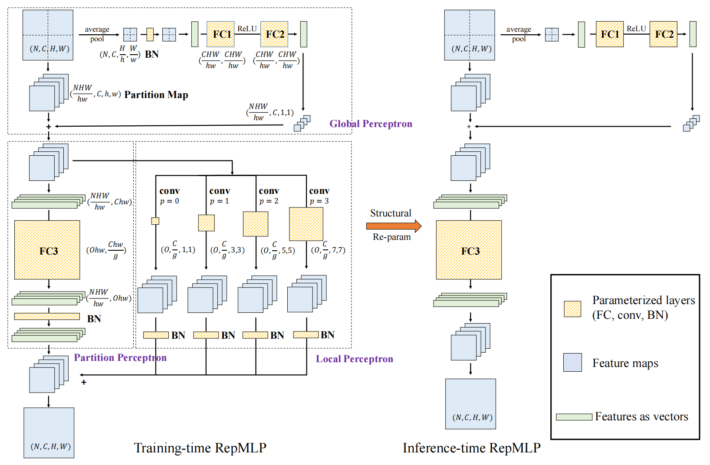
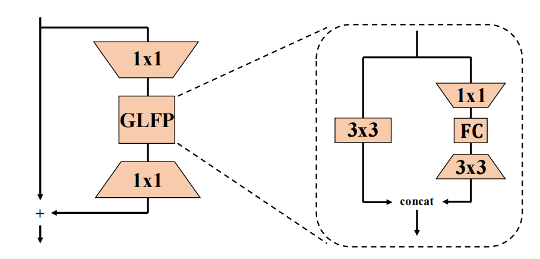
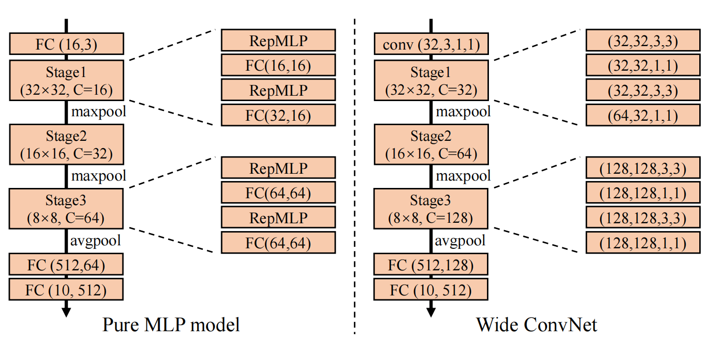
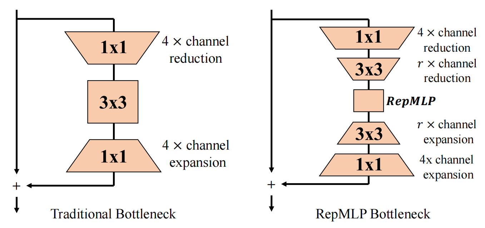
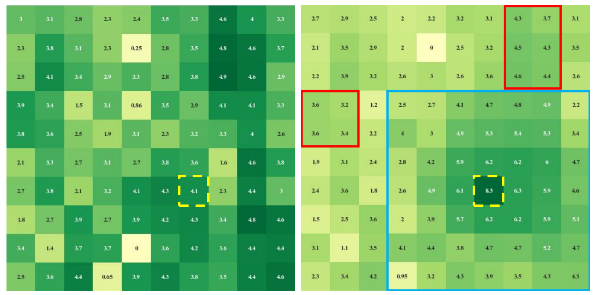
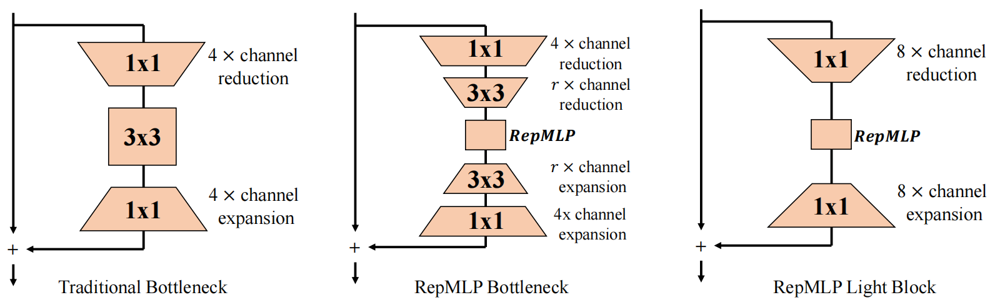

# RepMLP: Re-parameterizing Convolutions into Fully-connected Layers for Image Recognition
RepMLP：将卷积重新参数化为用于图像识别的全连接层 2021-5-5 原文：https://arxiv.org/abs/2105.01883

## 阅读笔记
https://mp.weixin.qq.com/s/UgIFmWJsUfTtZgt1yznt9w 
全连接层的全局表达、位置感知能力与卷积的局部结构提取能力的组合能够以更快的速度在平移不变任务(比如语义分割)、图像对齐+位置模式相关任务(比如人脸识别)上的性能。

## Abstract
We propose RepMLP, a multi-layer-perceptron-style neural network building block for image recognition, which is composed of a series of fully-connected (FC) layers. Compared to convolutional layers, FC layers are more efficient, better at modeling the long-range dependencies and positional patterns, but worse at capturing the local structures, hence usually less favored for image recognition. We propose a structural re-parameterization technique that adds local prior into an FC to make it powerful for image recognition. Specifically, we construct convolutional layers inside a RepMLP during training and merge them into the FC for inference. On CIFAR, a simple pure-MLP model shows performance very close to CNN. By inserting RepMLP in traditional CNN, we improve ResNets by 1.8% accuracy on ImageNet, 2.9% for face recognition, and 2.3% mIoU on Cityscapes with lower FLOPs. Our intriguing findings highlight that combining the global representational capacity and positional perception of FC with the local prior of convolution can improve the performance of neural network with faster speed on both the tasks with translation invariance (e.g., semantic segmentation) and those with aligned images and positional patterns (e.g., face recognition). The code and models are available at https://github.com/DingXiaoH/RepMLP.

我们提出了RepMLP，一种用于图像识别的多层感知器式神经网络构建块，它由一系列全连接(FC)层组成。与卷积层相比，FC层效率更高，更好地建模长距离相关性和位置模式，但在捕获局部结构方面更差，因此通常不太适合图像识别。我们提出了一种结构重新参数化技术，该技术将局部先验添加到FC中，使其在图像识别中更强大。具体来说，我们在训练期间在RepMLP内构造卷积层，并将它们合并到FC中进行推理。在CIFAR上，一个简单的纯MLP模型显示出与CNN非常接近的性能。通过在传统的CNN中插入RepMLP，我们在ImageNet上提高了1.8%的ResNets精度，在人脸识别上提高了2.9%，在FLOP较低的城市景观上提高了2.3%的mIoU。我们有趣的发现强调，将FC的全局表征能力和位置感知与卷积的局部先验相结合，可以提高神经网络在具有平移不变性(例如，语义分割)和具有对齐图像和位置模式(例如，人脸识别)的任务上的性能，速度更快。代码和模型在 https://github.com/DingXiaoH/RepMLP 。

## 1. Introduction
The locality of images (i.e., a pixel is more related to its neighbors than the distant pixels) makes Convolutional Neural Network (ConvNet) successful in image recognition, as a conv layer only processes a local neighborhood. In this paper, we refer to this inductive bias as the local prior.

图像的局部性(即，一个像素与其相邻像素的相关性大于远处的像素)使得卷积神经网络(Convolutional Neural Network，卷积神经网络)在图像识别中取得成功，因为卷积层只处理局部邻域。在本文中，我们将这种归纳偏差称为局部先验。

On top of that, we also desire the ability to capture the long-range dependencies, which is referred to as the global capacity in this paper. Traditional ConvNets model the long-range dependencies by the large receptive fields formed by deep stacks of conv layers [29]. However, repeating local operations is computationally inefficient and may cause optimization difficulties. Some prior works enhance the global capacity with self-attention-based modules [29, 11, 27], which has no local prior. For example, ViT [11] is a pure-Transformer model without convolution, which feeds images into the Transformers as a sequence. Due to the lack of local prior as an important inductive bias, ViT needs an enormous amount of training data (3×108 images in JFT-300M) to converge.

除此之外，我们还希望能够捕获长期依赖关系，这在本文中被称为全局容量。传统的ConvNets通过由conv层的深度堆叠形成的大感受野来模拟长程依赖性[29]。然而，重复局部操作在计算上效率低下，并可能导致优化困难。一些先前的工作通过基于自注意力的模块[29，11，27]增强了全局能力，该模块没有局部先验。例如，ViT[11]是一个没有卷积的纯Transformer模型，它将图像作为序列输入Transformer。由于缺乏局部先验作为重要的归纳偏差，ViT需要大量的训练数据(JFT-300M中的3×108图像)来收敛。

On the other hand, some images have intrinsic positional prior, which cannot be effectively utilized by a conv layer because it shares parameters among different positions. For example, when someone tries to unlock a cellphone via face recognition, the photo of the face is very likely to be centered and aligned so that the eyes appear at the top and the nose shows at the middle. We refer to the ability to utilize such positional prior as the positional perception.

另一方面，一些图像具有固有的位置先验，这不能被卷积层有效利用，因为它在不同位置之间共享参数。例如，当有人试图通过人脸识别解锁手机时，面部照片很可能会居中对齐，这样眼睛就会出现在顶部，鼻子就会出现在中间。我们指的是利用位置先验作为位置感知的能力。

This paper revisits fully-connected (FC) layers to provide traditional ConvNet with global capacity and positional perception. We directly use an FC as the transformation between feature maps to replace conv in some cases. By flattening a feature map, feeding it through FC, and reshaping back, we can enjoy the positional perception (because its parameters are position-related) and global capacity (because every output point is related to every input point). Such an operation is efficient in terms of both the actual speed and theoretical FLOPs, as shown in Table. 4. For the application scenarios where the primary concerns are the accuracy and throughput but not the number of parameters, one may prefer FC-based models to traditional ConvNets. For example, the GPU inference serves usually have tens of GBs of memory, so that the memory occupied by the parameters is minor compared to that consumed by the computations and internal feature maps.

本文重新访问了完全连接(FC)层，以向传统ConvNet提供全局和位置感知能力。在某些情况下，我们直接使用FC作为特征图之间的转换来替换卷积。通过展平特征图，通过FC将其馈送，并对其进行整形，我们可以享受位置感知(因为其参数与位置相关)和全局容量(因为每个输出点与每个输入点相关)。这种操作在实际速度和理论FLOP方面都是有效的，如表4.所示，对于主要关注精度和吞吐量而不是参数数量的应用场景，人们可能更喜欢基于FC的模型而不是传统的ConvNets。例如，GPU推理服务通常具有数十GB的内存，因此与计算和内部特征图所消耗的内存相比，参数所占用的内存较小。

However, an FC has no local prior because the spatial information is lost. In this paper, we propose to incorporate local prior into FC with a structural re-parameterization technique. Specifically, we construct conv and batch normalization (BN) [15] layers parallel to the FC during training, then merge the trained parameters into the FC to reduce the number of parameters and latency for inference. Based on that, we propose a re-parameterized multilayer perceptron (RepMLP). As shown in Fig. 1, the training-time RepMLP has FC, conv, and BN layers but can be equivalently converted into an inference-time block with only three FC layers. The meaning of structural reparameterization is that the training-time model has a set of parameters while the inference-time model has another set, and we parameterize the latter with the parameters transformed from the former. Note that we do not derive the parameters before each inference. Instead, we convert it once for all, and then the training-time model can be discarded.

然而，FC没有局部先验，因为空间信息丢失。在本文中，我们建议使用结构重新参数化技术将局部先验结合到FC中。具体而言，我们在训练期间构建了与FC并行的conv和batch normalization(BN)[15]层，然后将训练后的参数合并到FC中，以减少参数数量和推理延迟。在此基础上，我们提出了一种重新参数化的多层感知器(RepMLP)。如图1所示，训练时间RepMLP具有FC、conv和BN层，但可以等效地转换为仅具有三个FC层的推断时间块。结构重新参数化的含义是训练时间模型有一组参数，而推理时间模型有另一组参数。请注意，我们不会在每次推断之前导出参数。相反，我们将其转换一次，然后可以丢弃训练时模型。

Compared to conv, RepMLP runs faster under the same number of parameters and has global capacity and positional perception. Compared to a self-attention module [29, 11], it is simpler and can utilize the locality of images. As shown in our experiments (Table. 4, 5, 6), RepMLP outperforms the traditional ConvNets in a variety of vision tasks, including 1) general classification (ImageNet [8]), 2) task with positional prior (face recognition) and 3) task with translation invariance (semantic segmentation).

与conv相比，RepMLP在相同数量的参数下运行速度更快，并且具有全局容量和位置感知能力。与自注意力模块[29，11]相比，它更简单，可以利用图像的局部性。如我们的实验(表4、5、6)所示，RepMLP在各种视觉任务中优于传统的ConvNets，包括1)一般分类(ImageNet[8])、2)具有位置先验的任务(人脸识别)和3)具有平移不变性的任务(语义分割)。

Our contributions are summarized as follows.
*  We propose to utilize the global capacity and positional perception of FC and equip it with local prior for image recognition.
*  We propose a simple, platform-agnostic and differentiable algorithm to merge the parallel conv and BN into FC for the local prior without any inference-time costs.
*  We propose RepMLP, an efficient building block, and show its effectiveness on multiple vision tasks.

我们的贡献总结如下：
* 我们建议利用FC的全局能力和位置感知，并为其配备用于图像识别的局部先验。
* 我们提出了一种简单、平台未知且可微的算法，将并行conv和BN合并到局部先验的FC中，而无需任何推理时间成本。
* 我们提出了RepMLP，这是一个高效的构建块，并展示了它在多个愿景任务上的有效性。

## 2. Related Work
### 2.1. Designs for Global Capacity
Non-local Network [29] proposed to model the longrange dependencies via the self-attention mechanism. For each query position, the non-local module first computes the pairwise relations between the query position and all positions to form an attention map and then aggregates the features of all the positions by a weighted sum with the weights defined by the attention map. Then the aggregated features are added to the features of each query position.

非局部网络[29]提出通过自注意力机制对长距离依赖进行建模。对于每个查询位置，非局部模块首先计算查询位置和所有位置之间的成对关系以形成关注图，然后通过加权和与关注图定义的权重来聚集所有位置的特征。然后将聚合的特征添加到每个查询位置的特征。

GCNet [1] created a simplified network based on a query-independent formulation, which maintains the accuracy of Non-local Network with less computation. The input to a GC block goes through a global attention pooling, feature transform (a 1 × 1 conv), and feature aggregation.

GCNet[1]基于独立于查询的公式创建了一个简化的网络，以较少的计算量保持了非局部网络的准确性。GC块的输入经过全局注意力池、特征变换(1×1 conv)和特征聚合。

Compared to these works, RepMLP is simpler as it uses no self-attention and contains only three FC layers. As will be shown in Table. 4, RepMLP improves the performance of ResNet-50 more than Non-local module and GC block.

与这些工作相比，RepMLP更简单，因为它不使用自注意力，只包含三个FC层。如表.4所示, RepMLP比非局部模块和GC块更能提高ResNet-50的性能。

### 2.2. Structural Re-parameterization
In this paper, structural re-parameterization refers to constructing the conv and BN layers parallel to an FC for training and then merging the parameters into the FC for inference. The following two prior works can also be categorized into structural re-parameterization.

在本文中，结构重新参数化是指构造与FC平行的conv和BN层进行训练，然后将参数合并到FC中进行推断。以下两个先前的工作也可以归类为结构重新参数化。

Asymmetric Convolution Block (ACB) [9] is a replacement for regular conv layers, which uses horizontal (e.g., 1×3) and vertical (3×1) conv to strengthen the “skeleton” of a square (3×3) conv. Reasonable performance improvements are reported on several ConvNet benchmarks.

非对称卷积块(ACB)[9]是规则卷积层的替代品，它使用水平(例如，1×3)和垂直(3×1)卷积来增强正方形(3×3)卷积的“骨架”。在几个卷积网基准上报告了合理的性能改进。

RepVGG [10] is a VGG-like architecture, as its body uses only 3 × 3 conv and ReLU for inference. Such an inference-time architecture is converted from a trainingtime architecture with identity and 1 × 1 branches.

RepVGG[10]是一种类似VGG的架构，因为其主体仅使用3×3 conv和ReLU进行推理。这种推理时间结构是从具有身份和1×1分支的训练时间结构转换而来的。

RepMLP is more related to ACB since they are both neural network building blocks, but our contributions are not about making convolutions stronger but making MLP powerful for image recognition as a replacement for regular conv. Besides, the training-time convolutions inside RepMLP may be enhanced by ACB, RepVGG block, or other forms of convolution for further improvements.

RepMLP与ACB更相关，因为它们都是神经网络构建块，但我们的贡献不是让卷积更强大，而是让MLP作为常规卷积的替代品在图像识别中发挥强大作用。此外，RepMLP内部的训练时间卷积可以通过ACB、RepVGG块或其他形式的卷积来增强，以进一步改进。

## 3. RepMLP
A training-time RepMLP is composed of three parts termed as Global Perceptron, Partition Perceptron and Local Perceptron (Fig. 1). In this section, we introduce our formulation, describe every component, and show how to convert a training-time RepMLP into three FC layers for inference, where the key is a simple, platform-agnostic and differentiable method for merging a conv into an FC. 

训练时间RepMLP由三个部分组成，称为全局感知器、分区感知器和局部感知器(图1)。在本节中，我们介绍了我们的公式，描述了每个组件，并展示了如何将训练时间RepMLP转换为三个FC层进行推理，其中的关键是一种简单、平台未知且可区分的方法，用于将conv合并为FC。

 
Figure 1: Sketch of a RepMLP. Here N, C, H, W are the batch size, number of input channels, height and width, h, w, g, p, O are the desired partition height and width, number of groups, padding, and output channels, respectively. The input feature map is split into a set of partitions, and the Global Perceptron adds the correlations among partitions onto each partition. Then the Local Perceptron captures the local patterns with several conv layers, and the Partition Perceptron models the long-range dependencies. This sketch assumes N = C = 1,H = W, Hw = Ww = 2 (i.e., a channel is split into four partitions) for the better readability. We assume h, w > 7 so that the Local Perceptron has conv branches of kernel size 1, 3, 5, 7. The shapes of parameter tensors are shown alongside FC and conv layers. Via structural re-parameterization, the training-time block with conv and BN layers is equivalently converted into a three-FC block, which is saved and used for inference.

图1:RepMLP示意图。这里，N、C、H、W分别是批大小、输入通道数量、高度和宽度，H、W、g、p、O分别是所需的分区高度和宽度、组数量、填充和输出通道。输入特征图被分割成一组分区，全局感知器将分区之间的相关性添加到每个分区上。然后，局部感知器捕获具有多个conv层的局部模式，分区感知器对长距离依赖关系进行建模。该草图假设N=C=1，H=W，Hw=Ww=2(即，通道分为四个分区)，以提高可读性。我们假设h，w＞7，使得局部感知器具有核大小为1，3，5，7的conv分支。参数张量的形状显示在FC和conv层旁边。通过结构重新参数化，将具有conv和BN层的训练时间块等效地转换为三FC块，该块被保存并用于推断。

### 3.1. Formulation
In this paper, a feature map is denoted by a tensor M ∈ RN×C×H×W , where N is the batch size, C is the number of channels, H and W are the height and width, respectively.

We use F and W for the kernel of conv and FC, respectively. For the simplicity and ease of re-implementation, we use the same data format as PyTorch [22] and formulate the transformations in a pseudo-code style. For example, the data flow through a K × K conv is formulated as

M(out) = CONV(M(in), F, p), (1) where M(out) ∈ RN×O×H0 ×W0 is the output feature map, O is the number of output channels, p is the number of pixels to pad, F ∈ RO×C×K×K is the conv kernel (we temporarily assume the conv is dense, i.e., the number of groups is 1).

From now on, we assume H0 = H, W0 = W for the simplicity (i.e., the stride is 1 and p = b K2 c ).

For an FC, let P and Q be the input and output dimensions, V(in) ∈ RN×P and V(out) ∈ RN×Q be the input and output, respectively, the kernel is W ∈ RQ×P and the matrix multiplication (MMUL) is formulated as

V(out) = MMUL(V(in),W) = V(in) · W| . (2)

We now focus on an FC that takes M(in) as input and outputs M(out) . We assume the FC does not change the resolution, i.e., H0 = H, W0 = W. We use RS (short for “reshape”) as the function that only changes the shape specification of tensors but not the order of data in memory, which is cost-free. The input is first flattened into N vectors of length CHW, which is

V(in) = RS(M(in),(N, CHW)), multiplied by the kernel

W(OHW, CHW), then the output V(out)(N, OHW) is reshaped back into M(out)(N, O, H, W). For the better read- ability, we omit the RS if there is no ambiguity,

M(out) = MMUL(M(in),W). (3)

Such an FC cannot take advantage of the locality of images as it computes each output point according to every input point, unaware of the positional information.

### 3.2. Components of RepMLP
We do not use FC in the above-mentioned manner because of not only the lack of local prior but also the huge number of parameters, which is COH2W2 . With the common settings, e.g., H = W = 28, C = O = 128 on ImageNet, this single FC would have 10G parameters, which is clearly unacceptable. To reduce the parameters, we propose Global Perceptron and Partition Perceptron to model the inter- and intra-partition dependencies separately.

Global Perceptron splits up the feature map so that different partitions can share parameters. For example, an (N, C, 14, 14) input can be split into (4N, C, 7, 7), and we refer to every 7 × 7 block as a partition. We use an effi- cient implementation for such splitting with a single operation of memory re-arrangement. Let h and w be the desired height and width of every partition (we assume H, W are divisible by h, w respectively, otherwise we can simply pad the input), the input M ∈ RN×C×H×W is first reshaped into (N, C, Hh , h, Ww , w). Note that this operation is cost-free as it does not move data in memory. Then we re-arrange the order of axes as (N, Hh , Ww , C, h, w), which moves the data in memory efficiently. For example, it requires only one function call (permute) in PyTorch. Then the (N, Hh , Ww , C, h, w) tensor is reshaped (which is costfree again) as (

NHW hw , C, h, w) (noted as a partition map in

Fig. 1). In this way, the number of parameters required is reduced from COH2W2 to COh2w2.

However, splitting breaks the correlations among different partitions of the same channel. In other words, the model will view the partitions separately, totally unaware that they were positioned side by side. To add correlations onto each partition, Global Perceptron 1) uses average pooling to obtain a pixel for each partition, 2) feeds it though

BN and a two-layer MLP, then 3) reshapes and adds it onto the partition map. This addition can be efficiently implemented with automatic broadcasting (i.e., implicitly replicating (

NHW hw , C, 1, 1) into (

NHW hw , C, h, w)) so that every pixel is related to the other partitions. Then the partition map is fed into Partition Perceptron and Local Perceptron.

Note that if H = h, W = w, we directly feed the input feature map into Partition Perceptron and Local Perceptron without splitting, hence there will be no Global Perceptron.

Partition Perceptron has an FC and a BN layer, which takes the partition map. The output (

NHW hw , O, h, w) is reshaped, re-arranged and reshaped in the inverse order as before into (N, O, H, W). We further reduce the parameters of FC3 inspired by groupwise conv [5, 31]. With g as the number of groups, we formulate the groupwise conv as

M(out) = gCONV(M(in), F, g, p), F ∈ RO× Cg ×K×K . (4)

Similarly, the kernel of groupwise FC is W ∈ RQ× Pg , which has g× fewer parameters. Though groupwise FC is not directly supported by some computing frameworks like

PyTorch, it can be alternatively implemented by a groupwise 1 × 1 conv. The implementation is composed of three steps: 1) reshaping V(in) as a “feature map” with spatial size of 1×1; 2) performing 1×1 conv with g groups; 3) reshaping the output “feature map” into V(out) . We formulate the groupwise matrix multiplication (gMMUL) as

M0 = RS(V(in),(N, P, 1, 1)), F0 = RS(W,(Q, Pg , 1, 1), gMMUL(V(in),W, g) = RS(gCONV(M0 , F0 , g, 0),(N, Q)). (5)

Local Perceptron feeds the partition map through several conv layers. A BN follows every conv, as inspired by [9, 10]. Fig. 1 shows an example of h, w > 7 and

K = 1, 3, 5, 7. Theoretically, the only constraint on the kernel size K is K ≤ h, w (because it does not make sense to use kernels larger than the resolution), but we only use odd kernel sizes as a common practice in ConvNet. We use

K × K just for the simplicity of notation and a non-square conv (e.g., 1 × 3 or 3 × 5) also works. The padding of conv should be configured to maintain the resolution (e.g., p = 0, 1, 2, 3 for K = 1, 3, 5, 7, respectively), and the number of groups g should be the same as the Partition Perceptron. The outputs of all the conv branches and Partition

Perceptron are added up as the final output.

### 3.3. A Simple, Platform-agnostic, Differentiable Algorithm for Merging Conv into FC
Before converting a RepMLP into three FC layers, we first show how to merge a conv into FC. With the FC kernel W(1)(Ohw, Chw), conv kernel F(O, C, K, K) (K ≤ h, w) and padding p, we desire to construct W0 so that

MMUL(M(in),W0 ) = MMUL(M(in),W(1)) + CONV(M(in), F, p). (6)

We note that for any kernel W(2) of the same shape as

W(1), the additivity of MMUL ensures that

MMUL(M(in),W(1)) + MMUL(M(in),W(2)) = MMUL(M(in),W(1) + W(2)), (7) so we can merge F into W(1) as long as we manage to construct W(F,p) of the same shape as W(1) which satisfies

MMUL(M(in),W(F,p) ) = CONV(M(in), F, p). (8)

Obviously, W(F,p) must exist, since a conv can be viewed as a sparse FC that shares parameters among spatial positions, which is exactly the source of its translation invariance, but it is not obvious to construct it with given F and p. As modern computing platforms use different algorithms of convolution (e.g., im2col-[2], Winograd- [17], FFT-[20],

MEC-[4], and sliding-window-based) and the memory allocation of data and implementations of padding may be different, a means for constructing the matrix on a specific platform may not work on another platform. In this paper, we propose a simple and platform-agnostic solution.

As discussed above, for any input M(in) and conv kernel

F, padding p, there exists an FC kernel W(F,p) such that

M(out) = CONV(M(in), F, p) = MMUL(M(in),W(F,p)). (9)

With the formulation used before (Eq. 2), we have

V(out) = V(in) · W(F,p)| . (10)

We insert an identity matrix I (Chw, Chw) and use the associative law

V(out) = V(in) · (I · W(F,p)| ). (11)

We note that because W(F,p) is constructed with F, I · W(F,p)| is a convolution with F on a feature map M(I) which is reshaped from I. With explicit RS, we have

M(I) = RS(I,(Chw, C, h, w)), (12)

I · W(F,p)| = CONV(M(I) , F, p), (13)

V(out) = V(in) · RS(I · W(F,p)| ,(Chw, Ohw)). (14)

Comparing Eq. 10 with Eq. 13, 14, we have

W(F,p) = RS(CONV(M(I) , F, p),(Chw, Ohw))| . (15)

Which is exactly the expression we desire for constructing

W(F,p) with F, p. In short, the equivalently FC kernel of a conv kernel is the result of convolution on an identity matrix with proper reshaping. Better still, the conversion is ef- ficient and differentiable, so one may derive the FC kernel during training and use it in the objective function (e.g., for penalty-based pruning [13, 21]). The expression and code for the groupwise case are derived in a similar way and provided in the supplementary material.

### 3.4. Converting RepMLP into Three FC Layers
To use the theory presented above, we need to first eliminate the BN layers by equivalently fusing them into the preceding conv layers and FC3. Let F ∈ RO× Cg ×K×K be the conv kernel, µ,σ, γ, β ∈ RO be the accumulated mean, standard deviation and learned scaling factor and bias of the following BN, we construct the kernel F0 and bias b0 as

F0i,:,:,: = γi σi Fi,:,:,: , b0i = −µiγi σi + βi . (16) + concat

GLFP 1x1 1x1 3x3 1x1

𝐅𝐂 3x3

 
Figure 2: Illustration of GLFP Module (courtesy of [30]), which is relevant to our RepMLP Bottleneck designed for

ResNets (Fig. 4).

Then it is easy to verify the equivalence: γi σi (CONV(M, F, p):,i,:,: − µi ) + βi = CONV(M, F0 , p):,i,:,: + b0i , ∀1 ≤ i ≤ O , (17) where the left side is the original computation flow of a conv-BN, and the right is the constructed conv with bias.

The 1D BN and FC3 of Partition Perceptron are fused in a similar way into ˆW ∈ R

Ohw× Chw g , ˆb ∈ R

Ohw. Then we convert every conv via Eq. 15 and add the resultant matrix onto ˆW. The biases of conv are simply replicated by hw times (because all the points on the same channel share a bias value) and added onto ˆb. Finally, we obtain a single

FC kernel and a single bias vector, which will be used to parameterize the inference-time FC3.

The BN in Global Perceptron is also removed because the removal is equivalent to applying an affine transformation before FC1, which can be absorbed by FC1 as two sequential MMULs can be merged into one. The formulas and code are provided in the supplementary material.

### 3.5. RepMLP-ResNet
The design of RepMLP and the methodology of reparameterizing conv into FC are generic hence may be used in numerous models including traditional CNNs and the concurrently proposed all-MLP models, e.g., MLP-Mixer [25], ResMLP [26], gMLP [19], AS-MLP [18], etc. In this paper, we use RepMLP in ResNet for most of our experiments because this work was finished before the publicity of all the above-mentioned all-MLP models. The application of RepMLP on the all-MLP models is scheduled as our future work.

In order to use RepMLP in ResNet, we follow the bottleneck [14] design principle of ResNet-50 to reduce the channels by 4× via 1×1 conv. Moreover, we further perform r× channel reduction before RepMLP and r× channel expansion afterwards via 3 × 3 conv. The whole block is termed as RepMLP Bottleneck (Fig. 4). For a specific stage, we replace all the stride-1 bottlenecks with RepMLP Bottlenecks and keep the original stride-2 (i.e., the first) bottleneck.

 
Figure 3: The pure MLP model and the convolutional counterpart. The stage1 and stage3 are displayed in detail. Taking stage1 for example, 32×32 is the resolution, C = 16 is the number of output channels (except the last layer). Left:

FC(32,16) is the kernel size, suggesting that this FC (equivalent to a 1×1 conv) projects 16 channels into 32 channels; all the RepMLPs are configured with g = 2, h = w = 8.

Right: the convolutional counterpart uses 3×3 conv. A BN follows every conv and a ReLU follows every RepMLP or conv-BN sequence.

The design of RepMLP Bottleneck is relevant to GLFP

Module [30], which uses a bottleneck structure with 1 × 1, 3 × 3 conv and FC for human face recognition, but the differences are significant. 1) GLFP directly flattens the input feature maps as vectors then feeds them into the FC layer, which is novel and insightful but may be inefficient on tasks with large input resolution such as ImageNet classification and semantic segmentation. In contrast, RepMLP partitions the input feature maps and use Global Perceptron to add the global information. 2) GLFP uses a 3 × 3 conv branch parallel to the 1×1-FC-3×3 branch to capture the local patterns. Unlike the Local Perceptron of RepMLP that can be merged into the FC for inference, the conv branch of GLFP is essential for both training and inference. 3) Some differences in the topology (e.g., addition v.s. concatenation).

It should be noted again that the core contribution of this paper is not the solution to insert RepMLP into ResNet but the methodology of re-parameterizing conv into FC and the three components of RepMLP.

## 4. Experiments
### 4.1. Pure MLP and Ablation Studies
We first verify the effectiveness of RepMLP by testing a pure MLP model on CIFAR-10. More precisely, since an FC is equivalent to a 1 × 1 conv, by “pure MLP” we means no usage of conv kernels bigger than 1 × 1. We interleave RepMLP and regular FC (1 × 1 conv) to construct three stages and downsample by max pooling, as shown in

Fig. 3, and construct a ConvNet counterpart for comparison by replacing the RepMLPs with 3 × 3 conv. For the comparable FLOPs, the channels of the three stages are 16,32,64 for the pure MLP and 32,64,128 for the ConvNet, so the

Table 1: Top-1 accuracy, FLOPs and parameters of pure MLP and ConvNet on CIFAR-10.

Wide ConvNet 91.99 65.1 0.50 latter is named Wide ConvNet. We adopt the standard data augmentation [14]: padding to 40 × 40, random cropping and left-right flipping. The models are trained with a batch size of 128 and a cosine learning rate annealing from 0.2 to 0 in 100 epochs. As shown in Table. 1, the pure MLP model reaches 91.11% accuracy with only 52.8M FLOPs.

Not surprisingly, the pure MLP model does not outperform the Wide ConvNet, motivating us to combine RepMLP and traditional ConvNet.

Then we conduct a series of ablation studies. A) We also report the FLOPs of the MLP before the conversion, which still contains conv and BN layers. The FLOPs is much higher though the extra parameters are marginal, which shows the significance of structural re-parameterization. B) “w/o Local” is a variant with no Local Perceptron, and the accuracy is 8.5% lower, which shows the significance of local prior. C) “w/o Global” removes FC1 and FC2 and directly feed the partition map into Local Perceptron and

Partition Perceptron. D) “FC3 as conv9” replaces FC3 with a conv (K = 9 and p = 4, so that its receptive field is larger than FC3) followed by BN to compare the representational capacity of FC3 to a regular conv. Though the comparison is biased towards conv because its receptive field is larger, its accuracy is 3.5% lower, which validates that FC is more powerful than conv since a conv is a degraded FC.

E) “RepMLP as conv9” directly replaces the RepMLP with a 9 × 9 conv and BN. Compared to D, its accuracy is lower as it has no Global Perceptrons.

### 4.2. RepMLP-ResNet for ImageNet Classification
We take ResNet-50 [14] (the torchvision version [23]) as the base architecture to evaluate RepMLP as a building block in traditional ConvNet. For the fair comparison, all the models are trained with identical settings in 100 epochs: global batch size of 256 on 8 GPUs, weight decay of 10−4 , momentum of 0.9, and cosine learning rate annealing from 0.1 to 0. We use mixup [32] and a data augmentation pipeline of Autoaugment [7], random cropping and flipping. All the models are evaluated with single central crop and the speed is tested on the same 1080Ti GPU with a batch size of 128 and measured in examples/second.

For the fair comparison, the RepMLPs are converted and

Table 2: Results with 224 × 224 input and different r, g in c4 only. The speed is in examples/second. r g Top-1 acc Speed Params (M)

Table 3: Using RepMLP in different stages of ResNet-50 with 224 × 224 input. The speed is in examples/second. c2 c3 c4 c5 Top-1 acc Speed Params (M)

 
Figure 4: Sketch of a RepMLP Bottleneck. all the original conv-BN structures of every model are also converted into conv layers with bias for the speed tests.

As a common practice, we refer to the four residual stages of ResNet-50 as c2, c3, c4, c5, respectively. With 224 × 224 input, the output resolutions of the four stages are 56, 28, 14, 7, and the 3 × 3 conv layers in the four stages have C = O = 64, 128, 256, 512, respectively. To replace the big 3 × 3 conv layers with RepMLP, we use h = w = 7 and three conv branches in the Local Perceptron with K = 1, 3, 5.

We begin by using RepMLP in c4 only and varying the hyper-parameters r and g to test how they influence the accuracy, speed, and number of parameters (Table. 2). Notably, with violent 8× reduction (so that the input and output channels of RepMLP is 256/8 = 32), RepMLP-Res50 has fewer parameters and run 10% faster than ResNet-50.

The comparison between the first two rows suggest that the current groupwise 1 × 1 conv is inefficient, as the parameters increase by 59% but the speed decreases by only 0.7%.

Further optimizations on groupwise 1 × 1 conv may make

RepMLP more efficient. In the following experiments, we use r = 2 or 4 and g = 4 or 8 for the better trade-off.

We continue to test RepMLP in different stages. Specifically, we set g = 8 and r = 2, 2, 4, 4 for c2,c3,c4,c5, respectively, for the reasonable model sizes. Table. 3 shows that replacing the original bottlenecks with RepMLP Bottlenecks causes very minor slowdown, and the accuracy is significantly improved. Using RepMLP only on c4 brings only 5M more parameters but 0.94% higher accuracy, and using RepMLP in c3 and c4 offers the best trade-off. It also suggests that RepMLP should be combined with traditional conv for the best performance, as using it in all the four stages delivers lower accuracy than c2+c3+c4 and c3+c4.

We use RepMLP in c3+c4 in the following experiments.

The comparisons to the larger traditional ConvNets with higher input resolution (Table. 4) further justifies the effectiveness of RepMLP and offers some interesting discoveries. When trained and tested with 320 × 320 inputs, we use

RepMLP with h = w = 10 and the Local Perceptron has four branches with K = 1, 3, 5, 7. We also vary the number of groups to generate three models with different sizes. For example, g8/16 means that g = 8 for c3 and 16 for c4. As two classic models for modeling the long-range dependencies, we construct the Non-local [29] and GC [1] counterparts following the instructions in the original papers, and the models are trained with the identical settings. We also present the well-known EfficientNet [24] series as a strong baseline trained with the identical settings again. We have the following observations. 1) Compared to the traditional ConvNets with comparable numbers of parameters, the FLOPs of RepMLP-Res50 is much lower and the speed is faster. For example, compared to ResNet-101 with 224 × 224 inputs, RepMLPRes50 has only 50% FLOPs and 4M fewer parameters, runs 50% faster, but their accuracies are the same. With 320 × 320 inputs, RepMLP-Res50 outperforms in accuracy, speed, and FLOPs by a large margin. Additionally, the improvements of ResNet-50 should not be simply attributed to the increased depth because it is still shallower than ResNet-101. 2) Increasing the parameters of RepMLPs causes very minor slowdown. From RepMLP-Res50-g8/16 to RepMLP-Res50-g4/8, the parameters increase by 47%, but the FLOPs increases by only 3.6% and the speed is lowered by only 2.2%. This property is particularly useful for high-throughput inference on large-scale servers, where the throughput and accuracy are our major concerns while the model size is not. 3) Compared to Nonlocal and GC, the speed of RepMLP-Res50 is almost the same, but the accuracy is around 1% higher. 4) Compared to EfficientNets, which are actually not efficient on GPU, RepMLP-Res50 outperforms in both the speed and accuracy.

We visualize the weights of FC3 in Fig. 5, where the sampled output point (6,6) is marked by a dashed square.

The original FC3 has no local prior as the marked point and the neighborhood have no larger values than the others.

But after merging the Local Perceptron, the resultant FC3

Table 4: Comparisons with traditional ConvNets on ImageNet all trained with the identical settings. The speed is tested on the same 1080Ti with a batch size of 128. The input resolutions of the EfficientNets are different because they are fixed as the structural hyper-parameters.

 
Figure 5: FC weights sampled from the FC3 of the first

RepMLP in c3 of RepMLP-Res50-g8/8. The left is the original training-time FC3 and the right is the inference-time

FC3 merged with Local Perceptron. Specifically, we reshape the kernel of FC3 into ¯W(O, h, w, Cg , h, w), which is (64, 10, 10, 8, 10, 10), then sample the weights related to the first input channel and the (6,6) point (marked by a dashed square) on the first output channel, which is ¯W0,6,6,0,:,:.

Then we take the absolute value, normalize by the minimum of the whole matrix, and take the natural logarithm for the better readability. A point with darker color indicates the FC considers the corresponding position on the input channel more related to the output point at (6,6). kernel has larger values around the marked point, suggests that the model focuses more on the neighborhood, which is expected. Besides, the global capacity is not lost because some points (marked by red rectangles) outside the largest conv kernel (7 × 7 in this case, marked by a blue square) still have larger values than the points inside.

We also present another design of bottleneck (RepMLP

Light Block) in the Appendix, which uses no 3 × 3 conv but only 1 × 1 for 8× channel reduction/expansion. Compared to the original ResNet-50, it achieves comparable accuracy (77.14% vs. 77.19%) with 30% lower FLOPs and 55% faster speed.

### 4.3. Face Recognition
Unlike conv, FC is not translation-invariant, making

RepMLP particularly effective for images with positional prior, i.e., human faces. The dataset we use for training is MS1M-V2, a large-scale face dataset with 5.8M images from 85k celebrities. It is a semi-automatic refined version of the MS-Celeb-1M dataset [12] which consists of 1M photos from 100k identities and has many noisy images and wrong ID labels. We use MegaFace [16] for evaluation, which includes 1M images of 60k identities as the gallery set and 100k images of 530 identities from FaceScrub as the probe set. It is also a refined version by manual clearing. We use 96 × 96 inputs for both training and evaluation.

Apart from MobileFaceNet [3] as a well-known baseline, which was originally designed for low-power devices, we also use a customized ResNet (referred to as FaceResNet in this paper) as a stronger baseline. Compared to a regular ResNet-50, the numbers of blocks in c2,c3,c4,c5 are reduced from 3,4,6,3 to 3,2,2,2, the widths are reduced from 256,512,1024,2048 to 128,256,512,1024, and the channels of 3 × 3 are increased from 64,128,256,512 to 128,256,512,1024. In other words, the 1 × 1 conv layers in residual blocks do not reduce or expand the channels.

Because the input resolution is 96 × 96, the spatial sizes of c2,c3,c4,c5 are 24,12,6,3, respectively. For the RepMLP counterpart, we modify FaceResNet by replacing the stride- 1 bottlenecks of c2,c3,c4 (i.e., the last two bottlenecks of c2 and the last blocks of c3,c4) by RepMLP Bottlenecks with h = w = 6, r = 2, g = 4.

For training, we use a batch size of 512, momentum of  0.9, AM-Softmax loss [28], and weight decay following
 [3]. All the models are trained for 420k iterations with a learning rate beginning with 0.1 and divided by 10 at 252k, 364k and 406k iterations. For evaluation, we report the top- 1 accuracy on MegaFace. Table. 5 shows that FaceRes-

Table 5: Results of face recognition on MS1M-V2 and MegaFace. The speed (examples/second) is tested with a batch size of 512 and input 96×96 on the same 1080Ti GPU .

Net delivers higher accuracy than MobileFaceNet but runs slower, while RepMLP-FaceRes outperforms in both accuracy and speed. Compared to MobileFaceNet, RepMLPFaceRes shows 4.91% higher accuracy and runs 8% faster (though it has 2.5× FLOPs), which is obviously a better fit for the high-power devices.

### 4.4. Semantic Segmentation
Semantic segmentation is a representative task with translation invariance, as a car may occur at the left or right.

We verify the generalization performance of ImageNetpretrained RepMLP-Res50 on Cityscapes [6], which contains 5K finely annotated images and 19 categories. We use the RepMLP-Res50-g4/8 and the original ResNet-50 pretrained with 320 × 320 on ImageNet as the backbones.

For the better reproducibility, we simply adopt the official implementation and default configurations [33] of PSPNet [34] framework: poly learning rate policy with base of 0.01 and power of 0.9, weight decay of 10−4 and a global batch size of 16 on 8 GPUs for 200 epochs. Following PSPNet- 50, we use dilated conv in c5 of both models and c4 of the original ResNet-50. We do not use dilated conv in c4 of

RepMLP-Res50-g4/8 because its receptive field is already large. Since the resolution of c3 and c4 becomes 90 × 90, the Global Perceptron will have 81 partitions of each channel hence more parameters in FC1 and FC2. We address this problem by reducing the output dimensions of the FC1 and the input dimensions of FC2 by 4× for c3 and 8× for c4.

FC1 are FC2 are initialized randomly, and all the other parameters are inherited from the ImageNet-pretrained model.

Table. 6 shows that the PSPNet with RepMLP-Res50- g4/8 outperforms the Res-50 backbone by 2.21% in mIoU.

Though it has more parameters, the FLOPs is lower and the speed is faster. Of note is that our PSPNet baseline is lower than the reported PSPNet-50 because the latter was customized for semantic segmentation (added two more layers before the max pooling) but ours is not.

## 5. Conclusion
An FC has stronger representational capacity than a conv, as the latter can be viewed as a sparse FC with shared parameters. However, an FC has no local prior, which makes it less favored for image recognition. In this paper,

Table 6: Semantic segmentation on Cityscapes [6] tested on the validation subset. The speed (examples/second) is tested with a batch size of 16 and input 713×713 on the same 1080Ti GPU.

ResNet-50 74.27 10.22 350,004 46.56 we have proposed RepMLP, which utilizes the global capacity and positional perception of FC and incorporates the local prior into FC by re-parameterizing convolutions into it via a simple and platform-agnostic algorithm. From the theoretical side, viewing conv as a degraded case of FC opens up a new perspective, which may deepen our understanding of the traditional ConvNets. It should not be left unmentioned that RepMLP is designed for the application scenarios where the major concerns are the inference throughput and accuracy, less concerning the number of parameters.

Table 7: ResNet-50 with different blocks in c3 and c4. The speed is in examples/second. 

## References
1. Yue Cao, Jiarui Xu, Stephen Lin, Fangyun Wei, and Han Hu. Gcnet: Non-local networks meet squeeze-excitation networks and beyond. In Proceedings of the IEEE/CVF International Conference on Computer Vision Workshops, pages 0–0, 2019. 2, 7
2. Kumar Chellapilla, Sidd Puri, and Patrice Simard. High performance convolutional neural networks for document processing. In Tenth International Workshop on Frontiers in Handwriting Recognition. Suvisoft, 2006. 5
3. Sheng Chen, Yang Liu, Xiang Gao, and Zhen Han. Mobilefacenets: Efficient cnns for accurate real-time face verification on mobile devices. In Chinese Conference on Biometric Recognition, pages 428–438. Springer, 2018. 8
4. Minsik Cho and Daniel Brand. Mec: memory-efficient convolution for deep neural network. In International Conference on Machine Learning, pages 815–824. PMLR, 2017. 5
5. Franc¸ois Chollet. Xception: Deep learning with depthwise separable convolutions. In Proceedings of the IEEE conference on computer vision and pattern recognition, pages 1251–1258, 2017. 4
6. Marius Cordts, Mohamed Omran, Sebastian Ramos, Timo Rehfeld, Markus Enzweiler, Rodrigo Benenson, Uwe Franke, Stefan Roth, and Bernt Schiele. The cityscapes dataset for semantic urban scene understanding. In 2016 IEEE Conference on Computer Vision and Pattern Recognition, CVPR 2016, Las Vegas, NV, USA, June 27-30, 2016, pages 3213–3223. IEEE Computer Society, 2016. 9
7. Ekin D Cubuk, Barret Zoph, Dandelion Mane, Vijay Vasudevan, and Quoc V Le. Autoaugment: Learning augmentation strategies from data. In Proceedings of the IEEE conference on computer vision and pattern recognition, pages 113–123,2019. 6
8. Jia Deng, Wei Dong, Richard Socher, Li-Jia Li, Kai Li, and Li Fei-Fei. Imagenet: A large-scale hierarchical image database. In Computer Vision and Pattern Recognition, 2009. CVPR 2009. IEEE Conference on, pages 248–255. IEEE, 2009. 2
9. Xiaohan Ding, Yuchen Guo, Guiguang Ding, and Jungong Han. Acnet: Strengthening the kernel skeletons for powerful cnn via asymmetric convolution blocks. In Proceedings of the IEEE International Conference on Computer Vision, pages 1911–1920, 2019. 2, 4
10. Xiaohan Ding, Xiangyu Zhang, Ningning Ma, Jungong Han, Guiguang Ding, and Jian Sun. Repvgg: Making vgg-style convnets great again. arXiv preprint arXiv:2101.03697,2021. 2, 4
11. Alexey Dosovitskiy, Lucas Beyer, Alexander Kolesnikov, Dirk Weissenborn, Xiaohua Zhai, Thomas Unterthiner, Mostafa Dehghani, Matthias Minderer, Georg Heigold, Sylvain Gelly, et al. An image is worth 16x16 words: Transformers for image recognition at scale. arXiv preprint arXiv:2010.11929, 2020. 1, 2
12. Yandong Guo, Lei Zhang, Yuxiao Hu, Xiaodong He, and Jianfeng Gao. Ms-celeb-1m: A dataset and benchmark for large-scale face recognition. In European conference on computer vision, pages 87–102. Springer, 2016. 8
13. Song Han, Jeff Pool, John Tran, and William Dally. Learning both weights and connections for efficient neural network. In Advances in Neural Information Processing Systems, pages 1135–1143, 2015. 5
14. Kaiming He, Xiangyu Zhang, Shaoqing Ren, and Jian Sun. Deep residual learning for image recognition. In Proceedings of the IEEE conference on computer vision and pattern recognition, pages 770–778, 2016. 5, 6
15. Sergey Ioffe and Christian Szegedy. Batch normalization: Accelerating deep network training by reducing internal covariate shift. In International Conference on Machine Learning, pages 448–456, 2015. 2
16. Ira Kemelmacher-Shlizerman, Steven M Seitz, Daniel Miller, and Evan Brossard. The megaface benchmark: 1 million faces for recognition at scale. In Proceedings of the IEEE conference on computer vision and pattern recognition, pages 4873–4882, 2016. 8
17. Andrew Lavin and Scott Gray. Fast algorithms for convolutional neural networks. In Proceedings of the IEEE Conference on Computer Vision and Pattern Recognition, pages 4013–4021, 2016. 5
18. Dongze Lian, Zehao Yu, Xing Sun, and Shenghua Gao. Asmlp: An axial shifted mlp architecture for vision. arXiv preprint arXiv:2107.08391, 2021. 5
19. Hanxiao Liu, Zihang Dai, David R So, and Quoc V Le. Pay attention to mlps. arXiv preprint arXiv:2105.08050, 2021. 5
20. Michael Mathieu, Mikael Henaff, and Yann LeCun. Fast training of convolutional networks through ffts. arXiv preprint arXiv:1312.5851, 2013. 5
21. Pavlo Molchanov, Stephen Tyree, Tero Karras, Timo Aila, and Jan Kautz. Pruning convolutional neural networks for resource efficient inference. In 5th International Conference on Learning Representations, ICLR 2017, Toulon, France, April 24-26, 2017, Conference Track Proceedings. OpenReview.net, 2017. 5
22. Adam Paszke, Sam Gross, Francisco Massa, Adam Lerer, James Bradbury, Gregory Chanan, Trevor Killeen, Zeming Lin, Natalia Gimelshein, Luca Antiga, et al. Pytorch: An imperative style, high-performance deep learning library. arXiv preprint arXiv:1912.01703, 2019. 3
23. PyTorch. Torchvision Official Models, 2020. 6
24. Mingxing Tan and Quoc V Le. Efficientnet: Rethinking model scaling for convolutional neural networks. arXiv preprint arXiv:1905.11946, 2019. 7
25. Ilya Tolstikhin, Neil Houlsby, Alexander Kolesnikov, Lucas Beyer, Xiaohua Zhai, Thomas Unterthiner, Jessica Yung, Daniel Keysers, Jakob Uszkoreit, Mario Lucic, et al. Mlpmixer: An all-mlp architecture for vision. arXiv preprint arXiv:2105.01601, 2021. 5
26. Hugo Touvron, Piotr Bojanowski, Mathilde Caron, Matthieu Cord, Alaaeldin El-Nouby, Edouard Grave, Armand Joulin, Gabriel Synnaeve, Jakob Verbeek, and Herv´e J´egou. Resmlp: Feedforward networks for image classification with data-efficient training. arXiv preprint arXiv:2105.03404,2021. 5
27. Ashish Vaswani, Noam Shazeer, Niki Parmar, Jakob Uszkoreit, Llion Jones, Aidan N Gomez, Lukasz Kaiser, and Illia Polosukhin. Attention is all you need. arXiv preprint arXiv:1706.03762, 2017. 1
28. Feng Wang, Jian Cheng, Weiyang Liu, and Haijun Liu. Additive margin softmax for face verification. IEEE Signal Processing Letters, 25(7):926–930, 2018. 8
29. Xiaolong Wang, Ross Girshick, Abhinav Gupta, and Kaiming He. Non-local neural networks. In Proceedings of the IEEE conference on computer vision and pattern recognition, pages 7794–7803, 2018. 1, 2, 7
30. Chunlong Xia. Visual task processing method and device and electronic system, Oct. 2020. 5, 6
31. Saining Xie, Ross Girshick, Piotr Doll´ar, Zhuowen Tu, and Kaiming He. Aggregated residual transformations for deep neural networks. In Proceedings of the IEEE conference on computer vision and pattern recognition, pages 1492–1500, 2017. 4
32. Hongyi Zhang, Moustapha Cisse, Yann N Dauphin, and David Lopez-Paz. mixup: Beyond empirical risk minimization. arXiv preprint arXiv:1710.09412, 2017. 6
33. Hengshuang Zhao. Official pspnet. https://github.com/hszhao/semseg, 2020. 9
34. Hengshuang Zhao, Jianping Shi, Xiaojuan Qi, Xiaogang Wang, and Jiaya Jia. Pyramid scene parsing network. In 2017 IEEE Conference on Computer Vision and Pattern Recognition, CVPR 2017, Honolulu, HI, USA, July 21-26, 2017, pages 6230–6239. IEEE Computer Society, 2017. 9 

## Appendix
### Appendix A: RepMLP-ResNet for High Speed
The RepMLP Bottleneck presented in the paper is designed to improve the accuracy. Here we present another means of using RepMLP in ResNet for the higher speed.

Specifically, we build a RepMLP Light Block (Fig. 6) with no 3 × 3 conv but drastic 8× channel reduction/expansion via 1 × 1 conv before and after RepMLP. Same as the 78.55%-accuracy RepMLP-ResNet50 reported in the paper, we use h = w = 7, g = 8 and three conv branches in the Local Perceptron with K = 1, 3, 5. The speed is tested in the same way as all the models reported in the paper. Table. 7 shows that the ResNet with RepMLP Light Block achieves almost the same accuracy as the original ResNet- 50 with 30% lower FLOPs and 55% faster speed.

Of note is that RepMLP is a building block that can be combined with numerous other structures in various ways.

We only present two means for using RepMLP in ResNet, which may not be the optimal. We will make the code and models publicly available to encourage further research.

### Appendix B: Converting Groupwise Conv into FC

The groupwise case of converting conv into FC is a bit more complicated, which can be derived by first splitting the input into g parallel groups and then converting every group separately. The PyTorch code is shown in Alg. 1 and the submitted repmlp.py contains an executable example to verify the equivalence. It is easy to verify that with g = 1 the code exactly implements Eq. 15 in the paper.

### Appendix C: Absorbing BN into FC1
The BN in Global Perceptron applies a linear scaling and a bias adding to the input. After the matrix multiplication by the FC1 kernel, the added bias is projected and then added onto the bias of FC1. Therefore, the removal of this BN can be offset by scaling the kernel of FC1 and changing the bias of FC1. The code is shown in Alg. 2 and the submitted repmlp.py contains an executable example to verify the equivalence. + + 3x3 1x1 1x1 3x3 1x1 1x1 3x3 4 × channel reduction 4 × channel expansion 4 × channel reduction 4x channel expansion 𝑟 × channel reduction 𝑟 × channel expansion

𝑹𝒆𝒑𝑴𝑳𝑷

Traditional Bottleneck RepMLP Bottleneck + 1x1 1x1 8 × channel reduction 8 × channel expansion

RepMLP Light Block

𝑹𝒆𝒑𝑴𝑳𝑷

 
Figure 6: The original bottleneck, RepMLP Bottleneck and RepMLP Light Block.

Algorithm 1 PyTorch code for converting groupwsie conv into FC.

Input: C, h, w, g, O, conv kernel, conv bias

I = torch.eye(C * h * w // g).repeat(1, g).reshape(C * h * w // g, C, h, w) fc kernel = F.conv2d(I, conv kernel, padding=conv kernel.size(2)//2, groups=g) fc kernel = fc kernel.reshape(O * h * w // g, C * h * w).t() # Note the transpose fc bias = conv bias.repeat interleave(h * w) return: fc kernel, fc bias

Algorithm 2 PyTorch code for absorbing BN into FC1.

Input: mean, std, gamma, beta of the BN, fc kernel, fc bias of FC1 scale = gamma / std avgbias = beta - mean * scale replicate times = fc kernel.shape(1) // len(avgbias) replicated avgbias = avgbias.repeat interleave(replicate times).view(-1, 1) bias diff = fc kernel.matmul(replicated avgbias).squeeze() fc bias new = fc bias + bias diff fc kernel new = fc kernel * scale.repeat interleave(replicate times).view(1, -1) return: fc kernel new, fc bias new