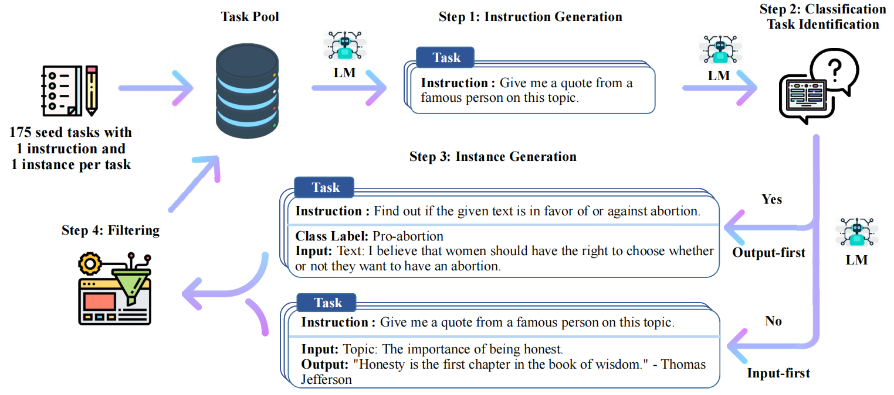
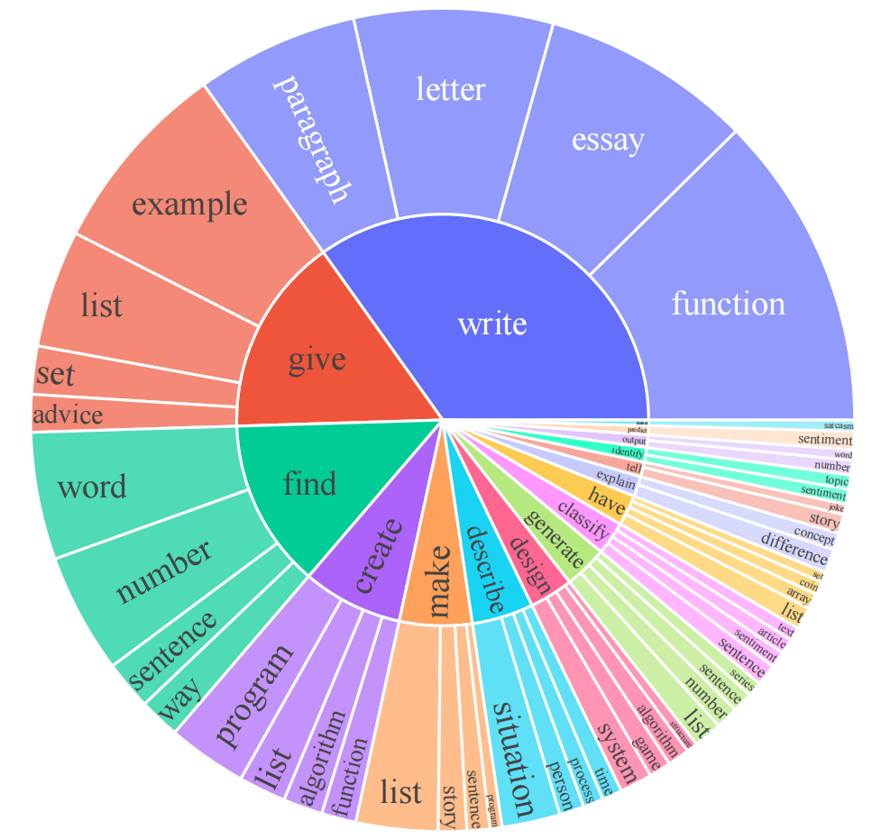
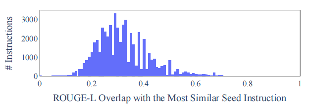
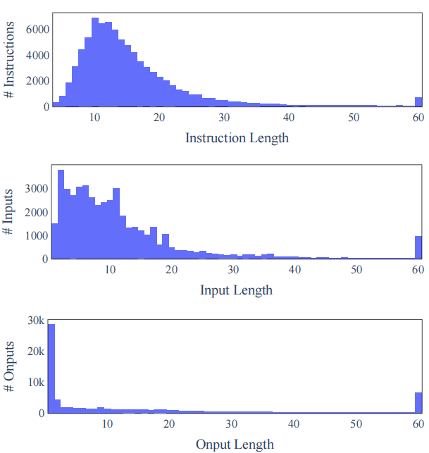
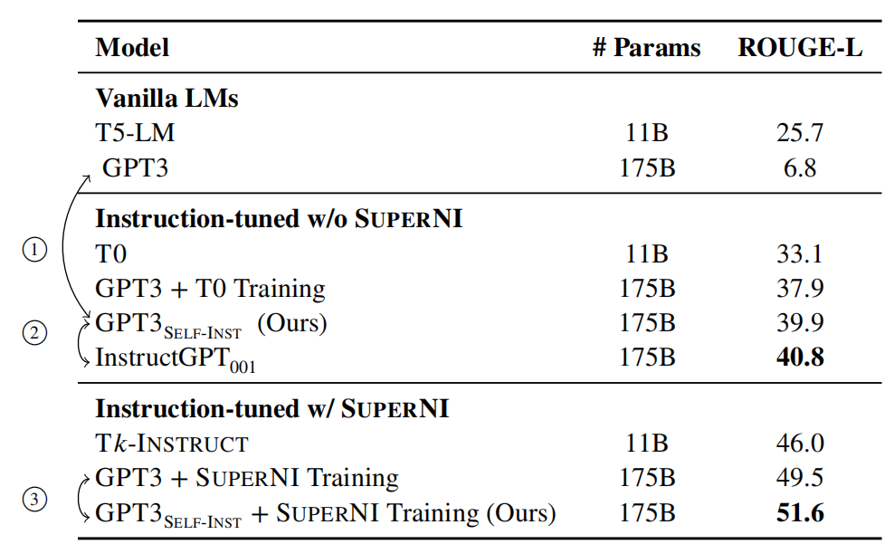
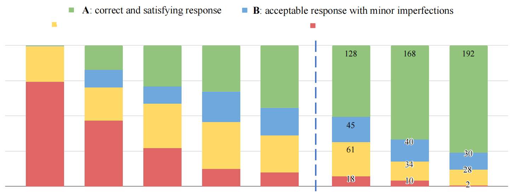

# SELF-INSTRUCT: Aligning Language Model with Self Generated Instructions 
自我指导：将语言模型与自我生成的指令相结合 2022.12.20 https://arxiv.org/abs/2212.10560

## Abstract 摘要
Large “instruction-tuned” language models (finetuned to respond to instructions) have demonstrated a remarkable ability to generalize zero-shot to new tasks. Nevertheless, they depend heavily on human-written instruction data that is limited in quantity, diversity, and creativity, therefore hindering the generality of the tuned model. We introduce SELF-INSTRUCT, a framework for improving the instruction-following capabilities of pretrained language models by bootstrapping off its own generations. Our pipeline generates instruction, input, and output samples from a language model, then prunes them before using them to finetune the original model. Applying our method to vanilla GPT3, we demonstrate a 33% absolute improvement over the original model on SUPERNATURALINSTRUCTIONS, on par with the performance of $InstructGPT_{001}$ (1Unless otherwise specified, our comparisons are with the text-davinci-001 engine. We focus on this engine since it is the closest to our experimental setup: supervised fine-tuning with human demonstrations. The newer engines are more powerful, though they use more data (e.g., code completion or latest user queries) or algorithms (e.g., PPO) that are difficult to compare with ) , which is trained with private user data and human annotations. For further evaluation, we curate a set of expert-written instructions for novel tasks, and show through human evaluation that tuning GPT3 with SELF-INSTRUCT outperforms using existing public instruction datasets by a large margin, leaving only a 5% absolute gap behind $InstructGPT_{001}$. SELF-INSTRUCT provides an almost annotation-free method for aligning pretrained language models with instructions, and we release our large synthetic dataset to facilitate future studies on instruction tuning (2 Code and data will be available at https://github.com/yizhongw/self-instruct) .

大型“指令调整”语言模型(经过微调以响应指令)已经证明了将零样本推广到新任务的非凡能力。然而，它们在很大程度上依赖于数量、多样性和创造性有限的人工书面指令数据，因此阻碍了调优模型的通用性。我们引入了SELF-INSTRUCT，这是一个通过自举？自己的生成来提高预训练语言模型的指令遵循能力的框架。我们的流水线从语言模型中生成指令、输入和输出样本，然后在使用它们来微调普通模型之前对它们进行修剪。将我们的方法应用于普通GPT3，我们证明了在超自然指令(SUPERNATURALINSTRUCTIONS)上比普通模型有33%的绝对改进，与$InstructGPT_{001}$的性能相当(1 除非另有说明，我们将其与text-davinci-001引擎进行比较。我们关注这个引擎，因为它最接近我们的实验设置：通过人工演示进行监督微调。新的引擎更强大，尽管它们使用了更多的数据(如代码完成或最新用户查询)或算法(如PPO)很难与之相比)，它是用私人用户数据和人工标注训练的。为了进一步评估，我们为新任务策划了一组专家书面指令，并通过人工评估表明，使用SELF-INSTRUCT调整GPT3的性能大大优于使用现有公共指令数据集，仅与$InstructGPT_{001}$相差5%的绝对差距。SELF-INSTRUCT提供了一种几乎无标注的方法，用于将预训练的语言模型与指令对齐，我们发布了大型合成数据集，以促进未来对指令调整的研究 (2 代码和数据在 https://github.com/yizhongw/self-instruct) .

## 1 Introduction
The recent NLP literature has witnessed a tremendous amount of activity in building models that can follow natural language instructions (Mishra et al., 2022; Wei et al., 2022; Sanh et al., 2022; Wang et al., 2022; Ouyang et al., 2022; Chung et al., 2022, i.a.). These developments are powered by two key components: large pre-trained language models (LM) and human-written instruction data. PROMPTSOURCE (Bach et al., 2022) and SUPERNATURALINSTRUCTIONS (Wang et al., 2022) are two notable recent datasets that use extensive manual annotation for collecting instructions to construct T0 (Bach et al., 2022; Sanh et al., 2022) and Tk-INSTRUCT (Wang et al., 2022). However, this process is costly and often suffers limited diversity given that most human generations tend to be popular NLP tasks, falling short of covering a true variety of tasks and different ways to describe them. Given these limitations, continuing to improve the quality of instruction-tuned models necessitates the development of alternative approaches for supervising instruction-tuned models.

最近的NLP文献见证了在构建能够遵循自然语言指令的模型方面的大量活动(Mishraet al.,2022;Weiet al.,2020;Sanhet al.,2022年;Wang et al.，2022;Ouyanget al.,2022，Chunget al.,2022)。这些发展由两个关键组成部分推动：大型预训练语言模型(LM)和人类书面指令数据。PROMPTSOURCE(Bach et al.，2022)和SUPERNATURALINSTRUCTIONS(Wang et al.，2021)是最近两个值得注意的数据集，它们使用大量的手工标注来收集构建T0(Bachet al.,2022;Sanhet al.,2021)的指令和Tk-INSTRUCT (Wanget al.,2022)。然而，考虑到大多数人类生成往往是流行的NLP任务，无法涵盖真正的各种任务和描述它们的不同方式，这一过程成本高昂，而且往往多样性有限。鉴于这些局限性，继续提高指令调优模型的质量需要开发替代方法来监督指令调优模型。

In this work, we introduce SELF-INSTRUCT, a semi-automated process for instruction-tuning a pretrained LM using instructional signals from the model itself. The overall process is an iterative bootstrapping algorithm (see Figure 1), which starts off with a limited (e.g., 175 in our study) seed set of manually-written instructions that are used to guide the overall generation. In the first phase, the model is prompted to generate instructions for new tasks. This step leverages the existing collection of instructions to create more broad-coverage instructions that define (often new) tasks. Given the newlygenerated set of instructions, the framework also creates input-output instances for them, which can be later used for supervising the instruction tuning. Finally, various measures are used to prune lowquality and repeated instructions, before adding them to the task pool. This process can be repeated for many interactions until reaching a large number of tasks.


在这项工作中，我们介绍了SELF-INSTRUCT，这是一个半自动化的过程，用于使用来自模型本身的指令信号来调整预训练的LM。整个过程是一个迭代自举算法(见图1)，它从一个有限的(例如，在我们的研究中为175个)种子集手工编写的指令开始，这些指令用于指导整个生成。在第一阶段，提示模型为新任务生成指令。此步骤利用现有的指令集来创建更广泛的指令，这些指令定义(通常是新的)任务。给定新生成的指令集，框架还为它们创建输入输出实例，这些实例稍后可用于监督指令调优。最后，在将低质量和重复的指令添加到任务池之前，使用各种措施来修剪它们。这个过程可以重复多次交互，直到完成大量任务。

<br/>
Figure 1: A high-level overview of SELF-INSTRUCT. The process starts with a small seed set of tasks (one instruction and one input-output instance for each task) as the task pool. Random tasks are sampled from the task pool, and used to prompt an off-the-shelf LM to generate both new instructions and corresponding instances, followed by filtering low-quality or similar generations, and then added back to the initial repository of tasks. The resulting data can be used for the instruction tuning of the language model itself later to follow instructions better. Tasks shown in the figure are generated by GPT3. See Table 10 for more creative examples.
图1：SELF-INSTRUCT的高级概述。该过程从一个小的任务种子集(每个任务有一条指令和一个输入输出实例)作为任务池开始。随机任务从任务池中采样，用于提示现成的LM生成新指令和相应的实例，过滤低质量或类似的生成，然后添加回任务的初始存储库。所得到的数据可以用于稍后语言模型本身的指令调优，以便更好地遵循指令。图中所示的任务由GPT3生成。更多创意样本见表10。
<!--低质量如何定义？-->

To evaluate SELF-INSTRUCT empirically, we run this framework on GPT3 (Brown et al., 2020), which is a vanilla LM (§4). The iterative SELFINSTRUCT process on this model leads to about 52k instructions, paired with about 82K instance inputs and target outputs. We observe that the resulting data provides a diverse range of creative tasks and over 50% of them have less than 0.3 ROUGEL overlaps with the seed instructions (§4.2). On this resulting data, we build $GPT3_{SELF-INST}$ by fine-tuning GPT3 (i.e., the same model used for generating the instructional data). We evaluate $GPT3_{SELF-INST}$ in comparison to various other models on both typical NLP tasks included in SUPERNATURALINSTRUCTIONS (Wang et al., 2022), and a set of new instructions that are created for novel usage of instruction-following models (§5). The SUPERNI results indicate that $GPT3_{SELF-INST}$ outperforms GPT3 (the original model) by a large margin (+33.1%) and nearly matches the performance of $InstructGPT_{001}$. Moreover, our human evaluation on the newly-created instruction set shows that $GPT3_{SELF-INST}$ demonstrates a broad range of instruction following ability, outperforming models trained on other publicly available instruction datasets and leaving only a 5% gap behind $InstructGPT_{001}$.

为了从经验上评估自我指导，我们在GPT3(Brown et al.，2020)上运行了这个框架，这是一个普通的LM(§4)。该模型上的迭代SELFINSTRUCT过程产生大约52k条指令，与大约82K个实例输入和目标输出配对。我们观察到，结果数据提供了各种各样的创造性任务，其中超过50%的数据与种子指令的ROUGEL重叠小于0.3(§4.2)。在这些结果数据上，我们通过微调GPT3(即用于生成指令数据的相同模型)来构建$GPT3_{SELF-INST}$。我们在SUPERNATURALINSTRUCTIONS(Wang et al.，2022)中包括的典型NLP任务和为指令遵循模型的新用法创建的一组新指令(§5)上，与各种其他模型进行比较，评估$GPT3_{SELF-INST}$。SUPERNI结果表明，$GPT3_{SELF-INST}$的性能大大优于GPT3(普通模型)(+33.1%)，几乎与$InstructGPT_{001}$的性能相匹配。此外，我们对新创建的指令集的人工评估表明，$GPT3_{SELF-INST}$表现出广泛的指令遵循能力，优于在其他公开可用的指令数据集上训练的模型，仅与$InstructGPT_{001}$相差5%。

In summary, our contributions are: (1) SELFINSTRUCT, a method for inducing instructionfollowing capability with minimal human-labeled data; (2) We demonstrate its effectiveness via extensive instruction-tuning experiments; (3) We release a large synthetic dataset of 52K instructions and a set of manually-written novel tasks for building and evaluating future instruction-following models.

总之，我们的贡献是：
1. SELFINSTRUCT，一种用最少的人类令牌数据诱导指令遵循能力的方法;
2. 我们通过大量的指令调整实验证明了它的有效性;
3. 我们发布了一个由52K指令组成的大型合成数据集和一组手工编写的新任务，用于构建和评估未来的指令遵循模型。

## 2 Related Work
### Instruction-following language models. 遵循指令的语言模型
A series of works have found evidence that vanilla language models can be effective at following general language instructions if tuned with annotated “instructional” data – datasets containing language instructional commands and their desired outcome based on human judgement (Weller et al., 2020; Mishra et al., 2022; Wang et al., 2022; Wei et al., 2022; Sanh et al., 2022; Ouyang et al., 2022; Parmar et al., 2022; Scialom et al., 2022; Chung et al., 2022; Luo et al., 2022; Puri et al., 2022; Yin et al., 2022; Chakrabarty et al., 2022; Lin et al., 2022; Gupta et al., 2022; Muennighoff et al., 2022). Additionally, they show a direct correlation between the size and diversity of the “instructional” data and the generalizability of resulting models to unseen tasks. Since these developments depend on human annotated “instructional” data, this poses a bottleneck for progress toward more generalizable models (for example see Fig. 5a in Wang et al., 2022). Our work aims to tackle this bottleneck by reducing the dependence on human annotators.

一系列工作已经发现证据表明，如果使用带标注的“指令”数据进行调整，普通的语言模型可以有效地遵循一般语言指令 包含语言指令命令的数据集及其基于人类判断的预期结果(Weller et al., 2020; Mishra et al., 2022; Wang et al., 2022; Wei et al., 2022; Sanh et al., 2022; Ouyang et al., 2022; Parmar et al., 2022; Scialom et al., 2022; Chung et al., 2022; Luo et al., 2022; Puri et al., 2022; Yin et al., 2022; Chakrabarty et al., 2022; Lin et al., 2022; Gupta et al., 2022; Muennighoff et al., 2022)。此外，他们还显示了“指令”数据的大小和多样性与所得模型对看不见的任务的可推广性之间的直接相关性。由于这些发展依赖于人类标注的“指令”数据，这对更具普遍性的模型的进展构成了瓶颈(例如，参见Wang等人的图5a，2022)。我们的工作旨在通过减少对人工标注器的依赖来解决这个瓶颈。

Additionally, despite the remarkable performance of models like InstructGPT (Ouyang et al., 2022), their construction process remains quite opaque. In particular, the role of data has remained understudied due to limited transparency and data released by major corporate entities behind these key models. Addressing such challenges necessitates the creation of a large-scale, public dataset covering a broad range of tasks.

此外，尽管像InstructGPT这样的模型具有显著的性能(Ouyang et al.，2022)，但它们的构建过程仍然相当不透明。特别是，由于这些关键模型背后的主要公司发布的数据和透明度有限，数据的作用仍然研究不足。应对这些挑战需要创建一个涵盖广泛任务的大规模公共数据集。

Instruction-following models have also been of interest in the multi-modal learning literature (Fried et al., 2018; Shridhar et al., 2020; Min et al., 2022; Weir et al., 2022). SELF-INSTRUCT, as a general approach to expanding data, can potentially also be helpful in those settings; however, this is out of the scope of this work.

多模态学习文献中也对指令遵循模型感兴趣(Friedet al.,2018;Shridharet al.,2020;Minet al.,2022;Weiret al.,2022)。自我指导作为一种扩展数据的通用方法，在这些设置中也可能有所帮助; 然而，这超出了这项工作的范围。

### Language models for data generation and augmentation. 用于数据生成和增广的语言模型
A variety of works have relied on generative LMs for data generation (Schick and Schütze, 2021; Wang et al., 2021; Liu et al., 2022; Meng et al., 2022) or augmentation (Feng et al., 2021; Yang et al., 2020; Mekala et al., 2022). For example, Schick and Schütze (2021) propose to replace human annotations of a given task with prompting large LMs and use the resulting data for fine-tuning (often smaller) models in the context of SuperGLUE tasks (Wang et al., 2019). While our work can be viewed as a form of “augmentation,” our work differs from this line in that it is not specific to a particular task (say, QA or NLI). In contrast, a distinct motivation for SELF-INSTRUCT is to bootstrap new task definitions that may not have been defined before by any NLP practitioner (though potentially still important for downstream users).

各种工作都依赖于生成LMs来生成数据(Schick和Schütze，2021;Wanget al.,2021;Liuet al.,2022;Menget al.,2022)或增广(Fenget al.,2021;Yanget al.,2020;Mekalaet al.,2022)。例如，Schick和Schütze(2021)建议用提示大型LM来代替给定任务的人工标注，并在SuperGLUE任务的背景下使用由此产生的数据来微调(通常是较小的)模型(Wang et al.，2019)。虽然我们的工作可以被视为一种“增广”形式，但我们的工作与这一行的不同之处在于，它不是针对特定任务(例如QA或NLI)。相比之下，自我指导的一个明显动机是引导新的任务定义，这些定义以前可能没有被任何NLP从业者定义过(尽管对下游用户来说可能仍然很重要)。

### Self-training. 自我训练
A typical self-training framework (He et al., 2019; Xie et al., 2020; Du et al., 2021; Amini et al., 2022; Huang et al., 2022) uses trained models to assign labels to unlabeled data and then leverages the newly labeled data to improve the model. In a similar line, Zhou et al. (2022a) use multiple prompts to specify a single task and propose to regularize via prompt consistency, encouraging consistent predictions over the prompts. This allows either finetuning the model with extra unlabeled training data, or direct application at inference time. While SELF-INSTRUCT has some similarities with the self-training literature, most selftraining methods assume a specific target task as well as unlabeled examples under it; in contrast, SELF-INSTRUCT produces a variety of tasks from scratch.

一个典型的自我训练框架(Heet al.,2019;Xieet al.,2020;Duet al.,2021;Aminiet al.,2022;Huanget al.,2022)使用训练后的模型为未标注的数据分配标签，然后利用新的标注数据来改进模型。在类似的情况下，Zhou et al. (2022a)使用多个提示来指定单个任务，并建议通过提示一致性进行正则化，鼓励对提示进行一致的预测。这允许使用额外的未标注训练数据来微调模型，或者在推理时直接应用。虽然自我指导与自我训练文献有一些相似之处，但大多数自我训练方法都假设了特定的目标任务及其下的未标注样本; 相比之下，SELF-INSTRUCT从零开始生成各种任务。
<!-使用多个提示来指定单个任务，并建议通过提示一致性进行正则化，鼓励对提示进行一致的预测 -->

### Knowledge distillation. 知识蒸馏
Knowledge distillation (Hinton et al., 2015; Sanh et al., 2019; West et al., 2021; Magister et al., 2022) often involves the transfer of knowledge from larger models to smaller ones. SELF-INSTRUCT can also be viewed as a form of “knowledge distillation", however, it differs from this line in the following ways: (1) the source and target of distillation are the same, i.e., a model’s knowledge is distilled to itself; (2) the content of distillation is in the form of an instruction task (i.e., instructions that define a task, and a set of examples that instantiate it).

知识蒸馏(Hinton et al.，2015;Sanh et al.，2019;West et al.，2021;Magister et al.，2022)通常涉及将知识从较大的模型迁移到较小的模型。自我指导也可以被视为“知识蒸馏”的一种形式，但它与这一行的不同之处在于：(1)蒸馏的来源和目标是相同的，即模型的知识被蒸馏为自己的知识;(2)蒸馏的内容是以指令任务的形式(即定义任务的指令和实例化任务的一组样本)。

### Bootstrapping with limited resources. 利用有限的资源进行引导
A series of recent works use language models to bootstrap some inferences using specialized methods. NPPrompt (Zhao et al., 2022) provides a method to generate predictions for semantic labels without any fine-tuning. It uses a model’s own embeddings to automatically find words relevant to the label of the data sample and hence reduces the dependency on manual mapping from model prediction to label (verbalizers). STAR (Zelikman et al., 2022) iteratively leverages a small number of rationale examples and a large dataset without rationales, to bootstrap a model’s ability to perform reasoning. Self-Correction (Welleck et al., 2022) decouples an imperfect base generator (model) from a separate corrector that learns to iteratively correct imperfect generations and demonstrates improvement over the base generator. Our work instead focuses on bootstrapping new tasks in the instruction paradigm.

最近的一系列工作基于语言模型，使用专门的方法引导一些推理。NPPrompt(Zhao et al.，2022)提供了一种在没有任何微调的情况下生成语义标签预测的方法。它使用模型自己的嵌入来自动查找与数据样本标签相关的单词，从而减少了从模型预测到标签(动词化器)对手工映射的依赖。STAR(Zelikman et al.，2022)迭代地利用少量的基本原理样本和没有基本原理的大型数据集，来引导模型执行推理的能力。自校正(Welleck et al.，2022)将不完美的基础生成器(模型)与独立的校正器解耦，该校正器学习迭代校正不完美的生成，并证明了对基础生成器的改进。相反，我们的工作重点是在指令范式中引导新任务。

### Instruction generation. 指令生成
A series of recent works (Zhou et al., 2022b; Ye et al., 2022; Singh et al., 2022; Honovich et al., 2022) generate instructions of a task given a few examples. While SELFINSTRUCT also involves instruction generation, a major difference in our case is it is task-agnostic; we generate new tasks (instructions along with instances) from scratch.

最近的一系列工作(Zhou et al.，2022b;Yeet al.,2022;Singh et al.，2022;Honovichet al.,2022)通过几个样本生成了任务的指令。虽然SELFINSTRUCT也涉及指令生成，但在我们的情况下，一个主要区别是它是任务未知的; 我们从头开始生成新的任务(指令和实例)。

## 3 Method
Annotating large-scale instruction data can be challenging for humans because it requires 1) creativity to come up with novel tasks and 2) expertise for writing the labeled instances for each task. In this section, we detail our process for SELF-INSTRUCT, which refers to the pipeline of generating tasks with a vanilla pretrained language model itself and then conducting instruction tuning with this generated data in order to align the language model to follow instructions better. This pipeline is depicted in Figure 1.

标注大规模的指令数据对人类来说可能是一项挑战，因为它需要：1. 创造性来提出新的任务，2. 为每个任务编写标注实例的专业知识。在本节中，我们详细介绍了我们的SELF-INSTRUCT过程，它指的是用普通的预训练语言模型本身生成任务，然后用生成的数据进行指令调整，以使语言模型更好地遵循指令。该管道如图1所示。
<!--自动生成的会不会跑偏？不是人类所关心的？-->

### 3.1 Defining Instruction Data 定义指令数据
The instruction data we want to generate contains a set of instructions {$I_t$}, each of which defines a task t in natural language. Each task has one or more input-output instances ($X_t$ , $Y_t$ ). A model M is expected to produce the output y, given the task instruction $I_t$ and the instance input x: M($I_t$ , x) = y, for (x, y) ∈ ($X_t$ , $Y_t$ ). Note that the instruction and instance input does not have a strict boundary in many cases. For example, “write an essay about school safety” can be a valid instruction that we expect models to respond to directly, while it can also be formulated as “write an essay about the following topic” as the instruction, and “school safety” as an instance input. To encourage the diversity of the data format, we allow such instructions that do not require additional input (i.e., x is empty).

我们要生成的指令数据包含一组指令{$I_t$ }, 每个用自然语言定义了一个任务t。每个任务都有一个或多个输入输出实例($X_t$ , $Y_t$ ). 一个模型M 预计将产生产出y, 给出任务指令$I_t$ 和实例输入x: M($I_t$ , x) = y, 对于(x, y) ∈ ($X_t$ , $Y_t$ ). 请注意，在许多情况下，指令和实例输入没有严格的边界。例如，“写一篇关于学校安全的文章”可以是一个有效的指令，我们希望模型直接响应，同时它也可以被公式化为“写一份关于以下主题的文章”作为指令，“学校安全”作为实例输入。为了鼓励数据格式的多样性，我们允许这种不需要额外输入的指令(即，x 为空)。

### 3.2 Automatic Instruction Data Generation 指令数据自动生成
Our pipeline for generating the instruction data consists of four steps: 1) instruction generation, 2) identifying whether the instruction represents a classification task or not, 3) instance generation with the input-first or the output-first approach, and 4) filtering low-quality data.

我们生成指令数据的流水线由四个步骤组成：
1. 指令生成，
2. 识别指令是否代表分类任务，
3. 使用输入优先或输出优先的方法生成实例，以及
4. 过滤低质量数据。

#### Instruction Generation. 指令生成
SELF-INSTRUCT is based on a finding that large pretrained language models can be prompted to generate new and novel instructions when presented with some existing instructions in the context. This provides us with a way to grow the instruction data from a small set of seed human-written instructions. We propose to generate a diverse set of instructions in a bootstrapping fashion. We initiate the task pool with 175 tasks (1 instruction and 1 instance for each task) written by our authors. For every step, we sample 8 task instructions from this pool as in-context examples. Of the 8 instructions, 6 are from the human-written tasks, and 2 are from the model-generated tasks in previous steps to promote diversity. The prompting template is shown in Table 6.

SELF-INSTRUCT基于这样一个发现：当在上下文中与一些现有指令一起呈现时，可以提示大型预训练语言模型生成新的和新颖的指令。这为我们提供了一种从一小组人工编写的种子指令中增广指令数据的方法。我们建议以自举的方式生成一组不同的指令。我们用作者编写的175个任务(每个任务1条指令和1个实例)启动任务池。对于每个步骤，我们从这个池中抽取8条任务指令作为上下文样本。在8条指令中，6条来自人工编写的任务，2条来自之前步骤中模型生成的任务，以促进多样性。提示模板如表6所示。
<!--当在上下文中与一些现有指令一起呈现时，可以提示大型预训练语言模型生成新的和新颖的指令-->

#### Classification Task Identification.  分类任务识别
Because we need two different approaches for classification and non-classification tasks, we next identify whether the generated instruction represents a classification task or not(3 More concretely, we regard tasks that have a limited and small output label space as classification tasks). We prompt vanilla GPT3 few-shot to determine this, using 12 classification instructions and 19 non-classification instructions from the seed tasks. The prompting template is shown in Table 7.

因为我们需要两种不同的方法来处理分类和非分类任务，所以我们接下来确定生成的指令是否代表分类任务(3更具体地说，我们将输出标签空间有限且较小的任务视为分类任务)。我们使用种子任务中的12条分类指令和19条非分类指令，提示普通GPT3少样本来确定这一点。提示模板如表7所示。

#### Instance Generation. 实例生成
Given the instructions and their task type, we generate instances for each instruction independently. This is challenging because it requires the model to understand what the target task is, based on the instruction, figure out what additional input fields are needed and generate them, and finally complete the task by producing the output. We found that pretrained language models can achieve this to a large extent when prompted with instruction-input-output in-context examples from other tasks. A natural way to do this is the Input-first Approach, where we can ask a language model to come up with the input fields first based on the instruction, and then produce the corresponding output. This generation order is similar to how models are used to respond to instruction and input, but here with in-context examples from other tasks. The prompting template is shown in Table 8.

给定指令及其任务类型，我们为每条指令独立生成实例。这很有挑战性，因为它需要模型根据指令理解目标任务是什么，找出需要哪些额外的输入字段并生成它们，最后通过生成输出来完成任务。我们发现，当在其他任务的上下文样本中提示指令输入输出时，预训练的语言模型可以在很大程度上实现这一点。一种自然的方法是输入优先方法，在这种方法中，我们可以要求语言模型首先根据指令提出输入字段，然后产生相应的输出。这种生成顺序类似于如何使用模型来响应指令和输入，但这里有来自其他任务的上下文样本。提示模板如表8所示。

However, we found that this approach can generate inputs biased toward one label, especially for classification tasks (e.g., for grammar error detection, it usually generates grammatical input). Therefore, we additionally propose an Output-first Approach for classification tasks, where we first generate the possible class labels, and then condition the input generation on each class label. The prompting template is shown in Table 9(4 In this work, we use a fixed set of seed tasks for prompting the instance generation, and thus only generate a small number of instances per task in one round. Future work can use randomly sampled tasks to prompt the model to generate a larger number of instances in multiple rounds).  We apply the outputfirst approach to the classification tasks identified in the former step, and the input-first approach to the remaining non-classification tasks.

然而，我们发现这种方法可以生成偏向一个标签的输入，特别是对于分类任务(例如，对于语法错误检测，它通常生成语法输入)。因此，我们还提出了一种用于分类任务的输出优先方法，其中我们首先生成可能的类标签，然后对每个类标签的输入生成进行调节。提示模板如表9所示(4 在本工作中，我们使用一组固定的种子任务来提示实例生成，因此在一轮中每个任务只生成少量实例。未来的工作可以使用随机采样的任务来提示模型在多轮中生成更多实例)。我们将输出优先的方法应用于前一步中确定的分类任务，将输入优先的方法用于剩余的非分类任务。

#### Filtering and Postprocessing.  过滤和后处理
To encourage diversity, a new instruction is added to the task pool only when its ROUGE-L overlap with any existing instruction is less than 0.7. We also exclude instructions that contain some specific keywords (e.g., images, pictures, graphs) that usually can not be processed by language models. When generating new instances for each instruction, we filter out instances that are exactly the same or those with the same input but different outputs.

为了鼓励多样性，只有当新指令的ROUGE-L与任何现有指令的重叠小于0.7时，才会将其添加到任务池中。我们还排除了包含一些特定关键字(例如，图像、图片、图表)的指令，这些关键字通常无法由语言模型处理。当为每条指令生成新实例时，我们会筛选出完全相同的实例或具有相同输入但不同输出的实例。

### 3.3 Finetuning the LM to Follow Instructions 根据指令微调LM
After the creation of the large-scale instruction data, we use this data to finetune the original language model (i.e., SELF-INSTRUCT). To do this, we concatenate the instruction and instance input as a prompt and train the model to generate the instance output in a standard supervised way. To make the model robust to different formats, we use multiple templates to encode the instruction and instance input together. For example, the instruction can be prefixed with “Task:” or not, the input can be prefixed with “Input:” or not, “Output:” can be appended at the end of the prompt, and different numbers of break lines can be put in the middle, etc.

在创建大规模指令数据之后，我们使用这些数据来微调普通语言模型(即SELF-INSTRUCT)。为此，我们将指令和实例输入连接起来作为提示，并训练模型以标准监督的方式生成实例输出。为了使模型对不同的格式具有稳健性，我们使用多个模板将指令和实例输入编码在一起。例如，指令可以加“Task:”或不加前缀，输入可以加“input:”或不加前缀，提示符末尾可以加“Output:。

## 4 SELF-INSTRUCT Data from GPT3
In this section, we apply our method for inducing instruction data to GPT3 as a case study. We use the largest GPT3 language model (“davinci” engine) accessed through the OpenAI API5 . The parameters for making queries are described in Appendix A.1. Here we present an overview of the generated data.

在本节中，我们将我们的方法引入GPT3作为案例研究。我们使用通过OpenAI API5访问的最大GPT3语言模型(“davinci”引擎)。进行查询的参数如附录A.1所述。在这里，我们对生成的数据进行了概述。

### 4.1 Statistics 统计
Table 1 describes the basic statistics of the generated data. We generate a total of over 52K instructions, and more than 82K instances corresponding to these instructions after filtering.

表1描述了生成数据的基本统计信息。我们总共生成了超过52K条指令，经过过滤后，这些指令对应的实例超过82K个。

|statistic| |
|---| ---
|# of instructions | 52,445
|- # of classification instructions | 11,584
|- # of non-classification instructions | 40,861
|# of instances | 82,439
|- # of instances with empty input | 35,878
|ave. instruction length (in words) | 15.9
|ave. non-empty input length (in words) | 12.7
|ave. output length (in words) | 18.9

Table 1: Statistics of the generated data by applying SELF-INSTRUCT to GPT3.
表1：通过对GPT3应用SELF-INSTRUCT生成的数据的统计数据。

### 4.2 Diversity 多样性
To study what types of instructions are generated and how diverse they are, we identify the verb-noun structure in the generated instructions. We use the Berkeley Neural Parser6 (Kitaev and Klein, 2018; Kitaev et al., 2019) to parse the instructions, and then extract the verb that is closest to the root of 5https://openai.com/api/ 6https://parser.kitaev.io/ the parse tree as well as its first direct noun object. 26,559 out of the 52,445 instructions contain such structure; other instructions usually contain more complex clauses (e.g., “Classify whether this tweet contains political content or not.”) or are framed as questions (e.g., “Which of these statements are true?”). We plot the top 20 most common root verbs and their top 4 direct noun objects in Figure 2, which accounts for 14% of the entire set. Overall, we see quite diverse intents and textual formats in these instructions.

为了研究生成了哪些类型的指令以及它们的多样性，我们确定了生成的指令中的动名词结构。我们使用Berkeley Neural Parser6(Kitaev和Klein，2018;Kitaevet al.,2019)来解析指令，然后提取最接近5的词根的动词https://openai.com/api/6.https://parser.kitaev.io/解析树及其第一个直接名词对象。52445条指令中有26559条包含这样的结构;其他说明通常包含更复杂的条款(例如，“分类这条推文是否包含政治内容。”)或被框定为问题(例如：“这些陈述中哪些是真的？”)。我们在图2中绘制了前20个最常见的词根动词及其前4个直接名词宾语，它们占整个集合的14%。总的来说，我们在这些说明中看到了相当多样化的意图和文本格式。

<br/>
Figure 2: The top 20 most common root verbs (inner circle) and their top 4 direct noun objects (outer circle) in the generated instructions. Despite their diversity, the instructions shown here only account for 14% of all the generated instructions because many instructions (e.g., “Classify whether the user is satisfied with the service.”) do not contain such a verb-noun structure.
图2：生成指令中最常见的前20个词根动词(内圈)及其前4个直接名词宾语(外圈)。尽管存在多样性，但此处显示的指令仅占所有生成指令的14%，因为许多指令(例如，“分类用户是否对服务满意”)不包含这样的动名词结构。

We further study how the generated instructions differ from the seed instructions that are used to prompt the generation. For each generated instruction, we compute its highest ROUGE-L overlap with the 175 seed instructions. We plot the distribution of these ROUGE-L scores in Figure 3, indicating a decent number of new instructions that do not have much overlap with the seeds. We also demonstrate diversity in length of the instructions, instance inputs, and instance outputs in Figure 4.

我们进一步研究生成的指令与用于提示生成的种子指令有何不同。对于每个生成的指令，我们计算其与175个种子指令的最高ROUGE-L重叠。我们在图3中绘制了这些ROUGE-L分数的分布图，表明有相当数量的新指令与种子没有太多重叠。我们还在图4中演示了指令长度、实例输入和实例输出的多样性。

<br/>
Figure 3: Distribution of the ROUGE-L scores between generated instructions and their most similar seed instructions.
图3：生成的指令与其最相似的种子指令之间的ROUGE-L分数分布。

<br/>
Figure 4: Length distribution of the generated instructions, non-empty inputs, and outputs.
图4：生成的指令、非空输入和输出的长度分布。

### 4.3 Quality 质量
So far, we have shown the quantity and diversity of the generated data, but its quality remains uncertain. To investigate this, we randomly sample 200 instructions and randomly select 1 instance per instruction. We asked an expert annotator (co-author of this work) to label whether each instance is correct or not, in terms of the instruction, the instance input, and the instance output. Evaluation results in Table 2 show that most of the generated instructions are meaningful, while the generated instances may contain more noise (to a reasonable extent). However, we found that even though the generations may contain errors, most of them are still in the correct format or even partially correct, which can provide useful guidance for training models to follow instructions. We listed a number of good generations and bad generations in Table 10 and Table 11 respectively.

到目前为止，我们已经演示了生成数据的数量和多样性，但其质量仍不确定。为了研究这一点，我们随机抽取200条指令，每个指令随机选择一个实例。我们请一位专家标注者(这项工作的合著者)从指令、实例输入和实例输出的角度来令牌每个实例是否正确。表2中的评估结果表明，大多数生成的指令都是有意义的，而生成的实例可能包含更多的噪声(在合理的程度上)。然而，我们发现，即使生成可能包含错误，但大多数错误仍然是正确的格式，甚至是部分正确的，这可以为训练模型遵循指令提供有用的指导。我们分别在表10和表11中列出了一些好生成和坏生成。


Quality Review Question | Yes %
---|---
Does the instruction describe a valid task?  | 92%
Is the input appropriate for the instruction? | 79%
Is the output a correct and acceptable response to the instruction and input? | 58%
All fields are valid | 54%

Table 2: Data quality review for the instruction, input, and output of the generated data. See Table 10 and Table 11 for representative valid and invalid examples.
表2：生成数据的指令、输入和输出的数据质量审查。具有代表性的有效和无效样本见表10和表11。


## 5 Experimental Results 实验结果
We conduct experiments to measure and compare the quality of models under various instruction tuning setups. We first describe our models and other baselines, followed by our experiments.

我们进行实验来测量和比较在各种指令调整设置下的模型质量。我们首先描述我们的模型和其他基线，然后是我们的实验。


### 5.1 $GPT3_{SELF-INST}$: fine-tuning GPT3 on its own instruction data 对GPT3自己的指令数据进行微调
With the instruction-generated instruction data, we conduct instruction tuning for the GPT3 model itself (the “davinci” engine). As we described in §3.3, we use various templates to concatenate the instruction and input, and train the model to generate the output. This finetuning is done through the OpenAI finetuning API(7https://beta.openai.com/docs/guides/fine-tuning). We use the default hyper-parameters, except that we set the prompt loss weight to 0, and we train the model for 2 epochs. We refer the readers to Appendix A.2 for additional finetuning details. The resulting model is denoted as $GPT3_{SELF-INST}$.

使用指令生成的指令数据，我们对GPT3模型本身(“davinci”引擎)进行指令调优。正如我们在§3.3中所描述的，我们使用各种模板来连接指令和输入，并训练模型以生成输出。这种微调是通过OpenAI微调API(7https://beta.openai.com/docs/guides/fine-tuning). 我们使用默认的超参数，只是我们将即时损失权重设置为0，并为2个周期训练模型。我们请读者参阅附录A.2，了解更多微调细节。得到的模型表示为$GPT3_{SELF-INST}$。

### 5.2 Baselines 基线
Off-the-shelf language models. We evaluate T5-LM (Lester et al., 2021; Raffel et al., 2020) and GPT3 (Brown et al., 2020) as the vanilla LM baselines (only pre-training, no additional fine-tuning). These baselines will indicate the extent to which offthe-shelf LMs are capable of following instructions naturally immediately after pretraining.

现成的语言模型。我们评估了T5-LM(Lesteret al.,2021;Raffelet al.,2020)和GPT3(Brownet al.,2020年)作为普通LM基线(仅预训练，没有额外的微调)。这些基线将表明现成的LMs在预训练后能够立即自然地遵循指令的程度。

Publicly-available instruction-tuned models. T0 and Tk-INSTRUCT are two instruction-tuned models proposed in Sanh et al. (2022) and Wang et al. (2022) respectively, and are demonstrated to be able to follow instructions for many NLP tasks. Both of these models are finetuned from the T5 (Raffel et al., 2020) checkpoints and are publicly available(8 https://huggingface.co/bigscience/T0 9 https://huggingface.co/allenai/tk-instruct-11b-def) . For both of these models, we use their largest version with 11B parameters.

公开提供的指令调优模型。T0和Tk-INSTRUCT是Sanh et al. (2022) and Wang et al. (2022) 提出的两个指令调优模型，分别被证明能够在许多NLP任务中遵循指令。这两个模型都是从T5(Raffel et al.，2020)检查点进行微调的，并且是公开的(8 https://huggingface.co/bigscience/T0 9 https://huggingface.co/allenai/tk-instruct-11b-def) 。对于这两种模型，我们都使用了它们最大的11B参数版本。

Instruction-tuned GPT3 models. We evaluate InstructGPT (Ouyang et al., 2022), which is developed by OpenAI based on GPT3 to follow human instructions better and has been found by the community to have impressive zero-shot abilities. There are various generations of these models, where newer ones use more expansive data or algorithmic novelties(10 https://beta.openai.com/docs/model-index-for-researchers). For our SUPERNI experiments in §5.3, we only compare with their text-davinci-001 engine, because their newer engines are trained with the latest user data and are likely to already see the SUPERNI evaluation set. For our human evaluation of these models on newly written instructions, we include their 001, 002 and 003 engines for completeness.

指令调优的GPT3模型。我们评估了InstructGPT(Ouyanget al.,2022年)，它是由OpenAI基于GPT3开发的，用于更好地遵循人类指令，并且社区发现它具有令人印象深刻的零样本能力。这些模型有不同的一代，新的一代使用了更广泛的数据或算法创新(10 https://beta.openai.com/docs/model-index-for-researchers)。对于我们在§5.3中的SUPERNI实验，我们只与他们的text-davinci-001引擎进行比较，因为他们的新引擎是用最新的用户数据训练的，并且可能已经看到了SUPERNI评估集。为了根据新编写的说明对这些模型进行人工评估，我们包括了它们的001、002和003引擎以确保完整性。

Additionally, to compare SELF-INSTRUCT training with other publicly available instruction tuning data, we further finetune GPT3 model with data from PROMPTSOURCE and SUPERNI, which are used to train the T0 and Tk-INSTRUCT models. We call them T0 training and SUPERNI training for short, respectively. To save the training budget, we sampled 50K instances (but covering all their instructions) for each dataset, which has a comparable size to the instruction data we generated. Based on the findings from Wang et al. (2022) and our early experiments, reducing the number of instances per task does not degrade the model’s generalization performance to unseen tasks.

此外，为了将SELF-INSTRUCT训练与其他公开可用的指令调整数据进行比较，我们使用PROMPSTOURCE和SUPERNI的数据进一步微调GPT3模型，这两个数据用于训练T0和Tk-INSTRUCT模型。我们分别简称它们为T0训练和SUPERNI训练。为了节省训练预算，我们为每个数据集采样了5万个实例(但涵盖了它们的所有指令)，其大小与我们生成的指令数据相当。基于Wang et al. (2022) 的发现和我们的早期实验，减少每个任务的实例数量不会降低模型对看不见任务的泛化性能。

### 5.3 Experiment 1: Zero-Shot Generalization on SUPERNI benchmark 实验1:SUPERNI基准上的零样本推广
We first evaluate the models’ ability to follow instructions on typical NLP tasks in a zero-shot fashion. We use the evaluation set of SUPERNI (Wang et al., 2022), which consists of 119 tasks with 100 instances in each task. In this work, we mainly focus on the zero-shot setup, i.e., the model is prompted with the definition of the tasks only, without incontext demonstration examples. For all our requests to the GPT3 variants, we use the deterministic generation mode (temperature as 0 and no nucleus sampling) without specific stop sequences.

我们首先评估模型在典型NLP任务中以零样本方式遵循指令的能力。我们使用SUPERNI的评估集(Wang et al.，2022)，该评估集由119个任务组成，每个任务中有100个实例。在这项工作中，我们主要关注的是零样本设置，即，模型只提示任务的定义，没有incontext演示样本。对于我们对GPT3变体的所有请求，我们使用没有特定停止序列的确定性生成模型(温度为0，无单元核采样)。

Results. We make the following observations from the results in Table 3. SELF-INSTRUCT boosts the instruction-following ability of GPT3 by a large margin. The vanilla GPT3 model basically cannot follow human instructions at all. Upon manual analysis, we find that it usually generates irrelevant and repetitive text, and does not know when to stop generation. Compared with other models that are not specifically trained for SUPERNI, $GPT3_{SELF-INST}$ achieves better performance than T0 or the GPT3 finetuned on the T0 training set, which takes tremendous human labeling efforts. Notably, $GPT3_{SELF-INST}$ also nearly matches the performance of $InstructGPT_{001}$, which is trained with private user data and human-annotated labels.

结果。我们根据表3中的结果得出以下观察结果。自我指导大大提高了GPT3的指令跟随能力。普通的GPT3模型基本上根本无法遵循人类的指令。经过人工分析，我们发现它通常会生成不相关和重复的文本，并且不知道何时停止生成。与其他没有专门针对SUPERNI训练的模型相比，$GPT3_{SELF-INST}$比T0或在T0训练集上微调的GPT3实现了更好的性能，这需要付出巨大的人为令牌努力。值得注意的是，$GPT3_{SELF-INST}$的性能也几乎与$InstructGPT_{001}$相匹配，后者使用私人用户数据和人工标注标签进行训练。

<br/>
Table 3: Evaluation results on unseen tasks from SUPER-NATURALINSTRUCTIONS (§5.3). From the results, we see that 1 SELF-INSTRUCT can boost GPT3 performance by a large margin (+33.1%) and 2 nearly matches the performance of $InstructGPT_{001}$. Additionally, 3 it can further improve the performance even when a large amount of labeled instruction data is present.
表3：SUPER-NATURALINSTRUCTIONS(§5.3)对未发现任务的评估结果。从结果中，我们可以看到1个自我指示可以大幅提高GPT3的性能(+33.1%)，2个几乎与$InstructionGPT_{001}$的性能相匹配。此外，3即使存在大量令牌的指令数据，它也可以进一步提高性能。

Models trained on SUPERNI training set still achieve better performance on its evaluation set, which we attribute to the similar instruction style and formatting. However, we show that SELFINSTRUCT still brings in additional gains when combined with the SUPERNI training set, proving its value as complementary data.

在SUPERNI训练集上训练的模型在其评估集上仍然取得了更好的性能，我们将其归因于相似的指令风格和格式。然而，我们表明，当与SUPERNI训练集相结合时，SELFINSTRUCT仍然带来了额外的增益，证明了其作为补充数据的价值。

### 5.4 Experiment 2: Generalization to User-oriented Instructions on Novel Tasks 实验2：新任务面向用户指令的泛化
Despite the comprehensiveness of SUPERNI in collecting existing NLP tasks, most of these NLP tasks were proposed for research purposes and skewed toward classification. To better access the practical value of instruction-following models, a subset of the authors curate a new set of instructions motivated by user-oriented applications. We first brainstorm different domains where large LMs may be useful (e.g., email writing, social media, productivity tools, entertainment, programming), then craft instructions related to each domain along with an input-output instance (again, input is optional). We aim to diversify the styles and formats of these tasks (e.g., instructions may be long or short; input/output may take the form of bullet points, tables, codes, equations, etc.). In total, we create 252 instructions with 1 instance per instruction. We believe it can serve as a testbed for evaluating how instructionbased models handle diverse and unfamiliar instructions. Table 4 presents a small portion of the 252 tasks. The whole test set will be available upon request.

尽管SUPERNI在收集现有的NLP任务方面很全面，但这些NLP任务大多是出于研究目的提出的，并倾向于分类。为了更好地获得指令遵循模型的实际价值，作者的一个子集策划了一组受面向用户的应用程序驱动的新指令。我们首先对大型LM可能有用的不同领域进行头脑风暴(例如，电子邮件写作、社交媒体、生产力工具、娱乐、编程)，然后制定与每个领域相关的指令以及输入输出实例(同样，输入是可选的)。我们的目标是使这些任务的风格和格式多样化(例如，指令可以是长的或短的;输入/输出可以采用要点、表格、代码、方程等形式)。我们总共创建了252条指令，每条指令有一个实例。我们相信它可以作为评估基于指令的模型如何处理不同和不熟悉的指令的试验台。表4列出了252项任务中的一小部分。整个测试套件将根据要求提供。

Table 4: Examples in the User-oriented Instructions dataset (§5.4) and predictions from $GPT3_{SELF-INST}$. The right column indicates one of the four quality ratings assigned to the model’s response, with “A” indicating “valid and satisfying” responses (highest) and “D” indicating “irrelevant or invalid response” (lowest). We hope future studies will carefully study the gains as a function of model size or various other parameters. It is worthwhile to note that instruction-tuning with human annotation also suffers from a similar limitation: gains of instruction-tuning are higher for larger model (Wei et al., 2022).
表4：面向用户的指令数据集中的样本(§5.4)和$GPT3_{SELF-INST}$的预测。右栏表示分配给模型响应的四个质量评级之一，“A”表示“有效且令人满意”的响应(最高)，“D”表示“不相关或无效的响应”(最低)。我们希望未来的研究将仔细研究作为模型大小或各种其他参数的函数的增益。值得注意的是，带有人工标注的指令调优也受到类似的限制：对于较大的模型，指令调优的增益更高(Wei et al.，2022)。

Human evaluation setup. Evaluating models’ performance on this evaluation set of diverse tasks is extremely challenging because different tasks require different expertise. Indeed, many of these tasks cannot be measured by automatic metrics or even be judged by normal crowdworkers (e.g., writing a program, or converting first-order logic into natural language). To get a more faithful evaluation, we asked the authors of the instructions to judge model predictions. The evaluators were asked to rate the output based on whether it accurately and effectively completes the task. We implemented a four-level rating system for categorizing the quality of the models’ outputs, defined as follows:
* RATING-A: The response is valid and satisfying.
* RATING-B: The response is acceptable but has minor errors or imperfections that can be improved.
* RATING-C: The response is relevant and responds to the instruction, but it has significant errors in the content. For example, GPT3 might generate a valid output first, but continue to generate other irrelevant things.
* RATING-D: The response is irrelevant or invalid, including repetition of the input, totally irrelevant output, etc.

人工评估设置。由于不同的任务需要不同的专业知识，因此评估模型在这组不同任务上的性能极具挑战性。事实上，这些任务中的许多不能通过自动度量来衡量，甚至不能由普通的众包工作者来判断(例如，编写程序，或将一阶逻辑转换为自然语言)。为了获得更可靠的评估，我们请说明书的作者来判断模型预测。评估人员被要求根据产出是否准确有效地完成任务来对产出进行评分。我们实施了一个四级评级系统，用于对模型输出的质量进行分类，定义如下：
* 评级A：回复有效且令人满意。
* B级：响应是可以接受的，但有可以改进的小错误或缺陷。
* 评级-C：响应是相关的，并对说明作出响应，但其内容存在重大错误。例如，GPT3可能首先生成一个有效的输出，但继续生成其他不相关的东西。
* 额定D：响应不相关或无效，包括输入重复、完全不相关的输出等。

Results. Figure 5 provides the performance of GPT3 model and its instruction-tuned counterparts on this newly written instruction set. As anticipated, the vanilla GPT3 language model is largely unable to respond to instructions, and all instruction-tuned models demonstrate comparatively higher performance, Nonetheless, $GPT3_{SELF-INST}$ (i.e., GPT3 model fine-tuned with SELF-INSTRUCT) outperforms those counterparts trained on T0 or SUPERNI by a large margin, demonstrating the value of the generated data despite the noise. Compared with $InstructGPT_{001}$ (c.f. footnote 1), $GPT3_{SELF-INST}$ is quite close in the performance—if we count acceptable response with minor imperfections (RATING-3) as valid, $GPT3_{SELF-INST}$ is only 5% behind $InstructGPT_{001}$. Lastly, our evaluation confirms the impressive instruction-following ability of InstructGPT002 & InstructGPT003 models. Although there are many factors behind this success, we conjecture that future work can largely benefit from improving the quality of our generated data by using human annotators or training a reward model to select better generations, similar to the algorithm used in Ouyang et al. (2022).

结果。图5提供了GPT3模型及其在这个新编写的指令集上的指令调优对应物的性能。正如预期的那样，普通的GPT3语言模型在很大程度上无法响应指令，并且所有经过指令调优的模型都表现出相对较高的性能。尽管如此，$GPT3_{SELF-INST}$(即，用SELF-INSTRUST微调的GPT3模型)在很大程度上将优于在T0或SUPERNI上训练的对应模型，证明了生成的数据的价值，尽管存在噪声。与$InstructGPT_{001}$(见脚注1)相比，如果我们将具有轻微缺陷的可接受响应(评级-3)视为有效，则$GPT3_{SELF-INST}$的性能相当接近，$GPT3-{SELF-INST}$仅落后$Instruct GPT_{001}$5%。最后，我们的评估证实了InstructionGPT002和InstructionGPT1003模型令人印象深刻的指令跟随能力。尽管这一成功背后有许多因素，但我们推测，未来的工作可以在很大程度上受益于通过使用人类标注器或训练奖励模型来选择更好的世代来提高我们生成的数据的质量，类似于Ouyang et al. (2022)使用的算法。

<br/>
Figure 5: Performance of GPT3 model and its instruction-tuned variants, evaluated by human experts on our 252 user-oriented instructions (§5.4). Human evaluators are instructed to rate the models’ responses into four levels. The results indicate that $GPT3_{SELF-INST}$ outperforms all the other GPT3 variants trained on publicly available instruction datasets. Additionally, $GPT3_{SELF-INST}$ scores nearly as good as $InstructGPT_{001}$ (c.f., footnote 1).
图5:GPT3模型及其指令调整变体的性能，由人类专家根据我们的252条面向用户的指令进行评估(§5.4)。人类评估人员被指示将模型的响应分为四个级别。结果表明，$GPT3_{SELF-INST}$优于在公开可用的指令数据集上训练的所有其他GPT3变体。此外，$GPT3_{SELF-INST}$的得分几乎与$InstructGPT_{001}$一样好(见脚注1)。

### 5.5 Example Predictions from $GPT3_{SELF-INST}$
We present a selection of user-oriented tasks, the corresponding $GPT3_{SELF-INST}$-produced responses and annotator ratings in Table 4. We see that even for responses rated as level 2, the model demonstrates extensive steps in solving the task, even though its final output is incorrect.

我们在表4中演示了一组面向用户的任务，相应的$GPT3_{SELF-INST}$生成的响应和标注器评级。我们看到，即使对于评级为2级的响应，该模型也演示了解决任务的大量步骤，即使其最终输出是不正确的。

## 6 Discussion and Limitation 讨论和限制
### 6.1 Why does SELF-INSTRUCT work? 为什么自我指导有效？
It is worthwhile to reflect on the role that highquality human feedback plays in enabling the recent successes on instruction-tuning LMs (Mishra et al., 2022; Wang et al., 2022; Wei et al., 2022; Sanh et al., 2022; Ouyang et al., 2022). Here are two extreme hypotheses: (H1 ) Human feedback is a necessary and indispensable aspect of instruction-tuning as LMs need to learn about issues that were not quite learned during pre-training. (H2 ) Human feedback is an optional aspect of instruction-tuning as LMs are already quite familiar with instructions from their pre-training. Observing the human feedback is merely a lightweight process for aligning their pretraining distribution/objective which might be replaceable with a different process.

值得反思的是，高质量的人类反馈在实现最近在指令调整LMs方面的成功方面所起的作用(Mishraet al.,2022;Wanget al.,2022;Wei et al.，2022;Sanhet al.,2022)。这里有两个极端的假设：(H1)人类反馈是指令调整的一个必要和不可或缺的方面，因为LMs需要了解在预训练中没有学到的问题。(H2)人类反馈是指令调整的一个可选方面，因为LMs已经非常熟悉他们预训练中的指令。观察人类反馈只是一个轻量级的过程，用于调整他们的预训练分布/目标，这可能可以用不同的过程来替代。

While the reality probably lies somewhere in between these two extremes, we conjecture that it is closer to H2 , particularly for larger models. This intuition, that LMs already know much about language instructions, is a key motivation for SELFINSTRUCT and is also supported by its empirical success.

虽然现实可能介于这两个极端之间，但我们推测它更接近H2，尤其是对于更大的模型。LMs已经对语言指令有了很多了解，这种直觉是SELFINSTRUCT的关键动机，也得到了其成功经验的支持。

### 6.2 Broader Impact 更广泛的影响
Beyond the immediate focus of this paper, we believe that SELF-INSTRUCT may help bring more transparency to what happens “behind the scenes” of widely-used instruction-tuned models like InstructGPT. Unfortunately, such industrial models remain behind the API walls as their datasets are not released, and hence there is little understanding of their constructions and why they demonstrate impressive capabilities. The burden now falls on academia to better understand the source of success in these models and strive for better – yet open – models. We believe our findings in this paper demonstrate the importance of diverse instruction data, and our large synthetic dataset can be the first step toward higher-quality data for building better instruction-following models.

除了本文的直接重点之外，我们相信，自我指导可能有助于为广泛使用的指令调优模型(如InstructionGPT)的“幕后”发生的事情带来更多的透明度。不幸的是，由于这些工业模型的数据集没有发布，因此它们仍然处于API墙后，因此对它们的结构以及为什么它们表现出令人印象深刻的能力几乎没有了解。现在，学术界肩负着更好地理解这些模型的成功来源，并努力建立更好但开放的模型的责任。我们相信，我们在本文中的发现证明了多样化教学数据的重要性，我们的大型合成数据集可以成为迈向更高质量数据的第一步，以建立更好的教学跟踪模型。

### 6.3 Limitations of SELF-INSTRUCT
Here, we discuss some limitations of this work to inspire future research in this direction.

在这里，我们讨论了这项工作的一些局限性，以启发未来在这个方向上的研究。

Tail phenomena. SELF-INSTRUCT depends on LMs, and it will inherit all the limitations that carry over with LMs. As recent studies have shown (Razeghi et al., 2022; Kandpal et al., 2022), tail phenomena pose a serious challenge to the success of LMs. In other words, LMs’ largest gains correspond to the frequent uses of languages (head of the language use distribution), and there are minimal gains in the low-frequency contexts. Similarly, in the context of this work, it would not be surprising if the majority of the gains by SELF-INSTRUCT are skewed toward tasks or instructions that present more frequently in the pre-training corpus. As a consequence, the approach might show brittleness with respect to uncommon and creative instructions.

尾部现象。自我指导依赖于LMs，它将继承LMs的所有限制。正如最近的研究所表明的那样(Razeghiet al.,2022;Kandpalet al.,2022)，尾部现象对LMs的成功构成了严重挑战。换句话说，LMs的最大增益对应于语言的频繁使用(语言使用分布的头部)，而在低频上下文中的增益最小。同样，在这项工作的背景下，如果自我指导的大部分收益都偏向于在预训练语料库中更频繁出现的任务或指令，也就不足为奇了。因此，对于不常见的和创造性的指令，该方法可能会显示出脆弱性。

Dependence on large models. Because of SELFINSTRUCT’s dependence on the inductive biases extracted from LMs, it might work best for larger models. If true, this may create barriers to access for those who may not have large computing resources.

对大型模型的依赖。由于SELFINSTRUCT依赖于从LMs中提取的归纳偏差，它可能最适用于更大的模型。如果这是真的，那么对于那些可能没有大量计算资源的人来说，这可能会造成访问障碍。

Reinforcing LM biases. A point of concern for the authors is the unintended consequences of this iterative algorithm, such as the amplification of problematic social biases (stereotypes or slurs about genders, races, etc.). Relatedly, one observed challenge in this process is the algorithm’s difficulty in producing balanced labels, which reflected models’ prior biases. We hope future work will hash out such details to better understand the pros and cons of the approach.

强化LM偏差。作者关注的一点是这种迭代算法的意外后果，例如放大有问题的社会偏见(对性别、种族等的刻板印象或诋毁)。与此相关，在这个过程中观察到的一个挑战是算法难以产生平衡的标签，这反映了模型先前的偏见。我们希望未来的工作能够解决这些细节，以更好地了解这种方法的利弊。

## 7 Conclusion
We introduce SELF-INSTRUCT, a task-agnostic method to improve the instruction-following capabilities of language models via its own generation of instruction data (instruction, input, and output samples) and bootstrapping with it. Our method conducts instruction-tuning of the original model on the pruned subset of generated samples. On experimenting with vanilla GPT3, we observe a 33% absolute improvement over the original model on SUPER-NATURALINSTRUCTIONS. This performance is on par with $InstructGPT_{001}$ , which is trained with private user data and expensive human annotations. Furthermore, we curate a set of expert-written instructions for novel tasks. Human evaluation on this set shows that tuning GPT3 with SELF-INSTRUCT outperforms using existing public instruction datasets by a large margin, leaving only a 5% absolute gap behind $InstructGPT_{001}$. We hope SELF-INSTRUCT can serve as the first step to align pretrained language models to follow human instructions, and future work can build on top of this data to improve instruction-following models.

我们引入了SELF-INSTRUCT，这是一种任务未知的方法，通过自己生成指令数据(指令、输入和输出样本)并使用它进行自举，来提高语言模型的指令跟随能力。我们的方法在生成样本的修剪子集上对普通模型进行指令调整。在用普通GPT3进行实验时，我们观察到在SUPER-NATURALINSTRUMENTS上比普通模型有33%的绝对改进。此性能与$InstructGPT_{001}$不相上下，后者使用私有用户数据和昂贵的人工标注进行训练。此外，我们还为新颖的任务策划了一套专业的书面说明。对该集合的人工评估表明，使用SELF-INSTRUCT调优GPT3的性能大大优于使用现有公共指令数据集，仅与$InstructionGPT_{001}$相差5%的绝对差距。我们希望SELF-INSTRUCT可以作为第一步，使预先训练的语言模型与人类指令相一致，未来的工作可以在这些数据的基础上改进指令遵循模型。

## Acknowledgements
The authors would like to thank Sewon Min, Eric Wallace, Ofir Press, and other members of UWNLP and AllenNLP for their constructive feedback. DK is supported with a gift from the Allen Institute for AI.

作者要感谢Sewon Min、Eric Wallace、Ofir Press以及UWNLP和AllenNLP的其他成员提供的建设性反馈。DK得到了艾伦人工智能研究所的一份礼物的支持。

## References
* Massih-Reza Amini, Vasilii Feofanov, LoicPauletto, Emilie Devijver, and Yury Maximov.2022. Self-training: A survey. arXiv preprintarXiv:2202.12040.
* Stephen H Bach, Victor Sanh, Zheng-Xin Yong, Al￾bert Webson, Colin Raffel, Nihal V Nayak, AbheeshtSharma, Taewoon Kim, M Saiful Bari, ThibaultFevry, et al. 2022. PromptSource: An Integrated De￾velopment Environment and Repository for NaturalLanguage Prompts. In Annual Meeting of the Associ￾ation for Computational Linguistics (ACL) - SystemDemonstrations.
* Tom B. Brown, Benjamin Mann, Nick Ryder, MelanieSubbiah, Jared Kaplan, Prafulla Dhariwal, ArvindNeelakantan, Pranav Shyam, Girish Sastry, AmandaAskell, Sandhini Agarwal, and et al. 2020. Languagemodels are few-shot learners. In Advances in NeuralInformation Processing Systems (NeurIPS).
* Tuhin Chakrabarty, Vishakh Padmakumar, and He He.2022. Help me write a poem: Instruction tuningas a vehicle for collaborative poetry writing. arXivpreprint arXiv:2210.13669.
* Hyung Won Chung, Le Hou, Shayne Longpre, Bar￾ret Zoph, Yi Tay, William Fedus, Eric Li, XuezhiWang, Mostafa Dehghani, Siddhartha Brahma, et al.2022. Scaling instruction-finetuned language mod￾els. arXiv preprint arXiv:2210.11416.
* Jingfei Du, Édouard Grave, Beliz Gunel, VishravChaudhary, Onur Celebi, Michael Auli, Veselin Stoy￾anov, and Alexis Conneau. 2021. Self-training im￾proves pre-training for natural language understand￾ing. In Conference of the North American Chap￾ter of the Association for Computational Linguistics(NAACL): Human Language Technologies, pages5408–5418.
* Steven Y Feng, Varun Gangal, Jason Wei, Sarath Chan￾dar, Soroush Vosoughi, Teruko Mitamura, and Ed￾uard Hovy. 2021. A survey of data augmentationapproaches for nlp. In Annual Meeting of the Asso￾ciation for Computational Linguistics (ACL) ACL￾IJCNLP - Findings, pages 968–988.
* Daniel Fried, Ronghang Hu, Volkan Cirik, AnnaRohrbach, Jacob Andreas, Louis-Philippe Morency,Taylor Berg-Kirkpatrick, Kate Saenko, Dan Klein,and Trevor Darrell. 2018. Speaker-follower modelsfor vision-and-language navigation. In Advances inNeural Information Processing Systems (NeurIPS).
* Prakhar Gupta, Cathy Jiao, Yi-Ting Yeh, Shikib Mehri,Maxine Eskenazi, and Jeffrey P Bigham. 2022. In￾structdial: Improving zero and few-shot generaliza￾tion in dialogue through instruction tuning. arXivpreprint arXiv:2205.12673.
* Junxian He, Jiatao Gu, Jiajun Shen, and Marc’AurelioRanzato. 2019. Revisiting self-training for neural se￾quence generation. In International Conference onLearning Representations (ICLR).
* Geoffrey Hinton, Oriol Vinyals, Jeff Dean, et al. 2015.
* Distilling the knowledge in a neural network. InAdvances in Neural Information Processing Systems(NeurIPS) Workshop on Deep Learning.
* Or Honovich, Uri Shaham, Samuel R Bowman, andOmer Levy. 2022. Instruction induction: Fromfew examples to natural language task descriptions.arXiv preprint arXiv:2205.10782.
* Jiaxin Huang, Shixiang Shane Gu, Le Hou, Yuexin Wu,Xuezhi Wang, Hongkun Yu, and Jiawei Han. 2022.
* Large language models can self-improve. arXivpreprint arXiv:2210.11610.
* Nikhil Kandpal, Haikang Deng, Adam Roberts, EricWallace, and Colin Raffel. 2022. Large languagemodels struggle to learn long-tail knowledge. arXivpreprint arXiv:2211.08411.
* Nikita Kitaev, Steven Cao, and Dan Klein. 2019. Multi￾lingual constituency parsing with self-attention andpre-training. In Annual Meeting of the Associationfor Computational Linguistics (ACL), pages 3499–3505.
* Nikita Kitaev and Dan Klein. 2018. Constituency pars￾ing with a self-attentive encoder. In Annual Meet￾ing of the Association for Computational Linguistics(ACL), pages 2676–2686.
* Brian Lester, Rami Al-Rfou, and Noah Constant. 2021.
* The power of scale for parameter-efficient prompttuning. In Conference on Empirical Methods in Nat￾ural Language Processing (EMNLP).
* Bill Yuchen Lin, Kangmin Tan, Chris Miller, BeiwenTian, and Xiang Ren. 2022. Unsupervised cross￾task generalization via retrieval augmentation. InAdvances in Neural Information Processing Systems(NeurIPS).
* Alisa Liu, Swabha Swayamdipta, Noah A. Smith, andYejin Choi. 2022. WANLI: Worker and ai collabo￾ration for natural language inference dataset creation. In Conference on Empirical Methods in Natural Lan￾guage Processing (EMNLP) - Findings.
* Man Luo, Sharad Saxena, Swaroop Mishra, Mihir Par￾mar, and Chitta Baral. 2022. Biotabqa: Instructionlearning for biomedical table question answering. InBioASQ Workshop.
* Lucie Charlotte Magister, Jonathan Mallinson, JakubAdamek, Eric Malmi, and Aliaksei Severyn. 2022.
* Teaching small language models to reason. arXivpreprint arXiv:2212.08410.
* Dheeraj Mekala, Tu Vu, Timo Schick, and JingboShang. 2022. Leveraging qa datasets to improvegenerative data augmentation. arXiv preprintarXiv:2205.12604.
* Yu Meng, Martin Michalski, Jiaxin Huang, Yu Zhang,Tarek Abdelzaher, and Jiawei Han. 2022. Tun￾ing language models as training data generators foraugmentation-enhanced few-shot learning. arXivpreprint arXiv:2211.03044.
* So Yeon Min, Devendra Singh Chaplot, PradeepRavikumar, Yonatan Bisk, and Ruslan Salakhutdi￾nov. 2022. FILM: Following Instructions in Lan￾guage with Modular Methods. In International Con￾ference on Learning Representations (ICLR).
* Swaroop Mishra, Daniel Khashabi, Chitta Baral, andHannaneh Hajishirzi. 2022. Cross-Task Generaliza￾tion via Natural Language Crowdsourcing Instruc￾tions. In Annual Meeting of the Association for Com￾putational Linguistics (ACL).
* Niklas Muennighoff, Thomas Wang, Lintang Sutawika,Adam Roberts, Stella Biderman, Teven Le Scao,M Saiful Bari, Sheng Shen, Zheng-Xin Yong, Hai￾ley Schoelkopf, et al. 2022. Crosslingual general￾ization through multitask finetuning. arXiv preprintarXiv:2211.01786.
* Long Ouyang, Jeff Wu, Xu Jiang, Diogo Almeida, Car￾roll L Wainwright, Pamela Mishkin, Chong Zhang,Sandhini Agarwal, Katarina Slama, Alex Ray, et al.2022. Training Language Models to Follow Instruc￾tions with Human Feedback. In Advances in NeuralInformation Processing Systems (NeurIPS).
* Mihir Parmar, Swaroop Mishra, Mirali Purohit, ManLuo, Murad Mohammad, and Chitta Baral. 2022. In￾BoXBART: Get instructions into biomedical multi￾task learning. In Conference of the North AmericanChapter of the Association for Computational Lin￾guistics (NAACL) - Findings, pages 112–128.
* Ravsehaj Singh Puri, Swaroop Mishra, Mihir Parmar,and Chitta Baral. 2022. How many data samplesis an additional instruction worth? arXiv preprintarXiv:2203.09161.
* Colin Raffel, Noam Shazeer, Adam Roberts, KatherineLee, Sharan Narang, Michael Matena, Yanqi Zhou,Wei Li, and Peter J Liu. 2020. Exploring the lim￾its of transfer learning with a unified text-to-texttransformer. Journal of Machine Learning Research(JMLR).
* Yasaman Razeghi, Robert L Logan IV, Matt Gardner,and Sameer Singh. 2022. Impact of pretraining termfrequencies on few-shot reasoning. arXiv preprintarXiv:2202.07206.
* Victor Sanh, Lysandre Debut, Julien Chaumond, andThomas Wolf. 2019. Distilbert, a distilled versionof bert: smaller, faster, cheaper and lighter. In Ad￾vances in Neural Information Processing Systems(NeurIPS) Workshop on Energy Efficient MachineLearning and Cognitive Computing.
* Victor Sanh, Albert Webson, Colin Raffel, StephenBach, Lintang Sutawika, Zaid Alyafeai, AntoineChaffin, Arnaud Stiegler, Arun Raja, Manan Dey,M Saiful Bari, Canwen Xu, Urmish Thakker,Shanya Sharma Sharma, Eliza Szczechla, TaewoonKim, Gunjan Chhablani, Nihal Nayak, DebajyotiDatta, Jonathan Chang, Mike Tian-Jian Jiang, HanWang, Matteo Manica, Sheng Shen, Zheng XinYong, Harshit Pandey, Rachel Bawden, ThomasWang, Trishala Neeraj, Jos Rozen, Abheesht Sharma,Andrea Santilli, Thibault Fevry, Jason Alan Fries,Ryan Teehan, Teven Le Scao, Stella Biderman,Leo Gao, Thomas Wolf, and Alexander M Rush.2022. Multitask Prompted Training Enables Zero￾Shot Task Generalization. In International Confer￾ence on Learning Representations (ICLR).
* Timo Schick and Hinrich Schütze. 2021. Generatingdatasets with pretrained language models. In Con￾ference on Empirical Methods in Natural LanguageProcessing (EMNLP).
* Thomas Scialom, Tuhin Chakrabarty, and SmarandaMuresan. 2022. Fine-tuned language mod￾els are continual learners. arXiv preprintarXiv:2205.12393.
* Mohit Shridhar, Jesse Thomason, Daniel Gordon,Yonatan Bisk, Winson Han, Roozbeh Mottaghi,Luke Zettlemoyer, and Dieter Fox. 2020. ALFRED:A Benchmark for Interpreting Grounded Instructionsfor Everyday Tasks. In IEEE Conference on Com￾puter Vision and Pattern Recognition (CVPR).
* Chandan Singh, John X Morris, Jyoti Aneja, Alexan￾der M Rush, and Jianfeng Gao. 2022. Explaining pat￾terns in data with language models via interpretableautoprompting. arXiv preprint arXiv:2210.01848.
* Alex Wang, Yada Pruksachatkun, Nikita Nangia,Amanpreet Singh, Julian Michael, Felix Hill, OmerLevy, and Samuel Bowman. 2019. SuperGLUE: Astickier benchmark for general-purpose language un￾derstanding systems. In Advances in Neural Infor￾mation Processing Systems (NeurIPS).
* Yizhong Wang, Swaroop Mishra, Pegah Alipoor￾molabashi, Yeganeh Kordi, Amirreza Mirzaei,Anjana Arunkumar, Arjun Ashok, Arut SelvanDhanasekaran, Atharva Naik, David Stap, EshaanPathak, Giannis Karamanolakis, Haizhi Gary Lai, Is￾han Purohit, Ishani Mondal, Jacob Anderson, KirbyKuznia, Krima Doshi, Maitreya Patel, Kuntal Ku￾mar Pal, Mehrad Moradshahi, Mihir Parmar, Mi￾rali Purohit, Neeraj Varshney, Phani Rohitha Kaza,Pulkit Verma, Ravsehaj Singh Puri, Rushang Karia,Shailaja Keyur Sampat, Savan Doshi, SiddharthaMishra, Sujan Reddy, Sumanta Patro, Tanay Dixit,Xudong Shen, Chitta Baral, Yejin Choi, Noah A.
* Smith, Hannaneh Hajishirzi, and Daniel Khashabi.2022. Super-naturalinstructions: Generalization viadeclarative instructions on 1600+ tasks. In Con￾ference on Empirical Methods in Natural LanguageProcessing (EMNLP).
* Zirui Wang, Adams Wei Yu, Orhan Firat, and Yuan Cao.2021. Towards zero-label language learning. arXivpreprint arXiv:2109.09193.
* Jason Wei, Maarten Bosma, Vincent Zhao, Kelvin Guu,Adams Wei Yu, Brian Lester, Nan Du, Andrew M.
* Dai, and Quoc V Le. 2022. Finetuned LanguageModels are Zero-Shot Learners. In InternationalConference on Learning Representations (ICLR).
* Nathaniel Weir, Xingdi Yuan, Marc-Alexandre Côté,Matthew Hausknecht, Romain Laroche, Ida Momen￾nejad, Harm Van Seijen, and Benjamin Van Durme.2022. One-Shot Learning from a Demonstrationwith Hierarchical Latent Language. arXiv preprintarXiv:2203.04806.
* Sean Welleck, Ximing Lu, Peter West, Faeze Brah￾man, Tianxiao Shen, Daniel Khashabi, and YejinChoi. 2022. Generating sequences by learning toself-correct. arXiv preprint arXiv:2211.00053.
* Orion Weller, Nicholas Lourie, Matt Gardner, andMatthew Peters. 2020. Learning from Task Descrip￾tions. In Conference on Empirical Methods in Natu￾ral Language Processing (EMNLP).
* Peter West, Chandra Bhagavatula, Jack Hessel, Jena DHwang, Liwei Jiang, Ronan Le Bras, Ximing Lu,Sean Welleck, and Yejin Choi. 2021. Symbolicknowledge distillation: from general language mod￾els to commonsense models. In Conference of theNorth American Chapter of the Association for Com￾putational Linguistics (NAACL).
* Qizhe Xie, Minh-Thang Luong, Eduard Hovy, andQuoc V Le. 2020. Self-training with noisy studentimproves imagenet classification. In IEEE Confer￾ence on Computer Vision and Pattern Recognition(CVPR), pages 10687–10698.
* Yiben Yang, Chaitanya Malaviya, Jared Fernandez,Swabha Swayamdipta, Ronan Le Bras, Ji-PingWang, Chandra Bhagavatula, Yejin Choi, and DougDowney. 2020. Generative data augmentation forcommonsense reasoning. In Conference on Em￾pirical Methods in Natural Language Processing(EMNLP) - Findings.
* Seonghyeon Ye, Doyoung Kim, Joel Jang, JoongboShin, and Minjoon Seo. 2022. Guess the instruction!making language models stronger zero-shot learners. arXiv preprint arXiv:2210.02969.
* Wenpeng Yin, Jia Li, and Caiming Xiong. 2022. Con￾TinTin: Continual learning from task instructions.
* In Annual Meeting of the Association for Computa￾tional Linguistics (ACL).
* Eric Zelikman, Jesse Mu, Noah D Goodman, andYuhuai Tony Wu. 2022. STar: Self-taught rea￾soner bootstrapping reasoning with reasoning. InAdvances in Neural Information Processing Systems(NeurIPS).
* Xuandong Zhao, Siqi Ouyang, Zhiguo Yu, Ming Wu,and Lei Li. 2022. Pre-trained language modelscan be fully zero-shot learners. arXiv preprintarXiv:2212.06950.
* Chunting Zhou, Junxian He, Xuezhe Ma, Taylor Berg￾Kirkpatrick, and Graham Neubig. 2022a. PromptConsistency for Zero-Shot Task Generalization. InConference on Empirical Methods in Natural Lan￾guage Processing (EMNLP) - Findings.
* Yongchao Zhou, Andrei Ioan Muresanu, Ziwen Han,Keiran Paster, Silviu Pitis, Harris Chan, andJimmy Ba. 2022b. Large language models arehuman-level prompt engineers. arXiv preprintarXiv:2211.01910.


## Supplemental Material 补充材料
### A Implementation Details 实施细节
#### A.1 Querying the GPT3 API  查询GPT3 API
We use different sets of hyper-parameters when querying GPT3 API for different purposes. These hyperparameters are found to work well with the GPT3 model (“davinci” engine) and the other instruction-tuned GPT3 variants. We listed them in Table 5.

当出于不同目的查询GPT3 API时，我们使用不同的超参数集。发现这些超参数与GPT3模型(“davinci”引擎)和其他指令调优的GPT3变体配合良好。我们在表5中列出了它们。

Table 5: Hyper-parameters for querying OpenAI API in different experiments.
表5：不同实验中查询OpenAI API的超参数。

#### A.2 Finetuning GPT3 微调GPT3
GPT3SELF-INST and some of our baselines are finetuned from GPT3 model (“davinci” engine with 175B parameters). We conduct this finetuning via OpenAI’s finetuning API11. While the details of how the model is finetuned with this API are not currently available (e.g., which parameters are updated, or what the optimizer is), we tune all our models with the default hyper-parameters of this API so that the results are comparable. We only set the “prompt_loss_weight” to 0 since we find this works better in our case, and every finetuning experiment is trained for two epochs to avoid overfitting the training tasks. Finetuning is charged based on the number of tokens in the training file. Finetuning GPT3SELF-INST from the GPT3 model took $338.

GPT3SELF-INST和我们的一些基线是从GPT3模型(具有175B参数的“davinci”引擎)进行微调的。我们通过OpenAI的微调API11进行此微调。虽然目前还没有关于如何使用此API微调模型的详细信息(例如，哪些参数已更新，或者优化器是什么)，但我们使用此API的默认超参数微调所有模型，以便结果具有可比性。我们只将“prompt_loss_weight”设置为0，因为我们发现这在我们的情况下效果更好，并且每个微调实验都经过两个周期的训练，以避免过度拟合训练任务。微调是根据训练文件中的令牌数量进行收费的。从GPT3模型中微调GPT3SELF-INST花费了338美元。

### B Prompting Templates for Data Generation 数据生成提示模板
SELF-INSTRUCT relies on a number of prompting templates in order to elicit the generation from language models. Here we provide our four templates for generating the instruction (Table 6), classifying whether an instruction represents a classification task or not (Table 7), generating non-classification instances with the input-first approach (Table 8), and generating classification instances with the outp

自我指导依赖于许多提示模板，以便从语言模型中引出生成。在这里，我们提供了四个模板，用于生成指令(表6)、分类指令是否代表分类任务(表7)、使用输入优先方法生成非分类实例(表8)和使用outp生成分类实例

```
Come up with a series of tasks:
Task 1: {instruction for existing task 1}
Task 2: {instruction for existing task 2}
Task 3: {instruction for existing task 3}
Task 4: {instruction for existing task 4}
Task 5: {instruction for existing task 5}
Task 6: {instruction for existing task 6}
Task 7: {instruction for existing task 7}
Task 8: {instruction for existing task 8}
Task 9:
```

Table 6: Prompt used for generating new instructions. 8 existing instructions are randomly sampled from the task pool for in-context demonstration. The model is allowed to generate instructions for new tasks, until it stops its generation, reaches its length limit or generates “Task 16” tokens.
表6：用于生成新指令的提示。从任务池中随机抽取8条现有指令进行上下文演示。该模型可以为新任务生成指令，直到它停止生成、达到长度限制或生成“任务16”令牌。

11https://beta.openai.com/docs/guides/fine-tuning

```
Can the following task be regarded as a classification task with finite output labels?
Task: Given my personality and the job, tell me if I would be suitable.
Is it classification? Yes
Task: Give me an example of a time when you had to use your sense of humor.
Is it classification? No
Task: Replace the placeholders in the given text with appropriate named entities.
Is it classification? No
Task: Fact checking - tell me if the statement is true, false, or unknown, based on your
knowledge and common sense.
Is it classification? Yes
Task: Return the SSN number for the person.
Is it classification? No
Task: Detect if the Reddit thread contains hate speech.
Is it classification? Yes
Task: Analyze the sentences below to identify biases.
Is it classification? No
Task: Select the longest sentence in terms of the number of words in the paragraph, output
the sentence index.
Is it classification? Yes
Task: Find out the toxic word or phrase in the sentence.
Is it classification? No
Task: Rank these countries by their population.
Is it classification? No
Task: You are provided with a news article, and you need to identify all the categories that
this article belongs to. Possible categories include: Music, Sports, Politics, Tech, Finance,
Basketball, Soccer, Tennis, Entertainment, Digital Game, World News. Output its categories one
by one, seperated by comma.
Is it classification? Yes
Task: Given the name of an exercise, explain how to do it.
Is it classification? No
Task: Select the oldest person from the list.
Is it classification? Yes
Task: Find the four smallest perfect numbers.
Is it classification? No
Task: Does the information in the document supports the claim? You can answer "Support" or
"Unsupport".
Is it classification? Yes
Task: Create a detailed budget for the given hypothetical trip.
Is it classification? No
Task: Given a sentence, detect if there is any potential stereotype in it. If so, you should
explain the stereotype. Else, output no.
Is it classification? No
⋯
Task: To make the pairs have the same analogy, write the fourth word.
Is it classification? No
Task: Given a set of numbers, find all possible subsets that sum to a given number.
Is it classification? No
Task: {instruction for the target task}
```

Table 7: Prompt used for classifying whether a task instruction is a classification task or not.
表7：用于对任务指令是否为分类任务进行分类的提示。

```
Come up with examples for the following tasks. Try to generate multiple examples when possible.
If the task doesn’t require additional input, you can generate the output directly.
Task: Which exercises are best for reducing belly fat at home?
Output:
- Lying Leg Raises
- Leg In And Out
- Plank
- Side Plank
- Sit-ups
Task: Extract all the country names in the paragraph, list them separated by commas.
Example 1
Paragraph: Dr. No is the sixth novel by the English author Ian Fleming to feature his British
Secret Service agent James Bond. Written at Fleming’s Goldeneye estate in Jamaica, it was
first published in the United Kingdom by Jonathan Cape in 1958. In the novel Bond looks into
the disappearance in Jamaica of two fellow MI6 operatives who had been investigating Doctor
No. Bond travels to No’s Caribbean island and meets Honeychile Rider, who is there to collect
shells. They are captured and taken to a luxurious facility carved into a mountain. The
character of Doctor No, the son of a German missionary and a Chinese woman, was influenced by
Sax Rohmer’s Fu Manchu stories. Dr. No was the first of Fleming’s novels to face widespread
negative reviews in Britain, but it was received more favourably in the United States.
Output: English, British, Jamaica, the United Kingdom, German, Chinese, Britain, the United
States.
Task: Converting 85 F to Celsius.
Output: 85°F = 29.44°C
Task: Sort the given list ascendingly.
Example 1
List: [10, 92, 2, 5, -4, 92, 5, 101]
Output: [-4, 2, 5, 5, 10, 92, 92, 101]
Example 2
Input 2 - List: [9.99, 10, -5, -1000, 5e6, 999]
Output: [-1000, -5, 9.99, 10, 999, 5e6]
Task: Suggest a better and more professional rephrasing of the following sentence.
Example 1
Sentence: This house is surprisingly not constructed very well, and you probably need more
money to fix it after you buy it. If you ask me, I would suggest you to consider other
candidates.
Output: This house does not seem to be constructed well, so you may need to spend more money
to fix it after you purchase it. I would suggest that you look at other properties.
Example 2
Sentence: Just so you know, we did an experiment last week and found really surprising results
- language model can improve itself!
Output: Our experiments last week demonstrated surprising results, proving that the language
model can improve itself.
⋯
Task: Turn down a job offer by sending an email to a recruiter explaining the reason.
Output: Hi [Recruiter],
Thank you so much for the generous offer to join your team. As we discussed, I’ve admired the
company for a number of years, and am a proud endorser of its products. However, after further
consideration of where I currently am in my career, I’ve decided to accept an offer at another
company.
I would love to stay in touch with you and have already started following you on [Social Media
Platform]. Again, thank you so much for your time and consideration.
Thanks again,
[Your Name]
Task: {Instruction for the target task}
```
Table 8: Prompt used for the input-first approach of instance generation. The model is prompted to generate the instance first, and then generate the corresponding output. For instructions that don’t require additional input, the output is allowed to be generated directly.
表8：用于实例生成的输入优先方法的提示。系统会提示模型首先生成实例，然后生成相应的输出。对于不需要额外输入的指令，允许直接生成输出。

```
Given the classification task definition and the class labels, generate an input that
corresponds to each of the class labels. If the task doesn’t require input, just generate the
correct class label.
Task: Classify the sentiment of the sentence into positive, negative, or mixed.
Class label: mixed
Sentence: I enjoy the flavor of the restaurant but their service is too slow.
Class label: Positive
Sentence: I had a great day today. The weather was beautiful and I spent time with friends.
Class label: Negative
Sentence: I was really disappointed by the latest superhero movie. I would not recommend it.
Task: Given a dialogue, classify whether the user is satisfied with the service. You should
respond with "Satisfied" or "Unsatisfied".
Class label: Satisfied
Dialogue:
- Agent: Thank you for your feedback. We will work to improve our service in the future.
- Customer: I am happy with the service you provided. Thank you for your help.
Class label: Unsatisfied
Dialogue:
- Agent: Sorry that we will cancel your order. You will get a refund within 7 business days.
- Customer: oh that takes too long. I want you to take quicker action on this.
Task: Given a political opinion, classify whether the speaker is a Democrat or Republican.
Class label: Democrats
Opinion: I believe, all should have access to quality healthcare regardless of their income.
Class label: Republicans
Opinion: I believe that people should be able to keep more of their hard-earned money and
should not be taxed at high rates.
Task: Tell me if the following email is a promotion email or not.
Class label: Promotion
Email: Check out our amazing new sale! We’ve got discounts on all of your favorite products.
Class label: Not Promotion
Email: We hope you are doing well. Let us know if you need any help.
Task: Detect if the Reddit thread contains hate speech.
Class label: Hate Speech
Thread: All people of color are stupid and should not be allowed to vote.
Class label: Not Hate Speech
Thread: The best way to cook a steak on the grill.
Task: Does the document supports the claim? Answer with "Support" or "Unsupport".
Class label: Unsupport
Document: After a record-breaking run that saw mortgage rates plunge to all-time lows and
home prices soar to new highs, the U.S. housing market finally is slowing. While demand and
price gains are cooling, any correction is likely to be a modest one, housing economists and
analysts say. No one expects price drops on the scale of the declines experienced during the
Great Recession.
Claim: The US housing market is going to crash soon.
Class label: Support
Document: The U.S. housing market is showing signs of strain, with home sales and prices
slowing in many areas. Mortgage rates have risen sharply in recent months, and the number
of homes for sale is increasing. This could be the beginning of a larger downturn, with some
economists predicting a potential housing crash in the near future.
Claim: The US housing market is going to crash soon.
⋯
Task: Tell me the first number of the given list.
Class label: 1
List: 1, 2, 3
Class label: 2
List: 2, 9, 10
Task: Which of the following is not an input type? (a) number (b) date (c) phone number (d)
email address (e) all of these are valid inputs.
Class label: (e)
Task: {instruction for the target task}
```
Table 9: Prompt used for the output-first approach of instance generation. The model is prompted to generate the class label first, and then generate the corresponding input. This prompt is used for generating the instances for classification tasks.
表9：用于实例生成的输出优先方法的提示。系统会提示模型首先生成类标签，然后生成相应的输入。此提示用于生成分类任务的实例。

### C Task and Instance Examples from the Generated Instruction Data 生成的指令数据中的任务和实例样本
Table 10: Representative valid tasks generated by GPT3. As is discussed in §4, these generated tasks cover a broad range of formats, text types, and underlying expertise, while being correct on more than half of all the generated tasks.
表10:GPT3生成的具有代表性的有效任务。如§4所述，这些生成的任务涵盖了广泛的格式、文本类型和基础专业知识，同时在所有生成的任务中有一半以上是正确的。

Table 11: Representative invalid tasks generated by GPT3. The problematic fields are indicated in the validity column. As discussed in §4.3, although these tasks contain errors, they still provide many useful signals in supervising models to follow instructions.
表11: GPT3生成的代表性无效任务。有问题的字段显示在有效性列中。如§4.3所述，尽管这些任务包含错误，但它们仍然为监督模型遵循指令提供了许多有用的信号。

