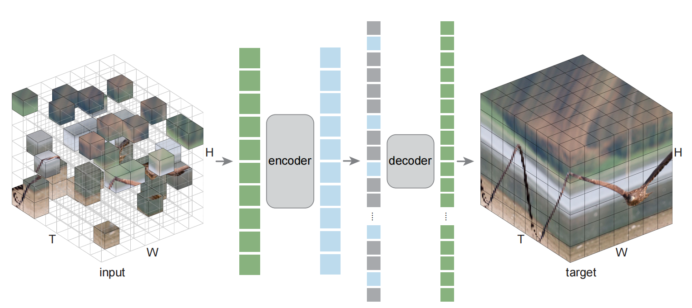
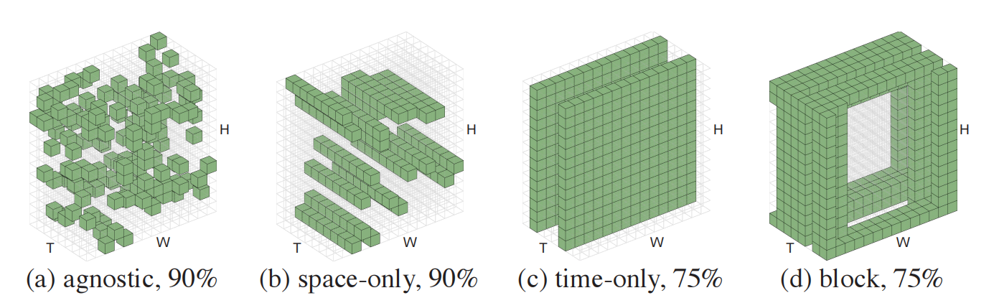

# Masked Autoencoders As Spatiotemporal Learners
作为时空学习者的掩码自动编码器 2022.9.18 https://arxiv.org/abs/2205.09113  https://github.com/facebookresearch/mae_st

## 阅读笔记
* 视频数据的加载、预处理、输入模型的格式？
* 掩码模型->自回归模型，预测下一帧？ 孪生网络对比学习？
* 视频任务：视频分类，其他的呢

## Abstract
This paper studies a conceptually simple extension of Masked Autoencoders (MAE) [31] to spatiotemporal representation learning from videos. We randomly mask out spacetime patches in videos and learn an autoencoder to reconstruct them in pixels. Interestingly, we show that our MAE method can learn strong representations with almost no inductive bias on spacetime (only except for patch and positional embeddings), and spacetime-agnostic random masking performs the best. We observe that the optimal masking ratio is as high as 90% (vs. 75% on images [31]), supporting the hypothesis that this ratio is related to information redundancy of the data. A high masking ratio leads to a large speedup, e.g., > 4× in wall-clock time or even more. We report competitive results on several challenging video datasets using vanilla Vision Transformers [18]. We observe that MAE can outperform supervised pre-training by large margins. We further report encouraging results of training on real-world, uncurated Instagram data. Our study suggests that the general framework of masked autoencoding (BERT [15], MAE [31], etc.) can be a unified methodology for representation learning with minimal domain knowledge.

本文研究了 掩码自动编码器(MAE)[31]在概念上的简单扩展，以从视频中进行时空表示学习。我们随机掩码视频中的时空分块，并学习自动编码器以像素重建它们。有趣的是，我们发现，我们的MAE方法可以在几乎没有时空归纳偏差(除了分块和位置嵌入外)的情况下学习强表示，时空未知的随机掩码表现最好。我们观察到，最佳掩码率高达90%(而图像上为75%[31])，支持该比率与数据的信息冗余相关的假设。高掩码率会导致大的加速，例如，在挂钟时间超过4倍甚至更多。我们使用普通ViT报告了几个具有挑战性的视频数据集的竞争结果[18]。我们观察到，MAE可以大幅度超过监督预训练。我们进一步报告了对真实世界、未经修正的Instagram数据进行训练的令人鼓舞的结果。我们的研究表明，掩码自动编码的一般框架(BERT[15]、MAE[31]等)可以是一种具有最小领域知识的表示学习的统一方法。

 
Figure 1: Masked Autoencoders as spatiotemporal learners. We mask a large subset (e.g., 90%) of random patches in spacetime. An encoder operates on the set of visible patches. A small decoder then processes the full set of encoded patches and mask tokens to reconstruct the input. Except for patch and positional embeddings, neither the encoder, the decoder, nor the masking strategy, has any spatiotemporal inductive bias.
图1：作为时空学习者的掩码自动编码器。我们在时空中掩码了大量随机分块(例如，90%)。编码器对可见分块集进行操作。然后，一个小解码器处理完整的编码分块和掩码令牌集，以重建输入。除了分块和位置嵌入，编码器、解码器和掩码策略都没有任何时空归纳偏差。

## 1 Introduction
The deep learning community is experiencing a trend of unifying methodologies for solving problems in different areas, such as language, vision, speech, and more. For architectures, Transformers [67] have been successfully introduced into computer vision [18] and established as a general building block in both language and vision. For self-supervised representation learning, the denoising/masked autoencoding methodology [68] in BERT [15] has been shown effective on learning visual representations from images [31]. Towards unifying methodologies, less domain knowledge (“fewer inductive biases” [18]) is introduced for a specific problem, which urges the models to learn useful knowledge almost purely from data.

深度学习社区正在经历一种统一方法论的趋势，以解决不同领域的问题，如语言、视觉、语音等。对于架构，Transformers[67]已成功引入计算机视觉[18]，并被确立为语言和视觉的通用构建块。对于自监督表示学习，BERT[15]中的去噪/掩码自动编码方法[68]已被证明对从图像中学习视觉表示有效[31]。为了统一方法，针对特定问题引入了较少的领域知识(“较少的归纳偏差”[18])，这促使模型几乎完全从数据中学习有用的知识。

Following this philosophy, we study extending Masked Autoencoders (MAE) [31] to the problem of spatiotemporal representation learning. Our method is simple: we randomly mask out spacetime patches in videos and learn an autoencoder to reconstruct them (Fig. 1). Our method has minimal domain knowledge: the only spacetime-specific inductive bias is on embedding the patches and their positions; all other components are agnostic to the spacetime nature of the problem. In particular, our encoder and decoder are both vanilla Vision Transformers [18] with no factorization or hierarchy, and our random mask sampling is agnostic to the spacetime structures. Our method predicts pixel values and uses no extra problem-specific tokenizer. In a nutshell, our method is simply MAE applied to the set of spacetime patches. Despite minimal inductive biases, our method achieves strong empirical results, suggesting that useful knowledge can be learned from data.

遵循这一理念，我们研究将掩码自动编码器(MAE)[31]扩展到时空表示学习问题。我们的方法很简单：我们随机掩码视频中的时空分块，并学习自动编码器来重建它们(图1)。我们的方法具有最小的领域知识：唯一的时空特定归纳偏差是嵌入分块及其位置; 所有其他组件都不知道问题的时空性质。特别是，我们的编码器和解码器都是普通的ViT[18]，没有因子分解或层次结构，我们的随机掩码采样对时空结构是未知的。我们的方法预测像素值，不使用额外的特定于问题的标记器。简而言之，我们的方法简单地应用于一组时空分块。尽管存在最小的归纳偏差，但我们的方法取得了很强的实证结果，表明可以从数据中学习有用的知识。

It is hypothesized in [31] that the masking ratio (i.e., percentage of removed tokens) in masked autoencoding methods is related to the information redundancy of the problems. For example, natural images are more information-redundant than languages and thus the optimal masking ratio is higher (e.g., than BERT [15]). Our observations on video data support this hypothesis. We find that the optimal masking ratio of MAE is 90% for videos (Fig. 2), higher than the masking ratio of 75% for its image counterpart [31]. This can be understood as a consequence of natural video being correlated. 

[31]中假设，掩码自动编码方法中的掩码率(即，移除令牌的百分比)与问题的信息冗余有关。例如，自然图像比语言具有更多的信息冗余，因此最佳掩码率更高(例如，比BERT[15])。我们对视频数据的观察支持了这一假设。我们发现，视频MAE的最佳掩码率为90%(图2)，高于其图像对应物75%的掩码率[31]。这可以理解为自然视频被关联的结果。

To the extreme, if a video has T identical static frames, randomly sampling 1/T of all spacetime patches would reveal most of the static frame. Because slow motion is more likely than fast motion in natural videos, the masking ratio can be very high as we observe empirically.

最极端的是，如果一个视频有T个相同的静态帧，随机采样所有时空分块的1/T将显示大部分静态帧。因为在自然视频中，慢动作比快动作更有可能，所以根据我们的经验，掩码率可能非常高。

The higher masking ratio leads to a more efficient solution in practice. Following the MAE in [31] that applies the encoder only on visible tokens, a masking ratio of 90% reduces the encoder time and memory complexity to <1/10. Put together with a small decoder [31], the MAE pre-training can achieve a theoretically 7.7× reduction in computation vs. encoding all tokens. In fact, the computation reduction is so large that the data loading time becomes a new bottleneck; even so, we record a 4.1× wall-clock speedup. Such a significant speedup is of great importance for video research that is large-scale and time-consuming.

较高的掩码率导致实践中更有效的解决方案。继[31]中的MAE(仅在可见令牌上应用编码器)之后，90%的掩码率将编码器时间和内存复杂性降低到<1/10。结合一个小型解码器[31]，MAE预训练在理论上可以实现7.7倍的计算量，而不是编码所有令牌。事实上，计算量的减少是如此之大，以至于数据加载时间成为一个新的瓶颈; 尽管如此，我们还是记录了4.1倍的挂钟加速。如此显著的加速对于大规模且耗时的视频研究来说非常重要。

We report strong results on a variety of video recognition datasets. Our MAE pre-training greatly improves generalization performance: on Kinetics-400 [35], it increases the accuracy of ViT-Large [18] by absolute 13% vs. training from scratch, while it takes less wall-clock training time overall (pre-training plus fine-tuning). Our MAE pre-training can outperform its supervised pre-training counterpart by big margins. Using vanilla ViT [18], our method achieves competitive results with previous state-of-the-art methods that incorporate more domain knowledge. We also report encouraging results using MAE pre-trained on 1 million random, uncurated Instagram videos. These results suggest that self-supervised learning on videos can be tackled in a way similar to its counterparts on language [15] and images [31], under a unified framework.

我们报告了在各种视频识别数据集上的强大结果。我们的MAE预训练大大提高了泛化性能：在Kinetics-400[35]上，与从头开始的训练相比，它将ViT Large[18]的准确度提高了13%，同时总体上减少了挂钟训练时间(预训练加上微调)。我们的MAE预训练可以大幅度超过其受监督的预训练对手。使用普通ViT[18]，我们的方法获得了与以前最先进的方法相竞争的结果，这些方法包含了更多的领域知识。我们还报告了在100万个随机未经修复的Instagram视频上使用MAE预训练的令人鼓舞的结果。这些结果表明，在统一的框架下，视频上的自监督学习可以以类似于语言[15]和图像[31]的方式进行。

## 2 Related Work
### Denoising autoencoders. 
Denoising autoencoders (DAE) [68, 69] present a general methodology for learning representations by reconstructing clean signals from corrupted inputs. Masking as a type of noise dates back to at least a decade ago [69]. One of its most successful developments is BERT [15], which is conceptually masked autoencoding on language tokens.

去噪自动编码器。去噪自动编码器(DAE)[68，69]提供了一种通过从损坏的输入中重建干净信号来学习表示的通用方法。掩码作为一种噪声可以追溯到至少十年前[69]。其最成功的开发之一是BERT[15]，它在概念上掩盖了语言标记的自动编码。

Denoising/masked autoencoding methods for computer vision have been making continuous progress [50, 9, 18, 31]. A series of recent methods are based on Transformer architectures [67] and are towards a unified solution between vision and language. iGPT [9] pioneers this direction by training Transformers on pixels as tokens. The ViT paper [18] makes a revolutionary step forward by using patches as tokens. It not only establishes strong Transformer architectures for vision tasks, but also explores masked prediction with patches. MAE [31] returns to the basics of the autoencoding concept [68] and draws attention to the decoding aspect. The presence of a meaningful decoder provides more flexibility, e.g., enabling the encoder to operate only on visible patches and leading to a more efficient solution. It empirically shows that a high masking ratio is essential for image tasks [31]. Our study follows this line of research.  

计算机视觉的去噪/掩码自动编码方法一直在不断进步[50，9，18，31]。最近的一系列方法基于Transformer架构[67]，并致力于视觉和语言之间的统一解决方案。iGPT[9]通过将像素作为标记来训练Transformers，开创了这一方向。ViT论文[18]通过使用分块作为标记，向前迈出了革命性的一步。它不仅为视觉任务建立了强大的Transformer架构，还探索了带有分块的掩码预测。MAE[31]返回到自动编码概念的基础[68]，并提请注意解码方面。有意义的解码器的存在提供了更大的灵活性，例如，使编码器能够仅在可见分块上操作，并导致更有效的解决方案。经验表明，高掩码率对于图像任务至关重要[31]。我们的研究遵循这一研究路线。
<!--像image_gpt的生成式线路，根据前面几个patchs，预测生成下一个patch？ igpt没有充分利用图像的信息冗余-->

Figure 2: Visualizations on the Kinetics-400 [35] validation set (masking ratio 90%). We show the original video (top), masked video (middle), and MAE output (bottom) for each sample. This model reconstructs the original pixels. The video size is 16×224×224 and the spacetime patch size is 2×16×16 (the temporal patch size of 2 is not visualized here). Each sample has 8×14×14=1568 tokens with 156 being visible. For better visualizations, the known patches in the output are from the original input. Fig. 7 shows more examples.
图2:Kinetics-400[35]验证集上的可视化效果(掩码率90%)。我们显示了每个样本的原始视频(顶部)、掩码视频(中部)和MAE输出(底部)。该模型重建原始像素。视频大小为16×224×224，时空分块大小为2×16×16(此处未显示2的时间分块大小)。每个样本有8×14×14＝1568个令牌，其中156个可见。为了更好地可视化，输出中的已知分块来自原始输入。图7显示了更多样本。

Figure 3: Visualizations of the same pre-trained model in Fig. 2 but with a masking ratio of 95%.
图3：图2中相同预训练模型的可视化，但掩码率为95%。

Instead of predicting pixels [9, 18, 31, 80], another line of research focuses on the tokenization of the prediction targets [3, 17, 77]. BEiT [3] proposes to use pre-trained dVAE [47, 55] as the reconstruction target. The dVAE tokenizer can be improved by perceptual or adversarial losses [17]. MaskFeat [77] shows that HoG [13] as prediction targets performs strongly.

与预测像素[9，18，31，80]不同，另一项研究侧重于预测目标的令牌化[3，17，77]。BEiT[3]建议使用预训练的dVAE[47，55]作为重建目标。dVAE令牌器可以通过感知或对抗性损失来改进[17]。MaskFeat[77]表明，作为预测目标的HoG[13]表现强劲。

### Self-supervised learning on videos. 
The presence of the temporal dimension is a focus of selfsupervised learning on video data. Related topics include temporal coherence (‘slowness’) [79, 25], future prediction [61, 72, 70, 45, 44, 71, 16], object motion [1, 75, 49, 76], temporal ordering [46, 23, 38, 78, 81], spatiotemporal contrast [58, 62, 30, 22, 51, 56], etc.

视频上的自监督学习。时间维度的存在是视频数据自监督学习的一个焦点。相关主题包括时间一致性(“慢”)[79，25]、未来预测[61，72，70，45，44，71，16]、物体运动[1，75，49，76]、时间排序[46，23，38，78，81]、时空对比[58，62，30，22，51，56]等。
<!--无人驾驶里的 轨迹追踪，下一帧预测。这段相关论文需细挖 -->

Our method also relies on the temporal coherence of videos, but it approaches this goal implicitly. In fact, as our method is largely agnostic to spacetime, the main opportunity for it to make use of the temporal coherence is a higher masking ratio (e.g., 90%), which assumes that videos are more information-redundant than images. 

我们的方法也依赖于视频的时间连贯性，但它隐含地接近这个目标。事实上，由于我们的方法在很大程度上与时空无关，因此它利用时间相关性的主要机会是更高的掩码率(例如，90%)，这假设视频比图像更冗余。

 
Figure 4: Mask sampling. (a): Random sampling that is spacetime-agnostic. (b): Space-only random sampling, broadcasted to all time steps (“tube” masking [77]). (c): Time-only random sampling, broadcasted to all spatial locations (“frame” masking [77]). (d): Block-wise sampling [3] in spacetime, removing large regions (“cube” masking [77]). In this illustration, T×H×W is 8×14×14; green tokens are kept and others are masked out.
图4：掩码采样。(a)：时空未知的随机采样。(b)：仅空间随机采样，广播到所有时间步长(“管”掩码[77])。(c)：仅限时间的随机采样，广播到所有空间位置(“帧”掩码[77])。(d)：在时空中逐块采样[3]，去除大区域(“立方体”掩码[77])。在本图中，T×H×W为8×14×14; 绿色令牌被保留，其他令牌被掩码。

There has been growing interest in masking-based methods for self-supervised learning on videos. Previous works focus on tokenizing the prediction targets for the use of videos [65, 73, 77]. Our autoencoding method operates on pixels, which is simpler and requires no extra data or domain knowledge on the tokenizer. Importantly, our method greatly improves the efficiency of learning. The practical speedup is of central importance for video-related research, which is in general larger-scale and more time-consuming.

人们对基于掩码的视频自监督学习方法越来越感兴趣。先前的工作集中于令牌预测目标以用于视频[65，73，77]。我们的自动编码方法对像素进行操作，这更简单，不需要额外的数据或令牌器的领域知识。重要的是，我们的方法大大提高了学习效率。实际的加速对于视频相关的研究来说是至关重要的，一般来说，视频相关研究规模更大，耗时更长。

Our work is done independently and concurrently with [66] on a related method.
我们的工作是独立完成的，并与[66]同时进行相关方法。
<!-- 66. VideoMAE: Masked autoencoders are data-efficient learners for self-supervised video pre-training. arXiv:2203.12602, 2022. -->

## 3 Method
Our method is a simple extension of MAE [31] to spacetime data (Fig. 1). Our goal is to develop the method under a general and unified framework, with as little domain knowledge as possible.

我们的方法是MAE[31]对时空数据的简单扩展(图1)。我们的目标是在通用和统一的框架下开发该方法，尽可能少地使用领域知识。

### Patch embedding. 
Following the original ViT [18], given a video clip, we divide it into a regular grid of non-overlapping patches in spacetime [4, 2, 19, 77]. The patches are flattened and embedded by linear projection [18]. Positional embeddings [67] are added to the embedded patches. The patch and positional embedding process is the only process that is spacetime-aware.

分块嵌入。根据原始的ViT[18]，给定一个视频片段，我们将其划分为一个规则的网格，其中包含时空中不重叠的分块[4，2，19，77]。通过线性投影将分块压平并嵌入[18]。位置嵌入[67]被添加到嵌入的分块中。分块和位置嵌入过程是唯一的时空感知过程。

### Masking. 
We sample random patches without replacement from the set of embedded patches. This random sampling is agnostic to the spacetime structure (Fig. 4 (a)). This structure-agnostic sampling strategy is analogous to that of BERT in 1D [15] and MAE in 2D [31].

掩码。我们从一组嵌入的分块中抽取随机分块而不进行替换。这种随机抽样与时空结构无关(图4(a))。这种结构未知的采样策略类似于1D[15]中的BERT和2D[31]中的MAE。

It is hypothesized in [31] that the optimal masking ratio is related to the information redundancy of the data. With unstructured random masking, BERT [15] uses a masking ratio of 15% for language and MAE [31] uses a ratio of 75% for images, suggesting that images are more information-redundant than language. Our empirical results on videos support this hypothesis. The optimal masking ratio we observe is 90%. This is in line with the common assumption that natural videos are more informationredundant than images because of temporal coherence. Fig. 2 and 3 present our MAE reconstruction results on unseen validation data with a masking ratio of 90% and 95%.

[31]中假设最佳掩码率与数据的信息冗余有关。对于非结构化随机掩码，BERT[15]使用15%的语言掩码率，MAE[31]使用75%的图像掩码率，这表明图像比语言更冗余。我们对视频的实证结果支持了这一假设。我们观察到的最佳掩码率为90%。这符合一个普遍的假设，即由于时间的连贯性，自然视频比图像更加信息冗余。图2和图3显示了我们在掩码率为90%和95%的未发现验证数据上的MAE重建结果。

The spacetime-agnostic sampling can be more effective than structure-aware sampling strategies, e.g., space-only, time-only, or block-wise sampling (Fig. 4 (b-d)). As neighboring patches in space or in time (Fig. 4(b, c)) are coherent, with a very high masking ratio, space-only or time-only sampling may retain less information and yield an overly difficult pre-training task. For example, time-only sampling from 8 frames with a masking ratio of 87.5% means keeping only a single frame, which presents an overly challenging task of predicting the future and past given only one frame. We observe that optimal masking ratios for structure-aware sampling are in general lower. In contrast, the spacetime-agnostic sampling better utilizes the limited number of visible patches and thus allows to use a higher masking ratio.

时空未知采样可能比结构感知采样策略更有效，例如，仅空间采样、仅时间采样或逐块采样(图4(b-d))。由于空间或时间上的相邻分块(图4(b，c))是相干的，具有非常高的掩码率，仅空间或仅时间采样可能保留较少的信息，并产生非常困难的预训练任务。例如，从8帧中以87.5%的掩码率进行仅时间采样意味着只保留一帧，这意味着在仅给定一帧的情况下预测未来和过去是一项极具挑战性的任务。我们观察到，结构感知采样的最佳掩码率通常较低。相比之下，时空未知采样更好地利用了有限数量的可见分块，从而允许使用更高的掩码率。

### Autoencoding. 
Our encoder is a vanilla ViT [18] applied only on the visible set of embedded patches, following [31]. This design greatly reduces time and memory complexity and leads to a more practical solution. A masking ratio of 90% reduces the encoder complexity to <1/10 (noting that self-attention is quadratically-complex w.r.t. the token set size). 

自动编码。我们的编码器是一个普通的ViT[18]，仅应用于可见的嵌入分块集，如[31]。这种设计大大减少了时间和内存的复杂性，并带来了更实用的解决方案。90%的掩码率将编码器复杂度降低到<1/10(注意，自注意相对于令牌集大小是二次复杂的)。

Our decoder is another vanilla ViT on the union of the encoded patch set and a set of mask tokens [31]. Decoder-specific positional embeddings are added to this set [31]. The decoder is designed to be smaller than the encoder [31]. Although the decoder processes the full set, its complexity is smaller than the encoder (e.g., ∼1/20 per token). In our default setting, the overall autoencoder has a complexity reduction of 7.7× vs. full encoding (more discussions are in Sec. 5.1 and Table 1).

我们的解码器是编码分块集和一组掩码令牌的并集上的另一个普通ViT[31]。解码器特定的位置嵌入被添加到此集合[31]。解码器设计得比编码器小[31]。虽然解码器处理整个集合，但其复杂性小于编码器(例如，每个令牌约1/20)。在我们的默认设置中，与完全编码相比，整体自动编码器的复杂度降低了7.7倍(更多讨论见第5.1节和表1)。

The decoder predicts the patches in the pixel space. In principle we can simply predict a full spacetime patch (e.g., t×16×16); in practice, we find it sufficient to predict a single time slice of the patch (16×16), which keeps the prediction layer’s size manageable. We predict the original pixels or their per-patch normalized values [31] (compared in Table 2b). The training loss function is the mean squared error (MSE) between the prediction and its target, averaged over unknown patches [15].

解码器预测像素空间中的分块。原则上，我们可以简单地预测一个完整的时空片(例如，t×16×16); 在实践中，我们发现预测分块的单个时间片(16×16)就足够了，这使预测层的大小保持可控。我们预测原始像素或其每片归一化值[31](在表2b中进行比较)。训练损失函数是预测与其目标之间的均方误差(MSE)，在未知分块上进行平均[15]。

The encoder and decoder are agnostic to the spacetime structure of the problem. There is no hierarchy or spacetime factorization, in contrast to the leading architectures [4, 2, 19]. Our method relies on the global self-attention to learn useful knowledge from data, following the spirit of [18].

编码器和解码器不知道问题的时空结构。与领先的架构相比，不存在层次结构或时空分解[4，2，19]。我们的方法依赖于全局自注意，从数据中学习有用的知识，遵循[18]的精神。

## 4 Implementation
### Data pre-processing. 
For MAE pre-training, our default input size is 16 frames each with 224×224 pixels (i.e., 16×224×224). The 16 frames are sampled from the raw video with a temporal stride of 4 (i.e., 16×4 sampling in the literature [21]), and the starting frame is randomly sampled. In the spatial domain, we perform random resized cropping [63] with a scale range of [0.5, 1], and random horizontal flipping. We do not apply other data augmentations unless noted.

数据预处理。对于MAE预训练，我们的默认输入大小为16帧，每个帧具有224×224像素(即，16×224×224)。从原始视频中以4的时间步长对16帧进行采样(即文献[21]中的16×4采样)，并对起始帧进行随机采样。在空间域中，我们执行缩放范围为[0.5，1]的随机调整大小裁剪[63]和随机水平翻转。除非另有说明，否则我们不应用其他数据增广。

Our MAE pre-training is so fast in computation that data loading becomes a new bottleneck that dominates running time in our setup. We adopt repeated sampling [33] (1 In our use case, repeated sampling involves data augmentation and mask sampling) to alleviate this problem. Each time a raw video is loaded and decompressed, we take multiple (4 by default) samples from it. This reduces the data loading and decompressing time per sample. We note that repeated sampling does not change the number of samples seen; it only influences the orders of the samples seen during training. We always count epochs as “effective epochs”, i.e., how many times each raw video is sampled throughout training.

我们的MAE预训练在计算上非常快，数据加载成为了一个新的瓶颈，在我们的设置中占据了运行时间的主导地位。我们采用重复采样[33](1 在我们的用例中，重复采样涉及数据增广和掩码采样)来缓解这个问题。每次加载和解压缩原始视频时，我们都会从中提取多个(默认为4个)样本。这减少了每个样本的数据加载和解压缩时间。我们注意到，重复采样不会改变看到的样本数量; 它只影响训练期间看到的样本的顺序。我们总是将时间段计算为“有效时间段”，即在整个训练过程中对每个原始视频采样的次数。

### Architecture. 
Our encoder and decoder are the vanilla ViT architectures [18]. We use a temporal patch size of 2 [2, 19, 77] and a spatial patch size of 16×16 [18], denoted as 2×16×16. We use the same patch size for ViT-B/L/H [18] for simplicity. For a 16×224×224 input, this patch size produces 8×14×14 tokens.

架构。我们的编码器和解码器是普通的ViT架构[18]。我们使用时间补丁大小2[2，19，77]和空间补丁大小16×16[18]，表示为2×16×16。为了简单起见，我们对ViT-B/L/H[18]使用相同的补丁大小。对于16×224×224的输入，此补丁大小产生8×14×14个令牌。

We adopt separable positional embeddings for the encoder. We have two positional embeddings, one for space and the other for time. The spacetime positional embeddings are the sum of them. This separable implementation prevents the size of positional embeddings growing too large in 3D. We use learnable positional embeddings; the sin-cos variant [67] works similarly.

我们对编码器采用可分离的位置嵌入。我们有两个位置嵌入，一个用于空间，另一个用于时间。时空位置嵌入是它们的总和。这种可分离的实现防止了位置嵌入的尺寸在3D中过大。我们使用可学习的位置嵌入; sin-cos变体[67]的工作原理类似。

### Settings. 
Our MAE pre-training configuration mostly follows [31]. We use the AdamW optimizer [43] with a batch size of 512. We evaluate the pre-training quality by end-to-end fine-tuning. The choice of evaluating by fine-tuning (instead of linear probing) follows [3, 31]. Our inference process follows the common practice of multi-view testing [74, 21]: it takes K temporal clips (by default K=7 on Kinetics) to cover the video length, and for each clip it takes 3 spatial views to cover the longer spatial axis (denoted as K×3). The final prediction is the average of all views. The implementation details and hyper-parameters are in the appendix. 

设置。我们的MAE预训练配置主要遵循[31]。我们使用批量大小为512的AdamW优化器[43]。我们通过端到端微调来评估预训练质量。通过微调(而不是线性探测)进行评估的选择如下[3，31]。我们的推理过程遵循多视图测试的常见实践[74，21]：覆盖视频长度需要K个时间片段(Kinetics上默认K=7)，每个片段需要3个空间视图来覆盖更长的空间轴(表示为K×3)。最后的预测是所有视图的平均值。实施细节和超参数见附录。

##　5 Experiments
In Sec. 5.1 and Sec. 5.2 we perform ablation experiments on Kinetics-400 (K400) [35]. We do MAE self-supervised pre-training and then fine-tune the encoder with supervision for evaluation. We report top-1 classification accuracy (%) on the K400 validation set. In Sec. 5.3 we study more pre-training datasets and downstream tasks. 

在第5.1节和第5.2节中，我们对Kinetics-400(K400)进行了消融实验[35]。我们进行MAE自监督预训练，然后在监督下微调编码器进行评估。我们报告了K400验证集的top-1分类精度(%)。在第5.3节中，我们研究了更多的预训练数据集和下游任务。

With a masking ratio of 90%, the sparse variant reduces FLOPs by 7.7×. This reduces computation time by 5.8×. In our infra, computation is so fast that data loading becomes a bottleneck, which leads to an actual speedup of 4.1×. Profiling is with synchronized SGD over 16 nodes, each with 8 A100 GPUs and 80 CPU cores. The training length is 800 epochs.

在90%的掩码率下，稀疏变体将FLOP减少了7.7倍。这将计算时间减少了5.8倍。在我们的下文中，计算速度如此之快，数据加载成为瓶颈，这导致实际速度提高了4.1倍。评测使用16个节点上的同步SGD，每个节点有8个A100 GPU和80个CPU内核。训练长度为800个时期。

### 5.1 Performance
Fig. 5 compares MAE pre-training vs. no pre-training (i.e., training from scratch), using vanilla ViT-L [18]. The from-scratch recipe follows [77] and has 71.4% accuracy(2The ViT-B result is 68.5% [77] trained from scratch using this recipe). As a comparison, using MAE pre-training for 800 epochs, the same vanilla ViT-L achieves 84.4% accuracy, which has a large increase of 13.0% absolute vs. training from scratch. This gap is much larger than that on image recognition tasks (∼3% [31]), suggesting that MAE pre-training is more helpful for video recognition.

图5比较了MAE预训练与无预训练(即，从头开始训练)，使用普通ViT-L[18]。从头开始的配方遵循[77]，精度为71.4%(使用该配方从头开始训练的ViT-B结果为68.5%[77])。相比之下，使用MAE预训练800个时期，相同的普通ViT-L获得了84.4%的精度，与从头开始的训练相比，绝对值提高了13.0%。这一差距远大于图像识别任务(~3%[31])，表明MAE预训练对视频识别更有帮助。

Figure 5: MAE pre-training plus fine-tuning is much more accurate and faster than training from scratch. Here the x-axis is the wall-clock training time (128 A100 GPUs), and the y-axis is the 1-view accuracy on Kinetics-400 validation. The table shows the final accuracy. The model is ViT-L.
图5:MAE预训练加上微调比从头开始训练更准确、更快。这里，x轴是挂钟训练时间(128 A100 GPU)，y轴是Kinetics-400验证的1-视图精度。下表显示了最终精度。模型为ViT-L。

In addition to the accuracy gain, MAE pre-training can reduce the overall training cost, as plotted in Fig. 5. The 800-epoch MAE pre-training only takes 35.8 hours. A short fine-tuning (100 epochs here), which takes 16.3 hours, achieves good accuracy thanks to pre-training. The overall training time can be shorter than training from scratch (e.g., 400 epochs, 65.2 hours), which converges more slowly without pre-training. This shows that MAE is a practical solution to video recognition.

除了精度增益，MAE预训练可以降低总体训练成本，如图5所示。800小时MAE预训练只需35.8小时。一个短的微调(这里是100个周期)需要16.3小时，由于预训练，达到了很好的精度。总体训练时间可以比从头开始的训练更短(例如，400个时期，65.2小时)，这在没有预训练的情况下收敛得更慢。这表明MAE是一种实用的视频识别解决方案。

MAE pre-training is fast because its encoder is only applied on the sparse set of visible patches, without the mask token [M]. We profile the pre-training performance in Table 1. With a masking ratio of 90%, the sparse encoder reduces the FLOPs (floating-point operations) by >10×. After counting the decoder, the sparse design of MAE reduces FLOPs by 7.7×. In our implementation, this reduction should produce a 5.8×computational speedup, if the video data were already pre-processed and loaded in memory. Our speedup ratio is so high that the video pre-processing and loading time becomes a new bottleneck. In our system, the data loading step increases the wall-clock training time from 24.5 hours to 35.8 hours. Nevertheless, this still leads to a significant speedup of 4.1×. (3The speedup is closer to 5.8× if using slower GPUs (V100 instead of A100) that can hide the loading time.)

MAE预训练是快速的，因为它的编码器仅应用于可见面片的稀疏集合，而没有掩码标记[M]。我们在表1中描述了训练前的表现。稀疏编码器的掩码率为90%，将FLOP(浮点运算)减少了>10倍。在对解码器进行计数后，MAE的稀疏设计将FLOP减少了7.7倍。在我们的实现中，如果视频数据已经被预处理并加载到内存中，这种减少将产生5.8倍的计算速度。我们的加速比如此之高，使得视频预处理和加载时间成为一个新的瓶颈。在我们的系统中，数据加载步骤将挂钟训练时间从24.5小时增加到35.8小时。然而，这仍然导致4.1倍的显著加速。(3如果使用速度较慢的GPU(V100而不是A100)，则加速更接近5.8倍，这可以隐藏加载时间。) 
Table 1: Training time comparison between a dense encoder (w/ [M]) and a sparse encoder (w/o [M]) in MAE. The encoder is ViT-L (1024-d, 24-block); the decoder is our default (512-d, 4-block).
表1：MAE中密集编码器(w/[M])和稀疏编码器(w/o[M])之间的训练时间比较。编码器为ViT-L(1024-d，24块); 解码器是我们的默认(512-d，4块)。

### 5.2 Ablation experiments
#### Masking ratio. 
Fig. 6 shows the influence of the masking ratio jointly with the pre-training length. The ratio of 90% works the best. The ratio of 95% performs surprisingly well, which can catch up if trained long enough (Fig. 6 left). A higher masking ratio leads to fewer tokens encoded by the encoder; to have a more comprehensive look, we plot the results w.r.t. the total number of encoded tokens (Fig. 6 right). Under this measure, the ratios of 90% and 95% perform closely.

掩码率。图6显示了掩码率与预训练长度的联合影响。90%的比例效果最好。95%的比例表现得出奇的好，如果训练足够长的话，可以赶上(图6左)。较高的掩码率导致编码器编码的令牌较少; 为了更全面地了解，我们绘制了编码令牌总数的结果(图6右侧)。在这一措施下，90%和95%的比率表现接近。

The lower masking ratios of 75% and 50% perform worse, even though the encoder sees more tokens and has higher computation cost. The ratio of 75% is optimal for its image counterpart [31], but not for videos. This observation can be explained by the assumption that video data is more information-redundant. 

75%和50%的较低掩码率表现更差，即使编码器看到更多令牌并具有更高的计算成本。75%的比例对于其图像对应物是最佳的[31]，但对于视频则不是。这种观察可以通过假设视频数据是更多信息冗余来解释。

Figure 6: Masking ratio. Every point represents a single pre-training and fine-tuning experiment. Left: x-axis is the epochs (proportional to the number of decoded tokens). Right: x-axis is the number of encoded tokens. 
图6：掩码率。每一点都代表一个单独的预训练和微调实验。左：x轴是纪元(与解码令牌的数量成比例)。右：x轴是编码令牌的数量。

Table 2: Ablation experiments on Kinetics-400. The model is ViT-L, with an input size of 16×224×224 and a spacetime patch size of 2×16×16. The pre-training length is 800 epochs. The entries marked in gray are the same, which specify the default settings. This table format follows [31].
表2:Kinetics-400的消融实验。该模型为ViT-L，输入大小为16×224×224，时空补丁大小为2×16×16。预训练长度为800个时期。灰色标记的条目相同，它们指定默认设置。该表格格式如下[31]。

#### Mask sampling strategy. 
Our method follows the structure-agnostic random sampling methodology in BERT [15] and MAE [31]. Table 2a reports that this simple solution works the best in our method.

掩码采样策略。我们的方法遵循BERT[15]和MAE[31]中的结构未知的随机抽样方法。表2a报告了这种简单的解决方案在我们的方法中效果最佳。

We compare with other strategies as illustrated in Fig. 4. Space-only sampling, which samples on the 2D spatial axes and broadcasts along the temporal axis, works reasonably well (83.5%). Time-only sampling, with a masking ratio of 75% (i.e., keep 2 time steps out of 8), performs poorly (79.1%); if we increase its masking ratio to 87.5% (keep 1 out of 8), the accuracy drops further to 75.4%. Time-only sampling is related to future/past frame prediction, which can be an overly difficult task in our scenario. Block-wise sampling [3], in its spacetime variant [77], has 83.2% accuracy with 75% masking ratio (a higher ratio is worse).

我们与图4所示的其他策略进行了比较。仅空间采样(在2D空间轴上采样并沿时间轴广播)工作得相当好(83.5%)。仅时间采样(掩码率为75%，即保持8个时间步长中的2个)表现不佳(79.1%); 如果我们将其掩码率提高到87.5%(保持8分之一)，精度将进一步下降到75.4%。仅时间采样与未来/过去帧预测相关，这在我们的场景中可能是一项过于困难的任务。分块采样[3]在其时空变体[77]中具有83.2%的精度和75%的掩码率(较高的掩码率更差)。

#### Reconstruction target. 
Our method performs decently by reconstructing the original, unmodified pixels (83.8%, Table 2b). Using per-patch normalized pixels [31] improves by 0.6%. This observation is similar to that of its image counterpart [31]. Using HOG [13] as the target [77] works strongly too.

重建目标。我们的方法通过重建原始的、未修改的像素(83.8%，表2b)表现良好。使用每分块归一化像素[31]提高了0.6%。这一观察结果与其图像对应物[31]相似。使用HOG[13]作为目标[77]也非常有效。

The autoencoding nature of our method (i.e., predicting pixels) provides a self-contained solution. In contrast, an extra tokenizer (e.g., dVAE [47, 9]), as is used in [3, 73], may require external data to train and additional domain knowledge to design (e.g., the dVAE used is a ConvNet [37]). Applying the extra dVAE tokenizer to each frame is computationally heavy, which slows down training by 1.6× in our implementation. Our pixel-based method is simpler and performs better (Table 2b).

我们方法的自动编码特性(即预测像素)提供了一种自包含的解决方案。相比之下，[3，73]中使用的额外标记器(例如，dVAE[47，9])可能需要外部数据来训练和额外的领域知识来设计(例如，所使用的dVAE[37])。对每一帧应用额外的dVAE标记器计算量很大，在我们的实现中，这将训练速度降低1.6倍。我们的基于像素的方法更简单，性能更好(表2b)。

#### Data augmentation. 
Temporal data can provide natural augmentation, e.g., on view points, motion, deformation, occlusion. These forms of natural augmentation have been incorporated by random temporal sampling. Table 2c compares additional augmentation on the spatial domain. Even using no spatial augmentation (center crop only) works competitively, similar to the observation on images [31]. Random cropping with a mild scale range of [0.5, 1] works well, while stronger cropping (range [0.08, 1], [63]) reduces accuracy; adding color jittering reduces accuracy too, similar to [31]. 

数据增广。时间数据可以提供自然增广，例如，视点、运动、变形、遮挡。这些形式的自然增广已通过随机时间抽样纳入。表2c比较了空间域上的额外增加。即使不使用空间增广(仅中心裁剪)，也具有竞争性，类似于对图像的观察[31]。适度范围为[0.5，1]的随机裁剪效果良好，而较强的裁剪(范围[0.08，1]，[63])会降低精度; 添加颜色抖动也会降低精度，类似于[31]。

Table 3: Influence of pre-training data, evaluated on K400, AVA, and SSv2 as the downstream tasks. The MAE pre-training length is 1600 epochs on K400/600/700 and IG-uncurated. No intermediate fine-tuning is used. The model is ViT-L. † : The K700 training set has 13.9k duplicated videos with the K400 validation set (19.9k), so it is not legitimate to train on K700 to get K400 results.
表3：对K400、AVA和SSv2作为下游任务评估的预训练数据的影响。在K400/600/700和IG未固化的情况下，MAE预训练长度为1600个时期。不使用中间微调。模型为ViT-L.†：K700训练集与K400验证集(19.9k)有13.9k个重复视频，因此在K700上训练以获得K400结果是不合法的。

It is practically valuable for self-supervised learning methods to be less dependent on data augmentation. There are a variety of applications in which augmentation is not valid or is hard to induce, e.g., medical imaging, hyper-spectral imaging, remote sensing, geometric data (point cloud, key points, etc.), and their temporal extensions. Our method could be generalized to these cases.

对于自监督学习方法来说，减少对数据增广的依赖是非常有价值的。在许多应用中，增广是无效的或难以诱导的，例如医学成像、高光谱成像、遥感、几何数据(点云、关键点等)及其时间扩展。我们的方法可以推广到这些情况。

#### Repeated sampling. 
As our method is fast in computation, we adopt repeated sampling [33] to reduce the data loading overhead. Table 2d reports its influence. Using 2 or 4 repetitions increases wall-clock speed by 1.8× or 3.0×, as a loaded and decompressed file is reused multiple times.

重复采样。由于我们的方法计算速度快，我们采用重复采样[33]来减少数据加载开销。表2d报告了其影响。使用2次或4次重复可以将墙上时钟的速度提高1.8倍或3.0倍，因为加载和解压缩的文件可以多次重复使用。

#### Decoder capacity. 
Table 2e and 2f report the influence of the decoder width and depth. Using an overly small decoder degrades accuracy by large margins. This is unlike its image counterpart [31], in which a 128-d or 1-block decoder has no degradation if fine-tuning is applied. We hypothesize that the higher-dimensional video data are more complex and thus require higher decoding capacity. On the other hand, our optimal decoder (512-d, 4-block) is still substantially smaller than the encoder (1024-d, 24-block). This is similar to the observation on its image counterpart [31].

解码器容量。表2e和2f报告了解码器宽度和深度的影响。使用过小的解码器会使精度降低大幅度。这不同于其图像对应[31]，其中如果应用微调，128-d或1块解码器没有退化。我们假设高维视频数据更复杂，因此需要更高的解码能力。另一方面，我们的最佳解码器(512-d，4块)仍然显著小于编码器(1024-d，24块)。这类似于对其图像对应物的观察[31]。

### 5.3 Influence of Data 影响数据
#### Transfer learning ablation. 
Table 3 studies pre-training on different datasets and transferring to various downstream tasks. The pre-training datasets include ImageNet-1K (IN1K) [14] and Kinetics-400, 600, and 700 [35, 6, 7]. The downstream tasks include K400, AVA [29], and SomethingSomething v2 (SSv2) [27]. We do not perform any intermediate fine-tuning (see appendix), so the comparison here is influenced by the data scale/distribution but not by the number of their labels.

迁移学习消融。表3研究了不同数据集上的预训练和迁移到各种下游任务。预训练数据集包括ImageNet-1K(IN1K)[14]和Kinetics-400、600和700[35、6、7]。下游任务包括K400、AVA[29]和SomethingSomething v2(SSv2)[27]。我们不执行任何中间微调(见附录)，因此这里的比较受数据规模/分布的影响，但不受其标签数量的影响。

First we compare with pre-training on the IN1K images. MAE pre-training on IN1K4 is 3.7% better than IN1K supervised pre-training (78.6% to 82.3%); this image-based MAE is even better than K400 supervised pre-training, on both AVA (21.6% to 26.3%) and SSv2 (55.7% to 65.6%).

首先，我们将IN1K图像与预训练进行比较。IN1K4上的MAE预训练比IN1K监督预训练(78.6%至82.3%)好3.7%; 这种基于图像的MAE在AVA(21.6%至26.3%)和SSv2(55.7%至65.6%)方面甚至优于K400监督预训练。

MAE pre-training on K400 has massive gains over supervised pre-training on K400: it improves by 9.5% on AVA (21.6% to 31.1%) and 16.4% on SSv2 (55.7% to 72.1%). MAE pre-training on K400 videos also substantially outperforms MAE pre-training on IN1K images: it increases by 2.5% on K400 (82.3% to 84.8%), 4.8% on AVA (26.3% to 31.1%), and 6.5% on SSv2 (65.6% to 72.1%), suggesting that MAE pre-training on videos is highly beneficial for these video tasks.

K400上的MAE预训练比K400上有监督的预训练有了巨大的进步：AVA上的提高9.5%(21.6%至31.1%)，SSv2上的提高16.4%(55.7%至72.1%)。K400视频上的MAA预训练也显著优于IN1K图像上的MAC预训练：K400上提高2.5%(82.3%至84.8%)，这表明视频上的MAE预训练对于这些视频任务非常有益。

With more pre-training data (K600/K700) without labels, we observe noticeable improvements on AVA and SSv2: comparing with K400 pre-training, MAE with K700 has an extra gain of 2.0% gain on AVA (31.1% to 33.1%) and 1.5% on SSv2 (72.1% to 73.6%).

随着更多无标签的训练前数据(K600/K700)，我们观察到AVA和SSv2的显著改善：与K400预训练相比，K700的MAE在AVA(31.1%至33.1%)和SSv2(72.1%至73.6%)上的额外增益为2.0%。

#### Real-world data. 
We further study MAE pre-training on real-world Instagram videos. We study two sets: (i) Instagram videos curated (IG-curated) [24] with hashtags similar to K400 classes, and (ii) random, uncrated Instagram videos (IG-uncurated). Both sets have 1 million videos.

真实世界数据。我们进一步研究了真实世界Instagram视频上的MAE预训练。我们研究了两组：(i)策划的Instagram视频(IG策划)[24]，带有类似于K400类的标签，以及(ii)随机的、未经剪辑的Instagram(IG未经剪辑)视频。这两套都有100万个视频。

Table 3 (last row) reports transfer learning results on AVA and SSv2 using IG-uncurated pre-training. Notably, on AVA, MAE with IG-uncurated is better than MAE with curated Kinetics pre-training (e.g., by 3.1/1.7/1.1% over K400/600/700 pre-training); on SSv2, MAE with IG-uncurated is among the best, on par with the K700 counterpart. 

表3(最后一行)报告了使用IG未分级预训练的AVA和SSv2的迁移学习结果。值得注意的是，在AVA上，IG未固化的MAE优于Kinetics预训练的MAE(例如，比K400/600/700预训练提高了3.1/1.7/1.1%); 在SSv2上，未固化IG的MAE是最好的，与K700相当。

4The IN1K pre-trained model is from https://github.com/facebookresearch/mae. 

Table 4: Real-world Instagram data for MAE pre-training. We pre-train MAE on each individual set for 200, 400, and 800 epochs. We compare fine-tuning accuracy on K400. The model is ViT-L.
表4：MAE预训练的真实Instagram数据。我们在每个单独的集合上预训练MAE 200、400和800个时期。我们比较了K400上的微调精度。模型为ViT-L。

Table 4 presents more results on the dataset size and training epochs. Pre-training on a 240k subset of IG-curated (the same size as K400) performs worse on K400 classification, which can be caused by the domain shift of data. However, increasing the dataset size of IG-curated to 512k and 1M shows good gains: under the same number of pre-training epochs (200 and 400), it can outperform K400 pre-training even when evaluating on K400. IG-uncurated performs similarly well as IG-curated, although the videos are randomly sampled and unrelated to K400 classes. This behavior is not observed on contrastive learning methods for videos: e.g., in [22] it is empirically shown that data curation has a major impact on contrastive learning [32, 10, 28] performance.

表4给出了关于数据集大小和训练时期的更多结果。对240k的IG子集进行预训练(与K400相同大小)对K400分类的效果更差，这可能是由于数据的域偏移造成的。然而，将IG的数据集大小增加到512k和1M显示出很好的效果：在相同数量的预训练时期(200和400)下，即使在K400上进行评估，它也可以优于K400预训练。未分级的IG表现与分级的IG相似，尽管视频是随机抽样的，与K400课程无关。在视频的对比学习方法上没有观察到这种行为：例如，在[22]中，经验表明，数据策展对对比学习[32，10，28]性能有重大影响。

We believe that our exploration with real-world data has encouraging results. It is a more realistic use case of unsupervised learning at scale. We hope this exploration will shed light on future study.

我们相信，我们对真实世界数据的探索取得了令人鼓舞的结果。这是一个更现实的大规模无监督学习用例。我们希望这一探索将对未来的研究有所启发。

### 5.4 System-level Comparisons
We provide system-level comparisons with the leading results on K400, AVA, and SSv2. The detailed tables are in the appendix (Table 7, 8, 9). These results are multifaceted, involving architecture designs, computational complexity, model sizes, input resolution, pre-training data and methods, etc., as we summarize in the tables. Our results are competitive and are close to the leading entries. In particular, our results are based only on vanilla ViT architectures, while the leading methods are hierarchical or specialized for videos. Our results demonstrate the potential of using fewer inductive biases and learning more from data, which is a pursuit of self-supervised learning.

我们提供了与K400、AVA和SSv2领先结果的系统级比较。详细表格见附录(表7、8、9)。这些结果是多方面的，涉及架构设计、计算复杂性、模型大小、输入分辨率、预训练数据和方法等，正如我们在表中总结的那样。我们的成绩具有竞争力，接近领先的参赛作品。特别是，我们的结果仅基于普通的ViT架构，而领先的方法是分层的或专门用于视频的。我们的结果证明了使用更少的归纳偏差和从数据中学习更多的潜力，这是对自监督学习的追求。

### 5.5 Video Pre-training for Image Recognition
Finally, we report preliminary results on video pre-training for image recognition. The usage of vanilla ViT allows to convert to 2D easily: we only “deflate” patch embeddings by summing in time. Using ViT-L pre-trained by MAE on K400 / IG-uncurated, we obtain 83.7% / 84.1% accuracy on IN1K image classification. This is better than training ViT-L from scratch on IN1K (82.6% [31]), though lower than MAE pre-training on IN1K (85.9% [31]). Considering the large domain gap, we believe this result is decent and its improvement over training from scratch is encouraging. We hope it will motivate the community to explore video pre-training for general visual representation learning. 

最后，我们报告了用于图像识别的视频预训练的初步结果。使用普通ViT可以很容易地转换为2D：我们只通过时间求和来“压缩”补丁嵌入。使用MAE在K400/IG未固化上预训练的ViT-L，我们在IN1K图像分类上获得了83.7%/84.1%的精度。这优于在IN1K上从头开始训练ViT-L(82.6%[31])，但低于IN1K的MAE预训练(85.9%[31])。考虑到巨大的领域差距，我们认为这一结果是不错的，它比从头开始的训练的进步令人鼓舞。我们希望这将激励社区探索视频预训练，用于一般视觉表征学习。

## 6 Conclusion
We have explored a simple extension of MAE [31] to video data. We have drawn several interesting observations. (i) We find that it is possible to learn strong representations with minimal domain knowledge or inductive biases. This follows the spirit of the ViT paper [18]. Similar to BERT [15] and MAE [31], we show that self-supervised learning on videos can be tackled in a conceptually unified framework. (ii) We empirically show that the masking ratio is an important factor for general masked autoencoding methods [69], and its optimal values may depend on the nature of the data (language, images, videos, etc.). (iii) We report encouraging results of pre-training on real-world, uncurated data. It achieves strong performance, close to pre-training on controlled, curated data (e.g., Kinetics). To the best of our knowledge, promising results on uncurated data are rare in the literature.

我们探索了MAE[31]对视频数据的简单扩展。我们得出了几个有趣的观察结果。(i) 我们发现，用最小的领域知识或归纳偏差学习强表示是可能的。这遵循了ViT论文的精神[18]。与BERT[15]和MAE[31]类似，我们表明视频上的自监督学习可以在概念统一的框架中解决。(ii)我们根据经验表明，掩码率是一般掩码自动编码方法的一个重要因素[69]，其最佳值可能取决于数据的性质(语言、图像、视频等)。它实现了强大的性能，接近于对受控、精确数据(如Kinetics)的预训练。据我们所知，文献中很少有关于未经修正数据的有希望的结果。

In spite of these observations, open problems remain. The scale of data we have explored is orders of magnitudes smaller than the language counterparts [52, 15, 53, 5]. While our method has largely improved the efficiency of self-supervised learning, the high-dimensional video data still present a major challenge for scaling up. We hope our study will provide initial signals for future research. 

尽管有这些观察结果，但仍然存在一些问题。我们所探索的数据规模比语言对应的数据规模小几个数量级[52，15，53，5]。虽然我们的方法在很大程度上提高了自监督学习的效率，但高维视频数据仍然是放大的主要挑战。我们希望我们的研究将为未来的研究提供初步信号。

## A Implementation Details
### Kinetics action classification. 
Our settings mainly follow [31, 77]. Table 5a summarizes our pretraining settings on Kinetics. Table 5b shows the corresponding fine-tuning settings for ViT-B/L/H. For fine-tuning, we add a linear classifier layer to the encoder’s averaged tokens [18].

Kinetics动作分类。我们的设置主要遵循[31，77]。表5a总结了我们对Kinetics的预处理设置。表5b显示了ViT-B/L/H的相应微调设置。为了进行微调，我们将线性分类器层添加到编码器的平均令牌[18]。

For fine-tuning the intermediately fine-tuned checkpoints from K600 in Table 7, we use the setting in Table 5b with a lower learning rate (8e-4) and shorter duration (40 epochs for ViT-L; 30 for ViT-H) and an increased drop path rate of 0.3 for ViT-H.

为了从表7中的K600微调中间微调检查点，我们使用表5b中的设置，该设置具有较低的学习速率(8e-4)和较短的持续时间(ViT-L为40个时期; ViT-H为30个时期)，ViT-H的下降路径速率为0.3。

### AVA action detection. 
Table 6a summarizes our fine-tuning settings on AVA [29]. The settings mainly follow [39, 77]. We follow the detection architecture in [21, 39, 77] that adapts Faster RCNN [57] for video action detection. Only for the AVA results in Table 8, we use relative positions [59, 54] (as implemented in [39]) during fine-tuning.

AVA动作检测。表6a总结了我们在AVA上的微调设置[29]。设置主要遵循[39，77]。我们遵循[21，39，77]中的检测架构，该架构将更快的RCNN[57]用于视频动作检测。仅对于表8中的AVA结果，我们在微调期间使用相对位置[59，54](如[39]中所实现)。

### SSv2 action classification. 
Table 6b summarizes our fine-tuning settings on SSv2 [27]. The settings mainly follow [39, 77]. For the frame sampling, we split each video into segments, and sample one frame from each segment to form a clip following [39, 19].

SSv2动作分类。表6b总结了我们在SSv2上的微调设置[27]。设置主要遵循[39，77]。对于帧采样，我们将每个视频分割成片段，并从每个片段中采样一帧，以形成一个片段[39，19]。

### Fine-tuning from image pre-training. 
In Table 3 we have compared with ImageNet-based supervised/MAE pre-training. When fine-tuning these variants for videos, we inflate the 2D kernel of the patch embedding layer to 3D [8] and initialize the temporal position embeddings by zero. 

图像预训练的微调。在表3中，我们与基于ImageNet的监督/MAE预训练进行了比较。当为视频微调这些变体时，我们将补丁嵌入层的2D内核膨胀为3D[8]，并将时间位置嵌入初始化为零。

Table 5: Settings on Kinetics. 
表5：Kinetics设置。

Table 6: Settings on AVA and SSv2. (L) and (H) stands for ViT-L and ViT-H, respectively. 
表6:AVA和SSv2上的设置。(五十) (H)分别代表ViT-L和ViT-H。

Table 7: System-level comparisons on Kinetics-400 action classification. We report top-1 and top-5 accuracy on the validation set. The input size is T×H×W. FLOPs (in 109 ) are presented as “FLOPs per view × spatial views × temporal views”, following the literature. Parameters are in 106 . The “extra data” column specifies the data used in addition to K400. Entries using spatial resolution >2242 are noted in gray; entries using in-house data for supervision are in light blue. Our results with K600 are with intermediate fine-tuning. 
表7：Kinetics-400动作分类的系统级比较。我们报告了验证集的top-1和前5精度。输入尺寸为T×H×W。根据文献，FLOP(在109中)表示为“每个视图的FLOP×空间视图×时间视图”。参数在106中。“额外数据”列指定除K400之外使用的数据。空间分辨率>2242的条目以灰色标注; 使用内部数据进行监督的条目为浅蓝色。我们对K600的结果进行了中间微调。

∗ This table does not include results using K700, because the K700 training set has 13.9k videos duplicated with the K400 validation set (19.9k). Results with K700 are in Table 8 (AVA) and Table 9 (SSv2).
本表不包括使用K700的结果，因为K700训练集有13.9k个与K400验证集(19.9k)重复的视频。K700结果见表8(AVA)和表9(SSv2)。

## B Additional Experimental Results
### B.1 System-level Comparisons
#### Kinetics-400. 
Table 7 compares on Kinetics-400 (K400). Our results are competitive with the leading ones. Importantly, our method is much simpler than many other entries. Our method is the only leading entry based on vanilla ViT, while others were based on hierarchical or specialized designs for videos. Our model does not use relative position embedding, which could have extra gains that are orthogonal to our thesis. Our results can compete with some strong results that were based on in-house data for supervision. Our models achieve this at standard 224×224 spatial resolution, while higher-resolution fine-tuning and testing may improve results at a higher cost, as shown in gray indicating entries using spatial resolution >2242 .

Kinetics-400。表7比较了Kinetics400(K400)。我们的结果与领先的结果具有竞争力。重要的是，我们的方法比许多其他条目简单得多。我们的方法是基于香草ViT的唯一领先入口，而其他方法则基于视频的分层或专门设计。我们的模型不使用相对位置嵌入，这可能具有与我们的论文正交的额外增益。我们的结果可以与一些基于内部监督数据的强大结果相媲美。我们的模型在标准224×224空间分辨率下实现了这一点，而更高分辨率的微调和测试可能会以更高的成本改善结果，如使用空间分辨率>2242的灰色指示条目所示。

#### AVA. 
Table 8 compares on AVA [29] action detection. Using only a resolution of 16×2242, our results are close to those of MaskFeat on higher-resolution inputs (40×3122 ). Importantly, our architectures are plain ViT models without feature hierarchies, yet they perform strongly on this detection task.

表8比较了AVA[29]动作检测。仅使用16×2242的分辨率，我们的结果与MaskFeat在更高分辨率输入(40×3122)上的结果接近。重要的是，我们的架构是没有特征层次结构的简单ViT模型，但它们在这个检测任务上表现得很好。

#### SSv2. 
Table 9 compares on SSv2 [27] action classification. On the resolution of 16×2242 and using vanilla ViT, our results compare favorably with those of MaskFeat on 40×3122 inputs. 

SSv2.表9比较了SSv2[27]动作分类。在分辨率为16×2242和使用香草ViT的情况下，我们的结果在40×3122输入上与MaskFeat的结果相比较。

Table 8: System-level comparisons on AVA v2.2 action detection. We report mAP using centercrop or full-resolution inference, following the literature. FLOPs (in 109 ) are measured with centercrop inference. Parameter numbers are in 106 . Only in this table, following MaskFeat [77], our results are with intermediate fine-tuning and with relative positions [59, 54] during fine-tuning. 
表8:AVA v2.2动作检测的系统级比较。根据文献，我们使用中心裁剪或全分辨率推断报告mAP。FLOP(在109中)通过中心裁剪推断进行测量。参数编号在106中。只有在这个表中，在MaskFeat[77]之后，我们的结果是中间微调和微调期间的相对位置[59，54]。

Table 9: System-level comparisons on SSv2 action classification. Notations of FLOPs (109 ) and parameters (106 ) follow Table 7. We do not use intermediate fine-tuning here (see Table 10). 
表9：SSv2行动分类的系统级比较。FLOP(109)和参数(106)的符号如下表7所示。这里我们不使用中间微调(见表10)。

### B.2 Ablation on Intermediate Fine-tuning
In Table 3 we have shown results of self-supervised pre-training directly transferred to downstream datasets. Following the literature, we also investigate an another scenario: after self-supervised pretraining, we perform intermediate fine-tuning on the pre-training set using labels, before transferring. Table 10 studies its influence. Intermediate fine-tuning has substantial improvements on AVA, while on SSV2 its effect is marginal. 

在表3中，我们显示了直接迁移到下游数据集的自我监督预训练的结果。根据文献，我们还研究了另一种情况：在自监督预训练之后，我们在迁移之前使用标签对预训练集进行中间微调。表10研究了其影响。中间微调对AVA有实质性改善，而对SSV2的影响微乎其微。

Table 10: Influence of intermediate fine-tuning, evaluated on AVA and SSv2. The model is ViT-L. The MAE pre-training length is 1600 epochs on K400/600/700. Using K700 training set for K400 validation is not legitimate due to the duplications in these training and validation sets.
表10：中间微调对AVA和SSv2的影响。模型为ViT-L。在K400/600/700上，MAE预训练长度为1600个时期。使用K700训练集进行K400验证是不合法的，因为这些训练集和验证集存在重复。

### B.3 Masking during fine-tuning
We perform an ablation that applies masking during the supervised fine-tuning phase. We explore a masking ratio of 50% that is annealed to 0% with a cosine schedule during fine-tuning. The result is 84.1%, comparred to 84.4% for full fine-tuning without masking, but at a 1.2× speedup. If we start fine-tuning with a masking ratio of 50% and anneal it to 0%, the accuracy is 83.8% at a speedup of 1.3×. The experiments are summarized in Table 11. We think this is an interesting result showing that masking can also speedup fine-tuning. 

我们在监督微调阶段进行消融，并应用掩码。我们探索了在微调期间使用余弦表退火到0%的50%掩码率。结果为84.1%，相比之下，在没有掩码的情况下，以1.2倍的速度进行完全微调时，结果为84.4%。如果我们以50%的掩码率开始微调，并将其退火至0%，则在1.3×的加速率下，精度为83.8%。实验总结在表11中。我们认为这是一个有趣的结果，表明掩码也可以加快微调。

Table 11: Masking during fine-tuning on Kinetics-400. We use Cosine annealing of masking ratio during fine-tuning. The starting masking ratio is varied between 0% (baseline without masking), 50% and 75%. The annealing is towards 0% at the end of fine-tuning. The model is ViT-L and the MAE pre-training length is 800 epochs on K400; cf . Table 2.
表11：Kinetics-400微调期间的遮罩。我们在微调期间使用掩码比的余弦退火。起始掩码率在0%(基线无掩码)、50%和75%之间变化。微调结束时退火接近0%。模型为ViT-L，MAE预训练长度为K400上的800个时期; 查阅表2。

### B.4 Ablation on SSv2
We perform a subset of the ablations that were carried out for Kinetics in Table 2 on the SSv2 dataset. We directly pre-train and fine-tune on SSv2 and use a short pre-training schedule of 200 epochs to save training resources. The results in Table 12 indicate that the default choices for Kinetics also lead to good performance on SSv2. Namely, spacetime agnostic mask sampling (Table 12a) as well as decoder width (12b) of 512 and depth (12c) of 4 provide better accuracy than other design choices. 

我们在SSv2数据集上执行了表2中Kinetics的消融子集。我们直接对SSv2进行预训练和微调，并使用200个时期的短预训练计划来节省训练资源。表12中的结果表明，Kinetics的默认选择也会导致SSv2上的良好性能。即，与其他设计选择相比，时空不可知的掩模采样(表12a)以及512的解码器宽度(12b)和4的深度(12c)提供了更好的精度。

Table 12: Ablation experiments on SSv2. We use a short pre-training length of 200 epochs. The model is ViT-L, with an input size of 16×224×224 and a spacetime patch size of 2×16×16. This table format follows [31] and Table 2. The entries marked in gray are the same, which specify the default settings, and achieve best performance (similar to the results for Kinetics in Table 2). 
表12:SSv2的消融实验。我们使用200个时期的短预训练长度。该模型为ViT-L，输入大小为16×224×224，时空补丁大小为2×16×16。该表格式遵循[31]和表2。灰色标记的条目是相同的，它们指定了默认设置，并实现了最佳性能(类似于表2中Kinetics的结果)。

Figure 7: More visualizations on Kinetics-400 following Fig. 2 (masking ratio 90%).
图7：Kinetics-400上的更多可视化效果，如图2所示(掩码率90%)。

## Acknowledgements
We would like to thank Chen Wei, Karttikeya Mangalam, Chao-Yuan Wu, Ross Girshick, Piotr Dollár, and Jitendra Malik for discussions and feedback.

## References
1. Pulkit Agrawal, João Carreira, and Jitendra Malik. Learning to see by moving. In ICCV, 2015.
2. Anurag Arnab, Mostafa Dehghani, Georg Heigold, Chen Sun, Mario Luˇci´c, and Cordelia Schmid. ViViT: A video vision transformer. In ICCV, 2021.
3. Hangbo Bao, Li Dong, and Furu Wei. BEiT: BERT pre-training of image Transformers. arXiv:2106.08254, 2021.
4. Gedas Bertasius, Heng Wang, and Lorenzo Torresani. Is space-time attention all you need for video understanding? In ICML, 2021.
5. Tom Brown, Benjamin Mann, Nick Ryder, Melanie Subbiah, Jared D Kaplan, Prafulla Dhariwal, Arvind Neelakantan, Pranav Shyam, Girish Sastry, Amanda Askell, Sandhini Agarwal, Ariel Herbert-Voss, Gretchen Krueger, Tom Henighan, Rewon Child, Aditya Ramesh, Daniel Ziegler, Jeffrey Wu, Clemens Winter, Chris Hesse, Mark Chen, Eric Sigler, Mateusz Litwin, Scott Gray, Benjamin Chess, Jack Clark, Christopher Berner, Sam McCandlish, Alec Radford, Ilya Sutskever, and Dario Amodei. Language models are few-shot learners. In NeurIPS, 2020.
6. João Carreira, Eric Noland, Andras Banki-Horvath, Chloe Hillier, and Andrew Zisserman. A short note about Kinetics-600. arXiv:1808.01340, 2018.
7. João Carreira, Eric Noland, Chloe Hillier, and Andrew Zisserman. A short note on the Kinetics- 700 human action dataset. arXiv:1907.06987, 2019.
8. João Carreira and Andrew Zisserman. Quo vadis, action recognition? a new model and the kinetics dataset. In CVPR, 2017.
9. Mark Chen, Alec Radford, Rewon Child, Jeffrey Wu, Heewoo Jun, David Luan, and Ilya Sutskever. Generative pretraining from pixels. In ICML, 2020.
10. Ting Chen, Simon Kornblith, Mohammad Norouzi, and Geoffrey Hinton. A simple framework for contrastive learning of visual representations. In ICML, 2020.
11. Kevin Clark, Minh-Thang Luong, Quoc V Le, and Christopher D Manning. ELECTRA: Pre-training text encoders as discriminators rather than generators. In ICLR, 2020.
12. Ekin D Cubuk, Barret Zoph, Jonathon Shlens, and Quoc V Le. RandAugment: Practical automated data augmentation with a reduced search space. In CVPR Workshops, 2020.
13. Navneet Dalal and Bill Triggs. Histograms of oriented gradients for human detection. In CVPR, 2005.
14. Jia Deng, Wei Dong, Richard Socher, Li-Jia Li, Kai Li, and Li Fei-Fei. ImageNet: A large-scale hierarchical image database. In CVPR, 2009.
15. Jacob Devlin, Ming-Wei Chang, Kenton Lee, and Kristina Toutanova. BERT: Pre-training of deep bidirectional Transformers for language understanding. In NAACL, 2019.
16. Ali Diba, Vivek Sharma, Luc Van Gool, and Rainer Stiefelhagen. DynamoNet: Dynamic Action and Motion Network. In ICCV, 2019.
17. Xiaoyi Dong, Jianmin Bao, Ting Zhang, Dongdong Chen, Weiming Zhang, Lu Yuan, Dong Chen, Fang Wen, and Nenghai Yu. PeCo: Perceptual codebook for BERT pre-training of Vision Transformers. arXiv:2111.12710, 2021.
18. Alexey Dosovitskiy, Lucas Beyer, Alexander Kolesnikov, Dirk Weissenborn, Xiaohua Zhai, Thomas Unterthiner, Mostafa Dehghani, Matthias Minderer, Georg Heigold, Sylvain Gelly, Jakob Uszkoreit, and Neil Houlsby. An image is worth 16x16 words: Transformers for image recognition at scale. In ICLR, 2021.
19. Haoqi Fan, Bo Xiong, Karttikeya Mangalam, Yanghao Li, Zhicheng Yan, Jitendra Malik, and Christoph Feichtenhofer. Multiscale Vision Transformers. In ICCV, 2021.
20. Christoph Feichtenhofer. X3D: Expanding architectures for efficient video recognition. In CVPR, 2020.
21. Christoph Feichtenhofer, Haoqi Fan, Jitendra Malik, and Kaiming He. SlowFast networks for video recognition. In ICCV, 2019.
22. Christoph Feichtenhofer, Haoqi Fan, Bo Xiong, Ross Girshick, and Kaiming He. A large-scale study on unsupervised spatiotemporal representation learning. In CVPR, 2021.
23. Basura Fernando, Hakan Bilen, Efstratios Gavves, and Stephen Gould. Self-supervised video representation learning with odd-one-out networks. In ICCV, 2017.
24. Deepti Ghadiyaram, Matt Feiszli, Du Tran, Xueting Yan, Heng Wang, and Dhruv Mahajan. Large-scale weakly-supervised pre-training for video action recognition. In CVPR, 2019.
25. Ross Goroshin, Joan Bruna, Jonathan Tompson, David Eigen, and Yann LeCun. Unsupervised learning of spatiotemporally coherent metrics. In ICCV, 2015. 15
26. Priya Goyal, Piotr Dollár, Ross Girshick, Pieter Noordhuis, Lukasz Wesolowski, Aapo Kyrola, Andrew Tulloch, Yangqing Jia, and Kaiming He. Accurate, large minibatch SGD: Training ImageNet in 1 hour. arXiv:1706.02677, 2017.
27. Raghav Goyal, Samira Ebrahimi Kahou, Vincent Michalski, Joanna Materzynska, Susanne Westphal, Heuna Kim, Valentin Haenel, Ingo Fruend, Peter Yianilos, Moritz Mueller-Freitag, et al. The “something something” video database for learning and evaluating visual common sense. In ICCV, 2017.
28. Jean-Bastien Grill, Florian Strub, Florent Altché, Corentin Tallec, Pierre Richemond, Elena Buchatskaya, Carl Doersch, Bernardo Avila Pires, Zhaohan Guo, Mohammad Gheshlaghi Azar, Bilal Piot, Koray Kavukcuoglu, Remi Munos, and Michal Valko. Bootstrap your own latent - a new approach to self-supervised learning. In NeurIPS, 2020.
29. Chunhui Gu, Chen Sun, Sudheendra Vijayanarasimhan, Caroline Pantofaru, David A. Ross, George Toderici, Yeqing Li, Susanna Ricco, Rahul Sukthankar, Cordelia Schmid, and Jitendra Malik. AVA: A video dataset of spatio-temporally localized atomic visual actions. In CVPR, 2018.
30. Tengda Han, Weidi Xie, and Andrew Zisserman. Video representation learning by dense predictive coding. In Workshop on Large Scale Holistic Video Understanding, ICCV, 2019.
31. Kaiming He, Xinlei Chen, Saining Xie, Yanghao Li, Piotr Dollár, and Ross Girshick. Masked autoencoders are scalable vision learners. arXiv:2111.06377, 2021.
32. Kaiming He, Haoqi Fan, Yuxin Wu, Saining Xie, and Ross Girshick. Momentum contrast for unsupervised visual representation learning. In CVPR, 2020.
33. Elad Hoffer, Tal Ben-Nun, Itay Hubara, Niv Giladi, Torsten Hoefler, and Daniel Soudry. Augment your batch: Improving generalization through instance repetition. In CVPR, 2020.
34. Gao Huang, Yu Sun, Zhuang Liu, Daniel Sedra, and Kilian Q Weinberger. Deep networks with stochastic depth. In ECCV, 2016.
35. Will Kay, João Carreira, Karen Simonyan, Brian Zhang, Chloe Hillier, Sudheendra Vijayanarasimhan, Fabio Viola, Tim Green, Trevor Back, Paul Natsev, et al. The Kinetics human action video dataset. arXiv:1705.06950, 2017.
36. Dan Kondratyuk, Liangzhe Yuan, Yandong Li, Li Zhang, Mingxing Tan, Matthew Brown, and Boqing Gong. MoviNets: Mobile video networks for efficient video recognition. In CVPR, 2021.
37. Yann LeCun, Bernhard Boser, John S Denker, Donnie Henderson, Richard E Howard, Wayne Hubbard, and Lawrence D Jackel. Backpropagation applied to handwritten zip code recognition. Neural computation, 1989.
38. Hsin-Ying Lee, Jia-Bin Huang, Maneesh Singh, and Ming-Hsuan Yang. Unsupervised representation learning by sorting sequence. In ICCV, 2017.
39. Yanghao Li, Chao-Yuan Wu, Haoqi Fan, Karttikeya Mangalam, Bo Xiong, Jitendra Malik, and Christoph Feichtenhofer. Improved multiscale vision transformers for classification and detection. arXiv:2112.01526, 2021.
40. Ze Liu, Han Hu, Yutong Lin, Zhuliang Yao, Zhenda Xie, Yixuan Wei, Jia Ning, Yue Cao, Zheng Zhang, Li Dong, Furu Wei, and Baining Guo. Swin Transformer v2: Scaling up capacity and resolution. arXiv:2111.09883, 2021.
41. Ze Liu, Jia Ning, Yue Cao, Yixuan Wei, Zheng Zhang, Stephen Lin, and Han Hu. Video Swin Transformer. arXiv:2106.13230, 2021.
42. Ilya Loshchilov and Frank Hutter. SGDR: Stochastic gradient descent with warm restarts. In ICLR, 2017.
43. Ilya Loshchilov and Frank Hutter. Decoupled weight decay regularization. In ICLR, 2019.
44. William Lotter, Gabriel Kreiman, and David Cox. Deep predictive coding networks for video prediction and unsupervised learning. In ICLR, 2017.
45. Michael Mathieu, Camille Couprie, and Yann LeCun. Deep multi-scale video prediction beyond mean square error. In ICLR, 2016.
46. Ishan Misra, C. Lawrence Zitnick, and Martial Hebert. Shuffle and learn: Unsupervised learning using temporal order verification. In ECCV, 2016.
47. Aaron van den Oord, Oriol Vinyals, and Koray Kavukcuoglu. Neural discrete representation learning. In NeurIPS, 2017.
48. Junting Pan, Siyu Chen, Mike Zheng Shou, Yu Liu, Jing Shao, and Hongsheng Li. Actorcontext-actor relation network for spatio-temporal action localization. In CVPR, 2021. 16
49. Deepak Pathak, Ross Girshick, Piotr Dollár, Trevor Darrell, and Bharath Hariharan. Learning features by watching objects move. In CVPR, 2017.
50. Deepak Pathak, Philipp Krahenbuhl, Jeff Donahue, Trevor Darrell, and Alexei A Efros. Context encoders: Feature learning by inpainting. In CVPR, 2016.
51. Rui Qian, Tianjian Meng, Boqing Gong, Ming-Hsuan Yang, Huisheng Wang, Serge Belongie, and Yin Cui. Spatiotemporal contrastive video representation learning. In CVPR, 2021.
52. Alec Radford, Karthik Narasimhan, Tim Salimans, and Ilya Sutskever. Improving language understanding by generative pre-training. 2018.
53. Alec Radford, Jeffrey Wu, Rewon Child, David Luan, Dario Amodei, and Ilya Sutskever. Language models are unsupervised multitask learners. 2019.
54. Colin Raffel, Noam Shazeer, Adam Roberts, Katherine Lee, Sharan Narang, Michael Matena, Yanqi Zhou, Wei Li, and Peter J. Liu. Exploring the limits of transfer learning with a unified text-to-text transformer. JMLR, 2020.
55. Aditya Ramesh, Mikhail Pavlov, Gabriel Goh, Scott Gray, Chelsea Voss, Alec Radford, Mark Chen, and Ilya Sutskever. Zero-shot text-to-image generation. In ICML, 2021.
56. Adria Recasens, Pauline Luc, Jean-Baptiste Alayrac, Luyu Wang, Florian Strub, Corentin Tallec, Mateusz Malinowski, Viorica P˘atr˘aucean, Florent Altché, Michal Valko, et al. Broaden your views for self-supervised video learning. In ICCV, 2021.
57. Shaoqing Ren, Kaiming He, Ross Girshick, and Jian Sun. Faster R-CNN: Towards real-time object detection with region proposal networks. In NeurIPS, 2015.
58. Pierre Sermanet et al. Time-contrastive networks: Self-supervised learning from video. In ICRA, 2018.
59. Peter Shaw, Jakob Uszkoreit, and Ashish Vaswani. Self-attention with relative position representations. arXiv:1803.02155, 2018.
60. Nitish Srivastava, Geoffrey Hinton, Alex Krizhevsky, Ilya Sutskever, and Ruslan Salakhutdinov. Dropout: A simple way to prevent neural networks from overfitting. The Journal of Machine Learning Research, 2014.
61. N. Srivastava, E. Mansimov, and R. Salakhudinov. Unsupervised learning of video representations using LSTMs. In ICML, 2015.
62. Chen Sun, Fabien Baradel, Kevin Murphy, and Cordelia Schmid. Contrastive bidirectional transformer for temporal representation learning. arXiv:1906.05743, 2019.
63. Christian Szegedy, Wei Liu, Yangqing Jia, Pierre Sermanet, Scott Reed, Dragomir Anguelov, Dumitru Erhan, Vincent Vanhoucke, and Andrew Rabinovich. Going deeper with convolutions. In CVPR, 2015.
64. Christian Szegedy, Vincent Vanhoucke, Sergey Ioffe, Jon Shlens, and Zbigniew Wojna. Rethinking the inception architecture for computer vision. In CVPR, 2016.
65. Hao Tan, Jie Lei, Thomas Wolf, and Mohit Bansal. VIMPAC: Video pre-training via masked token prediction and contrastive learning. arXiv:2106.11250, 2021.
66. Zhan Tong, Yibing Song, Jue Wang, and Limin Wang. VideoMAE: Masked autoencoders are data-efficient learners for self-supervised video pre-training. arXiv:2203.12602, 2022.
67. Ashish Vaswani, Noam Shazeer, Niki Parmar, Jakob Uszkoreit, Llion Jones, Aidan N Gomez, Lukasz Kaiser, and Illia Polosukhin. Attention is all you need. In NeurIPS, 2017.
68. Pascal Vincent, Hugo Larochelle, Yoshua Bengio, and Pierre-Antoine Manzagol. Extracting and composing robust features with denoising autoencoders. In ICML, 2008.
69. Pascal Vincent, Hugo Larochelle, Isabelle Lajoie, Yoshua Bengio, Pierre-Antoine Manzagol, and Léon Bottou. Stacked denoising autoencoders: Learning useful representations in a deep network with a local denoising criterion. JMLR, 2010.
70. Carl Vondrick, Hamed Pirsiavash, and Antonio Torralba. Anticipating visual representations from unlabelled video. In CVPR, 2016.
71. Carl Vondrick, Abhinav Shrivastava, Alireza Fathi, Sergio Guadarrama, and Kevin Murphy. Tracking emerges by colorizing videos. In ECCV, 2018.
72. Jacob Walker, Carl Doersch, Abhinav Gupta, and Martial Hebert. An uncertain future: Forecasting from static images using variational autoencoders. In ECCV, 2016.
73. Rui Wang, Dongdong Chen, Zuxuan Wu, Yinpeng Chen, Xiyang Dai, Mengchen Liu, Yu-Gang Jiang, Luowei Zhou, and Lu Yuan. BEVT: BERT pretraining of video transformers. In CVPR, 2022. 17
74. Xiaolong Wang, Ross Girshick, Abhinav Gupta, and Kaiming He. Non-local neural networks. In CVPR, 2018.
75. Xiaolong Wang and Abhinav Gupta. Unsupervised learning of visual representations using videos. In ICCV, 2015.
76. Xiaolong Wang, Allan Jabri, and Alexei A. Efros. Learning correspondence from the cycleconsistency of time. In CVPR, 2019.
77. Chen Wei, Haoqi Fan, Saining Xie, Chao-Yuan Wu, Alan Yuille, and Christoph Feichtenhofer. Masked feature prediction for self-supervised visual pre-training. arXiv:2112.09133, 2021.
78. Donglai Wei, Joseph J. Lim, Andrew Zisserman, and William T. Freeman. Learning and using the arrow of time. In CVPR, 2018.
79. Laurenz Wiskott and Terrence Sejnowski. Slow feature analysis: Unsupervised learning of invariances. In Neural Computation, 2002.
80. Zhenda Xie, Zheng Zhang, Yue Cao, Yutong Lin, Jianmin Bao, Zhuliang Yao, Qi Dai, and Han Hu. SimMIM: A simple framework for masked image modeling. arXiv:2111.09886, 2021.
81. Dejing Xu, Jun Xiao, Zhou Zhao, Jian Shao, Di Xie, and Yueting Zhuang. Self-supervised spatiotemporal learning via video clip order prediction. In CVPR, 2019.
82. Shen Yan, Xuehan Xiong, Anurag Arnab, Zhichao Lu, Mi Zhang, Chen Sun, and Cordelia Schmid. Multiview transformers for video recognition. arXiv:2201.04288, 2022.
83. Lu Yuan, Dongdong Chen, Yi-Ling Chen, Noel Codella, Xiyang Dai, Jianfeng Gao, Houdong Hu, Xuedong Huang, Boxin Li, Chunyuan Li, Ce Liu, Mengchen Liu, Zicheng Liu, Yumao Lu, Yu Shi, Lijuan Wang, Jianfeng Wang, Bin Xiao, Zhen Xiao, Jianwei Yang, Michael Zeng, Luowei Zhou, and Pengchuan Zhang. Florence: A new foundation model for computer vision. arXiv:2111.11432, 2021.
84. Sangdoo Yun, Dongyoon Han, Seong Joon Oh, Sanghyuk Chun, Junsuk Choe, and Youngjoon Yoo. Cutmix: Regularization strategy to train strong classifiers with localizable features. In ICCV, 2019.
85. Bowen Zhang, Jiahui Yu, Christopher Fifty, Wei Han, Andrew M Dai, Ruoming Pang, and Fei Sha. Co-training Transformer with videos and images improves action recognition. arXiv:2112.07175, 2021.
86. Hongyi Zhang, Moustapha Cisse, Yann N Dauphin, and David Lopez-Paz. mixup: Beyond empirical risk minimization. In ICLR, 2018. 18
