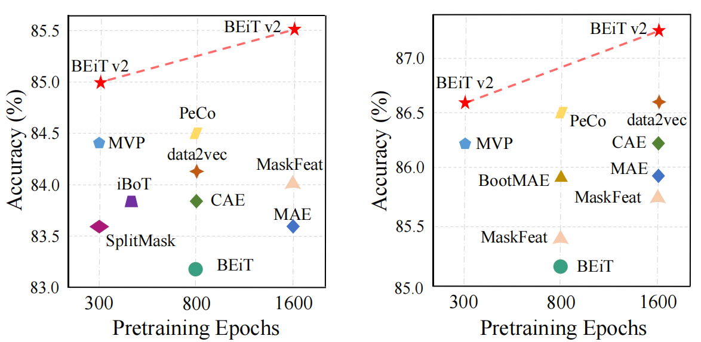
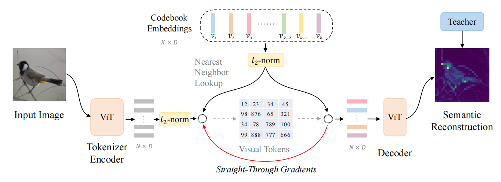
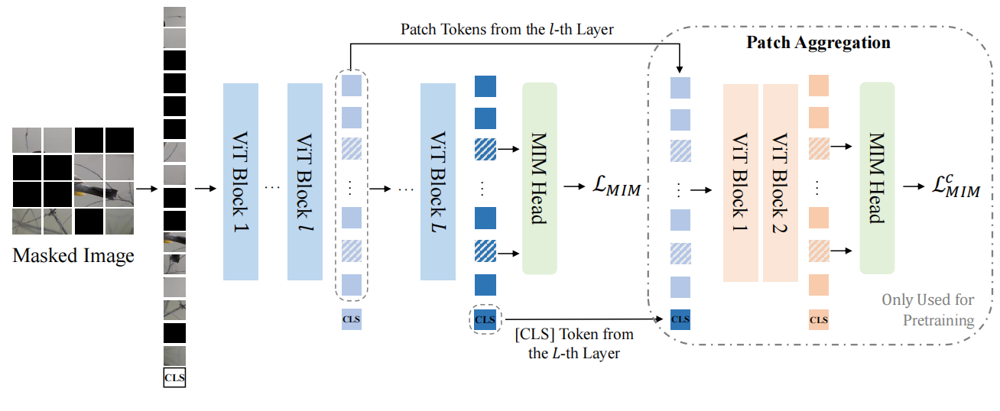
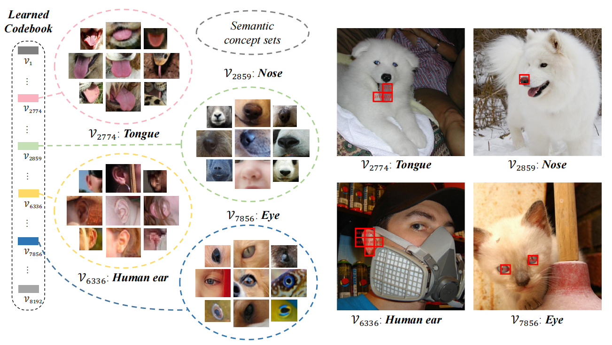
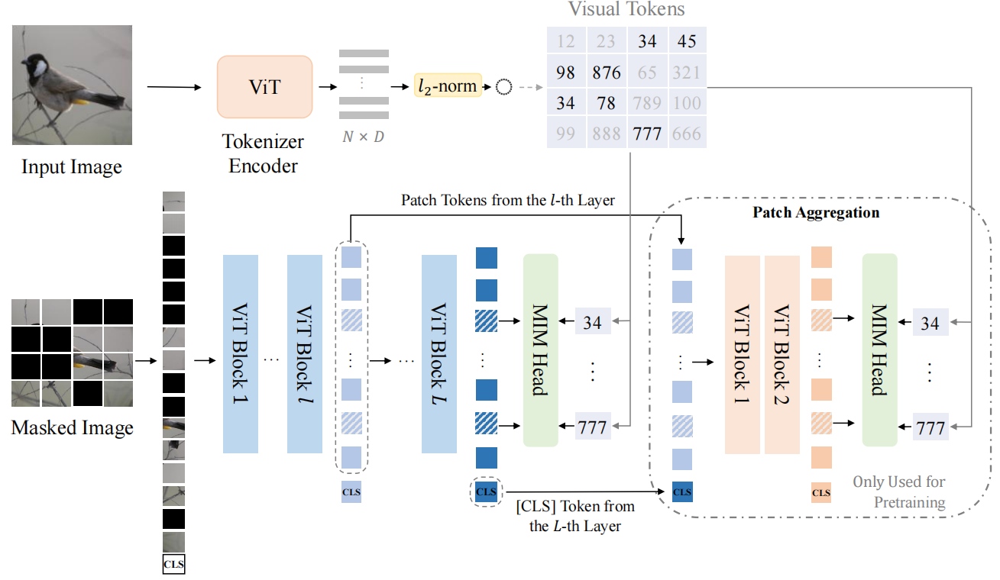

# BEIT V2: Masked Image Modeling with Vector-Quantized Visual Tokenizers
使用向量量化视觉分词器进行掩码图像建模 2022.8.12 https://arxiv.org/abs/2208.06366

## 阅读笔记
* 向量量化知识蒸馏(VQ-KD)，将掩蔽图像建模从像素级提升到语义级，以实现自监督表示学习。
    * [Neural discrete representation learning](#) 神经离散表示学习 
    * 码本崩溃。只使用一小部分代码. 码本大小：8192×32(使用率：95%), 视觉分词器：Base & 3层,768维,12头    
        * [Vector-quantized image modeling with improved vqgan](https://arxiv.org/abs/2110.04627) 
* 分块聚合策略，鼓励 [CLS]令牌关联所有分块, 在给定离散语义令牌的情况下强制执行全局结构，并提高学习表示的性能。 信息流瓶颈
    * [Condenser:a pre-training architecture for dense retrieval](https://arxiv.org/abs/2104.08253). [CLS]令牌关联所有分块
* 掩码方式，采用block-wise，MAE随机方式
* Visual tokenizer. 视觉分词器
    * VQ-VAE, 最近邻查找
    * DALL-E, Gumbel-softmax 松弛进行量化
    * VQGAN/ViT-VQGAN, 引入了 Transformer 块来训练更好的自动编码器
    * ViT-VQGAN 提出了用于码本学习的因式分解和 l2归一化 编码.
* 必要性，是不是多此一举？

## Abstract
Masked image modeling (MIM) has demonstrated impressive results in selfsupervised representation learning by recovering corrupted image patches. However, most existing studies operate on low-level image pixels, which hinders the exploitation of high-level semantics for representation models. In this work, we propose to use a semantic-rich visual tokenizer as the reconstruction target for masked prediction, providing a systematic way to promote MIM from pixel-level to semantic-level. Specifically, we propose vector-quantized knowledge distillation to train the tokenizer, which discretizes a continuous semantic space to compact codes. We then pretrain vision Transformers by predicting the original visual tokens for the masked image patches. Furthermore, we introduce a patch aggregation strategy which associates discrete image patches to enhance global semantic representation. Experiments on image classification and semantic segmentation show that BEIT V2 outperforms all compared MIM methods. On ImageNet-1K (224 size), the base-size BEIT V2 achieves 85.5% top-1 accuracy for fine-tuning and 80.1% top-1 accuracy for linear probing. The large-size BEIT V2 obtains 87.3% top-1 accuracy for ImageNet-1K (224 size) fine-tuning, and 56.7% mIoU on ADE20K for semantic segmentation. The code and pretrained models are available at https://github.com/microsoft/unilm/tree/master/beit2.

掩码图像建模 (MIM) 通过恢复损坏的图像块在自监督表示学习中展示了令人印象深刻的结果。 然而，大多数现有研究都在低图像像素上进行操作，这阻碍了表示模型的高级语义的开发。 在这项工作中，我们建议使用富含语义的视觉分词器作为掩码预测的重建目标，提供一种系统的方法来将 MIM 从像素级提升到语义级。 具体来说，我们提出了向量量化知识蒸馏来训练分词器，它将连续的语义空间离散化为紧凑的编码。 然后，我们通过预测掩码图像块的原始视觉令牌来预训练ViT。 此外，我们引入了一种分块聚合策略，该策略将离散图像分块关联起来以增强全局语义表示。 图像分类和语义分割实验表明，BEIT V2 优于所有比较的 MIM 方法。 在 ImageNet-1K(224 尺寸)上，基本尺寸 BEIT V2 实现了 85.5% 的微调 top-1 精度和 80.1% 的线性探测 top-1 精度。 大尺寸 BEIT V2 在 ImageNet-1K(224 尺寸)微调中获得了 87.3% 的 top-1 精度，在语义分割的 ADE20K 上获得了 56.7% 的 mIoU。 代码和预训练模型可在 https://github.com/microsoft/unilm/tree/master/beit2 获得。

## 1 Introduction
Masked image modeling (MIM), which greatly relieves the annotation-hungry issue of vision Transformers, has demonstrated great potential in learning visual representations (Bao et al., 2022; He et al., 2022). Given an image, the pretraining objective of MIM is to recover the masked patches so that rich context information is captured by the representation model. Taking BEiT (Bao et al., 2022) as an example, each image has two views during pretraining, i.e., image patches, and visual tokens. The original image is first tokenized to discrete tokens. Randomly sampled image patches are then masked before being fed to vision Transformers. The pretraining objective is to recover the original visual tokens based on the corrupted image patches. The pretrained vision encoder can be deployed and finetuned on various downstream tasks by appending lightweight task layers.

掩码图像建模(MIM) 极大地缓解了 视觉Transformers 的标注问题，在学习视觉表示方面显示出巨大潜力(Bao et al., 2022; He et al., 2022)。 给定一张图像，MIM 的预训练目标是恢复被掩码的分块，以便表示模型捕获丰富的上下文信息。 以 BEiT(Bao et al., 2022) 为例，每个图像在预训练期间都有两个视图，即图像块和视觉令牌。 原始图像首先被令牌为离散令牌。 然后，随机采样的图像块被掩码后馈送到ViT。 预训练目标是基于损坏的图像块恢复原始视觉令牌。 通过附加轻量级任务层，可以在各种下游任务上部署和微调预训练视觉编码器。

Existing MIM approaches can be coarsely categorized to three according to the reconstruction targets: low-level image elements (e.g., raw pixels; He et al. 2022; Fang et al. 2022; Liu et al. 2022), handcrafted features (e.g., HOG features; Wei et al. 2021), and visual tokens; Bao et al. 2022; Wang et al. 2022; Dong et al. 2021; El-Nouby et al. 2021; Chen et al. 2022. However, all the reconstruction targets are about, explicitly or implicitly, low-level image elements while underestimating high-level semantics. In comparison, the masked words in language modeling (Devlin et al., 2019; Dong et al., 2019) are all about high-level semantics, which motivates us to tap the potential of MIM by exploiting semantic-aware supervision during pretraining. 

根据重建目标，现有的 MIM 方法可以粗略地分为三类：
1. 低级图像元素(例如，原始像素; He et al. 2022; Fang et al. 2022; Liu et al. 2022)
2. 手工特征(例如， HOG 特征; Wei et al.  2021); 
3. 视觉令牌: Bao et al. 2022; Wang et al. 2022; Dong et al. 2021;  El-Nouby et al. 2021; Chen et al. 2022. 

然而，所有的重建目标都明确或隐含地关注低级图像元素，同时低估了高级语义。 相比之下，语言建模中的掩码词 (Devlin et al., 2019; Dong et al., 2019) 都是关于高级语义的，这促使我们通过在预训练期间利用语义感知监督来挖掘 MIM 的潜力。

In this work, we propose a self-supervised representation learning approach, termed BEIT V2, with the aim to improve MIM pretraining by constructing a semantic-aware visual tokenizer. Our approach is developed on the BEIT method which is simple yet effective. The novelty lies in introducing the Vector-Quantized Knowledge Distillation (VQ-KD) algorithm to discretize a semantic space. The VQ-KD encoder first converts the input image to discrete tokens according to a learnable codebook. The decoder then learns to reconstruct the semantic features encoded by a teacher model, conditioning on the discrete tokens. After training VQ-KD, its encoder is used as a semantic visual tokenizer for BEIT pretraining, where the discrete codes serve as supervision signals.

在这项工作中，我们提出了一种自监督表示学习方法，称为 BEIT V2，旨在通过构建语义感知视觉分词器来改进 MIM 预训练。 我们的方法是在 BEIT 方法的基础上开发的，该方法简单而有效。 新颖之处在于引入向量量化知识蒸馏(VQ-KD)算法来离散化语义空间。 VQ-KD 编码器首先根据可学习的码本将输入图像转换为离散令牌。 然后,解码器以离散令牌为条件,学习重建由教师模型编码的语义特征。 在训练 VQ-KD 之后，其编码器用作 BEIT 预训练的视觉语义分词器，其中离散编码用作监督信号。

Considering the discreteness of tokens, we further introduce a patch aggregation strategy which explicitly encourages the [CLS] token to associate all patches (Gao & Callan, 2021). Such a strategy resolves the issue that MIM put patch reconstruction the first place which diminishes learning global image representations. As a result, BEIT V2 improves the capacity of learned image representation, as supported by the linear probing experiments. Moreover, the enhanced representations also boosts the performance of other tasks.

考虑到令牌的离散性，我们进一步引入了一种分块聚合策略，该策略明确鼓励 [CLS]令牌关联所有分块 (Gao & Callan, 2021)。 这种策略解决了 MIM 将分块重建放在首位而减少学习全局图像表示的问题。 因此，在线性探测实验的支持下，BEIT V2 提高了学习图像表示的能力。 此外，增强的表示还提高了其他任务的性能。

We conduct self-supervised learning on ImageNet-1k for both base- and large-size vision Transformers, which are evaluated on downstream tasks, e.g., image classification, linear probing, and semantic segmentation. As shown in Figure 1, BEIT V2 outperforms previous self-supervised learning algorithms by a large margin on ImageNet fine-tuning, e.g., improving over BEIT (Bao et al., 2022) by about two points for both ViT-B/16 and ViT-L/16. BEIT V2 outperforms all compared MIM methods on ImageNet linear probing while achieving large performance gains on ADE20k for semantic segmentation.

我们在 ImageNet-1k 上针对基本尺寸和大型视觉 Transformer 进行自监督学习，这些视觉 Transformer 在下游任务(例如图像分类、线性探测和语义分割)上进行评估。 如图1 所示，BEIT V2 在 ImageNet 微调方面大大优于之前的自监督学习算法，例如，对于 ViT-B/16 和 ViT-L/16。 BEIT V2 在 ImageNet 线性探测上优于所有比较的 MIM 方法，同时在 ADE20k 上实现语义分割的巨大性能提升。

 
Figure 1: Top-1 fine-tuning accuracy on ImageNet (224 size). Left: ViT-B/16. right: ViT-L/16.
图1：ImageNet(224 大小)上的 Top-1 微调精度。 左：ViT-B/16。 右图：ViT-L/16。

The contributions of this work are summarized as follows: 
* We propose vector-quantized knowledge distillation, promoting masked image modeling from pixel-level to semantic-level for self-supervised representation learning. 
* We introduce a patch aggregation strategy, which enforces global structure given discrete semantic tokens, and improves the performance of learned representations. 
* We conduct extensive experiments on downstream tasks including ImageNet fine-tuning, linear probing, and semantic segmentation. Experimental results show that the proposed approach significantly improves performance across model sizes, training steps, and downstream tasks. 

这项工作的贡献总结如下：
* 提出向量量化知识蒸馏，将掩蔽图像建模从像素级提升到语义级，以实现自监督表示学习。
* 引入了一种分块聚合策略，它在给定离散语义令牌的情况下强制执行全局结构，并提高学习表示的性能。
* 对下游任务进行了大量实验，包括 ImageNet 微调、线性探测和语义分割。 实验结果表明，所提出的方法显著提高了模型大小、训练步骤和下游任务的性能。

### 2.Methodology
BEIT V2 inherits the masked image modeling framework defined by BEIT (Bao et al., 2022), which uses a visual tokenizer to convert each image to a set of discrete visual tokens. The training target is to recover the masked visual tokens, each of which corresponds to an image patch. In Section 2.2, we introduce a vector-quantized knowledge distillation algorithm, which is used to train a visual tokenizer. In Section 2.3, we employ the visual tokenizer for BEIT pretraining under the help of the patch aggregation strategy.

BEIT V2 继承了 BEIT (Bao et al., 2022) 定义的掩码图像建模框架，该框架使用视觉分词器将每个图像转换为一组离散的视觉令牌。 训练目标是恢复被掩蔽的视觉令牌，每个视觉令牌对应一个图像块。 在 2.2 节中，我们介绍了一种向量量化知识蒸馏算法，用于训练视觉分词器。 在第 2.3 节中，我们在分块聚合策略的帮助下使用视觉分词器进行 BEIT 预训练。

### 2.1 Image Representation
The vision Transformers (ViTs; Dosovitskiy et al. 2020) are employed as the backbone networks to obtain image representations. The input image $x ∈ R^{H×W×C}$ is reshaped to N = HW /$P^2$ patches $\{x^p_i \}^N_{i=1}$, where $x^p ∈ R^{N×(P^2C)}$ and (P, P) is the patch size. In experiments, each 224×224 image is split to a 14 × 14 grid of image patches, where each patch is 16 × 16. The image patches $\{x^p_i \}^N_{i=1}$ are then flattened and linearly projected to input embeddings for Transformers. The encoding vectors are denoted as $\{h_i\}^N_{i=1}$, which corresponds to N image patches.

视觉Transformers (ViTs; Dosovitskiy et al. 2020) 被用作骨干网络以获得图像表示。 输入图像 $x ∈ R^{H×W×C}$ 被重塑为 N = HW /$P^2$ 分块 $\{x^p_i \}^N_{i=1}$，其中 $x^ p ∈ R^{N×(P^2C)}$ 并且 (P, P) 是分块大小。 在实验中，每个 224×224 的图像被分割成 14×14 的图像块网格，其中每个块为 16×16。图像块 $\{x^p_i \}^N_{i=1}$ 然后被展平 并线性投影到Transformers的输入嵌入。 编码向量表示为 $\{h_i\}^N_{i=1}$，对应于 N 个图像块。

### 2.2 Training Visual Tokenizer
We propose vector-quantized knowledge distillation (VQ-KD) to train the visual tokenizer, Figure 2, where the visual tokenizer and the decoder are two vital modules.

我们建议使用向量量化知识蒸馏 (VQ-KD) 来训练视觉分词器，图2，其中视觉分词器和解码器是两个重要模块。

 
Figure 2: Pipeline for visual tokenizer training. After training, each image is converted to discrete visual tokens. 
图2：视觉分词器训练的管道。 训练后，每个图像都被转换为离散的视觉令牌。

The visual tokenizer maps an image to a sequence of visual tokens, a.k.a., discrete codes. To be specific, an image x is tokenized to $z = [z_1, z_2, · · · , z_N ] ∈ V^{(H/P )×(W/P )}$ , where the visual vocabulary (a.k.a., codebook) V ∈ $R^{K×D}$ contains K discrete codebook embeddings.

视觉分词器将图像映射到一系列视觉令牌，也就是离散编码。 具体来说，图像 x 被令牌为 $z = [z_1, z_2, · · · , z_N ] ∈ V^{(H/P )×(W/P )}$ ，其中视觉词汇（又名码本）V ∈ $R^{K×D}$ 包含 K 个离散码本嵌入。

The tokenizer is consist of a vision Transformer encoder, and a quantizer. The tokenizer first encodes the input image to vectors. Then, the vector quantizer looks up the nearest neighbor in the codebook for each patch representation $h_i$ . Let {$v_1, v_2, · · · , v_K$} denote the codebook embeddings. For the i-th image patch, its quantized code is calculated as 

分词器由视觉Transformer编码器和量化器组成。 分词器首先将输入图像编码为向量。 然后，向量量化器在码本中为每个分块表示 $h_i$ 查找最近的邻居。 让 {$v_1, v_2, · · · , v_K$} 表示码本嵌入。 对于第 i 个图像块，其量化编码计算为

$z_i = arg min_j || l_2(h_i) − l_2(v_j )||_2$, (1) 

where j ∈ {1, 2, · · · , K} and $l_2$ normalization is used for codebook lookup (Yu et al., 2021). The above distance is equivalent to finding codes according to cosine similarity.

其中 j ∈ {1, 2, · · · , K} 和 $l_2$归一化 用于码本查找 (Yu et al., 2021)。 上面的距离相当于根据余弦相似度找编码。

After quantizing the image to visual tokens, we feed the l2-normalized codebook embeddings $\{l_2(v_{z_i} )\}^N_{i=1}$ to the decoder. The decoder is also a multi-layer Transformer. The output vectors $\{o_i\}^N_{i=1}$ aim at reconstructing the semantic features of a teacher model, e.g., DINO (Caron et al., 2021), and CLIP (Radford et al., 2021). Let $t_i$ denote the teacher model’s feature vector of the i-th image patch. During training, we maximize the cosine similarity between the decoder output $o_i$ and the teacher guidance $t_i$ .

将图像量化为视觉令牌后，我们将 $l_2$归一化码本嵌入 $\{l_2(v_{z_i} )\}^N_{i=1}$ 提供给解码器。 解码器也是一个多层Transformer。 输出向量 $\{o_i\}^N_{i=1}$ 旨在重建教师模型的语义特征，例如 DINO (Caron et al., 2021) 和 CLIP (Radford et al., 2021) . 设 $t_i$ 表示教师模型的第 i 个图像块的特征向量。 在训练期间，我们最大化解码器输出 $o_i$ 和教师指导 $t_i$ 之间的余弦相似度。

Because the quantization process (Equation 1) is non-differentiable, the gradients are directly copied from the decoder input to the encoder output (van den Oord et al., 2017), Figure 2, to back-propagate gradients to the encoder. Intuitively, the quantizer looks up the nearest code for each encoder output, while the gradients of codebook embeddings indicate useful optimization directions for the encoder. 

因为量化过程（等式 1）是不可微分的，所以梯度直接从解码器输入复制到编码器输出（van den Oord et al., 2017），图2，以将梯度反向传播到编码器。 直观上，量化器为每个编码器输出查找最近的编码，而码本嵌入的梯度为编码器指示有用的优化方向。

The training objective of VQ-KD is defined as 

VQ-KD的训练目标定义为

$max \sum_{x∈D} \sum^N_{i=1}cos(o_i , t_i) − ||sg[l_2(h_i)] − l_2(v_{z_i} )||^2_2 − ||l_2(h_i) − sg[l_2(v_{z_i} )]||^2 _2$ , (2) 

where sg[·] stands for the stop-gradient operator which is an identity at the forward pass while having zero gradients during the backward pass. D represents the image data used for tokenizer training.

其中 sg[·] 代表停止梯度算子，它在前向传递中是一个恒等式，而在向后传递中具有零梯度。 D 表示用于分词器训练的图像数据。

Improving codebook utilization. A common issue of vector quantization training is codebook collapse. In other words, only a small proportion of codes are used. Empirical strategies (van den Oord et al., 2017; Yu et al., 2021) can be used to alleviate this issue. Equation 1 shows that we compute the $l_2$-normalized distance to find the nearest code while reducing the dimension of codebook embedding space to 32-d. The low-dimensional codebook embeddings are mapped back to higher-dimensional space before being fed to the decoder. Exponential moving average (van den Oord et al., 2017) is employed to update the codebook embeddings. Exponential moving average tends to be more stable for VQ-KD training.

<strong>提高码本利用率</strong>。 向量量化训练的一个常见问题是码本崩溃。 换句话说，只使用了一小部分编码。 实证策略（van den Oord et al., 2017; Yu et al., 2021）可以用来缓解这个问题。 等式1 显示我们计算 $l_2$ 归一化距离以找到最近的编码，同时将编码本嵌入空间的维度减少到 32-d。 低维码本嵌入在被馈送到解码器之前被映射回高维空间。 指数移动平均线 (van den Oord et al., 2017) 用于更新码本嵌入。 对于 VQ-KD 训练，指数移动平均线往往更稳定。

### 2.3 Pretraining BEIT V2
We follow the MIM setup in BEIT (Bao et al., 2022) to pretrain vision Transformers for image representations. Given an input image x, around 40% image patches are block-wisely chosen and masked. The masked position is termed as M. Then, a shared learnable embedding $e_{[M]}$ is used to replace the original image patch embeddings $e^p_i$ if i ∈ M: $x^M_i = δ(i ∈ M) \bigodot e_{[M]} + (1 − δ(i ∈ M))\bigodot x^p_i$ , where δ(·) is the indicator function. Subsequently, we prepend a learnable [CLS] token to the input, i.e., [$e_{CLS}, \{x^M_i \}^N_{i=1}$], and feed them to the vision Transformer. The final encoding vectors are denoted as $\{h_i\}^N_{i=0}, where $h_0$ is for the [CLS] token.

我们遵循 BEIT（Bao et al., 2022）中的 MIM 设置来预训练图像表示的视觉 Transformers。 给定输入图像 x，大约 40% 的图像块被block-wisely选择和掩码。 掩码位置称为 M。然后，如果 i ∈ M：$x^M_i = δ(i ∈ M) \bigodot e_{[M]} + (1 − δ(i ∈ M))\bigodot x^p_i$ ，其中 δ(·) 是指示函数。 随后，我们将可学习的 [CLS] 令牌添加到输入中，即 [$e_{CLS}, \{x^M_i \}^N_{i=1}$]，并将它们提供给视觉 Transformer。 最终的编码向量表示为 $\{h_i\}^N_{i=0}，其中 $h_0$ 用于 [CLS] 令牌。

Next, we instantiate the MIM head as a simple fully-connection layer, and then use it to predict the visual tokens of the masked positions based on the corrupted image $x^M$. For each masked position $\{h_i : i ∈ M\}^N_{i=1}$, a softmax classifier predicts the visual tokens $p(z_i |h_i) = softmax_{z_i} (W_ch_i +b_c)$, where $W_c$, $b_c$ respectively mean weights and biases of the MIM head. The visual tokens are obtained by the tokenizer trained in Section 2.2, which provides supervisions for the MIM self-supervised learning procedure. The training loss of MIM is defined as

接下来，我们将 MIM 头实例化为一个简单的全连接层，然后使用它根据损坏的图像 $x^M$ 预测掩蔽位置的视觉令牌。 对于每个掩码位置 $\{h_i : i ∈ M\}^N_{i=1}$，softmax 分类器预测视觉令牌 $p(z_i |h_i) = softmax_{z_i} (W_ch_i +b_c)$，其中 $W_c$, $b_c$ 分别表示 MIM 头的权重和偏差。 视觉令牌由第 2.2 节中训练的分词器获得，它为 MIM 自监督学习过程提供监督。 MIM 的训练损失定义为

$L_{MIM} = − \sum_{x∈D} \sum_{i∈M} log p(z_i |x^M_i )$, (3) 

where $z_i$ denotes the visual tokens of the original image, and D the pretraining images. Notice that the number of visual tokens is the same as the number of image patches in this work. 

其中 $z_i$ 表示原始图像的视觉令牌，D 表示预训练图像。 请注意，视觉令牌的数量与这项工作中的图像块数量相同。

Pretraining global representation. Inspired by (Gao & Callan, 2021), we pretrain the [CLS] token for global image representation. The goal is to mitigate the discrepancy between patch-level pretraining and image-level representation aggregation. As illustrated in Figure 3, a representation bottleneck is constructed to encourage the [CLS] token to gather information as much as possible. For a L-layer Transformer, let $\{h^l_i \}^N_{i=1}$ denote the l-th layer’s output vectors, where l ∈ {1, 2, · · · , L}. To pretrain the last layer’s [CLS] token $h^L_{CLS}$, we concatenate it with the intermediate l-th layer’s patch vectors $\{h^l_i \}^N_{i=1}$, i.e., S = [$h^L_{CLS}, h^l_1 , · · · , h^l_N $]. We then feed S to a shallow (e.g., two layers) Transformer decoder and conduct masked prediction again, i.e., $p(z|S) = softmax_z(W_cS + b_c)$. Notice that the parameters are shared for both MIM heads and the MIM loss is also computed at mask positions as in Equation 3. Accordingly, the final training loss is defined as the summation of two terms, i.e., the original loss at the L-th layer, and the shallow Transformer decoder’s MIM loss. Overall framework refers to Appendix C.

预训练全局表示。 受 (Gao & Callan, 2021) 的启发，我们预训练了用于全局图像表示的 [CLS]令牌。 目标是减轻分块级预训练和图像级表示聚合之间的差异。 如图3 所示，构建了一个表示瓶颈以鼓励 [CLS]令牌 尽可能多地收集信息。 对于 L 层 Transformer，令 $\{h^l_i \}^N_{i=1}$ 表示第 l 层的输出向量，其中 l ∈ {1, 2, · · · , L}。 为了预训练最后一层的 [CLS]令牌 $h^L_{CLS}$，我们将它与中间第 l 层的分块向量 $\{h^l_i \}^N_{i=1}$ 连接起来，即 S = [$h^L_{CLS}, h^l_1 , · · · , h^l_N $]。 然后，我们将 S 馈送到浅（例如，两层）Transformer 解码器并再次进行掩码预测，即 $p(z|S) = softmax_z(W_cS + b_c)$。 请注意，两个 MIM 头共享参数，并且 MIM 损失也在掩码位置计算，如等式3 中所示。因此，最终训练损失定义为两项的总和，即第 L 个的原始损失 层，以及浅层 Transformer 解码器的 MIM 损失。 总体框架参见附录C。

 
Figure 3: The MIM framework equipped with patch aggregation. The pretraining loss is the summation of $L_{MIM}$ and $L^c_{MIM}$. The loss term $L^c_{MIM}$ explicitly encourages the [CLS] token to aggregate patch information to global representations.
图3：配备分块聚合的 MIM 框架。 预训练损失是 $L_{MIM}$ 和 $L^c_{MIM}$ 的总和。 损失项 $L^c_{MIM}$ 明确鼓励 [CLS] 令牌将分块信息聚合到全局表示。

Intuitively, the model favors pushing the global information to $h^L_{CLS}$, because the model tends to fully utilize the parameters from (l + 1)-th layer to L-th layer, to decrease the additional MIM loss. The information-flow bottleneck encourages the [CLS] token towards more reliable global representations than its untrained counterparts. Moreover, the enhanced representations also facilitate various downstream tasks. Notice that the newly added shallow decoder is only used to pretrain the [CLS] token, which is discarded after pretraining. 

直观上，该模型倾向于将全局信息推送到 $h^L_{CLS}$，因为该模型倾向于充分利用从第 (l + 1) 层到第 L 层的参数，以减少额外的 MIM 损失。 信息流瓶颈鼓励 [CLS] 令牌比未经训练的令牌更可靠的全局表示。 此外，增强的表示还有助于各种下游任务。 请注意，新添加的浅层解码器仅用于预训练 [CLS] 令牌，预训练后将被丢弃。

## 3 Experiments
The pretrained models are evaluated on image classification and semantic segmentation tasks. For image classification, the models are trained on ImageNet-1K (Russakovsky et al., 2015) and evaluated by (1) top-1 accuracy about fine-tuning and (2) top-1 accuracy about linear probing (only fine-tuning the classification head). For semantic segmentation, experiments are conducted on the ADE20K dataset (Zhou et al., 2019) and the performance is evaluated using the mIoU protocol.

预训练模型在图像分类和语义分割任务上进行评估。 对于图像分类，模型在 ImageNet-1K(Russakovsky et al., 2015)上进行训练，并通过 
(1) 关于微调的 top-1 精度
(2) 关于线性探测的 top-1 精度(仅微调)进行评估 分类头。 
对于语义分割，在 ADE20K 数据集(Zhou et al., 2019)上进行了实验，并使用 mIoU 协议评估了性能。

### 3.1 Pretraining Setup
#### Visual tokenizer training.  视觉分词器训练
We instantiate the visual tokenizer of VQ-KD as ViT-B/16 for both base- and large-size BEIT V2 pretraining. The decoder network is a three-layer standard Transformer, which has the same dimension and number of attention heads as the tokenizer encoder. The OpenAI CLIP-B/16 (Radford et al., 2021) is employed as the teacher model and train VQ-KD on ImageNet-1k with 224×224 resolution. Notice that we use the same base-size teacher to train the visual tokenizer for both base- and large-size pretraining. The code size K is set as 8192 and code dimension D as 32 by default. Refer to Appendix D for more training details.

我们将 VQ-KD 的视觉分词器实例化为 ViT-B/16，用于基础和大型 BEIT V2 预训练。 解码器网络是一个三层标准的Transformer，它具有与分词器编码器相同的维度和注意力头数量。 OpenAI CLIP-B/16 (Radford et al., 2021) 被用作教师模型，并在 ImageNet-1k 上以 224×224 分辨率训练 VQ-KD。 请注意，我们使用相同的 base-size teacher 为 base- 和 large-size 预训练训练视觉分词器。 编码大小 K 默认设置为 8192，编码维度 D 默认设置为 32。 有关更多训练详情，请参阅附录 D。

#### Masked image modeling.  掩码图像建模
We follow the settings used in BEiT (Bao et al., 2022) pretraining and use ImageNet-1K without labels as the pretraining data for self-supervised learning. The input image resolution is set as 224x224 during pretraining. The pretrained base- and large-size vision Transformers (Dosovitskiy et al., 2020) with 16×16 patch size are denoted as ViT-B/16 and ViT-L/16, respectively. For the patch aggregation strategy, we set l = 9 for ViT-B/16, l = 21 for ViT-L/16, and the depth as 2 by default. A block-wise masking mechanism is adopted under the mask ratio of 40% (i.e., about 75 image patches). More pretraining details can be found in Appendix E.

我们遵循 BEiT (Bao et al., 2022) 预训练中使用的设置，并使用没有标签的 ImageNet-1K 作为自监督学习的预训练数据。 输入图像分辨率在预训练期间设置为 224x224。 具有 16×16 块大小的预训练基础和大尺寸ViT (Dosovitskiy et al., 2020) 分别表示为 ViT-B/16 和 ViT-L/16。 对于分块聚合策略，我们为 ViT-B/16 设置 l = 9，为 ViT-L/16 设置 l = 21，默认深度为 2。 在 40% 的掩码率下(即大约 75 个图像块)，采用块式掩码机制。 更多预训练细节可以在附录 E 中找到。

### 3.2 Image Classification
Both the fine-tuning accuracy and linear probing accuracy are evaluated on ImageNet-1k by default. The models are also evaluated on several ImageNet variants to demonstrate their favorable generalization ability.

默认情况下，微调精度和线性探测精度均在 ImageNet-1k 上进行评估。 这些模型还在几个 ImageNet 变体上进行了评估，以证明它们具有良好的泛化能力。

#### Fine-tuning setup.  微调设置
We follow the protocol proposed in BEiT (Bao et al., 2022) to fine-tune the pretrained BEIT V2 model (see Appendix F for more details). In Table 1, we report the top-1 fine-tuning accuracy results and compare BEIT V2 with recent MIM methods.

我们遵循 BEiT (Bao et al., 2022) 中提出的协议来微调预训练的 BEIT V2 模型(有关更多详情，请参见附录 F)。 在表1 中，我们报告了 top-1 微调精度结果，并将 BEIT V2 与最近的 MIM 方法进行了比较。

 
Table 1: Fine-tuning results of image classification and semantic segmentation on ImageNet-1K and ADE20k. UperNet (Xiao et al., 2018) is used as the task layer for semantic segmentation with single-scale (512 size) input.
表1：ImageNet-1K 和 ADE20k 上图像分类和语义分割的微调结果。 UperNet (Xiao et al., 2018) 被用作具有单尺度(512 大小)输入的语义分割的任务层。

From Table 1, base-size BEIT V2 with a 300-epoch pretraining schedule reaches 85.0% top-1 accuracy, which outperforms BEIT, CAE, SplitMask and PeCo by 2.1%, 1.4%, 1.4% and 0.9% respectively. Compared with masked distillation methods, like MVP, BEIT V2 also shows superiority. 

从表1 可以看出，具有 300 个 epoch 预训练计划的 base-size BEIT V2 达到 85.0% top-1 精度，分别优于 BEIT、CAE、SplitMask 和 PeCo 2.1%、1.4%、1.4% 和 0.9%。 与 MVP 等掩蔽蒸馏方法相比，BEIT V2 也显示出优越性。

Furthermore, with a longer pretraining schedule, BEIT V2 achieves 85.5% top-1 accuracy, developing a new state of the art on ImageNet-1K among self-supervised methods. Meanwhile, BEIT V2 using ViT-L/16 with 300 epochs reaches 86.6% top-1 accuracy, which is comparable to data2vec with 1600 epochs. A longer pretraining schedule further boosts the performance to 87.3%.

此外，通过更长的预训练时间表，BEIT V2 达到了 85.5% 的 top-1 精度，在自监督方法中开发了 ImageNet-1K 上的最新技术水平。 同时，使用 ViT-L/16 的 BEIT V2 在 300 个 epoch 时达到 86.6% 的 top-1 精度，与 data2vec 的 1600 个 epoch 相当。 更长的预训练时间表进一步将性能提高到 87.3%。

Following BEIT, we add an intermediate fine-tuning phase between the pretraining stage and the fine-tuning stage. Only the intermediate fine-tuning phase uses the ImageNet-21k dataset. As shown in Table 1, we find that intermediate fine-tuning achieves about 1% performance gain on image classification for both base- and large-size models. Refer to Appendix B for more results of intermediate fine-tuning. 

在 BEIT 之后，我们在预训练阶段和微调阶段之间添加了一个中间微调阶段。 只有中间微调阶段使用 ImageNet-21k 数据集。 如表1 所示，我们发现中间微调在基本模型和大尺寸模型的图像分类上实现了大约 1% 的性能提升。 有关中间微调的更多结果，请参阅附录 B。

#### Linear probing. 线性探测
Keeping the backbone model frozen and training a linear classification head atop the image-level representations, linear probing has been a widely considered measure for selfsupervised learning. We average the patch tokens as the global representation for the models without patch aggregation. Otherwise, we consider the [CLS] token as the global representation. Table 2 presents the top-1 accuracy for linear probing and compares BEIT V2 with recent methods including BEIT, CAE, MAE, MVP and MoCo v3. All the compared methods are based on ViT-B/16 and pretrained for 300 epochs except MAE for 1600 epochs. BEIT V2 respectively outperforms BEIT, CAE and MVP by 23.4%, 16.0% and 4.7%. BEIT V2 also outperforms MoCo v3, which learns a global representation through a contrastive learning fashion. The comparisons indicate that the representation models learned by BEIT V2 enjoy higher adaptation capability.

保持主干模型冻结并在图像级表示之上训练线性分类头，线性探测已被广泛认为是自监督学习的一种措施。 我们将分块令牌平均为没有分块聚合的模型的全局表示。 否则，我们将 [CLS] 令牌视为全局表示。 表2 显示了线性探测的最高准确度，并将 BEIT V2 与最近的方法(包括 BEIT、CAE、MAE、MVP 和 MoCo v3)进行了比较。 所有比较的方法都基于 ViT-B/16 并预训练了 300 个 epochs，除了 MAE 为 1600 epochs。 BEIT V2 分别比 BEIT、CAE 和 MVP 高出 23.4%、16.0% 和 4.7%。 BEIT V2 也优于 MoCo v3，后者通过对比学习方式学习全局表征。 比较表明，BEIT V2 学习的表示模型具有更高的适应能力。

 
Table 2: Top-1 accuracy of linear probing on ImageNet-1k. All methods are based on ViT-B/16 pretrained for 300 epochs except MAE for 1600 epochs.
表2：ImageNet-1k 上线性探测的 Top-1 精度。 除 MAE 外，所有方法均基于 ViT-B/16 预训练 300 个 epoch 1600 个纪元。

#### Robustness evaluation.  稳健性评价
We evaluate the robustness of BEIT V2 on various ImageNet validation sets, i.e., ImageNet-Adversarial (Hendrycks et al., 2021b), ImageNet-Rendition (Hendrycks et al., 2021a) and ImageNet-Sketch (Wang et al., 2019). As shown in Table 3, compared with MAE (He et al., 2022), BEIT V2 achieves dramatic gains across datasets, demonstrating the superiority of the proposed method in terms of model generalization.

我们评估了 BEIT V2 在各种 ImageNet 验证集上的稳健性，即 ImageNet-Adversarial(Hendrycks et al., 2021b)、ImageNet-Rendition(Hendrycks et al., 2021a)和 ImageNet-Sketch(Wang et al., 2019) . 如表3 所示，与 MAE(He et al., 2022)相比，BEIT V2 在数据集上取得了显著的进步，证明了所提出方法在模型泛化方面的优越性。

 
Table 3: Robustness evaluation on three ImageNet variants (Hendrycks et al., 2021b,a; Wang et al., 2019).
表3：三种 ImageNet 变体的稳健性评估(Hendrycks et al., 2021b，a; Wang et al., 2019)。

### 3.3 Semantic Segmentation
Semantic segmentation is a dense prediction task, which generates class label for each pixel of the input image. Following the setting proposed in BEIT (Bao et al., 2022), we conduct experiments on ADE20K benchmark (Zhou et al., 2019), which includes 25K mages and 150 semantic categories. We use UperNet (Xiao et al., 2018) task layer and fine-tune the model for 160K iterations with the input resolution 512 × 512. Refer to Appendix G for details. Table 1 shows that BEIT V2 significantly outperforms previous self-supervised methods. Moreover, using the ViT-L/16 model, the performance can reach 56.7, which builds a new state-of-the-art for masked image modeling on ADE20k.

语义分割是一项密集的预测任务，它为输入图像的每个像素生成类标签。 按照 BEIT (Bao et al., 2022) 中提出的设置，我们在 ADE20K 基准测试 (Zhou et al., 2019) 上进行了实验，其中包括 25K 法师和 150 个语义类别。 我们使用 UperNet (Xiao et al., 2018) 任务层并对模型进行 160K 次迭代微调，输入分辨率为 512 × 512。有关详情，请参阅附录 G。 表1 显示 BEIT V2 明显优于以前的自监督方法。 此外，使用 ViT-L/16 模型，性能可以达到 56.7，这为 ADE20k 上的掩码图像建模建立了一个新的最先进技术。

### 3.4 Analysis
#### Visual tokenizer training.  视觉分词器训练
We investigate the impact of VQ-KD on BEIT V2 in terms of the model architecture and codebook size and report the results in Table 4. ViT-B/16 without the patch aggregation strategy is used as the baseline model, which is pretrained for 300 epochs. As shown in Table 4, we find that a deeper decoder of VQ-KD obtains better reconstruction, but lower codebook usage and downstream task performance. Reducing dimension for codebook lookup improves codebook utilization (Yu et al., 2021).

我们调查了 VQ-KD 在模型架构和码本大小对 BEIT V2 的影响，并在表4 中报告了结果。没有分块聚合策略的 ViT-B/16 被用作基线模型，它预训练了 300 时代。 如表4 所示，我们发现更深的 VQ-KD 解码器获得更好的重建，但码本使用率和下游任务性能较低。 减少码本查找的维度可以提高码本的利用率(Yu et al., 2021)。

 
Table 4: Ablation studies under VQ-KD settings. “Base&1x768x12” denotes that the encoder network is ViT-Base while the decoder is a Transformer with depth 1, dimensions 768, and head 12. “Reconst. Loss” is the reconstruction loss of VQ-KD. Reconstruction loss and codebook usage are measured on the validation set. After 300 epochs of pretraining, our method reports the top-1 fine-tuning accuracy and linear probing accuracy on ImageNet-1k, and mIoU on ADE20k. The default setting is highlighted in gray .
表4：VQ-KD 设置下的消融研究。 “Base&1x768x12” 表示编码器网络是 ViT-Base，而解码器是深度为 1、维度为 768、head 为 12 的 Transformer。 Loss”为VQ-KD的重建损失。 重建损失和码本使用是在验证集上测量的。 经过 300 个预训练阶段后，我们的方法在 ImageNet-1k 上报告了前 1 的微调精度和线性探测精度，在 ADE20k 上报告了 mIoU。 默认设置以灰色突出显示。

#### Patch aggregation strategy. 分块聚合策略
Table 5 presents the ablation studies of the patch aggregation strategy. The shallower head (i.e., 1/2-layer) performs better than the deeper head (i.e., 3-layer), suggesting the shallower head pays more attention to the input [CLS] token than the deeper head. Moreover, the proposed method outperforms the baseline variant without patch aggregation strategy. The improvement of linear probe indicates better image-level representations. In addition, the results indicate that sharing the MIM head improves downstream performance.

表5 展示了分块聚合策略的消融研究。 较浅的头部(即 1/2层)比较深的头部(即 3 层)表现更好，这表明较浅的头部比较深的头部更关注输入 [CLS] 令牌。 此外，所提出的方法优于没有分块聚合策略的基线变体。 线性探测的改进表明更好的图像级表示。 此外，结果表明共享 MIM 头可以提高下游性能。

 
Table 5: Ablation studies for patch aggregation strategy. l-th Layer denotes path tokens from the l-th layer of the backbone. Head Depth means the patch aggregation head depth. Shared MIM Head means whether we share the MIM head parameters or not. Default settings are in gray .
表5：分块聚合策略的消融研究。 l-th Layer 表示来自主干的第 l 层的路径令牌。 Head Depth表示分块聚合头深度。 Shared MIM Head 是指我们是否共享 MIM 头参数。 默认设置为灰色。

#### VQ-KD targets. 目标
In Table 6, we report the results about VQ-KDs are trained under the supervision of DINO (Caron et al., 2021) and CLIP (Radford et al., 2021). DINO is pretrained solely on ImageNet1k while CLIP is pretrained on 400M image-text pairs datasets in house. We also directly fine-tune the official base-size checkpoints and report the results in Table 6. One can see that when using DINO as the teacher model, BEIT V2 respectively reaches 84.4% and 49.2% on ImageNet and ADE20k, outperforming DINO itself by a large margin. When using CLIP as the teacher model, BEIT V2 can get consistent improvements, demonstrating the scalability of the proposed VQ-KD. In addition, we directly fine-tune the VQ-KD encoder on ImageNet. The results show that transfer performance of the VQ-KD encoder is lower than the teacher model. After performing masked image modeling, the pretrained model outperforms both the teacher model and the visual tokenizer encoder. It demonstrates the superiority of the proposed method for self-supervised learning.

在表6 中，我们报告了有关 VQ-KD 在 DINO(Caron et al., 2021)和 CLIP(Radford et al., 2021)的监督下进行训练的结果。 DINO 仅在 ImageNet1k 上进行预训练，而 CLIP 在内部 400M 图像文本对数据集上进行预训练。 我们还直接对官方的base-size checkpoints进行微调，结果如表6所示。可以看出，当使用DINO作为教师模型时，BEIT V2在ImageNet和ADE20k上分别达到了84.4%和49.2%，比DINO本身高出很大的距离。 当使用 CLIP 作为教师模型时，BEIT V2 可以获得一致的改进，证明了所提出的 VQ-KD 的可扩展性。 此外，我们直接在 ImageNet 上微调 VQ-KD 编码器。 结果表明，VQ-KD 编码器的迁移性能低于教师模型。 在执行掩码图像建模之后，预训练模型优于教师模型和视觉分词器编码器。 它证明了所提出的自监督学习方法的优越性。

 
Table 6: Comparisons between different VQ-KD targets. We also report the fine-tuning results of VQ-KD target models.
表6：不同 VQ-KD 目标之间的比较。 我们还报告了 VQ-KD 目标模型的微调结果。

#### Visualization of codebook.  码本可视化
We utilize the proposed VQ-KD to calculate discrete codes about the ImageNet-1k validation set. Image patches are grouped according to their corresponding codes. Figure 4 shows that the grouped image patches represent explicit semantics. For instance, the image patches corresponding to code 7856 are about “eyes” of human, cat, dog, fish and snake. Refer to Appendix A) for more examples. The introduction of codebook and feature quantization reduces the sensitiveness to the change of image details while facilitates exploitation of high-level semantics for representation models. VQ-KD compresses and quantizes the continuous feature values to a codebook, which constructs a discrete semantic space. The dimensionality of such a semantic space is significantly lower than that of the original continuous feature space. This reduces difficulty of masked patch reconstruction and alleviates the curse of dimensionality in the pretraining phase. 

我们利用建议的 VQ-KD 来计算关于 ImageNet-1k 验证集的离散编码。 图像块根据其相应的编码进行分组。 图4 显示分组图像块表示显式语义。 例如，编码7856对应的图像块是关于人、猫、狗、鱼和蛇的“眼睛”。 有关更多样本，请参阅附录A。 码本和特征量化的引入降低了对图像细节变化的敏感性，同时促进了表示模型的高级语义的开发。 VQ-KD将连续的特征值压缩量化成一个码本，构建一个离散的语义空间。 这种语义空间的维数明显低于原始连续特征空间的维数。 这降低了掩蔽分块重建的难度，并减轻了预训练阶段的维数灾难。

 
Figure 4: Visualization of semantic concepts corresponding to the learned codebook. 
图4：与学习的码本对应的语义概念的可视化。

## 4 Related Work
### Visual tokenizer. 视觉分词器
VQ-VAE (van den Oord et al., 2017) converts an image into a sequence of discrete codes and then reconstructs the input image based on discrete codes. DALL-E (Ramesh et al., 2021) uses the Gumbel-softmax relaxation for quantization instead of the nearest neighbor lookup in VQ-VAE. VQGAN (Esser et al., 2021) and ViT-VQGAN (Yu et al., 2021) introduce Transformer block to train a better autoencoder to maintain fine details with adversarial and perceptual loss. Moreover, ViT-VQGAN proposes factorized and $l_2$-normalized code for codebook learning. In comparison, the proposed VQ-KD aims at reconstructing semantic knowledge from the teacher rather than original pixels. So we can construct a highly compact semantic codebook for MIM.

VQ-VAE (van den Oord et al., 2017) 将图像转换为一系列离散编码，然后根据离散编码重建输入图像。 DALL-E (Ramesh et al., 2021) 使用 Gumbel-softmax 松弛进行量化，而不是 VQ-VAE 中的最近邻查找。 VQGAN (Esser et al., 2021) 和 ViT-VQGAN (Yu et al., 2021) 引入了 Transformer 块来训练更好的自动编码器，以在对抗和感知损失的情况下保持精细细节。 此外，ViT-VQGAN 提出了用于码本学习的因式分解和 $l_2$ 归一化编码。 相比之下，所提出的 VQ-KD 旨在从教师而不是原始像素中重建语义知识。 因此我们可以为 MIM 构造一个高度紧凑的语义码本。

### Masked image modeling. 掩码图像建模
The MIM method has achieved great success in language task (Devlin et al., 2019; Dong et al., 2019; Bao et al., 2020). Motivated by it, BEIT (Bao et al., 2022) mitigated the MIM method to computer vision tasks by recovering discrete visual tokens (Ramesh et al., 2021). The prediction targets for MIM have been explored by many recent works. MAE (He et al., 2022) treated MIM as a denoising pixel-level reconstruction task. Knowledge distillation (Wei et al., 2021, 2022) and self-distillation (Baevski et al., 2022) proposed to mimic the features provided by the teacher at the masked positions. PeCo (Dong et al., 2021) regarded MoCo v3 (Chen et al., 2021) as the perceptual model in VQGAN training (Esser et al., 2021), to pursue a better tokenizer for BEIT pretraining. Despite of the progress, most existing studies remain operating on low-level image pixels, this work explores how to promote masked image modeling from pixel-level to semantic-level. 

MIM 方法在语言任务中取得了巨大成功(Devlin et al., 2019; Dong et al., 2019; Bao et al., 2020)。 受此启发，BEIT (Bao et al., 2022) 通过恢复离散视觉令牌 (Ramesh et al., 2021) 将 MIM 方法用于计算机视觉任务。 许多最近的工作已经探索了 MIM 的预测目标。 MAE (He et al., 2022) 将 MIM 视为去噪像素级重建任务。 知识蒸馏 (Wei et al., 2021, 2022) 和自蒸馏 (Baevski et al., 2022) 提出模仿老师在掩码位置提供的特征。 PeCo (Dong et al., 2021) 将 MoCo v3 (Chen et al., 2021) 视为 VQGAN 训练中的感知模型 (Esser et al., 2021)，以寻求更好的 BEIT 预训练分词器。 尽管取得了进展，但大多数现有研究仍然在低级图像像素上运行，这项工作探索了如何将掩码图像建模从像素级提升到语义级。

## 5 Conclusion
We proposed vector-quantized knowledge distillation (VQ-KD) to train a visual tokenizer for vision Transformer pretraining. VQ-KD discretized a continuous semantic space that provides supervision for masked image modeling rather than relying on image pixels. The semantic visual tokenizer greatly improved the BEIT pretraining and significantly boosted the transfer performance upon downstream tasks, such as image classification, and semantic segmentation. Moreover, a patch aggregation mechanism was introduced to explicitly encourage the model to produce global image 9 representations, narrowing the gap between the patch-level pretraining and image-level representation aggregation. In the future, we would like to learn a universal tokenizer that projects words and images into the same vocabulary, so that we can conduct masked prediction for vision-language pretraining.

我们提出了向量量化知识蒸馏 (VQ-KD) 来训练用于视觉 Transformer 预训练的视觉分词器。 VQ-KD 离散化了一个连续的语义空间，为掩码图像建模提供监督，而不是依赖于图像像素。 语义视觉分词器极大地改进了 BEIT 预训练，并显著提高了下游任务(如图像分类和语义分割)的迁移性能。 此外，引入了分块聚合机制以明确鼓励模型生成全局图像 9 表示，缩小了分块级预训练和图像级表示聚合之间的差距。 未来，我们希望学习一种通用的分词器，将单词和图像投射到同一个词汇表中，以便我们可以对视觉语言预训练进行掩码预测。

## References
* Alexei Baevski, Wei-Ning Hsu, Qiantong Xu, Arun Babu, Jiatao Gu, and Michael Auli. Data2vec: A general framework for self-supervised learning in speech, vision and language. arXiv preprint arXiv:2202.03555, 2022. 
* Hangbo Bao, Li Dong, Furu Wei, Wenhui Wang, Nan Yang, Xiaodong Liu, Yu Wang, Jianfeng Gao, Songhao Piao, Ming Zhou, and Hsiao-Wuen Hon. UniLMv2: Pseudo-masked language models for unified language model pre-training. In Proceedings of the 37th International Conference on Machine Learning, ICML 2020, volume 119 of Proceedings of Machine Learning Research, pp. 642–652. PMLR, 2020. 
* Hangbo Bao, Li Dong, Songhao Piao, and Furu Wei. BEiT: BERT pre-training of image Transformers. In International Conference on Learning Representations, 2022. 
* Mathilde Caron, Hugo Touvron, Ishan Misra, Hervé Jégou, Julien Mairal, Piotr Bojanowski, and Armand Joulin. Emerging properties in self-supervised vision Transformers. arXiv preprint arXiv:2104.14294, 2021. 
* Xiaokang Chen, Mingyu Ding, Xiaodi Wang, Ying Xin, Shentong Mo, Yunhao Wang, Shumin Han, Ping Luo, Gang Zeng, and Jingdong Wang. Context autoencoder for self-supervised representation learning. arXiv preprint arXiv:2202.03026, 2022. 
* Xinlei Chen, Saining Xie, and Kaiming He. An empirical study of training self-supervised vision Transformers. ArXiv, abs/2104.02057, 2021. 
* Jacob Devlin, Ming-Wei Chang, Kenton Lee, and Kristina Toutanova. BERT: pre-training of deep bidirectional Transformers for language understanding. In Proceedings of the 2019 Conference of the North American Chapter of the Association for Computational Linguistics: Human Language Technologies, pp. 4171–4186. Association for Computational Linguistics, 2019. 
* Li Dong, Nan Yang, Wenhui Wang, Furu Wei, Xiaodong Liu, Yu Wang, Jianfeng Gao, Ming Zhou, and Hsiao-Wuen Hon. Unified language model pre-training for natural language understanding and generation. In Advances in Neural Information Processing Systems 32: Annual Conference on Neural Information Processing Systems 2019, NeurIPS 2019, December 8-14, 2019, Vancouver, BC, Canada, pp. 13042–13054, 2019. 
* Xiaoyi Dong, Jianmin Bao, Ting Zhang, Dongdong Chen, Weiming Zhang, Lu Yuan, Dong Chen, Fang Wen, and Nenghai Yu. PeCo: Perceptual codebook for bert pre-training of vision Transformers. arXiv preprint arXiv:2111.12710, 2021. 
* Alexey Dosovitskiy, Lucas Beyer, Alexander Kolesnikov, Dirk Weissenborn, Xiaohua Zhai, Thomas Unterthiner, Mostafa Dehghani, Matthias Minderer, Georg Heigold, Sylvain Gelly, et al. An image is worth 16x16 words: Transformers for image recognition at scale. preprint arXiv:2010.11929, 2020. 
* Alaaeldin El-Nouby, Gautier Izacard, Hugo Touvron, Ivan Laptev, Hervé Jegou, and Edouard Grave. Are large-scale datasets necessary for self-supervised pre-training? arXiv preprint arXiv:2112.10740, 2021. 
* Patrick Esser, Robin Rombach, and Bjorn Ommer. Taming Transformers for high-resolution image synthesis. In CVPR, pp. 12873–12883, 2021. 
* Yuxin Fang, Li Dong, Hangbo Bao, Xinggang Wang, and Furu Wei. Corrupted image modeling for self-supervised visual pre-training. ArXiv, abs/2202.03382, 2022. 
* Luyu Gao and Jamie Callan. Condenser: a pre-training architecture for dense retrieval. arXiv preprint arXiv:2104.08253, 2021. 
* Kaiming He, Xinlei Chen, Saining Xie, Yanghao Li, Piotr Dollár, and Ross Girshick. Masked autoencoders are scalable vision learners. In CVPR, 2022. 
* Dan Hendrycks, Steven Basart, Norman Mu, Saurav Kadavath, Frank Wang, Evan Dorundo, Rahul Desai, Tyler Zhu, Samyak Parajuli, Mike Guo, Dawn Song, Jacob Steinhardt, and Justin Gilmer. 
* The many faces of robustness: A critical analysis of out-of-distribution generalization. In IEEE ICCV, 2021a. 
* Dan Hendrycks, Kevin Zhao, Steven Basart, Jacob Steinhardt, and Dawn Song. Natural adversarial examples. In IEEE CVPR, 2021b. 
* Ze Liu, Han Hu, Yutong Lin, Zhuliang Yao, Zhenda Xie, Yixuan Wei, Jia Ning, Yue Cao, Zheng Zhang, Li Dong, Furu Wei, and Baining Guo. Swin transformer v2: Scaling up capacity and resolution. In International Conference on Computer Vision and Pattern Recognition (CVPR), 2022. 
* Alec Radford, Jong Wook Kim, Chris Hallacy, Aditya Ramesh, Gabriel Goh, Sandhini Agarwal, Girish Sastry, Amanda Askell, Pamela Mishkin, Jack Clark, et al. Learning transferable visual models from natural language supervision. In ICML, pp. 8748–8763. PMLR, 2021. 
* A. Ramesh, Mikhail Pavlov, Gabriel Goh, Scott Gray, Chelsea Voss, Alec Radford, Mark Chen, and Ilya Sutskever. Zero-shot text-to-image generation. ArXiv, abs/2102.12092, 2021. 
* Olga Russakovsky, Jia Deng, Hao Su, Jonathan Krause, Sanjeev Satheesh, Sean Ma, Zhiheng Huang, Andrej Karpathy, Aditya Khosla, Michael Bernstein, Alexander C Berg, and Li Fei-Fei. Imagenet large scale visual recognition challenge. IJCV, 2015. 
* Aaron van den Oord, Oriol Vinyals, and Koray Kavukcuoglu. Neural discrete representation learning. In NeurIPS, NIPS’17, pp. 6309–6318, Red Hook, NY, USA, 2017. Curran Associates Inc. ISBN 9781510860964. 
* Haohan Wang, Songwei Ge, Zachary Lipton, and Eric P Xing. Learning robust global representations by penalizing local predictive power. In Advances in Neural Information Processing Systems, pp. 10506–10518, 2019. 
* Wenhui Wang, Hangbo Bao, Li Dong, Johan Bjorck, Zhiliang Peng, Qiang Liu, Kriti Aggarwal, Owais Mohammed, Saksham Singhal, Subhojit Som, and Furu Wei. Image as a foreign language: BEiT pretraining for all vision and vision-language tasks. ArXiv, abs/2208.10442, 2022. 
* Chen Wei, Haoqi Fan, Saining Xie, Chao-Yuan Wu, Alan Yuille, and Christoph Feichtenhofer. Masked feature prediction for self-supervised visual pre-training. arXiv preprint arXiv:2112.09133, 2021. 
* Longhui Wei, Lingxi Xie, Wengang Zhou, Houqiang Li, and Qi Tian. MVP: Multimodality-guided visual pre-training. arXiv preprint arXiv:2203.05175, 2022. 
* Tete Xiao, Yingcheng Liu, Bolei Zhou, Yuning Jiang, and Jian Sun. Unified perceptual parsing for scene understanding. In ECCV, 2018. 
* Jiahui Yu, Xin Li, Jing Yu Koh, Han Zhang, Ruoming Pang, James Qin, Alexander Ku, Yuanzhong Xu, Jason Baldridge, and Yonghui Wu. Vector-quantized image modeling with improved vqgan. 
* arXiv preprint arXiv:2110.04627, 2021. 
* Xiaohua Zhai, Alexander Kolesnikov, Neil Houlsby, and Lucas Beyer. Scaling vision Transformers. arXiv preprint arXiv:2106.04560, 2021. 
* Bolei Zhou, Hang Zhao, Xavier Puig, Tete Xiao, Sanja Fidler, Adela Barriuso, and Antonio Torralba. 
* Semantic understanding of scenes through the ADE20K dataset. Int. J. Comput. Vis., 127(3): 302–321, 2019. 

  

## A Visualization of Codebook
It is observed that a discrete code tends to represent explicit semantics (Section 3.4). In Figure 5(upper), we show image examples corresponding to a given discrete code. One can see that discrete codes ignore image details, such as color, illumination, rotation and scale.

据观察，离散编码倾向于表示显式语义(第 3.4 节)。 在图5(上)中，我们显示了对应于给定离散编码的图像样本。 可以看出，离散编码忽略了图像细节，例如颜色、光照、旋转和比例。

In the lower part of Figure 5, we also show some patches that mismatch the semantic concepts. Taking the fish (the first image at the last row) as instance, VQ-KD misclassifies the spot on the fish body as the eye concept due to the local structure similarity.

在图5 的下半部分，我们还展示了一些与语义概念不匹配的分块。 以鱼(最后一行的第一张图像)为例，由于局部结构相似，VQ-KD 将鱼身上的斑点错误分类为眼睛概念。

 
Figure 5: Visualization of image patches corresponding to discrete codes. Upper: examples matching the learned semantic concepts; Lower: patches mis-matching the semantic concepts. Corresponding patches are marked in red rectangle .
图5：对应于离散编码的图像块的可视化。 上层：与学习到的语义概念相匹配的例子;  下部：与语义概念不匹配的分块。 相应的分块令牌为红色矩形。

## B Comparison with Large-scale Supervised Pretraining
We report the performance by using the ImageNet-1k for pretraining in Table 1. To show the data scalability of BEIT V2, we conduct intermediate fine-tuning experiments on ImagNet-21k and final fine-tuning on ImageNet-1k, by using the 1600 epoch pretraining models in Table 1. From Table 7, BEIT V2 using ViT-L/16 with 384×384 input resolution, achieves 89.0% top-1 accuracy, which even outperforms ViT-H/14 using Google JFT-3B labeled dataset by 0.5%. This significant performance gain indicates the data efficiency and superiority of the proposed BEIT V2. 

我们在表1 中报告了使用 ImageNet-1k 进行预训练的性能。为了展示 BEIT V2 的数据可扩展性，我们在 ImagNet-21k 上进行了中间微调实验，并在 ImageNet-1k 上进行了最终微调，使用 1600 表1 中的 epoch 预训练模型。从表7 可以看出，BEIT V2 使用 ViT-L/16 和 384×384 输入分辨率，达到 89.0% top-1 精度，甚至优于使用 Google JFT-3B 令牌数据集的 ViT-H/14 0.5%。 这一显著的性能提升表明了所提出的 BEIT V2 的数据效率和优越性。

 
Table 7: Top-1 accuracy on ImageNet-1K fine-tuning. 2242 and 3842 denote model resolutions.

## C Overall Framework for BEIT V2
We show the tokenizer training part and BEIT V2 pretraining part in Figure 2 and Figure 3, respectively. In addition, we present the whole pretraining process in Figure 6. 

我们分别在图2 和图3 中显示了分词器训练部分和 BEIT V2 预训练部分。 此外，我们在图6 中展示了整个预训练过程。

 
Figure 6: Overall framework for BEIT V2 pretraining.

## D Hyperparameters for VQ-KD Training
 
Table 8: Hyperparameters for training VQ-KD on ImageNet-1K.

## E Hyperparameters for BEIT V2 pretraining
 
Table 9: Hyperparameters for BEIT V2 pretraining on ImageNet-1K. ∗ denotes that the hyperparameters are adopted when the pretraining schedule is 300 epochs.

 
Table 10: Hyperparameters for fine-tuning BEIT V2 on ImageNet-1K.

## G Hyperparameters for ADE20K Semantic Segmentation Fine-tuning
 
Table 11: Hyperparameters for fine-tuning BEIT V2 on ADE20K.