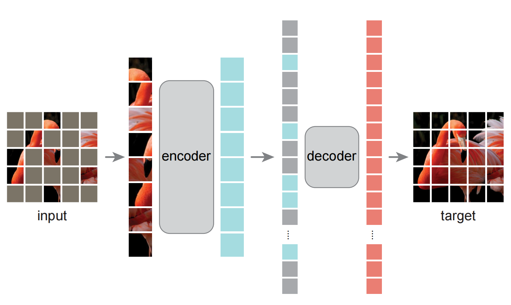
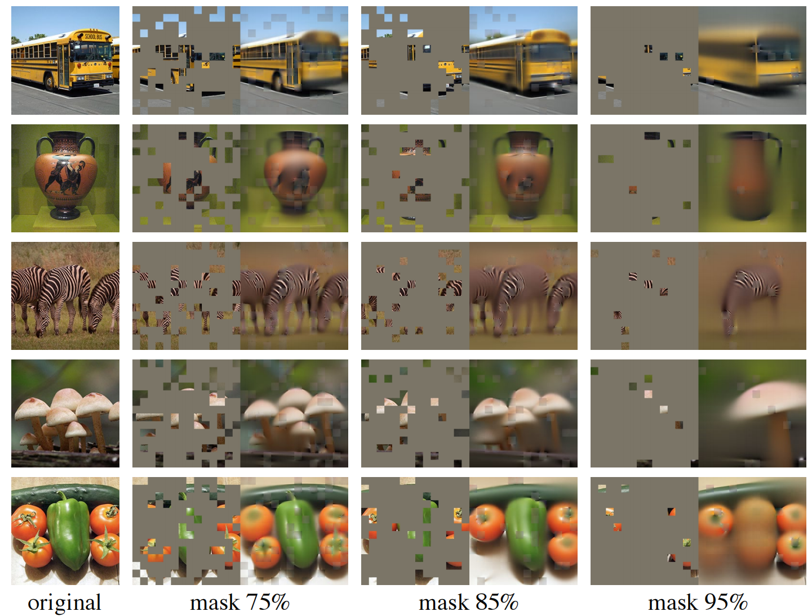

# Masked Autoencoders Are Scalable Vision Learners
掩码自动编码器(MAE)是可扩展的视觉学习者 2021.11.11 https://arxiv.org/abs/2111.06377

## 阅读笔记
* https://www.zhihu.com/question/498364155 知乎上的讨论很热烈
* 代码实现：
    * pytorch实现：https://github.com/lucidrains/vit-pytorch#masked-autoencoder
    * paddle实现 https://aistudio.baidu.com/aistudio/projectdetail/3141264 
* 非对称编码解码，编码器仅对可见的分块子集(没有掩码令牌)进行操作,解码器从潜在表示和掩码令牌中重建原始图像.
* 掩码高比例的输入图像(例如，75%), Vit 16*16块的75%？
    * 高掩码率对于目标检测、实例分割、语义分割等细粒度任务的影响？
* 损失函数，预测像素与真实像素的均方误差，归一化后的
* linear probing，线性探测
* 题外话：MAE可以加速图像训练，那么，对于长文本训练，是不是也可以掩码掉15%后预测下一个token？

## Abstract 
This paper shows that masked autoencoders (MAE) are scalable self-supervised learners for computer vision. Our MAE approach is simple: we mask random patches of the input image and reconstruct the missing pixels. It is based on two core designs. First, we develop an asymmetric encoder-decoder architecture, with an encoder that operates only on the visible subset of patches (without mask tokens), along with a lightweight decoder that reconstructs the original image from the latent representation and mask tokens. Second, we find that masking a high proportion of the input image, e.g., 75%, yields a nontrivial and meaningful self-supervisory task. Coupling these two designs enables us to train large models efficiently and effectively: we accelerate training (by 3x or more) and improve accuracy. Our scalable approach allows for learning high-capacity models that generalize well: e.g., a vanilla ViT-Huge model achieves the best accuracy (87.8%) among methods that use only ImageNet-1K data. Transfer performance in downstream tasks outperforms supervised pre-training and shows promising scaling behavior.  

本文表明，掩码自动编码器(MAE)是用于计算机视觉的可扩展自监督学习器。我们的MAE方法很简单：掩码输入图像的随机分块，并重建丢失的像素。它基于两个核心设计。首先，我们开发了一种非对称编码器-解码器架构，其中编码器仅对可见的分块子集(没有掩码令牌)进行操作，另一个是轻量级解码器，它从潜在表示和掩码令牌中重建原始图像。其次，我们发现掩码高比例的输入图像(例如，75%)会产生一项不平凡且有意义的自监督任务。结合这两种设计，我们可以高效地训练大型模型：我们可以加快训练速度(3倍+)并提高准确性。我们的可扩展方法允许学习泛化良好的高容量模型：例如，在仅使用ImageNet-1K数据的方法中，普通的ViT-Huge模型实现了最佳的准确性(87.8%)。下游任务的迁移性能优于有监督的预训练，并显示出良好的缩放行为。 code: https://github.com/facebookresearch/mae . 

 
Figure 1. Our MAE architecture. During pre-training, a large random subset of image patches (e.g., 75%) is masked out. The encoder is applied to the small subset of visible patches. Mask tokens are introduced after the encoder, and the full set of encoded patches and mask tokens is processed by a small decoder that reconstructs the original image in pixels. After pre-training, the decoder is discarded and the encoder is applied to uncorrupted images (full sets of patches) for recognition tasks. 
图1.我们的MAE架构。在预训练期间，随机掩码大部分(例如，75%)的分块子集。编码器应用于可见分块的小子集。掩码令牌在编码器之后引入，全套编码分块和掩码令牌由一个小解码器处理，该解码器以像素重建原始图像。在预训练之后，解码器被丢弃，编码器被应用于未损坏的图像(完整的分块集)以进行识别任务。

## 1. Introduction
Deep learning has witnessed an explosion of architectures of continuously growing capability and capacity [33, 25, 57]. Aided by the rapid gains in hardware, models today can easily overfit one million images [13] and begin to demand hundreds of millions of—often publicly inaccessible—labeled images [16].

深度学习见证了能力和容量不断增长的架构的爆炸式增长 [33、25、57]。在硬件快速增长的帮助下，如今的模型可以轻松地拟合超过一百万张图像[13]，并开始需要数亿张通常无法公开访问的标注图像[16]。

This appetite for data has been successfully addressed in natural language processing (NLP) by self-supervised pretraining. The solutions, based on autoregressive language modeling in GPT [47, 48, 4] and masked autoencoding in BERT [14], are conceptually simple: they remove a portion of the data and learn to predict the removed content. These methods now enable training of generalizable NLP models containing over one hundred billion parameters [4].

这种对数据的需求已经通过自监督预训练在自然语言处理(NLP)中得到了成功解决。基于GPT中的自回归语言建模[47，48，4]和BERT中的掩码自动编码[14]，这些解决方案在概念上很简单：它们移除一部分数据，并学习预测移除的内容。这些方法现在能够训练包含超过1000亿个参数的可推广NLP模型[4]。

The idea of masked autoencoders, a form of more general denoising autoencoders [58], is natural and applicable in computer vision as well. Indeed, closely related research in vision [59, 46] preceded BERT. However, despite significant interest in this idea following the success of BERT, progress of autoencoding methods in vision lags behind NLP. We ask: what makes masked autoencoding different between vision and language? We attempt to answer this question from the following perspectives: 
1. Until recently, architectures were different. In vision, convolutional networks [34] were dominant over the last decade [33]. Convolutions typically operate on regular grids and it is not straightforward to integrate ‘indicators’ such as mask tokens [14] or positional embeddings [57] into convolutional networks. This architectural gap, however, has been addressed with the introduction of Vision Transformers (ViT) [16] and should no longer present an obstacle. 
2. Information density is different between language and vision. Languages are human-generated signals that are highly semantic and information-dense. When training a model to predict only a few missing words per sentence, this task appears to induce sophisticated language understanding. Images, on the contrary, are natural signals with heavy spatial redundancy—e.g., a missing patch can be recovered from neighboring patches with little high-level understanding of parts, objects, and scenes. To overcome this difference and encourage learning useful features, we show that a simple strategy works well in computer vision: masking a very high portion of random patches. This strategy largely reduces redundancy and creates a challenging selfsupervisory task that requires holistic understanding beyond low-level image statistics. To get a qualitative sense of our reconstruction task, see Figures 2 – 4. 
3. The autoencoder’s decoder, which maps the latent representation back to the input, plays a different role between reconstructing text and images. In vision, the decoder reconstructs pixels, hence its output is of a lower semantic level than common recognition tasks. This is in contrast to language, where the decoder predicts missing words that contain rich semantic information. While in BERT the decoder can be trivial (an MLP) [14], we found that for images, the decoder design plays a key role in determining the semantic level of the learned latent representations.

掩码自动编码器是一种更通用的去噪自动编码器[58]，这一想法是自然的，也适用于计算机视觉。事实上，视觉方面的密切相关研究[59，46]早于BERT。然而，尽管随着BERT的成功，人们对这一想法产生了极大的兴趣，视觉自动编码方法的进展却落后于NLP。我们问：是什么使掩码自动编码在视觉和语言之间有所不同？我们试图从以下角度回答这个问题：
1. 直到最近，架构还是不同的。在视觉上，卷积网络[34]在过去十年中占据主导地位[33]。卷积通常在规则网格上运行，将诸如掩码令牌[14]或位置嵌入[57]之类的“指示符”集成到卷积网络中并不简单。然而，随着视觉Transformers(ViT)[16]的引入，这一架构差距已得到解决，不应再成为障碍。
2. 语言和视觉的信息密度不同。语言是人类产生的高度语义和信息密集的信号。当训练一个模型来预测每个句子中只遗漏几个单词时，这项任务似乎会诱导复杂的语言理解。相反，图像是具有严重空间冗余的自然信号。例如，可以从相邻的分块中恢复丢失的分块，而不需要对部件、对象和场景有很高的理解。为了克服这一差异并鼓励学习有用的特征，我们展示了一种简单的策略在计算机视觉中很好地工作：掩码很高比例的随机分块。这种策略在很大程度上减少了冗余，并创建了一项具有挑战性的自监督任务，需要对低级别图像统计数据之外的整体理解。为了从定性上了解我们的重建任务，请参见图2-4。
3. 自动编码器的解码器将潜在表示映射回输入，在重建文本和图像之间扮演不同的角色。在视觉中，解码器重建像素，因此其输出的语义水平低于普通识别任务。这与语言相反，在语言中，解码器预测包含丰富语义信息的缺失单词。虽然在BERT中，解码器可能是微不足道的(MLP)[14]，但我们发现，对于图像，解码器设计在确定学习到的潜在表示的语义水平方面起着关键作用。

 
Figure 2. Example results on ImageNet validation images. For each triplet, we show the masked image (left), our MAE reconstruction† (middle), and the ground-truth (right). The masking ratio is 80%, leaving only 39 out of 196 patches. More examples are in the appendix. †As no loss is computed on visible patches, the model output on visible patches is qualitatively worse. One can simply overlay the output with the visible patches to improve visual quality. We intentionally opt not to do this, so we can more comprehensively demonstrate the method’s behavior.
图2. ImageNet验证图像的样本结果。对于每个三元组，我们显示了掩码图像(左)、MAE重建†(中)和真实图像(右)。掩码率为80%，在196(14*14)个分块中仅留下39个。更多样本见附录。†由于在可见分块上没有计算损失，可见分块上的模型输出在质量上更差。人们可以简单地用可见的分块覆盖输出以提高视觉质量。我们有意选择不这样做，这样我们可以更全面地演示该方法的行为。

 
Figure 3. Example results on COCO validation images, using an MAE trained on ImageNet (the same model weights as in Figure 2). Observe the reconstructions on the two right-most examples, which, although different from the ground truth, are semantically plausible. 
图3. COCO验证图像的样本结果，使用在ImageNet上训练的MAE(与图2中的模型权重相同)。观察最右边两个例子的重构，尽管它们与基本事实不同，但在语义上是合理的。

Driven by this analysis, we present a simple, effective, and scalable form of a masked autoencoder (MAE) for visual representation learning. Our MAE masks random patches from the input image and reconstructs the missing patches in the pixel space. It has an asymmetric encoderdecoder design. Our encoder operates only on the visible subset of patches (without mask tokens), and our decoder is lightweight and reconstructs the input from the latent representation along with mask tokens (Figure 1). Shifting the mask tokens to the small decoder in our asymmetric encoder-decoder results in a large reduction in computation. Under this design, a very high masking ratio (e.g., 75%) can achieve a win-win scenario: it optimizes accuracy while allowing the encoder to process only a small portion (e.g., 25%) of patches. This can reduce overall pre-training time by 3× or more and likewise reduce memory consumption, enabling us to easily scale our MAE to large models.

在这一分析的推动下，我们提出了一种简单、有效、可扩展的掩码自动编码器(MAE)用于视觉表示学习。我们的MAE从输入图像中掩码随机分块，并在像素空间中重建缺失的分块。它具有非对称编码器设计。我们的编码器仅对可见的分块子集(没有掩码令牌)进行操作，而我们的解码器是轻量级的，从潜在表示和掩码令牌中重建输入(图1)。在我们的不对称编码器-解码器中，将掩码令牌移动到小解码器会导致计算量的大幅减少。在这种设计下，非常高的掩码率(例如，75%)可以实现双赢：它优化了精度，同时允许编码器仅处理一小部分(例如，25%)分块。这可以将整个预训练时间减少3倍或更多，同样也可以减少内存消耗，使我们能够轻松地将MAE扩展到大型模型。

Our MAE learns very high-capacity models that generalize well. With MAE pre-training, we can train datahungry models like ViT-Large/-Huge [16] on ImageNet-1K with improved generalization performance. With a vanilla ViT-Huge model, we achieve 87.8% accuracy when finetuned on ImageNet-1K. This outperforms all previous results that use only ImageNet-1K data. We also evaluate transfer learning on object detection, instance segmentation, and semantic segmentation. In these tasks, our pre-training achieves better results than its supervised pre-training counterparts, and more importantly, we observe significant gains by scaling up models. These observations are aligned with those witnessed in self-supervised pre-training in NLP [14, 47, 48, 4] and we hope that they will enable our field to explore a similar trajectory. 

我们的MAE学习非常高容量、泛化良好的模型。通过MAE预训练，我们可以在ImageNet-1K上训练像ViT Large/-Huge[16]这样的数据饥渴型模型，并提高泛化性能。使用普通的ViT Huge模型，在ImageNet-1K上进行微调时，我们实现了87.8%的精度。这优于以前仅使用ImageNet-1K数据的所有结果。我们还评估了目标检测、实例分割和语义分割方面的迁移学习。在这些任务中，我们的预训练比其受监督的预训练同行取得了更好的结果，更重要的是，我们观察到了通过扩展模型而获得的显著收益。这些观察结果与NLP自监督预训练中的观察结果一致[14，47，48，4]，我们希望它们将使我们的领域能够探索类似的轨迹。

## 2. Related Work
<strong>Masked language modeling</strong> and its autoregressive counterparts, e.g., BERT [14] and GPT [47, 48, 4], are highly successful methods for pre-training in NLP. These methods hold out a portion of the input sequence and train models to predict the missing content. These methods have been shown to scale excellently [4] and a large abundance of evidence indicates that these pre-trained representations generalize well to various downstream tasks.

掩码语言建模及其自回归对应物，如BERT[14]和GPT[47，48，4]，是NLP中预训练的非常成功的方法。这些方法保留输入序列的一部分，并训练模型来预测丢失的内容。这些方法已被证明具有良好的伸缩性[4]，大量证据表明，这些预训练的表示可以很好地推广到各种下游任务。

<strong>Autoencoding</strong> is a classical method for learning representations. It has an encoder that maps an input to a latent representation and a decoder that reconstructs the input. For example, PCA and k-means are autoencoders [29]. Denoising autoencoders (DAE) [58] are a class of autoencoders that corrupt an input signal and learn to reconstruct the original, uncorrupted signal. A series of methods can be thought of as a generalized DAE under different corruptions, e.g., masking pixels [59, 46, 6] or removing color channels [70]. Our MAE is a form of denoising autoencoding, but different from the classical DAE in numerous ways.

自动编码是学习表示的经典方法。它有一个将输入映射到潜在表示的编码器和一个重构输入的解码器。例如，PCA和k-means是自动编码器[29]。去噪自动编码器(DAE)[58]是一类破坏输入信号并学习重建原始未破坏信号的自动编码器。可以将一系列方法视为不同损坏下的通用DAE，例如，掩码像素[59，46，6]或移除颜色通道[70]。我们的MAE是一种去噪自动编码形式，但在许多方面与经典DAE不同。

<strong>Masked image encoding</strong> methods learn representations from images corrupted by masking. The pioneering work of [59] presents masking as a noise type in DAE. Context Encoder [46] inpaints large missing regions using convolutional networks. Motivated by the success in NLP, related recent methods [6, 16, 2] are based on Transformers [57]. iGPT [6] operates on sequences of pixels and predicts unknown pixels. The ViT paper [16] studies masked patch prediction for self-supervised learning. Most recently, BEiT [2] proposes to predict discrete tokens [44, 50].

掩码图像编码方法从被掩码破坏的图像中学习表示。[59]的开创性工作将掩码作为DAE中的一种噪声类型。上下文编码器[46]使用卷积网络修复大的缺失区域。由于NLP的成功，最近的相关方法[6，16，2]基于Transformers[57]。iGPT[6]对像素序列进行操作并预测未知像素。ViT论文[16]研究了用于自监督学习的掩码分块预测。最近，BEiT[2]提出预测离散令牌[44，50]。

<strong>Self-supervised learning</strong> approaches have seen significant interest in computer vision, often focusing on different pretext tasks for pre-training [15, 61, 42, 70, 45, 17]. Recently, contrastive learning [3, 22] has been popular, e.g., [62, 43, 23, 7], which models image similarity and dissimilarity (or only similarity [21, 8]) between two or more views. Contrastive and related methods strongly depend on data augmentation [7, 21, 8]. Autoencoding pursues a conceptually different direction, and it exhibits different behaviors as we will present.

自监督学习方法对计算机视觉产生了极大的兴趣，通常专注于不同的预训练任务[15，61，42，70，45，17]。最近，对比学习[3，22]很流行，例如[62，43，23，7]，它对两个或多个视图之间的图像相似性和不相似性(或仅相似性[21，8])进行建模。对比和相关方法强烈依赖于数据增广[7，21，8]。自动编码追求一个概念上不同的方向，它表现出我们将要呈现的不同行为。

## 3. Approach 方法
Our masked autoencoder (MAE) is a simple autoencoding approach that reconstructs the original signal given its partial observation. Like all autoencoders, our approach has an encoder that maps the observed signal to a latent representation, and a decoder that reconstructs the original signal from the latent representation. Unlike classical autoencoders, we adopt an asymmetric design that allows the encoder to operate only on the partial, observed signal (without mask tokens) and a lightweight decoder that reconstructs the full signal from the latent representation and mask tokens. Figure 1 illustrates the idea, introduced next.

我们的掩码自动编码器(MAE)是一种简单的自动编码方法，在给定部分观测的情况下重建原始信号。像所有的自动编码器一样，我们的方法有一个将观察到的信号映射到潜在表示的编码器，以及一个从潜在表示重构原始信号的解码器。与经典的自动编码器不同，我们采用了一种非对称设计，允许编码器仅对部分观测信号(无掩码令牌)进行操作，并采用了一个轻量级解码器，从潜在表示和掩码令牌中重建完整信号。图1说明了接下来介绍的想法。

### Masking. 掩码
Following ViT [16], we divide an image into regular non-overlapping patches. Then we sample a subset of patches and mask (i.e., remove) the remaining ones. Our sampling strategy is straightforward: we sample random patches without replacement, following a uniform distribution. We simply refer to this as “random sampling”.

和ViT[16]一样，我们将图像划分为规则的非重叠块。然后，我们对分块的子集进行采样，并对剩余的分块进行掩码(即移除)。我们的采样策略很简单：我们按照均匀分布，在不替换的情况下对随机分块进行采样。我们简单地称之为“随机抽样”。

Random sampling with a high masking ratio (i.e., the ratio of removed patches) largely eliminates redundancy, thus creating a task that cannot be easily solved by extrapolation from visible neighboring patches (see Figures 2 – 4). The uniform distribution prevents a potential center bias (i.e., more masked patches near the image center). Finally, the highly sparse input creates an opportunity for designing an efficient encoder, introduced next.

具有高掩码率(即去除分块的比率)的随机采样在很大程度上消除了冗余，因此产生了一个无法通过从可见相邻分块外推来轻松解决的任务(见图2-4)。均匀分布防止了潜在的中心偏差(即，图像中心附近的更多掩码分块)。最后，高度稀疏的输入为设计高效的编码器创造了机会，下面将介绍。

### MAE encoder. MAE编码器
Our encoder is a ViT [16] but applied only on visible, unmasked patches. Just as in a standard ViT, our encoder embeds patches by a linear projection with added positional embeddings, and then processes the resulting set via a series of Transformer blocks. However, our encoder only operates on a small subset (e.g., 25%) of the full set. Masked patches are removed; no mask tokens are used. This allows us to train very large encoders with only a fraction of compute and memory. The full set is handled by a lightweight decoder, described next.

我们的编码器是ViT[16]，但仅适用于可见、无掩码的分块。就像在标准ViT中一样，我们的编码器通过添加位置嵌入的线性投影嵌入分块，然后通过一系列Transformer块处理结果集。然而，我们的编码器仅在整个集合的一小部分(例如，25%)上运行。掩码的分块被移除; 不使用掩码的令牌。这使得我们能够用一小部分计算和内存来训练非常大的编码器。整个集合由轻量级解码器处理，下面将进行描述。

### MAE decoder. MAE解码器
The input to the MAE decoder is the full set of tokens consisting of (i) encoded visible patches, and (ii) mask tokens. See Figure 1. Each mask token [14] is a shared, learned vector that indicates the presence of a missing patch to be predicted. We add positional embeddings to all tokens in this full set; without this, mask tokens would have no information about their location in the image. The decoder has another series of Transformer blocks.

MAE解码器的输入是由(i)编码的可见分块和(ii)掩码令牌组成的完整令牌集。参见图1。每个掩码令牌[14]都是一个共享的学习向量，它指示要预测的缺失分块的存在。我们将位置嵌入添加到此完整集合中的所有令牌; 如果没有这一点，掩码令牌将没有关于它们在图像中的位置的信息。解码器有另一系列的Transformer块。<!--掩码令牌[14]都是一个共享的学习向量-->

The MAE decoder is only used during pre-training to perform the image reconstruction task (only the encoder is used to produce image representations for recognition). Therefore, the decoder architecture can be flexibly designed in a manner that is independent of the encoder design. We experiment with very small decoders, narrower and shallower than the encoder. For example, our default decoder has <10% computation per token vs. the encoder. With this asymmetrical design, the full set of tokens are only processed by the lightweight decoder, which significantly reduces pre-training time.

MAE解码器仅在预训练期间用于执行图像重建任务(编码器仅用于产生用于识别的图像表示)。因此，可以以独立于编码器设计的方式灵活地设计解码器架构。我们用非常小的解码器进行实验，比编码器更窄、更浅。例如，我们的默认解码器与编码器相比，每个令牌的计算量小于10%。通过这种不对称设计，全套令牌仅由轻量级解码器处理，这大大减少了预训练时间。

### Reconstruction target. 重建目标
Our MAE reconstructs the input by predicting the pixel values for each masked patch. Each element in the decoder’s output is a vector of pixel values representing a patch. The last layer of the decoder is a linear projection whose number of output channels equals the number of pixel values in a patch. The decoder’s output is reshaped to form a reconstructed image. Our loss function computes the mean squared error (MSE) between the reconstructed and original images in the pixel space. We compute the loss only on masked patches, similar to BERT [14](1 Computing the loss only on masked patches differs from traditional denoising autoencoders [58] that compute the loss on all pixels. This choice is purely result-driven: computing the loss on all pixels leads to a slight decrease in accuracy (e.g., ∼0.5%). ).

我们的MAE通过预测每个掩码块的像素值来重建输入。解码器输出中的每个元素都是表示分块的像素值向量。解码器的最后一层是线性投影，其输出通道的数量等于分块中像素值的数量。解码器的输出被变形以形成重构图像。我们的损失函数计算像素空间中重建图像和原始图像之间的均方误差(MSE)。我们只计算掩码分块上的损失，类似于BERT[14](1 仅计算掩码分块上的损失不同于计算所有像素上的损失的传统去噪自动编码器[58]。这种选择纯粹是结果驱动的：计算所有像素的损失会导致准确度略有下降(例如。，∼0.5%). ).

We also study a variant whose reconstruction target is the normalized pixel values of each masked patch. Specifically, we compute the mean and standard deviation of all pixels in a patch and use them to normalize this patch. Using normalized pixels as the reconstruction target improves representation quality in our experiments.

我们还研究了一种变体，其重建目标是每个掩码块的归一化像素值。具体来说，我们计算一个分块中所有像素的平均值和标准偏差，并使用它们来归一化该分块。在我们的实验中，使用归一化像素作为重建目标提高了表示质量。

### Simple implementation. 简单的实现
Our MAE pre-training can be implemented efficiently, and importantly, does not require any specialized sparse operations. First we generate a token for every input patch (by linear projection with an added positional embedding). Next we randomly shuffle the list of tokens and remove the last portion of the list, based on the masking ratio. This process produces a small subset of tokens for the encoder and is equivalent to sampling patches without replacement. After encoding, we append a list of mask tokens to the list of encoded patches, and unshuffle this full list (inverting the random shuffle operation) to align all tokens with their targets. The decoder is applied to this full list (with positional embeddings added). As noted, no sparse operations are needed. This simple implementation introduces negligible overhead as the shuffling and unshuf- fling operations are fast. 

我们的MAE预训练可以有效地实施，而且重要的是，不需要任何专门的稀疏操作。
1. 首先，我们为每个输入分块生成一个令牌(通过添加位置嵌入的线性投影)。
2. 接下来，我们根据掩码率随机地对令牌列表进行洗牌，并移除列表的最后一部分。该过程为编码器生成一小部分令牌，相当于对分块进行采样而不进行替换。
3. 编码后，
4. 我们将掩码令牌列表附加到编码分块列表中，
5. 并取消对该完整列表的洗牌(反转随机洗牌操作)，以将所有令牌与其目标对齐。
6. 解码器应用于此完整列表(添加了位置嵌入)。

如上所述，不需要稀疏操作。这个简单的实现引入了可忽略的开销，因为洗牌和取消洗牌操作很快。

## 4. ImageNet Experiments
We do self-supervised pre-training on the ImageNet-1K (IN1K) [13] training set. Then we do supervised training to evaluate the representations with (i) end-to-end fine-tuning or (ii) linear probing. We report top-1 validation accuracy of a single 224×224 crop. Details are in Appendix A.1.

我们在ImageNet-1K(IN1K)[13]训练集上进行自监督预训练。然后，我们进行监督训练，以评估(i)端到端微调或(ii)线性探测的表示。我们报告了单个224×224剪裁的顶级验证精度。详情见附录A.1。

Baseline: ViT-Large. We use ViT-Large (ViT-L/16) [16] as the backbone in our ablation study. ViT-L is very big (an order of magnitude bigger than ResNet-50 [25]) and tends to overfit. The following is a comparison between ViT-L trained from scratch vs. fine-tuned from our baseline MAE: 

基线：ViT大型。我们使用ViT Large(ViT-L/16)[16]作为消融研究的主干。ViT-L非常大(比ResNet-50[25]大一个数量级)，并且趋于过盈。以下是从零开始训练的ViT-L与从我们的基线MAE进行微调的对比：

scratch, original [16] | scratch, our impl.|  baseline MAE
--- | --- | ---
76.5 | 82.5 | 84.9
 
We note that it is nontrivial to train supervised ViT-L from scratch and a good recipe with strong regularization is needed (82.5%, see Appendix A.2). Even so, our MAE pretraining contributes a big improvement. Here fine-tuning is only for 50 epochs (vs. 200 from scratch), implying that the fine-tuning accuracy heavily depends on pre-training.

我们注意到，从头开始训练受监督的ViT-L并非易事，需要一个具有强正则化的好配置(82.5%，见附录a.2)。即使如此，我们的MAE预训练也有很大的改进。这里的微调仅适用于50个时期(与从头开始的200个时期相比)，这意味着微调精度在很大程度上取决于预训练。

### 4.1. Main Properties 主要特性
We ablate our MAE using the default settings in Table 1 (see caption). Several intriguing properties are observed.

我们使用表1中的默认设置消融MAE(见标题)。观察到几个有趣的特性。

 
Table 1. MAE ablation experiments with ViT-L/16 on ImageNet-1K. We report fine-tuning (ft) and linear probing (lin) accuracy (%). If not specified, the default is: the decoder has depth 8 and width 512, the reconstruction target is unnormalized pixels, the data augmentation is random resized cropping, the masking ratio is 75%, and the pre-training length is 800 epochs. Default settings are marked in gray . 
表1.ImageNet-1K上ViT-L/16的MAE消融实验。我们报告了微调(ft)和线性探测(lin)精度(%)。如果未指定，默认值为：解码器的深度为8，宽度为512，重建目标为非归一化像素，数据增广为随机调整大小的裁剪，掩码率为75%，预训练长度为800个周期。默认设置令牌为灰色。

#### Masking ratio.  掩码率
 
Figure 5. Masking ratio. A high masking ratio (75%) works well for both fine-tuning (top) and linear probing (bottom). The y-axes are ImageNet-1K validation accuracy (%) in all plots in this paper.
图5.掩码率。高掩码率(75%)对于微调(顶部)和线性探测(底部)都很好。y轴是本文中所有绘图的ImageNet-1K验证精度(%)。

Figure 5 shows the influence of the masking ratio. The optimal ratios are surprisingly high. The ratio of 75% is good for both linear probing and fine-tuning. This behavior is in contrast with BERT [14], whose typical masking ratio is 15%. Our masking ratios are also much higher than those in related works [6, 16, 2] in computer vision (20% to 50%).

图5显示了掩码率的影响。最佳比率出奇地高。75%的比率对于线性探测和微调都很好。这种行为与BERT[14]形成对比，BERT[14]的典型掩码率为15%。我们的掩码率也远高于计算机视觉中的相关工作[6，16，2](20%至50%)。

The model infers missing patches to produce different, yet plausible, outputs (Figure 4). It makes sense of the gestalt of objects and scenes, which cannot be simply completed by extending lines or textures. We hypothesize that this reasoning-like behavior is linked to the learning of useful representations.

该模型推断出缺失的分块会产生不同但可信的输出(图4)。它理解了物体和场景的格式塔，这不能简单地通过延伸线条或纹理来完成。我们假设这种类似推理的行为与学习有用的表征有关。

 
Figure 4. Reconstructions of ImageNet validation images using an MAE pre-trained with a masking ratio of 75% but applied on inputs with higher masking ratios. The predictions differ plausibly from the original images, showing that the method can generalize.
图4.使用预训练的MAE重建ImageNet验证图像，掩码率为75%，但应用于掩码率较高的输入。预测结果与原始图像有明显差异，表明该方法可以推广。

Figure 5 also shows that linear probing and fine-tuning results follow different trends. For linear probing, the accuracy increases steadily with the masking ratio until the sweet point: the accuracy gap is up to ∼20% (54.6% vs. 73.5%). For fine-tuning, the results are less sensitive to the ratios, and a wide range of masking ratios (40–80%) work well. All fine-tuning results in Figure 5 are better than training from scratch (82.5%).

图5还显示了线性探测和微调结果遵循不同的趋势。对于线性探测，精度随着掩码率的增加而稳定增加，直到达到最佳点：精度差距达到∼20%(54.6%对73.5%)。对于微调，结果对比率不太敏感，并且范围广泛的掩码率率(40–80%)工作良好。图5中的所有微调结果都优于从头开始的训练(82.5%)。

#### Decoder design. 解码器设计
Our MAE decoder can be flexibly designed, as studied in Table 1a and 1b.

我们的MAE解码器可以灵活设计，如表1a和1b所示。

Table 1a varies the decoder depth (number of Transformer blocks). A sufficiently deep decoder is important for linear probing. This can be explained by the gap between a pixel reconstruction task and a recognition task: the last several layers in an autoencoder are more specialized for reconstruction, but are less relevant for recognition. A reasonably deep decoder can account for the reconstruction specialization, leaving the latent representations at a more abstract level. This design can yield up to 8% improvement in linear probing (Table 1a, ‘lin’). However, if fine-tuning is used, the last layers of the encoder can be tuned to adapt to the recognition task. The decoder depth is less influential for improving fine-tuning (Table 1a, ‘ft’).

表1a改变了解码器深度(Transformer块的数量)。足够深的解码器对于线性探测很重要。这可以通过像素重建任务和识别任务之间的差距来解释：自动编码器中的最后几层更专门用于重建，但与识别无关。一个合理深度的解码器可以解释重构的专门化，使潜在的表示处于更抽象的层次。这种设计可以使线性探测提高8%(表1a，“lin”)。然而，如果使用微调，则可以调整编码器的最后一层以适应识别任务。解码器深度对改善微调的影响较小(表1a，“ft”)。

Interestingly, our MAE with a single-block decoder can perform strongly with fine-tuning (84.8%). Note that a single Transformer block is the minimal requirement to propagate information from visible tokens to mask tokens. Such a small decoder can further speed up training.

有趣的是，我们使用单层解码器的MAE可以通过微调表现出色(84.8%)。请注意，单个Transformer块是将信息从可见令牌传播到掩码令牌的最低要求。如此小的解码器可以进一步加快训练速度。

In Table 1b we study the decoder width (number of channels). We use 512-d by default, which performs well under fine-tuning and linear probing. A narrower decoder also works well with fine-tuning.

在表1b中，我们研究了解码器宽度(信道数)。我们默认使用512d，它在微调和线性探测下表现良好。更窄的解码器也可以很好地进行微调。

Overall, our default MAE decoder is lightweight. It has 8 blocks and a width of 512-d ( gray in Table 1). It only has 9% FLOPs per token vs. ViT-L (24 blocks, 1024-d). As such, while the decoder processes all tokens, it is still a small fraction of the overall compute. 

总体而言，我们的默认MAE解码器是轻量级的。它有8个块，宽度为512d(表1中的灰色)。与ViT-L(24个区块，1024-d)相比，它每个令牌只有9%的FLOP。因此，虽然解码器处理所有令牌，但它仍然是整个计算的一小部分。

#### Mask token. 掩码令牌
An important design of our MAE is to skip the mask token [M] in the encoder and apply it later in the lightweight decoder. Table 1c studies this design.

我们的MAE一个重要设计是跳过编码器中的掩码令牌[M]，然后将其应用到轻量级解码器中。表1c研究了这种设计。

If the encoder uses mask tokens, it performs worse: its accuracy drops by 14% in linear probing. In this case, there is a gap between pre-training and deploying: this encoder has a large portion of mask tokens in its input in pretraining, which does not exist in uncorrupted images. This gap may degrade accuracy in deployment. By removing the mask token from the encoder, we constrain the encoder to always see real patches and thus improve accuracy.

如果编码器使用掩码令牌，它的性能会更差：在线性探测中，其精度会下降14%。在这种情况下，预训练和部署之间存在差距：该编码器在预训练中的输入中有很大一部分掩码令牌，这在未损坏的图像中是不存在的。这种差距可能会降低部署的准确性。通过从编码器中移除掩码令牌，我们约束编码器始终看到真实的分块，从而提高准确性。

Moreover, by skipping the mask token in the encoder, we greatly reduce training computation. In Table 1c, we reduce the overall training FLOPs by 3.3×. This leads to a 2.8× wall-clock speedup in our implementation (see Table 2). The wall-clock speedup is even bigger (3.5–4.1×), for a smaller decoder (1-block), a larger encoder (ViT-H), or both. Note that the speedup can be >4× for a masking ratio of 75%, partially because the self-attention complexity is quadratic. In addition, memory is greatly reduced, which can enable training even larger models or speeding up more by large-batch training. The time and memory efficiency makes our MAE favorable for training very large models. 

此外，通过跳过编码器中的掩码令牌，我们大大减少了训练中的计算量。在表1c中，我们将总体训练FLOP减少了3.3倍。这导致了我们的实现中2.8倍的挂钟加速(见表2)。对于较小的解码器(1块)、较大的编码器(ViT-H)或两者，挂钟加速甚至更大(3.5–4.1倍)。请注意，当掩码率为75%时，加速可以大于4×，部分原因是自注意力的复杂度是二次的。此外，内存大大减少，这可以使训练更大的模型或通过大批量训练加快速度。时间和内存效率使我们的MAE有利于训练非常大的模型。

 
Table 2. Wall-clock time of our MAE training (800 epochs), benchmarked in 128 TPU-v3 cores with TensorFlow. The speedup is relative to the entry whose encoder has mask tokens (gray). The decoder width is 512, and the mask ratio is 75%. † : This entry is estimated by training ten epochs.
表2.我们的MAE训练的挂钟时间(800 epoch)，用TensorFlow在128个TPU-v3核中进行了基准测试。加速与编码器具有掩码令牌(灰色)的条目相关。解码器宽度为512，掩码率率为75%。†：这个条目是通过训练十个时代来估计的。

#### Reconstruction target.  重建目标
We compare different reconstruction targets in Table 1d. Our results thus far are based on pixels without (per-patch) normalization. Using pixels with normalization improves accuracy. This per-patch normalization enhances the contrast locally. In another variant, we perform PCA in the patch space and use the largest PCA coefficients (96 here) as the target. Doing so degrades accuracy. Both experiments suggest that the high-frequency components are useful in our method.

我们在表1d中比较了不同的重建目标。到目前为止，我们的结果是基于没有(每个分块)归一化的像素。使用具有归一化的像素可以提高精度。这种逐块归一化增广了局部对比度。在另一个变型中，我们在分块空间中执行PCA，并使用最大的PCA系数(此处为96)作为目标。这样做会降低准确性。两个实验都表明高频成分？在我们的方法中是有用的。

We also compare an MAE variant that predicts tokens, the target used in BEiT [2]. Specifically for this variant, we use the DALLE pre-trained dVAE [50] as the tokenizer, following [2]. Here the MAE decoder predicts the token indices using cross-entropy loss. This tokenization improves fine-tuning accuracy by 0.4% vs. unnormalized pixels, but has no advantage vs. normalized pixels. It also reduces linear probing accuracy. In §5 we further show that tokenization is not necessary in transfer learning.

我们还比较了预测令牌的MAE变体，即BEiT[2]中使用的目标。具体而言，对于该变体，我们使用DALLE预训练dVAE[50]作为令牌化器，如下[2]。这里，MAE解码器使用交叉熵损失来预测令牌索引。与非归一化像素相比，这种令牌化将微调精度提高了0.4%，但与归一化像素没有优势。它还降低了线性探测精度。在§5中，我们进一步证明了在迁移学习中令牌化是不必要的。

Our pixel-based MAE is much simpler than tokenization. The dVAE tokenizer requires one more pre-training stage, which may depend on extra data (250M images [50]). The dVAE encoder is a large convolutional network (40% FLOPs of ViT-L) and adds nontrivial overhead. Using pixels does not suffer from these problems.

我们基于像素的MAE比令牌化简单得多。dVAE令牌化器还需要一个预训练阶段，这可能取决于额外的数据(250M图像[50])。dVAE编码器是一个大型卷积网络(ViT-L的40%FLOP)，并增加了非平凡的开销。使用像素不会出现这些问题。

#### Data augmentation. 数据增广
Table 1e studies the influence of data augmentation on our MAE pre-training.

表1e研究了数据增广对MAE预训练的影响。

Our MAE works well using cropping-only augmentation, either fixed-size or random-size (both having random horizontal flipping). Adding color jittering degrades the results and so we do not use it in other experiments.

我们的MAE可以很好地使用纯裁剪增广，无论是固定大小还是随机大小(都具有随机水平翻转)。添加颜色抖动会降低结果，因此我们不会在其他实验中使用它。

Surprisingly, our MAE behaves decently even if using no data augmentation (only center-crop, no flipping). This property is dramatically different from contrastive learning and related methods [62, 23, 7, 21], which heavily rely on data augmentation. It was observed [21] that using cropping-only augmentation reduces the accuracy by 13% and 28% respectively for BYOL [21] and SimCLR [7]. In addition, there is no evidence that contrastive learning can work without augmentation: the two views of an image are the same and can easily satisfy a trivial solution.

令人惊讶的是，我们的MAE即使不使用数据增广(只有中心裁剪，没有翻转)也表现得很好。这一特性与对比学习和相关方法[62，23，7，21]截然不同，后者严重依赖于数据增广。据观察[21]，对于BYOL[21]和SimCLR[7]，仅使用裁剪增广分别降低了13%和28%的准确性。此外，没有证据表明对比学习可以在没有增广的情况下工作：图像的两个视图是相同的，可以很容易地满足琐碎的解决方案。

In MAE, the role of data augmentation is mainly performed by random masking (ablated next). The masks are different for each iteration and so they generate new training samples regardless of data augmentation. The pretext task is made difficult by masking and requires less augmentation to regularize training.

在MAE中，数据增广的作用主要通过随机掩码(接下来消融)来实现。每个迭代的掩码都不同，因此无论数据增广如何，它们都会生成新的训练样本。预先编好的任务通过掩码变得困难，并且需要较少的增广来正则化训练。

#### Mask sampling strategy. 掩码采样策略
 
Figure 6. Mask sampling strategies determine the pretext task difficulty, influencing reconstruction quality and representations (Table 1f). Here each output is from an MAE trained with the specified masking strategy. Left: random sampling (our default). Middle: block-wise sampling [2] that removes large random blocks. Right: grid-wise sampling that keeps one of every four patches. Images are from the validation set.
图6.掩码采样策略确定了预先编好的任务难度，影响重建质量和表示(表1f)。这里，每个输出都来自用指定掩码策略训练的MAE。左：随机采样(我们的默认值)。中间：逐块采样[2]，去除大的随机块。右：网格采样，每四个分块中保留一个分块。图像来自验证集。

In Table 1f we compare different mask sampling strategies, illustrated in Figure 6.

在表1f中，我们比较了不同的掩码采样策略，如图6所示。

The block-wise masking strategy, proposed in [2], tends to remove large blocks (Figure 6 middle). Our MAE with block-wise masking works reasonably well at a ratio of 50%, but degrades at a ratio of 75%. This task is harder than that of random sampling, as a higher training loss is observed. The reconstruction is also blurrier.

[2]中提出的分块掩码策略倾向于移除大块(图6中)。我们采用分块掩码的MAE在50%的比率下工作得相当好，但在75%的比率下降解。这项任务比随机抽样更难，因为观察到更高的训练损失。重建也更加模糊。

We also study grid-wise sampling, which regularly keeps one of every four patches (Figure 6 right). This is an easier task and has lower training loss. The reconstruction is sharper. However, the representation quality is lower.

我们还研究了网格采样，它定期保持每四个分块中的一个(图6右侧)。这是一项更容易的任务，训练损失也更低。重建更加尖锐。然而，表示质量较低。

Simple random sampling works the best for our MAE. It allows for a higher masking ratio, which provides a greater speedup benefit while also enjoying good accuracy.

简单的随机抽样最适合我们的MAE。它允许更高的掩码率，这提供了更大的加速优势，同时也享有良好的准确性。

#### Training schedule.  训练计划
Our ablations thus far are based on 800-epoch pre-training. Figure 7 shows the influence of the training schedule length. The accuracy improves steadily with longer training. Indeed, we have not observed saturation of linear probing accuracy even at 1600 epochs. This behavior is unlike contrastive learning methods, e.g., MoCo v3 [9] saturates at 300 epochs for ViT-L. Note that the MAE encoder only sees 25% of patches per epoch, while in contrastive learning the encoder sees 200% (twocrop) or even more (multi-crop) patches per epoch. 

到目前为止，我们的消融是基于800个周期的预训练。图7显示了训练计划长度的影响。随着训练时间的延长，准确性稳步提高。事实上，即使在1600周期，我们也没有观察到线性探测精度的饱和。这种行为与对比学习方法不同，例如，MoCo v3[9]在ViT-L的300个时期饱和。请注意，MAE编码器每周期只能看到25%的分块，而在对比学习中，编码器每历次只能看到200%(两次裁剪)甚至更多(多次裁剪)的分块。

 
Figure 7. Training schedules. A longer training schedule gives a noticeable improvement. Here each point is a full training schedule. The model is ViT-L with the default setting in Table 1. 
图7.训练计划。更长的训练计划会带来明显的改善。这里每一点都是完整的训练计划。模型为ViT-L，默认设置见表1。

### 4.2. Comparisons with Previous Results
Comparisons with self-supervised methods. In Table 3 we compare the fine-tuning results of self-supervised ViT models. For ViT-B, all methods perform closely. For ViT-L, the gaps among methods are bigger, suggesting that a challenge for bigger models is to reduce overfitting.

与自监督方法的比较。在表3中，我们比较了自监督ViT模型的微调结果。对于ViT-B，所有方法都表现得很好。对于ViT-L，方法之间的差距更大，这表明更大模型的挑战是减少过度拟合。

 
Table 3. Comparisons with previous results on ImageNet-1K. The pre-training data is the ImageNet-1K training set (except the tokenizer in BEiT was pre-trained on 250M DALLE data [50]). All self-supervised methods are evaluated by end-to-end fine-tuning. The ViT models are B/16, L/16, H/14 [16]. The best for each column is underlined. All results are on an image size of 224, except for ViT-H with an extra result on 448. Here our MAE reconstructs normalized pixels and is pre-trained for 1600 epochs. 
表3.与ImageNet-1K上先前结果的比较。预训练数据是ImageNet-1K训练集(除了BEiT中的令牌化器是在250M DALLE数据上预训练的[50])。所有自监督方法都通过端到端微调进行评估。ViT模型为B/16、L/16、H/14[16]。每一列的最佳内容都有下划线。所有结果都在224的图像大小上，除了ViT-H和448的额外结果。这里，我们的MAE重建了归一化像素，并预训练了1600个周期。

Our MAE can scale up easily and has shown steady improvement from bigger models. We obtain 86.9% accuracy using ViT-H (224 size). By fine-tuning with a 448 size, we achieve 87.8% accuracy, using only IN1K data. The previous best accuracy, among all methods using only IN1K data, is 87.1% (512 size) [67], based on advanced networks. We improve over the state-of-the-art by a nontrivial margin in the highly competitive benchmark of IN1K (no external data). Our result is based on vanilla ViT, and we expect advanced networks will perform better.

我们的MAE可以很容易地扩展，并且从更大的模型中显示出稳步的改进。我们使用ViT-H(224尺寸)获得86.9%的精度。通过对448大小的微调，我们仅使用IN1K数据就实现了87.8%的精度。在所有仅使用IN1K数据的方法中，基于先进网络，先前的最佳精度为87.1%(512大小)[67]。在竞争激烈的IN1K基准(无外部数据)中，我们比最先进的技术提高了不少。我们的结果基于普通ViT，我们预计高级网络将表现更好。

Comparing with BEiT [2], our MAE is more accurate while being simpler and faster. Our method reconstructs pixels, in contrast to BEiT that predicts tokens: BEiT reported a 1.8% degradation [2] when reconstructing pixels with ViT-B(2 We observed the degradation also in BEiT with ViT-L: it produces 85.2% (tokens) and 83.5% (pixels), reproduced from the official code.). We do not need dVAE pre-training. Moreover, our MAE is considerably faster (3.5× per epoch) than BEiT, for the reason as studied in Table 1c. 

与BEiT[2]相比，我们的MAE更准确，同时更简单、更快。我们的方法重建像素，与预测令牌的BEiT相反：当使用ViT-B重建像素时，BEiT报告了1.8%的退化[2](2我们在使用ViT-L的BEiT中也观察到了退化：它产生85.2%(令牌)和83.5%(像素)，从官方代码中复制。)。我们不需要dVAE预训练。此外，我们的MAE比BEiT快得多(每周期3.5倍)，原因如表1c所示。

The MAE models in Table 3 are pre-trained for 1600 epochs for better accuracy (Figure 7). Even so, our total pre-training time islessthan the other methods when trained on the same hardware. For example, training ViT-L on 128 TPU-v3 cores, our MAE’s training time is 31 hours for 1600 epochs and MoCo v3’s is 36 hours for 300 epochs [9].

表3中的MAE模型经过1600个周期的预训练，以获得更好的精度(图7)。即使如此，当在相同的硬件上训练时，我们的总预训练时间也比其他方法少。例如，在128个TPU-v3核心上训练ViT-L，我们的MAE训练时间为31小时(1600个时期)，MoCo v3训练时间为36小时(300个时期)[9]。

Comparisons with supervised pre-training. In the original ViT paper [16], ViT-L degrades when trained in IN1K. Our implementation of supervised training (see A.2) works better, but accuracy saturates. See Figure 8.

与有监督的预训练进行比较。在最初的ViT论文[16]中，当在IN1K中训练时，ViT-L降解。我们实施的监督训练(见A.2)效果更好，但准确性饱和。见图8。

 
Figure 8. MAE pre-training vs. supervised pre-training, evaluated by fine-tuning in ImageNet-1K (224 size). We compare with the original ViT results [16] trained in IN1K or JFT300M.
图8.MAE预训练与监督预训练，通过ImageNet-1K(224大小)中的微调进行评估。我们与在IN1K或JFT300M中训练的原始ViT结果[16]进行了比较。

Our MAE pre-training, using only IN1K, can generalize better: the gain over training from scratch is bigger for higher-capacity models. It follows a trend similar to the JFT-300M supervised pre-training in [16]. This comparison shows that our MAE can help scale up model sizes.

我们的MAE预训练，仅使用IN1K，可以更好地泛化：对于更高容量的模型，从头开始训练的收益更大。它遵循了类似于[16]中JFT-300M监督预训练的趋势。这一比较表明，我们的MAE可以帮助扩大模型尺寸。

### 4.3. Partial Fine-tuning 部分微调
Table 1 shows that linear probing and fine-tuning results are largely uncorrelated. Linear probing has been a popular protocol in the past few years; however, it misses the opportunity of pursuing strong but non-linear features—which is indeed a strength of deep learning. As a middle ground, we study a partial fine-tuning protocol: fine-tune the last several layers while freezing the others. This protocol was also used in early works, e.g., [65, 70, 42].

表1表明，线性探测和微调结果在很大程度上是不相关的。在过去几年中，线性探测是一种流行的协议; 然而，它错过了追求强大但非线性的特征的机会，这确实是深度学习的一个优势。作为中间点，我们研究了一种部分微调协议：微调最后几层，同时冻结其他层。该协议也用于早期工作，例如[65，70，42]。

 
Figure 9. Partial fine-tuning results of ViT-L w.r.t. the number of fine-tuned Transformer blocks under the default settings from Table 1. Tuning 0 blocks is linear probing; 24 is full fine-tuning. Our MAE representations are less linearly separable, but are consistently better than MoCo v3 if one or more blocks are tuned.
图9. 在表1的默认设置下，ViT-L相对于微调Transformer块数量的部分微调结果。微调0块为线性探测; 24是完全微调。我们的MAE表示不太线性可分离，但如果调整了一个或多个块，则始终优于MoCo v3。

Figure 9 shows the results. Notably, fine-tuning only one Transformer block boosts the accuracy significantly from 73.5% to 81.0%. Moreover, if we fine-tune only “half” of the last block (i.e., its MLP sub-block), we can get 79.1%, much better than linear probing. This variant is essentially fine-tuning an MLP head. Fine-tuning a few blocks (e.g., 4 or 6) can achieve accuracy close to full fine-tuning.

图9显示了结果。值得注意的是，仅微调一个Transformer块可将精度从73.5%显著提高到81.0%。此外，如果我们只微调最后一个块的“一半”(即其MLP子块)，我们可以得到79.1%，比线性探测要好得多。该变型本质上是微调MLP头。微调几个块(例如，4或6)可以实现接近完全微调的精度。

In Figure 9 we also compare with MoCo v3 [9], a contrastive method with ViT-L results available. MoCo v3 has higher linear probing accuracy; however, all of its partial fine-tuning results are worse than MAE. The gap is 2.6% when tuning 4 blocks. While the MAE representations are less linearly separable, they are stronger non-linear features and perform well when a non-linear head is tuned. 

在图9中，我们还与MoCo v3[9]进行了比较，这是一种与ViT-L结果的对比方法。MoCo v3具有更高的线性探测精度; 然而，它的所有部分微调结果都比MAE差。微调4个块时，间隙为2.6%。虽然MAE表示不太线性可分离，但它们是更强的非线性特征，并且在非线性头调整时表现良好。

These observations suggest that linear separability is not the sole metric for evaluating representation quality. It has also been observed (e.g., [8]) that linear probing is not well correlated with transfer learning performance, e.g., for object detection. To our knowledge, linear evaluation is not often used in NLP for benchmarking pre-training.

这些观察结果表明，线性可分性不是评估表征质量的唯一指标。还观察到(例如，[8])，线性探测与迁移学习性能没有很好的相关性，例如，对于目标检测。据我们所知，在NLP中，线性评估并不常用于对预训练进行基准测试。

## 5. Transfer Learning Experiments 迁移学习实验
We evaluate transfer learning in downstream tasks using the pre-trained models in Table 3.

我们使用表3中的预训练模型评估下游任务中的迁移学习。

### Object detection and segmentation. 
We fine-tune Mask R-CNN [24] end-to-end on COCO [37]. The ViT backbone is adapted for use with FPN [36] (see A.3). We apply this approach for all entries in Table 4. We report box AP for object detection and mask AP for instance segmentation.

目标检测和分割。我们在COCO[37]上对Mask R-CNN[24]进行端到端微调。ViT主干适用于FPN[36](见A.3)。我们将此方法应用于表4中的所有条目。我们报告了用于目标检测的框AP和用于实例分割的掩码AP。

Compared to supervised pre-training, our MAE performs better under all configurations (Table 4). With the smaller ViT-B, our MAE is 2.4 points higher than supervised pretraining (50.3 vs. 47.9, APbox). More significantly, with the larger ViT-L, our MAE pre-training outperforms supervised pre-training by 4.0 points (53.3 vs. 49.3).

与有监督的预训练相比，我们的MAE在所有配置下都表现得更好(表4)。对于较小的ViT-B，我们的MAE比监督预训练高2.4分(50.3比47.9，APbox)。更重要的是，对于更大的ViT-L，我们的MAE预训练优于监督预训练4.0分(53.3比49.3)。

 
Table 4. COCO object detection and segmentation using a ViT Mask R-CNN baseline. All entries are based on our implementation. Self-supervised entries use IN1K data without labels. Mask AP follows a similar trend as box AP.
表4.使用ViT掩码R-CNN基线的COCO目标检测和分割。所有条目都基于我们的实现。自监督条目使用不带标注的IN1K数据。掩码AP遵循与框AP类似的趋势。

The pixel-based MAE is better than or on par with the token-based BEiT, while MAE is much simpler and faster. Both MAE and BEiT are better than MoCo v3 and MoCo v3 is on par with supervised pre-training.

基于像素的MAE优于或等于基于令牌的BEiT，而MAE更简单、更快。MAE和BEiT均优于MoCo v3，MoCo v3与有监督的预训练不相上下。

### Semantic segmentation. 
We experiment on ADE20K [72] using UperNet [63] (see A.4). Table 5 shows that our pretraining significantly improves results over supervised pretraining, e.g., by 3.7 points for ViT-L. Our pixel-based MAE also outperforms the token-based BEiT. These observations are consistent with those in COCO.

语义分割。我们使用UperNet[63]对ADE20K[72]进行了实验(见A.4)。表5显示，我们的预训练比监督预训练显著提高了结果，例如，ViT-L提高了3.7分。我们基于像素的MAE也优于基于令牌的BEiT。这些观察结果与COCO中的观察结果一致。

 
Table 5. ADE20K semantic segmentation (mIoU) using UperNet. BEiT results are reproduced using the official code. Other entries are based on our implementation. Self-supervised entries use IN1K data without labels. 
表5.使用UperNet的ADE20K语义分割(mIoU)。BEiT结果使用复制的官方代码。其他条目基于我们的实现。自监督条目使用不带标注的IN1K数据。

### Classification tasks. 
Table 6 studies transfer learning on the iNaturalists [56] and Places [71] tasks (see A.5). On iNat, our method shows strong scaling behavior: accuracy improves considerably with bigger models. Our results surpass the previous best results by large margins. On Places, our MAE outperforms the previous best results [19, 40], which were obtained via pre-training on billions of images.

分类任务。表6研究了iNaturalists[56]和Places[71]任务的迁移学习(见A.5)。在iNat上，我们的方法显示了强大的缩放行为：使用更大的模型，准确度显著提高。我们的成绩大大超过了之前的最佳成绩。在Places上，我们的MAE优于之前的最佳结果[19，40]，这些结果是通过对数十亿张图像进行预训练获得的。

 
Table 6. Transfer learning accuracy on classification datasets, using MAE pre-trained on IN1K and then fine-tuned. We provide system-level comparisons with the previous best results. † : pre-trained on 1 billion images. ‡ : pre-trained on 3.5 billion images.
表6.使用在IN1K上预训练的MAE，然后进行微调，分类数据集的迁移学习精度。我们提供了与先前最佳结果的系统级比较。†：预训练了10亿张图像对35亿张图像进行预训练。

### Pixels vs. tokens. 
Table 7 compares pixels vs. tokens as the MAE reconstruction target. While using dVAE tokens is better than using unnormalized pixels, it is statistically similar to using normalized pixels across all cases we tested. It again shows that tokenization is not necessary for our MAE. 

像素与令牌。表7比较了作为MAE重建目标的像素与令牌。虽然使用dVAE令牌比使用非归一化像素更好，但在统计上，它与我们测试的所有情况下使用归一化像素相似。这再次表明，我们的MAE不需要令牌化。

 
Table 7. Pixels vs. tokens as the MAE reconstruction target. 4 is the difference between using dVAE tokens and using normalized pixels. The difference is statistically insignificant.
表7.作为MAE重建目标的像素与令牌。4是使用dVAE令牌和使用归一化像素之间的差异。差异在统计学上是不显著的。

## 6. Discussion and Conclusion
Simple algorithms that scale well are the core of deep learning. In NLP, simple self-supervised learning methods (e.g., [47, 14, 48, 4]) enable benefits from exponentially scaling models. In computer vision, practical pre-training paradigms are dominantly supervised (e.g. [33, 51, 25, 16]) despite progress in self-supervised learning. In this study, we observe on ImageNet and in transfer learning that an autoencoder—a simple self-supervised method similar to techniques in NLP—provides scalable benefits. Selfsupervised learning in vision may now be embarking on a similar trajectory as in NLP.

可扩展性好的简单算法是深度学习的核心。在NLP中，简单的自监督学习方法(例如[47，14，48，4])能够从指数缩放模型中获益。在计算机视觉中，尽管在自监督学习方面取得了进展，但实际的预训练范式仍受到主导监督(例如[33，51，25，16])。在这项研究中，我们在ImageNet和迁移学习中观察到，自动编码器 —— 一种类似于NLP技术的简单自监督方法 —— 提供了可扩展的好处。视觉中的自监督学习现在可能正走上与NLP相似的轨道。

On the other hand, we note that images and languages are signals of a different nature and this difference must be addressed carefully. Images are merely recorded light without a semantic decomposition into the visual analogue of words. Instead of attempting to remove objects, we remove random patches that most likely do not form a semantic segment. Likewise, our MAE reconstructs pixels, which are not semantic entities. Nevertheless, we observe (e.g.,Figure 4) that our MAE infers complex, holistic reconstructions, suggesting it has learned numerous visual concepts, i.e., semantics. We hypothesize that this behavior occurs by way of a rich hidden representation inside the MAE. We hope this perspective will inspire future work. 

另一方面，我们注意到，图像和语言是不同性质的信号，必须仔细处理这种差异。图像仅仅是记录的光，没有语义分解为单词的视觉模拟。我们没有尝试删除对象，而是删除了很可能不会形成语义片段的随机分块。同样，我们的MAE重建像素，这些像素不是语义实体。然而，我们观察到(例如，图4)，我们的MAE推断出复杂的整体重建，表明它已经学习了许多视觉概念，即语义。我们假设这种行为是通过MAE内部丰富的隐藏表示发生的。我们希望这一观点将激励未来的工作。

Broader impacts. The proposed method predicts content based on learned statistics of the training dataset and as such will reflect biases in those data, including ones with negative societal impacts. The model may generate inexistent content. These issues warrant further research and consideration when building upon this work to generate images.

更广泛的影响。所提出的方法基于训练数据集的学习统计数据预测内容，因此将反映这些数据中的偏差，包括具有负面社会影响的偏差。模型可能生成不存在的内容。在这项工作的基础上生成图像时，这些问题值得进一步研究和考虑。

## References
1. Jimmy Lei Ba, Jamie Ryan Kiros, and Geoffrey E Hinton. Layer normalization. arXiv:1607.06450, 2016.
2. Hangbo Bao, Li Dong, and Furu Wei. BEiT: BERT pre-training of image transformers. arXiv:2106.08254, 2021. Accessed in June 2021.
3. Suzanna Becker and Geoffrey E Hinton. Self-organizing neural network that discovers surfaces in random-dot stereograms. Nature, 1992.
4. Tom Brown, Benjamin Mann, Nick Ryder, Melanie Subbiah, Jared D Kaplan, Prafulla Dhariwal, Arvind Neelakantan, Pranav Shyam, Girish Sastry, Amanda Askell, Sandhini Agarwal, Ariel Herbert-Voss, Gretchen Krueger, Tom Henighan, Rewon Child, Aditya Ramesh, Daniel Ziegler, Jeffrey Wu, Clemens Winter, Chris Hesse, Mark Chen, Eric Sigler, Mateusz Litwin, Scott Gray, Benjamin Chess, Jack Clark, Christopher Berner, Sam McCandlish, Alec Radford, Ilya Sutskever, and Dario Amodei. Language models are few-shot learners. In NeurIPS, 2020.
5. Mathilde Caron, Hugo Touvron, Ishan Misra, Herv´e J´egou, Julien Mairal, Piotr Bojanowski, and Armand Joulin. Emerging properties in self-supervised vision transformers. In ICCV, 2021.
6. Mark Chen, Alec Radford, Rewon Child, Jeffrey Wu, Heewoo Jun, David Luan, and Ilya Sutskever. Generative pretraining from pixels. In ICML, 2020.
7. Ting Chen, Simon Kornblith, Mohammad Norouzi, and Geoffrey Hinton. A simple framework for contrastive learning of visual representations. In ICML, 2020.
8. Xinlei Chen and Kaiming He. Exploring simple Siamese representation learning. In CVPR, 2021.
9. Xinlei Chen, Saining Xie, and Kaiming He. An empirical study of training self-supervised Vision Transformers. In ICCV, 2021.
10. Kevin Clark, Minh-Thang Luong, Quoc V Le, and Christopher D Manning. ELECTRA: Pre-training text encoders as discriminators rather than generators. In ICLR, 2020.
11. Corinna Cortes and Vladimir Vapnik. Support-vector networks. Machine learning, 1995.
12. Ekin D Cubuk, Barret Zoph, Jonathon Shlens, and Quoc V Le. Randaugment: Practical automated data augmentation with a reduced search space. In CVPR Workshops, 2020.
13. Jia Deng, Wei Dong, Richard Socher, Li-Jia Li, Kai Li, and Li Fei-Fei. ImageNet: A large-scale hierarchical image database. In CVPR, 2009.
14. Jacob Devlin, Ming-Wei Chang, Kenton Lee, and Kristina Toutanova. BERT: Pre-training of deep bidirectional transformers for language understanding. In NAACL, 2019.
15. Carl Doersch, Abhinav Gupta, and Alexei A Efros. Unsupervised visual representation learning by context prediction. In ICCV, 2015.
16. Alexey Dosovitskiy, Lucas Beyer, Alexander Kolesnikov, Dirk Weissenborn, Xiaohua Zhai, Thomas Unterthiner, Mostafa Dehghani, Matthias Minderer, Georg Heigold, Sylvain Gelly, Jakob Uszkoreit, and Neil Houlsby. An image is worth 16x16 words: Transformers for image recognition at scale. In ICLR, 2021.
17. Spyros Gidaris, Praveer Singh, and Nikos Komodakis. Unsupervised representation learning by predicting image rotations. In ICLR, 2018.
18. Xavier Glorot and Yoshua Bengio. Understanding the difficulty of training deep feedforward neural networks. In AISTATS, 2010.
19. Priya Goyal, Mathilde Caron, Benjamin Lefaudeux, Min Xu, Pengchao Wang, Vivek Pai, Mannat Singh, Vitaliy Liptchinsky, Ishan Misra, Armand Joulin, and Piotr Bojanowski. Self-supervised pretraining of visual features in the wild. arXiv:2103.01988, 2021.
20. Priya Goyal, Piotr Doll´ar, Ross Girshick, Pieter Noordhuis, Lukasz Wesolowski, Aapo Kyrola, Andrew Tulloch, Yangqing Jia, and Kaiming He. Accurate, large minibatch SGD: Training ImageNet in 1 hour. arXiv:1706.02677, 2017.
21. Jean-Bastien Grill, Florian Strub, Florent Altch´e, Corentin Tallec, Pierre Richemond, Elena Buchatskaya, Carl Doersch, Bernardo Avila Pires, Zhaohan Guo, Mohammad Gheshlaghi Azar, Bilal Piot, Koray Kavukcuoglu, Remi Munos, and Michal Valko. Bootstrap your own latent - a new approach to self-supervised learning. In NeurIPS, 2020.
22. Raia Hadsell, Sumit Chopra, and Yann LeCun. Dimensionality reduction by learning an invariant mapping. In CVPR, 2006.
23. Kaiming He, Haoqi Fan, Yuxin Wu, Saining Xie, and Ross Girshick. Momentum contrast for unsupervised visual representation learning. In CVPR, 2020.
24. Kaiming He, Georgia Gkioxari, Piotr Doll´ar, and Ross Girshick. Mask R-CNN. In ICCV, 2017.
25. Kaiming He, Xiangyu Zhang, Shaoqing Ren, and Jian Sun. Deep residual learning for image recognition. In CVPR, 2016.
26. Dan Hendrycks, Steven Basart, Norman Mu, Saurav Kadavath, Frank Wang, Evan Dorundo, Rahul Desai, Tyler Zhu, Samyak Parajuli, Mike Guo, et al. The many faces of robustness: A critical analysis of out-of-distribution generalization. In ICCV, 2021.
27. Dan Hendrycks and Thomas Dietterich. Benchmarking neural network robustness to common corruptions and perturbations. In ICLR, 2019.
28. Dan Hendrycks, Kevin Zhao, Steven Basart, Jacob Steinhardt, and Dawn Song. Natural adversarial examples. In CVPR, 2021.
29. Geoffrey E Hinton and Richard S Zemel. Autoencoders, minimum description length, and helmholtz free energy. In NeurIPS, 1994.
30. Gao Huang, Yu Sun, Zhuang Liu, Daniel Sedra, and Kilian Q Weinberger. Deep networks with stochastic depth. In ECCV, 2016.
31. Sergey Ioffe and Christian Szegedy. Batch normalization: Accelerating deep network training by reducing internal covariate shift. In ICML, 2015.
32. Insoo Kim, Seungju Han, Ji-won Baek, Seong-Jin Park, Jae-Joon Han, and Jinwoo Shin. Quality-agnostic image recognition via invertible decoder. In CVPR, 2021.
33. Alex Krizhevsky, Ilya Sutskever, and Geoff Hinton. Imagenet classification with deep convolutional neural networks. In NeurIPS, 2012.
34. Yann LeCun, Bernhard Boser, John S Denker, Donnie Henderson, Richard E Howard, Wayne Hubbard, and Lawrence D Jackel. Backpropagation applied to handwritten zip code recognition. Neural computation, 1989.
35. Yanghao Li, Saining Xie, Xinlei Chen, Piotr Doll´ar, Kaiming He, and Ross Girshick. Benchmarking detection transfer learning with vision transformers. In preparation, 2021. 9
36. Tsung-Yi Lin, Piotr Doll´ar, Ross Girshick, Kaiming He, Bharath Hariharan, and Serge Belongie. Feature pyramid networks for object detection. In CVPR, 2017.
37. Tsung-Yi Lin, Michael Maire, Serge Belongie, James Hays, Pietro Perona, Deva Ramanan, Piotr Doll´ar, and C Lawrence Zitnick. Microsoft COCO: Common objects in context. In ECCV, 2014.
38. Ilya Loshchilov and Frank Hutter. SGDR: Stochastic gradient descent with warm restarts. In ICLR, 2017.
39. Ilya Loshchilov and Frank Hutter. Decoupled weight decay regularization. In ICLR, 2019.
40. Dhruv Mahajan, Ross Girshick, Vignesh Ramanathan, Kaiming He, Manohar Paluri, Yixuan Li, Ashwin Bharambe, and Laurens van der Maaten. Exploring the limits of weakly supervised pretraining. In ECCV, 2018.
41. Xiaofeng Mao, Gege Qi, Yuefeng Chen, Xiaodan Li, Ranjie Duan, Shaokai Ye, Yuan He, and Hui Xue. Towards robust vision transformer. arXiv:2105.07926, 2021.
42. Mehdi Noroozi and Paolo Favaro. Unsupervised learning of visual representations by solving jigsaw puzzles. In ECCV, 2016.
43. Aaron van den Oord, Yazhe Li, and Oriol Vinyals. Representation learning with contrastive predictive coding. arXiv:1807.03748, 2018.
44. Aaron van den Oord, Oriol Vinyals, and Koray Kavukcuoglu. Neural discrete representation learning. In NeurIPS, 2017.
45. Deepak Pathak, Ross Girshick, Piotr Doll´ar, Trevor Darrell, and Bharath Hariharan. Learning features by watching objects move. In CVPR, 2017.
46. Deepak Pathak, Philipp Krahenbuhl, Jeff Donahue, Trevor Darrell, and Alexei A Efros. Context encoders: Feature learning by inpainting. In CVPR, 2016.
47. Alec Radford, Karthik Narasimhan, Tim Salimans, and Ilya Sutskever. Improving language understanding by generative pretraining. 2018.
48. Alec Radford, Jeffrey Wu, Rewon Child, David Luan, Dario Amodei, and Ilya Sutskever. Language models are unsupervised multitask learners. 2019.
49. Colin Raffel, Noam Shazeer, Adam Roberts, Katherine Lee, Sharan Narang, Michael Matena, Yanqi Zhou, Wei Li, and Peter J. Liu. Exploring the limits of transfer learning with a unified text-to-text transformer. JMLR, 2020.
50. Aditya Ramesh, Mikhail Pavlov, Gabriel Goh, Scott Gray, Chelsea Voss, Alec Radford, Mark Chen, and Ilya Sutskever. Zero-shot text-to-image generation. In ICML, 2021.
51. Karen Simonyan and Andrew Zisserman. Very deep convolutional networks for large-scale image recognition. In ICLR, 2015.
52. Christian Szegedy, Vincent Vanhoucke, Sergey Ioffe, Jonathon Shlens, and Zbigniew Wojna. Rethinking the inception architecture for computer vision. In CVPR, 2016.
53. Hugo Touvron, Matthieu Cord, Matthijs Douze, Francisco Massa, Alexandre Sablayrolles, and Herv´e J´egou. Training data-efficient image transformers & distillation through attention. In ICML, 2021.
54. Hugo Touvron, Alexandre Sablayrolles, Matthijs Douze, Matthieu Cord, and Herv´e J´egou. Grafit: Learning fine-grained image representations with coarse labels. In ICCV, 2021.
55. Hugo Touvron, Andrea Vedaldi, Matthijs Douze, and Herv´e J´egou. Fixing the train-test resolution discrepancy. arXiv:1906.06423, 2019.
56. Grant Van Horn, Oisin Mac Aodha, Yang Song, Yin Cui, Chen Sun, Alex Shepard, Hartwig Adam, Pietro Perona, and Serge Belongie. The iNaturalist species classification and detection dataset. In CVPR, 2018.
57. Ashish Vaswani, Noam Shazeer, Niki Parmar, Jakob Uszkoreit, Llion Jones, Aidan N Gomez, Lukasz Kaiser, and Illia Polosukhin. Attention is all you need. In NeurIPS, 2017.
58. Pascal Vincent, Hugo Larochelle, Yoshua Bengio, and PierreAntoine Manzagol. Extracting and composing robust features with denoising autoencoders. In ICML, 2008.
59. Pascal Vincent, Hugo Larochelle, Isabelle Lajoie, Yoshua Bengio, Pierre-Antoine Manzagol, and L´eon Bottou. Stacked denoising autoencoders: Learning useful representations in a deep network with a local denoising criterion. JMLR, 2010.
60. Haohan Wang, Songwei Ge, Zachary Lipton, and Eric P Xing. Learning robust global representations by penalizing local predictive power. In NeurIPS, 2019.
61. Xiaolong Wang and Abhinav Gupta. Unsupervised learning of visual representations using videos. In ICCV, 2015.
62. Zhirong Wu, Yuanjun Xiong, Stella Yu, and Dahua Lin. Unsupervised feature learning via non-parametric instance discrimination. In CVPR, 2018.
63. Tete Xiao, Yingcheng Liu, Bolei Zhou, Yuning Jiang, and Jian Sun. Unified perceptual parsing for scene understanding. In ECCV, 2018.
64. Tete Xiao, Mannat Singh, Eric Mintun, Trevor Darrell, Piotr Doll´ar, and Ross Girshick. Early convolutions help transformers see better. In NeurIPS, 2021.
65. Jason Yosinski, Jeff Clune, Yoshua Bengio, and Hod Lipson. How transferable are features in deep neural networks? In NeurIPS, 2014.
66. Yang You, Igor Gitman, and Boris Ginsburg. Large batch training of convolutional networks. arXiv:1708.03888, 2017.
67. Li Yuan, Qibin Hou, Zihang Jiang, Jiashi Feng, and Shuicheng Yan. VOLO: Vision outlooker for visual recognition. arXiv:2106.13112, 2021.
68. Sangdoo Yun, Dongyoon Han, Seong Joon Oh, Sanghyuk Chun, Junsuk Choe, and Youngjoon Yoo. Cutmix: Regularization strategy to train strong classifiers with localizable features. In ICCV, 2019.
69. Hongyi Zhang, Moustapha Cisse, Yann N Dauphin, and David Lopez-Paz. mixup: Beyond empirical risk minimization. In ICLR, 2018.
70. Richard Zhang, Phillip Isola, and Alexei A Efros. Colorful image colorization. In ECCV, 2016.
71. Bolei Zhou, Agata Lapedriza, Jianxiong Xiao, Antonio Torralba, and Aude Oliva. Learning deep features for scene recognition using Places database. In NeurIPS, 2014.
72. Bolei Zhou, Hang Zhao, Xavier Puig, Tete Xiao, Sanja Fidler, Adela Barriuso, and Antonio Torralba. Semantic understanding of scenes through the ADE20K dataset. IJCV, 2019. 10 

## Appendix
### A. Implementation Details
#### A.1. ImageNet Experiments
ViT architecture. We follow the standard ViT architecture [16]. It has a stack of Transformer blocks [57], and each block consists of a multi-head self-attention block and an MLP block, both having LayerNorm (LN) [1]. The encoder ends with LN. As the MAE encoder and decoder have different width, we adopt a linear projection layer after the encoder to match it. Our MAE adds positional embeddings [57] (the sine-cosine version) to both the encoder and decoder inputs. Our MAE does not use relative position or layer scaling (which are used in the code of [2]).

ViT架构。我们遵循标准的ViT架构[16]。它有一堆Transformer块[57]，每个块由一个多头自注意块和一个MLP块组成，都具有LayerNorm(LN)[1]。编码器以LN结束。由于MAE编码器和解码器具有不同的宽度，我们在编码器之后采用线性投影层来匹配它。我们的MAE将位置嵌入[57](正弦余弦版本)添加到编码器和解码器输入。我们的MAE不使用相对位置或层缩放(在[2]的代码中使用)。

We extract features from the encoder output for finetuning and linear probing. As ViT has a class token [16], to adapt to this design, in our MAE pre-training we append an auxiliary dummy token to the encoder input. This token will be treated as the class token for training the classifier in linear probing and fine-tuning. Our MAE works similarly well without this token (with average pooling).

我们从编码器输出中提取特征，用于微调和线性探测。由于ViT有一个class令牌[16]，为了适应这种设计，在我们的MAE预训练中，我们将一个辅助伪令牌附加到编码器输入。该令牌将被视为class令牌，用于在线性探测和微调中训练分类器。我们的MAE在没有此令牌的情况下(使用平均池)也能很好地工作。

Pre-training. The default setting is in Table 8. We do not use color jittering, drop path, or gradient clip. We use xavier uniform [18] to initialize all Transformer blocks, following ViT’s official code [16]. We use the linear lr scaling rule [20]: lr = base lr×batchsize / 256.

预训练。默认设置如表8所示。我们不使用颜色抖动、删除部分块或渐变剪辑。我们使用xavier统一[18]来初始化所有Transformer块，遵循ViT的官方代码[16]。我们使用线性lr缩放规则[20]：lr=基本lr×批大小/256。

 
Table 8. Pre-training setting. 
表8.预训练设置。

End-to-end fine-tuning. Our fine-tuning follows common practice of supervised ViT training. The default setting is in Table 9. We use layer-wise lr decay [10] following [2]. Linear probing. Our linear classifier training follows [9]. See Table 10. We observe that linear probing requires a very different recipe than end-to-end fine-tuning. In particular, regularization is in general harmful for linear probing. Following [9], we disable many common regularization strategies: we do not use mixup [69], cutmix [68], drop path [30], or color jittering, and we set weight decay as zero.

端到端微调。我们的微调遵循有监督的ViT训练的常见做法。默认设置如表9所示。我们在[2]之后使用逐层lr衰减[10]。线性探测。我们的线性分类器训练遵循[9]。见表10。我们观察到，线性探测需要与端到端微调非常不同的方法。特别是，正则化通常对线性探测有害。在[9]之后，我们禁用了许多常见的正则化策略：我们不使用mixup[69]、cutmix[68]、drop path[30]或颜色抖动，我们将权重衰减设置为零。

 
Table 9. End-to-end fine-tuning setting. 
表9.端到端微调设置。

 
Table 10. Linear probing setting. We use LARS with a large batch for faster training; SGD works similarly with a 4096 batch.
表10.线性探测设置。我们使用大量LARS进行更快的训练; SGD与4096批次类似。

It is a common practice to normalize the classifier input when training a classical linear classifier (e.g., SVM [11]). Similarly, it is beneficial to normalize the pre-trained features when training the linear probing classifier. Following [15], we adopt an extra BatchNorm layer [31] without affine transformation (affine=False). This layer is applied on the pre-trained features produced by the encoder, and is before the linear classifier. We note that the layer does not break the linear property, and it can be absorbed into the linear classifier after training: it is essentially a reparameterized linear classifier(3 Alternatively, we can pre-compute the mean and std of the features and use the normalized features to train linear classifiers. ). Introducing this layer helps calibrate the feature magnitudes across different variants in our ablations, so that they can use the same setting without further lr search. 

在训练经典线性分类器(例如，SVM[11])时，通常对分类器输入进行归一化。类似地，在训练线性探测分类器时，对预训练的特征进行归一化是有益的。在[15]之后，我们采用了一个额外的BatchNorm层[31]，没有仿射变换(仿射=假)。该层应用于编码器产生的预训练特征，并位于线性分类器之前。我们注意到，该层不会破坏线性属性，并且可以在训练后被吸收到线性分类器中：它本质上是一个重新参数化的线性分类器(3或者，我们可以预先计算特征的平均值和std，并使用归一化特征来训练线性分类器)。引入该层有助于校准我们消融中不同变体的特征量，以便它们可以使用相同的设置，而无需进一步的lr搜索。

Partial fine-tuning. Our MAE partial fine-tuning (§4.3) follows the setting in Table 9, except that we adjust the number of fine-tuning epochs. We observe that tuning fewer blocks requires a longer schedule. We set the numbers of fine-tuning epochs as {50, 100, 200} and use the optimal one for each number of blocks tuned.

部分微调。我们的MAE部分微调(§4.3)遵循表9中的设置，只是我们调整了微调周期的数量。我们观察到，调整更少的块需要更长的计划。我们将微调时期的数量设置为｛50、100、200｝，并为每个调整的块数使用最佳的一个。

#### A.2. Supervised Training ViT-L/H from Scratch 从头开始监督训练ViT-L/H
We find that it is nontrivial to train supervised ViT-L/H from scratch on ImageNet-1K. The training is unstable. While there have been strong baselines with publicly available implementations [53] for smaller models, the recipes for the larger ViT-L/H are unexplored. Directly applying the previous recipes to these larger models does not work. A NaN loss is frequently observed during training.

我们发现，在ImageNet-1K上从头开始训练受监督的ViT-L/H并非易事。训练不稳定。尽管小型模型的公开可用实现[53]有很强的基线，但大型ViT-L/H的配置尚未探索。直接将以前的配置应用于这些更大的模型是行不通的。在训练期间经常观察到NaN损失。

We provide our recipe in Table 11. We use a wd of 0.3, a large batch size of 4096, and a long warmup, following the original ViT [16]. We use β2=0.95 following [6]. We use the regularizations listed in Table 11 and disable others, following [64]. All these choices are for improving training stability. Our recipe can finish training with no NaN loss. 

我们在表11中提供了我们的配置。我们使用了0.3的wd，4096的大批量，以及长时间的预热，遵循原始的ViT[16]。我们在[6]中使用β2=0.95。我们使用表11中列出的正则化，并禁用其他正则化，如下[64]。所有这些选择都是为了提高训练稳定性。我们的配置可以在没有NaN损失的情况下完成训练。

 
Table 11. Supervised training ViT from scratch.
表11.从头开始监督训练ViT。

The accuracy is 82.6% for ViT-L (81.5% w/o EMA), and 83.1% for ViT-H (80.9% w/o EMA). Both ViT-L and ViT-H show an overfitting trend if not using EMA. As a by-product, our recipe for ViT-B has 82.3% accuracy (82.1% w/o EMA), vs. 81.8% in [53].

ViT-L的准确度为82.6%(81.5%w/o EMA)，ViT-H的精度为83.1%(80.9%w/o电磁A)。如果不使用EMA，ViT-L和ViT-H都显示出过拟合趋势。作为副产品，我们的ViT-B配置的精度为82.3%(82.1%w/o EMA)，而在[53]中为81.8%。

#### A.3. Object Detection and Segmentation in COCO
We adapt the vanilla ViT for the use of an FPN backbone [36] in Mask R-CNN [24]. ViT has a stack of Transformer blocks that all produce feature maps at a single scale (e.g., stride 16). We equally divide this stack into 4 subsets and apply convolutions to upsample or downsample the intermediate feature maps for producing different scales (stride 4, 8, 16, or 32, the same as a standard ResNet [25]). FPN is built on these multi-scale maps.

我们将普通ViT用于Mask R-CNN[24]中的FPN主干[36]。ViT具有一堆Transformer块，这些块都以单个比例(例如步幅16)生成特征图。我们将该堆栈等分为4个子集，并应用卷积对中间特征图进行上采样或下采样，以产生不同的比例(步幅4、8、16或32，与标准ResNet[25]相同)。FPN建立在这些多尺度地图上。

For fair comparisons among different methods, we search for hyper-parameters for each entry in Table 4 (including all competitors). The hyper-parameters we search for are the learning rate, weight decay, drop path rate, and fine-tuning epochs. We will release code along with the specific configurations. For full model and training details, plus additional experiments, see [35].

为了公平比较不同方法，我们在表4中搜索每个条目的超参数(包括所有竞争对手)。我们搜索的超参数是学习速率、权重衰减、下降路径速率和微调周期。我们将发布代码以及特定的配置。有关完整模型和训练细节，以及其他实验，请参见[35]。

#### A.4. Semantic Segmentation in ADE20K
We use UperNet [63] following the semantic segmentation code of [2]. We fine-tune end-to-end for 100 epochs with a batch size of 16. We search for the optimal lr for each entry in Table 5 (including all competitors).

我们在[2]的语义分段代码之后使用UperNet[63]。我们对批量大小为16的100个时期进行端到端微调。我们在表5中搜索每个条目的最佳lr(包括所有竞争对手)。

The semantic segmentation code of [2] uses relative position bias [49]. Our MAE pre-training does not use it. For fair comparison, we turn on relative position bias only during transfer learning, initialized as zero. We note that our BEiT reproduction uses relative position bias in both pretraining and fine-tuning, following their code.

[2]的语义分割代码使用相对位置偏差[49]。我们的MAE预训练不使用它。为了公平比较，我们只在迁移学习期间启用相对位置偏差，初始化为零。我们注意到，我们的BEiT复制在预训练和微调中都使用了相对位置偏差，遵循它们的代码。

#### A.5. Additional Classification Tasks 其他分类任务
We follow the setting in Table 9 for iNaturalist and Places fine-tuning (Table 6). We adjust the lr and finetuning epochs for each individual dataset. 

我们遵循表9中的iNaturalist和Places微调设置(表6)。我们为每个单独的数据集调整lr和微调时期。

### B. Comparison on Linear Probing Results 线性探测结果比较
In §4.3 we have shown that linear probing accuracy and fine-tuning accuracy are largely uncorrelated and they have different focuses about linear separability. We notice that existing masked image encoding methods are generally less competitive in linear probing (e.g., than contrastive learning). For completeness, in Table 12 we compare on linear probing accuracy with masking-based methods.

在§4.3中，我们已经表明，线性探测精度和微调精度在很大程度上是不相关的，它们对线性可分性有不同的关注点。我们注意到，现有的掩码图像编码方法在线性探测中通常没有竞争力(例如，与对比学习相比)。为了完整性，在表12中，我们比较了线性探测精度和基于掩码的方法。

 
Table 12. Linear probing results of masked encoding methods. Our fine-tuning results are in Table 3. † : our implementation. 
表12.掩码编码方法的线性探测结果。我们的微调结果见表3。†：我们的实施。

Our MAE with ViT-L has 75.8% linear probing accuracy. This is substantially better than previous maskingbased methods. On the other hand, it still lags behind contrastive methods under this protocol: e.g., MoCo v3 [9] has 77.6% linear probing accuracy for the ViT-L (Figure 9).

我们使用ViT-L的MAE具有75.8%的线性探测精度。这大大优于以前的基于掩码的方法。另一方面，它仍然落后于该协议下的对比方法：例如，MoCo v3[9]对ViT-L的线性探测精度为77.6%(图9)。

### C. Robustness Evaluation on ImageNet
In Table 13 we evaluate the robustness of our models on different variants of ImageNet validation sets. We use the same models fine-tuned on original ImageNet (Table 3) and only run inference on the different validation sets, without any specialized fine-tuning. Table 13 shows that our method has strong scaling behavior: increasing the model sizes has significant gains. Increasing the image size helps in all sets but IN-C. Our results outperform the previous best results (of specialized systems) by large margins.

在表13中，我们评估了我们的模型在ImageNet验证集的不同变体上的稳健性。我们使用在原始ImageNet上微调的相同模型(表3)，并且只对不同的验证集进行推断，而没有任何专门的微调。表13显示了我们的方法具有很强的缩放行为：增加模型大小具有显著的增益。增加图像大小有助于除in-C之外的所有设置。我们的结果大大超过了(专业系统的)以前的最佳结果。

 
Table 13. Robustness evaluation on ImageNet variants (top-1 accuracy, except for IN-C [27] which evaluates mean corruption error). We test the same MAE models (Table 3) on different ImageNet validation sets, without any specialized fine-tuning. We provide system-level comparisons with the previous best results.
表13.ImageNet变体的稳健性评估(除IN-C[27]评估平均损坏误差外，精度最高)。我们在不同的ImageNet验证集上测试相同的MAE模型(表3)，无需任何专门的微调。我们提供了与先前最佳结果的系统级比较。

In contrast, supervised training performs much worse (Table 13 bottom; models described in A.2). For example, with ViT-H, our MAE pre-training is 35% better on IN-A (68.2% vs 33.1%) than the supervised counterpart. 

相比之下，监督训练的表现要差得多(表13底部; A.2中描述的模型)。例如，使用ViT-H，我们的MAE预训练在IN-A(68.2%对33.1%)上比受监督的对手好35%。

 
Figure 10. Uncurated random samples on ImageNet validation images. For each triplet, we show the masked image (left), our MAE reconstruction (middle), and the ground-truth (right). The masking ratio is 75%. 
图10. ImageNet验证图像上的未净化随机样本。对于每个三元组，我们显示了掩码图像(左)、MAE重建(中)和地面真相(右)。掩码率为75%。

 
Figure 11. Uncurated random samples on COCO validation images, using an MAE trained on ImageNet. For each triplet, we show the masked image (left), our MAE reconstruction (middle), and the ground-truth (right). The masking ratio is 75%. 
图11。 使用ImageNet上训练的MAE，在COCO验证图像上的未净化随机样本。对于每个三元组，我们显示了掩码图像(左)、MAE重建(中)和地面真相(右)。掩码率为75%。