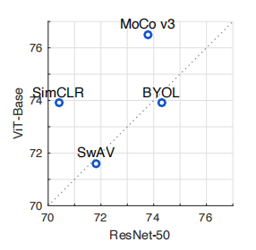

# An Empirical Study of Training Self-Supervised Vision Transformers
训练自监督视觉Transformers的实证研究 2021.4.5 https://arxiv.org/abs/2104.02057

## 阅读笔记
* 这篇是在MAE之前发布，MAE和对比学习可以结合起来用。 
* ViT训练稳定性，layer normal 的位置，初始化方法等

## Abstract
This paper does not describe a novel method. Instead, it studies a straightforward, incremental, yet must-know baseline given the recent progress in computer vision: selfsupervised learning for Vision Transformers (ViT). While the training recipes for standard convolutional networks have been highly mature and robust, the recipes for ViT are yet to be built, especially in the self-supervised scenarios where training becomes more challenging. In this work, we go back to basics and investigate the effects of several fundamental components for training self-supervised ViT. We observe that instability is a major issue that degrades accuracy, and it can be hidden by apparently good results. We reveal that these results are indeed partial failure, and they can be improved when training is made more stable. We benchmark ViT results in MoCo v3 and several other selfsupervised frameworks, with ablations in various aspects. We discuss the currently positive evidence as well as challenges and open questions. We hope that this work will provide useful data points and experience for future research. Code: https://github.com/facebookresearch/moco-v3

本文没有描述一种新颖的方法。 相反，鉴于计算机视觉的最新进展，它研究了一个简单、增量但必须了解的基线：Vision Transformers (ViT) 的自监督学习。 虽然标准卷积网络的训练方法已经高度成熟和稳健，但 ViT 的方法尚未建立，尤其是在训练变得更具挑战性的自监督场景中。 在这项工作中，我们回归基础并研究几个基本组件对训练自监督 ViT 的影响。 我们观察到不稳定性是降低准确性的一个主要问题，它可以被表面上好的结果所掩盖。 我们发现这些结果确实是部分失败，当训练变得更稳定时，它们可以得到改善。 我们在 MoCo v3 和其他几个自监督框架中对 ViT 结果进行了基准测试，并在各个方面进行了消融。 我们讨论了当前积极的证据以及挑战和悬而未决的问题。 我们希望这项工作能为未来的研究提供有用的数据点和经验。 代码：https://github.com/facebookresearch/moco-v3

## 1. Introduction
Unsupervised pre-training has revolutionized natural language processing (NLP) [37, 15, 38, 4]. In computer vision, the un-/self-supervised pre-training paradigms differ from their NLP counterparts in at least two aspects: (i) the learners in NLP are masked auto-encoders, while in vision the recently popular choices are Siamese networks (e.g., [20, 10, 18, 7]); (ii) the backbone architectures in NLP are self-attentional Transformers [43], while in vision the common choice is convolutional [28]—yet non-attentional— deep residual networks (ResNets) [21]. To complete the big picture of self-supervised learning in vision, and towards closing the gap of pre-training methodology between vision and language, it is of scientific merit to investigate these differences.

无监督预训练彻底改变了自然语言处理 (NLP) [37、15、38、4]。 在计算机视觉中，非监督/自监督的预训练范式至少在两个方面与 NLP 对应范式不同：（i）NLP 中的学习者是掩码自动编码器，而在视觉中最近流行的选择是孪生网络（ 例如 [20, 10, 18, 7]); (ii) NLP 中的骨干架构是自注意力变换器 [43]，而在视觉中，常见的选择是卷积[28],深度残差网络 (ResNets) [21], 非注意力机制。 为了完成视觉自监督学习的大局，并缩小视觉和语言之间预训练方法的差距，研究这些差异具有科学价值。

This work focuses on training Transformers with the leading self-supervised frameworks in vision. This investigation is a straightforward extension given the recent progress on Vision Transformers (ViT) [16]. In contrast to prior works [9, 16] that train self-supervised Transformers with masked auto-encoding, we study the frameworks that are based on Siamese networks, including MoCo [20] and  others [10, 18, 7].

这项工作的重点是使用视觉上领先的自监督框架来训练 Transformers。 鉴于 Vision Transformers (ViT) [16] 最近的进展，这项调查是一个直接的扩展。 与之前使用掩码自动编码训练自监督 Transformer 的工作 [9、16] 相比，我们研究了基于 孪生网络的框架，包括 MoCo [20] 和其他 [10、18、7]。

Unlike standard convolutional networks whose training practice has been extensively studied thanks to continuous community effort, ViT models are new and their recipes are yet to be established. In this work, we go back to basics and investigate the fundamental components of training deep neural networks: the batch size, learning rate, and optimizer. We find that under various cases, instability is a major issue that impacts self-supervised ViT training.

与标准的卷积网络不同，由于社区的持续努力，其训练实践已得到广泛研究，ViT 模型是新的，它们的配方尚未确定。 在这项工作中，我们回归基础并研究训练深度神经网络的基本组成部分：批量大小、学习率和优化器。 我们发现在各种情况下，不稳定性是影响自监督 ViT 训练的主要问题。
<!--不稳定的来源，解决方案：MAGNETO?-->

Interestingly, we observe that unstable ViT training may not result in catastrophic failure (e.g., divergence); instead, it can cause mild degradation in accuracy (e.g., 1∼3%). Such a degree of degradation may not be noticeable, unless a more stable counterpart is available for comparison. To the best of our knowledge, this phenomena is rare in the literature of training convolutional networks(1See also postscript on a related discussion) , and we believe this problem and its hidden degradation are worth noticing.

有趣的是，我们观察到不稳定的 ViT 训练可能不会导致灾难性的失败（例如发散）;  相反，它会导致精度轻微下降（例如 1∼3%）。 这种程度的退化可能不会引人注意，除非有更稳定的对应物可供比较。 据我们所知，这种现象在训练卷积网络(1另见相关讨论的后记)的文献中很少见，我们认为这个问题及其隐藏的退化值得注意。

To demonstrate the possible harm of instability, we investigate a simple trick that can improve stability in practice. Based on an empirical observation on gradient changes, we freeze the patch projection layer in ViT, i.e., we use fixed random patch projection. We empirically show that this trick alleviates the instability issue in several scenarios and consistently increases accuracy. 

为了证明不稳定性可能带来的危害，我们研究了一个可以在实践中提高稳定性的简单技巧。 基于对梯度变化的经验观察，我们在 ViT 中冻结了分块投影层，即我们使用固定的随机分块投影。 我们凭经验表明，这种技巧可以缓解多种情况下的不稳定性问题，并持续提高准确性。 <!--冻结分块投影层，使用固定的随机分块投影-->

We benchmark and ablate self-supervised ViT in a variety of cases. We provide ViT results in several selfsupervised frameworks. We conduct ablations on architecture designs and discuss the implications. Furthermore, we explore scaling up the ViT models, including the non-trivial ViT-Large and ViT-Huge [16] — the latter has 40× more computation than ResNet-50 [21]. Based on these experimental results, we discuss both the currently positive evidence as well as the challenges and open questions.

我们在各种情况下对自监督 ViT 进行基准测试和消融。 我们在几个自监督框架中提供 ViT 结果。 我们对架构设计进行消融并讨论其影响。 此外，我们探索扩大 ViT 模型，包括非平凡的 ViT-Large 和 ViT-Huge [16] —— 后者的计算量比 ResNet-50 [21] 多 40 倍。 基于这些实验结果，我们讨论了当前积极的证据以及挑战和未解决的问题。

We report that self-supervised Transformers can achieve strong results using a contrastive learning framework, compared against masked auto-encoding (Table 1). This behavior of Transformers differs from the existing trend in NLP. Moreover, as a promising signal, our bigger self-supervised ViT can achieve better accuracy, unlike the ImageNetsupervised ViT in [16] whose accuracy degrades if getting bigger. For instance, for the very big ViT-Large, our self-supervised pre-training can outperform its supervised pre-training counterpart for transfer learning in certain cases. This presents a proof-of-concept scenario where selfsupervised pre-training is needed.

我们报告说，与掩码自动编码相比，自监督的 Transformers 可以使用对比学习框架取得很好的结果（表 1）。 Transformers 的这种行为不同于 NLP 中的现有趋势。 此外，作为一个有前途的信号，我们更大的自监督ViT 可以获得更好的准确性，这与 [16] 中的 ImageNet 监督ViT 不同，后者的准确性会随着变大而降低。 例如，对于非常大的 ViT-Large，在某些情况下，我们的自监督预训练在迁移学习方面的表现优于其监督预训练。 这提出了一个需要自监督预训练的概念验证场景。

<br/>
Table 1. State-of-the-art Self-supervised Transformers in ImageNet classification, evaluated by linear probing (top panel) or end-to-end fine-tuning (bottom panel). Both iGPT [9] and masked patch prediction [16] belong to the masked auto-encoding paradigm. MoCo v3 is a contrastive learning method that compares two (224×224) crops. ViT-B, -L, -H are the Vision Transformers proposed in [16]. ViT-BN is modified with BatchNorm, and “/7” denotes a patch size of 7×7. † : pre-trained in JFT-300M.
表 1. ImageNet 分类中最先进的自监督Transformers，通过线性探测（上图）或端到端微调（下图）评估。 iGPT [9] 和 masked patch prediction(ViT) [16] 都属于掩码自动编码范式。 MoCo v3 是一种比较两种（224×224）剪裁的对比学习方法。 ViT-B、-L、-H 是 [16] 中提出的 Vision Transformers。 ViT-BN用BatchNorm修改，“/7”表示7×7的分块大小。 † : 在 JFT-300M 中预训练。 <!--iGPT是掩码自动编码？-->

In addition, we report that our self-supervised ViT models have competitive results vs. the big convolutional ResNets in prior art [11, 18]. On one hand, this comparison shows the potential of ViT, especially considering that it achieves these results using relatively “fewer inductive biases” [16]. On the other hand, we suggest that there could be room for self-supervised ViT models to further improve.As one example, we observe that removing the position embedding in ViT only degrades accuracy by a small margin. This reveals that self-supervised ViT can learn strong representations without the positional inductive bias, but it also implies that the positional information has not been suffi- ciently exploited.

此外，我们报告说我们的自监督 ViT 模型与现有技术中的大卷积 ResNets 相比具有竞争性结果 [11、18]。 一方面，这种比较显示了 ViT 的潜力，特别是考虑到它使用相对“更少的归纳偏差”[16] 实现了这些结果。 另一方面，我们建议自监督 ViT 模型可能有进一步改进的空间。作为一个例子，我们观察到移除 ViT 中的位置嵌入只会稍微降低准确性。 这表明自监督 ViT 可以在没有位置归纳偏差的情况下学习强表示，但这也意味着位置信息没有得到充分利用。 
<!--图像中的位置变化对语义影响，不像NLP那样大？
Xpos等，每层的q,k中加入位置信息
-->

In summary, we believe that the evidence, challenges, and open questions in this study are worth knowing, if selfsupervised Transformers will close the gap in pre-training between vision and language. We hope our data points and experience will be useful to push this frontier.

总而言之，我们认为本研究中的证据、挑战和未解决的问题是值得了解的，如果自监督的Transformers将缩小视觉和语言之间预训练的差距。 我们希望我们的数据点和经验将有助于推动这一前沿领域。

## 2. Related Work
### Self-supervised visual representation learning.  自监督视觉表示学习
In computer vision, contrastive learning [19] has become increasingly successful for self-supervised learning, e.g., [45, 34, 22, 2, 20, 10]. The methodology is to learn representations that attract similar (positive) samples and dispel different (negative) samples. The representations from contrastive self-supervised pre-training can outperform their supervised counterparts in certain tasks [20, 10].

在计算机视觉中，对比学习 [19] 在自监督学习方面越来越成功，例如 [45, 34, 22, 2, 20, 10]。 该方法是学习吸引相似（正）样本并消除不同（负）样本的表示。 对比自监督预训练的表现在某些任务中可以胜过他们的监督对手 [20, 10]。

Contrastive learning is commonly instantiated as some forms of Siamese networks [3]. Recently, a series of works [18, 7, 13] retain the Siamese architectures but eliminate the requirement of negative samples. The success of these methods suggest that it is of central importance to learn invariant features by matching positive samples.

对比学习通常被实例化为某种形式的孪生网络 [3]。 最近，一系列工作[18, 7, 13] 保留了孪生架构，但消除了负样本的要求。 这些方法的成功表明，通过匹配正样本来学习不变特征至关重要。 <!--消除了负样本的要求?-->

### Transformers. 
Transformers [43] were originally introduced for machine translation and later became a dominant backbone in NLP [37, 15, 38, 4]. The long-range, selfattentional behavior makes Transformers an effective tool given the non-local, relational nature of languages.

Transformers [43] 最初是为机器翻译而引入的，后来成为 NLP [37、15、38、4] 的主要骨干。 考虑到语言的非局部关系性质，远程、自注意行为使 Transformers 成为一种有效的工具。

There have been continuous efforts on generalizing Transformers to computer vision [44, 5, 39, 49, 6, 16]. The recent work on Vision Transformers (ViT) [16] greatly pushes this frontier. ViT is purely Transformer-based, rather than interlaced with non-degenerated (i.e., non-1×1) convolutions(2We argue that it is imprecise to simply compare self-attention against “convolutions”. Convolutions [28] by definition have several properties: weight-sharing, locally-connected, translation-equivariant. All projection layers in a self-attention block have all these properties of convolutions, and are equivalent to 1×1 convolutions. The counterpart of self-attention is more appropriately the non-degenerated (e.g., 3×3) convolutions). This largely closes the architectural gap between NLP and vision. ViT achieves compelling accuracy in supervised learning, especially with large-scale data and highcapacity models. Given these properties, we believe ViT is a must-study baseline for self-supervised learning in computer vision.

人们一直在努力将 Transformer 推广到计算机视觉 [44、5、39、49、6、16]。 最近关于 Vision Transformers (ViT) [16] 的工作极大地推动了这一前沿领域。 ViT 完全基于 Transformer，而不是与非退化（即非 1×1）卷积交错(2 我们认为简单地将自注意力与“卷积”进行比较是不准确的。 根据定义，卷积 [28] 具有几个属性：权重共享、局部连接、平移不变。 自主意 块中的所有投影层都具有卷积的所有这些属性，相当于 1×1 卷积。 自注意力的对应物更恰当的是非退化（例如，3×3）卷积)。 这在很大程度上缩小了 NLP 和视觉之间的架构差距。 ViT 在监督学习中实现了令人信服的准确性，尤其是在处理大规模数据和高容量模型时。 鉴于这些特性，我们认为 ViT 是计算机视觉中自监督学习的必修基线。

### Self-supervised Transformers for vision. 自监督的视觉Transformers。
In pioneering works [9, 16], training self-supervised Transformers for vision problems in general follows the masked auto-encoding paradigm in NLP [37, 15] (Table 1). iGPT [9] masks and reconstructs pixels, and the self-supervised variant of ViT in [16] masks and reconstructs patches. In this work, we focus on training Transformers in the contrastive/Siamese paradigm, in which the loss is not defined for reconstructing the inputs.

在开创性工作 [9, 16] 中，针对视觉问题训练自监督 Transformer 通常遵循 NLP [37, 15] 中的掩码自动编码范式（表 1）。 iGPT[9] 掩码和重建像素，[16] 中 ViT 的自监督变体掩码和重建分块。 在这项工作中，我们专注于在对比/孪生范式中训练Transformers，其中没有为重建输入定义损失。

## 3. MoCo v3
We introduce a “MoCo v3” framework that facilitates our study. MoCo v3 is an incremental improvement of MoCo v1/2 [20, 12], and we strike for a better balance between simplicity, accuracy, and scalability. The pseudocode of MoCo v3 is in Alg. 1, described next.

我们引入了一个“MoCo v3”框架来促进我们的研究。 MoCo v3 是 MoCo v1/2 [20、12] 的增量改进，我们力求在简单性、准确性和可扩展性之间取得更好的平衡。 MoCo v3 的伪代码在 Alg. 1、接下来介绍。

As common practice (e.g., [20, 10]), we take two crops for each image under random data augmentation. They are encoded by two encoders, $f_q$ and $f_k$, with output vectors q and k. Intuitively, q behaves like a “query” [20], and the goal of learning is to retrieve the corresponding “key”. This is formulated as minimizing a contrastive loss function [19].

作为惯例（例如，[20, 10]），我们在随机数据增强下对每张图像进行两次裁剪。 它们由两个编码器 $f_q$ 和 $f_k$ 编码，输出向量为 q 和 k。 直觉上，q 的行为类似于“查询”[20]，学习的目标是检索相应的“键”。 这被表述为最小化对比损失函数 [19]。

We adopt the form of InfoNCE [34]:
我们采用 InfoNCE [34] 的形式：

$L_q = − log \frac{exp(q·k^+/τ )}{exp(q·k^+/τ ) + \sum_{k−} exp(q·k^−/τ )}$. (1)

Here $k_+$ is $f^k$’s output on the same image as q, known as q’s positive sample. The set {$k^−$} consists of $f^k$’s outputs from other images, known as q’s negative samples. τ is a temperature hyper-parameter [45] for l2-normalized q, k.

这里$k_+$是$f^k$在与q相同的图像上的输出，称为q的正样本。 集合 {$k^−$} 由 $f^k$ 来自其他图像的输出组成，称为 q 的负样本。 τ 是 l2 归一化 q, k 的温度超参数 [45]。

Algorithm 1 MoCo v3: PyTorch-like Pseudocode
``` python
# f_q: encoder: backbone + proj mlp + pred mlp
# f_k: momentum encoder: backbone + proj mlp
# m: momentum coefficient
# tau: temperature
for x in loader: # load a minibatch x with N samples
    x1, x2 = aug(x), aug(x) # augmentation
    q1, q2 = f_q(x1), f_q(x2) # queries: [N, C] each
    k1, k2 = f_k(x1), f_k(x2) # keys: [N, C] each

    loss = ctr(q1, k2) + ctr(q2, k1) # symmetrized
    loss.backward()

    update(f_q) # optimizer update: f_q
    f_k = m*f_k + (1-m)*f_q # momentum update: f_k

# contrastive loss
def ctr(q, k):
    logits = mm(q, k.t()) # [N, N] pairs
    labels = range(N) # positives are in diagonal
    loss = CrossEntropyLoss(logits/tau, labels)
    return 2 * tau * loss
```
Notes: mm is matrix multiplication. k.t() is k’s transpose. The prediction head is excluded from f k (and thus the momentum update). 
注：mm为矩阵乘法。 k.t() 是 k 的转置。 预测头被排除在 $f_k$ 之外（因此动量更新）。


Following [46, 22, 2, 10], in MoCo v3 we use the keys that naturally co-exist in the same batch. We abandon the memory queue [20], which we find has diminishing gain if the batch is sufficiently large (e.g., 4096). With this simpli- fication, the contrastive loss in (1) can be implemented by a few lines of code: see ctr(q, k) in Alg. 1. We adopt a symmetrized loss [18, 7, 13]: ctr(q1, k2)+ctr(q2, k1).

在 [46, 22, 2, 10] 之后，在 MoCo v3 中，我们使用在同一批次中自然共存的keys。 我们放弃了内存队列 [20]，如果批处理足够大（例如 4096），我们发现它的增益会递减。 通过这种简化，(1) 中的对比损失可以通过几行代码实现：参见算法中的 ctr(q, k)。 1. 我们采用对称损失 [18, 7, 13]：ctr(q1, k2)+ctr(q2, k1)。
<!--我们放弃了内存队列 [20]，如果批处理足够大（例如 4096），我们发现它的增益会递减-->

Our encoder $f_q$ consists of a backbone (e.g., ResNet, ViT), a projection head [10], and an extra prediction head [18]; the encoder $f_k$ has the backbone and projection head, but not the prediction head. $f_k$ is updated by the movingaverage of $f_q$ [20], excluding the prediction head.

我们的编码器 $f_q$ 由主干（例如 ResNet、ViT）、投影头 [10] 和额外的预测头 [18] 组成;  编码器 $f_k$ 有骨干和投影头，但没有预测头。 $f_k$ 由 $f_q$ [20] 的 移动平均值 更新，不包括预测头。

As a reference, we examine the MoCo v3 accuracy with ResNet-50 (R50) (detailed in appendix). This table compares the linear probing accuracy in ImageNet:

作为参考，我们使用 ResNet-50 (R50)（详见附录）检查 MoCo v3 的准确性。 此表比较了 ImageNet 中的线性探测精度：

R50, 800-ep | MoCo v2 [12] | MoCo v2+ [13] | MoCo v3 
--- | --- | --- | ---
linear acc. | 71.1 | 72.2 | 73.8

The improvement here is mainly due to the extra prediction head and large-batch (4096) training.

这里的改进主要是由于额外的预测头和大批量（4096）训练。

## 4. Stability of Self-Supervised ViT Training 稳定性
In principle, it is straightforward to replace a ResNet backbone with a ViT backbone in the contrastive/Siamese self-supervised frameworks. But in practice, a main challenge we have met is the instability of training.

原则上，在对比/孪生自监督框架中用 ViT 主干替换 ResNet 主干很简单。 但在实践中，我们遇到的一个主要挑战是训练的不稳定性。

We observe that the instability problem can not be simply reflected by accuracy numbers. In fact, as we will show, the training is “apparently good” and provides decent results, even when it is potentially unstable. To reveal the instability, we monitor the kNN curves [45] (see appendix) during training. In Sec. 4.1, we study how the basic factors influence stability. The curves suggest that the training can be “partially successful”, or in other words, “partially failed”. In Sec. 4.2, we explore a simple trick that can improve stability. As a result, the accuracy is improved in various cases.

我们观察到不稳定问题不能简单地通过精度数字来反映。 事实上，正如我们将要展示的那样，训练“显然很好”并且提供了不错的结果，即使它可能不稳定。 为了揭示不稳定性，我们在训练期间监测 kNN 曲线 [45]（见附录）。 在4.1节，我们研究基本因素如何影响稳定性。 曲线表明训练可以“部分成功”，或者换句话说，“部分失败”。 在4.2节，我们探索了一个可以提高稳定性的简单技巧。 结果，在各种情况下提高了准确度。
<!-- kNN曲线？与稳定性的关系？ -->


### 4.1. Empirical Observations on Basic Factors 基本因素的实证观察
#### Batch size. 批量大小
ViT models in [16] are by design computationally heavy (see Table 2 and 3), and large-batch training [17, 47, 48] is a desirable solution to big ViT models. A large batch is also beneficial for accuracy in recent selfsupervised learning methods [10, 18, 7]. Fig. 1 presents the training curves with different batch sizes.

ViT 模型[16] 在设计上计算量很大（见表2 和表3），大批量训练 [17、47、48] 是大型 ViT 模型的理想解决方案。 大批量也有利于最近的自监督学习方法 [10、18、7] 的准确性。 图 1 显示了不同批量大小的训练曲线。


model|blocks|dim|heads|params
---|---|---|---|---
ViT-Small|12|384|12|22 M
ViT-Base [16]|12|768|12|86 M
ViT-Large [16]|24|1024|16|304 M
ViT-Huge [16]|32|1280|16|632 M

Table 2. Configurations of ViT models in our experiments. Here “blocks” is the number of Transformer blocks, “dim” is the input/output channel dimension of all blocks, and “heads” is the number of heads in multi-head attention. The MLP hidden dimension is 4×dim.  
表 2. 我们实验中 ViT 模型的配置。 这里的“blocks”是Transformer块的数量，“dim”是所有块的输入/输出通道维度，“heads”是多头注意力中的头数。 MLP 隐藏维度为 4×dim。


model|FLOPs|vs. R50|TPUs|hours
---|---|---|---|---
ViT-S/16|4.6 G|1.1×|256|1.2
ViT-B/16|17.5 G|4.3×|256|2.1
ViT-L/16|61.3 G|15.0×|256|6.1
ViT-H/14|166.7 G|40.7×|512|9.8

Table 3. Training time of ViT + MoCo v3, per 100 ImageNetepochs, in our TensorFlow implementation. The FLOPs number (in multiply-adds) is per 224×224 crop, and “vs. R50” is the relative FLOPs vs. ResNet-50 (4.1G).
表 3. 在我们的 TensorFlow 实现中，ViT + MoCo v3 的训练时间，每 100 个 ImageNetepochs。 FLOPs 数（乘法加法）是每 224×224 裁剪，而“vs. R50” 是相对于 ResNet-50 (4.1G) 的 FLOPs。

A batch of 1k and 2k produces reasonably smooth curves, with 71.5% and 72.6% linear probing accuracy. In this regime, the larger batch improves accuracy thanks to more negative samples [20, 10]. The curve of a 4k batch becomes noticeably unstable: see the “dips” in Fig. 1. It has  72.2% linear probing accuracy. Although this seems to be a marginal decrease vs. the 2k batch, its accuracy is harmed by the instability, as we will show in the next subsection.

每批 1k 和 2k 产生相当平滑的曲线，线性探测精度为 71.5% 和 72.6%。 在这种情况下，由于更多的负样本 [20、10]，更大的批次提高了准确性。 4k 批次的曲线变得明显不稳定：参见图 1 中的“下降”。它具有 72.2% 的线性探测精度。 虽然这似乎与 2k 批次相比略有下降，但它的准确性受到不稳定性的影响，我们将在下一节中展示。

<br/>
Figure 1. Training curves of different batch sizes (MoCo v3, ViT-B/16, 100-epoch ImageNet, AdamW, lr=1.0e-4). 
图 1. 不同批量大小的训练曲线（MoCo v3、ViT-B/16、100-epoch ImageNet、AdamW、lr=1.0e-4）。

The curve of a 6k batch has worse failure patterns (big dips in Fig. 1). We hypothesize that the training is partially restarted and jumps out of the current local optimum, then seeks a new trajectory. As a consequence, the training does not diverge, but the accuracy depends on how good the local restart is. When this partial failure happens, it still provides an apparently decent result (69.7%). This behavior is harmful to explorative research: unlike catastrophic failure that is easily noticeable, the small degradation can be fully hidden.

6k 批次的曲线具有更糟糕的故障模式（图 1 中的大倾角）。 我们假设训练部分重新开始并跳出当前的局部最优，然后寻找新的轨迹。 因此，训练不会发散，但准确性取决于本地重启的好坏。 当这种部分失败发生时，它仍然提供了一个明显不错的结果 (69.7%)。 这种行为不利于探索性研究：与容易引起注意的灾难性故障不同，微小的退化可以完全隐藏。

We also find that the mild instability does not result in a noticeably large variation. In many of our ablations, running the same configuration for a second trial often results in a small difference of 0.1∼0.3%. This also makes it diffi- cult to notice the potential degradation caused by instability.

我们还发现轻微的不稳定性不会导致明显的大变化。 在我们的许多消融中，第二次试验运行相同的配置通常会导致 0.1∼0.3% 的小差异。 这也使得很难注意到不稳定导致的潜在退化。

#### Learning rate. 
In practice, the learning rate is often scaled when the batch size increases [27, 17]. In all experiments in this paper, we adopt the linear scaling rule [27, 17]: we set the learning rate as lr×BatchSize/256, where lr is a “base” learning rate. lr is the hyper-parameter being set [20, 10, 18]. In Fig. 2 we study the influence of lr. 

学习率。 在实践中，学习率通常会随着批量大小的增加而缩放 [27, 17]。 在本文的所有实验中，我们采用线性缩放规则 [27, 17]：我们将学习率设置为 lr×BatchSize/256，其中 lr 是“基础”学习率。 lr 是设置的超参数 [20, 10, 18]。 在图 2 中，我们研究了 lr 的影响。

<br/>
Figure 2. Training curves of different learning rates (MoCo v3, ViT-B/16, 100-epoch ImageNet, AdamW, batch 4096).  
图 2. 不同学习率的训练曲线（MoCo v3、ViT-B/16、100-epoch ImageNet、AdamW、batch 4096）。

When lr is smaller, the training is more stable, but it is prone to under-fitting. In Fig. 2, lr=0.5e-4 has 1.8% worse accuracy than lr=1.0e-4 (70.4 vs. 72.2). In this regime, the accuracy is determined by fitting vs. under-fitting. Training with a larger lr becomes less stable. Fig. 2 shows that lr=1.5e-4 for this setting has more dips in the curve, and its accuracy is lower. In this regime, the accuracy is determined by stability.

lr越小，训练越稳定，但容易欠拟合。 在图 2 中，lr=0.5e-4 的精度比 lr=1.0e-4 低 1.8%（70.4 对 72.2）。 在这种情况下，准确性由拟合与欠拟合决定。 使用较大的 lr 进行训练会变得不稳定。 图 2 显示此设置的 lr=1.5e-4 在曲线中有更多的凹陷，其精度较低。 在这种情况下，准确性由稳定性决定。

#### Optimizer.  优化器
By default, we use AdamW [31] as the optimizer, which is the common choice for training ViT models [16, 42, 36](3In original ViT [16] in JAX, the weight decay is “AdamW style”: https://github.com/google/flax/blob/master/flax/optim/adam.py ). On the other hand, recent self-supervised methods [10, 18, 7] are based on the LARS optimizer [47] for large-batch training. In Fig. 3, we study the LAMB optimizer [48], which is an AdamW-counterpart of LARS.

默认情况下，我们使用 AdamW [31] 作为优化器，这是训练 ViT 模型 [16、42、36] 的常见选择（3 在JAX中的原始 ViT [16] 中，权重衰减是“AdamW 风格”：https://github.com/google/flax/blob/master/flax/optim/adam.py）。 另一方面，最近的自监督方法 [10、18、7] 基于 LARS优化器[47] 进行大批量训练。 在图 3 中，我们研究了 LAMB 优化器 [48]，它是 LARS 的 AdamW 对应物。

<br/>
Figure 3. Training curves of LAMB optimizer (MoCo v3, ViTB/16, 100-epoch ImageNet, wd=1e-3, batch 4096).
图 3. LAMB 优化器的训练曲线（MoCo v3、ViTB/16、100-epoch ImageNet、wd=1e-3、batch 4096）。

Given an appropriate learning rate (lr=5e-4, Fig. 3), LAMB achieves slightly better accuracy (72.5%) than AdamW. But the accuracy drops rapidly when lr is larger than the optimal value. LAMB with lr=6e-4 and 8e-4 has 1.6% and 6.0% lower accuracy. Interestingly, the training curves are still smooth, but they degrade gradually in the middle. We hypothesize that although LAMB can avoid sudden change in the gradients, the negative impact of unreliable gradients is accumulated.

给定适当的学习率（lr=5e-4，图 3），LAMB 的准确率 (72.5%) 略高于 AdamW。 但是当 lr 大于最优值时，精度会迅速下降。 lr=6e-4 和 8e-4 的 LAMB 精度分别降低了 1.6% 和 6.0%。 有趣的是，训练曲线依然平滑，但在中间逐渐退化。 我们假设虽然 LAMB 可以避免梯度的突然变化，但不可靠梯度的负面影响会累积。

During our exploration, we find that LAMB can achieve comparable accuracy with AdamW, if lr is appropriately chosen. But the sensitivity to lr makes it difficult to ablate different architecture designs without extra lr search. As a result, we opt to use AdamW in other parts of this paper.

在我们的探索过程中，我们发现如果 lr 选择得当，LAMB 可以达到与 AdamW 相当的精度。 但是对 lr 的敏感性使得在没有额外的 lr 搜索的情况下很难消融不同的架构设计。 因此，我们选择在本文的其他部分使用 AdamW。

### 4.2. A Trick for Improving Stability 提高稳定性的技巧
All these experiments suggest that instability is a major issue. Next we describe a simple trick that can improve stability in various cases in our experiments.

所有这些实验都表明不稳定是一个主要问题。 接下来我们描述一个简单的技巧，可以提高我们实验中各种情况下的稳定性。

During training, we notice that a sudden change of gradients (a “spike” in Fig. 4) causes a “dip” in the training curve, which is as expected. By comparing all layers’ gradients, we observe that the gradient spikes happen earlier in the first layer (patch projection), and are delayed by couples of iterations in the last layers (see Fig. 4). Based on this observation, we hypothesize that the instability happens earlier in the shallower layers. Motivated by this, we explore freezing the patch projection layer during training. In other words, we use a fixed random patch projection layer to embed the patches, which is not learned. This can be easily done by applying a stop-gradient operation right after this layer.

在训练期间，我们注意到梯度的突然变化（图 4 中的“尖峰”）导致训练曲线出现“下降”，这是预期的。 通过比较所有层的梯度，我们观察到梯度尖峰在第一层（分块投影）中发生得较早，并且在最后一层中被几次迭代延迟（见图 4）。 基于这一观察，我们假设不稳定发生在较浅的层中。 受此启发，我们探索在训练期间冻结分块投影层。 换句话说，我们使用固定的随机分块投影层来嵌入分块，这是不学习的。 这可以通过在该层之后立即应用停止梯度操作轻松完成。


<br/>
Figure 4. We monitor the gradient magnitude, shown as relative values for the layer. A “spike” in the gradient causes a “dip” in the training curve. We observe that a spike happens earlier in the first layer, and are delayed by tens of iterations in the last layers.  
图 4. 我们监控梯度大小，显示为层的相对值。 梯度中的“尖峰”会导致训练曲线出现“下降”。 我们观察到尖峰在第一层中发生得较早，并且在最后一层中被数十次迭代延迟。


#### Comparisons. 比较
In Fig. 5 we show the MoCo v3 results with learnable vs. random patch projection. Random patch projection stabilizes training, with smoother and better training curves. This stability benefits the final accuracy, boosting the accuracy by 1.7% to 73.4% at lr=1.5e-4. The improvement is bigger for a larger lr (0.4%, 0.6%, 1.7%). This comparison confirms that the training instability is a main issue that impacts accuracy.

在图 5 中，我们展示了具有可学习与随机分块投影的 MoCo v3 结果。 随机分块投影稳定训练，训练曲线更平滑更好。 这种稳定性有利于最终精度，在 lr=1.5e-4 时将精度提高 1.7% 至 73.4%。 对于较大的 lr (0.4%、0.6%、1.7%)，改进更大。 这种比较证实了训练的不稳定性是影响准确性的主要问题。


<br/>
Figure 5. Random vs. learned patch projection (MoCo v3, ViT-B/16, 100-epoch ImageNet, AdamW, batch 4096). Top: lr=1.0e-4. Bottom: lr=1.5e-4. 
图 5. 随机与学习分块投影（MoCo v3、ViT-B/16、100-epoch ImageNet、AdamW、批次 4096）。 顶部：lr=1.0e-4。 底部：lr=1.5e-4。


Besides MoCo, we find that other related methods [10, 18, 7] can also be unstable. Fig. 6 presents the training curves of ViT in SimCLR [10] and BYOL [18]. Random patch projection improves stability in both SimCLR and BYOL, and increases the accuracy by 0.8% and 1.3%. We also observe the instability issue for SwAV [7], in which, however, the loss diverges (NaN) when it is unstable. Random patch projection helps SwAV by enabling a relatively larger lr without diverging, and improves its accuracy from 65.8% to 66.4% when using the largest stable lr. In sum, this trick is effective in all these self-supervised frameworks.

除了 MoCo，我们发现其他相关方法 [10, 18, 7] 也可能不稳定。 图 6 显示了 ViT 在 SimCLR [10] 和 BYOL [18] 中的训练曲线。 随机分块投影提高了 SimCLR 和 BYOL 的稳定性，并将准确度提高了 0.8% 和 1.3%。 我们还观察到 SwAV [7] 的不稳定性问题，但是，当它不稳定时，损失会发散 (NaN)。 随机分块投影通过在不发散的情况下启用相对较大的 lr 来帮助 SwAV，并在使用最大稳定 lr 时将其准确度从 65.8% 提高到 66.4%。 总之，这个技巧在所有这些自监督框架中都是有效的。

<br/>
Figure 6. Random vs. learned patch projection (ViT-B/16, 100- epoch ImageNet, AdamW, batch 4096). Top: SimCLR: lr=2e-4, wd=0.1. Bottom: BYOL: lr=1e-4, wd=0.03. 
图 6. 随机与学习分块投影（ViT-B/16、100-epoch ImageNet、AdamW，批次 4096）。 顶部：SimCLR：lr=2e-4，wd=0.1。 底部：BYOL：lr=1e-4，wd=0.03。

We have also tried BatchNorm (BN) [24], WeightNorm (WN) [40], or gradient clip on patch projection. We observe that BN or WN on the learnable patch projection layer does not improve instability, and produces similar results; gradient clip on this layer is useful if given a sufficiently small threshold, which to the extreme becomes freezing the layer.

我们还尝试了 BatchNorm (BN) [24]、WeightNorm (WN) [40] 或分块投影上的梯度剪辑。 我们观察到可学习分块投影层上的 BN 或 WN 不会改善不稳定性，并产生类似的结果;  如果给定一个足够小的阈值，该层上的渐变剪辑是有用的，在极端情况下会冻结该层。

#### Discussions. 讨论
It is an interesting observation that it is not necessary to train the patch projection layer. For the standard ViT patch size, the patch projection matrix is complete (768-d output for a 3-channel 16×16 patch) or overcomplete. In this case, random projection should be suffi- cient to preserve the information of the original patches.

一个有趣的观察是没有必要训练分块投影层。 对于标准 ViT 分块大小，分块投影矩阵是完整的（3 通道 16×16 分块的 768-d 输出）或超完整。 在这种情况下，随机投影应该足以保留原始分块的信息。

We note that freezing the first layer does not change the architecture, and it actually narrows down the solution space. This indicates that the underlying problem is on optimization. The trick alleviates the issue, but does not solve it. The model can still be unstable if lr is too big. The first layer is unlikely the essential reason for the instability; instead, the issue concerns all layers. The first layer is merely easier to be handled separately, e.g., it is the only non-Transformer layer in the backbone. We hope to see a more fundamental solution in future work.

我们注意到冻结第一层并没有改变架构，它实际上缩小了解决方案的空间。 这表明根本问题在于优化。 这个技巧缓解了这个问题，但没有解决它。 如果 lr 太大，模型仍然不稳定。 第一层不太可能是不稳定的根本原因;  相反，问题涉及所有层面。 第一层只是更容易单独处理，例如，它是主干中唯一的非 Transformer 层。 我们希望在未来的工作中看到更根本的解决方案。

## 5. Implementation Details
This section describes the details of ViT+MoCo v3. More subtleties are described in the appendix.

本节介绍 ViT+MoCo v3 的详情。 附录中描述了更多细节。

### Optimizer. 优化器
By default we use AdamW [31] and a batch size of 4096 [10, 18, 7]. We search for lr and weight decay wd based on 100-epoch results, and then apply it for longer training. We adopt learning rate warmup [17] for 40 epochs (as per “warmup of 10k steps”, Table 4 in [16]). This long warmup helps alleviate instability, though all unstable results are already with this warmup. After warmup, lr follows a cosine decay schedule [30].

默认情况下，我们使用 AdamW [31] 和 4096 [10,18,7] 的批量大小。 我们根据 100-epoch 结果搜索 lr 和 weight decay wd，然后将其应用于更长时间的训练。 我们采用 40 个时期的学习率预热 [17]（根据“10k 步预热”，[16] 中的表 4）。 这种长时间的预热有助于缓解不稳定性，尽管所有不稳定的结果都已经在这种预热中了。 预热后，lr 遵循余弦衰减时间表 [30]。

### MLP heads. MLP 头
The projection head [10] is a 3-layer MLP, following [11]. The prediction head [18] is a 2-layer MLP. The hidden layers of both MLPs are 4096-d and are with ReLU [32]; the output layers of both MLPs are 256-d, without ReLU. In MoCo v3, all layers in both MLPs have BN [23], following SimCLR [10]. The MLP heads of BYOL/SwAV have different BN designs (see appendix).

投影头 [10] 是一个 3 层 MLP，紧随 [11]。 预测头 [18] 是一个 2 层 MLP。 两个 MLP 的隐藏层都是 4096-d 并且带有 ReLU [32];  两个 MLP 的输出层都是 256-d，没有 ReLU。 在 MoCo v3 中，两个 MLP 中的所有层都具有 BN [23]，遵循 SimCLR [10]。 BYOL/SwAV 的 MLP 头具有不同的 BN 设计（见附录）。

### Loss. 损失
We scale the contrastive loss in (1) by a constant 2τ (see Alg. 1), following [18]’s appendix. This scale is redundant because it can be absorbed by adjusting lr and wd. But this scale makes it less sensitive to the τ value when lr and wd are fixed. We set τ=0.2 [12] as the default.

我们按照 [18] 的附录将 (1) 中的对比损失缩放为常数 2τ（参见算法 1）。 这个比例是多余的，因为它可以通过调整 lr 和 wd 来吸收。 但是当 lr 和 wd 固定时，这个尺度使得它对 τ 值不那么敏感。 我们将 τ=0.2 [12] 设置为默认值。

### ViT architecture. ViT架构
We closely follow the designs in [16]. The input patch size is 16×16 or 14×14 (‘/16’ or ‘/14’), and after projection it results in a sequence of length 196 or 256 for a 224×224 input. Position embeddings are added to the sequence, and we use the sine-cosine variant [43] in 2-D. This sequence is concatenated with a learnable class token. The sequence is then encoded by a stack of Transformer blocks [43] following the design in [16]. The class token after the last block (and after the final LayerNorm [1]) is treated as the output of the backbone, and is the input to the MLP heads.

我们密切关注 [16] 中的设计。 输入块大小为 16×16 或 14×14（‘/16’或‘/14’），投影后对于 224×224 输入产生长度为 196 或 256 的序列。 位置嵌入被添加到序列中，我们在 2-D 中使用正余弦变体 [43]。 该序列与可学习的类标记连接在一起。 然后按照 [16] 中的设计，由一堆 Transformer 块 [43] 对序列进行编码。 最后一个块之后（以及最终 LayerNorm [1] 之后）的类标记被视为主干的输出，并且是 MLP 头的输入。

### Linear probing. 线性探测
Following common practice, we evaluate the representation quality by linear probing. After selfsupervised pre-training, we remove the MLP heads and train a supervised linear classifier on frozen features. We use the SGD optimizer, with a batch size of 4096, wd of 0, and sweep lr for each case. We train this supervised classi- fier for 90 epochs in the ImageNet training set, using only random resized cropping and flipping augmentation. We evaluate single-crop top-1 accuracy in the validation set. 

按照惯例，我们通过线性探测来评估表示质量。 自监督预训练后，我们移除 MLP 头并在冻结特征上训练监督线性分类器。 我们使用 SGD 优化器，批量大小为 4096，wd 为 0，每个案例都扫描 lr。 我们在 ImageNet 训练集中训练这个监督分类器 90 个时期，仅使用随机调整大小的裁剪和翻转增强。 我们在验证集中评估单一作物的 top-1 准确性。

## 6. Experimental Results
In this section we benchmark and ablate self-supervised ViT. We perform self-supervised training on the 1.28M ImageNet training set [14], and evaluate by linear probing.

在本节中，我们对自监督 ViT 进行基准测试和消融。 我们对 1.28M ImageNet 训练集 [14] 进行自监督训练，并通过线性探测进行评估。

Table 2 summarizes the ViT configurations we study. ViT-B/L/H follow [16], and ViT-S is similar to that in [42]. We use ViT-B by default in our ablations.

表 2 总结了我们研究的 ViT 配置。 ViT-B/L/H同[16]，ViT-S同[42]。 我们在消融中默认使用 ViT-B。

Training time. We train our models in TPUs (v3) that are publicly available in Google Cloud Platform (GCP). Table 3 summarizes the training time (per 100 epochs). It takes 2.1 hours training ViT-B for 100 epochs, and our ablations typically take 6.3 hours each (300 epochs). This is a competitive performance, as it enables us to ablate many design decisions. The TPU implemenataion also makes it possible to explore the ViT-H model, which takes 9.8 hours per 100 epochs using 512 TPUs. This is a gigantic scale of training: for the 300-epoch ViT-H, this amounts to ∼625 TPU·days, or ∼1.7 TPU·years of training.

训练时间。 我们在 Google Cloud Platform (GCP) 中公开提供的 TPU (v3) 中训练我们的模型。 表 3 总结了训练时间（每 100 个时期）。 训练 ViT-B 100 个时期需要 2.1 小时，而我们的消融通常每次需要 6.3 小时（300 个时期）。 这是一项具有竞争力的表现，因为它使我们能够取消许多设计决策。 TPU 实现还使探索 ViT-H 模型成为可能，该模型使用 512 个 TPU 每 100 个纪元需要 9.8 小时。 这是一个巨大的训练规模：对于 300 个纪元的 ViT-H，这相当于～625 TPU·天，或～1.7 TPU·年的训练。

We also verify our models in GPUs using PyTorch. It takes 24 hours for ViT-B in 128 GPUs (vs. 2.1 hours in 256 TPUs). With an increasing number of devices, we observe that TPUs scale up more favorably than GPUs. While further engineering optimization could speed up our GPU system, we opt to use the TPU system for the ease of research.

我们还使用 PyTorch 在 GPU 中验证我们的模型。 ViT-B 在 128 个 GPU 中需要 24 小时（而在 256 个 TPU 中需要 2.1 小时）。 随着设备数量的增加，我们观察到 TPU 比 GPU 更容易扩展。 虽然进一步的工程优化可以加快我们的 GPU 系统，但为了便于研究，我们选择使用 TPU 系统。

### 6.1. Self-supervised Learning Frameworks
We benchmark self-supervised ViT in four frameworks: MoCo v3, SimCLR [10], BYOL [18], and SwAV [7].We use the same random projection trick in all cases. We sweep lr and wd for each individual framework for fair comparisons.

我们在四个框架中对自监督 ViT 进行基准测试：MoCo v3、SimCLR [10]、BYOL [18] 和 SwAV [7]。我们在所有情况下都使用相同的随机投影技巧。 我们为每个单独的框架扫描 lr 和 wd 以进行公平比较。

Table 4 reports the results of ViT-S/16 and ViT-B/16. MoCo v3 has better accuracy on ViT than other frameworks. The relative accuracy among these methods is different between ViT-B and R50: see Fig 7. MoCo v3 and SimCLR are more favorable for ViT-B than R50 (above the diagonal line). 

表 4 报告了 ViT-S/16 和 ViT-B/16 的结果。 MoCo v3 在 ViT 上比其他框架具有更好的准确性。 这些方法的相对精度在 ViT-B 和 R50 之间不同：见图 7。MoCo v3 和 SimCLR 比 R50（对角线上方）对 ViT-B 更有利。


model|MoCo v3|SimCLR|BYOL|SwAV
---|---|---|---|---
R-50, 800-ep|73.8|70.4|74.3|71.8
ViT-S, 300-ep|72.5|69.0|71.0|67.1
ViT-B, 300-ep|76.5|73.9|73.9|71.6

Table 4. ViT-S/16 and ViT-B/16 in different self-supervised learning frameworks (ImageNet, linear probing). R-50 results of other frameworks are from the improved implementation in [13]. For fair comparisons, all are pre-trained with two 224×224 crops for each image (multi-crop training [7] could improve results, which is beyond the focus of this work). 
表 4. 不同自监督学习框架（ImageNet、线性探测）中的 ViT-S/16 和 ViT-B/16。 其他框架的 R-50 结果来自 [13] 中改进的实现。 为了公平比较，所有图像都使用两个 224×224 裁剪进行预训练（多裁剪训练 [7] 可以改善结果，这超出了本工作的重点）。

<br/>
Figure 7. Different self-supervised learning frameworks perform differently between R-50 [21] (x-axis) and ViT-B [16] (y-axis). The numbers are ImageNet linear probing accuracy from Table 4. 
图 7. 不同的自监督学习框架在 R-50 [21]（x 轴）和 ViT-B [16]（y 轴）之间表现不同。 这些数字是表 4 中的 ImageNet 线性探测精度。


### 6.2. Ablations of ViT + MoCo v3
Next we ablate the designs of the ViT + MoCo v3 system. We use random patch projection in all ablations.

接下来我们消融 ViT + MoCo v3 系统的设计。 我们在所有消融中使用随机补丁投影。

Position embedding. The following table compares the choice of position embedding (our default is sin-cos):

位置嵌入。 下表对比了position embedding的选择（我们默认是sin-cos）：

ViT-B, 300-ep | sin-cos |learned | none 
--- | --- | --- | ---
linear acc. | 76.5 | 76.1 | 74.9

The learned version works well, but not better than sin-cos. Surprisingly, the model works decently even with no position embedding (74.9%). The capability to encode positions contributes only 1.6%. We believe this data point reveals both strengths and limitations of the current model. On the positive side, it suggests that the model can learn strong representations just by a set of patches, which are fully permutation-invariant. This is analogous to bag-ofwords models [41]. This model has no positional inductive bias. On the negative side, it also suggests that the model has not made good use of positions, and the gesture of the object contributes relatively little to the representation. We hope this data point will draw attention to future study.

学习版本效果很好，但并不比 sin-cos 好。 令人惊讶的是，即使没有位置嵌入，该模型也能正常工作 (74.9%)。 编码位置的能力仅贡献了 1.6%。 我们相信这个数据点揭示了当前模型的优势和局限性。 从积极的方面来说，它表明该模型可以仅通过一组完全排列不变的补丁来学习强表示。 这类似于词袋模型 [41]。 该模型没有位置归纳偏差。 从消极的一面来看，这也表明模型没有很好地利用位置，物体的姿势对表示的贡献相对较小。 我们希望这个数据点能引起人们对未来研究的关注。

Class token. The following table ablates the role of the class token [CLS] in ViT:

类令牌。 下表消解了类标记 [CLS] 在 ViT 中的作用：

ViT-B, 300-ep | w/ [CLS] | w/o [CLS]; LN+pool | w/o [CLS]; pool 
--- | --- | --- | ---
linear acc. |76.5 |69.7 |76.3

Global average pooling is used right after the final block if [CLS] is not used. ViT has an extra LayerNorm (LN) after the final block [16], and if we keep this LN and remove [CLS], the result is much worse (69.7%). But if we remove this LN and [CLS], the result is nearly unchanged (76.3%). This comparison indicates that the class token is not essential for the system to work. It also suggests that the choice of normalization layers can make a difference.

如果未使用 [CLS]，则在最后一个块之后立即使用全局平均池化。 ViT 在最后一个块 [16] 之后有一个额外的 LayerNorm (LN)，如果我们保留这个 LN 并删除 [CLS]，结果会更糟 (69.7%)。 但如果我们删除这个 LN 和 [CLS]，结果几乎没有变化 (76.3%)。 此比较表明类令牌对于系统工作不是必不可少的。 它还表明，规范化层的选择可以有所作为。

BatchNorm in MLP heads. Unlike the standard ResNets [21], ViT models by default have no BN, and thus all BN layers are in the MLP heads. The following table compares with vs. without BN in the heads:

MLP 头中的 BatchNorm。 与标准 ResNets [21] 不同，ViT 模型默认没有 BN，因此所有 BN 层都在 MLP 头中。 下表比较了头部中没有 BN 的情况：

ViT-B, 300-ep| heads w/ BN | heads w/o BN 
--- | --- | --- 
linear acc. |76.5 |74.4

We have to set the batch size as 2048 when removing BN, otherwise it does not converge. Removing BN reduces accuracy by 2.1%. Despite the decrease, this is a completely BN-free system. This data point suggests that BN is not necessary for contrastive learning to work, yet appropriate usage of BN can improve accuracy. 

去除 BN 时必须将 batch size 设置为 2048，否则不收敛。 去除 BN 会使准确度降低 2.1%。 尽管有所减少，但这是一个完全不含 BN 的系统。 这个数据点表明 BN 不是对比学习工作所必需的，但适当使用 BN 可以提高准确性。

Prediction head. MoCo v3 uses a prediction MLP head as per [18]. The next table ablates this design:

预测头。 MoCo v3 根据 [18] 使用预测 MLP 头。 下表消除了这种设计：

ViT-B, 300-ep |w/ pred. MLP | w/o pred. MLP 
--- | --- | --- 
linear acc. | 76.5 | 75.5

Removing the prediction MLP head has a decent result of 75.5%. While this extra head boosts accuracy, MoCo as a contrastive method does not need the predictor MLP to work, unlike the negative-free methods in [18, 13].

移除预测 MLP 头有 75.5% 的不错结果。 虽然这个额外的头部提高了准确性，但 MoCo 作为一种对比方法不需要预测器 MLP 工作，这与 [18、13] 中的无负方法不同。

Momentum encoder. The following table compares the momentum coefficient (m) in the momentum encoder:

动量编码器。 下表比较了动量编码器中的动量系数（m）：

ViT-B, 300-ep | m=0 | m=0.9 | m=0.99 | m=0.999 
--- | --- | --- | --- | ---
linear acc. | 74.3 | 75.6 | 76.5 | 75.0

The optimal value is m=0.99 (our default). The case of m=0 is analogous to SimCLR (plus the prediction head and stop-gradient on the keys), and its accuracy of 74.3% is similar to SimCLR’s (73.9%, Table 4). The usage of the momentum encoder leads to 2.2% increase.

最佳值为 m=0.99（我们的默认值）。 m=0 的情况类似于 SimCLR（加上键上的预测头和停止梯度），其 74.3% 的准确率与 SimCLR 的（73.9%，表 4）相似。 动量编码器的使用导致 2.2% 的增长。

Training length. In the following table we report ViT-S/B + MoCo v3 vs. training length: 

训练长度。 在下表中，我们报告了 ViT-S/B + MoCo v3 与训练长度的对比：

| | 300-ep | 600-ep
--- | --- | --- 
ViT-S/16 | 72.5 | 73.4
ViT-B/16 | 76.5 | 76.7

The smaller ViT-S enjoys the benefit of training longer, and improves by 0.9% when extending to 600 epochs. This is similar to the behavior of R50, which was typically trained for 800 epochs [10]. But the gain of training longer is diminishing on ViT-B. Based on this ablation, we train the bigger ViT-L/H for 300 epochs presented next (Table 1).

较小的 ViT-S 享有训练时间更长的好处，并且在扩展到 600 个 epoch 时提高了 0.9%。 这类似于 R50 的行为，后者通常训练 800 个时期 [10]。 但在 ViT-B 上，训练时间更长的收益正在减少。 基于这种消融，我们训练更大的 ViT-L/H 进行接下来介绍的 300 个时期（表 1）。

### 6.3. Comparisons with Prior Art
Self-supervised Transformers. Table 1 in Sec. 1 presents MoCo v3 results with different ViT models, compared with state-of-the-art self-supervised Transformers. Both iGPT [9] and the masked patch prediction in [16] can be categorized as the masked auto-encoding paradigm (e.g., GPT [37] and BERT [15]). Our MoCo-based ViT has higher accuracy and smaller models than iGPT, under the same linear probing protocol and training data. The mask patch prediction in [16] is pre-trained on JFT-300M and end-to-end fine-tuned in ImageNet, which we append as a reference.

自监督Transformers。 表 1 节。 图 1 展示了不同 ViT 模型的 MoCo v3 结果，并与最先进的自监督 Transformers 进行了比较。 iGPT [9] 和 [16] 中的掩码补丁预测都可以归类为掩码自动编码范例（例如，GPT [37] 和 BERT [15]）。 在相同的线性探测协议和训练数据下，我们基于 MoCo 的 ViT 比 iGPT 具有更高的准确性和更小的模型。 [16] 中的掩模补丁预测在 JFT-300M 上进行了预训练，并在 ImageNet 中进行了端到端微调，我们将其附加为参考。


<br/>
Figure 8. Comparisons with state-of-the-art big ResNets, presented as parameters-vs.-accuracy trade-off. All entries are pretrained with two 224×224 crops, and are evaluated by linear probing. SimCLR v2 results are from Table 1 in [11], and BYOL results are from Table 1 in [18]. 
图 8. 与最先进的大型 ResNet 的比较，呈现为参数与精度的权衡。 所有条目都使用两个 224×224 裁剪进行预训练，并通过线性探测进行评估。 SimCLR v2 结果来自 [11] 中的表 1，BYOL 结果来自 [18] 中的表 1。

Our self-supervised ViT models have higher accuracy when the models are bigger. This is in contrast to the supervised results in [16], where ViT-L has lower accuracy than ViT-B when pre-trained in ImageNet-1k/21k. Actually, for ViT-L, our self-supervised pre-training with linear probing (77.6%) is better than the supervised counterpart in [16] (76.53%) when trained in ImageNet-1k.4 These comparisons suggest that self-supervised learning as a tool for generic representation learning is less prone to over-fitting.

当模型更大时，我们的自监督 ViT 模型具有更高的准确性。 这与 [16] 中的监督结果形成对比，其中在 ImageNet-1k/21k 中进行预训练时，ViT-L 的准确度低于 ViT-B。 实际上，对于 ViT-L，我们使用线性探测进行的自监督预训练 (77.6%) 在 ImageNet-1k 中训练时优于 [16] 中的监督对应项 (76.53%)。4 这些比较表明自监督 学习作为通用表示学习的工具不太容易过度拟合。

Comparisons with big ResNets.5 In Fig. 8 we compare with the state-of-the-art big ResNets reported by SimCLR v2 [11] and BYOL [18]. We note that both SimCLR v2 and BYOL use a momentum encoder. Our baseline ViT MoCo (the curve of “ViT, MoCo v3”) is slightly better than ResNet SimCLR v2 in the small-model regime, but the envelopes become just comparable for larger models. SimCLR v2 with SK-ResNet (Selective Kernel [29], a form of attention) has a higher envelope. BYOL also has a higher envelope with wider ResNets (1-4×), and has an outstanding point with a deeper ResNet (R200-2×). 

与大型 ResNets 的比较。5 在图 8 中，我们与 SimCLR v2 [11] 和 BYOL [18] 报告的最先进的大型 ResNets 进行了比较。 我们注意到 SimCLR v2 和 BYOL 都使用动量编码器。 我们的基线 ViT MoCo（“ViT，MoCo v3”的曲线）在小模型范围内略好于 ResNet SimCLR v2，但包络变得与大模型相当。 具有 SK-ResNet（选择性内核 [29]，一种注意力形式）的 SimCLR v2 具有更高的包络。 BYOL 还具有更高的信封和更宽的 ResNets (1-4×)，并且具有更深的 ResNet (R200-2×) 的突出点。

4Stronger regularization could reduce over-fitting for supervised ViT [42], though regularizing the very big ViT-L/H is yet to be explored. 
4更强的正则化可以减少监督 ViT [42] 的过度拟合，尽管对非常大的 ViT-L/H 进行正则化还有待探索。

5Transformers [43] by design consist of residual blocks [21], and thus are a form of residual networks. In the literature on “Transformer vs. ResNet”, precisely speaking, the term of “ResNet” refers to the specific design that has non-degenerated (e.g., 3×3) convolutions.   
5 变形金刚 [43] 由残差块 [21] 组成，因此是残差网络的一种形式。 在“Transformer vs. ResNet”的文献中，准确地说，“ResNet”一词是指具有非退化（例如3×3）卷积的特定设计。


Table 6. Transfer learning accuracy (%) in four datasets. All entries are end-to-end fine-tuned [16]. Pre-training are performed in the ImageNet-1k training set. The models are ViT-B/16, ViT-L/16, and ViT-H/14. Results of ImageNet-supervised pre-training are from Table 3 in [16]. The arrows indicate the changes w.r.t. the ImageNet-supervised counterparts. 
表 6. 四个数据集中的迁移学习准确度 (%)。 所有条目都经过端到端微调 [16]。 在 ImageNet-1k 训练集中进行预训练。 模型为 ViT-B/16、ViT-L/16 和 ViT-H/14。 ImageNet 监督预训练的结果来自 [16] 中的表 3。 箭头表示 w.r.t. 的变化。 ImageNet 监督的同行。

Table 5. End-to-end fine-tuning accuracy (%) in ImageNet-1k.
表 5.ImageNet-1k 中的端到端微调精度 (%)。

We notice that this comparison concerns a composition of many choices. As one example, the default ViT backbone in [16] uses LayerNorm (LN), while the default ResNet [21] uses BatchNorm (BN). These design choices can lead to a systematic gap. In our preliminary experiments, we explore replacing LN with BN in the ViT backbone’s MLP blocks (i.e., excluding self-attention blocks).6 We simply refer to this as a “ViT-BN” backbone. It leads to ∼1% improvement consistently (see Fig. 8).

我们注意到这种比较涉及许多选择的组合。 作为一个例子，[16] 中默认的 ViT 主干网使用 LayerNorm (LN)，而默认的 ResNet [21] 使用 BatchNorm (BN)。 这些设计选择可能导致系统性差距。 在我们的初步实验中，我们探索在 ViT 主干的 MLP 块中用 BN 替换 LN（即，排除自注意力块）。6 我们简称为“ViT-BN”主干。 它持续带来约 1% 的改进（见图 8）。

In iGPT [9], accuracy can be improved by using longer sequences in the pixel domain. Here we explore longer sequences by reducing the patch size to 7×7 (“/7” in Fig. 8). This keeps the model size unchanged, but increases FLOPs to ∼6×. It can improve the accuracy by ∼2-3%. The gain of using small patches is also observed in [8]. MoCo v3 achieves 81.0% with ViT-BN-L/7.7 As a comparison, the previous best results under the linear probing protocol are 79.8% with SimCLR v2 (SK-ResNet152-3×), and 79.6% with BYOL (ResNet200-2×).

在 iGPT [9] 中，可以通过在像素域中使用更长的序列来提高准确性。 在这里，我们通过将补丁大小减小到 7×7（图 8 中的“/7”）来探索更长的序列。 这保持模型大小不变，但将 FLOPs 增加到 ~6×。 它可以将准确度提高约 2-3%。 在[8]中也观察到使用小补丁的好处。 MoCo v3 与 ViT-BN-L/7.7 达到 81.0% 作为对比，之前线性探测协议下的最佳结果是 SimCLR v2 (SK-ResNet152-3×) 的 79.8%，和 BYOL (ResNet200-2) 的 79.6% ×).

Discussion. While the bigger self-supervised ViT can achieve better accuracy, the results are saturated. This is unlike the trend in NLP, where bigger Transformers learn better representations (e.g., [4]). A potential solution is to use more data. The saturation can also be caused by the limited power of the existing instance-based pretext task [45]. It may be desired to design more difficult pretext tasks.

讨论。 虽然更大的自监督 ViT 可以获得更好的准确性，但结果是饱和的。 这与 NLP 中的趋势不同，在 NLP 中，更大的 Transformer 可以学习更好的表征（例如，[4]）。 一个潜在的解决方案是使用更多数据。 饱和也可能是由现有的基于实例的借口任务[45]的有限能力引起的。 可能需要设计更困难的借口任务。

Our self-supervised ViT models are competitive with the big convolutional ResNets. It suggests that ViT can learn strong representations with “fewer inductive biases” [16]. However, we also find that the accuracy only decreases by a bit even if removing the only positional inductive bias (position embedding), suggesting that in our method ViT relies less on positional information than convolutional networks.

我们的自监督 ViT 模型可与大型卷积 ResNet 相媲美。 这表明 ViT 可以通过“更少的归纳偏差”学习强大的表征 [16]。 然而，我们还发现即使去除唯一的位置归纳偏差（位置嵌入），精度也只会降低一点，这表明在我们的方法中 ViT 对位置信息的依赖程度低于卷积网络。

End-to-end fine-tuning. Table 5 reports end-to-end finetuning results. We use the DeiT codebase [42] and all its default settings unless specified. MoCo v3 achieves 83.2% with ViT-B under 150-epoch fine-tuning, substantially better than DeiT’s 81.8% at 300 epochs.

端到端微调。 表 5 报告了端到端的微调结果。 除非另有说明，否则我们使用 DeiT 代码库 [42] 及其所有默认设置。 MoCo v3 在 150 个 epoch 微调下使用 ViT-B 达到 83.2%，大大优于 DeiT 在 300 个 epoch 时的 81.8%。

6We are trying to replace every LN with BN in the ViT backbone. In preliminary experiments, doing so leads to convergence problems. 
6我们正在尝试用 ViT 骨干网中的 BN 替换每个 LN。 在初步实验中，这样做会导致收敛问题。

7ViT-BN-H/7 is out of memory in our unoptimized implementation. 
7ViT-BN-H/7 在我们未优化的实现中内存不足。

In addition, MoCo v3 has 84.1% with ViT-L when finetuned for only 100 epochs with a drop path rate of 0.5. This short schedule demonstrates the effectiveness of MoCo pretraining. We have also found DeiT-L diverges under its default settings, and a different solution may be needed.

此外，当仅微调 100 个 epoch 且下降路径率为 0.5 时，MoCo v3 与 ViT-L 的匹配率为 84.1%。 这个简短的时间表证明了 MoCo 预训练的有效性。 我们还发现 DeiT-L 在其默认设置下存在差异，可能需要不同的解决方案。

### 6.4. Transfer Learning
In Table 6 we evaluate transfer learning. We study the four downstream datasets as in [16]. We fine-tune the models end-to-end, also following [16].

在表 6 中，我们评估了迁移学习。 我们研究了 [16] 中的四个下游数据集。 我们端到端地微调模型，也遵循 [16]。

Our self-supervised ViT has better transfer learning accuracy when the model size increases from ViT-B to ViT-L, yet it gets saturated when increased to ViT-H. As a comparison, the ImageNet-supervised ViT in [16] becomes saturated or overfitted starting at ViT-L. Our self-supervised ViT achieves better results than its ImageNet-supervised counterparts in three of these four datasets.

当模型大小从 ViT-B 增加到 ViT-L 时，我们的自监督 ViT 具有更好的迁移学习准确性，但当增加到 ViT-H 时它会饱和。 作为比较，[16] 中的 ImageNet 监督的 ViT 从 ViT-L 开始变得饱和或过度拟合。 在这四个数据集中的三个数据集中，我们的自监督 ViT 取得了比 ImageNet 监督的对手更好的结果。

The overfitting is more prominent when training the big ViT models from scratch in these small datasets: the accuracy in general decreases with bigger ViT. We also find that the from-scratch ViT results are much worse than their ResNet-counterparts (c.f ., Table 8 in [10]) in these small datasets. This suggests that if data are not enough, it is diffi- cult for ViT to learn representations in the lack of inductive biases. Self-supervised pre-training can close this gap and largely reduce overfitting in small datasets.

当在这些小数据集中从头开始训练大 ViT 模型时，过度拟合更为突出：准确性通常随着 ViT 的增加而降低。 我们还发现，在这些小数据集中，从头开始的 ViT 结果比它们的 ResNet 对应物（参见 [10] 中的表 8）差得多。 这表明如果数据不够，ViT 很难在缺乏归纳偏差的情况下学习表征。 自监督的预训练可以弥补这一差距，并在很大程度上减少小数据集中的过度拟合。

Finally, we note that with supervised pre-training in bigger datasets (ImageNet-21k or JFT-300M), the ViT results in [16] can be better than ours when transferring to these small datasets. A potential future work is to perform self-supervised pre-training for big ViT models in bigger data. This is analogous to the trajectory of unsupervised pre-training in NLP in the past years [37, 15, 38, 4], i.e., both models and datasets are scaled up.

最后，我们注意到，通过在更大的数据集（ImageNet-21k 或 JFT-300M）中进行有监督的预训练，[16] 中的 ViT 结果在转移到这些小数据集时可能比我们的结果更好。 一个潜在的未来工作是在更大的数据中对大 ViT 模型进行自监督的预训练。 这类似于过去几年 NLP 中无监督预训练的轨迹 [37、15、38、4]，即模型和数据集都按比例放大。

## 7. Conclusion
We have explored training ViT in the recently popular self-supervised frameworks. Our comparisons concern several aspects, including ViT vs. convolutional networks, supervised vs. self-supervised, and contrastive learning vs. masked auto-encoding. We report positive evidence as well as challenges, open questions, and opportunities. We hope our empirical study will be useful for the community to close the gap of pre-training between vision and language.  

我们探索了在最近流行的自监督框架中训练 ViT。 我们的比较涉及几个方面，包括 ViT 与卷积网络、监督与自监督以及对比学习与掩码自动编码。 我们报告积极的证据以及挑战、悬而未决的问题和机遇。 我们希望我们的实证研究有助于社区缩小视觉和语言预训练之间的差距。

Postscript. After the first version of this manuscript, an author of BiT [25] and ViT [16], Lucas Beyer, echoed that “the exact same behaviour” was observed for supervised BiT-ResNet in ImageNet-21k. The instability problem can be more general than the scope of this paper.

后记。 在这份手稿的第一个版本之后，BiT [25] 和 ViT [16] 的作者 Lucas Beyer 回应说，在 ImageNet-21k 中观察到受监督的 BiT-ResNet “完全相同的行为”。 不稳定问题可能比本文的范围更普遍。

## A. Additional Implementation Details
Data augmentation. We follow the good practice in existing works [45, 20, 10, 18]. Our augmentation policy includes random resized cropping, horizontal flipping, color jittering [45], grayscale conversion [45], blurring [10], and solarization [18]. We take two 224×224 crops for each image in each iteration.

数据扩充。 我们遵循现有作品中的良好做法 [45、20、10、18]。 我们的增强策略包括随机调整大小的裁剪、水平翻转、颜色抖动 [45]、灰度转换 [45]、模糊 [10] 和曝光 [18]。 我们在每次迭代中对每张图像进行两次 224×224 裁剪。

BatchNorm. We use SyncBN as our default BatchNorm implementation, following [10]. When BN is used, there are two options on batching: (i) all samples and crops are in the same batch, i.e., BN is over 4096×2 crops for 4096 images; and (ii) only different images are in the same batch, i.e., the two crops of the same image are separately forwarded in two 4096 batches. We notice that the code of SimCLR [10] adopts the former option, while the code in BYOL [18] adopts the latter. The pseudo-code in our Alg. 1 implies that we adopt the latter. The BN batching size influences the gradient variance, and the two implementations should lead to different results.

批量规范。 在 [10] 之后，我们使用 SyncBN 作为我们的默认 BatchNorm 实现。 当使用 BN 时，batching 有两种选择：（i）所有样本和裁剪都在同一批中，即 BN 超过 4096×2 crops for 4096 images;  (ii) 只有不同的图像在同一批次中，即同一图像的两个裁剪在两个 4096 批次中分别转发。 我们注意到 SimCLR [10] 的代码采用了前一种选择，而 BYOL [18] 中的代码采用了后者。 我们算法中的伪代码。 1 意味着我们采用后者。 BN batching size 影响梯度方差，两种实现应该会导致不同的结果。

AdamW implementation. We notice that in PyTorch and JAX, the weight decay in AdamW is implemented as “-lr ∗ wd ∗ weight’’ (consistent with [31]), but in TensorFlow it is implemented as “-wd ∗ weight”, and wd needs to be scaled beforehand(8https://www.tensorflow.org/addons/api_docs/python/tfa/optimizers/AdamW). In our TPU/TensorFlow code, we follow the version consistent with [31].

AdamW 实现。 我们注意到，在PyTorch和JAX中，权重衰减在AdamW中实现为“-lr ∗ wd ∗ weight”（与[31]一致），而在TensorFlow中实现为“-wd ∗ weight”，wd需要 预先缩放（8 https://www.tensorflow.org/addons/api_docs/python/tfa/optimizers/AdamW）。 在我们的 TPU/TensorFlow 代码中，我们遵循与 [31] 一致的版本。

MLP heads in BYOL and SwAV. In our BYOL+ViT implementation, the projection/prediction MLP heads have BN in their hidden layers, but not in their output layers, which faithfully follow [18]. In our SwAV+ViT implementation, we use no BN in the MLP heads, which is a configuration that performs the best in our SwAV experiments. kNN monitor. The kNN monitor [45] is a widely used tool in self-supervised learning research. The kNN evaluation was often performed sparsely, e.g., once per epoch. We notice that this may hide the sudden “dips” in the curves.

MLP 负责 BYOL 和 SwAV。 在我们的 BYOL+ViT 实现中，投影/预测 MLP 头在其隐藏层中有 BN，但在其输出层中没有，忠实地遵循 [18]。 在我们的 SwAV+ViT 实现中，我们在 MLP 头中不使用 BN，这是在我们的 SwAV 实验中表现最好的配置。 kNN 监视器。 kNN 监视器 [45] 是自监督学习研究中广泛使用的工具。 kNN 评估通常是稀疏地执行的，例如，每个时期一次。 我们注意到这可能会隐藏曲线中的突然“下降”。

To better reveal the sudden changes, we monitor the kNN performance more densely, e.g., every tens of iterations. This is prohibitive even though the kNN classifier does not need training. We adopt a few approximations to make it feasible. We maintain a small memory bank [45] (whose length is 10% of ImageNet) for the purpose of kNN search. This memory bank is updated per iteration by the features from the training samples (which are augmented images). This memory bank is maintained as a queue similar to [20], so it requires no extra feature extraction. We use the features from the class token for kNN monitoring, so the monitor is independent of the choice of the head. Other details follow the kNN implementation in [45]. We find that this approximate kNN monitor is sufficient to reflect the stability of training.  

为了更好地揭示突然的变化，我们更密集地监控 kNN 性能，例如，每数十次迭代。 即使 kNN 分类器不需要训练，这也是令人望而却步的。 我们采用一些近似值使其可行。 为了 kNN 搜索的目的，我们维护了一个小的内存库 [45]（其长度是 ImageNet 的 10%）。 该存储库每次迭代都会根据训练样本（增强图像）中的特征进行更新。 这个内存库被维护为一个类似于 [20] 的队列，因此它不需要额外的特征提取。 我们使用类令牌中的特征进行 kNN 监控，因此监控器独立于 head 的选择。 其他细节遵循 [45] 中的 kNN 实现。 我们发现这个近似的 kNN 监视器足以反映训练的稳定性。

MoCo v3 for ResNet-50. The implementation follows the good practice in recent works [10, 18]. It uses the LARS optimizer [47] with a 4096 batch [10], lr=0.3, wd=1.5e-6. The temperature is τ=1.0. The encoder $f_k$’s momentum coefficient is m=0.996 and increases to 1 with a cosine schedule [18]. The augmentation is the same as described above.

用于 ResNet-50 的 MoCo v3。 实施遵循最近工作中的良好做法 [10、18]。 它使用 LARS 优化器 [47] 和 4096 批处理 [10]，lr=0.3，wd=1.5e-6。 温度τ=1.0。 编码器 $f_k$ 的动量系数为 m=0.996，并以余弦时间表增加到 1 [18]。 增强与上述相同。

## References
1. Jimmy Lei Ba, Jamie Ryan Kiros, and Geoffrey E Hinton. Layer normalization. arXiv:1607.06450, 2016. 5
2. Philip Bachman, R Devon Hjelm, and William Buchwalter. Learning representations by maximizing mutual information across views. In NeurIPS, 2019. 2, 3
3. Jane Bromley, Isabelle Guyon, Yann LeCun, Eduard S¨ackinger, and Roopak Shah. Signature verification using a “Siamese” time delay neural network. In NeurIPS, 1994. 2
4. Tom Brown, Benjamin Mann, Nick Ryder, Melanie Subbiah, Jared D Kaplan, Prafulla Dhariwal, Arvind Neelakantan, Pranav Shyam, Girish Sastry, Amanda Askell, Sandhini Agarwal, Ariel Herbert-Voss, Gretchen Krueger, Tom Henighan, Rewon Child, Aditya Ramesh, Daniel Ziegler, Jeffrey Wu, Clemens Winter, Chris Hesse, Mark Chen, Eric Sigler, Mateusz Litwin, Scott Gray, Benjamin Chess, Jack Clark, Christopher Berner, Sam McCandlish, Alec Radford, Ilya Sutskever, and Dario Amodei. Language models are few-shot learners. In NeurIPS, 2020. 1, 2, 8
5. Yue Cao, Jiarui Xu, Stephen Lin, Fangyun Wei, and Han Hu. Gcnet: Non-local networks meet squeeze-excitation networks and beyond. In ICCV Workshops, 2019. 2
6. Nicolas Carion, Francisco Massa, Gabriel Synnaeve, Nicolas Usunier, Alexander Kirillov, and Sergey Zagoruyko. End-to-end object detection with Transformers. In ECCV, 2020. 2
7. Mathilde Caron, Ishan Misra, Julien Mairal, Priya Goyal, Piotr Bojanowski, and Armand Joulin. Unsupervised learning of visual features by contrasting cluster assignments. In NeurIPS, 2020. 1, 2, 3, 4, 5, 6
8. Mathilde Caron, Hugo Touvron, Ishan Misra, Herv´e J´egou, Julien Mairal, Piotr Bojanowski, and Armand Joulin. Emerging properties in self-supervised vision transformers. arXiv:2104.14294, 2021. 8
9. Mark Chen, Alec Radford, Rewon Child, Jeffrey Wu, Heewoo Jun, David Luan, and Ilya Sutskever. Generative pretraining from pixels. In ICML, 2020. 1, 2, 7, 8
10. Ting Chen, Simon Kornblith, Mohammad Norouzi, and Geoffrey Hinton. A simple framework for contrastive learning of visual representations. In ICML, 2020. 1, 2, 3, 4, 5, 6, 7, 8, 9
11. Ting Chen, Simon Kornblith, Kevin Swersky, Mohammad Norouzi, and Geoffrey Hinton. Big self-supervised models are strong semi-supervised learners. In NeurIPS, 2020. 2, 5, 7
12. Xinlei Chen, Haoqi Fan, Ross Girshick, and Kaiming He. Improved baselines with momentum contrastive learning. arXiv:2003.04297, 2020. 2, 3, 5 9
13. Xinlei Chen and Kaiming He. Exploring simple Siamese representation learning. In CVPR, 2021. 2, 3, 6, 7
14. Jia Deng, Wei Dong, Richard Socher, Li-Jia Li, Kai Li, and Li Fei-Fei. ImageNet: A large-scale hierarchical image database. In CVPR, 2009. 6
15. Jacob Devlin, Ming-Wei Chang, Kenton Lee, and Kristina Toutanova. BERT: Pre-training of deep bidirectional transformers for language understanding. In NAACL, 2019. 1, 2, 7, 8
16. Alexey Dosovitskiy, Lucas Beyer, Alexander Kolesnikov, Dirk Weissenborn, Xiaohua Zhai, Thomas Unterthiner, Mostafa Dehghani, Matthias Minderer, Georg Heigold, Sylvain Gelly, Jakob Uszkoreit, and Neil Houlsby. An image is worth 16x16 words: Transformers for image recognition at scale. In ICLR, 2021. 1, 2, 3, 4, 5, 6, 7, 8, 9
17. Priya Goyal, Piotr Doll´ar, Ross Girshick, Pieter Noordhuis, Lukasz Wesolowski, Aapo Kyrola, Andrew Tulloch, Yangqing Jia, and Kaiming He. Accurate, large minibatch SGD: Training ImageNet in 1 hour. arXiv:1706.02677, 2017. 3, 5
18. Jean-Bastien Grill, Florian Strub, Florent Altch´e, Corentin Tallec, Pierre Richemond, Elena Buchatskaya, Carl Doersch, Bernardo Avila Pires, Zhaohan Guo, Mohammad Gheshlaghi Azar, Bilal Piot, koray kavukcuoglu, Remi Munos, and Michal Valko. Bootstrap your own latent - a new approach to self-supervised learning. In NeurIPS, 2020. 1, 2, 3, 4, 5, 6, 7, 9
19. Raia Hadsell, Sumit Chopra, and Yann LeCun. Dimensionality reduction by learning an invariant mapping. In CVPR, 2006. 2
20. Kaiming He, Haoqi Fan, Yuxin Wu, Saining Xie, and Ross Girshick. Momentum contrast for unsupervised visual representation learning. In CVPR, 2020. 1, 2, 3, 9
21. Kaiming He, Xiangyu Zhang, Shaoqing Ren, and Jian Sun. Deep residual learning for image recognition. In CVPR, 2016. 1, 2, 6, 7, 8
22. R Devon Hjelm, Alex Fedorov, Samuel Lavoie-Marchildon, Karan Grewal, Adam Trischler, and Yoshua Bengio. Learning deep representations by mutual information estimation and maximization. In ICLR, 2019. 2, 3
23. Sergey Ioffe. Batch renormalization: Towards reducing minibatch dependence in batch-normalized models. In NeurIPS, 2017. 5
24. Sergey Ioffe and Christian Szegedy. Batch normalization: Accelerating deep network training by reducing internal covariate shift. In ICML, 2015. 5
25. Alexander Kolesnikov, Lucas Beyer, Xiaohua Zhai, Joan Puigcerver, Jessica Yung, Sylvain Gelly, and Neil Houlsby. Big Transfer (BiT): General visual representation learning. In ECCV, 2020. 9
26. Alex Krizhevsky. Learning multiple layers of features from tiny images. Tech Report, 2009. 8
27. Alex Krizhevsky. One weird trick for parallelizing convolutional neural networks. arXiv:1404.5997, 2014. 3
28. Yann LeCun, Bernhard Boser, John S Denker, Donnie Henderson, Richard E Howard, Wayne Hubbard, and Lawrence D Jackel. Backpropagation applied to handwritten zip code recognition. Neural computation, 1989. 1, 2
29. Xiang Li, Wenhai Wang, Xiaolin Hu, and Jian Yang. Selective kernel networks. In CVPR, 2019. 7
30. Ilya Loshchilov and Frank Hutter. SGDR: Stochastic gradient descent with warm restarts. In ICLR, 2017. 5
31. Ilya Loshchilov and Frank Hutter. Decoupled weight decay regularization. In ICLR, 2019. 4, 5, 9
32. Vinod Nair and Geoffrey E Hinton. Rectified linear units improve restricted boltzmann machines. In ICML, 2010. 5
33. Maria-Elena Nilsback and Andrew Zisserman. Automated flower classification over a large number of classes. In Indian Conference on Computer Vision, Graphics & Image Processing, 2008. 8
34. Aaron van den Oord, Yazhe Li, and Oriol Vinyals. Representation learning with contrastive predictive coding. arXiv:1807.03748, 2018. 2
35. Omkar M Parkhi, Andrea Vedaldi, Andrew Zisserman, and CV Jawahar. Cats and dogs. In CVPR, 2012. 8
36. Alec Radford, Jong Wook Kim, Chris Hallacy, Aditya Ramesh, Gabriel Goh, Sandhini Agarwal, Girish Sastry, Amanda Askell, Pamela Mishkin, Jack Clark, et al. Learning transferable visual models from natural language supervision. 2021. 4
37. Alec Radford, Karthik Narasimhan, Tim Salimans, and Ilya Sutskever. Improving language understanding by generative pretraining. 2018. 1, 2, 7, 8
38. Alec Radford, Jeffrey Wu, Rewon Child, David Luan, Dario Amodei, and Ilya Sutskever. Language models are unsupervised multitask learners. 2019. 1, 2, 8
39. Prajit Ramachandran, Niki Parmar, Ashish Vaswani, Irwan Bello, Anselm Levskaya, and Jonathon Shlens. Stand-alone selfattention in vision models. In NeurIPS, 2019. 2
40. Tim Salimans and Diederik P Kingma. Weight normalization: A simple reparameterization to accelerate training of deep neural networks. In NeurIPS, 2016. 5
41. Josef Sivic and Andrew Zisserman. Video Google: a text retrieval approach to object matching in videos. In ICCV, 2003.  
42. Hugo Touvron, Matthieu Cord, Matthijs Douze, Francisco Massa, Alexandre Sablayrolles, and Herv´e J´egou. Training data-efficient image transformers & distillation through attention. arXiv:2012.12877, 2020. 4, 6, 7, 8
43. Ashish Vaswani, Noam Shazeer, Niki Parmar, Jakob Uszkoreit, Llion Jones, Aidan N Gomez, Lukasz Kaiser, and Illia Polosukhin. Attention is all you need. In NeurIPS, 2017. 1, 2, 5, 7
44. Xiaolong Wang, Ross Girshick, Abhinav Gupta, and Kaiming He. Non-local neural networks. In CVPR, 2018. 2
45. Zhirong Wu, Yuanjun Xiong, Stella Yu, and Dahua Lin. Unsupervised feature learning via non-parametric instance discrimination. In CVPR, 2018. 2, 3, 8, 9
46. Mang Ye, Xu Zhang, Pong C Yuen, and Shih-Fu Chang. Unsupervised embedding learning via invariant and spreading instance feature. In CVPR, 2019. 3
47. Yang You, Igor Gitman, and Boris Ginsburg. Large batch training of convolutional networks. arXiv:1708.03888, 2017. 3, 4, 9
48. Yang You, Jing Li, Sashank Reddi, Jonathan Hseu, Sanjiv Kumar, Srinadh Bhojanapalli, Xiaodan Song, James Demmel, Kurt Keutzer, and Cho-Jui Hsieh. Large batch optimization for deep learning: Training bert in 76 minutes. In ICLR, 2020. 3, 4
49. Hengshuang Zhao, Jiaya Jia, and Vladlen Koltun. Exploring self-attention for image recognition. In CVPR, 2020. 2 
