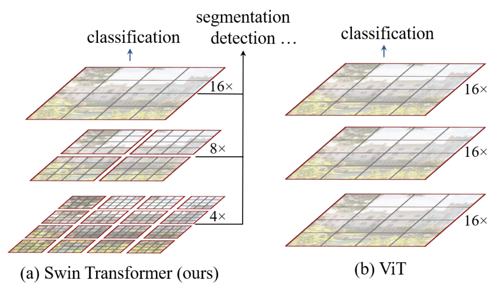
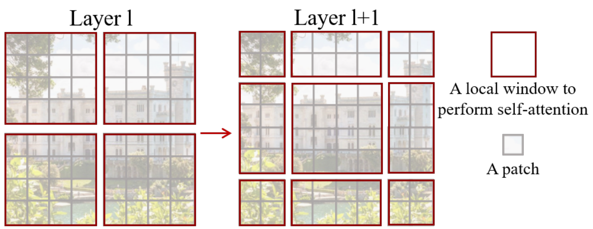
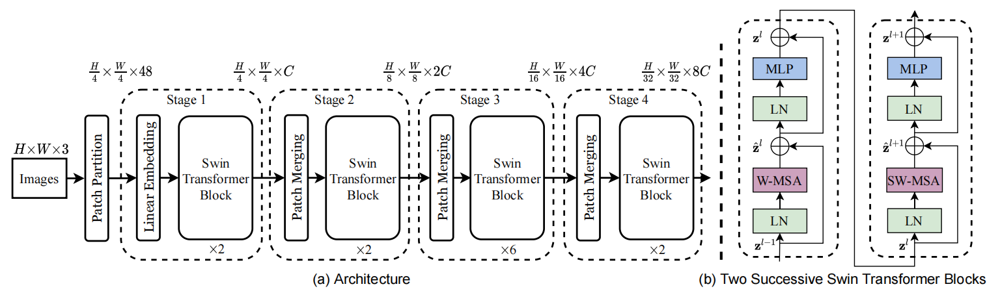
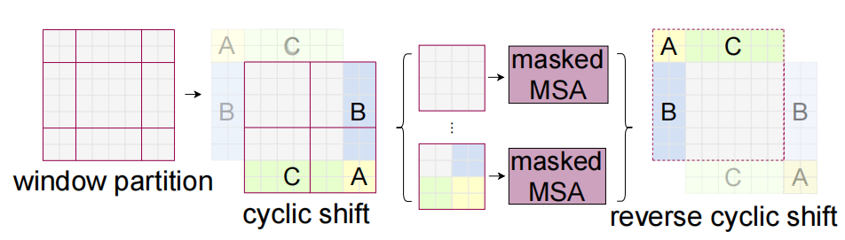

# Swin Transformer: Hierarchical Vision Transformer using Shifted Windows
Swin Transformer：使用移位窗口的分层视觉转换器  2021.3.25 https://arxiv.org/abs/2103.14030

## 阅读笔记
* https://github.com/pytorch/vision/blob/main/torchvision/models/swin_transformer.py
* 要解决什么问题，怎么解决
* 分层变换器，移位窗口方案通过将自注意力计算限制到非重叠的局部窗口，同时也允许跨窗口连接，从而带来更高的效率。在各种尺度上建模的灵活性，并且相对于图像大小具有线性计算复杂度。
* 移动窗口方法比滑动窗口, 区别？

## Abstract
This paper presents a new vision Transformer, called Swin Transformer, that capably serves as a general-purpose backbone for computer vision. Challenges in adapting Transformer from language to vision arise from differences between the two domains, such as large variations in the scale of visual entities and the high resolution of pixels in images compared to words in text. To address these differences, we propose a hierarchical Transformer whose representation is computed with Shifted windows. The shifted windowing scheme brings greater efficiency by limiting self-attention computation to non-overlapping local windows while also allowing for cross-window connection. This hierarchical architecture has the flexibility to model at various scales and has linear computational complexity with respect to image size. These qualities of Swin Transformer make it compatible with a broad range of vision tasks, including image classification (87.3 top-1 accuracy on ImageNet-1K) and dense prediction tasks such as object detection (58.7 box AP and 51.1 mask AP on COCO testdev) and semantic segmentation (53.5 mIoU on ADE20K val). Its performance surpasses the previous state-of-theart by a large margin of +2.7 box AP and +2.6 mask AP on COCO, and +3.2 mIoU on ADE20K, demonstrating the potential of Transformer-based models as vision backbones. The hierarchical design and the shifted window approach also prove beneficial for all-MLP architectures. The code and models are publicly available at https://github.com/microsoft/Swin-Transformer .

本文介绍了一种新的视觉转换器，称为Swin Transformer，它可以作为计算机视觉的通用主干。将Transformer从语言转换为视觉的挑战来自于两个领域之间的差异，例如视觉实体的规模的巨大变化以及图像中像素与文本中的单词相比的高分辨率。为了解决这些差异，我们提出了一种分层变换器，其表示是用移位窗口计算的。移位窗口方案通过将自注意力计算限制到非重叠的局部窗口，同时也允许跨窗口连接，从而带来更高的效率。这种分层结构具有在各种尺度上建模的灵活性，并且相对于图像大小具有线性计算复杂度。Swin Transformer的这些特性使其与广泛的视觉任务兼容，包括图像分类(ImageNet-1K上的精度为87.3 top-1)和密集预测任务，如目标检测(COCO测试开发上的boxAP为58.7，maskAP为51.1)和语义分割(ADE20K val上的53.5 mIoU)。其性能在COCO上以+2.7 boxAP和+2.6 maskAP的巨大优势超过了先前的技术水平，在ADE20K上以+3.2 mIoU的优势超过了之前的水平，显示了基于Transformer的模型作为视觉主干的潜力。分层设计和移位窗口方法也证明对所有MLP架构都是有益的。代码和模型在 https://github.com/microsoft/Swin-Transformer .

## 1. Introduction
Modeling in computer vision has long been dominated by convolutional neural networks (CNNs). Beginning with AlexNet [39] and its revolutionary performance on the ImageNet image classification challenge, CNN architectures have evolved to become increasingly powerful through greater scale [30, 76], more extensive connections [34], and more sophisticated forms of convolution [70, 18, 84]. With CNNs serving as backbone networks for a variety of vision tasks, these architectural advances have led to performance improvements that have broadly lifted the entire field.

计算机视觉中的建模一直由卷积神经网络(CNN)主导。从AlexNet[39]及其在ImageNet图像分类挑战中的革命性性能开始，CNN架构已经通过更大的规模[30，76]、更广泛的连接[34]和更复杂的卷积形式[70，18，84]而变得越来越强大。随着CNNs作为各种视觉任务的主干网络，这些架构的进步带来了性能的提高，并广泛提升了整个领域。

On the other hand, the evolution of network architectures in natural language processing (NLP) has taken a different path, where the prevalent architecture today is instead the Transformer [64]. Designed for sequence modeling and transduction tasks, the Transformer is notable for its use of attention to model long-range dependencies in the data. Its tremendous success in the language domain has led researchers to investigate its adaptation to computer vision, where it has recently demonstrated promising results on certain tasks, specifically image classification [20] and joint vision-language modeling [47].

另一方面，自然语言处理(NLP)中网络架构的演变走了一条不同的道路，今天流行的架构是Transformer[64]。Transformer专为序列建模和转换任务而设计，以其关注数据中的长期依赖性而闻名。它在语言领域的巨大成功促使研究人员研究了它对计算机视觉的适应性，最近它在某些任务上显示了有希望的结果，特别是图像分类[20]和联合视觉语言建模[47]。

 
Figure 1. (a) The proposed Swin Transformer builds hierarchical feature maps by merging image patches (shown in gray) in deeper layers and has linear computation complexity to input image size due to computation of self-attention only within each local window (shown in red). It can thus serve as a general-purpose backbone for both image classification and dense recognition tasks. (b) In contrast, previous vision Transformers [20] produce feature maps of a single low resolution and have quadratic computation complexity to input image size due to computation of selfattention globally. 
图1.(a)所提出的Swin Transformer通过在更深的层中合并图像块(以灰色显示)来构建分层特征图，并且由于仅在每个局部窗口(以红色显示)内计算自注意力，因此对于输入图像大小具有线性计算复杂度。因此，它可以作为图像分类和密集识别任务的通用主干。(b) 相比之下，先前的视觉变换器[20]产生单个低分辨率的特征图，并且由于全局关注的计算，输入图像大小具有二次计算复杂度。

In this paper, we seek to expand the applicability of Transformer such that it can serve as a general-purpose backbone for computer vision, as it does for NLP and as CNNs do in vision. We observe that significant challenges in transferring its high performance in the language domain to the visual domain can be explained by differences between the two modalities. One of these differences involves scale. Unlike the word tokens that serve as the basic elements of processing in language Transformers, visual elements can vary substantially in scale, a problem that receives attention in tasks such as object detection [42, 53, 54]. In existing Transformer-based models [64, 20], tokens are all of a fixed scale, a property unsuitable for these vision applications. Another difference is the much higher resolution of pixels in images compared to words in passages of text. There exist many vision tasks such as semantic segmentation that require dense prediction at the pixel level, and this would be intractable for Transformer on high-resolution images, as the computational complexity of its self-attention is quadratic to image size. To overcome these issues, we propose a generalpurpose Transformer backbone, called Swin Transformer, which constructs hierarchical feature maps and has linear computational complexity to image size. As illustrated in Figure 1(a), Swin Transformer constructs a hierarchical representation by starting from small-sized patches (outlined in gray) and gradually merging neighboring patches in deeper Transformer layers. With these hierarchical feature maps, the Swin Transformer model can conveniently leverage advanced techniques for dense prediction such as feature pyramid networks (FPN) [42] or U-Net [51]. The linear computational complexity is achieved by computing self-attention locally within non-overlapping windows that partition an image (outlined in red). The number of patches in each window is fixed, and thus the complexity becomes linear to image size. These merits make Swin Transformer suitable as a general-purpose backbone for various vision tasks, in contrast to previous Transformer based architectures [20] which produce feature maps of a single resolution and have quadratic complexity.

在本文中，我们试图扩展Transformer的适用性，使其可以作为通用计算机视觉的主干，就像它对NLP和CNN在视觉中的作用一样。我们观察到，将其在语言领域的高性能迁移到视觉领域的重大挑战可以通过两种模式之间的差异来解释。其中一个差异涉及规模。与作为语言Transformer中处理的基本元素的单词标记不同，视觉元素的规模可能会有很大变化，这是一个在诸如目标检测等任务中受到关注的问题[42，53，54]。在现有的基于Transformer的模型[64，20]中，令牌都是固定规模的，这一特性不适合这些视觉应用。另一个区别是图像中的像素分辨率比文本段落中的单词高得多。存在许多视觉任务，如语义分割，需要在像素级别进行密集预测，这对于高分辨率图像上的Transformer来说将是棘手的，因为其自注意力的计算复杂度与图像大小成二次方。为了克服这些问题，我们提出了一种通用的Transformer主干，称为Swin Transformer，它构建分层特征图，并具有图像大小的线性计算复杂度。如图1(a)所示，Swin Transformer通过从小尺寸的分块(以灰色勾勒)开始，并在更深的Transformer层中逐渐合并相邻的分块来构建分层表示。利用这些分层特征图，Swin Transformer模型可以方便地利用高级技术进行密集预测，如特征金字塔网络(FPN)[42]或U-Net[51]。线性计算复杂度是通过在划分图像的非重叠窗口内局部计算自注意力来实现的(红色轮廓)。每个窗口中的分块数量是固定的，因此复杂度与图像大小成线性关系。这些优点使Swin Transformer适合作为各种视觉任务的通用主干，与先前基于Transformer的架构[20]形成单一分辨率的特征图并具有二次复杂度不同。

A key design element of Swin Transformer is its shift of the window partition between consecutive self-attention layers, as illustrated in Figure 2. The shifted windows bridge the windows of the preceding layer, providing connections among them that significantly enhance modeling power (see Table 4). This strategy is also efficient in regards to real-world latency: all query patches within a window share the same key set(1The query and key are projection vectors in a self-attention layer. ) , which facilitates memory access in hardware. In contrast, earlier sliding window based self-attention approaches [33, 50] suffer from low latency on general hardware due to different key sets for different query pixels(2 While there are efficient methods to implement a sliding-window based convolution layer on general hardware, thanks to its shared kernel weights across a feature map, it is difficult for a sliding-window based self-attention layer to have efficient memory access in practice. ) . Our experiments show that the proposed shifted window approach has much lower latency than the sliding window method, yet is similar in modeling power (see Tables 5 and 6). The shifted window approach also proves beneficial for all-MLP architectures [61].

Swin Transformer的一个关键设计元素是在连续的自注意力层之间移动窗口分区，如图2所示。移动的窗口桥接前一层的窗口，在它们之间提供连接，从而显著增强建模能力(见表4)。这种策略在真实世界的延迟方面也很有效：一个窗口中的所有查询分块都共享相同的key集(1查询和键是自注意力层中的投影向量)，这有助于硬件中的内存访问。相比之下，早期的基于滑动窗口的自注意力方法[33，50]由于不同查询像素的不同key集(2虽然有有效的方法在通用硬件上实现基于滑动窗口的卷积层，但由于其在特征图上共享内核权重，因此在实践中，基于滑动窗的自注意力层很难实现有效的内存访问)，在一般硬件上具有低延迟。我们的实验表明，所提出的移动窗口方法比滑动窗口方法具有低得多的延迟，但建模能力相似(见表5和表6)。移位窗口方法也证明对所有MLP架构都是有益的[61]。

 
Figure 2. An illustration of the shifted window approach for computing self-attention in the proposed Swin Transformer architecture. In layer l (left), a regular window partitioning scheme is adopted, and self-attention is computed within each window. In the next layer l + 1 (right), the window partitioning is shifted, resulting in new windows. The self-attention computation in the new windows crosses the boundaries of the previous windows in layer l, providing connections among them. 
图2.所提出的Swin Transformer架构中计算自注意力的移动窗口方法的图示。在层l(左)中，采用了规则的窗口划分方案，并在每个窗口内计算自注意力。在下一层l+1(右)中，窗口分区被移动，从而产生新的窗口。新窗口中的自注意力计算跨越了层l中先前窗口的边界，提供了它们之间的连接。

The proposed Swin Transformer achieves strong performance on the recognition tasks of image classification, object detection and semantic segmentation. It outperforms the ViT / DeiT [20, 63] and ResNe(X)t models [30, 70] significantly with similar latency on the three tasks. Its 58.7 box AP and 51.1 mask AP on the COCO test-dev set surpass the previous state-of-the-art results by +2.7 box AP (Copy-paste [26] without external data) and +2.6 mask AP (DetectoRS [46]). On ADE20K semantic segmentation, it obtains 53.5 mIoU on the val set, an improvement of +3.2 mIoU over the previous state-of-the-art (SETR [81]). It also achieves a top-1 accuracy of 87.3% on ImageNet-1K image classification.

所提出的Swin Transformer在图像分类、目标检测和语义分割的识别任务上实现了强大的性能。它显著优于ViT/DeiT[20，63]和ResNe(X)t模型[30，70]，在三个任务上具有相似的延迟。COCO测试开发集上的58.7boxAP和51.1maskAP超过了之前的最先进结果+2.7 boxAP(无外部数据的复制粘贴[26])和+2.6 maskAP(DetectoRS[46])。在ADE20K语义分割上，它在val集合上获得53.5 mIoU，比之前的最新技术(SETR[81])提高了+3.2 mIoU。在ImageNet-1K图像分类上，它还实现了87.3%的顶级精度。

It is our belief that a unified architecture across computer vision and natural language processing could benefit both fields, since it would facilitate joint modeling of visual and textual signals and the modeling knowledge from both domains can be more deeply shared. We hope that Swin Transformer’s strong performance on various vision problems can drive this belief deeper in the community and encourage unified modeling of vision and language signals.

我们相信，跨计算机视觉和自然语言处理的统一架构可以使这两个领域受益，因为它将促进视觉和文本信号的联合建模，并且可以更深入地共享来自两个领域的建模知识。我们希望Swin Transformer在各种视觉问题上的出色表现能够在社区中加深这种信念，并鼓励视觉和语言信号的统一建模。

## 2. Related Work
### CNN and variants 
CNNs serve as the standard network model throughout computer vision. While the CNN has existed for several decades [40], it was not until the introduction of AlexNet [39] that the CNN took off and became mainstream. Since then, deeper and more effective convolutional neural architectures have been proposed to further propel the deep learning wave in computer vision, e.g., VGG [52], GoogleNet [57], ResNet [30], DenseNet [34], HRNet [65], and EfficientNet [58]. In addition to these architectural advances, there has also been much work on improving individual convolution layers, such as depthwise convolution [70] and deformable convolution [18, 84]. While the CNN and its variants are still the primary backbone architectures for computer vision applications, we highlight the strong potential of Transformer-like architectures for unified modeling between vision and language. Our work achieves strong performance on several basic visual recognition tasks, and we hope it will contribute to a modeling shift.

CNN和变体。CNNs是整个计算机视觉的标准网络模型。尽管CNN已经存在了几十年[40]，但直到AlexNet的推出[39]，CNN才开始成为主流。从那时起，已经提出了更深更有效的卷积神经架构，以进一步推动计算机视觉中的深度学习浪潮，例如VGG[52]、GoogleNet[57]、ResNet[30]、DenseNet[34]、HRNet[65]和EfficientNet[58]。除了这些架构上的进步，在改进单个卷积层方面也做了很多工作，例如深度卷积[70]和可变形卷积[18，84]。尽管CNN及其变体仍然是计算机视觉应用的主要主干架构，但我们强调了类似Transformer的架构在视觉和语言之间统一建模方面的强大潜力。我们的工作在几个基本的视觉识别任务上取得了很好的表现，我们希望这将有助于建模的转变。

### Self-attention based backbone architectures 
Also inspired by the success of self-attention layers and Transformer architectures in the NLP field, some works employ self-attention layers to replace some or all of the spatial convolution layers in the popular ResNet [33, 50, 80]. In these works, the self-attention is computed within a local window of each pixel to expedite optimization [33], and they achieve slightly better accuracy/FLOPs trade-offs than the counterpart ResNet architecture. However, their costly memory access causes their actual latency to be significantly larger than that of the convolutional networks [33]. Instead of using sliding windows, we propose to shift windows between consecutive layers, which allows for a more efficient implementation in general hardware.

基于自注意力的主干架构。同样受到NLP领域中自注意力层和Transformer架构的成功启发，一些工作使用自注意力层来替换流行ResNet中的一些或所有空间卷积层[33，50，80]。在这些工作中，在每个像素的局部窗口内计算自注意力度，以加快优化[33]，并且与对应的ResNet架构相比，它们实现了略好的精度/FLOP权衡。然而，其昂贵的内存访问导致其实际延迟显著大于卷积网络[33]。代替使用滑动窗口，我们建议在连续层之间移动窗口，这允许在一般硬件中更有效地实现。

### Self-attention/Transformers to complement CNNs 
Another line of work is to augment a standard CNN architecture with self-attention layers or Transformers. The selfattention layers can complement backbones [67, 7, 3, 71, 23, 74, 55] or head networks [32, 27] by providing the capability to encode distant dependencies or heterogeneous interactions. More recently, the encoder-decoder design in Transformer has been applied for the object detection and instance segmentation tasks [8, 13, 85, 56]. Our work explores the adaptation of Transformers for basic visual feature extraction and is complementary to these works.

自注意力/Transformers以补充CNN。另一项工作是用自注意力层或Transformer增强标准CNN架构。自注意力层可以通过提供编码远距离依赖或异构交互的能力来补充主干[67、7、3、71、23、74、55]或头部网络[32、27]。最近，Transformer中的编码器-解码器设计已应用于目标检测和实例分割任务[8，13，85，56]。我们的工作探索了Transformer对基本视觉特征提取的改编，并对这些工作进行了补充。

### Transformer based vision backbones 
Most related to our work is the Vision Transformer (ViT) [20] and its follow-ups [63, 72, 15, 28, 66]. The pioneering work of ViT directly applies a Transformer architecture on nonoverlapping medium-sized image patches for image classification. It achieves an impressive speed-accuracy tradeoff on image classification compared to convolutional networks. While ViT requires large-scale training datasets (i.e., JFT-300M) to perform well, DeiT [63] introduces several training strategies that allow ViT to also be effective using the smaller ImageNet-1K dataset. The results of ViT on image classification are encouraging, but its architecture is unsuitable for use as a general-purpose backbone network on dense vision tasks or when the input image resolution is high, due to its low-resolution feature maps and the quadratic increase in complexity with image size. There are a few works applying ViT models to the dense vision tasks of object detection and semantic segmentation by direct upsampling or deconvolution but with relatively lower performance [2, 81]. Concurrent to our work are some that modify the ViT architecture [72, 15, 28] for better image classification. Empirically, we find our Swin Transformer architecture to achieve the best speedaccuracy trade-off among these methods on image classi- fication, even though our work focuses on general-purpose performance rather than specifically on classification. Another concurrent work [66] explores a similar line of thinking to build multi-resolution feature maps on Transformers. Its complexity is still quadratic to image size, while ours is linear and also operates locally which has proven beneficial in modeling the high correlation in visual signals [36, 25, 41]. Our approach is both efficient and effective, achieving state-of-the-art accuracy on both COCO object detection and ADE20K semantic segmentation.

基于Transformer的视觉主干。与我们的工作最相关的是视觉转换器(ViT)[20]及其后续工作[63、72、15、28、66]。ViT的开创性工作直接将Transformer架构应用于不重叠的中型图像块上，用于图像分类。与卷积网络相比，它在图像分类上实现了令人印象深刻的速度-精度权衡。虽然ViT需要大规模训练数据集(即JFT-300M)才能表现良好，但DeiT[63]引入了几种训练策略，使ViT也能使用较小的ImageNet-1K数据集有效。ViT在图像分类上的结果令人鼓舞，但其架构不适合用作密集视觉任务或输入图像分辨率高时的通用主干网络，因为其分辨率低的特征图以及复杂度随图像大小的二次增加。有一些工作通过直接上采样或反卷积将ViT模型应用于目标检测和语义分割的密集视觉任务，但性能相对较低[2，81]。与我们的工作并行的是一些修改ViT架构[72，15，28]以获得更好的图像分类。根据经验，我们发现我们的Swin Transformer架构能够在这些图像分类方法中实现最佳的速度精度权衡，尽管我们的工作侧重于通用性能，而不是专门针对分类。另一项并行工作[66]探索了在Transformer上构建多分辨率特征地图的类似思路。它的复杂度仍然是图像大小的二次方，而我们的是线性的，并且也在局部操作，这在建模视觉信号中的高相关性方面已经证明是有益的[36，25，41]。我们的方法既高效又有效，在COCO目标检测和ADE20K语义分割方面都达到了最先进的精度。

## 3. Method
### 3.1. Overall Architecture
An overview of the Swin Transformer architecture is presented in Figure 3, which illustrates the tiny version (SwinT). It first splits an input RGB image into non-overlapping patches by a patch splitting module, like ViT. Each patch is treated as a “token” and its feature is set as a concatenation of the raw pixel RGB values. In our implementation, we use a patch size of 4 × 4 and thus the feature dimension of each patch is 4 × 4 × 3 = 48. A linear embedding layer is applied on this raw-valued feature to project it to an arbitrary dimension (denoted as C).

Swin Transformer架构的概述如图3所示，其中说明了小型版本(SwinT)。它首先通过分块分割模块(如ViT)将输入RGB图像分割成不重叠的分块。每个分块都被视为“标记”，其特征被设置为原始像素RGB值的串联。在我们的实现中，我们使用4×4的分块大小，因此每个分块的特征维度为4×4×3＝48。在这个原始值特征上应用线性嵌入层，以将其投影到任意维度(表示为C)。

Several Transformer blocks with modified self-attention computation (Swin Transformer blocks) are applied on these patch tokens. The Transformer blocks maintain the number of tokens ( H4 × W4 ), and together with the linear embedding are referred to as “Stage 1”.

在这些分块令牌上应用了几个具有修改的自注意计算的Transformer块(Swin Transformer块)。Transformer块保持令牌数量(H4×W4)，与线性嵌入一起称为“阶段1”。

To produce a hierarchical representation, the number of tokens is reduced by patch merging layers as the network gets deeper. The first patch merging layer concatenates the features of each group of 2 × 2 neighboring patches, and applies a linear layer on the 4C-dimensional concatenated features. This reduces the number of tokens by a multiple of 2×2 = 4 (2× downsampling of resolution), and the output dimension is set to 2C. Swin Transformer blocks are applied afterwards for feature transformation, with the resolution kept at H8 × W8 . This first block of patch merging and feature transformation is denoted as “Stage 2”. The procedure is repeated twice, as “Stage 3” and “Stage 4”, with output resolutions of H 16 × W 16 and H 32 × W 32 , respectively. These stages jointly produce a hierarchical representation, with the same feature map resolutions as those of typical convolutional networks, e.g., VGG [52] and ResNet [30]. As a result, the proposed architecture can conveniently replace the backbone networks in existing methods for various vision tasks.

为了生成分层表示，随着网络的深入，通过分块合并层来减少令牌的数量。第一个分块合并层连接每组2×2个相邻分块的特征，并在4C维连接特征上应用线性层。这将令牌的数量减少了2×2=4的倍数(分辨率的2×下采样)，并且输出维度设置为2C。之后，将Swin Transformer块应用于特征变换，分辨率保持在H8×W8。第一块分块合并和特征变换表示为“第2阶段”。该过程重复两次，分别为“阶段3”和“阶段4”，输出分辨率分别为H 16×W 16和H 32×W 32。这些阶段共同产生分层表示，具有与典型卷积网络相同的特征图分辨率，例如VGG[52]和ResNet[30]。因此，所提出的架构可以方便地替代现有方法中的主干网络，用于各种视觉任务。

 
Figure 3. (a) The architecture of a Swin Transformer (Swin-T); (b) two successive Swin Transformer Blocks (notation presented with Eq. (3)). W-MSA and SW-MSA are multi-head self attention modules with regular and shifted windowing configurations, respectively. 
图3.(a)Swin变换器(Swin-T)的结构; (b) 两个连续的Swin变换器块(用等式(3)表示)。W-MSA和SW-MSA分别是具有规则和移位窗口配置的多头自注意模块。

Swin Transformer block. Swin Transformer is built by replacing the standard multi-head self attention (MSA) module in a Transformer block by a module based on shifted windows (described in Section 3.2), with other layers kept the same. As illustrated in Figure 3(b), a Swin Transformer block consists of a shifted window based MSA module, followed by a 2-layer MLP with GELU nonlinearity in between. A LayerNorm (LN) layer is applied before each MSA module and each MLP, and a residual connection is applied after each module.

摆动变换器块。Swin Transformer是通过将Transformer块中的标准多头自注意(MSA)模块替换为基于移位窗口的模块(如第3.2节所述)而构建的，其他层保持不变。如图3(b)所示，Swin Transformer模块由一个基于移位窗口的MSA模块组成，然后是一个2层MLP，其间具有GELU非线性。在每个MSA模块和每个MLP之前应用LayerNorm(LN)层，在每个模块之后应用残余连接。

### 3.2. Shifted Window based Self-Attention 基于移动窗口的自注意
The standard Transformer architecture [64] and its adaptation for image classification [20] both conduct global selfattention, where the relationships between a token and all other tokens are computed. The global computation leads to quadratic complexity with respect to the number of tokens, making it unsuitable for many vision problems requiring an immense set of tokens for dense prediction or to represent a high-resolution image.

标准Transformer架构[64]及其对图像分类的适应[20]都进行全局自注意，其中计算令牌和所有其他令牌之间的关系。全局计算导致令牌数量的二次复杂度，使得它不适合许多需要大量令牌进行密集预测或表示高分辨率图像的视觉问题。

#### Self-attention in non-overlapped windows  非重叠窗口中的自注意
For efficient modeling, we propose to compute self-attention within local windows. The windows are arranged to evenly partition the image in a non-overlapping manner. Supposing each window contains M × M patches, the computational complexity of a global MSA module and a window based one on an image of h × w patches are3:

为了高效建模，我们建议在局部窗口内计算自注意。窗口被布置成以不重叠的方式均匀地划分图像。假设每个窗口包含M×M个分块，全局MSA模块和基于h×w个分块图像的窗口的计算复杂度为3：

Ω(MSA) = 4hwC2 + 2(hw)2C, (1)

Ω(W-MSA) = 4hwC2 + 2M2hwC, (2) 

where the former is quadratic to patch number hw, and the latter is linear when M is fixed (set to 7 by default). Global self-attention computation is generally unaffordable for a large hw, while the window based self-attention is scalable.

其中前者是分块号hw的二次方，而当M是固定的(默认设置为7)时，后者是线性的。全局自关注计算对于大型硬件来说通常是负担不起的，而基于窗口的自关注是可扩展的。

#### Shifted window partitioning in successive blocks 连续块中的移位窗口分区
The window-based self-attention module lacks connections across windows, which limits its modeling power. To introduce cross-window connections while maintaining the effi- cient computation of non-overlapping windows, we propose a shifted window partitioning approach which alternates between two partitioning configurations in consecutive Swin Transformer blocks.

基于窗口的自注意模块缺少跨窗口的连接，这限制了其建模能力。为了引入交叉窗口连接，同时保持非重叠窗口的有效计算，我们提出了一种移位窗口划分方法，该方法在连续Swin Transformer块中的两种划分配置之间交替。

As illustrated in Figure 2, the first module uses a regular window partitioning strategy which starts from the top-left pixel, and the 8 × 8 feature map is evenly partitioned into 2 × 2 windows of size 4 × 4 (M = 4). Then, the next module adopts a windowing configuration that is shifted from that of the preceding layer, by displacing the windows by (b M2 c , b M2 c ) pixels from the regularly partitioned windows.

如图2所示，第一个模块使用从左上角像素开始的常规窗口划分策略，8×8的特征图被均匀地划分为大小为4×4(M=4)的2×2个窗口。然后，下一个模块采用与前一层的窗口配置不同的窗口配置，通过将窗口从规则划分的窗口移位(b M2 c，b M2 c)像素。

With the shifted window partitioning approach, consecutive Swin Transformer blocks are computed as 

使用移位窗口划分方法，连续Swin Transformer块计算如下

zˆl = W-MSA  LN  zl−1  + zl−1, 

zl = MLP  LN  zˆl  + zˆl, 

zˆl+1 = SW-MSA  LN  zl  + zl, 

zl+1 = MLP  LN  zˆl+1 + zˆl+1 , (3) 

where zˆl and zl denote the output features of the (S)WMSA module and the MLP module for block l, respectively; W-MSA and SW-MSA denote window based multi-head self-attention using regular and shifted window partitioning configurations, respectively.

其中，zûl和zl分别表示块l的(S)WMSA模块和MLP模块的输出特征; W-MSA和SW-MSA分别表示使用规则和移位窗口划分配置的基于窗口的多头自注意。

3We omit SoftMax computation in determining complexity.  
3我们在确定复杂度时省略SoftMax计算。

The shifted window partitioning approach introduces connections between neighboring non-overlapping windows in the previous layer and is found to be effective in image classification, object detection, and semantic segmentation, as shown in Table 4.

移位窗口分割方法引入了前一层中相邻非重叠窗口之间的连接，并发现其在图像分类、对象检测和语义分割中有效，如表4所示。

#### Efficient batch computation for shifted configuration 移位配置的高效批量计算
 
Figure 4. Illustration of an efficient batch computation approach for self-attention in shifted window partitioning.
图4.移位窗口分区中用于自注意的高效批处理计算方法的图示。

An issue with shifted window partitioning is that it will result in more windows, from d hM e × d wM e to (d hM e + 1) × (d wM e +1) in the shifted configuration, and some of the windows will be smaller than M × M4 . A naive solution is to pad the smaller windows to a size of M × M and mask out the padded values when computing attention. When the number of windows in regular partitioning is small, e.g. 2 × 2, the increased computation with this naive solution is considerable (2 × 2 → 3 × 3, which is 2.25 times greater). Here, we propose a more efficient batch computation approach by cyclic-shifting toward the top-left direction, as illustrated in Figure 4. After this shift, a batched window may be composed of several sub-windows that are not adjacent in the feature map, so a masking mechanism is employed to limit self-attention computation to within each sub-window. With the cyclic-shift, the number of batched windows remains the same as that of regular window partitioning, and thus is also efficient. The low latency of this approach is shown in Table 5.

移位窗口划分的一个问题是，它将导致更多的窗口，从移位配置中的d hM e×d wM e到(d hM e+1)×(d wM e+1)，其中一些窗口将小于M×M4。一个简单的解决方案是将较小的窗口填充到M×M的大小，并在计算注意力时掩码填充的值。当规则分区中的窗口数很小时，例如2×→ ×3，这是2.25倍)。这里，我们提出了一种更有效的批量计算方法，通过向左上方向循环移位，如图4所示。在这种移位之后，一个批量窗口可能由几个在特征图中不相邻的子窗口组成，因此采用了一种掩码机制来将自关注计算限制在每个子窗口内。通过循环移位，批处理窗口的数量保持与常规窗口分区的数量相同，因此也是有效的。表5显示了这种方法的低延迟。

#### Relative position bias 相对位置偏差
In computing self-attention, we follow [49, 1, 32, 33] by including a relative position bias B ∈ RM2×M2 to each head in computing similarity:

在计算自我注意时，我们遵循[49，1，32，33]，包括相对位置偏差B∈ RM2×M2计算相似度：

Attention(Q, K, V ) = SoftMax(QKT /√d + B)V, (4) 

where Q, K, V ∈ RM2×d are the query, key and value matrices; d is the query/key dimension, and M2 is the number of patches in a window. Since the relative position along each axis lies in the range [−M + 1, M −1], we parameterize a smaller-sized bias matrix ˆB ∈ R (2M−1)×(2M−1), and values in B are taken from Bˆ. 

其中Q、K、V∈ RM2×d是查询矩阵、键矩阵和值矩阵; d是查询/键维度，M2是窗口中的分块数量。由于沿每个轴的相对位置位于[−M+1，米−1] ，我们参数化了一个较小大小的偏置矩阵∈ R(2米−1) ×(2M−1) ，并且B中的值取自Bû。

4To make the window size (M, M) divisible by the feature map size of (h, w), bottom-right padding is employed on the feature map if needed.
4为了使窗口大小(M，M)可被特征图大小(h，w)整除，如果需要，在特征图上使用右下填充。

We observe significant improvements over counterparts without this bias term or that use absolute position embedding, as shown in Table 4. Further adding absolute position embedding to the input as in [20] drops performance slightly, thus it is not adopted in our implementation.

如表4所示，我们观察到与没有该偏置项或使用绝对位置嵌入的对应项相比有显著改善。如[20]中所示，进一步向输入添加绝对位置嵌入会略微降低性能，因此我们的实现中未采用该项。

The learnt relative position bias in pre-training can be also used to initialize a model for fine-tuning with a different window size through bi-cubic interpolation [20, 63].

预训练中学习到的相对位置偏差也可用于通过双三次插值初始化不同窗口大小的微调模型[20，63]。

### 3.3. Architecture Variants 架构变体
We build our base model, called Swin-B, to have of model size and computation complexity similar to ViTB/DeiT-B. We also introduce Swin-T, Swin-S and Swin-L, which are versions of about 0.25×, 0.5× and 2× the model size and computational complexity, respectively. Note that the complexity of Swin-T and Swin-S are similar to those of ResNet-50 (DeiT-S) and ResNet-101, respectively. The window size is set to M = 7 by default. The query dimension of each head is d = 32, and the expansion layer of each MLP is α = 4, for all experiments. The architecture hyper-parameters of these model variants are:
* Swin-T: C = 96, layer numbers = {2, 2, 6, 2} 
* Swin-S: C = 96, layer numbers ={2, 2, 18, 2} 
* Swin-B: C = 128, layer numbers ={2, 2, 18, 2} 
* Swin-L: C = 192, layer numbers ={2, 2, 18, 2} 

我们构建了一个称为Swin-B的基础模型，其模型大小和计算复杂度与ViTB/DeiT-B相似。我们还介绍了Swin-T、Swin-S和Swin-L，它们分别是模型大小和计算复杂度的0.25倍、0.5倍和2倍。请注意，Swin-T和Swin-S的复杂度分别与ResNet-50(DeiT-S)和ResNet-101的复杂度相似。默认情况下，窗口大小设置为M=7。对于所有实验，每个头部的查询维度为d=32，每个MLP的扩展层为α=4。这些模型变体的架构超参数如下：
* Swin-T:C=96，层数={2，2，6，2}
* Swin-S:C=96，层数={2，2，18，2}
* Swin-B:C=128，层数=｛2，2，18，2｝
* Swin-L:C=192，层数=｛2，2，18，2｝

where C is the channel number of the hidden layers in the first stage. The model size, theoretical computational complexity (FLOPs), and throughput of the model variants for ImageNet image classification are listed in Table 1.

其中C是第一级中的隐藏层的信道号。ImageNet图像分类模型变量的模型大小、理论计算复杂度(FLOP)和吞吐量列于表1中。

## 4. Experiments
We conduct experiments on ImageNet-1K image classi- fication [19], COCO object detection [43], and ADE20K semantic segmentation [83]. In the following, we first compare the proposed Swin Transformer architecture with the previous state-of-the-arts on the three tasks. Then, we ablate the important design elements of Swin Transformer.

我们对ImageNet-1K图像分类[19]、COCO对象检测[43]和ADE20K语义分割[83]进行了实验。在下文中，我们首先将所提出的Swin Transformer架构与之前在这三项任务上的最新技术进行比较。然后，我们讨论了Swin变换器的重要设计元素。

### 4.1. Image Classification on ImageNet-1K
Settings For image classification, we benchmark the proposed Swin Transformer on ImageNet-1K [19], which contains 1.28M training images and 50K validation images from 1,000 classes. The top-1 accuracy on a single crop is reported. We consider two training settings:
* Regular ImageNet-1K training. This setting mostly follows [63]. We employ an AdamW [37] optimizer for 300 epochs using a cosine decay learning rate scheduler and 20 epochs of linear warm-up. A batch size of 1024, an initial learning rate of 0.001, and a 5 ... weight decay of 0.05 are used. We include most of the augmentation and regularization strategies of [63] in training, except for repeated augmentation [31] and EMA [45], which do not enhance performance. Note that this is contrary to [63] where repeated augmentation is crucial to stabilize the training of ViT.
* Pre-training on ImageNet-22K and fine-tuning on ImageNet-1K. We also pre-train on the larger ImageNet-22K dataset, which contains 14.2 million images and 22K classes. We employ an AdamW optimizer for 90 epochs using a linear decay learning rate scheduler with a 5-epoch linear warm-up. A batch size of 4096, an initial learning rate of 0.001, and a weight decay of 0.01 are used. In ImageNet-1K fine-tuning, we train the models for 30 epochs with a batch size of 1024, a constant learning rate of 10−5 , and a weight decay of 10−8.

设置对于图像分类，我们在ImageNet-1K[19]上对所提出的Swin Transformer进行了基准测试，其中包含来自1000个类的1.28M个训练图像和50K个验证图像。报道了单作物的最高精度。我们考虑两种训练设置：
* 定期ImageNet-1K训练。该设置主要遵循[63]。我们使用AdamW[37]优化器，使用余弦衰减学习速率调度器和20个时间段的线性预热，对300个时间段进行优化。使用1024的批量大小、0.001的初始学习率和0.05的5…权重衰减。我们在训练中包括了[63]的大部分增强和正则化策略，但重复增强[31]和EMA[45]除外，它们不会提高性能。注意，这与[63]相反，其中重复增强对于稳定ViT的训练至关重要。
* ImageNet-22K上的预训练和ImageNet-1K上的微调。我们还对较大的ImageNet-22K数据集进行了预训练，该数据集包含1420万张图像和22K个类。我们使用具有5个周期线性预热的线性衰减学习速率调度器，使用90个周期的AdamW优化器。批量大小为4096，初始学习率为0.001，权重衰减为0.01。在ImageNet-1K微调中，我们训练了30个时期的模型，批量大小为1024，恒定学习率为10−5，重量衰减10−8.

Results with regular ImageNet-1K training Table 1(a) presents comparisons to other backbones, including both Transformer-based and ConvNet-based, using regular ImageNet-1K training.

使用常规ImageNet-1K训练的结果表1(a)显示了与其他骨干的比较，包括基于Transformer和基于ConvNet的骨干，使用常规ImageNet-1K训练。

Compared to the previous state-of-the-art Transformerbased architecture, i.e. DeiT [63], Swin Transformers noticeably surpass the counterpart DeiT architectures with similar complexities: +1.5% for Swin-T (81.3%) over DeiT-S (79.8%) using 2242 input, and +1.5%/1.4% for Swin-B (83.3%/84.5%) over DeiT-B (81.8%/83.1%) using 2242 /3842 input, respectively.

与之前最先进的基于变换器的架构(即DeiT[63])相比，Swin Transformers明显超过了具有类似复杂度的同类DeiT架构：使用2242输入的Swin-T(81.3%)比DeiT-S(79.8%)分别提高1.5%，使用2242/3842输入的Swin-B(83.3%/84.5%)比DeiT-B(81.8%/83.1%)分别提高1.5%/1.4%。

Compared with the state-of-the-art ConvNets, i.e. RegNet [48] and EfficientNet [58], the Swin Transformer achieves a slightly better speed-accuracy trade-off. Noting that while RegNet [48] and EfficientNet [58] are obtained via a thorough architecture search, the proposed Swin Transformer is adapted from the standard Transformer and has strong potential for further improvement.

与最先进的ConvNets(即RegNet[48]和EfficientNet[58])相比，Swin Transformer实现了稍微更好的速度精度权衡。注意到，虽然RegNet[48]和EfficientNet[58]是通过彻底的架构搜索获得的，但所提出的Swin Transformer是根据标准Transformer改编的，具有进一步改进的强大潜力。

Results with ImageNet-22K pre-training We also pretrain the larger-capacity Swin-B and Swin-L on ImageNet- 22K. Results fine-tuned on ImageNet-1K image classification are shown in Table 1(b). For Swin-B, the ImageNet- 22K pre-training brings 1.8%∼1.9% gains over training on ImageNet-1K from scratch. Compared with the previous best results for ImageNet-22K pre-training, our models achieve significantly better speed-accuracy trade-offs: Swin-B obtains 86.4% top-1 accuracy, which is 2.4% higher than that of ViT with similar inference throughput (84.7 vs. 85.9 images/sec) and slightly lower FLOPs (47.0G vs. 55.4G). The larger Swin-L model achieves 87.3% top-1 accuracy, +0.9% better than that of the Swin-B model.

使用ImageNet-22K预训练的结果我们还在ImageNet-22K上预训练更大容量的Swin-B和Swin-L。对ImageNet-1K图像分类进行微调的结果如表1(b)所示。对于Swin-B，ImageNet-22K预训练带来1.8%∼与从头开始的ImageNet-1K训练相比，增长1.9%。与之前ImageNet-22K预训练的最佳结果相比，我们的模型实现了明显更好的速度-精度权衡：Swin-B获得了86.4%的前1精度，比ViT高2.4%，具有相似的推理吞吐量(84.7 vs.85.9图像/秒)和略低的FLOP(47.0G vs.55.4G)。更大的Swin-L模型实现了87.3%的前1精度，比Swin-B模型好+0.9%。

Table 1. Comparison of different backbones on ImageNet-1K classification. Throughput is measured using the GitHub repository of [68] and a V100 GPU, following [63].
表1.ImageNet-1K分类中不同主干的比较。使用[68]的GitHub存储库和V100 GPU测量吞吐量，接着[63]。

### 4.2. Object Detection on COCO
#### Settings 
Object detection and instance segmentation experiments are conducted on COCO 2017, which contains 118K training, 5K validation and 20K test-dev images. An ablation study is performed using the validation set, and a system-level comparison is reported on test-dev. For the ablation study, we consider four typical object detection frameworks: Cascade Mask R-CNN [29, 6], ATSS [79], RepPoints v2 [12], and Sparse RCNN [56] in mmdetection [10]. For these four frameworks, we utilize the same settings: multi-scale training [8, 56] (resizing the input such that the shorter side is between 480 and 800 while the longer side is at most 1333), AdamW [44] optimizer (initial learning rate of 0.0001, weight decay of 0.05, and batch size of 16), and 3x schedule (36 epochs). For system-level comparison, we adopt an improved HTC [9] (denoted as HTC++) with instaboost [22], stronger multi-scale training [7], 6x schedule (72 epochs), soft-NMS [5], and ImageNet-22K pre-trained model as initialization.

在COCO 2017上进行了对象检测和实例分割实验，其中包含118K训练、5K验证和20K测试开发图像。使用验证集进行消融研究，并在测试中报告系统级比较。对于消融研究，我们考虑了四种典型的对象检测框架：级联掩模R-CNN[29，6]、ATSS[79]、RepPoints v2[12]和mm检测中的稀疏RCNN[56][10]。对于这四个框架，我们使用了相同的设置：多尺度训练[8，56](调整输入大小，使短边在480和800之间，而长边最多为1333)、AdamW[44]优化器(初始学习率为0.0001，权重衰减为0.05，批量大小为16)和3x调度(36个时期)。对于系统级比较，我们采用了改进的HTC[9](表示为HTC++)，其具有instaboost[22]、更强的多尺度训练[7]、6x调度(72个时期)、软NMS[5]和ImageNet-22K预训练模型作为初始化。

We compare our Swin Transformer to standard ConvNets, i.e. ResNe(X)t, and previous Transformer networks, e.g. DeiT. The comparisons are conducted by changing only the backbones with other settings unchanged. Note that while Swin Transformer and ResNe(X)t are directly applicable to all the above frameworks because of their hierarchical feature maps, DeiT only produces a single resolution of feature maps and cannot be directly applied. For fair comparison, we follow [81] to construct hierarchical feature maps for DeiT using deconvolution layers.

我们将我们的Swin Transformer与标准ConvNets(即ResNe(X)t)和以前的Transformer网络(例如DeiT)进行了比较。通过在其他设置不变的情况下仅更改主干来进行比较。注意，虽然Swin Transformer和ResNe(X)t由于其分层特征图而直接适用于所有上述框架，但DeiT仅生成单一分辨率的特征图，无法直接应用。为了公平比较，我们遵循[81]使用反褶积层构建DeiT的分层特征图。

#### Comparison to ResNe(X)t 
Table 2. Results on COCO object detection and instance segmentation. † denotes that additional decovolution layers are used to produce hierarchical feature maps. * indicates multi-scale testing. 
表2.COCO对象检测和实例分割结果†表示使用附加的去卷积层来生成分层特征图。*表示多尺度测试。

Table 2(a) lists the results of Swin-T and ResNet-50 on the four object detection frameworks. Our Swin-T architecture brings consistent +3.4∼4.2 box AP gains over ResNet-50, with slightly larger model size, FLOPs and latency.

表2(a)列出了Swin-T和ResNet-50在四个物体检测框架上的结果。我们的Swin-T架构带来了一致的+3.4∼4.2盒AP优于ResNet-50，具有略大的模型大小、FLOP和延迟。

Table 2(b) compares Swin Transformer and ResNe(X)t under different model capacity using Cascade Mask RCNN. Swin Transformer achieves a high detection accuracy of 51.9 box AP and 45.0 mask AP, which are significant gains of +3.6 box AP and +3.3 mask AP over ResNeXt101- 64x4d, which has similar model size, FLOPs and latency. On a higher baseline of 52.3 box AP and 46.0 mask AP using an improved HTC framework, the gains by Swin Transformer are also high, at +4.1 box AP and +3.1 mask AP (see Table 2(c)). Regarding inference speed, while ResNe(X)t is built by highly optimized Cudnn functions, our architecture is implemented with built-in PyTorch functions that are not all well-optimized. A thorough kernel optimization is beyond the scope of this paper.

表2(b)使用级联掩码RCNN比较了不同模型容量下的Swin Transformer和ResNe(X)t。Swin Transformer实现了51.9盒AP和45.0掩模AP的高检测精度，这是与ResNeXt101-64x4d相比+3.6盒AP和+3.3掩模AP显著的提高，后者具有相似的模型大小、FLOP和延迟。在使用改进的HTC框架的52.3盒AP和46.0掩模AP的较高基线上，Swin Transformer的增益也很高，盒AP为+4.1，掩模AP为+3.1(见表2(c))。关于推理速度，虽然ResNe(X)t是由高度优化的Cudnn函数构建的，但我们的架构是用内置的PyTorch函数实现的，这些函数并没有完全优化。彻底的内核优化超出了本文的范围。

Table 3. Results of semantic segmentation on the ADE20K val and test set. † indicates additional deconvolution layers are used to produce hierarchical feature maps. ‡ indicates that the model is pre-trained on ImageNet-22K. 
表3 ADE20K值和测试集的语义分割结果†表示额外的反褶积层用于生成分层特征图。‡指示模型在ImageNet-22K上预训练。

#### Comparison to DeiT 
The performance of DeiT-S using the Cascade Mask R-CNN framework is shown in Table 2(b). The results of Swin-T are +2.5 box AP and +2.3 mask AP higher than DeiT-S with similar model size (86M vs. 80M) and significantly higher inference speed (15.3 FPS vs. 10.4 FPS). The lower inference speed of DeiT is mainly due to its quadratic complexity to input image size.

使用级联掩码R-CNN框架的DeiTS的性能如表2(b)所示。Swin-T的结果是+2.5盒AP和+2.3掩模AP高于具有相似模型大小(86M对80M)和显著更高推理速度(15.3FPS对10.4FPS)的DeiT-S。DeiT的推理速度较低主要是由于其对输入图像大小的二次复杂度。

#### Comparison to previous state-of-the-art 
Table 2(c) compares our best results with those of previous state-ofthe-art models. Our best model achieves 58.7 box AP and 51.1 mask AP on COCO test-dev, surpassing the previous best results by +2.7 box AP (Copy-paste [26] without external data) and +2.6 mask AP (DetectoRS [46]).

表2(c)将我们的最佳结果与以前的最先进模型进行了比较。我们的最佳模型在COCO测试开发上实现了58.7盒AP和51.1掩码AP，超过了之前的最佳结果+2.7盒AP(复制粘贴[26]，无外部数据)和+2.6掩码AP(DetectoRS[46])。

### 4.3. Semantic Segmentation on ADE20K
Settings ADE20K [83] is a widely-used semantic segmentation dataset, covering a broad range of 150 semantic categories. It has 25K images in total, with 20K for training, 2K for validation, and another 3K for testing. We utilize UperNet [69] in mmseg [16] as our base framework for its high efficiency. More details are presented in the Appendix.

设置ADE20K[83]是一个广泛使用的语义分割数据集，涵盖150个语义类别。它总共有25K张图像，其中20K用于训练，2K用于验证，另外3K用于测试。我们利用mmseg[16]中的UperNet[69]作为其高效的基础框架。更多详情见附录。

Table 4. Ablation study on the shifted windows approach and different position embedding methods on three benchmarks, using the Swin-T architecture. w/o shifting: all self-attention modules adopt regular window partitioning, without shifting; abs. pos.: absolute position embedding term of ViT; rel. pos.: the default settings with an additional relative position bias term (see Eq. (4)); app.: the first scaled dot-product term in Eq. (4). 

表4.使用Swin-T架构对三个基准点上的移位窗口方法和不同位置嵌入方法进行消融研究。w/o移位：所有的自注意模块采用规则的窗口划分，无移位; 防抱死制动系统。pos：ViT的绝对位置嵌入项; 相对位置：具有附加相对位置偏置项的默认设置(见等式(4)); app.：等式(4)中的第一个缩放点积项。

Results Table 3 lists the mIoU, model size (#param), FLOPs and FPS for different method/backbone pairs. From these results, it can be seen that Swin-S is +5.3 mIoU higher (49.3 vs. 44.0) than DeiT-S with similar computation cost. It is also +4.4 mIoU higher than ResNet-101, and +2.4 mIoU higher than ResNeSt-101 [78]. Our Swin-L model with ImageNet-22K pre-training achieves 53.5 mIoU on the val set, surpassing the previous best model by +3.2 mIoU (50.3 mIoU by SETR [81] which has a larger model size).

结果表3列出了不同方法/主干对的mIoU、模型大小(#param)、FLOP和FPS。从这些结果可以看出，Swin-S比具有类似计算成本的DeiT-S高+5.3 mIoU(49.3 vs.44.0)。它也比ResNet-101高+4.4 mIoU，比ResNeSt-101高+2.4 mIoU[78]。我们的带有ImageNet-22K预训练的Swin-L模型在值集上达到53.5 mIoU，超过了之前的最佳模型+3.2 mIoU(SETR[81]的50.3 mIoU)，其模型尺寸更大。

### 4.4. Ablation Study
In this section, we ablate important design elements in the proposed Swin Transformer, using ImageNet-1K image classification, Cascade Mask R-CNN on COCO object detection, and UperNet on ADE20K semantic segmentation.

在本节中，我们使用ImageNet-1K图像分类、COCO对象检测上的级联掩模R-CNN和ADE20K语义分割上的UperNet，讨论了所提出的Swin Transformer中的重要设计元素。

Shifted windows. Ablations of the shifted window approach on the three tasks are reported in Table 4. Swin-T with the shifted window partitioning outperforms the counterpart built on a single window partitioning at each stage by +1.1% top-1 accuracy on ImageNet-1K, +2.8 box AP/+2.2 mask AP on COCO, and +2.8 mIoU on ADE20K. The results indicate the effectiveness of using shifted windows to build connections among windows in the preceding layers. The latency overhead by shifted window is also small, as shown in Table 5.

移动的窗口。表4中报告了移动窗口方法对三项任务的影响。具有移动窗口分区的Swin-T在每个阶段的性能优于基于单个窗口分区的同类产品，在ImageNet-1K上的精度为+1.1%，在COCO上为+2.8盒AP/+2.2掩模AP，在ADE20K上为+2.8mIoU。结果表明，使用移位窗口在前一层中的窗口之间建立连接是有效的。移位窗口的延迟开销也很小，如表5所示。

Relative position bias. Table 4 shows comparisons of different position embedding approaches. Swin-T with relative position bias yields +1.2%/+0.8% top-1 accuracy on ImageNet-1K, +1.3/+1.5 box AP and +1.1/+1.3 mask AP on COCO, and +2.3/+2.9 mIoU on ADE20K in relation to those without position encoding and with absolute position embedding, respectively, indicating the effectiveness of the relative position bias. Also note that while the inclusion of absolute position embedding improves image classification accuracy (+0.4%), it harms object detection and semantic segmentation (-0.2 box/mask AP on COCO and -0.6 mIoU on ADE20K).

相对位置偏差。表4显示了不同位置嵌入方法的比较。与无位置编码和绝对位置嵌入的相比，具有相对位置偏置的Swin-T在ImageNet-1K上分别产生+1.2%/+0.8%的前1精度，在COCO上产生+1.3/+1.5盒AP和+1.1/+1.3掩模AP，在ADE20K上产生+2.3/+2.9 mIoU，这表明相对位置偏置是有效的。还要注意，虽然包含绝对位置嵌入提高了图像分类精度(+0.4%)，但它会损害对象检测和语义分割(COCO上的-0.2盒/掩模AP和ADE20K上的-0.6 mIoU)。

Table 5. Real speed of different self-attention computation methods and implementations on a V100 GPU. 
表5.V100 GPU上不同自关注计算方法和实现的实际速度。

While the recent ViT/DeiT models abandon translation invariance in image classification even though it has long been shown to be crucial for visual modeling, we find that inductive bias that encourages certain translation invariance is still preferable for general-purpose visual modeling, particularly for the dense prediction tasks of object detection and semantic segmentation.

尽管最近的ViT/DeiT模型在图像分类中放弃了平移不变性，尽管它长期以来被证明对视觉建模至关重要，但我们发现，鼓励某些平移不变性的归纳偏差对于通用视觉建模仍然是优选的，特别是对于对象检测和语义分割的密集预测任务。

Different self-attention methods The real speed of different self-attention computation methods and implementations are compared in Table 5. Our cyclic implementation is more hardware efficient than naive padding, particularly for deeper stages. Overall, it brings a 13%, 18% and 18% speed-up on Swin-T, Swin-S and Swin-B, respectively.

不同的自我注意方法不同的自注意计算方法和实现的实际速度在表5中进行了比较。我们的循环实现比原始填充更具硬件效率，尤其是对于更深的阶段。总体而言，它分别为Swin-T、Swin-S和Swin-B带来了13%、18%和18%的加速。

The self-attention modules built on the proposed shifted window approach are 40.8×/2.5×, 20.2×/2.5×, 9.3×/2.1×, and 7.6×/1.8× more efficient than those of sliding windows in naive/kernel implementations on four network stages, respectively. Overall, the Swin Transformer architectures built on shifted windows are 4.1/1.5, 4.0/1.5,3.6/1.5 times faster than variants built on sliding windows for Swin-T, Swin-S, and Swin-B, respectively. Table 6 compares their accuracy on the three tasks, showing that they are similarly accurate in visual modeling.

在四个网络阶段上，基于所提出的移位窗口方法构建的自关注模块分别比滑动窗口的效率高40.8×/2.5×、20.2×/2.5倍、9.3×/2.1×和7.6×/1.8倍。总体而言，基于移位窗口构建的Swin Transformer架构分别比基于Swin-T、Swin-S和Swin-B滑动窗口构建的变体快4.1/1.5、4.0/1.5、3.6/1.5倍。表6比较了这三项任务的准确性，表明它们在视觉建模方面同样准确。

Compared to Performer [14], which is one of the fastest Transformer architectures (see [60]), the proposed shifted window based self-attention computation and the overall Swin Transformer architectures are slightly faster (see Table 5), while achieving +2.3% top-1 accuracy compared to Performer on ImageNet-1K using Swin-T (see Table 6).

与Performer[14]相比，Performer是最快的Transformer架构之一(见[60])，所提出的基于移动窗口的自关注计算和整体Swin Transformer架构略快(见表5)，同时与使用Swin-T的ImageNet-1K上的Performer相比，达到+2.3%的前1精度(见表6)。

## 5. Conclusion
This paper presents Swin Transformer, a new vision Transformer which produces a hierarchical feature representation and has linear computational complexity with respect to input image size. Swin Transformer achieves the state-of-the-art performance on COCO object detection and ADE20K semantic segmentation, significantly surpassing previous best methods. We hope that Swin Transformer’s strong performance on various vision problems will encourage unified modeling of vision and language signals.

本文提出了一种新的视觉变换器Swin Transformer，该变换器产生分层特征表示，并具有与输入图像大小相关的线性计算复杂度。Swin Transformer在COCO对象检测和ADE20K语义分割方面达到了最先进的性能，大大超过了以前的最佳方法。我们希望Swin Transformer在各种视觉问题上的强大表现将鼓励视觉和语言信号的统一建模。

Table 6. Accuracy of Swin Transformer using different methods for self-attention computation on three benchmarks. 
表6.在三个基准上使用不同方法进行自注意计算的Swin Transformer的精度。

As a key element of Swin Transformer, the shifted window based self-attention is shown to be effective and effi- cient on vision problems, and we look forward to investigating its use in natural language processing as well.
作为Swin Transformer的一个关键元素，基于移动窗口的自注意被证明在视觉问题上是有效的，我们期待着研究它在自然语言处理中的应用。

## Acknowledgement
We thank many colleagues at Microsoft for their help, in particular, Li Dong and Furu Wei for useful discussions; Bin Xiao, Lu Yuan and Lei Zhang for help on datasets.

## A1. Detailed Architectures
Table 7. Detailed architecture specifications. 
表7.详细的架构规范。

The detailed architecture specifications are shown in Table 7, where an input image size of 224×224 is assumed for all architectures. “Concat n × n” indicates a concatenation of n × n neighboring features in a patch. This operation results in a downsampling of the feature map by a rate of n. “96-d” denotes a linear layer with an output dimension of 96. “win. sz. 7 × 7” indicates a multi-head self-attention module with window size of 7 × 7.

详细的架构规范如表7所示，其中假设所有架构的输入图像大小为224×224。“凹形n×n”表示分块中n×n个相邻特征的拼接。此操作导致以n的速率对特征图进行下采样。“96-d”表示输出维度为96的线性层。“win.sz.7×7”表示窗口大小为7×7的多头自注意模块。

## A2. Detailed Experimental Settings
### A2.1. Image classification on ImageNet-1K
The image classification is performed by applying a global average pooling layer on the output feature map of the last stage, followed by a linear classifier. We find this strategy to be as accurate as using an additional class token as in ViT [20] and DeiT [63]. In evaluation, the top-1 accuracy using a single crop is reported.

通过在最后阶段的输出特征图上应用全局平均池化层，然后使用线性分类器来执行图像分类。我们发现这种策略与使用ViT[20]和DeiT[63]中的额外类令牌一样准确。在评估中，报告了使用单一作物的最高精度。

Regular ImageNet-1K training. The training settings mostly follow [63]. For all model variants, we adopt a default input image resolution of 2242 . For other resolutions such as 3842 , we fine-tune the models trained at 2242 resolution, instead of training from scratch, to reduce GPU consumption.

定期ImageNet-1K训练。训练设置主要遵循[63]。对于所有模型变体，我们采用默认输入图像分辨率2242。对于其他分辨率(如3842)，我们微调以2242分辨率训练的模型，而不是从头开始训练，以减少GPU消耗。

When training from scratch with a 2242 input, we employ an AdamW [37] optimizer for 300 epochs using a cosine decay learning rate scheduler with 20 epochs of linear warm-up. A batch size of 1024, an initial learning rate of 0.001, a weight decay of 0.05, and gradient clipping with a max norm of 1 are used. We include most of the augmentation and regularization strategies of [63] in training, including RandAugment [17], Mixup [77], Cutmix [75], random erasing [82] and stochastic depth [35], but not repeated augmentation [31] and Exponential Moving Average (EMA) [45] which do not enhance performance. Note that this is contrary to [63] where repeated augmentation is crucial to stabilize the training of ViT. An increasing degree of stochastic depth augmentation is employed for larger models, i.e. 0.2, 0.3, 0.5 for Swin-T, Swin-S, and Swin-B, respectively.

当使用2242输入从头开始训练时，我们使用AdamW[37]优化器，使用余弦衰减学习速率调度器，使用20个时间段的线性预热，对300个时间段进行优化。使用1024的批量大小、0.001的初始学习率、0.05的权重衰减和最大范数为1的梯度限幅。我们在训练中使用了[63]的大多数增强和正则化策略，包括RandAugment[17]、Mixup[77]、Cutmix[75]、随机擦除[82]和随机深度[35]，但没有重复增强[31]和指数移动平均值(EMA)[45]，这些策略不会提高性能。注意，这与[63]相反，其中重复增强对于稳定ViT的训练至关重要。对于更大的模型，随机深度增加的程度越来越大，即Swin-T、Swin-S和Swin-B分别为0.2、0.3、0.5。

For fine-tuning on input with larger resolution, we employ an adamW [37] optimizer for 30 epochs with a constant learning rate of 10−5 , weight decay of 10−8 , and the same data augmentation and regularizations as the first stage except for setting the stochastic depth ratio to 0.1.

为了以更高的分辨率对输入进行微调，我们使用了30个时期的adamW[37]优化器，恒定学习率为10−5、重量衰减10−8，以及除了将随机深度比设置为0.1之外与第一阶段相同的数据增广和正则化。

ImageNet-22K pre-training. We also pre-train on the larger ImageNet-22K dataset, which contains 14.2 million images and 22K classes. The training is done in two stages. For the first stage with 2242 input, we employ an AdamW optimizer for 90 epochs using a linear decay learning rate scheduler with a 5-epoch linear warm-up. A batch size of 4096, an initial learning rate of 0.001, and a weight decay of 0.01 are used. In the second stage of ImageNet-1K finetuning with 2242 /3842 input, we train the models for 30 epochs with a batch size of 1024, a constant learning rate of 10−5 , and a weight decay of 10−8.

ImageNet-22K预训练。我们还对较大的ImageNet-22K数据集进行了预训练，该数据集包含1420万张图像和22K个类。训练分两个阶段进行。对于具有2242个输入的第一阶段，我们使用具有5个时期线性预热的线性衰减学习速率调度器，使用90个时期的AdamW优化器。批量大小为4096，初始学习率为0.001，权重衰减为0.01。在使用2242/3842输入的ImageNet-1K微调的第二阶段中，我们训练了30个时期的模型，批量大小为1024，恒定学习率为10−5，重量衰减10−8.

### A2.2. Object detection on COCO
For an ablation study, we consider four typical object detection frameworks: Cascade Mask R-CNN [29, 6], ATSS [79], RepPoints v2 [12], and Sparse RCNN [56] in mmdetection [10]. For these four frameworks, we utilize the same settings: multi-scale training [8, 56] (resizing the input such that the shorter side is between 480 and 800 while the longer side is at most 1333), AdamW [44] optimizer (initial learning rate of 0.0001, weight decay of 0.05, and batch size of 16), and 3x schedule (36 epochs with the learning rate decayed by 10× at epochs 27 and 33).

对于消融研究，我们考虑了四种典型的对象检测框架：级联掩模R-CNN[29，6]、ATSS[79]、RepPoints v2[12]和mm检测中的稀疏RCNN[56][10]。对于这四个框架，我们使用了相同的设置：多尺度训练[8，56](调整输入大小，使短边在480和800之间，而长边最多为1333)、AdamW[44]优化器(初始学习率为0.0001，权重衰减为0.05，批量大小为16)和3x调度(36个时间段，学习率在时间段27和33衰减10×)。

For system-level comparison, we adopt an improved HTC [9] (denoted as HTC++) with instaboost [22], stronger multi-scale training [7] (resizing the input such that the shorter side is between 400 and 1400 while the longer side is at most 1600), 6x schedule (72 epochs with the learning rate decayed at epochs 63 and 69 by a factor of 0.1), softNMS [5], and an extra global self-attention layer appended at the output of last stage and ImageNet-22K pre-trained model as initialization. We adopt stochastic depth with ratio of 0.2 for all Swin Transformer models.

对于系统级比较，我们采用了改进的HTC[9](表示为HTC++)和instaboost[22]、更强的多尺度训练[7](调整输入大小，使短边在400和1400之间，而长边最多1600)、6x调度(72个时间段，学习率在时间段63和69衰减0.1倍)、softNMS[5]、，以及附加在最后阶段和ImageNet-22K预训练模型的输出处的额外全局自关注层作为初始化。我们对所有Swin Transformer模型采用比例为0.2的随机深度。

### A2.3. Semantic segmentation on ADE20K
ADE20K [83] is a widely-used semantic segmentation dataset, covering a broad range of 150 semantic categories. It has 25K images in total, with 20K for training, 2K for validation, and another 3K for testing. We utilize UperNet [69] in mmsegmentation [16] as our base framework for its high efficiency.

ADE20K[83]是一个广泛使用的语义分割数据集，涵盖了150个语义类别。它总共有25K张图像，其中20K用于训练，2K用于验证，另外3K用于测试。我们利用mmsegment[16]中的UperNet[69]作为其高效的基础框架。

In training, we employ the AdamW [44] optimizer with an initial learning rate of 6 × 10−5 , a weight decay of 0.01, a scheduler that uses linear learning rate decay, and a linear warmup of 1,500 iterations. Models are trained on 8 GPUs with 2 images per GPU for 160K iterations. For augmentations, we adopt the default setting in mmsegmentation of random horizontal flipping, random re-scaling within ratio range [0.5, 2.0] and random photometric distortion. Stochastic depth with ratio of 0.2 is applied for all Swin Transformer models. Swin-T, Swin-S are trained on the standard setting as the previous approaches with an input of 512×512. Swin-B and Swin-L with ‡ indicate that these two models are pre-trained on ImageNet-22K, and trained with the input of 640×640.

在训练中，我们使用AdamW[44]优化器，初始学习率为6×10−5，权重衰减为0.01，调度器使用线性学习速率衰减，以及1500次迭代的线性预热。模型在8个GPU上训练，每个GPU 2个图像，迭代160K次。对于增强，我们采用mmsegmentation中的默认设置，即随机水平翻转、比率范围[0.5，2.0]内的随机重缩放和随机光度失真。比率为0.2的随机深度适用于所有Swin Transformer模型。Swin-T、Swin-S在标准设置上进行训练，输入为512×512。Swin-B和Swin-L加上‡表示这两个模型在ImageNet-22K上进行了预训练，并以640×640的输入进行训练。

In inference, a multi-scale test using resolutions that are [0.5, 0.75, 1.0, 1.25, 1.5, 1.75]× of that in training is employed. When reporting test scores, both the training images and validation images are used for training, following common practice [71].

在推断中，采用了分辨率为训练分辨率的[0.5、0.75、1.0、1.25、1.5、1.75]×的多尺度测试。当报告测试分数时，按照常规[71]，训练图像和验证图像都用于训练。

## A3. More Experiments
### A3.1. Image classification with different input size
Table 8 lists the performance of Swin Transformers with different input image sizes from 2242 to 3842 . In general, a larger input resolution leads to better top-1 accuracy but with slower inference speed.

表8列出了不同输入图像大小(从2242到3842)的Swin Transformers的性能。一般来说，输入分辨率越高，精度越高，但推理速度越慢。

Table 8. Swin Transformers with different input image size on ImageNet-1K classification.
表8.ImageNet-1K分类上不同输入图像大小的Swin Transformers。

### A3.2. Different Optimizers for ResNe(X)t on COCO
Table 9 compares the AdamW and SGD optimizers of the ResNe(X)t backbones on COCO object detection. The Cascade Mask R-CNN framework is used in this comparison. While SGD is used as a default optimizer for Cascade Mask R-CNN framework, we generally observe improved accuracy by replacing it with an AdamW optimizer, particularly for smaller backbones. We thus use AdamW for ResNe(X)t backbones when compared to the proposed Swin Transformer architectures.

表9比较了ResNe(X)t主干的AdamW和SGD优化器对COCO对象检测的影响。此比较中使用了级联掩码R-CNN框架。虽然SGD被用作Cascade Mask R-CNN框架的默认优化器，但我们通常通过用AdamW优化器替换它来观察到精度的提高，特别是对于较小的主干。因此，与提出的Swin Transformer架构相比，我们将AdamW用于ResNe(X)t骨干网。

Table 9. Comparison of the SGD and AdamW optimizers for ResNe(X)t backbones on COCO object detection using the Cascade Mask R-CNN framework.
表9.使用级联掩码R-CNN框架对ResNe(X)t骨干的SGD和AdamW优化器进行COCO对象检测的比较。

### A3.3. Swin MLP-Mixer
We apply the proposed hierarchical design and the shifted window approach to the MLP-Mixer architectures [61], referred to as Swin-Mixer. Table 10 shows the performance of Swin-Mixer compared to the original MLPMixer architectures MLP-Mixer [61] and a follow-up approach, ResMLP [61]. Swin-Mixer performs significantly better than MLP-Mixer (81.3% vs. 76.4%) using slightly smaller computation budget (10.4G vs. 12.7G). It also has better speed accuracy trade-off compared to ResMLP [62]. These results indicate the proposed hierarchical design and the shifted window approach are generalizable.

我们将所提出的分层设计和移位窗口方法应用于MLP Mixer架构[61]，称为Swin Mixer。表10显示了与原始MLP混合器架构MLP混合器[61]和后续方法ResMLP[61]相比，Swin混合器的性能。Swin Mixer的性能明显优于MLP Mixer(81.3%对76.4%)，计算预算略小(10.4G对12.7G)。与ResMLP相比，它还具有更好的速度精度权衡[62]。这些结果表明，所提出的分层设计和移位窗口方法是可推广的。

Table 10. Performance of Swin MLP-Mixer on ImageNet-1K classification. D indictes the number of channels per head. Throughput is measured using the GitHub repository of [68] and a V100 GPU, following [63]. 
表10.Swin MLP混合器在ImageNet-1K分类上的性能。D表示每个磁头的通道数。使用[68]的GitHub存储库和V100 GPU测量吞吐量，接着[63]。

## References
1. Hangbo Bao, Li Dong, Furu Wei, Wenhui Wang, Nan Yang, Xiaodong Liu, Yu Wang, Jianfeng Gao, Songhao Piao, Ming Zhou, et al. Unilmv2: Pseudo-masked language models for unified language model pre-training. In International Conference on Machine Learning, pages 642–652. PMLR, 2020. 5
2. Josh Beal, Eric Kim, Eric Tzeng, Dong Huk Park, Andrew Zhai, and Dmitry Kislyuk. Toward transformer-based object detection. arXiv preprint arXiv:2012.09958, 2020. 3
3. Irwan Bello, Barret Zoph, Ashish Vaswani, Jonathon Shlens, and Quoc V. Le. Attention augmented convolutional networks, 2020. 3
4. Alexey Bochkovskiy, Chien-Yao Wang, and HongYuan Mark Liao. Yolov4: Optimal speed and accuracy of object detection. arXiv preprint arXiv:2004.10934, 2020. 7
5. Navaneeth Bodla, Bharat Singh, Rama Chellappa, and Larry S. Davis. Soft-nms – improving object detection with one line of code. In Proceedings of the IEEE International Conference on Computer Vision (ICCV), Oct 2017. 6, 9
6. Zhaowei Cai and Nuno Vasconcelos. Cascade r-cnn: Delving into high quality object detection. In Proceedings of the IEEE Conference on Computer Vision and Pattern Recognition, pages 6154–6162, 2018. 6, 9
7. Yue Cao, Jiarui Xu, Stephen Lin, Fangyun Wei, and Han Hu. Gcnet: Non-local networks meet squeeze-excitation networks and beyond. In Proceedings of the IEEE/CVF International Conference on Computer Vision (ICCV) Workshops, Oct 2019. 3, 6, 7, 9
8. Nicolas Carion, Francisco Massa, Gabriel Synnaeve, Nicolas Usunier, Alexander Kirillov, and Sergey Zagoruyko. End-toend object detection with transformers. In European Conference on Computer Vision, pages 213–229. Springer, 2020. 3, 6, 9
9. Kai Chen, Jiangmiao Pang, Jiaqi Wang, Yu Xiong, Xiaoxiao Li, Shuyang Sun, Wansen Feng, Ziwei Liu, Jianping Shi, Wanli Ouyang, et al. Hybrid task cascade for instance segmentation. In Proceedings of the IEEE/CVF Conference on Computer Vision and Pattern Recognition, pages 4974– 4983, 2019. 6, 9
10. Kai Chen, Jiaqi Wang, Jiangmiao Pang, Yuhang Cao, Yu Xiong, Xiaoxiao Li, Shuyang Sun, Wansen Feng, Ziwei Liu, Jiarui Xu, et al. Mmdetection: Open mmlab detection toolbox and benchmark. arXiv preprint arXiv:1906.07155, 2019. 6, 9
11. Liang-Chieh Chen, Yukun Zhu, George Papandreou, Florian Schroff, and Hartwig Adam. Encoder-decoder with atrous separable convolution for semantic image segmentation. In Proceedings of the European conference on computer vision (ECCV), pages 801–818, 2018. 7
12. Yihong Chen, Zheng Zhang, Yue Cao, Liwei Wang, Stephen Lin, and Han Hu. Reppoints v2: Verification meets regression for object detection. In NeurIPS, 2020. 6, 7, 9
13. Cheng Chi, Fangyun Wei, and Han Hu. Relationnet++: Bridging visual representations for object detection via transformer decoder. In NeurIPS, 2020. 3, 7
14. Krzysztof Marcin Choromanski, Valerii Likhosherstov, David Dohan, Xingyou Song, Andreea Gane, Tamas Sarlos, Peter Hawkins, Jared Quincy Davis, Afroz Mohiuddin, Lukasz Kaiser, David Benjamin Belanger, Lucy J Colwell, and Adrian Weller. Rethinking attention with performers. In International Conference on Learning Representations,2021. 8, 9
15. Xiangxiang Chu, Bo Zhang, Zhi Tian, Xiaolin Wei, and Huaxia Xia. Do we really need explicit position encodings for vision transformers? arXiv preprint arXiv:2102.10882,2021. 3
16. MMSegmentation Contributors. MMSegmentation: Openmmlab semantic segmentation toolbox and benchmark. https://github.com/open-mmlab/mmsegmentation, 2020. 8, 10
17. Ekin D Cubuk, Barret Zoph, Jonathon Shlens, and Quoc V Le. Randaugment: Practical automated data augmentation with a reduced search space. In Proceedings of the IEEE/CVF Conference on Computer Vision and Pattern Recognition Workshops, pages 702–703, 2020. 9
18. Jifeng Dai, Haozhi Qi, Yuwen Xiong, Yi Li, Guodong Zhang, Han Hu, and Yichen Wei. Deformable convolutional networks. In Proceedings of the IEEE International Conference on Computer Vision, pages 764–773, 2017. 1, 3
19. Jia Deng, Wei Dong, Richard Socher, Li-Jia Li, Kai Li, and Li Fei-Fei. Imagenet: A large-scale hierarchical image database. In 2009 IEEE conference on computer vision and pattern recognition, pages 248–255. Ieee, 2009. 5
20. Alexey Dosovitskiy, Lucas Beyer, Alexander Kolesnikov, Dirk Weissenborn, Xiaohua Zhai, Thomas Unterthiner, Mostafa Dehghani, Matthias Minderer, Georg Heigold, Sylvain Gelly, Jakob Uszkoreit, and Neil Houlsby. An image is 11 worth 16x16 words: Transformers for image recognition at scale. In International Conference on Learning Representations, 2021. 1, 2, 3, 4, 5, 6, 9
21. Xianzhi Du, Tsung-Yi Lin, Pengchong Jin, Golnaz Ghiasi, Mingxing Tan, Yin Cui, Quoc V Le, and Xiaodan Song. Spinenet: Learning scale-permuted backbone for recognition and localization. In Proceedings of the IEEE/CVF Conference on Computer Vision and Pattern Recognition, pages 11592–11601, 2020. 7
22. Hao-Shu Fang, Jianhua Sun, Runzhong Wang, Minghao Gou, Yong-Lu Li, and Cewu Lu. Instaboost: Boosting instance segmentation via probability map guided copypasting. In Proceedings of the IEEE/CVF International Conference on Computer Vision, pages 682–691, 2019. 6, 9
23. Jun Fu, Jing Liu, Haijie Tian, Yong Li, Yongjun Bao, Zhiwei Fang, and Hanqing Lu. Dual attention network for scene segmentation. In Proceedings of the IEEE Conference on Computer Vision and Pattern Recognition, pages 3146– 3154, 2019. 3, 7
24. Jun Fu, Jing Liu, Yuhang Wang, Yong Li, Yongjun Bao, Jinhui Tang, and Hanqing Lu. Adaptive context network for scene parsing. In Proceedings of the IEEE/CVF International Conference on Computer Vision, pages 6748–6757,2019. 7
25. Kunihiko Fukushima. Cognitron: A self-organizing multilayered neural network. Biological cybernetics, 20(3):121– 136, 1975. 3
26. Golnaz Ghiasi, Yin Cui, Aravind Srinivas, Rui Qian, TsungYi Lin, Ekin D Cubuk, Quoc V Le, and Barret Zoph. Simple copy-paste is a strong data augmentation method for instance segmentation. arXiv preprint arXiv:2012.07177, 2020. 2, 7
27. Jiayuan Gu, Han Hu, Liwei Wang, Yichen Wei, and Jifeng Dai. Learning region features for object detection. In Proceedings of the European Conference on Computer Vision (ECCV), 2018. 3
28. Kai Han, An Xiao, Enhua Wu, Jianyuan Guo, Chunjing Xu, and Yunhe Wang. Transformer in transformer. arXiv preprint arXiv:2103.00112, 2021. 3
29. Kaiming He, Georgia Gkioxari, Piotr Doll´ar, and Ross Girshick. Mask r-cnn. In Proceedings of the IEEE international conference on computer vision, pages 2961–2969, 2017. 6, 9
30. Kaiming He, Xiangyu Zhang, Shaoqing Ren, and Jian Sun. Deep residual learning for image recognition. In Proceedings of the IEEE conference on computer vision and pattern recognition, pages 770–778, 2016. 1, 2, 4
31. Elad Hoffer, Tal Ben-Nun, Itay Hubara, Niv Giladi, Torsten Hoefler, and Daniel Soudry. Augment your batch: Improving generalization through instance repetition. In Proceedings of the IEEE/CVF Conference on Computer Vision and Pattern Recognition, pages 8129–8138, 2020. 6, 9
32. Han Hu, Jiayuan Gu, Zheng Zhang, Jifeng Dai, and Yichen Wei. Relation networks for object detection. In Proceedings of the IEEE Conference on Computer Vision and Pattern Recognition, pages 3588–3597, 2018. 3, 5
33. Han Hu, Zheng Zhang, Zhenda Xie, and Stephen Lin. Local relation networks for image recognition. In Proceedings of the IEEE/CVF International Conference on Computer Vision (ICCV), pages 3464–3473, October 2019. 2, 3, 5
34. Gao Huang, Zhuang Liu, Laurens Van Der Maaten, and Kilian Q Weinberger. Densely connected convolutional networks. In Proceedings of the IEEE conference on computer vision and pattern recognition, pages 4700–4708, 2017. 1, 2
35. Gao Huang, Yu Sun, Zhuang Liu, Daniel Sedra, and Kilian Q Weinberger. Deep networks with stochastic depth. In European conference on computer vision, pages 646–661. Springer, 2016. 9
36. David H Hubel and Torsten N Wiesel. Receptive fields, binocular interaction and functional architecture in the cat’s visual cortex. The Journal of physiology, 160(1):106–154,1962. 3
37. Diederik P Kingma and Jimmy Ba. Adam: A method for stochastic optimization. arXiv preprint arXiv:1412.6980,2014. 5, 9
38. Alexander Kolesnikov, Lucas Beyer, Xiaohua Zhai, Joan Puigcerver, Jessica Yung, Sylvain Gelly, and Neil Houlsby. Big transfer (bit): General visual representation learning. arXiv preprint arXiv:1912.11370, 6(2):8, 2019. 6
39. Alex Krizhevsky, Ilya Sutskever, and Geoffrey E Hinton. Imagenet classification with deep convolutional neural networks. In Advances in neural information processing systems, pages 1097–1105, 2012. 1, 2
40. Yann LeCun, L´eon Bottou, Yoshua Bengio, Patrick Haffner, et al. Gradient-based learning applied to document recognition. Proceedings of the IEEE, 86(11):2278–2324, 1998. 2
41. Yann LeCun, Patrick Haffner, L´eon Bottou, and Yoshua Bengio. Object recognition with gradient-based learning. In Shape, contour and grouping in computer vision, pages 319–345. Springer, 1999. 3
42. Tsung-Yi Lin, Piotr Dollar, Ross Girshick, Kaiming He, Bharath Hariharan, and Serge Belongie. Feature pyramid networks for object detection. In The IEEE Conference on Computer Vision and Pattern Recognition (CVPR), July2017. 2
43. Tsung-Yi Lin, Michael Maire, Serge Belongie, James Hays, Pietro Perona, Deva Ramanan, Piotr Doll´ar, and C Lawrence Zitnick. Microsoft coco: Common objects in context. In European conference on computer vision, pages 740–755. Springer, 2014. 5
44. Ilya Loshchilov and Frank Hutter. Decoupled weight decay regularization. In International Conference on Learning Representations, 2019. 6, 9, 10
45. Boris T Polyak and Anatoli B Juditsky. Acceleration of stochastic approximation by averaging. SIAM journal on control and optimization, 30(4):838–855, 1992. 6, 9
46. Siyuan Qiao, Liang-Chieh Chen, and Alan Yuille. Detectors: Detecting objects with recursive feature pyramid and switchable atrous convolution. arXiv preprint arXiv:2006.02334,2020. 2, 7
47. Alec Radford, Jong Wook Kim, Chris Hallacy, Aditya Ramesh, Gabriel Goh, Sandhini Agarwal, Girish Sastry, Amanda Askell, Pamela Mishkin, Jack Clark, Gretchen Krueger, and Ilya Sutskever. Learning transferable visual models from natural language supervision, 2021. 1 12
48. Ilija Radosavovic, Raj Prateek Kosaraju, Ross Girshick, Kaiming He, and Piotr Doll´ar. Designing network design spaces. In Proceedings of the IEEE/CVF Conference on Computer Vision and Pattern Recognition, pages 10428– 10436, 2020. 6
49. Colin Raffel, Noam Shazeer, Adam Roberts, Katherine Lee, Sharan Narang, Michael Matena, Yanqi Zhou, Wei Li, and Peter J. Liu. Exploring the limits of transfer learning with a unified text-to-text transformer. Journal of Machine Learning Research, 21(140):1–67, 2020. 5
50. Prajit Ramachandran, Niki Parmar, Ashish Vaswani, Irwan Bello, Anselm Levskaya, and Jon Shlens. Stand-alone selfattention in vision models. In Advances in Neural Information Processing Systems, volume 32. Curran Associates, Inc.,2019. 2, 3
51. Olaf Ronneberger, Philipp Fischer, and Thomas Brox. Unet: Convolutional networks for biomedical image segmentation. In International Conference on Medical image computing and computer-assisted intervention, pages 234–241. Springer, 2015. 2
52. K. Simonyan and A. Zisserman. Very deep convolutional networks for large-scale image recognition. In International Conference on Learning Representations, May 2015. 2, 4
53. Bharat Singh and Larry S Davis. An analysis of scale invariance in object detection snip. In Proceedings of the IEEE conference on computer vision and pattern recognition, pages 3578–3587, 2018. 2
54. Bharat Singh, Mahyar Najibi, and Larry S Davis. Sniper: Efficient multi-scale training. In Advances in Neural Information Processing Systems, volume 31. Curran Associates, Inc., 2018. 2
55. Aravind Srinivas, Tsung-Yi Lin, Niki Parmar, Jonathon Shlens, Pieter Abbeel, and Ashish Vaswani. Bottleneck transformers for visual recognition. arXiv preprint arXiv:2101.11605, 2021. 3
56. Peize Sun, Rufeng Zhang, Yi Jiang, Tao Kong, Chenfeng Xu, Wei Zhan, Masayoshi Tomizuka, Lei Li, Zehuan Yuan, Changhu Wang, et al. Sparse r-cnn: End-to-end object detection with learnable proposals. arXiv preprint arXiv:2011.12450, 2020. 3, 6, 9
57. Christian Szegedy, Wei Liu, Yangqing Jia, Pierre Sermanet, Scott Reed, Dragomir Anguelov, Dumitru Erhan, Vincent Vanhoucke, and Andrew Rabinovich. Going deeper with convolutions. In Proceedings of the IEEE conference on computer vision and pattern recognition, pages 1–9, 2015. 2
58. Mingxing Tan and Quoc Le. Efficientnet: Rethinking model scaling for convolutional neural networks. In International Conference on Machine Learning, pages 6105–6114. PMLR,2019. 3, 6
59. Mingxing Tan, Ruoming Pang, and Quoc V Le. Efficientdet: Scalable and efficient object detection. In Proceedings of the IEEE/CVF conference on computer vision and pattern recognition, pages 10781–10790, 2020. 7
60. Yi Tay, Mostafa Dehghani, Samira Abnar, Yikang Shen, Dara Bahri, Philip Pham, Jinfeng Rao, Liu Yang, Sebastian Ruder, and Donald Metzler. Long range arena : A benchmark for efficient transformers. In International Conference on Learning Representations, 2021. 8
61. Ilya Tolstikhin, Neil Houlsby, Alexander Kolesnikov, Lucas Beyer, Xiaohua Zhai, Thomas Unterthiner, Jessica Yung, Andreas Steiner, Daniel Keysers, Jakob Uszkoreit, Mario Lucic, and Alexey Dosovitskiy. Mlp-mixer: An all-mlp architecture for vision, 2021. 2, 10, 11
62. Hugo Touvron, Piotr Bojanowski, Mathilde Caron, Matthieu Cord, Alaaeldin El-Nouby, Edouard Grave, Gautier Izacard, Armand Joulin, Gabriel Synnaeve, Jakob Verbeek, and Herv´e J´egou. Resmlp: Feedforward networks for image classification with data-efficient training, 2021. 11
63. Hugo Touvron, Matthieu Cord, Matthijs Douze, Francisco Massa, Alexandre Sablayrolles, and Herv´e J´egou. Training data-efficient image transformers & distillation through attention. arXiv preprint arXiv:2012.12877, 2020. 2, 3, 5, 6, 9, 11
64. Ashish Vaswani, Noam Shazeer, Niki Parmar, Jakob Uszkoreit, Llion Jones, Aidan N Gomez, Łukasz Kaiser, and Illia Polosukhin. Attention is all you need. In Advances in Neural Information Processing Systems, pages 5998–6008, 2017. 1, 2, 4
65. Jingdong Wang, Ke Sun, Tianheng Cheng, Borui Jiang, Chaorui Deng, Yang Zhao, Dong Liu, Yadong Mu, Mingkui Tan, Xinggang Wang, et al. Deep high-resolution representation learning for visual recognition. IEEE transactions on pattern analysis and machine intelligence, 2020. 3
66. Wenhai Wang, Enze Xie, Xiang Li, Deng-Ping Fan, Kaitao Song, Ding Liang, Tong Lu, Ping Luo, and Ling Shao. Pyramid vision transformer: A versatile backbone for dense prediction without convolutions. arXiv preprint arXiv:2102.12122, 2021. 3
67. Xiaolong Wang, Ross Girshick, Abhinav Gupta, and Kaiming He. Non-local neural networks. In IEEE Conference on Computer Vision and Pattern Recognition, CVPR 2018,2018. 3
68. Ross Wightman. Pytorch image models. https://github.com/rwightman/pytorch-image-models, 2019. 6, 11
69. Tete Xiao, Yingcheng Liu, Bolei Zhou, Yuning Jiang, and Jian Sun. Unified perceptual parsing for scene understanding. In Proceedings of the European Conference on Computer Vision (ECCV), pages 418–434, 2018. 7, 8, 10
70. Saining Xie, Ross Girshick, Piotr Doll´ar, Zhuowen Tu, and Kaiming He. Aggregated residual transformations for deep neural networks. In Proceedings of the IEEE Conference on Computer Vision and Pattern Recognition, pages 1492– 1500, 2017. 1, 2, 3
71. Minghao Yin, Zhuliang Yao, Yue Cao, Xiu Li, Zheng Zhang, Stephen Lin, and Han Hu. Disentangled non-local neural networks. In Proceedings of the European conference on computer vision (ECCV), 2020. 3, 7, 10
72. Li Yuan, Yunpeng Chen, Tao Wang, Weihao Yu, Yujun Shi, Francis EH Tay, Jiashi Feng, and Shuicheng Yan. Tokensto-token vit: Training vision transformers from scratch on imagenet. arXiv preprint arXiv:2101.11986, 2021. 3
73. Yuhui Yuan, Xilin Chen, and Jingdong Wang. Objectcontextual representations for semantic segmentation. In 13 16th European Conference Computer Vision (ECCV 2020), August 2020. 7
74. Yuhui Yuan and Jingdong Wang. Ocnet: Object context network for scene parsing. arXiv preprint arXiv:1809.00916,2018. 3
75. Sangdoo Yun, Dongyoon Han, Seong Joon Oh, Sanghyuk Chun, Junsuk Choe, and Youngjoon Yoo. Cutmix: Regularization strategy to train strong classifiers with localizable features. In Proceedings of the IEEE/CVF International Conference on Computer Vision, pages 6023–6032, 2019. 9
76. Sergey Zagoruyko and Nikos Komodakis. Wide residual networks. In BMVC, 2016. 1
77. Hongyi Zhang, Moustapha Cisse, Yann N Dauphin, and David Lopez-Paz. mixup: Beyond empirical risk minimization. arXiv preprint arXiv:1710.09412, 2017. 9
78. Hang Zhang, Chongruo Wu, Zhongyue Zhang, Yi Zhu, Zhi Zhang, Haibin Lin, Yue Sun, Tong He, Jonas Mueller, R Manmatha, et al. Resnest: Split-attention networks. arXiv preprint arXiv:2004.08955, 2020. 7, 8
79. Shifeng Zhang, Cheng Chi, Yongqiang Yao, Zhen Lei, and Stan Z Li. Bridging the gap between anchor-based and anchor-free detection via adaptive training sample selection. In Proceedings of the IEEE/CVF Conference on Computer Vision and Pattern Recognition, pages 9759–9768, 2020. 6, 9
80. Hengshuang Zhao, Jiaya Jia, and Vladlen Koltun. Exploring self-attention for image recognition. In Proceedings of the IEEE/CVF Conference on Computer Vision and Pattern Recognition, pages 10076–10085, 2020. 3
81. Sixiao Zheng, Jiachen Lu, Hengshuang Zhao, Xiatian Zhu, Zekun Luo, Yabiao Wang, Yanwei Fu, Jianfeng Feng, Tao Xiang, Philip HS Torr, et al. Rethinking semantic segmentation from a sequence-to-sequence perspective with transformers. arXiv preprint arXiv:2012.15840, 2020. 2, 3, 7, 8
82. Zhun Zhong, Liang Zheng, Guoliang Kang, Shaozi Li, and Yi Yang. Random erasing data augmentation. In Proceedings of the AAAI Conference on Artificial Intelligence, volume 34, pages 13001–13008, 2020. 9
83. Bolei Zhou, Hang Zhao, Xavier Puig, Tete Xiao, Sanja Fidler, Adela Barriuso, and Antonio Torralba. Semantic understanding of scenes through the ade20k dataset. International Journal on Computer Vision, 2018. 5, 7, 10
84. Xizhou Zhu, Han Hu, Stephen Lin, and Jifeng Dai. Deformable convnets v2: More deformable, better results. In Proceedings of the IEEE Conference on Computer Vision and Pattern Recognition, pages 9308–9316, 2019. 1, 3
85. Xizhou Zhu, Weijie Su, Lewei Lu, Bin Li, Xiaogang Wang, and Jifeng Dai. Deformable {detr}: Deformable transformers for end-to-end object detection. In International Conference on Learning Representations, 2021. 3 14
