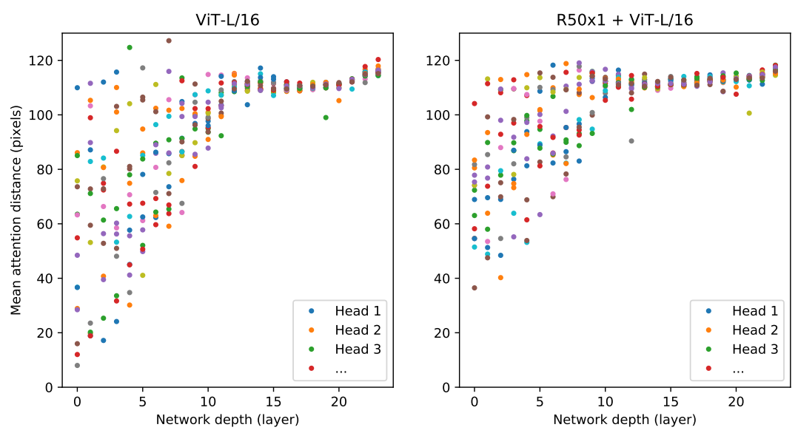

# An Image is Worth 16x16 Words: Transformers for Image Recognition at Scale
一幅图像等价于16*16个单词：用于大规模图像识别的Transformers   2020-10-22  Google  原文:https://arxiv.org/abs/2010.11929

## 阅读笔记
* 具体做法
    * 将图像分成16*16个分块，线性投影+位置嵌入，
    * 混合架构：使用cnn对图像加工后得到向量馈入到vit中，似乎比较符合人类的视觉感知？
    * 位置嵌入：绝对位置、可学习的，以及大分辨率微调时，对位置嵌入做2-D插值。没详细展开
    * 原始的transfomer架构图和vit有些差别？ LN层的位置在块的开始初    
    * 19个任务组成的VTAB套件。图像和NLP的多任务预训练似乎还不太一样，NLP将各种特定任务结构化输入转换成文本序列，而图像的任务似乎只有分类、目标检测、实例分割、语义分割等
* 思考：CNN按照这个思路是不是也会更好？ 
    * [ConvNeXt](../cnn/ConvNeXt.md), 对应ViT, MAE
    * [ConvNeXt_v2](../cnn/ConvNeXt_v2.md) 对应VitDet
* 代码实现
    * pytorch官方: https://github.com/pytorch/vision/blob/main/torchvision/models/vision_transformer.py
    * paddle： https://aistudio.baidu.com/aistudio/projectdetail/3499029
    * 其他: https://github.com/lucidrains/vit-pytorch
    * [Better plain ViT baselines for ImageNet-1k](https://arxiv.org/abs/2205.01580) 数据增广帮助训练

## ABSTRACT
While the Transformer architecture has become the de-facto standard for natural language processing tasks, its applications to computer vision remain limited. In vision, attention is either applied in conjunction with convolutional networks, or used to replace certain components of convolutional networks while keeping their overall structure in place. We show that this reliance on CNNs is not necessary and a pure transformer applied directly to sequences of image patches can perform very well on image classification tasks. When pre-trained on large amounts of data and transferred to multiple mid-sized or small image recognition benchmarks (ImageNet, CIFAR-100, VTAB, etc.), Vision Transformer (ViT) attains excellent results compared to state-of-the-art convolutional networks while requiring substantially fewer computational resources to train. (Fine-tuning code and pre-trained models are available at https://github.com/google-research/vision_transformer)

尽管Transformer架构已经成为NLP任务的事实标准，但它在计算机视觉领域的应用仍然有限。在视觉领域，注意力要么与卷积网络组合使用，要么用于替换卷积网络的某些组件，同时保持其整体结构不变。我们表明，这种对CNN的依赖是不必要的，直接应用于图像分块序列的纯Transformer可以很好地执行图像分类任务。当对大量数据进行预训练并迁移到多个中小型图像识别基准(ImageNet、CIFAR-100、VTAB等)时，与最先进的卷积网络相比，视觉转换器(ViT)获得了优异的结果，且只需更少的计算资源进行训练。(微调代码和预训练模型可在https://github.com/google-research/vision_transformer)

## 1 INTRODUCTION
Self-attention-based architectures, in particular Transformers (Vaswani et al., 2017), have become the model of choice in natural language processing (NLP). The dominant approach is to pre-train on a large text corpus and then fine-tune on a smaller task-specific dataset (Devlin et al., 2019). Thanks to Transformers’ computational efficiency and scalability, it has become possible to train models of unprecedented size, with over 100B parameters (Brown et al., 2020; Lepikhin et al., 2020). With the models and datasets growing, there is still no sign of saturating performance.

基于自注意的架构，特别是Transformers(Vaswaniet al., 2017)，已成为自然语言处理(NLP)的首选模型。主要方法是在大型文本语料库上进行预训练，然后在较小的特定任务数据集上进行微调(Devlinet al., 2019)。得益于Transformers的计算效率和可扩展性，它已经可以训练具有超过100B参数的空前规模的模型(Brownet al., 2020; Lepikhinet al., 2020)。随着模型和数据集的增长，性能依然没有饱和的迹象。

In computer vision, however, convolutional architectures remain dominant (LeCun et al., 1989; Krizhevsky et al., 2012; He et al., 2016). Inspired by NLP successes, multiple works try combining CNN-like architectures with self-attention (Wang et al., 2018; Carion et al., 2020), some replacing the convolutions entirely (Ramachandran et al., 2019; Wang et al., 2020a). The latter models, while theoretically efficient, have not yet been scaled effectively on modern hardware accelerators due to the use of specialized attention patterns. Therefore, in large-scale image recognition, classic ResNetlike architectures are still state of the art (Mahajan et al., 2018; Xie et al., 2020; Kolesnikov et al., 2020).

然而，在计算机视觉领域，卷积架构仍然占主导地位(LeCunet al., 1989; Krizhevskyet al., 2012; Heet al., 2016)。受NLP的成功启发，许多工作尝试将类似CNN的架构与自注意力相结合(Wanget al., 2018; Carionet al., 2020)，其中一些完全取代了卷积(Ramachandranet al., 2019; Wang et al., 2020a)。后一种模型虽然理论上有效，但由于使用了专门的，尚未在现代硬件加速器上有效地扩展的注意力模式。因此，在大规模图像识别中，经典的类ResNet架构仍然是最先进的(Mahajanet al., 2018; Xieet al., 2020; Kolesnikovet al., 2020)。

Inspired by the Transformer scaling successes in NLP, we experiment with applying a standard Transformer directly to images, with the fewest possible modifications. To do so, we split an image into patches and provide the sequence of linear embeddings of these patches as an input to a Transformer. Image patches are treated the same way as tokens (words) in an NLP application. We train the model on image classification in supervised fashion.

受NLP中Transformer缩放成功的启发，我们尝试将标准Transformer以最少修改的方式直接应用于图像。为此，我们将图像分割成多个分块，并提供这些分块的线性嵌入序列作为Transformer的输入。图像分块的处理方式与在NLP应用程序中令牌(单词)相同。我们以监督的方式对模型进行图像分类训练。<!--监督方式？-->

When trained on mid-sized datasets such as ImageNet without strong regularization, these models yield modest accuracies of a few percentage points below ResNets of comparable size. This seemingly discouraging outcome may be expected: Transformers lack some of the inductive biases inherent to CNNs, such as translation equivariance and locality, and therefore do not generalize well when trained on insufficient amounts of data.

当在中等规模的数据集(如ImageNet)上进行训练时，如果没有强大的正则化，这些模型的精度会比同等大小的ResNets低几个百分点。这一看似令人沮丧的结果可能是意料之中的：Transformers缺乏CNN固有的一些归纳偏差，如平移不变和局部性，因此在数据量不足的情况下无法很好地泛化。

However, the picture changes if the models are trained on larger datasets (14M-300M images). We find that large scale training trumps inductive bias. Our Vision Transformer (ViT) attains excellent results when pre-trained at sufficient scale and transferred to tasks with fewer datapoints. When pre-trained on the public ImageNet-21k dataset or the in-house JFT-300M dataset, ViT approaches or beats state of the art on multiple image recognition benchmarks. In particular, the best model reaches the accuracy of 88.55% on ImageNet, 90.72% on ImageNet-ReaL, 94.55% on CIFAR-100, and 77.63% on the VTAB suite of 19 tasks. 

然而，如果在更大的数据集(14M-300M图像)上训练模型，情况会发生变化。我们发现，大规模训练胜过归纳偏差。我们的视觉转换器(ViT)在经过足够规模的预训练并迁移到数据较少的任务时，可以获得优异的结果。当在公共ImageNet-21k数据集或内部JFT-300M数据集上进行预训练时，ViT在多个图像识别基准上接近或优于最先进水平。特别是，在ImageNet上，最佳模型的精度达到88.55%，在ImageNet-ReaL上达到90.72%，在CIFAR-100上达到94.55%，而在由19个任务组成的VTAB套件上达到77.63%。 

## 2 RELATED WORK
Transformers were proposed by Vaswani et al. (2017) for machine translation, and have since become the state of the art method in many NLP tasks. Large Transformer-based models are often pre-trained on large corpora and then fine-tuned for the task at hand: BERT (Devlin et al., 2019) uses a denoising self-supervised pre-training task, while the GPT line of work uses language modeling as its pre-training task (Radford et al., 2018; 2019; Brown et al., 2020).

Transformers由Vaswaniet al (2017)提出，用于机器翻译，并已成为许多NLP任务中的最新方法。基于大型Transformer的模型通常在大型语料库上进行预训练，然后针对手头的任务进行微调：BERT(Devlinet al., 2019)使用去噪自监督预训练任务，而GPT线条的工作是使用语言建模作为预训练任务(Radfordet al., 2018; 2019; Brownet al., 2020)。

Naive application of self-attention to images would require that each pixel attends to every other pixel. With quadratic cost in the number of pixels, this does not scale to realistic input sizes. Thus, to apply Transformers in the context of image processing, several approximations have been tried in the past. Parmar et al. (2018) applied the self-attention only in local neighborhoods for each query pixel instead of globally. Such local multi-head dot-product self attention blocks can completely replace convolutions (Hu et al., 2019; Ramachandran et al., 2019; Zhao et al., 2020). In a different line of work, Sparse Transformers (Child et al., 2019) employ scalable approximations to global selfattention in order to be applicable to images. An alternative way to scale attention is to apply it in blocks of varying sizes (Weissenborn et al., 2019), in the extreme case only along individual axes (Ho et al., 2019; Wang et al., 2020a). Many of these specialized attention architectures demonstrate promising results on computer vision tasks, but require complex engineering to be implemented efficiently on hardware accelerators.

对图像进行自注意力的简单应用将要求每个像素关注其他的每一个像素。由于像素数量的二次成本，这无法缩放到实际的输入大小。因此，为了将Transformers应用于图像处理，过去曾尝试过几种近似方法。Parmar et al. (2018)仅在每个查询像素的局部邻域而不是全局应用了自注意力。这样的局部多头点积自注意块可以完全取代卷积(Hu et al., 2019; Ramachandranet al., 2019;Zhaoet al., 2020)。在另一个工作领域，稀疏Transformers(Child et al., 2019)采用了可缩放的全局自注意力近似，以便适用于图像。缩放注意力的另一种方法是将其应用于不同大小的块(Weissenbornet al., 2019)，在极端情况下，仅沿单个轴(Hoet al., 2018; Wanget al., 2020a)。许多这些专门的注意力架构在计算机视觉任务上显示出有希望的结果，但需要复杂的工程才能在硬件加速器上高效地实现。

Most related to ours is the model of Cordonnier et al. (2020), which extracts patches of size 2 × 2 from the input image and applies full self-attention on top. This model is very similar to ViT, but our work goes further to demonstrate that large scale pre-training makes vanilla transformers competitive with (or even better than) state-of-the-art CNNs. Moreover, Cordonnier et al. (2020) use a small patch size of 2 × 2 pixels, which makes the model applicable only to small-resolution images, while we handle medium-resolution images as well.

与我们最相关的是Cordonnier et al. (2020)的模型，该模型从输入图像中提取大小为2*2的分块，并在顶部应用完全自注意力。该模型与ViT非常相似，但我们的工作进一步证明，大规模预训练使普通transformers与最先进的CNN同样有竞争力(甚至更好)。此外，Cordonnier et al. (2020)使用了2×2像素的分块大小，这使得模型仅适用于小分辨率图像，而我们也处理中等大小的分辨率图像。

There has also been a lot of interest in combining convolutional neural networks (CNNs) with forms of self-attention, e.g. by augmenting feature maps for image classification (Bello et al., 2019) or by further processing the output of a CNN using self-attention, e.g. for object detection (Hu et al., 2018; Carion et al., 2020), video processing (Wang et al., 2018; Sun et al., 2019), image classification (Wu et al., 2020), unsupervised object discovery (Locatello et al., 2020), or unified text-vision tasks (Chen et al., 2020c; Lu et al., 2019; Li et al., 2019).

还有一些有趣的尝试，是将卷积神经网络(CNNs)与自注意力形式相结合，例如通过增强用于图像分类的特征图(Belloet al., 2019)或通过使用自注意力进一步处理CNN的输出，例如用于目标检测(Huet al., 2018; Carionet al., 2020)、视频处理(Wanget al., 2018;Sunet al., 201)，图像分类(Wuet al., 2020)、无监督目标发现(Locatelloet al., 2020)或统一文本视觉任务(Chenet al., 2020c; Luet al., 2019; Liet al., 2018)。

Another recent related model is image GPT (iGPT) (Chen et al., 2020a), which applies Transformers to image pixels after reducing image resolution and color space. The model is trained in an unsupervised fashion as a generative model, and the resulting representation can then be fine-tuned or probed linearly for classification performance, achieving a maximal accuracy of 72% on ImageNet.

另一个最近的相关模型是图像GPT(iGPT)(Chen et al., 2020a)，它在降低图像分辨率和颜色空间后将Transformers应用于图像像素。该模型以无监督的方式训练为生成模型，然后可以对生成的表征进行微调或线性探测，以提高分类性能，在ImageNet上达到72%的最大精度。

Our work adds to the increasing collection of papers that explore image recognition at larger scales than the standard ImageNet dataset. The use of additional data sources allows to achieve state-ofthe-art results on standard benchmarks (Mahajan et al., 2018; Touvron et al., 2019; Xie et al., 2020). Moreover, Sun et al. (2017) study how CNN performance scales with dataset size, and Kolesnikov et al. (2020); Djolonga et al. (2020) perform an empirical exploration of CNN transfer learning from large scale datasets such as ImageNet-21k and JFT-300M. We focus on these two latter datasets as well, but train Transformers instead of ResNet-based models used in prior works. 

我们的工作增加了越来越多的论文集，这些论文在比标准ImageNet数据集更大的范围内探索图像识别。使用额外的数据源可以在标准基准上获得最先进的结果(Mahajanet al., 2018; Touvronet al., 2019; Xieet al., 2020)。此外，Sun et al. (2017)研究了CNN性能如何随数据集大小而变化，Kolesnikovet al (2020); Djolongaet al (2020)从大规模数据集(如ImageNet-21k和JFT-300M)中对CNN迁移学习进行了实证研究。我们也关注后两个数据集，但训练Transformers，而不是以前工作中使用的基于ResNet的模型。

## 3 METHOD
In model design we follow the original Transformer (Vaswani et al., 2017) as closely as possible. An advantage of this intentionally simple setup is that scalable NLP Transformer architectures – and their efficient implementations – can be used almost out of the box.

在模型设计中，我们尽可能遵循原始Transformer(Vaswaniet al., 2017)。这种特意的简化设置的优点是，可扩展的NLP Transformer架构及其高效实现几乎可以开箱即用。

 
Figure 1: Model overview. We split an image into fixed-size patches, linearly embed each of them, add position embeddings, and feed the resulting sequence of vectors to a standard Transformer encoder. In order to perform classification, we use the standard approach of adding an extra learnable “classification token” to the sequence. The illustration of the Transformer encoder was inspired by Vaswani et al. (2017). 
图1：模型概述。我们将图像分割成固定大小的分块，线性嵌入每个分块，添加位置嵌入，并将生成的向量序列馈送到标准Transformer编码器。为了执行分类，我们使用标准方法，即向序列中添加额外的可学习“分类令牌”。Transformer编码器的插图灵感来自 Vaswaniet al (2017)。
<!--
分块大小是固定的，
向序列中添加额外的可学习“分类令牌”-->

### 3.1 VISION TRANSFORMER (ViT)
An overview of the model is depicted in Figure 1. The standard Transformer receives as input a 1D sequence of token embeddings. To handle 2D images, we reshape the image $x ∈ R^{H×W×C}$ into a sequence of flattened 2D patches $x_p ∈ R^{N×(P^2 ·C)}$ , where (H, W) is the resolution of the original image, C is the number of channels, (P, P) is the resolution of each image patch, and $N = HW/P^2$ is the resulting number of patches, which also serves as the effective input sequence length for the Transformer. The Transformer uses constant latent vector size D through all of its layers, so we flatten the patches and map to D dimensions with a trainable linear projection (Eq. 1). We refer to the output of this projection as the patch embeddings.

该模型的概述如图1所示。标准Transformer接收1D令牌嵌入序列作为输入。为了处理2D图像，我们重新塑造图像 $x∈ R^{H×W×C}$ 转换为一系列打平了的2D分块 $x_p ∈ R^{N×(P^2·C)}$ ，其中(H，W)是原始图像的分辨率，C是通道数，(P，P)是每个图像分块的分辨率，$N=HW/P^2$是生成的分块数量，它也用作Transformers有效输入的序列长度。Transformer在其所有层中使用恒定的潜在向量维度D，因此我们使用可训练的线性投影将分块展平并映射到D维(等式1)。我们将此投影的输出称为分块嵌入。
<!-- 一层的线性投影？ -->

Similar to BERT’s [class] token, we prepend a learnable embedding to the sequence of embedded patches ($z^0_0 = x_{class}$), whose state at the output of the Transformer encoder ($z^0_L$ ) serves as the image representation y (Eq. 4). Both during pre-training and fine-tuning, a classification head is attached to $z^0_L$. The classification head is implemented by a MLP with one hidden layer at pre-training time and by a single linear layer at fine-tuning time.

与BERT的[class]令牌类似，我们在嵌入的分块序列($z^0_0=x_{class}$)中预先添加了可学习的嵌入，其在Transformer编码器输出端的状态($z^0_L$)用作图像表征y(等式4)。在预训练和微调期间，将分类头附加到$z^0_L$。分类头由在预训练时具有一个隐藏层的MLP实现，而在微调时由单个线性层实现。

Position embeddings are added to the patch embeddings to retain positional information. We use standard learnable 1D position embeddings, since we have not observed significant performance gains from using more advanced 2D-aware position embeddings (Appendix D.4). The resulting sequence of embedding vectors serves as input to the encoder.

位置嵌入被添加到分块嵌入以保留位置信息。我们使用标准可学习的1D位置嵌入，因为我们没有观察到使用更先进的2D感知位置嵌入带来的显著性能提升(附录D.4)。所得的嵌入向量序列用作编码器的输入。

The Transformer encoder (Vaswani et al., 2017) consists of alternating layers of multiheaded selfattention (MSA, see Appendix A) and MLP blocks (Eq. 2, 3). Layernorm (LN) is applied before every block, and residual connections after every block (Wang et al., 2019; Baevski & Auli, 2019). The MLP contains two layers with a GELU non-linearity. 

Transformers编码器(Vaswani et al., 2017)由多头自注意力(MSA，见附录A)和MLP块(等式2、3)的交替层组成。在每个块之前应用层归一化(LN)，在每个块之后应用残差连接(Wanget al., 2019; Baevski&Auli，2019)。MLP包含两个具有GELU非线性的层。

$z_0 = [x_{class}; x^1_pE; x^2_pE; · · · ; x^N_pE] + E_{pos}, E ∈ R^{(P^2 ·C)×D}, E_pos ∈ R^{(N+1)×D}$ (1) 

$z_l^` = MSA(LN(z_{l−1})) + z_{l−1}, l = 1 . . . L $ (2) 

$z_l = MLP(LN(z_0^`)) + z_0^l, l = 1 . . . L $ (3) 

$y = LN(z^0_L) $ (4)

#### Inductive bias. 归纳偏差。
We note that Vision Transformer has much less image-specific inductive bias than CNNs. In CNNs, locality, two-dimensional neighborhood structure, and translation equivariance are baked into each layer throughout the whole model. In ViT, only MLP layers are local and translationally equivariant, while the self-attention layers are global. The two-dimensional neighborhood structure is used very sparingly: in the beginning of the model by cutting the image into patches and at fine-tuning time for adjusting the position embeddings for images of different resolution (as described below). Other than that, the position embeddings at initialization time carry no information about the 2D positions of the patches and all spatial relations between the patches have to be learned from scratch.

我们注意到，与CNN相比，ViT具有更少的图像特定的归纳偏差。在CNN中，局部性、二维邻域结构和平移不变性被嵌入到整个模型的每一层中。在ViT中，只有MLP层是局部的和平移不变的，而自注意力层是全局的。二维邻域结构使用得非常少：在模型开始时，通过将图像切割成分块，并在微调时调整不同分辨率图像的位置嵌入(如下所述)。除此之外，初始化时的位置嵌入不携带关于分块的2D位置的信息，并且必须从头学习分块之间的所有空间关系。
<!-- 只有MLP层是局部的和平移不变的?   -->

#### Hybrid Architecture. 混合架构。
As an alternative to raw image patches, the input sequence can be formed from feature maps of a CNN (LeCun et al., 1989). In this hybrid model, the patch embedding projection E (Eq. 1) is applied to patches extracted from a CNN feature map. As a special case, the patches can have spatial size 1x1, which means that the input sequence is obtained by simply flattening the spatial dimensions of the feature map and projecting to the Transformer dimension. The classification input embedding and position embeddings are added as described above.

作为原始图像分块的替代，输入序列可以由CNN的特征图形成(LeCunet al., 1989)。在该混合模型中，将分块嵌入投影E(等式1)应用于从CNN特征图提取的分块。作为一种特殊情况，分块可以具有1x1的空间大小，这意味着通过简单地展平特征图的空间维度并投影到Transformer维度来获得输入序列。如上所述添加分类输入嵌入和位置嵌入。
<!-- 使用cnn对图像加工后得到向量，馈入到vit中，似乎比较符合人类的视觉感知？ -->

### 3.2 FINE-TUNING AND HIGHER RESOLUTION
Typically, we pre-train ViT on large datasets, and fine-tune to (smaller) downstream tasks. For this, we remove the pre-trained prediction head and attach a zero-initialized D × K feedforward layer, where K is the number of downstream classes. It is often beneficial to fine-tune at higher resolution than pre-training (Touvron et al., 2019; Kolesnikov et al., 2020). When feeding images of higher resolution, we keep the patch size the same, which results in a larger effective sequence length. The Vision Transformer can handle arbitrary sequence lengths (up to memory constraints), however, the pre-trained position embeddings may no longer be meaningful. We therefore perform 2D interpolation of the pre-trained position embeddings, according to their location in the original image. Note that this resolution adjustment and patch extraction are the only points at which an inductive bias about the 2D structure of the images is manually injected into the Vision Transformer. 

通常，我们在大型数据集上预训练ViT，并在(较小的)下游任务微调。为此，我们移除预先训练的预测头，并附加一个零初始化的D×K前馈层，其中K是下游类的数量。以比预训练更高的分辨率进行微调通常是有益的(Touvronet al., 2019; Kolesnikovet al., 2020)。当馈送更高分辨率的图像时，我们保持分块大小相同，这会导致更大的有效序列长度。ViT可以处理任意序列长度(直到内存限制)，但是，预先训练的位置嵌入可能不再有意义。因此，我们根据预训练位置嵌入在原始图像中的位置，对其进行2D插值。请注意，该分辨率调整和分块提取是关于图像2D结构的归纳偏差被手动注入ViT的唯一点。<!-- 微调时，对位置嵌入2D插值? -->

## 4 EXPERIMENTS
We evaluate the representation learning capabilities of ResNet, Vision Transformer (ViT), and the hybrid. To understand the data requirements of each model, we pre-train on datasets of varying size and evaluate many benchmark tasks. When considering the computational cost of pre-training the model, ViT performs very favourably, attaining state of the art on most recognition benchmarks at a lower pre-training cost. Lastly, we perform a small experiment using self-supervision, and show that self-supervised ViT holds promise for the future.

我们评估了ResNet、视觉转换器(ViT)和混合架构的表征学习能力。为了解每个模型的数据需求，我们对不同大小的数据集进行预训练，并评估许多基准任务。当考虑模型预训练的计算成本时，ViT表现非常好，它能以较低的预训练成本在大多数识别基准上达到了最先进水平。最后，我们使用自监督进行了一个小实验，并表明自监督ViT对未来具有前景。

### 4.1 SETUP
#### Datasets. 数据集
To explore model scalability, we use the ILSVRC-2012 ImageNet dataset with 1k classes and 1.3M images (we refer to it as ImageNet in what follows), its superset ImageNet-21k with 21k classes and 14M images (Deng et al., 2009), and JFT (Sun et al., 2017) with 18k classes and 303M high-resolution images. We de-duplicate the pre-training datasets w.r.t. the test sets of the downstream tasks following Kolesnikov et al. (2020). We transfer the models trained on these dataset to several benchmark tasks: ImageNet on the original validation labels and the cleaned-up ReaL labels (Beyer et al., 2020), CIFAR-10/100 (Krizhevsky, 2009), Oxford-IIIT Pets (Parkhi et al., 2012), and Oxford Flowers-102 (Nilsback & Zisserman, 2008). For these datasets, pre-processing follows Kolesnikov et al. (2020).

为了探索模型的可扩展性，我们使用了ILSVRC-2012 ImageNet数据集，其中包含1k类和1.3M图像(我们在下文中将其称为ImageNet)，其超集ImageNet-21k包含21k个类别和14M图像(Denget al., 2009)，以及JFT(Sunet al., 2017)包含18k类和303M高分辨率图像。我们根据 Kolesnikov et al. (2020)的下游任务的测试集对预训练数据集进行了去重。我们将在这些数据集上训练的模型迁移到几个基准任务：原始验证标签上的ImageNet和清理后的ReaL标签(Beyer et al., 2020)、CIFAR-10/100(Krizhevsky，2009)、牛津IIIT宠物(Parkhi et al., 2012)和牛津Flowers-102(Nilsback&Zisserman，2008)。对于这些数据集，预处理遵循Kolesnikov et al. (2020)。

We also evaluate on the 19-task VTAB classification suite (Zhai et al., 2019b). VTAB evaluates low-data transfer to diverse tasks, using 1 000 training examples per task. The tasks are divided into three groups: Natural – tasks like the above, Pets, CIFAR, etc. Specialized – medical and satellite imagery, and Structured – tasks that require geometric understanding like localization.

我们还对19-任务的VTAB分类套件进行了评估(Zhaiet al., 2019b)。VTAB使用每个任务1000个训练样本来评估不同任务的少量数据的迁移。这些任务分为三组：1-自然任务 ——— 如上述任务、宠物、CIFAR等，2-专业任务(医学和卫星图像) 和 33结构化任务(需要几何理解，如定位)。

#### Model Variants. 模型变量
We base ViT configurations on those used for BERT (Devlin et al., 2019), as summarized in Table 1. The “Base” and “Large” models are directly adopted from BERT and we add the larger “Huge” model. In what follows we use brief notation to indicate the model size and the input patch size: for instance, ViT-L/16 means the “Large” variant with 16×16 input patch size. Note that the Transformer’s sequence length is inversely proportional to the square of the patch size, thus models with smaller patch size are computationally more expensive.

如表1所示，我们基于用于BERT的ViT配置(Devlin et al., 2019)。“基础”和“大型”模型直接采用BERT，我们添加了更大的“巨大”模型。在下文中，我们使用简短的符号表示模型大小和输入分块大小：例如，ViT-L/16表示具有16×16输入分块大小的“大”变体。请注意，Transformer的序列长度与分块大小的平方成反比，因此分块大小较小的模型在计算上更昂贵。

 
表1：Vision Transformer模型变体的详情。

For the baseline CNNs, we use ResNet (He et al., 2016), but replace the Batch Normalization layers (Ioffe & Szegedy, 2015) with Group Normalization (Wu & He, 2018), and used standardized convolutions (Qiao et al., 2019). These modifications improve transfer (Kolesnikov et al., 2020), and we denote the modified model “ResNet (BiT)”. For the hybrids, we feed the intermediate feature maps into ViT with patch size of one “pixel”. To experiment with different sequence lengths, we either (i) take the output of stage 4 of a regular ResNet50 or (ii) remove stage 4, place the same number of layers in stage 3 (keeping the total number of layers), and take the output of this extended stage 3. Option (ii) results in a 4x longer sequence length, and a more expensive ViT model.

对于基线CNN，我们使用ResNet(He et al., 2016)，但将批归一化(BN)层(Ioffe&Szegedy，2015)替换为组归一化(GN)(Wu&He，2018)，并使用标准化卷积(Qiaoet al., 2019)。这些修改改进了迁移能力(Kolesnikovet al., 2020)，我们将修改后的模型称为“ResNet(BiT)”。对于混合体，我们将中间特征图输入到一个“像素”大小的ViT中。为了使用不同的序列长度进行实验，我们要么(i)取常规ResNet50的第4阶段的输出，要么(ii)移除第4阶段，在第3阶段放置相同数量的层(保持总层数)，然后取这个扩展的第3阶段的输出。选项(ii)导致序列长度增加4倍，以及更昂贵的ViT模型。<!--最后一段不太懂？-->

#### Training & Fine-tuning. 训练和微调
We train all models, including ResNets, using Adam (Kingma & Ba, 2015) with β1 = 0.9, β2 = 0.999, a batch size of 4096 and apply a high weight decay of 0.1, which we found to be useful for transfer of all models (Appendix D.1 shows that, in contrast to common practices, Adam works slightly better than SGD for ResNets in our setting). We use a linear learning rate warmup and decay, see Appendix B.1 for details. For fine-tuning we use SGD with momentum, batch size 512, for all models, see Appendix B.1.1. For ImageNet results in Table 2, we fine-tuned at higher resolution: 512 for ViT-L/16 and 518 for ViT-H/14, and also used Polyak & Juditsky (1992) averaging with a factor of 0.9999 (Ramachandran et al., 2019; Wang et al., 2020b).

我们使用Adam(Kingma&Ba，2015)训练包括ResNets在内的所有模型，其中β1=0.9，β2=0.999，批量大小为4096，并应用0.1的高权重衰减，我们发现这对所有模型的迁移都很有用(附录D.1显示，与常见做法相比，Adam在我们的设置中比SGD对ResNets的效果略好)。我们使用线性学习速率预热和衰减，详见附录B.1。对于微调，我们使用带动量的SGD，批次大小为512，用于所有模型，参见附录B.1.1。对于表2中的ImageNet结果，我们以更高的分辨率进行微调：ViT-L/16为512、ViT-H/14为518，还使用Polyak&Juditsky(1992)平均值，系数为0.9999(Ramachandranet al., 2019; Wanget al., 2020b)。

#### Metrics. 度量
We report results on downstream datasets either through few-shot or fine-tuning accuracy. Fine-tuning accuracies capture the performance of each model after fine-tuning it on the respective dataset. Few-shot accuracies are obtained by solving a regularized least-squares regression problem that maps the (frozen) representation of a subset of training images to {−1, 1}$^K$ target vectors. This formulation allows us to recover the exact solution in closed form. Though we mainly focus on fine-tuning performance, we sometimes use linear few-shot accuracies for fast on-the-fly evaluation where fine-tuning would be too costly.

我们通过小样本或微调精度报告下游数据集的结果。 在对各自的数据集进行微调后，微调精度会捕获每个模型的性能。 通过解决正则化最小二乘回归问题获得小样本精度，该问题将训练图像子集的（冻结）表示映射到 {−1, 1}$^K$ 目标向量。 该公式使我们能够以封闭形式恢复精确解。 虽然我们主要关注微调性能，但有时我们会使用线性小样本精度进行快速即时评估，而微调成本太高。
<!--正则化最小二乘回归问题?-->

### 4.2 COMPARISON TO STATE OF THE ART
We first compare our largest models – ViT-H/14 and ViT-L/16 – to state-of-the-art CNNs from the literature. The first comparison point is Big Transfer (BiT) (Kolesnikov et al., 2020), which performs supervised transfer learning with large ResNets. The second is Noisy Student (Xie et al., 2020), which is a large EfficientNet trained using semi-supervised learning on ImageNet and JFT300M with the labels removed. Currently, Noisy Student is the state of the art on ImageNet and BiT-L on the other datasets reported here. All models were trained on TPUv3 hardware, and we report the number of TPUv3-core-days taken to pre-train each of them, that is, the number of TPU v3 cores (2 per chip) used for training multiplied by the training time in days.

我们首先将我们最大的模型ViT-H/14和ViT-L/16与文献中最先进的CNN进行比较。第一个比较点是Big Transfer(BiT)(Kolesnikov et al., 2020)，它使用大型ResNets执行监督迁移学习。第二个是Noisy Student(Xie et al., 2020)，这是一个大型的EfficientNet，使用ImageNet和JFT300M上的半监督学习进行训练，去掉了标签。目前，Noisy Student是ImageNet和BiT-L的最新数据集。所有模型都在TPUv3硬件上进行了训练，我们报告了对每个模型进行预训练所需的TPU v3核心天数，即用于训练的TPU v3核心数量(每个芯片2个)乘以训练时间(以天为单位)。

Table 2 shows the results. The smaller ViT-L/16 model pre-trained on JFT-300M outperforms BiT-L (which is pre-trained on the same dataset) on all tasks, while requiring substantially less computational resources to train. The larger model, ViT-H/14, further improves the performance, especially on the more challenging datasets – ImageNet, CIFAR-100, and the VTAB suite. Interestingly, this model still took substantially less compute to pre-train than prior state of the art. However, we note that pre-training efficiency may be affected not only by the architecture choice, but also other parameters, such as training schedule, optimizer, weight decay, etc. We provide a controlled study of performance vs. compute for different architectures in Section 4.4. Finally, the ViT-L/16 model pre-trained on the public ImageNet-21k dataset performs well on most datasets too, while taking fewer resources to pre-train: it could be trained using a standard cloud TPUv3 with 8 cores in approximately 30 days.

表2显示了结果。在JFT-300M上预训练的较小的ViT-L/16模型在所有任务上都优于BiT-L(在同一数据集上预训练)，同时需要更少的计算资源来训练。更大的模型ViT-H/14进一步提高了性能，尤其是在更具挑战性的数据集上——ImageNet、CIFAR-100和VTAB套件。有趣的是，与现有技术相比，该模型的预训练所需的计算量仍然大大减少。然而，我们注意到，预训练效率不仅会受到架构选择的影响，还会受到其他参数的影响，如训练计划、优化器、权重衰减等。我们在第4.4节中提供了不同架构的性能与计算量的对照研究。最后，在公共ImageNet-21k数据集上预训练的ViT-L/16模型在大多数数据集上也表现良好，同时需要更少的资源进行预训练：它可以在大约30天内使用具有8个核心的标准云TPUv3进行训练。

 
Table 2: Comparison with state of the art on popular image classification benchmarks. We report mean and standard deviation of the accuracies, averaged over three fine-tuning runs. Vision Transformer models pre-trained on the JFT-300M dataset outperform ResNet-based baselines on all datasets, while taking substantially less computational resources to pre-train. ViT pre-trained on the smaller public ImageNet-21k dataset performs well too. ∗Slightly improved 88.5% result reported in Touvron et al. (2020).
表2：与当前流行的图像分类基准的比较。我们报告了三次微调运行的平均精度和标准偏差。在JFT-300M数据集上预训练的ViT模型在所有数据集上都优于基于ResNet的基线，同时预训练所需的计算资源大大减少。在较小的公共ImageNet-21k数据集上预先训练的ViT也表现良好。∗Touvronet al (2020)报告的结果略微改善了88.5%。
<!--14,16? 为啥所需计算资源会减少？-->

 
Figure 2: Breakdown of VTAB performance in Natural, Specialized, and Structured task groups. 
图2：自然、专业和结构化任务组中VTAB性能的细分。

Figure 2 decomposes the VTAB tasks into their respective groups, and compares to previous SOTA methods on this benchmark: BiT, VIVI – a ResNet co-trained on ImageNet and Youtube (Tschannen et al., 2020), and S4L – supervised plus semi-supervised learning on ImageNet (Zhai et al., 2019a). ViT-H/14 outperforms BiT-R152x4, and other methods, on the Natural and Structured tasks. On the Specialized the performance of the top two models is similar.

图2将VTAB任务分解为各自的组，并与该基准上的先前SOTA方法进行了比较：BiT、VIVI–在ImageNet和Youtube(Tschannenet al., 2020)上共同训练的ResNet，以及S4L–在ImageNet(Zhaiet al., 2019a)上监督加半监督学习。ViT-H/14在自然和结构化任务上优于BiT-R152x4和其他方法。在Specialized上，前两个模型的性能相似。

### 4.3 PRE-TRAINING DATA REQUIREMENTS
The Vision Transformer performs well when pre-trained on a large JFT-300M dataset. With fewer inductive biases for vision than ResNets, how crucial is the dataset size? We perform two series of experiments.

当在大型JFT-300M数据集上进行预训练时，ViT表现良好。与ResNets相比，视觉的归纳偏差更少，数据集大小有多重要？我们进行了两系列实验。

First, we pre-train ViT models on datasets of increasing size: ImageNet, ImageNet-21k, and JFT300M. To boost the performance on the smaller datasets, we optimize three basic regularization parameters – weight decay, dropout, and label smoothing. Figure 3 shows the results after finetuning to ImageNet (results on other datasets are shown in Table 5)(Note that the ImageNet pre-trained models are also fine-tuned, but again on ImageNet. This is because the resolution increase during fine-tuning improves the performance.) . When pre-trained on the smallest dataset, ImageNet, ViT-Large models underperform compared to ViT-Base models, despite (moderate) regularization. With ImageNet-21k pre-training, their performances are similar. Only with JFT-300M, do we see the full benefit of larger models. Figure 3 also shows the performance region spanned by BiT models of different sizes. The BiT CNNs outperform ViT on ImageNet, but with the larger datasets, ViT overtakes.  

首先，我们在不断增长的数据集上预训练ViT模型：ImageNet、ImageNet-21k和JFT300M。为了提高较小数据集的性能，我们优化了三个基础正则化参数——权重衰减、dropout和标签平滑。图3显示了对ImageNet进行微调后的结果(其他数据集的结果如表5所示)(请注意，ImageNet-预训练模型也进行了微调，但在ImageNet.这是因为微调期间分辨率的提高提高了性能。)，尽管(适度)正则化。通过 ImageNet-21k 预训练，它们的性能相似。只有JFT-300M，我们才能看到更大模型的全部好处。图3还显示了不同尺寸的BiT模型所跨越的性能区域。BiT CNN在ImageNet上的表现优于ViT，但随着更大的数据集，ViT超过了。

<!--
Figure 3: Transfer to ImageNet. While large ViT models perform worse than BiTResNets (shaded area) when pre-trained on small datasets, they shine when pre-trained on larger datasets. Similarly, larger ViT variants overtake smaller ones as the dataset grows. 

Figure 4: Linear few-shot evaluation on ImageNet versus pre-training size. ResNets perform better with smaller pre-training datasets but plateau sooner than ViT, which performs better with larger pre-training. ViT-b is ViT-B with all hidden dimensions halved. 

Figure 5: Performance versus pre-training compute for different architectures: Vision Transformers,ResNets, and hybrids. Vision Transformers generally outperform ResNets with the same computational budget. Hybrids improve upon pure Transformers for smaller model sizes, but the gap vanishes for larger models. 
-->

图3：迁移到ImageNet。当对小数据集进行预训练时，大型ViT模型的性能比BiTResNets(阴影区域)差，但当对大数据集进行预先训练时，它们会发光。类似地，随着数据集的增长，较大的ViT变体会超过较小的。

图4：ImageNet上的线性少样本评估与训练前大小的对比。ResNets在较小的预训练数据集上表现更好，但比ViT更快达到稳定，ViT在较大的预训练中表现更好。ViT-b是所有隐藏尺寸减半的ViT-b。

图5：不同架构的性能与预训练计算：ViT、ResNets和混合。在相同的计算预算下，ViT的表现通常优于ResNets。对于较小的模型尺寸，混合架构改进了纯Transformers，但对于较大的模型，这种差距消失了。

Second, we train our models on random subsets of 9M, 30M, and 90M as well as the full JFT300M dataset. We do not perform additional regularization on the smaller subsets and use the same hyper-parameters for all settings. This way, we assess the intrinsic model properties, and not the effect of regularization. We do, however, use early-stopping, and report the best validation accuracy achieved during training. To save compute, we report few-shot linear accuracy instead of full finetuning accuracy. Figure 4 contains the results. Vision Transformers overfit more than ResNets with comparable computational cost on smaller datasets. For example, ViT-B/32 is slightly faster than ResNet50; it performs much worse on the 9M subset, but better on 90M+ subsets. The same is true for ResNet152x2 and ViT-L/16. This result reinforces the intuition that the convolutional inductive bias is useful for smaller datasets, but for larger ones, learning the relevant patterns directly from data is sufficient, even beneficial.

其次，我们在9M、30M和90M的随机子集以及完整的JFT300M数据集上训练我们的模型。我们不对较小的子集执行额外的正则化，并对所有设置使用相同的超参数。通过这种方式，我们评估了固有的模型特性，而不是正则化的影响。然而，我们确实使用了提前停止，并报告了训练期间实现的最佳验证准确性。为了节省计算，我们报告了少量的线性精度，而不是完全的微调精度。图4包含了结果。ViTs在较小数据集上的计算成本比ResNets更高。例如，ViT-B/32比ResNet50稍快; 它在9M子集上表现得更差，但在90M+子集上表现更好。ResNet152x2和ViT-L/16也是如此。这一结果强化了卷积归纳偏差对于较小数据集有用的直觉，但对于较大数据集，直接从数据中学习相关模式是足够的，甚至是有益的。

Overall, the few-shot results on ImageNet (Figure 4), as well as the low-data results on VTAB (Table 2) seem promising for very low-data transfer. Further analysis of few-shot properties of ViT is an exciting direction of future work.

总的来说，ImageNet上的少数样本结果(图4)以及VTAB上的低数据结果(表2)对于非常低的数据迁移似乎很有希望。进一步分析ViT的少数样本特性是未来工作的一个令人兴奋的方向。

### 4.4 SCALING STUDY
We perform a controlled scaling study of different models by evaluating transfer performance from JFT-300M. In this setting data size does not bottleneck the models’ performances, and we assess performance versus pre-training cost of each model. The model set includes: 7 ResNets, R50x1,R50x2 R101x1, R152x1, R152x2, pre-trained for 7 epochs, plus R152x2 and R200x3 pre-trained for 14 epochs; 6 Vision Transformers, ViT-B/32, B/16, L/32, L/16, pre-trained for 7 epochs, plus L/16 and H/14 pre-trained for 14 epochs; and 5 hybrids, R50+ViT-B/32, B/16, L/32, L/16 pretrained for 7 epochs, plus R50+ViT-L/16 pre-trained for 14 epochs (for hybrids, the number at the end of the model name stands not for the patch size, but for the total dowsampling ratio in the ResNet backbone).

我们通过评估JFT-300M的迁移性能，对不同模型进行了控制缩放研究。在此设置中，数据大小不会限制模型的性能，我们将评估每个模型的性能与预训练成本。模型集包括：7个ResNets、R50x1、R50x2、R101x1、R152x1和R152x2，预训练7个时期，加上R152x22和R200x3，预训练14个时期; 6个ViTs，ViT-B/32、B/16、L/32、L/16，预训练7个时期，加上L/16和H/14，预训练14个时期; 和5个混合型，R50+ViT-B/32、B/16、L/32、L/16，预训练7个时期，加上R50+ViT-L/16预训练14个时期(对于混合型，模型名称末尾的数字不代表分块大小，而是代表ResNet主干中的总下采样率)。

Figure 5 contains the transfer performance versus total pre-training compute (see Appendix D.5 for details on computational costs). Detailed results per model are provided in Table 6 in the Appendix. A few patterns can be observed. First, Vision Transformers dominate ResNets on the performance/compute trade-off. ViT uses approximately 2 − 4× less compute to attain the same performance (average over 5 datasets). Second, hybrids slightly outperform ViT at small computational budgets, but the difference vanishes for larger models. This result is somewhat surprising, since one might expect convolutional local feature processing to assist ViT at any size. Third, Vision Transformers appear not to saturate within the range tried, motivating future scaling efforts.

图5包含迁移性能与总训练前计算的对比(有关计算成本的详情，请参见附录D.5)。每个模型的详细结果见附录表6。可以观察到一些模式。首先，ViT在性能/计算权衡方面主导了ResNets。ViT使用大约2− 4×更少的计算以获得相同的性能(平均超过5个数据集)。第二，在较小的计算预算下，混合算法的性能略优于ViT，但对于较大的模型，这种差异消失了。这一结果有点令人惊讶，因为人们可能期望卷积局部特征处理能够在任何大小上帮助ViT。第三，ViT似乎没有在尝试的范围内饱和，这激励了未来的扩展努力。

### 4.5 INSPECTING VISION TRANSFORMER 检查ViT
 
Figure 7: Left: Filters of the initial linear embedding of RGB values of ViT-L/32. Center: Similarity of position embeddings of ViT-L/32. Tiles show the cosine similarity between the position embedding of the patch with the indicated row and column and the position embeddings of all other patches. Right: Size of attended area by head and network depth. Each dot shows the mean attention distance across images for one of 16 heads at one layer. See Appendix D.7 for details. 
图7: 左：ViT-L/32的RGB值的初始线性嵌入的滤波器。中：ViT-L.32的位置嵌入的相似性。分块显示了具有所示行和列的分块的位置嵌入与所有其他分块的定位嵌入之间的余弦相似性。右：按头和网络深度划分的参与区域大小。每个点表示一层16个头中的一个头在图像上的平均注意力距离。详见附录D.7。

To begin to understand how the Vision Transformer processes image data, we analyze its internal representations. The first layer of the Vision Transformer linearly projects the flattened patches into a lower-dimensional space (Eq. 1). Figure 7 (left) shows the top principal components of the the learned embedding filters. The components resemble plausible basis functions for a low-dimensional representation of the fine structure within each patch.

为了开始了解ViT如何处理图像数据，我们分析其内部表示。ViT的第一层将展平的分块线性投影到低维空间中(等式1)。图7(左)显示了学习的嵌入过滤器的顶部主要组件。这些成分类似于每个分块内精细结构的低维表示的似然基函数。

After the projection, a learned position embedding is added to the patch representations. Figure 7 (center) shows that the model learns to encode distance within the image in the similarity of position embeddings, i.e. closer patches tend to have more similar position embeddings. Further, the row-column structure appears; patches in the same row/column have similar embeddings. Finally, a sinusoidal structure is sometimes apparent for larger grids (Appendix D). That the position embeddings learn to represent 2D image topology explains why hand-crafted 2D-aware embedding variants do not yield improvements (Appendix D.4).

投影后，将学习的位置嵌入添加到分块表示中。图7(中)显示，模型学习在位置嵌入的相似性中对图像内的距离进行编码，即距离较近的分块往往具有更相似的位置嵌入。此外，出现了行-列结构; 同一行/列中的分块具有相似的嵌入。最后，对于较大的网格，正弦结构有时很明显(附录D)。位置嵌入学习表示2D图像拓扑，这解释了为什么手工制作的2D感知嵌入变体不能产生改进(附录D.4)。

Self-attention allows ViT to integrate information across the entire image even in the lowest layers. We investigate to what degree the network makes use of this capability. Specifically, we compute the average distance in image space across which information is integrated, based on the attention weights (Figure 7, right). This “attention distance” is analogous to receptive field size in CNNs. We find that some heads attend to most of the image already in the lowest layers, showing that the ability to integrate information globally is indeed used by the model. Other attention heads have consistently small attention distances in the low layers. This highly localized attention is less pronounced in hybrid models that apply a ResNet before the Transformer (Figure 7, right), suggesting that it may serve a similar function as early convolutional layers in CNNs. Further, the attention distance increases with network depth. Globally, we find that the model attends to image regions that are semantically relevant for classification (Figure 6).

自注意力允许ViT在整个图像中整合信息，甚至在最底层。我们调查网络在多大程度上利用了这种能力。具体来说，我们基于注意力权重计算图像空间中信息整合的平均距离(图7，右)。这种“注意距离”类似于CNN的感受野大小。我们发现，一些头部关注已经在最底层的大部分图像，这表明模型确实使用了全局整合信息的能力。其他注意力头在低层的注意力距离一直很小。这种高度局部化的关注在Transformers之前应用ResNet的混合模型中不太明显(图7，右)，这表明它可能具有与CNN中早期卷积层类似的功能。此外，注意力距离随着网络深度的增加而增加。从整体上看，我们发现该模型关注与分类语义相关的图像区域(图6)。

 
Figure 6: Representative examples of attention from the output token to the input space. See Appendix D.7 for details.
图6：从输出标记到输入空间的注意力的代表性样本。详见附录D.7。

### 4.6 SELF-SUPERVISION
Transformers show impressive performance on NLP tasks. However, much of their success stems not only from their excellent scalability but also from large scale self-supervised pre-training (Devlin et al., 2019; Radford et al., 2018). We also perform a preliminary exploration on masked patch prediction for self-supervision, mimicking the masked language modeling task used in BERT. With self-supervised pre-training, our smaller ViT-B/16 model achieves 79.9% accuracy on ImageNet, a significant improvement of 2% to training from scratch, but still 4% behind supervised pre-training. Appendix B.1.2 contains further details. We leave exploration of contrastive pre-training (Chen et al., 2020b; He et al., 2020; Bachman et al., 2019; Henaff et al., 2020) to future work. 

Transformers在NLP任务中表现出色。然而，他们的成功不仅源于其出色的可扩展性，还源于大规模的自监督预训练(Devlinet al., 2019; Radfordet al., 2018)。我们还对用于自监督的掩码分块预测进行了初步探索，模拟了BERT中使用的掩码语言建模任务。通过自监督预训练，我们较小的ViT-B/16模型在ImageNet上实现了79.9%的精度，与从头开始的训练相比显著提高了2%，但仍落后于监督预训练4%。附录B.1.2包含更多详情。我们将对比预训练的探索留给未来的工作(Chenet al., 2020b; Heet al., 2020; Bachmanet al., 2019; Henaffet al., 2020)。

## 5 CONCLUSION
We have explored the direct application of Transformers to image recognition. Unlike prior works using self-attention in computer vision, we do not introduce image-specific inductive biases into the architecture apart from the initial patch extraction step. Instead, we interpret an image as a sequence of patches and process it by a standard Transformer encoder as used in NLP. This simple, yet scalable, strategy works surprisingly well when coupled with pre-training on large datasets. Thus, Vision Transformer matches or exceeds the state of the art on many image classification datasets, whilst being relatively cheap to pre-train.

我们探索了Transformers在图像识别中的直接应用。与以往在计算机视觉中使用自注意的工作不同，除了最初的分块提取步骤之外，我们没有将图像特定的归纳偏差引入到架构中。相反，我们将图像解释为一系列分块，并通过NLP中使用的标准Transformer编码器对其进行处理。这种简单但可扩展的策略与大型数据集上的预训练相结合，效果出人意料。因此，ViT在许多图像分类数据集上匹配或超过了现有技术，同时预训练相对便宜。

While these initial results are encouraging, many challenges remain. One is to apply ViT to other computer vision tasks, such as detection and segmentation. Our results, coupled with those in Carion et al. (2020), indicate the promise of this approach. Another challenge is to continue exploring selfsupervised pre-training methods. Our initial experiments show improvement from self-supervised pre-training, but there is still large gap between self-supervised and large-scale supervised pretraining. Finally, further scaling of ViT would likely lead to improved performance.

尽管这些初步成果令人鼓舞，但仍存在许多挑战。一种是将ViT应用于其他计算机视觉任务，如检测和分割。我们的结果以及Carionet al (2020)的结果表明了这种方法的前景。另一个挑战是继续探索自监督的预训练方法。我们的初步实验表明，自监督预训练有所改进，但自监督和大规模监督预训练之间仍有很大差距。最后，进一步扩展ViT可能会提高性能。 

<!-- MAE, ViTDet -->

## ACKNOWLEDGEMENTS
The work was performed in Berlin, Zurich, and Amsterdam. We thank many colleagues at Google ¨ for their help, in particular Andreas Steiner for crucial help with the infrastructure and the opensource release of the code; Joan Puigcerver and Maxim Neumann for help with the large-scale training infrastructure; Dmitry Lepikhin, Aravindh Mahendran, Daniel Keysers, Mario Luciˇ c, Noam ´ Shazeer, Ashish Vaswani, and Colin Raffel for useful discussions.

这项工作在柏林、苏黎世和阿姆斯特丹进行。我们感谢谷歌的许多同事的帮助，特别是Andreas Steiner，他在基础设施和代码的开源发布方面提供了至关重要的帮助; Joan Puigcerver和Maxim Neumann为大型训练基础设施提供帮助; Dmitry Lepikhin、Aravindh Mahendran、Daniel Keysers、Mario Luci c、Noam´Shazeer、Ashish Vaswani和Colin Raffel进行了有益的讨论。

## REFERENCES
* Samira Abnar and Willem Zuidema. Quantifying attention flow in transformers. In ACL, 2020.
* Philip Bachman, R Devon Hjelm, and William Buchwalter. Learning representations by maximizingmutual information across views. In NeurIPS, 2019.
* Alexei Baevski and Michael Auli. Adaptive input representations for neural language modeling. InICLR, 2019.
* I. Bello, B. Zoph, Q. Le, A. Vaswani, and J. Shlens. Attention augmented convolutional networks.In ICCV, 2019.
* Lucas Beyer, Olivier J. H´enaff, Alexander Kolesnikov, Xiaohua Zhai, and A¨aron van den Oord. Arewe done with imagenet? arXiv, 2020.
* Tom B Brown, Benjamin Mann, Nick Ryder, Melanie Subbiah, Jared Kaplan, Prafulla Dhariwal,Arvind Neelakantan, Pranav Shyam, Girish Sastry, Amanda Askell, et al. Language models arefew-shot learners. arXiv, 2020.
* Nicolas Carion, Francisco Massa, Gabriel Synnaeve, Nicolas Usunier, Alexander Kirillov, andSergey Zagoruyko. End-to-end object detection with transformers. In ECCV, 2020.
* Mark Chen, Alec Radford, Rewon Child, Jeff Wu, and Heewoo Jun. Generative pretraining frompixels. In ICML, 2020a.
* Ting Chen, Simon Kornblith, Mohammad Norouzi, and Geoffrey E. Hinton. A simple frameworkfor contrastive learning of visual representations. In ICML, 2020b.
* Yen-Chun Chen, Linjie Li, Licheng Yu, Ahmed El Kholy, Faisal Ahmed, Zhe Gan, Yu Cheng, andJingjing Liu. UNITER: UNiversal Image-TExt Representation Learning. In ECCV, 2020c.
* Rewon Child, Scott Gray, Alec Radford, and Ilya Sutskever. Generating long sequences with sparsetransformers. arXiv, 2019.
* Jean-Baptiste Cordonnier, Andreas Loukas, and Martin Jaggi. On the relationship between self￾attention and convolutional layers. In ICLR, 2020.
* J. Deng, W. Dong, R. Socher, L. Li, Kai Li, and Li Fei-Fei. Imagenet: A large-scale hierarchicalimage database. In CVPR, 2009.
* Jacob Devlin, Ming-Wei Chang, Kenton Lee, and Kristina Toutanova. BERT: Pre-training of deepbidirectional transformers for language understanding. In NAACL, 2019.
* Josip Djolonga, Jessica Yung, Michael Tschannen, Rob Romijnders, Lucas Beyer, AlexanderKolesnikov, Joan Puigcerver, Matthias Minderer, Alexander D’Amour, Dan Moldovan, SylvanGelly, Neil Houlsby, Xiaohua Zhai, and Mario Lucic. On robustness and transferability of convo￾lutional neural networks. arXiv, 2020.
* Kaiming He, Xiangyu Zhang, Shaoqing Ren, and Jian Sun. Deep residual learning for image recog￾nition. In CVPR, 2016.
* Kaiming He, Haoqi Fan, Yuxin Wu, Saining Xie, and Ross Girshick. Momentum contrast forunsupervised visual representation learning. In CVPR, 2020.
* Jonathan Ho, Nal Kalchbrenner, Dirk Weissenborn, and Tim Salimans. Axial attention in multidi￾mensional transformers. arXiv, 2019.
* Han Hu, Jiayuan Gu, Zheng Zhang, Jifeng Dai, and Yichen Wei. Relation networks for objectdetection. In CVPR, 2018.
* Han Hu, Zheng Zhang, Zhenda Xie, and Stephen Lin. Local relation networks for image recognition. In ICCV, 2019.
* Zilong Huang, Xinggang Wang, Yunchao Wei, Lichao Huang, Humphrey Shi, Wenyu Liu, andThomas S. Huang. Ccnet: Criss-cross attention for semantic segmentation. In ICCV, 2020.
* Olivier J. H´enaff, Aravind Srinivas, Jeffrey De Fauw, Ali Razavi, Carl Doersch, S. M. Ali Eslami,and Aaron van den Oord. Data-efficient image recognition with contrastive predictive coding. In ICML, 2020.
* Sergey Ioffe and Christian Szegedy. Batch normalization: Accelerating deep network training byreducing internal covariate shift. 2015.
* Diederik P. Kingma and Jimmy Ba. Adam: A method for stochastic optimization. In ICLR, 2015.
* Alexander Kolesnikov, Lucas Beyer, Xiaohua Zhai, Joan Puigcerver, Jessica Yung, Sylvain Gelly,and Neil Houlsby. Big transfer (BiT): General visual representation learning. In ECCV, 2020.
* Alex Krizhevsky. Learning multiple layers of features from tiny images. Technical report, 2009.
* Alex Krizhevsky, Ilya Sutskever, and Geoffrey E. Hinton. Imagenet classification with deep convo￾lutional neural networks. In NIPS, 2012.
* Y. LeCun, B. Boser, J. Denker, D. Henderson, R. Howard, W. Hubbard, and L. Jackel. Backpropa￾gation applied to handwritten zip code recognition. Neural Computation, 1:541–551, 1989.
* Dmitry Lepikhin, HyoukJoong Lee, Yuanzhong Xu, Dehao Chen, Orhan Firat, Yanping Huang,Maxim Krikun, Noam Shazeer, and Zhifeng Chen. Gshard: Scaling giant models with conditionalcomputation and automatic sharding. arXiv, 2020.
* Liunian Harold Li, Mark Yatskar, Da Yin, Cho-Jui Hsieh, and Kai-Wei Chang. VisualBERT: ASimple and Performant Baseline for Vision and Language. In Arxiv, 2019.
* Francesco Locatello, Dirk Weissenborn, Thomas Unterthiner, Aravindh Mahendran, Georg Heigold,Jakob Uszkoreit, Alexey Dosovitskiy, and Thomas Kipf. Object-centric learning with slot atten￾tion. arXiv, 2020.
* Jiasen Lu, Dhruv Batra, Devi Parikh, and Stefan Lee. ViLBERT: Pretraining Task-Agnostic Visi￾olinguistic Representations for Vision-and-Language Tasks. In NeurIPS. 2019.
* Dhruv Mahajan, Ross Girshick, Vignesh Ramanathan, Kaiming He, Manohar Paluri, Yixuan Li,Ashwin Bharambe, and Laurens van der Maaten. Exploring the limits of weakly supervisedpretraining. In ECCV, 2018.
* M. Nilsback and A. Zisserman. Automated flower classification over a large number of classes. InICVGIP, 2008.
* Omkar M. Parkhi, Andrea Vedaldi, Andrew Zisserman, and C. V. Jawahar. Cats and dogs. In CVPR,2012.
* Niki Parmar, Ashish Vaswani, Jakob Uszkoreit, Lukasz Kaiser, Noam Shazeer, Alexander Ku, andDustin Tran. Image transformer. In ICML, 2018.
* B. T. Polyak and A. B. Juditsky. Acceleration of stochastic approximation by averaging. SIAMJournal on Control and Optimization, 30(4):838–855, 1992. doi: 10.1137/0330046. URLhttps://doi.org/10.1137/0330046.
* Siyuan Qiao, Huiyu Wang, Chenxi Liu, Wei Shen, and Alan Yuille. Weight standardization. arXivpreprint arXiv:1903.10520, 2019.
* Alec Radford, Karthik Narasimhan, Tim Salimans, and Ilya Sutskever. Improving language under￾standing with unsupervised learning. Technical Report, 2018.
* Alec Radford, Jeff Wu, Rewon Child, David Luan, Dario Amodei, and Ilya Sutskever. Languagemodels are unsupervised multitask learners. Technical Report, 2019.
* Prajit Ramachandran, Niki Parmar, Ashish Vaswani, Irwan Bello, Anselm Levskaya, and Jon Shlens.
* Stand-alone self-attention in vision models. In NeurIPS, 2019.
* Chen Sun, Abhinav Shrivastava, Saurabh Singh, and Abhinav Gupta. Revisiting unreasonable ef￾fectiveness of data in deep learning era. In ICCV, 2017.
* Chen Sun, Austin Myers, Carl Vondrick, Kevin Murphy, and Cordelia Schmid. Videobert: A jointmodel for video and language representation learning. In ICCV, 2019.
* Hugo Touvron, Andrea Vedaldi, Matthijs Douze, and Herve Jegou. Fixing the train-test resolutiondiscrepancy. In NeurIPS. 2019.
* Hugo Touvron, Andrea Vedaldi, Matthijs Douze, and Herve Jegou. Fixing the train-test resolutiondiscrepancy: Fixefficientnet. arXiv preprint arXiv:2003.08237, 2020.
* Michael Tschannen, Josip Djolonga, Marvin Ritter, Aravindh Mahendran, Neil Houlsby, SylvainGelly, and Mario Lucic. Self-supervised learning of video-induced visual invariances. In Pro￾ceedings of the IEEE/CVF Conference on Computer Vision and Pattern Recognition (CVPR), June 2020.
* Ashish Vaswani, Noam Shazeer, Niki Parmar, Jakob Uszkoreit, Llion Jones, Aidan N Gomez,Łukasz Kaiser, and Illia Polosukhin. Attention is all you need. In NIPS, 2017.
* Huiyu Wang, Yukun Zhu, Bradley Green, Hartwig Adam, Alan Yuille, and Liang-Chieh Chen.
* Axial-deeplab: Stand-alone axial-attention for panoptic segmentation. In ECCV, 2020a.
* Huiyu Wang, Yukun Zhu, Bradley Green, Hartwig Adam, Alan Yuille, and Liang-ChiehChen. Axial-deeplab: Stand-alone axial-attention for panoptic segmentation. arXiv preprintarXiv:2003.07853, 2020b.
* Qiang Wang, Bei Li, Tong Xiao, Jingbo Zhu, Changliang Li, Derek F. Wong, and Lidia S. Chao.
* Learning deep transformer models for machine translation. In ACL, 2019.
* Xiaolong Wang, Ross Girshick, Abhinav Gupta, and Kaiming He. Non-local neural networks. InCVPR, 2018.
* Dirk Weissenborn, Oscar T¨ackstr¨om, and Jakob Uszkoreit. Scaling autoregressive video models. InICLR, 2019.
* Bichen Wu, Chenfeng Xu, Xiaoliang Dai, Alvin Wan, Peizhao Zhang, Masayoshi Tomizuka, KurtKeutzer, and Peter Vajda. Visual transformers: Token-based image representation and processingfor computer vision. arxiv, 2020.
* Yuxin Wu and Kaiming He. Group normalization. In ECCV, 2018.
* Qizhe Xie, Minh-Thang Luong, Eduard Hovy, and Quoc V. Le. Self-training with noisy studentimproves imagenet classification. In CVPR, 2020.
* Xiaohua Zhai, Avital Oliver, Alexander Kolesnikov, and Lucas Beyer. S4L: Self-Supervised Semi￾Supervised Learning. In ICCV, 2019a.
* Xiaohua Zhai, Joan Puigcerver, Alexander Kolesnikov, Pierre Ruyssen, Carlos Riquelme, MarioLucic, Josip Djolonga, Andre Susano Pinto, Maxim Neumann, Alexey Dosovitskiy, et al. Alarge-scale study of representation learning with the visual task adaptation benchmark. arXivpreprint arXiv:1910.04867, 2019b.
* Hengshuang Zhao, Jiaya Jia, and Vladlen Koltun. Exploring self-attention for image recognition. InCVPR, 2020.

## APPENDIX
### A MULTIHEAD SELF-ATTENTION
Standard qkv self-attention (SA, Vaswani et al. (2017)) is a popular building block for neural architectures. For each element in an input sequence $z ∈ R^{N×D}$, we compute a weighted sum over all values v in the sequence. The attention weights $A_{ij}$ are based on the pairwise similarity between two elements of the sequence and their respective query $q^i$ and key $k^j$ representations. 

标准qkv自注意(SA，Vaswaniet al (2017))是神经架构的流行构建块。对于输入序列$z ∈ R^{N×D}$中的每个元素，我们计算序列中所有值v的加权和。注意力权重$A_{ij}$基于序列的两个元素及其各自的查询$q^i$和键$k^j$表示之间的成对相似性。

$[q, k, v] = zU_{qkv} ,  U_{qkv} ∈ R^{D×3D_h} $, (5)

$A = softmax( qk^T / \sqrt{D_h} ) , A ∈ R^{N×N} $, (6)

$SA(z) = Av $. (7)

Multihead self-attention (MSA) is an extension of SA in which we run k self-attention operations, called “heads”, in parallel, and project their concatenated outputs. To keep compute and number of parameters constant when changing k, $D_h$ (Eq. 5) is typically set to D/k.

多头自注意(MSA)是SA的一种扩展，我们在其中并行运行k个称为“头”的自注意操作，并投影它们的级联输出。为了在改变k时保持计算和参数数量恒定，通常将$D_h$(等式5)设置为D/k。

$MSA(z) = [SA_1(z); SA_2(z); · · · ; SA_k(z)] U_{msa} ,  U_{msa} ∈ R^{k·D_h×D} $ (8)

### B EXPERIMENT DETAILS
#### B.1 TRAINING
Models|Dataset|Epochs|Base LR|LR decay|Weight decay|Dropout
---|---|---|---|---|---|---
ViT-B/{16,32}|JFT-300M|7|8·$10^{-4}$| linear|0.1|0.0
ViT-L/32|JFT-300M|7|6·$10^{-4}$| linear|0.1|0.0
ViT-L/16|JFT-300M|7/14|4·$10^{-4}$| linear|0.1|0.0
ViT-H/14|JFT-300M|14|3·$10^{-4}$| linear|0.1|0.0
R50x{1,2}|JFT-300M|7|$10^{-3}$| linear|0.1|0.0
R101x1|JFT-300M|7|8·$10^{-4}$| linear|0.1|0.0
R152x{1,2}|JFT-300M|7|6·$10^{-4}$| linear|0.1|0.0
R50+ViT-B/{16,32}|JFT-300M|7|8·$10^{-4}$| linear|0.1|0.0
R50+ViT-L/32|JFT-300M|7|2·$10^{-4}$| linear|0.1|0.0
R50+ViT-L/16|JFT-300M|7/14|4·$10^{-4}$| linear|0.1|0.0
ViT-B/{16,32}|ImageNet-21k|90|$10^{-3}$| linear|0.03|0.1
ViT-L/{16,32}|ImageNet-21k|30/90|$10^{-3}$| linear|0.03|0.1
ViT-∗|ImageNet|300|3·$10^{-3}$ | cosine|0.3|0.1

Table 3: Hyperparameters for training. All models are trained with a batch size of 4096 and learning rate warmup of 10k steps. For ImageNet we found it beneficial to additionally apply gradient clipping at global norm 1. Training resolution is 224.
表3：用于训练的超参数。所有模型的训练批量为4096，学习速率预热为10k步。对于ImageNet，我们发现在全局范数1下额外应用梯度裁剪是有益的。训练分辨率为224。

Table 3 summarizes our training setups for our different models. We found strong regularization to be key when training models from scratch on ImageNet. Dropout, when used, is applied after every dense layer except for the the qkv-projections and directly after adding positional- to patch embeddings. Hybrid models are trained with the exact setup as their ViT counterparts. Finally, all training is done on resolution 224.

表3总结了我们针对不同模型的训练设置。我们发现，在ImageNet上从头开始训练模型时，强正则化是关键。当使用时，在除qkv投影外的每一个致密层之后，以及在添加位置到分块嵌入之后，直接应用Dropout。混合模型的训练与ViT模型完全相同。最后，所有训练都是在分辨率224上完成的。

#####  B.1.1 FINE-TUNING
We fine-tune all ViT models using SGD with a momentum of 0.9. We run a small grid search over learning rates, see learning rate ranges in Table 4. To do so, we use small sub-splits from the training set (10% for Pets and Flowers, 2% for CIFAR, 1% ImageNet) as development set and train on the remaining data. For final results we train on the entire training set and evaluate on the respective test data. For fine-tuning ResNets and hybrid models we use the exact same setup, with the only exception of ImageNet where we add another value 0.06 to the learning rate sweep. Additionally, for ResNets we also run the setup of Kolesnikov et al. (2020) and select the best results across this run and our sweep. Finally, if not mentioned otherwise, all fine-tuning experiments run at 384 resolution (running fine-tuning at different resolution than training is common practice (Kolesnikov et al., 2020)).

我们使用SGD以0.9的动量对所有ViT模型进行微调。我们对学习率进行了小网格搜索，见表4中的学习率范围。为此，我们使用训练集中的小细分(宠物和花卉为10%，CIFAR为2%，ImageNet为1%)作为开发集，并对剩余数据进行训练。对于最终结果，我们对整个训练集进行训练，并根据各自的测试数据进行评估。对于微调ResNets和混合模型，我们使用完全相同的设置，唯一的例外是ImageNet，我们将另一个值0.06添加到学习速率扫描。此外，对于ResNets，我们还运行了 Kolesnikov et al. (2020)的设置，并在这次运行和我们的扫描中选择最佳结果。最后，如果没有另外提及，所有微调实验都以384分辨率运行(以不同于训练的分辨率运行微调是常见做法(Kolesnikov et al., 2020))。

Dataset|Steps|Base LR
---|---|---
Dataset|Steps|Base LR
ImageNet|20000|{0.003,0.01,0.03,0.06}
CIFAR100|10000|{0.001,0.003,0.01,0.03}
CIFAR10|10000|{0.001,0.003,0.01,0.03}
Oxford-IIIT Pets|500|{0.001,0.003,0.01,0.03}
Oxford Flowers-102|500|{0.001,0.003,0.01,0.03}
VTAB (19 tasks)|2500|0.01

Table 4: Hyperparameters for fine-tuning. All models are fine-tuned with cosine learning rate decay, a batch size of 512, no weight decay, and grad clipping at global norm 1. If not mentioned otherwise, fine-tuning resolution is 384. 
表4：微调的超参数。所有模型都通过余弦学习率衰减、512的批量大小、无权重衰减和全局范数为1的梯度削波进行微调。如果未另行提及，微调分辨率为384。

When transferring ViT models to another dataset, we remove the whole head (two linear layers) and replace it by a single, zero-initialized linear layer outputting the number of classes required by the target dataset. We found this to be a little more robust than simply re-initializing the very last layer.

当将ViT模型迁移到另一个数据集时，我们移除整个头部(两个线性层)，并用一个零初始化的线性层替换它，输出目标数据集所需的类数。我们发现，这比简单地重新初始化最后一层要健壮一些。

For VTAB we follow the protocol in Kolesnikov et al. (2020), and use the same hyperparameter setting for all tasks. We use a learning rate of 0.01 and train for 2500 steps (Tab. 4). We chose this setting by running a small sweep over two learning rates and two schedules, and selecting the setting with the highest VTAB score on the 200-example validation sets. We follow the pre-processing used in Kolesnikov et al. (2020), except that we do not use task-specific input resolutions. Instead we find that Vision Transformer benefits most from a high resolution (384 × 384) for all tasks.

对于VTAB，我们遵循Kolesnikov et al. (2020)中的协议，并对所有任务使用相同的超参数设置。我们使用0.01的学习率并训练2500步(表4)。我们通过对两个学习率和两个时间表进行小范围扫描，并在200个样本验证集中选择VTAB得分最高的设置来选择此设置。我们遵循Kolesnikov et al. (2020)中使用的预处理，但我们不使用特定于任务的输入分辨率。相反，我们发现ViT最受益于所有任务的高分辨率(384×384)。

##### B.1.2 SELF-SUPERVISION
We employ the masked patch prediction objective for preliminary self-supervision experiments. To do so we corrupt 50% of patch embeddings by either replacing their embeddings with a learnable [mask] embedding (80%), a random other patch embedding (10%) or just keeping them as is (10%). This setup is very similar to the one used for language by Devlin et al. (2019). Finally, we predict the 3-bit, mean color (i.e., 512 colors in total) of every corrupted patch using their respective patch representations.

我们使用掩码分块预测目标进行初步的自监督实验。为此，我们通过用可学习的[mask]嵌入(80%)、随机的其他分块嵌入(10%)或保持原样(10%)来替换它们的嵌入，从而破坏了50%的分块嵌入。该设置与 Devlin et al. (2019) 用于语言的设置非常相似。最后，我们使用其各自的分块表示来预测每个损坏分块的3位平均颜色(即总共512种颜色)。

We trained our self-supervised model for 1M steps (ca. 14 epochs) with batch size 4096 on JFT. We use Adam, with a base learning rate of 2 · 10−4 , warmup of 10k steps and cosine learning rate decay. As prediction targets for pretraining we tried the following settings: 1) predicting only the mean, 3bit color (i.e., 1 prediction of 512 colors), 2) predicting a 4 × 4 downsized version of the 16 × 16 patch with 3bit colors in parallel (i.e., 16 predictions of 512 colors), 3) regression on the full patch using L2 (i.e., 256 regressions on the 3 RGB channels). Surprisingly, we found that all worked quite well, though L2 was slightly worse. We report final results only for option 1) because it has shown best few-shot performance. We also experimented with 15% corruption rate as used by Devlin et al. (2019) but results were also slightly worse on our few-shot metrics.

我们在JFT上训练了批量为4096的1M步(约14个周期)的自监督模型。我们使用Adam，基础学习率为2.10−4、10k步的预热和余弦学习速率衰减。作为预训练的预测目标，我们尝试了以下设置：
1. 仅预测平均值，3比特颜色(即，1预测512种颜色)，
2. 预测具有3比特颜色的16×16分块的4×4缩小版本(即，16预测512颜色)，
3. 使用L2对整个分块进行回归(即，3个RGB通道上的256次回归)。

出乎意料的是，我们发现所有的测试都很好，尽管L2稍差一些。我们只报告 选项1 的最终结果，因为它显示了最佳的少样本性能。我们还对Devlin et al. (2019)使用的15%的腐败?率进行了实验，但我们的少数指标的结果也稍差。

Lastly, we would like to remark that our instantiation of masked patch prediction doesn’t require such an enormous amount of pretraining nor a large dataset such as JFT in order to lead to similar performance gains on ImageNet classification. That is, we observed diminishing returns on downstream performance after 100k pretraining steps, and see similar gains when pretraining on ImageNet.

最后，我们想指出的是，我们的掩码分块预测实例化不需要如此大量的预训练，也不需要像JFT这样的大型数据集，以便在ImageNet分类上获得类似的性能增益。即,我们观察到在100k个预训练步骤之后，下游性能的回报率在下降，并且在ImageNet上进行预训练时也看到了类似的收益。

### C ADDITIONAL RESULTS
We report detailed results corresponding to the figures presented in the paper. Table 5 corresponds to Figure 3 from the paper and shows transfer performance of different ViT models pre-trained on datasets of increasing size: ImageNet, ImageNet-21k, and JFT-300M. Table 6 corresponds to Figure 5 from the paper and shows the transfer performance of ViT, ResNet, and hybrid models of varying size, as well as the estimated computational cost of their pre-training.

我们报告了与论文中给出的数字相对应的详细结果。表5对应于论文中的图3，显示了在不断增大的数据集上预训练的不同ViT模型的迁移性能：ImageNet、ImageNet-21k和JFT-300M。表6对应于论文中的图5，显示了不同大小的ViT、ResNet和混合模型的迁移性能，以及预训练的估计计算成本。

 
Table 5: Top1 accuracy (in %) of Vision Transformer on various datasets when pre-trained on ImageNet, ImageNet-21k or JFT300M. These values correspond to Figure 3 in the main text. Models are fine-tuned at 384 resolution. Note that the ImageNet results are computed without additional techniques (Polyak averaging and 512 resolution images) used to achieve results in Table 2.
表5：在ImageNet、ImageNet-21k或JFT300M上进行预训练时，各种数据集上的Vision Transformer的Top1精度(%)。这些值对应于正文中的图3。模型微调为384分辨率。请注意，计算ImageNet结果时没有使用其他技术(Polyak平均和512分辨率图像)来获得表2中的结果。

name|Epochs|ImageNet|ImageNet ReaL|CIFAR-10|CIFAR-100|Pets|Flowers|exaFLOPs
---|---|---|---|---|---|---|---|---
ViT-B/32|7|80.73|86.27|98.61|90.49|93.40|99.27|55
ViT-B/16|7|84.15|88.85|99.00|91.87|95.80|99.56|224
ViT-L/32|7|84.37|88.28|99.19|92.52|95.83|99.45|196
ViT-L/16|7|86.30|89.43|99.38|93.46|96.81|99.66|783
ViT-L/16|14|87.12|89.99|99.38|94.04|97.11|99.56|1567
ViT-H/14|14|88.08|90.36|99.50|94.71|97.11|99.71|4262
ResNet50x1|7|77.54|84.56|97.67|86.07|91.11|94.26|50
ResNet50x2|7|82.12|87.94|98.29|89.20|93.43|97.02|199
ResNet101x1|7|80.67|87.07|98.48|89.17|94.08|95.95|96
ResNet152x1|7|81.88|87.96|98.82|90.22|94.17|96.94|141
ResNet152x2|7|84.97|89.69|99.06|92.05|95.37|98.62|563
ResNet152x2|14|85.56|89.89|99.24|91.92|95.75|98.75|1126
ResNet200x3|14|87.22|90.15|99.34|93.53|96.32|99.04|3306
R50x1+ViT-B/32|7|84.90|89.15|99.01|92.24|95.75|99.46|106
R50x1+ViT-B/16|7|85.58|89.65|99.14|92.63|96.65|99.40|274
R50x1+ViT-L/32|7|85.68|89.04|99.24|92.93|96.97|99.43|246
R50x1+ViT-L/16|7|86.60|89.72|99.18|93.64|97.03|99.40|859
R50x1+ViT-L/16|14|87.12|89.76|99.31|93.89|97.36|99.11|1668/>

Table 6: Detailed results of model scaling experiments. These correspond to Figure 5 in the main paper. We show transfer accuracy on several datasets, as well as the pre-training compute (in exaFLOPs).
表6：模型缩放实验的详细结果。这些对应于主论文中的图5。我们在几个数据集上显示了迁移精度，以及预训练计算(在exaFLOP中)。

### D ADDITIONAL ANALYSES
#### D.1 SGD VS. ADAM FOR RESNETS
ResNets are typically trained with SGD and our use of Adam as optimizer is quite unconventional. Here we show the experiments that motivated this choice. Namely, we compare the fine-tuning performance of two ResNets – 50x1 and 152x2 – pre-trained on JFT with SGD and Adam. For SGD, we use the hyperparameters recommended by Kolesnikov et al. (2020). Results are presented in Table 7. Adam pre-training outperforms SGD pre-training on most datasets and on average. This justifies the choice of Adam as the optimizer used to pre-train ResNets on JFT. Note that the absolute numbers are lower than those reported by Kolesnikov et al. (2020), since we pre-train only for 7 epochs, not 30.

ResNets通常使用SGD进行训练，我们使用Adam作为优化器是非常不同寻常的。这里我们展示了激发这一选择的实验。即,我们比较了在JFT上预先训练的两个ResNets(50x1和152x2)与SGD和Adam的微调性能。对于SGD，我们使用 Kolesnikov et al. (2020) 推荐的超参数。结果如表7所示。Adam预训练在大多数数据集和平均值上都优于SGD预训练。这证明了选择Adam作为用于在JFT上预训练ResNets的优化器是合理的。请注意，绝对数字低于Kolesnikov et al. (2020)报告的数字，因为我们只预训练了7个时期，而不是30个时期。

 
Table 7: Fine-tuning ResNet models pre-trained with Adam and SGD. 
表7：用Adam和SGD预先训练的ResNet模型的微调。

#### D.2 TRANSFORMER SHAPE
We ran ablations on scaling different dimensions of the Transformer architecture to find out which are best suited for scaling to very large models. Figure 8 shows 5-shot performance on ImageNet for different configurations. All configurations are based on a ViT model with 8 layers, D = 1024, $D_{MLP}$ = 2048 and a patch size of 32, the intersection of all lines. We can see that scaling the depth results in the biggest improvements which are clearly visible up until 64 layers. However, diminishing returns are already visible after 16 layers. Interestingly, scaling the width of the network seems to result in the smallest changes. Decreasing the patch size and thus increasing the effective sequence length shows surprisingly robust improvements without introducing parameters. These findings suggest that compute might be a better predictor of performance than the number of parameters, and that scaling should emphasize depth over width if any. Overall, we find that scaling all dimensions proportionally results in robust improvements.

我们对Transformer架构的不同维度进行了消融，以找出哪些最适合扩展到非常大的模型。图8显示了ImageNet在不同配置下的5样本性能。所有配置都基于具有8层的ViT模型，D=1024，$D_{MLP}$=2048，分块大小为32，所有线的交点。我们可以看到，扩大深度会带来最大的改进，直到64层都可以清晰地看到。然而，在16层之后，回报率已经开始下降。有趣的是，缩放网络的宽度似乎会导致最小的变化。在不引入参数的情况下，减小分块大小并因此增加有效序列长度显示出惊人的稳健性改进。这些发现表明，计算可能比参数的数量更好地预测性能，并且缩放应该强调深度而不是宽度(如果有的话)。总的来说，我们发现按比例缩放所有维度会带来稳健的改进。

 
Figure 8: Scaling different model dimensions of the Vision Transformer. 
图8：缩放ViT的不同模型尺寸。

#### D.3 HEAD TYPE AND CLASS TOKEN
In order to stay as close as possible to the original Transformer model, we made use of an additional [class] token, which is taken as image representation. The output of this token is then transformed into a class prediction via a small multi-layer perceptron (MLP) with tanh as non-linearity in the single hidden layer.

为了尽可能接近原始Transformer模型，我们使用了一个额外的[class]令牌，它被用作图像表示。然后，该令牌的输出通过小型多层感知器(MLP)转换为类预测，其中在单个隐藏层中非线性函数为tanh。

This design is inherited from the Transformer model for text, and we use it throughout the main paper. An initial attempt at using only image-patch embeddings, globally average-pooling (GAP) them, followed by a linear classifier—just like ResNet’s final feature map—performed very poorly.

这个设计继承了用于文本的Transformer模型，我们在整个主论文中都使用了它。最初尝试只使用图像分块嵌入、全局平均池(GAP)嵌入，然后使用线性分类器，就像ResNet的最终特征图一样，效果很差。

However, we found that this is neither due to the extra token, nor to the GAP operation. Instead, the difference in performance is fully explained by the requirement for a different learning-rate, see Figure 9. 

然而，我们发现这既不是由于额外的令牌，也不是由于GAP操作。相反，性能的差异完全可以通过不同学习率的要求来解释，见图9。

 
Figure 9: Comparison of class-token and global average pooling classifiers. Both work similarly well, but require different learning-rates. 
图9：class令牌和全局平均池分类器的比较。两者都工作得很好，但需要不同的学习率。

#### D.4 POSITIONAL EMBEDDING
We ran ablations on different ways of encoding spatial information using positional embedding. We tried the following cases:
* Providing no positional information: Considering the inputs as a bag of patches.
* 1-dimensional positional embedding: Considering the inputs as a sequence of patches in the raster order (default across all other experiments in this paper).
* 2-dimensional positional embedding: Considering the inputs as a grid of patches in two dimensions. In this case, two sets of embeddings are learned, each for one of the axes, X-embedding, and Y -embedding, each with size D/2. Then, based on the coordinate on the path in the input, we concatenate the X and Y embedding to get the final positional embedding for that patch.
* Relative positional embeddings: Considering the relative distance between patches to encode the spatial information as instead of their absolute position. To do so, we use 1- dimensional Relative Attention, in which we define the relative distance all possible pairs of patches. Thus, for every given pair (one as query, and the other as key/value in the attention mechanism), we have an offset $p_q − p_k$, where each offset is associated with an embedding. Then, we simply run extra attention, where we use the original query (the content of query), but use relative positional embeddings as keys. We then use the logits from the relative attention as a bias term and add it to the logits of the main attention (content-based attention) before applying the softmax.

我们对使用位置嵌入编码空间信息的不同方式进行了消融。我们尝试了以下案例：
* 不提供位置信息：将输入视为一包分块。
* 一维位置嵌入：将输入视为光栅顺序的分块序列(本文中所有其他实验的默认值)。
* 二维位置嵌入：将输入视为二维分块网格。在这种情况下，学习两组嵌入，每一组用于其中一个轴，X嵌入和Y嵌入，每个嵌入的大小为D/2。然后，基于输入路径上的坐标，我们将X和Y嵌入连接起来，以获得该分块的最终位置嵌入。
* 相对位置嵌入：考虑分块之间的相对距离来编码空间信息，而不是其绝对位置。为此，我们使用一维相对注意力，其中我们定义了所有可能的分块对的相对距离。因此，对于每个给定的对(一个作为查询，另一个作为关注机制中的键/值)，我们有一个偏移量$p_q − p_k$其中每个偏移与嵌入相关联。然后，我们只需运行额外的注意，我们使用原始查询(查询的内容)，但使用相对位置嵌入作为键。然后，我们使用相对注意力的逻辑作为偏差项，并在应用softmax之前将其添加到主要注意力(基于内容的注意力)的逻辑中。

In addition to different ways of encoding spatial information, we also tried different ways of incorporating this information in our model. For the 1-dimensional and 2-dimensional positional embeddings, we tried three different cases: (1) add positional embeddings to the inputs right after the stem of them model and before feeding the inputs to the Transformer encoder (default across all other experiments in this paper); (2) learn and add positional embeddings to the inputs at the beginning of each layer; (3) add a learned positional embeddings to the inputs at the beginning of each layer (shared between layers).

除了不同的空间信息编码方式，我们还尝试了不同的方式将这些信息纳入我们的模型中。对于一维和二维位置嵌入，我们尝试了三种不同的情况：
1. 将位置嵌入添加到输入中，就在它们的茎模型之后，并且在将输入馈送到Transformer编码器之前(本文中的所有其他实验都是默认的); 
2. 学习并将位置嵌入添加到每个层开始处的输入; 
3. 将学习到的位置嵌入添加到每个层开始处的输入(在层之间共享)。

 
Figure 10: Position embeddings of models trained with different hyperparameters. 
图10：用不同超参数训练的模型的位置嵌入。

Pos. Emb.|Default/Stem|Every Layer|Every Layer-Shared
---|---|---|---
No Pos. Emb.|0.61382|N/A|N/A
1-D Pos. Emb.|0.64206|0.63964|0.64292
2-D Pos. Emb.|0.64001|0.64046|0.64022
Rel. Pos. Emb.|0.64032|N/A|N/A

Table 8: Results of the ablation study on positional embeddings with ViT-B/16 model evaluated on ImageNet 5-shot linear. 
表8：使用ViT-B/16模型在ImageNet 5-样本线性扫描中评估的位置嵌入消融研究结果。

Table 8 summarizes the results from this ablation study on a ViT-B/16 model. As we can see, while there is a large gap between the performances of the model with no positional embedding and models with positional embedding, there is little to no difference between different ways of encoding positional information. We speculate that since our Transformer encoder operates on patch-level inputs, as opposed to pixel-level, the differences in how to encode spatial information is less important. More precisely, in patch-level inputs, the spatial dimensions are much smaller than the original pixel-level inputs, e.g., 14 × 14 as opposed to 224 × 224, and learning to represent the spatial relations in this resolution is equally easy for these different positional encoding strategies. Even so, the specific pattern of position embedding similarity learned by the network depends on the training hyperparameters (Figure 10). 

表8总结了ViT-B/16模型的消融研究结果。正如我们所看到的，没有位置嵌入和具有位置嵌入的模型之间性能存在很大差距，但不同的位置信息编码方式之间几乎没有差异。我们推测，由于我们的Transformer编码器在分块级输入上工作，而不是像素级输入，因此如何编码空间信息的差异就不那么重要了。更准确地说，在分块级输入中，空间维度比原始像素级输入小得多，例如，14×14，而不是224×224，并且对于这些不同的位置编码策略，学习以该分辨率表示空间关系同样容易。即便如此，网络学习的位置嵌入相似性的特定模式取决于训练超参数(图10)。

#### D.5 EMPIRICAL COMPUTATIONAL COSTS 经验计算成本
We are also interested in real-world speed of the architectures on our hardware, which is not always well predicted by theoretical FLOPs due to details like lane widths and cache sizes. For this purpose, we perform timing of inference speed for the main models of interest, on a TPUv3 accelerator; the difference between inference and backprop speed is a constant model-independent factor.

我们还对硬件上架构的真实速度感兴趣，由于通道宽度和缓存大小等细节，理论上的FLOP并不总能很好地预测到这一速度。为此，我们在TPUv3加速器上执行感兴趣的主要模型的推理速度计时; 推论和后推速度之间的差异是一个恒定的模型无关因素。

 
Figure 12: Left: Real wall-clock timings of various architectures across input sizes. ViT models have speed comparable to similar ResNets. Right: Largest per-core batch-size fitting on device with various architectures across input sizes. ViT models are clearly more memory-efficient.
图12：左：跨输入大小的各种架构的实际挂钟计时。ViT模型的速度与类似的ResNets相当。右：设备上最大的单核批量尺寸，具有不同的输入尺寸架构。ViT模型显然更节省内存。

Figure 12 (left) shows how many images one core can handle per second, across various input sizes. Every single point refers to the peak performance measured across a wide range of batch-sizes. As can be seen, the theoretical bi-quadratic scaling of ViT with image size only barely starts happening for the largest models at the largest resolutions.

图12(左)显示了一个核心在不同输入大小下每秒可以处理多少图像。每一个点都是指在广泛的批量大小范围内测量的峰值性能。可以看出，对于最大分辨率的最大模型，具有图像大小的ViT的理论双二次缩放几乎不会发生。

Another quantity of interest is the largest batch-size each model can fit onto a core, larger being better for scaling to large datasets. Figure 12 (right) shows this quantity for the same set of models. This shows that large ViT models have a clear advantage in terms of memory-efficiency over ResNet models.

另一个令人感兴趣的问题是每个模型可以容纳在一个核心上的最大批大小，越大，扩展到大型数据集的效果越好。图12(右)显示了同一组模型的该数量。这表明大型ViT模型在内存效率方面明显优于ResNet模型。

#### D.6 AXIAL ATTENTION 轴向注意
Axial Attention (Huang et al., 2020; Ho et al., 2019) is a simple, yet effective technique to run selfattention on large inputs that are organized as multidimensional tensors. The general idea of axial attention is to perform multiple attention operations, each along a single axis of the input tensor, instead of applying 1-dimensional attention to the flattened version of the input. In axial attention, each attention mixes information along a particular axis, while keeping information along the other axes independent. Along this line, Wang et al. (2020b) proposed the AxialResNet model in which all the convolutions with kernel size 3 × 3 in a ResNet50 are replaced by axial self-attention, i.e. a row and column attention, augmented by relative positional encoding. We have implemented AxialResNet as a baseline model.(Our implementation is based on the open-sourced PyTorch implementation in https://github.com/ csrhddlam/axial-deeplab. In our experiments, we reproduced the scores reported in (Wang et al., 2020b) in terms of accuracy, however, our implementation, similar to the open-source implementation, is very slow on TPUs. Therefore, we were not able to use it for extensive large-scale experiments. These may be unlocked by a carefully optimized implementation).

轴向注意力(Huanget al., 2020; Hoet al., 2019)是一种简单而有效的技术，用于在被组织为多维张量的大输入上运行自注意力。轴向注意力的一般思想是执行多个注意力操作，每个操作沿着输入张量的一个轴进行，而不是将一维注意力应用于输入的平坦版本。在轴向注意力中，每个注意力沿特定轴混合信息，同时保持沿其他轴的信息独立。沿着这一思路，Wang et al. (2020b)提出了AxialResNet模型，其中ResNet50中的所有核大小为3×3的卷积都被轴向自注意力所取代，即行和列关注，并通过相对位置编码来增强。我们已经将AxialResNet实现为基线模型。(我们的实现基于开源的PyTorch实现 https://github.com/csrhddlam/axial-deeplab。在我们的实验中，我们在准确性方面复制了(Wang et al., 2020b)中报告的分数，然而，我们的实现与开源实现类似，在TPU上非常慢。因此，我们无法将其用于大规模实验。这些可以通过仔细优化的实现来解锁)。

Moreover, we have modified ViT to process inputs in the 2-dimensional shape, instead of a 1- dimensional sequence of patches, and incorporate Axial Transformer blocks, in which instead of a self-attention followed by an MLP, we have a a row-self-attention plus an MLP followed by a column-self-attention plus an MLP.

此外，我们修改了ViT，以处理2-D形状的输入，而不是一维分块序列，并合并了轴向Transformer块，在该分块中，我们有一个行自注意加上MLP，然后是列自注意加MLP，而不是自注意加一个MLP。

 
Figure 13: Performance of Axial-Attention based models, in terms of top-1 accuracy on ImageNet 5-shot linear, versus their speed in terms of number of FLOPs (left) and inference time (left). 
图13：基于轴向注意力的模型在ImageNet 5样本线性上的前1精度方面的性能与FLOP数量(左)和推理时间(左)方面的速度之间的关系。

Figure 13, present the performance of Axial ResNet, Axial-ViT-B/32 and Axial-ViT-B/16 on ImageNet 5shot linear, when pretrained on JFT dataset, verses the pretraining compute, both in terms of number of FLOPs and inference time (example per seconds). As we can see, both Axial-ViT-B/32 and Axial-ViT-B/16 do better than their ViT-B counterpart in terms of performance, but it comes at the cost of more compute. This is because in Axial-ViT models, each Transformer block with global self-attention is replaced by two Axial Transformer blocks, one with row and one with column selfattention and although the sequence length that self-attention operates on is smaller in axial case, there is a extra MLP per Axial-ViT block. For the AxialResNet, although it looks reasonable in terms of accuracy/compute trade-off (Figure 13, left), the naive implementation is extremely slow on TPUs (Figure 13, right).

图13显示了当在JFT数据集上预训练时，轴向ResNet、Axial-ViT-B/32和Axial-ViT-B/16在ImageNet 5样本线性上的性能，与预训练计算相比，在FLOP数和推理时间(样本/秒)方面都是如此。正如我们所看到的，Axial-ViT-B/32和Axial-ViT-B/16在性能方面都比ViT-B同类产品做得更好，但这是以更多的计算为代价的。这是因为在轴向ViT模型中，每个具有全局自注意的Transformers块被两个轴向Transformers块取代，一个具有行和一个具有列自注意，尽管在轴向情况下，自注意操作的序列长度较小，但每个轴向ViT块都有一个额外的MLP。对于AxialResNet，尽管它在准确性/计算权衡方面看起来很合理(图13，左)，但在TPU上的初始实现非常缓慢(图13、右)。

#### D.7 ATTENTION DISTANCE
 
Figure 11: Size of attended area by head and network depth. Attention distance was computed for 128 example images by averaging the distance between the query pixel and all other pixels, weighted by the attention weight. Each dot shows the mean attention distance across images for one of 16 heads at one layer. Image width is 224 pixels.
图11：按头和网络深度划分的受访区域大小。通过对查询像素和所有其他像素之间的距离进行平均，并通过关注权重加权，为128个样本图像计算关注距离。每个点表示一层16个头中的一个头在图像上的平均注意力距离。图像宽度为224像素。

To understand how ViT uses self-attention to integrate information across the image, we analyzed the average distance spanned by attention weights at different layers (Figure 11). This “attention distance” is analogous to receptive field size in CNNs. Average attention distance is highly variable across heads in lower layers, with some heads attending to much of the image, while others attend to small regions at or near the query location. As depth increases, attention distance increases for all heads. In the second half of the network, most heads attend widely across tokens.

为了理解ViT如何使用自注意力来整合图像中的信息，我们分析了不同层的注意力权重所跨越的平均距离(图11)。这种“注意距离”类似于CNN的感受野大小。在较低层中，头部的平均注意力距离是高度可变的，一些头部关注图像的大部分，而其他头部关注查询位置或查询位置附近的小区域。随着深度的增加，所有头部的注意力距离都会增加。在网络的后半部分，大多数的头(heads)通过令牌广泛参与。

#### D.8 ATTENTION MAPS
To compute maps of the attention from the output token to the input space (Figures 6 and 14), we used Attention Rollout (Abnar & Zuidema, 2020). Briefly, we averaged attention weights of ViTL/16 across all heads and then recursively multiplied the weight matrices of all layers. This accounts for the mixing of attention across tokens through all layers.

为了计算注意力从输出令牌到输入空间的映射(图6和14)，我们使用了注意力滚动(Abnar&Zuidera，2020)。简言之，我们对所有头部的ViTL/16注意力权重进行平均，然后递归地乘以所有层的权重矩阵。这就解释了在所有层中，令牌之间的注意力混合。

#### D.9 OBJECTNET RESULTS
We also evaluate our flagship ViT-H/14 model on the ObjectNet benchmark following the evaluation setup in Kolesnikov et al. (2020), resulting in 82.1% top-5 accuracy and 61.7% top-1 accuracy.

我们还根据Kolesnikov et al. (2020)的评估设置，在ObjectNet基准上评估了我们的旗舰ViT-H/14模型，得出82.1%的top 5精度和61.7%的top 1精度。

#### D.10 VTAB BREAKDOWN
Table 9 shows the scores attained on each of the VTAB-1k tasks. 
表9显示了每个VTAB-1k任务的得分。

 
Table 9: Breakdown of VTAB-1k performance across tasks.
表9:VTAB-1k跨任务性能细分。

 
Figure 14: Further example attention maps as in Figure 6 (random selection).  
图14：如图6(随机选择)所示的其他注意力图样本。
