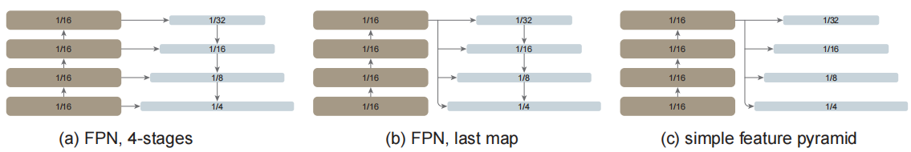

# Exploring Plain Vision Transformer Backbones for Object Detection
探索用于目标检测的扁平ViT主干网 2022.3.30 https://arxiv.org/abs/2203.16527

## 阅读笔记
* 主干
    * 主要挑战：预训练和目标检测的图像分辨率差异
    * Backbone adaptation. 重点关注这节。
    * 预训练采用全局注意力; 微调阶段，针对高分辨率图像，划分非重叠窗口(14*14大小),每个窗口内计算注意力;将预训练的主干均匀地分成4个子集的块(例如，24个块ViT-L的每个子集中有6个)? 将ViT分成4个stage，每个stage的前几个block采用windowed self-attention，最后一个block采用global self-attention
    * 主干改造部分，参考[Benchmarking Detection Transfer Learning with Vision Transformers](./ViTDet_Benchmarking.md)
    * 渐进窗口注意(progressive window attention)策略
    * “restricted” self-attention 受限自注意力
    * (ii)利用很少的跨窗口传播块辅助的窗口注意力(没有偏移)就足够了?
    * [A Length-Extrapolatable Transformer](../nlp/XPOS.md) 和这篇(NLP领域)对比，相对位置编码+分块注意力，训练和推理时长度可以不一致; 
* 颈部
    * 从最后一层，通过反卷积生成3/4个表示层
* 头部
    * 感兴趣区域(RoI)操作[26，20，25]、区域候选网络(RPN)或锚点[48]、特征金字塔网络(FPN)[37]
    * 改造为单阶段检测头，YOLO的检测头
* 代码实现
    * paddle实现：https://aistudio.baidu.com/aistudio/projectdetail/4356950?channelType=0&channel=0

## Abstract 
We explore the plain, non-hierarchical Vision Transformer (ViT) as a backbone network for object detection. This design enables the original ViT architecture to be fine-tuned for object detection without needing to redesign a hierarchical backbone for pre-training. With minimal adaptations for fine-tuning, our plain-backbone detector can achieve competitive results. Surprisingly, we observe: (i) it is sufficient to build a simple feature pyramid from a single-scale feature map (without the common FPN design) and (ii) it is sufficient to use window attention (without shifting) aided with very few cross-window propagation blocks. With plain ViT backbones pre-trained as Masked Autoencoders (MAE), our detector, named ViTDet, can compete with the previous leading methods that were all based on hierarchical backbones, reaching up to 61.3 APbox on the COCO dataset using only ImageNet-1K pre-training. We hope our study will draw attention to research on plain-backbone detectors. Code for ViTDet is available: https://github.com/facebookresearch/detectron2/tree/main/projects/ViTDet .

我们探索了扁平的、非分层的视觉变换器(ViT)作为目标检测的主干网络。这种设计使原始的ViT架构能够针对目标检测进行微调，而无需重新设计用于预训练的分层主干。通过在微调时的最小调整，我们的普通主干检测器可以获得具有竞争力的结果。令人惊讶的是，我们观察到：(i)从单一比例的特征图(没有常见的FPN设计)构建一个简单的特征金字塔就足够了; (ii)利用很少的跨窗口传播块辅助的窗口注意力(没有偏移)就足够了。通过将扁平的ViT主干预训练为掩码自动编码器(MAE)，我们的检测器名为ViTDet，可以与以前所有基于分层主干的领先方法竞争，仅使用ImageNet-1K预训练就可以在COCO数据集上达到61.3 APbox。我们希望我们的研究将引起对普通主干检测器的研究。ViTDet代码：https://github.com/facebookresearch/detectron2/tree/main/projects/ViTDet .

## 1 Introduction
Modern object detectors in general consist of a backbone feature extractor that is agnostic to the detection task and a set of necks and heads that incorporate detection-specific prior knowledge. Common components in the necks/heads may include Region-of-Interest (RoI) operations [26,20,25], Region Proposal Networks (RPN) or anchors [48], Feature Pyramid Networks (FPN) [37], etc. If the design of the task-specific necks/heads is decoupled from the design of the backbone, they may evolve in parallel. Empirically, object detection research has benefited from the largely independent exploration of general-purpose backbones [30,49,50,27] and detection-specific modules. For a long while, these backbones have been multi-scale, hierarchical architectures due to the de facto design of convolutional networks (ConvNet) [32], which has heavily influenced the neck/head design for detecting objects at multiple scales (e.g., FPN).

现代目标检测器通常由一个主干特征提取器和一组颈部和头部组成，该特征提取器与检测任务无关。颈部/头部中的常见组件可能包括感兴趣区域(RoI)操作[26，20，25]、区域候选网络(RPN)或锚点[48]、特征金字塔网络(FPN)[37]等。如果特定任务颈部/头部的设计与主干的设计分离，它们可能会并行发展。从经验上讲，目标检测研究得益于对通用主干[30，49，50，27]和检测专用模块的基本独立探索。长期以来，由于卷积网络(ConvNet)[32]的实际设计，这些主干一直是多尺度、分层结构，这严重影响了用于多尺度(例如FPN)检测目标的颈部/头部设计。

Over the past year, Vision Transformers (ViT) [14] have been established as a powerful backbone for visual recognition. Unlike typical ConvNets, the original ViT is a plain, non-hierarchical architecture that maintains a single-scale feature map throughout. Its “minimalist” pursuit is met by challenges when applied to object detection—e.g., How can we address multi-scale objects in a downstream task with a plain backbone from upstream pre-training? Is a plain ViT too inefficient to use with high-resolution detection images? One solution, which abandons this pursuit, is to re-introduce hierarchical designs into the backbone. This solution, e.g., Swin Transformers [42] and related works [55,17,34,29], can inherit the ConvNet-based detector design and has shown successful results.

在过去的一年中，视觉变换器(ViT)[14]已成为视觉识别的强大支柱。与典型的ConvNets不同，初始的ViT是一个简单的、非分层的架构，它始终保持一个单一比例的特征图。它的“极简”追求在应用于目标检测时遇到了挑战 —— 例如，我们如何通过上游预训练的简单主干来解决下游任务中的多尺度目标？扁平的ViT是否太低效，无法与高分辨率检测图像一起使用？放弃这种追求的一种解决方案是将分层设计重新引入主干网。该解决方案，例如Swin Transformers[42]和相关著作[55，17，34，29]，可以继承基于ConvNet的检测器设计，并已显示出成功的结果。

In this work, we pursue a different direction: we explore object detectors that use only plain, non-hierarchical backbones(2In this paper, “backbone” refers to architectural components that can be inherited from pre-training and “plain” refers to the non-hierarchical, single-scale property. ). If this direction is successful, it will enable the use of original ViT backbones for object detection; this will decouple the pre-training design from the fine-tuning demands, maintaining the independence of upstream vs. downstream tasks, as has been the case for ConvNet-based research. This direction also in part follows the ViT philosophy of “fewer inductive biases” [14] in the pursuit of universal features. As the non-local self-attention computation [54] can learn translation-equivariant features [14], they may also learn scale-equivariant features from certain forms of supervised or self-supervised pre-training.

在这项工作中，我们追求一个不同的方向：我们探索仅使用普通、非分层主干的目标检测器(2在本文中，“主干”是指可以从预训练中继承的架构组件，“普通”是指非分层、单尺度属性)。如果这一方向成功，将能够使用原始的ViT主干进行目标检测; 这将使预训练设计与微调需求脱钩，保持上游与下游任务的独立性，基于ConvNet的研究就是如此。这一方向也在一定程度上遵循了ViT哲学，即在追求普遍特征时“较少的归纳偏差”[14]。由于非局部自注意力计算[54]可以学习变化等变(translation-equivariant?)特征[14]，因此他们也可以从某些形式的监督或自监督预训练中学习尺度等变特征。

 
Figure 1: A typical hierarchical-backbone detector (left) vs. our plain-backbone detector (right). Traditional hierarchical backbones can be naturally adapted for multi-scale detection, e.g., using FPN. Instead, we explore building a simple pyramid from only the last, large-stride (16) feature map of a plain backbone. 
图1：典型的分层主干检测器(左)与普通主干检测器(右)。传统的分层主干网可以自然地适用于多尺度检测，例如，使用FPN。相反，我们探索从一个普通主干的最后一个大跨度(16)特征图构建一个简单的金字塔。

In our study, we do not aim to develop new components; instead, we make minimal adaptations that are sufficient to overcome the aforementioned challenges. In particular, our detector builds a simple feature pyramid from only the last feature map of a plain ViT backbone (Figure 1). This abandons the FPN design [37] and waives the requirement of a hierarchical backbone. To efficiently extract features from high-resolution images, our detector uses simple non-overlapping window attention (without “shifting”, unlike [42]). A small number of cross-window blocks (e.g., 4), which could be global attention [54] or convolutions, are used to propagate information. These adaptations are made only during fine-tuning and do not alter pre-training.

在我们的研究中，我们的目标不是开发新的组件; 相反，我们做出了足以克服上述挑战的最小调整。特别是，我们的检测器仅从普通ViT主干的最后一个特征图构建一个简单的特征金字塔(图1)。这放弃了FPN设计[37]，放弃了分级主干的要求。<strong>为了有效地从高分辨率图像中提取特征，我们的检测器使用简单的非重叠窗口注意力(不像[42]那样没有“移动”)。少量交叉窗口块(例如，4个)可以是全局关注[54]或卷积，用于传播信息。这些调整仅在微调期间进行，不会改变预训练。</strong>

Our simple design turns out to achieve surprising results. We find that the FPN design is not necessary in the case of a plain ViT backbone and its benefit can be effectively gained by a simple pyramid built from a large-stride (16), single-scale map. We also find that window attention is sufficient as long as information is well propagated across windows in a small number of layers.

我们的简单设计结果令人惊讶。我们发现，在简单的ViT主干的情况下，FPN设计是不必要的，它的好处可以通过由大跨度(16)、单比例特征图构建的简单金字塔来有效地获得。我们还发现，只要信息在少数层的窗口中传播良好，窗口注意力就足够了。

More surprisingly, under some circumstances, our plain-backbone detector, named ViTDet, can compete with the leading hierarchical-backbone detectors (e.g., Swin [42], MViT [17,34]). With Masked Autoencoder (MAE) [24] pretraining, our plain-backbone detector can outperform the hierarchical counterparts that are pre-trained on ImageNet-1K/21K [12] with supervision (Figure 3). The gains are more prominent for larger model sizes. The competitiveness of our detector is observed under different object detector frameworks, including Mask R-CNN [25], Cascade Mask R-CNN [4], and their enhancements. We report 61.3 APbox on the COCO dataset [39] with a plain ViT-Huge backbone, using only ImageNet-1K pre-training with no labels. We also demonstrate competitive results on the long-tailed LVIS detection dataset [23]. While these strong results may be in part due to the effectiveness of MAE pre-training, our study demonstrates that plain-backbone detectors can be promising, challenging the entrenched position of hierarchical backbones for object detection.

更令人惊讶的是，在某些情况下，我们的名为ViTDet的普通主干检测器可以与领先的分层主干检测器(例如，Swin[42]，MViT[17，34])竞争。通过掩码自动编码器(MAE)[24]预训练，我们的普通主干检测器可以优于在ImageNet-1K/21K[12]上预训练的分层检测器(图3)。对于较大的模型尺寸，增益更为显著。在不同的目标检测器框架下观察到我们的检测器的竞争力，包括Mask R-CNN[25]、Cascade Mask R-CNN[4]及其增强。我们在COCO数据集[39]上报告了61.3 APbox，其具有简单的ViT巨大主干，仅使用ImageNet-1K预训练，没有标签。我们还证明了长尾LVIS检测数据集的竞争结果[23]。虽然这些强大的结果可能部分归因于MAE预训练的有效性，但我们的研究表明，普通主干检测器很有前途，挑战了目标检测的分层主干的根深蒂固的地位。

Beyond these results, our methodology maintains the philosophy of decoupling the detector-specific designs from the task-agnostic backbone. This philosophy is in contrast to the trend of redesigning Transformer backbones to support multi-scale hierarchies [42,55,17,29]. In our case, the detection-specific prior knowledge is introduced only during fine-tuning, without needing to tailor the backbone design a priori in pre-training. This makes our detector compatible with ViT developments along various directions that are not necessarily limited by the hierarchical constraint, e.g., block designs [52,53], self-supervised learning [2,24], and scaling [57]. We hope our study will inspire future research on plain-backbone object detection(3 This work is an extension of a preliminary version [35] that was unpublished and not submitted for peer review). 

除了这些结果之外，我们的方法还保持了将检测器特定设计与任务无关主干分离的理念。这一理念与重新设计Transformer主干以支持多尺度层次结构的趋势形成对比[42，55，17，29]。在我们的例子中，仅在微调期间引入检测特定的先验知识，而无需在预训练中先验地调整主干设计。这使得我们的检测器与沿着不同方向的ViT开发兼容，这些方向不一定受到分层约束的限制，例如块设计[52，53]、自监督学习[2，24]和缩放[57]。我们希望我们的研究将启发未来对普通主干目标检测的研究(3这项工作是未发表的初步版本[35]的扩展，未提交同行评审)。

## 2 Related Work
### Object detector backbones. 
Pioneered by the work of R-CNN [21], object detection and many other vision tasks adopt a pre-training + fine-tuning paradigm: a general-purpose, task-agnostic backbone is pre-trained with supervised or selfsupervised training, whose structure is later modified and adapted to the downstream tasks. The dominant backbones in computer vision have been ConvNets [32] of various forms, e.g., [30,49,50,27].

目标检测器主干。由R-CNN的工作开创[21]，目标检测和许多其他视觉任务采用预训练+微调范式：通用的、任务未知的主干通过监督或自监督训练进行预训练，其结构随后被修改并适应下游任务。计算机视觉中的主要主干是各种形式的卷积网络[32]，例如[30，49，50，27]。

Earlier neural network detectors, e.g., [26,20,48,47], were based on a singlescale feature map when originally presented. While they use ConvNet backbones that are by default hierarchical, in principle, they are applicable on any plain backbone. SSD [40] is among the first works that leverage the hierarchical nature of the ConvNet backbones (e.g., the last two stages of a VGG net [49]). FPN [37] pushes this direction further by using all stages of a hierarchical backbone, approached by lateral and top-down connections. The FPN design is widely used in object detection methods. More recently, works including Trident Networks [33] and YOLOF [7] have revisited single-scale feature maps, but unlike our work they focus on a single-scale taken from a hierarchical backbone.

早期的神经网络检测器，例如[26，20，48，47]，最初呈现时基于单尺度特征图。虽然它们使用默认分层的ConvNet主干，但原则上，它们适用于任何普通主干。SSD[40]是利用ConvNet主干(例如，VGG网络的最后两个阶段[49])的分层性质的首批工作之一。FPN[37]通过使用分层主干的所有阶段，通过横向和自上而下的连接，进一步推动了这一方向。FPN设计广泛应用于目标检测方法。最近，包括三叉戟网络[33]和YOLOF[7]在内的研究重新审视了单尺度特征图，但与我们的研究不同，他们关注的是从分层主干中提取的单一尺度。

ViT [14] is a powerful alternative to standard ConvNets for image classification. The original ViT is a plain, non-hierarchical architecture. Various hierarchical Transformers have been presented, e.g., Swin [42], MViT [17,34], PVT [55], and PiT [29]. These methods inherit some designs from ConvNets, including the hierarchical structure and the translation-equivariant priors (e.g., convolutions, pooling, sliding windows). As a result, it is relatively straightforward to replace a ConvNet with these backbones for object detection.

ViT[14]是图像分类标准卷积网络的有力替代方案。最初的ViT是一个简单的、非分层的架构。各种分级Transformer已经被提出，例如Swin[42]、MViT[17，34]、PVT[55]和PiT[29]。这些方法继承了ConvNets的一些设计，包括层次结构和平移等变先验(例如卷积、池化、滑动窗口)。因此，用这些主干替换ConvNet进行目标检测相对简单。

### Plain-backbone detectors. 
The success of ViT has inspired people to push the frontier of plain backbones for object detection. Most recently, UViT [9] is presented as a single-scale Transformer for object detection. UViT studies the network width, depth, and input resolution of plain ViT backbones under object detection metrics. A progressive window attention strategy is proposed to address the high-resolution inputs. Unlike UViT that modifies the architecture during pre-training, our study focuses on the original ViT architecture without a priori specification for detection. By maintaining the task-agnostic nature of the backbone, our approach supports a wide range of available ViT backbones as well as their improvements in the future. Our method decouples the backbone design from the detection task, which is a key motivation of pursuing plain backbones.

普通主干检测器。ViT的成功激发了人们将普通主干的前沿应用于目标检测。最近，UViT[9]被提出为用于目标检测的单尺度变换器。UViT在目标检测度量下研究普通ViT主干的网络宽度、深度和输入的分辨率。提出了一种渐进(progressive)窗口注意策略来处理高分辨率输入。与在预训练期间修改架构的UViT不同，我们的研究侧重于原始的ViT架构，没有先验的检测规范。通过保持主干的任务无关性，我们的方法支持广泛的可用ViT主干及其未来的改进。我们的方法将主干设计与检测任务解耦，这是追求普通主干的关键动机。

UViT uses single-scale feature maps for the detector heads, while our method builds a simple pyramid on the single-scale backbone. In the context of our study, it is an unnecessary constraint for the entire detector to be single-scale. Note the full UViT detector has several forms of multi-scale priors too (e.g., RPN [48] and RoIAlign [25]) as it is based on Cascade Mask R-CNN [4]. In our study, we focus on leveraging pre-trained plain backbones and we do not constrain the detector neck/head design.

UViT为检测器头部使用单尺度特征图，而我们的方法在单尺度主干上构建一个简单的金字塔。在我们的研究背景下，对于整个检测器来说，单一尺度是不必要的限制。注意，全UViT检测器也具有多种形式的多尺度先验(例如，RPN[48]和RoIAlign[25])，因为它基于Cascade Mask R-CNN[4]。在我们的研究中，我们专注于利用预训练的普通主干，我们不限制检测器颈部/头部的设计。

### Object detection methodologies. 
Object detection is a flourishing research area that has embraced methodologies of distinct properties—e.g., two-stage [21,26,20,48] vs. one-stage [47,40,38], anchor-based [48] vs. anchor-free [31,15,51], and region-based [21,26,20,48] vs. query-based (DETR) [5]. Research on different methodologies has been continuously advancing understandings of the object detection problem. Our study suggests that the topic of “plain vs. hierarchical” backbones is worth exploring and may bring in new insights. 

目标检测理论。目标检测是一个蓬勃发展的研究领域，它包含了不同性质的方法，例如，两阶段[21，26，20，48]与一阶段[47，40，38]，基于锚的[48]与无锚的[31，15，51]，以及基于区域的[21，24，20，38]与基于查询的(DETR)[5]。对不同方法的研究一直在不断推进对目标检测问题的理解。我们的研究表明，“普通与分层”主干的主题值得探索，并可能带来新的见解。

## 3 Method
Our goal is to remove the hierarchical constraint on the backbone and to enable explorations of plain-backbone object detection. To this end, we aim for minimal modifications to adapt a plain backbone to the object detection task only during fine-tuning time. After these adaptations, in principle one can apply any detector heads, for which we opt to use Mask R-CNN [25] and its extensions. We do not aim to develop new components; instead, we focus on what new insights can be drawn in our exploration.

我们的目标是消除主干上的分层约束，并实现对普通主干目标检测的探索。为此，我们的目标是 在微调期间进行最小的修改使普通主干适应目标检测任务。经过这些调整后，原则上可以应用任何检测头，为此我们选择使用Mask R-CNN[25]及其扩展。我们的目标不是开发新的组件; 相反，我们专注于在探索中可以得出什么新的见解。

### Simple feature pyramid. 
FPN [37] is a common solution of building an in-network pyramid for object detection. If the backbone is hierarchical, the motivation of FPN is to combine the higher-resolution features from earlier stages and the stronger features from later stages. This is realized in FPN by top-down and lateral connections [37] (Figure 1 left). 

简单的特征金字塔。FPN[37]是构建用于目标检测的网络内金字塔的常见解决方案。如果主干是分层的，则FPN的动机是将早期阶段的高分辨率特征和后期阶段的更强特征相结合。这在FPN中通过自上而下和横向连接[37]实现(图1左侧)。

If the backbone is non-hierarchical, the foundation of the FPN motivation is lost, as all the feature maps in the backbone are of the same resolution. In our scenario, we simply use only the last feature map from the backbone, which should have the strongest features. On this map, we apply a set of convolutions or deconvolutions in parallel to produce multi-scale feature maps. Specifically, with the default ViT feature map of a scale of 1 16 (stride = 16 [14]), we produce feature maps of scales { 1/32 , 1/16 , 1/8 , 1/4 } using convolutions of strides {2, 1, 1/2 , 1/4 }, where a fractional stride indicates a deconvolution. We refer to this as a “simple feature pyramid” (Figure 1 right).

如果主干是非分层的，则失去了FPN动机的基础，因为主干中的所有特征图都具有相同的分辨率。在我们的场景中，我们只使用主干的最后一个特征图，它应该具有最强的特征。在这张特征图上，我们并行应用一组卷积或反卷积来生成多尺度特征图。具体地说，对于默认的ViT特征图，尺度为1/16(步幅=16[14])，我们使用步幅{2，1，1/2，1/4}的卷积生成尺度为{1/32，1/16，1/8，1/4}的特征图，其中分数步幅表示反卷积。我们称之为“简单的特征金字塔”(图1右侧)。

The strategy of building multi-scale feature maps from a single map is related to that of SSD [40]. However, our scenario involves upsampling from a deep, lowresolution feature map, unlike [40], which taps into shallower feature maps. In hierarchical backbones, upsampling is often aided by lateral connection [37]; in plain ViT backbones, we empirically find this is not necessary (Sec. 4) and simple deconvolutions are sufficient. We hypothesize that this is because ViT can rely on positional embedding [54] for encoding locations and also because the highdimensional ViT patch embeddings do not necessarily discard information(4 With a patch size of 16×16 and 3 colors, a hidden dimension ≥768 (ViT-B and larger) can preserve all information of a patch if necessary).

从单个特征图构建多尺度特征图的策略与SSD的策略相关[40]。然而，我们的场景涉及从深度、低分辨率的特征图进行上采样，而不像[40]那样，它利用了较浅的特征图。在分级主干中，上采样通常通过横向连接来辅助[37]; 在简单的ViT主干中，我们根据经验发现这是不必要的(第4节)，简单的反卷积就足够了。我们假设，这是因为ViT可以依赖位置嵌入[54]来编码位置，也因为高维ViT分块嵌入不一定会丢弃信息(4.对于16×16和3种颜色的分块,隐藏维度≥768(ViT-B或更大)可以在必要时保留分块的所有信息)。

 
Figure 2: Building a feature pyramid on a plain backbone. (a) FPN-like: to mimic a hierarchical backbone, the plain backbone is artificially divided into multiple stages. (b) FPN-like, but using only the last feature map without stage division. (c) Our simple feature pyramid without FPN. In all three cases, strided convolutions/deconvolutions are used whenever the scale changes.
图2：在普通主干上构建特征金字塔。(a) 类似FPN：为了模拟分层主干，普通主干被人为地划分为多个阶段。(b) 类似于FPN，但仅使用最后一个特征图而不进行阶段划分。(c) 我们没有FPN的简单特征金字塔。在所有三种情况下，每当尺度变化时，都会使用跨步卷积/反卷积。

We will compare with two FPN variants that are also built on a plain backbone (Figure 2). In the first variant, the backbone is artificially divided into multiple stages to mimic the stages of a hierarchical backbone, with lateral and top-down connections applied (Figure 2 (a)) [16]. The second variant is like the first one, but uses only the last map instead of the divided stages (Figure 2 (b)).We show that these FPN variants are not necessary (Sec. 4)(5 From a broader perspective, the spirit of FPN [37] is “to build a feature pyramid inside a network”. Our simple feature pyramid follows this spirit. In the context of this paper, the term of “FPN” refers to the specific architecture design in [37]. ).

我们将与同样构建在普通主干上的两个FPN变体进行比较(图2)。在第一个变体中，主干被人为地划分为多个阶段，以模拟分层主干的阶段，应用横向和自上而下的连接(图2(a))[16]。第二个变体与第一个变体类似，但只使用最后一个映射，而不是划分的阶段(图2(b))。我们表明，这些FPN变体是不必要的(第4节)(5. 从更广泛的角度来看，FPN[37]的精神是“在网络中构建一个特征金字塔”。我们的简单特征金字塔遵循这种精神。在本文的上下文中，“FPN”一词指的是[37]中的特定架构设计)。

### Backbone adaptation. 
Object detectors benefit from high-resolution input images, but computing global self-attention throughout the backbone is prohibitive in memory and is slow. In this study, we focus on the scenario where the pre-trained backbone performs global self-attention, which is then adapted to higher-resolution inputs during fine-tuning. This is in contrast to the recent methods that modify the attention computation directly with backbone pretraining (e.g., [42,17]). Our scenario enables us to use the original ViT backbone for detection, without redesigning pre-training architectures.

主干自适应。目标检测器受益于高分辨率输入图像，但在整个主干中计算全局自注意在内存中是禁止的，而且速度很慢。在这项研究中，我们关注的场景是，预训练的主干执行全局自注意，然后在微调期间适应更高分辨率的输入。这与最近通过主干预训练时直接修改注意力计算的方法形成对比(例如，[42，17])。我们的场景使我们能够使用原始的ViT主干进行检测，而无需重新设计预训练架构。

We explore using window attention [54] with a few cross-window blocks. During fine-tuning, given a high-resolution feature map, we divide it into regular non-overlapping windows(6 We set the window size as the pre-training feature map size by default (14×14 [14])). Self-attention is computed within each window. This is referred to as “restricted” self-attention in the original Transformer [54].

我们探索使用窗口注意力[54]和一些交叉窗口块。在微调过程中，给定高分辨率特征图，我们将其划分为规则的非重叠窗口(6 我们默认将窗口大小设置为预训练特征图大小(14×14[14]))。在每个窗口内计算自注意。在最初的Transformer[54]中，这被称为“受限”自注意。

Unlike Swin, we do not “shift” [42] the windows across layers. To allow information propagation, we use a very few (by default, 4) blocks that can go across windows. We evenly split a pre-trained backbone into 4 subsets of blocks (e.g., 6 in each subset for the 24-block ViT-L). We apply a propagation strategy in the last block of each subset. We study these two strategies: 
1. Global propagation. We perform global self-attention in the last block of each subset. As the number of global blocks is small, the memory and computation cost is feasible. This is similar to the hybrid window attention in [34] that was used jointly with FPN. 
2. Convolutional propagation. As an alternative, we add an extra convolutional block after each subset. A convolutional block is a residual block [27] that consists of one or more convolutions and an identity shortcut. The last layer in this block is initialized as zero, such that the initial status of the block is an identity [22]. Initializing a block as identity allows us to insert it into any place in a pre-trained backbone without breaking the initial status of the backbone.

与Swin不同，我们不会跨层“移动”窗口。为了允许信息传播，我们使用了非常少的(默认情况下为4个)可以跨越窗口的块。我们将预训练的主干均匀地分成4个子集的块(例如，24个块ViT-L的每个子集中有6个)。我们在每个子集的最后一个块中应用传播策略。我们研究这两种策略：
1. 全局传播。我们在每个子集的最后一个块中执行全局自注意。由于全局块的数量很小，因此内存和计算成本是可行的。这类似于[34]中与FPN联合使用的混合窗口注意力。
2. 卷积传播。作为替代方案，我们在每个子集之后添加一个额外的卷积块。卷积块是由一个或多个卷积和恒等快捷连接组成的残差块[27]。该块中的最后一层被初始化为零，因此该块的初始状态为恒等的[22]。将块初始化为恒等的允许我们将其插入到预训练的主干中的任何位置，而不破坏主干的初始状态。

Our backbone adaptation is simple and makes detection fine-tuning compatible with global self-attention pre-training. As stated, it is not necessary to redesign the pre-training architectures.

我们的主干适应很简单，使检测微调与全局自注意预训练兼容。如上所述，无需重新设计预训练架构。

### Discussion. 
Object detectors contain components that can be task agnostic, such as the backbone, and other components that are task-specific, such as RoI heads. This model decomposition enables the task-agnostic components to be pre-trained using non-detection data (e.g., ImageNet), which may provide an advantage since detection training data is relatively scarce.

讨论。目标检测器包含任务无关的组件，如主干，以及特定任务的其他组件，如RoI头。该模型分解使得任务未知组件能够使用非检测数据(例如，ImageNet)进行预训练，这可以提供优势，因为检测训练数据相对较少。

Under this perspective, it becomes reasonable to pursue a backbone that involves fewer inductive biases, since the backbone may be trained effectively using large-scale data and/or self-supervision. In contrast, the detection taskspecific components have relatively little data available and may still benefit from additional inductive biases. While pursuing detection heads with fewer inductive biases is an active area of work, leading methods like DETR [5] are challenging to train and still benefit from detection-specific prior knowledge [60].

从这个角度来看，追求一个包含较少归纳偏差的主干变得合理，因为主干可以使用大规模数据和/或自监督进行有效训练。相比之下，特定于检测任务的组件具有相对较少的可用数据，并且可能仍然受益于额外的归纳偏差。虽然追求具有较少归纳偏差的检测头是一个活跃的工作领域，但DETR[5]等领先方法对训练具有挑战性，并且仍然受益于检测特定的先验知识[60]。

Driven by these observations, our work follows the spirit of the original plain ViT paper with respect to the detector’s backbone. While the ViT paper’s discussion [14] focused on reducing inductive biases on translation equivariance, in our case, it is about having fewer or even no inductive bias on scale equivariance in the backbone. We hypothesize that the way for a plain backbone to achieve scale equivariance is to learn the prior knowledge from data, analogous to how it learns translation equivariance and locality without convolutions [14].

在这些观察结果的推动下，我们的工作遵循了关于检测器主干的原始普通ViT论文的精神。虽然ViT论文的讨论[14]侧重于减少对转换等变的归纳偏差，但在我们的案例中，它是关于在主干中对尺度等变的更少甚至没有归纳偏差。我们假设，普通主干实现尺度等变的方法是从数据中学习先验知识，类似于它如何在没有卷积的情况下学习平移等变和局部性[14]。

Our goal is to demonstrate the feasibility of this approach. Thus we choose to implement our method with standard detection specific components (i.e.,Mask R-CNN and its extensions). Exploring even fewer inductive biases in the detection heads is an open and interesting direction for future work. We hope it can benefit from and build on our work here.

我们的目标是证明这种方法的可行性。因此，我们选择使用标准检测特定组件(即Mask R-CNN及其扩展)来实现我们的方法。探索检测头中更少的归纳偏差是未来工作的一个开放而有趣的方向。我们希望它能从我们在这里的工作中受益，并在此基础上再接再厉。

### Implementation. 
We use the vanilla ViT-B, ViT-L, ViT-H [14] as the pretraining backbones. We set the patch size as 16 and thus the feature map scale is 1/16, i.e., stride = 16(7 Changing the stride affects the scale distribution and presents a different accuracy shift for objects of different scales. This topic is beyond the scope of this study. For simplicity, we use the same patch size of 16 for all of ViT-B, L, H (see the appendix)). Our detector heads follow Mask R-CNN [25] or Cascade Mask R-CNN [4], with architectural details described in the appendix. The input image is 1024×1024, augmented with large-scale jittering [19] during training. Due to this heavy regularization, we fine-tune for up to 100 epochs in COCO. We use the AdamW optimizer [43] and search for optimal hyper-parameters using a baseline version. More details are in the appendix. 

实施。我们使用普通的ViT-B、ViT-L、ViT-H[14]作为预训练主干。我们将分块大小设置为16，因此特征图比例为1/16，即步幅=16(7改变步幅会影响比例分布，并对不同比例的对象呈现不同的精度偏移。该主题超出了本研究的范围。为简单起见，我们对所有ViT-B、L、H使用相同的分块大小16(见附录))。我们的检测器头遵循Mask R-CNN[25]或Cascade Mask R-CNN[4]，结构细节见附录。输入图像为1024×1024，在训练期间增加了大规模抖动[19]。由于这种繁重的正则化，我们可以在COCO中微调多达100个周期。我们使用AdamW优化器[43]，并使用基线版本搜索最佳超参数。更多详情见附录。

## 4 Experiments
### 4.1 Ablation Study and Analysis
We perform ablation experiments on the COCO dataset [39]. We train on the train2017 split and evaluate on the val2017 split. We report results on boundingbox object detection (APbox) and instance segmentation (APmask).

我们在COCO数据集上进行消融实验[39]。我们在train2017中进行训练，并在val2017中进行评估。我们报告了边框目标检测(APbox)和实例分割(APmask)的结果。

By default, we use the simple feature pyramid and global propagation described in Sec. 3. We use 4 propagation blocks, evenly placed in the backbone. We initialize the backbone with MAE [24] pre-trained on IN-1K without labels. We ablate these defaults and discuss our main observations as follows.

默认情况下，我们使用第3节中描述的简单特征金字塔和全局传播。我们使用4个传播块，均匀地放置在主干中。我们使用在IN-1K上预训练的MAE[24] (无标签)初始化主干。我们消除了这些默认值，并讨论了以下主要观察结果。

#### A simple feature pyramid is sufficient. 
In Table 1 we compare the feature pyramid building strategies illustrated in Figure 2. 

简单的特征金字塔就足够了。 在表1中，我们比较了图2所示的特征金字塔构建策略。

 
Table 1: Ablation on feature pyramid design with plain ViT backbones, using Mask R-CNN evaluated on COCO. The backbone is ViT-B (left) and ViT-L (right). The entries (a-c) correspond to Figure 2 (a-c), compared to a baseline without any pyramid. Both FPN and our simple pyramid are substantially better than the baseline, while our simple pyramid is sufficient. 
表1：使用COCO上评估的Mask R-CNN对具有普通ViT主干的特征金字塔设计进行消融。主干是ViT-B(左)和ViT-L(右)。与没有任何金字塔的基线相比，条目(a-c)对应于图2(a-b)。FPN和我们的简单金字塔都比基线好很多，而我们的简单的金字塔就足够了。

We study a baseline with no feature pyramid: both the RPN and RoI heads are applied on the backbone’s final, single-scale ( 1/16 ) feature map. This case is similar to the original Faster R-CNN [48] before FPN was proposed. All feature pyramid variants (Table 1 a-c) are substantially better than this baseline, increasing AP by up to 3.4 points. We note that using a single-scale feature map does not mean the detector is single-scale: the RPN head has multi-scale anchors and the RoI heads operate on regions of multiple scales. Even so, feature pyramids are beneficial. This observation is consistent with the observation in the FPN paper [37] on hierarchical backbones.

我们研究了一个没有特征金字塔的基线：RPN和RoI头都应用于主干的最终单尺度(1/16)特征图。这种情况类似于FPN提出之前最初的Faster R-CNN[48]。所有特征金字塔变体(表1 a-c)都明显优于该基线，将AP提高了3.4个点。我们注意到，使用单尺度特征图并不意味着检测器是单尺度的：RPN头具有多尺度锚，RoI头在多尺度区域上操作。即使如此，特征金字塔也是有益的。该观察结果与FPN论文[37]中关于分层主干的观察结果一致。

However, the FPN design is not needed and our simple feature pyramid is sufficient for a plain ViT backbone to enjoy the benefit of a pyramid. To ablate this design, we mimic the FPN architecture (i.e., the top-down and lateral connections) as in Figure 2 (a, b). Table 1 (a, b) shows that while both FPN variants achieve strong gains over the baseline with no pyramid (as has been widely observed with the original FPN on hierarchical backbones), they are no better than our simple feature pyramid. The original FPN [37] was motivated by combining lower-resolution, stronger feature maps with higher-resolution, weaker feature maps. This foundation is lost when the backbone is plain and has no high-resolution maps, which can explain why our simple pyramid is sufficient.

然而，不需要FPN设计，我们的简单特征金字塔足以让简单的ViT主干享受金字塔的好处。为了消除这种设计，我们模拟了FPN架构(即自上而下和横向连接)，如图2(a，b)所示。表1(a，b)显示，虽然两种FPN变体在没有金字塔的情况下实现了比基线更高的增益(正如在分层主干上的原始FPN中广泛观察到的那样)，但它们并不比我们的简单特征金字塔更好。最初的FPN[37]的动机是将低分辨率、更强的特征图与高分辨率、较弱的特征图相结合。当主干是平的并且没有高分辨率特征图时，这个基础就失去了，这可以解释为什么我们的简单金字塔足够了。

Our ablation reveals that the set of pyramidal feature maps, rather than the top-down/lateral connections, is the key to effective multi-scale detection. To see this, we study an even more aggressive case of the simple pyramid: we generate only the finest scale ( 1/4 ) feature map by deconvolution and then from this finest map we subsample other scales in parallel by strided average pooling. There are no unshared, per-scale parameters in this design. This aggressivelysimple pyramid is nearly as good: it has 54.5 AP (ViT-L), 3.3 higher than the no pyramid baseline. This shows the importance of pyramidal feature maps. For any variant of these feature pyramids, the anchors (in RPN) and regions (in RoI heads) are mapped to the corresponding level in the pyramid based on their scales, as in [37]. We hypothesize that this explicit scale-equivariant mapping, rather than the top-down/lateral connection, is the main reason why a feature pyramid can greatly benefit multi-scale object detection.

我们的消融表明，金字塔特征图集合，而不是自上而下/横向连接，是有效多尺度检测的关键。为了看到这一点，我们研究了简单金字塔的一个更具侵略性的例子：我们通过反卷积仅生成最精细的尺度(1/4)特征图，然后从这个最精细的图中通过跨步平均池并行地对其他尺度进行二次采样。此设计中没有未共享的按比例参数。这种侵略性的简单的金字塔几乎同样好：它有54.5 AP(ViT-L)，比无金字塔基线高3.3。这表明了金字塔特征图的重要性。对于这些特征金字塔的任何变体，锚(在RPN中)和区域(在RoI头中)根据其比例映射到金字塔中的相应级别，如[37]所示。我们假设，这种显式的尺度等变映射，而不是自上而下/横向的连接，是特征金字塔能够极大地促进多尺度目标检测的主要原因。

#### Window attention is sufficient when aided by a few propagation blocks.
Table 2 ablates our backbone adaptation approach. In short, on top of a baseline that has purely window attention and none of the cross-window propagation blocks (Table 2, “none”), various ways of propagation can show decent gains(8 Even our baseline with no propagation in the backbone is reasonably good (52.9 AP).This can be explained by the fact that the layers beyond the backbone (the simple feature pyramid, RPN, and RoI heads) also induce cross-window communication).

在几个传播块的辅助下，窗口注意力就足够了。表2阐述了我们的主干适应方法。简而言之，在纯窗口注意力且没有跨窗口传播块的基线之上(表2，“无”)，各种传播方式可以显示出可观的增益(8即使我们的基线在主干中没有传播也是相当好的(52.9 AP)。这可以通过以下事实来解释：主干之外的层(简单的特征金字塔、RPN和RoI头)也会导致跨窗口通信)。

 
Table 2: Ablation on backbone adaptation strategies using a plain ViT backbone and Mask R-CNN evaluated on COCO. All blocks perform window attention, unless modified by the propagation strategy. In sum, compared to the baseline that uses only window attention (52.9 APbox) most configurations work effectively as long as information can be well propagated across windows. Here the backbone is ViT-L; the observations on ViT-B are similar (see the appendix). 
(a) Window attention with various cross-window propagation strategies.
(b) Convolutional propagation with different residual block types (4 blocks)
(c) Locations of cross-window global propagation blocks
(d) Number of global propagation blocks. †: Memory optimization required.

表2：使用普通ViT主干和Mask R-CNN在COCO上评估的主干适应策略消融。除非被传播策略修改，否则所有块都执行窗口注意力。总之，与仅使用窗口注意力(52.9 APbox)的基线相比，只要信息能够在窗口间传播，大多数配置都能有效工作。这里的主干是ViT-L; 对ViT-B的观察结果类似(见附录)。
(a) 使用各种跨窗口传播策略的窗口关注。
(b) 具有不同残差块类型的卷积传播(4个块)
(c) 跨窗口全局传播块的位置
(d) 全局传播块数 †：需要内存优化。

In Table 2a, we compare our global and convolutional propagation strategies vs. the no propagation baseline. They have a gain of 1.7 and 1.9 over the baseline. We also compare with the “shifted window” (Swin [42]) strategy, in which the window grid is shifted by a half-window size for every other block. The shifted window variant has a 1.1 gain over the baseline, but is worse than ours. Note that here we focus only on the “shifted window” aspect of Swin [42]: the backbone is still a plain ViT, adapted to shifted window attention only during fine-tuning; it is not the Swin architecture, which we will compare to later.

在表2a中，我们比较了全局和卷积传播策略与无传播基线。他们比基线增加了1.7和1.9。我们还与“移动窗口”(Swin[42])策略进行了比较，在该策略中，窗口网格每隔一个块移动一半的窗口大小。移位窗口变体比基线有1.1的增益，但比我们的差。注意，这里我们只关注Swin[42]的“移动窗口”方面：主干仍然是一个扁平的ViT，仅在微调期间适应于移动窗口注意力; 这不是我们稍后将要比较的Swin架构。

Table 2b compares different types of residual blocks for convolutional propagation. We study the basic (two 3×3) [27], bottleneck (1×1→3×3→1×1) [27], and a na¨ıve block that has one 3×3 convolution. They all improve over the baseline, while the specific block design makes only marginal differences. Interestingly, even though convolution is a local operation if its receptive field covers two adjacent windows, it is sufficient in principle to connect all pixels of the two windows. This connectivity is thanks to the self-attention in both windows in the succeeding blocks. This may explain why it can perform as well as global propagation.

表2b比较了卷积传播的不同类型的残差块。我们研究了基本(两个3×3)[27]，瓶颈(1×1→3×3→×1)[27]，以及具有一个3×3卷积的朴素块。它们都比基线有所改善，而特定的区块设计只会产生微小的差异。有趣的是，即使卷积是一种局部操作，如果它的感受野覆盖两个相邻窗口，原则上连接两个窗口的所有像素就足够了。这种连接得益于后续块中两个窗口中的自注意。这可能解释了为什么它可以像全局传播一样出色。

In Table 2c we study where cross-window propagation should be located in the backbone. By default 4 global propagation blocks are placed evenly. We compare with placing them in the first or last 4 blocks instead. Interestingly, performing propagation in the last 4 blocks is nearly as good as even placement. This is in line with the observation in [14] that ViT has longer attention distance in later blocks and is more localized in earlier ones. In contrast, performing propagation only in the first 4 blocks shows no gain: in this case, there is no propagation across windows in the backbone after these 4 blocks. This again demonstrates that propagation across windows is helpful.

在表2c中，我们研究了交叉窗口传播在主干中的位置。默认情况下，均匀放置4个全局传播块。我们将它们放在第一个或最后4个块进行比较。有趣的是，在最后4个块中执行传播几乎与均匀放置一样好。这与[14]中的观察结果一致，即ViT在后面的块中具有更长的注意力距离，并且在前面的块中更局部化。相反，仅在前4个块中执行传播显示没有增益：在这种情况下，在这4个块之后，主干中没有跨窗口传播。这再次证明了跨窗口传播是有帮助的。

Table 2d compares the number of global propagation blocks to use. Even using just 2 blocks achieves good accuracy and clearly outperforms the baseline. For comprehensiveness, we also report a variant where all 24 blocks in ViT-L use global attention. This has a marginal gain of 0.5 points over our 4-block default, while its training requires special memory optimization (we use memory checkpointing [8]). This requirement makes scaling to larger models (like ViT-H) impractical. Our solution of window attention plus a few propagation blocks offers a practical, high-performing tradeoff.

表2d比较了要使用的全局传播块的数量。即使只使用2个块也能获得良好的精度，并且明显优于基线。为了全面，我们还报告了一个变体，其中ViT-L中的所有24个区块都使用全局注意力。这比我们的4块默认值有0.5个百分点的边际增益，而它的训练需要特殊的内存优化(我们使用内存检查点[8])。这一要求使得扩展到更大的模型(如ViT-H)不切实际。我们的窗口注意力加上几个传播块的解决方案提供了一个实用的、高性能的折衷方案。

 
Table 3: Practical performance of backbone adaptation strategies. The backbone is ViT-L. The training memory (per GPU) is benchmarked with a batch size of 1. The testing time (per image) is benchmarked on an A100 GPU. † : This 3.34× memory (49G) is estimated as if the same training implementation could be used, which is not practical and requires special memory optimization that all together slows down training by 2.2× vs. the baseline. 
表3：主干适应策略的实际绩效。主干是ViT-L。训练内存(每个GPU)以批大小1为基准。测试时间(每个图像)以A100 GPU为基准。†：这3.34倍的内存(49G)被估计为可以使用相同的训练实现，这是不实际的，并且需要特殊的内存优化，所有这些都会使训练速度比基线慢2.2倍。

We benchmark this tradeoff in Table 3. Using 4 propagation blocks gives a good trade-off. Convolutional propagation is the most practical, increasing memory and time by merely ≤5%, at a small cost of 4% more parameters. Global propagation with 4 blocks is also feasible and does not increase the model size. Global self-attention in all 24 blocks is not practical.

我们在表3中对这一权衡进行了基准测试。使用4个传播块给出了很好的权衡。卷积传播是最实用的，仅通过≤5%，以增加4%的参数的小成本。具有4个块的全局传播也是可行的，并且不会增加模型大小。所有24个块的全局自注意是不现实的。

In sum, Table 2 shows that various forms of propagation are helpful, while we can keep using window attention in most or all blocks. Importantly, all these architecture adaptations are performed only during fine-tuning time; they do not require a redesign of the pre-training architecture.

总之，表2显示了各种形式的传播是有帮助的，而我们可以在大多数或所有块中继续使用窗口注意力。重要的是，所有这些架构调整仅在微调期间执行; 它们不需要重新设计预训练架构。

#### Masked Autoencoders provide strong pre-trained backbones. 
Table 4 compares backbone pre-training strategies. Supervised pre-training on IN-1K is slightly worse than no pre-training, similar to the observation in [19]. Supervised pre-training on IN-21K is marginally better for ViT-L.

掩码自动编码器(MAE)提供强大的预训练主干。表4比较了主干预训练策略。与[19]中的观察结果类似，IN-1K上的监督预训练比未进行预训练稍差。受监督的IN-21K预训练对ViT-L稍好一些。

 
Table 4: Ablation on pre-training strategies with plain ViT backbones using Mask R-CNN evaluated on COCO. 
表4：在COCO上评估的使用Mask R-CNN的普通ViT主干的预训练策略消融。

In contrast, MAE [24] pre-training on IN-1K (without labels) shows massive gains, increasing APbox by 3.1 for ViT-B and 4.6 for ViT-L. We hypothesize that the vanilla ViT [14], with fewer inductive biases, may require higher-capacity to learn translation and scale equivariant features, while higher-capacity models are prone to heavier overfitting. MAE pre-training can help to relieve this problem. We discuss more about MAE in context next.

相比之下，In-1K(无标签)上的MAE[24]预训练显示出巨大的收益，ViT-B和ViT-L的APbox分别增加了3.1和4.6。我们假设，普通的ViT[14]具有较少的归纳偏差，可能需要更高的能力来学习平移和缩放等变特征，而更高容量的模型容易出现更严重的过拟合。MAE预训练有助于缓解这一问题。接下来，我们将在上下文中详细讨论MAE。

### 4.2 Comparisons with Hierarchical Backbones
Modern detection systems involve many implementation details and subtleties. To focus on comparing backbones under as fair conditions as possible, we incorporate the Swin [42] and MViTv2 [34] backbones into our implementation.

与分层主干的比较. 现代检测系统涉及许多实现细节和精细差别。为了专注于在尽可能公平的条件下比较主干，我们将Swin[42]和MViTv2[34]主干纳入了我们的实现中。

#### Settings. 
We use the same implementation of Mask R-CNN [25] and Cascade Mask R-CNN [4] for all ViT, Swin, and MViTv2 backbones. We use FPN for the hierarchical backbones of Swin/MViTv2. We search for optimal hyperparameters separately for each backbone (see the appendix). Our Swin results are better than their counterparts in the original paper(9 For example, Swin-B (IN-1K, Cascade Mask R-CNN) has 51.9 APbox reported in the official repo. This result in our implementation is 52.7. ); our MViTv2 results are better than or on par with those reported in [34].

设置。我们对所有ViT、Swin和MViTv2主干使用Mask R-CNN[25]和Cascade Mask R-CNN[4]的相同实现。我们将FPN用于Swin/MViTv2的分层主干。我们分别为每个主干搜索最佳超参数(见附录)。我们的Swin结果优于原始论文中的同行(9例如，Swin-B(in-1K，Cascade Mask R-CNN)在官方报告中报告了51.9 APbox。我们实施的结果是52.7); 我们的MViTv2结果优于或与[34]中报道的结果相当。

Following the original papers [42,34], Swin and MViTv2 both use relative position biases [46]. For a fairer comparison, here we also adopt relative position biases in our ViT backbones as per [34], but only during fine-tuning, not affecting pre-training. This addition improves AP by ∼1 point. Note that our ablations in Sec. 4.1 are without relative position biases.

在原始论文[42，34]之后，Swin和MViTv2都使用了相对位置偏差[46]。为了更公平的比较，这里我们还根据[34]在ViT主干中采用了相对位置偏差，但仅在微调期间，不影响预训练。此添加通过以下方式提高了AP∼1分。请注意，第4.1节中的消融没有相对位置偏差。

#### Results and analysis. 
Table 5 shows the comparisons. Figure 3 plots the tradeoffs. The comparisons here involve two factors: the backbone and the pre-training strategy. Our plain-backbone detector, combined with MAE pre-training, presents better scaling behavior. When the models are large, our method outperforms the hierarchical counterparts of Swin/MViTv2, including those using IN-21K supervised pre-training. Our result with ViT-H is 2.6 better than that with MViTv2-H. Moreover, the plain ViT has a better wall-clock performance (Figure 3 right, see ViT-H vs. MViTv2-H), as the simpler blocks are more hardware-friendly.

结果和分析。表5显示了比较结果。图3描绘了权衡。这里的比较涉及两个因素：主干和预训练策略。我们的普通主干检测器，结合MAE预训练，呈现出更好的缩放行为。当模型较大时，我们的方法优于Swin/MViTv2的分层对应模型，包括使用IN-21K监督预训练的模型。我们使用ViT-H的结果比使用MViTv2-H的结果好2.6。此外，简单的ViT具有更好的墙上时钟性能(图3右侧，参见ViT-H与MViTv2-H)，因为更简单的块更易于硬件。

 
Table 5: Comparisons of plain vs. hierarchical backbones using Mask RCNN [25] and Cascade Mask R-CNN [4] on COCO. Tradeoffs are plotted in Figure 3. All entries are implemented and run by us to align low-level details. 
表5：在COCO上使用Mask RCNN[25]和Cascade Mask R-CNN[4]的普通主干与分层主干的比较。权衡如图3所示。所有条目都由我们实现和运行，以调整低级细节。

 
Figure 3: Tradeoffs of accuracy vs. model sizes (left), FLOPs (middle), and wallclock testing time (right). All entries are implemented and run by us to align low-level details. Swin [42] and MViTv2 [34] are pre-trained on IN-1K/21K with supervision. The ViT models are pre-trained using MAE [24] on IN-1K. Here the detector head is Mask R-CNN; similar trends are observed for Cascade Mask R-CNN and one-stage detector RetinaNet (Figure 5 in the appendix). Detailed numbers are in the appendix (Table 9). 
图3：精度与模型尺寸的权衡(左)、FLOP(中)和挂钟测试时间(右)。所有条目都由我们实现和运行，以调整低级细节。Swin[42]和MViTv2[34]在监督下接受IN-1K/21K预训练。使用IN-1K上的MAE[24]对ViT模型进行预训练。这里的检测器头是Mask R-CNN; Cascade Mask R-CNN和一级检测器RetinaNet也观察到类似的趋势(附录中的图5)。详细编号见附录(表9)。

We are also curious about the influence of MAE on hierarchical backbones. This is largely beyond the scope of this paper, as it involves finding good training recipes for hierarchical backbones with MAE. To provide some insight, we implement a na¨ıve extension of MAE with the MViTv2 backbone (see the appendix). We observe that MViTv2-L with this MAE pre-training on IN-1K is 1.3 better than that with IN-21K supervised pre-training (54.9 vs. 53.6 APbox). As a comparison, this gap is 4 points for our plain-backbone detector (Table 4). This shows that the plain ViT backbone may benefit more from MAE pre-training than the hierarchical backbone, suggesting that the lack of inductive biases on scales could be compensated by the self-supervised training of MAE. While it is an interesting future topic on improving hierarchical backbones with MAE pre-training, our plain-backbone detector enables us to use the readily available ViT backbones from MAE to achieve strong results.

我们也很好奇MAE对分级主干的影响。这在很大程度上超出了本文的范围，因为它涉及为具有MAE的分层主干找到良好的训练技巧。为了提供一些见解，我们使用MViTv2主干实现了MAE的新扩展(见附录)。我们观察到，在IN-1K上进行这种MAE预训练的MViTv2-L比在IN-21K监督下进行预训练的情况要好1.3(54.9对53.6 APbox)。作为比较，我们的普通主干检测器的这一差距为4点(表4)。这表明，与分级主干相比，普通ViT主干可能从MAE预训练中获益更多，这表明，MAE的自监督训练可以弥补在量表上缺乏诱导性偏差。虽然通过MAE预训练改进分层主干是一个有趣的未来主题，但我们的普通主干检测器使我们能够使用MAE中现成的ViT主干来实现强大的结果。

We also note that hierarchical backbones in general involve enhanced selfattention block designs. Examples include the shifted window attention in Swin [42] and pooling attention in MViT v1/v2 [17,34]. These block designs, if applied to plain backbones, may also improve accuracy and parameter-efficiency. While this may put our competitors at an advantage, our method is still competitive without these enhancements.

我们还注意到，分层主干通常涉及增强的自注意块设计。样本包括Swin中的迁移窗口注意力[42]和MViT v1/v2中的池化注意力[17，34]。如果将这些块设计应用于普通主干，也可以提高精度和参数效率。虽然这可能会使我们的竞争对手处于优势，但如果没有这些增强，我们的方法仍然具有竞争力。

### 4.3 Comparisons with Previous Systems
Next we provide system-level comparisons with the leading results reported in previous papers. We refer to our system as ViTDet, i.e., ViT Detector, aim ing at the usage of a ViT backbone for detection. Since these comparisons are system-level, the methods use a variety of different techniques. While we make efforts to balance the comparisons (as noted below), making a perfectly controlled comparison is infeasible in general; our goal, instead, is to situate our method in the context of current leading methods.

接下来，我们将提供与先前论文中报告的领先结果的系统级比较。我们将我们的系统称为ViTDet，即ViT检测器，旨在使用ViT主干进行检测。由于这些比较是系统级的，因此这些方法使用了各种不同的技术。虽然我们努力平衡比较(如下所述)，但总体而言，进行完全受控的比较是不可行的; 相反，我们的目标是将我们的方法置于当前领先方法的背景下。

#### Comparisons on COCO.
Table 6 reports the system-level comparisons on COCO. For a fairer comparison, here we make two changes following our competitors: we adopt soft-nms [3] as is used by all competitors [42,34,36,41] in this table and increase the input size (from 1024 to 1280) following [36,41]. We note that we do not use these improvements in previous ablations. As in the previous subsection (Sec. 4.3), we use relative position biases here.

COCO的比较。表6报告了COCO的系统级比较。为了进行更公平的比较，我们在这里对竞争对手进行了两项更改：我们采用了本表中所有竞争对手使用的soft-nms[3]，并在[36，41]之后增加了输入大小(从1024增加到1280)。我们注意到，我们在之前的消融中没有使用这些改进。如前一小节(第4.3节)所述，我们在此使用相对位置偏差。

 
Table 6: System-level comparisons with the leading results on COCO reported by the original papers. The detection framework is Cascade Mask RCNN [4] (denoted as “Cascade”), Hybrid Task Cascade (HTC) [6], or its extension (HTC++ [42]). Here we compare results that use ImageNet data (1K or 21K); better results are reported in [41,11] using extra data. † : [36] combines two Swin-L backbones. 
表6：与原始论文报告的COCO领先结果的系统级比较。检测框架是Cascade Mask RCNN[4](表示为“级联”)、混合任务级联(HTC)[6]或其扩展(HTC++[42])。这里我们比较使用ImageNet数据(1K或21K)的结果; [41，11]使用额外数据报告了更好的结果。†：[36]结合了两个Swin-L主干。

The leading systems thus far are all based on hierarchical backbones (Table 6). For the first time, we show that a plain-backbone detector can achieve highly accurate results on COCO and can compete with the leading systems.

迄今为止，领先的系统都是基于分级主干网(表6)。我们首次表明，普通主干检测器可以在COCO上获得高度准确的结果，并且可以与领先的系统竞争。

We also compare with UViT [9] which is a recent plain-backbone detection method. As discussed in Sec. 2, UViT and our work have different focuses. UViT aims at designing a new plain backbone that is good for detection, while our goal here is to support general-purpose ViT backbones including the original ones in [14]. Despite the different focuses, both UViT and our work suggest that plainbackbone detection is a promising direction with strong potential.

我们还与UViT[9]进行了比较，UViT是一种最近的普通主干检测方法。如第2节所述，UViT和我们的工作重点不同。UViT旨在设计一种新的用于检测的普通主干，而我们的目标是支持通用ViT主干，包括[14]中的原始主干。尽管关注点不同，但UViT和我们的工作表明，普通主干检测是一个有前途的方向，具有很强的潜力。

#### Comparisons on LVIS. 
We further report system-level comparisons on the LVIS dataset [23]. LVIS contains ∼2M high-quality instance segmentation annotations for 1203 classes that exhibit a natural, long-tailed object distribution. 

LVIS比较。我们进一步报告了LVIS数据集的系统级比较[23]。LVIS包含∼为1203个类提供2M个高质量的实例分割注释，这些类呈现出自然的长尾对象分布。

Unlike COCO, the class distribution is heavily imbalanced and many classes have very few (e.g., <10) training examples.

与COCO不同，类别分布严重不平衡，许多类别的训练样本很少(例如，<10)。

We follow the same model and training details as used for the COCO systemlevel comparison plus two common LVIS practices: we use the federated loss from [59] and sample images with repeat factor sampling [23]. We fine-tune for 100 epochs on the v1 train split.

我们遵循与COCO系统级比较相同的模型和训练细节，加上两种常见的LVIS实践：我们使用[59]的federated损失和重复因子采样的图像样本[23]。我们在v1训练分割上微调了100个周期。

 
Table 7: System-level comparisons with the leading results on LVIS (v1 val) reported by the original papers. All results are without test-time augmentation. Detic [58] uses pre-trained CLIP [44] text embeddings. † : these entries use CBNetV2 [36] that combines two Swin-L backbones.
表7：与原始论文报告的LVIS(v1 val)领先结果的系统级比较。所有结果均未增加测试时间。Detic[58]使用预训练的CLIP[44]文本嵌入。†：这些条目使用结合了两个Swin-L主干的CBNetV2[36]。

Table 7 shows the results on the v1 val split. Our plain-backbone detector achieves competitive performance vs. previous leading results that all use hierarchical backbones. Ours is 5.0 points higher than the 2021 competition winner’s “strong baseline” [18] (48.1 vs. 43.1 APmask), which uses HTC with CBNetV2 [36] that combines two Swin-L backbones. A special issue in LVIS is on the long-tailed distribution, which is beyond the scope of our study. Techniques dedicated to this issue, e.g., using CLIP [44] text embeddings or other advancements from [18], can largely increase AP on the rare classes (APmask rare ) and thus improve overall AP. These are orthogonal to our method and could be complementary. Nevertheless, our results on LVIS again suggest that plainbackbone detectors can compete with hierarchical ones. 

表7显示了v1 val分割的结果。我们的普通主干检测器实现了与以前所有使用分层主干的领先结果相比具有竞争力的性能。我们的得分比2021比赛获胜者的“强基线”[18]高5.0分(48.1比43.1 APmask)，后者使用HTC和CBNetV2[36]，结合了两个Swin-L主干。LVIS中的一个特殊问题是长尾分布，这超出了我们的研究范围。专用于此问题的技术，例如，使用CLIP[44]文本嵌入或[18]的其他进步，可以大大提高稀有类(APmask稀有)上的AP，从而提高整体AP。这些与我们的方法正交，可能是互补的。然而，我们对LVIS的研究结果再次表明，普通主干检测器可以与分级检测器竞争。

## 5 Conclusion
Our exploration has demonstrated that plain-backbone detection is a promising research direction. This methodology largely maintains the independence of the general-purpose backbones and the downstream task-specific designs—which had been the case for ConvNet-based research but not for Transformer-based research. We hope decoupling pre-training from fine-tuning is a methodology that will generally benefit the community. For example, in natural language processing (NLP), general-purpose pre-training (GPT [45], BERT [13]) has greatly advanced the field and has been supporting various downstream tasks. In this study, our plain-backbone detector has benefited from the readily available pretrained models from MAE [24]. We hope this methodology will also help bring the fields of computer vision and NLP closer. 

我们的探索表明，普通主干检测是一个有前途的研究方向。这种方法在很大程度上保持了通用主干网和下游任务特定设计的独立性，这是基于ConvNet的研究的情况，而不是基于Transformer的研究。我们希望，将预训练与微调分离是一种普遍有益于社区的方法。例如，在自然语言处理(NLP)中，通用预训练(GPT[45]，BERT[13])极大地推进了该领域，并一直支持各种下游任务。在这项研究中，我们的普通主干检测器受益于MAE的现成预训练模型[24]。我们希望这种方法也将有助于拉近计算机视觉和NLP领域的距离。

## A Appendix
### A.1 Additional Ablation Results

 
Table 8: The ViT-B counterpart of Table 2 (backbone adaptation).
(a) Window attention with various cross-window propagation strategies.
(b) Convolutional propagation with different residual block types (4 blocks)
(c) Locations of cross-window global propagation blocks
(d) Number of global propagation blocks. 
表8：表2的ViT-B对应项(主干适应)。

Table 8 is the ViT-B counterpart of Table 2 on backbone adaptation. The observations are similar to that of ViT-L: comparing with the baseline using no propagation (“none”), various propagation strategies show good gains.

表8是表2关于主干适应的ViT-B对应表。观察结果与ViT-L相似：与使用无传播(“无”)的基线相比，各种传播策略显示出良好的增益。

 
Table 9: Detailed measurements of Table 5 and Figure 3.
表9：表5和图3的详细测量。

Table 9 presents Table 5 with additional details about FLOPs, parameters, and inference time, plotted in Figure 3.

表9显示了表5，以及图3中绘制的FLOP、参数和推断时间的其他详情。

 
Table 10: The LVIS counterpart of Table 4 (COCO pre-training ablation). The observations are similar to Table 4: MAE pre-training has large gains over supervised pre-training. Here we also report rare category results. We observe that both IN-21K supervised and IN-1K MAE pre-training significantly improve APmask rare , especially for ViT-L. (Mask R-CNN, 1024 resolution, no soft-nms.) 
表10：表4的LVIS对应物(COCO预训练消融)。观察结果与表4相似：MAE预训练比监督预训练有很大的优势。这里我们还报告了罕见的分类结果。我们观察到，IN-21K监督和IN-1K MAE预训练显著改善了APmask的罕见情况，尤其是ViT-L。(掩码R-CNN，1024分辨率，无软nm。) 
Table 10 is the ablation on pre-training strategies for LVIS. Similar to Table 4, MAE pre-training has large gains over supervised pre-training.

表10是LVIS预训练策略的消融情况。与表4类似，MAE预训练比监督预训练有很大的优势。

 
Figure 4: The LVIS counterpart of Figure 3. All entries are implemented and run by us to align low-level details. Here the detector head is Mask R-CNN (input resolution 1024; no soft-nms). The trends are similar to those in Figure 3, while IN-21K supervised pre-training has larger gains. 
图4：图3的LVIS对应项。所有条目都由我们实现和运行，以对齐低级细节。这里的检测器头是Mask R-CNN(输入分辨率1024; 无soft-nms)。趋势与图3中的趋势相似，而in-21K监督的预训练有更大的收益。

Figure 4 is the LVIS counterpart of Figure 3. The trends are similar to those in COCO, while the gain of IN-21K supervised pre-training is larger because it significantly improves rare category detection in LVIS.

图4是图3的LVIS对应图。趋势与COCO中的趋势相似，而in-21K监督预训练的增益更大，因为它显著改善了LVIS中的罕见类别检测。

 
Figure 5: The RetinaNet [38] counterpart of Figure 3, showing the trade-off between accuracy and model size. We use the same Mask R-CNN training recipe (input resolution 1024; no soft-nms) and hyper-parameters for RetinaNet. The trends are similar to those in Figure 3.
图5：图3的RetinaNet[38]对应图，显示了准确性和模型大小之间的权衡。我们使用相同的Mask R-CNN训练配方(输入分辨率1024; 无软nms)和RetinaNet的超参数。趋势与图3中的趋势相似。

Figure 5 is the RetinaNet [38] counterpart of Figure 3, showing the trade-off between accuracy and model size. Here, we evaluate ViTDet with a one-stage RetinaNet [38] detector head and compare it to using Swin and MViTv2 as hierarchical backbones, all without hyper-parameter tuning. Compared to using Mask R-CNN and Cascade R-CNN (Table 5 and Figure 3), we observe similar trends with RetinaNet. In particular, our plain-backbone detector presents better scaling behavior (e.g. ViT-H gains +3.4 APbox over MViTv2-H). These results suggest that the proposed training recipe transfers well to different detectors and that our proposed plain backbone adaptations are general and can likely work with even more detection architectures.

图5是图3的RetinaNet[38]对应图，显示了准确性和模型大小之间的权衡。在这里，我们使用单级RetinaNet[38]检测器头评估ViTDet，并将其与使用Swin和MViTv2作为分层主干进行比较，所有这些都没有超参数调整。与使用Mask R-CNN和Cascade R-CNN(表5和图3)相比，我们观察到RetinaNet的类似趋势。特别是，我们的普通主干检测器呈现出更好的缩放行为(例如，ViT-H比MViTv2-H增益+3.4 APbox)。这些结果表明，所提出的训练方案可以很好地迁移到不同的检测器，并且我们提出的普通主干自适应是通用的，可能可以与更多的检测架构一起工作。

### A.2 Implementation Details
#### Architectures. 
We build a simple feature pyramid of scales { 1/32 , 1/16 , 1/8 , 1/4 } (see Sec. 3). The 1/32 scale is built by stride-2 2×2 max pooling (average pooling or convolution works similarly). The 1/16 scale simply uses the ViT’s final feature map. Scale 18 (or 41 ) is built by one (or two) 2×2 deconvolution layer(s) with stride=2. In the 14 scale case, the first deconvolution is followed by LayerNorm (LN) [1] and GeLU [28]. Then for each pyramid level, we apply a 1×1 convolution with LN to reduce dimension to 256 and then a 3×3 convolution also with LN, similar to the per-level processing of FPN [37].

我们构建了一个简单的特征金字塔，其比例为｛1/32，1/16，1/8，1/4｝(见第3节)。1/32比例是通过跨步-2 2*2最大池化(平均池化或卷积类似作用)。1/16比例仅使用ViT的最终特征图。尺度18(或41)由一个(或两个)2×2反卷积层(步幅=2)构成。在14尺度的情况下，第一个反卷积之后是LayerNorm(LN)[1]和GeLU[28]。然后，对于每个金字塔级别，我们使用LN进行1×1卷积以将维度降到256，然后使用LN进行3×3卷积，类似于FPN的每级别处理[37]。

We study three detection frameworks: Mask R-CNN [25], Cascade Mask RCNN [4] and RetinaNet [38]. For Mask R-CNN and Cascade Mask R-CNN, we incorporate some common best practices developed since they [25,4] were presented years ago. We use 2 hidden convolution layers for the RPN and 4 hidden convolution layers for the RoI heads as per [56]. These hidden convolution layers are followed by LN. For all three detection frameworks, We use the same detection implementation for both plain and hierarchical backbones.

我们研究了三种检测框架：Mask R-CNN[25]、Cascade Mask RCNN[4]和RetinaNet[38]。对于Mask R-CNN和Cascade Mask R-CNN，我们结合了几年前提出[25,4]以来开发的一些常见最佳实践。根据[56]，我们为RPN使用2个隐藏卷积层，为RoI头使用4个隐藏卷积。这些隐藏的卷积层之后是LN。对于所有三个检测框架，我们对普通主干和分层主干使用相同的检测实现。

We use a patch size of 16 for all ViT backbones. As ViT-H in [14] by default has a patch size of 14, after pre-training we interpolate the patch embedding filters from 14×14×3 to 16×16×3. 

我们对所有ViT主干使用16个分块大小。由于[14]中的ViT-H默认的分块大小为14，在预训练之后，我们将分块嵌入滤波器从14×14×3插值到16×16×3。

#### Hyper-parameters for COCO. 
Our default training recipe is as follows (unless noted in context for ablation). The input size is 1024×1024, augmented during training by large-scale jitter [19] with a scale range of [0.1, 2.0]. We use AdamW [43] (β1, β2=0.9, 0.999) with step-wise learning rate decay. We use linear learning rate warm-up [22] for 250 iterations. The batch size is 64, distributed across 64 GPUs (1 image per GPU).

COCO的超参数。我们的默认训练配置如下(除非在消融上下文中注明)。输入大小为1024×1024，在训练期间通过规模范围为[0.1，2.0]的大规模抖动[19]进行了增强。我们使用AdamW[43](β1，β2=0.9，0.999)，逐步学习速率衰减。我们使用线性学习率预热[22]进行250次迭代。批处理大小为64，分布在64个GPU上(每个GPU 1个图像)。

 
Table 11: Hyper-parameters for COCO. Multiple values in a cell are for different model sizes. The epochs are chosen such that training longer starts to overfit. 
表11：COCO的超参数。单元中的多个值适用于不同的模型大小。选择的时间段应使训练时间越长，训练效果越差。

We search for the learning rate (lr ), weight decay (wd), drop path rate (dp), and epochs, for each model size (B, L, H) and for each model type (ViT, Swin, MViTv2). The hyper-parameters used are in Table 11. We also use a layer-wise lr decay [10][2] of 0.7/0.8/0.9 for ViT-B/L/H with MAE pre-training, which has a small gain of up to 0.3 AP; we have not seen this gain for hierarchical backbones or ViT with supervised pre-training.

我们搜索每个模型大小(B、L、H)和每个模型类型(ViT、Swin、MViTv2)的学习速率(lr)、权重衰减(wd)、下降路径速率(dp)和时间段。所使用的超参数如表11所示。我们还使用了具有MAE预训练的ViT-B/L/H的0.7/0.8/0.9的逐层lr衰减[10][2]，其具有高达0.3AP的小增益; 我们还没有看到分级主干或具有监督预训练的ViT的这种增长。

#### Hyper-parameters for LVIS. 
Our LVIS experiments in Table 7 follow the COCO settings in Table 5. For LVIS, we set lr = 2e−4/1e−4 (ViT-L/H), wd = 0.1, and dp = 0.4. We fine-tune for 100 epochs. We use a test score threshold of 0.02 (smaller values did not help) and repeat factor sampling (t = 0.001) [23]. We output ≤ 300 detections per image following [23] (vs. COCO’s default 100).

LVIS的超参数。表7中的LVIS实验遵循表5中的COCO设置−第4页，共1页−4(ViT-L/H)，wd=0.1，dp=0.4。我们微调100个时期。我们使用0.02的测试分数阈值(较小的值没有帮助)和重复因子抽样(t=0.001)[23]。我们输出≤ [23]之后每幅图像300次检测(与COCO的默认值100相比)。

#### MAE for hierarchical backbones. 
We implement a na¨ıve extension of MAE pre-training [24] for the hierarchical backbone ablation (Sec. 4.2). MAE enjoys the efficiency benefit from plain ViT by skipping the encoder mask token [24]. Extending this strategy to hierarchical backbones is beyond the scope of this paper. Instead, we adopt a straightforward solution in which we do not skip the encoder mask token (similar to [13]), at the cost of slower training. We use normalized pixels as the MAE reconstruction target [24] and set the decoder depth as 2. 

分层主干的MAE。我们为分层主干消融(第4.2节)实施了MAE预训练[24]的新扩展。通过跳过编码器掩码令牌[24]，MAE享受了普通ViT的效率优势。将此策略扩展到分层主干网超出了本文的范围。相反，我们采用了一种简单的解决方案，即不跳过编码器掩码令牌(类似于[13])，代价是训练速度较慢。我们使用归一化像素作为MAE重建目标[24]，并将解码器深度设置为2。

## Acknowledgement. 
We would like to acknowledge Xinlei Chen, Saining Xie, Piotr Doll´ar, and Christoph Feichtenhofer for discussions and support.

## References
1. Jimmy Lei Ba, Jamie Ryan Kiros, and Geoffrey E Hinton. Layer normalization.arXiv:1607.06450, 2016.
2. Hangbo Bao, Li Dong, and Furu Wei. BEiT: BERT pre-training of image Transformers. arXiv:2106.08254, 2021.
3. Navaneeth Bodla, Bharat Singh, Rama Chellappa, and Larry S Davis. Soft-NMS–improving object detection with one line of code. In ICCV, 2017.
4. Zhaowei Cai and Nuno Vasconcelos. Cascade R-CNN: high quality object detection and instance segmentation. TPAMI, 2019.
5. Nicolas Carion, Francisco Massa, Gabriel Synnaeve, Nicolas Usunier, Alexander Kirillov, and Sergey Zagoruyko. End-to-end object detection with Transformers. In ECCV, 2020. box AP
6. Kai Chen, Jiangmiao Pang, Jiaqi Wang, Yu Xiong, Xiaoxiao Li, Shuyang Sun, Wansen Feng, Ziwei Liu, Jianping Shi, Wanli Ouyang, Chen Change Loy, and Dahua Lin. Hybrid task cascade for instance segmentation. In CVPR, 2019.
7. Qiang Chen, Yingming Wang, Tong Yang, Xiangyu Zhang, Jian Cheng, and Jian Sun. You only look one-level feature. In CVPR, 2021.
8. Tianqi Chen, Bing Xu, Chiyuan Zhang, and Carlos Guestrin. Training deep nets with sublinear memory cost. arXiv:1604.06174, 2016.
9. Wuyang Chen, Xianzhi Du, Fan Yang, Lucas Beyer, Xiaohua Zhai, Tsung-Yi Lin, Huizhong Chen, Jing Li, Xiaodan Song, Zhangyang Wang, and Denny Zhou. A simple single-scale Vision Transformer for object localization and instance segmentation. arXiv:2112.09747, 2021.
10. Kevin Clark, Minh-Thang Luong, Quoc V Le, and Christopher D Manning. ELECTRA: Pre-training text encoders as discriminators rather than generators. In ICLR, 2020.
11. Xiyang Dai, Yinpeng Chen, Bin Xiao, Dongdong Chen, Mengchen Liu, Lu Yuan, and Lei Zhang. Dynamic head: Unifying object detection heads with attentions. In CVPR, 2021.
12. Jia Deng, Wei Dong, Richard Socher, Li-Jia Li, Kai Li, and Li Fei-Fei. ImageNet: A large-scale hierarchical image database. In CVPR, 2009.
13. Jacob Devlin, Ming-Wei Chang, Kenton Lee, and Kristina Toutanova. BERT:Pre-training of deep bidirectional Transformers for language understanding. In NAACL, 2019.
14. Alexey Dosovitskiy, Lucas Beyer, Alexander Kolesnikov, Dirk Weissenborn, Xiaohua Zhai, Thomas Unterthiner, Mostafa Dehghani, Matthias Minderer, Georg Heigold, Sylvain Gelly, Jakob Uszkoreit, and Neil Houlsby. An image is worth 16x16 words: Transformers for image recognition at scale. In ICLR, 2021.
15. Kaiwen Duan, Song Bai, Lingxi Xie, Honggang Qi, Qingming Huang, and Qi Tian. CenterNet: Keypoint triplets for object detection. In ICCV, 2019.
16. Alaaeldin El-Nouby, Hugo Touvron, Mathilde Caron, Piotr Bojanowski, Matthijs Douze, Armand Joulin, Ivan Laptev, Natalia Neverova, Gabriel Synnaeve, Jakob Verbeek, and Herve Jegou. XCiT: Cross-covariance image Transformers. In NeurIPS, 2021.
17. Haoqi Fan, Bo Xiong, Karttikeya Mangalam, Yanghao Li, Zhicheng Yan, Jitendra Malik, and Christoph Feichtenhofer. Multiscale Vision Transformers. In ICCV,2021.
18. WeiFu Fu, CongChong Nie, Ting Sun, Jun Liu, TianLiang Zhang, and Yong Liu. LVIS challenge track technical report 1st place solution: Distribution balanced and boundary refinement for large vocabulary instance segmentation. arXiv:2111.02668, 2021.
19. Golnaz Ghiasi, Yin Cui, Aravind Srinivas, Rui Qian, Tsung-Yi Lin, Ekin D Cubuk, Quoc V Le, and Barret Zoph. Simple copy-paste is a strong data augmentation method for instance segmentation. In CVPR, 2021.
20. Ross Girshick. Fast R-CNN. In ICCV, 2015.
21. Ross Girshick, Jeff Donahue, Trevor Darrell, and Jitendra Malik. Rich feature hierarchies for accurate object detection and semantic segmentation. In CVPR, 2014.
22. Priya Goyal, Piotr Doll´ar, Ross Girshick, Pieter Noordhuis, Lukasz Wesolowski, Aapo Kyrola, Andrew Tulloch, Yangqing Jia, and Kaiming He. Accurate, large minibatch SGD: Training ImageNet in 1 hour. arXiv:1706.02677, 2017.
23. Agrim Gupta, Piotr Dollar, and Ross Girshick. LVIS: A dataset for large vocabulary instance segmentation. In CVPR, 2019.
24. Kaiming He, Xinlei Chen, Saining Xie, Yanghao Li, Piotr Doll´ar, and Ross Girshick. Masked autoencoders are scalable vision learners. arXiv:2111.06377, 2021.
25. Kaiming He, Georgia Gkioxari, Piotr Doll´ar, and Ross Girshick. Mask R-CNN. In ICCV, 2017.
26. Kaiming He, Xiangyu Zhang, Shaoqing Ren, and Jian Sun. Spatial pyramid pooling in deep convolutional networks for visual recognition. In ECCV, 2014.
27. Kaiming He, Xiangyu Zhang, Shaoqing Ren, and Jian Sun. Deep residual learning for image recognition. In CVPR, 2016.
28. Dan Hendrycks and Kevin Gimpel. Gaussian error linear units (GeLUs). arXiv:1606.08415, 2016.
29. Byeongho Heo, Sangdoo Yun, Dongyoon Han, Sanghyuk Chun, Junsuk Choe, and Seong Joon Oh. Rethinking spatial dimensions of Vision Transformers. In ICCV, 2021.
30. Alex Krizhevsky, Ilya Sutskever, and Geoff Hinton. Imagenet classification with deep convolutional neural networks. In NeurIPS, 2012.
31. Hei Law and Jia Deng. CornerNet: Detecting objects as paired keypoints. In ECCV, 2018.
32. Yann LeCun, Bernhard Boser, John S Denker, Donnie Henderson, Richard E Howard, Wayne Hubbard, and Lawrence D Jackel. Backpropagation applied to handwritten zip code recognition. Neural computation, 1989.
33. Yanghao Li, Yuntao Chen, Naiyan Wang, and Zhaoxiang Zhang. Scale-aware trident networks for object detection. In ICCV, 2019.
34. Yanghao Li, Chao-Yuan Wu, Haoqi Fan, Karttikeya Mangalam, Bo Xiong, Jitendra Malik, and Christoph Feichtenhofer. MViTv2: Improved multiscale Vision Transformers for classification and detection. arXiv:2112.01526, 2021.
35. Yanghao Li, Saining Xie, Xinlei Chen, Piotr Dollar, Kaiming He, and Ross Girshick. Benchmarking detection transfer learning with Vision Transformers. arXiv:2111.11429, 2021.
36. Tingting Liang, Xiaojie Chu, Yudong Liu, Yongtao Wang, Zhi Tang, Wei Chu, Jingdong Chen, and Haibin Ling. CBNetV2: A composite backbone network architecture for object detection. arXiv:2107.00420, 2021.
37. Tsung-Yi Lin, Piotr Doll´ar, Ross Girshick, Kaiming He, Bharath Hariharan, and Serge Belongie. Feature pyramid networks for object detection. In CVPR, 2017.
38. Tsung-Yi Lin, Priya Goyal, Ross Girshick, Kaiming He, and Piotr Doll´ar. Focal loss for dense object detection. In ICCV, 2017.
39. Tsung-Yi Lin, Michael Maire, Serge Belongie, James Hays, Pietro Perona, Deva Ramanan, Piotr Doll´ar, and C Lawrence Zitnick. Microsoft COCO: Common objects in context. In ECCV, 2014.
40. Wei Liu, Dragomir Anguelov, Dumitru Erhan, Christian Szegedy, Scott Reed, Cheng-Yang Fu, and Alexander C Berg. SSD: Single shot multibox detector. In ECCV, 2016.
41. Ze Liu, Han Hu, Yutong Lin, Zhuliang Yao, Zhenda Xie, Yixuan Wei, Jia Ning, Yue Cao, Zheng Zhang, Li Dong, Furu Wei, and Baining Guo. Swin Transformer V2: Scaling up capacity and resolution. arXiv:2111.09883, 2021.
42. Ze Liu, Yutong Lin, Yue Cao, Han Hu, Yixuan Wei, Zheng Zhang, Stephen Lin, and Baining Guo. Swin Transformer: Hierarchical ision Transformer using shifted windows. In ICCV, 2021.
43. Ilya Loshchilov and Frank Hutter. Decoupled weight decay regularization. In ICLR, 2019.
44. Alec Radford, Jong Wook Kim, Chris Hallacy, Aditya Ramesh, Gabriel Goh, Sandhini Agarwal, Girish Sastry, Amanda Askell, Pamela Mishkin, Jack Clark, Gretchen Krueger, and Ilya Sutskever. Learning transferable visual models from natural language supervision. 2021.
45. Alec Radford, Karthik Narasimhan, Tim Salimans, and Ilya Sutskever. Improving language understanding by generative pre-training. 2018.
46. Colin Raffel, Noam Shazeer, Adam Roberts, Katherine Lee, Sharan Narang, Michael Matena, Yanqi Zhou, Wei Li, and Peter J. Liu. Exploring the limits of transfer learning with a unified text-to-text transformer. JMLR, 2020.
47. Joseph Redmon, Santosh Divvala, Ross Girshick, and Ali Farhadi. You only look once: Unified, real-time object detection. In CVPR, 2016.
48. Shaoqing Ren, Kaiming He, Ross Girshick, and Jian Sun. Faster R-CNN: Towards real-time object detection with region proposal networks. In NeurIPS, 2015.
49. Karen Simonyan and Andrew Zisserman. Very deep convolutional networks for large-scale image recognition. In ICLR, 2015.
50. Christian Szegedy, Wei Liu, Yangqing Jia, Pierre Sermanet, Scott Reed, Dragomir Anguelov, Dumitru Erhan, Vincent Vanhoucke, and Andrew Rabinovich. Going deeper with convolutions. In CVPR, 2015.
51. Zhi Tian, Chunhua Shen, Hao Chen, and Tong He. FCOS: Fully convolutional one-stage object detection. In ICCV, 2019.
52. Ilya Tolstikhin, Neil Houlsby, Alexander Kolesnikov, Lucas Beyer, Xiaohua Zhai, Thomas Unterthiner, Jessica Yung, Andreas Steiner, Daniel Keysers, Jakob Uszkoreit, Mario Lucic, and Alexey Dosovitskiy. MLP-mixer: An all-MLP architecture for vision. NeurIPS, 2021.
53. Hugo Touvron, Piotr Bojanowski, Mathilde Caron, Matthieu Cord, Alaaeldin ElNouby, Edouard Grave, Armand Joulin, Gabriel Synnaeve, Jakob Verbeek, and Herv´e J´egou. ResMLP: Feedforward networks for image classification with dataefficient training. arXiv:2105.03404, 2021.
54. Ashish Vaswani, Noam Shazeer, Niki Parmar, Jakob Uszkoreit, Llion Jones, Aidan N Gomez, Lukasz Kaiser, and Illia Polosukhin. Attention is all you need. In NeurIPS, 2017.
55. Wenhai Wang, Enze Xie, Xiang Li, Deng-Ping Fan, Kaitao Song, Ding Liang, Tong Lu, Ping Luo, and Ling Shao. Pyramid Vision Transformer: A versatile backbone for dense prediction without convolutions. In ICCV, 2021.
56. Yuxin Wu and Kaiming He. Group normalization. In ECCV, 2018.
57. Xiaohua Zhai, Alexander Kolesnikov, Neil Houlsby, and Lucas Beyer. Scaling Vision Transformers. arXiv:2106.04560, 2021.
58. Xingyi Zhou, Rohit Girdhar, Armand Joulin, Phillip Kr¨ahenb¨uhl, and Ishan Misra. Detecting twenty-thousand classes using image-level supervision. arXiv:2201.02605, 2022.
59. Xingyi Zhou, Vladlen Koltun, and Phillip Kr¨ahenb¨uhl. Probabilistic two-stage detection. arXiv preprint arXiv:2103.07461, 2021.
60. Xizhou Zhu, Weijie Su, Lewei Lu, Bin Li, Xiaogang Wang, and Jifeng Dai. Deformable DETR: Deformable Transformers for end-to-end object detection. In ICLR, 2020.